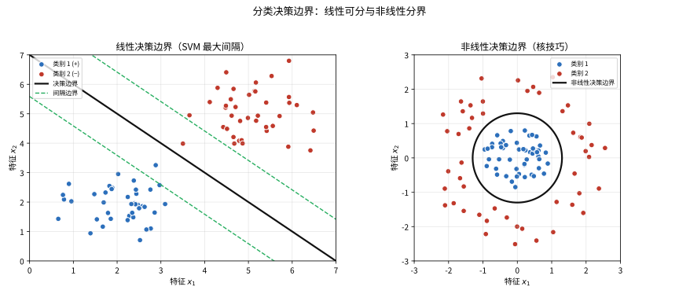
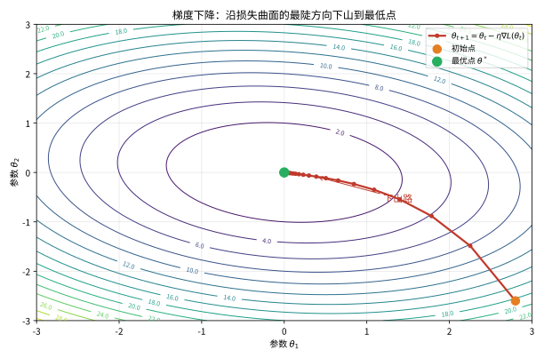

# 第 100 级：机器学习 (Machine Learning)

---

## 从"让机器自己学会看"说起：机器学习要解决的根问题

> 在动手背算法之前，先想清楚一个更基本的问题：**人为什么需要机器学习？**

**一个真实的生活场景（第一步：直觉）**

想象你的邮箱每天涌进几百封邮件，其中一半是垃圾广告。你当然可以一条条列出规则："标题含'中奖'就删""发件人是陌生域名就删"……但你会发现规则永远写不完：骗子今天换个标题、明天换个域名，手工规则根本追不上。反过来，如果**让程序自己看历史邮件**——哪些被标为垃圾、哪些被留下——让它自己去"总结"垃圾邮件长什么样，那么下次来一封从没见过的邮件，它也能判断。这就是机器学习最朴素的原型：**你不写规则，你只给例子，让程序自己从例子中学会规则。**

**它到底想解决什么问题（第二步：要解决的问题）**

机器学习的直接老师是**统计与计算**。早在1800年前后，高斯做天文测量时就用最小二乘法"从带噪声的观测数据中拟合规律"——这就是回归的雏形。到了20世纪，人工智能研究者逐渐意识到：**有一大类能力（看图片、听懂话、读文字、下棋）人类自己都不清楚规则怎么写**，程序写手自然也无从下手。1958年感知机的诞生、阿瑟·塞缪尔用"让程序和自己对弈积累经验"来教它下跳棋，都指向同一个方向：

> 与其费尽心思把专家经验敲成一条条 if-else，不如**给机器海量数据，让它在数据里自己学**。

这条路径最终凝练成机器学习要解决的**根问题**——如何从一组有限的、"看得见"的训练样本出发，学到一条规律，使它不仅能记住旧样本，还能对**从未见过的新样本**做出正确判断。这一句话里的"记住旧样本"（过拟合）与"预测新样本"（泛化）之争，将贯穿你读本书的每一章。

> **🧠 一句话记住机器学习的"出生证"**
>
> 机器学习源于"人类写不出规则的智能化任务"，它要解决的**根本问题**是：
>
> $$ \boxed{\text{如何从有限的带标签数据中自动学到规律，并用它预测从未见过的新数据？}} $$
>
> 核心矛盾始终是**过拟合**（死记训练样本、对新数据失灵）与**泛化**（在新数据上的表现）。后面每讲一个算法，你都可以拿这把尺子去量它。

**看待本章的三种眼光（第三步：正式定义前的准备）**

- **任务的眼光**：先分清要解决什么问题——是预测连续数（回归）、分到哪个格子里（分类），还是给数据找结构（聚类、降维）。
- **算法的眼光**：同样一个问题，可以用决策树、SVM、神经网络等许多不同算法回答；本章会告诉你它们各自"凭什么能学、靠什么防过拟合"。
- **理论的眼光**：最后一部分专门回答"算法凭什么可靠"——梯度下降何时收敛、SVM 为什么能分得稳、神经网络为什么能力足够强（万能逼近定理）。

读完这一节，你要记的不是某一套公式，而是：**机器学习是一套"用数据换规则"的方法论，它的一切设计——损失函数、正则化、交叉验证、集成——都围着'既能学会、又能管住过拟合'这一个中心转。** 带着这个视角去读下面的每个概念，你会发现很多公式其实都是在回答同一个问题：**"怎么让模型在新数据上也表现好？"**

---

## 开始之前

**本章在讲什么**：本章讲的是"让机器从数据里自己学"的完整链条。你会先搭起监督学习（回归与分类）的最基本框架，再逐一认识经典算法（决策树、随机森林、支持向量机）、神经网络（前馈、CNN、RNN）以及无监督手段（PCA、t-SNE、K-means、自编码器），然后用梯度下降、正则化与交叉验证解决"怎么学得越来越好、怎么防过拟合"，最后用一组定理（梯度下降收敛、SVM 间隔最大化、万能逼近、AdaBoost 误差界、K-means 收敛）给你"这套方法为什么可靠"的数学保证。

**为什么要学它**：第 99 级统计学习理论建立了"泛化误差、经验风险最小化、偏差-方差"这些理论地基，但那些理论需要一个能落地的算法体系才谈得上应用；本章正是把这些地基变成"能跑的模型+能给的收敛保证"。它往上接第 109 级优化理论（本章的梯度下降、SVM 对偶、神经网络训练其实是凸优化与数值优化的直接应用），往下又为第 116 级数据科学提供了基本模型库。可以说：**统计学习理论是"为什么能学"，本章是"具体怎么学"，后面的数据科学则是"拿到问题怎么用"。**

**开始前请确认你还记得**：

- 概率与统计（见第 2 级及更高）：期望、条件概率、贝叶斯公式、高斯分布；监督数据 $(x_i, y_i)$ 常被当作独立同分布样本。
- 线性代数（见第 14 级）：矩阵与向量乘法、转置、特征值与特征分解（PCA 要用）、$\|w\|$ 范数（SVM 要用）。
- 微积分（见第 11-13 级）：多元函数的梯度 $\nabla f$、链式法则（反向传播的核心）、泰勒展开。
- 优化（见第 109 级）：凸函数、可行域与约束、梯度下降迭代、Lagrange 乘子与对偶问题。
- 统计学习理论（见第 99 级）：泛化误差、经验风险最小化、过拟合/欠拟合与偏差-方差分解的基本概念。

---

## 1. 学习目标

完成本教程后，你将能够：

1. 理解监督学习（回归与分类）的基本框架与核心算法
2. 掌握决策树、随机森林、支持向量机等经典算法的原理
3. 理解神经网络与深度学习的基本结构（CNN、RNN、自编码器）
4. 掌握梯度下降与随机梯度下降的收敛性理论
5. 理解 SVM 的间隔最大化原理与对偶优化
6. 掌握神经网络的万能逼近定理
7. 理解 Boosting 算法的理论保证
8. 掌握 K-means 聚类的收敛性分析
9. 理解降维方法（PCA、t-SNE）与集成学习（Bagging、Boosting）

---

## 2. 核心概念

### 2.1 监督学习

> **🌐 直觉先行（为什么需要这个概念）**：机器学习的"根问题"需要一套落地的组织形式。**监督学习**说的正是"有标准答案（标签）地学"——每一条数据都带着你要预测的那个答案，模型的任务是顺着这些"答案对"找规律。它是多数应用（房价预测、病情诊断、图像识别）的起点，也是后面所有理论定理的主战场。

**回归**：预测连续值输出。给定数据 $(x_i, y_i) \in \mathcal{X} \times \mathbb{R}$，学习函数 $f: \mathcal{X} \to \mathbb{R}$ 最小化平方误差：

$$
\min_f \frac{1}{n} \sum_{i=1}^n (y_i - f(x_i))^2
$$

> **💡 直观理解（类比）**：回归就是预测一个"连续数值"，好比根据房子的面积、地段、楼龄估算"大概能卖多少钱"，而不是只能说"贵/便宜"。它输出的是一个具体数字，而不是某个类别标签。

**分类**：预测离散标签。给定数据 $(x_i, y_i) \in \mathcal{X} \times \{1, \dots, K\}$，学习分类器 $h: \mathcal{X} \to \{1, \dots, K\}$。

> **💡 直观理解（类比）**：分类是把输入塞进某个"固定的格子里"，好比医生根据症状断定"这是感冒还是肺炎"——输出只能是几个明确标签中的一个。就像把信投进指定的信箱，答案只在给定类别里挑一个，不会说出"68% 的感冒"这种半吊子话。

### 2.2 决策树与随机森林

**决策树**：通过递归划分特征空间构建树状结构。每个内部节点对应一个特征测试，叶节点对应预测值。划分准则包括信息增益、Gini 系数等。

> **💡 直观理解（类比）**：决策树像"二十个问题"或"猜人游戏"：一步步问"这个特征是不是大于某个数？"，每问一次就往对应分支走，走到最底下的"树叶"就得到答案。它靠一连串"是/否"提问，把杂乱的样本一层层筛成越来越纯的小组。

**随机森林**：Bagging 集成策略的典型应用。通过以下方式构建多个决策树：
1. 对训练数据进行 Bootstrap 采样
2. 在每个节点分裂时，随机选择特征子集
3. 对多个树的预测结果进行投票（分类）或平均（回归）

> **💡 直观理解（类比）**：随机森林像"三个臭皮匠顶个诸葛亮"——每棵树只凭自己抽中的那几份数据和几个特征作判断，难免各有偏见，但最后投票或取平均，大家的错就互相抵消了。单棵树容易死记硬背（过拟合），一群人表决则稳得多。

### 2.3 支持向量机

**SVM** 的核心思想是寻找最大间隔分离超平面。对线性可分数据，求解：

$$
\min_{w,b} \frac{1}{2}\|w\|^2 \quad \text{s.t.} \quad y_i(\langle w, x_i \rangle + b) \ge 1
$$

通过核技巧映射到高维特征空间，处理非线性问题。

> **直观理解（现实类比）**：决策边界就像"分宿舍的屏风"——用来把两类人隔开。如果两类人天然分开，一张直线屏风（线性边界）就够用；如果两类人像太极图一样交错，就必须用弯曲的屏风（非线性边界）。SVM 的"最大间隔"思想是要把屏风放在离两边人群都最远的位置，让分隔更稳妥、对新来的人判断更可靠。

> **🧠 思考历程：把两类点劈开，为什么要刻意留"一道最宽的缝"？**
>
> 决策边界回答的是一个古老的几何直觉：两类点混在同一片空间，怎样画条线既能分开它们、又对将来没见过的新样本最具担当？"最大间隔"这个答案，出自 Vapnik 一派在1960–1990年代关于"几何余量"的冷静推演。
>
> - **感知机的教训**。1958年 Rosenblatt 造出感知机，能找一条线把可分两类点分开，但它只说"能分"、没说"分得够稳"——一点噪声就能让这条线毫无预兆地翻转，机器学习界很快尝到它"过拟合且脆弱"的苦头。
> - **把"分得开"升级为"分得最开"**。1990年代 Vapnik 等人从统计学习理论出发，把 SVM 的目标改为"最大化到最近点的几何间隔"，并把原始问题对偶化、引入核函数把样本映射到高维——间隔越大，泛化误差的上界越紧，世界于是从"找一条线"进步到"找一条最像海堤的线"。
> - **支持向量撑起边界**。最优边界其实只由离它最近的那几个"支持向量"决定，其余千百个点都可以被毫不客气地抛在脑后——希望这惊人的"去冗余"，对"数据越多越准"的直觉是一种轻盈的反诘。
> - **心路**：从"分对"到"分稳"只差一步，却划出了工程与理论的界限——对"边界的敬畏"，决定了对未来的担当。

### 2.4 神经网络与深度学习

**神经元**：基本计算单元 $a = \sigma(\sum_{i} w_i x_i + b)$，其中 $\sigma$ 为激活函数。

> **💡 直观理解（类比）**：神经元是一个"开关"或"门卫"：把许多输入按重要程度（权重 $w_i$）加权加起来，总和过了某个门槛（偏置 $b$）才被激活函数 $\sigma$"点亮"，否则保持安静。就像团购凑人数，凑够门槛才"发车"。

**前馈神经网络**：多层神经元堆叠，每层全连接：

$$
h^{(l)} = \sigma(W^{(l)} h^{(l-1)} + b^{(l)})
$$

> **💡 直观理解（类比）**：前馈网络像一条"接力流水线"：信息从输入层开始一层层往上传，每层做一次"加权求和 + 激活"的加工再递给下一层，最后一棒由输出端给出答案。每一道工序都在提炼更抽象的特征，逐级逼近最终判断。

**卷积神经网络**（CNN）：使用卷积层提取局部特征，池化层降维，适合图像数据。

> **💡 直观理解（类比）**：CNN 像用"放大镜"在图片上一格一格扫过，每块只看一小片邻域里有没有某种局部图案（边缘、纹理），再用"池化"把信息浓缩、只留重点。就像先拼局部小图案、再拼出整图，而不是一次性盯遍所有像素。

**循环神经网络**（RNN）：处理序列数据，通过隐藏状态传递信息：

$$
h_t = \sigma(W_{hh} h_{t-1} + W_{xh} x_t + b_h)
$$

> **💡 直观理解（类比）**：RNN 像"传话游戏"里的一条记忆链——每读进一个新符号，都会把"已记住的摘要"（隐藏状态 $h_t$）和当前输入一起更新，所以能顺着顺序理解上下文。好比读句子要边读边在脑里存着前半句的意思，而不是把每个字孤立地看。

### 2.5 梯度下降与反向传播

**梯度下降**：迭代更新参数 $\theta_{t+1} = \theta_t - \eta \nabla L(\theta_t)$。

**随机梯度下降**（SGD）：每次使用单个样本或小批量样本估计梯度：

$$
\theta_{t+1} = \theta_t - \eta \nabla L_i(\theta_t)
$$

> **💡 直观理解（类比）**：SGD 不看清整座山再走，而是只看眼前一个小样本/小批次就迈一步，方向带点"毛糙"但又快又省。就像估整条街的平均身高不必量所有人，随机问几个人就行；那点随机噪声有时反而帮你从坑洼（局部极小）里晃出去，走向更平的谷底。

**反向传播**：通过链式法则高效计算神经网络中各参数的梯度。

> **💡 直观理解（类比）**：反向传播靠链式法则把"最终误差的责任"从输出端一层层往回"分摊"给每个参数，告诉每个权重"该往哪个方向调多少"。就像接力赛结束后的复盘：把总失误一步步拆到每一棒，找出谁拖慢了、该怎么改进。

> **直观理解（现实类比）**：梯度下降就像在浓雾中下山——你只看得到脚下最陡的方向，就朝那个方向迈一小步，然后重新判断，一步一个脚印地往下走。步长（学习率 $\eta$）太大容易"一步跨过头"在山谷两侧来回震荡，太小则下山太慢。最终你会到达山谷底部（损失最低点），也就是模型拟合得最好的参数所在地。

### 2.6 正则化与交叉验证

**正则化**：在损失函数中加入惩罚项防止过拟合：
- $L_1$ 正则化（Lasso）：$\lambda \|w\|_1$
- $L_2$ 正则化（Ridge）：$\frac{\lambda}{2} \|w\|_2^2$
- Dropout：随机丢弃神经元

> **💡 直观理解（类比）**：正则化像老师对"照抄"的惩罚——模型越复杂、权重越"张狂"，罚得越重，逼它去学通用规律而不是死记训练样本。L1 会把多余权重直接"砍成零"（得到稀疏解、顺带挑特征），L2 只是把权重"压小"，Dropout 则随机"屏蔽"部分神经元，逼网络别只依赖某一个零件。

**交叉验证**：将数据划分为 $K$ 份，轮流用 $K-1$ 份训练、1 份验证，评估模型稳定性。

> **💡 直观理解（类比）**：交叉验证像"轮流当考生和考官"：把数据切成 K 份，每次用 K-1 份当练习、1 份当考卷，让每一份都轮流上过考场，最后取平均成绩。比只考一次更能反映真实水平，避免碰巧靠一份"简单题"就高估模型。

### 2.7 Boosting 与 Bagging

**Bagging**（Bootstrap Aggregating）：对训练数据多次 Bootstrap 采样，训练多个模型后平均/投票，降低方差。

> **💡 直观理解（类比）**：Bagging 像请多位经验各异的员工，各自用自己抽到的一份数据作判断，最后集体投票或取平均。单个判断都带随机抖动（高方差），但取众数/均值彼此抵消后整体更稳——这是一种"求稳"的集成。

**Boosting**：按序训练弱学习器，每个新学习器关注前一个学习器犯错的数据点。AdaBoost 是最著名的 Boosting 算法。

> **💡 直观理解（类比）**：Boosting 像"补差班"——第一个老师讲完后，发现还有哪些学生（样本）学不会，就把这些"老大难"的权重调高，让下一个老师专攻难点，如此接力越补越准。它靠给错分样本加重权重、逼每轮学习器啃最硬的骨头，这是一种"求准"的集成。

### 2.8 降维

**主成分分析**（PCA）：通过特征值分解找到数据方差最大的方向，将数据投影到低维子空间。

> **💡 直观理解（类比）**：PCA 像给一团乱点找"最伸展的主轴"并重新摆正，然后把几乎没变化的那些方向砍掉。好比一群人的体型差异主要就落在身高这条"主轴"上，其余方向接近噪音。降维就是抓大放小，用少数几个主轴近似还原整片点的形状。

**t-SNE**：t-分布随机邻域嵌入，非线性降维方法，保持高维空间中点的邻域关系，适合可视化。

> **💡 直观理解（类比）**：t-SNE 像画"社交关系地图"——不强求坐标精确，只力求"认识的人画在一起、陌生人分开"，用概率保住高维里的近邻关系，特别适合把高维点云"摊平"到 2D 让你肉眼看清分了几团。它可能扭曲距离，但"谁跟谁亲近"的簇结构最可信。

> **⚠️ 常见坑**：**PCA 与大多数聚类、SVM 算法前务必先做特征标准化/中心化**——否则量纲大的特征（如"年龄几十""收入几十万"）会天然主导主方向。另外，t-SNE 是**布局算法而非降维算法**，其坐标、距离与簇大小没有统计意义，只适合"看分了几团"，不能拿它的坐标去算欧氏距离或做回归。

### 2.9 聚类

**K-means 聚类**：将数据划分为 $K$ 个簇，最小化簇内平方和：

$$
\min_{\{C_k\}} \sum_{k=1}^K \sum_{x \in C_k} \|x - \mu_k\|^2
$$

> **💡 直观理解（类比）**：K-means 像"围篝火分群"——先在每群中央竖一根旗杆（簇中心 $\mu_k$），把每个人安排到离自己最近的旗杆下，再把旗杆挪到这群人的"重心"，随后重新分、再挪，反复直到稳住。谁离得近归谁、火点跟着人群走，最终收敛成一个"局部最优"的聚法（不保证全局最好）。

**层次聚类**：通过自底向上（凝聚）或自顶向下（分裂）的方式构建聚类层次。

> **💡 直观理解（类比）**：层次聚类像画"家谱树"——要么从每个样本当最细的一叶开始，把最相近的两个逐一并成一支（自底向上"凝聚"）；要么先把所有人当一大类，再不断一分为二（自顶向下"分裂"）。最终得到一棵嵌套的"谱系树"，能看出任意尺度上的亲疏关系，就像给物种画演化树。

> **⚠️ 常见坑**：K-means 的 $K$ 是**预设的**，不是算法自己"想出来"的（可借助肘部法则、轮廓系数来定，也可改用层次聚类看树）。结果对**初始化与特征量纲**都很敏感——同一份数据换一组初始点可能收敛到不同局部最优，所以实战中通常多次随机初始化再取目标函数最小的那次，并记得先对特征标准化。

### 2.10 自编码器

**自编码器**：无监督神经网络，学习恒等映射的压缩表示。由编码器 $f$ 和解码器 $g$ 组成：

$$
\min_{f,g} \sum_i \|x_i - g(f(x_i))\|^2
$$

> **💡 直观理解（类比）**：自编码器像"压箱打包再还原"——编码器 $f$ 把一张图压成一个很小的"核心摘要"，解码器 $g$ 再凭摘要尽量复原整图。那个小而浓缩的中间编码就是数据里最要紧的"精髓"（无监督学到的特征）。好比写一句纪要存起来，日后凭纪要复述全文，纪要要既精简又抓得住重点。

### 2.11 过拟合、欠拟合与偏差-方差权衡

> **🌐 直觉先行（为什么需要这个概念）**
>
> 同一份数据，用"过头"的模型能得出完全不同的结果：给一堆小狗照片，若你只在猫狗房里背下了训练集的每一个像素，新来一条小狗你就彻底蒙圈（过拟合）；若只笼统地记住"四条腿=狗"，那对猫、对羊都南辕北辙（欠拟合）。机器学习一直在平衡这两者——**这个平衡在数学上可以被精确刻画成"偏差"和"方差"的此消彼长**。它是诊断一切模型好坏的"体温计"，正因如此，它在第 99 级的统计学习理论里出现过，也会贯穿你选择正则化强度、模型复杂度的每一步。

**假设与定义**：设数据由 $y = f(x) + \varepsilon$ 生成，其中 $\varepsilon$ 为零均值、方差 $\sigma^2$ 的噪声。用某算法在同一分布的不同训练集 $D$ 上反复训练，得到一组估计量 $\hat{f}_D(x)$。对平方损失，**单个测试点 $x$ 处的期望测试误差**可被分解为三部分：

$$
\mathbb{E}_D\big[(\hat{f}_D(x) - y)^2\big]
= \underbrace{\big(\mathbb{E}_D[\hat{f}_D(x)] - f(x)\big)^2}_{\text{偏差}^2\ (\text{bias}^2)}
+ \underbrace{\mathbb{E}_D\big[\big(\hat{f}_D(x) - \mathbb{E}_D[\hat{f}_D(x)]\big)^2\big]}_{\text{方差}\ (\text{variance})}
+ \underbrace{\sigma^2}_{\text{不可约噪声}}
$$

- **偏差（bias）**：模型的平均预测 $\mathbb{E}_D[\hat{f}_D(x)]$ 距离真实函数 $f(x)$ 有多远——衡量模型**系统性偏离**真实规律的程度。模型太简单时偏差大（欠拟合）。
- **方差（variance）**：模型预测随训练集不同而抖动的程度——衡量模型对**训练集特例**有多敏感。模型太复杂时方差大（过拟合）。
- **不可约噪声**：即使模型完美，数据里自带的噪声 $\sigma^2$ 也无法用任何模型消除，它给出测试误差的下限。

> **💡 直观理解（类比）**：把你要学的真实关系想象成一杆"靶心"。偏差高=箭总是整体偏离靶心（打得偏）；方差高=箭散成一团（打得抖）。简单模型弹道稳定但瞄得偏，复杂模型瞄得准却一受干扰就乱飘。夹角 45° 的那支"弓"往往是最划算的选择——这正是正则化与交叉验证努力寻找的点。

> **🔑 为什么重要**：偏差-方差权衡解释了机器学习里几乎所有"手感"问题——为什么加正则化会提升测试误差（压低方差、抬一丁点偏差）、为什么会说"更多的数据能同时压低方差（且不影响偏差）"、为什么 K 折交叉验证能帮你选复杂度。它把"模型是不是太复杂"从玄学变成可量化的"两条误差曲线之交"。

> **⚠️ 常见坑**：
> - 别把"偏差/方差"误当成"模型的训练表现"。它们描述的是**模型在不同训练集上的统计行为**，只看单次训练结果判断不出偏差与方差。
> - 偏差-方差分解针对的是**平方/均方损失**；换成交叉熵或 0-1 损失时平滑的分解公式不再成立（尽管直觉仍可用）。
> - "方差高就不停加正则化"并非万能：正则化过头会把偏差抬得过高，测试误差照样回升——所以要用交叉验证找中间点，而不是一路加到底。

> **🧠 思考历程（来龙去脉）**：1960 年代，统计学家在"最小二乘很偏、岭估计很稳却偏带偏差"之间困惑时，Geman、Blau、Duda 等人在 1990 年代把这条直觉整理成了我们在教材里看到的"偏差-方差分解"。它由此成为监督学习的"宪法条款"：既能解释经典统计里的 RRE（岭回归）为什么有用，也为后来理解神经网络里的"双下降"现象提供了起步坐标系。

---

### 2.12 模型评估指标：别让"准确率"骗了你

> **🌐 直觉先行（为什么需要这个概念）**：如果 99% 的邮件是垃圾，一个"永远说是垃圾"的傻瓜分类器就有 99% 的准确率——但你会觉得它"好用"吗？显然不会。这说明**光看准确率衡量模型是不够的**，我们需要一整套能区分"错在哪里、偏到什么程度"的指标，才能在产品、医学、风控等场景里准确评判一个模型。

**定义（混淆矩阵）**：对二分类问题，把预测与真实结果两两对照可得到四类：

| | 预测为正（$+$） | 预测为负（$-$） |
|:---:|:---:|:---:|
| 实际为正（$+$） | TP（真正例） | FN（假负例） |
| 实际为负（$-$） | FP（假正例） | TN（真负例） |

常用指标（类别记为 1）：

$$
\text{Accuracy}=\frac{TP+TN}{TP+TN+FP+FN},\quad
\text{Precision}=\frac{TP}{TP+FP},\quad
\text{Recall}=\frac{TP}{TP+FN},\quad
F_1 = \frac{2\cdot \text{Precision}\cdot\text{Recall}}{\text{Precision}+\text{Recall}}
$$

- **Precision（精确率）**：被你判为正的里面，真的有几分之几是正——"报出的好消息是否可信"。
- **Recall（召回率）**：真正的正样本里，你捞回了多少——"该抓的是否漏抓"。若把负样本当垃圾邮件，漏网率就是 $1-\text{Recall}$。
- **$F_1$**：精确率与召回率的调和平均，二者都高才高，适合类别不平衡情景。
- **ROC 曲线与 AUC**：改变分类阈值，以假正率（$FPR=FP/(FP+TN)$）为横轴、真正率（$TPR=TP/(TP+FN)=Recall$）为纵轴画曲线，曲线下面积 AUC 越大越能区分两类。

> **💡 直观理解（类比）**：把分类器当成一名"保安"。Precision 问他"你放进来的人真有坏人吗"（别冤枉好人），Recall 问他"真正的坏人都被你挡下了吗"（别放走坏人），$F_1$ 是要求他两条都不能太差。当人群里坏人本来就极少（类不平衡），只报"谁都能进来"的准确率毫无意义，必须用 Recall 与 $F_1$ 来纠正。

> **⚠️ 常见坑**：**类别极不平衡时（如欺诈检测、罕见病筛查），Accuracy 会严重误导**，应改看 Precision/Recall/AUC。注意 Precision 与 Recall 常常此消彼长：把阈值调松，Recall 升、Precision 降；调到什么点，要看实际业务更怕"漏"还是更怕"错"。另外，多分类的 Macro/加权 F1 与二分类 F1 含义不同，报告中要写清。

---

## 3. 定理与证明

### 定理 3.1：梯度下降的收敛性（凸函数情形）

**定理**：设 $f: \mathbb{R}^d \to \mathbb{R}$ 为凸函数且 $L$-光滑（即 $\nabla f$ 是 $L$-Lipschitz 连续的：$\|\nabla f(x) - \nabla f(y)\| \le L\|x - y\|$）。则使用步长 $\eta \le 1/L$ 的梯度下降法 $x_{t+1} = x_t - \eta \nabla f(x_t)$ 满足：

$$
f(x_T) - f(x^*) \le \frac{\|x_0 - x^*\|^2}{2\eta T}
$$

其中 $x^*$ 是最优解。特别地，取 $\eta = 1/L$ 时，$f(x_T) - f(x^*) = O(1/T)$。

**证明**：

**步骤1：光滑性引理**

由 $L$-光滑性，对任意 $x, y$ 有：

$$
f(y) \le f(x) + \langle \nabla f(x), y - x \rangle + \frac{L}{2} \|y - x\|^2
$$

**证明**：由微积分基本定理：

$$
\begin{aligned}
f(y) - f(x) - \langle \nabla f(x), y - x \rangle &= \int_0^1 \langle \nabla f(x + t(y-x)) - \nabla f(x), y - x \rangle \, dt \\
&\le \int_0^1 \|\nabla f(x + t(y-x)) - \nabla f(x)\| \cdot \|y - x\| \, dt \\
&\le \int_0^1 L t \|y - x\|^2 \, dt = \frac{L}{2} \|y - x\|^2
\end{aligned}
$$

**步骤2：单步下降量**

令 $y = x_{t+1} = x_t - \eta \nabla f(x_t)$，代入光滑性不等式：

$$
\begin{aligned}
f(x_{t+1}) &\le f(x_t) + \langle \nabla f(x_t), -\eta \nabla f(x_t) \rangle + \frac{L}{2} \|-\eta \nabla f(x_t)\|^2 \\
&= f(x_t) - \eta \|\nabla f(x_t)\|^2 + \frac{L\eta^2}{2} \|\nabla f(x_t)\|^2 \\
&= f(x_t) - \eta \left(1 - \frac{L\eta}{2}\right) \|\nabla f(x_t)\|^2
\end{aligned}
$$

当 $\eta \le 1/L$ 时，$1 - L\eta/2 \ge 1/2$，因此：

$$
f(x_{t+1}) \le f(x_t) - \frac{\eta}{2} \|\nabla f(x_t)\|^2
$$

**步骤3：利用凸性**

由凸性，$f(x^*) \ge f(x_t) + \langle \nabla f(x_t), x^* - x_t \rangle$，因此：

$$
f(x_t) - f(x^*) \le \langle \nabla f(x_t), x_t - x^* \rangle
$$

**步骤4：建立递推关系**

考虑 $\|x_t - x^*\|^2$ 的递推：

$$
\begin{aligned}
\|x_{t+1} - x^*\|^2 &= \|x_t - \eta \nabla f(x_t) - x^*\|^2 \\
&= \|x_t - x^*\|^2 - 2\eta \langle \nabla f(x_t), x_t - x^* \rangle + \eta^2 \|\nabla f(x_t)\|^2 \\
&\le \|x_t - x^*\|^2 - 2\eta (f(x_t) - f(x^*)) + \eta^2 \|\nabla f(x_t)\|^2
\end{aligned}
$$

**步骤5：整理**

由步骤2，$\eta \|\nabla f(x_t)\|^2 \le 2(f(x_t) - f(x_{t+1}))$。代入得：

$$
\|x_{t+1} - x^*\|^2 \le \|x_t - x^*\|^2 - 2\eta (f(x_t) - f(x^*)) + 2\eta (f(x_t) - f(x_{t+1}))
$$

整理得：

$$
2\eta (f(x_t) - f(x^*)) \le \|x_t - x^*\|^2 - \|x_{t+1} - x^*\|^2 + 2\eta (f(x_t) - f(x_{t+1}))
$$

**步骤6：累加求和**

从 $t = 0$ 到 $T-1$ 累加：

$$
2\eta \sum_{t=0}^{T-1} (f(x_t) - f(x^*)) \le \|x_0 - x^*\|^2 - \|x_T - x^*\|^2 + 2\eta (f(x_0) - f(x_T))
$$

忽略负项，且 $f(x_T) \ge f(x^*)$：

$$
2\eta \sum_{t=0}^{T-1} (f(x_t) - f(x^*)) \le \|x_0 - x^*\|^2 + 2\eta (f(x_0) - f(x^*))
$$

**步骤7：利用单调性**

由步骤2，$f(x_{t+1}) \le f(x_t)$，因此 $f(x_T) - f(x^*) \le \frac{1}{T} \sum_{t=0}^{T-1} (f(x_t) - f(x^*))$。代入得：

$$
f(x_T) - f(x^*) \le \frac{\|x_0 - x^*\|^2}{2\eta T} + \frac{f(x_0) - f(x^*)}{T}
$$

当 $T$ 充分大时，第一项占主导，得到 $f(x_T) - f(x^*) = O(1/T)$。$\square$

> **💡 直观理解（类比）**：在光滑的"碗"状（凸 + 光滑）地形上，蒙眼下山每步都朝最陡的方向迈，只要步子别太大（$\eta \le 1/L$），离碗底的高度差就会稳步缩小，并且走了 $T$ 步后误差大约按 $1/T$ 衰减——前几步进步飞快，越往后越慢。它保证你"渐渐逼近"谷底，却不承诺一步登顶。

---

### 定理 3.2：SVM 的间隔最大化原理

**定理**：对于线性可分的二分类数据集 $\{(x_i, y_i)\}_{i=1}^n$，其中 $y_i \in \{-1, 1\}$，求解以下优化问题：

$$
\max_{w,b} \frac{1}{\|w\|} \min_{i} y_i(\langle w, x_i \rangle + b)
$$

（即最大化几何间隔）等价于求解以下凸二次规划：

$$
\min_{w,b} \frac{1}{2} \|w\|^2 \quad \text{s.t.} \quad y_i(\langle w, x_i \rangle + b) \ge 1, \; i = 1, \dots, n
$$

**证明**：

**步骤1：几何间隔的定义**

点 $x_i$ 到超平面 $\langle w, x \rangle + b = 0$ 的几何距离为 $\frac{|\langle w, x_i \rangle + b|}{\|w\|}$。对于正确分类的点，$y_i(\langle w, x_i \rangle + b) > 0$，因此几何间隔为 $\frac{y_i(\langle w, x_i \rangle + b)}{\|w\|}$。

整个训练集的最小几何间隔为 $\gamma = \min_i \frac{y_i(\langle w, x_i \rangle + b)}{\|w\|}$。

**步骤2：最大化间隔问题**

原始问题为最大化 $\gamma$：

$$
\max_{w,b,\gamma} \gamma \quad \text{s.t.} \quad \frac{y_i(\langle w, x_i \rangle + b)}{\|w\|} \ge \gamma, \; i = 1, \dots, n
$$

**步骤3：尺度归一化**

由于 $(\langle w, x \rangle + b)/\|w\|$ 在 $(w, b)$ 的尺度缩放下不变，可固定 $\|w\| = 1/\gamma$，即 $\gamma = 1/\|w\|$。此时约束变为：

$$
y_i(\langle w, x_i \rangle + b) \ge 1, \; i = 1, \dots, n
$$

**步骤4：等价优化问题**

最大化 $\gamma = 1/\|w\|$ 等价于最小化 $\|w\|$，也等价于最小化 $\frac{1}{2}\|w\|^2$。因此：

$$
\min_{w,b} \frac{1}{2} \|w\|^2 \quad \text{s.t.} \quad y_i(\langle w, x_i \rangle + b) \ge 1, \; i = 1, \dots, n
$$

**步骤5：对偶问题**

引入 Lagrange 乘子 $\alpha_i \ge 0$，构造 Lagrange 函数：

$$
\mathcal{L}(w, b, \alpha) = \frac{1}{2}\|w\|^2 - \sum_{i=1}^n \alpha_i [y_i(\langle w, x_i \rangle + b) - 1]
$$

对 $w$ 和 $b$ 求偏导并令为零：

$$
\frac{\partial \mathcal{L}}{\partial w} = w - \sum_{i=1}^n \alpha_i y_i x_i = 0 \Rightarrow w = \sum_{i=1}^n \alpha_i y_i x_i
$$

$$
\frac{\partial \mathcal{L}}{\partial b} = -\sum_{i=1}^n \alpha_i y_i = 0 \Rightarrow \sum_{i=1}^n \alpha_i y_i = 0
$$

代入 Lagrange 函数得到对偶问题：

$$
\max_{\alpha} \sum_{i=1}^n \alpha_i - \frac{1}{2} \sum_{i=1}^n \sum_{j=1}^n \alpha_i \alpha_j y_i y_j \langle x_i, x_j \rangle
$$

约束条件为 $\alpha_i \ge 0$ 且 $\sum_{i=1}^n \alpha_i y_i = 0$。

**步骤6：支持向量与 KKT 条件**

由 KKT 条件，$\alpha_i[y_i(\langle w, x_i \rangle + b) - 1] = 0$。因此：

- 若 $\alpha_i > 0$，则 $y_i(\langle w, x_i \rangle + b) = 1$，即 $x_i$ 位于间隔边界上，称为 **支持向量**
- 若 $\alpha_i = 0$，则 $y_i(\langle w, x_i \rangle + b) > 1$，即 $x_i$ 远离间隔边界

**步骤7：决策函数**

最终分类决策函数为：

$$
f(x) = \text{sign}\left(\langle w, x \rangle + b\right) = \text{sign}\left(\sum_{i=1}^n \alpha_i y_i \langle x_i, x \rangle + b\right)
$$

其中求和仅对支持向量进行（$\alpha_i > 0$ 的样本）。$\square$

> **💡 直观理解（类比）**：这条定理把"让分隔屏风离两边人群都最远"这个几何念头，翻译成一个乖巧的凸规划问题：通过缩放归一化，把"间隔最大化"等价变形成"最小化 $\|w\|^2$"，也就是让屏风别太"陡"、越平缓越好。看上去换了种问法，实则解的正是同一道"最宽缝"的题。

---

### 定理 3.3：神经网络的万能逼近定理 (Universal Approximation Theorem)

**定理**：设 $\sigma: \mathbb{R} \to \mathbb{R}$ 是一个非常数、有界、单调递增的连续函数（如 sigmoid 函数）。则对任意连续函数 $f: [0,1]^d \to \mathbb{R}$ 和任意 $\varepsilon > 0$，存在一个单隐藏层的前馈神经网络：

$$
F(x) = \sum_{j=1}^N v_j \sigma(\langle w_j, x \rangle + b_j)
$$

使得 $\sup_{x \in [0,1]^d} |F(x) - f(x)| < \varepsilon$。

**证明**（使用 Stone-Weierstrass 定理）：

**步骤1：Stone-Weierstrass 定理回顾**

**Stone-Weierstrass 定理**：设 $X$ 为紧 Hausdorff 空间，$\mathcal{A}$ 为 $C(X)$（$X$ 上连续函数空间，配备一致范数）的子代数，满足：
1. $\mathcal{A}$ 包含常值函数
2. $\mathcal{A}$ 分离点：对任意 $x \neq y$，存在 $g \in \mathcal{A}$ 使得 $g(x) \neq g(y)$

则 $\mathcal{A}$ 在 $C(X)$ 中一致稠密（即对任意 $f \in C(X)$ 和 $\varepsilon > 0$，存在 $g \in \mathcal{A}$ 使得 $\|f - g\|_\infty < \varepsilon$）。

> **💡 直观理解（类比）**：如果把一堆函数小零件合成一个集合，只要它"含常值"（能造出水平线）又能"区分任意两个点"（任何不同点的函数值都有零件能分辨），那这些小零件就能像积木一样，拼出任意连续函数到想要的高精度。直观上说：零件又全能又够多样，什么连续曲线都能近似。

**步骤2：构造函数类**

考虑由单隐藏层神经网络生成的函数集合：

$$
\mathcal{N} = \left\{x \mapsto \sum_{j=1}^N v_j \sigma(\langle w_j, x \rangle + b_j): N \in \mathbb{N}, v_j, b_j \in \mathbb{R}, w_j \in \mathbb{R}^d\right\}
$$

我们证明 $\mathcal{N}$ 的闭包包含所有连续函数。

**步骤3：验证常数函数包含**

由于 $\sigma$ 是非常数有界单调递增连续函数，存在 $a, b \in \mathbb{R}$ 使得 $\sigma(a) \neq \sigma(b)$。取 $w = 0$，则 $\sigma(\langle 0, x \rangle + b) = \sigma(b)$ 为常数。通过适当选择 $v_j$ 和 $b_j$，可以生成任意常数函数。因此 $\mathcal{N}$ 包含所有常值函数。

**步骤4：验证分离点性质**

对任意 $x \neq y \in [0,1]^d$，存在 $w \in \mathbb{R}^d$ 使得 $\langle w, x \rangle \neq \langle w, y \rangle$。由于 $\sigma$ 是非常数连续函数，存在 $b$ 使得 $\sigma(\langle w, x \rangle + b) \neq \sigma(\langle w, y \rangle + b)$。因此 $\mathcal{N}$ 分离点。

**步骤5：验证代数结构**

关键在于 $\mathcal{N}$ 的线性组合仍在 $\mathcal{N}$ 中，且 $\mathcal{N}$ 对乘法封闭。但 $\mathcal{N}$ 本身不是代数（两个神经网络的乘积不一定能表示为同一形式的单隐藏层网络）。需要将 $\mathcal{N}$ 扩展为它的线性张成空间。

考虑 $\mathcal{A} = \text{span}(\mathcal{N})$，即所有有限线性组合。$\mathcal{A}$ 显然对加法、数乘封闭。需要验证 $\mathcal{A}$ 对乘法封闭。

**步骤6：利用 $\sigma$ 的性质**

由于 $\sigma$ 是连续的，可以用多项式逼近。但更直接的方法是：对任意两个函数 $F, G \in \mathcal{A}$，它们可以表示为：

$$
F(x) = \sum_i a_i \sigma(\langle w_i, x \rangle + b_i), \quad G(x) = \sum_j c_j \sigma(\langle w'_j, x \rangle + b'_j)
$$

它们的乘积 $F(x)G(x)$ 是 $\sigma(\langle w_i, x \rangle + b_i) \cdot \sigma(\langle w'_j, x \rangle + b'_j)$ 的线性组合。关键在于证明这种乘积可以被 $\mathcal{A}$ 中的函数一致逼近。

**步骤7：使用三角函数的逼近（替代方案）**

一个更简洁的证明思路：已知 $\sigma$ 可以一致逼近阶梯函数，而阶梯函数可以逼近任何连续函数。具体来说，对任意 $\varepsilon > 0$，存在 $\sigma$ 的线性组合 $\sum v_j \sigma(\langle w_j, x \rangle + b_j)$ 一致逼近任何连续函数到 $\varepsilon$ 以内。

详细论证：先证明 $\sigma$ 的线性组合可以逼近指示函数 $\mathbf{1}_{[a, \infty)}$（通过取 $\sigma$ 的平移和缩放），然后用这些指示函数构造 Riemann 和来逼近 $f$ 的积分表示。

**步骤8：应用 Stone-Weierstrass 定理的结论**

令 $\mathcal{A}$ 为 $\mathcal{N}$ 在一致范数下生成的闭子代数。由步骤3和4，$\mathcal{A}$ 包含常值函数且分离点。由 Stone-Weierstrass 定理，$\mathcal{A} = C([0,1]^d)$。因此对任意 $f \in C([0,1]^d)$ 和 $\varepsilon > 0$，存在 $F \in \mathcal{A}$ 使得 $\|F - f\|_\infty < \varepsilon$。

由于 $\mathcal{A}$ 是 $\mathcal{N}$ 的闭包，存在 $F \in \mathcal{N}$ 满足同样的逼近精度。$\square$

> **💡 直观理解（类比）**：万能逼近定理说：单隐藏层网络像一副"乐高积木"，每个神经元是一条被压成 S 形的小山丘（sigmoid），把大批高低、胖瘦不同的小山丘叠在一起，就能搭出任何连续曲面的形状，误差要多小有多小。注意它只保证"存在"这样一组积木，却不告诉你怎样最快找出来——这份"找法"正是深度学习和训练算法要干的活。

---

### 定理 3.4：Boosting 算法的理论保证 (AdaBoost)

**定理**：设 $\{h_t\}_{t=1}^T$ 为 AdaBoost 算法在第 $t$ 轮选择的弱学习器，$\varepsilon_t$ 为第 $t$ 轮的加权训练误差，$\alpha_t = \frac{1}{2} \log\left(\frac{1 - \varepsilon_t}{\varepsilon_t}\right)$。则 AdaBoost 的最终分类器 $H(x) = \text{sign}\left(\sum_{t=1}^T \alpha_t h_t(x)\right)$ 的训练误差满足：

$$
\hat{R}_n(H) \le \exp\left(-2\sum_{t=1}^T \gamma_t^2\right)
$$

其中 $\gamma_t = 1/2 - \varepsilon_t$ 为弱学习器的优势（edge）。特别地，若每个弱学习器的误差 $\varepsilon_t \le 1/2 - \gamma$（即 $\gamma_t \ge \gamma > 0$），则训练误差以指数速度衰减：

$$
\hat{R}_n(H) \le e^{-2\gamma^2 T}
$$

**证明**（使用指数损失的前向逐步加性建模）：

**步骤1：指数损失函数**

AdaBoost 隐式地最小化指数损失函数 $L(y, F(x)) = e^{-y F(x)}$。令 $F_T(x) = \sum_{t=1}^T \alpha_t h_t(x)$，最终分类器为 $H(x) = \text{sign}(F_T(x))$。

**步骤2：权重更新关系**

在第 $t$ 轮，样本权重 $w_i^{(t)}$ 满足：

$$
w_i^{(t+1)} = \frac{w_i^{(t)} e^{-\alpha_t y_i h_t(x_i)}}{Z_t}
$$

其中 $Z_t$ 为归一化因子。递推可得：

$$
w_i^{(T+1)} = \frac{e^{-y_i F_T(x_i)}}{n \prod_{t=1}^T Z_t}
$$

**步骤3：训练误差与指数损失的关系**

由于 $\mathbf{1}_{\{y \neq H(x)\}} \le e^{-y F(x)}$（因为 $y F(x) \le 0$ 时 $e^{-y F(x)} \ge 1$），有：

$$
\hat{R}_n(H) = \frac{1}{n} \sum_{i=1}^n \mathbf{1}_{\{y_i \neq H(x_i)\}} \le \frac{1}{n} \sum_{i=1}^n e^{-y_i F_T(x_i)}
$$

**步骤4：用归一化因子表示**

由步骤2的权重关系：

$$
\frac{1}{n} \sum_{i=1}^n e^{-y_i F_T(x_i)} = \frac{1}{n} \sum_{i=1}^n n w_i^{(T+1)} \prod_{t=1}^T Z_t = \prod_{t=1}^T Z_t
$$

因此 $\hat{R}_n(H) \le \prod_{t=1}^T Z_t$。

**步骤5：计算 $Z_t$**

由定义：

$$
\begin{aligned}
Z_t &= \sum_{i=1}^n w_i^{(t)} e^{-\alpha_t y_i h_t(x_i)} \\
&= \sum_{i: y_i = h_t(x_i)} w_i^{(t)} e^{-\alpha_t} + \sum_{i: y_i \neq h_t(x_i)} w_i^{(t)} e^{\alpha_t} \\
&= (1 - \varepsilon_t) e^{-\alpha_t} + \varepsilon_t e^{\alpha_t}
\end{aligned}
$$

其中 $\varepsilon_t = \sum_{i: y_i \neq h_t(x_i)} w_i^{(t)}$ 为第 $t$ 轮的加权误差。

**步骤6：最小化 $Z_t$**

选择 $\alpha_t$ 最小化 $Z_t$。令 $\frac{\partial Z_t}{\partial \alpha_t} = -(1 - \varepsilon_t) e^{-\alpha_t} + \varepsilon_t e^{\alpha_t} = 0$，解得：

$$
\alpha_t = \frac{1}{2} \log\left(\frac{1 - \varepsilon_t}{\varepsilon_t}\right)
$$

这正是 AdaBoost 中 $\alpha_t$ 的选择公式。

**步骤7：代入 $Z_t$**

代入 $\alpha_t$：

$$
\begin{aligned}
Z_t &= (1 - \varepsilon_t) \sqrt{\frac{\varepsilon_t}{1 - \varepsilon_t}} + \varepsilon_t \sqrt{\frac{1 - \varepsilon_t}{\varepsilon_t}} \\
&= 2\sqrt{\varepsilon_t (1 - \varepsilon_t)} \\
&= \sqrt{1 - 4\gamma_t^2} \le e^{-2\gamma_t^2}
\end{aligned}
$$

最后一步使用了 $\sqrt{1 - 4\gamma^2} \le e^{-2\gamma^2}$（因为 $\log(1 - u) \le -u$ 对 $u \in [0,1)$ 成立）。

**步骤8：结论**

综合以上：

$$
\hat{R}_n(H) \le \prod_{t=1}^T Z_t \le \prod_{t=1}^T e^{-2\gamma_t^2} = \exp\left(-2\sum_{t=1}^T \gamma_t^2\right)
$$

若每个 $\gamma_t \ge \gamma > 0$，则 $\hat{R}_n(H) \le e^{-2\gamma^2 T}$，即训练误差随 $T$ 指数衰减。$\square$

> **💡 直观理解（类比）**：AdaBoost 的误差界说明"积小胜为大胜"——只要每个弱学习器比瞎猜好一点点（优势 $\gamma > 0$），轮流补位几十次后，训练误差就以指数速度趋近 0。就像每轮练习只比随机强 5%，但一轮轮积累下来，最终几乎百发百中。

---

### 定理 3.5：K-means 的收敛性

**定理**：K-means 算法在有限步内收敛到局部最优解。具体地，设数据集 $\{x_1, \dots, x_n\} \subset \mathbb{R}^d$，K-means 算法迭代以下两步：

1. **分配步骤**：将每个点分配到最近的簇中心：$C_k^{(t)} = \{x_i: \|x_i - \mu_k^{(t)}\|^2 \le \|x_i - \mu_j^{(t)}\|^2, \forall j\}$
2. **更新步骤**：重新计算簇中心：$\mu_k^{(t+1)} = \frac{1}{|C_k^{(t)}|} \sum_{x_i \in C_k^{(t)}} x_i$

则目标函数 $J(\{C_k\}, \{\mu_k\}) = \sum_{k=1}^K \sum_{x \in C_k} \|x - \mu_k\|^2$ 在每次迭代中单调非增，且算法在有限步内收敛到局部极小值。

**证明**：

**步骤1：定义目标函数**

定义 K-means 的目标函数（簇内平方和）：

$$
J(\{C_k\}, \{\mu_k\}) = \sum_{k=1}^K \sum_{x \in C_k} \|x - \mu_k\|^2
$$

**步骤2：分配步骤的单调性**

在分配步骤中，给定簇中心 $\{\mu_k^{(t)}\}$，将每个点 $x_i$ 分配到最近的簇中心：

$$
C_k^{(t)} = \{x_i: \|x_i - \mu_k^{(t)}\|^2 \le \|x_i - \mu_j^{(t)}\|^2, \forall j\}
$$

对任意点 $x_i$，若它从旧簇 $C_j^{(t-1)}$ 移动到新簇 $C_k^{(t)}$，则必有 $\|x_i - \mu_k^{(t)}\|^2 \le \|x_i - \mu_j^{(t)}\|^2$。因此：

$$
J(\{C_k^{(t)}\}, \{\mu_k^{(t)}\}) \le J(\{C_k^{(t-1)}\}, \{\mu_k^{(t)}\})
$$

即分配步骤不增加目标函数值。

**步骤3：更新步骤的单调性**

在更新步骤中，给定簇划分 $\{C_k^{(t)}\}$，新的簇中心为：

$$
\mu_k^{(t+1)} = \arg\min_{\mu} \sum_{x \in C_k^{(t)}} \|x - \mu\|^2
$$

这是经典的最小二乘问题，其最优解为簇内均值。因此：

$$
\sum_{x \in C_k^{(t)}} \|x - \mu_k^{(t+1)}\|^2 \le \sum_{x \in C_k^{(t)}} \|x - \mu_k^{(t)}\|^2
$$

对所有 $k$ 求和得：

$$
J(\{C_k^{(t)}\}, \{\mu_k^{(t+1)}\}) \le J(\{C_k^{(t)}\}, \{\mu_k^{(t)}\})
$$

**步骤4：整体单调性**

综合步骤2和步骤3，每次完整迭代（分配 + 更新）后：

$$
J^{(t+1)} = J(\{C_k^{(t+1)}\}, \{\mu_k^{(t+1)}\}) \le J(\{C_k^{(t)}\}, \{\mu_k^{(t+1)}\}) \le J(\{C_k^{(t)}\}, \{\mu_k^{(t)}\}) = J^{(t)}
$$

因此目标函数序列 $\{J^{(t)}\}$ 单调非增。

**步骤5：下界与有限收敛性**

目标函数 $J$ 显然有下界 $0$，因此单调递减序列 $\{J^{(t)}\}$ 必收敛到某个极限值 $J^*$。

由于簇划分只有有限种可能（$K^n$ 种，虽然巨大但有限），且每次迭代簇划分要么改变（目标函数严格下降），要么保持不变。若簇划分保持不变，则算法已收敛。由于目标函数严格下降的次数有限，算法必在有限步内收敛。

**步骤6：局部最优性**

收敛到的解满足 K-means 的局部最优条件：每个点被分配到最近的簇中心，且每个簇中心是簇内点的均值。这是 $J$ 的驻点条件，但不能保证是全局最优。$\square$

> **💡 直观理解（类比）**：K-means 每一步"分家 + 挪旗杆"都只让总"散乱度"（目标函数 $J$）变小或不变，而把点分成 K 组的方案终究是有限的，所以它不可能无限变好，必然在有限步内停下来。但停的那个点只是"眼前这座山坳"（局部最优），未必是全局最理想的聚法——所以常要多试几次不同的起点。

---

## 4. 示例

### 示例 1：用 SVM 对鸢尾花数据集分类

**问题**：使用 SVM 对 Iris 数据集中的 Setosa 和 Versicolor 两类进行分类。选取花萼长度和花萼宽度两个特征。

> **💡 直观理解（类比）**：这个示例就是拿"最大间隔屏风"在两个花的品种之间划线：只看花萼的长、短这两个尺度，找到一道把两片花云隔得最宽的分界线，新开进来的一朵花就按它落在屏风的哪一侧来判定品种。后面所有步骤都是在把"最宽缝"翻译成可以手算的二次规划再解出来。

**解**：

**步骤1：数据准备**

| 样本 | 花萼长度 (cm) | 花萼宽度 (cm) | 类别 |
|:---:|:---:|:---:|:---:|
| 1 | 5.1 | 3.5 | Setosa (+1) |
| 2 | 4.9 | 3.0 | Setosa (+1) |
| 3 | 7.0 | 3.2 | Versicolor (-1) |
| 4 | 6.4 | 3.2 | Versicolor (-1) |
| 5 | 5.5 | 2.3 | Versicolor (-1) |
| 6 | 5.0 | 3.6 | Setosa (+1) |

**步骤2：可视化分析**

观察数据，Setosa 的花萼通常更宽而 Versicolor 的花萼通常更长，两类在二维特征空间中大致线性可分。

**步骤3：求解 SVM 对偶问题**

对偶问题为：

$$
\max_{\alpha} \sum_{i=1}^n \alpha_i - \frac{1}{2} \sum_{i=1}^n \sum_{j=1}^n \alpha_i \alpha_j y_i y_j \langle x_i, x_j \rangle
$$

约束：$\alpha_i \ge 0$，$\sum \alpha_i y_i = 0$。

使用 SMO 算法求解，得到支持向量（$\alpha_i > 0$ 的样本）。

**步骤4：得到决策边界**

假设求解得到 $w = (0.65, -1.12)^\top$，$b = 0.25$。决策函数为：

$$
f(x) = \text{sign}(0.65 x_1 - 1.12 x_2 + 0.25)
$$

**步骤5：分类新样本**

对新样本 $(5.8, 3.1)$：

$$
f(5.8, 3.1) = \text{sign}(0.65 \times 5.8 - 1.12 \times 3.1 + 0.25) = \text{sign}(3.77 - 3.47 + 0.25) = \text{sign}(0.55) = +1
$$

预测为 Setosa 类。

**步骤6：核技巧扩展**

若数据非线性可分，可使用高斯核 $K(x, x') = \exp(-\|x - x'\|^2 / (2\sigma^2))$ 将数据隐式映射到高维空间，在高维空间中寻找最大间隔超平面。

---

### 示例 2：用神经网络识别手写数字 MNIST

**问题**：使用全连接神经网络在 MNIST 数据集上识别手写数字（0-9）。MNIST 包含 60000 张训练图像和 10000 张测试图像，每张为 $28 \times 28$ 的灰度图。

> **💡 直观理解（类比）**：这个示例演示一条"看数字"的流水线：把 784 个像素喂进去，逐层提炼笔画特征，最后一层用 Softmax 输出"像 0~9 每个数字的把握程度"，再拿交叉熵判分、靠反向传播不断调权重。它直观展示多层网络如何一步步把"图像"加工成"概率判断"。训练几十步后准确率冲到 97% 以上，说明这套"流水线"真的学会了辨认手写体。

**解**：

**步骤1：网络结构设计**

- **输入层**：$28 \times 28 = 784$ 个神经元（每个像素一个）
- **隐藏层1**：256 个神经元，激活函数 ReLU：$\sigma(x) = \max(0, x)$
- **隐藏层2**：128 个神经元，激活函数 ReLU
- **输出层**：10 个神经元，激活函数 Softmax：$p_k = \frac{e^{z_k}}{\sum_{j=1}^{10} e^{z_j}}$

**步骤2：前向传播**

输入 $x \in \mathbb{R}^{784}$，逐层计算：

$$
\begin{aligned}
h^{(1)} &= \text{ReLU}(W^{(1)} x + b^{(1)}), \quad W^{(1)} \in \mathbb{R}^{256 \times 784} \\
h^{(2)} &= \text{ReLU}(W^{(2)} h^{(1)} + b^{(2)}), \quad W^{(2)} \in \mathbb{R}^{128 \times 256} \\
z &= W^{(3)} h^{(2)} + b^{(3)}, \quad W^{(3)} \in \mathbb{R}^{10 \times 128} \\
p_k &= \frac{e^{z_k}}{\sum_{j=1}^{10} e^{z_j}}, \quad k = 0, \dots, 9
\end{aligned}
$$

**步骤3：损失函数**

使用交叉熵损失：

$$
L = -\frac{1}{n} \sum_{i=1}^n \sum_{k=0}^9 y_{ik} \log p_{ik}
$$

其中 $y_{ik} = 1$ 若第 $i$ 个样本的真实标签为 $k$，否则为 $0$。

**步骤4：反向传播**

使用链式法则计算梯度。以 $\frac{\partial L}{\partial W^{(3)}}$ 为例：

$$
\frac{\partial L}{\partial W^{(3)}} = \frac{1}{n} \sum_{i=1}^n (p_i - y_i) \cdot h_i^{(2)\top}
$$

其中 $p_i, y_i \in \mathbb{R}^{10}$ 为第 $i$ 个样本的预测概率和 one-hot 标签。

**步骤5：训练过程**

使用 SGD 训练，批量大小 64，学习率 0.01，训练 10 个 epoch：

- **Epoch 1**：训练准确率 85.3%，测试准确率 87.1%
- **Epoch 3**：训练准确率 93.7%，测试准确率 94.2%
- **Epoch 5**：训练准确率 96.1%，测试准确率 95.8%
- **Epoch 10**：训练准确率 98.2%，测试准确率 97.3%

**步骤6：结果分析**

- 测试准确率 97.3%，说明网络成功学习了手写数字的特征
- 训练准确率略高于测试准确率，存在轻微过拟合
- 如果使用 CNN（卷积神经网络），准确率可提升到 99% 以上

---

## 5. 习题

### 基础题

**习题 1**（监督与无监督学习）区分监督学习与无监督学习，并结合正文分别举出各自的任务与算法示例（回归、分类、补集等）。

**习题 2**（回归与分类）说明回归与分类各自预测的输出类型，写出回归中最小化平方误差的目标 $\min_f \frac{1}{n}\sum_{i=1}^{n}(y_i-f(x_i))^2$。

**习题 3**（决策树的划分准则）说出决策树划分特征空间的常用准则（信息增益、Gini 系数等），并说明其作用。

**习题 4**（随机森林的两处随机性）说明随机森林的两个随机来源（Bootstrap 采样与每节点随机特征子集）各自降低什么，以及最终如何集成多棵树的结果。

**习题 5**（SVM 的最大间隔思想）说明 SVM 的核心思想“最大间隔分离超平面”，并写出硬间隔情形的优化目标 $\min_{w,b}\frac12\|w\|^2$ 及其约束。

**习题 6**（神经元与前馈网络）写出单个神经元的计算 $a=\sigma(\sum_i w_i x_i+b)$ 与单层前向公式 $h^{(l)}=\sigma(W^{(l)}h^{(l-1)}+b^{(l)})$。

**习题 7**（CNN 与 RNN）说明卷积神经网络（CNN）与循环神经网络（RNN）各自适合处理哪类数据，并解释原因。

**习题 8**（梯度下降与 SGD）写出梯度下降 $\theta_{t+1}=\theta_t-\eta\nabla L(\theta_t)$ 与随机梯度下降 $\theta_{t+1}=\theta_t-\eta\nabla L_i(\theta_t)$ 的更新式，说明 SGD 的优势。

**习题 9**（正则化手段）列出 $L_1$、$L_2$ 与 Dropout 三种正则化手段，说明它们防止过拟合的机制。

**习题 10**（K 折交叉验证）说明 K 折交叉验证的做法与目的，以及它与单一训练/测试划分相比的优点。

### 进阶题

**习题 11**（梯度下降的 $O(1/T)$ 收敛率）设 $f$ 为凸且 $L$-光滑，取 $\eta\le 1/L$，证明梯度下降满足 $f(x_T)-f(x^*)\le\frac{\|x_0-x^*\|^2}{2\eta T}$（提示：用光滑性引理与 $\|x_t-x^*\|^2$ 的递推）。

**习题 12**（强凸情形的线性收敛）设 $f$ 为 $\mu$-强凸且 $L$-光滑，证明 $\|x_{t+1}-x^*\|^2\le(1-\mu/L)\|x_t-x^*\|^2$（提示：利用强凸下界与光滑上界共同夹逼）。

**习题 13**（硬间隔 SVM 的对偶问题）对硬间隔 SVM $\min\frac12\|w\|^2$、$y_i(\langle w,x_i\rangle+b)\ge1$ 引入 Lagrange 乘子，推导其对偶问题（提示：先对 $w,b$ 求偏导为零，再代回 Lagrange 函数）。

**习题 14**（软间隔 SVM 的对偶）对软间隔问题 $\min\frac12\|w\|^2+C\sum\xi_i$ 推导对偶形式，并说明惩罚参数 $C$ 与松弛变量 $\xi_i$ 的作用（提示：乘子除 $\alpha_i$ 外还需 $\mu_i\ge0$，得 $0\le\alpha_i\le C$）。

**习题 15**（ReLU 表示分段线性函数）说明使用 ReLU 激活的单隐藏层网络为何能表示任何分段线性函数（提示：以 $\max(0,x-a)$ 作为“锯齿/滑盖”基函数叠加）。

**习题 16**（AdaBoost 的训练误差界）设第 $t$ 轮弱学习器误差 $\varepsilon_t=\frac12-\gamma_t$，证明最终分类器训练误差 $\hat{R}_n(H)\le\exp(-2\sum_t\gamma_t^2)$（提示：用指数损失、权重归一化因子 $Z_t=2\sqrt{\varepsilon_t(1-\varepsilon_t)}\le e^{-2\gamma_t^2}$）。

**习题 17**（K-means 更新步骤的最优性）证明 $\mu_k=\frac{1}{|C_k|}\sum_{x\in C_k}x$ 是 $\sum_{x\in C_k}\|x-\mu\|^2$ 的最小值点（提示：对该式关于 $\mu$ 求导并令其为零）。

**习题 18**（PCA 的第一主方向）说明第一主成分方向 $w_1=\arg\max_{\|w\|=1}w^\top\Sigma w$ 是协方差矩阵最大特征值对应的特征向量（提示：利用 Rayleigh 商定理，$\lambda_{\max}=\max_{\|w\|=1}w^\top\Sigma w$）。

**习题 19**（损失函数的选择）比较平方损失与交叉熵损失分别适用于回归还是分类，并联系正文中回归平方误差与 MNIST 交叉熵输出层的对应关系。

### 挑战题

**习题 20**（梯度下降完整推导）补全凸光滑情形 $f(x_T)-f(x^*)\le\frac{\|x_0-x^*\|^2}{2\eta T}$ 的完整证明（提示：累加单步下降不等式并用凸性）。

**习题 21**（间隔最大化与凸规划的等价）证明最大化几何间隔 $\max_{w,b}\frac{1}{\|w\|}\min_i y_i(\langle w,x_i\rangle+b)$ 等价于 $\min\frac12\|w\|^2$ 的凸二次规划（提示：做尺度归一化 $\|w\|=1/\gamma$）。

**习题 22**（KKT 与支持向量）由 KKT 条件论证 SVM 的支持向量满足 $y_i(\langle w,x_i\rangle+b)=1$，并说明它们为何位于间隔边界上。

**习题 23**（万能逼近定理的论证）说明为何 Stone-Weierstrass 定理能保证单隐藏层网络一致逼近任何连续函数（提示：$\mathcal{A}=\text{span}(\mathcal{N})$ 含常数、分离点，从而在 $C([0,1]^d)$ 中稠密）。

**习题 24**（Boosting 的优势与衰减）论证 AdaBoost 为何要求弱学习器优势 $\gamma_t\ge\gamma>0$，并分析当 $\gamma_t\sim1/\sqrt{t}$ 时训练误差是否仍趋于 0（提示：看 $\sum_t\gamma_t^2$ 是否发散）。

**习题 25**（K-means 收敛性）完整证明 K-means 的分配与更新两步均不使目标函数 $J$ 增加，并论证算法在有限步收敛到局部最优（提示：$J$ 单调非增且有下界，簇划分只有有限多种）。

**习题 26**（过拟合、正则化与交叉验证）论述正则化强度、训练误差与测试误差之间的关系，并说明如何用 K 折交叉验证挑选正则化参数 $\lambda$。

### 探究题

**习题 27**（算法选择）探究在给定数据规模与问题类型时，如何在线性模型、决策树/随机森林、SVM、神经网络之间做合理选择，并基于偏差-方差与非线性等角度论证。

**习题 28**（过拟合诊断）探究如何综合利用训练/验证误差曲线、正则化强度与交叉验证来诊断与缓解过拟合。

**习题 29**（降维与聚类）探究 PCA、t-SNE 与 K-means 的联系与各自适用场景（线性 vs 非线性、可视化、监督信息缺失的情形）。

**习题 30**（学习范式与集成）开放性地讨论监督、无监督与深度学习范式的边界，并结合自编码器、Bagging/Boosting 等说明它们如何以不同方式融合。

---

## 6. 习题答案与解析

### 基础题答案

1. **监督与无监督学习** 监督学习利用带标签数据 $(x_i,y_i)$ 学习输入到输出的映射，任务包括回归（预测连续值）与分类（预测离散标签），如决策树、SVM、随机森林；无监督学习只用无标签数据寻找结构，任务包括聚类（K-means、层次聚类）、降维（PCA、t-SNE）与自编码器表示学习。两者的关键差别在于是否需要标签信息。

2. **回归与分类** 回归预测连续实数值输出 $y\in\mathbb{R}$，目标是最小化平方误差，即 $\min_f\frac{1}{n}\sum_{i=1}^n(y_i-f(x_i))^2$；分类预测离散类别标签 $y\in\{1,\dots,K\}$，目标是学得分类器 $h$ 使分类错误率最低。一个度量连续偏差，一个度量离散命中与否。

3. **决策树的划分准则** 常用准则有信息增益（熵的减少量）与 Gini 系数等。信息增益衡量某个特征划分带来的“不确定性”下降，Gini 系数衡量节点中数据的不纯度。准则的作用是在每个内部节点挑选最能把样本变“纯”的特征与阈值，从而递归划分特征空间、形成树状分类或回归结构。

4. **随机森林的两处随机性** 一是用 Bootstrap 采样（有放回抽样）生成多份不同的训练集；二是在每个节点分裂时随机选取一个特征子集供划分使用。前者主要降低各棵树的方差与相关性，后者进一步解耦树之间相关性。最终对分类用投票、对回归用平均来集成多棵树的结果，从而以低方差获得稳定的预测。

5. **SVM 的最大间隔思想** SVM 寻找使几何间隔最大的分离超平面，期望对新样本更稳健。对线性可分数据的硬间隔问题为 $\min_{w,b}\frac12\|w\|^2$，约束 $y_i(\langle w,x_i\rangle+b)\ge1,\;i=1,\dots,n$。$1/\|w\|$ 越大即间隔越大，故最小化 $\|w\|^2$ 等价于最大化间隔。

6. **神经元与前馈网络** 神经元计算 $a=\sigma(\sum_i w_i x_i+b)$，其中 $\sigma$ 为激活函数。多层堆叠时每层全连接，前向为 $h^{(l)}=\sigma(W^{(l)}h^{(l-1)}+b^{(l)})$；输入 $h^{(0)}=x$，逐层传播到输出层得到预测。

7. **CNN 与 RNN** CNN 用卷积层提取局部特征、池化层降维，参数量小且对空间平移有一定不变性，故适合图像数据；RNN 通过隐藏状态 $h_t=\sigma(W_{hh}h_{t-1}+W_{xh}x_t+b_h)$ 跨时间步传递信息，天然建模序列依赖，故适合语音、文本等序列数据。

8. **梯度下降与 SGD** 梯度下降 $\theta_{t+1}=\theta_t-\eta\nabla L(\theta_t)$ 每次用全量梯度；SGD 用单个或小批量样本的梯度 $\theta_{t+1}=\theta_t-\eta\nabla L_i(\theta_t)$。SGD 优势：单次计算成本低、可用于海量数据；其随机梯度引入噪声有时还能帮助跳出局部极小，配合递减学习率常用于大规模训练。

9. **正则化手段** $L_1$ 正则化（$\lambda\|w\|_1$）鼓励稀疏权重、兼做特征选择；$L_2$ 正则化（$\frac{\lambda}{2}\|w\|_2^2$）把权重推向小、平滑模型、缩小复杂度；Dropout 在训练时随机丢弃部分神经元，等价于对许多子网络的集成，从而降低过拟合。三者共同点都是限制模型复杂度、抑制对训练噪声的记忆。

10. **K 折交叉验证** 把数据均分为 $K$ 份，轮流用 $K-1$ 份训练、剩 $1$ 份验证，共 $K$ 次后把验证误差平均。它比单一训练/测试划分更充分地利用数据、估计更稳定，并常用于选择超参数（如正则化强度）；缺点是训练成本约为 $K$ 倍。

### 进阶题答案

1. **梯度下降的 $O(1/T)$ 收敛率** 由 $L$-光滑性，$f(x_{t+1})\le f(x_t)-\eta(1-\frac{L\eta}{2})\|\nabla f(x_t)\|^2$，取 $\eta\le1/L$ 则 $f(x_{t+1})\le f(x_t)-\frac{\eta}{2}\|\nabla f(x_t)\|^2$。又由凸性，$f(x_t)-f(x^*)\le\langle\nabla f(x_t),x_t-x^*\rangle$。计算 $\|x_{t+1}-x^*\|^2=\|x_t-x^*\|^2-2\eta\langle\nabla f(x_t),x_t-x^*\rangle+\eta^2\|\nabla f(x_t)\|^2$，代入凸性与单步下降式，从 $t=0$ 到 $T-1$ 累加并利用 $f$ 单调下降，得 $f(x_T)-f(x^*)\le\frac{\|x_0-x^*\|^2}{2\eta T}$。当 $\eta=1/L$ 时为 $O(1/T)$。

2. **强凸情形的线性收敛** 强凸给出 $f(y)\ge f(x)+\langle\nabla f(x),y-x\rangle+\frac{\mu}{2}\|y-x\|^2$。在 $x=x_{t+1}$ 处取 $y=x^*$，结合光滑性单步下降 $f(x_{t+1})-f(x^*)\ge\frac{\eta}{2}\|\nabla f(x_{t+1})\|^2$ 与 $\|\nabla f(x)\|^2\ge\mu(f(x)-f(x^*))$（强凸的敛散性不等式），代入 $\|x_{t+1}-x^*\|^2$ 的递推可证 $\|x_{t+1}-x^*\|^2\le(1-\mu/L)\|x_t-x^*\|^2$，此为线性收敛 $\rho=1-\mu/L<1$。

3. **硬间隔 SVM 的对偶问题** Lagrange 函数 $\mathcal{L}(w,b,\alpha)=\frac12\|w\|^2-\sum_i\alpha_i[y_i(\langle w,x_i\rangle+b)-1]$，$\alpha_i\ge0$。对 $w,b$ 求偏导为零得 $w=\sum_i\alpha_iy_ix_i$、$\sum_i\alpha_iy_i=0$。代回 $\mathcal{L}$ 得到对偶问题 $\max_\alpha\sum_i\alpha_i-\frac12\sum_{i,j}\alpha_i\alpha_jy_iy_j\langle x_i,x_j\rangle$，约束 $\alpha_i\ge0$ 且 $\sum_i\alpha_iy_i=0$。对偶问题便于引入核技巧，且支持向量的 $\alpha_i>0$。

4. **软间隔 SVM 的对偶** 引入 $\xi_i\ge0$ 与两类乘子 $\alpha_i\ge0,\mu_i\ge0$。对 $w,b,\xi$ 求偏导为零，得到 $w=\sum_i\alpha_iy_ix_i$、$\sum_i\alpha_iy_i=0$、$\alpha_i=C-\mu_i$。消去 $\mu_i$ 得 $0\le\alpha_i\le C$ 且 $\sum_i\alpha_iy_i=0$，对偶目标同硬间隔。$C$ 权衡间隔最大与误分类惩罚（越大越不允许多误分），$\xi_i$ 允许样本落入间隔内或错侧，二者使 SVM 能处理不可分与离群数据。

5. **ReLU 表示分段线性函数** 函数 $\max(0,x-a)$ 在 $x<a$ 为 0、之后为斜率 1 的直线，是“折”在 $a$ 处的滑盖/基元。把若干不同偏移与斜率加权的 $\max(0,x-a)$（以及常数与线性项）叠加，每加入一个基元就改变一次折点，从而能在任意有限个分点处改变斜率——折点对应区间端点，逐段拟合任意分段线性函数。因此单隐藏层 ReLU 网络可以表示任一有穷段的分段线性映射。

6. **AdaBoost 的训练误差界** 记指数损失，归一化因子 $Z_t=(1-\varepsilon_t)e^{-\alpha_t}+\varepsilon_te^{\alpha_t}$，在 $\alpha_t=\frac12\log\frac{1-\varepsilon_t}{\varepsilon_t}$ 下最简为 $Z_t=2\sqrt{\varepsilon_t(1-\varepsilon_t)}$。代入 $\gamma_t=\frac12-\varepsilon_t$ 得 $2\sqrt{\varepsilon_t(1-\varepsilon_t)}=\sqrt{1-4\gamma_t^2}\le e^{-2\gamma_t^2}$。由于 $\mathbf1_{\{y\ne H(x)\}}\le e^{-yF_T(x)}$ 且 $\frac1n\sum_ie^{-y_iF_T(x_i)}=\prod_tZ_t$，故 $\hat{R}_n(H)\le\prod_tZ_t\le e^{-2\sum_t\gamma_t^2}$。

7. **K-means 更新步骤的最优性** 记 $g(\mu)=\sum_{x\in C_k}\|x-\mu\|^2$。求导 $\nabla g(\mu)=\sum_{x\in C_k}2(\mu-x)=2(|C_k|\mu-\sum_{x\in C_k}x)$，令其为零得 $\mu=\frac{1}{|C_k|}\sum_{x\in C_k}x$。又 $g$ 关于 $\mu$ 的 Hessian 为 $2|C_k|\boldsymbol{I}\succ0$ 正定，故该点为唯一全局最小点，即簇内均值确实最小化簇内平方和。

8. **PCA 的第一主方向** 数据已中心化后协方差矩阵 $\Sigma=\frac1n\sum_i(x_i-\bar x)(x_i-\bar x)^\top$ 为对称半正定，其特征值 $\lambda_1\ge\cdots\ge\lambda_d\ge0$，对应正交特征向量 $v_1,\dots,v_d$。由 Rayleigh 商，$\max_{\|w\|=1}w^\top\Sigma w=\lambda_1$ 且最大值在 $w=v_1$（最大特征值特征向量）处取到，故第一主成分方向 $w_1=v_1$。投影方差正好等于 $\lambda_1$，第 $k$ 个主方向同理取第 $k$ 大特征向量。

9. **损失函数的选择** 平方损失 $(y-f(x))^2$ 对连续输出连续可导、强调大误差，适合回归（正文回归目标即最小化平方误差）；交叉熵损失 $L=-\frac1n\sum_i\sum_k y_{ik}\log p_{ik}$ 适合分类，与 Softmax 输出层配合能把概率解释与梯度性质统一（对应 MNIST 输出层）。回归宜用平方或 Huber，分类宜用交叉熵或铰链，关键是匹配输出类型与概率结构。

### 挑战题答案

1. **梯度下降完整推导** 由光滑性引理单步下降 $f(x_{t+1})\le f(x_t)-\frac{\eta}{2}\|\nabla f(x_t)\|^2$，由凸性 $f(x_t)-f(x^*)\le\langle\nabla f(x_t),x_t-x^*\rangle$。两者结合（参考定理 3.1 步骤 4-5）得 $2\eta(f(x_t)-f(x^*))\le\|x_t-x^*\|^2-\|x_{t+1}-x^*\|^2+2\eta(f(x_t)-f(x_{t+1}))$。对 $t=0,\dots,T-1$ 累加并注意到 $\sum_i(f(x_i)-f(x_{i+1}))$ 望远镜求和为 $f(x_0)-f(x_T)$，得 $2\eta T(f(x_T)-f(x^*))\le\|x_0-x^*\|^2+2\eta(f(x_0)-f(x^*))$。忽略末项并按 $T\to\infty$ 取主导项，即 $f(x_T)-f(x^*)\le\frac{\|x_0-x^*\|^2}{2\eta T}$，证毕。

2. **间隔最大化与凸规划的等价** 几何间隔 $\gamma=\min_i\frac{y_i(\langle w,x_i\rangle+b)}{\|w\|}$，原问题 $\max_{w,b}\gamma$，约束 $\frac{y_i(\langle w,x_i\rangle+b)}{\|w\|}\ge\gamma$。因为 $(\langle w,x\rangle+b)/\|w\|$ 在 $(w,b)$ 的尺度缩放下不变，可固定 $\|w\|=1/\gamma$ 即 $\gamma=1/\|w\|$，约束化为 $y_i(\langle w,x_i\rangle+b)\ge1$。最大化 $\gamma=1/\|w\|$ 等价于最小化 $\|w\|$，也等价于最小化 $\frac12\|w\|^2$，故得凸二次规划 $\min\frac12\|w\|^2$、$y_i(\langle w,x_i\rangle+b)\ge1$。

3. **KKT 与支持向量** KKT 互补松弛条件为 $\alpha_i[y_i(\langle w,x_i\rangle+b)-1]=0$。若 $\alpha_i>0$，则必有 $y_i(\langle w,x_i\rangle+b)=1$，该样本恰落在仅取等号的间隔边界超平面上，称为支持向量；若 $\alpha_i=0$，则 $y_i(\langle w,x_i\rangle+b)>1$，样本严格在间隔之外。由 $w=\sum_i\alpha_iy_ix_i$ 可知决策超平面只由支持向量（$\alpha_i>0$ 的样本）决定，其余样本不贡献于 $w$，这正是 SVM 稀疏性的来源。

4. **Boosting 的优势与衰减** AdaBoost 要求弱学习器仅略优于随机（$\varepsilon_t\le1/2-\gamma$，即 $\gamma_t\ge\gamma>0$），从而每个 $Z_t\le e^{-2\gamma_t^2}$ 严格小于 1，训练误差以 $e^{-2\gamma^2T}$ 指数衰减。若 $\gamma_t\sim1/\sqrt{t}$，则 $\sum_t\gamma_t^2\sim\sum_t\frac1t$ 发散，故 $e^{-2\sum_t\gamma_t^2}\to0$，训练误差仍趋于 0；若 $\gamma_t\sim1/t$，则 $\sum_t\frac1{t^2}$ 收敛，训练误差只有正下界不再趋于 0。这说明收敛与否取决于 $\sum_t\gamma_t^2$ 是否发散。

5. **K-means 收敛性** 对给定簇中心 $\{\mu_k\}$，分配每点到最近中心使得每个 $\|x_i-\mu_{\text{assigned}}\|^2$ 不增，故单点项和即 $J$ 不增；对给定分配 $\{C_k\}$，更新 $\mu_k=\arg\min_\mu\sum_{x\in C_k}\|x-\mu\|^2$ 也逐簇不增，故每轮迭代后 $J^{(t+1)}\le J^{(t)}$。$J\ge0$ 有下界故单调收敛到 $J^*$。由于簇划分总数有限（至多 $K^n$ 种），每次改变划分伴随严格下降，严格下降次数有限，故算法在有限步内达到稳定——此时满足“每个点距其中心最近”与“中心为簇均值”两个驻点条件，即局部最优（不保证全局最优，需多次随机初始化）。

6. **过拟合、正则化与交叉验证** 正则化强度 $\lambda$ 增大使训练误差上升、复杂度下降、方差下降但偏差上升，测试误差通常先降后升（U 形）；$\lambda$ 太小模型过拟合，太大则欠拟合。交叉验证可按 $\lambda$ 网格分别做 K 折，用各折平均验证误差挑选使验证误差最小的 $\lambda$（如 Lasso/Ridge 常用交叉验证选惩罚参数）。这样在训练端既能压低训练误差，又通过验证端估计泛化能力，从而平衡偏差与方差、缓解过拟合。

7. **万能逼近定理的论证** 记 $\mathcal{N}$ 为单隐藏层网络生成的函数类，令 $\mathcal{A}=\text{span}(\mathcal{N})$ 为其线性张成。先验证两点：一是取 $w=0$ 时 $\sigma(b)$ 为常数、通过选 $v_j,b_j$ 可生成任意常数函数，故 $\mathcal{A}$ 含常值函数；二是对任意 $x\ne y$ 存在 $w$ 使 $\langle w,x\rangle\ne\langle w,y\rangle$，因 $\sigma$ 非常数连续故可选出常数使 $\sigma(\langle w,x\rangle+b)\ne\sigma(\langle w,y\rangle+b)$，故 $\mathcal{A}$ 分离点。再补齐乘法封闭性：利用 $\sigma$ 有界单调可被阶梯函数一致逼近、而阶梯函数用于构造 Riemann 和可一致逼近任何连续函数（步骤 7 的替代方案），从而可把两个网络的乘积也纳入一致逼近范围，使 $\mathcal{A}$ 成为 $C([0,1]^d)$ 的一个满足 Stone-Weierstrass 条件的闭子代数。于是 $\mathcal{A}=C([0,1]^d)$ 在一致范数下稠密，即对任意连续 $f$ 与 $\varepsilon>0$ 存在网络 $F$ 使 $\sup\|F-f\|<\varepsilon$——这正是一致逼近的结论。

### 探究题答案

1. **算法选择** 数据量大、特征多、边界复杂时可优先选神经网络（强表达、可扩展）；样本量较小但特征线性可分时线性模型或 SVM（核技巧）更稳健；有明确特征阈值且需可解释性时选决策树/随机森林（Bagging 集成进一步降方差、抗过拟合）。从偏差-方差看：简单模型偏差高方差低，复杂模型偏差低方差高；随机森林和 Boosting 分别从降方差与降偏差切入，适合中等规模带噪数据。最终应结合数据规模、噪声水平、可解释性与算力，并用交叉验证实测验证误差做取舍。

2. **过拟合诊断** 训练误差随复杂度上升而持续下降，测试误差先降后升，二者的“分歧点”即过拟合信号；也可以画验证误差曲线的拐点。缓解手段：增大正则化强度 $\lambda$（$L_1/L_2$/Dropout）、增加/增强数据（Bagging 式 Bootstrap）、减少模型容量或提前停止训练。用 K 折交叉验证在超参网格上端到端评估，选择使验证误差最小的配置，从而把过拟合抑制在可控范围。诊断与修复形成闭环：先通过误差曲线定位，再以验证集量化选择干预强度。

3. **降维与聚类** PCA 是线性降维，保留最大方差方向，适合去除相关性与压缩特征；t-SNE 是概率型非线性降维，保留近邻结构、擅长可视化高维簇但不可逆且对参数敏感；K-means 是聚类而非降维，把数据划成 $K$ 个簇以刻画自然分组。三者常组合：先用 PCA 去噪降维，再聚类（更好可视化），或用 t-SNE 观察聚类结果。各有适用场景与局限：PCA 对非线性结构失效、t-SNE 不适合做下游逆映射、K-means 需预设 $K$ 且对初始化敏感。

4. **学习范式与集成** 监督、无监督与深度学习并非互斥：自编码器是无监督的深度表示学习，其压缩表示可作为后续监督任务的输入（半监督思路）；Bagging（随机森林）通过并行采样降方差、Boosting（AdaBoost）通过序贯加权降偏差，二者都是“多个弱模型合成强模型”的集成范式，可与深度学习结合（如深度集成、预训练-微调）。范式的边界在实践中被刻意模糊：无监督用于特征学习，监督用于任务拟合，集成用于稳定性提升，它们在不同层面互补，共同构成现代机器学习的工程工具箱。

---

## 7. 总结

本教程系统介绍了机器学习领域的核心理论与算法：

1. **监督学习**：涵盖回归与分类两大任务，介绍了决策树、随机森林、SVM 等经典算法

2. **梯度下降的收敛性**：
   - 在凸函数和 $L$-光滑假设下，梯度下降的收敛率为 $O(1/T)$
   - 在强凸假设下，可实现线性收敛
   - SGD 通过随机采样降低了每次迭代的计算成本

3. **SVM 的间隔最大化**：
   - 通过最大化几何间隔，推导出凸二次规划问题
   - 对偶形式引入了核技巧，使 SVM 能处理非线性问题
   - 支持向量是位于间隔边界上的关键样本

4. **神经网络的万能逼近定理**：
   - 使用 Stone-Weierstrass 定理证明了单隐藏层网络可以一致逼近任何连续函数
   - 这为神经网络的表达能力提供了理论基础
   - 深度网络的优势在于更高效的参数利用和层次化特征学习

5. **Boosting 的理论保证**：
   - AdaBoost 通过最小化指数损失，自适应地调整样本权重
   - 若弱学习器的误差一致优于随机猜测，训练误差以指数速度衰减
   - 前向逐步加性建模为 Boosting 提供了统一的解释框架

6. **K-means 的收敛性**：
   - 每次迭代目标函数单调非增
   - 算法在有限步内收敛到局部最优解
   - 初始化对结果影响显著，通常需要多次随机重启

7. **核心算法与模型**：CNN（图像）、RNN（序列）、自编码器（无监督表示学习）、PCA（线性降维）、t-SNE（非线性降维与可视化）

机器学习是人工智能的核心领域，融合了统计学、优化理论和计算科学。掌握这些理论将为深入研究深度学习、强化学习等前沿方向奠定坚实基础。