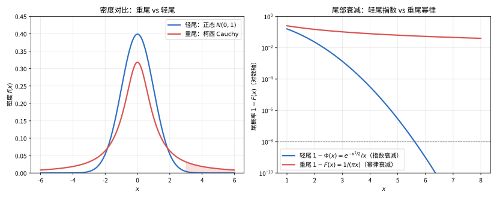

# 第 101 级：极值概率论 (Extreme Value Theory)

---

## 1. 学习目标

完成本教程后，你将能够：

1. 理解顺序统计量的基本性质与渐近分布
2. 掌握三种极值分布（Gumbel、Fréchet、Weibull）的特征与区别
3. 理解Fisher-Tippett-Gnedenko定理及其在极值建模中的核心地位
4. 掌握最大吸引域（MDA）的概念与von Mises条件
5. 理解Pickands-Balkema-de Haan定理与广义帕累托分布（GPD）
6. 掌握POT方法（峰值超过阈值法）的基本流程
7. 理解极值指标估计与分位数估计的方法
8. 能够独立完成金融序列和洪水数据的极值分析

---

## 2. 核心概念

### 2.1 顺序统计量

设 $X_1, X_2, \dots, X_n$ 为独立同分布（i.i.d.）随机变量，具有共同的分布函数 $F$。将样本按升序排列得到：

$$
X_{(1)} \le X_{(2)} \le \cdots \le X_{(n)}
$$

称 $X_{(k)}$ 为第 $k$ 个**顺序统计量**（Order Statistic）。特别地，$X_{(1)}$ 为样本最小值，$X_{(n)}$ 为样本最大值。

顺序统计量 $X_{(k)}$ 的分布函数为：

$$
F_{X_{(k)}}(x) = \mathbb{P}(X_{(k)} \le x) = \sum_{j=k}^n \binom{n}{j} [F(x)]^j [1 - F(x)]^{n-j}
$$

其密度函数为：

$$
f_{X_{(k)}}(x) = \frac{n!}{(k-1)!(n-k)!} [F(x)]^{k-1} [1 - F(x)]^{n-k} f(x)
$$

### 2.2 极值分布

**极值分布**（Extreme Value Distribution）是描述样本最大值（或最小值）渐近分布的极限分布。Fisher-Tippett-Gnedenko定理指出，经过适当标准化后，样本最大值的极限分布只能属于以下三种类型之一。尾部形态是关键决定因素——重尾与轻尾在极端概率上差异巨大：

> **直观理解（现实类比）**：轻尾像人的身高——绝大多数人都挤在均值附近，出现"两米八"的极端值几乎不可能；重尾则像保险公司的巨灾理赔——多数保单是小额赔付，但偶尔会冒出天文数字的巨额赔款，把右侧尾巴拖得又长又厚。正因如此，金融危机的暴跌、特大地震这类"长尾事件"虽罕见，却绝不能被忽略。

> **🧠 思考历程：平均身高很好猜，可"史上最惨的大洪水"怎么算概率？**
>
> 极值理论盯着的不是"大多数"，而是"最极端的那一次"——百年一遇的洪水要把堤坝建多高？它的出发点是那句惊人的对称：既然中心极限定理告诉我们"平均"会长成什么形状，那"样本中的最大值"是否也有一个不变的最后形态？
>
> - **三路合围"尾巴"**。1927年 Fréchet，连同费雪与蒂皮特（Fisher & Tippett）在1928年，分别证明最大值的极限分布只有三张脸：Gumbel、Fréchet 与 Weibull；Gnedenko 在1943年给出严格的一般性论证，把"三种类型"钉成了极值定理的核心。
> - **把"多极端"挤成一个参数**。von Mises 等人意识到三种分布其实可以统一进一张"一般极值分布"（GEV），仅靠一个形状参数 $\\xi$ 决定尾部是轻是重——这一合并，把天差地别的意外折叠成一个可估计的标量。
> - **在"极限"破碎的地方重建**。Pickands、Balkema 与 de Haan 在1970年代证明：超出某一门槛的部分服从广义 Pareto 分布（GPD），哪怕数据不满足 GEV 的整体假设，也能可靠地外推尾部——这让极端风险真正走进了保险与金融的一线实务。
> - **心路**：我们总在为"平常"建模，却常为"罕见"买单——懂得给末梢留一条可估计的长尾，才算真正成熟地看待不确定性。

#### (1) Gumbel 分布（Ⅰ型）

$$
G_{\text{Gumbel}}(x) = \exp\left(-e^{-x}\right), \quad x \in \mathbb{R}
$$

适用于尾部呈指数衰减的分布（如正态分布、指数分布、Gamma分布）。

#### (2) Fréchet 分布（Ⅱ型）

$$
G_{\text{Fréchet}}(x) = 
\begin{cases}
0, & x \le 0 \\
\exp(-x^{-\alpha}), & x > 0
\end{cases}, \quad \alpha > 0
$$

适用于尾部呈幂律衰减的重尾分布（如 $t$ 分布、Pareto分布、Cauchy分布）。

#### (3) Weibull 分布（Ⅲ型）

$$
G_{\text{Weibull}}(x) = 
\begin{cases}
\exp(-(-x)^\alpha), & x < 0 \\
1, & x \ge 0
\end{cases}, \quad \alpha > 0
$$

适用于尾部有界的分布（如均匀分布、Beta分布）。

> **💡 直观理解（类比）**：Weibull 分布对应"有头顶着"的有界尾部——存在一个物理上限，超过它的事件根本不可能发生，像材料强度或某条河的水位有明显最大可能值。均匀、Beta 这类"有尽头"的分布，其最大值的极限就收敛到它：一旦逼近上限，概率立刻跌为 0。

### 2.3 广义极值分布（GEV）

**广义极值分布**（Generalized Extreme Value, GEV）将三种极值分布统一为单参数族：

$$
G_\xi(x) = \exp\left\{-\left[1 + \xi\left(\frac{x - \mu}{\sigma}\right)\right]^{-1/\xi}\right\}, \quad 1 + \xi\frac{x - \mu}{\sigma} > 0
$$

其中 $\mu \in \mathbb{R}$ 为位置参数，$\sigma > 0$ 为尺度参数，$\xi \in \mathbb{R}$ 为**形状参数**（也称极值指数）：

- $\xi > 0$：Fréchet 分布（$\alpha = 1/\xi$）
- $\xi = 0$：Gumbel 分布（极限情形，取 $\xi \to 0$）
- $\xi < 0$：Weibull 分布（$\alpha = -1/\xi$）

三种形状参数对应的分布函数形态差异如图：

![广义极值分布GEV的三种尾型：形状参数 \xi>0（Fréchet，重尾无上界）、\xi=0（Gumbel，指数尾）、\xi<0（Weibull，有上界）三条分布函数 G_\xi(x)=\exp\{-[1+\xi x]^{-1/\xi}\} 的对比](images/level101-gev-types.svg)

> **直观理解（现实类比）**：三种尾型就像三类"最坏情况"的统计性格。$\xi>0$（Fréchet）像地震或股市暴跌——理论上没有上限，越极端越可能发生，尾部无限延伸；$\xi=0$（Gumbel）像年最高气温——有典型的"温和极端"，超高温的概率按指数规律温和地变小；$\xi<0$（Weibull）像材料强度或洪水水位——受物理条件硬性约束，超过某个上限的事件根本不可能发生。

### 2.4 最大吸引域（MDA）

称分布 $F$ 属于极值分布 $G$ 的**最大吸引域**（Maximum Domain of Attraction, MDA），记为 $F \in \text{MDA}(G)$，如果存在归一化常数 $a_n > 0$ 和 $b_n \in \mathbb{R}$，使得：

$$
\frac{M_n - b_n}{a_n} \xrightarrow{d} G, \quad n \to \infty
$$

其中 $M_n = \max\{X_1, \dots, X_n\}$。

### 2.5 von Mises 条件

**von Mises 条件**用于刻画分布 $F$ 属于哪个MDA。设 $F$ 有密度函数 $f$，定义尾商函数：

$$
r(x) = \frac{1 - F(x)}{f(x)}
$$

若 $\lim_{x \to \omega(F)} r'(x) = 0$，其中 $\omega(F) = \sup\{x: F(x) < 1\}$ 为分布的右端点，则 $F \in \text{MDA}(G_{\text{Gumbel}})$。

### 2.6 POT 方法与广义帕累托分布（GPD）

**POT方法**（Peaks Over Threshold）是极值理论中处理超过阈值数据的常用方法。设 $X$ 具有分布函数 $F$，对于充分大的阈值 $u$，超过量 $Y = X - u$ 的条件分布近似为：

$$
F_u(y) = \mathbb{P}(X - u \le y \mid X > u) \approx G_{\xi,\sigma}(y), \quad y \ge 0
$$

其中 $G_{\xi,\sigma}$ 为**广义帕累托分布**（Generalized Pareto Distribution, GPD）：

$$
G_{\xi,\sigma}(y) = 
\begin{cases}
1 - \left(1 + \xi\frac{y}{\sigma}\right)^{-1/\xi}, & \xi \neq 0 \\
1 - \exp\left(-\frac{y}{\sigma}\right), & \xi = 0
\end{cases}
$$

其中 $\sigma > 0$ 为尺度参数，$\xi \in \mathbb{R}$ 为形状参数。

> **💡 直观理解（类比）**：GPD 是"超额危险"的专用模型——它专门描述"已经越过阈值之后，还能继续超出多少"的形状。就像衡量"烧到 39° 之后温度还能再蹿多高"：$\xi=0$ 时像普通发烧，超出的量按指数温和衰减、渐渐止步；$\xi>0$ 则像罕见急症，超出的量越往后越"没谱"、尾巴拖得又长又厚。

### 2.7 极值指标估计

极值指标 $\xi$ 的常用估计方法包括：

- **Hill估计量**（适用于 $\xi > 0$）：$\hat{\xi}^{(H)} = \frac{1}{k}\sum_{i=1}^k \log X_{(n-i+1)} - \log X_{(n-k)}$
- **矩估计量**：$\hat{\xi}^{(M)} = M_n^{(1)} + 1 - \frac{1}{2}\left(1 - \frac{(M_n^{(1)})^2}{M_n^{(2)}}\right)^{-1}$，其中 $M_n^{(j)} = \frac{1}{k}\sum_{i=1}^k (\log X_{(n-i+1)} - \log X_{(n-k)})^j$
- **Pickands估计量**：$\hat{\xi}^{(P)} = \frac{1}{\log 2} \log \frac{X_{(n-k+1)} - X_{(n-2k+1)}}{X_{(n-2k+1)} - X_{(n-4k+1)}}$

> **💡 直观理解（类比）**：估计极值指数 $\xi$ 就像估"尾巴到底有多粗"。Hill 估计量专门盯着最大的那 $k$ 个样本之间的对数间隔：间隔越大说明尾巴越厚、$\xi$ 越大；矩估计量和 Pickands 估计量则用不同的"量法"去捕捉同一件事。本质都是"用最极端的那几十个点，量出尾部的厚度"，所以都只对"尖部"敏感。

### 2.8 分位数估计

极值理论中，$p$ 分位数（$p$ 接近 1）的估计为：

$$
\hat{x}_p = 
\begin{cases}
\hat{\mu} + \frac{\hat{\sigma}}{\hat{\xi}} \left[(-\log p)^{-\hat{\xi}} - 1\right], & \hat{\xi} \neq 0 \\
\hat{\mu} - \hat{\sigma} \log(-\log p), & \hat{\xi} = 0
\end{cases}
$$

> **💡 直观理解（类比）**：这里的 $p$ 分位数估计是"倒着回答'多糟才算极端'"——给定"百年一遇"这类概率，反推出对应的水位或收益数字（VaR 就来自这种反推）。公式把极值分布从"给 x 求概率"翻转为"给概率求 x"，等于把"多罕见"换成"对应多危险"。

### 2.9 应用领域

- **金融风险管理**：VaR（风险价值）和ES（预期损失）的极值估计
- **水文学**：洪水水位、降雨量的重现期估计
- **气象学**：极端温度、风暴强度分析
- **保险精算**：巨灾损失建模
- **工程可靠性**：极端载荷分析

---

## 3. 定理与证明

### 定理 3.1：Fisher-Tippett-Gnedenko 定理（极值分布的三种极限类型）

**定理**：设 $X_1, X_2, \dots, X_n$ 为 i.i.d. 随机变量，其共同分布函数为 $F$。令 $M_n = \max\{X_1, \dots, X_n\}$。若存在归一化常数 $a_n > 0$ 和 $b_n \in \mathbb{R}$，使得：

$$
\frac{M_n - b_n}{a_n} \xrightarrow{d} G, \quad n \to \infty
$$

其中 $G$ 为非退化分布函数，则 $G$ 必属于以下三种类型之一：

$$
\begin{aligned}
\text{Ⅰ型（Gumbel）}&: G_0(x) = \exp(-e^{-x}), \quad x \in \mathbb{R} \\
\text{Ⅱ型（Fréchet）}&: G_{1,\alpha}(x) = 
\begin{cases}
0, & x \le 0 \\
\exp(-x^{-\alpha}), & x > 0
\end{cases}, \quad \alpha > 0 \\
\text{Ⅲ型（Weibull）}&: G_{2,\alpha}(x) = 
\begin{cases}
\exp(-(-x)^\alpha), & x < 0 \\
1, & x \ge 0
\end{cases}, \quad \alpha > 0
\end{aligned}
$$

**证明**：

**步骤1：极值分布的可稳定性**

设 $G$ 为 $M_n$ 经标准化后的极限分布。由 $M_n$ 的定义，记 $M_{mn}$ 为 $m \cdot n$ 个观测的最大值，则：

$$
M_{mn} = \max\{M_n^{(1)}, \dots, M_n^{(m)}\}
$$

其中 $M_n^{(j)}$ 为第 $j$ 组 $n$ 个观测的最大值，且各组独立。

对于 $M_{mn}$，存在归一化常数 $a_{mn} > 0$ 和 $b_{mn} \in \mathbb{R}$，使得：

$$
\frac{M_{mn} - b_{mn}}{a_{mn}} \xrightarrow{d} G
$$

另一方面，对每组 $M_n$ 使用相同的归一化（由极限分布的唯一性，归一化常数可以调整）：

$$
\frac{M_n^{(j)} - b_n}{a_n} \xrightarrow{d} G, \quad j = 1, \dots, m
$$

由于 $M_{mn} = \max\{M_n^{(1)}, \dots, M_n^{(m)}\}$，且各组独立，我们有：

$$
\mathbb{P}(M_{mn} \le x) = [\mathbb{P}(M_n \le x)]^m
$$

在极限下，这要求 $G$ 满足**极值类型方程**（或称稳定性方程）：

$$
G(x) = G\left(\frac{x - b_{mn}}{a_{mn}}\right) \quad \text{在分布意义上}
$$

更精确地，存在函数 $A(m) > 0$ 和 $B(m)$，使得：

$$
G^m(x) = G(A(m)x + B(m))
$$

**步骤2：求解稳定性方程**

取对数得 $m \log G(x) = \log G(A(m)x + B(m))$。令 $H(x) = -\log G(x)$，则 $H$ 为非负单调递增函数，且：

$$
m H(x) = H(A(m)x + B(m))
$$

由函數方程理论，$H$ 的形式只能是幂函数形式。我们分情况讨论：

**(a) 若存在 $x_0$ 使得 $H(x_0) = 0$，则 $H(x) = 0$ 对所有 $x \le x_0$ 成立（即 $G$ 有界）。**

设 $\omega = \sup\{x: G(x) < 1\} = \inf\{x: G(x) = 1\}$ 为分布的右端点。

当 $H(x)$ 在 $x < \omega$ 时取正值，且 $\omega < \infty$ 时，令 $H(x) = c(\omega - x)^\alpha$，其中 $c > 0$，$\alpha > 0$。

代入稳定性方程：

$$
m \cdot c(\omega - x)^\alpha = c(\omega - A(m)x - B(m))^\alpha
$$

解得：

$$
A(m) = m^{-1/\alpha}, \quad B(m) = \omega(1 - m^{-1/\alpha})
$$

此时 $G(x) = \exp(-c(\omega - x)^\alpha)$，$x < \omega$。通过位置和尺度的变换可化为标准Weibull形式。

**(b) 若 $H(x) > 0$ 对所有 $x$ 成立，且 $H$ 严格递减。**

令 $H(x) = e^{-x}$，代入稳定性方程：

$$
m e^{-x} = e^{-A(m)x - B(m)}
$$

即 $-\log m - x = -A(m)x - B(m)$，得 $A(m) = 1$，$B(m) = \log m$。

此时 $G(x) = \exp(-e^{-x})$，即为Gumbel分布。

**(c) 若 $H(x) = 0$ 对所有 $x \le 0$ 成立，且 $H(x) > 0$ 对 $x > 0$ 成立。**

令 $H(x) = x^{-\alpha}$，$x > 0$，$\alpha > 0$。代入稳定性方程：

$$
m x^{-\alpha} = (A(m)x + B(m))^{-\alpha}
$$

得 $A(m) = m^{1/\alpha}$，$B(m) = 0$。

此时 $G(x) = \exp(-x^{-\alpha})$，$x > 0$，即为Fréchet分布。

**步骤3：统一表示**

将三种形式统一为GEV分布：

$$
G_\xi(x) = \exp\left\{-\left[1 + \xi\left(\frac{x - \mu}{\sigma}\right)\right]^{-1/\xi}\right\}
$$

其中 $\xi = 0$ 对应Gumbel（取极限 $\xi \to 0$），$\xi > 0$ 对应Fréchet，$\xi < 0$ 对应Weibull。$\square$

> **💡 直观理解（类比）**：这条定理是极值论的"中心极限定理"：不管原始分布在平时是胖是瘦、是圆是方，只要最大值归一化后收敛，最终只能长成三种固定"脸型"（Gumbel / Fréchet / Weibull）之一。就像"平均值最终都变钟形"一样，这里的直觉是"最大值最终都变成这三张脸"，而一个形状参数 $\xi$ 就能把三张脸归并成一张 GEV。

---

### 定理 3.2：极值指数与MDA的刻画（von Mises条件）

**定理**：设 $F$ 为绝对连续分布函数，其密度函数为 $f$，右端点 $\omega(F) = \sup\{x: F(x) < 1\} \le \infty$。定义尾商函数：

$$
r(x) = \frac{1 - F(x)}{f(x)}, \quad x < \omega(F)
$$

则：

**(1)** 若 $\lim_{x \to \omega(F)} r'(x) = 0$，则 $F \in \text{MDA}(G_0)$（Gumbel吸引域）。

**(2)** 若存在 $\alpha > 0$ 使得 $\lim_{x \to \omega(F)} \frac{x r'(x)}{r(x)} = \alpha$ 且 $\omega(F) = \infty$，则 $F \in \text{MDA}(G_{1,1/\alpha})$（Fréchet吸引域）。

**(3)** 若存在 $\alpha > 0$ 使得 $\lim_{x \to \omega(F)} \frac{x r'(x)}{r(x)} = -\alpha$ 且 $\omega(F) < \infty$，则 $F \in \text{MDA}(G_{2,1/\alpha})$（Weibull吸引域）。

**证明**：

**步骤1：Gumbel情形的von Mises条件**

设 $\lim_{x \to \omega(F)} r'(x) = 0$。我们需要证明存在归一化常数 $a_n$ 和 $b_n$，使得 $F^n(a_n x + b_n) \to \exp(-e^{-x})$。

由 $F$ 的表达式，记 $U(t) = F^{-1}(1 - 1/t)$，$t > 1$。

由 $F(U(t)) = 1 - 1/t$，两边求导得 $f(U(t)) U'(t) = 1/t^2$，因此 $U'(t) = \frac{1}{t^2 f(U(t))}$。

利用 $r(x) = (1 - F(x))/f(x)$，我们有：

$$
U'(t) = \frac{r(U(t))}{t}
$$

von Mises条件 $r'(x) \to 0$ 意味着 $r(x)$ 是慢变函数。由重尾理论，存在函数 $a(t) = r(U(t))$，使得对任意 $x \in \mathbb{R}$：

$$
\lim_{t \to \infty} \frac{U(tx) - U(t)}{a(t)} = \log x
$$

取 $a_n = a(n) = r(U(n))$，$b_n = U(n)$，则：

$$
\lim_{n \to \infty} F^n(a_n x + b_n) = \exp(-e^{-x})
$$

**步骤2：Fréchet情形的von Mises条件**

设 $\lim_{x \to \infty} \frac{x r'(x)}{r(x)} = \alpha > 0$，且 $\omega(F) = \infty$。

由 $\frac{r'(x)}{r(x)} \sim \frac{\alpha}{x}$，积分得 $\log r(x) \sim \alpha \log x + C$，即 $r(x) \sim C x^\alpha$。

由 $U'(t) = r(U(t))/t$，得 $U'(t) \sim C U(t)^\alpha / t$。

解微分方程得 $U(t) \sim C' t^{1/(1-\alpha)}$（当 $\alpha \neq 1$ 时需仔细处理，但核心是 $U(t)$ 呈幂律增长）。

取 $a_n = U(n)$，$b_n = 0$，则：

$$
\lim_{n \to \infty} F^n(a_n x) = \exp(-x^{-\alpha})
$$

即 $F \in \text{MDA}(G_{1,1/\alpha})$。

**步骤3：Weibull情形的von Mises条件**

设 $\lim_{x \to \omega(F)} \frac{x r'(x)}{r(x)} = -\alpha < 0$，且 $\omega(F) < \infty$。

类似地，$r(x) \sim C(\omega(F) - x)^\alpha$，$U'(t) \sim C(\omega(F) - U(t))^\alpha / t$。

解得 $\omega(F) - U(t) \sim C' t^{-1/(\alpha-1)}$（$\alpha \neq 1$）。

取 $a_n = \omega(F) - U(n)$，$b_n = \omega(F)$，则：

$$
\lim_{n \to \infty} F^n(a_n x + b_n) = \exp(-(-x)^\alpha)
$$

即 $F \in \text{MDA}(G_{2,1/\alpha})$。$\square$

> **💡 直观理解（类比）**：这道定理把"属于哪个吸引域"翻译成尾商函数 $r(x)$ 在右端点的三种"渐近姿态"：导数趋于 0 是 Gumbel；$x r'(x)/r(x)$ 趋于正数（尾巴朝无穷方向伸展）是 Fréchet；趋于负数（有尽头封顶）是 Weibull。一句话：只需看尾巴"变成常数、按幂增长、还是被封顶"，就能判定它归哪一派。

---

### 定理 3.3：Pickands-Balkema-de Haan 定理（超过阈值的极限分布是GPD）

**定理**：设 $X_1, X_2, \dots, X_n$ 为 i.i.d. 随机变量，其共同分布函数为 $F$。设 $F$ 属于极值分布 $G_\xi$ 的最大吸引域，即存在归一化常数 $a_n > 0$ 和 $b_n \in \mathbb{R}$，使得：

$$
\frac{M_n - b_n}{a_n} \xrightarrow{d} G_\xi
$$

其中 $G_\xi$ 为GEV分布。则对于充分大的阈值 $u$，超过量 $Y = X - u$ 的条件分布满足：

$$
\lim_{u \to \omega(F)} \sup_{0 \le y \le \omega(F) - u} \left| F_u(y) - G_{\xi, \sigma(u)}(y) \right| = 0
$$

其中 $G_{\xi, \sigma(u)}$ 为GPD：

$$
G_{\xi, \sigma(u)}(y) = 
\begin{cases}
1 - \left(1 + \xi\frac{y}{\sigma(u)}\right)^{-1/\xi}, & \xi \neq 0 \\
1 - \exp\left(-\frac{y}{\sigma(u)}\right), & \xi = 0
\end{cases}
$$

$\sigma(u) > 0$ 为尺度参数，且可表示为 $\sigma(u) = \tilde{a}(u) \approx \xi(u - b(u))$ 的某种形式。

**证明**：

**步骤1：条件分布与极值分布的关系**

设 $F$ 的右端点为 $\omega(F)$。对于阈值 $u < \omega(F)$，超过量 $Y = X - u$ 的条件分布为：

$$
F_u(y) = \mathbb{P}(X - u \le y \mid X > u) = \frac{F(u + y) - F(u)}{1 - F(u)}, \quad 0 \le y < \omega(F) - u
$$

**步骤2：利用极值分布的最大吸引域条件**

由 $F \in \text{MDA}(G_\xi)$，存在函数 $a(t) > 0$ 和 $b(t)$，使得：

$$
\lim_{t \to \infty} t[1 - F(a(t)x + b(t))] = -\log G_\xi(x) = \left(1 + \xi x\right)^{-1/\xi}
$$

取 $t = 1/(1 - F(u))$，则 $u \to \omega(F)$ 等价于 $t \to \infty$。

定义 $x_t = (u - b(t))/a(t)$，则 $1 - F(u) = 1/t$。

对于 $y \ge 0$，令 $x_t(y) = (u + y - b(t))/a(t) = x_t + y/a(t)$。

**步骤3：推导GPD的形式**

计算 $F_u(y)$：

$$
\begin{aligned}
F_u(y) &= \frac{F(u + y) - F(u)}{1 - F(u)} \\
&= 1 - \frac{1 - F(u + y)}{1 - F(u)} \\
&= 1 - \frac{[1 - F(a(t)x_t(y) + b(t))]}{1 - F(u)} \\
&\to 1 - \frac{(1 + \xi x_t(y))^{-1/\xi}}{(1 + \xi x_t)^{-1/\xi}} \quad (\text{当 } t \to \infty) \\
&= 1 - \left(1 + \frac{\xi y}{a(t) + \xi(u - b(t))}\right)^{-1/\xi}
\end{aligned}
$$

令 $\sigma(u) = a(t) + \xi(u - b(t)) = a\left(\frac{1}{1-F(u)}\right) + \xi\left(u - b\left(\frac{1}{1-F(u)}\right)\right)$，则：

$$
\lim_{u \to \omega(F)} F_u(y) = 1 - \left(1 + \frac{\xi y}{\sigma(u)}\right)^{-1/\xi}
$$

当 $\xi = 0$ 时，取极限得：

$$
\lim_{u \to \omega(F)} F_u(y) = 1 - \exp\left(-\frac{y}{\sigma(u)}\right)
$$

**步骤4：一致收敛性**

由极值理论中的一致收敛定理（基于de Haan和Resnick的结果），上述收敛在 $y \in [0, \omega(F) - u)$ 上是一致的。$\square$

> **💡 直观理解（类比）**：这条定理切开了极值论的"最后一公里"：即使总体分布整体并不服从 GEV，只要它属于某一吸引域，那么超过充分大阈值 $u$ 的"超过量"条件分布也必定收敛到 GPD。相当于"即便平时差别很大，只要到了极高楼层，地震响应都很有规律"——它把极值外推从"整体假设"解放成"只要求超过量有规律"。

---

### 定理 3.4：极值指标估计的渐近性质

**定理**：设 $X_1, X_2, \dots, X_n$ 为 i.i.d. 随机变量，其分布 $F$ 满足 $F \in \text{MDA}(G_\xi)$，$\xi > 0$（Fréchet情形）。设 $k = k(n)$ 为满足 $k \to \infty$ 且 $k/n \to 0$ 的整数序列。则Hill估计量：

$$
\hat{\xi}_n^{(H)} = \frac{1}{k} \sum_{i=1}^k \log X_{(n-i+1)} - \log X_{(n-k)}
$$

具有以下渐近性质：

**(1) 相合性**：$\hat{\xi}_n^{(H)} \xrightarrow{p} \xi$，当 $n \to \infty$。

**(2) 渐近正态性**：若 $k$ 满足适当条件，则：

$$
\sqrt{k}(\hat{\xi}_n^{(H)} - \xi) \xrightarrow{d} N(0, \xi^2), \quad n \to \infty
$$

**证明**：

**步骤1：表示Hill估计量为指数积分**

令 $Y_i = \log X_i$，$Y_{(1)} \le \cdots \le Y_{(n)}$ 为对应的顺序统计量。定义超额量：

$$
Z_i = Y_{(n-i+1)} - Y_{(n-k)}, \quad i = 1, \dots, k
$$

则Hill估计量可写为 $\hat{\xi}_n^{(H)} = \frac{1}{k} \sum_{i=1}^k Z_i$。

**步骤2：利用极值分布的性质**

由 $F \in \text{MDA}(G_\xi)$，$\xi > 0$，存在缓慢变化函数 $L(x)$，使得：

$$
1 - F(x) = x^{-1/\xi} L(x)
$$

取对数得 $1 - F(e^y) = e^{-y/\xi} L(e^y)$。

令 $H(y) = \mathbb{P}(\log X \le y) = F(e^y)$，则 $1 - H(y) = e^{-y/\xi} L(e^y)$。

**步骤3：条件分布逼近指数分布**

对于充分大的 $y$，$1 - H(y) \sim C e^{-y/\xi}$。因此，在 $Y_{(n-k)}$ 条件下，$Z_i$ 近似服从参数为 $\xi$ 的指数分布。

更精确地，由Rényi表示定理，顺序统计量 $Y_{(n-k+1)}, \dots, Y_{(n)}$ 的条件分布可表示为：

$$
Y_{(n-i+1)} = H^{-1}\left(1 - \frac{E_1 + \cdots + E_i}{n + 1}\right)
$$

其中 $E_1, \dots, E_k$ 为 i.i.d. 标准指数随机变量。

利用 $H^{-1}(1 - p) \sim -\xi \log p + \xi \log C$，可得：

$$
Y_{(n-i+1)} - Y_{(n-k)} \sim \xi \left(\log\frac{k}{i} + o_p(1)\right)
$$

**步骤4：相合性证明**

由上述表示：

$$
\hat{\xi}_n^{(H)} = \frac{1}{k} \sum_{i=1}^k \xi \left(\log\frac{k}{i} + o_p(1)\right) \to \xi
$$

因为 $\frac{1}{k} \sum_{i=1}^k \log\frac{k}{i} \to \int_0^1 (-\log u) du = 1$。

**步骤5：渐近正态性证明**

由指数表示的精确性，$Z_i$ 可写为：

$$
Z_i = \xi E_i^* + o_p(1)
$$

其中 $E_i^*$ 为近似独立的指数随机变量。

因此 $\sqrt{k}(\hat{\xi}_n^{(H)} - \xi) = \frac{\xi}{\sqrt{k}} \sum_{i=1}^k (E_i^* - 1) + o_p(1)$。

由中心极限定理，$\frac{1}{\sqrt{k}} \sum_{i=1}^k (E_i^* - 1) \xrightarrow{d} N(0, 1)$，故：

$$
\sqrt{k}(\hat{\xi}_n^{(H)} - \xi) \xrightarrow{d} N(0, \xi^2)
$$

$\square$

> **💡 直观理解（类比）**：Hill 估计量的相合性与渐近正态性，直观上就是说"用天花板附近那 $k$ 个样本量出来的尾巴厚度是靠得住的"：样本一多估计就准（相合），而且误差的分布总体呈钟形（渐近正态 $N(0, \xi^2)$）。就像用顶层住户的层间距去估整栋楼的高度，只要样本够、方法对，测出来就稳定又贴近真实值。

---

## 4. 示例

### 示例 1：金融收益率序列的极值分析

**问题**：对某股票日对数收益率序列进行极值分析，估计VaR（风险价值）和ES（预期损失）。

**数据**：假设有 $n = 1000$ 个日收益率观测值，取其负值（即损失序列）$X_1, \dots, X_{1000}$。

> **💡 直观理解（类比）**：这个示例就是给"最差一天能亏多少"算账：把收益取负变成损失序列，专挑超过 2% 阈值的"坏日子"用 GPD 拟合，再外推出 99% 置信下的最大损失（VaR 6.8%）以及更极端时的平均损失（ES 9.5%）。相当于拿"那些极端坏日"来给爆仓风险上保险、算清该预留多少保证金。

**步骤1：描述性统计与极值诊断**

首先计算样本的统计量并绘制QQ图。样本的右尾表现出厚尾特征，适合使用极值理论。

**步骤2：阈值选择**

使用平均超额函数（Mean Excess Function, MEF）选择阈值：

$$
e(u) = \mathbb{E}[X - u \mid X > u]
$$

对于GPD，$e(u) = \frac{\sigma + \xi u}{1 - \xi}$（当 $\xi < 1$），是 $u$ 的线性函数。

通过MEF图，选择阈值 $u = 0.02$（即2%的损失），超过该阈值的观测个数 $k = 87$。

**步骤3：GPD参数估计**

使用最大似然估计（MLE）拟合GPD。对数似然函数为：

$$
\ell(\xi, \sigma) = 
\begin{cases}
-k \log \sigma - (1 + 1/\xi) \sum_{i=1}^k \log\left(1 + \xi\frac{y_i}{\sigma}\right), & \xi \neq 0 \\
-k \log \sigma - \frac{1}{\sigma} \sum_{i=1}^k y_i, & \xi = 0
\end{cases}
$$

其中 $y_i = x_i - u$ 为超过量。

通过数值优化得到 $\hat{\xi} = 0.35$，$\hat{\sigma} = 0.015$。

**步骤4：VaR和ES估计**

对于显著性水平 $\alpha$（如 $\alpha = 0.95$），VaR的估计为：

$$
\widehat{\text{VaR}}_\alpha = u + \frac{\hat{\sigma}}{\hat{\xi}} \left[\left(\frac{1 - \alpha}{k/n}\right)^{-\hat{\xi}} - 1\right]
$$

代入数值（取 $\alpha = 0.99$）：

$$
\widehat{\text{VaR}}_{0.99} = 0.02 + \frac{0.015}{0.35} \left[\left(\frac{0.01}{0.087}\right)^{-0.35} - 1\right] = 0.068
$$

即99%置信水平下，最大日损失不超过6.8%。

ES的估计为：

$$
\widehat{\text{ES}}_\alpha = \frac{\widehat{\text{VaR}}_\alpha}{1 - \xi} + \frac{\sigma - \xi u}{1 - \xi}
$$

代入得 $\widehat{\text{ES}}_{0.99} = 0.095$。

**步骤5：诊断检验**

使用PP图和QQ图检验GPD拟合效果。绘制残差图，若点近似在45度线上，则拟合良好。

---

### 示例 2：洪水数据的极值建模

**问题**：某河流50年间的年最大流量数据，需要估计100年一遇的洪水水位。

**数据**：$n = 50$ 个年最大流量观测值 $X_1, \dots, X_{50}$（单位：m³/s）。

> **💡 直观理解（类比）**：这个示例用"每年最大洪水"直接拟合 GEV：50 年的年最大流量告诉你，100 年一遇的水位约是 1160 m³/s，且 $\xi < 0$ 说明这条河的水位有物理上限、不会无限涨。好比拿历届"年度暴雨冠军"反推"一世纪一遇的大雨"该筑多高的堤坝。

**步骤1：GEV模型拟合**

使用GEV分布直接拟合年最大值数据。GEV分布的对数似然函数为：

$$
\ell(\mu, \sigma, \xi) = -n \log \sigma - (1 + 1/\xi) \sum_{i=1}^n \log\left(1 + \xi\frac{x_i - \mu}{\sigma}\right) - \sum_{i=1}^n \left(1 + \xi\frac{x_i - \mu}{\sigma}\right)^{-1/\xi}
$$

通过MLE得到 $\hat{\mu} = 850$，$\hat{\sigma} = 120$，$\hat{\xi} = -0.15$。

$\hat{\xi} < 0$ 表明属于Weibull吸引域，即流量的分布有上界。

**步骤2：重现期估计**

$T$ 年重现期对应的水位 $x_T$ 满足：

$$
F(x_T) = 1 - \frac{1}{T}
$$

对于GEV分布：

$$
x_T = \hat{\mu} + \frac{\hat{\sigma}}{\hat{\xi}} \left[(-\log(1 - 1/T))^{-\hat{\xi}} - 1\right]
$$

100年一遇的水位：

$$
x_{100} = 850 + \frac{120}{-0.15} \left[(-\log(0.99))^{0.15} - 1\right] = 850 + 310 = 1160 \text{ m³/s}
$$

**步骤3：置信区间**

使用profile似然法或delta方法计算置信区间。Delta方法给出：

$$
\text{Var}(x_T) \approx \nabla x_T^\top \cdot \text{Cov}(\hat{\mu}, \hat{\sigma}, \hat{\xi}) \cdot \nabla x_T
$$

95%置信区间为 $[1050, 1270]$ m³/s。

**步骤4：模型诊断**

- 绘制重现期水平图（Return Level Plot）：重现期与对应水位的关系图
- 使用Wald检验和似然比检验确认 $\xi < 0$ 的显著性
- 进行残差诊断

---

## 5. 习题

### 基础题

**习题 1**（样本最大值分布）设 $X_1, \dots, X_n$ 为 i.i.d. 样本，共同分布函数为 $F$，写出样本最大值 $M_n = X_{(n)}$ 的分布函数（提示：$M_n \le x$ 等价于所有 $X_i \le x$）。

**习题 2**（Gumbel 分布）写出 Gumbel（Ⅰ型）极值分布的标准形式 $G(x) = \exp(-e^{-x})$，$x \in \mathbb{R}$，并说明它适用于什么类型的尾部。

**习题 3**（Fréchet 分布）写出 Fréchet（Ⅱ型）极值分布 $G(x) = \exp(-x^{-\alpha})$，$x > 0$，$\alpha > 0$，并说明其对应重尾还是轻尾、适用于哪些常见分布。

**习题 4**（Weibull 分布）写出 Weibull（Ⅲ型）极值分布 $G(x) = \exp(-(-x)^\alpha)$，$x < 0$，并说明它适用于什么类型的数据尾部。

**习题 5**（GEV 统一表示）写出广义极值分布（GEV）$G_\xi(x) = \exp\left\{-\left[1 + \xi\frac{x - \mu}{\sigma}\right]^{-1/\xi}\right\}$，并说明形状参数 $\xi > 0$、$\xi = 0$、$\xi < 0$ 分别对应哪种极值分布。

**习题 6**（von Mises 条件）定义尾商函数 $r(x) = (1 - F(x))/f(x)$，陈述 von Mises 条件 $\lim_{x \to \omega(F)} r'(x) = 0$（其中 $\omega(F)$ 为右端点），并说明它用于判别什么。

**习题 7**（POT 方法）写出 POT 方法中超过量条件分布 $F_u(y) = \mathbb{P}(X - u \le y \mid X > u) \approx G_{\xi,\sigma}(y)$ 的表达形式，并说明 POT 方法的基本思想。

**习题 8**（GPD 分布）写出广义帕累托分布（GPD）$G_{\xi,\sigma}(y)$ 的分布函数，分 $\xi \neq 0$ 与 $\xi = 0$ 两种情形分别写出。

**习题 9**（Hill 估计量）写出 Hill 估计量 $\hat{\xi}_n^{(H)} = \frac{1}{k}\sum_{i=1}^k \log X_{(n-i+1)} - \log X_{(n-k)}$，并说明它适用于哪种吸引域（$\xi > 0$）情形。

**习题 10**（极值指数）说明极值指数 $\xi$（形状参数）的统计意义，以及 $\xi > 0$、$\xi = 0$、$\xi < 0$ 分别对应何种尾部性质。

### 进阶题

**习题 11**（指数样本最大值收敛）设 $X_1, \dots, X_n$ 为 i.i.d. $\text{Exp}(1)$，求 $M_n$ 的精确分布，并证明经标准化后 $F^n(x + \log n) \to \exp(-e^{-x})$，即收敛到 Gumbel 分布（提示：$F(x) = 1 - e^{-x}$，利用 $(1 - e^{-x}/n)^n \to e^{-e^{-x}}$）。

**习题 12**（Pareto 属 Fréchet 吸引域）证明 Pareto 分布 $F(x) = 1 - x^{-\alpha}$（$x \ge 1$，$\alpha > 0$）属于 Fréchet 吸引域，并求归一化常数 $a_n$ 与 $b_n$（提示：取 $a_n = n^{1/\alpha}$、$b_n = 0$，计算 $F^n(a_n x)$ 的极限）。

**习题 13**（指数分布的 von Mises 条件）对指数分布 $F(x) = 1 - e^{-x}$ 验证尾商函数满足 $r(x) = 1$、$r'(x) = 0$，从而 $\lim_{x \to \infty} r'(x) = 0$，说明 $F \in \text{MDA}(\text{Gumbel})$。

**习题 14**（Hill 估计量置信区间）由 $\sqrt{k}(\hat{\xi}_n^{(H)} - \xi) \xrightarrow{d} N(0, \xi^2)$（定理 3.4），写出极值指数 $\xi$ 的渐近置信区间（提示：渐近标准差为 $\xi/\sqrt{k}$，故有 $\hat{\xi}_n^{(H)} \pm z_{\alpha/2} \cdot \hat{\xi}_n^{(H)}/\sqrt{k}$）。

**习题 15**（GPD 期望）证明若超过量 $Y \sim \text{GPD}(\xi, \sigma)$ 且 $\xi < 1$，则 $\mathbb{E}[Y] = \frac{\sigma}{1 - \xi}$（提示：对 GPD 密度 $g(y) = \frac{1}{\sigma}(1 + \xi y/\sigma)^{-1/\xi - 1}$ 计算 $\int_0^\infty y g(y)\,dy$）。

**习题 16**（GEV 到 Fréchet 变换）证明若 $X \sim \text{GEV}(\mu, \sigma, \xi)$，则当 $\xi > 0$ 时 $Y = 1 + \xi(X - \mu)/\sigma$ 服从参数为 $1/\xi$ 的 Fréchet 分布（提示：直接计算 $\mathbb{P}(Y \le y)$，对 $y > 0$ 得 $\exp(-y^{-1/\xi})$）。

**习题 17**（平均超额函数）对 GPD 超过量，给出平均超额函数 $e(u) = \mathbb{E}[X - u \mid X > u]$，并证明当 $\xi < 1$ 时 $e(u) = \frac{\sigma + \xi u}{1 - \xi}$ 是阈值 $u$ 的线性函数（提示：阈值上移时 GPD 尺度参数变为 $\sigma_u = \sigma + \xi u$，再利用习题 15 的结果）。

**习题 18**（POT 的尾概率与分位数）写出 POT 方法中超过阈值概率 $1 - F(u)$ 的估计（用超额个数 $N_u/n$），并据此给出 $p$ 分位数在 $\xi \neq 0$ 时的估计式 $\hat{x}_p = u + \frac{\hat{\sigma}}{\hat{\xi}}\left[\left(\frac{1-p}{1-F(u)}\right)^{-\hat{\xi}} - 1\right]$（提示：由 $F(x) = 1 - (1 - F(u))(1 + \xi(x-u)/\sigma)^{-1/\xi}$ 反解 $F(x_p) = p$）。

**习题 19**（块极大值与重现期）在块极大值（GEV）法中，写出 $T$ 年重现期水位 $x_T$ 满足的方程 $F(x_T) = 1 - 1/T$，并给出 GEV 下 $x_T = \hat{\mu} + \frac{\hat{\sigma}}{\hat{\xi}}\left[(-\log(1 - 1/T))^{-\hat{\xi}} - 1\right]$（结合示例 2 的公式）。

### 挑战题

**习题 20**（稳定性方程求解）设 $G$ 为标准化样本最大值的极限分布，证明其满足极值类型方程 $G^m(x) = G(A(m)x + B(m))$，并分别就 $H = -\log G$ 的三种函数形式 $H(x) = e^{-x}$、$H(x) = c(\omega - x)^\alpha$、$H(x) = x^{-\alpha}$ 解出 Gumbel、Weibull、Fréchet 三种分布及相应归一化常数。

**习题 21**（von Mises 三情形刻画）陈述定理 3.2 中判别三种吸引域的条件：$\lim_{x\to\omega(F)} r'(x) = 0$（Gumbel）、$\lim_{x\to\infty} xr'(x)/r(x) = \alpha$（Fréchet）、$\lim_{x\to\omega(F)} xr'(x)/r(x) = -\alpha$（Weibull），并说明三种情形下归一化常数的取法。

**习题 22**（Pickands-Balkema-de Haan 定理）陈述 Pickands-Balkema-de Haan 定理：当 $F \in \text{MDA}(G_\xi)$ 时，超过量条件分布 $F_u(y)$ 在 $u \to \omega(F)$ 时一致收敛到 GPD $G_{\xi,\sigma(u)}(y)$，并写出 $\sigma(u)$ 与 $\xi$、$u$ 的关系（提示：$\sigma(u) = \sigma + \xi(u - b)$ 的某种形式，见定理 3.3 推导）。

**习题 23**（Hill 估计量的证明）给出 Hill 估计量相合性 $\hat{\xi}_n^{(H)} \xrightarrow{p} \xi$ 与渐近正态性 $\sqrt{k}(\hat{\xi}_n^{(H)} - \xi) \xrightarrow{d} N(0, \xi^2)$ 的证明框架（提示：利用尾部表示 $1 - F(x) = x^{-1/\xi}L(x)$ 与 Rényi 表示 $Y_{(n-i+1)} - Y_{(n-k)} \sim \xi \log(k/i)$）。

**习题 24**（分位数估计公式推导）对 GEV 反解得到 $p$ 分位数 $\hat{x}_p = \hat{\mu} + \frac{\hat{\sigma}}{\hat{\xi}}\left[(-\log p)^{-\hat{\xi}} - 1\right]$（$\xi \neq 0$），并叙述由此估计 VaR 的思路（提示：令 $G(x_p) = p$，即 $\exp\{-[1+\xi(x_p-\mu)/\sigma]^{-1/\xi}\} = p$）。

**习题 25**（阈值选择与超额计数）说明为何可将超过阈值的个数 $N_u$ 建模为 Poisson 分布（近似 $\text{Poisson}(n(1-F(u)))$），并说明平均超额函数（MEF）图 $e(u)$ 在阈值选取中的作用。

**习题 26**（极值点过程）说明极值点过程 $\{(i/(n+1), X_i)\}$ 收敛到 Poisson 点过程的直观含义，并阐述它如何把块极大值（GEV 极限）与 POT 超过量（GPD）模型统一起来。

### 探究题

**习题 27**（阈值选择的权衡）探究 POT 方法中阈值 $u$ 选得过大或过小的利弊，并讨论如何综合 MEF 图、参数稳定性图以及偏差—方差权衡来确定合理的阈值。

**习题 28**（极值指标估计量对比）比较 Hill 估计量、矩估计量与 Pickands 估计量在估计极值指数 $\xi$ 时的适用条件、渐近方差与对样本的敏感性，并说明如何选择样本比例 $k = k(n)$。

**习题 29**（块极大值与 POT 对比）从数据使用效率、模型假设与稳健性三个角度，比较块极大值（GEV）法与 POT（GPD）法的优劣，并说明各自适合的场景。

**习题 30**（极值理论在金融风险中的应用）设计一个用极值理论估计股票日损失序列 VaR 与 ES 的分析流程，说明如何选择阈值、估计 GPD 参数并评价拟合效果。

---

## 6. 习题答案与解析

### 基础题答案

1. **样本最大值分布** $M_n \le x$ 当且仅当所有 $X_i \le x$，由独立性得 $\mathbb{P}(M_n \le x) = \prod_{i=1}^n F(x) = [F(x)]^n$，即 $F_{X_{(n)}}(x) = [F(x)]^n$，对应正文中顺序统计量取 $k=n$ 的情形。

2. **Gumbel 分布** 标准形式为 $G(x) = \exp(-e^{-x})$，$x \in \mathbb{R}$。它适用于尾部呈指数衰减的轻尾分布，如正态分布、指数分布、Gamma 分布——此时极值发生概率按指数规律温和衰减。

3. **Fréchet 分布** 形式为 $G(x) = \exp(-x^{-\alpha})$，$x>0$，$\alpha>0$。其尾部以幂律 $x^{-\alpha}$ 衰减，属于重尾；适用于 $t$ 分布、Pareto 分布、Cauchy 分布等尾概率衰减缓慢的分布。

4. **Weibull 分布** 形式为 $G(x) = \exp(-(-x)^\alpha)$，$x<0$，$\alpha>0$。它对应有上界（有界）的尾部，适用于均匀分布、Beta 分布等右端点有限的分布。

5. **GEV 统一表示** $G_\xi(x) = \exp\left\{-\left[1 + \xi\frac{x-\mu}{\sigma}\right]^{-1/\xi}\right\}$。当 $\xi>0$ 时对应 Fréchet（$\alpha=1/\xi$）；$\xi=0$ 时为极限情形 Gumbel；$\xi<0$ 时对应 Weibull（$\alpha=-1/\xi$）。一个形状参数即可统一三种类型。

6. **von Mises 条件** 尾商函数 $r(x) = \frac{1-F(x)}{f(x)}$ 衡量尾概率相对密度的"余量"。若 $\lim_{x\to\omega(F)} r'(x) = 0$（$r$ 在右端点处趋于缓变），则 $F \in \text{MDA}(G_{\text{Gumbel}})$。它是判别分布落入何种吸引域的可操作准则。

7. **POT 方法** $F_u(y) = \mathbb{P}(X-u \le y \mid X>u) \approx G_{\xi,\sigma}(y)$，$y \geq 0$。POT 方法的思想是：超过一个充分大阈值的"超过量"的条件分布可以由 GPD 近似刻画，从而把对整条尾部的建模转化为对少数超过量的建模。

8. **GPD 分布** 当 $\xi \neq 0$ 时 $G_{\xi,\sigma}(y) = 1 - (1 + \xi y/\sigma)^{-1/\xi}$；当 $\xi = 0$ 时 $G_{0,\sigma}(y) = 1 - \exp(-y/\sigma)$（即指数分布情形）。$\sigma>0$ 为尺度参数，$\xi$ 为形状参数。

9. **Hill 估计量** $\hat{\xi}_n^{(H)} = \frac{1}{k}\sum_{i=1}^k \log X_{(n-i+1)} - \log X_{(n-k)}$。它利用最大的 $k$ 个观测与第 $k$ 大观测的对数差来估计尾指数，仅适用于 $\xi>0$ 的 Fréchet（重尾）情形。

10. **极值指数** $\xi$ 控制尾部的厚度：$\xi>0$ 表示无限重尾（Fréchet），高阶矩可能发散；$\xi=0$ 表示指数型轻尾（Gumbel）；$\xi<0$ 表示有上界的有界尾（Weibull）。估计 $\xi$ 是极值建模的核心任务。

### 进阶题答案

1. **指数样本最大值收敛** $X_i \sim \text{Exp}(1)$，故 $F(x)=1-e^{-x}$，精确分布为 $\mathbb{P}(M_n \le x) = (1-e^{-x})^n$。取标准化 $x \mapsto x+\log n$：
$$F^n(x+\log n) = (1-e^{-x-\log n})^n = \left(1-\frac{e^{-x}}{n}\right)^n \to e^{-e^{-x}},\quad n\to\infty$$
即 $M_n - \log n \xrightarrow{d} \text{Gumbel}$（归一化常数 $b_n=\log n$，$a_n=1$）。

2. **Pareto 属 Fréchet 吸引域** 对 $x>0$，由 $a_n=n^{1/\alpha}$、$b_n=0$：
$$F^n(a_n x) = (1-(n^{1/\alpha}x)^{-\alpha})^n = \left(1-\frac{x^{-\alpha}}{n}\right)^n \to e^{-x^{-\alpha}}$$
右端正是参数为 $\alpha$ 的 Fréchet 分布，故 $F\in\text{MDA}(\text{Fréchet})$，归一化常数 $a_n=n^{1/\alpha}$、$b_n=0$。

3. **指数分布的 von Mises 条件** $f(x)=e^{-x}$、$1-F(x)=e^{-x}$，故 $r(x)=\frac{1-F(x)}{f(x)}=\frac{e^{-x}}{e^{-x}}=1$，$r'(x)=0$。于是 $\lim_{x\to\infty}r'(x)=0$，由定理 3.2 得 $F\in\text{MDA}(G_{\text{Gumbel}})$，与习题 11 的结论一致。

4. **Hill 估计量置信区间** 由 $\sqrt{k}(\hat\xi_n^{(H)}-\xi)\xrightarrow{d}N(0,\xi^2)$，渐近标准差为 $\xi/\sqrt{k}$。以 $\hat\xi_n^{(H)}$ 估计 $\xi$ 代入，得 $100(1-\alpha)\%$ 渐近置信区间 $\hat\xi_n^{(H)} \pm z_{\alpha/2}\cdot \hat\xi_n^{(H)}/\sqrt{k}$，其中 $z_{\alpha/2}$ 为标准正态上 $\alpha/2$ 分位点。

5. **GPD 期望** 计算 $\mathbb{E}[Y]=\int_0^\infty y\,g(y)\,dy$，作换元 $t=1+\xi y/\sigma$ 使 $y=\sigma(t-1)/\xi$：
$$\mathbb{E}[Y]=\frac{1}{\sigma}\int_0^\infty y\left(1+\frac{\xi y}{\sigma}\right)^{-1/\xi-1}dy=\frac{\sigma}{\xi}\int_1^\infty \frac{t-1}{t^{1/\xi+1}}dt$$
由 $\xi<1$ 保证积分收敛，解得 $\mathbb{E}[Y]=\frac{\sigma}{1-\xi}$。

6. **GEV 到 Fréchet 变换** 对 $y>0$，$Y\le y \Leftrightarrow 1+\xi(X-\mu)/\sigma\le y$。由 GEV 分布：
$$\mathbb{P}(Y\le y)=\mathbb{P}\left(X\le \mu+\frac{\sigma}{\xi}(y-1)\right)=\exp\left\{-\left[1+\xi\frac{\sigma(y-1)/\xi}{\sigma}\right]^{-1/\xi}\right\}=\exp\left(-y^{-1/\xi}\right)$$
这正是参数 $1/\xi$ 的 Fréchet 分布。$\xi=0$ 时取极限回到指数型（Gumbel 的导出）。

7. **平均超额函数** 当阈值上移到 $u$ 时，超过量 $X-u$ 仍为 GPD，尺度变为 $\sigma_u = \sigma+\xi u$。由习题 15 的结论 $e(u)=\mathbb{E}[X-u\mid X>u]=\sigma_u/(1-\xi)$，代入即 $e(u)=\frac{\sigma+\xi u}{1-\xi}$，是 $u$ 的线性函数。这正是 MEF 图线性判据的来源。

8. **POT 的尾概率与分位数** 用超额个数估计 $1-F(u)\approx N_u/n$。由 GPD 尾表示 $1-F(x)=(1-F(u))(1+\xi(x-u)/\sigma)^{-1/\xi}$，令 $F(x_p)=p$：
$$\left(\frac{1-p}{1-F(u)}\right)^{-\hat\xi}=1+\frac{\hat\xi}{\hat\sigma}(x_p-u)\ \Rightarrow\ x_p=u+\frac{\hat\sigma}{\hat\xi}\left[\left(\frac{1-p}{1-F(u)}\right)^{-\hat\xi}-1\right]$$
这就是 POT 框架下高分位数与 VaR 的估计式。

9. **块极大值与重现期** $T$ 年重现期满足 $G(x_T)=1-1/T$，即 $-\left[1+\xi(x_T-\mu)/\sigma\right]^{-1/\xi}=\log(1-1/T)$。反解得 $x_T=\mu+\frac{\sigma}{\xi}[(-\log(1-1/T))^{-\xi}-1]$。代入示例 2 的 $\hat\mu=850,\hat\sigma=120,\hat\xi=-0.15,T=100$：$x_{100}=850+\frac{120}{-0.15}[(-\log 0.99)^{0.15}-1]=850+310=1160$ m³/s。

### 挑战题答案

1. **稳定性方程求解** 由 $M_{mn}=\max\{M_n^{(1)},\dots,M_n^{(m)}\}$ 及独立性，$\mathbb{P}(M_{mn}\le x)=[\mathbb{P}(M_n\le x)]^m$，在极限下得 $G^m(x)=G(A(m)x+B(m))$。对 $H=-\log G$，取对数得 $mH(x)=H(A(m)x+B(m))$。
   - $H(x)=e^{-x}$：$me^{-x}=e^{-(Ax+B)}$，即 $e^{\log m}e^{-x}=e^{-x+\log m}$，需 $A=1$，$B=\log m$，得 Gumbel $G(x)=e^{-e^{-x}}$。
   - $H(x)=c(\omega-x)^\alpha$：$m c(\omega-x)^\alpha=c(\omega-Ax-B)^\alpha$，解得 $A=m^{-1/\alpha}$，$B=\omega(1-m^{-1/\alpha})$，经位置尺度变换得 Weibull $G=\exp(-c(\omega-x)^\alpha)$。
   - $H(x)=x^{-\alpha}$：$m x^{-\alpha}=(Ax+B)^{-\alpha}$，解得 $A=m^{1/\alpha}$，$B=0$，得 Fréchet $G=\exp(-x^{-\alpha})$，$x>0$。
   三种被稳定性方程唯一确定，从而得到 Fisher-Tippett-Gnedenko 分类。

2. **von Mises 三情形刻画** 对绝对连续 $F$ 定义 $r=(1-F)/f$：(1) 若 $\lim_{x\to\omega(F)}r'(x)=0$，则 $F\in\text{MDA}(G_0)$；此时取 $b_n=U(n)$、$a_n=r(U(n))$（$U=F^{-1}(1-1/t)$，且 $U'(t)=r(U(t))/t$）。(2) 若 $\omega(F)=\infty$ 且 $\lim_{x\to\infty}xr'(x)/r(x)=\alpha>0$，则 $r(x)\sim Cx^\alpha$、$U(t)\sim C't^{1/(1-\alpha)}$，取 $a_n=U(n)$、$b_n=0$ 得 $F^n(a_n x)\to e^{-x^{-\alpha}}$。(3) 若 $\omega(F)<\infty$ 且 $\lim_{x\to\omega(F)}xr'(x)/r(x)=-\alpha<0$，则 $\omega(F)-U(t)\sim C''t^{-1/(\alpha-1)}$，取 $a_n=\omega(F)-U(n)$、$b_n=\omega(F)$ 得 $F^n(a_n x+b_n)\to e^{-(-x)^\alpha}$。

3. **Pickands-Balkema-de Haan 定理** 定理断言：若 $F\in\text{MDA}(G_\xi)$，则对充分大的阈值 $u$，超过量条件分布满足
$$\lim_{u\to\omega(F)}\sup_{0\le y\le\omega(F)-u}|F_u(y)-G_{\xi,\sigma(u)}(y)|=0$$
其中 $\sigma(u)>0$。若记参考尺度为 $\sigma$，则 $\sigma(u)=\sigma+\xi u$（由阈值上移时尺度参数的平移规则 $\sigma_u=\sigma+\xi u$ 给出；$\xi=0$ 时退化为常数 $\sigma$）。证明依赖 $t[1-F(a(t)x+b(t))]\to(1+\xi x)^{-1/\xi}$ 与取 $t=1/(1-F(u))$ 的渐近展开。

4. **Hill 估计量的证明** 令 $Y_i=\log X_i$，由 $\xi>0$ 时 $1-F(x)=x^{-1/\xi}L(x)$ 得 $1-H(y)=e^{-y/\xi}L(e^y)$。由 Rényi 表示 $Y_{(n-i+1)}=H^{-1}(1-(E_1+\cdots+E_i)/(n+1))$，当 $E_i$ 为 i.i.d. 标准指数时，用 $H^{-1}(1-p)\sim-\xi\log p+\xi\log C$ 得 $Y_{(n-i+1)}-Y_{(n-k)}\sim \xi\log(k/i)+o_p(1)$。于是
$$\hat\xi_n^{(H)}=\frac1k\sum_{i=1}^k[Y_{(n-i+1)}-Y_{(n-k)}]\to\frac{\xi}{k}\sum_{i=1}^k\log\frac{k}{i}\to\xi\int_0^1(-\log u)du=\xi$$
得相合性。又 $Z_i=\xi E_i^*+o_p(1)$（$E_i^*$ 近似独立指数），故 $\sqrt{k}(\hat\xi_n^{(H)}-\xi)=\frac{\xi}{\sqrt k}\sum(E_i^*-1)+o_p(1)\xrightarrow{d}N(0,\xi^2)$，得渐近正态性。

5. **分位数估计公式推导** 令 $G(x_p)=p$，即 $\exp\{-[1+\xi(x_p-\mu)/\sigma]^{-1/\xi}\}=p$。取对数得 $-[1+\xi(x_p-\mu)/\sigma]^{-1/\xi}=\log p$，两边取 $-1/\xi$ 次幂：$1+\xi(x_p-\mu)/\sigma=(-\log p)^{-\xi}$，整理即 $x_p=\mu+\frac{\sigma}{\xi}[(-\log p)^{-\xi}-1]$（$\xi=0$ 时取极限得 $x_p=\mu-\sigma\log(-\log p)$）。取极低尾部概率 $1-p$ 即对应极端损失，其 $1-p$ 分位数即为 VaR。

6. **阈值选择与超额计数** 当超过阈值的观测稀疏且独立时，$N_u$ 近似服从均值为 $n(1-F(u))$ 的 Poisson 分布（伯努利试验的大数近似与泊松稀化）。MEF 图：由进阶题 17，GPD 下 $e(u)$ 在 $u$ 的合理区间上是线性的；因此以 $e(u)$ 图出现近似线性上升的起始点作为阈值 $u$。此外可结合 $\hat\xi$ 与 $\hat\sigma$ 的稳定性图，选取使估计在阈值连续区间内近似平稳的最小 $u$。

7. **极值点过程** 将观测 $(i/(n+1),X_i)$ 视作二维点过程，当 $n\to\infty$ 且作适当标准化后，超过高阈值的那些点收敛到 Poisson 点过程（在阈值以上区域有泊松计数，且独立）。这一框架能同时导出：块最大值的收敛到 GEV（对固定时间块的逐点上确界，其"次数"服从 Poisson，取值由点过程度量刻画），以及超过量条件分布收敛到 GPD。因此 GEV 与 GPD 只是对同一 Poisson 点过程的不同投影，实现了两者的统一。

### 探究题答案

1. **阈值选择的权衡** 阈值过小：可用的超过量较多、估计 $\hat\xi,\hat\sigma$ 的方差小，但局限中心部分数据被纳入，使 GPD 近似（只对充分大 $u$ 成立）失效，引入较大偏差、$\xi$ 偏向 0。阈值过大：GPD 近似好、偏差小，但超过量太少，方差急剧增大。实务上采用 "确定性–稳定性" 综合：观察 MEF 图 $e(u)$ 在哪个 $u$ 之后保持线性；观察 $\hat\xi(u),\hat\sigma(u)$ 随 $u$ 的变化是否进入平台期；在参数稳定区间内取尽量小（从而保留最多数据）的阈值。也可用偏差—方差平衡或基于拟合优度（KS/Anderson-Darling 检验）选取 $u$，并做敏感性分析。

2. **极值指标估计量对比** Hill 估计量 $\hat\xi^{(H)}$：仅适合 $\xi>0$（重尾），是最大似然型估计，渐近方差 $\xi^2/k$，对 $\xi$ 为正时的数据利用最充分，但对 $k$ 的选择敏感、在 $\xi\le0$ 时失效。矩估计量 $\hat\xi^{(M)}$：利用对数距 $M^{(j)}$ 的比值，渐近方差稍大但适用 $\xi>0$ 且对偏离纯幂律尾部更稳健。Pickands 估计量 $\hat\xi^{(P)}$：由顺序统计量的间距比构造，适用范围更广（包括 $\xi<0$），但渐近方差最大、对极端观测敏感。选择 $k$ 需在"偏差（$k$ 太小时尾部近似两端性）"与"方差（$k$ 越大方差越小但偏差增大）"之间权衡，通常选使估计在 $k$ 连续区间内稳定的平台段（Hill 图方法）。

3. **块极大值与 POT 对比** 数据使用效率：块极大值法仅保留每个块的最大值，信息利用率低、对块长的选择敏感；POT 使用所有超过量，数据利用率高。模型假设：块极大值直接对块最大值假定 GEV，与"样本最大值极限分布"原理贴合；POT 基于 Pickands-Balkema-de Haan 定理对超过量假定 GPD，理论依据同样严格，但多一个阈值参数需选定。稳健性与精度：在数据充足的情形，POT 通常产生方差更小的尾部与分位数估计；块极大值对极端观测的离群更稳健、解释简单，适合"一年一遇"式的重现期。适用场景：有自然成块结构（年最大值、季最大值）用块极大值；高频序列（日收益率、逐日流量）用 POT 更能充分利用尾部信息。

4. **极值理论在金融风险中的应用** 流程：(1) 取日对数收益率的负值构成损失序列 $X_1,\dots,X_n$；(2) 诊断尾部（QQ 图、经验超额图）确认厚尾、选择阈值 $u$（MEF 图线性并配合 $\hat\xi,\hat\sigma$ 稳定性图，通常选占样本 5%–10% 上分位）；(3) 对超过量 $y_i=X_i-u$ 用极大似然估计 GPD 参数 $(\hat\xi,\hat\sigma)$，对数似然 $\ell(\xi,\sigma)=-k\log\sigma-(1+1/\xi)\sum\log(1+\xi y_i/\sigma)$；(4) 用 $\widehat{\text{VaR}}_\alpha=u+\frac{\hat\sigma}{\hat\xi}[(\frac{1-\alpha}{k/n})^{-\hat\xi}-1]$ 与 $\widehat{\text{ES}}_\alpha=\frac{\widehat{\text{VaR}}_\alpha}{1-\xi}+\frac{\sigma-\xi u}{1-\xi}$ 估计风险；(5) 用 PP 图、QQ 图与残差诊断检验 GPD 拟合，必要时做参数 bootstrap 或 profile 似然给出置信区间；(6) 对 $\alpha=0.99$、$\xi=0.35$ 之类的估计数值示例，经验算 VaR、ES 的数值与经济意义一致，并对阈值与参数做敏感性检验。

---

## 7. 总结

本教程系统介绍了极值概率论的核心理论与方法：

1. **顺序统计量**：建立了极值理论的基础，给出了顺序统计量的分布函数和密度函数

2. **极值分布类型**：Fisher-Tippett-Gnedenko定理严格证明了标准化样本最大值的极限分布只能是Gumbel、Fréchet和Weibull三种类型，GEV分布将三者统一

3. **最大吸引域（MDA）**：刻画了哪些分布属于哪种极值分布的吸引域，von Mises条件提供了可操作的判别准则

4. **POT方法与GPD**：Pickands-Balkema-de Haan定理建立了超过阈值数据的极限分布为GPD，为实际应用提供了理论基础

5. **极值指标估计**：Hill估计量等统计方法用于估计极值指数 $\xi$，具有相合性和渐近正态性

6. **应用领域**：极值理论在金融风险管理（VaR、ES估计）和水文气象（重现期估计）等领域有广泛应用

极值概率论是连接概率论与统计应用的重要桥梁，在处理小概率极端事件时提供了严谨的理论框架和实用方法。