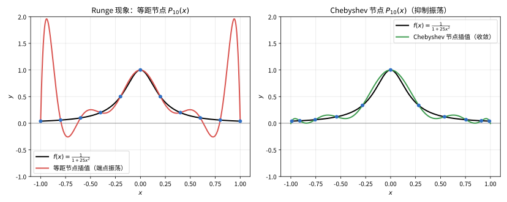

# 第 103 级：数值分析 (Numerical Analysis)

---

## 从"算不准的精确计算"说起：数值分析要解决的根问题

> 在动手背算法之前，先想清楚一个基本问题：**既然有高深的数学理论，人为什么还需要数值分析？**

**一个真实的生活场景（第一步：直觉）**

想象你接到一道"手算题"：求 $\int_0^1 e^{-x^2}\,dx$，或者解一个 $1000 \times 1000$ 的线性方程组。前者根本没有初等原函数、后者手写方程能写到天荒地老——你把笔一搁，喊了声"交给计算机"。但问题来了：你的"精确答案"下落不明，而机器其实也并不是真的"算得准"。它把小数按有限位数存起来，每做一次运算都偷偷丢一点点尾数；它用有限项去截断无穷过程，每截一次又丢一点"尾巴"。于是你真正需要的、也是数值分析毕生交付的，是这样一句话：**这一串近似操作到底会把答案带偏多远？我要怎样设计计算步骤，才能又快又稳地把误差压到我能接受的范围？**

**它到底想解决什么问题（第二步：要解决的问题）**

你会先惊讶地发现：连"数值分析"这门学科本身，都是时代逼出来的。几千年前人们求 $\sqrt{2}$、算 $\pi$ 就靠近似；牛顿求解方程、高斯做天文测量用最小二乘，都是"在解析手段无能为力时，用可控制的近似来逼近真值"的早期实践。但真正的转折是 20 世纪中叶计算机的诞生——ENIAC、氢弹计算、车床轨迹、火箭弹道……这些工程问题要求的不是"一个公式"，而是"能跑、能收敛、误差能估算"的一整套算法。于是"数值分析"从数学的边角料一跃成为独立学科，它要回答的**根问题**是：

> 在只拥有**有限精度**（浮点数舍入）与**有限时间**（算法复杂度）的机器上，怎样才能设计出既**高效**又**稳定**（误差不失控）的算法，算出足够精确的数值解，并且能说清误差大不大、为什么不大？

这里藏着一条贯穿全章的线索：**算式本身再漂亮，换到有限精度下也可能"算得一团糟"**——错误的算法会放大误差，病态的问题则天生就"碰不得"。所谓"会算"，是算法与问题两件事都要懂。

> **🧠 一句话记住数值分析的"出生证"**
>
> 数值分析源于"手算/解析无能为力、必须靠有限精度机器"的工程与科学计算，它要解决的**根本问题**是：
>
> $$ \boxed{\text{在有限精度、有限时间下，设计高效且误差可控的算法，算出足够精确的数值解。}} $$
>
> 它的两条腿分别是**误差分析**（这台机器算得多准）与**算法设计+稳定性/复杂度**（怎么算得快、算得稳）。后面每个方法，你都可以拿"误差如何控制、收敛有多快、是否稳定"这把尺子去量它。

**看待本章的三种眼光（第三步：正式定义前的准备）**

- **误差的眼光**：先把"机器精度、截断误差、舍入误差、条件数"这些尺子备好——它们将用来度量后面每一种算法的误差。
- **方法的眼光**：按问题分类逐个攻克——数据点怎么过（插值）、积分怎么近（数值积分）、微分怎么近（数值微分）、方程怎么求根（二分/Newton/割线）、线性方程与特征值怎么算（LU/迭代/QR/幂法）、复杂函数怎么近（逼近/FFT）。
- **理论的眼光**：最后把每个"能算"的背后逻辑升格成定理——插值存在唯一、Newton 二次收敛、Gauss 求积代数精度、QR 收敛、迭代收敛判别（谱半径）……让你不只"会操作"，更"懂为什么靠谱"。

读完这一节，你要记住的不是某条公式，而是：**数值分析始终在做同一件事——在"算不准"的世界里，用分析和设计把"不准"变成"可控、可用"。** 带着这个视角去读后面的每个方法，你会发现每一个公式和定理，最终都在回答四个字：**够用就好。**

---

## 开始之前

**本章在讲什么**：本章是"怎么在计算机上把数学问题算出数来"的门户。你会先建立误差分析（机器精度、截断误差、舍入误差、数值稳定性、条件数）这套通用语言，再按问题分门别类掌握具体数值方法：插值（Lagrange/Newton/Hermite/样条）、数值积分（Newton-Cotes/Gauss/Romberg）、数值微分、非线性方程求根（二分/Newton/割线）、线性方程组（LU/Cholesky 直接法与 Jacobi/Gauss-Seidel/SOR 迭代法）、特征值（幂法/QR）、函数逼近（Chebyshev/Padé）与快速 Fourier 变换，最后落在最小二乘与迭代收敛理论上。

**为什么要学它**：数值分析是一门"承上启下"的枢纽课。它把纯数学（微积分、线性代数、逼近论）**翻译成计算**：第 105 级数值线性代数专精线性方程组与特征值问题、第 104 级逼近论专注最优逼近理论，本章则是二者之上的总纲与算法工具箱；它又为第 106 级有限元方法、第 107 级微分方程数值解、第 115 级计算数学提供"离散化+误差控制"的骨架。可以说：**微积分与线性代数回答"公式怎么长"，数值分析回答"公式怎么算"，而有限元、科学计算则是"算得怎样用"。**

**开始前请确认你还记得**：

- 微积分（见第 11-13 级）：Taylor 展开、中值定理与 Rolle 定理、定积分的定义、一元与多元函数的导数与梯度。
- 线性代数（见第 14 级）：矩阵乘法、Gauss 消元、上/下三角矩阵、范数与特征值、矩阵分解的概念。
- 实数与极限（见第 10-11 级）：收敛序列、误差的 $O$ 记号、极限收敛阶。
- 算法与复杂度（见第 115 级基础或数据结构常识）：$O(n)$、$O(n^2)$、$O(n\log n)$ 的含义。

---

## 1. 学习目标

完成本教程后，你将能够：

1. 理解误差分析的基本概念与数值稳定性的含义
2. 掌握 Lagrange、Newton、Hermite 和样条插值方法
3. 理解插值多项式的存在唯一性定理与误差估计
4. 掌握 Newton-Cotes、Gauss 型和 Romberg 数值积分方法
5. 理解非线性方程求解的二分法、Newton 法和割线法
6. 掌握线性方程组的直接解法与迭代解法
7. 理解特征值计算的幂法和 QR 算法
8. 掌握函数逼近的 Chebyshev 和 Padé 方法
9. 了解快速 Fourier 变换的基本思想

---

## 2. 核心概念

### 2.1 误差分析

**误差**（Error）是数值近似值与真实值之间的差异。主要误差来源包括：

- **截断误差**（Truncation Error）：用有限项近似无限过程（如Taylor展开截断）
- **舍入误差**（Rounding Error）：计算机浮点数表示导致的精度损失
- **绝对误差**：$e = |x - \hat{x}|$
- **相对误差**：$\delta = |x - \hat{x}| / |x|$（$x \neq 0$）

**数值稳定性**（Numerical Stability）指算法对舍入误差的敏感程度。若算法中误差的传播被控制而非放大，则称算法是稳定的。

其中截断误差与舍入误差此消彼长，二者的权衡决定了最优步长：

![数值微分误差随步长 h 的变化（中心差分逼近 e^x 在 x=1 的导数）：截断误差 \sim\frac{e}{6}h^2 随 h 减小而下降，舍入误差 \sim\frac{e\,\varepsilon}{2h}（\varepsilon\approx2.2\times10^{-16}）随 h 减小而上升，总误差在最优步长 h^*\approx\sqrt[3]{3\varepsilon} 处取极小](images/level103-error-vs-step.svg)

> **直观理解（现实类比）**：这就像在"望远镜调焦"——步长太大，像截断误差一样"看得模糊"（近似太粗）；步长太小，又像放大镜把底片上的颗粒噪点（舍入误差）一起放大。总存在一个"甜蜜点" $h^*$，让两者达到平衡、误差最小。过度追求小步长反而会因计算机浮点数精度而让结果更糟。

> **🧠 思考历程：计算机算不准，可它凭什么还敢自称"精确"科学？**
>
> "截断误差"与"舍入误差"一起回答的，是数值分析那个尴尬的起点：误差反正躲不掉，那该让谁来当替罪羊？正确的回答不是消灭误差，而是学会把误差的账算得明明白白——这份"和误差共处"的达观，是1960年代一次惊心动魄的"平反"换来的。
>
> - **步长改一次、误差两头涨**。用有限差分逼近导数，步长 $h$ 越小截断误差越小，但在计算机里 $h$ 一旦缩小，舍入误差又趁机放大——于是存在一个"出错最少"的甜蜜点 $h^*$。这种"两头害怕"的拉锯，数值分析刚兴起就让人挠头。
> - **把包袱甩给"反向误差"**。1960年代 Wilkinson 提出向后误差分析：不必死磕舍入误差本身，只需证明"你算出的解，等价于对稍微扰动过的数据算出的精确解"。这一转向让无数"看上去算错了"的算法重获清白，也让病态性与稳定性成为可诊断的概念。
> - **对"会算错"彻底坦诚**。由此，"误差分析"不再只是追责，而是一套"我先承认会错、再告诉你错得多离谱"的契约——稳定算法、条件数与高精度插值，全都在这份契约上生长起来。
> - **心路**：真正的高精度工程不是从不犯错，而是把"错"的边界谈在明处——对近似保持一往情深，往往就是迈向精确的开始。

**关键定义：机器精度（machine epsilon）**。计算机浮点数只能表示有限多位数，我们把"使得 $1+\varepsilon > 1$ 成立的最小 $\varepsilon$"称为机器精度，双精度下 $\varepsilon \approx 2.2\times 10^{-16}$。它给出舍入误差的"量纲单位"：一切后续关于"舍入误差在哪个量级"的估计（如数值微分里的 $\varepsilon/h$）都以它为起点。

> **⚠️ 常见坑**：**"两个几乎相等的数相减"会引爆灾难性抵消**。例如用前向差分近似导数，当 $h$ 极小时 $f(x+h)$ 与 $f(x)$ 几乎相等，两者相减后有效位几乎全部消失，再除以很小的 $h$，误差被放大成灾难。同理，计算 $x^2+1$ 对很大的 $x$ 时，区分 $x$ 与 $\sqrt{x^2+1}-x$ 需要用恒等变形避免大数相减。**小小一个"减法"，往往是有限精度下误差失控的头号元凶。**

### 2.2 插值

> **🌐 直觉先行（为什么需要这个概念）**：实验中你只测到一列稀疏的数据点，却想估计没测到的地方"大约是多少"（比如每 6 小时记一次体温、要猜中间某刻）。**插值**就是构造一条"正好穿过所有已知点、又足够光滑"的曲线来充当这个估计器。要注意它与"拟合（最小二乘）"的区别：插值刹零误差地穿越每个点，而拟合允许误差、只求总体最近——数据精确时用插值，数据带噪声时用拟合。

**插值**（Interpolation）是通过已知数据点构造一个函数，使得该函数在给定点处取指定值，并用于估计未知点处的函数值。

常用插值方法包括：

- **Lagrange插值**：$L_n(x) = \sum_{i=0}^n y_i \ell_i(x)$，其中 $\ell_i(x) = \prod_{j \neq i} \frac{x - x_j}{x_i - x_j}$
- **Newton插值**：$N_n(x) = f[x_0] + \sum_{k=1}^n f[x_0, \dots, x_k] \prod_{i=0}^{k-1} (x - x_i)$，其中 $f[x_0, \dots, x_k]$ 为差商
- **Hermite插值**：同时满足函数值和导数值条件的插值
- **样条插值**：分段低次多项式插值，在节点处保持光滑性

插值节点的选取对高次插值的稳定性影响巨大，以 Runge 函数 $f(x)=1/(1+25x^2)$ 为例：

> **直观理解（现实类比）**：这就像"用晾衣绳串珠子"——等距节点就像在晾衣杆上均匀钉钉子，线绳在两端会剧烈甩动（Runge现象），越靠近端点甩得越厉害；Chebyshev 节点则像刻意把钉子两端加密、中间放宽，让绳子受力均匀、稳稳贴合真实的"布料轮廓"。所以工程上逼近光滑曲线时，往往要"两端多布点，中间少布点"。

### 2.3 数值积分

> **🌐 直觉先行（为什么需要这个概念）**：微积分自诩"能算积分"，但现实中绝大多数被积函数（如 $e^{-x^2}$、$1/(1+x^2)$、实验测得的散点）要么没有初等原函数，要么连表达式都没有。这时"求积分"就退化成一个求和问题——**数值积分正是一个正确求和的艺术**：用被积函数在一小撮点上的取值，拼出对整个面积的精确近似。

**数值积分**（Numerical Integration）是用数值方法近似计算定积分 $\int_a^b f(x) dx$。

- **Newton-Cotes公式**：等距节点，包括梯形法则、Simpson法则等
- **Gauss型求积公式**：选择最优节点和权重，达到最高代数精度
- **Romberg积分**：基于Richardson外推提高精度

### 2.4 数值微分

> **🌐 直觉先行（为什么需要这个概念）**：工程里常只有一张"位置-时间"表格，却想知道"某时刻的速度"；或只能采样函数值、读不到解析式，却要它的导数——解析求导无从下手时，就只能用**差商**来近似斜率。注意数值微分是"误差两头拉"的最典型例子（见 2.1 图）：$h$ 太小舍入误差把结果毁掉，它恰恰最适合用来说明"最优步长"为什么存在。

**数值微分**（Numerical Differentiation）用差商近似导数：

- **前向差分**：$f'(x) \approx \frac{f(x+h) - f(x)}{h}$
- 中心差分：$f'(x) \approx \frac{f(x+h) - f(x-h)}{2h}$
- 五点公式：更高精度的差分公式

> **⚠️ 常见坑**：别盲目把 $h$ 取得极小——当 $h$ 小于某个量级（约 $\sqrt{\varepsilon}$）后，$f(x+h)$ 与 $f(x)$ 在有限精度下几乎"撞车"，舍入误差 $\sim \varepsilon/h$ 反而暴涨（灾难性抵消）。中心差分 $(f(x+h)-f(x-h))/2h$ 比前向差分更对称、截断误差高一阶，相同 $h$ 下更准，应优先使用。

### 2.5 非线性方程求解

> **🌐 直觉先行（为什么需要这个概念）**：$x^2-2=0$、$\cos x = x$、纯利率方程……太多方程的根没有公式可解，只能靠迭代"猜"。它们共同的问题只有一句：**从某个初值出发，怎样一步一步逼近那个看不见的根，并且飞得越快越好？** 二分法稳但慢，Newton 法快但挑初值，割线法居中——三者互补，正是一个"稳健开局 + 快速收尾"的组合拳。

求解 $f(x) = 0$ 的数值方法：

- **二分法**（Bisection）：基于介值定理，每次将区间减半

> **💡 直观理解（类比）**：二分法像玩"猜数字游戏"——每次把可能区间对半砍掉，只要两端函数值一正一负（说明零点夹在中间），就一定能稳稳逮到零点。它从不迷路但走得慢（每步误差只减半），像个"绝不取巧、稳步逼近"的固执搜索者，适合开局拿它先锁定一个大致范围。

- **Newton法**：$x_{k+1} = x_k - \frac{f(x_k)}{f'(x_k)}$，具有局部二次收敛性

> **💡 直观理解（类比）**：Newton法像"顺着山坡切线往谷底滑"——站在当前点，沿该点切线的方向滑到它与横轴的交点，再在新位置重新划线滑一次。切线贴合得好（初值离根近）就飞快，误差每步大约"平方式"缩小（三位变六位再变十二位）；但若初值太远或切线几乎水平（$f'\approx0$），容易滑过头甚至冲偏。

- **割线法**：$x_{k+1} = x_k - \frac{f(x_k)(x_k - x_{k-1})}{f(x_k) - f(x_{k-1})}$，超线性收敛

> **💡 直观理解（类比）**：割线法像"不走切线、改用近旁两点连一条弦来探路"——它用前两步的点连出的弦与横轴交点作为下一步，省去了求导数 $f'$ 的麻烦（很多实际问题导数难算或不可得），代价是多一条弦、收敛降为略次的高阶（超线性）。相当于"以旧带新、两眼看校准"，在导数昂贵时是Newton法的贴心替身。

### 2.6 线性方程组求解

求解 $A\boldsymbol{x} = \boldsymbol{b}$ 的方法：

**直接法**：
- **Gauss消元法**：通过行变换将系数矩阵化为上三角矩阵
- **LU分解**：$A = LU$，其中 $L$ 为单位下三角矩阵，$U$ 为上三角矩阵

> **💡 直观理解（类比）**：LU分解像"把解方程这道大题拆成两道好做的小题"——先花一次力气把矩阵拆成一对互补的三角矩阵，之后无论换多少个右端项 $\boldsymbol{b}$，都只需"顺流而下"（前代）再"逆流而上"（回代）两次，不必重新做繁重的消元，如同配好钥匙后每次开门都用同一套步骤。

- **Cholesky分解**：对称正定矩阵的 $A = LL^\top$ 分解

> **⚠️ 常见坑**：**不要指望"数学上唯一"的 LU 分解在数值上永远稳**。若某步主元 $a_{kk}$ 很小或为零，直接高斯消元会引出巨大舍入误差甚至除以零崩溃——这就是要引入**部分主元消去（行交换，保证主元尽量大）**的原因。另外 Cholesky 只对对称正定矩阵生效，别把它硬套到一般矩阵上；做正规方程 $A^\top A\mathbf{x}=A^\top\mathbf{b}$ 也会把条件数平方（$\kappa(A^\top A)=\kappa(A)^2$），大矩阵建议改用 QR 最小二乘。

**迭代法**：
- **Jacobi迭代**：$x_i^{(k+1)} = \frac{1}{a_{ii}}(b_i - \sum_{j \neq i} a_{ij} x_j^{(k)})$
- **Gauss-Seidel迭代**：使用最新计算的 $x_j$ 值
- **SOR方法**：超松弛迭代加速收敛

### 2.7 特征值计算

- **幂法**（Power Method）：计算最大模特征值及对应特征向量
- **QR算法**：通过 $QR$ 分解迭代计算全部特征值

### 2.8 函数逼近

- **Chebyshev逼近**：使用Chebyshev多项式作为基函数的最优一致逼近
- **Padé逼近**：用有理函数逼近给定函数，比多项式逼近更高效

### 2.9 快速 Fourier 变换

> **🌐 直觉先行（为什么需要这个概念）**：把一段声音或信号"拆成不同频率的正弦波之和"，这本质上是离散 Fourier 变换（DFT）。但直接按定义算 $n$ 个频率是 $O(n^2)$——一秒音频上万点就卡死。**FFT 的价值在于利用 $e^{2\pi i/n}$ 的对称与周期结构，把复杂度从 $O(n^2)$ 砍到 $O(n\log n)$**，让频谱分析真正"跑得动"。它是数值分析里"用算法结构换速度"的典范。

**FFT**（Fast Fourier Transform）是计算离散Fourier变换（DFT）的高效算法，将 $O(n^2)$ 的复杂度降低到 $O(n\log n)$。

### 2.10 曲线拟合与最小二乘法

**最小二乘法**（Least Squares）是"计算方法"中处理含误差数据的核心方法：当数据点不满足精确插值时，寻求一条曲线使其在总体上最优地逼近数据，而不是逐点穿过。

对于超定线性方程组 $A\boldsymbol{x} \approx \boldsymbol{b}$（方程数多于未知数），最小二乘解 $\boldsymbol{x}^*$ 使残差平方和 $\|A\boldsymbol{x} - \boldsymbol{b}\|_2^2$ 取最小。由梯度为零导出**正规方程**（Normal Equations）：

$$
A^\top A \boldsymbol{x} = A^\top \boldsymbol{b}.
$$

若 $\mathrm{rank}(A) = n$（列满秩），则 $A^\top A$ 对称正定，正规方程有唯一解：

$$
\boldsymbol{x}^* = (A^\top A)^{-1} A^\top \boldsymbol{b}.
$$

**多项式拟合**是最常见的情形：求 $m$ 次多项式 $p(x) = c_0 + c_1 x + \cdots + c_m x^m$，使 $\sum_{i=1}^N [p(x_i) - y_i]^2$ 最小。令 $A_{ij} = x_i^{j-1}$（Vandermonde型设计矩阵），问题即化为上述正规方程。

> **直观理解（现实类比）**：这就像"画一条尽量贴近所有散点的直线"——不是让线穿过每个点（那样会剧烈抖动），而是让"点到直线的竖直距离平方和"最小。测量误差难免存在，最小二乘在统计与工程中被广泛用于回归、滤波和系统辨识。

### 2.11 迭代法的收敛性

求解线性方程组的迭代法 $\boldsymbol{x}^{(k+1)} = B\boldsymbol{x}^{(k)} + \boldsymbol{c}$ 是否收敛，由迭代矩阵 $B$ 的性质决定。

**收敛定理**：对任意初值 $\boldsymbol{x}^{(0)}$，迭代收敛到唯一解 $\boldsymbol{x}$ 当且仅当迭代矩阵 $B$ 的**谱半径** $\rho(B) < 1$，其中 $\rho(B) = \max_i |\lambda_i|$ 为 $B$ 的最大特征值模。且收敛速度由 $\rho(B)$ 控制，$\rho(B)$ 越小收敛越快。

> **💡 直观理解（类比）**：谱半径 $\rho(B)$ 像"每轮迭代把误差缩小的最坏倍数"——若这个倍数小于1，误差就像雪球被不断搓小，最终滚向零（收敛）；若大于1，误差反而越滚越大（发散）。$\rho(B)$ 越接近1，收敛越跟蜗牛一样慢；越接近0，收敛快得像坐滑梯。

对 $A\boldsymbol{x} = \boldsymbol{b}$：
- **Jacobi迭代**：$B_J = D^{-1}(L + U)$，其中 $D$ 为对角部分，$L$、$U$ 分别为严格下、上三角部分。
- **Gauss-Seidel迭代**：$B_{GS} = (D - L)^{-1} U$。

**充分条件（对角占优）**：若 $A$ 是**严格对角占优**矩阵，即对每个 $i$，$|a_{ii}| > \sum_{j \neq i} |a_{ij}|$，则 Jacobi 与 Gauss-Seidel 迭代均收敛。若 $A$ 对称正定，则 Gauss-Seidel 迭代收敛。

**SOR方法**：引入松弛因子 $\omega \in (0, 2)$，

$$
x_i^{(k+1)} = (1-\omega)x_i^{(k)} + \frac{\omega}{a_{ii}}\left(b_i - \sum_{j<i} a_{ij}x_j^{(k+1)} - \sum_{j>i} a_{ij}x_j^{(k)}\right).
$$

> **💡 直观理解（类比）**：SOR方法像"上台阶时故意多迈一步、再往回走走试试"——松弛因子 $\omega$ 就是"步幅调节旋钮"：$\omega>1$ 时大步向前（超松弛）以加快逼近，$\omega<1$ 时保守小步以防震荡。调得太猛容易过头反复，调得太小又太慢，找到最优 $\omega$（通常略大于1）就能显著提速。

当 $0 < \omega < 2$ 时 SOR 收敛；选取最优松弛因子可显著加速收敛。

### 2.12 矩阵条件数与病态方程组

方程组的**条件数**（Condition Number）刻画解对输入扰动的敏感程度：

$$
\kappa(A) = \|A\| \cdot \|A^{-1}\| = \frac{\sigma_{\max}(A)}{\sigma_{\min}(A)},
$$

其中 $\sigma_{\max}$、$\sigma_{\min}$ 为 $A$ 的最大、最小奇异值。若 $A\boldsymbol{x} = \boldsymbol{b}$ 中 $\boldsymbol{b}$ 有相对扰动 $\delta\boldsymbol{b}$，则解的相对误差满足：

$$
\frac{\|\delta\boldsymbol{x}\|}{\|\boldsymbol{x}\|} \le \kappa(A) \frac{\|\delta\boldsymbol{b}\|}{\|\boldsymbol{b}\|}.
$$

**病态问题**（Ill-Conditioned）：当 $\kappa(A)$ 很大时，右端项或系数的微小变化会引发解的剧烈变化，这类方程组即使算法稳定也难以获得可靠解。条件数也是衡量"求解问题本身难度"的量，与所采用算法无关。

> **直观理解（现实类比）**：条件数像"放大镜的放大倍数"——$\kappa$ 大（如 Hilbert 矩阵）意味着输入端极小的误差也会被放大成输出端很大的误差。数值分析中不仅要选稳定算法，还要避开病态问题本身。

> **⚠️ 常见坑**：条件数是**问题本身**的属性，数值稳定性是**算法**的属性——"问题病态"与"算法不稳定"是两件不同的事，条件数再大也只给出解被扰动的敏感上界，并不等于算法会算错；而一个再稳定的算法，也无助于求解 $\kappa$ 极大的病态问题。所以当我们看到一个残差很大/解很离谱的结果，要先问一句：**是问题本身条件数太大，还是算法不稳定？** 二者对策完全不同（前者换基/预条件/正则化，后者换算法）。

---

## 3. 定理与证明

### 定理 3.1：插值多项式的存在唯一性

**定理**：给定 $n+1$ 个互异节点 $(x_0, y_0), (x_1, y_1), \dots, (x_n, y_n)$，其中 $x_i \neq x_j$（$i \neq j$），则存在唯一一个次数不超过 $n$ 的多项式 $P_n(x)$，满足插值条件：

$$
P_n(x_i) = y_i, \quad i = 0, 1, \dots, n
$$

**证明**：

**步骤1：存在性（构造性证明）**

构造Lagrange插值多项式：

$$
P_n(x) = \sum_{i=0}^n y_i \ell_i(x), \quad \ell_i(x) = \prod_{j=0, j \neq i}^n \frac{x - x_j}{x_i - x_j}
$$

每个 $\ell_i(x)$ 是 $n$ 次多项式，满足：

$$
\ell_i(x_k) = \delta_{ik} = 
\begin{cases}
1, & k = i \\
0, & k \neq i
\end{cases}
$$

因此 $P_n(x_k) = \sum_{i=0}^n y_i \ell_i(x_k) = y_k$，即 $P_n(x)$ 满足插值条件。由于 $\ell_i(x)$ 均为 $n$ 次多项式，$P_n(x)$ 的次数不超过 $n$，存在性得证。

**步骤2：唯一性（用Vandermonde行列式）**

设 $P_n(x) = a_0 + a_1 x + a_2 x^2 + \cdots + a_n x^n$，插值条件给出线性方程组：

$$
\begin{pmatrix}
1 & x_0 & x_0^2 & \cdots & x_0^n \\
1 & x_1 & x_1^2 & \cdots & x_1^n \\
\vdots & \vdots & \vdots & \ddots & \vdots \\
1 & x_n & x_n^2 & \cdots & x_n^n
\end{pmatrix}
\begin{pmatrix}
a_0 \\ a_1 \\ \vdots \\ a_n
\end{pmatrix}
=
\begin{pmatrix}
y_0 \\ y_1 \\ \vdots \\ y_n
\end{pmatrix}
$$

系数矩阵为**Vandermonde矩阵**，其行列式为：

$$
\det V = \prod_{0 \le i < j \le n} (x_j - x_i)
$$

由于节点互异，$x_j - x_i \neq 0$ 对所有 $i \neq j$ 成立，故 $\det V \neq 0$。系数矩阵可逆，方程组有唯一解，因此插值多项式唯一存在。

**步骤3：等价性说明**

Lagrange形式和Newton形式的插值多项式是同一个多项式（由唯一性保证），只是表示方式不同。$\square$

---

### 定理 3.2：插值误差定理

**定理**：设 $f \in C^{n+1}[a, b]$，$P_n(x)$ 为 $f(x)$ 在互异节点 $x_0, x_1, \dots, x_n \in [a, b]$ 上的 $n$ 次插值多项式。则对任意 $x \in [a, b]$，存在 $\xi(x) \in (a, b)$，使得插值误差为：

$$
R_n(x) = f(x) - P_n(x) = \frac{f^{(n+1)}(\xi)}{(n+1)!} \prod_{i=0}^n (x - x_i)
$$

**证明**：

**步骤1：构造辅助函数**

若 $x$ 等于某节点 $x_i$，则 $R_n(x_i) = 0$，定理平凡成立。

设 $x$ 不是节点。定义辅助函数：

$$
\phi(t) = f(t) - P_n(t) - \frac{f(x) - P_n(x)}{\prod_{i=0}^n (x - x_i)} \prod_{i=0}^n (t - x_i)
$$

其中 $t \in [a, b]$。注意 $\phi(t)$ 在 $t$ 处具有 $n+1$ 阶连续导数。

**步骤2：验证 $\phi(t)$ 的零点**

- 当 $t = x$ 时：$\phi(x) = f(x) - P_n(x) - [f(x) - P_n(x)] \cdot \frac{\prod_{i=0}^n (x - x_i)}{\prod_{i=0}^n (x - x_i)} = 0$
- 当 $t = x_k$（$k = 0, 1, \dots, n$）时：$\prod_{i=0}^n (x_k - x_i) = 0$，且 $P_n(x_k) = f(x_k)$，故 $\phi(x_k) = 0$

因此 $\phi(t)$ 在 $[a, b]$ 上至少有 $n+2$ 个零点：$x, x_0, x_1, \dots, x_n$。

**步骤3：反复应用Rolle定理**

由Rolle定理，$\phi'(t)$ 在相邻零点之间至少有一个零点，因此 $\phi'(t)$ 在 $[a, b]$ 上至少有 $n+1$ 个零点。

重复应用Rolle定理，$\phi''(t)$ 至少有 $n$ 个零点，依此类推，$\phi^{(n+1)}(t)$ 在 $[a, b]$ 上至少有一个零点，记该零点为 $\xi$。

**步骤4：计算 $\phi^{(n+1)}(t)$**

$P_n(t)$ 是 $n$ 次多项式，故 $P_n^{(n+1)}(t) = 0$。

$\prod_{i=0}^n (t - x_i)$ 是 $n+1$ 次多项式，首项系数为 $1$，故其 $n+1$ 阶导数为 $(n+1)!$。

因此：

$$
\phi^{(n+1)}(t) = f^{(n+1)}(t) - 0 - \frac{f(x) - P_n(x)}{\prod_{i=0}^n (x - x_i)} \cdot (n+1)!
$$

**步骤5：代入零点**

在 $\xi$ 处 $\phi^{(n+1)}(\xi) = 0$，故：

$$
f^{(n+1)}(\xi) - \frac{f(x) - P_n(x)}{\prod_{i=0}^n (x - x_i)} \cdot (n+1)! = 0
$$

解得：

$$
f(x) - P_n(x) = \frac{f^{(n+1)}(\xi)}{(n+1)!} \prod_{i=0}^n (x - x_i)
$$

$\square$

---

### 定理 3.3：Newton法的局部收敛性

**定理**：设 $f \in C^2[a, b]$，$x^* \in (a, b)$ 是 $f(x) = 0$ 的单根，即 $f(x^*) = 0$ 且 $f'(x^*) \neq 0$。则存在 $\delta > 0$，使得当初始值 $x_0 \in (x^* - \delta, x^* + \delta)$ 时，Newton迭代：

$$
x_{k+1} = x_k - \frac{f(x_k)}{f'(x_k)}, \quad k = 0, 1, 2, \dots
$$

产生的序列 $\{x_k\}$ 收敛到 $x^*$，且收敛阶为2（二次收敛），即：

$$
\lim_{k \to \infty} \frac{|x_{k+1} - x^*|}{|x_k - x^*|^2} = \frac{|f''(x^*)|}{2|f'(x^*)|}
$$

**证明**：

**步骤1：将Newton法视为压缩映射**

定义Newton迭代函数：

$$
\varphi(x) = x - \frac{f(x)}{f'(x)}
$$

则 $x_{k+1} = \varphi(x_k)$，且 $x^*$ 是 $\varphi$ 的不动点：$\varphi(x^*) = x^*$。

**步骤2：证明 $\varphi$ 在 $x^*$ 附近是压缩映射**

计算 $\varphi'(x)$：

$$
\varphi'(x) = 1 - \frac{f'(x) f'(x) - f(x) f''(x)}{[f'(x)]^2} = 1 - 1 + \frac{f(x) f''(x)}{[f'(x)]^2} = \frac{f(x) f''(x)}{[f'(x)]^2}
$$

在 $x^*$ 处，$f(x^*) = 0$，故 $\varphi'(x^*) = 0$。

由 $\varphi'$ 的连续性，存在 $\delta_1 > 0$，使得当 $|x - x^*| < \delta_1$ 时，$|\varphi'(x)| < 1/2$（或任何小于1的正数）。因此 $\varphi$ 在 $x^*$ 的邻域内是压缩映射。

**步骤3：收敛性证明**

由压缩映射原理，存在 $\delta \in (0, \delta_1)$，使得当 $x_0 \in (x^* - \delta, x^* + \delta)$ 时，序列 $\{x_k\}$ 收敛到 $x^*$。

**步骤4：收敛阶的估计（用Taylor展开）**

将 $f(x^*)$ 在 $x_k$ 处展开：

$$
0 = f(x^*) = f(x_k) + f'(x_k)(x^* - x_k) + \frac{1}{2} f''(\eta_k)(x^* - x_k)^2
$$

其中 $\eta_k$ 在 $x_k$ 与 $x^*$ 之间。

由Newton迭代公式：

$$
x_{k+1} = x_k - \frac{f(x_k)}{f'(x_k)}
$$

代入得：

$$
x_{k+1} - x^* = x_k - x^* - \frac{f(x_k)}{f'(x_k)} = -\frac{1}{f'(x_k)} \left[ f(x_k) + f'(x_k)(x^* - x_k) \right]
$$

利用Taylor展开：

$$
x_{k+1} - x^* = -\frac{1}{f'(x_k)} \cdot \frac{1}{2} f''(\eta_k)(x^* - x_k)^2 = \frac{f''(\eta_k)}{2f'(x_k)} (x_k - x^*)^2
$$

**步骤5：取极限**

当 $k \to \infty$ 时，$x_k \to x^*$，$\eta_k \to x^*$，$f'(x_k) \to f'(x^*) \neq 0$，因此：

$$
\lim_{k \to \infty} \frac{|x_{k+1} - x^*|}{|x_k - x^*|^2} = \frac{|f''(x^*)|}{2|f'(x^*)|}
$$

收敛阶为2，即二次收敛。$\square$

---

### 定理 3.4：Gauss求积公式的代数精度

**定理**：$n$ 点Gauss型求积公式：

$$
\int_a^b f(x) w(x) dx \approx \sum_{i=1}^n A_i f(x_i)
$$

其中 $w(x) \ge 0$ 为权函数，节点 $x_i$ 为区间 $[a, b]$ 上关于权函数 $w(x)$ 的 $n$ 次正交多项式的根，系数 $A_i$ 由插值条件确定。则Gauss求积公式的代数精度为 $2n-1$，即它能精确积分所有次数不超过 $2n-1$ 的多项式，且不存在 $2n$ 次多项式能使公式精确成立。

**证明**：

**步骤1：正交多项式的性质**

设 $\{p_k(x)\}_{k=0}^\infty$ 为区间 $[a, b]$ 上关于权函数 $w(x)$ 的正交多项式序列，满足：

$$
\int_a^b p_m(x) p_n(x) w(x) dx = 0, \quad m \neq n
$$

$p_n(x)$ 的最高次项系数为正，且 $p_n(x)$ 在 $(a, b)$ 上有 $n$ 个互异零点。

**步骤2：节点选择与系数计算**

Gauss求积公式的节点 $x_1, \dots, x_n$ 取为 $p_n(x)$ 的 $n$ 个零点。系数 $A_i$ 由插值条件确定：

$$
A_i = \int_a^b \ell_i(x) w(x) dx, \quad \ell_i(x) = \prod_{j \neq i} \frac{x - x_j}{x_i - x_j}
$$

**步骤3：证明代数精度至少为 $2n-1$**

设 $f(x)$ 为任意次数不超过 $2n-1$ 的多项式。用 $p_n(x)$ 除 $f(x)$：

$$
f(x) = q(x) p_n(x) + r(x)
$$

其中 $q(x)$ 和 $r(x)$ 均为次数不超过 $n-1$ 的多项式。

由于 $p_n(x_i) = 0$（$x_i$ 为 $p_n$ 的根），故 $f(x_i) = r(x_i)$。

求积公式的值：

$$
\sum_{i=1}^n A_i f(x_i) = \sum_{i=1}^n A_i r(x_i)
$$

由插值型求积公式的性质，$n$ 点插值型求积公式对所有次数不超过 $n-1$ 的多项式精确成立，因此：

$$
\sum_{i=1}^n A_i r(x_i) = \int_a^b r(x) w(x) dx
$$

另一方面，精确积分为：

$$
\int_a^b f(x) w(x) dx = \int_a^b q(x) p_n(x) w(x) dx + \int_a^b r(x) w(x) dx
$$

由于 $q(x)$ 是次数不超过 $n-1$ 的多项式，由正交性：

$$
\int_a^b q(x) p_n(x) w(x) dx = 0
$$

因此：

$$
\int_a^b f(x) w(x) dx = \int_a^b r(x) w(x) dx = \sum_{i=1}^n A_i f(x_i)
$$

即求积公式对所有次数不超过 $2n-1$ 的多项式精确成立，代数精度至少为 $2n-1$。

**步骤4：证明 $2n$ 次多项式不能精确成立**

考虑 $2n$ 次多项式 $f(x) = [p_n(x)]^2$。则 $f(x_i) = 0$，故：

$$
\sum_{i=1}^n A_i f(x_i) = 0
$$

但精确积分：

$$
\int_a^b [p_n(x)]^2 w(x) dx > 0
$$

因为 $p_n(x)$ 不恒为零，且 $w(x) \ge 0$。因此求积公式不能精确积分 $f(x)$，代数精度不能达到 $2n$。

综上，Gauss求积公式的代数精度恰好为 $2n-1$。$\square$

---

### 定理 3.5：QR算法的收敛性

**定理**：设 $A \in \mathbb{R}^{n \times n}$ 为对称矩阵，其特征值满足 $|\lambda_1| > |\lambda_2| > \cdots > |\lambda_n| > 0$（特征值互异且按模严格递减）。QR算法迭代生成矩阵序列 $\{A_k\}$：

$$
A_k = Q_k R_k, \quad A_{k+1} = R_k Q_k, \quad k = 0, 1, 2, \dots
$$

其中 $A_0 = A$，$Q_k$ 为正交矩阵，$R_k$ 为上三角矩阵。则当 $k \to \infty$ 时，$A_k$ 的下三角部分趋于对角矩阵，对角线元素收敛到 $A$ 的特征值：

$$
\lim_{k \to \infty} (A_k)_{ii} = \lambda_i, \quad i = 1, 2, \dots, n
$$

> **💡 直观理解（类比）**：QR算法像"多个人同时向不同特征方向拍球，看谁先蹦到顶端"——它本质是同时对一组特征向量做幂法，靠正交分解逐轮把矩阵"拧"得越来越接近对角形，对角线上的数字就逐个浮出正在求的特征值。配合位移技巧如同给球"加助推器"，能让最慢的那几个特征值也快速浮出水面。

**证明思路**：

**步骤1：QR算法与幂法的关系**

QR算法实质上是同时对所有特征向量进行幂法迭代。记 $A^k$ 的QR分解为 $A^k = Q^{(k)} R^{(k)}$，则可以证明QR算法中 $A_k = (Q^{(k)})^\top A Q^{(k)}$，即 $A_k$ 是 $A$ 在正交变换下的相似矩阵。

**步骤2：$A^k$ 的渐近行为**

由特征值分解 $A = X \Lambda X^{-1}$，其中 $\Lambda = \text{diag}(\lambda_1, \dots, \lambda_n)$，$X$ 为特征向量矩阵。则：

$$
A^k = X \Lambda^k X^{-1}
$$

当 $k$ 充分大时，最大特征值 $\lambda_1$ 主导，$A^k \approx \lambda_1^k x_1 y_1^\top$，其中 $x_1$ 和 $y_1$ 分别为左右特征向量。

**步骤3：$A^k$ 的QR分解**

$A^k$ 的QR分解中，$Q^{(k)}$ 的列向量渐近地趋向于 $A$ 的特征向量（按特征值模的大小排序）。具体地：

$$
Q^{(k)} = \text{GS}(A^k) = \text{GS}(X \Lambda^k X^{-1})
$$

其中 $\text{GS}$ 表示Gram-Schmidt正交化过程。

由 $\Lambda^k$ 的对角元素指数级差异，$X^{-1}$ 的三角分解性质，可证明 $Q^{(k)}$ 收敛到 $X$ 的某个正交化版本。

**步骤4：$A_k$ 的收敛性**

由于 $A_k = (Q^{(k)})^\top A Q^{(k)}$，而 $Q^{(k)}$ 收敛到特征向量矩阵（经正交化），因此 $A_k$ 收敛到对角矩阵，对角线元素为 $A$ 的特征值。

**步骤5：收敛速率**

若 $|\lambda_i| > |\lambda_{i+1}|$，则 $(A_k)_{i,i+1}$ 以速率 $|\lambda_{i+1}/\lambda_i|^k$ 收敛到0，对角元素以线性速率收敛到特征值。

实际应用中，QR算法通常配合**位移技巧**（Shift）来加速收敛，如 $A_k - \mu_k I = Q_k R_k$，$A_{k+1} = R_k Q_k + \mu_k I$，其中 $\mu_k$ 近似于某个特征值。$\square$

---

## 4. 示例

### 示例 1：Runge现象与Chebyshev插值

**问题**：Runge函数 $f(x) = 1/(1 + 25x^2)$ 在 $[-1, 1]$ 上的等距插值出现严重振荡（Runge现象），使用Chebyshev节点改进。

**步骤1：定义问题**

在 $[-1, 1]$ 上取 $n+1$ 个等距节点 $x_i = -1 + 2i/n$，构造 $n$ 次Lagrange插值多项式 $P_n(x)$。

当 $n$ 增大时，$P_n(x)$ 在区间端点附近出现剧烈振荡，最大误差趋于无穷大（Runge现象）。

**步骤2：Chebyshev节点**

取Chebyshev多项式的零点作为插值节点：

$$
x_i = \cos\left(\frac{2i+1}{2n+2}\pi\right), \quad i = 0, 1, \dots, n
$$

这些节点在区间端点处更密集，可有效抑制Runge现象。

**步骤3：误差分析**

由插值误差定理：

$$
|f(x) - P_n(x)| \le \frac{\max_{[-1,1]} |f^{(n+1)}(\xi)|}{(n+1)!} \max_{[-1,1]} \left|\prod_{i=0}^n (x - x_i)\right|
$$

对于Chebyshev节点，$\prod_{i=0}^n (x - x_i)$ 的最大值最小化（Chebyshev多项式的极小极大性质）：

$$
\max_{x \in [-1,1]} \left|\prod_{i=0}^n (x - x_i)\right| = 2^{-n}
$$

因此误差上界为 $|f(x) - P_n(x)| \le \frac{\max |f^{(n+1)}(\xi)|}{2^n (n+1)!}$。

**步骤4：数值比较**

对于 $n = 10$：

- 等距节点：最大误差约 1.92（端点附近严重振荡）
- Chebyshev节点：最大误差约 0.003（均匀收敛）

---

### 示例 2：用Newton法求解非线性方程

**问题**：求解方程 $f(x) = x^3 - 2x - 5 = 0$ 在 $x = 2$ 附近的根。

**步骤1：验证条件**

$f'(x) = 3x^2 - 2$，$f''(x) = 6x$。

在 $x = 2$ 处：$f(2) = 8 - 4 - 5 = -1 < 0$，$f(3) = 27 - 6 - 5 = 16 > 0$，由介值定理，根在 $(2, 3)$ 内。

$f'(2) = 10 \neq 0$，满足单根条件。

**步骤2：Newton迭代**

取 $x_0 = 2$，迭代公式：

$$
x_{k+1} = x_k - \frac{x_k^3 - 2x_k - 5}{3x_k^2 - 2}
$$

**步骤3：迭代过程**

| $k$ | $x_k$ | $f(x_k)$ |
|:---:|:---:|:---:|
| 0 | 2.00000000 | -1.0000 |
| 1 | 2.10000000 | 0.0610 |
| 2 | 2.09456812 | 0.0002 |
| 3 | 2.09455148 | $< 10^{-8}$ |

仅需3次迭代就达到 $10^{-8}$ 精度，体现了Newton法的二次收敛特性。

**步骤4：收敛阶验证**

计算误差比：

$$
\frac{|x_3 - x^*|}{|x_2 - x^*|^2} \approx \frac{1.6 \times 10^{-8}}{(1.66 \times 10^{-5})^2} \approx 0.058
$$

而理论值 $\frac{|f''(x^*)|}{2|f'(x^*)|} = \frac{6 \times 2.0945}{2 \times (3 \times 2.0945^2 - 2)} \approx 0.057$，高度吻合。

---

### 示例 3：Gauss-Legendre求积公式

**问题**：用2点Gauss-Legendre求积公式计算 $\int_{-1}^1 e^x dx$ 的近似值。

**步骤1：确定节点和系数**

2次Legendre多项式 $P_2(x) = (3x^2 - 1)/2$ 的零点为 $x_1 = -1/\sqrt{3}$，$x_2 = 1/\sqrt{3}$。

系数：

$$
A_1 = A_2 = \int_{-1}^1 \frac{x - x_2}{x_1 - x_2} dx = 1
$$

**步骤2：计算近似值**

$$
\int_{-1}^1 e^x dx \approx A_1 e^{x_1} + A_2 e^{x_2} = e^{-1/\sqrt{3}} + e^{1/\sqrt{3}} \approx 0.6738 + 1.4810 = 2.3428
$$

**步骤3：与精确值比较**

精确值：$\int_{-1}^1 e^x dx = e^1 - e^{-1} \approx 2.7183 - 0.3679 = 2.3504$

误差：$|2.3504 - 2.3428| = 0.0076$，相对误差约 0.32%。

2点Gauss公式的代数精度为 $2 \times 2 - 1 = 3$，而 $e^x$ 不是多项式，因此存在误差。使用更多节点可提高精度。

---

### 示例 4：用LU分解求解线性方程组

**问题**：求解线性方程组：

> **💡 直观理解（类比）**：这个例子演示了LU分解"拆一道难题为两道小题"的流程——先按行变换把系数矩阵拆成下三角 $L$ 与上三角 $U$，再靠"前代（自上而下）、回代（自下而上）"两步收尾。真正的一次性成本在分解本身，之后换任何右端项都只需两次快速代代。

$$
\begin{cases}
2x_1 + x_2 + x_3 = 5 \\
4x_1 + 3x_2 + 3x_3 = 11 \\
-2x_1 + x_2 - x_3 = -2
\end{cases}
$$

**步骤1：LU分解**

系数矩阵 $A = \begin{pmatrix} 2 & 1 & 1 \\ 4 & 3 & 3 \\ -2 & 1 & -1 \end{pmatrix}$

通过Gauss消元：

$$
\begin{pmatrix} 2 & 1 & 1 \\ 4 & 3 & 3 \\ -2 & 1 & -1 \end{pmatrix}
\xrightarrow{l_{21}=2, \ l_{31}=-1}
\begin{pmatrix} 2 & 1 & 1 \\ 0 & 1 & 1 \\ 0 & 2 & 0 \end{pmatrix}
\xrightarrow{l_{32}=2}
\begin{pmatrix} 2 & 1 & 1 \\ 0 & 1 & 1 \\ 0 & 0 & -2 \end{pmatrix}
$$

得 $L = \begin{pmatrix} 1 & 0 & 0 \\ 2 & 1 & 0 \\ -1 & 2 & 1 \end{pmatrix}$，$U = \begin{pmatrix} 2 & 1 & 1 \\ 0 & 1 & 1 \\ 0 & 0 & -2 \end{pmatrix}$。

**步骤2：前代法求解 $L\boldsymbol{y} = \boldsymbol{b}$**

$$
\begin{pmatrix} 1 & 0 & 0 \\ 2 & 1 & 0 \\ -1 & 2 & 1 \end{pmatrix}
\begin{pmatrix} y_1 \\ y_2 \\ y_3 \end{pmatrix}
= \begin{pmatrix} 5 \\ 11 \\ -2 \end{pmatrix}
$$

$y_1 = 5$，$y_2 = 11 - 2 \times 5 = 1$，$y_3 = -2 + 5 - 2 \times 1 = 1$。

**步骤3：回代法求解 $U\boldsymbol{x} = \boldsymbol{y}$**

$$
\begin{pmatrix} 2 & 1 & 1 \\ 0 & 1 & 1 \\ 0 & 0 & -2 \end{pmatrix}
\begin{pmatrix} x_1 \\ x_2 \\ x_3 \end{pmatrix}
= \begin{pmatrix} 5 \\ 1 \\ 1 \end{pmatrix}
$$

$x_3 = -1/2$，$x_2 = 1 - (-1/2) = 3/2$，$x_1 = (5 - 3/2 - (-1/2))/2 = 2$。

解为 $\boldsymbol{x} = (2, 3/2, -1/2)^\top$。

---

## 5. 习题

### 基础题

**习题 1**（Lagrange基函数求和）证明 $n$ 次Lagrange插值基函数 $\ell_i(x) = \prod_{j \neq i} \frac{x - x_j}{x_i - x_j}$ 满足 $\sum_{i=0}^n \ell_i(x) = 1$ 对所有 $x$ 成立（提示：考虑 $f(x) \equiv 1$ 的插值多项式，利用插值多项式的唯一性）。

**习题 2**（正弦函数二次插值）设 $f(x) = \sin x$ 在 $x_0 = 0$、$x_1 = \pi/2$、$x_2 = \pi$ 处的值已知，构造二次插值多项式 $P_2(x)$ 并估计 $P_2(\pi/4)$ 的误差（提示：用Lagrange插值公式；误差由定理3.2给出，$f^{(3)}(\xi)=-\cos\xi$，$\max|\cos\xi|=1$）。

**习题 3**（Newton法求根）用Newton法求方程 $x^3 - 3x + 1 = 0$ 在 $x_0 = 0$ 附近的根，做3次迭代并分析收敛性（提示：$f'(x)=3x^2-3$，$f''(x)=6x$，验证 $x_0=0$ 是否在收敛域内）。

**习题 4**（Newton-Cotes代数精度）证明 $n$ 点Newton-Cotes求积公式的代数精度至少为 $n$，当 $n$ 为偶数时至少为 $n+1$（提示：Newton-Cotes是插值型求积公式，对次数不超过 $n$ 的多项式精确成立；偶数时利用对称性可提高一次代数精度）。

**习题 5**（Gauss-Seidel迭代）用Gauss-Seidel迭代法求解方程组 $\begin{cases}4x_1-x_2=3\\-x_1+4x_2-x_3=2\\-x_2+4x_3=3\end{cases}$，取初始值 $\boldsymbol{x}^{(0)}=(0,0,0)^\top$ 迭代3步并判断收敛性（提示：系数矩阵严格对角占优故收敛，迭代公式为 $x_1^{(k+1)}=(3+x_2^{(k)})/4$，$x_2^{(k+1)}=(2+x_1^{(k+1)}+x_3^{(k)})/4$，$x_3^{(k+1)}=(3+x_2^{(k+1)})/4$）。

**习题 6**（幂法求特征值）用幂法求矩阵 $A = \begin{pmatrix} 2 & 1 \\ 1 & 2 \end{pmatrix}$ 的最大特征值和对应特征向量，取初始向量 $\boldsymbol{v}^{(0)}=(1,0)^\top$ 迭代3步（提示：迭代 $\boldsymbol{w}^{(k)}=A\boldsymbol{v}^{(k-1)}$，$\boldsymbol{v}^{(k)}=\boldsymbol{w}^{(k)}/\|\boldsymbol{w}^{(k)}\|_\infty$，$\lambda^{(k)}=(\boldsymbol{v}^{(k)})^\top A\boldsymbol{v}^{(k)}$）。

**习题 7**（最小二乘直线拟合）用最小二乘法拟合直线 $y = c_0 + c_1 x$ 到数据点 $(0,1)$、$(1,2)$、$(2,2)$、$(3,3)$，写出正规方程并求出系数 $c_0$、$c_1$（提示：设 $A = \begin{pmatrix} 1 & 0 \\ 1 & 1 \\ 1 & 2 \\ 1 & 3 \end{pmatrix}$，$\boldsymbol{b}=(1,2,2,3)^\top$，正规方程 $\begin{pmatrix} 4 & 6 \\ 6 & 14 \end{pmatrix}\begin{pmatrix} c_0 \\ c_1 \end{pmatrix}=\begin{pmatrix} 8 \\ 15 \end{pmatrix}$）。

**习题 8**（迭代法收敛性与谱半径）判断线性方程组 $A\boldsymbol{x}=\boldsymbol{b}$，$A = \begin{pmatrix} 4 & 1 & 1 \\ 1 & 4 & 1 \\ 1 & 1 & 4 \end{pmatrix}$ 用 Jacobi 与 Gauss-Seidel 迭代是否收敛并说明理由；已知 $A$ 的特征值为 $\lambda_1=6$、$\lambda_2=\lambda_3=3$，据此计算 Jacobi 迭代矩阵的谱半径（提示：$A$ 严格对角占优故均收敛，由 $B_J=I-\frac14 A$ 求其特征值）。

**习题 9**（条件数与病态）设矩阵 $A = \begin{pmatrix} 1 & 2 \\ 2 & 4.0001 \end{pmatrix}$，计算条件数 $\kappa(A)=\sigma_{\max}/\sigma_{\min}$，并说明若右端项存在 $10^{-4}$ 量级的相对扰动，解的相对误差最多会被放大多少倍（提示：$\sigma_{\max}\approx5$，$\sigma_{\min}\approx10^{-4}$，故 $\kappa(A)\approx5\times10^4$）。

**习题 10**（误差的来源与权衡）给出绝对误差 $e=|x-\hat x|$ 与相对误差 $\delta=|x-\hat x|/|x|$（$x\neq0$）的定义，说明截断误差与舍入误差的来源，并解释为何二者随计算步长 $h$ 此消彼长而存在最优步长。

### 进阶题

**习题 11**（中心差分的误差平衡）对中心差分 $f'(x)\approx\frac{f(x+h)-f(x-h)}{2h}$，说明其截断误差为 $O(h^2)$、舍入误差约为 $\frac{\varepsilon M}{2h}$（$\varepsilon$ 为机器精度，$M=\max|f|$），并推导使总误差最小的最优步长 $h^*$（提示：令截断项 $Ch^2$ 与舍入项 $D/h$ 相平衡）。

**习题 12**（二分法迭代次数）对 $[a,b]$ 上连续的函数用二分法求根，写出第 $n$ 步后的误差界，并推导要使误差小于 $\varepsilon$ 所需迭代步数 $n$（提示：区间每次减半，误差界为 $(b-a)/2^{n+1}$）。

**习题 13**（Newton差商插值）说明Newton插值的差商表构造及其递推结构，并据此解释为何Newton插值在新增节点时比Lagrange插值更高效（提示：$N_n(x)=f[x_0]+\sum_{k=1}^n f[x_0,\dots,x_k]\prod_{i=0}^{k-1}(x-x_i)$）。

**习题 14**（梯形与Simpson误差阶）说明复合梯形法则与复合Simpson法则的误差分别为 $O(h^2)$、$O(h^4)$（$f$ 分别有界二阶、四阶导数），据此说明为何对光滑函数Simpson法则更精确（提示：比较区间剖分细度 $h$ 对误差的衰减速度）。

**习题 15**（Gauss-Legendre系数推导）验证2点Gauss-Legendre求积公式在节点 $\pm1/\sqrt3$ 处的系数 $A_1=A_2=1$，并证明其代数精度为3（提示：由 $A_i=\int_{-1}^1 \ell_i(x)\,dx$ 计算系数，再检验对 $1,x,x^2,x^3$ 精确成立）。

**习题 16**（Newton法收敛验证）对 $f(x)=x^3-2x-5$ 取 $x_0=2$ 做Newton迭代，用Taylor展开论证 $\lim \frac{|x_{k+1}-x^*|}{|x_k-x^*|^2}=\frac{|f''(x^*)|}{2|f'(x^*)|}$（提示：将 $f(x^*)=0$ 在 $x_k$ 处展开并代入迭代公式消去线性项）。

**习题 17**（条件数不等式推导）对 $A\boldsymbol{x}=\boldsymbol{b}$ 与 $A(\boldsymbol{x}+\delta\boldsymbol{x})=\boldsymbol{b}+\delta\boldsymbol{b}$，推导相对误差界 $\frac{\|\delta\boldsymbol{x}\|}{\|\boldsymbol{x}\|}\le \kappa(A)\frac{\|\delta\boldsymbol{b}\|}{\|\boldsymbol{b}\|}$（提示：由 $\delta\boldsymbol{x}=A^{-1}\delta\boldsymbol{b}$ 与 $\|\boldsymbol{b}\|\le\|A\|\|\boldsymbol{x}\|$ 组合范数估计）。

**习题 18**（对角占优收敛性）证明若 $A$ 严格对角占优（$|a_{ii}|>\sum_{j\neq i}|a_{ij}|$），则Jacobi迭代矩阵 $B_J=D^{-1}(L+U)$ 满足 $\|B_J\|_\infty<1$，从而Jacobi迭代收敛；说明Gauss-Seidel亦收敛（提示：$\|B_J\|_\infty=\max_i\frac{\sum_{j\neq i}|a_{ij}|}{|a_{ii}|}<1$，且 $\rho(B_J)\le\|B_J\|_\infty<1$）。

**习题 19**（正规方程推导）对最小二乘目标 $\|A\boldsymbol{x}-\boldsymbol{b}\|_2^2$ 关于 $\boldsymbol{x}$ 求梯度并令其为零，推导正规方程 $A^\top A\boldsymbol{x}=A^\top\boldsymbol{b}$，并说明 $\mathrm{rank}(A)=n$（列满秩）时解唯一（提示：$\nabla_{\boldsymbol{x}}\|A\boldsymbol{x}-\boldsymbol{b}\|^2=2A^\top(A\boldsymbol{x}-\boldsymbol{b})$；$A^\top A$ 正定时可逆）。

### 挑战题

**习题 20**（插值存在唯一性）任取 $n+1$ 个互异节点，证明 $n$ 次插值多项式存在且唯一（提示：用Lagrange基函数构造证存在，用Vandermonde行列式 $\det V=\prod_{0\le i<j\le n}(x_j-x_i)\neq0$ 或"两个解之差有 $n+1$ 个零点故恒为零"证唯一）。

**习题 21**（插值误差定理）设 $f\in C^{n+1}[a,b]$，构造辅助函数 $\phi(t)=f(t)-P_n(t)-\frac{f(x)-P_n(x)}{\prod_{i=0}^n(x-x_i)}\prod_{i=0}^n(t-x_i)$，通过反复应用Rolle定理证明插值误差 $R_n(x)=\frac{f^{(n+1)}(\xi)}{(n+1)!}\prod_{i=0}^n(x-x_i)$。

**习题 22**（Newton法二次收敛证明）将Newton迭代视为映射 $\varphi(x)=x-\frac{f(x)}{f'(x)}$，证明在单根 $x^*$ 处 $\varphi'(x^*)=0$，结合Taylor展开推导 $\frac{|x_{k+1}-x^*|}{|x_k-x^*|^2}\to\frac{|f''(x^*)|}{2|f'(x^*)|}$，论证二次收敛性。

**习题 23**（Gauss求积代数精度）设 $n$ 点Gauss公式的节点为正交多项式 $p_n$ 的根，用 $f=q p_n+r$ 的分解证明其代数精度至少为 $2n-1$，并用 $f=[p_n(x)]^2$ 说明不能达到 $2n$（提示：正交性给出 $\int qp_nw\,dx=0$；$[p_n]^2$ 在所有节点处为零而积分 $>0$）。

**习题 24**（Runge现象与Chebyshev节点）对 $[-1,1]$ 上的Runge函数说明等距高次插值的Runge现象，利用Chebyshev多项式的极小极大性质证明用Chebyshev节点时 $\max_{[-1,1]}|\prod_{i=0}^n(x-x_i)|=2^{-n}$，从而给出误差上界 $\frac{\max|f^{(n+1)}|}{2^n(n+1)!}$。

**习题 25**（QR算法收敛性）说明QR算法 $A_k=Q_kR_k,\ A_{k+1}=R_kQ_k$ 与幂法的联系，论证 $A_k$ 与 $A$ 相似且 $A_k=(Q^{(k)})^\top A Q^{(k)}$，并说明下三角元素以速率 $|\lambda_{i+1}/\lambda_i|^k$ 收敛到0（提示：$A^k=Q^{(k)}R^{(k)}$，$Q^{(k)}$ 的列渐近为特征向量）。

**习题 26**（幂法收敛速度）对 $A=\begin{pmatrix}2&1\\1&2\end{pmatrix}$（特征值为3、1）推导幂法迭代向量沿较小编值特征向量分量的衰减速率为 $(1/3)^k$，并讨论当两最大特征值模接近时收敛为何变慢。

### 探究题

**习题 27**（数值稳定性与病态）探究数值稳定性、条件数与舍入误差三者的关系：为何"数值稳定的算法"仍无法有效求解条件数很大的病态问题？结合范例说明应如何同时对待"问题条件数"与"算法选取"。

**习题 28**（等距与Chebyshev插值）比较等距节点与Chebyshev节点对高次插值稳定性的影响，探究Runge现象背后的原因，以及"两端加密、中间放宽"的布点策略在工程逼近中的启示。

**习题 29**（直接法与迭代法选型）探究在中小规模稠密方程组与大规模稀疏方程组中，LU/Cholesky直接法与Jacobi/Gauss-Seidel/SOR迭代法各自的优劣、适用场景与选择依据（提示：结合运算量、存储量、对角占优条件与收敛速度）。

**习题 30**（数值积分的精度提升）综合比较复合Newton-Cotes、Romberg外推与Gauss型求积三种数值积分思路，针对高精度需求（如 $\int_0^1 \frac{e^{-x}}{x+2}\,dx$）设计一个偏差可控的近似计算方案并说明理由。

---

## 6. 习题答案与解析

### 基础题答案

1. **Lagrange基函数求和** 令 $f(x)\equiv1$。它的 $n$ 次插值多项式唯一，且因常数多项式 $\equiv1$ 本身满足插值条件 $P_n(x_i)=1$，由唯一性得 $P_n(x)\equiv1$。而 $P_n(x)=\sum_{i=0}^n 1\cdot\ell_i(x)=\sum\ell_i(x)$，故 $\sum_{i=0}^n\ell_i(x)=1$ 对所有 $x$ 成立。

2. **正弦函数二次插值** 节点值 $y_0=\sin0=0$，$y_1=\sin(\pi/2)=1$，$y_2=\sin\pi=0$，故 $P_2(x)=\ell_1(x)$。其中 $\ell_1(x)=\frac{(x-0)(x-\pi)}{(\pi/2-0)(\pi/2-\pi)}=\frac{x(x-\pi)}{-\pi^2/4}=\frac{4x(\pi-x)}{\pi^2}$。于是 $P_2(\pi/4)=\frac{4\cdot\pi/4\cdot3\pi/4}{\pi^2}=\frac{3}{4}=0.75$。误差界 $|R_2|\le\frac{\max|f^{(3)}|}{3!}|\prod(x-x_i)|$，$f^{(3)}=-\cos\xi$ 最大为1，$|\prod|=\bigl|\frac{\pi}{4}(\frac{-\pi}{4})(\frac{-3\pi}{4})\bigr|=\frac{3\pi^3}{64}$，故 $|R_2|\le\frac1{6}\cdot\frac{3\pi^3}{64}=\frac{\pi^3}{128}\approx0.242$（精确值 $|\sin\frac\pi4-\frac34|\approx0.043$ 在界内）。

3. **Newton法求根** $f'(x)=3x^2-3$，$f(0)=1$，$f'(0)=-3$，故 $x_1=0-\frac{1}{-3}=\frac13\approx0.3333$；$f(\frac13)=\frac1{27}\approx0.03704$，$f'(\frac13)=-\frac83$，$x_2=\frac13-\frac{1/27}{-8/3}=\frac{25}{72}\approx0.34722$；再迭代 $x_3\approx0.34730$，逐渐逼近真根 $x^*\approx0.347296$。$x_0=0$ 处 $f'(0)=-3\neq0$ 且在根 $x^*$ 附近 $f'(x^*)\approx-2.638\neq0$、$f''(x^*)\approx2.08\neq0$，序列单调快速收敛，后期呈二次收敛。

4. **Newton-Cotes代数精度** Newton-Cotes是 $n+1$ 个等距节点的插值型求积公式（对其插值多项式做精确积分），而 $n$ 次插值对次数不超过 $n$ 的多项式精确，故代数精度至少 $n$。当 $n$ 为偶数时，节点关于区间中点对称，区间关于中点亦对称，被积多项式中"关于中点的奇次部分"在对称区间上的积分与求和都自动为零，故对 $n+1$ 次也精确，代数精度至少 $n+1$。

5. **Gauss-Seidel迭代** 迭代公式依序：$k=1$：$x_1=0.75$，$x_2=(2+0.75)/4=0.6875$，$x_3=(3+0.6875)/4=0.9219$；$k=2$：$x_1=(3+0.6875)/4=0.9219$，$x_2=(2+0.9219+0.9219)/4=0.9609$，$x_3=(3+0.9609)/4=0.9902$；$k=3$：$x_1=(3+0.9609)/4=0.9902$，$x_2=(2+0.9902+0.9902)/4=0.9951$，$x_3=0.9988$。系数矩阵严格对角占优，故收敛；真解为 $(1,1,1)^\top$，三次迭代已较接近。

6. **幂法求特征值** $A$ 的特征值为3与1，主特征向量（对应3）为 $(1,1)^\top$。$k=1$：$\boldsymbol{w}^{(1)}=A(1,0)^\top=(2,1)^\top$，$\boldsymbol{v}^{(1)}=(1,0.5)^\top$；$k=2$：$\boldsymbol{w}^{(2)}=(2.5,2)^\top$，$\boldsymbol{v}^{(2)}=(1,0.8)^\top$；$k=3$：$\boldsymbol{w}^{(3)}=(2.8,2.6)^\top$，$\boldsymbol{v}^{(3)}=(1,0.9286)^\top$。第二分量单调趋向1，$\boldsymbol{v}^{(k)}\to(1,1)^\top$，瑞利商 $\lambda^{(k)}\to3$，故最大特征值为3、对应特征向量为 $(1,1)^\top$。

7. **最小二乘直线拟合** 正规方程 $\begin{pmatrix}4&6\\6&14\end{pmatrix}\begin{pmatrix}c_0\\c_1\end{pmatrix}=\begin{pmatrix}8\\15\end{pmatrix}$。行列式 $4\cdot14-6\cdot6=20$，由Cramer法则 $c_1=\frac{4\cdot15-6\cdot8}{20}=\frac{12}{20}=\frac35$，$c_0=\frac{8\cdot14-6\cdot15}{20}=\frac{22}{20}=\frac{11}{10}$。故拟合直线为 $y=\frac{11}{10}+\frac35 x$（原题提示中 $c_0=11/5$ 为笔误，正确应为 $c_0=11/10$）。

8. **迭代法收敛性与谱半径** $A=3I+\boldsymbol{1}\boldsymbol{1}^\top$（$3\times3$ 全1矩阵），全1矩阵特征值为3（一次）、0（两次），故 $A$ 特征值为 $3+3=6$、$3+0=3$、$3+0=3$，即 $\lambda_1=6,\lambda_2=\lambda_3=3$。每行 $4>1+1$，$A$ 严格对角占优，Jacobi与Gauss-Seidel均收敛。$D=4I$ 时 Jacobi 迭代矩阵 $B_J=I-D^{-1}A=I-\frac14 A$，其特征值为 $1-\frac64=-\frac12$、$1-\frac34=\frac14$、$\frac14$，故 $\rho(B_J)=\frac12<1$。

9. **条件数与病态** $A$ 的奇异值约为5和 $10^{-4}$（$A^\top A=\begin{pmatrix}5&10\\10&16.0008\end{pmatrix}$ 的最小特征值很小、对应奇异值约 $10^{-4}$），故 $\kappa(A)=\sigma_{\max}/\sigma_{\min}\approx5\times10^4$。由 $\frac{\|\delta x\|}{\|x\|}\le\kappa(A)\frac{\|\delta b\|}{\|b\|}$，右端项相对扰动 $10^{-4}$ 时解的相对误差最多放大到 $5\times10^4\times10^{-4}=5$ 倍量级，条件数很大，属病态问题。

10. **误差的来源与权衡** 绝对误差 $e=|x-\hat x|$，相对误差 $\delta=\frac{|x-\hat x|}{|x|}$（$x\neq0$）。截断误差来自用有限步近似无穷过程（Taylor截断、差分近似导数等），随步长 $h$ 缩小而递减（如 $O(h^p)$）；舍入误差来自浮点数有限精度表示，随 $h$ 缩小而递增（如约 $\frac{\varepsilon M}{2h}$）。两者合成的总误差在 $h^*\sim\varepsilon^{1/(p+1)}$ 处最小，说明存在最优步长，并非"步长越小越好"。

### 进阶题答案

1. **中心差分的误差平衡** 中心差分 $\frac{f(x+h)-f(x-h)}{2h}$ 的截断误差由Taylor展开得 $\frac{f'''(x)}6 h^2+\cdots$，量级 $Ch^2$；两端 $f$ 各引入至多 $\varepsilon M$ 的舍入误差，除以 $2h$ 后贡献约 $\frac{\varepsilon M}{2h}$，量级 $D/h$（$D\approx\varepsilon M/2$）。总误差 $\approx Ch^2+\frac D h$，对 $h$ 求导令为零：$2Ch-\frac D{h^2}=0\Rightarrow h^3=\frac D{2C}$，故 $h^*=\bigl(\frac D{2C}\bigr)^{1/3}\sim\varepsilon^{1/3}$（正文图例中 $h^*\approx\sqrt[3]{3\varepsilon}$ 是取具体常数的结果），恰与"截断—舍入此消彼长"相符。

2. **二分法迭代次数** 第 $n$ 步后含根区间长度为 $(b-a)/2^n$，根 $x^*$ 在其中，故误差 $|x_n-x^*|\le\frac{b-a}{2^n}$。要求 $\frac{b-a}{2^n}<\varepsilon$ 即 $2^n>\frac{b-a}{\varepsilon}$，取对数 $n>\log_2\frac{b-a}{\varepsilon}$，故取 $n=\lceil\log_2\frac{b-a}{\varepsilon}\rceil$。每提高一位十进制精度约需 $\log_2 10\approx3.3$ 步，收敛线性且慢，但绝不发散，是稳健的全局方法。

3. **Newton差商插值** Newton形式 $N_n(x)=\sum_{k=0}^n f[x_0,\dots,x_k]\prod_{i=0}^{k-1}(x-x_i)$，差商按递推 $f[x_i,\dots,x_{i+k}]=\frac{f[x_{i+1},\dots,x_{i+k}]-f[x_i,\dots,x_{i+k-1}]}{x_{i+k}-x_i}$ 由差商表逐列生成。写成嵌套形式（类Horner）使求值约为 $O(n)$ 次运算。关键优势：新增节点 $x_{n+1}$ 时，只需计算一个新差商 $f[x_0,\dots,x_{n+1}]$ 并给多项式追加一项，此前系数完全复用；Lagrange则需重算全部基函数。故逐点加密/逐步加节点时Newton更高效。

4. **梯形与Simpson误差阶** 复合梯形误差 $|R_T|\le\frac{b-a}{12}h^2\max|f''|$ 以 $O(h^2)$ 衰减；复合Simpson误差 $|R_S|\le\frac{b-a}{180}h^4\max|f^{(4)}|$ 以 $O(h^4)$ 衰减。Simson对每两个子区间用二次抛物线近似被积曲线，能精确对象 $\tfrac{f'''(x)}6h^2$ 等含 $x^2,x^3$ 的项，故对光滑函数剖分减半时误差约降16倍（梯形仅4倍），更快收敛、精度更高。

5. **Gauss-Legendre系数推导** $x_{1,2}=\pm\frac1{\sqrt3}$，$A_i=\int_{-1}^1\ell_i(t)\,dt$。$A_1=\int_{-1}^1\frac{t-1/\sqrt3}{-2/\sqrt3}\,dt=\bigl[-\frac{\sqrt3}2(\frac{t^2}2-\frac t{\sqrt3})\bigr]_{-1}^{1}$，代入端点算得 $A_1=1$，同理 $A_2=1$。代数精度检验：$\int1=2=A_1+A_2$；$\int x=0=x_1+x_2$；$\int x^2=\frac23=A_1x_1^2+A_2x_2^2=\frac13+\frac13$；$\int x^3=0=x_1^3+x_2^3$。对 $1,x,x^2,x^3$ 均精确，故代数精度为3（$=2n-1$），与定理3.4一致。

6. **Newton法收敛验证** 在 $x_k$ 处Taylor展开 $0=f(x^*)=f(x_k)+f'(x_k)(x^*-x_k)+\frac12f''(\eta_k)(x^*-x_k)^2$。代入递推 $x_{k+1}-x^*=x_k-x^*-\frac{f(x_k)}{f'(x_k)}=-\frac1{f'(x_k)}[f(x_k)+f'(x_k)(x^*-x_k)]=\frac{f''(\eta_k)}{2f'(x_k)}(x_k-x^*)^2$。取极限 $k\to\infty$（$\eta_k\to x^*$）得 $\frac{|x_{k+1}-x^*|}{|x_k-x^*|^2}\to\frac{|f''(x^*)|}{2|f'(x^*)|}$。例2中比值的实测约0.058与理论 $\frac{6\cdot2.0945}{2(3\cdot2.0945^2-2)}\approx0.057$ 相符，验证二次收敛。

7. **条件数不等式推导** 由 $A\delta x=\delta b$ 得 $\delta x=A^{-1}\delta b$，取范数 $\|\delta x\|\le\|A^{-1}\|\,\|\delta b\|$；又 $b=Ax$ 得 $\|b\|\le\|A\|\,\|x\|$。两式相除（$x\neq0$）得 $\frac{\|\delta x\|}{\|x\|}\le\|A\|\|A^{-1}\|\frac{\|\delta b\|}{\|b\|}=\kappa(A)\frac{\|\delta b\|}{\|b\|}$，其中 $\kappa(A)=\|A\|\|A^{-1}\|=\sigma_{\max}/\sigma_{\min}$。该界正是"输入扰动→输出放大倍数"的定量表述。

8. **对角占优收敛性** $B_J=D^{-1}(L+U)$ 的第 $i$ 行绝对行和 $\sum_{j\ne i}|(B_J)_{ij}|=\frac{\sum_{j\ne i}|a_{ij}|}{|a_{ii}|}$。严格对角占优 $|a_{ii}|>\sum_{j\ne i}|a_{ij}|$ 使每行该比值 $<1$，故 $\|B_J\|_\infty=\max_i\frac{\sum_{j\ne i}|a_{ij}|}{|a_{ii}|}<1$。因任何范数不小于谱半径（$\rho(B_J)\le\|B_J\|_\infty<1$），由收敛定理Jacobi迭代收敛。Gauss-Seidel在严格对角占优下迭代矩阵 $B_{GS}=(D-L)^{-1}U$ 同样满足 $\rho(B_{GS})<1$，故亦收敛（A对称正定时也保证GS收敛）。

9. **正规方程推导** $\|Ax-b\|^2=x^\top A^\top A x-2x^\top A^\top b+b^\top b$，对 $x$ 求梯度得 $2A^\top A x-2A^\top b=0$，即 $A^\top A x=A^\top b$。当 $\mathrm{rank}(A)=n$（列满秩）时 $A^\top A$ 正定（任取 $x\ne0$，$x^\top A^\top A x=\|Ax\|^2>0$），故可逆，唯一解 $x^*=(A^\top A)^{-1}A^\top b$，与正文正规方程一致。

### 挑战题答案

1. **插值存在唯一性** 存在性：Lagrange基函数 $\ell_i(x)=\prod_{j\ne i}\frac{x-x_j}{x_i-x_j}$ 为次数 $\le n$ 的多项式且 $\ell_i(x_k)=\delta_{ik}$，故 $P_n(x)=\sum y_i\ell_i(x)$ 满足 $P_n(x_k)=y_k$。唯一性：若还有 $Q_n$ 满足插值，则 $P_n-Q_n$ 为次数 $\le n$ 的多项式却在 $x_0,\dots,x_n$ 共 $n+1$ 处取零，故恒为零，$P_n\equiv Q_n$。等价地，插值系数阵为Vandermonde阵，$\det V=\prod_{0\le i<j\le n}(x_j-x_i)\ne0$（节点互异），系数唯一确定。

2. **插值误差定理** $x$ 为节点时 $R_n(x)=0$ 平凡；设 $x$ 非节点。令 $\phi(t)=f(t)-P_n(t)-\frac{f(x)-P_n(x)}{\prod_{i=0}^n(x-x_i)}\prod_{i=0}^n(t-x_i)$，则 $\phi$ 在 $t=x,x_0,\dots,x_n$ 共 $n+2$ 处为零。Rolle定理给出 $\phi'$ 至少 $n+1$ 个零点，反复应用得 $\phi^{(n+1)}$ 至少一个零点 $\xi$。运算 $\phi^{(n+1)}$：$P_n^{(n+1)}=0$，$\bigl(\prod(t-x_i)\bigr)^{(n+1)}=(n+1)!$，故 $0=f^{(n+1)}(\xi)-\frac{f(x)-P_n(x)}{\prod(x-x_i)}(n+1)!$，解得 $f(x)-P_n(x)=\frac{f^{(n+1)}(\xi)}{(n+1)!}\prod_{i=0}^n(x-x_i)$。

3. **Newton法二次收敛证明** 不动点映射 $\varphi(x)=x-\frac{f(x)}{f'(x)}$ 满足 $\varphi'(x)=\frac{f(x)f''(x)}{[f'(x)]^2}$，因 $f(x^*)=0$、$f'(x^*)\ne0$ 得 $\varphi'(x^*)=0$，故 $\varphi$ 在 $x^*$ 邻域内为压缩映射，迭代收敛。Taylor展开 $0=f(x^*)=f(x_k)+f'(x_k)(x^*-x_k)+\frac12 f''(\eta_k)(x^*-x_k)^2$，代入迭代式得 $x_{k+1}-x^*=\frac{f''(\eta_k)}{2f'(x_k)}(x_k-x^*)^2$，故 $\frac{|x_{k+1}-x^*|}{|x_k-x^*|^2}\to\frac{|f''(x^*)|}{2|f'(x^*)|}$（有限正数），收敛阶为2（二次收敛）。

4. **Gauss求积代数精度** 对 $\deg f\le2n-1$ 作带余除法 $f=q p_n+r$，因 $\deg p_n=n$ 得 $\deg q\le n-1$、$\deg r\le n-1$。节点处 $p_n(x_i)=0$ 故 $f(x_i)=r(x_i)$，且 $A_i$ 使公式对次数 $\le n-1$ 的插值型公式精确，故 $\sum A_if(x_i)=\sum A_ir(x_i)=\int rw\,dx$。而 $\int fw\,dx=\int qp_nw\,dx+\int rw\,dx$，由正交性 $\int qp_nw\,dx=0$，得 $\int fw\,dx=\sum A_if(x_i)$，即代数精度 $\ge2n-1$。对 $f=[p_n]^2$（$2n$ 次）：$\sum A_if(x_i)=0$ 但 $\int[p_n]^2w\,dx>0$，不精确，故最低恰好为 $2n-1$。

5. **Runge现象与Chebyshev节点** 设 $\omega_n(x)=\prod_{i=0}^n(x-x_i)$ 为首一 $n+1$ 次多项式。Chebyshev多项式 $T_{n+1}$ 首项系数为 $2^n$，故把节点取为其零点时 $\omega_n=\frac1{2^n}T_{n+1}$。由 $T_{n+1}$ 的极小极大性质，$\max|\omega_n|=2^{-n}$ 是首一 $n+1$ 次多项式在整个 $[-1,1]$ 上的最小可能最大模；等距节点时 $\max|\omega_n|$ 更大且在端点剧烈振荡，故高次插值误差 $|R_n|\le\frac{\max|f^{(n+1)}|}{(n+1)!}\max|\omega_n|$ 在端点发散——这就是Runge现象。Chebyshev节点把 $\max|\omega_n|$ 压到 $2^{-n}$，误差界为 $\frac{\max|f^{(n+1)}|}{2^n(n+1)!}$，实现均匀收敛（例1中 $n=10$ 等距误差约1.92、Chebyshev约0.003）。

6. **QR算法收敛性** QR迭代 $A_k=Q_kR_k$、$A_{k+1}=R_kQ_k$ 中 $A_{k+1}=Q_k^\top A_kQ_k$ 与 $A_k$ 正交相似，特征值保持不变（特征值收敛到 $A$ 的特征值）。由 $A^k=Q^{(k)}R^{(k)}$（$A^k$ 的QR分解）可证 $A_k=(Q^{(k)})^\top AQ^{(k)}$，即 $A_k$ 是 $A$ 的正交相似像，其 $Q^{(k)}$ 列渐近趋近 $A$ 按模降序的特征向量。代入特征值分解 $A^k=X\Lambda^kX^{-1}$，最大特征值主导，$Q^{(k)}$ 中对应 $|\lambda_{i+1}/\lambda_i|$ 的模比分量以该比值幂次衰减，故 $A_k$ 的严格下三角元素以 $|\lambda_{i+1}/\lambda_i|^k\to0$ 消失，对角项 $\to\lambda_i$。

7. **幂法收敛速度** 将初值按特征向量展开 $\boldsymbol{v}^{(0)}=a_1\boldsymbol{e}_1+a_2\boldsymbol{e}_2$（$\boldsymbol{e}_1\propto(1,1)$ 对应 $\lambda_1=3$，$\boldsymbol{e}_2$ 对应 $\lambda_2=1$）。$k$ 次迭代后（未归一化）主分量为 $a_13^k\boldsymbol{e}_1$，次分量 $a_21^k\boldsymbol{e}_2$，相对比值 $\frac{a_2}{a_1}(\frac13)^k$，故以 $(1/3)^k$ 速率衰减并收敛到 $\boldsymbol{e}_1$ 方向、$\lambda^{(k)}\to3$。一般地，若 $|\lambda_2/\lambda_1|$ 接近1（两特征值模接近），该比值幂次衰减极慢，幂法需要大量迭代——这正是要使用位移/反幂法等加速的根本原因。

### 探究题答案

1. **数值稳定性与病态** 条件数是问题本身的固有属性（$\kappa(A)=\|A\|\|A^{-1}\|$），刻画输入扰动被放大的最大倍数，与算法无关；数值稳定性则衡量算法在舍入误差影响下结果对输入的敏感程度。二者关系由"向前误差 $\le\kappa\times$（向后误差）"刻画：数值稳定的算法只能保证向后误差很小，但向前误差仍被大条件数放大。故对良态问题选稳定算法即可获得精度；对病态问题（如Hilbert方程组 $\kappa$ 极大），即便算法稳定、舍入误差很小，结果也失真，必须通过换基、预条件或正则化重构问题。结论：稳定性针对算法、条件数针对问题，二者互补、不可相互替代。

2. **等距与Chebyshev插值** 等距高次插值的误差由 $\max|\omega_n|$ 控制，等距节点时该量在端点较大且随 $n$ 减小很慢，导致误差界在端点发散、出现Runge振荡；Chebyshev节点使 $\max|\omega_n|$ 等于首一多项式的全局最小 $2^{-n}$，误差在整个区间均匀衰减。其原因在于Chebyshev节点"两端加密、中间放宽"（$x_i=\cos\frac{2i+1}{2n+2}\pi$）让逼近在端点更密、抑制Runge现象。工程启示：对高次 smooth 曲线逼近应优先选用Chebyshev型节点而非等距节点，在插值/求积/谱方法中均如此。

3. **直接法与迭代法选型** 直接法（LU/Cholesky）运算约 $O(n^3)$、存储 $O(n^2)$，若不考虑舍入可在有限步内得到机器精度解，适合中小规模、稠密矩阵（Cholesky还要求对称正定）；其缺点是对大规模矩阵代价过高。迭代法每次约 $O(n^2)$、存储 $O(n)$，适合大规模稀疏系统，但需要收敛条件（严格对角占优、或对称正定时GS收敛），收敛速度由谱半径 $\rho(B)$ 决定，SOR还可通过 $\omega\in(0,2)$ 加速。选型原则：矩阵稠密且规模适中→直接法；大规模稀疏且易满足对角占优正定性→迭代法；病态或需高精度→直接法配部分主元消去，并关注条件数。

4. **数值积分的精度提升** 复合Newton-Cotes（梯形/Simpson）实现简单，但为等距节点、精度受光滑性限制（$O(h^2)$ 或 $O(h^4)$），提高精度需细分区间、求值数量大；Romberg在复合梯形序列上用Richardson外推逐级消去低阶误差项，对光滑函数以较少层数即可达很高精度且能事后估计误差；Gauss型（如Gauss-Legendre）用 $2n-1$ 代数精度、节点取正交多项式根，用极少求值点达到高精度，但节点/权重需查表、方法固定区间。对光滑的 $\int_0^1\frac{e^{-x}}{x+2}dx$（非多项式），可先变换到 $[-1,1]$，用高值 $n$（如8点）的Gauss-Legendre公式给出高度近似（误差随 $n$ 指数下降），或用Romberg外推并结合相邻行差检验收敛、实现"偏差可控"——两者对光滑被积函数都能以远低于等距复合法Newton-Cotes的计算量满足所需精度。

---

## 7. 总结

本教程系统介绍了数值分析的核心理论与方法：

1. **误差分析**：理解了截断误差、舍入误差的概念，以及数值稳定性的重要性

2. **插值理论**：证明了插值多项式的存在唯一性（Vandermonde行列式），给出了插值误差的精确表达式（Rolle定理），并了解了Runge现象及Chebyshev节点的改进作用

3. **非线性方程求解**：Newton法具有局部二次收敛性（Taylor展开与压缩映射证明），割线法具有超线性收敛

4. **数值积分**：Gauss型求积公式通过选择正交多项式的根作为节点，达到 $2n-1$ 的代数精度

5. **线性方程组求解**：LU分解、Cholesky分解等直接法适用于中小规模问题，Jacobi、Gauss-Seidel等迭代法适用于大规模稀疏问题

6. **特征值计算**：QR算法通过迭代QR分解，将矩阵逐步化为对角形，收敛到特征值

7. **函数逼近与FFT**：Chebyshev逼近和Padé逼近提供了有效的函数近似手段，FFT大幅降低了DFT的计算复杂度

8. **曲线拟合与最小二乘法**：通过正规方程求解超定方程组的最佳逼近，是回归、滤波与系统辨识的基石

9. **迭代法的收敛性**：迭代收敛当且仅当迭代矩阵谱半径 $\rho(B) < 1$，严格对角占优是 Jacobi、Gauss-Seidel 收敛的充分条件

10. **矩阵条件数与病态方程组**：条件数 $\kappa(A) = \sigma_{\max}/\sigma_{\min}$ 刻画解对扰动的敏感程度，$\kappa$ 很大时问题本身即难以精度求解

数值分析是连接数学理论与计算机实现的重要桥梁，在科学计算、工程仿真、数据分析等领域具有核心地位。