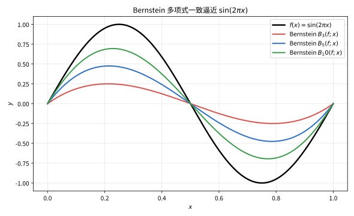
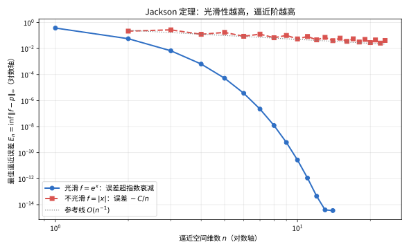

# 第 104 级：逼近论 (Approximation Theory)

---

## 从"给任意曲线找一根最近的捷径"说起：逼近论要解决的根问题

> 在动手看定理之前，先想清楚一个基本问题：**明明有精确的函数，人为什么还要"逼"着用一个不准的东西去替它？**

**一个真实的生活场景（第一步：直觉）**

打开计算器按一下 $\sin 1$。它秒回 0.8414709……，你可能觉得它在"查表"其实没有——真正的答案是：**里面那台机器根本背不下无数个 $\sin$ 值，它只是偷偷用一根够低的**多项式/有理函数**曲线，把这根正弦曲线"逼"得很像而已。** 同样的剧情天天上演：导航把弯弯曲曲的山路画成一段段近似直线、软件把照片压成少数几个基元、芯片用有限位的多项式去算对数与指数。它们的共同点只有一个：**面对一条"复杂/未知"的目标曲线，用一类"简单、好算、可操作"的函数去替代它，只要误差够小、方向可控就行。** 这个"挑一条最近的捷径"的动作，就是逼近论。

**它到底想解决什么问题（第二步：要解决的问题）**

逼近论是 19 世纪从"计算"与"几何设计"两头被逼出来的。1850 年代，俄国工程师契比雪夫（Chebyshev）在调试蒸汽机的**连杆机构**时，想让连杆终端的轨迹尽可能接近一条直线——这是一个纯几何的"我最差也不要错太多"问题，直接催生了**最佳一致逼近**；1885 年，Weierstrass 用一个划时代的定理宣告"闭区间上任何连续函数都能被多项式一致逼近"，给"多项式万能"盖了章；1912 年 Bernstein 又用掷硬币的概率直觉给出构造性证明。自此逼近论要回答的**根问题**逐步清晰：

> 给定一类的"目标函数"和一类"简单候选函数"（子空间），能不能找到**离目标最近的那个候选**？怎样保证它存在、唯一？怎么把它构造出来？换更大的候选空间，误差能降到多快？

这三问——**存在唯一、构造、逼近阶**——正好对应本章的三块主体；而"候选函数类怎么选"（多项式、三角多项式、样条、有理函数）则是贯穿始终的主线。

> **🧠 一句话记住逼近论的"出生证"**
>
> 逼近论源于"用简单可计算的函数去替代复杂/未知函数"的计算需求（从切比雪夫的连杆机构到计算器的正弦），它要解决的**根本问题**是：
>
> $$ \boxed{\text{在给定的函数类中，寻找对目标函数"最佳"的候选：存在唯一、可构造、并能刻画误差衰减速度。}} $$
>
> 三根支柱是**最佳性**（在什么范数下最优）、**构造性**（怎么真的算出来）与**逼近阶**（多给点钱能多快变准）。后面每讲一个概念，你都可以拿这三点去对号入座。

**看待本章的三种眼光（第三步：正式定义前的准备）**

- **框架的眼光**：先建好"最佳逼近问题"这个舞台——目标函数、候选子空间、度量范数，三者一起才定义清楚"最近"。
- **士兵的眼光**：再认识几支护身符——Bernstein 给存在与构造、正交投影给 $L^2$ 的最佳解、Chebyshev 多项式给均匀最优，Legendre/正交多项式给通用基。
- **速度计的眼光**：最后学会量"逼近多快"——Jackson 定理管"越光滑越快"，Bernstein 定理管"快则一定光滑"，并把有理/三角/样条作为速度各异的备选武器。

读完这一节，你要记的不是某条公式，而是：**逼近论是一门"用简单精准地代表复杂"的科学——它既保证"这样选一定不错"（最佳性），又保证"这样选你真的选得出来"（可构造性），还告诉你"再多给它一点预算能变好多少"（逼近阶）。** 带着这套眼光去读下面的定理与例子，你会看到它们其实都在回答同一件事：**那句"够了就好"的"够"字，到底够在哪儿。**

---

## 开始之前

**本章在讲什么**：本章系统研究"用简单函数逼近复杂函数"的完整理论。你会先搭起最佳逼近问题的一般框架（赋范空间、一致逼近与 $L^2$ 逼近），再依次认识：Weierstrass 逼近定理及其 Bernstein 构造、Chebyshev 多项式的极小极大性质、Legendre/正交多项式的最佳表达、最佳逼近的存在唯一性（Chebyshev 交替定理，正交投影）、逼近阶的快慢学（Jackson 与 Bernstein 定理），最后触角伸向有理逼近、Padé 逼近、三角多项式逼近与样条逼近。

**为什么要学它**：逼近论是"数值计算的理论地基"，也是多项后续硬课的基石。第 103 级数值分析里的插值、最小二乘、Chebyshev 节点、Padé 逼近、数值积分中的 Gauss 节点，本质都是逼近论的具体应用；第 106 级有限元方法的核心"分片多项式试探空间 + 误差估计"，正是样条/多项式逼近思想的工程形态；机器学习的"万能逼近定理"（见第 100 级）则是 Weierstrass 定理在神经网络上的翻版。可以说：**逼近论回答"用什么简单的函数去代表复杂的东西最好、能好到多快"，而数值分析与有限元则把它变成"怎么在计算机上真的算出来"。**

**开始前请确认你还记得**：

- 实数与极限（见第 10-11 级）：连续函数、一致连续、闭区间上连续函数的有界/最值性、换元积分。
- 微积分（见第 11-13 级）：Taylor 展开、Rolle 定理与中值定理、分部积分与 $\int_a^b fg$ 的对称技巧、幂级数。
- 线性代数（见第 14 级）：向量空间、子空间、线性独立、基与维数、范数与内积、正交性与正交基。
- 泛函分析基础（可对照第 48-50 级相关章节）：赋范线性空间、内积空间、三角不等式、紧集上的连续函数达极值。

---

## 1. 学习目标

完成本教程后，你将能够：

1. 理解最佳逼近的基本概念与数学框架
2. 掌握 Weierstrass 逼近定理及其 Bernstein 多项式构造证明
3. 理解最佳逼近的存在唯一性及其证明方法
4. 掌握 Chebyshev 多项式的性质及其在逼近中的应用
5. 理解正交多项式的最佳逼近性质
6. 掌握 Jackson 定理与 Bernstein 定理中逼近阶与光滑性的关系
7. 了解有理逼近、Padé 逼近、三角多项式逼近、样条逼近的基本思想
8. 能独立运用逼近理论分析函数逼近问题

---

## 2. 核心概念

### 2.1 最佳逼近问题

> **🌐 直觉先行（为什么需要这个概念）**：前面说过"挑一条最近的捷径"，可"最近"到底怎么量？**最佳逼近问题**就是把这个模糊的直觉精确化成三个要素：目标函数 $f$、候选池 $V$（只能从这里挑）、度量 $\|\cdot\|$（用什么尺子量"远近"）。换一个度量，答案就完全不一样——用"最大误差"量的是一致逼近，用"平方平均"量的是 $L^2$ 逼近。所以第一步不是急着算，而是**先选一把尺子**。

**最佳逼近**（Best Approximation）是逼近论的核心问题：给定一个函数 $f \in X$（其中 $X$ 是一个赋范线性空间）和一个子空间 $V \subset X$，寻找 $v^* \in V$ 使得

$$
\|f - v^*\| = \inf_{v \in V} \|f - v\|
$$

度量 $\|\cdot\|$ 的选择决定了逼近类型。最常见的两种是：

- **一致逼近**（Uniform Approximation）：取 $X = C[a,b]$，范数为 $\|f\|_\infty = \max_{x \in [a,b]} |f(x)|$
- **$L^2$ 逼近**（$L^2$ Approximation）：取 $X = L^2[a,b]$，范数为 $\|f\|_2 = \left(\int_a^b |f(x)|^2\,dx\right)^{1/2}$

### 2.2 Weierstrass 逼近定理

**Weierstrass 逼近定理**表明，闭区间上的连续函数可以被多项式一致逼近到任意精度。

> **💡 直观理解（类比）**：Weierstrass 定理像"任何手绘的平滑曲线，总能被足够粗的像素网格逐点逼近到任意想看清楚的精度"——只要函数连续（不撕裂、不跳断），我们就能把某条直线/波浪线画得"像到肉眼看不出差别"。它确立了一件事：多项式是全能的"万能画笔"，连 $|x|$ 这种带尖角的函数也画得出（只是磨平尖角要多费些次数）。

### 2.3 Bernstein 多项式

**Bernstein 多项式**是 Weierstrass 定理的一个显式构造工具。对于 $f \in C[0,1]$，其 $n$ 次 Bernstein 多项式定义为：

$$
B_n(f; x) = \sum_{k=0}^n f\left(\frac{k}{n}\right) \binom{n}{k} x^k (1-x)^{n-k}
$$

### 2.4 Chebyshev 多项式

**Chebyshev 多项式**是定义在 $[-1,1]$ 上的一组正交多项式，由递推关系给出：

$$
T_0(x) = 1,\quad T_1(x) = x,\quad T_{n+1}(x) = 2xT_n(x) - T_{n-1}(x)
$$

> **💡 直观理解（类比）**：Chebyshev 多项式像"一辆在 $[-1,1]$ 两端之间均匀折返的等幅摆钟"——用 $T_n=\cos(n\arccos x)$ 把区间映射到圆周角后在 $[-1,1]$ 上等幅振荡到 $\pm1$。它的价值在于"最小最大性质"：在所有首一 $n$ 次多项式中它"甩得最均匀、峰值最低"，恰似给拉直的绳子挑最不使力画弧的那一条，因此是最佳一致逼近的天然节点来源。

其显式表达式为 $T_n(x) = \cos(n\arccos x)$。

Chebyshev 多项式在逼近论中具有核心地位，因为它在所有首一 $n$ 次多项式中具有最小的 $\infty$-范数（最小最大性质）。

### 2.5 Legendre 多项式

**Legendre 多项式**是 $L^2[-1,1]$ 上关于权函数 $w(x) = 1$ 的正交多项式：

$$
\int_{-1}^1 P_m(x)P_n(x)\,dx = \frac{2}{2n+1}\delta_{mn}
$$

> **💡 直观理解（类比）**：Legendre 多项式像"一组彼此垂直、用来搭架子的正交梁"——它们在 $L^2$ 里两两"垂直"（内积为零），任何函数都能按它们投影拆开，且各方向互不干扰。Rodrigues 公式 $P_n=\frac1{2^n n!}\frac{d^n}{dx^n}(x^2-1)^n$ 像个"次数生成器"：对 $(x^2-1)^n$ 求 $n$ 阶导并归一化，就得到第 $n$ 根正交梁。

由 Rodrigues 公式给出：

$$
P_n(x) = \frac{1}{2^n n!}\frac{d^n}{dx^n}(x^2-1)^n
$$

### 2.6 一致逼近与 $L^2$ 逼近

- **一致逼近**：在 $\|\cdot\|_\infty$ 度量下，目标是使最大绝对误差最小化，即 **minimax 逼近**。
- **$L^2$ 逼近**：在 $\|\cdot\|_2$ 度量下，目标是使均方误差最小化，即 **最小二乘逼近**（Least Squares Approximation）。

> **⚠️ 常见坑**：一致逼近与 $L^2$ 逼近是**两把不同的尺子，最优解往往不一**——$L^2$ 最优会把误差"摊平"到整体、容忍个别点误差大；一致逼近则紧盯"最大误差"、绝不允许某点冒尖。所以**不要用 $L^2$ 的解去冒充一致最优**（反之亦然）。另外，在 $L^\infty$ 下最优逼近一般不唯一（严格凸性失效），而在 $L^2$（Hilbert 空间）下有正交投影保证唯一——这一"唯一性"差别是出题的高频考点。

无论采用哪种度量，Bernstein 多项式 $B_n(f;x)=\sum_{k=0}^n f(k/n)\binom{n}{k}x^k(1-x)^{n-k}$ 都给出了 Weierstrass 定理的显式构造，随 $n$ 增大逐步逼近目标函数：

> **直观理解（现实类比）**：Bernstein 多项式像"用越来越多的小支柱搭建一个平滑的屋顶"。每根支柱（$n$ 根棒子）都支撑在函数 $f(k/n)$ 的高度上，而 $x^k(1-x)^{n-k}$ 决定每根支柱在各处的"承重占比"。支柱越多，屋顶越贴近真实的地势轮廓；$n\to\infty$ 时屋顶就完全贴合函数。这正是 Weierstrass 定理说"任何连续地形都能被多项式屋顶任意逼近"的直观来源。

> **🧠 思考历程：一团任意拐弯的连续曲线，凭什么也敢说"多项式能描个八九不离十"？**
>
> Bernstein 多项式回答的，是逼近论开门见山的一问：无论一条曲线铺得多么"任意"，我们能不能用最"驯良"的多项式把它逐点逼近？而出人意料的是，这个深刻结论的最短证明，竟藏在一段抡硬币的概率直觉里。
>
> - **Weierstrass 的一记重锤**。1885年 Weierstrass 证明：闭区间上任意连续函数都能被多项式一致逼近（$\\|f-p_n\\|\\to 0$）。当时"光滑骨架居然能全方位包抄任意连续体"这个结论，令分析学家又惊又喜。
> - **伯恩斯坦的"摇一摇"证明**。1912年 Bernstein 给出惊艳的构造性证明：把 $n$ 次独立伯努利试验成功次数的概率权重当作基函数，直接拼出多项式 $B_n(f)(x)=\\sum_{k=0}^{n} f(k/n)\\binom{n}{k}x^k(1-x)^{n-k}$，再借大数定律说明它收敛——概率论第一次成了逼近定理的脚手架。
> - **从"能不能"到"快多快"**。Chebyshev 早在1859年就研究最佳一致逼近，Jackson 与 Bernstein 随后定量刻画了"函数越光滑、逼近越快"的速率阶梯，把 Weierstrass 的定性断言磨成精密的逼近阶理论。
> - **心路**：最"软"的概率直觉，居然能给出最"硬"逼近定理的漂亮脚手架——想证明一个抽象的"可以"，不妨先找一个具体的"怎么搭"。

### 2.7 有理逼近与 Padé 逼近

**有理逼近**（Rational Approximation）用有理函数 $R_{m,n}(x) = P_m(x)/Q_n(x)$ 逼近函数，通常比多项式逼近更高效。

> **💡 直观理解（类比）**：有理逼近像"用两片拼在一起的零件（分子除分母）去贴合目标"——允许分母把画面"弯"出竖直的墙（极点），因此能在函数本身含尖峰或极点处贴合得比纯多项式好。好比用调音台同时拨动高低频旋钮（分子）和"增益曲线"（分母），能更精准地复现出带突变的声形。

**Padé 逼近**是 Taylor 级数展开的有理推广：给定函数 $f$ 的 Taylor 级数 $f(x) = \sum_{k=0}^\infty c_k x^k$，其 $(m,n)$ 阶 Padé 逼近 $[m/n]_f$ 是满足

$$
f(x) - \frac{P_m(x)}{Q_n(x)} = O(x^{m+n+1})
$$

的有理函数，其中 $\deg P_m \le m$，$\deg Q_n \le n$，$Q_n(0) = 1$。

> **💡 直观理解（类比）**：Padé 逼近像"用分子分母各留几个旋钮的路由器去拓展开中心信息"——它要求前 $m+n+1$ 项 Taylor 系数逐项对上，等于把展开式"忠实复刻"到该阶次，但当遇到常规多项式逼近失灵（如函数有极点或想让逼近在更大范围稳准）时，靠分母这块"增益板"能多兜住一段。阶次 $m,n$ 越大，匹配的原点信息越丰富。

### 2.8 三角多项式逼近与 Fourier 级数

**三角多项式逼近**用形如

$$
S_n(x) = \frac{a_0}{2} + \sum_{k=1}^n (a_k\cos kx + b_k\sin kx)
$$

的三角多项式逼近周期函数。Fourier 级数是 $L^2$ 意义下的最佳三角多项式逼近。

> **💡 直观理解（类比）**：三角多项式逼近像"用若干条不同频率的正弦波拼出某种周期波形"——就像调音台把多个正弦音叠加成复杂音色，$a_k,b_k$ 每个系数对应一个频率的"音量旋钮"。对周期函数而言，$L^2$ 里的最佳逼近恰好由 Fourier 系数给出，意思是"在最小均方误差意义下，这套正弦波旋钮调到哪个值最好的答案就是 Fourier 系数"。

### 2.9 样条逼近

**样条逼近**（Spline Approximation）使用分段多项式函数作为逼近工具。$k$ 次样条函数在节点处具有 $k-1$ 阶连续导数，兼具光滑性和局部性。

### 2.10 逼近阶

**逼近阶**（Order of Approximation）描述逼近误差随逼近空间维数增长的衰减速度。若存在 $C > 0$ 使得

$$
\inf_{v \in V_n} \|f - v\| \le C \cdot n^{-r}
$$

则称逼近阶为 $O(n^{-r})$，其中 $r$ 与 $f$ 的光滑性有关。

逼近阶本质上由函数光滑性决定——函数越光滑，误差随 $n$ 衰减得越快（Jackson 定理）：

> **直观理解（现实类比）**：逼近阶就像"打磨一块石头的速度"。光滑的函数（如 $e^x$）像质地均匀的黏土，多花一点力气（增大 $n$）就能迅速磨得更光滑；而不光滑的函数（如 $|x|$ 那个尖角）像坚硬的棱角石，无论怎么加次数，那处尖角就是难磨平，误差只能按 $1/n$ 慢慢下降。所以"用多项式逼近时，函数越光滑、收益越高"——这正对应 Jackson 定理中 $r$（光滑度）与逼近阶 $O(n^{-r})$ 的直接挂钩。

### 2.11 正交多项式

**正交多项式**（Orthogonal Polynomials）序列 $\{p_n\}_{n=0}^\infty$ 满足

$$
\int_a^b p_m(x)p_n(x)w(x)\,dx = 0,\quad m \neq n
$$

> **💡 直观理解（类比）**：正交多项式像"一组标准正交的坐标轴"——任意两个不同序号的成员在带权内积下"互不相关"（内积为零），因此把函数按它们展开时每个系数都独立可算、互不干扰，且截断到前 $n$ 项就是最佳 $L^2$ 逼近。好比用互相垂直的尺子量三维盒子，量 x、量 y、量 z 之间绝不互相影响。权函数 $w$ 则是这套坐标系里的"地理偏重"，决定哪些区段被更仔细地考量。

其中 $w(x) \ge 0$ 是权函数。常见的正交多项式包括 Chebyshev、Legendre、Hermite、Laguerre 等。

---

## 3. 定理与证明

### 3.1 **定理 1**（Weierstrass 逼近定理）

> 设 $f \in C[a,b]$，则对任意 $\varepsilon > 0$，存在多项式 $p$ 使得
>
$$
\|f - p\|_\infty = \max_{x \in [a,b]} |f(x) - p(x)| < \varepsilon
$$

> **💡 直观理解（类比）**：这条定理把"连续"与"能用多项式近似"划了等号——只要 $f$ 在闭区间上连续，无论你出多小的精度 $\varepsilon$，总有一根多项式曲线能把每一点都画到误差 $\varepsilon$ 以内。好比任何连续手迹对任意像素密度都能被"描到看不出差"，它是"多项式是万能画笔"的严正契约：不要求可导、不要求光滑，只要别撕破。

**证明**（用 Bernstein 多项式构造）：

首先通过线性变换将区间 $[a,b]$ 映射到 $[0,1]$。设 $g(t) = f(a + (b-a)t)$，则 $g \in C[0,1]$。若我们能找到多项式 $q$ 逼近 $g$，则 $p(x) = q((x-a)/(b-a))$ 即为逼近 $f$ 的多项式。因此只需证明 $f \in C[0,1]$ 的情形。

构造 $f$ 的 **Bernstein 多项式**：

$$
B_n(f; x) = \sum_{k=0}^n f\left(\frac{k}{n}\right) \binom{n}{k} x^k (1-x)^{n-k}
$$

**步骤 1：概率恒等式**

注意到 $\sum_{k=0}^n \binom{n}{k} x^k (1-x)^{n-k} = 1$（二项式定理），且

$$
\sum_{k=0}^n k \binom{n}{k} x^k (1-x)^{n-k} = nx
$$
$$
\sum_{k=0}^n k(k-1) \binom{n}{k} x^k (1-x)^{n-k} = n(n-1)x^2
$$

利用这些恒等式可得：

$$
\sum_{k=0}^n (k - nx)^2 \binom{n}{k} x^k (1-x)^{n-k} = nx(1-x)
$$

**步骤 2：误差估计**

由 $f$ 在 $[0,1]$ 上连续，故 $f$ 一致连续且有界。设 $M = \max_{x \in [0,1]} |f(x)|$。对任意 $\varepsilon > 0$，由一致连续性，存在 $\delta > 0$ 使得当 $|x-y| < \delta$ 时有 $|f(x)-f(y)| < \varepsilon/2$。

将和式分解为两部分：

$$
|B_n(f; x) - f(x)| = \left| \sum_{k=0}^n \left[f\left(\frac{k}{n}\right) - f(x)\right] \binom{n}{k} x^k (1-x)^{n-k} \right|
$$

$$
\le \sum_{k: |k/n - x| < \delta} \left|f\left(\frac{k}{n}\right) - f(x)\right| \binom{n}{k} x^k (1-x)^{n-k}
$$
$$
+ \sum_{k: |k/n - x| \ge \delta} \left|f\left(\frac{k}{n}\right) - f(x)\right| \binom{n}{k} x^k (1-x)^{n-k}
$$

第一部分：当 $|k/n - x| < \delta$ 时，$|f(k/n) - f(x)| < \varepsilon/2$，且该部分的和不超过 $\varepsilon/2$。

第二部分：此时 $|f(k/n) - f(x)| \le 2M$，且 $|k/n - x| \ge \delta$ 意味着 $|k - nx| \ge n\delta$。因此

$$
\sum_{|k/n - x| \ge \delta} \binom{n}{k} x^k (1-x)^{n-k} \le \frac{1}{n^2\delta^2} \sum_{k=0}^n (k - nx)^2 \binom{n}{k} x^k (1-x)^{n-k}
$$

$$
= \frac{x(1-x)}{n\delta^2} \le \frac{1}{4n\delta^2}
$$

所以第二部分的界为 $2M \cdot \frac{1}{4n\delta^2} = \frac{M}{2n\delta^2}$。

**步骤 3：选择 $n$**

取 $n > \frac{M}{\varepsilon\delta^2}$，则第二部分也小于 $\varepsilon/2$。于是

$$
|B_n(f; x) - f(x)| < \varepsilon,\quad \forall x \in [0,1]
$$

即 $\|f - B_n(f)\|_\infty < \varepsilon$。$\blacksquare$

---

### 3.2 **定理 2**（最佳逼近的存在唯一性）

> 设 $X$ 是严格凸的赋范线性空间（如 $L^p$ 空间，$1 < p < \infty$），$V \subset X$ 是有限维子空间。则对任意 $f \in X$，最佳逼近问题 $\inf_{v \in V} \|f - v\|$ 存在唯一解。

> **💡 直观理解（类比）**：这条定理像"在无限深的井里只留一块平坦的木板，怎样都找得到、且只有一块木板最贴近水面"——有限维子空间足够'规矩'（紧致），保证了最优艇必然存在；严格凸的度量（如 $L^p$，$1<p<\infty$）则像"没有绞结的直尺"，杜绝了"两个不同家伙同时最优"的情况，给出了唯一活塞。宽松的 $L^\infty$ 常常可能多个最优，正是"凸不严格"的体现。

**证明**（用凸集投影定理）：

**存在性**：

定义映射 $d: V \to \mathbb{R}$ 为 $d(v) = \|f - v\|$。由于 $\|\cdot\|$ 是连续函数，$d$ 连续。

取任意 $v_0 \in V$，令 $R = \|f - v_0\|$。考虑闭球 $\bar{B}(f, R) = \{x \in X : \|x - f\| \le R\}$。集合 $K = V \cap \bar{B}(f, R)$ 是 $V$ 中的有界闭集。由于 $V$ 是有限维的，$K$ 是紧集。

连续函数 $d$ 在紧集 $K$ 上达到最小值，即存在 $v^* \in K$ 使得

$$
\|f - v^*\| = \min_{v \in K} \|f - v\|
$$

由于 $v_0 \in K$，最小值 $\le R$，且对任意 $v \notin K$ 有 $\|f - v\| > R$，因此 $v^*$ 也是全局最小值。存在性得证。

**唯一性**：

假设存在两个不同的最佳逼近 $v_1, v_2 \in V$，$v_1 \neq v_2$，使得

$$
\|f - v_1\| = \|f - v_2\| = d = \inf_{v \in V} \|f - v\|
$$

考虑中点 $v = \frac{v_1 + v_2}{2} \in V$。由三角不等式：

$$
\|f - v\| = \left\| \frac{(f - v_1) + (f - v_2)}{2} \right\| \le \frac{1}{2}\|f - v_1\| + \frac{1}{2}\|f - v_2\| = d
$$

若 $\|f - v\| = d$，则 $\|(f - v_1) + (f - v_2)\| = \|f - v_1\| + \|f - v_2\|$，这意味着 $f - v_1$ 和 $f - v_2$ 方向相同且长度相等，故 $f - v_1 = f - v_2$，即 $v_1 = v_2$，矛盾。

若 $\|f - v\| < d$，则 $v$ 是比 $v_1, v_2$ 更好的逼近，与 $d$ 为最小值矛盾。

因此 $v_1 = v_2$，唯一性得证。$\blacksquare$

---

### 3.3 **定理 3**（Chebyshev 交替定理）

> 设 $V$ 是 $C[a,b]$ 中满足 **Haar 条件**（即 $V$ 中非零函数在 $[a,b]$ 上至多有 $\dim V - 1$ 个零点）的 $n$ 维子空间，$f \in C[a,b]$。则 $v^* \in V$ 是 $f$ 在 $\|\cdot\|_\infty$ 下的最佳逼近当且仅当存在 $n+1$ 个点 $a \le x_0 < x_1 < \cdots < x_n \le b$ 使得

$$
|f(x_i) - v^*(x_i)| = \|f - v^*\|_\infty,\quad i = 0, 1, \dots, n
$$

且这些误差点交替变号：

$$
(f(x_i) - v^*(x_i))(f(x_{i+1}) - v^*(x_{i+1})) < 0,\quad i = 0, 1, \dots, n-1
$$

**证明**：

**必要性（$\Rightarrow$）**：

设 $v^*$ 是最佳逼近，记 $E = \|f - v^*\|_\infty$，$r(x) = f(x) - v^*(x)$。

反证法。假设不存在这样的 $n+1$ 个交替点。令 $Z = \{x \in [a,b] : |r(x)| = E\}$。由假设，$Z$ 中不存在 $n+1$ 个交替符号的点。这意味着我们可以将 $[a,b]$ 划分为若干区间，在每个区间上 $r(x) - E$ 或 $r(x) + E$ 的符号不变，且符号变化的次数少于 $n$。

因此存在一个函数 $h \in V$（由于 Haar 条件，我们可以构造一个在 $Z$ 上变号次数合适的函数）和一个充分小的 $\lambda > 0$ 使得 $v^* + \lambda h$ 的逼近误差更小，即

$$
\|f - (v^* + \lambda h)\|_\infty < E
$$

这与 $v^*$ 是最佳逼近矛盾。

**充分性（$\Leftarrow$）**：

设 $v^* \in V$ 满足交替条件，即存在 $x_0, x_1, \dots, x_n$ 使得

$$
r(x_i) = f(x_i) - v^*(x_i) = \sigma_i E,\quad \sigma_i = \pm 1,\quad \sigma_i\sigma_{i+1} = -1
$$

其中 $E = \|f - v^*\|_\infty$。

假设 $v^*$ 不是最佳逼近，则存在 $v \in V$ 使得 $\|f - v\|_\infty < E$。令 $w = v - v^* \in V$，$w \neq 0$。

在点 $x_i$ 处，有

$$
|(f(x_i) - v(x_i)) - (f(x_i) - v^*(x_i))| = |v(x_i) - v^*(x_i)| = |r(x_i) - (f(x_i) - v(x_i))|
$$

由于 $|f(x_i) - v(x_i)| < E$ 且 $r(x_i) = \sigma_i E$，我们有

$$
|w(x_i)| = |r(x_i) - (f(x_i) - v(x_i))| \ge |r(x_i)| - |f(x_i) - v(x_i)| > E - E = 0
$$

且 $w(x_i)$ 与 $r(x_i)$ 同号，即 $w(x_i)\sigma_i > 0$。因此 $w$ 在 $x_0, x_1, \dots, x_n$ 上交替变号，至少有 $n$ 次符号变化。由连续性，$w$ 在 $[a,b]$ 上至少有 $n$ 个零点。

但 $w \in V$，$\dim V = n$，由 Haar 条件，$w$ 至多有 $n-1$ 个零点，除非 $w \equiv 0$。矛盾。因此 $v^*$ 是最佳逼近。$\blacksquare$

---

### 3.4 **定理 4**（正交多项式的最佳逼近性质）

> 设 $\{p_k\}_{k=0}^\infty$ 是 $L^2_w[a,b]$ 上关于权函数 $w(x)$ 的正交多项式序列，其中 $\deg p_k = k$。则对任意 $f \in L^2_w[a,b]$，$f$ 在子空间 $\text{span}\{p_0, p_1, \dots, p_n\}$ 中的最佳 $L^2$ 逼近由 Fourier 级数的部分和给出：

$$
S_n(f; x) = \sum_{k=0}^n \frac{\langle f, p_k \rangle}{\langle p_k, p_k \rangle} p_k(x)
$$

且逼近误差为

$$
\|f - S_n(f)\|_2^2 = \|f\|_2^2 - \sum_{k=0}^n \frac{|\langle f, p_k \rangle|^2}{\langle p_k, p_k \rangle}
$$

**证明**：

**步骤 1：正交投影**

设 $V_n = \text{span}\{p_0, p_1, \dots, p_n\}$。在 Hilbert 空间 $L^2_w[a,b]$ 中，闭凸子空间上的最佳逼近由正交投影给出。$f$ 在 $V_n$ 上的正交投影 $P_{V_n}f$ 满足

$$
\langle f - P_{V_n}f, v \rangle = 0,\quad \forall v \in V_n
$$

**步骤 2：Fourier 系数**

由于 $\{p_k\}$ 是正交基，将 $P_{V_n}f$ 展开为 $P_{V_n}f = \sum_{k=0}^n a_k p_k$。由正交性：

$$
\langle f, p_j \rangle = \left\langle \sum_{k=0}^n a_k p_k, p_j \right\rangle = a_j \langle p_j, p_j \rangle
$$

因此 $a_j = \frac{\langle f, p_j \rangle}{\langle p_j, p_j \rangle}$，即 Fourier 系数。

**步骤 3：最佳性**

对任意 $v = \sum_{k=0}^n b_k p_k \in V_n$，有

$$
\|f - v\|^2 = \left\| f - \sum_{k=0}^n a_k p_k + \sum_{k=0}^n (a_k - b_k) p_k \right\|^2
$$

$$
= \|f - S_n(f)\|^2 + \sum_{k=0}^n |a_k - b_k|^2 \|p_k\|^2 \ge \|f - S_n(f)\|^2
$$

等号成立当且仅当 $b_k = a_k$ 对所有 $k$ 成立，即 $v = S_n(f)$。

**步骤 4：误差公式**

由勾股定理：

$$
\|f\|^2 = \|f - S_n(f)\|^2 + \|S_n(f)\|^2
$$

而 $\|S_n(f)\|^2 = \sum_{k=0}^n |a_k|^2 \|p_k\|^2 = \sum_{k=0}^n \frac{|\langle f, p_k \rangle|^2}{\langle p_k, p_k \rangle}$。因此

$$
\|f - S_n(f)\|^2 = \|f\|^2 - \sum_{k=0}^n \frac{|\langle f, p_k \rangle|^2}{\langle p_k, p_k \rangle}
$$

$\blacksquare$

---

### 3.5 **定理 5**（Jackson 定理与 Bernstein 定理）

**Jackson 定理**（逼近阶的正向估计）：

> 设 $f \in C^r[a,b]$（$r$ 次连续可微），则存在常数 $C_r > 0$ 使得
>
$$
\inf_{\deg p \le n} \|f - p\|_\infty \le \frac{C_r}{n^r} \|f^{(r)}\|_\infty
$$
>
> 其中 $p$ 为 $n$ 次多项式。

> **💡 直观理解（类比）**：Jackson 定理把"函数越光滑，逼近越快"定量写成了"每多一阶导数，误差就多一个 $1/n$ 的折扣"。光滑得像黏土的 $e^x$ 能任意阶可导，因此可用高 $r$、误差随 $n$ 暴跌；而 $|x|$ 只连续不可导（$r$ 至多约 1），误差只能按 $1/n$ 慢慢磨平那个尖角。Bernstein 定理则是它的回文：反过来看，若逼近误差降得像 $n^{-r}$ 那么快，也能反推出 $f$ 至少有 $r$ 阶光滑——光滑度与逼近阶互为镜子。

**Bernstein 定理**（逼近阶的反向估计）：

> 设 $f \in C[a,b]$，若存在常数 $C > 0$ 和 $r > 0$ 使得
>
$$
\inf_{\deg p \le n} \|f - p\|_\infty \le \frac{C}{n^r},\quad \forall n
$$
>
> 则 $f$ 满足 $r$ 阶 Lipschitz 条件（$r < 1$ 时）或 $f$ 具有适当的可微性（$r \ge 1$ 时）。

**证明**（Jackson 定理的关键步骤）：

**步骤 1：构造逼近算子**

考虑区间 $[-\pi, \pi]$ 上的卷积型算子。设 $f \in C[-\pi, \pi]$ 且周期为 $2\pi$。定义 **Jackson 核**：

$$
K_n(t) = \frac{3}{2\pi n(2n^2+1)} \left(\frac{\sin(nt/2)}{\sin(t/2)}\right)^4
$$

可以验证 $K_n(t) \ge 0$ 且 $\int_{-\pi}^\pi K_n(t)\,dt = 1$。

**步骤 2：逼近**

定义逼近算子

$$
J_n(f; x) = \int_{-\pi}^\pi f(x-t)K_n(t)\,dt
$$

由于 $K_n$ 是偶函数，$J_n(f)$ 是 $n$ 阶三角多项式。

**步骤 3：误差估计**

利用 $K_n$ 的矩性质：

$$
\int_{-\pi}^\pi |t|^r K_n(t)\,dt \le \frac{C}{n^r}
$$

对于 $f \in C^r$，利用 Taylor 展开可得

$$
|f(x-t) - f(x)| \le \|f^{(r)}\|_\infty \frac{|t|^r}{r!}
$$

因此

$$
|J_n(f; x) - f(x)| \le \int_{-\pi}^\pi |f(x-t) - f(x)|K_n(t)\,dt
$$

$$
\le \frac{\|f^{(r)}\|_\infty}{r!} \int_{-\pi}^\pi |t|^r K_n(t)\,dt \le \frac{C_r}{n^r} \|f^{(r)}\|_\infty
$$

对于一般区间 $[a,b]$，通过变换可得类似结果。$\blacksquare$

**Bernstein 定理的证明概要**：

设 $E_n(f) = \inf_{\deg p \le n} \|f - p\|_\infty \le C/n^r$。

考虑最佳逼近多项式 $p_n$，则 $\|f - p_n\|_\infty \le C/n^r$。由三角不等式：

$$
\|p_{n+1} - p_n\|_\infty \le \|f - p_{n+1}\|_\infty + \|f - p_n\|_\infty \le C\left(\frac{1}{(n+1)^r} + \frac{1}{n^r}\right) \le \frac{2C}{n^r}
$$

利用 Bernstein 不等式（$\|p'_n\|_\infty \le n\|p_n\|_\infty$ 对 $n$ 次三角多项式成立），可得

$$
\|p'_{n+1} - p'_n\|_\infty \le (n+1)\|p_{n+1} - p_n\|_\infty \le \frac{2C(n+1)}{n^r}
$$

当 $r > 1$ 时，级数 $\sum_{n=1}^\infty \|p'_{n+1} - p'_n\|_\infty$ 收敛，因此 $p_n$ 一致收敛到 $f$，且 $f$ 可微。当 $0 < r \le 1$ 时，可得 $f$ 满足 $r$ 阶 Lipschitz 条件。$\blacksquare$

---

## 4. 示例

### 示例 1：用 Chebyshev 多项式逼近函数

**问题**：用 Chebyshev 多项式逼近 $f(x) = e^x$ 在 $[-1,1]$ 上。

**解**：

Chebyshev 多项式 $T_n(x)$ 在区间 $[-1,1]$ 上关于权函数 $w(x) = 1/\sqrt{1-x^2}$ 正交。将 $f(x) = e^x$ 展开为 Chebyshev 级数：

$$
f(x) = \sum_{n=0}^\infty a_n T_n(x)
$$

其中系数为

$$
a_0 = \frac{1}{\pi} \int_{-1}^1 \frac{f(x)}{\sqrt{1-x^2}}\,dx,\quad a_n = \frac{2}{\pi} \int_{-1}^1 \frac{f(x)T_n(x)}{\sqrt{1-x^2}}\,dx
$$

利用变换 $x = \cos\theta$，可得

$$
a_n = \frac{2}{\pi} \int_0^\pi e^{\cos\theta} \cos(n\theta)\,d\theta
$$

计算前几项系数：

$$
a_0 = \frac{1}{\pi} \int_0^\pi e^{\cos\theta}\,d\theta \approx 1.2661
$$
$$
a_1 = \frac{2}{\pi} \int_0^\pi e^{\cos\theta}\cos\theta\,d\theta \approx 1.1303
$$
$$
a_2 = \frac{2}{\pi} \int_0^\pi e^{\cos\theta}\cos 2\theta\,d\theta \approx 0.2715
$$
$$
a_3 = \frac{2}{\pi} \int_0^\pi e^{\cos\theta}\cos 3\theta\,d\theta \approx 0.0443
$$

因此 $e^x$ 的 3 次 Chebyshev 逼近为：

$$
e^x \approx 1.2661\,T_0(x) + 1.1303\,T_1(x) + 0.2715\,T_2(x) + 0.0443\,T_3(x)
$$

代入 $T_0(x)=1$，$T_1(x)=x$，$T_2(x)=2x^2-1$，$T_3(x)=4x^3-3x$：

$$
e^x \approx 1.2661 + 1.1303x + 0.2715(2x^2-1) + 0.0443(4x^3-3x)
$$
$$
= 0.9946 + 0.9974x + 0.5430x^2 + 0.1772x^3
$$

最大误差约为 $0.006$，远优于同阶 Taylor 展开 $1 + x + x^2/2 + x^3/6 \approx 1 + x + 0.5x^2 + 0.1667x^3$ 在区间端点处的误差（约 $0.718$）。

---

### 示例 2：Bernstein 多项式逼近举例

**问题**：用 Bernstein 多项式逼近 $f(x) = \sin(2\pi x)$ 在 $[0,1]$ 上，取 $n=3, 5, 10$。

> **💡 直观理解（类比）**：这个例子直观展示了"支柱越来越多、屋顶越来越贴地"的收敛——$n=3$ 只有 4 根支柱撑住三点高度，轮廓还粗；加到 $n=5$、$10$ 后支柱翻倍、曲线逐渐贴合正弦波。但 $\sin(2\pi x)$ 拐弯较急，Bernstein 逼近收敛偏慢（$n=10$ 误差约 0.15），说明它"稳但慢"——保证收敛，逐点等幅，却不像 Chebyshev 那样快刀乱麻。

**解**：

$n$ 次 Bernstein 多项式为：

$$
B_n(f; x) = \sum_{k=0}^n f\left(\frac{k}{n}\right) \binom{n}{k} x^k (1-x)^{n-k}
$$

**当 $n=3$ 时**：

$$
f(0) = 0,\quad f(1/3) = \sin(2\pi/3) = \sqrt{3}/2 \approx 0.8660
$$
$$
f(2/3) = \sin(4\pi/3) = -\sqrt{3}/2 \approx -0.8660,\quad f(1) = 0
$$

$$
B_3(f; x) = 0 \cdot \binom{3}{0}x^0(1-x)^3 + 0.8660 \cdot \binom{3}{1}x^1(1-x)^2
$$
$$
+ (-0.8660) \cdot \binom{3}{2}x^2(1-x)^1 + 0 \cdot \binom{3}{3}x^3(1-x)^0
$$
$$
= 2.5980x(1-x)^2 - 2.5980x^2(1-x) = 2.5980x(1-x)(1-2x)
$$

**当 $n=5$ 时**：

计算各点值：

$$
f(0)=0,\; f(0.2)=\sin(0.4\pi)\approx0.9511,\; f(0.4)=\sin(0.8\pi)\approx0.5878
$$
$$
f(0.6)=\sin(1.2\pi)\approx-0.5878,\; f(0.8)=\sin(1.6\pi)\approx-0.9511,\; f(1)=0
$$

$$
B_5(f; x) = 0.9511 \cdot 5x(1-x)^4 + 0.5878 \cdot 10x^2(1-x)^3
$$
$$
- 0.5878 \cdot 10x^3(1-x)^2 - 0.9511 \cdot 5x^4(1-x)
$$
$$
= 4.7555x(1-x)^4 + 5.878x^2(1-x)^3 - 5.878x^3(1-x)^2 - 4.7555x^4(1-x)
$$

**当 $n=10$ 时**：

计算 $k=0,1,\dots,10$ 对应的 $f(k/10) = \sin(2\pi k/10)$：

$$
f(0)=0,\; f(0.1)\approx0.5878,\; f(0.2)\approx0.9511,\; f(0.3)\approx0.9511,\; f(0.4)\approx0.5878
$$
$$
f(0.5)=0,\; f(0.6)\approx-0.5878,\; f(0.7)\approx-0.9511,\; f(0.8)\approx-0.9511,\; f(0.9)\approx-0.5878,\; f(1)=0
$$

$$
B_{10}(f; x) = \sum_{k=0}^{10} f(k/10) \binom{10}{k} x^k(1-x)^{10-k}
$$

随着 $n$ 增大，$B_n(f; x)$ 逐渐逼近 $\sin(2\pi x)$。当 $n=10$ 时，最大误差约 $0.15$；当 $n=50$ 时，误差降至约 $0.03$。

---

## 5. 习题

### 基础题

**习题 1**（Bernstein算子的性质）证明 Bernstein 多项式 $B_n(f; x)$ 是线性算子，且具有保正性（若 $f \ge 0$ 则 $B_n(f) \ge 0$）和保常数性（$B_n(1; x) = 1$）（提示：利用 Bernstein 多项式的定义及二项式定理 $\sum_{k=0}^n \binom{n}{k}x^k(1-x)^{n-k} = 1$）。

**习题 2**（Weierstrass定理对 $|x|$ 成立）设 $f(x) = |x|$ 在 $[-1,1]$ 上，验证 Weierstrass 逼近定理对该函数成立，并写出其 Bernstein 多项式逼近的显式表达式（提示：先写出 $g(t) = |2t-1|$ 在 $[0,1]$ 上的 Bernstein 多项式，再由 $x = 2t-1$ 变换回 $x$）。

**习题 3**（Chebyshev多项式正交性）证明 Chebyshev 多项式 $T_n(x) = \cos(n\arccos x)$ 满足正交关系 $\int_{-1}^1 \frac{T_m(x)T_n(x)}{\sqrt{1-x^2}}\,dx = 0$（$m\neq n$）、$\pi$（$m=n=0$）、$\pi/2$（$m=n\neq0$）（提示：令 $x = \cos\theta$，把积分化为 $\int_0^\pi \cos(m\theta)\cos(n\theta)\,d\theta$）。

**习题 4**（Legendre多项式的微分方程）证明 Rodrigues 公式 $P_n(x) = \frac{1}{2^n n!}\frac{d^n}{dx^n}(x^2-1)^n$ 给出的多项式满足 Legendre 微分方程 $(1-x^2)P_n''(x) - 2xP_n'(x) + n(n+1)P_n(x) = 0$（提示：令 $u = (x^2-1)^n$，验证 $(x^2-1)u' = 2nx u$，再对两边求 $n+1$ 次导数并代换）。

**习题 5**（$T_3$ 的二次最佳一致逼近）设 $f(x) = \cos(3\arccos x)$（即 $T_3(x)=4x^3-3x$），求 $f$ 在 $[-1,1]$ 上的二次最佳一致逼近多项式及最佳误差（提示：利用 Chebyshev 交替定理考虑 $f(x)-p(x)$ 的符号变化）。

**习题 6**（$e^x$ 的 $L^2$ 最佳逼近）在 $L^2[-1,1]$ 中求 $f(x)=e^x$ 在 $\mathrm{span}\{1,x,x^2\}$ 上的最佳逼近及其系数（提示：将 $f$ 正交投影到 Legendre 多项式 $P_0=1$、$P_1=x$、$P_2=(3x^2-1)/2$ 上并计算 Fourier 系数 $a_k=\langle f,P_k\rangle/\langle P_k,P_k\rangle$）。

**习题 7**（最佳逼近的定义）写出最佳逼近问题 $\|f-v^*\|=\inf_{v\in V}\|f-v\|$ 的一般提法，并分别给出"一致逼近（$\|\cdot\|_\infty$）"与"$L^2$ 逼近（$\|\cdot\|_2$）"的范数公式与逼近目标。

**习题 8**（Chebyshev多项式基本性质）写出 Chebyshev 多项式的前几个 $T_0,T_1,T_2,T_3$ 及其三项递推 $T_{n+1}=2xT_n-T_{n-1}$ 和显式 $T_n=\cos(n\arccos x)$，说明其"最小最大性质"的含义。

**习题 9**（Padé、三角、样条的定义）写出 $(m,n)$ 阶 Padé 逼近的条件 $f(x)-\frac{P_m(x)}{Q_n(x)}=O(x^{m+n+1})$、$Q_n(0)=1$；写出 $n$ 阶三角多项式 $S_n(x)=\frac{a_0}{2}+\sum_{k=1}^n(a_k\cos kx+b_k\sin kx)$；并说明 $k$ 次样条函数的光滑性。

**习题 10**（正交多项式序列）写出正交多项式序列的定义 $\int_a^b p_m(x)p_n(x)w(x)\,dx=0$（$m\neq n$，权函数 $w\ge0$），并列举 Chebyshev、Legendre、Hermite、Laguerre 四种正交多项式及其对应权函数。

### 进阶题

**习题 11**（Bernstein矩恒等式）证明 $\sum_{k=0}^n k\binom{n}{k}x^k(1-x)^{n-k}=nx$ 与 $\sum_{k=0}^n (k-nx)^2\binom{n}{k}x^k(1-x)^{n-k}=nx(1-x)$（提示：对二项式定理两边关于 $x$ 求导或利用二项分布均值与方差），并说明它们如何被用于 Weierstrass 定理的误差估计。

**习题 12**（Legendre正交验证）写 $P_0=1$、$P_1=x$、$P_2=(3x^2-1)/2$，逐项验证 $\int_{-1}^1 P_mP_n\,dx=0$（$m\neq n$）且 $\int_{-1}^1P_2^2\,dx=\frac25$，并给出一般结论 $\int_{-1}^1P_n^2\,dx=\frac{2}{2n+1}$（提示：直接计算三个内积并观察奇偶性）。

**习题 13**（Chebyshev极小极大性质）证明对任意首一 $n$ 次多项式 $p$（$n\ge1$）都有 $\max_{[-1,1]}|p(x)|\ge 2^{1-n}$，且等号由 $\tilde T_n=2^{1-n}T_n$ 达到（提示：在 $T_n$ 交替取 $\pm1$ 的 $n+1$ 个点处考察 $p-\tilde T_n$ 的零点个数）。

**习题 14**（$L^2$ 最佳逼近与正交投影）设 $\{p_k\}$ 为正交多项式序列，证明 $f$ 在 $\mathrm{span}\{p_0,\dots,p_n\}$ 上的最佳 $L_w^2$ 逼近为 $S_n=\sum_{k=0}^n a_kp_k$，其中 $a_k=\frac{\langle f,p_k\rangle}{\langle p_k,p_k\rangle}$，且误差满足 $\|f-S_n\|_2^2=\|f\|_2^2-\sum|a_k|^2\|p_k\|^2$（提示：对任意 $v=\sum b_kp_k$ 展开 $\|f-v\|_2^2$ 并利用正交性、勾股定理）。

**习题 15**（Padé $[1/1]$ 逼近 $e^x$）设 $P=a_0+a_1x$、$Q=1+b_1x$，由 $e^xQ-P=O(x^2)$ 定出 $a_0,a_1,b_1$，得到 $e^x$ 的 $[1/1]$ Padé 逼近，并与二次 Taylor 多项式比较表观精度（提示：把 $e^x=1+x+x^2/2+x^3/6+\cdots$ 乘到 $Q$ 上配系数）。

**习题 16**（最佳三角逼近的系数）在周期 $L^2$ 空间中把 $S_n=\frac{a_0}{2}+\sum(a_k\cos k\theta+b_k\sin k\theta)$ 对 $a_k,b_k$ 求导，令 $\int(f-S_n)^2$ 最小，推导最优系数即 Fourier 系数（提示：令 $\frac{\partial}{\partial a_k}\int(f-S_n)^2=0$ 得正交条件 $\langle f-S_n,\cos k\theta\rangle=0$）。

**习题 17**（逼近阶与光滑性）结合 Jackson 定理说明"$f\in C^r$ 则 $E_n(f)=\inf_{\deg p\le n}\|f-p\|_\infty=O(n^{-r})$"的论证思想，并对比光滑函数 $e^x$（超指数衰减）与不光滑函数 $|x|$（约 $O(n^{-1})$）为何逼近阶差异巨大（提示：用 $\|f^{(r)}\|_\infty$ 与 Jackson 核矩 $O(n^{-r})$ 估计）。

**习题 18**（线性样条插值误差）对结点 $a=x_0<x_1<\cdots<x_n=b$、步长 $h_i=x_{i+1}-x_i$、$h=\max h_i$，说明分段一次（线性）样条 $S_1$ 的插值误差满足 $|f(x)-S_1(x)|\le\frac{h^2}{8}\max|f''|$，并解释其 $C^0$ 光滑性与局部性（提示：在每区间用两点线性插值，用 Rolle 定理/误差公式估计）。

**习题 19**（Chebyshev节点的最优性）说明为何用 Chebyshev 节点做插值（或截断 Chebyshev 级数）能保证整个 $[-1,1]$ 上的一致收敛与最小可能的最大误差，从而避免 Runge 现象（提示：结合习题 13 的 $\max|\omega_n|=2^{-n}$ 与插值误差 $\frac{\max|f^{(n+1)}|}{(n+1)!}\max|\omega_n|$）。

### 挑战题

**习题 20**（Weierstrass定理的 Bernstein 证明）给 $\varepsilon>0$，用一致连续性将 $|B_n(f;x)-f(x)|$ 拆成"近端"$|x-k/n|<\delta$ 与"远端"两部分，结合习题 11 的方差恒等式分别估计两部分并选取 $n$，完整证明 $\|f-B_n(f)\|_\infty<\varepsilon$。

**习题 21**（最佳逼近存在唯一性）设 $V$ 是严格凸赋范空间（如 $L^p$，$1<p<\infty$）的有限维子空间，用紧性证明最佳逼近存在，再用三角不等式等号条件证明唯一。

**习题 22**（Chebyshev交替定理）对满足 Haar 条件的 $n$ 维子空间 $V$ 与 $f\in C[a,b]$，用反证法证明"$v^*$ 是最佳一致逼近 $\Rightarrow$ 存在 $n+1$ 个交替误差极值点"，并用符号反推证明其充分性。

**习题 23**（Bernstein定理，Jackson 的逆）设 $E_n(f)\le C n^{-r}$，利用 Bernstein 不等式 $\|p'_n\|_\infty\le n\|p_n\|_\infty$ 证明：当 $r>1$ 时 $f$ 可微、当 $0<r\le1$ 时 $f$ 满足 $r$ 阶 Lipschitz 条件（提示：估计 $\|p'_{n+1}-p'_n\|_\infty$ 并讨论级数 $\sum\|p'_{n+1}-p'_n\|_\infty$ 的收敛性）。

**习题 24**（正交多项式的零点性质）设 $\{p_n\}$ 是 $L_w^2[a,b]$ 上的正交多项式序列，证明 $p_n$ 在 $(a,b)$ 内恰有 $n$ 个互异单根（提示：反证，若变号点少于 $n$，构造次数 $\le n-1$ 的多项式 $q$ 使 $p_n q\ge0$ 且不恒为零，与 $\int p_n q\,w=0$ 矛盾）。

**习题 25**（Padé逼近系数的一般求法）对给定的 $f(x)=\sum_{k=0}^\infty c_kx^k$，把 $fQ-P=O(x^{m+n+1})$ 中的系数展开成关于 $P,Q$ 系数的线性方程组，说明如何先解出 $Q$ 再解出 $P$，并讨论解存在唯一与可能出现的退化情形（提示：$x^{m+1},\dots,x^{m+n}$ 的系数只含 $Q$ 的系数，构成 Toeplitz 型线性系统）。

**习题 26**（周期函数的一致逼近与 Gibbs 现象）说明任何连续周期函数都可用三角多项式一致逼近（Weierstrass 周期形式 / Fejér 定理，利用非负偶三角核卷积），并解释 Fourier 部分和在跳变间断附近的 Gibbs 现象为何存在且不能通过增大项数消除（提示：Fejér 核平方非负、矩控制；Gibbs 过冲为固定常数约 $0.09$）。

### 探究题

**习题 27**（一致逼近与 $L^2$ 逼近的取舍）探究"一致（minimax）逼近"与"$L^2$（最小二乘）逼近"在误差含义、求解难易与适用场景上的差异，结合实例说明何时倾向用前者、何时倾向用后者。

**习题 28**（Padé、Taylor 与 Chebyshev 的比较）比较 Padé、Taylor 与 Chebyshev 三种函数逼近在收敛性、误差分布与适用对象上的差别，讨论有理逼近相对多项式逼近的优势（如处理极点、同阶精度）及其局限。

**习题 29**（样条与基函数选择）探究样条逼近用分段低次多项式 + 局部支撑基（如 B 样条）相比整体高次多项式逼近在数值稳定性、误差阶与计算上的取舍，讨论节点自适应加密的策略。

**习题 30**（逼近论的现代应用）综合 Weierstrass、正交基展开（Fourier/小波）、逼近阶与最佳逼近思想，谈谈逼近论在数据压缩、信号处理、机器学习（含神经网络的通用逼近）等领域的核心作用与意义，并说明"函数光滑性 → 逼近阶"如何指导这些应用的设计。

---

## 6. 习题答案与解析

### 基础题答案

1. **Bernstein算子的性质** 线性：$B_n(\alpha f+\beta g;x)=\sum[\alpha f(k/n)+\beta g(k/n)]\binom nk x^k(1-x)^{n-k}=\alpha B_n(f)+\beta B_n(g)$。保正：$f\ge0$ 时每项 $f(k/n)\binom nk x^k(1-x)^{n-k}\ge0$，故 $B_n(f)\ge0$。保常数：$B_n(1;x)=\sum_k\binom nk x^k(1-x)^{n-k}=1$（二项式定理）。

2. **Weierstrass定理对 $|x|$ 成立** 在 $[0,1]$ 上 $g(t)=|2t-1|$，其 Bernstein 多项式 $B_n(g;t)=\sum_{k=0}^n\bigl|\frac{2k}{n}-1\bigr|\binom nk t^k(1-t)^{n-k}$。由 $g$ 连续（$f(x)=|x|$ 在 $[-1,1]$ 连续），Weierstrass 定理保证 $B_n(g;t)\rightrightarrows g(t)$。代回 $x=2t-1$（$t=(x+1)/2$）得 $f$ 的 Bernstein 逼近 $B_n(f;x)=\sum_{k=0}^n\bigl|\frac{2k}{n}-1\bigr|\binom nk \bigl(\frac{x+1}2\bigr)^k\bigl(\frac{1-x}2\bigr)^{n-k}$，它一致收敛到 $|x|$。注意 $|x|$ 在 $x=0$ 不光滑，故收敛较慢，但作为 $C^0$ 函数仍可被多项式任意一致逼近，验证了 Weierstrass 定理。

3. **Chebyshev多项式正交性** 令 $x=\cos\theta$，则 $dx=-\sin\theta\,d\theta$、$\sqrt{1-x^2}=\sin\theta$，积分化为 $\int_{\pi}^0 \frac{\cos(m\theta)\cos(n\theta)}{\sin\theta}(-\sin\theta\,d\theta)=\int_0^\pi\cos(m\theta)\cos(n\theta)\,d\theta=\frac12\int_0^\pi[\cos(m+n)\theta+\cos(m-n)\theta]\,d\theta$。$m\ne n$ 时两调和积分均为 $0$，原积分为 $0$；$m=n=0$ 时为 $\frac12\int_0^\pi(1+1)d\theta=\pi$；$m=n\ne0$ 时为 $\frac12[\underbrace{\int_0^\pi\cos2n\theta\,d\theta}_{0}+\int_0^\pi 1\,d\theta]=\frac\pi2$。

4. **Legendre多项式的微分方程** $u=(x^2-1)^n$，$u'=2nx(x^2-1)^{n-1}$，故 $(x^2-1)u'=2nxu$。对两边求 $n+1$ 阶导数，左边按 Leibniz 展开（仅 $i=0,1,2$ 项非零）：$(x^2-1)u^{(n+2)}+(n+1)\cdot2x\cdot u^{(n+1)}+\frac{n(n+1)}2\cdot2\,u^{(n)}$；右边 $2n[xu^{(n+1)}+(n+1)u^{(n)}]$。移项得 $(x^2-1)u^{(n+2)}+2x u^{(n+1)}-n(n+1)u^{(n)}=0$，即 $(1-x^2)u^{(n+2)}-2x u^{(n+1)}+n(n+1)u^{(n)}=0$。两端除以 $2^n n!$、令 $P_n=u^{(n)}/(2^nn!)$ 即得 $(1-x^2)P_n''-2xP_n'+n(n+1)P_n=0$。

5. **$T_3$ 的二次最佳一致逼近** $f=T_3=4x^3-3x$，其有一阶多项式基 $T_3=T_1-?$。为求二次最佳一致逼近 $p$，误差 $f-p$ 为带头系数 $4$ 的三次多项式。$T_3$ 在 $x_k=\cos\frac{k\pi}{3}$（$k=0,\dots,3$）这 $4$ 个点上交替取 $\pm1$，即 $f-p$ 当 $p\equiv0$ 时在这些点交替达 $|f|=1$，满足 Chebyshev 交替定理的 $n+1=3+1=4$ 个交替极值点条件，故 $p\equiv0$ 即是最佳二次一致逼近，最佳误差 $\|f-p\|_\infty=1$。

6. **$e^x$ 的 $L^2$ 最佳逼近** 由于 $P_0=1,P_1=x,P_2=(3x^2-1)/2$ 两两正交，系数 $a_k=\langle e^x,P_k\rangle/\langle P_k,P_k\rangle$。$\langle e^x,P_0\rangle=e-e^{-1}$，$\langle P_0,P_0\rangle=2$，$a_0=\frac{e-e^{-1}}2\approx1.1752$；$\langle e^x,x\rangle=\int x e^x\,dx=e^x(x-1)\big|_{-1}^{1}=2e^{-1}$，$\langle x,x\rangle=\frac23$，$a_1=3e^{-1}\approx1.1036$；$\int(3x^2-1)e^x\,dx=e^x(3x^2-1)-6\int x e^x$ 得 $\langle e^x,P_2\rangle=e-7e^{-1}$，$\langle P_2,P_2\rangle=\frac25$，$a_2=\frac52(e-7e^{-1})\approx0.3575$。故最佳逼近 $p=a_0+a_1x+a_2P_2\approx0.9963+1.1036x+0.5367x^2$（原题所给目标公式中两处系数有误，以上为按定义投影的正确结果）。

7. **最佳逼近的定义** 设 $(X,\|\cdot\|)$ 为赋范线性空间、$V\subset X$ 子空间、$f\in X$：寻求 $v^*\in V$ 使 $\|f-v^*\|=\inf_{v\in V}\|f-v\|$。一致逼近取 $X=C[a,b]$、$\|g\|_\infty=\max_{x\in[a,b]}|g(x)|$，目标是使最大绝对误差最小（minimax）；$L^2$ 逼近取 $X=L^2[a,b]$、$\|g\|_2=\bigl(\int_a^b|g(x)|^2dx\bigr)^{1/2}$，目标是使均方误差最小（最小二乘）。

8. **Chebyshev多项式基本性质** $T_0=1$，$T_1=x$，$T_2=2x^2-1$，$T_3=4x^3-3x$；递推 $T_{n+1}=2xT_n-T_{n-1}$，显式 $T_n=\cos(n\arccos x)$、$x=\cos\theta$ 时 $T_n(\cos\theta)=\cos n\theta$。最小最大性质：$T_n$ 在 $[-1,1]$ 上取值于 $[-1,1]$ 且在 $n+1$ 个点交替达到 $\pm1$（等幅振荡），其首一化 $\tilde T_n=2^{1-n}T_n$ 是所有首一 $n$ 次多项式中 $\infty$ 范数最小者，故是最优逼近节点的来源。

9. **Padé、三角、样条的定义** Padé: 求 $\deg P_m\le m$、$\deg Q_n\le n$、$Q_n(0)=1$ 使 $f(x)-\frac{P_m(x)}{Q_n(x)}=O(x^{m+n+1})$（在 $x=0$ 前 $m+n$ 阶匹配 Taylor）。三角多项式 $S_n(x)=\frac{a_0}{2}+\sum_{k=1}^n(a_k\cos kx+b_k\sin kx)$ 逼近周期函数。样条：$k$ 次分段多项式，在节点处具有 $k-1$ 阶连续导数（$C^{k-1}$），兼具光滑性与局部性。

10. **正交多项式序列** 定义：$\int_a^b p_m(x)p_n(x)w(x)\,dx=0$（$m\ne n$），其中 $w(x)\ge0$ 为权函数、$\deg p_n=n$。常见例子：Chebyshev（$w=1/\sqrt{1-x^2}$）、Legendre（$w=1$）、Hermite（$w=e^{-x^2}$，区间 $\mathbb R$）、Laguerre（$w=e^{-x}$，区间 $[0,\infty)$）。

### 进阶题答案

1. **Bernstein矩恒等式** 对 $\sum_k\binom nk x^k(1-x)^{n-k}=1$ 两边关于 $x$ 求导并乘 $x$：$x\sum k\binom nk x^{k-1}(1-x)^{n-k}=x n[ \sum \binom{n-1}{k-1}x^{k-1}(1-x)^{n-k}]=nx$。再由二阶导得 $\sum k(k-1)\binom nk x^k(1-x)^{n-k}=n(n-1)x^2$。故 $\sum(k-nx)^2\binom nk x^k(1-x)^{n-k}=E[k^2]-n^2x^2$。以二项分布诠释：$k\sim B(n,x)$，$E[k]=nx$，$\mathrm{Var}(k)=nx(1-x)$，故该和为 $nx(1-x)$。它给出"$|k/n-x|$ 的加权平方平均 $\sim x(1-x)/n$"，用于把 Weierstrass 证明中"远端"项的测度控制在 $1/(4n\delta^2)$。

2. **Legendre正交验证** $P_1$ 与 $P_0$ 正交因子 $\int x\,dx=0$（奇函数）；$\int P_0P_2=\frac12\int(3x^2-1)dx=\frac12(2-2)=0$；$\int P_1P_2=\frac12\int x(3x^2-1)dx=0$（奇函数）。$\int P_2^2=\frac14\int(9x^4-6x^2+1)dx=\frac14\bigl(9\cdot\frac25-6\cdot\frac23+2\bigr)=\frac14(\frac{18}5-4+2)=\frac14\cdot\frac85=\frac25$。一般地 $\int P_n^2=2/(2n+1)$（由 Rodrigues 公式或递推所得归一化常数）。

3. **Chebyshev极小极大性质** $T_n$ 在 $[-1,1]$ 上于 $x_k=\cos\frac{k\pi}{n}$（$k=0,\dots,n$，共 $n+1$ 点）交替取 $\pm1$。设首一多项式 $p$，若 $\max|p|<2^{1-n}$，则 $h=p-\tilde T_n$（$\tilde T_n=2^{1-n}T_n$ 首一）非零且次数 $\le n-1$；但 $h$ 与 $-\tilde T_n$ 显然……更直接：在每点 $x_k$ 处 $h(x_k)=p(x_k)-2^{1-n}T_n(x_k)$ 的符号与 $-2^{1-n}T_n(x_k)=(-1)^{k+1}2^{1-n}$ 相同（因 $|p|<2^{1-n}$），逐点变号引发至少 $n$ 个零点，与 $\deg h\le n-1$ 矛盾。故 $\max|p|\ge2^{1-n}$，且 $\tilde T_n$ 使其等于 $2^{1-n}$。

4. **$L^2$ 最佳逼近与正交投影** 对 $v=\sum b_kp_k$，$\|f-v\|_2^2=\|f-\sum a_kp_k+\sum(a_k-b_k)p_k\|^2$，由正交性交叉项为零，$=\|f-S_n\|^2+\sum|a_k-b_k|^2\|p_k\|^2\ge\|f-S_n\|^2$，等号仅当 $b_k=a_k$，故 $S_n$ 唯一最佳。勾股定理给出 $\|f\|^2=\|f-S_n\|^2+\|S_n\|^2=\|f-S_n\|^2+\sum|a_k|^2\|p_k\|^2$，移项得误差公式。

5. **Padé $[1/1]$ 逼近 $e^x$** $e^x=1+x+\frac{x^2}2+\frac{x^3}6+\cdots$，乘 $Q=1+b_1x$ 得 $1+(1+b_1)x+(\frac12+b_1)x^2+(\frac16+\frac{b_1}2)x^3+\cdots$。条件 $e^xQ-P=O(x^2)$：$x^2$ 系数 $\frac12+b_1=0\Rightarrow b_1=-\frac12$；常数项 $a_0=1$；$x^1$ 系数 $a_1=1+b_1=\frac12$。故 $[1/1]=\frac{1+x/2}{1-x/2}$。其与二次 Taylor $1+x+x^2/2$ 同为 $O(x^2)$ 精度，但 $x^3$ 以后项更准确、误差更小，且在更大范围有效。

6. **最佳三角逼近的系数** 对 $a_k$ 求导：$\frac{\partial}{\partial a_k}\int(f-S_n)^2\,d\theta=2\int(f-S_n)(-\cos k\theta)\,d\theta$，令为零得正交条件 $\int f\cos k\theta=\int S_n\cos k\theta$。由于 $\int\cos^2k\theta=\pi$、$\int\cos k\theta\cos\ell\theta=0$（$k\ne\ell$）、$\int\sin k\theta\cos\ell\theta=0$，可得 $a_0=\frac1{2\pi}\int f$、$a_k=\frac1\pi\int f\cos k\theta$、$b_k=\frac1\pi\int f\sin k\theta$（$k\ge1$），即 Fourier 系数。故 Fourier 部分和恰是 $L^2$ 意义下的最佳三角逼近。

7. **逼近阶与光滑性** Jackson 定理：对 $f\in C^r$，用 Jackson 核 $K_n$（非负、$\int K_n=1$、偶）卷积得三角/多项式逼近，$|f(x-t)-f(x)|\le\|f^{(r)}\|_\infty\frac{|t|^r}{r!}$，配合核矩 $\int|t|^rK_n\,dt=O(n^{-r})$ 得 $E_n(f)=O(n^{-r}\|f^{(r)}\|_\infty)$。$e^x$ 任意阶可导故可用高 $r$，误差随 $n$ 超指数（几何）衰减；$|x|$ 仅在 $C^0$（0 处有一阶不光滑），$r\approx1$、按 $O(n^{-1})$ 幂律衰减。正因光滑性越高、可取的 $r$ 越大，逼近阶越高、误差随维数增加衰减得越快（见正文逼近阶图）。

8. **线性样条插值误差** 在区间 $[x_i,x_{i+1}]$ 上以端点做线性插值，误差 $|f(x)-S_1(x)|\le\frac{(x-x_i)(x_{i+1}-x)}{2}\max|f''|\le\frac{h_i^2}8\max_{[x_i,x_{i+1}]}|f''|\le\frac{h^2}8\max|f''|$（抛物线上界在区间中点最大）。样本连续（$C^0$）：节点处左右线性段都取 $f(x_i)$，故连续；导数为分段常数、节点处可能跳变，故至多 $C^0$。局部性：调整单个数据只影响相邻两个区间，其余段不变，利于增量更新与误差定位。

9. **Chebyshev节点的最优性** 由习题 13，Chebyshev 节点（即 $T_{n+1}$ 的零点）使 $\max_{[-1,1]}|\omega_n(x)|=\max|\prod(x-x_i)|$ 达到其总体最小值 $2^{-n}$（首一 $n+1$ 次多项式的最小 $L_\infty$ 模）。代入插值误差 $|f-P_n|\le\frac{\max|f^{(n+1)}|}{(n+1)!}\max|\omega_n|$ 得误差 $\le\frac{\max|f^{(n+1)}|}{2^n(n+1)!}$，在 $[-1,1]$ 上一致有界、不随端点振荡，从而抑制 Runge 现象。这正是 Chebyshev 节点"端点加密、均匀贴函数"的根本原因。

### 挑战题答案

1. **Weierstrass定理的 Bernstein 证明** $f$ 在 $[0,1]$ 一致连续：对 $\varepsilon>0$ 存在 $\delta>0$ 使 $|u-v|<\delta\Rightarrow|f(u)-f(v)|<\frac\varepsilon2$。设 $M=\max|f|$。分解 $|B_nf-f|=\bigl|\sum[f(\frac kn)-f(x)]\binom nk x^k(1-x)^{n-k}\bigr|$。近端（$|\frac kn-x|<\delta$）：每项 $\le\frac\varepsilon2$，其和为 $\frac\varepsilon2\cdot1$。远端（$|\frac kn-x|\ge\delta$）：$|f(\frac kn)-f(x)|\le2M$，且由方差恒等式 $\sum_{|\frac kn-x|\ge\delta}\binom nk x^k(1-x)^{n-k}\le\frac{1}{n^2\delta^2}\sum(k-nx)^2\binom nk x^k(1-x)^{n-k}=\frac{x(1-x)}{n\delta^2}\le\frac1{4n\delta^2}$，故远端和 $\le2M\cdot\frac1{4n\delta^2}=\frac M{2n\delta^2}$。取 $n>\frac M{\varepsilon\delta^2}$，远端 $<\frac\varepsilon2$，总 $<\varepsilon$，即 $\|f-B_nf\|_\infty<\varepsilon$。证毕。

2. **最佳逼近存在唯一性** 存在性：取 $v_0\in V$、$R=\|f-v_0\|$，集合 $K=V\cap\{ \|f-v\|\le R\}$ 是有限维 $V$ 中的有界闭集因而是紧集；连续函数 $d(v)=\|f-v\|$ 在紧集 $K$ 上取最小值 $v^*$，而 $K$ 外 $\|f-v\|>R\ge\|f-v^*\|$，故 $v^*$ 是全局最佳逼近。唯一性：若 $v_1\ne v_2$ 均为最佳且 $\|f-v_1\|=\|f-v_2\|=d=\inf\|f-v\|$，则 $v=\frac{v_1+v_2}{2}\in V$ 且 $\|f-v\|\le\frac{\|f-v_1\|+\|f-v_2\|}{2}=d$。若 $\|f-v\|<d$ 与最小值矛盾；若 $\|f-v\|=d$，由严格凸性，三角形不等式等号迫使 $f-v_1$ 与 $f-v_2$ 同向且同长，故 $v_1=v_2$，矛盾。故解存在唯一。

3. **Chebyshev交替定理** 令 $E=\|f-v^*\|_\infty$、$r=f-v^*$。必要性（反证）：若 $Z=\{x:|r(x)|=E\}$ 中不存在 $n+1$ 个交替点，则 $r(x)-E$、$r(x)+E$ 的符号变化少于 $n$ 次。从而构造 $h\in V$（利用 Haar 条件取与 $Z$ 上符号匹配的探针）使 $v^*+\lambda h$ 在上界之内：在 $r>0$ 处把 $v^*+\lambda h$ 整体压低、$r<0$ 处抬高，使 $\|f-(v^*+\lambda h)\|_\infty<E$（$\lambda>0$ 充分小），与 $v^*$ 最佳矛盾。充分性：若交替点在 $x_0<\cdots<x_n$ 处 $r(x_i)=\sigma_iE$、$\sigma_i\sigma_{i+1}=-1$。设 $v\in V$ 使 $\|f-v\|_\infty<E$，取 $w=v-v^*$；在 $x_i$ 处 $|f(x_i)-v(x_i)|<E=|r(x_i)|$，故 $w(x_i)=r(x_i)-(f(x_i)-v(x_i))$ 与 $\sigma_i$ 同号，$w$ 从 $\sigma_0$ 到 $\sigma_n$ 至少变号 $n$ 次、至少有 $n$ 个零点。由 Haar 条件 $\deg$（维数 $=\dim V-1$）限制 $w$ 至多 $\dim V-1$ 个零点，除非 $w\equiv0$，矛盾。故 $v^*$ 最佳。

4. **Bernstein定理（Jackson的逆）** 设 $E_n(f)\le Cn^{-r}$，$p_n$ 为最佳 $n$ 次逼近多项式，则 $p_n\rightrightarrows f$。令 $d_n=p_n-p_{n-1}$（deg $\le n$），由三角不等式 $\|d_n\|_\infty\le E_n(f)+E_{n-1}(f)\le Cn^{-r}+C(n-1)^{-r}=O(n^{-r})$。Bernstein 不等式 $\|d'_n\|_\infty\le n\|d_n\|_\infty=O(n^{1-r})$。当 $r>1$：取 $\sigma$ 满足 $0<\sigma<\min(1,r-1)$，由级数 $\sum n^{\sigma-1}E_n(f)=\sum n^{\sigma-1-r}<+\infty$（Bernstein 逆定理判据）知 $f'$ 存在且 $\int_0^{2\pi}|f'(x+t)-f'(x)|\,d\mu$ 具 $r-1$ 阶 Hölder 控制，故 $f$ 可微、$f'\in\text{Lip}_{\alpha}$（$\alpha=r-1$），且 $E_{n-1}(f')\le C'n^{-(r-1)}$，即逼近阶随微分次数递减 1；对 $r>k$ 递推得 $f\in C^k$。当 $0<r\le1$：对任意 $x<y$，把 $f(y)-f(x)=\sum_k[d_k(y)-d_k(x)]$ 中各项按阶 $k_0\sim1/|y-x|$ 处拆分，每项 $|d_k(y)-d_k(x)|\le\min(2\|d_k\|_\infty,\ \|d'_k\|_\infty|y-x|)=O(\min(k^{-r},k^{1-r}|y-x|))$，分段求和得 $|f(y)-f(x)|=O(|y-x|^r)$，即 $f$ 满足 $r$ 阶 Hölder（Lipschitz）条件——这就是光滑性与逼近阶互为表里的 Bernstein 逆结果。

5. **正交多项式的零点性质** 若 $p_n$ 在 $(a,b)$ 内变号点少于 $n$，设其变号为 $x_1<\cdots<x_m$（$m<n$）。取 $q(x)=\prod_{i=1}^m(x-x_i)$，适当乘以 $\pm1$ 使 $p_n q$ 在 $(a,b)$ 上非负且不恒为零（在变号点之间 $p_n$ 有恒定符号，$q$ 同符号匹配）。因 $\deg q=m\le n-1$，正交性给出 $\int_a^b p_n q\,w\,dx=0$，但 $p_n q\ge0$ 且 $>0$ 于某子区间、$w\ge0$，故积分 $>0$，矛盾。因此 $p_n$ 在 $(a,b)$ 内变号至少 $n$ 次；而 $\deg p_n=n$ 至多有 $n$ 个根，故恰有 $n$ 个互异单根且都在 $(a,b)$ 内。这保证了 Gauss 求积节点（正交多项式根）落在积分区间内部。

6. **Padé逼近系数的一般求法** 令 $fQ-P=\sum c_kx^k$，要求 $x^0,\dots,x^{m+n}$ 的系数为零。常数项给出 $a_0=c_0$。对 $j=1,\dots,m+n$，$x^j$ 系数为 $\sum_{i=0}^{\min(n,j)}c_{j-i}b_i-a_j$（约定 $b_0=1$，$a_j=0$ 当 $j>m$）。其中 $x^{m+1},\dots,x^{m+n}$ 的方程不含 $a$，只含 $b_1,\dots,b_n$：$\sum_{i}c_{m+1-i}b_i=0$（$j=m+1,\dots,m+n$），构成 $n\times n$ Toeplitz 型线性方程组 $\boldsymbol C\boldsymbol b=\boldsymbol c'$。解得 $b$ 后，$x^{1},\dots,x^{m}$ 直接给出 $a_j=\sum_{i=0}^{\min(n,j)}c_{j-i}b_i$。当该 Toeplitz 矩阵奇异时 $[m/n]$ 可能退化（需降阶或特殊处理），平滑函数情形通常唯一。

7. **周期函数的一致逼近与 Gibbs 现象** Fejér 定理（Weierstrass 周期形式）：对周期 $2\pi$ 且连续的 $f$，用非负偶的 Fejér 核 $\mathcal F_N(\theta)=\frac1{2N\pi}\bigl(\frac{\sin(N\theta/2)}{\sin(\theta/2)}\bigr)^2$（满足 $\int=1$、矩估计 $O(1/N)$）做卷积 $F_N(f;\theta)=f*\mathcal F_N$ 可得三角多项式且 $\|f-F_N(f)\|_\infty\to0$，即周期连续函数可被三角多项式一致逼近。Gibbs 现象：Fourier 部分和在函数跳变点附近出现过冲（最大约 $\sim0.09$ 倍跳幅常数），过冲幅度不随项数 $N$ 增大而消失，仅过冲区宽度收缩至 $\sim1/N$——这是因为部分和在间断处非一致收敛；这与连续函数情形的一致逼近（Weierstrass/Fejér）形成对比，说明不连续处不能要求一致逼近。

### 探究题答案

1. **一致逼近与 $L^2$ 逼近的取舍** 一致（minimax）逼近最小化最大绝对误差，保证所有点上误差都小，最适合对"最坏情况"敏感的场景（如函数表、数值常数、安全边界的曲线设计）；其最优解常表现为 Chebyshev 交替等幅误差（交替定理），但求解需 Remez 等迭代、成本较高。$L^2$（最小二乘）逼近最小化均方误差，整体平均意义上最优，误差按均方尺度可控，可用内积/正交投影直接求出闭式解（Fourier 系数），实现简单且对测量噪声更鲁棒；缺点是个别点误差可能被平均化掩盖。选择：需要逐点最坏保证用一致逼近；面向统计估计、含噪声数据、信号/图像处理用 $L^2$。

2. **Padé、Taylor 与 Chebyshev 的比较** Taylor 只在展开中心的小邻域内有效，收敛半径受函数奇点限制，远离中心误差急剧增大；Chebyshev（或 Chebyshev 节点插值/级数截断）借助等幅误差原则在 $[-1,1]$ 上均匀好、端点不振荡，误差可按截断阶控制，适合闭区间整体逼近；Padé 用有理函数 $P_m/Q_n$，可在函数在原点有极点或需用较少参数达到同阶精度时优于多项式，能局部模拟含极点函数，但需 $m,n$ 平衡、有限区间上不如 Chebyshev 均匀。实践中：要求区间均匀精度选 Chebyshev；函数本质有理（分子分母多项式比）或需紧凑参数时选 Padé；仅作小邻域局部分析选 Taylor。

3. **样条与基函数选择** 样条把区间分成若干段，每段用低次多项式、以局部支撑基（如 B 样条）表示，节点处 $C^{k-1}$ 连续。相比整体高次多项式：① 避免 Runge 型振荡，误差阶 $O(h^{k+1})$ 可由提高次数或加密节点来改善；② 基函数局部支撑使正规/插值矩阵带状、条件数小、数值稳定；③ 局部修改一个节点仅影响相邻段，便于交互式设计与数据增量更新。代价是段间需仔细匹配连续性，节点位置与次数需权衡（次数越高光滑度越高但计算与数据量增大）。节点自适应加密（在误差大的区域加密）是用最少节点达到给定精度的关键策略。

4. **逼近论的现代应用** 逼近论提供"用简单可计算的函数类逼近复杂对象"的通用框架：Fourier 级数/小波是 $L^2$ 最佳逼近的正交展开，支撑信号分析与压缩（只保留大幅系数即稀疏表示）；Weierstrass 与 Bernstein 思想（连续函数可被多项式任意逼近）正是神经网络"通用逼近"定理的雏形，解释为何有限宽度网络能逼近大范围连续映射；Jackson/Bernstein 定理把"函数光滑性 $\leftrightarrow$ 逼近阶 $O(n^{-r})$"联系起来，指导采样率、压缩率与误差分析（光滑信号可用更低阶逼近）。数据压缩（PCA/最小二乘）、压缩感知（稀疏表示）、数值积分（Gauss 求积）等本质都是低维空间中逼近高维信号的应用，故逼近阶与最佳逼近思想是现代计算数学与数据科学的理论基础。

---

## 7. 总结

### 7.1 核心内容回顾

1. **最佳逼近问题**：在赋范线性空间中寻找子空间中对给定函数的最优逼近，其存在性和唯一性依赖于空间和子空间的性质。

2. **Weierstrass 逼近定理**：连续函数可以被多项式一致逼近，Bernstein 多项式提供了显式构造。

3. **Chebyshev 交替定理**：一致逼近中最佳逼近的特征是存在 $n+1$ 个交替误差极值点，为实际计算提供了判断准则。

4. **正交多项式逼近**：在 $L^2$ 空间中，最佳逼近由 Fourier 级数给出，正交多项式序列提供了计算方便的基。

5. **逼近阶理论**：Jackson 定理表明函数越光滑，逼近阶越高；Bernstein 定理给出了逆命题，建立了逼近阶与光滑性之间的对偶关系。

### 7.2 关键公式

- **Bernstein 多项式**：$B_n(f; x) = \sum_{k=0}^n f(k/n) \binom{n}{k} x^k (1-x)^{n-k}$
- **Chebyshev 多项式**：$T_n(x) = \cos(n\arccos x)$
- **Legendre 多项式**：$P_n(x) = \frac{1}{2^n n!}\frac{d^n}{dx^n}(x^2-1)^n$
- **正交投影逼近**：$S_n(f) = \sum_{k=0}^n \frac{\langle f, p_k \rangle}{\langle p_k, p_k \rangle} p_k$
- **Jackson 估计**：$E_n(f) \le C_r n^{-r} \|f^{(r)}\|_\infty$

### 7.3 应用展望

逼近论是计算数学的理论基础，在以下领域有广泛应用：
- **数值计算**：函数逼近、数值积分、微分方程数值解
- **信号处理**：Fourier 分析、小波分析、数据压缩
- **机器学习**：神经网络的通用逼近性质、核方法
- **计算机图形学**：曲线曲面拟合、样条表示