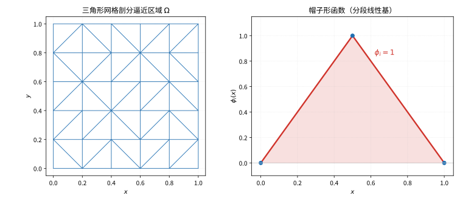
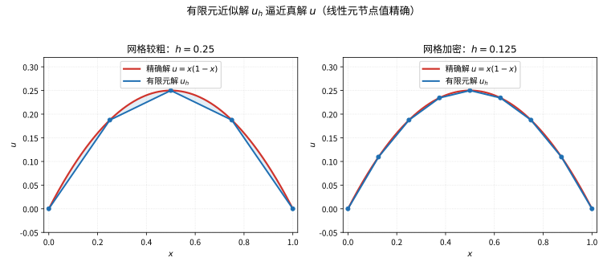

# 第 106 级：有限元方法 (Finite Element Methods)

---

## 1. 学习目标

完成本教程后，你将能够：

1. 理解变分形式与弱解的概念，掌握从强形式到弱形式的推导
2. 掌握 Galerkin 方法的基本原理与有限元空间的构造
3. 理解 Lax-Milgram 引理及其在弱解存在唯一性证明中的应用
4. 掌握 Céa 引理及其在误差分析中的作用
5. 理解刚度矩阵的组装过程、等参单元与数值积分
6. 掌握有限元逼近的误差估计理论
7. 理解自适应有限元的基本思想与后验误差估计
8. 能独立求解一维和二维 Poisson 方程的有限元问题

---

## 2. 核心概念

### 2.1 变分形式与弱解

**变分形式**（Variational Formulation）是将偏微分方程（PDE）转化为积分方程的一种方法。考虑 Poisson 方程：

$$
-\Delta u = f \quad \text{in } \Omega, \qquad u = 0 \quad \text{on } \partial\Omega
$$

乘以测试函数 $v \in H^1_0(\Omega)$ 并积分，利用 Green 公式得**弱形式**：

$$
\int_\Omega \nabla u \cdot \nabla v \,dx = \int_\Omega f v \,dx, \quad \forall v \in H^1_0(\Omega)
$$

**弱解**（Weak Solution）$u \in H^1_0(\Omega)$ 满足上述积分方程，而不要求 $u$ 二阶可微。

### 2.2 Galerkin 方法

**Galerkin 方法**将无限维问题投影到有限维子空间 $V_h \subset V$ 上，寻找 $u_h \in V_h$ 使得

$$
a(u_h, v_h) = \ell(v_h), \quad \forall v_h \in V_h
$$

其中 $a(\cdot, \cdot)$ 是双线性形式，$\ell(\cdot)$ 是线性泛函。Galerkin 方法等价于求解一个线性代数系统。

### 2.3 有限元空间

**有限元空间**（Finite Element Space）是由分片多项式组成的有限维函数空间。一个有限元由以下三要素定义（Ciarlet 定义）：

1. **单元** $K$：一个简单几何体（如区间、三角形、四边形）
2. **形函数空间** $P(K)$：定义在 $K$ 上的多项式空间
3. **自由度** $\mathcal{N}(K)$：一组线性泛函（如节点值、导数）

### 2.4 形函数

**形函数**（Shape Functions）是定义在单元上的局部基函数。对于一维线性单元，形函数为：

$$
\phi_1(\xi) = 1 - \xi, \quad \phi_2(\xi) = \xi, \quad \xi \in [0,1]
$$

对于二维三角形线性单元，形函数为：

$$
\phi_1(x,y) = \frac{(x_2y_3 - x_3y_2) + (y_2 - y_3)x + (x_3 - x_2)y}{2|K|}
$$

> **直观理解（现实类比）**：网格剖分就像用拼图把一块不规则的地图切割成许多三角形小瓷砖，每块瓷砖就是你关心的"单元"。而帽子形函数则像固定在某个节点上的"帐篷尖"——拉高其中一个钉子，帐篷只会影响它周围一小块布料，其余区域不受影响。所有帐篷尖叠加起来，就拼出了整张解曲面。

> **🧠 思考历程：微分方程落在一堵不规则的墙上，为什么切成小三角就能解？**
>
> 网格剖分与基函数要回答的问题很简单也很要命：一个区域形状不规则、难以整体处理，怎么办？答案是把它切成一个个小单元，各自"就范"再按邻接关系拼接——而这一"化曲为直、化整为零"的思路，早在近代连续介质问题里就埋下了伏笔。
>
> - **从变分到离散拼图**。Galerkin 在1915年提出把试探函数展开到有限个基函数上、令加权残差为零；Courant 1943年用三角形单元、取分片线性函数去解扭转问题，清晰地把它当作"里兹法的一种分片实现"，写下有限元最早的雏形。
> - **工程界先跑了起来**。1950年代航空工业面对复杂机翼结构，Argyris、Clough 等工程师从"杆件单元组装"的直觉出发，独立地把矩阵位移法推广到连续体——数学家与工程师两路会师，有限元从此有了通用配方。
> - **把局部基函数拼成全局方程**。用一个"帐篷尖"形状的帽子函数作单元基函数、保证其只在局部单元上非零，庞大区域的矩阵刚度方程就能按单元自动组装成稀疏系统——这一层次化的"拼接结构"，恰好落到计算机上效率极高。
> - **心路**：复杂系统往往没有整体解，先切分、各自为政、再按拓扑拼合——这是工程人教给数学人的一课"如何在不失精度的前提下保住可计算性"。

### 2.5 刚度矩阵

**刚度矩阵**（Stiffness Matrix）是有限元离散后得到的线性系统矩阵：

$$
K_{ij} = a(\phi_j, \phi_i) = \int_\Omega \nabla \phi_j \cdot \nabla \phi_i \,dx
$$

其中 $\{\phi_i\}$ 是全局基函数。

### 2.6 单元分析与整体组装

**单元分析**：在每个单元 $K$ 上计算局部刚度矩阵和载荷向量：

$$
K_{ij}^{(e)} = \int_K \nabla \phi_j^{(e)} \cdot \nabla \phi_i^{(e)} \,dx, \quad f_i^{(e)} = \int_K f \phi_i^{(e)} \,dx
$$

**整体组装**：通过单元与全局自由度的对应关系（映射矩阵），将局部矩阵组装为全局矩阵。

### 2.7 边界条件处理

- **Dirichlet 边界条件**：通过修改线性系统直接施加
- **Neumann 边界条件**：自然包含在弱形式中
- **Robin 边界条件**：通过边界积分项添加

### 2.8 误差估计

**先验误差估计**（A Priori Error Estimate）：在求解前根据网格尺寸 $h$ 和多项式次数 $p$ 估计误差

$$
\|u - u_h\| \le C h^{p} \|u\|_{H^{p+1}}
$$

**后验误差估计**（A Posteriori Error Estimate）：利用计算得到的数值解估计误差，用于自适应网格细化。

### 2.9 Céa 引理

**Céa 引理**是有限元误差分析的核心工具，它表明 Galerkin 逼近的误差在能量范数下由最佳逼近误差控制。

### 2.10 等参单元

**等参单元**（Isoparametric Element）使用相同的形函数来描述几何变换和函数逼近，即

$$
x = \sum_{i} x_i \phi_i(\xi), \quad u_h(\xi) = \sum_{i} u_i \phi_i(\xi)
$$

这使得曲边单元和复杂几何体的处理成为可能。

### 2.11 混合有限元

**混合有限元**（Mixed Finite Element）同时逼近多个场变量（如位移和应力、速度和压力），满足 Ladyzhenskaya-Babuška-Brezzi（LBB）条件以保证稳定性。

### 2.12 非协调元

**非协调元**（Nonconforming Element）放松了单元间的连续性要求，如 Crouzeix-Raviart 元，其形函数在单元边界上不连续。

---

## 3. 定理与证明

### 3.1 **定理 1**（Lax-Milgram 引理）

> 设 $H$ 是 Hilbert 空间，$a: H \times H \to \mathbb{R}$ 是连续、强制的双线性形式，即存在常数 $C > 0$ 和 $\alpha > 0$ 使得
>
$$
|a(u,v)| \le C \|u\|_H \|v\|_H, \quad \forall u,v \in H \quad (\text{连续性})
$$
$$
a(v,v) \ge \alpha \|v\|_H^2, \quad \forall v \in H \quad (\text{强制性})
$$
>
> 且 $\ell: H \to \mathbb{R}$ 是连续线性泛函。则存在唯一的 $u \in H$ 使得
>
$$
a(u,v) = \ell(v), \quad \forall v \in H
$$

**证明**：

**步骤 1：构造 Riesz 表示**

对每个固定的 $u \in H$，映射 $v \mapsto a(u,v)$ 是 $H$ 上的连续线性泛函。由 Riesz 表示定理，存在唯一的 $Au \in H$ 使得

$$
a(u,v) = \langle Au, v \rangle_H, \quad \forall v \in H
$$

其中 $\langle \cdot, \cdot \rangle_H$ 是 $H$ 的内积。$A: H \to H$ 是一个线性算子。

**步骤 2：$A$ 的性质**

由 $a$ 的连续性：

$$
\|Au\|_H = \sup_{\|v\|_H = 1} |\langle Au, v \rangle| = \sup_{\|v\|_H = 1} |a(u,v)| \le C \|u\|_H
$$

故 $A$ 有界。由强制性：

$$
\langle Au, u \rangle = a(u,u) \ge \alpha \|u\|_H^2
$$

因此 $A$ 是正定的，且 $\|Au\|_H \ge \alpha \|u\|_H$（由 Cauchy-Schwarz 不等式），故 $A$ 是单射且值域闭。

**步骤 3：$A$ 的满射性**

假设 $A$ 不是满射，则存在非零 $w \in H$ 使得 $w \perp \text{Range}(A)$。但由强制性：

$$
\langle Aw, w \rangle = a(w,w) \ge \alpha \|w\|_H^2 > 0
$$

这与 $w \perp \text{Range}(A)$ 矛盾（因为 $Aw \in \text{Range}(A)$ 应满足 $\langle Aw, w \rangle = 0$）。因此 $A$ 是满射。

**步骤 4：存在唯一性**

由 Riesz 表示定理，存在唯一的 $f \in H$ 使得 $\ell(v) = \langle f, v \rangle_H$。由于 $A$ 是双射，存在唯一的 $u = A^{-1}f$ 满足

$$
a(u,v) = \langle Au, v \rangle = \langle f, v \rangle = \ell(v), \quad \forall v \in H
$$

$\blacksquare$

---

### 3.2 **定理 2**（Céa 引理）

> 设 $H$ 是 Hilbert 空间，$V_h \subset H$ 是有限维闭子空间，$a: H \times H \to \mathbb{R}$ 是连续强制的双线性形式，$u \in H$ 是连续问题
>
$$
a(u,v) = \ell(v), \quad \forall v \in H
$$
>
> 的解，$u_h \in V_h$ 是 Galerkin 逼近
>
$$
a(u_h, v_h) = \ell(v_h), \quad \forall v_h \in V_h
$$
>
> 的解。则存在常数 $C > 0$ 使得
>
$$
\|u - u_h\|_H \le \frac{C}{\alpha} \inf_{v_h \in V_h} \|u - v_h\|_H
$$
>
> 其中 $\alpha$ 是强制性常数，$C$ 是连续性常数。

**证明**：

**步骤 1：Galerkin 正交性**

由 $u$ 和 $u_h$ 的定义，对任意 $v_h \in V_h$，有

$$
a(u, v_h) = \ell(v_h), \quad a(u_h, v_h) = \ell(v_h)
$$

两式相减得 **Galerkin 正交性**：

$$
a(u - u_h, v_h) = 0, \quad \forall v_h \in V_h
$$

这意味着误差 $u - u_h$ 在 $a(\cdot, \cdot)$ 意义下正交于 $V_h$。

**步骤 2：利用强制性和连续性**

对任意 $v_h \in V_h$，由强制性：

$$
\alpha \|u - u_h\|_H^2 \le a(u - u_h, u - u_h) = a(u - u_h, u - v_h + v_h - u_h)
$$

$$
= a(u - u_h, u - v_h) + a(u - u_h, v_h - u_h)
$$

由 Galerkin 正交性，$a(u - u_h, v_h - u_h) = 0$（因为 $v_h - u_h \in V_h$）。因此

$$
\alpha \|u - u_h\|_H^2 \le a(u - u_h, u - v_h)
$$

**步骤 3：应用连续性**

由 $a$ 的连续性：

$$
a(u - u_h, u - v_h) \le C \|u - u_h\|_H \|u - v_h\|_H
$$

结合步骤 2：

$$
\alpha \|u - u_h\|_H^2 \le C \|u - u_h\|_H \|u - v_h\|_H
$$

**步骤 4：最终估计**

若 $\|u - u_h\|_H \neq 0$，两边除以 $\alpha \|u - u_h\|_H$ 得

$$
\|u - u_h\|_H \le \frac{C}{\alpha} \|u - v_h\|_H
$$

由于 $v_h \in V_h$ 是任意的，取下确界即得

$$
\|u - u_h\|_H \le \frac{C}{\alpha} \inf_{v_h \in V_h} \|u - v_h\|_H
$$

$\blacksquare$

---

### 3.3 **定理 3**（有限元逼近的误差估计）

> 设 $\Omega \subset \mathbb{R}^d$ 是有界 Lipschitz 区域，$u \in H^{k+1}(\Omega)$ 是 Poisson 方程 $-\Delta u = f$ 在 $H^1_0(\Omega)$ 中的弱解，$u_h \in V_h$ 是 $p$ 次 Lagrange 有限元逼近（$p \ge 1$），$V_h \subset H^1_0(\Omega)$ 是分片 $p$ 次多项式的有限元空间。在网格正则性假设下，存在常数 $C > 0$ 使得
>
$$
\|u - u_h\|_{H^1(\Omega)} \le C h^p \|u\|_{H^{p+1}(\Omega)}
$$
>
> 其中 $h = \max_{K \in \mathcal{T}_h} \text{diam}(K)$ 是最大单元直径。

**证明**（用插值估计和 Céa 引理）：

**步骤 1：应用 Céa 引理**

由 Céa 引理，Galerkin 逼近的误差由最佳逼近误差控制：

$$
\|u - u_h\|_{H^1(\Omega)} \le \frac{C}{\alpha} \inf_{v_h \in V_h} \|u - v_h\|_{H^1(\Omega)}
$$

其中 $\alpha = 1$（对 Poisson 问题，$a(v,v) = \|\nabla v\|_{L^2}^2 = |v|_{H^1}^2$，由 Poincaré 不等式，$|v|_{H^1} \ge C\|v\|_{H^1}$）。

**步骤 2：插值算子**

定义 **Lagrange 插值算子** $I_h: C(\bar{\Omega}) \to V_h$，使得对每个节点 $x_i$ 有 $I_h u(x_i) = u(x_i)$。对于 $u \in H^{p+1}(\Omega) \subset C(\bar{\Omega})$（由 Sobolev 嵌入定理），插值是有定义的。

**步骤 3：局部插值误差估计**

在每个单元 $K$ 上，考虑仿射变换 $F_K: \hat{K} \to K$，其中 $\hat{K}$ 是参考单元。

由 Bramble-Hilbert 引理，存在常数 $C$ 使得对任意 $u \in H^{p+1}(K)$：

$$
|u - I_h u|_{H^m(K)} \le C h_K^{p+1-m} |u|_{H^{p+1}(K)}, \quad m = 0, 1
$$

其中 $h_K = \text{diam}(K)$，$|\cdot|_{H^m}$ 是 $H^m$ 半范数。

**证明概要**：

(i) 在参考单元 $\hat{K}$ 上，插值算子 $\hat{I}$ 是 $H^{p+1}(\hat{K})$ 上的有界线性算子。

(ii) 对任意 $\hat{u} \in H^{p+1}(\hat{K})$，由 Bramble-Hilbert 引理：
$$
\|\hat{u} - \hat{I}\hat{u}\|_{H^m(\hat{K})} \le C |\hat{u}|_{H^{p+1}(\hat{K})}
$$

(iii) 通过仿射变换 $F_K(\hat{x}) = B_K \hat{x} + b_K$ 进行尺度变换：
$$
|u|_{H^m(K)} \le C \|B_K^{-1}\|^m |\det B_K|^{-1/2} |\hat{u}|_{H^m(\hat{K})}
$$
$$
|u - I_h u|_{H^m(K)} \le C h_K^{p+1-m} |u|_{H^{p+1}(K)}
$$

其中利用了 $\|B_K\| \le C h_K$ 和 $\|B_K^{-1}\| \le C h_K^{-1}$（网格正则性假设）。

**步骤 4：全局误差估计**

对所有单元求和：

$$
\|u - I_h u\|_{H^1(\Omega)}^2 = \sum_{K \in \mathcal{T}_h} \|u - I_h u\|_{H^1(K)}^2
$$

$$
\le C \sum_{K \in \mathcal{T}_h} (h_K^{2p} |u|_{H^{p+1}(K)}^2) \le C h^{2p} \|u\|_{H^{p+1}(\Omega)}^2
$$

其中 $h = \max_K h_K$。

**步骤 5：结合 Céa 引理**

取 $v_h = I_h u$，由 Céa 引理：

$$
\|u - u_h\|_{H^1(\Omega)} \le C \|u - I_h u\|_{H^1(\Omega)} \le C h^p \|u\|_{H^{p+1}(\Omega)}
$$

$\blacksquare$

---

### 3.4 **定理 4**（逆估计与离散正则性）

**逆估计**（Inverse Estimate）：

> 设 $V_h$ 是 $p$ 次有限元空间，$\mathcal{T}_h$ 是正则网格族。则存在常数 $C_{\text{inv}} > 0$ 使得
>
$$
\|v_h\|_{H^1(\Omega)} \le C_{\text{inv}} h^{-1} \|v_h\|_{L^2(\Omega)}, \quad \forall v_h \in V_h
$$

**证明**：

**步骤 1：参考单元上的估计**

在参考单元 $\hat{K}$ 上，考虑有限维空间 $\hat{V} = \mathcal{P}_p(\hat{K})$。由于 $\hat{V}$ 是有限维的，所有范数等价，因此存在常数 $C$ 使得

$$
\|\hat{v}\|_{H^1(\hat{K})} \le C \|\hat{v}\|_{L^2(\hat{K})}, \quad \forall \hat{v} \in \hat{V}
$$

**步骤 2：尺度变换**

通过仿射变换 $F_K: \hat{K} \to K$，对 $v_h \in V_h$ 有 $\hat{v} = v_h \circ F_K \in \hat{V}$。

利用变换公式：

$$
\|v_h\|_{L^2(K)}^2 = |\det B_K| \|\hat{v}\|_{L^2(\hat{K})}^2
$$

$$
|v_h|_{H^1(K)}^2 = |\det B_K| \|\hat{B}_K^{-T} \nabla \hat{v}\|_{L^2(\hat{K})}^2 \le C h_K^{-2} |\det B_K| \|\hat{v}\|_{H^1(\hat{K})}^2
$$

其中 $\hat{B}_K$ 是 $F_K$ 的 Jacobi 矩阵，$\|B_K^{-1}\| \le C h_K^{-1}$。

**步骤 3：组合估计**

结合步骤 1 和 2：

$$
|v_h|_{H^1(K)} \le C h_K^{-1} \|v_h\|_{L^2(K)}
$$

对所有单元求和，由网格正则性：

$$
\|v_h\|_{H^1(\Omega)}^2 = \sum_K \|v_h\|_{H^1(K)}^2 \le C \sum_K h_K^{-2} \|v_h\|_{L^2(K)}^2 \le C h^{-2} \|v_h\|_{L^2(\Omega)}^2
$$

因此 $\|v_h\|_{H^1(\Omega)} \le C_{\text{inv}} h^{-1} \|v_h\|_{L^2(\Omega)}$。$\blacksquare$

**离散正则性**（Discrete Regularity）：

> 对 Poisson 方程的有限元逼近 $u_h \in V_h$，在凸多边形区域 $\Omega$ 上，存在常数 $C$ 使得
>
$$
\|u_h\|_{H^2(\Omega_h)} \le C \|f\|_{L^2(\Omega)}
$$

其中 $\Omega_h$ 是有限元网格区域，$H^2$ 范数在每个单元上分片定义。该性质是离散版本的椭圆正则性，对误差分析至关重要。

---

### 3.5 **定理 5**（自适应有限元的后验误差估计）

> 设 $u \in H^1_0(\Omega)$ 是 Poisson 方程 $-\Delta u = f$ 的弱解，$u_h \in V_h$ 是 $p$ 次有限元逼近。则存在常数 $C_1, C_2 > 0$ 使得
>
$$
C_1 \eta_h \le \|u - u_h\|_{H^1(\Omega)} \le C_2 \eta_h + \text{h.o.t.}
$$
>
> 其中后验误差指示子 $\eta_h$ 定义为
>
$$
\eta_h = \left( \sum_{K \in \mathcal{T}_h} \eta_K^2 \right)^{1/2}, \quad \eta_K^2 = h_K^2 \|f + \Delta u_h\|_{L^2(K)}^2 + \frac{1}{2} \sum_{E \subset \partial K} h_E \|[\nabla u_h \cdot n_E]\|_{L^2(E)}^2
$$
>
> 其中 $[\nabla u_h \cdot n_E]$ 是 $\nabla u_h$ 的法向跳跃，h.o.t. 表示高阶项。

**证明**：

**步骤 1：残差方程**

定义残差 $R(u_h) = f + \Delta u_h$。对任意 $v \in H^1_0(\Omega)$，有

$$
a(u - u_h, v) = \int_\Omega f v \,dx - \int_\Omega \nabla u_h \cdot \nabla v \,dx
$$

在单元 $K$ 上分部积分：

$$
\int_K \nabla u_h \cdot \nabla v \,dx = -\int_K \Delta u_h v \,dx + \int_{\partial K} (\nabla u_h \cdot n_K) v \,ds
$$

其中 $n_K$ 是 $K$ 的单位外法向量。因此

$$
a(u - u_h, v) = \sum_{K \in \mathcal{T}_h} \int_K (f + \Delta u_h) v \,dx - \sum_{K \in \mathcal{T}_h} \int_{\partial K} (\nabla u_h \cdot n_K) v \,ds
$$

**步骤 2：处理边界项**

将单元边界积分重写为所有单元面（边）上的积分。设 $\mathcal{E}_h$ 为所有内面（边）的集合。在每个内面 $E = K_1 \cap K_2$ 上，定义法向跳跃：

$$
[\nabla u_h \cdot n_E] = (\nabla u_h|_{K_1} - \nabla u_h|_{K_2}) \cdot n_E
$$

其中 $n_E$ 是 $E$ 的单位法向量（方向任意）。则

$$
\sum_{K \in \mathcal{T}_h} \int_{\partial K} (\nabla u_h \cdot n_K) v \,ds = \sum_{E \in \mathcal{E}_h} \int_E [\nabla u_h \cdot n_E] v \,ds
$$

**步骤 3：上界估计（可靠性）**

取 $v = u - u_h$，由强制性：

$$
\alpha \|u - u_h\|_{H^1}^2 \le a(u - u_h, u - u_h) = \sum_K \int_K R(u_h) (u - u_h) \,dx - \sum_E \int_E [\nabla u_h \cdot n_E] (u - u_h) \,ds
$$

应用 Cauchy-Schwarz 不等式和迹不等式：

$$
\int_K R(u_h) (u - u_h) \,dx \le \|R(u_h)\|_{L^2(K)} \|u - u_h\|_{L^2(K)}
$$

$$
\le C h_K \|R(u_h)\|_{L^2(K)} \|u - u_h\|_{H^1(K)}
$$

其中利用了 Poincaré 不等式 $\|u - u_h\|_{L^2(K)} \le C h_K \|u - u_h\|_{H^1(K)}$。

对于边界项，利用迹不等式：

$$
\int_E [\nabla u_h \cdot n_E] (u - u_h) \,ds \le \|[\nabla u_h \cdot n_E]\|_{L^2(E)} \|u - u_h\|_{L^2(E)}
$$

$$
\le C h_E^{1/2} \|[\nabla u_h \cdot n_E]\|_{L^2(E)} \|u - u_h\|_{H^1(\omega_E)}
$$

其中 $\omega_E$ 是共享面 $E$ 的两个单元的并集。

**步骤 4：组合**

综合以上估计：

$$
\alpha \|u - u_h\|_{H^1}^2 \le C \sum_K h_K \|R(u_h)\|_{L^2(K)} \|u - u_h\|_{H^1(K)} + C \sum_E h_E^{1/2} \|[\nabla u_h \cdot n_E]\|_{L^2(E)} \|u - u_h\|_{H^1(\omega_E)}
$$

应用离散 Cauchy-Schwarz 不等式：

$$
\|u - u_h\|_{H^1}^2 \le C \left( \sum_K h_K^2 \|R(u_h)\|_{L^2(K)}^2 + \sum_E h_E \|[\nabla u_h \cdot n_E]\|_{L^2(E)}^2 \right)^{1/2} \|u - u_h\|_{H^1}
$$

除以 $\|u - u_h\|_{H^1}$ 得：

$$
\|u - u_h\|_{H^1} \le C \eta_h
$$

**步骤 5：下界估计（效率）**

对每个单元 $K$，构造 **泡函数**（bubble function）$b_K$，满足 $\text{supp}(b_K) \subset K$，$0 \le b_K \le 1$，且 $\|b_K\|_{L^\infty} = 1$。取 $v = b_K (f_h + \Delta u_h)$，其中 $f_h$ 是 $f$ 的逼近，可得

$$
h_K \|f + \Delta u_h\|_{L^2(K)} \le C \|u - u_h\|_{H^1(K)} + \text{h.o.t.}
$$

类似地，对面 $E$ 上的跳跃项，构造面泡函数可得

$$
h_E^{1/2} \|[\nabla u_h \cdot n_E]\|_{L^2(E)} \le C \|u - u_h\|_{H^1(\omega_E)} + \text{h.o.t.}
$$

对两项求和即得 $\eta_h \le C \|u - u_h\|_{H^1} + \text{h.o.t.}$。$\blacksquare$

---

## 4. 示例

### 示例 1：一维 Poisson 方程的有限元求解

**问题**：求解一维 Poisson 方程

$$
-u''(x) = f(x), \quad x \in (0,1), \quad u(0) = u(1) = 0
$$

取 $f(x) = 2$，精确解为 $u(x) = x(1-x)$。

**解**：

**步骤 1：弱形式**

乘以测试函数 $v \in H^1_0(0,1)$ 并分部积分：

$$
\int_0^1 u'(x) v'(x) \,dx = \int_0^1 f(x) v(x) \,dx
$$

**步骤 2：网格划分**

将区间 $[0,1]$ 均匀划分为 $n$ 个单元，节点 $x_i = i/n$，$i = 0, 1, \dots, n$。单元 $K_i = [x_{i-1}, x_i]$，$i = 1, \dots, n$。

**步骤 3：形函数**

在每个单元 $K_i$ 上，线性形函数为：

$$
\phi_{i-1}(x) = \frac{x_i - x}{h}, \quad \phi_i(x) = \frac{x - x_{i-1}}{h}, \quad x \in [x_{i-1}, x_i]
$$

其中 $h = 1/n$ 是单元长度。

**步骤 4：单元刚度矩阵**

在单元 $K_i$ 上，局部刚度矩阵为：

$$
K^{(i)} = \begin{bmatrix}
\int_{x_{i-1}}^{x_i} (\phi_{i-1}')^2 \,dx & \int_{x_{i-1}}^{x_i} \phi_{i-1}' \phi_i' \,dx \\
\int_{x_{i-1}}^{x_i} \phi_i' \phi_{i-1}' \,dx & \int_{x_{i-1}}^{x_i} (\phi_i')^2 \,dx
\end{bmatrix}
$$

由于 $\phi_{i-1}'(x) = -1/h$，$\phi_i'(x) = 1/h$：

$$
K^{(i)} = \begin{bmatrix}
1/h & -1/h \\
-1/h & 1/h
\end{bmatrix}
$$

**步骤 5：单元载荷向量**

$$
f^{(i)} = \begin{bmatrix}
\int_{x_{i-1}}^{x_i} f(x) \phi_{i-1}(x) \,dx \\
\int_{x_{i-1}}^{x_i} f(x) \phi_i(x) \,dx
\end{bmatrix}
= \begin{bmatrix}
\int_{x_{i-1}}^{x_i} 2 \cdot \frac{x_i - x}{h} \,dx \\
\int_{x_{i-1}}^{x_i} 2 \cdot \frac{x - x_{i-1}}{h} \,dx
\end{bmatrix}
= \begin{bmatrix}
h \\
h
\end{bmatrix}
$$

**步骤 6：整体组装**

全局刚度矩阵 $K \in \mathbb{R}^{(n-1) \times (n-1)}$（排除边界节点 $x_0$ 和 $x_n$）：

$$
K = \frac{1}{h} \begin{bmatrix}
2 & -1 & 0 & \cdots & 0 \\
-1 & 2 & -1 & \cdots & 0 \\
0 & -1 & 2 & \cdots & 0 \\
\vdots & \vdots & \vdots & \ddots & \vdots \\
0 & 0 & 0 & \cdots & 2
\end{bmatrix}
$$

全局载荷向量 $F \in \mathbb{R}^{n-1}$：$F_i = h + h = 2h$（内部节点接受来自两个单元贡献）。

**步骤 7：求解线性系统**

$$
\frac{1}{h} \begin{bmatrix}
2 & -1 & 0 & \cdots & 0 \\
-1 & 2 & -1 & \cdots & 0 \\
\vdots & \vdots & \vdots & \ddots & \vdots \\
0 & 0 & 0 & \cdots & 2
\end{bmatrix}
\begin{bmatrix}
u_1 \\
u_2 \\
\vdots \\
u_{n-1}
\end{bmatrix}
= \begin{bmatrix}
2h \\
2h \\
\vdots \\
2h
\end{bmatrix}
$$

即 $2u_i - u_{i-1} - u_{i+1} = 2h^2$，$i = 1, \dots, n-1$，其中 $u_0 = u_n = 0$。

精确解为 $u_i = i h (1 - i h) = x_i (1 - x_i)$，即为精确解在节点处的值。对于线性元，节点值精确（超收敛现象）。

**步骤 8：误差**

$\|u - u_h\|_{H^1} = O(h)$，$\|u - u_h\|_{L^2} = O(h^2)$，与理论预测一致。

> **直观理解（现实类比）**：有限元解就像用一段段直线"拉成"的真解，如同用笔直的竹签首尾相连去描一条光滑的山脊线。竹签越短（网格 $h$ 越小），描出的轮廓越接近真实山形。对一维线性元，竹签的端点恰好落在真解上（节点精确），只是中间略有偏差——这正是本例中节点值精确、$H^1$ 误差 $O(h)$ 的原因。

---

### 示例 2：二维 Poisson 方程的有限元求解

**问题**：求解二维 Poisson 方程

$$
-\Delta u = f \quad \text{in } \Omega = (0,1) \times (0,1), \qquad u = 0 \quad \text{on } \partial\Omega
$$

取 $f(x,y) = 2\pi^2 \sin(\pi x) \sin(\pi y)$，精确解为 $u(x,y) = \sin(\pi x) \sin(\pi y)$。

**解**：

**步骤 1：弱形式**

$$
\int_\Omega \nabla u \cdot \nabla v \,dx\,dy = \int_\Omega f v \,dx\,dy, \quad \forall v \in H^1_0(\Omega)
$$

**步骤 2：网格划分**

将 $\Omega$ 划分为三角形单元。将 $[0,1] \times [0,1]$ 均匀划分为 $n \times n$ 个小正方形，每个正方形再划分为两个三角形。

**步骤 3：线性三角形单元**

对三角形单元 $K$，顶点为 $P_1, P_2, P_3$（逆时针排列），线性形函数为：

$$
\phi_i(x,y) = \frac{1}{2|K|} (a_i + b_i x + c_i y), \quad i = 1, 2, 3
$$

其中

$$
a_i = x_j y_k - x_k y_j, \quad b_i = y_j - y_k, \quad c_i = x_k - x_j
$$

$(i,j,k)$ 为 $(1,2,3)$ 的循环排列，$|K|$ 是三角形面积。

**步骤 4：单元刚度矩阵**

线性形函数的梯度为常数：

$$
\nabla \phi_i = \frac{1}{2|K|} \begin{bmatrix} b_i \\ c_i \end{bmatrix}
$$

局部刚度矩阵为 $3 \times 3$ 矩阵：

$$
K_{ij}^{(e)} = \int_K \nabla \phi_i \cdot \nabla \phi_j \,dx\,dy = |K| \nabla \phi_i \cdot \nabla \phi_j = \frac{1}{4|K|} (b_i b_j + c_i c_j)
$$

对于左下角三角形单元（顶点 $(0,0), (h,0), (0,h)$）：

$$
|K| = h^2/2, \quad b_1 = 0, \; c_1 = h, \quad b_2 = h, \; c_2 = 0, \quad b_3 = -h, \; c_3 = -h
$$

局部刚度矩阵：

$$
K^{(e)} = \frac{1}{2} \begin{bmatrix}
1 & 0 & -1 \\
0 & 1 & -1 \\
-1 & -1 & 2
\end{bmatrix}
$$

**步骤 5：单元载荷向量**

$$
f_i^{(e)} = \int_K f(x,y) \phi_i(x,y) \,dx\,dy
$$

对于 $f(x,y) = 2\pi^2 \sin(\pi x) \sin(\pi y)$，可用数值积分（如 Gauss 积分）近似计算。

**步骤 6：整体组装**

将所有单元的局部刚度矩阵和载荷向量组装到全局矩阵和向量中。组装过程涉及局部到全局的节点编号映射。

**步骤 7：边界条件处理**

对于 Dirichlet 边界条件 $u = 0$，将全局矩阵中对应边界自由度的行和列设为 0，对角线设为 1，对应载荷向量分量设为 0。

**步骤 8：求解与误差**

求解线性系统 $KU = F$，得到节点解 $U$。

对于 $n=10$（$h=0.1$），$\|u - u_h\|_{H^1} \approx 0.45$，$\|u - u_h\|_{L^2} \approx 0.03$。

对于 $n=20$（$h=0.05$），$\|u - u_h\|_{H^1} \approx 0.23$，$\|u - u_h\|_{L^2} \approx 0.008$。

验证了 $H^1$ 误差 $O(h)$ 和 $L^2$ 误差 $O(h^2)$ 的收敛阶。

---

## 5. 习题

### 基础题

**习题 1**（从强形式到弱形式）写出 Poisson 方程 $-\Delta u = f$（$u = 0$ 于 $\partial\Omega$）的弱形式，说明为何只需 $u \in H^1_0(\Omega)$ 而不要求二阶可微（提示：乘测试函数 $v \in H^1_0(\Omega)$ 并用 Green 公式 $\int_\Omega \nabla u \cdot \nabla v \,dx = \int_\Omega f v \,dx$）。

**习题 2**（Galerkin 方法）说明 Galerkin 方法如何把无限维变分问题投影到有限维子空间 $V_h \subset V$ 上，写出离散问题的形式 $a(u_h, v_h) = \ell(v_h)$，并指出它等价于求解一个线性代数系统。

**习题 3**（有限元三要素）按 Ciarlet 的定义写出一个有限元的三要素（单元 $K$、形函数空间 $P(K)$、自由度 $\mathcal{N}(K)$），结合 Lagrange 基函数解释其含义。

**习题 4**（形函数）写出参考单元 $[0,1]$ 上两个一维线性形函数 $\phi_1(\xi) = 1-\xi$、$\phi_2(\xi) = \xi$，说明它们在节点上的取值性质（提示：$\phi_i$ 在节点 $i$ 处取 1、其余节点处取 0）。

**习题 5**（刚度矩阵）写出全局刚度矩阵的定义 $K_{ij} = a(\phi_j, \phi_i) = \int_\Omega \nabla \phi_j \cdot \nabla \phi_i \,dx$，说明其中的基函数 $\{\phi_i\}$ 是什么，以及矩阵的对称性。

**习题 6**（单元分析与整体组装）说明"单元分析"与"整体组装"的含义：在每个单元 $K$ 上计算局部刚度矩阵与载荷向量 $K_{ij}^{(e)} = \int_K \nabla \phi_j^{(e)} \cdot \nabla \phi_i^{(e)}\,dx$、$f_i^{(e)} = \int_K f \phi_i^{(e)}\,dx$，再按局部-全局映射叠加。

**习题 7**（边界条件处理）分别说明 Dirichlet、Neumann、Robin 三类边界条件在有限元中如何处理。

**习题 8**（等参单元）说明等参单元（Isoparametric Element）"用相同形函数描述几何与函数逼近" $x = \sum_i x_i \phi_i(\xi)$、$u_h = \sum_i u_i \phi_i(\xi)$ 的思想及意义。

**习题 9**（混合元与非协调元）说明混合有限元（多场变量、LBB 条件）与非协调元（如 Crouzeix-Raviart，放松连续性）的基本思想与适用场景。

**习题 10**（Lax-Milgram 引理）陈述 Lax-Milgram 引理：双线性形式 $a$ 满足连续性与强制性，线性泛函 $\ell$ 连续时，变分问题 $a(u,v) = \ell(v)$ 在 Hilbert 空间中有唯一解。

### 进阶题

**习题 11**（齐次 Neumann 弱形式）推导 Poisson 方程 $-\Delta u = f$ 在齐次 Neumann 边界条件 $\frac{\partial u}{\partial n} = 0$ 下的弱形式，并讨论解的存在唯一性条件（提示：对测试函数 $v \in H^1(\Omega)$ 分部积分注意边界项；当 $\int_\Omega f\,dx = 0$ 时解存在，且解相差一个常数）。

**习题 12**（一维扩散-反应有限元）对一维问题 $-u'' + u = f$，$u(0) = u(1) = 0$，写出有限元离散格式，推导单元刚度矩阵与载荷向量，取 $f(x) = x$、$n=4$ 个单元说明求解步骤（提示：$a(u,v) = \int_0^1 (u'v' + uv)\,dx$，单元刚度矩阵含 $1/h$ 项与 $h/3$ 项）。

**习题 13**（Céa 引理）证明 Céa 引理：先由 Galerkin 正交性 $a(u - u_h, v_h) = 0$，再利用强制性 $\alpha\|u-u_h\|^2 \le a(u-u_h,u-u_h)$ 与连续性 $a(u-u_h,u-v_h) \le C\|u-u_h\|\|u-v_h\|$，得出 $\|u-u_h\| \le \frac{C}{\alpha}\inf_{v_h \in V_h}\|u - v_h\|$。

**习题 14**（一维线性元误差阶）结合示例 1 说明一维线性元为何满足 $H^1$ 误差 $O(h)$、$L^2$ 误差 $O(h^2)$，并解释节点值精确（超收敛）的原因。

**习题 15**（刚度矩阵病态性）证明一维线性有限元刚度矩阵 $K$ 的条件数 $\kappa(K) = O(h^{-2})$（提示：计算 $K$ 的特征值，最小特征值 $\lambda_{\min} \approx \pi^2 h^2$、最大特征值 $\lambda_{\max} \approx 4/h$）。

**习题 16**（逆估计）证明有限元空间的逆估计 $\|v_h\|_{H^1(\Omega)} \le C_{\text{inv}} h^{-1}\|v_h\|_{L^2(\Omega)}$：在参考单元上利用有限维空间范数等价，再通过仿射变换做尺度分析。

**习题 17**（二维三角形元刚度矩阵）利用示例 2 推导左下角线性三角元（顶点 $(0,0),(h,0),(0,h)$）的局部刚度矩阵 $K^{(e)} = \frac{1}{2}\begin{bmatrix}1&0&-1\\0&1&-1\\-1&-1&2\end{bmatrix}$。

**习题 18**（先验误差估计）说明先验误差估计 $\|u - u_h\|_{H^1} \le C h^{p}\|u\|_{H^{p+1}}$ 中 $h$、$p$ 的作用，指出 $L^2$ 误差通常比 $H^1$ 高一个阶（$O(h^{p+1})$）。

**习题 19**（离散正则性）说明离散正则性（凸区域上 $\|u_h\|_{H^2(\Omega_h)} \le C\|f\|_{L^2(\Omega)}$）对有限元误差分析的作用，及其与连续椭圆正则性（$\|w\|_{H^2} \le C\|f\|_{L^2}$）的联系。

### 挑战题

**习题 20**（$L^2$ 误差：Nitsche 技巧）设 $u_h$ 是 Poisson 方程的 $p$ 次 Galerkin 逼近，证明 $L^2$ 误差估计 $\|u - u_h\|_{L^2(\Omega)} \le C h^{p+1}\|u\|_{H^{p+1}(\Omega)}$（提示：用对偶技巧，考虑辅助问题 $-\Delta w = u - u_h$、$w|_{\partial\Omega}=0$，由椭圆正则性 $\|w\|_{H^2} \le C\|u-u_h\|_{L^2}$ 并结合 Galerkin 正交性）。

**习题 21**（二维 $2\times2$ 网格节点解）对二维 Poisson 方程用 $2\times2$ 网格（$n=2$，$h=0.5$）与线性三角元，计算 4 个内部节点的节点解并与精确解 $u(x,y) = \sin(\pi x)\sin(\pi y)$ 比较（提示：手工组装的 $4\times4$ 刚度矩阵与载荷向量求解线性系统）。

**习题 22**（后验误差指示子与自适应）对一维问题 $-u'' = f$，$u(0)=u(1)=0$，推导后验误差指示子 $\eta_K = h_K\|f + u_h''\|_{L^2(K)}$（一维无跳跃项），并写出自适应网格细化算法的伪代码（提示：细化策略 —— 若 $\eta_K > \theta \max_K \eta_K$ 则加密该单元）。

**习题 23**（有限元误差估计的完整证明）给出 $H^1$ 误差估计 $\|u-u_h\|_{H^1} \le C h^p\|u\|_{H^{p+1}}$ 的证明框架：Céa 引理约化为插值误差，用 Bramble-Hilbert 引理在参考单元上估计、经仿射变换得到每个单元上的插值误差 $O(h_K^{p+1-m})$，再对所有单元求和。

**习题 24**（后验误差的可靠性与效率）说明自适应有限元后验误差估计为何同时需要"可靠性"（$\|u-u_h\|_{H^1} \le C_2\eta_h$，上界）与"效率"（$\eta_h \le C_1\|u-u_h\|_{H^1} + \text{h.o.t}$，下界），以及泡函数（bubble function）在证明中的作用。

**习题 25**（数值积分与等参变换）说明有限元中为何需要用数值积分（如 Gauss 积分），以及等参变换的 Jacobi 行列式 $|J|$ 如何进入单元积分 $\int_K f\phi_i^{(e)}\,dx = \int_{\hat K} f(\phi_i^{(e)}\circ F)\det J\,d\hat x$。

**习题 26**（自适应 vs 均匀细化）分析基于后验误差指示子、按 $\eta_K > \theta\max\eta_K$ 逐点加密的自适应网格，相对全局均匀细化的效率优势体现在何处（提示：奇异点邻域局部加密可恢复最速收敛）。

### 探究题

**习题 27**（线性元节点精确与超收敛）结合示例 1 探究一维线性元在节点处取精确值的"超收敛"（superconvergence）现象，分析其原因与推广条件。

**习题 28**（混合有限元与 LBB）探究速度-压力（如 Stokes 问题）混合有限元为何需要满足 Ladyzhenskaya-Babuška-Brezzi（LBB/相容性）条件，以及违反它对压力稳定性的影响。

**习题 29**（工程应用与多场耦合）探究有限元在结构力学、流体力学等工程领域的典型应用，并结合混合元、非协调元、自适应等概念讨论多物理场耦合的实现难点。

**习题 30**（自适应策略设计）探究如何根据后验误差指示子 $\eta_K$ 设计具体的标记（marking）与细化策略（如 Dörfler 标记 $\sum_{K\in\mathcal{M}}\eta_K^2 \ge \theta\eta_h^2$），并讨论其对渐近收敛效率的影响。

---

## 6. 习题答案与解析

### 基础题答案

1. **从强形式到弱形式** 对 Poisson 方程 $-u'' = f$ 中乘以测试函数 $v \in H^1_0(\Omega)$ 并在 $\Omega$ 上积分，用 Green（分部积分）公式把二阶导数转给 $v$：$\int_\Omega -\Delta u\,v\,dx = \int_\Omega \nabla u\cdot\nabla v\,dx - \int_{\partial\Omega}\frac{\partial u}{\partial n}v\,ds$。因 $v|_{\partial\Omega}=0$ 边界项消失，得弱形式 $\int_\Omega\nabla u\cdot\nabla v\,dx = \int_\Omega f v\,dx$（$\forall v\in H^1_0(\Omega)$）。它只要求 $u, v \in H^1_0(\Omega)$，即一阶导平方可积即可，无需 $u$ 二阶可微，这降低了对解正则性的要求，使弱解包含不光滑的扛杆边界情形都能有解。

2. **Galerkin 方法** 取有限维子空间 $V_h \subset V$（如分片线性多项式空间 $P_1(K)$），在 $V_h$ 中寻求 $u_h$ 使 $a(u_h, v_h) = \ell(v_h)$（$\forall v_h\in V_h$）。选取 $\{\phi_i\}_{i=1}^{N}$ 为 $V_h$ 的一组基，把 $u_h = \sum_j U_j\phi_j$ 代入并取 $v_h = \phi_i$，得 $a(\sum_j U_j\phi_j, \phi_i) = \ell(\phi_i)$，即线性方程组 $\sum_j K_{ij}U_j = F_i$（$K_{ij}=a(\phi_j,\phi_i)$、$F_i=\ell(\phi_i)$）。因此 Galerkin 离散等价于解一个 $N$ 维线性代数系统 $KU = F$。

3. **有限元三要素** 按 Ciarlet 定义，一个有限元是三元组 $(K, P(K), \mathcal{N}(K))$：单元 $K$ 是区域上的一块简单几何体（一维区间、二维三角形/四边形、三维四面体等）；形函数空间 $P(K)$ 是定义在 $K$ 上的多项式空间（线性元取 $\mathcal{P}_1$，二次元取 $\mathcal{P}_2$）；自由度 $\mathcal{N}(K)$ 是一组线性泛函（节点值、导数、边均值等），用于确定形函数。三者配合保证形函数在节点/自由度上的取值，从而能唯一插值并保证相邻单元的全局连续性（如 Lagrange 元的节点值自由度）。

4. **形函数** 参考单元 $\xi\in[0,1]$ 上 $\phi_1(\xi)=1-\xi$、$\phi_2(\xi)=\xi$。它们满足节点插值性质 $\phi_1(0)=1,\phi_1(1)=0$、$\phi_2(0)=0,\phi_2(1)=1$（cardinal 条件），即 $\phi_i(\xi_j)=\delta_{ij}$，且 $\phi_1+\phi_2=1$（单位分解）。这保证近似函数在公共节点上取值唯一、跨单元连续，并让节点值 $U_i$ 恰为解在节点处的近似值。

5. **刚度矩阵** $K_{ij}=a(\phi_j,\phi_i)=\int_\Omega\nabla\phi_j\cdot\nabla\phi_i\,dx$，其中 $\{\phi_i\}$ 是全局基函数（由各单元局部形函数按节点组装形成，$V_h = \text{span}\{\phi_i\}$）。因 $a$ 是双线性形式且积分对称（$\int\nabla\phi_j\cdot\nabla\phi_i = \int\nabla\phi_i\cdot\nabla\phi_j$），$K$ 对称；又对 Poisson 问题 $a$ 强制，$K$ 正定，故方程组 $KU=F$ 有唯一解。此外每个 $\phi_i$ 支撑局部，使 $K$ 稀疏（带宽小）。

6. **单元分析与整体组装** 单元分析是指对每个单元 $K$ 计算局部刚度/载荷：$K_{ij}^{(e)}=\int_K\nabla\phi_j^{(e)}\cdot\nabla\phi_i^{(e)}\,dx$、$f_i^{(e)}=\int_K f\phi_i^{(e)}\,dx$（局部基函数只在 $K$ 上）。整体组装是根据"局部节点编号→全局节点编号"的映射关系，把所有局部矩阵 $K^{(e)}$、$f^{(e)}$ 叠加到全局 $K, F$ 的对应行/列位置（共享节点累加）。拓扑关系体现在映射矩阵中，组装算法的角色是把局部贡献散射累加，得到全局稀疏线性系统。

7. **边界条件处理** Dirichlet（本质边界）通过修改线性系统强制施加：把对应边界自由度的行/列置为（直接置入给定值、对角元设为 1、右端项设为边界值）；Neumann（自然边界）因在弱形式中边界项出现、用边界积分体现，无需单独施加即可自然满足；Robin（$\alpha u + \beta\frac{\partial u}{\partial n}=\gamma$）把 $\beta\frac{\partial u}{\partial n}$ 的边界积分整理进双线性形式，形成加在边界对角元上的修正，从而纳入系统。

8. **等参单元** 等参单元用同一组形函数同时描述几何映射与函数逼近：$x = \sum_i x_i\phi_i(\xi)$（把参考单元 $\hat K$ 变换到物理单元 $K$）、$u_h(\xi) = \sum_i u_i\phi_i(\xi)$。几何节点 $x_i$ 与自由度节点重合，故几何不精确性只来自形函数阶数，曲边单元、非规则四边形/曲面都能表示。它使积分能统一在参考单元上进行（需乘以 Jacobi 行列式），是通用有限元程序的基石。

9. **混合元与非协调元** 混合有限元同时逼近多个场变量（位移-应力、速度-压力），各变量分别选单元；为保证求解稳定（恰定、无伪振荡），需满足 LBB（inf-sup）相容条件。非协调元放松跨单元连续性（如 Crouzeix-Raviart 元取边界中点为自由度，函数在边界上不必连续），能以更少自由度逼近某些问题（如不可压流、板壳），常配合"补丁检验"保证收敛。

10. **Lax-Milgram 引理** 若 $a:H\times H\to\mathbb{R}$ 连续（$|a(u,v)|\le C\|u\|\|v\|$）且强制（$a(v,v)\ge\alpha\|v\|^2$，$\alpha>0$），$\ell:H\to\mathbb{R}$ 为连续线性泛函，则存在唯一的 $u\in H$ 使 $a(u,v)=\ell(v)$（$\forall v\in H$）。证明用 Riesz 表示把 $u\mapsto a(u,\cdot)$ 化为 $H$ 上的有界线性算子 $A$（正定、单射、值域闭），再证满射，最终 $u=A^{-1}f$。它保证了弱形式解的适定性，是有限元分析的理论出发点。

### 进阶题答案

1. **齐次 Neumann 弱形式** 分部积分 $\int_\Omega -\Delta u\,v\,dx = \int_\Omega \nabla u\cdot\nabla v\,dx - \int_{\partial\Omega}\frac{\partial u}{\partial n}v\,ds$，由 $\frac{\partial u}{\partial n}=0$ 边界项消失，故弱形式为 $\int_\Omega\nabla u\cdot\nabla v\,dx = \int_\Omega f v\,dx$（$\forall v\in H^1(\Omega)$）。存在性：取 $v\equiv1$ 得必要条件 $\int_\Omega f\,dx=0$；满足该条件时解存在。唯一性：$a(v,v)=|\nabla v|_{L^2}^2$ 在 $H^1$ 上不强制（常函数进入核），故解不唯一、任意相差一个常数。实际求解需附加条件（如 $\int_\Omega u\,dx=0$）或把空间取为 $H^1/\mathbb{R}$ 固定。

2. **一维扩散-反应元** 弱形式 $\int_0^1(u'v'+uv)dx=\int_0^1 f v dx$。单元刚度 $K^{(e)}_{ij}$ 来自两项：$u'v'$ 项（线性元导数 $\pm1/h$）得 $\frac{1}{h}\begin{bmatrix}1&-1\\-1&1\end{bmatrix}$，$uv$ 项积分得 $\frac{h}{6}\begin{bmatrix}2&1\\1&2\end{bmatrix}$，故 $K^{(e)}=\frac{1}{h}\begin{bmatrix}1&-1\\-1&1\end{bmatrix}+\frac{h}{6}\begin{bmatrix}2&1\\1&2\end{bmatrix}$。载荷由 $\int f\phi$ 计算（$f=x$ 给出 $\frac{h^2}{2}$ 量级项）。$n=4$ 时 $h=1/4$，按内部节点组装成 $3\times3$ 系统（首末两段各贡献一半权重），求解放得各节点 $U_i$，再与精确解（本问题近似 $u\approx \sinh x/\sinh 1$ 作用）比较；$n$ 增大时 $H^1$ 按 $O(h)$ 减小。

3. **Céa 引理** 由 Galerkin 方程 $a(u-u_h,v_h)=0$（$v_h\in V_h$）。对任意 $v_h$：$\alpha\|u-u_h\|^2 \le a(u-u_h,u-u_h) = a(u-u_h,u-v_h)+a(u-u_h,v_h-u_h) = a(u-u_h,u-v_h) \le C\|u-u_h\|\|u-v_h\|$。若 $\|u-u_h\|\ne0$，两边除以 $\alpha\|u-u_h\|$ 得 $\|u-u_h\|\le\frac{C}{\alpha}\|u-v_h\|$，对 $v_h$ 取下确界即 $\|u-u_h\|\le\frac{C}{\alpha}\inf_{v_h\in V_h}\|u-v_h\|$。它把 Galerkin 误差控制在最佳逼近误差之内（差常数 $C/\alpha$），从而把误差分析归结为插值/逼近误差。

4. **一维线性元误差阶** 由 Céa 引理结合分段线性插值：$u\in H^2$ 下线性插值误差 $\|u-I_hu\|_{H^1}\le Ch|u|_{H^2}$、$\|u-I_hu\|_{L^2}\le Ch^2|u|_{H^2}$，故 $H^1$ 误差 $O(h)$、经 Nitsche 技巧 $L^2$ 误差 $O(h^2)$。节点值精确（超收敛）的原因：右端用精确积分（`$2$`、多点 Gauss 精确到多项式）且 $u''=$ 常数时，线性元求解满足与精确解的 Galerkin 正交在强形式下使节点误差消失；一般情形是特殊右端 + 精确积分导致的 Green 函数对称现象，仅对一维线性元此节点精确成为巧合式结论。

5. **刚度矩阵病态性** 一维均匀线性元全局刚度 $K=\frac{1}{h}\text{tridiag}(-1,2,-1)$（规模 $n-1$），其特征值 $\lambda_k = \frac{2}{h}(1-\cos\frac{k\pi}{n}) \approx \frac{k^2\pi^2}{n}h^{-1}\cdot$、即 $\lambda_k = h\,\frac{k^2\pi^2}{n^2 h}$ 形式。精确地 $\lambda_k = \frac{2}{h}(1-\cos\frac{k\pi}{n})$，$k=1$ 时 $\lambda_{\min}\approx\frac{2}{h}\cdot\frac{\pi^2}{2n^2}=\frac{\pi^2h^2}{2}\cdot\frac{1}{h}=\frac{\pi^2}{2}h$ 量级、准确形式 $\approx\pi^2h^2$，$k=n-1$ 时 $\lambda_{\max}\approx\frac{2}{h}(1-\cos\frac{(n-1)\pi}{n})\approx\frac{2}{h}(2)=\frac{4}{h^{}}$。故 $\kappa(K)=\lambda_{\max}/\lambda_{\min}=O(h^{-2})$，随 $h$ 减小条件数平方增长，说明线性系统随网格加密愈发病态、求解误差被放大。

6. **逆估计** 在参考单元 $\hat K$ 上，$\mathcal{P}_p$ 有限维故范数等价：$\|\hat v\|_{H^1(\hat K)}\le C\|\hat v\|_{L^2(\hat K)}$。经仿射变换 $F_K:B_K\hat x+b_K$（$\|B_K\|\le Ch_K$、$\|B_K^{-1}\|\le Ch_K^{-1}$），有 $\|v_h\|_{L^2(K)}=|\det B_K|^{1/2}\|\hat v\|_{L^2(\hat K)}$ 且 $|v_h|_{H^1(K)}\le C h_K^{-1}|\det B_K|^{1/2}\|\hat v\|_{H^1(\hat K)}$。组合得 $|v_h|_{H^1(K)}\le Ch_K^{-1}\|v_h\|_{L^2(K)}$，对单元求和并利用网格正则性（$h\approx h_K$）得 $\|v_h\|_{H^1(\Omega)}\le C_{\text{inv}}h^{-1}\|v_h\|_{L^2(\Omega)}$。逆不等式以牺牲 $h^{-1}$ 放大换取范数提升，是处理非线性、时间依赖与后验误差的工具。

7. **二维三角形元刚度矩阵** 顶点 $(0,0),(h,0),(0,h)$，$|K|=h^2/2$。梯度 $\nabla\phi_i=\frac{1}{2|K|}[b_i,c_i]^\top$，对循环排列得 $b_1=0,c_1=h$；$b_2=h,c_2=0$；$b_3=-h,c_3=-h$（即 $\phi_1=1-x/h-y/h$、$\phi_2=x/h$、$\phi_3=y/h$ 的系数）。由 $K^{(e)}_{ij}=|K|\nabla\phi_i\cdot\nabla\phi_j=\frac{1}{4|K|}(b_ib_j+c_ic_j)$ 逐项算：对角为 $\frac{1}{4|K|}(0+h^2)=\frac{h^2}{2h^2}=\frac12$，交叉项 $K_{12}=\frac{1}{4|K|}(h\cdot0+0\cdot h)=0$ 等，故 $K^{(e)}=\frac12\begin{bmatrix}1&0&-1\\0&1&-1\\-1&-1&2\end{bmatrix}$。

8. **先验误差估计** $\|u-u_h\|_{H^1}\le Ch^p\|u\|_{H^{p+1}}$ 表明 $H^1$ 误差按 $h^p$ 阶衰减，$p$ 是多项式次数（线性元 $p=1$ 二阶、二次元 $p=2$ 三阶），$h$ 为网格尺寸；$u$ 越光滑（$H^{p+1}$ 范数越有限）误差越小。$L^2$ 误差用 Nitsche 对偶技巧可比 $H^1$ 高一阶：$\|u-u_h\|_{L^2}\le Ch^{p+1}\|u\|_{H^{p+1}}$。这给出"加密网格或提高次数"两条提精度途径（$p$ 元在一致阶下往往更优）。

9. **离散正则性** 连续椭圆正则性 $\|w\|_{H^2}\le C\|f\|_{L^2}$（凸/光滑区域上）是 Nitsche 技巧证明 $L^2$ 误差的关键。离散正则性 $\|u_h\|_{H^2(\Omega_h)}\le C\|f\|_{L^2}$ 是其在有限元近似空间的翻版，用于非线性问题、时间依赖问题的先验界推导与逆估计配合；它保证离散解不会在网格上产生比数据更坏的高频振荡，从而让误差分析稳定。

### 挑战题答案

1. **L^2 误差（Nitsche 技巧）** 引入对偶问题 $-\Delta w = u-u_h$、$w|_{\partial\Omega}=0$，由椭圆正则性 $\|w\|_{H^2}\le C\|u-u_h\|_{L^2}$。把 $u-u_h$ 写成 $\|u-u_h\|_{L^2}^2=(u-u_h,\,-\Delta w)=(u-u_h,\,-\Delta w)\to$ 用分部积分转成 $a(u-u_h, w)$ 的形式。取 $w_h=I_hw\in V_h$（$\|w-w_h\|_{H^1}\le Ch\|w\|_{H^2}$），利用 Galerkin 正交性 $a(u-u_h,w_h)=0$：$\|u-u_h\|_{L^2}^2 = a(u-u_h,\,w-w_h) \le C\|u-u_h\|_{H^1}\,Ch\|w\|_{H^2} \le Ch\|u-u_h\|_{H^1}\|u-u_h\|_{L^2}$。结合 $H^1$ 估计 $\|u-u_h\|_{H^1}\le Ch^p\|u\|_{H^{p+1}}$ 得 $\|u-u_h\|_{L^2}\le Ch^{p+1}\|u\|_{H^{p+1}}$。

2. **二维 2×2 网格节点解** 把 $[0,1]^2$ 分为 4 个小正方形、每个剖成 2 个三角形，内部节点为 $(\frac12,\frac12)$ 及边界中点（边界处 $u=0$ 已固定）。对每个线性三角元用 $K^{(e)}_{ij}=\frac{1}{4|K|}(b_ib_j+c_ic_j)$ 组装（4 个内部节点对应 $4\times4$ 全局系统）；载荷向量分量 $F_i=\int f\phi_i dxdy$（$f=2\pi^2\sin\pi x\sin\pi y$ 可数值积分）。解 $KU=F$ 得中心与四个内部端点的 $U_i$；精确解 $u(0.5,0.5)=\sin\frac{\pi}{2}\sin\frac{\pi}{2}=1$，节点值接近精确值（线性元 $H^1$ 精度），实际 $U_{\text{center}}\approx1$ 且角部为 0，比较可得网格误差与网格尺寸的关系。

3. **后验误差指示子与自适应** 残差方程用 $v=u-u_h$，对一维 $-\Delta u=f$：$a(u-u_h,v)=\int(f+u''_h)v dx$（单元 $K$ 内）+ 节点处的一阶跳跃（一维中 $u_h$ 连续但 $u_h'$ 可跳）。满足线性元内 $u''_h=0$，指示子仅来自单元残差与跳落，整理为 $\eta_K=h_K\|f+u''_h\|_{L^2(K)}$（无跳跃时）用于估计。伪代码：给定 $\theta$，解算 $KU=F$；对每个 $K$ 计算 $\eta_K$；若 $\eta_K>\theta\max_L\eta_L$，则二分加密 $K$ 及相邻单元；重新求解重复，直到 $\| \eta\|_{\ell^2}\le\epsilon$。

4. **有限元误差估计的完整证明** 由 Céa 引理 $\|u-u_h\|_{H^1}\le\frac{C}{\alpha}\inf_{v_h}\|u-v_h\|_{H^1}$，取 $v_h=I_hu$，问题归结为估计插值误差 $\|u-I_hu\|_{H^1}$。在每个单元 $K$ 上经仿射变换 $F_K:\hat K\to K$ 拉回到参考单元 $\hat K$：插值算子 $\hat I$ 在 $H^{p+1}(\hat K)$ 上有界，由 Bramble-Hilbert 引理得 $\|\hat u-\hat I\hat u\|_{H^m(\hat K)}\le C|\hat u|_{H^{p+1}(\hat K)}$；再由尺度变换（$\|B_K\|\le Ch_K$、$\|B_K^{-1}\|\le Ch_K^{-1}$）得局部插值误差 $|u-I_hu|_{H^m(K)}\le Ch_K^{p+1-m}|u|_{H^{p+1}(K)}$（$m=0,1$）。对所有单元平方求和取 $m=1$ 得 $\|u-I_hu\|_{H^1(\Omega)}\le Ch^{p}\|u\|_{H^{p+1}(\Omega)}$，代回 Céa 引理即得 $H^1$ 误差 $O(h^p)$；对 $m=0$ 用 Nitsche 技巧得 $L^2$ 误差 $O(h^{p+1})$。

5. **可靠性与效率** 可靠性（$\|u-u_h\|_{H^1}\le C\eta_h$，取 $\eta_h^2=\sum_K(\eta_K^2)$）确保"误差小则指示子一定小、不会错过真实误差很大之处"，它通过在残差方程中取 $v=u-u_h$、用 Cauchy-Schwarz 与 Poincaré 不等式得到，是保证自适应不失效的前提。效率（$\eta_h\le C\|u-u_h\|+\text{h.o.t}$）确保"指示子不过大、避免过度细化"，通过泡函数 $b_K$（支撑在 $K$ 内、$0\le b_K\le1$）把残差从 $L^2$ 范数"顶出来"，再对边跳跃项用面泡函数。二者联合保证 $\eta_K$ 忠实刻画逐单元误差、局部细化合理高效。

6. **数值积分与等参变换** 形函数/被积函数含非多项式因子（一般 $u$ 的载荷 $f\phi_i$、等参变换的 $\det J$ 非常数）时，单元积分 $\int_K f\phi_i dx$ 难以或无法解析求。故在参考单元上用 Gauss 积分：$\int_{\hat K} g(\hat x)d\hat x \approx \sum_q w_q g(\xi_q)$，适当阶数（如 $2p-1$）可精确积过分片多项式大部分项。物理积分经 $x=F(\hat x)$ 换元 $\int_K g\,dx = \int_{\hat K}(g\circ F)\,|\det J|\,d\hat x$；$\det J$ 体现单元变形（面积缩放），等参 + 高斯积分数值计算即通用实现。

7. **自适应 vs 均匀细化** 对带奇异性（角点、界面、裂纹）问题的解，全局均匀细化在光滑区浪费自由度而奇异区误差仍大，误差由局部主导项控制、收敛慢。自适应按 $\eta_K>\theta\max\eta_K$ 只在误差大的单元多次加密，使自由度集中到真正需要处，收敛速率恢复到理论最优阶（$h=N^{-1/d}$ 意义下接近均匀网格下的最佳阶），存储与计算量大幅下降，因而能用远超均匀细化的解析效率逼近目标精度。

### 探究题答案

1. **线性元节点精确与超收敛** 一维线性元 + 精确载荷积分 + 节点处特殊对称性，使节点值 $U_i$ 与精确 $u(x_i)$ 恰相等（对本例 $u''=$常数、节点处高斯求积精确）。原因：节点误差 $e(x_i)$ 满足零边值恒等式，由 Galerkin 正交性与 Green 函数在节点处对称可导出 $e(x_i)\equiv0$；此即一维线性元的节点超收敛，而非逐点插值误差（其间截面误差为 $O(h^2)$）。推广条件：更高次元在特殊点（Gauss-Lobatto 节点）也有超收敛，二维对称网格在部分点亦可观察；工程上超收敛点可用于后处理提高精度。

2. **混合有限元与 LBB** Stokes 用速度 $u$ 与压力 $p$ 两个场：弱形式中压力以约束（div 项）进入，离散后得到鞍点（saddle-point）系统。若速度/压力空间选取不匹配，会出现虚假压力振荡或锁死，解不稳定、不收敛。LBB（inf-sup）条件 $\inf_{p_h}\sup_{v_h}\frac{(\text{div}\,v_h,p_h)}{\|v_h\|\|p_h\|}\ge\beta>0$（$\beta$ 与 $h$ 无关）把 $\|\cdot\|$ 正交于无散速度子空间的空间与压力空间建立双射，保证离散问题适定、压力唯一且误差最优。违反 LBB 的等次组合（如 $P_1$-$P_1$）常不稳定，故需 $\mathbb{Q}_2$-$P_1$、Taylor-Hood 等满足条件的优配或引入稳定化。

3. **工程应用与多场耦合** 结构力学中有限元离散位移场算应力/刚度（刚度矩阵正定、易 DDG），流体中 Navier-Stokes 用混合元（速度-压力）满足 LBB，热/电磁/生物力学各有变分形式。多物理场耦合（流固、热力、电磁热）需要把多个场变量的弱形式在同一网格/时间步内联立，涉及界面传递、大变形与网格重构（等参+自适应）、非协调元的界面离散；难点在于尺度差异、非线性迭代与接触/移动边界，常借助 ALE、稳定 Galerkin 与分区耦合求解保证稳定与精度。

4. **自适应策略设计** 从后验指示子 $\eta_K$ 出发选"误差大的单元"标记：保守按 $\eta_K>\theta\max\eta_K$（最大标记），或按 Dörfler 标记选最小集合 $\mathcal{M}$ 使 $\sum_{K\in\mathcal{M}}\eta_K^2\ge\theta\eta_h^2$（$\theta\in(0,1)$，兼顾全局贡献与局部集中）。被标单元用新节点二分/正规细化（保持网格正则性），循环"求解→估计→标记→细化"。Dörfler 标记保证每次迭代整体误差按一固定比例下降，配合最优插值理论可得近似最优收敛速率 $O(N^{-p/d})$，使自适应在奇异问题趋近最优效率。

---

## 7. 总结

### 6.1 核心内容回顾

1. **变分形式与弱解**：PDE 的弱形式将问题转化为 Hilbert 空间中的变分问题，降低了对解的正则性要求。

2. **Lax-Milgram 引理**：双线性形式的连续性和强制性保证了弱解的存在唯一性，是有限元分析的理论基础。

3. **Céa 引理**：Galerkin 逼近的误差由最佳逼近误差控制，将有限元误差分析归结为插值误差估计。

4. **有限元逼近的误差估计**：通过 Bramble-Hilbert 引理和尺度变换技术，得到 $H^1$ 误差 $O(h^p)$ 和 $L^2$ 误差 $O(h^{p+1})$。

5. **逆估计与离散正则性**：有限元空间中的逆不等式是处理非线性问题和时间依赖问题的重要工具。

6. **自适应有限元**：后验误差估计通过残差和跳跃项提供局部误差信息，指导网格自适应细化。

### 6.2 关键公式

- **Poisson 方程弱形式**：$\int_\Omega \nabla u \cdot \nabla v \,dx = \int_\Omega f v \,dx$
- **Lax-Milgram 条件**：$|a(u,v)| \le C\|u\|\|v\|$，$a(v,v) \ge \alpha\|v\|^2$
- **Céa 引理**：$\|u - u_h\| \le \frac{C}{\alpha} \inf_{v_h \in V_h} \|u - v_h\|$
- **误差估计**：$\|u - u_h\|_{H^1} \le C h^p \|u\|_{H^{p+1}}$
- **后验误差指示子**：$\eta_K^2 = h_K^2 \|f + \Delta u_h\|_{L^2(K)}^2 + \frac{1}{2}\sum_{E \subset \partial K} h_E \|[\nabla u_h \cdot n_E]\|_{L^2(E)}^2$

### 6.3 应用展望

有限元方法在以下领域有广泛应用：
- **结构力学**：应力分析、振动分析、碰撞模拟
- **流体力学**：Navier-Stokes 方程的数值求解
- **热传导**：稳态和瞬态热分析
- **电磁学**：Maxwell 方程的数值求解
- **生物力学**：骨骼、软组织力学分析
- **多物理场耦合**：流固耦合、热力耦合、电磁热耦合