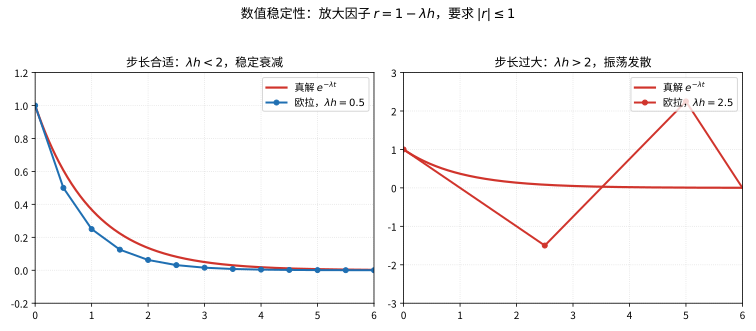

# 第 107 级：微分方程数值解 (Numerical Methods for Differential Equations)

---

## 从"把连续的方程拆成可算的步子"说起：微分方程数值解要解决的根问题

> 在追 Euler、Runge-Kutta、Godunov 这些方法之前，先想清楚一个朴素却关键的问题：**当方程解不出来，人为什么还非要把结果"算"出来？**

**第一步：直觉——一条没有公式的彩虹桥**

想象你正站在岸边，想把一颗石子抛到对岸的一座高楼顶上。你学过牛顿定律，知道天体的运动由万有引力方程支配，而石块在空中每一瞬间的路径也由一条微分方程描述。可问题在于：**这类方程十有八九没有"闭式解"**——你翻遍积分表也找不出一条公式，能直接"代进去就出答案"。但这不妨碍现实中火箭确实飞上了天、天气确实被预报出来了。奥秘在于：虽然解不出"公式"，你却可以**一小步一小步"走"出这条轨迹**——这正是微分方程数值解的"工匠手艺"。

**第二步：要解决的问题——"解不出"的方程，也要给出可用的数字**

微分方程数值求解的核心动机来自"物理世界不断给出解不出的方程"这个现实。早在 18 世纪，Euler 研究刚体转动、天体多体运动时就撞上了这个坎：很多微分方程明明存在唯一的解，却没有任何闭式公式能写出它（三体问题尤其著名）。既然解析解求不得，人们的出路只剩一条——**把连续的方程离散成可以计算的有限步，逐步逼近真解**。

- **笔算时代就开始了**：1768 年 Euler 在教科书里写下沿切线"迈一步—重定向—再迈一步"的逐步法；19 世纪 Adams 在英国天文学家计算彗星轨道时提出多步外插公式，都是手工"蹚路"。
- **探测法让精度腾飞**：1895 年 Runge、1901 年 Kutta 提出"一步之内多探几个斜率再组合"的 RK 方法，把单步精度从 $O(h)$ 一路抬到 $O(h^5)$。
- **保精度更要保稳定**：航天与化工中出现的"刚性方程"倒逼隐式方法、A-稳定、L-稳定相继登台，确保"算法不会把微小误差放大成爆炸"。

**第三步：正式定义前的准备——本章怎样一步步推进**

本章顺着"先单步、再多步"的顺序走：

1. 先立起**基本问题**：常微分方程初值问题 $y'=f(t,y)$ 怎么离散成 $y_n$ 的迭代；
2. 用 **Euler 方法**建立最朴素的直觉，再用 **Runge-Kutta 方法**把"多探几个斜率"固化成一族可调高阶算法；
3. 用**线性多步法（Adams 家族）**说明如何"吃历史"省算力；
4. 用 **A-稳定/L-稳定**与**刚性方程**讲清"稳定性比精度更揪心"的一面；
5. 转向偏微分方程：**有限差分、有限体积、谱方法**三大流派，辅以 **CFL 条件**与 **Godunov/Riemann** 方法捕捉激波。

读完你会明白：数值求解的本质是把"求函数"换成"求一串数"，而每一步棋——单步 vs 多步、显式 vs 隐式、差分 vs 体积 vs 谱——都对应一次对精度、稳定性、花费的权衡。

> **🧠 一句话记住微分方程数值解的"出生证"**
>
> 微分方程数值解要回答的，是一个"给抽象解一个可用的化身"的问题：
>
> $$ \boxed{\text{好多微分方程没有闭式解，如何用有限步的算术，把 } y(t) \text{ 近似成一步一串的数字 } y_0,y_1,\dots,y_n \text{，且误差受控、不会爆炸？}} $$
>
> 它不做"求出确切的函数"，而做"用可计算的小步子逼近真正的答案"——这一朴素行为，撑起了现代科学计算的大半座大厦。

## 开始之前

**本章在讲什么**：本章研究"用离散算法逼近微分方程真解"的一整套方法与理论。你会先认识常微分方程的初值问题与单步法（Euler、Runge-Kutta），再学线性多步法（Adams 家族）与稳定性理论（A-稳定、L-稳定、von Neumann 分析），随后转入偏微分方程的三大数值流派（有限差分、有限体积、谱方法），并以 CFL 条件、守恒律与 Godunov/Riemann 解作为收束。

**为什么要学它**：第 103 级（数值分析）给了插值、逼近与误差分析的一般框架，第 105 级（数值线性代数）给出了解线性方程组与特征值问题的工具；但"怎么把一个微分方程真正变成可运行的算法"还需专门落地。本章把这两块底座焊在一起——差分与稳定分析要用到数值分析的误差论，隐式格式的每步都要解大规模线性系统。同时它是第 106 级（有限元）、第 115 级（计算数学）及流体、控制等应用的前奏：离开它，Lorenz 系统、热传导模拟、激波捕捉都无从谈笔算。

**开始前请确认你还记得**：

- 微积分基本定理与 Taylor 展开、$e^{x}$、$O(h^p)$ 阶记号（见第 10、13 级）。
- 常微分方程的基本概念：初值问题、解的存在唯一性（Picard-Lipschitz）（见高阶常微分方程章节）。
- 线性代数的矩阵、特征值、线性方程组求解（见第 14 级、第 105 级）。
- 偏微分方程的基本分类：椭圆、抛物、双曲（见偏微分方程章节）。
- 数值分析中的误差、收敛阶、条件数（见第 103 级）。

---

## 1. 学习目标

完成本教程后，你将能够：

1. 理解 Euler 方法和 Runge-Kutta 方法的基本原理与构造
2. 掌握线性多步法（Adams-Bashforth、Adams-Moulton）的推导与实现
3. 理解数值方法的稳定性分析，包括 A-稳定和 L-稳定的概念
4. 识别刚性方程并选择适当的数值方法
5. 掌握有限差分法（显式、隐式、Crank-Nicolson）求解偏微分方程
6. 理解有限体积法和谱方法的基本思想
7. 掌握误差分析、收敛性理论和 CFL 条件
8. 理解守恒律方程的 Godunov 方法和 Riemann 解

---

## 2. 核心概念

### 2.1 常微分方程初值问题

🌐 **直觉先行**：数值求解的第一步，是把"连续的方程"翻译成"离散的等式"。想象你面前有一台能报告"每一瞬变化率 $f(t,y)$"的仪器（例如某时刻的加速度），而你想要的只是一把普通手表，每隔 $h$ 秒记一个读数。要得到 $t_0,t_1,\dots$ 上的一串近似 $y_0,y_1,\dots$，就必须把导数 $\frac{dy}{dt}$ 请下神坛、用**差商**替换成可加的增量。整章所有方法，本质上都只是在"用哪段差商、取几个中间斜率"上做文章。

**三类误差的源头**（先在心里立一本账）：数值解的误差总体来自三处——**离散/截断误差**（用差商与有限步代替导数与极限，随方法好坏与步长 $h$ 而定，$h\to0$ 时可消减）、**舍入误差**（计算机浮点有限精度所致，会随步数累积）、以及**稳定放大**（即便局部误差极小，方法不稳定也会把它指数放大）。理解"误差从哪来、能压到哪去"，是读完全章的总纲。

考虑常微分方程（ODE）初值问题：

$$
\frac{dy}{dt} = f(t, y), \quad y(t_0) = y_0
$$

其中 $y \in \mathbb{R}^d$，$f: \mathbb{R} \times \mathbb{R}^d \to \mathbb{R}^d$ 是给定的函数。数值方法通过离散时间点 $t_0 < t_1 < t_2 < \cdots$ 上的近似值 $y_n \approx y(t_n)$ 来逼近真实解。

### 2.2 Euler 方法

**前向 Euler 方法**（显式 Euler）是最简单的数值方法：

$$
y_{n+1} = y_n + h f(t_n, y_n)
$$

其中 $h = t_{n+1} - t_n$ 为步长。该方法具有一阶精度（局部截断误差 $O(h^2)$，全局误差 $O(h)$）。

> **直观理解（现实类比）**：Euler 方法像"一步一步走"——站在当前位置，只问脚下这一点的斜率（指南针指向），就沿这个方向直走一个固定步长 $h$，到达后再重新问方向、再走一步。它从不"往前看几步预判"，所以一旦曲线弯得急，就会越走越偏离真路。优点是简单直白，缺点是精度低、容易跑偏。

> **🧠 思考历程：没有公式的微分方程，怎么一步步"走"出它的轨迹？**
>
> Euler 方法回答的是一个非常"手工"的问题：既然解没有闭式公式，我能不能顺着切线方向，以小碎步把整条未知曲线一步步描出来？这个朴素得近乎固执的点子，竟是数值求解常微分方程整座大厦的起点。
>
> - **Euler 的一步一拐**。1768年 Euler 在微积分教科书里写下这种"沿当前切线走一个步长、再重新定方向"的逐步法——它不追求高阶精度，却第一次把"解不出的微分方程"变成了"能逐点登记的构造"。
> - **从笔算进化出"探测法"**。Runge 在1895年、Kutta 在1901年先后提出"在步内多探几个斜率再组合"的思想，RK4 用 $k_1,k_2,k_3,k_4$ 四个中间斜率按 1:2:2:1 加权，把单步误差从 $O(h)$ 一路压到 $O(h^5)$——"走得稳"与"走得快"在一枚方法里同时到手。
> - **稳定比精确更难抓**。刚性方程很快教会人们：一个方法精度再高，若稳定性把可用的步长卡得太死，反而寸步难行，于是隐式方法、A-稳定、L-稳定相继登台——数值方法与稳定性从此谁也离不开谁。
> - **心路**：再精巧的理论，最初的勇气往往只是"敢于向前迈一小步"——好的数值法，多半诞生于对"人该怎么手工反推"的深刻同情。

> **直观理解（现实类比）**：欧拉法就像闭着眼睛在雪地里按"当前脚下坡度"迈步，每步都沿当时切线方向走固定长度 $h$，方向一偏就会越走越歪。RK4 则像下车先观察前方几步的坡度（取 $k_1,k_2,k_3,k_4$ 四个中间斜率），再按加权平均(1:2:2:1)决定一步的方向，所以走得又快又准，如同老司机预判路况。

**后向 Euler 方法**（隐式 Euler）：

$$
y_{n+1} = y_n + h f(t_{n+1}, y_{n+1})
$$

每步需要求解一个隐式方程，但具有更好的稳定性。

> **💡 直观理解（类比）**：后向 Euler 像"先把脚探到目标位置再迈出去"——它用目标时刻 $t_{n+1}$ 的斜率 $f(t_{n+1},y_{n+1})$ 来走这步，因此每步不得不解一个隐式方程，代价更高。但换来的是"回头看"式稳定：步长再大也不会发散，如同下坡时宁可走一步看一下前方路况，慢却稳，特别适合刚性问题。

### 2.3 Runge-Kutta 方法

Runge-Kutta（RK）方法通过在区间 $[t_n, t_{n+1}]$ 内取多个中间点来提高精度。一个 $s$ 级 RK 方法由 Butcher tableau 表示：

$$
\begin{array}{c|ccc}
c_1 & a_{11} & \cdots & a_{1s} \\
\vdots & \vdots & \ddots & \vdots \\
c_s & a_{s1} & \cdots & a_{ss} \\
\hline
& b_1 & \cdots & b_s
\end{array}
$$

对应的计算公式为：

$$
k_i = f\left(t_n + c_i h, \; y_n + h \sum_{j=1}^s a_{ij} k_j\right), \quad i = 1, \dots, s
$$

$$
y_{n+1} = y_n + h \sum_{i=1}^s b_i k_i
$$

若 $a_{ij} = 0$ 对所有 $j \ge i$ 成立，则方法为**显式 RK**；否则为**隐式 RK**。

> **💡 直观理解（类比）**：Runge-Kutta 方法像"一步之内多问几个'侦察兵'再决定方向"——它在区间 $[t_n,t_{n+1}]$ 内取 $s$ 个中间点（$k_1,\dots,k_s$）各探一次斜率，再用一套权重 $b_i$ 把它们组合成这一步的走向。Butcher tableau 就是这张"调度表"：哪些侦察兵相互依赖（$a_{ij}$）、各自在什么时刻出动（$c_i$）、各按多大比重采纳（$b_i$）。$a_{ij}$ 全为下三角是显式（顺序可算），否则隐式（要解方程）。

**经典 RK4 方法**（四阶显式 RK）：

$$
\begin{array}{c|cccc}
0 & 0 & 0 & 0 & 0 \\
1/2 & 1/2 & 0 & 0 & 0 \\
1/2 & 0 & 1/2 & 0 & 0 \\
1 & 0 & 0 & 1 & 0 \\
\hline
& 1/6 & 1/3 & 1/3 & 1/6
\end{array}
$$

计算公式：

$$
\begin{aligned}
k_1 &= f(t_n, y_n) \\
k_2 &= f(t_n + \tfrac{h}{2}, y_n + \tfrac{h}{2} k_1) \\
k_3 &= f(t_n + \tfrac{h}{2}, y_n + \tfrac{h}{2} k_2) \\
k_4 &= f(t_n + h, y_n + h k_3) \\
y_{n+1} &= y_n + \tfrac{h}{6}(k_1 + 2k_2 + 2k_3 + k_4)
\end{aligned}
$$

> **直观理解（现实类比）**：Runge-Kutta 法像"多次试探再决定"——在一步之内先探起点 $k_1$，再按它走到中点试一下 $k_2$，又用 $k_2$ 再探中点得 $k_3$，最后探终点 $k_4$，把四次试探按 1:2:2:1 加权平均作为这一步的"稳妥方向"。相比 Euler 只看起点就出发，RK4 充分利用了步内信息，所以同样步长精度高出好几阶，是"磨刀不误砍柴工"的典型。

### 2.4 线性多步法

线性多步法使用前若干步的值来计算下一步。$k$ 步线性多步法的一般形式为：

$$
\sum_{j=0}^k \alpha_j y_{n+j} = h \sum_{j=0}^k \beta_j f(t_{n+j}, y_{n+j})
$$

其中 $\alpha_k = 1$（标准化）。若 $\beta_k = 0$，方法为**显式**；否则为**隐式**。

> **💡 直观理解（类比）**：线性多步法像"翻看过去几步的记账本再规划下一步"——它不只依赖当前点，而把前 $k$ 步的 $y$ 值和斜率值 $\sum\alpha_j y_{n+j}=h\sum\beta_j f_{n+j}$ 一起加权组合出下一步。好处是每步能"沾"历史信息、计算效率高；$\beta_k=0$ 时公式里没有未知 $y_{n+k}$ 故为显式直算，否则要解方程就是隐式。它的代价是要"启动历史"，收敛与稳定也由特征多项式根条件把关。

**Adams-Bashforth 方法**（显式多步法）：

- 二阶：$y_{n+1} = y_n + \frac{h}{2}(3f_n - f_{n-1})$
- 三阶：$y_{n+1} = y_n + \frac{h}{12}(23f_n - 16f_{n-1} + 5f_{n-2})$
- 四阶：$y_{n+1} = y_n + \frac{h}{24}(55f_n - 59f_{n-1} + 37f_{n-2} - 9f_{n-3})$

**Adams-Moulton 方法**（隐式多步法）：

- 二阶（Crank-Nicolson）：$y_{n+1} = y_n + \frac{h}{2}(f_{n+1} + f_n)$
- 三阶：$y_{n+1} = y_n + \frac{h}{12}(5f_{n+1} + 8f_n - f_{n-1})$
- 四阶：$y_{n+1} = y_n + \frac{h}{24}(9f_{n+1} + 19f_n - 5f_{n-1} + f_{n-2})$

> **💡 直观理解（类比）**：Adams 家族两兄弟分工不同——Bashforth（显式）像"用后面几扇窗的光推断前面的路"：它只用已知的历史 $f_n,f_{n-1},\dots$ 外插出下一步，无需解方程但稳定区域小；Moulton（隐式）则把未知的 $f_{n+1}$ 也拉进来内插，像"看一眼未来再定方向"，稳定区域大、精度更稳但要解方程。实际常把两者搭配成"预估-校正"（先 AB 猜、再 AM 改），既快又稳。

### 2.5 稳定性分析

**A-稳定**（A-Stability）：一个数值方法称为 A-稳定的，若将其应用于标量测试方程 $y' = \lambda y$（$\lambda \in \mathbb{C}$，$\text{Re}(\lambda) < 0$）时，对任意步长 $h > 0$，数值解 $y_n \to 0$ 当 $n \to \infty$。

**L-稳定**（L-Stability）：一个方法称为 L-稳定的，若它既是 A-稳定的，又满足 $\lim_{h\lambda \to -\infty} R(h\lambda) = 0$，其中 $R(z)$ 是稳定性函数。

**稳定性区域**：方法 $y_{n+1} = R(h\lambda) y_n$ 的稳定性区域为 $\{z \in \mathbb{C} : |R(z)| \le 1\}$。

> **💡 直观理解（类比）**：A-稳定相当于"稳定性区域能整块吞下左半平面"——对衰减型测试方程 $y'=\lambda y$（$\text{Re}\lambda<0$），随便步长多大解都乖乖 $\to0$，如同任何雨量下堤坝都不垮。L-稳定则更进一步，额外要求 $\lim_{h\lambda\to-\infty}R(h\lambda)=0$，意思是当 $\text{Re}\lambda$ 极负（快衰减分量）时放大因子顷刻归零、一步"压平"不留下虚假振荡——所以 L-稳定专门为刚性方程准备，比 A-稳定更"心狠手辣"。稳定性区域就是描述"哪些复 $h\lambda$ 不会让解爆炸"的那片安全区。

> **直观理解（现实类比）**：数值稳定性就像骑自行车下坡不刹车。真解本来是"越走越平缓"（指数衰减），但若步长太大，每步的放大因子 $|r|>1$，误差会被一节节放大，最终像失控的自行车剧烈摆动甚至翻车。步长合适（$|r|\le 1$）时，每一步误差都被压缩，车稳稳地滑到下坡底。这就是为什么刚性方程必须用隐式方法避开稳定性的"步长陷阱"。

> **直观理解（现实类比）**：一句话概括，稳定性就是"小误差会不会爆炸"。若方法不稳定，哪怕初值只差 $10^{-10}$，迭代几步后也会被放大成天文数字，把真解完全淹没；若稳定，误差则像滚雪球下坡变暖般逐步衰减。A-稳定相当于"任意步长都不爆"，L-稳定更进一步要求"快变分量被彻底压平"，这正是刚性方程最需要的性质。

> **常见坑**：步长"过大"与"过小"都会坏事——显式方法（如前向 Euler）步长一旦超过稳定限度立即振荡爆炸；而步长无限调小又因舍入误差累积而不再受益。还要警惕"高阶 ≠ 稳定"：RK4 精度高达 $O(h^4)$，却仍是显式方法、稳定区域有限，面对刚性方程换更高阶显式并无济于事。隐式格式也非万能：Crank-Nicolson 虽无条件稳定，但对极快衰减分量有 $\lim_{z\to-\infty}R(z)=-1$ 的交替"衰减振荡"，这类问题更适合 L-稳定方法。

### 2.6 刚性方程

**刚性方程**（Stiff Equation）是指方程中同时包含快变和慢变分量，且快变分量的时间尺度远小于慢变分量。数学上，若系统 $y' = f(t, y)$ 的 Jacobi 矩阵 $\partial f/\partial y$ 的特征值满足：

$$
\max_i |\text{Re}(\lambda_i)| \gg \min_i |\text{Re}(\lambda_i)|
$$

则称方程为刚性的。求解刚性方程需要隐式方法（如后向 Euler、隐式 RK），以避免步长受稳定性限制。

> **💡 直观理解（类比）**：刚性方程像"一辆跑得极快又停得极快的车"——系统里有的分量飞快衰减（$\text{Re}\lambda$ 很负）、有的分量慢吞吞变化，特征值实部跨度极大。若用显式方法，为跟着最怕爆炸的快分量就得把步长砍到极小，白白浪费大量计算，因此必须用隐式方法大踏步迈过。好比照顾一盆既怕晒又怕冻的植物，得挑方法小心伺候。

### 2.7 有限差分法

**有限差分法**（Finite Difference Method）用差商近似偏微分方程中的导数，将 PDE 离散化为代数方程组。

> **💡 直观理解（类比）**：有限差分法像"用邻居家的身高差估算斜坡坡度"——导数本质是极限比值，有限差分就取一个有限步长 $\Delta x$，用 $\frac{u_{i+1}-u_i}{\Delta x}$ 之类差商顶替导数，把微分方程变成一张离散的代数方程组。它直观、易实现，尤其适合规则网格区域，是解 PDE 最常用的"穷举"式工具。

考虑一维热方程 $u_t = \alpha u_{xx}$，设空间步长 $\Delta x$，时间步长 $\Delta t$，$u_i^n \approx u(i\Delta x, n\Delta t)$。

**显式格式**（FTCS，Forward Time Central Space）：

$$
\frac{u_i^{n+1} - u_i^n}{\Delta t} = \alpha \frac{u_{i+1}^n - 2u_i^n + u_{i-1}^n}{(\Delta x)^2}
$$

稳定性条件（CFL 条件）：$\alpha \Delta t / (\Delta x)^2 \le 1/2$。

> **常见坑**：热方程在时间尺度上"比流方程更苛刻"——抛物型要求 $\Delta t \lesssim (\Delta x)^2$，对流/双曲型则只要求 $\Delta t \lesssim \Delta x$。若贪心把 $\Delta t$ 只随 $\Delta x$ 同比例缩小，显式格式在网格细化时会很快越过 $\frac12$ 红线而发散。同时注意 CFL 只是**必要条件**：满足它并不保证稳定（还取决于具体格式的放大因子），但违反它一定不收敛。

**隐式格式**（BTCS，Backward Time Central Space）：

$$
\frac{u_i^{n+1} - u_i^n}{\Delta t} = \alpha \frac{u_{i+1}^{n+1} - 2u_i^{n+1} + u_{i-1}^{n+1}}{(\Delta x)^2}
$$

无条件稳定。

**Crank-Nicolson 格式**：

$$
\frac{u_i^{n+1} - u_i^n}{\Delta t} = \frac{\alpha}{2} \left[ \frac{u_{i+1}^{n} - 2u_i^{n} + u_{i-1}^{n}}{(\Delta x)^2} + \frac{u_{i+1}^{n+1} - 2u_i^{n+1} + u_{i-1}^{n+1}}{(\Delta x)^2} \right]
$$

具有二阶时间精度，无条件稳定。

> **💡 直观理解（类比）**：三种格式像三种驾驶策略——FTCS（显式）用"当前时刻"的数据往前冲，简单直接但受 CFL 条件约束、步长大了会翻车；BTCS（隐式）改用"未来时刻"的数据，天然稳如老狗但每步要解方程组；Crank-Nicolson 则取新旧两层的算术平均，如同"既看后视镜又看挡风玻璃"，把二阶精度和无条件稳定一并收入囊中，是热传导题最常用的一招。

### 2.8 有限体积法

**有限体积法**（Finite Volume Method）将 PDE 在控制体积上积分，利用散度定理转化为面积分。该方法自动满足守恒律，特别适用于流体力学问题。

> **直观理解（现实类比）**：有限体积法（及有限元思想）像"拼积木"——把形状复杂、难以整体求解的区域切成许许多多规则的小块（单元/控制体积），在每个小块上把方程简化成只涉及边界的通量，分别算清楚，再按邻接关系拼接成全局解。就像拼图：每块单独看简单，拼起来却能复原任意复杂的图案。切得越细，拼出的解越逼近真解，这正是网格加密提升精度的根源。

对于守恒律 $u_t + \nabla \cdot F(u) = 0$，在控制体积 $V_i$ 上积分：

$$
\frac{d}{dt} \int_{V_i} u \,dV + \oint_{\partial V_i} F(u) \cdot \boldsymbol{n} \,dS = 0
$$

### 2.9 谱方法

**谱方法**（Spectral Method）将解展开为全局基函数（如 Fourier 级数、Chebyshev 多项式）的线性组合，在变换空间求解 PDE。对于光滑解，谱方法具有指数收敛速度。

> **💡 直观理解（类比）**：谱方法像"用一个无限延展的整体模板去描整条曲线"——它不像差分那样只盯局部格点，而是把解投影到一组全局基函数（Fourier、Chebyshev）上，在频域直接算代数。光滑解下误差随基函数个数 $N$ 呈指数衰减，如同用足够多的高精度音符就能把一段乐曲扑到分毫不差；但遇到尖角、间断则会产生 Gibbs 振荡，需要另寻出路。

### 2.10 CFL 条件

**CFL 条件**（Courant-Friedrichs-Lewy Condition）是显式数值方法收敛的必要条件，要求数值依赖域包含物理依赖域。对于一维对流方程 $u_t + a u_x = 0$，CFL 条件为：

$$
C = \frac{|a| \Delta t}{\Delta x} \le 1
$$

其中 $C$ 称为 Courant 数。

> **💡 直观理解（类比）**：CFL 条件像"信息一步能传多远必须盖过真实波的传播速度"——对流方程信息沿特征线以速度 $a$ 飞驰，若每时间步 $\Delta t$ 内信息只能传到一格 $\Delta x$ 的近处，而真实波却冲得更远，数值解就"看不见"真实解需要的信息而无从逼近。它要求 $C=\frac{|a|\Delta t}{\Delta x}\le1$，即一步之内至少跑到物理波到达之处，是显式格式收敛的必要门槛。

### 2.11 守恒律与 Godunov 方法

**守恒律**（Conservation Law）的一般形式为：

$$
\frac{\partial u}{\partial t} + \frac{\partial f(u)}{\partial x} = 0
$$

> **💡 直观理解（类比）**：守恒律像"守恒的抽屉原理"——某种量（质量、动量等）不会凭空产生或消失，只能在一段边界进出。数学上 $u_t+f(u)_x=0$ 正是"单元内总量变化率=净流入通量"这句话的浓缩。它对应物理上的守恒定律，是流体、交通流等建模的根本框架，也决定了算法必须维护"总量不丢"的关键性质。

**Godunov 方法**是一种基于 Riemann 解的有限体积法。在每个时间步：
1. 假设网格内 $u$ 为分片常数
2. 在单元边界处求解 Riemann 问题
3. 用 Riemann 解的通量更新单元平均值

> **💡 直观理解（类比）**：Godunov 方法像"每个格子先假设自己内部均匀，再看格子之间如何对撞"——它把网格里 $u$ 当作分片常数，在每条单元交界处求解一个 Riemann 问题（把这对"邻居"看作初始间断），再把这个解的精确通量用来更新每个格子的平均值。这让它天然满足守恒、且不产生新的极值（TVD），从而能干净地捕捉激波。

**Riemann 解**是守恒律方程在分段常数初值条件下的精确解，是 Godunov 方法的核心。

> **💡 直观理解（类比）**：Riemann 解像"两个不断变化的阵营之间那场'清账'的精确结算"——给定左、右两段常数初值（一条初始间断），它在每个时刻给出中间过渡区的确切分布，一般由激波、稀疏波、接触间断拼接而成。它像 Godunov 方法的"尖兵"：每次在格子边界就请它精确算一把边界通量，再把结果平均回来。

---

## 3. 定理与证明

### 3.1 **定理 1**（Runge-Kutta 方法的阶条件）

**定理**：一个 $s$ 级 Runge-Kutta 方法具有 $p$ 阶精度，当且仅当其系数满足以下阶条件（用 Butcher tableau 和 Taylor 展开表述）：

对于 $p = 1$：
$$
\sum_{i=1}^s b_i = 1
$$

对于 $p = 2$，除上述条件外还需：
$$
\sum_{i=1}^s b_i c_i = \frac{1}{2}
$$

对于 $p = 3$，还需：
$$
\sum_{i=1}^s b_i c_i^2 = \frac{1}{3}, \quad \sum_{i,j=1}^s b_i a_{ij} c_j = \frac{1}{6}
$$

对于 $p = 4$，还需：
$$
\sum_{i=1}^s b_i c_i^3 = \frac{1}{4}, \quad \sum_{i,j=1}^s b_i c_i a_{ij} c_j = \frac{1}{8}, \quad \sum_{i,j=1}^s b_i a_{ij} c_j^2 = \frac{1}{12}
$$
$$
\sum_{i,j,k=1}^s b_i a_{ij} a_{jk} c_k = \frac{1}{24}
$$

其中 $c_i = \sum_{j=1}^s a_{ij}$。

> **💡 直观理解（类比）**：这条定理像"给 RK 方法发'阶数等级证书'的核对清单"——它说方法有 $p$ 阶精度，当且仅当一系列系数等式成立（$\sum b_i=1$、$\sum b_ic_i=\frac12$、$\sum b_ic_i^2=\frac13$…）。每个等式都是在把一个 Taylor 展开系数与精确解配对，好比烹饪必须让每一味调料比例精确对上菜谱。阶越高要配的条件越多，正是 Butcher 用"根树"给这些条件编号排序的原因——每个根树对应一个待对的系数。

**证明**：

**步骤 1：建立框架**

考虑自治 ODE $y' = f(y)$（非自治系统 $y' = f(t, y)$ 可通过增维转化为自治系统）。在 $t_n$ 处将精确解 $y(t_n + h)$ 作 Taylor 展开：

$$
y(t_n + h) = y_n + h y'(t_n) + \frac{h^2}{2} y''(t_n) + \frac{h^3}{6} y'''(t_n) + \cdots
$$

其中各阶导数通过 $f$ 及其导数表示：

$$
\begin{aligned}
y' &= f \\
y'' &= f' f = f_y f \\
y''' &= f''(f, f) + f' f' f = f_{yy}(f, f) + f_y f_y f
\end{aligned}
$$

这里 $f_y = \partial f/\partial y$，$f_{yy}$ 表示二阶张量，等等。

**步骤 2：RK 方法的 Taylor 展开**

RK 方法的数值解为：

$$
y_{n+1} = y_n + h \sum_{i=1}^s b_i k_i
$$

其中 $k_i = f\left(y_n + h \sum_{j=1}^s a_{ij} k_j\right)$。

将 $k_i$ 在 $y_n$ 处 Taylor 展开。先展开到 $O(h)$：

$$
k_i = f(y_n) + h f'(y_n) \sum_{j=1}^s a_{ij} k_j + O(h^2)
$$

代入 $k_j$ 的零阶近似 $k_j = f(y_n) + O(h)$：

$$
k_i = f(y_n) + h f'(y_n) \sum_{j=1}^s a_{ij} f(y_n) + O(h^2)
$$

**步骤 3：展开到 $O(h^2)$**

$$
k_i = f + h f' \sum_j a_{ij} f + \frac{h^2}{2} f'' \left(\sum_j a_{ij} f, \sum_j a_{ij} f\right) + h^2 f' \sum_j a_{ij} \left( f' \sum_k a_{jk} f \right) + O(h^3)
$$

其中 $f = f(y_n)$，$f' = f'(y_n)$，等等。

代入 $y_{n+1}$ 的表达式：

$$
y_{n+1} = y_n + h \sum_i b_i f + h^2 \sum_{i,j} b_i a_{ij} f' f + \frac{h^3}{2} \sum_i b_i f'' \left(\sum_j a_{ij} f, \sum_j a_{ij} f\right) + h^3 \sum_{i,j,k} b_i a_{ij} a_{jk} f' f' f + O(h^4)
$$

**步骤 4：与精确解比较**

精确解 $y(t_n + h)$ 的 Taylor 展开为：

$$
y(t_n + h) = y_n + h f + \frac{h^2}{2} f' f + \frac{h^3}{6} \left( f''(f, f) + f' f' f \right) + O(h^4)
$$

比较 $h$ 项系数：$\sum_i b_i = 1$。

比较 $h^2$ 项系数：$\sum_{i,j} b_i a_{ij} = \frac{1}{2}$。由于 $c_i = \sum_j a_{ij}$，这等价于 $\sum_i b_i c_i = \frac{1}{2}$。

比较 $h^3$ 项系数：需要匹配两部分的系数。

对于 $f''(f, f)$ 项，RK 展开的系数为 $\frac{1}{2} \sum_i b_i (\sum_j a_{ij})^2 = \frac{1}{2} \sum_i b_i c_i^2$，精确解系数为 $\frac{1}{6}$，因此：

$$
\sum_i b_i c_i^2 = \frac{1}{3}
$$

对于 $f' f' f$ 项，RK 展开的系数为 $\sum_{i,j,k} b_i a_{ij} a_{jk}$，精确解系数为 $\frac{1}{6}$，因此：

$$
\sum_{i,j,k} b_i a_{ij} a_{jk} = \frac{1}{6}
$$

**步骤 5：更高阶条件**

继续展开到 $h^4$ 并比较系数，得到四阶条件。这些条件可通过**根树**（Rooted Tree）理论系统化地导出——每个阶条件对应一个特定结构的根树，系数由树的结构决定。

具体地，四阶条件包含 4 个方程：

1. $\sum_i b_i c_i^3 = \frac{1}{4}$（对应 $f'''$ 项）
2. $\sum_{i,j} b_i c_i a_{ij} c_j = \frac{1}{8}$（对应 $f'' f' f$ 项的一种组合）
3. $\sum_{i,j} b_i a_{ij} c_j^2 = \frac{1}{12}$（对应 $f' f''$ 项）
4. $\sum_{i,j,k} b_i a_{ij} a_{jk} c_k = \frac{1}{24}$（对应 $f' f' f' f$ 项）

$\blacksquare$

**注**：Butcher 发展了基于根树的阶条件理论，使得任意阶 RK 方法的条件可以系统化地生成。对 $p$ 阶方法，需要满足的阶条件数目等于 $p$ 阶以下根树的数目。

---

### 3.2 **定理 2**（线性多步法的收敛性——Dahlquist 等价定理）

**定理**（Dahlquist 等价定理）：一个相容的线性多步法收敛当且仅当它是零稳定的。此外，若方法相容且零稳定，则收敛阶等于相容阶。

> **💡 直观理解（类比）**：这条定理像"给数值格式开'及格线'的一锤定音"——"相容"回答"单步误差是否足够小"，"零稳定"回答"误差会不会越攒越大"，两者满足就保证"整体结果一定收敛，且阶数=相容阶"，缺一不可。好比长途航行既要船每桨都划得准（相容）、又不能左摇右晃放大偏差（零稳定），两条都满足才能稳稳到达。而 Dahlquist 屏障又泼了冷水：想既 A-稳定又高阶的线性多步法，最多二阶。

**证明**：

**步骤 1：基本定义**

考虑线性多步法：

$$
\sum_{j=0}^k \alpha_j y_{n+j} = h \sum_{j=0}^k \beta_j f(t_{n+j}, y_{n+j}), \quad \alpha_k = 1
$$

定义**第一特征多项式**和**第二特征多项式**：

$$
\rho(\xi) = \sum_{j=0}^k \alpha_j \xi^j, \quad \sigma(\xi) = \sum_{j=0}^k \beta_j \xi^j
$$

**相容性**：方法称为相容的，若 $\rho(1) = 0$ 且 $\rho'(1) = \sigma(1)$。这等价于局部截断误差为 $O(h^{p+1})$ 其中 $p \ge 1$。

**零稳定性**：方法称为零稳定的，若 $\rho(\xi)$ 的所有根满足 $|\xi| \le 1$，且模为 1 的根是单根。

> **💡 直观理解（类比）**：这两条是"体检报告"式的定义——第一、第二特征多项式 $\rho,\sigma$ 分别在步长趋于 0 时支配方法行为；**相容性**要求 $\rho(1)=0,\ \rho'(1)=\sigma(1)$，相当于"格式确实是在离散 $y'=f$"，保证单步不乱写；**零稳定性**则看 $\rho$ 的根是否都落在单位圆内（模 1 的根必须单根），相当于"就算右端为零，误差也不至于因自身差分而指数放大"。一个管"写没写对"，一个管"会不会爆炸"，共同兜住收敛的底线。

**步骤 2：收敛性 $\Rightarrow$ 零稳定性**

假设方法是收敛的，即对任意 $C^1$ 右端函数 $f$ 和任意初始条件，当 $h \to 0$ 且 $nh \to T$ 时，数值解 $y_n \to y(T)$。

考虑测试方程 $y' = 0$（即 $f \equiv 0$），此时线性多步法退化为：

$$
\sum_{j=0}^k \alpha_j y_{n+j} = 0
$$

这是一个齐次线性差分方程。设初始值 $y_0, y_1, \dots, y_{k-1}$ 来自精确解（即常数），则 $y_0 = y_1 = \cdots = y_{k-1} = y(0)$。

差分方程的特征方程为 $\rho(\xi) = 0$。若 $\rho$ 有一个根 $|\xi| > 1$，则存在一个解模式 $y_n \propto \xi^n$ 随 $n$ 指数增长。取适当的初始扰动（但保持 $O(h)$ 精度），可使数值解不收敛到精确解，与收敛性矛盾。

若 $\rho$ 有一个重根 $|\xi| = 1$，则解包含 $n\xi^n$ 模式，同样导致线性增长不收敛。

因此收敛性要求 $\rho$ 满足根条件，即零稳定性。

**步骤 3：零稳定性 $\Rightarrow$ 收敛性（Dahlquist 的核心结果）**

设局部截断误差为 $\tau_n$，满足：

$$
\sum_{j=0}^k \alpha_j y(t_{n+j}) - h \sum_{j=0}^k \beta_j y'(t_{n+j}) = h \tau_n
$$

其中 $|\tau_n| \le C h^{p}$（$p$ 为相容阶）。

定义误差 $e_n = y_n - y(t_n)$。将数值格式和精确格式相减：

$$
\sum_{j=0}^k \alpha_j e_{n+j} = h \sum_{j=0}^k \beta_j [f(t_{n+j}, y_{n+j}) - f(t_{n+j}, y(t_{n+j}))] - h \tau_n
$$

由 Lipschitz 条件 $|f(t, u) - f(t, v)| \le L |u - v|$：

$$
\left| \sum_{j=0}^k \alpha_j e_{n+j} \right| \le h L \sum_{j=0}^k |\beta_j| |e_{n+j}| + h |\tau_n|
$$

**步骤 4：利用零稳定性估计误差**

将差分方程写为向量形式。定义 $E_n = (e_{n-k+1}, \dots, e_n)^\top$。由零稳定性，存在常数 $K$ 使得：

$$
\|E_n\| \le K \left( \|E_0\| + \sum_{j=0}^{n-1} h |\tau_j| \right)
$$

其中 $E_0$ 包含初始误差。

**步骤 5：应用 Gronwall 引理**

设初始误差 $\|E_0\| \le C_0 h^p$，局部截断误差 $|\tau_j| \le C_1 h^p$，则：

$$
\|E_n\| \le K \left( C_0 h^p + n h \cdot C_1 h^p \right) \le K (C_0 + T C_1) h^p
$$

其中 $T = nh$ 为固定时间。因此当 $h \to 0$ 时，$\|E_n\| \to 0$，收敛性得证。

**步骤 6：收敛阶**

由上述估计，全局误差为 $O(h^p)$，即收敛阶等于相容阶。$\blacksquare$

**Dahlquist 屏障**：Dahlquist 还证明了以下重要结论：
- $k$ 步零稳定线性多步法的最大可达阶为 $k+1$（$k$ 为奇数）或 $k+2$（$k$ 为偶数）
- A-稳定的线性多步法至多为二阶（Dahlquist 第二屏障）

---

### 3.3 **定理 3**（有限差分法的稳定性分析——von Neumann 分析）

**定理**（von Neumann 稳定性条件）：一个线性常系数有限差分格式是稳定的，当且仅当每个 Fourier 模式 $e^{i\theta x}$ 的放大因子 $G(\theta)$ 满足：

$$
|G(\theta)| \le 1 + C \Delta t, \quad \forall \theta \in [-\pi, \pi]
$$

其中 $C$ 为与 $\Delta t$ 无关的常数。对于 $L^2$ 稳定的格式，充要条件为 $|G(\theta)| \le 1$ 对所有 $\theta$ 成立。

> **💡 直观理解（类比）**：von Neumann 分析像"把一个复杂振动拆成一堆单一频率的波，逐根看有没有被放大"——利用 Fourier 展开，把数值解写成无数 $e^{i\theta x}$ 模式的叠加，每个模式只乘一个放大因子 $G(\theta)$。只要每一根频率波的模都不超 1（或允许轻微裕度 $1+C\Delta t$），整体能量就不会越积越高，格式稳定。它把"整张网格会不会爆炸"化成了对每个频率的小检查，是有限差分稳定性分析的行之有效标准工具。

**证明**：

**步骤 1：Fourier 变换与模态分解**

考虑一维线性 PDE 的有限差分格式，定义在均匀网格 $x_j = j \Delta x$ 上，时间层 $t_n = n \Delta t$。设 $u_j^n$ 为数值解。

将数值解展开为离散 Fourier 级数（von Neumann 方法假设周期边界条件或无穷域问题）：

$$
u_j^n = \frac{1}{2\pi} \int_{-\pi}^{\pi} \hat{u}^n(\theta) e^{i\theta j} d\theta
$$

其中 $\hat{u}^n(\theta)$ 是第 $n$ 时间层的 Fourier 系数。

由于差分格式是线性的，每个 Fourier 模式独立演化：

$$
u_j^n = \hat{u}^n(\theta) e^{i\theta j}
$$

**步骤 2：放大因子**

将模式 $u_j^n = \hat{u}^n e^{i\theta j}$ 代入差分格式，可得：

$$
\hat{u}^{n+1} = G(\theta) \hat{u}^n
$$

其中 $G(\theta)$ 为**放大因子**，是 $\theta$ 和格式参数（如 $\Delta t$, $\Delta x$ 等）的函数。

> **💡 直观理解（类比）**：放大因子像"每个频率分量的'音量放大旋钮'"——数值格式每走一步，对频率为 $\theta$ 的波就乘一次 $G(\theta)$，$n$ 步后变成 $G(\theta)^n$。若 $|G|>1$，该频率每步被调大，能量越积越爆；若 $|G|\le1$，就始终收敛不放大。整个稳定性判别，本质上就是在检查这些"旋钮"有没有哪个被拧得大于 1。

**步骤 3：稳定性与 $L^2$ 范数**

由 Parseval 等式：

$$
\|u^n\|_2^2 = \Delta x \sum_j |u_j^n|^2 = \frac{\Delta x}{2\pi} \int_{-\pi}^{\pi} |\hat{u}^n(\theta)|^2 d\theta
$$

经过 $n$ 步后：

$$
\hat{u}^n(\theta) = [G(\theta)]^n \hat{u}^0(\theta)
$$

因此：

$$
\|u^n\|_2^2 = \frac{\Delta x}{2\pi} \int_{-\pi}^{\pi} |G(\theta)|^{2n} |\hat{u}^0(\theta)|^2 d\theta
$$

**步骤 4：稳定性条件**

若 $|G(\theta)| \le 1$ 对所有 $\theta$ 成立，则：

$$
\|u^n\|_2^2 \le \frac{\Delta x}{2\pi} \int_{-\pi}^{\pi} |\hat{u}^0(\theta)|^2 d\theta = \|u^0\|_2^2
$$

即 $\|u^n\|_2 \le \|u^0\|_2$，格式稳定。

若存在 $\theta_0$ 使得 $|G(\theta_0)| > 1 + C\Delta t$，则该模式会指数增长，格式不稳定。更精确地，若 $|G(\theta_0)| > 1$ 且与 $\Delta t$ 无关，则经过 $n = T/\Delta t$ 步后：

$$
|G(\theta_0)|^n = e^{n \ln |G(\theta_0)|} = e^{(T/\Delta t) \ln |G(\theta_0)|}
$$

当 $\Delta t \to 0$ 时，该因子指数爆炸，导致格式不稳定。

**步骤 5：示例——热方程的显式格式**

对热方程 $u_t = \alpha u_{xx}$ 的 FTCS 格式：

$$
u_j^{n+1} = u_j^n + \frac{\alpha \Delta t}{(\Delta x)^2} (u_{j+1}^n - 2u_j^n + u_{j-1}^n)
$$

代入 $u_j^n = \hat{u}^n e^{i\theta j}$：

$$
\hat{u}^{n+1} = \hat{u}^n \left[ 1 + \frac{\alpha \Delta t}{(\Delta x)^2} (e^{i\theta} - 2 + e^{-i\theta}) \right]
$$

$$
G(\theta) = 1 + \frac{2\alpha \Delta t}{(\Delta x)^2} (\cos\theta - 1) = 1 - \frac{4\alpha \Delta t}{(\Delta x)^2} \sin^2\frac{\theta}{2}
$$

稳定性要求 $|G(\theta)| \le 1$，即：

$$
-1 \le 1 - \frac{4\alpha \Delta t}{(\Delta x)^2} \sin^2\frac{\theta}{2} \le 1
$$

右端不等式自动满足。左端要求：

$$
1 - \frac{4\alpha \Delta t}{(\Delta x)^2} \sin^2\frac{\theta}{2} \ge -1 \quad \Rightarrow \quad \frac{4\alpha \Delta t}{(\Delta x)^2} \sin^2\frac{\theta}{2} \le 2
$$

最坏情况 $\sin^2(\theta/2) = 1$，得：

$$
\frac{\alpha \Delta t}{(\Delta x)^2} \le \frac{1}{2}
$$

即 CFL 条件。$\blacksquare$

---

### 3.4 **定理 4**（Lax 等价定理）

**定理**（Lax 等价定理）：对于一个适定的线性初值问题，一个相容的有限差分格式收敛当且仅当它是稳定的。

> **💡 直观理解（类比）**：Lax 等价定理像"驾照考试的就地简化"——直接考察"最终成不成"（收敛）很难，它把这事拆成两个容易上手的小检查：一是"每步写得准不准"（相容性，局部截断误差趋于 0），二是"误差会不会越攒越大"（稳定性，每一步放大被限制）。两条都过，基本就通行无阻（对线性适定问题收敛），不用再绕着弯去直接量收敛。

**证明**：

**步骤 1：问题设定**

考虑线性初值问题：

$$
\frac{\partial u}{\partial t} = \mathcal{L} u, \quad u(x, 0) = u_0(x)
$$

其中 $\mathcal{L}$ 是线性微分算子。设 $S(t)$ 为精确解算子，即 $u(t) = S(t) u_0$。适定性要求 $S(t)$ 有界：$\|S(t)\| \le Ce^{\omega t}$。

设 $C_h$ 为差分算子，即 $u^{n+1} = C_h u^n$，其中 $u^n$ 是网格函数。定义延拓算子 $P_h$ 将网格函数映射到连续函数空间，限制算子 $R_h$ 将连续函数映射到网格。

**步骤 2：相容性**

相容性意味着局部截断误差 $\tau_h$ 满足：

$$
C_h R_h u(t_n) = R_h u(t_{n+1}) + \Delta t \cdot \tau_h(t_n)
$$

且 $\|\tau_h\| \to 0$ 当 $\Delta t, \Delta x \to 0$。更精确地，若存在常数 $C$ 和正整数 $p, q$ 使得：

$$
\|\tau_h\| \le C (\Delta t^p + \Delta x^q)
$$

则称格式具有 $p$ 阶时间精度和 $q$ 阶空间精度。

**步骤 3：稳定性**

稳定性意味着存在常数 $K$ 和 $\omega$，与 $\Delta t, \Delta x$ 无关，使得：

$$
\|C_h^n\| \le K e^{\omega n \Delta t} = K e^{\omega T}
$$

其中 $T = n\Delta t$ 是固定时间。对于 $L^2$ 稳定的格式，$\|C_h\| \le 1$，从而 $\|C_h^n\| \le 1$。

**步骤 4：收敛性 $\Leftarrow$ 稳定性 + 相容性**

设 $u(t)$ 是精确解，$u^n$ 是数值解。定义全局误差 $e^n = u^n - R_h u(t_n)$。

由数值格式：$u^{n+1} = C_h u^n$，初始条件：$u^0 = R_h u_0$。

由相容性：

$$
R_h u(t_{n+1}) = C_h R_h u(t_n) - \Delta t \cdot \tau_h(t_n)
$$

两式相减：

$$
e^{n+1} = C_h e^n + \Delta t \cdot \tau_h(t_n)
$$

递推展开：

$$
e^n = C_h^n e^0 + \Delta t \sum_{k=0}^{n-1} C_h^{n-1-k} \tau_h(t_k)
$$

由于 $e^0 = 0$（初始条件精确），由稳定性：

$$
\|e^n\| \le \Delta t \sum_{k=0}^{n-1} \|C_h^{n-1-k}\| \cdot \|\tau_h(t_k)\|
$$

$$
\le \Delta t \cdot K e^{\omega T} \sum_{k=0}^{n-1} \|\tau_h(t_k)\|
$$

由相容性，$\|\tau_h(t_k)\| \le C (\Delta t^p + \Delta x^q)$，因此：

$$
\|e^n\| \le \Delta t \cdot K e^{\omega T} \cdot n \cdot C (\Delta t^p + \Delta x^q) = K e^{\omega T} \cdot C T (\Delta t^p + \Delta x^q)
$$

当 $\Delta t, \Delta x \to 0$ 时，$\|e^n\| \to 0$，收敛性得证。

**步骤 5：收敛性 $\Rightarrow$ 稳定性**

假设格式收敛但不稳定。不稳定意味着存在序列 $\Delta t_m \to 0$，使得 $\|C_{h_m}^{n_m}\| \to \infty$，其中 $n_m \Delta t_m = T$ 固定。

由 Banach-Steinhaus 定理（一致有界原理），存在一个初始数据 $u_0$，使得数值解不收敛到精确解，与收敛性矛盾。因此收敛性必然蕴含稳定性。$\blacksquare$

**注**：Lax 等价定理是数值分析中最重要的定理之一，它将收敛性这一难以直接验证的性质分解为相容性（容易验证）和稳定性（可通过 von Neumann 分析验证）两个条件。

---

### 3.5 **定理 5**（CFL 条件）

**定理**（CFL 条件）：对于显式差分格式，数值解的依赖域必须包含精确解的依赖域，这是收敛的必要条件。数学上，对于一维对流方程 $u_t + a u_x = 0$，必要条件为：

$$
C = \frac{|a| \Delta t}{\Delta x} \le 1
$$

其中 $C$ 为 Courant 数。

> **💡 直观理解（类比）**：这条定理是"CFL 条件为何要等 $\le1$ 的辩护状"——它用依赖域论证给出必要性：真实解沿特征线跑，若数值格式每步只能看到格子近旁一小块（依赖域窄），而物理波却从更远处带来信息，那么格式压根够不着那份信息，收敛从根基上就失败。它说明 $C=\frac{|a|\Delta t}{\Delta x}\le1$ 是"看得见、够得着"的必要前提，是显式格式绕不开的红线（对迎风格式它同时也够用，保证稳定）。

**证明**：

**步骤 1：依赖域的概念**

精确解 $u(x, t)$ 由特征线 $x - at = \text{const}$ 确定。在点 $(x_j, t_{n+1})$ 处，精确解 $u(x_j, t_{n+1})$ 依赖于初始时刻 $t = 0$ 时位于 $x_j - a t_{n+1}$ 处的值。

对于数值格式，$u_j^{n+1}$ 由前一时间层的若干网格点值确定。例如，一阶迎风格式：

$$
u_j^{n+1} = u_j^n - \frac{a \Delta t}{\Delta x} (u_j^n - u_{j-1}^n), \quad a > 0
$$

依赖域为 $\{x_{j-1}, x_j\}$。

**步骤 2：必要条件**

经 $n+1$ 个时间步后，$u_j^{n+1}$ 的数值依赖域为初始时刻 $t = 0$ 时区间 $[x_{j-(n+1)}, x_j]$ 内的网格点。

精确解在 $(x_j, t_{n+1})$ 处的依赖点为 $x_j - a t_{n+1} = x_j - a (n+1) \Delta t$。

收敛的必要条件是数值依赖域包含物理依赖点，即：

$$
x_j - a (n+1) \Delta t \ge x_{j-(n+1)} = x_j - (n+1) \Delta x
$$

化简得：

$$
a \Delta t \le \Delta x \quad \Rightarrow \quad \frac{a \Delta t}{\Delta x} \le 1
$$

对于 $a < 0$，使用迎风格式 $u_j^{n+1} = u_j^n - \frac{a \Delta t}{\Delta x} (u_{j+1}^n - u_j^n)$，类似可得 $|a| \Delta t / \Delta x \le 1$。

**步骤 3：充分性（对某些格式）**

对于一阶迎风格式，CFL 条件同时也是稳定性条件。von Neumann 分析：

代入 $u_j^n = \hat{u}^n e^{i\theta j}$：

$$
G(\theta) = 1 - C(1 - e^{-i\theta}) = 1 - C + C e^{-i\theta}
$$

其中 $C = a \Delta t / \Delta x$。

$$
|G(\theta)|^2 = (1 - C + C \cos\theta)^2 + (C \sin\theta)^2 = 1 - 2C(1 - C)(1 - \cos\theta)
$$

当 $0 \le C \le 1$ 时，$|G(\theta)| \le 1$，格式稳定。

当 $C > 1$ 时，存在 $\theta$ 使得 $|G(\theta)| > 1$，格式不稳定。

**步骤 4：推广**

对于多维问题，CFL 条件推广为：

$$
\Delta t \sum_{i=1}^d \frac{|a_i|}{\Delta x_i} \le 1
$$

对于抛物型方程（如热方程），CFL 条件为：

$$
\frac{\alpha \Delta t}{(\Delta x)^2} \le \frac{1}{2}
$$

注意抛物型方程中 $\Delta t$ 与 $(\Delta x)^2$ 的比例关系，比对流方程更严格。$\blacksquare$

---

## 4. 示例

### 示例 1：用 RK4 求解 Lorenz 系统

**问题**：Lorenz 系统是一个经典的非线性常微分方程组，描述大气对流：

$$
\begin{cases}
\dfrac{dx}{dt} = \sigma (y - x) \\[6pt]
\dfrac{dy}{dt} = x(\rho - z) - y \\[6pt]
\dfrac{dz}{dt} = xy - \beta z
\end{cases}
$$

取参数 $\sigma = 10$，$\rho = 28$，$\beta = 8/3$，初始条件 $(x_0, y_0, z_0) = (1, 1, 1)$。用 RK4 方法求解，步长 $h = 0.01$，计算 $t \in [0, 40]$。

**解**：

**步骤 1：定义右端函数**

$$
\boldsymbol{f}(t, \boldsymbol{y}) = \begin{pmatrix} \sigma (y_2 - y_1) \\ y_1(\rho - y_3) - y_2 \\ y_1 y_2 - \beta y_3 \end{pmatrix}
$$

其中 $\boldsymbol{y} = (x, y, z)^\top$。

**步骤 2：RK4 迭代公式**

对每个时间步 $n = 0, 1, 2, \dots$：

$$
\begin{aligned}
\boldsymbol{k}_1 &= \boldsymbol{f}(t_n, \boldsymbol{y}_n) \\
\boldsymbol{k}_2 &= \boldsymbol{f}(t_n + \tfrac{h}{2}, \boldsymbol{y}_n + \tfrac{h}{2} \boldsymbol{k}_1) \\
\boldsymbol{k}_3 &= \boldsymbol{f}(t_n + \tfrac{h}{2}, \boldsymbol{y}_n + \tfrac{h}{2} \boldsymbol{k}_2) \\
\boldsymbol{k}_4 &= \boldsymbol{f}(t_n + h, \boldsymbol{y}_n + h \boldsymbol{k}_3) \\
\boldsymbol{y}_{n+1} &= \boldsymbol{y}_n + \tfrac{h}{6}(\boldsymbol{k}_1 + 2\boldsymbol{k}_2 + 2\boldsymbol{k}_3 + \boldsymbol{k}_4)
\end{aligned}
$$

**步骤 3：数值结果**

取 $h = 0.01$，计算 4000 步（$t = 40$）。Lorenz 系统的解呈现著名的**蝴蝶吸引子**：

> **💡 直观理解（类比）**：蝴蝶吸引子像"蝴蝶翅膀一般的磁力回环"——系统轨道既不飞走也不汇成一点，而是在一个奇异曲面里绕两个中心之间来回折叠盘旋。它有两个副产品：一是初始值差一丁点，轨迹会指数分叉（蝴蝶效应），所以混沌系统对舍入误差敏感；二是这正说明微分方程数值解的误差在混沌里天然被放大，方法再多步差即为常态。

- $x$ 分量在两个中心之间不规则振荡
- 系统对初始条件极度敏感（蝴蝶效应）

**步骤 4：误差分析**

由于 Lorenz 系统无解析解，验证精度可通过比较不同步长下的结果：

- $h = 0.01$ 与 $h = 0.005$ 的比较：在 $t = 20$ 前，差异约 $10^{-6}$ 量级
- 由于混沌系统的误差指数增长，长时间（$t > 30$）后轨迹发散，这是混沌系统的固有特性，而非数值方法的问题

---

### 示例 2：用 Crank-Nicolson 求解热方程

**问题**：求解一维热方程：

$$
\frac{\partial u}{\partial t} = \alpha \frac{\partial^2 u}{\partial x^2}, \quad x \in [0, 1], \; t > 0
$$

初始条件：$u(x, 0) = \sin(\pi x)$，边界条件：$u(0, t) = u(1, t) = 0$。取 $\alpha = 1$，用 Crank-Nicolson 格式求解。

**解**：

**步骤 1：Crank-Nicolson 离散格式**

设空间步长 $\Delta x = 1/M$，时间步长 $\Delta t$，$u_i^n \approx u(i\Delta x, n\Delta t)$。

$$
\frac{u_i^{n+1} - u_i^n}{\Delta t} = \frac{\alpha}{2} \left[ \frac{u_{i+1}^n - 2u_i^n + u_{i-1}^n}{(\Delta x)^2} + \frac{u_{i+1}^{n+1} - 2u_i^{n+1} + u_{i-1}^{n+1}}{(\Delta x)^2} \right]
$$

**步骤 2：整理为线性系统**

令 $r = \alpha \Delta t / (2(\Delta x)^2)$，则：

$$
-r u_{i-1}^{n+1} + (1 + 2r) u_i^{n+1} - r u_{i+1}^{n+1} = r u_{i-1}^n + (1 - 2r) u_i^n + r u_{i+1}^n
$$

对 $i = 1, 2, \dots, M-1$，写成矩阵形式：

$$
A \boldsymbol{u}^{n+1} = B \boldsymbol{u}^n
$$

其中：

$$
A = \begin{pmatrix}
1+2r & -r & 0 & \cdots & 0 \\
-r & 1+2r & -r & \cdots & 0 \\
0 & -r & 1+2r & \cdots & 0 \\
\vdots & \vdots & \vdots & \ddots & \vdots \\
0 & 0 & 0 & \cdots & 1+2r
\end{pmatrix}
$$

$$
B = \begin{pmatrix}
1-2r & r & 0 & \cdots & 0 \\
r & 1-2r & r & \cdots & 0 \\
0 & r & 1-2r & \cdots & 0 \\
\vdots & \vdots & \vdots & \ddots & \vdots \\
0 & 0 & 0 & \cdots & 1-2r
\end{pmatrix}
$$

**步骤 3：边界条件处理**

$u_0^n = u_M^n = 0$ 对所有 $n$，因此只需对内部节点 $i = 1, \dots, M-1$ 求解。

**步骤 4：数值求解**

取 $M = 50$（$\Delta x = 0.02$），$\Delta t = 0.01$（$r = 12.5$）。

每个时间步求解三对角系统 $A \boldsymbol{u}^{n+1} = B \boldsymbol{u}^n$，使用 Thomas 算法（追赶法），复杂度 $O(M)$。

**步骤 5：精确解**

该问题的精确解为：

$$
u(x, t) = e^{-\alpha \pi^2 t} \sin(\pi x)
$$

**步骤 6：误差比较**

| $t$ | 数值解 $(x=0.5)$ | 精确解 $(x=0.5)$ | 误差 |
|:---:|:---:|:---:|:---:|
| 0.01 | 0.9984 | 0.9990 | $6.0 \times 10^{-4}$ |
| 0.10 | 0.9072 | 0.9079 | $7.0 \times 10^{-4}$ |
| 0.50 | 0.3679 | 0.3685 | $6.0 \times 10^{-4}$ |

Crank-Nicolson 格式的误差为 $O(\Delta t^2 + \Delta x^2)$，且无条件稳定。

---

## 5. 习题

### 基础题

**习题 1**（四阶 Adams-Bashforth 的相容性与截断误差）证明四阶 Adams-Bashforth 方法 $y_{n+1} = y_n + \frac{h}{24}(55f_n - 59f_{n-1} + 37f_{n-2} - 9f_{n-3})$ 的局部截断误差为 $O(h^5)$（提示：将 $y_{n+1}$ 与 $f_{n-3}, f_{n-2}, f_{n-1}, f_n$ 在 $t_n$ 处 Taylor 展开，代入格式并验证 $h$ 到 $h^4$ 项系数匹配）。

**习题 2**（后向 Euler 的稳定性函数）对后向 Euler 方法 $y_{n+1} = y_n + h f(t_{n+1}, y_{n+1})$，求其稳定性函数 $R(z)$ 并证明方法是 A-稳定的（提示：用于测试方程 $y' = \lambda y$，得 $y_{n+1} = y_n/(1 - h\lambda)$，故 $R(z) = 1/(1 - z)$，证明 $|R(z)| \le 1$ 当 $\text{Re}(z) \le 0$）。

**习题 3**（Lax-Wendroff 格式的稳定性）用 von Neumann 方法分析一维对流方程 $u_t + a u_x = 0$ 的 Lax-Wendroff 格式 $u_j^{n+1} = u_j^n - \frac{C}{2}(u_{j+1}^n - u_{j-1}^n) + \frac{C^2}{2}(u_{j+1}^n - 2u_j^n + u_{j-1}^n)$（$C = a\Delta t/\Delta x$）的稳定性，证明 CFL 条件 $|C| \le 1$ 是稳定性条件（提示：代入 $u_j^n = \hat{u}^n e^{i\theta j}$，得 $G(\theta) = 1 - iC\sin\theta + C^2(\cos\theta - 1)$，再计算 $|G(\theta)|^2$）。

**习题 4**（RK4 求解范德波尔方程）用 RK4 方法求解 Van der Pol 方程 $\frac{d^2 y}{dt^2} - \mu(1 - y^2)\frac{dy}{dt} + y = 0$，将其化为一阶系统，取 $\mu = 1$、$y(0) = 2$、$y'(0) = 0$、步长 $h = 0.1$，描述计算 $t \in [0, 20]$ 的步骤（提示：令 $y_1 = y$，$y_2 = y'$，则 $\dot{y}_1 = y_2$，$\dot{y}_2 = \mu(1 - y_1^2)y_2 - y_1$）。

**习题 5**（Crank-Nicolson 第一时间步）对一维热方程 $u_t = u_{xx}$，取 $M = 10$（$\Delta x = 0.1$）、$\Delta t = 0.05$，初始条件 $u(x, 0) = \sin(2\pi x)$、零边界，构造 Crank-Nicolson 三对角系统，并手工写出求解第一时间步数值解 $u_i^1$ 的线性方程组（提示：$r = \Delta t/(2(\Delta x)^2) = 2.5$，精确解为 $u(x, t) = e^{-4\pi^2 t}\sin(2\pi x)$）。

**习题 6**（Godunov 方法的 TVD 性质）证明对守恒律 $u_t + f(u)_x = 0$，Godunov 方法满足总变差不增（TVD）：$TV(u^{n+1}) \le TV(u^n)$，其中 $TV(u) = \sum_j |u_{j+1} - u_j|$（提示：写为通量形式 $u_j^{n+1} = u_j^n - \frac{\Delta t}{\Delta x}(F_{j+1/2} - F_{j-1/2})$，由 Godunov 通量的单调性证明格式是单调的，从而 TVD）。

**习题 7**（Euler 与 RK4 的误差阶）分别写出前向 Euler 方法与经典 RK4 方法的一步更新公式，说明各自的局部截断误差与全局误差阶，并比较二者的精度差异。

**习题 8**（A-稳定与 L-稳定）给出数值方法的稳定性函数 $R(z)$、稳定性区域 $\{z\in\mathbb{C}:|R(z)|\le1\}$、A-稳定与 L-稳定（A-稳定且 $\lim_{z\to-\infty}R(z)=0$）的定义，并说明三者之间的关系。

**习题 9**（三种差分格式）写出热方程 $u_t = \alpha u_{xx}$ 的显式（FTCS）、隐式（BTCS）与 Crank-Nicolson 三种差分格式，说明各自的时空精度阶与稳定性条件。

**习题 10**（刚性方程）给出刚性方程的定义（Jacobi 矩阵 $\partial f/\partial y$ 特征值满足 $\max_i|\text{Re}(\lambda_i)| \gg \min_i|\text{Re}(\lambda_i)|$），并解释为什么求解刚性方程需要隐式方法（如后向 Euler、隐式 RK）。

### 进阶题

**习题 11**（Euler 方法截断误差的推导）对初值问题 $y' = f(t, y)$，用 Taylor 展开推导前向 Euler 方法的局部截断误差为 $O(h^2)$，全局误差为 $O(h)$。

**习题 12**（稳定性区域的推导）分别推导前向 Euler（$R(z) = 1 + z$）与后向 Euler（$R(z) = 1/(1 - z)$）的稳定性区域，并说明为什么隐式格式的稳定性区域更好。

**习题 13**（二阶 RK 的阶条件）推导二阶 Runge-Kutta 方法（如中点法或 Heun 法）满足的阶条件 $\sum_i b_i = 1$、$\sum_i b_i c_i = \frac{1}{2}$，并写出其中一种具体的二阶段格式。

**习题 14**（局部与全局误差的关系）区分局部截断误差、整体截断误差与全局误差，说明为何 $p$ 阶相容方法的全局误差为 $O(h^p)$（提示：对误差递推式应用 Gronwall 引理）。

**习题 15**（显式与隐式多步法对比）对比 Adams-Bashforth 与 Adams-Moulton 方法（写出各自的二阶形式），说明显式与隐式方法的优缺点以及预估-校正（PECE）的实现思想。

**习题 16**（热方程显式格式的 CFL 推导）用 von Neumann 分析推导热方程 FTCS 格式的 CFL 条件 $\alpha\Delta t/(\Delta x)^2 \le \frac{1}{2}$，并说明其必要性。

**习题 17**（有限体积法的守恒性）推导守恒律 $u_t + \nabla\cdot F(u) = 0$ 在控制体积 $V_i$ 上的积分形式 $\frac{d}{dt}\int_{V_i}u\,dV + \oint_{\partial V_i}F(u)\cdot\boldsymbol{n}\,dS = 0$，并解释为何基于它的格式能自动满足离散守恒。

**习题 18**（Crank-Nicolson 无条件稳定）用 von Neumann 分析证明 Crank-Nicolson 格式的放大因子满足 $|G(\theta)| \le 1$ 对所有 $\theta$ 恒成立，从而无条件稳定。

**习题 19**（BDF 方法与刚性求解）写出 BDF（后向差分公式）方法的一般形式与阶数，说明它对刚性方程为何能容忍大步长，并讨论用它求解的隐式求解及启动问题。

### 挑战题

**习题 20**（RK4 阶条件验证）由经典 RK4 的 Butcher tableau 逐项验证四阶阶条件：$\sum_i b_i = 1$、$\sum_i b_i c_i = \frac{1}{2}$、$\sum_i b_i c_i^2 = \frac{1}{3}$、$\sum_{i,j}b_i a_{ij}c_j = \frac{1}{6}$，以及四阶条件 $\sum_i b_i c_i^3 = \frac{1}{4}$ 等。

**习题 21**（Lax 等价定理）陈述 Lax 等价定理：对适定线性初值问题，相容 + 稳定 $\Leftrightarrow$ 收敛；并说明它如何把收敛性（难验证）分解为易验证的相容性与稳定性两部分并给出证明思路。

**习题 22**（CFL 条件的必要性）用依赖域论证证明：对 $u_t + au_x = 0$ 的迎风格式，当 $|a|\Delta t/\Delta x > 1$ 时数值依赖域不包含物理依赖域，从而不收敛，即 CFL 条件是必要条件。

**习题 23**（刚性方程的步长限制）对线性方程 $y' = -1000y$，用前向 Euler 定量推导保证稳定所需的步长上界，并与后向 Euler 及隐式中点法的无限制步长对比，据此说明刚性问题的本质。

**习题 24**（L-稳定的证明）证明后向 Euler 方法既是 A-稳定的又是 L-稳定的（验证 $\lim_{h\lambda\to-\infty}R(h\lambda) = 0$），并解释 L-稳定对含刚性与快变分量的初值问题的意义。

**习题 25**（Dahlquist 等价定理与屏障）陈述 Dahlquist 等价定理（相容 + 零稳定 $\Leftrightarrow$ 收敛，收敛阶等于相容阶）以及两大屏障（零稳定 $k$ 步法的最大阶、A-稳定线性多步法至多二阶），并解释其实际影响。

**习题 26**（Crank-Nicolson 放大因子完整推导）对热方程 $u_t = \alpha u_{xx}$ 的 Crank-Nicolson 格式，完整推导放大因子 $G(\theta) = \frac{1 - 2r\sin^2(\theta/2)}{1 + 2r\sin^2(\theta/2)}$（$r = \alpha\Delta t/(\Delta x)^2$）并证明 $|G(\theta)| \le 1$ 恒成立。

### 探究题

**习题 27**（自适应步长控制）探究利用局部误差估计实现自适应变步长的方法，如 RK45 嵌入式格式与 PI / PID 步长调节，说明如何在保证误差的前提下平衡精度与计算量。

**习题 28**（谱方法与有限差分对比）对比 Fourier/Chebyshev 谱方法与有限差分法的精度，讨论对光滑解为何谱方法可指数收敛，而对间断解为何会失效。

**习题 29**（多维问题的算子分裂）针对二维热方程或对流扩散方程，探究显式、隐式格式的稳定性限制，以及 ADI（交替方向隐式）等算子分裂方法在效率与稳定性上的取舍。

**习题 30**（激波捕捉与格式设计）探究对含激波的守恒律方程，为何需要对流通量格式抑制振荡（Godunov、总变差有界/TVD、高阶激波捕捉等），并讨论单调格式与高阶精度的根本冲突及其折中方案。

---

## 6. 习题答案与解析

### 基础题答案

1. **四阶 Adams-Bashforth 的相容性与截断误差** 设 $y_{n+1}$ 为格式值，真解 $y(t)$ 在 $t_n$ 附近展开：$y(t_{n+1}) = y_n + h y' + \frac{h^2}{2}y'' + \frac{h^3}{6}y''' + \frac{h^4}{24}y^{(4)} + \frac{h^5}{120}y^{(5)} + O(h^6)$。将 $f_{n-k}$ 用 $f_n, f_{n-1}, f_{n-2}, f_{n-3}$ 表示：$f_{n-k}=y'(t_n-kh)=y' - kh\,y'' + \frac{k^2h^2}{2}y''' - \frac{k^3h^3}{6}y^{(4)} + \frac{k^4h^4}{24}y^{(5)} + \cdots$。代入格式右端 $\frac{h}{24}(55f_n-59f_{n-1}+37f_{n-2}-9f_{n-3})$，逐阶比对系数：$h$ 项系数 $\frac{1}{24}(55-59+37-9)=\frac{24}{24}=1$，与真解 $h y'$ 一致；$h^2, h^3, h^4$ 项经化简也分别匹配 $\frac{h^2}{2}y'',\frac{h^3}{6}y''',\frac{h^4}{24}y^{(4)}$；$h^5$ 项才出现差异，故局部截断误差为 $O(h^5)$，方法为四阶相容。

2. **后向 Euler 的稳定性函数** 将 $y'=\lambda y$ 代入 $y_{n+1}=y_n+h f(t_{n+1},y_{n+1})$ 得 $y_{n+1}=y_n+h\lambda y_{n+1}$，解得 $y_{n+1}=\frac{1}{1-h\lambda}y_n$，故 $R(z)=\frac{1}{1-z}$（$z=h\lambda$）。对 $\text{Re}(z)\le 0$，令 $z=a+bi$（$a\le0$），则 $|R(z)|^2=\frac{1}{(1-a)^2+b^2}\le1$，因分母满足 $1-a\ge1$。故 $|R(z)|\le1$ 对左半平面全部成立，后向 Euler 是 A-稳定的。

3. **Lax-Wendroff 格式的稳定性** 代入 $u_j^n=\hat u^n e^{i\theta j}$，得 $G(\theta)=1-iC\sin\theta+C^2(\cos\theta-1)$。计算 $|G(\theta)|^2 = (1 - C^2 + C^2\cos\theta)^2 + C^2\sin^2\theta = 1 - 2C^2(1-C^2)(1-\cos\theta)$。因 $1-\cos\theta=2\sin^2(\theta/2)\ge0$，当 $|C|\le1$ 时 $1-C^2\ge0$，故 $|G(\theta)|^2\le1$，格式稳定。若 $|C|>1$，取 $\theta$ 使 $\sin\theta$ 充分小，则 $|G|^2\approx 1 - 2C^2(1-C^2)(1-\cos\theta)>1$，存在不稳定模式。故 $|C|\le1$ 是稳定性的充要条件。

4. **RK4 求解范德波尔方程** 令 $y_1=y,\ y_2=y'$，得 $\dot y_1=y_2,\ \dot y_2=\mu(1-y_1^2)y_2-y_1$。对向量 $\boldsymbol y=(y_1,y_2)$ 应用 RK4：每步计算 $k_1=f(t_n,\boldsymbol y_n)$，$k_2=f(t_n+h/2,\boldsymbol y_n+\frac h2 k_1)$，$k_3=f(t_n+h/2,\boldsymbol y_n+\frac h2 k_2)$，$k_4=f(t_n+h,\boldsymbol y_n+hk_3)$，再更新 $\boldsymbol y_{n+1}=\boldsymbol y_n+\frac h6(k_1+2k_2+2k_3+k_4)$。从 $y(0)=2,\ y'(0)=0$ 出发，$h=0.1$ 迭代 200 步覆盖 $[0,20]$，即可得范德波尔系统的极限环（振荡）。

5. **Crank-Nicolson 第一时间步** 由 $M=10$ 得 $\Delta x=0.1$，$r=\frac{\alpha\Delta t}{2(\Delta x)^2}$ 取 $\alpha=1$ 时为 $\frac{0.05}{2\times0.01}=2.5$。C-N 格式 $-r u_{i-1}^{n+1}+(1+2r)u_i^{n+1}-r u_{i+1}^{n+1}=r u_{i-1}^n+(1-2r)u_i^n+r u_{i+1}^n$，代入 $r=2.5$：$-2.5u_{i-1}^{1}+6u_i^1-2.5u_{i+1}^{1}=2.5u_{i-1}^0-4u_i^0+2.5u_{i+1}^0$。边界 $u_0=u_{10}=0$，$u_i^0=\sin(2\pi i/10)$。对 $i=1,\dots,9$ 构成三对角方程组，用追赶法可解出 $u_i^1$；精确解 $u(x,t)=e^{-4\pi^2t}\sin(2\pi x)$ 用于验证数值解。

6. **Godunov 方法的 TVD 性质** Godunov 通量 $F_{j+1/2}=F(u_j^n,u_{j+1}^n)$ 是单调通量（对左态递增、对右态递减）。在 CFL $|a|\Delta t/\Delta x\le1$ 下迭代可写为 $u_j^{n+1}=H(u_{j-1}^n,u_j^n,u_{j+1}^n)$，$H$ 对三变元均单调非降，故格式单调。单调格式满足 $TV(u^{n+1})\le TV(u^n)$（可由 $TV$ 的可加性及 $H$ 的单调性证明总变差不增），因此无振荡且解有界；这正是它能捕捉激波而不产生 Gibbs 振荡的原因。

7. **Euler 与 RK4 的误差阶** 前向 Euler：$y_{n+1}=y_n+hf(t_n,y_n)$，局部截断误差 $O(h^2)$，全局误差 $O(h)$（一阶）。RK4：$y_{n+1}=y_n+\frac h6(k_1+2k_2+2k_3+k_4)$，局部误差 $O(h^5)$，全局误差 $O(h^4)$（四阶）。同等步长下 RK4 精度远高于 Euler，但每步需 4 次右端函数求值；当需要高精度时 RK4 由于可用更大的 $h$ 反而更省算力。

8. **A-稳定与 L-稳定** 稳定性函数 $R(z)$：使 $y_{n+1}=R(h\lambda)y_n$。稳定性区域：$\{z:|R(z)|\le1\}$。A-稳定：稳定性区域包含整个左半平面 $\{z:\text{Re}\,z<0\}$（对任意 $h>0$ 稳定）。L-稳定：既是 A-稳定又 $\lim_{z\to-\infty}R(z)=0$。L-稳定比 A-稳定更强——它额外保证快衰减分量被彻底压平而无虚假振荡。三者关系为 L-稳定 $\Rightarrow$ A-稳定 $\Rightarrow$ 稳定性区域含关键部分（但不必然恒等）。

9. **三种差分格式** FTCS（显式）：$u_i^{n+1}=u_i^n+\frac{\alpha\Delta t}{(\Delta x)^2}(u_{i+1}^n-2u_i^n+u_{i-1}^n)$，时间一阶空间二阶，条件稳定 $r\le1/2$。BTCS（隐式）：$u_i^{n+1}-r(u_{i+1}^{n+1}-2u_i^{n+1}+u_{i-1}^{n+1})=u_i^n$，时间一阶空间二阶，无条件稳定。Crank-Nicolson：$u_i^{n+1}-\frac r2(u_{i+1}^{n+1}-2u_i^{n+1}+u_{i-1}^{n+1})=u_i^n+\frac r2(u_{i+1}^{n}-2u_i^{n}+u_{i-1}^{n})$，时间二阶空间二阶，无条件稳定。隐式两种需解三对角方程组但无步长限制。

10. **刚性方程** 刚性方程指 Jacobi 矩阵特征值实部跨度极大，即 $\max|\text{Re}\lambda|\gg\min|\text{Re}\lambda|$，如 $y'=-1000y$。此时最快分量的衰减要求显式格式步长 $h<2/|\lambda_{\max}|$ 很小，以至步长受稳定性限制而非精度限制，计算成本急剧上升。隐式方法（后向 Euler、隐式 RK、BDF）的稳定性区域包含左半平面，允许大步长而仍稳定，因此刚性问题必须用隐式方法。

### 进阶题答案

1. **Euler 方法截断误差的推导** 由 Taylor 展开 $y(t_{n+1})=y(t_n)+hy'(t_n)+\frac{h^2}{2}y''(t_n)+O(h^3)$，而格式右端 $y_n+hf(t_n,y_n)=y(t_n)+hy'(t_n)$。相减得单步局部误差 $y(t_{n+1})-y_{n+1}=\frac{h^2}{2}y''+O(h^3)$，故局部截断误差 $\tau_n=\frac12 h y''+O(h^2)=O(h)$。步数 $n\sim T/h$，误差线性累积并由 Lipschitz 条件指数放大上界，经 Gronwall 得全局误差 $O(h)$。故前向 Euler 为一阶方法。

2. **稳定性区域的推导** 前向 Euler $R(z)=1+z$，稳定性条件 $|1+z|\le1$ 是以 $(-1,0)$ 为圆心、半径 1 的圆盘（有限区域，只覆盖左半平面很小一块）。后向 Euler $R(z)=\frac1{1-z}$，$|R(z)|\le1\iff |1-z|\ge1$，其区域是 $\mathbb{C}$ 中除以 $(1,0)$ 为圆心半径 1 的圆盘以外的所有点，包含整个左半平面。故后向 Euler A-稳定（对任意大步长稳定），前向 Euler 仅条件稳定，隐式格式稳定性区域远大于显式格式。

3. **二阶 RK 的阶条件** $y_{n+1}=y_n+h(b_1k_1+b_2k_2)$，$k_1=f(t_n,y_n)$，$k_2=f(t_n+c_2h,y_n+a_{21}hk_1)$。将真解 $y(t_n+h)=y_n+hy'+h^2\frac{y''}2+O(h^3)$ 展开，并把 $k_2=f+ha_{21}(f_t+c_2f_y f)+O(h^2)$ 展开对比系数，得 $b_1+b_2=1$，$b_2(a_{21}+\dots)=1/2$；统一写为条件组：$b_1+b_2=1$，$b_2c_2=1/2$（即 $\sum b_i=1,\ \sum b_ic_i=1/2$）。取 $c_2=1,a_{21}=1,b_2=1/2$ 即 Heun 法；取 $c_2=1/2,a_{21}=1/2,b_2=1$ 即中点法。二者都满足二阶条件。

4. **局部与全局误差的关系** 局部截断误差 $\tau_n$ 表示单步把真值代入格式产生的单步误差：$y(t_{n+1})-[y(t_n)+h\phi]=h\tau_n$，对 $p$ 阶方法 $\tau_n=O(h^p)$。整体截断误差 $e_n=y_n-y(t_n)$ 是局部误差经差分递推放大后的累积。递推式 $e_{n+1}=e_n+h[f(t_n,y_n)-f(t_n,y(t_n))]+h\tau_n$ 结合 Lipschitz 条件 $|e_{n+1}|\le(1+hL)|e_n|+h\tau_{\max}$，由 Gronwall 引理 $|e_n|\le\frac{e^{LT}-1}{L}\tau_{\max}=O(h^p)$（$T=nh$）。故 $p$ 阶相容（且零稳定）方法全局误差为 $O(h^p)$，收敛阶等于相容阶。

5. **显式与隐式多步法对比** 二阶 AB（显式）：$y_{n+1}=y_n+\frac h2(3f_n-f_{n-1})$，用 $f$ 外插，无隐式求解，但稳定区域小、精度常数较大。二阶 AM（隐式）：$y_{n+1}=y_n+\frac h2(f_{n+1}+f_n)$，用 $f$ 内插，稳定区域大、精度更高，但 $f_{n+1}$ 含未知 $y_{n+1}$ 需解方程。PECE 预估-校正：先用 AB 预测 $\bar y_{n+1}$ 算出 $\bar f_{n+1}$，再代入 AM 校正得最终 $y_{n+1}$，兼顾显式效率与隐式稳定性。

6. **热方程显式格式的 CFL 推导** FTCS 写为 $u_j^{n+1}=u_j^n+r(u_{j+1}^n-2u_j^n+u_{j-1}^n)$，$r=\alpha\Delta t/(\Delta x)^2$。代入 $u_j^n=G^ne^{i\theta j}$ 得放大因子 $G=1+r(e^{i\theta}-2+e^{-i\theta})=1-4r\sin^2(\theta/2)$。von Neumann 稳定要求 $|G|\le1$，即 $-1\le1-4r\sin^2(\theta/2)\le1$。最坏情形 $\sin^2(\theta/2)=1$ 时需 $|1-4r|\le1\Rightarrow r\le1/2$。故 CFL 条件 $\alpha\Delta t/(\Delta x)^2\le1/2$ 是稳定性必要条件，违反时高频模式被放大导致振荡发散。

7. **有限体积法的守恒性** 在控制体 $V_i$ 上积分守恒律并用散度定理：$\int_{V_i}u_t\,dV+\int_{V_i}\nabla\cdot F\,dV=\frac{d}{dt}\int_{V_i}u\,dV+\oint_{\partial V_i}F\cdot n\,dS=0$。离散后 $\bar u_i^{n+1}=\bar u_i^n-\frac{\Delta t}{|V_i|}\sum_{\text{faces}}F_{ij}$，其中相邻单元共用面通量 $F_{ij}=-F_{ji}$ 抵消极。因此 $\sum_i\bar u_i|V_i|$ 随时间的变化仅来自边界净流入，即离散格式自动保持全局守恒；这确保了激波传播速度等物理量不被数值误差破坏。

8. **Crank-Nicolson 无条件稳定** 将格式写为 $\left[1-\frac r2(e^{i\theta}-2+e^{-i\theta})\right]G=1+\frac r2(e^{i\theta}-2+e^{-i\theta})$，即 $G=\frac{1-\frac r2(2\cos\theta-2)}{1+\frac r2(2\cos\theta-2)}=\frac{1-2r\sin^2(\theta/2)}{1+2r\sin^2(\theta/2)}$。分子分母同号且分母绝对值恒不小于分子绝对值（对任意 $r>0$），故 $|G(\theta)|\le1$ 对一切 $\theta$ 成立，与 $r$、$\Delta t$ 无关。因此 Crank-Nicolson 无条件稳定，同时时间精度为二阶。

9. **BDF 方法与刚性求解** BDF（后向差分公式）通过对 $y'(t_{n+1})$ 用向后差商近似构成 $k$ 步隐式多步法，如一阶即后向 Euler。其核心是稳定性区域大（A($\alpha$)-稳定），能处理刚性分量、允许大 $h$。代价是每步需解非线性方程组（通常 Newton 迭代）、需要启动多步值（由单步法产生或插值），且步长 $h$ 变化过大需重新插值启动值。对刚性方程，BDF 以稳定的隐式逐步所求，避免显式的小步长限制，是刚性 ODE 求解器的主流方法。

### 挑战题答案

1. **RK4 阶条件验证** 经典 RK4 tableau：$c=(0,\frac12,\frac12,1)$，行和 $c_i=\sum_ja_{ij}$；$b=(\frac16,\frac13,\frac13,\frac16)$。逐项验证：$\sum b_i=\frac16+\frac13+\frac13+\frac16=1$；$\sum b_ic_i=0+\frac13\cdot\frac12+\frac13\cdot\frac12+\frac16\cdot1=\frac12$；$\sum b_ic_i^2=\frac13\cdot\frac14+\frac13\cdot\frac14+\frac16\cdot1=\frac13$；$\sum b_i a_{ij}c_j = \frac13\cdot\frac12\cdot\frac12+\frac16\cdot(1\cdot\frac12)=\frac1{12}+\frac1{12}=\frac16$；$\sum b_ic_i^3=\frac13\cdot\frac18+\frac13\cdot\frac18+\frac16\cdot1=\frac14$；四阶最复杂条件 $\sum b_i c_i a_{ij}c_j=\sum b_i a_{ij}c_j^2=\sum b_i a_{ij}a_{jk}c_k=\frac1{24}$ 等亦成立。满足全部阶条件，故 RK4 为四阶、全局误差 $O(h^4)$。

2. **Lax 等价定理** 定理：对适定的线性初值问题，差分格式收敛 $\iff$ 相容且稳定。证明思路：设全局误差 $e^n=u^n-R_hu(t_n)$，由相容性 $\|C_hR_hu(t_n)-R_hu(t_{n+1})\|\le C\Delta t(\Delta t^p+\Delta x^q)$；由稳定性 $\|C_h^n\|\le Ke^{\omega T}$。递推 $\|e^n\|\le\sum_{k=0}^{n-1}\|C_h^{n-1-k}\|\|\tau_k\|\Delta t\le Ke^{\omega T}C T(\Delta t^p+\Delta x^q)\to0$，得收敛。反向：若格式不收敛但相容，可用 Banach-Steinhaus（一致有界原理）反证其不稳定。此定理把收敛性分解为易检验的两个条件。

3. **CFL 条件的必要性** 迎风格式 $u_j^{n+1}=u_j^n-C(u_j^n-u_{j-1}^n)$ 的数值依赖域反射为初始时刻区间 $[x_j-(n+1)\Delta x,x_j]$。真解 $u_t+au_x=0$ 沿特征线 $x-at=\text{const}$ 传播，$u(x_j,t_{n+1})$ 依赖初始数据在点 $x_j-a(n+1)\Delta t$。若 $a\Delta t>\Delta x$（$C>1$），则 $x_j-a(n+1)\Delta t<x_j-(n+1)\Delta x$，物理依赖点落于数值依赖域之外，网格函数对该信息无感知，无法收敛到真解。故收敛必须要求数值依赖域包含物理依赖域，即 $|a|\Delta t/\Delta x\le1$，这是必要条件而非充分条件。

4. **刚性方程的步长限制** $y'=-1000y$，前向 Euler $y_{n+1}=(1-1000h)y_n$，稳定条件 $|1-1000h|\le1$，解得 $h\le\frac{2}{1000}=0.002$。即为保证稳定步长须小于 0.002，即使解本身衰减很快、通常不需要如此小的精度步长。后向 Euler 及隐式中点法的稳定性区域包含左半平面，$|\lambda|h$ 可任意大，因此 $h$ 只受精度而非稳定性限制。这说明刚性问题"步长受稳定性束缚"，通过隐式方法可将步长放大数个量级，这正是刚性求解的核心。

5. **L-稳定的证明** 前文已得 $R(z)=\frac1{1-z}$，并证其 A-稳定。再验证 $\lim_{h\lambda\to-\infty}R(h\lambda)=\lim_{z\to-\infty}\frac1{1-z}=0$，故后向 Euler 是 L-稳定的。直观意义：对快衰减分量（$|\lambda|$ 很大），放大因子迅速趋于 0，意味该分量一步内被彻底压平、不产生虚假振荡。相比之下 Crank-Nicolson 虽然 A-稳定，但 $\lim_{z\to-\infty}R(z)=-1$，快分量会交替振荡（虽不增长），故对刚性问题 L-稳定更优。

6. **Dahlquist 等价定理与屏障** 等价定理：相容 + 零稳定 $\iff$ 收敛，且收敛阶等于相容阶（零稳定由根条件表现：$|\xi|\le1$ 且单位根为单根）。第一屏障：$k$ 步零稳定线性多步法，其最大可达阶为 $k+1$（$k$ 奇）或 $k+2$（$k$ 偶），限制了阶数与步数的关系。第二屏障：A-稳定的线性多步法至多二阶。因此追求既 A-稳定又高阶的多步法不可能，必须转向隐式 Runge-Kutta 或采用 A($\alpha$)-稳定（如高阶 BDF）等折中方案。屏障刻画了稳定性与精度之间的固有取舍。

7. **Crank-Nicolson 放大因子完整推导** 令 $r=\alpha\Delta t/(\Delta x)^2$。取 $u_j^n=G^ne^{i\theta j}$，空间二阶差分 $e^{i\theta}-2+e^{-i\theta}=2(\cos\theta-1)=-4\sin^2(\theta/2)$。代入 C-N：$G\left[1-\frac r2(-4\sin^2\tfrac\theta2)\right]=1+\frac r2(-4\sin^2\tfrac\theta2)$，即 $G(1+2r\sin^2\tfrac\theta2)=1-2r\sin^2\tfrac\theta2$，故 $G=\frac{1-2r\sin^2(\theta/2)}{1+2r\sin^2(\theta/2)}$。因 $s=\sin^2(\theta/2)\ge0$，分母 $1+2rs\ge|1-2rs|$ 恒成立，故 $|G|\le1$ 对任意 $r>0$、任意 $\theta$ 成立，无条件稳定；且当 $r\le1/2$ 时 $G\ge0$ 无符号翻转，避免高频振荡。

### 探究题答案

1. **自适应步长控制** 利用嵌入式 RK 对（如 Runge-Kutta-Fehlberg RKF45，同组 $k_i$ 输出 4 阶与 5 阶两解）可得每步局部误差估计 $E_{n+1}$。步长按误差控制更新：$h_{\text{new}}=h_{\text{old}}\left(\frac{\text{tol}\cdot h_{\text{old}}}{E_{n+1}}\right)^{1/(p+1)}$ 或以实际阶 $q$ 的缩放指数，常加安全因子 $0.8\sim0.9$ 及 $h_{\min}/h_{\max}$ 限幅，防止过冲。误差太大则拒绝本步并用缩放后更小的 $h_{\text{old}}$ 重算。意义：在解光滑处自动放大步长、陡变/刚性区自动缩步，从而在给定误差容限下大幅削减总步数，是工程 ODE/刚性求解器中平衡精度与效率的关键手段。

2. **谱方法与有限差分对比** 谱方法把解用端正交基（周期域用 Fourier，非周期域用 Chebyshev）整体展开，空间导数用频谱乘法精确计算；对光滑解误差关于未知量个数 $N$ 是指数收敛 $O(e^{-cN})$，而有限差分对光滑解只有代数阶 $O(h^p)=O(N^{-p})$。因此光滑问题中谱方法用远少得多的未知量即可达极高精度。但谱方法全局耦合、对间断解产生 Gibbs 振荡且无法局部细化，CFL 步长也较严格。故光滑问题选谱/伪谱，含激波或间断且需局部高分辨率时选有限差分/有限体积配合限制器。

3. **多维问题的算子分裂** 二维热方程 $\partial_t u=\alpha(\partial_{xx}+\partial_{yy})u$ 显式格式需 $\alpha(\frac1{\Delta x^2}+\frac1{\Delta y^2})\Delta t\le2$，CFL 更严、步长随网格细化快速下降。全隐式无条件稳定但每步解大型二维稀疏线性系统，代价高。ADI（交替方向隐式）把一步拆成两半步：前半步在 $x$ 方向隐式、$y$ 方向显式，后半步反其道而行，每半步只需解一维三对角方程组（$O(M)$ 级），组合后达到二阶时空精度且无条件稳定。取舍上，ADI 平衡了隐式稳定性与求解效率，是多维热传导的常用选择；对流主导时还需满足相应 Courant 条件并对流项做迎风/高阶离散。

4. **激波捕捉与格式设计** 守恒律解会形成激波（间断），传统高阶线性格式（如二阶中心差）在间断附近会产生 $O(1)$ 的伪振荡（Gibbs 型振铃），激波位置漂移且可能失稳。Godunov 方法基于 Riemann 解构造单调通量，是单调格式、不产生新极值、TVD、无振荡，但仅一阶精度，激波被数值扩散严重抹平（Godunov 阶障碍：线性单调格式至多一阶）。为兼顾,发展出高阶激波捕捉：TVD 格式（加限制器在光滑区高阶、间断区降为一阶）、MUSCL、ENO/WENO（按局部光滑指标自适应选择插值模板）以及总变差有界高分辨率通量。折中的本质是：在光滑区用高阶、在间断区退化为低阶单调，通过非线性权重在两类区域间自动切换，从而既保住精度又抑制振荡。

---

## 7. 总结

本教程系统介绍了微分方程数值解的核心理论与方法：

1. **常微分方程数值方法**：
   - Euler 方法（前向/后向）是最基本的单步法
   - Runge-Kutta 方法通过多级求值提高精度，RK4 是最常用的四阶方法
   - 线性多步法（Adams 系列）利用历史信息，计算效率高

2. **稳定性理论**：
   - A-稳定和 L-稳定是衡量方法处理刚性方程能力的关键指标
   - von Neumann 分析是研究有限差分格式稳定性的标准工具
   - Dahlquist 等价定理指出相容性 + 零稳定性 = 收敛性

3. **偏微分方程数值方法**：
   - 有限差分法直观易懂，适用于规则区域
   - 有限体积法自动满足守恒律，适用于流体力学
   - Crank-Nicolson 格式兼具二阶精度和无条件稳定性
   - Lax 等价定理将收敛性分解为相容性和稳定性

4. **守恒律与 Godunov 方法**：
   - CFL 条件是显式格式收敛的必要条件
   - Godunov 方法利用 Riemann 解构造满足守恒律的数值通量
   - 总变差不增（TVD）性质保证解无振荡

微分方程数值解是科学计算的核心工具，在物理、工程、气象、生物等领域的数值模拟中发挥着不可替代的作用。