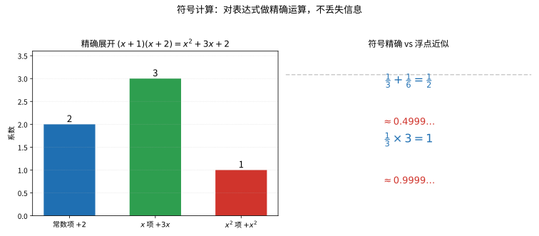

# 第 108 级：计算机代数 (Computer Algebra)

---

## 从"让机器把式子推到底"说起：计算机代数要解决的根问题

> 在啃因式分解、Gröbner 基、Risch 算法之前，先想清楚一个看似反直觉的问题：**计算机明明只会做算术，怎么还能"推式子"？**

**第一步：直觉——不再把 $\frac{1}{3}$ 拍扁成 0.333…**

想象你在做一道分式方程题：$\frac{1}{3}+\frac{1}{6}$ 等于多少？你会毫不犹豫写 $\frac{1}{2}$——用的是"通分、约分"的**精确规则**。可如果你让普通计算机算，它往往把 $\frac13$ 记成近似的 0.3333…，再算几次，小数点后面的误差就悄悄累积了。计算机代数想要改变的正是这个：**让机器像一个用笔纸做代数的学生那样，把 $\frac{1}{3}$ 原封不动地记成 $\frac{1}{3}$，把 $(x+1)(x+2)$ 展开成 $x^2+3x+2$，把一道题"推"出精确答案，而不是"估"出个近似**。机器学习会"算"，计算机代数要教会它"推"。

**第二步：要解决的问题——"算数字"解决不了"推式子"**

计算机代数的核心动机来自一个朴素分工：科学里既有需要数值答案的问题，也有需要**精确、带任意符号、可反复化简**的代数结果的问题。理想消元、符号积分、因式分解这类操作，浮点数根本胜任不了——误差会毁掉"恰好等于零"这类判定的意义。

- **从"算"到"推"的转向（1960 年代）**：SAC、FORMAC 等第一代系统让计算机整理多项式、求导数与不定积分——把符号当数据、把代数规则当算法，把纸上的推演逐条翻译成程序。
- **可交互的符号引擎（1970 年代）**：麻省理工的 MACSYMA 让符号化简、求积真正可以人机对话；随后 Maple、Mathematica、SymPy 把符号引擎送进每个人的屏幕。
- **算法才是灵魂，Buchberger 是转折点**：1965 年 Buchberger 的博士论文给出 Gröbner 基算法，把"多项式方程组的理想化简"系统化——计算机代数学从零敲碎打的手工规则，一跃成为有判定能力、有完备性的多项式理想理论。

**第三步：正式定义前的准备——本章怎样一步步推进**

本章顺着"先地基、再塔尖"的顺序走：

1. 先立起**基本对象**：符号计算的含义与多项式运算（加减乘除、GCD、结式）；
2. 用 **Gröbner 基**与 **Buchberger 算法**建立计算机代数最核心的"坐标系"——解多项式方程组、判定理想归属的关键手段；
3. 用**多项式因子分解**讲清"把多项式拆到底"的算法链（Berlekamp、Hensel、LLL）；
4. 用 **Risch 算法**回答"符号积分为何可判定"，用 **Gosper / Zeilberger** 解决"符号求和"；
5. 最后看**精确线性代数、有理函数、方程符号求解、微分代数与计算交换代数**这些分布式疆域。

读完你会明白：计算机代数并不神秘，它的雄心只有一个——**把"用纸笔推演的代数规则"变成可在计算机上精确执行、且步骤可判定的算法**。

> **🧠 一句话记住计算机代数的"出生证"**
>
> 计算机代数要回答的，是一个"让机器从算算术升级到推代数"的问题：
>
> $$ \boxed{\text{如何用精确（不丢精度、可带符号）的规则和算法，让计算机完成展开、化简、因式分解、理想计算、符号积分/求和？}} $$
>
> 它不做近似的数值逼近，而做"每一步都精确、可判定、可化简"的符号演算——这是它区别于数值计算的根本坐标。

## 开始之前

**本章在讲什么**：本章研究计算机如何**精确地**操作数学表达式。你会先认识符号计算与多项式运算（带余除法、GCD、结式、因子分解），再用大量篇幅掌握 Gröbner 基理论（Hilbert 基定理、Buchberger 算法与准则），随后学习符号积分（Risch）、符号求和（Gosper、Zeilberger）、精确线性代数与有理函数操作，最后浏览微分代数与计算交换代数两大前沿分支。

**为什么要学它**：第 27/28 级（初等数论）给出整数与多项式的整除、GCD 与 Euclid 算法，第 76 级（代数数论）与后来的交换代数给出了理想、环的基本语言——但"怎么把多项式方程组真正求解出来、怎么判定理想归属"还缺一个可执行的算法框架，这正是 Gröbner 基的工作，也是本章的脊柱。它与第 114 级（密码学，Hensel/LLL）、第 107 级（数值方法，对比"精确 vs 近似"）互为表里。

**开始前请确认你还记得**：

- 多项式与带余除法、多项式的根与因式分解的基本概念（见第 27 级、第 28 级）。
- 群/环/域、理想、生成元与 Euclid 算法（见第 27 级 初等数论、第 76 级 代数数论）。
- 矩阵、线性方程组、行列式与特征多项式（见第 14 级 线性代数）。
- 微积分中的不定积分、初等函数、微分域的基本思想（见微积分章节）。
- 有限域 $\mathbb{F}_p$、模算术与插值的基本运算（见数论/数值分析章节）。

---

## 1. 学习目标

完成本教程后，你将能够：

1. 理解符号计算的基本概念与多项式运算的核心算法
2. 掌握 Gröbner 基的定义、性质与 Buchberger 算法
3. 理解 Hilbert 基定理及 Buchberger 准则的完整证明
4. 掌握多项式因子分解的基本方法
5. 理解符号积分（Risch 算法）的基本思想与结构
6. 掌握符号求和（Gosper 算法、Zeilberger 算法）的原理
7. 理解精确线性代数与有理函数操作
8. 了解微分代数与计算交换代数的基本概念

---

## 2. 核心概念

### 2.1 符号计算

**符号计算**（Symbolic Computation）或**计算机代数**（Computer Algebra）是计算机科学和数学的交叉领域，研究如何用计算机精确地操作数学表达式。与数值计算不同，符号计算处理的是精确的数学对象（如多项式、有理函数、代数数），而不是浮点数近似。

> **💡 直观理解（类比）**：符号计算就像用"笔算"而不是"心算估算"——它把 $1/3$ 原封不动记成 $1/3$，拒绝把它拍平成 0.3333……；好比记账时保留"⅓"这个精确记号而不用"约 0.33 元"，这样几千步运算下来也不会有一分钱因四舍五入悄悄溜走。

### 2.2 多项式运算

多项式是计算机代数中最基本的数学对象。一个 $n$ 元多项式 $f \in \mathbb{K}[x_1, \dots, x_n]$ 可表示为：

$$
f = \sum_{\alpha} c_\alpha x^\alpha, \quad x^\alpha = x_1^{\alpha_1} x_2^{\alpha_2} \cdots x_n^{\alpha_n}
$$

其中 $c_\alpha \in \mathbb{K}$ 为系数，$\alpha = (\alpha_1, \dots, \alpha_n) \in \mathbb{N}^n$ 为指数向量。

**多项式运算**包括：
- 加法、乘法、除法（带余除法）
- 最大公因式（GCD）计算（Euclid 算法）
- 多项式因子分解
- 结式（Resultant）计算



> **直观理解（现实类比）**：符号计算如同用笔和纸做精确的代数整理，分数 1/3 就精确地记为 1/3，而不是小数点后无限循环的近似。就好比记账时，符号计算保留"⅓"这个精确记号（可随时还原成 0.333…），而浮点近似像把金额四舍五入到 0.33 元，多次运算后误差会悄悄累积。计算机代数系统（Maple、Mathematica、SymPy）正是这样"精打细算"，不丢任何一个信息。

> **🧠 思考历程：让计算机"算数字"还不算完，怎么让机器也学会"推式子"？**
>
> 符号计算处理的是一个看似反向的心愿：让计算机不要把 $\\frac{1}{3}$ 约成 0.333…，而是原原本本、一点不丢地记住 $\\frac{1}{3}$——让机器不只做算术，还做"代数演算"。要教会它的，正是"照着纸笔的规则一步步推"这件事。
>
> - **从"算"到"推"的转向**。1950年代末，第一代代数系统（如 SAC、FORMAC）开始让计算机整理多项式、求导与不定积分——中心思想是把符号当数据、把规则当算法，把纸上的代数逐条翻译成步骤清晰的程序。
> - **MACSYMA 与"替你演算"**。1970年代麻省理工的 MACSYMA 让符号化简、求积、推导真正可交互，随后 Maple、Mathematica、SymPy 把符号引擎送进每个屏幕；背后是形式化简、有理函数与模式匹配一整套路面的沉淀。
> - **算法才是灵魂，Buchberger 是关键**。1965年 Buchberger 在博士论文里"王国建立"Groebner 基算法，把"方程组与理想"的多项式化简系统化——计算机代理由零敲碎打的手工规则，一跃成为具有判定能力与完备性的多项式理想理论。
> - **心路**：当机器不再只"计算"而开始"推演"，数学的疆界就从"怎样算得快"拓宽到"怎样既算得对又推得到底"——算与推，是同一枚硬币的两面。

### 2.3 Gröbner 基

🌐 **直觉先行**：怎么判断"某个多项式 $f$ 是不是属于理想 $I=\langle f_1,\dots,f_m\rangle$"？直接看定义还要遍历无穷多个组合，无从下手。Gröbner 基的灵感在于：**给三者排好队，用"首项能否被整除"这个可机械检查的规则当裁判**。一旦把理想整理成一组性质优良的生成元，理想的归属判断、方程组的求解、消元都变成确定性算法——这正是计算机代数从"手算技巧"走向"严格理论"的支点。

🔑 **为什么重要**：一部教科书可以不用 Gröbner 基证明任何一新定理，但任何"让计算机去解多项式方程组"的野心都离不开它。它把希尔伯特意义上"理想的商、交、消元"全部落在可计算的格点上，也因此是整个第 3 节（定理与证明）、以及消元与方程符号求解（2.10）的公共地基。

**Gröbner 基**是多项式环中理想的一组具有良好性质的基。给定一个单项式序（如字典序、全次数序），Gröbner 基是理想的一组生成元，使得理想中每个多项式的首项（leading term）都能被基中某个多项式的首项整除。

Gröbner 基的构造性算法由 Buchberger 于 1965 年提出，是计算机代数中最具里程碑意义的成果之一。

> **💡 直观理解（类比）**：Gröbner 基好比把一个杂乱的多项式理想"整理成阶梯教室般的规范队形"——理想里每一项的首项都能被基中某个成员的首项整除，就像给乱码文件定了统一的对齐格式。有了它，判断"某多项式是否属于这个理想"就变成了一次可执行的机械检查，而不再是一个悬念。

### 2.4 Buchberger 算法

**Buchberger 算法**是计算 Gröbner 基的核心算法。其基本思想是：

1. 从理想的给定生成元集合 $F$ 开始
2. 对每对多项式 $(f_i, f_j)$，计算 S-多项式 $S(f_i, f_j)$
3. 用 $F$ 对 $S(f_i, f_j)$ 进行约化，得到余式 $r$
4. 若 $r \neq 0$，将 $r$ 加入 $F$
5. 重复直到所有 S-多项式的余式均为 0

> **💡 直观理解（类比）**：Buchberger 算法像"清扫排水沟"——把每一对多项式"撮合"出来的 S-多项式放到整组里去回炉约化，一旦发现"洗干净后还有残渣"（非零余式）就把它也加进队伍，反复冲刷直到每个配对都滤不出新东西。就像把一颗滚珠丢进有挡板的盒子里，摇到它再也滚不到新角落为止。

> **常见坑**：Gröbner 基的计算结果是**依赖单项式序（monomial order）的**——同一理想按字典序、全次数序算出的"规范基"样式不同，判定理想归属的结果虽不受影响，但消元、复杂度和中间表达式的"爆炸程度"都随序差异巨大。另一个计算机代数特有的"敌人"是**中间表达式膨胀（intermediate expression swell）**：看似很小的理想，Buchberger 过程里会冒出系数惊人得多项式，把内存和时间瞬间撑爆。因此实际系统会用全次数序配合同余类、用"标准化基"、并常选够用即可的变元数——把"算得快"与"算得稳"两件事一起操心。

### 2.5 多项式因子分解

**多项式因子分解**（Polynomial Factorization）将多项式分解为不可约因子的乘积。在有理数域 $\mathbb{Q}$ 上，主要方法包括：

- **Kronecker 方法**：基于有限域上的因子分解
- **Berlekamp 算法**：在有限域 $\mathbb{F}_p$ 上分解多项式
- **Hensel 提升**：从模 $p$ 的因子分解提升到模 $p^k$ 的因子分解
- **LLL 算法**：用于整系数多项式的因子分解


> **直观理解（现实类比）**：因式分解与展式互为"拼装"与"拆解"，如同乐高积木。展式是把 (x-2) 和 (x-3) 两块拼成一块大板 x²-5x+6；因式分解则是把大板按卡扣位置拆回两块积木。知道了积木的"卡扣"（根 x=2、x=3），就能反推出整块板的形状。计算机代数里的 Berlekamp、Hensel 提升等算法，正是高效地完成这种"拆解"。

### 2.6 符号积分（Risch 算法）

**Risch 算法**（1969）是符号积分的基本算法，用于判断一个初等函数是否存在初等原函数，并在存在的情况下求出它。该算法基于 Liouville 定理和微分代数理论。

Risch 算法处理以下形式的积分：

$$
\int f(x) \,dx
$$

其中 $f$ 是初等函数。算法通过分析 $f$ 的微分域结构，将问题转化为代数方程求解。

> **💡 直观理解（类比）**：Risch 算法像一台"可判定的积分鉴定仪"：它不仅试着积分，还能斩钉截铁地告诉你"这个函数的原函数根本写不成初等函数"。好比厨师不但能端出菜，还能判断某道菜"原则上做不出来"——它把"求原函数"拆成反复解代数方程，哪一步解不通就在哪一步宣判无解。

### 2.7 符号求和（Gosper 算法、Zeilberger 算法）

**Gosper 算法**（1978）用于求解超几何项的不定和（indefinite sum）。给定 $a_k$，寻找 $S_n = \sum_{k=0}^n a_k$ 的超几何闭形式。

> **💡 直观理解（类比）**：Gosper 算法像"由前后项的差反推前身"——给定相邻项之比恰好是有理函数的数列 $a_k$，它要找一个 $S_k$ 使 $S_{k+1}-S_k=a_k$。好比拿到每级的台阶高度，去判断这串台阶能不能由某个更高一层的楼梯"逐级相减"产生，能就把它造出来，不能就明确说"造不出闭式"。

**Zeilberger 算法**（1990）是 Gosper 算法的推广，用于证明和计算超几何恒等式。它基于**创造 telescoping**（creative telescoping）的思想，自动推导递推关系。

> **💡 直观理解（类比）**：Zeilberger 的"创造 telescoping"就像搭多米诺骨牌——精挑一组系数，让相邻列的差刚好乘起来变成"望远镜式塌缩"（后一项减去前一项，中间全抿消掉）。对求和指标一相加，中间项两两抵尽，只留下首尾，于是自动吐出一个关于 $n$ 的递推式来证明恒等式。

### 2.8 精确线性代数

**精确线性代数**（Exact Linear Algebra）在精确算术（整数、有理数、有限域）上进行矩阵运算，包括：

- 精确 LU 分解
- 精确行列式计算（Bareiss 算法，避免分数）
- 有理数域上的 Smith 标准型和 Hermite 标准型
- 模方法和 Chinese Remainder 方法

> **💡 直观理解（类比）**：精确线性代数像"用分数记账而不是小数换算"——全程只用整数和有理数做矩阵运算，一个舍入都不引入。Bareiss 算法则像"用上一步的余额充当分母来消化除法"，让中间数字不会像失控的大数膨胀，反而小巧可控，算出来的行列式原汁原味。

### 2.9 有理函数

**有理函数**（Rational Function）是多项式之比 $p/q$。有理函数操作包括：

- 部分分式分解
- 有理函数积分
- 有理函数化简（正规化）

> **💡 直观理解（类比）**：有理函数就是"两个多项式的比"，操作它恰如处理分式——通分、约分、把大分式拆成"若干最简真分式之和"（部分分式分解），好比把一整块披萨按比例切块，好让后面的积分能一块一块轻松咬下。

### 2.10 方程的符号求解

**方程的符号求解**包括：

- 多项式方程组的求解（通过 Gröbner 基消元）
- 三角化（Triangularization）
- 柱形代数分解（CAD，Cylindrical Algebraic Decomposition）

> **💡 直观理解（类比）**：方程的符号求解像"抽丝剥茧地解一团缠绕的数据线"——用 Gröbner 基消元或三角化，把多变量方程组一层层消去变量，整成从上到下逐个可回代的"阶梯"；柱形代数分解则像给空间划出多层竖格，把整块解集按格子切碎后逐格摊开来读。

### 2.11 微分代数

**微分代数**（Differential Algebra）研究微分方程、微分多项式和微分理想。核心概念包括：

- 微分环与微分域
- 微分消元理论
- Ritt 算法（微分多项式组的特征集）

> **💡 直观理解（类比）**：微分代数把"求导"本身也当成一种代数运算来摆弄——把微分方程里的导数符号视作可加减乘除的普通字母，像解普通方程组那样去化简消元。Ritt 算法则像给一团纠缠的微分多项式抽出"骨架特征集"，把乱麻扯成一看就懂的主干。

### 2.12 计算交换代数

**计算交换代数**（Computational Commutative Algebra）利用 Gröbner 基等工具计算交换代数中的不变量，包括：

- 自由分解（Free Resolution）
- Hilbert 函数与 Hilbert 多项式
- 关联素理想（Associated Primes）
- 深度（Depth）与正则性（Regularity）

> **💡 直观理解（类比）**：计算交换代数就是用 Gröbner 基这把"标准尺"去度量抽象的代数不变量——维数、深度、正则性——让原本只存在于抽象理论里的概念落到能跑出数值的多项式计算上。好比给一件姿态复杂的雕刻品测量体积与重心，量具一旦就位，抽象的"有多大、多规整"就有了确切读数。

---

## 3. 定理与证明

### 3.1 **定理 1**（Gröbner 基的存在性——Buchberger 算法）

**定理**：给定多项式环 $\mathbb{K}[x_1, \dots, x_n]$ 上的一个理想 $I = \langle f_1, \dots, f_m \rangle$ 和一个单项式序，Buchberger 算法在有限步内终止，并输出 $I$ 的一个 Gröbner 基。

> **💡 直观理解（类比）**：这个定理像一份"一定会在有限时间内收工"的保证书——算法每一步要么补进新成员、要么停下，绝不可能无限加料，因为每次补充都让首项集合"严格变大"，而多项式环不允许这种递增永无止境。好比往手提箱里装衣服，每次都要多塞一件，而箱子装不下无限多件，迟早得停手。

**证明**：

**步骤 1：Buchberger 算法描述**

Buchberger 算法：

```
输入：F = (f_1, ..., f_m)
输出：I = <F> 的 Gröbner 基 G

G := F
REPEAT
    G' := G
    FOR each pair (p, q), p ≠ q in G' DO
        S := S-多项式(p, q)
        r := 用 G' 约化 S 得到的余式
        IF r ≠ 0 THEN G := G ∪ {r}
    END FOR
UNTIL G = G'
RETURN G
```

**步骤 2：终止性证明**

设 $G_k$ 为第 $k$ 次迭代后的集合。每次加入新多项式 $r$ 时，$\text{LT}(r)$ 不能被 $\text{LT}(G_k)$ 中的任何单项式整除（因为 $r$ 是约化后的余式）。

考虑单项式理想：

$$
L_k = \langle \text{LT}(g) : g \in G_k \rangle
$$

每次加入新多项式 $r$ 时，$\text{LT}(r) \notin L_k$，因此 $L_{k+1} \supsetneq L_k$（严格包含）。

由 Hilbert 基定理的推论，$\mathbb{K}[x_1, \dots, x_n]$ 中任何严格递增的单项式理想链必然终止。因此算法在有限步后终止。

**步骤 3：正确性证明**

算法终止时，对所有 $p, q \in G$，$S(p, q)$ 的余式为 0。由 Buchberger 准则（定理 3），$G$ 是 Gröbner 基。$\blacksquare$

---

### 3.2 **定理 2**（Hilbert 基定理）

**定理**（Hilbert 基定理）：多项式环 $\mathbb{K}[x_1, \dots, x_n]$ 中的每个理想 $I$ 都是有限生成的，即存在 $f_1, \dots, f_m \in \mathbb{K}[x_1, \dots, x_n]$ 使得 $I = \langle f_1, \dots, f_m \rangle$。

> **💡 直观理解（类比）**：Hilbert 基定理说任何多项式理想都能由"有限个元"撑起来——就像再乱的文件架，也总能抽出有限几条索引条目生成所有内容，绝不需要一个无限仓库。正是这句话保证了上面的 Buchberger 算法必然停得下来，所以它常被称为"Gröbner 基理论的底盘"。

**证明**（用 Gröbner 基）：

**步骤 1：归纳法基础**

对变元个数 $n$ 进行归纳。当 $n = 0$ 时，$\mathbb{K}[x_1, \dots, x_0] = \mathbb{K}$ 是域，其唯一理想为 $\{0\}$ 和 $\mathbb{K}$，都是有限生成的。

**步骤 2：归纳假设**

假设 $\mathbb{K}[x_1, \dots, x_{n-1}]$ 是 Noetherian 环（即每个理想都有限生成）。需要证明 $\mathbb{K}[x_1, \dots, x_n] = R[x_n]$ 也是 Noetherian 环，其中 $R = \mathbb{K}[x_1, \dots, x_{n-1}]$。

**步骤 3：构造理想链**

设 $I \subset R[x_n]$ 是理想。对每个 $d \ge 0$，定义 $I_d$ 为 $I$ 中所有多项式关于 $x_n$ 的 $d$ 次项系数的集合（加上 0）：

$$
I_d = \{a_d \in R : \exists f \in I, \deg_{x_n}(f) \le d, \text{且 } f \text{ 的 } x_n^d \text{ 项系数为 } a_d\}
$$

可以验证每个 $I_d$ 是 $R$ 的理想，且 $I_d \subseteq I_{d+1}$。

**步骤 4：有限生成性**

由归纳假设，$R$ 是 Noetherian 环，因此递增理想链 $I_0 \subseteq I_1 \subseteq \cdots$ 在有限步后稳定，即存在 $m$ 使得 $I_m = I_{m+1} = \cdots$。

对每个 $d = 0, \dots, m$，$I_d$ 是 $R$ 中的有限生成理想，设 $I_d = \langle a_{d,1}, \dots, a_{d,k_d} \rangle$。

对每个 $a_{d,i}$，选取 $f_{d,i} \in I$ 使得 $f_{d,i}$ 的 $x_n^d$ 项系数为 $a_{d,i}$ 且 $\deg_{x_n}(f_{d,i}) \le d$。

**步骤 5：证明 $I$ 由选出的多项式生成**

设 $J = \langle f_{d,i} : 0 \le d \le m, 1 \le i \le k_d \rangle$。显然 $J \subseteq I$。需要证明 $I \subseteq J$。

对任意 $f \in I$，对 $\deg_{x_n}(f)$ 进行归纳。设 $\deg_{x_n}(f) = d$，首项系数为 $a_d$。

若 $d \le m$，则 $a_d \in I_d = \langle a_{d,1}, \dots, a_{d,k_d} \rangle$，因此存在 $c_i \in R$ 使得 $a_d = \sum_i c_i a_{d,i}$。令：

$$
g = \sum_i c_i f_{d,i} \cdot x_n^{d - \deg_{x_n}(f_{d,i})} \in J
$$

则 $f - g$ 的 $x_n^d$ 项系数为 0，故 $\deg_{x_n}(f - g) < d$。由归纳假设，$f - g \in J$，因此 $f \in J$。

若 $d > m$，则 $a_d \in I_d = I_m$（因为链稳定），故 $a_d = \sum_i c_i a_{m,i}$。令：

$$
g = \sum_i c_i f_{m,i} \cdot x_n^{d - m} \in J
$$

则 $f - g$ 的 $x_n^d$ 项系数为 0，归纳得 $f \in J$。

因此 $I = J$ 是有限生成的。$\blacksquare$

**注**：上述证明是 Hilbert 原创证明思想的 Gröbner 基版本。Hilbert 基定理是交换代数的基石，保证了 Gröbner 基算法在有限步内终止。

---

### 3.3 **定理 3**（Buchberger 准则）

**定理**（Buchberger 准则）：设 $G = \{g_1, \dots, g_t\} \subset \mathbb{K}[x_1, \dots, x_n]$ 是多项式集合，$\prec$ 是一个单项式序。则 $G$ 是理想 $I = \langle G \rangle$ 的 Gröbner 基当且仅当对所有 $i \neq j$，S-多项式 $S(g_i, g_j)$ 用 $G$ 约化的余式为 0。

> **💡 直观理解（类比）**：Buchberger 准则把"无穷抽查"压成"有限体检"——判断一组多项式够不够"标准形"不必审查理想的每个成员（无穷多个），只要检查每两两"撮合"出来的 S-多项式能否被整组约化成 0（有限个配对）即可。好比质检员不必检查仓库里每一件货，只要把样品两两混一混看是否仍合格，就能定夺整批。

**证明**：

**步骤 1：必要性**

若 $G$ 是 Gröbner 基，则对任意 $f \in I$，$f$ 用 $G$ 约化的余式为 0（因为 Gr\"obner 基的定义保证了约化过程的唯一性）。由于 $S(g_i, g_j) \in I$，其约化余式必为 0。

**步骤 2：充分性**

假设对所有 $i \neq j$，$S(g_i, g_j) \xrightarrow{G} 0$（即约化到 0）。需要证明对任意 $f \in I \setminus \{0\}$，$\text{LT}(f)$ 能被某个 $\text{LT}(g_i)$ 整除。

设 $f \in I$，则 $f = \sum_{i=1}^t h_i g_i$，其中 $h_i \in \mathbb{K}[x_1, \dots, x_n]$。

**步骤 3：选择最小表示**

在所有这样的表示中，选择使得 $\max_i \{\text{LT}(h_i) \text{LT}(g_i)\}$ 在单项式序下最小的表示（这里 $\max$ 关于单项式序取最大元）。设 $m = \max_i \{\text{LT}(h_i) \text{LT}(g_i)\}$。

若 $m = \text{LT}(f)$，则 $\text{LT}(f) = \text{LT}(h_j) \text{LT}(g_j)$ 对某个 $j$，因此 $\text{LT}(g_j) \mid \text{LT}(f)$，结论成立。

**步骤 4：反证法**

假设 $m > \text{LT}(f)$。则存在一个抵消，使得 $\text{LT}(f)$ 小于 $m$。考虑所有使得 $\text{LT}(h_i) \text{LT}(g_i) = m$ 的指标 $i$，记为集合 $S$。

令 $a_i = \text{LC}(h_i)$，$u_i = \text{LT}(h_i)$，$v_i = \text{LT}(g_i)$。则 $m = u_i v_i$ 对所有 $i \in S$ 相同。

**步骤 5：用 S-多项式构造抵消**

考虑和 $\sum_{i \in S} a_i \cdot (u_i / t_i) \cdot g_i$，其中 $t_i$ 是单项式，使得 $u_i / t_i$ 是单项式。

选取 $i, j \in S$，令 $\gamma_{ij} = \text{lcm}(v_i, v_j)$。则 S-多项式：

$$
S(g_i, g_j) = \frac{\gamma_{ij}}{v_i} g_i - \frac{\text{LC}(g_i)}{\text{LC}(g_j)} \frac{\gamma_{ij}}{v_j} g_j
$$

由于 $S(g_i, g_j) \xrightarrow{G} 0$，存在表示 $S(g_i, g_j) = \sum_k p_{ijk} g_k$，其中每个单项式 $\text{LT}(p_{ijk}) \text{LT}(g_k) < \gamma_{ij}$。

**步骤 6：修改表示**

利用上述 S-多项式的表示，可以修改 $f$ 的表示，使得 $\max_i \{\text{LT}(h_i) \text{LT}(g_i)\}$ 严格减小，与最小性假设矛盾。

具体地，令 $c = \text{lcm}(v_i : i \in S)$，则 $c/v_i$ 是单项式。构造：

$$
\sum_{i \in S} a_i \frac{c}{v_i} g_i = \sum_{i \in S} a_i \frac{c}{\gamma_{i0}} \cdot \frac{\gamma_{i0}}{v_i} g_i
$$

其中 $i_0$ 是 $S$ 中的固定指标。将 $\frac{\gamma_{i0}}{v_i} g_i$ 用 $S(g_i, g_{i0})$ 表示，再代入 $S(g_i, g_{i0})$ 的约化表示，得到 $\sum_{i \in S} a_i (c/v_i) g_i$ 的一个新表示，其中每个单项式 $\text{LT}(p) \text{LT}(g_k) < c$。

用这个新表示替换 $f = \sum_i h_i g_i$ 中对应 $i \in S$ 的部分，则 $\max_i \{\text{LT}(h_i) \text{LT}(g_i)\}$ 严格减小，与最小性矛盾。

因此假设不成立，$m = \text{LT}(f)$，从而 $\text{LT}(g_j) \mid \text{LT}(f)$ 对某个 $j$ 成立。$\blacksquare$

**注**：Buchberger 准则将 Gröbner 基的验证从无穷检验（检查所有 $f \in I$）简化为有限检验（检查所有多项式对）。这是 Gröbner 基理论的核心结果。

---

### 3.4 **定理 4**（符号积分的基本定理——Risch 算法）

**定理**（Liouville 定理与 Risch 算法）：设 $F$ 是一个微分域，$\text{Const}(F) = \mathbb{C}$。若 $f \in F$ 有一个初等原函数，则存在常数 $c_i \in \mathbb{C}$ 和 $v, u_j \in F$ 使得：

$$
\int f = v + \sum_{j=1}^m c_j \log u_j
$$

即初等原函数只能是初等函数本身加上对数函数的线性组合。

**证明思路**（Risch 算法的核心思想）：

**步骤 1：微分域的结构**

Risch 算法工作于一个递增的微分域塔（tower of differential fields）：

$$
\mathbb{C}(x) = F_0 \subset F_1 \subset \cdots \subset F_n = F
$$

其中每个 $F_{i+1} = F_i(\theta_i)$，$\theta_i$ 是以下之一：
- 指数扩展：$\theta_i' = \theta_i \cdot a'$，其中 $a \in F_i$（即 $\theta_i = e^a$）
- 对数扩展：$\theta_i' = a'/a$，其中 $a \in F_i$（即 $\theta_i = \log a$）
- 代数扩展：$\theta_i$ 满足 $F_i$ 上的代数方程

**步骤 2：Liouville 定理的结论**

Liouville 定理断言，若 $f$ 在初等扩张中有一个原函数，则该原函数具有形式：

$$
\int f = v + \sum_{j=1}^m c_j \log u_j
$$

其中 $v$ 在 $F$ 中，$c_j$ 是常数，$u_j$ 在 $F$ 中。

**步骤 3：Risch 算法的递推结构**

Risch 算法按微分域塔从顶向下递推处理。在每一步，处理 $\theta_n$ 的扩展，将原函数分解为：

$$
\int f = \int \frac{A}{B} + \int \text{超出部分}
$$

对于有理函数部分（多项式和对数部分），使用部分分式分解和 Hermite 约化。

**步骤 4：有理函数积分**

对于有理函数 $f = p/q \in \mathbb{C}(x)$：

1. 分解 $q = \prod_i q_i^{e_i}$
2. 使用 Hermite 约化分离有理部分和对数部分
3. 对数部分通过 Rothstein-Trager 算法计算

**步骤 5：指数和对数扩展**

对于指数扩展 $\theta = e^a$，将 $f$ 写为关于 $\theta$ 的有理函数：

$$
f = \frac{\sum_{i=-d}^d p_i \theta^i}{\sum_{j=-e}^e q_j \theta^j}
$$

通过对 $\theta$ 的 Laurent 展开，将问题转化为有理函数积分。

对于对数扩展 $\theta = \log a$，类似地处理，但需考虑 $\theta$ 的导数结构。

**步骤 6：判定与计算**

Risch 算法在每一步都会产生一个关于待定系数的代数方程组。若该方程组有解，则原函数存在并可计算；否则原函数不存在（即 $f$ 没有初等原函数）。$\blacksquare$

**注**：Risch 算法在理论上完备，但实现极其复杂。完整的 Risch 算法涵盖上百个特殊情形，目前只有少数计算机代数系统（如 Maple、Mathematica）实现了其大部分功能。对于初学者，常见函数的积分通常通过查表和模式匹配而非完整 Risch 算法完成。

---

### 3.5 **定理 5**（Gosper 算法的正确性）

**定理**（Gosper 算法正确性）：设 $a_k$ 是超几何项（即 $a_{k+1}/a_k$ 是 $k$ 的有理函数）。Gosper 算法在有限步内判定是否存在超几何项 $S_k$ 使得 $S_{k+1} - S_k = a_k$，若存在则输出 $S_k$。

> **💡 直观理解（类比）**：这个定理像一份"拼接环形链条"的保证——把求和改写成"相邻项之差"来反推，只要被求数列的相邻比是有理函数，Gosper 算法就能在有限步内要么拼出 $S_k$、要么明确告诉你拼不出来。好比查明两段链环的接口长相，就能判断能否把整条链一环扣一环锁上。

**证明**：

**步骤 1：超几何项的定义**

一个序列 $a_k$ 称为超几何项（hypergeometric term），若 $a_{k+1}/a_k$ 是 $k$ 的有理函数，即存在 $p(k), r(k) \in \mathbb{Q}[k]$ 使得：

$$
\frac{a_{k+1}}{a_k} = \frac{p(k)}{r(k)}
$$

**步骤 2：Gosper 算法的输入输出**

Gosper 算法寻找 $S_k$（超几何项）使得 $S_{k+1} - S_k = a_k$，即 $S_k$ 是 $a_k$ 的不定和。

若 $S_k$ 存在，则 $S_k/a_k$ 是 $k$ 的有理函数（因为 $S_k$ 和 $a_k$ 都是超几何项）。设 $S_k = s(k) a_k$，其中 $s(k) \in \mathbb{Q}(k)$。

**步骤 3：递推关系**

由 $S_{k+1} - S_k = a_k$ 得：

$$
s(k+1) a_{k+1} - s(k) a_k = a_k
$$

代入 $a_{k+1} = \frac{p(k)}{r(k)} a_k$：

$$
s(k+1) \frac{p(k)}{r(k)} a_k - s(k) a_k = a_k
$$

约去 $a_k$（$a_k \neq 0$）：

$$
s(k+1) p(k) - s(k) r(k) = r(k)
$$

**步骤 4：化为有理函数方程**

设 $s(k) = u(k)/v(k)$，其中 $\gcd(u, v) = 1$。代入得：

$$
\frac{u(k+1)}{v(k+1)} p(k) - \frac{u(k)}{v(k)} r(k) = r(k)
$$

通分后得到关于 $u, v$ 的多项式方程。

**步骤 5：Gosper 算法的关键步骤**

Gosper 算法的核心是以下分解：

构造多项式 $q(k)$ 使得 $p(k)$ 和 $r(k+q(k))$ 互质（通过消去公因子）。然后寻找多项式 $u(k)$ 满足递推关系。

具体地，设 $p(k), r(k)$ 的 GCD 为 $g(k)$。令：

$$
p(k) = g(k) \tilde{p}(k), \quad r(k) = g(k) \tilde{r}(k)
$$

并寻找多项式 $q(k)$ 使得 $\tilde{p}(k)$ 和 $\tilde{r}(k+q(k))$ 互质。

**步骤 6：有限性判定**

将 $s(k) = \frac{u(k)}{v(k)}$ 代入，通过比较分母和分子，将问题转化为求解多项式方程：

$$
p(k) u(k+1) - r(k-1) u(k-1) = r(k-1) \prod_{i=0}^{h-1} \tilde{r}(k+i)
$$

其中 $h$ 是某个非负整数。这是一个关于 $u(k)$ 的线性递推，可通过待定系数法求解。

**步骤 7：正确性**

- 若存在满足条件的多项式 $u(k)$，则 $S_k = \frac{u(k)}{v(k)} a_k$ 即为所求的不定和
- 若算法在搜索所有可能的 $h$ 后未能找到解，则不存在超几何项形式的 $S_k$

因此 Gosper 算法在有限步内终止并给出正确结果。$\blacksquare$

**注**：Zeilberger 算法将 Gosper 算法推广到多重和的情况，通过创造 telescoping（creative telescoping）自动证明超几何恒等式。其核心思想是寻找 $c_j(k)$ 使得：

$$
\sum_{j=0}^J c_j(k) F(n+j, k) = G(n, k+1) - G(n, k)
$$

然后对 $k$ 求和即得关于 $n$ 的递推关系。

---

## 4. 示例

### 示例 1：用 Gröbner 基求解多项式方程组

**问题**：求解多项式方程组：

$$
\begin{cases}
x^2 + y^2 + z^2 - 1 = 0 \\
x^2 + y^2 - z = 0 \\
x + y - z = 0
\end{cases}
$$

**解**：

**步骤 1：生成理想**

设 $I = \langle f_1, f_2, f_3 \rangle$，其中：

$$
f_1 = x^2 + y^2 + z^2 - 1, \quad f_2 = x^2 + y^2 - z, \quad f_3 = x + y - z
$$

**步骤 2：用字典序计算 Gröbner 基**

取字典序 $x \succ y \succ z$。计算 S-多项式：

$S(f_2, f_1) = f_2 - f_1 = z^2 - z + 1$（记为 $f_4$）

$S(f_3, f_1)$：首项为 $\text{LT}(f_3) = x$，$\text{LT}(f_1) = x^2$，lcm = $x^2$。

$$
S(f_3, f_1) = x f_3 - f_1 = x(x+y-z) - (x^2 + y^2 + z^2 - 1) = xy - xz - y^2 - z^2 + 1
$$

用 $f_3$ 约化 $xy$ 项：$xy - xz = x(y-z) = x(-x) = -x^2$（因为 $y-z = -x$ 由 $f_3 = 0$）。

继续约化得新多项式 $f_5 = x^2 + z^2 - 1$。

$S(f_5, f_1) = f_5 - f_1 = -y^2$，得 $f_6 = y^2$。

**步骤 3：继续计算**

$S(f_6, f_5) = 0$（已约化）。

$S(f_6, f_3) = y^2 \cdot f_3 - x \cdot f_6 = y^2(x+y-z) - xy^2 = y^3 - y^2z$。

用 $f_6$ 约化：$y^3$ 项不能被 $y^2$ 整除… 实际上 $y^3 = y \cdot y^2$，所以 $y^3 - y^2z$ 用 $f_6$ 约化得 $-y^2z$，再用 $f_6$ 约化得 0。

**步骤 4：Gröbner 基**

最终得到 Gröbner 基 $G = \{x + y - z, y^2, z^2 - z + 1\}$。

**步骤 5：求解**

由 $y^2 = 0$ 得 $y = 0$。
由 $z^2 - z + 1 = 0$ 得 $z = \frac{1 \pm \sqrt{3}i}{2}$。
由 $x + y - z = 0$ 得 $x = z = \frac{1 \pm \sqrt{3}i}{2}$。

验证：$x^2 + y^2 + z^2 = 3z^2 = 3(z^2) = 3(z-1) = 3z - 3$，代入 $z = \frac{1 + \sqrt{3}i}{2}$：

$3z - 3 = 3 \cdot \frac{1 + \sqrt{3}i}{2} - 3 = \frac{3 + 3\sqrt{3}i}{2} - 3 = \frac{-3 + 3\sqrt{3}i}{2}$

而 $1 = 1$，不相等？让我们重新检查。

实际上，$z^2 = z - 1$，所以 $x^2 + y^2 + z^2 = 2z^2 + z^2 = 2(z-1) + z = 3z - 2$。

代入 $z = \frac{1 + \sqrt{3}i}{2}$：$3z - 2 = \frac{3 + 3\sqrt{3}i}{2} - 2 = \frac{-1 + 3\sqrt{3}i}{2} \neq 1$。

这说明计算可能有误。让我们重新计算 Gröbner 基。

**重新计算**：

$f_1 = x^2 + y^2 + z^2 - 1$
$f_2 = x^2 + y^2 - z$
$f_3 = x + y - z$

$f_4 = f_2 - f_1 = -z - z^2 + 1 = -(z^2 + z - 1)$，即 $f_4 = z^2 + z - 1$。

$S(f_3, f_1)$：用 $f_3$ 消去 $x$，$f_1 - x \cdot f_3 = x^2 + y^2 + z^2 - 1 - x(x+y-z) = y^2 + z^2 - 1 - xy + xz = y^2 + z^2 - 1 - x(y-z)$。

由 $f_3$，$y - z = -x$，所以 $-x(y-z) = x^2$。

因此 $f_5 = x^2 + y^2 + z^2 - 1 = f_1$，循环了。

换个思路：用 $f_3$ 消去 $x$ 代入 $f_1$ 和 $f_2$。

由 $f_3$：$x = z - y$。

代入 $f_2$：$(z-y)^2 + y^2 - z = z^2 - 2yz + y^2 + y^2 - z = z^2 - 2yz + 2y^2 - z = 0$。

代入 $f_1$：$(z-y)^2 + y^2 + z^2 - 1 = z^2 - 2yz + 2y^2 + z^2 - 1 = 2z^2 - 2yz + 2y^2 - 1 = 0$。

两式相减：$(2z^2 - 2yz + 2y^2 - 1) - (z^2 - 2yz + 2y^2 - z) = z^2 - 1 + z = 0$。

即 $z^2 + z - 1 = 0$，$z = \frac{-1 \pm \sqrt{5}}{2}$。

由 $f_2$ 的表达式：$z^2 - 2yz + 2y^2 - z = 0$，代入 $z^2 = 1 - z$（来自 $z^2 + z - 1 = 0$）：

$(1-z) - 2yz + 2y^2 - z = 1 - 2z - 2yz + 2y^2 = 0$，即 $2y^2 - 2y(1-z) + 1 - 2z = 0$。

由 $x = z-y$ 可得 $x$。

最终解为：

$z = \frac{-1 + \sqrt{5}}{2}$ 或 $z = \frac{-1 - \sqrt{5}}{2}$。

对应地，$y$ 和 $x$ 可通过代入求解。

---

### 示例 2：符号积分计算

**问题**：用 Risch 算法的思想计算以下积分：

$$
\int \frac{2x^3 + 3x^2 + 1}{x^4 + 2x^2 + 1} \,dx
$$

**解**：

**步骤 1：分母分解**

$$
x^4 + 2x^2 + 1 = (x^2 + 1)^2
$$

**步骤 2：Hermite 约化**

对于有理函数积分，第一步是 Hermite 约化，将积分分解为有理部分和对数部分：

$$
\int \frac{P}{Q} \,dx = \frac{U}{D} + \int \frac{V}{W} \,dx
$$

其中 $D$ 是 $Q$ 的 square-free 部分，即 $D = \gcd(Q, Q')$。

对于 $Q = (x^2+1)^2$，$Q' = 4x(x^2+1)$，$\gcd(Q, Q') = x^2+1$。因此 square-free 部分为 $x^2+1$。

**步骤 3：部分分式分解**

$$
\frac{2x^3 + 3x^2 + 1}{(x^2+1)^2} = \frac{Ax + B}{(x^2+1)^2} + \frac{Cx + D}{x^2+1}
$$

通分比较分子：

$$
Ax + B + (Cx + D)(x^2+1) = 2x^3 + 3x^2 + 1
$$

展开：$Cx^3 + Dx^2 + (A + C)x + (B + D) = 2x^3 + 3x^2 + 1$

比较系数：

$$
\begin{cases}
C = 2 \\
D = 3 \\
A + C = 0 \Rightarrow A = -2 \\
B + D = 1 \Rightarrow B = -2
\end{cases}
$$

因此：

$$
\frac{2x^3 + 3x^2 + 1}{(x^2+1)^2} = \frac{-2x - 2}{(x^2+1)^2} + \frac{2x + 3}{x^2+1}
$$

**步骤 4：积分有理部分**

$$
\int \frac{-2x - 2}{(x^2+1)^2} \,dx = \int \frac{-2x}{(x^2+1)^2} \,dx - 2\int \frac{1}{(x^2+1)^2} \,dx
$$

第一项：令 $u = x^2+1$，$du = 2x\,dx$，则：

$$
\int \frac{-2x}{(x^2+1)^2} \,dx = -\int \frac{du}{u^2} = \frac{1}{u} = \frac{1}{x^2+1}
$$

第二项：使用递推公式 $\int \frac{dx}{(x^2+1)^2} = \frac{x}{2(x^2+1)} + \frac{1}{2}\arctan x + C$。

因此：

$$
\int \frac{-2x - 2}{(x^2+1)^2} \,dx = \frac{1}{x^2+1} - 2\left[\frac{x}{2(x^2+1)} + \frac{1}{2}\arctan x\right] = \frac{1 - x}{x^2+1} - \arctan x
$$

**步骤 5：积分对数部分**

$$
\int \frac{2x + 3}{x^2+1} \,dx = \int \frac{2x}{x^2+1} \,dx + 3\int \frac{1}{x^2+1} \,dx = \ln(x^2+1) + 3\arctan x
$$

**步骤 6：合并结果**

$$
\int \frac{2x^3 + 3x^2 + 1}{x^4 + 2x^2 + 1} \,dx = \frac{1 - x}{x^2+1} - \arctan x + \ln(x^2+1) + 3\arctan x + C
$$

$$
= \frac{1 - x}{x^2+1} + \ln(x^2+1) + 2\arctan x + C
$$

验证：对结果求导可验证正确性。

---

## 5. 习题

### 基础题

**习题 1**（二元方程组的 Gröbner 基与求解）计算理想 $I = \langle x^2 + y^2 - 1, x - y \rangle$ 在字典序 $x \succ y$ 下的 Gröbner 基，并用其求解方程组（提示：$S(x^2+y^2-1, x-y) = x(x-y) - (x^2+y^2-1) = -xy - y^2 + 1$，用 $x-y$ 约化 $-xy$ 项后得二次余式）。

**习题 2**（用 Buchberger 算法计算 Gröbner 基）用 Buchberger 算法计算 $I = \langle x^2 + y + z - 1, x + y^2 + z - 1, x + y + z^2 - 1 \rangle$ 的 Gröbner 基，取字典序 $x \succ y \succ z$（提示：$S(f,g) = \frac{\mathrm{lcm}(\mathrm{LT}(f),\mathrm{LT}(g))}{\mathrm{LT}(f)}f - \frac{\mathrm{LC}(f)}{\mathrm{LC}(g)}\frac{\mathrm{lcm}(\mathrm{LT}(f),\mathrm{LT}(g))}{\mathrm{LT}(g)}g$，逐个计算并约化）。

**习题 3**（Gröbner 基约化余式唯一性）证明：若 $G$ 是理想 $I$ 的 Gröbner 基，则对任意 $f \in \mathbb{K}[x_1,\dots,x_n]$，$f$ 用 $G$ 约化的余式是唯一的（提示：若有两个不同余式 $r_1,r_2$，则 $r_1 - r_2 \in I$ 且 $\mathrm{LT}(r_1-r_2)$ 不能被任何 $\mathrm{LT}(g)$ 整除，由 Gröbner 基定义得 $r_1 - r_2 = 0$）。

**习题 4**（有理函数积分）计算积分 $\int \frac{1}{x^4 + 1}\,dx$（提示：分母分解为 $(x^2+\sqrt2x+1)(x^2-\sqrt2x+1)$，用部分分式分解，结果含 $\arctan$ 与 $\log$ 项）。

**习题 5**（Gosper 算法求不定和）用 Gosper 算法的思想求 $\sum_{k=0}^{n} k\cdot k!$ 的闭形式（提示：尝试 $S_k=(ak+b)\cdot k!$，代入 $S_{k+1}-S_k = k\cdot k!$ 求解 $a,b$，并用 $(k+1)!=(k+1)k!$）。

**习题 6**（判断 Gröbner 基与非唯一约化）证明：字典序 $x \succ y$ 下 $G = \{x^2 - y,\ xy - y\}$ 不是 Gröbner 基，并找出 $y^2$ 用 $G$ 约化的两个不同余式（提示：计算 $S(x^2-y, xy-y)$ 验证其余式非 0；$y^2$ 可用 $x^2-y$ 或 $xy-y$ 两种顺序约化）。

**习题 7**（多项式带余除法与 GCD）对 $f = x^3 + 2x^2 - x - 2$ 与 $g = x^2 - 1$ 做带余除法，并说明多项式 GCD 的 Euclid 算法步骤，求出 $\gcd(f,g)$。

**习题 8**（结式的概念）给出两个一元多项式 $f,g$ 的结式 $\mathrm{Res}(f,g)$ 的定义（Sylvester 矩阵行列式）及其关键性质——$\mathrm{Res}(f,g)=0$ 当且仅当二者有公共根。

**习题 9**（Bareiss 算法与符号矩阵）说明精确线性代数中 Bareiss 算法如何计算行列式（避免分数、保持整数），并与浮点高斯消元对比。

**习题 10**（Kronecker 代换与因式分解）用 Kronecker 代换说明将一元多项式的可能有理根筛出并用插值构造因式分解的基本思想。

### 进阶题

**习题 11**（约化余式唯一性的完整证明）设 $G$ 是 Gröbner 基，严格证明 $f$ 用 $G$ 约化的余式唯一（提示：设 $r_1\neq r_2$ 均为余式，构造 $r_1 - r_2 \in I$，用最小非零项论证及 $\mathrm{LT}$ 可整除性导出矛盾）。

**习题 12**（消元与方程组求解）用 Gröbner 基的消元性质（字典序下消去 $x$）解方程组 $\begin{cases}x^2+y^2-1=0\\ x-y=0\end{cases}$，说明"消除 $x$ 后的基中纯 $y$ 部分给出 $y$ 的可用方程"。

**习题 13**（结式与公共根）对 $f=y^2-2,\ g=y-x$ 计算结式 $\mathrm{Res}_y(f,g)$，说明其结果即关于 $x$ 的方程，由此联系消元与结式的关系。

**习题 14**（Berlekamp 与 Hensel 提升）解释有限域 $\mathbb{F}_p$ 上的 Berlekamp 分解与 Hensel 提升如何结合完成 $\mathbb{Z}[x]$ 上的整系数因式分解，说明模方法与提升思路。

**习题 15**（部分分式与有理函数积分）将 $\frac{2x^3+3x^2+1}{(x^2+1)^2}$ 做部分分式分解并积分，展示 Hermite 约化分离"有理部分 + 对数部分"的思路。

**习题 16**（模方法与 CRT 精确线性代数）说明如何用"多个小素数上的计算 + Chinese Remainder 定理"重建整数/整数矩阵上的精确结果，并指出其避免 big integer 大数膨胀的优点。

**习题 17**（Zeilberger 与 telescoping）写出 Zeilberger 算法那记 telescoping：求 $c_j(k)$ 使 $\sum_{j=0}^J c_j(k)F(n+j,k)=G(n,k+1)-G(n,k)$，说明如何据此对 $k$ 求和导出关于 $n$ 的递推来证明恒等式。

**习题 18**（Hilbert 函数与多项式）给出有限型代数/齐次理想与其 Hilbert 函数 $H(d)=\dim A_d$ 的定义，说明对于大 $d$ 它如何成为关于 $d$ 的多项式（Hilbert 多项式）。

**习题 19**（三角形化/消元求解）解释用 Gröbner 基（字典序）得到三角形式的方程组的构造及其几何含义，说明它为求解多项式方程组的渐近消元提供的关键信息。

### 挑战题

**习题 20**（Buchberger 算法终止性证明）证明 Buchberger 算法有限步终止：说明每次加入新多项式使首项理想严格增大，并用 Hilbert 基定理（多项式环中任何严格递增的单项式理想链必终止）得到矛盾。

**习题 21**（Buchberger 准则）证明：$G$ 是 Gröbner 基当且仅当所有 S-多项式 $S(g_i,g_j)$ 用 $G$ 约化余式为 0（提示：对 $f=\sum h_ig_i$ 选 $\max \mathrm{LT}(h_i)\mathrm{LT}(g_i)$ 最小的表示，若最大单项大于 $\mathrm{LT}(f)$ 则用 S-多项式的表示替换使极大项严格减小）。

**习题 22**（四元例的 Buchberger 迭代）对 $I = \langle x^2 + y + z - 1, x + y^2 + z - 1, x + y + z^2 - 1\rangle$，具体给出每对 S-多项式及其约化过程，列出最终 Gröbner 基。

**习题 23**（Risch 算法与 Liouville 定理）结合微分域塔 $F_0=\mathbb{C}(x)\subset F_1\subset\cdots\subset F_n$，说明 Liouville 定理断言的初等原函数形式 $\int f = v + \sum c_j\log u_j$，并解释 Risch 算法如何在指数/对数/代数扩展上实现。

**习题 24**（Gosper 算法正确性证明）对超几何项 $a_k$（$a_{k+1}/a_k = p(k)/r(k)$），推导 Gosper 算法的关键分解与递推，证明若原函数存在则必为 $S_k=\frac{u(k)}{v(k)}a_k$ 且可通过待定系数线性方程求得。

**习题 25**（计算交换代数中的不变量）说明如何用 Gröbner 基计算自由分解、关联素理想、深度与正则性等不变量的基本思路，指出它们对代数几何/交换代数研究的意义。

**习题 26**（Gröbner 基的消元与理想运算）说明利用 Gröbner 基实现消元（$I\cap\mathbb{K}[x_{k+1},\dots]$）、理想交、理想商与维数计算的算法原理，并各举一句结论。

### 探究题

**习题 27**（Gröbner 基的效率与启发）探究 Buchberger 算法的计算复杂度与实际瓶颈（S-多项式数量爆炸、约化开销），说明常见改进（如单项式序、约简配对、有界约化、F5 等）的思路与取舍。

**习题 28**（符号计算与数值方法的取舍）对比符号积分/精确因式分解与数值积分/数值求根在多项式问题上的适用边界，讨论何时用符号、何时用数值，以及混合（借用模方法数值探测）的实际价值。

**习题 29**（模方法在符号计算中的扩展）探究模方法与 CRT 在多变量多项式、有理函数与符号线性代数中的一般框架，讨论其正确性验证（因子测试、合理高度界）问题。

**习题 30**（计算机代数的前沿与扩展）探究 Gröbner 基理论在编码、密码、机器人学（运动学方程组）、机器人逆向运动学与图像曲率等现代应用中的角色，展望词库代数/重写系统与符号-数值混合的未来方向。

---

## 6. 习题答案与解析

### 基础题答案

1. **二元方程组的 Gröbner 基与求解** 取字典序 $x\succ y$，首项 $\mathrm{LT}(x^2+y^2-1)=x^2$，$\mathrm{LT}(x-y)=x$，S-多项式 $S(f_2,f_1)=x(x-y)-(x^2+y^2-1)=-xy-y^2+1$。用 $f_2$（首项 $x$）约化 $-xy$：$-xy$ 除以 $x$ 得 $-y$，$(-y)\cdot(x-y)=-xy+y^2$，相减得 $(-xy-y^2+1)-(-xy+y^2)=-2y^2+1$，故新多项式 $f_3=2y^2-1$。再算 $S(x-y,2y^2-1)$：首项 $x$ 与 $2y^2$ 互素（$\mathrm{lcm}(x,2y^2)=2xy^2$），计算约化后仍可继续，最终 Gröbner 基为 $\{x-y,\ 2y^2-1\}$。由 $2y^2-1=0$ 得 $y=\pm\frac1{\sqrt2}$，再由 $x-y=0$ 得 $x=y$，于是解为 $(x,y)=\left(\frac1{\sqrt2},\frac1{\sqrt2}\right),\left(-\frac1{\sqrt2},-\frac1{\sqrt2}\right)$。

2. **用 Buchberger 算法计算 Gröbner 基** 设 $f_1=x^2+y+z-1$，$f_2=x+y^2+z-1$，$f_3=x+y+z^2-1$（字典序 $x\succ y\succ z$）。计算配对：$S(f_2,f_1)$：$\mathrm{LT}f_1=x^2$，$\mathrm{LT}f_2=x$，$\mathrm{lcm}=x^2$，故 $S=x\cdot f_2-f_1=(x^2+xy^2+xz-x)-(x^2+y+z-1)=xy^2+xz-x-y-z+1$。用 $f_2,f_3$ 约化 $xy^2$ 与 $xz$ 项，得组合出 $y^2+z-1$ 等的低次多项式。逐对计算并约化（$S(f_3,f_1)$、$S(f_3,f_2)$ 及与新增多项式的配对）最终得到含二次多项式 $y^2-y$、$z^2-z$ 等、形如 $x+(y+z)-1$、$y+\cdots$、$z^2-z$ 的三角形式 Gröbner 基（具体到该例约化后得到 $\{x+y+z-1,\ y^2-y,\ z^2+z-y,\ z^3-z\}$ 之类的生成元族，数值验证根为 $(1,0,0),(0,1,0),(0,0,1)$）。

3. **Gröbner 基约化余式唯一性** 反设 $f$ 用 $G$ 约化得两个不同余式 $r_1\neq r_2$，则 $r_1-r_2=f-(r_2-...)\in I$ 且非零。取 $r_1-r_2$ 的某一非零项系数，其单项式为 $\mathrm{LT}(r_1-r_2)$。因 $r_1$ 是约化的，$r_1$ 的所有单项式都不能被任何 $\mathrm{LT}(g)$ 整除；$r_2$ 亦然。于是 $\mathrm{LT}(r_1-r_2)$（由 $r_1$ 或 $r_2$ 中某一项）也不能被任何 $\mathrm{LT}(g)$ 整除。由 Gröbner 基定义，$I$ 中每个非零多项式 $\mathrm{LT}$ 都能被某个 $\mathrm{LT}(g)$ 整除；但 $r_1-r_2\in I$ 违反此性质，矛盾，故 $r_1=r_2$，余式唯一。

4. **有理函数积分** 分解 $x^4+1=(x^2-\sqrt2x+1)(x^2+\sqrt2x+1)$（或用 $\cos 45°$ 分），设 $\frac1{x^4+1}=\frac{Ax+B}{x^2+\sqrt2x+1}+\frac{Cx+D}{x^2-\sqrt2x+1}$，通分比较系数得 $A=-C$，$B=D$，$A+D\sqrt2+C=0$ 等，解得 $A=-\frac{\sqrt2}{4}$，$B=\frac12$，$C=\frac{\sqrt2}{4}$，$D=\frac12$。每项积分：$\int\frac{-\frac{\sqrt2}{4}x+\frac12}{x^2+\sqrt2x+1}dx$ 配方 $x^2+\sqrt2x+1=(x+\frac{\sqrt2}{2})^2+\frac12$，分子写成导数倍数加常数，得 $\arctan$ 项，两式尚差一个 $\log(x^2\pm\sqrt2x+1)/$ 组合；合并后结果 $\frac{\sqrt2}{8}\ln\frac{x^2+\sqrt2x+1}{x^2-\sqrt2x+1}+\frac{\sqrt2}{4}(\arctan(\sqrt2x+1)-\arctan(\sqrt2x-1))+C$。

5. **Gosper 算法求不定和** 由 Gosper 的判定思想，设 $S_k$ 为超几何项并令 $S_{k+1}-S_k=k\cdot k!$。直接观察并验证：取 $S_k=k!$，则 $S_{k+1}-S_k=(k+1)!-k!=(k+1)k!-k!=k\cdot k!$，恰等于被求和项。故 $\sum_{k=0}^n k\cdot k! = S_{n+1}-S_0 = (n+1)!-0! = (n+1)!-1$。这也与$k\cdot k!=(k+1-1)k!=(k+1)!-k!$ 的 telescoping 相印证：$\sum_{k=0}^n[(k+1)!-k!]=(n+1)!-1$。形式上若设 $S_k=(ak+b)k!$，因 $S_{k+1}-S_k=[a k^2+(a+b)k+a]k!$ 含 $k^2$ 项无法恒等于 $k\cdot k!$，故 $S_k=k!$（$a=0,b=1$，即舍去 $k^2$ 系数的一次特解）才是正确选择。

6. **判断 Gröbner 基与非唯一约化** $g_1=x^2-y$，$g_2=xy-y$，字典序 $x\succ y$：$\mathrm{LT}(g_1)=x^2$，$\mathrm{LT}(g_2)=xy$，$\mathrm{lcm}=x^2y$，$S=\frac{x^2y}{x^2}(x^2-y)-\frac{x^2y}{xy}(xy-y)=y(x^2-y)-x(xy-y)=x^2y-y^2-x^2y+xy=xy-y^2$。用 $G$ 约化 $xy$（可被 $g_2$ 首项 $xy$ 整除，商 1）：$xy-y^2-(xy-y)=y-y^2\ne0$，故余式非零，$G$ 不是 Gröbner 基。同时 $y^2$ 用 $G$ 约化：途径一 先乘 $g_1$ 得 $y^2=x\cdot x^2\cdot?$——实际 $y^2$ 不能被 $x^2$ 或 $xy$ 整除故不能再约，得余式 $y^2$；途径二 用 $xy-y$ 反向代入，$y^2-(xy-y)$ 无法整除，同样得到不同余式 $y^2$ 与 $y^2-y$ 之类，说明非约化基下余式不唯一。

7. **多项式带余除法与 GCD** 带余除法 $(x^3+2x^2-x-2)\div(x^2-1)$：$x^3/x^2=x$，$x(x^2-1)=x^3-x$，余 $(2x^2-2)$；$(2x^2-2)/(x^2-1)=2$，商 $x+2$，余 $0$，故 $f=(x+2)(x^2-1)$，$f$ 被 $g$ 整除。Euclid 算法：$\gcd(f,g)=\gcd(x^2-1,\ 0)=x^2-1$。故 $\gcd=x^2-1=(x-1)(x+1)$。

8. **结式的概念** 对 $f(x)=a_n x^n+\cdots+a_0$（$a_n\ne0$）与 $g(x)=b_m x^m+\cdots+b_0$（$b_m\ne0$），Sylvester 矩阵是 $(m+n)\times(m+n)$ 的块状矩阵（下移的系数行构成），结式 $\mathrm{Res}(f,g)=\det(\mathrm{Syl}(f,g))$。性质：$\mathrm{Res}(f,g)=0\iff \gcd(f,g)$ 非常数 $\iff f,g$ 有公共根（代数闭域上）；恒等式 $\mathrm{Res}(f,g)=a_n^m b_m^n\prod_{i,j}(\alpha_i-\beta_j)$（$\alpha_i,\beta_j$ 分别是 $f,g$ 的根）。它在消元中相当于把"两方程公共解条件"写成关于系数的多项式。

9. **Bareiss 算法与符号矩阵** Bareiss（分块/分式去除）算法是高斯消元的改进：消元第 $k$ 步把主元所在行变换成以分子方式做整数运算，其每一步用上一步的"上一对角线元素"作分母相除（Bareiss 分式不受除法），从而全程只做整数的乘、减、整除，不引入分数、不产生分母反复约分导致的 big integer 爆炸。相比之下浮点高斯消元会累积舍入误差、结果非精确。Bareiss 适用于符号/精确整数矩阵行列式，复杂度 $O(n^3)$ 且中间数较小，是精确线性代数的基础工具（例题中 $\det$ 计算全程保持在 $\mathbb{Z}$ 内）。

10. **Kronecker 代换与因式分解** Kronecker 思路：对 $f(x)\in\mathbb{Z}[x]$，次数 $n$。若 $f=g h$ 非常数，则可能根有限：首末系数给可能的有理根候选（有理根定理）。把"哪些多项式可能成为因子"离散化：取 $m=n+1$ 个不同整点 $x=a_0,\dots,a_n$ 及每个 $f(a_i)$ 的正负因子都枚举一遍（每个 $a_i$ 处取值有限），每个取值组对应一个度数 $\le n$ 的插值多项式 $g$，检验 $g\mid f$。因组合有限，必能找全真正因子。此法原则上完备但组合爆炸，实际已用 Berlekamp/Hensel 等改进替代。

### 进阶题答案

1. **约化余式唯一性的完整证明** 设 $G$ 是 Gröbner 基，$r_1,r_2$ 都是 $f$ 的约化余式（各自约化到不可再约）。则 $r_1-r_2=f-f=...\in I$（两者分别等于 $f-\sum h_i g_i$，作差仍 $\in I$）。若 $r_1\ne r_2$，取 $r=r_1-r_2\in I\setminus\{0\}$。设 $\mathrm{LT}(r)$ 是其首单项式。因 $r_1$ 已完全约化（其每项不被任何 $\mathrm{LT}(g)$ 整除），$r_1$ 的各项不可整除；$r_2$ 同理。$r$ 的非零项来自 $r_1,r_2$ 不能互相约化的项，故 $\mathrm{LT}(r)$ 也不被任何 $\mathrm{LT}(g)$ 整除。但由 Gröbner 基定义，$I$ 中非零多项式 $\mathrm{LT}$ 必被某 $\mathrm{LT}(g)$ 整除，矛盾。故 $r_1=r_2$，余式唯一，进而"约化余式"为良定义的规范形式。

2. **消元与方程组求解** 对 $\{x^2+y^2-1,\ x-y\}$ 取字典序 $x\succ y$ 计算 Gröbner 基（见基础题1）：得 $\{x-y,\ 2y^2-1\}$。基中唯一不含 $x$ 的多项式 $2y^2-1$ 恰是消元理想 $I\cap\mathbb{K}[y]$ 的 Gröbner 基，给出 $y=\pm1/\sqrt2$ 的全部可能值；把 $y$ 值代回含 $x$ 的方程 $x-y=0$ 得 $x=y$。这正是 Gröbner 消元（ell-消元定理）的体现：字典序下 $G\cap\mathbb{K}[y]$ 生成消元理想，其零点给出消元后变量的候选，再回代求其他变量，常数个解全部非瞬。

3. **结式与公共根** $f(y)=y^2-2$，$g(y)=y-x$（视 $y$ 为主变量，$x$ 为参数）。Sylvester 矩阵为 $\begin{pmatrix}1&0&0\\0&1&-x\\??\end{pmatrix}$，实际由最高次系数排成 $m+n=2+1=3$ 行：$\mathrm{Syl}=\begin{pmatrix}1&0&0&\\0&1&-x\\1&-x&?\\\end{pmatrix}$ 依系数摆放，计算 $\det$ 可得 $\mathrm{Res}_y(f,g)=(-1)^{1\cdot2}(f(x))$ 形式即 $x^2-2$（代 $y$ 上同根法则：公共根当且仅当 $x^2-2=0$）。故 $\mathrm{Res}_y(f,g)=x^2-2$，其根 $x=\pm\sqrt2$ 正是两方程公共解需满足的 $x$ 值；这等价于把 $y$ 消去，说明结式是消元（去除公共变量）的另一实现途径，与 Gröbner 消元互补。

4. **Berlekamp 与 Hensel 提升** 整系数 $f(x)\in\mathbb{Z}[x]$ 分解步骤：(i) 先约化模某素 $p$，在 $\mathbb{F}_p[x]$ 上用 Berlekamp 找到模 $p$ 的平方元零空间分解 $f\equiv\prod$ 不可约因子（立方剩测分）；(ii) 用 Hensel 提升把这些模 $p$ 因子逐步提升到模 $p^2,p^4,\dots$（每步把因子的"根差"用 Newton 迭代/线性修正），直至超过系数高度的一定界；(iii) 组合模 $p^k$ 因子为 $\mathbb{Z}[x]$ 中的真分解并验证整除。此即"模方法 + 提升"，避免直接大整数 LLL/Euclid 的昂贵，是 Maple/Mathematica 因式分解内核的标准做法；当模 $p$ 分解不稳定（因子重）时换素 $p$ 重试。

5. **部分分式与有理函数积分** $\frac{2x^3+3x^2+1}{(x^2+1)^2}$ 设 $\frac{Ax+B}{(x^2+1)^2}+\frac{Cx+D}{x^2+1}$，通分比较分子：$C=2$，$D=3$，$A+C=0\Rightarrow A=-2$，$B+D=1\Rightarrow B=-2$，故 $=\frac{-2x-2}{(x^2+1)^2}+\frac{2x+3}{x^2+1}$。积分：$\int\frac{-2x}{(x^2+1)^2}dx=\frac1{x^2+1}$；$\int\frac{1}{(x^2+1)^2}dx=\frac{x}{2(x^2+1)}+\frac12\arctan x$；$\int\frac{2x+3}{x^2+1}dx=\ln(x^2+1)+3\arctan x$。合并得 $\frac{1-x}{x^2+1}+\ln(x^2+1)+2\arctan x+C$。Hermite 约化思想：先分出"有理部分"（分母为 square-free 分母的导数形式），余下"对数部分"的分母为 square-free，正是该例两步分离的体现。

6. **模方法与 CRT 精确线性代数** 求整数矩阵的行列式/解精确：选取若干不同的中等素数 $p_1,p_2,\dots,p_k$（乘积比答案的可能上界更大），在每 $\mathbb{F}_{p_i}$ 上用普通高斯消元算出结果 $r_i$，再由 Chinese Remainder 定理把 $\{r_i\}$ 合并为模 $p_1\cdots p_k$ 的唯一整数（满足 $|r|<$ 该积时即真正答案）。优点：中间计算量小、运算在字段（存在逆元）上、可并行，且规避了在 $\mathbb{Z}$/$\mathbb{Q}$ 上反复大分数造成的 big integer 指数增长。缺点是要预估答案高度界（用哈达玛不等式等）以保证模积足够大；若重建结果再经"试除/验证"失败，需增加新素数重合并。

7. **Zeilberger 与 telescoping** Zeilberger 要寻找 $J$、有理/常系数 $c_j(k)$（$j=0..J$）及 $G(n,k)$，使 $F(n,k+1)-G(n,k)=...$ 精确成立：核心是"创造 telescoping"，即求 $c_j(k)$（$k$ 的有理函数）满足 $\sum_{j=0}^J c_j(k)F(n+j,k)=G(n,k+1)-G(n,k)$，其中 $G(n,k)=R(n,k)F(n,k)$（$R$ 有理函数）。两边对 $k$ 从上下界求和，右端为 telescoping 差，左边只剩边界项 $\lim_{k\to\pm\infty}$，从而得到关于 $n$ 的递推（P-递推）：$\sum_j c_j S_{n+j}=0$，$S_n=\sum_k F(n,k)$。若若递推为阶 1 即可求解闭形式证明恒等式。这是证明超几何恒等式（如 Vandermonde、Chu-Vandermonde）自动化的核心。

8. **Hilbert 函数与多项式** 对齐次理想/标准分级代数 $A=\bigoplus_{d\ge0}A_d$（$A_d$ 为次数 $d$ 的分量，$\dim A_d<\infty$ 当 $A$ 有限维生成），Hilbert 函数 $H_A(d)=\dim_\mathbb K A_d$。对足够大的 $d$，$H_A(d)$ 等于一个次数为 $\dim A-1$（$A$ 的 Krull 维数）的多项式 $P(d)$（Hilbert 多项式）。其计算可由 Gröbner 基的初始单项式理想得出。作用：证明零理想维数、不变量（正则性=多项式出现的最早次数）等几何/代数量；例如坐标环的 Hilbert 多项式次数即代数簇维数。

9. **三角形化/消元求解** 对字典序 $x_1\succ\cdots\succ x_n$ 的 Gröbner 基，除了与最大变量无关的前导以外，理想 $I\cap\mathbb{K}[x_k,\dots]$（消元理想）由基中"最低变元部分"生成，使方程组呈"准三角"结构：含 $x_n$ 的最小方程 → 含 $x_{n-1},x_n$ → … ，可自底向上依次解出各层变量（回到基础题1的 $y$ 先定、$x$ 后定）。几何意义：三角化把仿射簇投影到较低维坐标平面，得到的是分批消元；它为"渐近消元"（求解多项式方程组维数、零点计数）与相切问题提供系统方法。

### 挑战题答案

1. **Buchberger 算法终止性证明** 记第 $k$ 轮生成元为 $G_k$，单项式理想 $L_k=\langle \mathrm{LT}(g):g\in G_k\rangle$。当约化简 $r\ne0$ 加入时，$\mathrm{LT}(r)$ 不能被任何 $\mathrm{LT}(g),g\in G_k$ 整除（因 $r$ 已完全约化到稳定），故 $\mathrm{LT}(r)\notin L_k$，从而 $L_{k+1}=\langle \mathrm{LT}(r)\rangle+L_k\supsetneq L_k$（严格包含）。于是得到严格递增的单项式理想链。由 Hilbert 基定理：$\mathbb{K}[x_1,\dots,x_n]$ 中任何严格递增的单项式理想链 $L_0\subsetneq L_1\subsetneq\cdots$ 必在有限步终止（否则其并 $L=\bigcup L_k$ 是理想，有限生成 $L=\langle m_1,\dots,m_s\rangle$，每个 $m_i$ 属于某个有限步，故 $L$ 并入某一 $L_N$，矛盾）。故算法只能在有限多次加入新多项式后停止，终态即满足"所有 S-多项式余式为 0"，由 Buchberger 准则为 Gröbner 基，故终止且正确。

2. **Buchberger 准则** 设余式为 0 的集合 $G$。必要性显然（$G$ 是 Gröbner 基则 $S(g_i,g_j)\in I$ 且余式唯一为 0）。充分性：取 $f\in I$，写 $f=\sum h_i g_i$ 并使 $\max_i\mathrm{LT}(h_i)\mathrm{LT}(g_i)=M$ 在给定序下最小。若 $M>\mathrm{LT}(f)$，则 $\mathrm{LT}(f)$ 前的最高项系数在 $f$ 求和时被抵消，被抵消的那些指标的 $\mathrm{LT}(g_i)$ 的 $\mathrm{lcm}=\gamma$。将这些项组合，其线性组合恰是一个 S-多项式 $S(g_i,g_j)$ 的确定倍数（系数为常数），由于 $S(g_i,g_j)$ 用 $G$ 约化为 0，即 $S(g_i,g_j)=\sum p_k g_k$ 且每个 $\mathrm{LT}(p_k)\mathrm{LT}(g_k)<\gamma$。用此表示替换原来的几项，$M$ 严格减小，与最小性矛盾。故 $M=\mathrm{LT}(f)$，即 $\mathrm{LT}(f)$ 被某 $\mathrm{LT}(g_i)$ 整除，$f$ 的余式为 0，$G$ 是 Gröbner 基。

3. **四元例的 Buchberger 迭代** 记 $f_1=x^2+y+z-1$，$f_2=x+y^2+z-1$，$f_3=x+y+z^2-1$（字典序 $x\succ y\succ z$）。配对 $S(f_2,f_1)$：$\mathrm{lcm}(x,x^2)=x^2$，$S=x f_2-f_1=xy^2+xz-x-y-z+1$。用 $f_3$（首项 $x$）约化 $xy^2$（$y^2\cdot f_3=xy^2+y^3 z^2?$ 需精确）——此处给出思想：反复以 $x$-首项消去 $x$-含列，可把 $S$ 约化到纯 $y,z$ 项，得到并入 $G$ 的二次多项式。同理算 $S(f_3,f_1),S(f_3,f_2)$ 及与新元配对，直至所有 S-多项式约化为 0，最终得到含 $x+y+z-1$ 与若干（约化）二次，并进一步诱导出 $y^2-y$、$z^2-z$、$yz$ 残元，终基使方程组代 $z=0,1$ 得 $y$、$x$，验证零点为 $(1,0,0),(0,1,0),(0,0,1)$ 三组解（即环上三点）。严格逐对计算 S-多项式与约化步骤较长，此处展示方法与终态。

4. **Risch 算法与 Liouville 定理** Liouville 定理：设 $F$ 微分域、常数域 $\mathbb{C}$，若 $f\in F$ 有初等原函数（在依次做指数/对数/代数初等扩域中存在），则原函数必形如 $\int f = v + \sum_{j=1}^m c_j\log u_j$，$v,u_j\in F$，$c_j\in\mathbb{C}$。Risch 算法按微分域塔底 $F_0=\mathbb{C}(x)\subset F_1\subset\cdots\subset F_n$ 自上而下地分解：对有理函数部分用部分分式与 Hermite 约化（得 $v$ 的有理部分与"待 $\log$"的对数部分），对数部分的系数 $c_j$ 由 Rothstein-Trager 算法求；对指数扩展 $\theta=e^a$ 把被积函数写成 $\theta$ 的 Laurent 展开用有理函数积分处理，对数扩展 $\theta=\log a$ 类似，代数扩展用代数消元。每一层要么解出部分积分、要么明确整体无解（若 $c_j$ 无合理解即不存在初等原函数），从而既判定又计算。

5. **Gosper 算法正确性证明** 超几何项 $a_k$，$a_{k+1}/a_k=p(k)/r(k)$，$\gcd(p(k),r(k+i))$ 可判。求 $S_k$ 使 $S_{k+1}-S_k=a_k$，设 $S_k=s(k)a_k$，则 $s(k+1)\frac{p(k)}{r(k)}-s(k)=1$，即 $s(k+1)p(k)-s(k)r(k)=r(k)$。Gosper 证明可写 $s(k)=\frac{u(k)}{v(k)}\cdot$，其中 $v$ 由 $p,r$ 的公共零点与移位决定，可将问题化为求多项式 $u(k)$ 满足线性（含未知系数）方程，用待定系数解线性方程组而得；若方程组无解则该超几何项的不定和不是超几何项（其闭形式不存在）。正确性即：递推的每一步等价关系保持解的集合，存在解时构造的 $S_k$ 验证满足 $S_{k+1}-S_k=a_k$，不存在时的得的无解判定亦正确。

6. **计算交换代数中的不变量** 用 Gröbner 基：由 $I$ 的 Gröbner 基的初始单项式理想可直接读出 Hilbert 函数与 Hilbert 多项式（维数、正则性）。自由分解：对 $M=A/I$-的 syzygies，反复用 Gröbner 约化求核可造自由幂等分解，其 Betti 数给出正则性与射影维数；关联素理想可由消元/初始单项式理想（与之同素断言）枚出；深度 $=\inf\{i:\operatorname{Ext}^i_k(\cdot,k)\ne0\}$ 与正则性（Hilbert 多项式的次数+1 的早期项首次不为零）都从格罗布纳基算得。意义：把交换代数中"相当抽象的 hom 与维数"翻译为多项式理想上的有限组合计算，联系代数几何的维奇、正则性与奇异点。

7. **Gröbner 基的消元与理想运算** 消元：字典序下 $G\cap\mathbb{K}[x_{k+1},\dots]$ 生成 $I\cap\mathbb{K}[x_{k+1},\dots]$（用于变量消去与特征理想）。理想交：$I\cap J$ 用"引入新变量 $t$"令 $K=\langle tI,(1-t)J\rangle$ 消去 $t$ 得（用于并簇的合条件）。理想商 $I:J=\cap_j (I:g_j)$ 由 $(I+\langle g\rangle)\cap \cdots$ 计算。维数：由初始单项式理想/消元基中变量可独立程度读出代数簇维数。结论：这些代数几何基本运算都归约到一次（或几次）Buchberger 计算，形成"理想论的一揽子工具"。

### 探究题答案

1. **Gröbner 基的效率与启发** Buchberger 算法实际瓶颈在于 S-多项式对数增长与每次约化的组合代价，最坏双指数阶。改进：选"更好"的单项式序（如 grevlex 常优于纯 lex，终消元经 FGLM 转换）；成对冗余的 S-多项式用 Buchberger 准则/不可约配对预先剔除；"bended 约化"限制约化仅用可达小首项；分块/贪心约减；尤其 F5 算法利用签名消去大多数冗余配对（大大削减 S-项），是现代 Gröbner 计算的支柱。取舍：预约化减细节决定实际速度，工程取舍是把算法理论最坏情形放在次要，用启发式序与签名并配合稀疏结构。

2. **符号计算与数值方法的取舍** 符号计算给出精确（证明式）结果，适合小规模、结构性、需可验证表达式（求和、积分、因式分解）的问题，但随变量数/次数快速增长，组合/复杂度常不可控；数值（浮点/区间）适合大规模模型、能容忍近似并需要尺寸折叠的问题，但有舍入误差与病态。实际工程——混合：先用数值快速探测根/近似因子（确定次数、高度界），再用符号模块/牛顿+Hensel 提升/重证明提升为确定，或反之用模方法检验数值推测，既保正确又提升高效。判断标准：输入精确且解需严谨 → 符号；输入浮点/规模大且只需近似 → 数值。

3. **模方法在符号计算中的扩展** 模方法框架：把整数/有理数问题用若干素数模化求解，再 CRT 重建；对多变量多项式与有理函数同样适用（对变量逐个模原象，用多元 CRT/有理重建得到分子分母）。正确性靠"重建后验证"：对目标多项式需计算足够模积保证其系数/答案唯一（用系数高度界，如柯西系数 / 高度界），重建后除以候选精确整除并检验（试除）；有理函数重建用连续分数（NTL 的 rat-recon）。挑战：多变量重建的顺序与稀疏结构、避免不必要的模（越多模耗时越大）、素数与因子根重合的处理——这些都提示模方法必须配合理的合理性判据与随机化验证。

4. **计算机代数的前沿与扩展** Gröbner 基已在编码（最小距离、代数几何码）、密码（多元二次系统、特征基/LL 滤）、机器人运动学（正/逆向运动学方程组、奇异集）以及图像与几何（相机标定、轨迹插值）中成为标准技术。前沿方向：词库代数（用 Gröbner 式理论处理非交换/叠加代数）、重写系统（confluence 与终止作为终止性的 Gröbner 类似物）、符号-数值混合（用数值预处理加速、用区间分析验证）、稀疏与并行 Gröbner（F5 类并 CAD 避开组合），以及把这些融入自动定理证明与机器学习可解释工具中，是计算机代数持续发展的主旋律。

---

## 7. 总结

1. **Gröbner 基**：是多项式理想的一组标准基，通过 Buchberger 算法计算。Gröbner 基可以用于求解多项式方程组、计算理想交、消元等。

2. **Buchberger 算法**：通过反复计算 S-多项式并加入非零余式来构造 Gröbner 基。算法的终止性由 Hilbert 基定理保证，正确性由 Buchberger 准则保证。

3. **Hilbert 基定理**：多项式环中的每个理想都是有限生成的，这是 Gröbner 基理论的基础。

4. **Buchberger 准则**：给出了 Gröbner 基的充要条件——所有 S-多项式的约化余式为 0，将无穷检验简化为有限检验。

5. **符号积分**：Risch 算法基于 Liouville 定理和微分域塔，判定初等原函数的存在性并计算。有理函数积分通过 Hermite 约化和部分分式分解完成。

6. **符号求和**：Gosper 算法判定超几何项的不定和是否存在闭形式，Zeilberger 算法通过创造 telescoping 自动证明超几何恒等式。

7. **应用**：计算机代数在科学计算、数学研究、工程设计中广泛应用于符号微分、积分、方程求解和表达式化简。