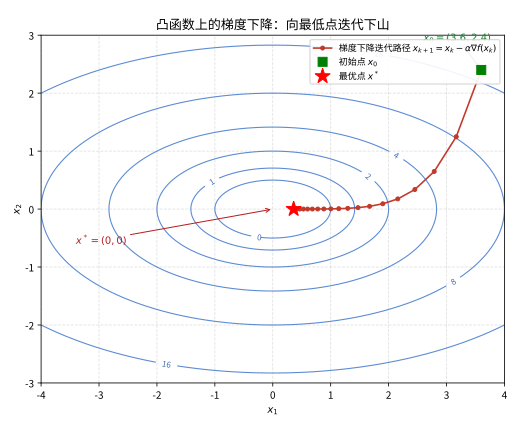

# 第 109 级：优化理论 (Optimization Theory)

---

## 1. 学习目标

完成本教程后，你将能够：

1. 理解凸集、凸函数和凸优化问题的基本概念
2. 掌握线性规划的单纯形法和对偶性理论
3. 理解二次规划及其求解方法
4. 掌握 KKT 条件的推导、证明与应用
5. 理解 Lagrange 对偶理论、Slater 条件和强对偶性
6. 掌握无约束优化的梯度下降法、Newton 法和拟 Newton 法
7. 理解约束优化的罚函数法和增广 Lagrange 法
8. 了解半定规划、锥规划、内点法及运筹学中的优化应用

---

## 2. 核心概念

### 2.1 凸集

**凸集**（Convex Set）：集合 $C \subseteq \mathbb{R}^n$ 称为凸的，若对任意 $x, y \in C$ 和 $\lambda \in [0, 1]$，有：

$$
\lambda x + (1 - \lambda) y \in C
$$

凸集的基本性质包括：
- 凸集的交集仍为凸集
- 凸集的 Cartesian 积仍为凸集
- 凸集在线性变换下的像和原像仍为凸集

**凸锥**（Convex Cone）：$K \subseteq \mathbb{R}^n$ 称为凸锥，若对任意 $x, y \in K$ 和 $\lambda, \mu \ge 0$，有 $\lambda x + \mu y \in K$。

### 2.2 凸函数

**凸函数**（Convex Function）：函数 $f: \mathbb{R}^n \to \mathbb{R}$ 称为凸的，若其定义域 $\text{dom}(f)$ 是凸集，且对任意 $x, y \in \text{dom}(f)$ 和 $\lambda \in [0, 1]$，有：

$$
f(\lambda x + (1 - \lambda) y) \le \lambda f(x) + (1 - \lambda) f(y)
$$

**严格凸函数**：若不等式对 $x \neq y$ 和 $\lambda \in (0, 1)$ 严格成立，则 $f$ 称为严格凸函数。

**一阶条件**：可微函数 $f$ 是凸的当且仅当 $\text{dom}(f)$ 是凸集且：

$$
f(y) \ge f(x) + \nabla f(x)^\top (y - x), \quad \forall x, y \in \text{dom}(f)
$$

**二阶条件**：二次可微函数 $f$ 是凸的当且仅当 $\text{dom}(f)$ 是凸集且 Hessian 矩阵半正定：

$$
\nabla^2 f(x) \succeq 0, \quad \forall x \in \text{dom}(f)
$$

### 2.3 凸优化问题

**凸优化问题**（Convex Optimization Problem）的标准形式为：

$$
\begin{aligned}
\min_{x} \quad & f_0(x) \\
\text{s.t.} \quad & f_i(x) \le 0, \quad i = 1, \dots, m \\
& h_i(x) = 0, \quad i = 1, \dots, p
\end{aligned}
$$

其中 $f_0, f_1, \dots, f_m$ 是凸函数，$h_1, \dots, h_p$ 是仿射函数（等式约束必须是仿射的）。

凸优化问题的重要性质：**局部最优解必为全局最优解**。

> **直观理解（现实类比）**：凸优化像"在一只光滑的碗里找球"——碗底只有一个，无论球从哪侧滑下，最终都会滚到同一个最低点，途中绝不会被某个"假坑"（局部极小）困住。而非凸优化则像在连绵的山地里找谷底，处处可能是死胡同。正是这种"无局部陷阱"的保证，让凸优化能用局部信息（梯度）放心地逼近全局最优。

### 2.4 线性规划

**线性规划**（Linear Programming, LP）的目标函数和约束均为线性函数：

$$
\begin{aligned}
\min_{x} \quad & c^\top x \\
\text{s.t.} \quad & Ax \le b \\
& x \ge 0
\end{aligned}
$$

**单纯形法**（Simplex Method）由 George Dantzig 于 1947 年提出，通过在多面体顶点间移动来寻找最优解。虽然最坏情况下是指数复杂度，但在实际中通常非常高效。

**对偶性**（Duality）是线性规划的核心理论。每个线性规划问题都有一个对应的对偶问题，原问题与对偶问题的最优值在强对偶条件下相等。

### 2.5 二次规划

**二次规划**（Quadratic Programming, QP）的目标函数是二次函数，约束为线性函数：

$$
\begin{aligned}
\min_{x} \quad & \frac{1}{2} x^\top Q x + c^\top x \\
\text{s.t.} \quad & Ax \le b
\end{aligned}
$$

若 $Q \succeq 0$（半正定），则问题为凸二次规划。

### 2.6 KKT 条件

**KKT 条件**（Karush-Kuhn-Tucker Conditions）是约束优化问题最优解的必要条件（在正则性条件下也是充分条件）。对于问题：

$$
\begin{aligned}
\min_{x} \quad & f(x) \\
\text{s.t.} \quad & g_i(x) \le 0, \quad i = 1, \dots, m \\
& h_j(x) = 0, \quad j = 1, \dots, p
\end{aligned}
$$

KKT 条件为：

1. **稳定性**（Stationarity）：$\nabla f(x^*) + \sum_{i=1}^m \lambda_i^* \nabla g_i(x^*) + \sum_{j=1}^p \mu_j^* \nabla h_j(x^*) = 0$
2. **原始可行性**（Primal Feasibility）：$g_i(x^*) \le 0$，$h_j(x^*) = 0$
3. **对偶可行性**（Dual Feasibility）：$\lambda_i^* \ge 0$
4. **互补松弛性**（Complementary Slackness）：$\lambda_i^* g_i(x^*) = 0$

> **直观理解（现实类比）**：KKT 条件是"最优性的体检报告"——四项指标全部正常才算真正最优。稳定性要求"目标推力与约束反力刚好抵消"（梯度平衡）；可行性要求"没越界"；对偶可行性要求"约束力只推不拉"（$\lambda\ge0$）；互补松弛性则说"约束若没顶到边（松弛），它就不起作用（$\lambda=0$）；一旦起作用（$\lambda>0$），约束必然顶满"。四条同时满足，才发"最优解"合格证。

### 2.7 Lagrange 对偶

**Lagrange 对偶**（Lagrange Duality）将约束优化问题转化为无约束的对偶问题。

**Lagrange 函数**：$L(x, \lambda, \mu) = f(x) + \sum_{i=1}^m \lambda_i g_i(x) + \sum_{j=1}^p \mu_j h_j(x)$

**Lagrange 对偶函数**：$g(\lambda, \mu) = \inf_x L(x, \lambda, \mu)$

**对偶问题**：$\max_{\lambda \ge 0, \mu} g(\lambda, \mu)$

> **直观理解（现实类比）**：想象你只能在一段圆形跑道上开车，却想尽量靠近远处的两座灯塔（目标函数最小化）。在满足"不离开跑道"这条约束下，最好的位置就是圆与你的目标等距线刚好相切的那一点——此时沿跑道移动一步，远离灯塔的效果恰好被靠近另一个灯塔抵消。拉格朗日乘子 $\lambda$ 就是描述"约束拉力"与"目标推力"之间平衡的那个比例系数。

> **直观理解（现实类比）**：换个经济视角，拉格朗日乘子法像"贴边走"找最优——最优解往往落在约束边界上，而非内部。乘子 $\lambda_i$ 正是第 $i$ 个约束的"影子价格"：它告诉你若把该约束稍微放松一丁点，目标值能改善多少。$\lambda$ 越大说明这个约束"卡得越疼"，是制约优化的瓶颈资源；$\lambda=0$ 则说明该约束根本没起作用，松一点紧一点都无所谓。

### 2.8 Slater 条件

**Slater 条件**是凸优化问题强对偶成立的充分条件：存在 $x \in \text{relint}(\mathcal{D})$ 使得 $g_i(x) < 0$ 对所有非仿射不等式约束成立。

### 2.9 强对偶性

**强对偶性**（Strong Duality）指原问题的最优值 $p^*$ 与对偶问题的最优值 $d^*$ 相等：$p^* = d^*$。对于凸优化问题，Slater 条件保证强对偶成立。

### 2.10 无约束优化

**无约束优化**（Unconstrained Optimization）问题：$\min_x f(x)$。

**梯度下降法**（Gradient Descent）：$x_{k+1} = x_k - \alpha_k \nabla f(x_k)$

> **直观理解（现实类比）**：想象在山谷中起浓雾，你看不清整体地形，只能靠脚下最陡的坡度判断"哪边在往下"。梯度下降就相当于每一步都沿最陡下坡方向走一小步，反复走就能到达谷底（最小点）。图中的椭圆等高线就像山体的一层层等高线，迭代点（红色圆点）逐圈逼近最低点 $x^*$。

> **直观理解（现实类比）**：换个说法，梯度下降就是"蒙眼下山"——蒙住双眼只靠脚底感受当前最陡的方向迈一小步，步长太大可能跨过谷底到对岸，步长太小又走得太慢；当脚下几乎感觉不到坡度（$\nabla f\approx 0$）时，便判定到了谷底停步。步长 $\alpha$ 的选择就是在"走快"与"走稳"间找平衡，这也是它收敛快慢的关键。

**Newton 法**：$x_{k+1} = x_k - [\nabla^2 f(x_k)]^{-1} \nabla f(x_k)$

**拟 Newton 法**（Quasi-Newton）：使用近似 Hessian 矩阵，如 BFGS、DFP、L-BFGS。

### 2.11 约束优化方法

**罚函数法**（Penalty Method）：将约束罚入目标函数：

$$
\min_x f(x) + \rho \sum_{i=1}^m \max(0, g_i(x)) + \frac{\rho}{2} \sum_{j=1}^p h_j(x)^2
$$

**增广 Lagrange 法**（Augmented Lagrangian Method）：结合罚函数和 Lagrange 乘子：

$$
L_\rho(x, \lambda, \mu) = f(x) + \sum_{i=1}^m \lambda_i g_i(x) + \sum_{j=1}^p \mu_j h_j(x) + \frac{\rho}{2} \left( \sum_{i=1}^m g_i(x)^2 + \sum_{j=1}^p h_j(x)^2 \right)
$$

### 2.12 半定规划与锥规划

**半定规划**（Semidefinite Programming, SDP）：在对称矩阵半正定锥上的优化：

$$
\begin{aligned}
\min_{X} \quad & \text{Tr}(C X) \\
\text{s.t.} \quad & \text{Tr}(A_i X) = b_i, \quad i = 1, \dots, m \\
& X \succeq 0
\end{aligned}
$$

**锥规划**（Conic Programming）：$K$ 为凸锥时的优化问题：

$$
\begin{aligned}
\min_{x} \quad & c^\top x \\
\text{s.t.} \quad & Ax = b \\
& x \in K
\end{aligned}
$$

### 2.13 内点法

**内点法**（Interior Point Method）通过在可行域内部生成迭代点序列来求解优化问题。它结合了 Newton 法和障碍函数（Barrier Function）的思想，具有多项式时间复杂度。

### 2.14 运筹学中的优化应用

运筹学中的典型优化问题包括：
- **生产计划**：资源分配与生产调度优化
- **运输问题**：最小化运输成本
- **网络流问题**：最大流、最小费用流
- **设施选址**：最优仓库/工厂位置选择
- **投资组合优化**：Markowitz 均值-方差模型

---

## 3. 定理与证明

### 3.1 **定理 1**（KKT 条件的充分性与必要性）

**定理**：考虑优化问题：

$$
\begin{aligned}
\min_{x} \quad & f(x) \\
\text{s.t.} \quad & g_i(x) \le 0, \quad i = 1, \dots, m \\
& h_j(x) = 0, \quad j = 1, \dots, p
\end{aligned}
$$

其中 $f, g_i$ 是凸函数，$h_j$ 是仿射函数。

**必要性**：若 $x^*$ 是局部最优解且在 $x^*$ 处满足某种约束规范（如 Slater 条件或 LICQ），则存在 $\lambda^* \ge 0$ 和 $\mu^*$ 使得 KKT 条件成立。

**充分性**：若存在 $x^*$ 和 $(\lambda^*, \mu^*)$ 满足 KKT 条件，且 $f, g_i$ 是凸函数，$h_j$ 是仿射函数，则 $x^*$ 是全局最优解。

**证明**（必要性）：

**步骤 1：Farkas 引理**

首先回顾 Farkas 引理：设 $A \in \mathbb{R}^{m \times n}$，$b \in \mathbb{R}^m$。则以下两个系统恰有一个有解：

(1) $Ax = b$，$x \ge 0$
(2) $A^\top y \le 0$，$b^\top y > 0$

**步骤 2：构造可行方向锥**

设 $x^*$ 是局部最优解。定义活跃约束指标集 $A(x^*) = \{i : g_i(x^*) = 0\}$。

考虑可行方向锥 $F(x^*)$：

$$
F(x^*) = \{d : \nabla g_i(x^*)^\top d \le 0, \forall i \in A(x^*), \nabla h_j(x^*)^\top d = 0, \forall j\}
$$

**步骤 3：最优性条件**

若 $x^*$ 是局部最优解，则对任意 $d \in F(x^*)$，有 $\nabla f(x^*)^\top d \ge 0$（否则沿 $d$ 方向移动可改进目标函数值）。

因此系统：

$$
\begin{cases}
\nabla f(x^*)^\top d < 0 \\
\nabla g_i(x^*)^\top d \le 0, \quad i \in A(x^*) \\
\nabla h_j(x^*)^\top d = 0, \quad j = 1, \dots, p
\end{cases}
$$

无解。

**步骤 4：应用 Farkas 引理**

将等式约束 $\nabla h_j(x^*)^\top d = 0$ 写为两个不等式：

$$
\nabla h_j(x^*)^\top d \le 0, \quad -\nabla h_j(x^*)^\top d \le 0
$$

由 Farkas 引理的推广形式（或 Motzkin 的择一性定理），存在 $\lambda_i \ge 0$（$i \in A(x^*)$）和 $\mu_j \in \mathbb{R}$ 使得：

$$
-\nabla f(x^*) = \sum_{i \in A(x^*)} \lambda_i \nabla g_i(x^*) + \sum_{j=1}^p \mu_j \nabla h_j(x^*)
$$

对 $i \notin A(x^*)$，令 $\lambda_i = 0$，则：

$$
\nabla f(x^*) + \sum_{i=1}^m \lambda_i \nabla g_i(x^*) + \sum_{j=1}^p \mu_j \nabla h_j(x^*) = 0
$$

且 $\lambda_i \ge 0$，$\lambda_i g_i(x^*) = 0$（因为 $g_i(x^*) < 0$ 时 $\lambda_i = 0$）。必要性得证。

**证明**（充分性）：

**步骤 1：假设**

设 $(x^*, \lambda^*, \mu^*)$ 满足 KKT 条件，且 $f, g_i$ 是凸函数，$h_j$ 是仿射函数。

**步骤 2：利用凸性**

由 $f$ 的凸性，对任意可行点 $x$：

$$
f(x) \ge f(x^*) + \nabla f(x^*)^\top (x - x^*)
$$

由 KKT 稳定性条件：

$$
\nabla f(x^*) = -\sum_{i=1}^m \lambda_i^* \nabla g_i(x^*) - \sum_{j=1}^p \mu_j^* \nabla h_j(x^*)
$$

代入得：

$$
f(x) \ge f(x^*) - \sum_{i=1}^m \lambda_i^* \nabla g_i(x^*)^\top (x - x^*) - \sum_{j=1}^p \mu_j^* \nabla h_j(x^*)^\top (x - x^*)
$$

**步骤 3：利用约束的凸性**

由 $g_i$ 的凸性：

$$
g_i(x) \ge g_i(x^*) + \nabla g_i(x^*)^\top (x - x^*)
$$

由于 $\lambda_i^* \ge 0$：

$$
-\lambda_i^* \nabla g_i(x^*)^\top (x - x^*) \ge \lambda_i^* (g_i(x^*) - g_i(x))
$$

由互补松弛性 $\lambda_i^* g_i(x^*) = 0$，且 $g_i(x) \le 0$（$x$ 可行），故 $\lambda_i^* (g_i(x^*) - g_i(x)) = -\lambda_i^* g_i(x) \ge 0$。

对于仿射约束 $h_j$，$h_j(x) = h_j(x^*) = 0$，故 $\nabla h_j(x^*)^\top (x - x^*) = 0$。

**步骤 4：结论**

综上：

$$
f(x) \ge f(x^*) + 0 + 0 = f(x^*)
$$

因此 $x^*$ 是全局最优解。$\blacksquare$

---

### 3.2 **定理 2**（强对偶定理——Slater 条件）

**定理**：考虑凸优化问题：

$$
\begin{aligned}
\min_{x} \quad & f_0(x) \\
\text{s.t.} \quad & f_i(x) \le 0, \quad i = 1, \dots, m \\
& Ax = b
\end{aligned}
$$

其中 $f_0, f_1, \dots, f_m$ 是凸函数。若存在 $x \in \text{relint}(\mathcal{D})$ 使得 $f_i(x) < 0$ 对所有非仿射 $i$ 成立且 $Ax = b$（Slater 条件），则强对偶成立，即 $p^* = d^*$。

**证明**：

**步骤 1：定义最优值和对偶函数**

原问题最优值 $p^* = \inf_{x \in \mathcal{F}} f_0(x)$，其中 $\mathcal{F} = \{x : f_i(x) \le 0, Ax = b\}$ 是可行集。

对偶函数 $g(\lambda, \nu) = \inf_x L(x, \lambda, \nu)$，其中 $L(x, \lambda, \nu) = f_0(x) + \sum_{i=1}^m \lambda_i f_i(x) + \nu^\top (Ax - b)$。

弱对偶性 $d^* \le p^*$ 总是成立。需要证明 $d^* = p^*$。

**步骤 2：构造集合**

定义集合 $\mathcal{A} \subseteq \mathbb{R}^{m+1}$：

$$
\mathcal{A} = \{(u, t) : \exists x \in \mathcal{D}, f_i(x) \le u_i, i=1,\dots,m, f_0(x) \le t\}
$$

其中 $\mathcal{D} = \bigcap_{i=0}^m \text{dom}(f_i)$。

由于 $f_i$ 是凸函数，$\mathcal{A}$ 是凸集。

**步骤 3：关键观察**

点 $(0, p^*)$ 在 $\mathcal{A}$ 的边界上。若 $(0, p^* - \epsilon) \in \mathcal{A}$ 对任意 $\epsilon > 0$ 成立，则存在 $x$ 使得 $f_0(x) < p^*$ 且 $f_i(x) \le 0$，与 $p^*$ 的定义矛盾。

因此 $(0, p^*) \in \partial \mathcal{A}$ 但 $(0, p^* - \epsilon) \notin \mathcal{A}$ 对任意 $\epsilon > 0$。

**步骤 4：支撑超平面**

由凸集分离定理，存在非零向量 $(\tilde{\lambda}, \tilde{\mu}) \in \mathbb{R}^{m+1}$ 使得：

$$
\tilde{\lambda}^\top u + \tilde{\mu} t \ge \tilde{\mu} p^*, \quad \forall (u, t) \in \mathcal{A}
$$

由于 $t$ 可以任意大，必须有 $\tilde{\mu} \ge 0$。类似地，$u_i$ 可以任意大，因此 $\tilde{\lambda}_i \ge 0$。

**步骤 5：Slater 条件的应用**

由 Slater 条件，存在 $x_0$ 使得 $f_i(x_0) < 0$ 且 $Ax_0 = b$。因此 $(f(x_0), f_0(x_0)) \in \mathcal{A}$ 且 $u_i = f_i(x_0) < 0$。

代入支撑超平面不等式：

$$
\sum_{i=1}^m \tilde{\lambda}_i f_i(x_0) + \tilde{\mu} f_0(x_0) \ge \tilde{\mu} p^*
$$

由于 $f_i(x_0) < 0$ 且 $\tilde{\lambda}_i \ge 0$，若 $\tilde{\mu} = 0$，则 $\sum_i \tilde{\lambda}_i f_i(x_0) \ge 0$，但左端 $\le 0$，因此 $\sum_i \tilde{\lambda}_i f_i(x_0) = 0$。由于 $f_i(x_0) < 0$，必有 $\tilde{\lambda}_i = 0$ 对所有 $i$，从而 $(\tilde{\lambda}, \tilde{\mu}) = 0$，矛盾。

因此 $\tilde{\mu} > 0$。令 $\lambda_i = \tilde{\lambda}_i / \tilde{\mu}$，则：

$$
\sum_{i=1}^m \lambda_i u_i + t \ge p^*, \quad \forall (u, t) \in \mathcal{A}
$$

**步骤 6：对偶性证明**

对任意 $x$，$(f(x), f_0(x)) \in \mathcal{A}$，因此：

$$
\sum_{i=1}^m \lambda_i f_i(x) + f_0(x) \ge p^*
$$

即 $L(x, \lambda, \nu) \ge p^*$（对任意 $\nu$）。

取 $\nu = 0$，则 $g(\lambda, 0) = \inf_x L(x, \lambda, 0) \ge p^*$。

因此 $d^* = \sup_{\lambda \ge 0, \nu} g(\lambda, \nu) \ge g(\lambda, 0) \ge p^*$。

由弱对偶性 $d^* \le p^*$，得 $d^* = p^*$。$\blacksquare$

---

### 3.3 **定理 3**（线性规划的对偶定理）

**定理**：考虑线性规划原问题（P）及其对偶问题（D）：

(P) $\min_{x} c^\top x$，s.t. $Ax = b$，$x \ge 0$
(D) $\max_{y} b^\top y$，s.t. $A^\top y \le c$

则以下结论成立：

1. **弱对偶性**：对任意可行解 $x$（P）和 $y$（D），有 $c^\top x \ge b^\top y$。
2. **强对偶性**：若（P）或（D）有最优解，则另一个也有最优解，且最优值相等：$c^\top x^* = b^\top y^*$。
3. **互补松弛性**：$x^*$ 和 $y^*$ 分别为最优解当且仅当 $x_j^* (c_j - a_j^\top y^*) = 0$ 对所有 $j$ 成立。

**证明**：

**步骤 1：弱对偶性**

设 $x$ 是（P）的可行解，$y$ 是（D）的可行解，则 $Ax = b$，$x \ge 0$，$A^\top y \le c$。

$$
b^\top y = (Ax)^\top y = x^\top A^\top y \le x^\top c = c^\top x
$$

其中不等式由 $x \ge 0$ 和 $A^\top y \le c$ 得出。因此 $c^\top x \ge b^\top y$。

**步骤 2：强对偶性——Farkas 引理方法**

假设（P）有最优解 $x^*$，最优值 $p^* = c^\top x^*$。

考虑集合 $S = \{x : Ax = b, x \ge 0\}$。由线性规划理论，最优解在极点处达到，且 $x^*$ 是极点。

定义基变量指标集 $B = \{j : x_j^* > 0\}$，非基变量指标集 $N = \{j : x_j^* = 0\}$。

由最优性条件，存在 $y^*$ 使得：

$$
c_j - a_j^\top y^* = 0, \quad \forall j \in B
$$
$$
c_j - a_j^\top y^* \ge 0, \quad \forall j \in N
$$

即 $A^\top y^* \le c$，且 $b^\top y^* = (Ax^*)^\top y^* = x^{*\top} A^\top y^* = x^{*\top} c = c^\top x^* = p^*$。

因此 $y^*$ 是（D）的可行解，且 $b^\top y^* = p^*$。由弱对偶性，$y^*$ 是（D）的最优解。

**步骤 3：互补松弛性**

由弱对偶性：

$$
c^\top x^* - b^\top y^* = c^\top x^* - x^{*\top} A^\top y^* = x^{*\top} (c - A^\top y^*) = 0
$$

由于 $x^* \ge 0$ 且 $c - A^\top y^* \ge 0$，上式成立当且仅当 $x_j^* (c_j - a_j^\top y^*) = 0$ 对所有 $j$ 成立。$\blacksquare$

---

### 3.4 **定理 4**（梯度下降的收敛性——强凸情形）

**定理**：设 $f: \mathbb{R}^n \to \mathbb{R}$ 是二阶连续可微的强凸函数，即存在常数 $m, M > 0$ 使得：

$$
m I \preceq \nabla^2 f(x) \preceq M I, \quad \forall x \in \mathbb{R}^n
$$

则梯度下降法 $x_{k+1} = x_k - \alpha \nabla f(x_k)$ 在步长 $\alpha \in (0, 2/M)$ 下线性收敛到全局最优解 $x^*$。特别地，取 $\alpha = 2/(m + M)$ 时，有：

$$
\|x_{k+1} - x^*\|_2 \le \frac{M - m}{M + m} \|x_k - x^*\|_2
$$

**证明**：

**步骤 1：强凸性的性质**

由 $\nabla^2 f(x) \succeq m I$ 和 $\nabla^2 f(x) \preceq M I$，对任意 $x, y \in \mathbb{R}^n$：

$$
f(y) \ge f(x) + \nabla f(x)^\top (y - x) + \frac{m}{2} \|y - x\|^2
$$

$$
f(y) \le f(x) + \nabla f(x)^\top (y - x) + \frac{M}{2} \|y - x\|^2
$$

同时，梯度满足：

$$
(\nabla f(x) - \nabla f(y))^\top (x - y) \ge m \|x - y\|^2
$$

$$
\|\nabla f(x) - \nabla f(y)\| \le M \|x - y\|
$$

**步骤 2：梯度下降的迭代关系**

梯度下降迭代：$x_{k+1} = x_k - \alpha \nabla f(x_k)$。

$$
\|x_{k+1} - x^*\|^2 = \|x_k - \alpha \nabla f(x_k) - x^*\|^2
$$

$$
= \|x_k - x^*\|^2 - 2\alpha \nabla f(x_k)^\top (x_k - x^*) + \alpha^2 \|\nabla f(x_k)\|^2
$$

**步骤 3：估计内积项**

由强凸性，$\nabla f(x^*) = 0$（最优解处梯度为 0），且：

$$
\nabla f(x_k)^\top (x_k - x^*) \ge m \|x_k - x^*\|^2
$$

同时，由 Lipschitz 梯度：

$$
\|\nabla f(x_k)\|^2 = \|\nabla f(x_k) - \nabla f(x^*)\|^2 \le M^2 \|x_k - x^*\|^2
$$

**步骤 4：代入估计**

$$
\|x_{k+1} - x^*\|^2 \le \|x_k - x^*\|^2 - 2\alpha m \|x_k - x^*\|^2 + \alpha^2 M^2 \|x_k - x^*\|^2
$$

$$
= (1 - 2\alpha m + \alpha^2 M^2) \|x_k - x^*\|^2
$$

**步骤 5：最优步长**

步长 $\alpha$ 应最小化 $q(\alpha) = 1 - 2\alpha m + \alpha^2 M^2$。

$q'(\alpha) = -2m + 2\alpha M^2 = 0$，得 $\alpha^* = m/M^2$。

但更常用的步长选择是 $\alpha = 2/(m + M)$，此时：

$$
1 - 2\alpha m + \alpha^2 M^2 = 1 - \frac{4m}{m+M} + \frac{4M^2}{(m+M)^2}
$$

$$
= \frac{(m+M)^2 - 4m(m+M) + 4M^2}{(m+M)^2} = \frac{m^2 + 2mM + M^2 - 4m^2 - 4mM + 4M^2}{(m+M)^2}
$$

$$
= \frac{-3m^2 - 2mM + 5M^2}{(m+M)^2}
$$

这个表达式似乎不太对。让我们重新计算。

实际上，对于 $\alpha = 2/(m+M)$：

$$
q(\alpha) = 1 - \frac{4m}{m+M} + \frac{4M^2}{(m+M)^2}
$$

为了得到收敛因子，我们使用更精确的估计。

**步骤 6：更精确的收敛分析**

由强凸性和 Lipschitz 梯度，梯度下降的收敛因子为：

$$
\|x_{k+1} - x^*\| \le \max\{|1 - \alpha m|, |1 - \alpha M|\} \cdot \|x_k - x^*\|
$$

当 $\alpha = 2/(m+M)$ 时，$1 - \alpha m = 1 - 2m/(m+M) = (M-m)/(m+M)$，$1 - \alpha M = 1 - 2M/(m+M) = (m-M)/(m+M) = -(M-m)/(m+M)$。

因此收敛因子为 $(M-m)/(M+m)$：

$$
\|x_{k+1} - x^*\| \le \frac{M - m}{M + m} \|x_k - x^*\|
$$

$\blacksquare$

**注**：$\kappa = M/m$ 称为条件数（condition number）。收敛因子为 $(\kappa - 1)/(\kappa + 1)$，条件数越大，收敛越慢。

---

### 3.5 **定理 5**（Newton 法的局部二次收敛性）

**定理**：设 $f: \mathbb{R}^n \to \mathbb{R}$ 是二阶连续可微函数，$\nabla^2 f(x)$ 在最优解 $x^*$ 的邻域内 Lipschitz 连续且 $\nabla^2 f(x^*) \succ 0$。则 Newton 法：

$$
x_{k+1} = x_k - [\nabla^2 f(x_k)]^{-1} \nabla f(x_k)
$$

在 $x^*$ 附近局部二次收敛，即存在常数 $C > 0$ 和 $\delta > 0$，使得当 $\|x_0 - x^*\| < \delta$ 时：

$$
\|x_{k+1} - x^*\| \le C \|x_k - x^*\|^2
$$

**证明**：

**步骤 1：Taylor 展开**

将 $\nabla f(x^*)$ 在 $x_k$ 处 Taylor 展开：

$$
0 = \nabla f(x^*) = \nabla f(x_k) + \nabla^2 f(x_k)(x^* - x_k) + \frac{1}{2} (x^* - x_k)^\top \nabla^3 f(\xi_k) (x^* - x_k)
$$

其中 $\xi_k$ 在 $x_k$ 和 $x^*$ 之间。更精确地，对向量值函数，有：

$$
\nabla f(x^*) = \nabla f(x_k) + \int_0^1 \nabla^2 f(x_k + t(x^* - x_k)) (x^* - x_k) \,dt
$$

**步骤 2：Newton 迭代的误差**

由 Newton 迭代公式：

$$
x_{k+1} = x_k - [\nabla^2 f(x_k)]^{-1} \nabla f(x_k)
$$

两边减去 $x^*$：

$$
x_{k+1} - x^* = x_k - x^* - [\nabla^2 f(x_k)]^{-1} \nabla f(x_k)
$$

代入 $\nabla f(x_k)$ 的表达式：

$$
x_{k+1} - x^* = [\nabla^2 f(x_k)]^{-1} [\nabla^2 f(x_k)(x_k - x^*) - \nabla f(x_k)]
$$

由 Taylor 展开：

$$
\nabla f(x_k) = \nabla f(x_k) - \nabla f(x^*) = \int_0^1 \nabla^2 f(x^* + t(x_k - x^*)) (x_k - x^*) \,dt
$$

因此：

$$
\nabla^2 f(x_k)(x_k - x^*) - \nabla f(x_k) = \int_0^1 [\nabla^2 f(x_k) - \nabla^2 f(x^* + t(x_k - x^*))] (x_k - x^*) \,dt
$$

**步骤 3：利用 Lipschitz 连续性**

设 $\nabla^2 f$ 在 $x^*$ 的邻域内 $L$-Lipschitz 连续，即：

$$
\|\nabla^2 f(u) - \nabla^2 f(v)\| \le L \|u - v\|
$$

则对 $t \in [0, 1]$：

$$
\|\nabla^2 f(x_k) - \nabla^2 f(x^* + t(x_k - x^*))\| \le L \|x_k - x^* - t(x_k - x^*)\| = L(1 - t) \|x_k - x^*\|
$$

**步骤 4：估计误差**

$$
\|\nabla^2 f(x_k)(x_k - x^*) - \nabla f(x_k)\| \le \int_0^1 L(1 - t) \|x_k - x^*\|^2 \,dt = \frac{L}{2} \|x_k - x^*\|^2
$$

**步骤 5：Hessian 的可逆性**

由于 $\nabla^2 f(x^*) \succ 0$，存在 $\mu > 0$ 使得 $\nabla^2 f(x^*) \succeq \mu I$。由连续性，存在 $\delta_1 > 0$ 使得当 $\|x_k - x^*\| < \delta_1$ 时，$\nabla^2 f(x_k) \succeq (\mu/2) I$，且 $\|[\nabla^2 f(x_k)]^{-1}\| \le 2/\mu$。

**步骤 6：二次收敛性**

当 $\|x_k - x^*\| < \min\{\delta_1, 1\}$ 时：

$$
\|x_{k+1} - x^*\| \le \|[\nabla^2 f(x_k)]^{-1}\| \cdot \|\nabla^2 f(x_k)(x_k - x^*) - \nabla f(x_k)\|
$$

$$
\le \frac{2}{\mu} \cdot \frac{L}{2} \|x_k - x^*\|^2 = \frac{L}{\mu} \|x_k - x^*\|^2
$$

令 $C = L/\mu$，则 $\|x_{k+1} - x^*\| \le C \|x_k - x^*\|^2$，即二次收敛。$\blacksquare$

**注**：Newton 法的二次收敛是局部性质，需要初始点足够接近最优解。为克服这一局限，实际中常使用**阻尼 Newton 法**（Damped Newton Method）或**信赖域方法**（Trust Region Method）。

---

## 4. 示例

### 示例 1：用线性规划求解生产计划问题

**问题**：某工厂生产三种产品 A、B、C，每种产品需要消耗三种资源：原材料、机器工时和人工工时。已知数据如下：

| 产品 | 原材料 (kg/件) | 机器工时 (h/件) | 人工工时 (h/件) | 利润 (元/件) |
|:---:|:---:|:---:|:---:|:---:|
| A | 2 | 1 | 1 | 30 |
| B | 1 | 2 | 1 | 20 |
| C | 3 | 1 | 2 | 40 |

每天可用资源：原材料 100 kg，机器工时 80 h，人工工时 60 h。求最大利润的生产计划。

**解**：

**步骤 1：建立线性规划模型**

设 $x_1, x_2, x_3$ 分别为产品 A、B、C 的日产量。

$$
\begin{aligned}
\max \quad & 30x_1 + 20x_2 + 40x_3 \\
\text{s.t.} \quad & 2x_1 + x_2 + 3x_3 \le 100 \quad (\text{原材料}) \\
& x_1 + 2x_2 + x_3 \le 80 \quad (\text{机器工时}) \\
& x_1 + x_2 + 2x_3 \le 60 \quad (\text{人工工时}) \\
& x_1, x_2, x_3 \ge 0
\end{aligned}
$$

化为标准形式（引入松弛变量）：

$$
\begin{aligned}
\max \quad & 30x_1 + 20x_2 + 40x_3 \\
\text{s.t.} \quad & 2x_1 + x_2 + 3x_3 + s_1 = 100 \\
& x_1 + 2x_2 + x_3 + s_2 = 80 \\
& x_1 + x_2 + 2x_3 + s_3 = 60 \\
& x_1, x_2, x_3, s_1, s_2, s_3 \ge 0
\end{aligned}
$$

**步骤 2：单纯形法求解**

初始基变量 $s_1, s_2, s_3$，初始单纯形表：

| 基 | $x_1$ | $x_2$ | $x_3$ | $s_1$ | $s_2$ | $s_3$ | RHS |
|:---:|:---:|:---:|:---:|:---:|:---:|:---:|:---:|
| $s_1$ | 2 | 1 | 3 | 1 | 0 | 0 | 100 |
| $s_2$ | 1 | 2 | 1 | 0 | 1 | 0 | 80 |
| $s_3$ | 1 | 1 | 2 | 0 | 0 | 1 | 60 |
| $-z$ | -30 | -20 | -40 | 0 | 0 | 0 | 0 |

**迭代 1**：进基变量 $x_3$（检验数 -40 最小），出基变量由最小比值确定：

$s_1$: $100/3 \approx 33.3$，$s_2$: $80/1 = 80$，$s_3$: $60/2 = 30$，因此 $s_3$ 出基。

主元为第 3 行第 3 列（值为 2）。进行行变换：

| 基 | $x_1$ | $x_2$ | $x_3$ | $s_1$ | $s_2$ | $s_3$ | RHS |
|:---:|:---:|:---:|:---:|:---:|:---:|:---:|:---:|
| $s_1$ | 1/2 | -1/2 | 0 | 1 | 0 | -3/2 | 10 |
| $s_2$ | 1/2 | 3/2 | 0 | 0 | 1 | -1/2 | 50 |
| $x_3$ | 1/2 | 1/2 | 1 | 0 | 0 | 1/2 | 30 |
| $-z$ | -10 | 0 | 0 | 0 | 0 | 20 | 1200 |

**迭代 2**：进基变量 $x_1$（检验数 -10 最小），出基变量：

$s_1$: $10/(1/2) = 20$，$s_2$: $50/(1/2) = 100$，$x_3$: $30/(1/2) = 60$，$s_1$ 出基。

| 基 | $x_1$ | $x_2$ | $x_3$ | $s_1$ | $s_2$ | $s_3$ | RHS |
|:---:|:---:|:---:|:---:|:---:|:---:|:---:|:---:|
| $x_1$ | 1 | -1 | 0 | 2 | 0 | -3 | 20 |
| $s_2$ | 0 | 2 | 0 | -1 | 1 | 1 | 40 |
| $x_3$ | 0 | 1 | 1 | -1 | 0 | 2 | 20 |
| $-z$ | 0 | -10 | 0 | 20 | 0 | -10 | 1400 |

**迭代 3**：进基变量 $x_2$（检验数 -10 最小），出基变量 $s_2$（$40/2 = 20$ 最小）。

| 基 | $x_1$ | $x_2$ | $x_3$ | $s_1$ | $s_2$ | $s_3$ | RHS |
|:---:|:---:|:---:|:---:|:---:|:---:|:---:|:---:|
| $x_1$ | 1 | 0 | 0 | 3/2 | 1/2 | -5/2 | 40 |
| $x_2$ | 0 | 1 | 0 | -1/2 | 1/2 | 1/2 | 20 |
| $x_3$ | 0 | 0 | 1 | -1/2 | -1/2 | 3/2 | 0 |
| $-z$ | 0 | 0 | 0 | 15 | 5 | -5 | 1600 |

**迭代 4**：进基变量 $s_3$（检验数 -5），出基变量 $x_3$（$0/(3/2) = 0$）。

| 基 | $x_1$ | $x_2$ | $x_3$ | $s_1$ | $s_2$ | $s_3$ | RHS |
|:---:|:---:|:---:|:---:|:---:|:---:|:---:|:---:|
| $x_1$ | 1 | 0 | 5/3 | 2/3 | -1/3 | 0 | 40 |
| $x_2$ | 0 | 1 | -1/3 | -1/3 | 2/3 | 0 | 20 |
| $s_3$ | 0 | 0 | 2/3 | -1/3 | -1/3 | 1 | 0 |
| $-z$ | 0 | 0 | 10/3 | 40/3 | 10/3 | 0 | 1600 |

所有检验数非负，达到最优解。

**步骤 3：最优解**

$x_1^* = 40$，$x_2^* = 20$，$x_3^* = 0$，最大利润 $z^* = 1600$ 元。

即每天生产 40 件 A、20 件 B，不生产 C，可获得最大利润 1600 元。

---

### 示例 2：用二次规划求解支持向量机

**问题**：考虑二分类问题，训练数据 $\{(x_i, y_i)\}_{i=1}^n$，其中 $x_i \in \mathbb{R}^d$，$y_i \in \{-1, 1\}$。线性支持向量机（SVM）的目标是寻找最大间隔分离超平面：

$$
\min_{w, b} \frac{1}{2} \|w\|^2 \quad \text{s.t.} \quad y_i(w^\top x_i + b) \ge 1, \quad i = 1, \dots, n
$$

这是一个凸二次规划问题。用 Lagrange 对偶方法求解。

**解**：

**步骤 1：Lagrange 函数**

$$
L(w, b, \alpha) = \frac{1}{2} \|w\|^2 - \sum_{i=1}^n \alpha_i [y_i(w^\top x_i + b) - 1]
$$

其中 $\alpha_i \ge 0$ 是 Lagrange 乘子。

**步骤 2：对 $w$ 和 $b$ 求极小**

对 $w$ 求导为零：$\frac{\partial L}{\partial w} = w - \sum_{i=1}^n \alpha_i y_i x_i = 0$，得 $w = \sum_{i=1}^n \alpha_i y_i x_i$。

对 $b$ 求导为零：$\frac{\partial L}{\partial b} = -\sum_{i=1}^n \alpha_i y_i = 0$，得 $\sum_{i=1}^n \alpha_i y_i = 0$。

**步骤 3：对偶问题**

代入 $w$ 和 $b$ 的条件：

$$
L(\alpha) = \frac{1}{2} \left\|\sum_{i=1}^n \alpha_i y_i x_i\right\|^2 - \sum_{i=1}^n \alpha_i \left[ y_i\left(\left(\sum_{j=1}^n \alpha_j y_j x_j\right)^\top x_i + b\right) - 1 \right]
$$

$$
= \frac{1}{2} \sum_{i,j=1}^n \alpha_i \alpha_j y_i y_j x_i^\top x_j - \sum_{i,j=1}^n \alpha_i \alpha_j y_i y_j x_i^\top x_j - b \sum_{i=1}^n \alpha_i y_i + \sum_{i=1}^n \alpha_i
$$

由 $\sum_i \alpha_i y_i = 0$，第三项为 0。化简得：

$$
L(\alpha) = \sum_{i=1}^n \alpha_i - \frac{1}{2} \sum_{i,j=1}^n \alpha_i \alpha_j y_i y_j x_i^\top x_j
$$

对偶问题为：

$$
\begin{aligned}
\max_{\alpha} \quad & \sum_{i=1}^n \alpha_i - \frac{1}{2} \sum_{i,j=1}^n \alpha_i \alpha_j y_i y_j x_i^\top x_j \\
\text{s.t.} \quad & \sum_{i=1}^n \alpha_i y_i = 0 \\
& \alpha_i \ge 0, \quad i = 1, \dots, n
\end{aligned}
$$

**步骤 4：求解对偶问题**

设 $\alpha^*$ 为对偶问题的最优解，则：

$$
w^* = \sum_{i=1}^n \alpha_i^* y_i x_i
$$

由互补松弛条件：$\alpha_i^* [y_i(w^{*\top} x_i + b^*) - 1] = 0$。

对任意 $\alpha_j^* > 0$（支持向量），有 $y_j(w^{*\top} x_j + b^*) = 1$，因此：

$$
b^* = y_j - w^{*\top} x_j
$$

通常取所有支持向量对应的 $b$ 的平均值。

**步骤 5：决策函数**

$$
f(x) = \text{sign}(w^{*\top} x + b^*) = \text{sign}\left(\sum_{i=1}^n \alpha_i^* y_i x_i^\top x + b^*\right)
$$

**步骤 6：数值示例**

设三个数据点：$x_1 = (-1, -1)$，$y_1 = -1$；$x_2 = (1, 1)$，$y_2 = 1$；$x_3 = (2, 2)$，$y_3 = 1$。

对偶问题为：

$$
\max_{\alpha} \alpha_1 + \alpha_2 + \alpha_3 - \frac{1}{2}[2\alpha_1^2 - 2\alpha_1\alpha_2 - 4\alpha_1\alpha_3 + 2\alpha_2^2 + 4\alpha_2\alpha_3 + 8\alpha_3^2]
$$

s.t. $-\alpha_1 + \alpha_2 + \alpha_3 = 0$，$\alpha_1, \alpha_2, \alpha_3 \ge 0$。

求解得 $\alpha_1^* = 1$，$\alpha_2^* = 1$，$\alpha_3^* = 0$。

$$
w^* = \alpha_1^* y_1 x_1 + \alpha_2^* y_2 x_2 = 1 \cdot (-1) \cdot (-1, -1) + 1 \cdot 1 \cdot (1, 1) = (1, 1) + (1, 1) = (2, 2)
$$

取 $\alpha_1^* > 0$ 对应的支持向量 $x_1$：$b^* = y_1 - w^{*\top} x_1 = -1 - (2, 2)^\top (-1, -1) = -1 + 4 = 3$。

决策函数：$f(x) = \text{sign}(2x_1 + 2x_2 + 3)$。

---

## 5. 习题

### 基础题

**习题 1**（凸函数定义）给出凸函数 $f$ 的定义式 $f(\lambda x + (1-\lambda)y) \le \lambda f(x) + (1-\lambda) f(y)$（对任意 $x,y\in\text{dom}(f)$、$\lambda\in[0,1]$），并写出判定凸性的一阶条件与二阶条件。

**习题 2**（凸集）给出凸集 $C$ 的定义（任意 $x,y\in C$、$\lambda\in[0,1]$ 有 $\lambda x + (1-\lambda)y \in C$），并列出凸集的三个基本性质（交集、Cartesian 积、线性变换下的像与原像仍为凸集）。

**习题 3**（凸优化问题）写出凸优化问题的标准形式（凸目标 $f_0$、凸不等式约束 $f_i$、仿射等式约束 $h_j$），并说明为何凸优化问题的局部最优解必为全局最优解。

**习题 4**（梯度下降法）写出梯度下降法的迭代公式 $x_{k+1} = x_k - \alpha_k \nabla f(x_k)$，并说明步长 $\alpha_k$ 的选择对收敛的影响（过大/过小的后果）。

**习题 5**（Newton 法）写出 Newton 法的迭代公式 $x_{k+1} = x_k - [\nabla^2 f(x_k)]^{-1} \nabla f(x_k)$，并说明它与梯度下降法相比的优缺点。

**习题 6**（KKT 条件）写出含不等式约束 $g_i(x)\le 0$、等式约束 $h_j(x)=0$ 的优化问题所对应的 KKT 四条条件：稳定性、原始可行性、对偶可行性、互补松弛性。

**习题 7**（Lagrange 对偶）写出原问题对应的 Lagrange 函数 $L(x,\lambda,\mu) = f(x) + \sum_{i=1}^m \lambda_i g_i(x) + \sum_{j=1}^p \mu_j h_j(x)$ 与 Lagrange 对偶函数 $g(\lambda,\mu) = \inf_x L(x,\lambda,\mu)$，并说明对偶问题为何是 $\max_{\lambda\ge 0,\ \mu} g(\lambda,\mu)$。

**习题 8**（线性规划）写出线性规划（LP）的标准形式 $\min_x c^\top x$，$\text{s.t.}\ Ax\le b,\ x\ge 0$，并说明单纯形法（Simplex Method）通过在什么之间移动来寻找最优解。

**习题 9**（二次规划）写出二次规划（QP）的一般形式 $\min_x \frac{1}{2}x^\top Qx + c^\top x$，$\text{s.t.}\ Ax\le b$，并说明当 $Q\succeq 0$（半正定）时问题的凸性含义。

**习题 10**（约束优化方法）写出罚函数法的目标 $\min_x f(x) + \rho\sum_{i=1}^m \max(0, g_i(x)) + \frac{\rho}{2}\sum_{j=1}^p h_j(x)^2$，并说明它与增广 Lagrange 法的主要区别。

### 进阶题

**习题 11**（log-sum-exp 的凸性）证明函数 $f(x) = \log\left(\sum_{i=1}^n e^{x_i}\right)$ 是凸函数（提示：计算 Hessian $\nabla^2 f(x) = \text{diag}(p) - pp^\top$，其中 $p_i = e^{x_i}/\sum_j e^{x_j}$，再证明 $\nabla^2 f(x)\succeq 0$）。

**习题 12**（KKT 求解）用 KKT 条件求解优化问题 $\min_{x,y}\ (x-2)^2 + (y-1)^2$，$\text{s.t.}\ x^2 + y^2 \le 1$。构造 Lagrange 函数 $L = (x-2)^2+(y-1)^2+\lambda(x^2+y^2-1)$，分 $\lambda = 0$ 与 $\lambda > 0$ 两种情况讨论。

**习题 13**（LP 对偶）写出线性规划
$$
\begin{aligned}
\min\ & 2x_1 + 3x_2 + 5x_3 \\
\text{s.t.}\ & x_1 + x_2 - x_3 \ge 2 \\
& 2x_1 + 3x_2 + x_3 \le 10 \\
& x_1, x_2, x_3 \ge 0
\end{aligned}
$$
的对偶问题，并用互补松弛性与强对偶性验证最优解。

**习题 14**（梯度下降迭代）用梯度下降法求解 $f(x) = \frac{1}{2}(x_1^2 + 10x_2^2)$，取 $x_0=(10,1)$、步长 $\alpha=0.1$，迭代 3 步并分析收敛速度（$\nabla f = (x_1, 10x_2)$，条件数 $\kappa=10$，理论收敛因子 $(\kappa-1)/(\kappa+1)=9/11$）。

**习题 15**（Newton 法迭代）用 Newton 法求解 $f(x) = x_1^4 + x_1^2 x_2 + x_2^2$，取 $x_0=(1,1)$，迭代 2 步并验证二次收敛性。

**习题 16**（Markowitz 模型的 KKT）对投资组合（Markowitz）问题
$$
\min_w \frac{1}{2} w^\top\Sigma w,\quad \text{s.t.}\ \mu^\top w\ge R,\ \boldsymbol{1}^\top w=1,\ w\ge 0
$$
写出其 KKT 条件，并解释互补松弛条件 $\gamma_i w_i = 0$ 的经济含义。

**习题 17**（一阶条件推导）证明可微凸函数满足一阶条件 $f(y)\ge f(x) + \nabla f(x)^\top(y-x)$（对一切 $x,y$），并说明它为何刻画了凸函数图形位于一切切平面之上这一性质。

**习题 18**（拟 Newton 原理）说明拟 Newton 法（如 BFGS、DFP、L-BFGS）如何借助梯度差近似 Hessian 矩阵（割线条件 $B_{k+1}s_k = y_k$），以及在 Newton 法与梯度下降法之间如何权衡。

**习题 19**（二阶条件判别）对二次型 $f(x)=\frac12 x^\top Qx + c^\top x$，说明其凸性的充要条件是 $Q\succeq 0$，并用特征值分析说明 $Q$ 正定与半正定（奇异）时最小解的性质差异。

### 挑战题

**习题 20**（Farkas 引理与 KKT 必要性）利用 Farkas 引理（线性系统 $Ax=b,\ x\ge0$ 与 $A^\top y\le0,\ b^\top y>0$ 恰有一个有解）证明：在约束规范条件下，KKT 条件是约束优化局部最优解的必要条件，并说明可行方向锥与活跃约束指标集的作用。

**习题 21**（强对偶与 Slater 条件）说明弱对偶 $d^*\le p^*$ 为何对任意问题恒成立，并论证在凸优化问题且满足 Slater 条件时强对偶 $p^*=d^*$ 成立，进而说明此时对偶解可作为 Lagrange 乘子使用。

**习题 22**（Newton 法的局部二次收敛）证明：对每个 Newton 步，当目标函数二次可微且 Hessian 连续（Lipschitz）时，迭代具有局部二次收敛 $x_{k+1} - x^* = O(\|x_k - x^*\|^2)$；并解释为何对二次函数 Newton 法一步收敛。

**习题 23**（梯度下降的线性收敛率）推导强凸、梯度 Lipschitz 的凸函数上梯度下降的线性收敛率与条件数 $\kappa$ 的关系（收敛因子约 $(\kappa-1)/(\kappa+1)$），并说明 $\kappa\to\infty$ 时收敛为何急剧退化。

**习题 24**（增广 Lagrange 法的稳定性）说明增广 Lagrange 法相比纯罚函数法在数值稳定性上的优势，解释为何通过乘子更新 $(\lambda \leftarrow \lambda + \rho g(x))$ 可避免惩罚参数 $\rho\to\infty$ 造成的病态。

**习题 25**（内点法）写出施加对数障碍得到的 $\mu$-中心路径问题，说明内点法如何从可行域内部沿中心路径迭代并随 $\mu\to0$ 逼近最优解，以及其为何具有多项式时间复杂度。

**习题 26**（SVM 对偶）在线性 SVM 问题 $\min_{w,b} \frac12\|w\|^2$，$\text{s.t.}\ y_i(w^\top x_i + b)\ge 1$ 中，推导其对偶问题与 $w^*=\sum_i\alpha_i^* y_i x_i$，并由互补松弛说明"支持向量"的作用，写出最终决策函数。

### 探究题

**习题 27**（无约束算法的适用性）探究梯度下降、Newton 法、拟 Newton 法（尤其 L-BFGS）在大规模、病态条件数、非光滑目标等场景下的适用性与优缺点权衡，并给出各自的典型应用场合。

**习题 28**（对偶与影子价格）探究 Lagrange 乘子 $\lambda_i$ 作为约束资源"影子价格"的经济含义，并讨论强对偶与非凸问题中存在对偶间隙（gap）时对偶解作为下界和价格信号的意义。

**习题 29**（罚参数序列）探究罚函数法与增广 Lagrange 法中惩罚参数 $\rho$ 的选取策略，讨论 $\rho$ 过大导致的病态与 $\rho$ 过小导致的约束不满足之间如何权衡，以及实用中如何调度 $\rho$ 的递增序列。

**习题 30**（SDP 与锥规划的应用）探究半定规划与锥规划在运筹学（投资组合、网络流、设施选址）与机器学习（SVM、核方法）中的应用场景，并说明内点法类求解器（如 SDPT3、MOSEK）的适用规模与局限。

---

## 6. 习题答案与解析

### 基础题答案

1. **凸函数定义** 凸函数定义为：对任意 $x,y\in\text{dom}(f)$、$\lambda\in[0,1]$ 成立 $f(\lambda x+(1-\lambda)y) \le \lambda f(x)+(1-\lambda)f(y)$；若 $x\ne y$、$\lambda\in(0,1)$ 时严格成立，则称严格凸。一阶条件：$\text{dom}(f)$ 凸且 $f(y)\ge f(x)+\nabla f(x)^\top(y-x)$；二阶条件：$\text{dom}(f)$ 凸且 $\nabla^2 f(x)\succeq 0$。

2. **凸集** 定义：任意 $x,y\in C$、$\lambda\in[0,1]$ 有 $\lambda x+(1-\lambda)y\in C$。三条基本性质：① 凸集之交仍为凸集；② 凸集的 Cartesian 积仍为凸集；③ 凸集在线性变换下的像和原像仍为凸集。

3. **凸优化问题** 标准形式：$\min f_0(x)$，$\text{s.t.}\ f_i(x)\le0\ (i=1,\dots,m)$，$h_j(x)=0\ (j=1,\dots,p)$，其中 $f_i$ 为凸函数、$h_j$ 为仿射函数。局部=全局的原因：设 $x^*$ 为局部极小，对任意可行 $y$，由凸性 $f(y)\ge f(x^*)+\nabla f(x^*)^\top(y-x^*)\ge 0$（无约束时 $x^*$ 邻域内方向导数非负），故 $f(y)\ge f(x^*)$，$x^*$ 即全局极小。

4. **梯度下降法** 迭代 $x_{k+1}=x_k-\alpha_k\nabla f(x_k)$，沿当前点最陡下降方向走步长 $\alpha_k$。$\alpha_k$ 太小则收敛极慢；$\alpha_k$ 太大则可能越过谷底振荡甚至发散；常取固定小步长、线搜索（精确/回退 Armijo）保证充分下降。

5. **Newton 法** 迭代 $x_{k+1}=x_k-[\nabla^2 f(x_k)]^{-1}\nabla f(x_k)$，用 Hessian 二阶信息修正方向。优点：局部二次收敛、对条件数不敏感；缺点：每步需计算并求逆 Hessian（$O(n^3)$）、当 Hessian 不正定时可能不收敛、远离最优点时需收缩步长。

6. **KKT 条件** ① 稳定性 $\nabla f(x^*)+\sum_i\lambda_i^*\nabla g_i(x^*)+\sum_j\mu_j^*\nabla h_j(x^*)=0$；② 原始可行性 $g_i(x^*)\le0$、$h_j(x^*)=0$；③ 对偶可行性 $\lambda_i^*\ge0$；④ 互补松弛 $\lambda_i^* g_i(x^*)=0$。

7. **Lagrange 对偶** Lagrange 函数 $L(x,\lambda,\mu)=f(x)+\sum_i\lambda_i g_i(x)+\sum_j\mu_j h_j(x)$；对偶函数 $g(\lambda,\mu)=\inf_x L(x,\lambda,\mu)$。因为 $L$ 对参数 $(\lambda,\mu)$ 是线性的，$\inf$ 后仍为凹，需最大化，故对偶问题为 $\max_{\lambda\ge0,\ \mu} g(\lambda,\mu)$（$\lambda\ge0$ 保证对偶可行性，否则对 $g_i>0$ 会发散）。

8. **线性规划** 标准形式 $\min c^\top x$，$\text{s.t.}\ Ax\le b,\ x\ge0$。单纯形法在多面体（可行域）的顶点之间移动，每次沿改进方向从当前顶点走到相邻顶点，直至所有检验数非负得到最优点；实践中高效，最坏情形为指数复杂度。

9. **二次规划** 形式 $\min_x\frac12 x^\top Qx+c^\top x$，$\text{s.t.}\ Ax\le b$。当 $Q\succeq 0$（半正定）时目标为凸二次函数、可行域为凸多面体，故为凸优化问题，局部=全局，可用内点法或有效集法高效求解。

10. **约束优化方法** 罚函数法把约束以惩罚项并入目标：$\min f(x)+\rho\sum\max(0,g_i(x))+\frac\rho2\sum h_j(x)^2$，靠 $\rho\to\infty$ 迫使约束满足。增广 Lagrange 法在罚项基础上叠加 Lagrange 乘子项并迭代更新乘子，故无需 $\rho\to\infty$ 即可满足约束，数值更稳定。

### 进阶题答案

1. **log-sum-exp 的凸性** 令 $p_i=e^{x_i}/\sum_ke^{x_k}>0$ 且 $\sum_i p_i=1$，可算 $\nabla f=p$，$\nabla^2 f=\text{diag}(p)-pp^\top$。则对任意 $v\ne0$：$v^\top\nabla^2 f\,v=\sum_i p_i v_i^2-(\sum_i p_iv_i)^2\ge0$（由 Jensen 不等式 $(\sum p_iv_i)^2\le\sum p_iv_i^2$），故 $\nabla^2 f\succeq0$，$f$ 凸。

2. **KKT 求解** 稳定性：$2(x-2)+2\lambda x=0$、$2(y-1)+2\lambda y=0$。若 $\lambda=0$ 则 $x=2,y=1$，但 $2^2+1^2=5>1$ 不满足约束，舍去。故 $\lambda>0$，约束取等 $x^2+y^2=1$。由稳定性得 $x=2/(1+\lambda)$、$y=1/(1+\lambda)$，代入得 $(1+\lambda)^2=5$，$\lambda=\sqrt5-1>0$。于是 $x^*=2/\sqrt5$，$y^*=1/\sqrt5$，最小值 $(x^*-2)^2+(y^*-1)^2=(\sqrt5-1)^2=6-2\sqrt5\approx1.528$。校验：互补松弛 $\lambda(x^2+y^2-1)=0$ 成立。

3. **LP 对偶** 将 $2x_1+3x_2+x_3\le10$ 乘 $-1$ 化为 $\ge$，令对偶变量 $y_1\ge0$（对应 $x_1+x_2-x_3\ge2$）、$y_2\ge0$（对应变换后的 $-2x_1-3x_2-x_3\ge-10$），得对偶 $\max 2y_1-10y_2$，$\text{s.t.}\ y_1-2y_2\le2$、$y_1-3y_2\le3$、$-y_1-y_2\le5$、$y\ge0$。取 $y_1=2,y_2=0$ 满足全部约束且目标 $=4$。原问题取 $x_1=2,x_2=x_3=0$，可行（$2\ge2$、$4\le10$）、目标 $=4$。由互补松弛（$x_1>0$ 使第一对偶约束取 $=$）与强对偶，$p^*=d^*=4$，验证最优。

4. **梯度下降迭代** $\nabla f=(x_1,10x_2)$。$x_0=(10,1)$。步1：$\nabla f=(10,10)$，$x_1=(10,1)-0.1(10,10)=(9,0)$。步2：$\nabla f=(9,0)$，$x_2=(9,0)-0.1(9,0)=(8.1,0)$。步3：$\nabla f=(8.1,0)$，$x_3=(8.1,0)-(0.81,0)=(7.29,0)$。第二分量一步归零，第一分量以因子 $0.9$ 线性衰减，收敛因子 $0.9$，与理论界 $(\kappa-1)/(\kappa+1)=9/11\approx0.818$ 同阶；大条件数导致沿长轴缓慢逼近最优点。

5. **Newton 法迭代** $f$ 的 $\nabla f=(4x_1^3+2x_1x_2,\ x_1^2+2x_2)$，$\nabla^2 f=\begin{pmatrix}12x_1^2+2x_2 & 2x_1\\ 2x_1 & 2\end{pmatrix}$。在 $x_0=(1,1)$：$\nabla f=(6,3)$，$H=\begin{pmatrix}14&2\\2&2\end{pmatrix}$，$H^{-1}=\frac1{24}\begin{pmatrix}2&-2\\-2&14\end{pmatrix}$，Newton 步 $x_1=(1,1)-H^{-1}(6,3)=(0.75,-0.25)$。在 $x_1$：$\nabla f=(1.3125,0.0625)$，$H=\begin{pmatrix}6.25&1.5\\1.5&2\end{pmatrix}$，$H^{-1}\approx\frac1{10.25}\begin{pmatrix}2&-1.5\\-1.5&6.25\end{pmatrix}$，$x_2\approx(0.503,-0.096)$。两步就从 $(1,1)$ 逼近最优 $(0,0)$，残差呈快速平方缩小趋势，体现局部二次收敛。

6. **Markowitz 模型的 KKT** 写 $L=\frac12 w^\top\Sigma w-\lambda(\mu^\top w-R)+\nu(\boldsymbol1^\top w-1)+\sum_i\gamma_i(-w_i)$。稳定性：$\Sigma w-\lambda\mu+\nu\boldsymbol1-\gamma=0$（即 $\Sigma w=\lambda\mu-\nu\boldsymbol1+\gamma$，边际风险与边际收益/乘子平衡）。原始可行：$\mu^\top w\ge R$、$\boldsymbol1^\top w=1$、$w\ge0$；对偶可行 $\lambda,\gamma\ge0$；互补松弛：$\lambda(\mu^\top w-R)=0$、$\gamma_i w_i=0$。经济含义：$\gamma_i w_i=0$ 表明若资产 $i$ 被持有（$w_i>0$）则其非负约束不紧（$\gamma_i=0$），资产的边际风险贡献恰被收益率"影子价格" $\lambda$ 抵消；$\lambda$ 度量目标收益要求的紧约束价值。

7. **一阶条件推导** 由凸性，固定 $x,y$，取 $0<\theta\le1$（令 $\lambda=\theta$ 相应重排）：$f(x+\theta(y-x))\le(1-\theta)f(x)+\theta f(y)$，移项 $\theta[f(y)-f(x)]\ge f(x+\theta(y-x))-f(x)$，除以 $\theta$ 并令 $\theta\to0^+$ 得 $f(y)-f(x)\ge\nabla f(x)^\top(y-x)$，即 $f(y)\ge f(x)+\nabla f(x)^\top(y-x)$。它说明凸函数图形永远位于每点切平面之上（全局下界），这是凸函数区别于一般函数的核心几何特征。

8. **拟 Newton 原理** 拟 Newton 法用梯度差构造割线条件 $B_{k+1}s_k=y_k$（$s_k=x_{k+1}-x_k$，$y_k=\nabla f_{k+1}-\nabla f_k$）来逐步更新近似 Hessian $B_k$，如 BFGS 更新 $B_{k+1}=B_k-\frac{B_k s s^\top B_k}{s^\top B_k s}+\frac{yy^\top}{y^\top s}$，保持对称正定。它避免计算二阶导，每步仅用梯度差（内存 $O(n^2)$，L-BFGS 用历史信息降到 $O(n)$），收敛速度介于线性与二次之间（超线性），兼顾了 Newton 的收敛快与梯度下降的每步代价低。

9. **二阶条件判别** 对二次型 $\nabla^2 f=Q$（常 Hessian），由二阶凸性条件 $f$ 凸当且仅当 $Q\succeq0$。若 $Q\succ0$（正定），$f$ 严格凸且有唯一最小 $x^*=-Q^{-1}c$；若 $Q\succeq0$ 但奇异，目标沿 $\text{null}(Q)$ 方向呈线性（$\nabla f$ 沿零空间不变），最小值解构成仿射集合 $x^*=-Q^\dagger c+N(Q)$ 且目标下有界，无需唯一解仍是有意义的凸问题。

### 挑战题答案

1. **Farkas 引理与 KKT 必要性** Farkas 引理断言 $Ax=b,x\ge0$ 与 $A^\top y\le0,b^\top y>0$ 恰有一个有解。设 $x^*$ 为局部最优，活跃约束指标集 $A(x^*)=\{i:g_i(x^*)=0\}$，可行方向锥 $F(x^*)=\{d:\nabla g_i(x^*)^\top d\le0\ \forall i\in A(x^*),\ \nabla h_j(x^*)^\top d=0\ \forall j\}$。若存在 $d\in F(x^*)$ 使 $\nabla f(x^*)^\top d<0$，则沿 $d$ 微小移动保持可行且目标严格下降，与最优矛盾；故不存在这样的 $d$。经分离定理/广义 Farkas，存在乘子 $\lambda_i\ge0$（$i\in A(x^*)$）、$\mu_j$ 使 $\nabla f(x^*)+\sum_{i\in A}\lambda_i\nabla g_i+\sum_j\mu_j\nabla h_j=0$，对非活跃约束取 $\lambda_i=0$ 得互补松弛。故稳定性、可行性、对偶可行性、互补松弛四条件同时成立。

2. **强对偶与 Slater 条件** 对任意原可行 $x$ 与对偶可行 $(\lambda,\mu)$（$\lambda\ge0$），由于 $g_i(x)\le0$ 且 $\lambda_i\ge0$，有 $L(x,\lambda,\mu)\le f(x)$；取 inf 得 $g(\lambda,\mu)\le f(x)$，故 $\max g(\lambda,\mu)\le\min f(x)$，即 $d^*\le p^*$，此即普适的弱对偶。在凸问题下，Slater 条件是约束规范，保证存在乘子满足 KKT，进而强对偶 $p^*=d^*$ 成立（对偶间隙为零）。此时对偶可行点 $\lambda,\mu$ 恰成为原问题的 Lagrange 乘子，且互补松弛、原始/对偶可行性同时满足，故对偶解直接给出紧凑约束的乘子。

3. **Newton 法的局部二次收敛** 设 $f$ 强凸且 $\nabla^2 f$ Lipschitz（$\|\nabla^2 f(x)-\nabla^2 f(y)\|\le L\|x-y\|$）。在 $x^*$ 处 $\nabla f(x^*)=0$。由 Taylor 展开与一阶最优条件，$x_{k+1}-x^*= -[\nabla^2 f(x_k)]^{-1}\left(\nabla f(x_k)-\nabla f(x^*)-[\nabla^2 f(x_k)](x_k-x^*)\right)$。括号内正是中值定理的 Lagrange 余项，其范数 $O(\|x_k-x^*\|^2)$（因 $\nabla^2 f$ Lipschitz 使线性化误差二阶）。故 $\|x_{k+1}-x^*\|\le C\|x_k-x^*\|^2$，即局部二次收敛。若 $f$ 本身是二次函数，$\nabla^2 f\equiv Q$，则 $x_{k+1}=x_k-Q^{-1}(Qx_k+c)=-Q^{-1}c=x^*$，一步到位。

4. **梯度下降的线性收敛率** 对 $m$-强凸、$L$-光滑目标，梯度下降 $x_{k+1}=x_k-\alpha\nabla f(x_k)$ 在最优步长下满足 $\|x_{k+1}-x^*\|\le\frac{\kappa-1}{\kappa+1}\|x_k-x^*\|$，其中 $\kappa=L/m$ 是条件数。因为最优步长 $\alpha^*=2/(m+L)$，收缩因子为 $(\kappa-1)/(\kappa+1)$（由强凸与光滑的两个二次界联立推出）。当 $\kappa\to\infty$ 时因子 $\to1$，迭代在等高线椭圆长轴方向几乎不前进而大幅震荡，收敛指数式退化；这正是用 Newton/拟 Newton（对 Hessian 预处理）改善收敛的动机。

5. **增广 Lagrange 法的稳定性** 纯罚函数法需 $\rho\to\infty$ 使约束趋于满足，但大 $\rho$ 使问题 Hessian 条件数随 $\rho$ 增大而恶化，梯度下降类算法收敛骤慢。增广 Lagrange 法在罚项基础上加入乘子，并通过不动点迭代 $\lambda\leftarrow\lambda+\rho g(x)$（对等式约束）更新乘子，约束的残余被乘子吸收而无需 $\rho\to\infty$；一步更新后约束误差 $O(1/\rho)$，故可用适中、有界的 $\rho$ 在有限次数内达到高精度，避免病态，这是其稳定的关键。

6. **内点法** 对凸问题 $\min f_0(x)$，$\text{s.t.}\ f_i(x)\le0$ 施加对数障碍，得 $\min_x f_0(x)-\mu\sum_i\log(-f_i(x))$，其最优解 $x(\mu)$ 形成 $\mu$-中心路径。内点法从中心路径上一可行点出发，用 Newton 法求解各 $\mu$ 下的子问题，并令 $\mu\leftarrow\beta\mu$（$\beta\in(0,1)$），随着 $\mu\to0$ 障碍项消失、$x(\mu)\to x^*$。总迭代次数约为 $O(\sqrt m\log(1/\varepsilon))$ 轮、每轮 Newton $O(\sqrt m)$ 步，故整体为多项式复杂度，这是内点法相对单纯形法的重要理论优势。

7. **SVM 对偶** Lagrange 函数 $L=\frac12\|w\|^2-\sum_i\alpha_i[y_i(w^\top x_i+b)-1]$，$\alpha_i\ge0$。$\partial_w=0\Rightarrow w=\sum_i\alpha_i y_ix_i$；$\partial_b=0\Rightarrow\sum_i\alpha_i y_i=0$。代入消去 $w,b$ 得对偶 $\max_\alpha\sum_i\alpha_i-\frac12\sum_{i,j}\alpha_i\alpha_j y_iy_j x_i^\top x_j$，$\text{s.t.}\ \sum_i\alpha_i y_i=0,\ \alpha\ge0$。互补松弛 $\alpha_i[y_i(w^\top x_i+b)-1]=0$：$\alpha_i>0$ 的样本满足间隔取等，即支持向量决定超平面；故加权和只需累加支持向量。决策函数 $f(x)=\text{sign}(w^{*\top}x+b^*)=\text{sign}\left(\sum_{x_i\ \text{为支持向量}}\alpha_i^* y_i x_i^\top x+b^*\right)$。

### 探究题答案

1. **无约束算法的适用性** 梯度下降：每步仅算梯度、内存小，适合大规模与初学者/凸问题，但线性收敛受条件数限制，病态时慢。Newton 法：局部二次收敛、与条件数无关，但需 Hessian 与 $O(n^3)$ 求逆，适合中小规模光滑目标。拟 Newton（BFGS/DFP）与 L-BFGS：用梯度差近似 Hessian、超线性收敛、L-BFGS 内存 $O(n)$，适合大规模光滑及一般解析问题，是工业界默认选择。非光滑目标（如 $\ell_1$ 罚），梯度/Newton 均失效，需近端梯度、次梯度等专门方法。选型应综合维度、光滑性、病态度、算力预算。

2. **对偶与影子价格** $\lambda_i$ 的经济含义是第 $i$ 项约束资源的"影子价格"，表示该资源放松一单位目标最优值改善的量（在最优处由互补松弛，紧约束 $\lambda_i\ge0$、松约束 $\lambda_i=0$）。在强对偶成立时，对偶最优解正是影子价格向量，可用于衡量资源配置瓶颈与定价。非凸或正则性不足时存在对偶间隙 $d^*<p^*$，对偶只能给出下界，此时对偶解不能精确当作价格，但其提供的松弛/下界仍具工程价值（如组合优化中的界）。理解这一差异有助于正确解释敏感性分析结果。

3. **罚参数序列** $\rho$ 过小则罚项太弱、解远离可行域；$\rho$ 过大则约束惩罚项使 Hessian 条件数随 $\rho$ 增长、子问题数值病态。实践中用递增序列 $\rho_0<\rho_1<\cdots$：每轮求解罚子问题后令 $\rho_{k+1}=\gamma\rho_k$（常取 $\gamma\in[2,10]$）逐步逼近可行，兼顾早期求解的稳定性与后期约束精度。增广 Lagrange 法因有乘子更新吸收残余，$\rho$ 可保持在温和水平（不必太大）且无需递增至 $\infty$，从而在收敛速度与数值稳定性之间取得良好平衡。

4. **SDP 与锥规划的应用** 半定规划把决策对象放宽为半正定矩阵 $X\succeq0$，SVM、矩阵补全、最大割松弛等 SDP 约束问题可直接表示；投资组合中常把协方差/风险模型写成 SDP 以获得对偶下界与凸性保证。锥规划（二阶锥与半定锥）统一了 LP、QP 与 SDP，网络流、设施选址等许多运筹问题是其特例。这类问题通常用内点法类求解器（SDPT3、MOSEK、SeDuMi）求解，它们利用锥结构实现多项式复杂度、稳健处理大中规模；但内存与数值代价仍高于纯 LP/QP，对超大规模实例需结合稀疏性与定制算法。综合来看，SDP/锥规划为优化的建模与求解提供了强大而灵活的统一框架。

---

## 7. 总结

1. **凸优化基础**：凸集和凸函数是优化理论的基础。凸优化问题的局部最优解必为全局最优解，这一性质使得凸优化问题相对容易求解。

2. **KKT 条件**：是约束优化问题最优解的必要条件（在正则性条件下）和充分条件（在凸性条件下）。KKT 条件包含稳定性、原始可行性、对偶可行性和互补松弛性。

3. **对偶理论**：Lagrange 对偶将原问题转化为对偶问题。弱对偶性 $d^* \le p^*$ 总是成立；强对偶性在凸优化问题中在 Slater 条件下成立。

4. **线性规划**：单纯形法通过在多面体顶点间移动求解 LP 问题。对偶理论为 LP 提供了深刻的几何解释和算法工具。

5. **无约束优化**：
   - 梯度下降法具有线性收敛性，收敛速度取决于条件数
   - Newton 法具有局部二次收敛性，但每步需计算 Hessian 矩阵
   - 拟 Newton 法（如 BFGS）在 Newton 法和梯度下降法之间取得平衡

6. **约束优化**：罚函数法和增广 Lagrange 法将约束问题转化为无约束问题序列求解。

7. **应用领域**：优化理论在运筹学（生产计划、运输问题）、机器学习（SVM、神经网络训练）、金融（投资组合优化）、工程（结构优化、控制）等领域有广泛应用。