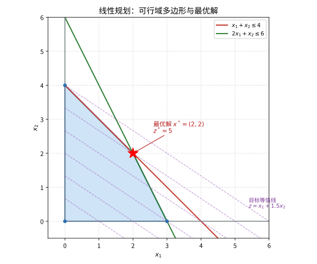
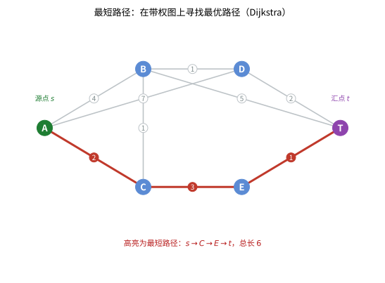

# 第110级：运筹学 (Operations Research)

## 学习目标

1. 掌握线性规划的基本理论，包括单纯形法和对偶理论
2. 理解整数规划的分支定界法和割平面法
3. 掌握网络流问题的最大流、最小费用流算法
4. 理解动态规划的最优性原理及其应用
5. 掌握最短路径和最小生成树问题的经典算法
6. 了解排队论、库存论、决策论等运筹学分支的基本概念

---

## 1. 核心概念

### 1.1 线性规划 (Linear Programming)

线性规划是运筹学中最基本的优化方法，其标准形式为：

$$
\begin{aligned}
\min \quad & \mathbf{c}^\top \mathbf{x} \\
\text{s.t.} \quad & A\mathbf{x} = \mathbf{b} \\
& \mathbf{x} \geq \mathbf{0}
\end{aligned}
$$

其中 $\mathbf{x} \in \mathbb{R}^n$ 是决策变量，$\mathbf{c} \in \mathbb{R}^n$ 是目标系数，$A \in \mathbb{R}^{m \times n}$ 是约束矩阵，$\mathbf{b} \in \mathbb{R}^m$ 是资源向量。

> **直观理解（现实类比）**：线性规划像"在多边形顶点找最优"——约束把所有可行方案圈成一个多边形区域，而目标函数是一张平直的"利润斜坡"。因为斜坡是直的，它不会在区域的边或内部形成局部高点，最高（最优）处必然落在多边形的某个顶点上。这把"在无穷多个方案里选最优"的难题，简化成了"只检查有限个顶点"。

#### 单纯形法 (Simplex Method)

单纯形法由 George Dantzig 于1947年提出，是求解线性规划问题的经典算法。其基本思想是：从可行域的一个顶点（基本可行解）出发，沿着目标函数下降的方向，从一个顶点移动到另一个顶点，直到达到最优解。

**算法步骤**：

1. 将问题转化为标准形式
2. 找到初始基本可行解
3. 计算检验数 $\sigma_j = c_j - \mathbf{c}_B^\top B^{-1} A_j$
4. 如果所有 $\sigma_j \geq 0$，当前解为最优解
5. 否则，选择 $\sigma_j < 0$ 对应的变量 $x_j$ 入基
6. 通过最小比值规则确定出基变量
7. 进行旋转运算，更新基矩阵
8. 重复步骤3-7

> **直观理解（现实类比）**：假如一家工厂的资源约束（原材料、工时等）把可行的生产方案圈出一块多边形区域，你只能在这个区域内选择生产量。目标函数就像在这块区域上铺一张平直的"利润坡"，越是向外越赚钱。由于斜坡是平面的，最高点必然落在多边形的某个顶点上——这正是单纯形法"在顶点间移动寻找最优解"的几何含义。

> **直观理解（现实类比）**：聚焦到单纯形法本身，它像"沿边走"——站在当前顶点，看看沿着哪条边走能让目标值变好（检验数 $\sigma_j<0$），就沿那条边走到相邻顶点；若所有边都不能再改善，就说明已到最优。它从不在区域内部乱穿，只在顶点间贴着边一步步挪，所以每步都把"无限方案"压缩成"有限邻居比较"，极其高效。

#### 对偶理论 (Duality Theory)

每个线性规划问题（原问题）都有一个对应的对偶问题。原问题与对偶问题之间的关系是对偶理论的核心。

**原问题**（P）：

$$
\begin{aligned}
\min \quad & \mathbf{c}^\top \mathbf{x} \\
\text{s.t.} \quad & A\mathbf{x} \geq \mathbf{b} \\
& \mathbf{x} \geq \mathbf{0}
\end{aligned}
$$

**对偶问题**（D）：

$$
\begin{aligned}
\max \quad & \mathbf{b}^\top \mathbf{y} \\
\text{s.t.} \quad & A^\top \mathbf{y} \leq \mathbf{c} \\
& \mathbf{y} \geq \mathbf{0}
\end{aligned}
$$

> **直观理解（现实类比）**：对偶理论像"从两面看同一座山"——原问题问"用给定资源最多能赚多少"，对偶问题问"把这些资源按市价卖掉最少要多少钱才肯出手"。看似两个角度，强对偶定理却保证它们给出的最优值相等：资源自用的最高收益恰好等于资源出售的最低要价。对偶变量 $\mathbf{y}$ 因此成为每种资源的"影子价格"，告诉你它到底值多少钱。

### 1.2 整数规划 (Integer Programming)

整数规划是线性规划的一种扩展，要求部分或全部决策变量取整数值。

**混合整数线性规划**（MILP）：

$$
\begin{aligned}
\min \quad & \mathbf{c}^\top \mathbf{x} + \mathbf{d}^\top \mathbf{y} \\
\text{s.t.} \quad & A\mathbf{x} + B\mathbf{y} \geq \mathbf{b} \\
& \mathbf{x} \in \mathbb{Z}^n_+, \mathbf{y} \in \mathbb{R}^p_+
\end{aligned}
$$

> **直观理解（现实类比）**：整数规划是"必须取整的优化"——安排多少辆车、派多少人、买多少台机器，这些决策只能取整数，不能说"派 2.7 个人"。可一旦加上"必须整数"这个要求，原本好解的线性规划就变难了：顶点不再是连续的，最优解常常掉在两个整数之间的"缝隙"里，得用分支定界把可行域像剥洋葱一样层层细分，才能逼出整数最优。

#### 分支定界法 (Branch and Bound)

分支定界法是求解整数规划最常用的方法之一。其基本思想是：

1. **松弛**：将整数约束松弛，求解线性规划松弛问题
2. **分支**：如果松弛解中某个整数变量 $x_i$ 取非整数值 $x_i^*$，则创建两个子问题：
   - 左分支：$x_i \leq \lfloor x_i^* \rfloor$
   - 右分支：$x_i \geq \lceil x_i^* \rceil$
3. **定界**：利用当前最优整数解作为上界，松弛问题的目标值作为下界
4. **剪枝**：如果子问题的下界大于当前上界，则剪枝

#### 割平面法 (Cutting Plane Method)

割平面法通过添加线性约束（割平面）来逐步逼近整数可行域的凸包。

**Gomory割平面**：设松弛问题的最优单纯形表中有约束：

$$
x_i + \sum_{j \in N} \bar{a}_{ij} x_j = \bar{b}_i
$$

其中 $\bar{b}_i$ 不是整数。令 $f_{ij} = \bar{a}_{ij} - \lfloor \bar{a}_{ij} \rfloor$，$f_i = \bar{b}_i - \lfloor \bar{b}_i \rfloor$，则Gomory割平面为：

$$
\sum_{j \in N} f_{ij} x_j \geq f_i
$$

### 1.3 网络流 (Network Flow)

#### 最大流问题 (Maximum Flow Problem)

给定有向图 $G = (V, E)$，源点 $s$，汇点 $t$，容量函数 $c: E \to \mathbb{R}^+$，最大流问题求从 $s$ 到 $t$ 的最大可行流。

**增广路径算法**：在剩余网络中反复寻找增广路径，直到无法找到为止。

#### 最小费用流问题 (Minimum Cost Flow Problem)

在满足流量需求的前提下，使总运输成本最小化。

$$
\begin{aligned}
\min \quad & \sum_{(i,j) \in E} w_{ij} f_{ij} \\
\text{s.t.} \quad & \sum_{j: (i,j) \in E} f_{ij} - \sum_{j: (j,i) \in E} f_{ji} = b_i, \quad \forall i \in V \\
& 0 \leq f_{ij} \leq c_{ij}, \quad \forall (i,j) \in E
\end{aligned}
$$

### 1.4 动态规划 (Dynamic Programming)

动态规划通过将复杂问题分解为子问题来求解，核心是**最优性原理**和**Bellman方程**。

**Bellman方程**（确定性）：

$$
V_k(s_k) = \min_{a_k \in A(s_k)} \left\{ c_k(s_k, a_k) + V_{k+1}(T(s_k, a_k)) \right\}
$$

其中 $V_k(s_k)$ 是状态 $s_k$ 在阶段 $k$ 的最优值函数，$c_k$ 是阶段成本，$T$ 是状态转移函数。

### 1.5 最短路径 (Shortest Path)

#### Dijkstra算法

用于求解非负权重图中的单源最短路径问题。时间复杂度 $O(|V|^2)$ 或 $O(|E| + |V|\log|V|)$（使用优先队列）。

#### Bellman-Ford算法

用于求解含负权重边的单源最短路径问题，时间复杂度 $O(|V||E|)$。

> **直观理解（现实类比）**：就像用导航软件规划出行，每个路口（节点）之间连着的每条路（边）都标着耗时（权重），你要找一条从起点到终点的总耗时最短的路线。Dijkstra 算法相当于"贪心地"每次确认当前已知最近的节点，逐步向外扩展，最终得到真正的最短路径（图中红色高亮路线）。

### 1.6 最小生成树 (Minimum Spanning Tree)

#### Kruskal算法

将所有边按权重排序，从小到大依次选择，如果加入后不形成环则保留，直到选出 $|V|-1$ 条边。时间复杂度 $O(|E|\log|E|)$。

#### Prim算法

从一个顶点开始，每次选择连接已选顶点集和未选顶点集的最小权重边，直到所有顶点都被选中。时间复杂度 $O(|V|^2)$ 或 $O(|E|\log|V|)$（使用优先队列）。

### 1.7 其他重要概念

- **库存论**：研究最优库存策略，包括经济订货量（EOQ）模型
- **排队论**：研究排队系统的性能分析（详见第111级）
- **决策论**：在不确定条件下进行决策的理论，包括贝叶斯决策、博弈论
- **多目标决策**：处理多个相互冲突的目标，如Pareto最优、层次分析法（AHP）
- **指派问题**：将 $n$ 个任务分配给 $n$ 个执行者，使总成本最小（匈牙利算法）
- **运输问题**：从多个供应点运送到多个需求点，使总运输成本最小化

---

## 2. 定理与证明

### 2.1 线性规划强对偶定理

> **定理 1（强对偶定理）**：如果原问题和对偶问题都有可行解，则它们都有最优解，且最优值相等。即 $\min \mathbf{c}^\top \mathbf{x} = \max \mathbf{b}^\top \mathbf{y}$。

**证明**：

考虑原问题（P）：
$$
\begin{aligned}
\min \quad & \mathbf{c}^\top \mathbf{x} \\
\text{s.t.} \quad & A\mathbf{x} \geq \mathbf{b} \\
& \mathbf{x} \geq \mathbf{0}
\end{aligned}
$$

和对偶问题（D）：
$$
\begin{aligned}
\max \quad & \mathbf{b}^\top \mathbf{y} \\
\text{s.t.} \quad & A^\top \mathbf{y} \leq \mathbf{c} \\
& \mathbf{y} \geq \mathbf{0}
\end{aligned}
$$

**步骤1：弱对偶性**

首先证明弱对偶性：对于任意可行的 $\mathbf{x}$ 和 $\mathbf{y}$，有 $\mathbf{b}^\top \mathbf{y} \leq \mathbf{c}^\top \mathbf{x}$。

由 $\mathbf{y} \geq \mathbf{0}$ 和 $A\mathbf{x} \geq \mathbf{b}$，得：
$$
\mathbf{y}^\top A\mathbf{x} \geq \mathbf{y}^\top \mathbf{b} = \mathbf{b}^\top \mathbf{y}
$$

由 $\mathbf{x} \geq \mathbf{0}$ 和 $A^\top \mathbf{y} \leq \mathbf{c}$，得：
$$
\mathbf{y}^\top A\mathbf{x} = (A^\top \mathbf{y})^\top \mathbf{x} \leq \mathbf{c}^\top \mathbf{x}
$$

因此 $\mathbf{b}^\top \mathbf{y} \leq \mathbf{c}^\top \mathbf{x}$。

**步骤2：Farkas引理**

为了证明强对偶性，我们需要Farkas引理：

> **Farkas引理**：对于矩阵 $A$ 和向量 $\mathbf{b}$，以下两个系统有且仅有一个有解：
> 1. $A\mathbf{x} = \mathbf{b}, \mathbf{x} \geq \mathbf{0}$
> 2. $A^\top \mathbf{y} \geq \mathbf{0}, \mathbf{b}^\top \mathbf{y} < 0$

**证明**：设系统1无解。考虑凸锥 $C = \{A\mathbf{x} : \mathbf{x} \geq \mathbf{0}\}$，则 $\mathbf{b} \notin C$。由于 $C$ 是闭凸锥，由凸集分离定理，存在超平面严格分离 $\mathbf{b}$ 和 $C$，即存在 $\mathbf{y}$ 使得 $\mathbf{y}^\top \mathbf{b} < 0$ 且 $\mathbf{y}^\top (A\mathbf{x}) \geq 0$ 对所有 $\mathbf{x} \geq \mathbf{0}$ 成立。后者意味着 $A^\top \mathbf{y} \geq \mathbf{0}$（否则取适当的 $\mathbf{x}$ 可使 $\mathbf{y}^\top A\mathbf{x} < 0$）。因此系统2有解。

反之，若系统2有解，则对任意 $\mathbf{x} \geq \mathbf{0}$，有 $\mathbf{y}^\top A\mathbf{x} = (A^\top \mathbf{y})^\top \mathbf{x} \geq 0$，但 $\mathbf{y}^\top \mathbf{b} < 0$，所以 $A\mathbf{x} \neq \mathbf{b}$，系统1无解。

**步骤3：证明强对偶性**

设原问题的最优值为 $p^*$。考虑扩展系统：
$$
\begin{pmatrix}
A & -\mathbf{b} \\
-\mathbf{c}^\top & p^*
\end{pmatrix}
\begin{pmatrix}
\mathbf{x} \\
t
\end{pmatrix} \geq \mathbf{0}, \quad \mathbf{x} \geq \mathbf{0}, t \geq 0
$$

其中 $t$ 是标量变量。如果 $( \mathbf{x}, t)$ 是该系统的一个解且 $t > 0$，则 $A(\mathbf{x}/t) \geq \mathbf{b}$ 且 $\mathbf{c}^\top (\mathbf{x}/t) \leq p^*$，即 $\mathbf{x}/t$ 是原问题的可行解且目标值不超过 $p^*$，所以 $\mathbf{x}/t$ 是最优解。

现在，考虑系统：
$$
\begin{pmatrix}
A \\
-\mathbf{c}^\top
\end{pmatrix} \mathbf{x} \geq \begin{pmatrix}
\mathbf{b} \\
-p^*
\end{pmatrix}, \quad \mathbf{x} \geq \mathbf{0}
$$

如果该系统无解，则由Farkas引理，存在 $(\mathbf{y}_0, y_1) \geq \mathbf{0}$ 使得：
$$
(\mathbf{y}_0^\top, y_1) \begin{pmatrix}
A \\
-\mathbf{c}^\top
\end{pmatrix} \geq \mathbf{0}^\top, \quad (\mathbf{y}_0^\top, y_1) \begin{pmatrix}
\mathbf{b} \\
-p^*
\end{pmatrix} < 0
$$

即 $\mathbf{y}_0^\top A - y_1 \mathbf{c}^\top \geq \mathbf{0}^\top$ 且 $\mathbf{y}_0^\top \mathbf{b} - y_1 p^* < 0$。

若 $y_1 > 0$，令 $\mathbf{y} = \mathbf{y}_0 / y_1$，则 $A^\top \mathbf{y} \geq \mathbf{c}$ 且 $\mathbf{b}^\top \mathbf{y} < p^*$。由弱对偶性，对任意原问题可行解 $\mathbf{x}$，有 $\mathbf{c}^\top \mathbf{x} \geq \mathbf{b}^\top \mathbf{y}$，所以 $\mathbf{b}^\top \mathbf{y} \leq p^*$，结合 $\mathbf{b}^\top \mathbf{y} < p^*$，得 $\mathbf{b}^\top \mathbf{y} < p^*$。

但由弱对偶性，$\mathbf{b}^\top \mathbf{y} \leq p^*$ 总是成立，所以 $\mathbf{b}^\top \mathbf{y} < p^*$ 意味着存在对偶可行解 $\mathbf{y}$ 使得对偶值严格小于原问题最优值。

若 $y_1 = 0$，则 $\mathbf{y}_0^\top A \geq \mathbf{0}^\top$ 且 $\mathbf{y}_0^\top \mathbf{b} < 0$，这与原问题有可行解矛盾（因为对任意原问题可行解 $\mathbf{x}$，有 $0 \leq \mathbf{y}_0^\top A\mathbf{x} \geq \mathbf{y}_0^\top \mathbf{b}$，但 $\mathbf{y}_0^\top \mathbf{b} < 0$）。

因此原系统必须有解，即存在 $\mathbf{x}^* \geq \mathbf{0}$ 使得 $A\mathbf{x}^* \geq \mathbf{b}$ 且 $\mathbf{c}^\top \mathbf{x}^* \leq p^*$。由于 $p^*$ 是最优值，必有 $\mathbf{c}^\top \mathbf{x}^* = p^*$，所以 $\mathbf{x}^*$ 是最优解。

**步骤4：对偶问题的最优值**

由弱对偶性，对偶问题的最优值 $d^* \leq p^*$。我们需要证明存在对偶可行解 $\mathbf{y}^*$ 使得 $\mathbf{b}^\top \mathbf{y}^* = p^*$。

由原问题的最优解 $\mathbf{x}^*$ 和最优基 $B$，定义 $\mathbf{y}^* = (B^{-1})^\top \mathbf{c}_B$，其中 $\mathbf{c}_B$ 是对应基变量的目标系数。可以验证 $\mathbf{y}^*$ 是对偶可行的，且 $\mathbf{b}^\top \mathbf{y}^* = \mathbf{c}_B^\top B^{-1} \mathbf{b} = \mathbf{c}^\top \mathbf{x}^* = p^*$。

因此 $d^* = p^*$，强对偶定理得证。$\square$

### 2.2 最大流最小割定理

> **定理 2（最大流最小割定理）**：在任何网络中，从源点 $s$ 到汇点 $t$ 的最大流的值等于所有 $s$-$t$ 割的最小容量。

**证明**：

设 $G = (V, E)$ 是一个有向图，源点为 $s$，汇点为 $t$，容量函数 $c: E \to \mathbb{R}^+$。令 $f$ 是一个 $s$-$t$ 流。

**步骤1：基本定义**

$s$-$t$ 割 $(S, T)$ 是顶点集 $V$ 的一个划分，满足 $s \in S$，$t \in T$。割的容量定义为：
$$
c(S, T) = \sum_{u \in S, v \in T, (u,v) \in E} c(u,v)
$$

流 $f$ 的值定义为：
$$
|f| = \sum_{v \in V} f(s,v) - \sum_{v \in V} f(v,s)
$$

**步骤2：流值不超过割容量的上界**

对于任意 $s$-$t$ 割 $(S, T)$ 和任意可行流 $f$，有：
$$
|f| \leq c(S, T)
$$

**证明**：由流量守恒和容量约束：
$$
\begin{aligned}
|f| &= \sum_{u \in S} \left( \sum_{v \in V} f(u,v) - \sum_{v \in V} f(v,u) \right) \\
&= \sum_{u \in S, v \in T} f(u,v) - \sum_{u \in S, v \in T} f(v,u) \\
&\leq \sum_{u \in S, v \in T} f(u,v) \leq \sum_{u \in S, v \in T} c(u,v) = c(S, T)
\end{aligned}
$$

**步骤3：剩余网络与增广路径**

给定流 $f$，定义剩余网络 $G_f = (V, E_f)$，其中每条边 $(u,v) \in E$ 对应两条边：
- 前向边 $(u,v)$，容量为 $c(u,v) - f(u,v)$（如果 $f(u,v) < c(u,v)$）
- 反向边 $(v,u)$，容量为 $f(u,v)$（如果 $f(u,v) > 0$）

**增广路径**是剩余网络 $G_f$ 中从 $s$ 到 $t$ 的一条路径。

**步骤4：Ford-Fulkerson算法的正确性**

Ford-Fulkerson算法：在剩余网络中反复寻找增广路径，并沿路径增加流量，直到不存在增广路径。

**断言**：如果 $f$ 是最大流，则剩余网络 $G_f$ 中不存在从 $s$ 到 $t$ 的路径。

**证明**：假设 $G_f$ 中存在从 $s$ 到 $t$ 的路径 $P$。令 $\delta = \min_{(u,v) \in P} c_f(u,v) > 0$，其中 $c_f(u,v)$ 是剩余网络中的容量。则沿 $P$ 增加 $\delta$ 流量可得到新的可行流 $f'$，且 $|f'| = |f| + \delta > |f|$，与 $f$ 是最大流矛盾。

**步骤5：最大流等于最小割**

设 $f$ 是最大流，定义 $S$ 为剩余网络 $G_f$ 中从 $s$ 可达的顶点集，$T = V \setminus S$。由于 $G_f$ 中不存在从 $s$ 到 $t$ 的路径，所以 $t \notin S$，即 $(S, T)$ 是一个 $s$-$t$ 割。

对于任意 $u \in S$，$v \in T$，$(u,v) \in E$，有 $f(u,v) = c(u,v)$（否则 $(u,v)$ 在 $G_f$ 中，则 $v$ 从 $s$ 可达，矛盾）。

对于任意 $u \in T$，$v \in S$，$(u,v) \in E$，有 $f(u,v) = 0$（否则 $f(u,v) > 0$ 意味着 $(v,u)$ 在 $G_f$ 中，则 $u$ 从 $s$ 可达，矛盾）。

因此：
$$
|f| = \sum_{u \in S, v \in T} f(u,v) - \sum_{u \in S, v \in T} f(v,u) = \sum_{u \in S, v \in T} c(u,v) = c(S, T)
$$

由步骤2，任意流的值不超过任意割的容量，所以 $c(S,T)$ 是最小割容量，$|f|$ 是最大流值。$\square$

### 2.3 Dijkstra算法的正确性

> **定理 3（Dijkstra算法正确性）**：对于非负权重图 $G = (V, E)$，Dijkstra算法能正确求出从源点 $s$ 到所有顶点的最短路径距离。

**证明**：

设 $d(v)$ 为算法运行时维护的从 $s$ 到 $v$ 的当前距离估计，$\delta(v)$ 为从 $s$ 到 $v$ 的真实最短距离。

**归纳假设**：当顶点 $u$ 被从优先队列中取出（标记为永久）时，$d(u) = \delta(u)$。

**基础**：源点 $s$ 是第一个被取出的顶点，$d(s) = 0 = \delta(s)$，归纳基础成立。

**归纳步骤**：假设在取出顶点 $u$ 之前，所有已永久标记的顶点都满足 $d = \delta$。设 $u$ 是当前从优先队列中取出的顶点（即 $d(u)$ 最小），我们要证明 $d(u) = \delta(u)$。

反证法。假设 $d(u) > \delta(u)$。考虑从 $s$ 到 $u$ 的真实最短路径 $P$。由于 $s$ 已永久标记，$u$ 尚未永久标记，路径 $P$ 上存在第一个未被永久标记的顶点，记为 $x$，其前驱 $y$ 已被永久标记（可能有 $y = s$）。

由于 $y$ 已被永久标记，$d(y) = \delta(y)$。当 $y$ 被永久标记时，算法会松弛从 $y$ 出发的所有边，包括 $(y, x)$，因此 $d(x) \leq d(y) + w(y,x) = \delta(y) + w(y,x) = \delta(x)$。

由于 $x$ 在最短路径 $P$ 上且位于 $u$ 之前，有 $\delta(x) \leq \delta(u)$。因此 $d(x) \leq \delta(x) \leq \delta(u) < d(u)$。

但 $u$ 是从优先队列中取出的距离最小的顶点，即 $d(u) \leq d(x)$，与 $d(x) < d(u)$ 矛盾。

因此假设不成立，$d(u) = \delta(u)$。$\square$

### 2.4 动态规划的最优性原理

> **定理 4（最优性原理，Bellman方程）**：多阶段决策问题的最优策略具有如下性质：无论初始状态和初始决策如何，剩余的决策必须构成一个以初始决策形成的状态为起点的最优策略。

**证明**：

考虑一个 $N$ 阶段决策过程。设状态空间为 $\mathcal{S}$，决策空间为 $\mathcal{A}$。在阶段 $k$，系统处于状态 $s_k \in \mathcal{S}$，决策者选择决策 $a_k \in \mathcal{A}(s_k)$，产生阶段成本 $c_k(s_k, a_k)$，系统转移到状态 $s_{k+1} = T_k(s_k, a_k)$。

定义最优值函数 $V_k(s_k)$ 为从阶段 $k$ 状态 $s_k$ 出发，到阶段 $N$ 结束的最小总成本：
$$
V_k(s_k) = \min_{a_k, a_{k+1}, \ldots, a_{N-1}} \sum_{i=k}^{N-1} c_i(s_i, a_i)
$$

其中 $s_{i+1} = T_i(s_i, a_i)$。

**Bellman最优性方程**：
$$
V_k(s_k) = \min_{a_k \in \mathcal{A}(s_k)} \left\{ c_k(s_k, a_k) + V_{k+1}(T_k(s_k, a_k)) \right\}, \quad k = 0, 1, \ldots, N-1
$$

边界条件：$V_N(s_N) = 0$（或某个终端成本函数）。

**证明Bellman方程**：

设 $\pi^* = (a_k^*, a_{k+1}^*, \ldots, a_{N-1}^*)$ 是从阶段 $k$ 状态 $s_k$ 出发的最优策略。则：
$$
V_k(s_k) = \sum_{i=k}^{N-1} c_i(s_i^*, a_i^*)
$$

其中 $s_i^*$ 是在最优策略下的状态序列，$s_{k+1}^* = T_k(s_k, a_k^*)$。

将上式分解：
$$
V_k(s_k) = c_k(s_k, a_k^*) + \sum_{i=k+1}^{N-1} c_i(s_i^*, a_i^*)
$$

现在证明 $\pi_{k+1}^* = (a_{k+1}^*, \ldots, a_{N-1}^*)$ 是从状态 $s_{k+1}^*$ 出发的最优策略。

反证法。假设存在另一个策略 $\tilde{\pi} = (\tilde{a}_{k+1}, \ldots, \tilde{a}_{N-1})$ 使得从 $s_{k+1}^*$ 出发的总成本更低：
$$
\sum_{i=k+1}^{N-1} c_i(\tilde{s}_i, \tilde{a}_i) < \sum_{i=k+1}^{N-1} c_i(s_i^*, a_i^*)
$$

其中 $\tilde{s}_{k+1} = s_{k+1}^*$，$\tilde{s}_{i+1} = T_i(\tilde{s}_i, \tilde{a}_i)$。

则构造新策略 $\pi' = (a_k^*, \tilde{a}_{k+1}, \ldots, \tilde{a}_{N-1})$，其总成本为：
$$
c_k(s_k, a_k^*) + \sum_{i=k+1}^{N-1} c_i(\tilde{s}_i, \tilde{a}_i) < c_k(s_k, a_k^*) + \sum_{i=k+1}^{N-1} c_i(s_i^*, a_i^*) = V_k(s_k)
$$

这与 $V_k(s_k)$ 是最优值矛盾。因此 $\pi_{k+1}^*$ 必须是最优的。

由此可得：
$$
\begin{aligned}
V_k(s_k) &= c_k(s_k, a_k^*) + V_{k+1}(s_{k+1}^*) \\
&= \min_{a_k \in \mathcal{A}(s_k)} \left\{ c_k(s_k, a_k) + V_{k+1}(T_k(s_k, a_k)) \right\}
\end{aligned}
$$

最后一个等号成立是因为 $a_k^*$ 是最优决策，而 $V_{k+1}(s_{k+1})$ 是定义在状态 $s_{k+1}$ 上的最优值函数，与之前的决策无关。$\square$

### 2.5 分支定界算法的收敛性

> **定理 5（分支定界收敛性）**：对于有限离散整数规划问题，分支定界算法在有限步内终止，并返回全局最优解。

**证明**：

考虑整数规划问题：
$$
\begin{aligned}
\min \quad & f(\mathbf{x}) \\
\text{s.t.} \quad & \mathbf{x} \in S \subseteq \mathbb{Z}^n
\end{aligned}
$$

其中 $S$ 是有限集（或至少可行域有界）。

**步骤1：分支过程的有限性**

分支操作将一个可行域划分为互不相交的子区域。由于每个变量有有限个可能的整数值（由问题有界性保证），分支过程不可能无限进行下去。具体地，如果每个整数变量 $x_i$ 的取值范围为 $[L_i, U_i]$，则最多有 $\prod_{i=1}^n (U_i - L_i + 1)$ 个可能的整数解，因此分支树的节点数有限。

**步骤2：定界机制**

设当前最优整数解的目标值为 $\bar{f}$（初始化为 $\infty$ 或某个已知上界）。对于每个子问题 $P_k$，求解其线性规划松弛得到下界 $\underline{f}_k$。

**剪枝规则**：
- 如果 $\underline{f}_k \geq \bar{f}$，则剪枝（该子问题不可能包含更优解）
- 如果 $P_k$ 无可行解，则剪枝
- 如果 $P_k$ 的最优解是整数解且 $f(\mathbf{x}_k) < \bar{f}$，则更新 $\bar{f} = f(\mathbf{x}_k)$

**步骤3：收敛性证明**

由于分支树是有限的，且每次迭代至少处理一个节点（可分为子节点或剪枝），算法必然在有限步后终止。

设终止时当前最优解为 $\mathbf{x}^*$，最优值为 $\bar{f}^* = f(\mathbf{x}^*)$。

**断言**：$\mathbf{x}^*$ 是全局最优解。

**证明**：反证法。假设存在 $\mathbf{x}' \in S$ 使得 $f(\mathbf{x}') < f(\mathbf{x}^*)$。考虑 $\mathbf{x}'$ 在分支树中对应的叶节点（即 $\mathbf{x}'$ 所在的某个子区域）。

由于算法终止时所有未被剪枝的节点都已被处理，且 $\mathbf{x}'$ 是整数可行解，它必然出现在某个叶节点中。该叶节点对应的松弛问题的最优值 $\underline{f} \leq f(\mathbf{x}')$（因为 $\mathbf{x}'$ 是松弛问题的可行解）。

如果该叶节点已被剪枝，则必有 $\underline{f} \geq \bar{f}^*$，从而 $f(\mathbf{x}') \geq \underline{f} \geq \bar{f}^*$，与 $f(\mathbf{x}') < f(\mathbf{x}^*)$ 矛盾。

如果该叶节点未被剪枝，则算法会找到该节点中的整数解（或至少更新上界），从而 $\bar{f}^* \leq f(\mathbf{x}')$，同样矛盾。

因此 $\mathbf{x}^*$ 是全局最优解。$\square$

---

## 3. 示例

### 3.1 用单纯形法求解线性规划

**问题**：
$$
\begin{aligned}
\max \quad & z = 3x_1 + 2x_2 \\
\text{s.t.} \quad & x_1 + x_2 \leq 4 \\
& 2x_1 + x_2 \leq 6 \\
& x_1, x_2 \geq 0
\end{aligned}
$$

**解**：

**步骤1：添加松弛变量，转化为标准形式**
$$
\begin{aligned}
\max \quad & z = 3x_1 + 2x_2 \\
\text{s.t.} \quad & x_1 + x_2 + x_3 = 4 \\
& 2x_1 + x_2 + x_4 = 6 \\
& x_1, x_2, x_3, x_4 \geq 0
\end{aligned}
$$

**步骤2：初始单纯形表**

| 基变量 | $x_1$ | $x_2$ | $x_3$ | $x_4$ | RHS |
|-------|-------|-------|-------|-------|-----|
| $x_3$ | 1 | 1 | 1 | 0 | 4 |
| $x_4$ | 2 | 1 | 0 | 1 | 6 |
| $-z$ | -3 | -2 | 0 | 0 | 0 |

**步骤3：迭代1**

检验数：$\sigma_1 = -3$，$\sigma_2 = -2$，选择 $x_1$ 入基。

最小比值：$\min\{4/1, 6/2\} = 3$，对应 $x_4$ 出基。

以 $x_1$ 列为主元列，$x_4$ 行为主元行，主元为2。

进行旋转运算：

| 基变量 | $x_1$ | $x_2$ | $x_3$ | $x_4$ | RHS |
|-------|-------|-------|-------|-------|-----|
| $x_3$ | 0 | 0.5 | 1 | -0.5 | 1 |
| $x_1$ | 1 | 0.5 | 0 | 0.5 | 3 |
| $-z$ | 0 | -0.5 | 0 | 1.5 | 9 |

**步骤4：迭代2**

检验数：$\sigma_2 = -0.5 < 0$，选择 $x_2$ 入基。

最小比值：$\min\{1/0.5, 3/0.5\} = 2$，对应 $x_3$ 出基。

以 $x_2$ 列为主元列，$x_3$ 行为主元行，主元为0.5。

进行旋转运算：

| 基变量 | $x_1$ | $x_2$ | $x_3$ | $x_4$ | RHS |
|-------|-------|-------|-------|-------|-----|
| $x_2$ | 0 | 1 | 2 | -1 | 2 |
| $x_1$ | 1 | 0 | -1 | 1 | 2 |
| $-z$ | 0 | 0 | 1 | 1 | 10 |

**步骤5：最优解**

所有检验数 $ \geq 0$，达到最优解：
$$
x_1^* = 2, \quad x_2^* = 2, \quad z^* = 10
$$

### 3.2 用网络流解决运输问题

**问题**：三个工厂 $A_1, A_2, A_3$ 的产量分别为 30, 50, 20 单位，四个市场 $B_1, B_2, B_3, B_4$ 的需求分别为 20, 30, 30, 20 单位。单位运输成本矩阵为：

$$
C = \begin{pmatrix}
4 & 2 & 5 & 3 \\
3 & 6 & 4 & 2 \\
5 & 3 & 2 & 4
\end{pmatrix}
$$

求最小总运输成本。

**解**：

**步骤1：构建网络流模型**

- 源点 $s$ 连接到各工厂 $A_i$，容量为产量，成本为0
- 各工厂 $A_i$ 连接到各市场 $B_j$，容量为 $\infty$，成本为 $c_{ij}$
- 各市场 $B_j$ 连接到汇点 $t$，容量为需求，成本为0

**步骤2：使用最小费用最大流算法**

初始流为零流。在剩余网络中寻找从 $s$ 到 $t$ 的最短路径（以成本为权重）。

**第一次增广**：
最短路径：$s \to A_2 \to B_4 \to t$，成本为 $0 + 2 + 0 = 2$
可增广流量：$\min(50, \infty, 20) = 20$
增广后流量：$f_{A_2B_4} = 20$，$f_{B_4t} = 20$

**第二次增广**：
最短路径：$s \to A_1 \to B_2 \to t$，成本为 $0 + 2 + 0 = 2$
可增广流量：$\min(30, \infty, 30) = 30$
增广后流量：$f_{A_1B_2} = 30$，$f_{B_2t} = 30$

**第三次增广**：
最短路径：$s \to A_2 \to B_1 \to t$，成本为 $0 + 3 + 0 = 3$
可增广流量：$\min(30, \infty, 20) = 20$（$A_2$ 剩余容量30，$B_1$ 需求20）
增广后流量：$f_{A_2B_1} = 20$，$f_{B_1t} = 20$

**第四次增广**：
最短路径：$s \to A_3 \to B_3 \to t$，成本为 $0 + 2 + 0 = 2$
可增广流量：$\min(20, \infty, 30) = 20$
增广后流量：$f_{A_3B_3} = 20$，$f_{B_3t} = 20$

**第五次增广**：
剩余需求：$B_1$ 已满足，$B_3$ 还需10单位
最短路径：$s \to A_2 \to B_3 \to t$，成本为 $0 + 4 + 0 = 4$
可增广流量：$\min(10, \infty, 10) = 10$
增广后流量：$f_{A_2B_3} = 10$，$f_{B_3t} = 10$

**步骤3：最优解**

运输方案：
- $A_1 \to B_2$：30单位
- $A_2 \to B_1$：20单位，$A_2 \to B_3$：10单位，$A_2 \to B_4$：20单位
- $A_3 \to B_3$：20单位

总成本：$30 \times 2 + 20 \times 3 + 10 \times 4 + 20 \times 2 + 20 \times 2 = 60 + 60 + 40 + 40 + 40 = 240$

---

## 4. 习题

### 基础题

**习题 1**（线性规划的标准形式）写出线性规划问题的数学标准形式，并解释为什么当目标函数与可行域都是凸的时，最优点必落在可行域的某个顶点上，而无需考察区域内部的点。

**习题 2**（写出对偶问题）考虑线性规划问题 $\min z=2x_1+3x_2$，其约束为 $x_1+2x_2\ge 8,\ 3x_1+x_2\ge 9,\ x_1,x_2\ge 0$。写出该原问题的对偶问题。

**习题 3**（单纯形法求解）用单纯形法求解 $\max z=3x_1+2x_2$，约束为 $x_1+x_2\le 4,\ 2x_1+x_2\le 6,\ x_1,x_2\ge 0$，给出主要迭代步骤并写出最优解。

**习题 4**（对偶理论与影子价格）解释弱对偶定理与强对偶定理的含义，并说明对偶变量 $\mathbf{y}$ 作为各种资源"影子价格"的经济学意义。

**习题 5**（整数规划与松弛）说明分支定界法中"松弛、分支、定界、剪枝"四个步骤的基本思想，并解释为什么只沿非整数分量的分支就能穷尽所有整数可行点。

**习题 6**（最大流问题）求网络 $s\to A(10),\ s\to B(12),\ A\to B(4),\ A\to t(8),\ B\to t(6)$ 从 $s$ 到 $t$ 的最大流，并说明增广路径算法的执行思想。

**习题 7**（运输问题建模）说明如何把含多个供应点、多个需求点的运输问题建模成网络流（最小费用流）问题：源点、汇点以及各层边的容量和成本应如何设置。

**习题 8**（动态规划与背包）一个背包容量为10，有4个物品，其（重量、价值）分别为 $(3,4),(4,5),(5,6),(2,3)$。设 $dp[i][w]$ 表示前 $i$ 个物品在容量 $w$ 下的最大价值，写出递推关系并求出最大总价值。

**习题 9**（最短路径）用Dijkstra算法求图 $A\to B(4),\ A\to C(2),\ A\to D(7),\ B\to C(1),\ B\to D(2),\ C\to D(5)$ 从 $A$ 到其余各点的最短距离。

**习题 10**（最小生成树）用Kruskal算法与Prim算法求边集合为 $A{-}B(6),\ B{-}C(5),\ A{-}D(3),\ D{-}E(2),\ B{-}E(1),\ C{-}F(4),\ E{-}F(7)$ 的图的最小生成树及其总权重。

### 进阶题

**习题 11**（线性规划求解）求解线性规划 $\min z=2x_1+3x_2$，约束为 $x_1+2x_2\ge 8,\ 3x_1+x_2\ge 9,\ x_1,x_2\ge 0$：找出所有可行顶点并确定最优解与最优值。

**习题 12**（验证强对偶）对习题 11 中的问题，写出其对偶问题并求出对偶最优解，比较两边最优值以验证强对偶定理成立。

**习题 13**（分支定界法完整求解）用分支定界法求解整数规划 $\max z=5x_1+3x_2$，约束为 $2x_1+3x_2\le 12,\ 4x_1+x_2\le 10,\ x_1,x_2\ge 0$ 且为整数，画出分支树并给出最优解。

**习题 14**（割平面法）说明Gomory割平面的构造公式，并应用到 $\max z=5x_1+4x_2$ 在 $6x_1+4x_2\le 24,\ x_1+2x_2\le 6,\ x_i\ge 0$ 上：其松弛最优解为 $(3,\tfrac32)$，请构造一条能把该分数解切掉、又保留全部整数点的割平面。

**习题 15**（最大流最小割定理）验证定理：网络 $s\to A(5),\ s\to B(7),\ A\to t(3),\ B\to t(4),\ A\to B(2),\ B\to A(2)$ 的最大流值等于其最小割容量，并指出一个最小割。

**习题 16**（运输问题求解）给出供应量 $(30,50,20)$、需求量 $(20,30,30,20)$、单位成本矩阵 $C=\begin{pmatrix}4&2&5&3\\3&6&4&2\\5&3&2&4\end{pmatrix}$ 的运输问题，求总成本最小的运输方案并计算最小成本。

**习题 17**（指派问题）三名工人、三项任务，单位指派成本为 $W1:(5,7,6),\ W2:(6,8,5),\ W3:(7,6,7)$，用匈牙利算法求出总成本最小的指派方案。

**习题 18**（Bellman-Ford算法）对含负权边的图 $A\to B(4),\ A\to C(5),\ B\to C(-3),\ C\to D(2),\ B\to D(7)$，用Bellman-Ford算法求 $A$ 到各点的最短距离，并说明为何需要多轮的松弛。

**习题 19**（灵敏度分析）对 $\max z=3x_1+2x_2$ 在 $x_1+x_2\le 4,\ 2x_1+x_2\le 6$ 下，求影子价格，并说明当第一种资源约束的右端项从4增至5（保持最优基不变）时最优值如何变化。

### 挑战题

**习题 20**（弱对偶与互补最优）证明弱对偶定理：对任意可行的 $\mathbf{x},\mathbf{y}$ 皆有 $\mathbf{b}^\top\mathbf{y}\le \mathbf{c}^\top\mathbf{x}$，并证明若一对可行解使 $\mathbf{c}^\top\mathbf{x}=\mathbf{b}^\top\mathbf{y}$ 则两者同时为各自问题的最优解。

**习题 21**（Dijkstra正确性证明）用数学归纳法严格证明Dijkstra算法的正确性：被永久标记的顶点，其维护的距离即为到源点的真实最短距离。

**习题 22**（强对偶定理的证明思路）概述强对偶定理的证明主线：如何借助Farkas引理与凸集分离思想，从一个方向推出对偶存在最优解，再结合弱对偶得到两最优值相等。

**习题 23**（最大流等于最小割的证明）证明：最大流 $f$ 的值等于所有 $s$-$t$ 割容量的最小值。关键步骤是令 $S$ 为剩余网络中由 $s$ 可达的点集，再分析 $S,T$ 之间边上的流量。

**习题 24**（分支定界的收敛性）证明有限有界整数规划的分支定界法在有限步内终止并返回全局最优解，请用分支树节点数有限与剪枝规则说明。

**习题 25**（最优性原理的证明）用反证法证明动态规划的最优性原理：从某个状态出发的最优策略，其后继子策略对该子问题也必然最优，并由此推导Bellman方程。

**习题 26**（影子价格与资源优化）某厂以 $\max z=3x_1+2x_2$ 安排生产，约束为 $x_1+x_2\le 4,\ 2x_1+x_2\le 6$。结合对偶变量的含义，分析哪种资源更"值钱"，以及在什么右端项范围内影子价格保持不变。

### 探究题

**习题 27**（多目标与Pareto最优）当决策包含多个相互冲突的目标（如成本、工期、质量）时，说明"Pareto最优"的含义，并比较加权法、$\varepsilon$-约束法与层次分析法（AHP）把多目标问题转化为（线性）单目标优化的异同。

**习题 28**（网络流的现实扩展）讨论最大流-最小割思想在图像分割、交通运输、通信带宽分配等实际问题中的建模价值，以及当网络规模巨大或流量动态变化时应如何处理。

**习题 29**（库存与不确定性决策）结合经济订货量模型 $Q^*=\sqrt{\tfrac{2KD}{h}}$ 说明库存最优量如何权衡订货成本与持有成本，并简要说明排队论与决策论如何在面对随机性时补充确定性优化模型的不足。

**习题 30**（开放思考）运筹学的各分支（线性规划、整数规划、动态规划、网络流）本质上都是"约束下的优化"。请比较它们的适用场景与计算复杂度差异，并谈谈数据驱动、鲁棒优化与在线决策对传统运筹方法的冲击。

---

## 5. 习题答案与解析

### 基础题答案

1. **线性规划的标准形式** 标准形式为 $\min z=\mathbf{c}^\top\mathbf{x}$，约束 $A\mathbf{x}=\mathbf{b}$，$\mathbf{x}\ge\mathbf{0}$。目标函数线性是因而是既凸又凹的，可行域 $\{\mathbf{x}:A\mathbf{x}=\mathbf{b},\mathbf{x}\ge0\}$ 是多面体（凸集）。线性函数在凸多面体上若取得最优，必在某个顶点（极点）取得：若最优点在内部或边的非极点处，沿某可行方向移动可使目标单调变化并最终到达顶点而不降低目标值。因此只需检查有限个顶点，这正是单纯形法"沿顶点移动"的依据。

2. **写出对偶问题** 原问题为 $\min z=2x_1+3x_2$，约束 $x_1+2x_2\ge8,\ 3x_1+x_2\ge9,\ x_i\ge0$，即 $A=\begin{pmatrix}1&2\\3&1\end{pmatrix},\ \mathbf b=(8,9)^\top,\ \mathbf c=(2,3)^\top$。按对偶法则（原为 $\min$、约束为 $\ge$，对偶为 $\max$、约束为 $\le$），对偶问题为 $\max w=8y_1+9y_2$，约束 $y_1+3y_2\le2,\ 2y_1+y_2\le3,\ y_1,y_2\ge0$。

3. **单纯形法求解** 加入松弛变量 $x_3,x_4$ 后约束为 $x_1+x_2+x_3=4,\ 2x_1+x_2+x_4=6$。第一次迭代检验数 $\sigma_1=-3$ 选 $x_1$ 入基，最小比值 $\min\{4/1,6/2\}=3$ 对应 $x_4$ 出基，得 $x_1=3,\ x_3=1,\ z=9$；第二次迭代 $\sigma_2=-0.5$ 选 $x_2$ 入基，最小比值 $\min\{1/0.5,3/0.5\}=2$ 对应 $x_3$ 出基。此时所有检验数非负，最优解 $x_1^*=2,\ x_2^*=2$，最优值 $z^*=10$。

4. **对偶理论与影子价格** 弱对偶：对任意可行的 $\mathbf{x},\mathbf{y}$ 有 $\mathbf{b}^\top\mathbf{y}\le\mathbf{c}^\top\mathbf{x}$，即对偶值永不超过原值。强对偶：若原、对偶均有可行解，则二者最优值相等。对偶变量 $\mathbf{y}$ 度量"多一单位某种资源对最优目标值的边际贡献"，即影子价格——资源自用获得的最高收益恰好等于把资源按市价出售的最低要价，故影子价格刻画资源的经济价值。

5. **整数规划与松弛** 先求解去掉整数约束的松弛问题，得分数上界（对最大化）；若松弛解全为整数则已是最优。否则取非整分量 $x_i^*$ 分支为 $x_i\le\lfloor x_i^*\rfloor$ 与 $x_i\ge\lceil x_i^*\rceil$ 两个子问题，把可行域沿该坐标轴二分。由于 $\lfloor x_i^*\rfloor$ 与 $\lceil x_i^*\rceil$ 之间不含任何整数，两个分支恰好完整覆盖全部整数格点，配合"松弛目标下界 $\ge$ 已知整数解则剪枝"的定界，即可保证不遗漏最优整数解。

6. **最大流问题** 从零流出发找增广路径：$s\to A\to t$ 增广 $\min(10,8)=8$；再沿 $s\to B\to t$ 增广 $\min(12,6)=6$。$A\to B$ 虽有剩余容量但 $B\to t$ 已满，无法再增广，故最大流为 $8+6=14$；对应的最小割取 $S=\{s,A,B\}$、$T=\{t\}$，割容量 $A\to t(8)+B\to t(6)=14$，流值恰等于割容量，说明已达最优。

7. **运输问题建模** 构建三层网络：源点 $s$ 连各供应点 $A_i$（边容量=产量、成本0），各供应点 $A_i$ 连各需求点 $B_j$（边容量 $+\infty$、成本为 $c_{ij}$），各需求点 $B_j$ 连汇点 $t$（边容量=需求、成本0）。求最小费用最大流即得总运输成本最小的方案，其目标 $\min\sum_{i,j}c_{ij}f_{ij}$ 恰为运输总成本，各路线的运量 $f_{ij}$ 即可直接读出。

8. **动态规划与背包** 递推 $dp[i][w]=\max\{dp[i-1][w],\ dp[i-1][w-w_i]+v_i\}$（当 $w<w_i$ 只能取 $dp[i-1][w]$），边界 $dp[0][w]=0$。对容量10递推得到最优值13：选物品1（$3,4$）、物品3（$5,6$）、物品4（$2,3$），总重 $3+5+2=10$、总价值 $4+6+3=13$；其余组合如物品1、2、4（重9、价值12）均不高于此。

9. **最短路径** Dijkstra初始化 $d(A)=0,\ d(B)=4,\ d(C)=2,\ d(D)=7$。先取出 $C$（距离2），松弛 $C\to D$ 得 $2+5=7$ 不变；再取出 $B$（距离4），经 $B\to D$ 得 $4+2=6<7$，更新 $d(D)=6$。最终 $d(A)=0,\ d(B)=4,\ d(C)=2,\ d(D)=6$，其中到 $D$ 的最短路径为 $A\to B\to D$，总长6。

10. **最小生成树** Kruskal按权重排序边 $B{-}E(1),\ D{-}E(2),\ A{-}D(3),\ C{-}F(4),\ B{-}C(5),\ A{-}B(6),\ E{-}F(7)$，依次加入 $B{-}E,\ D{-}E,\ A{-}D,\ C{-}F,\ B{-}C$（$A{-}B$ 与 $E{-}F$ 会成环故跳过），共5条边连通全部6点。Prim从 $A$ 出发逐次选最小边得到同一棵生成树。总权重 $1+2+3+4+5=15$。

### 进阶题答案

1. **线性规划求解** 可行域顶点如下：两约束交点 $(2,3)$（联立 $x_1+2x_2=8,\ 3x_1+x_2=9$），以及坐标轴交点 $(8,0)$、$(0,9)$。代入目标：$z(2,3)=2\cdot2+3\cdot3=13$，$z(8,0)=16$，$z(0,9)=27$。三者取最小，得最优解 $x_1^*=2,\ x_2^*=3$，最优值 $z^*=13$。

2. **验证强对偶** 对偶问题为 $\max w=8y_1+9y_2$，约束 $y_1+3y_2\le2,\ 2y_1+y_2\le3,\ y_i\ge0$。其顶点为 $(0,0)$、$(1.5,0)$、$(0,\tfrac23)$ 与 $y_1+3y_2=2$、$2y_1+y_2=3$ 的交点 $y_1=\tfrac75,\ y_2=\tfrac15$。比较 $w$：$(1.5,0)\to12$，$(0,\tfrac23)\to6$，$(\tfrac75,\tfrac15)\to8\cdot\tfrac75+9\cdot\tfrac15=\tfrac{56+9}{5}=13$。故对偶最优值 $13$，恰等于原问题最优值13，强对偶定理验证成立。

3. **分支定界完整求解** 松弛问题最优 $(x_1,x_2)=(1.8,2.8)$，上界 $z=5\cdot1.8+3\cdot2.8=17.4$，非整数，故按 $x_1$ 分支。分支 $x_1\ge2$：在此区域内 $2\cdot2+3x_2\le12\Rightarrow x_2\le\tfrac43$，$4\cdot2+x_2\le10\Rightarrow x_2\le2$，取整得 $x_2=2$，得到整数可行解 $(2,2)$，目标16，作为当前上界。分支 $x_1\le1$：在 $x_1=1$ 处 $x_2\le\min((12-2)/3,\ (10-4)/1)=\tfrac{10}{3}$，目标 $5\cdot1+3\cdot\tfrac{10}{3}=15<16$，故剪枝。因此最优整数解 $x_1=2,\ x_2=2$，$z^*=16$。

4. **割平面法** 公式：设最优单纯形表中基本变量行满足 $x_i+\sum_{j\in N}\bar a_{ij}x_j=\bar b_i$ 且 $\bar b_i\notin\mathbb Z$，令 $f_{ij}=\bar a_{ij}-\lfloor\bar a_{ij}\rfloor$、$f_i=\bar b_i-\lfloor\bar b_i\rfloor$，则割平面为 $\sum_{j\in N}f_{ij}x_j\ge f_i$。本例松弛最优 $(3,\tfrac32)$，由 $6x_1+4x_2+x_3=24$、$x_1+2x_2+x_4=6$ 相减得基本行 $x_2-\tfrac18x_3+\tfrac34x_4=\tfrac32$，取分数部分得 $\tfrac78x_3+\tfrac34x_4\ge\tfrac12$，化回原变量即 $6x_1+5x_2\le25$。检验：$(3,\tfrac32)$ 处 $18+7.5=25.5>25$ 被切除，整数点如 $(4,0)$ 处 $24\le25$ 被保留；反复加入新割平面即可收敛到整数最优 $x_1=4,\ x_2=0$，$z^*=20$。

5. **最大流最小割定理** 先求流：$s\to A\to t$ 增广 $\min(5,3)=3$，$s\to B\to t$ 增广 $\min(7,4)=4$；$A\to B$ 与 $B\to A$ 虽有容量，但 $A\to t$、$B\to t$ 均已满载，故最大流 $3+4=7$。割容量：$\{s\}$ 为 $5+7=12$，$\{s,B\}$ 为 $5+4+2=11$，$\{s,A,B\}$ 为 $3+4=7$。最小割容量为7，恰等于最大流7，验证了最大流-最小割定理。

6. **运输问题求解** 沿最小费用流逐步增广可得最优运输：$A_1\to B_2$ 运30；$A_2\to B_1$ 运20、$A_2\to B_3$ 运10、$A_2\to B_4$ 运20；$A_3\to B_3$ 运20。核对供求：$B_1:20,\ B_2:30,\ B_3:10+20=30,\ B_4:20$ 均满足；$A_1:30,\ A_2:20+10+20=50,\ A_3:20$ 全部用尽。总成本 $30\times2+20\times3+10\times4+20\times2+20\times2=60+60+40+40+40=240$。由于算法每步都沿当前最短路增广（费用最小），该方案即总成本最小的最优运输。

7. **指派问题** 各行减行最小：$W1$ 减5、$W2$ 减5、$W3$ 减6，得 $\begin{pmatrix}0&2&1\\1&3&0\\1&0&1\end{pmatrix}$；列最小均为0，无需再减。可找到3个独立零点 $(1,1),\,(2,3),\,(3,2)$ 覆盖全部零，故可得最优指派 $W1\to$任务1、$W2\to$任务3、$W3\to$任务2，总成本 $5+5+6=16$（其他指派如 $W1\to$任务2、$W2\to$任务3、$W3\to$任务1 成本 $7+5+7=19$ 更大）。

8. **Bellman-Ford** 初始化 $d(A)=0,\ d(B)=4,\ d(C)=5,\ d(D)=\infty$。第1轮：$B\to C$ 更新 $d(C)=4-3=1$，$C\to D$ 更新 $d(D)=1+2=3$；第2轮各边不再产生更小值（无负环时不会再改善）。故 $d(A)=0,\ d(B)=4,\ d(C)=1,\ d(D)=3$，到 $D$ 的最短路径 $A\to B\to C\to D$ 长 $4-3+2=3$。负边导致的距离改善需要从前一轮刚更新的点向后再传播，故需共 $|V|-1$ 轮松弛；多一轮仍在改善则说明存在负环。

9. **灵敏度分析** 该问题最优 $(2,2)$、最优值10。对偶问题 $\min w=4y_1+6y_2$，约束 $y_1+2y_2\ge3,\ y_1+y_2\ge2,\ y_i\ge0$，联立两约束得影子价格 $(y_1,y_2)=(1,1)$（$w=4+6=10$，符合强对偶）。于是每增1单位第一种资源（右端4→5）最优利润增加 $y_1=1$，第二种同理。只要右端项变化使当前基仍满足可行性与对偶可行性（本例第一约束右端在最优基范围内小幅增加），影子价格保持不变，最优值按1：1线性增加；超出范围则须重新求解以处理基的更替。

### 挑战题答案

1. **弱对偶与互补最优** 对可行 $\mathbf{x},\mathbf{y}$，由 $\mathbf{y}\ge\mathbf{0}$ 与 $A\mathbf{x}\ge\mathbf{b}$ 得 $\mathbf{b}^\top\mathbf{y}\le\mathbf{y}^\top A\mathbf{x}$；由 $\mathbf{x}\ge\mathbf{0}$ 与 $A^\top\mathbf{y}\le\mathbf{c}$ 得 $\mathbf{y}^\top A\mathbf{x}=\mathbf{x}^\top A^\top\mathbf{y}\le\mathbf{x}^\top\mathbf{c}=\mathbf{c}^\top\mathbf{x}$。合并即 $\mathbf{b}^\top\mathbf{y}\le\mathbf{c}^\top\mathbf{x}$。若一对可行解使 $\mathbf{b}^\top\mathbf{y}=\mathbf{c}^\top\mathbf{x}$，设对偶最优值 $d^*$、原最优值 $p^*$，则 $d^*\ge\mathbf{b}^\top\mathbf{y}=\mathbf{c}^\top\mathbf{x}\ge p^*$，又由弱对偶 $d^*\le p^*$，故全部相等，$\mathbf{y}$ 与 $\mathbf{x}$ 分别是对偶与原问题的最优解。

2. **Dijkstra正确性** 归纳命题：当 $u$ 从优先队列取出（永久标记）时有 $d(u)=\delta(u)$。基础：$s$ 先取出，$d(s)=0=\delta(s)$。归纳：设此后取出 $u$ 前所有已永久标记顶点满足 $d=\delta$，反设 $d(u)>\delta(u)$。取 $s\to u$ 真实最短路径 $P$ 上第一个未标记点 $x$（其前驱 $y$ 已标记）。$y$ 被标记时松弛过边 $(y,x)$，故 $d(x)\le d(y)+w(y,x)=\delta(y)+w(y,x)=\delta(x)\le\delta(u)<d(u)$，与"$u$ 是队列中距离最小者"相矛盾。故 $d(u)=\delta(u)$。非负权重保证松弛只在已标记顶点间向更远处传播，归纳成立。

3. **强对偶证明思路** 一条主线是"弱对偶 + Farkas引理"。先由弱对偶得 $d^*\le p^*$。设 $p^*$ 为原最优值，若系统 $\begin{pmatrix}A\\-\mathbf c^\top\end{pmatrix}\mathbf{x}\ge\begin{pmatrix}\mathbf b\\-p^*\end{pmatrix},\ \mathbf x\ge0$ 无解，则由Farkas引理存在 $(\mathbf y_0^\top,y_1)\mathbf\ge\mathbf0$ 使 $\mathbf y_0^\top A-y_1\mathbf c^\top\ge0$ 且 $\mathbf y_0^\top\mathbf b-y_1p^*<0$。当 $y_1>0$ 时令 $\mathbf y=\mathbf y_0/y_1$ 得对偶可行且 $\mathbf b^\top\mathbf y<p^*$，与弱对偶（对偶值 $\le p^*$　而原问题已达最优值 $p^*$）矛盾；当 $y_1=0$ 时同理导出与原问题有可行解矛盾。故该系统有解，即存在可行 $\mathbf x^*$ 使 $\mathbf c^\top\mathbf x^*=p^*$。反向再取最优基 $\mathbf y^*=(B^{-1})^\top\mathbf c_B$，验证其对偶可行且 $\mathbf b^\top\mathbf y^*=p^*$，从而 $d^*=p^*$，强对偶得证。

4. **最大流等于最小割** 设 $f$ 为最大流，令 $S$ 为剩余网络 $G_f$ 中从 $s$ 可达的顶点集，$T=V\setminus S$。若 $t\in S$ 则存在增广路径，与最大流矛盾，故 $t\notin S$，$(S,T)$ 是一个 $s$-$t$ 割。对 $u\in S,\ v\in T$ 间的边：若 $f(u,v)<c(u,v)$ 则前向边在剩余网络中，$v$ 将可达，矛盾，故 $f(u,v)=c(u,v)$；对 $u\in T,\ v\in S$ 若 $f(u,v)>0$ 则反向边使 $v$ 可达，矛盾，故 $f(u,v)=0$。于是 $|f|=\sum_{S\times T}f-\sum_{S\times T}f=\sum c(u,v)=c(S,T)$。而任意流值不超过任意割容量，故 $c(S,T)$ 是最小割容量、$|f|$ 是最大流值。

5. **分支定界收敛性** 每次分支把某个整数变量按 $\lfloor\cdot\rfloor/\lceil\cdot\rceil$ 割开，且每个整数变量取值范围有限（有界性 $[L_i,U_i]$），全空间至多有 $\prod_i(U_i-L_i+1)$ 个整数点，故分支树节点有限。算法每步一个节点要么被分支、要么按"松弛下界 $\ge$ 当前上界／无可解／得整数解更新上界"被剪枝，每个节点至多处理一次，故有限步终止。终止时，若存在未被发现的更优整数解 $\mathbf x'$，其所在叶节点的松弛下界 $\le f(\mathbf x')<\bar f^*$；而该叶一旦被剪枝则其下界必 $\ge\bar f^*$，未被剪则会被搜索到并更新上界，均矛盾。故返回的解是全局最优。

6. **最优性原理证明** 设从状态 $s_k$ 出发的最优策略 $\pi^*$，首决策 $a_k^*$ 使系统转至 $s_{k+1}^*=T_k(s_k,a_k^*)$，剩余子策略为 $\pi_{k+1}^*$。反设从 $s_{k+1}^*$ 出发存在策略 $\tilde\pi_{k+1}$ 使后半段总成本更低，则将 $(a_k^*,\tilde\pi_{k+1})$ 拼接：总成本 $c_k(s_k,a_k^*)+C(\tilde\pi_{k+1})<c_k(s_k,a_k^*)+C(\pi_{k+1}^*)$，此即从 $s_k$ 出发的一个更优策略，与 $\pi^*$ 最优矛盾。故子策略必最优。反复应用该性质，最优值满足 $V_k(s_k)=\min_{a_k}\{c_k(s_k,a_k)+V_{k+1}(T_k(s_k,a_k))\}$，边界 $V_N(s_N)=0$，即Bellman方程成立。

7. **影子价格与资源优化** 由对偶解 $(y_1,y_2)=(1,1)$，两种资源的影子价格相等，说明当前最优方案下每多1单位任一种资源带来的边际利润都是1，资源并无"偏贵"或"偏贱"，需综合使用。影子价格保持不变的判定标准是"当前最优基的可行性与对偶可行性不被破坏"：只要右端项在相应区间内变化（如第一种资源约束右端在最优基对应范围内由4小幅增加），最优利润按 $\Delta\times$影子价格线性增加，基不变；一旦越过区间，最优基更替，影子价格随之改变，须用单纯形/重新求解得到新方案。

### 探究题答案

1. **多目标与Pareto最优** Pareto最优解指"无法在改进任一个目标的同时不损害其他目标"的解。由于多个目标常相互冲突，一般不存在唯一最优，而是构成一条Pareto前沿。加权法把各目标按权重合成单一标量再用（线性）规划求解，简单高效但对权重取值敏感；$\varepsilon$-约束法把一个目标作目标函数、其余目标写成不等式约束，逐一扫描参数生成前沿上的各个点；层次分析法（AHP）把目标层次化、通过两两比较确定权重，再据此化成单目标。三者的共性是都在"多目标权衡"与"可计算的单目标优化"之间取折衷。

2. **网络流的现实扩展** 最大流-最小割把"流量"与"切割代价"对偶起来：图像分割中把像素当顶点、把相似性/边界代价当边容量，最小割即是代价最小的前景-背景分割；交通与通信中把路段/链路当边、把容量当带宽上界，用最大流判断可达能力、用最小割定位瓶颈。对大规模网络可改用Dinic等多类多项式复杂度算法；对动态或在线流量，可结合增量式重优化与"最小割灵敏度"思想（估每条边的瓶颈作用）辅助网络设计与扩容决策。

3. **库存与不确定性决策** EOQ模型 $Q^*=\sqrt{\tfrac{2KD}{h}}$ 中 $K$ 为单次订货固定成本、$D$ 为需求率、$h$ 为单件单期持有成本。它通过增大订货量减少订货次数来摊薄 $K$，但同时抬升平均库存（约 $Q/2$）抬高 $h$，最优订货量恰使两类成本边际相等，最优年成本 $\sqrt{2KDh}$。它假定需求确定，未涉随机；排队论处理到达与服务的不确定性（用利用率、平均队长、等待时间等指标），决策论则以期望值、风险偏好和贝叶斯更新在不确定条件下择案，二者共同补足确定性EOQ在随机环境下的不足。

4. **开放思考** 线性规划可在多项式时间内求解（单纯形实践高效、内点方法理论保证多项式），网络流（最大流、最短路径、最小生成树）也是多项式可解，适合作大规模确定性决策；整数规划一般属 NP-难，需借助分支定界、割平面与各类启发式在"最优性"与"求解时间"间权衡；动态规划要求问题状态可分解，并需留意维数灾难。随着数据驱动、鲁棒优化与在线决策的发展，运筹学正从"用精确保参数求单一最优"转向"用数据与不确定集求稳健解、边观察边行动做在线决策"，这既是对传统静态最优化范式的挑战，也是其在大数据环境下的重要延伸。

---

## 6. 总结

本级别系统地介绍了运筹学的核心理论和方法：

1. **线性规划**：介绍了单纯形法和对偶理论，证明了强对偶定理，这是线性规划领域最深刻的结果之一。

2. **整数规划**：介绍了分支定界法和割平面法，证明了分支定界算法在有限步内收敛到全局最优解。

3. **网络流**：介绍了最大流和最小费用流问题，证明了最大流最小割定理，建立了流与割之间的深刻联系。

4. **动态规划**：介绍了最优性原理和Bellman方程，证明了最优策略的子策略也是最优的。

5. **图论算法**：介绍了Dijkstra算法、Bellman-Ford算法、Kruskal算法和Prim算法，证明了Dijkstra算法的正确性。

6. **其他运筹学分支**：简要介绍了排队论、库存论、决策论、多目标决策、指派问题和运输问题等。

运筹学的核心思想是**优化**——在资源约束下寻求最优决策。这些方法在物流调度、生产计划、网络设计、金融投资等领域有广泛应用。