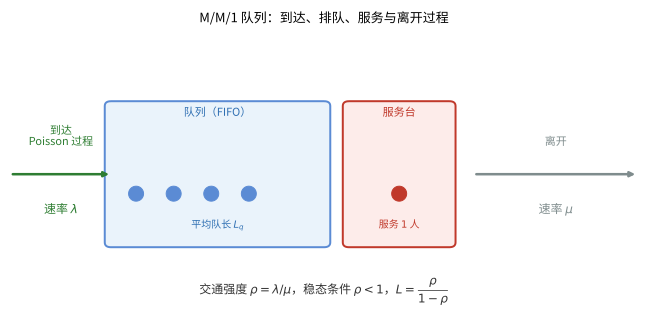
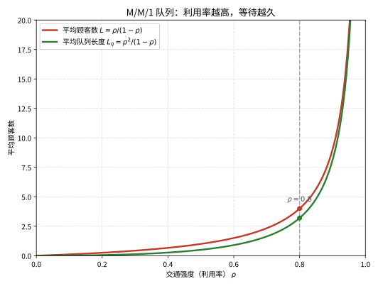

# 第111级：排队论 (Queueing Theory)

## 学习目标

1. 理解排队系统的基本要素和Kendall记号法
2. 掌握Little定律及其证明
3. 掌握M/M/1和M/M/c队列的稳态分析
4. 理解Pollaczek-Khinchin公式及其应用
5. 掌握Erlang公式及其在电信系统中的应用
6. 理解Jackson网络的乘积形式解

---

## 1. 核心概念

### 1.1 排队系统的基本要素

一个排队系统由以下基本要素组成：

1. **到达过程**：描述顾客到达系统的规律，通常用到达间隔时间的分布表示
2. **服务过程**：描述服务时间的分布
3. **排队规则**：包括FIFO（先到先服务）、LIFO（后到先服务）、优先级服务等
4. **服务台数**：并行服务的服务器数量
5. **系统容量**：系统中允许的最大顾客数（包括正在服务的）
6. **顾客源**：顾客的总体数量（有限或无限）

> **💡 直观理解（类比）**：排队系统的六大要素像"医院的挂号流程清单"——病人何时来（到达过程）、看医生多久（服务过程）、先来后到还是急诊优先（排队规则）、几个诊室（服务台数）、候诊区能容几人（系统容量）、病人总共有多少（顾客源）。把每条都定死，一座"排队医院"就被描述得清清楚楚，才有资格去算它到底有多挤。

### 1.2 Kendall记号

Kendall标准记号形式为：**A/B/c/K/m/Z**

其中：
- **A**：到达间隔时间的分布
- **B**：服务时间的分布
- **c**：并行服务台数
- **K**：系统容量（默认 $\infty$）
- **m**：顾客源大小（默认 $\infty$）
- **Z**：排队规则（默认FIFO）

常见分布记号：
- **M**：马尔可夫性（指数分布 / Poisson过程）
- **D**：确定性分布（定长）
- **E_k**：Erlang分布（$k$阶）
- **G**：一般分布（General）

例如，**M/M/1** 表示Poisson到达、指数服务时间、单服务台、无限容量、无限顾客源、FIFO规则的排队系统。

> **💡 直观理解（类比）**：Kendall 记号像"排队系统的身份证编码"——用 A/B/c/K/m/Z 六个字段依次记录到达分布、服务分布、服务台数、系统容量、顾客源和排队规则，就像用一串简写精确概括一座学校食堂几个窗口的全部属性。其中 $M$ 表示"随机碰运气"（指数/Poisson），$D$ 表示"铁定准时"（定长），一看"M/M/1"就知道是单窗口且到达、服务都随机的典型餐厅。

### 1.3 Little定律

> **Little定律**：在稳态排队系统中，平均顾客数 $L$、平均到达率 $\lambda$ 和平均逗留时间 $W$ 满足：
$$
L = \lambda W
$$

类似地，对于排队队列长度 $L_q$ 和平均等待时间 $W_q$，有：
$$
L_q = \lambda W_q
$$

Little定律的重要性在于其普适性——它几乎对任何排队系统都成立，只需要系统是稳态的且极限存在。

> **💡 直观理解（类比）**：Little 定律像"浴缸水量守恒"——缸里平均泡着几个人 $L$，等于进水流速 $\lambda$ 乘以每个人平均待的时间 $W$；进得快、泡得久，缸里人自然多。它只靠"没凭空多出人"这条铁律就成立，所以不管是先来先服务还是插队、单窗口还是多窗口，只要稳态就能套用。

### 1.4 M/M/1队列

M/M/1队列是排队论中最基本的模型，具有以下性质：

- 到达过程为Poisson过程，速率 $\lambda$
- 服务时间服从指数分布，均值 $1/\mu$
- 单服务台
- 无限容量
- FIFO排队规则

**稳态条件**：$\rho = \lambda / \mu < 1$（交通强度）

**关键性能指标**：

- 系统中平均顾客数：$L = \frac{\rho}{1-\rho}$
- 队列中平均顾客数：$L_q = \frac{\rho^2}{1-\rho}$
- 平均逗留时间：$W = \frac{1}{\mu - \lambda}$
- 平均等待时间：$W_q = \frac{\rho}{\mu - \lambda}$
- 系统中恰好有 $n$ 个顾客的概率：$P_n = (1-\rho)\rho^n$

> **直观理解（现实类比）**：M/M/1 就像只有一个收银员的超市。顾客随机到达（Poisson 过程），排队等候，收银员一个个地服务。交通强度 $\rho=\lambda/\mu$ 相当于"收银员有多忙"：顾客来得越快（$\lambda$ 大）或服务越慢，队列就越长。当平均到达速率等于甚至超过服务速率（$\rho\ge1$）时，队伍会无限增长，系统不再稳定。

> **直观理解（现实类比）**：图中两条曲线揭示了排队论最重要的一条经验：服务台利用率越高，排队越严重，而且这种恶化是"爆炸式"的。当利用率逼近 100%（$\rho\to1$）时，曲线急速上升趋于无穷。这就像高峰期的收费站——车流越接近通道的通行极限，堵车就越指数般恶化。

> **🧠 思考历程：一部公用电话，怎么孵化出整个排队理论？**
>
> M/M/1 回答的是一个常见却棘手的运营问题：服务台多忙、队伍多长、等待多久才是稳态？而它的第一位播种者，竟是上世纪一座城市里为电话忙线问题操心的丹麦工程师。
>
> - **哥本哈根的电话局**。1909年丹麦工程师厄兰（Agner Krarup Erlang）受雇于哥本哈根电话公司，为"电话占用时长与等待"建立数学模型，用马尔可夫链与泊松到达刻画通话过程——排队论就这样诞生于公用电话忙线故障的具体苦难里。
> - **一个人的字母表给排队取名**。1953年 Kendall 用"到达过程/服务过程/服务台数"三元符号（A/B/c）给排队系统分类，$M$ 表示马尔可夫（泊松到达、指数服务），于是"M/M/1"成了排队论的门面招牌，也把各家零散的模型收拢成一套可流通的语言。
> - **一条爆炸式的经验律**。利用率 $\rho=\lambda/\mu$ 自 Erlang 时代就被人琢磨，而 M/M/1 最惊人的结论是：$\rho\to1$ 时平均队长按 $1/(1-\rho)$ 趋向无穷——"服务台越满、排队越炸"这盏红灯，成了运营容量设计的核心。
> - **心路**：最抽象的数学往往从最具体的一台电话机来——一个被"忙线打爆"的问题，最终炼出了用概率驾驭拥挤的整套语言。

### 1.5 M/M/c队列

M/M/c队列有 $c$ 个并行的服务台，每个服务台的服务速率均为 $\mu$。

**稳态条件**：$\rho = \lambda/(c\mu) < 1$

**Erlang-C公式**（顾客需要等待的概率）：
$$
C(c, \lambda/\mu) = \frac{\frac{(c\rho)^c}{c!(1-\rho)}}{\sum_{k=0}^{c-1} \frac{(c\rho)^k}{k!} + \frac{(c\rho)^c}{c!(1-\rho)}}
$$

**关键性能指标**：

- 平均等待时间：$W_q = \frac{C(c, \lambda/\mu)}{c\mu - \lambda}$
- 平均逗留时间：$W = W_q + \frac{1}{\mu}$
- 队列中平均顾客数：$L_q = \lambda W_q$
- 系统中平均顾客数：$L = \lambda W$

> **💡 直观理解（类比）**：M/M/c 像"超市开了一排收银台"——多名收银员并行，谁空了谁来接待。Erlang-C 公式则回答顾客最关心的问题："我一进门有多大几率得排队（所有收银台都占满）？"它把"多窗口"的拥挤程度，比单个窗口算得宽松得多，是客服中心该设几个人手的直接依据。

### 1.6 M/G/1队列

M/G/1队列中，到达为Poisson过程，服务时间服从一般分布（均值为 $1/\mu$，方差为 $\sigma^2$）。

**Pollaczek-Khinchin公式**：
$$
L = \rho + \frac{\rho^2 + \lambda^2 \sigma^2}{2(1-\rho)}
$$

其中 $\rho = \lambda/\mu$。

> **💡 直观理解（类比）**：M/G/1 把"服务时间"从死板的指数放宽成任意分布，Pollaczek-Khinchin 公式则道破一条反直觉的真相：即使平均服务时长不变，只要服务时间"忽快忽慢"（方差 $\sigma^2$ 大），队列就会变长。好比同样是人均 5 分钟的结账，一个收银员忽快忽慢地扫码，排得总比匀速扫码的队伍更长。

### 1.7 其他重要概念

#### PASTA性质 (Poisson Arrivals See Time Averages)

Poisson到达的顾客看到系统处于某个状态的概率，等于该状态在时间平均下的概率。

> **💡 直观理解（类比）**：PASTA 性质像"随机抽查的公平性"——Poisson 顾客毫无规律地来，所以它撞见的"当下系统什么样"正巧就是平均意义上系统"平时什么样"，如同在人群里随机抓一个人，抓到的一定是"平均人"。而一旦顾客不是随机的（比如专挑高峰来），这个巧合就不再成立。

#### Erlang-B公式

用于Erlang-B（M/M/c/c）丢失系统（无等待位置）：
$$
B(c, a) = \frac{a^c/c!}{\sum_{k=0}^c a^k/k!}
$$

其中 $a = \lambda/\mu$ 是话务量强度。

> **💡 直观理解（类比）**：Erlang-B 公式管的是"没地方等就只能挂（丢）的电话"——当所有线路全忙时，新来电被直接礼貌地婉拒，公式正是算出这批"被拒之门外"的占比。它和 Erlang-C 的分水岭一目了然：前者没有候诊区、遇忙即丢，后者有候诊区、可排队等待。

#### Jackson网络

开Jackson网络由多个队列节点组成，外部到达为Poisson过程，每个节点的服务时间服从指数分布，顾客按固定路由概率在网络中移动。

**乘积形式解**：各节点的稳态分布可独立计算，联合分布为各节点分布的乘积。

> **💡 直观理解（类比）**：Jackson 网络像"多级车间的流水线"——工件一间屋一间屋地流转，每间屋都是个独立的小排队点。奇妙的是，尽管车间之间互相喂活，整个网络的总拥挤度却等于各屋拥挤度"简单相乘"，因为每屋只需拿"自己收到的活"按单个 M/M/1 算，无需纠缠其它屋——这就是"分而治之"的乘积形式解。

#### 重尾分布与排队

重尾分布（如Pareto分布）具有"长尾"特性，会导致排队系统的性能急剧恶化，即使平均负载较低。

> **💡 直观理解（类比）**：重尾分布像"极少数超级大的服务"——Pareto 分布偶而蹦出一个远超平均的超长耗时才肯收工。这极少数的"巨无霸"把方差拉到极大，于是即便平均负载不高，也会凭 P-K 公式里的方差项把队列撑得又长又抖，恰如偶尔来一次占半天收银台的超大单，让后面排成长龙。

---

## 2. 定理与证明

### 2.1 Little定律

> **定理 1（Little定律）**：在稳态排队系统中，平均顾客数 $L$、平均到达率 $\lambda$ 和平均逗留时间 $W$ 满足 $L = \lambda W$。

> **💡 直观理解（类比）**：这条定律像"守恒账本"——在稳态下系统人数 $L$ 永远是"每小时进来的人数 $\lambda$"乘以"每人待的时长 $W$"，不论进来节奏和待的长短是随机还是有规律的，账本总能对上，所以它成了排队论里最万能的换算公式。

**证明（样本路径方法）**：

考虑一个排队系统在时间区间 $[0, T]$ 上的运行轨迹。

**步骤1：定义关键量**

设：
- $A(T)$：在 $[0, T]$ 内到达的顾客总数
- $D(T)$：在 $[0, T]$ 内离开的顾客总数
- $N(t)$：时刻 $t$ 系统中顾客数
- $T_i$：第 $i$ 个顾客的逗留时间

**步骤2：积累顾客数**

定义累积顾客数函数：
$$
\alpha(T) = \int_0^T N(t) dt
$$

这表示在 $[0, T]$ 内所有顾客逗留时间的总和（以顾客-时间为单位）。

**步骤3：建立关系**

在系统为空（即 $N(0) = 0$，且 $N(T) = 0$）的假设下，有：
$$
\alpha(T) = \sum_{i=1}^{A(T)} T_i
$$

这是因为每个顾客的逗留时间贡献了 $T_i$ 个顾客-时间单位，而这些贡献的总和恰好等于 $\int_0^T N(t) dt$。

更一般地，如果 $N(0)$ 和 $N(T)$ 不为零，需要修正：
$$
\alpha(T) = \sum_{i=1}^{A(T)} T_i + \text{边界修正项}
$$

**步骤4：取平均**

定义：
- 平均到达率：$\hat{\lambda}_T = \frac{A(T)}{T}$
- 平均逗留时间：$\hat{W}_T = \frac{1}{A(T)} \sum_{i=1}^{A(T)} T_i$
- 平均顾客数：$\hat{L}_T = \frac{1}{T} \int_0^T N(t) dt$

由 $\alpha(T) = \int_0^T N(t) dt$ 和 $\alpha(T) \approx \sum_{i=1}^{A(T)} T_i$（当 $T$ 足够大，边界项可忽略），得：
$$
\hat{L}_T = \frac{\alpha(T)}{T} \approx \frac{\sum_{i=1}^{A(T)} T_i}{T} = \frac{A(T)}{T} \cdot \frac{\sum_{i=1}^{A(T)} T_i}{A(T)} = \hat{\lambda}_T \cdot \hat{W}_T
$$

**步骤5：取极限**

当 $T \to \infty$ 时，如果极限存在，则：
$$
L = \lim_{T \to \infty} \hat{L}_T = \lim_{T \to \infty} (\hat{\lambda}_T \cdot \hat{W}_T) = \lambda \cdot W
$$

其中 $\lambda = \lim_{T \to \infty} \hat{\lambda}_T$，$W = \lim_{T \to \infty} \hat{W}_T$。

**严格证明（鞅方法）**：

对于更严格的证明，我们使用鞅理论。

**步骤1：构造鞅**

设 $N(t)$ 是排队系统中的顾客数过程。定义补偿过程：
$$
M(t) = N(t) - \lambda \int_0^t \mathbf{1}_{\{N(s) > 0\}} ds + \mu \int_0^t \mathbf{1}_{\{N(s) > 0\}} ds
$$

对于M/M/1队列，$M(t)$ 是一个鞅。

**步骤2：使用可选停时定理**

对于任意停时 $\tau$，有 $\mathbb{E}[M(\tau)] = \mathbb{E}[M(0)] = N(0)$。

**步骤3：推导Little定律**

考虑系统首次达到 $N(t) = 0$ 的时刻。利用更新-报酬定理和鞅的性质，可以证明：
$$
\lim_{t \to \infty} \frac{1}{t} \int_0^t N(s) ds = \lambda \lim_{t \to \infty} \frac{1}{t} \int_0^t W(s) ds
$$

其中 $W(s)$ 是在时刻 $s$ 离开的顾客的逗留时间，从而得到 $L = \lambda W$。$\square$

### 2.2 M/M/1队列的稳态分布

> **定理 2（M/M/1稳态分布）**：对于交通强度 $\rho = \lambda/\mu < 1$ 的M/M/1队列，系统中恰好有 $n$ 个顾客的稳态概率为：
$$
P_n = (1-\rho)\rho^n, \quad n = 0, 1, 2, \ldots
$$

> **💡 直观理解（类比）**：$P_n=(1-\rho)\rho^n$ 是说"队列越长概率越稀"——空着的概率是 $1-\rho$，每多一个顾客就再乘一个 $\rho$，像一串等比递减的台阶：1人、2人、3人的概率依次衰减。$\rho$ 越接近 1（服务员越忙），这条递减越平缓，长队出现的可能就越大，正好印证"越忙越容易排长队"。

**证明（生灭过程方法）**：

**步骤1：建立生灭过程模型**

M/M/1队列的顾客数过程 $\{N(t), t \geq 0\}$ 是一个生灭过程：
- 出生率（到达率）：$\lambda_n = \lambda$，对所有 $n \geq 0$
- 死亡率（服务率）：$\mu_n = \mu$，对所有 $n \geq 1$

**步骤2：生灭过程的稳态方程**

生灭过程的稳态分布满足全局平衡方程：

对于状态 $0$：
$$
\lambda P_0 = \mu P_1
$$

对于状态 $n \geq 1$：
$$
(\lambda + \mu) P_n = \lambda P_{n-1} + \mu P_{n+1}
$$

**步骤3：求解递推关系**

从状态0的方程：
$$
P_1 = \frac{\lambda}{\mu} P_0 = \rho P_0
$$

假设 $P_n = \rho^n P_0$，用归纳法证明。

基础：$n = 0$ 时，$P_0 = \rho^0 P_0$ 成立。

归纳：假设 $P_k = \rho^k P_0$ 对所有 $k \leq n$ 成立。考虑状态 $n$ 的平衡方程：
$$
(\lambda + \mu) P_n = \lambda P_{n-1} + \mu P_{n+1}
$$

代入 $P_n = \rho^n P_0$，$P_{n-1} = \rho^{n-1} P_0$：
$$
(\lambda + \mu) \rho^n P_0 = \lambda \rho^{n-1} P_0 + \mu P_{n+1}
$$

$$
\mu P_{n+1} = (\lambda + \mu) \rho^n P_0 - \lambda \rho^{n-1} P_0
$$

$$
\mu P_{n+1} = \lambda \rho^{n-1} P_0 + \mu \rho^n P_0 - \lambda \rho^{n-1} P_0 = \mu \rho^n P_0
$$

因此 $P_{n+1} = \rho^n P_0 \cdot \rho = \rho^{n+1} P_0$，归纳成立。

**步骤4：归一化**

由概率归一性 $\sum_{n=0}^\infty P_n = 1$：
$$
\sum_{n=0}^\infty \rho^n P_0 = P_0 \cdot \frac{1}{1-\rho} = 1 \quad (\text{当 } \rho < 1)
$$

因此 $P_0 = 1 - \rho$，$P_n = (1-\rho)\rho^n$。

**步骤5：验证**

容易验证 $P_n$ 满足全局平衡方程，且 $\sum_{n=0}^\infty P_n = 1$，所以它是稳态分布。$\square$

### 2.3 Pollaczek-Khinchin公式

> **定理 3（Pollaczek-Khinchin公式）**：对于M/G/1队列（Poisson到达，一般服务时间分布，单服务台），系统中平均顾客数为：
$$
L = \rho + \frac{\rho^2 + \lambda^2 \sigma^2}{2(1-\rho)}
$$
> 其中 $\rho = \lambda/\mu$，$\sigma^2$ 是服务时间的方差。

> **💡 直观理解（类比）**：这条公式把队长拆成"实心 + 抖动"两块——$\rho$ 是服务台本该干的活，而 $\frac{\rho^2+\lambda^2\sigma^2}{2(1-\rho)}$ 则是服务时间"忽快忽慢"额外制造的拥堵；$\sigma^2$ 越大，抖动制造的拥堵就越厉害，哪怕平均速度不变。这正是"稳定匀速"远比"平均达标"更能换来不排队的数学原因。

**证明（嵌入马尔可夫链方法）**：

**步骤1：嵌入马尔可夫链**

考虑在每次顾客离开系统后的时刻（即服务完成时刻），系统状态（队列中的顾客数）构成一个嵌入马尔可夫链。

设 $X_n$ 为第 $n$ 个顾客离开后系统中剩余的顾客数，$A_n$ 为第 $n$ 个顾客服务期间到达的顾客数。则：
$$
X_{n+1} = \begin{cases}
X_n - 1 + A_{n+1}, & \text{if } X_n > 0 \\
A_{n+1}, & \text{if } X_n = 0
\end{cases}
$$

**步骤2：平稳分布的存在性**

由M/G/1队列的稳定性条件 $\rho < 1$，嵌入马尔可夫链是正常返的，存在平稳分布。

设 $\pi_k = \lim_{n \to \infty} P(X_n = k)$ 为平稳分布。

**步骤3：概率生成函数**

定义 $X$ 的平稳分布的概率生成函数：
$$
\Pi(z) = \sum_{k=0}^\infty \pi_k z^k, \quad |z| \leq 1
$$

定义服务期间到达顾客数的概率生成函数：
$$
A(z) = \mathbb{E}[z^A] = \sum_{k=0}^\infty a_k z^k
$$

其中 $a_k = P(A = k)$，$A$ 是服务期间到达的顾客数。

由于到达是Poisson过程（速率 $\lambda$），给定服务时间 $S$，$A$ 的条件分布为 Poisson($\lambda S$)，因此：
$$
A(z) = \mathbb{E}[\mathbb{E}[z^A | S]] = \mathbb{E}[e^{-\lambda S(1-z)}] = \tilde{S}(\lambda(1-z))
$$

其中 $\tilde{S}(s) = \mathbb{E}[e^{-sS}]$ 是服务时间的Laplace-Stieltjes变换。

**步骤4：推导Pollaczek-Khinchin变换公式**

由嵌入马尔可夫链的递推关系，可得：
$$
\Pi(z) = \frac{(1-\rho)(1-z)A(z)}{A(z) - z}
$$

**证明**：由嵌入链的递推关系：
$$
\mathbb{E}[z^{X_{n+1}}] = \mathbb{E}[z^{X_n - 1 + A_{n+1}} \mathbf{1}_{\{X_n > 0\}}] + \mathbb{E}[z^{A_{n+1}} \mathbf{1}_{\{X_n = 0\}}]
$$

在稳态下，$\mathbb{E}[z^{X_{n+1}}] = \mathbb{E}[z^{X_n}] = \Pi(z)$，且 $\mathbb{E}[z^{A_{n+1}}] = A(z)$，因此：
$$
\Pi(z) = \frac{1}{z} [\Pi(z) - \pi_0] A(z) + \pi_0 A(z)
$$

整理得：
$$
\Pi(z) \left(1 - \frac{A(z)}{z}\right) = \pi_0 A(z) \left(1 - \frac{1}{z}\right)
$$

$$
\Pi(z) = \frac{\pi_0 A(z) (z-1)}{z - A(z)}
$$

由 $\Pi(1) = 1$ 和 $A(1) = 1$，利用L'Hôpital法则可得 $\pi_0 = 1 - \rho$，因此：
$$
\Pi(z) = \frac{(1-\rho)(1-z)A(z)}{A(z) - z}
$$

**步骤5：推导平均队列长度**

对 $\Pi(z)$ 求导，令 $z \to 1$：
$$
L = \Pi'(1) = \lim_{z \to 1} \frac{d}{dz} \left( \frac{(1-\rho)(1-z)A(z)}{A(z) - z} \right)
$$

使用L'Hôpital法则和泰勒展开 $A(z) = 1 - \lambda \mathbb{E}[S](1-z) + \frac{\lambda^2 \mathbb{E}[S^2]}{2} (1-z)^2 + o((1-z)^2)$：

$$
A(z) = 1 - \rho(1-z) + \frac{\lambda^2 (\sigma^2 + 1/\mu^2)}{2} (1-z)^2 + o((1-z)^2)
$$

代入计算可得：
$$
L = \rho + \frac{\rho^2 + \lambda^2 \sigma^2}{2(1-\rho)}
$$

**步骤6：其他性能指标**

由Little定律，平均逗留时间：
$$
W = \frac{L}{\lambda} = \frac{1}{\mu} + \frac{\lambda(\sigma^2 + 1/\mu^2)}{2(1-\rho)}
$$

平均等待时间：
$$
W_q = W - \frac{1}{\mu} = \frac{\lambda(\sigma^2 + 1/\mu^2)}{2(1-\rho)}
$$

队列中平均顾客数：
$$
L_q = \lambda W_q = \frac{\lambda^2(\sigma^2 + 1/\mu^2)}{2(1-\rho)}
$$

$\square$

### 2.4 Erlang-B公式

> **定理 4（Erlang-B公式）**：对于M/M/c/c丢失系统（$c$ 个服务台，无等待位置），呼叫被阻塞的概率为：
$$
B(c, a) = \frac{a^c/c!}{\sum_{k=0}^c a^k/k!}
$$
> 其中 $a = \lambda/\mu$ 是话务量强度。

> **💡 直观理解（类比）**：Erlang-B 算出的是"满桌就别上菜"时的拒客概率——$c$ 个电话线路全占满时新来电被拒。分子只有"全满那一种情形"，分母则是从 0 到 $c$ 台全占的各种可能，比值就是撞上"正好全忙"的概率。给定可接受的丢失率，就能用它反推到底该配几条中继线。

**证明**：

**步骤1：建立生灭过程模型**

M/M/c/c系统是一个有限状态的生灭过程，状态空间为 $\{0, 1, \ldots, c\}$，其中状态 $k$ 表示有 $k$ 个顾客正在接受服务。

- 出生率：$\lambda_k = \lambda$，$k = 0, 1, \ldots, c-1$；$\lambda_c = 0$（系统满时拒绝到达）
- 死亡率：$\mu_k = k\mu$，$k = 1, 2, \ldots, c$

**步骤2：求解稳态分布**

对于生灭过程，稳态分布满足细致平衡方程：
$$
\lambda_k P_k = \mu_{k+1} P_{k+1}, \quad k = 0, 1, \ldots, c-1
$$

因此：
$$
P_{k+1} = \frac{\lambda_k}{\mu_{k+1}} P_k = \frac{\lambda}{(k+1)\mu} P_k = \frac{a}{k+1} P_k
$$

其中 $a = \lambda/\mu$。

递推得：
$$
P_k = \frac{a^k}{k!} P_0, \quad k = 0, 1, \ldots, c
$$

**步骤3：归一化**

由 $\sum_{k=0}^c P_k = 1$：
$$
P_0 \sum_{k=0}^c \frac{a^k}{k!} = 1 \quad \Rightarrow \quad P_0 = \frac{1}{\sum_{k=0}^c a^k/k!}
$$

因此：
$$
P_k = \frac{a^k/k!}{\sum_{j=0}^c a^j/j!}, \quad k = 0, 1, \ldots, c
$$

**步骤4：阻塞概率**

阻塞发生在系统全满（状态 $c$）时，因此阻塞概率为：
$$
B(c, a) = P_c = \frac{a^c/c!}{\sum_{k=0}^c a^k/k!}
$$

**步骤5：递推关系**

Erlang-B公式满足递推关系：
$$
B(c, a) = \frac{a B(c-1, a)}{c + a B(c-1, a)}
$$

其中 $B(0, a) = 1$。这个递推关系在计算大量服务台时非常有用，避免了直接计算阶乘造成的数值溢出。$\square$

### 2.5 Jackson网络的乘积形式解

> **定理 5（Jackson网络乘积形式解）**：对于开Jackson网络，各节点的稳态分布可独立计算，系统联合分布的稳态概率为各节点稳态分布的乘积：
$$
P(\mathbf{n}) = \prod_{i=1}^K P_i(n_i)
$$
> 其中 $P_i(n_i)$ 是节点 $i$ 在孤立M/M/1队列下的稳态分布，到达率由流量方程确定。

> **💡 直观理解（类比）**：网络整体的拥挤概率被写成各节点概率的乘积，像"整栋楼的亮灯情况"等于每间房间亮灯、灭灯状态独立组合——各屋一旦确定了自己收到的活，就互不相扰。该结论的价值在于：把一张纠缠不清的大网，拆成一个个互不相干的单间逐一击破，再相乘拼回整体。

**证明**：

**步骤1：Jackson网络的定义**

考虑一个由 $K$ 个节点组成的开Jackson网络：
- 外部到达：节点 $i$ 的外部到达为Poisson过程，速率 $\gamma_i$
- 服务时间：节点 $i$ 的服务时间服从指数分布，速率 $\mu_i$
- 路由概率：顾客从节点 $i$ 完成后以概率 $r_{ij}$ 前往节点 $j$，以概率 $r_{i0} = 1 - \sum_{j=1}^K r_{ij}$ 离开系统
- 排队规则：每个节点为FIFO，无限容量

**步骤2：流量方程**

设 $\lambda_i$ 为节点 $i$ 的总到达率（包括外部到达和其他节点路由来的顾客）。流量方程为：
$$
\lambda_i = \gamma_i + \sum_{j=1}^K \lambda_j r_{ji}, \quad i = 1, 2, \ldots, K
$$

用矩阵形式表示为：
$$
\boldsymbol{\lambda} = \boldsymbol{\gamma} + \boldsymbol{\lambda} R
$$

其中 $R = (r_{ij})$ 是路由矩阵。解得：
$$
\boldsymbol{\lambda} = \boldsymbol{\gamma} (I - R)^{-1}
$$

稳定性条件：$\rho_i = \lambda_i / \mu_i < 1$，对所有 $i = 1, \ldots, K$。

**步骤3：全局平衡方程**

设系统状态为 $\mathbf{n} = (n_1, n_2, \ldots, n_K)$，其中 $n_i$ 是节点 $i$ 中的顾客数。

系统的全局平衡方程为：
$$
P(\mathbf{n}) \left( \sum_{i=1}^K \gamma_i + \sum_{i=1}^K \mu_i \mathbf{1}_{\{n_i > 0\}} \right) = \sum_{i=1}^K P(\mathbf{n} - \mathbf{e}_i) \gamma_i + \sum_{i=1}^K \sum_{j=0}^K P(\mathbf{n} + \mathbf{e}_i - \mathbf{e}_j) \mu_i r_{ij}
$$

其中 $\mathbf{e}_i$ 是第 $i$ 个标准基向量，$r_{i0}$ 是离开系统的概率。

**步骤4：验证乘积形式解**

假设解的形式为：
$$
P(\mathbf{n}) = \prod_{i=1}^K (1-\rho_i) \rho_i^{n_i}
$$

代入全局平衡方程验证。

对于节点 $i$，在孤立M/M/1队列下，其稳态分布满足：
$$
\mu_i P_i(n_i+1) + \gamma_i P_i(n_i-1) = (\gamma_i + \mu_i) P_i(n_i)
$$

其中 $\gamma_i$ 被替换为 $\lambda_i$（总到达率）。

在Jackson网络中，将乘积形式解代入全局平衡方程，利用流量方程 $\lambda_i = \gamma_i + \sum_{j=1}^K \lambda_j r_{ji}$，可以验证方程两边相等。

**详细验证**：

对于状态 $\mathbf{n}$，考虑进入和离开的平衡：

**离开**：系统从状态 $\mathbf{n}$ 离开有两种方式：
1. 外部到达：$\sum_{i=1}^K \gamma_i$（当 $n_i > 0$ 时，到达会进入节点 $i$）
2. 服务完成：$\sum_{i=1}^K \mu_i \mathbf{1}_{\{n_i > 0\}}$

**进入**：系统进入状态 $\mathbf{n}$ 有：
1. 外部到达使从 $\mathbf{n} - \mathbf{e}_i$ 进入：$\sum_{i=1}^K P(\mathbf{n} - \mathbf{e}_i) \gamma_i$
2. 服务完成使从 $\mathbf{n} + \mathbf{e}_i - \mathbf{e}_j$ 进入：$\sum_{i=1}^K \sum_{j=0}^K P(\mathbf{n} + \mathbf{e}_i - \mathbf{e}_j) \mu_i r_{ij}$

代入乘积形式解 $P(\mathbf{n}) = \prod_{i=1}^K P_i(n_i)$，其中 $P_i(n_i) = (1-\rho_i)\rho_i^{n_i}$。

注意到 $P_i(n_i+1) = \rho_i P_i(n_i)$，$P_i(n_i-1) = P_i(n_i)/\rho_i$（当 $n_i > 0$）。

利用流量方程 $\lambda_i = \gamma_i + \sum_{j=1}^K \lambda_j r_{ji}$ 和 $\rho_i = \lambda_i/\mu_i$，代入验证可得全局平衡方程成立。

**步骤5：唯一性**

由于Jackson网络的马尔可夫链是不可约且正常返的（所有 $\rho_i < 1$），稳态分布是唯一的，因此乘积形式解就是系统的稳态分布。$\square$

---

## 3. 示例

### 3.1 M/M/1队列的性能指标计算

**问题**：一个网络服务器，请求到达率为每秒10次，每个请求的平均处理时间为0.08秒。假设请求到达为Poisson过程，处理时间服从指数分布。求：
(1) 系统空闲的概率
(2) 系统中平均请求数
(3) 请求的平均逗留时间
(4) 系统中超过5个请求的概率
(5) 第90百分位的响应时间

**解**：

已知：$\lambda = 10$ 次/秒，$\mu = 1/0.08 = 12.5$ 次/秒

**步骤1：计算交通强度**
$$
\rho = \frac{\lambda}{\mu} = \frac{10}{12.5} = 0.8
$$

由于 $\rho = 0.8 < 1$，系统稳定。

**步骤2：系统空闲概率**
$$
P_0 = 1 - \rho = 1 - 0.8 = 0.2
$$

系统有20%的时间是空闲的。

**步骤3：系统中平均请求数**
$$
L = \frac{\rho}{1-\rho} = \frac{0.8}{0.2} = 4
$$

**步骤4：平均逗留时间**
$$
W = \frac{1}{\mu - \lambda} = \frac{1}{12.5 - 10} = \frac{1}{2.5} = 0.4 \text{秒}
$$

**步骤5：平均等待时间**
$$
W_q = \frac{\rho}{\mu - \lambda} = \frac{0.8}{12.5 - 10} = \frac{0.8}{2.5} = 0.32 \text{秒}
$$

**步骤6：队列中平均请求数**
$$
L_q = \lambda W_q = 10 \times 0.32 = 3.2
$$

**步骤7：系统中超过5个请求的概率**
$$
P(N > 5) = 1 - \sum_{n=0}^5 P_n = 1 - \sum_{n=0}^5 (1-\rho)\rho^n = 1 - (1-\rho^6) = \rho^6 = 0.8^6 \approx 0.262
$$

**步骤8：第90百分位的响应时间**

响应时间 $T$ 的分布为：
$$
P(T > t) = e^{-\mu(1-\rho)t} = e^{-12.5 \times 0.2 \times t} = e^{-2.5t}
$$

设 $P(T > t_{90}) = 0.1$：
$$
e^{-2.5 t_{90}} = 0.1 \quad \Rightarrow \quad t_{90} = -\frac{\ln 0.1}{2.5} = \frac{2.3026}{2.5} \approx 0.921 \text{秒}
$$

### 3.2 M/M/c队列的应用

**问题**：一个客服中心有3名客服人员，客户电话到达率为每分钟2个，每位客服的平均服务时间为1分钟。假设到达为Poisson过程，服务时间服从指数分布，求：
(1) 客户需要等待的概率
(2) 平均等待时间
(3) 平均队列长度
(4) 系统中平均客户数

**解**：

已知：$\lambda = 2$ 个/分钟，$\mu = 1$ 个/分钟，$c = 3$

**步骤1：计算交通强度**
$$
\rho = \frac{\lambda}{c\mu} = \frac{2}{3 \times 1} = \frac{2}{3} \approx 0.667
$$

由于 $\rho < 1$，系统稳定。

**步骤2：系统空闲概率**

首先计算 $a = \lambda/\mu = 2$。

$$
P_0 = \left[ \sum_{k=0}^{c-1} \frac{a^k}{k!} + \frac{a^c}{c!(1-\rho)} \right]^{-1}
$$

$$
P_0 = \left[ \frac{2^0}{0!} + \frac{2^1}{1!} + \frac{2^2}{2!} + \frac{2^3}{3! \times (1-2/3)} \right]^{-1}
$$

$$
P_0 = \left[ 1 + 2 + 2 + \frac{8}{6 \times 1/3} \right]^{-1} = \left[ 5 + \frac{8}{2} \right]^{-1} = [5 + 4]^{-1} = \frac{1}{9} \approx 0.1111
$$

**步骤3：客户需要等待的概率（Erlang-C公式）**
$$
C(3, 2) = \frac{\frac{a^c}{c!(1-\rho)}}{\sum_{k=0}^{c-1} \frac{a^k}{k!} + \frac{a^c}{c!(1-\rho)}} = \frac{4}{5 + 4} = \frac{4}{9} \approx 0.4444
$$

**步骤4：平均等待时间**
$$
W_q = \frac{C(c, a)}{c\mu - \lambda} = \frac{4/9}{3 \times 1 - 2} = \frac{4/9}{1} = \frac{4}{9} \approx 0.444 \text{分钟}
$$

**步骤5：平均队列长度**
$$
L_q = \lambda W_q = 2 \times \frac{4}{9} = \frac{8}{9} \approx 0.889
$$

**步骤6：平均逗留时间**
$$
W = W_q + \frac{1}{\mu} = \frac{4}{9} + 1 = \frac{13}{9} \approx 1.444 \text{分钟}
$$

**步骤7：系统中平均客户数**
$$
L = \lambda W = 2 \times \frac{13}{9} = \frac{26}{9} \approx 2.889
$$

---

## 4. 习题

### 基础题

**习题 1**（Kendall 记号）写出 Kendall 记号 A/B/c/K/m/Z 中每个字段的含义，并说明一个 M/M/1 系统代表怎样的到达过程、服务过程、服务台数与排队规则。

**习题 2**（Little 定律）写出 Little 定律的两个关系式（平均顾客数与到达率、逗留时间）及对应的符号表达式，并说明它在什么条件下普遍成立。

**习题 3**（M/M/1 稳态）写出 M/M/1 队列的稳态条件、系统中有 $n$ 个顾客的概率 $P_n$ 以及系统空闲概率 $P_0$。

**习题 4**（M/M/1 指标）写出 M/M/1 队列的四个关键指标：系统中平均顾客数 $L$、队列平均顾客数 $L_q$、平均逗留时间 $W$、平均等待时间 $W_q$。

**习题 5**（M/M/c 指标）写出 M/M/c 队列的稳态条件并列出其平均等待时间 $W_q$、平均逗留时间 $W$、$L_q$ 与 $L$ 的计算公式。

**习题 6**（Erlang-C 公式）写出 Erlang-C 公式（顾客需要等待的概率 $C(c,\lambda/\mu)$），并说明它用于描述哪类 M/M/c 现象。

**习题 7**（Pollaczek-Khinchin 公式）写出 M/G/1 队列中系统平均顾客数 $L$ 的 Pollaczek-Khinchin 公式，并指出它与服务时间方差 $\sigma^2$ 的关系。

**习题 8**（Erlang-B 公式）写出 Erlang-B（丢失系统）的阻塞概率公式 $B(c,a)$，并说明它与 Erlang-C 在排队规则上的本质区别。

**习题 9**（PASTA 性质）用一句话准确表述 PASTA（Poisson Arrivals See Time Averages）性质的含义。

**习题 10**（Jackson 网络）说明开 Jackson 网络的乘积形式解的含义，以及如何确定各节点的到达率。

### 进阶题

**习题 11**（M/M/1 数值）某网络服务器请求到达率 $\lambda=10$ 次/秒，平均处理时间 $0.08$ 秒（指数分布）。求系统空闲概率、平均请求数 $L$、平均逗留时间 $W$、平均等待时间 $W_q$ 与队列平均请求数 $L_q$。

**习题 12**（有限缓冲 M/M/1/K）某节点到达率 $\lambda=500$/秒、处理率 $\mu=600$/秒（Poisson 到达、指数服务）。求系统空闲概率、平均数据包数 $L$、平均逗留时间 $W$；若缓冲容量 $K=10$，求数据包被丢弃的概率（使用 $P_n=(1-\rho)\rho^n/(1-\rho^{K+1})$）。

**习题 13**（M/M/c 设计）银行客户到达率 $\lambda=30$/小时，每名柜员平均服务 6 分钟（指数分布），希望平均等待时间不超过 5 分钟。求所需柜台数 $c$、该配置下客户需要等待的概率及平均队列长度 $L_q$。

**习题 14**（P-K 公式应用）某 M/G/1 队列到达率 $\lambda=10$/小时，服务时间均值 5 分钟、方差 25 分钟²。求系统平均顾客数 $L$ 与平均逗留时间 $W$；若服务时间变为确定性（方差为 0），重新计算并比较、讨论方差的影响。

**习题 15**（Erlang-B 数值）某电话交换系统有 10 条中继线、话务量强度 $a=5$ Erlang，到达为 Poisson、通话时长指数分布。求呼叫阻塞概率；若增加 2 条中继线阻塞概率变为多少；要使阻塞概率低于 1% 至少需多少条中继线（用递推 $B(c,a)=\frac{aB(c-1,a)}{c+aB(c-1,a)}$）。

**习题 16**（Little 定律应用）某车间工件平均到达率 $\lambda=20$/天，平均在制品库存 $L=50$。求平均逗留时间；若希望缩短到 2 天需将库存降至多少；若到达率增至 25/天且保持逗留时间不变，库存应控制在多少？

**习题 17**（生灭过程推导）由生灭过程的细致平衡方程 $\lambda P_k=\mu P_{k+1}$ 推导 M/M/1 的稳态分布 $P_n=(1-\rho)\rho^n$，并求出 $P_0$ 与稳定性条件 $\rho<1$。

**习题 18**（响应时间分布）说明 M/M/1 中响应（逗留）时间 $T$ 的分布参数及 $P(T>t)=e^{-(\mu-\lambda)t}$ 的由来，并写出平均逗留 $W$ 与第 90 百分位响应时间的求法。

**习题 19**（M/M/c 数值）客服中心有 3 名客服，到达率 $\lambda=2$/分钟，每名客服服务速率 $\mu=1$/分钟。求客户需要等待的概率、$W_q$、$L_q$、$W$ 与 $L$。

### 挑战题

**习题 20**（Little 定律样本路径证明）用样本路径方法证明 Little 定律 $L=\lambda W$：给出累积逗留时间 $\alpha(T)$、平均到达率、平均逗留与平均顾客数的定义，说明在系统为空（$N(0)=N(T)=0$）时 $\alpha(T)=\sum_i T_i$ 为何成立，并取极限完成证明。

**习题 21**（P-K 变换公式）对 M/G/1 的嵌入马尔可夫链，证明系统数概率生成函数满足 $\Pi(z)=\frac{(1-\rho)(1-z)A(z)}{A(z)-z}$，并说明如何由 $\Pi(1)=1$ 用 L'Hôpital 法则得到 $\pi_0=1-\rho$。

**习题 22**（P-K 导出其余指标）由 P-K 公式得到的 $L$ 出发，利用 Little 定律推导平均逗留时间 $W$、平均等待时间 $W_q$ 与平均队列顾客数 $L_q$，并分析服务时间方差 $\sigma^2$ 如何影响这些指标。

**习题 23**（Erlang-B 的推导）将 M/M/c/c 建模为生灭过程，由细致平衡方程推导稳态分布 $P_k=\frac{a^k}{k!}P_0$、归一化后得 $B(c,a)=\frac{a^c/c!}{\sum_{k=0}^c a^k/k!}$，并推导其递推关系 $B(c,a)=\frac{aB(c-1,a)}{c+aB(c-1,a)}$。

**习题 24**（M/M/1 尾概率）推导系统超过 $n$ 个顾客的概率 $P(N>n)=\rho^{n+1}$，并在此基础上利用 $P(T>t)=e^{-\mu(1-\rho)t}$ 求解第 90 百分位响应时间（与示例 3.1 对照）。

**习题 25**（Jackson 网络数值）两节点串联开 Jackson 网络：节点 1 外部到达 $\lambda=5$、服务率 $\mu_1=8$，节点 2 服务率 $\mu_2=10$，节点 1 完成后以概率 1 进入节点 2。求两节点的总到达率、各节点稳态分布及系统平均顾客总数。

**习题 26**（重尾分布的影响）说明 Pareto 等重尾分布为何会使排队性能在"平均负载不高"时仍然急剧恶化，并结合 Pollaczek-Khinchin 公式中的方差项给出解释。

### 探究题

**习题 27**（Little 定律的普适性）探究 Little 定律为何对几乎任何稳态排队系统成立，讨论它对到达/服务分布、队列规则、多服务台等做出哪些假设，并说明在真实复杂系统（如网络节点、制造线）中应用时的注意事项。

**习题 28**（模型选择）探究 M/M/1、M/M/c 与 M/G/1 三者在建模选型上的差异，重点分析服务时间分布（尤其方差 $\sigma^2$）如何通过 P-K 公式影响性能指标，并给出实际系统应如何选择模型的建议。

**习题 29**（Erlang-B 与 Erlang-C）对比丢失型（Erlang-B，无等待）与等待型（Erlang-C，可等待）系统的适用场景与容量规划方法，讨论话务量强度 $a$、服务台数 $c$、阻塞率与等待时间 SLA 之间的关系和权衡。

**习题 30**（Jackson 网络扩展）探究 Jackson 网络乘积形式解的条件与应用边界，进一步思考闭合网络（Gordon-Newell）、多类顾客、优先级等扩展情形，并讨论排队网络分析在通信、制造与计算系统设计中的作用。

---

## 5. 习题答案与解析

### 基础题答案

1. **Kendall 记号** A/B/c/K/m/Z 依次为：A 到达间隔时间分布、B 服务时间分布、c 并行服务台数、K 系统容量（默认 $\infty$）、m 顾客源大小（默认 $\infty$）、Z 排队规则（默认 FIFO）。M/M/1 表示 Poisson 到达、指数服务时间、单服务台、容量无限、顾客源无限、FIFO 的排队系统。

2. **Little 定律** $L=\lambda W$（系统中平均顾客数 $L$ = 平均到达率 $\lambda$ × 平均逗留时间 $W$）；对队列部分 $L_q=\lambda W_q$。它几乎对任何稳态排队系统成立，只要系统处于稳态且相应极限存在，不依赖具体的到达/服务分布与排队规则。

3. **M/M/1 稳态** 稳态条件为交通强度 $\rho=\lambda/\mu<1$。系统中有 $n$ 个顾客的概率 $P_n=(1-\rho)\rho^n$（$n\ge0$），系统空闲概率 $P_0=1-\rho$。

4. **M/M/1 指标** $L=\frac{\rho}{1-\rho}$，$L_q=\frac{\rho^2}{1-\rho}$，$W=\frac{1}{\mu-\lambda}$，$W_q=\frac{\rho}{\mu-\lambda}$。可由 $L_q=\lambda W_q$、$L=\lambda W$（Little 定律）相互换算。

5. **M/M/c 指标** 稳态条件 $\rho=\lambda/(c\mu)<1$。平均等待时间 $W_q=\frac{C(c,\lambda/\mu)}{c\mu-\lambda}$（$C$ 为 Erlang-C）；$W=W_q+\frac{1}{\mu}$；$L_q=\lambda W_q$；$L=\lambda W$。

6. **Erlang-C 公式** $C(c,\lambda/\mu)=\frac{\frac{(c\rho)^c}{c!(1-\rho)}}{\sum_{k=0}^{c-1}\frac{(c\rho)^k}{k!}+\frac{(c\rho)^c}{c!(1-\rho)}}$，它刻画 M/M/c 系统中到达顾客需要排队等待的概率（$c$ 个服务台都忙）。

7. **Pollaczek-Khinchin 公式** $L=\rho+\frac{\rho^2+\lambda^2\sigma^2}{2(1-\rho)}$，其中 $\rho=\lambda/\mu$，$\sigma^2$ 为服务时间方差。它揭示服务时间的变异性（$\sigma^2>0$）会额外增大系统平均顾客数，是 M/G/1 的核心结论。

8. **Erlang-B 公式** $B(c,a)=\frac{a^c/c!}{\sum_{k=0}^c a^k/k!}$，其中 $a=\lambda/\mu$ 为话务量强度。Erlang-B 用于 M/M/c/c 丢失系统（无等待位置）：当 $c$ 个服务台全忙时到达呼叫被阻塞丢弃；而 Erlang-C 用于有等待等待队列的系统。

9. **PASTA 性质** Poisson 到达的顾客"到达瞬间"所看到的系统状态分布，等于该状态在时间上的平均分布（即稳态分布）——这对非 Poisson 到达一般不成立。

10. **Jackson 网络** 开 Jackson 网络中每个节点的稳态分布可独立地按 $M/M/1$ 计算，系统联合分布为各节点稳态分布之积 $P(\mathbf{n})=\prod_i P_i(n_i)$，其中各节点到达率由流量方程（外部到达 + 其他节点流入）确定。

### 进阶题答案

1. **M/M/1 数值** $\lambda=10$，$\mu=12.5$，$\rho=\lambda/\mu=0.8$（稳定）。空闲概率 $P_0=1-\rho=0.2$；$L=\rho/(1-\rho)=4$；$W=1/(\mu-\lambda)=0.4$ 秒；$W_q=\rho/(\mu-\lambda)=0.32$ 秒；$L_q=\lambda W_q=3.2$。

2. **有限缓冲 M/M/1/K** 无缓冲限制时 $\rho=500/600=5/6$，$P_0=1-\rho\approx0.167$，$L=\rho/(1-\rho)=5$，$W=1/(\mu-\lambda)=0.01$ 秒。缓冲 $K=10$ 时 $P_n=(1-\rho)\rho^n/(1-\rho^{K+1})$，丢弃概率即系统满的概率：$P_{K}=\frac{(1-\rho)\rho^{10}}{1-\rho^{11}}=\frac{(1/6)(5/6)^{10}}{1-(5/6)^{11}}\approx0.031$，即约 3.1% 的数据包被丢弃。

3. **M/M/c 设计** 每名柜员 $\mu=60/6=10$/小时。由稳定性 $\rho=\lambda/(c\mu)<1$ 需 $c>3$。取 $c=4$：$\rho=30/40=0.75$，$a=\lambda/\mu=3$，$P_0=[\sum_{k=0}^{3}\frac{a^k}{k!}+\frac{a^4}{4!(1-\rho)}]^{-1}=[1+3+4.5+4.5+13.5]^{-1}=1/26.5$；Erlang-C $C(4,3)=13.5/26.5\approx0.509$；$W_q=\frac{C}{c\mu-\lambda}=\frac{0.509}{40-30}=0.0509$ 小时 $\approx3.06$ 分钟 $\le5$ 分钟，满足要求。故 $c=4$。等待概率约 50.9%，$L_q=\lambda W_q=30\times0.0509\approx1.53$。

4. **P-K 公式应用** 统一单位为小时：$\lambda=10$/h，$1/\mu=5/60=1/12$ h（$\mu=12$），$\sigma^2=25$ 分钟² $=25/3600\approx0.00694$ h²，$\rho=\lambda/\mu=10/12=5/6$。一般分布：$L=\rho+\frac{\rho^2+\lambda^2\sigma^2}{2(1-\rho)}=\frac56+\frac{25/36+100\times0.00694}{2/6}\approx5.0$，$W=L/\lambda\approx0.5$ h $=30$ 分钟。确定性（$\sigma^2=0$）：$L=\frac56+\frac{25/36}{2/6}\approx2.92$，$W\approx0.292$ h $=17.5$ 分钟。相比可见，服务时间方差把平均顾客数从 2.92 增到 5、逗留时间从 17.5 增到 30 分钟，说明方差越大排队越严重。

5. **Erlang-B 数值** 用递推 $B(c,a)=aB(c-1,a)/(c+aB(c-1,a))$，$B(0,5)=1$，$a=5$：算得 $B(10,5)\approx0.0184$，即阻塞约 1.84%。增加 2 条到 12 条：$B(12,5)\approx0.0034$，阻塞约 0.34%（下降了约 1.5 个百分点）。要使 $B(c,5)<1\%$：$B(11,5)\approx0.0083=0.83\%<1\%$，故至少需 11 条中继线。

6. **Little 定律应用** ① $W=L/\lambda=50/20=2.5$ 天。② $W=2$ 天时 $L=\lambda W=20\times2=40$（库存需降至 40）。③ $\lambda=25$/天、保持 $W=2.5$ 天时 $L=\lambda W=25\times2.5=62.5$（库存需控制在 62.5，即约 63）。

7. **生灭过程推导** 细致平衡 $\lambda P_k=\mu P_{k+1}$ 得 $P_{k+1}=(\lambda/\mu)P_k=\rho P_k$，递推 $P_k=\rho^k P_0$。归一化 $\sum_{k=0}^\infty P_k=P_0\sum_k\rho^k=P_0/(1-\rho)=1$，得 $P_0=1-\rho$（要求 $\rho<1$ 使几何级数收敛），故 $P_n=(1-\rho)\rho^n$。

8. **响应时间分布** 在 M/M/1 中，逗留时间（响应时间）$T$ 服从速率为 $\mu-\lambda$ 的指数分布：$P(T>t)=e^{-(\mu-\lambda)t}=e^{-\mu(1-\rho)t}$，因容量无限且无丢弃。平均逗留 $W=1/(\mu-\lambda)$。令 $P(T>t_{90})=0.1$，解得 $t_{90}=-\frac{\ln0.1}{\mu-\lambda}$（如示例中 $\mu-\lambda=2.5$ 时 $t_{90}\approx0.92$ 秒）。

9. **M/M/c 数值** $\lambda=2$，$\mu=1$，$c=3$，$a=2$，$\rho=\lambda/(c\mu)=2/3$。$P_0=[1+2+2+\frac{2^3}{3!(1-2/3)}]^{-1}=[5+8/2]^{-1}=1/9$；等待概率 $C(3,2)=4/9\approx0.444$；$W_q=\frac{C}{c\mu-\lambda}=\frac{4/9}{3-2}\approx0.444$ 分钟；$W=W_q+1=\frac{13}{9}\approx1.444$ 分钟；$L_q=\lambda W_q=\frac89\approx0.889$；$L=\lambda W=\frac{26}{9}\approx2.889$。

### 挑战题答案

1. **Little 定律样本路径证明** 令 $\alpha(T)=\int_0^T N(t)dt$（合计逗留时间）、$\hat\lambda_T=A(T)/T$、$\hat W_T=\frac1{A(T)}\sum_{i=1}^{A(T)}T_i$、$\hat L_T=\alpha(T)/T$。当系统空（$N(0)=N(T)=0$）时，每个顾客的逗留贡献 $T_i$ 与 $\int N dt$ 重合，故 $\alpha(T)=\sum_i T_i$。于是 $\hat L_T=\frac{\alpha(T)}{T}=\frac{A(T)}{T}\cdot\frac{\sum_i T_i}{A(T)}=\hat\lambda_T\hat W_T$。当 $T\to\infty$ 时 $\hat\lambda_T\to\lambda$、$\hat W_T\to W$、$\hat L_T\to L$，即 $L=\lambda W$；$N(0),N(T)$ 非零时的边界项随 $T\to\infty$ 可忽略。

2. **P-K 变换公式** 嵌入链 $X_{n+1}=(X_n-1+A_{n+1})^+$，稳态取 $\mathbb{E}[z^{X_{n+1}}]=\mathbb{E}[z^{X_n}]=\Pi(z)$，$\mathbb{E}[z^A]=A(z)$，得 $\mathbb{E}[z^{X_{n+1}}]=\frac1z[\Pi(z)-\pi_0]A(z)+\pi_0A(z)$。整理 $\Pi(z)(1-\frac{A(z)}z)=\pi_0A(z)(1-\frac1z)$，即 $\Pi(z)=\frac{\pi_0A(z)(z-1)}{z-A(z)}$。因 $\Pi(1)=1$、$A(1)=1$，对 $z\to1$ 用 L'Hôpital 法则得 $\pi_0=1-\rho$，代回得 $\Pi(z)=\frac{(1-\rho)(1-z)A(z)}{A(z)-z}$。

3. **P-K 导出其余指标** 由 Little 定律 $W=L/\lambda$，代入 $L$ 得 $W=\frac1\mu+\frac{\lambda(\sigma^2+1/\mu^2)}{2(1-\rho)}$；$W_q=W-\frac1\mu=\frac{\lambda(\sigma^2+1/\mu^2)}{2(1-\rho)}$；$L_q=\lambda W_q=\frac{\lambda^2(\sigma^2+1/\mu^2)}{2(1-\rho)}$。可见三项指标都随 $\sigma^2$ 线性增大（且对 $1/\mu^2$ 的倍数），说明服务时间波动越大，等待与逗留越久、队列越长，这正是 P-K 公式的核心洞察。

4. **Erlang-B 的推导** M/M/c/c 为有限生灭过程（出生率 $\lambda_k=\lambda\ (k<c)$、$\lambda_c=0$；死亡率 $\mu_k=k\mu$）。细致平衡 $\lambda P_k=(k+1)\mu P_{k+1}$ 得 $P_{k+1}=\frac{a}{k+1}P_k$，递推 $P_k=\frac{a^k}{k!}P_0$；归一化 $P_0=1/\sum_{k=0}^c\frac{a^k}{k!}$。阻塞发生在 $c$ 台全满：$B(c,a)=P_c=\frac{a^c/c!}{\sum_{k=0}^c a^k/k!}$。由 $B(c,a)=P_c$、$P_c=\frac{a}{c}P_{c-1}$ 与全概率式可推得递推 $B(c,a)=\frac{aB(c-1,a)}{c+aB(c-1,a)}$，$B(0,a)=1$，便于迭代求值、避免阶乘溢出。

5. **M/M/1 尾概率** $P(N>n)=\sum_{k=n+1}^\infty(1-\rho)\rho^k=(1-\rho)\rho^{n+1}\cdot\frac1{1-\rho}=\rho^{n+1}$。响应时间 $P(T>t)=e^{-\mu(1-\rho)t}$，令其 $=0.1$ 得 $t_{90}=-\ln0.1/[\mu(1-\rho)]$。以示例 3.1（$\mu=12.5,\rho=0.8$）校核：$P(N>5)=\rho^6=0.8^6\approx0.262$，$t_{90}=2.3026/(2.5)\approx0.921$ 秒，与正文一致。

6. **Jackson 网络数值** 串联全入第二个节点：流量方程 $\lambda_1=\gamma_1=5$、$\lambda_2=\lambda_1\cdot1=5$。节点 1：$\rho_1=5/8$，$P_1(n)=\frac38(\frac58)^n$；节点 2：$\rho_2=5/10=1/2$，$P_2(n)=\frac12(\frac12)^n$。联合分布为两者之积。系统平均顾客总数 $L=L_1+L_2=\frac{5/8}{3/8}+\frac{1/2}{1/2}=\frac53+1=\frac83\approx2.67$。

7. **重尾分布的影响** 重尾（如 Pareto）分布尾部衰减缓慢，其方差 $\sigma^2$ 很大甚至趋于无穷。由 P-K 公式 $L=\rho+\frac{\rho^2+\lambda^2\sigma^2}{2(1-\rho)}$，第二项随 $\sigma^2$ 急剧增大，即便平均负载 $\rho$ 不高也会使 $L$、$W$ 显著上升。因此平均到达/服务速率看似"够用"，也常出现长队列，这就是重尾导致性能恶化的数学根源。

### 探究题答案

1. **Little 定律的普适性** Little 定律 $\alpha(T)=\int N dt$、$L=\lim\hat L=\lim(\hat\lambda\hat W)=\lambda W$ 的证明只用守恒关系，从未用到 Poisson 或指数、FIFO、多服务台等假设，只要系统稳态且极限存在即可成立。应用时需注意：系统边界划分要一致（进入/离开速率相同）、需处于稳态、指标需收敛；对网络节点、制造在制品等非经典系统尤为有用，可将众多绩效指标用一条关系串起来。

2. **模型选择** M/M/1 最简单、假设到达与服务均指数（方差 $=1/\mu^2$），适合单台、服务时间近似指数；M/M/c 描述 c 个并行同质服务台，用 Erlang-C 处理等待；M/G/1 保留 Poisson 到达、允许一般服务分布，P-K 公式表明 $\sigma^2$ 直接抬高 $L,W,L_q$。实际选型应结合历史数据估计服务分布与方差：数据越不呈指数、$\sigma^2$ 越大，越需用 M/G/1 并警惕排队恶化；多台场景用 M/M/c；单台且指数假设可靠时用 M/M/1。

3. **Erlang-B 与 Erlang-C** Erlang-B 适用于"有呼叫遇忙即丢、不排队"的丢失型系统（电话中继、即服务型资源），指标是阻塞率 $B(c,a)$；Erlang-C 适用于"可排队等待"的等待型系统（客服中心、借阅），指标是等待概率与等待时间。容量规划上，Erlang-B 给定可接受阻塞率反推所需中继数 $c$；Erlang-C 给定等待时间 SLA（如等待 $\le$ 阈值的概率）反推客服数。共同处是都依赖于话务量强度 $a=\lambda/\mu$ 与台数 $c$，权衡在于多配服务台降宕阻塞/等待但提高成本，需在服务质量与资源投入间折中。

4. **Jackson 网络扩展** 乘积形式解要求开网络、Poisson 外部到达、各节点指数服务、固定路由概率与无限容量；其价值是"分而治之"——先解流量方程得各节点到达率，再按独立 M/M/1 计算性能。扩展方向：闭合网络（顾客总数固定，Gordon-Newell 定理）、多类顾客、非指数服务与有限容量等，此时乘积形式不再普适、需用近似或数值方法。在通信网络、制造流水线与并行计算机系统设计中，Jackson 类网络提供性能瓶颈识别与容量规划的第一手量化工具。

## 6. 总结

本级别系统地介绍了排队论的核心理论和方法：

1. **排队系统的基本要素**：到达过程、服务过程、排队规则、服务台数等，以及Kendall记号法。

2. **Little定律**：$L = \lambda W$ 是排队论中最基本的定律，具有普适性。我们通过样本路径方法和鞅方法给出了完整证明。

3. **M/M/1队列**：最基本的排队模型，其稳态分布通过生灭过程方法求解，得到 $P_n = (1-\rho)\rho^n$。

4. **M/M/c队列**：多服务台模型，通过Erlang-C公式计算等待概率。

5. **M/G/1队列**：服务时间服从一般分布的模型，Pollaczek-Khinchin公式揭示了服务时间方差对系统性能的影响。

6. **Erlang-B公式**：丢失系统的阻塞概率公式，在电信系统中有广泛应用。

7. **Jackson网络**：排队网络的乘积形式解，大大简化了网络性能分析。

排队论的核心思想是：通过数学建模分析排队系统的性能，为系统设计、容量规划和资源调度提供理论依据。排队论在通信网络、计算机系统、制造系统、交通工程等领域有广泛应用。