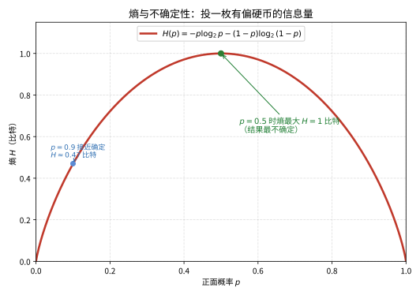
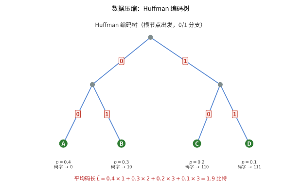

# 第112级：信息论 (Information Theory)

## 学习目标

1. 理解信息熵、联合熵、条件熵、互信息等基本概念
2. 掌握信息不等式、Fano不等式等基本不等式
3. 理解香农信源编码定理及其证明思想
4. 理解香农信道编码定理及其证明思想
5. 掌握信道容量的计算方法
6. 了解率失真理论、微分熵、高斯信道等进阶主题

---

## 1. 核心概念

### 1.1 熵 (Entropy)

熵是信息论中最基本的概念，用于度量随机变量的不确定性。

**定义**：设 $X$ 是离散随机变量，取值于字母表 $\mathcal{X}$，概率质量函数为 $p(x) = P(X = x)$，则 $X$ 的熵定义为：
$$
H(X) = -\sum_{x \in \mathcal{X}} p(x) \log p(x)
$$

约定 $0 \log 0 = 0$。对数底数通常取2，此时熵的单位为比特（bit）；取自然对数时单位为纳特（nat）。

**性质**：
1. 非负性：$H(X) \geq 0$
2. 有界性：$H(X) \leq \log |\mathcal{X}|$，等号成立当且仅当 $X$ 服从均匀分布
3. 凹性：$H(p)$ 是 $p$ 的凹函数

> **直观理解（现实类比）**：熵度量的是"这件事有多难猜"。投一枚公平硬币时，正反面各半，你完全无法预测结果，此时信息量最大（1 比特）；而如果硬币几乎总是正面（比如 90%），你猜正面基本不会错，这时候"告诉你结果"带来的信息就很少。所以不确定越大，熵越高——就像抛硬币前你越拿不准，揭晓时获得的信息就越多。

> **🧠 思考历程：一串符号到底"带了多少信息"？怎么把它变成一个数？**
>
> 熵把"没想到、不确定"这个心理感觉，翻译成唯一一个可度量的数。它把通信工程从"线路能不能通"提升为"信息最少要占多少码字"，而这一跃，正是1948年一篇论文顺手拆下的天花板。
>
> - **热力学的"拆墙"预兆**。玻尔兹曼早就用 $-p\\log p$ 描述分子的混沌程度；Hartley 1928年首次把信息量定为 $\\log N$（$N$ 个等可能情形），为"信息可以计量"埋下伏笔——真正把它铸成通讯基石的是贝尔实验室工程师们对带宽与速率的摸索。
> - **Shannon 的一把钥匙**。1948年 Shannon 发表《通信的数学理论》，定义熵 $H=-\\sum_i p_i\\log p_i$ 为"平均惊喜"，证明存在无损压缩的下界（编码不可能低于熵），并给出信道容量公式 $C=\\max I(X;Y)$——通信问题第一次有了纯数学的极限。
> - **从电报到智能**。此后半个多世纪，熵席卷无损/有损压缩、密码学与统计推断，Jaynes 又把"最大熵原则"带入贝叶斯推断——"信息"从工程一角升格为理解世界的基本物理量之一。
> - **心路**：把"惊喜"量化成对数，是人类屈指可数的几次把"感觉"变成"常量"的壮举——你能计量多少，就能工程多少。

### 1.2 联合熵与条件熵

**联合熵**：两个随机变量 $(X, Y)$ 的联合熵为：
$$
H(X, Y) = -\sum_{x \in \mathcal{X}} \sum_{y \in \mathcal{Y}} p(x, y) \log p(x, y)
$$

**条件熵**：给定 $Y$ 时 $X$ 的条件熵为：
$$
H(X|Y) = -\sum_{x, y} p(x, y) \log p(x|y) = \mathbb{E}_{p(y)}[H(X|Y = y)]
$$

**链式法则**：
$$
H(X, Y) = H(X) + H(Y|X) = H(Y) + H(X|Y)
$$

推广到 $n$ 个随机变量：
$$
H(X_1, X_2, \ldots, X_n) = \sum_{i=1}^n H(X_i | X_1, \ldots, X_{i-1})
$$

> **💡 直观理解（类比）**：联合熵与条件熵像"拼读两份报纸的信息量"——联合熵 $H(X,Y)$ 是两份报纸读下来的总信息量；条件熵 $H(X|Y)$ 是"已经看完 $Y$ 后，再看 $X$ 还能得到的新料"。链式法则 $H(X,Y)=H(X)+H(Y|X)$ 则保证：先读 $X$ 再读 $Y$，总信息恰为两份之和——两者重叠的部分只算一次，绝不重复奖励。

### 1.3 互信息 (Mutual Information)

互信息衡量两个随机变量之间的依赖关系。

**定义**：
$$
I(X; Y) = H(X) - H(X|Y) = H(Y) - H(Y|X) = H(X, Y) - H(X|Y) - H(Y|X)
$$

等价形式：
$$
I(X; Y) = \sum_{x, y} p(x, y) \log \frac{p(x, y)}{p(x)p(y)}
$$

**性质**：
1. 非负性：$I(X; Y) \geq 0$，等号成立当且仅当 $X$ 与 $Y$ 独立
2. 对称性：$I(X; Y) = I(Y; X)$
3. 数据处理不等式：如果 $X \to Y \to Z$ 构成马尔可夫链，则 $I(X; Y) \geq I(X; Z)$

> **💡 直观理解（类比）**：互信息度量"一个变量能透露多少关于另一个变量的底"——$I(X;Y)=H(X)-H(X|Y)$ 即是"知道 $Y$ 后，关于 $X$ 的疑惑减少了多少"。就像看穿着猜职业：能看懂的细节越多，猜中行当的把握就越大，两者间联动越强、互信息越高；若完全无关，则烦恼一分不减。

### 1.4 相对熵 (KL散度)

相对熵（Kullback-Leibler散度）衡量两个概率分布之间的差异。

**定义**：对于两个概率分布 $p$ 和 $q$：
$$
D(p \parallel q) = \sum_{x} p(x) \log \frac{p(x)}{q(x)}
$$

**性质**：
1. 非负性：$D(p \parallel q) \geq 0$，等号成立当且仅当 $p = q$ 几乎处处成立
2. 不对称性：$D(p \parallel q) \neq D(q \parallel p)$ 一般成立
3. 凸性：$D(p \parallel q)$ 是 $(p, q)$ 的凸函数

> **💡 直观理解（类比）**：相对熵像"拿错歌词本要额外多花的力气"——$D(p\parallel q)$ 问"既然假装成错误本 $q$，冒充真实分布 $p$ 平均多浪费多少"。它是一把不对称的尺子：用 $q$ 冒充 $p$ 的代价与反着来完全不同，只有当 $p=q$ 时零代价，任何偏差都折算成正的成本。

### 1.5 熵率 (Entropy Rate)

对于随机过程 $\{X_i\}$，熵率定义为：
$$
H(\mathcal{X}) = \lim_{n \to \infty} \frac{1}{n} H(X_1, X_2, \ldots, X_n)
$$

对于平稳过程，极限存在。对于平稳马尔可夫链，熵率为：
$$
H(\mathcal{X}) = H(X_2 | X_1) = -\sum_{i, j} \mu_i P_{ij} \log P_{ij}
$$

其中 $\mu_i$ 是平稳分布，$P_{ij}$ 是转移概率。

> **💡 直观理解（类比）**：熵率是"看一部连续剧平均每集带来的新信息量"——把整出戏的总信息除以集数、再让集数趋于无穷的每集平均值。若剧情有明显的套路（稳态马尔可夫链），下一集的内容多半能从上一集猜到，熵率就远低于每集都完全陌生的新鲜度。

### 1.6 信息不等式与Fano不等式

**信息不等式**：$D(p \parallel q) \geq 0$，且等号成立当且仅当 $p = q$。

**Fano不等式**：对于估计问题，如果要从观测 $Y$ 估计 $X$，则误差概率的下界为：
$$
P_e \geq \frac{H(X|Y) - 1}{\log |\mathcal{X}|}
$$

其中 $P_e = P(\hat{X} \neq X)$ 是估计误差概率。

> **💡 直观理解（类比）**：信息不等式说"用错的分布描述数据一定多花钱"（$D\ge0$，只有 $p=q$ 才零花费）；Fano 不等式则给出"猜错的下限"——观测 $Y$ 留下的残余疑惑 $H(X|Y)$ 越大，猜 $X$ 的出错率 $P_e$ 就越高。它像考试交白卷时的一道保底条款：你再怎么乱猜，错误率也低不过由剩余未知决定的底线。

### 1.7 数据压缩与信源编码

**信源编码定理**：对于独立同分布信源，任意码长 $n$，存在一个编码方案使得压缩率 $R > H(X)$ 时，解码误差可以任意小；当 $R < H(X)$ 时，解码误差趋近于1。

> **💡 直观理解（类比）**：信源编码定理把"数据到底能压多扁"钉死——只要平均每符号码率 $R$ 高于熵 $H(X)$，就能做到无损解压不出错；一旦低于熵，就注定大量内容解不出来。这好比收拾行李：行李的"最少装箱体积"就是熵，压得比它还紧一点就塞不下、必出错，留点余量多半能打包得严丝合缝。

> **直观理解（现实类比）**：Huffman 编码就像给常用字安排更简短的"暗号"。在一条消息里，出现频率最高的符号（如字母 A）用最短的码（$0$），出现少的符号用长码（D 用 $111$）。这样平均每个符号占用的比特数就最少，接近信息论的下界——熵。图中从树的根部按 0/1 分支走到叶子，路径上的数字拼起来就是该符号的码字。

### 1.8 信道容量

信道容量定义为在信道上可可靠传输的最大信息速率：
$$
C = \max_{p(x)} I(X; Y)
$$

**常见信道容量**：
- 二进制对称信道（BSC）：$C = 1 - H(p)$，其中 $p$ 是错误转移概率
- 二进制擦除信道（BEC）：$C = 1 - \alpha$，其中 $\alpha$ 是擦除概率

> **💡 直观理解（类比）**：信道容量像"电话线的送货上限"——再聪明的编码也超不过这条线去可靠传信息：超过 $C$ 必错，低于 $C$ 总能用某套码传对。BSC 的 $C=1-H(p)$ 直观地道出：噪声越让人分不清（$p$ 越大），这条上限就越低，可用的可靠带宽就越少。

### 1.9 率失真理论

率失真理论研究在给定失真度下，信源编码所需的最小比特率。

**率失真函数**：
$$
R(D) = \min_{p(\hat{x}|x): \mathbb{E}[d(X, \hat{X})] \leq D} I(X; \hat{X})
$$

> **💡 直观理解（类比）**：率失真函数刻画"允许糊一点能省多少码率"——失真度 $D$ 像照片允许模糊的程度，允许越糊，需要传的比特就越少：$D=0$ 精确到像素时烧到 $H(X)$，$D$ 放宽到几乎无所谓时码率能一路降到接近 0。它给视频、图片这类有损压缩指明一条"拿保真度换带宽"的理论底线。

### 1.10 微分熵

对于连续随机变量 $X$ 的概率密度函数 $f(x)$，微分熵定义为：
$$
h(X) = -\int_{\mathcal{S}} f(x) \log f(x) dx
$$

**高斯分布的微分熵**：若 $X \sim \mathcal{N}(0, \sigma^2)$，则：
$$
h(X) = \frac{1}{2} \log(2\pi e \sigma^2)
$$

**高斯信道容量**：在加性高斯白噪声（AWGN）信道中，信道容量为：
$$
C = \frac{1}{2} \log\left(1 + \frac{P}{\sigma^2}\right)
$$

> **💡 直观理解（类比）**：微分熵把"不确定性度量"推广到连续分布，但没了绝对零点、数值可负，只刻画相对弥散程度，像给一朵云打分形状。核心洞察是：在固定功率（方差 $\sigma^2$）约束下，高斯分布最"随机难测"、微分熵最大——这正解释了高斯信道容量 $C=\frac12\log(1+P/\sigma^2)$：在噪声底下还能可靠塞进"信号比噪声强多少"的对数一半那么多新比特，像在吵闹的房间里按照信号比噪声大几成决定还能聊多大声。

### 1.11 纠错码与网络信息论

**纠错码**：在信息序列中添加冗余信息，使其能够抵抗传输过程中的错误。包括线性分组码、卷积码、LDPC码、Turbo码等。

**网络信息论**：研究网络中信源编码和信道编码的极限，包括多址接入信道、广播信道、中继信道等。

> **💡 直观理解（类比）**：纠错码像"重要信息复印多份再投票"——发送端故意掺进冗余，传输途中字节被噪声改坏几个后，接收端靠众人表决或校验规律把错的揪出来改正，相当于用"多抄几遍"换可靠。线性分组码、卷积码、LDPC、Turbo 都是不同花样的"冗余布局"，用带宽换纠错能力。

---

## 2. 定理与证明

### 2.1 香农信源编码定理

> **定理 1（香农信源编码定理）**：设 $\{X_i\}_{i=1}^\infty$ 是独立同分布随机变量序列，$X_i \sim p(x)$，熵为 $H(X)$。则对于任意 $\epsilon > 0$，存在一个编码方案，当码长 $n$ 足够大时，可以用 $n(H(X) + \epsilon)$ 个比特表示信源序列，且解码误差概率小于 $\epsilon$。反之，任何编码方案若使用少于 $n(H(X) - \epsilon)$ 个比特，则解码误差概率趋于1。

> **💡 直观理解（类比）**：正向靠"只给典型序列记账"来压缩：绝大多数消息都挤在一个'代表性集合'里，只需给它们编号就能省流；而一旦码率低于熵，码本就装不下这些典型序列，错误率必然飙向 1。它像说"几乎所有人都穿同一批尺码，记清这些号就够——硬要把每人的个别差异都写全，码本就爆了"。

**证明**：

**步骤1：典型序列（AEP）**

首先证明**渐近等分性质（AEP）**：对于独立同分布随机变量序列 $X_1, X_2, \ldots, X_n \sim p(x)$，

$$
-\frac{1}{n} \log p(X_1, X_2, \ldots, X_n) \xrightarrow{P} H(X)
$$

**证明**：由大数定律：
$$
-\frac{1}{n} \log p(X_1, \ldots, X_n) = -\frac{1}{n} \sum_{i=1}^n \log p(X_i) \xrightarrow{P} \mathbb{E}[-\log p(X)] = H(X)
$$

**步骤2：典型集的定义**

定义**典型集** $A_\epsilon^{(n)}$ 为满足以下条件的序列 $x^n = (x_1, \ldots, x_n)$ 的集合：
$$
\left| -\frac{1}{n} \log p(x^n) - H(X) \right| < \epsilon
$$

**典型集的性质**：

1. 如果 $x^n \in A_\epsilon^{(n)}$，则 $2^{-n(H(X)+\epsilon)} \leq p(x^n) \leq 2^{-n(H(X)-\epsilon)}$

2. 典型集的大小：$|A_\epsilon^{(n)}| \leq 2^{n(H(X)+\epsilon)}$

3. 对于足够大的 $n$，$P(A_\epsilon^{(n)}) > 1 - \epsilon$

4. 对于足够大的 $n$，$|A_\epsilon^{(n)}| \geq (1-\epsilon) 2^{n(H(X)-\epsilon)}$

**证明性质2**：
$$
1 \geq \sum_{x^n \in A_\epsilon^{(n)}} p(x^n) \geq \sum_{x^n \in A_\epsilon^{(n)}} 2^{-n(H(X)+\epsilon)} = |A_\epsilon^{(n)}| \cdot 2^{-n(H(X)+\epsilon)}
$$

因此 $|A_\epsilon^{(n)}| \leq 2^{n(H(X)+\epsilon)}$。

**证明性质3**：由AEP，$-\frac{1}{n}\log p(X^n) \to H(X)$ 依概率，因此对于任意 $\epsilon > 0$，存在 $N$，当 $n > N$ 时：
$$
P\left( \left| -\frac{1}{n}\log p(X^n) - H(X) \right| < \epsilon \right) > 1 - \epsilon
$$

即 $P(A_\epsilon^{(n)}) > 1 - \epsilon$。

**步骤3：编码方案（正向定理）**

**编码**：只对典型集 $A_\epsilon^{(n)}$ 中的序列进行编码。由于 $|A_\epsilon^{(n)}| \leq 2^{n(H(X)+\epsilon)}$，我们可以用 $n(H(X)+\epsilon)$ 个比特为每个典型序列分配一个唯一的码字。

**解码**：收到码字后，解码为对应的典型序列。如果收到的码字不对应任何典型序列，则解码失败。

**误差分析**：误差概率为 $P(X^n \notin A_\epsilon^{(n)}) < \epsilon$（由性质3）。因此平均误差概率小于 $\epsilon$。

**步骤4：逆定理**

假设存在一个编码方案，使用 $nR$ 个比特（$R < H(X) - 2\epsilon$）表示信源序列，解码误差概率为 $P_e^{(n)}$。

码字的总数为 $2^{nR}$。设 $S$ 为解码函数映射到的序列集合，则 $|S| \leq 2^{nR}$。

**误差概率下界**：
$$
P_e^{(n)} = P(X^n \notin S) \geq P(X^n \notin S \cap A_\epsilon^{(n)}) \geq P(A_\epsilon^{(n)}) - |S \cap A_\epsilon^{(n)}| \cdot \max_{x^n} p(x^n)
$$

对于 $x^n \in A_\epsilon^{(n)}$，$p(x^n) \leq 2^{-n(H(X)-\epsilon)}$，且 $|S \cap A_\epsilon^{(n)}| \leq |S| \leq 2^{nR}$，因此：
$$
P_e^{(n)} \geq P(A_\epsilon^{(n)}) - 2^{nR} \cdot 2^{-n(H(X)-\epsilon)} \geq (1-\epsilon) - 2^{-n(H(X)-\epsilon-R)}
$$

当 $R < H(X) - \epsilon$ 时，$H(X) - \epsilon - R > 0$，当 $n \to \infty$ 时，$2^{-n(H(X)-\epsilon-R)} \to 0$，因此 $P_e^{(n)} \to 1$。

更精确地，取 $\epsilon$ 使得 $R < H(X) - 2\epsilon$，则对于足够大的 $n$，有 $P_e^{(n)} > 1 - 2\epsilon$。$\square$

### 2.2 香农信道编码定理

> **定理 2（香农信道编码定理）**：对于离散无记忆信道，信道容量为 $C = \max_{p(x)} I(X; Y)$。对于任意 $R < C$，存在一种码率为 $R$ 的编码方案，使得误差概率可以任意小。反之，对于 $R > C$，任意编码方案的误差概率有正的下界。

> **💡 直观理解（类比）**：随机编码定理说"随手撒网也能捞到好网"——发送方随手生成海量'翻译本'，接收端挑与收到的字串'罕见地共同典型'的那一本；只要发送速率比容量 $C$ 略低，撞错码字的概率就指数式趋近 0。平均来看，至少有一本翻译效果能好到顶用，这就是存在性好码的底气。

**证明（随机编码与联合典型序列）**：

**正向定理：$R < C$ 时存在好码**

**步骤1：随机编码**

1. 固定输入分布 $p(x)$，使得 $I(X; Y) = C - \delta$（其中 $\delta$ 充分小）
2. 随机生成 $2^{nR}$ 个码字，每个码字 $\mathbf{X}(m) = (X_1(m), \ldots, X_n(m))$ 独立同分布地服从 $\prod_{i=1}^n p(x_i)$
3. 将码本 $\mathcal{C} = \{\mathbf{X}(1), \ldots, \mathbf{X}(2^{nR})\}$ 同时告知发送方和接收方

**步骤2：联合典型解码**

给定接收序列 $\mathbf{y} = (y_1, \ldots, y_n)$，接收方寻找满足以下条件的码字 $m$：
- $(\mathbf{X}(m), \mathbf{y})$ 是联合典型的
- 不存在其他码字 $m' \neq m$ 使得 $(\mathbf{X}(m'), \mathbf{y})$ 是联合典型的

如果存在唯一这样的码字，则解码为 $\hat{m} = m$；否则解码失败。

**联合典型集**定义：
$$
A_\epsilon^{(n)} = \left\{ (x^n, y^n) : \left| -\frac{1}{n}\log p(x^n) - H(X) \right| < \epsilon, \left| -\frac{1}{n}\log p(y^n) - H(Y) \right| < \epsilon, \left| -\frac{1}{n}\log p(x^n, y^n) - H(X, Y) \right| < \epsilon \right\}
$$

**联合典型集的性质**：
1. $P((X^n, Y^n) \in A_\epsilon^{(n)}) \to 1$ 当 $n \to \infty$
2. $|A_\epsilon^{(n)}| \leq 2^{n(H(X,Y)+\epsilon)}$
3. 如果 $(\tilde{X}^n, \tilde{Y}^n) \sim p(x^n)p(y^n)$（独立），则 $P((\tilde{X}^n, \tilde{Y}^n) \in A_\epsilon^{(n)}) \leq 2^{-n(I(X;Y)-3\epsilon)}$

**步骤3：误差分析**

考虑发送消息 $m = 1$ 的情况。定义事件：
- $E_1$：$(\mathbf{X}(1), \mathbf{Y}) \notin A_\epsilon^{(n)}$
- $E_2$：存在 $m' \neq 1$，使得 $(\mathbf{X}(m'), \mathbf{Y}) \in A_\epsilon^{(n)}$

误差概率 $P_e^{(n)} \leq P(E_1) + P(E_2)$。

**$P(E_1)$ 的界**：由联合AEP，$P(E_1) < \epsilon$ 对于足够大的 $n$。

**$P(E_2)$ 的界**：由对称性，
$$
P(E_2) \leq \sum_{m'=2}^{2^{nR}} P((\mathbf{X}(m'), \mathbf{Y}) \in A_\epsilon^{(n)})
$$

由于 $\mathbf{X}(m')$ 与 $\mathbf{Y}$ 独立（给定 $\mathbf{X}(1)$），由性质3：
$$
P((\mathbf{X}(m'), \mathbf{Y}) \in A_\epsilon^{(n)}) \leq 2^{-n(I(X;Y)-3\epsilon)}
$$

因此：
$$
P(E_2) \leq (2^{nR} - 1) \cdot 2^{-n(I(X;Y)-3\epsilon)} < 2^{-n(I(X;Y)-3\epsilon-R)}
$$

**步骤4：选择参数**

令 $R = C - 2\epsilon$，选择 $p(x)$ 使 $I(X; Y) = C - \epsilon$，则 $I(X; Y) - 3\epsilon - R = (C - \epsilon) - 3\epsilon - (C - 2\epsilon) = -2\epsilon < 0$，因此：
$$
P(E_2) < 2^{-n \cdot 2\epsilon} = 2^{-2n\epsilon} \to 0 \quad (n \to \infty)
$$

总误差概率 $P_e^{(n)} < \epsilon + 2^{-2n\epsilon}$，对于足够大的 $n$，$P_e^{(n)} < 2\epsilon$。

**步骤5：去随机化**

由于平均误差概率（对随机码本取平均）可以任意小，存在至少一个码本，其误差概率不超过平均值。因此存在确定性码本满足要求。

**逆定理：$R > C$ 时误差概率有正下界**

**步骤1：Fano不等式**

设 $\hat{M}$ 是接收方对消息 $M$ 的估计，$P_e^{(n)} = P(\hat{M} \neq M)$。由Fano不等式：
$$
H(M|\hat{M}) \leq 1 + P_e^{(n)} \log(2^{nR} - 1) \leq 1 + nR P_e^{(n)}
$$

**步骤2：数据处理不等式**

由数据处理不等式：
$$
I(M; \hat{M}) \leq I(X^n; Y^n) \leq nC
$$

其中 $X^n$ 是发送的码字，$Y^n$ 是接收序列。

**步骤3：推导下界**

$$
nR = H(M) = I(M; \hat{M}) + H(M|\hat{M}) \leq nC + 1 + nR P_e^{(n)}
$$

因此：
$$
P_e^{(n)} \geq 1 - \frac{C}{R} - \frac{1}{nR}
$$

当 $R > C$ 时，$1 - C/R > 0$，对于足够大的 $n$，$P_e^{(n)} \geq (1 - C/R)/2 > 0$。$\square$

### 2.3 Fano不等式

> **定理 3（Fano不等式）**：设 $X$ 和 $\hat{X}$ 是取值于同一字母表 $\mathcal{X}$ 的随机变量，$P_e = P(X \neq \hat{X})$。则：
$$
H(X|\hat{X}) \leq H(P_e) + P_e \log(|\mathcal{X}| - 1) \leq 1 + P_e \log |\mathcal{X}|
$$
> 其中 $H(P_e) = -P_e \log P_e - (1-P_e)\log(1-P_e)$ 是二进制熵函数。

> **💡 直观理解（类比）**：Fano 不等式是误判的"保底下限"——观测留下的残余疑惑 $H(X|\hat X)$ 越大，出错率 $P_e$ 就越低不了，因为它把'猜错'折算成必须支付的信息成本。好比盲猜答案：对完全一窍不通的题，再聪明的猜法也保不了低失误，因为毫无凭据可依。

**证明**：

**步骤1：定义误差指示变量**

定义 $E = \mathbf{1}_{\{X \neq \hat{X}\}}$，则 $P(E = 1) = P_e$，$P(E = 0) = 1 - P_e$。

**步骤2：应用链式法则**

$$
H(X, E | \hat{X}) = H(X|\hat{X}) + H(E|X, \hat{X}) = H(E|\hat{X}) + H(X|E, \hat{X})
$$

由于 $E$ 由 $X$ 和 $\hat{X}$ 完全确定，$H(E|X, \hat{X}) = 0$，因此：
$$
H(X|\hat{X}) = H(E|\hat{X}) + H(X|E, \hat{X})
$$

**步骤3：上界估计**

$H(E|\hat{X}) \leq H(E) = H(P_e)$（条件熵不超过无条件熵）。

对于 $H(X|E, \hat{X})$：
$$
H(X|E, \hat{X}) = P(E=0) H(X|\hat{X}, E=0) + P(E=1) H(X|\hat{X}, E=1)
$$

当 $E=0$ 时，$X = \hat{X}$，$H(X|\hat{X}, E=0) = 0$。

当 $E=1$ 时，$X \neq \hat{X}$，$X$ 最多可取 $|\mathcal{X}| - 1$ 个值，因此 $H(X|\hat{X}, E=1) \leq \log(|\mathcal{X}| - 1)$。

因此：
$$
H(X|E, \hat{X}) \leq P_e \log(|\mathcal{X}| - 1)
$$

**步骤4：合并结果**

$$
H(X|\hat{X}) \leq H(P_e) + P_e \log(|\mathcal{X}| - 1)
$$

由于 $H(P_e) \leq 1$（二进制熵以1为上界），可得简化形式：
$$
H(X|\hat{X}) \leq 1 + P_e \log |\mathcal{X}|
$$

$\square$

### 2.4 数据处理不等式

> **定理 4（数据处理不等式）**：如果 $X \to Y \to Z$ 构成马尔可夫链，则：
$$
I(X; Y) \geq I(X; Z)
$$

> **💡 直观理解（类比）**：数据处理不等式说"信息处理只会漏，不会多"——从 $X$ 摸到 $Y$、再加工出 $Z$，就像接力的复印机，每道工序都是损耗源，最终成品与原件 $X$ 的相关度 $I(X;Z)$ 只会 ≤ 与第一手副本 $Y$ 的相关度 $I(X;Y)$。它给"加工不能凭空造出新信息"这一直观立起数学界碑。

**证明**：

**步骤1：马尔可夫链的定义**

$X \to Y \to Z$ 构成马尔可夫链当且仅当 $p(x, y, z) = p(x) p(y|x) p(z|y)$，即给定 $Y$ 时，$X$ 与 $Z$ 条件独立：
$$
p(x, z|y) = p(x|y) p(z|y)
$$

**步骤2：应用链式法则展开互信息**

$$
I(X; Y, Z) = I(X; Y) + I(X; Z|Y) = I(X; Z) + I(X; Y|Z)
$$

由于 $X \to Y \to Z$ 是马尔可夫链，$p(x, z|y) = p(x|y)p(z|y)$，因此 $I(X; Z|Y) = 0$。

所以：
$$
I(X; Y) = I(X; Z) + I(X; Y|Z)
$$

**步骤3：互信息的非负性**

由互信息的非负性，$I(X; Y|Z) \geq 0$，因此：
$$
I(X; Y) \geq I(X; Z)
$$

**等号条件**：$I(X; Y|Z) = 0$，即 $X \to Z \to Y$ 也构成马尔可夫链。

**步骤4：推广**

数据处理不等式可以推广到更长的马尔可夫链 $X_1 \to X_2 \to \cdots \to X_n$：
$$
I(X_1; X_n) \leq I(X_1; X_2)
$$

**应用**：数据处理不等式表明，对数据进行任何处理（确定性或随机性），都不会增加信息量。也就是说，数据处理只能丢失信息，不能创造信息。$\square$

### 2.5 信道容量的对偶表示

> **定理 5（信道容量的对偶表示）**：离散无记忆信道的容量可以表示为：
$$
C = \max_{p(x)} I(X; Y) = \max_{p(x)} \min_{q(y|x)} D(p(x,y) \parallel p(x)q(y))
$$
> 其中 $q(y|x)$ 是信道转移概率。进一步，容量可以表示为KL散度的最大最小值。

> **💡 直观理解（类比）**：容量对偶表示把求容量翻成一局拉锯博弈——对外尽可能挑好的输入分布 $p(x)$ 把信道好处拉到最大，对内又用 KL 散度按最不利的输出分布 $q(y)$ 来计价，两个方向一挤就框住真实的 $C$。它给数值求解容量开出一条新的迭代逼近路线。

**证明（互信息的凸性）**：

**步骤1：互信息关于输入分布的凹性**

固定信道转移概率 $p(y|x)$，$I(X; Y)$ 是 $p(x)$ 的凹函数。

**证明**：设 $p_1(x)$ 和 $p_2(x)$ 是两个输入分布，$p_\lambda(x) = \lambda p_1(x) + (1-\lambda) p_2(x)$。由互信息的定义：
$$
I_{p_\lambda}(X; Y) = \sum_{x, y} p_\lambda(x) p(y|x) \log \frac{p_\lambda(x) p(y|x)}{p_\lambda(x) p_\lambda(y)}
$$

其中 $p_\lambda(y) = \sum_x p_\lambda(x) p(y|x)$。

利用KL散度的凸性，可以证明：
$$
I_{p_\lambda}(X; Y) \geq \lambda I_{p_1}(X; Y) + (1-\lambda) I_{p_2}(X; Y)
$$

但注意，这里我们需要的是凹性（$\geq$），实际计算时需要仔细验证符号。

**更直接的证明**：$I(X; Y) = H(Y) - H(Y|X)$。$H(Y|X) = \sum_x p(x) H(Y|X=x)$ 是 $p(x)$ 的线性函数（因为 $H(Y|X=x)$ 不依赖于 $p(x)$），而 $H(Y)$ 是 $p(y) = \sum_x p(x) p(y|x)$ 的凹函数，由于 $p(y)$ 是 $p(x)$ 的线性函数，且 $H(\cdot)$ 是凹函数，所以 $H(Y)$ 是 $p(x)$ 的凹函数。因此 $I(X; Y) = H(Y) - H(Y|X)$ 是凹函数（凹函数减去线性函数仍为凹函数）。

**步骤2：互信息关于信道转移概率的凸性**

固定输入分布 $p(x)$，$I(X; Y)$ 是 $p(y|x)$ 的凸函数。

**证明**：设 $p_1(y|x)$ 和 $p_2(y|x)$ 是两个信道，$p_\lambda(y|x) = \lambda p_1(y|x) + (1-\lambda) p_2(y|x)$。则：
$$
I_{p_\lambda}(X; Y) \leq \lambda I_{p_1}(X; Y) + (1-\lambda) I_{p_2}(X; Y)
$$

这可以通过KL散度的凸性来证明。

**步骤3：对偶表示**

信道容量定义为：
$$
C = \max_{p(x)} I(X; Y) = \max_{p(x)} \min_{q(y|x)} D(p(x,y) \parallel p(x)q(y))
$$

其中第二个等号利用了互信息的变分表示：
$$
I(X; Y) = \min_{q(y)} D(p(x,y) \parallel p(x)q(y))
$$

这里 $q(y)$ 是 $Y$ 的任意分布。

**证明**：对于固定的 $p(x)$ 和 $p(y|x)$：
$$
\begin{aligned}
D(p(x,y) \parallel p(x)q(y)) &= \sum_{x,y} p(x,y) \log \frac{p(x,y)}{p(x)q(y)} \\
&= \sum_{x,y} p(x,y) \log \frac{p(y|x)}{q(y)} \\
&= \sum_{x,y} p(x,y) \log \frac{p(y|x)}{p(y)} + \sum_{x,y} p(x,y) \log \frac{p(y)}{q(y)} \\
&= I(X; Y) + D(p(y) \parallel q(y))
\end{aligned}
$$

由于 $D(p(y) \parallel q(y)) \geq 0$，且等号成立当且仅当 $q(y) = p(y)$，因此：
$$
\min_{q(y)} D(p(x,y) \parallel p(x)q(y)) = I(X; Y)
$$

**步骤4：容量作为最大最小值**

$$
C = \max_{p(x)} I(X; Y) = \max_{p(x)} \min_{q(y)} D(p(x,y) \parallel p(x)q(y))
$$

由于 $I(X; Y)$ 是 $p(x)$ 的凹函数、$p(y|x)$ 的凸函数，且定义域是紧凸集，由von Neumann极小极大定理，可以交换最大最小次序：
$$
C = \min_{q(y)} \max_{p(x)} D(p(x,y) \parallel p(x)q(y))
$$

这个对偶表示为计算信道容量提供了另一种途径。$\square$

---

## 3. 示例

### 3.1 计算离散信源的熵

**问题**：一个离散信源以概率 $\{0.4, 0.3, 0.2, 0.1\}$ 产生四个符号 $\{A, B, C, D\}$。求：
(1) 信源的熵
(2) 如果使用二进制编码，理论最小平均码长

**解**：

**步骤1：计算熵**

$$
H(X) = -\sum_{i=1}^4 p_i \log_2 p_i
$$

$$
\begin{aligned}
H(X) &= -[0.4 \log_2 0.4 + 0.3 \log_2 0.3 + 0.2 \log_2 0.2 + 0.1 \log_2 0.1] \\
&= -[0.4 \times (-1.3219) + 0.3 \times (-1.7370) + 0.2 \times (-2.3219) + 0.1 \times (-3.3219)] \\
&= -[-0.5288 - 0.5211 - 0.4644 - 0.3322] \\
&= -[-1.8465] = 1.8465 \text{比特}
\end{aligned}
$$

**步骤2：对偶熵**

我们也可以计算以2为底的对数：
$$
\log_2 0.4 = \frac{\ln 0.4}{\ln 2} = \frac{-0.9163}{0.6931} = -1.3219
$$

$$
\log_2 0.3 = \frac{-1.2040}{0.6931} = -1.7370
$$

$$
\log_2 0.2 = \frac{-1.6094}{0.6931} = -2.3219
$$

$$
\log_2 0.1 = \frac{-2.3026}{0.6931} = -3.3219
$$

因此：
$$
H(X) = -(0.4 \times (-1.3219) + 0.3 \times (-1.7370) + 0.2 \times (-2.3219) + 0.1 \times (-3.3219))
$$

$$
= 0.5288 + 0.5211 + 0.4644 + 0.3322 = 1.8465 \text{比特}
$$

**步骤3：理论最小平均码长**

由香农信源编码定理，理论最小平均码长等于熵：
$$
\bar{L}_{\min} = H(X) = 1.8465 \text{比特/符号}
$$

实际中，Huffman编码可以接近这个下界。

### 3.2 计算信道容量

#### 二进制对称信道（BSC）

**问题**：二进制对称信道的错误转移概率为 $p = 0.1$，求信道容量。

**解**：

**步骤1：信道模型**

BSC的输入 $X \in \{0, 1\}$，输出 $Y \in \{0, 1\}$，转移概率为：
$$
P(Y = 1|X = 0) = P(Y = 0|X = 1) = p = 0.1
$$

**步骤2：计算互信息**

设 $P(X = 0) = \pi$，$P(X = 1) = 1 - \pi$。

$$
P(Y = 0) = \pi(1-p) + (1-\pi)p = \pi(1-2p) + p
$$

$$
P(Y = 1) = \pi p + (1-\pi)(1-p) = 1 - \pi(1-2p) - p
$$

互信息为：
$$
I(X; Y) = H(Y) - H(Y|X)
$$

由于 $H(Y|X) = \sum_x p(x) H(Y|X=x) = H(p)$（与 $\pi$ 无关），其中 $H(p) = -p\log p - (1-p)\log(1-p)$。

因此：
$$
I(X; Y) = H(Y) - H(p)
$$

$H(Y)$ 在 $Y$ 服从均匀分布时取最大值，即当 $P(Y=0) = P(Y=1) = 1/2$ 时 $H(Y) = 1$。

**步骤3：最大化互信息**

$P(Y=0) = 1/2$ 等价于 $\pi(1-2p) + p = 1/2$，即 $\pi = 1/2$。

因此：
$$
C = \max_\pi I(X; Y) = 1 - H(p) = 1 - H(0.1)
$$

**步骤4：计算数值**

$$
H(0.1) = -0.1 \log_2 0.1 - 0.9 \log_2 0.9 = -0.1 \times (-3.3219) - 0.9 \times (-0.1520)
$$

$$
= 0.3322 + 0.1368 = 0.4690 \text{比特}
$$

因此：
$$
C = 1 - 0.4690 = 0.5310 \text{比特/信道使用}
$$

#### 二进制擦除信道（BEC）

**问题**：二进制擦除信道的擦除概率为 $\alpha = 0.2$，求信道容量。

**解**：

**步骤1：信道模型**

BEC的输入 $X \in \{0, 1\}$，输出 $Y \in \{0, 1, e\}$（$e$ 表示擦除），转移概率为：
$$
P(Y = X) = 1 - \alpha = 0.8
$$
$$
P(Y = e) = \alpha = 0.2
$$

**步骤2：计算互信息**

设 $P(X = 0) = \pi$，$P(X = 1) = 1 - \pi$。

$$
I(X; Y) = H(X) - H(X|Y)
$$

由于 $Y$ 以概率 $1-\alpha$ 完全确定 $X$，以概率 $\alpha$ 不提供任何信息：

$$
H(X|Y) = \sum_y P(Y=y) H(X|Y=y)
$$

当 $Y = 0$ 或 $Y = 1$ 时，$X$ 完全确定，$H(X|Y) = 0$。

当 $Y = e$ 时，$H(X|Y=e) = H(\pi)$。

$P(Y = e) = \alpha$，因此：
$$
H(X|Y) = \alpha H(\pi)
$$

所以：
$$
I(X; Y) = H(\pi) - \alpha H(\pi) = (1-\alpha) H(\pi)
$$

**步骤3：最大化互信息**

$H(\pi)$ 在 $\pi = 1/2$ 时取最大值1，因此：
$$
C = \max_\pi (1-\alpha) H(\pi) = 1 - \alpha = 1 - 0.2 = 0.8 \text{比特/信道使用}
$$

---

## 4. 习题

### 基础题

**习题 1**（熵的计算）一个离散信源有 5 个符号，概率分布为 $\{0.3, 0.25, 0.2, 0.15, 0.1\}$。(1) 计算信源的熵；(2) 如果使用等长编码，每个符号需要多少比特？(3) 比较 (1)(2) 的结果并说明差异的原因（提示：等长编码需 $\lceil \log_2 5 \rceil = 3$ 比特/符号）。

**习题 2**（互信息与信道容量）考虑输入 $X \in \{0, 1\}$、输出 $Y \in \{0, 1\}$ 的离散信道，转移概率为 $P(Y=0|X=0)=0.9$、$P(Y=1|X=0)=0.1$、$P(Y=0|X=1)=0.2$、$P(Y=1|X=1)=0.8$。(1) 当输入为均匀分布时计算 $I(X; Y)$；(2) 求信道的容量；(3) 说明该信道是否对称，并与 BSC 的信道容量公式 $C=1-H(p)$ 对比。

**习题 3**（Fano 不等式应用）在 BSC($p=0.1$) 上传输 8 个等概率消息，码率为 $R=0.5$。(1) 由 Fano 不等式求误差概率的下界；(2) 已知信道容量 $C=0.531$，而 $R=0.5<C$ 时理论上误差可任意小，对比 (1) 中的下界说明 Fano 不等式的意义。

**习题 4**（数据处理不等式）考虑马尔可夫链 $X \to Y \to Z$：$X$ 为伯努利变量 $P(X=0)=P(X=1)=0.5$，$Y=X+N_1$、$Z=Y+N_2$（均为模 2 加法），$N_1, N_2$ 独立且 $P(N_i=0)=0.9$、$P(N_i=1)=0.1$。(1) 计算 $I(X; Y)$；(2) 计算 $I(X; Z)$；(3) 验证数据处理不等式 $I(X; Y) \geq I(X; Z)$。

**习题 5**（信源编码定理）一个二进制独立同分布信源，$P(X=0)=0.9$、$P(X=1)=0.1$。(1) 计算信源的熵；(2) 用 Huffman 编码求平均码长；(3) 用香农-Fano 编码求平均码长；(4) 验证平均码长不小于熵（提示：$H(X) \leq \bar{L} < H(X)+1$）。

**习题 6**（高斯信道容量）AWGN 信道 $Y = X + N$，$N \sim \mathcal{N}(0, \sigma^2)$，发送功率约束 $\mathbb{E}[X^2] \leq P$。(1) 证明容量为 $C = \frac{1}{2}\log_2(1+\frac{P}{\sigma^2})$；(2) 当 $P/\sigma^2 = 10$ dB 时求容量；(3) 对带宽 $B$，香农公式 $C = B\log_2(1+\frac{P}{N_0B})$ 中当 $B \to \infty$ 时容量趋于何值？

**习题 7**（交叉熵）写出交叉熵的定义 $H(p, q) = -\sum_x p(x)\log q(x)$，说明它与熵、相对熵的关系，并解释为何恒有 $H(p, q) \geq H(p)$。

**习题 8**（信息不等式）写出信息不等式（KL 散度非负性）$D(p \parallel q) \geq 0$ 及其等号成立的条件，说明为什么它是信息论中最基本的不等式。

**习题 9**（Huffman 编码）说明 Huffman 编码的基本思想与步骤，并解释其最优前缀码的平均码长满足 $H(X) \leq \bar{L} < H(X) + 1$ 的含义。

**习题 10**（熵率）写出平稳随机过程熵率的定义 $H(\mathcal{X}) = \lim_{n \to \infty} \frac{1}{n}H(X_1, \dots, X_n)$，并给出平稳马尔可夫链熵率 $H(\mathcal{X}) = H(X_2 | X_1) = -\sum_{i,j} \mu_i P_{ij}\log P_{ij}$ 的表达式。

### 进阶题

**习题 11**（熵的有界性）证明 $H(X) \leq \log |\mathcal{X}|$，等号成立当且仅当 $X$ 服从均匀分布（提示：取 $q$ 为 $\mathcal{X}$ 上的均匀分布并利用 KL 散度非负性或 $\log$ 的凹性）。

**习题 12**（条件熵不大于熵）证明 $H(X|Y) \leq H(X)$，并说明等号何时成立（提示：利用互信息 $I(X; Y) = H(X) - H(X|Y)$ 的非负性）。

**习题 13**（链式法则）证明链式法则 $H(X, Y) = H(X) + H(Y|X)$，并将其推广到 $n$ 个随机变量 $H(X_1, \dots, X_n) = \sum_{i=1}^n H(X_i | X_1, \dots, X_{i-1})$。

**习题 14**（BSC 容量推导）推导二进制对称信道的容量 $C = 1 - H(p)$，并说明使互信息达到最大的输入分布（提示：先写出 $I(X;Y) = H(Y) - H(Y|X)$）。

**习题 15**（BEC 容量推导）推导二进制擦除信道的容量 $C = 1 - \alpha$，其中 $\alpha$ 为擦除概率，并说明为什么擦除符号本身不贡献信息量。

**习题 16**（互信息非负性）证明互信息 $I(X; Y) \geq 0$，等号成立当且仅当 $X$ 与 $Y$ 独立（提示：$I(X;Y) = D(p(x,y) \parallel p(x)p(y))$）。

**习题 17**（互信息链式法则）写出并证明互信息链式法则 $I(X; Y_1, \dots, Y_n) = \sum_{i=1}^n I(X; Y_i | Y_1, \dots, Y_{i-1})$。

**习题 18**（KL 散度链式法则）证明相对熵的链式法则 $D(p(x,y) \parallel q(x,y)) = D(p(x) \parallel q(x)) + D(p(y|x) \parallel q(y|x))$。

**习题 19**（交叉熵与相对熵）用相对熵表示交叉熵，并据此说明在机器学习中最小化交叉熵损失为何等价于最小化预测分布与真实分布之间的 KL 散度。

### 挑战题

**习题 20**（Fano 不等式）完整陈述并证明 Fano 不等式 $H(X|\hat{X}) \leq H(P_e) + P_e \log(|\mathcal{X}| - 1)$，其中 $P_e = P(X \neq \hat{X})$（提示：引入误差指示变量 $E = \mathbf{1}_{\{X \neq \hat{X}\}}$ 并用链式法则）。

**习题 21**（数据处理不等式）证明若 $X \to Y \to Z$ 构成马尔可夫链，则 $I(X; Y) \geq I(X; Z)$（提示：展开 $I(X; Y, Z)$，利用条件独立得 $I(X; Z|Y) = 0$）。

**习题 22**（互信息的变分表示）证明 $I(X; Y) = \min_{q(y)} D(p(x,y) \parallel p(x)q(y))$，并由此导出信道容量 $C = \max_{p(x)} \min_{q(y)} D(p(x,y) \parallel p(x)q(y))$ 的对偶表示。

**习题 23**（AEP 与典型集）利用弱大数定律证明 $-\frac{1}{n}\log p(X_1, \dots, X_n) \to H(X)$ 依概率收敛，并据此说明典型集 $A_\epsilon^{(n)}$ 的大小满足 $|A_\epsilon^{(n)}| \leq 2^{n(H(X)+\epsilon)}$。

**习题 24**（信源编码正定理）依据典型序列论证香农信源编码正定理：当码率 $R > H(X)$ 时存在压缩方案使解码误差任意小，而当 $R < H(X)$ 时误差概率趋于 1（提示：只对典型集编码并估计误差）。

**习题 25**（信道编码逆定理）用 Fano 不等式与数据处理不等式证明：当 $R > C$ 时信道编码的误差概率有正下界（提示：$nR = H(M) = I(M;\hat{M}) + H(M|\hat{M}) \leq nC + 1 + nRP_e$）。

**习题 26**（最大熵原理）说明最大熵原理的基本思想，并利用 KL 散度非负性证明：无任何约束时 $\mathcal{X}$ 上均匀分布的熵最大。

### 探究题

**习题 27**（率失真理论）探究率失真函数 $R(D) = \min_{p(\hat{x}|x): \mathbb{E}d(X,\hat{X}) \leq D} I(X; \hat{X})$ 的含义，讨论它如何刻画"允许失真度 $D$ 与所需最小码率 $R$"之间的权衡。

**习题 28**（交叉熵损失与信息论）结合机器学习中常用的交叉熵损失，探究它为何等价于最小化模型分布与真实分布间的 KL 散度，并与最大似然估计建立联系。

**习题 29**（最大熵与统计推断）探究最大熵原理在统计推断中的应用：说明在给定矩约束（如均值、方差）下如何求出熵最大的分布形态（如在固定方差下得到高斯分布）。

**习题 30**（网络信息论）探究多址接入信道等网络信息论课题中的"容量区域"概念，并与单信道容量 $C = \max_{p(x)} I(X; Y)$ 比较其异同。

---

## 5. 习题答案与解析

### 基础题答案

1. **熵的计算** 熵 $H = -\sum_i p_i \log_2 p_i$。逐项计算：$0.3\log_2\frac{1}{0.3}=0.5211$，$0.25\times2=0.5$，$0.2\times2.3219=0.4644$，$0.15\times2.737=0.4106$，$0.1\times3.3219=0.3322$，故 $H\approx2.2283$ 比特。(2) 等长编码需 $\lceil\log_2 5\rceil=3$ 比特/符号。(3) 等长编码无法利用概率的不均匀性，故 $3>2.2283$；熵是平均码长的理论下界，变长/前缀编码的平均码长可逼近熵。

2. **互信息与信道容量** 输入均匀即 $\pi=\frac12$，得 $P(Y=0)=0.55$、$P(Y=1)=0.45$，$H(Y)\approx0.9928$。条件熵 $H(Y|X)=0.5H(0.1,0.9)+0.5H(0.2,0.8)=0.5\times0.469+0.5\times0.7219=0.5955$，故 $I(X;Y)=0.9928-0.5955\approx0.3973$ 比特。该信道非对称（$P(Y=1|X=0)=0.1\neq0.2=P(Y=0|X=1)$），不能直接套用 $C=1-H(p)$，容量需优化输入分布求得。

3. **Fano 不等式应用** 8 个等概率消息 $H(M)=\log_2 8=3$ 比特。Fano 给出 $P_e\geq\frac{H(M|\hat{M})-1}{\log_2 8}$，而 $H(M|\hat{M})=H(M)-I(M;\hat{M})\geq H(M)-nC$。当 $R=0.5<C$ 且块长 $n$ 足够大使 $nC\geq H(M)$ 时 $H(M|\hat{M})$ 可趋于 0，Fano 只给出零（平凡）下界，与"$R<C$ 误差可任意小"的正定理一致。Fano 的价值在于 $R>C$ 时给出误差概率严格正下界，是证明逆定理的工具。

4. **数据处理不等式** $Y$ 由 $X$ 经 BSC($p=0.1$) 得到：$P(Y=X)=0.9$，且 $P(Y=0)=P(Y=1)=0.5$，故 $H(Y)=1$、$H(Y|X)=H(0.1)=0.469$，故 $I(X;Y)=0.531$。(2) $Z$ 由 $Y$ 再经 BSC($0.1$)，等效于 BSC($p'=2p(1-p)=0.18$)，$H(0.18)=0.6795$，故 $I(X;Z)=1-0.6795=0.3205$。(3) $0.531\geq0.3205$，数据处理不等式成立：处理不增加信息。

5. **信源编码定理** $H(X)=-0.9\log_2 0.9-0.1\log_2 0.1=0.1368+0.3322=0.469$ 比特。(2) Huffman：两符号各得码字 $0$、$1$，平均码长 $0.9\times1+0.1\times1=1$。(3) 香农-Fano 同样两符号各 1 比特，平均码长为 $1$。(4) $1\geq0.469$，符合 $H(X)\leq\bar{L}$；此分布因 $X=0$ 占 90%，变长编码无增益。

6. **高斯信道容量** 最优输入为高斯时 $I(X;Y)=h(Y)-h(Y|X)$，$h(Y)=\frac12\log_2(2\pi e(P+\sigma^2))$、$h(Y|X)=h(N)=\frac12\log_2(2\pi e\sigma^2)$，相减得 $C=\frac12\log_2(1+\frac{P}{\sigma^2})$。(2) $P/\sigma^2=10$，$C=\frac12\log_2 11=1.7297$ 比特/符号。(3) 令 $x=\frac{P}{N_0B}$，$C=\frac{P}{N_0}\frac{\log_2(1+x)}{x}$；$B\to\infty$ 时 $x\to0$、$\frac{\log_2(1+x)}{x}\to\log_2 e$，故 $C\to\frac{P}{N_0}\log_2 e$ 比特/秒。

7. **交叉熵** $H(p,q)=-\sum_x p(x)\log q(x)$。由对数运算 $H(p,q)=-\sum p\log p-\sum p\log\frac{q}{p}=H(p)+D(p\parallel q)$，故 $H(p,q)\geq H(p)$，等号当且仅当 $p=q$。它表示"用关于 $q$ 的编码描述真实分布 $p$ 的平均码长"，码本 $q\neq p$ 会浪费比特。

8. **信息不等式** $D(p\parallel q)=-\sum_x p(x)\log\frac{q(x)}{p(x)}\geq0$（等号当且仅当 $p=q$ 几乎处处），由 $\log$ 凹性及 Jensen 不等式：$D(p\parallel q)=-\sum p\log\frac{q}{p}\geq-\log\sum p\frac{q}{p}=-\log1=0$。它是导出 $H(X)\leq\log|\mathcal{X}|$、$I(X;Y)\geq0$ 等非负性的基础。

9. **Huffman 编码** 每次合并概率最小的两个符号构成"超符号"，自底向上建树，合并次数越多码长越长，故大概率符号得短码、小概率得长码。它是最优前缀码，满足 $H(X)\leq\bar{L}<H(X)+1$，即平均码长与熵下界至多相差 1 比特，合并对称分组可任意逼近熵。

10. **熵率** 熵率是每符号渐近平均信息量 $H(\mathcal{X})=\lim_{n\to\infty}\frac1n H(X_1,\dots,X_n)$。对平稳马尔可夫链，$\frac1n H(X_1,\dots,X_n)=\frac1n(H(X_1)+\sum_{i=2}^n H(X_i|X_{i-1}))\to H(X_2|X_1)$，代入平稳分布与转移即得 $H(\mathcal{X})=-\sum_{i,j}\mu_i P_{ij}\log P_{ij}$，为每步新增信息量。

### 进阶题答案

1. **熵的有界性** 取均匀分布 $q(x)=1/|\mathcal{X}|$，由信息不等式 $0\leq D(p\parallel q)=-\sum p\log p-\sum p\log\frac1{|\mathcal{X}|}=H(X)-\log|\mathcal{X}|$，得 $H(X)\leq\log|\mathcal{X}|$，等号当且仅当 $p=q$（均匀）。等可能符号最"难猜"，不确定性最大。

2. **条件熵不大于熵** $I(X;Y)=H(X)-H(X|Y)\geq0$，故 $H(X|Y)\leq H(X)$。条件 $Y$ 提供信息，不应增加不确定性；等号当且仅当 $I(X;Y)=0$，即 $X,Y$ 独立时观测无帮助。

3. **链式法则** $p(x,y)=p(x)p(y|x)$，故 $H(X,Y)=-\sum p(x,y)\log p(x)-\sum p(x,y)\log p(y|x)=H(X)+H(Y|X)$。重复应用于 $n$ 个变量得 $H(X_1,\dots,X_n)=\sum_{i=1}^n H(X_i|X_{1..i-1})$，把联合熵分解为逐次新增条件熵之和。

4. **BSC 容量推导** $I(X;Y)=H(Y)-H(Y|X)$，其中 $H(Y|X)=\sum_x p(x)H(Y|X=x)=H(p)$ 与输入无关，故最大化 $I$ 即最大化 $H(Y)$。二元输出 $H(Y)\leq1$，$\pi=\frac12$ 时 $P(Y=0)=P(Y=1)=\frac12$ 取到，故 $C=1-H(p)$，最优输入为均匀分布。

5. **BEC 容量推导** 输出 $Y\in\{0,1\}$ 时 $X$ 被确定、条件熵为 0；$Y=e$ 时 $H(X|Y=e)=H(\pi)$。故 $H(X|Y)=\alpha H(\pi)$，$I(X;Y)=(1-\alpha)H(\pi)\leq(1-\alpha)$，$\pi=\frac12$ 时取到，$C=1-\alpha$。擦除发生时信息完全丢失，可用信息按 $1-\alpha$ 比例保留。

6. **互信息非负性** $I(X;Y)=\sum p(x,y)\log\frac{p(x,y)}{p(x)p(y)}=D(p(x,y)\parallel p(x)p(y))\geq0$，等号当且仅当 $p(x,y)=p(x)p(y)$，即 $X,Y$ 独立。独立变量间无相互信息。

7. **互信息链式法则** $I(X;Y_{1..n})=H(Y_{1..n})-H(Y_{1..n}|X)$，对两项分别用熵链式法则再逐项相减得 $=\sum_{i=1}^n[H(Y_i|Y_{1..i-1})-H(Y_i|Y_{1..i-1},X)]=\sum_{i=1}^n I(X;Y_i|Y_{1..i-1})$，把联合互信息逐项拆开。

8. **KL 散度链式法则** $D(p(x,y)\parallel q(x,y))=\sum p(x,y)\log\frac{p(x)p(y|x)}{q(x)q(y|x)}=D(p(x)\parallel q(x))+D(p(y|x)\parallel q(y|x))$。相对熵沿"边缘+条件"分解时可加，与熵链式法则平行。

9. **交叉熵与相对熵** 由 $H(p,q)=H(p)+D(p\parallel q)$，真实 $p$ 固定时 $H(p)$ 常数，最小化交叉熵等价于最小化 $D(p\parallel q)$，即让模型分布 $q$ 逼近真实分布。又 $-\mathbb{E}_p\log q$ 最小化正是最大似然估计的信息论表述，故交叉熵损失与 MLE 一致。

### 挑战题答案

1. **Fano 不等式** 令 $E=\mathbf1_{\{X\neq\hat X\}}$，$P(E=1)=P_e$。由链式法则 $H(X,E|\hat X)=H(X|\hat X)+H(E|X,\hat X)=H(E|\hat X)+H(X|E,\hat X)$；因 $E$ 由 $X,\hat X$ 决定，$H(E|X,\hat X)=0$，故 $H(X|\hat X)=H(E|\hat X)+H(X|E,\hat X)\leq H(E)+P_e\log(|\mathcal{X}|-1)=H(P_e)+P_e\log(|\mathcal{X}|-1)$（$E=0$ 时 $X=\hat X$ 条件熵 0，$E=1$ 时 $X$ 至多 $|\mathcal{X}|-1$ 个可能）。再由 $H(P_e)\leq1$ 得简化式 $H(X|\hat X)\leq1+P_e\log|\mathcal{X}|$。

2. **数据处理不等式** 展开 $I(X;Y,Z)$：$I(X;Y)+I(X;Z|Y)=I(X;Z)+I(X;Y|Z)$。马尔可夫链 $X\to Y\to Z$ 蕴含 $p(x,z|y)=p(x|y)p(z|y)$，故 $I(X;Z|Y)=0$。于是 $I(X;Y)=I(X;Z)+I(X;Y|Z)\geq I(X;Z)$（$I(X;Y|Z)\geq0$）。等号当且仅当 $I(X;Y|Z)=0$，即 $X\to Z\to Y$ 亦为马尔可夫链。数据处理只会保留或丢失信息。

3. **互信息的变分表示** $D(p(x,y)\parallel p(x)q(y))=D(p(x,y)\parallel p(x)p(y))+D(p(y)\parallel q(y))=I(X;Y)+D(p(y)\parallel q(y))$。因 $D(p(y)\parallel q(y))\geq0$ 且仅当 $q(y)=p(y)$ 取零，故 $\min_{q(y)}D(p(x,y)\parallel p(x)q(y))=I(X;Y)$。于是 $C=\max_{p(x)}\min_{q(y)}D(p(x,y)\parallel p(x)q(y))$；由 $I$ 的凹/凸性与 von Neumann 极小极大定理可交换次序，得到容量的对偶表示，提供数值计算另一途径。

4. **AEP 与典型集** $-\frac1n\log p(X_1,\dots,X_n)=-\frac1n\sum\log p(X_i)$ 是独立同分布变量的算术平均，期望 $H(X)$，由弱大数定律依概率收敛到 $H(X)$，故典型集概率趋 1。典型集内 $p(x^n)\geq2^{-n(H(X)+\epsilon)}$，故 $1\geq\sum_{x^n\in A_\epsilon^{(n)}}p(x^n)\geq|A_\epsilon^{(n)}|2^{-n(H(X)+\epsilon)}$，即 $|A_\epsilon^{(n)}|\leq2^{n(H(X)+\epsilon)}$。典型集几乎承载全部概率，大小由熵决定。

5. **信源编码正定理** 正向：$R>H(X)$ 时取 $\epsilon$ 使 $R>H(X)+\epsilon$，只给典型集分配 $n(H(X)+\epsilon)$ 比特唯一码字；$P(A_\epsilon^{(n)})\to1$，故误差任意小。逆向：若 $R<H(X)-2\epsilon$，$|S|\leq2^{nR}$，$P_e^{(n)}\geq P(A_\epsilon^{(n)})-|S\cap A_\epsilon^{(n)}|\max p(x^n)\geq(1-\epsilon)-2^{nR}2^{-n(H(X)-\epsilon)}\to1$。压缩率低于熵必失败，熵是无损压缩极限。

6. **信道编码逆定理** $H(M)=nR$。Fano 得 $H(M|\hat M)\leq1+nRP_e^{(n)}$；数据处理不等式得 $I(M;\hat M)\leq nC$。于是 $nR=I(M;\hat M)+H(M|\hat M)\leq nC+1+nRP_e^{(n)}$，移项 $P_e^{(n)}\geq1-\frac{C}{R}-\frac1{nR}$。$R>C$ 时 $1-C/R>0$，充分大 $n$ 下 $P_e^{(n)}\geq\frac12(1-C/R)>0$，超出容量必错。

7. **最大熵原理** 对任意 $p$ 与均匀 $u(x)=1/|\mathcal{X}|$，$D(p\parallel u)=-H(p)-p\log\frac1{|\mathcal{X}|}=-H(p)+\log|\mathcal{X}|\geq0$，故 $H(p)\leq\log|\mathcal{X}|=H(u)$，均匀分布熵最大。最大熵原理主张在已知约束下选熵最大的分布作为最"无偏"推断，不加额外假设、避免过度自信。

### 探究题答案

1. **率失真理论** $R(D)$ 在期望失真 $\leq D$ 的条件分布集合上最小化 $I(X;\hat X)$，刻画"允许损失 $D$ 可换取的最低码率"：$D=0$ 时 $R(0)=H(X)$，$D$ 增大时 $R(D)$ 单调降至 0。它指导有损压缩在给定保真度下限以低于熵的速率传输；对高斯信源平方失真可显式写出率失真函数。

2. **交叉熵损失与信息论** $H(p,q)=H(p)+D(p\parallel q)$，固定真实标签分布 $p$ 时最小化交叉熵即最小化 $D(p\parallel q)$；同时 $-\sum p\log q$ 的样本均值正是负对数似然，故与最大似然估计等价。可延伸探讨熵正则化、标签平滑、样本 vs 总体分布等话题。

3. **最大熵与统计推断** 用拉格朗日乘子在"固定均值"约束下最大化 $-\sum p\log p$，解得指数族分布；在"固定方差 $\sigma^2$、无限支集"下得到高斯密度 $f(x)=\frac1{\sqrt{2\pi\sigma^2}}e^{-x^2/2\sigma^2}$，其微分熵 $h=\frac12\log(2\pi e\sigma^2)$ 是该矩约束下最大值。这严格化了"定功率噪声中最随机的分布是高斯"的直觉，也解释了 AWGN 最优输入为高斯。

4. **网络信息论** 单信道容量是标量 $C=\max_{p(x)}I(X;Y)$；多用户网络（如多址接入信道）的容量是整个"速率对集合"（容量区域），需同时满足 $R_1\leq C_1$、$R_2\leq C_2$、$R_1+R_2\leq C_\Sigma$ 等联立约束。它无法由各单信道容量简单拼出，因同信道干扰和编解码协作使联合容量超可加。这是信息论从点对点迈向网络的实质深化。

---

## 6. 总结

本级别系统地介绍了信息论的核心理论和方法：

1. **基本概念**：熵、联合熵、条件熵、互信息、相对熵（KL散度）、熵率等，构成了信息论的理论基础。

2. **基本不等式**：信息不等式（KL散度非负性）、Fano不等式（误差概率下界）、数据处理不等式（处理不增加信息），这些不等式在信息论的各个分支中都有重要应用。

3. **香农信源编码定理**：通过AEP和典型序列，证明了信源可以被压缩到熵率，且不能低于熵率。这是数据压缩的理论基础。

4. **香农信道编码定理**：通过随机编码和联合典型序列，证明了在信道容量以下可以可靠传输信息。这是通信的理论基础。

5. **信道容量**：介绍了BSC、BEC等常见信道的容量计算，以及信道容量的对偶表示。

6. **进阶主题**：简要介绍了率失真理论、微分熵、高斯信道、纠错码和网络信息论。

信息论的核心思想是：**信息可以被量化**。熵量化了不确定性，互信息量化了依赖关系，信道容量量化了通信能力。这些量化工具为通信、数据压缩、机器学习等领域提供了理论基础。