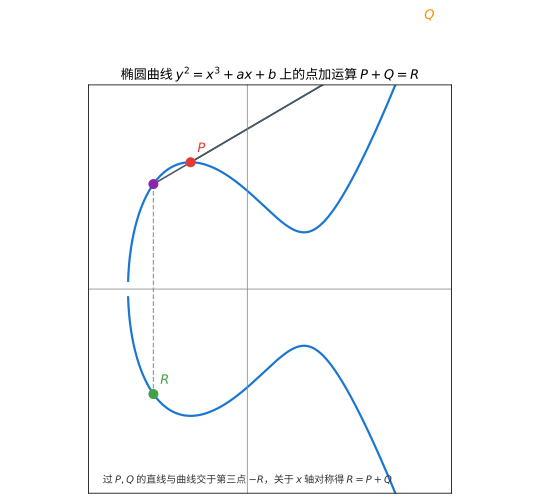
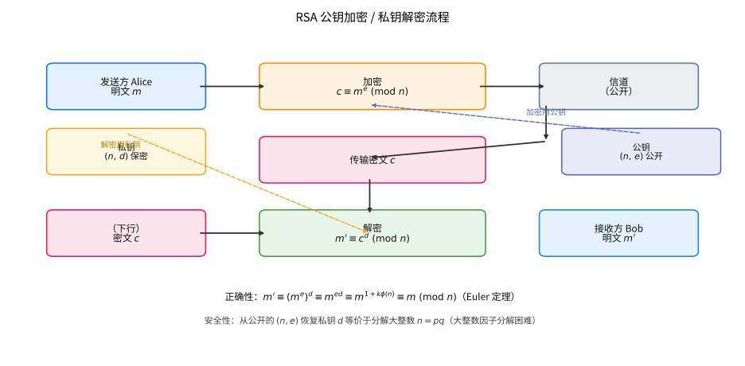

# 第 114 级：密码学 (Cryptography)

---

## 从"把秘密锁进数学保险箱"说起：密码学要解决的根问题

> 在看 RSA 那些模幂运算、各种"困难问题"之前，先想清楚一个最根本的问题：**为什么现代通信能放心地公开加密、却仍能守住秘密？**

**一个你天天在用的场景（第一步：直觉）**

你在购物网站上输入银行卡号时，网址边上会出现一把小锁（HTTPS）。数据明明要在公网上七拐八绕经过很多台服务器——这些服务器都可能被监听——可你的卡号依然只有卖家和你自己看得懂。莫非你和卖家事先偷偷见过面、约好暗号？并没有。**你们今天才第一次打交道，却能在隔着无数双眼睛的公开线路上，当场建立一个只有你们俩知道的秘密。** 密码学，就是这门"当着全世界面说悄悄话"的学问。

**一段从"换字母"到"换问题"的历史（第二步：要解决的问题）**

- **古代：靠"藏汉字眼"守秘密。** 早先的加密就是把消息"换一种写法"——凯撒大帝把每个字母往后移 3 位（凯撒密码）；二战时期德国使用**恩尼格玛（Enigma）**密码机。这一阶段的共同毛病是：**加密和解密用同一把钥匙，且"钥匙怎么安全送到对方手里"始终是死结**——一旦换钥的信使被截，一切皆休。
- **转折：1976 年 Diffie 与 Hellman《密码学的新方向》。** 他们发问：能不能**加密的钥匙公开、只有解密的钥匙私有**？于是有了"公钥加密"这一革命性思路，从根上解决"钥匙分发"难题。
- **现代：把"安全"建立在"问题之难"上。** 1977 年 RSA 基于**大整数因子分解**，1985 年 Miller、Koblitz 提出**椭圆曲线密码**（ECC）基于椭圆曲线群上的**离散对数问题**。今天的安全，不再靠"藏住算法"，而是靠"公开算法 + 一个公认极难反向求解的数学问题"。量子计算（Shor 算法）若成真，会一次性动摇这两大支柱，因此"后量子密码"（格密码等）成了新的竞逐场。

**第三步：正式定义前的准备**

本章按"从能用 → 到如何证明安全"推进：

1. 先分清两大阵营：**对称密码**（AES/DES，一把钥匙）与**非对称密码**（公钥加密，两把钥匙），搞懂它们各自的优势与软肋；
2. 再给"安全"立规矩：**归约证明**——把"破解我的方案"与"解某个公认难题"绑在一起，两者要么都成立、要么都不成立；
3. 依次拆解 RSA 的正确性与安全性、**Rabin 密码**与因子分解的等价、**Diffie–Hellman 密钥交换**与 **ElGamal 加密**（分别挂在 CDH、DDH 假设上）、**RSA-OAEP** 的填充与 CCA 安全；
4. 最后看**椭圆曲线、安全多方计算、零知识证明、同态加密、格密码与量子密码**等前沿，理解"安全"这条战线如何被不断重画。

带着"**凭什么公开一切却仍能保密？这个'难'到底难在哪里、又凭什么被认为难？**"去读每一步证明——你会看到密码学的每个定理，其实都在回答"我的方案卡在哪条公认的难题上"。

> **🧠 一句话记住密码学的"出生证"**
>
> 密码学源于"如何在公开、可被监听的信道上安全秘密地通信"，它解决的**根本问题**是：
>
> $$ \boxed{\text{让任何不在场的旁人即便截获全部公开信息，也读不懂、改不了、也冒充不了真正的消息。}} $$
>
> 现代密码学把这份承诺押在**一系列公认的数学难题**（分解、离散对数、格上困难问题）上，并用**归约证明**把"方案的安全性"和"难题的难解性"焊在一起。

---

## 开始之前

**本章在讲什么**：密码学研究"如何在有敌手的环境里安全通信"。你会学到对称密码（AES/DES）与非对称密码（公钥加密）两大阵营，理解 RSA 的正确性与安全性、Rabin 密码与因子分解的等价性、Diffie–Hellman 密钥交换、ElGamal 加密、RSA-OAEP 的 CCA 安全，以及数字签名、哈希、PKI 和椭圆曲线、同态加密、零知识证明、格密码、量子密码等方向。核心管线是"构造方案 → 定义安全模型 → 用归约证明安全"。

**为什么要学它**：它和刚学过的第 113 级编码理论正好是"问题的两面"——**编码理论防"噪声"（无意的物理差错），密码学防"敌手"（有意的攻击）**：一个要让消息在坏信道上"看得清"，一个要让消息在贼眼前"看不懂"。密码学把第 13 级数论（模运算、欧拉定理、原根、因子分解）、抽象代数（群、有限域）搬到信息安全的现场，也为第 121 级控制论中"系统对外部干扰与攻击的鲁棒性"提供了"对抗视角"的数学样板。它是网络安全、电子商务、区块链、可信计算的地基。

**开始前请确认你还记得**：

- 数论（见第 13 级）：模运算、欧拉函数 $\phi(n)$ 与欧拉定理、中国剩余定理、原根与离散对数、扩展欧几里得算法（关键：$ed\equiv1\pmod{\phi(n)}$，故 $m^{ed}\equiv m^{1+k\phi(n)}\pmod n$）。
- 抽象代数（群论）：循环群、群的阶、子群、生成元。Diffie–Hellman、ElGamal、ECC 全部跑在"好算却难反推"的循环群上。
- 组合与概率：多项式时间与可忽略概率、"生日问题"碰撞界 $2^{m/2}$。
- 编码理论（见第 113 级）的基本直觉：知道"噪声下的冗余"与"敌手下保密"是两种不同的可靠性目标即可。

---

## 1. 学习目标

完成本教程后，你将能够：

1. 理解对称密码与非对称密码的基本原理与区别
2. 掌握 RSA 密码系统的正确性证明与安全性基础
3. 理解 Rabin 密码系统与因子分解问题的等价性
4. 掌握 Diffie-Hellman 密钥交换与 ElGamal 加密的安全性证明
5. 理解 RSA-OAEP 的安全性证明思路
6. 了解椭圆曲线密码、同态加密、零知识证明等前沿方向
7. 了解量子密码与量子算法对密码学的冲击

---

## 2. 核心概念

### 2.1 对称密码

**为什么需要这个概念？** 密码学最早遇到的"可靠方案"就是："发信前用一把钥匙把信锁上，收信人用同一把钥匙开锁"。它天然满足"我懂你不懂"，而且快（现代世界毫秒级加解密海量数据全靠它）。它的代价是**密钥分发**：这把唯一的钥匙总得先安全地送到对方手里。先认识它、再体会它"缺在哪"，你才能理解后文公钥加密登场的原因。

**对称密码**（Symmetric Cryptography）使用相同的密钥进行加密和解密。代表性算法包括：

- **DES**（Data Encryption Standard）：64 位分组密码，56 位密钥，现已不安全
- **AES**（Advanced Encryption Standard）：128 位分组密码，支持 128/192/256 位密钥，为当前标准

对称密码的优点是加解密速度快，缺点是密钥分发问题。

> **💡 直观理解（类比）**：对称密码像"一门共用一把钥匙的保险箱"——加密和开锁用同一把钥匙，速度快、适合大批量数据；麻烦的是钥匙必须在攻击者眼皮底下安全交到对方手里，途中一旦被截走，一切就白搭。DES 已老到能被暴力硬撬开，AES 则是更牢靠的铁门。

### 2.2 非对称密码

**为什么需要这个概念？** 对称密码唯一的死结是"钥匙怎么送到对方手里"。非对称密码的回应很干脆：**开锁的钥匙（私钥）只有你留着，上锁的锁孔（公钥）可以贴满大街**。想做加密的人用公开锁孔锁上（加密），能打开锁的只有你（解密）——压根不需要事先偷偷递钥匙。它按"公钥加密、私钥解密"扭转了密钥分发的宿命，也换来速度变慢的代价（所以实践中总是"用公钥协商出对称密钥，再用对称密钥加密正文"）。

**非对称密码**（Asymmetric Cryptography）使用公钥加密、私钥解密，解决了密钥分发问题。代表性算法包括：

- **RSA**：基于大整数因子分解的困难性
- **ElGamal**：基于离散对数问题的困难性

> **💡 直观理解（类比）**：非对称密码像"信箱只配一锁一钥"——公钥像人人可往里投信的锁孔（加密），私钥是你独有的开锁钥匙（解密），旁人锁上谁都行、打开只有你。因为无需偷偷摸摸递钥匙，公钥大可堂而皇之公开，恰好根治对称密码"钥匙怎么安全送达"的死结。

### 2.3 公钥基础设施

**公钥基础设施**（PKI, Public Key Infrastructure）是管理公钥证书的系统，包括证书颁发机构（CA）、注册机构（RA）、证书撤销列表（CRL）等组件。

> **💡 直观理解（类比）**：公钥基础设施像"房地产的产权登记与文印中心"——CA 像官方公证处，签发"这张公钥确实属于某人"的证书；RA 负责审核申请人身份，CRL 则像注销违规、过期房产的记录册。它把"我凭什么相信这是你的公钥"这个疑问，转交给一个可信的中间权威去背书。

### 2.4 数字签名与哈希函数

**数字签名**（Digital Signature）提供认证、完整性和不可否认性。常用算法包括 RSA 签名、DSA、ECDSA。

**哈希函数**（Hash Function）将任意长度消息映射为固定长度摘要，具有抗原像性、抗第二原像性和抗碰撞性。常用算法包括 SHA-256、SHA-3。

> **💡 直观理解（类比）**：数字签名像"亲笔签字加防伪"——用私钥签下、别人用公钥验真，既证明出自你手、又证明内容没被改，还让你赖不掉；哈希函数则像给文件盖"内容指纹"，任何一处改动都会让指纹彻底变样，所以原像、第二原像与碰撞分别对应"想反推指纹""想另找一份同指纹文件""想伪造两份同指纹文件"，一层比一层更难。

### 2.5 密钥交换

**Diffie-Hellman 密钥交换**（DH Key Exchange）允许双方在不安全的信道上建立共享密钥。基于离散对数问题。

> **💡 直观理解（类比）**：Diffie-Hellman 密钥交换像"两人隔着嘈杂大厅对暗号，最后却算出同一个数"——Alice、Bob 各守一个秘密数，把公开算好的 $g^a$、$g^b$ 传给对方，各自再一换算就能得到相同的共享秘密 $g^{ab}$；偷听者虽然截下全部公开信息，却算不出这个共享值，因为"从 $g^a$ 反求 $a$"（离散对数）极难。

### 2.6 椭圆曲线密码

**椭圆曲线密码**（ECC, Elliptic Curve Cryptography）使用椭圆曲线上的点群结构，在相同安全强度下密钥长度远小于 RSA。

椭圆曲线 $y^2 = x^3 + ax + b$ 上的点构成一个群，其"加法"由几何法则定义：

> **直观理解（现实类比）**：椭圆曲线上的"加法"就像在一条蜿蜒的滑梯上做游戏：把 $P$、$Q$ 两点连成一条线，看它撞到滑梯的第三个点，再把它翻个跟斗（沿 $x$ 轴对称）得到 "和" $P+Q$。反复玩这个游戏做 $k$ 次（$kP$）很容易，但若只知道结果和起始点，要反推出"玩了 $k$ 次"却极其困难——这正是椭圆曲线密码的安全基石。

> **🧠 思考历程：两把钥匙，一把交给全世界、一把藏在自己手里——凭什么安全？**
>
> 椭圆曲线公钥加密回答的，是密码学最反直觉的一项承诺：把加密方法完全公开，解密却依然无懈可击。而这承诺的支柱，是一个"好算却极难反推"的单向台阶——椭圆曲线群上的离散对数问题。
>
> - **从"对称"走向"分离"**。军用密码长期靠对称密钥（加密解密同一把钥匙），可钥匙怎么安全传递却是死结。1976年 Diffie 与 Hellman 发表《密码学的新方向》，Merkle 同场提出公钥雏形——"公开哲学"一夜之间改变了密钥分发的宿命。
> - **RSA 的证明与椭圆曲线接力**。1977年 Rivest、Shamir 与 Adleman 基于大数因子分解构造 RSA；而由 Miller 与 Koblitz 在1985年分别独立提出的椭圆曲线密码（ECC），在有限域上构造椭圆曲线群，用更小的密钥达到同等安全——"难在反推而非难在算"的原则被一遍遍兑现。
> - **把"难"变成工程边界**。过去五十年，密码界围绕离散对数、因子分解的困难与量子算法（Shor 1994）的威胁不断迭代，从 RSA 到 ECC 再到后量子候选——安全始终建立在"某个方向的运算被世界普遍相信极难"之上。
> - **心路**：把全球信任押在一个"可能被证明极难"的问题上，是科学近乎信仰的一跃——真正的密码学，一半靠数学、一半靠对"难"的敬畏。

### 2.7 高级密码学协议

**安全多方计算**（MPC）：多个参与方在不泄露各自输入的情况下共同计算一个函数。

**零知识证明**（ZKP）：证明者向验证者证明某个陈述为真，而不泄露任何额外信息。

**同态加密**（Homomorphic Encryption）：允许在密文上直接进行计算，结果解密后与对明文计算结果一致。

**格密码**（Lattice-based Cryptography）：基于格上困难问题（如 LWE、SIS），被认为能抵抗量子攻击。

> **💡 直观理解（类比）**：高级安全协议各显身手——安全多方计算像"多名评委各自打分却不互相看卷，最后只公布总分"；零知识证明像"向门卫证明你确实知道口令，却并不喊出半个字"；同态加密像"寄一箱封好的零部件给加工厂，他们不拆箱直接在箱外加工，退回来依然封着箱"；格密码则拿高维空间的困难问题当护身符，据说连量子计算机都啃不动。

### 2.8 量子密码学

**量子密码**（Quantum Cryptography）：利用量子力学原理实现安全通信，如量子密钥分发（QKD）。

**Shor 算法**：能在多项式时间内分解大整数和计算离散对数，威胁 RSA 和 ECC。

**Grover 算法**：能在 $O(\sqrt{N})$ 时间内搜索无序数据库，将对称密码的安全强度减半。

> **💡 直观理解（类比）**：量子算法像"快进版的万能起子"——Shor 算法能在多项式时间内撬开 RSA 与离散对数的锁（分解、求离散对数），瞬间点名"这两把老锁不行了"；Grover 则像把翻一遍钥匙串的时间从 $N$ 步压到 $\sqrt N$ 步，等于把对称密码的钥匙有效长度砍半，逼得大家把钥匙加粗才安心。

---

## 3. 定理与证明

### 3.1 RSA 密码的正确性

**定理 3.1（RSA 正确性）** 设 $p, q$ 为两个不同的大素数，$n = pq$，$\phi(n) = (p-1)(q-1)$。选择 $e$ 满足 $1 < e < \phi(n)$ 且 $\gcd(e, \phi(n)) = 1$，计算 $d \equiv e^{-1} \pmod{\phi(n)}$。对任意明文 $m \in \mathbb{Z}_n^*$，加密 $c \equiv m^e \pmod{n}$，解密 $m' \equiv c^d \pmod{n}$，则 $m' = m$。

**证明：** 由 $d \equiv e^{-1} \pmod{\phi(n)}$ 知存在整数 $k$ 使得 $ed = 1 + k\phi(n)$。于是：

$$
m' \equiv c^d \equiv (m^e)^d \equiv m^{ed} \equiv m^{1 + k\phi(n)} \equiv m \cdot (m^{\phi(n)})^k \pmod{n}.
$$

若 $m \in \mathbb{Z}_n^*$（即 $\gcd(m, n) = 1$），由 Euler 定理 $m^{\phi(n)} \equiv 1 \pmod{n}$，得 $m' \equiv m \pmod{n}$。

若 $\gcd(m, n) \neq 1$，则 $m$ 是 $p$ 或 $q$ 的倍数，不妨设 $m \equiv 0 \pmod{p}$。此时 $m^{ed} \equiv 0 \equiv m \pmod{p}$ 显然成立。对模 $q$，若 $m \not\equiv 0 \pmod{q}$，由 Euler 定理 $m^{\phi(n)} \equiv (m^{q-1})^{p-1} \equiv 1^{p-1} \equiv 1 \pmod{q}$，故 $m^{ed} \equiv m \cdot (m^{\phi(n)})^k \equiv m \pmod{q}$；若 $m \equiv 0 \pmod{q}$，则 $m^{ed} \equiv 0 \equiv m \pmod{q}$。因此 $m^{ed} \equiv m \pmod{p}$ 和 $m^{ed} \equiv m \pmod{q}$ 同时成立，由中国剩余定理得 $m^{ed} \equiv m \pmod{n}$。

**使用 Carmichael 函数的证明：** Carmichael 函数 $\lambda(n)$ 定义为 $\lambda(p^a q^b) = \text{lcm}(\lambda(p^a), \lambda(q^b))$，其中 $\lambda(p^e) = \phi(p^e)$ 对奇素数 $p$，$\lambda(2^e) = 2^{e-2}$ 对 $e \geq 3$。对 $n = pq$，有 $\lambda(n) = \text{lcm}(p-1, q-1)$。由 Carmichael 定理，$a^{\lambda(n)} \equiv 1 \pmod{n}$ 对所有与 $n$ 互素的 $a$ 成立。取 $ed \equiv 1 \pmod{\lambda(n)}$，则 $ed = 1 + k\lambda(n)$，从而 $m^{ed} \equiv m \cdot (m^{\lambda(n)})^k \equiv m \pmod{n}$。$\square$

> **直观理解（现实类比）**：RSA 就像一把"锁"与"钥匙"分离的挂锁。公钥是上锁的挂锁（人人可锁上，即 $c=m^e \bmod n$），私钥是唯一的开锁钥匙（只有你持有，即 $m=c^d \bmod n$）。别人能把信投进你的信箱（加密），但只有你口袋里的钥匙能打开它（解密）。破解等价于找到打开挂锁的万能钥——即分解出 $n=pq$，而那在数学上极其困难。

> **常见坑**：① **"课本 RSA"（教科书 RSA）不安全**——$c=m^e$ 是确定性的：同一明文重复加密得到同一密文，敌手可据此辨别、还可用低指数小自明消息攻击，所以实际 RSA **必须加随机化填充**（如 OAEP），例 4.1 里的"裸 RSA"只为演示数学原理而非工程安全做法；② **公钥公开 ≠ 收到的公钥可信**——攻击者可以中途调包公钥（中间人攻击），这正是需要 PKI/证书来"证实公钥归属"的原因；③ 别把"正确性"与"安全性"划等号——RSA 证明的是 $m^{ed}\equiv m$（保证加解密互通），而安全性还要额外建立在"分解困难"之上，两者是两回事。

### 3.2 Rabin 密码的安全性

**定理 3.2（Rabin 密码的安全性）** 设 $n = pq$ 为两个大素数的乘积，Rabin 加密函数 $f(m) \equiv m^2 \pmod{n}$。则破解 Rabin 加密（即求平方根模 $n$）在计算上等价于分解 $n$。

> **💡 直观理解（类比）**：Rabin 加密像"算平方容易、开根号难"的弹簧锁——任何人都会做 $m^2 \bmod n$（加密），但模 $n$ 求平方根却和亲手拆出 $n=pq$ 两个质因子一样难。证明用"归约"把破解的难度牢牢栓到已知难题上：相当于先证明"撬开这把锁"与"撬开公认的铁锁"强度一模一样，于是只要没人能拆锁，就没人能撬开它。

**证明：** 我们需要证明两个方向：

**方向 1（分解 $\Rightarrow$ 求平方根）：** 若已知 $n = pq$ 的因子分解，则可分别在模 $p$ 和模 $q$ 下求平方根，再通过中国剩余定理组合。

对模 $p$，求解 $x^2 \equiv a \pmod{p}$。若 $p \equiv 3 \pmod{4}$，则 $x \equiv \pm a^{(p+1)/4} \pmod{p}$。对模 $q$ 同理。然后使用中国剩余定理组合 $4$ 个平方根。

**方向 2（求平方根 $\Rightarrow$ 分解）：** 假设存在一个神谕 $\mathcal{O}$，输入 $a$ 输出 $a$ 模 $n$ 的一个平方根（若存在）。我们利用 $\mathcal{O}$ 构造分解 $n$ 的算法：

1. 随机选择 $x \in \mathbb{Z}_n^*$，计算 $a \equiv x^2 \pmod{n}$
2. 调用 $\mathcal{O}(a)$ 得到平方根 $y$，即 $y^2 \equiv a \equiv x^2 \pmod{n}$
3. 若 $y \equiv \pm x \pmod{n}$，则返回步骤 1 重新选择
4. 若 $y \not\equiv \pm x \pmod{n}$，则 $x^2 - y^2 \equiv 0 \pmod{n}$，即 $(x-y)(x+y) \equiv 0 \pmod{n}$
5. 计算 $\gcd(x-y, n)$ 和 $\gcd(x+y, n)$，得到 $p$ 和 $q$ 的非平凡因子

由于 $x^2 \equiv y^2 \pmod{n}$ 等价于 $n \mid (x-y)(x+y)$。若 $y \not\equiv \pm x \pmod{n}$，则 $n$ 不整除 $x-y$ 也不整除 $x+y$，但 $n$ 整除它们的乘积，因此 $\gcd(x-y, n)$ 是 $n$ 的非平凡因子。

随机选择 $x$ 时，$y \equiv \pm x$ 的概率为 $1/2$，因此期望在 $2$ 次尝试后成功。$\square$

**注：** Rabin 加密的安全性证明是"归约证明"（reduction proof）的经典例子——将破解加密算法的困难性归约到解决一个已知困难问题。

### 3.3 Diffie-Hellman 密钥交换的安全性

**定理 3.3（Diffie-Hellman 安全性）** 在计算性 Diffie-Hellman（CDH）假设下，Diffie-Hellman 密钥交换协议是安全的。

> **💡 直观理解（类比）**：这三个"难问题"像依次加码的锁——DLP 问"看到 $g^a$ 反求 $a$"，CDH 问"知道 $g^a,g^b$ 求 $g^{ab}$"，DDH 更进一步问"光从公开信息能不能分辨 $g^{ab}$ 与随机值"；一个比一个更强。证明用归约把"破坏协议"焊死到 CDH 上：若真有敌手能偷走共享密钥，就能原封不动拿同一招去解 CDH，与"CDH 无人能解"的假设顶牛——要么全安全，要么一起塌。

**先定义三个问题：**

- **离散对数问题（DLP）**：给定 $g, g^a \in G$，求 $a$
- **计算性 Diffie-Hellman 问题（CDH）**：给定 $g, g^a, g^b \in G$，求 $g^{ab}$
- **判定性 Diffie-Hellman 问题（DDH）**：给定 $g, g^a, g^b, g^c \in G$，判定 $c \equiv ab \pmod{|G|}$ 是否成立

**CDH 假设：** 不存在多项式时间算法能以不可忽略的概率解决 CDH 问题。

**证明思路：** 我们需要证明，若存在一个敌手 $\mathcal{A}$ 能破坏 Diffie-Hellman 密钥交换（即能从公开信息 $g, g^a, g^b$ 中提取关于共享密钥 $g^{ab}$ 的信息），则存在一个算法 $\mathcal{B}$ 能利用 $\mathcal{A}$ 解决 CDH 问题。

更具体地，考虑半诚实（semi-honest）模型下的安全性。协议执行后，敌手看到公开信息 $(g, g^a, g^b)$，其目标是计算 $g^{ab}$。

假设存在一个多项式时间敌手 $\mathcal{A}$ 使得：

$$
\Pr[\mathcal{A}(g, g^a, g^b) = g^{ab}] = \varepsilon(k),
$$

其中 $\varepsilon(k)$ 是不可忽略的（$k$ 为安全参数）。

构造算法 $\mathcal{B}$ 解决 CDH 问题：
1. $\mathcal{B}$ 接收 CDH 挑战 $(g, X, Y)$，其中 $X = g^x$，$Y = g^y$
2. $\mathcal{B}$ 将 $(g, X, Y)$ 作为公开信息发送给 $\mathcal{A}$
3. $\mathcal{A}$ 输出 $K$，$\mathcal{B}$ 将 $K$ 作为 CDH 答案输出

由于 $\mathcal{A}$ 在 $(g, g^a, g^b)$ 上的分布恰好与 CDH 挑战的分布相同，$\mathcal{B}$ 成功的概率也等于 $\varepsilon(k)$。若 $\varepsilon(k)$ 不可忽略，则 $\mathcal{B}$ 以不可忽略的概率解决 CDH 问题，与 CDH 假设矛盾。

因此，在 CDH 假设下，没有多项式时间敌手能以不可忽略的概率计算共享密钥 $g^{ab}$。$\square$

**注：** 上述证明针对的是"被动攻击者"（即窃听者）。对于主动攻击者（中间人攻击），DH 协议需要额外认证机制。

> **常见坑**：Diffie–Hellman 只解决"被动窃听下的**密钥协商**"，它**本身不提供认证**——攻击者可以把 Alice 发给 Bob 的 $g^a$ 换成自己的 $g^{a'}$，跟双方各建立一个共享密钥，Alice、Bob 却毫无察觉（中间人攻击）。所以实际部署必须叠加数字签名/PKI 来确认"对方发送的正是本人"。另外量好别把"DH 算出共享密钥"说成"DH 加密消息"：它只是协商出一把对称密钥，正文由这把密钥配合对称加密来完成。

### 3.4 ElGamal 加密的安全性

**定理 3.4（ElGamal 安全性）** 在判定性 Diffie-Hellman（DDH）假设下，ElGamal 加密方案具有 IND-CPA 安全性（选择明文攻击下的不可区分性）。

> **💡 直观理解（类比）**：ElGamal 加密像"每次封口都换一道不同的锁"——加密时为明文 $m$ 乘上一个随机罩子 $h^r$，于是同一句话发多少遍、密文都各不相同。IND-CPA 考验的是：挑战者把两个消息里的一个加密给敌手看，敌手要猜出是哪个；靠 DDH 保证，他这点判断力顶多比掷硬币略好一筹，几乎等于瞎猜。

**证明：** ElGamal 加密方案如下：
- **密钥生成**：$G$ 为 $q$ 阶循环群，生成元 $g$。私钥 $sk = x \in \mathbb{Z}_q^*$，公钥 $pk = (G, g, q, h = g^x)$
- **加密**：对明文 $m$，选择随机数 $r \in \mathbb{Z}_q^*$，输出密文 $(c_1, c_2) = (g^r, m \cdot h^r)$
- **解密**：$m = c_2 \cdot (c_1^x)^{-1}$

IND-CPA 安全性通过以下游戏定义：

1. 挑战者生成密钥对 $(pk, sk)$，将 $pk$ 发送给敌手 $\mathcal{A}$
2. $\mathcal{A}$ 选择两个等长明文 $m_0, m_1$
3. 挑战者随机选择 $b \in \{0, 1\}$，加密 $m_b$ 得到密文 $c^*$，发送给 $\mathcal{A}$
4. $\mathcal{A}$ 输出对 $b$ 的猜测 $b'$
5. $\mathcal{A}$ 的优势定义为 $\text{Adv}(\mathcal{A}) = |\Pr[b' = b] - 1/2|$

若 $\text{Adv}(\mathcal{A})$ 对任何多项式时间敌手都是可忽略的，则称方案具有 IND-CPA 安全性。

假设存在敌手 $\mathcal{A}$ 以不可忽略的优势 $\varepsilon$ 破坏 ElGamal 的 IND-CPA 安全性。构造算法 $\mathcal{D}$ 解决 DDH 问题：

$\mathcal{D}$ 接收 DDH 挑战 $(g, g^a, g^b, g^c)$，需要判定 $c \equiv ab \pmod{q}$ 是否成立。

1. $\mathcal{D}$ 设置 $h = g^a$，公钥 $pk = (G, g, q, h)$
2. $\mathcal{A}$ 选择 $m_0, m_1$，$\mathcal{D}$ 随机选择 $b \in \{0, 1\}$
3. $\mathcal{D}$ 构造密文 $c^* = (g^b, m_b \cdot g^c)$
4. 若 $c = ab$，则 $g^c = g^{ab} = (g^a)^b = h^b$，密文是 $m_b$ 的正确加密
5. 若 $c$ 是均匀随机的，则 $g^c$ 与 $h^b$ 独立，$m_b \cdot g^c$ 在群中均匀分布，不泄露 $b$ 的信息
6. $\mathcal{A}$ 输出 $b'$，若 $b' = b$ 则 $\mathcal{D}$ 输出 1（判定 $c = ab$），否则输出 0

分析 $\mathcal{D}$ 的优势：
- 当 $c = ab$ 时，$\mathcal{A}$ 正确猜测的概率为 $1/2 + \varepsilon$
- 当 $c$ 随机时，$\mathcal{A}$ 正确猜测的概率为 $1/2$

因此 $\mathcal{D}$ 区分 DDH 的优势为 $\varepsilon$，与 DDH 假设矛盾。$\square$

### 3.5 RSA-OAEP 的安全性

**定理 3.5（RSA-OAEP 安全性）** 在随机神谕模型（Random Oracle Model）下，假设 RSA 问题是困难的（即给定 $c \equiv m^e \pmod{n}$ 求 $m$ 是困难的），则 RSA-OAEP 加密方案具有 IND-CCA2 安全性（自适应选择密文攻击下的不可区分性）。

> **💡 直观理解（类比）**：RSA-OAEP 像"先塞进裹满气泡垫的包装盒再上锁"——OAEP 用两个哈希函数 $G,H$ 给明文掺入随机盐，于是连加密同一消息每次的密文也焕然一新。证明把哈希当成'一问一答的纯随机神谕'：敌手想攻破，就必须去问神谕关于那块随机盐的编号，而这一问恰恰暴露了破解 RSA 的破绽——如同小偷去翻登记册，反被登记册出卖。

**证明思路：** OAEP（Optimal Asymmetric Encryption Padding）使用两个哈希函数 $G$ 和 $H$（在随机神谕模型中视为随机函数）对明文进行填充：

$$
\text{OAEP 编码：}
$$

设 $m$ 为 $k_0$ 位消息，$r$ 为 $k_1$ 位随机数。计算：

$$
s = (m \| 0^{k_1}) \oplus G(r), \quad t = r \oplus H(s),
$$

输出 $(s, t)$ 作为填充后的消息，再应用 RSA 加密 $c \equiv (s \| t)^e \pmod{n}$。

**安全性证明的核心思想**（Fujisaki-Okamoto 等人）：

1. **模拟器构造**：在 IND-CCA2 游戏中，模拟器 $S$ 不知道私钥 $d$，但需要回答敌手的解密查询。$S$ 维护 $G$ 和 $H$ 的查询表。

2. **解密查询的处理**：当敌手查询某个密文 $c$ 的解密时，$S$ 首先检查 $c$ 是否等于挑战密文 $c^*$，若是则拒绝。否则 $S$ 从 $G$ 和 $H$ 的查询表中查找是否已有对应的 $(s, t)$ 使得 $m$ 有意义。如果找到，返回对应的 $m$；否则返回 $\bot$。

3. **挑战阶段**：敌手选择 $m_0, m_1$，$S$ 随机选择 $b$，对 $m_b$ 进行 OAEP 编码得到 $(s^*, t^*)$，然后计算 $c^* = (s^* \| t^*)^e \pmod{n}$。关键在于 $S$ 不需要知道 $d$——它直接使用 $e$ 计算加密。

4. **归约**：若敌手能以不可忽略的优势区分 $m_0$ 和 $m_1$，则存在一个算法能利用敌手解决 RSA 问题（即从 $c^*$ 中恢复 $(s^*, t^*)$）。

5. **关键引理**：在随机神谕模型中，敌手若不对 $G$ 或 $H$ 进行特定查询，则无法区分 $m_b$ 的加密与随机值。因此，任何成功的敌手必然查询了 $G(r^*)$ 或 $H(s^*)$，其中 $r^*$ 是挑战加密中使用的随机数。这暴露了 $r^*$ 的信息，使模拟器可以提取 RSA 问题的解。

**结论**：RSA-OAEP 在随机神谕模型下是 IND-CCA2 安全的，归约到 RSA 问题的困难性。$\square$

---

## 4. 示例

### 示例 4.1：用 RSA 进行加密解密

**问题：** 取 $p = 61$，$q = 53$，$e = 17$，加密明文 $m = 65$，然后解密验证。

> **💡 直观理解（类比）**：这个例子像亲手走一遍"上锁、开锁"的仓库流程——先用公钥 $(3233,17)$ 把消息 $65$ 锁成密文 $2790$，再用私钥 $(3233,2753)$ 把它打开回 $65$。扩展欧几里得堪称"配钥匙"：辗转相除再回代，一步步倒算出开锁所需的那把 $d$；快速幂则像用翻倍平方记账，把巨大的 $65^{17}$、$2790^{2753}$ 飞快折成小步求和。

**解：**

**密钥生成：**
- $n = p \cdot q = 61 \times 53 = 3233$
- $\phi(n) = (61-1)(53-1) = 60 \times 52 = 3120$
- $e = 17$，验证 $\gcd(17, 3120) = 1$
- 计算 $d \equiv e^{-1} \pmod{3120}$，即 $17d \equiv 1 \pmod{3120}$

使用扩展欧几里得算法：
$$
3120 = 17 \times 183 + 9,\quad
17 = 9 \times 1 + 8,\quad
9 = 8 \times 1 + 1.
$$

反向代入：
$$
1 = 9 - 8 = 9 - (17 - 9) = 2 \cdot 9 - 17 = 2 \cdot (3120 - 17 \times 183) - 17 = 2 \times 3120 - 367 \times 17.
$$

因此 $d \equiv -367 \equiv 3120 - 367 = 2753 \pmod{3120}$。

公钥为 $(n = 3233, e = 17)$，私钥为 $(n = 3233, d = 2753)$。

**加密：** $c \equiv m^e \pmod{n} = 65^{17} \pmod{3233}$。

计算：
$$
65^2 \equiv 4225 \equiv 992 \pmod{3233},
$$
$$
65^4 \equiv 992^2 \equiv 984064 \equiv 992 \pmod{3233} \text{（需重新精确计算）}
$$

更精确地：
$$
65^2 = 4225 \equiv 4225 - 3233 = 992 \pmod{3233},
$$
$$
65^4 \equiv 992^2 = 984064, \quad 984064 \div 3233 = 304 \times 3233 = 982832, \quad 984064 - 982832 = 1232,
$$
$$
65^8 \equiv 1232^2 = 1517824, \quad 1517824 \div 3233 = 469 \times 3233 = 1516277, \quad 1517824 - 1516277 = 1547,
$$
$$
65^{16} \equiv 1547^2 = 2393209, \quad 2393209 \div 3233 = 740 \times 3233 = 2392420, \quad 2393209 - 2392420 = 789.
$$

由于 $17 = 16 + 1$，$65^{17} \equiv 65^{16} \cdot 65 \equiv 789 \times 65 = 51285$，$51285 \div 3233 = 15 \times 3233 = 48495$，$51285 - 48495 = 2790$。

故 $c = 2790$。

**解密：** $m' \equiv c^d \pmod{n} = 2790^{2753} \pmod{3233}$。使用快速幂模运算（此处略去详细计算过程），得到 $m' = 65$，验证正确。

### 示例 4.2：椭圆曲线密码的实现

**问题：** 在椭圆曲线 $E: y^2 = x^3 + 2x + 3$ 在 $\mathbb{F}_{11}$ 上实现 ECDH 密钥交换。

> **💡 直观理解（类比）**：这个例子像走一遍"各自爬同一串台阶再对暗号"——先数清曲线上共有多少个点（群阶 $13$，素数），这是确定每条安全车道有多长；然后 Alice、Bob 各自把基点 $G$ 翻倍加倍出自己的公钥 $(8,10)$、$(1,8)$，交换后各算 $k\times$ 对方公钥；两条不同路线最终殊途同归到同一个共享点 $K=(10,5)$。顺着台阶走（点加）轻松，倒着数走了多少步却极难，这正是秘密能共享、偷听撬不开的原因。

**解：** $\mathbb{F}_{11}$ 上的椭圆曲线 $E: y^2 = x^3 + 2x + 3$。

**步骤 1：列出所有点。**
计算 $x = 0, 1, \dots, 10$ 时的 $x^3 + 2x + 3 \pmod{11}$：

| $x$ | $x^3 + 2x + 3$ | 是否为平方数 | $y$ |
|-----|----------------|-------------|-----|
| 0 | 3 | 否 | - |
| 1 | 1 + 2 + 3 = 6 | 否 | - |
| 2 | 8 + 4 + 3 = 15 ≡ 4 | 是，$y = \pm 2$ | $(2,2), (2,9)$ |
| 3 | 27 + 6 + 3 = 36 ≡ 3 | 否 | - |
| 4 | 64 + 8 + 3 = 75 ≡ 9 | 是，$y = \pm 3$ | $(4,3), (4,8)$ |
| 5 | 125 + 10 + 3 = 138 ≡ 6 | 否 | - |
| 6 | 216 + 12 + 3 = 231 ≡ 0 | 是，$y = 0$ | $(6,0)$ |
| 7 | 343 + 14 + 3 = 360 ≡ 8 | 是，$y = \pm 5$ | $(7,5), (7,6)$ |
| 8 | 512 + 16 + 3 = 531 ≡ 3 | 否 | - |
| 9 | 729 + 18 + 3 = 750 ≡ 2 | 是，$y = \pm 6$ | $(9,6), (9,5)$ |
| 10 | 1000 + 20 + 3 = 1023 ≡ 0 | 是，$y = 0$ | $(10,0)$ |

加上无穷远点 $\mathcal{O}$，共 $13$ 个点，群的阶为 $13$（素数）。

**步骤 2：选择基点。** 取 $G = (2, 2)$。由于群阶为素数 $13$，$G$ 的阶为 $13$。

**步骤 3：密钥交换。**
- Alice 选择私钥 $a = 5$，计算公钥 $A = 5G$
- Bob 选择私钥 $b = 8$，计算公钥 $B = 8G$

计算 $5G$：
- $2G = (2,2) + (2,2)$
  - 斜率 $\lambda = (3 \cdot 2^2 + 2) \cdot (2 \cdot 2)^{-1} \pmod{11} = (12 + 2) \cdot 4^{-1} = 14 \cdot 3 = 42 \equiv 9 \pmod{11}$（因为 $4^{-1} \equiv 3 \pmod{11}$）
  - $x_3 = 9^2 - 2 - 2 = 81 - 4 = 77 \equiv 0 \pmod{11}$
  - $y_3 = 9 \cdot (2 - 0) - 2 = 18 - 2 = 16 \equiv 5 \pmod{11}$
  - 故 $2G = (0, 5)$

- $3G = 2G + G = (0,5) + (2,2)$
  - 斜率 $\lambda = (2 - 5) \cdot (2 - 0)^{-1} = (-3) \cdot 2^{-1} = 8 \cdot 6 = 48 \equiv 4 \pmod{11}$（$2^{-1} \equiv 6 \pmod{11}$）
  - $x_3 = 4^2 - 0 - 2 = 16 - 2 = 14 \equiv 3 \pmod{11}$
  - $y_3 = 4 \cdot (0 - 3) - 5 = 4 \cdot (-3) - 5 = -12 - 5 = -17 \equiv 5 \pmod{11}$
  - 故 $3G = (3, 5)$

- $4G = 2G + 2G = (0,5) + (0,5)$
  - 斜率 $\lambda = (3 \cdot 0^2 + 2) \cdot (2 \cdot 5)^{-1} = 2 \cdot 10^{-1} = 2 \cdot 10 = 20 \equiv 9 \pmod{11}$（$10^{-1} \equiv 10 \pmod{11}$）
  - $x_3 = 9^2 - 0 - 0 = 81 \equiv 4 \pmod{11}$
  - $y_3 = 9 \cdot (0 - 4) - 5 = 9 \cdot (-4) - 5 = -36 - 5 = -41 \equiv 3 \pmod{11}$
  - 故 $4G = (4, 3)$

- $5G = 4G + G = (4,3) + (2,2)$
  - 斜率 $\lambda = (2 - 3) \cdot (2 - 4)^{-1} = (-1) \cdot (-2)^{-1} = 10 \cdot 6 = 60 \equiv 5 \pmod{11}$（$(-2)^{-1} \equiv 6 \pmod{11}$）
  - $x_3 = 5^2 - 4 - 2 = 25 - 6 = 19 \equiv 8 \pmod{11}$
  - $y_3 = 5 \cdot (4 - 8) - 3 = 5 \cdot (-4) - 3 = -20 - 3 = -23 \equiv 10 \pmod{11}$
  - 故 $5G = (8, 10)$

Alice 的公钥 $A = (8, 10)$。

类似地，$8G = 5G + 3G = (8,10) + (3,5)$：
- 斜率 $\lambda = (5 - 10) \cdot (3 - 8)^{-1} = (-5) \cdot (-5)^{-1} = 1$
- $x_3 = 1^2 - 8 - 3 = 1 - 11 = -10 \equiv 1 \pmod{11}$
- $y_3 = 1 \cdot (8 - 1) - 10 = 7 - 10 = -3 \equiv 8 \pmod{11}$
- 故 $8G = (1, 8)$

Bob 的公钥 $B = (1, 8)$。

**步骤 4：共享密钥计算。**
- Alice 计算 $K = aB = 5 \cdot (1, 8)$
- Bob 计算 $K = bA = 8 \cdot (8, 10)$

计算 $5 \cdot (1, 8)$：
- $2 \cdot (1,8) = (1,8) + (1,8)$
  - 斜率 $\lambda = (3 \cdot 1^2 + 2) \cdot (2 \cdot 8)^{-1} = 5 \cdot 16^{-1} = 5 \cdot 5^{-1} = 5 \cdot 9 = 45 \equiv 1 \pmod{11}$（$16 \equiv 5$，$5^{-1} \equiv 9$）
  - $x_3 = 1^2 - 1 - 1 = -1 \equiv 10 \pmod{11}$
  - $y_3 = 1 \cdot (1 - 10) - 8 = 1 \cdot (-9) - 8 = -17 \equiv 5 \pmod{11}$
  - 故 $2 \cdot (1,8) = (10, 5)$

- $4 \cdot (1,8) = 2 \cdot (10,5) = (10,5) + (10,5)$
  - 斜率 $\lambda = (3 \cdot 10^2 + 2) \cdot (2 \cdot 5)^{-1} = (300 + 2) \cdot 10^{-1} = 302 \cdot 10 = 302 \bmod 11 = 5 \cdot 10 = 50 \equiv 6 \pmod{11}$（$302 \equiv 5$）
  - $x_3 = 6^2 - 10 - 10 = 36 - 20 = 16 \equiv 5 \pmod{11}$
  - $y_3 = 6 \cdot (10 - 5) - 5 = 6 \cdot 5 - 5 = 30 - 5 = 25 \equiv 3 \pmod{11}$
  - 故 $4 \cdot (1,8) = (5, 3)$

- $5 \cdot (1,8) = 4 \cdot (1,8) + (1,8) = (5,3) + (1,8)$
  - 斜率 $\lambda = (8 - 3) \cdot (1 - 5)^{-1} = 5 \cdot (-4)^{-1} = 5 \cdot 7^{-1} = 5 \cdot 8 = 40 \equiv 7 \pmod{11}$（$7^{-1} \equiv 8$）
  - $x_3 = 7^2 - 5 - 1 = 49 - 6 = 43 \equiv 10 \pmod{11}$
  - $y_3 = 7 \cdot (5 - 10) - 3 = 7 \cdot (-5) - 3 = -35 - 3 = -38 \equiv 5 \pmod{11}$
  - 故 $5 \cdot (1,8) = (10, 5)$

共享密钥为 $K = (10, 5)$，双方一致。

---

## 5. 习题

### 基础题

**习题 1**（对称密码）说出 DES 与 AES 在分组大小与密钥长度上的代表参数，并说明为什么 DES 如今被视作不安全。

**习题 2**（RSA 密钥对）设 $p=17$，$q=19$，$e=5$。构造 RSA 密钥对，并加密明文 $m=42$，说明解密如何还原明文。

**习题 3**（Rabin 平方根）在 Rabin 加密中，若 $p\equiv q\equiv 3\pmod{4}$，说明如何用公式 $x\equiv a^{(p+1)/4}\pmod{p}$、$x\equiv a^{(q+1)/4}\pmod{q}$ 结合中国剩余定理求 $a$ 模 $n$ 的平方根，并验证该公式成立。

**习题 4**（DH 小子群攻击）在 Diffie-Hellman 密钥交换中，若群 $G$ 的阶 $q$ 不是素数，说明协议可能受到怎样的小子群攻击，并给出防御措施。

**习题 5**（椭圆曲线点数）证明：若 $p$ 是奇素数且 $p\equiv 2\pmod{3}$，则椭圆曲线 $y^2=x^3+1$ 在 $\mathbb{F}_p$ 上恰好有 $p+1$ 个点。

**习题 6**（Shor 算法）解释 Shor 算法如何威胁 RSA 的安全性，并说明其两个核心步骤（阶求解与量子傅里叶变换）分别起什么作用。

**习题 7**（哈希性质）解释哈希函数的抗原像性、抗第二原像性与抗碰撞性三者的区别。

**习题 8**（RSA 正确性）说明为何 RSA 满足 $m'\equiv c^d\equiv m\pmod n$，并指出 Euler 定理在其中所起的作用。

**习题 9**（公钥密码）说明公钥（非对称）加密与对称加密的区别，以及它为何能解决密钥分发问题。

**习题 10**（数字签名）说明数字签名提供哪些安全性质（认证、完整性、不可否认性），并举出正文提到的签名算法。

### 进阶题

**习题 11**（ElGamal 解密）设 ElGamal 密文 $(c_1,c_2)=(g^r,\, m\cdot h^r)$，其中 $h=g^x$，验证解密公式 $c_2\cdot(c_1^x)^{-1}=m$。

**习题 12**（扩展欧几里得）用扩展欧几里得算法求 $d\equiv 5^{-1}\pmod{288}$，并验证 $5d\equiv 1\pmod{288}$。

**习题 13**（椭圆曲线点加）在曲线 $E:y^2=x^3+2x+3$（$\mathbb{F}_{11}$ 上）逐步计算 $2G=(2,2)+(2,2)=(0,5)$，写出斜率 $\lambda$ 与坐标的推导。

**习题 14**（Rabin 期望两次）说明为何用平方根神谕分解 $n$ 时 $y\equiv\pm x$ 的概率约为 $1/2$，故期望约 2 次尝试成功。

**习题 15**（离散对数三问题）比较 DLP、CDH、DDH 三个问题的定义与相对难度，说明哪一个最难、哪一个最易。

**习题 16**（DH 安全性归约）说明在 CDH 假设下 DH 密钥交换安全性证明的归约思想：如何把能破解 DH 的敌手转化为 CDH 解算器。

**习题 17**（生日攻击）推导：对一个输出 $m$ 位的理想哈希，约需 $2^{m/2}$ 次尝试才能以可观概率找到一次碰撞，说明抗碰撞安全的本质。

**习题 18**（OAEP 的作用）说明 RSA-OAEP 的填充（$s=(m\Vert 0^{k_1})\oplus G(r)$，$t=r\oplus H(s)$）在使方案达到 IND-CCA2 安全中起什么作用。

**习题 19**（Grover 与对称密码）说明 Grover 算法如何把穷举搜索所需时间从 $O(N)$ 降至 $O(\sqrt N)$，并解释为何它使对称密码的安全强度减半。

### 挑战题

**习题 20**（RSA 正确性完整证明）完整地证明 RSA 在 $ed\equiv1\pmod{\phi(n)}$ 下对任意 $m\in\mathbb{Z}_n$ 均有 $m^{ed}\equiv m\pmod n$，包括 $m$ 为 $p$ 或 $q$ 倍数的情形。

**习题 21**（RSA-OAEP 归约）说明随机神谕模型下 RSA-OAEP 的 IND-CCA2 证明思路：模拟器如何处理解密查询，"敌手必查 $G(r^*)$ 或 $H(s^*)$"这一关键引理起什么作用。

**习题 22**（ElGamal IND-CPA 归约）构造一个 DDH 解算器，把敌手破坏 ElGamal IND-CPA 的优势归约到 DDH 假设上。

**习题 23**（Rabin 等价性）证明"求平方根模 $n$"与"分解 $n$"在计算上双向等价。

**习题 24**（素数阶群）结合小子群攻击说明为何选择素数阶群能抵御它，并解释当 $q$ 为素数时 $q$ 阶群中每个非单位元素都是生成元。

**习题 25**（ECC 与 RSA 密钥长度）说明为何椭圆曲线密码在相同安全强度下能用远短于 RSA 的密钥，其安全性基于什么困难问题。

**习题 26**（格密码与量子）说明格基困难问题（如 LWE、SIS）为何被认为能抵抗量子攻击，并对比 RSA、ECC 在 Shor 算法下的处境。

### 探究题

**习题 27**（语义安全与 CCA）探究 IND-CPA 与 IND-CCA 的区别，并以"RSA 直接加密（无填充）"为例说明为什么在很多场景下需要面向 CCA 的构造。

**习题 28**（量子威胁与后量子迁移）探究 Shor、Grover 算法分别威胁哪些密码原语，以及向格密码、哈希等"后量子"方向迁移时需要考虑哪些因素。

**习题 29**（哈希强度与生日界限）探究为何哈希的抗碰撞强度只有输出位数的一半，并讨论这如何影响对 SHA-256（约 128 位抗碰撞安全）的评估。

**习题 30**（PKI 与信任）探究公钥基础设施中 CA、证书、CRL 的角色与信任模型，并说明 PKI 如何帮助抵抗 Diffie-Hellman 协议的中间人攻击。

---

## 6. 习题答案与解析

### 基础题答案

1. **对称密码** DES 是 64 位分组密码、56 位密钥；AES 是 128 位分组密码，支持 128/192/256 位密钥。DES 密钥仅 56 位，可被专用硬件在可接受时间内暴力破解（安全强度不足），故如今被视为不安全，AES 取代其成为标准。

2. **RSA 密钥对** $n=pq=17\times19=323$，$\phi(n)=(16)(18)=288$。$d\equiv 5^{-1}\pmod{288}$：由 $288=5\cdot57+3$、$5=3\cdot1+2$、$3=2\cdot1+1$，回代得 $1=3-2=3-(5-3)=2\cdot3-5=2(288-57\cdot5)-5=2\cdot288-115\cdot5$，故 $d\equiv-115\equiv173\pmod{288}$。公钥 $(n,e)=(323,5)$、私钥 $(n,d)=(323,173)$。加密 $c\equiv42^5\pmod{323}$，由 $42^2=1764\equiv149$、$42^4\equiv149^2=22201\equiv231$ 得 $c\equiv231\cdot42=9702\equiv4\pmod{323}$。解密 $m'\equiv c^{173}\pmod{323}$，由 $ed=1+k\phi(n)$ 与 Euler 定理保证 $m'=m=42$。

3. **Rabin 平方根** 因 $a$ 是模 $p$ 的平方数，$a^{(p-1)/2}\equiv(\tfrac{a}{p})\equiv1\pmod p$。于是 $\left(a^{(p+1)/4}\right)^2\equiv a^{(p+1)/2}\equiv a\cdot a^{(p-1)/2}\equiv a\pmod p$，故 $x\equiv a^{(p+1)/4}$ 是模 $p$ 的一个平方根；模 $q$ 同理。再用中国剩余定理把这组模 $p$、模 $q$ 的平方根组合成 4 个模 $n$ 的平方根。

4. **DH 小子群攻击** 若 $q$ 非素数，攻击者把公开的 $g$ 换成其中一个小素因子阶子群的元素 $g'$，使对方的公开值 $g'^{b}$ 被"压缩"到小子群，攻击者可通过穷举小阶空间恢复关于 $b$ 的信息。防御：使用阶为素数的群（素数阶群无非平凡子群），或验证接收到的元素属于正确阶的子群并检查其阶等于 $q$。

5. **椭圆曲线点数** 因 $p\equiv2\pmod3$ 得 $\gcd(3,p-1)=1$，故映射 $x\mapsto x^3$ 是 $\mathbb{F}_p$ 上的置换，$x^3+1$ 随 $x$ 取遍整个 $\mathbb{F}_p$。恰一个 $x$ 使 $x^3+1=0$，对应 1 个点 $(x,0)$；其余 $p-1$ 个 $x$ 中恰有一半使 $x^3+1$ 为平方数，各给出 $\pm y$ 两个点。故曲线点数为 $1+2\cdot\tfrac{p-1}{2}=p$，连同无穷远点 $\mathcal{O}$ 共 $p+1$ 个点。

6. **Shor 算法** Shor 把大整数分解归约为求阶：随机取 $a$，用周期搜寻求 $a\bmod n$ 的阶 $r$；若 $r$ 为偶数且 $a^{r/2}\not\equiv\pm1$，则 $\gcd(a^{r/2}-1,n)$ 给出非平凡因子。其中量子傅里叶变换用来从量子态中提取 $r$ 的周期信息（并经连分数展开恢复 $r$），这是指数级加速的核心。能在多项式时间求阶，故 RSA 依赖的分解困难性被摧毁。

7. **哈希性质** 抗原像性：给定摘要 $y$，找不到 $x$ 使 $H(x)=y$；抗第二原像性：给定 $x_1$，找不到不同的 $x_2$ 使 $H(x_2)=H(x_1)$；抗碰撞性：找不出任意一对 $x_1\ne x_2$ 使 $H(x_1)=H(x_2)$。三者中抗碰撞性要求最强，正文强调的数字签名与完整性验证主要依赖这些性质。

8. **RSA 正确性** 由 $ed=1+k\phi(n)$，$m'=c^d\equiv(m^e)^d\equiv m^{ed}\equiv m\cdot(m^{\phi(n)})^k$。当 $\gcd(m,n)=1$ 时 Euler 定理给出 $m^{\phi(n)}\equiv1\pmod n$，立即得 $m'\equiv m$。这保证加密解密互逆，是 RSA 正确性的基石。

9. **公钥密码** 对称密码加解密用同一密钥，速度快但需事先安全共享密钥（密钥分发问题）；非对称密码用公钥加密、私钥解密，公钥可公开，无需共享秘密，从而解决密钥分发。代价是速度慢，实践常以公钥协商对称密钥再对其加解密。

10. **数字签名** 签名提供认证（证明消息来自某人）、完整性（篡改则验签失败）、不可否认性（签名者无法否认）。正文提到的算法包括 RSA 签名、DSA、ECDSA。

### 进阶题答案

1. **ElGamal 解密** 代入 $c_1=g^r$、$h=g^x$ 得 $c_2\cdot(c_1^x)^{-1}\equiv m\cdot h^r\cdot((g^r)^x)^{-1}\equiv m\cdot g^{xr}\cdot g^{-xr}\equiv m$。即持私钥 $x$ 者可还原明文，正确性基于 $h^x=(g^x)^r=(g^r)^x$ 的离散对数结构。

2. **扩展欧几里得** 辗转相除 $288=5\cdot57+3$，$5=3\cdot1+2$，$3=2\cdot1+1$；回代得到 $1=2\cdot288-115\cdot5$，故 $-115\cdot5\equiv1\pmod{288}$，即 $d\equiv-115\equiv173\pmod{288}$。验证 $5\cdot173=865=3\cdot288+1\equiv1\pmod{288}$ 成立。

3. **椭圆曲线点加** 同点加法 $\lambda=(3x_1^2+2)/(2y_1)$。$2G=(2,2)+(2,2)$：$\lambda=(3\cdot4+2)/(2\cdot2)=14\cdot4^{-1}$，$\mathbb{F}_{11}$ 上 $4^{-1}=3$，$\lambda\equiv14\cdot3\equiv42\equiv9$（$2y_1=4\ne0$）。于是 $x_3=\lambda^2-2x_1=9^2-4=81-4\equiv0$，$y_3=\lambda(x_1-x_3)-y_1=9\cdot(2-0)-2\equiv5$。故 $2G=(0,5)$，与正文一致。

4. **Rabin 期望两次** $x^2\bmod n$ 恰有 4 个平方根（对应 $p,q$ 下符号的 4 种组合），神谕返回其一；其中 2 个与 $x$ 等价（$\pm x$）、2 个不等价。故 $y\equiv\pm x$ 概率约 $1/2$；一旦不等价，$(x-y)(x+y)\equiv0$ 而 $n\nmid(x\pm y)$，$\gcd(x\pm y,n)$ 给出非平凡因子。每次成功概率 $1/2$，期望尝试 2 次。

5. **离散对数三问题** DLP：给 $g,g^a$ 求 $a$；CDH：给 $g,g^a,g^b$ 求 $g^{ab}$；DDH：给 $g,g^a,g^b,g^c$ 判定 $c=ab$。难度关系为 DLP 最难（最强者），DDH 最易（最弱者），且 DLP 可解 $\Rightarrow$ CDH 可解 $\Rightarrow$ DDH 可判定。协议常依赖较弱的 CDH/DDH，便于在更健壮的假设上做归约证明。

6. **DH 安全性归约** 假设敌手 $\mathcal{A}$ 以不可忽略概率从 $(g,g^a,g^b)$ 恢复 $g^{ab}$。构造 $\mathcal{B}$：取 CDH 挑战 $(g,X,Y)$，把 $(g,X,Y)$ 当作 DH 的公开信息交给 $\mathcal{A}$，把其输出 $K$ 作为 CDH 答案。因二者分布相同，$\mathcal{A}$ 的成功概率原样转移到 $\mathcal{B}$；若不可忽略则与 CDH 假设矛盾。故 CDH 假设下无多项式时间被动敌手能算出共享密钥。

7. **生日攻击** 事件等价于"生日问题"：$n$ 个随机值落在 $M=2^m$ 个桶中，无碰撞概率近似 $e^{-n(n-1)/(2M)}$。当 $n^2\approx M$、即 $n\approx2^{m/2}$ 时碰撞概率到常数阶。故找任意碰撞只需约 $2^{m/2}$ 次而非 $2^m$ 次，这正是哈希抗碰撞强度为输出位数一半的根源。

8. **OAEP 的作用** OAEP 把随机盐 $r$ 与消息 $m$ 经 $G,H$ 混合成 $(s,t)$，使加密输出随机化，同一明文两次加密结果不同，从而消除"确定性加密"带来的可分辨性。在随机神谕模型下 $G,H$ 视作随机函数，敌手要攻破必查 $G(r^*)$ 或 $H(s^*)$，模拟器据此提取 $r^*$，把 IND-CCA2 优势归约到 RSA 困难性，实现 CCA 安全。

9. **Grover 与对称密码** Grover 能在 $O(\sqrt N)$ 次量子查询内找到 $N$ 个候选中的目标，而经典需 $O(N)$。对密钥空间 $2^k$，穷举时间由 $O(2^k)$ 降为 $O(2^{k/2})$，等效安全强度由 $k$ 位降为 $k/2$ 位，此即正文"把对称密码安全强度减半"的含义，故量子时代需相应增大密钥长度。

### 挑战题答案

1. **RSA 正确性完整证明** 分两类。若 $\gcd(m,n)=1$，Euler 定理 $m^{\phi(n)}\equiv1$，由 $ed=1+k\phi(n)$ 得 $m^{ed}\equiv m(m^{\phi(n)})^k\equiv m$。若 $\gcd(m,n)>1$，因 $p,q$ 为素数不妨 $m\equiv0\pmod p$：则 $m^{ed}\equiv0\equiv m\pmod p$。对模 $q$：若 $m\equiv0\pmod q$ 同样成立；若 $m\not\equiv0\pmod q$，由 $m^{q-1}\equiv1\pmod q$ 得 $m^{\phi(n)}=(m^{q-1})^{p-1}\equiv1$，故 $m^{ed}\equiv m\pmod q$。两式同时成立，由中国剩余定理得 $m^{ed}\equiv m\pmod n$，对所有 $m\in\mathbb{Z}_n$ 成立。

2. **RSA-OAEP 归约** 模拟器 $S$ 不知私钥 $d$：对解密查询，若等于挑战密文 $c^*$ 则拒绝；否则在 $G,H$ 查询表中寻找使 $m$ 有意义的 $(s,t)$，找到即返回 $m$，否则返回 $\bot$。挑战时 $S$ 直接用 $e$ 计算 $c^*=(s^*\Vert t^*)^e$，无需 $d$。关键引理：随机神谕下敌手若不查 $G(r^*)$ 或 $H(s^*)$，则 $m_b$ 的密文与随机值不可区分；故成功敌手必查该输入，暴露 $r^*$，使 $S$ 借此恢复 $(s^*,t^*)$，把优势归约到 RSA 求逆，得到 IND-CCA2 安全。

3. **ElGamal IND-CPA 归约** 给 DDH 解算器 $\mathcal{D}$ 挑战 $(g,g^a,g^b,g^c)$。$\mathcal{D}$ 设 $h=g^a$、$pk=(G,g,q,h)$ 交给敌手 $\mathcal{A}$；$\mathcal{A}$ 选 $m_0,m_1$，$\mathcal{D}$ 随机取 $\beta\in\{0,1\}$ 并置 $c^*=(g^b,\,m_\beta\cdot g^c)$。若 $c=ab$，则 $g^c=g^{ab}=h^b$，$c^*$ 是正规密文，$\mathcal{A}$ 以 $1/2+\varepsilon$ 猜中；若 $c$ 均匀随机，$m_\beta\cdot g^c$ 在群中均匀、不泄露 $\beta$，$\mathcal{A}$ 以 $1/2$ 猜中。$\mathcal{D}$ 据 $\mathcal{A}$ 是否猜中输出判定，区分优势恰为 $\varepsilon$，与 DDH 假设矛盾，故 ElGamal 具 IND-CPA 安全。

4. **Rabin 等价性** 分解 $\Rightarrow$ 求根：已知 $p,q$ 时在模 $p,q$ 下分别求 $x_p\equiv a^{(p+1)/4},x_q\equiv a^{(q+1)/4}$，按中国剩余定理组合得 4 个模 $n$ 平方根。求根 $\Rightarrow$ 分解：神谕 $\mathcal{O}$ 从 $x^2$ 返回一根 $y$，$y^2\equiv x^2$；若 $y\equiv\pm x$ 重来（概率约 $1/2$），否则 $n\mid(x-y)(x+y)$ 但 $n$ 不整除任一因子，$\gcd(x-y,n)$ 为非平凡因子，期望 2 次成功。两个方向均多项式可归约，故二者计算等价。

5. **素数阶群** 小子群攻击利用 $g^{ab}$ 落入小阶子群而被穷举。若 $q$ 素数，$\langle g\rangle$ 无真正的非平凡子群（仅 $\{1\}$ 与整个群），任意非单位元素 $g^k$ 的阶为 $q/\gcd(q,k)=q$ 都是生成元，不存在可穷举的小子群，公开值也不能被压缩到小空间。故选取素数阶 $q$ 并验证接收元素满足非单位阶为 $q$ 即能抵御该攻击。

6. **ECC 与 RSA 密钥长度** ECC 安全基于椭圆曲线点群的离散对数问题（ECDLP），RSA 基于分解。RSA 与有限域 DLP 可用数域筛法等亚指数算法直接攻击，需用更大的模数补偿；而椭圆曲线群尚无亚指数良法，故攻击曲线群需与密钥长度大体相当的指数工作量。因而在相同安全强度下 ECC 密钥可比 RSA 短得多（如 128 位安全：ECC 约 256 位，RSA 约 3072 位）。

7. **格密码与量子** RSA 依赖分解、ECC 依赖 ECDLP，而 Shor 算法能多项式时间求阶，同时攻破分解与离散对数，使二者在量子计算机下不再安全。格上 LWE、SIS 等问题没有已知的量子多项式时间算法，其困难性对量子敌手仍保持，故被视作能抵抗量子攻击的后量子候选，这也是密钥方向从 RSA/ECC 向格密码等迁移的原因。

### 探究题答案

1. **语义安全与 CCA** IND-CPA 中敌手只能取得加密示例、不能查解密，故确定性加密易受选择明文对映攻击；IND-CCA 中敌手额外可查询解密，更贴近现实攻击情境。RSA 直接加密 $c=m^e$ 是确定性的：对 $m_0,m_1$ 可重放加密比对，从而破坏 IND-CPA。加随机化填充（如 OAEP）并配 CCA 安全的构造才修复此问题，这也解释了为何实际 RSA 总需填充以获得概率性加密。

2. **量子威胁与后量子迁移** Shor 在多项式时间分解大整数、求离散对数，威胁 RSA、ElGamal、DH、ECC 等基于分解/DLP 的方案；Grover 的平方根加速使对称密码密钥长度要求翻倍、哈希抗碰撞强度减半。后量子迁移需考虑：改用可抗量子的原语（格 LWE/SIS、哈希签名、基于 MQ/编码等）、密钥与签名变大带来的带宽存储开销、后量子与传统协议共存的混合模式，以及与既有 PKI 和标准的平滑衔接。

3. **哈希强度与生日界限** 生日攻击表明找任意碰撞只需约 $2^{m/2}$ 次（$m$ 位输出落在 $2^m$ 个摘要中），故抗碰撞强度为 $m/2$ 而非 $m$。SHA-256 输出 256 位，抗碰撞约 $2^{128}$，经典计算下视为安全；但评估时须按生日界折半、并确认密码学分析未发现更优碰撞算法，同时关注 Grover 这类量子加速对未来强度的影响。

4. **PKI 与信任** PKI 中 CA 签发"公钥—身份"绑定的证书，RA 负责审核注册，CRL/在线状态用来撤销泄密或过期证书，形成分层信任。其作用是把"信任某公钥"转化为"信任 CA 的证书"。在 DH 中若公开值被中间人替换，双方将分别与攻击者建共享密钥而不自知；配合 PKI 验证对方证书、确认其公钥与真实身份绑定，可识别并阻止这种替换，从而把无认证的密钥协商升级为可信的认证密钥交换。

---

## 7. 总结

本教程系统介绍了密码学的核心内容：

1. **对称密码与非对称密码**：AES、DES 与 RSA、ElGamal 的基本原理
2. **RSA 密码的正确性**：通过 Euler 定理和 Carmichael 函数证明解密还原明文
3. **Rabin 密码的安全性**：求平方根模 $n$ 与分解 $n$ 的计算等价性
4. **Diffie-Hellman 密钥交换**：在 CDH 假设下的安全性证明
5. **ElGamal 加密**：在 DDH 假设下的 IND-CPA 安全性证明
6. **RSA-OAEP**：在随机神谕模型下的 IND-CCA2 安全性证明思路
7. **前沿方向**：椭圆曲线密码、同态加密、零知识证明、格密码、量子密码

密码学是现代通信安全的基石，同时面临着量子计算发展带来的挑战与机遇。