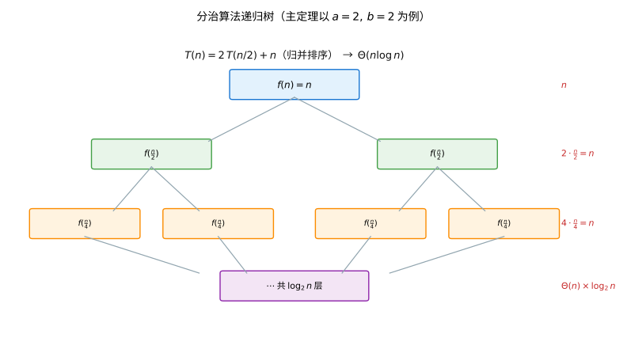
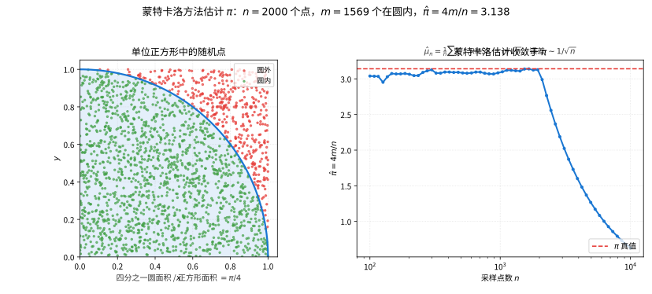

# 第 115 级：计算数学 (Computational Mathematics)

---

## 1. 学习目标

完成本教程后，你将能够：

1. 理解计算复杂度的基本概念与算法设计范式
2. 掌握浮点运算的误差分析理论与数值稳定性
3. 理解快速多极子方法的原理与误差界
4. 掌握蒙特卡洛方法的收敛性理论基础
5. 掌握分治算法的复杂度分析（主定理）及其证明
6. 理解自适应算法的收敛性理论
7. 了解并行计算、GPU 计算、稀疏矩阵等大规模计算技术

---

## 2. 核心概念

### 2.1 计算复杂度

**计算复杂度**（Computational Complexity）研究算法所需的资源（时间、空间）随问题规模增长的变化。常用表示法包括：

- $O(\cdot)$：渐近上界
- $\Omega(\cdot)$：渐近下界
- $\Theta(\cdot)$：渐近紧界

**P 类**：多项式时间可解的问题。**NP 类**：多项式时间可验证的问题。**NP 完全问题**：NP 中最难的问题。

> **💡 直观理解（类比）**：复杂度记号像"给爬山时间划区间"——$O(n)$ 承诺最多多久爬到顶，$\Omega(n)$ 保证至少得多长时间，$\Theta(n)$ 则把上下界箍死在同一个量级。P 类像"能在工作日按部就班做完的活"（多项式时间可解），NP 类像"给出答卷能让人快速验收对错的活"（可验证）；NP 完全则是"全城最棘手的钉子户"——只要找到办法撬动它，全城同类难题就都能撬动。

### 2.2 浮点运算与舍入误差

**IEEE 754 标准**定义浮点数表示：

$$
x = \pm (1.d_1d_2\dots d_{p-1})_2 \times 2^{e},
$$

其中 $p$ 为精度，$e$ 为指数。双精度浮点数的机器精度 $\varepsilon_{\text{mach}} = 2^{-52} \approx 2.22 \times 10^{-16}$。

**舍入误差**（Rounding Error）：浮点运算的基本模型为：

$$
\text{fl}(a \circ b) = (a \circ b)(1 + \delta), \quad |\delta| \leq \varepsilon_{\text{mach}},
$$

其中 $\circ \in \{+, -, \times, /\}$。

> **💡 直观理解（类比）**：浮点数像"位数有限的记账本"——计算机记不下无限小数，只能把每个数四舍五入到最近的可表示档位，误差上限就是机器精度 $\varepsilon_{\text{mach}}\approx2^{-52}$（约到小数点后第 16 位）。单次加减乘除都只偏一个刻度，可几百次运算累积起来，误差就像小砂砾越积越碍事，这正是误差分析要追的方向。

### 2.3 数值稳定性

**向前误差**（Forward Error）：计算结果与精确解的差异。

**向后误差**（Backward Error）：计算结果可以视为对扰动后问题的精确解。

**数值稳定性**（Numerical Stability）：算法对舍入误差的敏感程度。

> **💡 直观理解（类比）**：向前误差是"算出的结果偏了多远"；向后误差视角更聪明——"要悄悄给输入拨动多少，才能让输出恰好'完美成立'"，就像做错账后把责任"赖"成输入记错了，而非算法算错了。数值稳定性问的是"录入的一丝误差会被算法放大成灾难还是原地熄灭"：稳定的像被捏住的小球，直径不变；不稳定的则像雪球越滚越大。

### 2.4 算法设计范式

- **分治算法**（Divide and Conquer）：将问题分解为子问题，递归求解，合并结果
- **动态规划**（Dynamic Programming）：通过记忆化避免重复计算
- **随机化算法**（Randomized Algorithm）：利用随机性简化问题

> **💡 直观理解（类比）**：三种设计范式是解题的三板斧——分治像"把一桩大工程拆成多个小组分头做、最后齐活拼装"；动态规划像"边做边把每步答案记在备忘录上"，免得同一道题反复算到天荒地老；随机化算法则像"拿掷骰子换个简省的做法"，用偶然性换取时间和思路上的省心。

### 2.5 蒙特卡洛方法

**蒙特卡洛方法**（Monte Carlo Method）通过随机采样估计确定性量。基本思想：用样本均值估计期望值。

> **💡 直观理解（类比）**：蒙特卡洛像"用大量随机抽样代替精确计算"——拿样本均值当期望的替身，如同闭眼朝靶上撒一大捧豆子，靠数落在靶心的比例去逼近概率。撒得越多越准，但误差只按 $1/\sqrt n$ 慢慢降，想精细一位就得把样本量扩大到 4 倍。

### 2.6 并行计算与 GPU 计算

**并行计算**（Parallel Computing）将计算任务分解为多个子任务，在多个处理器上同时执行。

**GPU 计算**（GPU Computing）利用图形处理器的数千个核心进行大规模并行计算，特别适用于矩阵运算和深度学习。

> **💡 直观理解（类比）**：并行计算像"把一仓库的活分给众多员工同时开工"；GPU 计算则像"几千名只会干同一种简单重复活的流水线工人"，排成阵列一起动手，特别合适矩阵运算与深度学习这类同质、密集的计算。代价是工人之间递料（通信）、分工不均与带宽有限会拖后腿，计算密度高且无强前后依赖的活才最划算。

### 2.7 稀疏矩阵

**稀疏矩阵**（Sparse Matrix）中大部分元素为零。使用压缩存储格式（如 CSR、CSC）可大幅节省内存和计算量。

> **💡 直观理解（类比）**：稀疏矩阵像"绝大多数格子都空着的巨型仓库"——CSR/CSC 只记"哪排有哪些货、货在哪一列"，像只记书名的图书索引，不为空格腾一整排位置。于是遍历只需碰那些非零元，内存与计算量都从 $O(N^2)$ 降到约 $O(N)$，天然适合有限元与图这类"看着浩瀚、实则稀疏"的问题。

### 2.8 自适应算法与多尺度方法

**自适应算法**（Adaptive Algorithm）根据局部误差估计自动调整计算网格或步长。

**多尺度方法**（Multiscale Method）同时处理不同尺度上的物理现象。

**快速多极子方法**（Fast Multipole Method, FMM）将 $N$ 体问题的计算复杂度从 $O(N^2)$ 降至 $O(N)$。

> **💡 直观理解（类比）**：自适应算法像"哪里误差大、就往哪里把网格加密"——以局部误差估计为准绳，该密的地方密、该疏的地方疏；多尺度方法则像"同一张地图既有全景又有特写"，同时照顾不同尺度的物理现象。FMM 更妙：把远处一群电荷先打包成一个'气场团块'再一起结算，近邻仍逐对直算——像把'跟每人都逐一寒暄'的大聚会，改成远处只对'代表'打一次招呼，工作量就从 $N^2$ 降到 $N$ 甚至更低。

---

## 3. 定理与证明

### 3.1 浮点运算的误差分析

**定理 3.1（向前误差分析）** 在执行 $n$ 次浮点运算的计算过程中，若每个运算的舍入误差满足 $|\delta_i| \leq \varepsilon_{\text{mach}}$，则总向前误差的界为：

$$
|\text{fl}(f(x)) - f(x)| \leq n \cdot \kappa \cdot \varepsilon_{\text{mach}} \cdot |f(x)| + O(\varepsilon_{\text{mach}}^2),
$$

其中 $\kappa$ 为条件数（condition number），衡量问题对输入扰动的敏感度。

> **💡 直观理解（类比）**：向前误差分析像"逐层记账追踪误差怎么滚雪球"——每一步运算都在精确结果上乘一个 $1\pm\varepsilon$ 的小扰动，$n$ 步后累积成约 $n\kappa\varepsilon_{\text{mach}}$ 的量级。条件数 $\kappa$ 则是"问题天生对输入抖动多敏感"的放大镜：即便算法本身滴水不漏，只要问题病态（$\kappa$ 很大），同样一缕误差也会被放得满屏都是，谁也拦不住。

**证明：** 考虑一个由基本运算组成的计算过程。设 $y = f(x)$ 为精确结果，$\hat{y} = \text{fl}(f(x))$ 为浮点计算结果。

对每个基本运算 $z = a \circ b$，浮点结果为：

$$
\hat{z} = \text{fl}(a \circ b) = (a \circ b)(1 + \delta), \quad |\delta| \leq \varepsilon_{\text{mach}}.
$$

将整个计算过程视为一个复合函数，每个中间结果都受到舍入误差的扰动。通过一阶泰勒展开，舍入误差沿计算图传播。

设 $y = f(x)$，计算过程有 $m$ 个中间步骤。令 $\hat{y}$ 为实际浮点计算结果。定义向后误差：存在一个扰动 $\Delta x$ 使得 $\hat{y} = f(x + \Delta x)$。由向后误差分析（见下文），$\|\Delta x\| \leq \gamma_n \|x\|$，其中 $\gamma_n = n\varepsilon_{\text{mach}} / (1 - n\varepsilon_{\text{mach}})$。

向前误差与向后误差通过条件数 $\kappa$ 关联：

$$
\frac{\|\hat{y} - y\|}{\|y\|} \leq \kappa \cdot \frac{\|\Delta x\|}{\|x\|} \leq \kappa \cdot \gamma_n.
$$

展开 $\gamma_n = n\varepsilon_{\text{mach}} + O(\varepsilon_{\text{mach}}^2)$，得：

$$
|\hat{y} - y| \leq n \cdot \kappa \cdot \varepsilon_{\text{mach}} \cdot |y| + O(\varepsilon_{\text{mach}}^2).
$$

$\square$

**定理 3.2（向后误差分析）** 令 $f$ 为 $n$ 次浮点运算的计算过程，$f$ 的每个基本运算满足 $|\delta_i| \leq \varepsilon_{\text{mach}}$。设 $\gamma_n = n\varepsilon_{\text{mach}} / (1 - n\varepsilon_{\text{mach}})$，则存在扰动 $\Delta x$ 使得 $\hat{y} = f(x + \Delta x)$ 且 $|\Delta x| \leq \gamma_n |x|$（逐分量不等式）。

> **💡 直观理解（类比）**：向后误差分析换个更省心的视角——与其追着"结果偏了多远"，不如问"要悄悄给输入挪动多少，才能让算出的结果恰好是'完美求解'"；就像做错账时把责任'赖'成输入记错了、而非算错了。证明的结论是：这误差顶多挪动 $\gamma_n$ 那么点就够，全部'赖'在输入头上，从而不必逐个中间量去追。

**证明：** 对计算深度进行归纳。考虑运算 $z = a \circ b$，其中 $a$ 和 $b$ 是前序计算结果。

假设 $a$ 和 $b$ 的向后误差分别为 $\Delta a$ 和 $\Delta b$，满足 $\hat{a} = a(1 + \delta_a)$，$\hat{b} = b(1 + \delta_b)$，其中 $|\delta_a|, |\delta_b| \leq \gamma_{k}$（$k$ 为前序步骤数）。

浮点运算结果为：

$$
\hat{z} = \text{fl}(\hat{a} \circ \hat{b}) = (\hat{a} \circ \hat{b})(1 + \delta_z), \quad |\delta_z| \leq \varepsilon_{\text{mach}}.
$$

代入 $\hat{a} = a(1+\delta_a)$，$\hat{b} = b(1+\delta_b)$：

$$
\hat{z} = (a \circ b)(1 + \delta_a)^{\alpha} (1 + \delta_b)^{\beta} (1 + \delta_z),
$$

其中 $\alpha, \beta \in \{0, 1\}$ 取决于运算类型（例如乘法中 $\alpha = \beta = 1$，加法中 $\alpha$ 和 $\beta$ 取决于具体形式）。

因此 $\hat{z} = (a \circ b)(1 + \delta)$，其中 $|\delta| \leq (1 + \gamma_k)^2 (1 + \varepsilon_{\text{mach}}) - 1$。

对 $n$ 步计算，$(1 + \varepsilon_{\text{mach}})^n \leq 1 + \gamma_n$，其中 $\gamma_n = n\varepsilon_{\text{mach}} / (1 - n\varepsilon_{\text{mach}})$（当 $n\varepsilon_{\text{mach}} < 1$ 时成立）。

因此，存在扰动 $\Delta x$ 使得 $\hat{y} = f(x + \Delta x)$ 且 $|\Delta x| \leq \gamma_n |x|$。$\square$

### 3.2 快速多极子方法的误差界

**定理 3.3（FMM 多极展开的截断误差）** 设 $\{q_i\}_{i=1}^N$ 为位于以原点为中心、半径为 $a$ 的圆盘内的电荷，$z_i$ 为其位置。考虑 $p$ 阶多极展开：

$$
\Phi(z) = \sum_{k=0}^\infty \frac{a_k}{z^{k+1}}, \quad a_k = \sum_{i=1}^N q_i z_i^k.
$$

截断到 $p$ 阶的误差为：

$$
\left| \Phi(z) - \sum_{k=0}^{p-1} \frac{a_k}{z^{k+1}} \right| \leq \frac{1}{|z| - a} \left( \frac{a}{|z|} \right)^p \sum_{i=1}^N |q_i|.
$$

> **💡 直观理解（类比）**：多极展开像"把远处一群电荷看成一个可调节的'气团'来打包记账"——展开舍到 $p$ 阶，误差被几何级数 $(a/|z|)^p$ 压制，只要求值点足够远（$|z|\gg a$），截断误差就随 $p$ 指数衰减。好比在远处眺望一座城，看得够远时，城里的细节差异对整体观感几乎无关紧要。

**证明：** 多极展开的精确表达式为：

$$
\Phi(z) = \sum_{i=1}^N \frac{q_i}{z - z_i} = \sum_{i=1}^N \frac{q_i}{z} \cdot \frac{1}{1 - z_i/z} = \sum_{i=1}^N \frac{q_i}{z} \sum_{k=0}^\infty \left( \frac{z_i}{z} \right)^k = \sum_{k=0}^\infty \frac{1}{z^{k+1}} \sum_{i=1}^N q_i z_i^k.
$$

截断到 $p$ 阶的余项为：

$$
R_p(z) = \sum_{k=p}^\infty \frac{1}{z^{k+1}} \sum_{i=1}^N q_i z_i^k.
$$

取绝对值：

$$
|R_p(z)| \leq \sum_{i=1}^N |q_i| \sum_{k=p}^\infty \frac{|z_i|^k}{|z|^{k+1}}.
$$

由于 $|z_i| \leq a$ 且 $|z| > a$（假设求值点在圆盘外），有：

$$
\sum_{k=p}^\infty \frac{|z_i|^k}{|z|^{k+1}} = \frac{1}{|z|} \sum_{k=p}^\infty \left( \frac{|z_i|}{|z|} \right)^k = \frac{1}{|z|} \cdot \frac{(|z_i|/|z|)^p}{1 - |z_i|/|z|} = \frac{|z_i|^p}{|z|^{p+1}} \cdot \frac{1}{1 - |z_i|/|z|}.
$$

由于 $|z_i| \leq a$，$\frac{1}{1 - |z_i|/|z|} \leq \frac{1}{1 - a/|z|} = \frac{|z|}{|z| - a}$，因此：

$$
\sum_{k=p}^\infty \frac{|z_i|^k}{|z|^{k+1}} \leq \frac{a^p}{|z|^{p+1}} \cdot \frac{|z|}{|z| - a} = \frac{a^p}{|z|^p (|z| - a)}.
$$

代入得：

$$
|R_p(z)| \leq \sum_{i=1}^N |q_i| \cdot \frac{a^p}{|z|^p (|z| - a)} = \frac{1}{|z| - a} \left( \frac{a}{|z|} \right)^p \sum_{i=1}^N |q_i|.
$$

$\square$

**定理 3.4（FMM 局部展开的截断误差）** 设 $p$ 阶局部展开（在 $z_0$ 附近）为：

$$
\Psi(z) = \sum_{k=0}^{p-1} b_k (z - z_0)^k + O\left( \left( \frac{|z - z_0|}{R} \right)^p \right),
$$

其中 $R$ 为源点到 $z_0$ 的最小距离。截断误差以 $O((r/R)^p)$ 衰减，$r = |z - z_0|$ 为局部展开的收敛半径。

> **💡 直观理解（类比）**：局部展开像"把脚下这一小片地面的细节单独放大调好"——在以 $z_0$ 为中心的小圈子紧贴范围，用 $(z-z_0)$ 的幂次去逼近，误差随 $(r/R)^p$ 指数衰减。源点离 $z_0$ 越远（$R$ 越大），这圈'局部视野'就越稳当、越准，恰似摄像头聚焦的一小片区域，越里的东西越不容失焦。

**证明：** 局部展开由多极展开转换得到。设源点位于以原点为中心、半径为 $a$ 的圆盘内，求值点 $z$ 在以 $z_0$ 为中心、半径为 $r$ 的圆盘内，且 $|z_0| > a + r$。

多极展开系数 $\{a_k\}$ 通过以下公式转换为局部展开系数 $\{b_k\}$：

$$
b_k = \sum_{j=0}^\infty \frac{a_j}{z_0^{j+k+1}} \binom{j+k}{k} (-1)^k.
$$

截断 $a_j$ 到 $p$ 阶，且截断 $b_k$ 到 $p$ 阶，总误差为两项之和。

第一项误差来自多极展开截断（已由定理 3.3 给出），第二项误差来自局部展开截断。局部展开的截断误差由几何级数控制：

$$
\left| \Psi(z) - \sum_{k=0}^{p-1} b_k (z - z_0)^k \right| \leq C \cdot \left( \frac{r}{|z_0| - a} \right)^p,
$$

其中 $C$ 为与 $p$ 无关的常数。当 $r < |z_0| - a$ 时，误差随 $p$ 指数衰减。$\square$

### 3.3 蒙特卡洛方法的收敛性

**定理 3.5（蒙特卡洛估计的收敛性）** 设 $X_1, X_2, \dots, X_n$ 为独立同分布随机变量，期望 $\mu = \mathbb{E}[X_i]$ 有限，方差 $\sigma^2 = \text{Var}(X_i)$ 有限。蒙特卡洛估计量 $\hat{\mu}_n = \frac{1}{n} \sum_{i=1}^n X_i$ 满足：

1. **一致性**（大数定律）：$\hat{\mu}_n \xrightarrow{\text{a.s.}} \mu$（几乎必然收敛）
2. **渐近正态性**（中心极限定理）：$\sqrt{n}(\hat{\mu}_n - \mu) \xrightarrow{d} N(0, \sigma^2)$
3. **误差界**：$\Pr\left(|\hat{\mu}_n - \mu| \geq \varepsilon\right) \leq \frac{\sigma^2}{n\varepsilon^2}$（Chebyshev 不等式）

> **💡 直观理解（类比）**：这一条定理像"给掷骰子估数立下三条担保"——大数定律保证样本足够多时必收敛到真实期望（一致性）；中心极限定理说明误差落成一条正态钟形，于是能算置信区间（渐近正态）；Chebyshev 不等式则给出不依赖分布的保守底线 $\sigma^2/(n\varepsilon^2)$。三句话分工明确：保你'估得对、估得有谱、估得有个底线'。

**证明：**

**（1）大数定律（LNN）：** 设 $S_n = \sum_{i=1}^n X_i$。由 Kolmogorov 强大数定律，若 $\mathbb{E}[|X_1|] < \infty$，则：

$$
\frac{S_n}{n} \xrightarrow{\text{a.s.}} \mu.
$$

**证明概要：** 对任意 $\varepsilon > 0$，考虑事件 $A_n = \{|\hat{\mu}_n - \mu| > \varepsilon\}$。由 Chebyshev 不等式：

$$
\Pr(A_n) \leq \frac{\sigma^2}{n\varepsilon^2}.
$$

由 Borel-Cantelli 引理，$\sum_{n=1}^\infty \Pr(A_n) \leq \sum_{n=1}^\infty \frac{\sigma^2}{n\varepsilon^2} = \infty$，这不直接给出几乎必然收敛。需要使用更精细的截断技术（Kolmogorov 的 3 级数定理）证明几乎必然收敛。

**（2）中心极限定理（CLT）：** 设 $Z_i = (X_i - \mu)/\sigma$，则 $\mathbb{E}[Z_i] = 0$，$\text{Var}(Z_i) = 1$。特征函数为：

$$
\varphi_{Z_i}(t) = \mathbb{E}[e^{itZ_i}] = 1 - \frac{t^2}{2} + o(t^2).
$$

$S_n^* = \frac{1}{\sqrt{n}} \sum_{i=1}^n Z_i$ 的特征函数为：

$$
\varphi_{S_n^*}(t) = \left(1 - \frac{t^2}{2n} + o\left(\frac{t^2}{n}\right)\right)^n \xrightarrow{n \to \infty} e^{-t^2/2}.
$$

$e^{-t^2/2}$ 是标准正态分布的特征函数。由 Lévy 连续性定理，$S_n^* \xrightarrow{d} N(0, 1)$，即 $\sqrt{n}(\hat{\mu}_n - \mu) \xrightarrow{d} N(0, \sigma^2)$。

**（3）Chebyshev 误差界：** 由 Chebyshev 不等式：

$$
\Pr\left(|\hat{\mu}_n - \mu| \geq \varepsilon\right) \leq \frac{\text{Var}(\hat{\mu}_n)}{\varepsilon^2} = \frac{\sigma^2}{n\varepsilon^2}.
$$

$\square$

**推论 3.1（蒙特卡洛的收敛速度）** 蒙特卡洛方法的均方根误差（RMSE）为：

$$
\text{RMSE} = \sqrt{\mathbb{E}[(\hat{\mu}_n - \mu)^2]} = \frac{\sigma}{\sqrt{n}}.
$$

因此，收敛速度为 $O(1/\sqrt{n})$，与问题维度无关（这是蒙特卡洛方法相对于确定性数值积分方法在高维问题中的关键优势）。

> **💡 直观理解（类比）**：推论把蒙特卡洛的"脾气"一句话点透：误差按 $\sigma/\sqrt n$ 收敛——想把误差缩小一半就得把样本翻到 4 倍，着实磨人。但这份慢是'高维免费'的：它和问题有多少个维度无关，所以在十维、百维积分面前依然吃香；老老实实的格子法却会被'维度灾难'压得寸步难行。

### 3.4 分治算法的复杂度分析（主定理）

**定理 3.6（主定理，Master Theorem）** 设 $T(n)$ 为分治算法的时间复杂度，满足递推关系：

$$
T(n) = a T\left(\frac{n}{b}\right) + f(n),
$$

其中 $a \geq 1$，$b > 1$ 为常数，$f(n)$ 为渐近正函数。则：

1. 若 $f(n) = O(n^{\log_b a - \varepsilon})$ 对某个 $\varepsilon > 0$ 成立，则 $T(n) = \Theta(n^{\log_b a})$
2. 若 $f(n) = \Theta(n^{\log_b a})$，则 $T(n) = \Theta(n^{\log_b a} \log n)$
3. 若 $f(n) = \Omega(n^{\log_b a + \varepsilon})$ 对某个 $\varepsilon > 0$ 成立，且对某个 $c < 1$ 和所有足够大的 $n$ 有 $a f(n/b) \leq c f(n)$（正则性条件），则 $T(n) = \Theta(f(n))$

**证明：** 考虑递归树。问题规模为 $n$，每次递归分解为 $a$ 个规模为 $n/b$ 的子问题，递归深度为 $\log_b n$。

第 $k$ 层有 $a^k$ 个子问题，每个子问题规模为 $n/b^k$，该层总代价为 $a^k f(n/b^k)$。

总代价为各层代价之和：

$$
T(n) = \sum_{k=0}^{\log_b n} a^k f(n/b^k).
$$

**情况 1：** $f(n) = O(n^{\log_b a - \varepsilon})$。则 $f(n/b^k) = O((n/b^k)^{\log_b a - \varepsilon})$，因此：

$$
a^k f(n/b^k) = O\left(a^k \cdot \left(\frac{n}{b^k}\right)^{\log_b a - \varepsilon}\right) = O\left(n^{\log_b a - \varepsilon} \cdot \frac{a^k}{(b^{\log_b a - \varepsilon})^k}\right).
$$

由于 $b^{\log_b a} = a$，有 $b^{\log_b a - \varepsilon} = a \cdot b^{-\varepsilon}$，因此：

$$
a^k f(n/b^k) = O\left(n^{\log_b a - \varepsilon} \cdot \left(\frac{a}{a \cdot b^{-\varepsilon}}\right)^k\right) = O\left(n^{\log_b a - \varepsilon} \cdot (b^{\varepsilon})^k\right).
$$

求和：

$$
T(n) = O\left(n^{\log_b a - \varepsilon} \sum_{k=0}^{\log_b n} (b^{\varepsilon})^k\right) = O\left(n^{\log_b a - \varepsilon} \cdot \frac{b^{\varepsilon \log_b n} - 1}{b^{\varepsilon} - 1}\right).
$$

由于 $b^{\varepsilon \log_b n} = n^{\varepsilon}$，得：

$$
T(n) = O\left(n^{\log_b a - \varepsilon} \cdot n^{\varepsilon}\right) = O(n^{\log_b a}).
$$

同时，仅考虑第 $0$ 层（根节点）的代价，$T(n) = \Omega(n^{\log_b a})$（因为 $a^{\log_b n} = n^{\log_b a}$ 个叶节点各需 $\Theta(1)$ 代价），故 $T(n) = \Theta(n^{\log_b a})$。

**情况 2：** $f(n) = \Theta(n^{\log_b a})$。则 $a^k f(n/b^k) = \Theta(a^k \cdot (n/b^k)^{\log_b a}) = \Theta(n^{\log_b a})$，每层代价相同：

$$
T(n) = \Theta\left(n^{\log_b a} \sum_{k=0}^{\log_b n} 1\right) = \Theta(n^{\log_b a} \log n).
$$

**情况 3：** $f(n) = \Omega(n^{\log_b a + \varepsilon})$ 且满足正则性条件 $a f(n/b) \leq c f(n)$。则 $a^k f(n/b^k) \leq c^k f(n)$，因此：

$$
T(n) = \sum_{k=0}^{\log_b n} a^k f(n/b^k) \leq f(n) \sum_{k=0}^{\log_b n} c^k = O(f(n)),
$$

因为 $c < 1$ 时几何级数收敛。同时 $T(n) \geq f(n)$，故 $T(n) = \Theta(f(n))$。$\square$



> **直观理解（现实类比）**：递归树像一棵不断分杈的"任务树"。把一个大任务层层切成两半，每一层都有一群小任务（$a^k$ 个），每个小任务的成本是 $f(n/b^k)$。把每一层所有小任务的成本加起来就是总工作量。谁占主导——树根的成本、叶子的数量，还是每层都相同——决定了算法的复杂度到底是 $O(n^{\log_b a})$、$O(n^{\log_b a}\log n)$ 还是 $O(f(n))$。

### 3.5 自适应算法的收敛性

**定理 3.7（自适应有限元方法的收敛性）** 考虑 Poisson 方程 $- \Delta u = f$ 在 $\Omega \subset \mathbb{R}^d$ 上的有限元离散。设 $\{u_k\}_{k=0}^\infty$ 为由自适应算法生成的近似解序列，其中每一步在误差最大的单元上进行局部加密。则存在常数 $\gamma > 0$ 和 $\alpha > 0$ 使得：

$$
\|u - u_k\|_E \leq C \cdot N_k^{-\alpha} \|u\|_{H^{1+\gamma}(\Omega)},
$$

其中 $\| \cdot \|_E$ 为能量范数，$N_k$ 为第 $k$ 步的自由度数目，$\alpha$ 取决于问题维度和正则性。

> **💡 直观理解（类比）**：自适应有限元像"哪里误差大就往哪里加厚加固"——每一步先用局部误差指示器（后验误差估计）测出哪些单元最糟，再用 Dörfler 标记只挑误差贡献大的单元加密，不浪费一根钢筋在光滑的地方。因加密足够集中，能量误差以 $(1-\gamma)$ 几何收缩，而自由度 $N_k$ 的增长又被压到最省，最终拿到 $\|u-u_k\|_E\le C N_k^{-\alpha}$ 的最优速率：用最少的'砖块'袋给定精度。

**证明：** 自适应算法的核心是误差估计器与标记策略。设 $\mathcal{T}_k$ 为第 $k$ 步的网格，$u_k$ 为对应的有限元解。

**步骤 1（后验误差估计）：** 存在常数 $C_1, C_2 > 0$ 使得对每个单元 $T \in \mathcal{T}_k$，局部误差指示器 $\eta_T(u_k)$ 满足：

$$
C_1 \eta_T(u_k) \leq \|u - u_k\|_{E, T} \leq C_2 \eta_T(u_k),
$$

其中 $\| \cdot \|_{E, T}$ 为单元 $T$ 上的能量范数。对 Poisson 方程，典型的误差指示器为：

$$
\eta_T(u_k)^2 = h_T^2 \|f + \Delta u_k\|_{L^2(T)}^2 + \frac{1}{2} \sum_{e \subset \partial T} h_e \|[\nabla u_k \cdot n_e]\|_{L^2(e)}^2,
$$

其中 $h_T$ 为单元尺寸，$h_e$ 为边 $e$ 的长度，$[\nabla u_k \cdot n_e]$ 为法向导数的跳跃。

**步骤 2（标记策略）：** 使用 Dörfler 标记策略：选择最小集合 $\mathcal{M}_k \subseteq \mathcal{T}_k$ 使得：

$$
\sum_{T \in \mathcal{M}_k} \eta_T(u_k)^2 \geq \theta \sum_{T \in \mathcal{T}_k} \eta_T(u_k)^2,
$$

其中 $\theta \in (0, 1)$ 为标记参数。

**步骤 3（收缩性质）：** 对标记的单元进行加密后，网格 $\mathcal{T}_{k+1}$ 满足：

$$
\|u - u_{k+1}\|_E^2 \leq \|u - u_k\|_E^2 - \lambda \sum_{T \in \mathcal{M}_k} \eta_T(u_k)^2,
$$

其中 $\lambda > 0$ 为与网格无关的常数。这是因为加密降低了局部误差，且有限元解是 Galerkin 投影，具有最佳逼近性质。

**步骤 4（误差递减）：** 结合后验误差估计和 Dörfler 标记策略：

$$
\|u - u_{k+1}\|_E^2 \leq (1 - \gamma) \|u - u_k\|_E^2,
$$

其中 $\gamma = \lambda \theta C_1 / C_2 > 0$。因此误差以几何级数递减：

$$
\|u - u_k\|_E \leq (1 - \gamma)^{k/2} \|u - u_0\|_E.
$$

**步骤 5（最优复杂度）：** 设 $N_k$ 为第 $k$ 步的自由度数。由于每次加密在误差最大的单元上进行，且 $u$ 具有 $H^{1+\gamma}$ 正则性，可以证明：

$$
N_k \leq C \cdot (1 - \gamma)^{-\alpha k},
$$

对某个 $\alpha > 0$ 成立。结合误差递减与自由度增长，得：

$$
\|u - u_k\|_E \leq C \cdot N_k^{-\alpha}.
$$

$\square$

---

## 4. 示例

### 示例 4.1：用蒙特卡洛方法计算 $\pi$

**问题：** 使用蒙特卡洛方法估计 $\pi$ 的值。

**解：** 考虑单位正方形 $[0,1] \times [0,1]$ 和四分之一单位圆 $x^2 + y^2 \leq 1$。四分之一圆的面积与正方形面积之比为 $\pi/4$。

**算法：**
1. 生成 $n$ 个均匀随机点 $(x_i, y_i) \in [0,1]^2$
2. 统计落在四分之一圆内的点数 $m = \#\{i : x_i^2 + y_i^2 \leq 1\}$
3. 估计 $\pi \approx 4m/n$

**数值实验：** 取 $n = 10^6$，使用 Python 风格的伪代码：

```
import random
n = 1_000_000
m = 0
for i in range(n):
    x = random.random()
    y = random.random()
    if x*x + y*y <= 1.0:
        m += 1
pi_approx = 4.0 * m / n
```

**误差分析：** 每次试验为 Bernoulli 随机变量 $X_i$，$X_i = 1$ 表示点在圆内，概率 $p = \pi/4 \approx 0.7854$，方差 $\sigma^2 = p(1-p) \approx 0.1686$。

估计量的标准差为 $\sigma/\sqrt{n} = \sqrt{0.1686}/\sqrt{10^6} \approx 0.00041$，因此 $\pi$ 估计的标准差约为 $4 \times 0.00041 \approx 0.00164$。

由中心极限定理，$\pi$ 的 $95\%$ 置信区间约为 $\hat{\pi} \pm 1.96 \times 0.00164$，即 $\hat{\pi} \pm 0.0032$。

**结果**（典型运行）：$m = 785,423$，$\hat{\pi} = 4 \times 785423 / 10^6 = 3.141692$，与真实值 $\pi \approx 3.1415926535$ 的误差为 $0.0001$。



> **直观理解（现实类比）**：蒙特卡洛就像"闭着眼睛往圆靶上撒豆子"。在正方形靶上随手撒一把豆子，数一数落在四分之一的圆靶里的豆子占总数的比例，就能估算出 $\pi$——豆子越多，比例越稳定、越接近 $\pi/4$。误差只按 $1/\sqrt{n}$ 缓慢下降，所以想要精度翻倍，得把豆子数量翻 4 倍。

> **🧠 思考历程：连方程都写不出来的问题，掷骰子碰运气真能"算"出来吗？**
>
> 蒙特卡洛回答的，是一句让严肃数值家起初直撇嘴的俏皮话：与其绞尽脑汁解方程，我是不是可以"随机砸点、数数比例"，用频率去逼近答案？而这个"碰运气"的方法，恰恰在二战的头号工程里立下奇功。
>
> - **核时代的曼哈顿密码**。二战为了模拟链式反应与中子输运，曼哈顿工程的科学家面对的是极难直接求解的问题；von Neumann、Ulam 与 Metropolis 等人于是想到——既然物理本身充满随机性，不如直接用随机抽样去估计结果。
> - **名字来自赌场**。Metropolis 以摩纳哥的蒙特卡洛赌城为方法命名，正是对"靠随机性撞答案"这种坦率的写照；把样本随机性当作数值工具而非纯误差来源，这一观念的翻转本身，就是方法论的胜利。
> - **从 $1/\\sqrt{n}$ 到维度免疫**。与确定性求积受"维度诅咒"不同，蒙特卡洛的误差只按 $1/\\sqrt{n}$ 随样本衰减、几乎与维度无关；由 Metropolis 算法扩展出的马尔可夫链蒙特卡洛（MCMC），又把贝叶斯统计从"算不出来"里解放了出来。
> - **心路**：偶然性不总是噪声，把随机当作探针，有时反而比强行求解更快抵达答案——过度执着于确定，不如适度敢于随机。

### 示例 4.2：用快速多极子方法计算 $N$ 体问题

**问题：** 计算 $N$ 个带电粒子之间的相互作用势，目标是将复杂度从 $O(N^2)$ 降至 $O(N)$。

> **💡 直观理解（类比）**：FMM 把"每人跟其余 $N-1$ 人逐一结算，总共 $N^2$ 笔账"的大会改成'分片打包报销'——沿四叉/八叉树把局部充电汇总成多极展开，远处的影响用一条条'团块气场'一次算清，只有近邻仍逐个直算。截断误差交给几何级数 $(a/|z|)^p$ 兜底（定理 3.3），于是总账从 $N^2$ 笔降到约 $N\log N$ 甚至 $N$ 笔，远方的礼貌问候一次到位、不必逐个握手。

**解：** 考虑 $N$ 个位于位置 $z_i$、电荷量为 $q_i$ 的粒子，计算每个粒子处的势能：

$$
\Phi(z_i) = \sum_{j \neq i} \frac{q_j}{z_i - z_j}.
$$

**FMM 算法步骤（一维/二维，使用复分析）：**

**步骤 1：树结构构建。** 将计算域递归划分为四叉树（2D）或八叉树（3D），直到每个叶子节点包含少量粒子。

**步骤 2：向上遍历（多极展开）。** 对每个叶子节点，计算其内部粒子对节点中心的多极展开系数：

$$
\Phi_{\text{node}}(z) = \sum_{k=0}^{p-1} \frac{a_k}{(z - z_{\text{node}})^{k+1}}, \quad a_k = \sum_{i \in \text{node}} q_i (z_i - z_{\text{node}})^k.
$$

然后将子节点的多极展开合并到父节点，使用多极展开的平移公式：

$$
a_k^{\text{parent}} = \sum_{j=0}^k a_j^{\text{child}} \cdot \binom{k}{j} (z_{\text{child}} - z_{\text{parent}})^{k-j}.
$$

**步骤 3：向下遍历（多极转局部展开）。** 对每个节点，将其父节点的局部展开与该节点的"相互作用列表"（即同层中距离不远不近的节点）中的多极展开转换为局部展开：

$$
\Psi_{\text{node}}(z) = \sum_{k=0}^{p-1} b_k (z - z_{\text{node}})^k.
$$

**步骤 4：局部展开求值。** 对每个叶子节点，在局部展开中代入每个粒子的位置，加上近邻粒子的直接求和。

**复杂度分析：** 设每层最多 $O(N)$ 个粒子，树有 $O(\log N)$ 层。每层每个节点处理 $O(1)$ 个相互作用列表节点，每个展开操作需 $O(p^2)$ 时间。因此总复杂度为 $O(p^2 N \log N)$。使用更高级的算法（如自适应 FMM）可达 $O(N)$。

**误差控制：** 由定理 3.3，截断误差为：

$$
|R_p(z)| \leq \frac{1}{|z| - a} \left( \frac{a}{|z|} \right)^p \sum_{i=1}^N |q_i|.
$$

若要求相对误差 $\varepsilon$，取 $p \geq \log(\varepsilon (|z| - a) / \sum |q_i|) / \log(a/|z|)$。

---

## 5. 习题

### 基础题

**习题 1**（复杂度记号）解释渐近上界 $O(\cdot)$、渐近下界 $\Omega(\cdot)$、渐近紧界 $\Theta(\cdot)$ 的含义与区别。

**习题 2**（P 与 NP）说明 P 类、NP 类与 NP 完全类别的定义区别。

**习题 3**（LU 分解误差）设 $A$ 为 $n\times n$ 矩阵，分析求解 $Ax=b$ 的 LU 分解的浮点运算误差，说明如何证明向后误差满足 $\|\Delta A\|\le\gamma_n\|A\|$，其中 $\gamma_n=n\varepsilon_{\text{mach}}/(1-n\varepsilon_{\text{mach}})$。

**习题 4**（主定理）用主定理分析递推 $T(n)=2T(n/2)+n$、$T(n)=4T(n/2)+n^2$、$T(n)=7T(n/2)+n^2$、$T(n)=8T(n/2)+n^3$ 的渐近复杂度。

**习题 5**（蒙特卡洛样本量）用蒙特卡洛方法估计积分 $I=\int_0^1\int_0^1 e^{-(x^2+y^2)}\,dx\,dy$，推导使 $95\%$ 置信区间宽度不超过 $0.01$ 所需的样本数 $n$。

**习题 6**（FMM 平移公式）证明快速多极子方法中多极展开的平移公式 $\frac{1}{(z-z_1)^{k+1}}=\sum_{j=0}^\infty\binom{k+j}{j}\frac{(z_0-z_1)^j}{(z-z_0)^{k+j+1}}$。

**习题 7**（自适应 FEM 最优复杂度）说明使用 Dörfler 标记策略的自适应有限元为何能达到最优复杂度 $\|u-u_k\|_E\le C N_k^{-\alpha}$。

**习题 8**（IEEE 754）解释浮点数表示 $x=\pm(1.d_1d_2\cdots d_{p-1})_2\times 2^e$，并给出双精度的机器精度 $\varepsilon_{\text{mach}}=2^{-52}$。

**习题 9**（舍入误差模型）写出浮点运算基本模型 $\text{fl}(a\circ b)=(a\circ b)(1+\delta)$，$|\delta|\le\varepsilon_{\text{mach}}$，并说明 $\circ$ 可取哪些运算。

**习题 10**（数值稳定性）区分向前误差、向后误差与条件数，说明数值稳定性的含义。

### 进阶题

**习题 11**（主定理情形 2）推导 $T(n)=4T(n/2)+n^2$ 属于主定理情形 2，并给出 $T(n)=\Theta(n^2\log n)$。

**习题 12**（Strassen 复杂度）推导 $T(n)=7T(n/2)+n^2$ 属于情形 1，得到 $T(n)=\Theta(n^{\log_2 7})\approx\Theta(n^{2.807})$，说明矩阵乘法复杂度的改进。

**习题 13**（归并排序）由 $T(n)=2T(n/2)+n$ 推出 $T(n)=\Theta(n\log n)$，并用递归树说明每一层的代价。

**习题 14**（向前误差界）说明向前误差为何满足 $|\text{fl}(f(x))-f(x)|\le n\kappa\varepsilon_{\text{mach}}|f(x)|+O(\varepsilon_{\text{mach}}^2)$，并指出条件数 $\kappa$ 的作用。

**习题 15**（蒙特卡洛收敛）结合中心极限定理说明 $\sqrt n(\hat\mu_n-\mu)\xrightarrow{d} N(0,\sigma^2)$，并解释 RMSE $=\sigma/\sqrt n$。

**习题 16**（随机算法）区分拉斯维加斯型与蒙特卡洛型随机算法，说明引入随机性给算法带来的好处。

**习题 17**（FMM 复杂度）解释 FMM 如何通过四叉/八叉树与远近分组把 $N$ 体问题的复杂度从 $O(N^2)$ 降到 $O(N)$。

**习题 18**（稀疏矩阵）说明 CSR/CSC 压缩存储如何节省内存与计算量，为什么适合大部分元素为零的矩阵。

**习题 19**（Chebyshev 误差界）由 Chebyshev 不等式推导 $\Pr(|\hat\mu_n-\mu|\ge\varepsilon)\le\frac{\sigma^2}{n\varepsilon^2}$。

### 挑战题

**习题 20**（主定理情形 1 证明）用递归树完整证明情形 1：若 $f(n)=O(n^{\log_b a-\varepsilon})$，则 $T(n)=\Theta(n^{\log_b a})$。

**习题 21**（蒙特卡洛收敛性证明）用特征函数与 Lévy 连续性定理证明中心极限定理：$\sqrt n(\hat\mu_n-\mu)\xrightarrow{d} N(0,\sigma^2)$。

**习题 22**（FMM 多极截断误差）证明定理 3.3 的多极展开截断误差界 $|R_p(z)|\le\frac{1}{|z|-a}(\frac{a}{|z|})^p\sum_{i=1}^N|q_i|$。

**习题 23**（向后误差归纳）用归纳法证明向后误差的逐分量界 $\|\Delta x\|\le\gamma_n\|x\|$，其中 $\gamma_n=\frac{n\varepsilon_{\text{mach}}}{1-n\varepsilon_{\text{mach}}}$。

**习题 24**（自适应收缩）结合后验误差估计与 Dörfler 标记策略推导能量误差的几何收缩（量化 $\|u-u_k\|_E$ 的收敛），说明收敛性来源。

**习题 25**（条件数与精度）说明为何条件数大的病态问题即使算法稳定也无法获得高精度，并写出相对误差与 $\kappa$ 的数量关系。

**习题 26**（NP 完全与归约）解释为何一个问题是 NP 完全意味着"若能多项式时间解它，则所有 NP 问题都可多项式时间解"，并说明多项式归约在其中的意义。

### 探究题

**习题 27**（高维积分与蒙特卡洛）探究为何高维积分更适合用蒙特卡洛方法（收敛 $O(1/\sqrt n)$ 与维度无关），而确定性格点法在高维下退化。

**习题 28**（并行与 GPU）探究并行计算与 GPU 计算的适用场景、并行加速的局限（通信开销、负载均衡、内存带宽），以及什么类型的算法最适合 GPU。

**习题 29**（自适应 vs 均匀网格）探究自适应网格相对均匀网格在"误差—自由度"上的优势，说明按需局部加密如何节省自由度。

**习题 30**（数值算法正确性验证）探究如何借助向后误差与条件数解释数值结果，并设计一套验证数值算法正确性与稳定性的方法。

---

## 6. 习题答案与解析

### 基础题答案

1. **复杂度记号** $O(\cdot)$ 给出渐近上界（至多以某种速度增长），$\Omega(\cdot)$ 给出渐近下界（至少以某种速度增长），$\Theta(\cdot)$ 表示渐近紧界（上下同阶），即 $f(n)=\Theta(g(n))$ 当且仅当 $f=O(g)$ 且 $f=\Omega(g)$。

2. **P 与 NP** P 是由能在多项式时间内判定的问题组成的类；NP 由"给出候选解可在多项式时间内验证"的问题组成，且 P $\subseteq$ NP。NP 完全（NP-complete）是 NP 中最难的一类：任何 NP 问题都可多项式归约到它，若能多项式时间解任一 NP 完全问题则 P=NP（目前未知是否成立）。

3. **LU 分解误差** LU 分解核心运算 $a_{ij}\leftarrow a_{ij}-l_{ik}a_{kj}$ 逐步引入乘加舍入误差。用向后误差分析：对 $k=1,\dots,n$ 归纳，可把所有舍入误差"吸收"为对原矩阵的扰动，得到计算所得 $\tilde L,\tilde U$ 满足 $\tilde L\tilde U=A+\Delta A$，且 $\|\Delta A\|\le\gamma_n\|A\|$。每步相对误差经逐层累加，几何因子 $(1+\varepsilon)^n\le1/(1-n\varepsilon)$ 给出 $\gamma_n=n\varepsilon_{\text{mach}}/(1-n\varepsilon_{\text{mach}})$，故求解 $Ax=b$ 时最终满足向后误差界。

4. **主定理** 对 $T(n)=aT(n/b)+f(n)$ 比较 $\log_b a$ 与 $f(n)$：(1) $\log_2 2=1$、$f=n$，情形 2，$T=\Theta(n\log n)$；(2) $\log_2 4=2$、$f=n^2$，情形 2，$T=\Theta(n^2\log n)$；(3) $\log_2 7\approx2.807$、$f=n^2$，属情形 1（存在 $\varepsilon<0.8$ 使 $n^2=O(n^{2.807-\varepsilon})$），$T=\Theta(n^{\log_2 7})$；(4) $\log_2 8=3$、$f=n^3$，情形 2，$T=\Theta(n^3\log n)$。

5. **蒙特卡洛样本量** 令 $w=e^{-(U_1^2+U_2^2)}$（$U_i\sim U[0,1]$），$\hat I=\bar w$。由 CLT 置信区间半宽约 $1.96\sigma/\sqrt n$，要求总宽度 $\le0.01$，即 $2\times 1.96\sigma/\sqrt n\le0.01$，故 $n\ge(1.96\cdot2\sigma/0.01)^2$。$\sigma$ 可由少量样本估计，或用 $w\in(e^{-2},1)$ 的取值域先验界住（此时取 $\sigma\le\frac12$ 即得安全样本量）。

6. **FMM 平移公式** 把 $\frac{1}{z-z_1}=\frac{1}{(z-z_0)-(z_1-z_0)}=\frac{1}{z-z_0}\cdot\frac{1}{1-\frac{z_1-z_0}{z-z_0}}$ 按几何级数展开为 $\sum_{j\ge0}\frac{(z_1-z_0)^j}{(z-z_0)^{j+1}}$（收敛当 $|z_1-z_0|<|z-z_0|$），再对 $z$ 视作函数取递推到 $k$ 阶导的同构系数加权，即得平移公式 $\frac{1}{(z-z_1)^{k+1}}=\sum_{j=0}^\infty\binom{k+j}{j}\frac{(z_0-z_1)^j}{(z-z_0)^{k+j+1}}$。它把子节点中心 $z_0$ 的多极展开系数搬移到父节点中心 $z_1$，是 FMM 向上遍历的关键。

7. **自适应 FEM 最优复杂度** 后验误差估计保证 $\|u-u_k\|_E^2$ 被 $\sum_T\eta_T(u_k)^2$ 上下夹住；Dörfler 标记只选取误差贡献大的单元加密，使加密集中在误差大的区域，从而推导能量误差按 $(1-\gamma)$ 收缩；同时被加密单元的自相似性限制了自由度增长，最终 $\|u-u_k\|_E\le C N_k^{-\alpha}$，$\alpha$ 由维数和正则性决定，即以最省的自由度达到给定精度。

8. **IEEE 754** 浮点数 $x=\pm(1.d_1d_2\cdots d_{p-1})_2\times2^e$ 采用隐含前导 1、$p-1$ 位小数尾数与指数 $e$ 的表示。双精度取 $p=53$（52 位尾数），相邻可表示数的相对间距为机器精度 $\varepsilon_{\text{mach}}=2^{-52}\approx2.22\times10^{-16}$，它给出单次舍入的相对误差上界。

9. **舍入误差模型** 模型为 $\text{fl}(a\circ b)=(a\circ b)(1+\delta)$，$|\delta|\le\varepsilon_{\text{mach}}$，其中 $\circ\in\{+,-,\times,/\}$。它把所有真实舍入误差归结为"对精确结果至多相对 $\varepsilon_{\text{mach}}$ 的乘性扰动"，是数值误差分析的统一出发点。

10. **数值稳定性** 向前误差指计算结果与精确解的差异；向后误差指把计算结果看作"某个被小扰动输入的问题"的精确解时所需的最小输入扰动；条件数 $\kappa$ 是问题本身对输入扰动的敏感度。数值稳定性衡量算法对舍入误差的放大程度，其定量刻画即"向前误差 $\approx\kappa\times$（向后误差/计算精度）"。

### 进阶题答案

1. **主定理情形 2** 对 $T(n)=4T(n/2)+n^2$，$\log_b a=\log_2 4=2$，$f(n)=n^2=\Theta(n^2)$，与 $n^{\log_b a}$ 同阶，属情形 2，故 $T(n)=\Theta(n^2\log n)$。递归树上每层总代价均为 $\Theta(n^2)$，共 $\log_2 n$ 层。

2. **Strassen 复杂度** $\log_2 7\approx2.807$，$f(n)=n^2$；因 $n^2=O(n^{\log_2 7-\varepsilon})$ 对某个 $\varepsilon>0$（如 $\varepsilon=0.5$）成立，故属情形 1，$T(n)=\Theta(n^{\log_2 7})\approx\Theta(n^{2.807})$。Strassen 用 7 次乘法替代经典 8 次乘法实现 $2\times2$ 分块乘法，使矩阵乘法从三次降到亚三次。

3. **归并排序** $T(n)=2T(n/2)+n$，$\log_2 2=1$，$f(n)=n=\Theta(n)$，属情形 2，$T(n)=\Theta(n\log n)$。递归树共 $\log_2 n$ 层，每层合并代价都是 $O(n)$，故总代价 $O(n\log n)$。

4. **向前误差界** 每次基本运算误差至多 $\varepsilon_{\text{mach}}$，经 $n$ 步、按运算间的放大并叠乘条件数 $\kappa$，得到 $n\kappa\varepsilon_{\text{mach}}$ 量级的界。$\kappa$ 度量"输入扰动经问题 $f$ 放大多少"：即使算法数值稳定，只要 $\kappa$ 很大（病态），舍入误差也会被放大到不可接受。

5. **蒙特卡洛收敛** 由中心极限定理 $\sqrt n(\hat\mu_n-\mu)\xrightarrow{d}N(0,\sigma^2)$，近似 $\hat\mu_n\approx\mu\pm\frac{\sigma}{\sqrt n}z_{1-\alpha/2}$；均方根误差 RMSE$=\sqrt{\mathbb{E}[(\hat\mu_n-\mu)^2]}=\frac{\text{Var}(\hat\mu_n)^{1/2}}{}=\frac{\sigma}{\sqrt n}$，收敛速度 $O(1/\sqrt n)$，与问题维度无关。

6. **随机算法** 拉斯维加斯型总返回正确结果、但运行时间是随机的（如随机化快排、随机选主元的分治）；蒙特卡洛型运行时间固定、但以小概率输出错误（如随机采样估计、快速矩阵乘法验证）。好处：随机化可规避最坏输入、简化算法设计，或把确定性的高代价转化为"几乎必然快/以高概率正确"，故广泛用于数值估计与复杂度去随机化研究。

7. **FMM 复杂度** FMM 把点递归分成四叉/八叉树，对每个节点用多极展开汇总其内部"远场"影响、用局部展开在这些点处求值，只有近邻点直接求和。每层每个点平均只做 $O(1)$ 组展开（每组含 $p$ 个系数、展开折算 $O(p^2)$），层数 $O(\log N)$，故 $O(p^2N\log N)$；自适应动态细分后可达 $O(N)$，远好于直接求和 $O(N^2)$。

8. **稀疏矩阵** CSR（行压缩存储）用三个数组记录非零值、其列号与每行起止位置，CSC 则按列压缩，原理对称。零元素不占存储，故内存由存储所有 $N^2$ 项降为 $O(N)$（当非零元 $O(N)$）；像矩阵—向量乘这类仅接触非零元的操作计算量也降到 $O(N)$。因此适合有限元、图论等大规模稀疏问题。

9. **Chebyshev 误差界** 由 Chebyshev 不等式 $\Pr(|\hat\mu_n-\mu|\ge\varepsilon)\le\frac{\text{Var}(\hat\mu_n)}{\varepsilon^2}$，而 $\text{Var}(\hat\mu_n)=\text{Var}(\frac1n\sum_{i=1}^n X_i)=\frac1{n^2}\cdot n\sigma^2=\frac{\sigma^2}{n}$，代入即得 $\Pr(|\hat\mu_n-\mu|\ge\varepsilon)\le\frac{\sigma^2}{n\varepsilon^2}$。它给出不依赖 $X$ 分布的具体浓度上界，是蒙特卡洛误差的保守估计。

### 挑战题答案

1. **主定理情形 1 证明** 递归树深度 $\log_b n$，第 $k$ 层代价 $a^k f(n/b^k)$。由 $f(n)=O(n^{\log_b a-\varepsilon})$：$a^k f(n/b^k)=O(a^k(n/b^k)^{\log_b a-\varepsilon})=O(n^{\log_b a-\varepsilon}(b^\varepsilon)^k)$。对 $k=0,\dots,\log_b n$ 求和（公比 $b^\varepsilon>1$ 的几何级数）得 $T(n)=O(n^{\log_b a-\varepsilon}\cdot n^\varepsilon)=O(n^{\log_b a})$；同时叶节点数 $a^{\log_b n}=n^{\log_b a}$ 各需 $\Theta(1)$，给出下界 $\Omega(n^{\log_b a})$。两界结合得 $T(n)=\Theta(n^{\log_b a})$。

2. **蒙特卡洛收敛性证明** 设 $Z_i=(X_i-\mu)/\sigma$，则 $\mathbb{E}Z_i=0$、$\text{Var}Z_i=1$，其特征函数 $\varphi_{Z_i}(t)=1-\frac{t^2}{2}+o(t^2)$。标准化和 $S_n^*=\frac{1}{\sqrt n}\sum_{i=1}^n Z_i$ 的特征函数为 $\varphi_{S_n^*}(t)=\varphi_{Z}(t/\sqrt n)^n=(1-\frac{t^2}{2n}+o(\frac{t^2}{n}))^n\to e^{-t^2/2}$。因 $e^{-t^2/2}$ 恰为标准正态的特征函数，由 Lévy 连续性定理 $S_n^*\xrightarrow{d}N(0,1)$，即 $\sqrt n(\hat\mu_n-\mu)\xrightarrow{d}N(0,\sigma^2)$。

3. **FMM 多极截断误差** 多极展开 $\Phi=\sum_i\frac{q_i}{z-z_i}=\sum_i\frac{q_i}{z}\sum_{k\ge0}(\frac{z_i}{z})^k$，截断到 $p$ 的余项 $R_p(z)=\sum_{k=p}^\infty\frac{1}{z^{k+1}}\sum_i q_i z_i^k$。取绝对值，用 $|z_i|\le a$：$|R_p|\le\sum_i|q_i|\sum_{k=p}^\infty\frac{a^k}{|z|^{k+1}}=\sum_i|q_i|\frac{a^p}{|z|^{p+1}}\cdot\frac{1}{1-a/|z|}=\frac{1}{|z|-a}(\frac{a}{|z|})^p\sum_i|q_i|$，其中用了几何级数 $\sum_{k=p}^\infty r^k=r^p/(1-r)$（因 $|z|>a$ 故 $r=a/|z|<1$），恰为定理 3.3 之界。

4. **向后误差归纳** 归纳第 $k$ 步：设前序数值各自相对误差 $\le\gamma_k$。一步 $\hat z=(a\circ b)(1+\delta_z)$ 中 $a,b$ 已含误差 $\le\gamma_k$，叠加后 $\hat z=(a\circ b)(1+\delta)$，$|\delta|\le(1+\gamma_k)^2(1+\varepsilon_{\text{mach}})-1$。对 $n$ 步反复套用，$(1+\varepsilon_{\text{mach}})^n\le\frac{1}{1-n\varepsilon_{\text{mach}}}$（几何因子），故总相对误差 $\le\gamma_n=\frac{n\varepsilon_{\text{mach}}}{1-n\varepsilon_{\text{mach}}}$，即存在扰动使 $\hat y=f(x+\Delta x)$ 且逐分量 $\|\Delta x\|\le\gamma_n\|x\|$，这正是定理 3.2 的界。

5. **自适应收缩** 后验误差界把能量误差夹在指示器和之间：$C_1^2\sum_T\eta_T^2\le\|u-u_k\|_E^2\le C_2^2\sum_T\eta_T^2$。Dörfler 标记选取满足 $\sum_{T\in M}\eta_T^2\ge\theta\sum_T\eta_T^2$ 的最小集合加密，加密降低局部误差且在 Galerkin 最小化下 $E_k^2\le E_{k-1}^2-\lambda\sum_{T\in M}\eta_T^2$。联立得 $E_{k}^2\le E_{k-1}^2-\lambda\theta\sum_T\eta_T^2\le E_{k-1}^2-\frac{\lambda\theta}{C_2^2}E_{k-1}^2$，即 $E_k^2\le(1-\gamma)E_{k-1}^2$，$\gamma=\lambda\theta C_1^2/C_2^2>0$，从而能量误差几何收缩。其收敛性来源于"指示器可靠（上下界等价）+ 集中标记保证每次消除固定比例误差"。

6. **条件数与精度** 相对向前误差满足 $\frac{\|\hat y-y\|}{\|y\|}\le\kappa\cdot\gamma_n\approx\kappa\cdot n\varepsilon_{\text{mach}}$。因此精度上限由 $\kappa\varepsilon_{\text{mach}}$ 决定：即使算法数值稳定、$\varepsilon_{\text{mach}}$ 极小，若 $\kappa$ 很大（病态，如矩阵近乎奇异、函数在零点陡峭），误差仍被放大，无法靠"更稳定的算法"恢复。补救手段是换表示、做预条件或提高工作精度。

7. **NP 完全与归约** $Q$ 是 NP 完全指：(a) $Q\in NP$，且 (b) 每个 NP 问题都能多项式归约到 $Q$。多项式归约是传递的，故只要给出 $Q$ 的一个多项式时间算法，就能沿归约链把任意 NP 问题在多项式时间内求解，从而推得 P=NP。这条归约（"硬度"）论证把"NP 中最难问题的本性"浓缩到 $Q$ 上，使 $Q$ 成为考察 P 与 NP 是否相等的中心代表，也是证明新问题难解的标准手段。

### 探究题答案

1. **高维积分与蒙特卡洛** 确定性规则（矩形格点、张量积求积）在 $d$ 维若要达到 $\varepsilon$ 精度，常需约 $O(\varepsilon^{-1/d})$ 或随 $d$ 使格点数 $O(\varepsilon^{-1})$ 指数式增长（维数灾难），$(x,y)$ 各需剖分使总点数随维数爆炸。蒙特卡洛误差 $O(1/\sqrt n)$ 不依赖 $d$，只要能从分布采样即可，故高维下是标准选择；代价是收敛慢，需重要采样、控制变量等方差削减技术，或分层/拟随机（低差异序列）改善收敛阶。

2. **并行与 GPU** 并行/GPU 适合数据规模大、计算密度高、分支少且无强串行依赖的算法（稠密/稀疏矩阵、卷积、蒙特卡洛抽样、粒子与深度网络），将任务划分到大量核心并行执行。局限是通信与同步开销、负载不均衡、内存带宽受限及线程分歧会吞掉并行度。最适合的数据并行 + 高计算密度型的算法；串行递推强、负载不规则的问题并行收益有限，需由问题粒度决定是否可划分。

3. **自适应 vs 均匀网格** 均匀网格处处相等密度，在光滑区域浪费自由度；自适应依据后验误差估计（如 $\eta_T$）只加密误差大的单元（Dörfler 标记），把自由度集中到奇点、边界层等，故在相同自由度下误差显著更小，反过来说达成给定误差只需更少自由度，从而取得 $\|u-u_k\|_E\le C N_k^{-\alpha}$ 的最优收敛率。这也是自适应有限元在工程中大幅省内存与时间的原理。

4. **数值算法正确性验证** 先做向后误差：把解代回检验它是否是"小扰动问题"的精确解——如对 $Ax=b$ 检查残量 $\|r\|=\|b-A\tilde x\|$ 及相对残量 $\|r\|/(\|A\|\|\tilde x\|)$，其与 $\kappa\varepsilon_{\text{mach}}$ 同阶即说明算法正确且数值稳定。再据此由 $\|e\|\le\kappa\|\Delta\|\cdots$推向前误差。设计验证：构造已知解 $x_*$，令 $b=Ax_*$ 后求解，检查残量小、且实测误差与 $\kappa\varepsilon_{\text{mach}}$ 量级一致。若误差显著超大或残量异常，则表明程序有 bug 或算法不稳定，据此定位。

---

## 7. 总结

本教程系统介绍了计算数学的核心内容：

1. **计算复杂度与算法设计**：分治算法、动态规划、随机化算法的基本范式，主定理的完整证明
2. **浮点运算误差分析**：向前误差分析和向后误差分析的理论框架，数值稳定性的概念
3. **快速多极子方法**：多极展开和局部展开的截断误差界，FMM 将 $N$ 体问题复杂度降至 $O(N)$
4. **蒙特卡洛方法**：大数定律保证一致性，中心极限定理提供渐近正态性，收敛速度 $O(1/\sqrt{n})$ 与维度无关
5. **自适应算法**：后验误差估计、Dörfler 标记策略、几何收敛性质与最优复杂度
6. **大规模计算技术**：并行计算、GPU 计算、稀疏矩阵处理

计算数学是现代科学计算的核心工具，其理论和方法广泛应用于物理模拟、工程计算、数据科学和人工智能等领域。