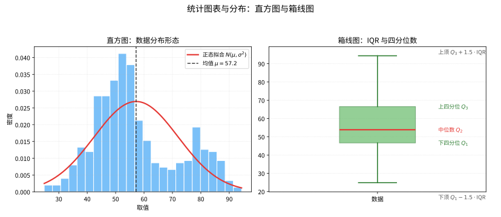
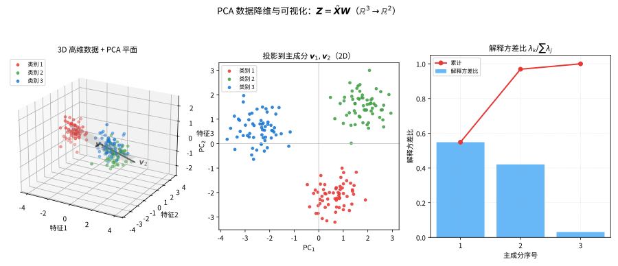

# 第 116 级：数据科学 (Data Science)

---

## 1. 学习目标

完成本教程后，你将能够：

1. 掌握数据预处理与探索性数据分析的基本方法
2. 理解统计建模与特征工程的核心思想
3. 掌握 PCA 等降维方法的原理并能推导其最优性
4. 理解 K-means、DBSCAN、层次聚类等聚类算法
5. 掌握逻辑回归、决策树、随机森林、SVM、XGBoost 等分类与回归方法
6. 理解集成学习与模型评估的核心技术
7. 掌握过拟合与正则化的数学原理
8. 能独立完成超参数调优与数据可视化

---

## 2. 核心概念

### 2.1 数据预处理

**数据预处理**（Data Preprocessing）是数据科学流程的第一步，旨在将原始数据转换为适合分析的格式。

**常见步骤**：
1. **缺失值处理**：删除缺失值、均值/中位数填充、插值法、模型预测填充
2. **异常值检测**：基于统计方法（$3\sigma$ 原则、IQR 方法）、基于距离方法（LOF）、基于密度方法
3. **数据标准化/归一化**：
   - **Z-score 标准化**：$x' = \dfrac{x - \mu}{\sigma}$
   - **Min-Max 归一化**：$x' = \dfrac{x - x_{\min}}{x_{\max} - x_{\min}}$
4. **数据变换**：对数变换、Box-Cox 变换、幂变换
5. **编码分类变量**：独热编码（One-hot Encoding）、标签编码（Label Encoding）

> **直观理解（现实类比）**：数据预处理像"做菜前的食材清洗"——刚买回来的菜带着泥、坏叶、大小不一，必须先洗净去烂、切配整齐、按菜谱需要改刀，才能下锅。对应到数据里就是去噪、去异常值、填补缺失、归一化到同一尺度。若食材没洗干净就下锅，再高明的厨师（模型）也做不出好菜——"垃圾进，垃圾出"正是这个道理。

> **🧠 思考历程：倒进模型的真实数据，为什么总要先"洗个澡"？**
>
> 数据预处理回答的是一个不浪漫却很要命的问题：现实里的数据总是肚带污泥——缺一半、带异常、尺度不一——若不清理，模型再聪明也救不回来。而这个"土味环节"，恰恰是数据科学从"纯统计回归"里分家的第一课。
>
> - **"多到可用"的乐观**。20世纪中叶统计界仍以"少量干净的手工实验数据"为常态；John Tukey 在1962年提出探索性数据分析（EDA），强调"先观察、再假设"，第一次把"把数据摆正"提到与"推公式"同等的地位。
> - **"垃圾进、垃圾出"的定律**。工程界与统计界不约而同认识到：变异、缺失与尺度差异无法靠加大样本掩盖，反而会系统性污染梯度与回归——于是标准化、缺失插补、异常检测从"可有可无的整理"升格为"科学的必修课"。
> - **预处理被当成一门学科**。进入大数据与机器学习年代，预处理被形式化为特征工程与数据管线，成为决定模型性能的天花板；"数据科学"这个名称也在21世纪真正成为全行业最炙手可热的标签。
> - **心路**：好的分析从不自以为聪明，而从放低姿态"把原料洗净"开始——模型的极限，往往正是数据的下限。

### 2.2 探索性数据分析

**探索性数据分析**（Exploratory Data Analysis, EDA）通过可视化与统计摘要来理解数据特征。

**核心工具**：
- **描述性统计**：均值、中位数、方差、偏度、峰度
- **可视化方法**：直方图、箱线图、散点图、热力图、Q-Q 图
- **相关性分析**：Pearson 相关系数、Spearman 秩相关系数

直方图展现数据的分布形态，箱线图用四分位数概括数据的集中趋势与离群情况：

> **直观理解（现实类比）**：直方图像"把一整筐鸡蛋按大小分堆摆好"，一眼看出多数鸡蛋集中在哪个大小、有没有两头少见的"怪蛋"。箱线图则像"给全班成绩排队后画成一幅简图"：箱体告诉你中间一半人的分数落在哪个区间，两条须线说明正常范围，而冒出须线的小点就是必须核查的"异常分数"。

### 2.3 统计建模

**统计建模**将数据生成过程抽象为数学形式。给定数据 $\{(x_i, y_i)\}_{i=1}^n$，目标是学习 $y = f(x) + \varepsilon$，其中 $\varepsilon$ 为噪声项。

**偏差-方差权衡**（Bias-Variance Tradeoff）：

$$
\mathbb{E}[(y - \hat{f}(x))^2] = \underbrace{(\mathbb{E}[\hat{f}(x)] - f(x))^2}_{\text{Bias}^2} + \underbrace{\mathbb{E}[(\hat{f}(x) - \mathbb{E}[\hat{f}(x)])^2]}_{\text{Variance}} + \underbrace{\sigma^2}_{\text{Irreducible Error}}
$$

### 2.4 特征选择

**特征选择**（Feature Selection）从原始特征集中选择最具信息量的子集。

**方法**：
1. **过滤法**（Filter）：基于统计指标（卡方检验、互信息、方差分析）
2. **包裹法**（Wrapper）：使用搜索策略（向前选择、向后消除、递归特征消除）
3. **嵌入法**（Embedded）：Lasso（$L_1$ 正则化）、树模型的重要性

### 2.5 特征工程

**特征工程**（Feature Engineering）通过领域知识创建新特征以提升模型性能。

**常见技术**：
- **多项式特征**：$x_1, x_2 \to x_1, x_2, x_1^2, x_2^2, x_1x_2$
- **交互特征**：$x_1 \times x_2$
- **分箱**（Binning）：连续变量离散化
- **时间特征**：提取年、月、日、星期等
- **文本特征**：TF-IDF、词嵌入

> **直观理解（现实类比）**：特征工程像"从矿石中提炼金属"——原始数据是含杂质的矿石，模型是炼炉，但真正决定产出的是"喂进去什么"。把 $x_1, x_2$ 组合成 $x_1x_2$、从时间戳里拆出"是否周末"、把文本变成 TF-IDF，都是在提炼最有信息量的精华。好的特征往往比更复杂的模型更能提升效果，正所谓"特征决定上限，模型逼近上限"。

### 2.6 降维

**降维**（Dimensionality Reduction）将高维数据映射到低维空间，同时保留数据的核心结构。

> **直观理解（现实类比）**：降维像"压缩照片"——一张千万像素的照片存成 JPEG 后只占零头大小，却依然能看清人脸和风景，因为它丢掉的是人眼几乎察觉不到的冗余高频细节。PCA 正是在数据中找"最佳投影角度"，沿方差最大（信息最丰富）的方向压扁，把次要方向当冗余丢掉。维度降了，计算快了，噪声也顺带滤掉，但主干信息得以保留。

#### 2.6.1 PCA（主成分分析）

PCA 寻找数据方差最大的方向，将数据投影到这些方向上。

给定中心化数据矩阵 $\boldsymbol{X} \in \mathbb{R}^{n \times p}$，PCA 求解：

$$
\max_{\|\boldsymbol{w}\| = 1} \boldsymbol{w}^\top \boldsymbol{X}^\top \boldsymbol{X} \boldsymbol{w}
$$

解为 $\boldsymbol{X}^\top \boldsymbol{X}$ 的前 $k$ 个最大特征值对应的特征向量。

PCA 将高维数据投影到方差最大的主成分方向上，实现降维与可视化：

> **直观理解（现实类比）**：PCA 就像给一个"装在玻璃盒里的立体模型"拍快照。你找到一个最能看出差别（方差最大）的角度把它拍下来，再用第二个正交角度补拍，得到几张 2D 照片就足以分辨原来的立体结构。照片张数远比原始维度少，却保留了最重要的信息——这正是从 784 维手写数字压缩到 2 维仍能看清类别的原理。

#### 2.6.2 SVD（奇异值分解）

SVD 将矩阵分解为 $\boldsymbol{X} = \boldsymbol{U}\boldsymbol{\Sigma}\boldsymbol{V}^\top$，其中 $\boldsymbol{U} \in \mathbb{R}^{n \times n}$、$\boldsymbol{V} \in \mathbb{R}^{p \times p}$ 为正交矩阵，$\boldsymbol{\Sigma} \in \mathbb{R}^{n \times p}$ 为对角矩阵。

#### 2.6.3 t-SNE

t-SNE（t-distributed Stochastic Neighbor Embedding）是一种非线性降维方法，特别适合可视化。它最小化高维空间与低维空间中概率分布的 KL 散度。

#### 2.6.4 UMAP

UMAP（Uniform Manifold Approximation and Projection）基于黎曼几何与拓扑数据分析，比 t-SNE 更快且能更好地保留全局结构。

### 2.7 聚类

**聚类**（Clustering）将数据分成若干组，使得组内数据相似度高、组间相似度低。

#### 2.7.1 K-means

K-means 将数据划分为 $K$ 个簇，最小化簇内平方和：

$$
\min_{\{C_1,\dots,C_K\}} \sum_{k=1}^K \sum_{x_i \in C_k} \|x_i - \mu_k\|^2
$$

其中 $\mu_k$ 为第 $k$ 个簇的中心。

#### 2.7.2 DBSCAN

DBSCAN（Density-Based Spatial Clustering of Applications with Noise）基于密度进行聚类，不需要预先指定簇数，能识别任意形状的簇和噪声点。

**核心概念**：
- **$\varepsilon$-邻域**：$N_\varepsilon(p) = \{q \in D \mid \text{dist}(p,q) \le \varepsilon\}$
- **核心点**：$|N_\varepsilon(p)| \ge \text{MinPts}$
- **边界点**：非核心点但属于某个核心点的邻域
- **噪声点**：既非核心点也非边界点

#### 2.7.3 层次聚类

**层次聚类**（Hierarchical Clustering）通过构建树状结构（树状图）来组织数据。

- **凝聚式**（Agglomerative）：自底向上，每个点起始为一个簇，逐层合并
- **分裂式**（Divisive）：自顶向下，所有点起始为一个簇，逐层分裂

**链接准则**：单链接（最小距离）、全链接（最大距离）、平均链接、Ward 法（最小化方差增加）

### 2.8 分类

#### 2.8.1 逻辑回归

**逻辑回归**（Logistic Regression）用于二分类问题，输出属于类别 1 的概率：

$$
P(y = 1 \mid x) = \sigma(\boldsymbol{w}^\top \boldsymbol{x} + b) = \frac{1}{1 + e^{-(\boldsymbol{w}^\top \boldsymbol{x} + b)}}
$$

损失函数为交叉熵损失（负对数似然）：

$$
\mathcal{L}(\boldsymbol{w}) = -\sum_{i=1}^n [y_i \log \hat{y}_i + (1 - y_i) \log(1 - \hat{y}_i)]
$$

#### 2.8.2 决策树

**决策树**（Decision Tree）通过递归划分特征空间构建树状结构。划分准则包括：

- **信息增益**（ID3）：$\text{Gain}(D, A) = H(D) - H(D \mid A)$
- **信息增益率**（C4.5）：$\text{GainRatio}(D, A) = \dfrac{\text{Gain}(D, A)}{\text{IV}(A)}$
- **Gini 系数**（CART）：$\text{Gini}(D) = 1 - \sum_{k=1}^K p_k^2$

#### 2.8.3 随机森林

**随机森林**（Random Forest）通过 Bagging 集成多个决策树：

1. 对训练数据进行 Bootstrap 采样
2. 在每个节点分裂时随机选择特征子集
3. 投票（分类）或平均（回归）得到最终结果

#### 2.8.4 SVM（支持向量机）

**SVM** 寻找最大间隔分离超平面。对线性可分数据：

$$
\min_{\boldsymbol{w},b} \frac{1}{2}\|\boldsymbol{w}\|^2 \quad \text{s.t.} \quad y_i(\langle \boldsymbol{w}, \boldsymbol{x}_i \rangle + b) \ge 1
$$

通过核技巧（RBF 核、多项式核）处理非线性问题。

#### 2.8.5 XGBoost

**XGBoost**（eXtreme Gradient Boosting）是一种基于梯度提升框架的集成学习算法。它在每一步迭代中拟合前一步的残差：

$$
F_t(x) = F_{t-1}(x) + \eta \cdot f_t(x)
$$

其中 $f_t$ 是使目标函数下降最快的基学习器，$\eta$ 为学习率。

### 2.9 回归

**回归**（Regression）预测连续值输出。常见方法包括线性回归、岭回归、Lasso 回归、回归树、随机森林回归、XGBoost 回归等。

### 2.10 集成方法

**集成方法**（Ensemble Methods）通过组合多个基学习器来提升性能。

- **Bagging**：并行训练多个基学习器（如随机森林），降低方差
- **Boosting**：串行训练，每个新模型纠正前一个的错误（如 AdaBoost、XGBoost、LightGBM）
- **Stacking**：用元学习器组合多个基学习器的预测结果

### 2.11 模型评估

#### 2.11.1 交叉验证

**交叉验证**（Cross-Validation）将数据划分为 $K$ 折，轮流用 $K-1$ 折训练、1 折验证。

- **K 折交叉验证**：最常用，$K = 5$ 或 $10$
- **留一交叉验证**（LOOCV）：$K = n$
- **分层交叉验证**：保持各类别比例

#### 2.11.2 AUC-ROC

**ROC 曲线**（Receiver Operating Characteristic Curve）绘制不同阈值下的真正率（TPR）与假正率（FPR）：

$$
\text{TPR} = \frac{\text{TP}}{\text{TP} + \text{FN}}, \quad \text{FPR} = \frac{\text{FP}}{\text{FP} + \text{TN}}
$$

**AUC**（Area Under the ROC Curve）衡量分类器整体性能，AUC = 1 为完美分类器，AUC = 0.5 为随机猜测。

#### 2.11.3 混淆矩阵

**混淆矩阵**（Confusion Matrix）汇总分类结果：

|  | 预测为正类 | 预测为负类 |
|:-:|:-:|:-:|
| **实际为正类** | TP（真正例） | FN（假负例） |
| **实际为负类** | FP（假正例） | TN（真负例） |

**衍生指标**：
- **准确率**：$\text{Accuracy} = \dfrac{\text{TP} + \text{TN}}{\text{TP} + \text{TN} + \text{FP} + \text{FN}}$
- **精确率**：$\text{Precision} = \dfrac{\text{TP}}{\text{TP} + \text{FP}}$
- **召回率**：$\text{Recall} = \dfrac{\text{TP}}{\text{TP} + \text{FN}}$
- **F1 分数**：$\text{F1} = 2 \cdot \dfrac{\text{Precision} \cdot \text{Recall}}{\text{Precision} + \text{Recall}}$

### 2.12 过拟合与正则化

**过拟合**（Overfitting）指模型在训练数据上表现极好但在新数据上表现差，原因是模型过于复杂，学到了噪声而非信号。

**正则化**（Regularization）通过在损失函数中加入惩罚项来抑制过拟合：

- **$L_2$ 正则化**（Ridge）：$\Omega(\boldsymbol{w}) = \lambda \|\boldsymbol{w}\|_2^2$
- **$L_1$ 正则化**（Lasso）：$\Omega(\boldsymbol{w}) = \lambda \|\boldsymbol{w}\|_1$
- **Elastic Net**：$\Omega(\boldsymbol{w}) = \lambda_1 \|\boldsymbol{w}\|_1 + \lambda_2 \|\boldsymbol{w}\|_2^2$
- **Dropout**（神经网络）：训练时随机丢弃部分神经元

> **直观理解（现实类比）**：过拟合像"死记硬背"——学生把往年试题连标点都背下来，平时测验满分，可考试题稍一变化就抓瞎，因为他学的是"题目"而非"规律"。正则化则像"强迫简单"——给模型套上枷锁（权重惩罚），不许它把每个细节都死记，逼它去抓普遍规律。$L_2$ 让权重整体变小（平滑），$L_1$ 直接把不重要特征的权重压到零（稀疏），都是在用"简单"换"泛化"。

### 2.13 超参数调优

**超参数调优**（Hyperparameter Tuning）寻找最优的超参数组合。

**方法**：
1. **网格搜索**（Grid Search）：穷举所有候选组合
2. **随机搜索**（Random Search）：从分布中随机采样
3. **贝叶斯优化**：使用高斯过程建模目标函数
4. **早停法**（Early Stopping）：监控验证集性能，在过拟合前停止训练

### 2.14 数据可视化

**数据可视化**（Data Visualization）利用图形化手段传达数据中的信息。

**常用工具与图形**：
- **Matplotlib / Seaborn**：折线图、散点图、柱状图、热力图、箱线图
- **Plotly**：交互式可视化
- **降维可视化**：PCA 散点图、t-SNE 可视化、UMAP 可视化

---

## 3. 定理与证明

### 定理 3.1：PCA 的最优性定理（最大方差方向）

**定理**：设 $\boldsymbol{X} \in \mathbb{R}^{n \times p}$ 为中心化数据矩阵（每列均值为零），$\boldsymbol{S} = \frac{1}{n} \boldsymbol{X}^\top \boldsymbol{X}$ 为样本协方差矩阵。则第一主成分方向 $\boldsymbol{w}_1$ 是如下优化问题的解：

$$
\max_{\|\boldsymbol{w}\| = 1} \boldsymbol{w}^\top \boldsymbol{S} \boldsymbol{w}
$$

且 $\boldsymbol{w}_1$ 为 $\boldsymbol{S}$ 的最大特征值对应的特征向量。

**证明**：

**步骤1：建立优化问题**

我们的目标是找到一个单位方向 $\boldsymbol{w} \in \mathbb{R}^p$，使得数据投影到该方向后方差最大。投影后的数据为 $\boldsymbol{X}\boldsymbol{w} \in \mathbb{R}^n$，其方差为：

$$
\text{Var}(\boldsymbol{X}\boldsymbol{w}) = \frac{1}{n} \|\boldsymbol{X}\boldsymbol{w}\|^2 = \frac{1}{n} (\boldsymbol{X}\boldsymbol{w})^\top (\boldsymbol{X}\boldsymbol{w}) = \boldsymbol{w}^\top \left(\frac{1}{n} \boldsymbol{X}^\top \boldsymbol{X}\right) \boldsymbol{w} = \boldsymbol{w}^\top \boldsymbol{S} \boldsymbol{w}
$$

因此优化问题为：

$$
\max_{\boldsymbol{w} \in \mathbb{R}^p} \boldsymbol{w}^\top \boldsymbol{S} \boldsymbol{w} \quad \text{s.t.} \quad \|\boldsymbol{w}\|^2 = \boldsymbol{w}^\top \boldsymbol{w} = 1
$$

**步骤2：使用 Lagrange 乘子法**

构造 Lagrange 函数：

$$
\mathcal{L}(\boldsymbol{w}, \lambda) = \boldsymbol{w}^\top \boldsymbol{S} \boldsymbol{w} - \lambda (\boldsymbol{w}^\top \boldsymbol{w} - 1)
$$

其中 $\lambda \in \mathbb{R}$ 为 Lagrange 乘子。

**步骤3：求驻点**

对 $\boldsymbol{w}$ 求梯度并设为零：

$$
\frac{\partial \mathcal{L}}{\partial \boldsymbol{w}} = 2\boldsymbol{S}\boldsymbol{w} - 2\lambda \boldsymbol{w} = \boldsymbol{0}
$$

化简得：

$$
\boldsymbol{S}\boldsymbol{w} = \lambda \boldsymbol{w}
$$

这正是特征值方程！$\boldsymbol{w}$ 是 $\boldsymbol{S}$ 的特征向量，$\lambda$ 是对应的特征值。

**步骤4：确定最优解**

将 $\boldsymbol{S}\boldsymbol{w} = \lambda \boldsymbol{w}$ 代入目标函数：

$$
\boldsymbol{w}^\top \boldsymbol{S} \boldsymbol{w} = \boldsymbol{w}^\top (\lambda \boldsymbol{w}) = \lambda \boldsymbol{w}^\top \boldsymbol{w} = \lambda
$$

因此，投影后方差等于特征值 $\lambda$。要最大化方差，应选择最大的特征值 $\lambda_{\max}$，对应的特征向量 $\boldsymbol{w}_1$ 即为第一主成分方向。

**步骤5：推广到更多主成分**

第 $k$ 个主成分方向 $\boldsymbol{w}_k$ 是第 $k$ 大特征值对应的特征向量，且与所有前 $k-1$ 个方向正交。这可以递归证明：在约束 $\boldsymbol{w}_k^\top \boldsymbol{w}_j = 0$（$j < k$）下最大化 $\boldsymbol{w}_k^\top \boldsymbol{S} \boldsymbol{w}_k$，同样得到特征值问题。

因此，PCA 的最优降维方式是通过对协方差矩阵进行特征分解，取前 $k$ 个最大特征值对应的特征向量作为投影方向。$\square$

---

### 定理 3.2：K-means 的收敛性

**定理**：K-means 算法在有限迭代次数内收敛到局部最优解。

**证明**：

**步骤1：算法回顾**

K-means 算法交替执行两个步骤：
- **分配步骤**：将每个样本分配到最近的中心
- **更新步骤**：重新计算每个簇的中心

**步骤2：定义目标函数**

定义 K-means 的目标函数（簇内平方和）：

$$
J(\{C_k\}, \{\mu_k\}) = \sum_{k=1}^K \sum_{x_i \in C_k} \|x_i - \mu_k\|^2
$$

其中 $C_k$ 为第 $k$ 个簇的样本集合，$\mu_k$ 为第 $k$ 个簇的中心。

**步骤3：证明分配步骤不增加目标函数**

在分配步骤中，每个样本 $x_i$ 被分配到最近的簇中心：

$$
C_k^{(t)} = \{x_i : \|x_i - \mu_k^{(t-1)}\|^2 \le \|x_i - \mu_j^{(t-1)}\|^2, \forall j\}
$$

对于任意样本 $x_i$，如果它从簇 $j$ 被重新分配到簇 $k$，则必有 $\|x_i - \mu_k\|^2 \le \|x_i - \mu_j\|^2$。因此，对所有样本求和后，目标函数 $J$ 不会增加：

$$
J(\{C_k^{(t)}\}, \{\mu_k^{(t-1)}\}) \le J(\{C_k^{(t-1)}\}, \{\mu_k^{(t-1)}\})
$$

**步骤4：证明更新步骤不增加目标函数**

在更新步骤中，新的簇中心取簇内所有样本的均值：

$$
\mu_k^{(t)} = \frac{1}{|C_k^{(t)}|} \sum_{x_i \in C_k^{(t)}} x_i
$$

我们需要证明 $\mu_k^{(t)}$ 是簇 $C_k^{(t)}$ 的最优中心。对于任意候选中心 $\mu$：

$$
\sum_{x_i \in C_k} \|x_i - \mu\|^2 = \sum_{x_i \in C_k} \|x_i - \bar{x}_k + \bar{x}_k - \mu\|^2
$$

其中 $\bar{x}_k = \frac{1}{|C_k|} \sum_{x_i \in C_k} x_i$ 为簇均值。展开：

$$
\begin{aligned}
\sum_{x_i \in C_k} \|x_i - \mu\|^2 &= \sum_{x_i \in C_k} \|x_i - \bar{x}_k\|^2 + 2\sum_{x_i \in C_k} (x_i - \bar{x}_k)^\top (\bar{x}_k - \mu) + |C_k| \cdot \|\bar{x}_k - \mu\|^2 \\
&= \sum_{x_i \in C_k} \|x_i - \bar{x}_k\|^2 + 2(\bar{x}_k - \mu)^\top \sum_{x_i \in C_k} (x_i - \bar{x}_k) + |C_k| \cdot \|\bar{x}_k - \mu\|^2
\end{aligned}
$$

由于 $\sum_{x_i \in C_k} (x_i - \bar{x}_k) = \boldsymbol{0}$，交叉项为零，故：

$$
\sum_{x_i \in C_k} \|x_i - \mu\|^2 = \sum_{x_i \in C_k} \|x_i - \bar{x}_k\|^2 + |C_k| \cdot \|\bar{x}_k - \mu\|^2 \ge \sum_{x_i \in C_k} \|x_i - \bar{x}_k\|^2
$$

当且仅当 $\mu = \bar{x}_k$ 时等号成立。因此，使用均值作为新中心最小化该簇内的平方和，从而：

$$
J(\{C_k^{(t)}\}, \{\mu_k^{(t)}\}) \le J(\{C_k^{(t)}\}, \{\mu_k^{(t-1)}\})
$$

**步骤5：单调性与收敛性**

综合步骤3和步骤4，K-means 的每次迭代都使目标函数 $J$ 单调不增：

$$
J^{(t)} \le J^{(t-1)} \le \cdots \le J^{(0)}
$$

由于 $J$ 有下界（$J \ge 0$），且 $J$ 在每次迭代中严格递减的步数有限（因为分配方案是有限的——$n$ 个样本分配到 $K$ 个簇的方案数为有限值 $K^n$），因此算法必然在有限步内收敛到局部最优解。$\square$

---

### 定理 3.3：逻辑回归的凸性

**定理**：逻辑回归的负对数似然损失函数（交叉熵损失）是关于参数 $\boldsymbol{w}$ 的凸函数。

**证明**：

**步骤1：定义损失函数**

给定数据集 $\{(x_i, y_i)\}_{i=1}^n$，其中 $x_i \in \mathbb{R}^p$，$y_i \in \{0, 1\}$。逻辑回归模型为：

$$
P(y_i = 1 \mid x_i) = \sigma(\boldsymbol{w}^\top x_i) = \frac{1}{1 + e^{-\boldsymbol{w}^\top x_i}}
$$

其中 $\sigma(z) = \frac{1}{1 + e^{-z}}$ 为 Sigmoid 函数。为简化记号，我们省略偏置项 $b$（可通过在 $x_i$ 中增加常数维度 1 实现）。

负对数似然损失函数为：

$$
\mathcal{L}(\boldsymbol{w}) = -\sum_{i=1}^n \left[ y_i \log \sigma(\boldsymbol{w}^\top x_i) + (1 - y_i) \log(1 - \sigma(\boldsymbol{w}^\top x_i)) \right]
$$

**步骤2：简化损失函数**

利用 $\sigma(-z) = 1 - \sigma(z)$，可将损失函数写为：

$$
\mathcal{L}(\boldsymbol{w}) = -\sum_{i=1}^n \left[ y_i \log \sigma(\boldsymbol{w}^\top x_i) + (1 - y_i) \log \sigma(-\boldsymbol{w}^\top x_i) \right]
$$

**步骤3：计算梯度**

首先计算 $\log \sigma(z)$ 的导数：

$$
\frac{d}{dz} \log \sigma(z) = \frac{\sigma'(z)}{\sigma(z)} = \frac{\sigma(z)(1 - \sigma(z))}{\sigma(z)} = 1 - \sigma(z)
$$

同理，$\frac{d}{dz} \log \sigma(-z) = -\sigma(z)$。

因此，损失函数对 $\boldsymbol{w}$ 的梯度为：

$$
\nabla \mathcal{L}(\boldsymbol{w}) = -\sum_{i=1}^n \left[ y_i (1 - \sigma(\boldsymbol{w}^\top x_i)) x_i - (1 - y_i) \sigma(\boldsymbol{w}^\top x_i) x_i \right]
$$

化简：

$$
\nabla \mathcal{L}(\boldsymbol{w}) = -\sum_{i=1}^n \left[ y_i x_i - y_i \sigma(\boldsymbol{w}^\top x_i) x_i - \sigma(\boldsymbol{w}^\top x_i) x_i + y_i \sigma(\boldsymbol{w}^\top x_i) x_i \right]
$$

$$
\nabla \mathcal{L}(\boldsymbol{w}) = -\sum_{i=1}^n \left[ y_i x_i - \sigma(\boldsymbol{w}^\top x_i) x_i \right] = \sum_{i=1}^n (\sigma(\boldsymbol{w}^\top x_i) - y_i) x_i
$$

**步骤4：计算 Hessian 矩阵**

对梯度求导得到 Hessian 矩阵：

$$
\nabla^2 \mathcal{L}(\boldsymbol{w}) = \sum_{i=1}^n \sigma(\boldsymbol{w}^\top x_i) (1 - \sigma(\boldsymbol{w}^\top x_i)) x_i x_i^\top
$$

推导过程：$\frac{\partial}{\partial \boldsymbol{w}} \sigma(\boldsymbol{w}^\top x_i) = \sigma(\boldsymbol{w}^\top x_i)(1 - \sigma(\boldsymbol{w}^\top x_i)) x_i$，因此：

$$
\nabla^2 \mathcal{L}(\boldsymbol{w}) = \sum_{i=1}^n \sigma(\boldsymbol{w}^\top x_i)(1 - \sigma(\boldsymbol{w}^\top x_i)) x_i x_i^\top
$$

**步骤5：证明 Hessian 矩阵半正定**

对于任意向量 $\boldsymbol{v} \in \mathbb{R}^p$：

$$
\boldsymbol{v}^\top \nabla^2 \mathcal{L}(\boldsymbol{w}) \boldsymbol{v} = \sum_{i=1}^n \sigma(\boldsymbol{w}^\top x_i)(1 - \sigma(\boldsymbol{w}^\top x_i)) \boldsymbol{v}^\top x_i x_i^\top \boldsymbol{v}
$$

$$
= \sum_{i=1}^n \sigma(\boldsymbol{w}^\top x_i)(1 - \sigma(\boldsymbol{w}^\top x_i)) (\boldsymbol{v}^\top x_i)^2
$$

由于 $\sigma(z) \in (0, 1)$，所以 $\sigma(\boldsymbol{w}^\top x_i)(1 - \sigma(\boldsymbol{w}^\top x_i)) > 0$，且 $(\boldsymbol{v}^\top x_i)^2 \ge 0$，因此：

$$
\boldsymbol{v}^\top \nabla^2 \mathcal{L}(\boldsymbol{w}) \boldsymbol{v} \ge 0, \quad \forall \boldsymbol{v} \in \mathbb{R}^p
$$

Hessian 矩阵半正定，故 $\mathcal{L}(\boldsymbol{w})$ 是凸函数。

**步骤6：凸性的意义**

由于损失函数是凸函数，逻辑回归的优化问题具有以下优良性质：
- 任何局部最优解都是全局最优解
- 可以使用梯度下降、牛顿法等优化算法高效求解
- 收敛性有理论保证

$\square$

---

### 定理 3.4：随机森林的泛化误差

**定理**：随机森林的泛化误差随着树的数量增加而收敛，且上界由基学习器的强度和相关度决定。

**证明思路**：

**步骤1：随机森林的泛化误差分解**

考虑分类问题，随机森林由 $M$ 棵决策树 $\{h(x, \Theta_m)\}_{m=1}^M$ 组成，其中 $\Theta_m$ 是随机向量，控制第 $m$ 棵树的随机性（Bootstrap 采样和特征随机选择）。

随机森林的预测通过多数投票得到：

$$
H(x) = \text{sign}\left(\frac{1}{M} \sum_{m=1}^M h(x, \Theta_m)\right)
$$

泛化误差定义为：

$$
\text{PE}(H) = P_{X,Y}(H(X) \neq Y)
$$

**步骤2：边缘函数**

定义边缘函数（Margin Function）：

$$
\text{mg}(X, Y) = \frac{1}{M} \sum_{m=1}^M I(h(X, \Theta_m) = Y) - \max_{j \neq Y} \frac{1}{M} \sum_{m=1}^M I(h(X, \Theta_m) = j)
$$

边缘函数衡量正确类别的平均票数与其他类别的最大平均票数之差。泛化误差满足：

$$
\text{PE}(H) = P_{X,Y}(\text{mg}(X, Y) < 0)
$$

**步骤3：大数定律与收敛性**

当 $M \to \infty$ 时，由大数定律，对几乎所有的 $(X, Y)$：

$$
\frac{1}{M} \sum_{m=1}^M I(h(X, \Theta_m) = Y) \xrightarrow{a.s.} P_\Theta(h(X, \Theta) = Y)
$$

因此，随机森林的预测收敛到极限：

$$
H_\infty(x) = \text{sign}\left(P_\Theta(h(x, \Theta) = Y) - \max_{j \neq Y} P_\Theta(h(x, \Theta) = j)\right)
$$

泛化误差收敛到 $\text{PE}(H_\infty)$，不会随着树的数量增加而过拟合。

**步骤4：泛化误差上界**

定义随机森林的**强度**（Strength）$s$ 和**相关度**（Correlation）$\bar{\rho}$：

- 强度 $s$ 衡量单棵树的平均边缘函数：$s = \mathbb{E}_{X,Y}[\text{mg}(X, Y)]$
- 相关度 $\bar{\rho}$ 衡量不同树之间的预测相关性

Breiman 给出了泛化误差的上界：

$$
\text{PE}(H) \le \frac{\bar{\rho}(1 - s^2)}{s^2}
$$

**证明思路**：利用 Chebyshev 不等式，将泛化误差与边缘函数的均值和方差联系起来。树的投票可以看作随机变量，其方差受树之间相关性的影响。降低相关度（通过特征随机选择）和提高强度（通过更准确的基学习器）可以减少泛化误差。

**步骤5：关键结论**

- 随机森林不会随着树的数量增加而过拟合（收敛性保证）
- 降低树之间的相关性（增加特征随机性）有助于减少泛化误差
- 提高单棵树的准确率有助于减少泛化误差
- 存在最优的随机性水平，平衡强度与相关度

$\square$

---

### 定理 3.5：XGBoost 的梯度提升算法收敛性

**定理**：在适当的正则化条件下，XGBoost 使用的梯度提升算法在迭代过程中，目标函数单调递减，并收敛到局部最优解。

**证明**：

**步骤1：梯度提升框架**

XGBoost 使用加法模型，在第 $t$ 轮迭代中，模型为：

$$
F_t(x) = F_{t-1}(x) + f_t(x)
$$

其中 $f_t$ 是第 $t$ 轮添加的基学习器（通常为决策树）。目标函数为：

$$
\mathcal{L}^{(t)} = \sum_{i=1}^n \ell(y_i, F_{t-1}(x_i) + f_t(x_i)) + \Omega(f_t)
$$

其中 $\ell$ 为损失函数，$\Omega(f)$ 为正则化项。

**步骤2：二阶泰勒展开**

对损失函数在 $F_{t-1}(x_i)$ 处进行二阶泰勒展开：

$$
\ell(y_i, F_{t-1}(x_i) + f_t(x_i)) \approx \ell(y_i, F_{t-1}(x_i)) + g_i f_t(x_i) + \frac{1}{2} h_i f_t(x_i)^2
$$

其中 $g_i = \frac{\partial \ell(y_i, F_{t-1}(x_i))}{\partial F_{t-1}(x_i)}$ 为一阶梯度，$h_i = \frac{\partial^2 \ell(y_i, F_{t-1}(x_i))}{\partial F_{t-1}(x_i)^2}$ 为二阶梯度。

**步骤3：简化目标函数**

忽略常数项 $\ell(y_i, F_{t-1}(x_i))$，目标函数近似为：

$$
\tilde{\mathcal{L}}^{(t)} = \sum_{i=1}^n \left[ g_i f_t(x_i) + \frac{1}{2} h_i f_t(x_i)^2 \right] + \Omega(f_t)
$$

对于决策树，$f_t(x) = w_{q(x)}$，其中 $q(x)$ 将样本映射到叶节点，$w_j$ 为第 $j$ 个叶节点的权重。正则化项为：

$$
\Omega(f_t) = \gamma T + \frac{1}{2} \lambda \sum_{j=1}^T w_j^2
$$

其中 $T$ 为叶节点数，$\gamma$ 和 $\lambda$ 为正则化参数。

**步骤4：求解最优叶节点权重**

将属于第 $j$ 个叶节点的样本集合记为 $I_j = \{i \mid q(x_i) = j\}$。目标函数可写为：

$$
\tilde{\mathcal{L}}^{(t)} = \sum_{j=1}^T \left[ \left(\sum_{i \in I_j} g_i\right) w_j + \frac{1}{2} \left(\sum_{i \in I_j} h_i + \lambda\right) w_j^2 \right] + \gamma T
$$

对每个叶节点 $j$，这是一个关于 $w_j$ 的二次函数。令导数为零：

$$
\frac{\partial \tilde{\mathcal{L}}^{(t)}}{\partial w_j} = \sum_{i \in I_j} g_i + \left(\sum_{i \in I_j} h_i + \lambda\right) w_j = 0
$$

解得最优叶节点权重：

$$
w_j^* = -\frac{\sum_{i \in I_j} g_i}{\sum_{i \in I_j} h_i + \lambda}
$$

**步骤5：目标函数递减**

将 $w_j^*$ 代入目标函数，得到最优目标值：

$$
\tilde{\mathcal{L}}^{(t)*} = -\frac{1}{2} \sum_{j=1}^T \frac{(\sum_{i \in I_j} g_i)^2}{\sum_{i \in I_j} h_i + \lambda} + \gamma T
$$

在每一步中，我们选择使目标函数下降最多的分裂方式。由于泰勒展开的近似误差为 $O(f_t^3)$，当学习率 $\eta$ 足够小时，实际目标函数严格递减：

$$
\mathcal{L}^{(t)} \le \mathcal{L}^{(t-1)} - \delta
$$

其中 $\delta > 0$ 为每次迭代的最小下降量（在非最优情况下）。

**步骤6：收敛性证明**

由于目标函数 $\mathcal{L}^{(t)}$ 有下界（损失函数非负，正则化项非负），且单调递减，由单调有界定理，序列 $\{\mathcal{L}^{(t)}\}$ 收敛。

具体地，对序列求和：

$$
\sum_{t=1}^\infty (\mathcal{L}^{(t-1)} - \mathcal{L}^{(t)}) = \mathcal{L}^{(0)} - \lim_{t \to \infty} \mathcal{L}^{(t)} < \infty
$$

因此 $\lim_{t \to \infty} (\mathcal{L}^{(t-1)} - \mathcal{L}^{(t)}) = 0$，即算法收敛到局部最优解。

**步骤7：XGBoost 的特殊优化**

XGBoost 相比传统梯度提升的改进：
1. **二阶近似**：使用牛顿法方向，收敛更快
2. **正则化**：控制模型复杂度，防止过拟合
3. **列抽样**：类似随机森林的特征子采样，降低相关性
4. **加权分位数**：高效处理大规模数据
5. **缓存感知访问**：硬件优化的并行计算

$\square$

---

## 4. 示例

### 示例 4.1：用 PCA 对高维数据降维可视化

**问题**：给定一个高维数据集（如手写数字识别数据集 MNIST，每张图片为 $28 \times 28 = 784$ 维），使用 PCA 将其降至 2 维，并可视化观察数据分布。

**数据**：MNIST 数据集包含 0-9 的手写数字图像，共 70000 张，每张为 784 维向量。

**步骤 1：数据预处理**

对数据进行中心化（减去均值）：

$$
\tilde{\boldsymbol{X}} = \boldsymbol{X} - \boldsymbol{1}_n \bar{\boldsymbol{x}}^\top
$$

其中 $\bar{\boldsymbol{x}} = \frac{1}{n} \sum_{i=1}^n x_i$ 为样本均值向量。

**步骤 2：计算协方差矩阵**

$$
\boldsymbol{S} = \frac{1}{n} \tilde{\boldsymbol{X}}^\top \tilde{\boldsymbol{X}} \in \mathbb{R}^{784 \times 784}
$$

**步骤 3：特征分解**

对 $\boldsymbol{S}$ 进行特征分解，得到特征值 $\lambda_1 \ge \lambda_2 \ge \cdots \ge \lambda_{784} \ge 0$ 和对应的特征向量 $\boldsymbol{v}_1, \boldsymbol{v}_2, \dots, \boldsymbol{v}_{784}$。

**步骤 4：投影到 2 维**

取前两个特征向量构成投影矩阵 $\boldsymbol{W} = [\boldsymbol{v}_1, \boldsymbol{v}_2] \in \mathbb{R}^{784 \times 2}$，将数据投影到 2 维空间：

$$
\boldsymbol{Z} = \tilde{\boldsymbol{X}} \boldsymbol{W} \in \mathbb{R}^{n \times 2}
$$

**步骤 5：可视化**

将 $\boldsymbol{Z}$ 的前两列作为 $x$ 坐标和 $y$ 坐标，用不同颜色表示不同数字类别，绘制散点图。

**结果分析**：
- PCA 将 784 维数据压缩到 2 维，仍然保留了数据的全局结构
- 不同数字类别在低维空间中出现一定程度的分离
- 前两个主成分通常能解释数据总方差的 10-20%（对于 MNIST）
- 若数据具有更明显的低维结构，PCA 效果更好

**解释方差比**（Explained Variance Ratio）：

$$
\text{EV}_k = \frac{\lambda_k}{\sum_{j=1}^{784} \lambda_j}
$$

前 $d$ 个主成分的累积解释方差比为 $\sum_{k=1}^d \text{EV}_k$，用于选择保留的维度数。

---

### 示例 4.2：用 XGBoost 进行分类任务

**问题**：使用 XGBoost 对乳腺癌数据集（Wisconsin Breast Cancer Dataset）进行分类，预测肿瘤为良性或恶性。

**数据**：569 个样本，30 个特征（细胞核的半径、纹理、周长、面积、光滑度等），二分类标签（良性/恶性）。

**步骤 1：数据准备**

将数据集划分为训练集（80%）和测试集（20%），并对特征进行标准化：

$$
x_{ij}' = \frac{x_{ij} - \mu_j}{\sigma_j}
$$

**步骤 2：XGBoost 模型配置**

关键超参数：
- **n_estimators**：树的数量（迭代次数），设为 100
- **max_depth**：树的最大深度，设为 6
- **learning_rate**（$\eta$）：学习率，设为 0.1
- **subsample**：行采样比例，设为 0.8
- **colsample_bytree**：列采样比例，设为 0.8
- **reg_lambda**（$\lambda$）：$L_2$ 正则化参数，设为 1.0
- **reg_alpha**（$\gamma$）：$L_1$ 正则化参数，设为 0.0
- **eval_metric**：评估指标，设为 AUC

**步骤 3：模型训练**

使用训练集训练 XGBoost 模型：

$$
F_t(x) = F_{t-1}(x) + \eta \cdot f_t(x), \quad t = 1, 2, \dots, 100
$$

每轮迭代拟合负梯度方向，并应用正则化防止过拟合。

**步骤 4：模型评估**

在测试集上评估模型性能：

1. **准确率**：$\text{Accuracy} = \frac{\text{TP} + \text{TN}}{\text{TP} + \text{TN} + \text{FP} + \text{FN}}$
2. **精确率、召回率、F1 分数**
3. **AUC-ROC**：衡量模型在不同阈值下的整体性能
4. **混淆矩阵**：直观展示分类结果

**步骤 5：特征重要性分析**

XGBoost 可以输出特征重要性分数，基于：
- **频率**（Weight）：特征被选为分裂节点的次数
- **增益**（Gain）：特征分裂带来的平均信息增益
- **覆盖度**（Cover）：特征影响的样本数量

**结果分析**：
- XGBoost 通常能在乳腺癌数据集上达到 97-98% 的准确率
- 相比单一决策树，XGBoost 显著降低了方差（通过集成和正则化）
- 学习率 $\eta$ 与树的数量 $n\_estimators$ 之间存在权衡：$\eta$ 越小，需要更多树，但泛化能力通常更好
- 特征重要性分析可以识别出最具判别力的特征（如最差面积、最差凹度等）

**超参数调优建议**：

使用网格搜索或贝叶斯优化寻找最优超参数组合。典型搜索范围：

| 超参数 | 搜索范围 |
|:------:|:--------:|
| max_depth | [3, 4, 5, 6, 7, 8] |
| learning_rate | [0.01, 0.05, 0.1, 0.2] |
| n_estimators | [50, 100, 200, 500] |
| subsample | [0.6, 0.7, 0.8, 0.9, 1.0] |
| colsample_bytree | [0.6, 0.7, 0.8, 0.9, 1.0] |
| reg_lambda | [0.1, 1.0, 10.0] |

---

## 5. 习题

### 基础题

**习题 1**（数据预处理流程）列出数据科学流程中数据预处理的主要步骤，并说明为什么"垃圾进垃圾出"强调预处理的重要性。

**习题 2**（标准化与归一化）写出 Z-score 标准化 $x' = (x-\mu)/\sigma$ 与 Min-Max 归一化 $x' = (x-x_{\min})/(x_{\max}-x_{\min})$ 的公式，并说明二者各自的适用场景。

**习题 3**（缺失值处理）列举处理缺失值的常见方法，并说明均值填充的优缺点。

**习题 4**（EDA 工具）说出探索性数据分析（EDA）常用的可视化方法（直方图、箱线图、散点图、热力图、Q-Q 图），并说明各自适用的场景。

**习题 5**（异常值检测）写出基于 $3\sigma$ 原则与 IQR 方法检测异常值的判定规则，并说明二者的适用前提。

**习题 6**（特征选择）区分过滤法、包裹法、嵌入法三种特征选择方法的原理与代表技术。

**习题 7**（特征工程）列举特征工程的常见技术（多项式特征、交互特征、分箱、时间特征、文本特征），并举例说明交互特征的作用。

**习题 8**（PCA 思想）用一句话说明 PCA 的基本思想，并写出其优化问题 $\max_{\|\boldsymbol{w}\|=1} \boldsymbol{w}^\top \boldsymbol{X}^\top \boldsymbol{X} \boldsymbol{w}$。

**习题 9**（K-means 目标）写出 K-means 的簇内平方和目标函数 $\min_{\{C_k\}} \sum_{k} \sum_{x_i \in C_k} \|x_i - \mu_k\|^2$，并解释"分配-更新"两个步骤。

**习题 10**（偏差-方差）说明过拟合的含义，并解释偏差-方差权衡中三个误差成分（Bias²、Variance、不可约误差）各代表什么。

### 进阶题

**习题 11**（PCA 最优化推导）用 Lagrange 乘子法证明 PCA 的第一主成分方向是协方差矩阵 $\boldsymbol{S} = \frac{1}{n}\boldsymbol{X}^\top \boldsymbol{X}$ 的最大特征值对应的特征向量。

**习题 12**（K-means 最优中心）证明在给定簇 $C$ 的情况下，最小化 $\sum_{x \in C} \|x - \mu\|^2$ 的中心是簇均值 $\bar{x}$。

**习题 13**（逻辑回归凸性）证明逻辑回归负对数似然损失函数的 Hessian 矩阵半正定，并说明这对优化求解的意义。

**习题 14**（偏差-方差分解）推导 $\mathbb{E}[(y - \hat{f}(x))^2]$ 分解为 Bias²、Variance 与不可约误差 $\sigma^2$ 之和。

**习题 15**（混淆矩阵指标）由混淆矩阵写出 Accuracy、Precision、Recall、F1 的公式，并证明 F1 是 Precision 与 Recall 的调和均值。

**习题 16**（K 折交叉验证）说明 K 折交叉验证与留一交叉验证（LOOCV）的过程，并分析二者在偏差与计算成本上的差异。

**习题 17**（标准化与相关系数）证明对变量做 Z-score 标准化 $x' = (x-\mu_x)/\sigma_x$ 后，$x'$ 与 $y'$ 的 Pearson 相关系数等于 $x$ 与 $y$ 的相关系数。

**习题 18**（信息增益与 Gini）写出信息增益 $\text{Gain}(D, A) = H(D) - H(D \mid A)$ 与 Gini 系数 $\text{Gini}(D) = 1 - \sum_k p_k^2$，说明二者分别用于哪类决策树算法。

**习题 19**（L2 正则化解）对带 $L_2$ 正则化的最小二乘目标 $J(\boldsymbol{w}) = \|\boldsymbol{X}\boldsymbol{w} - \boldsymbol{y}\|^2 + \lambda \|\boldsymbol{w}\|^2$ 求梯度并写出其解。

### 挑战题

**习题 20**（过拟合诊断与改进）给定一个包含 1000 个样本、100 个特征的数据集，模型在训练集上准确率为 99.5%、在测试集上只有 85%。请分析可能的原因，并提出至少 3 种改进方案。

**习题 21**（XGBoost 完整流程）使用 XGBoost 对 Iris 数据集（3 个类别、150 个样本、4 个特征）进行分类，写出完整的算法流程（数据预处理、超参数设置、训练过程与评估指标），并说明多分类问题的处理方式。

**习题 22**（PCA vs t-SNE）对比 PCA 与 t-SNE 在可视化高维数据时的优缺点，说明什么情况下更适合使用 t-SNE 而非 PCA（提示：从线性/非线性、全局/局部结构、计算复杂度、可解释性等角度）。

**习题 23**（随机森林泛化误差）解释随机森林泛化误差上界 $\text{PE}(H) \le \frac{\bar{\rho}(1-s^2)}{s^2}$ 中"强度"$s$ 与"相关度"$\bar{\rho}$ 的含义，并说明特征随机选择如何降低相关度。

**习题 24**（K 值选择）说明 K-means 中 K 值的选择方法（肘部法、轮廓系数），并分析初始中心对聚类结果的影响及缓解手段。

**习题 25**（SVM 最大间隔）写出线性可分 SVM 的优化问题 $\min_{\boldsymbol{w},b} \frac{1}{2}\|\boldsymbol{w}\|^2 \ \text{s.t.} \ y_i(\langle \boldsymbol{w}, \boldsymbol{x}_i\rangle + b) \ge 1$，并说明其与最大化间隔的关系。

**习题 26**（MNIST 降维）结合示例 4.1，写出对 784 维 MNIST 数据用 PCA 降至 2 维的步骤（中心化、协方差矩阵特征分解、投影、解释方差比），并分析观察结论。

### 探究题

**习题 27**（大数据可视化）探究在百万级样本的大数据量下，直方图、散点图、箱线图等经典可视化面临的挑战，以及随机采样与降维可视化（PCA、t-SNE）如何辅助理解数据。

**习题 28**（数据管道设计）设计一个从原始数据到模型部署的端到端数据管道，说明每个阶段（数据采集、清洗、特征工程、建模、评估、部署）的关键决策。

**习题 29**（调参与偏差-方差）探究偏差-方差权衡如何指导超参数调优（如正则化强度 $\lambda$、决策树深度、XGBoost 学习率与树的数量），并说明早停法的原理。

**习题 30**（EDA 驱动建模）探究描述性统计与可视化如何为模型选择提供依据，从均值、方差、偏度以及散点分布形状出发说明如何决定使用线性模型、非线性方法或聚类。

---

## 6. 习题答案与解析

### 基础题答案

1. **数据预处理流程** 数据预处理把原始数据转成适合分析的格式，主要包括：① 缺失值处理（删除、均值/中位数填充、插值法、模型预测填充）；② 异常值检测与处理（$3\sigma$ 原则、IQR 方法）；③ 数据标准化/归一化（Z-score、Min-Max）；④ 数据变换（对数、Box-Cox、幂变换）；⑤ 分类变量编码（独热编码、标签编码）。因为它直接决定进入模型的数据质量——数据若有噪声、缺失、量纲不一致，再强的算法也难以学到可靠规律，故强调"垃圾进，垃圾出"。

2. **标准化与归一化** Z-score 标准化 $x' = (x-\mu)/\sigma$ 使得数据均值为 0、方差为 1，适合数据近似正态分布或需消除量纲/可比的情况（如距离类算法、神经网络）。Min-Max 归一化 $x' = (x-x_{\min})/(x_{\max}-x_{\min})$ 将数据映射到 $[0,1]$，适合属性有天然边界、需要落入固定区间的情况（如图像像素 $[0,1]$）。Min-Max 对离群值敏感（极端值会压缩大部分数据区间），而 Z-score 对离群值相对稳健。

3. **缺失值处理** 方法包括：删除含缺失的行或列（仅在缺失比例小且随机时）；用均值、中位数或众数填充（简单但会低估方差、扭曲分布）；插值法（适合时间序列）；用其他特征或模型预测填充（信息利用充分但较复杂、可能引入偏差）。均值填充的优点是利用了全部非缺失信息、实现简单；缺点是会低估总体方差、削弱变量间关系，且当缺失机制非随机时引入系统性偏差。

4. **EDA 工具** 直方图呈现单变量的分布形态、偏度与峰度；箱线图用四分位数概括数据的集中趋势并识别离群点；散点图考察两变量之间的关系形态（线性/非线性、聚簇）；热力图展示多个变量两两相关性的强度（相关矩阵）；Q-Q 图检验数据是否服从正态分布（点落在对角线上为正态）。不同图形互补，共同支撑对数据分布与关系的初步判断。

5. **异常值检测** $3\sigma$ 原则：当数据近似正态时，观测满足 $|x - \mu| > 3\sigma$ 判为异常（正态下约 99.7% 的样本落在 $\mu\pm3\sigma$ 内）。IQR 方法：观测落在区间 $[Q_1 - 1.5\,\text{IQR},\ Q_3 + 1.5\,\text{IQR}]$ 之外判为离群点，其中 $\text{IQR} = Q_3 - Q_1$。$3\sigma$ 原则依赖正态假设且受均值/标准差影响；IQR 基于分位数、不依赖分布假设，对极端值和偏态分布更稳健。

6. **特征选择** 过滤法（Filter）独立依据统计指标（卡方检验、互信息、方差分析）评估每个特征，计算快、可扩展，但不考虑特征之间的组合效应；包裹法（Wrapper）用搜索策略（向前选择、向后消除、递归特征消除）以最终模型性能为指导选择子集，效果好但计算开销大、易过拟合；嵌入法（Embedded）在训练过程中完成选择，如 Lasso 的 $L_1$ 正则把系数压为零、树模型给出特征重要性，兼顾效率与效果。

7. **特征工程** 常见技术：多项式特征（$x_1,x_2 \to x_1,x_2,x_1^2,x_2^2,x_1x_2$）、交互特征（$x_1 \times x_2$）、分箱（连续变量离散化）、时间特征（提取年、月、日、星期、是否节假日等）、文本特征（TF-IDF、词嵌入）。交互特征如"是否周末 × 时段"对客流的影响，能表达单一特征无法刻画的组合非线性关系，从而提升模型上限——"特征决定上限，模型逼近上限"。

8. **PCA 思想** PCA 寻找数据方差最大（信息最丰富）的相互正交方向，把高维数据投影到这些方向上以实现降维。其优化问题为 $\max_{\|\boldsymbol{w}\|=1} \boldsymbol{w}^\top \boldsymbol{X}^\top \boldsymbol{X} \boldsymbol{w}$，解是 $\boldsymbol{X}^\top \boldsymbol{X}$ 前 $k$ 个最大特征值对应的特征向量（即协方差矩阵的最大方差方向）。

9. **K-means 目标** 目标函数为 $J = \min_{\{C_k\}} \sum_{k=1}^K \sum_{x_i \in C_k} \|x_i - \mu_k\|^2$，其中 $\mu_k$ 是第 $k$ 个簇中心，衡量簇内平方和。算法交替执行：分配步骤把每个样本分配到最近的簇中心，更新步骤把每个簇内样本的均值作为新中心，重复两步骤直至簇内平方和不再下降，收敛到局部最优。

10. **偏差-方差** 过拟合指模型过于复杂、在训练集上学到了噪声而非信号，导致训练表现好但泛化差。偏差-方差分解中：Bias² $= (\mathbb{E}[\hat{f}(x)] - f(x))^2$ 是模型与真实函数的系统性偏离（欠拟合来源）；Variance $= \mathbb{E}[(\hat{f}(x) - \mathbb{E}[\hat{f}(x)])^2]$ 是模型估计在均值附近的波动、对训练数据变动敏感（过拟合来源）；$\sigma^2$ 是数据本身不可避免的噪声，任何模型都无法消除。三者之和构成泛化误差，需在偏差与方差之间权衡。

### 进阶题答案

1. **PCA 最优化推导** 设 $\boldsymbol{x}_i$ 中心化，协方差矩阵 $\boldsymbol{S} = \frac{1}{n}\boldsymbol{X}^\top\boldsymbol{X}$。构造 Lagrange 函数 $\mathcal{L}(\boldsymbol{w}, \lambda) = \boldsymbol{w}^\top \boldsymbol{S} \boldsymbol{w} - \lambda(\boldsymbol{w}^\top\boldsymbol{w} - 1)$，对 $\boldsymbol{w}$ 求梯度并令其为零：$2\boldsymbol{S}\boldsymbol{w} - 2\lambda\boldsymbol{w} = \boldsymbol{0}$，即 $\boldsymbol{S}\boldsymbol{w} = \lambda\boldsymbol{w}$——这是特征值方程，$\boldsymbol{w}$ 是 $\boldsymbol{S}$ 的特征向量。代入目标函数 $\boldsymbol{w}^\top\boldsymbol{S}\boldsymbol{w} = \boldsymbol{w}^\top(\lambda\boldsymbol{w}) = \lambda$，投影方差恰等于特征值 $\lambda$。要最大化方差应取最大特征值，其对应特征向量即第一主成分方向；第 $k$ 个主成分是第 $k$ 大特征值对应、且与先前方向正交的特征向量。

2. **K-means 最优中心** 设 $g(\mu) = \sum_{x \in C}\|x-\mu\|^2 = \sum_{x \in C}(x-\mu)^\top(x-\mu)$。对 $\mu$ 求导：$\frac{\partial g}{\partial \mu} = -2\sum_{x \in C}(x-\mu) = 0$，得 $\sum_{x\in C}x = |C|\mu$，即 $\mu = \frac{1}{|C|}\sum_{x \in C} x = \bar{x}$。又 $\frac{\partial^2 g}{\partial \mu^2} = 2|C|$ 正定，故簇均值 $\bar{x}$ 是使得簇内平方和最小的唯一最优中心，从而更新步使用簇均值保证目标函数单调不增。

3. **逻辑回归凸性** 梯度 $\nabla\mathcal{L}(\boldsymbol{w}) = \sum_i (\sigma(\boldsymbol{w}^\top x_i) - y_i)x_i$。再对 $\boldsymbol{w}$ 求导，利用 $\sigma' = \sigma(1-\sigma)$ 得 Hessian $\nabla^2\mathcal{L}(\boldsymbol{w}) = \sum_i \sigma(\boldsymbol{w}^\top x_i)(1-\sigma(\boldsymbol{w}^\top x_i))\,x_ix_i^\top = \boldsymbol{X}^\top\boldsymbol{D}\boldsymbol{X}$，其中 $\boldsymbol{D}$ 是对角元 $\sigma_i(1-\sigma_i) > 0$ 的正对角矩阵。对任意 $\boldsymbol{v}$，$\boldsymbol{v}^\top\nabla^2\mathcal{L}\,\boldsymbol{v} = \sum_i\sigma_i(1-\sigma_i)(\boldsymbol{v}^\top x_i)^2 \ge 0$，故 Hessian 半正定、损失为凸函数。意义：任何局部最优解都是全局最优解，可用梯度下降、牛顿法等高效求解且收敛有保证。

4. **偏差-方差分解** 记 $y = f(x) + \varepsilon$，$\mathbb{E}[\varepsilon]=0$、$\text{Var}(\varepsilon)=\sigma^2$，且 $\varepsilon$ 与 $\hat{f}$ 独立。令 $\bar{f} = \mathbb{E}[\hat{f}(x)]$，展开
$$
\mathbb{E}[(y-\hat{f})^2] = \mathbb{E}[((f-\bar{f}) + (\bar{f}-\hat{f}) + \varepsilon)^2]
$$
交叉项期望为零（$\mathbb{E}[\bar{f}-\hat{f}]=0$、$\mathbb{E}[\varepsilon]=0$ 且相互独立），故
$$
= (f-\bar{f})^2 + \mathbb{E}[(\hat{f}-\bar{f})^2] + \mathbb{E}[\varepsilon^2] = \text{Bias}^2 + \text{Variance} + \sigma^2
$$
即均方误差分解为偏差平方、方差与不可约噪声三者之和。

5. **混淆矩阵指标** 由混淆矩阵：Accuracy $= \frac{TP+TN}{TP+TN+FP+FN}$，Precision $= \frac{TP}{TP+FP}$，Recall $= \frac{TP}{TP+FN}$，F1 $= 2\cdot\frac{Precision\cdot Recall}{Precision + Recall}$。证明调和均值：调和均值定义 $H = \frac{2}{\frac{1}{P}+\frac{1}{R}} = \frac{2PR}{P+R}$，恰为 F1 的表达式。因此 F1 是精确率与召回率的调和均值，类别不平衡时比 Accuracy 更能反映少数类的综合表现。

6. **K 折交叉验证** K 折交叉验证把数据均分为 K 折，轮流取一折做验证、其余 K-1 折训练，得到 K 个性能估计后取平均，常用 K=5 或 10。留一（LOOCV）是 K=n 的特例，每折只有一个样本。K 越大训练数据越多、估计偏差越小，但折间重叠增大导致方差增大，且需要约 n 次（LOOCV）训练、计算成本高。K=5/10 在偏差与计算成本间取得平衡，是最常用选择。

7. **标准化与相关系数** Pearson 相关系数 $r(x,y) = \frac{\sum (x_i-\bar{x})(y_i-\bar{y})}{\sqrt{\sum(x_i-\bar{x})^2\sum(y_i-\bar{y})^2}}$。标准化后 $\bar{x}'=0$、$\sigma_{x'}=1$、$\sum x_i'^2 = n$，故
$$
r(x',y') = \frac{\sum x_i' y_i'}{\sqrt{\sum x_i'^2\sum y_i'^2}} = \frac{\sum (x_i-\bar{x})(y_i-\bar{y})}{\sqrt{\sum (x_i-\bar{x})^2\sum (y_i-\bar{y})^2}} = r(x, y)
$$
分子分母同时除以 $\sigma_x\sigma_y$ 消去。可见对变量做线性标准化不改变其线性相关强度，故标准化常用于消除量纲而不影响相关性分析。

8. **信息增益与 Gini** 信息增益 $\text{Gain}(D,A) = H(D) - H(D\mid A)$，其中熵 $H(D) = -\sum_{k=1}^K p_k\log_2 p_k$，$p_k$ 是第 $k$ 类占比；增益率 $\text{GainRatio} = \text{Gain}(D,A)/IV(A)$。Gini 系数 $\text{Gini}(D) = 1 - \sum_k p_k^2$。ID3 用信息增益，C4.5 用信息增益率（修正信息增益偏爱取值多属性的偏误），CART 用 Gini 系数（无需对数、计算更简单）。三者都衡量划分特征后数据集纯度的提升量。

9. **L2 正则化解** 目标 $J(\boldsymbol{w}) = \|\boldsymbol{X}\boldsymbol{w}-\boldsymbol{y}\|^2 + \lambda\|\boldsymbol{w}\|^2$，求梯度 $\nabla J = 2\boldsymbol{X}^\top(\boldsymbol{X}\boldsymbol{w}-\boldsymbol{y}) + 2\lambda\boldsymbol{w}$，令其为零：$(\boldsymbol{X}^\top\boldsymbol{X} + \lambda\boldsymbol{I})\boldsymbol{w} = \boldsymbol{X}^\top\boldsymbol{y}$，故解为 $\boldsymbol{w} = (\boldsymbol{X}^\top\boldsymbol{X} + \lambda\boldsymbol{I})^{-1}\boldsymbol{X}^\top\boldsymbol{y}$。加入 $\lambda\boldsymbol{I}$ 使 $\boldsymbol{X}^\top\boldsymbol{X}$ 可逆（解决病态/多重共线性），同时把系数向零收缩、减小方差，这是岭回归抑制过拟合的数学原理。

### 挑战题答案

1. **过拟合诊断与改进** 原因：100 个特征相对 1000 个样本属高维情形，模型复杂度过高、把训练噪声当信号学走（过拟合），且缺乏正则化与严谨验证。改进方案：① 用 K 折交叉验证重新评估，避免单一训练/测试划分的偶然性；② 加正则化（$L_2$、$L_1$、Elastic Net）或降低模型复杂度（减小决策树深度、减少树的数量）；③ 做特征选择（过滤法）或降维（PCA）削减冗余特征；④ 收集更多训练数据或做数据增强，提高样本/特征比。

2. **XGBoost 完整流程** 流程：① 数据预处理——对 4 个特征作 Z-score 标准化；② 划分训练/测试集（如 70%/30%）；③ 超参数设置——n_estimators、max_depth（取较小如 3 防过拟合）、learning_rate $=0.1$、subsample $=0.8$、reg_lambda（$L_2$ 正则）等；④ 由于是三分类，objective 设为 softmax 多分类、num_class=3，用交叉熵损失；⑤ 训练集训练，逐轮拟合负梯度并加正则化；⑥ 评估——在测试集计算准确率、混淆矩阵、F1/macro 指标，并可输出特征重要性。Iris 结构简单，通常可获得很高准确率。

3. **PCA vs t-SNE** PCA 是线性、全局方法，保留全局方差结构，计算快、结果可解释（主成分是原特征的线性组合），但难以刻画非线性流形；t-SNE 是非线性、局部方法，擅长展开流形（如环状、簇状）结构、局部聚类更清晰，但计算慢、结果非确定（每次运行不同）、只用于可视化而不适合作为降维特征，且损失全局距离信息。当数据具有明显非线性/流形结构、重点是观察局部聚类时选 t-SNE；需要可解释的线性降维、做预处理或数据量很大时选 PCA。

4. **随机森林泛化误差** 强度 $s = \mathbb{E}[\text{mg}(X,Y)]$ 是单棵树的平均边缘函数（正确类平均票数减最高错误类平均票数），衡量基学习器准确率；相关度 $\bar{\rho}$ 度量树与树之间预测的相关性。泛化误差上界 $\text{PE} \le \frac{\bar{\rho}(1-s^2)}{s^2}$：树越准（$s$ 大）或树间越不相关（$\bar{\rho}$ 小），上界越小。随机森林在每个节点随机选特征子集分裂，正是为降低树间相关性；还保证随树数增加泛化误差收敛而不过拟合。

5. **K 值选择** 肘部法：绘制"簇数 K vs 簇内平方和"曲线，选择下降变缓的拐点（肘部）作为 K。轮廓系数：对每个样本计算其与自身簇内紧密度 $a$ 与最近簇的分离度 $b$，轮廓系数 $s = (b-a)/\max(a,b) \in [-1,1]$，取平均轮廓系数最大的 K。K-means 收敛到局部最优，初始中心不同结果不同，是典型的初值敏感问题；缓解手段包括用 K-means++（选取相距较远的点作初始中心）初始化，并多次随机运行取簇内平方和最小的结果。

6. **SVM 最大间隔** 线性可分 SVM 的优化问题为 $\min_{\boldsymbol{w},b}\frac{1}{2}\|\boldsymbol{w}\|^2$，约束 $y_i(\langle\boldsymbol{w},\boldsymbol{x}_i\rangle + b)\ge1$、$i=1,\dots,n$。超平面 $\langle\boldsymbol{w},\boldsymbol{x}\rangle+b=0$ 的几何间隔为 $\frac{2}{\|\boldsymbol{w}\|}$（两支撑超平面 $\langle\boldsymbol{w},\boldsymbol{x}\rangle+b=\pm1$ 间的距离），故最大化间隔 $\Leftrightarrow$ 最小化 $\|\boldsymbol{w}\|$，即问题中 $\frac12\|\boldsymbol{w}\|^2$ 的来源（取平方为可导与凸性）。约束右端取 $1$ 是归一化约定：任意可行边距可缩放 $(\boldsymbol{w},b)$ 使最近点到超平面的函数距离为 $1$，不损失一般性；只有使某个约束 $y_i(\langle\boldsymbol{w},\boldsymbol{x}_i\rangle+b)=1$ 等号成立的样本（恰位于间隔边界上）才是支持向量，它们决定 $\boldsymbol{w},b$。对偶形式 $\max_\alpha\sum_i\alpha_i-\frac12\sum_{i,j}\alpha_i\alpha_j y_i y_j\langle\boldsymbol{x}_i,\boldsymbol{x}_j\rangle$，约束 $\sum_i\alpha_i y_i=0$、$\alpha_i\ge0$，其中 $\alpha_i\ne0$ 对应支持向量；对偶问题便于引入核方法并快速求解。

7. **MNIST 降维** 步骤：① 中心化 $\tilde{\boldsymbol{X}} = \boldsymbol{X} - \boldsymbol{1}_n\bar{\boldsymbol{x}}^\top$；② 计算协方差矩阵 $\boldsymbol{S} = \frac{1}{n}\tilde{\boldsymbol{X}}^\top\tilde{\boldsymbol{X}} \in \mathbb{R}^{784\times784}$；③ 特征分解得特征值 $\lambda_1\ge\cdots\ge\lambda_{784}$ 与对应特征向量；④ 取前两个特征向量组成投影矩阵 $\boldsymbol{W} = [\boldsymbol{v}_1,\boldsymbol{v}_2] \in \mathbb{R}^{784\times2}$；⑤ 投影 $\boldsymbol{Z} = \tilde{\boldsymbol{X}}\boldsymbol{W} \in \mathbb{R}^{n\times2}$，按数字类别着色绘散点图。分析：前两个主成分保留了数据的部分全局结构、各数字类别出现一定分离，但解释方差比通常只占约 10%–20%，故分离并不完美；保留维数可根据累积解释方差比 $\sum_{k=1}^d\lambda_k/\sum_j\lambda_j$ 决定。

### 探究题答案

1. **大数据可视化** 百万级样本下经典图形严重重叠（over-plotting）：直方图分箱需精细调核、箱线图无法反映分布细节、散点图大量点叠在一起掩盖密度。对策：① 用随机采样或分层采样抽取代表性子集再可视化；② 改用轴向密度估计、六边形分箱（hexbin）等专为大样本设计的图形；③ 用 PCA、t-SNE 等把高维数据降到 2D 后画散点观察分布与聚类。可视化的目标是从大数据中抓住整体形态与突出结构，而非呈现每个单独样本。

2. **数据管道设计** 端到端管道：① 数据采集——确定来源、格式、接口与采集频率；② 数据清洗——缺失值填充/删除、异常值检测处理、去重、类型转换；③ 数据变换——标准化、编码分类变量、数据变换；④ 特征工程与选择——构造新特征并按重要性筛选；⑤ 降维——需要时用 PCA/特征选择减小维度；⑥ 建模——据任务（分类、回归、聚类）选算法；⑦ 模型评估与调参——交叉验证、准确率/AUC/混淆矩阵、网格或贝叶斯调参；⑧ 部署与监控——上线后用新数据持续验证与重训。每个阶段的关键决策（填充策略、是否标准化、算法与超参数、评估口径）都应结合数据分布与业务目标确定，并保持各环节可复用、可追踪。

3. **调参与偏差-方差** 增大正则化强度 $\lambda$、减小决策树深度/特征选择、给 XGBoost 配以较小学习率并增加树数，都会降低模型复杂度——减小方差、增大偏差；反向调节则减小偏差、增大方差。偏差-方差权衡提示存在一个使验证误差最小的复杂度水平。早停法在验证集性能开始下降（越过最优）时提前终止训练，本质上是在偏差与方差交汇处停止，从而避免过拟合。实践中可观察训练/验证误差曲线（训练误差持续下降、验证误差先降后升），据此搜索使验证误差最小的 $\lambda$、depth、$\eta$。

4. **EDA 驱动建模** 描述性统计与可视化提供选择模型族的依据：① 直方图显示分布（偏度、峰度、多峰）→决定是否取对数变换、选用何种损失或非参数方法；② 散点图看 $y$ 与各 $x$ 是否线性→线性关系用线性回归/逻辑回归，非线性用树模型、核方法；③ 分组统计与交互图看有无类别效应或交互→引入分组变量与交互特征；④ 热力图看特征之间相关性→去除高相关冗余、处理多重共线性、指导特征选择；⑤ 看方差大小→判特征是否有信息量、是否需要标准化。综合 EDA 结论，才能确定模型族、特征集合与预处理方式，是建模前必不可少的关键判断环节。

---

## 7. 总结

**数据科学**是统计学、计算机科学和领域知识的交叉学科，其核心流程包括：

1. **数据预处理**：清洗数据、处理缺失值和异常值、标准化
2. **探索性数据分析**：通过统计摘要和可视化理解数据
3. **特征工程与选择**：创建有意义的特征，选择最具信息量的特征子集
4. **降维**：使用 PCA、SVD、t-SNE、UMAP 等方法减少特征维度
5. **建模**：选择适当的算法（聚类、分类、回归）进行建模
6. **模型评估**：使用交叉验证、AUC-ROC、混淆矩阵等评估模型性能
7. **超参数调优**：优化模型超参数以提升泛化能力

**关键定理回顾**：
- **PCA 最优性定理**：最大方差方向对应协方差矩阵的最大特征值特征向量
- **K-means 收敛性**：算法在有限步内收敛到局部最优
- **逻辑回归凸性**：负对数似然是凸函数，保证全局最优
- **随机森林泛化误差**：随树数量增加收敛，受强度和相关度影响
- **XGBoost 收敛性**：梯度提升算法在正则化条件下单调收敛

数据科学是一门实践性学科，理论学习需要与大量实践相结合。掌握数学原理有助于选择合适的算法、调试模型和解释结果，是成为优秀数据科学家的基石。