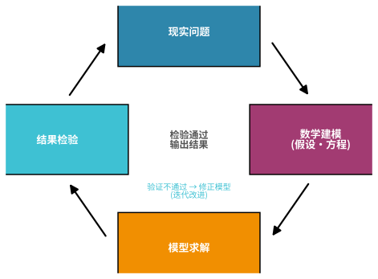
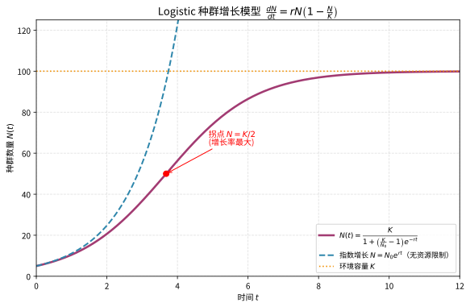

# 第 117 级：数学建模 (Mathematical Modeling)

---

## 从"把现实问题翻译成数学话说"说起：数学建模要解决的根问题

> 在谈 Logistic 增长、SIR 传染病、量纲分析之前，先想清楚一个朴素的追问：**现实世界没有公式，人是怎么用数学"撬动"现实的？**

**第一步：直觉——给一池鱼立一份"人口账"**

想象你承包了一口池塘养鱼。你想知道"几年后鱼大概有多少、该何时放苗、何时捕捞"。现实里没有现成公式可抄，但你注意到一个基本事实：鱼多了，繁殖快了，可空间和饵料有限，太多又会互相挤成一锅粥。于是你写出一个"增减账"：明天的鱼数 ≈ 今天的鱼数 + 繁殖带来的增长 − 资源枯竭带来的拖累。把它写成带 $\frac{dN}{dt}$ 的方程，就得到著名的 Logistic 模型。**你看，你并没有找到"真理"，却造出了一件"够用的工具"**——而"把现实问题想清楚、翻译成一个可算、可验的数学问题"这件事，正是数学建模。

**第二步：要解决的问题——现实太复杂，怎么"简化得恰到好处"**

数学建模的核心动机来自一条永恒的裂缝：**真实系统总是无穷复杂（无数变量、噪声、未知参数），而数学只能处理"被化简过的版本"**。它要回答的根问题是：如何抓住问题的关键变量、抛掉次要枝节，把它变成一个既可以求解、又足够贴近现实、还能用数据验证的数学对象？

- **化简的勇气来自实用**：1798 年 Malthus 用指数模型预测人口，很快被现实打脸；1838 年 Verhulst 补上"环境容纳量 $K$"、把增长率换成随数量衰减的项，得到 S 形增长的 Logistic 模型——第一次让"模型与现实不符"成为修改模型的动力。
- **"所有模型都是错的，但有些是有用的"**：统计大师 Box 这句名言，把"模型与现实天生有缝"当作前提而非耻辱——建模因此从"找正确答案"转向"在一轮轮差距里修补"。
- **方法论的成熟**：随后量纲分析、灵敏度分析、参数估计与模型选择（AIC/BIC）相继加入，把"观察—假设—建模—验证—修正"变成一套可教学的工业流程。

**第三步：正式定义前的准备——本章怎样一步步推进**

本章顺着"怎么建、有哪些模型、怎么验"的顺序走：

1. 先立起**建模过程**与闭环（现实 → 假设 → 方程 → 求解 → 检验 → 修正）；
2. 用**确定性 / 随机 / 微分方程 / 优化 / 离散 / 统计 / 模拟模型**七大类建立"模型工具箱"；
3. 用**量纲分析与相似性理论**回答"怎么把物理问题化简、怎么把小实验推到大系统"；
4. 用**参数估计**与**灵敏度分析 / 模型验证**回答"参数从哪来、预测可不可信"；
5. 最后用**模型选择与 AIC / BIC 准则**回答"多个模型选哪个"。

读完你会明白：数学建模的功夫不在"套公式"，而在**"判断该留下什么、该砍掉什么"的取舍**，以及在"模型与现实一次次对不齐"时不断地修正。

> **🧠 一句话记住数学建模的"出生证"**
>
> 数学建模要回答的，是一个"让数学够得着现实"的问题：
>
> $$ \boxed{\text{如何把复杂而不完美的现实，翻译成一个既可求解、又贴近真实、还能用数据验证的数学问题，并在迭代修正中逼近可用？}} $$
>
> 它既是方法（建模流程、模型类型、量纲与验证工具），更是一种眼光——**永远在"简化"与"保真"之间走钢丝**。

## 开始之前

**本章在讲什么**：本章讲"把现实问题转化为数学问题"的完整方法论与常见模型模板。你会先学建模流程（现实 → 假设 → 建模 → 求解 → 验证 → 改进），再掌握确定性、随机、微分方程、优化、离散、统计、模拟这七类模型，随后学习灵敏度分析、模型验证、量纲分析（Buckingham $\pi$ 定理）、相似性理论、参数估计，最后以模型选择与 AIC/BIC 准则收束，并辅以若干关键定理证明与应用例。

**为什么要学它**：第 103 级（数值分析）、第 107 级（微分方程数值解）给了"模型算得出来"的工具，第 92 级（回归分析）、第 116 级（数据科学）给了"用数据校准模型"的接口；但"**怎么把一个表述含糊的现实问题，一步步变成数学形式**"这一步还没有专门的一级来讲。本章正是那座桥：它把前面所有"算的工具"统一进一套"建模—求解—验证—修正"的流程里，是应用数学分水岭上最"通"的一级。

**开始前请确认你还记得**：

- 常微分方程与初等函数（指数、对数、幂）的图像与性质（见微积分章节）。
- 简单的线性回归与最小二乘（见第 92 级 回归分析）。
- 概率分布与随机变量、蒙特卡洛思想（见概率论章节）。
- 优化问题：目标函数、约束与最优条件（见第 109 级 优化理论）。
- 单位换算与量纲的基本概念；数值求解方法的大致印象（见第 107 级）。

---

## 1. 学习目标

完成本教程后，你将能够：

1. 理解数学建模的完整过程（问题分析、假设、模型建立、求解、验证、改进）
2. 掌握确定性模型、随机模型、微分方程模型、优化模型等不同建模方法
3. 理解量纲分析与 Buckingham $\pi$ 定理
4. 掌握最小二乘估计的统计性质与 Gauss-Markov 定理
5. 理解模型选择中的 AIC/BIC 准则
6. 掌握灵敏度分析与模型验证方法
7. 能独立完成从实际问题到数学模型的完整建模过程

---

## 2. 核心概念

### 2.1 建模过程

**数学建模**（Mathematical Modeling）是将现实问题转化为数学问题并求解的过程。完整的建模流程包括：

1. **问题分析**：明确问题目标、识别关键变量与约束
2. **模型假设**：简化现实，提出合理假设
3. **模型建立**：用数学语言（方程、不等式、概率分布等）描述问题
4. **模型求解**：使用解析方法或数值方法求解
5. **模型验证**：用实际数据检验模型的有效性
6. **模型改进**：根据验证结果调整模型，重复上述过程

> **直观理解（现实类比）**：建模流程就像厨师反复试菜——先根据经验（现实问题）拟定菜谱（数学模型），按菜谱做出来（模型求解），端上桌请人品尝评价（结果检验），如果味道不对就回头调整菜谱（模型改进），直到满意为止。每轮迭代都让菜谱（模型）更贴近真实口味（现实）。

> **直观理解（现实类比）**：换个角度看，建模循环就是"科学方法"的工程化落地——观察现象→提出假设→建立模型→验证预测→修正假设，再回到观察，如此螺旋上升。它从不指望一次到位，而是用每一轮的"差距"驱动下一轮的改进。正因为现实太复杂、一次建模必有遗漏，这个闭环才是逼近真理的最稳妥路径。

> **🧠 思考历程：现实问题五花八门，凭什么"先试一次、再改一次"就有魔力？**
>
> 建模循环回答的是应用数学最落地的一个追问：与其等一个"一步到位的完美公式"，能不能让"建模—求解—检验—修正"转起来、用迭代逼近现实？而人类最早拿这条循环去锚定的真实对象之一，是关于人口增长的方程。
>
> - **一次失败的预报点燃了循环**。1798年 Malthus 提出人口按指数爆炸的模型，很快被现实一路打脸。1838年 Verhulst 引入"环境容纳量 $K$"、把增长率换成随数量衰减的项，得到 logistic 人口方程——第一次让"模型与现实不吻合"成为修改模型的动力，也确立了"按 S 形增长"的现实图景。
> - **Box 的著名牢骚**。20世纪统计大师 Box 的名言"所有模型都是错的，但有些是有用的"，把"模型与现实天生有缝"当作前提而非耻辱——建模由此从"找正确答案"转向"在差距里不断修补"。
> - **把"科学方法"工程化**。随后系统辨识、灵敏度分析与交叉验证纷纷加入，使"观察—假设—建模—验证—修正"的循环成为可教学、可执行的工业式流程——应用数学由此获得一个自洽的认识论引擎。
> - **心路**：不必指望第一次就拿对，只要每次闭环都能朝真实世界挪近一寸——逼近，本就是建模最诚实的姿态。

### 2.2 确定性模型

**确定性模型**（Deterministic Model）中，输入与输出之间存在确定的函数关系，不含随机因素。

$$
y = f(x_1, x_2, \dots, x_p; \theta_1, \theta_2, \dots, \theta_k)
$$

### 2.3 随机模型

**随机模型**（Stochastic Model）引入随机变量来描述不确定性。例如：

$$
Y = f(X_1, X_2, \dots, X_p) + \varepsilon, \quad \varepsilon \sim N(0, \sigma^2)
$$

### 2.4 微分方程模型

**微分方程模型**（Differential Equation Model）用导数描述系统的变化率。例如种群增长的 Logistic 模型：

$$
\frac{dN}{dt} = rN\left(1 - \frac{N}{K}\right)
$$

> **直观理解（现实类比）**：把一小群鱼同时养进一个池塘，起初食物充足、增长飞快像指数曲线；可随着鱼越来越多，池塘的资源（空间、饵料）逐渐耗尽，增长越来越慢，最终鱼群数量稳定在池塘能容纳的上限 $K$ 附近。这条先快后慢的 S 形曲线，正是"有限资源下种群增长"的现实写照。

### 2.5 优化模型

**优化模型**（Optimization Model）在约束条件下寻找目标函数的最优值：

$$
\min_{x \in \Omega} f(x) \quad \text{s.t.} \quad g_i(x) \le 0, \; h_j(x) = 0
$$

### 2.6 离散模型

**离散模型**（Discrete Model）使用差分方程、图论、网络流等离散数学工具。

> **💡 直观理解（类比）**：离散模型像"用积木块搭城市"——它不用连续平滑的曲线，而是把世界切成一格一格、一跳一跳的离散单元来建模。差分方程描述"每走一步变化多少"，图论/网络流则像"节点是路口、边是带容量的路"。适合快递配送、排班排程、电路开关这类本质上一段一段、非连续的问题。

### 2.7 统计模型

**统计模型**（Statistical Model）基于概率论描述数据生成过程，如线性回归模型：

$$
\boldsymbol{Y} = \boldsymbol{X}\boldsymbol{\beta} + \boldsymbol{\varepsilon}, \quad \boldsymbol{\varepsilon} \sim N(\boldsymbol{0}, \sigma^2\boldsymbol{I})
$$

### 2.8 模拟模型

**模拟模型**（Simulation Model）通过计算机模拟系统的行为，包括蒙特卡洛模拟、离散事件模拟、基于 Agent 的模拟等。

> **💡 直观理解（类比）**：模拟模型像"在沙盘上做无数次'假战争推演'"——与其交出唯一答案，不如让电脑把系统跑上一万遍、把各种运气全撞一遍，最后看统计结果。蒙特卡洛是"大撒网随机抽样"估期望，离散事件是"按排队叫号一步步推进"，基于 Agent 则像"让每个小人各自行动、看全局如何涌现"。适合实地试验太贵或太复杂的系统。

### 2.9 灵敏度分析

**灵敏度分析**（Sensitivity Analysis）研究模型输出对输入参数变化的敏感程度。对于模型 $y = f(x)$，灵敏度定义为：

$$
S = \frac{\partial y}{\partial x} \cdot \frac{x}{y}
$$

或用条件数衡量：

$$
\kappa = \left| \frac{x}{f(x)} \cdot f'(x) \right|
$$

> **直观理解（现实类比）**：灵敏度分析像给模型做"压力测试"——故意把每个输入参数左右拨弄一下，看输出是纹丝不动还是剧烈跳动。若某参数动 $1\%$、输出就变 $50\%$，那它就是"关键先生"，必须重点测准；若输出几乎无反应，则该参数可粗略对待。它帮你识别哪些因素真正决定系统命运，把有限的精力花在刀刃上。

### 2.10 模型验证

**模型验证**（Model Validation）通过比较模型预测与实际数据来评估模型质量。常用方法：

- **残差分析**：检查残差是否满足模型假设
- **交叉验证**：将数据划分为训练集和验证集
- **假设检验**：检验模型参数的显著性
- **预测区间**：评估预测的不确定性

> **直观理解（现实类比）**：模型验证像"实战演习"——平时训练（训练集）成绩再好也不能全信，必须拉到没见过的新场景（验证集/新数据）里真刀真枪检验。用建模时没用过的数据去对照预测，能查出模型是真懂规律还是只"背会"了旧数据（过拟合）。只有在新数据上依然准，模型才敢拿去用，这正是交叉验证的核心思想。

### 2.11 量纲分析

**量纲分析**（Dimensional Analysis）通过分析物理量的量纲关系来简化问题。基本思想：物理方程中各项的量纲必须一致。

**基本量纲**：质量 $M$、长度 $L$、时间 $T$、温度 $\Theta$、电流 $I$ 等。

> **💡 直观理解（类比）**：量纲分析像"在做算术之前先检查单位能不能对得上"——方程里每一项的因次必须一致，不然根本不可能成立，正如"3米 + 2秒"毫无意义。它还能"以单位换思路"：既然两边单位必须匹配，就能反推出变量该以怎样的组合出现（$\pi$ 量），把一堆物理量按"单位合不合"整理成极少数无量纲组，问题顿时清爽许多。

> **常见坑**：量纲分析最忌两件事。一是**在同一方程式里混用单位制**（如 $x$ 用米、$y$ 用厘米），看似"数值对得上"，实则因次混乱、小算数就会爆出反直觉的量级；使用前应统一到同一单位制（如全部 SI）。二是**忽略无量纲常数与函数参数**：$\pi$ 定理只能给出无量纲组的"个数与形式"，却给不出无量纲系数 $c$ 的具体数值（须由实验或数值解定出）——例如阻力公式 $F=\tfrac12 C_d \rho A v^2$ 里的 $C_d$ 就是只靠量纲求不出来的经验系数。切莫以为"量纲对上"就等于"公式正确"。

### 2.12 相似性理论

**相似性理论**（Similarity Theory）研究如何将实验室模型的结果推广到实际系统。核心概念包括几何相似、运动相似、动力相似。

> **💡 直观理解（类比）**：相似性理论像"用小人国的飞机风洞模型推演真飞机的性能"。只要模型和真机在几何上同比例、速度等按规则缩放（几何/运动/动力相似），小模型里的流动就能代表真机——如同按地图比例尺，纸上一小段距离对应实地一大段。它让科学家用廉价的小规模实验"以小见大"，是工程实验设计的关键支点。

### 2.13 参数估计

**参数估计**（Parameter Estimation）从数据中估计模型参数。常用方法：

- **最小二乘估计**：最小化残差平方和
- **最大似然估计**：最大化似然函数
- **贝叶斯估计**：结合先验信息与数据

> **直观理解（现实类比）**：参数估计像"给乐器调音"——模型结构是乐器，参数是琴弦松紧，观测数据是"标准音高"。你反复拧弦（调参数），让模型奏出的预测（音）尽量贴合观测（标准音），直到两者吻合。最小二乘是让"总走音量"最小，最大似然是让"听到这串观测的概率"最大，贝叶斯则连同你事前的经验（先验）一起权衡，调得更稳健。

### 2.14 模型选择与 AIC/BIC 准则

**模型选择**（Model Selection）在多个候选模型中选择最优模型，需要在拟合优度与模型复杂度之间权衡。

**AIC**（Akaike Information Criterion）：

$$
\text{AIC} = -2\log L(\hat{\theta}) + 2k
$$

其中 $L(\hat{\theta})$ 为最大似然值，$k$ 为参数个数。

**BIC**（Bayesian Information Criterion）：

$$
\text{BIC} = -2\log L(\hat{\theta}) + k\log n
$$

其中 $n$ 为样本量。BIC 对复杂模型的惩罚比 AIC 更严厉。

> **💡 直观理解（类比）**：AIC/BIC 像"选配料单时既看好吃又罚浪费"。拟合得越好（$-\log L$ 越小）越加分，但每多用一个参数就要加一笔"复杂度罚金"（$2k$ 或 $k\log n$）——相当于厨师每多放一味料都被记一小过。AIC 罚得轻、爱多留料；BIC 罚得重、更倾向简单菜谱。两者都在"尽量讨好数据"与"防止死记过拟合"之间权衡。

---

## 3. 定理与证明

### 定理 3.1：Buckingham $\pi$ 定理

**定理**：设一个物理问题涉及 $n$ 个物理量 $q_1, q_2, \dots, q_n$，它们之间存在关系 $f(q_1, q_2, \dots, q_n) = 0$。若这些物理量涉及 $m$ 个基本量纲，则存在 $n - m$ 个无量纲量 $\pi_1, \pi_2, \dots, \pi_{n-m}$，使得：

$$
F(\pi_1, \pi_2, \dots, \pi_{n-m}) = 0
$$

**证明**：

**步骤1：量纲矩阵**

设每个物理量 $q_j$ 的量纲可以表示为基本量纲的幂次乘积：

$$
[q_j] = \prod_{i=1}^m D_i^{a_{ij}}
$$

其中 $D_i$ 为第 $i$ 个基本量纲，$a_{ij}$ 为指数。构造量纲矩阵 $\boldsymbol{A} \in \mathbb{R}^{m \times n}$：

$$
\boldsymbol{A} = \begin{pmatrix}
a_{11} & a_{12} & \cdots & a_{1n} \\
a_{21} & a_{22} & \cdots & a_{2n} \\
\vdots & \vdots & \ddots & \vdots \\
a_{m1} & a_{m2} & \cdots & a_{mn}
\end{pmatrix}
$$

**步骤2：无量纲组合的条件**

寻找无量纲组合 $\pi = q_1^{x_1} q_2^{x_2} \cdots q_n^{x_n}$，其量纲为：

$$
[\pi] = \prod_{i=1}^m D_i^{\sum_{j=1}^n a_{ij} x_j}
$$

$\pi$ 无量纲的条件是对于所有 $i = 1, \dots, m$：

$$
\sum_{j=1}^n a_{ij} x_j = 0
$$

即 $\boldsymbol{A}\boldsymbol{x} = \boldsymbol{0}$，其中 $\boldsymbol{x} = (x_1, x_2, \dots, x_n)^\top$。

**步骤3：解空间维数**

$\boldsymbol{A} \in \mathbb{R}^{m \times n}$，假设 $\boldsymbol{A}$ 的秩为 $r$（通常 $r = m$，因基本量纲线性无关）。则齐次线性方程组 $\boldsymbol{A}\boldsymbol{x} = \boldsymbol{0}$ 的解空间维数为 $n - r$。

**步骤4：构造无量纲 $\pi$ 群**

设 $\{\boldsymbol{v}^{(1)}, \boldsymbol{v}^{(2)}, \dots, \boldsymbol{v}^{(n-r)}\}$ 为解空间的一组基，则可得 $n - r$ 个无量纲量：

$$
\pi_k = \prod_{j=1}^n q_j^{v_j^{(k)}}, \quad k = 1, 2, \dots, n - r
$$

**步骤5：物理关系等价性**

原物理关系 $f(q_1, \dots, q_n) = 0$ 涉及 $n$ 个有量纲量。由于量纲齐次性，该关系可以改写为无量纲形式。若选择 $r$ 个量纲独立的物理量作为基本量（如 $q_1, \dots, q_r$），则其余 $n - r$ 个量可以表示为：

$$
q_{r+k} = q_1^{c_{1k}} q_2^{c_{2k}} \cdots q_r^{c_{rk}} \cdot \pi_k, \quad k = 1, \dots, n - r
$$

代入原关系 $f = 0$，消去 $r$ 个基本量，得到 $n - r$ 个无量纲量之间的关系：

$$
F(\pi_1, \pi_2, \dots, \pi_{n-r}) = 0
$$

**步骤6：结论**

$\pi$ 定理将 $n$ 个有量纲物理量之间的关系简化为 $n - r$ 个无量纲量之间的关系，大大减少了问题的变量个数，为实验设计和数据分析提供了理论依据。$\square$

> **💡 直观理解（类比）**：这条定理的"人话"是：多少花里胡哨的量，其实都能拼成少数的"单位组合"。好比做油漆，拿几十种颜料调来调去，真正的配色自由度只有少数几种"基色"；把这些基色换成无量纲 $\pi$ 量，复杂问题就从 $n$ 个变量缩到 $n-r$ 个，实验设计立刻瘦身。它帮工程师在茫茫变量里攥住最要紧的少数几张"配方组合"。

---

### 定理 3.2：Gauss-Markov 定理（最小二乘估计的统计性质）

**定理**：在线性回归模型 $\boldsymbol{Y} = \boldsymbol{X}\boldsymbol{\beta} + \boldsymbol{\varepsilon}$ 中，若满足：
1. $\mathbb{E}[\boldsymbol{\varepsilon}] = \boldsymbol{0}$（零均值）
2. $\text{Var}(\boldsymbol{\varepsilon}) = \sigma^2 \boldsymbol{I}_n$（同方差且无自相关）
3. $\boldsymbol{X}$ 是非随机的满秩矩阵（$\text{rank}(\boldsymbol{X}) = p$，其中 $p < n$）

则最小二乘估计量 $\hat{\boldsymbol{\beta}}_{\text{OLS}} = (\boldsymbol{X}^\top \boldsymbol{X})^{-1} \boldsymbol{X}^\top \boldsymbol{Y}$ 是 $\boldsymbol{\beta}$ 的最优线性无偏估计（BLUE），即在所有线性无偏估计量中具有最小方差。

**证明**：

**步骤1：线性与无偏性**

首先，OLS 估计量显然是线性的：

$$
\hat{\boldsymbol{\beta}} = (\boldsymbol{X}^\top \boldsymbol{X})^{-1} \boldsymbol{X}^\top \boldsymbol{Y} = \boldsymbol{A} \boldsymbol{Y}, \quad \boldsymbol{A} = (\boldsymbol{X}^\top \boldsymbol{X})^{-1} \boldsymbol{X}^\top
$$

无偏性：

$$
\mathbb{E}[\hat{\boldsymbol{\beta}}] = \mathbb{E}[(\boldsymbol{X}^\top \boldsymbol{X})^{-1} \boldsymbol{X}^\top (\boldsymbol{X}\boldsymbol{\beta} + \boldsymbol{\varepsilon})] = \boldsymbol{\beta} + (\boldsymbol{X}^\top \boldsymbol{X})^{-1} \boldsymbol{X}^\top \mathbb{E}[\boldsymbol{\varepsilon}] = \boldsymbol{\beta}
$$

**步骤2：协方差矩阵**

OLS 估计量的协方差矩阵为：

$$
\text{Var}(\hat{\boldsymbol{\beta}}) = \text{Var}((\boldsymbol{X}^\top \boldsymbol{X})^{-1} \boldsymbol{X}^\top \boldsymbol{Y}) = (\boldsymbol{X}^\top \boldsymbol{X})^{-1} \boldsymbol{X}^\top \text{Var}(\boldsymbol{Y}) \boldsymbol{X} (\boldsymbol{X}^\top \boldsymbol{X})^{-1}
$$

由于 $\text{Var}(\boldsymbol{Y}) = \text{Var}(\boldsymbol{\varepsilon}) = \sigma^2 \boldsymbol{I}_n$，得：

$$
\text{Var}(\hat{\boldsymbol{\beta}}) = (\boldsymbol{X}^\top \boldsymbol{X})^{-1} \boldsymbol{X}^\top (\sigma^2 \boldsymbol{I}_n) \boldsymbol{X} (\boldsymbol{X}^\top \boldsymbol{X})^{-1} = \sigma^2 (\boldsymbol{X}^\top \boldsymbol{X})^{-1}
$$

**步骤3：任意线性无偏估计量**

设 $\tilde{\boldsymbol{\beta}} = \boldsymbol{C} \boldsymbol{Y}$ 为 $\boldsymbol{\beta}$ 的任意一个线性无偏估计量，其中 $\boldsymbol{C} \in \mathbb{R}^{p \times n}$。

由无偏性 $\mathbb{E}[\tilde{\boldsymbol{\beta}}] = \boldsymbol{\beta}$ 得：

$$
\mathbb{E}[\boldsymbol{C} \boldsymbol{Y}] = \boldsymbol{C} \boldsymbol{X} \boldsymbol{\beta} = \boldsymbol{\beta}, \quad \forall \boldsymbol{\beta} \in \mathbb{R}^p
$$

因此 $\boldsymbol{C} \boldsymbol{X} = \boldsymbol{I}_p$。

**步骤4：方差比较**

令 $\boldsymbol{D} = \boldsymbol{C} - \boldsymbol{A}$，其中 $\boldsymbol{A} = (\boldsymbol{X}^\top \boldsymbol{X})^{-1} \boldsymbol{X}^\top$。则：

$$
\boldsymbol{D} \boldsymbol{X} = \boldsymbol{C} \boldsymbol{X} - \boldsymbol{A} \boldsymbol{X} = \boldsymbol{I}_p - \boldsymbol{I}_p = \boldsymbol{0}
$$

$\tilde{\boldsymbol{\beta}}$ 的协方差矩阵为：

$$
\begin{aligned}
\text{Var}(\tilde{\boldsymbol{\beta}}) &= \text{Var}((\boldsymbol{A} + \boldsymbol{D})\boldsymbol{Y}) = \text{Var}(\boldsymbol{A}\boldsymbol{Y}) + \text{Var}(\boldsymbol{D}\boldsymbol{Y}) + \text{Cov}(\boldsymbol{A}\boldsymbol{Y}, \boldsymbol{D}\boldsymbol{Y}) + \text{Cov}(\boldsymbol{D}\boldsymbol{Y}, \boldsymbol{A}\boldsymbol{Y})
\end{aligned}
$$

计算交叉项：

$$
\text{Cov}(\boldsymbol{A}\boldsymbol{Y}, \boldsymbol{D}\boldsymbol{Y}) = \boldsymbol{A} \text{Var}(\boldsymbol{Y}) \boldsymbol{D}^\top = \sigma^2 \boldsymbol{A} \boldsymbol{D}^\top
$$

由于 $\boldsymbol{A} \boldsymbol{D}^\top = (\boldsymbol{X}^\top \boldsymbol{X})^{-1} \boldsymbol{X}^\top \boldsymbol{D}^\top$，而 $\boldsymbol{D} \boldsymbol{X} = \boldsymbol{0}$ 意味着 $\boldsymbol{X}^\top \boldsymbol{D}^\top = \boldsymbol{0}$，因此 $\boldsymbol{A} \boldsymbol{D}^\top = \boldsymbol{0}$。

同理，$\text{Cov}(\boldsymbol{D}\boldsymbol{Y}, \boldsymbol{A}\boldsymbol{Y}) = \boldsymbol{0}$。

因此：

$$
\text{Var}(\tilde{\boldsymbol{\beta}}) = \text{Var}(\hat{\boldsymbol{\beta}}) + \text{Var}(\boldsymbol{D}\boldsymbol{Y})
$$

由于 $\text{Var}(\boldsymbol{D}\boldsymbol{Y}) = \sigma^2 \boldsymbol{D} \boldsymbol{D}^\top$ 是半正定矩阵，所以：

$$
\text{Var}(\tilde{\boldsymbol{\beta}}) - \text{Var}(\hat{\boldsymbol{\beta}}) = \sigma^2 \boldsymbol{D} \boldsymbol{D}^\top \succeq \boldsymbol{0}
$$

即 $\text{Var}(\tilde{\boldsymbol{\beta}}) \succeq \text{Var}(\hat{\boldsymbol{\beta}})$，其中 $\succeq$ 表示矩阵半正定序（即 $\text{Var}(\tilde{\boldsymbol{\beta}}) - \text{Var}(\hat{\boldsymbol{\beta}})$ 半正定）。

**步骤5：结论**

对于任意线性无偏估计量 $\tilde{\boldsymbol{\beta}}$，其协方差矩阵与 OLS 估计量的协方差矩阵之差为半正定矩阵。这意味着对于任意线性组合 $\boldsymbol{a}^\top \boldsymbol{\beta}$，有：

$$
\text{Var}(\boldsymbol{a}^\top \tilde{\boldsymbol{\beta}}) \ge \text{Var}(\boldsymbol{a}^\top \hat{\boldsymbol{\beta}})
$$

因此，OLS 估计量在所有线性无偏估计量中具有最小方差，即为 BLUE。$\square$

> **💡 直观理解（类比）**：这条定理的"人话"是：在白噪声（零均值、同方差、不相关）的前提下，最小二乘估计是"所有不带偏见的估法里最能压低波动的那一个"——即 BLUE。如同一群枪手都瞄得准（都无偏），但 OLS 的弹着点最集中（方差最小）。它给"最小二乘为什么是好选择"交了底：只要噪声规矩，就没有线性无偏办法能比它更稳准。

---

### 定理 3.3：量纲分析在物理模型中的应用——Newton 相似准则

**定理**：对于涉及粘性不可压缩流体的运动问题，若两个流动系统几何相似，且雷诺数 $Re = \frac{\rho v L}{\mu}$ 相等，则两个系统的流动状态相似（动力相似）。

**证明**：

**步骤1：确定相关物理量**

考虑流体运动问题，相关物理量及其量纲为：

| 物理量 | 符号 | 量纲 |
|:------:|:----:|:----:|
| 密度 | $\rho$ | $ML^{-3}$ |
| 速度 | $v$ | $LT^{-1}$ |
| 特征长度 | $L$ | $L$ |
| 粘度 | $\mu$ | $ML^{-1}T^{-1}$ |
| 压力差 | $\Delta p$ | $ML^{-1}T^{-2}$ |
| 重力加速度 | $g$ | $LT^{-2}$ |

共 $n = 6$ 个物理量，涉及 $m = 3$ 个基本量纲（$M, L, T$）。

**步骤2：构造量纲矩阵**

$$
\boldsymbol{A} = \begin{pmatrix}
1 & 0 & 0 & 1 & 1 & 0 \\
-3 & 1 & 1 & -1 & -1 & 1 \\
0 & -1 & 0 & -1 & -2 & -2
\end{pmatrix}
$$

其中行依次对应 $M, L, T$，列依次对应 $\rho, v, L, \mu, \Delta p, g$。

**步骤3：求解无量纲量**

由 $\pi$ 定理，应有 $n - r = 6 - 3 = 3$ 个无量纲量。选择 $\rho, v, L$ 为基本量，构造无量纲组合：

**第一个无量纲量（Reynolds 数）**：

$$
\pi_1 = \rho^{x_1} v^{x_2} L^{x_3} \mu
$$

量纲方程：

$$
[\pi_1] = (ML^{-3})^{x_1} (LT^{-1})^{x_2} (L)^{x_3} (ML^{-1}T^{-1}) = M^{x_1+1} L^{-3x_1+x_2+x_3-1} T^{-x_2-1}
$$

令各指数为零：

$$
\begin{cases}
x_1 + 1 = 0 \\
-3x_1 + x_2 + x_3 - 1 = 0 \\
-x_2 - 1 = 0
\end{cases}
$$

解得 $x_1 = -1$，$x_2 = -1$，$x_3 = -1$。因此：

$$
\pi_1 = \frac{\mu}{\rho v L} = \frac{1}{Re}
$$

习惯上取倒数，定义 Reynolds 数 $Re = \frac{\rho v L}{\mu}$。

**第二个无量纲量（Euler 数）**：

$$
\pi_2 = \rho^{x_1} v^{x_2} L^{x_3} \Delta p
$$

类似地解得 $x_1 = -1$，$x_2 = -2$，$x_3 = 0$，得 Euler 数：

$$
Eu = \frac{\Delta p}{\rho v^2}
$$

**第三个无量纲量（Froude 数）**：

$$
\pi_3 = \rho^{x_1} v^{x_2} L^{x_3} g
$$

解得 $x_1 = 0$，$x_2 = -2$，$x_3 = 1$，得 Froude 数：

$$
Fr = \frac{v^2}{gL}
$$

**步骤4：相似性条件**

由 $\pi$ 定理，流动问题的无量纲关系可表示为：

$$
F(Re, Eu, Fr) = 0
$$

两个几何相似的流动系统（模型和原型），若 $Re$ 相等，且 $Fr$ 相等，则 $Eu$ 必然相等，即压力系数相同，从而流动状态完全相似。

**步骤5：物理意义**

- **Reynolds 数**：惯性力与粘性力之比。$Re$ 相等保证粘性效应相似
- **Froude 数**：惯性力与重力之比。$Fr$ 相等保证重力效应相似
- **Euler 数**：压力与惯性力之比。表征压力场相似

在实际应用中，当粘性力起主导作用时（如管道流动），主要保证 $Re$ 相等；当重力起主导作用时（如波浪、明渠流动），主要保证 $Fr$ 相等。$\square$

> **💡 直观理解（类比）**：这条定理的"人话"是：让一大一小两个窝里的水流长得一模一样，只要它们"惯性力 vs 粘性力"的比值（$Re$）相同，就仿佛同一个主人带着同一副比例尺在指挥。$Re$、$Fr$、$Eu$ 分别像"粘性感的标尺""重力感的标尺""压力感的标尺"；当关键标尺读数相同，两套系统的流动就会自动摆出同一副造型，小模型便能代表真机。

---

### 定理 3.4：模型的灵敏度分析（条件数）

**定理**：考虑模型 $y = f(x)$，其中 $f$ 可微。输入 $x$ 的相对误差 $\delta_x = \frac{\Delta x}{x}$ 通过模型传播后，输出 $y$ 的相对误差 $\delta_y = \frac{\Delta y}{y}$ 满足：

$$
|\delta_y| \approx \kappa(x) \cdot |\delta_x|
$$

其中 $\kappa(x) = \left| \frac{x f'(x)}{f(x)} \right|$ 为条件数（Condition Number）。当 $\kappa(x) \gg 1$ 时，模型对输入扰动高度敏感（病态问题）。

**证明**：

**步骤1：一阶泰勒展开**

设 $x$ 有微小扰动 $\Delta x$，则输出 $y$ 的变化为：

$$
\Delta y = f(x + \Delta x) - f(x)
$$

对 $f(x + \Delta x)$ 在 $x$ 处进行一阶泰勒展开：

$$
f(x + \Delta x) = f(x) + f'(x) \Delta x + O((\Delta x)^2)
$$

忽略高阶项：

$$
\Delta y \approx f'(x) \Delta x
$$

**步骤2：相对误差**

输出的相对误差为：

$$
\delta_y = \frac{\Delta y}{y} \approx \frac{f'(x) \Delta x}{f(x)}
$$

**步骤3：条件数定义**

由上式可得：

$$
|\delta_y| \approx \left| \frac{f'(x) \Delta x}{f(x)} \right| = \left| \frac{x f'(x)}{f(x)} \right| \cdot \left| \frac{\Delta x}{x} \right| = \kappa(x) \cdot |\delta_x|
$$

其中 $\kappa(x) = \left| \frac{x f'(x)}{f(x)} \right|$ 即为条件数。

**步骤4：多变量推广**

对于多变量模型 $y = f(x_1, x_2, \dots, x_p)$，全微分给出：

$$
\Delta y \approx \sum_{i=1}^p \frac{\partial f}{\partial x_i} \Delta x_i
$$

相对误差为：

$$
\delta_y \approx \sum_{i=1}^p \frac{\partial f}{\partial x_i} \cdot \frac{x_i}{y} \cdot \frac{\Delta x_i}{x_i} = \sum_{i=1}^p S_i \cdot \delta_{x_i}
$$

其中 $S_i = \frac{\partial f}{\partial x_i} \cdot \frac{x_i}{y}$ 为第 $i$ 个输入的**灵敏度系数**（Sensitivity Coefficient）。

**步骤5：灵敏度分析的意义**

条件数 $\kappa(x)$ 或灵敏度系数 $S_i$ 提供了以下信息：
- **识别关键参数**：$|S_i|$ 大的参数对输出影响大，需要精确估计
- **模型简化**：$|S_i|$ 小的参数可视为常数或忽略
- **不确定性量化**：对输入误差的传播进行定量评估
- **实验设计**：指导实验测量精度要求的确定

**示例**：对于模型 $y = x^2$，条件数为 $\kappa(x) = \left| \frac{x \cdot 2x}{x^2} \right| = 2$，意味着输入误差被放大 2 倍。对于模型 $y = e^x$，$\kappa(x) = |x|$，当 $x$ 很大时模型高度敏感。$\square$

> **💡 直观理解（类比）**：这条定理的"人话"是：一小点输入误差会被模型"乘以一个放大倍数"（条件数 $\kappa$）才传到输出。$\kappa$ 像发烧时的"温度放大器"：$\kappa$ 越大，输入的一小抖就传染成输出一大跳（病态），仿佛放大镜越强、手一颤画面就晃得越凶，甚至糊成一团。它提示我们哪些参数要测准、哪些可以随便对待。

---

### 定理 3.5：模型选择的 AIC 渐近性质

**定理**：设真实模型为 $g(y)$，候选模型族为 $\{f(y \mid \theta_k) : \theta_k \in \Theta_k \subseteq \mathbb{R}^k\}$（其中 $k$ 为参数个数）。AIC 准则：

$$
\text{AIC}(k) = -2\log L(\hat{\theta}_k) + 2k
$$

具有以下渐近性质：在适当的正则条件下，AIC 选择使 KL 散度最小的模型，即 AIC 最小化渐近等价于最小化 KL 散度 $D_{\text{KL}}(g \parallel f_{\hat{\theta}_k})$。

**证明**：

**步骤1：KL 散度**

真实模型 $g(y)$ 与候选模型 $f(y \mid \theta)$ 之间的 KL 散度为：

$$
D_{\text{KL}}(g \parallel f_\theta) = \int g(y) \log \frac{g(y)}{f(y \mid \theta)} dy = \mathbb{E}_g[\log g(Y)] - \mathbb{E}_g[\log f(Y \mid \theta)]
$$

由于 $\mathbb{E}_g[\log g(Y)]$ 与模型选择无关，最小化 KL 散度等价于最大化 $\mathbb{E}_g[\log f(Y \mid \theta)]$。

**步骤2：期望对数似然**

定义真实模型下的期望对数似然：

$$
Q(\theta) = \mathbb{E}_g[\log f(Y \mid \theta)] = \int g(y) \log f(y \mid \theta) dy
$$

在理想情况下，我们希望选择使 $Q(\theta)$ 最大的模型。但 $Q(\theta)$ 依赖于未知的真实分布 $g$，无法直接计算。

**步骤3：对数似然作为估计**

在实践中，我们使用样本对数似然 $\log L(\theta) = \sum_{i=1}^n \log f(y_i \mid \theta)$ 来估计 $n Q(\theta)$。但用同一批数据估计 $\theta$ 和评估模型会产生偏差：

$$
\mathbb{E}_g[\log L(\hat{\theta})] > n \cdot Q(\hat{\theta})
$$

因为 $\hat{\theta}$ 是使样本对数似然最大化的参数，存在过拟合倾向。

**步骤4：偏差校正**

定义偏差：

$$
b(k) = \mathbb{E}_g[\log L(\hat{\theta})] - n \cdot \mathbb{E}_g[Q(\hat{\theta})]
$$

在正则条件下（Akaike, 1973），可以证明偏差的渐近值为：

$$
b(k) \xrightarrow{n \to \infty} k
$$

**证明思路**：在适当的正则条件下，MLE $\hat{\theta}$ 渐近服从正态分布：

$$
\sqrt{n}(\hat{\theta} - \theta_0) \xrightarrow{d} N(0, \mathcal{I}(\theta_0)^{-1})
$$

其中 $\mathcal{I}(\theta_0)$ 为 Fisher 信息矩阵。通过二阶展开和取期望，可得偏差项收敛到参数个数 $k$。

**步骤5：AIC 的构造**

AIC 定义为：

$$
\text{AIC} = -2\log L(\hat{\theta}) + 2k
$$

其中 $-2\log L(\hat{\theta})$ 为拟合优度的度量（越小越好），$2k$ 为惩罚项（防止过拟合）。

**渐近无偏性**：由步骤4，有：

$$
\mathbb{E}[\text{AIC}] = -2\mathbb{E}[\log L(\hat{\theta})] + 2k \approx -2n \cdot \mathbb{E}[Q(\hat{\theta})]
$$

即 AIC 是 $-2n \cdot \mathbb{E}[Q(\hat{\theta})]$ 的渐近无偏估计，而后者与 KL 散度仅差一个常数。

**步骤6：AIC 与 KL 散度的关系**

对于两个候选模型 $f_1$ 和 $f_2$，AIC 的差值：

$$
\Delta\text{AIC} = \text{AIC}_1 - \text{AIC}_2
$$

渐近地，$\Delta\text{AIC} > 0$ 意味着模型 2 的 KL 散度更小，即模型 2 更优。AIC 选择最小 AIC 值的模型，等价于选择使 KL 散度最小的模型。

**步骤7：AIC 与 BIC 的对比**

BIC 使用不同的惩罚项：

$$
\text{BIC} = -2\log L(\hat{\theta}) + k\log n
$$

BIC 的惩罚项 ($k\log n$) 比 AIC ($2k$) 更大（当 $n > 7$ 时）。BIC 的推导基于贝叶斯框架，目标是选择后验概率最大的模型，在一致性方面优于 AIC（当真实模型在候选集中时，BIC 以概率 1 选择正确模型），而 AIC 在预测精度方面通常更优。

**结论**：AIC 提供了基于 KL 散度的模型选择准则，在预测精度与模型复杂度之间取得平衡，是数学建模中模型选择的重要工具。$\square$

> **💡 直观理解（类比）**：这条定理的"人话"是：AIC 之所以给"每个参数 +2"而不是白送，是因为用同一批数据又估参又打分，难免高估模型"像不像真相"，这个"自我高估"的平均量刚好折合每参数 2 分。打个比方——往自己画的靶子上射箭、再自己报成绩，总免不了虚高，AIC 就预先扣掉这份虚高，剥去水分后剩下的分数才是真正逼近"与真相贴合度（KL 散度）"的靠谱成绩单。

---

## 4. 示例

### 示例 4.1：种群增长模型（Logistic 模型）

**问题**：某种群在有限资源环境下的增长规律。设环境最大容量为 $K$，种群内禀增长率为 $r$。

**步骤 1：问题分析**

在没有资源限制时，种群呈指数增长：$\frac{dN}{dt} = rN$。但实际环境中资源有限，种群增长受到抑制。

**步骤 2：模型假设**

1. 种群数量 $N(t)$ 随时间连续变化
2. 环境最大容量为 $K$（即可支持的最大种群数量）
3. 增长率随种群数量增加而线性下降：$r_{\text{eff}} = r\left(1 - \frac{N}{K}\right)$
4. 不考虑年龄结构、随机波动等因素

**步骤 3：模型建立**

Logistic 微分方程：

$$
\frac{dN}{dt} = rN\left(1 - \frac{N}{K}\right)
$$

**步骤 4：模型求解**

分离变量：

$$
\frac{dN}{N(1 - N/K)} = r\,dt
$$

使用部分分式分解：

$$
\frac{1}{N(1 - N/K)} = \frac{1}{N} + \frac{1/K}{1 - N/K}
$$

积分：

$$
\int \left(\frac{1}{N} + \frac{1/K}{1 - N/K}\right) dN = \int r\,dt
$$

$$
\ln N - \ln\left(1 - \frac{N}{K}\right) = rt + C
$$

$$
\ln\frac{N}{1 - N/K} = rt + C
$$

设初始条件 $N(0) = N_0$，解得：

$$
\frac{N}{1 - N/K} = \frac{N_0}{1 - N_0/K} e^{rt}
$$

整理得：

$$
N(t) = \frac{K}{1 + \left(\frac{K}{N_0} - 1\right) e^{-rt}}
$$

**步骤 5：模型验证**

使用实际数据（如某种细菌在培养皿中的增长数据）拟合参数 $r$ 和 $K$，比较模型预测与实测值。

**步骤 6：模型分析**

- 当 $t \to \infty$ 时，$N(t) \to K$，种群趋于稳定
- 当 $N \ll K$ 时，$\frac{dN}{dt} \approx rN$，近似指数增长
- 当 $N = K/2$ 时，增长率最大，为拐点
- 参数 $r$ 控制增长速度，$K$ 控制稳态值

> **💡 直观理解（类比）**：这个例子完整演示了"养一缸鱼"从问题到模型的全程：先假设池塘有个装不下的天花板 $K$，增长随鱼多而放缓，于是把"增长率随数量线性下降"写进微分方程；解出那条 S 形曲线后，再拿实测数据反推参数看对不对。它还揭示关键拐点：鱼到一半多时长得最快，之后越涨越靠近天花板而趋于稳定。

---

### 示例 4.2：传染病的 SIR 模型

**问题**：建立传染病在人群中的传播模型，预测疫情发展趋势。

**步骤 1：问题分析**

传染病传播涉及易感者（Susceptible）、感染者（Infectious）和康复者（Recovered/Removed）三类人群。

**步骤 2：模型假设**

1. 总人口 $N = S + I + R$ 保持不变（不考虑出生、死亡和迁移）
2. 易感者与感染者接触后以概率 $\beta$ 被感染
3. 感染者以速率 $\gamma$ 康复并获得免疫力
4. 人群均匀混合，不考虑空间结构和年龄结构

**步骤 3：模型建立**

SIR 模型由三个常微分方程组成：

$$
\begin{cases}
\dfrac{dS}{dt} = -\beta \dfrac{SI}{N} \\[8pt]
\dfrac{dI}{dt} = \beta \dfrac{SI}{N} - \gamma I \\[8pt]
\dfrac{dR}{dt} = \gamma I
\end{cases}
$$

其中：
- $S(t)$：$t$ 时刻易感者数量
- $I(t)$：$t$ 时刻感染者数量
- $R(t)$：$t$ 时刻康复者数量
- $\beta$：感染率（每次接触的传播概率 $\times$ 接触率）
- $\gamma$：康复率（$1/\gamma$ 为平均感染期）

**步骤 4：模型求解**

SIR 模型没有显式解析解，但可以分析其定性行为。

**基本再生数**（Basic Reproduction Number）：

$$
R_0 = \frac{\beta}{\gamma}
$$

$R_0$ 表示一个感染者在完全易感人群中平均感染的人数。

- 若 $R_0 > 1$，疫情爆发，$I(t)$ 先增后减
- 若 $R_0 < 1$，疫情自行消退

**首次积分**：

由前两个方程相除：

$$
\frac{dI}{dS} = \frac{\beta SI/N - \gamma I}{-\beta SI/N} = -1 + \frac{\gamma N}{\beta S}
$$

积分得：

$$
I(t) + S(t) - \frac{\gamma N}{\beta} \ln S(t) = \text{常数}
$$

**最终规模**（Final Size）：

当 $t \to \infty$ 时，$I(\infty) = 0$，最终易感者数量 $S(\infty)$ 满足：

$$
S(\infty) = S(0) e^{-R_0 (1 - S(\infty)/N)}
$$

**步骤 5：模型验证**

使用实际疫情数据（如流感、COVID-19 数据）拟合参数 $\beta$ 和 $\gamma$，比较模型预测的感染峰值和峰值时间。

**步骤 6：模型扩展**

- **SEIR 模型**：加入潜伏期（Exposed）
- **SIRS 模型**：考虑免疫力衰减
- **带干预的模型**：加入隔离、封锁等干预措施
- **空间 SIR 模型**：考虑空间传播

> **💡 直观理解（类比）**：这个例子用三个蓄水池当流行病剧本：$S$ 是还没得病的"易感池"，$I$ 是正在发烧的"感染池"，$R$ 是痊愈的"康复池"，水从 $S$ 流进 $I$、再从 $I$ 流进 $R$。基本再生数 $R_0$ 像"一个病号平均能再传染几个人"的接力系数：$R_0>1$ 火苗越煽越大（先爆后衰），$R_0<1$ 火头自灭。它让人一眼看懂隔离、打疫苗为何能掐灭蔓延。

---

## 5. 习题

### 基础题

**习题 1**（建模流程）列出数学建模的完整流程，并说明每一步的作用。

**习题 2**（确定性 vs 随机模型）说明确定性模型与随机模型的区别，并各写出其一般数学形式。

**习题 3**（优化模型）写出优化模型的数学形式 $\min_{x\in\Omega} f(x) \ \text{s.t.} \ g_i(x)\le0,\ h_j(x)=0$，说明其组成部分。

**习题 4**（微分方程模型）写出 Logistic 种群增长模型 $\frac{dN}{dt}=rN\left(1-\frac{N}{K}\right)$，说明参数 $r$ 与 $K$ 的意义。

**习题 5**（统计模型）写出线性回归统计模型 $\boldsymbol{Y}=\boldsymbol{X}\boldsymbol{\beta}+\boldsymbol{\varepsilon}$，并说明其误差假设。

**习题 6**（参数估计）列举参数估计的三种方法（最小二乘、最大似然、贝叶斯估计），说明各自的思路。

**习题 7**（灵敏度分析）写出灵敏度系数 $S=\frac{\partial y}{\partial x}\cdot\frac{x}{y}$ 的定义，并说明它的作用。

**习题 8**（模型验证）列举模型验证的常用方法（残差分析、交叉验证、假设检验、预测区间），说明如何判断模型质量。

**习题 9**（量纲分析）说明量纲分析的基本思想与 Buckingham $\pi$ 定理的内容。

**习题 10**（模拟模型）列举模拟模型的类型（蒙特卡洛、离散事件、基于 Agent 的模拟），并说明各自的适用场景。

### 进阶题

**习题 11**（Logistic 解验证）验证 Logistic 模型 $N(t)=\frac{K}{1+(\frac{K}{N_0}-1)e^{-rt}}$ 满足微分方程 $\frac{dN}{dt}=rN\left(1-\frac{N}{K}\right)$。

**习题 12**（单摆 π 定理）对单摆运动（物理量摆长 $L$、质量 $m$、重力加速度 $g$、周期 $T$），用 Buckingham $\pi$ 定理推导周期公式的形式，并说明周期与摆长、质量的关系。

**习题 13**（条件数推导）对模型 $y=\beta_0+\beta_1 x+\varepsilon$ 推导条件数 $\kappa(x)$ 的表达式，并讨论当 $x$ 接近零以及 $y$ 接近零时的情况。

**习题 14**（AIC vs BIC）比较 AIC 与 BIC 的惩罚项大小，当样本量 $n=30$ 时说明二者的选择结果可能有何不同及原因。

**习题 15**（Logistic 拐点）证明 Logistic 增长曲线的拐点（增长率最大处）出现在 $N=K/2$。

**习题 16**（一元 OLS 估计量）对 $y=\beta_0+\beta_1 x+\varepsilon$ 推导 $\beta_0,\beta_1$ 的最小二乘估计量表达式。

**习题 17**（灵敏度/条件数计算）分别求 $y=x^2$、$y=e^x$、$y=\sqrt{x}$ 的条件数 $\kappa(x)$，并判断各模型在何种情况下病态。

**习题 18**（Lagrange 求解优化）用 Lagrange 乘子法求解 $\min\ x_1^2+x_2^2 \ \text{s.t.} \ x_1+x_2=1$，并说明 Lagrange 乘子法的作用。

**习题 19**（多变量误差传播）用全微分推导：多变量模型 $y=f(x_1,\dots,x_p)$ 的输出相对误差可表示为各输入灵敏度系数与相对误差的加权和。

### 挑战题

**习题 20**（异方差与 WLS）证明当误差项方差不等（异方差）时 OLS 估计量不再是最优，说明加权最小二乘（WLS）的权重应如何选取及为何它是最优的。

**习题 21**（R0 阈值定理）证明 $R_0=\beta/\gamma$ 是 SIR 模型决定疫情是否爆发的阈值参数，即当 $R_0>1$ 时感染数先增后减、当 $R_0<1$ 时单调递减。

**习题 22**（SIR 首次积分）由 SIR 方程组推导守恒量 $I+S-\frac{\gamma N}{\beta}\ln S=\text{常数}$。

**习题 23**（最终规模）利用首次积分推导最终易感者数量满足 $S(\infty)=S(0)e^{-R_0(1-S(\infty)/N)}$。

**习题 24**（图论/网络流建模）说明用图论与网络流对现实问题建模的步骤，并给出一个应用实例（如最短路径、最大流）。

**习题 25**（Newton 相似准则）由定理 3.3 说明 Reynolds 数、Froude 数、Euler 数的物理意义及流动相似的成立条件。

**习题 26**（π 定理构造 Re）用 Buckingham $\pi$ 定理由物理量 $\rho,v,L,\mu$ 构造无量纲量并推出 Reynolds 数 $Re=\frac{\rho v L}{\mu}$。

### 探究题

**习题 27**（AHP 多准则决策）探究层次分析法（AHP）如何通过两两比较与判断矩阵进行多准则决策，说明权重计算与一致性检验。

**习题 28**（蒙特卡洛模拟）探究蒙特卡洛模拟在含不确定性建模（如风险分析、数值积分）中的作用、步骤与收敛特性。

**习题 29**（灵敏度驱动简化）探究如何利用灵敏度系数识别关键参数、简化模型并指导实验测量精度要求。

**习题 30**（端到端建模流程）以传染病 SIR（或种群增长）为例，设计从实际问题到模型的完整建模流程，涵盖问题分析、假设、建立、求解、验证与改进的闭环。

---

## 6. 习题答案与解析

### 基础题答案

1. **建模流程** 数学建模的完整流程为：① 问题分析——明确问题目标、识别关键变量与约束；② 模型假设——简化现实、提出合理假设；③ 模型建立——用数学语言（方程、不等式、概率分布）描述问题；④ 模型求解——用解析或数值方法求解；⑤ 模型验证——用实际数据检验模型有效性；⑥ 模型改进——根据验证结果调整模型并重复上述过程。每一步为下一步提供输入，最终形成"现实→模型→求解→检验→反馈"的迭代闭环。

2. **确定性 vs 随机模型** 确定性模型中输入与输出存在确定的函数关系、不含随机因素，形式为 $y=f(x_1,\dots,x_p;\theta_1,\dots,\theta_k)$，同样的输入必得到同样的输出（如自由落体、力学系统）；随机模型引入随机变量描述不确定性，形式为 $Y=f(X_1,\dots,X_p)+\varepsilon,\ \varepsilon\sim N(0,\sigma^2)$（如经济、生物、含噪声的观测数据）。确定性模型适合机理明确的系统，随机模型适合受随机干扰的系统。

3. **优化模型** 优化模型用于在满足约束的条件下寻找目标函数的最优值：$\min_{x\in\Omega} f(x) \ \text{s.t.} \ g_i(x)\le0,\ h_j(x)=0$。其中 $f(x)$ 是目标函数（利润、成本、时间等），$g_i(x)\le0$ 是不等式约束、$h_j(x)=0$ 是等式约束，$\Omega$ 是可行域。它由"目标 + 约束"构成，是资源配置、最优决策等问题的数学形式。

4. **微分方程模型** Logistic 模型为 $\frac{dN}{dt}=rN\left(1-\frac{N}{K}\right)$。$r$ 为内禀增长率（种群很小时近似指数增长的速率），$K$ 为环境最大容量（环境所能支持的种群数量上限）。当 $N\ll K$ 时 $\frac{dN}{dt}\approx rN$ 近似指数增长；当 $N\to K$ 时增长率趋于 0，种群数量稳定在 $K$ 附近，形成 S 形增长。

5. **统计模型** 线性回归统计模型为 $\boldsymbol{Y}=\boldsymbol{X}\boldsymbol{\beta}+\boldsymbol{\varepsilon}$，其中 $\boldsymbol{X}$ 为设计矩阵、$\boldsymbol{\beta}$ 为系数向量、$\boldsymbol{\varepsilon}$ 为噪声。误差假设为 $\boldsymbol{\varepsilon}\sim N(\boldsymbol{0},\sigma^2\boldsymbol{I})$，即零均值、同方差且无自相关（各观测误差独立）。在此假设下可用最小二乘估计参数并进行显著性检验。

6. **参数估计** 三种方法：① 最小二乘估计——最小化残差平方和；② 最大似然估计——最大化似然函数，即使所观测数据出现的概率最大；③ 贝叶斯估计——结合先验信息与观测数据计算后验，融入领域知识或正则化。三者都把观测数据最合理地归结为参数取值，在正态误差下最小二乘与最大似然估计一致。

7. **灵敏度分析** 灵敏度系数 $S=\frac{\partial y}{\partial x}\cdot\frac{x}{y}$度量输出相对变化对输入相对变化的敏感程度（无量纲）。$|S|$ 大说明该参数对输出影响大，是"关键参数"，需要精确估计与重点控制；$|S|$ 小则说明输出对此参数不敏感，可粗略对待或视为常数。它与条件数 $\kappa=|\frac{x}{f(x)}f'(x)|$ 本质相同，用于识别影响系统命运的主要因素。

8. **模型验证** 常用方法：残差分析——检查残差是否随机、是否满足模型假设（有无系统性图案）；交叉验证——把数据划分为训练集与验证集，在验证集上评估泛化能力；假设检验——检验模型参数的显著性；预测区间——量化预测的不确定度。模型在建模未用过的验证数据上仍表现良好才说明可信，能有效识别"背会旧数据"的过拟合。

9. **量纲分析** 量纲分析的基本思想是：物理方程中各项的量纲必须一致（量纲齐次性）。Buckingham $\pi$ 定理：若一个物理问题涉及 $n$ 个物理量且涉及 $m$ 个基本量纲，则该问题可由 $n-m$（一般为等秩的 $n-r$）个无量纲量 $\pi_1,\pi_2,\dots,\pi_{n-m}$ 完全描述，即存在 $F(\pi_1,\dots,\pi_{n-m})=0$。它把大量有量纲变量简化为极少数无量纲量，大幅减少变量个数，指导实验设计与数据整理。

10. **模拟模型** 模拟模型通过计算机"虚拟实验"观察系统行为：① 蒙特卡洛模拟——用大量随机抽样估计期望与概率，适合解析困难的随机系统；② 离散事件模拟——按事件发生顺序推进，适合排队、生产流程等系统；③ 基于 Agent 的模拟——从个体交互演化出宏观行为，适合群体、社会与经济系统。适用于难以用解析方法求解或做真实实验成本过高的情形。

### 进阶题答案

1. **Logistic 解验证** 设 $A=\frac{K}{N_0}-1$，则 $N(t)=\frac{K}{1+Ae^{-rt}}$。对其求导：$N'(t)=\frac{rKAe^{-rt}}{(1+Ae^{-rt})^2}$。另一方面 $rN\left(1-\frac{N}{K}\right)=r\cdot\frac{K}{1+Ae^{-rt}}\cdot\left(1-\frac{1}{1+Ae^{-rt}}\right)=r\cdot\frac{K}{1+Ae^{-rt}}\cdot\frac{Ae^{-rt}}{1+Ae^{-rt}}=\frac{rKAe^{-rt}}{(1+Ae^{-rt})^2}$。两者相等，故 Logistic 解确实满足微分方程。

2. **单摆 π 定理** 物理量 $L,m,g,T$，量纲矩阵各行为 $M,L,T$：$m$ 使 $M$ 指数为 1、其余为 0；$L$ 对 $L$ 指数 1；$g$（$LT^{-2}$）使 $L$ 指数 1、$T$ 指数 -2；$T$ 使 $T$ 指数 1。基本量纲 $m=3$、物理量 $n=4$，故 $n-r=1$ 个无量纲量。设 $\pi=L^{x_1}m^{x_2}g^{x_3}T^{x_4}$，量纲 $[\pi]=M^{x_2}L^{x_1+x_3}T^{-2x_3+x_4}$。令指数为零：$x_2=0$（质量不出现）、$x_1+x_3=0$、$-2x_3+x_4=0$。取 $x_1=1$ 得 $x_2=0,x_3=-1,x_4=-2$，故 $\pi=T^2 g/L$ 为常数。由此周期形式为 $T\propto\sqrt{L/g}$，即与摆长平方根成正比、与质量无关（比例常数如 $2\pi$ 由实验确定）。

3. **条件数推导** $f(x)=\beta_0+\beta_1 x$，$f'(x)=\beta_1$，故 $\kappa(x)=\left|\frac{x\beta_1}{\beta_0+\beta_1 x}\right|$。当 $x\to0$ 且 $\beta_0\neq0$ 时 $\kappa\to0$，输出几乎不随相对输入误差变化（输出以常数 $\beta_0$ 为主，仅按比例缩放）；若 $\beta_0=0$，$\kappa\equiv1$ 恒为常数；当 $\beta_0+\beta_1x\to0$（即 $x\to-\beta_0/\beta_1$，$y$ 接近零）时 $\kappa\to\infty$，模型病态，微小的输入相对误差被极端放大。

4. **AIC vs BIC** AIC $=-2\log L+2k$，BIC $=-2\log L+k\log n$。$n=30$ 时 BIC 的惩罚项 $k\log30\approx3.40k$ 大于 AIC 的 $2k$，因此 BIC 对模型复杂度惩罚更严厉，倾向选择参数更少、更简单的模型；AIC 惩罚较轻，倾向保留更多特征。二者差异随参数个数 $k$ 增大而拉大，可能对某些边缘特征给出不同取舍——BIC 更可能将其删去。真实模型在候选集中时 BIC 渐近一致地选对模型；AIC 则在预测精度上通常更优。

5. **Logistic 拐点** 记 $\dot N=\frac{dN}{dt}=rN-\frac{r}{K}N^2$。对时间再求导：$\ddot N=\dot N\left(r-\frac{2r}{K}N\right)$。在增长阶段 $\dot N\neq0$，令 $\ddot N=0$ 得 $r-\frac{2r}{K}N=0\Rightarrow N=\frac{K}{2}$。此时 $\dot N=r\cdot\frac{K}{2}\cdot\frac{1}{2}=\frac{rK}{4}$ 达到最大，故增长率最大的拐点出现在 $N=K/2$。

6. **一元 OLS 估计量** 最小化 $S=\sum_{i=1}^n(y_i-\beta_0-\beta_1x_i)^2$。由 $\frac{\partial S}{\partial\beta_0}=0$ 得 $\sum y_i=n\beta_0+\beta_1\sum x_i$，即 $\beta_0=\bar y-\beta_1\bar x$；由 $\frac{\partial S}{\partial\beta_1}=0$ 得 $\sum x_iy_i=\beta_0\sum x_i+\beta_1\sum x_i^2$。代入消去 $\beta_0$ 解得 $\beta_1=\frac{\sum(x_i-\bar x)(y_i-\bar y)}{\sum(x_i-\bar x)^2}$。故斜率是 $x,y$ 的协方差与 $x$ 的方差之比，回归线过均值点 $(\bar x,\bar y)$。

7. **灵敏度/条件数计算** $\kappa(x)=\left|\frac{x f'(x)}{f(x)}\right|$。$y=x^2$：$f'=2x$，$\kappa=|x\cdot2x/x^2|=2$，输入误差恒被放大 2 倍；$y=e^{x}$：$f'=e^x$，$\kappa=|x|$，当 $x$ 远离 0 时模型高度敏感、病态；$y=\sqrt{x}$：$f'=\frac{1}{2\sqrt x}$，$\kappa=|x\cdot\frac{1}{2\sqrt x}/\sqrt x|=\frac12$，误差衰减一半，始终良态。多变量时用灵敏度系数 $S_i=\frac{\partial f}{\partial x_i}\frac{x_i}{y}$，输出相对误差 $\delta_y=\sum_i S_i\delta_{x_i}$。

8. **Lagrange 求解优化** 构造 $L(x_1,x_2,\lambda)=x_1^2+x_2^2+\lambda(x_1+x_2-1)$。由 $\frac{\partial L}{\partial x_1}=2x_1+\lambda=0$、$\frac{\partial L}{\partial x_2}=2x_2+\lambda=0$ 得 $x_1=x_2$；代入约束 $x_1+x_2=1$ 得 $x_1=x_2=\frac12$，目标最小值 $f=\frac12$。Lagrange 乘子法把带约束极值问题通过引入乘子 $\lambda$ 化为关于 $(x,\lambda)$ 的无约束驻点问题，是求解优化模型的典型工具，可推广到 KKT 条件处理带不等式约束的优化模型。

9. **多变量误差传播** 对 $y=f(x_1,\dots,x_p)$ 作一阶全微分：$\Delta y\approx\sum_{i=1}^p\frac{\partial f}{\partial x_i}\Delta x_i$。除以 $y$ 得相对误差 $\delta_y=\frac{\Delta y}{y}\approx\sum_{i=1}^p\frac{\partial f}{\partial x_i}\cdot\frac{x_i}{y}\cdot\frac{\Delta x_i}{x_i}=\sum_{i=1}^p S_i\delta_{x_i}$，其中 $S_i=\frac{\partial f}{\partial x_i}\cdot\frac{x_i}{y}$ 为第 $i$ 个输入的灵敏度系数。即输出的相对误差是各输入相对误差的加权线性组合，用于量化不确定度传播并识别主导不确定性的参数。

### 挑战题答案

1. **异方差与 WLS** OLS 的目标 $\min\sum_i(y_i-x_i^\top\beta)^2$ 对所有样本一视同仁，未利用不同误差方差 $\sigma_i^2$ 的信息，故虽然无偏但方差不是最小，不满足 Gauss-Markov 定理的最优性要求。解法是加权最小二乘 WLS：$\min\sum_i w_i(y_i-x_i^\top\beta)^2$，权重取 $w_i=1/\sigma_i^2$，即方差越小（数据越可靠）的观测权重越大。数学上把每个观测乘以 $\sqrt{w_i}$ 得到变换后的数据，其误差变为同方差；对变换数据应用 OLS，由 Gauss-Markov 定理即得 BLUE，等价于原问题的 WLS。$\sigma_i^2$ 未知时可用残差或迭代方式估计。

2. **R0 阈值定理** $\frac{dI}{dt}=\beta\frac{SI}{N}-\gamma I=I\left(\beta\frac{S}{N}-\gamma\right)$。疫情初期人群基本完全易感（$S(0)\approx N$），此时 $\left.\frac{dI}{dt}\right|_{t=0}=I(0)\left(\beta\frac{S(0)}{N}-\gamma\right)\approx I(0)(\beta-\gamma)$。若 $R_0=\frac{\beta}{\gamma}>1$，则 $\beta>\gamma$，初始时刻 $\frac{dI}{dt}>0$，感染人数上升（爆发）；随感染加剧、易感者 $S$ 下降，当 $S$ 跌破 $\gamma N/\beta$ 后 $\frac{dI}{dt}$ 转负，故 $I(t)$ 先增后减。若 $R_0<1$，初始 $\frac{dI}{dt}<0$，感染者从一开始就减少直至疫情自行消停。故 $R_0=1$ 是爆发与否的临界值。

3. **SIR 首次积分** 用第二方程除以第一方程：$\frac{dI}{dS}=\frac{\beta SI/N-\gamma I}{-\beta SI/N}=-1+\frac{\gamma N}{\beta}\cdot\frac{1}{S}$。这是可分离变量方程，移项 $dI=\left(-1+\frac{\gamma N}{\beta}\frac{1}{S}\right)dS$，两边积分得 $I=-S+\frac{\gamma N}{\beta}\ln S+C$，整理即 $I+S-\frac{\gamma N}{\beta}\ln S=\text{常数}$。它给出无干预下系统沿轨道的一个守恒量，是推导疫情最终规模的基础。

4. **最终规模** 由守恒量 $I+S-\frac{\gamma N}{\beta}\ln S=\text{常数}$ 在 $t=0$ 与 $t\to\infty$ 处相等。$t\to\infty$ 时 $I(\infty)=0$、记 $S(\infty)=S_\infty$；$t=0$ 时 $I(0)+S(0)=N$。于是 $S_\infty-\frac{\gamma N}{\beta}\ln S_\infty=N-\frac{\gamma N}{\beta}\ln S(0)$。用 $R_0=\beta/\gamma$（$\gamma N/\beta=N/R_0$）整理为 $\frac{N}{R_0}(\ln S(0)-\ln S_\infty)=N-S_\infty$，即 $\ln\frac{S(0)}{S_\infty}=R_0\left(1-\frac{S_\infty}{N}\right)$，取指数得 $S_\infty=S(0)e^{-R_0(1-S_\infty/N)}$。这是一个关于 $S_\infty$ 的超越方程，可用数值方法解得疫情结束时的未感染规模。

5. **图论/网络流建模** 用图论与网络流建模分三步：① 抽象——把实体抽象为节点，把实体间的联系抽象为带权的边；② 嵌入结构——确定图是有向/无向、边权含义（距离、容量、代价等），把现实关系映射为图的结构化数学对象；③ 求解与验证——选用相应图算法求解并检验其合理性。实例：交通/通信网络的最短路径问题用 Dijkstra 或 Bellman-Ford 算法；运输系统的最大流问题（源点到汇点经由容量受限的边）用 Ford-Fulkerson 算法，并满足"最大流 = 最小割"；依赖关系用拓扑排序；聚类/分区可用连通分量、最小生成树。图论模型适合离散的、以关系为核心的系统。

6. **Newton 相似准则** 对粘性不可压缩流体运动，量纲分析给出三个无量纲数及其物理意义：Reynolds 数 $Re=\rho vL/\mu$（惯性力/粘性力）、Froude 数 $Fr=v^2/(gL)$（惯性力/重力）、Euler 数 $Eu=\Delta p/(\rho v^2)$（压力/惯性力），三者满足 $F(Re,Eu,Fr)=0$。两个几何相似的流动系统，若主导无量纲数相等则流动状态相似：粘性起主导作用时（如管道流动）保证 $Re$ 相等，重力主导时（如波浪、明渠流动）保证 $Fr$ 相等；当 $Re$、$Fr$ 同时相等时 $Eu$ 自动相等，压力场完全相似。实际受条件限制难以全部同时满足，只保证主导效应相似即可。

7. **π 定理构造 Re** 选取 $\rho,v,L$ 为基本量，设 $\pi=\rho^{x_1}v^{x_2}L^{x_3}\mu$（与粘度组合）。量纲 $[\pi]=(ML^{-3})^{x_1}(LT^{-1})^{x_2}L^{x_3}(ML^{-1}T^{-1})=M^{x_1+1}L^{-3x_1+x_2+x_3-1}T^{-x_2-1}$。令各指数为零：$x_1+1=0$、$-x_2-1=0$、$-3x_1+x_2+x_3-1=0$，解得 $x_1=-1,\ x_2=-1,\ x_3=-1$，故 $\pi=\frac{\mu}{\rho vL}=\frac{1}{Re}$。习惯取倒数定义 Reynolds 数 $Re=\frac{\rho vL}{\mu}$，它度量惯性力与粘性力之比，是粘性流动相似判定的关键无量纲量。

### 探究题答案

1. **AHP 多准则决策** 层次分析法把复杂决策分解为"目标—准则—方案"的层次结构。步骤：① 建立层次结构模型；② 对同一层元素两两比较，用 1–9 相对重要性标度构建判断矩阵；③ 求判断矩阵的最大特征值 $\lambda_{\max}$ 及其特征向量、归一化后作为该层各元素的权重；④ 一致性检验：一致性指标 $CI=(\lambda_{\max}-n)/(n-1)$，一致性比率 $CR=CI/RI$（$RI$ 为随机一致性指标），通常要求 $CR<0.1$ 说明判断矩阵可接受；⑤ 沿层次逐层加权，计算各方案相对于总目标的综合得分并排序选优。它把主观经验定量化，是选址、资源配置等多准则决策的经典工具，弱点在于两两比较的主观性与一致性约束。

2. **蒙特卡洛模拟** 蒙特卡洛通过大量随机抽样逼近系统的统计特性。步骤：① 确定各输入随机变量的概率分布；② 按分布抽样生成一组随机数构成一个"随机场景"；③ 对每个场景运行底层模型得到输出；④ 重复成千上万次后对输出做统计（均值、方差、分位数、超出阈值的概率）。作用：解决解析求解困难、含随机因素的系统，如项目工期/收益的风险分布评估、高维数值积分（估计面积/体积）、复杂位置的期望计算。由大数定律，样本数越多估计越稳定，统计误差约为 $O(1/\sqrt n)$，故常以增大抽样量换取精度。

3. **灵敏度驱动简化** 利用灵敏度系数 $S_i$（或条件数）识别对输出影响大的参数（$|S_i|$ 大）：这些是关键参数，需作为重点精确估计、重点实测与严格管控；$|S_i|$ 小的参数对输出几乎无影响，可在模型简化阶段视为常数或直接忽略，从而减少参数个数与数据采集、实验与计算成本。灵敏度还通过 $\delta_y=\sum_i S_i\delta_{x_i}$ 量化为输入不确定性的传播，据此反过来确定关键量的测量精度要求与数据采集优先级，并与不确定性量化结合评价模型的稳健性——是"从繁到简、抓主要矛盾"的系统性工具。

4. **端到端建模流程** 以传染病 SIR 模型为例：① 问题分析——明确要预测感染人数趋势、评估干预效果、计算基本再生数 $R_0$；② 模型假设——总人口恒定、人群均匀混合、不考虑年龄/空间结构，感染率 $\beta$ 与康复率 $\gamma$ 为常数；③ 建立模型——写出 $\frac{dS}{dt}=-\beta\frac{SI}{N}$、$\frac{dI}{dt}=\beta\frac{SI}{N}-\gamma I$、$\frac{dR}{dt}=\gamma I$；④ 求解——无显式解析解，用数值方法（如 Runge-Kutta）结合初始条件求 $S(t),I(t),R(t)$，并计算 $R_0=\beta/\gamma$、预测峰值与峰值时间；⑤ 参数估计与验证——用实际疫情数据拟合 $\beta,\gamma$，比较预测与实际，做残差分析/交叉验证评估；⑥ 改进——据误差引入潜伏期（SEIR）、干预隔离、空间结构等，重复闭环直到模型在验证数据上可靠。整个流程强调"假设—求解—验证—改进"的迭代反馈与多模型比较。

---

## 7. 总结

**数学建模**是将现实问题转化为数学问题的完整方法论，其核心要素包括：

1. **建模过程**：问题分析 → 假设 → 建模 → 求解 → 验证 → 改进
2. **模型类型**：确定性模型、随机模型、微分方程模型、优化模型、离散模型、统计模型、模拟模型
3. **量纲分析**：Buckingham $\pi$ 定理将 $n$ 个有量纲量简化为 $n-r$ 个无量纲量
4. **参数估计**：最小二乘估计是 BLUE（Gauss-Markov 定理）
5. **模型验证**：残差分析、交叉验证、假设检验
6. **模型选择**：AIC/BIC 准则在拟合优度与复杂度之间权衡

**关键定理回顾**：
- **Buckingham $\pi$ 定理**：物理问题可由 $n-r$ 个无量纲量完全描述
- **Gauss-Markov 定理**：OLS 估计量在所有线性无偏估计中方差最小
- **Newton 相似准则**：$Re$ 相等保证流动相似
- **灵敏度分析**：条件数 $\kappa(x)$ 量化输入误差的传播
- **AIC 渐近性质**：AIC 最小化等价于 KL 散度最小化

数学建模是连接数学理论与现实世界的桥梁，需要扎实的数学基础、批判性思维和创造性解决问题的能力。