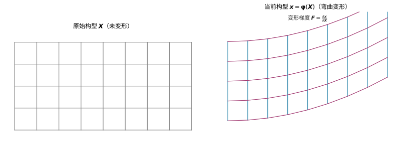

# 第119级 连续介质力学

## 学习目标

1. 理解连续介质假设的基本思想及其适用范围
2. 掌握变形梯度与各种应变张量的定义及其几何意义
3. 理解Cauchy应力张量、Piola-Kirchhoff应力张量的物理意义
4. 掌握守恒律（质量、动量、能量）在连续介质中的数学表述
5. 理解本构方程的基本原理及各向同性材料的表示定理
6. 掌握超弹性材料的本构关系及其热力学基础

---

## 核心概念

### 连续介质假设

连续介质力学的基本假设是：物质在宏观尺度上可以被视为连续分布的，即物质点填满整个空间区域，而物理量（密度、速度、应力等）是空间位置和时间的连续（或分段连续）函数。这一假设在分子平均自由程远小于特征尺度时成立。

### 变形梯度

设参考构型中物质点的位置为 $\boldsymbol{X}$，当前构型中的位置为 $\boldsymbol{x} = \boldsymbol{\varphi}(\boldsymbol{X}, t)$，则**变形梯度**定义为：

$$\boldsymbol{F} = \frac{\partial \boldsymbol{\varphi}}{\partial \boldsymbol{X}} = \nabla_{\boldsymbol{X}} \boldsymbol{\varphi}, \quad F_{iA} = \frac{\partial x_i}{\partial X_A}$$

变形梯度是一个二阶张量，包含了变形和刚体转动的一切信息。

> **直观理解（现实类比）**：把一块方形海绵画上均匀的方格网格，再用力把右端往上掰弯，网格就从"规整的方格"变成"弯曲的梯形碗"。原来每个小方格如何被拉伸、倾斜、旋转，就对应着变形梯度 $\boldsymbol{F}$ 在各点的取值——它是描述"海绵内部每一小片如何变形"的完整说明书。

> **🧠 思考历程：材料和三明治一样"看不见颗粒"，怎么用一小片描述一大块？**
>
> 变形梯度回答的是连续介质力学最根本的假设：把物体看作"处处连续"的场，而不是一摞单个微粒——于是拉、压、剪这些日常动作，都能被一张张"局部变化说明书"（变形梯度 $\boldsymbol{F}$）逐点讲清。
>
> - **先把"连续"画成假设**。Euler 在18世纪中期提出"连续介质假定"，把物体想象成无限可分的连续场、从而能用微积分研究它——这一"以大化小再积分"的立场，近乎是让"材料力学"得以成立的信仰前提。
> - **Cauchy 的应力登场**。1822–1823年 Cauchy 提出应力张量，把"单位面积上的力"从高中里的标量升级为描述物体内质点受力方向依赖的张量——由此"内部分割面上的力"与表面力是同一套语言，连续介质在数学上第一次完整成形。
> - **Hooke 的老规律升格为模型**。17世纪 Hooke 发现的弹簧"力与伸长成正比"，被后继者推广成应力与应变的线性本构关系；Truesdell 等人在20世纪又把连续介质力学整理成"理性力学"——同一张变形矩阵里，藏着弹性、塑性、流体的分野。
> - **心路**：把"一团东西"缩写成"连续场加一个局部梯度"，看似抽象，其实是把最日常的形变翻译成最普适的演算语言。

### 应变张量

- **右Cauchy-Green变形张量**：$\boldsymbol{C} = \boldsymbol{F}^T \boldsymbol{F}$
- **左Cauchy-Green变形张量**：$\boldsymbol{b} = \boldsymbol{F} \boldsymbol{F}^T$
- **Green-Lagrange应变张量**：$\boldsymbol{E} = \frac{1}{2}(\boldsymbol{C} - \boldsymbol{I})$
- **无穷小应变张量**：当位移梯度很小时，$\boldsymbol{\varepsilon} = \frac{1}{2}(\nabla \boldsymbol{u} + (\nabla \boldsymbol{u})^T)$

### 应力张量

- **Cauchy应力张量** $\boldsymbol{\sigma}$：当前构型中的真实应力（单位：力/当前面积）
- **第一Piola-Kirchhoff应力张量** $\boldsymbol{P}$：力参考当前构型，面积参考参考构型，$\boldsymbol{P} = J \boldsymbol{\sigma} \boldsymbol{F}^{-T}$，其中 $J = \det \boldsymbol{F}$
- **第二Piola-Kirchhoff应力张量** $\boldsymbol{S}$：完全参考参考构型，$\boldsymbol{S} = \boldsymbol{F}^{-1} \boldsymbol{P} = J \boldsymbol{F}^{-1} \boldsymbol{\sigma} \boldsymbol{F}^{-T}$

### 守恒律

- **质量守恒**：$\dot{\rho} + \rho \nabla \cdot \boldsymbol{v} = 0$
- **动量守恒（Cauchy第一运动定律）**：$\nabla \cdot \boldsymbol{\sigma} + \rho \boldsymbol{b} = \rho \dot{\boldsymbol{v}}$
- **能量守恒（第一定律）**：$\rho \dot{e} = \boldsymbol{\sigma} : \boldsymbol{d} - \nabla \cdot \boldsymbol{q} + \rho r$

### 本构方程

本构方程描述材料对应力的响应，是联系应力与变形的物理关系。

### 材料分类

- **弹性**：应力仅取决于当前变形状态
- **塑性**：存在不可逆变形
- **粘弹性**：兼具弹性与粘性特征
- **超弹性**：存在应变能函数，应力由应变能导出

---

## 定理与证明

### 定理1：Cauchy应力张量的存在性（Cauchy定理）

**定理**：在连续介质中，若存在体力密度 $\boldsymbol{b}$ 和面力密度 $\boldsymbol{t}(\boldsymbol{n})$，且面力满足动量平衡，则存在一个对称的二阶张量场 $\boldsymbol{\sigma}$，使得对于任意方向 $\boldsymbol{n}$，有：

$$\boldsymbol{t}(\boldsymbol{n}) = \boldsymbol{\sigma} \cdot \boldsymbol{n}$$

其中 $\boldsymbol{\sigma}$ 称为Cauchy应力张量，且 $\boldsymbol{\sigma} = \boldsymbol{\sigma}^T$。

**证明**（四面体论证）：

考虑一个无穷小四面体，其三个面分别垂直于坐标轴 $x_1, x_2, x_3$，斜面法向为 $\boldsymbol{n}$。设四面体顶点在原点，斜面面积为 $\Delta S$，三个坐标面的面积分别为 $\Delta S_1, \Delta S_2, \Delta S_3$。

由几何关系，$\Delta S_i = n_i \Delta S$，其中 $n_i$ 是 $\boldsymbol{n}$ 的分量。

**步骤1：面力平衡**

四面体受到三种力的作用：体力、三个坐标面上的面力、斜面上的面力。设四面体体积为 $\Delta V$，体力密度为 $\boldsymbol{b}$。

由牛顿第二定律（动量平衡）：

$$\boldsymbol{t}(\boldsymbol{n}) \Delta S + \sum_{i=1}^{3} \boldsymbol{t}(-\boldsymbol{e}_i) \Delta S_i + \rho \boldsymbol{b} \Delta V = \rho \boldsymbol{a} \Delta V$$

其中 $\boldsymbol{t}(-\boldsymbol{e}_i)$ 是法向为 $-\boldsymbol{e}_i$ 的面上的面力。

**步骤2：利用作用力与反作用力**

由牛顿第三定律，$\boldsymbol{t}(-\boldsymbol{e}_i) = -\boldsymbol{t}(\boldsymbol{e}_i)$。

代入得：

$$\boldsymbol{t}(\boldsymbol{n}) \Delta S - \sum_{i=1}^{3} \boldsymbol{t}(\boldsymbol{e}_i) n_i \Delta S + \rho \boldsymbol{b} \Delta V = \rho \boldsymbol{a} \Delta V$$

**步骤3：取极限**

四面体缩至一点时，$\Delta V \sim O(h^3)$，$\Delta S \sim O(h^2)$，其中 $h$ 为特征尺寸。当 $h \to 0$ 时，体积项相比面积项为高阶小量，因此：

$$\boldsymbol{t}(\boldsymbol{n}) = \sum_{i=1}^{3} \boldsymbol{t}(\boldsymbol{e}_i) n_i$$

**步骤4：定义应力张量**

定义 $\sigma_{ij}$ 为作用在法向为 $\boldsymbol{e}_i$ 的面上的面力在 $j$ 方向的分量，即：

$$\boldsymbol{t}(\boldsymbol{e}_i) = \sigma_{ij} \boldsymbol{e}_j$$

则：

$$\boldsymbol{t}(\boldsymbol{n}) = \sum_{i=1}^{3} \sum_{j=1}^{3} \sigma_{ij} n_i \boldsymbol{e}_j = \boldsymbol{\sigma} \cdot \boldsymbol{n}$$

其中 $\boldsymbol{\sigma} = \sigma_{ij} \boldsymbol{e}_i \otimes \boldsymbol{e}_j$。

**步骤5：对称性证明**

由角动量守恒（Cauchy第二运动定律），可以证明 $\boldsymbol{\sigma} = \boldsymbol{\sigma}^T$，即 $\sigma_{ij} = \sigma_{ji}$。考虑一个无穷小体积元上的力矩平衡即可得到这一结果。

这就完成了Cauchy应力张量存在性的证明。$\square$

---

### 定理2：变形梯度与应变张量的关系（极分解）

**定理**：任意非奇异的变形梯度 $\boldsymbol{F}$（$\det \boldsymbol{F} > 0$）可以唯一地分解为：

$$\boldsymbol{F} = \boldsymbol{R} \boldsymbol{U} = \boldsymbol{V} \boldsymbol{R}$$

其中 $\boldsymbol{R}$ 是正交张量（$\boldsymbol{R}^T \boldsymbol{R} = \boldsymbol{I}$，代表刚体转动），$\boldsymbol{U}$ 和 $\boldsymbol{V}$ 是对称正定张量（分别称为右和左伸长张量）。

**证明**：

**步骤1：构造对称正定张量**

考虑右Cauchy-Green变形张量 $\boldsymbol{C} = \boldsymbol{F}^T \boldsymbol{F}$。它是一个对称正定张量，因为对于任意非零向量 $\boldsymbol{v}$：

$$\boldsymbol{v}^T \boldsymbol{C} \boldsymbol{v} = \boldsymbol{v}^T \boldsymbol{F}^T \boldsymbol{F} \boldsymbol{v} = \|\boldsymbol{F} \boldsymbol{v}\|^2 > 0$$

（$\boldsymbol{F} \boldsymbol{v} \neq \boldsymbol{0}$ 因为 $\det \boldsymbol{F} \neq 0$。）

**步骤2：定义伸长张量**

由对称正定张量的谱定理，$\boldsymbol{C}$ 可以正交对角化：

$$\boldsymbol{C} = \sum_{i=1}^{3} \lambda_i^2 \boldsymbol{N}_i \otimes \boldsymbol{N}_i$$

其中 $\lambda_i > 0$ 是主伸长比，$\boldsymbol{N}_i$ 是正交的单位特征向量。

定义右伸长张量：

$$\boldsymbol{U} = \sqrt{\boldsymbol{C}} = \sum_{i=1}^{3} \lambda_i \boldsymbol{N}_i \otimes \boldsymbol{N}_i$$

显然 $\boldsymbol{U}$ 是对称正定的，且 $\boldsymbol{U}^2 = \boldsymbol{C}$。

**步骤3：定义转动张量**

定义 $\boldsymbol{R} = \boldsymbol{F} \boldsymbol{U}^{-1}$。验证 $\boldsymbol{R}$ 的正交性：

$$\boldsymbol{R}^T \boldsymbol{R} = (\boldsymbol{U}^{-1})^T \boldsymbol{F}^T \boldsymbol{F} \boldsymbol{U}^{-1} = \boldsymbol{U}^{-1} \boldsymbol{C} \boldsymbol{U}^{-1} = \boldsymbol{U}^{-1} \boldsymbol{U}^2 \boldsymbol{U}^{-1} = \boldsymbol{I}$$

因此 $\boldsymbol{R}$ 是正交张量，且 $\boldsymbol{F} = \boldsymbol{R} \boldsymbol{U}$。

**步骤4：左分解**

类似地，左Cauchy-Green变形张量 $\boldsymbol{b} = \boldsymbol{F} \boldsymbol{F}^T$ 也是对称正定的。定义 $\boldsymbol{V} = \sqrt{\boldsymbol{b}}$，则 $\boldsymbol{V}$ 对称正定，且：

$$\boldsymbol{V} = \boldsymbol{R} \boldsymbol{U} \boldsymbol{R}^T$$

从而 $\boldsymbol{F} = \boldsymbol{V} \boldsymbol{R}$。

**步骤5：唯一性**

若 $\boldsymbol{F} = \boldsymbol{R}_1 \boldsymbol{U}_1 = \boldsymbol{R}_2 \boldsymbol{U}_2$，则 $\boldsymbol{F}^T \boldsymbol{F} = \boldsymbol{U}_1^2 = \boldsymbol{U}_2^2$。由对称正定矩阵平方根的唯一性，$\boldsymbol{U}_1 = \boldsymbol{U}_2$，进而 $\boldsymbol{R}_1 = \boldsymbol{R}_2$。唯一性得证。

**应变张量与变形梯度的关系**：

Green-Lagrange应变张量 $\boldsymbol{E}$ 与 $\boldsymbol{U}$ 的关系为：

$$\boldsymbol{E} = \frac{1}{2}(\boldsymbol{C} - \boldsymbol{I}) = \frac{1}{2}(\boldsymbol{U}^2 - \boldsymbol{I})$$

这表明 $\boldsymbol{E}$ 完全由伸长张量 $\boldsymbol{U}$ 决定，不受刚体转动 $\boldsymbol{R}$ 的影响，这正是应变度量应满足的基本要求。$\square$

---

### 定理3：运动方程（Cauchy第一运动定律）

**定理**：对于连续介质体，动量守恒定律等价于：

$$\nabla \cdot \boldsymbol{\sigma} + \rho \boldsymbol{b} = \rho \dot{\boldsymbol{v}}$$

其中 $\boldsymbol{\sigma}$ 是Cauchy应力张量，$\boldsymbol{b}$ 是体力密度，$\rho$ 是密度，$\boldsymbol{v}$ 是速度场，$\dot{\boldsymbol{v}} = \frac{D\boldsymbol{v}}{Dt}$ 是物质加速度。

**证明**：

**步骤1：动量守恒的积分形式**

对于任意物质体积 $\Omega(t)$，其动量 $ \boldsymbol{P}(t) = \int_{\Omega(t)} \rho \boldsymbol{v} \, dV $。动量守恒定律指出：动量的物质时间导数等于作用于该体积上的所有外力之和：

$$\frac{D}{Dt} \int_{\Omega(t)} \rho \boldsymbol{v} \, dV = \int_{\Omega(t)} \rho \boldsymbol{b} \, dV + \int_{\partial \Omega(t)} \boldsymbol{t} \, dS$$

其中 $\boldsymbol{t} = \boldsymbol{\sigma} \cdot \boldsymbol{n}$ 是面力。

**步骤2：利用Reynolds输运定理**

由Reynolds输运定理，对于任意张量场 $\boldsymbol{\phi}$：

$$\frac{D}{Dt} \int_{\Omega(t)} \rho \boldsymbol{\phi} \, dV = \int_{\Omega(t)} \rho \frac{D\boldsymbol{\phi}}{Dt} \, dV$$

应用此定理于 $\boldsymbol{\phi} = \boldsymbol{v}$：

$$\frac{D}{Dt} \int_{\Omega(t)} \rho \boldsymbol{v} \, dV = \int_{\Omega(t)} \rho \dot{\boldsymbol{v}} \, dV$$

**步骤3：将面力转化为体积分**

由Cauchy定理，$\boldsymbol{t} = \boldsymbol{\sigma} \cdot \boldsymbol{n}$。应用散度定理：

$$\int_{\partial \Omega(t)} \boldsymbol{\sigma} \cdot \boldsymbol{n} \, dS = \int_{\Omega(t)} \nabla \cdot \boldsymbol{\sigma} \, dV$$

**步骤4：代入并利用体积分的任意性**

将以上结果代入动量守恒方程：

$$\int_{\Omega(t)} \rho \dot{\boldsymbol{v}} \, dV = \int_{\Omega(t)} \rho \boldsymbol{b} \, dV + \int_{\Omega(t)} \nabla \cdot \boldsymbol{\sigma} \, dV$$

即：

$$\int_{\Omega(t)} (\nabla \cdot \boldsymbol{\sigma} + \rho \boldsymbol{b} - \rho \dot{\boldsymbol{v}}) \, dV = \boldsymbol{0}$$

由于 $\Omega(t)$ 是任意物质体积，被积函数必须处处为零，因此：

$$\nabla \cdot \boldsymbol{\sigma} + \rho \boldsymbol{b} = \rho \dot{\boldsymbol{v}}$$

这就是Cauchy第一运动定律（局部动量守恒方程）。$\square$

---

### 定理4：本构方程的各向同性表示

**定理**（各向同性张量函数表示定理）：对于各向同性弹性材料，Cauchy应力 $\boldsymbol{\sigma}$ 可以表示为左Cauchy-Green变形张量 $\boldsymbol{b}$ 的各向同性张量函数。具体地，存在一个各向同性函数 $\mathcal{G}$，使得 $\boldsymbol{\sigma} = \mathcal{G}(\boldsymbol{b})$，且 $\boldsymbol{\sigma}$ 可以表示为 $\boldsymbol{b}$ 的多项式形式：

$$\boldsymbol{\sigma} = \alpha_0 \boldsymbol{I} + \alpha_1 \boldsymbol{b} + \alpha_2 \boldsymbol{b}^2$$

其中 $\alpha_0, \alpha_1, \alpha_2$ 是 $\boldsymbol{b}$ 的三个主不变量 $I_1, I_2, I_3$ 的标量函数。

**证明**：

**步骤1：各向同性的定义**

材料是各向同性的，意味着本构关系在所有正交变换下形式不变。即对于任意正交张量 $\boldsymbol{Q}$：

$$\boldsymbol{Q} \boldsymbol{\sigma} \boldsymbol{Q}^T = \mathcal{G}(\boldsymbol{Q} \boldsymbol{b} \boldsymbol{Q}^T)$$

即 $\mathcal{G}$ 是各向同性张量函数。

**步骤2：Cayley-Hamilton定理**

对于任意二阶对称张量 $\boldsymbol{b}$，Cayley-Hamilton定理指出：

$$\boldsymbol{b}^3 - I_1 \boldsymbol{b}^2 + I_2 \boldsymbol{b} - I_3 \boldsymbol{I} = \boldsymbol{0}$$

其中 $I_1 = \text{tr}(\boldsymbol{b})$，$I_2 = \frac{1}{2}[(\text{tr}(\boldsymbol{b}))^2 - \text{tr}(\boldsymbol{b}^2)]$，$I_3 = \det(\boldsymbol{b})$ 是 $\boldsymbol{b}$ 的主不变量。

**步骤3：张量函数的一般表示**

由各向同性张量函数的表示定理，$\boldsymbol{\sigma} = \mathcal{G}(\boldsymbol{b})$ 可以表示为 $\boldsymbol{I}, \boldsymbol{b}, \boldsymbol{b}^2$ 的线性组合，系数为不变量 $I_1, I_2, I_3$ 的函数。这是因为：

- $\boldsymbol{\sigma}$ 与 $\boldsymbol{b}$ 同轴（有相同的特征向量方向）
- $\boldsymbol{\sigma}$ 的特征值 $\sigma_i$ 是 $\boldsymbol{b}$ 的特征值 $b_i$ 的函数
- 对称函数 $\sigma_i = f(b_i)$ 可以由三个标量不变量参数化

**步骤4：构造证明**

设 $\boldsymbol{b}$ 的特征值为 $\lambda_1^2, \lambda_2^2, \lambda_3^2$，对应的特征向量为 $\boldsymbol{v}_1, \boldsymbol{v}_2, \boldsymbol{v}_3$。由于各向同性，$\boldsymbol{\sigma}$ 与 $\boldsymbol{b}$ 同轴，因此 $\boldsymbol{v}_i$ 也是 $\boldsymbol{\sigma}$ 的特征向量。设 $\boldsymbol{\sigma}$ 的特征值为 $\sigma_1, \sigma_2, \sigma_3$。

由对称性，$\sigma_i$ 必须是 $\lambda_j^2$ 的对称函数，因而可以表示为 $I_1, I_2, I_3$ 的函数。

考虑 $\boldsymbol{\sigma}$ 在 $\boldsymbol{I}, \boldsymbol{b}, \boldsymbol{b}^2$ 张成的空间中的投影。由于对称张量的空间是三维的，而 $\boldsymbol{I}, \boldsymbol{b}, \boldsymbol{b}^2$ 线性无关（当 $\boldsymbol{b}$ 具有不同的特征值时），它们构成一组基。

利用Cayley-Hamilton定理，$\boldsymbol{b}^n$（$n \geq 3$）均可表示为 $\boldsymbol{I}, \boldsymbol{b}, \boldsymbol{b}^2$ 的线性组合，因此任意各向同性张量函数都存在上述表示。

**步骤5：确定系数**

因此存在标量函数 $\alpha_0(I_1, I_2, I_3), \alpha_1(I_1, I_2, I_3), \alpha_2(I_1, I_2, I_3)$ 使得：

$$\boldsymbol{\sigma} = \alpha_0 \boldsymbol{I} + \alpha_1 \boldsymbol{b} + \alpha_2 \boldsymbol{b}^2$$

这就是各向同性弹性材料最一般的本构表示。$\square$

---

### 定理5：超弹性材料的本构关系

**定理**：对于超弹性材料，存在一个应变能函数 $\Psi = \Psi(\boldsymbol{F})$（或 $\Psi = \Psi(\boldsymbol{C})$），使得第二Piola-Kirchhoff应力 $\boldsymbol{S}$ 由下式给出：

$$\boldsymbol{S} = 2 \frac{\partial \Psi}{\partial \boldsymbol{C}}$$

或等价地，第一Piola-Kirchhoff应力 $\boldsymbol{P} = \frac{\partial \Psi}{\partial \boldsymbol{F}}$。并且，由Clausius-Duhem不等式（热力学第二定律）可以推导出这一关系是热力学相容的。

**证明**：

**步骤1：Clausius-Duhem不等式**

热力学第二定律的局部形式（Clausius-Duhem不等式）为：

$$\rho \dot{\eta} + \nabla \cdot \left(\frac{\boldsymbol{q}}{\theta}\right) - \frac{\rho r}{\theta} \geq 0$$

其中 $\eta$ 是比熵，$\theta$ 是绝对温度，$\boldsymbol{q}$ 是热流，$r$ 是热源。

**步骤2：引入Helmholtz自由能**

定义Helmholtz自由能 $\psi = e - \theta \eta$，其中 $e$ 是比内能。代入能量守恒方程和Clausius-Duhem不等式，经过化简可得（在等温条件下）：

$$\boldsymbol{P} : \dot{\boldsymbol{F}} - \rho_0 \dot{\psi} \geq 0$$

其中 $\rho_0$ 是参考构型密度，$\boldsymbol{P}$ 是第一Piola-Kirchhoff应力。

**步骤3：超弹性假设**

超弹性材料假设存在一个应变能函数 $\Psi = \rho_0 \psi$，它仅依赖于变形梯度：

$$\Psi = \Psi(\boldsymbol{F})$$

则 $\dot{\Psi} = \frac{\partial \Psi}{\partial \boldsymbol{F}} : \dot{\boldsymbol{F}}$。

**步骤4：代入耗散不等式**

将 $\dot{\Psi}$ 代入Clausius-Duhem不等式：

$$\left(\boldsymbol{P} - \frac{\partial \Psi}{\partial \boldsymbol{F}}\right) : \dot{\boldsymbol{F}} \geq 0$$

**步骤5：论证任意性**

由于 $\dot{\boldsymbol{F}}$ 可以是任意值（变形可以是任意的），要使不等式对所有可能的变形过程都成立，括号内的项必须为零：

$$\boldsymbol{P} = \frac{\partial \Psi}{\partial \boldsymbol{F}}$$

**步骤6：用第二Piola-Kirchhoff应力表示**

由 $\boldsymbol{S}$ 与 $\boldsymbol{P}$ 的关系 $\boldsymbol{P} = \boldsymbol{F} \boldsymbol{S}$，以及 $\boldsymbol{C} = \boldsymbol{F}^T \boldsymbol{F}$，可得：

$$\boldsymbol{S} = 2 \frac{\partial \Psi}{\partial \boldsymbol{C}}$$

这就证明了超弹性材料的本构关系由应变能函数导出，且满足热力学第二定律。$\square$

---

## 示例

### 示例1：线性弹性材料的应力-应变关系

**问题**：对于各向同性线性弹性材料，给出其应力-应变关系，并用Lamé常数表示。

**解答**：

各向同性线性弹性材料的本构方程为广义Hooke定律：

$$\boldsymbol{\sigma} = \lambda (\text{tr} \boldsymbol{\varepsilon}) \boldsymbol{I} + 2\mu \boldsymbol{\varepsilon}$$

其中 $\lambda$ 和 $\mu$ 是Lamé常数，$\boldsymbol{\varepsilon} = \frac{1}{2}(\nabla \boldsymbol{u} + (\nabla \boldsymbol{u})^T)$ 是无穷小应变张量。

分量形式：

$$\sigma_{ij} = \lambda \varepsilon_{kk} \delta_{ij} + 2\mu \varepsilon_{ij}$$

也可用工程常数表示：

$$\boldsymbol{\varepsilon} = \frac{1+\nu}{E} \boldsymbol{\sigma} - \frac{\nu}{E} (\text{tr} \boldsymbol{\sigma}) \boldsymbol{I}$$

其中 $E$ 是杨氏模量，$\nu$ 是泊松比，关系为：

$$\lambda = \frac{E\nu}{(1+\nu)(1-2\nu)}, \quad \mu = \frac{E}{2(1+\nu)}$$

**物理意义**：该关系表明，各向同性线性弹性材料的应力包含两部分——体积变形部分（$\lambda$项）和剪切变形部分（$\mu$项）。

> **直观理解（现实类比）**：拉一根橡皮筋，它会变细变长（拉伸）；压一块海绵，它会变矮变肥（压缩）；而两手捏住一块豆腐上下错开，它会被"搓"成平行四边形（剪切）。应力就是"单位面积上的力"，应变就是"单位尺度的变形量"，它们就像价格与销量——应力驱动材料发生与之成正比的应变，这正是 Hooke 定律的直观含义。

### 示例2：Neo-Hookean超弹性材料

**问题**：给出不可压缩Neo-Hookean材料的应变能函数和应力表达式。

**解答**：

不可压缩Neo-Hookean材料的应变能函数为：

$$\Psi = \frac{\mu}{2} (I_1 - 3)$$

其中 $\mu$ 是剪切模量，$I_1 = \text{tr}(\boldsymbol{C}) = \text{tr}(\boldsymbol{b})$ 是右Cauchy-Green变形张量的第一主不变量。不可压缩条件 $\det \boldsymbol{F} = 1$ 意味着 $I_3 = 1$。

**Cauchy应力表达式**：

$$\boldsymbol{\sigma} = -p \boldsymbol{I} + \mu \boldsymbol{b}$$

其中 $p$ 是由不可压缩条件确定的静水压力（Lagrange乘子）。

**推导**：

由超弹性材料的本构关系：

$$\boldsymbol{S} = 2 \frac{\partial \Psi}{\partial \boldsymbol{C}} = \mu \boldsymbol{I}$$

其中利用了 $\frac{\partial I_1}{\partial \boldsymbol{C}} = \boldsymbol{I}$。

对于不可压缩材料，需引入约束条件 $\det \boldsymbol{F} = 1$，通过Lagrange乘子 $p$ 修正应力：

$$\boldsymbol{S} = -p \boldsymbol{C}^{-1} + \mu \boldsymbol{I}$$

通过Piola变换得到Cauchy应力：

$$\boldsymbol{\sigma} = \frac{1}{J} \boldsymbol{F} \boldsymbol{S} \boldsymbol{F}^T = -p \boldsymbol{I} + \mu \boldsymbol{b}$$

**应用**：Neo-Hookean模型广泛应用于橡胶类材料和大变形弹性体的模拟，尤其适用于描述中等变形行为。

---

## 习题

### 基础题

**习题 1**（连续介质假设）说明连续介质假设的基本思想，指出物理量（密度、速度、应力）在什么条件下可以视为空间位置的连续函数，并说明该假设在何种尺度的流动中成立。

**习题 2**（变形梯度）写出变形梯度 $\boldsymbol{F} = \frac{\partial \boldsymbol{\varphi}}{\partial \boldsymbol{X}}$（分量形式 $F_{iA} = \frac{\partial x_i}{\partial X_A}$），说明它包含了哪些关于变形与转动过程的信息。

**习题 3**（应变张量）写出右 Cauchy-Green 变形张量 $\boldsymbol{C} = \boldsymbol{F}^T\boldsymbol{F}$、左 Cauchy-Green 变形张量 $\boldsymbol{b} = \boldsymbol{F}\boldsymbol{F}^T$、Green-Lagrange 应变张量 $\boldsymbol{E} = \frac{1}{2}(\boldsymbol{C} - \boldsymbol{I})$ 与无穷小应变张量 $\boldsymbol{\varepsilon} = \frac{1}{2}(\nabla\boldsymbol{u} + (\nabla\boldsymbol{u})^T)$ 的定义。

**习题 4**（Cauchy 应力张量）说明 Cauchy 应力张量 $\boldsymbol{\sigma}$ 的物理意义，写出面力关系 $\boldsymbol{t}(\boldsymbol{n}) = \boldsymbol{\sigma}\cdot\boldsymbol{n}$，并指出它作用在当前构型中的哪个面积之上。

**习题 5**（守恒律）写出连续介质中的质量守恒 $\dot{\rho} + \rho\nabla\cdot\boldsymbol{v} = 0$、动量守恒（Cauchy 第一运动定律）$\nabla\cdot\boldsymbol{\sigma} + \rho\boldsymbol{b} = \rho\dot{\boldsymbol{v}}$ 与能量守恒 $\rho\dot{e} = \boldsymbol{\sigma}:\boldsymbol{d} - \nabla\cdot\boldsymbol{q} + \rho r$。

**习题 6**（材料分类）说明弹性、塑性、粘弹性、超弹性四类材料各自对应力的响应有何区别，并指出超弹性材料区别于其他材料的标志。

**习题 7**（Piola-Kirchhoff 应力）写出第一 Piola-Kirchhoff 应力 $\boldsymbol{P} = J\boldsymbol{\sigma}\boldsymbol{F}^{-T}$ 与第二 Piola-Kirchhoff 应力 $\boldsymbol{S} = \boldsymbol{F}^{-1}\boldsymbol{P}$（$J = \det\boldsymbol{F}$），说明三者分别参考哪个构型的力与面积。

**习题 8**（广义 Hooke 定律）写出各向同性线性弹性材料的本构关系 $\boldsymbol{\sigma} = \lambda(\text{tr}\,\boldsymbol{\varepsilon})\boldsymbol{I} + 2\mu\boldsymbol{\varepsilon}$，说明 $\lambda$ 与 $\mu$ 的名称及对应变形的意义。

**习题 9**（Lamé 常数与工程常数）写出 Lamé 常数与杨氏模量、泊松比的关系 $\lambda = \frac{E\nu}{(1+\nu)(1-2\nu)}$、$\mu = \frac{E}{2(1+\nu)}$，并说明 $E$ 与 $\nu$ 的物理含义。

**习题 10**（超弹性本构）写出超弹性材料的本构关系 $\boldsymbol{S} = 2\frac{\partial\Psi}{\partial\boldsymbol{C}}$（或 $\boldsymbol{P} = \frac{\partial\Psi}{\partial\boldsymbol{F}}$），说明其中的 $\Psi$ 是什么，并指出该关系由哪条热力学不等式导出。

### 进阶题

**习题 11**（简单剪切变形）对简单剪切变形 $\boldsymbol{x} = (X_1 + \gamma X_2, X_2, X_3)$ 分别计算变形梯度 $\boldsymbol{F}$、右 Cauchy-Green 张量 $\boldsymbol{C}$、Green-Lagrange 应变 $\boldsymbol{E}$ 与 $\gamma\ll1$ 时的无穷小应变 $\boldsymbol{\varepsilon}$。

**习题 12**（Green-Lagrange 刚体不变性）证明 Green-Lagrange 应变 $\boldsymbol{E}$ 在刚体运动（$\boldsymbol{F} = \boldsymbol{R}$，$\boldsymbol{R}^T\boldsymbol{R} = \boldsymbol{I}$）下为零。

**习题 13**（推导 Navier-Stokes 方程）利用 Cauchy 第一运动定律 $\nabla\cdot\boldsymbol{\sigma} + \rho\boldsymbol{b} = \rho\dot{\boldsymbol{v}}$，代入牛顿流体本构 $\boldsymbol{\sigma} = -p\boldsymbol{I} + 2\mu\boldsymbol{d}$（$\boldsymbol{d}$ 为变形率张量），并结合不可压缩条件 $\nabla\cdot\boldsymbol{v} = 0$ 推导 Navier-Stokes 方程。

**习题 14**（应变能密度）证明各向同性线弹性材料的应变能密度函数为 $\Psi = \frac{1}{2}\lambda(\text{tr}\,\boldsymbol{\varepsilon})^2 + \mu\boldsymbol{\varepsilon}:\boldsymbol{\varepsilon}$，并说明其正定性要求。

**习题 15**（Neo-Hookean 材料）已知不可压缩 Neo-Hookean 材料应变能 $\Psi = \frac{\mu}{2}(I_1 - 3)$，利用 $\boldsymbol{S} = 2\frac{\partial\Psi}{\partial\boldsymbol{C}}$ 与不可压缩条件推导其 Cauchy 应力 $\boldsymbol{\sigma} = -p\boldsymbol{I} + \mu\boldsymbol{b}$。

**习题 16**（Cauchy 定理——四面体论证）用无穷小四面体的力平衡推导面力关系 $\boldsymbol{t}(\boldsymbol{n}) = \boldsymbol{\sigma}\cdot\boldsymbol{n}$，说明为何收缩至一点时体力项相对面力项为高阶可忽略。

**习题 17**（极分解）说明任意变形梯度 $\boldsymbol{F}$ 为何可以唯一分解为 $\boldsymbol{F} = \boldsymbol{R}\boldsymbol{U} = \boldsymbol{V}\boldsymbol{R}$，其中 $\boldsymbol{R}$ 为正交（转动）、$\boldsymbol{U}$ 与 $\boldsymbol{V}$ 为对称正定（伸长），并指出这种分解的物理意义。

**习题 18**（本构各向同性表示）写出各向同性弹性材料的应力表示 $\boldsymbol{\sigma} = \alpha_0\boldsymbol{I} + \alpha_1\boldsymbol{b} + \alpha_2\boldsymbol{b}^2$，说明系数 $\alpha_0,\alpha_1,\alpha_2$ 依赖于 $\boldsymbol{b}$ 的哪些不变量。

**习题 19**（Mooney-Rivlin 材料）对 Mooney-Rivlin 材料 $\Psi = C_1(I_1 - 3) + C_2(I_2 - 3)$，利用 $\frac{\partial I_2}{\partial\boldsymbol{C}} = I_1\boldsymbol{I} - \boldsymbol{C}$，推导其不可压缩 Cauchy 应力表达式。

### 挑战题

**习题 20**（极分解的唯一性证明）严格证明变形梯度极分解 $\boldsymbol{F} = \boldsymbol{R}\boldsymbol{U}$ 的唯一性，说明用右 Cauchy-Green 张量 $\boldsymbol{C} = \boldsymbol{F}^T\boldsymbol{F}$ 的对称正定性与平方根唯一性论证 $\boldsymbol{U}$ 与 $\boldsymbol{R}$ 的唯一确定。

**习题 21**（应力对称性与角动量）利用角动量守恒（Cauchy 第二运动定律）说明 Cauchy 应力张量的对称性 $\boldsymbol{\sigma} = \boldsymbol{\sigma}^T$ 的来源，并指出对称性对 $\boldsymbol{\sigma}$ 的独立分量个数的影响。

**习题 22**（超弹性与热力学相容）从 Clausius-Duhem 不等式 $\rho\dot{\eta} + \nabla\cdot(\boldsymbol{q}/\theta) - \rho r/\theta \geq 0$ 出发，结合 Helmholtz 自由能，推导超弹性本构 $\boldsymbol{P} = \frac{\partial\Psi}{\partial\boldsymbol{F}}$ 是由耗散不等式与 $\dot{\boldsymbol{F}}$ 的任意性得到的。

**习题 23**（线弹性能的正定性）给出无穷小应变下各向同性线弹性能 $\Psi = \frac{1}{2}\lambda(\text{tr}\,\boldsymbol{\varepsilon})^2 + \mu\boldsymbol{\varepsilon}:\boldsymbol{\varepsilon}$，讨论 $\lambda$ 和 $\mu$ 需满足什么条件才能保证应变能正定（材料稳定），从而推导对体积模量 $K = \lambda + \frac{2}{3}\mu > 0$、$\mu > 0$ 的要求。

**习题 24**（变形率张量与体积变化）说明变形率张量 $\boldsymbol{d}$ 与体积变化的关系：证明 $\text{tr}(\boldsymbol{d}) = \nabla\cdot\boldsymbol{v}$ 表示体积膨胀率，并说明不可压缩条件 $\nabla\cdot\boldsymbol{v} = 0$ 与质量守恒在密度不变假设下的联系。

**习题 25**（Cauchy 第一运动定律的局部化）从动量的积分守恒出发，利用 Reynolds 输运定理 $\frac{D}{Dt}\int_\Omega\rho\boldsymbol{\phi}\,dV = \int_\Omega\rho\frac{D\boldsymbol{\phi}}{Dt}\,dV$、Cauchy 定理与散度定理，把积分方程局部化为微分形式 $\nabla\cdot\boldsymbol{\sigma} + \rho\boldsymbol{b} = \rho\dot{\boldsymbol{v}}$。

**习题 26**（应变能函数的客观性要求）说明应变能函数 $\Psi$ 为何只能依赖于 $\boldsymbol{C}$（或 $\boldsymbol{b}$）而不能直接依赖 $\boldsymbol{F}$ 本身，指出这如何体现了材料本构对客观刚性转动的无感性要求（材料客观性）。

### 探究题

**习题 27**（连续介质假设的适用边界）探究连续介质假设在纳米尺度、稀薄气体与高应变率冲击等极端情形下的失效条件，说明当分子平均自由程与特征尺度可相比时，为何需要改用统计力学或气体分子动力学描述。

**习题 28**（多种应力张量的选用）探究 Cauchy、第一/第二 Piola-Kirchhoff 应力张量分别适合描述何种构型与大变形问题，并从数值计算的便利性角度说明在有限元等中参考构型的应力描述为何更受青睐。

**习题 29**（超弹性模型家族）探究 Neo-Hookean、Mooney-Rivlin 等形式不同超弹性模型的适用差异，说明 $I_2$ 依赖项、可压缩性修正等对描述橡胶类材料大变形行为的影响，以及如何通过实验确定模型常数。

**习题 30**（材料客观性原理的内涵）探究材料客观性（本构对刚体转动的无感性）原理对构造本构模型的约束，说明该原理如何排除掉以 $\boldsymbol{F}$ 直接为自变量的本构、并如何引导采用 $\boldsymbol{C}$、$\boldsymbol{b}$ 或相对变形梯度等合理度量。

---

## 习题答案与解析

### 基础题答案

1. **连续介质假设** 连续介质假设把物质视为在宏观尺度上连续分布，物质点填满空间区域，物理量（密度、速度、应力等）是空间位置与时间的连续函数。该假设在分子平均自由程远小于流动特征尺度时成立，此时微观分子结构的离散性可以被平滑的宏观场替代。

2. **变形梯度** $\boldsymbol{F} = \frac{\partial\boldsymbol{\varphi}}{\partial\boldsymbol{X}}$，分量 $F_{iA} = \frac{\partial x_i}{\partial X_A}$。作为二阶张量，它同时包含了变形的拉伸、剪切与刚体转动的全部信息，是连接参考构型与当前构型基本线元映射 $\mathrm{d}\boldsymbol{x} = \boldsymbol{F}\,\mathrm{d}\boldsymbol{X}$ 的关键量。

3. **应变张量** $\boldsymbol{C} = \boldsymbol{F}^T\boldsymbol{F}$（右 Cauchy-Green）、$\boldsymbol{b} = \boldsymbol{F}\boldsymbol{F}^T$（左 Cauchy-Green）、$\boldsymbol{E} = \frac{1}{2}(\boldsymbol{C}-\boldsymbol{I})$（Green-Lagrange）、$\boldsymbol{\varepsilon} = \frac{1}{2}(\nabla\boldsymbol{u} + (\nabla\boldsymbol{u})^T)$（无穷小应变，位移梯度很小时适用）。

4. **Cauchy 应力张量** Cauchy 应力 $\boldsymbol{\sigma}$ 是当前构型中的真实应力，量纲为"单位当前面积上的力"。面力关系为 $\boldsymbol{t}(\boldsymbol{n}) = \boldsymbol{\sigma}\cdot\boldsymbol{n}$，其中 $\boldsymbol{n}$ 为面元法向，$\boldsymbol{t}(\boldsymbol{n})$ 为该面上的面力密度。

5. **守恒律** 质量守恒 $\dot{\rho} + \rho\nabla\cdot\boldsymbol{v} = 0$；动量守恒（Cauchy 第一运动定律）$\nabla\cdot\boldsymbol{\sigma} + \rho\boldsymbol{b} = \rho\dot{\boldsymbol{v}}$；能量守恒 $\rho\dot{e} = \boldsymbol{\sigma}:\boldsymbol{d} - \nabla\cdot\boldsymbol{q} + \rho r$。

6. **材料分类** 弹性——应力仅取决于当前变形状态；塑性——存在不可逆变形；粘弹性——兼具弹性与粘性（应力依赖变形历史与速率）；超弹性——存在应变能函数，应力由应变能关于变形度量求导导出。超弹性的标志正是存在势函数（应变能）$\Psi$。

7. **Piola-Kirchhoff 应力** 第一 Piola-Kirchhoff 应力 $\boldsymbol{P} = J\boldsymbol{\sigma}\boldsymbol{F}^{-T}$ 的力参考当前构型、面积参考参考构型（两点张量）；第二 Piola-Kirchhoff 应力 $\boldsymbol{S} = \boldsymbol{F}^{-1}\boldsymbol{P} = J\boldsymbol{F}^{-1}\boldsymbol{\sigma}\boldsymbol{F}^{-T}$ 的力与面积都参考参考构型（对称）。

8. **广义 Hooke 定律** $\boldsymbol{\sigma} = \lambda(\text{tr}\,\boldsymbol{\varepsilon})\boldsymbol{I} + 2\mu\boldsymbol{\varepsilon}$：$\lambda$（Lamé 第一常数）对应体积变形部分，$\mu$（Lamé 第二常数，即剪切模量）对应剪切变形部分。该关系是各向同性线性弹性的本构方程。

9. **Lamé 常数与工程常数** $\lambda = \frac{E\nu}{(1+\nu)(1-2\nu)}$、$\mu = \frac{E}{2(1+\nu)}$。杨氏模量 $E$ 度量单向拉伸时的应力应变比例，泊松比 $\nu$ 度量横向收缩与纵向伸长的比值。

10. **超弹性本构** $\boldsymbol{S} = 2\frac{\partial\Psi}{\partial\boldsymbol{C}}$（或 $\boldsymbol{P} = \frac{\partial\Psi}{\partial\boldsymbol{F}}$），其中 $\Psi$ 为应变能密度函数（单位参考体积的能量）。该关系由 Clausius-Duhem 不等式（热力学第二定律）结合 $\dot{\boldsymbol{F}}$ 的任意性导出，故热力学相容。

### 进阶题答案

1. **简单剪切变形** 由 $\boldsymbol{x} = (X_1+\gamma X_2, X_2, X_3)$ 得 $\boldsymbol{F} = \begin{pmatrix}1 & \gamma & 0\\0&1&0\\0&0&1\end{pmatrix}$。于是 $\boldsymbol{C} = \boldsymbol{F}^T\boldsymbol{F} = \begin{pmatrix}1 & \gamma & 0\\\gamma & 1+\gamma^2 & 0\\0&0&1\end{pmatrix}$，$\boldsymbol{E} = \frac{1}{2}(\boldsymbol{C}-\boldsymbol{I}) = \begin{pmatrix}0 & \gamma/2 & 0\\\gamma/2 & \gamma^2/2 & 0\\0&0&0\end{pmatrix}$。位移场 $\boldsymbol{u} = (\gamma X_2, 0, 0)$，无穷小应变 $\boldsymbol{\varepsilon} = \frac{1}{2}(\nabla\boldsymbol{u}+(\nabla\boldsymbol{u})^T) = \begin{pmatrix}0 & \gamma/2&0\\\gamma/2&0&0\\0&0&0\end{pmatrix}$，即 $\gamma\ll1$ 时 $\boldsymbol{E}\to\boldsymbol{\varepsilon}$。

2. **Green-Lagrange 刚体不变性** 刚体运动 $\boldsymbol{F}=\boldsymbol{R}$ 且 $\boldsymbol{R}^T\boldsymbol{R}=\boldsymbol{I}$。代入：$\boldsymbol{E} = \frac{1}{2}(\boldsymbol{F}^T\boldsymbol{F}-\boldsymbol{I}) = \frac{1}{2}(\boldsymbol{R}^T\boldsymbol{R}-\boldsymbol{I}) = \frac{1}{2}(\boldsymbol{I}-\boldsymbol{I}) = \boldsymbol{0}$。这说明 $\boldsymbol{E}$ 排除刚体转动、只度量真实变形，这正是应变度量应满足的基本要求。

3. **推导 Navier-Stokes 方程** 代入 $\boldsymbol{\sigma} = -p\boldsymbol{I} + 2\mu\boldsymbol{d}$：$\nabla\cdot\boldsymbol{\sigma} = -\nabla p + 2\mu\nabla\cdot\boldsymbol{d}$。对不可压牛顿流 $2\boldsymbol{d} = \nabla\boldsymbol{v} + (\nabla\boldsymbol{v})^T$，$\nabla\cdot\boldsymbol{d} = \frac{1}{2}\nabla^2\boldsymbol{v} + \frac{1}{2}\nabla(\nabla\cdot\boldsymbol{v})$，由 $\nabla\cdot\boldsymbol{v}=0$ 得 $\nabla\cdot\boldsymbol{\sigma} = -\nabla p + \mu\nabla^2\boldsymbol{v}$。代入动量方程：$\rho\dot{\boldsymbol{v}} = -\nabla p + \mu\nabla^2\boldsymbol{v} + \rho\boldsymbol{b}$，即 Navier-Stokes 方程。

4. **应变能密度** 由 $\boldsymbol{\sigma} = \partial\Psi/\partial\boldsymbol{\varepsilon} = \lambda(\text{tr}\,\boldsymbol{\varepsilon})\boldsymbol{I} + 2\mu\boldsymbol{\varepsilon}$。验证极值一致性并积分：$\int_0^{\boldsymbol{\varepsilon}}\boldsymbol{\sigma}:\mathrm{d}\boldsymbol{\varepsilon}' = \frac{1}{2}\lambda(\text{tr}\,\boldsymbol{\varepsilon})^2 + \mu\boldsymbol{\varepsilon}:\boldsymbol{\varepsilon}$。正定性要求材料稳定，通常要求 $3\lambda + 2\mu > 0$、$\mu > 0$（即 $K>0$、$\mu>0$）。

5. **Neo-Hookean 材料** 用 $\partial I_1/\partial\boldsymbol{C} = \boldsymbol{I}$，$\boldsymbol{S} = 2\frac{\partial\Psi}{\partial\boldsymbol{C}} = \mu\boldsymbol{I}$。不可压缩 $\det\boldsymbol{F}=1$，需引入 Lagrange 乘子 $p$（静水压力）：$\boldsymbol{S} = -p\boldsymbol{C}^{-1} + \mu\boldsymbol{I}$。经 Piola 变换 $\boldsymbol{\sigma} = \frac{1}{J}\boldsymbol{F}\boldsymbol{S}\boldsymbol{F}^T = -p\boldsymbol{I} + \mu\boldsymbol{b}$（$J=1$）。

6. **Cauchy 定理——四面体论证** 对无穷小四面体，斜面与坐标面的面积关系为 $\Delta S_i = n_i\Delta S$。写力平衡 $\boldsymbol{t}(\boldsymbol{n})\Delta S - \sum\boldsymbol{t}(\boldsymbol{e}_i)n_i\Delta S = (\rho\boldsymbol{a}-\rho\boldsymbol{b})\Delta V$，并利用 $\boldsymbol{t}(-\boldsymbol{e}_i) = -\boldsymbol{t}(\boldsymbol{e}_i)$。四角体缩至一点时 $\Delta V\sim O(h^3)$、$\Delta S\sim O(h^2)$，故 $h\to0$ 时体积项为高阶小量可忽略，得 $\boldsymbol{t}(\boldsymbol{n}) = \sum_i\boldsymbol{t}(\boldsymbol{e}_i)n_i = \boldsymbol{\sigma}\cdot\boldsymbol{n}$。

7. **极分解** 右 Cauchy-Green 张量 $\boldsymbol{C}=\boldsymbol{F}^T\boldsymbol{F}$ 对称正定（对任意非零 $\boldsymbol{v}$，$\boldsymbol{v}^T\boldsymbol{C}\boldsymbol{v}=\|\boldsymbol{F}\boldsymbol{v}\|^2>0$）。令 $\boldsymbol{U}=\sqrt{\boldsymbol{C}}$（对称正定）、$\boldsymbol{R}=\boldsymbol{F}\boldsymbol{U}^{-1}$，则 $\boldsymbol{R}^T\boldsymbol{R}=\boldsymbol{U}^{-1}\boldsymbol{C}\boldsymbol{U}^{-1} = \boldsymbol{U}^{-1}\boldsymbol{U}^2\boldsymbol{U}^{-1} = \boldsymbol{I}$ 为正交，故 $\boldsymbol{F}=\boldsymbol{R}\boldsymbol{U}$。类似 $\boldsymbol{V}=\sqrt{\boldsymbol{b}}=\boldsymbol{R}\boldsymbol{U}\boldsymbol{R}^T$ 得 $\boldsymbol{F}=\boldsymbol{V}\boldsymbol{R}$。物理意义：把任意变形分解为先伸长后转动（或先转动后伸长）。

8. **本构各向同性表示** 各向同性弹性材料 $\boldsymbol{\sigma} = \alpha_0\boldsymbol{I} + \alpha_1\boldsymbol{b} + \alpha_2\boldsymbol{b}^2$，其中 $\alpha_0,\alpha_1,\alpha_2$ 是 $\boldsymbol{b}$（或 $\boldsymbol{C}$）的三个主不变量 $I_1 = \text{tr}\,\boldsymbol{b}$、$I_2 = \frac{1}{2}[(\text{tr}\,\boldsymbol{b})^2 - \text{tr}\,\boldsymbol{b}^2]$、$I_3 = \det\boldsymbol{b}$ 的标量函数。该表示由各向同性张量函数表示定理与 Cayley-Hamilton 定理保证。

9. **Mooney-Rivlin 材料** 用 $\partial I_1/\partial\boldsymbol{C}=\boldsymbol{I}$、$\partial I_2/\partial\boldsymbol{C} = I_1\boldsymbol{I} - \boldsymbol{C}$：$\boldsymbol{S} = 2\frac{\partial\Psi}{\partial\boldsymbol{C}} = 2C_1\boldsymbol{I} + 2C_2(I_1\boldsymbol{I} - \boldsymbol{C})$。不可压缩修正（乘子 $p$）$\boldsymbol{S} = -p\boldsymbol{C}^{-1} + 2C_1\boldsymbol{I} + 2C_2(I_1\boldsymbol{I} - \boldsymbol{C})$，再经 Piola 变换 $\boldsymbol{\sigma} = \frac{1}{J}\boldsymbol{F}\boldsymbol{S}\boldsymbol{F}^T = -p\boldsymbol{I} + 2C_1\boldsymbol{b} - 2C_2\boldsymbol{b}^{-1}$（利用 $I_1\boldsymbol{b}-\boldsymbol{b}^2 = \text{tr}\,\boldsymbol{C}\,\boldsymbol{b} - \boldsymbol{b}^2$ 与 Cayley-Hamilton 化简）。

### 挑战题答案

1. **极分解的唯一性证明** 设 $\boldsymbol{F}=\boldsymbol{R}_1\boldsymbol{U}_1=\boldsymbol{R}_2\boldsymbol{U}_2$。两边取 $\boldsymbol{F}^T\boldsymbol{F}$：$\boldsymbol{U}_1^2 = \boldsymbol{F}^T\boldsymbol{F} = \boldsymbol{U}_2^2$。$\boldsymbol{U}_i$ 对称正定，其平方根唯一，故 $\boldsymbol{U}_1=\boldsymbol{U}_2$。又 $\boldsymbol{R}_1 = \boldsymbol{F}\boldsymbol{U}_1^{-1} = \boldsymbol{F}\boldsymbol{U}_2^{-1} = \boldsymbol{R}_2$，唯一性得证。关键在于对称正定矩阵的平方根唯一性，这由 $\boldsymbol{C} = \sum\lambda_i^2\boldsymbol{N}_i\otimes\boldsymbol{N}_i$（$\lambda_i>0$）的正交对角化与正特征值保证。

2. **应力对称性与角动量** Cauchy 第二运动定律（角动量守恒）要求体积元上的力矩平衡。对一个无穷小体积元，面力对中心取矩总和必须为零；若 $\boldsymbol{\sigma}$ 反对称部分不为零，会导致净力矩，违反角动量守恒，故必须有 $\sigma_{ij} = \sigma_{ji}$。对称性使 $\boldsymbol{\sigma}$ 的独立分量由 9 个减为 6 个，为求解运动方程减少未知量。

3. **超弹性与热力学相容** 由 Clausius-Duhem 不等式并代入能量守恒，等温下得耗散不等式 $\boldsymbol{P}:\dot{\boldsymbol{F}} - \rho_0\dot{\psi} \geq 0$。令 $\Psi = \rho_0\psi$，若 $\Psi=\Psi(\boldsymbol{F})$，则 $\dot{\Psi} = \frac{\partial\Psi}{\partial\boldsymbol{F}}:\dot{\boldsymbol{F}}$，代入得 $\left(\boldsymbol{P} - \frac{\partial\Psi}{\partial\boldsymbol{F}}\right):\dot{\boldsymbol{F}} \geq 0$。因 $\dot{\boldsymbol{F}}$ 可取任意值（变形的任意性），要该不等式对所有过程成立，括号必须为零，即 $\boldsymbol{P} = \frac{\partial\Psi}{\partial\boldsymbol{F}}$，再由 $\boldsymbol{P}=\boldsymbol{F}\boldsymbol{S}$、$\boldsymbol{C}=\boldsymbol{F}^T\boldsymbol{F}$ 得 $\boldsymbol{S} = 2\frac{\partial\Psi}{\partial\boldsymbol{C}}$。

4. **线弹性能的正定性** 应变能密度 $\Psi = \frac{1}{2}\lambda(\text{tr}\,\boldsymbol{\varepsilon})^2 + \mu\boldsymbol{\varepsilon}:\boldsymbol{\varepsilon}$。对体积应变，$\boldsymbol{\varepsilon}=\frac{1}{3}(\text{tr}\,\boldsymbol{\varepsilon})\boldsymbol{I}$ 时 $\Psi = \frac{1}{2}(\lambda+\frac{2}{3}\mu)(\text{tr}\,\boldsymbol{\varepsilon})^2 = \frac{1}{2}K(\text{tr}\,\boldsymbol{\varepsilon})^2$，$K=\lambda+\frac{2}{3}\mu$ 为体积模量；对纯剪切（$\text{tr}\,\boldsymbol{\varepsilon}=0$），$\Psi = \mu\boldsymbol{\varepsilon}:\boldsymbol{\varepsilon}$。材料稳定要求任一变形的能量非负，故需 $K = \lambda + \frac{2}{3}\mu > 0$、$\mu > 0$。

5. **变形率张量与体积变化** 变形率张量 $\boldsymbol{d} = \frac{1}{2}(\nabla\boldsymbol{v} + (\nabla\boldsymbol{v})^T)$。体积元相对变化率满足 $\frac{\dot{\delta V}}{\delta V} = \nabla\cdot\boldsymbol{v}$，而 $\text{tr}\,\boldsymbol{d} = \nabla\cdot\boldsymbol{v}$，故 $\text{tr}\,\boldsymbol{d}$ 即体积膨胀率。不可压缩意味着体积不变化：$\nabla\cdot\boldsymbol{v} = 0$；对常密度材料质量守恒 $\dot{\rho} + \rho\nabla\cdot\boldsymbol{v} = 0$ 退化为 $\nabla\cdot\boldsymbol{v}=0$，两者在等密度情形一致。

6. **Cauchy 第一运动定律的局部化** 动量的积分守恒为 $\frac{D}{Dt}\int_\Omega\rho\boldsymbol{v}\,dV = \int_\Omega\rho\boldsymbol{b}\,dV + \int_{\partial\Omega}\boldsymbol{t}\,dS$。由 Reynolds 输运定理左端 $=\int_\Omega\rho\dot{\boldsymbol{v}}\,dV$；由 Cauchy 定理与散度定理，右端面力项 $=\int_{\partial\Omega}\boldsymbol{\sigma}\cdot\boldsymbol{n}\,dS = \int_\Omega\nabla\cdot\boldsymbol{\sigma}\,dV$。故 $\int_\Omega(\nabla\cdot\boldsymbol{\sigma} + \rho\boldsymbol{b} - \rho\dot{\boldsymbol{v}})\,dV = 0$，由 $\Omega$ 任意取被积函数为零，得 $\nabla\cdot\boldsymbol{\sigma} + \rho\boldsymbol{b} = \rho\dot{\boldsymbol{v}}$。

7. **应变能函数的客观性要求** 材料客观性（本构对刚体转动无感）要求刚性转动物体时本构关系形式不变。若 $\Psi$ 直接依赖 $\boldsymbol{F}$，则叠加一个刚体转动 $\boldsymbol{Q}$ 得 $\boldsymbol{Q}\boldsymbol{F}$，而 $\Psi(\boldsymbol{Q}\boldsymbol{F})\neq\Psi(\boldsymbol{F})$ 会错误地预示能量变化。由于 $\boldsymbol{C} = \boldsymbol{F}^T\boldsymbol{F}$（或 $\boldsymbol{b}$、$\boldsymbol{E}$）在刚体转动下不变（$(\boldsymbol{Q}\boldsymbol{F})^T(\boldsymbol{Q}\boldsymbol{F}) = \boldsymbol{F}^T\boldsymbol{F}$），故 $\Psi$ 只能依赖 $\boldsymbol{C}$ 等转动无关的度量。

### 探究题答案

1. **连续介质假设的适用边界** 连续介质假设在分子平均自由程与流动特征尺度可相比时失效，典型场景包括：纳米尺度流动（微纳通道中尺度接近分子自由程）、稀薄气体（低压高马赫数，Knudsen 数接近或超过 1）、冲击波与超高应变率（局部密度、应力在分子尺度上剧变）。此时连续假设下的场方程和本构失效，需改用 Boltzmann 方程的气体分子动力学、粒子模拟（分子动力学、DSMC）或统计力学来刻画离散分子微观行为。

2. **多种应力张量的选用** Cauchy 应力 $\boldsymbol{\sigma}$ 描述当前（变形后）构型的真实应力，适合小变形与欧拉描述；第一 Piola-Kirchhoff $\boldsymbol{P}$ 的力在当前构型、面积在参考构型，适合边界力已知于参考构型的问题；第二 Piola-Kirchhoff $\boldsymbol{S}$ 完全参考参考构型、对称且与 $\boldsymbol{C}$ 共轭（$\boldsymbol{S}=2\partial\Psi/\partial\boldsymbol{C}$），特别适合大变形表述。在有限元方法中，由于网格与积分建立在参考（未变形）构型上，用 $\boldsymbol{P}$、$\boldsymbol{S}$ 和 $\boldsymbol{F}$ 描述编辑构型便利得多，因而更受青睐。

3. **超弹性模型家族** Neo-Hookean $\Psi=\frac{\mu}{2}(I_1-3)$ 只依赖 $I_1$，形式简单，适合中等变形，但无法描述大伸张时的应变硬化；Mooney-Rivlin $\Psi=C_1(I_1-3)+C_2(I_2-3)$ 增加 $I_2$ 项，能更好拟合较宽的等双轴与剪切数据；更复杂者加入高次 $I_1,I_2$ 项或可压缩项（引入体积模量 $K$ 处理近乎不可压缩）。常数（$\mu$、$C_1$、$C_2$、$K$）通常由单轴/双轴/纯剪实验的应力应变曲线拟合标定。

4. **材料客观性原理的内涵** 材料客观性（frame indifference / objectivity）要求本构方程在刚体转动（叠加任意正交变换 $\boldsymbol{Q}$）下形式不变，即 $\boldsymbol{Q}\boldsymbol{\sigma}\boldsymbol{Q}^T = \mathcal{G}(\boldsymbol{Q}\boldsymbol{b}\boldsymbol{Q}^T)$ 之类。这一原理排除以 $\boldsymbol{F}$ 直接建模的本构（因为 $\boldsymbol{F}$ 的老式信息被转动混淆），转而要求采用转动无关的变形度量（$\boldsymbol{C}$、$\boldsymbol{b}$、$\boldsymbol{E}$ 或相对变形梯度）作自变量。它同时保证材料的能量、应力不会因观察坐标系转动而改变，是本构模型合法性的根本约束，也解释了为何各向同性表示以 $\boldsymbol{b}$（或 $\boldsymbol{C}$）的主不变量出现。

---

## 总结

在本级中，我们学习了连续介质力学的基本框架：

1. **连续介质假设**奠定了将物质视为连续体的理论基础，使得物理量可以用连续函数描述。

2. **变形几何学**引入了变形梯度 $\boldsymbol{F}$ 作为基本变形度量，通过极分解揭示了变形的伸长和转动成分。各种应变张量（Green-Lagrange、无穷小应变等）提供了在不同变形程度下度量应变的工具。

3. **应力理论**通过Cauchy定理证明了应力张量的存在性，建立了面力与应力张量之间的线性关系。Cauchy应力、第一/第二Piola-Kirchhoff应力分别在不同构型下描述内力分布。

4. **守恒律**构成了连续介质力学的动力学基础：质量守恒、动量守恒（Cauchy第一运动定律）和能量守恒分别给出了密度演化、运动方程和热力学第一定律的数学表达。

5. **本构理论**提供了材料特定行为的数学描述。各向同性表示定理简化了本构函数的形式，超弹性材料的Clausius-Duhem分析则建立了热力学相容的本构关系。

这些知识构成了现代连续介质力学的基础，广泛应用于固体力学、流体力学、生物力学和地球科学等领域，是连接材料微观结构与宏观力学行为的桥梁。