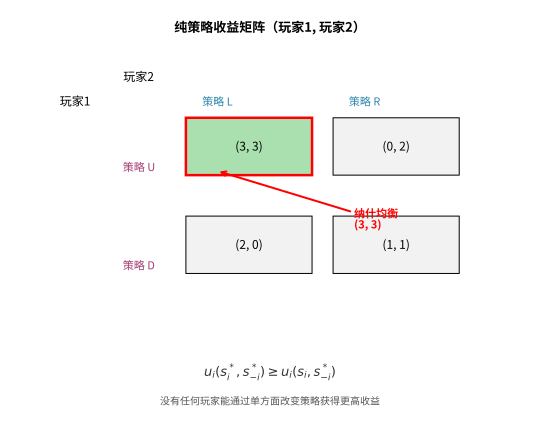
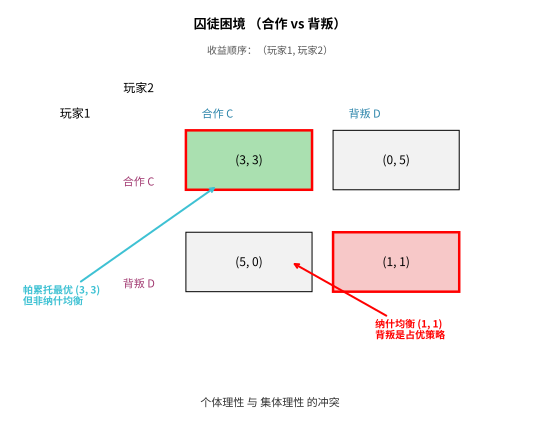

# 第120级 博弈论

## 从"该不该跟对方合作"说起：博弈论要解决的根问题

> 在动手接触纳什均衡、混合策略之前，先想清楚一个问题：**人为什么需要博弈论？**

**一个真实的生活场景（第一步：直觉）**

想象你家楼下新开了一家奶茶店，隔壁老店也在卖奶茶。两家都想多赚钱，但都清楚：**一家降价，另一家若不跟进就会丢生意；可两家一起大打价格战，又都赚不到钱。** 如果你是一家店的店主，你会不会降价？——难就难在：**你的最优选择，取决于对方怎么选；而对方也在琢磨你会怎么选。** 这不是一道孤立的优化题（第 109 级），而是一道"我的选择和你我的选择互相缠绕"的题。

再比如猜拳：铁锤克布、布克石头、石头克铁锤，你若总是出石头，对方就能猜穿你。这类把戏里，**赢不赢不只取决于你自己，更取决于对方会不会拿捏你的套路。** 把这类"多人相互影响的选择"抽象成数学模型、并回答"最后会停在哪个局面"，正是**博弈论**要做的事。

**它到底想解决什么核心问题（第二步：要解决的问题）**

博弈论的思想萌芽其实很早——古诺（Cournot）1838 年就用"反应线相交"分析双寡头产量竞争，齐默尔（Zermelo）1913 年研究国际象棋的"必胜/必败"；但把它锻造成一门成熟的数学分支，公认的起点是 **1944 年冯·诺依曼（von Neumann）与摩根斯坦（Morgenstern）的《Theory of Games and Economic Behavior》**，当时他们围绕的还是二人零和博弈（你赢我必输的"对战"），其极小化极大定理正回应着冷战背景下对策、核威慑等军事需求。1950 年，年轻的**纳什（J. Nash）**在其博士论文中把"零和"的紧箍咒松开，证明**任何有限博弈，只要允许混合策略，都存在纳什均衡**——从此博弈论跳出"你死我活"的框架，深入经济学、生物学（演化博弈）、政治学与人工智能（对抗训练、机制设计）。Osborne、Fudenberg & Tirole、Myerson 的教材各自把这套理论体系推向极致。

核心问题可以凝成一句：**当多个理性决策者的命运彼此交织、一人之利赖于他人之择时，理性选择的交互最终会稳定在什么状态（均衡）？又该如何设计规则让这个稳态合意？**

> **🧠 一句话记住博弈论的"出生证"**
>
> 博弈论要解决的**根本问题**是：
>
> $$ \boxed{\text{在多个理性决策者、且彼此的收益相互依赖的情形下，预测（或设计）他们各自会采取什么策略、最终稳定在哪个策略组合（均衡）上。}} $$
>
> 纳什均衡、混合策略、零和博弈、Shapley 值、子博弈完美均衡……这些概念都围绕"多方互动下行为如何收敛、如何做到公平与最优"这一件事展开。

**看待本章的两种眼光（第三步：正式定义前的准备）**

- **非合作的眼光**：先把"玩家、策略、收益"三要素摆清，再找"无人愿意单方面改主意"的纳什均衡，并由静态延伸到动态（子博弈完美均衡）；
- **合作的眼光**：再谈"可以签协议分钱"的情形，用 Shapley 值、核、Nash 讨价还价解解决"如何公平分配合作收益"。

读到本章末尾，你应当记住的不是一个个解的概念，而是：**博弈论是"相互依赖的决策"的研究**——当你的最优不由你说了算、而取决于他人也会精打细算时，"均衡"就是理解现实结局（竞争、谈判、拍卖、军事）的核心钥匙。

---

## 开始之前

**本章在讲什么**：博弈论研究策略相互依赖下的决策。你会先掌握博弈的三要素与分类，理解纯策略与混合策略、纳什均衡及其存在性，再进入零和博弈的极小化极大定理，并延伸至合作博弈（Shapley 值、核、Nash 讨价还价）与动态博弈（子博弈完美均衡），最后看到它在拍卖、机制设计中的应用。

**为什么要学它**：它是第 109 级优化（单主体最优）向"多主体、目标互相冲突"情形的自然延伸——当最优依赖他人选择时，最大化概念升级为"均衡"概念。它在经济学（市场、拍卖）、政治学（议价、联盟）、生物演化（演化稳定策略）以及人工智能（多智能体、对抗训练）中都是核心语言；现代 AI 的自我对弈、拍卖机制设计都直接建立在其概念之上。

**开始前请确认你还记得**：

- 概率论（第 98 级）：混合策略本质是概率分布 $\Delta(S_i)$，期望收益的计算依赖期望。
- 最优化（第 109 级）：最优解、约束，用于理解"为什么纳什均衡不是单个最优而是多方均衡"。
- 凸集与分离（第 14 / 109 级）：极小化极大定理与不动点思想的几何背景。

---

## 学习目标

1. 掌握博弈论的基本要素和分类方法
2. 理解纳什均衡的概念及其存在性条件
3. 掌握零和博弈的极小化极大定理及其证明
4. 理解合作博弈的Shapley值的公理化刻画
5. 掌握讨价还价问题和Nash解
6. 理解动态博弈中的子博弈完美均衡
7. 了解博弈论在拍卖、机制设计等领域的应用

---

## 核心概念

### 博弈的基本要素

一个博弈由以下三个基本要素构成：

- **玩家**（Players）：博弈中的决策主体，记为集合 $N = \{1, 2, \ldots, n\}$
- **策略**（Strategies）：每个玩家 $i$ 可选择的行动集合 $S_i$，策略组合 $s = (s_1, s_2, \ldots, s_n) \in S = \prod_i S_i$
- **收益**（Payoffs）：每个玩家的效用函数 $u_i: S \to \mathbb{R}$，表示在策略组合下的收益

> **💡 直观理解（类比）**：一场博弈的三个要素就像一局棋的"玩家、走法、输赢"——玩家是执子的棋手（谁在做决策），策略是每人可走的全部着法（该选哪个行动），收益是落子后每人得到的分数/效用。把它们抽象成集合 $N$、策略组合 $s$ 和效用函数 $u_i$，就能把从棋局、谈判到市场硝烟的一切策略互动，都装进同一套数学模型里比个高下。

### 纳什均衡

一个策略组合 $s^* = (s_1^*, s_2^*, \ldots, s_n^*)$ 是**纳什均衡**，如果对于每个玩家 $i$ 和每个策略 $s_i \in S_i$：

$$u_i(s_i^*, s_{-i}^*) \geq u_i(s_i, s_{-i}^*)$$

其中 $s_{-i}^*$ 表示其他玩家的策略。即，没有玩家可以通过单方面改变策略来获得更高的收益。

> **直观理解（现实类比）**：纳什均衡就像停车场的"默契"——当大家都不愿单方面改变行为时，这个状态就稳定下来。比如一条路上两辆车相向而行，谁都先不动（都等待）时，谁先变道谁吃亏，于是"都等待"就成了一个均衡点。它刻画的是"给定别人怎么做，我也没有理由改变"的稳态。

> **🧠 思考历程：人人都"不后悔地选自己的底牌"，最后会走到什么局面？**
>
> 纳什均衡回答的是博弈论最核心的一个稳态问题："给定其他人的选择，我没有理由改变自己的选择"——这种奇妙的自发"默契"，是如何在人人自利的世界里稳定下来的？答案竟要等一位21岁就完成博士论文的年轻人。
>
> - **从古诺到冯·诺依曼**。古诺（Cournot）早在1838年就用"双方反应线相交"的思想分析寡头竞争，但真正把"博弈"变成数学分支的，是1944年冯·诺依曼与摩根斯坦（von Neumann & Morgenstern）的《Theory of Games and Economic Behavior》——那时他们围绕的还是二人零和博弈的矩阵。
> - **Nash 把"零和"松开**。1950年 Nash 在他的博士论文里证明：只要允许混合策略，任何有限博弈都存在至少一个"无人单方面改变能获益"的均衡点——这个均衡随之以他的名字命名，从此跳出零和的框架，走进经济、生物、政治乃至 AI 的训练场。
> - **从均衡到演化与学习**。随后演化博弈（理性要求很低的"生物版均衡"）与博弈论学习算法相继登场，把纳什均衡从"静态理性结论"推向"动态演化结果"；图克（Tucker）1950年提出的囚徒困境，也因此成为跨学科理解"自利与集体利益冲突"的钥匙。
> - **心路**：一个"大家都不愿单方面改主意"的状态，看似平凡，却是把自利世界写成可分析理论的关键支点。

> **常见坑**：最容易的误区是把纳什均衡当成"所有人都得到最好结果"。**纳什均衡只保证"无人单方面偏离能获益"，绝不保证收益最大，甚至可能对所有人都不好**——囚徒困境的坦白-坦白就是典型：它是个均衡，双方却都比"都不坦白"差。因此讨论均衡时永远要同时回答两件事：**这个均衡是否"稳定"**（无人有单边背离动机）、**这个均衡是否"合意"**（是不是帕累托最优）。另外注意 "均衡存在唯一解" 与 "一个博弈可有多个均衡" 并不矛盾——后者在实际中反而常见，这正是后续 "均衡选择" 问题的来源。

### 纯策略与混合策略

- **纯策略**：玩家确定性地选择某个具体行动
- **混合策略**：玩家以概率分布 $\sigma_i \in \Delta(S_i)$ 随机选择策略，其中 $\Delta(S_i)$ 是 $S_i$ 上的概率单纯形

> **💡 直观理解（类比）**：纯策略像"每次都固定出剪刀"；混合策略像"掷骰子决定出什么——50% 剪刀、50% 布"。当对手能预判你的固定套路（甩石头的手总被布克制）时，把选择"随机化"、按概率 $\sigma_i\in\Delta(S_i)$ 出招，就能让对手抓不住规律。所以混合策略是"让人猜不透"的必要武器，也是很多没有纯策略均衡的博弈（如划拳对决）求解的关键。

> **常见坑**：很多博弈（如猜硬币、划拳）根本不存在纯策略纳什均衡，此刻**只能**用混合策略求解，别硬找"纯策略均衡"而认定无解。求解混合均衡的常用办法是**让对手在两条纯策略之间"无所谓"**（令两个策略期望收益相等），再联立解出概率 $\sigma_i$；常见的笔误是把"使自己收益最大化"误写成"使自己的概率最优"，实际应让**对手**对选择无差异，才是均衡的关键。

### 博弈分类

- **零和博弈**：所有玩家的收益之和为零（或常数）
- **完全信息博弈**：所有玩家了解博弈的全部结构
- **不完全信息博弈**：部分玩家拥有私人信息
- **合作博弈**：玩家可以达成有约束力的协议
- **非合作博弈**：玩家之间不能达成有约束力的协议

> **💡 直观理解（类比）**：博弈分类像给互动"贴性格标签"——零和是"蛋糕只有一块，你多我少总有人吃亏"（打扑克）；完全信息是"规则和底牌都摊在桌上明打"（象棋）；不完全信息是"每人各自藏着底牌"（德州扑克、贸易谈判）；合作是"签字就作数、可以分钱"（并购分利）；非合作是"各打各的主意，协议靠不住"（市场竞争）。先分清是哪一类，才知道该用哪套工具来解。

### Shapley值

对于合作博弈 $(N, v)$，其中 $v: 2^N \to \mathbb{R}$ 是特征函数，Shapley值 $\phi_i(v)$ 衡量玩家 $i$ 的"公平"贡献：

$$\phi_i(v) = \sum_{S \subseteq N \setminus \{i\}} \frac{|S|! (n - |S| - 1)!}{n!} [v(S \cup \{i\}) - v(S)]$$

> **💡 直观理解（类比）**：Shapley值回答"多人合伙干活赚了钱，怎么分才公平"。它让每个玩家随机排进一个"入场顺序"，各自的贡献就看"他加入时给联盟多带来多少"（边际贡献），再对 $n!$ 种顺序取平均。就像三个劳工各怀绝技，把每个人都当作可能"最后到"的人来算一遍平均水平——贡献越大、越不可替代就分得越多，因而天然自带一整套"公平"公理。

### 核

合作博弈的**核**（Core）是所有满足以下条件的收益分配 $x = (x_1, \ldots, x_n)$ 的集合：

$$\sum_{i \in N} x_i = v(N), \quad \sum_{i \in S} x_i \geq v(S), \forall S \subseteq N$$

> **💡 直观理解（类比）**：合作博弈的核像一张"谁都不想单飞的分账清单"。它要求两点：一是大家把总报酬 $v(N)$ 分光（不留空账）；二是任一组人 $S$ 单干能拿到 $v(S)$ 不能比在大集体里分到的还多——否则这组人就会拆伙单飞。核就是所有"拆不散的方案"的集合；它唯一的毛病是，有时连一个这样的"铁方案"都不存在（核可能是空的）。

### 讨价还价问题

Nash讨价还价问题由可行集 $F \subseteq \mathbb{R}^2$ 和威胁点 $d \in \mathbb{R}^2$ 构成，要找到一个公平的协议点。

> **💡 直观理解（类比）**：讨价还价问题是把"分蛋糕谈判"提炼成两个量：可行集 $F$（双方各种可能利益组合，像蛋糕的全部切法）和威胁点 $d$（谈崩时各自拿多少，像"掀桌不干了回到各自老本"）。任何协议都得让双方比 $d$ 更强，否则不如谈崩。这个模型把人情味十足的讨价还价，压缩成"在可行集里找一个所有方向都优于威胁点的公平点"的几何问题。

### 子博弈完美均衡

在动态博弈中，一个策略组合是**子博弈完美均衡**，如果它在每一个子博弈上都构成纳什均衡。

> **💡 直观理解（类比）**：子博弈完美均衡要求"不管走到哪一步，剩下的局都要按最优来打"，因而会提前拆穿"将来我一定报复你"这类空口威胁。就像有人承诺"你若选A我就自断一臂"，可真到了那个局面他根本下不去手，威胁自然不可信；只有在每一步（每个子博弈）都毫不缩水地最优的策略，才算"一直信守到底"，这正是它比普通纳什均衡更严格、也更贴近真实博弈的原因。

---

## 定理与证明

### 定理1：Nash均衡的存在性定理

**定理**：任何有限博弈（有限个玩家，每个玩家有有限个纯策略）至少存在一个混合策略纳什均衡。

**证明**（利用角谷不动点定理）：

**步骤1：建立混合策略空间**

设博弈有 $n$ 个玩家，玩家 $i$ 有 $m_i$ 个纯策略。混合策略空间为 $\Sigma_i = \Delta(S_i)$，即 $m_i - 1$ 维单纯形。全体混合策略组合空间为 $\Sigma = \prod_{i=1}^n \Sigma_i$，它是欧氏空间中的凸紧集。

**步骤2：定义最优反应对应**

对于每个玩家 $i$，定义其最优反应对应 $\text{BR}_i: \Sigma_{-i} \to 2^{\Sigma_i}$：

$$\text{BR}_i(\sigma_{-i}) = \arg\max_{\sigma_i \in \Sigma_i} u_i(\sigma_i, \sigma_{-i})$$

其中 $u_i(\sigma_i, \sigma_{-i})$ 是期望收益。

**步骤3：验证BR_i的性质**

- **凸性**：期望收益 $u_i(\sigma_i, \sigma_{-i})$ 是 $\sigma_i$ 的线性函数（因为它是 $\sigma_i$ 的加权平均），因此最大值点集是凸集。
- **上半连续性**：由最大值定理，$\text{BR}_i$ 是上半连续的。

**步骤4：定义整体对应**

定义 $\Phi: \Sigma \to 2^{\Sigma}$ 为：

$$\Phi(\sigma) = \prod_{i=1}^n \text{BR}_i(\sigma_{-i})$$

即 $\Phi(\sigma)$ 是所有玩家的最优反应集合的笛卡尔积。

**步骤5：验证角谷不动点定理的条件**

角谷不动点定理指出：如果 $X$ 是 $\mathbb{R}^n$ 中的非空凸紧集，$\Phi: X \to 2^X$ 是上半连续的，且对每个 $x \in X$，$\Phi(x)$ 是非空凸集，则 $\Phi$ 存在不动点，即存在 $x^* \in X$ 使得 $x^* \in \Phi(x^*)$。

验证条件：
- $\Sigma$ 是非空凸紧集 ✓
- $\Phi(\sigma)$ 是非空凸集（每个 $\text{BR}_i$ 的凸性）✓
- $\Phi$ 是上半连续的（每个 $\text{BR}_i$ 的上半连续性）✓

**步骤6：不动点即纳什均衡**

由角谷不动点定理，存在 $\sigma^* \in \Sigma$ 使得 $\sigma^* \in \Phi(\sigma^*)$。这意味着对于每个玩家 $i$：

$$\sigma_i^* \in \text{BR}_i(\sigma_{-i}^*)$$

即 $\sigma_i^*$ 是玩家 $i$ 对 $\sigma_{-i}^*$ 的最优反应。这正是混合策略纳什均衡的定义。$\square$

> **💡 直观理解（类比）**：这一定理保证"只要策略是有限多个，大家总能通过某种（可能带随机的）选择，走到谁都不愿单方面改主意的稳态"。证明把所有人的最优反应 $\text{BR}_i$ 拼成一个映射 $\Phi$，再借助角谷不动点定理找"被这个映射钉住不动"的点 $\sigma^*$——就像几根手指各自指向对方的组合，最终必然存在一个"互相对准、再无一人想指向别处"的稳定点。正是这一点，让纳什均衡在几乎所有博弈里都保证"找得到"。

---

### 定理2：极小化极大定理（von Neumann）

**定理**：对于有限二人零和博弈，有：

$$\max_{\sigma_1 \in \Delta(S_1)} \min_{\sigma_2 \in \Delta(S_2)} u_1(\sigma_1, \sigma_2) = \min_{\sigma_2 \in \Delta(S_2)} \max_{\sigma_1 \in \Delta(S_1)} u_1(\sigma_1, \sigma_2)$$

这个共同值称为博弈的值。

**证明**（利用线性规划对偶性）：

**步骤1：将博弈表示为线性规划**

设玩家1（最大化者）有 $m$ 个纯策略，玩家2（最小化者）有 $n$ 个纯策略。收益矩阵为 $A \in \mathbb{R}^{m \times n}$，其中 $a_{ij}$ 是玩家1选择策略 $i$、玩家2选择策略 $j$ 时玩家1的收益。

玩家1选择混合策略 $\boldsymbol{x} \in \mathbb{R}^m$（$x_i \geq 0$，$\sum x_i = 1$）。玩家1保证的最小收益为：

$$\max_{\boldsymbol{x}} \min_{j} \sum_{i=1}^m x_i a_{ij}$$

**步骤2：转化为线性规划问题**

引入变量 $v$，玩家1的问题等价于：

$$\begin{aligned}
\text{最大化} \quad & v \\
\text{约束} \quad & \sum_{i=1}^m x_i a_{ij} \geq v, \quad j = 1, \ldots, n \\
& \sum_{i=1}^m x_i = 1, \quad x_i \geq 0
\end{aligned}$$

这是线性规划问题（P）。

类似地，玩家2（最小化者）的问题等价于：

$$\begin{aligned}
\text{最小化} \quad & u \\
\text{约束} \quad & \sum_{j=1}^n y_j a_{ij} \leq u, \quad i = 1, \ldots, m \\
& \sum_{j=1}^n y_j = 1, \quad y_j \geq 0
\end{aligned}$$

这是线性规划问题（D）。

**步骤3：验证对偶性**

可以验证（P）和（D）互为对偶线性规划。由线性规划对偶定理，如果两者都有可行解，则最优值相等：

$$v^* = u^*$$

**步骤4：解释为极小化极大定理**

$v^*$ 正是 $\max_{\sigma_1} \min_{\sigma_2} u_1(\sigma_1, \sigma_2)$，而 $u^*$ 正是 $\min_{\sigma_2} \max_{\sigma_1} u_1(\sigma_1, \sigma_2)$。因此：

$$\max_{\sigma_1} \min_{\sigma_2} u_1(\sigma_1, \sigma_2) = \min_{\sigma_2} \max_{\sigma_1} u_1(\sigma_1, \sigma_2)$$

这就完成了极小化极大定理的证明。$\square$

> **💡 直观理解（类比）**：极小化极大定理说的是"在零和博弈里，'先想最坏再让自己最好'（$\max\min$）与'先想对手最好再组织最坏'（$\min\max$）殊途同归、结果相等"。就像棋手在毫无把握时"往好处想想，也得往最坏处打算打算"——只要对方是同样理性的敌手，你的保底收益和对方能压你的上限会恰好碰上同一个值，于是博弈有了确定可预测的"价码"。它的证明把整个博弈翻译成一对互为对偶的线性规划，用对偶定理一举证得相等。

---

### 定理3：Shapley值的公理化刻画

**定理**：在合作博弈 $(N, v)$ 中，存在唯一的值函数 $\phi(v) = (\phi_1(v), \ldots, \phi_n(v))$ 满足以下四条公理：

1. **效率公理**：$\sum_{i \in N} \phi_i(v) = v(N)$
2. **对称性公理**：若玩家 $i$ 和 $j$ 是可互换的（即对任意 $S \subseteq N \setminus \{i,j\}$ 有 $v(S \cup \{i\}) = v(S \cup \{j\})$），则 $\phi_i(v) = \phi_j(v)$
3. **哑元公理**：若玩家 $i$ 是哑元（即对任意 $S \subseteq N$ 有 $v(S \cup \{i\}) = v(S) + v(\{i\})$），则 $\phi_i(v) = v(\{i\})$
4. **可加性公理**：$\phi(v + w) = \phi(v) + \phi(w)$

这个唯一的值就是Shapley值：

$$\phi_i(v) = \sum_{S \subseteq N \setminus \{i\}} \frac{|S|! (n - |S| - 1)!}{n!} [v(S \cup \{i\}) - v(S)]$$

**证明**：

**步骤1：存在性**

验证Shapley值满足四条公理。

**效率公理**：注意到 $\sum_{i \in N} \phi_i(v)$ 中，每个联盟 $S$ 的边际贡献 $v(S)$ 出现的总次数为：

$$\sum_{i \in S} \frac{(|S|-1)! (n-|S|)!}{n!} = \frac{n}{n} \cdot \frac{(|S|-1)! (n-|S|)!}{n!} \cdot |S| = \frac{1}{n}$$

因此 $\sum_{i \in N} \phi_i(v) = \sum_{S \subseteq N} \frac{1}{\binom{n}{|S|}} v(S) \cdot \binom{n}{|S|} \cdot \frac{1}{n} \cdot ?$ 

更简洁地，直接证明：

$$\sum_{i=1}^n \phi_i(v) = \sum_{i=1}^n \sum_{S \subseteq N \setminus \{i\}} \frac{|S|! (n - |S| - 1)!}{n!} [v(S \cup \{i\}) - v(S)]$$

将求和顺序交换，考虑每个联盟 $T \subseteq N$，当 $T = S \cup \{i\}$ 时，$v(T)$ 的系数为正，$v(S)$ 的系数为负。最终所有 $v(N)$ 的系数之和为1，其他项相互抵消，得到 $\sum \phi_i(v) = v(N)$。

**对称性公理**：若 $i$ 和 $j$ 可互换，则 $v(S \cup \{i\}) - v(S) = v(S \cup \{j\}) - v(S)$ 对所有不包含 $i,j$ 的 $S$ 成立，且求和中的权重相同，因此 $\phi_i(v) = \phi_j(v)$。

**哑元公理**：若 $i$ 是哑元，则 $v(S \cup \{i\}) - v(S) = v(\{i\})$，代入Shapley公式可直接得到 $\phi_i(v) = v(\{i\})$。

**可加性公理**：Shapley值是边际贡献的线性组合，因此对 $v$ 和 $w$ 具有可加性。

**步骤2：唯一性**

假设存在另一个值函数 $\psi$ 也满足四条公理。对于任意特征函数 $v$，考虑其特征函数的基表示。

定义**联盟特征函数** $u_T$，其中 $T \subseteq N$，$T \neq \emptyset$：

$$u_T(S) = \begin{cases} 1 & \text{如果 } T \subseteq S \\ 0 & \text{否则} \end{cases}$$

任意特征函数 $v$ 可以唯一地表示为 $u_T$ 的线性组合（因为 $u_T$ 构成特征函数空间的一组基）：

$$v = \sum_{T \subseteq N, T \neq \emptyset} c_T u_T$$

其中 $c_T$ 是唯一确定的系数（实际上 $c_T = \sum_{S \subseteq T} (-1)^{|T|-|S|} v(S)$，即Möbius变换）。

**步骤3：确定 $\psi$ 在基函数上的值**

对于 $u_T$，满足前三條公理的 $\psi$ 被唯一确定：

- 若 $i \notin T$，则 $i$ 是哑元，$\psi_i(u_T) = u_T(\{i\}) = 0$
- 若 $i, j \in T$，则 $i$ 和 $j$ 可互换，$\psi_i(u_T) = \psi_j(u_T)$
- 由效率公理，$\sum_{i \in T} \psi_i(u_T) = u_T(N) = 1$

因此 $\psi_i(u_T) = 1/|T|$ 当 $i \in T$，否则为0。

**步骤4：由可加性延拓**

由可加性公理：

$$\psi_i(v) = \sum_{T \subseteq N, T \neq \emptyset} c_T \psi_i(u_T) = \sum_{T \ni i} \frac{c_T}{|T|}$$

可以验证这个表达式正是Shapley值。因此满足四条公理的值函数是唯一的，即Shapley值。$\square$

> **💡 直观理解（类比）**：这一定理把"公平分配"用四条不容争辩的规矩（效率、对称、哑元、可加性）钉死，并证明满足这些规矩的分配只有一种——Shapley值。就像制定分蛋糕协议时先约定"蛋糕必须分光、长相一样的人一样待遇、没本事的人只拿自己那份、两笔生意分开分跟合起来分一个样"，这些规矩看似天经地义，却正好唯一地逼出了"按全部加入顺序取平均边际贡献"那套公式，令人信服地落到唯一的算法上。

---

### 定理4：Nash讨价还价解

**定理**：对于讨价还价问题 $(F, d)$，其中 $F \subseteq \mathbb{R}^2$ 是凸紧可行集，$d \in F$ 是威胁点，存在唯一满足以下公理的解 $f(F, d) \in F$：

1. **帕累托最优**：不存在 $x \in F$ 使得 $x \geq f(F, d)$ 且 $x \neq f(F, d)$
2. **对称性**：如果 $F$ 关于直线 $x_1 = x_2$ 对称且 $d_1 = d_2$，则 $f_1(F, d) = f_2(F, d)$
3. **无关选择的独立性**：若 $F' \subseteq F$ 且 $f(F, d) \in F'$，则 $f(F', d) = f(F, d)$
4. **仿射变换不变性**：若 $\phi(x) = (a_1 x_1 + b_1, a_2 x_2 + b_2)$，$a_i > 0$，则 $f(\phi(F), \phi(d)) = \phi(f(F, d))$

这个解是以下最大化问题的解：

$$f(F, d) = \arg\max_{x \in F, x \geq d} (x_1 - d_1)(x_2 - d_2)$$

**证明**：

**步骤1：构造辅助问题**

设 $F$ 和 $d$ 满足定理条件。通过仿射变换将 $d$ 映射到原点，并将可行集标准化。定义：

$$z_i = \frac{x_i - d_i}{a_i}$$

选择适当的 $a_i$ 使得标准化后的可行集在一个特定范围内。

**步骤2：定义对称化可行集**

考虑变换后的可行集 $F'$。由仿射变换不变性，只需证明在 $d = (0,0)$ 且可行集对称时的情形。

**步骤3：最大化Nash积**

定义Nash积 $N(x) = (x_1 - d_1)(x_2 - d_2)$。在标准化后，$N(x) = x_1 x_2$。

**步骤4：证明解满足公理**

- **帕累托最优**：若存在 $x \in F$ 使得 $x$ 比 $f$ 更优，则 $x_1 x_2 > f_1 f_2$，与 $f$ 最大化Nash积矛盾。
- **对称性**：若 $F$ 关于 $x_1 = x_2$ 对称且 $d$ 对称，则最大化 $x_1 x_2$ 的解必然满足 $x_1 = x_2$（否则交换坐标可得到另一个同样好的解，由唯一性得对称）。
- **无关选择的独立性**：若 $f(F, d) \in F' \subseteq F$，则 $f(F, d)$ 在 $F'$ 中仍然是Nash积的最大值点（因为 $F'$ 是 $F$ 的子集）。
- **仿射变换不变性**：若 $x^*$ 最大化 $(x_1 - d_1)(x_2 - d_2)$，则 $\phi(x^*)$ 最大化 $(y_1 - \phi(d)_1)(y_2 - \phi(d)_2)$，其中 $y = \phi(x)$。

**步骤5：唯一性**

假设存在两个不同的解 $x$ 和 $y$ 都满足公理。由帕累托最优，它们不可比较。通过构造一个缩小可行集，利用无关选择的独立性导出矛盾，从而证明唯一性。

因此，Nash讨价还价解由最大化Nash积唯一确定。$\square$

> **💡 直观理解（类比）**：这些公理和结论说的是"双方讲道理地分蛋糕，最终会落在最大化Nash积 $(x_1-d_1)(x_2-d_2)$ 的点上"——它既计较"我比威胁点多拿多少"，又要求"对面也有同样的保障"，像个把双方"谈判红利"相乘、追求共赢面积最大的公平规则。四条公理（帕累托最优、对称、无关选择独立、仿射不变）分别对应"不浪费可得分、不偏袒、删掉无关选项不影响、换个单位答案跟着换算"，这些合情合理的规矩最终唯一锁定了一个解。

---

### 定理5：子博弈完美均衡的存在性

**定理**：任何有限完美信息扩展式博弈（有限个阶段、有限个行动）都存在子博弈完美均衡。

**证明**（逆向归纳法/Kuhn定理）：

**步骤1：定义子博弈**

对于完美信息扩展式博弈，每个决策节点（包括终节点）都定义了一个子博弈——从该节点开始的博弈剩余部分。

**步骤2：终节点子博弈**

博弈树的最底层是终节点，在这些节点上，玩家没有进一步的决策，收益已经确定。因此，每个终节点子博弈的均衡是平凡的。

**步骤3：从底层向上归纳**

设博弈树的最大深度为 $D$。对深度 $d = D-1, D-2, \ldots, 0$ 进行归纳。

**归纳假设**：对于深度大于 $d$ 的所有节点，子博弈完美均衡已经构造完成。

**归纳步骤**：考虑深度为 $d$ 的节点 $h$，由该玩家 $i(h)$ 在该节点选择行动。对于每个可能的行动 $a \in A(h)$，博弈进入深度更大的子博弈，其均衡收益已由归纳假设确定，记为 $u_i(h, a)$。

在该节点，玩家 $i(h)$ 选择最大化其收益的行动：

$$a^* = \arg\max_{a \in A(h)} u_{i(h)}(h, a)$$

选择该行动，并继续按照已确定的子博弈均衡策略进行，就构成了从节点 $h$ 开始的子博弈完美均衡。

**步骤4：扩展到整个博弈**

通过逆向归纳，从终节点一直到根节点，逐步确定每个决策节点上的最优行动，从而得到整个博弈的策略组合。

**步骤5：验证子博弈完美性**

由构造方式，在每个子博弈中，给定对手策略，每个玩家的策略都是最优的。因此，该策略组合是子博弈完美均衡。

**步骤6：存在性论证**

由于每个阶段的策略空间都是有限集，最大值总是存在的（有限集上的最大值问题总有解），因此逆向归纳过程可以顺利进行，从而保证了子博弈完美均衡的存在性。

这就完成了子博弈完美均衡存在性的证明。$\square$

> **💡 直观理解（类比）**：子博弈完美均衡的存在性靠逆向归纳而来：从博弈树的末梢（终节点）往回走，每到一个决策点就挑对"当前玩家"最有利的那条路，像学下棋时"先算残局再倒推开局"。只要每步可选的行动有限，最大值就总存在，这个过程能一路推回根节点，保证总能找到"全程不打折扣、威胁都可信"的完美均衡。它把"动态博弈里每一步都优选"这件事，变成总能执行的机械程序。

---

## 示例

### 示例1：囚徒困境的纳什均衡分析

**问题**：分析囚徒困境的纳什均衡，并讨论其与帕累托最优的关系。

**解答**：

囚徒困境的收益矩阵如下（收益为（玩家1，玩家2））：

|  | 合作 | 背叛 |
|--|------|------|
| **合作** | (3, 3) | (0, 5) |
| **背叛** | (5, 0) | (1, 1) |

**纳什均衡分析**：

对于玩家1：
- 如果玩家2合作，玩家1背叛得5 > 合作得3
- 如果玩家2背叛，玩家1背叛得1 > 合作得0
因此，背叛是玩家1的严格占优策略。

同理，背叛也是玩家2的严格占优策略。

**纳什均衡**：（背叛，背叛），收益为 (1, 1)。

**帕累托最优**：双方都合作时收益为 (3, 3)，帕累托优于 (1, 1)，但不是纳什均衡。

**关键洞察**：囚徒困境揭示了个体理性与集体理性的冲突——每个理性个体追求自身利益最大化，却导致集体（也是每个个体）的处境更差。

> **直观理解（现实类比）**：就像两个商贩在同一街区打价格战——单方面降价（背叛）能抢到更多顾客，但双方都降价（都背叛）后利润反而都不如"协商定价"（合作）。每个人都想占便宜，结果却两败俱伤；这正是"囚徒困境"在现实商业竞争、环保、公共资源中的普遍写照。

### 示例2：拍卖中的最优策略

**问题**：分析密封拍卖（一级价格密封拍卖）中的最优出价策略。

**解答**：

**设定**：$n$ 个竞拍者，每个竞拍者 $i$ 对物品的估价为 $v_i$，独立同分布服从 $[0,1]$ 上的均匀分布。每个竞拍者同时提交出价 $b_i$，最高出价者获胜并支付自己的出价。

**目标**：每个竞拍者最大化自己的期望收益 $u_i = (v_i - b_i) \cdot P(\text{获胜})$。

**对称均衡分析**：

假设所有竞拍者采用相同的严格递增出价策略 $b = \beta(v)$。

对于估价为 $v$ 的竞拍者，出价为 $b$ 时的期望收益为：

$$\pi(v, b) = (v - b) \cdot P(\text{出价最高})$$

由于其他 $n-1$ 个竞拍者的估价独立同分布，他们出价低于 $b$ 的概率为 $F(\beta^{-1}(b))^{n-1}$，其中 $F$ 是估价的分布函数。

对于均匀分布 $[0,1]$，$F(v) = v$，因此：

$$\pi(v, b) = (v - b) \cdot (\beta^{-1}(b))^{n-1}$$

**一阶条件**：在均衡中，竞拍者应出价 $\beta(v)$，即 $b = \beta(v)$ 应最大化 $\pi(v, b)$。由包络定理或直接求导可得：

$$\beta(v) = \frac{n-1}{n} v$$

**最优策略**：每个竞拍者出价为估价的 $\frac{n-1}{n}$ 倍。随着竞拍者数量增加，出价趋近于估价（竞争更激烈）。

**关键洞察**：在密封拍卖中，竞拍者会策略性地" shading"（压低出价），而压低幅度取决于竞拍者数量。

> **💡 直观理解（类比）**：密封拍卖中每个人都会"藏一手"——报出比真实估价低一点的 $\beta(v)=\frac{n-1}{n}v$ 倍。因为报太高赢了就赔太多、报太低又怕不中，均衡就是在"乐观"与"谦虚"之间择中的报价。报名的人越多、竞争越激烈，大家就越敢往真实估价贴近（$\beta(v)\to v$）。这解释了"拍卖台上光靠往高喊不如精算对手人数"：真正的报价策略不是豪赌，而是关于博弈人数的一笔精细算计。

---

## 习题

### 基础题

**习题 1**（博弈的基本要素）写出博弈的三个基本要素及其数学记号：玩家 $N=\{1,2,\dots,n\}$、策略组合 $s=(s_1,\dots,s_n)$ 与收益函数 $u_i:S\to\mathbb{R}$。

**习题 2**（纳什均衡的定义）用不等式写出策略组合 $s^*$ 为纳什均衡的条件，并解释其"单方面偏离不能获益"的经济含义。

**习题 3**（纯策略与混合策略）说明纯策略与混合策略的区别，写出混合策略 $\sigma_i$ 所在的概率单纯形 $\Delta(S_i)$。

**习题 4**（博弈的分类）分别说明零和博弈、完全信息博弈、合作博弈的含义。

**习题 5**（囚徒困境的占优策略）在示例1的囚徒困境中，说明为何背叛是双方的严格占优策略，指出纳什均衡及其与帕累托最优 $(3,3)$ 的关系。

**习题 6**（零和博弈与极小化极大）说明零和博弈的含义，并写出极小化极大（maxmin）策略 $\max_{\sigma_1}\min_{\sigma_2}u_1(\sigma_1,\sigma_2)$ 的思想。

**习题 7**（Shapley值）写出Shapley值 $\phi_i(v)=\sum_{S\subseteq N\setminus\{i\}}\frac{|S|!(n-|S|-1)!}{n!}[v(S\cup\{i\})-v(S)]$，并解释其含义。

**习题 8**（核的定义）写出合作博弈的核所满足的两个条件（$\sum_{i\in N}x_i=v(N)$ 与 $\sum_{i\in S}x_i\ge v(S)$）。

**习题 9**（讨价还价问题的构成）Nash讨价还价问题由哪两部分构成？说明威胁点 $d$ 的作用。

**习题 10**（子博弈完美均衡）考虑两阶段进入市场博弈：不进入得 $(0,2)$；进入且不降价得 $(1,1)$；进入且降价得 $(-1,-1)$。用逆向归纳求其子博弈完美均衡。

### 进阶题

**习题 11**（性别战的纳什均衡）求"性别战"博弈 [拳击：(2,1)、(0,0)；芭蕾：(0,0)、(1,2)] 的所有纳什均衡（含混合）。（设丈夫以概率 $p$、妻子以概率 $q$ 选拳击，用无差异条件求解。）

**习题 12**（三人合作博弈的Shapley值）对 $v(\{1\})=1,v(\{2\})=2,v(\{3\})=3$、$v(\{1,2\})=4,v(\{1,3\})=5,v(\{2,3\})=6,v(\{1,2,3\})=10$，计算Shapley值。

**习题 13**（Nash讨价还价解）对可行集 $F=\{(x_1,x_2)\in\mathbb{R}_+^2:x_1+x_2\le1\}$、威胁点 $d=(0,0)$，求Nash讨价还价解（最大化Nash积 $x_1x_2$）。

**习题 14**（混合均衡的无差异原理）说明在混合策略纳什均衡中，为何对手的策略选择须使己方各纯策略的期望收益相等，并据此给出求解混合NE的一般步骤。

**习题 15**（纳什均衡的低效性）以囚徒困境解释为什么纳什均衡可以不是帕累托最优，并阐述"个体理性 vs 集体理性"的冲突。

**习题 16**（零和博弈矩阵求解）对二人零和博弈（玩家1）收益矩阵 $\begin{pmatrix}2&-3\\-1&1\end{pmatrix}$，求双方混合最优策略与博弈值。

**习题 17**（Shapley值的对称公理）结合Shapley值公式，验证当玩家 $i,j$ 可互换时必有 $\phi_i(v)=\phi_j(v)$。

**习题 18**（SPE与NE的区别）构造或说明一个"纳什均衡但不是子博弈完美均衡"的例子（含不可信威胁），并解释SPE如何剔除此类威胁。

**习题 19**（核的判定）对三人博弈 $v(\{1,2,3\})=10,v(\{1,2\})=6,v(\{1,3\})=5,v(\{2,3\})=4$（单体联盟价值为0），判断分配 $(3,3,4)$ 是否属于核并说明理由。

### 挑战题

**习题 20**（零和博弈最优策略构成纳什均衡）证明：二人零和博弈中，若 $\sigma_1^*,\sigma_2^*$ 分别是双方的最优策略，则 $(\sigma_1^*,\sigma_2^*)$ 构成纳什均衡。

**习题 21**（Nash存在性定理的证明思路）概述用角谷不动点定理证明"有限博弈存在混合策略纳什均衡"的关键步骤。

**习题 22**（极小化极大定理与线性规划对偶）说明如何将有限二人零和博弈转化为一对互为对偶的线性规划，并由对偶定理得出 $\max\min=\min\max$。

**习题 23**（Shapley值的效率公理）通过交换求和次序，证明Shapley值满足效率公理 $\sum_{i\in N}\phi_i(v)=v(N)$。

**习题 24**（Nash讨价还价解的公理验证）验证Nash讨价还价解满足对称性公理与无关选择独立性公理。

**习题 25**（混合均衡存在性的一般论证）结合最优反应对应的凸性与上半连续性，论证有限博弈纯策略均衡可能不存在但其混合策略均衡必存在。

**习题 26**（拍卖中的最优出价）在示例2的 $n$ 人密封拍卖（估价独立同分布服从 $[0,1]$ 均匀）中，推导对称均衡出价 $\beta(v)=\frac{n-1}{n}v$。

### 探究题

**习题 27**（重复博弈与合作涌现）探讨：在重复进行的囚徒困境中，"针锋相对"为何可能促成合作？试联系Folk定理思想说明合作可持续的条件。

**习题 28**（Shapley值与核的比较）比较Shapley值与核作为合作博弈解概念的异同，并讨论各自的适用场景与局限。

**习题 29**（拍卖与机制设计）基于示例2说明竞拍者为何在密封拍卖中"压低出价"，并探讨如何通过机制设计激励如实报价。

**习题 30**（个体理性与集体理性）以博弈论观点分析公共资源、价格战等场景中个体理性如何导致集体非理性，并讨论理论上的缓解途径。

---

## 习题答案与解析

### 基础题答案

1. **博弈的基本要素** 三个要素：玩家（决策主体，集合 $N=\{1,\dots,n\}$）；策略（玩家 $i$ 的行动集合 $S_i$，策略组合 $s=(s_1,\dots,s_n)\in S=\prod_i S_i$）；收益（每个玩家的效用函数 $u_i:S\to\mathbb{R}$，给每个策略组合赋予一个收益）。三者共同确定一个博弈的完整结构。

2. **纳什均衡的定义** 策略组合 $s^*$ 是纳什均衡当且仅当对每个玩家 $i$ 和每个 $s_i\in S_i$ 都有 $u_i(s_i^*,s_{-i}^*)\ge u_i(s_i,s_{-i}^*)$。含义：给定其他玩家的策略不变，任一玩家单方面改换策略都无法提高自己的收益，因此均衡状态"自我实施"、无人有动机偏离。

3. **纯策略与混合策略** 纯策略是确定性地选择某个具体行动；混合策略 $\sigma_i$ 是 $S_i$ 上的概率分布，位于概率单纯形 $\Delta(S_i)=\{(\sigma_{i1},\dots,\sigma_{im_i}):\sigma_{ik}\ge0,\sum_k\sigma_{ik}=1\}$ 中。纯策略是混合策略把全部概率集中到单一行动的特殊情形。

4. **博弈的分类** 零和博弈：所有玩家收益之和恒为常数（通常为0），一方的所得必为另一方的所失；完全信息博弈：所有玩家都了解博弈的全部结构（无私人信息）；合作博弈：玩家可达成有约束力的协议（可进行转移分配）；非合作博弈：玩家间不能缔结有约束力的协议。

5. **囚徒困境** 若对手合作，背叛（5）>合作（3）；若对手背叛，背叛（1）>合作（0），故背叛是严格占优策略，双方都选背叛，纳什均衡为（背叛,背叛）得 $(1,1)$。而（合作,合作）得 $(3,3)$，双方都更好（帕累托占优），但不是均衡——体现了个体理性与集体理性的冲突。

6. **零和博弈与极小化极大** 零和博弈收益之和为常数，玩家1力求 $\max_{\sigma_1}\min_{\sigma_2}u_1(\sigma_1,\sigma_2)$：先考虑最坏的对手反应 $\min_{\sigma_2}u_1$，再选使这一"保底收益"最大的 $\sigma_1$，从而保证无论对手如何行动都能得到确定的下界收益。

7. **Shapley值** $\phi_i(v)=\sum_{S\subseteq N\setminus\{i\}}\frac{|S|!(n-|S|-1)!}{n!}[v(S\cup\{i\})-v(S)]$，是所有 $n!$ 种玩家排列中玩家 $i$ 加入其前一联盟 $S$ 时的边际贡献 $v(S\cup\{i\})-v(S)$ 的平均值，衡量玩家 $i$ 对总价值 $v(N)$ 的"公平"预期贡献。

8. **核的定义** 核是所有满足两个条件的分配 $x=(x_1,\dots,x_n)$：① $\sum_{i\in N}x_i=v(N)$（集体效率，总价值全部分配殆尽）；② 对任意联盟 $S\subseteq N$，$\sum_{i\in S}x_i\ge v(S)$（联盟合理性，任何联盟分到的不少于该联盟单独能创造的价值，故没有联盟有动机脱离大联盟）。两个条件即核的定义。

9. **讨价还价问题的构成** 由可行集 $F\subseteq\mathbb{R}^2$（双方可能达成的一切效用组合）与威胁点 $d=(d_1,d_2)$（谈判破裂时各自获得的效用）两部分组成。$d$ 是双方的"底线/参照点"，任何协议必须给双方带来不低于 $d$ 的效用，公平解应在 $F$ 中且 Pareto 最优并优于 $d$。

10. **子博弈完美均衡** 定义：在每个（由任意历史出发的）子博弈上都构成纳什均衡的策略组合。逆向归纳：第二阶段若玩家2降价得 $-1$、不降价得 $1$，故玩家2不降价；玩家1预期到这一点，进入得 $1>0$（不进入），故进入。子博弈完美均衡为（进入，不降价），收益 $(1,1)$。

### 进阶题答案

1. **性别战的纳什均衡** 收益矩阵中两个纯NE为（拳击,拳击）与（芭蕾,芭蕾）——（拳击,芭蕾）时丈夫想改看拳击、妻子想改看芭蕾，反之亦然。混合均衡用无差异条件：设丈夫选拳击概率 $p$、妻子选拳击概率 $q$。丈夫在拳击与芭蕾间无差异需 $q=2(1-q)\Rightarrow q=2/3$；妻子无差异需 $2p=1-p\Rightarrow p=1/3$。故共三个均衡：两个纯NE与混合均衡（丈夫 $(1/3,2/3)$、妻子 $(2/3,1/3)$）。

2. **三人合作博弈的Shapley值** 6个排列逐项计算各玩家边际贡献后取平均：玩家1的边际贡献为 1,1,2,4,2,4，和14，$\phi_1=14/6=7/3$；玩家2为 3,5,2,2,5,3，和20，$\phi_2=20/6=10/3$；玩家3为 6,4,6,4,3,3，和26，$\phi_3=26/6=13/3$。三者相加 $7/3+10/3+13/3=10=v(\{1,2,3\})$，满足效率公理。故 $\phi=(7/3,10/3,13/3)$。

3. **Nash讨价还价解** 最大化Nash积 $x_1x_2$，Pareto最优点在 $x_1+x_2=1$ 上。代入 $x_2=1-x_1$ 得 $g=x_1(1-x_1)$，求导 $1-2x_1=0\Rightarrow x_1=1/2$，$x_2=1/2$。故Nash解为 $(1/2,1/2)$，最大Nash积为 $1/4$，解关于直线 $x_1=x_2$ 对称。

4. **混合均衡的无差异原理** 在混合均衡中，我方混合 $\sigma_i$ 与对手策略 $\sigma_{-i}$ 相互为最优反应。若对手某一纯策略下的期望收益高于其他纯策略，则对手会把概率全部集中到该策略上以获益，与混合均衡相悖；因此均衡要求对手的混合使己方"无差异"，即己方各被支持的纯策略期望收益相等。求解一般步骤：为各双方纯策略设概率，令双方各自的纯策略期望收益相等，联立解出概率（限支持范围内），再验证支持外的策略不占优于混入的策略。

5. **纳什均衡的低效性** 囚徒困境中唯一NE（背叛,背叛）得 $(1,1)$，但（合作,合作）$(3,3)$ 帕累托占优：存在使双方都不更差、且至少一方更好的状态。NE由"单方偏离不获益"定义，不保证 Pareto 最优。这说明个体各自最优化导致集体次优，即个体理性与集体理性的冲突，是纳什均衡概念的核心局限。

6. **零和博弈矩阵求解** 玩家1以概率 $p$ 选第1行。玩家2选第1列时玩家1期望 $2p-1(1-p)=3p-1$；选第2列时期望 $-3p+1(1-p)=1-4p$。玩家1最大化保底，令 $3p-1=1-4p\Rightarrow p=2/7$，博弈值 $v=3(2/7)-1=-1/7$。玩家2以概率 $q$ 选第1列：第1行收益 $2q-3(1-q)=5q-3$，第2行收益 $-q+1(1-q)=1-2q$，令相等 $5q-3=1-2q\Rightarrow q=4/7$，$v=-1/7$。故玩家1混合 $(2/7,5/7)$、玩家2混合 $(4/7,3/7)$，博弈值为 $-1/7$。

7. **Shapley值的对称公理** 若 $i,j$ 可互换，则对任意不含 $i,j$ 的 $S$ 有 $v(S\cup\{i\})-v(S)=v(S\cup\{j\})-v(S)$。而 Shapley 公式中 $i$ 与 $j$ 的位置完全对称：把求和 $S\subseteq N\setminus\{i\}$ 与 $S\subseteq N\setminus\{j\}$ 通过含另一个玩家的联盟一一对应（$S\leftrightarrow T=S\cup\{j\}\setminus\{i\}$），权重 $\frac{|S|!(n-|S|-1)!}{n!}$ 不变，相应边际贡献相等，故 $\phi_i(v)=\phi_j(v)$。

8. **SPE与NE的区别** 例：玩家1威胁"若玩家2如何我便惩罚"，但该惩罚在对应子博弈里并非玩家1的最优反应（惩罚自己也受损），则此威胁不可信。这样的NE在受威胁的子博弈上不构成NE，故不是SPE。SPE 要求在每个子博弈都用最优反应，从而剔除不可信威胁，只保留真正可信、可自我实施的均衡。

9. **核的判定** 逐一检查：$\sum x_i=3+3+4=10=v(\{1,2,3\})$（集体效率成立）；子联盟 $v(\{1,2\})=6\le x_1+x_2=6$、$v(\{1,3\})=5\le7$、$v(\{2,3\})=4\le7$，单体 $v(\{i\})=0$ 均不超过对应单元素；所有联盟的合理性成立。故分配 $(3,3,4)$ 属于核。

### 挑战题答案

1. **零和博弈最优策略构成纳什均衡** 由极小化极大定理存在公共值 $v=\max_{\sigma_1}\min_{\sigma_2}u_1=\min_{\sigma_2}\max_{\sigma_1}u_1$。$\sigma_1^*$ 是最优策略保证 $\min_{\sigma_2}u_1(\sigma_1^*,\cdot)\ge v$，从而 $u_1(\sigma_1^*,\sigma_2^*)\ge v$；$\sigma_2^*$ 是最优策略保证 $\max_{\sigma_1}u_1(\cdot,\sigma_2^*)\le v$，从而 $u_1(\sigma_1^*,\sigma_2^*)\le v$。故 $u_1(\sigma_1^*,\sigma_2^*)=v$。玩家1单方面偏离至多仍得 $v$（被 $\sigma_2^*$ 压制），玩家2偏离也不能把 $u_1$ 降到 $v$ 以下（$\sigma_1^*$ 保证下界），故双方无偏离动机，$(\sigma_1^*,\sigma_2^*)$ 是纳什均衡。

2. **Nash存在性定理的证明思路** ① 混合策略空间 $\Sigma=\prod_i\Delta(S_i)$ 是欧氏空间中的非空凸紧集；② 最优反应对应 $\mathrm{BR}_i(\sigma_{-i})=\arg\max_{\sigma_i}u_i(\sigma_i,\sigma_{-i})$，因期望收益是 $\sigma_i$ 的（加权平均）线性函数，其最大值点集非空且凸；③ 由最大值定理 $\mathrm{BR}_i$ 是上半连续的；④ $\Phi=\prod_i\mathrm{BR}_i:\Sigma\to2^\Sigma$ 满足角谷不动点定理全部条件；⑤ 由角谷定理存在 $\sigma^*\in\Phi(\sigma^*)$，即 $\sigma_i^*\in\mathrm{BR}_i(\sigma_{-i}^*)$ 对所有 $i$ 成立，这正是混合策略纳什均衡。

3. **极小化极大定理与线性规划对偶** 玩家1（最大化者）的问题等价于LP(P)：最大化 $v$，约束 $\sum_i x_i a_{ij}\ge v$、$\sum_i x_i=1$、$x_i\ge0$；玩家2（最小化者）的问题等价于对偶LP(D)：最小化 $u$，约束 $\sum_j y_j a_{ij}\le u$、$\sum_j y_j=1$、$y_j\ge0$。二者互为对偶且都可行，由线性规划强对偶定理它们最优值相等 $v^*=u^*$。而 $v^*=\max_{\sigma_1}\min_{\sigma_2}u_1$、$u^*=\min_{\sigma_2}\max_{\sigma_1}u_1$，故极小化极大定理成立。

4. **Shapley值的效率公理** 交换求和：$\sum_i\phi_i(v)=\sum_i\sum_{S\subseteq N\setminus\{i\}}w_{|S|}[v(S\cup\{i\})-v(S)]$，其中 $w_{|S|}=\frac{|S|!(n-|S|-1)!}{n!}$。把正项 $v(T)$（$T=S\cup\{i\}$）与负项 $v(S)$ 分别聚拢：对 $T=N$，每个 $i$ 对应 $S=N\setminus\{i\}$、$|S|=n-1$，权重和 $\sum_i\frac{(n-1)!0!}{n!}=n\cdot\frac1n=1$，故 $v(N)$ 系数为1；对任意真子集 $T\subsetneq N$，正负项正好两两配对抵消（$v(T)$ 的综合系数为0）。故总和对任意特征函数 $v$ 恒等于 $v(N)$。

5. **Nash讨价还价解的公理验证** 对称性：若可行集与威胁点关于 $x_1=x_2$ 对称且 $d_1=d_2$，则标准化后最大化Nash积 $x_1x_2$ 的解必满足 $x_1=x_2$；否则 $x_1\ne x_2$ 时交换坐标可得另一个同样可行、同样最大值 $x_1x_2$ 的点，若与 $f$ 不同则与唯一性矛盾，故 $f_1=f_2$。无关选择独立性：若 $f(F,d)\in F'\subseteq F$，则 $f(F,d)$ 在 $F'\subseteq F$ 中仍是Nash积的最大值点，故 $f(F',d)=f(F,d)$。两条公理均由"$f$ 最大化Nash积 $\prod_i(x_i-d_i)$"直接导出。

6. **混合均衡存在性的一般论证** 纯策略均衡需鞍点结构，条件苛刻（如匹配便士等博弈就没有纯均衡）。但混合空间 $\Sigma$ 非空凸紧，期望收益线性使最优反应对应取凸值且上半连续，$\Phi=\prod_i\mathrm{BR}_i$ 满足角谷/Nash不动点定理条件，故存在 $\sigma^*\in\Phi(\sigma^*)$，即混合策略纳什均衡。这保证了"任何有限博弈至少存在一个（混合）纳什均衡"，即Nash存在性定理。

7. **拍卖中的最优出价** 设对称严格递增均衡 $\beta(v)$，估价 $v$ 的出价 $b$ 的期望收益为 $\pi(v,b)=(v-b)[\beta^{-1}(b)]^{n-1}$（均匀分布下其他 $n-1$ 人出价均低于 $b$ 的概率为 $[\beta^{-1}(b)]^{n-1}$）。均衡要求 $b=\beta(v)$，$\partial\pi/\partial b=0$。由包络定理对 $v$ 求导并配合"最低估价类型出价为它自己"的边界条件，可解得 $\beta(v)=\frac{n-1}{n}v$：一方面验证它使一阶条件成立，另一方面它严格递增且 $n\to\infty$ 时 $\beta(v)\to v$。故均衡是每个竞拍者报估价的 $\frac{n-1}{n}$ 倍（竞争越激烈越接近真实估价）。

### 探究题答案

1. **重复博弈与合作** 一次性囚徒困境中背叛占优；但在无限或较长的重复博弈里，今天背叛的短期收益会被未来对手的报复（转向背叛）所抵消，故合作可能实现。Folk定理的思想是：当贴现因子足够高（玩家有耐心、今后合作的贴现和超过单次违约收益）时，任何可行且给每位玩家不低于其保留（最小最大）收益的结果都能由某个子博弈精炼均衡支撑，因此（合作,合作）可被维持。类似"针锋相对"的策略（首轮合作、此后模仿对手上一轮选择）通过可信的报复威胁实现互惠合作；其可持续的条件包括：对偏离存在可信惩罚、玩家足够有耐心、合作的长期收益超过了违约的短期诱惑。

2. **Shapley值与核** 二者都是合作博弈的解概念。核强调联盟稳定性：分配须令任何联盟 $S$ 都无动机脱离（$\sum_{i\in S}x_i\ge v(S)$），聚焦"不瓦解"的分配，但核可能为空集。Shapley值侧重公平：由四条公理唯一刻画，按玩家在所有排列中的平均边际贡献分配，总存在且唯一，但未必落在核内（可能某个联盟私下分走更多，反而破坏稳定性）。适用上：需要确定且公平时用Shapley；需要联盟激励相容、优先稳定时用核；实践中常校验Shapley分配是否使大联盟稳定，二者往往互补使用。

3. **拍卖与机制设计** 一级价格密封拍卖中，报价越高成交时利润越低、报价越低获胜概率越低，均衡是把出价压低到 $\beta(v)=\frac{n-1}{n}v$，故每个竞拍者都"shading"（报低于真实估价），压低幅度随竞拍者数量增多而减小。机制设计的目标是让诚实出价成为最优（激励相容）并兼顾个体理性与（分配）效率；例如二级价格（Vickrey）拍卖中报出真实估价是占优策略，从而激励竞拍者如实披露私人信息，这是"直接真实机制"的重要结论，也是机制设计理论的核心思想。

4. **个体理性与集体理性** 公共资源（公地悲剧）、价格竞争、污染治理等场景中，每个主体的理性自利都会造成对集体（最终对个体自己）不利的均衡，结构与囚徒困境同构。缓解的途径包括：① 通过制度设计（产权界定、税收/补贴、监管与惩罚）把外部性内部化，改变博弈的收益结构；② 借助重复互动（声誉、长期契约）引入合作的可能；③ 运用机制设计构造激励相容的规则，使个体的理性选择与集体目标一致。博弈论的价值正在于揭示"为何每个理性个体的选择会导致次优的集体结果"，从而为政策与机制设计提供依据。

---

## 总结

在本级中，我们学习了博弈论的核心概念和主要定理：

1. **纳什均衡**是博弈论中最基本的解概念，其存在性通过角谷不动点定理得到保证，是理解策略性互动的基石。

2. **极小化极大定理**揭示了零和博弈中确定性预测的可能性——无论对手如何行动，最优策略保证了确定的下界收益。

3. **Shapley值**通过四条公理（效率、对称性、哑元、可加性）唯一刻画了合作博弈中每个玩家的公平贡献，为收益分配提供了理论基础。

4. **Nash讨价还价解**给出了在可行集和威胁点下达成公平协议的公理化方法，在经济学和商业谈判中有广泛应用。

5. **子博弈完美均衡**通过逆向归纳法剔除了动态博弈中的不可信威胁，使得均衡分析更加精确。

博弈论的应用范围极其广泛，从经济学（市场设计、拍卖、机制设计）到政治学（投票理论、国际关系），从生物学（演化博弈）到计算机科学（算法博弈论），已成为跨学科分析策略性决策的核心工具。