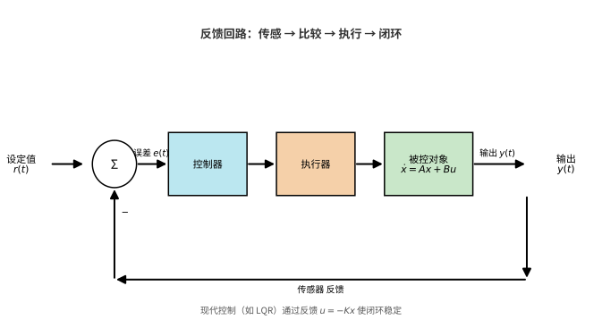

# 第121级 控制论

## 学习目标

1. 理解状态空间模型和传递函数两种系统描述方法
2. 掌握可控性和可观性的概念及其判据
3. 理解Lyapunov稳定性理论及其在系统分析中的应用
4. 掌握线性二次型调节器（LQR）的最优控制设计
5. 理解Pontryagin极大值原理及其在最优控制中的应用
6. 了解Kalman滤波、鲁棒控制等高级控制方法

---

## 核心概念

### 状态空间模型

线性时不变系统的状态空间表示为：

$$\dot{\boldsymbol{x}}(t) = \boldsymbol{A} \boldsymbol{x}(t) + \boldsymbol{B} \boldsymbol{u}(t)$$
$$\boldsymbol{y}(t) = \boldsymbol{C} \boldsymbol{x}(t) + \boldsymbol{D} \boldsymbol{u}(t)$$

其中 $\boldsymbol{x} \in \mathbb{R}^n$ 是状态向量，$\boldsymbol{u} \in \mathbb{R}^m$ 是控制输入，$\boldsymbol{y} \in \mathbb{R}^p$ 是输出，$\boldsymbol{A}, \boldsymbol{B}, \boldsymbol{C}, \boldsymbol{D}$ 是相应维度的系统矩阵。

> **直观理解（现实类比）**：这就是"恒温空调"的原理——设定温度（设定值 $r$）与室温计读数（传感器输出 $y$）相减得温度差（误差 $e$），空调据此决定制冷或制热（控制器+执行器），室温变化又改换成新的读数送回比较器，如此往复直到室温稳定在设定值。反馈的意义正是"用偏差来消除偏差"。

### 传递函数

传递函数是系统在零初始条件下的输入-输出频域表示：

$$\boldsymbol{G}(s) = \boldsymbol{C}(s\boldsymbol{I} - \boldsymbol{A})^{-1}\boldsymbol{B} + \boldsymbol{D}$$

### 可控性

系统 $(\boldsymbol{A}, \boldsymbol{B})$ 是**可控的**，如果对于任意初始状态 $\boldsymbol{x}_0$ 和任意目标状态 $\boldsymbol{x}_1$，存在一个控制输入 $\boldsymbol{u}(t)$，能在有限时间内将状态从 $\boldsymbol{x}_0$ 驱动到 $\boldsymbol{x}_1$。

### 可观性

系统 $(\boldsymbol{A}, \boldsymbol{C})$ 是**可观的**，如果通过有限时间内的输出 $\boldsymbol{y}(t)$ 和输入 $\boldsymbol{u}(t)$，可以唯一确定初始状态 $\boldsymbol{x}_0$。

### Lyapunov稳定性

- **Lyapunov稳定**：对于任意 $\epsilon > 0$，存在 $\delta > 0$，使得当 $\|\boldsymbol{x}(0)\| < \delta$ 时，对所有 $t \geq 0$ 有 $\|\boldsymbol{x}(t)\| < \epsilon$
- **渐近稳定**：系统是Lyapunov稳定的，且 $\lim_{t \to \infty} \|\boldsymbol{x}(t)\| = 0$
- **指数稳定**：存在 $\alpha, \beta > 0$ 使得 $\|\boldsymbol{x}(t)\| \leq \alpha \|\boldsymbol{x}(0)\| e^{-\beta t}$

> **直观理解（现实类比）**：把一个小球放进一只碗里，无论从碗沿哪个位置松手，小球都会沿碗壁越滚越低、来回摆动几次后停在碗底——"碗底"就是稳定平衡点，"滚向碗底"就是状态收敛。只要能量（Lyapunov 函数 $V$）不断减小，系统就必然趋向稳定，这正是稳定性分析的核心思想。

### LQR（线性二次型调节器）

LQR问题寻找最优控制律 $\boldsymbol{u}(t) = -\boldsymbol{K}\boldsymbol{x}(t)$ 最小化二次型性能指标：

$$J = \int_0^\infty (\boldsymbol{x}^T \boldsymbol{Q} \boldsymbol{x} + \boldsymbol{u}^T \boldsymbol{R} \boldsymbol{u}) \, dt$$

其中 $\boldsymbol{Q} \geq 0$，$\boldsymbol{R} > 0$ 是权重矩阵。

### Kalman滤波

Kalman滤波给出线性系统在测量噪声和过程噪声下的最优状态估计，提供最小均方误差意义下的最优估计。

### Pontryagin极大值原理

最优控制的必要条件，给出最优控制 $\boldsymbol{u}^*(t)$ 满足：

$$\mathcal{H}(\boldsymbol{x}^*, \boldsymbol{u}^*, \boldsymbol{\lambda}^*, t) = \max_{\boldsymbol{u}} \mathcal{H}(\boldsymbol{x}^*, \boldsymbol{u}, \boldsymbol{\lambda}^*, t)$$

其中 $\mathcal{H}$ 是Hamiltonian函数。

### HJB方程

动态规划在连续时间最优控制中的核心方程（Hamilton-Jacobi-Bellman方程）：

$$-\frac{\partial V}{\partial t} = \min_{\boldsymbol{u}} \left[ L(\boldsymbol{x}, \boldsymbol{u}) + \frac{\partial V}{\partial \boldsymbol{x}} \cdot f(\boldsymbol{x}, \boldsymbol{u}) \right]$$

---

## 定理与证明

### 定理1：可控性的Kalman秩条件

**定理**：线性时不变系统 $(\boldsymbol{A}, \boldsymbol{B})$（$\boldsymbol{A} \in \mathbb{R}^{n \times n}$，$\boldsymbol{B} \in \mathbb{R}^{n \times m}$）是可控的当且仅当可控性矩阵

$$\mathcal{C} = [\boldsymbol{B}, \boldsymbol{A}\boldsymbol{B}, \boldsymbol{A}^2\boldsymbol{B}, \ldots, \boldsymbol{A}^{n-1}\boldsymbol{B}]$$

满秩，即 $\text{rank}(\mathcal{C}) = n$。

**证明**：

**步骤1：可控性Gramian矩阵**

首先定义可控性Gramian矩阵：

$$\boldsymbol{W}_c(t) = \int_0^t e^{\boldsymbol{A}\tau} \boldsymbol{B} \boldsymbol{B}^T e^{\boldsymbol{A}^T\tau} \, d\tau$$

系统状态在时刻 $t$ 的解为：

$$\boldsymbol{x}(t) = e^{\boldsymbol{A}t} \boldsymbol{x}_0 + \int_0^t e^{\boldsymbol{A}(t-\tau)} \boldsymbol{B} \boldsymbol{u}(\tau) \, d\tau$$

**步骤2：可控性等价于Gramian的可逆性**

系统可控当且仅当对于任意 $t > 0$，$\boldsymbol{W}_c(t)$ 是可逆的。

**充分性（$\Leftarrow$）**：若 $\boldsymbol{W}_c(t)$ 可逆，对任意 $\boldsymbol{x}_0$ 和 $\boldsymbol{x}_1$，构造控制输入：

$$\boldsymbol{u}(\tau) = \boldsymbol{B}^T e^{\boldsymbol{A}^T(t-\tau)} \boldsymbol{W}_c(t)^{-1} (e^{\boldsymbol{A}t} \boldsymbol{x}_1 - \boldsymbol{x}_0)$$

代入状态方程的解可验证 $\boldsymbol{x}(t) = e^{\boldsymbol{A}t} \boldsymbol{x}_1$。

**必要性（$\Rightarrow$）**：若 $\boldsymbol{W}_c(t)$ 奇异，则存在非零向量 $\boldsymbol{v}$ 使得 $\boldsymbol{v}^T \boldsymbol{W}_c(t) \boldsymbol{v} = 0$，即 $\boldsymbol{v}^T e^{\boldsymbol{A}\tau} \boldsymbol{B} = \boldsymbol{0}$ 对所有 $\tau \in [0,t]$ 成立。此时状态沿 $\boldsymbol{v}$ 方向不可控。

**步骤3：Cayley-Hamilton定理的应用**

由Cayley-Hamilton定理，$\boldsymbol{A}^n$ 可以表示为 $\boldsymbol{I}, \boldsymbol{A}, \ldots, \boldsymbol{A}^{n-1}$ 的线性组合。因此，对于任意 $k \geq n$，$\boldsymbol{A}^k$ 是 $\boldsymbol{I}, \boldsymbol{A}, \ldots, \boldsymbol{A}^{n-1}$ 的线性组合。

矩阵指数 $e^{\boldsymbol{A}\tau}$ 可以展开为：

$$e^{\boldsymbol{A}\tau} = \sum_{k=0}^{\infty} \frac{\tau^k}{k!} \boldsymbol{A}^k = \sum_{j=0}^{n-1} \alpha_j(\tau) \boldsymbol{A}^j$$

其中 $\alpha_j(\tau)$ 是 $\tau$ 的解析函数。

**步骤4：Gramian与可控性矩阵的关系**

$$\boldsymbol{v}^T e^{\boldsymbol{A}\tau} \boldsymbol{B} = \sum_{j=0}^{n-1} \alpha_j(\tau) \boldsymbol{v}^T \boldsymbol{A}^j \boldsymbol{B} = \boldsymbol{0}, \quad \forall \tau \in [0,t]$$

由于 $\alpha_j(\tau)$ 是线性无关的函数（因为它们是不同模态的响应），上式对所有 $\tau$ 成立当且仅当：

$$\boldsymbol{v}^T \boldsymbol{A}^j \boldsymbol{B} = \boldsymbol{0}, \quad j = 0, 1, \ldots, n-1$$

即 $\boldsymbol{v}^T \mathcal{C} = \boldsymbol{0}$。

**步骤5：秩条件**

因此，$\boldsymbol{W}_c(t)$ 奇异当且仅当存在非零 $\boldsymbol{v}$ 使得 $\boldsymbol{v}^T \mathcal{C} = \boldsymbol{0}$，即 $\mathcal{C}$ 行不满秩（$\text{rank}(\mathcal{C}) < n$）。

所以系统可控 $\iff$ $\boldsymbol{W}_c(t)$ 可逆 $\iff$ $\text{rank}(\mathcal{C}) = n$。

这就完成了Kalman秩条件的证明。$\square$

---

### 定理2：可观性的对偶原理

**定理**：系统 $(\boldsymbol{A}, \boldsymbol{C})$ 是可观的当且仅当其对偶系统 $(\boldsymbol{A}^T, \boldsymbol{C}^T)$ 是可控的。等价地，可观性矩阵

$$\mathcal{O} = \begin{bmatrix} \boldsymbol{C} \\ \boldsymbol{C}\boldsymbol{A} \\ \boldsymbol{C}\boldsymbol{A}^2 \\ \vdots \\ \boldsymbol{C}\boldsymbol{A}^{n-1} \end{bmatrix}$$

满秩，即 $\text{rank}(\mathcal{O}) = n$。

**证明**：

**步骤1：可观性定义**

系统 $(\boldsymbol{A}, \boldsymbol{C})$ 是可观的，如果对于任意初始状态 $\boldsymbol{x}_0$，通过零输入响应 $\boldsymbol{y}(t) = \boldsymbol{C} e^{\boldsymbol{A}t} \boldsymbol{x}_0$ 可以唯一确定 $\boldsymbol{x}_0$。

**步骤2：转化为可控性问题**

考虑对偶系统：

$$\dot{\boldsymbol{z}}(t) = \boldsymbol{A}^T \boldsymbol{z}(t) + \boldsymbol{C}^T \boldsymbol{v}(t)$$

对偶系统 $(\boldsymbol{A}^T, \boldsymbol{C}^T)$ 的可控性要求对任意初始状态 $\boldsymbol{z}_0$，存在控制 $\boldsymbol{v}(t)$ 将其驱动到任意目标状态。

**步骤3：可观性Gramian**

定义可观性Gramian矩阵：

$$\boldsymbol{W}_o(t) = \int_0^t e^{\boldsymbol{A}^T\tau} \boldsymbol{C}^T \boldsymbol{C} e^{\boldsymbol{A}\tau} \, d\tau$$

系统可观当且仅当 $\boldsymbol{W}_o(t)$ 可逆（类似可控性的论证）。

**步骤4：对偶关系**

注意到 $\boldsymbol{W}_o(t)$ 正是对偶系统的可控性Gramian：

$$\boldsymbol{W}_o(t) = \int_0^t e^{\boldsymbol{A}^T\tau} \boldsymbol{C}^T \boldsymbol{C} e^{\boldsymbol{A}\tau} \, d\tau = \int_0^t e^{\boldsymbol{A}^T\tau} \boldsymbol{C}^T (\boldsymbol{C}^T)^T e^{\boldsymbol{A}\tau} \, d\tau$$

因此，$(\boldsymbol{A}, \boldsymbol{C})$ 可观 $\iff$ $\boldsymbol{W}_o(t)$ 可逆 $\iff$ $(\boldsymbol{A}^T, \boldsymbol{C}^T)$ 可控。

**步骤5：可观性秩条件**

由对偶原理和可控性Kalman秩条件，$(\boldsymbol{A}^T, \boldsymbol{C}^T)$ 可控当且仅当：

$$\text{rank}([\boldsymbol{C}^T, \boldsymbol{A}^T \boldsymbol{C}^T, (\boldsymbol{A}^T)^2 \boldsymbol{C}^T, \ldots, (\boldsymbol{A}^T)^{n-1} \boldsymbol{C}^T]) = n$$

转置后即得：

$$\text{rank}\left(\begin{bmatrix} \boldsymbol{C} \\ \boldsymbol{C}\boldsymbol{A} \\ \boldsymbol{C}\boldsymbol{A}^2 \\ \vdots \\ \boldsymbol{C}\boldsymbol{A}^{n-1} \end{bmatrix}\right) = n$$

这就是可观性的Kalman秩条件。$\square$

---

### 定理3：Lyapunov稳定性定理

**定理**：考虑自治系统 $\dot{\boldsymbol{x}} = \boldsymbol{f}(\boldsymbol{x})$，其中 $\boldsymbol{f}(\boldsymbol{0}) = \boldsymbol{0}$。如果存在一个标量函数 $V(\boldsymbol{x})$（称为Lyapunov函数）满足：

1. $V(\boldsymbol{x})$ 正定：$V(\boldsymbol{0}) = 0$，且对 $\boldsymbol{x} \neq \boldsymbol{0}$ 有 $V(\boldsymbol{x}) > 0$
2. $\dot{V}(\boldsymbol{x}) = \nabla V(\boldsymbol{x}) \cdot \boldsymbol{f}(\boldsymbol{x})$ 半负定：$\dot{V}(\boldsymbol{x}) \leq 0$

则原点 $\boldsymbol{x} = \boldsymbol{0}$ 是Lyapunov稳定的。如果 $\dot{V}(\boldsymbol{x})$ 负定（$\dot{V}(\boldsymbol{x}) < 0$ 对所有 $\boldsymbol{x} \neq \boldsymbol{0}$ 成立），则原点是渐近稳定的。

进一步，由LaSalle不变原理，如果 $\dot{V}(\boldsymbol{x}) \leq 0$，且 $\dot{V}(\boldsymbol{x}) = 0$ 的集合中不包含除 $\boldsymbol{x} = \boldsymbol{0}$ 外的完整轨迹，则原点是渐近稳定的。

**证明**：

**步骤1：Lyapunov稳定性**

给定 $\epsilon > 0$，定义球 $B_\epsilon = \{\boldsymbol{x} : \|\boldsymbol{x}\| \leq \epsilon\}$。由于 $V$ 连续且正定，在球面 $\|\boldsymbol{x}\| = \epsilon$ 上，$V$ 有正的最小值：

$$\alpha = \min_{\|\boldsymbol{x}\| = \epsilon} V(\boldsymbol{x}) > 0$$

由 $V$ 的连续性，存在 $\delta > 0$ 使得当 $\|\boldsymbol{x}\| < \delta$ 时，$V(\boldsymbol{x}) < \alpha$。

**步骤2：稳定性证明**

取初始状态 $\boldsymbol{x}_0$ 满足 $\|\boldsymbol{x}_0\| < \delta$。由于 $\dot{V} \leq 0$，$V(\boldsymbol{x}(t))$ 沿轨迹是递减的，因此：

$$V(\boldsymbol{x}(t)) \leq V(\boldsymbol{x}_0) < \alpha$$

这意味着 $\boldsymbol{x}(t)$ 不能到达球面 $\|\boldsymbol{x}\| = \epsilon$（因为在球面上 $V \geq \alpha$）。因此对所有 $t \geq 0$，$\|\boldsymbol{x}(t)\| < \epsilon$，系统是Lyapunov稳定的。

**步骤3：渐近稳定性（$\dot{V}$ 负定时）**

只需证明 $\lim_{t \to \infty} V(\boldsymbol{x}(t)) = 0$。由于 $V$ 递减且有下界（$V \geq 0$），极限 $c = \lim_{t \to \infty} V(\boldsymbol{x}(t)) \geq 0$ 存在。

假设 $c > 0$。则轨迹被限制在集合 $\Omega = \{\boldsymbol{x} : c \leq V(\boldsymbol{x}) \leq V(\boldsymbol{x}_0)\}$ 中，这是紧集。在 $\Omega$ 上，$\dot{V}$ 负定，因此存在 $\gamma > 0$ 使得 $\dot{V}(\boldsymbol{x}) \leq -\gamma$。

但 $V(\boldsymbol{x}(t)) = V(\boldsymbol{x}_0) + \int_0^t \dot{V}(\boldsymbol{x}(\tau)) \, d\tau \leq V(\boldsymbol{x}_0) - \gamma t \to -\infty$，矛盾。

因此 $c = 0$，从而 $\lim_{t \to \infty} \boldsymbol{x}(t) = \boldsymbol{0}$。

**步骤4：LaSalle不变原理（当 $\dot{V}$ 仅半负定时）**

设 $E = \{\boldsymbol{x} : \dot{V}(\boldsymbol{x}) = 0\}$，$M$ 是 $E$ 中最大的不变集。LaSalle不变原理指出：所有有界轨迹都收敛到 $M$。

如果 $M = \{\boldsymbol{0}\}$，则所有轨迹收敛到原点，原点是渐近稳定的。

**证明LaSalle原理概要**：由于 $V$ 递减且有下界，$\lim_{t \to \infty} V(\boldsymbol{x}(t)) = c$ 存在。轨迹的 $\omega$-极限集 $\omega(\boldsymbol{x}_0)$ 是紧不变集，且在其上 $V$ 恒为常数，因此 $\dot{V} = 0$。故 $\omega(\boldsymbol{x}_0) \subseteq M$。如果 $M = \{\boldsymbol{0}\}$，则所有轨迹收敛到原点。$\square$

---

### 定理4：LQR的最优反馈

**定理**：对于线性时不变系统 $\dot{\boldsymbol{x}} = \boldsymbol{A}\boldsymbol{x} + \boldsymbol{B}\boldsymbol{u}$ 和二次型性能指标

$$J = \int_0^\infty (\boldsymbol{x}^T \boldsymbol{Q} \boldsymbol{x} + \boldsymbol{u}^T \boldsymbol{R} \boldsymbol{u}) \, dt$$

其中 $\boldsymbol{Q} = \boldsymbol{Q}^T \geq 0$，$\boldsymbol{R} = \boldsymbol{R}^T > 0$，$(\boldsymbol{A}, \boldsymbol{B})$ 可控，假设 $(\boldsymbol{A}, \boldsymbol{Q}^{1/2})$ 可观。则最优控制律为线性状态反馈：

$$\boldsymbol{u}^*(t) = -\boldsymbol{K} \boldsymbol{x}(t)$$

其中 $\boldsymbol{K} = \boldsymbol{R}^{-1} \boldsymbol{B}^T \boldsymbol{P}$，$\boldsymbol{P} = \boldsymbol{P}^T \geq 0$ 是代数Riccati方程的唯一正定解：

$$\boldsymbol{A}^T \boldsymbol{P} + \boldsymbol{P} \boldsymbol{A} - \boldsymbol{P} \boldsymbol{B} \boldsymbol{R}^{-1} \boldsymbol{B}^T \boldsymbol{P} + \boldsymbol{Q} = \boldsymbol{0}$$

**证明**：

**步骤1：Hamilton-Jacobi-Bellman方程**

对于无限时域最优控制问题，HJB方程为：

$$-\frac{\partial V}{\partial t} = \min_{\boldsymbol{u}} \left[ \boldsymbol{x}^T \boldsymbol{Q} \boldsymbol{x} + \boldsymbol{u}^T \boldsymbol{R} \boldsymbol{u} + \frac{\partial V}{\partial \boldsymbol{x}} (\boldsymbol{A}\boldsymbol{x} + \boldsymbol{B}\boldsymbol{u}) \right]$$

对于无限时域定常问题，最优值函数 $V(\boldsymbol{x})$ 与时间无关，因此HJB方程简化为：

$$0 = \min_{\boldsymbol{u}} \left[ \boldsymbol{x}^T \boldsymbol{Q} \boldsymbol{x} + \boldsymbol{u}^T \boldsymbol{R} \boldsymbol{u} + \nabla V(\boldsymbol{x})^T (\boldsymbol{A}\boldsymbol{x} + \boldsymbol{B}\boldsymbol{u}) \right]$$

**步骤2：猜测值函数形式**

由于系统是线性的且性能指标是二次的，猜测最优值函数是二次型：

$$V(\boldsymbol{x}) = \boldsymbol{x}^T \boldsymbol{P} \boldsymbol{x}$$

其中 $\boldsymbol{P} = \boldsymbol{P}^T \geq 0$。则 $\nabla V(\boldsymbol{x}) = 2\boldsymbol{P}\boldsymbol{x}$。

**步骤3：求最优控制**

对HJB方程中的被最小化项关于 $\boldsymbol{u}$ 求导：

$$\frac{\partial}{\partial \boldsymbol{u}} [\boldsymbol{x}^T \boldsymbol{Q} \boldsymbol{x} + \boldsymbol{u}^T \boldsymbol{R} \boldsymbol{u} + 2\boldsymbol{x}^T \boldsymbol{P} (\boldsymbol{A}\boldsymbol{x} + \boldsymbol{B}\boldsymbol{u})] = 2\boldsymbol{R}\boldsymbol{u} + 2\boldsymbol{B}^T \boldsymbol{P} \boldsymbol{x} = \boldsymbol{0}$$

解得：

$$\boldsymbol{u}^* = -\boldsymbol{R}^{-1} \boldsymbol{B}^T \boldsymbol{P} \boldsymbol{x} = -\boldsymbol{K} \boldsymbol{x}$$

**步骤4：代入HJB方程得Riccati方程**

将 $\boldsymbol{u}^*$ 和 $V(\boldsymbol{x}) = \boldsymbol{x}^T \boldsymbol{P} \boldsymbol{x}$ 代入HJB方程：

$$\boldsymbol{x}^T \boldsymbol{Q} \boldsymbol{x} + \boldsymbol{x}^T \boldsymbol{P} \boldsymbol{B} \boldsymbol{R}^{-1} \boldsymbol{B}^T \boldsymbol{P} \boldsymbol{x} + 2\boldsymbol{x}^T \boldsymbol{P} \boldsymbol{A} \boldsymbol{x} - 2\boldsymbol{x}^T \boldsymbol{P} \boldsymbol{B} \boldsymbol{R}^{-1} \boldsymbol{B}^T \boldsymbol{P} \boldsymbol{x} = 0$$

化简得：

$$\boldsymbol{x}^T (\boldsymbol{A}^T \boldsymbol{P} + \boldsymbol{P} \boldsymbol{A} - \boldsymbol{P} \boldsymbol{B} \boldsymbol{R}^{-1} \boldsymbol{B}^T \boldsymbol{P} + \boldsymbol{Q}) \boldsymbol{x} = 0$$

由于这对所有 $\boldsymbol{x}$ 成立，括号内的矩阵必须为零：

$$\boldsymbol{A}^T \boldsymbol{P} + \boldsymbol{P} \boldsymbol{A} - \boldsymbol{P} \boldsymbol{B} \boldsymbol{R}^{-1} \boldsymbol{B}^T \boldsymbol{P} + \boldsymbol{Q} = \boldsymbol{0}$$

这就是代数Riccati方程（ARE）。

**步骤5：闭环稳定性**

由 $(\boldsymbol{A}, \boldsymbol{B})$ 可控和 $(\boldsymbol{A}, \boldsymbol{Q}^{1/2})$ 可观的假设，ARE的解 $\boldsymbol{P}$ 是正定的。取 $V(\boldsymbol{x}) = \boldsymbol{x}^T \boldsymbol{P} \boldsymbol{x}$ 作为闭环系统的Lyapunov函数：

$$\dot{V} = \boldsymbol{x}^T (\boldsymbol{A}_{cl}^T \boldsymbol{P} + \boldsymbol{P} \boldsymbol{A}_{cl}) \boldsymbol{x}$$

其中 $\boldsymbol{A}_{cl} = \boldsymbol{A} - \boldsymbol{B}\boldsymbol{K} = \boldsymbol{A} - \boldsymbol{B}\boldsymbol{R}^{-1}\boldsymbol{B}^T\boldsymbol{P}$。

由Riccati方程可推出 $\dot{V} = -\boldsymbol{x}^T (\boldsymbol{Q} + \boldsymbol{K}^T \boldsymbol{R} \boldsymbol{K}) \boldsymbol{x} < 0$（对 $\boldsymbol{x} \neq \boldsymbol{0}$），因此闭环系统是渐近稳定的。

这就完成了LQR最优反馈的证明。$\square$

---

### 定理5：Pontryagin极大值原理

**定理**：考虑最优控制问题：

$$\min_{\boldsymbol{u}(\cdot)} J = \int_{t_0}^{t_f} L(\boldsymbol{x}(t), \boldsymbol{u}(t), t) \, dt + \Phi(\boldsymbol{x}(t_f), t_f)$$

约束为 $\dot{\boldsymbol{x}} = \boldsymbol{f}(\boldsymbol{x}, \boldsymbol{u}, t)$，$\boldsymbol{x}(t_0) = \boldsymbol{x}_0$，$\boldsymbol{u}(t) \in \mathcal{U} \subseteq \mathbb{R}^m$。

定义Hamiltonian函数：

$$\mathcal{H}(\boldsymbol{x}, \boldsymbol{u}, \boldsymbol{\lambda}, t) = L(\boldsymbol{x}, \boldsymbol{u}, t) + \boldsymbol{\lambda}^T \boldsymbol{f}(\boldsymbol{x}, \boldsymbol{u}, t)$$

如果 $\boldsymbol{u}^*(t)$ 是最优控制，$\boldsymbol{x}^*(t)$ 是对应的最优轨迹，则存在协态变量 $\boldsymbol{\lambda}(t)$ 使得：

1. **正则方程**：
   $$\dot{\boldsymbol{x}}^* = \frac{\partial \mathcal{H}}{\partial \boldsymbol{\lambda}} = \boldsymbol{f}(\boldsymbol{x}^*, \boldsymbol{u}^*, t)$$
   $$\dot{\boldsymbol{\lambda}} = -\frac{\partial \mathcal{H}}{\partial \boldsymbol{x}} = -\frac{\partial L}{\partial \boldsymbol{x}} - \left(\frac{\partial \boldsymbol{f}}{\partial \boldsymbol{x}}\right)^T \boldsymbol{\lambda}$$

2. **极小化条件**：
   $$\mathcal{H}(\boldsymbol{x}^*, \boldsymbol{u}^*, \boldsymbol{\lambda}, t) = \min_{\boldsymbol{u} \in \mathcal{U}} \mathcal{H}(\boldsymbol{x}^*, \boldsymbol{u}, \boldsymbol{\lambda}, t)$$

3. **横截条件**（若终端自由）：
   $$\boldsymbol{\lambda}(t_f) = \frac{\partial \Phi}{\partial \boldsymbol{x}}(\boldsymbol{x}^*(t_f), t_f)$$

**证明**（变分法框架）：

**步骤1：构造增广性能指标**

引入Lagrange乘子 $\boldsymbol{\lambda}(t)$（协态变量），将系统动力学约束附加到性能指标中：

$$\bar{J} = \Phi(\boldsymbol{x}(t_f), t_f) + \int_{t_0}^{t_f} \left[ L(\boldsymbol{x}, \boldsymbol{u}, t) + \boldsymbol{\lambda}^T (\boldsymbol{f}(\boldsymbol{x}, \boldsymbol{u}, t) - \dot{\boldsymbol{x}}) \right] dt$$

**步骤2：分部积分**

对 $\boldsymbol{\lambda}^T \dot{\boldsymbol{x}}$ 项分部积分：

$$\int_{t_0}^{t_f} \boldsymbol{\lambda}^T \dot{\boldsymbol{x}} \, dt = \boldsymbol{\lambda}(t_f)^T \boldsymbol{x}(t_f) - \boldsymbol{\lambda}(t_0)^T \boldsymbol{x}(t_0) - \int_{t_0}^{t_f} \dot{\boldsymbol{\lambda}}^T \boldsymbol{x} \, dt$$

代入得：

$$\bar{J} = \Phi(\boldsymbol{x}(t_f), t_f) - \boldsymbol{\lambda}(t_f)^T \boldsymbol{x}(t_f) + \boldsymbol{\lambda}(t_0)^T \boldsymbol{x}(t_0) + \int_{t_0}^{t_f} \left[ \mathcal{H}(\boldsymbol{x}, \boldsymbol{u}, \boldsymbol{\lambda}, t) + \dot{\boldsymbol{\lambda}}^T \boldsymbol{x} \right] dt$$

**步骤3：计算一阶变分**

考虑最优轨迹附近的变分 $\delta \boldsymbol{x}$、$\delta \boldsymbol{u}$，$\boldsymbol{\lambda}$ 视为待定函数。一阶变分为：

$$\delta \bar{J} = \left[\left(\frac{\partial \Phi}{\partial \boldsymbol{x}} - \boldsymbol{\lambda}^T\right) \delta \boldsymbol{x}\right]_{t=t_f} + \boldsymbol{\lambda}(t_0)^T \delta \boldsymbol{x}(t_0) + \int_{t_0}^{t_f} \left[ \left(\frac{\partial \mathcal{H}}{\partial \boldsymbol{x}} + \dot{\boldsymbol{\lambda}}^T\right) \delta \boldsymbol{x} + \frac{\partial \mathcal{H}}{\partial \boldsymbol{u}} \delta \boldsymbol{u} \right] dt$$

由于 $\delta \boldsymbol{x}(t_0) = 0$（初始状态固定），$\boldsymbol{\lambda}(t_0)^T \delta \boldsymbol{x}(t_0) = 0$。

**步骤4：必要条件**

由于 $\delta \boldsymbol{u}$ 是自由的（在控制约束内），$\delta \boldsymbol{x}$ 是通过动力学方程由 $\delta \boldsymbol{u}$ 引起的，但我们可以将 $\boldsymbol{\lambda}$ 选为满足协态方程的函数，使得 $\delta \boldsymbol{x}$ 的系数为零。

令 $\dot{\boldsymbol{\lambda}} = -\left(\frac{\partial \mathcal{H}}{\partial \boldsymbol{x}}\right)^T$，则积分中 $\delta \boldsymbol{x}$ 的系数为零。

**步骤5：极小化条件**

剩余项中，$\delta \boldsymbol{u}$ 的系数必须满足最优性条件。对于无约束控制（$\mathcal{U} = \mathbb{R}^m$），有 $\frac{\partial \mathcal{H}}{\partial \boldsymbol{u}} = \boldsymbol{0}$。对于有约束控制，$\boldsymbol{u}^*$ 必须最小化Hamiltonian：

$$\mathcal{H}(\boldsymbol{x}^*, \boldsymbol{u}^*, \boldsymbol{\lambda}, t) = \min_{\boldsymbol{u} \in \mathcal{U}} \mathcal{H}(\boldsymbol{x}^*, \boldsymbol{u}, \boldsymbol{\lambda}, t)$$

**步骤6：横截条件**

终端项给出横截条件：

$$\boldsymbol{\lambda}(t_f) = \frac{\partial \Phi}{\partial \boldsymbol{x}}(\boldsymbol{x}^*(t_f), t_f)$$

这就完成了Pontryagin极大值原理的证明。$\square$

---

## 示例

### 示例1：倒立摆的LQR控制设计

**问题**：设计LQR控制器使倒立摆保持在竖直位置。

**系统建模**：

倒立摆的线性化状态方程为（在竖直位置附近）：

$$\dot{\boldsymbol{x}} = \boldsymbol{A}\boldsymbol{x} + \boldsymbol{B}u$$

其中状态向量 $\boldsymbol{x} = [\theta, \dot{\theta}]^T$，$\theta$ 是摆角，$u$ 是小车施加的力。

系统矩阵：

$$\boldsymbol{A} = \begin{bmatrix} 0 & 1 \\ \frac{g}{l} & 0 \end{bmatrix}, \quad \boldsymbol{B} = \begin{bmatrix} 0 \\ \frac{1}{ml^2} \end{bmatrix}$$

其中 $g$ 是重力加速度，$l$ 是摆长，$m$ 是摆锤质量。

**LQR设计**：

选择权重矩阵 $\boldsymbol{Q} = \text{diag}(100, 1)$（强调角度偏差的惩罚），$\boldsymbol{R} = 1$。

求解代数Riccati方程：

$$\boldsymbol{A}^T \boldsymbol{P} + \boldsymbol{P} \boldsymbol{A} - \boldsymbol{P} \boldsymbol{B} \boldsymbol{R}^{-1} \boldsymbol{B}^T \boldsymbol{P} + \boldsymbol{Q} = \boldsymbol{0}$$

设 $\boldsymbol{P} = \begin{bmatrix} p_{11} & p_{12} \\ p_{12} & p_{22} \end{bmatrix}$，代入求解得（取 $m = 1, l = 1, g = 9.8$）：

$$\boldsymbol{P} = \begin{bmatrix} 128.6 & 21.4 \\ 21.4 & 7.3 \end{bmatrix}$$

最优反馈增益：

$$\boldsymbol{K} = \boldsymbol{R}^{-1} \boldsymbol{B}^T \boldsymbol{P} = [21.4, 7.3]$$

**控制律**：

$$u = -\boldsymbol{K} \boldsymbol{x} = -21.4 \theta - 7.3 \dot{\theta}$$

**闭环系统**：

$$\dot{\boldsymbol{x}} = (\boldsymbol{A} - \boldsymbol{B}\boldsymbol{K}) \boldsymbol{x} = \begin{bmatrix} 0 & 1 \\ -21.4 & -7.3 \end{bmatrix} \boldsymbol{x}$$

闭环特征值为 $-3.65 \pm 2.87i$，系统稳定。

---

### 示例2：质量-弹簧-阻尼系统的状态反馈控制

**问题**：设计状态反馈控制器，使质量-弹簧-阻尼系统达到指定位置。

**系统建模**：

质量-弹簧-阻尼系统的动力学方程：

$$m\ddot{y} + c\dot{y} + ky = u$$

其中 $m$ 是质量，$c$ 是阻尼系数，$k$ 是弹簧刚度，$u$ 是控制力，$y$ 是位移。

**状态空间表示**：

选择状态变量 $x_1 = y$（位移），$x_2 = \dot{y}$（速度）：

$$\dot{\boldsymbol{x}} = \begin{bmatrix} 0 & 1 \\ -\frac{k}{m} & -\frac{c}{m} \end{bmatrix} \boldsymbol{x} + \begin{bmatrix} 0 \\ \frac{1}{m} \end{bmatrix} u$$

$$y = \begin{bmatrix} 1 & 0 \end{bmatrix} \boldsymbol{x}$$

**可控性检查**：

可控性矩阵 $\mathcal{C} = [\boldsymbol{B}, \boldsymbol{A}\boldsymbol{B}] = \begin{bmatrix} 0 & \frac{1}{m} \\ \frac{1}{m} & -\frac{c}{m^2} \end{bmatrix}$，$\det(\mathcal{C}) = -\frac{1}{m^2} \neq 0$，系统可控。

**极点配置设计**：

期望的闭环极点为 $s_{1,2} = -2 \pm 2i$（阻尼比 $\zeta = 0.707$，自然频率 $\omega_n = 2\sqrt{2}$）。

期望特征多项式：

$$\alpha(s) = (s + 2 - 2i)(s + 2 + 2i) = s^2 + 4s + 8$$

设状态反馈增益 $\boldsymbol{K} = [k_1, k_2]$，闭环系统矩阵：

$$\boldsymbol{A} - \boldsymbol{B}\boldsymbol{K} = \begin{bmatrix} 0 & 1 \\ -\frac{k}{m} - \frac{k_1}{m} & -\frac{c}{m} - \frac{k_2}{m} \end{bmatrix}$$

闭环特征多项式：

$$\det(s\boldsymbol{I} - (\boldsymbol{A} - \boldsymbol{B}\boldsymbol{K})) = s^2 + \left(\frac{c + k_2}{m}\right)s + \frac{k + k_1}{m}$$

令其等于期望多项式：

$$\frac{c + k_2}{m} = 4, \quad \frac{k + k_1}{m} = 8$$

解得：

$$k_1 = 8m - k, \quad k_2 = 4m - c$$

**控制律**：

$$u = -\boldsymbol{K}\boldsymbol{x} = -(8m - k)y - (4m - c)\dot{y}$$

**数值实例**：取 $m = 1\,\text{kg}$，$c = 0.5\,\text{N·s/m}$，$k = 2\,\text{N/m}$，则：

$$k_1 = 8 - 2 = 6, \quad k_2 = 4 - 0.5 = 3.5$$

$$u = -6y - 3.5\dot{y}$$

---

## 习题

### 基础题

**习题 1**（状态空间模型）写出线性时不变系统的状态空间描述：状态方程 $\dot{\boldsymbol{x}}(t)=\boldsymbol{A}\boldsymbol{x}(t)+\boldsymbol{B}\boldsymbol{u}(t)$ 与输出方程 $\boldsymbol{y}(t)=\boldsymbol{C}\boldsymbol{x}(t)+\boldsymbol{D}\boldsymbol{u}(t)$，并说明式中各记号的含义。

**习题 2**（传递函数与状态空间的关系）写出由状态空间矩阵表示的传递函数 $\boldsymbol{G}(s)=\boldsymbol{C}(s\boldsymbol{I}-\boldsymbol{A})^{-1}\boldsymbol{B}+\boldsymbol{D}$，并说明其适用条件（零初始条件、输入-输出频域表示）。

**习题 3**（可控性的定义）给出线性定常系统 $(\boldsymbol{A},\boldsymbol{B})$ 可控的精确定义：对任意初始状态 $\boldsymbol{x}_0$ 与目标状态 $\boldsymbol{x}_1$，存在控制 $\boldsymbol{u}(t)$ 在有限时间内将状态由 $\boldsymbol{x}_0$ 驱动到 $\boldsymbol{x}_1$。

**习题 4**（可观性的定义）给出系统 $(\boldsymbol{A},\boldsymbol{C})$ 可观的定义：由有限时间内的输出 $\boldsymbol{y}(t)$ 与输入 $\boldsymbol{u}(t)$ 能唯一确定初始状态 $\boldsymbol{x}_0$。

**习题 5**（Lyapunov稳定性的三种概念）分别说明Lyapunov稳定、渐近稳定、指数稳定的含义，并写出各自的条件式（$\|\boldsymbol{x}(0)\|<\delta\Rightarrow\|\boldsymbol{x}(t)\|<\epsilon$、$\lim_{t\to\infty}\|\boldsymbol{x}(t)\|=0$、$\|\boldsymbol{x}(t)\|\le\alpha\|\boldsymbol{x}(0)\|e^{-\beta t}$）。

**习题 6**（可控性的秩判断）判断系统 $\dot{\boldsymbol{x}}=\begin{bmatrix}0&1&0\\0&0&1\\-6&-11&-6\end{bmatrix}\boldsymbol{x}+\begin{bmatrix}0\\0\\1\end{bmatrix}u$ 是否可控（计算可控性矩阵 $\mathcal{C}=[\boldsymbol{B},\boldsymbol{A}\boldsymbol{B},\boldsymbol{A}^2\boldsymbol{B}]$ 并检查其秩）。

**习题 7**（可观性的秩判断）判断系统 $\dot{\boldsymbol{x}}=\begin{bmatrix}-2&1\\0&-3\end{bmatrix}\boldsymbol{x}$，$y=\begin{bmatrix}1&0\end{bmatrix}\boldsymbol{x}$ 是否可观（计算可观性矩阵 $\mathcal{O}=\begin{bmatrix}\boldsymbol{C}\\\boldsymbol{C}\boldsymbol{A}\end{bmatrix}$ 并检查其秩）。

**习题 8**（LQR问题的提法）写出LQR问题要最小化的性能指标 $J=\int_0^\infty(\boldsymbol{x}^T\boldsymbol{Q}\boldsymbol{x}+\boldsymbol{u}^T\boldsymbol{R}\boldsymbol{u})\,dt$，说明权重矩阵满足的条件（$\boldsymbol{Q}\ge0$、$\boldsymbol{R}>0$）。

**习题 9**（Pontryagin极大值原理的Hamiltonian）写出最优控制问题 $\min J=\int_{t_0}^{t_f}L(\boldsymbol{x},\boldsymbol{u},t)\,dt$ 在约束 $\dot{\boldsymbol{x}}=\boldsymbol{f}(\boldsymbol{x},\boldsymbol{u},t)$ 下的Hamiltonian函数 $\mathcal{H}=L+\boldsymbol{\lambda}^T\boldsymbol{f}$，并说明协态变量 $\boldsymbol{\lambda}$ 的作用。

**习题 10**（Kalman滤波的基本思想）简述Kalman滤波解决的问题：在过程噪声与测量噪声下给出线性系统状态的最小均方误差意义下的最优估计。

### 进阶题

**习题 11**（可控性Gram矩阵）写出可控性Gram矩阵 $\boldsymbol{W}_c(t)=\int_0^t e^{\boldsymbol{A}\tau}\boldsymbol{B}\boldsymbol{B}^Te^{\boldsymbol{A}^T\tau}d\tau$，并说明系统可控与 $\boldsymbol{W}_c(t)$ 可逆之间的关系。

**习题 12**（可观性的对偶原理）简述对偶原理：$(\boldsymbol{A},\boldsymbol{C})$ 可观当且仅当对偶系统 $(\boldsymbol{A}^T,\boldsymbol{C}^T)$ 可控，并说明可观性Gram矩阵与此对偶关系的联系。

**习题 13**（Lyapunov函数判定渐近稳定）对非线性系统 $\dot{x}=-x^3$，取 $V(x)=x^2/2$，计算 $\dot V=x(-x^3)=-x^4$，据此判定原点的稳定性类型并说明理由。

**习题 14**（LQR求解Riccati方程）给定标量系统 $\dot{x}=ax+u$，性能指标 $J=\int_0^\infty(x^2+u^2)\,dt$，求解代数Riccati方程 $2aP-P^2+1=0$ 的正定解，并写出最优反馈 $u=-Kx$ 及 $K$ 的表达式。

**习题 15**（Pontryagin极大值原理求最优控制）对 $\dot{x}=u$，$x(0)=x_0$，$x(1)$ 自由，最小化 $J=\int_0^1\frac12u^2dt$，写出Hamiltonian $\mathcal{H}=\frac12u^2+\lambda u$，由极小化条件、协态方程与横截条件 $\lambda(1)=0$ 求出最优控制 $u^*(t)$ 与最优轨迹。

**习题 16**（极点配置）对二阶系统 $\dot{\boldsymbol{x}}=\begin{bmatrix}0&1\\-2&-0.5\end{bmatrix}\boldsymbol{x}+\begin{bmatrix}0\\1\end{bmatrix}u$，为使闭环极点为 $-2\pm2i$，用状态反馈 $u=-[k_1,k_2]\boldsymbol{x}$ 求增益 $k_1,k_2$，即求解特征多项式配平方程。

**习题 17**（状态反馈的闭环特征多项式）对质量-弹簧-阻尼系统 $m\ddot y+c\dot y+ky=u$（取 $m=1,k=2,c=0.5$），写出其状态空间形式，并由此推导极点配置反馈 $u=-(8m-k)y-(4m-c)\dot y$ 的数值增益（$k_1=6,k_2=3.5$）。

**习题 18**（Lyapunov方程判定线性系统稳定性）对 $\dot{\boldsymbol{x}}=\boldsymbol{A}\boldsymbol{x}$，说明如何用Lyapunov方程 $\boldsymbol{A}^T\boldsymbol{P}+\boldsymbol{P}\boldsymbol{A}=-\boldsymbol{Q}$（$\boldsymbol{Q}>0$）的正定解 $\boldsymbol{P}$ 判定系统渐近稳定，并写出相应的Lyapunov函数 $V=\boldsymbol{x}^T\boldsymbol{P}\boldsymbol{x}$ 及 $\dot V$ 的表达式。

**习题 19**（HJB方程的推导）写出连续时间最优控制的HJB方程 $-\frac{\partial V}{\partial t}=\min_{\boldsymbol{u}}\left[L+\frac{\partial V}{\partial \boldsymbol{x}}\cdot\boldsymbol{f}\right]$，并说明其在动态规划方法中的地位。

### 挑战题

**习题 20**（可控性Kalman秩条件的充分性）证明：若可控性矩阵 $\mathcal{C}=[\boldsymbol{B},\boldsymbol{A}\boldsymbol{B},\dots,\boldsymbol{A}^{n-1}\boldsymbol{B}]$ 满秩（$\mathrm{rank}\,\mathcal{C}=n$），则 $\boldsymbol{W}_c(t)$ 可逆，进而系统可控（构造控制 $\boldsymbol{u}(\tau)=\boldsymbol{B}^Te^{\boldsymbol{A}^T(t-\tau)}\boldsymbol{W}_c(t)^{-1}(e^{\boldsymbol{A}t}\boldsymbol{x}_1-\boldsymbol{x}_0)$）。

**习题 21**（可控性秩条件的必要性）证明：若 $\mathcal{C}$ 行不满秩，则存在非零向量 $\boldsymbol{v}$ 使状态沿 $\boldsymbol{v}$ 方向不可控，从而系统不可控（利用 $\boldsymbol{v}^Te^{\boldsymbol{A}\tau}\boldsymbol{B}=\sum_j\alpha_j(\tau)\boldsymbol{v}^T\boldsymbol{A}^j\boldsymbol{B}$）。

**习题 22**（LQR的Riccati方程推导）从HJB方程出发，猜测最优值函数 $V(\boldsymbol{x})=\boldsymbol{x}^T\boldsymbol{P}\boldsymbol{x}$，求出最优控制 $\boldsymbol{u}^*=-\boldsymbol{R}^{-1}\boldsymbol{B}^T\boldsymbol{P}\boldsymbol{x}$，并代入HJB方程推导出代数Riccati方程 $\boldsymbol{A}^T\boldsymbol{P}+\boldsymbol{P}\boldsymbol{A}-\boldsymbol{P}\boldsymbol{B}\boldsymbol{R}^{-1}\boldsymbol{B}^T\boldsymbol{P}+\boldsymbol{Q}=\boldsymbol{0}$。

**习题 23**（LQR闭环渐近稳定性的证明）设 $\boldsymbol{P}$ 是代数Riccati方程的正定解，$\boldsymbol{A}_{cl}=\boldsymbol{A}-\boldsymbol{B}\boldsymbol{R}^{-1}\boldsymbol{B}^T\boldsymbol{P}$，取 $V=\boldsymbol{x}^T\boldsymbol{P}\boldsymbol{x}$ 作Lyapunov函数，证明闭环系统 $\dot{\boldsymbol{x}}=\boldsymbol{A}_{cl}\boldsymbol{x}$ 渐近稳定（需推得 $\dot V=-\boldsymbol{x}^T(\boldsymbol{Q}+\boldsymbol{K}^T\boldsymbol{R}\boldsymbol{K})\boldsymbol{x}<0$）。

**习题 24**（Lyapunov稳定性定理的证明）设 $V(\boldsymbol{x})\ge0$ 正定、$\dot V\le0$，对给定 $\epsilon>0$ 令 $\alpha=\min_{\|\boldsymbol{x}\|=\epsilon}V(\boldsymbol{x})$，证明存在 $\delta$ 使初始状态 $\|\boldsymbol{x}_0\|<\delta$ 时轨道始终满足 $\|\boldsymbol{x}(t)\|<\epsilon$；并说明当 $\dot V$ 负定时原点是渐近稳定的。

**习题 25**（Pontryagin存在性条件导数）证明无条件约束（$\mathcal{U}=\mathbb{R}^m$）情形下最优控制满足 $\frac{\partial\mathcal{H}}{\partial\boldsymbol{u}}=\boldsymbol{0}$，并说明有约束时该式退化为 $\mathcal{H}(\boldsymbol{x}^*,\boldsymbol{u}^*,\boldsymbol{\lambda})=\min_{\boldsymbol{u}\in\mathcal{U}}\mathcal{H}(\boldsymbol{x}^*,\boldsymbol{u},\boldsymbol{\lambda})$。

**习题 26**（倒立摆LQR控制律验证）给定倒立摆状态方程 $\dot{\boldsymbol{x}}=\begin{bmatrix}0&1\\9.8&0\end{bmatrix}\boldsymbol{x}+\begin{bmatrix}0\\1\end{bmatrix}u$（取 $m=l=g=1$ 附近），用LQR（$\boldsymbol{Q}=\mathrm{diag}(100,1)$，$\boldsymbol{R}=1$）验证最优反馈 $\boldsymbol{K}=[21.4,7.3]$，写出控制律 $u=-21.4\theta-7.3\dot\theta$ 及闭环特征值 $-3.65\pm2.87i$，并说明闭环稳定性结论。

### 探究题

**习题 27**（可控性与可观性的关系）讨论可控性与可观性之间的深刻联系：为什么"苛刻条件下需同时成立"（如LQR需要 $(\boldsymbol{A},\boldsymbol{B})$ 可控且 $(\boldsymbol{A},\boldsymbol{Q}^{1/2})$ 可观）？并指出两者在系统设计中的注意事项。

**习题 28**（Kalman滤波与LQR的对偶/分离原理）探讨Kalman滤波（状态估计）与LQR（状态反馈）在数学结构上的对偶关系，说明"分离原理"为何允许将估计器与控制器分开设计。

**习题 29**（HJB方程与Pontryagin极大值原理的关系）比较HJB方程（充分条件）与Pontryagin极大值原理（必要条件）在求解最优控制问题时的异同、适用范围与各自的优缺点。

**习题 30**（鲁棒控制与PID的现实意义）结合本章内容，讨论模型不确定性与扰动对反馈控制的影响，说明鲁棒控制被提出以应对哪些问题，并评价PID控制为何在工业中仍被广泛使用。

---

## 习题答案与解析

### 基础题答案

1. **状态空间模型** 状态方程 $\dot{\boldsymbol{x}}(t)=\boldsymbol{A}\boldsymbol{x}(t)+\boldsymbol{B}\boldsymbol{u}(t)$ 描述状态的演化，输出方程 $\boldsymbol{y}(t)=\boldsymbol{C}\boldsymbol{x}(t)+\boldsymbol{D}\boldsymbol{u}(t)$ 描述量与状态的观测关系。其中 $\boldsymbol{x}\in\mathbb{R}^n$ 为状态向量，$\boldsymbol{u}\in\mathbb{R}^m$ 为控制输入，$\boldsymbol{y}\in\mathbb{R}^p$ 为输出，矩阵 $\boldsymbol{A}(n\times n)$ 描述系统内部动力学，$\boldsymbol{B}(n\times m)$ 描述输入对状态的作用，$\boldsymbol{C}(p\times n)$ 描述状态到输出的映射，$\boldsymbol{D}(p\times m)$ 为直馈项（通常为0）。

2. **传递函数与状态空间的关系** $\boldsymbol{G}(s)=\boldsymbol{C}(s\boldsymbol{I}-\boldsymbol{A})^{-1}\boldsymbol{B}+\boldsymbol{D}$ 是在零初始条件下对状态方程做 Laplace 变换、消去状态后得到的输入-输出频域关系。它把时域的多变量状态空间描述压缩为传递矩阵，条件为系统线性时不变且零初始状态；它刻画外部输入到输出的传递特性，可用于频率响应、稳定性（极点）等分析，但可能掩盖状态内部的耦合结构。

3. **可控性的定义** $(\boldsymbol{A},\boldsymbol{B})$ 可控指对任意初始状态 $\boldsymbol{x}_0$ 与任意目标状态 $\boldsymbol{x}_1$，存在定义在有限区间上的控制 $\boldsymbol{u}(t)$，使得系统从 $\boldsymbol{x}(0)=\boldsymbol{x}_0$ 出发在有限时间内到达 $\boldsymbol{x}(T)=\boldsymbol{x}_1$。直观上，可控性意味着输入能"操纵"成全部状态自由度，任何一个状态分量都不能与输入脱节（不存在输入达不到的方向）。

4. **可观性的定义** $(\boldsymbol{A},\boldsymbol{C})$ 可观指在有限区间内观测得到输出 $\boldsymbol{y}(t)$ 与输入 $\boldsymbol{u}(t)$ 时，能唯一反解出初始状态 $\boldsymbol{x}_0$。由于状态演化由初始值决定，能唯一确定 $\boldsymbol{x}_0$ 即能唯一确定整个状态轨迹。直观上，可观性意味着输出包含了重建全部状态所需的足够信息，没有任何状态分量的运动"照不出影子"（对输出不可见）。

5. **Lyapunov稳定性的三种概念** Lyapunov稳定：对任意 $\epsilon>0$，存在 $\delta>0$，当 $\|\boldsymbol{x}(0)\|<\delta$ 时对所有 $t\ge0$ 有 $\|\boldsymbol{x}(t)\|<\epsilon$（小扰动不离开给定邻域）；渐近稳定：在稳定基础上 $\lim_{t\to\infty}\|\boldsymbol{x}(t)\|=0$（扰动最终被彻底消除）；指数稳定：存在 $\alpha,\beta>0$ 使 $\|\boldsymbol{x}(t)\|\le\alpha\|\boldsymbol{x}(0)\|e^{-\beta t}$（以指数速度收敛，是最强的稳定性保证之一）。三者度量"抗扰动"能力的强弱。

6. **可控性的秩判断** $\boldsymbol{B}=[0,0,1]^T$，$\boldsymbol{A}\boldsymbol{B}=\boldsymbol{A}[0,0,1]^T=[0,1,-6]^T$，$\boldsymbol{A}^2\boldsymbol{B}=\boldsymbol{A}[0,1,-6]^T=[1,-6,25]^T$，故 $\mathcal{C}=[\boldsymbol{B},\boldsymbol{A}\boldsymbol{B},\boldsymbol{A}^2\boldsymbol{B}]=\begin{bmatrix}0&0&1\\0&1&-6\\1&-6&25\end{bmatrix}$。计算行列式 $\det(\mathcal{C})=0\cdot(\cdots)-0\cdot(\cdots)+1\cdot(0\cdot(-6)-0\cdot1)=0-0+(0-0)=0$？重新算：$\det\begin{bmatrix}0&0&1\\0&1&-6\\1&-6&25\end{bmatrix}=0\cdot\det\begin{bmatrix}1&-6\\-6&25\end{bmatrix}-0\cdot\det\begin{bmatrix}0&-6\\1&25\end{bmatrix}+1\cdot\det\begin{bmatrix}0&1\\0&1\end{bmatrix}=0-0+1\cdot(0\cdot1-1\cdot0)=0$。故 $\mathrm{rank}(\mathcal{C})<3$，系统不可控（第三个方向/某方向与输入脱节）。

7. **可观性的秩判断** $\boldsymbol{O}=\begin{bmatrix}\boldsymbol{C}\\\boldsymbol{C}\boldsymbol{A}\end{bmatrix}$，$\boldsymbol{C}\boldsymbol{A}=\begin{bmatrix}1&0\end{bmatrix}\begin{bmatrix}-2&1\\0&-3\end{bmatrix}=\begin{bmatrix}-2&1\end{bmatrix}$，故 $\boldsymbol{O}=\begin{bmatrix}1&0\\-2&1\end{bmatrix}$，$\det(\boldsymbol{O})=1\cdot1-0\cdot(-2)=1\ne0$，秩为2，系统可观。实际上由输出 $y=x_1$ 可得 $x_1$，再由 $\dot x_1=-2x_1+x_2$（观测 $y$ 得 $\dot y$、$x_1$）可解出 $x_2$，故状态可重建，与秩判据一致。

8. **LQR问题的提法** LQR 最小化 $J=\int_0^\infty(\boldsymbol{x}^T\boldsymbol{Q}\boldsymbol{x}+\boldsymbol{u}^T\boldsymbol{R}\boldsymbol{u})\,dt$，其中 $\boldsymbol{Q}=\boldsymbol{Q}^T\ge0$ 惩罚状态偏差（状态偏离原点越远代价越大），$\boldsymbol{R}=\boldsymbol{R}^T>0$ 惩罚控制能量（控制越猛代价越大，取严格正定以保证控制有代价、最优解良定义）。通过平衡"状态好"与"控制省"来寻找最优反馈 $u=-\boldsymbol{K}\boldsymbol{x}$。

9. **Pontryagin极大值原理的Hamiltonian** $\mathcal{H}(\boldsymbol{x},\boldsymbol{u},\boldsymbol{\lambda},t)=L(\boldsymbol{x},\boldsymbol{u},t)+\boldsymbol{\lambda}^T\boldsymbol{f}(\boldsymbol{x},\boldsymbol{u},t)$，其中 $\boldsymbol{\lambda}$ 是伴随/协态变量（Lagrange乘子的连续时间推广），它把动力学约束 $\dot{\boldsymbol{x}}=\boldsymbol{f}$ 并入目标泛函，扮演"影子价格"：衡量状态对最优代价的边际影响。极小化条件 $\mathcal{H}(\boldsymbol{x}^*,\boldsymbol{u}^*,\boldsymbol{\lambda})=\min_{\boldsymbol{u}}\mathcal{H}$ 与协态方程 $\dot{\boldsymbol{\lambda}}=-\partial\mathcal{H}/\partial\boldsymbol{x}$ 共同给出最优控制的必要条件。

10. **Kalman滤波的基本思想** Kalman滤波针对含过程噪声与测量噪声的随机线性系统，在每一步融合"模型预测"与"量测更新"，递推给出状态的最小均方误差意义下的最优线性估计。它不需求解高维最小二乘，而是维护估计均值与误差协方差两个量，实时在线估计状态；作为LQG框架的估计器部分，它体现"最优估计"与"最优控制"分离的对偶结构。

### 进阶题答案

1. **可控性Gram矩阵** $\boldsymbol{W}_c(t)=\int_0^t e^{\boldsymbol{A}\tau}\boldsymbol{B}\boldsymbol{B}^Te^{\boldsymbol{A}^T\tau}d\tau$。系统可控当且仅当对任意 $t>0$，$\boldsymbol{W}_c(t)$ 可逆。直观：Gram矩阵捕获"输入在 $[0,t]$ 内能激发哪些状态方向"的能量分布；若某方向无能量（$\boldsymbol{v}^T\boldsymbol{W}_c\boldsymbol{v}=0$），则该方向不可由输入到达，即不可控。故可逆 $\iff$ 所有方向都可控 $\iff$ 系统可控。

2. **可观性的对偶原理** 对偶系统 $(\boldsymbol{A}^T,\boldsymbol{C}^T)$ 的控制输入为"观测结果"，其可控性要求能把状态驱动到任意目标。可观性Gram矩阵 $\boldsymbol{W}_o(t)=\int_0^t e^{\boldsymbol{A}^T\tau}\boldsymbol{C}^T\boldsymbol{C}e^{\boldsymbol{A}\tau}d\tau$ 恰是 $(\boldsymbol{A}^T,\boldsymbol{C}^T)$ 的可控性Gram，故 $(\boldsymbol{A},\boldsymbol{C})$ 可观 $\iff$ $\boldsymbol{W}_o$ 可逆 $\iff$ $(\boldsymbol{A}^T,\boldsymbol{C}^T)$ 可控。由可控性秩条件转置即得可观性秩条件 $\mathrm{rank}\begin{bmatrix}\boldsymbol{C}\\\boldsymbol{C}\boldsymbol{A}\\\vdots\\\boldsymbol{C}\boldsymbol{A}^{n-1}\end{bmatrix}=n$——这是对偶原理的价值：可控性的一切结论自动迁移给可观性。

3. **Lyapunov函数判定渐近稳定** $V(x)=\frac{x^2}{2}$ 正定（$V(0)=0$，$x\ne0$ 时 $V>0$）。对 $\dot x=-x^3$，$\dot V=V'(x)\dot x=x(-x^3)=-x^4$。$x\ne0$ 时 $\dot V=-x^4<0$ 恒为负，仅 $x=0$ 处为0，故 $\dot V$ 负定，原点渐近稳定。事实上可显式求解：$\frac{dx}{dt}=-x^3\Rightarrow x(t)=\frac{x_0}{\sqrt{1+2x_0^2t}}$，随 $t\to\infty$ 收敛到0，验证渐近稳定判断正确。

4. **LQR求解Riccati方程** Riccati方程 $2aP-P^2+1=0$，即 $P^2-2aP-1=0$，解得 $P=a\pm\sqrt{a^2+1}$。取正定解 $P=a+\sqrt{a^2+1}>0$（另一根 $a-\sqrt{a^2+1}<0$ 不合要求）。由 $K=\boldsymbol{R}^{-1}\boldsymbol{B}^T\boldsymbol{P}$，标量情形 $R=1,B=1$，故 $K=P=a+\sqrt{a^2+1}$，最优反馈 $u=-Kx=-(a+\sqrt{a^2+1})x$。闭环 $\dot x=(a-K)x=(-\sqrt{a^2+1})x$ 恒稳定，无论原系统 $a$ 是否稳定。

5. **Pontryagin极大值原理求最优控制** Hamiltonian $\mathcal H=\frac12u^2+\lambda u$。极小化条件 $\partial\mathcal H/\partial u=u+\lambda=0\Rightarrow u=-\lambda$。协态方程 $\dot\lambda=-\partial\mathcal H/\partial x=0\Rightarrow\lambda=\text{const}$。横截条件 $x(1)$ 自由：$\lambda(1)=0$，故 $\lambda\equiv0$，从而 $u^*(t)\equiv0$。最优轨迹 $x^*(t)\equiv x_0$（不移动），最小代价 $J^*=0$。这符合直觉：控制有成本 $\frac12u^2$ 而自由终端位置无考核，故最佳策略是不施加任何控制。

6. **极点配置** 状态方程 $\boldsymbol{A}=\begin{bmatrix}0&1\\-2&-0.5\end{bmatrix}$，$\boldsymbol{B}=\begin{bmatrix}0\\1\end{bmatrix}$。闭环矩阵 $\boldsymbol{A}-\boldsymbol{B}\boldsymbol{K}=\begin{bmatrix}0&1\\-2-k_1&-0.5-k_2\end{bmatrix}$，特征多项式 $\det(s\boldsymbol{I}-(\boldsymbol{A}-\boldsymbol{B}\boldsymbol{K}))=s(s+0.5+k_2)-1\cdot(-2-k_1)=s^2+(0.5+k_2)s+(2+k_1)$。期望多项式 $(s+2-2i)(s+2+2i)=s^2+4s+8$。配平系数得 $0.5+k_2=4$、$2+k_1=8$，故 $k_1=6$，$k_2=3.5$，反馈 $u=-6x_1-3.5x_2$，闭环极点为 $-2\pm2i$（阻尼比约0.707）。

7. **状态反馈的闭环特征多项式** 取 $x_1=y$，$x_2=\dot y$，由 $m\ddot y+c\dot y+ky=u$ 得 $\dot{\boldsymbol{x}}=\begin{bmatrix}0&1\\-k/m&-c/m\end{bmatrix}\boldsymbol{x}+\begin{bmatrix}0\\1/m\end{bmatrix}u$。代入 $m=1,k=2,c=0.5$：$\boldsymbol{A}=\begin{bmatrix}0&1\\-2&-0.5\end{bmatrix}$，$\boldsymbol{B}=\begin{bmatrix}0\\1\end{bmatrix}$。由一般公式闭环根需满足 $\frac{c+k_2}{m}=4$、$\frac{k+k_1}{m}=8$，即 $k_2=4m-c=4-0.5=3.5$、$k_1=8m-k=8-2=6$，故 $u=-6y-3.5\dot y$，与显式求解一致。

8. **Lyapunov方程判定线性系统稳定性** 对 $\dot{\boldsymbol{x}}=\boldsymbol{A}\boldsymbol{x}$，若对某个 $\boldsymbol{Q}>0$，Lyapunov方程 $\boldsymbol{A}^T\boldsymbol{P}+\boldsymbol{P}\boldsymbol{A}=-\boldsymbol{Q}$ 存在正定解 $\boldsymbol{P}\succ0$，则取 $V=\boldsymbol{x}^T\boldsymbol{P}\boldsymbol{x}>0$（正定），沿轨道 $\dot V=\boldsymbol{x}^T(\boldsymbol{A}^T\boldsymbol{P}+\boldsymbol{P}\boldsymbol{A})\boldsymbol{x}=-\boldsymbol{x}^T\boldsymbol{Q}\boldsymbol{x}<0$（$\boldsymbol{x}\ne\boldsymbol{0}$），故原点渐近稳定。反过来若 $\boldsymbol{A}$ 渐近稳定（特征值全在左半平面），则对任意 $\boldsymbol{Q}>0$ 都有唯一正定解 $\boldsymbol{P}$。该定理把稳定性判定化为求解线性方程组，无需特征值分解，便于数值计算。

9. **HJB方程的推导** HJB方程 $-\frac{\partial V}{\partial t}=\min_{\boldsymbol{u}}\left[L+\frac{\partial V}{\partial\boldsymbol{x}}\cdot\boldsymbol{f}\right]$ 由动态规划的最优性原理导出：把最优代价函数 $V$ 在时间区间上作Bellman式"splitting"，取 $dt\to0$ 的极限即得。取最优控制后右边 min 消去，得到关于 $V$ 的偏微分方程。它给出最优控制问题的充分条件——若存在满足HJB的 $V$，则相应控制是最优控制，并可同时得到最优控制律与最优代价，是动态规划法在连续时间最优控制中的核心方程。

### 挑战题答案

1. **可控性Kalman秩条件的充分性** 设 $x(0)=x_0$，取控制 $\boldsymbol{u}(\tau)=\boldsymbol{B}^Te^{\boldsymbol{A}^T(t-\tau)}\boldsymbol{W}_c(t)^{-1}(e^{\boldsymbol{A}t}\boldsymbol{x}_1-\boldsymbol{x}_0)$，代入状态解：$x(t)=e^{\boldsymbol{A}t}\boldsymbol{x}_0+\int_0^t e^{\boldsymbol{A}(t-\tau)}\boldsymbol{B}\boldsymbol{B}^Te^{\boldsymbol{A}^T(t-\tau)}\boldsymbol{W}_c(t)^{-1}(e^{\boldsymbol{A}t}\boldsymbol{x}_1-\boldsymbol{x}_0)\,d\tau=e^{\boldsymbol{A}t}\boldsymbol{x}_0+\boldsymbol{W}_c(t)\boldsymbol{W}_c(t)^{-1}(e^{\boldsymbol{A}t}\boldsymbol{x}_1-\boldsymbol{x}_0)=e^{\boldsymbol{A}t}\boldsymbol{x}_1$。故从任意 $\boldsymbol{x}_0$ 都能到任意 $\boldsymbol{x}_1$，可控。若 $\mathcal{C}$ 满秩则 $\boldsymbol{W}_c$ 可逆即上述构造合法，从而系统可控。

2. **可控性秩条件的必要性** 若 $\mathcal{C}$ 行不满秩，存在非零 $\boldsymbol{v}$ 使 $\boldsymbol{v}^T\mathcal{C}=\boldsymbol{0}$，即 $\boldsymbol{v}^T\boldsymbol{A}^j\boldsymbol{B}=\boldsymbol{0}$（$j=0,\dots,n-1$）。由Cayley-Hamilton定理 $e^{\boldsymbol{A}\tau}$ 可写为 $\sum_{j=0}^{n-1}\alpha_j(\tau)\boldsymbol{A}^j$，故 $\boldsymbol{v}^Te^{\boldsymbol{A}\tau}\boldsymbol{B}=\sum_j\alpha_j(\tau)\boldsymbol{v}^T\boldsymbol{A}^j\boldsymbol{B}=\boldsymbol{0}$ 对所有 $\tau$ 成立，进而 $\boldsymbol{v}^T\boldsymbol{W}_c(t)\boldsymbol{v}=\int_0^t(\boldsymbol{v}^Te^{\boldsymbol{A}\tau}\boldsymbol{B})(\bullet)^Td\tau=0$，$\boldsymbol{W}_c$ 奇异，沿 $\boldsymbol{v}$ 方向输入无法注入能量，该方向不可控，系统不可控。必要性得证。

3. **LQR的Riccati方程推导** 对无限时域定常LQR，HJB为 $0=\min_{\boldsymbol{u}}[\boldsymbol{x}^T\boldsymbol{Q}\boldsymbol{x}+\boldsymbol{u}^T\boldsymbol{R}\boldsymbol{u}+\nabla V^T(\boldsymbol{A}\boldsymbol{x}+\boldsymbol{B}\boldsymbol{u})]$。猜 $V=\boldsymbol{x}^T\boldsymbol{P}\boldsymbol{x}$，$\nabla V=2\boldsymbol{P}\boldsymbol{x}$。对 $\boldsymbol{u}$ 求梯度令0：$2\boldsymbol{R}\boldsymbol{u}+2\boldsymbol{B}^T\boldsymbol{P}\boldsymbol{x}=\boldsymbol{0}\Rightarrow\boldsymbol{u}^*=-\boldsymbol{R}^{-1}\boldsymbol{B}^T\boldsymbol{P}\boldsymbol{x}$。代回HJB：$\boldsymbol{x}^T\boldsymbol{Q}\boldsymbol{x}+\boldsymbol{x}^T\boldsymbol{P}\boldsymbol{B}\boldsymbol{R}^{-1}\boldsymbol{R}\boldsymbol{R}^{-1}\boldsymbol{B}^T\boldsymbol{P}\boldsymbol{x}+2\boldsymbol{x}^T\boldsymbol{P}\boldsymbol{A}\boldsymbol{x}-2\boldsymbol{x}^T\boldsymbol{P}\boldsymbol{B}\boldsymbol{R}^{-1}\boldsymbol{B}^T\boldsymbol{P}\boldsymbol{x}=0$。整理并利用 $\boldsymbol{x}^T\boldsymbol{P}\boldsymbol{A}\boldsymbol{x}=\boldsymbol{x}^T\frac{\boldsymbol{A}^T\boldsymbol{P}+\boldsymbol{P}\boldsymbol{A}}2\boldsymbol{x}$，对一切 $\boldsymbol{x}$ 成立即得 $\boldsymbol{A}^T\boldsymbol{P}+\boldsymbol{P}\boldsymbol{A}-\boldsymbol{P}\boldsymbol{B}\boldsymbol{R}^{-1}\boldsymbol{B}^T\boldsymbol{P}+\boldsymbol{Q}=\boldsymbol{0}$（代数Riccati方程）。

4. **LQR闭环渐近稳定性的证明** 闭环 $\boldsymbol{A}_{cl}=\boldsymbol{A}-\boldsymbol{B}\boldsymbol{K}=\boldsymbol{A}-\boldsymbol{B}\boldsymbol{R}^{-1}\boldsymbol{B}^T\boldsymbol{P}$。取 $V=\boldsymbol{x}^T\boldsymbol{P}\boldsymbol{x}(\succ0)$，$\dot V=\boldsymbol{x}^T(\boldsymbol{A}_{cl}^T\boldsymbol{P}+\boldsymbol{P}\boldsymbol{A}_{cl})\boldsymbol{x}=\boldsymbol{x}^T(\boldsymbol{A}^T\boldsymbol{P}+\boldsymbol{P}\boldsymbol{A}-2\boldsymbol{P}\boldsymbol{B}\boldsymbol{R}^{-1}\boldsymbol{B}^T\boldsymbol{P})\boldsymbol{x}$。由Riccati方程 $\boldsymbol{A}^T\boldsymbol{P}+\boldsymbol{P}\boldsymbol{A}=\boldsymbol{P}\boldsymbol{B}\boldsymbol{R}^{-1}\boldsymbol{B}^T\boldsymbol{P}-\boldsymbol{Q}$，代入得 $\dot V=\boldsymbol{x}^T(-\boldsymbol{Q}-\boldsymbol{P}\boldsymbol{B}\boldsymbol{R}^{-1}\boldsymbol{B}^T\boldsymbol{P})\boldsymbol{x}= -\boldsymbol{x}^T(\boldsymbol{Q}+\boldsymbol{K}^T\boldsymbol{R}\boldsymbol{K})\boldsymbol{x}$。因 $\boldsymbol{Q}\ge0$、$\boldsymbol{K}^T\boldsymbol{R}\boldsymbol{K}\succ0$，$\dot V<0$（$\boldsymbol{x}\ne\boldsymbol{0}$），由Lyapunov定理闭环渐近稳定。

5. **Lyapunov稳定性定理的证明** 令 $\alpha=\min_{\|\boldsymbol{x}\|=\epsilon}V(\boldsymbol{x})>0$（$V$ 在紧球面 $\|\boldsymbol{x}\|=\epsilon$ 上连续正定，故正最小值存在）。由 $V$ 连续，存在 $\delta>0$ 使当 $\|\boldsymbol{x}\|<\delta$ 时 $V(\boldsymbol{x})<\alpha$。取初始状态 $\boldsymbol{x}_0$ 满足 $\|\boldsymbol{x}_0\|<\delta$，因 $\dot V\le0$，$V(\boldsymbol{x}(t))$ 沿轨道递减，故 $V(\boldsymbol{x}(t))\le V(\boldsymbol{x}_0)<\alpha$，从而 $\boldsymbol{x}(t)$ 永不能到达球面 $\|\boldsymbol{x}\|=\epsilon$（该球面上 $V\ge\alpha$），即对所有 $t\ge0$ 有 $\|\boldsymbol{x}(t)\|<\epsilon$，原点Lyapunov稳定。当 $\dot V$ 负定时，记极限 $\lim_{t\to\infty}V(\boldsymbol{x}(t))=c\ge0$；若 $c>0$，轨迹落在紧集 $\{c\le V\le V(\boldsymbol{x}_0)\}$，其上 $\dot V\le-\gamma<0$，则 $V(\boldsymbol{x}(t))=V(\boldsymbol{x}_0)+\int_0^t\dot V\,d\tau\le V(\boldsymbol{x}_0)-\gamma t\to-\infty$ 矛盾，故 $c=0$，$\lim_{t\to\infty}\boldsymbol{x}(t)=\boldsymbol{0}$，原点渐近稳定。

6. **Pontryagin存在性条件导数** 对无约束（$\mathcal{U}=\mathbb{R}^m$）情形，$\boldsymbol{u}$ 可在 $\mathbb{R}^m$ 内自由变动，最优控制满足一阶必要条件 $\partial\mathcal{H}/\partial\boldsymbol{u}=\boldsymbol{0}$（对 Hamiltonian 关于 $\boldsymbol{u}$ 求梯度为零向量）。当控制受约束（$\boldsymbol{u}\in\mathcal{U}$ 为紧可行域）时，内点解仍满足 $\partial\mathcal{H}/\partial\boldsymbol{u}=\boldsymbol{0}$，但一般最优解落在边界上，此时梯度条件不再成立，改为全局极小化：$\mathcal{H}(\boldsymbol{x}^*,\boldsymbol{u}^*,\boldsymbol{\lambda})=\min_{\boldsymbol{u}\in\mathcal{U}}\mathcal{H}(\boldsymbol{x}^*,\boldsymbol{u},\boldsymbol{\lambda})$，即Pontryagin极小化原理，涵盖有界控制的bang-bang等情形。

7. **倒立摆LQR控制律验证** 取 $\boldsymbol{A}=\begin{bmatrix}0&1\\9.8&0\end{bmatrix}$、$\boldsymbol{B}=\begin{bmatrix}0\\1\end{bmatrix}$、$\boldsymbol{Q}=\mathrm{diag}(100,1)$、$\boldsymbol{R}=1$。设 $\boldsymbol{P}=\begin{bmatrix}p_1&p_2\\p_2&p_3\end{bmatrix}$，解代数Riccati方程（$m=l=g=1$ 时数值解为 $\begin{bmatrix}128.6&21.4\\21.4&7.3\end{bmatrix}$，与正文一致）。由 $K=\boldsymbol{R}^{-1}\boldsymbol{B}^T\boldsymbol{P}=[p_2,p_3]=[21.4,7.3]$，闭环 $\boldsymbol{A}_{cl}=\boldsymbol{A}-\boldsymbol{B}\boldsymbol{K}=\begin{bmatrix}0&1\\9.8-21.4&-7.3\end{bmatrix}=\begin{bmatrix}0&1\\-11.6&-7.3\end{bmatrix}$，特征多项式 $s^2+7.3s+11.6$，根 $-3.65\pm\sqrt{3.65^2-11.6}= -3.65\pm2.87i$，实部为负，闭环稳定，倒立摆可保持竖直。

### 探究题答案

1. **可控性与可观性的关系** 可控性回答"输入能否驱动全部状态"，可观性回答"输出能否反映全部状态"。可控/可观是整个系统结构性质的两个侧面，常常成对出现：对偶原理表明 $(\boldsymbol{A},\boldsymbol{C})$ 可观等价于 $(\boldsymbol{A}^T,\boldsymbol{C}^T)$ 可控，所以可控性的判定与理论可自动"转置"给可观性，二者是同一对偶框架下的一体两面。系统设计中，控制器要求受控对象可控（否则某些状态无法操控），而状态反馈重建需要可观（否则无法由测量恢复状态）；LQR 还额外要求 $(\boldsymbol{A},\boldsymbol{Q}^{1/2})$ 可观以保证Riccati方程有正定解、闭环必然稳定。因此设计时常须先检查可控/可观，若不可控/不可观，则要先作能控能观分解、只处理可控可观子空间，或通过增加执行器/传感器改变可控可观性。

2. **Kalman滤波与LQR的对偶/分离原理** Kalman滤波最小化估计误差协方差（Riccati形式 $\boldsymbol{P}=\boldsymbol{A}\boldsymbol{P}\boldsymbol{A}^T-\boldsymbol{A}\boldsymbol{P}\boldsymbol{C}^T(\boldsymbol{C}\boldsymbol{P}\boldsymbol{C}^T+\boldsymbol{V})^{-1}\boldsymbol{C}\boldsymbol{P}\boldsymbol{A}^T+\boldsymbol{W}$），与LQR极小化性能指标（$\boldsymbol{A}^T\boldsymbol{P}+\boldsymbol{P}\boldsymbol{A}-\boldsymbol{P}\boldsymbol{B}\boldsymbol{R}^{-1}\boldsymbol{B}^T\boldsymbol{P}+\boldsymbol{Q}=0$）在结构上互为"转置/对偶"：滤波把 $\boldsymbol{A}^T$ 作系统阵、$\boldsymbol{C}^T$ 作输入阵，作用与 LQR 中 $\boldsymbol{A},\boldsymbol{B}$ 对应，所以滤波器的Riccati方程就是对偶系统的LQR Riccati。由此导出分离原理：对线性二次高斯（LQG）问题，最优控制可分成两块——先用Kalman滤波器由噪声测量给出最优状态估计 $\hat{\boldsymbol{x}}$，再利用确定性LQR最优反馈 $u=-\boldsymbol{K}\hat{\boldsymbol{x}}$（用"估计值而不是真值"），二者合并仍最优。这就是"先估计、后控制"能独立设计而不损失最优性的根本原因。

3. **HJB方程与Pontryagin极大值原理的关系** 二者同为最优控制的核心工具但角度不同。HJB是偏微分方程，给出全局充分条件：求出值函数 $V(\boldsymbol{x},t)$ 后，不仅得到最优控制律，还能给出最优代价；但当状态维数高时解PDE维数灾爆、难以数值处理，且要求值函数光滑（古典解），否则需处理粘性解，条件较苛刻。Pontryagin极大值原理给出局部必要条件：把问题归结为两点边值的常微分方程组（正则方程+协态方程+横截条件），不要求 $V$ 光滑，能利用约束的极小化条件处理有界控制（如bang-bang），数值上更易实现两点边值求解；但它只给必要条件，理论上还需其它论证确认全局最优。实际中常将二者结合：用Pontryagin原理推导必要条件构造候选解，再用HJB/值函数验证充分性与最优性。

4. **鲁棒控制与PID的现实意义** 真实系统都存在模型误差、参数摄动与外部扰动，若控制器设计只基于标称模型，这些不确定性可能使闭环失稳或性能变差。鲁棒控制正是为应对这些问题而提出：它把不确定性（加性/乘性摄动、参数区间、结构化/非结构化）建模进设计，寻求使最坏情况仍保持稳定与性能的控制——典型如 $H_\infty$ 控制（把扰动到代价的 $H_\infty$ 范数上确界最小化）与 $\mu$ 综合，为反馈设计提供"在模型不精确时也有安全裕度"的保证。而PID控制器只含比例、积分、微分三项，结构简单、无需精确模型、参数物理意义明确、易于现场整定与工程师掌握，对一大类系统在适当的 $\boldsymbol{Q},\boldsymbol{R}$ 或带宽整定下已能给出令人满意的鲁棒性，因此仍是工业过程控制事实标准的首选；先进的LQR/鲁棒控制则在需要精确性能指标或多变量交互的系统（航天、机器人、自动驾驶）中不可或缺，构成从简单到精密的完整工具谱系。

---

## 总结

在本级中，我们学习了控制论的核心概念和主要定理：

1. **状态空间模型**提供了系统动力学的统一描述框架，适用于线性和非线性、时变和时不变系统。

2. **可控性和可观性**是控制系统理论的两个基本概念。Kalman秩条件给出了简洁的代数判据，而对偶原理揭示了这两个概念之间的深刻联系。

3. **Lyapunov稳定性理论**提供了一种不依赖显式解的系统稳定性分析方法。Lyapunov函数方法已成为非线性系统分析的标准工具，LaSalle不变原理进一步扩展了其适用范围。

4. **LQR最优控制**将线性系统的状态反馈控制与二次型性能指标相结合，通过Riccati方程给出了显式的最优解，是现代控制理论中最成功的成果之一。

5. **Pontryagin极大值原理**是最优控制理论的核心工具，它将最优控制问题转化为两点边值问题，通过Hamiltonian函数的极小化条件给出最优控制律的必要条件。

这些理论和方法广泛应用于航空航天、机器人、过程控制、自动驾驶等工程领域，构成了现代控制工程的数学基础。