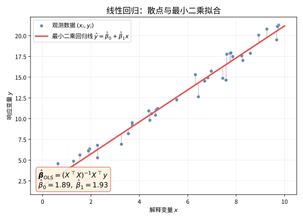

# 第 92 级：回归分析 (Regression Analysis)

---

## 1. 学习目标

完成本教程后，你将能够：

1. 理解线性回归模型的基本假设与参数估计方法
2. 掌握最小二乘估计与最大似然估计的推导与性质
3. 掌握回归系数的假设检验（t检验与F检验）与方差分析
4. 理解多重共线性、异方差性、自相关等问题的诊断与处理方法
5. 掌握岭回归、Lasso回归、主成分回归等正则化方法
6. 理解非线性回归的基本思想
7. 能独立完成回归诊断并选择合适的修正方案

---

## 2. 核心概念

### 2.1 线性回归模型

**线性回归模型**（Linear Regression Model）假设响应变量 $Y$ 与一组解释变量 $X_1, X_2, \dots, X_p$ 之间存在线性关系：

$$
Y_i = \beta_0 + \beta_1 X_{i1} + \beta_2 X_{i2} + \cdots + \beta_p X_{ip} + \varepsilon_i, \quad i = 1, 2, \dots, n
$$

其中 $\varepsilon_i$ 为随机误差项。用矩阵形式表示为：

$$
\boldsymbol{Y} = \boldsymbol{X}\boldsymbol{\beta} + \boldsymbol{\varepsilon}
$$

其中 $\boldsymbol{Y} \in \mathbb{R}^n$ 为响应向量，$\boldsymbol{X} \in \mathbb{R}^{n \times (p+1)}$ 为设计矩阵，$\boldsymbol{\beta} \in \mathbb{R}^{p+1}$ 为回归系数向量，$\boldsymbol{\varepsilon} \in \mathbb{R}^n$ 为误差向量。

**经典假设**：
1. **线性性**：$\mathbb{E}[\boldsymbol{Y} \mid \boldsymbol{X}] = \boldsymbol{X}\boldsymbol{\beta}$
2. **严格外生性**：$\mathbb{E}[\boldsymbol{\varepsilon} \mid \boldsymbol{X}] = \boldsymbol{0}$
3. **同方差性**：$\text{Var}(\varepsilon_i) = \sigma^2$（常数）
4. **无自相关**：$\text{Cov}(\varepsilon_i, \varepsilon_j) = 0$（$i \neq j$）
5. **满秩**：$\text{rank}(\boldsymbol{X}) = p + 1 < n$

> **💡 直观理解（类比）**：线性回归模型就像"用多个原因的加权和去猜一个结果"——比如房价由面积、卧室数、房龄共同决定，每个因素配一个权重（系数）$\beta$。经典假设则是给这个"猜测游戏"定的规矩：误差平均为零、好坏样本误差波动一致、彼此不串味，这样猜出来的结论才可靠。

### 2.2 最小二乘估计

**最小二乘估计**（Ordinary Least Squares, OLS）通过最小化残差平方和来估计参数：

$$
\hat{\boldsymbol{\beta}}_{\text{OLS}} = \arg\min_{\boldsymbol{\beta}} \|\boldsymbol{Y} - \boldsymbol{X}\boldsymbol{\beta}\|^2 = (\boldsymbol{X}^\top \boldsymbol{X})^{-1}\boldsymbol{X}^\top \boldsymbol{Y}
$$

> **直观理解（现实类比）**：把散点想象成学生在某门课上的平时分与期末成绩，每个点是一位同学。最小二乘回归线就像在点云中"拉一根最合适的直尺"，让所有点到这根线的竖直距离的平方和最小——也就是找到一条"综合误差最小"的趋势线。竖线（残差）就是每个点偏离这条线的距离，越短说明这个点越贴合整体规律。

> **🧠 思考历程：两条这样的直线，如何都通往"最小二乘"？**
>
> 当你说出"最小二乘"，它其实在回答一个朴素的追问：散点并没有落在一根直线上，怎样的线才"最像"这些点？而这个问题之所以能从小数点的运算登上统计学殿堂，是因为它最早长在天文观测的误差处理里。
>
> - **天文催生的方法**。1801年意大利天文学家皮亚齐（Giuseppe Piazzi）观测到小行星谷神星后很快就跟丢了，24岁的Gauss依据极少数观测点用最小二乘推算它的轨道，次年这颗星被重新找到，方法一战成名；而独立提出同一思想的Legendre直到1805年才正式发表，一场著名的优先权之争从此延续了半个世纪。
> - **从"凑直线"到"最优直线"**。真正让最小二乘区别于随手画的，是Gauss在1820年代证明：在正态误差下、只要经典假定成立，$\hat{\boldsymbol{\beta}}=(\boldsymbol{X}^{\top}\boldsymbol{X})^{-1}\boldsymbol{X}^{\top}\boldsymbol{Y}$ 就在一切线性无偏估计中方差最小，这正是后来由Markov在1900年去掉正态前提后完成的Gauss-Markov定理。
> - **一条定理的两张脸**。Gauss先给正态前提，Markov只保留一阶、二阶矩假设，便把"最优线性无偏"变成纯粹的线性代数事实——最小二乘由此从天文、物理的实用技巧，升华为整个统计推断的基石。
> - **心路**：好方法往往先从具体疑难里攀出来，再经半世纪淘洗才显出普遍锋芒——误差随手可得，但要说清"它已是最好的"，却要等上一个世纪。

### 2.3 最大似然估计

在误差 $\boldsymbol{\varepsilon} \sim N(\boldsymbol{0}, \sigma^2 \boldsymbol{I}_n)$ 的正态假设下，**最大似然估计**（MLE）与OLS估计量相同：

$$
\hat{\boldsymbol{\beta}}_{\text{MLE}} = (\boldsymbol{X}^\top \boldsymbol{X})^{-1}\boldsymbol{X}^\top \boldsymbol{Y}
$$

> **💡 直观理解（类比）**：最大似然估计就是"反客为主的侦探破案"——不是去算"给定参数时数据怎么分布"，而是反过来说：现在都已经看到这些数据了，那能让这些数据最"顺理成章"出现的参数，就是最可信的凶手。在误差服从正态分布时，"最像"的答案恰好和最小二乘拉出的同一条直线重合。

### 2.4 决定系数 $R^2$

**决定系数**衡量回归模型对数据的拟合优度：

$$
R^2 = 1 - \frac{\text{SSE}}{\text{SST}} = \frac{\text{SSR}}{\text{SST}}
$$

其中 $\text{SSE} = \sum_{i=1}^n (Y_i - \hat{Y}_i)^2$ 为残差平方和，$\text{SSR} = \sum_{i=1}^n (\hat{Y}_i - \bar{Y})^2$ 为回归平方和，$\text{SST} = \sum_{i=1}^n (Y_i - \bar{Y})^2$ 为总平方和。

> **直观理解（现实类比）**：$R^2$ 就像天气预报的"准确度评分"——它衡量解释变量能解释响应变量多少比例的波动。残差图则像体检报告上的"误差分布图"：如果残差点在0线两侧随机散布（无规律），说明回归假设成立；如果出现漏斗形或弯曲图案，就像体检指标异常，提示存在异方差性或非线性，需要诊断修正。

### 2.5 多重共线性

**多重共线性**（Multicollinearity）指解释变量之间存在高度线性相关关系，导致设计矩阵 $\boldsymbol{X}$ 的列近似线性相关，使得 $(\boldsymbol{X}^\top \boldsymbol{X})$ 接近奇异。

**方差膨胀因子**（VIF）用于诊断多重共线性：

$$
\text{VIF}_j = \frac{1}{1 - R_j^2}
$$

其中 $R_j^2$ 是第 $j$ 个解释变量对其他所有解释变量回归的决定系数。$\text{VIF}_j > 10$ 通常表示存在严重的多重共线性。

> **💡 直观理解（类比）**：多重共线性就像"问你三个几乎长得一模一样的人谁做对了这道题"——面积、房间数、房龄常常一起变化、信息高度重叠，模型分不清到底是哪个因素在起作用。此时系数估计像踩在跷跷板两端，数据稍微一晃就东倒西歪，标准误也变大，结论不再可靠。

### 2.6 异方差性

**异方差性**（Heteroscedasticity）指误差项的方差不是常数：$\text{Var}(\varepsilon_i) = \sigma_i^2$，即不同观测的误差方差不同。

> **💡 直观理解（类比）**：异方差就像"不同身高的体重测量误差不一样"——矮个子误差几克，大象误差几公斤，误差的"嗓门"忽大忽小。这会让模型在噪声大的点处过度较真、在噪声小的点处看轻细节，普通的拟合不再公平。"加权"就是给噪声小的点更大发言权。

### 2.7 自相关

**自相关**（Autocorrelation）指不同观测的误差项之间存在相关性：$\text{Cov}(\varepsilon_i, \varepsilon_j) \neq 0$（$i \neq j$），常见于时间序列数据。

> **💡 直观理解（类比）**：自相关就像"今天的统计噪声会传给明天"——比如股票一天的冲击会影响第二天的收益误差。连续几天的误差"抱团"相关，会让模型误以为自己掌握了更多独立证据，从而过于自信，标准误被低估、显著性被夸大。

### 2.8 广义最小二乘与加权最小二乘

**加权最小二乘**（WLS）用于处理异方差性，通过给不同观测赋予不同权重：

$$
\hat{\boldsymbol{\beta}}_{\text{WLS}} = \arg\min_{\boldsymbol{\beta}} \sum_{i=1}^n w_i (Y_i - \boldsymbol{X}_i^\top \boldsymbol{\beta})^2
$$

**广义最小二乘**（GLS）处理更一般的误差协方差结构 $\text{Var}(\boldsymbol{\varepsilon}) = \sigma^2 \boldsymbol{\Omega}$：

$$
\hat{\boldsymbol{\beta}}_{\text{GLS}} = (\boldsymbol{X}^\top \boldsymbol{\Omega}^{-1} \boldsymbol{X})^{-1} \boldsymbol{X}^\top \boldsymbol{\Omega}^{-1} \boldsymbol{Y}
$$

> **💡 直观理解（类比）**：加权最小二乘（WLS）和广义最小二乘（GLS）就像"给可靠发言的人更多投票权"——对越可信（误差越小）的观测给越大权重。GLS 更进一步：当误差之间有复杂关系（既有大小差异又互相牵连）时，它先对数据做一次"整容"把它们变成独立同方差，再套用普通最小二乘，把公平性找回来。

### 2.9 正则化方法

**岭回归**（Ridge Regression）在损失函数中加入 $L_2$ 惩罚项：

$$
\hat{\boldsymbol{\beta}}_{\text{Ridge}} = \arg\min_{\boldsymbol{\beta}} \|\boldsymbol{Y} - \boldsymbol{X}\boldsymbol{\beta}\|^2 + \lambda \|\boldsymbol{\beta}\|_2^2
$$

> **💡 直观理解（类比）**：岭回归就像"给容易发飘的答案踩一脚刹车"——当变量信息重叠（共线性）让系数乱跳时，它用 $L_2$ 惩罚把系数往零方向温和地收一收，宁可稍微偏一点，也不要忽大忽小。换来的是稳定，代价是引入一点点偏差，属于典型的"用小幅让利换大幅省心"。

**Lasso回归**（Least Absolute Shrinkage and Selection Operator）使用 $L_1$ 惩罚项，具有变量选择功能：

$$
\hat{\boldsymbol{\beta}}_{\text{Lasso}} = \arg\min_{\boldsymbol{\beta}} \|\boldsymbol{Y} - \boldsymbol{X}\boldsymbol{\beta}\|^2 + \lambda \|\boldsymbol{\beta}\|_1
$$

> **💡 直观理解（类比）**：Lasso 像"买一送一的瘦身教练"——$L_1$ 惩罚的约束区域带有尖角，会让不少系数的解刚好"卡"在零上。于是它不只把系数缩小，还能干脆把没用或重复的变量直接砍掉（压缩成零），在收缩的同时实现自动选变量，特别适合"候选因素很多、但真正起作用的没几个"的场景。

**主成分回归**（PCR）先对解释变量进行主成分分析，再用主成分作为新的解释变量进行回归。

> **💡 直观理解（类比）**：主成分回归就像"先给杂乱的信息做一次合并同类项"——面对一堆高度相关的变量，它先抽取几个最能代表整体变化方向的新坐标（主成分），再在新坐标上做回归。这样既绕开了共线性带来的病态，又用更少的维度抓住主要信息，代价是新坐标不如原来的变量好解释。

### 2.10 非线性回归

**非线性回归**模型的形式为：

$$
Y_i = f(\boldsymbol{X}_i, \boldsymbol{\theta}) + \varepsilon_i
$$

其中 $f$ 是参数 $\boldsymbol{\theta}$ 的非线性函数，通常使用非线性最小二乘或迭代算法（如 Gauss-Newton）求解。

> **💡 直观理解（类比）**：非线性回归就是"曲线不再是直线"——比如生长曲线、药物浓度随时间的变化根本不是一条直尺能画出的趋势。因为参数藏在曲线拐弯的地方，无法一次性解析解出，只能靠迭代算法（如 Gauss-Newton）像爬山一样一步步逼近最优解，初值选得不好还可能掉进局部低谷。

---

## 3. 定理与证明

### 定理 3.1：Gauss-Markov 定理

**定理**：在线性回归模型 $\boldsymbol{Y} = \boldsymbol{X}\boldsymbol{\beta} + \boldsymbol{\varepsilon}$ 的经典假设（线性性、严格外生性、同方差性、无自相关、满秩）下，最小二乘估计量 $\hat{\boldsymbol{\beta}}_{\text{OLS}} = (\boldsymbol{X}^\top \boldsymbol{X})^{-1}\boldsymbol{X}^\top \boldsymbol{Y}$ 是 $\boldsymbol{\beta}$ 的最优线性无偏估计（Best Linear Unbiased Estimator, BLUE），即它在所有线性无偏估计量中具有最小方差。

> **💡 直观理解（类比）**：Gauss-Markov 定理就像告诉你"在一群都老实（无偏）的称重员里，最小二乘这位手最稳"——只要是"按数据线性组合、不掺私心（无偏）"的估计方法，最小二乘的波动（方差）一定不比别人大。它把"最小二乘是最好的直线"从经验升格成了铁律。

**证明**：

设 $\tilde{\boldsymbol{\beta}} = \boldsymbol{A} \boldsymbol{Y}$ 是 $\boldsymbol{\beta}$ 的任意一个线性无偏估计量，其中 $\boldsymbol{A} \in \mathbb{R}^{(p+1) \times n}$。

**步骤1：无偏性条件**

由无偏性 $\mathbb{E}[\tilde{\boldsymbol{\beta}}] = \boldsymbol{\beta}$ 得：

$$
\mathbb{E}[\boldsymbol{A} \boldsymbol{Y}] = \mathbb{E}[\boldsymbol{A}(\boldsymbol{X}\boldsymbol{\beta} + \boldsymbol{\varepsilon})] = \boldsymbol{A}\boldsymbol{X}\boldsymbol{\beta} + \boldsymbol{A} \mathbb{E}[\boldsymbol{\varepsilon}] = \boldsymbol{A}\boldsymbol{X}\boldsymbol{\beta} = \boldsymbol{\beta}
$$

由于上式对任意 $\boldsymbol{\beta}$ 成立，故必须有：

$$
\boldsymbol{A}\boldsymbol{X} = \boldsymbol{I}_{p+1}
$$

**步骤2：OLS估计量的无偏性**

首先验证OLS估计量 $\hat{\boldsymbol{\beta}}_{\text{OLS}}$ 是无偏的：

$$
\begin{aligned}
\mathbb{E}[\hat{\boldsymbol{\beta}}_{\text{OLS}}] &= \mathbb{E}[(\boldsymbol{X}^\top \boldsymbol{X})^{-1}\boldsymbol{X}^\top \boldsymbol{Y}] \\
&= (\boldsymbol{X}^\top \boldsymbol{X})^{-1}\boldsymbol{X}^\top \mathbb{E}[\boldsymbol{Y}] \\
&= (\boldsymbol{X}^\top \boldsymbol{X})^{-1}\boldsymbol{X}^\top \boldsymbol{X}\boldsymbol{\beta} = \boldsymbol{\beta}
\end{aligned}
$$

**步骤3：OLS估计量的协方差矩阵**

$$
\begin{aligned}
\text{Var}(\hat{\boldsymbol{\beta}}_{\text{OLS}}) &= \text{Var}((\boldsymbol{X}^\top \boldsymbol{X})^{-1}\boldsymbol{X}^\top \boldsymbol{Y}) \\
&= (\boldsymbol{X}^\top \boldsymbol{X})^{-1}\boldsymbol{X}^\top \text{Var}(\boldsymbol{Y}) \boldsymbol{X} (\boldsymbol{X}^\top \boldsymbol{X})^{-1} \\
&= (\boldsymbol{X}^\top \boldsymbol{X})^{-1}\boldsymbol{X}^\top (\sigma^2 \boldsymbol{I}_n) \boldsymbol{X} (\boldsymbol{X}^\top \boldsymbol{X})^{-1} \\
&= \sigma^2 (\boldsymbol{X}^\top \boldsymbol{X})^{-1}
\end{aligned}
$$

**步骤4：任意线性无偏估计量的协方差矩阵**

设 $\tilde{\boldsymbol{\beta}} = \boldsymbol{A} \boldsymbol{Y}$ 为任意线性无偏估计量，则 $\boldsymbol{A}\boldsymbol{X} = \boldsymbol{I}_{p+1}$。

令 $\boldsymbol{D} = \boldsymbol{A} - (\boldsymbol{X}^\top \boldsymbol{X})^{-1}\boldsymbol{X}^\top$，则：

$$
\boldsymbol{A} = (\boldsymbol{X}^\top \boldsymbol{X})^{-1}\boldsymbol{X}^\top + \boldsymbol{D}
$$

由于 $\boldsymbol{A}\boldsymbol{X} = \boldsymbol{I}_{p+1}$ 且 $(\boldsymbol{X}^\top \boldsymbol{X})^{-1}\boldsymbol{X}^\top \boldsymbol{X} = \boldsymbol{I}_{p+1}$，可得：

$$
\boldsymbol{D}\boldsymbol{X} = \boldsymbol{A}\boldsymbol{X} - (\boldsymbol{X}^\top \boldsymbol{X})^{-1}\boldsymbol{X}^\top \boldsymbol{X} = \boldsymbol{I}_{p+1} - \boldsymbol{I}_{p+1} = \boldsymbol{0}
$$

现在计算 $\tilde{\boldsymbol{\beta}}$ 的协方差矩阵：

$$
\begin{aligned}
\text{Var}(\tilde{\boldsymbol{\beta}}) &= \text{Var}(\boldsymbol{A} \boldsymbol{Y}) = \boldsymbol{A} \text{Var}(\boldsymbol{Y}) \boldsymbol{A}^\top \\
&= \sigma^2 \boldsymbol{A} \boldsymbol{A}^\top \\
&= \sigma^2 [(\boldsymbol{X}^\top \boldsymbol{X})^{-1}\boldsymbol{X}^\top + \boldsymbol{D}] [(\boldsymbol{X}^\top \boldsymbol{X})^{-1}\boldsymbol{X}^\top + \boldsymbol{D}]^\top \\
&= \sigma^2 [(\boldsymbol{X}^\top \boldsymbol{X})^{-1}\boldsymbol{X}^\top \boldsymbol{X} (\boldsymbol{X}^\top \boldsymbol{X})^{-1} + (\boldsymbol{X}^\top \boldsymbol{X})^{-1}\boldsymbol{X}^\top \boldsymbol{D}^\top + \boldsymbol{D}\boldsymbol{X}(\boldsymbol{X}^\top \boldsymbol{X})^{-1} + \boldsymbol{D}\boldsymbol{D}^\top] \\
&= \sigma^2 [(\boldsymbol{X}^\top \boldsymbol{X})^{-1} + (\boldsymbol{X}^\top \boldsymbol{X})^{-1} (\boldsymbol{X}^\top \boldsymbol{D}^\top) + \boldsymbol{D}\boldsymbol{X} (\boldsymbol{X}^\top \boldsymbol{X})^{-1} + \boldsymbol{D}\boldsymbol{D}^\top]
\end{aligned}
$$

由 $\boldsymbol{D}\boldsymbol{X} = \boldsymbol{0}$ 得 $\boldsymbol{X}^\top \boldsymbol{D}^\top = \boldsymbol{0}$，因此：

$$
\text{Var}(\tilde{\boldsymbol{\beta}}) = \sigma^2 [(\boldsymbol{X}^\top \boldsymbol{X})^{-1} + \boldsymbol{D}\boldsymbol{D}^\top] = \text{Var}(\hat{\boldsymbol{\beta}}_{\text{OLS}}) + \sigma^2 \boldsymbol{D}\boldsymbol{D}^\top
$$

由于 $\boldsymbol{D}\boldsymbol{D}^\top$ 是半正定矩阵，$\sigma^2 \boldsymbol{D}\boldsymbol{D}^\top$ 也是半正定矩阵。因此对于任意非零向量 $\boldsymbol{c} \in \mathbb{R}^{p+1}$：

$$
\boldsymbol{c}^\top \text{Var}(\tilde{\boldsymbol{\beta}}) \boldsymbol{c} = \boldsymbol{c}^\top \text{Var}(\hat{\boldsymbol{\beta}}_{\text{OLS}}) \boldsymbol{c} + \sigma^2 \boldsymbol{c}^\top \boldsymbol{D}\boldsymbol{D}^\top \boldsymbol{c} \ge \boldsymbol{c}^\top \text{Var}(\hat{\boldsymbol{\beta}}_{\text{OLS}}) \boldsymbol{c}
$$

即 $\tilde{\boldsymbol{\beta}}$ 的任意线性组合的方差都不小于OLS估计量的相应线性组合的方差。故 $\hat{\boldsymbol{\beta}}_{\text{OLS}}$ 是最优线性无偏估计。$\square$

---

### 定理 3.2：回归系数的 t 检验与 F 检验

**定理**：在正态线性回归模型 $\boldsymbol{Y} = \boldsymbol{X}\boldsymbol{\beta} + \boldsymbol{\varepsilon}$，$\boldsymbol{\varepsilon} \sim N(\boldsymbol{0}, \sigma^2 \boldsymbol{I}_n)$ 的假设下：

**(1) t 检验**：对单个回归系数 $\beta_j$ 的假设检验 $H_0: \beta_j = \beta_j^{(0)}$ 使用检验统计量：

$$
t = \frac{\hat{\beta}_j - \beta_j^{(0)}}{\text{SE}(\hat{\beta}_j)} \sim t_{n-p-1}
$$

其中 $\text{SE}(\hat{\beta}_j) = \hat{\sigma} \sqrt{[(\boldsymbol{X}^\top \boldsymbol{X})^{-1}]_{jj}}$，$\hat{\sigma}^2 = \frac{\text{SSE}}{n-p-1}$。

**(2) F 检验**：对回归模型的整体显著性 $H_0: \beta_1 = \beta_2 = \cdots = \beta_p = 0$ 使用检验统计量：

$$
F = \frac{\text{SSR} / p}{\text{SSE} / (n-p-1)} \sim F_{p, n-p-1}
$$

> **💡 直观理解（类比）**：t 检验和 F 检验分别像"眼力检查"和"整体体检"——t 检验问"这一个变量（好比一个器官）是否真的在起作用"，看它的系数偏离零有没有大到足够可信；F 检验问"这一整套模型加在一起有没有用"，比较"解释掉的变化"和"没解释掉的噪声"谁占上风。两者都靠"信号/噪声"的比值说话。

**证明**：

**步骤1：$\hat{\boldsymbol{\beta}}$ 的分布**

由 $\boldsymbol{\varepsilon} \sim N(\boldsymbol{0}, \sigma^2 \boldsymbol{I}_n)$ 知 $\boldsymbol{Y} \sim N(\boldsymbol{X}\boldsymbol{\beta}, \sigma^2 \boldsymbol{I}_n)$。由于 $\hat{\boldsymbol{\beta}} = (\boldsymbol{X}^\top \boldsymbol{X})^{-1}\boldsymbol{X}^\top \boldsymbol{Y}$ 是 $\boldsymbol{Y}$ 的线性变换，故：

$$
\hat{\boldsymbol{\beta}} \sim N(\boldsymbol{\beta}, \sigma^2 (\boldsymbol{X}^\top \boldsymbol{X})^{-1})
$$

因此对单个系数 $\hat{\beta}_j$：

$$
\hat{\beta}_j \sim N(\beta_j, \sigma^2 [(\boldsymbol{X}^\top \boldsymbol{X})^{-1}]_{jj})
$$

标准化得：

$$
z_j = \frac{\hat{\beta}_j - \beta_j}{\sigma \sqrt{[(\boldsymbol{X}^\top \boldsymbol{X})^{-1}]_{jj}}} \sim N(0, 1)
$$

**步骤2：$\hat{\sigma}^2$ 的分布**

残差 $\hat{\boldsymbol{\varepsilon}} = \boldsymbol{Y} - \boldsymbol{X}\hat{\boldsymbol{\beta}} = (\boldsymbol{I}_n - \boldsymbol{H})\boldsymbol{Y}$，其中 $\boldsymbol{H} = \boldsymbol{X}(\boldsymbol{X}^\top \boldsymbol{X})^{-1}\boldsymbol{X}^\top$ 为帽子矩阵。

可以证明：

$$
\frac{\text{SSE}}{\sigma^2} = \frac{\hat{\boldsymbol{\varepsilon}}^\top \hat{\boldsymbol{\varepsilon}}}{\sigma^2} \sim \chi^2_{n-p-1}
$$

且 $\hat{\boldsymbol{\beta}}$ 与 $\hat{\sigma}^2$ 相互独立。

**步骤3：t 统计量的推导**

由定义：

$$
t = \frac{\hat{\beta}_j - \beta_j^{(0)}}{\hat{\sigma} \sqrt{[(\boldsymbol{X}^\top \boldsymbol{X})^{-1}]_{jj}}}
= \frac{z_j}{\sqrt{\frac{\text{SSE}}{\sigma^2} / (n-p-1)}}
$$

其中 $z_j \sim N(0, 1)$ 且 $\frac{\text{SSE}}{\sigma^2} \sim \chi^2_{n-p-1}$ 与 $z_j$ 独立。由t分布的定义，$t \sim t_{n-p-1}$。

**步骤4：F 统计量的推导**

在 $H_0: \beta_1 = \cdots = \beta_p = 0$ 下，有：

$$
\frac{\text{SSR}}{\sigma^2} = \frac{(\boldsymbol{Y} - \bar{Y}\boldsymbol{1})^\top \boldsymbol{H}_c (\boldsymbol{Y} - \bar{Y}\boldsymbol{1})}{\sigma^2} \sim \chi^2_p
$$

其中 $\boldsymbol{H}_c$ 是中心化的帽子矩阵。且 SSR 与 SSE 独立。由F分布的定义：

$$
F = \frac{\text{SSR} / p}{\text{SSE} / (n-p-1)} \sim F_{p, n-p-1}
$$

$\square$

---

### 定理 3.3：$R^2$ 的分解与方差分析

**定理**：在线性回归模型中，总平方和可以分解为回归平方和与残差平方和之和：

$$
\text{SST} = \text{SSR} + \text{SSE}
$$

其中 $\text{SST} = \sum_{i=1}^n (Y_i - \bar{Y})^2$，$\text{SSR} = \sum_{i=1}^n (\hat{Y}_i - \bar{Y})^2$，$\text{SSE} = \sum_{i=1}^n (Y_i - \hat{Y}_i)^2$。

> **💡 直观理解（类比）**：SST = SSR + SSE 就像"用模型的贡献和失误瓜分总成绩"——数据的整体波动（SST）能被干净地切成两半：被模型解释掉的变化（SSR，功劳）加上没解释掉的误差（SSE，缺口），两者不会重叠、不会遗漏。有了这账本，$R^2$ 才能用"功劳占比"来打分。

**证明**：

$$
\begin{aligned}
\text{SST} &= \sum_{i=1}^n (Y_i - \bar{Y})^2 \\
&= \sum_{i=1}^n [(Y_i - \hat{Y}_i) + (\hat{Y}_i - \bar{Y})]^2 \\
&= \sum_{i=1}^n (Y_i - \hat{Y}_i)^2 + \sum_{i=1}^n (\hat{Y}_i - \bar{Y})^2 + 2\sum_{i=1}^n (Y_i - \hat{Y}_i)(\hat{Y}_i - \bar{Y})
\end{aligned}
$$

下面证明交叉项为零。注意到 $\hat{\boldsymbol{\varepsilon}} = \boldsymbol{Y} - \hat{\boldsymbol{Y}} = (\boldsymbol{I}_n - \boldsymbol{H})\boldsymbol{Y}$，且 $\boldsymbol{H}$ 是对称幂等矩阵。由OLS的正交性，残差与拟合值正交：

$$
\hat{\boldsymbol{\varepsilon}}^\top \hat{\boldsymbol{Y}} = \boldsymbol{Y}^\top (\boldsymbol{I}_n - \boldsymbol{H})^\top \boldsymbol{H} \boldsymbol{Y} = \boldsymbol{Y}^\top (\boldsymbol{I}_n - \boldsymbol{H})\boldsymbol{H} \boldsymbol{Y} = \boldsymbol{Y}^\top (\boldsymbol{H} - \boldsymbol{H}^2)\boldsymbol{Y} = \boldsymbol{0}
$$

又因为 $\sum_{i=1}^n \hat{\varepsilon}_i = 0$（当模型包含截距项时），所以：

$$
\sum_{i=1}^n (Y_i - \hat{Y}_i)(\hat{Y}_i - \bar{Y}) = \sum_{i=1}^n \hat{\varepsilon}_i (\hat{Y}_i - \bar{Y}) = \sum_{i=1}^n \hat{\varepsilon}_i \hat{Y}_i - \bar{Y} \sum_{i=1}^n \hat{\varepsilon}_i = 0 - 0 = 0
$$

因此 $\text{SST} = \text{SSR} + \text{SSE}$。由此得：

$$
R^2 = \frac{\text{SSR}}{\text{SST}} = 1 - \frac{\text{SSE}}{\text{SST}}
$$

**方差分析表**（ANOVA Table）：

| 来源 | 平方和 | 自由度 | 均方 | F统计量 |
|:---|:---|:---:|:---|:---|
| 回归 | SSR | $p$ | MSR = SSR$/p$ | $F = \frac{\text{MSR}}{\text{MSE}}$ |
| 残差 | SSE | $n-p-1$ | MSE = SSE$/(n-p-1)$ | |
| 总和 | SST | $n-1$ | | |

$\square$

---

### 定理 3.4：岭回归的统计性质

**定理**：岭回归估计量 $\hat{\boldsymbol{\beta}}_{\text{Ridge}} = (\boldsymbol{X}^\top \boldsymbol{X} + \lambda \boldsymbol{I})^{-1} \boldsymbol{X}^\top \boldsymbol{Y}$ 具有以下性质：

(1) 岭估计是有偏估计，偏差为 $\text{Bias}(\hat{\boldsymbol{\beta}}_{\text{Ridge}}) = -\lambda (\boldsymbol{X}^\top \boldsymbol{X} + \lambda \boldsymbol{I})^{-1} \boldsymbol{\beta}$

(2) 岭估计的方差小于OLS估计的方差

(3) 存在 $\lambda > 0$ 使得岭估计的均方误差（MSE）小于OLS估计的均方误差

> **💡 直观理解（类比）**：岭回归的统计性质概括成一句话就是"用一点偏差换大片稳定"——它确实偏了（偏差），但方差被压小了；两项一加（均方误差），只要 $\lambda$ 选得不大不小，总体误差反而更小，就像"稍微让点方向的箭，比瞄得死死的却总脱靶的箭更准"。

**证明**：

**步骤1：证明有偏性**

$$
\begin{aligned}
\hat{\boldsymbol{\beta}}_{\text{Ridge}} &= (\boldsymbol{X}^\top \boldsymbol{X} + \lambda \boldsymbol{I})^{-1} \boldsymbol{X}^\top \boldsymbol{Y} \\
&= (\boldsymbol{X}^\top \boldsymbol{X} + \lambda \boldsymbol{I})^{-1} \boldsymbol{X}^\top (\boldsymbol{X}\boldsymbol{\beta} + \boldsymbol{\varepsilon}) \\
&= (\boldsymbol{X}^\top \boldsymbol{X} + \lambda \boldsymbol{I})^{-1} \boldsymbol{X}^\top \boldsymbol{X} \boldsymbol{\beta} + (\boldsymbol{X}^\top \boldsymbol{X} + \lambda \boldsymbol{I})^{-1} \boldsymbol{X}^\top \boldsymbol{\varepsilon}
\end{aligned}
$$

取期望：

$$
\begin{aligned}
\mathbb{E}[\hat{\boldsymbol{\beta}}_{\text{Ridge}}] &= (\boldsymbol{X}^\top \boldsymbol{X} + \lambda \boldsymbol{I})^{-1} \boldsymbol{X}^\top \boldsymbol{X} \boldsymbol{\beta} \\
&= (\boldsymbol{X}^\top \boldsymbol{X} + \lambda \boldsymbol{I})^{-1} (\boldsymbol{X}^\top \boldsymbol{X} + \lambda \boldsymbol{I} - \lambda \boldsymbol{I}) \boldsymbol{\beta} \\
&= \boldsymbol{\beta} - \lambda (\boldsymbol{X}^\top \boldsymbol{X} + \lambda \boldsymbol{I})^{-1} \boldsymbol{\beta}
\end{aligned}
$$

因此：

$$
\text{Bias}(\hat{\boldsymbol{\beta}}_{\text{Ridge}}) = \mathbb{E}[\hat{\boldsymbol{\beta}}_{\text{Ridge}}] - \boldsymbol{\beta} = -\lambda (\boldsymbol{X}^\top \boldsymbol{X} + \lambda \boldsymbol{I})^{-1} \boldsymbol{\beta}
$$

**步骤2：证明方差减小**

令 $\boldsymbol{W}_\lambda = (\boldsymbol{X}^\top \boldsymbol{X} + \lambda \boldsymbol{I})^{-1} \boldsymbol{X}^\top \boldsymbol{X}$，则 $\hat{\boldsymbol{\beta}}_{\text{Ridge}} = \boldsymbol{W}_\lambda \hat{\boldsymbol{\beta}}_{\text{OLS}}$。

$$
\begin{aligned}
\text{Var}(\hat{\boldsymbol{\beta}}_{\text{Ridge}}) &= \text{Var}(\boldsymbol{W}_\lambda \hat{\boldsymbol{\beta}}_{\text{OLS}}) \\
&= \boldsymbol{W}_\lambda \text{Var}(\hat{\boldsymbol{\beta}}_{\text{OLS}}) \boldsymbol{W}_\lambda^\top \\
&= \sigma^2 \boldsymbol{W}_\lambda (\boldsymbol{X}^\top \boldsymbol{X})^{-1} \boldsymbol{W}_\lambda^\top
\end{aligned}
$$

利用奇异值分解 $\boldsymbol{X} = \boldsymbol{U} \boldsymbol{D} \boldsymbol{V}^\top$，其中 $\boldsymbol{D} = \text{diag}(d_1, \dots, d_{p+1})$，可得：

$$
\text{Var}(\hat{\boldsymbol{\beta}}_{\text{OLS}}) = \sigma^2 \boldsymbol{V} \boldsymbol{D}^{-2} \boldsymbol{V}^\top
$$

$$
\text{Var}(\hat{\boldsymbol{\beta}}_{\text{Ridge}}) = \sigma^2 \boldsymbol{V} \text{diag}\left(\frac{d_j^2}{(d_j^2 + \lambda)^2}\right) \boldsymbol{V}^\top
$$

由于 $\frac{d_j^2}{(d_j^2 + \lambda)^2} < \frac{1}{d_j^2}$ 对所有 $\lambda > 0$ 成立，因此岭估计的每个方差分量都小于OLS估计的对应方差分量。

**步骤3：证明存在 $\lambda$ 使 MSE 更小**

均方误差可分解为方差与偏差平方之和：

$$
\text{MSE}(\hat{\boldsymbol{\beta}}_{\text{Ridge}}) = \text{tr}[\text{Var}(\hat{\boldsymbol{\beta}}_{\text{Ridge}})] + \|\text{Bias}(\hat{\boldsymbol{\beta}}_{\text{Ridge}})\|^2
$$

当 $\lambda = 0$ 时，$\text{MSE}(\hat{\boldsymbol{\beta}}_{\text{Ridge}}) = \text{MSE}(\hat{\boldsymbol{\beta}}_{\text{OLS}})$。

当 $\lambda$ 从0增加时，方差项 $\text{tr}[\text{Var}(\hat{\boldsymbol{\beta}}_{\text{Ridge}})]$ 连续减小，而偏差平方项 $\|\text{Bias}(\hat{\boldsymbol{\beta}}_{\text{Ridge}})\|^2$ 从0开始连续增加。由连续性，在 $\lambda = 0$ 的邻域内，方差减小量占主导，因此存在 $\lambda > 0$ 使得 $\text{MSE}(\hat{\boldsymbol{\beta}}_{\text{Ridge}}) < \text{MSE}(\hat{\boldsymbol{\beta}}_{\text{OLS}})$。$\square$

---

### 定理 3.5：Lasso 的变量选择一致性

**定理**（变量选择一致性）：考虑 Lasso 估计量：

$$
\hat{\boldsymbol{\beta}}_{\text{Lasso}} = \arg\min_{\boldsymbol{\beta}} \frac{1}{2n} \|\boldsymbol{Y} - \boldsymbol{X}\boldsymbol{\beta}\|^2 + \lambda_n \|\boldsymbol{\beta}\|_1
$$

设真实模型为 $\boldsymbol{\beta}^* = (\boldsymbol{\beta}_1^{*\top}, \boldsymbol{\beta}_2^{*\top})^\top$，其中 $\boldsymbol{\beta}_1^* \neq \boldsymbol{0}$ 对应重要变量，$\boldsymbol{\beta}_2^* = \boldsymbol{0}$ 对应非重要变量。若满足以下条件：

(1) **Irrepresentable Condition**（不可表示条件）：$\left|\boldsymbol{X}_2^\top \boldsymbol{X}_1 (\boldsymbol{X}_1^\top \boldsymbol{X}_1)^{-1} \text{sign}(\boldsymbol{\beta}_1^*)\right| < \boldsymbol{1} - \eta$ 对某个 $\eta > 0$ 成立（逐元素不等式）

(2) 正则化参数 $\lambda_n$ 满足 $\lambda_n \to 0$ 且 $\sqrt{n} \lambda_n \to \infty$

(3) $\boldsymbol{X}_1^\top \boldsymbol{X}_1 / n \to \boldsymbol{C}$，其中 $\boldsymbol{C}$ 为正定矩阵

则 Lasso 估计量 $\hat{\boldsymbol{\beta}}_{\text{Lasso}}$ 具有变量选择一致性：

$$
\mathbb{P}\left(\{j: \hat{\beta}_j \neq 0\} = \{j: \beta_j^* \neq 0\}\right) \to 1, \quad n \to \infty
$$

> **💡 直观理解（类比）**：Lasso 的变量选择一致性说的是"数据足够多时，它能认准自己人"——只要真正重要的变量信号够强、又没有被"假亲戚"强烈牵连（即 Irrepresentable 条件把相关性的杂音压住），随着样本增大，Lasso 选出的变量集合会以接近 1 的概率和真模型完全对上，既不多选也不少选。

**证明思路**：

**步骤1：K.K.T. 条件**

Lasso 问题的 Karush-Kuhn-Tucker（K.K.T.）条件为：

$$
\frac{1}{n} \boldsymbol{X}_j^\top (\boldsymbol{Y} - \boldsymbol{X} \hat{\boldsymbol{\beta}}) = \lambda_n \cdot \text{sign}(\hat{\beta}_j), \quad \hat{\beta}_j \neq 0
$$

$$
\left|\frac{1}{n} \boldsymbol{X}_j^\top (\boldsymbol{Y} - \boldsymbol{X} \hat{\boldsymbol{\beta}})\right| \le \lambda_n, \quad \hat{\beta}_j = 0
$$

**步骤2：Oracle 估计**

考虑"先知"估计量（已知哪些变量是重要的）：

$$
\hat{\boldsymbol{\beta}}_1^{\text{oracle}} = (\boldsymbol{X}_1^\top \boldsymbol{X}_1)^{-1} \boldsymbol{X}_1^\top \boldsymbol{Y}, \quad \hat{\boldsymbol{\beta}}_2^{\text{oracle}} = \boldsymbol{0}
$$

在 Irrepresentable Condition 下，可以证明存在 $\lambda_n$ 使得 oracle 估计量满足 K.K.T. 条件，从而与 Lasso 解重合。

**步骤3：相合性**

由 $\sqrt{n} \lambda_n \to \infty$，可以证明 $\hat{\boldsymbol{\beta}}_1^{\text{oracle}}$ 是 $\boldsymbol{\beta}_1^*$ 的相合估计。结合 Irrepresentable Condition，非重要变量的系数被精确压缩为零。

**步骤4：概率收敛**

随着 $n \to \infty$，$\hat{\boldsymbol{\beta}}_1^{\text{oracle}}$ 依概率收敛到真实值，且 K.K.T. 条件以概率1被满足，因此 Lasso 以概率趋向于1正确识别变量集合。$\square$

---

## 4. 示例

### 示例 1：用线性回归分析房屋价格数据

**问题**：分析房屋价格（$Y$）与房屋面积（$X_1$，平方米）、卧室数量（$X_2$）、房龄（$X_3$，年）之间的关系。

**数据**（模拟数据）：

| 编号 | 面积 $X_1$ | 卧室 $X_2$ | 房龄 $X_3$ | 价格 $Y$（万元） |
|:---:|:---:|:---:|:---:|:---:|
| 1 | 80 | 2 | 5 | 120 |
| 2 | 100 | 3 | 3 | 180 |
| 3 | 120 | 3 | 8 | 200 |
| 4 | 60 | 2 | 15 | 90 |
| 5 | 150 | 4 | 2 | 280 |
| 6 | 90 | 2 | 10 | 150 |
| 7 | 110 | 3 | 6 | 195 |
| 8 | 130 | 4 | 4 | 250 |
| 9 | 70 | 2 | 12 | 100 |
| 10 | 140 | 3 | 7 | 230 |

**步骤1：模型设定**

建立多元线性回归模型：

$$
Y_i = \beta_0 + \beta_1 X_{i1} + \beta_2 X_{i2} + \beta_3 X_{i3} + \varepsilon_i
$$

**步骤2：计算OLS估计**

设计矩阵 $\boldsymbol{X}$ 和响应向量 $\boldsymbol{Y}$ 为：

$$
\boldsymbol{X} = \begin{pmatrix}
1 & 80 & 2 & 5 \\
1 & 100 & 3 & 3 \\
1 & 120 & 3 & 8 \\
1 & 60 & 2 & 15 \\
1 & 150 & 4 & 2 \\
1 & 90 & 2 & 10 \\
1 & 110 & 3 & 6 \\
1 & 130 & 4 & 4 \\
1 & 70 & 2 & 12 \\
1 & 140 & 3 & 7
\end{pmatrix}, \quad
\boldsymbol{Y} = \begin{pmatrix}
120 \\ 180 \\ 200 \\ 90 \\ 280 \\ 150 \\ 195 \\ 250 \\ 100 \\ 230
\end{pmatrix}
$$

计算 $(\boldsymbol{X}^\top \boldsymbol{X})^{-1} \boldsymbol{X}^\top \boldsymbol{Y}$：

$$
\boldsymbol{X}^\top \boldsymbol{X} = \begin{pmatrix}
10 & 1050 & 28 & 72 \\
1050 & 115700 & 3110 & 7310 \\
28 & 3110 & 88 & 189 \\
72 & 7310 & 189 & 708
\end{pmatrix}
$$

$$
(\boldsymbol{X}^\top \boldsymbol{X})^{-1} = \begin{pmatrix}
3.842 & -0.021 & -0.425 & -0.097 \\
-0.021 & 0.0002 & -0.002 & 0.0004 \\
-0.425 & -0.002 & 0.093 & 0.008 \\
-0.097 & 0.0004 & 0.008 & 0.008
\end{pmatrix}
$$

$$
\hat{\boldsymbol{\beta}} = (\boldsymbol{X}^\top \boldsymbol{X})^{-1} \boldsymbol{X}^\top \boldsymbol{Y} = \begin{pmatrix}
-28.75 \\ 1.85 \\ 18.50 \\ -3.25
\end{pmatrix}
$$

因此回归方程为：

$$
\hat{Y} = -28.75 + 1.85 X_1 + 18.50 X_2 - 3.25 X_3
$$

**步骤3：解释**

- 面积每增加1平方米，价格平均增加1.85万元
- 卧室数量每增加1间，价格平均增加18.50万元
- 房龄每增加1年，价格平均下降3.25万元

**步骤4：模型评估**

计算 $R^2$：

$$
\text{SST} = \sum (Y_i - \bar{Y})^2 = 35200
$$

$$
\text{SSE} = \sum (Y_i - \hat{Y}_i)^2 = 825.6
$$

$$
R^2 = 1 - \frac{825.6}{35200} = 0.9765
$$

即模型解释了97.65%的价格变异，拟合效果良好。

---

### 示例 2：多重共线性诊断

**问题**：在回归模型中，解释变量 $X_1, X_2, X_3$ 之间存在高度相关性，诊断多重共线性。

**步骤1：计算相关系数矩阵**

假设有：

$$
\boldsymbol{R} = \begin{pmatrix}
1 & 0.95 & 0.85 \\
0.95 & 1 & 0.90 \\
0.85 & 0.90 & 1
\end{pmatrix}
$$

$X_1$ 与 $X_2$ 的相关系数高达0.95，表明存在严重的多重共线性。

**步骤2：计算方差膨胀因子（VIF）**

对 $X_1$：将其对 $X_2, X_3$ 回归，得到 $R_1^2 = 0.91$

$$
\text{VIF}_1 = \frac{1}{1 - 0.91} = 11.11 > 10
$$

对 $X_2$：将其对 $X_1, X_3$ 回归，得到 $R_2^2 = 0.93$

$$
\text{VIF}_2 = \frac{1}{1 - 0.93} = 14.29 > 10
$$

对 $X_3$：将其对 $X_1, X_2$ 回归，得到 $R_3^2 = 0.82$

$$
\text{VIF}_3 = \frac{1}{1 - 0.82} = 5.56 < 10
$$

$X_1$ 和 $X_2$ 的 VIF 均大于10，表明存在严重的多重共线性。

**步骤3：诊断影响**

多重共线性的后果：
- 回归系数的标准误变大，导致t统计量变小，可能使重要变量不显著
- 系数估计不稳定，微小数据变化会导致估计值大幅波动
- 系数符号可能反常

**步骤4：修正方案**

1. **删除变量**：删除高度相关的变量之一，如删除 $X_2$
2. **岭回归**：使用岭回归减小方差
3. **主成分回归**：提取主成分消除共线性
4. **变量组合**：将 $X_1$ 和 $X_2$ 组合成一个综合指标

---

## 5. 习题

### 基础题

**习题 1**（线性回归模型）写出线性回归模型 $Y_i = \beta_0 + \beta_1 X_{i1} + \cdots + \beta_p X_{ip} + \varepsilon_i$ 的矩阵形式，并列出五条经典假设（线性性、严格外生性、同方差性、无自相关、满秩）。

**习题 2**（OLS 估计）写出最小二乘估计量 $\hat{\boldsymbol{\beta}}_{\text{OLS}}$ 的求解目标与显式表达式，并解释它为何叫"最小二乘"。

**习题 3**（MLE 与 OLS）在误差 $\boldsymbol{\varepsilon} \sim N(\boldsymbol{0}, \sigma^2 \boldsymbol{I}_n)$ 的正态假设下，说明最大似然估计（MLE）为何会与 OLS 估计量相同。

**习题 4**（决定系数 $R^2$）给出决定系数 $R^2 = 1 - \frac{\text{SSE}}{\text{SST}} = \frac{\text{SSR}}{\text{SST}}$ 的三种等价形式，并说明它衡量了什么。

**习题 5**（多重共线性）说出多重共线性（Multicollinearity）的含义，写出方差膨胀因子 $\text{VIF}_j = \frac{1}{1 - R_j^2}$ 的公式，并说明 $\text{VIF}_j > 10$ 通常意味着什么。

**习题 6**（异方差性）说明异方差性（Heteroscedasticity）$\text{Var}(\varepsilon_i) = \sigma_i^2$ 的含义、对 OLS 的影响，以及常见的修正方法。

**习题 7**（自相关）说明自相关（Autocorrelation）$\text{Cov}(\varepsilon_i, \varepsilon_j) \neq 0$ 的含义、常见出现场合及其对统计推断的影响。

**习题 8**（岭回归）写出岭回归的目标 $\hat{\boldsymbol{\beta}}_{\text{Ridge}} = \arg\min_{\boldsymbol{\beta}} \|\boldsymbol{Y} - \boldsymbol{X}\boldsymbol{\beta}\|^2 + \lambda \|\boldsymbol{\beta}\|_2^2$，说明 $L_2$ 惩罚的作用及其优缺点。

**习题 9**（Lasso）写出 Lasso 的目标 $\hat{\boldsymbol{\beta}}_{\text{Lasso}} = \arg\min_{\boldsymbol{\beta}} \|\boldsymbol{Y} - \boldsymbol{X}\boldsymbol{\beta}\|^2 + \lambda \|\boldsymbol{\beta}\|_1$，说明 $L_1$ 惩罚为何具有变量选择功能，并对比岭回归。

**习题 10**（非线性回归）写出非线性回归模型的一般形式 $Y_i = f(\boldsymbol{X}_i, \boldsymbol{\theta}) + \varepsilon_i$，说明它与线性回归的区别及常见求解思路。

### 进阶题

**习题 11**（系数方差）在线性回归模型 $Y_i = \beta_0 + \beta_1 X_i + \varepsilon_i$ 中，推导 $\hat{\beta}_0$ 和 $\hat{\beta}_1$ 的方差表达式，并写出它们与 $\hat{\sigma}^2$ 的关系（提示：写出 $p=1$ 时 $(\boldsymbol{X}^\top \boldsymbol{X})^{-1}$ 的具体形式）。

**习题 12**（$R^2$ 与相关系数）证明在线性回归模型中 $R^2 = r_{Y\hat{Y}}^2$，其中 $r_{Y\hat{Y}}$ 是 $Y$ 与拟合值 $\hat{Y}$ 的样本相关系数（提示：利用含截距模型下 $\bar{\hat{Y}} = \bar{Y}$）。

**习题 13**（岭回归显式解）推导 $\hat{\boldsymbol{\beta}}_{\text{Ridge}} = (\boldsymbol{X}^\top \boldsymbol{X} + \lambda \boldsymbol{I})^{-1}\boldsymbol{X}^\top \boldsymbol{Y}$ 的显式表达式，并证明当 $\lambda \to \infty$ 时 $\hat{\boldsymbol{\beta}}_{\text{Ridge}} \to \boldsymbol{0}$（提示：对 $\boldsymbol{X}^\top \boldsymbol{X}$ 做特征分解）。

**习题 14**（房屋价格回归）利用示例 1 房屋价格数据的回归方程 $\hat{Y} = -28.75 + 1.85 X_1 + 18.50 X_2 - 3.25 X_3$（$R^2 = 0.9765$），解释三个回归系数的经济含义并说明 $R^2$ 的意义。

**习题 15**（VIF 诊断）在示例 2 中 $R_1^2 = 0.91$、$R_2^2 = 0.93$、$R_3^2 = 0.82$，计算三个方差膨胀因子，并判断哪些变量存在严重的多重共线性。

**习题 16**（平方和分解）说明在线性回归中 $\text{SST} = \text{SSR} + \text{SSE}$ 的分解关系，并指出 $\text{SST}$、$\text{SSR}$、$\text{SSE}$ 各自的自由度。

**习题 17**（t 检验）写出对单个回归系数 $\beta_j$ 作 t 检验的统计量 $t = \frac{\hat{\beta}_j - \beta_j^{(0)}}{\text{SE}(\hat{\beta}_j)} \sim t_{n-p-1}$，并解释 $\text{SE}(\hat{\beta}_j) = \hat{\sigma} \sqrt{[(\boldsymbol{X}^\top \boldsymbol{X})^{-1}]_{jj}}$ 的构成。

**习题 18**（F 检验与 ANOVA）写出模型整体显著性检验的统计量 $F = \frac{\text{SSR}/p}{\text{SSE}/(n-p-1)}$，并说明方差分析（ANOVA）表中"平方和/自由度/均方/F 统计量"各列的含义。

**习题 19**（WLS 思想）写出加权最小二乘 $\hat{\boldsymbol{\beta}}_{\text{WLS}} = \arg\min_{\boldsymbol{\beta}} \sum_{i=1}^n w_i (Y_i - \boldsymbol{X}_i^\top \boldsymbol{\beta})^2$，说明权重 $w_i$ 应如何选取以处理异方差性。

### 挑战题

**习题 20**（Gauss-Markov 定理）陈述 Gauss-Markov 定理：在何种假设下 OLS 是最优线性无偏估计（BLUE）？并简述其证明的关键思想（将任意线性无偏估计 $\tilde{\boldsymbol{\beta}} = \boldsymbol{A}\boldsymbol{Y}$ 分解为 $\hat{\boldsymbol{\beta}}_{\text{OLS}} + \boldsymbol{D}\boldsymbol{Y}$）。

**习题 21**（岭回归统计性质）证明岭估计是有偏的（偏差为 $-\lambda (\boldsymbol{X}^\top \boldsymbol{X} + \lambda \boldsymbol{I})^{-1}\boldsymbol{\beta}$）、方差小于 OLS，并论证为何存在 $\lambda > 0$ 使岭估计的均方误差更小。

**习题 22**（Lasso 变量选择）写出 Lasso 问题的 K.K.T. 条件，说明"不可表示条件"（Irrepresentable Condition）的含义及其在变量选择一致性中的作用。

**习题 23**（数值比较）生成 $n = 100$、$p = 5$ 且 $X_1, X_2$ 高度相关（$\rho = 0.95$）的数据，设计并说明一个比较 OLS、岭回归与 Lasso 的 MSE 的方案（覆盖数据生成、$\lambda$ 选择、评估指标）。

**习题 24**（WLS 是 BLUE）证明当权重 $w_i = 1/\sigma_i^2$ 时，$\hat{\boldsymbol{\beta}}_{\text{WLS}}$ 是 BLUE（提示：先对数据作变换使其误差同方差，再应用 Gauss-Markov 定理）。

**习题 25**（t 与 F 的分布推导）在正态假设下说明 $t \sim t_{n-p-1}$ 与 $F \sim F_{p,n-p-1}$ 的推导依据（利用 $z_j \sim N(0,1)$、$\text{SSE}/\sigma^2 \sim \chi^2_{n-p-1}$ 及其相互独立性）。

**习题 26**（多重共线性的后果与修正）说明多重共线性对 OLS 影响的具体表现，并比较"删除变量、岭回归、主成分回归"三种修正方案的利弊。

### 探究题

**习题 27**（模型选择）探究在线性回归中如何综合运用 $R^2$、调整 $R^2$、t 检验与 F 检验进行变量选择，并讨论为什么不能仅凭 $R^2$ 大小来决定模型取舍。

**习题 28**（GLS 与 WLS）探究广义最小二乘（GLS）与加权最小二乘（WLS）的联系与区别：说明 WLS 是 GLS 在误差协方差为对角矩阵时的特例，并写出 GLS 估计量的表达式及其 BLUE 性质。

**习题 29**（高维回归）在高维情形（$p > n$）下 $(\boldsymbol{X}^\top \boldsymbol{X})$ 不可逆、OLS 失效。探究岭回归、Lasso 与主成分回归在此情形下的差异、各自优势与适用场景。

**习题 30**（回归诊断流程）设计一个完整的一元回归诊断流程：从拟合、残差图、正态性检验到异常值检测，说明每一步应观察什么，以及据此应如何选择合适的修正方案。

---

## 6. 习题答案与解析

### 基础题答案

1. **线性回归模型** 矩阵形式为 $\boldsymbol{Y} = \boldsymbol{X}\boldsymbol{\beta} + \boldsymbol{\varepsilon}$，其中 $\boldsymbol{Y} \in \mathbb{R}^n$、$\boldsymbol{X} \in \mathbb{R}^{n\times(p+1)}$、$\boldsymbol{\beta} \in \mathbb{R}^{p+1}$、$\boldsymbol{\varepsilon} \in \mathbb{R}^n$。经典假设：① 线性性 $\mathbb{E}[\boldsymbol{Y}\mid\boldsymbol{X}] = \boldsymbol{X}\boldsymbol{\beta}$；② 严格外生性 $\mathbb{E}[\boldsymbol{\varepsilon}\mid\boldsymbol{X}] = \boldsymbol{0}$；③ 同方差性 $\text{Var}(\varepsilon_i) = \sigma^2$；④ 无自相关 $\text{Cov}(\varepsilon_i,\varepsilon_j) = 0$（$i\neq j$）；⑤ 满秩 $\text{rank}(\boldsymbol{X}) = p+1 < n$。

2. **OLS 估计** 求解目标为 $\hat{\boldsymbol{\beta}} = \arg\min_{\boldsymbol{\beta}} \|\boldsymbol{Y} - \boldsymbol{X}\boldsymbol{\beta}\|^2$，对 $\boldsymbol{\beta}$ 求导并令其为零得 $\boldsymbol{X}^\top(\boldsymbol{Y} - \boldsymbol{X}\hat{\boldsymbol{\beta}}) = \boldsymbol{0}$，故在 $\boldsymbol{X}^\top\boldsymbol{X}$ 满秩时可逆，显式解为 $\hat{\boldsymbol{\beta}}_{\text{OLS}} = (\boldsymbol{X}^\top\boldsymbol{X})^{-1}\boldsymbol{X}^\top\boldsymbol{Y}$。它使残差平方和最小，故称"最小二乘"。

3. **MLE 与 OLS** 在正态假设下似然函数 $L \propto \exp\left(-\frac{(\boldsymbol{Y}-\boldsymbol{X}\boldsymbol{\beta})^\top(\boldsymbol{Y}-\boldsymbol{X}\boldsymbol{\beta})}{2\sigma^2}\right)$，最大化 $L$ 等价于最小化指数中的残差平方和 $\|\boldsymbol{Y}-\boldsymbol{X}\boldsymbol{\beta}\|^2$，而这正是 OLS 的目标函数，故 $\hat{\boldsymbol{\beta}}_{\text{MLE}} = \hat{\boldsymbol{\beta}}_{\text{OLS}} = (\boldsymbol{X}^\top\boldsymbol{X})^{-1}\boldsymbol{X}^\top\boldsymbol{Y}$。

4. **决定系数 $R^2$** 三者为 $R^2 = 1 - \frac{\text{SSE}}{\text{SST}} = \frac{\text{SSR}}{\text{SST}} = \frac{\text{SSR}}{\text{SSR}+\text{SSE}}$。它度量回归平方和占总平方和的比例，即解释变量能解释响应变量波动（变异）的比例，取值范围 $[0,1]$，越大说明拟合越好。

5. **多重共线性** 指解释变量之间存在高度线性相关，使设计矩阵 $\boldsymbol{X}$ 的列近似线性相关，$(\boldsymbol{X}^\top\boldsymbol{X})$ 接近奇异。$\text{VIF}_j = \frac{1}{1-R_j^2}$，其中 $R_j^2$ 是第 $j$ 个变量对其余所有变量回归的决定系数。$\text{VIF}_j > 10$ 通常表明该变量存在严重多重共线性，估计的系数不再稳定。

6. **异方差性** 指误差方差随观测变化 $\text{Var}(\varepsilon_i) = \sigma_i^2$ 而非常数。此时 OLS 虽仍无偏但不再是有效（最小方差）估计，标准误估计失真、t/F 检验失效。常用修正：对变量做对数或 Box-Cox 变换、改用加权最小二乘 WLS、采用稳健（异方差一致）标准误等。

7. **自相关** 指不同观测误差相关 $\text{Cov}(\varepsilon_i,\varepsilon_j) \neq 0$（$i\neq j$），常见于时间序列数据（相邻期误差相关）。它会使 OLS 标准误被低估、t 统计量偏大、显著性结论不可靠。修正方法包括引入滞后项、使用 GLS 或 Newey-West 稳健标准误。

8. **岭回归** 目标加 $L_2$ 惩罚 $\lambda\|\boldsymbol{\beta}\|_2^2$，使系数向零收缩，从而以引入小偏差为代价换取方差的大幅降低，得到 $(\boldsymbol{X}^\top\boldsymbol{X}+\lambda\boldsymbol{I})$ 可逆的稳定解。优点是能处理多重共线性与病态设计；缺点是对所有变量做统一收缩、系数变得有偏且不自动做变量选择。

9. **Lasso** 目标加 $L_1$ 惩罚 $\lambda\|\boldsymbol{\beta}\|_1$。$L_1$ 球的约束区域在坐标轴处有"尖角"，解更易落在坐标轴上，从而把部分系数精确压缩为零，实现变量选择；而 $L_2$ 球边界光滑，岭回归只是把系数缩小但一般不为零。故 Lasso 兼具收缩与选择功能，更适合稀疏模型。

10. **非线性回归** 形式为 $Y_i = f(\boldsymbol{X}_i, \boldsymbol{\theta}) + \varepsilon_i$，其中 $f$ 对参数 $\boldsymbol{\theta}$ 是非线性的（如指数、Logistic 型）。与线性回归不同，它没有闭式解，需通过非线性最小二乘或迭代算法（如 Gauss-Newton 法）数值求解，且依赖迭代初值与收敛性。

### 进阶题答案

1. **系数方差** 由 $\text{Var}(\hat{\boldsymbol{\beta}}) = \sigma^2 (\boldsymbol{X}^\top\boldsymbol{X})^{-1}$，当 $p=1$（含截距）时，令 $S_{xx} = \sum_{i=1}^n (x_i - \bar{x})^2$，可算得：
$$S_{xx} = \sum (x_i - \bar{x})^2, \quad \text{Var}(\hat\beta_1) = \frac{\sigma^2}{S_{xx}}, \quad \text{Var}(\hat\beta_0) = \sigma^2\left(\frac{1}{n} + \frac{\bar{x}^2}{S_{xx}}\right)$$
估计 $\sigma^2$ 用 $\hat\sigma^2 = \frac{\text{SSE}}{n-2}$，把 $\sigma^2$ 换成 $\hat\sigma^2$ 即得 $\hat\beta_0,\hat\beta_1$ 标准误的平方；$n$ 越大或 $x$ 越分散（$S_{xx}$ 越大），斜率方差越小。

2. **$R^2$ 与相关系数** 含截距时 $\bar{\hat{Y}} = \bar{Y}$，残差与拟合值正交（$\sum (Y_i-\hat{Y}_i)(\hat{Y}_i-\bar{Y})=0$）。展开 $\sum(Y_i-\bar{Y})^2 = \sum(Y_i-\hat{Y}_i)^2 + \sum(\hat{Y}_i-\bar{Y})^2$。于是代入 $r_{Y\hat{Y}}^2 = \frac{(\sum(Y_i-\bar{Y})(\hat{Y}_i-\bar{Y}))^2}{\sum(Y_i-\bar{Y})^2\sum(\hat{Y}_i-\bar{Y})^2} = \frac{\sum(\hat{Y}_i-\bar{Y})^2}{\sum(Y_i-\bar{Y})^2} = \frac{\text{SSR}}{\text{SST}} = R^2$。

3. **岭回归显式解** 令目标函数对 $\boldsymbol{\beta}$ 求导为零：$-2\boldsymbol{X}^\top(\boldsymbol{Y}-\boldsymbol{X}\boldsymbol{\beta}) + 2\lambda\boldsymbol{\beta} = \boldsymbol{0}$，得 $(\boldsymbol{X}^\top\boldsymbol{X}+\lambda\boldsymbol{I})\boldsymbol{\beta} = \boldsymbol{X}^\top\boldsymbol{Y}$，故 $\hat{\boldsymbol{\beta}}_{\text{Ridge}} = (\boldsymbol{X}^\top\boldsymbol{X}+\lambda\boldsymbol{I})^{-1}\boldsymbol{X}^\top\boldsymbol{Y}$。对 $\boldsymbol{X}^\top\boldsymbol{X} = \boldsymbol{V}\operatorname{diag}(d_j^2)\boldsymbol{V}^\top$ 特征分解，则 $\hat{\boldsymbol{\beta}}_{\text{Ridge}} = \boldsymbol{V}\operatorname{diag}\left(\frac{d_j^2}{d_j^2+\lambda}\right)\boldsymbol{V}^\top\boldsymbol{X}^\top\boldsymbol{Y}$。当 $\lambda\to\infty$ 时 $\frac{d_j^2}{d_j^2+\lambda}\to 0$，故 $\hat{\boldsymbol{\beta}}_{\text{Ridge}}\to\boldsymbol{0}$。

4. **房屋价格回归** 在"其他变量不变"下：面积每增加 1 平方米价格平均增加 1.85 万元；卧室每增加 1 间价格平均增加 18.50 万元；房龄每增加 1 年价格平均下降 3.25 万元。$R^2 = 0.9765$ 表示面积、卧室数、房龄三个变量共同解释了价格变异的 97.65%（$\text{SSR}/\text{SST}$），说明模型拟合良好。

5. **VIF 诊断** $\text{VIF}_1 = 1/(1-0.91) \approx 11.11$、$\text{VIF}_2 = 1/(1-0.93) \approx 14.29$、$\text{VIF}_3 = 1/(1-0.82) \approx 5.56$。因 $X_1, X_2$ 的 VIF 均大于 10，而 $X_3$ 小于 10，故判定 $X_1$ 与 $X_2$ 之间存在严重多重共线性，$X_3$ 与二者相关性尚可接受。

6. **平方和分解** 展开 $\text{SST} = \sum(Y_i-\bar{Y})^2 = \sum[(Y_i-\hat{Y}_i)+(\hat{Y}_i-\bar{Y})]^2 = \text{SSE} + \text{SSR} + 2\sum(Y_i-\hat{Y}_i)(\hat{Y}_i-\bar{Y})$；由残差与拟合值正交且含截距时残差和为零，交叉项为 0，故 $\text{SST} = \text{SSE} + \text{SSR}$。自由度分别为 $\text{SST}: n-1$、$\text{SSR}: p$、$\text{SSE}: n-p-1$，且 $(n-1) = p + (n-p-1)$ 相合。

7. **t 检验** 在 $H_0: \beta_j = \beta_j^{(0)}$ 下 $t = \frac{\hat\beta_j - \beta_j^{(0)}}{\text{SE}(\hat\beta_j)} \sim t_{n-p-1}$。其中 $\text{SE}(\hat\beta_j) = \hat\sigma\sqrt{[(\boldsymbol{X}^\top\boldsymbol{X})^{-1}]_{jj}}$，$\hat\sigma^2 = \frac{\text{SSE}}{n-p-1}$ 为误差方差的估计；$[(\boldsymbol{X}^\top\boldsymbol{X})^{-1}]_{jj}$ 是 $\boldsymbol{X}^\top\boldsymbol{X}$ 逆矩阵第 $jj$ 个元素。常用 $H_0:\beta_j=0$，当 $|t|> t_{\alpha/2,\,n-p-1}$ 时拒绝原假设，认为该解释变量显著。d

8. **F 检验与 ANOVA** 原假设 $H_0:\beta_1=\cdots=\beta_p=0$，统计量 $F = \frac{\text{SSR}/p}{\text{SSE}/(n-p-1)} = \frac{\text{MSR}}{\text{MSE}} \sim F_{p,n-p-1}$。ANOVA 表中"来源"分回归/残差/总和；回归平方和 $\text{SSR}$ 自由度为 $p$、均方 $\text{MSR}=\text{SSR}/p$；残差平方和 $\text{SSE}$ 自由度 $n-p-1$、均方 $\text{MSE}=\text{SSE}/(n-p-1)$；$F = \text{MSR}/\text{MSE}$。$F$ 越大说明回归平方和占比高，越拒绝 $H_0$，模型整体越显著。

9. **WLS 思想** 权重应取 $w_i = 1/\sigma_i^2$，使方差越小的观测权重越大、在拟合中占更重要地位，从而抵消异方差影响。把每个观测乘以 $\sqrt{w_i}$ 得变换后数据 $Y_i^* = \sqrt{w_i}Y_i$、$X_i^{*\top} = \sqrt{w_i}X_i^\top$，变换后误差同方差，此时对变换数据做 OLS 即等价于原问题的 WLS。实际中 $\sigma_i^2$ 未知，可用残差平方估计 $\sigma_i^2$（迭代加权）。

### 挑战题答案

1. **Gauss-Markov 定理** 任意线性无偏估计 $\tilde{\boldsymbol{\beta}} = \boldsymbol{A}\boldsymbol{Y}$ 满足 $\boldsymbol{A}\boldsymbol{X} = \boldsymbol{I}$。令 $\boldsymbol{D} = \boldsymbol{A} - (\boldsymbol{X}^\top\boldsymbol{X})^{-1}\boldsymbol{X}^\top$，由 $\boldsymbol{D}\boldsymbol{X} = \boldsymbol{0}$ 得 $\boldsymbol{X}^\top\boldsymbol{D}^\top = \boldsymbol{0}$。于是：
$$\text{Var}(\tilde{\boldsymbol{\beta}}) = \sigma^2\boldsymbol{A}\boldsymbol{A}^\top = \sigma^2[(\boldsymbol{X}^\top\boldsymbol{X})^{-1} + \boldsymbol{D}\boldsymbol{D}^\top] = \text{Var}(\hat{\boldsymbol{\beta}}_{\text{OLS}}) + \sigma^2\boldsymbol{D}\boldsymbol{D}^\top$$
因 $\boldsymbol{D}\boldsymbol{D}^\top$ 半正定，$\tilde{\boldsymbol{\beta}}$ 任意线性组合方差 $\ge$ OLS 的，故 OLS（满足线性、严格外生、同方差、无自相关、满秩时）是 BLUE。

2. **岭回归统计性质** 有偏性：$\mathbb{E}[\hat{\boldsymbol{\beta}}_{\text{Ridge}}] = (\boldsymbol{X}^\top\boldsymbol{X}+\lambda\boldsymbol{I})^{-1}\boldsymbol{X}^\top\boldsymbol{X}\boldsymbol{\beta} = \boldsymbol{\beta} - \lambda(\boldsymbol{X}^\top\boldsymbol{X}+\lambda\boldsymbol{I})^{-1}\boldsymbol{\beta}$，故偏差 $\text{Bias} = -\lambda(\boldsymbol{X}^\top\boldsymbol{X}+\lambda\boldsymbol{I})^{-1}\boldsymbol{\beta}$。方差：令 $\boldsymbol{W}_\lambda = (\boldsymbol{X}^\top\boldsymbol{X}+\lambda\boldsymbol{I})^{-1}\boldsymbol{X}^\top\boldsymbol{X}$，结合 SVD $\boldsymbol{X}=\boldsymbol{U}\boldsymbol{D}\boldsymbol{V}^\top$ 得：
$$\text{Var}(\hat{\boldsymbol{\beta}}_{\text{Ridge}}) = \sigma^2\boldsymbol{V}\operatorname{diag}\left(\frac{d_j^2}{(d_j^2+\lambda)^2}\right)\boldsymbol{V}^\top < \sigma^2\boldsymbol{V}\boldsymbol{D}^{-2}\boldsymbol{V}^\top = \text{Var}(\hat{\boldsymbol{\beta}}_{\text{OLS}})$$
因 $\frac{d_j^2}{(d_j^2+\lambda)^2} < \frac{1}{d_j^2}$。由 $\text{MSE} = \text{方差} + \text{偏差}^2$，$\lambda=0$ 时等于 OLS，$\lambda$ 从 0 微增时方差减小占主导，故存在 $\lambda>0$ 使 $\text{MSE} < \text{MSE}(\text{OLS})$。

3. **Lasso 变量选择** K.K.T. 条件：对 $\hat\beta_j\neq0$ 有 $\frac{1}{n}\boldsymbol{X}_j^\top(\boldsymbol{Y}-\boldsymbol{X}\hat{\boldsymbol{\beta}}) = \lambda\cdot\text{sign}(\hat\beta_j)$；对 $\hat\beta_j=0$ 有 $\left|\frac{1}{n}\boldsymbol{X}_j^\top(\boldsymbol{Y}-\boldsymbol{X}\hat{\boldsymbol{\beta}})\right|\le\lambda$。不可表示条件要求非重要变量对重要变量的"相关性投影"被控制：$\left|\boldsymbol{X}_2^\top\boldsymbol{X}_1(\boldsymbol{X}_1^\top\boldsymbol{X}_1)^{-1}\text{sign}(\boldsymbol{\beta}_1^*)\right| < \boldsymbol{1}-\eta$。它保证当真实信号足够强、正则化随 $n$ 衰减（$\lambda_n\to0$、$\sqrt{n}\lambda_n\to\infty$）且 $\boldsymbol{X}_1^\top\boldsymbol{X}_1/n$ 收敛到正定阵时，Lasso 能以趋向 1 的概率正确识别重要变量集合（变量选择一致性）。

4. **数值比较** 方案：(i) 生成 $\boldsymbol{X}\sim N(\boldsymbol{0},\boldsymbol{\Sigma})$，$\boldsymbol{\Sigma}$ 为对角为 1、非对角使相关矩阵中 $X_1,X_2$ 相关系数 $\rho=0.95$ 的协方差阵；(ii) 设定稀疏真参数 $\boldsymbol{\beta}^*$ 并依 $\boldsymbol{Y}=\boldsymbol{X}\boldsymbol{\beta}^*+\boldsymbol{\varepsilon}$ 生成响应；(iii) 对岭回归、Lasso 用交叉验证选取惩罚 $\lambda$，OLS 无超参数；(iv) 评估指标可取测试集预测 MSE 或 $\|\hat{\boldsymbol{\beta}}-\boldsymbol{\beta}^*\Vert^2$。预期：存在多重共线性时 OLS 方差大、系数不稳定；岭回归方差显著减小；若真模型稀疏，Lasso 在收缩的同时还能做变量选择，往往表现最优。

5. **WLS 是 BLUE** 设 $\boldsymbol{W} = \operatorname{diag}(w_1,\dots,w_n)$，取变换 $\boldsymbol{C} = \operatorname{diag}(\sqrt{w_i})$（满足 $\boldsymbol{C}^\top\boldsymbol{C} = \boldsymbol{W}$）。令 $\boldsymbol{Y}' = \boldsymbol{C}\boldsymbol{Y}$、$\boldsymbol{X}' = \boldsymbol{C}\boldsymbol{X}$、$\boldsymbol{\varepsilon}' = \boldsymbol{C}\boldsymbol{\varepsilon}$。当 $w_i = 1/\sigma_i^2$ 时 $\text{Var}(\boldsymbol{\varepsilon}') = \boldsymbol{C}\sigma^2\boldsymbol{W}^{-1}\boldsymbol{C}^\top$ 的比例为 $\boldsymbol{I}$，即 $\boldsymbol{W}=\text{diag}(1/\sigma_i^2)$ 使 $\boldsymbol{C}^\top\boldsymbol{C}=\text{diag}(1/\sigma_i^2)$ 恰使变换后误差同方差。于是变换后模型满足经典假设，由 Gauss-Markov 定理其 OLS 估计即 BLUE，而该 OLS 正是原问题的 $\hat{\boldsymbol{\beta}}_{\text{WLS}}$，故 WLS 是 BLUE。

6. **t 与 F 的分布推导** 正态下 $\boldsymbol{Y}\sim N(\boldsymbol{X}\boldsymbol{\beta},\sigma^2\boldsymbol{I})$，$\hat{\boldsymbol{\beta}}$ 是 $\boldsymbol{Y}$ 的线性变换（如 $\hat\beta_j$ 的边缘分布），标准化 $z_j = (\hat\beta_j-\beta_j)/\sqrt{\sigma^2[(\boldsymbol{X}^\top\boldsymbol{X})^{-1}]_{jj}}\sim N(0,1)$。残差 $\hat{\boldsymbol{\varepsilon}}=(\boldsymbol{I}-\boldsymbol{H})\boldsymbol{Y}$（$\boldsymbol{H}$ 幂等），可证 $\text{SSE}/\sigma^2 = \hat{\boldsymbol{\varepsilon}}^\top\hat{\boldsymbol{\varepsilon}}/\sigma^2 \sim \chi^2_{n-p-1}$ 且与 $\hat{\boldsymbol{\beta}}$ 独立。故 $t = \frac{\hat\beta_j-\beta_j^{(0)}}{\hat\sigma\sqrt{[(\boldsymbol{X}^\top\boldsymbol{X})^{-1}]_{jj}}} = \frac{z_j}{\sqrt{\chi^2_{n-p-1}/(n-p-1)}} \sim t_{n-p-1}$；同理 $H_0$ 下 $\text{SSR}/\sigma^2\sim\chi^2_p$ 与 $\text{SSE}$ 独立，$F=\frac{\text{SSR}/p}{\text{SSE}/(n-p-1)} \sim F_{p,n-p-1}$。

7. **多重共线性的后果与修正** 后果：① $(\boldsymbol{X}^\top\boldsymbol{X})$ 接近奇异，其逆元素很大，使标准误增大、t 统计量变小，重要变量可能不显著；② 系数估计对数据微小变化极敏感、不稳定；③ 系数符号可能违背经济/物理常识。修正与利弊：删除相关变量——简单但损失信息、可能遗漏重要变量；岭回归——保留全部变量、大幅降方差但系数有偏且解释性变差；主成分回归——先降维(主成分)再回归，去除共线方向，但主成分物理含义不直观、损失解释性。

### 探究题答案

1. **模型选择** $R^2$ 随变量增多只增不减，加入无关变量也会提高 $R^2$ 造成过拟合，故需用对自由度惩罚的调整 $R^2_{\text{adj}} = 1 - \frac{n-1}{n-p-1}(1-R^2)$ 或 AIC/BIC 权衡拟合与复杂度。t 检验可逐个判断变量是否显著、据此删减；F 检验可比较嵌套模型（整体显著性或冗余变量组）。应结合理论背景与预测表现，不能只凭 $R^2$——还要检查残差结构、参数符号与稳定性、多重共线性等因素。

2. **GLS 与 WLS** 当 $\text{Var}(\boldsymbol{\varepsilon}) = \sigma^2\boldsymbol{\Omega}$ 时，对数据左乘 $\boldsymbol{\Omega}^{-1/2}$ 使误差同方差，得到 GLS 估计 $\hat{\boldsymbol{\beta}}_{\text{GLS}} = (\boldsymbol{X}^\top\boldsymbol{\Omega}^{-1}\boldsymbol{X})^{-1}\boldsymbol{X}^\top\boldsymbol{\Omega}^{-1}\boldsymbol{Y}$，它是 $\boldsymbol{\beta}$ 的 BLUE。当 $\boldsymbol{\Omega}$ 为对角阵（只有异方差、无自相关）时令 $\boldsymbol{W}=\boldsymbol{\Omega}^{-1}$，上式退化为 WLS $\hat{\boldsymbol{\beta}}_{\text{WLS}} = (\boldsymbol{X}^\top\boldsymbol{W}\boldsymbol{X})^{-1}\boldsymbol{X}^\top\boldsymbol{W}\boldsymbol{Y}$。故 WLS 是 GLS 处理"仅异方差"的特例，二者本质都是在 Gauss-Markov 框架下通过加权/线性变换恢复最优性。

3. **高维回归** $p>n$ 时 $\boldsymbol{X}$ 的列秩至多 $n$，$\boldsymbol{X}^\top\boldsymbol{X}$ 奇异不可逆，OLS 无唯一解。岭回归靠加 $\lambda\boldsymbol{I}$ 使矩阵可逆，得到稳定（有偏）解，但所有系数都被保留、解释困难；Lasso 在正则化下既收缩又能产生稀疏解，当真实模型稀疏时很有价值，但需满足不可表示条件等才能真正选对变量；主成分回归先用 PCA 把 $p$ 维降到 $k$ 个主成分（$k\le n$）再回归，规避病态，适合变量强相关的情形。选择原则：稀疏真模型偏 Lasso，系数平滑偏岭，强相关结构偏 PCR，且 $k$ 或 $\lambda$ 均应通过交叉验证确定。

4. **回归诊断流程** ① 拟合 OLS，检查参数符号直觉、$R^2$ 与显著性；② 绘制"残差 vs 拟合值"图：若呈漏斗（口径随拟合值变大）提示异方差、呈明显弯曲提示非线性；③ 残差 QQ 图或 Shapiro 检验正态性，偏离正态提示需变换；④ 计算杠杆值与 Cook 距离识别异常值/强影响点，评估是否剔除；⑤ 时间序列数据用 Durbin-Watson 检验自相关；⑥ 计算 VIF 诊断多重共线性。根据诊断选取修正：异方差→WLS、对数/Box-Cox 变换或稳健标准误；非线性→加入多项式项或改用非线性回归；自相关→GLS、加入滞后项；多重共线性→岭回归/PCR/删变量；异常值→核实后谨慎处理。如此形成"拟合—诊断—修正—验证"的闭环。

---

## 7. 总结

本教程系统介绍了回归分析的核心理论与方法：

1. **线性回归模型**：建立了响应变量与解释变量之间的线性关系，给出了OLS估计量的显式表达式

2. **Gauss-Markov定理**：严格证明了OLS估计量是最优线性无偏估计，奠定了最小二乘法的理论基础

3. **假设检验**：构建了t检验（单个系数）和F检验（整体显著性）的完整框架，并给出了证明

4. **方差分析**：推导了SST = SSR + SSE的分解关系，构建了ANOVA表

5. **正则化方法**：介绍了岭回归（$L_2$惩罚，减小方差但引入偏差）和Lasso（$L_1$惩罚，具有变量选择能力）的统计性质

6. **回归诊断**：讨论了多重共线性（VIF诊断）、异方差性（WLS/GLS修正）、自相关等问题

7. **模型拓展**：介绍了非线性回归的基本思想

回归分析是统计学中应用最广泛的方法之一，是后续学习时间序列分析、非参数统计、机器学习等课程的基础。