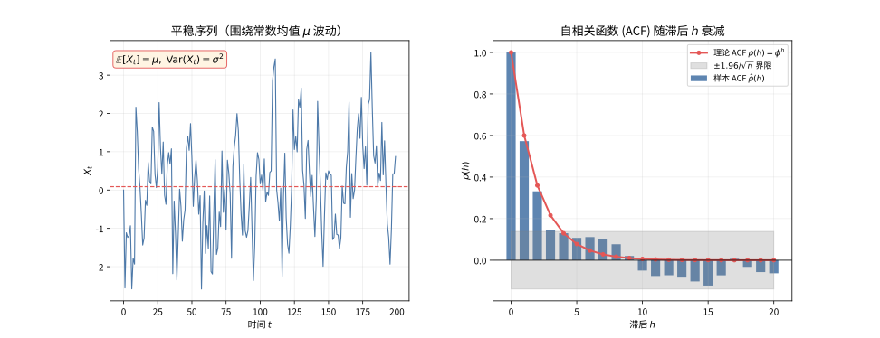

# 第 93 级：时间序列分析 (Time Series Analysis)

---

## 1. 学习目标

完成本教程后，你将能够：

1. 理解时间序列的平稳性概念及其重要性
2. 掌握自相关函数（ACF）与偏自相关函数（PACF）的定义与性质
3. 掌握AR、MA、ARMA、ARIMA、SARIMA等经典模型的识别、估计与诊断
4. 理解Box-Jenkins方法论的完整流程
5. 掌握指数平滑与Holt-Winters方法
6. 理解状态空间模型与Kalman滤波的递推原理
7. 掌握GARCH模型在金融时间序列中的应用
8. 能独立完成时间序列的建模、估计与预测

---

## 2. 核心概念

### 2.1 平稳性

**严平稳**（Strict Stationarity）：时间序列 $\{X_t\}$ 的有限维分布对时间平移不变，即对任意 $t_1, t_2, \dots, t_k$ 和任意 $h$，有：

$$
(X_{t_1}, X_{t_2}, \dots, X_{t_k}) \stackrel{d}{=} (X_{t_1+h}, X_{t_2+h}, \dots, X_{t_k+h})
$$

**弱平稳**（Weak Stationarity / Covariance Stationarity）：时间序列 $\{X_t\}$ 满足：
1. $\mathbb{E}[X_t] = \mu$（常数，与 $t$ 无关）
2. $\text{Var}(X_t) = \sigma^2 < \infty$（常数，与 $t$ 无关）
3. $\text{Cov}(X_t, X_{t+h}) = \gamma(h)$（仅依赖滞后 $h$，与 $t$ 无关）

> **💡 直观理解（类比）**：弱平稳就像"脾气稳定的一个人"——无论观察他现在还是十年后，平均水平（均值）、波动幅度（方差）和处事习惯（协方差结构）都一个样。有了这份"稳定"，才能把过去的行为规律套用到未来去做预测；而像一路疯涨的GDP这种"越来越high"的序列，就不具备这种可复用的稳定脾气。

### 2.2 自相关函数（ACF）

**自相关函数**（Autocorrelation Function）定义：

$$
\rho(h) = \frac{\gamma(h)}{\gamma(0)} = \frac{\text{Cov}(X_t, X_{t+h})}{\text{Var}(X_t)}
$$

性质：
- $\rho(0) = 1$
- $|\rho(h)| \le 1$
- $\rho(h) = \rho(-h)$

> **直观理解（现实类比）**：平稳序列好比平静湖面上均匀扩散的涟漪——无论看哪一段，波动幅度和"摇摆习惯"都差不多，没有越晃越大的趋势。ACF 则像"记忆曲线"：$\rho(h)$ 衡量当前值与 $h$ 个时间单位前的值有多"像"，平稳序列的记忆随时间渐行渐远（衰减到0），而含趋势的序列（如逐年上涨的GDP）记忆永不消退，ACF 拖尾不衰减，这正是判断平稳性的关键线索。

> **🧠 思考历程：太阳黑子时多时少，背后真的藏着规律吗？**
>
> 平稳性与自相关函数（ACF）在回答一个棘手的问题：一串跳动的数字里，除了"每次随机摇晃"，是否还藏着"记得住过去"的成分？有趣的是，它最初不是为股市而生，而是诞生于天文学家对太阳黑子周期的困惑。
>
> - **从天文序列起步**。1927年英国统计学家尤尔（George Udny Yule）为分析太阳黑子的11年周期，首次用"上一期的值回归本期值"写出自回归（AR）模型，把"序列记得过去"的直觉第一次写成了递推公式；1931年沃克（Gilbert Walker）把它推广为ARMA并给出了Yule-Walker方程。
> - **把"相关"写成"记忆"**。真正的转折是沃尔德（Herman Wold）在1938年证明：任何平稳序列都可分解为"白噪声的加权累加"加一块完全可预测的确定性部分，而ACF正是测量这段记忆长度的标尺——这给了整座ARIMA建模体系一个坚实的理论底座。
> - **从定理到流水线**。1970年博克斯（George Box）与詹金斯（Gwilym Jenkins）把"识别—估计—诊断—预测"串成四步方法论，让"看ACF截尾还是拖尾来定阶"成为人人可执行的流程，平稳性也由一条抽象定义变成了工程操作手册。
> - **心路**：同一串数字，外行看到杂乱、内行看到"记忆长短"——好的概念不只在描述现象，更在给你一种"该如何看"的视角。

### 2.3 偏自相关函数（PACF）

**偏自相关函数**（Partial Autocorrelation Function）衡量在剔除 $X_{t+1}, \dots, X_{t+h-1}$ 的影响后，$X_t$ 与 $X_{t+h}$ 之间的相关性：

$$
\phi_{hh} = \text{Corr}(X_t, X_{t+h} \mid X_{t+1}, \dots, X_{t+h-1})
$$

> **💡 直观理解（类比）**：PACF 像"把中间传话的人请出去之后，直接问当事人是否还认识"——它先剔除中间时刻的线性影响，只留下 $X_t$ 与 $X_{t+h}$ 之间"隔空直连"的那部分相关。这对判断 AR 阶数至关重要：AR($p$) 过程在 $p$ 阶以后这种直接联系就断了（截尾），而 ACF 却因中间层层传递而拖尾不停。

### 2.4 白噪声

**白噪声**（White Noise）序列 $\{\varepsilon_t\}$ 满足：

$$
\mathbb{E}[\varepsilon_t] = 0, \quad \text{Var}(\varepsilon_t) = \sigma^2, \quad \text{Cov}(\varepsilon_t, \varepsilon_s) = 0 \ (t \neq s)
$$

若进一步假设 $\varepsilon_t \sim \text{i.i.d.} \ N(0, \sigma^2)$，则称为**高斯白噪声**。

> **💡 直观理解（类比）**：白噪声就像电视机雪花屏——每个时刻的噪声都和别的时刻毫无关系，前后不串味、平均为零、波动一致。它是时间序列建模的"纯净原材料"：真正的白噪声残差说明模型已经把有用信息榨干，剩下的只剩纯随机，没有可再利用的规律了。

### 2.5 AR模型

**自回归模型** AR($p$)：

$$
X_t = \phi_1 X_{t-1} + \phi_2 X_{t-2} + \cdots + \phi_p X_{t-p} + \varepsilon_t
$$

其中 $\varepsilon_t$ 为白噪声。

> **💡 直观理解（类比）**：AR 模型像"用昨天和前天推今天"——今天的状态是过去 $p$ 个时刻的加权记忆（各自配系数 $\phi_i$）再添一点新冲击。参数 $\phi$ 就代表"对过去的记性有多强"，把它限制在稳定区间内，这类"记性"才不会越演越烈地发散。

### 2.6 MA模型

**滑动平均模型** MA($q$)：

$$
X_t = \varepsilon_t + \theta_1 \varepsilon_{t-1} + \theta_2 \varepsilon_{t-2} + \cdots + \theta_q \varepsilon_{t-q}
$$

> **💡 直观理解（类比）**：MA 模型像"今天是被接二连三的突发事件感染的"——它不再依赖过去的数值，而是把近期一串随机冲击（$\varepsilon$）按权重 $\theta$ 叠加成今天的结果。因为它只是白噪声的有限组合，所以无论怎么加都一定是平稳的，且"那些冲击的影响"最多延续 $q$ 期。

### 2.7 ARMA模型

**自回归滑动平均模型** ARMA($p, q$)：

$$
X_t = \phi_1 X_{t-1} + \cdots + \phi_p X_{t-p} + \varepsilon_t + \theta_1 \varepsilon_{t-1} + \cdots + \theta_q \varepsilon_{t-q}
$$

用滞后算子 $B$（$B^k X_t = X_{t-k}$）表示为：

$$
\phi(B) X_t = \theta(B) \varepsilon_t
$$

其中 $\phi(B) = 1 - \phi_1 B - \cdots - \phi_p B^p$，$\theta(B) = 1 + \theta_1 B + \cdots + \theta_q B^q$。

> **💡 直观理解（类比）**：ARMA 模型像是"AR 和 MA 合伙分工"——AR 部分靠过去的数值记忆（昨天的成交量），MA 部分靠过去的意外冲击（昨天的突发事件），两股力量一起决定今天。用滞后算子 $B$ 写出来，就像把"时间延迟"打包成一个可计算的记号，让 AR 和 MA 分工负责各自的"记忆来源"。

### 2.8 ARIMA模型

**差分自回归滑动平均模型** ARIMA($p, d, q$) 对非平稳序列进行 $d$ 阶差分后拟合 ARMA($p, q$)：

$$
\phi(B)(1-B)^d X_t = \theta(B) \varepsilon_t
$$

> **直观理解（现实类比）**：把一条时间序列想象成一首复杂的交响乐——趋势是整首乐曲"越来越洪亮"的主线，季节是"每12小节重复一次"的固定旋律，残差则是演奏中细微的即兴杂音。ARIMA 建模就像先"抽丝剥茧"把这三层分开：抽出趋势（差分消除）、剥出季节（周期差分），剩下的残差被当作平稳的白噪声来处理，这样就能对原本很难预测的序列做出可靠的预报。

### 2.9 SARIMA模型

**季节性ARIMA模型** SARIMA($p, d, q$) $\times$ ($P, D, Q$)$_S$：

$$
\phi(B) \Phi(B^S) (1-B)^d (1-B^S)^D X_t = \theta(B) \Theta(B^S) \varepsilon_t
$$

其中 $S$ 为季节周期长度。

> **💡 直观理解（类比）**：SARIMA 是在 ARIMA 之外再叠加"每年按时重复的节拍"——比如月销售数据以 12 个月为周期起伏。它除了处理普通的记忆（ARMA）和趋势（差分），又额外用 $\Phi(B^S)$、$\Theta(B^S)$ 去刻画"去年的这个月影响今年的这个月"，把季节节奏也一并纳入预报，就像同时记住"昨天发生什么"和"去年同期发生过什么"。

### 2.10 单位根检验与ADF检验

**Augmented Dickey-Fuller（ADF）检验**用于检验序列是否存在单位根（即是否非平稳）。检验回归方程：

$$
\Delta X_t = \alpha + \beta t + \gamma X_{t-1} + \sum_{i=1}^{p} \delta_i \Delta X_{t-i} + \varepsilon_t
$$

原假设 $H_0: \gamma = 0$（存在单位根）。若ADF统计量小于临界值，则拒绝原假设，认为序列平稳。

> **💡 直观理解（类比）**：ADF 检验就像"检查一个人是否还在不断攀爬"——它检验序列是否有单位根，即"过去的冲击是否会永久累积"。若 $\gamma$ 显著为负，说明序列有回到均值的引力（平稳），过去的冲击会消散；若不能拒绝 $\gamma=0$，说明序列像醉汉一样随机游走（非平稳），丢掉一个值就再也回不来了。

### 2.11 Box-Jenkins方法

**Box-Jenkins方法**是时间序列建模的系统方法论，包括四个步骤：
1. **模型识别**：通过ACF和PACF确定 $p, d, q$ 的阶数
2. **参数估计**：使用最大似然估计或条件最小二乘估计
3. **模型诊断**：检验残差是否为白噪声
4. **预测**：使用拟合的模型进行预测

> **💡 直观理解（类比）**：Box-Jenkins 方法像一套"先体检、再穿处方、复查、最后用药"的完整诊疗流程——先用 ACF/PACF 判断是哪类模型（识别），再估计参数（穿处方），检查残差是不是白噪声来确认有没有漏诊（诊断），最后才放心地用来预测（用药）。它把序列建模从"看手感"变成可复制的标准操作。

### 2.12 指数平滑与Holt-Winters方法

**简单指数平滑**：

$$
\hat{X}_{t+1|t} = \alpha X_t + (1-\alpha) \hat{X}_{t|t-1}
$$

**Holt-Winters方法**（含趋势和季节性的指数平滑）：
- 水平方程：$L_t = \alpha (X_t - S_{t-S}) + (1-\alpha)(L_{t-1} + T_{t-1})$
- 趋势方程：$T_t = \beta (L_t - L_{t-1}) + (1-\beta) T_{t-1}$
- 季节方程：$S_t = \gamma (X_t - L_t) + (1-\gamma) S_{t-S}$
- 预测：$\hat{X}_{t+k|t} = L_t + k T_t + S_{t+k-S}$

> **💡 直观理解（类比）**：指数平滑像"给新信息更高的加权，老印象慢慢退淡"——每来一个新观测，都用 $\alpha$ 的比例往预测上"记新账"，剩余 $1-\alpha$ 保留旧账，越新的数据越吃香。Holt-Winters 则再加两条会分别打勾的账本：趋势 $T_t$ 记"整体往哪个方向爬"，季节 $S_t$ 记"每个时期固定出现的起伏"，三条账本合起来就能预测带趋势又有季节的序列。

### 2.13 状态空间模型与Kalman滤波

**状态空间模型**：

$$
\begin{aligned}
\text{状态方程：} &\quad \boldsymbol{\alpha}_t = \boldsymbol{T}_t \boldsymbol{\alpha}_{t-1} + \boldsymbol{R}_t \boldsymbol{\eta}_t \\
\text{观测方程：} &\quad \boldsymbol{Y}_t = \boldsymbol{Z}_t \boldsymbol{\alpha}_t + \boldsymbol{\varepsilon}_t
\end{aligned}
$$

**Kalman滤波**通过递推方式估计隐藏状态 $\boldsymbol{\alpha}_t$。

> **💡 直观理解（类比）**：状态空间模型把世界分成"看不见的真相（隐藏状态 $\boldsymbol{\alpha}_t$）"和"看得见的污染测量（观测 $\boldsymbol{Y}_t$）"两层；Kalman 滤波则像一位"边收边猜的航海家"——先按规律（状态方程）预测下一步位置，再用实际观测（带噪声）来修正，预测和测量各自的可信度决定听谁的多一点。它递推地吐出对真实状态的贝叶斯加权估计。

### 2.14 GARCH模型

**GARCH($p, q$)模型**（Generalized Autoregressive Conditional Heteroscedasticity）：

$$
\begin{aligned}
X_t &= \sigma_t \varepsilon_t, \quad \varepsilon_t \sim \text{i.i.d.}, \ \mathbb{E}[\varepsilon_t]=0, \ \text{Var}(\varepsilon_t)=1 \\
\sigma_t^2 &= \omega + \sum_{i=1}^{q} \alpha_i X_{t-i}^2 + \sum_{j=1}^{p} \beta_j \sigma_{t-j}^2
\end{aligned}
$$

> **💡 直观理解（类比）**：GARCH 模型像"给波动本身建模"——普通模型假设波动恒定，GARCH 却说"最近乱，明天σ²就大；最近平静，σ²就小"。$\sigma_t^2$ 由最近的冲击（$X^2$）和过去的波动程度（$\sigma^2$）共同决定，于是大波动会"传染"成一段时期的波动聚集，正好刻画股市"跌起来一连串、稳起来一连串"的现象。

---

## 3. 定理与证明

### 定理 3.1：ARMA过程的平稳性条件

**定理**：考虑 ARMA($p, q$) 过程 $\phi(B) X_t = \theta(B) \varepsilon_t$，其中 $\varepsilon_t$ 为白噪声。该过程为平稳过程的**充分必要条件**是特征多项式 $\phi(z) = 1 - \phi_1 z - \phi_2 z^2 - \cdots - \phi_p z^p$ 的所有根的模都大于1，即所有根都在单位圆外。

> **💡 直观理解（类比）**：这个定理就像"把过程拆成一段段环形回响"，只有当每个回响的强度（根模的倒数）都小于 1、像回声一样越来越弱时，过程才能保持稳定。"根都在单位圆外"等价于"过去的影响按几何级数逐年衰减"——记性再好也不能越记越大，否则就像麦克风口对口啸叫，一发而不可收拾。

**证明**：

**步骤1：将ARMA过程表示为线性滤波**

ARMA($p, q$) 过程可以写成：

$$
X_t = \frac{\theta(B)}{\phi(B)} \varepsilon_t = \psi(B) \varepsilon_t = \sum_{j=0}^{\infty} \psi_j \varepsilon_{t-j}
$$

其中 $\psi(B) = \sum_{j=0}^{\infty} \psi_j B^j$，$\psi_0 = 1$。这个表示称为过程的 **MA($\infty$) 表示**。

**步骤2：平稳性条件与MA($\infty$)表示的收敛性**

对于线性过程 $X_t = \sum_{j=0}^{\infty} \psi_j \varepsilon_{t-j}$，$X_t$ 为平稳过程的充分条件是系数序列 $\{\psi_j\}$ 绝对可和：

$$
\sum_{j=0}^{\infty} |\psi_j| < \infty
$$

此时 $\mathbb{E}[X_t] = 0$（假设无截距项），且协方差函数为：

$$
\gamma(h) = \text{Cov}(X_t, X_{t+h}) = \sigma^2 \sum_{j=0}^{\infty} \psi_j \psi_{j+h}
$$

**步骤3：特征根与$\psi_j$的衰减性**

多项式 $\phi(z)$ 可分解为：

$$
\phi(z) = \prod_{k=1}^{p} (1 - \lambda_k z)
$$

其中 $\lambda_k^{-1}$ 是 $\phi(z) = 0$ 的根。

若所有根的模大于1，即 $|\lambda_k^{-1}| > 1$，则 $|\lambda_k| < 1$。此时 $\psi_j$ 可表示为：

$$
\psi_j = \sum_{k=1}^{p} c_k \lambda_k^j
$$

其中 $c_k$ 为常数。由于 $|\lambda_k| < 1$，$\psi_j$ 以几何级数速度衰减，即存在常数 $C > 0$ 和 $0 < r < 1$ 使得 $|\psi_j| \le C r^j$，从而 $\sum_{j=0}^{\infty} |\psi_j| < \infty$。

**步骤4：必要性**

若存在某个根的模小于等于1，不妨设 $|\lambda_1| \ge 1$，则 $\psi_j$ 不衰减，$\sum_{j=0}^{\infty} |\psi_j| = \infty$，过程可能发散或非平稳。特别地，当存在单位根（$|\lambda_1| = 1$）时，过程为$I(1)$过程，其方差随时间趋于无穷。

**步骤5：可逆性条件**

类似地，MA($\infty$) 多项式 $\theta(z) = 1 + \theta_1 z + \cdots + \theta_q z^q$ 的所有根模大于1时，过程可逆，即可以表示为 AR($\infty$) 形式：

$$
\pi(B) X_t = \varepsilon_t, \quad \pi(B) = \frac{\phi(B)}{\theta(B)} = \sum_{j=0}^{\infty} \pi_j B^j
$$

$\square$

---

### 定理 3.2：Yule-Walker 方程的推导与解的存在性

**定理**：对于 AR($p$) 过程 $X_t = \phi_1 X_{t-1} + \cdots + \phi_p X_{t-p} + \varepsilon_t$，自协方差函数 $\gamma(h)$ 满足 Yule-Walker 方程：

$$
\gamma(h) = \phi_1 \gamma(h-1) + \phi_2 \gamma(h-2) + \cdots + \phi_p \gamma(h-p), \quad h \ge 1
$$

特别地，当 $h = 1, 2, \dots, p$ 时，矩阵形式为：

$$
\begin{pmatrix}
\gamma(0) & \gamma(1) & \cdots & \gamma(p-1) \\
\gamma(1) & \gamma(0) & \cdots & \gamma(p-2) \\
\vdots & \vdots & \ddots & \vdots \\
\gamma(p-1) & \gamma(p-2) & \cdots & \gamma(0)
\end{pmatrix}
\begin{pmatrix}
\phi_1 \\ \phi_2 \\ \vdots \\ \phi_p
\end{pmatrix}
=
\begin{pmatrix}
\gamma(1) \\ \gamma(2) \\ \vdots \\ \gamma(p)
\end{pmatrix}
$$

该方程组的解存在且唯一，当且仅当自协方差矩阵 $\boldsymbol{\Gamma}_p$ 正定。

> **💡 直观理解（类比）**：Yule-Walker 方程像是"从相关追寻参数"的账本——既然 AR($p$) 的自相关自带规律的递推结构，那反过来，用测到的自协方差 $\gamma(h)$ 就能反推出 AR 系数 $\boldsymbol{\phi}$。正定要求保证这些"账目"彼此独立、不糊成一团，解才唯一。它既是理论桥梁，也是通过样本 ACF 估计参数的矩估计方法。

**证明**：

**步骤1：推导Yule-Walker方程**

将 AR($p$) 方程两边同乘以 $X_{t-h}$（$h \ge 1$）并取期望：

$$
\mathbb{E}[X_t X_{t-h}] = \phi_1 \mathbb{E}[X_{t-1} X_{t-h}] + \cdots + \phi_p \mathbb{E}[X_{t-p} X_{t-h}] + \mathbb{E}[\varepsilon_t X_{t-h}]
$$

由于 $\varepsilon_t$ 与 $X_{t-1}, X_{t-2}, \dots$ 无关（过程的因果性），且 $h \ge 1$，故 $\mathbb{E}[\varepsilon_t X_{t-h}] = 0$。因此：

$$
\gamma(h) = \phi_1 \gamma(h-1) + \phi_2 \gamma(h-2) + \cdots + \phi_p \gamma(h-p), \quad h \ge 1
$$

**步骤2：矩阵形式**

将 $h = 1, 2, \dots, p$ 代入，得：

$$
\begin{cases}
\gamma(1) = \phi_1 \gamma(0) + \phi_2 \gamma(1) + \cdots + \phi_p \gamma(p-1) \\
\gamma(2) = \phi_1 \gamma(1) + \phi_2 \gamma(0) + \cdots + \phi_p \gamma(p-2) \\
\vdots \\
\gamma(p) = \phi_1 \gamma(p-1) + \phi_2 \gamma(p-2) + \cdots + \phi_p \gamma(0)
\end{cases}
$$

写成矩阵形式即 $\boldsymbol{\Gamma}_p \boldsymbol{\phi} = \boldsymbol{\gamma}_p$。

**步骤3：解的存在性与唯一性**

$\boldsymbol{\Gamma}_p$ 是平稳过程的自协方差矩阵，它是正定矩阵（除非过程是退化的）。正定矩阵可逆，因此 $\boldsymbol{\phi} = \boldsymbol{\Gamma}_p^{-1} \boldsymbol{\gamma}_p$ 存在且唯一。

**步骤4：$\gamma(0)$ 的确定**

还需确定 $\gamma(0)$。将 AR($p$) 方程两边同乘以 $X_t$ 并取期望：

$$
\begin{aligned}
\gamma(0) &= \mathbb{E}[X_t^2] \\
&= \phi_1 \mathbb{E}[X_t X_{t-1}] + \cdots + \phi_p \mathbb{E}[X_t X_{t-p}] + \mathbb{E}[X_t \varepsilon_t] \\
&= \phi_1 \gamma(1) + \phi_2 \gamma(2) + \cdots + \phi_p \gamma(p) + \sigma^2
\end{aligned}
$$

其中 $\mathbb{E}[X_t \varepsilon_t] = \sigma^2$（因为 $X_t = \phi_1 X_{t-1} + \cdots + \phi_p X_{t-p} + \varepsilon_t$，且 $\varepsilon_t$ 与 $X_{t-1}, \dots, X_{t-p}$ 无关）。结合 Yule-Walker 方程，可解出 $\gamma(0)$。$\square$

---

### 定理 3.3：Wold 分解定理

**定理**（Wold Decomposition）：任何零均值协方差平稳过程 $\{X_t\}$ 可以唯一地分解为：

$$
X_t = \sum_{j=0}^{\infty} \psi_j \varepsilon_{t-j} + V_t
$$

其中：
1. $\{\varepsilon_t\}$ 是白噪声序列，称为**新息**（innovation）
2. $\psi_0 = 1$，$\sum_{j=0}^{\infty} \psi_j^2 < \infty$
3. $V_t$ 是**确定性分量**（deterministic component），与 $\{\varepsilon_t\}$ 的过去和未来均不相关
4. 对任意 $t$，$\varepsilon_t$ 与 $V_s$ 对任意 $s$ 不相关
5. 分解是唯一的

> **💡 直观理解（类比）**：Wold 分解把"看似复杂的平稳序列"重构成"一串独立的随机炮弹（新息 $\varepsilon$）加权叠放 + 一条可完全由过去推算的确定性轨道 $V_t$"。就像一场球赛可以拆成"很多次独立的小失误"和"教练早就安排好的既定战术"，它断言任何平稳序列都能用这两种成分兑现，是新息驱动的 MA($\infty$) 表示的理论基石。

**证明**：

**步骤1：构造新息序列**

令 $\mathcal{H}_t = \overline{\text{span}}\{X_s: s \le t\}$ 为 $X_s$（$s \le t$）张成的 Hilbert 空间（闭线性子空间）。定义一步预测误差：

$$
\varepsilon_t = X_t - \mathcal{P}_{\mathcal{H}_{t-1}} X_t
$$

其中 $\mathcal{P}_{\mathcal{H}_{t-1}}$ 表示到 $\mathcal{H}_{t-1}$ 上的正交投影。则 $\varepsilon_t$ 与 $\mathcal{H}_{t-1}$ 中的所有元素正交，即 $\mathbb{E}[\varepsilon_t X_s] = 0$ 对所有 $s \le t-1$ 成立。因此 $\{\varepsilon_t\}$ 是白噪声，因为对 $k > 0$：

$$
\mathbb{E}[\varepsilon_t \varepsilon_{t-k}] = \mathbb{E}[\varepsilon_t (X_{t-k} - \mathcal{P}_{\mathcal{H}_{t-k-1}} X_{t-k})] = 0
$$

**步骤2：构建MA($\infty$)表示**

由构造，$X_t$ 可表示为：

$$
X_t = \mathcal{P}_{\mathcal{H}_{t-1}} X_t + \varepsilon_t
$$

进一步，$\mathcal{P}_{\mathcal{H}_{t-1}} X_t$ 可分解为 $\varepsilon_{t-1}, \varepsilon_{t-2}, \dots$ 的线性组合。通过反复投影，可得：

$$
X_t = \sum_{j=0}^{\infty} \psi_j \varepsilon_{t-j} + V_t
$$

其中 $\psi_0 = 1$，且 $V_t$ 是 $X_t$ 中与所有 $\varepsilon_s$（$-\infty < s < \infty$）正交的部分。

**步骤3：系数的平方可和性**

由于 $\{X_t\}$ 是平稳过程，$\text{Var}(X_t) = \gamma(0) < \infty$。由正交性：

$$
\gamma(0) = \text{Var}\left(\sum_{j=0}^{\infty} \psi_j \varepsilon_{t-j}\right) + \text{Var}(V_t) = \sigma^2 \sum_{j=0}^{\infty} \psi_j^2 + \text{Var}(V_t)
$$

由于 $\gamma(0) < \infty$，必有 $\sum_{j=0}^{\infty} \psi_j^2 < \infty$。

**步骤4：确定性分量的性质**

$V_t$ 是确定性的，意味着 $V_t \in \mathcal{H}_{-\infty} = \bigcap_{t} \mathcal{H}_t$（即可以由无限过去的观测精确预测）。$V_t$ 与所有 $\varepsilon_s$ 正交，且 $\{V_t\}$ 本身也是平稳过程。

**步骤5：唯一性**

若存在两种分解 $X_t = \sum_{j=0}^{\infty} \psi_j \varepsilon_{t-j} + V_t = \sum_{j=0}^{\infty} \psi_j' \varepsilon_{t-j}' + V_t'$，则相减可得两个MA($\infty$)过程之差等于两个确定性分量之差。由正交性可推出 $\psi_j = \psi_j'$，$\varepsilon_t = \varepsilon_t'$，$V_t = V_t'$。$\square$

---

### 定理 3.4：Box-Jenkins 方法的一步预测

**定理**：对于 ARMA($p, q$) 过程 $\phi(B) X_t = \theta(B) \varepsilon_t$，给定观测值 $X_1, \dots, X_t$，最小均方误差一步预测为：

$$
\hat{X}_{t+1|t} = \phi_1 X_t + \phi_2 X_{t-1} + \cdots + \phi_p X_{t-p+1} + \theta_1 \hat{\varepsilon}_t + \cdots + \theta_q \hat{\varepsilon}_{t-q+1}
$$

其中 $\hat{\varepsilon}_s = X_s - \hat{X}_{s|s-1}$ 为预测残差。预测误差的方差为 $\sigma^2$。

> **💡 直观理解（类比）**：一步预测的公式就是"用已知的历史和可估计的残差拼出明天"——$X_{t+1}$ 里能被 $\mathcal{F}_t$ 确定的部分全搬过来，而未来那一记新冲击 $\varepsilon_{t+1}$ 无法预测、期望为 0，只能随它去。所以预测就是"信息已知处照抄、信息未知处归零"，一步误差的方差恰好就是白噪声的方差 $\sigma^2$。

**证明**：

**步骤1：将ARMA过程写成预测形式**

ARMA($p, q$) 过程：

$$
X_{t+1} = \phi_1 X_t + \phi_2 X_{t-1} + \cdots + \phi_p X_{t-p+1} + \varepsilon_{t+1} + \theta_1 \varepsilon_t + \cdots + \theta_q \varepsilon_{t-q+1}
$$

**步骤2：最优预测的表达式**

在均方误差准则下，$X_{t+1}$ 的最优预测是条件期望：

$$
\hat{X}_{t+1|t} = \mathbb{E}[X_{t+1} \mid \mathcal{F}_t]
$$

其中 $\mathcal{F}_t = \{X_1, \dots, X_t\}$ 为直到 $t$ 时刻的信息集。由于 $\varepsilon_{t+1}$ 与 $\mathcal{F}_t$ 独立，且 $\mathbb{E}[\varepsilon_{t+1} \mid \mathcal{F}_t] = 0$，而 $X_t, X_{t-1}, \dots, \varepsilon_t, \varepsilon_{t-1}, \dots$ 均可由 $\mathcal{F}_t$ 确定，因此：

$$
\begin{aligned}
\hat{X}_{t+1|t} &= \mathbb{E}[\phi_1 X_t + \cdots + \phi_p X_{t-p+1} + \varepsilon_{t+1} + \theta_1 \varepsilon_t + \cdots + \theta_q \varepsilon_{t-q+1} \mid \mathcal{F}_t] \\
&= \phi_1 X_t + \cdots + \phi_p X_{t-p+1} + \theta_1 \varepsilon_t + \cdots + \theta_q \varepsilon_{t-q+1}
\end{aligned}
$$

**步骤3：用可观测量表示**

由于 $\varepsilon_s$ 不可直接观测，用递推方式估计：

$$
\hat{\varepsilon}_s = X_s - \hat{X}_{s|s-1}
$$

代入得：

$$
\hat{X}_{t+1|t} = \phi_1 X_t + \cdots + \phi_p X_{t-p+1} + \theta_1 \hat{\varepsilon}_t + \cdots + \theta_q \hat{\varepsilon}_{t-q+1}
$$

**步骤4：预测误差方差**

一步预测误差为：

$$
e_{t+1|t} = X_{t+1} - \hat{X}_{t+1|t} = \varepsilon_{t+1}
$$

因此预测误差方差为 $\text{Var}(e_{t+1|t}) = \text{Var}(\varepsilon_{t+1}) = \sigma^2$。

**步骤5：多步预测**

对于 $k$ 步预测，将 $X_{t+k}$ 的表达式代入，利用条件期望的线性性质，得到：

$$
\hat{X}_{t+k|t} = \phi_1 \hat{X}_{t+k-1|t} + \cdots + \phi_p \hat{X}_{t+k-p|t} + \theta_1 \hat{\varepsilon}_{t+k-1|t} + \cdots + \theta_q \hat{\varepsilon}_{t+k-q|t}
$$

其中当 $s > t$ 时 $\hat{\varepsilon}_{s|t} = 0$，当 $s \le t$ 时 $\hat{\varepsilon}_{s|t} = \hat{\varepsilon}_s$。$\square$

---

### 定理 3.5：Kalman 滤波的递推公式

**定理**：考虑状态空间模型：

$$
\begin{aligned}
\boldsymbol{\alpha}_t &= \boldsymbol{T}_t \boldsymbol{\alpha}_{t-1} + \boldsymbol{R}_t \boldsymbol{\eta}_t, \quad \boldsymbol{\eta}_t \sim N(\boldsymbol{0}, \boldsymbol{Q}_t) \\
\boldsymbol{Y}_t &= \boldsymbol{Z}_t \boldsymbol{\alpha}_t + \boldsymbol{\varepsilon}_t, \quad \boldsymbol{\varepsilon}_t \sim N(\boldsymbol{0}, \boldsymbol{H}_t)
\end{aligned}
$$

其中 $\boldsymbol{\eta}_t$ 与 $\boldsymbol{\varepsilon}_t$ 独立。Kalman 滤波的递推公式为：

**预测步骤**：

$$
\begin{aligned}
\boldsymbol{a}_{t|t-1} &= \boldsymbol{T}_t \boldsymbol{a}_{t-1} \\
\boldsymbol{P}_{t|t-1} &= \boldsymbol{T}_t \boldsymbol{P}_{t-1} \boldsymbol{T}_t^\top + \boldsymbol{R}_t \boldsymbol{Q}_t \boldsymbol{R}_t^\top
\end{aligned}
$$

**更新步骤**：

$$
\begin{aligned}
\boldsymbol{v}_t &= \boldsymbol{Y}_t - \boldsymbol{Z}_t \boldsymbol{a}_{t|t-1} \\
\boldsymbol{F}_t &= \boldsymbol{Z}_t \boldsymbol{P}_{t|t-1} \boldsymbol{Z}_t^\top + \boldsymbol{H}_t \\
\boldsymbol{K}_t &= \boldsymbol{P}_{t|t-1} \boldsymbol{Z}_t^\top \boldsymbol{F}_t^{-1} \\
\boldsymbol{a}_t &= \boldsymbol{a}_{t|t-1} + \boldsymbol{K}_t \boldsymbol{v}_t \\
\boldsymbol{P}_t &= (\boldsymbol{I} - \boldsymbol{K}_t \boldsymbol{Z}_t) \boldsymbol{P}_{t|t-1}
\end{aligned}
$$

其中 $\boldsymbol{a}_{t|t-1} = \mathbb{E}[\boldsymbol{\alpha}_t \mid \boldsymbol{Y}_{1:t-1}]$，$\boldsymbol{a}_t = \mathbb{E}[\boldsymbol{\alpha}_t \mid \boldsymbol{Y}_{1:t}]$。

> **💡 直观理解（类比）**：Kalman 滤波的递推像"每收到一个测量就修正一次猜测"的两步节奏——先凭运动规律把状态推一步（预测），再比较"预测的观测"和"真实的观测"得差异新息 $\boldsymbol{v}_t$，用增益 $\boldsymbol{K}_t$ 决定这个差异该信多少来修正（更新）。信息越确定的地方越敢改，就像拼图每拿到一片新图就重新调整对整幅画的估计。

**证明**：

**步骤1：预测步骤的推导**

由状态方程，条件于 $\boldsymbol{Y}_{1:t-1}$ 取期望：

$$
\boldsymbol{a}_{t|t-1} = \mathbb{E}[\boldsymbol{T}_t \boldsymbol{\alpha}_{t-1} + \boldsymbol{R}_t \boldsymbol{\eta}_t \mid \boldsymbol{Y}_{1:t-1}] = \boldsymbol{T}_t \boldsymbol{a}_{t-1}
$$

因为 $\boldsymbol{\eta}_t$ 与 $\boldsymbol{Y}_{1:t-1}$ 独立且均值为0。

预测误差协方差矩阵：

$$
\begin{aligned}
\boldsymbol{P}_{t|t-1} &= \mathbb{E}[(\boldsymbol{\alpha}_t - \boldsymbol{a}_{t|t-1})(\boldsymbol{\alpha}_t - \boldsymbol{a}_{t|t-1})^\top \mid \boldsymbol{Y}_{1:t-1}] \\
&= \mathbb{E}[(\boldsymbol{T}_t(\boldsymbol{\alpha}_{t-1} - \boldsymbol{a}_{t-1}) + \boldsymbol{R}_t \boldsymbol{\eta}_t)(\boldsymbol{T}_t(\boldsymbol{\alpha}_{t-1} - \boldsymbol{a}_{t-1}) + \boldsymbol{R}_t \boldsymbol{\eta}_t)^\top \mid \boldsymbol{Y}_{1:t-1}] \\
&= \boldsymbol{T}_t \boldsymbol{P}_{t-1} \boldsymbol{T}_t^\top + \boldsymbol{R}_t \boldsymbol{Q}_t \boldsymbol{R}_t^\top
\end{aligned}
$$

其中交叉项为零，因为 $\boldsymbol{\alpha}_{t-1} - \boldsymbol{a}_{t-1}$ 与 $\boldsymbol{\eta}_t$ 独立且 $\mathbb{E}[\boldsymbol{\eta}_t] = \boldsymbol{0}$。

**步骤2：新息及其协方差**

新息（预测误差）为：

$$
\boldsymbol{v}_t = \boldsymbol{Y}_t - \boldsymbol{Z}_t \boldsymbol{a}_{t|t-1} = \boldsymbol{Z}_t (\boldsymbol{\alpha}_t - \boldsymbol{a}_{t|t-1}) + \boldsymbol{\varepsilon}_t
$$

新息的协方差矩阵：

$$
\begin{aligned}
\boldsymbol{F}_t &= \mathbb{E}[\boldsymbol{v}_t \boldsymbol{v}_t^\top \mid \boldsymbol{Y}_{1:t-1}] \\
&= \boldsymbol{Z}_t \mathbb{E}[(\boldsymbol{\alpha}_t - \boldsymbol{a}_{t|t-1})(\boldsymbol{\alpha}_t - \boldsymbol{a}_{t|t-1})^\top] \boldsymbol{Z}_t^\top + \mathbb{E}[\boldsymbol{\varepsilon}_t \boldsymbol{\varepsilon}_t^\top] \\
&= \boldsymbol{Z}_t \boldsymbol{P}_{t|t-1} \boldsymbol{Z}_t^\top + \boldsymbol{H}_t
\end{aligned}
$$

**步骤3：Kalman 增益的推导**

更新步骤通过联合正态分布的条件分布公式推导。$(\boldsymbol{\alpha}_t, \boldsymbol{Y}_t)$ 的条件联合分布为：

$$
\begin{pmatrix}
\boldsymbol{\alpha}_t \\ \boldsymbol{Y}_t
\end{pmatrix}
\Bigg| \boldsymbol{Y}_{1:t-1} \sim
N\left(
\begin{pmatrix}
\boldsymbol{a}_{t|t-1} \\ \boldsymbol{Z}_t \boldsymbol{a}_{t|t-1}
\end{pmatrix},
\begin{pmatrix}
\boldsymbol{P}_{t|t-1} & \boldsymbol{P}_{t|t-1} \boldsymbol{Z}_t^\top \\
\boldsymbol{Z}_t \boldsymbol{P}_{t|t-1} & \boldsymbol{F}_t
\end{pmatrix}
\right)
$$

由多元正态分布的条件分布公式，$\boldsymbol{\alpha}_t$ 给定 $\boldsymbol{Y}_t$ 和 $\boldsymbol{Y}_{1:t-1}$ 的条件分布为：

$$
\mathbb{E}[\boldsymbol{\alpha}_t \mid \boldsymbol{Y}_{1:t}] = \boldsymbol{a}_{t|t-1} + \boldsymbol{P}_{t|t-1} \boldsymbol{Z}_t^\top \boldsymbol{F}_t^{-1} \boldsymbol{v}_t
$$

$$
\text{Var}[\boldsymbol{\alpha}_t \mid \boldsymbol{Y}_{1:t}] = \boldsymbol{P}_{t|t-1} - \boldsymbol{P}_{t|t-1} \boldsymbol{Z}_t^\top \boldsymbol{F}_t^{-1} \boldsymbol{Z}_t \boldsymbol{P}_{t|t-1}
$$

定义 Kalman 增益 $\boldsymbol{K}_t = \boldsymbol{P}_{t|t-1} \boldsymbol{Z}_t^\top \boldsymbol{F}_t^{-1}$，得：

$$
\boldsymbol{a}_t = \boldsymbol{a}_{t|t-1} + \boldsymbol{K}_t \boldsymbol{v}_t
$$

$$
\boldsymbol{P}_t = (\boldsymbol{I} - \boldsymbol{K}_t \boldsymbol{Z}_t) \boldsymbol{P}_{t|t-1}
$$

**步骤4：递推的初始化**

递推从 $\boldsymbol{a}_{0}$ 和 $\boldsymbol{P}_{0}$ 开始。对于平稳过程，取无条件均值和协方差；对于非平稳过程，使用扩散先验。$\square$

---

## 4. 示例

### 示例 1：用 ARIMA 模型拟合和预测 GDP 数据

**问题**：使用ARIMA模型对某国家季度GDP数据进行拟合和预测（模拟数据）。

**数据**（模拟季度GDP，单位：亿元）：

| 季度 | GDP | 季度 | GDP | 季度 | GDP | 季度 | GDP |
|:---:|:---:|:---:|:---:|:---:|:---:|:---:|:---:|
| 2019Q1 | 1000 | 2019Q2 | 1020 | 2019Q3 | 1035 | 2019Q4 | 1050 |
| 2020Q1 | 1060 | 2020Q2 | 1040 | 2020Q3 | 1070 | 2020Q4 | 1090 |
| 2021Q1 | 1110 | 2021Q2 | 1130 | 2021Q3 | 1150 | 2021Q4 | 1170 |
| 2022Q1 | 1190 | 2022Q2 | 1210 | 2022Q3 | 1230 | 2022Q4 | 1250 |
| 2023Q1 | 1270 | 2023Q2 | 1290 | 2023Q3 | 1310 | 2023Q4 | 1330 |

**步骤1：平稳性检验**

绘制序列图，发现GDP呈明显上升趋势，非平稳。进行ADF检验：

$$
\text{ADF统计量} = -0.85, \quad p\text{-值} = 0.80 > 0.05
$$

不能拒绝原假设，序列存在单位根。

**步骤2：差分**

一阶差分 $\Delta X_t = X_t - X_{t-1}$：

| 季度 | 差分值 |
|:---:|:---:|
| 2019Q2 | 20 |
| 2019Q3 | 15 |
| 2019Q4 | 15 |
| 2020Q1 | 10 |
| 2020Q2 | -20 |
| 2020Q3 | 30 |
| ... | ... |

对差分后序列进行ADF检验：

$$
\text{ADF统计量} = -4.23, \quad p\text{-值} = 0.005 < 0.05
$$

序列平稳，故 $d = 1$。

**步骤3：模型识别（确定 $p, q$）**

计算差分后序列的ACF和PACF：

- ACF：在滞后1处显著，之后截尾 → 提示 MA(1)
- PACF：在滞后1处显著，之后截尾 → 提示 AR(1)

综合判断，候选模型为 ARIMA(1,1,1) 或 ARIMA(1,1,0)。

**步骤4：参数估计**

使用最大似然估计拟合 ARIMA(1,1,1)：

$$
(1 - \hat{\phi}_1 B)(1-B) X_t = (1 + \hat{\theta}_1 B) \varepsilon_t
$$

估计结果：

$$
\hat{\phi}_1 = 0.62, \quad \hat{\theta}_1 = 0.35, \quad \hat{\sigma}^2 = 85.3
$$

**步骤5：模型诊断**

检验残差是否为白噪声：

- Ljung-Box检验：$Q(10) = 12.5$，$p\text{-值} = 0.25 > 0.05$，残差为白噪声
- 残差ACF图：无显著自相关

模型诊断通过。

**步骤6：预测**

对未来4个季度（2024年）的预测：

| 季度 | 预测值 | 95%置信区间 |
|:---:|:---:|:---:|
| 2024Q1 | 1350 | (1320, 1380) |
| 2024Q2 | 1371 | (1332, 1410) |
| 2024Q3 | 1392 | (1345, 1439) |
| 2024Q4 | 1413 | (1358, 1468) |

---

### 示例 2：GARCH模型拟合金融时间序列

**问题**：使用GARCH(1,1)模型拟合某股票日收益率序列。

**数据特征**：某股票500个交易日的日收益率 $r_t$，呈现明显的波动聚集现象（volatility clustering）。

**步骤1：均值方程建模**

首先对收益率序列拟合 AR(1) 模型：

$$
r_t = \mu + \phi r_{t-1} + \varepsilon_t
$$

估计结果：

$$
\hat{\mu} = 0.0002, \quad \hat{\phi} = 0.05
$$

**步骤2：ARCH效应检验**

对残差 $\hat{\varepsilon}_t$ 进行 ARCH-LM 检验：

$$
\text{LM统计量} = 45.6, \quad p\text{-值} < 0.001
$$

拒绝"无异方差性"的原假设，存在 ARCH 效应。

**步骤3：GARCH(1,1)模型设定**

设定条件方差方程：

$$
\sigma_t^2 = \omega + \alpha \varepsilon_{t-1}^2 + \beta \sigma_{t-1}^2
$$

使用最大似然估计：

| 参数 | 估计值 | 标准误 | z统计量 | p值 |
|:---:|:---:|:---:|:---:|:---:|
| $\omega$ | $2.5 \times 10^{-6}$ | $1.2 \times 10^{-6}$ | 2.08 | 0.037 |
| $\alpha$ | 0.12 | 0.03 | 4.00 | < 0.001 |
| $\beta$ | 0.85 | 0.03 | 28.33 | < 0.001 |

**步骤4：模型解释**

- $\alpha + \beta = 0.97 < 1$，满足平稳性条件
- $\beta = 0.85$ 较大，表明波动冲击具有长记忆性
- 半衰期：$\frac{\ln(0.5)}{\ln(\alpha + \beta)} = \frac{\ln(0.5)}{\ln(0.97)} \approx 22.7$ 个交易日

**步骤5：条件波动率预测**

预测未来条件方差：

$$
\hat{\sigma}_{T+1}^2 = \hat{\omega} + \hat{\alpha} \hat{\varepsilon}_T^2 + \hat{\beta} \hat{\sigma}_T^2
$$

长期平均波动率：

$$
\bar{\sigma}^2 = \frac{\hat{\omega}}{1 - \hat{\alpha} - \hat{\beta}} = \frac{2.5 \times 10^{-6}}{1 - 0.97} = 8.33 \times 10^{-5}
$$

日波动率：$\sqrt{8.33 \times 10^{-5}} = 0.00913$（约0.913%），年化波动率：$0.00913 \times \sqrt{252} \approx 14.5\%$。

---

## 5. 习题

### 基础题

**习题 1**（平稳性）说明弱平稳需要满足的三个条件，并与严平稳对比说明二者的区别（提示：弱平稳只约束一阶矩和二阶矩，不要求有限维分布对时间平移不变）。

**习题 2**（白噪声）写出白噪声序列 $\{\varepsilon_t\}$ 的数学定义（提示：$\mathbb{E}[\varepsilon_t]=0$、$\text{Var}(\varepsilon_t)=\sigma^2$、$\text{Cov}(\varepsilon_t,\varepsilon_s)=0,\ t\neq s$），并说明高斯白噪声是指什么。

**习题 3**（ACF）写出自相关函数 $\rho(h)=\frac{\gamma(h)}{\gamma(0)}$ 的定义，并列举它的三条基本性质（提示：$\rho(0)=1$、$|\rho(h)|\le1$、$\rho(h)=\rho(-h)$，后者来自对称性）。

**习题 4**（PACF）说明偏自相关函数 $\phi_{hh} = \text{Corr}(X_t, X_{t+h} \mid X_{t+1},\dots,X_{t+h-1})$ 的含义：它是如何剔除中间变量影响的（提示：先剔除 $X_{t+1},\dots,X_{t+h-1}$ 的线性影响后再衡量 $X_t$ 与 $X_{t+h}$ 的相关）。

**习题 5**（AR 模型）写出 AR($p$) 模型的一般形式 $X_t = \phi_1 X_{t-1} + \phi_2 X_{t-2} + \cdots + \phi_p X_{t-p} + \varepsilon_t$，并说明参数的平稳条件（提示：特征多项式 $\phi(z)$ 的根都在单位圆外）。

**习题 6**（MA 模型）写出 MA($q$) 模型的形式 $X_t = \varepsilon_t + \theta_1\varepsilon_{t-1} + \cdots + \theta_q\varepsilon_{t-q}$，并解释为何任意有限阶 MA 过程一定是平稳的（提示：它是白噪声的有限线性组合，均值、方差均与 $t$ 无关）。

**习题 7**（ARMA 模型）写出 ARMA($p,q$) 模型及其滞后算子形式 $\phi(B)X_t = \theta(B)\varepsilon_t$，其中 $\phi(B)$、$\theta(B)$ 的定义是（提示：依据 $\phi(B)=1-\phi_1B-\cdots-\phi_pB^p$，$\theta(B)=1+\theta_1B+\cdots+\theta_qB^q$）。

**习题 8**（ARIMA 与差分）说明 ARIMA($p,d,q$) 模型对非平稳序列的处理思路，写出其算子形式 $\phi(B)(1-B)^d X_t = \theta(B)\varepsilon_t$（提示：先做 $d$ 阶差分 $(1-B)^dX_t$ 得到平稳序列，再对其拟合 ARMA($p,q$)）。

**习题 9**（SARIMA）写出 SARIMA($p,d,q$)$\times$($P,D,Q$)$_S$ 模型的算子形式，并说明参数 $S$、$D$、$\Phi(B^S)$ 各自的含义（提示：$S$ 为季节周期，$\Phi(B^S)$ 为季节性自回归多项式，$D$ 为季节差分阶数）。

**习题 10**（平稳性检验）说明 ADF（Augmented Dickey-Fuller）检验的原假设是什么，含单位根意味着什么（提示：$H_0:\gamma=0$，回归方程 $\Delta X_t = \alpha + \beta t + \gamma X_{t-1} + \sum_i \delta_i\Delta X_{t-i} + \varepsilon_t$；若统计量小于临界值则拒绝原假设、认为序列平稳）。

### 进阶题

**习题 11**（AR(1) 平稳性）证明 AR(1) 过程 $X_t = \phi X_{t-1} + \varepsilon_t$ 在 $|\phi| < 1$ 时是平稳的，并推导其自相关函数 $\rho(h)$。将其表示为 MA($\infty$) 形式 $X_t = \sum_{j=0}^{\infty}\phi^j\varepsilon_{t-j}$ 后计算 $\gamma(h)$ 与 $\rho(h)$。

**习题 12**（MA(1) 的 ACF 与 PACF）推导 MA(1) 过程 $X_t = \varepsilon_t + \theta\varepsilon_{t-1}$ 的 ACF，说明其何时截尾；再说明为何其 PACF 是拖尾的（ACF 用 $\gamma(h)$ 直接算，PACF 借助 Yule-Walker 方程）。原题提示：ACF 在 $h>1$ 处为 0，PACF 按 $-\theta$ 的比率几何衰减。

**习题 13**（ARMA 截尾与拖尾）说明 ARMA($p,q$) 过程的 ACF 与 PACF 分别在何种滞后处截尾或拖尾（提示：MA 部分使 ACF 在 $q$ 后截尾、PACF 拖尾；AR 部分使 PACF 在 $p$ 后截尾、ACF 拖尾；ARMA 则两者都拖尾）。

**习题 14**（差分后的自相关）对于 ARIMA(0,1,1) 过程 $X_t = X_{t-1} + \varepsilon_t + \theta\varepsilon_{t-1}$，令 $W_t = (1-B)X_t$，推导 $W_t$ 的自相关函数，并说明它属于何种模型（提示：$W_t = \varepsilon_t + \theta\varepsilon_{t-1}$ 为 MA(1)，其 ACF 在 1 后截尾）。

**习题 15**（ARIMA 与指数平滑）将 ARIMA(0,1,1) 的一步预测 $\hat{X}_{t+1|t}$ 的递推表达式与简单指数平滑 $\hat{X}_{t+1|t}=\alpha X_t + (1-\alpha)\hat{X}_{t|t-1}$ 对比，说明两类模型之间的联系（提示：当 $\theta = -(1-\alpha)$ 时两者预测等价）。

**习题 16**（Yule-Walker 方程）写出 AR($p$) 过程 Yule-Walker 方程 $\gamma(h) = \phi_1\gamma(h-1) + \cdots + \phi_p\gamma(h-p)$ 的推导思路，说明其被用于什么（提示：对 $X_t$ 两边同乘 $X_{t-h}$ 后取期望，利用 $\varepsilon_t$ 与 $X_{t-h}$（$h\ge1$）不相关）。

**习题 17**（一步预测）写出 ARMA($p,q$) 过程的最小均方误差一步预测 $\hat{X}_{t+1|t}$ 的表达式，并说明最优预测为何是条件期望（提示：均方误差意义下条件期望 $\mathbb{E}[X_{t+1}\mid \mathcal{F}_t]$ 最优，且 $\varepsilon_{t+1}\perp\mathcal{F}_t$）。

**习题 18**（指数平滑与 Holt-Winters）写出 Holt-Winters 方法的水平 $L_t$、趋势 $T_t$、季节 $S_t$ 三个递推式及 $k$ 步预测 $\hat{X}_{t+k|t}$，说明各自平滑参数的作用（提示：$\alpha$ 控水平、$\beta$ 控趋势、$\gamma$ 控季节）。

**习题 19**（状态空间与 Kalman 滤波）写出状态空间模型的状态方程与观测方程，并说明 Kalman 滤波中"预测步"与"更新步"各自更新的量是什么（提示：预测步更新 $\boldsymbol{a}_{t|t-1}$ 与 $\boldsymbol{P}_{t|t-1}$，更新步利用新息 $\boldsymbol{v}_t$ 修正得到 $\boldsymbol{a}_t$ 与 $\boldsymbol{P}_t$）。

### 挑战题

**习题 20**（ARMA 平稳性充分条件）证明 ARMA($p,q$) 过程 $\phi(B)X_t=\theta(B)\varepsilon_t$ 平稳的充分条件是特征多项式 $\phi(z)=1-\phi_1z-\cdots-\phi_pz^p$ 的根都在单位圆外（提示：将其表为 MA($\infty$) $X_t=\psi(B)\varepsilon_t$，根的模大于 1 使 $\psi_j$ 以几何级数衰减，从而绝对可和）。

**习题 21**（GARCH 平稳性）证明 GARCH(1,1) 过程 $\sigma_t^2=\omega+\alpha\varepsilon_{t-1}^2+\beta\sigma_{t-1}^2$ 在 $\alpha+\beta<1$ 时协方差平稳，且无条件方差为 $\omega/(1-\alpha-\beta)$（提示：对 $\sigma_t^2$ 取期望，利用 $\mathbb{E}[\varepsilon_{t-1}^2]=\mathbb{E}[\sigma_{t-1}^2]$ 建立递推并解出）。

**习题 22**（ARMA 可逆性）说明 ARMA($p,q$) 过程可逆（Invertible）的含义及其条件，并比较平稳性条件与可逆性条件各自对应的多项式（提示：可逆要求 $\theta(z)=1+\theta_1z+\cdots+\theta_qz^q$ 的根在单位圆外，从而可写成 AR($\infty$) 形式）。

**习题 23**（Yule-Walker 解的存在性）论证 Yule-Walker 方程 $\boldsymbol{\Gamma}_p\boldsymbol{\phi}=\boldsymbol{\gamma}_p$ 解存在且唯一的条件是自协方差矩阵 $\boldsymbol{\Gamma}_p$ 正定，并说明该矩阵为何正定（提示：平稳过程的自协方差矩阵半正定，非退化时正定从而可逆）。

**习题 24**（GARCH 波动率预测）在示例 2 中，利用 GARCH(1,1) 估计值 $\hat\omega$、$\hat\alpha$、$\hat\beta$ 写出一步条件方差预测 $\hat\sigma_{T+1}^2$ 与长期平均波动率 $\bar\sigma^2$ 的表达式，并解释 $\alpha+\beta=0.97$ 与半衰期 $\ln(0.5)/\ln(\alpha+\beta)$ 的含义（提示：$\bar\sigma^2=\frac{\hat\omega}{1-\hat\alpha-\hat\beta}$）。

**习题 25**（Wold 分解）陈述 Wold 分解定理：任意零均值协方差平稳过程可分解为何种形式，其"新息"与"确定性分量"分别指什么（提示：$X_t=\sum_{j=0}^\infty\psi_j\varepsilon_{t-j}+V_t$，$\varepsilon_t$ 为白噪声新息，$V_t$ 与所有新息不相关且可由无限过去精确预测）。

**习题 26**（谱分析）说明如何由自协方差函数得到平稳序列的谱密度 $f(\lambda)=\frac{1}{2\pi}\sum_{h=-\infty}^{\infty}\gamma(h)e^{-ih\lambda}$，并指出谱密度与自相关函数之间的对应关系（提示：互为傅里叶变换对，谱峰值对应周期成分）。

### 探究题

**习题 27**（Box-Jenkins 全流程）结合示例 1，完整描述 Box-Jenkins 方法论的四个步骤在 GDP 数据建模中是如何落实的：识别、估计、诊断（残差白噪声检验）、预测，并说明每个环节要判断的关键问题。

**习题 28**（模型识别技巧）探究如何根据 ACF 与 PACF 的模式来区分 AR、MA、ARMA 三种模型并确定阶数 $p,q$，讨论当 ACF 与 PACF 都拖尾时应如何借助信息准则（如 AIC/BIC）进行模型选择。

**习题 29**（GARCH 与金融波动）探究 GARCH 模型为何能刻画金融时间序列的"波动聚集"（volatility clustering）现象，分析 $\alpha$、$\beta$、$\alpha+\beta$ 三个参数分别对条件方差的响应速度、持久性与平稳性的影响，并说明 ARCH-LM 检验的作用。

**习题 30**（状态空间与经典模型的取舍）探究用状态空间模型+Kalman滤波处理时间序列相比传统 ARIMA 模型各自的优势与适用场景，讨论当数据存在缺失值或测量误差时为什么 Kalman 滤波更具优势。

---

## 6. 习题答案与解析

### 基础题答案

1. **平稳性** 弱平稳（协方差平稳）需三点：$\mathbb{E}[X_t]=\mu$ 为常数（与 $t$ 无关）、$\text{Var}(X_t)=\sigma^2<\infty$ 为常数、$\text{Cov}(X_t,X_{t+h})=\gamma(h)$ 仅依赖滞后 $h$ 而与 $t$ 无关。严平稳更严格，要求任意有限维联合分布 $(X_{t_1},\dots,X_{t_k})$ 对时间平移不变；弱平稳只约束一阶矩与二阶矩且不一定蕴含严平稳，但高斯平稳中两者等价，实际建模中多用弱平稳。

2. **白噪声** 白噪声 $\{\varepsilon_t\}$ 满足：$\mathbb{E}[\varepsilon_t]=0$、$\text{Var}(\varepsilon_t)=\sigma^2$（常数）、$\text{Cov}(\varepsilon_t,\varepsilon_s)=0\ (t\neq s)$。若进一步 $\varepsilon_t$ 相互独立且 $\varepsilon_t\sim N(0,\sigma^2)$，则称其为高斯白噪声。白噪声是时间序列建模中冲击与残差的理想形态。

3. **ACF** 定义 $\rho(h)=\frac{\gamma(h)}{\gamma(0)}=\frac{\text{Cov}(X_t,X_{t+h})}{\text{Var}(X_t)}$。三条性质：① $\rho(0)=1$；② $|\rho(h)|\le1$（由柯西-施瓦茨不等式 $|\gamma(h)|\le\gamma(0)=|\text{Cov}(X_t,X_{t+h})|\le\sqrt{\text{Var}(X_t)\text{Var}(X_{t+h})}=\gamma(0)$）；③ 由协方差对称性 $\gamma(h)=\gamma(-h)$，故 $\rho(h)=\rho(-h)$。

4. **PACF** $\phi_{hh}=\text{Corr}(X_t,X_{t+h}\mid X_{t+1},\dots,X_{t+h-1})$ 表示在剔除中间 $h-1$ 时刻 $X_{t+1},\dots,X_{t+h-1}$ 的线性影响之后，$X_t$ 与 $X_{t+h}$ 之间剩余的"纯"相关；等价地可看作 $X_{t+h}$ 对 $X_t$ 及中间变量回归时 $X_t$ 前的系数。它把 ACF 中由中间变量介导的间接相关去掉，便于识别 AR 阶数。

5. **AR 模型** AR($p$)：$X_t=\phi_1X_{t-1}+\phi_2X_{t-2}+\cdots+\phi_pX_{t-p}+\varepsilon_t$。平稳条件为特征多项式 $\phi(z)=1-\phi_1z-\phi_2z^2-\cdots-\phi_pz^p$ 的所有根都在单位圆外（模大于 1）。以 AR(1) 为例，迭代得 MA($\infty$) 表示 $X_t=\sum_{j=0}^\infty\phi^j\varepsilon_{t-j}$，当 $|\phi|<1$ 时系数绝对可和，均值、方差与 $t$ 无关，故平稳。

6. **MA 模型** MA($q$)：$X_t=\varepsilon_t+\theta_1\varepsilon_{t-1}+\cdots+\theta_q\varepsilon_{t-q}$。任意固定的延迟不超过 $q$ 的白噪声有限线性组合：$\mathbb{E}[X_t]=\sum\theta_i\mathbb{E}[\varepsilon]=0$ 与 $t$ 无关，$\text{Var}(X_t)=\sigma^2(1+\theta_1^2+\cdots+\theta_q^2)$ 为常数，且对 $h>q$ 有 $\gamma(h)=0$（因 $\varepsilon$ 不相关），故 MA($q$) 无条件平稳，ACF 在 $q$ 后截尾。

7. **ARMA 模型** ARMA($p,q$)：$X_t=\phi_1X_{t-1}+\cdots+\phi_pX_{t-p}+\varepsilon_t+\theta_1\varepsilon_{t-1}+\cdots+\theta_q\varepsilon_{t-q}$。用滞后算子 $B^kX_t=X_{t-k}$ 可写成 $\phi(B)X_t=\theta(B)\varepsilon_t$，其中 $\phi(B)=1-\phi_1B-\cdots-\phi_pB^p$、$\theta(B)=1+\theta_1B+\cdots+\theta_qB^q$。它兼含自回归与滑动平均两部分，能更简洁地刻画混合依赖结构。

8. **ARIMA 与差分** ARIMA($p,d,q$) 对非平稳序列先做 $d$ 阶差分得平稳序列 $Z_t=(1-B)^dX_t$，再对 $Z_t$ 拟合 ARMA($p,q$)，即 $\phi(B)(1-B)^dX_t=\theta(B)\varepsilon_t$。参数 $d$ 为差分阶数；单位根的存在表明序列具有随机趋势，差分可将含单位根的 $I(1)$ 过程化为平稳的 $I(0)$ 过程，是消除趋势、满足建模前提的手段。

9. **SARIMA** SARIMA($p,d,q$)$\times$($P,D,Q$)$_S$ 的算子形式为 $\phi(B)\Phi(B^S)(1-B)^d(1-B^S)^DX_t=\theta(B)\Theta(B^S)\varepsilon_t$。其中 $S$ 为季节周期（如月数据取 12），$\Phi(B^S)=1-\Phi_1B^S-\cdots-\Phi_PB^{PS}$ 为季节性自回归多项式，$D$ 为季节差分阶数，$(1-B^S)^D$ 对季节周期做差分，$\Theta(B^S)$ 为季节移动平均多项式，用于刻画季节依赖。

10. **平稳性检验** ADF 检验的回归方程为 $\Delta X_t=\alpha+\beta t+\gamma X_{t-1}+\sum_{i=1}^{p}\delta_i\Delta X_{t-i}+\varepsilon_t$，原假设 $H_0:\gamma=0$，即序列存在单位根、非平稳；备择假设 $H_0:\gamma<0$。若 ADF 统计量小于给定显著性水平下的临界值（单侧左尾），则拒绝原假设，认为序列平稳。加入 $\Delta X_{t-i}$ 滞后项是为吸收序列中的自相关，避免检验统计量的分布失真。

### 进阶题答案

1. **AR(1) 平稳性** 反复迭代 $X_t=\phi X_{t-1}+\varepsilon_t$ 得 $X_t=\phi^mX_{t-m}+\sum_{j=0}^{m-1}\phi^j\varepsilon_{t-j}$，当 $|\phi|<1$ 令 $m\to\infty$ 得 MA($\infty$) 表示 $X_t=\sum_{j=0}^{\infty}\phi^j\varepsilon_{t-j}$。于是 $\mathbb{E}[X_t]=0$（常数），$\gamma(h)=\text{Cov}(X_t,X_{t+h})=\sum_{j=0}^\infty\phi^j\phi^{j+h}\sigma^2=\sigma^2\phi^h\sum_{j=0}^\infty\phi^{2j}=\frac{\sigma^2\phi^h}{1-\phi^2}$，仅依赖 $h$，故平稳。由 $\gamma(0)=\frac{\sigma^2}{1-\phi^2}$ 得 $\rho(h)=\frac{\gamma(h)}{\gamma(0)}=\phi^h$，即 ACF 按 $\phi$ 的幂几何衰减。

2. **MA(1) 的 ACF 与 PACF** 由 $X_t=\varepsilon_t+\theta\varepsilon_{t-1}$：$\gamma(0)=\sigma^2(1+\theta^2)$，$\gamma(1)=\text{Cov}(\varepsilon_t+\theta\varepsilon_{t-1},\varepsilon_{t-1}+\theta\varepsilon_{t-2})=\theta\sigma^2$，对 $h>1$ 因 $\varepsilon$ 不相关且无重叠项得 $\gamma(h)=0$。故 $\rho(1)=\frac{\theta}{1+\theta^2}$，$\rho(h)=0\ (h>1)$，ACF 在滞后 1 后截尾。PACF：由于 MA(1) 可逆时等价于 AR($\infty$)，其偏自相关不截尾，具体地 $\phi_{11}=\rho(1)=\frac{\theta}{1+\theta^2}$，且对 $h\ge2$ 有 $\phi_{hh}=\frac{(-\theta)^h(1-\theta^2)}{1-\theta^{2(h+1)}}$，随 $h$ 按 $|\theta|^h$ 几何衰减，故 PACF 拖尾。

3. **ARMA 截尾与拖尾** AR($p$) 的 PACF 在 $p$ 后截尾（因为 $\phi_{hh}=0,\ h>p$），ACF 拖尾（几何衰减）；MA($q$) 的 ACF 在 $q$ 后截尾，PACF 拖尾（因其 AR($\infty$) 表示）；ARMA($p,q$) 兼含 AR 与 MA 两部分，ACF 与 PACF 均拖尾（分别受 AR 部分的衰减和 MA 部分影响而不截尾）。这一"截尾/拖尾"对应关系是 Box-Jenkins 识别阶数的核心依据。

4. **差分后的自相关** 令 $W_t=(1-B)X_t=X_t-X_{t-1}$，代入 $X_t=X_{t-1}+\varepsilon_t+\theta\varepsilon_{t-1}$ 得 $W_t=\varepsilon_t+\theta\varepsilon_{t-1}$，即一阶差分缩减出 MA(1) 过程。其 ACF 如习题 12：$\rho_W(1)=\frac{\theta}{1+\theta^2}$、$\rho_W(h)=0\ (h>1)$，即一阶差分后的序列是 MA(1)，验证了 ARIMA(0,1,1) 的差分成分为 MA(1)。

5. **ARIMA 与指数平滑** 考虑 ARIMA(0,1,1) 一步预测 $\hat{X}_{t+1|t}=X_t+\theta\hat\varepsilon_t$，而简单指数平滑 $\hat{X}_{t+1|t}=\alpha X_t+(1-\alpha)\hat{X}_{t|t-1}$。两者通过 $\hat{X}_{t+1|t}=\hat{X}_{t|t-1}+\alpha(X_t-\hat{X}_{t|t-1})$ 即"新预测=旧预测+α×一步预测误差"的形式相连，令 $\theta=-(1-\alpha)$ 等价地可得 $\hat{X}_{t+1|t}=X_t+\theta\hat\varepsilon_t$ 与指数平滑具有相同的递推结构，故 ARIMA(0,1,1) 的一步预测与指数平滑等价。

6. **Yule-Walker 方程** 将 AR($p$) 方程 $X_t=\sum_{i=1}^p\phi_iX_{t-i}+\varepsilon_t$ 两边同乘 $X_{t-h}$ 并取期望：$\gamma(h)=\sum_{i=1}^p\phi_i\gamma(h-i)+\mathbb{E}[\varepsilon_tX_{t-h}]$。对 $h\ge1$，因果性使 $\varepsilon_t$ 与 $X_{t-h}$ 不相关，故 $\mathbb{E}[\varepsilon_tX_{t-h}]=0$，得 $\gamma(h)=\phi_1\gamma(h-1)+\cdots+\phi_p\gamma(h-p)$。取 $h=1,\dots,p$ 得 $\boldsymbol{\Gamma}_p\boldsymbol{\phi}=\boldsymbol{\gamma}_p$，即 $\boldsymbol{\phi}=\boldsymbol{\Gamma}_p^{-1}\boldsymbol{\gamma}_p$。他既是理论上联系自协方差与参数的桥梁，也是通过样本 ACF 估计 AR 参数（矩估计）的方法。

7. **一步预测** ARMA($p,q$) 的最优一步预测 $\hat{X}_{t+1|t}=\phi_1X_t+\phi_2X_{t-1}+\cdots+\phi_pX_{t-p+1}+\theta_1\hat\varepsilon_t+\cdots+\theta_q\hat\varepsilon_{t-q+1}$。在均方误差准则下最优预测是条件期望 $\mathbb{E}[X_{t+1}\mid\mathcal{F}_t]$，其中 $\mathcal{F}_t=\{X_1,\dots,X_t\}$。因为 $\varepsilon_{t+1}$ 与 $\mathcal{F}_t$ 独立且 $\mathbb{E}[\varepsilon_{t+1}\mid\mathcal{F}_t]=0$，其余各项均可由 $\mathcal{F}_t$ 确定（$\varepsilon_s\ (s\le t)$ 用递推 $\hat\varepsilon_s=X_s-\hat X_{s|s-1}$ 代替），一步预测误差 $e_{t+1|t}=\varepsilon_{t+1}$，方差恰为 $\sigma^2$。

8. **指数平滑与 Holt-Winters** Holt-Winters 递推：水平 $L_t=\alpha(X_t-S_{t-S})+(1-\alpha)(L_{t-1}+T_{t-1})$；趋势 $T_t=\beta(L_t-L_{t-1})+(1-\beta)T_{t-1}$；季节 $S_t=\gamma(X_t-L_t)+(1-\gamma)S_{t-S}$；$k$ 步预测 $\hat{X}_{t+k|t}=L_t+kT_t+S_{t+k-S}$。参数 $\alpha$ 控制水平更新的平滑速度、$\beta$ 控制趋势更新速度、$\gamma$ 控制季节成分的更新速度，三者均在 $(0,1)$ 内，越接近 1 对新数据响应越快。

9. **状态空间与 Kalman 滤波** 状态空间模型：状态方程 $\boldsymbol{\alpha}_t=\boldsymbol{T}_t\boldsymbol{\alpha}_{t-1}+\boldsymbol{R}_t\boldsymbol{\eta}_t$、观测方程 $\boldsymbol{Y}_t=\boldsymbol{Z}_t\boldsymbol{\alpha}_t+\boldsymbol{\varepsilon}_t$。Kalman 滤波逐步递推：**预测步**由前一时刻的过滤值推出一期前的预测 $\boldsymbol{a}_{t|t-1}=\boldsymbol{T}_t\boldsymbol{a}_{t-1}$ 及其协方差 $\boldsymbol{P}_{t|t-1}=\boldsymbol{T}_t\boldsymbol{P}_{t-1}\boldsymbol{T}_t^\top+\boldsymbol{R}_t\boldsymbol{Q}_t\boldsymbol{R}_t^\top$；**更新步**用新息 $\boldsymbol{v}_t=\boldsymbol{Y}_t-\boldsymbol{Z}_t\boldsymbol{a}_{t|t-1}$ 经 Kalman 增益 $\boldsymbol{K}_t=\boldsymbol{P}_{t|t-1}\boldsymbol{Z}_t^\top\boldsymbol{F}_t^{-1}$ 修正得到过滤值 $\boldsymbol{a}_t=\boldsymbol{a}_{t|t-1}+\boldsymbol{K}_t\boldsymbol{v}_t$ 与 $\boldsymbol{P}_t=(\boldsymbol{I}-\boldsymbol{K}_t\boldsymbol{Z}_t)\boldsymbol{P}_{t|t-1}$。

### 挑战题答案

1. **ARMA 平稳性充分条件** 将 $\phi(B)X_t=\theta(B)\varepsilon_t$ 改写为 $X_t=\frac{\theta(B)}{\phi(B)}\varepsilon_t=\psi(B)\varepsilon_t=\sum_{j=0}^{\infty}\psi_j\varepsilon_{t-j}$（$\psi_0=1$）。$\phi(z)$ 的根全在单位圆外即所有根的模大于 1，等价于上述各 $\lambda_k$（$\lambda_k=$ 根的倒数）满足 $|\lambda_k|<1$，此时 $\psi_j=\sum_k c_k\lambda_k^j$，故 $|\psi_j|\le C r^j\ (0<r<1)$。因而 $\sum_{j=0}^{\infty}|\psi_j|<\infty$，线性过程 $X_t$ 满足 $\mathbb{E}[X_t]=0$、$\gamma(h)=\sigma^2\sum_{j=0}^\infty\psi_j\psi_{j+h}$（绝对可和收敛，仅依赖 $h$），故平稳。

2. **GARCH 平稳性** 对 $\sigma_t^2=\omega+\alpha\varepsilon_{t-1}^2+\beta\sigma_{t-1}^2$ 两端取无条件期望，利用 $\varepsilon_{t-1}^2$ 的条件期望为 $\sigma_{t-1}^2$，故 $\mathbb{E}[\varepsilon_{t-1}^2]=\mathbb{E}[\sigma_{t-1}^2]$。设平稳时 $\mathbb{E}[\sigma_t^2]=\bar\sigma^2$ 与 $t$ 无关，则 $\bar\sigma^2=\omega+(\alpha+\beta)\bar\sigma^2$，当 $\alpha+\beta<1$ 时解得 $\bar\sigma^2=\frac{\omega}{1-\alpha-\beta}>0$。该条件保证无条件方差有限且为正，此时条件方差围绕此长期均值波动，故过程协方差平稳。

3. **ARMA 可逆性** 可逆性指 ARMA 过程可等价写成 AR($\infty$) 形式 $\pi(B)X_t=\varepsilon_t$，其中 $\pi(B)=\frac{\phi(B)}{\theta(B)}=\sum_{j=0}^\infty\pi_jB^j$。当且仅当 $\theta(z)=1+\theta_1z+\cdots+\theta_qz^q$ 的所有根在单位圆外时，$\pi_j$ 绝对可和、$\sum\pi_jX_{t-j}$ 收敛，过程可逆。平稳性针对 $\phi(z)$ 的根，保证 MA($\infty$) 表示收敛；可逆性针对 $\theta(z)$ 的根，保证 AR($\infty$) 表示及参数可识别，两者要求的是不同多项式的根。

4. **Yule-Walker 解的存在性** 平稳过程的自协方差矩阵 $\boldsymbol{\Gamma}_p$ 对任意实向量 $\boldsymbol{c}$ 有 $\boldsymbol{c}^\top\boldsymbol{\Gamma}_p\boldsymbol{c}=\text{Var}(\sum c_iX_i)\ge0$，故半正定；当 $\{X_t\}$ 非退化且各分量线性无关时它是正定的，从而可逆，$\boldsymbol{\phi}=\boldsymbol{\Gamma}_p^{-1}\boldsymbol{\gamma}_p$ 存在且唯一。若某些滞后分量线性相关使矩阵奇异，则参数不可唯一识别，故正定是唯一解的充要条件。

5. **GARCH 波动率预测** 一步条件方差预测 $\hat\sigma_{T+1}^2=\hat\omega+\hat\alpha\hat\varepsilon_T^2+\hat\beta\hat\sigma_T^2$。长期平均波动率 $\bar\sigma^2=\frac{\hat\omega}{1-\hat\alpha-\hat\beta}$。由于 $\alpha+\beta=0.97<1$ 满足平稳性；$\beta=0.85$ 较大表明当期条件方差对过去波动冲击的传递强、波动"长记忆"；$\alpha+\beta=0.97$ 接近 1 使冲击衰减缓慢，半衰期 $\frac{\ln0.5}{\ln(\alpha+\beta)}\approx22.7$ 个交易日，即波动冲击要 22.7 天左右才衰减一半，日波动率约 $0.913\%$、年化约 $14.5\%$。

6. **Wold 分解** Wold 分解定理：任意零均值协方差平稳过程 $\{X_t\}$ 可唯一分解为 $X_t=\sum_{j=0}^{\infty}\psi_j\varepsilon_{t-j}+V_t$，其中 $\{\varepsilon_t\}$ 为零均值白噪声（新息，来源于最小二乘一步预测误差 $\varepsilon_t=X_t-\mathcal{P}_{\mathcal{H}_{t-1}}X_t$），$\psi_0=1$、$\sum\psi_j^2<\infty$；$V_t$ 为确定性分量（完全由无限过去可精确预测，与所有 $\varepsilon_s$ 不相关、与未来充分远的新息正交）。该定理说明了平稳过程的普遍表示与"新息驱动"结构，是 MA($\infty$) 表示的理论基础。

7. **谱分析** 由 Wiener-Khinchin 定理，平稳序列的自协方差函数与谱密度互为傅里叶变换对，谱密度 $f(\lambda)=\frac{1}{2\pi}\sum_{h=-\infty}^{\infty}\gamma(h)e^{-ih\lambda}$，逆变换 $\gamma(h)=\int_{-\pi}^{\pi}f(\lambda)e^{ih\lambda}d\lambda$，且 $f(\lambda)\ge0$ 关于 $\lambda$ 对称。谱分布把时间域的自相关（依赖结构）转化为频率域的功率分布：在特定周期频率上出现峰值说明序列含对应周期成分，谱分析可识别隐周期并辅助建模。

### 探究题答案

1. **Box-Jenkins 全流程** 以示例 1 的 GDP 数据为例：① **识别**：ADF 检验得 $p$-值 0.80>0.05 不能拒绝单位根，判断非平稳；一阶差分后 ADF=-4.23、$p$=0.005 显著平稳，故 $d=1$；再据差分序列 ACF 滞后 1 截尾（MA(1)）、PACF 滞后 1 截尾（AR(1)）选出候选 ARIMA(1,1,1)、ARIMA(1,1,0)。② **估计**：对 ARIMA(1,1,1) 用 MLE 得到 $\hat\phi_1=0.62,\hat\theta_1=0.35,\hat\sigma^2=85.3$。③ **诊断**：残差 Ljung-Box $Q(10)=12.5$、$p$=0.25>0.05，残差 ACF 无显著相关，判定为白噪声，模型充分。④ **预测**：用拟合模型对未来 4 季度递推预测，给出 95% 置信区间。每个环节的关键判断：识别定阶、估计保收敛、诊断验残差、预测评精度。

2. **模型识别技巧** ACF 在 $q$ 后截尾、PACF 拖尾 → MA($q$)；ACF 拖尾、PACF 在 $p$ 后截尾 → AR($p$)；两者均拖尾 → ARMA($p,q$)。定阶用"截尾滞后"判断，但样本 ACF 截尾有时带有随机性。当 ACF、PACF 均拖尾难以明确时，应对比多个候选 $(p,q)$ 的信息准则：AIC$=-2\ln\hat L+2(p+q+1)$、BIC$=-2\ln\hat L+\ln n\cdot(p+q+1)$，均对模型复杂度施加惩罚，取使准则最小且残差通过白噪声检验的模型，兼顾拟合优度与简洁性、避免过拟合。

3. **GARCH 与金融波动** GARCH 的条件方差方程为 $\sigma_t^2=\omega+\alpha\varepsilon_{t-1}^2+\beta\sigma_{t-1}^2$：$\alpha$ 衡量新鲜冲击（$\varepsilon_{t-1}^2$）对当期的响应强度，$\alpha$ 大说明对新信息反应快；$\beta$ 衡量条件方差的惯性/持久度，$\beta$ 大说明大波动会持续；$\alpha+\beta$ 反映波动冲击的持久性（总和接近 1 时冲击缓慢衰减，如示例 $\alpha+\beta=0.97$、半衰期约 22.7 天）。当出现大收益扰动时 $\sigma_t^2$ 立即增大且缓慢回落，形成"波动聚集"。ARCH-LM 检验通过对残差平方做回归检验其异方差，显著则支持 GARCH 结构。

4. **状态空间与经典模型的取舍** 状态空间模型把观测方程 $\boldsymbol{Y}_t=\boldsymbol{Z}_t\boldsymbol{\alpha}_t+\boldsymbol{\varepsilon}_t$ 与状态方程 $\boldsymbol{\alpha}_t=\boldsymbol{T}_t\boldsymbol{\alpha}_{t-1}+\boldsymbol{R}_t\boldsymbol{\eta}_t$ 分离，通过 Kalman 滤波在线递推估计隐藏状态，可自然处理时变参数、多变量系统与测量噪声；遇到缺失观测时，只需跳过相应的更新步（保持预测值），遇到离群值也可通过合理设定观测误差协方差抑制其影响——这正是 ARIMA 固定结构、难以优雅处理缺失/污染数据的局限所在。ARIMA 的优势在于简洁、参数少、对小样本和单变量序列好用；若数据规律性强且完整、重点是预测，ARIMA 常更实际；若系统复杂、存在缺失或需实时滤波，则状态空间+Kalman 更合适。

---

## 7. 总结

本教程系统介绍了时间序列分析的核心理论与方法：

1. **平稳性**：定义了严平稳与弱平稳，是时间序列分析的基础

2. **核心模型**：从AR、MA到ARMA、ARIMA、SARIMA，逐步构建了处理不同类型时间序列的模型体系

3. **ARMA平稳性条件**：严格证明了特征多项式根在单位圆外是平稳的充要条件

4. **Yule-Walker方程**：给出了AR模型自协方差与参数之间的关系，为参数估计提供了理论基础

5. **Wold分解定理**：揭示了任何平稳过程都可以分解为确定性部分与随机性部分

6. **Box-Jenkins方法**：提供了从识别、估计、诊断到预测的完整建模流程

7. **Kalman滤波**：建立了状态空间模型下的递推估计框架，是处理动态系统的基础工具

8. **GARCH模型**：捕捉了金融时间序列的波动聚集现象，是风险管理的重要工具

时间序列分析是经济学、金融学、工程学等领域不可或缺的分析工具，为后续学习随机过程、计量经济学等课程奠定基础。