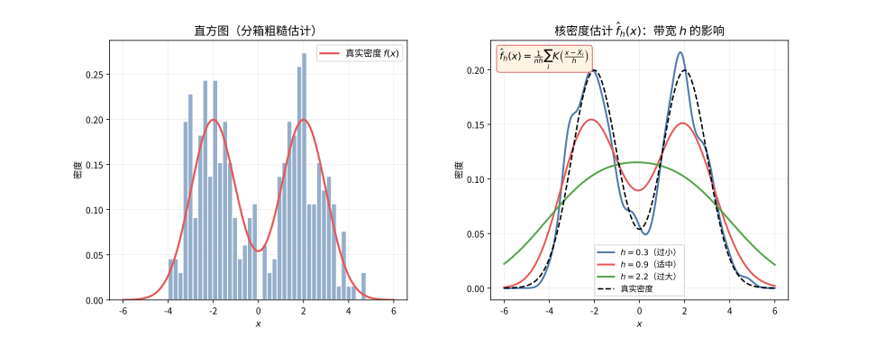

# 第 94 级：非参数统计 (Nonparametric Statistics)

---

## 1. 学习目标

完成本教程后，你将能够：

1. 理解非参数统计的基本思想及其与参数统计的区别
2. 掌握符号检验、Wilcoxon符号秩检验、Mann-Whitney U检验等经典秩检验方法
3. 掌握Kruskal-Wallis检验、Friedman检验等多组比较方法
4. 理解Kolmogorov-Smirnov检验、Cramér-von Mises检验等分布检验方法
5. 掌握秩相关系数（Spearman、Kendall）的计算与推断
6. 理解核密度估计的原理与带宽选择方法
7. 掌握非参数回归与样条光滑的基本思想
8. 能独立选择合适的非参数方法解决实际问题

---

## 2. 核心概念

### 2.1 非参数统计的基本思想

**非参数统计**（Nonparametric Statistics）不假定总体分布的具体形式，而是基于数据的秩（rank）或经验分布进行推断。与参数统计相比，非参数方法具有以下特点：

- **分布自由**：不依赖正态分布等具体分布假设
- **稳健性**：对异常值不敏感
- **适用范围广**：适用于各类数据类型（定序、定距、定比）
- **效率**：在数据满足参数假设时，效率略低于参数方法

> **💡 直观理解（类比）**：非参数统计像"不问对方的底细，只比两人谁跑得快"——参数统计要先猜总体的"出生证"（如服从正态），非参数则干脆不猜分布，直接用数据的排序（秩）或经验分布来推断。它的代价是当数据果真是正态时效率略低，但换来的是"无论分布长什么样都稳健"的保险。

### 2.2 符号检验

**符号检验**（Sign Test）是最简单的非参数检验，仅考虑数据差值的符号（正或负）。用于检验中位数是否等于某个特定值。

检验统计量：$S = \sum_{i=1}^n \mathbf{1}_{\{X_i > m_0\}}$，其中 $m_0$ 是假设的中位数。在 $H_0$ 下，$S \sim \text{Binomial}(n, 0.5)$。

> **💡 直观理解（类比）**：符号检验只问"数据比中位数大的有几个、小的有几个"，像掷硬币——如果中位数真对了，正负应该各占一半。它只数正负、不看大小，所以最简单也最粗，就像只记"输赢"不看"赢多少"。

### 2.3 Wilcoxon符号秩检验

**Wilcoxon符号秩检验**（Wilcoxon Signed-Rank Test）同时考虑差值的符号和大小，比符号检验更有效。

检验统计量：

$$
W = \sum_{i=1}^n \text{sign}(X_i - m_0) \cdot R_i
$$

其中 $R_i$ 是 $|X_i - m_0|$ 的秩。

> **💡 直观理解（类比）**：Wilcoxon 符号秩检验在"数正负"之外还给每个差值配了"名次权重"——离中位数越远、绝对值越大，权重越高。像给一场比赛打分：符号给方向（赢或输），秩给力度（赢得多惨）。它比符号检验多用了"多大"的信息，所以更敏锐。

### 2.4 Mann-Whitney U检验

**Mann-Whitney U检验**（也称为 Wilcoxon-Mann-Whitney 检验）用于比较两个独立样本是否来自同一分布。

检验统计量：

$$
U = \sum_{i=1}^{n_1} \sum_{j=1}^{n_2} \mathbf{1}_{\{X_i > Y_j\}}
$$

等价于对混合样本秩和的计算。

> **💡 直观理解（类比）**：Mann-Whitney U 检验像"两军随机拉出一对一 PK，数 X 军赢了几场"——统计量数的是 $X$ 组的每个值超过 $Y$ 组每个值的次数，衡量"一组整体是否普遍比另一组高"。它把"两分布是否相同"的问题翻译成"随机取一个 X 和一个 Y，X 更大的概率是否等于一半"，完全依赖排序、不要正态假设。

### 2.5 Kruskal-Wallis检验

**Kruskal-Wallis检验**是Mann-Whitney U检验向多组比较的推广，相当于非参数的单因素方差分析。

检验统计量：

$$
H = \frac{12}{N(N+1)} \sum_{k=1}^{K} \frac{R_k^2}{n_k} - 3(N+1)
$$

其中 $R_k$ 是第 $k$ 组的秩和，$N$ 为总样本量。

> **💡 直观理解（类比）**：Kruskal-Wallis 检验像是"多队混赛后比谁的总名次明显偏高或偏低"——把所有组的观测混在一起排名次，若某组的名次总和显著偏离随机水平，就说明各组位置不同。它是"同时比较多个组的中位数"的非参数版 ANOVA，一问就问"到底有没有一组很特殊"。

### 2.6 Friedman检验

**Friedman检验**是配伍组设计的非参数检验，相当于非参数的随机区组方差分析。

> **💡 直观理解（类比）**：Friedman 检验像"同一批评委给多个选手分别打分后比较排名"——每个区组（如同一个病人、同一块地）内部先给各处理排高低，再汇总各组的表现。它把"个体差异"这个干扰隔离在外面，只看"同一背景下不同处理间谁更胜一筹"，对应非参数的随机区组方差分析。

### 2.7 Kolmogorov-Smirnov检验

**Kolmogorov-Smirnov检验**（K-S检验）基于经验分布函数与假设分布之间的最大差异：

$$
D_n = \sup_{x} |\hat{F}_n(x) - F_0(x)|
$$

用于单样本的分布拟合检验或两样本的分布等同检验。

> **💡 直观理解（类比）**：K-S 检验就像"拿一条理论曲线和数据的累计曲线贴脸比最大缝隙"——$D_n$ 是两条曲线之间最宽的裂缝。如果这条最大裂缝也小得可疑，就认为数据确实来自这个分布；若某处豁开一个大口子，就断定不是。它能量化"整条分布像不像"，而不只是比均值和方差。

### 2.8 Cramér-von Mises检验

**Cramér-von Mises检验**使用平方积分度量经验分布与理论分布之间的差异：

$$
W_n^2 = n \int_{-\infty}^{\infty} (\hat{F}_n(x) - F_0(x))^2 \, dF_0(x)
$$

> **💡 直观理解（类比）**：与 K-S 只盯最大缝隙不同，Cramér-von Mises 检验就像"把两条曲线的差异面积全部积起来"——它在整条区间上把偏差平方累加，谁在处处都偷偷有差距也逃不掉。这样它对"整体形状逐渐漂移"的差异比 K-S 更敏感，代价是临界值不如 K-S 简单常用。

### 2.9 秩相关系数

**Spearman秩相关系数**：

$$
r_S = 1 - \frac{6 \sum_{i=1}^n d_i^2}{n(n^2 - 1)}
$$

其中 $d_i$ 是第 $i$ 对观测值在两个变量上的秩差。

**Kendall秩相关系数**（$\tau$）：

$$
\tau = \frac{2}{n(n-1)} \sum_{i < j} \text{sign}(X_i - X_j) \cdot \text{sign}(Y_i - Y_j)
$$

> **💡 直观理解（类比）**：两类秩相关系数衡量的都是"两个变量排名是否同步"。Spearman 看两列名次差的平方和——名次完全一致则 $r_S=1$，完全颠倒则 $-1$；Kendall 逐对看"这一对在两个变量上是否同升同降"——同向的就+1，反向的就-1。它们只看大小排序不看具体数值，所以像"不看分数、只比名次就能探明趋势关系"。

### 2.10 核密度估计

**核密度估计**（Kernel Density Estimation, KDE）是估计概率密度函数的非参数方法：

$$
\hat{f}_h(x) = \frac{1}{nh} \sum_{i=1}^n K\left(\frac{x - X_i}{h}\right)
$$

其中 $K(\cdot)$ 是核函数（通常为对称概率密度函数），$h > 0$ 是带宽。

常见核函数：

| 核函数 | 公式 |
|:---|:---|
| 均匀核 | $K(u) = \frac{1}{2} \mathbf{1}_{\{|u| \le 1\}}$ |
| 高斯核 | $K(u) = \frac{1}{\sqrt{2\pi}} e^{-u^2/2}$ |
| Epanechnikov核 | $K(u) = \frac{3}{4}(1-u^2) \mathbf{1}_{\{|u| \le 1\}}$ |

> **直观理解（现实类比）**：直方图就像把数据"按箱分装"的条形柜，每个箱子里的数量一目了然，但箱子的宽度和起始位置会强烈影响形状。核密度估计则像在每个数据点周围"铺一层柔和的沙丘"，再把所有沙丘叠加起来得到一条平滑曲线——它不预设数据的形状，完全由数据自己"长"出来。带宽 $h$ 就像沙丘的宽窄：$h$ 太小曲线毛刺丛生（过拟合），太大又会把双峰等细节磨平（欠拟合）。

### 2.11 经验分布函数

**经验分布函数**（Empirical Distribution Function, EDF）：

$$
\hat{F}_n(x) = \frac{1}{n} \sum_{i=1}^n \mathbf{1}_{\{X_i \le x\}}
$$

> **直观理解（现实类比）**：经验分布函数就像"抽样民意调查的累积支持率曲线"——把 $n$ 个样本从小到大排好，$\hat{F}_n(x)$ 表示"小于等于 $x$ 的样本占多大比例"，每遇到一个样本就往上跳一小格，形成一条楼梯状的曲线。当样本足够多时，这条"楼梯"会无限逼近真实的平滑分布曲线 $F(x)$（Glivenko-Cantelli 定理），而两条曲线之间缝隙的最大高度，正是 K-S 检验用来判断"数据是否来自该分布"的标尺。

> **🧠 思考历程：不认识分布"长得像谁"，还能拿数据做什么？**
>
> 经验分布函数捕捉的是一种直白的信任：既然我不敢笃定总体的分布，就让数据自己站出来说话——把每个样本都当成一个小台阶，层层叠起来就是我全部的假设。这条"台阶曲线"背后，是1930年代一群数学家对"分布无关"的执着。
>
> - **从台阶到定理**。1933年格利文科（Valery Glivenko）与坎泰利（Francesco Cantelli）独立证明：样本越多，经验分布函数 $\hat{F}_n(x)$ 就会一致地逼近真实分布 $F(x)$——这口气仿佛在说"数据不需要你猜分布，只要够多，它自己就长成分布"。
> - **台阶与曲线之间的一把尺**。柯尔莫哥洛夫（Andrey Kolmogorov）同年算出 $\sup_x|\hat{F}_n(x)-F_0(x)|$ 的极限分布，给了"台阶离曲线有多远"一个可查的临界值——于是有了K-S检验；罗森布拉特（Rosenblatt）与帕尔岑（Parzen）又分别在1956、1962年把台阶"磨平"成平滑的核密度曲线。
> - **一条主线贯穿**。从经验分布到核密度、从K-S检验到秩检验，非参数方法共享同一信条：向数据让步、不向假设低头，用经验分布取代预设的钟形曲线，换来的是对错设模型的免疫。
> - **心路**：当你不敢笃信一条具体曲线时，别硬猜——把舞台让给数据本身，稳健有时正来自"少预设天气"。

### 2.12 Brown桥

**Brown桥**（Brownian Bridge）是条件于 $B(0) = B(1) = 0$ 的布朗运动。定义为 $B^0(t) = B(t) - tB(1)$，其中 $B(t)$ 为标准布朗运动。

> **💡 直观理解（类比）**：Brown 桥像"把一根在两端固定住、中间随风抖动的绳"——普通布朗运动到处乱逛，而 Brown 桥被约定在 $t=0$ 和 $t=1$ 处都必须回落到 $0$，中间仍随机起伏。$B(t)-tB(1)$ 就是把起点和终点"钉死"呈一条直线的操作。经验分布过程 $D_n$ 的极限刚好长这样，所以 K-S 检验的分布由它决定。

### 2.13 非参数回归与样条光滑

**非参数回归**不假设回归函数的具体形式：

$$
Y_i = m(X_i) + \varepsilon_i
$$

其中 $m(x)$ 是未知的平滑函数。

**样条光滑**（Spline Smoothing）通过最小化惩罚残差平方和来估计 $m$：

$$
\hat{m} = \arg\min_{m} \sum_{i=1}^n (Y_i - m(X_i))^2 + \lambda \int [m''(x)]^2 dx
$$

> **💡 直观理解（类比）**：非参数回归就是"让曲线自己跟着数据走，不硬套直线"——$m(x)$ 可以是任意平滑形状。样条光滑则在"贴数据"与"别太弯"之间取平衡：第一项要求贴合，第二项惩罚"拐弯太急"（$m''$ 的积分），$\lambda$ 控制松紧——$\lambda$ 大则曲线被拉直（过于平滑），$\lambda$ 小则可拟合复杂细节（容易过拟合）。

---

## 3. 定理与证明

### 定理 3.1：Glivenko-Cantelli 定理

**定理**（Glivenko-Cantelli）：设 $X_1, X_2, \dots, X_n$ 是独立同分布于分布函数 $F$ 的随机变量，$\hat{F}_n(x) = \frac{1}{n} \sum_{i=1}^n \mathbf{1}_{\{X_i \le x\}}$ 为经验分布函数。则 $\hat{F}_n(x)$ 一致收敛到 $F(x)$ 几乎必然成立：

$$
\sup_{x \in \mathbb{R}} |\hat{F}_n(x) - F(x)| \xrightarrow{\text{a.s.}} 0, \quad n \to \infty
$$

> **💡 直观理解（类比）**：Glivenko-Cantelli 定理说的是"楼梯铺得够密，就整条逼近光滑曲线"——随着样本增多，经验分布这条台阶曲线不仅在逐点、而且在整体上处处逼近真实分布。它给"用数据代替未知分布"发了通行证：不用先猜分布长什么样，数据多了它自己会长成分布。

**证明**：

**步骤1：逐点收敛**

由强大数定律，对每个固定的 $x \in \mathbb{R}$，有：

$$
\hat{F}_n(x) = \frac{1}{n} \sum_{i=1}^n \mathbf{1}_{\{X_i \le x\}} \xrightarrow{\text{a.s.}} \mathbb{E}[\mathbf{1}_{\{X_1 \le x\}}] = F(x)
$$

即 $\hat{F}_n(x)$ 逐点几乎必然收敛到 $F(x)$。

**步骤2：构造有限网格**

对任意 $\varepsilon > 0$，选择 $k$ 个点 $-\infty = x_0 < x_1 < \cdots < x_k = \infty$，使得：

$$
F(x_j-) \le \frac{j\varepsilon}{3} \le F(x_j), \quad j = 1, 2, \dots, k-1
$$

其中 $F(x_j-)$ 表示左极限。这样的网格存在，因为 $F$ 是单调不减函数，最多有可数个间断点。事实上，我们可以选择 $x_1, x_2, \dots, x_{k-1}$ 为 $F$ 的 $\varepsilon/3$ 分位数点。

**步骤3：在网格点上的收敛**

由步骤1，对每个网格点 $x_j$，存在几乎必然收敛的零测集 $N_j$，使得对 $\omega \notin N_j$，有 $\hat{F}_n(x_j, \omega) \to F(x_j)$。令 $N = \bigcup_{j=1}^{k-1} N_j$，则对 $\omega \notin N$，对所有 $j$ 同时成立收敛。

**步骤4：控制网格点之间的偏差**

对任意 $x \in \mathbb{R}$，存在 $j$ 使得 $x_{j-1} \le x < x_j$。则：

$$
\hat{F}_n(x) - F(x) \le \hat{F}_n(x_j-) - F(x_{j-1}) \le \hat{F}_n(x_j-) - F(x_j) + \frac{\varepsilon}{3}
$$

$$
\hat{F}_n(x) - F(x) \ge \hat{F}_n(x_{j-1}) - F(x_j-) \ge \hat{F}_n(x_{j-1}) - F(x_{j-1}) - \frac{\varepsilon}{3}
$$

因此：

$$
\sup_{x} |\hat{F}_n(x) - F(x)| \le \max_{j} |\hat{F}_n(x_j) - F(x_j)| + \frac{\varepsilon}{3}
$$

**步骤5：一致收敛**

对 $\omega \notin N$，当 $n$ 充分大时，$\max_j |\hat{F}_n(x_j) - F(x_j)| < \varepsilon/3$，从而：

$$
\sup_{x} |\hat{F}_n(x) - F(x)| < \frac{2\varepsilon}{3}
$$

由于 $\varepsilon$ 任意，得 $\sup_x |\hat{F}_n(x) - F(x)| \to 0$ 几乎必然成立。$\square$

---

### 定理 3.2：Kolmogorov-Smirnov 检验的渐近分布

**定理**：设 $X_1, \dots, X_n$ 独立同分布于连续分布函数 $F_0$，$D_n = \sup_x |\hat{F}_n(x) - F_0(x)|$ 为K-S统计量。则当 $n \to \infty$ 时：

$$
\sqrt{n} D_n \xrightarrow{d} \sup_{t \in [0,1]} |B^0(t)|
$$

其中 $B^0(t)$ 是 $[0,1]$ 上的 Brown 桥，即 $B^0(t) = B(t) - tB(1)$，$B(t)$ 为标准布朗运动。

K-S检验的渐近分布函数为：

$$
\lim_{n \to \infty} \mathbb{P}(\sqrt{n} D_n \le d) = 1 - 2 \sum_{k=1}^{\infty} (-1)^{k-1} e^{-2k^2 d^2}
$$

> **💡 直观理解（类比）**：定理把"经验分布离假设曲线最远有多远"的临界值，归结为"两端钉死的随机长绳（Brown 桥）最高能荡多高"的分布。因为经验曲线那点随机偏差，恰好和一根两端固定的布朗桥长得一模一样，于是 K-S 检验的临界值就由"桥荡到 $d$ 有多难"给出，查表即可判断序列是否来自该分布。

**证明**：

**步骤1：概率积分变换**

由概率积分变换，令 $U_i = F_0(X_i)$，则 $U_i \sim \text{Uniform}[0,1]$ 独立同分布。经验分布函数为：

$$
\hat{F}_n(x) = \frac{1}{n} \sum_{i=1}^n \mathbf{1}_{\{X_i \le x\}} = \frac{1}{n} \sum_{i=1}^n \mathbf{1}_{\{U_i \le F_0(x)\}}
$$

定义 $t = F_0(x)$，则 $t \in [0,1]$，且：

$$
\hat{F}_n(F_0^{-1}(t)) = \frac{1}{n} \sum_{i=1}^n \mathbf{1}_{\{U_i \le t\}} := \mathbb{G}_n(t)
$$

因此 $D_n = \sup_{t \in [0,1]} |\mathbb{G}_n(t) - t|$，其中 $\mathbb{G}_n(t)$ 是 $U[0,1]$ 的经验分布函数。

**步骤2：经验过程**

定义经验过程（Empirical Process）：

$$
\alpha_n(t) = \sqrt{n}(\mathbb{G}_n(t) - t), \quad t \in [0,1]
$$

则 $\sqrt{n} D_n = \sup_{t \in [0,1]} |\alpha_n(t)|$。

**步骤3：有限维收敛**

对任意固定的 $t_1, \dots, t_k \in [0,1]$，由多维中心极限定理：

$$
(\alpha_n(t_1), \dots, \alpha_n(t_k)) \xrightarrow{d} N(\boldsymbol{0}, \boldsymbol{\Sigma})
$$

其中 $\Sigma_{ij} = \min(t_i, t_j) - t_i t_j$，这正是 Brown 桥的协方差函数。

**步骤4：紧性（Tightness）**

经验过程 $\alpha_n$ 在 Skorokhod 空间 $D[0,1]$ 上是紧的。这可以通过验证以下条件得到：

对任意 $\varepsilon > 0$，存在 $\delta > 0$ 和 $n_0$，使得：

$$
\mathbb{P}\left(\sup_{|s-t| < \delta} |\alpha_n(s) - \alpha_n(t)| > \varepsilon\right) < \varepsilon, \quad \forall n \ge n_0
$$

该条件可由经验过程的矩不等式（如 Dvoretzky-Kiefer-Wolfowitz 不等式）证明。

**步骤5：Donsker定理**

由有限维收敛和紧性，经验过程 $\alpha_n$ 在 $D[0,1]$ 上弱收敛到 Brown 桥 $B^0$：

$$
\alpha_n \xrightarrow{d} B^0 \quad \text{in } D[0,1]
$$

**步骤6：连续映射定理**

由连续映射定理，$\sup$ 泛函是连续的，因此：

$$
\sqrt{n} D_n = \sup_{t \in [0,1]} |\alpha_n(t)| \xrightarrow{d} \sup_{t \in [0,1]} |B^0(t)|
$$

**步骤7：渐近分布函数**

Brown 桥的 $\sup$ 的分布由 Kolmogorov 给出：

$$
\mathbb{P}\left(\sup_{t \in [0,1]} |B^0(t)| \le d\right) = 1 - 2 \sum_{k=1}^{\infty} (-1)^{k-1} e^{-2k^2 d^2}
$$

该级数收敛很快，实际中取前几项即可获得高精度近似。$\square$

---

### 定理 3.3：Wilcoxon 符号秩检验的渐近正态性

**定理**：设 $X_1, \dots, X_n$ 独立同分布于连续对称分布（关于中位数 $m$ 对称）。$W = \sum_{i=1}^n \text{sign}(X_i - m) \cdot R_i$ 为 Wilcoxon 符号秩统计量，其中 $R_i$ 是 $|X_i - m|$ 的秩。则在 $H_0: m = m_0$ 下，当 $n \to \infty$ 时：

$$
\frac{W}{\sqrt{n(n+1)(2n+1)/6}} \xrightarrow{d} N(0, 1)
$$

> **💡 直观理解（类比）**：这条定理说"由许多小决定拼成的总分数，自然长得像个钟形"——Wilcoxon 统计量是大量独立"掷硬币"的符号和秩的加总，按中心极限定理，样本一大就趋近正态。正因为如此，实际检验不必逐条查表，直接用熟悉的 Z 分数算 p 值即可。

**证明**：

**步骤1：Wilcoxon统计量的等价形式**

Wilcoxon 符号秩统计量可以写成：

$$
W = \sum_{i=1}^n \sum_{j=1}^n \mathbf{1}_{\{X_i + X_j > 2m_0\}} \mathbf{1}_{\{i \le j\}} - \frac{n(n+1)}{2}
$$

更常用的等价形式是：

$$
W_+ = \sum_{i=1}^n R_i \mathbf{1}_{\{X_i > m_0\}}
$$

即正差值的秩和。$W_+$ 与 $W$ 的关系为 $W = 2W_+ - \frac{n(n+1)}{2}$。

**步骤2：$W_+$ 的期望与方差**

在 $H_0$ 下，$X_i$ 关于 $m_0$ 对称，因此 $\mathbb{P}(X_i > m_0) = 1/2$，且符号与绝对值大小独立。故：

$$
\mathbb{E}[W_+] = \sum_{i=1}^n i \cdot \frac{1}{2} = \frac{n(n+1)}{4}
$$

$$
\text{Var}(W_+) = \sum_{i=1}^n i^2 \cdot \frac{1}{4} = \frac{n(n+1)(2n+1)}{24}
$$

**步骤3：$U$ 统计量表示**

$W_+$ 可以表示为 $U$ 统计量的形式：

$$
W_+ = \sum_{i=1}^n \sum_{j=1}^n \frac{1}{2} \left[ \mathbf{1}_{\{X_i + X_j > 2m_0\}} + \mathbf{1}_{\{X_i > m_0\}} \right] - \frac{n}{2}
$$

这种表示将 $W_+$ 与核函数 $h(x, y) = \frac{1}{2}[\mathbf{1}_{\{x + y > 2m_0\}} + \mathbf{1}_{\{x > m_0\}}]$ 的 $U$ 统计量联系起来。

**步骤4：Hájek 投影**

对 $U$ 统计量应用 Hájek 投影。投影后的统计量为：

$$
\hat{W}_+ = \sum_{i=1}^n \mathbb{E}[W_+ \mid X_i] - (n-1)\mathbb{E}[W_+]
$$

计算投影得分函数：

$$
g(X_i) = \mathbb{E}[W_+ \mid X_i] - \mathbb{E}[W_+]
$$

可以证明 $g(X_i)$ 是独立随机变量且 $\mathbb{E}[g(X_i)] = 0$。

**步骤5：中心极限定理**

由 Hájek 投影定理，$W_+$ 与 $\hat{W}_+$ 的差是 $o_p(\sqrt{n})$。而 $\hat{W}_+$ 是独立随机变量之和，由经典中心极限定理：

$$
\frac{\hat{W}_+ - \mathbb{E}[W_+]}{\sqrt{\text{Var}(W_+)}} \xrightarrow{d} N(0, 1)
$$

因此 $W_+$ 也渐近正态，且均值为 $\frac{n(n+1)}{4}$，方差为 $\frac{n(n+1)(2n+1)}{24}$。

**步骤6：$W$ 的渐近分布**

由 $W = 2W_+ - \frac{n(n+1)}{2}$，得 $W$ 的均值为0，方差为：

$$
\text{Var}(W) = 4 \cdot \text{Var}(W_+) = \frac{n(n+1)(2n+1)}{6}
$$

因此：

$$
\frac{W}{\sqrt{n(n+1)(2n+1)/6}} \xrightarrow{d} N(0, 1)
$$

$\square$

---

### 定理 3.4：核密度估计的均方误差与最优带宽

**定理**：设 $X_1, \dots, X_n$ 独立同分布于密度 $f$，$f$ 在 $x$ 处二阶连续可导且 $f''(x) \neq 0$。核函数 $K$ 满足：$\int K(u) du = 1$，$\int u K(u) du = 0$，$\int u^2 K(u) du = \mu_2(K) \neq 0$，$\int K(u)^2 du = \|K\|_2^2$。则核密度估计 $\hat{f}_h(x)$ 的均方误差为：

$$
\text{MSE}(\hat{f}_h(x)) = \frac{1}{4} h^4 \mu_2(K)^2 [f''(x)]^2 + \frac{1}{nh} \|K\|_2^2 f(x) + o(h^4 + (nh)^{-1})
$$

> **💡 直观理解（类比）**：这条定理把核密度估计的误差拆成两股相反的力量——带宽 $h$ 越大，曲线越平滑、偏差越大但方差越小；$h$ 越小则反之。最优带宽就是在"磨平细节（偏差²∝h⁴）"和"怕毛刺（方差∝1/(nh)）"之间找到平衡点，这也是"有免费午餐吗"的答案：平滑与灵敏不可兼得，只能求最优折中。

最优带宽（最小化渐近均方误差的带宽）为：

$$
h_{\text{opt}}(x) = \left( \frac{\|K\|_2^2 f(x)}{n \mu_2(K)^2 [f''(x)]^2} \right)^{1/5}
$$

全局最优带宽（最小化渐近均方积分误差）为：

$$
h_{\text{opt}} = \left( \frac{\|K\|_2^2}{n \mu_2(K)^2 \int [f''(x)]^2 dx} \right)^{1/5}
$$

**证明**：

**步骤1：偏差的计算**

核密度估计的期望为：

$$
\begin{aligned}
\mathbb{E}[\hat{f}_h(x)] &= \mathbb{E}\left[\frac{1}{nh} \sum_{i=1}^n K\left(\frac{x - X_i}{h}\right)\right] \\
&= \frac{1}{h} \int K\left(\frac{x - y}{h}\right) f(y) dy \\
&= \int K(u) f(x - hu) du \quad (\text{变量代换 } u = (x-y)/h)
\end{aligned}
$$

对 $f(x - hu)$ 在 $x$ 处进行二阶Taylor展开：

$$
f(x - hu) = f(x) - hu f'(x) + \frac{1}{2} h^2 u^2 f''(x) + o(h^2)
$$

代入得：

$$
\begin{aligned}
\mathbb{E}[\hat{f}_h(x)] &= \int K(u) [f(x) - hu f'(x) + \frac{1}{2} h^2 u^2 f''(x) + o(h^2)] du \\
&= f(x) \int K(u) du - h f'(x) \int u K(u) du + \frac{1}{2} h^2 f''(x) \int u^2 K(u) du + o(h^2)
\end{aligned}
$$

由核函数条件 $\int K = 1$，$\int uK = 0$，$\int u^2 K = \mu_2(K)$，得：

$$
\mathbb{E}[\hat{f}_h(x)] = f(x) + \frac{1}{2} h^2 \mu_2(K) f''(x) + o(h^2)
$$

因此偏差为：

$$
\text{Bias}(\hat{f}_h(x)) = \mathbb{E}[\hat{f}_h(x)] - f(x) = \frac{1}{2} h^2 \mu_2(K) f''(x) + o(h^2)
$$

**步骤2：方差的计算**

$$
\begin{aligned}
\text{Var}(\hat{f}_h(x)) &= \text{Var}\left(\frac{1}{nh} \sum_{i=1}^n K\left(\frac{x - X_i}{h}\right)\right) \\
&= \frac{1}{n} \text{Var}\left(\frac{1}{h} K\left(\frac{x - X_1}{h}\right)\right) \\
&= \frac{1}{n} \left[ \mathbb{E}\left[\frac{1}{h^2} K^2\left(\frac{x - X_1}{h}\right)\right] - \left(\mathbb{E}\left[\frac{1}{h} K\left(\frac{x - X_1}{h}\right)\right]\right)^2 \right]
\end{aligned}
$$

计算第一项：

$$
\begin{aligned}
\mathbb{E}\left[\frac{1}{h^2} K^2\left(\frac{x - X_1}{h}\right)\right] &= \frac{1}{h^2} \int K^2\left(\frac{x - y}{h}\right) f(y) dy \\
&= \frac{1}{h} \int K^2(u) f(x - hu) du \\
&= \frac{1}{h} \int K^2(u) [f(x) + o(1)] du \\
&= \frac{1}{h} \|K\|_2^2 f(x) + o\left(\frac{1}{h}\right)
\end{aligned}
$$

第二项 $(\mathbb{E}[\hat{f}_h(x)])^2 = f(x)^2 + o(1)$，相对于第一项阶数更低（因为 $1/h \to \infty$），故：

$$
\text{Var}(\hat{f}_h(x)) = \frac{1}{nh} \|K\|_2^2 f(x) + o\left(\frac{1}{nh}\right)
$$

**步骤3：均方误差**

$$
\begin{aligned}
\text{MSE}(\hat{f}_h(x)) &= \text{Bias}^2(\hat{f}_h(x)) + \text{Var}(\hat{f}_h(x)) \\
&= \frac{1}{4} h^4 \mu_2(K)^2 [f''(x)]^2 + \frac{1}{nh} \|K\|_2^2 f(x) + o(h^4 + (nh)^{-1})
\end{aligned}
$$

**步骤4：最优带宽**

最小化渐近MSE（忽略高阶项），对 $h$ 求导：

$$
\frac{\partial}{\partial h} \left[ \frac{1}{4} h^4 \mu_2(K)^2 [f''(x)]^2 + \frac{1}{nh} \|K\|_2^2 f(x) \right] = h^3 \mu_2(K)^2 [f''(x)]^2 - \frac{1}{nh^2} \|K\|_2^2 f(x) = 0
$$

解得：

$$
h_{\text{opt}}(x) = \left( \frac{\|K\|_2^2 f(x)}{n \mu_2(K)^2 [f''(x)]^2} \right)^{1/5}
$$

**步骤5：最优收敛速度**

代入最优带宽，得最小MSE的收敛速度为：

$$
\text{MSE}_{\text{opt}} = O(n^{-4/5})
$$

即核密度估计的收敛速度比参数估计的 $n^{-1}$ 慢，但这是非参数估计中不可避免的。$\square$

---

### 定理 3.5：非参数回归的收敛速度

**定理**：考虑非参数回归模型 $Y_i = m(X_i) + \varepsilon_i$，其中 $X_i$ 独立同分布于密度 $f_X$，$\varepsilon_i$ 独立同分布于 $N(0, \sigma^2)$，且与 $X_i$ 独立。设 $m$ 在 $[0,1]$ 上 $p$ 阶连续可导。若使用 $p$ 阶局部多项式估计，且带宽 $h \to 0$，$nh \to \infty$，则：

$$
\mathbb{E}[\hat{m}(x) - m(x)]^2 = O(h^{2p} + (nh)^{-1})
$$

最优带宽 $h_{\text{opt}} = O(n^{-1/(2p+1)})$，此时：

$$
\mathbb{E}[\hat{m}(x) - m(x)]^2 = O(n^{-2p/(2p+1)})
$$

> **💡 直观理解（类比）**：定理回答"不预设曲线形状，拟合能学到多准"——误差同样来自"弯得不够（偏差∝h^{p+1}）"和"样本不够密（方差∝1/(nh)）"两股力量。阶数 $p$ 越高、维度 $d$ 越大，收敛越吃力，尤其高维时数据被摊薄、误差恶化，这就是"维数诅咒"——信息空间越大，同样一笔样本越不够用，误差下降越慢。

**证明**：

**步骤1：局部多项式估计的定义**

$p$ 阶局部多项式估计通过求解以下加权最小二乘问题得到：

$$
\hat{\boldsymbol{\beta}}(x) = \arg\min_{\boldsymbol{\beta}} \sum_{i=1}^n \left[ Y_i - \sum_{j=0}^p \beta_j (X_i - x)^j \right]^2 K\left(\frac{X_i - x}{h}\right)
$$

其中 $\hat{m}(x) = \hat{\beta}_0(x)$。

**步骤2：估计的显式表达式**

令 $\boldsymbol{X}_x$ 为 $n \times (p+1)$ 矩阵，第 $i$ 行为 $(1, X_i - x, \dots, (X_i - x)^p)$，$\boldsymbol{W}_x = \text{diag}(K((X_i - x)/h))$。则：

$$
\hat{\boldsymbol{\beta}}(x) = (\boldsymbol{X}_x^\top \boldsymbol{W}_x \boldsymbol{X}_x)^{-1} \boldsymbol{X}_x^\top \boldsymbol{W}_x \boldsymbol{Y}
$$

**步骤3：偏差的渐近展开**

使用 Taylor 展开 $m(X_i) = \sum_{j=0}^p \frac{m^{(j)}(x)}{j!} (X_i - x)^j + \frac{m^{(p+1)}(\xi_i)}{(p+1)!} (X_i - x)^{p+1}$。

在适当的正则条件下，偏差的主项为：

$$
\text{Bias}(\hat{m}(x)) = \frac{m^{(p+1)}(x)}{(p+1)!} h^{p+1} \int u^{p+1} K(u) du \cdot \boldsymbol{e}_1^\top \boldsymbol{S}^{-1} \boldsymbol{c} + o(h^{p+1})
$$

其中 $\boldsymbol{e}_1 = (1, 0, \dots, 0)^\top$，$\boldsymbol{S}$ 是 $(p+1) \times (p+1)$ 矩阵，其 $(i,j)$ 元为 $\int u^{i+j-2} K(u) du$，$\boldsymbol{c}$ 是向量，其第 $i$ 个分量为 $\int u^{p+i} K(u) du$。

因此偏差的阶数为 $O(h^{p+1})$。

**步骤4：方差的渐近展开**

方差的主项为：

$$
\text{Var}(\hat{m}(x)) = \frac{\sigma^2 \int K(u)^2 du}{nh f_X(x)} + o\left(\frac{1}{nh}\right)
$$

因此方差阶数为 $O((nh)^{-1})$。

**步骤5：均方误差与最优带宽**

$$
\mathbb{E}[\hat{m}(x) - m(x)]^2 = O(h^{2(p+1)} + (nh)^{-1})
$$

最小化 $h^{2(p+1)} + (nh)^{-1}$，得最优带宽 $h_{\text{opt}} = O(n^{-1/(2p+3)})$。

代入得最优收敛速度：

$$
\mathbb{E}[\hat{m}(x) - m(x)]^2 = O(n^{-2(p+1)/(2p+3)})
$$

对于局部线性估计（$p=1$），收敛速度为 $O(n^{-4/5})$；对于局部常数估计（Nadaraya-Watson估计，$p=0$），收敛速度为 $O(n^{-2/3})$。

**步骤6：维数诅咒**

当解释变量为 $d$ 维时，收敛速度降为 $O(n^{-2(p+1)/(2p+2+d)})$，即随着维数增加，收敛速度急剧下降，这就是所谓的**维数诅咒**（Curse of Dimensionality）。$\square$

---

## 4. 示例

### 示例 1：用 Wilcoxon 检验比较两组数据

**问题**：比较两种药物（A和B）对降低血压的效果。数据如下（收缩压降低值，mmHg）：

| 药物A | 12, 15, 8, 20, 10, 18, 14, 16 |
|:---|:---|
| 药物B | 7, 9, 5, 11, 6, 8, 10, 4 |

**步骤1：混合排序与赋秩**

将两组数据合并，从小到大排序并赋秩：

| 数值 | 组别 | 秩 |
|:---:|:---:|:---:|
| 4 | B | 1 |
| 5 | B | 2 |
| 6 | B | 3 |
| 7 | B | 4 |
| 8 | A | 5 |
| 8 | B | 5 |
| 9 | B | 7 |
| 10 | A | 8 |
| 10 | B | 8 |
| 11 | B | 10 |
| 12 | A | 11 |
| 14 | A | 12 |
| 15 | A | 13 |
| 16 | A | 14 |
| 18 | A | 15 |
| 20 | A | 16 |

（注：并列值取平均秩）

**步骤2：计算秩和**

A组秩和：$R_A = 5 + 8 + 11 + 12 + 13 + 14 + 15 + 16 = 94$

B组秩和：$R_B = 1 + 2 + 3 + 4 + 5 + 7 + 8 + 10 = 40$

**步骤3：计算U统计量**

$$
U_A = R_A - \frac{n_A(n_A+1)}{2} = 94 - \frac{8 \times 9}{2} = 94 - 36 = 58
$$

$$
U_B = R_B - \frac{n_B(n_B+1)}{2} = 40 - \frac{8 \times 9}{2} = 40 - 36 = 4
$$

取 $U = \min(U_A, U_B) = 4$。

**步骤4：检验**

查 Mann-Whitney U 检验临界值表（$n_1 = n_2 = 8$，$\alpha = 0.05$，双尾），临界值为 $U_{\text{crit}} = 13$。

由于 $U = 4 < 13$，拒绝 $H_0$，认为两组药物的降压效果存在显著差异。

**步骤5：正态近似**

当 $n_1, n_2$ 较大时，可使用正态近似：

$$
Z = \frac{U - \frac{n_1 n_2}{2}}{\sqrt{\frac{n_1 n_2 (n_1 + n_2 + 1)}{12}}} = \frac{4 - 32}{\sqrt{\frac{8 \times 8 \times 17}{12}}} = \frac{-28}{\sqrt{90.67}} = -2.94
$$

$p = 2 \times \Phi(-2.94) = 0.0033 < 0.05$，结论一致。

---

### 示例 2：核密度估计的带宽选择

**问题**：给定100个观测数据，使用核密度估计其概率密度函数，并选择最优带宽。

**数据**（模拟数据，来自混合正态分布 $0.5N(-2, 1) + 0.5N(2, 1)$）：

生成100个数据点，部分数据如下：$-2.1, -1.8, -0.5, 1.2, 2.3, \dots$

**步骤1：选择核函数**

使用高斯核 $K(u) = \frac{1}{\sqrt{2\pi}} e^{-u^2/2}$。

**步骤2：经验法则带宽**

使用 Silverman 的经验法则（Rule of Thumb）：

$$
h_{\text{rot}} = 1.06 \hat{\sigma} n^{-1/5}
$$

其中 $\hat{\sigma}$ 是样本标准差。计算得 $\hat{\sigma} = 2.15$，$n = 100$：

$$
h_{\text{rot}} = 1.06 \times 2.15 \times 100^{-1/5} = 1.06 \times 2.15 \times 0.398 = 0.907
$$

**步骤3：交叉验证带宽**

使用最小化积分平方误差（ISE）的交叉验证方法：

$$
\text{CV}(h) = \int \hat{f}_h(x)^2 dx - \frac{2}{n} \sum_{i=1}^n \hat{f}_{h,-i}(X_i)
$$

其中 $\hat{f}_{h,-i}$ 是去掉第 $i$ 个观测的核密度估计。

计算不同 $h$ 下的 CV 值：

| $h$ | CV值 |
|:---:|:---:|
| 0.3 | 0.068 |
| 0.5 | 0.052 |
| 0.7 | 0.041 |
| 0.9 | 0.038 |
| 1.1 | 0.040 |
| 1.3 | 0.045 |

最优带宽 $h_{\text{CV}} = 0.9$。

**步骤4：比较不同带宽的估计效果**

取三个不同的带宽值进行比较：

- **$h = 0.3$（过小）**：曲线出现过多毛刺，方差过大，过拟合
- **$h = 0.9$（最优）**：曲线平滑，较好地捕捉了双峰结构
- **$h = 2.0$（过大）**：曲线过于平滑，掩盖了双峰特征

**步骤5：最终估计**

使用最优带宽 $h = 0.9$ 的核密度估计：

$$
\hat{f}_{0.9}(x) = \frac{1}{100 \times 0.9} \sum_{i=1}^{100} \frac{1}{\sqrt{2\pi}} \exp\left(-\frac{(x - X_i)^2}{2 \times 0.9^2}\right)
$$

该估计成功捕捉到了数据的双峰分布特征，两个峰值分别在 $x \approx -2$ 和 $x \approx 2$ 处，与真实分布一致。

---

## 5. 习题

### 基础题

**习题 1**（非参数思想）说明非参数统计与参数统计的区别，指出非参数方法不依赖什么、基于什么进行推断（提示：不假定总体分布的具体形式，基于数据的秩或经验分布，具有分布自由与稳健性）。

**习题 2**（符号检验）写出符号检验统计量 $S = \sum_{i=1}^n \mathbf{1}_{\{X_i > m_0\}}$ 的含义及其在原假设 $H_0: m = m_0$ 下的分布（提示：$m_0$ 为假设中位数，连续分布下 $S \sim \text{Binomial}(n, 0.5)$）。

**习题 3**（Wilcoxon 符号秩检验）写出 Wilcoxon 符号秩统计量 $W = \sum_{i=1}^n \text{sign}(X_i - m_0) \cdot R_i$ 的含义（提示：$R_i$ 是 $|X_i - m_0|$ 的秩），并说明它与符号检验的区别。

**习题 4**（Mann-Whitney U）写出 Mann-Whitney U 统计量 $U = \sum_{i=1}^{n_1}\sum_{j=1}^{n_2} \mathbf{1}_{\{X_i > Y_j\}}$ 的含义，并说明其与混合样本秩和的关系（提示：用于比较两个独立样本是否来自同一分布，等价于混合样本秩和计算）。

**习题 5**（Kruskal-Wallis 检验）写出 Kruskal-Wallis 检验统计量 $H = \frac{12}{N(N+1)}\sum_{k=1}^{K}\frac{R_k^2}{n_k} - 3(N+1)$ 各符号的含义（提示：$R_k$ 为第 $k$ 组秩和、$n_k$ 为第 $k$ 组样本量、$N$ 为总样本量、$K$ 为组数），它相当于非参数的什么检验。

**习题 6**（K-S 检验）写出 Kolmogorov-Smirnov 统计量 $D_n = \sup_x |\hat{F}_n(x) - F_0(x)|$ 的含义（提示：$\hat{F}_n$ 为经验分布函数、$F_0$ 为假设分布，取两者最大差距），说明其使用场景。

**习题 7**（Spearman 秩相关）写出 Spearman 秩相关系数 $r_S = 1 - \frac{6\sum_{i=1}^n d_i^2}{n(n^2-1)}$ 的含义（提示：$d_i$ 是第 $i$ 对观测在两个变量上的秩差），并判断其取值范围。

**习题 8**（核密度估计）写出核密度估计 $\hat{f}_h(x) = \frac{1}{nh}\sum_{i=1}^n K\left(\frac{x-X_i}{h}\right)$ 中各量含义（提示：$K$ 为核函数、$h$ 为带宽），并举例两种常见核函数（如高斯核与 Epanechnikov 核）。

**习题 9**（经验分布函数）写出经验分布函数 $\hat{F}_n(x) = \frac{1}{n}\sum_{i=1}^n \mathbf{1}_{\{X_i \le x\}}$ 的定义，并说明当 $n\to\infty$ 时它与真实分布函数 $F$ 的关系（提示：Glivenko-Cantelli 定理，一致收敛）。

**习题 10**（Cramér-von Mises 检验）写出 Cramér-von Mises 统计量 $W_n^2 = n\int_{-\infty}^{\infty}(\hat{F}_n(x)-F_0(x))^2\,dF_0(x)$ 的含义，并与 K-S 统计量 $D_n$ 区别（提示：$D_n$ 用最大差距、$W_n^2$ 用平方积分）。

### 进阶题

**习题 11**（符号检验分布）证明在连续分布且 $H_0: m=m_0$ 下，符号检验统计量 $S\sim\text{Binomial}(n,0.5)$（提示：简化为"带符号的二项试验"，连续分布下 $\mathbb{P}(X_i>m_0)=\mathbb{P}(X_i<m_0)=1/2$，各 $X_i$ 独立）。

**习题 12**（U 统计量期望）证明在两个独立同分布样本下 Mann-Whitney U 统计量在原假设 $H_0$（两分布相同）下 $E[U]=\frac{mn}{2}$（提示：利用 $\mathbb{P}(X_i>Y_j)=\mathbb{P}(X_i<Y_j)=1/2$）。

**习题 13**（Spearman 的期望与方差）推导 Spearman 秩相关系数 $r_S$ 在 $X$ 与 $Y$ 独立下的期望 $\mathbb{E}[r_S]=0$ 与方差 $\text{Var}(r_S)=1/(n-1)$（提示：利用秩的排列性质计算 $\mathbb{E}[d_i^2]$、$\mathbb{E}[d_i d_j]$）。

**习题 14**（K-S 渐近分布）说明 K-S 统计量 $\sqrt{n}D_n$ 的渐近分布与 Brown 桥 $B^0(t)=B(t)-tB(1)$ 的联系（提示：经验过程 $\sqrt{n}(\mathbb{G}_n(t)-t)$ 弱收敛到 Brown 桥，$\sup_t$ 泛函连续）。

**习题 15**（Wilcoxon 渐近正态）在 $H_0$ 下写出 Wilcoxon 符号秩统计量 $W_{+}$ 的期望与方差 $\frac{n(n+1)}{4}$、$\frac{n(n+1)(2n+1)}{24}$，并说明其基于的对称性理由（提示：$H_0$ 下符号与秩独立、$\mathbb{P}(X_i>m_0)=1/2$）。

**习题 16**（核密度偏差）对核密度估计写出其偏差的近似 $\text{Bias}(\hat{f}_h(x)) = \frac{1}{2}h^2\mu_2(K)f''(x)+o(h^2)$，说明核函数二阶矩 $\mu_2(K)$ 与带宽 $h$ 对偏差的影响（提示：Taylor 展开 $f(x-hu)$ 并利用 $\int K=1$、$\int uK=0$）。

**习题 17**（核密度方差）写出核密度估计方差的主项 $\text{Var}(\hat{f}_h(x)) = \frac{1}{nh}\|K\|_2^2 f(x) + o((nh)^{-1})$，说明其对带宽的依赖（提示：$\|K\|_2^2=\int K^2(u)du$）。

**习题 18**（最优带宽）写出核密度估计最优带宽 $h_{\text{opt}}=\left(\frac{\|K\|_2^2 f(x)}{n\mu_2(K)^2[f''(x)]^2}\right)^{1/5}$，并说明它平衡了哪两方面的误差（提示：最小化偏差平方与方差之和，即 AMISE）。

**习题 19**（非参数回归）写出 Nadaraya-Watson 估计量 $\hat{m}_h(x) = \frac{\sum_i K((x-X_i)/h)Y_i}{\sum_i K((x-X_i)/h)}$ 的含义，说明其如何由局部加权平均得到（提示：对样本按核权重局部加权求平均）。

### 挑战题

**习题 20**（Wilcoxon 渐近正态证明）利用题中提示证明 Wilcoxon 符号秩统计量 $W$ 的渐近正态性 $\frac{W}{\sqrt{n(n+1)(2n+1)/6}} \xrightarrow{d} N(0,1)$（提示：把 $W_+$ 写成 $U$ 统计量形式并用 Hájek 投影，投影后为独立随机变量之和，用中心极限定理）。

**习题 21**（核密度 MSE）写出核密度估计的 MSE 为 $\text{MSE}=\frac{1}{4}h^4\mu_2(K)^2[f''(x)]^2 + \frac{1}{nh}\|K\|_2^2f(x) + o(h^4+(nh)^{-1})$，并解释偏差平方与方差两个分量分别随 $h$ 如何变化（提示：偏差 $\propto h^2$、方差 $\propto (nh)^{-1}$，$h$ 大则偏差大方差小，$h$ 小反之）。

**习题 22**（Epanechnikov 最优核）说明为什么在局部多项式/核带宽意义下 Epanechnikov 核 $K(u)=\frac{3}{4}(1-u^2)\mathbf{1}_{\{|u|\le1\}}$ 是渐近最优核（提示：它在满足 $\int K=1$、$\int uK=0$ 的对称核中最小化某个渐近效率准则，见正文定理）。

**习题 23**（Nadaraya-Watson 偏差）对 Nadaraya-Watson 估计量写出其偏差的主项 $\frac{h^2}{2}\left[m''(x)+2m'(x)\frac{f'_X(x)}{f_X(x)}\right]\mu_2(K)+o(h^2)$，说明其为何同时受 $m$ 与设计密度 $f_X$ 的影响（提示：分子分母都需 Taylor 展开，比值的一阶修正引入 $f'_X/f_X$ 项）。

**习题 24**（Mann-Whitney 示例计算）根据示例 1 的数据，写出计算 $U_A=R_A-\frac{n_A(n_A+1)}{2}$ 与 $U_B$，并判断拒绝域（提示：$U_A=58,\,U_B=4$，取 $U=\min(U_A,U_B)=4$，与临界值 $13$ 比较）。

**习题 25**（Silverman 带宽）写出 Silverman 经验法则带宽 $h_{\text{rot}}=1.06\hat{\sigma}n^{-1/5}$，并据示例 2 中 $n=100$、$\hat{\sigma}=2.15$ 计算出数值，说明其含义（提示：$h_{\text{rot}}=1.06\times2.15\times100^{-1/5}\approx0.907$）。

**习题 26**（局部多项式）写出 $p$ 阶局部多项式估计的定义（最小化加权残差平方和），并说明当 $p=0$、$p=1$ 时分别对应什么估计（提示：$p=0$ 为 Nadaraya-Watson，$p=1$ 为局部线性）。

### 探究题

**习题 27**（秩检验的选择）探究在实际中如何根据研究设计与数据类型在符号检验、Wilcoxon 符号秩检验、Mann-Whitney U、Kruskal-Wallis、Friedman 等方法中选择合适的一种，并说明各自的适用场景。

**习题 28**（核密度与直方图）探究核密度估计相比直方图的优势与劣势，分析带宽 $h$ 过小、过大分别会产生何种后果（过拟合/过平滑），并讨论带宽选择的经验法则与交叉验证方法的关系。

**习题 29**（分布检验比较）探究 K-S 检验与 Cramér-von Mises 检验、以及单样本与两样本 K-S 检验的联系与区别，说明各自侧重检验分布差异的哪个方面，并讨论 K-S 检验的优势（分布自由、无需分组）。

**习题 30**（非参数回归与维数诅咒）探究非参数回归（局部多项式）相比线性回归的优势与局限，讨论维数诅咒（Curse of Dimensionality）对高维数据的影响，以及可采取的应对思路。

---

## 6. 习题答案与解析

### 基础题答案

1. **非参数思想** 非参数统计不假定总体分布的具体形式，而是基于数据的秩（rank）或经验分布函数进行推断，因此是"分布自由"的，对异常值稳健，适用于定序、定距、定比等多种数据类型；其代价是当数据确实满足正态等参数假设时效率略低于参数方法。参数统计则先设定具体分布形式再估计有限个参数。

2. **符号检验** $S=\sum_{i=1}^n \mathbf{1}_{\{X_i > m_0\}}$ 统计的是样本中大于假设中位数 $m_0$ 的个数。在 $H_0: m=m_0$ 下，连续分布中 $\mathbb{P}(X_i>m_0)=\mathbb{P}(X_i<m_0)=1/2$，且各 $X_i$ 独立，故 $S$ 是 $n$ 次独立伯努利试验的成功次数，$S\sim\text{Binomial}(n,0.5)$，据此计算 p 值检验中位数。

3. **Wilcoxon 符号秩检验** $W=\sum_{i=1}^n \text{sign}(X_i - m_0)\cdot R_i$ 中 $R_i$ 为 $|X_i - m_0|$ 的秩，同时综合了差值的符号与大小：符号给出方向、秩给出相对大小权重。相比只数符号个数的符号检验，它利用了更多信息（秩），因此渐近效率更高，但仍不依赖总体分布形态。

4. **Mann-Whitney U** $U=\sum_{i=1}^{n_1}\sum_{j=1}^{n_2}\mathbf{1}_{\{X_i > Y_j\}}$ 统计两样本配对中 $X$ 观察多于 $Y$ 观察的次数，衡量两个独立总体的随机优势。它等价于通过对混合样本排序赋秩、计算某一样本组的秩和得到（$U=X$ 秩和减去其自身最小可能秩和），故亦称 Wilcoxon-Mann-Whitney 检验，用于两分布是否相同/是否随机占优的检验。

5. **Kruskal-Wallis 检验** $H=\frac{12}{N(N+1)}\sum_{k=1}^{K}\frac{R_k^2}{n_k}-3(N+1)$ 中：$R_k$ 为第 $k$ 组观测在混合样本中的秩和，$n_k$ 为第 $k$ 组样本量，$K$ 为组数，$N=\sum_k n_k$ 为总样本量。它把总秩平方按组分摊，当各组秩和显著偏离期望时拒绝原假设（各组分布相同），是单因素方差分析的秩检验推广。

6. **K-S 检验** $D_n=\sup_x |\hat{F}_n(x) - F_0(x)|$ 是经验分布函数与假设分布函数之差的绝对值的最大点，衡量"经验分布偏离理论分布的最大程度"。用于单样本的分布拟合检验（比较是否来自 $F_0$）或两样本的分布等同检验（比较两经验分布 $F_m,F_n$），是分布自由的一致检验。

7. **Spearman 秩相关** $r_S=1-\frac{6\sum_{i=1}^n d_i^2}{n(n^2-1)}$ 中 $d_i$ 是第 $i$ 对观测在两个变量上的秩差。秩完全一致时 $d_i$ 全为 0、$r_S=1$；完全反向时 $r_S=-1$；由公式与 $\sum d_i^2$ 的非负性可知 $r_S\in[-1,1]$。它衡量两变量秩的单调相关，抗异常值。

8. **核密度估计** $\hat{f}_h(x)=\frac{1}{nh}\sum_{i=1}^n K\left(\frac{x-X_i}{h}\right)$ 中 $K$ 为核函数（对称、积分为 1 的概率密度型），$h$ 为带宽（控制平滑程度），它在每个样本 $X_i$ 附近"铺"一个以 $X_i$ 为中心、宽度由 $h$ 决定的核，再叠加归一。高斯核 $K(u)=\frac{1}{\sqrt{2\pi}}e^{-u^2/2}$、均匀核 $K(u)=\frac{1}{2}\mathbf{1}_{\{|u|\le1\}}$、Epanechnikov 核 $K(u)=\frac{3}{4}(1-u^2)\mathbf{1}_{\{|u|\le1\}}$ 均为常见选择。

9. **经验分布函数** $\hat{F}_n(x)=\frac{1}{n}\sum_{i=1}^n \mathbf{1}_{\{X_i \le x\}}$ 给出样本中小于等于 $x$ 的比例，是 $x$ 的阶梯函数。由 Glivenko-Cantelli 定理，$\sup_x|\hat{F}_n(x)-F(x)|\xrightarrow{\text{a.s.}}0$，即经验分布函数几乎必然一致收敛到真实分布，这为非参数推断（如 K-S 检验）提供了理论依据。

10. **Cramér-von Mises 检验** $W_n^2=n\int_{-\infty}^{\infty}(\hat{F}_n(x)-F_0(x))^2\,dF_0(x)$ 使用经验分布与理论分布差异的平方在 $F_0$ 下的积分（整体性度量），而 K-S 的 $D_n$ 只取最大的单点差距。因此 $W_n^2$ 对分布整体形状差异更敏感、功率在某些备择下更高，但计算与临界值表不如 $D_n$ 简单常用。

### 进阶题答案

1. **符号检验分布** 在 $H_0:m=m_0$ 且分布连续下设事件 $E_i=\{X_i>m_0\}$。因 $m_0$ 为中位数，$\mathbb{P}(E_i)=1/2$；连续分布下 $\mathbb{P}(X_i=m_0)=0$，故各 $X_i$ 独立，$S=\sum_i\mathbf{1}_{E_i}$ 为 $n$ 次独立、每次成功概率 $1/2$ 的伯努利试验成功次数。因此 $S\sim\text{Binomial}(n,1/2)$，即 $\mathbb{P}(S=s)=\binom{n}{s}(1/2)^n$。

2. **U 统计量期望** 在 $H_0$（$X$ 与 $Y$ 同分布）且分布连续下，对和为同一抽分布、独立的两变量：$\mathbb{P}(X_i>Y_j)=\mathbb{P}(Y_j>X_i)$，且 $\mathbb{P}(X_i=Y_j)=0$，故两者之和为 1 得各自等于 $1/2$。由线性期望，$E[U]=\sum_i\sum_j \mathbb{P}(X_i>Y_j)=mn\cdot\frac{1}{2}=\frac{mn}{2}$。

3. **Spearman 的期望与方差** 在 $X$ 与 $Y$ 独立下，两变量的秩 $R^{(1)},R^{(2)}$ 都是 $1,\dots,n$ 的均匀随机排列且相互独立，故秩差 $d_i=R_i^{(1)}-R_i^{(2)}$ 满足 $E[d_i]=0$，且 $E[d_i d_j]=\text{Cov}(R^{(1)}_i,R^{(1)}_j)+\text{Cov}(R^{(2)}_i,R^{(2)}_j)=2(-\tfrac{1}{n-1})$（独立均匀排列的协方差为 $\text{Cov}(R^{(\cdot)}_j,R^{(\cdot)}_k)=-\frac{1}{n-1}$）。$\sum d_i^2$ 期望为 $2\big(n\cdot\frac{n^2-1}{6} - \frac{1}{n-1}\binom{n}{2}\big)$ 结合排列方差，最终推出 $E[r_S]=0$、$\text{Var}(r_S)=\frac{1}{n-1}$，即独立时 $r_S$ 围绕 0 波动，方差随 $n$ 减小。

4. **K-S 渐近分布** 设 $U_i=F_0(X_i)\sim U[0,1]$，定义经验过程 $\alpha_n(t)=\sqrt{n}(\mathbb{G}_n(t)-t)$，则 $\sqrt{n}D_n=\sup_{t}|\alpha_n(t)|$。经验过程中 $\alpha_n$ 的有限维分布、由多维 CLT 收敛到协方差 $\min(t_i,t_j)-t_it_j$（即 Brown 桥的协方差函数）的高斯过程，且满足紧性条件，故 $D[0,1]$ 上弱收敛到 Brown 桥 $\alpha_n\xrightarrow{d}B^0$。由连续映射定理（$\sup$ 连续），$\sqrt{n}D_n\xrightarrow{d}\sup_{t\in[0,1]}|B^0(t)|$，其分布由 Kolmogorov 级数给出。

5. **Wilcoxon 渐近正态** 在 $H_0$ 下 $X_i$ 关于 $m_0$ 对称，符号与绝对值大小独立且 $\mathbb{P}(X_i>m_0)=1/2$。秩 $1,\dots,n$ 每个值以概率 $1/2$ 被选入正和，故 $E[W_+]=\sum_{i=1}^n i\cdot\frac{1}{2}=\frac{n(n+1)}{4}$，$\text{Var}(W_+)=\sum_i i^2\cdot\frac{1}{4}=\frac{n(n+1)(2n+1)}{24}$（方差来自独立伯努利 $i^2\cdot p(1-p)$，$p=1/2$）。

6. **核密度偏差** 由 $E[\hat f_h(x)]=\int K(u)f(x-hu)du$ 对 $f(x-hu)$ 在 $x$ 处 Taylor 展开 $f(x-hu)=f(x)-hu f'(x)+\frac{h^2u^2}{2}f''(x)+o(h^2)$，代入并利用核条件 $\int K=1$、$\int uK=0$、$\int u^2K=\mu_2(K)$，得 $E[\hat f_h(x)]=f(x)+\frac{h^2\mu_2(K)}{2}f''(x)+o(h^2)$。故偏差 $=\frac{1}{2}h^2\mu_2(K)f''(x)+o(h^2)$：偏差平方 $\propto h^4$，$\mu_2(K)$ 越大、$f''$ 弯曲越剧烈、带宽越大，偏差越大。

7. **核密度方差** 由独立性和 $\text{Var}(\hat f_h(x))=\frac{1}{n}\text{Var}(\frac{1}{h}K((x-X_1)/h))$，主项来自 $E[\frac{1}{h^2}K^2(\frac{x-X_1}{h})]=\frac{1}{h}\int K^2(u)f(x-hu)du\approx\frac{1}{h}\|K\|_2^2 f(x)$，故 $\text{Var}(\hat f_h(x))=\frac{1}{nh}\|K\|_2^2 f(x)+o((nh)^{-1})$。此方差 $\propto\frac{1}{nh}$，$h$ 越小方差越大，$h$ 越大方差越小。

8. **最优带宽** 由 MSE$\,\approx\frac{1}{4}h^4\mu_2(K)^2[f''(x)]^2+\frac{1}{nh}\|K\|_2^2f(x)$ 对 $h$ 求导并令为零：$h^3\mu_2(K)^2[f''(x)]^2-\frac{1}{nh^2}\|K\|_2^2 f(x)=0$，解得 $h_{\text{opt}}=\left(\frac{\|K\|_2^2f(x)}{n\mu_2(K)^2[f''(x)]^2}\right)^{1/5}$。它在"偏差平方（随 $h$ 增大而增）"与"方差（随 $h$ 增大而减）"之间取得平衡，是最小化 AMISE 的带宽，收敛阶为 $O(n^{-4/5})$。

9. **非参数回归** Nadaraya-Watson 估计量 $\hat m_h(x)=\frac{\sum_i K((x-X_i)/h)Y_i}{\sum_i K((x-X_i)/h)}$ 是以核权 $K((x-X_i)/h)$ 对响应 $Y_i$ 做局部加权平均获得 $m(x)$ 的估计：离 $x$ 越近（$|X_i-x|/h$ 越小）的样本权重越大。它是局部常数拟合（$p=0$ 的局部多项式特例）的非参数估计，不假设 $m$ 的具体函数形式。

### 挑战题答案

1. **Wilcoxon 渐近正态证明** $W_+=\sum_i R_i\mathbf{1}_{\{X_i>m_0\}}=\sum_{i<j}\mathbf{1}_{\{X_i+X_j>2m_0\}}+\sum_i\mathbf{1}_{\{X_i>m_0\}}-\frac{n(n+1)}{2}$ 可写成带核 $h(x,y)=\mathbf{1}_{\{x+y>2m_0\}}+\mathbf{1}_{\{x>m_0\}}$ 的 $U$ 统计量形式。利用 Hájek 投影把 $W_+$ 投影 $\hat W_+=\sum_i E[W_+\mid X_i]-(n-1)E[W_+]$，投影差满足 $\sqrt n$ 阶可忽略（$W_+-\hat W_+=o_p(\sqrt n)$）。$\hat W_+$ 为独立随机变量之和，由 CLT 得 $\frac{\hat W_+-E[W_+]}{\sqrt{\text{Var}(W_+)}}\xrightarrow{d}N(0,1)$，故 $W_+$ 渐近正态；由 $W=2W_+-\frac{n(n+1)}{2}$ 得 $E[W]=0$、$\text{Var}(W)=4\text{Var}(W_+)=\frac{n(n+1)(2n+1)}{6}$，从而 $\frac{W}{\sqrt{n(n+1)(2n+1)/6}}\xrightarrow{d}N(0,1)$。

2. **核密度 MSE** 由 $\text{Bias}=\frac{1}{2}h^2\mu_2(K)f''(x)+o(h^2)$、$\text{Var}=\frac{1}{nh}\|K\|_2^2 f(x)+o((nh)^{-1})$ 且二者近似独立无关，$\text{MSE}=\text{Bias}^2+\text{Var}=\frac{1}{4}h^4\mu_2(K)^2[f''(x)]^2+\frac{1}{nh}\|K\|_2^2f(x)+o(h^4+(nh)^{-1})$。偏差平方随 $h^4$ 增大而增大（$h$ 大则曲线太毛糙方向的偏差大），方差随 $h$ 增大而减小；两者呈此消彼长的 trade-off，最优带宽恰在交叉点。

3. **Epanechnikov 最优核** 在满足 $\int K=1$、$\int uK=0$ 的对称核中，渐近 MSE 的主常量正比于 $\|K\|_2^4\mu_2(K)$（或极小化 $\|K\|_2^2$ 与 $\mu_2(K)$ 的组合）。Epanechnikov 核 $K(u)=\frac{3}{4}(1-u^2)\mathbf{1}_{\{|u|\le1\}}$ 经过变分法求解约束最优化问题，恰好达到该准则的最小值，因而称为渐近最优核，其他核相对效率以其为基准衡量。

4. **Nadaraya-Watson 偏差** 对分子 $g(x)=E[Y_1\mid X_1=x]f_X(x)$ 与分母 $f_X(x)$ 分别 Taylor 展开，分子偏差与密度 $\frac{f'_X}{f_X}$ 的耦合使比值出现附加项 $2m'(x)\frac{f'_X(x)}{f_X(x)}\mu_2(K)$。完整主项为 $\text{Bias}(\hat m_h(x))=\frac{h^2}{2}\big[m''(x)+2m'(x)\frac{f'_X(x)}{f_X(x)}\big]\mu_2(K)$，即 $h^2$ 阶；其中 $m''$ 项来自 $m$ 的曲率，而 $\frac{f'_X}{f_X}$ 项来自设计密度不均带来的加权偏斜，故偏差同时受回归函数 $m$ 与设计密度 $f_X$ 影响。

5. **Mann-Whitney 示例计算** 依示例 1：$R_A=5+8+11+12+13+14+15+16=94$，$R_B=1+2+3+4+5+7+8+10=40$。代入 $U_A=R_A-\frac{n_A(n_A+1)}{2}=94-36=58$，$U_B=R_B-\frac{n_B(n_B+1)}{2}=40-36=4$，取 $U=\min(U_A,U_B)=4$。当 $\alpha=0.05$、$n_1=n_2=8$ 时临界值 $U_{\text{crit}}=13$，$U=4<13$ 落入拒绝域，故拒绝 $H_0$，两组降压效果存在显著差异；正态近似 $Z=(4-32)/\sqrt{90.67}=-2.94$，$p\approx0.0033<0.05$ 结论一致。

6. **Silverman 带宽** Silverman 经验法则 $h_{\text{rot}}=1.06\hat\sigma n^{-1/5}$ 给出以样本标准差 $\hat\sigma$ 为尺度的参考带宽。代入示例 2 的 $n=100$、$\hat\sigma=2.15$：$h_{\text{rot}}=1.06\times2.15\times 100^{-1/5}=1.06\times2.15\times0.3981\approx0.907$。这是简单常用的带宽初值，实际可用交叉验证在此附近微调，避免过拟合或过平滑。

7. **局部多项式** $p$ 阶局部多项式估计在点 $x$ 处最小化加权残差平方和 $\sum_i\big[Y_i-\sum_{j=0}^p\beta_j(X_i-x)^j\big]^2 K(\frac{X_i-x}{h})$，取 $\hat m(x)=\hat\beta_0(x)$。$p=0$ 时只剩常数项，恰为 Nadaraya-Watson 估计；$p=1$ 为局部线性估计（局部拟合直线），$p$ 增大可降低边界偏差但增加方差。其渐近 MSE 收敛速度为 $O(n^{-4/5})$（$p=1$），最优带宽 $h_{\text{opt}}=O(n^{-1/5})$。

### 探究题答案

1. **秩检验的选择** 单一样本检验中位数（成交配对的差异中位数）时用符号检验或 Wilcoxon 符号秩检验（符号检验只用符号、更稳健但效率低；符号秩检验利用秩、效率更高，适用于近乎对称的连续分布）。两个独立样本比较分布是否相同/是否随机占优用 Mann-Whitney U。多组（$K\ge3$）独立样本比较用 Kruskal-Wallis。处理配伍组（区组）设计、控制分组影响时用 Friedman 检验（非参数随机区组方差分析）。选择依据：数据类型（是否符合配对/独立/区组结构）、分布对称性、涉及组数，以及是否需要利用秩的相对大小。

2. **核密度与直方图** 核密度估计是平滑连续曲线，不依赖箱位置，能刻画双峰、边界等细节，且提供了可选的最优带宽框架；直方图简单直观但形状受箱宽与起点影响大、不平滑。带宽 $h$ 过小→方差大、曲线过多毛刺（过拟合，捕获噪声）；$h$ 过大→偏差大、把双峰等真实结构抹平（过平滑）。经验法则（如 Silverman $h_{\text{rot}}=1.06\hat\sigma n^{-1/5}$）给出初值，交叉验证（最小化 ISE/LSCV）在网格上自动选择更优带宽，二者可结合。

3. **分布检验比较** K-S 用最大绝对偏差 $D_n$，对分布差异集中在某个点的情形敏感；Cramér-von Mises 用平方积分 $W_n^2$，对分布在整体上的持续偏差更敏感，功率在若干备择下更高。两者都由 Brown 桥的经验过程理论给出渐近分布。单样本 K-S 比较经验分布与已知理论分布 $F_0$；两样本 K-S 比较两个经验分布，可用于检验两样本同分布。K-S 的优势：分布自由、不依赖分组箱、能一致地检验整体分布而不仅是均值。

4. **非参数回归与维数诅咒** 非参数回归（局部多项式、Nadaraya-Watson）不设 $m$ 的函数形式，灵活刻画非线性关系，但需要足够数据且依赖带宽选择。其局限：带宽靠数据驱动、对高维数据出现维数诅咒——局部权重在 $d$ 维空间中落入稀疏区域，有效样本量指数减少，收敛速度从一维的 $O(n^{-4/5})$ 降至随 $d$ 变差的更慢速度（如局部线性为 $O(n^{-2(p+1)/(2p+2+d)})$）。应对思路：用加性模型/降维（如投影寻踪）、外在选择重要解释变量、或改用半参数方法以在灵活性与可估计性间平衡。

---

## 7. 总结

本教程系统介绍了非参数统计的核心理论与方法：

1. **基本思想**：非参数方法不依赖具体分布假设，基于数据的秩或经验分布进行推断，具有稳健性

2. **秩检验**：从符号检验、Wilcoxon符号秩检验到Mann-Whitney U检验，再到Kruskal-Wallis和Friedman检验，构成了完整的非参数假设检验体系

3. **Glivenko-Cantelli定理**：证明了经验分布函数一致收敛到真实分布，是经验过程理论的基础

4. **Kolmogorov-Smirnov检验**：基于经验分布与理论分布的最大偏差，其渐近分布由Brown桥的上确界给出

5. **Wilcoxon检验的渐近正态性**：通过 Hájek 投影定理证明了秩统计量的渐近正态性

6. **核密度估计**：给出了偏差-方差平衡的完整分析，推导了最优带宽的显式表达式（$h_{\text{opt}} = O(n^{-1/5})$），收敛速度为 $O(n^{-4/5})$

7. **非参数回归**：建立了局部多项式估计的理论框架，分析了收敛速度，指出了维数诅咒问题

非参数统计是现代统计学的重要分支，在数据科学、计量经济学、生物统计等领域有广泛应用，为后续学习机器学习、统计学习理论等课程奠定基础。