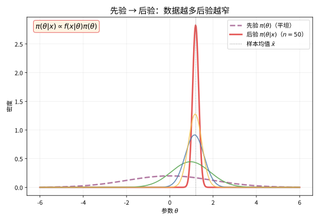
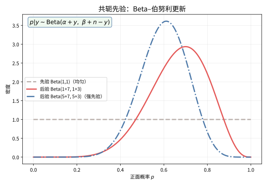

# 第 95 级：贝叶斯统计 (Bayesian Statistics)

---

## 1. 学习目标

完成本教程后，你将能够：

1. 理解贝叶斯统计的基本哲学与频率学派统计的根本区别
2. 掌握贝叶斯定理的密度形式及其在参数估计中的应用
3. 理解先验分布、似然函数与后验分布的关系，能计算共轭先验下的后验分布
4. 掌握贝叶斯估计的三种方式：后验均值、后验中位数、后验众数
5. 理解Bayes因子的概念及其在模型选择中的应用
6. 掌握可信区间与预测分布的计算方法
7. 理解分层贝叶斯模型的基本思想
8. 掌握MCMC方法（Metropolis-Hastings算法与Gibbs采样）的基本原理与收敛性理论

---

## 2. 核心概念

### 2.1 贝叶斯统计的基本哲学

**贝叶斯统计**（Bayesian Statistics）将未知参数 $\theta$ 视为随机变量，赋予其一个**先验分布**（Prior Distribution）$\pi(\theta)$，该分布反映了我们在观测数据之前对 $\theta$ 的不确定性。在观察到数据 $\boldsymbol{x} = (x_1, \dots, x_n)$ 后，通过**似然函数**（Likelihood Function）$f(\boldsymbol{x} \mid \theta)$ 更新对 $\theta$ 的认识，得到**后验分布**（Posterior Distribution）：

$$
\pi(\theta \mid \boldsymbol{x}) = \frac{f(\boldsymbol{x} \mid \theta) \pi(\theta)}{m(\boldsymbol{x})}
$$

其中 $m(\boldsymbol{x}) = \int f(\boldsymbol{x} \mid \theta) \pi(\theta) \, d\theta$ 为边际似然（Marginal Likelihood）或证据（Evidence）。

与频率学派不同，贝叶斯方法不依赖于重复抽样的频率解释，而是直接基于概率论公理量化不确定性。

### 2.2 先验分布

**先验分布** $\pi(\theta)$ 是贝叶斯分析的起点，反映了在观测数据之前对参数 $\theta$ 的全部已知信息。

- **无信息先验**（Non-informative Prior）：如均匀分布 $\pi(\theta) \propto 1$，反映"无知"状态
- **共轭先验**（Conjugate Prior）：先验与后验属于同一分布族，便于计算
- **Jeffreys先验**：$\pi(\theta) \propto \sqrt{\det I(\theta)}$，其中 $I(\theta)$ 为Fisher信息量，具有参数变换下的不变性
- **主观先验**（Subjective Prior）：基于专家知识或历史数据构建

### 2.3 似然函数

**似然函数** $f(\boldsymbol{x} \mid \theta)$ 是在给定参数 $\theta$ 下观测到数据 $\boldsymbol{x}$ 的概率密度（或质量）函数。它不是 $\theta$ 的概率密度——它通常不满足归一化条件。

### 2.4 后验分布

**后验分布** $\pi(\theta \mid \boldsymbol{x})$ 是结合了先验信息和数据信息后对 $\theta$ 的不确定性的完整描述。后验分布包含关于 $\theta$ 的全部推断信息：

$$
\pi(\theta \mid \boldsymbol{x}) \propto f(\boldsymbol{x} \mid \theta) \pi(\theta)
$$

其中归一化常数 $m(\boldsymbol{x}) = \int f(\boldsymbol{x} \mid \theta) \pi(\theta) \, d\theta$ 通常不需要显式计算。

> **直观理解（现实类比）**：想象你在猜一枚硬币的偏心程度。一开始你毫无头绪（先验很平坦，像"什么可能都有"）。每抛一次硬币就获得一条新信息，你的判断会随之更新——抛得越多，你对真实偏心程度的把握越大，判断曲线就"越瘦越尖"，峰值也越接近实测比例。这就是贝叶斯的核心：先验是你的"常识起点"，数据像"证据"不断修正它，最终收敛到真实答案。

> **🧠 思考历程：一个死后才被发表的公式，凭什么主宰了今天的人工智能？**
>
> 后验分布在回应人类最古老的求知冲动："掌握一些证据之后，我的相信该更新几分？"而这套公式的历史远比你想的老——它的核心定理直到1763年才真正问世，作者却是一位早已过世的牧师。
>
> - **牧师留下的未竟稿件**。英国长老会牧师托马斯·贝叶斯（Thomas Bayes）生前没有发表成果，1763年由友人普莱斯（Richard Price）把他的遗稿《机会学说中一个问题的解》公之于众，首次给出"根据结果反推原因概率"的公式；几十年后拉普拉斯（Laplace）不知情地独立重建并大量使用它，甚至用它反推砝码质量的误差。
> - **被"客观"压了半个世纪**。20世纪上半叶，频率学派以"先验是主观的"为由把它搁置，贝叶斯方法只能靠杰弗里斯（Harold Jeffreys）的"无信息先验"勉强保留火种；直到1953年Metropolis与1970年Hastings先后提出MCMC采样，后验分布里的积分难题才真正有了可计算的出口。
> - **数据与算力双向输血**。格曼兄弟（Geman & Geman）1984年把Gibbs采样带入贝叶斯图模型，Gelfand与Smith 1990年验证它能解决实际问题——当"先验×似然"能被机器算出来，这个古老公式便脱胎为机器学习里无处不在的贝叶斯推断。
> - **心路**：一个长期被当作"哲学偏好"的公式，靠后来几代算法的接力才翻身为工程主力——思想的迟到，常常只是时代还欠它一台机器。

### 2.5 共轭先验

**共轭先验**（Conjugate Prior）指先验分布 $\pi(\theta)$ 与后验分布 $\pi(\theta \mid \boldsymbol{x})$ 属于同一分布族。例如：

- 二项分布似然 $+$ Beta先验 $\rightarrow$ Beta后验（Beta-Binomial共轭）
- 正态分布似然 $+$ 正态先验 $\rightarrow$ 正态后验（Normal-Normal共轭）
- Poisson分布似然 $+$ Gamma先验 $\rightarrow$ Gamma后验（Poisson-Gamma共轭）

> **直观理解（现实类比）**：共轭先验就像"同一种画风的前后两幅画"——丢进一个公式，出来的还是同一种分布，只是参数变了，省去了繁重的积分。以抛硬币为例：先验是 Beta 分布，抛了 $n$ 次、得到 $y$ 次正面后，后验仍是 Beta 分布，只需把参数分别加上 $y$ 和 $n-y$。数据相当于"在原有参数上累加证据"，先验就像一个"虚拟的已观测样本"，让更新变得像记账一样简单可迭代。

### 2.6 贝叶斯估计

基于后验分布，可以给出参数的点估计：

- **后验均值**（Posterior Mean）：$\hat{\theta}_{\text{PM}} = \mathbb{E}[\theta \mid \boldsymbol{x}] = \int \theta \pi(\theta \mid \boldsymbol{x}) \, d\theta$
- **后验中位数**（Posterior Median）：$\hat{\theta}_{\text{PMd}} = \text{median}(\pi(\theta \mid \boldsymbol{x}))$
- **后验众数**（Posterior Mode / MAP估计）：$\hat{\theta}_{\text{MAP}} = \arg\max_\theta \pi(\theta \mid \boldsymbol{x})$

在平方损失下，后验均值是最优的；在绝对损失下，后验中位数是最优的；在0-1损失下，后验众数是最优的。

### 2.7 可信区间

**可信区间**（Credible Interval）是贝叶斯中区间估计的形式。$C = (a, b)$ 称为 $\theta$ 的 $100(1-\alpha)\%$ 可信区间，如果：

$$
\int_a^b \pi(\theta \mid \boldsymbol{x}) \, d\theta = 1 - \alpha
$$

与频率学派的置信区间不同，可信区间可以直接解释为"$\theta$ 落在区间 $C$ 内的概率为 $1-\alpha$"。

**最高后验密度区间**（Highest Posterior Density Interval, HPDI）是满足区间内每点的后验密度不低于区间外任意点的后验密度的可信区间，具有最短长度。

### 2.8 Bayes因子

**Bayes因子**（Bayes Factor）用于模型选择。设两个模型 $M_1$ 和 $M_2$，其先验概率分别为 $\mathbb{P}(M_1)$ 和 $\mathbb{P}(M_2)$，则后验几率比为：

$$
\frac{\mathbb{P}(M_1 \mid \boldsymbol{x})}{\mathbb{P}(M_2 \mid \boldsymbol{x})} = \frac{f(\boldsymbol{x} \mid M_1)}{f(\boldsymbol{x} \mid M_2)} \cdot \frac{\mathbb{P}(M_1)}{\mathbb{P}(M_2)}
$$

其中 $BF_{12} = \frac{f(\boldsymbol{x} \mid M_1)}{f(\boldsymbol{x} \mid M_2)}$ 为Bayes因子，它是数据支持模型 $M_1$ 相对于 $M_2$ 的证据强度。

### 2.9 预测分布

**后验预测分布**（Posterior Predictive Distribution）给出了在给定观测数据 $\boldsymbol{x}$ 后，新观测值 $\tilde{x}$ 的分布：

$$
f(\tilde{x} \mid \boldsymbol{x}) = \int f(\tilde{x} \mid \theta) \pi(\theta \mid \boldsymbol{x}) \, d\theta
$$

### 2.10 分层贝叶斯模型

**分层贝叶斯模型**（Hierarchical Bayesian Model）将先验分布本身进一步参数化，引入超参数（hyperparameters）和超先验（hyperpriors）：

$$
\boldsymbol{x} \mid \theta \sim f(\boldsymbol{x} \mid \theta), \quad \theta \mid \phi \sim \pi(\theta \mid \phi), \quad \phi \sim \pi(\phi)
$$

其中 $\phi$ 为超参数，$\pi(\phi)$ 为超先验。分层模型能有效处理组间变异和借力（borrowing strength）问题。

### 2.11 马尔可夫链蒙特卡洛

**马尔可夫链蒙特卡洛**（Markov Chain Monte Carlo, MCMC）是一类从后验分布中采样的方法。当后验分布没有解析形式时，MCMC通过构建以目标分布为不变分布的马尔可夫链来生成样本。

### 2.12 Metropolis-Hastings 算法

**Metropolis-Hastings算法**（MH算法）是MCMC的经典算法：

1. 从当前状态 $\theta^{(t)}$ 出发，从提议分布 $q(\theta^* \mid \theta^{(t)})$ 中生成候选值 $\theta^*$
2. 计算接受概率：
   $$
   \alpha = \min\left\{1, \frac{\pi(\theta^* \mid \boldsymbol{x}) \, q(\theta^{(t)} \mid \theta^*)}{\pi(\theta^{(t)} \mid \boldsymbol{x}) \, q(\theta^* \mid \theta^{(t)})}\right\}
   $$
3. 以概率 $\alpha$ 接受 $\theta^{(t+1)} = \theta^*$，否则 $\theta^{(t+1)} = \theta^{(t)}$

### 2.13 Gibbs 采样

**Gibbs采样**（Gibbs Sampling）是MH算法的一种特殊情况，每次从一个参数的条件分布中采样。对于参数向量 $\boldsymbol{\theta} = (\theta_1, \dots, \theta_d)$，每个分量依次从全条件分布中采样：

$$
\theta_1^{(t+1)} \sim \pi(\theta_1 \mid \theta_2^{(t)}, \dots, \theta_d^{(t)}, \boldsymbol{x})
$$
$$
\theta_2^{(t+1)} \sim \pi(\theta_2 \mid \theta_1^{(t+1)}, \theta_3^{(t)}, \dots, \theta_d^{(t)}, \boldsymbol{x})
$$
$$
\vdots
$$
$$
\theta_d^{(t+1)} \sim \pi(\theta_d \mid \theta_1^{(t+1)}, \dots, \theta_{d-1}^{(t+1)}, \boldsymbol{x})
$$

### 2.14 比较贝叶斯与频率学派

| 方面 | 贝叶斯学派 | 频率学派 |
|:---|:---|:---|
| 参数 $\theta$ | 随机变量 | 固定（未知）常数 |
| 推断基础 | 后验分布 $\pi(\theta \mid \boldsymbol{x})$ | 抽样分布 $f(\hat{\theta} \mid \theta)$ |
| 先验信息 | 可显式纳入 | 通常不使用 |
| 区间估计 | 可信区间（概率直接解释） | 置信区间（频率解释） |
| 假设检验 | Bayes因子 | p值、似然比检验 |
| 大样本性质 | 后验相合性 | 估计相合性、渐近正态性 |
| 计算 | 通常需要MCMC | 通常有解析或近似公式 |

---

## 3. 定理与证明

### 定理 3.1：贝叶斯定理的密度形式

**定理**：设随机变量 $X$ 有概率密度函数 $f(x \mid \theta)$（给定参数 $\theta$），参数 $\theta$ 的先验密度为 $\pi(\theta)$。则给定观测数据 $x$ 后，$\theta$ 的后验密度为：

$$
\pi(\theta \mid x) = \frac{f(x \mid \theta) \pi(\theta)}{\int_\Theta f(x \mid \theta) \pi(\theta) \, d\theta}
$$

其中 $\Theta$ 为参数空间。

**证明**：

**步骤1：联合密度**

由条件密度的定义，$X$ 和 $\theta$ 的联合密度为：

$$
f(x, \theta) = f(x \mid \theta) \pi(\theta)
$$

**步骤2：边际密度**

$X$ 的边际密度为：

$$
m(x) = \int_\Theta f(x, \theta) \, d\theta = \int_\Theta f(x \mid \theta) \pi(\theta) \, d\theta
$$

**步骤3：条件密度（后验密度）**

由条件密度的定义：

$$
\pi(\theta \mid x) = \frac{f(x, \theta)}{m(x)}
$$

当 $m(x) > 0$ 时，代入得：

$$
\pi(\theta \mid x) = \frac{f(x \mid \theta) \pi(\theta)}{\int_\Theta f(x \mid \theta) \pi(\theta) \, d\theta}
$$

**步骤4：验证概率密度性质**

显然 $\pi(\theta \mid x) \ge 0$，且：

$$
\int_\Theta \pi(\theta \mid x) \, d\theta = \frac{\int_\Theta f(x \mid \theta) \pi(\theta) \, d\theta}{\int_\Theta f(x \mid \theta) \pi(\theta) \, d\theta} = 1
$$

因此 $\pi(\theta \mid x)$ 是一个合法的概率密度函数。

**步骤5：多观测扩展**

对于独立同分布样本 $\boldsymbol{x} = (x_1, \dots, x_n)$，似然函数为 $f(\boldsymbol{x} \mid \theta) = \prod_{i=1}^n f(x_i \mid \theta)$，后验密度为：

$$
\pi(\theta \mid \boldsymbol{x}) = \frac{\left(\prod_{i=1}^n f(x_i \mid \theta)\right) \pi(\theta)}{\int_\Theta \left(\prod_{i=1}^n f(x_i \mid \theta)\right) \pi(\theta) \, d\theta}
$$

这就是贝叶斯定理的密度形式，构成了所有贝叶斯推断的基础。$\square$

---

### 定理 3.2：共轭先验的存在性（指数族）

**定理**：设似然函数属于指数族分布，即具有形式：

$$
f(x \mid \theta) = h(x) \exp\left\{ \eta(\theta)^\top T(x) - A(\theta) \right\}
$$

其中 $\eta(\theta)$ 为自然参数，$T(x)$ 为充分统计量，$A(\theta)$ 为对数配分函数。则存在一个共轭先验族，其形式为：

$$
\pi(\theta \mid \tau, \nu) \propto \exp\left\{ \tau^\top \eta(\theta) - \nu A(\theta) \right\}
$$

其中 $\tau$ 和 $\nu$ 为超参数。后验分布与先验属于同一分布族，超参数更新为 $\tau' = \tau + \sum_{i=1}^n T(x_i)$ 和 $\nu' = \nu + n$。

**证明**：

**步骤1：指数族似然**

对于独立同分布样本 $\boldsymbol{x} = (x_1, \dots, x_n)$，似然函数为：

$$
\begin{aligned}
f(\boldsymbol{x} \mid \theta) &= \prod_{i=1}^n h(x_i) \exp\left\{ \eta(\theta)^\top T(x_i) - A(\theta) \right\} \\
&= \left(\prod_{i=1}^n h(x_i)\right) \exp\left\{ \eta(\theta)^\top \sum_{i=1}^n T(x_i) - n A(\theta) \right\}
\end{aligned}
$$

**步骤2：共轭先验的定义**

定义先验分布为：

$$
\pi(\theta \mid \tau, \nu) = C(\tau, \nu) \exp\left\{ \tau^\top \eta(\theta) - \nu A(\theta) \right\}
$$

其中 $C(\tau, \nu)$ 为归一化常数，$\tau$ 和 $\nu$ 为超参数，$\tau \in \mathbb{R}^k$，$\nu > 0$。

**步骤3：计算后验分布**

后验分布与先验和似然的乘积成正比：

$$
\begin{aligned}
\pi(\theta \mid \boldsymbol{x}, \tau, \nu) &\propto f(\boldsymbol{x} \mid \theta) \pi(\theta \mid \tau, \nu) \\
&\propto \left(\prod_{i=1}^n h(x_i)\right) \exp\left\{ \eta(\theta)^\top \sum_{i=1}^n T(x_i) - n A(\theta) \right\} \\
&\quad \times C(\tau, \nu) \exp\left\{ \tau^\top \eta(\theta) - \nu A(\theta) \right\} \\
&\propto \exp\left\{ \eta(\theta)^\top \left( \tau + \sum_{i=1}^n T(x_i) \right) - (\nu + n) A(\theta) \right\}
\end{aligned}
$$

其中常数因子 $\prod_{i=1}^n h(x_i)$ 和 $C(\tau, \nu)$ 被吸收到比例常数中。

**步骤4：识别后验分布族**

令 $\tau' = \tau + \sum_{i=1}^n T(x_i)$，$\nu' = \nu + n$，则：

$$
\pi(\theta \mid \boldsymbol{x}, \tau, \nu) \propto \exp\left\{ \tau'^\top \eta(\theta) - \nu' A(\theta) \right\}
$$

这与先验分布形式完全相同，只是超参数从 $(\tau, \nu)$ 更新为 $(\tau', \nu')$。因此后验分布与先验属于同一分布族，共轭性得证。

**步骤5：示例验证**

对于Bernoulli分布 $f(x \mid p) = p^x (1-p)^{1-x}$，其指数族形式为：

$$
f(x \mid p) = \exp\left\{ x \log\frac{p}{1-p} + \log(1-p) \right\}
$$

即 $\eta(p) = \log\frac{p}{1-p}$，$T(x) = x$，$A(p) = -\log(1-p)$。

共轭先验为 $\pi(p \mid \alpha, \beta) \propto \exp\left\{ \alpha \log\frac{p}{1-p} - \beta (-\log(1-p)) \right\} \propto p^\alpha (1-p)^{\beta-\alpha-1}$，这正是不完全Beta分布的形式（标准化后为Beta分布）。$\square$

---

### 定理 3.3：后验分布的正则性（Doob一致性定理）

**定理**（Doob一致性定理）：设参数空间 $\Theta \subseteq \mathbb{R}^k$ 为可测子集，观测数据 $\boldsymbol{x}_n = (x_1, \dots, x_n)$ 为独立同分布，来自分布 $P_{\theta_0}$，其中 $\theta_0$ 为真实参数值。设先验分布 $\pi$ 在 $\Theta$ 上定义，且后验分布 $\pi(\theta \mid \boldsymbol{x}_n)$ 存在。则对于几乎所有 $\theta_0$（相对于先验 $\pi$ 的支集），后验分布 $\pi(\theta \mid \boldsymbol{x}_n)$ 在 $\theta_0$ 处是一致的，即对 $\theta_0$ 的任何邻域 $U$，有：

$$
\pi(\theta \in U \mid \boldsymbol{x}_n) \xrightarrow{n \to \infty} 1 \quad \text{在 $P_{\theta_0}$-概率下}
$$

**证明**：

**步骤1：基本框架**

设 $\Theta$ 为可分的度量空间，$d$ 为度量。定义事件 $A = \{\theta_0 \in \Theta : \text{后验在 $\theta_0$ 处不一致}\}$。我们需要证明 $\pi(A) = 0$。

**步骤2：鞅构造**

对任意可测集 $B \subseteq \Theta$，定义：

$$
Z_n(B) = \pi(\theta \in B \mid \boldsymbol{x}_n) = \frac{\int_B \prod_{i=1}^n f(x_i \mid \theta) \pi(d\theta)}{\int_\Theta \prod_{i=1}^n f(x_i \mid \theta) \pi(d\theta)}
$$

设 $\mathcal{F}_n = \sigma(\boldsymbol{x}_n)$ 为前 $n$ 个观测生成的 $\sigma$-代数。考虑比值过程：

$$
M_n(B) = \frac{\int_B \prod_{i=1}^n \frac{f(x_i \mid \theta)}{f(x_i \mid \theta_0)} \pi(d\theta)}{\int_\Theta \prod_{i=1}^n \frac{f(x_i \mid \theta)}{f(x_i \mid \theta_0)} \pi(d\theta)}
$$

**步骤3：验证鞅性质**

在 $P_{\theta_0}$ 下，定义似然比：

$$
L_n(\theta) = \prod_{i=1}^n \frac{f(x_i \mid \theta)}{f(x_i \mid \theta_0)}
$$

则 $\mathbb{E}_{\theta_0}[L_n(\theta) \mid \mathcal{F}_{n-1}] = L_{n-1}(\theta)$，因为：

$$
\mathbb{E}_{\theta_0}\left[\frac{f(x_n \mid \theta)}{f(x_n \mid \theta_0)} \Bigm| \mathcal{F}_{n-1}\right] = \int \frac{f(x_n \mid \theta)}{f(x_n \mid \theta_0)} f(x_n \mid \theta_0) \, dx_n = 1
$$

因此 $L_n(\theta)$ 是一个鞅（对每个固定的 $\theta$）。

**步骤4：应用鞅收敛定理**

由鞅收敛定理，$L_n(\theta)$ 几乎必然收敛到某个极限 $L_\infty(\theta)$。此外，由似然比的鞅性质，有：

$$
\mathbb{E}_{\theta_0}\left[\sqrt{L_n(\theta)}\right] \le 1
$$

由Fatou引理，$\mathbb{E}_{\theta_0}\left[\sqrt{L_\infty(\theta)}\right] \le 1$。

**步骤5：Kullback-Leibler散度与一致性**

定义 $K(\theta_0, \theta) = \mathbb{E}_{\theta_0}\left[\log\frac{f(x \mid \theta_0)}{f(x \mid \theta)}\right]$ 为Kullback-Leibler散度。由大数定律，对 $\theta \neq \theta_0$，几乎必然有：

$$
\frac{1}{n} \log L_n(\theta) = \frac{1}{n} \sum_{i=1}^n \log\frac{f(x_i \mid \theta)}{f(x_i \mid \theta_0)} \xrightarrow{n \to \infty} -K(\theta_0, \theta) < 0
$$

因此 $L_n(\theta) \to 0$ 几乎必然对任意 $\theta \neq \theta_0$ 成立（当 $K(\theta_0, \theta) > 0$ 时）。

**步骤6：后验一致性的结论**

对 $\theta_0$ 的任意开邻域 $U$，将其补集 $U^c$ 分解为可数多个紧集 $K_j$ 的并。对每个 $K_j$，有 $\sup_{\theta \in K_j} \frac{1}{n} \log L_n(\theta) \to -c_j < 0$，因此 $\int_{K_j} L_n(\theta) \pi(d\theta) \to 0$ 几乎必然。

由此可得：

$$
\pi(\theta \notin U \mid \boldsymbol{x}_n) = \frac{\int_{U^c} L_n(\theta) \pi(d\theta)}{\int_\Theta L_n(\theta) \pi(d\theta)} \to 0 \quad \text{几乎必然}
$$

即 $\pi(\theta \in U \mid \boldsymbol{x}_n) \to 1$ 几乎必然。一致性得证。

**步骤7：例外集合的测度为零**

上述论证对使 $K(\theta_0, \theta) > 0$ 对所有 $\theta \neq \theta_0$ 成立的 $\theta_0$ 成立。如果存在 $\theta_1 \neq \theta_0$ 使得 $K(\theta_0, \theta_1) = 0$（即不可区分），则 $\theta_0$ 属于例外集合。但这样的 $\theta_0$ 集合的 $\pi$-测度为零（因为当且仅当 $P_{\theta_0} = P_{\theta_1}$ 时 $K(\theta_0, \theta_1) = 0$，这对应于参数的可识别性问题）。$\square$

---

### 定理 3.4：MCMC的收敛性

**定理**：设 $P$ 为定义在状态空间 $\mathcal{X}$ 上的马尔可夫链的转移核，以 $\pi$ 为不变分布。若 $P$ 是 $\pi$-不可约且非周期的，则对 $\pi$-几乎处处所有初始状态 $x$，有：

$$
\lim_{n \to \infty} \|P^n(x, \cdot) - \pi\|_{\text{TV}} = 0
$$

其中 $\|\cdot\|_{\text{TV}}$ 为全变差范数。特别地，对任何可测函数 $g: \mathcal{X} \to \mathbb{R}$ 满足 $\int |g| \, d\pi < \infty$，有：

$$
\frac{1}{N} \sum_{t=1}^N g(X_t) \xrightarrow{N \to \infty} \int g(x) \, \pi(dx) \quad \text{几乎必然}
$$

**证明**：

**步骤1：基本定义与设定**

设 $\mathcal{X}$ 为完备可分度量空间，$\mathcal{B}(\mathcal{X})$ 为其Borel $\sigma$-代数。转移核 $P: \mathcal{X} \times \mathcal{B}(\mathcal{X}) \to [0, 1]$ 满足：

- 对每个 $x \in \mathcal{X}$，$P(x, \cdot)$ 是概率测度
- 对每个 $A \in \mathcal{B}(\mathcal{X})$，$P(\cdot, A)$ 是可测函数

$\pi$ 是 $P$ 的不变分布，即 $\pi(A) = \int P(x, A) \, \pi(dx)$ 对所有 $A \in \mathcal{B}(\mathcal{X})$ 成立。

**步骤2：不可约性与非周期性**

$P$ 是 $\pi$-不可约的，如果对任意 $A \in \mathcal{B}(\mathcal{X})$ 满足 $\pi(A) > 0$，有 $\sum_{n=1}^\infty P^n(x, A) > 0$ 对所有 $x \in \mathcal{X}$ 成立。

$P$ 是非周期的，如果存在一个 $\pi$-几乎处处非零的集合 $A$，使得对任意 $B \subseteq A$ 满足 $\pi(B) > 0$，有 $\mathbb{P}_x(X_n \in B \text{ 对无穷多个 } n) > 0$。

**步骤3：小集与漂移条件**

称集合 $C \in \mathcal{B}(\mathcal{X})$ 为小集（small set），如果存在 $m \ge 1$ 和概率测度 $\nu$ 及 $\epsilon > 0$，使得：

$$
P^m(x, \cdot) \ge \epsilon \nu(\cdot), \quad \forall x \in C
$$

**步骤4：几何漂移条件**

存在函数 $V: \mathcal{X} \to [1, \infty)$、常数 $\lambda \in (0, 1)$ 和 $b < \infty$，使得：

$$
PV(x) := \int V(y) P(x, dy) \le \lambda V(x) + b \boldsymbol{1}_C(x)
$$

其中 $C$ 为小集。这一条件保证了链的几何遍历性。

**步骤5：全变差收敛**

由Nummelin分裂技术，在不可约且非周期条件下，存在 $r > 1$ 使得：

$$
\sum_{n=1}^\infty r^n \|P^n(x, \cdot) - \pi\|_{\text{TV}} < \infty \quad \text{对 $\pi$-几乎处处 $x$}
$$

特别地，$\|P^n(x, \cdot) - \pi\|_{\text{TV}} \to 0$。

**步骤6：强大数定律**

由鞅差序列的收敛性，对任意满足 $\int |g| \, d\pi < \infty$ 的函数 $g$，定义：

$$
S_N = \frac{1}{N} \sum_{t=1}^N \left(g(X_t) - \int g \, d\pi\right)
$$

由Markov链的遍历定理，$S_N \to 0$ 几乎必然。

**步骤7：应用于Metropolis-Hastings算法**

MH算法构建的转移核为：

$$
P(x, dy) = \alpha(x, y) q(x, dy) + \delta_x(dy) \int (1 - \alpha(x, z)) q(x, dz)
$$

其中 $\alpha(x, y) = \min\left\{1, \frac{\pi(y) q(y, x)}{\pi(x) q(x, y)}\right\}$。可以验证该转移核以 $\pi$ 为不变分布。当提议分布 $q$ 满足 $\pi$-不可约性时，MH算法收敛到目标分布 $\pi$。$\square$

---

### 定理 3.5：Bayes因子的边际似然表示

**定理**：设两个模型 $M_1$ 和 $M_2$，分别具有参数 $\theta_1 \in \Theta_1$ 和 $\theta_2 \in \Theta_2$，先验密度 $\pi_1(\theta_1)$ 和 $\pi_2(\theta_2)$。给定数据 $\boldsymbol{x}$，模型 $M_1$ 对 $M_2$ 的Bayes因子为：

$$
BF_{12} = \frac{f(\boldsymbol{x} \mid M_1)}{f(\boldsymbol{x} \mid M_2)} = \frac{\int_{\Theta_1} f(\boldsymbol{x} \mid \theta_1, M_1) \pi_1(\theta_1) \, d\theta_1}{\int_{\Theta_2} f(\boldsymbol{x} \mid \theta_2, M_2) \pi_2(\theta_2) \, d\theta_2}
$$

即Bayes因子等于两个模型的边际似然之比。

**证明**：

**步骤1：模型后验概率**

设 $\mathbb{P}(M_1)$ 和 $\mathbb{P}(M_2)$ 为两个模型的先验概率，$\mathbb{P}(M_1) + \mathbb{P}(M_2) = 1$。由贝叶斯定理，模型 $M_1$ 的后验概率为：

$$
\mathbb{P}(M_1 \mid \boldsymbol{x}) = \frac{f(\boldsymbol{x} \mid M_1) \mathbb{P}(M_1)}{f(\boldsymbol{x} \mid M_1) \mathbb{P}(M_1) + f(\boldsymbol{x} \mid M_2) \mathbb{P}(M_2)}
$$

**步骤2：后验几率比**

后验几率比（Posterior Odds）为：

$$
\frac{\mathbb{P}(M_1 \mid \boldsymbol{x})}{\mathbb{P}(M_2 \mid \boldsymbol{x})} = \frac{f(\boldsymbol{x} \mid M_1) \mathbb{P}(M_1)}{f(\boldsymbol{x} \mid M_2) \mathbb{P}(M_2)} = BF_{12} \cdot \frac{\mathbb{P}(M_1)}{\mathbb{P}(M_2)}
$$

**步骤3：边际似然的定义**

模型 $M_k$ 的边际似然（Marginal Likelihood）定义为在模型 $M_k$ 下观测数据的密度，通过对参数 $\theta_k$ 积分得到：

$$
f(\boldsymbol{x} \mid M_k) = \int_{\Theta_k} f(\boldsymbol{x} \mid \theta_k, M_k) \pi_k(\theta_k) \, d\theta_k
$$

**步骤4：Bayes因子的边际似然表示**

由步骤2和步骤3，Bayes因子直接等于两个边际似然之比：

$$
BF_{12} = \frac{f(\boldsymbol{x} \mid M_1)}{f(\boldsymbol{x} \mid M_2)} = \frac{\int_{\Theta_1} f(\boldsymbol{x} \mid \theta_1, M_1) \pi_1(\theta_1) \, d\theta_1}{\int_{\Theta_2} f(\boldsymbol{x} \mid \theta_2, M_2) \pi_2(\theta_2) \, d\theta_2}
$$

**步骤5：Bayes因子的解释**

Jeffreys给出了Bayes因子的解释尺度：

| $BF_{12}$ | 证据强度 |
|:---:|:---|
| $> 100$ | 决定性证据支持 $M_1$ |
| $30 \sim 100$ | 非常强的证据支持 $M_1$ |
| $10 \sim 30$ | 强证据支持 $M_1$ |
| $3 \sim 10$ | 中等证据支持 $M_1$ |
| $1 \sim 3$ | 微弱证据支持 $M_1$ |
| $1$ | 无证据 |
| $< 1$ | 支持 $M_2$ |

**步骤6：与频率学派p值的对比**

Bayes因子直接比较两个模型的边际似然，不依赖于p值或重复抽样。它自然地惩罚复杂模型（通过积分引入的"奥卡姆剃刀"效应），且可以解释为"数据支持 $M_1$ 相对于 $M_2$ 的倍数为 $BF_{12}$"。

**步骤7：Bayes因子的计算挑战**

边际似然的积分通常没有解析形式，需要数值方法（如拉普拉斯近似、桥采样、重要性采样）或MCMC估计（如Chib方法）。$\square$

---

## 4. 示例

### 示例 1：Beta-Binomial模型（先验更新）

**问题**：假设我们想要估计一枚硬币的正面概率 $p$。我们进行了 $n = 10$ 次抛掷，观察到 $y = 7$ 次正面。使用Beta-Binomial共轭模型进行贝叶斯分析。

**步骤1：模型设定**

似然函数：$y \mid p \sim \text{Binomial}(n, p)$

$$
f(y \mid p) = \binom{n}{y} p^y (1-p)^{n-y}
$$

先验分布：$p \sim \text{Beta}(\alpha, \beta)$

$$
\pi(p) = \frac{\Gamma(\alpha+\beta)}{\Gamma(\alpha)\Gamma(\beta)} p^{\alpha-1} (1-p)^{\beta-1}, \quad 0 \le p \le 1
$$

**步骤2：后验分布的计算**

后验分布与先验和似然的乘积成正比：

$$
\begin{aligned}
\pi(p \mid y) &\propto f(y \mid p) \pi(p) \\
&\propto p^y (1-p)^{n-y} \cdot p^{\alpha-1} (1-p)^{\beta-1} \\
&= p^{y+\alpha-1} (1-p)^{n-y+\beta-1}
\end{aligned}
$$

这恰好是 $\text{Beta}(y+\alpha, n-y+\beta)$ 的核，因此：

$$
p \mid y \sim \text{Beta}(\alpha + y, \beta + n - y)
$$

**步骤3：不同先验的比较**

**无信息先验**：$\alpha = \beta = 1$（均匀分布）

后验：$p \mid y \sim \text{Beta}(1+7, 1+3) = \text{Beta}(8, 4)$

- 后验均值：$\frac{8}{8+4} = \frac{2}{3} \approx 0.667$
- 后验众数（MAP）：$\frac{8-1}{8+4-2} = \frac{7}{10} = 0.7$
- 后验中位数：约 0.678

**弱信息先验**：$\alpha = \beta = 2$（轻微偏向0.5）

后验：$p \mid y \sim \text{Beta}(2+7, 2+3) = \text{Beta}(9, 5)$

- 后验均值：$\frac{9}{14} \approx 0.643$
- 后验众数：$\frac{8}{12} \approx 0.667$

**强先验**：$\alpha = 10, \beta = 10$（强烈认为 $p$ 接近0.5）

后验：$p \mid y \sim \text{Beta}(10+7, 10+3) = \text{Beta}(17, 13)$

- 后验均值：$\frac{17}{30} \approx 0.567$
- 后验众数：$\frac{16}{28} \approx 0.571$

**步骤4：可信区间**

对于无信息先验，95%的可信区间为Beta分布的分位数：

$$
\mathbb{P}(0.390 < p < 0.881 \mid y) = 0.95
$$

**步骤5：后验预测分布**

新观测 $\tilde{y}$（在 $n=1$ 次抛掷中）的后验预测分布为：

$$
\begin{aligned}
f(\tilde{y}=1 \mid y) &= \int_0^1 p \cdot \pi(p \mid y) \, dp = \mathbb{E}[p \mid y] = \frac{\alpha + y}{\alpha + \beta + n} \\
&= \frac{8}{12} = \frac{2}{3}
\end{aligned}
$$

**步骤6：先验更新的可视化**

| 先验 $(\alpha, \beta)$ | 先验均值 | 后验 $(\alpha', \beta')$ | 后验均值 |
|:---:|:---:|:---:|:---:|
| $(1, 1)$ | 0.500 | $(8, 4)$ | 0.667 |
| $(2, 2)$ | 0.500 | $(9, 5)$ | 0.643 |
| $(5, 5)$ | 0.500 | $(12, 8)$ | 0.600 |
| $(10, 10)$ | 0.500 | $(17, 13)$ | 0.567 |

可以看到，随着先验信息量的增加（$\alpha+\beta$ 增大），后验均值向先验均值靠拢——数据与先验的"权重"在竞争。

---

### 示例 2：正态分布共轭先验分析

**问题**：某工厂生产的零件长度服从正态分布 $X \sim N(\mu, \sigma^2)$，其中方差 $\sigma^2$ 已知。现观测到 $n = 5$ 个零件的长度（单位：mm）：$10.2, 9.8, 10.1, 10.3, 9.9$。假设 $\sigma^2 = 0.25$，使用共轭先验对均值 $\mu$ 进行贝叶斯推断。

**步骤1：模型设定**

似然函数：$x_i \mid \mu \sim N(\mu, \sigma^2)$，独立同分布

$$
f(\boldsymbol{x} \mid \mu) = \prod_{i=1}^n \frac{1}{\sqrt{2\pi\sigma^2}} \exp\left\{-\frac{(x_i - \mu)^2}{2\sigma^2}\right\}
$$

先验分布：$\mu \sim N(\mu_0, \tau_0^2)$

$$
\pi(\mu) = \frac{1}{\sqrt{2\pi\tau_0^2}} \exp\left\{-\frac{(\mu - \mu_0)^2}{2\tau_0^2}\right\}
$$

**步骤2：后验分布的推导**

后验与先验和似然的乘积成正比：

$$
\begin{aligned}
\pi(\mu \mid \boldsymbol{x}) &\propto \exp\left\{-\frac{1}{2\sigma^2} \sum_{i=1}^n (x_i - \mu)^2\right\} \exp\left\{-\frac{(\mu - \mu_0)^2}{2\tau_0^2}\right\} \\
&\propto \exp\left\{-\frac{1}{2}\left[\frac{\sum_{i=1}^n (x_i - \mu)^2}{\sigma^2} + \frac{(\mu - \mu_0)^2}{\tau_0^2}\right]\right\}
\end{aligned}
$$

展开 $\sum_{i=1}^n (x_i - \mu)^2 = \sum_{i=1}^n (x_i - \bar{x})^2 + n(\bar{x} - \mu)^2$，其中 $\bar{x} = \frac{1}{n}\sum_{i=1}^n x_i$。

由于第一项与 $\mu$ 无关，我们关注 $\mu$ 相关的部分：

$$
\begin{aligned}
\pi(\mu \mid \boldsymbol{x}) &\propto \exp\left\{-\frac{1}{2}\left[\frac{n(\bar{x} - \mu)^2}{\sigma^2} + \frac{(\mu - \mu_0)^2}{\tau_0^2}\right]\right\} \\
&\propto \exp\left\{-\frac{1}{2}\left[ \frac{n}{\sigma^2}(\mu^2 - 2\bar{x}\mu) + \frac{1}{\tau_0^2}(\mu^2 - 2\mu_0\mu) \right]\right\} \\
&\propto \exp\left\{-\frac{1}{2}\left[ \left(\frac{n}{\sigma^2} + \frac{1}{\tau_0^2}\right)\mu^2 - 2\left(\frac{n\bar{x}}{\sigma^2} + \frac{\mu_0}{\tau_0^2}\right)\mu \right]\right\}
\end{aligned}
$$

配方，令 $\mu_n = \frac{\frac{n\bar{x}}{\sigma^2} + \frac{\mu_0}{\tau_0^2}}{\frac{n}{\sigma^2} + \frac{1}{\tau_0^2}}$，$\tau_n^2 = \frac{1}{\frac{n}{\sigma^2} + \frac{1}{\tau_0^2}}$，则：

$$
\pi(\mu \mid \boldsymbol{x}) \propto \exp\left\{-\frac{(\mu - \mu_n)^2}{2\tau_n^2}\right\}
$$

因此 $\mu \mid \boldsymbol{x} \sim N(\mu_n, \tau_n^2)$。

**步骤3：数值计算**

给定 $\sigma^2 = 0.25$，即 $\sigma = 0.5$。

样本均值：$\bar{x} = \frac{10.2 + 9.8 + 10.1 + 10.3 + 9.9}{5} = 10.06$

**无信息先验极限**：$\tau_0^2 \to \infty$（即 $\mu_0$ 无信息）

$$
\mu_n = \frac{5 \times 10.06 / 0.25}{5 / 0.25} = 10.06, \quad \tau_n^2 = \frac{1}{5/0.25} = 0.05
$$

后验95%可信区间：$10.06 \pm 1.96 \times \sqrt{0.05} = (9.62, 10.50)$

**使用信息先验**：$\mu_0 = 10.0, \tau_0^2 = 0.1$（认为均值在10.0附近，不确定度0.1）

$$
\mu_n = \frac{5 \times 10.06 / 0.25 + 10.0 / 0.1}{5/0.25 + 1/0.1} = \frac{201.2 + 100}{20 + 10} = \frac{301.2}{30} = 10.04
$$

$$
\tau_n^2 = \frac{1}{5/0.25 + 1/0.1} = \frac{1}{20 + 10} = \frac{1}{30} \approx 0.0333
$$

后验95%可信区间：$10.04 \pm 1.96 \times \sqrt{0.0333} = (9.68, 10.40)$

**步骤4：后验预测分布**

新观测值 $\tilde{x}$ 的后验预测分布为：

$$
\tilde{x} \mid \boldsymbol{x} \sim N(\mu_n, \sigma^2 + \tau_n^2)
$$

对于无信息先验：$\tilde{x} \mid \boldsymbol{x} \sim N(10.06, 0.25 + 0.05) = N(10.06, 0.30)$

95%预测区间：$10.06 \pm 1.96 \times \sqrt{0.30} = (8.99, 11.13)$

**步骤5：先验精度的解释**

注意到后验均值可以写成先验均值和样本均值的加权平均，权重为精度（方差的倒数）：

$$
\mu_n = \frac{\tau_0^{-2}}{\tau_0^{-2} + n\sigma^{-2}} \mu_0 + \frac{n\sigma^{-2}}{\tau_0^{-2} + n\sigma^{-2}} \bar{x}
$$

先验精度 $\tau_0^{-2}$ 和样本精度 $n\sigma^{-2}$ 的相对大小决定了先验和数据对后验的影响程度。

---

## 5. 习题

### 基础题

**习题 1**（贝叶斯定理）写出贝叶斯定理的密度形式 $\pi(\theta \mid \boldsymbol{x}) \propto f(\boldsymbol{x} \mid \theta) \pi(\theta)$，并说明归一化常数 $m(\boldsymbol{x})$ 的含义与作用（提示：$m(\boldsymbol{x}) = \int f(\boldsymbol{x} \mid \theta) \pi(\theta) \, d\theta$ 为边际似然，通常无需显式计算）。

**习题 2**（先验类型）列举四种先验分布——无信息先验（$\pi(\theta) \propto 1$）、Jeffreys先验（$\pi(\theta) \propto \sqrt{\det I(\theta)}$）、共轭先验、主观先验，并各用一句话说明其用途。

**习题 3**（共轭先验）列出三个常见共轭对（Beta-Binomial、Normal-Normal、Poisson-Gamma），并说明"共轭"的含义（提示：先验与后验属于同一分布族，更新只改参数）。

**习题 4**（Beta-Binomial后验）抛硬币 $n = 10$ 次得 $y = 7$ 次正面，取均匀先验 $p \sim \text{Beta}(1,1)$，写出后验分布并计算后验均值（提示：后验为 $\text{Beta}(1+y, 1+n-y)$）。

**习题 5**（后验预测分布）写出后验预测分布 $f(\tilde{x} \mid \boldsymbol{x}) = \int f(\tilde{x} \mid \theta) \pi(\theta \mid \boldsymbol{x}) \, d\theta$，并说明它刻画了何种不确定性。

**习题 6**（贝叶斯估计）写出后验均值、后验中位数、后验众数（MAP）的定义式，并指出在平方损失、绝对损失、0-1损失下分别以哪一个作为贝叶斯估计最优。

**习题 7**（Poisson-Gamma 共轭）设 $X_1, \dots, X_n \mid \lambda \stackrel{\text{i.i.d.}}{\sim} \text{Poisson}(\lambda)$，先验 $\lambda \sim \text{Gamma}(\alpha, \beta)$（$\pi(\lambda) \propto \lambda^{\alpha-1} e^{-\beta\lambda}$）。(a) 写出后验核；(b) 写出后验均值 $\mathbb{E}[\lambda \mid \boldsymbol{x}]$（提示：后验中 $\lambda$ 的指数为 $\lambda^{\alpha+\sum x_i-1} e^{-(\beta+n)\lambda}$）。

**习题 8**（Inverse-Gamma 共轭）在 $N(\mu, \sigma^2)$ 中方差 $\sigma^2$ 未知、均值 $\mu$ 已知，先验 $\sigma^2 \sim \text{Inverse-Gamma}(\alpha, \beta)$（$\pi(\sigma^2) \propto (\sigma^2)^{-\alpha-1} \exp(-\beta/\sigma^2)$），似然 $f(\boldsymbol{x} \mid \sigma^2) \propto (\sigma^2)^{-n/2} \exp\left\{-\frac{1}{2\sigma^2} \sum (x_i-\mu)^2\right\}$。写出后验核（提示：指数同幂合并为 $(\sigma^2)^{-\alpha-n/2-1} e^{-(\beta + \frac12\sum(x_i-\mu)^2)/\sigma^2}$）。

**习题 9**（Bayes因子）给出 Bayes 因子 $BF_{12} = \frac{f(\boldsymbol{x} \mid M_1)}{f(\boldsymbol{x} \mid M_2)}$ 的定义，并写出它与后验几率 $\frac{\mathbb{P}(M_1\mid\boldsymbol{x})}{\mathbb{P}(M_2\mid\boldsymbol{x})} = BF_{12} \cdot \frac{\mathbb{P}(M_1)}{\mathbb{P}(M_2)}$ 的关系。

**习题 10**（MH算法）简述 Metropolis-Hastings 算法的三步流程：从提议分布生成候选值、计算接受概率 $\alpha = \min\left\{1, \frac{\pi(\theta^*\mid\boldsymbol{x})\,q(\theta^{(t)}\mid\theta^*)}{\pi(\theta^{(t)}\mid\boldsymbol{x})\,q(\theta^*\mid\theta^{(t)})}\right\}$、以概率 $\alpha$ 接受（提示：对称提议 $q$ 不对称因子消失，$\alpha=\min\left\{1, \pi(\theta^*) / \pi(\theta^{(t)})\right\}$）。

### 进阶题

**习题 11**（贝叶斯定理证明）利用联合密度 $f(\boldsymbol{x},\theta)=f(\boldsymbol{x}\mid\theta)\pi(\theta)$ 与条件密度定义，证明 $\pi(\theta\mid\boldsymbol{x}) = \frac{f(\boldsymbol{x}\mid\theta)\pi(\theta)}{\int_\Theta f(\boldsymbol{x}\mid\theta)\pi(\theta)d\theta}$，并写出 i.i.d. 样本 $\boldsymbol{x}=(x_1,\dots,x_n)$ 时的推广形式（提示：似然为 $\prod_i f(x_i\mid\theta)$）。

**习题 12**（指数族共轭先验）对指数族似然 $f(x\mid\theta)=h(x)\exp\{\eta(\theta)^\top T(x)-A(\theta)\}$，证明共轭先验 $\pi(\theta\mid\tau,\nu)\propto\exp\{\tau^\top\eta(\theta)-\nu A(\theta)\}$，并写出超参数更新规则（提示：$\tau'=\tau+\sum_{i=1}^n T(x_i)$，$\nu'=\nu+n$）。

**习题 13**（Normal-Normal 后验）已知 $\sigma^2$ 下 $x_i\mid\mu\sim N(\mu,\sigma^2)$，先验 $\mu\sim N(\mu_0,\tau_0^2)$，证明后验 $\mu\mid\boldsymbol{x}\sim N(\mu_n,\tau_n^2)$，其中 $\mu_n = \frac{n\bar{x}/\sigma^2+\mu_0/\tau_0^2}{n/\sigma^2+1/\tau_0^2}$、$\tau_n^2 = (n/\sigma^2+1/\tau_0^2)^{-1}$（提示：后验中 $\mu$ 的二次项系数即 $1/\tau_n^2$，一次项系数为 $n\bar{x}/\sigma^2+\mu_0/\tau_0^2$）。

**习题 14**（精度加权平均）由习题13结果说明后验均值是先验均值与样本均值的加权平均，权重为各自的精度（方差倒数），并解释先验精度 $\tau_0^{-2}$ 与样本精度 $n\sigma^{-2}$ 的相对大小如何决定数据与先验的"话语权"。

**习题 15**（Beta 后验预测）在 Beta-Binomial 共轭下推导一次（$n=1$）抛掷出现正面的概率 $\mathbb{E}[p\mid y]=\frac{\alpha+y}{\alpha+\beta+n}$，并解释"先验 $\text{Beta}(\alpha,\beta)$ 相当于 $\alpha+\beta$ 个虚拟观测"这一说法（提示：$\mathbb{E}[p\mid y] = (\alpha+y)/(\alpha+\beta+n)$）。

**习题 16**（损失函数最优性）证明在平方损失 $L(\theta,a)=(\theta-a)^2$ 下最小化后验期望损失 $\int(\theta-a)^2\pi(\theta\mid\boldsymbol{x})d\theta$ 得 $a=\mathbb{E}[\theta\mid\boldsymbol{x}]$（提示：对 $a$ 求导得 $-2\mathbb{E}[\theta\mid\boldsymbol{x}]+2a=0$）。

**习题 17**（可信区间与 HPDI）说明可信区间 $\int_a^b \pi(\theta\mid\boldsymbol{x})\,d\theta = 1-\alpha$ 的"概率"解释及其与频率置信区间的区别，并写出最高后验密度区间（HPDI）的定义与最短性特点。

**习题 18**（Doob 一致性）陈述 Doob 一致性定理：对 $\boldsymbol{x}_n$ 来自 $P_{\theta_0}$、先验 $\pi$ 支撑下，后验 $\pi(\theta\mid\boldsymbol{x}_n)$ 在 $\theta_0$ 处一致，即对任意邻域 $U$ 有 $\pi(\theta\in U\mid\boldsymbol{x}_n)\to1$（$P_{\theta_0}$-概率下），并指出其所需条件。

**习题 19**（MCMC 收敛性）陈述 MCMC 收敛性定理：当转移核 $P$ 以 $\pi$ 为不变分布、$\pi$-不可约且非周期时，有 $\|P^n(x,\cdot)-\pi\|_{\text{TV}}\to0$ 且 $\frac1N\sum_{t=1}^N g(X_t)\xrightarrow{}\int g\,d\pi$（几乎必然），并说明其在采样实践中的含义。

### 挑战题

**习题 20**（Doob 证明思路）简述 Doob 一致性定理的证明脉络：构造似然比鞅 $L_n(\theta)=\prod_{i=1}^n \frac{f(x_i\mid\theta)}{f(x_i\mid\theta_0)}$，利用鞅收敛与 KL 散度 $K(\theta_0,\theta)>0$ 说明 $L_n(\theta)\to0$（$\theta\neq\theta_0$），从而后验质量集中到 $\theta_0$，并讨论例外集合测度为零的原因。

**习题 21**（MCMC 收敛证明框架）简述 MCMC 收敛性证明的框架：不可约 + 非周期 → 存在小集 $C$ 与几何漂移条件 $PV(x)\le\lambda V(x)+b\mathbf{1}_C(x)$ → 由 Nummelin 分裂与遍历定理得到 $\|P^n-\pi\|_{\text{TV}}\to0$ 与样本均值大数定律，并指出这些条件如何确保 MH 算法收敛。

**习题 22**（Bayes因子边际似然表示）从后验几率比出发证明 $BF_{12} = \frac{\int_{\Theta_1} f(\boldsymbol{x}\mid\theta_1,M_1)\pi_1(\theta_1)d\theta_1}{\int_{\Theta_2} f(\boldsymbol{x}\mid\theta_2,M_2)\pi_2(\theta_2)d\theta_2}$，并解释"奥卡姆剃刀"效应如何通过对参数的边际化自动惩罚复杂模型。

**习题 23**（MH 不变分布验证）验证 MH 算法的转移核以 $\pi$ 为不变分布：证明其满足细致平衡条件 $\pi(\theta)P(\theta,d\theta^*) = \pi(\theta^*)P(\theta^*,d\theta)$，并说明在对称提议分布下接受率简化为 $\min\{1,\pi(\theta^*)/\pi(\theta^{(t)})\}$。

**习题 24**（Jeffreys 先验）说明 Jeffreys 先验 $\pi(\theta)\propto\sqrt{\det I(\theta)}$ 的定义及其在参数单调变换下的不变性，并对正态均值 $\theta=\mu$（$I(\mu)=1/\sigma^2$）与硬币参数 $p$（Bernoulli，$I(p)=(p(1-p))^{-1}$）各举一例。

**习题 25**（分层贝叶斯模型）写出分层模型 $\boldsymbol{x}\mid\theta\sim f(\boldsymbol{x}\mid\theta)$，$\theta\mid\phi\sim\pi(\theta\mid\phi)$，$\phi\sim\pi(\phi)$，说明超参数 $\phi$ 与超先验 $\pi(\phi)$ 的作用，并解释"借力"（borrowing strength）如何改进小样本组估计。

**习题 26**（贝叶斯 vs 频率）从参数性质、推断基础、先验使用、区间估计、假设检验、计算复杂度六个方面对比贝叶斯学派与频率学派，并给出各自更适用的场景。

### 探究题

**习题 27**（MCMC 收敛诊断）探究如何判断 MCMC 链是否已收敛：说明迹图、样本自相关、多重链的 Gelman-Rubin 统计量、有效样本量（ESS）等方法的基本思想，并讨论仅凭单一诊断指标可能产生的误导。

**习题 28**（分层借力的机理）探究分层先验为何能实现"借力"：与对各组做独立后验估计对比，说明分层模型如何利用组间信息使小样本组的估计向总体均值收缩，并讨论收缩过强时的潜在代价。

**习题 29**（Bayes因子 vs p值）探究 Bayes 因子与频率学派 p 值在假设检验中的本质差异：奥卡姆剃刀与精确零假设问题、对先验（尤其是模型参数先验）的敏感性，以及自然纳入证据强度解释等各自优缺点。

**习题 30**（先验敏感性研究）设计一个方案研究先验选择对后验推断的敏感性：比较无信息、共轭、主观/分层先验下的后验均值与可信区间，讨论如何评估推断的稳健性、何时应谨慎选择先验并一致地报告其对结论的影响。

---

## 6. 习题答案与解析

### 基础题答案

1. **贝叶斯定理** $\pi(\theta\mid\boldsymbol{x}) \propto f(\boldsymbol{x}\mid\theta)\pi(\theta)$ 由先验 $\pi(\theta)$ 与似然 $f(\boldsymbol{x}\mid\theta)$ 相乘给出后验核。归一化常数 $m(\boldsymbol{x})=\int f(\boldsymbol{x}\mid\theta)\pi(\theta)d\theta$ 是"边际似然"或"证据"，它保证 $\pi(\theta\mid\boldsymbol{x})$ 积分为 1；在只研究 $\theta$ 的推断时该项不随 $\theta$ 变化，通常可省略。它的值在模型比较（Bayes因子）中才显式用到。

2. **先验类型** ① 无信息先验（$\pi(\theta)\propto1$）：反映"无知"，很少施加先验信息、让数据主导；② Jeffreys先验（$\pi(\theta)\propto\sqrt{\det I(\theta)}$）：由 Fisher 信息量构造，在参数重参数化下不变；③ 共轭先验：使先验与后验同族、可解析更新，便于计算；④ 主观先验：基于专家知识或历史数据，显式纳入外部信息。

3. **共轭先验** ① Beta-Binomial：$y\mid p\sim\text{Bin}(n,p)$，$p\sim\text{Beta}(\alpha,\beta)\Rightarrow p\mid y\sim\text{Beta}(\alpha+y,\beta+n-y)$；② Normal-Normal：$x_i\mid\mu\sim N(\mu,\sigma^2)$，$\mu\sim N(\mu_0,\tau_0^2)\Rightarrow\mu\mid\boldsymbol{x}\sim N(\mu_n,\tau_n^2)$；③ Poisson-Gamma：$x_i\mid\lambda\sim\text{Poisson}(\lambda)$，$\lambda\sim\text{Gamma}(\alpha,\beta)\Rightarrow$ 后验仍为 Gamma。"共轭"指后验与先验同属一族，更新仅需调整超参数，无需做复杂积分。

4. **Beta-Binomial 后验** 后验与 $p^y(1-p)^{n-y}\cdot p^{\alpha-1}(1-p)^{\beta-1}=p^{\alpha+y-1}(1-p)^{\beta+n-y-1}$ 成正比，故 $p\mid y\sim\text{Beta}(1+7,1+3)=\text{Beta}(8,4)$。后验均值为 $\frac{8}{8+4}=\frac23\approx0.667$，向观测到的 $0.7$ 靠拢（比先验均值 $0.5$ 更接近数据）。

5. **后验预测分布** $f(\tilde{x}\mid\boldsymbol{x})=\int f(\tilde{x}\mid\theta)\pi(\theta\mid\boldsymbol{x})d\theta$：先对新观测在 $\theta$ 下取密度，再关于后验分布对 $\theta$ 求期望。它把参数不确定性全部积分掉，给出"在已有数据 $\boldsymbol{x}$ 基础上，下一个观测 $\tilde{x}$ 的完整分布"，是贝叶斯预测的正宗工具。

6. **贝叶斯估计** 后验均值 $\hat\theta_{\text{PM}}=\mathbb{E}[\theta\mid\boldsymbol{x}]$、后验中位数 $\hat\theta_{\text{PMd}}=\text{median}(\pi(\theta\mid\boldsymbol{x}))$、后验众数 $\hat\theta_{\text{MAP}}=\arg\max_\theta\pi(\theta\mid\boldsymbol{x})$。在平方损失下后验均值最优，在绝对损失 $|\theta-a|$ 下后验中位数最优，在 0-1 损失下后验众数最优。

7. **Poisson-Gamma 共轭** (a) 后验 $\pi(\lambda\mid\boldsymbol{x})\propto e^{-n\lambda}\lambda^{\sum x_i}\cdot\lambda^{\alpha-1}e^{-\beta\lambda}=\lambda^{(\alpha+\sum x_i)-1}e^{-(\beta+n)\lambda}$，故 $\lambda\mid\boldsymbol{x}\sim\text{Gamma}(\alpha+\sum x_i,\ \beta+n)$。(b) 后验均值为 $\frac{\alpha+\sum x_i}{\beta+n}$。(c) $\alpha$ 相当于"虚拟计数"（先验来看有多少次"成功"），$\beta$ 相当于"虚拟曝光/规模"，二者共同刻画先验强度；$\alpha\mapsto\alpha+\sum x_i$、$\beta\mapsto\beta+n$ 即数据——每次观测把成功和不成功同时"记入"先验参数。

8. **Inverse-Gamma 共轭** 后验核为 $\pi(\sigma^2\mid\boldsymbol{x})\propto(\sigma^2)^{-n/2}e^{-\frac{1}{2\sigma^2}\sum(x_i-\mu)^2}\cdot(\sigma^2)^{-\alpha-1}e^{-\beta/\sigma^2}=(\sigma^2)^{-\alpha-n/2-1}\exp\left\{-\frac{\beta+\frac12\sum(x_i-\mu)^2}{\sigma^2}\right\}$，故 $\sigma^2\mid\boldsymbol{x}\sim\text{Inverse-Gamma}\left(\alpha+\frac n2,\ \beta+\frac12\sum(x_i-\mu)^2\right)$。与 Beta-Binomial、Poisson-Gamma 一样，后验把先验参数与数据充分统计量直接相加。

9. **Bayes因子** $BF_{12}=\frac{f(\boldsymbol{x}\mid M_1)}{f(\boldsymbol{x}\mid M_2)}$ 是两个模型的边际似然之比，衡量数据支持 $M_1$ 相对 $M_2$ 的证据强度。由贝叶斯定理，后验几率 $\frac{\mathbb{P}(M_1\mid\boldsymbol{x})}{\mathbb{P}(M_2\mid\boldsymbol{x})}=BF_{12}\cdot\frac{\mathbb{P}(M_1)}{\mathbb{P}(M_2)}$，即"后验几率 = Bayes因子 × 先验几率"，把先验几率更新为后验几率只取决于因子 $BF_{12}$。

10. **MH算法** ① 从提议分布 $q(\theta^*\mid\theta^{(t)})$ 生成候选 $\theta^*$；② 计算接受概率 $\alpha=\min\left\{1,\frac{\pi(\theta^*\mid\boldsymbol{x})\,q(\theta^{(t)}\mid\theta^*)}{\pi(\theta^{(t)}\mid\boldsymbol{x})\,q(\theta^*\mid\theta^{(t)})}\right\}$；③ 以 $U\sim\text{Unif}(0,1)$ 判定：若 $U<\alpha$ 则 $\theta^{(t+1)}=\theta^*$，否则 $\theta^{(t+1)}=\theta^{(t)}$。后验归一化常数因作比而抵消，故只需未归一化的 $\pi(\cdot\mid\boldsymbol{x})$。对称提议（$q$ 对称）下接受率 $\alpha=\min\{1,\pi(\theta^*)/\pi(\theta^{(t)})\}$。

### 进阶题答案

1. **贝叶斯定理证明** 联合密度 $f(\boldsymbol{x},\theta)=f(\boldsymbol{x}\mid\theta)\pi(\theta)$，边际密度 $m(\boldsymbol{x})=\int_\Theta f(\boldsymbol{x}\mid\theta)\pi(\theta)d\theta$。由条件密度定义 $\pi(\theta\mid\boldsymbol{x})=\frac{f(\boldsymbol{x},\theta)}{m(\boldsymbol{x})}=\frac{f(\boldsymbol{x}\mid\theta)\pi(\theta)}{\int_\Theta f(\boldsymbol{x}\mid\theta)\pi(\theta)d\theta}$（$m(\boldsymbol{x})>0$）。对 i.i.d. 样本，$f(\boldsymbol{x}\mid\theta)=\prod_{i=1}^n f(x_i\mid\theta)$，代入分子分母即得推广式。该式非负且积分归一，确为合法密度。

2. **指数族共轭先验** 后验 $\propto\prod_i h(x_i)\exp\{\eta^\top\sum T(x_i)-nA\}\cdot C\exp\{\tau^\top\eta-\nu A\}\propto\exp\{(\tau+\sum T(x_i))^\top\eta-(\nu+n)A\}$，与先验同形，故共轭。只需令 $\tau'=\tau+\sum_{i=1}^n T(x_i)$、$\nu'=\nu+n$ 即得后验超参数，印证"更新 = 把充分统计量加到先验参数上"。Bernoulli 情形（$T(x)=x$，$\eta=\log\frac{p}{1-p}$，$A=-\log(1-p)$）标准化后即 Beta 分布。

3. **Normal-Normal 后验** 后验 $\propto\exp\left\{-\frac{1}{2}\left[\frac{n}{\sigma^2}(\mu^2-2\bar x\mu)+\frac{1}{\tau_0^2}(\mu^2-2\mu_0\mu)\right]\right\}=\exp\left\{-\frac12\left[\left(\frac{n}{\sigma^2}+\frac{1}{\tau_0^2}\right)\mu^2-2\left(\frac{n\bar x}{\sigma^2}+\frac{\mu_0}{\tau_0^2}\right)\mu\right]\right\}$。二次项系数 $\frac{n}{\sigma^2}+\frac{1}{\tau_0^2}=\frac{1}{\tau_n^2}$，故 $\tau_n^2=(\frac{n}{\sigma^2}+\frac{1}{\tau_0^2})^{-1}$；配方得 $\mu_n=\frac{n\bar x/\sigma^2+\mu_0/\tau_0^2}{n/\sigma^2+1/\tau_0^2}$。因此 $\mu\mid\boldsymbol{x}\sim N(\mu_n,\tau_n^2)$。

4. **精度加权平均** 由 $\mu_n=\frac{n\bar x/\sigma^2}{n/\sigma^2+1/\tau_0^2}\,\bar x+\frac{1/\tau_0^2}{n/\sigma^2+1/\tau_0^2}\,\mu_0$，权重为样本精度 $n/\sigma^2$ 与先验精度 $1/\tau_0^2$ 的归一化占比，二者之和为 1。先验精度大（$\tau_0^2$ 小）则后验青睐 $\mu_0$；样本量大或 $\sigma^2$ 小则样本精度大、后验靠向 $\bar x$。权衡之下的加权平均正是"数据 × 先验"的合理解读。

5. **Beta 后验预测** 直觉上用后验期望——一次抛掷正面概率 $\mathbb{E}[p\mid y]=\frac{\alpha+y}{\alpha+\beta+n}$ 即后验均值，也即 $\int_0^1 p\,\pi(p\mid y)dp$。把 $\text{Beta}(\alpha,\beta)$ 视为"先验已有 $\alpha$ 次正面、$\beta$ 次反面"，则 $\alpha+\beta$ 是虚拟观测次数；数据 $y$ 次正面、$n-y$ 次反面直接叠加，总"正/反"数变为 $\alpha+y$ 与 $\beta+n-y$。这就是"先验 = 虚拟样本"的直观来源，也是共轭更新的意义。

6. **损失函数最优性** 设 $h(a)=\int(\theta-a)^2\pi(\theta\mid\boldsymbol{x})d\theta=\mathbb{E}[\theta^2\mid\boldsymbol{x}]-2a\mathbb{E}[\theta\mid\boldsymbol{x}]+a^2$（$\pi$ 积分为 1）。对 $a$ 求导 $h'(a)=2a-2\mathbb{E}[\theta\mid\boldsymbol{x}]$，令其为 0 得 $a=\mathbb{E}[\theta\mid\boldsymbol{x}]$；二阶导 $2>0$，确为极小。故平方损失下贝叶斯估计为后验均值。同理由绝对损失的次梯度/0-1 损失可得中位数、众数分别为最优。

7. **可信区间与 HPDI** 可信区间满足 $\int_a^b\pi(\theta\mid\boldsymbol{x})d\theta=1-\alpha$，其含义是"$\theta$ 以 $1-\alpha$ 的概率落入 $(a,b)$"，是参数随机性下的直接概率陈述；频率置信区间则是在重复抽样意义下"区间覆盖真值的频率"$\ge 1-\alpha$，概率解释不同。HPDI 是长度最短的可信区间：其中每一点的后验密度不低于区间外任意点的密度，实际中常取后验分布的高密度区域两侧分位数构成。

8. **Doob 一致性** 设 $\boldsymbol{x}_n=(x_1,\dots,x_n)$ 独立同分布来自 $P_{\theta_0}$（真实参数），先验 $\pi$ 定义在可测参数空间 $\Theta$ 上。Doob 定理断言：对先验支撑 $\pi$-几乎处处的 $\theta_0$，任意邻域 $U\ni\theta_0$ 都有 $\pi(\theta\in U\mid\boldsymbol{x}_n)\xrightarrow{n\to\infty}1$（在 $P_{\theta_0}$-概率下）。条件主要为 $\theta_0$ 在 $\pi$ 的支撑内、各模型可识别（KL 散度 $K(\theta_0,\theta)>0$ 对 $\theta\neq\theta_0$）。它说明贝叶斯推断在大样本下"收敛到真相"，为后验方法提供渐近正当性。

9. **MCMC 收敛性** 若转移核 $P$ 以 $\pi$ 为不变分布且 $\pi$-不可约、非周期，则对 $\pi$-几乎处处初始值，$\lim_{n\to\infty}\|P^n(x,\cdot)-\pi\|_{\text{TV}}=0$（全变差收敛到目标分布），且对任一可积函数 $g$ 有 $\frac1N\sum_{t=1}^N g(X_t)\xrightarrow{N\to\infty}\int g\,d\pi$ 几乎必然（遍历大数定律）。实践含义：丢弃足够长的 burn-in 后，MCMC 样本可按蒙特卡洛方式估计后验期望；收敛程度一般无法从有限样本严格确认，需借助诊断手段。

### 挑战题答案

1. **Doob 证明思路** 定义似然比 $L_n(\theta)=\prod_{i=1}^n\frac{f(x_i\mid\theta)}{f(x_i\mid\theta_0)}$。对固定 $\theta$，$\mathbb{E}_{\theta_0}[\frac{f(x_n\mid\theta)}{f(x_n\mid\theta_0)}\mid\mathcal{F}_{n-1}]=\int\frac{f(x_n\mid\theta)}{f(x_n\mid\theta_0)}f(x_n\mid\theta_0)dx_n=1$，故 $L_n(\theta)$ 是鞅。则后验 $\pi(\theta\in B\mid\boldsymbol{x}_n)=\frac{\int_B L_n(\theta)\pi(d\theta)}{\int_\Theta L_n(\theta)\pi(d\theta)}$。若 $K(\theta_0,\theta)>0$，大数定律给出 $\frac1n\log L_n(\theta)\to-K(\theta_0,\theta)<0$，即 $L_n(\theta)\to0$ 几乎必然；分子（对 $\theta\neq\theta_0$ 的区域积分）趋于 0，分母主要由 $\theta_0$ 附近贡献，故 $\pi(\theta\notin U\mid\boldsymbol{x}_n)\to0$。例外集合恰是 $K(\theta_0,\theta)=0$（不可区分/不可识别）的 $\theta_0$，其 $\pi$-测度为零。

2. **MCMC 收敛证明框架** ① 由 $\pi$-不可约且非周期，可证明链遍历；② 存在一个小集 $C$ 与 Lyapunov 函数 $V$ 满足几何漂移条件 $PV(x)\le\lambda V(x)+b\mathbf{1}_C(x)$（$\lambda\in(0,1)$），这是得到几何收敛/几何遍历的定量工具；③ 借助 Nummelin 分裂把链嵌入"再生"结构，可证 $\sum_n r^n\|P^n(x,\cdot)-\pi\|_{\text{TV}}<\infty$（进而 $\to0$）；④ 由遍历定理，样本均值收敛到 $\int g\,d\pi$。这些条件正是 MH 等算法"设计不变分布并保证能到达全空间"后收敛性成立的根据。

3. **Bayes因子边际似然表示** 由后验几率 $\frac{\mathbb{P}(M_1\mid\boldsymbol{x})}{\mathbb{P}(M_2\mid\boldsymbol{x})}=\frac{f(\boldsymbol{x}\mid M_1)}{f(\boldsymbol{x}\mid M_2)}\frac{\mathbb{P}(M_1)}{\mathbb{P}(M_2)}$，其中 $f(\boldsymbol{x}\mid M_k)=\int_{\Theta_k}f(\boldsymbol{x}\mid\theta_k,M_k)\pi_k(\theta_k)d\theta_k$ 为边际似然，故 $BF_{12}$ 恰为其之比。奥卡姆剃刀效应：复杂模型参数空间大、先验分散，其边际似然会被"均摊"到太多可能性上而变小；相比之下简单模型把概率质量更集中地放在能解释数据处，边际似然相对更大，故 Bayes因子自动偏好简单且能拟合数据的模型。边际似然一般无解析式，需拉普拉斯近似、桥采样或 Chib 方法等数值手段。

4. **MH 不变分布验证** 对对称提议 $q(\theta^*\mid\theta)=q(\theta\mid\theta^*)$，接受率 $\alpha(\theta,\theta^*)=\min\{1,\frac{\pi(\theta^*)}{\pi(\theta)}\}$。验证细致平衡：$\pi(\theta)\alpha(\theta,\theta^*)q(\theta^*\mid\theta)=\pi(\theta)\min\{1,\frac{\pi(\theta^*)}{\pi(\theta)}\}q=\min\{\pi(\theta)q,\pi(\theta^*)q\}$，而 $\pi(\theta^*)\alpha(\theta^*,\theta)q=\pi(\theta^*)\min\{1,\frac{\pi(\theta)}{\pi(\theta^*)}\}q=\min\{\pi(\theta)q,\pi(\theta^*)q\}$，两式相等，故细致平衡成立。对 $\pi$ 关于转移核积分得不变性 $\int\pi(\theta)P(\theta,d\theta^*)=\pi(d\theta^*)$。一般（非对称）提议用完整接受率亦满足此平衡。

5. **Jeffreys 先验** Jeffreys 先验 $\pi(\theta)\propto\sqrt{\det I(\theta)}$ 由 Fisher 信息量 $I(\theta)$ 的平方根给出。核心性质：对单调变换 $\psi=\psi(\theta)$，$\pi(\psi)=\pi(\theta)\left|\frac{d\theta}{d\psi}\right|\propto\sqrt{I(\theta)}\left|\frac{d\theta}{d\psi}\right|=\sqrt{\frac{I(\theta)}{(d\psi/d\theta)^2}}=\sqrt{I(\psi)}$，即形式不变，故不受参数化方式影响。例：正态均值 $\theta=\mu$，$I(\mu)=1/\sigma^2$ 常数，$\pi(\mu)\propto1$（无信息均匀）；Bernoulli 的 $p$，$I(p)=\frac{1}{p(1-p)}$，$\pi(p)\propto\frac{1}{\sqrt{p(1-p)}}$（$=\text{Beta}(\frac12,\frac12)$，非均匀，尾部密度更大）。

6. **分层贝叶斯模型** 分层模型把数据、参数、超参数分成三层：$\boldsymbol{x}\mid\theta\sim f(\boldsymbol{x}\mid\theta)$，$\theta\mid\phi\sim\pi(\theta\mid\phi)$，$\phi\sim\pi(\phi)$。超参数 $\phi$ 是参数 $\theta$ 的分布参数，$\pi(\phi)$ 为超先验。好处：① 通过估计 $\phi$ 学习"各组参数的总体分布"，从而让小样本组的后验向总体中心收缩、借力获取信息，降低估计方差；② 提供对组间变异的显式刻画。典型如"学校—班级—学生"嵌套数据。代价是需要对超先验的选择做敏感性检验，并注意过度收缩掩盖组间异质性的风险。

7. **贝叶斯 vs 频率** ① 参数：贝叶斯视为随机变量并可给概率陈述，频率视为固定但未知的常数；② 推断基础：贝叶斯用后验分布，频率用抽样分布/重复抽样；③ 先验：贝叶斯显式使用，频率通常回避；④ 区间：可信区间（$\theta$ 以 $1-\alpha$ 概率落入）vs 置信区间（覆盖频率含义）；⑤ 假设检验：Bayes因子 vs p 值/似然比；⑥ 计算：贝叶斯常需 MCMC 数值积分，频率多有解析近似。适用场景：先验信息丰富或需直接概率表述、样本小需借助外部信息时偏贝叶斯；追求客观重复可复现、或强调频率保证时偏频率；日常常结合使用（共轭/无信息先验+后验渐近两者近似一致）。

### 探究题答案

1. **MCMC 收敛诊断** 常用手段：迹图（看链是否在平稳区波动、有无明显漂移）；样本自相关（相关越低采样越有效）；多条独立链并比较组间/组内方差得 Gelman-Rubin $\hat R$（$\hat R\approx1$ 视为收敛）；有效样本量 ESS $=N/(1+2\sum_k\rho_k)$（由自相关调整后的等效独立样本数）。局限：单看迹图主观性强且可能漏掉缓慢混合（如多峰分布链困在单一模态）、$\hat R$ 对重尾/高相关稳健性有限。因此通常应结合多条链、多个指标，并对后验做多角度的敏感性检查，仍不能保证"绝对收敛"，只能力求证据充分。

2. **分层借力的机理** 分层模型把各组的参数 $\theta_i$ 视为来自共同的超先验/总体分布 $\pi(\theta_i\mid\phi)$，并估计超参数 $\phi$。这使各组的后验经由 $\phi$ 相互"共享"信息：小样本组的估计被拉向总体中心（向均值的收缩），其有效样本量增大、方差减小——即为借力。代价：若组间确实差异巨大而模型过度假定"组间同质"，或超先验选择不当，会导致过度收缩、掩盖真实异质性。对策是让超先验足够宽松，或在建模时对组间方差作敏感性讨论。

3. **Bayes因子 vs p值** 差异要点：① 对象不同——p 值是在 $H_0$ 下出现"当前或更极端数据"的概率，未直接给出支持 $H_0$ 的证据；Bayes因子直接给出数据支持 $M_1$ 相对 $M_2$ 的倍数。② 精确零假设——p 值常据 $H_0:\theta=0$ 计算，但真实系统几乎不会严格为零，大样本下易"显著"；Bayes因子则因对 $H_0$ 点质量或先验的处理能区分"证据不足"与"确为无效"。③ 先验敏感性——Bayes因子依赖模型参数先验（尤其非信息/弥散先验），可能对先验宽度敏感，需稳健性分析；p 值则无此依赖但也无法纳入先验。④ 奥卡姆剃刀——Bayes因子自动惩罚复杂模型，p 值通常没有内置复杂度惩罚。实践中常二者互补：p 值作常规检验，Bayes因子作证据强度与稳健性的补充。

4. **先验敏感性研究** 方案：① 选定多组代表先验——无信息/均匀、共轭（如 $\text{Beta}(\alpha,\beta)$ 多种 $\alpha,\beta$ 配比）、弱信息与主观先验，必要时含分层先验；② 对每组计算后验均值、后验中位数、可信区间（含 HPDI）及后验预测分布，比较其对观测数据不变的区域与明显漂移的区域；③ 量化：比较可信区间宽度、后验点估计的相对变化，或做"后验 vs 先验"的效应量；④ 讨论：若结论在合理先验族下变化不大，则推断稳健；若对先验高度敏感（尤其小样本），应显式报告这种敏感性，并论证为何某个先验更合理（历史数据/专家知识/正则化作用），而不是静默选择一个。这是客观贝叶斯与稳健贝叶斯的核心关注点。

---

## 7. 总结

本教程系统介绍了贝叶斯统计的核心理论与方法：

1. **贝叶斯统计哲学**：将参数视为随机变量，通过先验分布反映不确定性，利用数据更新为后验分布

2. **贝叶斯定理的密度形式**：$\pi(\theta \mid \boldsymbol{x}) \propto f(\boldsymbol{x} \mid \theta) \pi(\theta)$，是贝叶斯推断的数学基础

3. **共轭先验**：当似然属于指数族时，存在自然共轭先验，使得后验分布与先验同族，便于解析计算

4. **后验分布的正则性（Doob一致性定理）**：在温和条件下，随着样本量增加，后验分布集中到真实参数值

5. **贝叶斯估计**：后验均值（平方损失）、后验中位数（绝对损失）、后验众数（0-1损失）三种点估计

6. **可信区间 vs 置信区间**：贝叶斯可信区间具有直接的概率解释——"参数以 $1-\alpha$ 的概率落在区间内"

7. **Bayes因子**：边际似然之比，用于模型选择，自然包含奥卡姆剃刀效应

8. **预测分布**：通过对后验积分得到新观测的分布，完整刻画了预测不确定性

9. **MCMC方法**：Metropolis-Hastings算法和Gibbs采样使得从复杂后验分布中采样成为可能，解决了贝叶斯计算的核心瓶颈

10. **MCMC收敛性**：在不可约且非周期条件下，MCMC链以全变差范数收敛到目标分布，大数定律保证样本均值收敛到期望

贝叶斯统计为现代数据分析提供了统一且连贯的框架，在机器学习、生物统计、计量经济学、自然语言处理等领域有广泛的应用。