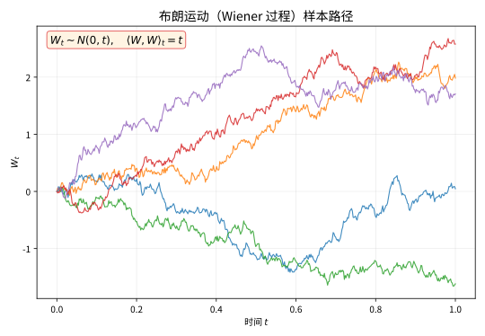

# 第 96 级：随机微分方程 (Stochastic Differential Equations)

---

## 从"给布朗运动求积分"说起：随机微分方程要解决的根问题

> 在追着 Itô 引理、Girsanov 定理跑之前，先想清楚一个极不平凡的问题：**一条处处没有斜率的路径，我们居然还能给它"求积分、解方程、定价格"？它到底凭什么立得住？**

**第一步：直觉——一个被"噪声"支配的世界**

想象你站在风雨交加的海边，盯着一艘无人操控的小纸船。它既有一个稳定的大方向（风推动它朝下游漂），又每时每刻被一波接一波的浪头打得东摇西晃。若你用一支笔每秒记下它的位置，画出来的绝不是一条光滑弧线，而是一条**连"瞬时速度"都说不清**的剧烈抖动线。可就在这条乱成一团的路上，你却想回答一个非常现实的问题："一分钟后，这艘船大概漂到哪儿？最坏会偏多远？"

把"船"换成"股价""悬在布朗水中的花粉""核酸分子的扩散"，你面对的就是同一种东西——**一条带噪声的轨道**。而"预测它最坏能偏多远""给它定一个公平的价格"，本质上都要做同一件眼下看起来几乎不可能的事：**对这条乱线求积分、解方程**。

**第二步：要解决的问题——给不可微的路径一个"能算的微积分"**

普通微积分帮不了这个忙。一期一期的过程有两条硬规矩：一是要有**斜率**（可微），二是"未来的噪声"可以忽略不计（$dV$ 里的高阶项可以丢）。但布朗运动的轨道两样都不占：它**处处不可微**（风速无穷大），而且抖动大到连 $(dW_t)^2$ 这种"二阶噪声"都缩不成零——它倒反给出一个确定的量 $dt$。这让莱布尼茨那套"丢掉二阶小量"的老规矩当场失灵。

历史上的来龙去脉大致是这样——**巴舍利耶（Bachelier）**1900 年在博士论文里首次把股价当作随机游走、画下"随机微积分的雏形"；**爱因斯坦**1905 年从统计力学导出花粉的均方位移与时间成正比；**维纳（Wiener）**1923 年给布朗运动建立了严格的测度，让它成为一条"可严格谈概率"的轨道；而**伊藤（Itô）**1944 年前后想通了一个破局的关键：与其硬给路径定义"瞬时速度"，不如**只给积分定规矩**——规定每一步"只准看过去、绝不偷看未来"。于是，形如

$$
dX_t = \mu(t, X_t)\,dt + \sigma(t, X_t)\,dW_t
$$

的**随机微分方程（SDE）**第一次有了良定的解，Black-Scholes 期权定价公式正是站在它的肩上。

**第三步：正式定义前的准备——本章怎样一步步推进**

本章沿着"先立地基、再盖高楼"的顺序走：

1. 先从**布朗运动**出发，立起"连续但处处不可微""二次变差为 $t$"这两个随机微积分的地基事实；
2. 用 **Itô 积分与 Stratonovich 积分**回答"怎么给噪声求积分"，并讲清两者为什么差一个二阶修正项；
3. 用 **Itô 引理**给出随机版的链式法则，这是全程反复借用的"万能扳手"；
4. 正式定义 **SDE 与其强解/弱解**，并用 Picard 迭代 + Itô 等距证明存在唯一性；
5. 求解几何布朗运动、OU 过程等**经典模型**，推导 **Fokker-Planck 方程**，再借 **Girsanov 定理**换测度、用 **Feynman-Kac 公式**把 PDE 和期望牵到一起；
6. 最后看它如何撑起**金融定价与随机最优控制**。

读完你会明白：当初那条"处处没有斜率"的乱线，非但不是死胡同，反而逼出了一整套比普通微积分更贴近现实世界的"新算法"。

> **🧠 一句话记住随机微分方程的"出生证"**
>
> 随机微分方程要回答的问题是：
>
> $$ \boxed{\text{对着一条处处不可微的随机轨道，如何定义"积分与微分"，让方程 } dX_t = \mu\,dt + \sigma\,dW_t \text{ 有良定的解，并把握它的分布与最优控制？}} $$
>
> Itô 用"只看过去、不偷看未来"的左端点取值，换来良定义与鞅性质；多出的那个 $\frac12\sigma^2 f''$ 修正项，正是对"布朗运动太颠簸"这件事的精确记账。

## 开始之前

**本章在讲什么**：本章研究"带噪声的动态系统"如何被严格地建模与求解。你要从布朗运动出发，学会 Itô 积分与 Stratonovich 积分的定义与区别，掌握随机版链式法则 Itô 引理，再进入随机微分方程（SDE）的本体——强解与弱解、存在唯一性、几何布朗运动、Ornstein-Uhlenbeck 过程、Fokker-Planck 方程、Girsanov 定理与 Feynman-Kac 公式，最后看到随机最优控制与金融定价。

**为什么要学它**：第 97 级（随机分析）从更抽象的视角把鞅、二次变差、Doob-Meyer 分解、Malliavin 微积分这套"随机微积分的理论底座"讲透；本章则把这些工具用来**求解具体的 SDE 和定价/控制问题**，是"理论→应用"的落点。它们共同构成现代金融数学（第 96~100 级）、随机动力学和滤波理论的公共语言。

**开始前请确认你还记得**：

- 布朗运动/维纳过程的定义与性质（独立增量、正态增量、连续轨道，见第 98 级 §2.10）。
- 微积分：泰勒展开、链式法则、偏导数、分部积分（见第 6/7/8 级 微积分）。
- 概率论：期望、方差、条件期望、鞅、马尔可夫过程（见第 98 级）。
- 偏微分方程：热方程、抛物型 PDE 的基本概念（用于 Fokker-Planck 与后向方程）。
- 测度论：测度、可测函数、Radon-Nikodym 导数（见第 98 级，为 Girsanov 换测度做准备）。

---

## 1. 学习目标

完成本教程后，你将能够：

1. 理解Brown运动的基本性质及其作为随机微积分基础的数学框架
2. 掌握Itô积分与Stratonovich积分的定义、区别与联系
3. 理解并应用Itô引理进行随机微分计算
4. 掌握随机微分方程（SDE）的定义、强解与弱解的概念
5. 理解SDE解的存在唯一性定理及其证明思路
6. 求解线性SDE、几何Brown运动、Ornstein-Uhlenbeck过程等经典模型
7. 理解Fokker-Planck方程的推导及其在扩散过程中的应用
8. 掌握Girsanov定理及其在测度变换中的应用
9. 了解随机最优控制与SDE在金融中的基本应用

---

## 2. 核心概念

### 2.1 Brown运动

**Brown运动**（Brownian Motion，也称为Wiener过程）是随机微积分的基石。它是一个连续时间随机过程 $\{W_t\}_{t \ge 0}$，满足：

1. $W_0 = 0$ 几乎必然
2. 增量独立性：对任意 $0 \le s < t$，$W_t - W_s$ 与 $\mathcal{F}_s$ 独立
3. 正态增量：$W_t - W_s \sim N(0, t-s)$
4. 轨道连续性：$t \mapsto W_t$ 几乎必然连续

Brown运动几乎处处不可微，但具有有界二次变差：$\langle W, W \rangle_t = t$。

> **直观理解（现实类比）**：想象花粉颗粒悬浮在水面上，分子不断从四面八方随机撞击它，使其轨迹忽左忽右、毫无规律——这正是布朗运动。它"连续但处处磕磕绊绊"（不可微），就像一条永远画不完、处处拐弯的弯曲线。金融或物理中大量随机现象（股价波动、微小粒子漂移）都以它为基底，它既是"随机性的源头"，也是随机微积分这座大厦的基石。

> **🧠 思考历程：一条处处都不可求导的曲线，真的能谈"微分"吗？**
>
> 随机微分方程要回答的问题是：当一条路径连斜率都没有（处处不可微），"它的速度"究竟还意味着什么？危机的种子早在1827年就已埋下，那时年迈的植物学家罗伯特·布朗（Robert Brown）正盯着显微镜下的花粉微粒发愣。
>
> - **从花粉到海啸般的公式**。布朗记下了花粉微粒的"无规则抖动"，但真正把它数学化的历程中，关键一步是巴舍利耶（Bachelier）1900年把资产价格当作这种随机游走写进博士论文；1905年爱因斯坦用统计力学说明其均方位移与时间成正比，1908年朗之万（Langevin）干脆写下含随机力的常微分方程——随机微分的雏形就此浮现。
> - **给乱走的路径建立秩序**。维纳（Wiener）1923年构造出严谨的测度，让"布朗运动"成为一条有严格概率意义的轨道；1940年代伊藤（Itô）另辟蹊径，把积分建立在"只看过去、绝不偷看未来"的起点上，从而让随机微分方程 $dX_t=b\,dt+\sigma\,dB_t$ 有了良定的解，金融里的Black-Scholes公式正是站在它肩上。
> - **一阶逻辑的"病"变成新数学的"源"**。正因为普通微积分对这不可微路径束手无策，才逼出伊藤公式里多出来的那个二阶修正项——新理论不是绕开不规则，而是正面拥抱它，还意外收到一份"二阶增益"。
> - **心路**：旧概念崩溃的地方往往不是终点，而是新定义的产房——不可导不是诅咒，而是提醒你该换一套算法。

### 2.2 Itô积分

> **🌐 直觉先行——为什么需要一个"特别的"积分？**
>
> 普通黎曼积分 $\int f\,dx$ 靠的是被积函数"足够好"（例如连续）、且 $f$ 的取值对分割端点不怎么敏感。可一旦把"$\int f\,dW$"里的积分器换成布朗运动，麻烦就来了：$W$ 的轨道处处不可微、二次变差又不为零，**在同一小区间里 $W$ 的变化 $W_{t_{i+1}}-W_{t_i}$ 与在哪取 $f$ 的值会互相"勾结"**，使不同取法给出不同的极限。正因为普通积分的那套"端点取值无关"在这里碎了，才必须**在定义里就把取点规则钉死**——这样的积分不再是唯一的，而是"约定不同、结果不同的家族"，Itô 积分正是其中最常用的一支（取左端点，保证鞅）。

**Itô积分**是对Brown运动进行的随机积分。对简单可料过程 $\phi_t = \sum_{i=0}^{n-1} \xi_i \boldsymbol{1}_{(t_i, t_{i+1}]}(t)$，定义为：

$$
\int_0^T \phi_t \, dW_t = \sum_{i=0}^{n-1} \xi_i (W_{t_{i+1}} - W_{t_i})
$$

对一般可积可料过程 $f$，通过 $L^2$ 逼近定义：

$$
\int_0^T f_t \, dW_t = \lim_{n \to \infty} \sum_{i} f_{t_i^{(n)}} (W_{t_{i+1}^{(n)}} - W_{t_i^{(n)}})
$$

Itô积分的核心性质是**Itô等距**（Itô Isometry）：

$$
\mathbb{E}\left[\left(\int_0^T f_t \, dW_t\right)^2\right] = \mathbb{E}\left[\int_0^T f_t^2 \, dt\right]
$$

> **💡 直观理解（类比）**：Itô积分像"赌徒永远只敢押前一注已经落定的组合，绝不因未来揭晓再临时改权"——积分的每个小步都在小区间**左端**取被积函数的值（不偷看未来），因此整体是个鞅（公平赌博）。Itô等距则像"账单上的平方和等于平方的账单"：随机部分累积的波动恰好按被积函数平方的时间积分来计量，这把无尽的随机步抓到一把握得住的尺子上。

### 2.3 Stratonovich积分

**Stratonovich积分**是另一种随机积分，它使用区间端点的平均值：

$$
\int_0^T f_t \circ dW_t = \lim_{n \to \infty} \sum_{i} f_{\frac{t_i + t_{i+1}}{2}} (W_{t_{i+1}} - W_{t_i})
$$

Stratonovich积分遵循标准微积分的链式法则（不需要Itô引理的修正项），但相对于Itô积分，它不具有鞅性质。

两种积分的关系为：

$$
\int_0^T f_t \circ dW_t = \int_0^T f_t \, dW_t + \frac{1}{2} \int_0^T \frac{\partial f}{\partial x} (t, X_t) \, dt
$$

> **💡 直观理解（类比）**：Stratonovich积分像"在路口先探头看看中间的情形再跨步"——它在小区间**中点**取被积函数的值，因而能沿用普通微积分的链式法则（不用额外补项），如物理里钟摆模型那样"瞬间对齐"地接续随机力；代价是它偷看了未来的两侧，所以不再是公平赌博的鞅。Itô积分则像"踩在左端点上就迈步"——保证鞅但需在链式法则里多补一个 $\frac12\int\frac{\partial f}{\partial x}dt$ 的修正项，两者相差的那一项正是Itô引理里的二阶修正。

### 2.4 Itô引理

**Itô引理**是随机微积分中的链式法则。设 $X_t$ 满足：

$$
dX_t = \mu_t \, dt + \sigma_t \, dW_t
$$

则对 $C^{1,2}$ 函数 $f(t, x)$，有：

$$
df(t, X_t) = \left(\frac{\partial f}{\partial t} + \mu_t \frac{\partial f}{\partial x} + \frac{1}{2} \sigma_t^2 \frac{\partial^2 f}{\partial x^2}\right) dt + \sigma_t \frac{\partial f}{\partial x} \, dW_t
$$

这里的关键是出现了 $\frac{1}{2} \sigma_t^2 \frac{\partial^2 f}{\partial x^2}$ 项——这是由Brown运动的二次变差引起的修正项。

> **💡 直观理解（类比）**：Itô引理是随机版的"链式法则"——但它比普通微积分多出一项 $\frac12\sigma^2 f''$，原因是Brown运动太颠簸，$(dW_t)^2=dt$ 这一"二阶噪声"缩不了，会在拐弯里偷偷留下"凸度收益"。想象飙车沿一条颠簸山路记录仪表读数：不仅要线性追速度，还要为"路面随机颠簸带来的曲率漂移"强行补一档，这正是金融里收益 $e^{\mu t}$ 变成 $e^{(\mu-\frac{\sigma^2}{2})t}$ 背后那半格 $\sigma^2$ 的来源。

### 2.5 随机微分方程定义

> **为什么需要这个概念**：有了 Itô 积分，我们就有了一支"能把随机项写进方程"的笔。普通常微分方程 $\dot{x}=b(t,x)$ 只能描述"完全可预测"的运动；但只要把那只"抽风的骰子"引入，让它形如 $\dot X_t = \mu(t,X_t)+\sigma(t,X_t)\xi_t$（$\xi_t$ 是白噪声），就会变成严格意义下的 SDE。现实里股价、温度、种群、布朗粒子没有一个是"纯确定性"的，所以**几乎所有真正的动态系统建模都需要 SDE**——这也是它今天成为金融、物理、生物、工程通用语言的根本原因。

**随机微分方程**（Stochastic Differential Equation, SDE）的一般形式为：

$$
dX_t = \mu(t, X_t) \, dt + \sigma(t, X_t) \, dW_t
$$

其中 $\mu(t, x)$ 为漂移系数（drift coefficient），$\sigma(t, x)$ 为扩散系数（diffusion coefficient）。对应的积分形式为：

$$
X_t = X_0 + \int_0^t \mu(s, X_s) \, ds + \int_0^t \sigma(s, X_s) \, dW_s
$$

> **💡 直观理解（类比）**：SDE可以看作"在带噪声的方程里给时间配两个声音"——$\mu$ 项是平滑的推进器（趋势/漂移，控制下一步平均走到哪），$\sigma\,dW_t$ 项是随机的手抖（扩散，控制这一步随机抖多大）。它比普通ODE多了那只"抽风的骰子"，于是解不再是单条确定性曲线，而是随机的整片轨道——这正是股价、天气、粒子受噪声驱动的本质画像。

### 2.6 强解与弱解

**强解**（Strong Solution）：给定概率空间 $(\Omega, \mathcal{F}, \mathbb{P})$ 和Brown运动 $W_t$，强解 $X_t$ 是 $W_t$ 适应的，且满足SDE。

**弱解**（Weak Solution）：只要求存在一个概率空间和Brown运动，使得 $X_t$ 满足SDE，但不要求 $X_t$ 是给定Brown运动的函数。

> **💡 直观理解（类比）**：强解像"指定好这一副具体的骰子，解必须老老实实由这副骰子的每一掷算出来"（解是给定Brown运动的可算函数）；弱解则像"只要某种抽法能造出符合要求的轨迹就算数，不必非要承认你先拿的那副骰子"（换个概率空间、换个Brown运动也行）。实际里你总想拿到强解，因为可直接按真实的数据流实时算出 $X_t$；弱解则说明"分布行得通"但未必能构造出那个给定的函数依赖。

### 2.7 解的存在唯一性

**定理条件**：若漂移系数 $\mu$ 和扩散系数 $\sigma$ 满足：
- **Lipschitz条件**：$|\mu(t, x) - \mu(t, y)| + |\sigma(t, x) - \sigma(t, y)| \le K|x - y|$
- **线性增长条件**：$|\mu(t, x)| + |\sigma(t, x)| \le K(1 + |x|)$

则SDE存在唯一的强解。

> **💡 直观理解（类比）**：存在唯一性的两个条件是给"噪声方程"发的通行证——Lipschitz条件像"相邻输入必产出相邻结果"（系数变化不会陡峭极端，保证火柴盒里的轨迹划不散、不会养出分身），线性增长条件像"方程不会因位置越界就炸掉"（系数最多线速增长，防止解在有限时间爆走）。二者合起来，才敢拍板：这把能走几步的随机旅途，既走得出来（存在）又只有一条路线（唯一）。

### 2.8 线性SDE

**线性SDE**的一般形式为：

$$
dX_t = (a(t) X_t + b(t)) \, dt + (c(t) X_t + d(t)) \, dW_t
$$

其解可以通过积分因子法显式求得。

> **💡 直观理解（类比）**：线性SDE是随机方程里的"好脾气家族"——系数只线性地依赖 $X_t$（不出现 $X_t^2$ 之类的刁难），所以可以像解普通线性常微分方程那样，用"积分因子"这个乘数给整条方程"除一次尘"后一口喝出显式解。金融里的几何Brown运动和利率OU过程都落在这一家族，正因它们能写出闭式公式，定价和统计才有抓手。

### 2.9 几何Brown运动

**几何Brown运动**（Geometric Brownian Motion, GBM）是金融中最基本的SDE模型：

$$
dS_t = \mu S_t \, dt + \sigma S_t \, dW_t
$$

其解为：

$$ \boxed{S_t = S_0 \exp\left\{\left(\mu - \frac{\sigma^2}{2}\right)t + \sigma W_t\right\}} $$

> **常见坑：把"期望收益率 $\mu$"错当成"典型路径的增长率 $\mu-\sigma^2/2$"。**
>
> 初学 GBM 时最普遍的误读是："既然 $dS_t/S_t=\mu\,dt+\sigma\,dW_t$，那股价平均每年就该涨 $\mu$？"——对，$\mathbb{E}[S_t]=S_0e^{\mu t}$ **确确实实**以 $\mu$ 涨。但那是因为少数"非常幸运的路径"把期望拉高了；而**绝大多数典型路径**（更准确地说，$\log S_t$ 的漂移）实际只按 $\mu-\sigma^2/2$ 增长。两者之差正是 Itô 引理那半格 $\sigma^2/2$ 的凸度修正。所以当你看到指数里的 $\mu-\sigma^2/2$，别慌，它不是写错——它和"期望里的 $\mu$"分别回答"这条路大概怎么涨"与"所有路平均怎么涨"两个问题。
>
> **💡 直观理解（类比）**：几何Brown运动像"一只既有斜向上台阶又有随机摇步、却永远不摔到0以下的股票精灵"——增长率 $\mu$ 定斜率，波动 $\sigma$ 定摇摆幅度，因为是对百分比变化建模（$dS_t/S_t$），所以价格始终为正。有趣的是指数里是 $\mu-\sigma^2/2$ 而非 $\mu$：那半格 $\sigma^2/2$ 正是Itô引理的凸度修正，"实际期望涨 $\mu$"与"典型路径只涨 $\mu-\sigma^2/2$"之间的差，就是波动从凸性上偷走的租金。

### 2.10 Ornstein-Uhlenbeck过程

**Ornstein-Uhlenbeck过程**（OU过程）是一个均值回归过程：

$$
dX_t = \theta(\mu - X_t) \, dt + \sigma \, dW_t
$$

其中 $\theta > 0$ 为回归速度，$\mu$ 为长期均值。其解为：

$$
X_t = X_0 e^{-\theta t} + \mu(1 - e^{-\theta t}) + \sigma \int_0^t e^{-\theta(t-s)} \, dW_s
$$

> **💡 直观理解（类比）**：OU过程像"一根被弹簧拴在'长期均值'钉子上、又不断被随机脚步踹动的指针"——当指针跑远了，漂移项 $\theta(\mu-X_t)$ 会以 $\theta$ 的力道把它往回拽（均值回归）；$\theta$ 越大拉得越急，$\sigma$ 越大甩得越乱。时间久了它绕着 $\mu$ 打转，震荡幅度稳定在 $\sqrt{\sigma^2/2\theta}$，这正是利率、体温、波动率等"总爱回归一个中枢"现象的天然模型。

### 2.11 扩散过程

**扩散过程**（Diffusion Process）是指满足SDE $dX_t = \mu(t, X_t) dt + \sigma(t, X_t) dW_t$ 的 Markov 过程。其转移概率密度 $p(t, x; s, y)$ 满足Fokker-Planck方程。

![SDE 解的扩散：多条样本路径围绕均值漂移线 \mathbb{E}[S_t]=S_0 e^{\mu t} 随机波动，随 t 增大扩散带变宽](images/l96_sde_diffusion.svg)

> **直观理解（现实类比）**：扩散过程就像一群人在斑马线上从同一起点出发、朝同一方向走，但每个人步幅随机——$dt$ 项（漂移）决定大家"整体前进的方向和快慢"，$dW_t$ 项（扩散）则让每个人忽快忽慢、前后错落。时间越长，队伍拉得越长、分散得越开（扩散带变宽），但"大部队的中心"始终沿着均值漂移线规律前进。这正是股价、种群数量等随机系统既"有趋势"又"有波动"的本质刻画。

### 2.12 Fokker-Planck方程

**Fokker-Planck方程**（也称为Kolmogorov前向方程）描述了扩散过程的概率密度 $p(t, x)$ 的演化：

$$
\frac{\partial p}{\partial t} = -\frac{\partial}{\partial x}(\mu(t, x) p) + \frac{1}{2} \frac{\partial^2}{\partial x^2}(\sigma^2(t, x) p)
$$

> **💡 直观理解（类比）**：Fokker-Planck方程是"扩散密度的天气预报"——它不猜哪条具体轨道，而是跟踪"人群的概率堆"整体如何随波移动、糊散。右边第一项是漂移让整个概率密度像河水一样被推着平移（传输），第二项是波动像搅拌器一样把尖峰抹平、铺开（二阶扩散）。有了它，不用逐条模拟无数次路径，就能直接算出任意时刻系统分布在哪儿、扩散多宽。

### 2.13 Girsanov定理

**Girsanov定理**描述了在测度变换下Brown运动的漂移变化。它指出，通过适当的Radon-Nikodym导数，可以消除或改变一个随机过程的漂移项，使其在新的概率测度下成为鞅。

> **💡 直观理解（类比）**：Girsanov定理像"换一副更有偏向的骰子，让原本带漂移的随机步在新规则下变得'公平'"——它不动路径本身，而是改写给"哪条路径算更可能"的权重（换概率测度），于是带漂移的过程在新赌场里摇身变成鞅。这正是金融里风险中性定价的大招：借它把真实世界的股价漂移 $\mu$ 换成无风险利率 $r$，从此"折现后的价格是鞅"，定价就有了公道秤。

### 2.14 随机最优控制

**随机最优控制**（Stochastic Optimal Control）研究在随机系统中如何选择控制策略以优化某个目标函数。其核心是**Hamilton-Jacobi-Bellman方程**（HJB方程），由随机动态规划原理导出。

> **💡 直观理解（类比）**：随机最优控制像"在有风的赌博桌上边摇骰子边打方向盘"——目标是既有未来的奖励又有当下的花费，但系统每一步都被随机噪声搅动。随机动态规划把"整场的全局最优"拆成"眼下这一步的最佳 + 之后继续最优"，层层递归下去，浓缩成一个 HJB 方程来定出最优方向盘该打哪里，把一场带噪声的博弈压缩成一道偏微分方程。

### 2.15 随机微分方程在金融中的应用

SDE在金融中应用广泛，主要包括：
- **Black-Scholes模型**：基于几何Brown运动为标的资产定价
- **利率模型**：Vasicek模型、Cox-Ingersoll-Ross（CIR）模型等
- **随机波动率模型**：Heston模型等
- **信用风险模型**：Merton模型等

> **💡 直观理解（类比）**：SDE在金融里像"给同一只动物园配上不同的笼子搭法"——股票用几何Brown运动（永远正价、带漂移），利率要么用Vasicek（简单可解析但可能为负）要么用CIR（保证非负、波动随水平），期权用Heston让波动率本身也随机起伏，违约则用Merton把公司价值撞到某个门槛才出事。每种模型各派一个SDE登场，都是在"够用、可算、贴现象"之间挑合身的衣服。

---

## 3. 定理与证明

### 定理 3.1：Itô引理

**定理**：设 $X_t$ 是一个Itô过程，满足：

$$
dX_t = \mu_t \, dt + \sigma_t \, dW_t
$$

其中 $W_t$ 是Brown运动，$\mu_t$ 和 $\sigma_t$ 是适应的可料过程，且满足通常的可积性条件。设 $f(t, x) \in C^{1,2}([0, \infty) \times \mathbb{R})$，即 $f$ 对 $t$ 一阶连续可导，对 $x$ 二阶连续可导。则 $Y_t = f(t, X_t)$ 也是一个Itô过程，且：

$$
dY_t = \left(\frac{\partial f}{\partial t} + \mu_t \frac{\partial f}{\partial x} + \frac{1}{2} \sigma_t^2 \frac{\partial^2 f}{\partial x^2}\right) dt + \sigma_t \frac{\partial f}{\partial x} \, dW_t
$$

**证明**：

**步骤1：二次变差的关键性质**

Brown运动 $W_t$ 的二次变差为 $\langle W, W \rangle_t = t$，即：

$$
\lim_{\|\Delta\| \to 0} \sum_{i=0}^{n-1} (W_{t_{i+1}} - W_{t_i})^2 = t \quad \text{（在 $L^2$ 意义下）}
$$

这意味着 $(dW_t)^2 = dt$，这是一个形式上的关键关系。

**步骤2：Taylor展开**

对 $f(t, X_t)$ 进行Taylor展开到二阶：

$$
\begin{aligned}
df(t, X_t) &= \frac{\partial f}{\partial t} dt + \frac{\partial f}{\partial x} dX_t + \frac{1}{2} \frac{\partial^2 f}{\partial x^2} (dX_t)^2 \\
&\quad + \frac{1}{2} \frac{\partial^2 f}{\partial t^2} (dt)^2 + \frac{\partial^2 f}{\partial t \partial x} dt \, dX_t + \text{高阶项}
\end{aligned}
$$

**步骤3：代入 $dX_t$ 并计算 $(dX_t)^2$**

代入 $dX_t = \mu_t dt + \sigma_t dW_t$：

$$
(dX_t)^2 = \mu_t^2 (dt)^2 + 2\mu_t \sigma_t dt \, dW_t + \sigma_t^2 (dW_t)^2
$$

由Brown运动的二次变差性质，$(dW_t)^2 = dt$（在 $L^2$ 意义下），而 $(dt)^2 = o(dt)$，$dt \, dW_t = o(dt)$（因为 $\mathbb{E}[|dt \, dW_t|] = O((dt)^{3/2})$ 可忽略）。因此：

$$
(dX_t)^2 = \sigma_t^2 dt + o(dt)
$$

**步骤4：忽略高阶项**

$(dt)^2 = o(dt)$ 和 $dt \, dW_t = o(dt)$ 在 $dt \to 0$ 时是更高阶无穷小，均可忽略。

**步骤5：整合结果**

将上述结果代入Taylor展开式：

$$
\begin{aligned}
df(t, X_t) &= \frac{\partial f}{\partial t} dt + \frac{\partial f}{\partial x} (\mu_t dt + \sigma_t dW_t) + \frac{1}{2} \frac{\partial^2 f}{\partial x^2} \sigma_t^2 dt + o(dt) \\
&= \left(\frac{\partial f}{\partial t} + \mu_t \frac{\partial f}{\partial x} + \frac{1}{2} \sigma_t^2 \frac{\partial^2 f}{\partial x^2}\right) dt + \sigma_t \frac{\partial f}{\partial x} \, dW_t
\end{aligned}
$$

**步骤6：多维推广**

对于多维情况，设 $\boldsymbol{X}_t = (X_t^1, \dots, X_t^d)$ 满足：

$$
dX_t^i = \mu_t^i \, dt + \sum_{j=1}^m \sigma_t^{ij} \, dW_t^j
$$

则对 $f(t, \boldsymbol{x}) \in C^{1,2}$，有：

$$
df(t, \boldsymbol{X}_t) = \left(\frac{\partial f}{\partial t} + \sum_{i=1}^d \mu_t^i \frac{\partial f}{\partial x_i} + \frac{1}{2} \sum_{i,j=1}^d (\boldsymbol{\sigma}_t \boldsymbol{\sigma}_t^\top)_{ij} \frac{\partial^2 f}{\partial x_i \partial x_j}\right) dt + \sum_{i=1}^d \frac{\partial f}{\partial x_i} \sum_{j=1}^m \sigma_t^{ij} \, dW_t^j
$$

$\square$

> **💡 直观理解（类比）**：Itô引理之所以多出 $\frac12\sigma^2 f''$，是因为Brown运动"抖动太勤"，二阶导数项 $(dW)^2=dt$ 缩不起来——普通微积分丢掉的三阶以上才可略，这个二阶噪声得压线保留。证明全在"二次变差是 $t$"这一句话：$(dX_t)^2$ 收敛成 $\sigma^2 dt$，Taylor展开里它当了主讲，其余高阶项统统退场，于是多出的那碟"凸度修正"精确入账。多维情形就是把单维的 $\mu, \sigma^2$ 换成向量$\mu$与协方差 $\sigma\sigma^\top$，思路完全照搬。

---

### 定理 3.2：SDE解的存在唯一性定理

**定理**：考虑随机微分方程：

$$
dX_t = \mu(t, X_t) \, dt + \sigma(t, X_t) \, dW_t, \quad X_0 = \xi
$$

其中 $W_t$ 是 $d$ 维Brown运动，$\mu: [0, T] \times \mathbb{R}^n \to \mathbb{R}^n$，$\sigma: [0, T] \times \mathbb{R}^n \to \mathbb{R}^{n \times d}$。假设存在常数 $K > 0$ 使得对所有 $t \in [0, T]$，$x, y \in \mathbb{R}^n$：

1. **Lipschitz条件**：$\|\mu(t, x) - \mu(t, y)\| + \|\sigma(t, x) - \sigma(t, y)\| \le K\|x - y\|$
2. **线性增长条件**：$\|\mu(t, x)\| + \|\sigma(t, x)\| \le K(1 + \|x\|)$
3. 初始值 $\xi$ 与Brown运动独立，且 $\mathbb{E}[\|\xi\|^2] < \infty$

则SDE存在唯一的强解 $X_t$，且 $\mathbb{E}\left[\sup_{0 \le t \le T} \|X_t\|^2\right] < \infty$。

**证明**：

**步骤1：Picard迭代**

定义Picard迭代序列 $\{X_t^{(n)}\}_{n=0}^\infty$：

$$
X_t^{(0)} = \xi
$$
$$
X_t^{(n+1)} = \xi + \int_0^t \mu(s, X_s^{(n)}) \, ds + \int_0^t \sigma(s, X_s^{(n)}) \, dW_s, \quad n \ge 0
$$

**步骤2：Itô等距与Gronwall引理准备**

回忆Itô等距：$\mathbb{E}\left[\left(\int_0^t f_s \, dW_s\right)^2\right] = \mathbb{E}\left[\int_0^t f_s^2 \, ds\right]$。

Gronwall引理：若 $u(t) \le \alpha(t) + \int_0^t \beta(s) u(s) \, ds$，则 $u(t) \le \alpha(t) + \int_0^t \alpha(s)\beta(s) \exp\left(\int_s^t \beta(r) \, dr\right) ds$。

**步骤3：证明 $\mathbb{E}[\|X_t^{(n)}\|^2]$ 一致有界**

由线性增长条件：

$$
\begin{aligned}
\mathbb{E}\left[\|X_t^{(n+1)}\|^2\right] &\le 3\mathbb{E}\left[\|\xi\|^2 + \left\|\int_0^t \mu(s, X_s^{(n)}) \, ds\right\|^2 + \left\|\int_0^t \sigma(s, X_s^{(n)}) \, dW_s\right\|^2\right] \\
&\le 3\mathbb{E}\left[\|\xi\|^2\right] + 3t \int_0^t \mathbb{E}\left[\|\mu(s, X_s^{(n)})\|^2\right] ds + 3 \int_0^t \mathbb{E}\left[\|\sigma(s, X_s^{(n)})\|^2\right] ds \\
&\le 3\mathbb{E}\left[\|\xi\|^2\right] + 3K^2(t+1) \int_0^t (1 + \mathbb{E}\left[\|X_s^{(n)}\|^2\right]) ds
\end{aligned}
$$

由归纳法和Gronwall引理，存在常数 $C$ 使得 $\sup_{0 \le t \le T} \mathbb{E}\left[\|X_t^{(n)}\|^2\right] \le C$ 对所有 $n$ 一致成立。

**步骤4：收敛性估计**

定义 $D_t^{(n)} = \mathbb{E}\left[\|X_t^{(n+1)} - X_t^{(n)}\|^2\right]$。由Lipschitz条件和Itô等距：

$$
\begin{aligned}
D_t^{(n)} &\le 2\mathbb{E}\left[\left\|\int_0^t (\mu(s, X_s^{(n)}) - \mu(s, X_s^{(n-1)})) \, ds\right\|^2\right] \\
&\quad + 2\mathbb{E}\left[\left\|\int_0^t (\sigma(s, X_s^{(n)}) - \sigma(s, X_s^{(n-1)})) \, dW_s\right\|^2\right] \\
&\le 2t \int_0^t \mathbb{E}\left[\|\mu(s, X_s^{(n)}) - \mu(s, X_s^{(n-1)})\|^2\right] ds \\
&\quad + 2 \int_0^t \mathbb{E}\left[\|\sigma(s, X_s^{(n)}) - \sigma(s, X_s^{(n-1)})\|^2\right] ds \\
&\le 2K^2(t+1) \int_0^t D_s^{(n-1)} \, ds
\end{aligned}
$$

通过迭代，可得：

$$
D_t^{(n)} \le \frac{(2K^2(T+1)t)^n}{n!} \sup_{0 \le s \le t} D_s^{(0)}
$$

因此 $\sum_{n=0}^\infty \sup_{0 \le t \le T} \sqrt{D_t^{(n)}} < \infty$，由Chebyshev不等式和Borel-Cantelli引理，$X_t^{(n)}$ 一致几乎必然收敛到某个极限过程 $X_t$。

**步骤5：验证极限过程是解**

由一致收敛性，可以在积分号下取极限：

$$
X_t = \lim_{n \to \infty} X_t^{(n+1)} = \xi + \int_0^t \mu(s, \lim_{n \to \infty} X_s^{(n)}) \, ds + \int_0^t \sigma(s, \lim_{n \to \infty} X_s^{(n)}) \, dW_s
$$

因此 $X_t$ 满足SDE。

**步骤6：唯一性**

设 $X_t$ 和 $\tilde{X}_t$ 是两个解。定义 $\Delta_t = X_t - \tilde{X}_t$。则：

$$
\Delta_t = \int_0^t (\mu(s, X_s) - \mu(s, \tilde{X}_s)) \, ds + \int_0^t (\sigma(s, X_s) - \sigma(s, \tilde{X}_s)) \, dW_s
$$

由Lipschitz条件和Itô等距：

$$
\mathbb{E}\left[\|\Delta_t\|^2\right] \le 2K^2(t+1) \int_0^t \mathbb{E}\left[\|\Delta_s\|^2\right] ds
$$

由Gronwall引理，$\mathbb{E}\left[\|\Delta_t\|^2\right] = 0$，因此 $\Delta_t = 0$ 几乎必然，唯一性得证。$\square$

> **💡 直观理解（类比）**：存在唯一性的证明像"先撒一张粗网捞轨迹，再让网眼越织越密直到只捞到一根"——从初始点起反复套用 Picard 迭代"猜一步再修正一步"，靠 Itô等距把随机项的平方误差换算成可积分的时间累加，再用 Gronwall 引理把误差压成一个不断除以 $n!$ 的家伙，于是第 $n$ 步的解与上一步越贴越近、最终收敛（存在）；最后假设两个解并存，它们的差也被同样的 Gronwall 引理挤到零（唯一）。Lipschitz管"收紧不乱跑"，线性增长管"不从边界爆走"。

---

### 定理 3.3：Girsanov定理

**定理**：设 $W_t$ 是概率空间 $(\Omega, \mathcal{F}, \mathbb{P})$ 上的 $d$ 维Brown运动，$\{\mathcal{F}_t\}$ 为其自然流。设 $\theta_t = (\theta_t^1, \dots, \theta_t^d)$ 是一个 $\mathcal{F}_t$-适应过程，满足Novikov条件：

$$
\mathbb{E}^\mathbb{P}\left[\exp\left(\frac{1}{2} \int_0^T \|\theta_t\|^2 \, dt\right)\right] < \infty
$$

定义过程：

$$
L_t = \exp\left\{-\int_0^t \theta_s^\top \, dW_s - \frac{1}{2} \int_0^t \|\theta_s\|^2 \, ds\right\}
$$

则 $L_t$ 是一个 $\mathbb{P}$-鞅。定义新概率测度 $\mathbb{Q}$ 为：

$$
\frac{d\mathbb{Q}}{d\mathbb{P}}\Big|_{\mathcal{F}_T} = L_T
$$

则在 $\mathbb{Q}$ 下，过程

$$
\tilde{W}_t = W_t + \int_0^t \theta_s \, ds
$$

是一个Brown运动。

**证明**：

**步骤1：$L_t$ 是鞅**

由Novikov条件，确保 $L_t$ 是一个 $\mathbb{P}$-鞅（即 $\mathbb{E}^\mathbb{P}[L_t \mid \mathcal{F}_s] = L_s$ 对 $s \le t$ 成立）。这是由指数鞅的一般理论保证的。

**步骤2：定义新测度**

由 $L_t$ 的鞅性质，$\mathbb{E}^\mathbb{P}[L_T] = L_0 = 1$，因此 $\mathbb{Q}$ 是一个概率测度。对任意 $A \in \mathcal{F}_T$，$\mathbb{Q}(A) = \mathbb{E}^\mathbb{P}[L_T \boldsymbol{1}_A]$。

**步骤3：验证 $\tilde{W}_t$ 在 $\mathbb{Q}$ 下是鞅**

对任意 $0 \le s \le t \le T$，由Bayes公式：

$$
\mathbb{E}^\mathbb{Q}[\tilde{W}_t \mid \mathcal{F}_s] = \frac{\mathbb{E}^\mathbb{P}[L_t \tilde{W}_t \mid \mathcal{F}_s]}{\mathbb{E}^\mathbb{P}[L_t \mid \mathcal{F}_s]} = \frac{\mathbb{E}^\mathbb{P}[L_t \tilde{W}_t \mid \mathcal{F}_s]}{L_s}
$$

记 $L_t = \exp\left\{-\int_0^t \theta_u^\top \, dW_u - \frac{1}{2} \int_0^t \|\theta_u\|^2 \, du\right\}$，则 $dL_t = -L_t \theta_t^\top \, dW_t$。

**步骤4：计算条件期望**

考虑乘积 $L_t \tilde{W}_t$，由Itô引理：

$$
\begin{aligned}
d(L_t \tilde{W}_t) &= \tilde{W}_t \, dL_t + L_t \, d\tilde{W}_t + d\langle L, \tilde{W} \rangle_t \\
&= \tilde{W}_t(-L_t \theta_t^\top \, dW_t) + L_t(dW_t + \theta_t \, dt) + (-L_t \theta_t^\top \, dt) \\
&= L_t \, dW_t - L_t \theta_t^\top \tilde{W}_t \, dW_t + L_t \theta_t \, dt - L_t \theta_t \, dt \\
&= L_t \, dW_t - L_t \theta_t^\top \tilde{W}_t \, dW_t
\end{aligned}
$$

因此 $L_t \tilde{W}_t$ 是 $\mathbb{P}$-局部鞅。由Novikov条件可证其是 $L^1$ 有界鞅，从而：

$$
\mathbb{E}^\mathbb{P}[L_t \tilde{W}_t \mid \mathcal{F}_s] = L_s \tilde{W}_s
$$

代入Bayes公式得 $\mathbb{E}^\mathbb{Q}[\tilde{W}_t \mid \mathcal{F}_s] = \tilde{W}_s$，即 $\tilde{W}_t$ 在 $\mathbb{Q}$ 下是鞅。

**步骤5：验证二次变差**

由于 $\tilde{W}_t - \tilde{W}_s = (W_t - W_s) + \int_s^t \theta_u \, du$，而 $W_t$ 的二次变差为 $t$，且 $\int_s^t \theta_u \, du$ 是有界变差过程（其二次变差为0），因此 $\langle \tilde{W}, \tilde{W} \rangle_t = \langle W, W \rangle_t = t$。

**步骤6：Levy鞅刻画定理**

由Levy鞅刻画定理（连续鞅，二次变差为 $t$，则必为Brown运动），$\tilde{W}_t$ 在 $\mathbb{Q}$ 下是Brown运动。$\square$

> **💡 直观理解（类比）**：Girsanov定理证明的脉络是"造出一个重写概率权重的指数鞅 $L_t$，用它把 $\mathbb{P}$ 换成 $\mathbb{Q}$，再检验在 $\mathbb{Q}$ 下 $\tilde W_t$ 既无漂移（鞅）又二次变差为 $t$"——最后一步由 Levy 刻画定理一锤定音：一个连续鞅只要方差累积速率是 $t$，就必然是Brown运动。Novikov条件则保证 $L_t$ 真是个鞅（可能性别胀破）；整个证明像"先验明权杖（$L_t$ 是鞅），再验明太子（$\tilde W$ 是鞅 + 二次变差到位），即可登基为Brown运动"。

---

### 定理 3.4：Feynman-Kac公式

**定理**：设 $X_t$ 满足SDE：

$$
dX_t = \mu(t, X_t) \, dt + \sigma(t, X_t) \, dW_t
$$

设函数 $f(t, x)$ 满足Kolmogorov后向方程：

$$
\frac{\partial f}{\partial t} + \mu(t, x) \frac{\partial f}{\partial x} + \frac{1}{2} \sigma^2(t, x) \frac{\partial^2 f}{\partial x^2} - r(t, x) f + g(t, x) = 0
$$

且满足终端条件 $f(T, x) = \Phi(x)$。则 $f(t, x)$ 具有以下概率表示：

$$
f(t, x) = \mathbb{E}\left[ \int_t^T g(s, X_s) e^{-\int_t^s r(u, X_u) \, du} \, ds + \Phi(X_T) e^{-\int_t^T r(u, X_u) \, du} \Bigm| X_t = x \right]
$$

**证明**：

**步骤1：定义辅助过程**

定义：

$$
Y_t = f(t, X_t) \exp\left\{-\int_0^t r(s, X_s) \, ds\right\}
$$
$$
Z_t = \int_0^t g(s, X_s) \exp\left\{-\int_0^s r(u, X_u) \, du\right\} \, ds
$$

**步骤2：对 $Y_t$ 应用Itô引理**

令 $F(t, x) = f(t, x) e^{-\int_0^t r(s, x) \, ds}$，但注意路径依赖，我们直接对乘积应用Itô引理。

设 $R_t = \int_0^t r(s, X_s) \, ds$，则 $dR_t = r(t, X_t) \, dt$。

$$
\begin{aligned}
d\left(f(t, X_t) e^{-R_t}\right) &= e^{-R_t} df(t, X_t) + f(t, X_t) d(e^{-R_t}) + d\langle f, e^{-R_t} \rangle_t \\
&= e^{-R_t} \left[ \left( \frac{\partial f}{\partial t} + \mu \frac{\partial f}{\partial x} + \frac{1}{2} \sigma^2 \frac{\partial^2 f}{\partial x^2} \right) dt + \sigma \frac{\partial f}{\partial x} dW_t \right] \\
&\quad + f(t, X_t) (-e^{-R_t} r(t, X_t) \, dt) + 0 \\
&= e^{-R_t} \left[ \left( \frac{\partial f}{\partial t} + \mu \frac{\partial f}{\partial x} + \frac{1}{2} \sigma^2 \frac{\partial^2 f}{\partial x^2} - r f \right) dt + \sigma \frac{\partial f}{\partial x} dW_t \right]
\end{aligned}
$$

**步骤3：代入后向方程**

由后向方程，$\frac{\partial f}{\partial t} + \mu \frac{\partial f}{\partial x} + \frac{1}{2} \sigma^2 \frac{\partial^2 f}{\partial x^2} - r f = -g$，因此：

$$
d\left(f(t, X_t) e^{-R_t}\right) = -g(t, X_t) e^{-R_t} \, dt + \sigma(t, X_t) \frac{\partial f}{\partial x} e^{-R_t} \, dW_t
$$

**步骤4：积分形式**

从 $t$ 到 $T$ 积分：

$$
f(T, X_T) e^{-R_T} - f(t, X_t) e^{-R_t} = -\int_t^T g(s, X_s) e^{-R_s} \, ds + \int_t^T \sigma(s, X_s) \frac{\partial f}{\partial x} e^{-R_s} \, dW_s
$$

**步骤5：取条件期望**

在适当的正则条件下，随机积分项是鞅，其条件期望为零。因此：

$$
\mathbb{E}\left[ f(T, X_T) e^{-R_T} - f(t, X_t) e^{-R_t} \Bigm| X_t = x \right] = -\mathbb{E}\left[ \int_t^T g(s, X_s) e^{-R_s} \, ds \Bigm| X_t = x \right]
$$

代入终端条件 $f(T, X_T) = \Phi(X_T)$ 并整理：

$$
f(t, x) = \mathbb{E}\left[ \int_t^T g(s, X_s) e^{-\int_t^s r(u, X_u) \, du} \, ds + \Phi(X_T) e^{-\int_t^T r(u, X_u) \, du} \Bigm| X_t = x \right]
$$

这就是Feynman-Kac公式，它将偏微分方程的解与随机过程的期望联系起来。$\square$

> **💡 直观理解（类比）**：Feynman-Kac公式是"PDE与掷骰子之间的翻译机器"——它说"某类偏微分方程的解，等于沿随机轨迹取折现和的期望"，把硬碰硬的偏微分方程的边界值问题，改写成"在电脑里撒成千上万条随机路径、平均它们的折现收益"就能近似求解。金融里欧式期权定价正是这一招：折现到期权支付、在鞅测度下求期望，偏微分方程和蒙特卡洛居然殊途同归。

---

### 定理 3.5：Fokker-Planck方程的推导

**定理**：设 $X_t$ 满足SDE：

$$
dX_t = \mu(t, X_t) \, dt + \sigma(t, X_t) \, dW_t
$$

设 $p(t, x)$ 为 $X_t$ 的概率密度函数（在给定初始分布下）。则 $p(t, x)$ 满足Fokker-Planck方程（Kolmogorov前向方程）：

$$
\frac{\partial p}{\partial t} = -\frac{\partial}{\partial x}(\mu(t, x) p) + \frac{1}{2} \frac{\partial^2}{\partial x^2}(\sigma^2(t, x) p)
$$

**证明**：

**方法一：使用Itô引理与期望**

**步骤1：测试函数期望**

对任意 $C_0^\infty$ 测试函数 $\phi(x)$（无穷可微且有紧支集），考虑 $\mathbb{E}[\phi(X_t)]$。

由Itô引理：

$$
d\phi(X_t) = \left(\mu(t, X_t) \phi'(X_t) + \frac{1}{2} \sigma^2(t, X_t) \phi''(X_t)\right) dt + \sigma(t, X_t) \phi'(X_t) \, dW_t
$$

取期望（随机积分项期望为0）：

$$
\frac{d}{dt} \mathbb{E}[\phi(X_t)] = \mathbb{E}\left[\mu(t, X_t) \phi'(X_t) + \frac{1}{2} \sigma^2(t, X_t) \phi''(X_t)\right]
$$

**步骤2：用密度表示**

用概率密度 $p(t, x)$ 表示期望：

$$
\int \phi(x) \frac{\partial p}{\partial t}(t, x) \, dx = \int \mu(t, x) \phi'(x) p(t, x) \, dx + \frac{1}{2} \int \sigma^2(t, x) \phi''(x) p(t, x) \, dx
$$

**步骤3：分部积分**

对右边第一项分部积分：

$$
\int \mu(t, x) \phi'(x) p(t, x) \, dx = -\int \phi(x) \frac{\partial}{\partial x}(\mu(t, x) p(t, x)) \, dx
$$

这里用到 $\phi$ 有紧支集，边界项为零。

对右边第二项分部积分两次：

$$
\frac{1}{2} \int \sigma^2(t, x) \phi''(x) p(t, x) \, dx = \frac{1}{2} \int \phi(x) \frac{\partial^2}{\partial x^2}(\sigma^2(t, x) p(t, x)) \, dx
$$

**步骤4：给出弱形式**

代入得：

$$
\int \phi(x) \frac{\partial p}{\partial t}(t, x) \, dx = \int \phi(x) \left[-\frac{\partial}{\partial x}(\mu(t, x) p(t, x)) + \frac{1}{2} \frac{\partial^2}{\partial x^2}(\sigma^2(t, x) p(t, x))\right] dx
$$

**步骤5：由测试函数的任意性**

由于 $\phi$ 是任意的测试函数，由变分法基本引理，被积函数相等：

$$
\frac{\partial p}{\partial t} = -\frac{\partial}{\partial x}(\mu(t, x) p) + \frac{1}{2} \frac{\partial^2}{\partial x^2}(\sigma^2(t, x) p)
$$

**方法二：使用Kolmogorov方程的等价性**

**步骤1：后向方程**

Kolmogorov后向方程与Fokker-Planck方程是对偶的。对转移概率密度 $p(s, y; t, x)$（从 $(s, y)$ 到 $(t, x)$），后向方程为：

$$
-\frac{\partial p}{\partial s} = \mu(s, y) \frac{\partial p}{\partial y} + \frac{1}{2} \sigma^2(s, y) \frac{\partial^2 p}{\partial y^2}
$$

**步骤2：对偶关系**

取测试函数 $\phi$ 和 $\psi$，考虑：

$$
\int \psi(x) \left(\int p(s, y; t, x) \phi(y) \, dy\right) dx = \int \phi(y) \left(\int p(s, y; t, x) \psi(x) \, dx\right) dy
$$

对左边关于 $t$ 求导并用后向方程，可得Fokker-Planck方程。$\square$

> **💡 直观理解（类比）**：推导Fokker-Planck像"用探针测整片密度场的形变"——先拿任意一团光滑测试函数 $\phi$ 当探针放到每个点，用 Itô引理算出"概率期望的涨落速度"（$\frac{d}{dt}\mathbb{E}[\phi]$ 来自漂移与二阶扩散两部分），再分部积分把导数从 $\phi$ 挪到密度 $p$ 身上，最后因 $\phi$ 想取谁都行，只能逼出密度本身满足那条方程。另一种办法则是把前向与后向方程当对偶两手牌，从中直接翻出前向形式。两条路都在说：密度随时间翻不翻，就看"被推着走"和"被抹开"两股力怎么配平。

---

## 4. 示例

### 示例 1：几何Brown运动求解（Black-Scholes模型基础）

**问题**：求解几何Brown运动SDE：

$$
dS_t = \mu S_t \, dt + \sigma S_t \, dW_t, \quad S_0 > 0
$$

**步骤1：应用Itô引理**

考虑 $f(t, x) = \ln x$，则 $\frac{\partial f}{\partial t} = 0$，$\frac{\partial f}{\partial x} = \frac{1}{x}$，$\frac{\partial^2 f}{\partial x^2} = -\frac{1}{x^2}$。

设 $Y_t = \ln S_t$，由Itô引理：

$$
\begin{aligned}
dY_t &= \left(0 + \mu S_t \cdot \frac{1}{S_t} + \frac{1}{2} \sigma^2 S_t^2 \cdot \left(-\frac{1}{S_t^2}\right)\right) dt + \sigma S_t \cdot \frac{1}{S_t} \, dW_t \\
&= \left(\mu - \frac{\sigma^2}{2}\right) dt + \sigma \, dW_t
\end{aligned}
$$

**步骤2：积分**

$$
Y_t = Y_0 + \left(\mu - \frac{\sigma^2}{2}\right) t + \sigma W_t
$$

即 $\ln S_t = \ln S_0 + \left(\mu - \frac{\sigma^2}{2}\right) t + \sigma W_t$。

**步骤3：指数化**

$$
S_t = S_0 \exp\left\{\left(\mu - \frac{\sigma^2}{2}\right) t + \sigma W_t\right\}
$$

**步骤4：分布性质**

由于 $W_t \sim N(0, t)$，$\ln S_t$ 服从正态分布：

$$
\ln S_t \sim N\left(\ln S_0 + \left(\mu - \frac{\sigma^2}{2}\right) t, \, \sigma^2 t\right)
$$

因此 $S_t$ 服从对数正态分布：

$$
\mathbb{E}[S_t] = S_0 e^{\mu t}, \quad \text{Var}(S_t) = S_0^2 e^{2\mu t}(e^{\sigma^2 t} - 1)
$$

**步骤5：在Black-Scholes模型中的应用**

在Black-Scholes模型中，风险中性测度下标的资产价格满足：

$$
dS_t = r S_t \, dt + \sigma S_t \, d\tilde{W}_t
$$

其中 $r$ 为无风险利率，$\tilde{W}_t$ 为风险中性测度下的Brown运动。在风险中性测度下，折现价格 $e^{-rt} S_t$ 是鞅。

> **💡 直观理解（类比）**：解GBM的关键一招是"先取对数打直再积回去"——因为 $\ln S_t$ 的方程没有乘上 $\ln S_t$ 自身的系数纠缠，是一步到位可积的直线式 SDE，所以先把指数的问题翻译成对数的问题（顺便把Itô引理那半格 $\sigma^2/2$ 的凸度修正记进账），积完再指数回去，于是得到漂亮的对数正态解：$\ln S_t$ 正态、$S_t$ 恒正、期望 $S_0e^{\mu t}$ 与典型路径的 $\mu-\sigma^2/2$ 恰好差着凸度的租金。

---

### 示例 2：Ornstein-Uhlenbeck过程

**问题**：求解Ornstein-Uhlenbeck过程：

$$
dX_t = \theta(\mu - X_t) \, dt + \sigma \, dW_t, \quad X_0 = x_0
$$

其中 $\theta > 0$ 为回归速度，$\mu$ 为长期均值，$\sigma > 0$ 为波动率。

**步骤1：使用积分因子法**

考虑积分因子 $e^{\theta t}$，对 $Y_t = X_t e^{\theta t}$ 应用Itô引理：

$$
\begin{aligned}
dY_t &= \theta e^{\theta t} X_t \, dt + e^{\theta t} dX_t \\
&= \theta e^{\theta t} X_t \, dt + e^{\theta t} \left[\theta(\mu - X_t) \, dt + \sigma \, dW_t\right] \\
&= \theta \mu e^{\theta t} \, dt + \sigma e^{\theta t} \, dW_t
\end{aligned}
$$

**步骤2：积分**

从0到 $t$ 积分：

$$
Y_t = Y_0 + \int_0^t \theta \mu e^{\theta s} \, ds + \int_0^t \sigma e^{\theta s} \, dW_s
$$

即：

$$
X_t e^{\theta t} = x_0 + \mu(e^{\theta t} - 1) + \sigma \int_0^t e^{\theta s} \, dW_s
$$

**步骤3：解出 $X_t$**

$$
X_t = x_0 e^{-\theta t} + \mu(1 - e^{-\theta t}) + \sigma \int_0^t e^{-\theta(t-s)} \, dW_s
$$

**步骤4：分布性质**

$X_t$ 服从正态分布，其均值和方差为：

$$
\mathbb{E}[X_t] = x_0 e^{-\theta t} + \mu(1 - e^{-\theta t})
$$

$$
\text{Var}(X_t) = \sigma^2 \int_0^t e^{-2\theta(t-s)} \, ds = \frac{\sigma^2}{2\theta}(1 - e^{-2\theta t})
$$

**步骤5：平稳分布**

当 $t \to \infty$ 时，$\mathbb{E}[X_t] \to \mu$，$\text{Var}(X_t) \to \frac{\sigma^2}{2\theta}$。平稳分布为：

$$
X_\infty \sim N\left(\mu, \frac{\sigma^2}{2\theta}\right)
$$

**步骤6：均值回归性质**

Ornstein-Uhlenbeck过程的关键性质是均值回归：当 $X_t$ 偏离 $\mu$ 时，漂移项 $\theta(\mu - X_t)$ 将其拉回均值。回归速度 $\theta$ 越大，回归越快。

该过程在金融中用于建模利率（Vasicek模型）、汇率、波动率等均值回归现象。

> **💡 直观理解（类比）**：解OU过程用的是"乘积分因子的金蝉脱壳"——先把 $X_t$ 乘上 $e^{\theta t}$ 转成 $Y_t$，让原本混在漂移里的 $-X_t$ 项彼此碰掉，$Y_t$ 变得干净可积，积完再除回 $e^{-\theta t}$ 还原。结果一望可知：$X_t$ 被指数项拽着往 $\mu$ 靠、初始影响 $\propto e^{-\theta t}$ 逐步退场，方差渐趋 $\frac{\sigma^2}{2\theta}$，最后落在平稳分布 $N(\mu,\frac{\sigma^2}{2\theta})$ 上转悠——活脱脱一根"越拉越贴近中枢、抖动幅度也有个封顶"的随机指针。

---

## 5. 习题

### 基础题

**习题 1**（Brown运动性质）列出Brown运动 $W_t$ 的四条基本性质（$W_0=0$、独立增量、正态增量 $W_t-W_s\sim N(0,t-s)$、连续轨道），并说明它为何几乎处处不可微但有二次变差 $\langle W,W\rangle_t=t$。

**习题 2**（Itô积分）写出对简单可料过程 $\phi_t=\sum_{i=0}^{n-1}\xi_i\boldsymbol{1}_{(t_i,t_{i+1}]}(t)$ 的 Itô 积分 $\int_0^T\phi_t\,dW_t=\sum_i\xi_i(W_{t_{i+1}}-W_{t_i})$，并写出 Itô 等距（提示：$\mathbb{E}[(\int_0^T f_t\,dW_t)^2]=\mathbb{E}[\int_0^T f_t^2\,dt]$）。

**习题 3**（Stratonovich积分）写出Stratonovich积分 $\int_0^T f_t\circ dW_t$ 的定义要点（用区间端点中点的取值：$f_{(t_i+t_{i+1})/2}$），并说明它与 Itô 积分在链式法则和鞅性质上的差异。

**习题 4**（Itô引理）写出 Itô 引理：若 $dX_t=\mu_t dt+\sigma_t dW_t$，则 $df(t,X_t)=\left(\frac{\partial f}{\partial t}+\mu_t\frac{\partial f}{\partial x}+\frac12\sigma_t^2\frac{\partial^2 f}{\partial x^2}\right)dt+\sigma_t\frac{\partial f}{\partial x}dW_t$，并指出 $\frac12\sigma_t^2\frac{\partial^2 f}{\partial x^2}$ 修正项来源于Brown运动的二次变差。

**习题 5**（SDE定义）写出 SDE 的一般形式 $dX_t=\mu(t,X_t)dt+\sigma(t,X_t)dW_t$ 及其积分形式，说明漂移系数 $\mu$ 与扩散系数 $\sigma$ 的含义（提示：积分形式为 $X_t=X_0+\int_0^t\mu(s,X_s)ds+\int_0^t\sigma(s,X_s)dW_s$）。

**习题 6**（几何Brown运动）写出几何Brown运动（GBM）的 SDE $dS_t=\mu S_t dt+\sigma S_t dW_t$ 及其解析解，说明它在金融（Black-Scholes）中的地位。

**习题 7**（Itô引理应用）用 Itô 引理推导 $d(W_t^2)$ 和 $d(W_t^3)$ 的表达式（提示：对 $f(x)=x^2$ 与 $f(x)=x^3$ 应用 Itô引理，利用 $(dW_t)^2=dt$）。

**习题 8**（GBM求解）求解 $dX_t=aX_t dt+bX_t dW_t$，$X_0=1$，并求 $\mathbb{E}[X_t]$ 与 $\text{Var}(X_t)$（提示：令 $Y_t=\ln X_t$ 应用 Itô 引理，得 $\mathbb{E}[X_t]=e^{at}$）。

**习题 9**（Fokker-Planck方程）写出 Fokker-Planck 方程 $\frac{\partial p}{\partial t}=-\frac{\partial}{\partial x}(\mu p)+\frac12\frac{\partial^2}{\partial x^2}(\sigma^2 p)$，并说明它刻画了扩散过程的什么（提示：转移概率密度 $p(t,x)$ 随时间的演化）。

**习题 10**（解的存在唯一性）写出 SDE 强解存在唯一所需的两个条件：Lipschitz 条件与线性增长条件（提示：$|\mu(t,x)-\mu(t,y)|+|\sigma(t,x)-\sigma(t,y)|\le K|x-y|$，$|\mu(t,x)|+|\sigma(t,x)|\le K(1+|x|)$）。

### 进阶题

**习题 11**（Itô引理证明）证明 Itô 引理：对 $f(t,X_t)$ 做 Taylor 展开，利用Brown运动的二次变差 $(dX_t)^2=\sigma_t^2 dt+o(dt)$ 保留二阶项并忽略 $(dt)^2$、$dt\,dW_t$ 等高阶项，得到 $df$ 的 $dt$ 与 $dW_t$ 两部分（提示：$(dX_t)^2=(\mu dt+\sigma dW_t)^2\to\sigma^2 dt$）。

**习题 12**（GBM分布）由 Itô 引理证明 $\ln S_t\sim N\left(\ln S_0+(\mu-\sigma^2/2)t,\ \sigma^2 t\right)$，从而 $S_t$ 服从对数正态分布，并导出 $\mathbb{E}[S_t]=S_0 e^{\mu t}$、$\text{Var}(S_t)=S_0^2 e^{2\mu t}(e^{\sigma^2 t}-1)$。

**习题 13**（OU过程求解）用积分因子法求解 OU 过程 $dX_t=\theta(\mu-X_t)dt+\sigma dW_t$，$X_0=x_0$，写出 $X_t$ 的表达式、$\mathbb{E}[X_t]$、$\text{Var}(X_t)$ 及当 $t\to\infty$ 的平稳分布（提示：令 $Y_t=X_t e^{\theta t}$）。

**习题 14**（CIR过程）考虑 CIR 过程 $dr_t=\kappa(\theta-r_t)dt+\sigma\sqrt{r_t}dW_t$（$2\kappa\theta>\sigma^2$）。(a) 推导 $\mathbb{E}[r_t]$ 与 $\text{Var}(r_t)$；(b) 解释 $\kappa,\theta,\sigma$ 的经济含义；(c) 比较 CIR 与 OU 的关键区别（提示：扩散系数与 $\sqrt{r_t}$ 成正比保证非负；先求期望的 ODE 再求二阶矩的 ODE）。

**习题 15**（Girsanov消除漂移）用 Girsanov 定理在测度变换下消除 $dX_t=\mu X_t dt+\sigma X_t dW_t$ 的漂移项，即找新测度 $\mathbb{Q}$ 使 $X_t$ 为鞅（提示：设 $\tilde W_t=W_t+\frac{\mu}{\sigma}t$，写出 $\mathbb{Q}$ 下 $dX_t$ 的形式）。

**习题 16**（Fokker-Planck热方程）对一维常数扩散 $dX_t=\mu dt+\sigma dW_t$，$X_0\sim\delta_{x_0}$：(a) 写出 Fokker-Planck 方程；(b) 给出其解 $p(t,x)=\frac{1}{\sqrt{2\pi\sigma^2t}}\exp\left\{-\frac{(x-x_0-\mu t)^2}{2\sigma^2t}\right\}$；(c) 验证 $p$ 满足该方程（提示：可作平移去掉漂移，回到热方程 $\partial_t p=\frac{\sigma^2}{2}\partial_x^2 p$）。

**习题 17**（存在唯一性证明思路）简述用 Picard 迭代 + Itô 等距 + Gronwall 引理证明 SDE 强解存在唯一性的大致步骤，说明 Lipschitz 与线性增长条件各自的作用。

**习题 18**（Itô与Stratonovich关系）说明两种积分的转换关系 $\int_0^T f_t\circ dW_t=\int_0^T f_t dW_t+\frac12\int_0^T \frac{\partial f}{\partial x}(t,X_t)dt$ 中 $\frac12\int\frac{\partial f}{\partial x}dt$ 项的来源（提示：源自中点取值与 Itô 取左端点导致差一个二阶修正项）。

**习题 19**（指数鞅）说明 Itô 积分（关于 $\sigma_t dW_t$）是鞅的性质，并写出指数鞅 $M_t=\exp\{\sigma W_t-\frac12\sigma^2 t\}$，说明在什么条件下 $\mathbb{E}[e^{\sigma W_t}]=e^{\frac12\sigma^2 t}$（提示：由 $dM_t=\sigma M_t dW_t$ 且漂移项为零）。

### 挑战题

**习题 20**（Black-Scholes风险中性定价）在风险中性测度下写出标的资产 SDE $dS_t=rS_t dt+\sigma S_t d\tilde W_t$，证明折现价格 $e^{-rt}S_t$ 是鞅，并说明其在 Black-Scholes 期权定价中的作用（提示：用 Girsanov 定理实现测度变换）。

**习题 21**（Feynman-Kac公式）陈述 Feynman-Kac 公式：PDE 解 $f(t,x)$ 满足后向方程与终端条件 $f(T,x)=\Phi(x)$ 时，有概率表示 $f(t,x)=\mathbb{E}\left[\int_t^T g(s,X_s)e^{-\int_t^s r(u,X_u)du}ds+\Phi(X_T)e^{-\int_t^T r(u,X_u)du}\Bigm|X_t=x\right]$，并简述其证明思路（提示：对 $f(t,X_t)e^{-\int_0^t r(u,X_u)du}$ 用 Itô 引理并取条件期望）。

**习题 22**（Girsanov证明）简述 Girsanov 定理的证明：验证 $L_t=\exp\{-\int_0^t\theta_s^\top dW_s-\frac12\int_0^t\|\theta_s\|^2ds\}$ 是鞅、定义 $\frac{d\mathbb{Q}}{d\mathbb{P}}=L_T$，再用 Itô 引理与 Bayes 公式证 $\tilde W_t=W_t+\int_0^t\theta_s ds$ 在 $\mathbb{Q}$ 下是鞅且二次变差为 $t$，最后由 Levy 鞅刻画定理得其为Brown运动。

**习题 23**（Fokker-Planck推导）用测试函数 + Itô 引理 + 分部积分推导 Fokker-Planck 方程：对光滑紧支测试函数 $\phi$，由 $\frac{d}{dt}\mathbb{E}[\phi(X_t)]=\mathbb{E}[\mu\phi'+\frac12\sigma^2\phi'']$ 出发，借助分部积分与测试函数任意性得到 $\partial_t p=-\partial_x(\mu p)+\frac12\partial_x^2(\sigma^2 p)$。

**习题 24**（OU平稳与金融应用）解释 OU 过程的均值回归性质（$\theta(\mu-X_t)$ 把过程拉回 $\mu$），推导其平稳分布 $N(\mu,\sigma^2/2\theta)$，并说明它在 Vasicek 利率模型、汇率与波动率建模中的应用及局限。

**习题 25**（强解弱解）比较强解与弱解的区别：说明 Lipschitz 与线性增长条件为何保证唯一强解，并讨论什么情形下弱解比强解更"弱"但仍存在（提示：强解要求 $X_t$ 是给定Brown运动的函数，弱解只要求存在概率空间与Brown运动）。

**习题 26**（数值求解SDE）写出 Euler-Maruyama 方法 $X_{t_{k+1}}=X_{t_k}+\mu(t_k,X_{t_k})\Delta+\sigma(t_k,X_{t_k})\Delta W_k$，说明其强/弱收敛阶，并对比 Milstein 方法增加 $\frac12\sigma\sigma'\left((\Delta W)^2-\Delta\right)$ 项以提升强收敛阶的思路。

### 探究题

**习题 27**（Itô vs Stratonovich应用）探究 Itô 积分与 Stratonovich 积分的适用场景差异：论证为什么金融定价偏好 Itô（鞅性质、无套利），而物理系统常用 Stratonovich（遵循标准链式法则），并说明两种解释对同一模型参数（漂移/扩散）含义的影响。

**习题 28**（SDE金融模型库）探究几何Brown运动、CIR、Vasicek、Heston 等模型在金融中的各自作用，比较它们在利率非负、均值回归、随机波动率刻画上的取舍。

**习题 29**（随机最优控制与HJB）探究随机最优控制问题与 HJB 方程的联系：说明 Bellman 动态规划原理如何导出 HJB 方程，并联系 Itô 引理给出最优控制的条件。

**习题 30**（随机模拟验证）设计一个随机模拟方案：用 Euler-Maruyama 模拟 GBM 与 OU 过程，计算样本均值与方差并与理论值 $\mathbb{E}[S_t]$、$\mathbb{E}[X_t]$、$\text{Var}(X_t)$ 对比，讨论时间步长 $\Delta$ 对强/弱收敛结果的影响以及如何评估模拟误差。

---

## 6. 习题答案与解析

### 基础题答案

1. **Brown运动性质** 四条性质：① $W_0=0$ 几乎必然；② 对 $0\le s<t$，$W_t-W_s$ 与 $\mathcal{F}_s$ 独立（独立增量）；③ $W_t-W_s\sim N(0,t-s)$（正态增量）；④ $t\mapsto W_t$ 几乎必然连续。不可微性：任意小区间上的增量 $W_{t+h}-W_t$ 的方差为 $|h|$，增量放大比 $(W_{t+h}-W_t)/h$ 发散，故几乎处处无处可微。二次变差：$\lim\sum(W_{t_{i+1}}-W_{t_i})^2=t$（$L^2$ 意义），即 $\langle W,W\rangle_t=t$，这是随机微积分的关键事实。

2. **Itô积分** 对简单可料过程 $\phi_t=\xi_i$（在 $(t_i,t_{i+1}]$）定义 $\int_0^T\phi_t\,dW_t=\sum_i\xi_i(W_{t_{i+1}}-W_{t_i})$；一般可积可料 $f$ 用 $L^2$ 逼近其简单过程极限定义。核心性质 Itô 等距：$\mathbb{E}[(\int_0^T f_t\,dW_t)^2]=\mathbb{E}[\int_0^T f_t^2\,dt]$。该等距使 Itô 积分成为等距嵌入（从 $L^2(dt)$ 到 $L^2(\mathbb{P})$），也是证明存在唯一性时控制二阶矩的基础。

3. **Stratonovich积分** $\int_0^T f_t\circ dW_t=\lim\sum f_{(t_i+t_{i+1})/2}(W_{t_{i+1}}-W_{t_i})$，即在区间中点取值。差异：Stratonovich 积分遵循标准微积分链式法则（无需 Itô 修正项），但一般不具鞅性质；Itô 积分取左端点导致必须有 $\frac12\sigma^2f''$ 修正项，却保持鞅性质。二者相差一个二阶修正项 $\frac12\int\frac{\partial f}{\partial x}dt$，可通过该公式互相转换。

4. **Itô引理** 若 $X_t$ 满足 $dX_t=\mu_t dt+\sigma_t dW_t$，则 $df(t,X_t)=\left(\frac{\partial f}{\partial t}+\mu_t\frac{\partial f}{\partial x}+\frac12\sigma_t^2\frac{\partial^2 f}{\partial x^2}\right)dt+\sigma_t\frac{\partial f}{\partial x}dW_t$。修正项 $\frac12\sigma_t^2\frac{\partial^2 f}{\partial x^2}$ 来自Brown运动二次变差非零：$(dX_t)^2=\sigma_t^2 dt$ 贡献到 Taylor 展开的二阶项。它把"分子不忽略二阶、$dt$ 缩并到 $dW_t^2$"编码成显式公式。

5. **SDE定义** 一般形式 $dX_t=\mu(t,X_t)dt+\sigma(t,X_t)dW_t$，积分形式 $X_t=X_0+\int_0^t\mu(s,X_s)ds+\int_0^t\sigma(s,X_s)dW_s$。漂移系数 $\mu(t,x)$ 控制"单位时间的平均变化率"（趋势/漂移），扩散系数 $\sigma(t,x)$ 控制"单位时间的波动幅度"（扩散），共同决定过程 $X_t$ 的分布演化与轨道形态。

6. **几何Brown运动** GBM 的 SDE 为 $dS_t=\mu S_t dt+\sigma S_t dW_t$，解为 $S_t=S_0\exp\{(\mu-\sigma^2/2)t+\sigma W_t\}$。它是 Black-Scholes 模型中对标的资产价格的标准假设：价格对数服从带漂移的随机游走，兼具指数趋势与几何波动，经济上保证价格恒正（对数在实轴上）。

7. **Itô引理应用** 对 $X_t=W_t$（$\mu=0$，$\sigma=1$）与 $f(x)=x^2$：$f'=2x$，$f''=2$，由 Itô 引理 $df=(\mu f'+\frac12\sigma^2 f'')dt+\sigma f' dW_t=\frac12\cdot2\,dt+2W_t dW_t$，故 $d(W_t^2)=dt+2W_t\,dW_t$。对 $f(x)=x^3$：$f'=3x^2$，$f''=6x$，$d(W_t^3)=3W_t^2\,dW_t+3W_t\,dt$。二者都含普通微积分没有的 Itô 修正项（$dt$ 部分），正是 Brown 运动二次变差 $(dW_t)^2=dt$ 的贡献。

8. **GBM求解** 对 $Y_t=\ln X_t$，$\frac{\partial f}{\partial x}=\frac1x$，$\frac{\partial^2 f}{\partial x^2}=-\frac1{X_t^2}$，得 $dY_t=(a-\frac{b^2}{2})dt+b\,dW_t$，故 $X_t=\exp\{(a-b^2/2)t+bW_t\}$。$X_t$ 对数正态，$\mathbb{E}[X_t]=\exp\{a t\}$（因为 $e^{bW_t}$ 期望为 $e^{b^2 t/2}$），$\text{Var}(X_t)=\mathbb{E}[X_t^2]-(\mathbb{E}[X_t])^2=e^{2at}(e^{b^2 t}-1)$。注意均值指数是 $a$ 而非 $a-b^2/2$——对数漂移与几何均值不同。

9. **Fokker-Planck方程** $\frac{\partial p}{\partial t}=-\frac{\partial}{\partial x}(\mu(t,x)p)+\frac12\frac{\partial^2}{\partial x^2}(\sigma^2(t,x)p)$。它刻画扩散过程 $X_t$ 的概率密度 $p(t,x)$ 随时间的演化：漂移项造成密度平移（传输），扩散项造成"抹平"（二阶扩散）。已知初始分布后由初始条件解出任意时刻的转移密度，是扩散过程分布的"前向"演化方程。

10. **解的存在唯一性** 两条件：Lipschitz 条件 $|\mu(t,x)-\mu(t,y)|+|\sigma(t,x)-\sigma(t,y)|\le K|x-y|$ 保证积分算子的压缩性（从而唯一性）；线性增长条件 $|\mu(t,x)|+|\sigma(t,x)|\le K(1+|x|)$ 保证矩不被放大、解不爆炸（从而存在性与有界二阶矩 $\mathbb{E}[\sup_t\|X_t\|^2]<\infty$）。二者结合在有界区间与 $\mathbb{E}[\|\xi\|^2]<\infty$ 下给出唯一强解。

### 进阶题答案

1. **Itô引理证明** Taylor 展开到二阶：$df=f_t dt+f_x dX_t+\frac12 f_{xx}(dX_t)^2+$（$f_{tt},f_{tx}$ 项为高阶无穷小）。由二次变差 $(dX_t)^2=(\mu dt+\sigma dW_t)^2=\mu^2(dt)^2+2\mu\sigma\,dt\,dW_t+\sigma^2(dW_t)^2\to\sigma^2 dt$（$(dt)^2=o(dt)$、$dt\,dW_t=O((dt)^{3/2})=o(dt)$ 忽略），代入得 $df=f_t dt+f_x(\mu dt+\sigma dW_t)+\frac12 f_{xx}\sigma^2 dt=(f_t+\mu f_x+\frac12\sigma^2 f_{xx})dt+\sigma f_x dW_t$，即 Itô 引理。

2. **GBM分布** 由习题8，$\ln S_t=\ln S_0+(\mu-\sigma^2/2)t+\sigma W_t$，$W_t\sim N(0,t)$ 且与 $S_0$ 独立，故 $\ln S_t\sim N(\ln S_0+(\mu-\sigma^2/2)t,\sigma^2 t)$，$S_t$ 对数正态。用对数正态矩：$\mathbb{E}[e^Y]=e^{\mathbb{E}Y+\frac12\text{Var}Y}$，令 $Y=\ln S_t$ 得 $\mathbb{E}[S_t]=S_0 e^{(\mu-\sigma^2/2)t+\frac12\sigma^2 t}=S_0 e^{\mu t}$；$\mathbb{E}[S_t^2]=S_0^2 e^{2\mu t+\sigma^2 t}$，故 $\text{Var}(S_t)=S_0^2 e^{2\mu t}(e^{\sigma^2 t}-1)$。

3. **OU过程求解** 令 $Y_t=X_t e^{\theta t}$，对乘积用 Itô 引理：$dY_t=e^{\theta t}dX_t+\theta e^{\theta t}X_t dt=e^{\theta t}[\theta(\mu-X_t)dt+\sigma dW_t]+\theta e^{\theta t}X_t dt=\theta\mu e^{\theta t}dt+\sigma e^{\theta t}dW_t$。积分得 $X_t=x_0 e^{-\theta t}+\mu(1-e^{-\theta t})+\sigma\int_0^t e^{-\theta(t-s)}dW_s$。随机项 Ito 积分与漂移项独立，$\mathbb{E}[X_t]=x_0 e^{-\theta t}+\mu(1-e^{-\theta t})$，$\text{Var}(X_t)=\sigma^2\int_0^t e^{-2\theta(t-s)}ds=\frac{\sigma^2}{2\theta}(1-e^{-2\theta t})$。$t\to\infty$ 时 $\mathbb{E}\to\mu$、$\text{Var}\to\frac{\sigma^2}{2\theta}$，平稳分布 $N(\mu,\frac{\sigma^2}{2\theta})$。

4. **CIR过程** 类似 OU，但扩散系数随 $\sqrt{r_t}$ 变化。(a) 对期望取平均：$\frac{d}{dt}\mathbb{E}[r_t]=\kappa(\theta-\mathbb{E}[r_t])$，解得 $\mathbb{E}[r_t]=r_0 e^{-\kappa t}+\theta(1-e^{-\kappa t})$；等价地 $\frac{d}{dt}\mathbb{E}[r_t^2]=2\kappa\theta\mathbb{E}[r_t]-2\kappa\mathbb{E}[r_t^2]+\sigma^2\mathbb{E}[r_t]$，解出二阶矩后 $\text{Var}(r_t)=\frac{\sigma^2\theta}{2\kappa}(1-e^{-\kappa t})^2+\frac{\sigma^2}{\kappa}e^{-\kappa t}(1-e^{-\kappa t})r_0$。条件 $2\kappa\theta>\sigma^2$（Feller 条件）保证 $r_t>0$。(b) $\kappa$ 回归速度、$\theta$ 长期均值、$\sigma$ 波动率；$\theta,\kappa$ 决定利率水平与回归节奏，$\sigma\sqrt{r_t}$ 使波动随利率水平变化。(c) 与 OU 区别：扩散项含 $\sqrt{r_t}$（状态依赖），因而非负且波动率随水平上升——更贴合利率，OU 扩散为常数、价格可为负。

5. **Girsanov消除漂移** 目标使 $X_t$ 在 $\mathbb{Q}$ 下为鞅。取 $\tilde W_t=W_t+\frac{\mu}{\sigma}t$，则 $\frac{\mu}{\sigma}$ 是漂移的"温度"。由 Girsanov，选取 $d\mathbb{Q}/d\mathbb{P}\propto\exp\{-\frac{\mu}{\sigma}W_T-\frac12(\frac{\mu}{\sigma})^2T\}$（Radon-Nikodym 密度使 $\tilde W$ 成为 $\mathbb{Q}$-Brown 运动），则代入 $W_t=\tilde W_t-\frac{\mu}{\sigma}t$ 得 $dX_t=\mu X_t dt+\sigma X_t(\tilde W_t-\frac{\mu}{\sigma}dt)=\sigma X_t d\tilde W_t$，即 $\mathbb{Q}$ 下 $dX_t=\sigma X_t\,d\tilde W_t$，无漂移、$X_t=X_0 e^{\sigma\tilde W_t-\frac12\sigma^2 t}$ 为 $\mathbb{Q}$-鞅。这正是风险中性定价中消漂移的手法。

6. **Fokker-Planck热方程** (a) 对常数 $\mu,\sigma$，$\frac{\partial p}{\partial t}=-\mu\frac{\partial p}{\partial x}+\frac{\sigma^2}{2}\frac{\partial^2 p}{\partial x^2}$。(b) 解 $p(t,x)=\frac{1}{\sqrt{2\pi\sigma^2t}}\exp\{-\frac{(x-x_0-\mu t)^2}{2\sigma^2t}\}$。(c) 验证：作变换 $z=x-x_0-\mu t$，则 $p$ 化为标准高斯并满足热方程 $\partial_t p=\frac{\sigma^2}{2}\partial_z^2 p$；直接对 $p$ 求偏导并代入 Fokker-Planck，左端 $\partial_t p$ 与右端 $-\mu\partial_x p+\frac{\sigma^2}{2}\partial_x^2 p$ 相等（两项系数分别匹配），初始条件 $p(0,x)=\delta(x-x_0)$ 亦满足。该解即均值为 $x_0+\mu t$、方差 $\sigma^2 t$ 的正态分布。

7. **存在唯一性证明思路** ① 构建 Picard 迭代 $X^{(0)}=\xi$，$X^{(n+1)}=\xi+\int_0^t\mu(s,X^{(n)})ds+\int_0^t\sigma(s,X^{(n)})dW_s$；② 线性增长条件结合 Itô 等距证 $\mathbb{E}[\|X^{(n)}\|^2]$ 一致有界（Gronwall）；③ 定义 $D^{(n)}= \mathbb{E}\|X^{(n+1)}-X^{(n)}\|^2$，用 Lipschitz 条件 + Itô 等距得递推 $D^{(n)}\le 2K^2(t+1)\int_0^t D^{(n-1)}ds$，从而 $D^{(n)}\lesssim \frac{(C t)^n}{n!}\to0$；④ 由 Chebyshev + Borel-Cantelli 得一致 a.s. 收敛到极限 $X$，在积分号下取极限验证其为解；⑤ 唯一性由两解差的 Gronwall 得 $\mathbb{E}\|\Delta_t\|^2=0$。Lipschitz 保证唯一性与收缩，线性增长保证有界与存在。

8. **Itô与Stratonovich关系** Itô 积分取每小区间左端点 $f_{t_i}$，Stratonovich 取中点 $f_{(t_i+t_{i+1})/2}$。用 Taylor 展开 $f_{(t_i+t_{i+1})/2}-f_{t_i}\approx\frac12 f'(t_i,X_{t_i})\Delta X_i$（近似 $\frac12 f'\cdot\sigma\Delta W_i$），代入求和后比 Itô 积分多出 $\frac12\int\frac{\partial f}{\partial x}\sigma\,... $ 但写成 $dt$ 形式即 $\frac12\int_t \frac{\partial f}{\partial x}(s,X_s)\,ds$。这正体现"两种积分只差一个由 $f$ 相对 $X$ 变化贡献的二阶修正项"，与 Itô 引理中的修正项同源。

9. **指数鞅** Itô 积分关于 $\sigma_t dW_t$ 的部分在适当可积条件下是鞅（经典 Itô 积分是鞅的基本性质）。对 $M_t=e^{\sigma W_t-\frac12\sigma^2 t}$：令 $f(x)=e^{\sigma x-\frac12\sigma^2t}$，由 Itô 引理 $dM_t=\sigma M_t dW_t$（$dt$ 项为 $\sigma^2/2 M_t-\sigma^2/2 M_t=0$），故 $M_t$ 是鞅，$\mathbb{E}[M_t]=\mathbb{E}[M_0]=1$。整理得 $\mathbb{E}[e^{\sigma W_t}]=e^{\frac12\sigma^2 t}$，即 $e^{\sigma W_t}$ 的矩为 $e^{\frac12\sigma^2 t}$。这要求 $\sigma$ 使得指数可积（对有限 $t$ 恒成立）。

### 挑战题答案

1. **Black-Scholes风险中性定价** 风险中性测度 $\mathbb{Q}$ 下 $dS_t=r S_t dt+\sigma S_t d\tilde W_t$。由 Girsanov 选取 $\tilde W_t=W_t+\frac{\mu-r}{\sigma}t$ 消去实际漂移 $\mu$，只剩下无风险利率 $r$。令 $Z_t=e^{-rt}S_t$，Itô 引理给 $dZ_t=e^{-rt}dS_t-r e^{-rt}S_t dt=e^{-rt}(\sigma S_t d\tilde W_t)$，无 $dt$ 项 → $Z_t$ 是 $\mathbb{Q}$-鞅。于是期权价格 $V_t=\mathbb{E}^{\mathbb{Q}}[e^{-r(T-t)}\Phi(S_T)\mid\mathcal{F}_t]$（折现支付的条件期望），把期权定价化为在风险中性测度下对折现收益求鞅期望——Black-Scholes 公式即由此得到。

2. **Feynman-Kac公式** 公式给出 PDE 后向方程的解为上述关于扩散过程的条件期望。证明：令 $R_t=\int_0^t r(s,X_s)ds$，对 $F_t=f(t,X_t)e^{-R_t}$ 用 Itô 引理得 $dF_t=e^{-R_t}\left[\left(\frac{\partial f}{\partial t}+\mu\frac{\partial f}{\partial x}+\frac12\sigma^2\frac{\partial^2 f}{\partial x^2}-rf\right)dt+\sigma\frac{\partial f}{\partial x}dW_t\right]$。由后向方程 $\frac{\partial f}{\partial t}+\mu f_x+\frac12\sigma^2 f_{xx}-rf=-g$，得 $dF_t=e^{-R_t}[-g\,dt+\sigma f_x dW_t]$。从 $t$ 到 $T$ 积分、取关于 $X_t=x$ 的条件期望（随机积分项为鞅、期望为零），界项 $F_T-e^{-R_t}f(t,x)$ 整理即得 $f(t,x)=\mathbb{E}[\int_t^T g e^{-\int_t^s r du}ds+\Phi(X_T)e^{-\int_t^T r du}\mid X_t=x]$。它建立了 PDE 与概率（SDE期望）的对偶桥梁。

3. **Girsanov证明** ① Novikov 条件保证 $L_t$ 是 $\mathbb{P}$-鞅；② 由 $\mathbb{E}[L_T]=1$ 定义 $\mathbb{Q}(A)=\mathbb{E}^\mathbb{P}[L_T\mathbf1_A]$ 为概率测度；③ 对 $\tilde W_t=W_t+\int_0^t\theta_s ds$，由 Bayes 公式 $\mathbb{E}^\mathbb{Q}[\tilde W_t\mid\mathcal{F}_s]=\frac{\mathbb{E}^\mathbb{P}[L_t\tilde W_t\mid\mathcal{F}_s]}{L_s}$；④ 由 Itô 引理 $d(L_t\tilde W_t)=L_t dW_t-L_t\theta_t^\top\tilde W_t dW_t$（$dt$ 项相消），故 $L_t\tilde W_t$ 为 $\mathbb{P}$-鞅，条件期望 $=L_s\tilde W_s$，得 $\mathbb{E}^\mathbb{Q}[\tilde W_t\mid\mathcal{F}_s]=\tilde W_s$；⑤ $\tilde W$ 二次变差 $=\langle W,W\rangle=t$；⑥ 由 Levy 鞅刻画定理（连续鞅且二次变差为 $t$ 即 Brown 运动），$\tilde W$ 在 $\mathbb{Q}$ 下是 Brown 运动。

4. **Fokker-Planck推导** 对任意光滑紧支测试函数 $\phi$，由 Itô 引理取期望：$\frac{d}{dt}\mathbb{E}[\phi(X_t)]=\mathbb{E}[\mu(t,X_t)\phi'(X_t)+\tfrac12\sigma^2(t,X_t)\phi''(X_t)]$。写成密度形式 $\int\phi\,\partial_t p\,dx=\int\mu\phi' p\,dx+\tfrac12\int\sigma^2\phi''p\,dx$。对右端两项分别分部积分一次与两次（利用 $\phi$ 紧支、边界项为零）：$\int\mu\phi'p\,dx=-\int\phi\,\partial_x(\mu p)dx$，$\tfrac12\int\sigma^2\phi''p\,dx=\tfrac12\int\phi\,\partial_x^2(\sigma^2 p)dx$。故 $\int\phi\left[\partial_t p+\partial_x(\mu p)-\tfrac12\partial_x^2(\sigma^2 p)\right]dx=0$ 对一切测试函数成立，由变分法基本引理得 $\partial_t p=-\partial_x(\mu p)+\tfrac12\partial_x^2(\sigma^2 p)$。

5. **OU平稳与金融应用** 均值回归：漂移 $\theta(\mu-X_t)$ 当 $X_t>\mu$ 时为负、$X_t<\mu$ 时为正，把过程持续拉向长期均值 $\mu$；$\theta$ 越大回归越快。平稳分布：由前面 $\mathbb{E}[X_t]\to\mu$、$\text{Var}\to\frac{\sigma^2}{2\theta}$，平稳分布为 $N(\mu,\frac{\sigma^2}{2\theta})$——与初值无关的均衡分布。金融应用：Vasicek 利率模型 $dr_t=\kappa(\theta-r_t)dt+\sigma dW_t$ 用 OU 建模短期利率的均值回归，也用于汇率、商品价格与波动率建模。局限：OU 的正态性允许取负值，不天然保证利率/波动率非负，这正是 CIR（$\sigma\sqrt{r_t}$）改进之处。

6. **强解弱解** 强解：给定概率空间与一个给定的 $W_t$，存在 $W_t$-适应的 $X_t$ 满足 SDE（解是 $W$ 的函数）。弱解：只要求存在某个概率空间与该空间上的 Brown 运动使 $X_t$ 满足 SDE（不必由给定 $W$ 生成）。Lipschitz + 线性增长给出路径唯一的强解；若只给漂移/扩散的退化或弱正则条件，可能仅有弱解或需测度变换。区别本质：强解在给定的流的即约性（可构造），弱解允许在"更宽的一个概率空间里找匹配的布朗运动"。弱解文献（与鞅问题、Girsanov）处理"分布意义上的解"，对给定过程未必可构造。

7. **数值求解SDE** Euler-Maruyama（EM）：$X_{t_{k+1}}=X_{t_k}+\mu(t_k,X_{t_k})\Delta+\sigma(t_k,X_{t_k})\Delta W_k$，$\Delta W_k\sim N(0,\Delta)$。强收敛阶为 $1/2$、弱收敛阶为 $1$。Milstein 在 EM 基础上加 $\frac12\sigma\frac{\partial\sigma}{\partial x}\left((\Delta W_k)^2-\Delta\right)$ 项，把强收敛阶提高到 $1$。直观：Itô-修正/二次变差在离散形式中体现为 $\Delta W^2-\Delta$ 的各向异性项，Milstein 显式捕获更高阶随机校正，从而对轨道（强）逼近更精确；弱逼近（只需分布）EM 已够 $1\le$ 阶。步长 $\Delta$ 越小误差越小，但对强收敛误差随 $\Delta^{1/2}$ 而非 $\Delta$ 衰减（随机项主导）。

### 探究题答案

1. **Itô vs Stratonovich应用** 金融中普遍用 Itô 积分：随机积分（对可料被积、如 Black-Scholes）保持局部鞅/鞅性质和无套利结构，折现价格恰为鞅，期权定价可直接条件期望；用 Stratonovich 会破坏鞅性、需引入额外修正，使金融公式变复杂。物理中常喜 Stratonovich：遵循普通链式法则、对观测噪声的"瞬时"解释更自然，与确定性动力系统极限对接平滑。两种解释对参数含义影响实质不同——同一记号 $dX=\mu dt+\sigma dW$ 在 Itô 与 Stratonovich 下的 $\mu$ 相差 $\frac12\sigma\sigma'$，故模型参数（漂移）的估计值随解释而异，需一致选用并与数据校准匹配。

2. **SDE金融模型库** GBM：标的资产 / 股票价格的基础模型，保证正性、对数正态，Black-Scholes 定价的主干；CIR：利率/方差模型，$\sigma\sqrt r$ 保证非负且波动随水平、Feller 条件取整，持均值回归；Vasicek：早期的均值回归利率模型、可解析但允许负利率；Heston：随机波动率模型，波动率本身用 CIR 型过程驱动，能捕捉波动簇集、隐含波动率微笑。取舍：恒定波动率（GBM/OU/Vasicek）简单可解析但难拟合波动微笑；状态依赖扩散（CIR）解决非负；仿射结构（CIR/Heston）兼顾解析特征函数便于定价。实际按资产性质、是否需原子非负、是否需随机波动率与解析便利度综合选择。

3. **随机最优控制与HJB** 随机最优控制：在 $dX_t=\mu(t,X_t,u_t)dt+\sigma(t,X_t,u_t)dW_t$ 下选控制 $u$ 使目标 $\mathbb{E}[\int_t^T L(s,X_s,u_s)ds+\Phi(X_T)]$ 最小。Bellman 动态规划原理把"最优"分解为当前单步最优 + 未来价值函数：$V(t,x)=\min_{u}\mathbb{E}[L\Delta+V(t+dt,X+dx)\mid X_t=x]$。对右端以 $V(t+dt,X+dX)$ 做二阶 Taylor 展开并利用 Itô 引理（出现 $\frac12\sigma^2V_{xx}$ 项），取 $dt\to0$ 得 HJB 方程 $-\partial_t V=\min_u\{L+\mu V_x+\frac12\sigma^2V_{xx}\}$。最优控制 $u^*$ 由该最小化给出，它把随机最优控制问题转化为一个偏微分方程的求解。

4. **随机模拟验证** 方案：① 固定 $\mu,\sigma,\Delta$ 与终时 $T$，用 EM 生成若干条轨道；② 对 GBM 计算样本均值 $\hat{\mathbb{E}}[S_T]$、样本方差，与理论 $\mathbb{E}[S_T]=S_0 e^{\mu T}$、$\text{Var}(S_T)=S_0^2 e^{2\mu T}(e^{\sigma^2T}-1)$ 比较；对 OU 同理与 $\mathbb{E}[X_T]=x_0e^{-\theta T}+\mu(1-e^{-\theta T})$、$\text{Var}=\frac{\sigma^2}{2\theta}(1-e^{-2\theta T})$ 比较；③ 强收敛（同一 $\Delta W$ 序列下逐条轨道的差）与弱收敛（样本均值之差）分开看：误差应随 $\Delta$ 分别按 $\Delta^{1/2}$、$\Delta$ 衰减，可用不同 $\Delta$ 收敛到 0 的斜律验证阶；④ 蒙特卡洛误差约 $\sigma_{\text{sim}}/\sqrt{M}$（$M$ 条样本），增加轨道数减少抽样误差。如此可在有限步长下确认模拟与理论一致并量化误差。

---

## 7. 总结

本教程系统介绍了随机微分方程的核心理论与方法：

1. **Brown运动**：连续时间随机过程的基石，具有独立增量、正态增量、连续轨道和二次变差 $t$ 等关键性质

2. **Itô积分与Stratonovich积分**：Itô积分具有鞅性质（金融定价中重要），Stratonovich积分遵循标准链式法则（物理中常用），两者可通过修正项相互转换

3. **Itô引理**：随机微积分中的链式法则，由于Brown运动的二次变差不为零，产生了 $\frac{1}{2}\sigma^2\frac{\partial^2 f}{\partial x^2}$ 修正项

4. **SDE解的存在唯一性**：在Lipschitz条件和线性增长条件下，通过Picard迭代和Itô等距可证明强解的存在唯一性

5. **经典模型**：几何Brown运动（金融定价）、Ornstein-Uhlenbeck过程（均值回归）、CIR过程（利率建模）等

6. **Fokker-Planck方程**：描述扩散过程概率密度演化的偏微分方程，由Itô引理和分部积分推导

7. **Girsanov定理**：通过测度变换改变漂移项，在金融中用于风险中性定价

8. **Feynman-Kac公式**：将偏微分方程的解表示为随机过程的期望，建立了PDE与SDE之间的桥梁

随机微分方程是现代金融数学、物理、生物、工程等领域不可或缺的工具，为建模含噪声的动态系统提供了严格的数学框架。