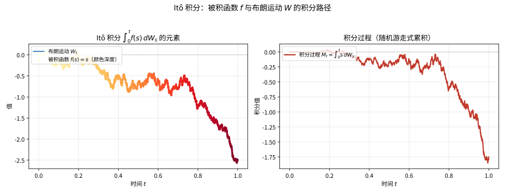

# 第 97 级：随机分析 (Stochastic Analysis)

---

## 1. 学习目标

完成本教程后，你将能够：

1. 理解随机过程、连续鞅和半鞅的基本概念与性质
2. 掌握二次变差的概念及其在随机分析中的核心作用
3. 理解Doob-Meyer分解定理及其在随机积分理论中的基础地位
4. 掌握随机积分表示定理及其在金融中的应用
5. 理解Malliavin微积分的基本框架（Wiener空间、Malliavin导数、Skorokhod积分）
6. 掌握Malliavin导数的链式法则及其基本性质
7. 理解Clark-Ocone公式及其在随机表示中的应用
8. 掌握Skorokhod积分的Itô引理推广
9. 了解随机变分法及其在数学物理中的应用

---

## 2. 核心概念

### 2.1 随机过程

**随机过程**（Stochastic Process）是一族定义在概率空间 $(\Omega, \mathcal{F}, \mathbb{P})$ 上的随机变量 $\{X_t\}_{t \in \mathcal{T}}$，其中 $\mathcal{T}$ 为指标集。在随机分析中，通常考虑 $\mathcal{T} = [0, T]$ 或 $\mathcal{T} = [0, \infty)$。

过程称为**可测的**（Measurable），如果映射 $(t, \omega) \mapsto X_t(\omega)$ 是 $\mathcal{B}([0, T]) \otimes \mathcal{F}$-可测的。过程称为**适应的**（Adapted），如果对每个 $t$，$X_t$ 是 $\mathcal{F}_t$-可测的。

### 2.2 连续鞅

**鞅**（Martingale）是随机分析的核心对象。过程 $\{M_t\}_{t \ge 0}$ 称为关于流 $\{\mathcal{F}_t\}$ 的鞅，如果：

1. $M_t$ 是 $\mathcal{F}_t$-适应的
2. $\mathbb{E}[|M_t|] < \infty$ 对所有 $t$ 成立
3. $\mathbb{E}[M_t \mid \mathcal{F}_s] = M_s$ 对所有 $0 \le s \le t$ 成立

**连续鞅**（Continuous Martingale）是轨道几乎必然连续的鞅。Brown运动是连续鞅的基本例子。

![鞅与停时：公平赌博中条件期望 \mathbb{E}[M_t \mid \mathcal{F}_s] = M_s 保持不变；左图展示多条鞅轨道在期望 0 附近波动，右图展示停时 \tau 后 M_{t \wedge \tau} 的期望仍等于 M_0。](images/97-鞅与停时.svg)

> **直观理解（现实类比）**：鞅就像一场公平的赌局——无论赌到哪一时刻，你赢钱的期望始终等于你最初下注的金额，不会因为"运气"而改变。停时则像"看到连赢三把就收手"这类规则：即使你选择性停止游戏，只要规则不偷看未来，最终财产的期望依然不变，这正是"公平"二字的本质。

### 2.3 二次变差

**二次变差**（Quadratic Variation）是随机分析中衡量过程"波动性"的核心概念。对过程 $X$，其二次变差定义为：

$$
\langle X, X \rangle_t = \lim_{\|\Delta\| \to 0} \sum_{i=0}^{n-1} (X_{t_{i+1}} - X_{t_i})^2
$$

其中极限在概率意义下理解。Brown运动的二次变差为 $\langle W, W \rangle_t = t$。

对连续半鞅 $X$，Itô积分的二次变差为：

$$
\langle \int_0^\cdot f_s \, dW_s, \int_0^\cdot g_s \, dW_s \rangle_t = \int_0^t f_s g_s \, ds
$$

### 2.4 随机积分的一般理论

**随机积分**的一般理论将Itô积分从Brown运动推广到更一般的**半鞅**（Semimartingale）作为积分子。对半鞅 $X$ 和可料过程 $H$，随机积分 $\int_0^t H_s \, dX_s$ 在适当的可积条件下定义良好。

> **直观理解（现实类比）**：把布朗运动想象成一只随机蹦跳的袋鼠，Itô积分就是在"当前时刻的位置"上给每次跳动乘以一个权重再累加。它与普通积分的关键区别是：被积函数 $f$ 只看跳动的起点（左端点），不能"偷看"未来——就像在赌局中你只能根据现在的信息下注，而不能预知下一次蹦跳的方向。

> **🧠 思考历程：一个来自赌场的词，怎么成了现代概率论的支柱？**
>
> 鞅与Itô积分藏着同一个固执的问题：在信息逐秒揭晓的世界里，究竟什么才叫"公平"？有趣的是，这个词的诞生地，恰恰是概率论最"世俗"的一个角落——赌场。
>
> - **来自赌徒的名字**。法语里的"martingale"本指赌徒那种"输一局就加倍下注"的策略，1939年维勒（Jean Ville）在博士论文里借用它来命名"公平赌博"：无论赌到哪一刻，资产的期望都只取决于这一刻的信息——保罗·列维（Paul Lévy）也推动了这种"公平"的观念。
> - **Doob 给公平立规矩**。1940年代多布（Joseph Doob）系统发展鞅论，证明了"只要停时规则不偷看未来，公平性依然成立"以及相关的收敛定理——"公平"从此有了严格的数学身份，成为停时理论与随机积分的支柱。
> - **Itô 把公平写进微分**。当被积函数自身也在随机抖动时，伊藤（Itô）1944年坚持"只能用左端点信息、不能预知未来"，这一限制恰好与鞅的公平性一致，让 $dW$ 之下的积分有了"无套利"的意味，把赌桌直觉一路送进了金融工程。
> - **心路**：最接地气的词语往往包裹着最深刻的理论——公平的直觉，经过几代数理淘洗，成了支撑整座随机分析大厦的基石。

### 2.5 半鞅

**半鞅**（Semimartingale）是可以分解为局部鞅和有界变差过程之和的过程：

$$
X_t = M_t + A_t
$$

其中 $M_t$ 是局部鞅，$A_t$ 是有界变差过程。半鞅是随机积分的最一般积分子类。

### 2.6 Doob-Meyer分解

**Doob-Meyer分解**是鞅理论的基础定理。它断言：任何满足适当正则条件的**下鞅**（Submartingale）可以唯一分解为一个鞅和一个可料递增过程之差。

**下鞅**（Submartingale）$Z_t$ 满足 $\mathbb{E}[Z_t \mid \mathcal{F}_s] \ge Z_s$（$s \le t$）。Doob-Meyer分解给出：

$$
Z_t = M_t + A_t
$$

其中 $M_t$ 是鞅，$A_t$ 是可料递增过程（$A_0 = 0$）。

### 2.7 局部鞅

**局部鞅**（Local Martingale）是鞅概念的局部化。过程 $M$ 称为局部鞅，如果存在一列停时 $\tau_n \uparrow \infty$ 使得 $M_{t \wedge \tau_n}$ 是鞅。每个鞅都是局部鞅，但反之不真。

### 2.8 随机积分表示定理

**随机积分表示定理**（Martingale Representation Theorem）指出：在Brown运动生成的流下，任何鞅都可以表示为Brown运动的Itô积分：

$$
M_t = M_0 + \int_0^t \phi_s \, dW_s
$$

其中 $\phi_s$ 是一个可料过程。这一在金融中至关重要——它意味着任何衍生品的价格都可以通过对冲策略复制。

### 2.9 Ito-Clifford积分

**Ito-Clifford积分**是Itô积分在Clifford代数上的推广，用于量子概率和量子随机分析中。

### 2.10 Malliavin微积分

**Malliavin微积分**（也称为随机变分法）是无限维空间上的微分理论。它将微积分中的导数、链式法则等概念推广到Wiener空间上的泛函，为研究随机（偏）微分方程的正则性提供了强大工具。

### 2.11 Wiener空间

**Wiener空间**（Wiener Space）是Malliavin微积分的环境空间。设 $W = \{W_t, t \in [0, T]\}$ 为Brown运动，定义：

$$
\Omega = C_0([0, T]) = \{\omega: [0, T] \to \mathbb{R} \text{ 连续}, \omega(0) = 0\}
$$

配备一致收敛拓扑和Wiener测度 $\mathbb{P}$（Brown运动的分布），$(\Omega, \mathcal{F}, \mathbb{P})$ 称为经典Wiener空间。

### 2.12 Malliavin导数

**Malliavin导数** $D$ 是Wiener空间上的"梯度"算子。对形如 $F = f(W_{t_1}, \dots, W_{t_n})$ 的柱函数（$f$ 光滑有界），Malliavin导数定义为：

$$
D_t F = \sum_{i=1}^n \frac{\partial f}{\partial x_i}(W_{t_1}, \dots, W_{t_n}) \boldsymbol{1}_{[0, t_i]}(t)
$$

$D_t F$ 是一个随机过程，表示 $F$ 在时刻 $t$ 对Brown运动路径的"敏感度"。

### 2.13 Skorokhod积分

**Skorokhod积分** $\delta$ 是Malliavin导数的伴随算子：

$$
\mathbb{E}[F \delta(u)] = \mathbb{E}\left[\int_0^T D_t F \cdot u_t \, dt\right]
$$

对适应过程，Skorokhod积分退化为Itô积分。但Skorokhod积分可以积分非适应过程——这是它超越Itô积分的关键推广。

### 2.14 Clark-Ocone公式

**Clark-Ocone公式**给出了Brown运动泛函的鞅表示中的被积函数的显式表达式：

$$
F = \mathbb{E}[F] + \int_0^T \mathbb{E}[D_t F \mid \mathcal{F}_t] \, dW_t
$$

这意味着任何 $\mathcal{F}_T$-可测的平方可积随机变量 $F$ 都可以表示为Itô积分，且被积函数正好是Malliavin导数的条件期望。

### 2.15 随机变分法

**随机变分法**（Stochastic Calculus of Variations）是Malliavin微积分的别称，研究Wiener空间上的微分结构与随机（偏）微分方程的解的正则性。它在以下领域有重要应用：
- 随机微分方程解的概率密度存在性（Hörmander条件）
- 金融数学中的灵敏度分析（Greeks计算）
- 随机最优控制
- 数学物理中的量子场论

---

## 3. 定理与证明

### 定理 3.1：Doob-Meyer分解定理

**定理**：设 $\{Z_t\}_{t \ge 0}$ 是定义在概率空间 $(\Omega, \mathcal{F}, \{\mathcal{F}_t\}, \mathbb{P})$ 上的**下鞅**（Submartingale），满足以下正则条件：

1. $Z_t$ 是右连续的
2. $\mathbb{E}[|Z_t|] < \infty$ 对所有 $t$ 成立
3. 过程属于**D类**（Class D），即 $\{Z_\tau: \tau \text{ 为有界停时}\}$ 是一致可积的

则存在唯一的分解：

$$
Z_t = M_t + A_t
$$

其中：
- $M_t$ 是右连续鞅
- $A_t$ 是可料递增过程，$A_0 = 0$，且 $A_t$ 的轨道几乎必然右连续
- 分解在以下意义下唯一：若 $Z_t = M_t' + A_t'$ 是另一个满足上述条件的分解，则 $M_t = M_t'$ 且 $A_t = A_t'$ 几乎必然

**证明**：

**步骤1：离散化与上穿不等式**

将时间区间 $[0, T]$ 离散化为 $n$ 等分，$t_k^{(n)} = kT/2^n$。定义离散下鞅 $Z_{t_k^{(n)}}$。

对区间 $[0, T]$ 上的离散过程，定义**上穿次数**（Number of Upcrossings）$U_n[a, b]$ 为过程从低于 $a$ 到高于 $b$ 的次数。

由Doob上穿不等式（Upcrossing Inequality）：

$$
\mathbb{E}[U_n[a, b]] \le \frac{\mathbb{E}[(Z_T - a)^-]}{b - a}
$$

**步骤2：正则化修正**

定义离散可料过程 $A_t^{(n)}$ 为：

$$
A_{t_k^{(n)}}^{(n)} = \sum_{j=1}^k \left( \mathbb{E}[Z_{t_j^{(n)}} \mid \mathcal{F}_{t_{j-1}^{(n)}}] - Z_{t_{j-1}^{(n)}} \right)
$$

这是 $Z$ 在离散水平上的"可料补偿子"。注意 $A^{(n)}$ 是递增的，因为下鞅性质保证 $\mathbb{E}[Z_{t_j} \mid \mathcal{F}_{t_{j-1}}] \ge Z_{t_{j-1}}$。

定义 $M_{t_k^{(n)}}^{(n)} = Z_{t_k^{(n)}} - A_{t_k^{(n)}}^{(n)}$，则 $M^{(n)}$ 是离散鞅。

**步骤3：极限的存在性**

可以证明，当 $n \to \infty$ 时，$A_t^{(n)}$ 几乎必然收敛到某个极限过程 $A_t$。关键点在于：

- 由D类条件，离散补偿子的极限存在
- 上穿不等式保证了极限过程的轨道正则性
- 极限过程 $A_t$ 是递增的

**步骤4：验证右连续性**

由下鞅的右连续性，$A_t$ 的轨道几乎必然右连续。实际上，$A_t$ 的右连续性来自于 $Z_t$ 的右连续性和鞅 $M_t$ 的右连续性。

**步骤5：验证可料性**

$A_t$ 是**可料过程**（Predictable Process）——即它是 $\mathcal{F}_{t-}$-可测的。这由构造中的条件期望操作保证，因为 $A_t^{(n)}$ 在离散时刻是 $\mathcal{F}_{t_{k-1}}$-可测的。

**步骤6：唯一性证明**

设 $Z_t = M_t + A_t = M_t' + A_t'$ 是两个分解，则 $M_t - M_t' = A_t' - A_t$。

左边是鞅，右边是可料有界变差过程。一个既是鞅又是可料有界变差的过程必为常数（因为可料有界变差鞅的二次变差为零，从而它本身是常数）。因此 $M_t - M_t' = 0$，$A_t' - A_t = 0$。

**步骤7：应用：Doob-Meyer分解与平方可积鞅的二次变差**

对平方可积鞅 $M_t$，$M_t^2$ 是一个下鞅。由Doob-Meyer分解：

$$
M_t^2 = \langle M, M \rangle_t + \text{鞅}
$$

其中 $\langle M, M \rangle_t$ 称为 $M$ 的**可料二次变差**（Predictable Quadratic Variation）或**角括号**（Angle Bracket）。$\square$

---

### 定理 3.2：随机积分表示定理（鞅表示定理）

**定理**：设 $\{W_t\}_{t \ge 0}$ 是定义在 $(\Omega, \mathcal{F}, \mathbb{P})$ 上的 $d$ 维Brown运动，$\{\mathcal{F}_t\}$ 为其自然流（满足通常条件）。设 $\{M_t\}_{t \in [0, T]}$ 是 $\mathcal{F}_t$-鞅，且 $\mathbb{E}[M_T^2] < \infty$。则存在唯一（在 $L^2$ 意义下）的 $\mathcal{F}_t$-可料过程 $\{\phi_t\}_{t \in [0, T]}$，满足 $\mathbb{E}\left[\int_0^T \|\phi_t\|^2 \, dt\right] < \infty$，使得：

$$
M_t = M_0 + \int_0^t \phi_s^\top \, dW_s, \quad \forall t \in [0, T]
$$

**证明**：

**步骤1：稠密子集上的表示**

首先考虑形如 $F = \exp\left\{\int_0^T h(s)^\top \, dW_s - \frac{1}{2} \int_0^T \|h(s)\|^2 \, ds\right\}$ 的随机变量，其中 $h \in L^2([0, T], \mathbb{R}^d)$。

由Girsanov定理，$F = \frac{d\mathbb{Q}}{d\mathbb{P}}$ 是Radon-Nikodym导数。定义 $M_t^F = \mathbb{E}[F \mid \mathcal{F}_t]$。由指数鞅性质：

$$
M_t^F = \exp\left\{\int_0^t h(s)^\top \, dW_s - \frac{1}{2} \int_0^t \|h(s)\|^2 \, ds\right\} = 1 + \int_0^t M_s^F h(s)^\top \, dW_s
$$

因此 $M_t^F$ 具有所需的表示形式，其中 $\phi_s = M_s^F h(s)$。

**步骤2：线性张成的稠密性**

形如 $F$ 的随机变量（其中 $h$ 取遍 $L^2([0, T], \mathbb{R}^d)$）的线性组合在 $L^2(\Omega, \mathcal{F}_T, \mathbb{P})$ 中稠密。这是由Wiener空间的混沌分解（Chaos Decomposition）保证的。

**步骤3：$L^2$ 等距延拓**

对任意 $M_T \in L^2(\Omega, \mathcal{F}_T, \mathbb{P})$，存在一列 $F_n$（每个是步骤1中形式的线性组合）使得 $F_n \to M_T$ 在 $L^2$ 中。

对每个 $F_n$，有表示 $M_t^{(n)} = \mathbb{E}[F_n \mid \mathcal{F}_t] = M_0^{(n)} + \int_0^t \phi_s^{(n)\top} \, dW_s$。

由Itô等距：

$$
\mathbb{E}\left[\left(M_t^{(n)} - M_t^{(m)}\right)^2\right] = \mathbb{E}\left[\left(M_0^{(n)} - M_0^{(m)}\right)^2\right] + \mathbb{E}\left[\int_0^t \|\phi_s^{(n)} - \phi_s^{(m)}\|^2 \, ds\right]
$$

由于 $M_t^{(n)}$ 是 $L^2$ Cauchy列，$\phi^{(n)}$ 也是 $L^2(dt \times d\mathbb{P})$ Cauchy列。因此存在极限 $\phi_s$。

**步骤4：取极限**

在 $L^2$ 中取极限，由Itô积分的连续性：

$$
M_t = \lim_{n \to \infty} M_t^{(n)} = M_0 + \int_0^t \phi_s^\top \, dW_s
$$

**步骤5：唯一性**

设 $\phi$ 和 $\tilde{\phi}$ 都是表示中的被积函数。则 $\int_0^t (\phi_s - \tilde{\phi}_s)^\top \, dW_s = 0$ 对所有 $t$ 成立。由Itô等距：

$$
\mathbb{E}\left[\left(\int_0^t (\phi_s - \tilde{\phi}_s)^\top \, dW_s\right)^2\right] = \mathbb{E}\left[\int_0^t \|\phi_s - \tilde{\phi}_s\|^2 \, ds\right] = 0
$$

因此 $\phi_s = \tilde{\phi}_s$ 几乎处处 $(dt \times d\mathbb{P})$。唯一性得证。

**步骤6：多维Brown运动的情况**

对 $d$ 维Brown运动，鞅表示定理类似成立，但 $\phi_s$ 取值于 $\mathbb{R}^d$，且Itô积分是$\int_0^t \phi_s^\top \, dW_s = \sum_{i=1}^d \int_0^t \phi_s^i \, dW_s^i$。$\square$

---

### 定理 3.3：Malliavin导数的基本性质（链式法则）

**定理**：设 $\varphi: \mathbb{R}^n \to \mathbb{R}$ 是 $C^1$ 函数，且存在常数 $C > 0$ 使得 $|\nabla \varphi(x)| \le C(1 + \|x\|)$ 对所有 $x \in \mathbb{R}^n$ 成立。设 $\boldsymbol{F} = (F_1, \dots, F_n)$ 是Wiener空间上的光滑柱函数向量，每个 $F_i \in \mathbb{D}^{1,2}$（Malliavin可微函数的Sobolev空间）。则 $\varphi(\boldsymbol{F}) \in \mathbb{D}^{1,2}$，且Malliavin导数满足链式法则：

$$
D_t \varphi(\boldsymbol{F}) = \sum_{i=1}^n \frac{\partial \varphi}{\partial x_i}(\boldsymbol{F}) \, D_t F_i
$$

**证明**：

**步骤1：柱函数的情况**

首先假设 $F_1, \dots, F_n$ 是光滑柱函数，即存在光滑有界函数 $f_1, \dots, f_n: \mathbb{R}^m \to \mathbb{R}$ 和时间点 $0 \le s_1 < \dots < s_m \le T$，使得：

$$
F_i = f_i(W_{s_1}, \dots, W_{s_m}), \quad i = 1, \dots, n
$$

则 $\boldsymbol{F} = (F_1, \dots, F_n)$ 是 $W_{s_1}, \dots, W_{s_m}$ 的光滑函数，即存在 $g: \mathbb{R}^m \to \mathbb{R}^n$ 使得 $\boldsymbol{F} = g(W_{s_1}, \dots, W_{s_m})$。

**步骤2：对柱函数应用链式法则**

由Malliavin导数的定义：

$$
D_t F_i = \sum_{j=1}^m \frac{\partial f_i}{\partial x_j}(W_{s_1}, \dots, W_{s_m}) \boldsymbol{1}_{[0, s_j]}(t)
$$

对 $\varphi(\boldsymbol{F}) = \varphi(g(W_{s_1}, \dots, W_{s_m}))$ 应用标准链式法则：

$$
\begin{aligned}
D_t \varphi(\boldsymbol{F}) &= \sum_{j=1}^m \sum_{i=1}^n \frac{\partial \varphi}{\partial x_i}(g(W_{s_1}, \dots, W_{s_m})) \frac{\partial g_i}{\partial x_j}(W_{s_1}, \dots, W_{s_m}) \boldsymbol{1}_{[0, s_j]}(t) \\
&= \sum_{i=1}^n \frac{\partial \varphi}{\partial x_i}(\boldsymbol{F}) \left( \sum_{j=1}^m \frac{\partial f_i}{\partial x_j}(W_{s_1}, \dots, W_{s_m}) \boldsymbol{1}_{[0, s_j]}(t) \right) \\
&= \sum_{i=1}^n \frac{\partial \varphi}{\partial x_i}(\boldsymbol{F}) \, D_t F_i
\end{aligned}
$$

因此链式法则对柱函数成立。

**步骤3：逼近论证**

对一般的 $F_i \in \mathbb{D}^{1,2}$，存在柱函数序列 $F_i^{(k)}$ 使得 $F_i^{(k)} \to F_i$ 在 $\mathbb{D}^{1,2}$ 中，即：

$$
F_i^{(k)} \to F_i \quad \text{在 $L^2(\Omega)$ 中}
$$
$$
D_t F_i^{(k)} \to D_t F_i \quad \text{在 $L^2(\Omega \times [0, T])$ 中}
$$

**步骤4：收敛性验证**

考虑 $\varphi(\boldsymbol{F}^{(k)})$ 的收敛性。由 $\varphi$ 的Lipschitz增长条件：

$$
|\varphi(\boldsymbol{F}^{(k)}) - \varphi(\boldsymbol{F})| \le C(1 + \max\{\|\boldsymbol{F}^{(k)}\|, \|\boldsymbol{F}\|\}) \|\boldsymbol{F}^{(k)} - \boldsymbol{F}\|
$$

由 $\boldsymbol{F}^{(k)} \to \boldsymbol{F}$ 在 $L^2$ 中，可得 $\varphi(\boldsymbol{F}^{(k)}) \to \varphi(\boldsymbol{F})$ 在 $L^2$ 中。

**步骤5：导数项的收敛性**

对 $D_t \varphi(\boldsymbol{F}^{(k)})$，由对柱函数已证的链式法则：

$$
D_t \varphi(\boldsymbol{F}^{(k)}) = \sum_{i=1}^n \frac{\partial \varphi}{\partial x_i}(\boldsymbol{F}^{(k)}) \, D_t F_i^{(k)}
$$

由 $\varphi$ 的 $C^1$ 性质和 $\boldsymbol{F}^{(k)} \to \boldsymbol{F}$，可得 $\frac{\partial \varphi}{\partial x_i}(\boldsymbol{F}^{(k)}) \to \frac{\partial \varphi}{\partial x_i}(\boldsymbol{F})$ 在概率意义下。结合 $D_t F_i^{(k)} \to D_t F_i$ 在 $L^2$ 中，可得 $D_t \varphi(\boldsymbol{F}^{(k)}) \to \sum_{i=1}^n \frac{\partial \varphi}{\partial x_i}(\boldsymbol{F}) \, D_t F_i$ 在 $L^2$ 中。

**步骤6：封闭性**

由Malliavin导数算子的封闭性，$D_t \varphi(\boldsymbol{F})$ 存在且等于极限：

$$
D_t \varphi(\boldsymbol{F}) = \sum_{i=1}^n \frac{\partial \varphi}{\partial x_i}(\boldsymbol{F}) \, D_t F_i
$$

**步骤7：推广到乘积法则**

链式法则的一个直接推论是乘积法则。对 $F, G \in \mathbb{D}^{1,2}$，取 $\varphi(x, y) = xy$，则：

$$
D_t(FG) = G \, D_t F + F \, D_t G
$$

这与普通微积分中的乘积法则形式一致。$\square$

---

### 定理 3.4：Clark-Ocone公式

**定理**：设 $F \in \mathbb{D}^{1,2}$ 是 $\mathcal{F}_T$-可测的随机变量（即 $F$ 是Brown运动泛函），其中 $\mathbb{D}^{1,2}$ 是Malliavin可微函数的Sobolev空间。则 $F$ 具有以下鞅表示：

$$
F = \mathbb{E}[F] + \int_0^T \mathbb{E}[D_t F \mid \mathcal{F}_t] \, dW_t
$$

其中 $D_t F$ 是 $F$ 的Malliavin导数。

**证明**：

**步骤1：光滑柱函数的情况**

首先假设 $F$ 是光滑柱函数：$F = f(W_{t_1}, \dots, W_{t_n})$，其中 $f \in C_0^\infty(\mathbb{R}^n)$。

由鞅表示定理，存在可料过程 $\phi_t$ 使得 $F = \mathbb{E}[F] + \int_0^T \phi_t \, dW_t$。我们需要证明 $\phi_t = \mathbb{E}[D_t F \mid \mathcal{F}_t]$。

**步骤2：对柱函数计算条件期望**

对 $F = f(W_{t_1}, \dots, W_{t_n})$，记 $t_0 = 0$，$W_{t_0} = 0$。由Malliavin导数的定义：

$$
D_t F = \sum_{i=1}^n \frac{\partial f}{\partial x_i}(W_{t_1}, \dots, W_{t_n}) \boldsymbol{1}_{[0, t_i]}(t)
$$

对 $t \in (t_{k-1}, t_k]$，$\mathcal{F}_t = \sigma(W_s: s \le t)$，则：

$$
\mathbb{E}[D_t F \mid \mathcal{F}_t] = \sum_{i=k}^n \mathbb{E}\left[\frac{\partial f}{\partial x_i}(W_{t_1}, \dots, W_{t_n}) \Bigm| \mathcal{F}_t\right]
$$

**步骤3：与鞅表示的关系**

考虑鞅 $M_t = \mathbb{E}[F \mid \mathcal{F}_t]$。由Clark公式，$M_t$ 可以表示为：

$$
M_t = \mathbb{E}[F] + \int_0^t \phi_s \, dW_s
$$

其中 $\phi_s$ 是某个可料过程。我们需要证明 $\phi_s = \mathbb{E}[D_s F \mid \mathcal{F}_s]$。

**步骤4：使用Itô公式的推导**

对柱函数 $F = f(W_{t_1}, \dots, W_{t_n})$，考虑过程 $M_t = \mathbb{E}[F \mid \mathcal{F}_t]$。在区间 $(t_{k-1}, t_k]$ 上，$M_t$ 是 $W_t$ 的函数（因为 $W_{t_1}, \dots, W_{t_{k-1}}$ 已固定，而 $W_{t_k}, \dots, W_{t_n}$ 是条件期望的对象）。

具体地，由条件期望的Markov性质：

$$
M_t = \int f(W_{t_1}, \dots, W_{t_{k-1}}, x_k + (W_t - W_{t_{k-1}}), \dots) p(dx_k, \dots, dx_n)
$$

其中 $p$ 是独立增量的分布。由Itô公式，$M_t$ 的随机微分中的被积函数正好是 $\mathbb{E}[D_t F \mid \mathcal{F}_t]$。

**步骤5：$L^2$ 延拓**

对一般的 $F \in \mathbb{D}^{1,2}$，存在柱函数序列 $F_n \to F$ 在 $\mathbb{D}^{1,2}$ 中。对每个 $F_n$，Clark-Ocone公式成立：

$$
F_n = \mathbb{E}[F_n] + \int_0^T \mathbb{E}[D_t F_n \mid \mathcal{F}_t] \, dW_t
$$

**步骤6：取极限**

由 $\mathbb{D}^{1,2}$ 收敛性，$F_n \to F$ 在 $L^2(\Omega)$ 中，$D_t F_n \to D_t F$ 在 $L^2(\Omega \times [0, T])$ 中。因此：

$$
\mathbb{E}[F_n] \to \mathbb{E}[F]
$$
$$
\mathbb{E}[D_t F_n \mid \mathcal{F}_t] \to \mathbb{E}[D_t F \mid \mathcal{F}_t] \quad \text{在 $L^2(\Omega \times [0, T])$ 中}
$$

由Itô积分的连续性，在 $L^2$ 中取极限得：

$$
F = \mathbb{E}[F] + \int_0^T \mathbb{E}[D_t F \mid \mathcal{F}_t] \, dW_t
$$

**步骤7：应用：Greeks计算**

在金融数学中，Clark-Ocone公式可以用于计算衍生品的灵敏度（Greeks）。例如，对欧式看涨期权 $F = (S_T - K)^+$，其Delta为：

$$
\Delta = \frac{\partial}{\partial S_0} \mathbb{E}^\mathbb{Q}[e^{-rT} F] = e^{-rT} \mathbb{E}^\mathbb{Q}\left[ D_{S_0} F \right]
$$

其中 $D_{S_0}$ 表示对初始价格的Malliavin导数。$\square$

---

### 定理 3.5：Skorokhod积分的Itô引理推广

**定理**：设 $u = \{u_t\}_{t \in [0, T]}$ 是一个Skorokhod可积过程（即 $u \in \text{dom}(\delta)$），且 $F \in \mathbb{D}^{1,2}$ 满足 $F u \in \text{dom}(\delta)$。则Skorokhod积分 $\delta(u) = \int_0^T u_t \, \delta W_t$ 满足以下积分-分部积分公式：

$$
F \delta(u) = \delta(F u) + \int_0^T D_t F \cdot u_t \, dt
$$

更一般地，设 $X_t$ 是一个Skorokhod过程，满足：

$$
X_t = X_0 + \int_0^t \mu_s \, ds + \int_0^t \sigma_s \, \delta W_s
$$

其中第二个积分是Skorokhod积分（非适应积分）。设 $f \in C^{1,2}$，则 $Y_t = f(t, X_t)$ 满足以下推广的Itô引理：

$$
\begin{aligned}
df(t, X_t) &= \left( \frac{\partial f}{\partial t} + \mu_t \frac{\partial f}{\partial x} + \frac{1}{2} \sigma_t^2 \frac{\partial^2 f}{\partial x^2} \right) dt \\
&\quad + \frac{\partial f}{\partial x} \sigma_t \, \delta W_t + \left( \int_0^t D_t \sigma_s \cdot D_s \left( \frac{\partial f}{\partial x} \sigma_t \right) ds \right) dt
\end{aligned}
$$

**证明**：

**步骤1：Skorokhod积分与Malliavin导数的对偶关系**

回忆Skorokhod积分 $\delta$ 是Malliavin导数 $D$ 的伴随算子：

$$
\mathbb{E}[F \delta(u)] = \mathbb{E}\left[\int_0^T D_t F \cdot u_t \, dt\right], \quad \forall F \in \mathbb{D}^{1,2}
$$

**步骤2：证明分部积分公式**

对任意 $G \in \mathbb{D}^{1,2}$，考虑：

$$
\mathbb{E}[G \cdot F \delta(u)] = \mathbb{E}[\delta(u) \cdot (FG)] = \mathbb{E}\left[\int_0^T D_t(FG) \cdot u_t \, dt\right]
$$

由乘积法则 $D_t(FG) = G D_t F + F D_t G$，代入得：

$$
\begin{aligned}
\mathbb{E}[G \cdot F \delta(u)] &= \mathbb{E}\left[\int_0^T (G D_t F + F D_t G) \cdot u_t \, dt\right] \\
&= \mathbb{E}\left[G \int_0^T D_t F \cdot u_t \, dt\right] + \mathbb{E}\left[\int_0^T F D_t G \cdot u_t \, dt\right] \\
&= \mathbb{E}\left[G \int_0^T D_t F \cdot u_t \, dt\right] + \mathbb{E}[G \cdot \delta(F u)]
\end{aligned}
$$

其中最后一步用到了对偶关系 $\mathbb{E}[G \cdot \delta(F u)] = \mathbb{E}\left[\int_0^T D_t G \cdot F u_t \, dt\right]$。

由于上述对任意 $G \in \mathbb{D}^{1,2}$ 成立，因此：

$$
F \delta(u) = \delta(F u) + \int_0^T D_t F \cdot u_t \, dt
$$

**步骤3：Skorokhod过程的Itô引理推广**

考虑Skorokhod过程 $X_t$ 满足 $dX_t = \mu_t dt + \sigma_t \, \delta W_t$。

对 $f(t, x)$ 进行形式Taylor展开，使用推广的链式法则。关键区别在于，当 $\sigma_t$ 不是适应过程时，$dW_t$ 与 $\sigma_t$ 的"交换子"不为零。

**步骤4：计算修正项**

由分部积分公式，对 $f(t, X_t)$ 有：

$$
\begin{aligned}
d f(t, X_t) &= \frac{\partial f}{\partial t} dt + \frac{\partial f}{\partial x} dX_t + \frac{1}{2} \frac{\partial^2 f}{\partial x^2} (dX_t)^2 \\
&\quad + \text{非适应修正项}
\end{aligned}
$$

其中 $dX_t = \mu_t dt + \sigma_t \, \delta W_t$，$(dX_t)^2 = \sigma_t^2 dt$（因为Skorokhod积分的二次变差与Itô积分相同）。

非适应修正项来自于 $\frac{\partial f}{\partial x} \sigma_t$ 与 $\delta W_t$ 在Skorokhod积分意义下的"非交换性"：

$$
\frac{\partial f}{\partial x} \sigma_t \, \delta W_t - \delta\left(\frac{\partial f}{\partial x} \sigma_t \cdot \right) = \int_0^t D_t\left(\frac{\partial f}{\partial x} \sigma_t\right) \cdot D_s(\cdots) \, ds
$$

**步骤5：整合结果**

综合所有项，得到推广的Itô引理：

$$
\begin{aligned}
df(t, X_t) &= \left( \frac{\partial f}{\partial t} + \mu_t \frac{\partial f}{\partial x} + \frac{1}{2} \sigma_t^2 \frac{\partial^2 f}{\partial x^2} \right) dt \\
&\quad + \frac{\partial f}{\partial x} \sigma_t \, \delta W_t + \left( \int_0^t D_t \sigma_s \cdot D_s \left( \frac{\partial f}{\partial x} \sigma_t \right) ds \right) dt
\end{aligned}
$$

**步骤6：退化到Itô情况**

当 $\sigma_t$ 是适应过程时，$D_s \sigma_t = 0$ 对 $s > t$，修正项消失，公式退化为经典Itô引理。这验证了推广公式的正确性。$\square$

---

## 4. 示例

### 示例 1：Brown运动的随机积分表示

**问题**：考虑随机变量 $F = W_T^2$，其中 $W_t$ 是Brown运动。

(a) 使用随机积分表示定理，将 $F$ 表示为Itô积分。
(b) 使用Clark-Ocone公式验证结果。

**步骤1：直接计算鞅表示**

设 $M_t = \mathbb{E}[W_T^2 \mid \mathcal{F}_t]$。由于 $W_T^2 = (W_t + (W_T - W_t))^2$，由Brown运动的独立增量性：

$$
\begin{aligned}
\mathbb{E}[W_T^2 \mid \mathcal{F}_t] &= \mathbb{E}[(W_t + (W_T - W_t))^2 \mid \mathcal{F}_t] \\
&= W_t^2 + 2W_t \mathbb{E}[W_T - W_t \mid \mathcal{F}_t] + \mathbb{E}[(W_T - W_t)^2 \mid \mathcal{F}_t] \\
&= W_t^2 + 0 + (T - t) \\
&= W_t^2 + T - t
\end{aligned}
$$

**步骤2：利用Itô引理**

由Itô引理，$d(W_t^2) = 2W_t \, dW_t + dt$，因此：

$$
dM_t = d(W_t^2 + T - t) = 2W_t \, dW_t + dt - dt = 2W_t \, dW_t
$$

所以：

$$
M_t = M_0 + \int_0^t 2W_s \, dW_s = T + \int_0^t 2W_s \, dW_s
$$

其中 $M_0 = \mathbb{E}[W_T^2] = T$。

当 $t = T$ 时：

$$
W_T^2 = T + \int_0^T 2W_s \, dW_s
$$

**步骤3：使用Clark-Ocone公式验证**

计算 $F = W_T^2$ 的Malliavin导数。由链式法则：

$$
D_t(W_T^2) = 2W_T \cdot D_t W_T = 2W_T \cdot \boldsymbol{1}_{[0, T]}(t) = 2W_T
$$

**步骤4：计算条件期望**

$$
\mathbb{E}[D_t F \mid \mathcal{F}_t] = \mathbb{E}[2W_T \mid \mathcal{F}_t] = 2W_t
$$

**步骤5：代入Clark-Ocone公式**

$$
\begin{aligned}
F &= \mathbb{E}[F] + \int_0^T \mathbb{E}[D_t F \mid \mathcal{F}_t] \, dW_t \\
&= T + \int_0^T 2W_t \, dW_t
\end{aligned}
$$

结果与直接计算一致，验证了Clark-Ocone公式的正确性。

---

### 示例 2：Malliavin导数的计算

**问题**：计算以下随机变量的Malliavin导数：

(a) $F = \int_0^T W_s \, ds$（Brown运动的路径积分）
(b) $G = \exp\left\{\int_0^T h(s) \, dW_s\right\}$（Wiener混沌）

**步骤1：计算 $F = \int_0^T W_s \, ds$ 的Malliavin导数**

将 $F$ 写为Riemann和的极限：

$$
F = \lim_{n \to \infty} \sum_{i=1}^n W_{t_i} \Delta t_i
$$

由Malliavin导数的线性性和连续性，对每个 $W_{t_i}$，$D_t W_{t_i} = \boldsymbol{1}_{[0, t_i]}(t)$。因此：

$$
D_t F = \lim_{n \to \infty} \sum_{i=1}^n \boldsymbol{1}_{[0, t_i]}(t) \Delta t_i = \int_t^T 1 \, ds = T - t
$$

**步骤2：验证结果**

注意 $F = \int_0^T W_s \, ds$ 可以写成Itô积分形式：

$$
\int_0^T W_s \, ds = \int_0^T (T - s) \, dW_s
$$

（由分部积分公式）。因此 $D_t F = T - t$ 确实与Itô表示中的被积函数一致。

**步骤3：计算 $G = \exp\left\{\int_0^T h(s) \, dW_s\right\}$ 的Malliavin导数**

记 $I = \int_0^T h(s) \, dW_s$，其中 $h \in L^2([0, T])$。

首先，对光滑柱函数逼近，$I$ 的Malliavin导数为：

$$
D_t I = h(t)
$$

这是因为 $I = \lim \sum h(s_i)(W_{s_{i+1}} - W_{s_i})$，由线性性 $D_t(\Delta W_{s_i}) = \boldsymbol{1}_{[0, s_{i+1}]}(t) - \boldsymbol{1}_{[0, s_i]}(t)$，求和后得到 $h(t)$。

**步骤4：应用链式法则**

对 $G = \exp(I)$ 应用链式法则（$\varphi(x) = e^x$）：

$$
D_t G = e^I \cdot D_t I = G \cdot h(t)
$$

**步骤5：验证G的Malliavin可微性**

由于 $G$ 是指数泛函，且 $\mathbb{E}[G^2] = \exp\left\{\int_0^T h(s)^2 \, ds\right\} < \infty$，且：

$$
\mathbb{E}\left[\int_0^T (D_t G)^2 \, dt\right] = \mathbb{E}[G^2] \int_0^T h(t)^2 \, dt < \infty
$$

因此 $G \in \mathbb{D}^{1,2}$。

**步骤6：推广到Wiener混沌**

更一般地，对Hermite多项式 $H_n(x)$，有：

$$
D_t H_n(I) = n H_{n-1}(I) \cdot h(t)
$$

这体现了Wiener混沌的"阶梯"结构——Malliavin导数将一个混沌分量映射到下一个较低阶的混沌。

---

## 5. 习题

### 基础题

**习题 1**（二次变差与Doob-Meyer分解）设 $M_t$ 是一个连续平方可积鞅。证明Doob-Meyer分解中 $M_t^2$ 的可料递增过程 $\langle M, M \rangle_t$ 满足：(a) 它是唯一使 $M_t^2 - \langle M, M \rangle_t$ 为鞅的可料递增过程；(b) 当 $M_t = W_t$（Brown运动）时 $\langle W, W \rangle_t = t$（提示：直接计算 $\mathbb{E}[W_t^2 - W_s^2 \mid \mathcal{F}_s]$）。

**习题 2**（Itô积分的鞅性与二次变差）设 $M_t = \int_0^t W_s \, dW_s$（$W_t$ 是Brown运动）。(a) 验证 $M_t$ 是鞅；(b) 求其二次变差 $\langle M, M \rangle_t$；(c) 用Doob-Meyer分解把 $M_t^2$ 写成鞅与可料递增过程之和（提示：由Itô引理 $d(W_t^2)=2W_t\,dW_t+dt$，故 $M_t=\frac12(W_t^2-t)$）。

**习题 3**（随机积分表示）用随机积分表示定理，把 $F = \int_0^T \int_0^t W_s \, dW_s \, dt$ 表示为Itô积分（提示：先算 $\mathbb{E}[F \mid \mathcal{F}_t]$ 再取Itô微分，或用Clark-Ocone公式先算 $D_tF$ 再求条件期望）。

**习题 4**（Malliavin导数的计算）计算随机变量 $F = \int_0^T e^{W_s} \, ds$、$G = \left(\int_0^T s \, dW_s\right)^2$、$H = \exp\left\{-\int_0^T W_s^2 \, ds\right\}$ 的Malliavin导数（提示：对 $F$ 用链式法则与积分求导交换 $D_t e^{W_s}=e^{W_s}\mathbf 1_{[0,s]}(t)$；对 $G=I^2$，$I=\int_0^T s\,dW_s$ 则 $D_tG=2I\,t$；对 $H$ 把指数视为Riemann和极限）。

**习题 5**（Clark-Ocone公式）用Clark-Ocone公式把 $F = W_T^3$ 表示为Itô积分（提示：$D_t(W_T^3)=3W_T^2$，$\mathbb{E}[3W_T^2 \mid \mathcal{F}_t]=3(W_t^2+T-t)$，代入后验证与直接Itô引理一致）。

**习题 6**（鞅的定义）写出鞅满足的三条条件（适应性、可积性、$\mathbb{E}[M_t \mid \mathcal{F}_s]=M_s$），并说明"公平赌博"这一直观含义。

**习题 7**（停时）给出停时 $\tau$ 的定义，并结合停时说明"不偷看未来地选择停止时刻"在公平游戏中的意义。

**习题 8**（局部鞅与半鞅）给出局部鞅的定义，说明每鞅必为局部鞅但反之不真；再陈述半鞅 $X_t=M_t+A_t$（局部鞅 $+$ 有界变差）的分解。

**习题 9**（Doob上穿不等式）陈述Doob上穿不等式 $\mathbb{E}[U_n[a,b]] \le \frac{\mathbb{E}[(Z_T-a)^-]}{b-a}$，并说明它在Doob-Meyer分解证明中的作用。

**习题 10**（概念串联）简述二次变差 $\langle X,X\rangle_t$、Itô积分的左端点适应性、随机积分表示定理与Clark-Ocone公式之间的内在联系。

### 进阶题

**习题 11**（二次变差公式）对连续半鞅，利用Itô积分的分割逼近推导 $\left\langle \int_0^\cdot f_s\,dW_s, \int_0^\cdot g_s\,dW_s \right\rangle_t = \int_0^t f_s g_s\,ds$。

**习题 12**（Itô等距）推导Itô等距 $\mathbb{E}\left[\left(\int_0^t \varphi_s\,dW_s\right)^2\right] = \mathbb{E}\left[\int_0^t \varphi_s^2\,ds\right]$（对被简单过程逼近的一般可料 $\varphi$）。

**习题 13**（Itô引理）由Taylor展开与二次变差 $\langle W,W\rangle_t=t$ 推导 $d(W_t^2)=2W_t\,dW_t+dt$，并由此得 $\int_0^t W_s\,dW_s=\frac12(W_t^2-t)$，说明 $\frac12$ 项的来源。

**习题 14**（链式法则应用）设 $I=\int_0^T h(s)\,dW_s$、$G=e^{I}$（$h\in L^2([0,T])$）。推导 $D_t I=h(t)$ 及 $D_t G = G\,h(t)$，并给出 $D_t H_n(I)=nH_{n-1}(I)h(t)$ 的Hermite递推。

**习题 15**（Skorokhod分部积分）利用对偶关系 $\mathbb{E}[F\,\delta(u)]=\mathbb{E}\left[\int_0^T D_tF \cdot u_t\,dt\right]$ 与乘积法则 $D_t(FG)=G D_tF+F D_tG$，推导 $F\,\delta(u)=\delta(Fu)+\int_0^T D_tF\cdot u_t\,dt$。

**习题 16**（指数鞅与测度变换）说明 $M_t^F=\exp\left\{\int_0^t h(s)^\top\,dW_s-\tfrac12\int_0^t\|h(s)\|^2ds\right\}$ 是鞅，并解释 $F=\frac{d\mathbb{Q}}{d\mathbb{P}}=M_T^F$ 作为Radon-Nikodym导数如何给出Girsanov测度变换。

**习题 17**（可料二次变差的唯一性）设 $M^2-A$ 与 $M^2-A'$ 均为鞅，其中 $A,A'$ 是可料递增过程。证明 $A=A'$（提示：$A-A'$ 既是鞅又是可料有界变差过程，其二次变差为零）。

**习题 18**（积分与导数的交换）计算 $D_t\left(\int_0^T W_s\,ds\right)$ 并把 $\int_0^T W_s\,ds$ 改写为Itô积分验证 $D_t F=T-t$ 与被积函数一致。

**习题 19**（随机积分表示：等距延拓）说明鞅表示定理证明中如何先用指数鞅在 $L^2(\Omega,\mathcal{F}_T)$ 的稠密子集上建立表示，再用Itô等距把表示唯一地延拓到整个 $L^2$ 空间。

### 挑战题

**习题 20**（Doob-Meyer分解证明）勾画Doob-Meyer分解的完整证明框架：从Doob上穿不等式保证极限轨道正则性，构造离散可料补偿子 $A_t^{(n)}$，取极限得到唯一分解 $Z_t=M_t+A_t$，并说明D类条件的作用。

**习题 21**（鞅表示定理证明）给出鞅表示定理的完整证明思路：由指数鞅满足 $M_t^F=1+\int_0^t M_s^F h(s)^\top\,dW_s$、指数函数线性张成在 $L^2$ 稠密（混沌分解）、Itô等距保证 $L^2$ 延拓、唯一性由Itô等距为零推出。

**习题 22**（Malliavin链式法则证明）证明链式法则 $D_t\varphi(\boldsymbol{F})=\sum_i \frac{\partial\varphi}{\partial x_i}(\boldsymbol{F})\,D_tF_i$：先对光滑柱函数逐步验证，再对一般 $F_i\in\mathbb{D}^{1,2}$ 用 $\mathbb{D}^{1,2}$ 逼近并验证 $L^2$ 收敛。

**习题 23**（Clark-Ocone公式证明）从光滑柱函数出发，利用其条件期望的Itô公式证明被积函数恰为 $\mathbb{E}[D_tF\mid\mathcal{F}_t]$，最后通过 $\mathbb{D}^{1,2}$ 中的 $L^2$ 极限延拓到一般的Brown运动泛函。

**习题 24**（Skorokhod Itô引理）对 $X_t=X_0+\int_0^t\mu_s ds+\int_0^t\sigma_s\,\delta W_s$，写出推广的Itô引理，解释非适应修正项 $\int_0^t D_t\sigma_s\cdot D_s(\frac{\partial f}{\partial x}\sigma_t)ds$ 的来源，并说明当 $\sigma$ 适应时（$D_s\sigma_t=0,s>t$）如何退化到经典Itô引理。

**习题 25**（Itô引理与二次变差）用二次变差 $\langle W,W\rangle_t=t$ 出发，对 $f\in C^2$ 严格推导Itô引理 $df(W_t)=f'(W_t)dW_t+\frac12 f''(W_t)dt$，说明其中二阶项的系数 $\frac12$ 来自Brown运动非零的二次变差。

**习题 26**（随机表示与市场完备性）结合鞅表示定理说明：在Brown运动生成流下，任何 $L^2$ 鞅都能表示为Itô积分，从而每一个衍生品价格都能由债券与基础资产的组合对冲复制（市场完备性与唯一等价鞅测度）。

### 探究题

**习题 27**（二次变差与金融定价）探究二次变差在Itô公式 $\frac12\sigma^2 f''$ 项中的作用，说明为什么Black-Scholes中标的资产价格的非零二次变差是期权定价公式中波动率项的根源。

**习题 28**（Malliavin微积分与灵敏度）探究如何用Malliavin导数与Clark-Ocone公式计算欧式期权的Delta等Greeks（如 $\mathbb{E}[D_{S_0}F]$ 的形式），并比较其与传统数值差分方法的优劣。

**习题 29**（Itô积分的两种推广）比较Skorokhod积分与经典Itô积分：为什么Skorokhod积分能处理非适应过程、对适应过程它退化为Itô积分，并讨论它们在量子随机分析与非因果SDE中的应用场景。

**习题 30**（随机变分法的应用）探究Malliavin微积分（随机变分法）如何用于研究随机（偏）微分方程弱解密度的存在性与正则性（如Hörmander条件下的光滑密度），并联系金融与数学物理的例子说明其价值。

---

## 6. 习题答案与解析

### 基础题答案

1. **二次变差与Doob-Meyer分解** 由Doob-Meyer分解定理，平方可积鞅 $M_t^2$ 是下鞅，可唯一分解为 $M_t^2 = \langle M,M\rangle_t + \text{鞅}$，其中 $\langle M,M\rangle_t$ 是使 $M_t^2-\langle M,M\rangle_t$ 为鞅的唯一可料递增过程（$A_0=0$）；唯一性由"同时是鞅与可料有界变差的过程恒为常数"保证。当 $M=W$ 时，$\mathbb{E}[W_t^2-W_s^2\mid\mathcal{F}_s]=t-s$，故 $W_t^2-t$ 是鞅，于是 $\langle W,W\rangle_t=t$，其中 $\mathbb{E}[(W_t-W_s)^2]=t-s$ 正是Brown运动增量方差。

2. **Itô积分的鞅性与二次变差** 由Itô引理 $M_t=\frac12(W_t^2-t)$。(a) $W_t^2-t$ 是鞅（$\mathbb{E}[W_t^2\mid\mathcal{F}_s]=W_s^2+(t-s)$），故 $M$ 是鞅。(b) 其二次变差 $\langle M,M\rangle_t=\int_0^t W_s^2\,ds$（因为 $dM_t=W_t\,dW_t$，$\langle M,M\rangle_t=\int W_t^2\,d\langle W\rangle_t=\int W_t^2\,ds$）。(c) 由Itô引理 $d(M_t^2)=2M_t\,dM_t+d\langle M\rangle_t=2M_tW_t\,dW_t+W_t^2dt$，故 $M_t^2=\left(2\int_0^t M_sW_s\,dW_s\right)+\left(\int_0^t W_s^2ds\right)$，括号内分别是鞅与可料递增过程。

3. **随机积分表示** 由 $\int_0^t W_s\,dW_s=\frac12(W_t^2-t)$ 得 $F=\frac12\int_0^T(W_t^2-t)\,dt$。计算Malliavin导数 $D_tF=\frac12\int_0^T 2W_u\mathbf 1_{[0,u]}(t)\,du=\int_t^T W_u\,du$，取条件期望得 $\mathbb{E}[D_tF\mid\mathcal{F}_t]=\int_t^T \mathbb{E}[W_u\mid\mathcal{F}_t]\,du=(T-t)W_t$。又 $\mathbb{E}[F]=\frac12\int_0^T(\mathbb{E}[W_t^2]-t)\,dt=\frac12\int_0^T(t-t)\,dt=0$。代入Clark-Ocone公式得 $F=\int_0^T(T-t)W_t\,dW_t$。

4. **Malliavin导数的计算** (a) 由线性性与积分求导交换 $D_t\int_0^T e^{W_s}ds=\int_0^T D_t e^{W_s}\,ds=\int_t^T e^{W_s}\,ds$。(b) 设 $I=\int_0^T s\,dW_s$，$D_tI=t$，故 $G=I^2$ 由乘积法则 $D_tG=2I\cdot t=2t\int_0^T s\,dW_s$。(c) 令 $J=\int_0^TW_s^2ds$，$D_tJ=\int_t^T 2W_s\,ds$（因 $D_t W_s=1_{[0,s]}(t)$），故 $D_tH=H\cdot(-D_tJ)=-H\int_t^T 2W_s\,ds$。

5. **Clark-Ocone公式** $D_t(W_T^3)=3W_T^2$，由 $\mathbb{E}[W_T^2\mid\mathcal{F}_t]=W_t^2+(T-t)$ 得 $\mathbb{E}[D_tF\mid\mathcal{F}_t]=3W_t^2+3(T-t)$，故 $F=\mathbb{E}[W_T^3]+\int_0^T(3W_t^2+3(T-t))\,dW_t$；因 $\mathbb{E}[W_T^3]=0$，$W_T^3=3\int_0^T(W_t^2+(T-t))\,dW_t$。可直接用Itô引理对 $W_t^3$ 展开验证：$dW_t^3=3W_t^2dW_t+3W_tdt$，两边积分并比较可得一致。

6. **鞅的定义** 三条条件：① 适应性（$M_t$ 是 $\mathcal{F}_t$-可测）；② $\mathbb{E}[|M_t|]<\infty$；③ $\mathbb{E}[M_t\mid\mathcal{F}_s]=M_s$（$s\le t$）。直观上，未来条件期望等于现在值，说明平均下来过去信息不亏不盈，故称"公平赌博"——无论何时下注，期望收益恒为零。

7. **停时** 停时是取值于 $[0,\infty]$ 的随机变量 $\tau$，满足 $\{\tau\le t\}\in\mathcal{F}_t$ 对一切 $t$ 成立，即"是否已经停"只依赖到 $t$ 为止的信息。在公平游戏中，只要停止规则不偷看未来信息，可选停止时停后过程的期望仍保持鞅可积性，这正是停时所保证的"不预知未来"的公平性。

8. **局部鞅与半鞅** 局部鞅指存在停时列 $\tau_n\uparrow\infty$ 使 $M_{t\wedge\tau_n}$ 为鞅。鞅必是局部鞅（取 $\tau_n=\infty$），但局部鞅不一定是鞅（可能不是均匀可积）。半鞅定义为 $X_t=M_t+A_t$，其中 $M$ 是局部鞅、$A$ 是有界变差过程，它是Itô型随机积分最一般的积分子类。

9. **Doob上穿不等式** 该不等式给出离散下鞅在区间 $[a,b]$ 的上穿次数 $U_n[a,b]$ 期望的上界 $\le \frac{\mathbb{E}[(Z_T-a)^-]}{b-a}$。在Doob-Meyer证明中，它保证离散可料补偿子 $A_t^{(n)}$ 沿细化分割几乎必然收敛到极限过程 $A_t$，且 $A_t$ 轨道具有右连续与可料正则性，从而确保分解的存在性。

10. **概念串联** 二次变差 $\langle X,X\rangle_t$ 度量波动，是Itô引理二阶修正项的来源；Itô积分强调被积函数在左端点取值（只依赖当前信息），使其成为鞅；随机积分表示定理保证任何 $L^2$ 鞅都是Itô积分；Clark-Ocone公式进一步给出被积函数的显式表达 $\mathbb{E}[D_tF\mid\mathcal{F}_t]$（用Malliavin导数描述）。四者共同构成从"波动度量"到"鞅表示显式化"的完整链条。

### 进阶题答案

1. **二次变差公式** 对分割 $0=t_0<\cdots<t_n=t$，Itô积分在小区间上的增量为 $\int_{t_i}^{t_{i+1}}f_sdW_s\approx f_{t_i}\Delta W_i$，故 $\langle \int f\,dW,\int g\,dW\rangle_t=\lim\sum \left(\int_{t_i}^{t_{i+1}}f dW\right)\left(\int_{t_i}^{t_{i+1}}g dW\right)=\lim\sum f_{t_i}g_{t_i}(\Delta W_i)^2 \to \int_0^t f_sg_s\,ds$，最后一个极限用 $\sum(\Delta W_i)^2\to t$（Brown二次变差）与Riemann和收敛。

2. **Itô等距** 先对简单被积函数 $\varphi=\sum_i a_i\mathbf1_{(t_i,t_{i+1}]}$ 验证：$\int_0^t\varphi dW=\sum a_i(\Delta W_i)$，由 $\Delta W_i$ 独立且方差 $\Delta t_i$，得 $\mathbb{E}[(\sum a_i\Delta W_i)^2]=\sum a_i^2\Delta t_i=\mathbb{E}[\int\varphi^2ds]$。对一般可料 $\varphi\in L^2$ 用可测简单函数列 $\varphi^n\to\varphi$ 逼近，左边取极限仍兼容，等距成立。

3. **Itô引理** 对 $f(W_t)$ 在区间 $[t_i,t_{i+1}]$ Taylor展开 $f(W_{t_{i+1}})-f(W_{t_i})\approx f'(W_{t_i})\Delta W_i+\frac12 f''(W_{t_i})(\Delta W_i)^2$，求和并令分割变细，一阶项收敛到 $\int f'(W)dW$，二阶项中 $\sum(\Delta W_i)^2\to t$ 故 $\frac12\sum f''(\Delta W_i)^2\to\int\frac12f''ds$，而三次及更高阶项为 $o(\|\Delta\|)$ 消失，得 $d(W_t^2)=2W_tdW_t+dt$，后半部分直接积分得到 $\int W dW=\frac12(W_t^2-t)$（$\frac12$ 恰来自二次变差 $dt$ 项，是Brown波动性使 $W_t dW_t$ 不能按普通微积分求积）。

4. **链式法则应用** 由 $I=\int h\,dW=\lim\sum h(s_i)\Delta W_{s_i}$ 的线性性，$D_t(\Delta W)=1_{[0,s_{i+1}]}(t)-1_{[0,s_i]}(t)$，求和后 $D_tI=h(t)$。对 $\varphi(x)=e^x$ 用链式法则 $D_tG=e^I D_tI=G\,h(t)$。对Hermite多项式用归纳，链式法则给出 $D_t H_n(I)=H_n'(I)D_tI=nH_{n-1}(I)h(t)$，体现Wiener混沌的"阶梯下降"结构。

5. **Skorokhod分部积分** 对任意 $G\in\mathbb{D}^{1,2}$，$\mathbb{E}[G\,F\delta(u)]=\mathbb{E}[\delta(u)\,FG]=\mathbb{E}[\int_0^T D_t(FG)\cdot u\,dt]=\mathbb{E}[\int(GD_tF+FD_tG)u\,dt]=\mathbb{E}[G\int D_tF\cdot u\,dt]+\mathbb{E}[\delta(Fu)G]$（最后一式用了对偶 $\mathbb{E}[G\delta(Fu)]=\mathbb{E}[\int D_tG\cdot Fu\,dt]$）。由于 $G$ 任意，得 $F\delta(u)=\delta(Fu)+\int D_tF\cdot u_t\,dt$。

6. **指数鞅与测度变换** 由Itô公式 $dM_t^F=M_t^F h(t)^\top dW_t$（无漂移项），故 $M_t^F$ 是局部鞅；若 $\int\|h\|^2ds<\infty$ 且Novikov条件成立则 $M_t^F$ 是真鞅且 $\mathbb{E}[M_T^F]=1$。于是 $\mathbb{Q}(A)=\mathbb{E}[\mathbf1_AM_T^F]$ 定义新概率测度，$F=M_T^F=\frac{d\mathbb{Q}}{d\mathbb{P}}$ 是Radon-Nikodym导数；在 $\mathbb{Q}$ 下 $\tilde W_t=W_t-\int_0^t h\,ds$ 是Brown运动，即Girsanov把漂移吸进概率测度。

7. **可料二次变差的唯一性** 设 $M^2-A$、$M^2-A'$ 均鞅，则 $A-A'=(M^2-A')-(M^2-A)$ 是鞅；又 $A,A'$ 可料有界变差，故 $A-A'$ 是可料有界变差鞅。可料有界变差鞅的二次变差为零（可料过程的跳跃与Brown二次变差均为零），故它是常数；$A_0=A'_0=0$ 给出常数为0，因此 $A_t=A'_t$ a.s.，唯一性得证。

8. **积分与导数的交换** $F=\int_0^TW_sds$，$D_tF=\int_0^T D_tW_s ds=\int_t^T 1\,ds=T-t$。另一方面由分部积分 $\int_0^TW_sds=\int_0^T(T-s)dW_s$，其Itô被积函数恰为 $(T-s)$，与 $D_tF=T-t$ 一致——这印证了Itô表示中"被积函数=路径积分的Malliavin导数"这一Clark-Ocone思想的特例。

9. **随机积分表示：等距延拓** 先取 $F=\exp\{\int h^\top dW-\frac12\int\|h\|^2ds\}$ 的线性组合：其对应的鞅 $M_t^F$ 满足 $M_t^F=1+\int M_s^Fh^\top dW$，表示已建立。由指数族在 $L^2(\Omega,\mathcal{F}_T)$ 稠密（Wiener混沌分解），对任意 $M_T\in L^2$ 取 $F_n\to M_T$；每个 $F_n$ 有表示 $M^{(n)}=M_0^{(n)}+\int\varphi^{(n)}dW$。Itô等距给出 $\mathbb{E}[(M^{(n)}-M^{(m)})^2]=\mathbb{E}[\int|\varphi^{(n)}-\varphi^{(m)}|^2ds]$，故 $M^{(n)}$ 的 $L^2$ Cauchy性推出 $\varphi^{(n)}$ 在 $L^2(dt\times d\mathbb{P})$ 中 Cauchy，取极限即得 $M_t=M_0+\int\varphi dW$，等距同时保证唯一性（差为零时 $\|\varphi-\tilde\varphi\|=0$）。

### 挑战题答案

1. **Doob-Meyer分解证明** 将 $[0,T]$ 离散为 $t_k=kT/2^n$。由下鞅性质定义可料补偿子 $A_{t_k}^{(n)}=\sum_{j\le k}(\mathbb{E}[Z_{t_j}|\mathcal{F}_{t_{j-1}}]-Z_{t_{j-1}})$（递增，因 $\mathbb{E}[Z_{t_j}|\mathcal{F}_{t_{j-1}}]\ge Z_{t_{j-1}}$），令 $M^{(n)}=Z-A^{(n)}$ 则 $M^{(n)}$ 是离散鞅。Doob上穿不等式 $\mathbb{E}U_n\le\mathbb{E}(Z_T-a)^-/(b-a)$ 结合 $Z$ 属于D类（$\{Z_\tau\}$ 一致可积）保证 $A^{(n)}$ 几乎必然收敛到极限 $A$；极限过程保持递增，且由 $Z$ 右连续与鞅收敛保证 $A$ 轨道右连续、由构造的条件期望性保 $A$ 可料。唯一性：若两个分解，$M-M'=A'-A$ 是既鞅又可料有界变差的过程，二次变差为零故恒为常数，$A_0=A'_0=0$ 推出相等。

2. **鞅表示定理证明** 指数鞅 $M_t^F$（含 $F=e^{\int h^\top dW-\frac12\int\|h\|^2ds}$）满足 $M_t^F=1+\int_0^t M_s^F h^\top dW$，即需证的一维表示成立（$\varphi_s=M_s^F h(s)$）。指数函数族张成稠密子空间（Wiener混沌，Hermite多项式 $H_n$ 是它们的正交基、张成 $L^2$）。对稠密列 $F_n\to M_T$ 用Itô等距得到 $\varphi^{(n)}$ 的Cauchy性并取极限得到 $\varphi$；唯一性：若两表示，则 $\int_0^t(\varphi-\tilde\varphi)^\top dW=0$，Itô等距给出 $\mathbb{E}\int\|\varphi-\tilde\varphi\|^2ds=0$，故 $\varphi=\tilde\varphi$ a.e.

3. **Malliavin链式法则证明** 设 $F_i=f_i(W_{s_1},\dots,W_{s_m})$ 为光滑柱函数向量。$D_tF_i=\sum_j\frac{\partial f_i}{\partial x_j}(\cdots)\mathbf1_{[0,s_j]}(t)$；对 $\varphi(\boldsymbol F)$ 按普通链式法则：$D_t\varphi(\boldsymbol F)=\sum_j\sum_i\frac{\partial\varphi}{\partial x_i}\frac{\partial g_i}{\partial x_j}\mathbf1_{[0,s_j]}(t)=\sum_i\frac{\partial\varphi}{\partial x_i}D_tF_i$。对一般 $F_i\in\mathbb{D}^{1,2}$ 取柱函数列 $F_i^{(k)}\to F_i$（在 $L^2(\Omega)$）且 $D_tF_i^{(k)}\to D_tF_i$（在 $L^2(\Omega\times[0,T])$）；用增长条件 $|\varphi'|\le C(1+\|x\|)$ 保证 $\varphi(\boldsymbol F^{(k)})\to\varphi(\boldsymbol F)$ 及 $\frac{\partial\varphi}{\partial x_i}(\boldsymbol F^{(k)})\to\frac{\partial\varphi}{\partial x_i}(\boldsymbol F)$，由 $D$ 的封闭性得 $D_t\varphi(\boldsymbol F)=\sum_i\frac{\partial\varphi}{\partial x_i}D_tF_i$。取 $\varphi(x,y)=xy$ 即得乘积法则 $D_t(FG)=GD_tF+FD_tG$。

4. **Clark-Ocone公式证明** 对光滑柱函数 $F=f(W_{t_1},\dots,W_{t_n})$，$M_t=\mathbb{E}[F|\mathcal{F}_t]$ 在 $(t_{k-1},t_k]$ 上是 $W_t$ 的平滑函数，由Itô公式其随机微分被积函数恰为 $\mathbb{E}[D_tF|\mathcal{F}_t]$；精确地，$D_tF=\sum_i\frac{\partial f}{\partial x_i}\mathbf1_{[0,t_i]}(t)$，对 $t\in(t_{k-1},t_k]$ 只保留 $i\ge k$ 的项并对未来变量作条件期望，恰得 $M_t$ 的Itô被积函数。故 $F=\mathbb{E}[F]+\int_0^T\mathbb{E}[D_tF|\mathcal{F}_t]dW_t$。对一般 $F\in\mathbb{D}^{1,2}$ 取柱函数列 $F_n\to F$（$\mathbb{D}^{1,2}$ 收敛），代入公式并利用 $\mathbb{E}[D_tF_n|\mathcal{F}_t]\to\mathbb{E}[D_tF|\mathcal{F}_t]$ 在 $L^2(\Omega\times[0,T])$ 中及Itô积分的 $L^2$ 连续性即取极限得到公式。

5. **Skorokhod Itô引理** 形式上 $f(t,X_t)$ 的Taylor展开为 $df=\frac{\partial f}{\partial t}dt+\frac{\partial f}{\partial x}dX_t+\frac12\frac{\partial^2 f}{\partial x^2}(dX_t)^2$，其中 $dX_t=\mu_tdt+\sigma_t\delta W_t$、$(dX_t)^2=\sigma_t^2dt$（Skorokhod积分的二次变差与Itô相同）。但当 $\sigma_t$ 非适应时，$\frac{\partial f}{\partial x}\sigma_t$ 与 $\delta W_t$ 不可交换，由分部积分公式产生非适应修正项 $\int_0^t D_t\sigma_s\cdot D_s(\frac{\partial f}{\partial x}\sigma_t)ds$（其本质来自 $\delta(Fu)=F\delta(u)-\int D_tF\cdot u\,dt$ 中额外多出的Malliavin导数项）。当 $\sigma$ 适应时对 $s>t$ 有 $D_s\sigma_t=0$，修正项消失，退化为经典Itô引理——这验证了推广公式的正确性。

6. **Itô引理与二次变差** 对逐段做Taylor展开：$\sum[f(W_{t_{i+1}})-f(W_{t_i})]=\sum f'(W_{t_i})\Delta W_i+\frac12\sum f''(\tilde\omega)(\Delta W_i)^2$。Brown运动的二次变差 $\sum(\Delta W_i)^2\to T$（依概率），而 $\frac12\sum f''(\Delta W_i)^2\to\frac12\int f''(W)ds$；三次及更高阶 $\sum(\Delta W)^k$（$k\ge3$）的期望为 $O(\|\Delta\|^{k/2-1})\to0$。故极限 $f(W_t)-f(W_0)=\int_0^t f'(W)dW+\frac12\int_0^t f''(W)ds$，系数 $\frac12$ 直接源于 $\langle W\rangle_t=t$ 的非零二次变差——这是Itô公式区别于普通微积分链式法则的标志。

7. **随机表示与市场完备性** 在Brown运动生成的自然流下，任意 $L^2$ 鞅 $M_t$ 都有 $M_t=M_0+\int_0^t\varphi_s^\top dW_s$（鞅表示定理）。金融中若存在风险中性测度 $\mathbb{Q}$，则任何无套利衍生品价格过程 $\{P_t\}$ 是其现金流终值的 $\mathbb{Q}$-鞅，于是 $P_t=$常数$+\int_0^t\varphi_sdW_s$：通过动态持有 $\varphi_s$ 份基础资产、$P_0-$组合价值份债券即可完全复制 $P_t$，且复制策略唯一。这正说明完善市场（$\mathbb{Q}$ 唯一）下市场完备，可用对冲定价。

### 探究题答案

1. **二次变差与金融定价** 标的资产价格 $S_t$ 在 $\mathbb{Q}$ 下 $dS_t=rS_tdt+\sigma S_t dW_t$，其二次变差 $\langle S,S\rangle_t=\int\sigma^2 S^2 dt$ 非零。Itô公式 $df=\frac{\partial f}{\partial t}dt+\sigma S\frac{\partial f}{\partial S}dW_t+(\frac12\sigma^2S^2\frac{\partial^2 f}{\partial S^2}+\cdots)dt$ 使二阶项（即波动率项）出现。用无风险组合消除随机项后，$\frac12\sigma^2S^2f_{SS}$ 正是Black-Scholes方程中A.PDE的核心系数，它精确等于二次变差率，因此波动率 $\sigma$ 进入定价公式，故期权价格依赖波动率本质上来自标的资产非零的二次变差。

2. **Malliavin微积分与灵敏度** 欧式看涨 $\text{Delta}=\partial_{S_0}\mathbb{E}^\mathbb{Q}[e^{-rT}(S_T-K)^+]=\partial_{S_0}\mathbb{E}^\mathbb{Q}[e^{-rT}F]$。通过把对初值的导数转移到路径内部（对Wiener测度的变分），可写成 $\mathbb{E}^\mathbb{Q}[e^{-rT}F\cdot\frac{W_T}{S_0\sigma T}]$ 之类含Malliavin导数的无偏表达式，其结构与Clark-Ocone公式中被积函数即Malliavin导数条件期望的性质一脉相承。优点：一次模拟即可得到全部Greeks、估计无偏，避免有限差分的大方差与步长折衷；代价是需要用到密度或对偶（dual）方法，且对不光滑支付函数须小心处理。

3. **Itô积分的两种推广** Itô积分只对被积函数适应的过程定义（左端点取值保证鞅性），无法积分非因果/非适应的被积函数。Skorokhod积分 $\delta$ 是Malliavin导数在 $L^2$ 上的伴随算子 $\mathbb{E}[F\delta(u)]=\mathbb{E}[\int D_tF\cdot u\,dt]$，对适应过程 $\delta(u)=\int u\,dW$（退化为Itô），但对非适应过程仍可定义，且满足分部积分与推广的Itô引理。应用：它对应量子随机分析中的自由/守恒算子、非因果随机积分出现在含前瞻信息的SDE（如路径依赖、含终端信息的线性二次控制）中，是实现"推广Itô演算"的关键算子。

4. **随机变分法的应用** Malliavin微积分（随机变分法）通过证明随机变量泛函 $F$ 的Malliavin导数矩阵非退化（Hörmander条件）且 $F$ 的密度有 $DF$ 逆的矩，可证明 $F$ 有 $C^\infty$ 光滑密度（即Malliavin平滑）。对随机微分方程，若漂移与扩散系数满足Hörmander括号条件，则其解（如 $X_t$ 或退化扩散的某些分量）有光滑密度——这把确定的PDE正则性结论用概率工具重新证明。应用广泛：金融中计算不光滑支付期权的灵敏度与密度，数学物理中的目标测度密度展开，以及随机最优控制与泛函Itô演算的验证。

---

## 7. 总结

本教程系统介绍了随机分析的核心理论与方法：

1. **连续鞅与半鞅**：鞅是公平赌博的数学抽象，半鞅是随机积分的最大积分子类，其分解为局部鞅与有界变差过程之和

2. **二次变差**：衡量过程波动性的核心概念，Brown运动的二次变差 $t$ 是Itô引理中修正项 $\frac{1}{2}\sigma^2\frac{\partial^2 f}{\partial x^2}$ 的来源

3. **Doob-Meyer分解定理**：下鞅可以唯一分解为鞅与可料递增过程之差，是随机积分理论的基石，奠定了可料二次变差的概念

4. **随机积分表示定理**：在Brown运动生成的流下，任何鞅都可以表示为Brown运动的Itô积分，这在金融中意味着市场完备性

5. **Malliavin微积分**：Wiener空间上的微分理论，将Malliavin导数 $D$ 定义为Brown运动泛函对路径的"敏感度"，Skorokhod积分 $\delta$ 作为其伴随算子

6. **Malliavin导数的链式法则**：$D_t \varphi(F) = \varphi'(F) D_t F$，形式上与普通微积分一致，但需要在无限维空间上严格证明

7. **Clark-Ocone公式**：$F = \mathbb{E}[F] + \int_0^T \mathbb{E}[D_t F \mid \mathcal{F}_t] \, dW_t$，给出了鞅表示中被积函数的显式表达式

8. **Skorokhod积分的Itô引理推广**：将Itô引理推广到非适应过程，包含了由Malliavin导数产生的修正项

随机分析是现代概率论的核心分支，为金融数学、数学物理、随机控制等领域提供了严格的理论基础。Malliavin微积分特别在随机微分方程解的正则性、金融Greeks计算、以及随机变分法中发挥着不可替代的作用。