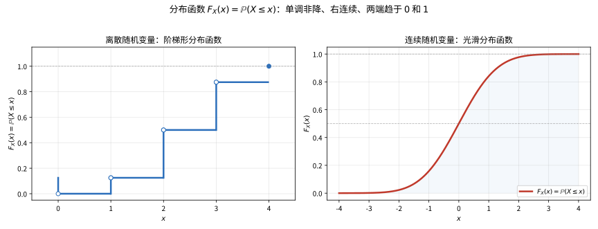
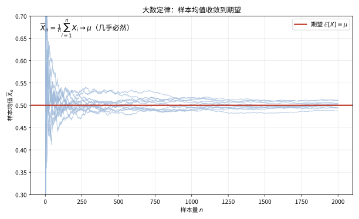

# 第 98 级：测度论与概率论 (Measure Theory and Probability)

---

## 1. 学习目标

完成本教程后，你将能够：

1. 理解测度空间的基本结构（可测空间、测度、完备化）
2. 掌握可测函数的定义与性质，熟悉几乎处处收敛、依测度收敛等收敛模式
3. 理解 Lebesgue 积分的定义与基本性质，掌握三大收敛定理
4. 掌握 Lᵖ 空间的结构与性质
5. 理解乘积测度与 Fubini 定理的应用
6. 掌握 Radon-Nikodym 导数与条件期望的严格理论
7. 理解概率论的公理化基础，掌握特征函数方法
8. 掌握大数定律与中心极限定理的严格证明
9. 了解 Wiener 过程的构造与基本性质

---

## 2. 核心概念

### 2.1 测度空间

**σ-代数**：设 $\Omega$ 为非空集合，$\mathcal{F}$ 是 $\Omega$ 的子集族。若 $\mathcal{F}$ 满足：
1. $\Omega \in \mathcal{F}$
2. 若 $A \in \mathcal{F}$，则 $A^c \in \mathcal{F}$
3. 若 $\{A_n\}_{n=1}^\infty \subset \mathcal{F}$，则 $\bigcup_{n=1}^\infty A_n \in \mathcal{F}$

则称 $\mathcal{F}$ 为 $\Omega$ 上的一个 **σ-代数**，$(\Omega, \mathcal{F})$ 称为 **可测空间**。

**Borel σ-代数**：$\mathbb{R}^d$ 上由所有开集生成的 σ-代数称为 **Borel σ-代数**，记作 $\mathcal{B}(\mathbb{R}^d)$。其元素称为 Borel 集。

**测度**：设 $(\Omega, \mathcal{F})$ 为可测空间，函数 $\mu: \mathcal{F} \to [0, \infty]$ 称为 **测度**，若满足：
1. $\mu(\emptyset) = 0$
2. **σ-可加性**：对任意互不相交的 $\{A_n\}_{n=1}^\infty \subset \mathcal{F}$，有 $\mu\left(\bigcup_{n=1}^\infty A_n\right) = \sum_{n=1}^\infty \mu(A_n)$

三元组 $(\Omega, \mathcal{F}, \mu)$ 称为 **测度空间**。

**完备测度**：若 $\mu(A) = 0$ 蕴含 $A$ 的所有子集都属于 $\mathcal{F}$，则称 $(\Omega, \mathcal{F}, \mu)$ 是完备的。任何测度空间都可以通过添加零测集的所有子集来完备化。

**Lebesgue 测度**：$\mathbb{R}^d$ 上存在唯一的平移不变的测度 $m$，使得 $m([0,1]^d) = 1$，称为 Lebesgue 测度。它在 Borel σ-代数上定义，并可以完备化到 Lebesgue σ-代数。

> **💡 直观理解（类比）**：σ-代数像"给整个宇宙盖的'可称重'箱笼清单"——它列好哪些集合够格被量出大小（可测集），规定空集和全集都能量、补集要量、可数个并起来也要能量。测度则是"那杆专门给这些箱笼称重的秤"：空集重0，互不相交的几箱'铿锵一摞'总重等于各箱之和（σ-可加性）。完备化好比"秤一旦认定某箱重量为0，它里面再细分的所有小格都自动算可测且为0"。$\mathbb{R}^d$ 上的 Lebesgue 测度就是那把'把区间长度推广到最古怪集合'的超大秤：平移不变、单位正方体重1，是概率论里一切"体积感"的最终靠山。

### 2.2 可测函数

**可测函数**：设 $(\Omega, \mathcal{F})$ 为可测空间，函数 $f: \Omega \to \mathbb{R}$ 称为 **可测函数**，若对任意 $a \in \mathbb{R}$，有 $\{\omega: f(\omega) > a\} \in \mathcal{F}$。

**简单函数**：形如 $f(\omega) = \sum_{i=1}^n a_i \mathbf{1}_{A_i}(\omega)$ 的函数，其中 $A_i \in \mathcal{F}$ 互不相交，称为 **简单函数**。任何非负可测函数都可以表示为单调递增的简单函数列的极限。

**几乎处处收敛**：称 $f_n \to f$ **几乎处处**（a.e.），若存在零测集 $N$ 使得对任意 $\omega \notin N$，有 $f_n(\omega) \to f(\omega)$。

**依测度收敛**：称 $f_n$ **依测度收敛**于 $f$，若对任意 $\varepsilon > 0$，有 $\mu(\{|f_n - f| > \varepsilon\}) \to 0$。

> **💡 直观理解（类比）**：可测函数像"领了合格证、允许进商场称重结算的商品"——只要每个"取值超过 $a$ 的货架"（上水平集 $\{f>a\}$）都属于可测家族，这函数就够格定义积分，不必奢求它连续光滑。简单函数则是"阶梯定价器"：一块块平铺不同高度的台阶，虽简陋却能砌出任何非负可测函数。两种收敛模式也各有性格：几乎处处收敛是"除了一小撮犟驴，其余都在死磕到底"；依测度收敛则是"耍赖不叠的概率区越来越瘦"——前者盯个别点，后者盯整体面子，二者常可互相抢救出子列。

### 2.3 Lebesgue 积分

**Lebesgue 积分的定义**：分三步定义：

1. **非负简单函数**：若 $f = \sum_{i=1}^n a_i \mathbf{1}_{A_i}$，则 $\int f \, d\mu = \sum_{i=1}^n a_i \mu(A_i)$
2. **非负可测函数**：$\int f \, d\mu = \sup\left\{\int g \, d\mu: 0 \le g \le f, g \text{ 为简单函数}\right\}$
3. **一般可测函数**：将 $f$ 分解为 $f = f^+ - f^-$，其中 $f^+ = \max(f, 0)$，$f^- = \max(-f, 0)$，若 $\int f^+ \, d\mu < \infty$ 且 $\int f^- \, d\mu < \infty$，则称 $f$ **可积**，定义 $\int f \, d\mu = \int f^+ \, d\mu - \int f^- \, d\mu$。

> **💡 直观理解（类比）**：Lebesgue积分像"按商品价值分档，数清每一档的量再乘单价求和"，而不是Riemann那样"沿横轴横切定义域、指望函数在小格子里听话"。第三步那招 $f^+-f^-$ 更是决死分工：把函数劈成正部、负部两拨账，分别算清'赚了多少钱''赔了多少钱'，只要两本账都结得清（积分有限）才允许扣账得到净额——这正是"可积"的门槛：既不许赚得上天，也不许亏得没底。

### 2.4 Lᵖ 空间

对 $1 \le p < \infty$，定义：

$$
\|f\|_p = \left(\int |f|^p \, d\mu\right)^{1/p}
$$

**Lᵖ 空间**：$L^p(\mu) = \{f \text{ 可测}: \|f\|_p < \infty\}$，其中几乎处处相等的函数视为同一等价类。

**L^∞ 空间**：$\|f\|_\infty = \text{ess sup} |f| = \inf\{M: \mu(|f| > M) = 0\}$。

**重要不等式**：
- **Hölder 不等式**：若 $1/p + 1/q = 1$，则 $\int |fg| \, d\mu \le \|f\|_p \|g\|_q$
- **Minkowski 不等式**：$\|f + g\|_p \le \|f\|_p + \|g\|_p$

> **💡 直观理解（类比）**：Lᵖ 空间像"给所有函数按'体重'分类的体育馆会员册"——$\|f\|_p$ 是 $f$ 在 $p$ 频率下的总能量读数，凡能量有限的都进得来（p=1 是'身材匀称'、p=2 是'能量平方'、p=∞ 是'只看最胖的峰值'）。两员大将各司其职：Hölder不等式如同"配对法则——一个在波峰、另一个在波谷的双打，乘积总能量不大于两人各自能量之积"，是Hilbert空间里所有内积估价的根基；Minkowski不等式则像"共乘一辆车的总负重不超过每人负重之和"（三角不等式），正是$\|\cdot\|_p$配得上叫"范数"、从而有距离、能谈收敛的关键前提。

### 2.5 乘积测度与 Fubini 定理

**乘积测度**：设 $(\Omega_1, \mathcal{F}_1, \mu_1)$ 和 $(\Omega_2, \mathcal{F}_2, \mu_2)$ 为 σ-有限的测度空间。在 $\Omega_1 \times \Omega_2$ 上定义乘积 σ-代数 $\mathcal{F}_1 \otimes \mathcal{F}_2$，存在唯一的测度 $\mu_1 \times \mu_2$ 满足 $(\mu_1 \times \mu_2)(A \times B) = \mu_1(A)\mu_2(B)$，称为 **乘积测度**。

> **💡 直观理解（类比）**：乘积测度像"把两个独立的'秤盘'拼成一张大货架并约定面积规则"——矩形 $A\times B$ 的面积就是长乘宽 $\mu_1(A)\mu_2(B)$，周长总区域再按这块"拼图的基本约定"唯一摊平展开。这正是概率里"独立两个随机量搭成联合分布"的测度语言：$X\perp Y$ 时联合分布就是边际乘积。搭配Fubini定理（后文），它保证"先按横行积分再按竖列积分，换顺序记账结果一样"——就像双人合算一张大账单，先横后竖都得同一笔总数，前提是货架别太巨大到爆表（σ-有限）。

### 2.6 Radon-Nikodym 导数

**绝对连续**：设 $\nu$ 和 $\mu$ 是 $(\Omega, \mathcal{F})$ 上的测度，若 $\mu(A) = 0$ 蕴含 $\nu(A) = 0$，则称 $\nu$ 关于 $\mu$ **绝对连续**，记作 $\nu \ll \mu$。

如果 $\nu \ll \mu$ 且 $\mu$ 是 σ-有限的，则存在可测函数 $f$ 使得 $\nu(A) = \int_A f \, d\mu$ 对所有 $A \in \mathcal{F}$ 成立，记作 $f = \frac{d\nu}{d\mu}$，称为 **Radon-Nikodym 导数**。

> **💡 直观理解（类比）**：Radon-Nikodym导数像"把一把调不准的秤 $\nu$ 校准成'相对另一把秤 $\mu$ 的密度分布图'"——若 $\mu$ 认为重量为零的区域 $\nu$ 也必然认为是零（绝对连续 $\nu\ll\mu$），那么 $\nu(A)$ 就能算成"用 $\mu$ 当基尺、逐点乘上一块不均匀的倍率 $f=\frac{d\nu}{d\mu}$ 再累加"。好比温度感知：别再整段问'总热量'，而是问'每处有多少'。这杆'逐点倍率'正是条件期望的坯胎——把"在子 σ-代数下老先知一半信息"藏进这枚密度函数里。

### 2.7 条件期望

**条件期望**：设 $(\Omega, \mathcal{F}, \mathbb{P})$ 为概率空间，$X$ 为可积随机变量，$\mathcal{G} \subset \mathcal{F}$ 为子 σ-代数。**条件期望** $\mathbb{E}[X \mid \mathcal{G}]$ 是满足以下两个条件的 $\mathcal{G}$-可测随机变量 $Y$：
1. $Y$ 是 $\mathcal{G}$-可测的
2. 对所有 $A \in \mathcal{G}$，$\int_A Y \, d\mathbb{P} = \int_A X \, d\mathbb{P}$

> **💡 直观理解（类比）**：条件期望像"只拿到子 σ-代数 $\mathcal{G}$ 这一摞有限线索时，对新随机量 $X$ 打出的最优预测"——它要求 $Y$ 只用 $\mathcal{G}$ 里的信息就能定下来（可测），但凡是 $\mathcal{G}$ 里能翻到的任意一块区域 $A$，$Y$ 和 $X$ 在上面累计的总量必须分毫不差（积分一致）。好比只瞄到"红绿灯、楼层、时段"这些粗信息就下注平均身高的脑补，无论从哪块已知区域对账都对得上，稳稳做出一张不许拆穿的'基于已知情报的平均成绩单'。

### 2.8 概率测度与随机变量

**概率测度**：若 $\mathbb{P}(\Omega) = 1$，则称 $\mathbb{P}$ 为 **概率测度**，$(\Omega, \mathcal{F}, \mathbb{P})$ 称为 **概率空间**。

**随机变量**：可测函数 $X: \Omega \to \mathbb{R}$ 称为 **随机变量**。其 **分布函数** 定义为 $F_X(x) = \mathbb{P}(X \le x)$。

**分布函数**的性质：
1. $F$ 是单调非降的：$x < y \Rightarrow F(x) \le F(y)$
2. $\lim_{x \to -\infty} F(x) = 0$，$\lim_{x \to \infty} F(x) = 1$
3. $F$ 是右连续的：$\lim_{y \to x^+} F(y) = F(x)$

> **直观理解（现实类比）**：分布函数就像"人口累计统计图"——横轴是身高或收入，曲线告诉你"小于等于这个值的人占多大比例"。离散情形（如掷硬币）曲线是阶梯状跳动，连续情形（如身高）则是平缓上升的曲线。无论哪种，曲线都从 $0$ 升到 $1$，且只会向右上方爬升、绝不回头。

> **🧠 思考历程：要把"概率"变成像长度一样能丈量的量，谈何容易？**
>
> 分布函数把这句话又细细推敲了一遍：无论这个分布的"形状"多古怪，我都能用"小于等于 $x$ 的概率有多大"这条从0升到1的曲线把它概括下来。这条平凡到近乎平庸的定义背后，其实藏着数学为了收编"无穷"而爆发的一场革命。
>
> - **长度撑不下的集合**。19世纪末，能"丈量"的只是区间长度，面对越来越古怪的点集，黎曼积分常常失灵；鲍莱尔（Émile Borel）与勒贝格（Henri Lebesgue）在1898–1902年间重构"可测集"与"可测函数"，第一次给"体积"一个真正通用的身份。
> - **给概率一座公理化家园**。此前的概率论多靠"频率"这种软解释，连基本极限结论都说不利索。1933年柯尔莫哥洛夫（Kolmogorov）把概率定义为满足三条公理的规范测度，用勒贝格测度统一了离散与连续——"分布函数"也顺理成章地成为概率在实轴上的存档方式。
> - **定义铺路，极限承载**。有了测度，随机变量成了保持可测性的函数，期望成了勒贝格积分，大小数定律与中心极限定理才有了严谨的证明土壤——概率论从此是分析学的一门分支，而不再是一堆技巧。
> - **心路**：为一个看似自明的概念较真，往往是为了让更宏大的结论站得稳——可测性的那一毫米较真，换来了整座现代概率的建筑。

### 2.9 特征函数

随机变量 $X$ 的 **特征函数** 定义为：

$$
\varphi_X(t) = \mathbb{E}[e^{itX}] = \int e^{itx} \, dF_X(x), \quad t \in \mathbb{R}
$$

特征函数具有以下重要性质：
1. $\varphi_X(0) = 1$，$|\varphi_X(t)| \le 1$
2. $\varphi_X$ 在 $\mathbb{R}$ 上一致连续
3. 若 $\mathbb{E}[|X|^k] < \infty$，则 $\varphi_X$ 在 $0$ 处 $k$ 次可微，且 $\varphi_X^{(k)}(0) = i^k \mathbb{E}[X^k]$
4. **唯一性**：特征函数唯一确定分布函数
5. **连续性**：若 $\varphi_{X_n}(t) \to \varphi_X(t)$ 对每个 $t$ 成立，且 $\varphi_X$ 在 $0$ 处连续，则 $X_n$ 依分布收敛于 $X$

> **💡 直观理解（类比）**：特征函数像"给随机变量拍的全频段'指纹照'"——$t$ 是频率旋钮，$\varphi_X(t)=\mathbb{E}[e^{itX}]$ 是这部产物 $X$ 在这个频率下的震动响应。它比分布函数更"好咬"：独立和的特征函数是对应乘积（$e^{it(X+Y)}=e^{itX}e^{itY}$），一次就能把卷积转成乘法。两条杀手级性质——唯一性说"指纹一样就同一人"（唯一确定分布），连续性定理说"指纹越拍越近似，则人也越近似"（逐点收敛推依分布收敛）——正是大数定律与中心极限定理里"只看特征函数不放分布"就能定乾坤的依仗。

### 2.10 Wiener 过程

**标准 Wiener 过程**（Brownian 运动）$\{W_t\}_{t \ge 0}$ 是满足以下条件的随机过程：
1. $W_0 = 0$ a.s.
2. 轨道 $t \mapsto W_t$ 几乎处处连续
3. 独立增量：对 $0 \le s < t$，$W_t - W_s$ 与 $\mathcal{F}_s$ 独立
4. 正态增量：$W_t - W_s \sim N(0, t-s)$

> **💡 直观理解（类比）**：Wiener过程像"被亿万个看不见的小手随机轻推、在一盆水里游成一团乱线的花粉"——起点是原点、路径几乎处处连续（没跳楼），但每一小步都自成独立一轮骰、且呈方差正比于时间步长的正态抖动。测度论为它盖的厂房是"构造一族同时满足这四条的一致性随机变量"：它正是概率公理化之后，把'连续性+独立增量+正态增量'铸造成一台铁律随机引擎的杰作，也是后续Itô积分、SDE、随机分析的起跑线。

---

## 3. 定理与证明

### 定理 3.1：单调收敛定理 (Monotone Convergence Theorem)

**定理**：设 $(\Omega, \mathcal{F}, \mu)$ 为测度空间，$\{f_n\}$ 为非负可测函数列，且 $f_n \uparrow f$（即 $0 \le f_1 \le f_2 \le \cdots$ 且 $\lim_{n \to \infty} f_n(\omega) = f(\omega)$ 对几乎所有 $\omega$ 成立）。则：

$$
\lim_{n \to \infty} \int f_n \, d\mu = \int f \, d\mu
$$

**证明**：

**步骤1：单调性**

由 $f_n \le f_{n+1} \le f$，对任意 $n$ 有 $\int f_n \, d\mu \le \int f_{n+1} \, d\mu \le \int f \, d\mu$。因此 $\lim_{n \to \infty} \int f_n \, d\mu$ 存在且不超过 $\int f \, d\mu$。记 $L = \lim_{n \to \infty} \int f_n \, d\mu$，则 $L \le \int f \, d\mu$。

**步骤2：反向不等式**

要证明 $\int f \, d\mu \le L$，根据积分的定义，只需证明对任意满足 $0 \le g \le f$ 的简单函数 $g$ 和任意 $0 < c < 1$，有 $c \int g \, d\mu \le L$。

**步骤3：构造逼近集**

设 $g$ 为简单函数 $0 \le g \le f$，$0 < c < 1$。定义：

$$
E_n = \{\omega: f_n(\omega) \ge c g(\omega)\}
$$

由 $f_n \uparrow f$ 可知 $\{E_n\}$ 是递增的集合列，且 $\bigcup_{n=1}^\infty E_n = \Omega$（除零测集外）。

**步骤4：在 $E_n$ 上估计积分**

对每个 $n$，有 $f_n \ge c g$ 在 $E_n$ 上成立，因此：

$$
\int f_n \, d\mu \ge \int_{E_n} f_n \, d\mu \ge c \int_{E_n} g \, d\mu
$$

**步骤5：利用测度的连续性**

由于 $g$ 是简单函数，可设 $g = \sum_{i=1}^m a_i \mathbf{1}_{A_i}$，其中 $A_i$ 互不相交。则：

$$
\int_{E_n} g \, d\mu = \sum_{i=1}^m a_i \mu(A_i \cap E_n)
$$

由测度的从下方连续性（因为 $E_n \uparrow \Omega$），有 $\mu(A_i \cap E_n) \to \mu(A_i)$。因此：

$$
\lim_{n \to \infty} \int_{E_n} g \, d\mu = \int g \, d\mu
$$

**步骤6：取极限**

对 $\int f_n \, d\mu \ge c \int_{E_n} g \, d\mu$ 两边取极限得：

$$
L = \lim_{n \to \infty} \int f_n \, d\mu \ge c \lim_{n \to \infty} \int_{E_n} g \, d\mu = c \int g \, d\mu
$$

由于 $c \in (0,1)$ 是任意的，令 $c \to 1$ 得 $L \ge \int g \, d\mu$。再对 $g \le f$ 取上确界得 $L \ge \int f \, d\mu$。

**步骤7：结论**

综合步骤1和步骤6，有 $\int f \, d\mu \le L \le \int f \, d\mu$，故 $L = \int f \, d\mu$。$\square$

> **💡 直观理解（类比）**：单调收敛定理像"盖楼时只要每层只加砖不倒楼，顶层总高度就是平时一层层累计的高度"——函数列 $f_n$ 一层层垒高（$f_n\uparrow f$），每一步攒下的积分都算数、只增不减；说极限积分等于积分极限，等于保证"最后那栋楼的封顶总方量，等于每层方量一路加到底的总和"，绝不会因为塔尖无穷而偷工减料。直觉上人尽皆知，难的是那一步反向不等式：为了补上'高频越级逼近'，得靠简单函数 $g$ 压出 $c<1$ 的一档油门（$E_n=\{f_n\ge cg\}$）慢慢顶到位，再用测度的下方连续性把这口气顺到底——防的正是"极限过后积分偷偷缩水"的幺蛾子。

---

### 定理 3.2：Fatou 引理 (Fatou's Lemma)

**定理**：设 $\{f_n\}$ 为非负可测函数列，则：

$$
\int \liminf_{n \to \infty} f_n \, d\mu \le \liminf_{n \to \infty} \int f_n \, d\mu
$$

**证明**：

**步骤1：构造单调递增序列**

令 $g_n = \inf_{k \ge n} f_k$。则 $\{g_n\}$ 是非负可测函数列，且 $g_n \uparrow \liminf_{n \to \infty} f_n$。

由定义，$g_n \le f_k$ 对所有 $k \ge n$ 成立，因此：

$$
\int g_n \, d\mu \le \int f_k \, d\mu, \quad \forall k \ge n
$$

**步骤2：取下确界**

对 $k \ge n$ 取下确界得：

$$
\int g_n \, d\mu \le \inf_{k \ge n} \int f_k \, d\mu
$$

**步骤3：应用单调收敛定理**

由于 $g_n \uparrow \liminf f_n$，由单调收敛定理：

$$
\int \liminf_{n \to \infty} f_n \, d\mu = \lim_{n \to \infty} \int g_n \, d\mu
$$

**步骤4：取极限**

结合步骤2和步骤3：

$$
\int \liminf_{n \to \infty} f_n \, d\mu = \lim_{n \to \infty} \int g_n \, d\mu \le \lim_{n \to \infty} \inf_{k \ge n} \int f_k \, d\mu = \liminf_{n \to \infty} \int f_n \, d\mu
$$

$\square$

> **💡 直观理解（类比）**：Fatou引理像"水库夜间的闸口账本只许漏、不许回落"——逐点下极限对应'最下限那批水的底线'，积分之下它顶多不超过积分们的下极限，方向是往下压的不等式 $\le$。要读懂它，关键是把 $g_n=\inf_{k\ge n}f_k$ 看作"从第 $n$ 集往后所有低谷私下藏的那笔下限"，并对这笔单调递增的下限序列援引单调收敛定理。直觉类比：一群人越看越低矮，平均身高被这次'轮回拼命往下探底'拖住，最多被整体平均数兜住；没有更强假设（如控制、单调）时，极限与积分可真会'走位'错开，所以Fatou给的永远只是一句方向明确的'保底'。

---

### 定理 3.3：控制收敛定理 (Dominated Convergence Theorem)

**定理**：设 $\{f_n\}$ 为可测函数列，$f_n \to f$ 几乎处处，且存在可积函数 $g$ 使得 $|f_n| \le g$ 对所有 $n$ 几乎处处成立（$g$ 称为控制函数）。则 $f$ 可积且：

$$
\lim_{n \to \infty} \int |f_n - f| \, d\mu = 0
$$

特别地，$\lim_{n \to \infty} \int f_n \, d\mu = \int f \, d\mu$。

**证明**：

**步骤1：$f$ 的可积性**

由 $f_n \to f$ a.e. 和 $|f_n| \le g$，得 $|f| \le g$ a.e.。因此 $|f|$ 以可积函数 $g$ 为上界，故 $f$ 可积。

**步骤2：构造辅助函数**

令 $h_n = 2g - |f_n - f|$。则 $h_n \ge 0$（因为 $|f_n - f| \le |f_n| + |f| \le 2g$）。

由 $f_n \to f$ a.e.，得 $h_n \to 2g$ a.e.。

**步骤3：应用 Fatou 引理**

对 $h_n$ 应用 Fatou 引理：

$$
\int \liminf_{n \to \infty} h_n \, d\mu \le \liminf_{n \to \infty} \int h_n \, d\mu
$$

左边为 $\int 2g \, d\mu$。右边为：

$$
\liminf_{n \to \infty} \int (2g - |f_n - f|) \, d\mu = \int 2g \, d\mu + \liminf_{n \to \infty} \left(-\int |f_n - f| \, d\mu\right)
$$

**步骤4：整理不等式**

代入得：

$$
\int 2g \, d\mu \le \int 2g \, d\mu + \liminf_{n \to \infty} \left(-\int |f_n - f| \, d\mu\right)
$$

即：

$$
0 \le \liminf_{n \to \infty} \left(-\int |f_n - f| \, d\mu\right) = -\limsup_{n \to \infty} \int |f_n - f| \, d\mu
$$

**步骤5：结论**

因此 $\limsup_{n \to \infty} \int |f_n - f| \, d\mu \le 0$。由于 $\int |f_n - f| \, d\mu \ge 0$，故 $\lim_{n \to \infty} \int |f_n - f| \, d\mu = 0$。

由 $|\int f_n \, d\mu - \int f \, d\mu| \le \int |f_n - f| \, d\mu \to 0$，得 $\int f_n \, d\mu \to \int f \, d\mu$。$\square$

> **💡 直观理解（类比）**：控制收敛定理像"给一群上蹿下跳的选手统一套上一条可积的'安全带' $g$，防止有人跑到无穷远处撒野"——只要每只函数都被这条能卖钱（可积）的绳子拴住（$|f_n|\le g$），又几乎处处爬到目标 $f$，那积分就能放心地穿越极限：$\int f_n\to\int f$，甚至更强地 $\int|f_n-f|\to0$。证明的妙处全在一句反怪招：对非负的 $h_n=2g-|f_n-f|$ 反手用Fatou，把'距离'的技巧硬拗成'上下界夹住'，从而把 $\int|f_n-f|$ 那点不肯低头的小尾巴也一并掰弯归零——既然整支队伍被同一根有尽头的绳拴住，多绕一截也无处可逃。

---

### 定理 3.4：Radon-Nikodym 定理 (Radon-Nikodym Theorem)

**定理**：设 $\mu$ 和 $\nu$ 是 $(\Omega, \mathcal{F})$ 上的 σ-有限测度，且 $\nu \ll \mu$（即 $\nu$ 关于 $\mu$ 绝对连续）。则存在一个可测函数 $f \ge 0$，使得对任意 $A \in \mathcal{F}$，有：

$$
\nu(A) = \int_A f \, d\mu
$$

函数 $f$ 在 $\mu$-几乎处处意义下唯一，记作 $f = \frac{d\nu}{d\mu}$，称为 Radon-Nikodym 导数。

**证明**（使用 $L^2$ 空间方法，假设 $\mu$ 和 $\nu$ 是有限测度）：

**步骤1：构造 Hilbert 空间**

考虑 $L^2(\mu + \nu)$，即关于测度 $\rho = \mu + \nu$ 的平方可积函数空间。这是一个 Hilbert 空间，内积为 $\langle f, g \rangle = \int fg \, d(\mu + \nu)$。

**步骤2：定义线性泛函**

定义线性泛函 $\Phi: L^2(\mu + \nu) \to \mathbb{R}$ 为：

$$
\Phi(g) = \int g \, d\nu
$$

由于 $\nu \le \mu + \nu$，由 Cauchy-Schwarz 不等式：

$$
|\Phi(g)| \le \int |g| \, d\nu \le \int |g| \, d(\mu + \nu) \le \sqrt{(\mu + \nu)(\Omega)} \|g\|_{L^2(\mu + \nu)}
$$

因此 $\Phi$ 是 $L^2(\mu + \nu)$ 上的有界线性泛函。

**步骤3：应用 Riesz 表示定理**

由 Riesz 表示定理，存在唯一的 $h \in L^2(\mu + \nu)$ 使得：

$$
\Phi(g) = \int g \, d\nu = \int g h \, d(\mu + \nu), \quad \forall g \in L^2(\mu + \nu)
$$

即：

$$
\int g \, d\nu = \int g h \, d\mu + \int g h \, d\nu
$$

整理得：

$$
\int g (1 - h) \, d\nu = \int g h \, d\mu, \quad \forall g \in L^2(\mu + \nu)
$$

**步骤4：分析 $h$ 的性质**

我们证明 $0 \le h \le 1$ $\mu + \nu$-a.e.。

取 $g = \mathbf{1}_{\{h < 0\}}$，则左边 $\ge 0$，右边 $\le 0$，因此两边均为 0，故 $h \ge 0$ a.e.。

取 $g = \mathbf{1}_{\{h > 1\}}$，则右边 $\ge \int_{\{h > 1\}} h \, d\mu \ge 0$，左边 $= \int_{\{h > 1\}} (1 - h) \, d\nu \le 0$，因此必须有 $\mu(\{h > 1\}) = 0$ 且 $\nu(\{h > 1\}) = 0$，故 $h \le 1$ a.e.。

**步骤5：处理 $h = 1$ 的情况**

令 $A = \{h = 1\}$。在 $A$ 上，对任意 $g$ 有 $\int_A g(1 - h) \, d\nu = 0$，而 $\int_A g h \, d\mu = \int_A g \, d\mu$。由 $g$ 的任意性，$\mu(A) = 0$。由 $\nu \ll \mu$，得 $\nu(A) = 0$。

**步骤6：构造 Radon-Nikodym 导数**

在 $\{h < 1\}$ 上，由 $1 - h > 0$，定义：

$$
f = \frac{h}{1 - h}
$$

由 $\int g (1 - h) \, d\nu = \int g h \, d\mu$ 取 $g = \mathbf{1}_B \cdot \frac{1}{1 - h}$（其中 $B \in \mathcal{F}$），得：

$$
\int_B \, d\nu = \int_B \frac{h}{1 - h} \, d\mu = \int_B f \, d\mu
$$

因此 $\nu(B) = \int_B f \, d\mu$ 对所有 $B \in \mathcal{F}$ 成立，$f = \frac{d\nu}{d\mu}$。

**步骤7：唯一性**

若 $f_1$ 和 $f_2$ 都满足条件，则 $\int_A (f_1 - f_2) \, d\mu = 0$ 对所有 $A \in \mathcal{F}$ 成立，故 $f_1 = f_2$ $\mu$-a.e.。

**步骤8：推广到 σ-有限情形**

将 $\Omega$ 分解为可数个互不相交的有限测度集，在每个集上应用上述结论，再拼接起来即可。$\square$

> **💡 直观理解（类比）**：Radon-Nikodym定理的证明像"借一把已知的公平大秤 $\mu$ 去测另一把秤 $\nu$ 在各处该配几倍增杠"——在 $L^2(\mu+\nu)$ 里定义一个取 $\nu$ 值的泛函 $\Phi(g)=\int g\,d\nu$，它像一条有界线性'测重指令'，再请Riesz表示定理派一位代表 $h$，把'对$g$称$\nu$重'翻译成'对$g$乘$h$再称$\mu+\nu$重'。接着竖起两堵墙：用试探函数 $\mathbf{1}_{\{h<0\}}$、$\mathbf{1}_{\{h>1\}}$ 把 $h$ 挤进 $[0,1]$，再把 $h=1$ 那层邪门区判成零测，于是切线 $f=\frac{h}{1-h}$ 稳稳登场，充当逐点倍率。归根结底：绝对连续 $\nu\ll\mu$ 才是这趟'逐点倍率'能成立的地基，缺了它倍率会爆炸。

---

### 定理 3.5：条件期望的存在唯一性

**定理**：设 $(\Omega, \mathcal{F}, \mathbb{P})$ 为概率空间，$X$ 为可积随机变量，$\mathcal{G} \subset \mathcal{F}$ 为子 σ-代数。则存在唯一的（在几乎处处意义下）$\mathcal{G}$-可测随机变量 $Y$ 满足：

1. $Y$ 是 $\mathcal{G}$-可测的
2. 对所有 $A \in \mathcal{G}$，$\int_A Y \, d\mathbb{P} = \int_A X \, d\mathbb{P}$

该 $Y$ 称为 $X$ 关于 $\mathcal{G}$ 的 **条件期望**，记作 $\mathbb{E}[X \mid \mathcal{G}]$。

**证明**：

**步骤1：考虑 $X \ge 0$ 的情形**

首先假设 $X \ge 0$。在 $(\Omega, \mathcal{G})$ 上定义测度：

$$
\nu(A) = \int_A X \, d\mathbb{P}, \quad A \in \mathcal{G}
$$

容易验证 $\nu$ 是 $(\Omega, \mathcal{G})$ 上的有限测度（因为 $\mathbb{E}[X] < \infty$）。显然 $\nu \ll \mathbb{P}|_\mathcal{G}$（即 $\nu$ 关于 $\mathbb{P}$ 在 $\mathcal{G}$ 上的限制绝对连续）。

**步骤2：应用 Radon-Nikodym 定理**

由 Radon-Nikodym 定理，存在 $\mathcal{G}$-可测函数 $Y \ge 0$，使得对任意 $A \in \mathcal{G}$：

$$
\nu(A) = \int_A Y \, d\mathbb{P}
$$

即 $\int_A X \, d\mathbb{P} = \int_A Y \, d\mathbb{P}$，$A \in \mathcal{G}$。这正是条件期望的定义。

**步骤3：一般可积函数的情形**

对一般的可积随机变量 $X$，分解为 $X = X^+ - X^-$，其中 $X^+ = \max(X, 0)$，$X^- = \max(-X, 0)$。由步骤2，分别存在 $\mathcal{G}$-可测函数 $Y_1$ 和 $Y_2$ 对应 $X^+$ 和 $X^-$。令 $Y = Y_1 - Y_2$，则 $Y$ 是 $\mathcal{G}$-可测的，且对任意 $A \in \mathcal{G}$：

$$
\int_A Y \, d\mathbb{P} = \int_A Y_1 \, d\mathbb{P} - \int_A Y_2 \, d\mathbb{P} = \int_A X^+ \, d\mathbb{P} - \int_A X^- \, d\mathbb{P} = \int_A X \, d\mathbb{P}
$$

**步骤4：唯一性**

若 $Y_1$ 和 $Y_2$ 都满足条件，则对任意 $A \in \mathcal{G}$，$\int_A (Y_1 - Y_2) \, d\mathbb{P} = 0$。取 $A = \{Y_1 - Y_2 > 0\} \in \mathcal{G}$，得 $\mathbb{P}(A) = 0$。同理可得 $\mathbb{P}(\{Y_1 - Y_2 < 0\}) = 0$，故 $Y_1 = Y_2$ a.s.。$\square$

> **💡 直观理解（类比）**：条件期望存在唯一性的证明，是Radon-Nikodym定理在概率舞台上的'首秀'——先替每个 $\mathcal{G}$-区域定一笔账 $\nu(A)=\int_A X\,d\mathbb{P}$，这笔账显然被原概率在 $\mathcal{G}$ 上的限制牵制（$\nu\ll\mathbb{P}|_\mathcal{G}$）：凡一处概率为零，累计的 $X$ 当然也为零。于是RN定理递出一位 $\mathcal{G}$-可测的'逐点倍率' $Y$，恰与 $X$ 在每块 $\mathcal{G}$ 区域上账目持平——这正是条件期望的严格出身。正负两半分开做、再拼起来处理一般可积 $X$；唯一性一眼看穿：两本账差 $Y_1-Y_2$ 若在任意可测集合上都积分为零，它连正处、负处的概率都只能是0，故 a.s. 相等。托生于公平秤底、可靠无比，这就是条件期望是'依据已见信息的最优猜测'的数学外壳。

---

### 定理 3.6：中心极限定理 (Central Limit Theorem)

**定理**：设 $\{X_n\}_{n=1}^\infty$ 为独立同分布的随机变量序列，$\mathbb{E}[X_1] = \mu$，$\text{Var}(X_1) = \sigma^2 \in (0, \infty)$。令 $S_n = \sum_{i=1}^n X_i$，则：

$$
\frac{S_n - n\mu}{\sigma\sqrt{n}} \xrightarrow{d} N(0, 1)
$$

即对任意 $x \in \mathbb{R}$，有：

$$
\lim_{n \to \infty} \mathbb{P}\left(\frac{S_n - n\mu}{\sigma\sqrt{n}} \le x\right) = \Phi(x) = \frac{1}{\sqrt{2\pi}} \int_{-\infty}^x e^{-t^2/2} \, dt
$$

**证明**（使用特征函数方法）：

**步骤1：标准化**

令 $Y_i = \frac{X_i - \mu}{\sigma}$，则 $\mathbb{E}[Y_i] = 0$，$\text{Var}(Y_i) = 1$。记 $Z_n = \frac{S_n - n\mu}{\sigma\sqrt{n}} = \frac{1}{\sqrt{n}} \sum_{i=1}^n Y_i$。

**步骤2：特征函数的展开**

设 $\varphi(t) = \mathbb{E}[e^{itY_1}]$ 为 $Y_1$ 的特征函数。由 $\mathbb{E}[Y_1] = 0$ 和 $\mathbb{E}[Y_1^2] = 1$，以及特征函数的可微性，在 $t = 0$ 附近有 Taylor 展开：

$$
\varphi(t) = 1 + \varphi'(0)t + \frac{\varphi''(0)}{2}t^2 + o(t^2) = 1 - \frac{t^2}{2} + o(t^2), \quad t \to 0
$$

其中 $\varphi'(0) = i\mathbb{E}[Y_1] = 0$，$\varphi''(0) = i^2 \mathbb{E}[Y_1^2] = -1$。

**步骤3：$Z_n$ 的特征函数**

由独立性，$Z_n$ 的特征函数为：

$$
\varphi_{Z_n}(t) = \mathbb{E}\left[e^{itZ_n}\right] = \mathbb{E}\left[\exp\left(\frac{it}{\sqrt{n}}\sum_{i=1}^n Y_i\right)\right] = \left[\varphi\left(\frac{t}{\sqrt{n}}\right)\right]^n
$$

**步骤4：取极限**

对固定的 $t$，当 $n \to \infty$ 时，$\frac{t}{\sqrt{n}} \to 0$，因此：

$$
\varphi\left(\frac{t}{\sqrt{n}}\right) = 1 - \frac{t^2}{2n} + o\left(\frac{1}{n}\right)
$$

取对数：

$$
\log \varphi_{Z_n}(t) = n \log\left(1 - \frac{t^2}{2n} + o\left(\frac{1}{n}\right)\right) = n\left(-\frac{t^2}{2n} + o\left(\frac{1}{n}\right)\right) \to -\frac{t^2}{2}
$$

**步骤5：结论**

因此 $\varphi_{Z_n}(t) \to e^{-t^2/2}$，这正是标准正态分布 $N(0,1)$ 的特征函数。由特征函数的连续性定理（Lévy 连续性定理），$Z_n$ 依分布收敛于 $N(0,1)$。$\square$

> **💡 直观理解（类比）**：中心极限定理像"一万个微小且彼此独立的影响者合力，最终把乱麻拧成一根标准正态曲线"——无论单步多古怪，归一化后的和 $Z_n=\frac{S_n-n\mu}{\sigma\sqrt n}$ 长相都收敛到 $e^{-t^2/2}$ 那口大钟。证明全靠特征函数这面透镜：先标准化让期望为0、方差为1，把单步特征函数在原点处Taylor展开成 $\varphi(t)=1-\frac{t^2}{2}+o(t^2)$（方差把平方阶的'峰'烙进系数）；再借独立性把 $n$ 次的卷积换成 $\left[\varphi(t/\sqrt n)\right]^n$，取对数一路化简直奔 $-\frac{t^2}{2}$——最后Lévy连续性定理喊话：特征函数都拼到标准钟了，分布也就乖乖登上去。看，只需转成'看特征函数'，极限定理就成了'算指数'的快活活计。

> **直观理解（现实类比）**：大数定律说的是"数据越多，平均值越靠谱"。就像多次抛硬币，抛 10 次正面比例可能波动很大，但抛 10000 次就会非常接近 $1/2$；或者像测量一件物品的误差，测量次数越多，取平均就越接近真实值。它把"概率"这个抽象概念落实为可观测的长期频率。

---

## 4. 示例

### 示例 1：用 Lebesgue 积分计算 Riemann 不可积函数的积分

**问题**：考虑 Dirichlet 函数 $f: [0,1] \to \mathbb{R}$：

$$
f(x) = \begin{cases}
1, & x \in \mathbb{Q} \cap [0,1] \\
0, & x \notin \mathbb{Q} \cap [0,1]
\end{cases}
$$

这个函数在 Riemann 意义下不可积（因为它在每一点都不连续），但在 Lebesgue 意义下可积。计算 $\int_{[0,1]} f \, dm$。

**解**：

**步骤1：分析 Riemann 不可积性**

对任意划分 $P = \{0 = x_0 < x_1 < \cdots < x_n = 1\}$，在每个子区间 $[x_{i-1}, x_i]$ 上，由于有理数和无理数都是稠密的，有：

$$
\sup_{x \in [x_{i-1}, x_i]} f(x) = 1, \quad \inf_{x \in [x_{i-1}, x_i]} f(x) = 0
$$

因此 Riemann 上和 $U(f, P) = 1$，Riemann 下和 $L(f, P) = 0$，$f$ Riemann 不可积。

**步骤2：Lebesgue 积分**

由于 $\mathbb{Q} \cap [0,1]$ 是可数集，其 Lebesgue 测度为零：

$$
m(\mathbb{Q} \cap [0,1]) = 0
$$

因此 $f$ 几乎处处等于 0。在 Lebesgue 积分理论中，几乎处处相等的函数视为相同，故：

$$
\int_{[0,1]} f \, dm = \int_{[0,1]} 0 \, dm = 0
$$

**步骤3：用定义验证**

将 $f$ 写为简单函数的形式：

$$
f = 1 \cdot \mathbf{1}_{\mathbb{Q} \cap [0,1]} + 0 \cdot \mathbf{1}_{[0,1] \setminus \mathbb{Q}}
$$

由简单函数积分的定义：

$$
\int_{[0,1]} f \, dm = 1 \cdot m(\mathbb{Q} \cap [0,1]) + 0 \cdot m([0,1] \setminus \mathbb{Q}) = 1 \cdot 0 + 0 \cdot 1 = 0
$$

**结论**：Lebesgue 积分能够处理 Riemann 积分无法处理的"病态"函数，这体现了测度论在处理奇异函数时的强大能力。

> **💡 直观理解（类比）**：示例 1 像"大片地方全是'空气'的函数，计量时只算真正占到的实体"——Dirichlet函数在有理点上取1、无理点上取0，可数的那撮有理点整体测度为零，于是按Lebesgue这把'准得离谱的秤'一称，积分 $=1\cdot m(\mathbb{Q}\cap[0,1])+0\cdot m(\text{其余})=0$。Riemann积分对它有劲儿使不上，是因为它在每个小区间都剧烈横跳（上下和分别是1和0），而Lebesgue积分不管你怎么病态，只按'值域分层×该层所占的比重'结算——比重为零的部分直接忽略，付账干脆利落。

---

### 示例 2：条件期望的计算

**问题**：设 $(\Omega, \mathcal{F}, \mathbb{P})$ 为概率空间，$X$ 和 $Y$ 是独立同分布的随机变量，服从 $[0,1]$ 上的均匀分布。考虑子 σ-代数 $\mathcal{G} = \sigma(X + Y)$（由 $X + Y$ 生成的 σ-代数）。计算 $\mathbb{E}[X \mid \mathcal{G}]$。

**解**：

**步骤1：问题分析**

我们需要找到 $\mathcal{G}$-可测的随机变量 $Z$，使得对任意 $A \in \mathcal{G}$，有 $\int_A Z \, d\mathbb{P} = \int_A X \, d\mathbb{P}$。

由于 $\mathcal{G} = \sigma(X + Y)$，由 Doob-Dynkin 引理，$\mathbb{E}[X \mid X+Y]$ 可以表示为 $X+Y$ 的可测函数，即存在 Borel 可测函数 $h$ 使得 $\mathbb{E}[X \mid X+Y] = h(X+Y)$。

**步骤2：利用对称性**

由于 $X$ 和 $Y$ 独立同分布，由对称性有：

$$
\mathbb{E}[X \mid X+Y] = \mathbb{E}[Y \mid X+Y]
$$

**步骤3：利用线性性质**

因此：

$$
\mathbb{E}[X \mid X+Y] + \mathbb{E}[Y \mid X+Y] = \mathbb{E}[X+Y \mid X+Y] = X+Y
$$

由对称性，$\mathbb{E}[X \mid X+Y] = \mathbb{E}[Y \mid X+Y]$，故：

$$
2 \mathbb{E}[X \mid X+Y] = X+Y
$$

**步骤4：结论**

因此：

$$
\mathbb{E}[X \mid X+Y] = \frac{X+Y}{2}
$$

**验证**：$\frac{X+Y}{2}$ 显然是 $\sigma(X+Y)$-可测的，且 $\mathbb{E}[\frac{X+Y}{2} \mid X+Y] = \frac{X+Y}{2}$，满足条件期望的定义。

> **💡 直观理解（类比）**：示例 2 像"被蒙住只看到'两人身高总和 $S$'，去猜其中一人身高的最佳答案是什么"——既然只知道总和，且两人来自同一条均匀分布（同分布），猜谁都一样（对称性 $\mathbb{E}[X\mid S]=\mathbb{E}[Y\mid S]$）；把两个猜测加起来必须恰好还原出已知总和 $S$，于是每人恰好分到一半：$\mathbb{E}[X\mid X+Y]=\frac{X+Y}{2}$。这正是条件期望在城市里的经典三连招：Doob-Dynkin告诉你能写成 $S$ 的函数，对称性直接'五五开'，线性性最后核账——一个无需算积分就能拿到的漂亮答案，也是"已知总和下手头信息量有限、只能雨露均沾"的直观写照。

---

## 5. 习题

### 基础题

**习题 1**（σ-代数与测度）写出σ-代数的三条公理；给出测度的σ-可加性定义，说明可测空间、测度空间的含义。

**习题 2**（Lebesgue积分的定义）分三步说明Lebesgue积分的定义：非负简单函数、非负可测函数、一般可测函数（通过 $f^+$、$f^-$ 分解）。

**习题 3**（概率空间与随机变量）给出概率测度的定义（$\mathbb{P}(\Omega)=1$）、随机变量（可测函数）与分布函数 $F_X(x)=\mathbb{P}(X\le x)$ 的定义，并列出分布函数的三条基本性质。

**习题 4**（Lebesgue可积性判定）设 $f(x)=x^{-1/2}$（$[0,1]$ 上）。证明 $f$ 关于Lebesgue测度可积，但 $f^2$ 不可积（提示：用单调收敛定理把 $\sum f_n$ 逐项积分，或直接算广义Riemann积分 $\int_0^1 x^{-1/2}dx$ 与 $\int_0^1 x^{-1}dx$）。

**习题 5**（Riemann与Lebesgue积分）设 $f:[0,1]\to\mathbb{R}$ 是Riemann可积函数。证明 $f$ 也是Lebesgue可积的且两种积分值相等（提示：用Riemann可积的Lebesgue准则：不连续点集为零测集，再用有界收敛定理）。

**习题 6**（控制收敛定理的强结论）设可测函数列 $f_n\to f$ a.e. 且存在可积 $g$ 使 $|f_n|\le g$。证明更强的结论 $\int|f_n-f|\,d\mu\to0$（提示：用Fatou引理处理 $2g-|f_n-f|$）。

**习题 7**（收敛定理的基本陈述）陈述单调收敛定理与Fatou引理：$f_n\uparrow f$ 非负时 $\lim\int f_n=\int f$；非负函数列有 $\int\liminf f_n\le\liminf\int f_n$。

**习题 8**（L$^p$ 收敛与控制）设 $1\le p<\infty$，$f_n\in L^p$，$f_n\to f$ a.e.，且存在 $g\in L^p$ 使 $|f_n|\le g$。证明 $\|f_n-f\|_p\to0$（提示：由 $|f_n-f|^p\le(2g)^p$ 应用控制收敛定理）。

**习题 9**（特征函数的基本性质）设 $\varphi$ 是随机变量 $X$ 的特征函数。证明 $|\varphi(t)|\le1$、$\varphi(-t)=\overline{\varphi(t)}$、$\varphi$ 在 $\mathbb{R}$ 上一致连续（提示：用 $|e^{itX}|=1$、共轭性质与 $|\varphi(t+h)-\varphi(t)|\le\mathbb{E}[|e^{ihX}-1|]$）。

**习题 10**（条件期望：指数分布）设 $X\sim\text{Exp}(\lambda)$、$Y\sim\text{Exp}(\mu)$ 独立，计算 $\mathbb{E}[X\mid X+Y]$（提示：先求 $X+Y$ 的密度，再用联合密度得到条件密度）。

### 进阶题

**习题 11**（单调收敛定理证明）简述单调收敛定理的证明要点：对简单函数 $g\le f$ 构 $E_n=\{f_n\ge cg\}$（$0<c<1$），用测度的下方连续性过渡极限。

**习题 12**（Fatou引理证明）设 $g_n=\inf_{k\ge n}f_k$，证明 $\int\liminf f_n\,d\mu\le\liminf\int f_n\,d\mu$，指出用到的关键步骤。

**习题 13**（控制收敛定理证明）用Fatou引理证明：$f_n\to f$ a.e. 且 $|f_n|\le g$（$g$ 可积）时 $\lim\int f_n\,d\mu=\int f\,d\mu$（提示：考虑 $2g-|f_n-f|\ge0$ 并对它取 $\liminf$）。

**习题 14**（Hölder不等式）对 $1/p+1/q=1$，推导 $\int|fg|\,d\mu\le\|f\|_p\|g\|_q$，说明等号条件。

**习题 15**（Radon-Nikodym定理的$L^2$方法概要）介绍RN定理证明的核心：在 $L^2(\mu+\nu)$ 上定义有界线性泛函 $\Phi(g)=\int g\,d\nu$，用Riesz表示定理得到 $h$，再构造 $f=h/(1-h)$。

**习题 16**（条件期望的塔性质）设 $\mathcal{H}\subset\mathcal{G}$ 为子σ-代数，证明 $\mathbb{E}[\mathbb{E}[X\mid\mathcal{G}]\mid\mathcal{H}]=\mathbb{E}[X\mid\mathcal{H}]$（提示：两边都是 $\mathcal{H}$-可测且在与 $\mathcal{H}$ 集的积分上一致）。

**习题 17**（特征函数与矩）由 $\varphi^{(k)}(0)=i^k\mathbb{E}[X^k]$ 说明特征函数如何表达矩；并说明"特征函数唯一确定分布"用于何种场合。

**习题 18**（中心极限定理的特征函数证明）设 $S_n=\sum X_i$，$\mathbb{E}[X_1]=\mu$，$\text{Var}(X_1)=\sigma^2$。说明如何用特征函数证 $\frac{S_n-n\mu}{\sigma\sqrt n}\xrightarrow{d}N(0,1)$（提示：标准化后 $\varphi(t)=1-\frac{t^2}{2}+o(t^2)$，$\varphi_{Z_n}\to e^{-t^2/2}$）。

**习题 19**（Fubini与乘积测度）设 $(\Omega_i,\mathcal{F}_i,\mu_i)$ 为σ-有限测度空间。陈述Fubini定理：对非负可测 $f$ 在 $\Omega_1\times\Omega_2$ 上，两次积分可交换顺序；并说明积分顺序交换的适用条件。

### 挑战题

**习题 20**（Radon-Nikodym定理完整证明）给出RN定理基于 $L^2(\mu+\nu)$ 的完整证明：定义 $\Phi$、证有界、用Riesz表示得 $h$，证 $0\le h\le1$ a.e.、$A=\{h=1\}$ 满足 $\mu(A)=\nu(A)=0$，构造 $f=h/(1-h)$ 并证唯一性。

**习题 21**（条件期望存在唯一性）设 $\nu(A)=\int_A X\,d\mathbb{P}$（$A\in\mathcal{G}$）。证明 $\nu\ll\mathbb{P}|_\mathcal{G}$，从而由RN定理得 $\mathcal{G}$-可测的 $\mathbb{E}[X\mid\mathcal{G}]$，并证明其几乎处处唯一。

**习题 22**（中心极限定理完整证明）完整写出CLT证明：标准化 $Y_i$、展开 $\varphi(t)=1-t^2/2+o(t^2)$、计算 $\varphi_{Z_n}=[\varphi(t/\sqrt n)]^n$、取对数到 $-\frac{t^2}{2}$，由Lévy连续性定理得依分布收敛。

**习题 23**（控制收敛定理的强结论证明）完整证明 $f_n\to f$ a.e.、$|f_n|\le g$（$g$ 可积）蕴含 $\int|f_n-f|\,d\mu\to0$：先证 $f$ 可积，再对 $2g-|f_n-f|$ 用Fatou得到 $\limsup\int|f_n-f|\le0$。

**习题 24**（$L^p$ 空间的收敛性）严格证明：$f_n\to f$ a.e. 且 $|f_n|\le g\in L^p$ 时 $\|f_n-f\|_p\to0$，其中关键不等式 $|f_n-f|^p\le(2g)^p$，并说明为何此时可对 $|f_n-f|^p$ 应用控制收敛定理。

**习题 25**（收敛定理的逻辑链）说明单调收敛定理 → Fatou引理 → 控制收敛定理的依赖关系：如何由MCT得到Fatou，又如何由Fatou得到DCT。

**习题 26**（依测度收敛与几乎处处收敛）用Borel-Cantelli引理证明Riesz定理：若 $f_n$ 依测度收敛于 $f$，则存在子列 $f_{n_k}$ 几乎处处收敛于 $f$。

### 探究题

**习题 27**（Lebesgue与Riemann积分）深入探究Lebesgue积分与Riemann积分的本质差别（"分割值域 vs 分割定义域"），说明何时二者一致、何时Lebesgue可积而Riemann不可积，并结合Dirichlet函数举例。

**习题 28**（条件期望与鞅）探究条件期望在鞅理论中的作用：说明鞅定义 $\mathbb{E}[M_t\mid\mathcal{F}_s]=M_s$ 正是条件期望性质的应用，并联系随机分析中滤波与信息流的概念。

**习题 29**（特征函数与极限定理）探究特征函数方法在大数定律、中心极限定理与依分布收敛证明中的核心地位，说明"特征函数唯一确定分布"与Lévy连续性定理的用处。

**习题 30**（测度论作为概率的基石）探究测度论如何为概率论提供公理化基础：概率=正则化测度、随机变量=可测函数、期望=Lebesgue积分、Wiener过程存在性对测度构造的依赖，并讨论概率空间的完备化。

---

## 6. 习题答案与解析

### 基础题答案

1. **σ-代数与测度** σ-代数的三条公理：① $\Omega\in\mathcal{F}$；② $A\in\mathcal{F}\Rightarrow A^c\in\mathcal{F}$；③ 可数并封闭 $\bigcup_n A_n\in\mathcal{F}$。测度 $\mu:\mathcal{F}\to[0,\infty]$ 满足 $\mu(\emptyset)=0$ 且σ-可加性 $\mu(\bigcup A_n)=\sum\mu(A_n)$（互不相交时）。$(X,\mathcal{F})$ 称可测空间，$(X,\mathcal{F},\mu)$ 称测度空间。

2. **Lebesgue积分的定义** ① 非负简单函数 $f=\sum a_i\mathbf1_{A_i}$：$\int f\,d\mu=\sum a_i\mu(A_i)$；② 非负可测函数：$\int f\,d\mu=\sup\{\int g\,d\mu:0\le g\le f,\,g\text{ 简单}\}$（任何非负可测函数是非负简单函数列单调递增极限）；③ 一般可测函数：拆 $f=f^+-f^-$，二者积分均有限时称可积，$\int f=\int f^+-\int f^-$。

3. **概率空间与随机变量** 概率测度要求 $\mathbb{P}(\Omega)=1$，$(\Omega,\mathcal{F},\mathbb{P})$ 称概率空间；随机变量即可测函数 $X:\Omega\to\mathbb{R}$；分布函数 $F_X(x)=\mathbb{P}(X\le x)$ 的三条性质：单调非降、$\lim_{x\to-\infty}F=0$ 且 $\lim_{x\to\infty}F=1$、右连续。

4. **Lebesgue可积性判定** $\int_0^1 x^{-1/2}dx=\lim_{n}\int x^{-1/2}\mathbf1_{[1/n,1]}dx=\lim[2x^{1/2}]_{1/n}^{1}=2$，故 $x^{-1/2}\in L^1[0,1]$（用MCT或广义Riemann积分）。而 $\int_0^1 (x^{-1/2})^2dx=\int_0^1 x^{-1}dx=\lim[\ln x]_{1/n}^{1}=+\infty$。因此 $f\in L^1$ 但 $f^2\notin L^1$，说明 $L^1$ 中的函数平方未必可积。

5. **Riemann与Lebesgue积分** 由Riemann可积的Lebesgue准则，$f$ 有界且不连续点集 $N$ 为零测集。取Riemann可积函数的简单函数列或阶梯函数列 $f_n$，其在每个连续点趋向 $f$，即 $f_n\to f$ a.e.；因 $f_n$ 一致有界（$|f_n|\le\|f\|_\infty$），由有界收敛定理 $\int f\,dm=\lim\int f_n dm$，而 $\int f_n dm$ 正是对应的Riemann和极限，故两种积分值相等。

6. **控制收敛定理的强结论** 令 $h_n=2g-|f_n-f|\ge0$，因 $|f_n-f|\le2g$。$f_n\to f$ a.e. 给出 $h_n\to2g$ a.e.。对 $h_n$ 用Fatou：$\int 2g\,d\mu\le\liminf\int(2g-|f_n-f|)d\mu=\int2g\,d\mu+\liminf(-\int|f_n-f|d\mu)$，消去 $\int2g$ 得 $0\le-\limsup\int|f_n-f|d\mu$，故 $\limsup\int|f_n-f|\le0$，而积分非负，故 $\int|f_n-f|\to0$。特别地 $\int f_n\to\int f$。

7. **收敛定理的基本陈述** 单调收敛定理：$0\le f_1\le f_2\le\cdots$ 且 $f_n\uparrow f$ 时 $\lim\int f_n\,d\mu=\int f\,d\mu$。Fatou引理：非负可测函数列满足 $\int\liminf f_nd\mu\le\liminf\int f_nd\mu$。两者都是"极限与积分交换"的充分条件，Fatou只有不等号。

8. **L$^p$ 收敛与控制** 由 $|f_n-f|^p\le(|f_n|+|f|)^p\le(2g)^p$（因 $|f_n|\le g$，$|f|\le g$ 于 $f_n\to f$ 与 $|f_n|\le g$ 推出）。$(2g)^p\in L^1$（因 $g\in L^p$），故对非负可测列 $|f_n-f|^p$ 应用控制收敛定理：$|f_n-f|^p\to0$ a.e.，故 $\int|f_n-f|^pd\mu\to0$，即 $\|f_n-f\|_p\to0$。

9. **特征函数的基本性质** $|\varphi(t)|=|\mathbb{E}[e^{itX}]|\le\mathbb{E}|e^{itX}|=1$。 $\varphi(-t)=\mathbb{E}[e^{-itX}]=\overline{\mathbb{E}[e^{itX}]}=\overline{\varphi(t)}$。一致连续：$|\varphi(t+h)-\varphi(t)|=|\mathbb{E}[e^{itX}(e^{ihX}-1)]|\le\mathbb{E}|e^{ihX}-1|\to0$（$h\to0$，由 $|e^{ihX}-1|\le2$ 与控制收敛定理取极限），与 $t$ 无关故一致连续。

10. **条件期望：指数分布** 联合密度 $f_{X,Y}(x,y)=\lambda e^{-\lambda x}\mu e^{-\mu y}$。给定 $X+Y=s$，条件密度 $f_{X|S}(x|s)\propto e^{-\lambda x}e^{-\mu(s-x)}=e^{-\mu s}e^{-(\lambda-\mu)x}$（$0<x<s$），故 $\mathbb{E}[X\mid S=s]=\frac{\int_0^s x e^{-(\lambda-\mu)x}dx}{\int_0^s e^{-(\lambda-\mu)x}dx}$。当 $\lambda=\mu$ 时由对称性 $\mathbb{E}[X\mid X+Y]=\frac{X+Y}{2}$（与该卷示例2的对称方法一致）。

### 进阶题答案

1. **单调收敛定理证明** 记 $L=\lim\int f_n$，由 $f_n\uparrow f$ 得 $L\le\int f$。反方向：对任简单函数 $0\le g\le f$ 与 $0<c<1$，令 $E_n=\{f_n\ge cg\}\uparrow\Omega$，则 $\int f_n\ge\int_{E_n}f_n\ge c\int_{E_n}g=c\sum a_i\mu(A_i\cap E_n)\to c\int g$（测度下方连续性），故 $L\ge c\int g$，令 $c\to1$、对 $g$ 取上确界得 $L\ge\int f$，故 $L=\int f$。

2. **Fatou引理证明** $g_n=\inf_{k\ge n}f_k$ 满足 $g_n\uparrow\liminf f_k$，且 $g_n\le f_k$（$k\ge n$）给出 $\int g_n\le\inf_{k\ge n}\int f_k\le\liminf\int f_k$（$n\to\infty$）。由MCT，$\int\liminf f_k=\lim\int g_n\le\liminf\int f_k$。关键是 $g_n$ 单调递增（可比），故可换极限与积分。

3. **控制收敛定理证明** 由 $|f_n|\le g$ 与 $f_n\to f$ a.e. 得 $|f|\le g$ a.e.，故 $f$ 可积。$h_n=2g-|f_n-f|\ge0$ 且 $h_n\to2g$ a.e.，Fatou：$\int2g\le\liminf\int h_n=\liminf\int(2g-|f_n-f|)=\int2g+\liminf(-\int|f_n-f|)$，得 $\limsup\int|f_n-f|\le0$，故 $\int|f_n-f|\to0$，从而 $|\int f_n-\int f|\le\int|f_n-f|\to0$。

4. **Hölder不等式** 由Young不等式 $\frac{|f|^p}{p\|f\|_p^p}+\frac{|g|^q}{q\|g\|_q^q}\ge\frac{|f||g|}{\|f\|_p\|g\|_q}$（两端同取对数后由 $uv\le u^p/p+v^q/q$），两边积分得 $\frac1p+\frac1q=1\ge\frac{\int|fg|}{\|f\|_p\|g\|_q}$，即 $\int|fg|\le\|f\|_p\|g\|_q$。等号当且仅当 $|f|^p$ 与 $|g|^q$ 成比例（Young取等条件）。

5. **Radon-Nikodym定理的$L^2$方法概要** 在 $L^2(\mu+\nu)$ 上 $\Phi(g)=\int g\,d\nu$ 为有界线性泛函（$\nu\le\mu+\nu$，Cauchy-Schwarz给出界），Riesz表示定理给唯一 $h$：$\int g\,d\nu=\int gh\,d(\mu+\nu)$。整理 $\int g(1-h)d\nu=\int gh\,d\mu$。由取 $g$ 为 $\mathbf1_{\{h<0\}}$、$\mathbf1_{\{h>1\}}$ 可证 $0\le h\le1$ a.e.；在 $\{h=1\}$ 上 $\int gh\,d\mu=\int g\,d\mu=0$ 故 $\mu(\{h=1\})=0$。于是 $1-h>0$ a.e.，定义 $f=h/(1-h)$，代入得 $\nu(B)=\int_B f d\mu$。

6. **条件期望的塔性质** 设 $Y_1=\mathbb{E}[X\mid\mathcal{G}]$、$Y_2=\mathbb{E}[Y_1\mid\mathcal{H}]$。$Y_2$ 是 $\mathcal{H}$-可测的。对任意 $A\in\mathcal{H}\subset\mathcal{G}$：$\int_A Y_2d\mathbb{P}=\int_A Y_1d\mathbb{P}$（$Y_2$ 的定义），且 $\int_A Y_1d\mathbb{P}=\int_A Xd\mathbb{P}=\int_A\mathbb{E}[X\mid\mathcal{H}]d\mathbb{P}$。故 $Y_2$ 满足 $\mathbb{E}[X\mid\mathcal{H}]$ 的两条性质，由（a.s.）唯一性 $\mathbb{E}[\mathbb{E}[X\mid\mathcal{G}]\mid\mathcal{H}]=\mathbb{E}[X\mid\mathcal{H}]$。

7. **特征函数与矩** 当 $\mathbb{E}|X|^k<\infty$ 时，可用控制收敛定理交换导数与期望，得 $\varphi^{(k)}(0)=i^k\mathbb{E}[X^k]$，故特征函数在零点的各阶导数给出各阶矩。又由"特征函数唯一确定分布"：两个分布若有相同特征函数则作为测度相等，可用于测度相等性的概率证明；配合Lévy连续性定理使依分布收敛转化为特征函数逐点收敛，是极限定理的核心工具。

8. **中心极限定理的特征函数证明** 标准化 $Y_i=(X_i-\mu)/\sigma$（$\mathbb{E}Y=0$，$\mathbb{E}Y^2=1$），$Z_n=\frac{1}{\sqrt n}\sum Y_i$。由独立性 $\varphi_{Z_n}(t)=[\varphi_Y(t/\sqrt n)]^n$。$\varphi_Y$ 在 $0$ 展开 $\varphi_Y(t/\sqrt n)=1-\frac{t^2}{2n}+o(1/n)$，取对数 $n\log(\cdot)\to-\frac{t^2}{2}$，故 $\varphi_{Z_n}(t)\to e^{-t^2/2}$（标准正态特征函数）。由Lévy连续性定理 $Z_n\xrightarrow{d}N(0,1)$。

9. **Fubini与乘积测度** 对σ-有限测度空间 $(\Omega_1,\mathcal{F}_1,\mu_1),(\Omega_2,\mathcal{F}_2,\mu_2)$，若 $f\ge0$ 是 $\mathcal{F}_1\otimes\mathcal{F}_2$-可测函数，则 $x\mapsto\int f(x,y)d\mu_2$ 可测且 $\int_{\Omega_1\times\Omega_2} f\,d(\mu_1\times\mu_2)=\int_{\Omega_1}(\int_{\Omega_2}f\,d\mu_2)d\mu_1=\int_{\Omega_2}(\int_{\Omega_1}f\,d\mu_1)d\mu_2$。对一般可积 $f$（$\int|f|d(\mu_1\times\mu_2)<\infty$）同样成立，即积分顺序可交换的适用条件是 $f\ge0$ 或 $f$ 绝对可积（Tonelli/Fubini）。

### 挑战题答案

1. **Radon-Nikodym定理完整证明** 设 $\rho=\mu+\nu$，在 $L^2(\rho)$ 上 $\Phi(g)=\int g\,d\nu$。有界性：$|\Phi(g)|\le\int|g|d\rho\le\sqrt{\rho(\Omega)}\|g\|_{L^2(\rho)}$。Riesz给 $h$：$\int g\,d\nu=\int gh\,d\rho$，即 $\int g(1-h)d\nu=\int gh\,d\mu$。取 $g=\mathbf1_{\{h<0\}}$：左 $\ge0$ 右 $\le0$，均0，故 $h\ge0$；取 $g=\mathbf1_{\{h>1\}}$：右 $\ge\int_{\{h>1\}}h\,d\mu\ge0$、左$\le0$，须 $\mu(\{h>1\})=0$ 且 $\nu(\{h>1\})=0$，故 $h\le1$。令 $A=\{h=1\}$，对 $g=\mathbf1_A$：$0=\int_A(1-h)d\nu=\int_A h\,d\mu=\mu(A)$，由 $\nu\ll\mu$ 得 $\nu(A)=0$。在 $\{h<1\}$ 上 $f=\frac{h}{1-h}$，取 $g=\mathbf1_B\frac1{1-h}$ 代入得 $\nu(B)=\int_B f\,d\mu$。唯一性：若 $\int_A(f_1-f_2)d\mu=0$ 对所有 $A$，则 $f_1=f_2$ a.e.。

2. **条件期望存在唯一性** 对 $X\ge0$，$\nu(A)=\int_A Xd\mathbb{P}$（$A\in\mathcal{G}$）是 $(\Omega,\mathcal{G})$ 上的有限测度，且 $\mathbb{P}|_\mathcal{G}(A)=0\Rightarrow\nu(A)=0$，即 $\nu\ll\mathbb{P}|_\mathcal{G}$。RN定理给 $\mathcal{G}$-可测 $Y\ge0$：$\int_A Xd\mathbb{P}=\int_A Yd\mathbb{P}$，$Y$ 正是 $\mathbb{E}[X\mid\mathcal{G}]$。一般 $X$ 拆正负部分别处理再相减。唯一性：若 $Y_1,Y_2$ 都满足，取 $A=\{Y_1-Y_2>0\}\in\mathcal{G}$，$\int_A(Y_1-Y_2)d\mathbb{P}=0$ 给出 $\mathbb{P}(A)=0$；同理 $\{Y_1-Y_2<0\}$ 概率0，故 $Y_1=Y_2$ a.s.。

3. **中心极限定理完整证明** 标准化 $Y_i$ 得 $\mathbb{E}Y_i=0$、$\mathbb{E}Y_i^2=1$。特征函数 $\varphi(t)=\mathbb{E}[e^{itY_1}]$ 在 $0$ 两阶可微且 $\varphi'(0)=i\mathbb{E}Y_1=0$、$\varphi''(0)=i^2\mathbb{E}Y_1^2=-1$，故 $\varphi(t)=1-\frac{t^2}{2}+o(t^2)$。由独立性 $\varphi_{Z_n}(t)=[\varphi(t/\sqrt n)]^n$，对固定 $t$：$\varphi(t/\sqrt n)=1-\frac{t^2}{2n}+o(1/n)$，$\log\varphi_{Z_n}(t)=n\log(1-\frac{t^2}{2n}+o(1/n))\to-\frac{t^2}{2}$。故 $\varphi_{Z_n}(t)\to e^{-t^2/2}$。由Lévy连续性定理（特征函数逐点收敛且极限在0连续）得 $Z_n\xrightarrow{d}N(0,1)$。

4. **控制收敛定理的强结论证明** 由 $f_n\to f$ a.e. 与 $|f_n|\le g$ 得 $|f|\le g$ a.e.，$f$ 可积。$h_n=2g-|f_n-f|\ge0$（因 $|f_n-f|\le|f_n|+|f|\le2g$），$h_n\to2g$ a.e.。Fatou：$\int2g\,d\mu\le\liminf\int h_n\,d\mu=\int2g\,d\mu+\liminf(-\int|f_n-f|d\mu)$，故 $\limsup\int|f_n-f|d\mu\le0$；又 $\int|f_n-f|d\mu\ge0$，故 $\lim\int|f_n-f|d\mu=0$。于是 $\int f_n\to\int f$（由 $|\int f_n-\int f|\le\int|f_n-f|$）。

5. **$L^p$ 空间的收敛性** 由 $f_n\to f$ a.e. 与 $|f_n|\le g$ 推出 $|f|\le g$ a.e.，故 $|f_n-f|^p\le(|f_n|+|f|)^p\le(2g)^p$，而 $(2g)^p\in L^1$（因 $g\in L^p$）。于是对非负可测函数列 $|f_n-f|^p$ 应用控制收敛定理：它 a.e. 收敛到 $0$ 且被可积函数 $(2g)^p$ 控制，得 $\int|f_n-f|^pd\mu\to0$，即 $\|f_n-f\|_p\to0$。关键是把 $L^p$-范数收敛转化为被控函数 $|f_n-f|^p$ 的积分收敛，再利用 $L^p$-控制条件保证极限与积分可交换（此时控制函数 $(2g)^p$ 正是 $L^p$ 可积的，故DCT适用）。

6. **收敛定理的逻辑链** MCT→Fatou：Fatou证明中令 $g_n=\inf_{k\ge n}f_k$ 单调递增，需MCT把 $\int\liminf=\lim\int g_n$ 换位，因此Fatou依赖MCT。Fatou→DCT：DCT证明中对非负的 $h_n=2g-|f_n-f|$ 用Fatou得到 $\limsup\int|f_n-f|\le0$ 从而结论，故DCT依赖Fatou（→MCT）。因此三者逻辑上是MCT最基础、Fatou次之、DCT最强，且DCT可由Fatou（间接由MCT）推出。

7. **依测度收敛与几乎处处收敛** 依测度收敛给出对 $\varepsilon=2^{-k}$，$\mu(|f_{n_k}-f|>2^{-k})<2^{-k}$（取严格递增子列 $n_k$），则 $\sum_k\mu(|f_{n_k}-f|>2^{-k})<\infty$，由Borel-Cantelli引理 $\limsup\{|f_{n_k}-f|>2^{-k}\}$ 属零测集，即除零测集外 $|f_{n_k}-f|\le2^{-k}$ 最终成立，故 $f_{n_k}\to f$ a.e.。这说明依测度收敛比几乎处处收敛弱，但总有"几乎处处收敛的子列"。

### 探究题答案

1. **Lebesgue与Riemann积分** Riemann积分把定义域 $[0,1]$ 切分成小区间，要求函数在每个小区间上"足够接近常数"（振幅随划分趋于0）才可积，因此对剧烈震荡（如Dirichlet函数，每点有理值1/1，无理值0）不可积。Lebesgue积分把值域分层，对每层 $[a_i,a_{i+1})$ 取原像 $f^{-1}([a_i,a_{i+1}))$ 并测其测度，用 $\sum a_i\,\mu(\cdot)$ 逼近——不要求连续性，只需原像可测。当 $f$ Riemann可积（不连续点集零测）时两种积分相等且值相同（例5）；Dirichlet函数仅在可数集上取1，Lebesgue测度0，故Lebesgue积分 $\int f=1\cdot0=0$ 存在，而Riemann不可积。这体现"Lebesgue积分以测度论处理奇异函数"的优势。

2. **条件期望与鞅** 鞅 $M_t$ 满足 $\mathbb{E}[M_t\mid\mathcal{F}_s]=M_s$（$s\le t$），即 $M_s$ 是 $M_t$ 在信息 $\mathcal{F}_s$ 下的最优预测。条件期望把"给定部分信息的最优预测"形式化：它是 $\mathcal{F}_s$-可测且与被预测变量的积分一致，塔性质 $\mathbb{E}[\mathbb{E}[X\mid\mathcal{G}]\mid\mathcal{H}]=\mathbb{E}[X\mid\mathcal{H}]$（$\mathcal{H}\subset\mathcal{G}$）刻画了"信息越多预测越准"的嵌套结构，而鞅正是两层 σ-代数（$s$ 时刻 vs $t$ 时刻）之间预测相等（过程"公平赌局"）的体现，是随机分析中滤波与信息流更新的理论基础。

3. **特征函数与极限定理** 特征函数 $\varphi_X(t)=\mathbb{E}[e^{itX}]$ 是测度 $dF$ 的（归一化）Fourier变换，与分布一一对应（唯一性）。它对卷积友好：独立和的特征函数是凸性的乘积，极大简化独立和之分布。三大用处：① 唯一性定理把"测度相等"转为"特征函数相等"；② Lévy连续性定理把"依分布收敛"转为特征函数的逐点收敛（极限在0连续），是CLT的枢纽；③ $\varphi^{(k)}(0)=i^k\mathbb{E}X^k$ 给出矩。弱大数定律与CLT都以特征函数方法证明，特征函数使"极限定理的严格证明"成为可能。

4. **测度论作为概率的基石** 概率论公理化后，概率被定义为满足 $\mathbb{P}(\Omega)=1$ 的σ-有限测度，随机变量即 $(\Omega,\mathcal{F})\to(\mathbb{R},\mathcal{B}(\mathbb{R}))$ 的可测函数，期望即Lebesgue积分 $\mathbb{E}X=\int X\,d\mathbb{P}$。这使概率受益于测度论全部工具：可测性（避免不可测集病态）、收敛定理、RN导数（条件期望）、乘积测度（独立性：$X_\perp Y$ iff 联合分布=乘积测度）。完备化的概率空间允许"几乎必然"处理时隐式忽略零测集。Wiener过程的存在性本身依赖在测度空间 $C([0,T])$ 上构造Wiener测度的Kolmogorov延拓定理/Karhunen定理，正是"构造满足给定性质的测度"这一测度论功用的直接体现——测度论为概率提供了严格、统一、可延拓的公理化基础。

---

## 7. 总结

本教程系统介绍了测度论与概率论的核心理论：

1. **测度空间**：建立了 σ-代数、测度、可测函数的基本框架，为现代概率论奠定了公理化基础

2. **Lebesgue 积分**：通过与 Riemann 积分不同的途径（从"分割值域"而非"分割定义域"出发），建立了更一般的积分理论，能够处理更多函数

3. **三大收敛定理**：
   - **单调收敛定理**：非负单调递增函数列的积分与极限可交换
   - **Fatou 引理**：下极限的积分不超过积分的下极限
   - **控制收敛定理**：被可积函数控制的几乎处处收敛序列，积分与极限可交换

4. **Lᵖ 空间**：建立了函数空间理论，为泛函分析在概率论中的应用开辟了道路

5. **Radon-Nikodym 定理**：揭示了绝对连续测度与可积函数之间的对应关系，是条件期望理论的基础

6. **条件期望**：作为 Radon-Nikodym 导数的直接应用，将条件期望建立在严格的测度论基础上

7. **概率论核心定理**：
   - **中心极限定理**：以特征函数为工具，严格证明了独立同分布随机变量之和的渐近正态性
   - 特征函数方法为概率极限理论提供了强大的分析工具

8. **Wiener 过程**：作为测度论在随机过程领域的应用，为随机分析奠定了基础

测度论是现代概率论的理论基石，也是联系分析学与概率论的桥梁。掌握这些内容将为后续学习随机分析、随机微分方程、统计学习理论等高级课程提供坚实的理论基础。