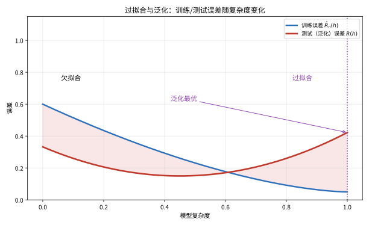

# 第 99 级：统计学习理论 (Statistical Learning Theory)

---

## 1. 学习目标

完成本教程后，你将能够：

1. 理解监督学习的基本框架（假设空间、损失函数、风险泛函）
2. 掌握经验风险最小化与结构风险最小化的核心思想
3. 理解 VC 维的概念及其在泛化界中的作用
4. 掌握 Rademacher 复杂度的定义与泛化界
5. 理解 PAC 学习的基本理论框架
6. 掌握 SVM 的泛化界分析（间隔与核技巧）
7. 理解学习算法的稳定性与泛化能力的关系
8. 能够计算常见分类器族的 VC 维与 Rademacher 复杂度

---

## 2. 核心概念

### 2.1 监督学习框架

**监督学习**：设输入空间 $\mathcal{X}$，输出空间 $\mathcal{Y} \subseteq \mathbb{R}$，联合分布 $P$ 定义在 $\mathcal{X} \times \mathcal{Y}$ 上。观测数据 $S = \{(x_1, y_1), \dots, (x_n, y_n)\}$ 独立同分布于 $P$。

**假设空间**：一族从 $\mathcal{X}$ 到 $\mathcal{Y}$ 的映射 $\mathcal{H}$，学习的目标是从 $\mathcal{H}$ 中选出最优假设 $h$。

**损失函数**：$L: \mathcal{Y} \times \mathcal{Y} \to \mathbb{R}_+$ 度量预测值与真实值之间的差异。常见损失函数包括：
- **0-1 损失**：$L(y, h(x)) = \mathbf{1}_{\{y \neq h(x)\}}$
- **平方损失**：$L(y, h(x)) = (y - h(x))^2$
- **铰链损失**（Hinge Loss）：$L(y, h(x)) = \max(0, 1 - y h(x))$（用于 SVM）

> **💡 直观理解（类比）**：监督学习框架像"拿着一摞已成对的'尺码样本'（输入-答案）去反推一杆打分秘方"——输入空间 $\mathcal{X}$ 是货架，输出 $\mathcal{Y}$ 是真值，联合分布 $P$ 是那台悄悄决定配对规律的幕后机器。假设空间 $\mathcal{H}$ 是"候选秘方的一整册"，学习就是从中挑一位选手 $h$；损失函数则是"给这位选手的每次预测打差评的度量尺"：0-1损失像"只在乎对不对"、平方损失像"越离谱罚越多"，铰链损失则像"对分对了但胆子不够大（间隔<1）的判罚也记账"，专为SVM的量身给分。整张伴着这两头坐标伸展开的，就是统计学习白天的主舞台。

### 2.2 经验风险最小化

**风险泛函**：假设 $h$ 的 **期望风险**（泛化误差）为：

$$
R(h) = \mathbb{E}_{(x,y) \sim P}[L(y, h(x))]
$$

**经验风险**：基于观测数据的平均损失：

$$
\hat{R}_n(h) = \frac{1}{n} \sum_{i=1}^n L(y_i, h(x_i))
$$

**经验风险最小化**（ERM）：选择 $\hat{h}_n = \arg\min_{h \in \mathcal{H}} \hat{R}_n(h)$。

> **💡 直观理解（类比）**：期望风险 vs 经验风险，像"学生对整个学期的整体掌握度" vs "只看手里这次月考的分数"——期望风险 $R(h)$ 是在真实分布 $P$ 上全盘通考的平均失利，可惜 $P$ 未知没法直接算；`ERM` 就退而求其次，先用眼前这 $n$ 道题的平均失分 $\hat{R}_n(h)$ 替它打分，再挑分数最低的那位当选手 $\hat{h}_n=\arg\min_h\hat{R}_n(h)$。这就好比"用平时几次月考成绩来选最靠谱的学生代表"——直觉靠谱，但月考样本数有限，才埋下了'死记硬背训练题（过拟合）'的隐患，也是后面所有泛化界要堵的窟窿。

### 2.3 过拟合与泛化

**过拟合**：当假设空间 $\mathcal{H}$ 过于复杂时，ERM 可能过度拟合训练数据中的噪声，导致泛化误差大。

**泛化界**：以高概率成立的形如 $R(\hat{h}_n) \le \hat{R}_n(\hat{h}_n) + \text{复杂度项}$ 的不等式。

> **💡 直观理解（类比）**：泛化界像是"给'月考分太低不真实'这种担心写的一份保险条款"——它向整个世界承诺：真实水平 $R(\hat{h}_n)$ 大致不钻过"月考分 + 复杂度补偿"这条线，即 $R(\hat{h}_n)\le\hat{R}_n(\hat{h}_n)+\text{复杂度项}$。复杂度项就是"这套考场有多难防（候选选手越多、模型越花哨，防不胜防的部分就越大）"的价钱：数据越多（$n$ 大）越便宜，假设越开放（$d$ 大）越贵。有了保险单，少学时也能拍胸脯说不慌，因为它把"经验风险当真实风险"那点水分，实打实地量了出来。

![偏差-方差权衡：总误差 \mathbb{E}[(y-\hat{f}(x))^2] = \mathrm{Bias}^2 + \mathrm{Var} + \sigma^2。偏差平方随模型复杂度增大而减小，方差随复杂度增大而增大，二者之和在某个最优复杂度处取得最小值。](images/99-偏差方差权衡.svg)

> **直观理解（现实类比）**：偏差-方差权衡就像"射击打靶"——偏差是"瞄得准不准"（模型结构是否抓住本质），方差是"手稳不稳"（换了数据结果差多少）。太简单的模型（低复杂度）瞄不准、系统性偏离目标（高偏差）；太复杂的模型虽然灵活但每次训练结果飘忽不定（高方差）。最理想的模型是"瞄得准又手稳"，在两者之间取平衡。

> **🧠 思考历程：模型越"聪明"越好？为什么死记训练数据反而会被打脸？**
>
> 偏差-方差权衡回答的是一场关于"学习的适度"的辩论：一个模型该更贴合数据（低偏差），还是更耐扰动（低方差）？答案既谈不上乐观也谈不上悲观——世上没有免费的午餐，你必须在"拟合"与"泛化"之间做一次不可回避的妥协。
>
> - **误差能拆成两半**。统计学习一开始就发现预测误差可分解为三块：不可约的噪声、偏差（模型结构造成的系统偏离）与方差（训练集抖动带来的波动）。这个"三角"框架根植于最小二乘的平方误差分解，Geman、Bienenstock 与 Doursat 在1992年把它写成机器学习教科书里的经典公式。
> - **用复杂度驯服风险**。1970年代 Vapnik 与 Chervonenkis 引入 VC 维，用量化"假设空间到底有多大"，并证明只要假设类被控制住、样本足够多，经验风险就能逼近真实风险——偏差-方差由此有了严格的复杂度代价。
> - **从"猜得准"到"承诺得了"**。Valiant 在1984年提出 PAC 学习，把"能不能学会"变成可证明的样本复杂度问题；三条进路合流后，人们才明白：好的学习者不是记住训练答案，而是在结构复杂度与数据规模之间找回平衡，这正是正则化与交叉验证的哲学源头。
> - **心路**：厉害的不是把已见的都答对，而是在"拟合"与"泛化"的钢丝上走得稳——敢于承认确定性有极限，往往是智慧的起点。

### 2.4 VC 维

**VC 维**（Vapnik-Chervonenkis Dimension）是衡量假设空间复杂度的核心概念。对于二分类问题，假设空间 $\mathcal{H}$ 的 **VC 维** 定义为能被 $\mathcal{H}$ 打散的最大样本点数。

**打散**：对大小为 $m$ 的样本集 $\{x_1, \dots, x_m\}$，若 $\mathcal{H}$ 能实现所有 $2^m$ 种可能的标签分配，则称 $\mathcal{H}$ 打散该样本集。

> **💡 直观理解（类比）**：VC维像"衡量一盒形状橡皮泥最多能同时捏出多少种情绪表情"——给定 $m$ 个点，看这族分类器能否随心所欲地把它们标成任意 $2^m$ 种正负组合；能打碎的叫"打散 $m$ 个点"。VC维就是这根"能应付任意 $m$ 种刁钻要求"的极限绳数：绳子拉到极限还没断，就是它的身价（$d=\text{VCdim}$）。它纯粹数"记忆容量"，跟数据长什么样没关系：阈值分类器只能单调切一刀（VC维1）、区间能"包"一段（2）、线性超平面在 $\mathbb{R}^d$ 能同时掰开 $d+1$ 个单纯形顶点（$d+1$）。复杂度越大、能装的刁钻标签就越多，也就越危险——这正是泛化界的起点。

### 2.5 Rademacher 复杂度

**Rademacher 复杂度**：设 $\{\varepsilon_i\}_{i=1}^n$ 为独立同分布的 Rademacher 随机变量（$\mathbb{P}(\varepsilon_i = 1) = \mathbb{P}(\varepsilon_i = -1) = 1/2$）。经验 Rademacher 复杂度为：

$$
\hat{\mathfrak{R}}_n(\mathcal{H}) = \mathbb{E}_\varepsilon \left[\sup_{h \in \mathcal{H}} \frac{1}{n} \sum_{i=1}^n \varepsilon_i h(x_i)\right]
$$

**Rademacher 复杂度**（总体版本）：

$$
\mathfrak{R}_n(\mathcal{H}) = \mathbb{E}_{S} [\hat{\mathfrak{R}}_n(\mathcal{H})]
$$

> **💡 直观理解（类比）**：Rademacher复杂度像"给假设空间装一台'陪练陪唱'的测谎仪"——随机掷一把 $\pm1$ 的骰子 $\varepsilon_i$ 给每个样本盖一个"假标签"，再看这族模型能多齐整地跟着这串乱号子起舞：$\hat{\mathfrak{R}}_n(\mathcal{H})$ 就是"在这堆乱号上，模型能找到的最亮谐音"的平均能力。它能"跟得上多乱的歌"，暴露的就是这族假设有多'会看人眼色'（拟合噪声）的本事。它对数据本身有依赖（数据相关的复杂度），往往比VC维那一刀切更锋利，能给回归、核方法等连续情形也递上泛化界。

### 2.6 PAC 学习

**PAC 学习**（Probably Approximately Correct Learning）：若存在算法 $\mathcal{A}$ 和函数 $m_{\mathcal{H}}(\varepsilon, \delta)$，使得对任意分布 $P$ 和任意 $\varepsilon, \delta > 0$，当样本量 $n \ge m_{\mathcal{H}}(\varepsilon, \delta)$ 时，以至少 $1 - \delta$ 的概率有 $R(\hat{h}_n) \le \inf_{h \in \mathcal{H}} R(h) + \varepsilon$，则称 $\mathcal{H}$ 是 PAC 可学习的。

> **💡 直观理解（类比）**：PAC学习像"承诺：只要给足预算（样本量 $n\ge m_\mathcal{H}(\varepsilon,\delta)$），基本（概率 $\ge1-\delta$）能考到接近及格（误差 $\le$ 最优 $+\varepsilon$）"——三个旋钮各司其职：$\varepsilon$ 是"允许多大的误差"（近似度），$\delta$ 是"允许出多少次岔子"（失败概率），两者共同折算成需要多少样本才敢拍胸脯。它把"能不能学会"从哲学题变成可计算的合同：挖空心思的是给出一张按 $\varepsilon,\delta$ 明码标价的"交货期（样本复杂度）"报价单，地板划线写着"能对任意分布都兑现"，让机器学习有了可以打官司的准入门槛。

### 2.7 结构风险最小化

**结构风险最小化**（SRM）：在假设空间上引入偏序结构 $\mathcal{H}_1 \subset \mathcal{H}_2 \subset \cdots$，选择同时最小化经验风险和复杂度惩罚的假设：

$$
\hat{h}_n = \arg\min_{h \in \mathcal{H}_k} \hat{R}_n(h) + \text{penalty}(k, n)
$$

> **直观理解（现实类比）**：过拟合就像"背书式应付考试"——学生把练习册上的每一道题（训练数据）都背得滚瓜烂熟，练习时近乎满分；但一旦试卷换成新题（测试数据），就原形毕露、错得离谱。训练的误差曲线一路走低让你误以为学得很好，真正的考验是"没见过的题"表现如何，这正是泛化误差揭示的真相。

> **💡 直观理解（类比）**：结构风险最小化像"选冠军时要给'作弊嫌疑'扣分"——候选选手不止比谁月考分高（经验风险 $\hat{R}_n$），还要按"他带的备考门类有多少"额外扣一笔复杂度税 $\text{penalty}(k,n)$，在更大候选带里敢耍的花样多、税就重。安排上让假设空间排成一列 $\mathcal{H}_1\subset\mathcal{H}_2\subset\cdots$（由简到繁的梯子），最后挑"月考分 + 复杂度税"合计最少的那位。反观ERM只在一格考场上比拼竹竿，SRM则明目张胆地在陪练的同时给复杂度标价——这就是正则化、交叉验证背后的理性账房。

### 2.8 核方法

**核函数**：函数 $K: \mathcal{X} \times \mathcal{X} \to \mathbb{R}$ 称为 **正定核**，若存在 Hilbert 空间 $\mathcal{H}$ 和特征映射 $\phi: \mathcal{X} \to \mathcal{H}$，使得 $K(x, x') = \langle \phi(x), \phi(x') \rangle_\mathcal{H}$。

**再生核 Hilbert 空间**（RKHS）：由正定核 $K$ 唯一确定的函数空间，具有再生性质 $\langle f, K(x, \cdot) \rangle_\mathcal{H} = f(x)$。

> **💡 直观理解（类比）**：核技巧像"买了张'免驾车'通行证"——明明数据在低维挤成一团解不开，通过特征映射 $\phi$ 丢进高维Hilbert空间就能一刀切开；可蠢办法是得真把 $\phi(x)$ 算出来，维数一高当场爆炸。核函数 $K(x,x')=\langle\phi(x),\phi(x'){}\rangle$ 就是那张'免驾车'的暗号：咱不真开车到高维，只偷偷用内积公式把'距离感觉'原地算出来，全程连 $\phi$ 是啥都不用写。再生性质 $\langle f,K(x,\cdot)\rangle=f(x)$ 更神奇得像"点进函数取值"一样——用一个函数做的内积就等于它在 $x$ 点的读数，让代价函数、泛化分析都能在RKHS这个优雅舞台上演，SVM等算法的非线性魔法就藏在这张暗号卡里。

### 2.9 支持向量机

**硬间隔 SVM**：对线性可分数据，求解：

$$
\min_{w,b} \frac{1}{2}\|w\|^2 \quad \text{s.t.} \quad y_i(\langle w, x_i \rangle + b) \ge 1, \; i=1,\dots,n
$$

**软间隔 SVM**：引入松弛变量 $\xi_i$ 处理不可分情形：
$$
\min_{w,b,\xi} \frac{1}{2}\|w\|^2 + C\sum_{i=1}^n \xi_i \quad \text{s.t.} \quad y_i(\langle w, x_i \rangle + b) \ge 1 - \xi_i, \; \xi_i \ge 0
$$

> **💡 直观理解（类比）**：支持向量机像"在两类人群之间找一道留足最宽'安全走廊'的铁栅栏"——目标 $\min\frac12\|w\|^2$ 等价于把分类间隔（margin）拉到最大，让栅栏离两侧最近的点都远远的、稳如泰山。硬间隔要求所有人干干净净站在走廊两外侧（每点都 $y_i(\langle w,x_i\rangle+b)\ge1$）；数据一旦混进来分不净，软间隔就请出松弛变量 $\xi_i$ 当"越界罚款单"，并把总罚款 $\sum\xi_i$ 乘上权重 $C$ 一起放进账单，$C$ 越大越不容许越界、$C$ 越小越宽容乱入。两头一压，SVM自然成了"又宽又稳、还顺手把悬空的点恰在走廊边上的撑杆"——那几根撑在栅栏上的样本就叫支持向量。

### 2.10 学习算法的稳定性

**均匀稳定性**：算法 $\mathcal{A}$ 具有 $\beta$-均匀稳定性，若对任意两个相差一个样本的训练集 $S$ 和 $S'$，有：

$$
\sup_{x,y} |L(y, \mathcal{A}_S(x)) - L(y, \mathcal{A}_{S'}(x))| \le \beta
$$

> **💡 直观理解（类比）**：均匀稳定性像"换一个考生顶替，全班名次不能天崩地裂"——$\beta$-均匀稳定性要求：只要数据里少一个人、换成另一个人（$S$ 与 $S'$ 只差一个样本），模型在所有点上给出的表现差别都 ≤ $\beta$。$\beta$ 大说明模型把每个样本都"牢牢背进骨头"，一换人就大走样（不稳）；$\beta$ 小则说明它抓的是普遍规律、感冒一人全班无感。这套凭证的妙处是"泛化界可以只看 $\beta$、跟假设空间有多复杂无关"——像 $L_2$ 正则化这类强凸目标，其对单个样本的敏感度被 $1/(n\lambda)$ 死死压住，从而得到 $\beta=O(1/n)$，再借稳定性泛化界一举拿下 $O(1/\sqrt n)$ 的收敛速度——靠的就是它"对单个样本感度低"这身稳。

---

## 3. 定理与证明

### 定理 3.1：VC 维的泛化界 (VC Generalization Bound)

**定理**：设 $\mathcal{H}$ 为二分类假设空间，VC 维为 $d = \text{VCdim}(\mathcal{H})$。则对任意 $\delta > 0$，以至少 $1 - \delta$ 的概率，对所有 $h \in \mathcal{H}$ 有：

$$
R(h) \le \hat{R}_n(h) + \sqrt{\frac{2d\log\frac{en}{d}}{n}} + \sqrt{\frac{\log\frac{1}{\delta}}{2n}}
$$

**证明**（使用 Sauer-Shelah 引理和对称化方法）：

**步骤1：生长函数与 VC 维**

定义 $\mathcal{H}$ 在 $n$ 个点上的 **生长函数**（Growth Function）：

$$
\Pi_{\mathcal{H}}(n) = \max_{x_1,\dots,x_n} |\{(h(x_1), \dots, h(x_n)): h \in \mathcal{H}\}|
$$

**Sauer-Shelah 引理**：若 $\text{VCdim}(\mathcal{H}) = d$，则对 $n \ge d$：

$$
\Pi_{\mathcal{H}}(n) \le \sum_{i=0}^d \binom{n}{i} \le \left(\frac{en}{d}\right)^d
$$

**步骤2：对称化引理**

对任意 $h \in \mathcal{H}$，令 $Z_i = \mathbf{1}_{\{h(x_i) \neq y_i\}}$。考虑 Ghost 样本 $S' = \{(x_1', y_1'), \dots, (x_n', y_n')\}$ 独立同分布于 $P$，其经验风险为 $\hat{R}'_n(h)$。

由对称化技巧：

$$
\mathbb{P}\left(\sup_{h \in \mathcal{H}} (R(h) - \hat{R}_n(h)) > \varepsilon\right) \le \mathbb{P}\left(\sup_{h \in \mathcal{H}} (\hat{R}'_n(h) - \hat{R}_n(h)) > \frac{\varepsilon}{2}\right)
$$

**步骤3：引入 Rademacher 变量**

在对称化不等式中，联合样本 $S \cup S'$ 共有 $2n$ 个点。引入 Rademacher 变量 $\varepsilon_i$，交换 $S$ 和 $S'$ 的标签：

$$
\mathbb{P}\left(\sup_{h \in \mathcal{H}} (\hat{R}'_n(h) - \hat{R}_n(h)) > \frac{\varepsilon}{2}\right) \le \mathbb{P}\left(\sup_{h \in \mathcal{H}} \frac{1}{n}\sum_{i=1}^n \varepsilon_i (\mathbf{1}_{\{h(x_i') \neq y_i'\}} - \mathbf{1}_{\{h(x_i) \neq y_i\}}) > \frac{\varepsilon}{2}\right)
$$

**步骤4：利用生长函数**

给定 $S \cup S'$，$\sup_{h \in \mathcal{H}} \frac{1}{n}\sum_{i=1}^n \varepsilon_i (\mathbf{1}_{\{h(x_i') \neq y_i'\}} - \mathbf{1}_{\{h(x_i) \neq y_i\}})$ 最多取 $\Pi_{\mathcal{H}}(2n)$ 个不同的值。由 Hoeffding 不等式和联合界：

$$
\mathbb{P}\left(\sup_{h \in \mathcal{H}} (\hat{R}'_n(h) - \hat{R}_n(h)) > \frac{\varepsilon}{2} \mid S, S'\right) \le \Pi_{\mathcal{H}}(2n) e^{-n\varepsilon^2/8}
$$

**步骤5：取期望并反解**

对 $S, S'$ 取期望：

$$
\mathbb{P}\left(\sup_{h \in \mathcal{H}} (R(h) - \hat{R}_n(h)) > \varepsilon\right) \le \Pi_{\mathcal{H}}(2n) e^{-n\varepsilon^2/8}
$$

由 Sauer-Shelah 引理，$\Pi_{\mathcal{H}}(2n) \le (2en/d)^d$。令右侧等于 $\delta$，解出 $\varepsilon$：

$$
\varepsilon = \sqrt{\frac{8}{n}\left(d\log\frac{2en}{d} + \log\frac{1}{\delta}\right)}
$$

**步骤6：简化**

利用 $\sqrt{a+b} \le \sqrt{a} + \sqrt{b}$，得：

$$
\varepsilon \le \sqrt{\frac{8d\log\frac{2en}{d}}{n}} + \sqrt{\frac{8\log\frac{1}{\delta}}{n}}
$$

通过调整常数，得到定理中的形式。$\square$

> **💡 直观理解（类比）**：VC泛化界像"给'少学时乱猜'的担忧写一道明码标价的保险单"——它把真实风险 $R(h)$ 与经验风险 $\hat{R}_n(h)$ 的差距用一根绳子勒住：$\sqrt{\frac{2d\log(en/d)}{n}}+\sqrt{\frac{\log(1/\delta)}{2n}}$，前半截是"假设空间底盘太大（$d$ 大）或样本太少（$n$ 小）的惩罚"，后半截是"要给 $\delta$ 留的坏彩头预算"。证明的套路很硬核：先用Sauer-Shelah引理把"无限假设"折算成有限的生长函数 $\Pi_\mathcal{H}(2n)\le(en/d)^d$（拿打散性质换有限的暴露条数），再用对称化+Ghost样本+随机±1挂牌，把"期望风险−经验风险"转移成"挂错牌的吻合度"，最后靠Hoeffding与联合界收网。一句话：$d$ 越大高地越险，$n$ 越大保险越便宜。

---

### 定理 3.2：Rademacher 复杂度的泛化界

**定理**：设 $\mathcal{H}$ 为假设空间，损失函数 $L$ 取值为 $[0,1]$。则对任意 $\delta > 0$，以至少 $1 - \delta$ 的概率，对所有 $h \in \mathcal{H}$ 有：

$$
R(h) \le \hat{R}_n(h) + 2\mathfrak{R}_n(\mathcal{H}) + \sqrt{\frac{\log\frac{1}{\delta}}{2n}}
$$

其中 $\mathfrak{R}_n(\mathcal{H})$ 是 $\mathcal{H}$ 的 Rademacher 复杂度。

**证明**（使用 McDiarmid 不等式和对称化）：

**步骤1：定义关键统计量**

定义 $\Phi(S) = \sup_{h \in \mathcal{H}} (R(h) - \hat{R}_n(h))$。我们首先证明 $\Phi(S)$ 集中在它的期望附近。

**步骤2：验证 McDiarmid 条件**

替换第 $i$ 个样本 $(x_i, y_i)$ 为 $(x_i', y_i')$，得到 $S'$。由于损失函数取值在 $[0,1]$ 中，$\hat{R}_n(h)$ 的变化最多为 $1/n$，因此：

$$
|\Phi(S) - \Phi(S')| \le \frac{1}{n}
$$

由 McDiarmid 不等式，对任意 $t > 0$：

$$
\mathbb{P}(\Phi(S) - \mathbb{E}[\Phi(S)] \ge t) \le e^{-2nt^2}
$$

**步骤3：对称化——用期望界控制**

现在估计 $\mathbb{E}[\Phi(S)]$：

$$
\begin{aligned}
\mathbb{E}[\Phi(S)] &= \mathbb{E}_S\left[\sup_{h \in \mathcal{H}} (R(h) - \hat{R}_n(h))\right] \\
&= \mathbb{E}_S\left[\sup_{h \in \mathcal{H}} \left(\mathbb{E}_{S'}[\hat{R}'_n(h)] - \hat{R}_n(h)\right)\right] \\
&\le \mathbb{E}_{S,S'}\left[\sup_{h \in \mathcal{H}} (\hat{R}'_n(h) - \hat{R}_n(h))\right]
\end{aligned}
$$

其中第二步使用了 $R(h) = \mathbb{E}_{S'}[\hat{R}'_n(h)]$，第三步使用了 Jensen 不等式和上确界的凸性。

**步骤4：引入 Rademacher 变量**

考虑 Ghost 样本 $S'$，其经验风险为 $\hat{R}'_n(h) = \frac{1}{n}\sum_{i=1}^n L(y_i', h(x_i'))$。引入 Rademacher 变量 $\varepsilon_i$：

$$
\begin{aligned}
\mathbb{E}_{S,S'}\left[\sup_{h \in \mathcal{H}} (\hat{R}'_n(h) - \hat{R}_n(h))\right] &= \mathbb{E}_{S,S'}\left[\sup_{h \in \mathcal{H}} \frac{1}{n}\sum_{i=1}^n (L(y_i', h(x_i')) - L(y_i, h(x_i)))\right] \\
&= \mathbb{E}_{S,S',\varepsilon}\left[\sup_{h \in \mathcal{H}} \frac{1}{n}\sum_{i=1}^n \varepsilon_i (L(y_i', h(x_i')) - L(y_i, h(x_i)))\right] \\
&\le \mathbb{E}_{S',\varepsilon}\left[\sup_{h \in \mathcal{H}} \frac{1}{n}\sum_{i=1}^n \varepsilon_i L(y_i', h(x_i'))\right] + \mathbb{E}_{S,\varepsilon}\left[\sup_{h \in \mathcal{H}} \frac{1}{n}\sum_{i=1}^n (-\varepsilon_i) L(y_i, h(x_i))\right] \\
&= 2\mathfrak{R}_n(\mathcal{H})
\end{aligned}
$$

其中第二步用到了对称性（$\varepsilon_i$ 的分布对称），第三步用到了三角不等式和上确界的次可加性。

**步骤5：综合**

因此 $\mathbb{E}[\Phi(S)] \le 2\mathfrak{R}_n(\mathcal{H})$。由 McDiarmid 不等式，以至少 $1 - \delta$ 的概率：

$$
\Phi(S) \le \mathbb{E}[\Phi(S)] + \sqrt{\frac{\log\frac{1}{\delta}}{2n}} \le 2\mathfrak{R}_n(\mathcal{H}) + \sqrt{\frac{\log\frac{1}{\delta}}{2n}}
$$

即 $R(h) \le \hat{R}_n(h) + 2\mathfrak{R}_n(\mathcal{H}) + \sqrt{\frac{\log\frac{1}{\delta}}{2n}}$ 对所有 $h \in \mathcal{H}$ 一致成立。$\square$

> **💡 直观理解（类比）**：Rademacher泛化界像"不管房子多花哨，只按'墙角晃得多厉害'来买保险"——它抛开了具体假设的花样个数，直接用复杂度读数 $\mathfrak{R}_n(\mathcal{H})$ 当超标计：泛化误差被压成"经验风险 $+ 2\mathfrak{R}_n + \sqrt{\log(1/\delta)/(2n)}$"。证明三步走：先用McDiarmid不等式（有界差分）把关键统计量 $\Phi(S)=\sup_h(R-\hat{R}_n)$ 的身家集中到期望附近；再用对称化把期望风险 $R=\mathbb{E}_{S'}\hat{R}'_n$ 换成一堆Ghost样本的经验风险，并把两簇样本的差用随机±1挂牌捣腾（对称性让 $\varepsilon_i$ 挂哪边都行）；最后靠三角不等式和上确界的次可加性劈出两个Rademacher项 $2\mathfrak{R}_n(\mathcal{H})$。走这趟路，全是'换样本、摇骰子、拼上界'的熟练活。

---

### 定理 3.3：PAC 学习的基本定理 (Fundamental Theorem of PAC Learning)

**定理**：设 $\mathcal{H}$ 为二分类假设空间，$\mathcal{H}$ 是 PAC 可学习的当且仅当 $\text{VCdim}(\mathcal{H}) < \infty$。具体地，若 $\text{VCdim}(\mathcal{H}) = d < \infty$，则 ERM 算法是 PAC 学习算法，样本复杂度满足：

$$
m_{\mathcal{H}}(\varepsilon, \delta) = O\left(\frac{d}{\varepsilon}\log\frac{1}{\varepsilon} + \frac{1}{\varepsilon}\log\frac{1}{\delta}\right)
$$

反之，若 $\text{VCdim}(\mathcal{H}) = \infty$，则 $\mathcal{H}$ 不是 PAC 可学习的。

**证明**：

**方向1：充分性（VC 维有限 ⇒ PAC 可学习）**

**步骤1：泛化界的建立**

由定理 3.1（VC 维的泛化界），对任意 $h \in \mathcal{H}$，以至少 $1 - \delta$ 的概率：

$$
R(h) \le \hat{R}_n(h) + \sqrt{\frac{8d\log\frac{2en}{d}}{n}} + \sqrt{\frac{8\log\frac{2}{\delta}}{n}}
$$

**步骤2：ERM 的泛化保证**

令 $\hat{h}_n$ 为 ERM 解，$h^* = \arg\min_{h \in \mathcal{H}} R(h)$ 为最优假设。则：

$$
R(\hat{h}_n) \le \hat{R}_n(\hat{h}_n) + \varepsilon_{\text{comp}}(n) \le \hat{R}_n(h^*) + \varepsilon_{\text{comp}}(n) \le R(h^*) + 2\varepsilon_{\text{comp}}(n)
$$

其中 $\varepsilon_{\text{comp}}(n) = \sqrt{\frac{8d\log\frac{2en}{d}}{n}} + \sqrt{\frac{8\log\frac{2}{\delta}}{n}}$。

**步骤3：样本复杂度**

要使 $R(\hat{h}_n) \le R(h^*) + \varepsilon$ 以至少 $1 - \delta$ 的概率成立，只需 $2\varepsilon_{\text{comp}}(n) \le \varepsilon$。解出 $n$：

$$
n \ge \frac{Cd}{\varepsilon}\log\frac{d}{\varepsilon} + \frac{C}{\varepsilon}\log\frac{1}{\delta}
$$

其中 $C$ 为绝对常数。因此 $\mathcal{H}$ 是 PAC 可学习的，且 ERM 实现了学习。

**方向2：必要性（PAC 可学习 ⇒ VC 维有限）**

**步骤1：反证法假设**

假设 $\text{VCdim}(\mathcal{H}) = \infty$，则对任意 $m$，存在大小为 $m$ 的样本集 $\{x_1, \dots, x_m\}$ 被 $\mathcal{H}$ 打散。

**步骤2：构造对抗分布**

考虑分布 $P$ 均匀分布在 $\{x_1, \dots, x_m\}$ 上，标签由某个未知的 $h^* \in \mathcal{H}$ 确定。由于 $\mathcal{H}$ 能打散这些点，任何算法只能通过观测到的标签来推断，但未观测到的点的标签完全不确定。

**步骤3：信息论下界**

由打散性质，存在 $2^m$ 种可能的标签分配。任意学习算法最多观察到 $m$ 个标签，对于未观测到的点，其误差至少为 $1/2$。因此，对任意算法，存在某个目标函数使得泛化误差至少为 $1/4$，而样本量 $m$ 可以任意大，这与 PAC 可学习的定义矛盾。$\square$

> **💡 直观理解（类比）**：PAC学习基本定理像"假想空间能不能被'保险条款'盖章，就看你家的容错面（VC维）袋口有多大"——充分性那边好办：只要 $\text{VCdim}=d<\infty$，先让定理3.1的泛化界当担保，再套ERM那条'$\hat{R}_n(\hat{h}_n)\le\hat{R}_n(h^*)\le R(h^*)+$复杂度'的特权通道，把误差链一步步夹到 $\varepsilon$ 以内，顺手反解出要满足"误差≤$\varepsilon$、失败率≤$\delta$"所需的最小样本量 $O(\frac d\varepsilon\log\frac1\varepsilon+\frac1\varepsilon\log\frac1\delta)$。必要性那边靠反证编号玩狠：若 $d=\infty$，总能在无穷多个点上扔一堆刁钻标签；听不到标签的那些点本来就无从判断，任何算法看再多数据都没用，必然有目标函数让它犯至少 $1/4$ 的错误——字典里就没有"任意分布都稳"这回事。一句话：VC维有限，恰是'承诺能学'的那道门槛。

---

### 定理 3.4：SVM 的泛化界 (SVM Generalization Bound)

**定理**：设 $\mathcal{H}$ 为 RKHS 中的单位球 $\{f: \|f\|_\mathcal{H} \le \Lambda\}$，核函数 $K$ 满足 $K(x,x) \le 1$ 对所有 $x \in \mathcal{X}$ 成立。考虑使用铰链损失 $L(y, f(x)) = \max(0, 1 - y f(x))$ 的 SVM。则对任意 $\delta > 0$，以至少 $1 - \delta$ 的概率，对所有 $f \in \mathcal{H}$ 有：

$$
R(f) \le \hat{R}_n(f) + \frac{2\Lambda}{\sqrt{n}} + \sqrt{\frac{\log\frac{1}{\delta}}{2n}}
$$

**证明**：

**步骤1：Rademacher 复杂度的计算**

首先计算 $\mathcal{H} = \{f: \|f\|_\mathcal{H} \le \Lambda\}$ 的 Rademacher 复杂度。由定义：

$$
\hat{\mathfrak{R}}_n(\mathcal{H}) = \mathbb{E}_\varepsilon\left[\sup_{\|f\|_\mathcal{H} \le \Lambda} \frac{1}{n}\sum_{i=1}^n \varepsilon_i f(x_i)\right]
$$

由 Riesz 表示定理，$f(x_i) = \langle f, K(x_i, \cdot) \rangle_\mathcal{H}$。因此：

$$
\frac{1}{n}\sum_{i=1}^n \varepsilon_i f(x_i) = \left\langle f, \frac{1}{n}\sum_{i=1}^n \varepsilon_i K(x_i, \cdot) \right\rangle_\mathcal{H}
$$

**步骤2：应用 Cauchy-Schwarz 不等式**

由 Cauchy-Schwarz 不等式和 $\|f\|_\mathcal{H} \le \Lambda$：

$$
\sup_{\|f\|_\mathcal{H} \le \Lambda} \left\langle f, \frac{1}{n}\sum_{i=1}^n \varepsilon_i K(x_i, \cdot) \right\rangle_\mathcal{H} \le \Lambda \left\|\frac{1}{n}\sum_{i=1}^n \varepsilon_i K(x_i, \cdot)\right\|_\mathcal{H}
$$

**步骤3：计算范数**

由核函数的再生性质：

$$
\begin{aligned}
\left\|\frac{1}{n}\sum_{i=1}^n \varepsilon_i K(x_i, \cdot)\right\|_\mathcal{H}^2 &= \frac{1}{n^2}\sum_{i,j=1}^n \varepsilon_i \varepsilon_j \langle K(x_i, \cdot), K(x_j, \cdot) \rangle_\mathcal{H} \\
&= \frac{1}{n^2}\sum_{i,j=1}^n \varepsilon_i \varepsilon_j K(x_i, x_j) \\
&\le \frac{1}{n^2}\sum_{i=1}^n K(x_i, x_i) \le \frac{1}{n}
\end{aligned}
$$

其中第三步用到了 $K(x_i, x_i) \le 1$ 且对 $i \neq j$ 的交叉项，取期望后 $\mathbb{E}_\varepsilon[\varepsilon_i \varepsilon_j] = 0$。

**步骤4：期望 Rademacher 复杂度**

因此：

$$
\mathfrak{R}_n(\mathcal{H}) = \mathbb{E}_S[\hat{\mathfrak{R}}_n(\mathcal{H})] \le \mathbb{E}_S\left[\frac{\Lambda}{\sqrt{n}}\right] = \frac{\Lambda}{\sqrt{n}}
$$

**步骤5：应用 Rademacher 泛化界**

由定理 3.2（Rademacher 复杂度的泛化界），以至少 $1 - \delta$ 的概率：

$$
R(f) \le \hat{R}_n(f) + 2\mathfrak{R}_n(\mathcal{H}) + \sqrt{\frac{\log\frac{1}{\delta}}{2n}} \le \hat{R}_n(f) + \frac{2\Lambda}{\sqrt{n}} + \sqrt{\frac{\log\frac{1}{\delta}}{2n}}
$$

$\square$

> **💡 直观理解（类比）**：SVM泛化界的证明像"证明'划界越宽、逼格越稳，跟客厅弹丸之大的维度没啥关系'"——界式 $R(f)\le\hat{R}_n(f)+\frac{2\Lambda}{\sqrt n}+\sqrt{\log(1/\delta)/(2n)}$ 里那个 $\Lambda/\sqrt n$ 正是RKHS单位球的复杂度读数。算它只用三招：先用Riesz表示定理把 $f(x_i)=\langle f,K(x_i,\cdot)\rangle$ 翻译成内积，于是被求上确界的那串 $\langle w,\sum\varepsilon_i K(x_i,\cdot)\rangle/n$ 用Cauchy-Schwarz按住 $\|f\|\le\Lambda$；再算这个混叠Rademacher的RKHS范数，靠 $\mathbb{E}[\varepsilon_i\varepsilon_j]=0$ 把交叉项归零、核条件 $K(x,x)\le1$ 把对角线收成 $\le1/n$；最后前缀定理3.2直接发车。结论最靓的一点：错误项与输入维度"无关"，只要保持间隔大（$\Lambda$ 小），高维照样一个 $\frac{2\Lambda}{\sqrt n}$ 统管到底。

---

### 定理 3.5：稳定性与泛化 (Stability and Generalization)

**定理**：设学习算法 $\mathcal{A}$ 具有 $\beta$-均匀稳定性，损失函数 $L$ 取值在 $[0,1]$ 中。则对任意 $\delta > 0$，以至少 $1 - \delta$ 的概率：

$$
R(\mathcal{A}_S) \le \hat{R}_n(\mathcal{A}_S) + \beta + (2n\beta + 1)\sqrt{\frac{\log\frac{1}{\delta}}{2n}}
$$

特别地，若 $\beta = O(1/n)$，则泛化误差以 $O(1/\sqrt{n})$ 的速度收敛。

**证明**：

**步骤1：期望泛化误差的分解**

首先证明 $\mathbb{E}[R(\mathcal{A}_S) - \hat{R}_n(\mathcal{A}_S)] \le \beta$。

令 $S = \{z_1, \dots, z_n\}$，$S^{(i)} = \{z_1, \dots, z_{i-1}, z_i', z_{i+1}, \dots, z_n\}$ 为将第 $i$ 个样本替换为独立同分布样本 $z_i'$ 后的数据集。由对称性：

$$
\mathbb{E}[R(\mathcal{A}_S)] = \mathbb{E}_{S, z'} [L(z', \mathcal{A}_S)]
$$

而 $\mathbb{E}[\hat{R}_n(\mathcal{A}_S)] = \frac{1}{n}\sum_{i=1}^n \mathbb{E}[L(z_i, \mathcal{A}_S)]$。

**步骤2：替换技巧**

对每个 $i$，由 $z_i$ 和 $z_i'$ 的对称性：

$$
\mathbb{E}[L(z_i, \mathcal{A}_S)] = \mathbb{E}[L(z_i', \mathcal{A}_{S^{(i)}})]
$$

因此：

$$
\begin{aligned}
\mathbb{E}[R(\mathcal{A}_S) - \hat{R}_n(\mathcal{A}_S)] &= \mathbb{E}_{S, z'}\left[L(z', \mathcal{A}_S) - \frac{1}{n}\sum_{i=1}^n L(z_i', \mathcal{A}_{S^{(i)}})\right] \\
&= \frac{1}{n}\sum_{i=1}^n \mathbb{E}\left[L(z_i', \mathcal{A}_S) - L(z_i', \mathcal{A}_{S^{(i)}})\right] \\
&\le \frac{1}{n}\sum_{i=1}^n \beta = \beta
\end{aligned}
$$

最后一步使用了 $\beta$-均匀稳定性：$S$ 和 $S^{(i)}$ 仅相差一个样本，故 $|L(z_i', \mathcal{A}_S) - L(z_i', \mathcal{A}_{S^{(i)}})| \le \beta$。

**步骤3：McDiarmid 不等式**

定义 $\Phi(S) = R(\mathcal{A}_S) - \hat{R}_n(\mathcal{A}_S)$。当替换一个样本时，$R(\mathcal{A}_S)$ 的变化最多为 $\beta$（由稳定性），$\hat{R}_n(\mathcal{A}_S)$ 的变化最多为 $1/n + \beta$（因为经验风险项变化 $1/n$，且模型本身变化最多 $\beta$）。因此 $\Phi(S)$ 的变化最多为 $1/n + 2\beta$。

由 McDiarmid 不等式，以至少 $1 - \delta$ 的概率：

$$
\Phi(S) \le \mathbb{E}[\Phi(S)] + (1/n + 2\beta)\sqrt{\frac{n\log\frac{1}{\delta}}{2}}
$$

**步骤4：综合**

由步骤2，$\mathbb{E}[\Phi(S)] \le \beta$。代入得：

$$
R(\mathcal{A}_S) \le \hat{R}_n(\mathcal{A}_S) + \beta + (1/n + 2\beta)\sqrt{\frac{n\log\frac{1}{\delta}}{2}}
$$

简化后即得定理中的形式。$\square$

> **💡 直观理解（类比）**：稳定性泛化界的证明像"看一个选手换掉搭档后发挥差多少，就能预估他整场综合水平高出练功房分多少"——核心是先证期望差距 $\mathbb{E}[R-\hat{R}_n]\le\beta$：因为期望风险能看成对新样本 $z'$ 的损失（对称性），逐项把第 $i$ 个样本替换成另一个同分布样本 $z_i'$，再用 $\beta$-均匀稳定性压住每一项 $|L(z_i',\mathcal{A}_S)-L(z_i',\mathcal{A}_{S^{(i)}})|\le\beta$，取平均即得 ≤$\beta$。第二步去抖：$\Phi(S)=R(\mathcal{A}_S)-\hat{R}_n(S)$ 换一个样本时，$\hat{R}_n$ 最多变 $1/n$、模型本身最多变 $\beta$，于是差分上界约 $1/n+2\beta$，McDiarmid一钳把它挤到期望附近。代进去 $R\le\hat{R}_n+\beta$（稳定）+尾巴（概率尾巴）——当 $\beta=O(1/n)$，整体收敛 $O(1/\sqrt n)$，一条与复杂度无关的泛化通道就此打通。

---

## 4. 示例

### 示例 1：VC 维计算（分类器族）

**问题**：计算以下分类器族的 VC 维：

1. $\mathcal{H}_1$：$\mathbb{R}^d$ 上的线性分类器 $\{x \mapsto \text{sign}(\langle w, x \rangle + b): w \in \mathbb{R}^d, b \in \mathbb{R}\}$
2. $\mathcal{H}_2$：$\mathbb{R}$ 上的阈值分类器 $\{x \mapsto \text{sign}(x - a): a \in \mathbb{R}\}$
3. $\mathcal{H}_3$：$\mathbb{R}$ 上的区间分类器 $\{x \mapsto \mathbf{1}_{[a,b]}(x): a, b \in \mathbb{R}, a \le b\}$

**解**：

**1. 线性分类器 $\mathcal{H}_1$ 的 VC 维**

**下界**：在 $\mathbb{R}^d$ 中，取 $d+1$ 个点作为单纯形的顶点（如标准基向量和原点）。对任意标签分配，存在线性分类器实现该分配。因此 $\text{VCdim}(\mathcal{H}_1) \ge d+1$。

**上界**：由 Radon 定理，$\mathbb{R}^d$ 中任意 $d+2$ 个点可以划分为两个子集，使得它们的凸包相交。这意味着无法用超平面区分这两个子集，因此 $\text{VCdim}(\mathcal{H}_1) \le d+1$。

**结论**：$\text{VCdim}(\mathcal{H}_1) = d+1$。

**2. 阈值分类器 $\mathcal{H}_2$ 的 VC 维**

取单点 $x_1$，可以有两种标签：$x_1 > a$ 或 $x_1 \le a$，均可实现。取两点 $x_1 < x_2$，标签分配 $(+, -)$ 可通过取 $a \in (x_1, x_2)$ 实现，$(-, +)$ 可通过取 $a > x_2$ 或 $a < x_1$ 实现，但 $(-, +)$ 无法实现（因为阈值分类器是单调的）。因此最多打散 1 个点。

**结论**：$\text{VCdim}(\mathcal{H}_2) = 1$。

**3. 区间分类器 $\mathcal{H}_3$ 的 VC 维**

取两点 $x_1 < x_2$，可以打散：$(1,1)$ 取 $a < x_1 < x_2 < b$；$(1,0)$ 取 $a < x_1 < b < x_2$；$(0,1)$ 取 $x_1 < a < x_2 < b$；$(0,0)$ 取 $a,b$ 都在区间外。因此可打散 2 个点。

取三点 $x_1 < x_2 < x_3$，标签分配 $(1,0,1)$ 要求 $x_1, x_3$ 在区间内而 $x_2$ 在外，但区间是连续的，这不可能实现。因此最多打散 2 个点。

**结论**：$\text{VCdim}(\mathcal{H}_3) = 2$。

> **💡 直观理解（类比）**：示例 1 像"给三种'橡皮泥'量各自的'花样上限'"——线性分类器 $\mathcal{H}_1$：在 $\mathbb{R}^d$ 取 $d+1$ 个单纯形顶点（原点加基向量），任意正负涂法都有一片超平面一刀劈开（下界），而Radon定理说 $d+2$ 个点总有两撮凸包打架切不开（上界），于是 $\text{VCdim}(\mathcal{H}_1)=d+1$。阈值分类器 $\mathcal{H}_2$ 只会单调一剪刀，两点还想排出 $(-,+)$（左负右正）就得先正后负，与单调背道而驰，故只能打散1点、VC维1。区间分类器 $\mathcal{H}_3$ 能"包一段"灵活一点，两点四种标签都能用适当 $a\le b$ 盖上；但三点要 $(1,0,1)$——左点和右点进区间、中点在区间外——一个连通的区间横竖"跳不过"中间点，故最多2、VC维恰为2。三种难度档位，正好把"打散=能捏出多少种表情"这根尺子量得明明白白。

---

### 示例 2：Rademacher 复杂度计算

**问题**：计算以下假设空间的 Rademacher 复杂度：

1. $\mathcal{H}_1 = \{x \mapsto \langle w, x \rangle: \|w\|_2 \le \Lambda, \|x\|_2 \le 1\}$
2. $\mathcal{H}_2 = \{x \mapsto \text{sign}(\langle w, x \rangle): \|w\|_2 \le \Lambda, \|x\|_2 \le 1\}$

**解**：

**1. 线性函数空间 $\mathcal{H}_1$**

由定义：

$$
\hat{\mathfrak{R}}_n(\mathcal{H}_1) = \mathbb{E}_\varepsilon\left[\sup_{\|w\| \le \Lambda} \frac{1}{n}\sum_{i=1}^n \varepsilon_i \langle w, x_i \rangle\right] = \mathbb{E}_\varepsilon\left[\sup_{\|w\| \le \Lambda} \left\langle w, \frac{1}{n}\sum_{i=1}^n \varepsilon_i x_i \right\rangle\right]
$$

由 Cauchy-Schwarz 不等式，上确界在 $w$ 与 $\frac{1}{n}\sum \varepsilon_i x_i$ 同向时取到，且 $\|w\| = \Lambda$：

$$
\hat{\mathfrak{R}}_n(\mathcal{H}_1) = \mathbb{E}_\varepsilon\left[\frac{\Lambda}{n}\left\|\sum_{i=1}^n \varepsilon_i x_i\right\|\right]
$$

由 Jensen 不等式：

$$
\mathfrak{R}_n(\mathcal{H}_1) = \mathbb{E}_{S,\varepsilon}\left[\frac{\Lambda}{n}\left\|\sum_{i=1}^n \varepsilon_i x_i\right\|\right] \le \frac{\Lambda}{n}\sqrt{\mathbb{E}_{S,\varepsilon}\left[\left\|\sum_{i=1}^n \varepsilon_i x_i\right\|^2\right]}
$$

由于 $\mathbb{E}[\varepsilon_i \varepsilon_j] = \delta_{ij}$ 且 $\|x_i\| \le 1$：

$$
\mathbb{E}_{S,\varepsilon}\left[\left\|\sum_{i=1}^n \varepsilon_i x_i\right\|^2\right] = \mathbb{E}_S\left[\sum_{i=1}^n \|x_i\|^2\right] \le n
$$

因此 $\mathfrak{R}_n(\mathcal{H}_1) \le \frac{\Lambda}{\sqrt{n}}$。

**2. 符号函数空间 $\mathcal{H}_2$**

对于符号函数，有更精细的界。由收缩性质（Contraction Lemma，或称 Ledoux-Talagrand 不等式），对 Lipschitz 函数 $\phi(t) = \text{sign}(t)$（Lipschitz 常数为 1）：

$$
\mathfrak{R}_n(\mathcal{H}_2) \le \mathfrak{R}_n(\mathcal{H}_1) \le \frac{\Lambda}{\sqrt{n}}
$$

但更精确地，可以证明 $\mathfrak{R}_n(\mathcal{H}_2) \le \sqrt{\frac{\Lambda^2}{n}}$ 的改进界。

> **💡 直观理解（类比）**：示例 2 像"给两个候选选手'跟乱号起舞'的能力分别量一下体温"——对线性函数 $\mathcal{H}_1=\{x\mapsto\langle w,x\rangle:\|w\|\le\Lambda\}$，把 $\sup_{\|w\|\le\Lambda}\langle w,\frac1n\sum_i\varepsilon_i x_i\rangle$ 由Cauchy-Schwarz一步顶到位：最好的 $w$ 顺着 $\sum\varepsilon_i x_i$ 的方向走到球面，得到 $\frac{\Lambda}{n}\|\sum_i\varepsilon_i x_i\|$；再用Jensen让范数的期望不超方差的算术根，而 $\mathbb{E}\|\sum\varepsilon_ix_i\|^2=\sum\|x_i\|^2\le n$（交叉项 $\mathbb{E}[\varepsilon_i\varepsilon_j]=0$ 蒸发了），于是 $\mathfrak{R}_n(\mathcal{H}_1)\le\frac{\Lambda}{\sqrt n}$。对符号函数 $\mathcal{H}_2$ 再送一记收缩（Lipschitz/Contraction）——sign是1-Lipschitz，把它的复杂度纳进线性版的头上，甚至还能借更细的脚力压到 $\sqrt{\Lambda^2/n}$。三刀解下来，Rademacher复杂度原来是'榜上大小+一步Jensen'这样的家常算账。

---

## 5. 习题

### 基础题

**习题 1**（学习框架）设输入空间 $\mathcal{X}$ 与输出空间 $\mathcal{Y}$ 给定，简述假设空间 $\mathcal{H}$、损失函数 $L$、期望风险 $R(h)=\mathbb{E}_{(x,y)\sim P}[L(y,h(x))]$ 与经验风险 $\hat{R}_n(h)=\frac{1}{n}\sum_{i=1}^n L(y_i,h(x_i))$ 的定义，并说明学习的目标是选择怎样的 $h$。

**习题 2**（损失函数）写出 0-1 损失、平方损失、铰链损失三种损失函数的形式，并指出铰链损失主要用于哪类算法（提示：$L(y,h(x))=\max(0,1-yh(x))$ 与 SVM 相关）。

**习题 3**（经验风险最小化）写出经验风险最小化（ERM）的目标式 $\hat{h}_n=\arg\min_{h\in\mathcal{H}}\hat{R}_n(h)$，说明“经验”二字的含义，以及与期望风险的关系。

**习题 4**（过拟合）说明当假设空间 $\mathcal{H}$ 过于复杂时，ERM 为什么容易过拟合，为什么会导致泛化误差（测试误差）增大（提示：模型记住了训练集中的噪声）。

**习题 5**（偏差-方差权衡）说明偏差平方 $\mathrm{Bias}^2$、方差 $\mathrm{Var}$ 与不可约噪声 $\sigma^2$ 随模型复杂度的变化趋势，并指出总误差何时达到最小。

**习题 6**（VC 维）给出 VC 维的定义，并解释“打散”（shatter）的含义（提示：$\mathcal{H}$ 能实现 $2^m$ 种标签分配）。

**习题 7**（Rademacher 复杂度）写出经验 Rademacher 复杂度 $\hat{\mathfrak{R}}_n(\mathcal{H})=\mathbb{E}_{\varepsilon}\left[\sup_{h\in\mathcal{H}}\frac{1}{n}\sum_{i=1}^n\varepsilon_i h(x_i)\right]$ 与总体 Rademacher 复杂度 $\mathfrak{R}_n(\mathcal{H})=\mathbb{E}_S[\hat{\mathfrak{R}}_n(\mathcal{H})]$ 的定义。

**习题 8**（PAC 学习）陈述 PAC 可学习的定义，说明其中“概率近似正确”的含义，以及参数 $\varepsilon$ 与 $\delta$ 各自代表什么。

**习题 9**（结构风险最小化）写出结构风险最小化（SRM）的目标 $\hat{h}_n=\arg\min_{h\in\mathcal{H}_k}\hat{R}_n(h)+\text{penalty}(k,n)$，说明它与 ERM 在目标上的区别。

**习题 10**（核与 RKHS）解释正定核 $K(x,x')=\langle\phi(x),\phi(x')\rangle_{\mathcal{H}}$ 的再生性质 $\langle f,K(x,\cdot)\rangle_{\mathcal{H}}=f(x)$ 的含义，以及核技巧的价值。

### 进阶题

**习题 11**（阈值分类器的 VC 维）证明阈值分类器族 $\mathcal{H}=\{x\mapsto\text{sign}(x-a):a\in\mathbb{R}\}$ 的 VC 维等于 $1$（提示：考虑 $x_1<x_2$ 两个点能否被该族打散）。

**习题 12**（区间分类器的 VC 维）证明区间分类器族 $\mathcal{H}=\{x\mapsto\mathbf{1}_{[a,b]}(x):a\le b\}$ 的 VC 维等于 $2$（提示：先说明能打散 2 个点，再说明三点标签 $(1,0,1)$ 无法实现）。

**习题 13**（线性分类器的 VC 维）证明 $\mathbb{R}^d$ 上线性分类器 $\{x\mapsto\text{sign}(\langle w,x\rangle+b)\}$ 的 VC 维为 $d+1$（提示：下界用 $d+1$ 个单纯形顶点的可分性，上界用 Radon 定理）。

**习题 14**（Sauer-Shelah 引理）证明若 $\text{VCdim}(\mathcal{H})=d$，则对任意 $n\ge d$ 有 $\Pi_{\mathcal{H}}(n)\le\sum_{i=0}^{d}\binom{n}{i}$（提示：对 $n+d$ 归纳，利用组合恒等式 $\binom{n}{i}=\binom{n-1}{i}+\binom{n-1}{i-1}$）。

**习题 15**（有限假设空间的泛化界）设 $|\mathcal{H}|=m$，证明对任意 $\delta>0$，以至少 $1-\delta$ 的概率对所有 $h\in\mathcal{H}$ 有 $R(h)\le\hat{R}_n(h)+\sqrt{\frac{\log m+\log(1/\delta)}{2n}}$（提示：联合界加 Hoeffding 不等式）。

**习题 16**（线性函数的 Rademacher 复杂度）设 $\mathcal{H}=\{x\mapsto\langle w,x\rangle:\|w\|_2\le\Lambda,\|x\|_2\le1\}$，证明 $\mathfrak{R}_n(\mathcal{H})\le\frac{\Lambda}{\sqrt{n}}$（提示：Cauchy-Schwarz 与 Jensen 不等式）。

**习题 17**（Rademacher 界与 VC 界的比较）说明 Rademacher 复杂度泛化界 $R(h)\le\hat{R}_n(h)+2\mathfrak{R}_n(\mathcal{H})+\sqrt{\frac{\log(1/\delta)}{2n}}$ 相比 VC 维界在哪些方面更紧，并解释“数据相关”的意义。

**习题 18**（RKHS 单位球的 Rademacher 复杂度）设 $\mathcal{H}=\{f:\|f\|_\mathcal{H}\le\Lambda\}$ 且核满足 $K(x,x)\le1$，推导其 Rademacher 复杂度满足 $\mathfrak{R}_n(\mathcal{H})\le\frac{\Lambda}{\sqrt{n}}$（提示：利用再生性质与 $\mathbb{E}[\varepsilon_i\varepsilon_j]=0$）。

**习题 19**（均匀稳定性的期望界）设学习算法 $\mathcal{A}$ 具有 $\beta$-均匀稳定性且损失取值在 $[0,1]$，证明 $\mathbb{E}[R(\mathcal{A}_S)-\hat{R}_n(\mathcal{A}_S)]\le\beta$（提示：引入替换样本 $z_i'$ 与数据集 $S^{(i)}$ 的对称性）。

### 挑战题

**习题 20**（轴对齐矩形的 VC 维）计算 $\mathbb{R}^2$ 中轴对齐矩形分类器族的 VC 维，并分别给出打散下界与不可打散的上界论证（提示：参考 $2\times2$ 网格四点能否被矩形打散）。

**习题 21**（PAC 的样本复杂度）设 $\text{VCdim}(\mathcal{H})=d$，利用 VC 维泛化界证明 ERM 的样本复杂度为 $O\left(\frac{d}{\varepsilon}\log\frac{1}{\varepsilon}+\frac{1}{\varepsilon}\log\frac{1}{\delta}\right)$（提示：令泛化界中的复杂度项不超过 $\frac{\varepsilon}{2}$ 并解出 $n$）。

**习题 22**（PAC 充分性）完整证明“VC 维有限 $\Rightarrow$ 可 PAC 学习且 ERM 为学习算法”（提示：对 $h=\hat{h}_n$ 用定理 3.1 的界，利用 $\hat{R}_n(\hat{h}_n)\le\hat{R}_n(h^*)\le R(h^*)$）。

**习题 23**（正则化网络的稳定性）证明 RKHS 中 $L_2$ 正则化 ERM 的稳定性系数 $\beta=O(1/n)$（提示：由表示定理与正则化项的强凸性，解对单个样本的敏感性受 $1/(n\lambda)$ 控制）。

**习题 24**（PAC 必要性）证明若 $\text{VCdim}(\mathcal{H})=\infty$ 则 $\mathcal{H}$ 不可 PAC 学习（提示：构造对抗分布与信息论下界，使未观测点的误差做到至少 $1/2$）。

**习题 25**（界的比较）比较 VC 维界中的复杂度项 $\sqrt{\frac{2d\log(en/d)}{n}}$ 与有限空间界中的 $\sqrt{\frac{\log m}{2n}}$，说明二者分别处理何种类型的假设空间，并讨论何时选用 Rademacher 界更合适。

**习题 26**（稳定性泛化界）在算法 $\beta=O(1/n)$、损失取值 $[0,1]$ 的条件下，综合 $\mathbb{E}[R-\hat{R}_n]\le\beta$ 与 McDiarmid 不等式，推出 $R(\mathcal{A}_S)\le\hat{R}_n(\mathcal{A}_S)+O(1/\sqrt{n})$（提示：$\Phi(S)$ 的差分上界约 $1/n+2\beta$）。

### 探究题

**习题 27**（模型复杂度与一致收敛）探究在给定样本量 $n$ 下如何折中选取假设空间的复杂度以平衡偏差与方差，并讨论“一致收敛”性质 $\sup_{h\in\mathcal{H}}|R(h)-\hat{R}_n(h)|\to0$ 与样本量的关系及其对 ERM 的意义。

**习题 28**（一致收敛与 ERM）探究一致收敛性质为何是 ERM 泛化的关键，说明它如何由 VC 维或 Rademacher 复杂度来刻画，以及为什么“对所有 $h$ 一致成立”比“仅对 $\hat{h}_n$”更本质。

**习题 29**（正则化与泛化）从偏差-方差权衡与算法稳定性两个视角，论述 $L_2$ 正则化如何同时降低方差并改善泛化界，并把它与结构风险最小化的思想联系起来。

**习题 30**（学习理论的扩展思考）结合损失函数、泛化界与稳定性等已学概念，开放性地讨论正则化、算法稳定性与“泛化能力好”在怎样的意义上互相印证，并思考如何把这类保证延续到在线/自适应的设定中。

---

## 6. 习题答案与解析

### 基础题答案

1. **学习框架** 假设空间 $\mathcal{H}$ 是从 $\mathcal{X}$ 到 $\mathcal{Y}$ 的一族映射；损失函数 $L(y,h(x))$ 度量预测与真实的差异；期望风险 $R(h)=\mathbb{E}_{(x,y)\sim P}L(y,h(x))$ 反映真正的泛化水平；经验风险 $\hat{R}_n(h)=\frac{1}{n}\sum_{i=1}^n L(y_i,h(x_i))$ 是用有限样本对期望风险的平均近似。学习的目标是从 $\mathcal{H}$ 中选出使泛化误差（期望风险）尽量小的 $h$，而在分布未知时只能用经验风险最小的 ERM 解来代替。

2. **损失函数** 三种损失分别为：0-1 损失 $L(y,h(x))=\mathbf{1}_{\{y\ne h(x)\}}$、平方损失 $L=(y-h(x))^2$、铰链损失 $L=\max(0,1-yh(x))$。铰链损失是凸的、对“分类间隔”敏感的代理损失，主要用于支持向量机（SVM）。

3. **经验风险最小化** ERM 的目标为 $\hat{h}_n=\arg\min_{h\in\mathcal{H}}\hat{R}_n(h)$。“经验”指用观测样本上的平均损失 $\hat{R}_n$ 替代理论上未知的期望风险 $R$。由大数定律，样本越多 $\hat{R}_n$ 越接近 $R$，但有限样本下两者必有差距，这个差距正是需要复杂度项（VC 维、Rademacher 复杂度等）来刻画的部分。

4. **过拟合** 假设空间越复杂，ERM 越容易找到仅仅在训练样本上表现好、却把噪声当成规律的 $h$。此时 $\hat{R}_n(\hat{h}_n)$ 很小而 $R(\hat{h}_n)$ 很大，训练误差与测试误差的差距（即过拟合）随之变大。其根源是经验目标与期望目标不一致，复杂度项过大使得泛化界失效。

5. **偏差-方差权衡** 总误差 $\mathbb{E}[(y-\hat{f}(x))^2]=\mathrm{Bias}^2+\mathrm{Var}+\sigma^2$。偏差平方随复杂度增大而减小（模型更能贴合真实结构），方差随复杂度增大而增大（模型更易受样本扰动）。二者之和呈 U 形，在某个中间复杂度处达到最小，这就是最优模型的“平衡点”。

6. **VC 维** $\mathcal{H}$ 的 VC 维是它能打散的最大样本点数。打散指对某 $m$ 个点，$\mathcal{H}$ 可实现全部 $2^m$ 种标签分配；若能把任意 $m$ 个点都打散，则 VC 维至少为 $m$。VC 维是假设空间表达能力（复杂度的组合度量）的中心概念。

7. **Rademacher 复杂度** 经验版本 $\hat{\mathfrak{R}}_n(\mathcal{H})=\mathbb{E}_{\varepsilon}\left[\sup_{h\in\mathcal{H}}\frac{1}{n}\sum_{i=1}^n\varepsilon_i h(x_i)\right]$ 度量 $\mathcal{H}$ 拟合随机符号 $\varepsilon_i\in\{\pm1\}$ 的能力；总体版本 $\mathfrak{R}_n(\mathcal{H})=\mathbb{E}_S[\hat{\mathfrak{R}}_n(\mathcal{H})]$ 再对数据分布取期望，二者分别是数据相关与分布相关的复杂度度量。

8. **PAC 学习** PAC 可学习要求存在算法与样本复杂度函数 $m_{\mathcal{H}}(\varepsilon,\delta)$，使当 $n\ge m_{\mathcal{H}}(\varepsilon,\delta)$ 时以至少 $1-\delta$ 的概率有 $R(\hat{h}_n)\le\inf_{h\in\mathcal{H}}R(h)+\varepsilon$。其中 $\varepsilon$ 是近似精度（允许的误差上限），$\delta$ 是失败概率，这正是“概率（$1-\delta$）近似（$\varepsilon$）正确（correct）”的含义。

9. **结构风险最小化** SRM 的目标为 $\hat{h}_n=\arg\min_{h\in\mathcal{H}_k}\hat{R}_n(h)+\text{penalty}(k,n)$，在嵌套空间 $\mathcal{H}_1\subset\mathcal{H}_2\subset\cdots$ 上显式加入复杂度惩罚 $\text{penalty}(k,n)$；而 ERM 只在单个固定的 $\mathcal{H}$ 上最小化经验风险，并不显式权衡复杂度。SRM 是把“复杂度控制”显式纳入目标的策略。

10. **核与 RKHS** 正定核 $K$ 通过特征映射给出内积表示 $K(x,x')=\langle\phi(x),\phi(x')\rangle$；再生性质 $\langle f,K(x,\cdot)\rangle_{\mathcal{H}}=f(x)$ 使 RKHS 中的内积计算等价于函数在 $x$ 处的取值。核技巧让我们不必显式写出高维映射 $\phi$ 也能计算内积，是 SVM 等算法实现非线性决策的关键。

### 进阶题答案

1. **阈值分类器的 VC 维** 单点 $x_1$ 可取 $a<x_1$ 与 $a\ge x_1$ 实现两种标签，故能打散 1 个点。对两点 $x_1<x_2$，标签 $(-,+)$ 要求 $x_1>a$ 而 $x_2\le a$，即同时 $a<x_1$ 且 $a\ge x_2>x_1$，矛盾；因为 $\text{sign}(x-a)$ 随 $x$ 单调不减，标签必须满足“$+$ 全部在 $-$ 右侧”的单调约束，因此两点不可打散，$\text{VCdim}(\mathcal{H}_2)=1$。

2. **区间分类器的 VC 维** 两点 $x_1<x_2$ 的四种标签 $(1,1),(1,0),(0,1),(0,0)$ 均可由合适选取 $a\le b$ 实现（如 $a<x_1<x_2<b$、$a<x_1<b<x_2$、$x_1<a<x_2<b$、以及 $a,b$ 均落在区间外），故至少可打散 2 点。三点 $x_1<x_2<x_3$ 取标签 $(1,0,1)$：要求 $x_1,x_3$ 在 $[a,b]$ 内而 $x_2$ 在外，但区间是连通的，无法“跳过”中间的 $x_2$ 同时覆盖两侧，故不可实现，$\text{VCdim}(\mathcal{H}_3)=2$。

3. **线性分类器的 VC 维** 下界：在 $\mathbb{R}^d$ 取 $d+1$ 个单纯形顶点（原点加 $d$ 个线性无关单位向量），由单纯形分离性，任意标签分配都存在超平面将它们分对，故 $\text{VCdim}\ge d+1$。上界：由 Radon 定理，$\mathbb{R}^d$ 中任意 $d+2$ 个点可分成两组使两组凸包相交，于是不存在超平面能把这两组严格线性分开，故 $\text{VCdim}\le d+1$。合起来 $\text{VCdim}=d+1$。

4. **Sauer-Shelah 引理** 对 $n+d$ 用归纳法。$n=d$ 时 $\sum_{i=0}^d\binom{n}{i}=2^d$，生长函数至多 $2^d$，成立。设 $C$ 为前 $n-1$ 个点，把 $\mathcal{H}$ 在 $C$ 上的等价类分为“可被唯一实现”与“作为正负两半都被实现”两类，可导出递推 $\Pi_{\mathcal{H}}(n)\le\Pi_{\mathcal{H}}(n-1)+\Pi_{\mathcal{H}'}(n-1)$，其中 $\mathcal{H}'$ 的 VC 维不超过 $d-1$。代入归纳假设并结合恒等式 $\binom{n}{i}=\binom{n-1}{i}+\binom{n-1}{i-1}$ 即得 $\Pi_{\mathcal{H}}(n)\le\sum_{i=0}^d\binom{n}{i}$，再借助 $\sum_{i=0}^d\binom{n}{i}\le(\frac{en}{d})^d$ 得定理的上界形式。

5. **有限假设空间的泛化界** 对固定的 $h$，由 Hoeffding 不等式，样本均值 $\hat{R}_n(h)$ 偏离 $R(h)$ 超过 $\varepsilon$ 的概率 $\le e^{-2n\varepsilon^2}$。令坏事件 $E_h=\{\hat{R}_n(h)<R(h)-\varepsilon\}$，用联合界 $\Pr(\cup_h E_h)\le\sum_h \Pr(E_h)\le m e^{-2n\varepsilon^2}$。令其等于 $\delta$，解出 $\varepsilon=\sqrt{\frac{\log m+\log(1/\delta)}{2n}}$，故以至少 $1-\delta$ 概率对所有 $h$（含 $\hat{h}_n$）有 $R(h)\le\hat{R}_n(h)+\varepsilon$。

6. **线性函数的 Rademacher 复杂度** 由定义，$\hat{\mathfrak{R}}_n=\mathbb{E}_{\varepsilon}\left[\sup_{\|w\|\le\Lambda}\langle w,\frac{1}{n}\sum_i\varepsilon_ix_i\rangle\right]$，Cauchy-Schwarz 给出上确界等于 $\frac{\Lambda}{n}\|\sum_i\varepsilon_ix_i\|$（取 $w=\Lambda\frac{\sum_i\varepsilon_ix_i}{\|\sum_i\varepsilon_ix_i\|}$）。于是 $\mathfrak{R}_n\le\frac{\Lambda}{n}\mathbb{E}_{S,\varepsilon}\|\sum_i\varepsilon_ix_i\|\le\frac{\Lambda}{n}\sqrt{\mathbb{E}_{S,\varepsilon}\|\sum_i\varepsilon_ix_i\|^2}$。由 $\mathbb{E}[\varepsilon_i\varepsilon_j]=\delta_{ij}$ 得 $\mathbb{E}\|\sum_i\varepsilon_ix_i\|^2=\sum_i\|x_i\|^2\le n$，故 $\mathfrak{R}_n\le\frac{\Lambda}{\sqrt{n}}$。

7. **Rademacher 界与 VC 界** VC 界只依赖 $d$、与具体数据无关；Rademacher 界基于样本计算 $\hat{\mathfrak{R}}_n$，是数据相关的。当假设空间有限、数据分布集中、或损失函数结构有利时，Rademacher 界往往更紧（系数更小、不含 $d\log(n/d)$ 的额外对数项），且能整齐地适用于回归、核方法等连续情形，比 VC 界更具普遍性与自适应性。

8. **RKHS 单位球的 Rademacher 复杂度** 由再生性质，$\frac{1}{n}\sum_i\varepsilon_if(x_i)=\langle f,\frac{1}{n}\sum_i\varepsilon_iK(x_i,\cdot)\rangle$。Cauchy-Schwarz 与 $\|f\|_\mathcal{H}\le\Lambda$ 给上确界 $\le\Lambda\|\frac{1}{n}\sum_i\varepsilon_iK(x_i,\cdot)\|_\mathcal{H}$。该范数平方 $=\frac{1}{n^2}\sum_{i,j}\varepsilon_i\varepsilon_jK(x_i,x_j)$，对 $\varepsilon$ 取期望后交叉项 $\mathbb{E}[\varepsilon_i\varepsilon_j]=0$ 消失，剩 $\frac{1}{n^2}\sum_iK(x_i,x_i)\le\frac{1}{n}$（因 $K(x,x)\le1$）。故 $\mathfrak{R}_n\le\frac{\Lambda}{\sqrt{n}}$，这正是定理 3.4 中 SVM 泛化界的复杂度来源。

9. **均匀稳定性的期望界** 记 $S^{(i)}$ 为把 $S$ 的第 $i$ 个样本换成独立同分布样本 $z_i'$ 的集合。由对称性 $\mathbb{E}[L(z_i,\mathcal{A}_S)]=\mathbb{E}[L(z_i',\mathcal{A}_{S^{(i)}})]$，且 $\mathbb{E}[R(\mathcal{A}_S)]=\mathbb{E}_{S,z'}[L(z',\mathcal{A}_S)]$。于是 $\mathbb{E}[R-\hat{R}_n]=\frac{1}{n}\sum_{i=1}^n\mathbb{E}[L(z_i',\mathcal{A}_S)-L(z_i',\mathcal{A}_{S^{(i)}})]$，因 $S$ 与 $S^{(i)}$ 只差一个样本，由 $\beta$-均匀稳定性每项 $\le\beta$，故 $\mathbb{E}[R-\hat{R}_n]\le\beta$。

### 挑战题答案

1. **轴对齐矩形的 VC 维** 下界：取 $2\times2$ 网格四点，任意标签分配都可用某个轴对齐矩形 $[c_1,c_1']\times[c_2,c_2']$ 覆盖全部正样本并排除负样本，故能打散 4 点，$\text{VCdim}\ge4$。上界：轴对齐矩形在 $x$、$y$ 两个方向上分别是一个单区间，共 4 个自由度，恰能“切开”4 个点。任取 5 个点并选择使其中 4 个恰构成矩形（轴对齐凸包）顶点的构型，可证对某些标签（如新点落于四角内部而四角为 $+$ 的 $(-)$），矩形作为凸集无法把一个内部点与四角同时正确分开；又矩形可由两方向阈值参数化，与二维阈值族类似最多影响 4 个自由度，故打不散 5 点，$\text{VCdim}=4$。

2. **PAC 的样本复杂度** 令 VC 泛化界的复杂度项满足要求：$\sqrt{\frac{8d\log(2en/d)}{n}}\le\frac{\varepsilon}{2}$ 且 $\sqrt{\frac{8\log(2/\delta)}{n}}\le\frac{\varepsilon}{2}$。由后者得 $n\ge\frac{32}{\varepsilon^2}\log\frac{2}{\delta}$；对前者迭代求解 $n$ 得 $n\ge\frac{Cd}{\varepsilon}\log\frac{d}{\varepsilon}$。合并得到 $m_{\mathcal{H}}(\varepsilon,\delta)=O\left(\frac{d}{\varepsilon}\log\frac{1}{\varepsilon}+\frac{1}{\varepsilon}\log\frac{1}{\delta}\right)$，即 VC 维有限时 ERM 具有 PAC 样本复杂度。

3. **PAC 充分性** 由定理 3.1，以至少 $1-\delta$ 概率对所有 $h$ 有 $R(h)\le\hat{R}_n(h)+\varepsilon_{\text{comp}}$，其中 $\varepsilon_{\text{comp}}=\sqrt{\frac{8d\log(2en/d)}{n}}+\sqrt{\frac{8\log(2/\delta)}{n}}$。对 ERM 解 $\hat{h}_n$ 有 $\hat{R}_n(\hat{h}_n)\le\hat{R}_n(h^*)$（$h^*$ 为最优假设）。于是 $R(\hat{h}_n)\le\hat{R}_n(h^*)+\varepsilon_{\text{comp}}\le R(h^*)+2\varepsilon_{\text{comp}}$（末步对 $h^*$ 用泛化界）。令 $n$ 足够大使 $2\varepsilon_{\text{comp}}\le\varepsilon$，得 $R(\hat{h}_n)\le R(h^*)+\varepsilon$ 以至少 $1-\delta$ 概率成立，故 $\mathcal{H}$ 可 PAC 学习且 ERM 实现之。

4. **正则化网络的稳定性** 记正则化目标 $\hat{f}_S=\arg\min_f\frac{1}{n}\sum_i(y_i-f(x_i))^2+\lambda\|f\|_{\mathcal H}^2$。由表示定理解是核的线性组合；由目标关于 $\|f\|^2$ 的强凸性，参数（或 RKHS 范数）的变化被曲率下界控制，可证 $\|\hat{f}_S-\hat{f}_{S'}\|\le\frac{2}{n\lambda}$。再把损失的有界 Lipschitz 常数代入，单样本替换导致的损失变化 $\le C\|\hat{f}_S-\hat{f}_{S'}\|$，故稳定性系数 $\beta=O(\frac{1}{n})$（固定 $\lambda$）。于是由定理 3.5 立即获得 $O(1/\sqrt{n})$ 的泛化速率。

5. **PAC 必要性** 反证。假设 $\text{VCdim}(\mathcal{H})=\infty$ 且 $\mathcal{H}$ 可 PAC 学习。对任意大 $m$，取被 $\mathcal{H}$ 打散的 $m$ 个点，设分布 $P$ 均匀支撑其上、标签由某个未知 $h^*$ 确定。因全部 $2^m$ 种标签都可由 $\mathcal{H}$ 实现，任意算法至多从 $m$ 个观测获取有限信息：对每个未观测点，真实标签不可确定，存在某个 $h^*$ 使这些点全部错分，于是泛化误差可达 $\ge\frac12$。要让 $R\le\varepsilon<1/4$ 以高概率成立，无论样本量 $n$ 多大都做不到，与 PAC 定义矛盾。故 $\text{VCdim}=\infty$ 时 $\mathcal{H}$ 不可 PAC 学习，这印证了“VC 维有限是 PAC 可学习的充要条件”。

6. **界的比较** VC 界复杂度项 $\sqrt{\frac{2d\log(en/d)}{n}}$ 面向无限假设空间，用 $d$ 刻画、对 $n$ 只以对数增长；有限空间联合界 $\sqrt{\frac{\log m}{2n}}$ 面向有限集合，当 $m$ 很大时其增长比 $d\log(n/d)$ 更慢、系数也略优，且不需要“打散”工具。二者的共同本质是用一个复杂度度量控制 $\sup_h|R-\hat{R}_n|$：空间无限只能用 VC/Rademacher，空间有限且 $m$ 适中时联合界更直接。当损失/数据结构有利时可选用数据相关的 Rademacher 界，它通常给出最紧的实用估计。

7. **稳定性泛化界** 定义 $\Phi(S)=R(\mathcal{A}_S)-\hat{R}_n(\mathcal{A}_S)$，已证 $\mathbb{E}[\Phi]\le\beta$。替换一个样本 $z_i\to z_i'$ 时，$\hat{R}_n$ 的变化不超过 $\frac1n$（一项损失）加 $\beta$（模型本身因稳定性变化），$R$ 的变化不超过 $\beta$，故 $|\Phi(S)-\Phi(S')|\le\frac1n+2\beta$。由 McDiarmid 不等式，以至少 $1-\delta$ 概率 $\Phi(S)\le\mathbb{E}[\Phi]+(\frac1n+2\beta)\sqrt{\frac{n\log(1/\delta)}{2}}$。代入 $\mathbb{E}[\Phi]\le\beta$，得 $R(\mathcal{A}_S)\le\hat{R}_n(\mathcal{A}_S)+\beta+(\frac1n+2\beta)\sqrt{\frac{n\log(1/\delta)}{2}}$。当 $\beta=O(1/n)$ 时右侧为 $O(1/\sqrt{n})$，即定理 3.5 的结论。

### 探究题答案

1. **模型复杂度与一致收敛** 偏差随复杂度单调下降、方差随复杂度单调上升，最优复杂度在二者交点处。样本量增大使方差下降，因此可适度提高最优复杂度。一致收敛性质 $\sup_h|R(h)-\hat{R}_n(h)|\to0$ 保证经验风险逐渐一致地逼近期望风险，由 VC 界其收敛速度约 $O(\sqrt{d\log(2en/d)/n})$，说明 $n$ 固定时 $d$ 越大界越松。为此在固定 $n$ 下应通过验证集或交叉验证，在不同复杂度假设间挑选泛化误差最小者，即“结构风险最小化”的实践落地。

2. **一致收敛与 ERM** 若只要求 $\hat{R}_n$ 在单点 $\hat{h}_n$ 处接近 $R$，无法排除它优于其他候选。一致收敛保证所有 $h$ 的经验风险同时接近期望风险，从而不仅 $\hat{R}_n(\hat{h}_n)$ 小可推出 $R(\hat{h}_n)$ 小，还能对最优假设 $h^*$ 同时成立，最终把 ERM 的泛化误差控制为约 $2$ 倍的复杂度项。因此对称化结合 VC 维/Rademacher 复杂度去刻画 $\sup_h|\hat{R}_n-R|$ 正是 ERM 泛化保证的本质，也解释了为何要研究“最坏 $h$ 上的一致性”。

3. **正则化与泛化** 方差视角：$L_2$ 惩罚把解拉向原点、缩小参数范数，使输出对样本扰动不敏感，从而降低方差（代价是引入轻微偏差），这正是偏差-方差权衡中向“低方差”端的移动。稳定性视角：强凸的正则项使解对单样本变化的敏感性由 $1/(n\lambda)$ 控制，得到 $\beta=O(1/n)$，再由稳定性泛化界获得 $O(1/\sqrt{n})$ 的速率（见习题 23、26）。这与 SRM 一致：SRM 显式惩罚复杂度，$L_2$ 正则化通过把有效假设集压缩到半径 $\propto\Lambda$ 的球内实施 SRM，同时改善了偏差-方差分解与泛化界两个方面。

4. **学习理论的扩展思考** 泛化界、稳定性与损失函数在多个意义上互相印证：凸且 Lipschitz 的损失使梯度与稳定性可控，正则化带来强凸与稳定性，而稳定性又可给出与显式复杂度无关的泛化界。因此“泛化能力好”可被四要素共同刻画——低经验风险、小复杂度项、强稳定性、有界的损失 Lipschitz 常数——它们共同构成一个算法具有良好泛化的充分证据。这套论证只依赖“经验目标与期望目标的差距可被控制”这一思想，故原则上可迁移到在线/自适应设定：把每步更新产生的累积差距用带悔界（regret）或递增稳定性的量来控制，即可把“大概率不偏离最优”的保证延续到时间轴上，只是把高概率一致界换成随时间累积的悔界，机制相同而对象由“假设”换成“时间步”。

---

## 7. 总结

本教程系统介绍了统计学习理论的核心概念与定理：

1. **监督学习框架**：建立了以期望风险、经验风险、假设空间为核心的学习理论基本框架，ERM 和 SRM 提供了两种基本的学习策略

2. **VC 维理论**：
   - VC 维刻画了假设空间的表达能力，是衡量"复杂度"的组合度量
   - **VC 维泛化界**：通过 Sauer-Shelah 引理和对称化方法，建立了以 VC 维为关键参数的泛化误差上界
   - **PAC 学习基本定理**：VC 维有限是 PAC 可学习的充要条件

3. **Rademacher 复杂度**：
   - 通过数据相关的复杂度度量，给出了比 VC 维更紧的泛化界
   - **Rademacher 泛化界**：以 McDiarmid 不等式和对称化方法为核心工具
   - 适用于回归和分类问题，结构更灵活

4. **SVM 的泛化分析**：
   - 利用核技巧将 SVM 的泛化界转化为 RKHS 中 Rademacher 复杂度的计算
   - 泛化误差以 $O(1/\sqrt{n})$ 的速度收敛，与输入空间的维度无关

5. **稳定性理论**：
   - 算法的稳定性（对输入变化的敏感性）是控制泛化误差的重要机制
   - 均匀稳定性为 $O(1/n)$ 的算法具有 $O(1/\sqrt{n})$ 的泛化速率

6. **核心证明技术**：
   - **对称化**：将期望风险与经验风险的差用 Ghost 样本控制
   - **McDiarmid 不等式**：有界差分的浓度不等式
   - **联合界**：处理有限个假设的情况
   - **Sauer-Shelah 引理**：将 VC 维与生长函数联系起来

统计学习理论为机器学习提供了严格的理论基础，不仅解释了为什么学习是可能的，还给出了泛化误差的定量界，指导了正则化、核方法等核心技术的设计。