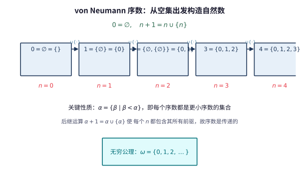

# 第 122 级：公理集合论 (Axiomatic Set Theory)

> 公理集合论是数学的基石之一，它将整个数学建立在严格的公理化基础之上。ZFC 公理系统是目前最广泛使用的集合论公理系统，它不仅为数学对象提供了统一的表示框架，还揭示了数学真理的相对性和独立性。

---

## 1. 学习目标

完成本教程后，你应当能够：

1. **理解 ZFC 公理系统**——掌握 ZFC 九条公理（外延、空集、对集、并集、幂集、无穷、分离、替换、正则）以及选择公理的内容与意义。
2. **掌握序数理论**——理解 von Neumann 序数的定义、序数的传递性与良序性，掌握超穷归纳与超穷递归原理。
3. **理解基数理论**——掌握基数的定义、Cantor-Bernstein 定理、共尾性与基数算术的基本定理。
4. **了解 Gödel 可构造宇宙 L 与力迫法**——理解相对一致性证明的基本思想和连续统假设独立性的证明思路。
5. **掌握选择公理的等价形式**——理解 Zorn 引理、良序定理与选择公理之间的等价关系。
6. **通过示例与习题巩固理论**——完成至少 6 个详细示例和 8 道习题。

---

## 2. 核心概念

### 2.1 ZFC 公理系统

ZFC 公理系统（Zermelo-Fraenkel Set Theory with Choice）是数学中最常用的集合论公理化系统。它在一阶逻辑的语言中表述，仅使用一个二元关系符号 $\in$（属于）。

**ZFC 公理列表**：

1. **外延公理 (Axiom of Extensionality)**：
   $$
   \forall A \forall B (\forall x (x \in A \leftrightarrow x \in B) \to A = B)
   $$
   两个集合相等当且仅当它们包含相同的元素。这定义了集合的外延性本质。

   > **💡 直观理解（类比）**：外延公理像"查点名册"——判断两个集合是不是同一个，唯一标准是"成员名单"是否一字不差，名单怎么排序、谁抄的都不重要。就像两个班的名单只要名字完全一样就是同一个班；这也排除了"同一个元素同时属于却又意义不同"的混乱。

2. **空集公理 (Axiom of Empty Set)**：
   $$
   \exists \varnothing \forall x (x \notin \varnothing)
   $$
   存在一个不含任何元素的集合，记作 $\varnothing$ 或 $\{\}$。

   > **直观理解（现实类比）**：空集公理像"空白保险箱/空抽屉"——保证存在一个什么都不装的集合作为一切构造的起点。就像盖楼前先有"0 号地基"，没有空集，自然数 $0$ 从一开始就无从谈起。

3. **对集公理 (Axiom of Pairing)**：
   $$
   \forall a \forall b \exists C \forall x (x \in C \leftrightarrow x = a \lor x = b)
   $$
   对任意两个集合 $a, b$，存在一个集合 $\{a, b\}$ 恰好以它们为元素。

   > **💡 直观理解（类比）**：对集公理像"打包"——任意两个对象 $a,b$ 都能装进同一个塑料袋 $\{a,b\}$，不管它们是否有关。它不关心顺序（$\{a,b\}=\{b,a\}$），更像"归到一堆"；要想区分谁先谁后，得靠后面的有序对。

4. **并集公理 (Axiom of Union)**：
   $$
   \forall \mathcal{F} \exists A \forall x (x \in A \leftrightarrow \exists Y (Y \in \mathcal{F} \land x \in Y))
   $$
   对任意集合族 $\mathcal{F}$，存在其所有元素的并集 $\bigcup \mathcal{F}$。

   > **直观理解（现实类比）**：并集公理像"拆箱倒出"——你有一箱一箱的货（族 $\mathcal{F}$ 是箱子组成的集合），把每个箱子打开、把所有货物倒到一起，就成了 $\bigcup\mathcal{F}$，得到的是全体货物的"大集合"。

5. **幂集公理 (Axiom of Power Set)**：
   $$
   \forall A \exists P \forall x (x \in P \leftrightarrow x \subseteq A)
   $$
   对任意集合 $A$，存在其所有子集构成的集合 $\mathcal{P}(A)$。

   > **💡 直观理解（类比）**：幂集公理像"列出全部搭配方案"——给定 $A$，就能列出所有能拼出 $A$ 的小队伍（子集），并把它们装进一个大集合。这个"所有选择/所有组合"的集合通常比原集合大得多，正是它保证了 $2^{|A|}$ 这种"指数级暴增"的存在（也才有了不可数集）。

6. **无穷公理 (Axiom of Infinity)**：
   $$
   \exists I (\varnothing \in I \land \forall x (x \in I \to x \cup \{x\} \in I))
   $$
   存在一个归纳集，即包含 $\varnothing$ 且对后继运算封闭的集合。这保证了自然数集的存在。

   > **直观理解（现实类比）**：无穷公理像"始终匀速转动的传送带"——只要给出起点 $\varnothing$ 和一步"从 $x$ 到 $x\cup\{x\}$"，就能像流水线一样不断吐出 $0,1,2,\dots$ 且永不停歇。它正式宣布"无限这种长度合法"，否则仅靠前面几条公理怎么逐步构造都拼不出一条无穷链条。

7. **分离公理模式 (Axiom Schema of Separation)**：
   $$
   \forall A \exists B \forall x (x \in B \leftrightarrow x \in A \land \varphi(x))
   $$
   对任意集合 $A$ 和性质 $\varphi$（$B$ 不在 $\varphi$ 中自由出现），存在 $A$ 中满足 $\varphi$ 的元素构成的子集。

   > **💡 直观理解（类比）**：分离公理像"安检筛选"——只能从已存在的集合 $A$ 里"筛出"满足条件 $\varphi$ 的元素，不能凭空无中生有。就像只能在现存人群里"挑"符合条件的人，而不是自己凭空"造"一批人。正是这条规矩堵住了罗素悖论：不允许你直接构造 $\{x:x\notin x\}$ 这么个"自指的全体"。所以公理说它必须从某个 $A$ 里分出来，从而化解矛盾。

8. **替换公理模式 (Axiom Schema of Replacement)**：
   $$
   \forall A (\forall x \in A \exists! y \varphi(x,y) \to \exists B \forall x \in A \exists y \in B \varphi(x,y))
   $$
   若 $\varphi$ 在 $A$ 上定义了一个函数，则 $A$ 在该函数下的像构成一个集合。

   > **直观理解（现实类比）**：替换公理像"批处理方法/改签窗口"——若每个 $x\in A$ 都能唯一对应一个 $y$（一人换一票），那么把整队 $A$ 一次"换像"得到的集合 $B$ 依然存在，规模不会失控。它保证了"定义域有多少，值域就有多少"，是顺着递归一步步造出超大型集合（如整列阿列夫）的底气来源。

9. **正则公理 (Axiom of Regularity / Foundation)**：
   $$
   \forall A (A \neq \varnothing \to \exists x \in A (x \cap A = \varnothing))
   $$
   每个非空集合都有一个 $\in$-极小元。这排除了 $x \in x$ 或无限下降链 $\dots \in x_2 \in x_1 \in x_0$ 的存在。

   > **💡 直观理解（类比）**：正则公理像"地基不能挖自己"——任何非空集合都有一块"最底层"的砖，保证成员关系像层层叠的地基那样从下往上、永不自环或无限下陷。它禁止"集合包含自己"和无穷下降链，让数学宇宙没有"会打转的坑"，也为每个集合定义了"从哪层地基冒出"的秩。

10. **选择公理 (Axiom of Choice, AC)**：
    $$
    \forall \mathcal{F} (\varnothing \notin \mathcal{F} \to \exists f: \mathcal{F} \to \bigcup \mathcal{F} \;\forall A \in \mathcal{F} (f(A) \in A))
    $$
    对任意由非空集合组成的族 $\mathcal{F}$，存在一个选择函数 $f$ 从每个 $A \in \mathcal{F}$ 中选出一个元素。

> **直观理解（现实类比）**：ZFC 公理就像"数学宇宙的宪法"——九条公理（外加选择公理）规定了这个宇宙里集合能做什么、不能做什么。外延公理是"身份法"（元素相同即同一集合），空集公理保证宇宙有起点，幂集和替换公理是"造物法"（能造出更大的集合），正则公理是"禁令法"（禁止集合包含自己、禁止无穷下降链）。正如宪法条款有限却能治理整个国家，这十条公理虽少，却足以推导出几乎全部经典数学。

> **🧠 思考历程：集合论如何在"悖论危机"中绝处逢生？**
>
> 1878 年康托在研究实数与自然数是否"一样多"时，意外发现实数比自然数多，从此打开了一个"可比较大小的无穷世界"，也拉开了公理集合论百年演进的序幕。
>
> - **无穷不再"无一例外"**。Georg Cantor（康托）1874 年证明实数无法与自然数建立一一对应，1891 年又给出漂亮的对角线论证，说明对任意集合 $A$ 都有 $|A|<|\mathcal{P}(A)|$。这让"无穷大"首次有了严格的阶与序，$2^{\aleph_0}>\aleph_0$ 成为不可动摇的起点。
> - **悖论倒逼公理化**。1901 年 Bertrand Russell（罗素）发现能包含所有"不含自身"集合的集合 $\{x:x\notin x\}$ 导致矛盾，动摇了朴素的集合直觉。Ernst Zermelo（策梅洛）1908 年提出七条公理，后经 Abraham Fraenkel（弗兰克尔）1922 年补上替换公理、并加入正则公理，形成 ZFC，用"只能从既有集合中分出子集"的分离公理堵住了罗素悖论。
> - **同一种语言的统一**。在 ZFC 中，自然数、序数 $\omega$、基数 $\aleph_\alpha$ 乃至整个函数空间都被翻译成 $\in$ 关系的结构；康托"无穷有多大"的直觉，最终沉淀为对不可数、良序与连续统假设的精确追问。
> - **心路**：面对矛盾的惊惧曾让康托本人在晚年陷入精神困境，但数学家最终选择把惊惧转化为约束——用公理把"无限"驯化成可控的对象，而不是弃之不用。

> **直观理解（现实类比）**：选择公理像"无限投票"——面对无穷多个非空集合（每个集合是一群人），要从每组各选一个代表，需要一条"选择函数"作为投票规则。有限组时随手就能选，但组数无穷时，没有明确规则就无法具体操作。这条公理看似理所当然却引发百年争议：它蕴含良序定理（任何集合都能被良序化），却又推出 Banach-Tarski 那样"反直觉"的结论（一个实心球能拆成有限份再拼成两个同样大的球）。

### 2.2 序数 (Ordinals)

**von Neumann 序数**的定义是集合论中最优雅的序数表示方式：

**定义**：一个集合 $\alpha$ 称为 **序数**，如果它满足：
1. $\alpha$ 是传递的：$\forall x \in \alpha \forall y \in x (y \in \alpha)$，即 $x \in \alpha \implies x \subseteq \alpha$。
2. $\alpha$ 在 $\in$ 关系下是良序的。

**有限序数**：
$$
\begin{aligned}
0 &= \varnothing \\
1 &= \{\varnothing\} = \{0\} \\
2 &= \{\varnothing, \{\varnothing\}\} = \{0, 1\} \\
3 &= \{0, 1, 2\} \\
&\vdots \\
n &= \{0, 1, 2, \dots, n-1\}
\end{aligned}
$$

**后继序数**：$\alpha + 1 = \alpha \cup \{\alpha\}$。

**极限序数**：若 $\alpha$ 不是后继序数且 $\alpha \neq 0$，则 $\alpha$ 是极限序数。

**第一个无穷序数**：$\omega = \{0, 1, 2, 3, \dots\}$，即自然数集。

> **直观理解（现实类比）**：这就像俄罗斯套娃——每个自然数 $n$ 都是一个"套娃"，里面装着所有比它小的自然数（$n=\{0,1,\dots,n-1\}$）。空集 $\varnothing$ 是起点，每一次后继运算 $n+1=n\cup\{n\}$ 就是往里套进一个更大的套娃。无穷公理保证了我们能一直套下去，最终得到装下所有自然数的 $\omega$。

**序数的分类**：
- $0$：最小的序数
- 后继序数：形如 $\alpha + 1$ 的序数
- 极限序数：$0$ 以外的非后继序数，如 $\omega, \omega + \omega, \omega^2, \omega^\omega, \omega_1$（第一个不可数序数）

  > **💡 直观理解（类比）**：序数分三类"村民"——最小派 $0$、后继派（有"直接前一个"，像每个自然数的"下一个 $n+1$"）、极限派（没有直接前驱，只能"回望一路走来"的全体，如 $\omega$ 是所有自然数堆出来的"顶"）。极限序数就像"无限长阶梯的最上台阶"：没有某一步恰好是它，只有下方无穷多步才够到它。

### 2.3 超穷归纳 (Transfinite Induction)

**超穷归纳定理**：设 $\varphi(x)$ 是集合论公式。若对任意序数 $\alpha$，从 $\forall \beta < \alpha \varphi(\beta)$ 可推出 $\varphi(\alpha)$，则 $\forall \alpha \varphi(\alpha)$ 对所有序数成立。

> **💡 直观理解（类比）**：超穷归纳像"推倒一条超长的多米诺队伍"——普通数学归纳只能覆盖排成一列的自然数，而这里的队伍按序数排，可能无限长甚至超限长。只要证明"当前块倒下之前，它的前面全都倒了它一定也会倒"，整条队伍就都会倒下：因为序数良序，若真有一块没倒，必存在"第一块没倒的"来制造矛盾。

### 2.4 超穷递归 (Transfinite Recursion)

**超穷递归定理**：设 $G$ 是定义在全体集合上的函数（或泛函），则存在唯一的函数 $F$ 定义在全体序数上，使得对每个序数 $\alpha$ 有：
$$
F(\alpha) = G(F \upharpoonright \alpha)
$$
其中 $F \upharpoonright \alpha$ 是 $F$ 在 $\alpha$ 上的限制。

> **直观理解（现实类比）**：超穷递归像"接力盖楼"——$F$ 每一层的取值 $F(\alpha)$ 完全由已经盖好的前 $\alpha$ 层整体 $F\upharpoonright\alpha$ 决定，如同盖每一层都要参考已建成的全部下层。它把"你知道该怎么根据已建的历史接着盖"固化成一条唯一规则，从地基一路盖到超限高层都不会跑偏。

### 2.5 基数 (Cardinals)

**定义**：集合 $A$ 的**基数**记作 $|A|$，是最小的与 $A$ 等势的序数。一个序数 $\kappa$ 称为**基数**，如果对任意 $\alpha < \kappa$，$\alpha$ 与 $\kappa$ 不等势。

> **💡 直观理解（类比）**：基数像"人口统计的规模牌"——$|A|$ 忽略集合内部怎么排序、元素长什么样，只关心"能数到第几格"，取与你"同多"的最小序数当代表。基数就是"与 $A$ 一样多的那个标准刻度"：$\aleph_0$ 是可数档，$\aleph_1$ 是下一档，档与档之间塞不下别的档。

**可数基数**：$\aleph_0 = \omega$。

**不可数基数**：$\aleph_1 = \omega_1$（第一个不可数序数），$\aleph_2, \dots, \aleph_\alpha, \dots$。

**阿列夫函数**：$\aleph_\alpha$ 由超穷递归定义：
- $\aleph_0 = \omega$
- $\aleph_{\alpha+1} = \omega_{\alpha+1}$（$\aleph_\alpha$ 的后继基数）
- 对极限序数 $\lambda$，$\aleph_\lambda = \bigcup_{\alpha < \lambda} \aleph_\alpha$

> **直观理解（现实类比）**：想象一家旅馆给"无穷多个房间"编号（可数 $\aleph_0$），但来了比房间还多的"旅客"（实数）。对角线论证就像检查旅客名单时总能"插队"造出一个不在名单上的新旅客——无论名单怎么排都排不完，说明实数比自然数"更多"（$2^{\aleph_0}>\aleph_0$）。阿列夫 $\aleph_0,\aleph_1,\aleph_2,\dots$ 就是无穷大小的"阶梯"，每一级都严格大于上一级。

### 2.6 共尾性 (Cofinality)

**定义**：设 $\kappa$ 是极限序数。$\kappa$ 的**共尾性** $\operatorname{cf}(\kappa)$ 是最小的 $\lambda$，使得存在一个共尾映射 $f: \lambda \to \kappa$（即 $\kappa = \bigcup_{\alpha < \lambda} f(\alpha)$）。

> **💡 直观理解（类比）**：共尾性像"登顶这座山最少要多少级台阶"——$\operatorname{cf}(\kappa)$ 衡量能否用比 $\kappa$ 更少的台阶"抄近路逼近"到顶。$\operatorname{cf}(\aleph_\omega)=\omega$ 表示用可数多步就能登顶（这座山很"斜"）；而 $\operatorname{cf}(\kappa)=\kappa$（正则）表示只有自己一步步爬满整座山才到顶，没有捷径。

**正则基数**：若 $\operatorname{cf}(\kappa) = \kappa$，则 $\kappa$ 是正则的。

**奇异基数**：若 $\operatorname{cf}(\kappa) < \kappa$，则 $\kappa$ 是奇异的。

### 2.7 Gödel 可构造宇宙 L

**可构造宇宙** $L$ 是 Gödel 提出的一个内模型，在其中 $V = L$（所有集合都是可构造的）。

**定义**（超穷递归）：
$$
\begin{aligned}
L_0 &= \varnothing \\
L_{\alpha+1} &= \operatorname{Def}(L_\alpha) \quad (\text{在 } L_\alpha \text{ 中一阶可定义的子集}) \\
L_\lambda &= \bigcup_{\alpha < \lambda} L_\alpha \quad (\lambda \text{ 为极限序数}) \\
L &= \bigcup_{\alpha \in \operatorname{Ord}} L_\alpha
\end{aligned}
$$

**Gödel 定理**：在 $L$ 中，连续统假设 (CH) 和选择公理 (AC) 都成立。因此，如果 ZF 是一致的，则 ZFC + CH 也是一致的。

### 2.8 力迫法 (Forcing)

力迫法是 Cohen 发明的用于证明独立性结果的技术。

**基本思想**：给定一个可数传递模型 $M$ 和 $M$ 中的一个偏序集 $\mathbb{P}$（称为力迫概念），通过添加一个 $\mathbb{P}$-generic 滤 $G$，构造一个更大的模型 $M[G]$，使得 $M[G]$ 满足特定的性质。

> **💡 直观理解（类比）**：力迫法像"往最小地基上强行加建新楼层"——$M$ 是已有的"宇宙小区"，偏序 $\mathbb{P}$ 像"设计图纸"，任意外加的 generic 滤 $G$ 是按图纸必须"被迫补上"的新单元，整合成更大的小区 $M[G]$。换一份图纸（$\mathbb{P}$），就能控制新小区里"多冒出多少个实数"，从而人为把 $2^{\aleph_0}$ 调成想要的档位——这正是 CH 独立性证明的"交换机"。

**Cohen 定理**：如果 ZFC 是一致的，则 ZFC + $\neg$CH 也是一致的。结合 Gödel 的结果，CH 独立于 ZFC。

### 2.9 连续统假设的独立性

**连续统假设 (CH)**：$2^{\aleph_0} = \aleph_1$。

- **Gödel (1938)**：$L \models \text{ZFC} + \text{CH}$，故 CH 与 ZFC 相对一致。
- **Cohen (1963)**：通过力迫法构造了 $\neg$CH 的模型，故 $\neg$CH 与 ZFC 相对一致。
- 结论：CH 在 ZFC 中既不可证明也不可否证——**独立于 ZFC**。

> **直观理解（现实类比）**：连续统假设像"无穷的阶层"——已知自然数是"最低层"无穷 $\aleph_0$，实数是"更高一层"无穷 $2^{\aleph_0}$。问题是：这两层之间还有没有"中间层"无穷？CH 断言没有，实数刚好是"第二层" $\aleph_1$。Gödel 和 Cohen 联手证明这条假设在 ZFC 中既不能证实也不能证伪——就像问"宇宙是有限还是无限"在某种物理理论中无法判定一样，ZFC 这部"宪法"对此保持沉默，需要"立法补充"（增加新公理）才能定夺。

> **直观理解（现实类比）**：可构造宇宙 $L$ 像"最小模型"——它只包含 ZFC 公理能强制生成的集合，仿佛一位极简主义建筑师只用必要材料搭起的最简房屋。$L_0=\varnothing$ 是空地，$L_{\alpha+1}=\operatorname{Def}(L_\alpha)$ 是每层从下层"一阶可定义"地长出的新集合，$L=\bigcup_\alpha L_\alpha$ 是全部楼层。Gödel 发现这个最简模型里 CH 自动成立，就好比"最节俭的构造方式"恰好让实数正好填到 $\aleph_1$ 这一层。$L$ 之外更"奢华"的宇宙里则可能出现更多实数，从而让 CH 失效——这正是 Cohen 力迫法所展示的另一种可能。

---

## 3. 定理与证明

### 3.1 超穷归纳定理

> **定理（超穷归纳）**：设 $\varphi(x)$ 是集合论公式。若对任意序数 $\alpha$ 有
$$
(\forall \beta < \alpha \varphi(\beta)) \implies \varphi(\alpha)
$$
> 则对所有序数 $\alpha$ 都有 $\varphi(\alpha)$ 成立。

**证明**：

用反证法。假设存在序数 $\alpha$ 使得 $\neg\varphi(\alpha)$。考虑所有使 $\neg\varphi(\alpha)$ 成立的序数构成的类：
$$
C = \{\alpha \in \operatorname{Ord} \mid \neg\varphi(\alpha)\}
$$
由假设 $C$ 非空。由于序数在 $\in$ 关系下是良序的，$C$ 有最小元，记作 $\alpha_0$。

由最小性，对所有 $\beta < \alpha_0$，$\varphi(\beta)$ 成立（因为 $\beta < \alpha_0$ 意味着 $\beta \notin C$）。

但归纳假设说：
$$
(\forall \beta < \alpha_0 \varphi(\beta)) \implies \varphi(\alpha_0)
$$
因此 $\varphi(\alpha_0)$ 成立，与 $\alpha_0 \in C$ 矛盾。故 $C$ 必须为空，即对所有序数 $\alpha$ 都有 $\varphi(\alpha)$ 成立。

$\square$

**关键点**：证明利用了序数的良序性质——任何非空序数类都有最小元。这种良序性来源于序数的传递性和 $\in$ 关系的严格良序性。

### 3.2 Cantor-Bernstein 定理

> **定理（Cantor-Bernstein）**：若存在单射 $f: A \to B$ 和单射 $g: B \to A$，则存在双射 $h: A \to B$。换言之，若 $|A| \leq |B|$ 且 $|B| \leq |A|$，则 $|A| = |B|$。

> **💡 直观理解（类比）**：Cantor-Bernstein 像"两家能互相完整塞进对方的收纳箱"——$A$ 能整箱拧进 $B$（单射 $f$），$B$ 也能整箱塞进 $A$（单射 $g$）。看似各有空隙按常理不该等大，但定理保证二者其实"一般多"、能对齐成双射 $h$。如同两瓶水互相倒得进去，那么两瓶容量必然相等——"你≤我 且 我≤你 ⇒ 我就等于你"。

**证明**（使用逆向迭代法 / 不动点方法）：

定义集合序列：令 $C_0 = A \setminus g[B]$（即 $A$ 中不被 $g$ 的像覆盖的元素）。然后递归定义：
$$
C_{n+1} = g[f[C_n]]
$$
即先对 $C_n$ 中的元素应用 $f$ 得到 $B$ 中的子集，再用 $g$ 映射回 $A$。

令 $C = \bigcup_{n=0}^\infty C_n$。定义 $h: A \to B$ 如下：
$$
h(x) = \begin{cases}
f(x) & \text{若 } x \in C \\
g^{-1}(x) & \text{若 } x \notin C
\end{cases}
$$
注意当 $x \notin C$ 时 $x \in g[B]$（因为 $C_0 = A \setminus g[B]$，若 $x \notin C$ 则 $x \notin C_0$，故 $x \in g[B]$），因此 $g^{-1}(x)$ 有定义且唯一。

**验证 $h$ 是双射**：

1. **单射性**：设 $h(x_1) = h(x_2)$。分情况讨论：
   - 若 $x_1, x_2 \in C$，则 $f(x_1) = f(x_2)$，由 $f$ 的单射性得 $x_1 = x_2$。
   - 若 $x_1, x_2 \notin C$，则 $g^{-1}(x_1) = g^{-1}(x_2)$，故 $x_1 = x_2$。
   - 若 $x_1 \in C$ 且 $x_2 \notin C$，则 $h(x_1) = f(x_1) \in f[C]$，$h(x_2) = g^{-1}(x_2)$。假设 $f(x_1) = g^{-1}(x_2)$，则 $g(f(x_1)) = x_2$。但 $x_1 \in C$ 意味着 $x_1 \in C_n$ 对某个 $n$，于是 $g(f(x_1)) \in C_{n+1} \subseteq C$，这与 $x_2 \notin C$ 矛盾。因此 $h(x_1) \neq h(x_2)$。

2. **满射性**：对任意 $y \in B$，需要找到 $x \in A$ 使得 $h(x) = y$。
   - 若 $g(y) \in C$，设 $g(y) \in C_n$。若 $n = 0$，则 $g(y) \in C_0 = A \setminus g[B]$，这与 $g(y) \in g[B]$ 矛盾。故 $n \geq 1$，于是存在 $x \in C_{n-1}$ 使得 $g(f(x)) = g(y)$，由 $g$ 的单射性得 $f(x) = y$。此时 $h(x) = f(x) = y$。
   - 若 $g(y) \notin C$，则 $h(g(y)) = g^{-1}(g(y)) = y$，所以 $x = g(y)$ 满足要求。

因此 $h$ 是双射，$A$ 与 $B$ 等势。

$\square$

### 3.3 序数的比较定理

> **定理（序数的比较定理）**：对任意两个序数 $\alpha$ 和 $\beta$，以下三种情况恰好成立一种：
$$
\alpha \in \beta,\quad \alpha = \beta,\quad \beta \in \alpha
$$
> 换言之，序数在 $\in$ 关系下构成全序（且是良序）。

> **💡 直观理解（类比）**：序数比较定理是"序数界的车牌互比"——任意两个序数要么一个落在另一个里头（$\alpha\in\beta$）、要么相等、要么反过来，三者恰居其一，绝无"没法比"的第三种关系。就像任意两个正整数必有一个大、一个相等、一个小。因为序数天生被 $\in$ 排队，所以任意两个都能干脆地比出大小，不出现并列歧义。

**证明**：

首先证明一个引理：若 $\alpha$ 和 $\beta$ 是序数且 $\alpha \subsetneq \beta$，则 $\alpha \in \beta$。

**引理证明**：因为 $\alpha \subsetneq \beta$，$\beta \setminus \alpha$ 非空。由 $\beta$ 的良序性，取 $\gamma = \min(\beta \setminus \alpha)$。需证 $\alpha = \gamma$。
- 若 $\delta \in \gamma$，则 $\delta \in \beta$（$\beta$ 的传递性），且 $\delta \notin \beta \setminus \alpha$（因为 $\gamma$ 是最小元），故 $\delta \in \alpha$。所以 $\gamma \subseteq \alpha$。
- 若 $\delta \in \alpha$，则 $\delta \in \beta$（$\alpha \subseteq \beta$）。由 $\in$ 在 $\beta$ 上的三歧性，要么 $\delta \in \gamma$，要么 $\delta = \gamma$，要么 $\gamma \in \delta$。若 $\gamma \in \delta$，则 $\gamma \in \delta \in \alpha$，由 $\alpha$ 的传递性得 $\gamma \in \alpha$，矛盾。若 $\delta = \gamma$，则 $\gamma \in \alpha$，矛盾。故 $\delta \in \gamma$。所以 $\alpha \subseteq \gamma$。
因此 $\alpha = \gamma \in \beta$。引理证毕。

**定理证明**：设 $\alpha$ 和 $\beta$ 是序数。考虑 $\alpha \cap \beta$。由于 $\alpha$ 和 $\beta$ 都是传递的，$\alpha \cap \beta$ 也是传递的，且在 $\in$ 下良序，因此 $\alpha \cap \beta$ 是一个序数，记作 $\gamma$。

我们有 $\gamma \subseteq \alpha$ 且 $\gamma \subseteq \beta$。若 $\gamma \subsetneq \alpha$，由引理 $\gamma \in \alpha$。类似地，若 $\gamma \subsetneq \beta$，则 $\gamma \in \beta$。

现在用超穷归纳证明三歧性。假设对某个序数 $\alpha$ 和所有 $\beta < \alpha$，三歧性成立。对任意 $\beta$，考虑 $\alpha \cap \beta$：
- 若 $\alpha \cap \beta = \alpha$，则 $\alpha \subseteq \beta$，即 $\alpha \in \beta$ 或 $\alpha = \beta$。
- 若 $\alpha \cap \beta = \beta$，则 $\beta \subseteq \alpha$，即 $\beta \in \alpha$ 或 $\beta = \alpha$。
- 若 $\alpha \cap \beta \subsetneq \alpha$ 且 $\alpha \cap \beta \subsetneq \beta$，则 $\alpha \cap \beta \in \alpha$ 且 $\alpha \cap \beta \in \beta$。由 $\alpha \cap \beta \in \alpha$，$\alpha \cap \beta \in \beta$ 以及 $\alpha$ 的传递性，可以推出矛盾（因为 $\alpha \cap \beta$ 是 $\alpha$ 和 $\beta$ 中最大的公共序数，而 $\alpha \cap \beta \in \alpha \cap \beta$ 违反正则公理）。

因此，前两种情况必居其一，三歧性得证。

$\square$

### 3.4 König 定理

> **定理（König）**：若对每个 $i \in I$ 有 $\kappa_i < \lambda_i$，则
$$
\sum_{i \in I} \kappa_i < \prod_{i \in I} \lambda_i
$$

**证明**：

首先证明 $\sum_{i \in I} \kappa_i \leq \prod_{i \in I} \lambda_i$。对每个 $i$，因为 $\kappa_i < \lambda_i$，存在单射 $f_i: \kappa_i \to \lambda_i$。定义函数：
$$
F: \bigcup_{i \in I} (\kappa_i \times \{i\}) \to \prod_{i \in I} \lambda_i
$$
对 $(x, i) \in \kappa_i \times \{i\}$，令 $F(x, i)$ 为这样的函数 $g: I \to \bigcup_{i \in I} \lambda_i$，使得 $g(j) = 0$ 对 $j \neq i$，且 $g(i) = f_i(x)$。这给出了一个单射，故 $\sum \kappa_i \leq \prod \lambda_i$。

现在证明不能相等。假设存在双射 $h: \bigcup_{i \in I} (\kappa_i \times \{i\}) \to \prod_{i \in I} \lambda_i$。对每个 $i \in I$，考虑集合：
$$
S_i = \{h(\alpha, i)(i) \mid \alpha < \kappa_i\} \subseteq \lambda_i
$$
由于 $\kappa_i < \lambda_i$，$|S_i| \leq \kappa_i < \lambda_i$，故 $S_i \subsetneq \lambda_i$。因此存在 $\beta_i \in \lambda_i \setminus S_i$。

定义函数 $g \in \prod_{i \in I} \lambda_i$ 为 $g(i) = \beta_i$。由于 $h$ 是满射，存在 $(\alpha, i) \in \bigcup_{j \in I} (\kappa_j \times \{j\})$ 使得 $h(\alpha, i) = g$。于是 $g(i) = h(\alpha, i)(i) \in S_i$，但由构造 $g(i) = \beta_i \notin S_i$，矛盾。

因此 $\sum \kappa_i < \prod \lambda_i$。

$\square$

**推论**：$\kappa < 2^\kappa$（Cantor 定理），且 $\operatorname{cf}(2^{\aleph_0}) > \aleph_0$（即连续统的共尾性不可数）。

> **直观理解（现实类比）**：König 定理说"小的一堆加起来，仍赶不上对应大的堆连乘"——一批严格更小的 $\kappa_i$ 求和，必小于把对应的 $\lambda_i$ 相乘；像所有供货商单家产能都更弱，可它们的"排列组合乘满"远比把产能简单相加要大。推论 $\kappa<2^\kappa$ 就是熟悉的"幂集更大"，而 $\operatorname{cf}(2^{\aleph_0})>\aleph_0$ 说：连续统这级无穷台阶无法用可数多步"抄近路"一蹴而就地登顶。

### 3.5 选择公理的等价形式

> **定理**：以下命题在 ZF 中两两等价：
> 1. **选择公理 (AC)**：每个非空集合族都有选择函数。
> 2. **Zorn 引理**：若非空偏序集 $P$ 的每条链都有上界，则 $P$ 有极大元。
> 3. **良序定理**：每个集合都可以被良序化。

> **💡 直观理解（类比）**：AC、Zorn 引理、良序定理是"三枚面值相同的不同硬币"——一个讲"能从每群各挑一个代表"，一个讲"有上界约束就必有极大元"，一个讲"任何东西都能排成整齐的列"，字面毫不相同却可互相兑换。它们共享的核心力量是：在无穷世界里"总有办法选到样子/排好顺序"，正是无数存在性结论（向量空间有基、每个理想嵌在极大理想里）背后的统一引擎。

**证明**：

**(1) $\implies$ (2): AC 推出 Zorn 引理**

设 $(P, \leq)$ 是非空偏序集，其中每条链都有上界。用反证法，假设 $P$ 没有极大元。

对每个 $x \in P$，定义 $U_x = \{y \in P \mid y > x\}$（严格大于 $x$ 的元素）。由于 $P$ 没有极大元，每个 $U_x$ 非空。由 AC，存在选择函数 $f: P \to P$ 使得 $f(x) \in U_x$，即 $f(x) > x$。

现在用超穷递归构造一个严格递增链。设 $x_0$ 是 $P$ 中任意元素。对序数 $\alpha$，定义：
$$
x_\alpha = \begin{cases}
f(x_\beta) & \text{若 } \alpha = \beta + 1 \\
\text{链 } \{x_\beta\}_{\beta < \alpha} \text{ 的上界} & \text{若 } \alpha \text{ 是极限序数}
\end{cases}
$$
由假设，每条链都有上界，故极限步骤可行。这样，我们构造了一个严格递增的序数长度的链，与 Hartogs 引理（存在一个不能嵌入 $P$ 的序数）矛盾。因此 $P$ 必须有极大元。

**(2) $\implies$ (3): Zorn 引理推出良序定理**

设 $A$ 是任意集合。考虑所有 $(B, <_B)$ 的集合 $W$，其中 $B \subseteq A$ 且 $<_B$ 是 $B$ 上的良序。在 $W$ 上定义偏序：$(B, <_B) \preceq (C, <_C)$ 如果 $B \subseteq C$，$<_C$ 限制在 $B$ 上等于 $<_B$，且 $B$ 是 $C$ 的初始段。

对 $W$ 中的任意链 $\{(B_i, <_{B_i})\}_{i \in I}$，取 $B = \bigcup_i B_i$，并在 $B$ 上定义序：$x <_B y$ 当且仅当存在 $i$ 使得 $x, y \in B_i$ 且 $x <_{B_i} y$。可以验证 $(B, <_B)$ 是良序的，且是链中每个元素的上界。

由 Zorn 引理，$W$ 有极大元 $(M, <_M)$。若 $M \neq A$，取 $a \in A \setminus M$，将 $a$ 添加到 $M$ 的末端得到 $M \cup \{a\}$ 上的良序，这与极大性矛盾。因此 $M = A$，$A$ 被良序化。

**(3) $\implies$ (1): 良序定理推出 AC**

设 $\mathcal{F}$ 是非空集合族。由良序定理，$\bigcup \mathcal{F}$ 可以被良序化。对每个 $A \in \mathcal{F}$，$A$ 作为 $\bigcup \mathcal{F}$ 的子集，在良序下有最小元。定义 $f(A) = \min(A)$，则 $f$ 是 $\mathcal{F}$ 上的选择函数。

$\square$

---

## 4. 示例

### 示例 1：von Neumann 序数的构造

构造前几个 von Neumann 序数并验证它们的传递性。

**解**：

$$
\begin{aligned}
0 &= \varnothing \\
1 &= \{\varnothing\} = \{0\} \\
2 &= \{\varnothing, \{\varnothing\}\} = \{0, 1\} \\
3 &= \{0, 1, 2\} \\
4 &= \{0, 1, 2, 3\} \\
&\vdots \\
n &= \{0, 1, 2, \dots, n-1\}
\end{aligned}
$$

验证传递性：
- $0 = \varnothing$：空集的传递性平凡成立。
- $1 = \{0\}$：$0$ 的唯一元素是 $0$，而 $0 \subseteq 1$（因为 $0 = \varnothing \subseteq 1$）。
- $2 = \{0, 1\}$：$0 \subseteq 2$（因为 $0 = \varnothing$），$1 = \{0\} \subseteq 2$（因为 $0 \in 2$）。
- 一般地，若 $\alpha$ 是传递的，则 $\alpha + 1 = \alpha \cup \{\alpha\}$ 也是传递的，因为对任意 $x \in \alpha + 1$，要么 $x \in \alpha$（此时 $x \subseteq \alpha \subseteq \alpha + 1$），要么 $x = \alpha$（此时 $x = \alpha \subseteq \alpha + 1$）。

### 示例 2：利用超穷递归构造 Borel 集族

在实直线 $\mathbb{R}$ 上，Borel 集族 $\mathcal{B}$ 是包含所有开集并在可数并和补运算下封闭的最小 $\sigma$-代数。我们可以用超穷递归构造它。

**解**：

设 $\mathcal{O}$ 是 $\mathbb{R}$ 上的所有开集构成的族。对序数 $\alpha < \omega_1$（第一个不可数序数），递归定义：

$$
\begin{aligned}
\mathcal{B}_0 &= \mathcal{O} \\
\mathcal{B}_{\alpha+1} &= \left\{ \bigcup_{n=1}^\infty A_n \;\middle|\; A_n \in \mathcal{B}_\alpha \right\} \cup \left\{ \mathbb{R} \setminus A \;\middle|\; A \in \mathcal{B}_\alpha \right\} \\
\mathcal{B}_\lambda &= \bigcup_{\alpha < \lambda} \mathcal{B}_\alpha \quad (\lambda \text{ 为极限序数})
\end{aligned}
$$

则 Borel 集族为 $\mathcal{B} = \bigcup_{\alpha < \omega_1} \mathcal{B}_\alpha$。

验证：$\omega_1$ 步后过程停止，因为每一步的基数在增加，而 $\mathcal{P}(\mathbb{R})$ 的基数有上界 $2^{\mathfrak{c}}$。实际上，可以证明 $\mathcal{B}_{\omega_1} = \mathcal{B}_{\omega_1+1}$，即过程在 $\omega_1$ 步后达到不动点。

### 示例 3：Cantor-Bernstein 定理的应用

证明 $[0, 1]$ 与 $(0, 1)$ 等势。

**解**：

定义单射 $f: [0, 1] \to (0, 1)$ 为 $f(x) = \frac{1}{2}x + \frac{1}{4}$，即 $f$ 将 $[0, 1]$ 映到 $[\frac{1}{4}, \frac{3}{4}] \subseteq (0, 1)$。

定义单射 $g: (0, 1) \to [0, 1]$ 为恒等映射 $g(x) = x$。

由 Cantor-Bernstein 定理，$|[0, 1]| = |(0, 1)|$。

### 示例 4：利用 Zorn 引理证明基数的可比性

**命题**：对任意两个集合 $A$ 和 $B$，要么 $|A| \leq |B|$，要么 $|B| \leq |A|$。

> **💡 直观理解（类比）**：基数可比性（命题）由 Zorn 引理兜底保证：任意两箱物件的"容量"总能比出大小，要么 A 塞得进 B、要么 B 塞得进 A，绝不存在"互相塞不进、又没个大小"的僵局。它说明无穷之大的"阶梯"也是全序的——随便抓两个基数总能分个高低，不会出现两个无穷谁也不服谁。

**证明**：

考虑所有部分单射 $f: A' \to B$（其中 $A' \subseteq A$）构成的集合 $P$。在 $P$ 上定义偏序：$f \leq g$ 当且仅当 $g$ 是 $f$ 的扩张。

$P$ 中每条链 $\{f_i\}_{i \in I}$ 都有上界：取 $f = \bigcup_i f_i$（将定义域取并集，值也取并集），$f$ 是单射。

由 Zorn 引理，$P$ 有极大元 $f^*$。设 $f^*$ 的定义域为 $A^* \subseteq A$，值域为 $B^* \subseteq B$。

若 $A^* \neq A$ 且 $B^* \neq B$，则可取 $a \in A \setminus A^*$ 和 $b \in B \setminus B^*$，扩张 $f^*$ 为 $f^*(a) = b$，与极大性矛盾。因此要么 $A^* = A$（此时 $|A| \leq |B|$），要么 $B^* = B$（此时 $|B| \leq |A|$）。

### 示例 5：计算共尾性

计算 $\operatorname{cf}(\aleph_\omega)$。

**解**：

$\aleph_\omega = \bigcup_{n < \omega} \aleph_n$，映射 $n \mapsto \aleph_n$ 是 $\omega \to \aleph_\omega$ 的共尾映射。因此 $\operatorname{cf}(\aleph_\omega) \leq \omega$。

另一方面，$\operatorname{cf}(\aleph_\omega) \geq \omega$（因为 $\aleph_\omega$ 是极限序数，共尾性至少为 $\omega$）。故 $\operatorname{cf}(\aleph_\omega) = \omega$。

因此 $\aleph_\omega$ 是奇异的（因为 $\operatorname{cf}(\aleph_\omega) = \omega < \aleph_\omega$）。

### 示例 6：可构造宇宙中的层次

描述 $L_0, L_1, L_2$ 的内容。

**解**：

- $L_0 = \varnothing$。
- $L_1 = \operatorname{Def}(L_0) = \operatorname{Def}(\varnothing)$。在空集中，所有一阶公式的满足集只可能是 $\varnothing$ 本身（因为 $\varnothing$ 没有元素）。因此 $L_1 = \{\varnothing\} = \{0\} = 1$。
- $L_2 = \operatorname{Def}(L_1) = \operatorname{Def}(\{0\})$。在 $\{0\}$ 中，可定义的子集有 $\varnothing$ 和 $\{0\}$。因此 $L_2 = \{\varnothing, \{\varnothing\}\} = \{0, 1\} = 2$。

可见在可构造宇宙的底层，$L_\alpha$ 与 von Neumann 序数 $\alpha$ 一致（对有限 $\alpha$）。

---

## 5. 习题

### 基础题

**习题 1**（外延公理）叙述外延公理：两个集合相等当且仅当它们含有完全相同的元素（即 $\forall A\,\forall B\,(\forall x\,(x\in A\leftrightarrow x\in B)\to A=B)$），并解释它如何为集合的同一性确立"外延性"标准。

**习题 2**（空集公理与对集公理）分别叙述空集公理与对集公理，并写出由空集公理与对集公理逐步得到 $0$、$1$、$2$ 的过程。

**习题 3**（正则公理）证明：若 $\alpha$ 是序数，则 $\alpha\notin\alpha$（考虑集合 $\{\alpha\}$，用正则公理的 $\in$-极小元）。

**习题 4**（传递集）证明：对任意序数 $\alpha$，$\alpha$ 是传递的当且仅当 $\alpha\subseteq\mathcal{P}(\alpha)$（传递性的定义即 $x\in\alpha\Rightarrow x\subseteq\alpha$）。

**习题 5**（序数定义）给出 von Neumann 序数的定义（传递 + 在 $\in$ 下良序），据此写出 $0,1,2,3$ 的具体集合并验证其传递性。

**习题 6**（无穷公理与归纳集）叙述无穷公理，解释"归纳集"与"后继运算 $x\mapsto x\cup\{x\}$"的含义，并说明它为何保证自然数集 $\omega$ 存在。

**习题 7**（基数定义）给出集合 $A$ 的基数 $|A|$ 的定义，说明什么条件下一个序数本身就是基数，并写出 $\aleph_0$ 与 $\aleph_1$ 的含义。

**习题 8**（可数与不可数序数）证明：$\omega+1=\omega\cup\{\omega\}$ 是可数序数，而 $\omega_1$（全部可数序数之集）是不可数序数（构造 $\omega$ 与 $\omega+1$ 之间的双射）。

**习题 9**（共尾性）给出极限序数 $\kappa$ 的共尾性 $\operatorname{cf}(\kappa)$ 的定义，并区分正则基数与奇异基数。

**习题 10**（超穷归纳）陈述超穷归纳定理，并说明它为何依赖序数的良序性（任何非空序数类都有最小元）。

### 进阶题

**习题 11**（实数与幂集等势）证明 $\mathbb{R}$ 与 $\mathcal{P}(\mathbb{N})$ 等势（用二进制表示构造 $[0,1]$ 与 $\mathcal{P}(\mathbb{N})$ 的对应，再利用 $\mathbb{R}$ 与 $[0,1]$ 等势）。

**习题 12**（$\kappa<\kappa^{\operatorname{cf}(\kappa)}$）证明：若 $\kappa$ 是无穷基数，则 $\kappa<\kappa^{\operatorname{cf}(\kappa)}$（应用 König 定理，取 $I=\operatorname{cf}(\kappa)$，$\kappa_i<\kappa$ 且 $\lambda_i=\kappa$）。

**习题 13**（Zorn 蕴含良序）用 Zorn 引理证明良序定理（考虑 $A$ 上"初始段扩张"的部分交集组成的偏序）。

**习题 14**（序数的三歧性）陈述序数比较定理，并用 $\alpha\cap\beta$ 与正则公理概述其证明要点。

**习题 15**（Cantor-Bernstein 应用）叙述 Cantor-Bernstein 定理，并用它证明 $[0,1]$ 与 $(0,1)$ 等势（构造两个方向的单射）。

**习题 16**（正则基数）证明：若 $\kappa$ 是正则基数，则少于 $\kappa$ 个、每个小于 $\kappa$ 的序数之并仍小于 $\kappa$（用共尾性）。

**习题 17**（超穷递归）叙述超穷递归定理，并画出 $F(\alpha)=G(F\upharpoonright\alpha)$ 在序数上逐层构造的步骤。

**习题 18**（可构造宇宙与 CH）给出可构造宇宙 $L$ 的层次 $L_\alpha$ 的定义，并概述为何 $V=L$ 蕴含连续统假设（用 $\mathcal{P}(\omega)\subseteq L_{\omega_1}$ 与 $|L_{\omega_1}|=\aleph_1$）。

**习题 19**（选择公理的等价形式）陈述选择公理、Zorn 引理、良序定理，并指出它们在 ZF 中的两两等价关系。

### 挑战题

**习题 20**（基数可比性）用 Zorn 引理证明：对任意两个集合 $A,B$，要么 $|A|\le|B|$，要么 $|B|\le|A|$（考虑由部分单射构成的偏序及其极大元）。

**习题 21**（Cantor-Bernstein 完整证明）给出 Cantor-Bernstein 定理的完整证明（用逆向迭代 $C_{n+1}=g[f[C_n]]$ 定义双射 $h$ 并验证单射、满射）。

**习题 22**（König 定理）完整证明 König 定理：若对所有 $i\in I$ 有 $\kappa_i<\lambda_i$，则 $\sum_{i\in I}\kappa_i<\prod_{i\in I}\lambda_i$。

**习题 23**（共尾性的计算）计算 $\operatorname{cf}(\aleph_\omega)$，并据此判定 $\aleph_\omega$ 是正则还是奇异基数。

**习题 24**（序数比较引理）证明引理：若序数 $\alpha\subsetneq\beta$，则 $\alpha\in\beta$（用 $\beta\setminus\alpha$ 的最小元 $\gamma$ 讨论）。

**习题 25**（超穷递归构造 Borel 集）在实直线上用超穷递归构造 Borel 集族 $\mathcal{B}=\bigcup_{\alpha<\omega_1}\mathcal{B}_\alpha$，并说明为何 $\omega_1$ 步后停止（达到不动点）。

**习题 26**（从良序到选择）由良序定理推导选择公理（对 $\bigcup\mathcal{F}$ 取良序，再对每个 $A\in\mathcal{F}$ 取其最小元）。

### 探究题

**习题 27**（连续统假设的独立性）综合 Gödel 的可构造宇宙与 Cohen 的力迫法，说明 CH 为何既与 ZFC 相对一致、又与 $\neg$CH 相对一致，从而独立于 ZFC。

**习题 28**（力迫法的思想）解释 Cohen 力迫法的基本思想：给定可数传递模型 $M$ 与偏序 $\mathbb{P}$，如何用 $\mathbb{P}$-generic 滤 $G$ 扩张出模型 $M[G]$，并讨论它为何能用于控制 $2^{\aleph_0}$ 的大小。

**习题 29**（正则公理与累积层级）讨论正则公理在 ZFC 中的作用：它如何排除 $x\in x$ 与无穷下降 $\in$-链，并说明 von Neumann 层级 $V_\alpha$ 如何由此组织整个集合宇宙。

**习题 30**（选择公理的争议）结合良序定理、Zorn 引理与 Banach-Tarski 悖论，探讨选择公理在数学中的地位及其引发的争议。

---

## 6. 习题答案与解析

### 基础题答案

1. **外延公理** 外延公理即 $\forall A\,\forall B\,(\forall x\,(x\in A\leftrightarrow x\in B)\to A=B)$：两个集合相等当且仅当它们恰含相同的元素。它确立集合的同一性完全由"包含哪些元素"决定，与元素的定义方式、书写顺序、重复都无关——$\{1,2,3\}$ 与 $\{3,2,1\}$、$\{2+1,3\}$ 都是同一集合。这正是集合区别于"性质/内涵"之处：内涵相同未必同集，但元素名单（外延）相同则必定同集，同时它也是推理中"元素双向相承则相等"的依据。

2. **空集公理与对集公理** 空集公理 $\exists\varnothing\forall x(x\notin\varnothing)$ 保证存在不含任何元素的 $\varnothing$；对集公理 $\forall a\forall b\exists C\forall x(x\in C\leftrightarrow x=a\lor x=b)$ 保证对任意 $a,b$ 存在恰含此二元的集合 $\{a,b\}$。由对集取 $a=b=\varnothing$ 得单集 $\{\varnothing\}=1$；再取 $a=\varnothing$、$b=\{\varnothing\}$ 得 $\{\varnothing,\{\varnothing\}\}=2$；连同 $0=\varnothing$，即逐步得到 $0,1,2$。

3. **正则公理** 反证。设序数 $\alpha$ 满足 $\alpha\in\alpha$。取集合 $\{\alpha\}$（对集取 $a=b=\alpha$）。$\{\alpha\}$ 非空，由正则公理存在 $y\in\{\alpha\}$ 使 $y\cap\{\alpha\}=\varnothing$；但 $\{\alpha\}$ 中唯有无素是 $\alpha$，故 $y=\alpha$，得 $\alpha\cap\{\alpha\}=\varnothing$。然而 $\alpha\in\alpha$ 且 $\alpha\in\{\alpha\}$，故 $\alpha\in\alpha\cap\{\alpha\}$，矛盾。因此 $\alpha\notin\alpha$。

4. **传递集** 传递性即 $x\in\alpha\Rightarrow x\subseteq\alpha$，而 $\mathcal{P}(\alpha)$ 恰为 $\alpha$ 的所有子集之集。（$\Rightarrow$）设 $\alpha$ 传递：对任意 $x\in\alpha$，$x\subseteq\alpha$，故 $x\in\mathcal{P}(\alpha)$，即 $\alpha\subseteq\mathcal{P}(\alpha)$。（$\Leftarrow$）设 $\alpha\subseteq\mathcal{P}(\alpha)$：对任意 $x\in\alpha$，$x\in\mathcal{P}(\alpha)$，故 $x\subseteq\alpha$，$\alpha$ 传递。

5. **序数定义** von Neumann 序数是"传递 + 在 $\in$ 下良序"的集合。$0=\varnothing$，$1=\{0\}$，$2=\{0,1\}$，$3=\{0,1,2\}$。验证 $2$ 的传递性：元素 $0=\varnothing\subseteq2$（空集是任何集合的子集）；$1=\{0\}$ 之元素 $0\in2$，故 $1\subseteq2$。一般地，若 $\alpha$ 传递则 $\alpha\cup\{\alpha\}$ 亦传递：对 $x\in\alpha\cup\{\alpha\}$，要么 $x\in\alpha$（则 $x\subseteq\alpha\subseteq\alpha\cup\{\alpha\}$），要么 $x=\alpha$（则 $x=\alpha\subseteq\alpha\cup\{\alpha\}$）。

6. **无穷公理与归纳集** 无穷公理 $\exists I(\varnothing\in I\land\forall x(x\in I\to x\cup\{x\}\in I))$。"归纳集"指包含 $\varnothing$ 且对后继运算 $x\mapsto x\cup\{x\}$ 封闭的集合 $I$。它保证存在归纳集，从而在归纳集中收集所有有限序数得自然数集 $\omega=\{0,1,2,\dots\}$；$\omega$ 本身是归纳集，且是最小归纳集。仅靠空集、对集、并集公理无法一次"抓住"这个无穷集，必须有无穷公理。

7. **基数定义** $|A|$ 定义为与 $A$ 等势的最小序数；序数 $\kappa$ 是基数当对任意 $\alpha<\kappa$ 都有 $\alpha$ 与 $\kappa$ 不等势。$\aleph_0=\omega$ 是最小无穷基数（可数基数）；$\aleph_1=\omega_1$ 是第一不可数基数，即全部可数序数之集 $\omega_1$ 的基数。

8. **可数与不可数序数** 定义 $f:\omega\to\omega+1$ 为 $f(0)=\omega$、$f(n+1)=n$（$n\in\mathbb N$）。它是双射：把 $0$ 送到新顶 $\omega$，把每个 $n>0$ 送到 $n-1$，覆盖 $\omega+1=\omega\cup\{\omega\}$ 的每个元素且不重复。故 $|\omega+1|=|\omega|=\aleph_0$。而 $\omega_1$ 是最小不可数序数：若 $\omega_1$ 可数，则它与某个 $\alpha<\omega_1$ 等势，从而 $\omega_1\le\alpha<\omega_1$，违反正则公理，矛盾；故不可数。

9. **共尾性** $\operatorname{cf}(\kappa)$ 是最小 $\lambda$，使得存在共尾映射 $f:\lambda\to\kappa$（即 $\kappa=\bigcup_{\alpha<\lambda}f(\alpha)$）。若 $\operatorname{cf}(\kappa)=\kappa$，$\kappa$ 正则；若 $\operatorname{cf}(\kappa)<\kappa$，$\kappa$ 奇异。例如 $\aleph_\omega$ 的共尾性为 $\omega<\aleph_\omega$，是奇异基数。

10. **超穷归纳** 超穷归纳定理：若对任意序数 $\alpha$ 都从 $\forall\beta<\alpha\,\varphi(\beta)$ 推出 $\varphi(\alpha)$，则对所有序数 $\alpha$ 有 $\varphi(\alpha)$。其成立依赖序数的良序性：若存在使 $\neg\varphi$ 的序数，取集合 $C=\{\alpha\in\operatorname{Ord}:\neg\varphi(\alpha)\}$ 非空，由 $\in$-良序有最小元 $\alpha_0$；由最小性所有 $\beta<\alpha_0$ 均有 $\varphi(\beta)$，前提给出 $\varphi(\alpha_0)$，矛盾，故 $C$ 空。

### 进阶题答案

1. **实数与幂集等势** 用二进制：每个 $x\in[0,1]$ 有规范二进制展开 $x=0.b_0b_1b_2\cdots$（声明不选用终为全 1 的表示以保证唯一），映射 $x\mapsto B_x=\{n:b_n=1\}\subseteq\mathbb N$ 给单射 $[0,1]\to\mathcal{P}(\mathbb N)$。反之 $B\mapsto\sum_{n\in B}2^{-(n+1)}$ 给单射 $\mathcal{P}(\mathbb N)\to[0,1]$。由 Cantor-Bernstein，$|[0,1]|=|\mathcal{P}(\mathbb N)|$。再由 $\mathbb{R}$ 与 $[0,1]$ 等势（$[0,1]$ 恒等单射入 $\mathbb R$，且可用 $\arctan$ 型缩放把 $\mathbb R$ 单射入有界区间再入 $[0,1]$），得 $|\mathbb R|=|\mathcal{P}(\mathbb N)|$。

2. **$\kappa<\kappa^{\operatorname{cf}(\kappa)}$** 取 $I=\operatorname{cf}(\kappa)$ 及递增共尾于 $\kappa$ 的序列 $\{\kappa_i<\kappa:i\in I\}$，令 $\lambda_i=\kappa$。König 定理给 $\sum_{i\in I}\kappa_i<\prod_{i\in I}\kappa=\kappa^{|I|}=\kappa^{\operatorname{cf}(\kappa)}$。又因序列 $\{\kappa_i\}$ 在 $\kappa$ 中共尾，$\sum_{i\in I}\kappa_i=\kappa$。故 $\kappa<\kappa^{\operatorname{cf}(\kappa)}$。

3. **Zorn 蕴含良序** 令 $W$ 为全体 $(B,<_B)$ 之集，其中 $B\subseteq A$、$<_B$ 是 $B$ 上良序；在 $W$ 上定义偏序 $\preceq$：$(B,<_B)\preceq(C,<_C)$ 当 $B$ 是 $C$ 的初始段、且 $<_C$ 限制在 $B$ 上等于 $<_B$。$W$ 中每条 $\preceq$-链的上界为 $B=\bigcup_iB_i$（序取兼容并）上的良序，故由 Zorn 引理有极大元 $(M,<_M)$。若 $M\neq A$，取 $a\in A\setminus M$ 放在 $M$ 末端得 $M\cup\{a\}$ 上的良序，严格大于 $(M,<_M)$，与极大性矛盾。故 $M=A$，$A$ 被良序化。

4. **序数的三歧性** 序数比较定理（三歧性）：任意序数 $\alpha,\beta$，$\alpha\in\beta$、$\alpha=\beta$、$\beta\in\alpha$ 三者恰居其一。证明要点：$\gamma=\alpha\cap\beta$ 是传递且良序的，故为序数，$\gamma\subseteq\alpha$、$\gamma\subseteq\beta$。由引理"序数 $\delta\subsetneq\varepsilon\Rightarrow\delta\in\varepsilon$"：若 $\gamma\subsetneq\alpha$ 则 $\gamma\in\alpha$，若 $\gamma\subsetneq\beta$ 则 $\gamma\in\beta$；两者同时成立则 $\gamma\in\alpha\cap\beta=\gamma$，违反正则公理，矛盾。故必有一侧为等式（$\gamma=\alpha$ 或 $\gamma=\beta$），即 $\alpha\subseteq\beta$ 或 $\beta\subseteq\alpha$，结合传递性与引理得三歧性。

5. **Cantor-Bernstein 应用** Cantor-Bernstein 定理：若存在单射 $f:A\to B$ 与 $g:B\to A$，则存在双射 $A\to B$。对 $[0,1]$ 与 $(0,1)$：取 $f:[0,1]\to(0,1)$，$f(x)=\tfrac12 x+\tfrac14$，把 $[0,1]$ 映到 $[\tfrac14,\tfrac34]\subseteq(0,1)$，单射；取 $g:(0,1)\to[0,1]$ 为恒等，单射。由定理 $|[0,1]|=|(0,1)|$。

6. **正则基数** 设 $\lambda<\kappa$ 且每个 $\alpha_i<\kappa$（$i<\lambda$），证 $\gamma=\bigcup_{i<\lambda}\alpha_i<\kappa$。若 $\gamma=\kappa$，则 $i\mapsto\alpha_i$ 是 $\lambda\to\kappa$ 的共尾映射，故 $\operatorname{cf}(\kappa)\le\lambda<\kappa$，与 $\operatorname{cf}(\kappa)=\kappa$（$\kappa$ 正则）矛盾。故 $\gamma<\kappa$。

7. **超穷递归** 超穷递归定理：对定义于全集的函数（泛函）$G$，存在唯一定义于全体序数的 $F$ 使 $F(\alpha)=G(F\upharpoonright\alpha)$。逐层构造：$F(0)=G(\varnothing)$（前缀为空）；$F(\alpha+1)=G(F\upharpoonright(\alpha+1))$，其中 $F\upharpoonright(\alpha+1)$ 含 $F(\alpha)$，故由前值算出；对极限 $\lambda$，$F(\lambda)=G(F\upharpoonright\lambda)$ 由前全部段算出。唯一性由超穷归纳：两解在更小序数上相同时，对任意 $\alpha$ 它们在前缀处相同，故取值相同。

8. **可构造宇宙与 CH** $L$ 的层次：$L_0=\varnothing$，$L_{\alpha+1}=\operatorname{Def}(L_\alpha)$（$L_\alpha$ 上一阶可定义子集），极限 $L_\lambda=\bigcup_{\alpha<\lambda}L_\alpha$，$L=\bigcup_{\alpha\in\operatorname{Ord}}L_\alpha$。$V=L$ 蕴含 CH：在 $L$ 中可证 $\mathcal{P}(\omega)\subseteq L_{\omega_1}$ 且 $|L_{\omega_1}|=\aleph_1$，故 $|\mathcal{P}(\omega)|\le\aleph_1$；又由 Cantor 定理 $\aleph_0<|\mathcal{P}(\omega)|$，故 $2^{\aleph_0}=|\mathcal{P}(\omega)|=\aleph_1$，即 CH。

9. **选择公理的等价形式** AC：每个由非空集合构成的族 $\mathcal{F}$ 都有选择函数 $f$（$f(A)\in A$）。Zorn 引理：非空偏序集中每条链有上界则存在极大元。良序定理：每个集合都能被良序化。它们在 ZF 中两两等价：AC$\Rightarrow$Zorn（反设无极大元，用选择函数取 $f(x)>x$ 构超穷长严格递增链，与 Hartogs 引理矛盾）；Zorn$\Rightarrow$良序（见进阶 3 题）；良序$\Rightarrow$AC（见挑战 7 题）。

### 挑战题答案

1. **基数可比性** 设 $P$ 为所有部分单射 $f:A'\to B$（$A'\subseteq A$）之集，按"$g$ 扩张 $f$"定义偏序。$P$ 中每条链的上界为诸映射之并（定义域取并、值取并），仍是单射，故由 Zorn 引理有极大元 $f^*$，设定义域 $A^*$、值域 $B^*$。若 $A^*\neq A$ 且 $B^*\neq B$，取 $a\in A\setminus A^*$、$b\in B\setminus B^*$ 把 $f^*$ 扩张为 $f^*(a)=b$，严格更大，矛盾。故要么 $A^*=A$（$|A|\le|B|$），要么 $B^*=B$（$|B|\le|A|$）。

2. **Cantor-Bernstein 完整证明** 令 $C_0=A\setminus g[B]$，$C_{n+1}=g[f[C_n]]$，$C=\bigcup_{n<\omega}C_n$，定义 $h(x)=f(x)$（$x\in C$），$h(x)=g^{-1}(x)$（$x\notin C$）。$x\notin C$ 时 $x\in g[B]$（否则 $x\in C_0$），$g^{-1}(x)$ 存在唯一。单射：若 $x_1,x_2\in C$ 或同 $\notin C$，由 $f,g^{-1}$ 单射立得；跨支 $x_1\in C$、$x_2\notin C$ 时若 $f(x_1)=g^{-1}(x_2)$ 则 $g(f(x_1))=x_2$，但 $x_1\in C_n$ 使 $g(f(x_1))\in C_{n+1}\subseteq C$，与 $x_2\notin C$ 矛盾。满射：对 $y\in B$，若 $g(y)\in C$，设 $g(y)\in C_n$；$n=0$ 则 $g(y)\in A\setminus g[B]$ 与 $g(y)\in g[B]$ 矛盾，故 $n\ge1$，存在 $x\in C_{n-1}$ 使 $g(f(x))=g(y)$，由 $g$ 单射得 $f(x)=y=h(x)$；若 $g(y)\notin C$，则 $h(g(y))=g^{-1}(g(y))=y$。故 $h$ 双射。

3. **König 定理** 因 $\kappa_i<\lambda_i$，存在单射 $f_i:\kappa_i\to\lambda_i$。构造 $F:\bigcup_{i\in I}(\kappa_i\times\{i\})\to\prod_{i\in I}\lambda_i$：$F(x,i)$ 是仅在坐标 $i$ 取 $f_i(x)$、其余坐标取 $0$ 的函数，$F$ 为单射，故 $\sum_i\kappa_i\le\prod_i\lambda_i$。反设双射 $h$。对每 $i$，$S_i=\{h(\alpha,i)(i):\alpha<\kappa_i\}\subseteq\lambda_i$，$|S_i|\le\kappa_i<\lambda_i$，故 $S_i\subsetneq\lambda_i$，选 $\beta_i\in\lambda_i\setminus S_i$。令 $g(i)=\beta_i$；因 $h$ 满射存在 $(\alpha,i)$ 使 $h(\alpha,i)=g$，则 $g(i)=h(\alpha,i)(i)\in S_i$，但 $g(i)=\beta_i\notin S_i$，矛盾。故 $\sum_i\kappa_i<\prod_i\lambda_i$。

4. **共尾性的计算** $\aleph_\omega=\bigcup_{n<\omega}\aleph_n$，$n\mapsto\aleph_n$ 是 $\omega\to\aleph_\omega$ 的共尾映射，故 $\operatorname{cf}(\aleph_\omega)\le\omega$；因 $\aleph_\omega$ 是极限序数，$\operatorname{cf}(\aleph_\omega)\ge\omega$。故 $\operatorname{cf}(\aleph_\omega)=\omega<\aleph_\omega$，即 $\aleph_\omega$ 是奇异基数。

5. **序数比较引理** 设序数 $\alpha\subsetneq\beta$，$\beta\setminus\alpha\neq\varnothing$，由 $\beta$ 的良序取 $\gamma=\min(\beta\setminus\alpha)$。证 $\gamma\subseteq\alpha$：$\delta\in\gamma\subseteq\beta$，且 $\delta\notin\beta\setminus\alpha$（$\gamma$ 最小性），故 $\delta\in\alpha$。证 $\alpha\subseteq\gamma$：$\delta\in\alpha\subseteq\beta$，由 $\beta$ 上 $\in$ 三歧性，$\delta\in\gamma$、$\delta=\gamma$、$\gamma\in\delta$ 恰一；$\gamma\in\delta$ 与 $\delta=\gamma$ 均使 $\gamma\in\alpha$（$\alpha$ 传递）矛盾，故 $\delta\in\gamma$。于是 $\alpha=\gamma\in\beta$。

6. **超穷递归构造 Borel 集** 令 $\mathcal B_0=\mathcal O$（开集族），$\mathcal B_{\alpha+1}=\{\bigcup_{n<\omega}A_n:A_n\in\mathcal B_\alpha\}\cup\{\mathbb R\setminus A:A\in\mathcal B_\alpha\}$，极限 $\mathcal B_\lambda=\bigcup_{\alpha<\lambda}\mathcal B_\alpha$。则 $\mathcal B=\bigcup_{\alpha<\omega_1}\mathcal B_\alpha$ 恰为 Borel 集族（最小含开集且在可数并、补下封闭的 $\sigma$-代数）。停止原因：$\mathcal B_\alpha$ 沿 $\alpha$ 单调递增且都被界于 $|\mathcal P(\mathbb R)|=2^{\aleph_0}$ 之上，而严格递增的序数长列至多 $\omega_1$ 步即到不动点，实际可证 $\mathcal B_{\omega_1}=\mathcal B_{\omega_1+1}$。

7. **从良序到选择** 设 $\mathcal F$ 为非空集合族（每个成员非空）。由良序定理，$\bigcup\mathcal F$ 可被良序化。对每个 $A\in\mathcal F$，$A$ 是该良序集的非空子集，有最小元 $f(A)=\min(A)$。于是 $f:\mathcal F\to\bigcup\mathcal F$ 满足 $f(A)\in A$，即选择函数，故 AC。

### 探究题答案

1. **连续统假设的独立性** Gödel（1938）在可构造宇宙 $L$ 内建立 $V=L$ 并证明 $L\models$ ZFC+CH，故「ZF 一致 $\Rightarrow$ ZFC+CH 一致」，即 CH 的相对一致性。Cohen（1963）用力迫法构造满足 ZFC+$\neg$CH 的模型，故「ZFC 一致 $\Rightarrow$ ZFC+$\neg$CH 一致」。两个相对一致性合起来表明：CH 在 ZFC 中既不可证也不可否证，从而独立于 ZFC——"实数与自然数之间有无中间无穷"不在 ZFC 公理系统的裁决范围之内。

2. **力迫法的思想** 力迫法：取 $M$ 为（ZFC 足够片段的）可数传递模型，取 $M$ 内偏序 $\mathbb{P}$ 作为力迫概念；选择不属于 $M$ 的 $\mathbb{P}$-generic 滤 $G$（generic 指 $G$ 与 $M$ 内每个稠密子集都相交），用 $M$ 中的 $\mathbb{P}$-名字与 $G$ 的取值构造模型 $M[G]$。由于 $G\notin M$，$M[G]$ 是 $M$ 的真扩张且（对适当的 $\mathbb{P}$）保持其基数。选择适当的 $\mathbb{P}$ 可精确控制新模型中 $\mathcal{P}(\omega)$ 里新增实数（Cohen 实）的数量，从而令 $2^{\aleph_0}$ 取不同的值（如 $\aleph_1$ 或 $\aleph_2$），这正是 CH 独立性证明的关键工具。

3. **正则公理与累积层级** 正则公理 $\forall A(A\neq\varnothing\to\exists x\in A\,(x\cap A=\varnothing))$ 断言 $\in$ 是良基的：它排除 $x\in x$（否则对 $\{x\}$ 取 $\in$-极小元矛盾）与无穷下降 $\in$-链 $\dots\in x_2\in x_1\in x_0$。由良基性，每个集合都有秩，落在 von Neumann 层级之中：$V_0=\varnothing$，$V_{\alpha+1}=\mathcal P(V_\alpha)$，极限取并，$V=\bigcup_{\alpha\in\operatorname{Ord}}V_\alpha$。每集合 $x$ 有秩 $\rho(x)=\min\{\alpha:x\in V_{\alpha+1}\}$，宇宙被序数按 $\in$ 严格分层，从而超穷递归、秩函数与良基归纳都成为有效的工具，也消除了"集合能无穷嵌套自含"这类病态。

4. **选择公理的争议** 选择公理与良序定理、Zorn 引理在 ZF 中等价，被数学各分支广泛使用以获得存在性结论（每个向量空间有基、每个理想居于某极大理想等）。但它蕴含 Banach-Tarski 悖论——实心球可被有限分割并重新拼成两个同体积的球，其本质依赖不可测集（如 Vitali 集）的存在，违背朴素的可测/可构造直觉。因此它引发深刻争议：构造性数学拒绝它（因为只保证"存在"而不给出具体构造），而其独立性（Cohen 证明 AC 独立于 ZF）更凸显它是"宪法外的补充条款"。现代主流数学默认接受 ZFC（含 AC），但这一争论推动了弱选择公理与可确定性等相关理论的发展。

---

## 7. 总结

公理集合论为数学提供了严格的逻辑基础。本教程覆盖了以下核心内容：

1. **ZFC 公理系统**：十条公理构成了集合论的形式基础，每条公理都有其特定的作用——外延公理定义了集合的同一性，空集公理保证了数学的起点，无穷公理保证了自然数的存在，替换公理模式保证了强大构造能力，正则公理排除了病态集合，选择公理则是数学论证中不可或缺的工具。

2. **序数理论**：von Neumann 序数给出了序数的具体实现，超穷归纳和超穷递归是集合论中最强大的证明和构造工具。

3. **基数理论**：Cantor-Bernstein 定理是基数比较的基本工具，König 定理揭示了基数和与积的深刻关系，共尾性则刻画了基数逼近极限的方式。

4. **选择公理**：Zorn 引理和良序定理是选择公理最常用的等价形式，它们在数学的各个分支中都有广泛应用。

5. **集合论宇宙**：Gödel 的可构造宇宙 $L$ 和 Cohen 的力迫法展示了集合论宇宙的丰富性，连续统假设的独立性是 20 世纪数学最深刻的成果之一。

公理集合论不仅是一门数学分支，更是数学哲学的思辨场。它迫使我们思考：数学对象是什么？数学真理意味着什么？"存在"在数学中是什么意思？这些问题的探索推动着数学基础研究的不断深入。