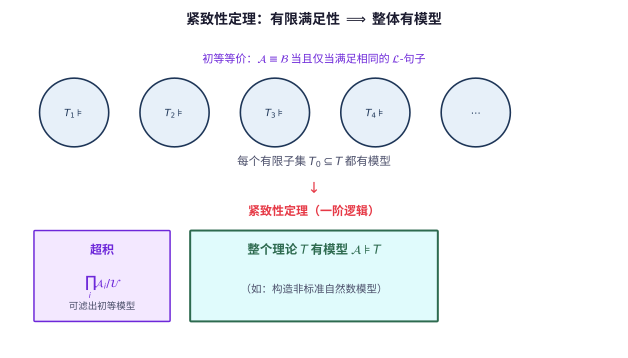

# 第 123 级：模型论 (Model Theory)

> 模型论是数理逻辑的一个分支，研究形式语言与数学结构之间的关系。它探讨什么样的理论有模型、模型的大小如何变化、以及不同模型之间的结构关系。模型论的核心思想是"语法"（形式语言中的句子）与"语义"（数学结构中的真值）之间的相互作用。

---

## 从"同一套公理，怎么既算加减法又算集合宇宙"说起：模型论要解决的根问题

> 在啃一阶语言那套繁琐定义之前，先想明白一个贯穿全章的问题：**当数学家写下一条公理（比如"结合律""群公理"）时，它到底是"一句话"，还是"一大群具体结构的共同身份账"？**

**第一步：直觉——同一张"说明书"，能搭出不同的"模型"**

想象你买回一盒乐高，说明书上画的是一艘飞船，但你完全可以照同一套积木搭出一台小车。数学里更常见的是反过来：**同一句话被许多不同的"世界"同时满足**。比如"$+$ 满足结合律"这句话，在整数加法、矩阵乘法、函数复合这三处全都为真——它不专属于任何一个结构，而是一群结构共同的"性格标签"。模型论就是要把这种朦胧的直觉铸造成一门学问：**语言（语法）是说明书，具体结构（语义）是搭出的成品，而"某句话在这座成品里成不成立"就是二者之间的纽带。**

**第二步：要解决的问题——"可证明"与"为真"这两个词，凭什么能对得上？**

模型论从一次"定义爆炸"中诞生：直到 1930 年代初，数学里日复一日使用的"公式在哪个世界里为真"这个说法，居然没有一个严格定义——全靠直觉。Alfred Tarski（塔尔斯基）1933 年用递归（先检查原子公式，再按联结词/量词一层层拼回真值）首次把"$\mathfrak{A}\models\varphi$"变成可证明的数学对象。紧接着 Kurt Gödel（哥德尔）1930 年的**完备性定理**把两界焊在一起：$T\vdash\varphi$（可证明）当且仅当 $T\models\varphi$（在每个模型中为真）。这带来一个激动人心的推论——想知道一个公理系统"有没有可能一致"，只需问它"有没有至少一座模型"；由此派生出的**紧致性定理**（每个有限片段都有模型 ⇒ 整体有模型）更成为造模型的神级工具，也暴露出一个让人困惑的副作用：一阶公理无法"拴住"自己结构的规模（Löwenheim-Skolem 定理），于是 ZFC 居然有可数模型（Skolem 悖论）。模型论的研究对象就此清晰：**给定一套公理（理论），它到底有哪些模型？这些模型大小怎么变、彼此同构吗、可定义性长什么样？**

**第三步：正式定义前的准备——本章怎样一步步推进**

本章按"先搭语法、再建语义、后筑分类"的路线走：先认识**一阶语言**（哪些符号、怎么递归地造出项与公式）与**结构/模型/满足/可定义性**（把符号落实成世界）；再攻克三大建模型缸的定理——**紧致性**、**Löwenheim-Skolem**、**初等链（Morgan）定理**；随后引入**类型与饱和模型**、**超积**（Łoś 定理）这些制造/鉴别模型的利器；最后用**范畴性、量词消去、模型完备性**这些"分类学"概念，看模型论如何给一整族的结构归档排序。

> **🧠 一句话记住模型论的"出生证"**
>
> 模型论诞生于 Tarski 给"为真"下严格定义、Gödel 用完备性把"可证明"与"素来为真"打通的那一次握手。它要回答的**根本问题**是：
>
> $$ \boxed{\text{一套公理（理论）} \; T \; \text{究竟拥有哪些模型？这些模型大小如何、彼此同构还是相差悬殊、内部能定义出什么样的是非边界？}} $$
>
> 或者说，模型论研究的是"语法（句子）—语义（结构）"这一对张力：公理定了规矩，模型是认这规矩的世界，"可证明"与"为真"在二者之间往返。

## 开始之前

**本章在讲什么**：这将是你第一次把"数学的结构"本身当成被研究的对象。你会认识一阶语言 $\mathcal{L}$（常量/函数/关系符号加元数）、项与公式（递归定义）、结构 $\mathfrak{A}$ 与模型、Tarski 满足与可定义集；然后掌握紧致性、Löwenheim-Skolem、初等链三个构造模型的骨干定理；再学习类型、饱和模型、超积（含 Łoś 定理）、初等嵌入；最后用范畴性、量词消去、模型完备性给理论做分类，并用代数闭域、实闭域等例子体会它们的威力。

**为什么要学它**：第 30 级"数理逻辑"给了你一阶语言与"可证明"的概念，但这只是模型论的"前半场"——那里关心语法，本章补齐"语义/模型"这条更厚的线。它与第 122 级"公理集合论"互为镜面：集合论造宇宙给模型躲避，模型论则反过来研究一切公理系统（含 ZFC 自身）的模型。它是递归论（第 124 级，可判定性、算术层次，其核心谓词即一阶结构里的自然数模型）、证明论（第 125 级，完备性/紧致性与证明密切相连）的共同根基，也在泛代数（第 36 级）与数学哲学（第 52 级）中扮演关键角色。

**开始前请确认你还记得**：

- 一阶逻辑语言：变元、量词、联结词、合式公式、"可证明 / 一致 / 完备性"等基本概念（见第 30 级 数理逻辑）。
- 集合与等势、基数、序数、选择公理（Zorn 引理、良序定理）的初步直觉（见第 09 级 集合论基础、第 122 级 公理集合论）。
- 数学归纳法与超穷归纳的思想（见第 07 级 数列与数学归纳法、第 122 级）。
- 代数常识：群、域、代数闭域、实闭域的概念（见第 20 级 群论、第 19 级 抽象代数基础、第 37 级 环论与域论）。

---

## 1. 学习目标

完成本教程后，你应当能够：

1. **理解模型论的基本概念**——掌握一阶语言、结构、模型、满足、可定义性等基本概念。
2. **掌握核心定理**——理解紧致性定理、Löwenheim-Skolem 定理、Morgan 定理、量词消去定理和省略类型定理的陈述与证明。
3. **理解类型与饱和模型**——掌握类型的概念、饱和模型的性质以及其在模型构造中的应用。
4. **了解超积与初等嵌入**——理解超积构造、初等嵌入、初等链等概念。
5. **理解范畴性与模型完备性**——掌握范畴性的概念和模型完备性的含义。
6. **通过示例与习题巩固理论**——完成至少 6 个详细示例和 8 道习题。

---

## 2. 核心概念

### 2.1 一阶语言 (First-Order Language)

🌐 **直觉先行：为什么模型论要先规定一套"零件清单"？**

当你打算同时跟"整数加法"、"集合宇宙"、"群"对话时，首先得有一套**共同的语言**，否则无法比较。"加法"在不同结构里长得不一样，但"它是二元运算"这个事实是共通的。一阶语言的职责就是**在动手谈结构之前，先把可用的词汇定死**：哪些符号表示元素（常量）、哪些表示运算（函数）、哪些表示判断（关系），每个符号该接几个参数（元数）。把"说什么"先于"在哪个世界说"固定下来，是"同一句话是否在这座结构里成立"得以成为数学问题的前提。

**定义**：一个**一阶语言** $\mathcal{L}$ 由以下部分组成：
- **逻辑符号**：变元 $x_0, x_1, x_2, \dots$，逻辑联结词 $\neg, \land, \lor, \to$，量词 $\forall, \exists$，等号 $\approx$，括号。
- **非逻辑符号**：
  - **常量符号**：$c_0, c_1, \dots$
  - **函数符号**：$f_0, f_1, \dots$，每个有固定的元数 $\operatorname{ar}(f_i)$
 > - **关系符号**：$R_0, R_1, \dots$，每个有固定的元数 $\operatorname{ar}(R_i)$

> **💡 直观理解（类比）**：一阶语言就像一套"零件清单"——先规定有哪些螺丝钉（常量）、哪些工具（函数）、哪些插孔（关系），分别能接几个头（元数），然后再用这些零件去搭出任何想要的"积木"。逻辑符号（$\land,\lor,\forall,\exists,\approx$）是通用的"卡扣"，不随清单变化；非逻辑符号才是描述某一学科特有内容的部分。元数 $\operatorname{ar}$ 就相当于螺丝刀"是十字还是平口、口径多大"的规格——它决定了这个符号能接几个参数，一旦定下，解释时就必须照此接，不能自由变通。

**$\mathcal{L}$-项**递归定义：
1. 每个变元是项。
2. 每个常量符号是项。
3. 若 $t_1, \dots, t_n$ 是项且 $f$ 是 $n$ 元函数符号，则 $f(t_1, \dots, t_n)$ 是项。

> **直观理解（现实类比）**：项就是一门语言里"能指代东西的表达式"，相当于程序员里"有值的表达式"：变量是变量名，常量是字面量，$f(t_1,\dots,t_n)$ 是函数调用。它递归地"搭积木"式长出来——只要一层一层往上套函数，就能表达无限复杂的"对象名"，哪怕是一个有几千层括号的嵌套函数，本质上也还是用来指向论域里某一个元素。

**$\mathcal{L}$-公式**递归定义：
1. 若 $t_1, t_2$ 是项，则 $t_1 \approx t_2$ 是原子公式。
2. 若 $R$ 是 $n$ 元关系符号且 $t_1, \dots, t_n$ 是项，则 $R(t_1, \dots, t_n)$ 是原子公式。
3. 所有原子公式是公式。
4. 若 $\varphi, \psi$ 是公式，则 $\neg\varphi, \varphi \land \psi, \varphi \lor \psi, \varphi \to \psi$ 是公式。
5. 若 $\varphi$ 是公式且 $x$ 是变元，则 $\forall x \varphi$ 和 $\exists x \varphi$ 是公式。

> **💡 直观理解（类比）**：公式就像对某项"筛查"或"体检指标"形成的陈述句：原子公式（$t_1\approx t_2$、$R(t_1,\dots,t_n)$）是"单项体检过关"，联结词是把几条陈述按"且/或/非/则"拼成复合判语，量词则是"抽样——$\forall$ 要求全员达标，$\exists$ 只要有一个人达标即可"。递归定义保证每个陈述都能被逐步拆解到最底层，像表达式树一样最终落到"某个元素间是否满足某个关系"这一真值上。

### 2.2 结构与模型 (Structures and Models)

**定义**：一个 $\mathcal{L}$-**结构** $\mathfrak{A} = (A, \mathcal{I})$ 包含：
- 一个非空集合 $A$（论域）。
- 一个解释函数 $\mathcal{I}$，将每个常量符号 $c$ 映射到 $A$ 中的元素 $c^{\mathfrak{A}}$，每个 $n$ 元函数符号 $f$ 映射到函数 $f^{\mathfrak{A}}: A^n \to A$，每个 $n$ 元关系符号 $R$ 映射到 $A^n$ 上的关系 $R^{\mathfrak{A}} \subseteq A^n$。

> **直观理解（现实类比）**：结构就是"零件清单真正被用起来的那一刻"——语言只是抽象的术语表，结构则给每个术语指定了"买家"：常量符号是给某个具体人物指定姓名，函数符号是指定一台"机器把几个输入加工成输出"，关系符号是指定一张"名单"（哪些组合算"是"）。就像电影院座位号（常量）、换乘路线（函数）、好友关系网（关系）分别把抽象符号落实成真实对象。论域 $A$ 就是这个世界里所有"存在的人或物"的集合。

**定义**：若 $\mathfrak{A}$ 是 $\mathcal{L}$-结构，$\varphi$ 是 $\mathcal{L}$-句子（无自由变元的公式），且 $\mathfrak{A} \models \varphi$（$\varphi$ 在 $\mathfrak{A}$ 中为真），则称 $\mathfrak{A}$ 是 $\varphi$ 的**模型**。若 $T$ 是一组 $\mathcal{L}$-句子（理论），且 $\mathfrak{A}$ 满足 $T$ 中所有句子，则称 $\mathfrak{A}$ 是 $T$ 的模型，记作 $\mathfrak{A} \models T$。

> **直观理解（现实类比）**：语言就像一套"乐高说明书"（符号、函数、关系），结构则是实际搭出来的"积木模型"。同一个说明书可以搭出不同的模型——比如"$+$"在自然数里是加法，在布尔代数里可能是 $\lor$。只有当说明书里的每个句子在积木模型里"成立"（$\mathfrak{A}\models\varphi$）时，我们才说这个积木是一个"模型"。

> **直观理解（现实类比）**：模型像"理论的实现"——一组符号加解释等于一个具体世界，就像小说设定加具体小说。同一套公理（设定）可以被不同的结构（小说）所满足：群公理既可以被整数加法群实现，也可以被对称群实现。模型论研究的就是"哪些设定能被实现"、"同一个设定能有多少种不同的实现"。$\mathfrak{A}\models T$ 这一记号，正是在说"这个世界（结构 $\mathfrak{A}$）忠实演绎了这套剧本（理论 $T$）"。

> **🧠 思考历程：语法与语义——"可证明"与"为真"如何被强行焊在一起？**
>
> 模型论的核心，是 Tarski 1929–1933 年间发明的真之定义：它首次把"公式在结构 $\mathfrak{A}$ 中为真"（$\mathfrak{A}\models\varphi$）变成严格的数学概念，让"语法（符号）"与"语义（模型）"第一次能放在同一张工作台上精确比对。
>
> - **语义终于有了定义**。Alfred Tarski（塔尔斯基）1933 年给出满足关系的递归定义，把"$\varphi$ 在赋值 $s$ 下为真"化约为对项和原子公式的直接检验；这项看似技术性的工作，让"什么叫成立"从模糊的直觉变成可形式化、可证明的对象。
> - **完备性打通两界**。Kurt Gödel（哥德尔）1930 年证明一阶逻辑的完备性定理：$T\vdash\varphi$ 当且仅当 $T\models\varphi$，即"可证明"与"在所有模型中成立"完全等价。这等于在语法与语义之间架起双向桥梁，也为紧致性定理和其后整个模型论铺平了道路。
> - **一门研究"模型家族"的新学科**。有了真之定义与完备性，就可以系统考察同一理论的全部模型——结构之间何时初等等价、Löwenheim-Skolem 如何控制模型的大小、超积如何造出新模型。模型论由此从逻辑的边角料成长为独立而深广的学科。
> - **心路**：把"真"和"可证"这样早已人人使用的词精确定义，非但不是文字游戏，反而为整个数学对语义的反思立下了最可靠的一块基石。

### 2.3 满足与可定义性 (Satisfaction and Definability)

**Tarski 满足定义**：对 $\mathcal{L}$-结构 $\mathfrak{A}$ 和赋值 $s: \text{Var} \to A$，递归定义 $\mathfrak{A} \models \varphi[s]$（$\varphi$ 在赋值 $s$ 下被满足）。

> **💡 直观理解（类比）**：Tarski 的满足定义相当于给"某句话在这个世界里到底成立吗"建了一台逐层判定的"解释器"。它把复杂的句子像编译一样拆到原子层（"哪个东西等于哪个东西""谁和谁有什么关系"），再由联结词和量词按固定规则层层拼回真值。赋值 $s$ 就是一台"把每个变量名映射到某个具体对象"的字典——就像把"它"这个词查表翻译成实际的一只猫，然后才能判断"它在打盹"是真是假。这个"递归拆解"恰恰是把"为真"这种模糊直觉形式化、可机械验证的关键。

**可定义集**：设 $\mathfrak{A}$ 是 $\mathcal{L}$-结构，$X \subseteq A^n$ 称为**可定义的**，如果存在 $\mathcal{L}$-公式 $\varphi(x_1, \dots, x_n)$ 使得：
$$
X = \{(a_1, \dots, a_n) \in A^n \mid \mathfrak{A} \models \varphi(a_1, \dots, a_n)\}
$$

> **直观理解（现实类比）**：可定义集就是"能用一句筛选条件圈出来的那批人"——比如"班级里身高超过 170 的学生"就是用公式 $\varphi(x)$="身高(x)>170"圈出的集合 $X$。同一个人群可以换不同的问法圈选（不同公式给同一集合），而公式就是我们在结构里"点名"的唯一手段：凡是用公式圈不出来的子集，模型论就认为它"难以被陈述、不值得研究"——这正是"可定义"一词的分量所在。

### 2.4 紧致性定理 (Compactness Theorem)

> **定理（紧致性）**：设 $T$ 是一阶理论。若 $T$ 的每个有限子集都有模型，则 $T$ 本身有模型。

紧致性定理是一阶逻辑的核心性质之一，它深刻地区分了一阶逻辑与高阶逻辑。

> **直观理解（现实类比）**：就像一个"无限大的拼图"——只要任何**有限**部分都能拼好（每个有限子集有模型），那么整张无限拼图也能拼好（整个理论有模型）。直觉上"无限"往往比"有限"危险，但一阶逻辑的紧致性恰恰告诉我们：有限部分的兼容性能自动推出整体的一致性。超积 $\prod_i\mathfrak{A}_i/\mathcal{U}$ 正是用超滤 $\mathcal{U}$"投票"拼出一个初等模型的工具。

> **直观理解（现实类比）**：紧致性定理像"有限检查"——判断一个无穷理论是否有模型，只需逐个检查它的每个有限片段。这就像海关无法一次查验整艘货轮的所有集装箱，但只要任意有限个箱子的组合都合规，就能放行整船。这一定理是一阶逻辑独有的"特权"：高阶逻辑中存在有限可满足却整体无模型的理论，正是因为缺少这种"有限推整体"的紧致性。它也是构造非标准模型的钥匙——加入无穷多条"$c>n$"后，任何有限子集都被 $\mathbb{N}$ 满足，于是整体有模型，从而诞生了含无穷大自然数的非标准模型。

> **⚠️ 常见坑：紧致性是"一阶逻辑独有的特权"，别默认它对高阶逻辑也成立**
>
> 紧致性定理之所以如雷贯耳，正因为它不是普遍真理：**二阶逻辑没有紧致性**。例如"自然数的标准模型"这个二阶公理集是有限可满足、却整体没有（标准）模型的典型——因为二阶逻辑能同时断言"每一非空并有最小值"并把模型限制到仅剩标准 $\mathbb{N}$。所以当用紧致性"有限推整体"时，先确认所用的语言的确是一阶语言；把一条它不该成立的性质安到一阶头上，是最常见的误用。

### 2.5 Löwenheim-Skolem 定理

> **定理（Löwenheim-Skolem）**：
> - **下降版本**：若 $\mathcal{L}$-理论 $T$ 有无限模型，则对任意基数 $\kappa \geq |\mathcal{L}|$，$T$ 有基数为 $\kappa$ 的模型。
> - **上升版本**：若 $T$ 有无限模型，则对任意基数 $\kappa \geq \max(|\mathcal{L}|, |T|)$，$T$ 有基数为 $\kappa$ 的模型。

> **直观理解（现实类比）**：Löwenheim-Skolem 定理像"大小不变"——一阶理论一旦有了无穷模型，就拥有任意基数大小的模型，无论可数、连续统还是更大的无穷。这好比一套"剧本设定"既能被小剧团演出，也能被万人剧团演出，剧情逻辑完全一致。这揭示了一阶逻辑的根本局限：它无法用公式限定模型的"大小"。Skolem 悖论正是由此而来——ZFC 虽是描述"全部集合"的理论，却有可数模型，仿佛"从外面看"整个集合宇宙只有可数多对象，但"从模型内部"却感受不到这种"缩水"。

> **⚠️ 常见坑：Skolem 悖论不是矛盾，而是"内/外视角"的落差**
>
> ZFC 有可数模型（由下降 Löwenheim-Skolem），从模型外看它只含可数个对象——可 ZFC 在内部却又断言"存在不可数集"，好像自相矛盾。其实一点也不矛盾：**"不可数"是模型内部的事件**——模型里的数 $\aleph_1$ 是"模型未能提供与其一一对应的函数"的那些对象，而这个"提供函数"的判断是相对于模型内部的。外部视角与内部视角用了不同的"枚举"，不可混为一谈。这提醒我们：谈论"模型有多大"时，务必说清是内部（模型自以为）还是外部（真实宇宙中）。

### 2.6 类型 (Types)

**定义**：设 $\mathfrak{A}$ 是 $\mathcal{L}$-结构，$A$ 是其论域，$B \subseteq A$。一组 $\mathcal{L}(B)$-公式 $\Sigma(x)$（其中 $x$ 是自由变元）称为一个**类型**，如果 $\Sigma(x)$ 在 $\mathfrak{A}$ 中有限可满足（即对任意有限子集 $\Sigma_0 \subseteq \Sigma$，存在 $a \in A$ 使得 $\mathfrak{A} \models \Sigma_0(a)$）。

> **💡 直观理解（类比）**：类型就是"对某个未知对象的一组条件要求"，相当于招聘启示里的职位要求清单——把"你其实在找'既有好成绩、又会打篮球、还愿意加班'的人"这一系列条件打包起来。关键是这组条件**逐项能同时满足**（有限可满足）：只要任意有限条要求都能找到同一个人满足，就说明这套要求"不自我矛盾"，是一个可谈的"职位"。它不是指某个具体的候选人，而是指"满足这些条件的任何一个人的共同处境/身份画像"。

**完全类型**：若对每个 $\mathcal{L}(B)$-公式 $\varphi(x)$，要么 $\varphi(x) \in \Sigma(x)$ 要么 $\neg\varphi(x) \in \Sigma(x)$，则 $\Sigma(x)$ 是完全类型。

> **直观理解（现实类比）**：完全类型就是把"身份画像"填到无懈可击——对于任何一个你能提的问题 $\varphi$，它都替你拍板：要么"是的，满足 $\varphi$"、要么"不，满足 $\neg\varphi$"，绝不给模糊答案。就像一份事无巨细的"人物设定文档"：每条特征（是否已婚、是否恐高……）都明确填了"是"或"否"。这样一份文档其实已经唯一地描绘出一个"理想的候选人轮廓"，是所有其他类型里最"说死了"的那种。

**实现与省略**：若存在 $a \in A$ 使得 $\mathfrak{A} \models \Sigma(a)$，则称 $\Sigma$ 在 $\mathfrak{A}$ 中**实现**，否则称**省略**。

> **直观理解（现实类比）**："实现与省略"回答的是"这份求职要求到底有没有真人来应聘"——若真有人能满足全部条件，就说这组类型"被实现"；若整个世界里谁都差那么一点，就说"被省略"。前者像角色终于被演员成功饰演，后者像某个设定虽不矛盾、却始终没有对应的真人。省略类型定理关心的正是：哪些"理论上讲得通、却永远没有真人"的角色设定，能在一个模型中被刻意绕开。

### 2.7 饱和模型 (Saturated Models)

**定义**：$\mathcal{L}$-结构 $\mathfrak{A}$ 称为 $\kappa$-**饱和**的，如果对任意 $A_0 \subseteq A$ 且 $|A_0| < \kappa$，每个在 $A_0$ 上有限可满足的 $\mathcal{L}(A_0)$-类型都在 $\mathfrak{A}$ 中实现。

> **💡 直观理解（类比）**：饱和结构就是"来者不拒的完备求职市场"——只要一套条件（类型）理论上自洽，无论它借了多少"已有的人名"做参考（参数少于 $\kappa$），这个市场里就**总能找到真的候选人**把它实现。参数集 $A_0$ 越小，需要满足的角色限制就越宽松，因此越容易饱和；$\kappa$-饱和约等于"在这个规模参数下，所有说得通的岗位都有人上岗"。它让结构"塞得满满当当"，正是构造同构、判别模型结构时很有力的"材料充足"性质。

### 2.8 超积 (Ultraproducts)

**定义**：设 $\{\mathfrak{A}_i\}_{i \in I}$ 是一族 $\mathcal{L}$-结构，$\mathcal{U}$ 是 $I$ 上的超滤。**超积** $\prod_{i \in I} \mathfrak{A}_i / \mathcal{U}$ 的定义如下：
- 论域：$\prod_{i \in I} A_i$ 模等价关系 $\sim_\mathcal{U}$，其中 $f \sim_\mathcal{U} g$ 当且仅当 $\{i \in I \mid f(i) = g(i)\} \in \mathcal{U}$
- 对每个关系符号 $R$：$R([f_1], \dots, [f_n])$ 当且仅当 $\{i \in I \mid R^{\mathfrak{A}_i}(f_1(i), \dots, f_n(i))\} \in \mathcal{U}$
- 对每个函数符号和常量符号类似定义

> **💡 直观理解（类比）**：超积就是把一大堆结构"投票合并"成一个新结构——先选出每个坐标 $i$ 上的一个元素组成"一根横穿所有结构的序列"（相当于在每个国家各挑一个代表组成代表团），再用超滤 $\mathcal{U}$ 当"表决规则"：两串序列算不算同一个代表，看"它们取值相同的那些坐标"是否构成一个'多数派'集合。超滤是个"既不能保留中立、又夸大面积集合"的'多数裁决'规则，它保证拼出来的东西不会被某些个别坐标带偏，从而得到一个性质"听多数坐标的意见"的匀质新结构。

**Łoś 定理**：对任意 $\mathcal{L}$-公式 $\varphi(x_1, \dots, x_n)$ 和 $[f_1], \dots, [f_n] \in \prod A_i / \mathcal{U}$，
$$
\prod_{i \in I} \mathfrak{A}_i / \mathcal{U} \models \varphi([f_1], \dots, [f_n]) \iff \{i \in I \mid \mathfrak{A}_i \models \varphi(f_1(i), \dots, f_n(i))\} \in \mathcal{U}
$$

> **直观理解（现实类比）**：Łoś 定理是超积的灵魂，它说"新结构里一句话成不成立，等于看它在'多数'原结构里成不成立"——就像是全体成员的投票：只有当足够多（落在超大集合里）的原始结构各自都认为 $\varphi$ 成立，合并后的结构才认为它成立。这相当于从"代表团"的角度让每个句子按多数票裁决，从而把无穷多个相似结构"熔"成一个既继承共性又可能长出新性质（如出现无穷大、无穷小）的模型——这正是构造非标准实数等模型的核心引擎。

### 2.9 初等嵌入与初等链 (Elementary Embeddings and Elementary Chains)

**定义**：映射 $f: \mathfrak{A} \to \mathfrak{B}$ 称为**初等嵌入**，如果对任意 $\mathcal{L}$-公式 $\varphi(x_1, \dots, x_n)$ 和 $a_1, \dots, a_n \in A$，
$$
\mathfrak{A} \models \varphi(a_1, \dots, a_n) \iff \mathfrak{B} \models \varphi(f(a_1), \dots, f(a_n))
$$

> **💡 直观理解（类比）**：初等嵌入就是"无损换名、一笔一划都保真的搬家"——映射 $f$ 把 $\mathfrak{A}$ 的元素搬到 $\mathfrak{B}$ 里，同时保证任何一句用语言 $\mathcal{L}$ 能说的话（$\varphi$），在搬家前后对该对象来说**真假完全一致**。就像把一部小说的所有人物和情节原封不动地"移植"进另一部世界观更大的小说里，任何关于某个人的剧情事实都不被改写。这比普通的同构/同态强得多：它不仅保留了关系结构，还保留了所有能用语言表达的"事实真相"。

**定义**：一族 $\mathcal{L}$-结构 $\{\mathfrak{A}_\alpha\}_{\alpha < \delta}$ 称为**初等链**，如果对 $\alpha < \beta < \delta$，$\mathfrak{A}_\alpha \preccurlyeq \mathfrak{A}_\beta$（即 $\mathfrak{A}_\alpha$ 是 $\mathfrak{A}_\beta$ 的初等子结构）。

> **直观理解（现实类比）**：初等链就像一列"越装越满、但绝不篡改史实的档案柜"——每个后续结构都把前面的结构"含进去"，并且更早的一切陈述真相都被保住，只是不断扩充新的对象。好比逐册增补的百科：后面版本包含前面所有词条且不改写旧条目，只新增内容。链条越拉越长，结构不断变大却从不"背叛"从前说过的话，这正是它能放心地求并集的原因。

**初等链定理**：若 $\{\mathfrak{A}_\alpha\}_{\alpha < \delta}$ 是初等链，则对任意 $\alpha < \delta$，
$$
\mathfrak{A}_\alpha \preccurlyeq \bigcup_{\alpha < \delta} \mathfrak{A}_\alpha
$$

> **💡 直观理解（类比）**：初等链定理告诉我们，把这列"档案柜"最后全部合并成一个大仓库后，前面任何一本柜子里的"档案事实依然原样成立"——即 $\mathfrak{A}_\alpha$ 仍是整个合并体的初等子结构。这就像把逐册百科装订成全集，早期卷册里每一条真实内容在全集里依旧是真实的。因为链条每步都"保真扩充"，累计起来也就不会造成任何一处失真，于是合并体与任一早期片段"所见略同"。

### 2.10 范畴性 (Categoricity)

**定义**：理论 $T$ 称为 $\kappa$-**范畴性**的，如果 $T$ 的所有基数为 $\kappa$ 的模型都同构。

> **💡 直观理解（类比）**：范畴性是说"凡是规模达到 $\kappa$ 的模型，全都长得一模一样"——不管怎么搭，只要上台角色的数量一样，两个世界在结构上就完全等价（同构）。这就像一套规则严格到"人数固定时玩法只有一种"的桌游：无论谁摆棋子，摆出来的都是同一盘棋。范畴性极其稀有却很强大，因为它一锤定音地说明"给定这个规模，理论已经帮我们把模型锁死到唯一了"。

**Vaught 猜想**：可数完备理论不可能恰好有 $\aleph_1$ 个可数模型（当前仍为猜想）。

> **直观理解（现实类比）**：Vaught 猜想是个"数数之谜"——问的是"一个可数完备理论，可数模型的数目能不能正好是 $\aleph_1$（最小的不可数）"？直觉上这类数目通常是"要么 1 个、要么可数多个、要么连续统那么多个"，而猜想断言"恰好 $\aleph_1$ 个"这种不上不下的尴尬数量是不可能出现的。它像在问：有多少种不同的星球结构？"答案常常是只有少数几种，或密密麻麻不可数"——而"恰好是最矮的不可数那么多种"这种诡异的中间数被认为发生不了，目前仍悬而未决。

### 2.11 量词消去 (Quantifier Elimination)

**定义**：理论 $T$ 具有**量词消去**性质，如果对每个公式 $\varphi(\bar{x})$，存在一个无量词公式 $\psi(\bar{x})$ 使得 $T \models \forall \bar{x} (\varphi(\bar{x}) \leftrightarrow \psi(\bar{x}))$。

> **💡 直观理解（类比）**：量词消去就像把一句复杂的"有那种东西/所有的人"表述，改写成一个"纯凭条件拼对错、不再追究存在与否"的直白句子。好比把问题"这个方程组有没有解？"改写成"不看解，只看系数满足某几条不等式就行"——判据只剩 $\land/\lor/\neg$，不再动用"存在/所有"。这通常意味着该理论"结构很规整"，因为凡是能说的都能翻译成最朴素的无量词语言，这也顺带让很多模型论结论（如完备性、判定）变得好处理。

### 2.12 模型完备性 (Model Completeness)

**定义**：理论 $T$ 称为**模型完备**的，如果对 $T$ 的任意两个模型 $\mathfrak{A} \subseteq \mathfrak{B}$，$\mathfrak{A} \preccurlyeq \mathfrak{B}$。

> **直观理解（现实类比）**：模型完备是说"只要一个大模型把一个小模型作为子模型包容了，那么包容关系对一切用语言说得出口的话都是保真的"——扩充永远不会"篡改"原模型里任何一句事实。这像扩展插件：新装的组件只是增加内容，绝不推翻旧组件里已有的全部功能与结论（对 $A$ 中对象，一切陈述真假在 $\mathfrak{B}$ 里和在 $\mathfrak{A}$ 里一致）。它介于"普通理论"与"量词消去"之间，是用来比较两个嵌套模型时的一种"温和的保真承诺"。

> **⚠️ 常见坑："完备性"、"模型完备性"、"量词消去"三个词长得像，指的东西可不一样**
>
> 这三个概念常被混淆，务必分清：
> - **（语法）完备性**：理论 $T$ 对每个句子 $\varphi$ 都判定 $T\vdash\varphi$ 或 $T\vdash\neg\varphi$——是关于"句子有没有被理论决断"的。
> - **模型完备性**：任何两个 $T$ 的模型 $\mathfrak{A}\subseteq\mathfrak{B}$ 都满足 $\mathfrak{A}\preccurlyeq\mathfrak{B}$——是关于"子模型关系是否保真"的。它并不要求 $T$ 对每个句子做决断（即模型完备的 $T$ 未必完备）。
> - **量词消去**：每个公式等价于一个无量词公式——是关于"可定义集是否无量词即可描述"的，通常是三者中结构信息最强的一条。

---

## 3. 定理与证明

### 3.1 紧致性定理

> **定理（紧致性定理）**：设 $T$ 是一阶 $\mathcal{L}$-理论。若 $T$ 的每个有限子集都有模型，则 $T$ 有模型。

**证明**（使用 Henkin 构造和完备性定理）：

**第一步：扩展语言和理论**

对每个 $\mathcal{L}$-公式 $\varphi(x)$，引入一个新的常量符号 $c_\varphi$（称为 Henkin 常量）。扩展后的语言记为 $\mathcal{L}^* = \mathcal{L} \cup \{c_\varphi \mid \varphi \in \operatorname{Form}(\mathcal{L})\}$。

构造 $T$ 的扩展理论 $T^*$，使得 $T^*$ 包含以下 Henkin 公理：
$$
\exists x \varphi(x) \to \varphi(c_\varphi)
$$
对每个 $\mathcal{L}^*$-公式 $\varphi(x)$ 成立。

**第二步：证明 $T^*$ 有限可满足**

对 $T^*$ 的任意有限子集 $\Delta$，$\Delta$ 只涉及有限个 Henkin 常量 $c_{\varphi_1}, \dots, c_{\varphi_n}$ 和 $T$ 的有限子集 $T_0$。由于 $T_0$ 有模型 $\mathfrak{A}$，可以在 $\mathfrak{A}$ 中为 $c_{\varphi_i}$ 选择适当的解释（若 $\mathfrak{A} \models \exists x \varphi_i(x)$，则选择 $c_{\varphi_i}$ 为某个满足 $\varphi_i$ 的元素；否则任意选择），使得 $\mathfrak{A}$ 成为 $\Delta$ 的模型。因此 $T^*$ 的每个有限子集都有模型。

**第三步：使用 Zorn 引理扩展到极大一致集**

考虑所有 $T^*$ 的一致扩展的集合，由 Zorn 引理，存在一个极大一致集 $T^*_\infty \supseteq T^*$。

**第四步：构造项模型**

在 $\mathcal{L}^*$ 的闭项集合上定义等价关系：
$$
t_1 \sim t_2 \iff T^*_\infty \vdash t_1 \approx t_2
$$
令 $M$ 为所有等价类的集合。在 $M$ 上定义 $\mathcal{L}^*$-结构：
- 常量符号 $c$ 解释为 $[c]$
- 函数符号 $f$：$f^{\mathfrak{M}}([t_1], \dots, [t_n]) = [f(t_1, \dots, t_n)]$
- 关系符号 $R$：$R^{\mathfrak{M}}([t_1], \dots, [t_n])$ 当且仅当 $T^*_\infty \vdash R(t_1, \dots, t_n)$

**第五步：证明 $\mathfrak{M} \models T^*_\infty$（从而 $\mathfrak{M} \models T$）**

使用公式复杂度归纳证明：对任意 $\mathcal{L}^*$-句子 $\varphi$，
$$
\mathfrak{M} \models \varphi \iff T^*_\infty \vdash \varphi
$$
归纳步骤中，关键点是 Henkin 公理保证了存在量词的正确处理。

$\square$

### 3.2 Löwenheim-Skolem 定理

> **定理（Löwenheim-Skolem）**：
> 1. **下降 Löwenheim-Skolem**：设 $\mathfrak{A}$ 是 $\mathcal{L}$-结构，$X \subseteq A$，则存在 $\mathfrak{A}$ 的初等子结构 $\mathfrak{B}$ 使得 $X \subseteq B$ 且 $|B| \leq \max(|X|, |\mathcal{L}|, \aleph_0)$。
> 2. **上升 Löwenheim-Skolem**：若 $\mathfrak{A}$ 是无限 $\mathcal{L}$-结构，则对任意基数 $\kappa \geq \max(|A|, |\mathcal{L}|)$，存在 $\mathfrak{A}$ 的初等扩张 $\mathfrak{B}$ 使得 $|B| = \kappa$。

**证明**：

**下降版本（Skolem 函数方法）**：

定义 Skolem 函数：对每个 $\mathcal{L}$-公式 $\varphi(x, y_1, \dots, y_n)$，选择一个 Skolem 函数 $f_\varphi: A^n \to A$，使得若 $\mathfrak{A} \models \exists x \varphi(x, a_1, \dots, a_n)$，则 $\mathfrak{A} \models \varphi(f_\varphi(a_1, \dots, a_n), a_1, \dots, a_n)$。

令 $B_0 = X$。递归定义 $B_{m+1}$ 为 $B_m$ 中所有元素在 $\mathcal{L}$ 中所有 Skolem 函数下的像的闭包。令 $B = \bigcup_{m < \omega} B_m$。

由于 $|\mathcal{L}|$ 个公式，每个公式对应一个 Skolem 函数，且 $|B_{m+1}| \leq |B_m| \cdot |\mathcal{L}| \cdot \aleph_0$，故 $|B| \leq \max(|X|, |\mathcal{L}|, \aleph_0)$。

验证 $\mathfrak{B}$（以 $B$ 为论域的限制结构）是 $\mathfrak{A}$ 的初等子结构：使用 Tarski-Vaught 判别法，对任意 $\exists x \varphi(x, \bar{b})$（其中 $\bar{b} \in B$），若 $\mathfrak{A} \models \exists x \varphi(x, \bar{b})$，则 $\mathfrak{A} \models \varphi(f_\varphi(\bar{b}), \bar{b})$，而 $f_\varphi(\bar{b}) \in B$，故 $\mathfrak{B} \models \exists x \varphi(x, \bar{b})$。

**上升版本（紧致性方法）**：

设 $\mathfrak{A}$ 是无限 $\mathcal{L}$-结构，$\kappa$ 是给定基数。扩展语言 $\mathcal{L}' = \mathcal{L} \cup \{c_a \mid a \in A\} \cup \{d_\alpha \mid \alpha < \kappa\}$，其中 $c_a$ 是表示 $A$ 中元素的新常量，$d_\alpha$ 是表示新元素的新常量。

考虑理论：
$$
T = \operatorname{Th}(\mathfrak{A}_A) \cup \{d_\alpha \not\approx d_\beta \mid \alpha < \beta < \kappa\}
$$
其中 $\mathfrak{A}_A$ 是 $\mathfrak{A}$ 扩展到 $\mathcal{L} \cup \{c_a\}$ 的结构（$c_a$ 解释为 $a$）。

对 $T$ 的任意有限子集 $T_0$，$T_0$ 只涉及有限个 $d_\alpha$。由于 $\mathfrak{A}$ 是无限的，可以在 $\mathfrak{A}$ 中解释这些 $d_\alpha$ 为互不相同的元素，使得 $T_0$ 成立。因此 $T_0$ 有模型。

由紧致性定理，$T$ 有模型 $\mathfrak{B}^*$。限制回 $\mathcal{L}$ 得到 $\mathfrak{B}$，则 $\mathfrak{A} \preccurlyeq \mathfrak{B}$（因为 $\mathfrak{B} \models \operatorname{Th}(\mathfrak{A}_A)$ 意味着 $\mathfrak{A}$ 与 $\mathfrak{B}$ 初等等价，且每个 $a \in A$ 由 $c_a$ 的参数表示），且 $|B| \geq \kappa$（因为 $d_\alpha$ 互异）。再用下降 Löwenheim-Skolem 定理从 $\mathfrak{B}$ 中取出基数为 $\kappa$ 的初等子结构，即得所需模型。

$\square$

### 3.3 Morgan 定理（初等链定理）

> **定理（Morgan 定理 / 初等链定理）**：设 $\{\mathfrak{A}_\alpha\}_{\alpha < \delta}$ 是初等链（即对 $\alpha < \beta < \delta$ 有 $\mathfrak{A}_\alpha \preccurlyeq \mathfrak{A}_\beta$），$\mathfrak{A} = \bigcup_{\alpha < \delta} \mathfrak{A}_\alpha$。则对任意 $\alpha < \delta$，$\mathfrak{A}_\alpha \preccurlyeq \mathfrak{A}$。

**证明**：

用公式复杂度归纳证明：对任意 $\mathcal{L}$-公式 $\varphi(\bar{x})$ 和任意 $\bar{a} \in A_\alpha$，
$$
\mathfrak{A} \models \varphi(\bar{a}) \iff \mathfrak{A}_\alpha \models \varphi(\bar{a})
$$

**基础步**：对原子公式，结论成立，因为 $\mathfrak{A}$ 是 $\mathfrak{A}_\alpha$ 的扩张，原子公式的真值仅依赖于论域中元素的解释，在扩张后保持不变。

**归纳步**：
- 若 $\varphi = \neg\psi$，由归纳假设直接可得。
- 若 $\varphi = \psi \land \theta$，由归纳假设直接可得。
- 若 $\varphi = \exists x \psi(x, \bar{a})$：
  - 若 $\mathfrak{A}_\alpha \models \exists x \psi(x, \bar{a})$，则存在 $b \in A_\alpha$ 使得 $\mathfrak{A}_\alpha \models \psi(b, \bar{a})$。由归纳假设，$\mathfrak{A} \models \psi(b, \bar{a})$，故 $\mathfrak{A} \models \exists x \psi(x, \bar{a})$。
  - 若 $\mathfrak{A} \models \exists x \psi(x, \bar{a})$，则存在 $b \in A$ 使得 $\mathfrak{A} \models \psi(b, \bar{a})$。由于 $\mathfrak{A} = \bigcup_{\beta < \delta} \mathfrak{A}_\beta$，存在 $\beta$ 使得 $b \in A_\beta$。不妨设 $\beta \geq \alpha$，则 $\mathfrak{A}_\beta \models \psi(b, \bar{a})$（归纳假设，因为 $\mathfrak{A} \models \psi(b, \bar{a})$ 且 $\mathfrak{A}_\beta \preccurlyeq \mathfrak{A}$ 对 $\bar{a} \in A_\alpha \subseteq A_\beta$ 成立... 这里需要更仔细地处理）。

实际上，证明需要更精细的归纳。标准的证明使用 Tarski-Vaught 判别法：

**Tarski-Vaught 判别法**：$\mathfrak{B} \subseteq \mathfrak{A}$ 是初等子结构当且仅当对任意 $\mathcal{L}$-公式 $\varphi(x, \bar{y})$ 和 $\bar{b} \in B$，若 $\mathfrak{A} \models \exists x \varphi(x, \bar{b})$，则存在 $c \in B$ 使得 $\mathfrak{A} \models \varphi(c, \bar{b})$。

> **💡 直观理解（类比）**：Tarski-Vaught 判别法给了我们一把"检验子结构是否保真"的尺子：只要满足一个关键条件——"大世界里但凡说有某个对象（$\exists x\varphi$）满足条件，这个对象其实就藏在子结构 $\mathfrak{B}$ 里"——那么子结构中每个元素用语言能说的一切事实，在大世界里也都成立（初等子结构）。这就像保安查岗：只要大仓库里丢了的每样东西都能在小库房里找到，就说明小库房是"货真价实、一样都不少"的子集。因为这条只查"存在"就够了，其余联结词都能由此推出来。

现在对 $\mathfrak{A}_\alpha \subseteq \mathfrak{A}$ 应用此判别法。设 $\varphi(x, \bar{y})$ 是 $\mathcal{L}$-公式，$\bar{b} \in A_\alpha$，且 $\mathfrak{A} \models \exists x \varphi(x, \bar{b})$。则存在某个 $\beta$ 和 $c \in A_\beta$ 使得 $\mathfrak{A} \models \varphi(c, \bar{b})$。取 $\beta \geq \alpha$，由于 $\mathfrak{A}_\beta \preccurlyeq \mathfrak{A}$（对 $\mathfrak{A}_\beta$ 中的元素成立），我们有 $\mathfrak{A}_\beta \models \exists x \varphi(x, \bar{b})$。

但 $\mathfrak{A}_\alpha \preccurlyeq \mathfrak{A}_\beta$，所以 $\mathfrak{A}_\alpha \models \exists x \varphi(x, \bar{b})$，即存在 $c' \in A_\alpha$ 使得 $\mathfrak{A}_\alpha \models \varphi(c', \bar{b})$。再由 $\mathfrak{A}_\alpha \preccurlyeq \mathfrak{A}$（对 $\mathfrak{A}_\alpha$ 中的元素），$\mathfrak{A} \models \varphi(c', \bar{b})$。因此 Tarski-Vaught 条件满足，$\mathfrak{A}_\alpha \preccurlyeq \mathfrak{A}$。

$\square$

**注**：上述证明中，对 $\mathfrak{A}_\beta \preccurlyeq \mathfrak{A}$ 的归纳使用需要超穷归纳。标准的做法是对公式复杂度进行归纳，同时对 $\delta$ 进行超穷归纳。

### 3.4 量词消去定理

> **定理（量词消去定理）**：设 $T$ 是一阶 $\mathcal{L}$-理论。若对每个无量词公式 $\varphi(x, \bar{y})$ 和原子公式 $\psi(\bar{y})$，存在无量词公式 $\theta(\bar{y})$ 使得
$$
T \models \forall \bar{y} (\exists x (\varphi(x, \bar{y}) \land \psi(x, \bar{y})) \leftrightarrow \theta(\bar{y}))
$$
> 则 $T$ 具有量词消去性质。

**证明**：

我们证明每个公式 $\alpha(\bar{y})$ 在 $T$ 下等价于某个无量词公式。对 $\alpha$ 的复杂度进行归纳。

**基础**：若 $\alpha$ 是原子公式，则它本身是无量词的。

**归纳步**：考虑 $\alpha = \neg \beta$。由归纳假设，$\beta$ 等价于无量词公式 $\beta'$，则 $\alpha$ 等价于 $\neg\beta'$，也是无量词的。

$\alpha = \beta \land \gamma$：类似处理。

$\alpha = \exists x \beta(x, \bar{y})$：由归纳假设，$\beta$ 等价于一个无量词公式 $\beta'(x, \bar{y})$。将 $\beta'$ 写成析取范式（DNF）：
$$
\beta' \equiv \bigvee_{i=1}^n \bigwedge_{j=1}^{m_i} \gamma_{ij}(x, \bar{y})
$$
其中每个 $\gamma_{ij}$ 是原子公式或其否定。则：
$$
\exists x \beta'(x, \bar{y}) \equiv \bigvee_{i=1}^n \exists x \bigwedge_{j=1}^{m_i} \gamma_{ij}(x, \bar{y})
$$

对每个 $i$，考虑 $\bigwedge_{j=1}^{m_i} \gamma_{ij}(x, \bar{y})$。它是原子公式和原子公式的否定的合取。通过反复应用定理的条件（将 $\exists x$ 与单个原子公式的合取消去），我们可以将 $\exists x \bigwedge_{j=1}^{m_i} \gamma_{ij}(x, \bar{y})$ 替换为无量词公式。

更精确地说，对每个 $i$，我们反复使用条件：若存在原子公式 $\psi(x, \bar{y})$ 在 $\bigwedge$ 中，则 $\exists x(\varphi(x, \bar{y}) \land \psi(x, \bar{y}))$ 可替换为无量词公式，其中 $\varphi$ 是其余部分的合取。通过有限次迭代，消去所有存在量词。

因此 $\alpha$ 等价于无量词公式的析取，即无量词公式。

$\square$

### 3.5 省略类型定理

> **定理（省略类型定理）**：设 $T$ 是可数完备的一阶 $\mathcal{L}$-理论，$\Sigma(x)$ 是 $T$ 中的非孤立类型（即对任意公式 $\varphi(x)$，若 $\Sigma \vdash \varphi(x)$，则存在 $\psi(x)$ 使得 $\Sigma \vdash \psi(x)$ 且 $\varphi(x)$ 不孤立 $\Sigma$）。则 $T$ 有一个可数模型省略 $\Sigma(x)$。

> **直观理解（现实类比）**：省略类型定理说："如果某个'角色设定'（类型 $\Sigma$）没有哪一句固定台词（孤立公式）能独自概括它，那就能造出一个恰好没有人扮演该角色的世界。"打个比方：只要某个"职业描述"没法浓缩成一句硬性资格证，剧团就能排出一版完全不让该角色登场的剧本——每个上场角色都恰好避开那整套条件。定理的"非孤立"前提是关键：因为处处差那一点，才总能把每个候选人排除出去，从而神不知鬼不觉地让这个类型"缺席"。这正是对"紧致性能造模型"的一个精细补丁。

**证明**（Henkin 构造方法）：

**第一步：构造 Henkin 理论**

扩展语言 $\mathcal{L}^* = \mathcal{L} \cup \{c_0, c_1, c_2, \dots\}$，其中 $c_i$ 是新常量符号。

构造一个 $\mathcal{L}^*$-理论 $T^*$ 的递增序列 $T_0 \subseteq T_1 \subseteq T_2 \subseteq \dots$，使得：
1. $T_0 = T$。
2. 对每个 $n$，$T_n$ 是 Henkin 理论（即包含 Henkin 公理）。
3. 对每个 $n$，$T_n$ 不蕴含 $\Sigma(c_m)$ 对任意 $m$（即 $T_n \not\vdash \sigma(c_m)$ 对任意 $\sigma \in \Sigma$）。
4. 对每个 $\mathcal{L}^*$-句子 $\varphi$，存在 $n$ 使得 $T_n$ 决定 $\varphi$（即 $T_n \vdash \varphi$ 或 $T_n \vdash \neg\varphi$）。

**第二步：归纳构造**

设 $\{\varphi_n\}_{n < \omega}$ 是 $\mathcal{L}^*$ 中所有句子的枚举。同时设 $\{c_{n_k}\}_{k < \omega}$ 是所有 Henkin 常量的列举。

在 $T_n$ 已知时，构造 $T_{n+1}$：

- 若 $\varphi_n$ 与 $T_n$ 一致，且 $\varphi_n$ 不是形如 $\exists x \psi(x) \to \psi(c)$ 的 Henkin 公理，则考虑 $T_n \cup \{\varphi_n\}$。
- 关键是保证类型 $\Sigma$ 被省略：对每个 $m$，需要确保存在某个 $\sigma \in \Sigma$ 使得 $\neg\sigma(c_m) \in T_{n+1}$。由于 $\Sigma$ 不是孤立类型，总可以做到这一点。

**第三步：构造模型**

令 $T_\infty = \bigcup_{n < \omega} T_n$。$T_\infty$ 是极大一致 Henkin 理论。构造项模型 $\mathfrak{M}$ 如紧致性定理证明中所示。

**第四步：验证 $\mathfrak{M}$ 省略 $\Sigma$**

对任意 $a \in M$，$a$ 是某个闭项 $t$ 的等价类。由于 $T_\infty$ 是 Henkin 理论，存在某个常量 $c$ 使得 $T_\infty \vdash c \approx t$。由构造，存在 $\sigma \in \Sigma$ 使得 $\neg\sigma(c) \in T_\infty$，故 $\mathfrak{M} \not\models \sigma(a)$。因此 $\Sigma$ 在 $\mathfrak{M}$ 中被省略。

$\square$

---

## 4. 示例

### 示例 1：实数域的量词消去

证明实数域 $\mathbb{R}$ 在语言 $\mathcal{L} = \{+, \cdot, -, 0, 1, <\}$ 中具有量词消去性质。

**解**：

实数域的理论 $\operatorname{Th}(\mathbb{R})$ 是实闭域理论 $\operatorname{RCF}$。Tarski 证明了 RCF 具有量词消去性质。

作为示例，消去公式 $\exists x (ax^2 + bx + c = 0)$ 中的量词：

$$
\exists x (ax^2 + bx + c = 0)
$$

等价于（在实闭域中）：

$$
(a = 0 \land b = 0 \land c = 0) \lor (a = 0 \land b \neq 0) \lor (a \neq 0 \land b^2 - 4ac \geq 0)
$$

因此，存在量词被消去，得到一个无量词公式。

更一般地，对任意实闭域 $F$，$\exists x (p(x) = 0)$ 等价于某个关于 $p$ 的系数的无量词条件（由 Sturm 定理或柱形代数分解给出）。

### 示例 2：代数闭域的理论

代数闭域 $\operatorname{ACF}$ 的理论具有量词消去性质。

**解**：

在 $\operatorname{ACF}$ 中，每个公式等价于一个无量词公式。例如，公式 $\exists x (x^n + a_{n-1}x^{n-1} + \cdots + a_0 = 0)$ 在代数闭域中总是真（因为代数闭域中每个非常数多项式都有根），因此等价于 $1 = 1$（若 $n \geq 1$）。

更一般地，$\operatorname{ACF}$ 中每个公式等价于一个关于多项式等式和不等式的布尔组合。

**推论**：$\operatorname{ACF}$ 是完备的（因为 $\operatorname{ACF}$ 的所有模型都是无穷的，且量词消去意味着完备性）。

> **💡 直观理解（类比）**：这个推论说"凡是用代数闭域的公理能说清的事，在任何代数闭域里真值都一样"——不管你说的代数闭域有多大、长什么样，可被公理表达的命题结论是唯一的。这就像一套"通用家规"：任何依此家教长大的家庭，关于"能不能执行某条规定"的答案总是一致的。背后的关键在于量词消去把一切命题都"压平"成无争议的系故事实，加上模型都无穷大，于是每个句子都被这套理论单选出一个真值，形成完备性。

### 示例 3：紧致性定理的应用

证明存在非标准自然数模型。

**解**：

考虑自然数结构 $\mathbb{N} = (\mathbb{N}, +, \cdot, 0, 1, <)$。扩展语言 $\mathcal{L}' = \mathcal{L} \cup \{c\}$，其中 $c$ 是新常量符号。考虑理论：
$$
T = \operatorname{Th}(\mathbb{N}) \cup \{c > n \mid n \in \mathbb{N}\}
$$
对任意有限子集 $T_0 \subseteq T$，$T_0$ 只包含有限个 $c > n$ 语句。在 $\mathbb{N}$ 中取 $c$ 为大于这些 $n$ 的最大值的自然数，即得模型。由紧致性定理，$T$ 有模型 $\mathfrak{N}^*$。

$\mathfrak{N}^*$ 的元素 $c^{\mathfrak{N}^*}$ 大于所有自然数，故 $\mathfrak{N}^*$ 是一个非标准自然数模型。

> **直观理解（现实类比）**：非标准模型像"平行宇宙"——它们满足相同的一阶公理，结构却与标准模型截然不同。标准自然数 $\mathbb{N}$ 里每个数都有限，但非标准模型 $\mathfrak{N}^*$ 里却藏着比所有标准自然数都大的"无穷大"元素，而且从模型内部根本无法把它们和标准数区分开来。这就像两部小说遵循完全相同的世界观设定，角色行为逻辑一致，但一个是发生在地球的故事，另一个却发生在平行宇宙——一阶语言无法表达"第几个位置之后才算非标准"，因此公理无法排除这些平行宇宙的存在。

### 示例 4：有理数域 $\mathbb{Q}$ 的模型

证明 $\mathbb{Q}$ 不是 $\aleph_1$-饱和的。

**解**：

考虑类型 $\Sigma(x) = \{x > q \mid q \in \mathbb{Q}\} \cup \{x < \infty\}$。在 $\mathbb{Q}$ 中，$\Sigma(x)$ 是有限可满足的（对任意有限个 $q$，取 $x$ 为它们的最大值加 1），但 $\Sigma(x)$ 在 $\mathbb{Q}$ 中没有实现（因为 $\mathbb{Q}$ 中没有无限大的元素）。

因此 $\mathbb{Q}$ 不是 $\aleph_1$-饱和的（因为 $\aleph_1$ 个参数 $q \in \mathbb{Q}$ 定义了一个不可实现的类型）。

### 示例 5：超积构造非标准实数

用超积构造非标准实数模型。

**解**：

设 $\mathcal{U}$ 是 $\mathbb{N}$ 上的一个非主超滤。考虑超积 $\mathbb{R}^* = \mathbb{R}^\mathbb{N} / \mathcal{U}$。

由 Łoś 定理，$\mathbb{R}^*$ 是 $\mathbb{R}$ 的初等扩张（即 $\mathbb{R} \preccurlyeq \mathbb{R}^*$）。在 $\mathbb{R}^*$ 中，存在无穷小元素（如 $[1/n]$）和无限大元素（如 $[n]$）。

例如，$[n]$ 表示序列 $(1, 2, 3, \dots)$ 的等价类。对任意标准实数 $r \in \mathbb{R}$，序列 $(r, r, r, \dots)$ 表示 $r$ 在 $\mathbb{R}^*$ 中的像。由于 $\{n \in \mathbb{N} \mid n > r\}$ 是余有限的（属于 $\mathcal{U}$），$\mathbb{R}^* \models [n] > r$，故 $[n]$ 是无限大元素。

### 示例 6：代数闭域 $\operatorname{ACF}_p$ 的范畴性

证明 $\operatorname{ACF}_p$（特征 $p$ 的代数闭域理论）是 $\kappa$-范畴性的，对任意不可数基数 $\kappa$。

**解**：

设 $F$ 和 $K$ 是特征 $p$ 的代数闭域，且 $|F| = |K| = \kappa > \aleph_0$。

取 $F$ 的超越基 $B_F$ 和 $K$ 的超越基 $B_K$。由于 $F$ 是代数闭的，$F$ 同构于 $\overline{\mathbb{Q}_p(B_F)}$（其中 $\mathbb{Q}_p$ 是特征 $p$ 的素域）。类似地，$K \cong \overline{\mathbb{Q}_p(B_K)}$。

由于 $|F| = \kappa$，$|B_F| = \kappa$（因为 $|B_F| = \operatorname{trdeg}(F) = \kappa$，且 $F$ 是 $B_F$ 上多项式的代数闭包，基数为 $\max(\aleph_0, |B_F|) = \kappa$）。同理 $|B_K| = \kappa$。

取 $B_F$ 与 $B_K$ 之间的双射，它唯一扩展为 $\mathbb{Q}_p(B_F)$ 与 $\mathbb{Q}_p(B_K)$ 之间的同构，再扩展为它们代数闭包之间的同构。因此 $F \cong K$。

故 $\operatorname{ACF}_p$ 是 $\kappa$-范畴性的（对 $\kappa > \aleph_0$），但不是 $\aleph_0$-范畴性的（因为存在不同超越次数的可数代数闭域）。

### 示例 7：用紧致性证明"挠群类"不是初等类

> 题目：证明全体**挠群**（每个元素都有有限阶的群）所构成的类**不是初等类**（即不能用一阶句子族公理化）。

**理解**：要证明一族结构不是初等类，标准的紧致性戏法是"反证 + 放大"。先假设它能被某个一阶理论 $T$ 公理化，然后用一个新常量 $c$ 去"逼"出一个与挠群性质矛盾的模型：任何有限的阶限制都能被某个足够大的循环群满足，而整体上却会框出一个无限阶元素——这一步正是紧致性"有限推整体"的拿手好戏。

**步骤**：

1. 反设存在一阶理论 $T$，其模型恰为全体挠群（$c\cdot c\cdots c$ 简记为一串 $c$ 连乘）。
2. 取一个新常量符号 $c$（$c \notin \mathcal{L}$），对每个 $n \ge 1$ 加入句子 $\sigma_n$，其含义为"$n$ 个 $c$ 连乘 ≠ 单位元"：
$$
\sigma_n \;:\equiv\; \underbrace{c \cdot c \cdots c}_{n \text{ 个}} \not\approx e, \qquad n = 1, 2, 3, \dots
$$
3. 令 $\Sigma = \{\sigma_n : n \ge 1\}$。断言理论 $T \cup \Sigma$ 的每个有限子集都可满足。任取有限子集 $\Delta$，它只包含 $\Sigma$ 的有限片段 $\{\sigma_{n_1}, \dots, \sigma_{n_k}\}$。设 $N = \max(n_1, \dots, n_k)$，取循环群 $C_{N+1}$（阶为 $N+1$）。$C_{N+1}$ 是挠群，故 $\Delta$ 在把 $c$ 解释为生成元后成立（因为生成元的阶 $N+1$ 大于每个 $n_i$，所以每个 $\sigma_{n_i}$ 为真）。
4. 由紧致性定理，$T \cup \Sigma$ 有模型 $\mathfrak{G}$。
5. 在 $\mathfrak{G}$ 中，$c^{\mathfrak{G}}$ 满足每一条 $\sigma_n$，因而 $c^{\mathfrak{G}}$ 有**无限阶**，不是挠元素。可是 $\mathfrak{G} \models T$，与"$T$ 的模型全是挠群"矛盾。
6. 矛盾表明反设不成立，故挠群类不是初等类。

**验证与总结**：关键的转化是"任意大的有限阶 $\Rightarrow$ 实质上的无限阶"。有限子集总能被足够大的循环群应付过去（紧致性保证有限片段一致），而整体却逼迫模型中存在一个无限阶元素——这正说明挠群的性质无法被一阶公理"框"住。作为对照，**无挠群**、（可能带阶约束的）局部有限群等族都能用一族一阶句子公理化，属于初等类。

### 示例 8：Löwenheim-Skolem 的"升与降"——从 $\mathbb{Q}$ 造出任意大的稠密线性序

> 题目：由可数的稠密线性序 $(\mathbb{Q}, <)$ 出发，先用**上升** Löwenheim-Skolem 造出一个任意大基数的初等扩张，再用**下降** Löwenheim-Skolem 缩回可数片，以此看清"升降"两向各自对基数作怎样的控制，并回答为何它们初等等价却未必同构。

**理解**：核心观察是 $(\mathbb{Q}, <)$ 满足稠密无端点线性序公理 DLO，而 DLO 有无限模型。于是上升版保证任意大基数都有 DLO 模型，下降版保证可以随时"缩"回小模型——关键在于这两步都保持"初等"，初等则必初等等价。本例特意展示基数参差的模型（$\aleph_0$ 与 $\mathfrak{c}$）可以初等等价。

**步骤**：

1. 记 $\mathcal{L} = \{<\}$，$\mathfrak{Q} = (\mathbb{Q}, <)$ 是 DLO 的可数模型，$|\mathbb{Q}| = \aleph_0 \ge |\mathcal{L}| = \aleph_0$。
2. **上升方向**：对任意基数 $\kappa \ge \max(|\mathcal{L}|, |\mathbb{Q}|) = \aleph_0$，上升 Löwenheim-Skolem 保证存在 $\lambda \ge \kappa$ 的初等扩张。为节约基数，上升版的标准形态说存在初等扩张 $\mathfrak{S}_\kappa \succcurlyeq \mathfrak{Q}$ 恰有基数 $|S_\kappa| = \kappa$（先造出足够大的，再用下降版精确截到 $\kappa$，见习题 25）。例如取 $\kappa = 2^{\aleph_0}$，可让 $\mathfrak{S}_\kappa = (\mathbb{R}, <)$。
3. 因为 $\mathfrak{Q} \preccurlyeq \mathfrak{S}_\kappa$，初等扩张必初等等价，故 $(\mathbb{Q}, <) \equiv \mathfrak{S}_\kappa$。于是无论 $\kappa$ 多大，$(\mathbb{Q}, <)$ 与 $\mathfrak{S}_\kappa$ 对一切一阶句子看法一致：
$$
(\mathbb{Q}, <) \equiv (\mathbb{R}, <), \qquad |\mathbb{Q}| = \aleph_0 < 2^{\aleph_0} = |\mathbb{R}|.
$$
4. **下降方向**：反过来，对 $\mathfrak{S}_\kappa$ 中任取子集 $X \subseteq S_\kappa$，下降 LS 保证存在含 $X$、基数 $\le \max(|X|, |\mathcal{L}|, \aleph_0)$ 的初等子结构。特别地，取 $X = \mathbb{Q}$（作为 $\mathbb{Q}$ 在 $\mathfrak{S}_\kappa$ 中的同构像），就能"缩"回一个可数初等子结构 $\mathfrak{B} \preccurlyeq \mathfrak{S}_\kappa$；由于 $\mathfrak{B}$ 也是可数无端点稠密线性序，它同构于 $(\mathbb{Q}, <)$。
5. 综上，同一个理论 DLO 既能被 $\mathbb{Q}$ 承载，也能被任意大基数的稠密线性序（如 $(\mathbb{R}, <)$）承载，前者不是后者的子集却可与后者初等等价——因为 $\mathfrak{Q} \cong (\mathbb{Q},<)$ 与 $|B| = \aleph_0 < \kappa$，$\mathfrak{B} \not\cong \mathfrak{S}_\kappa$。
6. **内外视角提醒**：这里 $\aleph_0 \ne \kappa$ 却初等等价，正是"DLO 无法用一阶句子限定模型基数"的体现，与 Skolem 悖论同源：模型若足够大，其内部判定的"不可数"未必对应真实宇宙中的基数。

**验证与总结**：关键是区分两个层次——同构要求集合的势相等且保结构，而初等等价只要求一阶句子真值一致。升降 Löwenheim-Skolem 直接给出"模型大小可在保持理论的前提下任意伸缩"：上升造大、下降缩小，两向皆初等，因而皆初等等价。这一步也正是构造非标准模型、理解 Skolem 悖论的基础。

### 示例 9：初等等价的验证——$(\mathbb{Q},<)$ 与 $(\mathbb{R},<)$，$(\mathbb{Z},<)$ 与 $(\mathbb{Q},<)$

> 题目：验证 $(\mathbb{Q}, <)$ 与 $(\mathbb{R}, <)$ **初等等价但不同构**；并证明 $(\mathbb{Z}, <)$ 与 $(\mathbb{Q}, <)$ **既不同构也不初等等价**。

**理解**：初等等价的验证有"正向"与"反向"两把钥匙。正向常用完备性/量词消去：若两结构同是某个完备理论的模型，则它们自动初等等价；反向则只需**一条**句子就能一票否决——只要找到一条句子在一个结构真、在另一个结构假即可。本例把两把钥匙都用上。

**步骤**：

1. **$(\mathbb{Q},<) \not\cong (\mathbb{R},<)$**：同构要求基数的双射，而 $|\mathbb{Q}| = \aleph_0 < 2^{\aleph_0} = |\mathbb{R}|$，基数不等，故不可同构。
2. **$(\mathbb{Q},<) \equiv (\mathbb{R},<)$**：两结构都满足 DLO（线性、无端点、稠密）——$\mathbb{Q}$ 与 $\mathbb{R}$ 都是无最大最小元的稠密线性序。
3. 在语言 $\{<\}$ 下 DLO 是**完备**理论（可经量词消去或 back-and-forth 论证）。由于初等等价正是"对每一条句子给出相同真值"，而完备理论对每个句子都作出一致判定，故任意两个 DLO 模型初等等价。因此：
$$
(\mathbb{Q}, <) \equiv (\mathbb{R}, <).
$$
4. **$(\mathbb{Z},<) \not\equiv (\mathbb{Q},<)$**：构造句子 $\varphi$，它断言"存在一对相邻元素（其中一个有直接后继）"：
$$
\varphi \;:\equiv\; \exists x\, \exists z\,\Big(x < z \,\land\, \neg \exists w\,(x < w \land w < z)\Big).
$$
5. 在 $(\mathbb{Z}, <)$ 中，$\varphi$ 为真（任意相邻整数对，如 $0$ 与 $1$，中间没有整数）；在 $(\mathbb{Q}, <)$ 中，$\varphi$ 为假（任取 $x < z$，$w = \tfrac{x+z}{2}$ 严格介于其间）。因此 $\varphi$ 的真值在两结构中不同，$(\mathbb{Z}, <) \not\equiv (\mathbb{Q}, <)$，不同构更无从谈起。
6. 顺带：$(\mathbb{Z}, <)$ 其实是"离散 + 无端点"阶，而 $(\mathbb{Q},<)$ 是"稠密 + 无端点"阶，二者的本质差别正被这条句子精确捕捉。

**验证与总结**：断言"初等等价"时要给出理由，通常依赖完备性（正向）或一条区分句（反向）。本例同时示范了两者：同一句"存在直接后继元素"在 $(\mathbb{Z},<)$ 成立、在 $(\mathbb{Q},<)$ 不成立，彻底否定了二者的初等等价，可见稠密与离散是一阶意义下不可调和的两种结构。

---

### 概念检查（Concept Check）

1. 什么是"一阶语言 $\mathcal{L}$"？它由哪些部分构成？
2. 什么是 $\mathcal{L}$-结构 $\mathfrak{A} = (A, \mathcal{I})$？"结构"与"语言"的本质区别是什么？
3. 句子 $\varphi$ 与理论 $T$ 的"模型"分别指什么？
4. 用一个具体例子说明：什么叫做"同一条句子被许多不同的结构满足"？
5. 写出 Tarski 满足定义的递归骨架（原子公式、联结词、量词三个层面各如何处理）。
6. 什么是"可定义集"？为什么"可定义"是模型论关心的核心对象？
7. 紧致性定理精确陈述是什么？它与完备性定理是什么关系？
8. Löwenheim-Skolem 定理的下、上两个版本分别保证什么基数结论？
9. 什么是"类型"与"完全类型"？"实现"与"省略"各指什么？
10. 初等嵌入、初等链与初等子结构三个概念的联系是什么？

**答案**

1. **一阶语言 $\mathcal{L}$** 包括逻辑符号（变元、联结词 $\neg,\land,\lor,\to$、量词 $\forall,\exists$、等号 $\approx$、括号）与非逻辑符号（常量、函数符号、关系符号，各带固定元数）。
2. **$\mathcal{L}$-结构** $\mathfrak{A}=(A,\mathcal{I})$ 由非空论域 $A$ 与解释函数 $\mathcal{I}$ 组成，把每个常量解释为元素、函数解释为 $A^n \to A$ 的映射、关系解释为 $A^n$ 的子集。区别在于：语言只是抽象的符号表（语法），结构把这些符号"落实到具体对象"（语义）。
3. 若 $\mathfrak{A} \models \varphi$，则 $\mathfrak{A}$ 是句子 $\varphi$ 的模型；若 $\mathfrak{A} \models T$（满足 $T$ 中每个句子），则 $\mathfrak{A}$ 是理论 $T$ 的模型。
4. 例如"$+$ 满足结合律"这句话在整数加法、矩阵乘法、函数复合三个结构中都为真——同一句公理被许多不同结构共同满足，这正是"模型家族"的概念来源。
5. 原子公式按解释直接判真假；$\neg,\land$ 等按布尔运算组合；量词 $\forall x$、$\exists x$ 通过改变赋值 $s$ 考察 $A$ 中元素。这三层递归正是 Tarski 真之定义的核心。
6. $X \subseteq A^n$ 可定义若存在公式 $\varphi(x_1,\dots,x_n)$ 使 $X = \{(a_1,\dots,a_n): \mathfrak{A} \models \varphi(a_1,\dots,a_n)\}$。因为公式是模型论"点名"对象的唯一手段，能否用公式圈出决定了一个集合是否值得研究。
7. 紧致性：$T$ 的每个有限子集有模型 $\Rightarrow$ $T$ 有模型。它与完备性关系紧密——通常由完备性定理推出（反过来也成立），等价地刻画了一阶逻辑"有限推整体"的性质。
8. 下降版：$T$ 有无限模型时，对任意 $\kappa \ge |\mathcal{L}|$ 有基数为 $\kappa$ 的模型（更强的初等子结构形式给出 $\le \max(|X|,|\mathcal{L}|,\aleph_0)$ 的上界）；上升版：对任意 $\kappa \ge \max(|\mathcal{L}|, |T|)$ 有基数为 $\kappa$ 的模型。
9. 类型 $\Sigma(x)$ 是一组有限可满足的公式；完全类型对每个公式恰含 $\varphi$ 或 $\neg\varphi$ 之一。存在元素满足全部则"实现"，否则称"省略"。
10. 初等嵌入是同构的"宽松版"（保所有可定义事实但不要求满射）；初等子结构是论域子集且保真地嵌入；初等链是一列递相接替的初等嵌入/初等子结构，其并集仍以每个成员为初等子结构（初等链定理）。

---

### 是非判断题（True/False Quiz）

1. 紧致性定理对任意逻辑（含二阶逻辑）都成立。
2. 若 $T$ 有无限模型，则对任意基数 $\kappa \ge \max(|\mathcal{L}|, |T|)$，$T$ 有基数为 $\kappa$ 的模型。
3. （在 $\kappa \ge |\mathcal{L}|$ 时）$\kappa$-范畴的理论 $T$ 一定是完备的。
4. $(\mathbb{Q}, <)$ 与 $(\mathbb{R}, <)$ 同构。
5. 稠密线性序理论 DLO 是完备的。
6. 若理论 $T$ 具有量词消去性质，则 $T$ 是模型完备的。
7. 有理数域 $\mathbb{Q}$ 是 $\aleph_1$-饱和的。
8. 已证明可数完备理论的（可数）模型数不可能恰好是 $\aleph_1$。
9. 若每个 $\mathfrak{A}_i$ 都满足公式 $\varphi$，则超积 $\prod_i \mathfrak{A}_i/\mathcal{U}$ 也满足 $\varphi$。
10. 关系符号与函数符号的元数（arity）是语言中固定的语法信息，解释时必须遵从。

**答案**

1. **假**。二阶逻辑没有紧致性。反例：二阶 Peano 公理把模型限制到标准 $\mathbb{N}$，虽有限可满足、却不"整体可满足于一个标准模型"；另存在二阶理论有限可满足却无模型的实例。
2. **真**。这正是上升 Löwenheim-Skolem 定理。
3. **真**。见习题 13：若 $T$ 在 $\kappa$-范畴而不完备，则存在句子 $\varphi$ 使 $T\cup\{\varphi\}$ 与 $T\cup\{\neg\varphi\}$ 均一致，分别扩张为基数 $\kappa$ 的模型却一个含 $\varphi$ 一个含 $\neg\varphi$，不能同构——矛盾。
4. **假**。$|\mathbb{Q}| = \aleph_0 < 2^{\aleph_0} = |\mathbb{R}|$，同构要求基数双射，故不同构（它们只是初等等价）。
5. **真**。语言 $\{<\}$ 下 DLO 完备，可由量词消去或 back-and-forth 论证得到，故任意两个稠密无端点线性序初等等价。
6. **真**。量词消去保证：对 $T$ 的任意模型 $\mathfrak{A}\subseteq\mathfrak{B}$，一切公式的真值可由无量词层决定且子结构中元素解释一致，于是 $\mathfrak{A}\preccurlyeq\mathfrak{B}$（这正是"完备 $+$ 量词消去 $\Rightarrow$ 模型完备"中量词消去承担的那部分；事实上仅量词消去即蕴含模型完备性）。
7. **假**。见示例 4：$\Sigma(x)=\{x>q:q\in\mathbb{Q}\}$ 在 $\mathbb{Q}$ 中有限可满足却无实现（$\mathbb{Q}$ 无无限大元素），故 $\mathbb{Q}$ 连 $\aleph_1$-饱和都不满足。
8. **假**（未决）。"恰好 $\aleph_1$ 个可数模型"能否出现正是 Vaught 猜想，在 ZFC 下已知不可判定、仍未解决，尚未获得证明。
9. **真**。是 Łoś 定理的推论：若每个 $\mathfrak{A}_i \models \varphi$，则坐标集 $I \in \mathcal{U}$（满集在超滤中），故 $\prod_i\mathfrak{A}_i/\mathcal{U} \models \varphi$。
10. **真**。元数 $\operatorname{ar}$ 是语言的固定语法数据，决定解释时函数取参个数、关系当几元，不能随意更改。

---

### 真实应用与建模（Applications）

**SAT/SMT 求解器与可满足性判定的"有限推整体"思想**。现代 SAT（可满足性）与 SMT（Satisfiability Modulo Theories）求解器是模型论紧致性思想最直接的工程化身。SAT 求解器对布尔公式作可满足性判定，其正确性建立在完备性/紧致性之上：判定"不可满足"之所以可行，正是因为**不可满足必然来自某个有限片段**（对应紧致性"整体可满足 $\Rightarrow$ 有限可满足"的逆否）。SMT 把布尔不可判定的分量交给背景理论（线性算术、位向量、实闭域、代数闭域等），恰恰是模型论里"用一个理论的模型去满足一组约束"的实践：$T$ 的一组约件有解，当且仅当在其某个模型中被满足——
$$
\text{constraints } \Sigma \text{ satisfiable over } T \; \Longleftrightarrow \; \mathfrak{M} \models \Sigma \text{ for some } \mathfrak{M} \models T.
$$
这类工具每年驱动数亿计的自动化验证任务，其理论根子正是本书讲授的紧致性、完备性与各背景理论的量词消去。

**软件与硬件的形式化验证**。验证一段程序是否满足规范，本质上是在问"是否存在一个执行模型违反规范"。当规范用一阶/受限逻辑（含数组、指针、时序）书写时，"模型存在性"与"模型的初等/同构结构"决定验证的新旧算法。模型检测（model checking）、不变量发现、Cegar（反例引导的抽象精炼）都以"在某结构上检验公式、否则构造反例模型"为循环核心；其正确性常依赖完备性定理保证"找不到模型即不可满足"。这门工程与模型论同享"语法语句—语义结构"这对轴心。

**数据库查询与有限模型论**。数据库里的关系运算（选择、投影、连接）对应一阶公式的布尔组合，一条查询就定义了一个可定义集；查询等价性、包含性、可优化性问题恰是"两个一阶公式在有限结构上是否定义同一组元组"。有限模型论更把这种对应推向描述复杂性：可在一阶/存在二阶逻辑中定义的性质与某种计算复杂度类重合（如 Fagin 定理给出 $\mathrm{NP} = \exists$SO 的联系，无需具体数值），这让模型论成为理解"能查询到什么"与"要花费多少计算代价"之间关系的重要工具。在这些有限领域里，紧致性等无限技术不再适用，却催生了有限模型论特有的单调性、局域性等新定理——这是模型论在两个不同"宇宙"（无限与有限）中含苞待放的直接例证。

---

## 5. 习题

### 基础题

**习题 1** **[基础 ★☆]**（一阶语言的组成）一个一阶语言 $\mathcal{L}$ 由哪些逻辑符号和非逻辑符号组成？并说明关系符号与函数符号的"元数"（arity）的含义。

**习题 2** **[基础 ★☆]**（项与公式的递归定义）给出 $\mathcal{L}$-项与 $\mathcal{L}$-公式的递归定义。

**习题 3** **[基础 ★☆]**（结构与模型）什么是 $\mathcal{L}$-结构 $\mathfrak{A}=(A,\mathcal{I})$？说明"$\mathfrak{A}$ 是句子 $\varphi$ 的模型"（$\mathfrak{A}\models\varphi$）与"$\mathfrak{A}$ 是理论 $T$ 的模型"（$\mathfrak{A}\models T$）的含义。

**习题 4** **[基础 ★☆]**（满足与可定义集）陈述 Tarski 满足定义的基本思想，并给出"可定义集"的精确定义。

**习题 5** **[基础 ★☆]**（紧致性定理）陈述紧致性定理，并解释条件的"有限可满足性"（每个有限子集都有模型）的含义。

**习题 6** **[基础 ★☆]**（Löwenheim-Skolem 定理）分别陈述下降与上升两版 Löwenheim-Skolem 定理，注意各自的基数条件。

**习题 7** **[基础 ★☆]**（类型）给出"类型"与"完全类型"的定义，并说明"实现"与"省略"两个概念。

**习题 8** **[基础 ★☆]**（超积与 Łoś 定理）给出超积 $\prod_{i\in I}\mathfrak{A}_i/\mathcal{U}$ 的论域（用等价关系 $\sim_\mathcal{U}$）与关系符号的解释，并陈述 Łoś 定理。

**习题 9** **[基础 ★☆]**（初等嵌入与初等链）给出初等嵌入与初等链的定义，并陈述初等链定理。

**习题 10** **[基础 ★☆]**（范畴性与相关性质）给出 $\kappa$-范畴性、量词消去、模型完备性三个定义。

### 进阶题

**习题 11** **[进阶 ★★]**（非标准自然数模型）用紧致性定理证明存在非标准自然数模型（考虑理论 $\operatorname{Th}(\mathbb{N})\cup\{c>n:n\in\mathbb{N}\}$）。

**习题 12** **[进阶 ★★]**（完备 + 量词消去蕴含模型完备）证明：若 $T$ 是完备理论且具有量词消去，则 $T$ 是模型完备的。

**习题 13** **[进阶 ★★]**（$\kappa$-范畴性蕴含完备）证明：若 $T$ 是 $\kappa$-范畴性的（$\kappa\ge|\mathcal{L}|$），则 $T$ 是完备的。

**习题 14** **[进阶 ★★]**（Łoś 定理的证明结构）说明 Łoś 定理证明中对公式复杂度所采用的归纳框架，并指出其关键步骤为何对原子公式、联结词与量词分别成立。

**习题 15** **[进阶 ★★]**（下降 Löwenheim-Skolem 的 Skolem 函数方法）说明 Skolem 函数方法如何证明下降 Löwenheim-Skolem 定理，并解释基数上界 $\max(|X|,|\mathcal{L}|,\aleph_0)$ 的来源。

**习题 16** **[进阶 ★★]**（DLO 省略类型）在语言 $\mathcal{L}=\{<\}$ 及稠密线性序理论 DLO 中，证明类型 $\Sigma(x)=\{x>n:n\in\mathbb{N}\}$ 在 $\mathbb{Q}$ 中非孤立且被省略。

**习题 17** **[进阶 ★★]**（RCF 非 $\aleph_0$-范畴性）证明实闭域理论 RCF 不是 $\aleph_0$-范畴性的。

**习题 18** **[进阶 ★★]**（$\operatorname{ACF}_p$ 的不可数范畴性）说明为何特征 $p$ 的代数闭域理论 $\operatorname{ACF}_p$ 对每个不可数基数都是范畴性的（用超越基与素域 $\mathbb{Q}_p$ 的代数闭包），并解释它为何不是 $\aleph_0$-范畴性的。

**习题 19** **[进阶 ★★]**（量词消去判别法）陈述量词消去定理的等价判别条件（对无量词公式 $\varphi(x,\bar y)$ 与原子公式的$\exists x$消去条件），并说明如何据此验证一个理论的量词消去性质。

### 挑战题

**习题 20** **[挑战 ★★★]**（紧致性蕴含可数模型同构）证明：若 $T$ 是 $\aleph_0$-范畴性理论，则 $T$ 的任意两个可数模型同构（用 Ehrenfeucht-Mostowski 模型或紧致性反向论证）。

**习题 21** **[挑战 ★★★]**（完备 + 量词消去时的饱和刻画）证明 Ryll-Nardzewski 型结论：完备且具有量词消去的理论 $T$ 是 $\aleph_0$-范畴性的，当且仅当 $T$ 的每个可数模型都是 $\aleph_0$-饱和的。

**习题 22** **[挑战 ★★★]**（$\operatorname{ACF}_0$ 的量词消去）证明代数闭域理论 $\operatorname{ACF}_0$ 具有量词消去性质（用 Chevalley 定理或量词消去判别法）。

**习题 23** **[挑战 ★★★]**（省略类型定理：保证类型被省略）在省略类型定理的 Henkin 构造中，说明如何在构造 $T_{n+1}$ 时对每个 Henkin 常量 $c_m$ 加入某个 $\neg\sigma(c_m)$（$\sigma\in\Sigma$），从而保证 $\Sigma$ 被省略。

**习题 24** **[挑战 ★★★]**（紧致性定理的证明步骤）概述紧致性定理的 Henkin 证明：扩展语言与 Henkin 公理、用 Zorn 引理取极大一致集、构造项模型、以及用公式复杂度归纳证明 $\mathfrak{M}\models\varphi\iff T^*_\infty\vdash\varphi$。

**习题 25** **[挑战 ★★★]**（上升 Löwenheim-Skolem）用紧致性定理证明上升 Löwenheim-Skolem 定理，并说明如何用下降版本把模型的基数精确控制为 $\kappa$。

**习题 26** **[挑战 ★★★]**（量词消去的 DNF 归纳）补全量词消去定理证明中 $\alpha=\exists x\,\beta(x,\bar y)$ 一情形的推导：先由归纳假设把 $\beta$ 换成无量词公式并写成析取范式，再逐步消去各 $\exists x$。

### 探究题

**习题 27** **[探究 ★★★★]**（紧致性与一阶逻辑的两面性）论述紧致性定理如何同时是一阶逻辑"局限"（催生非标准模型与 Skolem 悖论）与"优势"（有限推整体、构造模型）的来源，并解释它为何区分一阶逻辑与高阶逻辑。

**习题 28** **[探究 ★★★★]**（范畴性—完备—模型完备—量词消去的关系）梳理完备性、$\kappa$-范畴性、模型完备性、量词消去、饱和性之间的蕴含关系，并结合 $\operatorname{ACF}$、RCF、DLO 举例说明。

**习题 29** **[探究 ★★★★]**（饱和模型与类型空间）讨论类型空间 $S(B)$、饱和与"实现所有小类型"的关系，说明 $\aleph_0$-饱和与可数模型的结构，并讨论 Vaught 猜想的含义。

**习题 30** **[探究 ★★★★]**（量词消去在现代模型论中的角色）探讨量词消去在 o-极小模型论、$\operatorname{ACF}$、RCF 与代数几何（构造集、Chevalley 定理）中的应用与意义。

---

## 6. 习题答案与解析

### 基础题答案

> 💡 提示：先分逻辑符号与非逻辑符号两组逐个列出，再用每类符号"取几个参数"说明元数 $\operatorname{ar}$ 的作用，并指出它是语言的固定语法信息。

1. **一阶语言的组成** $\mathcal{L}$ 分为逻辑符号（变元 $x_0,x_1,\dots$，联结词 $\neg,\land,\lor,\to$，量词 $\forall,\exists$，等号 $\approx$，括号）与非逻辑符号（常量符号 $c_0,c_1,\dots$，函数符号 $f_0,f_1,\dots$，关系符号 $R_0,R_1,\dots$）。函数符号与关系符号各有固定元数 $\operatorname{ar}(f)$、$\operatorname{ar}(R)$，即它们取多少个自变元：$n$ 元函数 $f$ 作用于 $n$ 个项得新项，$n$ 元关系 $R$ 作用于 $n$ 个项得原子公式。元数是语言的固定语法信息，决定解释时函数的自变量个数。

> 💡 提示：按"先原子、后复合"的递归次序写：先列 $\mathcal{L}$-项的三条递归规则（变元/常量/函数套嵌），再列公式的自底向上——原子公式、联结词 $\neg,\land,\lor,\to$、量词 $\forall,\exists$。

2. **项与公式的递归定义** 项递归定义为：每个变元是项；每个常量符号是项；若 $t_1,\dots,t_n$ 是项且 $f$ 是 $n$ 元函数符号，则 $f(t_1,\dots,t_n)$ 是项。公式递归定义为：对项 $t_1,t_2$，$t_1\approx t_2$ 是原子公式；对 $n$ 元关系 $R$ 与项 $t_1,\dots,t_n$，$R(t_1,\dots,t_n)$ 是原子公式；原子公式是公式；对公式 $\varphi,\psi$，$\neg\varphi$、$\varphi\land\psi$、$\varphi\lor\psi$、$\varphi\to\psi$ 是公式；对公式 $\varphi$ 与变元 $x$，$\forall x\varphi$、$\exists x\varphi$ 是公式。

> 💡 提示：先拆"结构"的两件套（非空论域 $A$ 与解释函数 $\mathcal{I}$），再给"模型"加一句限定：句子 $\varphi$ 的模型是"$\mathfrak{A}\models\varphi$ 为真"，理论 $T$ 的模型是"$T$ 中每个句子都为真"（$\mathfrak{A}\models T$）。

3. **结构与模型** $\mathcal{L}$-结构 $\mathfrak{A}=(A,\mathcal{I})$ 由一个非空论域 $A$ 与解释函数 $\mathcal{I}$ 组成：每个常量 $c$ 解释为 $c^{\mathfrak{A}}\in A$，每个 $n$ 元函数 $f$ 解释为 $f^{\mathfrak{A}}:A^n\to A$，每个 $n$ 元关系 $R$ 解释为 $R^{\mathfrak{A}}\subseteq A^n$。若句子 $\varphi$（无自由变元的公式）使 $\mathfrak{A}\models\varphi$，则 $\mathfrak{A}$ 是 $\varphi$ 的模型；若 $\mathfrak{A}$ 满足理论 $T$ 的全部句子（$\mathfrak{A}\models T$），则 $\mathfrak{A}$ 是 $T$ 的模型。

> 💡 提示：给出 Tarski 满足定义时先点出"递归"两字——用赋值 $s$ 逐层判定原子公式、联结词、量词；可定义集则用"存在公式 $\varphi$ 恰好圈出集合 $X$"来定义。

4. **满足与可定义集** Tarski 满足定义：对结构 $\mathfrak{A}$ 与赋值 $s:\mathrm{Var}\to A$，递归定义 $\mathfrak{A}\models\varphi[s]$。它把原子公式化为解释后的真假，把 $\neg,\land$ 等化为逻辑运算，把 $\forall x,\exists x$ 化为对变元赋值的变化。在此基础上，$X\subseteq A^n$ 称为可定义的，若存在公式 $\varphi(x_1,\dots,x_n)$ 使 $X=\{(a_1,\dots,a_n):\mathfrak{A}\models\varphi(a_1,\dots,a_n)\}$。

> 💡 提示：原样复述紧致性"每个有限子集有模型 $\Rightarrow$ 整体有模型"，再解释"有限可满足即对任意有限 $T_0$ 都有某结构满足 $T_0$ 的全部句子"。

5. **紧致性定理** 若一阶理论 $T$ 的每个有限子集都有模型，则 $T$ 本身有模型。"有限可满足性"是指对任意有限的 $T_0\subseteq T$ 都存在结构 $\mathfrak{A}$ 满足 $T_0$ 的全部句子。它说明整体一致性可由所有有限片段的一致性推出，是一阶逻辑独有的性质。

> 💡 提示：分别复述下降版（基数下限 $\ge|\mathcal{L}|$）与上升版（基数上下限 $\ge\max(|\mathcal{L}|,|T|)$），并点明两版共同结论：一阶逻辑无法用公理固定模型的基数。

6. **Löwenheim-Skolem 定理** 下降版：若 $\mathcal{L}$-理论 $T$ 有无限模型，则对任意基数 $\kappa\ge|\mathcal{L}|$，$T$ 有基数为 $\kappa$ 的模型（更强的形式：任意结构有基数 $\le\max(|X|,|\mathcal{L}|,\aleph_0)$ 且含 $X$ 的初等子结构）。上升版：若 $T$ 有无限模型，则对任意基数 $\kappa\ge\max(|\mathcal{L}|,|T|)$，$T$ 有基数为 $\kappa$ 的模型。两版共同说明一阶逻辑无法用公理限定模型的基数。

> 💡 提示：按"定义内核"展开——类型的关键词是"有限可满足"，完全类型再补"每个公式恰选 $\varphi$ 或 $\neg\varphi$ 其一"；最后用"有无元素满足全部"刻画实现/省略。

7. **类型** 设 $B\subseteq A$，$\mathcal{L}(B)$-公式组 $\Sigma(x)$ 称为（部分）类型，若它在 $\mathfrak{A}$ 中有限可满足（任意有限 $\Sigma_0$ 均有 $a\in A$ 使 $\mathfrak{A}\models\Sigma_0(a)$）；若对每个公式 $\varphi(x)$ 恰有 $\varphi(x)\in\Sigma$ 或 $\neg\varphi(x)\in\Sigma$，则 $\Sigma$ 是完全类型。若存在 $a\in A$ 使 $\mathfrak{A}\models\Sigma(a)$，则 $\Sigma$ 被实现，否则被省略。

> 💡 提示：超积答案分三段写死细节：论域（模 $\sim_\mathcal{U}$）、关系/函数/常量的解释、Łoś 定理的"真假当且仅当 $\mathcal{U}$-大集坐标上为真"。

8. **超积与 Łoś 定理** 超积的论域为 $\prod_{i\in I}A_i$ 模 $\sim_\mathcal{U}$：$f\sim_\mathcal{U}g$ 当且仅当 $\{i:f(i)=g(i)\}\in\mathcal{U}$；关系解释为 $R([f_1],\dots,[f_n])\iff\{i:R^{\mathfrak{A}_i}(f_1(i),\dots,f_n(i))\}\in\mathcal{U}$；函数与常量类似。Łoś 定理：$\prod_i\mathfrak{A}_i/\mathcal{U}\models\varphi([f_1],\dots,[f_n])\iff\{i:\mathfrak{A}_i\models\varphi(f_1(i),\dots,f_n(i))\}\in\mathcal{U}$。

> 💡 提示：初等嵌入与初等链都落在"任意公式保真"上：嵌入不要求满射，链则把初等子结构关系连成一串；初等链定理说并集仍是各成员的初等扩张。

9. **初等嵌入与初等链** 映射 $f:\mathfrak{A}\to\mathfrak{B}$ 是初等嵌入，若对任意公式 $\varphi(x_1,\dots,x_n)$ 与 $a_1,\dots,a_n\in A$，$\mathfrak{A}\models\varphi(a_1,\dots,a_n)\iff\mathfrak{B}\models\varphi(f(a_1),\dots,f(a_n))$。初等链是满足 $\alpha<\beta<\delta\Rightarrow\mathfrak{A}_\alpha\preccurlyeq\mathfrak{A}_\beta$ 的结构族。初等链定理：若 $\{\mathfrak{A}_\alpha\}_{\alpha<\delta}$ 是初等链，则对任意 $\alpha<\delta$ 有 $\mathfrak{A}_\alpha\preccurlyeq\bigcup_{\beta<\delta}\mathfrak{A}_\beta$。

> 💡 提示：三个定义分开写，注意区分——"范畴性"是固定基数下两两同构、"量词消去"是每个公式有无量词等价式、"模型完备"是子模型关系必为初等。

10. **范畴性与相关性质** $T$ 是 $\kappa$-范畴的，若 $T$ 的所有基数为 $\kappa$ 的模型两两同构。$T$ 具有量词消去，若每个公式 $\varphi(\bar x)$ 在 $T$ 下等价于某个无量词公式（$T\models\forall\bar x(\varphi\leftrightarrow\psi)$）。$T$ 是模型完备的，若对 $T$ 的任意两模型 $\mathfrak{A}\subseteq\mathfrak{B}$ 有 $\mathfrak{A}\preccurlyeq\mathfrak{B}$。

### 进阶题答案

> 💡 提示：紧跟示例 3 的套路：加新常量 $c$ 与无穷条 "$c>n$"，说明任一有限子集只需把 $c$ 取成足够大的自然数即可在 $\mathbb{N}$ 中满足，再用紧致性整体拿模型。

1. **非标准自然数模型** 扩展语言 $\mathcal{L}'=\mathcal{L}\cup\{c\}$，考虑 $T=\operatorname{Th}(\mathbb{N})\cup\{c>n:n\in\mathbb{N}\}$。任一有限子集 $T_0$ 只含有限条 $c>n$，取 $c$ 为大于这些 $n$ 的最大值的自然数即可在 $\mathbb{N}$ 中满足 $T_0$，故 $T_0$ 有模型。由紧致性定理，$T$ 有模型 $\mathfrak{N}^*$；$c^{\mathfrak{N}^*}$ 大于所有标准自然数，不能等于任何标准数 $m$（否则违背 $c>m$），故 $\mathfrak{N}^*$ 是非标准自然数模型。

> 💡 提示：用 Tarski 判别法：验证 $\mathfrak{A}\subseteq\mathfrak{B}$ 时，量词消去把任意公式化为无量词层，而同一元素在子结构中的解释一致，故真值相同——完备性只是把 $\mathfrak{A}\equiv\mathfrak{B}$ 补上。

2. **完备 + 量词消去蕴含模型完备** 设 $\mathfrak{A}\subseteq\mathfrak{B}\models T$，证 $\mathfrak{A}\preccurlyeq\mathfrak{B}$。由 Tarski 判别法与量词消去，公式真值只需检查无量词层：对无量词公式 $\psi(\bar x)$，其在 $\mathfrak{A}$ 与 $\mathfrak{B}$ 中对同一 $\bar a\in A$ 的真值一致（子结构中的元素解释相同）。而完备性保证含量词的句子 $\forall\bar x\varphi$ 也被无量词等价式所决定且两模型共享同一理论（$T$ 完备故 $\mathfrak{A}\equiv\mathfrak{B}$）。于是对任意公式在各模型中对 $\bar a$ 赋值相等，故 $\mathfrak{A}\preccurlyeq\mathfrak{B}$，$T$ 模型完备。

> 💡 提示：反证 + 完备性定理 + 上升 Löwenheim-Skolem：若 $T$ 不完备则有两棵互斥的一致扩张，各自升至基数 $\kappa$ 得到两个不同构的 $\kappa$ 模型，与范畴性矛盾。

3. **$\kappa$-范畴性蕴含完备** 反设 $T$ 不完备，则存在句子 $\varphi$ 使 $T\not\vdash\varphi$ 且 $T\not\vdash\neg\varphi$。此时 $T_1=T\cup\{\varphi\}$ 与 $T_2=T\cup\{\neg\varphi\}$ 均一致，由完备性定理各有模型 $\mathfrak{A}_1,\mathfrak{A}_2$。由上升 Löwenheim-Skolem 定理，可把二者都扩张为基数为 $\kappa$ 的模型 $\mathfrak{A}'_1,\mathfrak{A}'_2$（因 $\kappa\ge|\mathcal{L}|$）。两模型均满足 $T$、基数都是 $\kappa$，但一个含 $\varphi$、另一个含 $\neg\varphi$，故不能同构，与 $\kappa$-范畴性矛盾。故 $T$ 完备。

> 💡 提示：对公式复杂度层层归纳：原子公式直接由超积定义，$\neg,\land$ 靠超滤的补封闭与交封闭，$\exists$ 则用选择公理在每个按下坐标选一个见证，再拼成 $[f]$。

4. **Łoś 定理的证明结构** 对公式复杂度作归纳。原子公式（关系 $R$、等式 $\approx$）一步由超积关系/等价的定义即得：$R$ 的成立由 $\{i:R^{\mathfrak{A}_i}(f_1(i),\dots)\}\in\mathcal{U}$ 刻画，等式由 $f\sim_\mathcal{U}g\iff\{i:f(i)=g(i)\}\in\mathcal{U}$ 刻画。联结词 $\neg,\land$：由超滤的补封闭与交封闭，$\{i:\neg\varphi\}$ 与 $\{i:\varphi\land\psi\}=\{i:\varphi\}\cap\{i:\psi\}$ 是否属于 $\mathcal{U}$ 与真假判定一致。量词 $\exists x$：$\{i:\exists x\varphi\}$ 属于 $\mathcal{U}$ 时用选择公理在每个满足的坐标 $i$ 上选见证 $f(i)$，得 $[f]$ 满足 $\varphi$；反之 $[f]$ 满足则 $\{i:\varphi(f(i))\in\mathcal{U}\}\subseteq\{i:\exists x\varphi\}\in\mathcal{U}$。归纳完成后即得 Łoś 定理：超积中公式真假由"$\mathcal{U}$-大集坐标上为真"决定。

> 💡 提示：Skolem 函数闭包一层层攒出 $B$，基数由 $|B_{m+1}|\le |B_m|\cdot|\mathcal{L}|\cdot\aleph_0$ 控制；最后用 Tarski-Vaught 判别法验证初等。

5. **下降 Löwenheim-Skolem 的 Skolem 函数方法** 对每个公式 $\exists x\varphi(x,y_1,\dots,y_n)$ 选 Skolem 函数 $f_\varphi:A^n\to A$，使若 $\mathfrak{A}\models\exists x\varphi(x,\bar a)$ 则 $\mathfrak{A}\models\varphi(f_\varphi(\bar a),\bar a)$。令 $B_0=X$，$B_{m+1}$ 为 $B_m$ 中元素在全体 Skolem 函数下的像的闭包，$B=\bigcup_mB_m$。因 $\mathcal{L}$ 的公式至多 $|\mathcal{L}|$ 个、每个 Skolem 函数把 $n$ 元组映到至多 $|\mathcal{L}|$ 种值，故 $|B_{m+1}|\le|B_m|\cdot|\mathcal{L}|\cdot\aleph_0$，迭代求和后 $|B|\le\max(|X|,|\mathcal{L}|,\aleph_0)$。用 Tarski-Vaught 判别法验证 $\mathfrak{B}$（以 $B$ 为论域）是初等子结构：若 $\mathfrak{A}\models\exists x\varphi(x,\bar b)$（$\bar b\in B$），则 $f_\varphi(\bar b)\in B$ 且 $\mathfrak{A}\models\varphi(f_\varphi(\bar b),\bar b)$，条件满足。

> 💡 提示：分两步：先证有限可满足（取足够大的数满足任意有限片段），再证非孤立——利用 DLO 的可数乃至任意无界类型都不被唯一公式锁定；最后用"任何有理数 $q$ 总有某 $n>q$"说明被省略。

6. **DLO 省略类型** 一开始验证 $\Sigma(x)=\{x>n:n\in\mathbb{N}\}$ 在 $\mathbb{Q}$ 中有限可满足：任一有限片段 $\{x>n_1,\dots,x>n_k\}$，取 $x=\max(n_1,\dots,n_k)+1$ 即可，故 $\Sigma$ 是类型。非孤立性：若某公式 $\varphi(x)$ 孤立 $\Sigma$（即对一切 $a$，只要 $a$ 满足 $\Sigma$ 则该 $a$ 满足 $\varphi$，且 $\Sigma\vdash\varphi$），则因 DLO 是可完备且量词消去的，孤立类型由唯一公式刻画——但"大于所有自然数"没有有理数见证，任何满足某 $\varphi$ 的有限可满足片段都能被改取为不含于 $\Sigma$ 的更小值，故不存在这样的单个公式，$\Sigma$ 非孤立。同时 $\mathbb{Q}$ 中每个元素 $q$ 都存在某个 $n>q$ 使 $x>n$ 不被 $q$ 满足，故没有任何 $q$ 实现全部 $\Sigma$，$\Sigma$ 被省略。（它正是省略类型定理的实例：存在可数 DLO 模型省略 $\{x>n\}$。）

> 💡 提示：造两个同为可数的实闭域模型：一个只含代数实数，另一个再补一个超越元并取实闭包；二者基数相同却因是否含超越元而不同构。

7. **RCF 非 $\aleph_0$-范畴性** 在语言 $\{0,1,+,\cdot,<\}$ 中考虑两个可数实闭域模型：$\mathbb{Q}^{\mathrm{r}}$（$\mathbb{Q}$ 的实闭包，即代数实数的有序域，基数为 $\aleph_0$）与在 $\mathbb{Q}^{\mathrm{r}}$ 中加入一个超越元素 $t$ 后取实闭包所得者 $\mathbb{Q}^{\mathrm{r}}(t)^{\mathrm{r}}$（同样可数）。两者都满足 RCF、基数都是可数，但不同构：前者只含代数元素，后者含超越元素 $t$，而同构保持超越性（超越元经同构仍为超越元）。故 RCF 不 $\aleph_0$-范畴。本质：RCF 虽有量词消去与完备性，但其可数模型由"序型配超越类型"决定而不唯一。

> 💡 提示：利用 $"|域|=\max(\aleph_0,|超越基|)"$ 推出不可数基数时期超越基基数也等于 $\kappa$，双射值得代数闭包间同构；再解释可数情形为何有不同超越度。

8. **$\operatorname{ACF}_p$ 的不可数范畴性** 设 $F,K$ 为特征 $p$ 的代数闭域且 $|F|=|K|=\kappa>\aleph_0$。$F$ 的超越基 $B_F$、$K$ 的超越基 $B_K$ 基数都等于各自超越度：因 $F$ 是 $B_F$ 上多项式环的代数闭包，$|F|=\max(\aleph_0,|B_F|)$，故 $|B_F|=\kappa$，同理 $|B_K|=\kappa$。取双射 $B_F\to B_K$，唯一扩张为 $\mathbb{Q}_p(B_F)\cong\mathbb{Q}_p(B_K)$（$\mathbb{Q}_p$ 为特征 $p$ 素域），再扩张为代数闭包间同构，故 $F\cong K$。因此对 $\kappa>\aleph_0$，$\operatorname{ACF}_p$ $\kappa$-范畴。不是 $\aleph_0$-范畴的：存在超越度不同（如 $0$ 与可数）的可数代数闭域，同一特征下不同构（$B_F$ 的基数可为 $0$ 或可数，均可为 $\aleph_0$ 的域）。

> 💡 提示：抓住判别法的"消元引擎"：只需处理单个 $\exists x$ 配一个无量词合取，将其变为无量词公式 $\theta(\bar y)$；配合 DNF 归纳就能逐条消尽所有量词，对 RCF、$\operatorname{ACF}$ 正是如此。

9. **量词消去判别法** 量词消去判别法（最小值判别法/Tarski-Bernays）：若对每个无量词公式 $\varphi(x,\bar y)$ 与原子公式 $\psi(x,\bar y)$，都存在无量词公式 $\theta(\bar y)$ 使 $T\models\forall\bar y(\exists x(\varphi\land\psi)\leftrightarrow\theta(\bar y))$，则 $T$ 具有量词消去。验证时，通常只需对"单个存在量词配无量词合取"的情形消去：按复杂度归纳，把任意公式写成析取范式，对每个析取支的 $\exists x\bigwedge_j\gamma_{ij}$ 反复应用该条件逐步消去含 $x$ 原子即得。对 RCF、$\operatorname{ACF}$ 等理论正是用此判别法（配 Sturm 定理、代数闭根的判别式）整出全部量词消去。

### 挑战题答案

> 💡 提示：把"$\mathfrak{A}\cong\mathfrak{B}$"改写成无穷多条"互异 + 保真"句子所成的理论，用紧致性说明它有限可满足、从而有整体模型，得到同构概念芽后补 back-and-forth 细节。

1. **紧致性蕴含可数模型同构** 设 $T$ 是 $\aleph_0$-范畴理论，$\mathfrak{A},\mathfrak{B}$ 可数且 $\mathfrak{A}\models\mathfrak{B}$（同是 $T$ 的模型）。用 Ehrenfeucht-Mostowski 结合的紧凑思想：扩张语言 $\mathcal{L}(A\cup B)$，加"$\{a_i,a'_i\}$ 互异"与"诸 $a_i$ 与 $b_i$ 关系一致"的公理。具体地，枚举 $A=\{a_0,a_1,\dots\}$、$B=\{b_0,b_1,\dots\}$，加常元 $a_i,b_i$，公理集断言 $\pi(a_i)=b_i$ 是保真初等等价（对每个公式 $\varphi(x_{i_1},\dots)$ 加 $\varphi(a_{i_1},\dots)\leftrightarrow\varphi(b_{i_1},\dots)$）。任一有限片段涉及有限多 $a_i,b_i$，因 $T$ $\aleph_0$-范畴，$\mathfrak{A},\mathfrak{B}$（都可数）在 $T$ 的同构下可把有限多 $a_i$ 对应到有限多 $b_i$ 上（back-and-forth 对有限元素总可）使该片段在任一可数模型中被满足，故有限可满足。由紧致性，此理论有模型，其投影给出 $\mathfrak{A}\cong\mathfrak{B}$ 的同构芽，进而用标准 back-and-forth 延拓为同构。

> 💡 提示：两方向各走一路：$\Rightarrow$ 用量词消去把类型压成无量词层，再利用 $\aleph_0$-范畴性说明"有限无量词一致"的类型必被实现；$\Leftarrow$ 用 $\aleph_0$-饱和 + back-and-forth 逐步搭同构。

2. **完备 + 量词消去时的饱和刻画** （$\Rightarrow$）设 $T$ 完备、量词消去且 $\aleph_0$-范畴，$\mathfrak{A}$ 可数。任取有限 $A_0\subseteq A$ 与有限可满足类型 $\Sigma(x)$：由量词消去，类型由无量词公式决定；有限可满足保证 $\Sigma$ 的每个无量词片段一致。因 $T$ $\aleph_0$-范畴（可数模型唯一），所有可数模型共享同一类型实现模式，任何"有限无量词一致"的类型必在 $\mathfrak{A}$ 中实现，故 $\Sigma$ 实现，$\mathfrak{A}$ $\aleph_0$-饱和。（$\Leftarrow$）设每个可数模型都 $\aleph_0$-饱和，取可数模型 $\mathfrak{A},\mathfrak{B}$，用 back-and-forth 构造同构：保持已选有限段后，对下一 $a\in\mathfrak{A}$，其类型 $\operatorname{tp}(a/A_0)$ 有限可满足，因 $\mathfrak{B}$ $\aleph_0$-饱和而必在某 $b$ 实现，从而延拓偏同构；对称地向 $\mathfrak{A}$ 反向延拓。两方向各至多可数步即得双射保公式的对映，故 $\mathfrak{A}\cong\mathfrak{B}$，$T$ $\aleph_0$-范畴。

> 💡 提示：利用代数闭域的"根存在性"：$\exists x(p=0)$ 只在 $p$ 真的含有一次可解因子（非零、非常数）时才成立，从而化为纯系数条件；Chevalley 定理给出一体化处理。

3. **$\operatorname{ACF}_0$ 的量词消去** 用量词消去判别法。核心是证明"存在 $x$ 满足"可消去：对无量词公式与原子公式的合取 $\exists x(\bigwedge\gamma_j)$，在代数闭域中"存在 $x$ 满足若干多项式等式/不等式的布尔组合"只依赖系数（$\bar y$）上的多项式条件。典型实现：用 Chevalley 定理，构造集（即无量词可定义集，$\operatorname{ACF}_0$ 中为有限多多项式等式/不等式布尔组合）在射影（即存在量化）下的像仍是构造集，故每个 $\exists x$ 的像仍无量词可定义，量词被消去。也可见：$\exists x(p(x)=0)$ 在代数闭域中等价于"$p$ 的非零首元次数 $>0$ 或 $p$ 全零"这类无量词系数条件（根的存在性由代数闭性保证），配合与不等式的布尔组合即完成全部消去。

> 💡 提示：核心困难是"每个已引入常量 $c_m$ 都要避开类型"：若无法把某个 $\neg\sigma(c_m)$ 并入 $T_{n+1}$，就迫使 $c_m$ 实现 $\Sigma$ 的有限一致扩张，从而让 $\Sigma$ 孤立，与"非孤立"前提相矛盾。

4. **省略类型定理：保证类型被省略** 归纳构造中，$T_{n+1}$ 由 $T_n$ 决定句子 $\varphi_n$（保持一致者加入或加其否定）并加 Henkin 公理 $\exists x\psi\to\psi(c_\psi)$。对每个已引入的 Henkin 常量 $c_m$，要保证 $T_{n+1}$ 蕴含某个 $\neg\sigma(c_m)$（$\sigma\in\Sigma$）。若对每个 $\sigma$，$T_{n+1}\cup\{\sigma(c_m)\}$ 都一致，则由递归一致性 $\Sigma$ 与 $T$ 递归相容可推出 $c_m$ 实现 $\Sigma$ 的有限一致扩张，从而迫使 $\Sigma$ 孤立（存在一个无量词/孤公式 $\theta(c_m)$ 蕴含 $\Sigma(c_m)$），与"非孤立"矛盾。故总能选 $\sigma\in\Sigma$ 把 $\neg\sigma(c_m)$ 并入 $T_{n+1}$。构造完成后，$T_\infty$ 中每个 $c_m$ 都被某 $\neg\sigma(c_m)$ 排除，项模型 $\mathfrak{M}$ 中对应元素不满足 $\Sigma$，故 $\Sigma$ 被省略。

> 💡 提示：按拓展语言 + Henkin 公理、Zorn 取极大一致集、构造项模型、公式复杂度归纳四大步叙述，其中 $\exists x\varphi$ 一步靠 Henkin 公理取见证常量。

5. **紧致性定理的证明步骤** ①扩展语言：为每个 $\mathcal{L}$-公式 $\varphi(x)$ 加 Henkin 常量 $c_\varphi$ 得 $\mathcal{L}^*$；$T^*$ 添入一切 Henkin 公理 $\exists x\varphi(x)\to\varphi(c_\varphi)$。②证 $T^*$ 有限可满足：任一有限 $\Delta\subseteq T^*$ 只含有限 Henkin 常量与有限 $T_0\subseteq T$，$T_0$ 有模型 $\mathfrak{A}$，在其中把 $c_\varphi$ 解释为（若成立的话）一个见证（否则任意）即得模型。③用 Zorn 引理取 $T^*$ 的极大一致扩张 $T^*_\infty$。④项模型：闭项上 $t_1\sim t_2\iff T^*_\infty\vdash t_1\approx t_2$，论域取等价类，常量/函数/关系按"是否可证"解释。⑤归纳证 $\mathfrak{M}\models\varphi\iff T^*_\infty\vdash\varphi$：原子由定义，$\neg,\land$ 由极大一致（对 $\neg$）与封闭（对 $\land$）成立，$\exists x\varphi$ 关键靠 Henkin 公理——$T^*_\infty\vdash\exists x\varphi$ 时由公理与极大一致得 $T^*_\infty\vdash\varphi(c_\varphi)$，故 $[c_\varphi]$ 见证 $\varphi$，$\mathfrak{M}\models\exists x\varphi$；反向由引入规则直接。故 $\mathfrak{M}\models T^*_\infty\supseteq T$，降回 $\mathcal{L}$ 即得 $T$ 的模型。

> 💡 提示：加一堆新常量 $d_\alpha$ 断言互异，有限可满足靠 $\mathfrak{A}$ 无限；紧致性给出一大模型后，再取 $X=A\cup\{d_\alpha\}$ 用下降版把基数精确截到 $\kappa$。

6. **上升 Löwenheim-Skolem** 设 $\mathfrak{A}$ 无限，$\kappa\ge\max(|A|,|\mathcal{L}|)$。加常量 $c_a(a\in A)$ 与 $d_\alpha(\alpha<\kappa)$，考虑 $T=\operatorname{Th}(\mathfrak{A}_A)\cup\{d_\alpha\not\approx d_\beta:\alpha<\beta<\kappa\}$。任一有限 $T_0$ 只含有限个 $d_\alpha$ 与有限片 $\operatorname{Th}(\mathfrak{A}_A)$；因 $A$ 无限可在 $\mathfrak{A}$ 中给这有限 $d_\alpha$ 赋互异元素而满足 $T_0$，故有限可满足。由紧致性 $T$ 有模型 $\mathfrak{B}^*$；限制 $c_a$ 得 $\mathfrak{B}$，满足 $\mathfrak{A}\preccurlyeq\mathfrak{B}$（$\mathfrak{B}\models\operatorname{Th}(\mathfrak{A}_A)$ 保证 $A$ 上公式一致）且 $|B|\ge\kappa$（$d_\alpha$ 互异）。再用下降 LS：取 $X=A\cup\{d_\alpha^{\mathfrak{B}}:\alpha<\kappa\}$，$|X|=\max(|A|,\kappa)=\kappa$，从 $\mathfrak{B}$ 取含 $X$ 的初等子结构 $\mathfrak{B}'$，其基数 $\le\max(|X|,|\mathcal{L}|,\aleph_0)=\kappa$ 且 $\ge\kappa$（含 $\kappa$ 个 $d_\alpha$），故 $|B'|=\kappa$，即得基数为 $\kappa$ 的初等扩张。

> 💡 提示：把 $\exists x\beta$ 中 $\beta$ 写成析取范式后，对每个析取支反复应用判别条件消去含 $x$ 的原子（"幂等/有限次迭代"是关键），即可把整支无量词化。

7. **量词消去的 DNF 归纳** 目标证每个公式等价于无量词公式，对 $\alpha$ 复杂度归纳。原子平凡。$\alpha=\neg\beta$、$\beta\land\gamma$ 由归纳假设直接。关键是 $\alpha=\exists x\beta(x,\bar y)$：由归纳假设 $\beta$ 等价于无量词 $\beta'$；把 $\beta'$ 写成析取范式 $\bigvee_i\bigwedge_j\gamma_{ij}(x,\bar y)$（$\gamma_{ij}$ 原子或否定），则 $\exists x\beta'\equiv\bigvee_i\exists x\bigwedge_j\gamma_{ij}$。对每一 $i$，把 $\bigwedge_j\gamma_{ij}$ 中含 $x$ 的原子部分与其余无量词部分结合，反复应用判别条件：$\exists x(\varphi\land\psi)$（$\psi$ 为原子 $\psi(x,\bar y)$，$\varphi$ 为其余部分）化为不含量词的 $\theta(\bar y)$。有限次迭代消尽所有含 $x$ 原子（幂等归结），于是每个 $\exists x\bigwedge_j\gamma_{ij}$ 化为无量词公式，整个析取仍无量词，归纳完成——这正是判别法保证量词消去的原理。

### 探究题答案

> 💡 提示：从"一阴一阳"两条线展开——优势端讲紧致性"有限推整体、造非标准模型"；局限端讲它导出 Löwenheim-Skolem、模型基数失控与 Skolem 悖论，并对比二阶逻辑缺紧致性。

1. **紧致性与一阶逻辑的两面性** 紧致性（有限可满足⇒可满足）使一阶逻辑能把无穷条件由所有有限片段"背起来"，从而能构造超出标准大小的模型（非标准自然数、非标准实数、含无穷元素的扩张），这是它的"建模型"优势，也是构造人类直觉外结构的引擎。其"局限"随之而来：紧致性直接参与证明下降/上升 Löwenheim-Skolem，使一阶理论无法固定模型基数（Skolem 悖论：ZFC 有可数模型，从外部看"集合宇宙可数"而内部自认处理所有集合）；同时对高阶逻辑紧致性失败（存在有限可满足却整体无模型的理论、无任意基数模型保证），故此性质恰是一阶逻辑区别于高阶逻辑的本质特征，也是一阶逻辑得以完全公理化（完备性）与算术/代数领域完全可刻画的能力来源。这"一阴一阳"构成一阶逻辑在数学基础中的独特地位。

> 💡 提示：先写蕴含链（$\kappa$-范畴 $\Rightarrow$ 完备；完备 + 量词消去 $\Rightarrow$ 模型完备），再用 DLO、$\operatorname{ACF}_p$、RCF 作反例说明"强性质怎样逐级松动、反向一般不成立"。

2. **范畴性—完备—模型完备—量词消去的关系** 主要蕴含链：若 $T$ 在 $\kappa\ge|\mathcal{L}|$ 处 $\kappa$-范畴，则 $T$ 完备；完备 + 量词消去 ⇒ 模型完备；完备 + 量词消去（+ 饱和/范数）刻画 $\aleph_0$-范畴性（Ryll-Nardzewski）。量词消去是较强的结构性性质，通常"量词消去 + 完备"才给模型完备（模型完备本身允许有间断但仍保持初等包含）。反例说明方向不可逆：DLO 完备、量词消去、$\aleph_0$-范畴但非高阶范畴；$\operatorname{ACF}_p$ 完备、量词消去、不可数范畴但不 $\aleph_0$-范畴；RCF 有量词消去、完备，却连 $\aleph_0$-范畴都不是（可数模型有多种超越类型）。故这些性质逐级区分理论"几何"：量词消去 implies 模型完备 implies （适当地）完备，反向一般不成立。

> 💡 提示：密钥在"类型 = 可定义集族（拓扑空间 $S(B)$）的点"这一观点：$\kappa$-饱和就是"能实现 $S(B)$ 里所有 $|B|<\kappa$ 定义出的类型"，再说明 $\aleph_0$-饱和与可数模型结构的关系，最后给 Vaught 猜想的非判定性结论。

3. **饱和模型与类型空间** 类型空间 $S(B)=\{\operatorname{tp}(b/B):b\in\text{某扩张\}$ 把"所有可能的元素实现方式"编码为拓扑空间。$\mathfrak{A}$ $\kappa$-饱和指任意 $|A_0|<\kappa$ 的 $A_0$ 上有限可满足的类型都在 $A$ 中实现——即"能实现所有小于 $\kappa$ 参数集上定义的类型"，把类型空间中的点都落到结构里。$\aleph_0$-饱和要求有限参数集上的类型全实现（故尽数实现有限类型）；$\aleph_1$-饱和还涵盖可数参数。饱和与同构、初等扩张的构造密切相关（如超积在一定条件下给出 $\kappa$-饱和初等扩张），是模型论分类（stable/ơnip等）的核心工具。Vaught 猜想断言可数完备理论的可数模型数不能恰好为 $\aleph_1$（只能是 $1$、$\aleph_0$ 或 $2^{\aleph_0}$）。已知其在 ZFC 下不可判定（一致可真、一致可假），是最著名开放问题之一。

> 💡 提示：从 $\operatorname{ACF}$ 的构造集与 Chevalley、RCF 的半代数集与 Tarski-Seidenberg、o-极小性谈量词消去的"结构刻画"作用，再联系现代稳定性理论。

4. **量词消去在现代模型论中的角色** 量词消去是现代几何模型论（几何分类理论）的发动机。在 $\operatorname{ACF}$ 中它把可定义集结构化为构造集（有限多多项式等式/不等式的布尔组合），配合 Chevalley 定理（代数闭域上构造集的射影仍为构造集）为代数几何提供"定义集闭链"性质。在 RCF 中量词消去给出半代数集的 Tarski-Seidenberg 闭合性，是 o-极小性（维数、边界、有限并正则性等）的源头；用 RCF 的量词消去可证半代数函数分段单调、定义集有有限并分解等正则性质。量词消去还是理论分类的入口：凡能消去者其模型由共享的无量词理论完全决定，直接支撑完备性、范畴性与饱和性的判定。在现代稳定性/简单性理论中，这一思想以"纯可定义集结构定理"（如强极小的强极心结构、秩一稳定性）延续：用句法可定义结构刻画可定义集的几何与代数。

---

## 7. 数学史（History of Mathematics）

模型论试图回答的终极问题是："同一套公理，凭什么可以同时拥有这么多不同的‘实现’（模型）？"它的诞生，是把"语句为真""模型满足理论"这类含糊直觉严格化的漫长过程，其源头可追溯到布尔代数与代数学对"结构"的自觉，最终由塔斯基的真之定义奠定了现代形态。

### 7.1 从希尔伯特的判定问题到一阶语言

模型论的一阶框架，其智识背景包括 Gottlob Frege（弗雷格）与 Bertrand Russell 对逻辑语言的精确化，以及 David Hilbert（希尔伯特）倡导的形式化方案。Hilbert 在 1920 年代提出的判定问题（Entscheidungsproblem）——问是否存在算法能判定任一阶命题是否有效——把"一阶语言"与"形式证明"推到了前台。虽然判定问题最终被证明无解（见第 124 级递归论），但它迫使数学家把"语言—结构—满足"这三个环节彻底分开，为一阶语言的语法分析提供了舞台。

### 7.2 塔尔斯基的真之定义：语法与语义第一次被焊合

Alfred Tarski（阿尔弗雷德·塔尔斯基）1929–1933 年间给出了"真"的严格数学定义：他递归地定义"公式 $\varphi$ 在结构 $\mathfrak{A}$ 的赋值 $s$ 下被满足"（$\mathfrak{A}\models\varphi[s]$），把"为真"化约为对项、常量与原子关系的直接检验。这看似技术性的一步，却让"语句在结构中为真"第一次成为可形式化、可证明的对象，也为"可定义集""初等等价"等概念提供了基础。几乎同时，Kurt Gödel（哥德尔）1930 年证明一阶逻辑的完备性定理——$T\vdash\varphi$ 当且仅当 $T\models\varphi$，在"可证明"与"在所有模型中为真"之间架起等价桥梁，为紧致性定理和整个模型论铺平了道路。

### 7.3 紧致性定理与"有限推整体"的力量

紧致性定理断言：若理论 $T$ 的每个有限子集都有模型，则 $T$ 本身有模型。紧致性定理一般归功于 Kurt Gödel（哥德尔，1930 年前后），通常借助完备性定理与亨金（Henkin）构造或超积加以证明；A. I. Malcev 等也在相近时期独立得到相关结论。这一性质是一阶逻辑独有的"特权"——二阶逻辑不具紧致性——它正是构造非标准模型、证明许多存在性命题的关键工具，也是模型论与现代代数（如代数闭域理论、实闭域理论）结合时被反复调用的核心武器。

### 7.4 勒文海姆-斯科勒姆定理与斯科勒姆悖论

Löwenheim–Skolem 定理（1915 年 Leopold Löwenheim 证明可数情形，1920 年 Thoralf Skolem 给出完整推广）断言：一个一阶理论只要有无限模型，就拥有任意基数的模型。由此推出的"斯科勒姆悖论"指称一个看似矛盾的现象：ZFC 作为一个描述全部集合的理论，却可以有可数模型，从模型外看其对象可数，模型内部却断言存在不可数集。这一"内/外视角落差"不但不是矛盾，反而揭示了模型论必须在"模型内部"与"外部宇宙"两个层面说话，堪称理解整个学科的关键门槛。

### 7.5 量词消去、模型完备性与现代工具

量词消去与模型完备性是模型论进入代数核心的入口。Abraham Robinson（亚伯拉罕·罗宾逊）在 1950 年代引入模型完备性的概念，并推动了量词消去、初等链与紧致性的系统应用；Tarski 本人则证明实闭域的判定性问题与量词消去（半代数集的 Tarski–Seidenberg 定理）。此后，类型与饱和模型、超积与超滤、初等嵌入与初等链等工具相继成形，使模型论能在代数闭域、实闭域乃至微分域等具体理论中刻画可定义集的结构。现代模型论更进一步与稳定性理论、几何分类理论深度融合，成为数学结构分类中的一股基本力量。

### 7.6 模型论的地平线

从塔斯基的真之定义到当代稳定性理论，模型论走过了从"逻辑的边角料"到"独立而深广的学科"的历程。它追问"同一套公理有多少种实现、这些实现如何嵌入彼此"，将语言学、代数、几何与逻辑汇聚于同一种语言之下，也因其对"语言能表述什么"的敏感，而在人工智能、数据库与知识表示等领域获得实际应用。

## 8. 总结

模型论是一门研究形式语言与数学结构之间关系的学科。本教程覆盖了以下核心内容：

1. **基本概念**：一阶语言、结构、模型、满足关系构成了模型论的基石。Tarski 的满足定义是模型论的起点。

2. **核心定理**：
   - **紧致性定理**是一阶逻辑最深刻的性质之一，它表明一阶逻辑的有限性条件足以保证整个理论的一致性。其证明使用 Henkin 构造，将语法的一致性与语义的模型存在性联系起来。
   - **Löwenheim-Skolem 定理**揭示了一阶逻辑无法控制无限模型的大小，这既是其局限（无法唯一确定不可数结构），也是其优势（可用于构造非标准模型）。
   - **Morgan 定理**（初等链定理）是构造初等扩张的基本工具。
   - **量词消去定理**给出了判断理论是否具有量词消去性质的充分条件，是研究理论结构性质的重要工具。
   - **省略类型定理**是紧致性定理的深化，它精确刻画了哪些类型可以被省略。

3. **应用**：模型论在代数中有着深刻的应用——代数闭域理论、实闭域理论、代数几何中的构造集等。量词消去在这些理论中提供了强有力的工具。

4. **现代发展**：稳定性理论、单纯性理论、$\operatorname{o}$-极小理论等是模型论在现代的发展方向，它们与代数、数论、几何等数学分支有着深刻的联系。