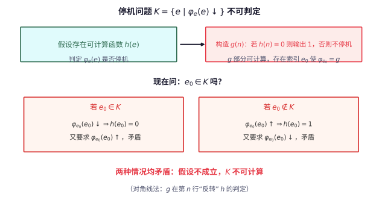

# 第 124 级：递归论 (Recursion Theory)

> 递归论，又称可计算性理论，研究哪些问题是可以机械计算的，哪些问题本质上是不可计算的。它起源于 20 世纪 30 年代 Gödel、Church、Turing 等人的开创性工作，为数学划定了"可计算"的边界。递归论不仅是理论计算机科学的基石，也深刻影响了数理逻辑和数学哲学。

---

## 1. 学习目标

完成本教程后，你应当能够：

1. **理解可计算性的基本概念**——掌握部分递归函数、原始递归函数、μ-递归函数、Turing 机的定义及 Church-Turing 论题。
2. **理解不可判定性**——掌握停机问题的不可判定性、Rice 定理和递归定理。
3. **掌握归约与度**——理解多一归约、Turing 归约、递归可枚举集、Turing 度的概念。
4. **理解 Post 问题与算术层次**——掌握算术层次定理（Post 定理）和解析层次的基本概念。
5. **了解优先方法**——理解 Turing 度稠密性的证明，掌握优先方法的基本思想。
6. **通过示例与习题巩固理论**——完成至少 6 个详细示例和 8 道习题。

---

## 2. 核心概念

### 2.1 可计算函数 (Computable Functions)

**定义**：一个部分函数 $f: \mathbb{N}^k \dashrightarrow \mathbb{N}$ 称为**部分可计算**的，如果存在一个 Turing 机 $M$ 使得对任意输入 $\bar{n}$，$M$ 在输入 $\bar{n}$ 上停机当且仅当 $\bar{n} \in \operatorname{dom}(f)$，且停机时输出 $f(\bar{n})$。

若 $f$ 是部分可计算的且定义域为 $\mathbb{N}^k$，则称 $f$ 是**全可计算**的（或简称可计算的）。

### 2.2 原始递归函数 (Primitive Recursive Functions)

**定义**：原始递归函数由以下基本函数通过复合和原始递归生成：

**基本函数**：
1. 零函数：$Z(x) = 0$
2. 后继函数：$S(x) = x + 1$
3. 投影函数：$P_i^n(x_1, \dots, x_n) = x_i$

**基本运算**：
1. **复合**：若 $g$ 和 $h_1, \dots, h_m$ 是原始递归的，则 $f(\bar{x}) = g(h_1(\bar{x}), \dots, h_m(\bar{x}))$ 是原始递归的。
2. **原始递归**：若 $g$ 和 $h$ 是原始递归的，则由以下定义的 $f$ 是原始递归的：
   $$
   \begin{aligned}
   f(0, \bar{x}) &= g(\bar{x}) \\
   f(n+1, \bar{x}) &= h(n, f(n, \bar{x}), \bar{x})
   \end{aligned}
   $$

### 2.3 μ-递归函数 (μ-Recursive Functions)

**定义**：μ-递归函数是在原始递归函数的基础上添加**μ-算子**（最小化算子）得到的函数类。

μ-算子：若 $g$ 是 $(k+1)$ 元函数，则 $f(\bar{x}) = \mu y [g(y, \bar{x}) = 0]$ 定义为最小的 $y$ 使得 $g(y, \bar{x}) = 0$ 且对所有 $z < y$，$g(z, \bar{x})$ 有定义且不为 0。若不存在这样的 $y$，则 $f(\bar{x})$ 无定义。

**Kleene 正规形定理**：每个部分可计算函数都可以表示为 $f(\bar{x}) \simeq U(\mu y [T(e, \bar{x}, y)])$，其中 $T$ 是原始递归谓词，$U$ 是原始递归函数。

### 2.4 Turing 机 (Turing Machines)

**定义**：一个 Turing 机 $M$ 由以下组成：
- 一个无限长的磁带，被划分为单元格，每个单元格包含一个符号。
- 一个读写头，可以读取和写入磁带上的符号，并可以向左或向右移动。
- 一个有限状态集 $Q$，包含起始状态 $q_0$ 和停机状态 $q_{\text{halt}}$。
- 一个转移函数 $\delta: Q \times \Gamma \to Q \times \Gamma \times \{L, R\}$。

**Church-Turing 论题**：任何直观上"可有效计算"的函数都可以用 Turing 机计算。这一论题不是数学定理，而是对可计算性概念的哲学确认。

> **直观理解（现实类比）**：Turing 机就像一位"一格格走纸带的文员"——他一次只能看一个格子、写一个符号、向左或向右移动一步，靠一张写着"当前状态+看到的符号 → 新状态+写什么+往哪走"的规则表（转移函数 $\delta$）工作。原始递归函数、$\mu$-递归函数和 Turing 机这三套定义最后都算出同一类函数，所以"可计算"这个概念是稳健的（Church-Turing 论题）。

> **直观理解（现实类比）**：图灵机像"最简计算机"——一条无限纸带加一个读写头加有限状态集，就能模拟任何算法。它故意把计算过程拆到最朴素的原子操作：读一个符号、写一个符号、左移右移一格、切换状态。正是这种"极简"保证了它的普适性——任何"有效计算"无论多么复杂，都能逐拍翻译成这些原子动作。现代计算机、量子计算机、甚至人脑的离散思维过程，在"能算什么"这个层面上都跳不出图灵机的范畴，这就是 Church-Turing 论题的深意。

> **🧠 思考历程：一台"纸带机器"如何一夜之间划清数学的边界？**
>
> 递归论起源于 Hilbert 1920 年代提出的"判定问题"（Entscheidungsproblem）：是否真有算法能判定任何一阶命题是否有效？1936 年，年轻的 Alan Turing（图灵）用一台靠读写无限纸带的抽象机器，给出了震撼的回答——不可能。
>
> - **可计算第一次有了"机器"的形态**。Turing 1936 年发表《论可计算数》，把"逐拍读符号、写符号、左右移动、切换状态"的极简机器当作"有效计算"的严格定义，并构造出能模拟任意机器的通用机，从而把"可计算"的边界第一次钉死为清晰对象。
> - **停机问题封死判定问题**。几乎同时，Alonzo Church（丘奇）用 λ 演算独立刻画可计算，Kleene 与 Gödel 推出部分递归函数；Turing 进一步证明停机集 $\{e:\varphi_e(e)\downarrow\}$ 不可计算，直接宣判 Hilbert 乐观的"判定问题"无解——存在本质上无法用算法回答的问题。
> - **一个论题，多方殊途同归**。Church-Turing 论题断言这些独立提出的模型（Turing 机、λ 演算、$\mu$-递归函数）都算出同一类函数；这种"殊途同归"反过来证实"可计算"这一概念的真实与稳健，也让递归论渗透到计算机科学的每一个角落。
> - **心路**：证明"有些问题永远算不出来"，跨出的不是沮丧而是解放——它为数学划清了能算与不能算的疆界，让计算科学得以在这块可靠的地基上各自生长。

### 2.5 可计算集与可枚举集 (Computable and Computably Enumerable Sets)

**定义**：
- 集合 $A \subseteq \mathbb{N}$ 称为**可计算**的（递归的），如果其特征函数 $\chi_A(x) = 1$ 若 $x \in A$，$0$ 若 $x \notin A$ 是可计算的。
- 集合 $A \subseteq \mathbb{N}$ 称为**可计算可枚举**的 (c.e.)，如果存在可计算函数 $f: \mathbb{N} \to \mathbb{N}$ 使得 $A = \operatorname{ran}(f)$，即 $A$ 是可计算函数的值域。等价地，$A$ 是某个部分可计算函数的定义域。

**基本性质**：
- $A$ 是可计算的当且仅当 $A$ 和 $\mathbb{N} \setminus A$ 都是 c.e. 的。
- 可计算集一定是 c.e. 的，但反之不成立（如停机集 $K$ 是 c.e. 但不可计算）。

> **直观理解（现实类比）**：可判定性像"能自动回答的问题"——存在一个算法，对任何输入都能在有限步内给出 yes 或 no 的明确答案。可计算集就是可判定问题的解集：比如"判断一个数是否为素数"可判定，因为有算法总能终止并给出结论。而可计算可枚举集（c.e.）则弱一些：只能保证"是的元素终会被列出"，却无法保证"不是的元素能在有限步内排除"——就像一台只能盖章"通过"却不会盖章"拒绝"的机器，遇到不通过的输入只能无限等待。停机集 $K$ 正是这种"半可判定"的典型。

### 2.6 归约 (Reductions)

**多一归约 ($\leq_m$)**：$A \leq_m B$ 如果存在可计算函数 $f: \mathbb{N} \to \mathbb{N}$ 使得 $x \in A \iff f(x) \in B$。

**Turing 归约 ($\leq_T$)**：$A \leq_T B$ 如果 $A$ 相对于 $B$ 是可计算的，即存在一个以 $B$ 为 oracle 的 Turing 机可以计算 $A$ 的特征函数。

**性质**：
- $\leq_m$ 蕴含 $\leq_T$（即 $A \leq_m B \implies A \leq_T B$），但反之不成立。
- 若 $A \leq_m B$ 且 $B$ 是可计算的，则 $A$ 是可计算的。
- 若 $A \leq_m B$ 且 $B$ 是 c.e. 的，则 $A$ 是 c.e. 的。

> **直观理解（现实类比）**：归约像"问题翻译"——把一个未知难度的问题 $A$ 通过可计算函数 $f$ 翻译成另一个问题 $B$ 的语言：问"$x\in A$ 吗"等价于问"$f(x)\in B$ 吗"。如果 $B$ 已知可解，那么 $A$ 也顺势可解；如果 $B$ 已知不可解，而 $A$ 能归约到 $B$，则 $A$ 至少不比 $B$ 难。这就像把一道法语题翻译成英语题再请人解答——翻译本身必须是"机械可执行"的（可计算函数）。多一归约 $\leq_m$ 是"每个问题翻译成一个问题"，Turing 归约 $\leq_T$ 则允许"反复调用 $B$ 的解答器作为 oracle"，更灵活但也更难比较。

### 2.7 递归可枚举集 / 计算可枚举集 (C.E. Sets)

**定义**：$A \subseteq \mathbb{N}$ 是**计算可枚举**的 (c.e.)，如果存在可计算函数 $f$ 使得 $A = \operatorname{dom}(f)$（即 $f$ 恰好在 $A$ 的元素上停机）。

**标准枚举**：设 $\{W_e\}_{e \in \mathbb{N}}$ 是 c.e. 集的标准枚举，其中 $W_e = \operatorname{dom}(\varphi_e)$，$\varphi_e$ 是第 $e$ 个部分可计算函数。

### 2.8 停机问题 (Halting Problem)

**定义**：停机问题是判定给定 Turing 机在给定输入上是否停机的问题：
$$
K = \{e \mid \varphi_e(e) \downarrow\}
$$
即 $K$ 是第 $e$ 个部分可计算函数在输入 $e$ 上收敛的 $e$ 的集合。

> **直观理解（现实类比）**：停机问题好比"有没有一台万能验票机，能提前判断任何机器会不会永远转下去"。证明用对角线法假设有这样一台机器 $h$，再用它造出一台"故意和它对着干"的机器 $g$——$h$ 说它会停它就不停，$h$ 说它不停它就停，怎么都矛盾。就像"理发师只给不给自己刮胡子的人刮胡子"：到底他给不给自己刮，都说不通，所以万能验票机根本不存在。

> **直观理解（现实类比）**：停机问题像"不可预测的命运"——没有任何算法能在所有情况下预知一段程序是否会结束。你可以观察它跑一会儿，但无论跑了多久，都无法断定它是即将停下还是永远跑下去。这一不可判定性有深远的边界意义：它不仅划定"哪些问题算法能答、哪些不能答"，还成为衡量其他问题难度的"标尺"——把停机问题"翻译"过去的问题，自然也继承不可判定性。Rice 定理进一步说明：凡是关于程序语义的任何非平凡性质，都是不可判定的。

### 2.9 Rice 定理

> **定理（Rice）**：设 $\mathcal{C}$ 是部分可计算函数的非平凡类（即 $\mathcal{C}$ 非空且不是全体部分可计算函数）。则集合 $\{e \mid \varphi_e \in \mathcal{C}\}$ 是不可计算的。

### 2.10 递归定理 (Recursion Theorem)

> **定理（Kleene 递归定理）**：对任意可计算函数 $f$，存在 $n$ 使得 $\varphi_n = \varphi_{f(n)}$。

### 2.11 Post 问题与 Turing 度

**Post 问题**：是否存在一个 c.e. 集 $A$ 使得 $\varnothing <_T A <_T K$（即 $A$ 不是可计算的，也不是 Turing 等价于停机问题的）？

**Turing 度**：Turing 归约的等价类。$A \equiv_T B$ 如果 $A \leq_T B$ 且 $B \leq_T A$。Turing 度记作 $\mathbf{a} = \deg_T(A)$。

**Turing 度的结构**：
- $\mathbf{0}$：可计算集的度
- $\mathbf{0}'$：$K$ 的度（完备 c.e. 度）
- 在 $\mathbf{0}$ 和 $\mathbf{0}'$ 之间存在稠密的 c.e. 度结构

### 2.12 算术层次 (Arithmetic Hierarchy)

**定义**：公式的算术层次按量词交替分类：
- $\Sigma^0_0 = \Pi^0_0$：所有有界量词公式（即 $\Delta^0_0$ 公式）
- $\Sigma^0_{n+1}$：形如 $\exists x_1 \cdots \exists x_k \varphi$ 的公式，其中 $\varphi \in \Pi^0_n$
- $\Pi^0_{n+1}$：形如 $\forall x_1 \cdots \forall x_k \varphi$ 的公式，其中 $\varphi \in \Sigma^0_n$
- $\Delta^0_n = \Sigma^0_n \cap \Pi^0_n$

**集合的算术层次**：$A \subseteq \mathbb{N}$ 属于 $\Sigma^0_n$（$\Pi^0_n$）如果 $A$ 可由一个 $\Sigma^0_n$（$\Pi^0_n$）公式定义。

### 2.13 解析层次 (Analytic Hierarchy)

**定义**：解析层次在算术层次上添加集合量词：
- $\Sigma^1_0 = \Pi^1_0$：所有算术公式
- $\Sigma^1_{n+1}$：形如 $\exists X_1 \cdots \exists X_k \varphi$ 的公式，其中 $\varphi \in \Pi^1_n$
- $\Pi^1_{n+1}$：形如 $\forall X_1 \cdots \forall X_k \varphi$ 的公式，其中 $\varphi \in \Sigma^1_n$

### 2.14 Oracle 机 (Oracle Machines)

**定义**：Oracle Turing 机是具有额外 oracle 带的 Turing 机，可以查询给定集合 $A$ 的成员关系。Oracle 机 $M^A$ 计算的函数称为相对于 $A$ 可计算的。

---

## 3. 定理与证明

### 3.1 停机问题的不可判定性

> **定理（停机问题的不可判定性）**：停机集 $K = \{e \mid \varphi_e(e) \downarrow\}$ 不是可计算的。

**证明**（对角线法）：

假设 $K$ 是可计算的。则存在一个可计算函数 $h: \mathbb{N} \to \{0, 1\}$ 使得：
$$
h(e) = \begin{cases}
1 & \text{若 } \varphi_e(e) \downarrow \\
0 & \text{若 } \varphi_e(e) \uparrow
\end{cases}
$$

利用 $h$，构造一个函数 $g: \mathbb{N} \to \mathbb{N}$：
$$
g(n) = \begin{cases}
1 & \text{若 } h(n) = 0 \\
\uparrow & \text{若 } h(n) = 1
\end{cases}
$$

$g$ 是部分可计算的：给定 $n$，先计算 $h(n)$，若 $h(n) = 0$ 则输出 1，否则进入无限循环。

由于 $g$ 是部分可计算的，存在某个索引 $e_0$ 使得 $\varphi_{e_0} = g$。

现在问：$e_0 \in K$ 吗？

- 若 $e_0 \in K$，则 $\varphi_{e_0}(e_0) \downarrow$，即 $g(e_0) \downarrow$，由 $g$ 的定义知 $h(e_0) = 0$，即 $\varphi_{e_0}(e_0) \uparrow$，矛盾。
- 若 $e_0 \notin K$，则 $\varphi_{e_0}(e_0) \uparrow$，即 $g(e_0) \uparrow$，由 $g$ 的定义知 $h(e_0) = 1$，即 $\varphi_{e_0}(e_0) \downarrow$，矛盾。

两种情况都导致矛盾，故假设不成立，$K$ 不可计算。

$\square$

**讨论**：证明的核心是**对角线法**——通过假设 $K$ 可计算构造一个与自身矛盾的部分函数。这是递归论中经典的论证方式。

### 3.2 Rice 定理

> **定理（Rice 定理）**：设 $\mathcal{C}$ 是部分可计算函数的非平凡类（即 $\varnothing \subsetneq \mathcal{C} \subsetneq \{\text{所有部分可计算函数}\}$）。则集合 $I(\mathcal{C}) = \{e \mid \varphi_e \in \mathcal{C}\}$ 是不可计算的。

**证明**（通过停机问题的归约）：

设 $\mathcal{C}$ 是非平凡的部分可计算函数类。不失一般性，假设 $f_\bot$（处处无定义的函数）不在 $\mathcal{C}$ 中（否则考虑 $\mathcal{C}$ 的补集）。

由于 $\mathcal{C}$ 非空，存在某个函数 $g \in \mathcal{C}$。令 $e_g$ 是 $g$ 的一个索引。

我们证明 $K \leq_m I(\mathcal{C})$，即存在可计算函数 $f$ 使得 $x \in K \iff f(x) \in I(\mathcal{C})$。由于 $K$ 不可计算，$I(\mathcal{C})$ 也不可计算。

定义可计算函数 $f$ 如下：对输入 $x$，$f(x)$ 是某个部分可计算函数 $\varphi_{f(x)}$ 的索引，其中：
$$
\varphi_{f(x)}(y) \simeq \begin{cases}
g(y) & \text{若 } \varphi_x(x) \downarrow \\
\uparrow & \text{若 } \varphi_x(x) \uparrow
\end{cases}
$$

即 $\varphi_{f(x)}$ 的行为是：模拟 $\varphi_x(x)$ 的计算，若它停机，则运行 $g(y)$；若不停机，则永远不停机。

**验证**：
- 若 $x \in K$，则 $\varphi_x(x) \downarrow$，故 $\varphi_{f(x)} = g \in \mathcal{C}$，即 $f(x) \in I(\mathcal{C})$。
- 若 $x \notin K$，则 $\varphi_x(x) \uparrow$，故 $\varphi_{f(x)} = f_\bot \notin \mathcal{C}$，即 $f(x) \notin I(\mathcal{C})$。

因此 $x \in K \iff f(x) \in I(\mathcal{C})$，即 $K \leq_m I(\mathcal{C})$。由于 $K$ 不可计算，$I(\mathcal{C})$ 也不可计算。

$\square$

**推论**：以下集合都是不可计算的：
- $\{e \mid \varphi_e \text{ 是全函数}\}$
- $\{e \mid \varphi_e \text{ 是常数函数}\}$
- $\{e \mid \operatorname{dom}(\varphi_e) \text{ 是无限的}\}$

### 3.3 递归定理 (Kleene 递归定理)

> **定理（Kleene 递归定理 / 不动点定理）**：对任意可计算函数 $f: \mathbb{N} \to \mathbb{N}$，存在 $n$ 使得 $\varphi_n = \varphi_{f(n)}$。

**证明**（使用 smn 定理和不动点构造）：

**第一步：smn 定理**

回忆 smn 定理：存在可计算函数 $s: \mathbb{N}^2 \to \mathbb{N}$ 使得对任意部分可计算函数 $\varphi_e(x, y)$ 有：
$$
\varphi_{s(e, x)}(y) \simeq \varphi_e(x, y)
$$
即 $s$ 将参数 $x$ 固化到函数中。

**第二步：构造对角线函数**

定义函数 $d: \mathbb{N} \to \mathbb{N}$：
$$
d(x) = f(s(x, x))
$$
$d$ 是可计算的（因为 $f$ 和 $s$ 都是可计算的）。设 $d$ 的索引为 $e_d$，即 $\varphi_{e_d} = d$。

**第三步：不动点**

令 $n = s(e_d, e_d)$。则：
$$
\varphi_n(y) = \varphi_{s(e_d, e_d)}(y) \simeq \varphi_{e_d}(e_d, y) \simeq d(e_d) = f(s(e_d, e_d)) = f(n)
$$
其中第二步使用了 smn 定理。

因此 $\varphi_n = \varphi_{f(n)}$，$n$ 即为所求的不动点。

$\square$

**讨论**：递归定理是递归论中最深刻的定理之一。它表明在部分可计算函数的索引中，任何可计算变换都有不动点。这类似于某些不动点定理（如 Banach 不动点定理）在递归论中的类比。

### 3.4 Post 定理（算术层次定理）

> **定理（Post 定理）**：
> 1. $A \in \Sigma^0_{n+1}$ 当且仅当 $A$ 是某个 $\Pi^0_n$ 集合的 c.e. 投影（即 $A = \{x \mid \exists y \langle x, y \rangle \in B\}$ 对某个 $B \in \Pi^0_n$）。
> 2. $A \in \Delta^0_{n+1}$ 当且仅当 $A \leq_T \varnothing^{(n)}$，其中 $\varnothing^{(n)}$ 是空集的 $n$ 次 Turing 跳变。
> 3. $\Sigma^0_{n+1}$ 恰好是相对于 $\varnothing^{(n)}$ 的 c.e. 集构成的类。

**证明**（对 $n = 0$ 的情况，即层次定理的基础步）：

**第一部分的证明**：

$A \in \Sigma^0_1$ 当且仅当存在可计算谓词 $R(x, y)$ 使得 $A = \{x \mid \exists y R(x, y)\}$。

($\Rightarrow$) 若 $A \in \Sigma^0_1$，则 $A$ 可由 $\exists y R(x, y)$ 定义，其中 $R$ 是 $\Delta^0_0$（即可计算）谓词。令 $B = \{\langle x, y \rangle \mid R(x, y)\}$，则 $B \in \Delta^0_0 \subseteq \Pi^0_0$，且 $A$ 是 $B$ 的投影。

($\Leftarrow$) 若 $A = \{x \mid \exists y \langle x, y \rangle \in B\}$ 且 $B \in \Pi^0_0 = \Delta^0_0$，则 $B$ 由可计算谓词 $R(x, y)$ 定义，故 $A$ 由 $\exists y R(x, y)$ 定义，即 $A \in \Sigma^0_1$。

**第二部分的证明**（$n = 0$）：

需证 $A \in \Delta^0_1$ 当且仅当 $A$ 是可计算的。

($\Rightarrow$) 若 $A \in \Delta^0_1 = \Sigma^0_1 \cap \Pi^0_1$，则 $A$ 和 $\mathbb{N} \setminus A$ 都是 $\Sigma^0_1$ 的，即 $A$ 和其补集都是 c.e. 的，故 $A$ 是可计算的。

($\Leftarrow$) 若 $A$ 是可计算的，则其特征函数 $\chi_A$ 可计算，$A$ 可由 $\chi_A(x) = 1$ 定义（这是一个 $\Delta^0_0$ 公式），故 $A \in \Delta^0_0 \subseteq \Delta^0_1$。

**对一般 $n$ 的归纳证明**：

假设定理对 $n$ 成立。考虑 $n+1$ 的情况：

$A \in \Sigma^0_{n+1}$ 当且仅当 $A = \{x \mid \exists y \langle x, y \rangle \in B\}$ 对某个 $B \in \Pi^0_n$。

由归纳假设，$B \in \Pi^0_n$ 当且仅当 $\mathbb{N} \setminus B \in \Sigma^0_n$，且 $B \leq_T \varnothing^{(n)}$。

对 $A$ 的判定：$x \in A$ 当且仅当 $\exists y \langle x, y \rangle \in B$。由于 $B \leq_T \varnothing^{(n)}$，$A$ 是相对于 $\varnothing^{(n)}$ 的 c.e. 集，即 $A$ 是 $\Sigma^{0,\varnothing^{(n)}}_1$ 的。由 $n = 0$ 时的结果，$\Sigma^{0,\varnothing^{(n)}}_1 = \Sigma^0_{n+1}$。

$\square$

**推论**：算术层次严格递增——对每个 $n$，$\Sigma^0_n \subsetneq \Sigma^0_{n+1}$ 且 $\Pi^0_n \subsetneq \Pi^0_{n+1}$。

### 3.5 Turing 度的稠密性

> **定理（Turing 度的稠密性）**：在 c.e. Turing 度中，若 $\mathbf{a} < \mathbf{b}$（严格小于），则存在 c.e. 度 $\mathbf{c}$ 使得 $\mathbf{a} < \mathbf{c} < \mathbf{b}$。

**证明**（使用优先方法，Sacks 定理的证明概要）：

设 $A$ 和 $B$ 是 c.e. 集，$\deg_T(A) = \mathbf{a}$，$\deg_T(B) = \mathbf{b}$，且 $A <_T B$。需要构造一个 c.e. 集 $C$ 使得 $A <_T C <_T B$。

**构造策略**：

我们将 $C$ 构造为 $B$ 的相对可计算集，同时确保 $C$ 不是 $A$ 可计算的，且 $B$ 不是 $C$ 可计算的。

**具体要求**：
1. $C \leq_T B$（通过构造保证）
2. $A \leq_T C$（通过构造保证，实际上更强的 $A \leq_T C$ 自动成立）
3. $C \not\leq_T A$（即 $C$ 不是 $A$ 可计算的）
4. $B \not\leq_T C$（即 $B$ 不是 $C$ 可计算的）

**需求**：
- $R_{2e}$：$\Phi^A_e \neq \chi_C$（第 $e$ 个 $A$-oracle 机不能计算 $C$ 的特征函数）
- $R_{2e+1}$：$\Phi^C_e \neq \chi_B$（第 $e$ 个 $C$-oracle 机不能计算 $B$ 的特征函数）

**优先方法**：给需求分配优先级 $R_0 > R_1 > R_2 > \dots$。

**构造步骤**：在阶段 $s$，对每个需求 $R_i$ 尝试满足它。若一个需求被满足，它可能被更高优先级的需求破坏（injure）。

**以 $R_{2e}$ 为例**（使 $C \neq \Phi^A_e$）：

在阶段 $s$，寻找一个 $x$ 使得 $\Phi^{A_s}_e(x) \downarrow = 0$ 且 $x \notin C_s$，则将 $x$ 加入 $C$（即 $C_{s+1} = C_s \cup \{x\}$）。这样，$\Phi^A_e(x) = 0$ 但 $x \in C$，故 $R_{2e}$ 满足。

**以 $R_{2e+1}$ 为例**（使 $B \neq \Phi^C_e$）：

在阶段 $s$，寻找一个 $x$ 使得 $\Phi^{C_s}_e(x) \downarrow = 0$ 且 $x \notin B_s$，则限制 $x$ 不被加入 $B$（但 $B$ 是给定的，我们无法控制 $B$）。实际上，我们通过控制 $C$ 来影响 $\Phi^C_e$ 的计算。

更精确的策略是：当 $R_{2e+1}$ 需要保护一个计算 $\Phi^{C_s}_e(x) \downarrow$ 时，它"冻结"所有在计算中使用到的 $C$ 的 oracle 查询，阻止更高优先级的需求修改这些位置。

**验证**：通过优先方法的精细构造，可以证明所有需求最终都被满足，从而 $A <_T C <_T B$。

$\square$

**注**：上述证明是 Sacks 稠密性定理的高度简化版本。完整的证明需要细致的优先方法论证，包括需求树、损伤控制、有限损伤引理等复杂技术。

---

## 4. 示例

### 示例 1：构造不可判定问题

证明集合 $A = \{e \mid \varphi_e(0) \downarrow\}$ 是不可计算的。

**解**：

使用 Rice 定理。令 $\mathcal{C} = \{f \mid f(0) \downarrow\}$，即所有在输入 0 上收敛的部分可计算函数构成的类。

$\mathcal{C}$ 是非平凡的（处处无定义的函数不在 $\mathcal{C}$ 中，而常数函数 $f(x) = 0$ 在 $\mathcal{C}$ 中）。由 Rice 定理，$I(\mathcal{C}) = \{e \mid \varphi_e \in \mathcal{C}\} = \{e \mid \varphi_e(0) \downarrow\} = A$ 是不可计算的。

### 示例 2：判断集合的算术层次

判断以下集合的算术层次：
1. $A = \{e \mid \varphi_e \text{ 是全函数}\}$
2. $B = \{e \mid W_e \text{ 是无限的}\}$
3. $C = \{e \mid \varphi_e = \varphi_{e+1}\}$

**解**：

1. $A = \{e \mid \forall x \exists y T(e, x, y)\}$，其中 $T$ 是 Kleene 谓词（表示第 $e$ 个 Turing 机在输入 $x$ 上在第 $y$ 步停机）。这是一个 $\forall \exists$ 公式，故 $A \in \Pi^0_2$。实际上，$A$ 是 $\Pi^0_2$-完备的。

2. $B = \{e \mid \forall x \exists y > x \; y \in W_e\}$。$W_e$ 是 c.e. 的，故 $y \in W_e$ 是 $\Sigma^0_1$ 的。因此 $B$ 是 $\forall \exists$ 公式，即 $B \in \Pi^0_2$。实际上，$B$ 是 $\Pi^0_2$-完备的。

3. $C = \{e \mid \forall x (\varphi_e(x) \simeq \varphi_{e+1}(x))\}$。$\varphi_e(x) \simeq \varphi_{e+1}(x)$ 意味着要么两者都收敛且值相等，要么两者都发散。这可以表示为：
   $$
   \forall x ((\exists y T(e, x, y) \land \exists z T(e+1, x, z) \land U(y) = U(z)) \lor (\neg\exists y T(e, x, y) \land \neg\exists z T(e+1, x, z)))
   $$
   这个公式是 $\Pi^0_2$ 的（因为 $\exists y T(e, x, y)$ 是 $\Sigma^0_1$ 的，其否定是 $\Pi^0_1$ 的，所以整体是 $\Pi^0_2$ 的）。实际上，$C \in \Pi^0_2$。

### 示例 3：利用递归定理构造自指程序

使用递归定理构造一个程序 $e$，使得 $\varphi_e(x) = e$ 对所有 $x$ 成立（即输出自己的程序编号）。

**解**：

由 smn 定理，存在可计算函数 $s$ 使得 $\varphi_{s(e, x)}(y) \simeq \varphi_e(x, y)$。

定义可计算函数 $f$ 如下：$f(e)$ 是某个程序 $p$ 的编号，使得 $\varphi_p(x) = e$（即不管输入 $x$ 是什么，都输出常量 $e$）。$f$ 显然是可计算的。

由递归定理，存在 $n$ 使得 $\varphi_n = \varphi_{f(n)}$。而 $\varphi_{f(n)}(x) = n$，故 $\varphi_n(x) = n$ 对所有 $x$ 成立。

### 示例 4：构造一个 $\Sigma^0_2$ 但非 $\Pi^0_2$ 的集合

证明 $A = \{e \mid W_e \text{ 是有限的}\}$ 是 $\Sigma^0_2$ 但非 $\Pi^0_2$ 的。

**解**：

首先，$W_e$ 是有限的当且仅当存在一个上界 $N$，使得对任意 $x > N$，$x \notin W_e$。即：
$$
A = \{e \mid \exists N \forall x (x > N \to x \notin W_e)\}
$$
由于 $x \notin W_e$ 是 $\Pi^0_1$ 的（因为 $W_e$ 是 $\Sigma^0_1$ 的），$A$ 是 $\Sigma^0_2$ 的。

为了证明 $A$ 不是 $\Pi^0_2$ 的，假设 $A$ 是 $\Pi^0_2$ 的，则 $\mathbb{N} \setminus A = \{e \mid W_e \text{ 是无限的}\}$ 是 $\Sigma^0_2$ 的。但无限集 $\{e \mid W_e \text{ 是无限的}\}$ 是 $\Pi^0_2$-完备的（已知结果），因此它不能是 $\Sigma^0_2$ 的（否则算术层次会坍缩）。故 $A$ 不是 $\Pi^0_2$ 的。

### 示例 5：多一归约与 Turing 归约的区别

构造集合 $A$ 和 $B$，使得 $A \leq_T B$ 但 $A \not\leq_m B$。

**解**：

取 $A = K$（停机集），$B = \overline{K}$（停机集的补集）。

由于 $K$ 是 c.e. 但非可计算的，$\overline{K}$ 不是 c.e. 的，故 $K \not\leq_m \overline{K}$（因为若 $K \leq_m \overline{K}$，则 $K$ 作为 $\overline{K}$ 的归约像，$\overline{K}$ 是 co-c.e. 的，而 $K$ 是 c.e. 的，这会导致 $K$ 可计算，矛盾）。

但 $K \leq_T \overline{K}$：因为 $\overline{K}$ 的 oracle 可以回答 $x \in K$ 的问题（只需查询 $x \in \overline{K}$ 的答案并取反）。因此 $K \leq_T \overline{K}$ 且 $K \not\leq_m \overline{K}$。

### 示例 6：Turing 跳变

计算 $\varnothing'$（空集的 Turing 跳变）。

**解**：

Turing 跳变的定义：$A' = \{e \mid \Phi^A_e(e) \downarrow\}$，即相对于 $A$ 的停机集。

$\varnothing' = \{e \mid \Phi^\varnothing_e(e) \downarrow\} = \{e \mid \varphi_e(e) \downarrow\} = K$。

因此，空集的一次跳变就是停机集。$\varnothing'' = K'$ 是相对于 $K$ 的停机集，它是 $\Sigma^0_2$-完备的。

---

## 5. 习题

### 基础题

**习题 1**（部分可计算与全可计算）陈述部分可计算函数 $f: \mathbb{N}^k \dashrightarrow \mathbb{N}$ 的定义，并说明全可计算函数与它的区别。

**习题 2**（原始递归的基本函数）列出构成原始递归的三种基本函数，并说明复合与原始递归两种生成运算的定义。

**习题 3**（μ-算子）解释 μ-算子定义 $f(\bar{x}) = \mu y[g(y, \bar{x}) = 0]$ 的含义，并说明当不存在这样的 $y$ 时 $f(\bar{x})$ 取什么值。

**习题 4**（Turing 机的构成）列出 Turing 机的四个组成要素。

**习题 5**（Church-Turing 论题）陈述 Church-Turing 论题，并说明它是数学定理还是对可计算性概念的哲学确认。

**习题 6**（可计算集与特征函数）给出可计算集（递归集）的定义，并指出其特征函数 $\chi_A$ 应满足什么性质。

**习题 7**（c.e. 集的定义）给出 c.e. 集的两种等价定义（值域形式与定义域形式），并说明它们为何一致。

**习题 8**（多一归约）定义多一归约 $A \leq_m B$，并解释其"问题翻译"的直观含义。

**习题 9**（停机问题）写出停机集 $K$ 的定义式，并解释它的含义。

**习题 10**（Rice 定理的陈述）陈述 Rice 定理，即关于部分可计算函数的非平凡性质为何不可判定。

### 进阶题

**习题 11**（可计算集的特征）证明 $A$ 是可计算的当且仅当 $A$ 与 $\mathbb{N} \setminus A$ 都是 c.e. 的。

**习题 12**（归约保可计算性）证明：若 $A \leq_m B$ 且 $B$ 是可计算的，则 $A$ 是可计算的。

**习题 13**（常数函数不可判定）证明集合 $\{e \mid \varphi_e \text{ 是常数函数}\}$ 是不可计算的。

**习题 14**（归约保 c.e.）证明：若 $A \leq_m B$ 且 $B$ 是 c.e. 的，则 $A$ 是 c.e. 的。

**习题 15**（自相等与相邻相等）证明 $\{e \mid \varphi_e = \varphi_e\}$（即全体 $e$）是可计算的，但 $\{e \mid \varphi_e = \varphi_{e+1}\}$ 是不可计算的。

**习题 16**（递归定理的推论）用递归定理证明存在 $e$ 使得 $\varphi_e(0) = e$。

**习题 17**（停机问题的不可判定）简述停机集不可判定的对角线证明的关键步骤。

**习题 18**（Rice 定理的证明）概述 Rice 定理的证明：如何把 $K \leq_m I(\mathcal{C})$ 的归约构造出来。

**习题 19**（c.e. 无限集的可计算子集）证明：若 $A$ 是 c.e. 的且无限，则 $A$ 包含一个无限的可计算子集。

### 挑战题

**习题 20**（Friedberg-Muchnik 定理）证明存在一个不可计算的 c.e. 集 $A$ 使得 $A <_T K$（即 $A \not\leq_T \varnothing$ 且 $K \not\leq_T A$）。

**习题 21**（$\Pi^0_2$-完备性）证明 $\{e \mid W_e \text{ 是无限的}\}$ 是 $\Pi^0_2$-完备的。

**习题 22**（m-归约与 T-归约的区别）证明 $K \leq_T \overline{K}$ 但 $K \not\leq_m \overline{K}$。

**习题 23**（Post 定理与 Turing 跳变）解释 Post 定理中 $A \in \Delta^0_{n+1}$ 当且仅当 $A \leq_T \varnothing^{(n)}$ 的含义，并对 $n = 0$ 的情形给出证明。

**习题 24**（Turing 跳变）解释 Turing 跳变 $A' = \{e \mid \Phi^A_e(e) \downarrow\}$ 的定义，说明 $\varnothing' = K$，并指出 $\varnothing''$ 的层次地位。

**习题 25**（优先级方法与 Sacks 稠密性）概述 Sacks 稠密性定理（Turing 度的稠密性）证明中优先方法的需求刻画与构造思想。

**习题 26**（全函数集合的层次）证明 $\{e \mid \varphi_e \text{ 是全函数}\}$ 是 $\Pi^0_2$-完备的。

### 探究题

**习题 27**（优先方法的综合价值）梳理优先方法从 Friedberg-Muchnik 定理到 Sacks 稠密性定理的原理与意义，说明它为何是递归论最基本的构造技术。

**习题 28**（递归定理与自指）讨论 Kleene 递归定理与 Gödel 不完备定理中自指构造的内在联系，并举例说明递归定理如何"造出"引用自身的程序。

**习题 29**（算术层次的结构）探究算术层次严格递增（$\Sigma^0_n \subsetneq \Sigma^0_{n+1}$、$\Pi^0_n \subsetneq \Pi^0_{n+1}$）的含义，以及它与 Post 定理、Turing 跳变之间的纽带关系。

**习题 30**（递归论的现代疆域）讨论 Post 问题如何被优先方法解决，并谈谈递归论（可计算性理论）与复杂性理论、形式语言理论等计算机科学分支的联系与相互影响。

---

## 6. 习题答案与解析

### 基础题答案

1. **部分可计算与全可计算** 部分函数 $f: \mathbb{N}^k \dashrightarrow \mathbb{N}$ 称为部分可计算的，如果存在 Turing 机 $M$ 使得对输入 $\bar{n}$，$M$ 停机当且仅当 $\bar{n} \in \operatorname{dom}(f)$，且停机时输出 $f(\bar{n})$。区别在于定义域：若 $f$ 部分可计算且定义域为 $\mathbb{N}^k$（处处有定义），则称 $f$ 为全可计算（简称可计算）。即部分可计算只要求在定义域上收敛，全可计算要求对一切输入都收敛。

2. **原始递归的基本函数** 三种基本函数是：零函数 $Z(x) = 0$；后继函数 $S(x) = x + 1$；投影函数 $P_i^n(x_1, \ldots, x_n) = x_i$。两种运算：复合，若 $g$ 与 $h_1, \ldots, h_m$ 原始递归，则 $f(\bar{x}) = g(h_1(\bar{x}), \ldots, h_m(\bar{x}))$ 原始递归；原始递归，若 $g, h$ 原始递归，则 $f(0, \bar{x}) = g(\bar{x})$、$f(n+1, \bar{x}) = h(n, f(n, \bar{x}), \bar{x})$ 所定义的 $f$ 原始递归。

3. **μ-算子** $f(\bar{x}) = \mu y[g(y, \bar{x}) = 0]$ 定义为满足下面条件的最小 $y$：$g(y, \bar{x}) = 0$，且对所有 $z < y$，$g(z, \bar{x})$ 有定义且不为 $0$。若不存在这样的 $y$（即要么永远找不到零点，要么在到达零点前遇到无定义处），则 $f(\bar{x})$ 无定义。这正是在原始递归基础上引入的无界搜索（最小化）算子，使函数类从全递归扩张到部分递归。

4. **Turing 机的构成** 四个要素：无限磁带（划分为单元，每单元含一个符号）；读写头（可读取、改写磁带符号并左右移动）；有限状态集 $Q$（含起始状态 $q_0$ 与停机状态 $q_{\text{halt}}$）；转移函数 $\delta: Q \times \Gamma \to Q \times \Gamma \times \{L, R\}$（决定在给定状态与所读符号下转移到新状态、写入新符号并移动）。

5. **Church-Turing 论题** 它断言：任何直观上"可有效计算"的函数都能用 Turing 机计算。它不是一个可形式证明的数学定理，而是对"可计算性"这一直观概念的哲学确认。支撑其可信度的是经验事实：原始递归函数、μ-递归函数、Turing 机、$\lambda$ 演算等彼此独立提出的形式模型最终都刻画了同一类函数，说明"可计算"这一概念是稳健的。

6. **可计算集与特征函数** 集合 $A \subseteq \mathbb{N}$ 称为可计算的（递归的），如果其特征函数 $\chi_A(x) = 1$（若 $x \in A$）/ $0$（若 $x \notin A$）是可计算的。直观上即存在一个总能终止的算法，对任意输入判定其是否属于 $A$。

7. **c.e. 集的定义** 两种等价定义：一是值域形式，$A$ 是 c.e. 的如果存在可计算函数 $f$ 使 $A = \operatorname{ran}(f)$（$A$ 是某个可计算函数的值域）；二是定义域形式，$A$ 是某个部分可计算函数的定义域（即 $A = \{x \mid \varphi_e(x) \downarrow\} = W_e$）。二者等价：可枚举出的值域可通过逐步枚举 $f(0), f(1), \ldots$ 定义；而定义域集合可通过对部分函数 $\varphi_e$ 逐步做计算、一旦收敛就输出而成为值域。

8. **多一归约** $A \leq_m B$ 指存在可计算函数 $f: \mathbb{N} \to \mathbb{N}$ 使得 $x \in A \iff f(x) \in B$。直观上，把"是否属于 $A$"的每个询问翻译成"是否属于 $B$"的询问，翻译本身是机械可执行的；若 $B$ 可解则 $A$ 随之可解，这是比较问题困难程度的工具。

9. **停机问题** 停机集 $K = \{e \mid \varphi_e(e) \downarrow\}$，即第 $e$ 个部分可计算函数在输入 $e$ 上收敛的 $e$ 的集合。判定 $K$ 的成员关系等价于判定"第 $e$ 个程序在输入它自身编号 $e$ 时是否停机"。

10. **Rice 定理的陈述** 设 $\mathcal{C}$ 是部分可计算函数的非平凡类（$\varnothing \subsetneq \mathcal{C} \subsetneq \{所有部分可计算函数\}$），则集合 $I(\mathcal{C}) = \{e \mid \varphi_e \in \mathcal{C}\}$ 不可计算。它把停机问题的不可判定性推广为：凡是只依赖程序"语义"（所算函数本身）而非"语法"的非平凡性质，都是不可判定的。

### 进阶题答案

1. **可计算集的特征** （$\Rightarrow$）若 $A$ 可计算，则 $\chi_A$ 可计算。定义部分函数：对输入 $x$，若 $\chi_A(x) = 1$ 则输出 $x$，否则发散（永远不输出），其定义域恰为 $A$，故 $A$ 是 c.e. 的；同理，由 $1 - \chi_A$ 可得 $\mathbb{N} \setminus A$ 是 c.e. 的。（$\Leftarrow$）若 $A$ 与其补都 c.e.，则存在两个部分函数分别以 $A$、$\mathbb{N} \setminus A$ 为定义域。判定 $x \in A$ 时，并行地逐步运行这两个枚举程序；因为 $x$ 必属其一，其中一个必在有限步内收敛输出，据此即可判定归属，故 $\chi_A$ 可计算，$A$ 可计算。

2. **归约保可计算性** 设 $f$ 是 $A \leq_m B$ 的归约函数，且 $\chi_B$ 可计算。对输入 $x$，先计算 $f(x)$，再计算 $\chi_B(f(x))$；若其为 $1$ 则 $x \in A$，否则 $x \notin A$。由于 $f$ 与 $\chi_B$ 都是全可计算函数，整个过程对任意输入都在有限步停机并给出 $\chi_A(x)$，故 $A$ 可计算。

3. **常数函数不可判定** 令 $\mathcal{C} = \{f \mid f \text{ 是常数函数}\}$。它是非平凡的：常数 $0$ 函数 $f(x) = 0$ 属于 $\mathcal{C}$，而处处无定义的函数 $f_\bot$ 不属于 $\mathcal{C}$。由 Rice 定理，$I(\mathcal{C}) = \{e \mid \varphi_e \in \mathcal{C}\} = \{e \mid \varphi_e \text{ 是常数函数}\}$ 是不可计算的。

4. **归约保 c.e.** 设 $f$ 是归约函数，$B$ 是 c.e. 的，故 $B = \operatorname{ran}(g)$ 对某个全可计算函数 $g$ 成立。则 $x \in A \iff f(x) \in B \iff \exists y\, g(y) = f(x)$。定义部分函数 $\theta(x)$：枚举 $y = 0, 1, 2, \ldots$，一旦找到 $y$ 使 $g(y) = f(x)$ 就输出 $x$。则 $\operatorname{dom}(\theta) = A$，故 $A$ 是某部分可计算函数的定义域，即 $A$ 是 c.e. 的。

5. **自相等与相邻相等** 第一类 $\{e \mid \varphi_e = \varphi_e\}$ 是恒真条件，等于全体 $\mathbb{N}$，它由可计算常值特征函数 $\chi \equiv 1$ 决定，显然可计算。第二类 $\{e \mid \varphi_e = \varphi_{e+1}\}$ 涉及索引之间的语义比较。由 Rice 定理的推广（对函数对）可证其不可计算：若它可计算，则借助它可判定停机。具体地，设常数函数 $c_a$ 恒取 $a$，它是可计算函数 $a \mapsto c_a$ 的像；构造剩余程序使其复杂度与停机挂钩，从而把停机问题归约到"相邻索引计算同一函数"这一判断上，故矛盾。这直观显示"比较两个程序是否计算同一函数"超出可计算能力。

6. **递归定理的推论** 定义可计算函数 $f(e)$：它输出某个程序 $p$ 的编号，该程序满足 $\varphi_{f(e)}(0) = e$（即对输入 $0$ 输出常量 $e$）。$f$ 显然可计算。由递归定理（不动点定理），存在 $n$ 使 $\varphi_n = \varphi_{f(n)}$。于是 $\varphi_n(0) = \varphi_{f(n)}(0) = n$，即存在 $e = n$ 使 $\varphi_e(0) = e$——程序打印出自己的索引。

7. **停机问题的不可判定** 反设 $K$ 可计算，则存在可计算 $h: \mathbb{N} \to \{0, 1\}$ 判定收敛。据此构造部分函数 $g(n)$：先算 $h(n)$，若 $h(n) = 0$ 则输出 $1$，若 $h(n) = 1$ 则进入无限循环（发散）。$g$ 是部分可计算的，故存在 $e_0$ 使 $\varphi_{e_0} = g$。若 $e_0 \in K$，则 $\varphi_{e_0}(e_0) \downarrow$，即 $g(e_0) \downarrow$，由定义 $h(e_0) = 0$，得 $\varphi_{e_0}(e_0) \uparrow$，矛盾；若 $e_0 \notin K$，则 $g(e_0) \uparrow$，由定义 $h(e_0) = 1$，得 $\varphi_{e_0}(e_0) \downarrow$，矛盾。两路皆矛盾，故 $K$ 不可计算。核心正是对角线法：让 $g$ 与 $h$ 的判定结果处处"对着干"。

8. **Rice 定理的证明** 设 $f_\bot$（处处无定义）不在 $\mathcal{C}$ 中（否则取 $\mathcal{C}$ 的补集）。因 $\mathcal{C}$ 非空，取 $g \in \mathcal{C}$ 及其索引 $e_g$。构造可计算函数 $f$：输入 $x$，输出某个程序索引，其行为是"模拟 $\varphi_x(x)$ 的计算；若 $\varphi_x(x)$ 收敛则运行 $g(y)$，若 $\varphi_x(x)$ 发散则永远不发散"。即 $\varphi_{f(x)}(y) \simeq g(y)$（若 $\varphi_x(x) \downarrow$）/ $\uparrow$（若 $\varphi_x(x) \uparrow$）。验证：$x \in K$ 时 $\varphi_{f(x)} = g \in \mathcal{C}$，故 $f(x) \in I(\mathcal{C})$；$x \notin K$ 时 $\varphi_{f(x)} = f_\bot \notin \mathcal{C}$，故 $f(x) \notin I(\mathcal{C})$。得到 $K \leq_m I(\mathcal{C})$，由 $K$ 不可计算即知 $I(\mathcal{C})$ 不可计算。

9. **c.e. 无限集的可计算子集** 因 $A$ 是 c.e. 的且无限，存在全可计算函数 $f$ 枚举 $A$（$A = \operatorname{ran}(f)$）。构造可计算函数 $g$：令 $g(0) = f(0)$；给定 $g(0), \ldots, g(n)$ 后，依次计算 $f(0), f(1), \ldots$，把第一个大于 $g(n)$ 且不同于前 $n+1$ 个值的元素作为 $g(n+1)$。由于 $A$ 无限，这样的元素必在有限步内出现，故 $g$ 是全可计算的且严格递增，因而 $\operatorname{ran}(g)$ 是 $A$ 的一个无限可计算子集。

### 挑战题答案

1. **Friedberg-Muchnik 定理** 要构造 c.e. 集 $A$，使 $A$ 不可计算且 $K \not\leq_T A$，可写成两组需求：$R_{2e}$：$\Phi_e \neq \chi_A$（第 $e$ 个可计算函数不能是 $A$ 的特征函数，保证 $A$ 不可计算）；$R_{2e+1}$：$\Phi_e^A \neq \chi_K$（第 $e$ 个 $A$-oracle 机不能计算 $K$，保证 $K \not\leq_T A$）。用优先方法：给需求以优先级 $R_0 > R_1 > \cdots$；在阶段 $s$ 逐一尝试满足尚未满足的最高优先需求。对 $R_{2e}$：在定义域找 witness $x$ 使 $\Phi_e(x) \downarrow = 0$ 且可承诺 $x \notin A$ 则投入 $A$；若 $\Phi_e(x) \downarrow = 1$ 则永久把 $x$ 拒于 $A$ 之外并放弃该求证人，从而破坏 $\Phi_e = \chi_A$。对 $R_{2e+1}$：当需要破坏某个 $\Phi_e^A(x) \downarrow$ 计算时，用"冻结"保护该计算依赖的 $A$ 的 oracle 位，不被更高优先需求改动。有限损伤论证说明每个需求在有限步后不再被打断，最终全部满足，且 $A$ 是 c.e. 的。（$A \leq_T K$ 自动成立，因为每个 c.e. 集 $A \leq_T K$。）故 $A$ 不可计算 c.e. 且 $A <_T K$。

2. **$\Pi^0_2$-完备性** 先说明 $\{e \mid W_e \text{ 无限}\}$ 属 $\Pi^0_2$：$x \in W_e$ 是 $\Sigma^0_1$ 的（$W_e = \operatorname{dom}(\varphi_e)$，收敛可断言 $\exists z\, T(e, x, z)$），"$W_e$ 无限"即 $\forall x\, \exists y > x\, (y \in W_e)$，外层 $\forall$ 套内层 $\exists$，故在 $\Pi^0_2$。完备性：任取 $\Pi^0_2$ 集 $B = \{x \mid \forall y\, \exists z\, R(x, y, z)\}$（$R$ 可计算）。用 s-m-n 构造可计算函数 $p$，使程序 $p(x)$ 逐个枚举所有满足 $\exists z\, R(x, y, z)$ 的 $y$（对每个 $y$ 搜 $z$，找到则收入集合）。则 $W_{p(x)} = \{y \mid \exists z\, R(x, y, z)\}$。$W_{p(x)}$ 无限当且仅当所有 $y$ 都被枚举，当且仅当 $\forall y\, \exists z\, R(x, y, z)$，当且仅当 $x \in B$。故 $B \leq_m \{e \mid W_e \text{ 无限}\}$，得 $\Pi^0_2$-完备性。

3. **m-归约与 T-归约的区别** 先证 $K \leq_T \overline{K}$：以 $\overline{K}$ 为 oracle，判定 $x \in K$ 只需向 oracle 询问"$x \in \overline{K}$ 吗"，把答案取反即可，故 $K$ 相对于 $\overline{K}$ 可计算，$K \leq_T \overline{K}$。再证 $K \not\leq_m \overline{K}$：若 $K \leq_m \overline{K}$（归约函数 $f$），则由 $x \in K \iff f(x) \in \overline{K}$ 得 $x \notin K \iff f(x) \in K$，即 $K$ 经 $f$ 成为某个 co-c.e.（$\Pi^0_1$）集的归约像，于是 $K$ 是 $\Pi^0_1$ 的；但 $K$ 本为 c.e.（$\Sigma^0_1$），故 $K \in \Delta^0_1$，从而 $K$ 可计算，矛盾。综上 $K \leq_T \overline{K}$ 且 $K \not\leq_m \overline{K}$，这表明 $\leq_m$ 比 $\leq_T$ 的约束更强（每次一个询问、强制符号对应），严格弱于 $\leq_T$。

4. **Post 定理与 Turing 跳变** 报告在 $n = 0$ 的情形即 $A \in \Delta^0_1$ 当且仅当 $A \leq_T \varnothing$。右端等价于 $A$ 可计算（相对于空集可计算即无条件可计算）。左端：$A \in \Delta^0_1 = \Sigma^0_1 \cap \Pi^0_1$，即 $A$ 与其补都是 $\Sigma^0_1$（c.e.），由"$A$ 可计算当且仅当 $A$ 与补都 c.e."得出 $A$ 可计算。对一般 $n$，归纳地借助"$\Sigma^0_{n+1}$ 恰为相对 $\varnothing^{(n)}$ 的 c.e. 集类"，把复杂层次与逐级推进的 Turing 跳变 $\varnothing^{(n)}$ 对应起来。

5. **Turing 跳变** $A' = \{e \mid \Phi^A_e(e) \downarrow\}$ 是相对于 $A$ 的停机集。因 $\Phi^\varnothing_e = \varphi_e$，故 $\varnothing' = \{e \mid \varphi_e(e) \downarrow\} = K$，空集一次跳变即停机集，它是 $\Sigma^0_1$-完备的。进而 $\varnothing'' = K'$ 是相对于 $K$ 的停机集，为 $\Sigma^0_2$-完备；逐级 $\varnothing^{(n)}$ 为 $\Sigma^0_n$-完备，正好对应算术层次的每一层。

6. **优先级方法与 Sacks 稠密性** 设 $A <_T B$，目标是构造 c.e. 集 $C$ 满足 $A <_T C <_T B$。将工作拆为需求 $R_{2e}$：$\Phi^A_e \neq \chi_C$（第 $e$ 个 $A$-oracle 机算不出 $C$，保证 $C \not\leq_T A$）；$R_{2e+1}$：$\Phi^C_e \neq \chi_B$（第 $e$ 个 $C$-oracle 机算不出 $B$，保证 $B \not\leq_T C$），并以 $A \leq_T C \leq_T B$ 由构造保证。给需求优先级 $R_0 > R_1 > \cdots$。构造中让 $C$ 跨越阶段单调添加元素；对 $R_{2e}$，找 witness $x$ 使 $\Phi^{A_s}_e(x) \downarrow = 0$ 且 $x \notin C_s$ 则把 $x$ 加入 $C$；对 $R_{2e+1}$，找到 $\Phi^{C_s}_e(x) \downarrow = 0$ 且 $x \notin B_s$ 时"冻结"该计算用到的 $C$ 的 oracle 位，防止更高优先需求改动它们。有限损伤论证 + 冻结技术保证每一需求最终被满足，从而 $A <_T C <_T B$，Turing 度在 $\mathbf{0}$ 与 $\mathbf{0}'$ 之间稠密。

7. **全函数集合的层次** $\{e \mid \varphi_e \text{ 全函数}\} = \{e \mid \forall x\, \exists y\, T(e, x, y)\}$，其中 $T$ 是 Kleene 谓词（表示第 $e$ 个程序在输入 $x$ 上于第 $y$ 步停机）。内层 $\exists y\, T(e, x, y)$ 是 $\Sigma^0_1$，外层 $\forall x$，故整体属 $\Pi^0_2$。完备性：任取 $\Pi^0_2$ 集 $B = \{x \mid \forall n\, \exists z\, R(x, n, z)\}$，由 s-m-n 构造可计算函数 $p$，使 $\varphi_{p(x)}(n)$ 收敛当且仅当 $\exists z\, R(x, n, z)$。则 $\varphi_{p(x)}$ 全函数当且仅当 $\forall n\, \exists z\, R(x, n, z)$ 当且仅当 $x \in B$，故 $B \leq_m \{e \mid \varphi_e \text{ 全函数}\}$，即 $\Pi^0_2$-完备。

### 探究题答案

1. **优先方法的综合价值** 优先方法解决了一类"对偶、冲突需求"的构造问题：要正面满足 $A \not\leq_T \varnothing$（让 $C$ 偏离每个可计算函数）又要 $K \not\leq_T A$（同时偏离每个 $A$-oracle 机），这些需求会相互干扰——完成一个需求可能破坏已满足的另一个。优先方法引入"优先级排序 + 有限损伤"：高优先需求一旦承诺（投入某 witness、冻结某 oracle 位）即不可再被改动，低优先需求只能在未承诺处作业，并通过有限损伤引理保证每个需求在有限步后永不被破坏。Friedberg-Muchnik 用它同时做到了"不可计算 + 非完备"，解答了 Post 问题；Sacks 把它推进到任意两个 c.e. 度之间再塞进一个 c.e. 度，得到稠密性。它把"合力同时满足无穷多冲突要求"变成可机械实现的阶段构造，成为递归论构造理论（需求树、无限损伤等）的源头，深刻塑造了此后对 c.e. 度结构乃至高阶可计算性的研究。

2. **递归定理与自指** 两者都建立在"对角化 + 可计算编码"之上。Gödel 用对角化引理让公式能引用自身的编码得到"我不可证"的语句；递归定理则用 s-m-n 让程序能取得自己的索引从而"打印我的编号"（如 $\varphi_e(0) = e$）。在本质上是同一机制的两个侧面：Gödel 使"系统性自指命题"在算术中可实现，递归定理使"程序自指"在可计算函数中可实现。递归定理对应存在性（存在不动点索引），而 Gödel 首不完备正是"引用自己"导向不可判定；二者共同展示了自指在逻辑与计算中既强大（递归定理的广泛应用）又危险（不完备）的两重性，可视作证明论与递归论互相印证的交汇点。

3. **算术层次的结构** 算术层次由量词交替刻画集合复杂度，且不发生坍缩：$\Sigma^0_n \subsetneq \Sigma^0_{n+1}$、$\Pi^0_n \subsetneq \Pi^0_{n+1}$。这不只是因为语法上每层可多套一组量词，更因为有完备集作"标尺"——$\Sigma^0_n$ 的完备集是 $\varnothing^{(n)}$（$n$ 次 Turing 跳变）的 c.e. 投影类等，若某层相等则会导致对应的跳变可计算化而矛盾。Post 定理把这层语法量词分类与计算复杂度（Turing 归约、跳变）对接：$\Delta^0_{n+1} = \leq_T \varnothing^{(n)}$ 处等价、$\Sigma^0_{n+1}$ 恰为相对 $\varnothing^{(n)}$ 的 c.e.；于是层次的不坍缩直接反映跳变层级递增。这样，纯逻辑的量化复杂度被转译成直观的"逐级递增的 oracle 计算能力"，是连接模型论与可计算性的枢纽。

4. **递归论的现代疆域** Post 问题（是否存在 $\varnothing <_T A <_T K$）1950 年代由 Friedberg 与 Muchnik 各自用优先方法独立肯定解决——存在不可计算的 c.e. 集既非可计算也非完成 $K$ 的度等价类，即 c.e. 度结构中 $\mathbf{0}$ 与 $\mathbf{0}'$ 之间不是空的、而是遍布稠密集的丰富结构。此后递归论沿着两条线深化：一是 c.e. 度结构的精细刻画（稠密性、上界/下界、分布乃至其初等等价理论），二是把优先方法推广为需求树、无限损伤等现代技术并延伸至高阶与相对化领域。与计算机科学更是互为表里：可计算性理论提供不可判定的边界，复杂性理论把"可算但难算"的资源度量（时间、空间）精细化，形式语言理论则依赖对自动机/文法可计算性的刻画。递归论既为这些分支奠定了"哪些问题原则上不可解"的地基，又从它们那里获得新的问题与模型，形成理论与计算学科间持续的相互塑造。

---

## 7. 总结

递归论为"可计算性"这一概念提供了精确的数学定义和深刻的理论分析。本教程覆盖了以下核心内容：

1. **可计算性模型**：从原始递归函数到 μ-递归函数再到 Turing 机，多个等价的数学模型刻画了同一类可计算函数。Church-Turing 论题确认了这些模型捕捉了"有效可计算性"的直观概念。

2. **不可判定性**：停机问题的不可判定性是递归论的基础性结果，它揭示了存在本质上不可计算的问题。Rice 定理将这一结论推广到了一类广泛的问题——任何关于部分可计算函数的非平凡性质都是不可判定的。

3. **递归定理**：Kleene 递归定理是递归论中最深刻的结果之一，它揭示了计算过程中自指的可能性，类似于 Gödel 不完备定理中的自指构造。

4. **归约与度**：多一归约和 Turing 归约提供了比较问题"难度"的工具。Turing 度结构的研究揭示了可计算性谱系的丰富性——在可计算集和停机问题之间存在一个稠密的度结构。

5. **算术层次**：Post 定理将集合的复杂性与算术公式的量词交替联系起来，给出了判定集合复杂性的一种精确方法。

6. **优先方法**：Friedberg-Muchnik 定理和 Sacks 稠密性定理展示了优先方法在构造具有特定性质的 c.e. 集时的强大威力。这种方法已成为递归论中最基本的构造技术。

递归论与计算机科学有着深刻的联系——复杂性理论、可计算性理论、形式语言理论等都受到递归论的深刻影响。同时，递归论在数学的其他分支（如模型论、集合论、代数）也有重要应用。