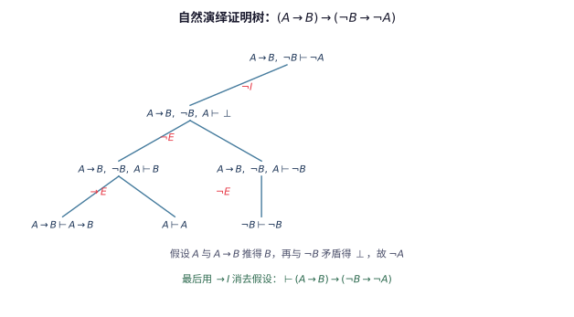
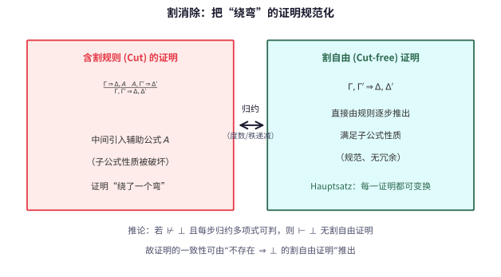

# 第125级 证明论

## 学习目标

1. 理解形式系统的基本概念和构造方法
2. 掌握自然演绎和sequent演算（LK、LJ）的推理规则
3. 理解切断消除定理（Cut Elimination）及其证明思想
4. 掌握Herbrand定理及其在自动定理证明中的应用
5. 理解Gödel完备性定理的证明论版本
6. 掌握Gödel不完全性定理的证明论证明
7. 理解Gentzen的PA一致性证明和序数分析
8. 了解算术超穷和证明论在数学基础中的地位

---

## 核心概念

### 形式系统

一个**形式系统**由以下要素构成：

- **字母表**（Alphabet）：符号的有限集合
- **形成规则**（Formation Rules）：规定哪些符号串是合式公式
- **公理**（Axioms）：被直接接受为真的公式
- **推理规则**（Inference Rules）：从已知公式推导出新公式的规则

形式系统记为 $\mathcal{F} = (\mathcal{L}, \mathcal{A}, \mathcal{R})$，其中 $\mathcal{L}$ 是语言，$\mathcal{A}$ 是公理集，$\mathcal{R}$ 是推理规则集。

> **直观理解（现实类比）**：形式证明像"按规则推演"——从公理出发，每一步严格套用推理规则，最终抵达结论。这就像下棋：公理是初始棋局，推理规则是合法走法，证明是一串合法走子形成的棋谱。任何一步不合规则，整盘棋就作废。形式化的好处是"机器可检验"——只要逐条核对每步是否符合规则，就能判定一份证明是否有效，无需理解其中的"数学直觉"。证明论正是把这种"棋谱式"的推理本身当作数学对象来研究：证明有多长？能否化简？能否被算法自动搜索？

> **🧠 思考历程：把"证明"本身当成数学对象，凭什么能为全部数学奠基？**
>
> 证明论源于 Hilbert 的"证明论计划"：把数学全部形式化为公理加推理规则的符号系统，再用元数学证明整个系统一致。这套愿景最终被 Gödel 的发现改写，却催生了证明论这一门学科。
>
> - **形式化是一面"放大镜"**。David Hilbert（希尔伯特）1900 年起力主把算术乃至全部数学写成可机械检查的形式系统；Gottlob Frege（弗雷格）与 Bertrand Russell（罗素）也力图用严格公理消除歧义。形式系统的迷人之处，在于它把"证明"降为规则操作，从而可以被当作一个整体来研究。
> - **不完备惊醒美梦**。Kurt Gödel（哥德尔）1931 年用对角化证明：任何足够强的形式系统要么不一致、要么不完备——存在既不可证也不可否证的语句；第二不完备定理更断言系统无法内在地自证一致。Hilbert 计划的"最大目标"就此落空。
> - **Gentzen 在"楼塌之后重建"**。Gerhard Gentzen（根岑）1935 年创立自然演绎与 sequent 演算，1936 年给出切断消除定理（Hauptsatz）；随后又用超穷归纳到 $\varepsilon_0$ 给出 PA 的一致性证明。虽未达成 Hilbert 原初构想，却开辟了以序数度量证明强度的序数分析新路向。
> - **心路**：一次"奠基"的失利并没有废弃形式化——反而让数学在更谦逊也更深厚的元数学反思中站得更稳。

### 自然演绎

**自然演绎**（Natural Deduction）由Gentzen于1935年提出，其核心思想是模仿人类自然推理方式。每个逻辑连接词都有**引入规则**（I-规则）和**消去规则**（E-规则）。

自然演绎的基本判断形式是 $\Gamma \vdash A$，表示从假设集 $\Gamma$ 可推出 $A$。

主要推理规则（以直觉主义逻辑为例）：

$$ \frac{A \quad B}{A \land B} (\land I) \quad \frac{A \land B}{A} (\land E_1) \quad \frac{A \land B}{B} (\land E_2) $$

$$ \frac{A}{A \lor B} (\lor I_1) \quad \frac{B}{A \lor B} (\lor I_2) \quad \frac{A \lor B \quad [A] \vdash C \quad [B] \vdash C}{C} (\lor E) $$

$$ \frac{[A] \vdash B}{A \to B} (\to I) \quad \frac{A \quad A \to B}{B} (\to E) $$

$$ \frac{\bot}{A} (\bot E) \quad \frac{[A] \vdash \bot}{\lnot A} (\lnot I) \quad \frac{A \quad \lnot A}{\bot} (\lnot E) $$

> **直观理解（现实类比）**：自然演绎就像做"逻辑推理题"——每一步只能用一个印章（引入/消去规则）加盖在已有的句子上，最终堆起一棵"证明树"。比如要证 $(A\to B)\to(\neg B\to\neg A)$，就像先假设"如果下雨就地面湿"和"地面没湿"，试着推出"没下雨"；每用完一个假设就用 $\to I$ 把它"收掉"归公。树根是结论，每片叶子是公理或假设，规则就是连接它们的枝干。

### Sequent演算

**Sequent演算**（Sequent Calculus）是Gentzen提出的另一种证明系统，其核心概念是**sequent**：

$$ \Gamma \Rightarrow \Delta $$

其中 $\Gamma$ 和 $\Delta$ 是公式的有限序列（或多集），$\Gamma$ 称为前件，$\Delta$ 称为后件。直观含义是：$\Gamma$ 中所有公式的合取蕴含 $\Delta$ 中所有公式的析取。

> **💡 直观理解（类比）**：一个 sequent $\Gamma \Rightarrow \Delta$ 就像一张"结算单"：左侧 $\Gamma$ 是手里攒下的全部筹码或前提，右侧 $\Delta$ 是"其中至少一个能兑现的奖品"，中间 $\Rightarrow$ 是收银台的出货口。读出时"左边齐、右边散"——左边形如合取（全都得成立），右边形如析取（任选一个兑现即可）。所以 $A, B \Rightarrow A, C$ 的意思是：只要 $A$ 和 $B$ 都成立，就能挑出一个 $A$ 或一个 $C$ 成立。把推理规则写成 sequent，等于在"兑换机"上规定可以怎么付筹码、怎么拿奖品。

#### LK（经典逻辑的sequent演算）

LK的公理和规则：

**公理**：$A \Rightarrow A$

**结构规则**：
- 弱化：$\frac{\Gamma \Rightarrow \Delta}{A, \Gamma \Rightarrow \Delta}$（左弱化），$\frac{\Gamma \Rightarrow \Delta}{\Gamma \Rightarrow \Delta, A}$（右弱化）
- 收缩：$\frac{A, A, \Gamma \Rightarrow \Delta}{A, \Gamma \Rightarrow \Delta}$（左收缩），$\frac{\Gamma \Rightarrow \Delta, A, A}{\Gamma \Rightarrow \Delta, A}$（右收缩）
- 交换：$\frac{\Gamma, A, B, \Gamma' \Rightarrow \Delta}{\Gamma, B, A, \Gamma' \Rightarrow \Delta}$（左交换），$\frac{\Gamma \Rightarrow \Delta, A, B, \Delta'}{\Gamma \Rightarrow \Delta, B, A, \Delta'}$（右交换）

**切断规则**（Cut）：

$$ \frac{\Gamma \Rightarrow \Delta, A \quad A, \Gamma' \Rightarrow \Delta'}{\Gamma, \Gamma' \Rightarrow \Delta, \Delta'} (\text{Cut}) $$

> **💡 直观理解（类比）**：LK 的各种规则可以分成三拨城镇的"施工队"。**结构规则**负责搬运整理工地材料——弱化像随手多搬一块无关的砖进场（也可能多余）、收缩像把重复堆着的两块砖并成一块、交换像给砖排队换个顺序；它们"不产生新知识"，只调整场地。**逻辑规则**才是真正的"砌墙师傅"：把 $\land,\lor,\to,\lnot,\forall,\exists$ 一个个焊进或拆出 sequent。**切断规则（Cut）**则像"工程分包"——先在别处把引理 $A$ 造出来（左前提），再拿这个成品去组装（右前提），最后合并成最终结构；用起来方便，但留下了"转包"的中间环节，这正是后面 Hauptsatz 要"去分包化"的对象。

**逻辑规则**（以左规则和右规则形式）：

$$ \frac{\Gamma \Rightarrow \Delta, A}{\lnot A, \Gamma \Rightarrow \Delta} (\lnot L) \quad \frac{A, \Gamma \Rightarrow \Delta}{\Gamma \Rightarrow \Delta, \lnot A} (\lnot R) $$

$$ \frac{A, B, \Gamma \Rightarrow \Delta}{A \land B, \Gamma \Rightarrow \Delta} (\land L) \quad \frac{\Gamma \Rightarrow \Delta, A \quad \Gamma \Rightarrow \Delta, B}{\Gamma \Rightarrow \Delta, A \land B} (\land R) $$

$$ \frac{A, \Gamma \Rightarrow \Delta \quad B, \Gamma \Rightarrow \Delta}{A \lor B, \Gamma \Rightarrow \Delta} (\lor L) \quad \frac{\Gamma \Rightarrow \Delta, A, B}{\Gamma \Rightarrow \Delta, A \lor B} (\lor R) $$

$$ \frac{\Gamma \Rightarrow \Delta, A \quad B, \Gamma' \Rightarrow \Delta'}{A \to B, \Gamma, \Gamma' \Rightarrow \Delta, \Delta'} (\to L) \quad \frac{A, \Gamma \Rightarrow \Delta, B}{\Gamma \Rightarrow \Delta, A \to B} (\to R) $$

$$ \frac{F(t), \Gamma \Rightarrow \Delta}{\forall x F(x), \Gamma \Rightarrow \Delta} (\forall L) \quad \frac{\Gamma \Rightarrow \Delta, F(a)}{\Gamma \Rightarrow \Delta, \forall x F(x)} (\forall R) $$

$$ \frac{F(a), \Gamma \Rightarrow \Delta}{\exists x F(x), \Gamma \Rightarrow \Delta} (\exists L) \quad \frac{\Gamma \Rightarrow \Delta, F(t)}{\Gamma \Rightarrow \Delta, \exists x F(x)} (\exists R) $$

其中 $(\forall R)$ 和 $(\exists L)$ 中的 $a$ 是自由变元（特征变元），不能出现在结论中。

#### LJ（直觉主义逻辑的sequent演算）

LJ与LK的区别在于：LJ的sequent后件至多包含一个公式，即 $\Gamma \Rightarrow A$ 的形式。这反映了直觉主义逻辑中排中律不被接受的特点。

> **直观理解（现实类比）**：把 LK 比作法院，LJ 比作"只给单一判决的法院"。经典逻辑的后件 $\Delta$ 允许并列多个候选结论，等于允许"要么 A 要么 B 总有一个成立"的相让式判决（排中律因此存在）；而直觉主义的 LJ 后件只能放一个公式，等于法庭必须"一锤定音"地给出明确结论 $A$，不能靠"{$A$ 与 $B$ 中必居其一}"这种不确定的话来结案。这种"判决必须落实"的约束，正是构造主义数学要求"证明即给出构造"的精神写照。

### Hilbert系统

**Hilbert系统**是一种公理化的证明系统，特点是公理多、推理规则少（通常只有分离规则（MP）和概括规则（Gen））。

典型公理模式（以命题逻辑为例）：

1. $A \to (B \to A)$
2. $(A \to (B \to C)) \to ((A \to B) \to (A \to C))$
3. $(\lnot B \to \lnot A) \to (A \to B)$

推理规则：
- **分离规则**（Modus Ponens, MP）：从 $A$ 和 $A \to B$ 推出 $B$
- **概括规则**（Generalization, Gen）：从 $A$ 推出 $\forall x A$

> **💡 直观理解（类比）**：Hilbert 系统像一家"游戏厅里只有几台老虎机"的场馆：预置的公理模式是塞进去就能吐结果的自助券，规则只剩 MP 和 Gen 两个按钮。对比自然演绎每个连接词都有自己的引入/消去"专属工具"，Hilbert 系统把所有重活都压到 MP 上，导致证明往往要"绕远路"才能凑出目标。但这恰恰是它作为"最省工具箱"的优点：元数学（如证明碎片的拼接与算术编码）只需盯着极少的规则，便于在系统内形式化地讨论"什么可证"。

### 代换函数

**代换函数**（Substitution Function）是证明论中的关键技术概念。对一个公式 $F$ 中的自由变元 $x$ 替换为项 $t$，记为 $F[t/x]$。代换需要避免变元捕获问题。

> **直观理解（现实类比）**：把公式 $F[t/x]$ 想成"填空并打印"：$x$ 是留空的槽位，$t$ 是填入的值——面包机模板"把 ___ 烤 10 分钟"代入"面包"就成了"把面包烤 10 分钟"。**变元捕获**则像打印时一眼看错、把内部邮箱尾巴误当收件人：如果 $t$ 里有个自由变元 $y$，而它被填进一个写着"$y$ 已被 $\exists y$ 登记占用"的作用域里，那么原本自由的 $y$ 就被系统误判成了受约束者，句意就变味了。于是正式代换前要先给"占位的量词变元"改名，避免这种错位。

### 可证性

**可证性**（Provability）概念：公式 $A$ 在形式系统 $\mathcal{F}$ 中可证，记为 $\vdash_{\mathcal{F}} A$，如果存在一个有限公式序列 $A_1, A_2, \ldots, A_n = A$，使得每个 $A_i$ 要么是公理，要么由前面的公式通过推理规则得到。

> **💡 直观理解（类比）**：可证性就像"这条结论记录在案，且有完整的办案卷宗"：卷宗是一条以公理为"第一页"、以 $A$ 为"最后一页"的有限流水账，每一页要么是首发（公理），要么是照着某条规则从前面的页合法接上的（推理）。记号 $\vdash_{\mathcal{F}} A$ 读作"$\mathcal{F}$ 判 $A$ 成立"。要点是"有限"二字——可证要求卷宗能整本打印出来供核对；这跟"$A$ 为真"不同，为真可能只需在语义上成立，而没有这样一份可打印的有限卷宗。

### ω一致性

**ω一致性**（ω-consistency）是比一般一致性更强的性质。形式系统 $\mathcal{F}$ 是ω一致的，如果不存在公式 $F(x)$ 使得：
- $\vdash_{\mathcal{F}} \exists x F(x)$
- 对每个自然数 $n$，$\vdash_{\mathcal{F}} \lnot F(\bar{n})$

> **直观理解（现实类比）**：一致性像"不自相矛盾"——一个形式系统不能同时证明命题 $P$ 和它的否定 $\lnot P$。这好比一部法律体系不能既规定"某行为合法"又规定"同一行为违法"，否则就失去判断力。ω一致性是更强的要求：系统不能既断言"存在某个 $x$ 满足 $F$"，又对每个具体自然数 $n$ 都断言"$F(\bar{n})$ 不成立"——这就像既说"世上存在某人犯罪"又说"张三没罪、李四没罪、王五没罪……"把每个具体人都排除了，自相矛盾。Gödel 不完备定理的原始证明就需要 ω一致性，后来 Rosser 把它削弱为普通一致性。

### 算术的不可判定性

**算术的不可判定性**：不存在一个算法，能判定任意一个一阶算术语句是否为真（在标准模型中）。这是Gödel不完全性定理和Tarski不可定义性定理的直接推论。

> **直观理解（现实类比）**：这等于宣告数学版"万能考官机器"不存在——你造不出一台万能验题机，输入任何算术命题就在有限步内回答"真"或"假"。就像没人能编一个读任何网购差评就能判断其真伪的程序：因为命题可以让自身"卷入"真假（自指），机器一旦宣称"这句为假"就撞上"说谎者悖论"。它是 Gödel 不完备与 Tarski 真理不可定义这两记闷棍直接砸出来的"无解结"。

### 序数分析

**序数分析**（Ordinal Analysis）是证明论的一个分支，通过给证明赋予序数来度量证明的"强度"：

- Peano算术 PA 的证明论序数为 $\varepsilon_0 = \sup\{\omega, \omega^\omega, \omega^{\omega^\omega}, \ldots\}$
- 更强的系统（如二阶算术的子系统的序数更大）

> **💡 直观理解（类比）**：序数分析像给每套证明系统发一张"举重成绩单"：系统能举起多重的"证明任务"，就给它记上多大的序数。PA 的成绩是 $\varepsilon_0$——一座由"$\omega$ 次幂塔一层层垒到极致"的塔；更强、能承担更多递归构造的系统，成绩单上的序数就更大。于是"系统有多强"从抽象口号变成了"一个可比较的数字"，这正是把证明论强度做成可度量的"标尺"。后续 Gentzen 就用这把标尺证明 PA 一致：若 PA 不一致，就会在这把良基（无无限下降）的尺子上踩出无限递减的台阶，而尺子不允许——矛盾。

### 算术超穷

**算术超穷**（Arithmetical Transfinite）是指通过超穷递归定义的自然数上的函数和谓词。超越算术层次（$\Sigma^0_n$、$\Pi^0_n$）的概念通过超穷序数扩展到超穷层次。

> **直观理解（现实类比）**：算术层次像给命题"盖层楼"：$\Sigma_n / \Pi_n$ 是只建了第 $n$ 层（n 句"存在"、"所有"交替）的有限高楼。**算术超穷**则是把楼盖得不封顶——用超穷序数当"楼层号"，让"建造步骤本身也递归到超穷"，得到比任何一层 $\Sigma^0_n$ 都高的"超高层函数"。类比编程：普通递归函数是"循环换挡"就能写出的程序，算术超穷则像允许"过程的次数本身再由一个超穷过程来规定"，一下跨过了可计算性和计算复杂性之间的门槛。

---

## 定理与证明

### 定理1：切断消除定理（Gentzen, 1935）

**定理**（Hauptsatz / Cut Elimination Theorem）：在LK中，任何证明都可以通过一系列变换转化为一个不含切断规则的证明（即"切断自由"的证明）。

**证明**（归纳于秩和度数）：

**定义**：设 $\pi$ 是一个证明，其中出现了一个切断：

$$ \frac{\Gamma \Rightarrow \Delta, A \quad A, \Gamma' \Rightarrow \Delta'}{\Gamma, \Gamma' \Rightarrow \Delta, \Delta'} (\text{Cut}) $$

- 切断公式 $A$ 的**度数**（degree）$d(A)$ 定义为 $A$ 中逻辑连接词和量词的个数。
- 切断的**秩**（rank）分为左秩 $r_L$ 和右秩 $r_R$：$r_L$ 是左前提中从根节点到出现 $A$ 的路径长度（在右侧），$r_R$ 类似。总秩 $r = r_L + r_R$。
- 切断的总度数 $d$ 是所有切断公式的最大度数。

**证明策略**：对度数 $d$ 进行主归纳，对秩 $r$ 进行次归纳，对切断进行归约。

**主归约**（度数归约）：当切断公式 $A$ 是复合公式时，将其分解为更简单的公式。

**情形1：$A = B \land C$**

切断形式为：

$$ \frac{\Gamma \Rightarrow \Delta, B \land C \quad B \land C, \Gamma' \Rightarrow \Delta'}{\Gamma, \Gamma' \Rightarrow \Delta, \Delta'} (\text{Cut}) $$

右前提 $B \land C, \Gamma' \Rightarrow \Delta'$ 的推导有两种可能：

**子情形1a**：$B \land C$ 是右前提的主公式（由 $\land L$ 引入）：

$$ \frac{B, C, \Gamma' \Rightarrow \Delta'}{B \land C, \Gamma' \Rightarrow \Delta'} (\land L) $$

则原证明可变换为：

$$ \frac{\Gamma \Rightarrow \Delta, B \land C}{\Gamma \Rightarrow \Delta, B} (\land E_1\text{ 的LK模拟}) \quad \frac{B, C, \Gamma' \Rightarrow \Delta'}{B, \Gamma \Rightarrow \Delta, B} \ldots $$

具体地，我们构造两个度数更低的切断：

$$ \frac{\Gamma \Rightarrow \Delta, B \land C}{\Gamma \Rightarrow \Delta, B} (\text{从}\land R\text{的逆用}) \quad \frac{B, C, \Gamma' \Rightarrow \Delta'}{\Gamma, \Gamma' \Rightarrow \Delta, \Delta'} $$

**子情形1b**：$B \land C$ 是右前提的侧公式（由弱化或其它规则引入），则通过调整秩来处理。

**情形2：$A = B \lor C$**

类似情形1，对称处理。

**情形3：$A = B \to C$**

切断形式为：

$$ \frac{\Gamma \Rightarrow \Delta, B \to C \quad B \to C, \Gamma' \Rightarrow \Delta'}{\Gamma, \Gamma' \Rightarrow \Delta, \Delta'} (\text{Cut}) $$

左前提最后一步是 $(\to R)$：

$$ \frac{B, \Gamma \Rightarrow \Delta, C}{\Gamma \Rightarrow \Delta, B \to C} (\to R) $$

右前提最后一步是 $(\to L)$：

$$ \frac{\Gamma' \Rightarrow \Delta', B \quad C, \Gamma'' \Rightarrow \Delta''}{B \to C, \Gamma', \Gamma'' \Rightarrow \Delta', \Delta''} (\to L) $$

则原证明可变换为三个度数更低的切断的组合：

1. 从 $\Gamma \Rightarrow \Delta, B \to C$ 和 $\Gamma' \Rightarrow \Delta', B$ 先用切断得到 $\Gamma, \Gamma' \Rightarrow \Delta, \Delta', B$（但这里 $B$ 的度数更低）
2. 实际上需要构造：从 $B, \Gamma \Rightarrow \Delta, C$ 和 $\Gamma' \Rightarrow \Delta', B$ 用切断（度数 $d(B) < d(A)$）得到 $\Gamma, \Gamma' \Rightarrow \Delta, \Delta', C$
3. 再与 $C, \Gamma'' \Rightarrow \Delta''$ 用切断得到 $\Gamma, \Gamma', \Gamma'' \Rightarrow \Delta, \Delta', \Delta''$

**情形4：$A = \forall x F(x)$**

切断形式为：

$$ \frac{\Gamma \Rightarrow \Delta, \forall x F(x) \quad \forall x F(x), \Gamma' \Rightarrow \Delta'}{\Gamma, \Gamma' \Rightarrow \Delta, \Delta'} (\text{Cut}) $$

左前提最后一步是 $(\forall R)$：

$$ \frac{\Gamma \Rightarrow \Delta, F(a)}{\Gamma \Rightarrow \Delta, \forall x F(x)} (\forall R) $$

右前提最后一步是 $(\forall L)$：

$$ \frac{F(t), \Gamma' \Rightarrow \Delta'}{\forall x F(x), \Gamma' \Rightarrow \Delta'} (\forall L) $$

其中 $a$ 是特征变元，$t$ 是任意项。变换为：

$$ \frac{\Gamma \Rightarrow \Delta, F(a)}{\Gamma[t/a] \Rightarrow \Delta[t/a], F(t)} (\text{代换}) \quad \frac{F(t), \Gamma' \Rightarrow \Delta'}{\Gamma[t/a], \Gamma' \Rightarrow \Delta[t/a], \Delta'} (\text{Cut}) $$

由于 $\Gamma$ 和 $\Delta$ 中不含 $a$（由特征变元条件），$\Gamma[t/a] = \Gamma$，$\Delta[t/a] = \Delta$，所以得到：

$$ \frac{\Gamma \Rightarrow \Delta, F(t) \quad F(t), \Gamma' \Rightarrow \Delta'}{\Gamma, \Gamma' \Rightarrow \Delta, \Delta'} (\text{Cut}) $$

其中 $F(t)$ 的度数 $d(F(t)) = d(F(a)) < d(\forall x F(x))$，因此度数降低。

**次归约**（秩归约）：当切断公式是原子公式时（度数为0），通过降低秩来处理。

**情形**：切断公式 $A$ 是原子公式（$P(t_1, \ldots, t_n)$ 或 $\bot$）。

如果左前提中 $A$ 不是由公理引入的，则通过逆用规则将切断向上推，降低秩：

$$ \frac{\frac{\Gamma_1 \Rightarrow \Delta_1, A}{\Gamma \Rightarrow \Delta, A} (\text{规则}R) \quad A, \Gamma' \Rightarrow \Delta'}{\Gamma, \Gamma' \Rightarrow \Delta, \Delta'} (\text{Cut}) $$

变换为：

$$ \frac{\Gamma_1 \Rightarrow \Delta_1, A \quad A, \Gamma' \Rightarrow \Delta'}{\Gamma_1, \Gamma' \Rightarrow \Delta_1, \Delta'} (\text{Cut}) \text{ 再应用规则 }R $$

这样秩降低（因为左秩减少1）。

类似地处理右秩。最终，通过反复应用主归约和次归约，所有切断都可以被消除。$\square$

> **直观理解（现实类比）**：割消除就像"化简冗长的步骤"——含割的证明先绕到辅助公式 $A$ 再绕回来，好比路程上"先绕到超市再回家"；割自由证明则是直接走捷径到家。Gentzen 的 Hauptsatz 保证任何证明都能化简成这种"无绕路"的规范形态。这为一致性证明提供了关键工具：要证一致，只需证明不存在 $\Rightarrow\bot$ 的割自由证明。

> **直观理解（现实类比）**：切消定理像"去除冗余"——任何证明都能转化为不含"切"（Cut）的直接证明。含切的证明允许引入一个"中间引理"再用掉它，就像写文章先铺垫一段再绕回来；切消则把所有这种铺垫摊开成最直接的推导。Gentzen 的天才之处在于证明这一过程总会终止（通过度数和秩的双重归纳），并且化简后的证明只含原子级别的子公式（子公式性质）。这不仅让证明变得"透明可检查"，还赋予证明论强大的力量：一致性、可判定性、序数分析等深层结论都建立在切消的基础之上。

### 定理2：Herbrand定理

**定理**（Herbrand's Theorem）：令 $F$ 是一个前束范式的存在公式（即形如 $\exists x_1 \cdots \exists x_n G(x_1, \ldots, x_n)$，其中 $G$ 无量词），则 $F$ 在经典一阶逻辑中有效当且仅当存在一组项 $t_{ij}$（$1 \leq i \leq k, 1 \leq j \leq n$）使得如下析取是命题逻辑上有效的（即重言式）：

$$ \bigvee_{i=1}^k G(t_{i1}, \ldots, t_{in}) $$

> **💡 直观理解（类比）**：Herbrand 定理像把"大海捞针"变成"扫雷"——要证 $F$ 有效，原本要在（可能无穷大的）论域里验证所有实例，累人还可能无线索；定理说足以预先挑出有限组具体项 $t_{ij}$，只要这些实例凑起来是命题逻辑上的重言式（填 $0/1$ 恒真），$F$ 就有效。就像通关解谜：不用穷举所有可能组合，只要试出有限几种关键走法，拼起来必然成功即可。这让一阶有效性归结为"猜一组项 + 做命题检验"，是自动定理证明能够落地去搜索的根基。

**证明**（使用切断消除）：

**步骤1：充分性**

如果存在项 $t_{ij}$ 使得 $\bigvee_{i=1}^k G(t_{i1}, \ldots, t_{in})$ 是重言式，则每个析取支 $G(t_{i1}, \ldots, t_{in})$ 蕴含 $\exists x_1 \cdots \exists x_n G(x_1, \ldots, x_n)$（通过存在量化引入），因此整个析取蕴含该存在公式。由于析取本身是重言式（命题逻辑有效），所以 $F$ 有效。

**步骤2：必要性**

设 $F = \exists x_1 \cdots \exists x_n G(x_1, \ldots, x_n)$ 在经典一阶逻辑中有效，即 $\vdash F$。由切断消除定理，存在一个切断自由的LK证明 $\pi$ 以 $\Rightarrow F$ 为结论。

由于 $\pi$ 是切断自由的，且结论后件是存在公式，在切断自由证明中，存在量词右规则 $(\exists R)$ 只能通过引入具体项来应用。因此，在证明 $\pi$ 中，所有出现在 $(\exists R)$ 规则中的项构成了一个项的集合。

构造Herbrand析取如下：遍历证明 $\pi$ 中所有 $(\exists R)$ 规则的应用，每个应用形如：

$$ \frac{\Gamma \Rightarrow \Delta, G(t_1, \ldots, t_n)}{\Gamma \Rightarrow \Delta, \exists x_1 \cdots \exists x_n G(x_1, \ldots, x_n)} (\exists R) $$

收集每个这样的应用中的项 $(t_1, \ldots, t_n)$，记为 $(t_{i1}, \ldots, t_{in})$，$i = 1, \ldots, k$。

**步骤3：证明Herbrand析取是重言式**

我们需要证明 $\bigvee_{i=1}^k G(t_{i1}, \ldots, t_{in})$ 是命题逻辑有效的。假设不然，则存在一个对命题变元的赋值使得所有 $G(t_{i1}, \ldots, t_{in})$ 为假。这意味着在原子公式层次上，这些实例都取假值。

由于 $\pi$ 是切断自由的，且 $F$ 中没有自由变元，证明 $\pi$ 中的所有公式都可通过代换展开为原子公式的布尔组合。通过分析证明 $\pi$ 的结构（利用切断自由证明的"子公式性质"——即每个公式都是结论公式的子公式或代换实例），可以证明如果所有 $G(t_{i1}, \ldots, t_{in})$ 为假，则 $\pi$ 中每个sequent的后件都包含一个假公式，但公理 $A \Rightarrow A$ 要求 $A$ 为真，矛盾。因此 $\bigvee_{i=1}^k G(t_{i1}, \ldots, t_{in})$ 必须是重言式。$\square$

### 定理3：Gödel第一不完全性定理

**定理**（Gödel's First Incompleteness Theorem）：任何包含Peano算术的一致公理化形式系统 $\mathcal{F}$ 都是不完全的，即存在一个算术语句 $G$ 使得 $\mathcal{F} \nvdash G$ 且 $\mathcal{F} \nvdash \lnot G$。

**证明**（使用对角化引理）：

**引理1（对角化引理）**：对任何只含一个自由变元 $x$ 的公式 $\phi(x)$，存在一个语句 $\psi$ 使得：

$$ \mathcal{F} \vdash \psi \leftrightarrow \phi(\ulcorner \psi \urcorner) $$

其中 $\ulcorner \psi \urcorner$ 是 $\psi$ 的Gödel数。

> **💡 直观理解（类比）**：对角化引理像一台能"让任何句子插上话"的复印机：模板 $\phi(x)$ 见谁就套用谁，但它会让式子去逛"自己的名字"这张清单。你不是直接造 $\phi(\text{自己})$，而是用 $\text{sub}(x,x)$ 把公式的编码喂进它自己的自由变元，从而绕出"自我指涉"的魔法：$\psi$ 断言的就是"$\phi$ 对我的编码成立"。类比功放把麦克风对准自己的喇叭：声音被反复放大回输，最后发出的就是"自我指涉的啸叫"。有了它，任意外衣 $\phi$ 都能缝出一个说自己话的语句 $\psi$，这正是 Gödel 语句等一切自指命题的通用"发条"。

**对角化引理的证明**：

定义代换函数 $\text{sub}(m, n)$：如果 $m$ 是公式 $\chi(x)$ 的Gödel数，则 $\text{sub}(m, n)$ 是公式 $\chi(\bar{n})$ 的Gödel数，其中 $\bar{n}$ 是表示 $n$ 的数字项。$\text{sub}$ 是原始递归函数，因此在 $\mathcal{F}$ 中可表示。

定义公式 $\theta(x) = \exists y (\text{sub}(x, x) = y \land \phi(y))$。令 $p = \ulcorner \theta(x) \urcorner$，则 $\psi = \theta(\bar{p})$。

计算 $\psi$ 的Gödel数：

$$ \ulcorner \psi \urcorner = \ulcorner \theta(\bar{p}) \urcorner = \text{sub}(p, p) $$

因此：

$$ \mathcal{F} \vdash \psi \leftrightarrow \theta(\bar{p}) \leftrightarrow \exists y (\text{sub}(\bar{p}, \bar{p}) = y \land \phi(y)) \leftrightarrow \phi(\text{sub}(\bar{p}, \bar{p})) \leftrightarrow \phi(\ulcorner \psi \urcorner) $$

∎

**定理的证明**：

**步骤1：构造Gödel语句**

令 $\text{Prov}_{\mathcal{F}}(x)$ 表示"$x$ 是某个 $\mathcal{F}$-可证公式的Gödel数"，即 $\exists y \text{Proof}_{\mathcal{F}}(x, y)$，其中 $\text{Proof}_{\mathcal{F}}(x, y)$ 表示 $y$ 是公式（编码为 $x$）的一个证明的Gödel数。

由对角化引理，取 $\phi(x) = \lnot \text{Prov}_{\mathcal{F}}(x)$，得到Gödel语句 $G$：

$$ \mathcal{F} \vdash G \leftrightarrow \lnot \text{Prov}_{\mathcal{F}}(\ulcorner G \urcorner) $$

$G$ 直观上断言"$G$ 自身不可证"。

**步骤2：$G$ 不可证**

假设 $\mathcal{F} \vdash G$。则存在一个证明，因此 $\text{Prov}_{\mathcal{F}}(\ulcorner G \urcorner)$ 为真。由于 $\mathcal{F}$ 是算术的（能表示可证性），$\mathcal{F} \vdash \text{Prov}_{\mathcal{F}}(\ulcorner G \urcorner)$。但由 $G$ 的定义，$G \leftrightarrow \lnot \text{Prov}_{\mathcal{F}}(\ulcorner G \urcorner)$，所以 $\mathcal{F} \vdash \lnot G$。这与 $\mathcal{F}$ 的一致性矛盾（因为 $\mathcal{F}$ 既证明 $G$ 又证明 $\lnot G$）。因此 $\mathcal{F} \nvdash G$。

**步骤3：$\lnot G$ 不可证**

假设 $\mathcal{F} \vdash \lnot G$。则由 $G$ 的定义，$\mathcal{F} \vdash \text{Prov}_{\mathcal{F}}(\ulcorner G \urcorner)$。即 $\mathcal{F}$ "声称" $G$ 可证。但由步骤2，$G$ 实际上不可证，所以 $\mathcal{F}$ 在这一点上"说谎"。

更严格地：$\lnot G$ 等价于 $\text{Prov}_{\mathcal{F}}(\ulcorner G \urcorner)$，即 $\mathcal{F}$ 断言 $G$ 可证。如果 $\mathcal{F}$ 是 $\omega$ 一致的（或至少是 $\Sigma_1$-可靠的），则 $\text{Prov}_{\mathcal{F}}(\ulcorner G \urcorner)$ 为真意味着存在 $G$ 的实际证明，这与步骤2矛盾。

实际上，只需要 $\mathcal{F}$ 的一致性（而非 $\omega$ 一致性）就足够了——这是Rosser改进的结果。这里我们使用 $\omega$ 一致性假设：如果 $\mathcal{F} \vdash \exists y \text{Proof}_{\mathcal{F}}(\ulcorner G \urcorner, y)$ 且 $\mathcal{F}$ 是 $\omega$ 一致的，则存在某个 $n$ 使得 $\text{Proof}_{\mathcal{F}}(\ulcorner G \urcorner, \bar{n})$ 为真，即 $G$ 实际可证，矛盾。

因此 $\mathcal{F} \nvdash \lnot G$。

综上，$G$ 在 $\mathcal{F}$ 中不可判定，$\mathcal{F}$ 不完全。$\square$

> **直观理解（现实类比）**：Gödel 不完备定理像"真理的边界"——任何足够强（能描述自然数算术）且一致的形式系统，都存在既不能证明也不能证伪的命题 $G$。这个 $G$ 是用对角线法构造的"自指句"：它自己断言"我不可证"。若系统能证 $G$，则 $G$ 说错了，系统不一致；若系统能证 $\lnot G$，则 $G$ 其实是对的（它确实不可证），系统证错了。两条路都走不通，于是 $G$ 成为永远悬而未决的"真理孤岛"。这就像一个足够诚实的证人在法庭上发誓"我永远不会承认这件事"，法庭无论如何都无法通过他的誓言来判定事情的真伪。第二不完备定理更进一步：系统连"自己一致"都无法证明——真理的边界比想象中更窄。

### 定理4：Gödel第二不完全性定理

**定理**（Gödel's Second Incompleteness Theorem）：任何包含Peano算术的一致形式系统 $\mathcal{F}$ 不能证明自身的一致性，即 $\mathcal{F} \nvdash \text{Con}_{\mathcal{F}}$，其中 $\text{Con}_{\mathcal{F}} = \lnot \text{Prov}_{\mathcal{F}}(\ulcorner \bot \urcorner)$。

> **直观理解（现实类比）**：第二不完备像"没人能揪着自己头发把自己提起来"——系统 $\mathcal{F}$ 哪怕再诚实，也说不出"我自己不会自相矛盾"这句实话。理由很朴素：若它能，就能借 $\text{Con}_{\mathcal{F}} \to G$ 这条内部"梯子"爬上去证明第一定理里那个 $G$，可一致系统又证不了 $G$，于是摊上矛盾。类比审计：再高明的审计师也无法只凭自己焊死的账本条款来给自己开具"账目无误"的无异议证明，这句话必须由"账本之外的旁证"给出。所以"自证一致"天然带着一根永远够不到自己的够不到杆。

**证明**（使用可证性条件）：

**可证性条件**（Hilbert-Bernays derivability conditions）：

令 $G$ 是第一不完全性定理中构造的Gödel语句，满足 $\mathcal{F} \vdash G \leftrightarrow \lnot \text{Prov}_{\mathcal{F}}(\ulcorner G \urcorner)$。可证性谓词 $\text{Prov}_{\mathcal{F}}$ 满足以下条件：

1. 如果 $\mathcal{F} \vdash A$，则 $\mathcal{F} \vdash \text{Prov}_{\mathcal{F}}(\ulcorner A \urcorner)$
2. $\mathcal{F} \vdash \text{Prov}_{\mathcal{F}}(\ulcorner A \to B \urcorner) \to (\text{Prov}_{\mathcal{F}}(\ulcorner A \urcorner) \to \text{Prov}_{\mathcal{F}}(\ulcorner B \urcorner))$
3. $\mathcal{F} \vdash \text{Prov}_{\mathcal{F}}(\ulcorner A \urcorner) \to \text{Prov}_{\mathcal{F}}(\ulcorner \text{Prov}_{\mathcal{F}}(\ulcorner A \urcorner) \urcorner)$

**步骤1：在 $\mathcal{F}$ 中形式化第一不完全性定理的证明**

由 $G \leftrightarrow \lnot \text{Prov}_{\mathcal{F}}(\ulcorner G \urcorner)$，在 $\mathcal{F}$ 中可以形式化地证明：

$$ \text{Prov}_{\mathcal{F}}(\ulcorner G \urcorner) \to \text{Prov}_{\mathcal{F}}(\ulcorner \lnot \text{Prov}_{\mathcal{F}}(\ulcorner G \urcorner) \urcorner) $$

由可证性条件3，$\text{Prov}_{\mathcal{F}}(\ulcorner G \urcorner) \to \text{Prov}_{\mathcal{F}}(\ulcorner \text{Prov}_{\mathcal{F}}(\ulcorner G \urcorner) \urcorner)$。

由可证性条件2，对 $A = \text{Prov}_{\mathcal{F}}(\ulcorner G \urcorner)$ 和 $B = \bot$，考虑 $G$ 的等价形式：

$$ \mathcal{F} \vdash G \to (\text{Prov}_{\mathcal{F}}(\ulcorner G \urcorner) \to \bot) $$

因此 $\mathcal{F} \vdash \text{Prov}_{\mathcal{F}}(\ulcorner G \urcorner) \to \text{Prov}_{\mathcal{F}}(\ulcorner \text{Prov}_{\mathcal{F}}(\ulcorner G \urcorner) \to \bot \urcorner)$。

应用可证性条件2，得到：

$$ \mathcal{F} \vdash \text{Prov}_{\mathcal{F}}(\ulcorner G \urcorner) \to (\text{Prov}_{\mathcal{F}}(\ulcorner \text{Prov}_{\mathcal{F}}(\ulcorner G \urcorner) \urcorner) \to \text{Prov}_{\mathcal{F}}(\ulcorner \bot \urcorner)) $$

结合 $\text{Prov}_{\mathcal{F}}(\ulcorner G \urcorner) \to \text{Prov}_{\mathcal{F}}(\ulcorner \text{Prov}_{\mathcal{F}}(\ulcorner G \urcorner) \urcorner)$，得到：

$$ \mathcal{F} \vdash \text{Prov}_{\mathcal{F}}(\ulcorner G \urcorner) \to \text{Prov}_{\mathcal{F}}(\ulcorner \bot \urcorner) $$

即 $\mathcal{F} \vdash \text{Prov}_{\mathcal{F}}(\ulcorner G \urcorner) \to \lnot \text{Con}_{\mathcal{F}}$。

由逆否：$\mathcal{F} \vdash \text{Con}_{\mathcal{F}} \to \lnot \text{Prov}_{\mathcal{F}}(\ulcorner G \urcorner)$。

但由 $G$ 的定义，$\lnot \text{Prov}_{\mathcal{F}}(\ulcorner G \urcorner) \leftrightarrow G$，所以：

$$ \mathcal{F} \vdash \text{Con}_{\mathcal{F}} \to G $$

**步骤2：导出矛盾**

如果 $\mathcal{F} \vdash \text{Con}_{\mathcal{F}}$，则 $\mathcal{F} \vdash G$。但由第一不完全性定理，$\mathcal{F} \nvdash G$（因为 $\mathcal{F}$ 一致）。矛盾。

因此 $\mathcal{F} \nvdash \text{Con}_{\mathcal{F}}$。$\square$

### 定理5：Gentzen的PA一致性证明

**定理**（Gentzen's Consistency Proof for PA）：Peano算术 PA 是一致的。

**证明思路**（使用序数归纳到 $\varepsilon_0$）：

> **💡 直观理解（类比）**：Gentzen 这招像"用电梯不断把炸药包往高处移"，最后把它顶到根本没有下一层的天花板。原理是先给每个 PA 证明盖一个序数"帽子" $o(\pi) < \varepsilon_0$，再发明一个归约过程 $\mathcal{R}$：只要碰到证出矛盾（$\Rightarrow \bot$）的证明，就把它改造成另一份也证矛盾的证明，且新帽子"更小"。这样矛盾证明就像被一路抽丝剥茧、越做越小的雪球；可 $\varepsilon_0$ 是最小良基序数（不存在无限下降的帽子序列），雪球不可能无限变小。于是矛盾证明不可能存在，PA 由此一致。讽刺的美在于：这正是第二不完备的画外音——它必须站到 $\varepsilon_0$ 这种"PA 给不了的高度"上才能成立。

**步骤1：将PA的证明转换为标准形式**

首先，将PA中的所有证明转换为切断自由的sequent演算证明（利用切断消除定理）。但PA包含数学归纳法公理，这不能直接通过切断消除处理。Gentzen的策略是：

1. 将PA的证明转化为一个带归纳规则的sequent演算系统的证明
2. 对每个证明赋予一个序数（称为"证明的序数秩"）

**步骤2：分配序数**

给每个证明 $\pi$ 分配一个序数 $o(\pi) < \varepsilon_0$，其中 $\varepsilon_0 = \sup\{\omega, \omega^\omega, \omega^{\omega^\omega}, \ldots\}$。

分配规则：
- 公理分配的序数为0
- 对每个推理规则，后继证明的序数由前提证明的序数通过序数运算得到
- 特别地，归纳规则对应于序数上的极限运算

**步骤3：归约过程**

定义一个归约过程 $\mathcal{R}$，它将任何带矛盾（即证明 $\Rightarrow \bot$）的证明 $\pi$ 转化为另一个带矛盾的证明 $\pi'$，且 $o(\pi') < o(\pi)$。

归约的关键步骤：
- 如果证明中最高的切断公式是复合公式，应用切断消除中的主归约
- 如果证明中最高的切断公式是原子公式，应用次归约
- 如果证明中最高的推理规则是归纳规则，用序数递减的方式替换

**步骤4：序数归纳**

如果PA不一致，则存在一个证明 $\pi$ 以 $\Rightarrow \bot$ 为结论。通过反复应用归约过程 $\mathcal{R}$，得到一个无限递减的序数序列：

$$ o(\pi) > o(\pi') > o(\pi'') > \cdots $$

但序数集合 $\varepsilon_0$ 是良基的（well-founded），不存在无限递减序列。矛盾。

因此，不存在 $\Rightarrow \bot$ 的证明，PA是一致的。

**注**：这个证明在PA内部无法形式化，因为它使用了超穷序数归纳到 $\varepsilon_0$，而PA不能证明 $\varepsilon_0$ 的良基性。这正体现了Gödel第二不完全性定理——PA不能证明自身的一致性。但Gentzen的证明在元数学中（ZFC或更弱的系统）是有效的。$\square$

---

## 示例

### 示例1：自然演绎的推导示例

**命题**：证明 $A \land B \to B \land A$。

**自然演绎证明**：

$$
\begin{array}{ll}
1. & A \land B \quad (\text{假设}) \\
2. & A \quad (\land E_1, 1) \\
3. & B \quad (\land E_2, 1) \\
4. & B \land A \quad (\land I, 3, 2) \\
5. & A \land B \to B \land A \quad (\to I, 1-4)
\end{array}
$$

**命题**：证明 $(A \to B) \to (\lnot B \to \lnot A)$。

**自然演绎证明**：

$$
\begin{array}{ll}
1. & A \to B \quad (\text{假设}) \\
2. & \lnot B \quad (\text{假设}) \\
3. & A \quad (\text{假设}) \\
4. & B \quad (\to E, 1, 3) \\
5. & \bot \quad (\lnot E, 4, 2) \\
6. & \lnot A \quad (\lnot I, 3-5) \\
7. & \lnot B \to \lnot A \quad (\to I, 2-6) \\
8. & (A \to B) \to (\lnot B \to \lnot A) \quad (\to I, 1-7)
\end{array}
$$

### 示例2：Gentzen切断消除的具体步骤

考虑以下包含切断的证明，我们展示如何消除它。

**初始证明**（包含切断）：

$$ \frac{A \Rightarrow A \quad B \Rightarrow B}{A, B \Rightarrow A \land B} (\land R) \quad \frac{A \land B \Rightarrow A \land B}{A \land B \Rightarrow A} (\land E_1) \quad \frac{A \land B \Rightarrow A \quad A \land B \Rightarrow B}{A \land B \Rightarrow A \land B} (\land R) $$
$$ \frac{A, B \Rightarrow A \land B \quad A \land B \Rightarrow A \land B}{A, B \Rightarrow A \land B} (\text{Cut}) $$

更简单地，考虑这个证明：

**证明**（含切断）：

$$
\frac{\overbrace{\frac{A \Rightarrow A \quad B \Rightarrow B}{A, B \Rightarrow A \land B}}^{\pi_1} \quad \overbrace{\frac{A \land B \Rightarrow A \land B}{A \land B \Rightarrow A}}^{\pi_2}}{A, B \Rightarrow A} (\text{Cut})
$$

**切断消除步骤**：

这里的切断公式是 $A \land B$。左前提 $\pi_1$ 的最后一步是 $(\land R)$，右前提 $\pi_2$ 的最后一步是 $(\land E_1)$。

应用主归约：将切断替换为对 $A$ 的切断：

$$ \frac{A \Rightarrow A \quad B \Rightarrow B}{A, B \Rightarrow A \land B} (\land R) \Rightarrow \frac{A \Rightarrow A}{A, B \Rightarrow A} (\text{弱化}) $$

实际上，消除后得到：

$$ \frac{A \Rightarrow A}{A, B \Rightarrow A} (\text{左弱化}) $$

这样就消除了切断，得到了一个切断自由的证明。

### 示例3：Herbrand定理的应用

考虑公式：$\exists x \forall y (P(x) \to P(y))$。

这个公式在经典逻辑中是有效的（因为要么 $\forall y P(y)$ 为真，则取任意 $x$；要么 $\lnot \forall y P(y)$，即存在 $y$ 使得 $P(y)$ 假，则取那个 $y$ 为 $x$）。

前束范式形式：$\exists x \forall y (P(x) \to P(y))$。

Herbrand化：去掉全称量词，引入Skolem函数（但这里全称量词在存在量词后，所以不需要Skolem函数，因为全称量词的范围是存在量词所选的 $x$ 的函数，但这里 $y$ 是独立的，实际上需要Skolem化）。

实际上，公式 $\exists x \forall y (P(x) \to P(y))$ 的Herbrand析取是：

考虑 $x$ 的候选者 $a$ 和 $b$（Skolem常元），得到：

$$ (P(a) \to P(f(a))) \lor (P(b) \to P(f(b))) $$

但这不一定是重言式。然而，如果我们考虑一个更特殊的公式：$\exists x (P(x) \to \forall y P(y))$，其Herbrand析取为：

$$ (P(a) \to P(a) \land P(b) \land P(c)) \lor (P(b) \to P(a) \land P(b) \land P(c)) $$

当 $a$ 和 $b$ 取遍所有可能时，这个析取是重言式。

---

## 习题

### 基础题

**习题 1**（形式系统）列出形式系统 $\mathcal{F}=(\mathcal{L},\mathcal{A},\mathcal{R})$ 的三个组成要素，并解释"机器可检验"为何是形式证明的本质特征。

**习题 2**（自然演绎基本判断）说明自然演绎的判断形式 $\Gamma \vdash A$ 的含义，并指出蕴含 $\to$ 的引入规则（$\to I$）与消去规则（$\to E$）分别是什么。

**习题 3**（自然演绎初步）用自然演绎证明 $A \land B \to A$（只需使用 $\land E$ 与 $\to I$ 两条规则）。

**习题 4**（析取引入）用自然演绎证明 $A \to (A \lor B)$。

**习题 5**（LK公理与结构规则）写出 LK 的公理 $A \Rightarrow A$，并分别说明弱化、收缩、交换三条结构规则在 sequent 中的作用。

**习题 6**（Hilbert系统）列出命题逻辑 Hilbert 系统的三条公理模式和两条推理规则（分离规则 MP 与概括规则 Gen），并指出它与"每个连接词都有引入/消去规则"的自然演绎在风格上的差异。

**习题 7**（代换函数）解释记号 $F[t/x]$ 的含义，并说明什么是"变元捕获"问题以及代换时为何需避免它。

**习题 8**（可证性）给出"公式 $A$ 在系统 $\mathcal{F}$ 中可证（记为 $\vdash_{\mathcal{F}} A$）"的精确定义。

**习题 9**（$\omega$ 一致性）陈述 $\omega$ 一致性（$\omega$-consistency）的定义，并说明它比普通一致性"强"在何处。

**习题 10**（sequent 的意义）解释 LK 中 sequent $\Gamma \Rightarrow \Delta$ 的直观含义（前件合取蕴含后件析取），并说明直觉主义演算 LJ 与之的区别。

### 进阶题

**习题 11**（三段论）用自然演绎证明 $(A \to B) \to ((B \to C) \to (A \to C))$。

**习题 12**（否定与 De Morgan 律）用自然演绎证明 $\lnot (A \lor B) \to (\lnot A \land \lnot B)$。

**习题 13**（LK 推导）在 LK 中给出 sequent $\Rightarrow (A \land B) \to (B \land A)$ 的证明，并标明用到的规则。

**习题 14**（LK 量词规则）在 LK 中证明 $\Rightarrow \forall x (P(x) \land Q(x)) \to (\forall x P(x) \land \forall x Q(x))$，特别注意 $(\forall R)$ 中特征变元 $a$ 必须满足的条件。

**习题 15**（切断消除的主归约）说明当切断公式为 $A = B \land C$ 时，切断消除的主归约如何用两个度数更低的切断来替换原切断，从而推进度数归纳。

**习题 16**（Herbrand 定理）陈述 Herbrand 定理，并解释它为何把一阶逻辑的有效性问题归结为命题逻辑（重言式）的问题。

**习题 17**（序数与证明强度）给出 Peano 算术 PA 的证明论序数 $\varepsilon_0$ 的定义，并解释序数分析如何度量一个证明系统的强度。

**习题 18**（Gödel 语句构造）利用对角化引理，取 $\phi(x) = \lnot \text{Prov}_{\mathcal{F}}(x)$ 构造 Gödel 语句 $G$，写出它所满足的等价式并解释其"自指"含义。

**习题 19**（第二不完备与可证性条件）陈述 Gödel 第二不完备定理，并列出可证性谓词 $\text{Prov}_{\mathcal{F}}$ 满足的三条 Hilbert-Bernays 可证性条件。

### 挑战题

**习题 20**（切断消除的量词情形）在切断消除的证明中补全切断公式 $A = \forall x F(x)$ 情形的推导：说明如何借助特征变元条件与代换把对 $F(a)$ 的切断变成对 $F(t)$ 的切断，使度数降为 $d(F(t)) < d(A)$。

**习题 21**（Peirce 律）证明 $(A \to B) \to A \to A$（Peirce 律）在经典逻辑的 LK 中可证，并解释为何它在直觉主义的 LJ 中不可证。

**习题 22**（一阶自然演绎）用 $\forall E$、$\to E$、$\forall I$ 证明自然演绎：$\forall x (P(x) \to Q(x)),\ \forall x P(x) \vdash \forall x Q(x)$，并说明 $\forall I$ 中特征变元的条件。

**习题 23**（第二不完备的形式化论证）沿用三条可证性条件，概述推导 $\mathcal{F} \vdash \text{Con}_{\mathcal{F}} \to G$ 的关键步骤，进而得到结论 $\mathcal{F} \nvdash \text{Con}_{\mathcal{F}}$。

**习题 24**（Herbrand 析取的构造）对公式 $\exists x \forall y (P(x) \to P(y))$ 判断其经典有效性，并讨论其 Skolem 化过程与 Herbrand 析取的构造。

**习题 25**（Gentzen 一致性证明思想）说明 Gentzen 如何用"给证明分配序数 $o(\pi) < \varepsilon_0$ + 归约过程 $\mathcal{R}$"来证明 PA 一致，并解释为何该证明不能在 PA 内部形式化。

**习题 26**（可证性与自指）结合三条可证性条件，讨论为何可证性谓词 $\text{Prov}_{\mathcal{F}}(\ulcorner A \urcorner)$ 使形式系统能编码"自指"，以及它作为可证性逻辑（provability logic）核心设施的意义。

### 探究题

**习题 27**（切断消除的综合价值）梳理切断消除定理在"子公式性质、一致性证明、可判定性、Herbrand 定理与自动定理证明"中的作用，说明为何它是证明论的中心定理。

**习题 28**（三种证明系统比较）比较自然演绎、sequent 演算与 Hilbert 系统在"与人类推理的接近程度、条理清晰度（子公式性质、可逆性）、机器实现难度"三个维度上的优劣，并指出各自最适合的场合。

**习题 29**（不完备与一致性的层次）深入讨论一致性、$\omega$ 一致性、可证性条件（D1–D3）之间的层次关系，解释 Rosser 如何把第一不完备定理的要求从 $\omega$ 一致性放宽为普通一致性，并谈谈第二不完备定理所揭示的"证明自己一致"的界限。

**习题 30**（序数分析的现代疆域）探究序数分析如何从 Gentzen 的 $\varepsilon_0$ 扩展到更强系统（如二阶算术的主要子系统、$\Pi^1_1$ 分析、迭代归纳定义），并讨论目前序数分析的 frontier（门槛）问题及其与超穷递归、良基序数的联系。

---

## 习题答案与解析

### 基础题答案

1. **形式系统** $\mathcal{F}=(\mathcal{L},\mathcal{A},\mathcal{R})$ 的三要素是：语言 $\mathcal{L}$（由字母表与形成规则给出合式公式的集合）、公理集 $\mathcal{A}$（被直接接受的公式）与推理规则集 $\mathcal{R}$（从已知公式导出新公式的规则）。"机器可检验"在于证明是一个有限公式序列，每一步只需机械核对是否为公理或由前面的公式按某条规则得到，无需数学直觉即可判定有效性。

2. **自然演绎基本判断** $\Gamma \vdash A$ 表示在假设集 $\Gamma$ 之下能够推出 $A$。蕴含的引入规则（$\to I$）：若 $\Gamma, A \vdash B$ 则 $\Gamma \vdash A \to B$（把假设 $A$ "收掉"）；消去规则（$\to E$，即分离规则）：若 $\Gamma \vdash A$ 且 $\Gamma \vdash A \to B$，则 $\Gamma \vdash B$。

3. **自然演绎初步** 设假设 $1.\ A \land B$；由 $\land E_1$ 得 $2.\ A$；再由 $\to I$ 消去假设得 $3.\ A \land B \to A$。其中第 3 步是把假设（第 1 行）收束起来。

4. **析取引入** 设假设 $1.\ A$；由析取引入规则 $\lor I_1$ 得 $2.\ A \lor B$；最后由 $\to I$ 消去假设得 $3.\ A \to (A \lor B)$。

5. **LK公理与结构规则** 公理是原子显式相承 $A \Rightarrow A$。弱化允许在前后件中加入无关公式（左右弱化），模拟"冗余前提"；收缩把前后件中重复的公式合并；交换调整前后件内公式的先后次序。三者处理 sequent 中"资源"的增删与重排，是 LK 保持可推导性的基础设施。

6. **Hilbert系统** 三条公理模式：$A \to (B \to A)$、$(A \to (B \to C)) \to ((A \to B) \to (A \to C))$、$(\lnot B \to \lnot A) \to (A \to B)$；推理规则为分离规则 MP 与概括规则 Gen。与自然演绎相比，Hilbert 系统公理多、规则少，不按连接词分设引入/消去规则，形式证明通常更长、更"机器化"，但更便于元数学论证（如演绎定理）与算术化编码。

7. **代换函数** $F[t/x]$ 表示把公式 $F$ 中自由变元 $x$ 的所有自由出现替换为项 $t$。若 $t$ 中含自由变元，而该代换把它送进 $F$ 中某个量词（如 $\forall x$）的辖域，就会令该变元被意外约束——这就是"变元捕获"。为避免它，代换前需对受影响的约束变元进行换名。

8. **可证性** 公式 $A$ 在系统 $\mathcal{F}$ 中可证（$\vdash_{\mathcal{F}} A$），当且仅当存在一个有限公式序列 $A_1, A_2, \ldots, A_n = A$，使得其中每个 $A_i$ 要么是 $\mathcal{F}$ 的公理，要么由它前面的公式通过某条推理规则得到。

9. **$\omega$ 一致性** $\mathcal{F}$ 是 $\omega$ 一致的，如果不存在公式 $F(x)$ 使得 $\mathcal{F} \vdash \exists x\, F(x)$ 且对每个自然数 $n$ 都有 $\mathcal{F} \vdash \lnot F(\bar n)$。它比普通一致性"强"：普通一致性只禁止同时证明 $P$ 与 $\lnot P$，而 $\omega$ 一致性还要求在"断言存在 $x$ 满足 $F$"与"逐个数地否定每个 $n$"之间保持自洽。

10. **sequent 的意义** $\Gamma \Rightarrow \Delta$ 直观表示"$\Gamma$ 中所有公式的合取蕴含 $\Delta$ 中所有公式的析取"。LJ 与 LK 的区别正是：LJ 的后件至多含一个公式，即写成 $\Gamma \Rightarrow A$ 的形式，反映直觉主义逻辑中排中律不被接受、证明前提与结论的资源都须"实证"的特点。

### 进阶题答案

1. **三段论** 依次假设并消去：假设 $1.\ A$；由假设 $2.\ A \to B$ 与 $A$ 用 $\to E$ 得 $3.\ B$；由假设 $4.\ B \to C$ 与 $B$ 用 $\to E$ 得 $5.\ C$；连续三次 $\to I$，依次消去假设 $A$、$B \to C$、$A \to B$，得到 $6.\ A \to C$、$7.\ (B \to C) \to (A \to C)$、$8.\ (A \to B) \to ((B \to C) \to (A \to C))$。

2. **否定与 De Morgan 律** 设假设 $1.\ \lnot (A \lor B)$，再同时假设 $A$ 可经 $\lor I_1$ 得 $A \lor B$，与 $\lnot (A \lor B)$ 用 $\lnot E$ 得 $\bot$，由 $\lnot I$ 得 $\lnot A$；对称地假设 $B$ 得 $\lnot B$；用 $\land I$ 合成 $\lnot A \land \lnot B$，最后 $\to I$ 消去首假设即得 $\lnot (A \lor B) \to (\lnot A \land \lnot B)$。

3. **LK 推导** 目标是 $\Rightarrow (A \land B) \to (B \land A)$。先由公理 $B \Rightarrow B$ 与 $A \Rightarrow A$ 用 $\land R$ 得 $B, A \Rightarrow B \land A$；经左交换改为 $A, B \Rightarrow B \land A$；用 $\land L$ 把前件的 $A, B$ 合成 $A \land B$，得 $A \land B \Rightarrow B \land A$；最后用 $\to R$ 得 $\Rightarrow (A \land B) \to (B \land A)$。要点是先把合取两个分量分别从左右取到后件、用 $\land R$ 组装，再用交换与 $\land L$ 归并前件。

4. **LK 量词规则** 对每个特征变元 $a$，由 $\land L$ 从公理 $P(a) \Rightarrow P(a)$、$Q(a) \Rightarrow Q(a)$ 得到 $\forall x(P \land Q) \Rightarrow P(a)$ 与 $\forall x(P \land Q) \Rightarrow Q(a)$（左端先 $\land L$ 再 $\forall L$）。再由 $\forall R$ 得 $\forall x(P \land Q) \Rightarrow \forall x P$ 与 $\forall x(P \land Q) \Rightarrow \forall x Q$，用 $\land R$ 合并后 $\to R$。关键约束：$(\forall R)$ 中的特征变元 $a$ 必须是"新的"——它不能出现在要证明的 sequent 的自由变元中。

5. **切断消除的主归约** 当 $A = B \land C$ 时，先把左前提中出现的 $B \land C$ 逆用 $\land R$ 分裂为两份：$\Gamma \Rightarrow \Delta, B$ 与 $\Gamma \Rightarrow \Delta, C$（各含比 $B \land C$ 更低的度数）；右前提 $B \land C, \Gamma' \Rightarrow \Delta'$ 的主公式由 $\land L$ 引入，即为 $B, C, \Gamma' \Rightarrow \Delta'$。于是原切断被替换为两次"度数更低"的切断（先切 $B$，再切 $C$），最后用结构规则重组。因为 $d(B), d(C) < d(B \land C)$，度数主归纳得以推进。

6. **Herbrand 定理** 设 $F = \exists x_1 \cdots \exists x_n G(x_1, \ldots, x_n)$ 且 $G$ 无量词。定理断言：$F$ 在经典一阶逻辑中有效，当且仅当存在有限组项 $t_{ij}$（$1 \le i \le k, 1 \le j \le n$）使得析取 $\bigvee_{i=1}^k G(t_{i1}, \ldots, t_{in})$ 是命题逻辑上的重言式。它把"对（可能无穷的）论域命题"的存在性搜索化为有穷个项实例的命题检验，因而支撑了自动定理证明中的 Herbrand 回溯策略。

7. **序数与证明强度** 证明论序数定义为 $\varepsilon_0 = \sup\{\omega, \omega^\omega, \omega^{\omega^\omega}, \ldots\}$，即 $\omega$ 的幂塔的极限、最小的满足 $\alpha = \omega^\alpha$ 的序数。序数分析给每个证明分配一个序数（证明序数秩）$o(\pi) < \varepsilon_0$；一般地，系统越强，其证明论序数越大（PA 恰为 $\varepsilon_0$），从而用"证明一致所需（或系统固有的）超穷递归强度"这种序数来度量系统的证明强度。

8. **Gödel 语句构造** 由对角化引理取 $\phi(x) = \lnot \text{Prov}_{\mathcal{F}}(x)$，得到 Gödel 语句 $G$，它满足 $\mathcal{F} \vdash G \leftrightarrow \lnot \text{Prov}_{\mathcal{F}}(\ulcorner G \urcorner)$。该式直观上断言"$G$ 自己不可证"，即把"此句不可证"这个断言编码进系统内部；这正是不完备性的来源：系统一致时 $G$ 及其否定都不可证。

9. **第二不完备与可证性条件** 定理：任何一致且包含 Peano 算术的形式系统 $\mathcal{F}$ 都不能证明自身的一致性，即 $\mathcal{F} \nvdash \text{Con}_{\mathcal{F}}$，其中 $\text{Con}_{\mathcal{F}} = \lnot \text{Prov}_{\mathcal{F}}(\ulcorner \bot \urcorner)$。三条可证性条件（Hilbert-Bernays）：(D1) 若 $\mathcal{F} \vdash A$ 则 $\mathcal{F} \vdash \text{Prov}_{\mathcal{F}}(\ulcorner A \urcorner)$；(D2) $\mathcal{F} \vdash \text{Prov}_{\mathcal{F}}(\ulcorner A \to B \urcorner) \to (\text{Prov}_{\mathcal{F}}(\ulcorner A \urcorner) \to \text{Prov}_{\mathcal{F}}(\ulcorner B \urcorner))$；(D3) $\mathcal{F} \vdash \text{Prov}_{\mathcal{F}}(\ulcorner A \urcorner) \to \text{Prov}_{\mathcal{F}}(\ulcorner \text{Prov}_{\mathcal{F}}(\ulcorner A \urcorner) \urcorner)$。

### 挑战题答案

1. **切断消除的量词情形** 切断形如 $\Gamma \Rightarrow \Delta, \forall xF(x)$ 与 $\forall xF(x), \Gamma' \Rightarrow \Delta'$。左右前提最后一步分别是 $(\forall R)$（旁引 $F(a)$，$a$ 为特征变元）与 $(\forall L)$（引入 $F(t)$）。由特征变元条件 $a$ 不出现在 $\Gamma, \Delta$ 中，故 $\Gamma[t/a] = \Gamma$、$\Delta[t/a] = \Delta$；把左前提中 $F(a)$ 代换为 $F(t)$（同时保持前提其余部分不变），得 $\Gamma \Rightarrow \Delta, F(t)$，再与右前提 $\forall xF(x), \Gamma' \Rightarrow \Delta'$ 的上一步 $F(t), \Gamma' \Rightarrow \Delta'$ 相切。由于 $d(F(t)) = d(F(a)) < d(\forall xF(x))$，度数严格下降，主归纳推进。

2. **Peirce 律** 在经典 LK 中可用排中律的扩张做分情形：由 $\Rightarrow A \lor \lnot A$（LK 可证、LJ 不可证）拆两分支。分支一：$A$ 立即可取。分支二：假设 $\lnot A$，则 $\lnot A, A \Rightarrow B$ 成立（$A$ 与 $\lnot A$ 得 $\bot$，$\bot$ 推出任意），由 $\to R$ 得 $\lnot A \Rightarrow A \to B$；结合前提 $(A \to B) \to A$ 用 $\to E$ 得 $A$，再与 $\lnot A$ 相悖得 $\bot$，由排中返回 $A$。于是 $\Rightarrow ((A \to B) \to A) \to A$。LJ 中后件只能有至多 1 个公式，无法把 $\lor R$ 的后件扩张为两个候选，故无法完成上述分情形，Peirce 律在直觉主义中不可证。

3. **一阶自然演绎** 设假设 $1.\ \forall x(P(x) \to Q(x))$、$2.\ \forall x P(x)$；取特征变元 $a$（不在结论中自由出现）。由 $\forall E$ 从假设 1、2 分别得 $3.\ P(a) \to Q(a)$、$4.\ P(a)$；由 $\to E$ 得 $5.\ Q(a)$。因 $a$ 是任取的、不出现于任何未消去的假设（$\forall I$ 的特征条件），由 $\forall I$ 得 $6.\ \forall x Q(x)$。要点：$\forall I$ 要求被普遍化的变元 $a$ 在仍活跃的假设中从未被约束，才能断言"对所有 $x$"。

4. **第二不完备的形式化论证** 由 $G \leftrightarrow \lnot \text{Prov}(\ulcorner G \urcorner)$ 与 D3、D2 推出 $\text{Prov}(\ulcorner G \urcorner) \to \text{Prov}(\ulcorner \bot \urcorner)$，即 $\text{Prov}(\ulcorner G \urcorner) \to \lnot \text{Con}$；取逆否并用 $G$ 的定义换入 $\lnot \text{Prov}(\ulcorner G \urcorner) \leftrightarrow G$，得到 $\mathcal{F} \vdash \text{Con} \to G$。于是若 $\mathcal{F} \vdash \text{Con}$，则 $\mathcal{F} \vdash G$，与第一不完备定理（$\mathcal{F}$ 一致时 $\mathcal{F} \nvdash G$）矛盾。故 $\mathcal{F} \nvdash \text{Con}_{\mathcal{F}}$。核心是"系统内部能形式化地模拟第一定理的推理"，再结合 $G$ 的自指。

5. **Herbrand 析取的构造** 公式 $\exists x \forall y (P(x) \to P(y))$ 是经典有效的：若 $\forall y P(y)$ 真，则取任意 $x$ 即可；否则存在 $y_0$ 使 $\lnot P(y_0)$，取 $x = y_0$，此时 $P(x) \to P(y)$ 对一切 $y$ 皆真。这是依赖排中/双重否定的典型经典论证。Herbrand 化：把内层 $\forall y$ 在 $\exists x$ 辖域内 Skolem 化为 $y = f(x)$，得 $\exists x (P(x) \to P(f(x)))$；Herbrand 域由常元与 $f$ 的迭代项构成，其 Herbrand 析取是若干 $P(t) \to P(t')$ 形式的析取。由于该式经典有效，由 Herbrand 定理存在有穷组项使该析取成为命题重言式（如对候选 $a, b$ 展开 $P(a) \to (P(a) \lor P(b))$、$P(b) \to (P(a) \lor P(b))$ 后即重言）——这正体现"一阶有效归结为有穷命题检验"的用法。

6. **Gentzen 一致性证明思想** 先把 PA 的证明转化为含归纳规则的割自由 sequent 演算证明，再给每个证明分配一个序数（证明序数）$o(\pi) < \varepsilon_0$。定义归约过程 $\mathcal{R}$：它对任何以 $\Rightarrow \bot$ 为结论的证明，通过主归约/次归约（处理割）或对归纳规则做序数递减的替换，产出一个仍证 $\Rightarrow \bot$ 的新证明 $\pi'$，且 $o(\pi') < o(\pi)$。若 PA 不一致，沿 $\mathcal{R}$ 迭代就得到 $\varepsilon_0$ 中的一个无限严格递降序列 $o(\pi) > o(\pi') > \cdots$，与 $\varepsilon_0$ 的良基性矛盾。因此 PA 一致。该证明依赖 $\varepsilon_0$ 良基性的超穷递归，而 PA 自身证明不了 $\varepsilon_0$ 良基，故无法在 PA 内形式化——这正是第二不完备定理的又一体现。

7. **可证性与自指** 三条可证性条件保证 $\text{Prov}_{\mathcal{F}}(\ulcorner A \urcorner)$ 在 $\mathcal{F}$ 内"忠实再现"元数学的可证性关系（D1 模拟可证封闭性，D2 模拟分离规则，D3 模拟"可证性本身可被系统看到"）。在此基础上，对角化引理让系统对任一含自由变元的公式写出自指语句 $G$：$\mathcal{F} \vdash G \leftrightarrow \phi(\ulcorner G \urcorner)$。把可证性当作模态算子 $\Box A := \text{Prov}_{\mathcal{F}}(\ulcorner A \urcorner)$，就得到可证性逻辑 GL——研究 $\Box A \to A$、$\Box A \to \Box \Box A$（即 D3）、以及 Löb 定理（$\Box(\Box A \to A) \to \Box A$）等"内可证性"的模态结构，是证明论与模态逻辑交叉的重要工具。

### 探究题答案

1. **切断消除的综合价值** ①子公式性质：割自由证明中每个公式都是结论公式的子公式（或代换实例），使证明结构"透明可检查"；②一致性：若割自由证明仍可证 $\Rightarrow \bot$，则通过子公式性质可导出空悖论，从而直接证明一致；③可判定性：割自由限制使证明搜索空间可控制；④Herbrand 与自动定理证明：结合 Herbrand 定理把一阶有效化为命题检验。正因这些，切断消除定理才成为证明论的中心定理，是联接逻辑、一致性与算法理论的核心枢纽。

2. **三种系统比较** 自然演绎贴近人类推理、前提清晰（每个连接词有对应的 I/E 对），但其证明搜索（哪条假设被消去、何时 $\forall I$）较难机械化；sequent 演算（LK/LJ）每条规则都是左/右双向的，具有子公式性质与切消定理，条理最清晰、最利于证明论分析，但记法繁、直观性略逊；Hilbert 系统公理多规则少，逻辑基底最简洁、最便于元数学与算术化编码，但实际证明冗长难写。因此：自然演绎宜于教学与交互证明，LK/LJ 宜于证明论研究与分析，Hilbert 系统宜于元数学与形式化编码。

3. **不完备与一致性的层次** 三者的强弱关系是：普通一致性最弱，$\omega$ 一致性更强，再加可证性条件（D1–D3）才构成能支撑第二定理证明的"可靠/充分"设施。Gödel 原始证明第一定理用了 $\omega$ 一致性；Rosser 的关键改进是把可证性谓词替换为"存在一个证明且没有更短的反面证明"（$\exists z < y$）的对称形式，从而只需普通一致性即可同时证明 $R$ 与 $\lnot R$ 不可判。第二不完备定理则进一步揭示：任一足够强的一致形式系统都不能在自身内部证明"$\bot$ 不可证"，即$\text{Con}$ 成为不可证可断的语句——这是"真理边界"在公理化形式中的精确刻画。

4. **序数分析的现代疆域** 序数分析沿两条线推进：一是把 Gentzen 的 $\varepsilon_0$ 推广到更强的系统，如 $\mathsf{ACA}_0$（序数可控）、$\mathsf{ATR}_0$、以及逐级递增的迭代归纳定义 $\mathsf{ID}_n$ 与 $\Pi^1_1$ 分析，用越大的可计算序数（如 $\Gamma_0$、诸 Veblen 函数值）刻画其证明论强度；二是在此过程中发展出良基序数、Veblen 函数、超穷递归等工具，并把证明论序数与可证明递归函数（fast-growing hierarchy）等联系起来。所谓 frontier（门槛）即序数分析目前难以跨过之处——尤其完整 $\Pi^1_2$ 分析及以上的系统尚无干净、封闭的序数描述。相关开放问题包括：如何系统地给出更大系统的精确序数、序数与一致性强度/大基数的交互，以及证明论序数是否为拟等距/结构意义的完备不变量等。这一领域的推进不断重绘"数学基础"中证明强度的地图。

---

## 总结

在这一级中，我们深入学习了证明论的核心内容：

1. **形式系统**：掌握了形式系统的三要素（语言、公理、推理规则）以及自然演绎和sequent演算两种主要的证明系统。

2. **LK和LJ**：理解了经典逻辑和直觉主义逻辑在sequent演算中的区别——LJ的后件至多一个公式。

3. **切断消除定理**：这是证明论的中心定理，它表明任何证明都可以转化为不含切断规则的"干净"证明。切断消除对应于程序优化中的"中间变量消除"。

4. **Herbrand定理**：将一阶逻辑的有效性归结为命题逻辑的有效性，为自动定理证明提供了理论基础。

5. **Gödel不完全性定理**：从证明论的角度重新审视了这两个深刻定理，理解了对角化引理和可证性条件在证明中的核心作用。

6. **Gentzen的一致性证明**：通过序数归纳到 $\varepsilon_0$ 证明了PA的一致性，展示了证明论中"序数分析"的强大方法。

证明论揭示了数学证明的深层结构，将数学推理本身作为数学研究的对象。它不仅为数学基础提供了坚实的理论基础，还在计算机科学（自动定理证明、程序验证、类型论）中有着广泛的应用。