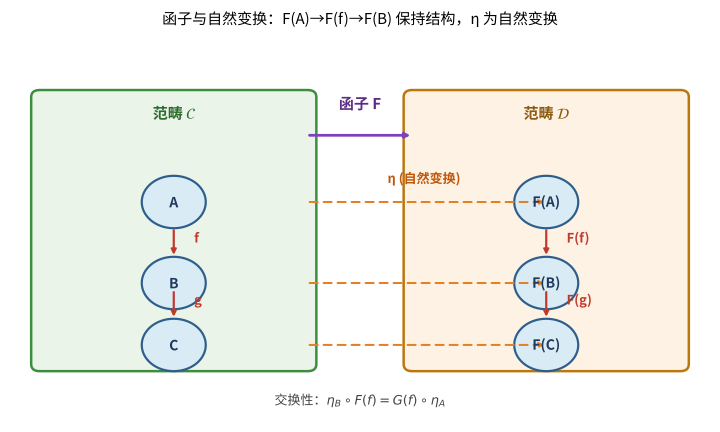

# 第126级 范畴论

## 从"抽象的对象该如何比较"说起：范畴论要解决的根问题

> 在动手背"对象＋态射＋复合"之前，先想清楚一个问题：**人为什么需要把数学再抽象一层，去研究"对象之间的关系"？**

**一个真实的生活场景（第一步：直觉）**

想象你要判断"两张城市地铁图是不是同一张图"。它们画的站点名字、线路颜色全不一样，但你关心的不是站名，而是**站点之间的连接关系**：A 站能不能直达 B 站、换乘几次才能到 C 站。为了比较，你得把"哪些点、怎么连"抽象出来——**不看每个站内部长什么样，只看站与站之间的路**。只要两张图的"连接方式"完全一致，你就说它们"本质上是一回事"。

范畴论做的正是这件事，只不过把"站"换成了"数学对象"（集合、群、拓扑空间……），把"路"换成了"态射"（函数、群同态、连续映射……），把"换乘方式"换成了"复合"（$g \circ f$）。

> **🧠 一句话记住范畴论的"出生证"**
>
> 范畴论要解决的**根本问题**是：
>
> $$ \boxed{\text{两个数学结构"本质相同"与否，能否只通过它们与其它结构的关系（箭头）来刻画与比较，而无须窥探其内部构造？}} $$
>
> 它的答案就是"用箭头说话"：范畴（对象＋态射）负责把"关系"从"内部是什么"中解放出来，函子与自然变换负责"比较"不同结构，Yoneda 引理则宣告"对象完全由它身上的箭头决定"。

**它的诞生并非孤想（第二步：要解决的问题）**

范畴论的种子埋在**代数拓扑**里。1940 年代，Eilenberg 与 Mac Lane 研究同调群时反复遇到一个说不清的念头：两个构造各自算出一个同构，可凭什么是"自然的"、能协调一致的同构？在含混多年后，1945 年他们合著《一般自然等价理论》，第一次把"两个对象之间的比较"沉淀为一张交换图、一套语言——范畴、函子、自然变换。**它从一开始就不是为了"发明新定理"，而是为了给数学家心里早已会做、却说不清道不明的"结构比较"补一个精确的语法。**

**看待本章的三种眼光（第三步：正式定义前的准备）**

- **结构的眼光**：范畴把"关系"外化——不看集合、群内部是什么，只看它们之间有什么箭头。
- **比较的眼光**：函子和自然变换负责"搬走结构"和"变来变去"，Yoneda 引理说明箭头足以决定对象。
- **统一的眼光**：极限、伴随、单子把数学里千差万别的构造收进同一套"普适性质"语法。

读完这一节，你应该记住的不是"背公理"，而是：**我们之所以需要范畴论，是因为数学里到处都在"比较结构"，而比较需要一把不依赖内部构造的尺子。** 带着这个问题去读下面的概念，你会发现它们不是孤立的定义，而是一套"不拆开对象也能证明定理"的语言。

---

## 开始之前

**本章在讲什么**：范畴论是"研究结构的相互关系"的学科。本章从范畴的定义出发，先认识函子与自然变换这对"翻译官与变形器"，再经由 Yoneda 引理看到"对象由箭头决定"，进而用伴随、极限与单子把数学里大量"自由—遗忘—最普适"的构造统一到一个框架下，最后了解 Cartesian 闭范畴、Topos 与同调代数的范畴论方法。

**为什么要学它**：前面的课程里你已经分别认识了集合、群、拓扑空间这些"结构"，也见过它们各自独立的定理体系；第 126 级把镜头抬高一层，研究这些结构**共同的关系语法**。它是第 127 级类型论的数学同构伙伴（CCC 正是 $\lambda$ 演算的语义模型），也是第 128 级构造性数学、数学基础论争的舞台背景——理解了"用箭头思考"，后面的基础性讨论才有共同的坐标系。

**开始前请确认你还记得**：

- 集合与函数（见第 2、3 级）：$f: A \to B$、像与原像、函数复合 $g \circ f$、双射与单射。
- 代数结构（见第 43 级群论等）：群、环、域、向量空间及其保持结构的同态映射。
- 拓扑与连续映射（见拓扑相关级别）：作为候选范畴的 Top 的"对象与态射"。
- 同构与等价的概念：什么叫做两个结构"本质上相同"，这是自然变换与 Yoneda 引理要精确化的直觉。

---

## 学习目标

1. 理解范畴的基本定义和常见例子
2. 掌握函子、自然变换和伴随函子的概念
3. 理解Yoneda引理及其在范畴论中的核心地位
4. 掌握极限与余极限的概念及其表示定理
5. 理解Cartesian闭范畴和topos的基本概念
6. 掌握单子理论及其与Kleisli范畴、Eilenberg-Moore范畴的关系
7. 理解Kan扩张和双范畴的概念
8. 了解同调代数中的范畴论方法

---

## 核心概念

### 范畴的定义

> **🌐 直觉先行：为什么第一步是"清空对象的内部"？**
>
> 前面你学过的每一门代数课，第一步都是定义"这个对象的内部结构"——群有群的运算、环有环的两层运算、拓扑空间有一族开集。范畴论却反其道而行，它**故意不问对象内部有什么**，只问对象之间有多少条箭头、箭头怎么复合。为什么敢这么做？回看开篇的地铁图例子：要比较两张图的连接结构，你根本不关心某个站台有几块瓷砖。同样，数学里许多关于"结构"的结论，其实只依赖"对象之间的映射怎么复合"，而不依赖对象内部构造。把内部剥掉，剩下的这套"对象＋箭头＋复合"骨架就是范畴。

一个**范畴** $\mathcal{C}$ 由以下要素构成：

- **对象**（Objects）：$\text{Ob}(\mathcal{C})$ 的全体
- **态射**（Morphisms/Arrows）：对任意 $A, B \in \text{Ob}(\mathcal{C})$，有一个集合 $\text{Hom}_{\mathcal{C}}(A, B)$（或 $\mathcal{C}(A, B)$），称为从 $A$ 到 $B$ 的态射集
- **恒等态射**（Identity）：对每个对象 $A$，存在 $\text{id}_A \in \text{Hom}_{\mathcal{C}}(A, A)$
- **复合**（Composition）：对任意 $f \in \text{Hom}_{\mathcal{C}}(A, B)$，$g \in \text{Hom}_{\mathcal{C}}(B, C)$，存在 $g \circ f \in \text{Hom}_{\mathcal{C}}(A, C)$

满足以下公理：

1. **结合律**：$h \circ (g \circ f) = (h \circ g) \circ f$
2. **单位律**：$f \circ \text{id}_A = f = \text{id}_B \circ f$

> **直观理解（现实类比）**：把范畴想象成一座城市的交通网——对象是"地点"（A、B、C），态射是"路线"（f：A→B，g：B→C）。恒等态射是"原地不动"的路线（id_A），复合则是"先走f再走g"连成一条新路线（g∘f）。结合律就像"先到B再到C再到D，无论怎么分组，最终到达的地点都一样"；单位律则说明"原地不动不会改变你的行程"。正是这种"路线可以连接、可以原地停留"的规则，让范畴成为描述一切关联结构的通用语言。

> **直观理解（现实类比）**：范畴像"数学结构的家族照"——它只关心对象之间有什么态射（道路），而不关心对象内部长什么样。集合、群、拓扑空间、向量空间各自构成一个范畴，它们共享同一套"家族照构图规则"（对象+态射+复合+恒等）。这种"只看关系不看本质"的抽象反而带来力量：一旦某个定理只依赖范畴公理，它就自动适用于所有范畴，从集合论到代数几何一网打尽。范畴论因此被誉为"数学的数学"，提供了一种跨分支的统一语言。

> **🧠 思考历程：放弃"对象长什么样"，数学竟然还能被一支支箭头重新组织起来？**
>
> 范畴论的种子，埋在组合拓扑对"自然同构"概念的苦苦追问里：怎样才算"两个构造天生一样"？1945 年 Samuel Eilenberg（艾伦伯格）与 Saunders Mac Lane（麦克莱恩）合著《一般自然等价理论》，第一次把这个问题沉淀为一门语言——范畴、函子、自然变换。
>
> - **从"自然"二字破土**。Eilenberg 与 Mac Lane 早年研究同调群时发现，同构记号写起来容易，可"为什么边界映射总与高阶同构相配"却难以说清。他们领悟到，真正要紧的不是集合内部是什么，而是对象之间的箭头如何协调——于是"自然"第一次被精确界定为交换图的成立，范畴与函子（1942–1945）顺理成章地诞生。
> - **一根箭头统摄无穷构造**。随后的关键跃迁是普适性质：极限与余极限把积、拉回、自由对象等千差万别的构造收进同一框架，Kan 1958 年提出伴随函子、Freyd 1965 年给出伴随函子存在定理；Yoneda 引理更证明"对象完全由它身上的箭头决定"。数学里五花八门的构造从此由同一套普适性语言管辖。
> - **从代数的角落长成纲领**。Grothendieck（格罗滕迪克）在 1950–70 年代把范畴论抬进代数几何与同调代数的核心：相对化、topos、谱序列都因范畴框架获得统一表述，单子与 Kleisli、Eilenberg–Moore 范畴又把逻辑、计算和代数紧紧绑在一起。范畴论由是成为"数学的数学"——不问对象何物，只问箭头为何。
> - **心路**：把目光从"物"转向"物与物的关系"，看似舍近求远，却让整个数学在更高处找到了共同的语法。

### 基本范畴的例子

- **Set**：集合为对象，函数为态射
- **Grp**：群为对象，群同态为态射
- **Ab**：Abel群为对象，群同态为态射
- **Top**：拓扑空间为对象，连续函数为态射
- **Vect$_k$**：域 $k$ 上的向量空间为对象，线性映射为态射
- **Rng**：环为对象，环同态为态射
- **Pos**：偏序集为对象，单调函数为态射

> **💡 直观理解（类比）**：这些例子说明范畴是"人人都能套用的公共框架"。集合、群、Abel群、拓扑空间、向量空间、环、偏序集各有形态迥异的对象，却都满足同一套"对象＋态射＋恒等＋复合＋结合/单位律"的建筑规范——就像汽车、船舶、飞机、自行车截然不同，却也共享"能移动＋能连接＋能原地停留"的交通规则。恰恰因为规则统一，范畴论才能一次性地同时处理这一整排"家族"，而不必为每一种对象单独证明。

### 函子

> **🌐 直觉先行：起一个名字，就是为了"搬移结构"**
>
> 有了范畴，下一件要做的事自然是"把一个范畴的结构搬到另一个里"——就像把中文棋谱翻译成英文棋谱。翻译不是逐字直译，而必须保留"走法之间的逻辑关系"：若中文谱里 $f$ 后跟 $g$ 能得到 $g\circ f$，英文版里也应保持这种先后复合关系。函子就是这个"保结构翻译官"的正式名字：它把对象映到对象、把态射映到态射，并强制"先复合再翻译"等于"翻译完再复合"。

**函子**（Functor）$F: \mathcal{C} \to \mathcal{D}$ 是范畴之间的映射，由以下两部分组成：

- 对象映射：$F: \text{Ob}(\mathcal{C}) \to \text{Ob}(\mathcal{D})$
- 态射映射：$F: \text{Hom}_{\mathcal{C}}(A, B) \to \text{Hom}_{\mathcal{D}}(F(A), F(B))$

满足：
1. $F(\text{id}_A) = \text{id}_{F(A)}$
2. $F(g \circ f) = F(g) \circ F(f)$

**反变函子**（Contravariant Functor）$F: \mathcal{C}^{\text{op}} \to \mathcal{D}$ 将态射方向反转：$F: \text{Hom}_{\mathcal{C}}(A, B) \to \text{Hom}_{\mathcal{D}}(F(B), F(A))$。

> **直观理解（现实类比）**：函子像"翻译官"——它把一个范畴 $\mathcal{C}$ 的对象和态射系统地映射到另一个范畴 $\mathcal{D}$，并保证"路线的连接方式不变"（$F(g\circ f)=F(g)\circ F(f)$）和"原地不动还是原地不动"（$F(\text{id}_A)=\text{id}_{F(A)}$）。这就像把一座城市的地铁图画成另一座城市的地铁图：站点（对象）和线路（态射）一一对应，换乘关系（复合）保持一致。反变函子则是"倒着画"的翻译官，把箭头方向整体翻转，常见于"取对偶"的构造（如 $V\mapsto V^*$ 把向量空间映到其对偶空间）。

> **常见坑**：
>
> - **共变 vs 反变的复合顺序别弄反**。共变函子满足 $F(g\circ f)=F(g)\circ F(f)$（顺序保持不变），而反变函子把箭头翻开，满足 $F(g\circ f)=F(f)\circ F(g)$（顺序反过来）。很多初学错误就是套用"先复合后映射"，却忘了在反变情形里要把 $f$、$g$ 的位置对调。
> - **函子是"保结构"，不是"保对象内部属性"**。$F$ 只保证复合与恒等被保留，它并不保证"把单射映成单射""把满射映成满射"——后者是额外性质（忠诚函子、满函子、满忠实函子），不能想当然地当作自动成立。

> **🔑 为什么重要**：函子是可证明的结构保持者，一个概念一旦被写成"函子 $F:\mathcal{C}\to\mathcal{D}$"，就自动拥有了全局的、可复用的性质（复合、恒等被保留）。它把数学中绝大多数"从一个数学分支映射到另一个分支"的操作（取基、取对偶、遗忘结构、自由构造、$\pi_1$、同调群……）纳入同一个规范，是连接不同数学世界的枢纽。

### 自然变换

> **🌐 直觉先行：函子与函子之间怎么"比"？**
>
> 函子负责把整个结构搬到另一边，但常有两个函子把同一范畴搬到同一处、结果却"长得略不同"。这时需要回答：这两个函子 $F,G$ 是不是"同一种搬法"？答案不是等着去猜，而是给出一族"对照箭头" $\eta_A:F(A)\to G(A)$，并要求这些箭头与原有态射"协同工作"（交换图成立）——同一种搬法，中间不能有"各自为政"的错位。这族协同的箭头，就是自然变换。

**自然变换**（Natural Transformation）$\eta: F \Rightarrow G$（其中 $F, G: \mathcal{C} \to \mathcal{D}$ 是函子）是一族态射 $\{\eta_A: F(A) \to G(A)\}_{A \in \text{Ob}(\mathcal{C})}$，使得对任意 $f: A \to B$ 在 $\mathcal{C}$ 中，以下交换图成立：

$$
\begin{CD}
F(A) @>{F(f)}>> F(B) \\
@V{\eta_A}VV @VV{\eta_B}V \\
G(A) @>>{G(f)}> G(B)
\end{CD}
$$

即 $\eta_B \circ F(f) = G(f) \circ \eta_A$。

> **直观理解（现实类比）**：函子就像一个"翻译器"——它把范畴 $\mathcal{C}$ 里的每个对象和每条路线不动声色地搬到另一个范畴 $\mathcal{D}$，并且保证"路线的连接方式不变"（$F(g \circ f) = F(g) \circ F(f)$），就像把一本中文棋谱翻译成英文棋谱，棋子走法依然对应。而自然变换则是"两个翻译器之间的统一调整"：它同时把每个对象在两种翻译下的结果连起来，且保证途中任意两条路线都"殊途同归"（交换图成立）。好比两个翻译风格不同的版本，但你能在每页之间找到一致的对照箭头，整体读起来依然连贯。

> **直观理解（现实类比）**：自然变换像"函子间的翻译"——给两个函子 $F,G:\mathcal{C}\to\mathcal{D}$ 之间提供一族系统化的映射 $\eta_A:F(A)\to G(A)$，并要求这族映射与原范畴的态射"协同工作"（交换图 $\eta_B\circ F(f)=G(f)\circ\eta_A$）。这好比两套翻译系统（两个函子）各自把中文原典译成英文，而自然变换是"逐页对照表"：每页（每个对象）给出从一种译本到另一种译本的改写箭头，且任何一段原文无论从哪本译本切入、再改写到另一本，结果都一致。这种"系统性协同"正是"自然"二字的含义——不是零散的拼凑，而是整体协调的转换。

> **常见坑**：自然性（交换图）条件的书写方向极易写反。正确的是 $\eta_B\circ F(f)=G(f)\circ\eta_A$，即"先走 $F(f)$ 再落回 $\eta_B$"永远等于"先落回 $\eta_A$ 再走 $G(f)$"。初学常误写为把 $\eta$ 放错侧、或把 $F(f)$ 与 $G(f)$ 对调，让交换图不再"殊途同归"。**先确认箭头两端到底是谁在"上面"走（$F$）、谁在"下面"走（$G$），再落实 $\eta$ 的分量。**

### 伴随函子

> **🌐 直觉先行：为什么"自由—遗忘"长得像一对**
>
> 数学里到处是"最省事的构造"：从集合造自由群，从群忘掉运算回到集合。这两件事看似相反，却天生配对——"从集合 $X$ 出发造自由群"的任何信息，都等价于"把群忘成集合后看 $X$ 的映射"。（$\text{Hom}_{\textbf{Grp}}(F(X),G)\cong\text{Hom}_{\textbf{Set}}(X,U(G))$。）这种"两个函子互相翻译 Hom 集"的灵巧配对，就是伴随。它有足够强的统一力，足以把"自由、极限、指数、单子"这些看似无关的构造统统收纳为一个概念。

**伴随**（Adjunction）是一对函子 $F: \mathcal{C} \to \mathcal{D}$ 和 $G: \mathcal{D} \to \mathcal{C}$，记为 $F \dashv G$，满足对任意 $A \in \mathcal{C}$，$B \in \mathcal{D}$，有自然同构：

$$ \text{Hom}_{\mathcal{D}}(F(A), B) \cong \text{Hom}_{\mathcal{C}}(A, G(B)) $$

伴随由**单位**（unit）$\eta: \text{Id}_{\mathcal{C}} \Rightarrow G \circ F$ 和**余单位**（counit）$\varepsilon: F \circ G \Rightarrow \text{Id}_{\mathcal{D}}$ 完全刻画，满足三角恒等式：

$$ (\varepsilon_F \circ F\eta)_A = \text{id}_{F(A)}, \quad (G\varepsilon \circ \eta_G)_B = \text{id}_{G(B)} $$

> **直观理解（现实类比）**：伴随函子像一台"能双向通行的升降机"——自由构造与其遗忘机是同一对操作的两面。$F \dashv G$ 表示"要从 $A$ 出发经 $F$ 到达 $B$"，等价于"先从 $A$ 退回 $G$ 再看怎么到 $B$"（$\text{Hom}_{\mathcal{D}}(F(A),B)\cong\text{Hom}_{\mathcal{C}}(A,G(B))$），就像问路与指路其实是同一张地图的两种读法。单位 $\eta$ 是把原始 $A$ 装进自由构造再原路塞回的"入口"，余单位 $\varepsilon$ 是把结构就地求值回 $B$ 的"出口"，二者首尾相接恰如一根可放可收的弹簧绳（三角恒等式）。

> **常见坑**：伴随的左右关系 $F\dashv G$ 里，$F$ 叫**左伴随**、$G$ 叫**右伴随**，判断口诀是"左伴随在 Hom 集的左侧、右伴随在右侧"（$\text{Hom}(F(A),B)\cong\text{Hom}(A,G(B))$）。初学最常犯的错是把方向弄反：表示成 $\text{Hom}(A,G(B))\cong\text{Hom}(F(A),B)$ 只是无所谓，但若把"谁伴随谁"记错，"保极限"与"保余极限"的结论就全反了——左伴随保余极限、右伴随保极限，方向千万不能记混。

> **🔑 为什么重要**：伴随是一整座"最普适构造"的统一工厂——自由—遗忘、$\Delta\dashv\lim$、$(-\times A)\dashv(-)^A$、单子与 Kleisli/Eilenberg-Moore 范畴，全都是各种具体的伴随。抓住伴随，就等于抓住数学里"最省事的对象总是邻接某个平凡构造"的规律；而"伴随自动保极限/余极限"则让它成为最安全、最省力的造型工具。

### 函子范畴

**函子范畴**（Functor Category）$[\mathcal{C}, \mathcal{D}]$ 或 $\mathcal{D}^{\mathcal{C}}$ 以函子 $F: \mathcal{C} \to \mathcal{D}$ 为对象，以自然变换为态射。

> **💡 直观理解（类比）**：函子范畴把"函子"当作"市民"、把"自然变换"当作"市民之间的路线"，正如把"各国的翻译员"当作新国家里的居民。于是多个函子所代表的"平行世界"被自然变换这座"天桥"一一连通，而这些天桥又能在每个对象处首尾相接、逐段拼接。这让我们可以对"映射之间的映射"再谈关系，一层层往上砌更高阶的结构——就像程序员能把"函数"当作值传递，自然变换正是"函子的函数"。

### 可表函子

**可表函子**（Representable Functor）：对任意对象 $A \in \mathcal{C}$，定义共变Hom函子 $\text{Hom}_{\mathcal{C}}(A, -): \mathcal{C} \to \textbf{Set}$ 和反变Hom函子 $\text{Hom}_{\mathcal{C}}(-, A): \mathcal{C}^{\text{op}} \to \textbf{Set}$。

一个函子 $F: \mathcal{C} \to \textbf{Set}$ 称为**可表的**，如果存在 $A \in \mathcal{C}$ 使得 $F \cong \text{Hom}_{\mathcal{C}}(A, -)$。

> **直观理解（现实类比）**：可表函子像"用一张全家福来辨认整族成员"。Hom 函子 $\text{Hom}_{\mathcal{C}}(A,-)$ 记录"从基准对象 $A$ 出发到每个 $B$ 共有几条路"；说函子 $F$ 可表，就是它和某个 Hom 函子"长得一模一样"（$F\cong\text{Hom}_{\mathcal{C}}(A,-)$）。换言之，$F$ 的全部信息被基准对象 $A$ 这一张"照片"装得满满当当——只要知道 $A$ 以及所有从它出发的路线，$F$ 就完全确定。这正呼应"对象由它的箭头决定"的哲学：认识一个对象的最佳方式，是看它如何与其它对象发生关系。

### 极限与余极限

**极限**（Limit）和**余极限**（Colimit）是范畴论中统一处理各种构造的框架。

给定一个图表 $D: \mathcal{J} \to \mathcal{C}$（$\mathcal{J}$ 是指标范畴）：

- **极限** $\lim D$ 是一个对象连同投影态射 $\pi_j: \lim D \to D(j)$，满足对任意 $f: j \to k$ 在 $\mathcal{J}$ 中，$D(f) \circ \pi_j = \pi_k$，且具有普适性质。
- **余极限** $\text{colim} D$ 是对偶概念。

特殊情形：
- 积（Product）：$\mathcal{J}$ 是离散范畴
- 等化子（Equalizer）：$\mathcal{J} = \bullet \rightrightarrows \bullet$
- 拉回（Pullback）：$\mathcal{J} = \bullet \to \bullet \leftarrow \bullet$
- 终对象（Terminal Object）：$\mathcal{J}$ 为空范畴

> **直观理解（现实类比）**：泛性质像"唯一最佳"——用最简性质定义对象，而不描述它的内部构造。比如积 $A\times B$ 是"最通用的配对"：任何能同时投影到 $A$ 和 $B$ 的对象，都唯一地通过它中转。这就像"最通用的插座转换器"——只要你的设备能插进去，就一定能分流到 $A$、$B$ 两个接口，而且这种分流方式是唯一确定的。泛性质的威力在于"用关系定义本质"：积、拉回、极限、自由对象都各自有独特的普适性质，对象本身长什么样反而不重要——只要满足这套"最佳中转站"的规范，它就是被定义的对象（在同构意义下唯一）。

### Cartesian闭范畴

**Cartesian闭范畴**（Cartesian Closed Category, CCC）是满足以下条件的范畴 $\mathcal{C}$：

1. 存在终对象 $1$
2. 对任意 $A, B \in \mathcal{C}$，存在积 $A \times B$
3. 对任意 $A, B \in \mathcal{C}$，存在指数对象 $B^A$（即态射集 $\text{Hom}_{\mathcal{C}}(A, B)$ 的对象版本），使得 $\text{Hom}_{\mathcal{C}}(A \times B, C) \cong \text{Hom}_{\mathcal{C}}(A, C^B)$

> **💡 直观理解（类比）**：Cartesian闭范畴就像一间"全能程序工作室"：有"空办公室"（终对象 $1$），能随时搭"双人间"（积 $A\times B$），还能造"函数车间"（指数对象 $B^A$）。关键性质 $\text{Hom}(A\times B,C)\cong\text{Hom}(A,C^B)$ 正是柯里化（currying）：把"吃两个输入的函数" $f:A\times B\to C$ 改写成"先吃 $A$、吐出一个吃 $B$ 的函数" $A\to C^B$，两个视角完全等价。这正是函数式语言里"多参函数就是嵌套的单参函数"的范畴论根源——类型论与 $\lambda$ 演算的模型都建筑在这个结构上。

### Topos

**Topos**（拓扑斯）是一种特殊的Cartesian闭范畴，具有子对象分类器（subobject classifier）$\Omega$。Topos可以被视为"广义的集合范畴"，在其中可以发展内蕴的数学结构。

> **直观理解（现实类比）**：Topos 是"一座自给自足、内部能发展全套数学的小镇"。普通集合论里的"子集"，Topos 通过子对象分类器 $\Omega$ 原样保留：每个子对象（某集合的子集）都唯一对应一条"判定箭头"落到 $\Omega$，就像小镇里每个社区都挂着一块清晰的"分区标牌"。有了 $\Omega$ 再加上有限的积与指数，就可在 Topos 内部重演布尔逻辑、量词、幂对象等整套"集合的语言"，而不必依赖外部的真实集合。因此它被称作"广义的集合范畴"——一个仅仅靠内部结构就能支撑起数学大厦的宇宙。

### Abel范畴

**Abel范畴**（Abelian Category）是满足以下条件的范畴：
1. 有零对象
2. 有二元积和二元余积（且它们一致，即双积）
3. 每个态射有核和余核
4. 每个单态射是核，每个满态射是余核

Abel范畴是同调代数的自然框架。

> **💡 直观理解（类比）**：Abel 范畴是"能做整部加减法电影"的舞台。零对象是"空镜头"；双积让"并排"与"配对"（和与积）合而为一，像在集合里既可有加法又可做直积而不打架；每个态射都有核与余核，意味着每个"镜头"都能求出"落在零的部分"和"漏出去的部分"。加上单态射必为核、满态射必为余核，就能在其中顺畅地定义商、正合序列乃至同调——正如在线性空间里总能求"核空间"和"商空间"。这正是同调代数（Ext、Tor、长正合序列）得以茁壮成长的天然温室。

### 单子

**单子**（Monad）在范畴 $\mathcal{C}$ 上是一个三元组 $(T, \eta, \mu)$，其中：
- $T: \mathcal{C} \to \mathcal{C}$ 是一个函子
- $\eta: \text{Id}_{\mathcal{C}} \Rightarrow T$ 是单位自然变换
- $\mu: T^2 \Rightarrow T$ 是乘法自然变换

满足：
1. $\mu \circ T\eta = \text{id}_T = \mu \circ \eta_T$（单位律）
2. $\mu \circ T\mu = \mu \circ \mu_T$（结合律）

### Kleisli范畴

给定单子 $(T, \eta, \mu)$ 在 $\mathcal{C}$ 上，**Kleisli范畴** $\mathcal{C}_T$ 是：
- 对象：与 $\mathcal{C}$ 相同
- 态射 $f: A \to B$ 在 $\mathcal{C}_T$ 中对应于 $\mathcal{C}$ 中的态射 $f: A \to T(B)$
- 恒等态射：$\eta_A: A \to T(A)$
- 复合：$g \circ_T f = \mu_C \circ T(g) \circ f$，其中 $f: A \to T(B)$，$g: B \to T(C)$

> **💡 直观理解（类比）**：Kleisli 范畴把"带效果的函数"升格成"普通路线"。原范畴里 $f:A\to T(B)$ 是一个"返回带盒子结果"的函数；到了 Kleisli 范畴 $\mathcal{C}_T$，它就被当作普通的单步 $f:A\to B$，恒等"原地不动"则是 $\eta_A$（把值装进盒子）。复合 $g\circ_T f = \mu_C\circ T(g)\circ f$ 的手续，正是程序员的 `flatMap`：先执行 $f$ 拿到盒子里的值，再对其中每个值应用 $g$（用 $T(g)$ 提升），最后用 $\mu$ 把层层套叠的盒子压平。于是副作用流程能被当作普通函数组合链式串起来——函数式语言中的 `>>=` 正是这样诞生的。

### Eilenberg-Moore范畴

**Eilenberg-Moore范畴** $\mathcal{C}^T$（或 $T$-代数范畴）是：
- 对象：$T$-代数 $(A, \alpha)$，其中 $\alpha: T(A) \to A$ 满足 $\alpha \circ \eta_A = \text{id}_A$ 和 $\alpha \circ T(\alpha) = \alpha \circ \mu_A$
- 态射 $f: (A, \alpha) \to (B, \beta)$ 是 $\mathcal{C}$ 中的态射 $f: A \to B$，满足 $f \circ \alpha = \beta \circ T(f)$

> **直观理解（现实类比）**：Eilenberg-Moore 范畴里的 $T$-代数 $(A,\alpha)$，是"真正打开盒子、定居下来的永久住户"。$\alpha:T(A)\to A$ 是一个"拆包并入档"的结构态射；单位律 $\alpha\circ\eta_A=\text{id}_A$ 保证"刚装进盒子的新值拆开来正是原值"；结合律 $\alpha\circ T(\alpha)=\alpha\circ\mu_A$ 保证"先把内层摊平再拆"与"先拆外层留下内层、再拆内层"殊途同归到同一个 $A$。态射 $f$ 满足 $f\circ\alpha=\beta\circ T(f)$，意思是"先拆包再搬家＝先搬家再拆包"。倘若 Kleisli 范畴是"轻量、最自由的临时工"视角，Eilenberg-Moore 范畴则是"信息最完整、最保守"的代数化视角——它们是同一个单子的一体两面。

### Kan扩张

**Kan扩张**（Kan Extension）是函子沿函子的某种"最佳逼近"：

- 左Kan扩张 $\text{Lan}_F(G)$：给定 $F: \mathcal{A} \to \mathcal{B}$，$G: \mathcal{A} \to \mathcal{C}$，$\text{Lan}_F(G): \mathcal{B} \to \mathcal{C}$ 是沿 $F$ 对 $G$ 的最佳左逼近。
- 右Kan扩张 $\text{Ran}_F(G)$ 是对偶概念。

### 双范畴

**双范畴**（Bicategory / 2-Category）是范畴的推广，其中：
- 有对象、1-态射（对象间的态射）和2-态射（1-态射间的态射）
- 结合律和单位律只满足到同构（在严格2-范畴中则是等式）

### 同调代数中的范畴论方法

同调代数在Abel范畴的框架下研究：
- 链复形和同调
- 正合序列和长正合序列
- 导出函子（Ext, Tor）
- 谱序列

> **💡 直观理解（类比）**：同调代数的范畴论方法，是"用流水线质检逐道工序的偏差"。把链复形看作"原料经过多道工序的流水线"：$d\circ d=0$ 保证"两步必回到零"（无绕弯），同调 $H_n=\ker d_n/\text{im}\,d_{n+1}$ 度量"第 $n$ 道工序净留下来的缺口"。正合序列刻画"恰好无噪声"的理想流水线；导出函子 Ext、Tor 量化"正合性被破坏的程度"——像质检报告标出每道工序漏算了多少、重复了多少。谱序列则是"渐进逼近复杂对象的结算表"。Abel 范畴提供了这套质检能够顺畅运转的公共车间，让这些工具无须依赖具体集合即可普遍实施。

---

## 定理与证明

### 定理1：Yoneda引理

**定理**（Yoneda Lemma）：令 $\mathcal{C}$ 是一个范畴，$F: \mathcal{C} \to \textbf{Set}$ 是一个共变函子。对任意对象 $A \in \mathcal{C}$，存在双射：

$$ \text{Nat}(\text{Hom}_{\mathcal{C}}(A, -), F) \cong F(A) $$

其中 $\text{Nat}$ 表示自然变换的集合。而且这个双射在 $A$ 和 $F$ 中是自然的。

> **🔑 为什么重要**：Yoneda 引理是整座范畴论的"价值锚点"。它把"研究对象本身"安全地替换成"研究对象被众生（Hom 函子）如何看待"——只要从 $A$ 出发到所有对象的箭头足够齐全，$A$ 就被完全钉死（米田嵌入给出"对象由 Hom 箭袋决定"）。于是许多原本要"钻进去看内部"的难题，都被翻译成"看清箭头"的问题；而"先取自然变换 = 先看 $\text{id}_A$ 落到哪"这条双射，恰恰是那台把两种语言（箭头语言与元素语言）互译的翻译机。Mac Lane 称之为"范畴论之母"，毫不夸张。

> **💡 直观理解（类比）**：Yoneda 引理说"看一个对象，就看它如何被看到"。$\text{Nat}(\text{Hom}_{\mathcal{C}}(A,-),F)\cong F(A)$ 的意思是：从基准对象 $A$ 到所有 $B$ 的整族路线（Hom 函子）到 $F$ 之间给出的自然变换，其实只是 $F(A)$ 里的一个元素而已！好比"全校每个人对 $A$ 的评价如何逐层整合最终汇成对 $F$ 的整体评价"这一整套协调运作，本质上全由 $A$ 自己在 $F$ 中占住的"座位"一点决定。更直白地：想知道函子 $F$ 的一切，只要盯准"映射 $\text{id}_A$ 被 $\eta_A$ 送到 $F(A)$ 的哪个位置"，其余全部自动跟上。这是"对象完全由其 Hom 箭袋决定"那套哲学的硬核定理。

**证明**：

**步骤1：构造映射 $\Phi: \text{Nat}(\text{Hom}_{\mathcal{C}}(A, -), F) \to F(A)$**

对任意自然变换 $\eta: \text{Hom}_{\mathcal{C}}(A, -) \Rightarrow F$，定义 $\Phi(\eta) = \eta_A(\text{id}_A)$。

由于 $\eta_A$ 是 $\text{Hom}_{\mathcal{C}}(A, A)$ 到 $F(A)$ 的函数，且 $\text{id}_A \in \text{Hom}_{\mathcal{C}}(A, A)$，所以 $\eta_A(\text{id}_A) \in F(A)$。

**步骤2：构造逆映射 $\Psi: F(A) \to \text{Nat}(\text{Hom}_{\mathcal{C}}(A, -), F)$**

对任意 $x \in F(A)$，定义自然变换 $\Psi(x): \text{Hom}_{\mathcal{C}}(A, -) \Rightarrow F$ 如下：对任意对象 $B \in \mathcal{C}$ 和任意 $f \in \text{Hom}_{\mathcal{C}}(A, B)$，定义：

$$ \Psi(x)_B(f) = F(f)(x) $$

我们需要验证 $\Psi(x)$ 确实是自然变换。即对任意 $g: B \to C$ 在 $\mathcal{C}$ 中，下图交换：

$$
\begin{CD}
\text{Hom}_{\mathcal{C}}(A, B) @>{\text{Hom}_{\mathcal{C}}(A, g)}>> \text{Hom}_{\mathcal{C}}(A, C) \\
@V{\Psi(x)_B}VV @VV{\Psi(x)_C}V \\
F(B) @>>{F(g)}> F(C)
\end{CD}
$$

对任意 $f: A \to B$，左边路径为 $F(g) \circ \Psi(x)_B(f) = F(g) \circ F(f)(x) = F(g \circ f)(x)$，右边路径为 $\Psi(x)_C \circ \text{Hom}_{\mathcal{C}}(A, g)(f) = \Psi(x)_C(g \circ f) = F(g \circ f)(x)$。两者相等，因此 $\Psi(x)$ 是自然变换。

**步骤3：验证 $\Phi$ 和 $\Psi$ 互逆**

首先，对任意 $\eta \in \text{Nat}(\text{Hom}_{\mathcal{C}}(A, -), F)$，证明 $\Psi(\Phi(\eta)) = \eta$。

对任意 $B \in \mathcal{C}$ 和 $f: A \to B$，我们需要证明 $\Psi(\eta_A(\text{id}_A))_B(f) = \eta_B(f)$。

由自然性，对 $f: A \to B$，以下图交换：

$$
\begin{CD}
\text{Hom}_{\mathcal{C}}(A, A) @>{\text{Hom}_{\mathcal{C}}(A, f)}>> \text{Hom}_{\mathcal{C}}(A, B) \\
@V{\eta_A}VV @VV{\eta_B}V \\
F(A) @>>{F(f)}> F(B)
\end{CD}
$$

因此 $\eta_B(f) = \eta_B \circ \text{Hom}_{\mathcal{C}}(A, f)(\text{id}_A) = F(f) \circ \eta_A(\text{id}_A) = F(f)(\Phi(\eta)) = \Psi(\Phi(\eta))_B(f)$。

其次，对任意 $x \in F(A)$，$\Phi(\Psi(x)) = \Psi(x)_A(\text{id}_A) = F(\text{id}_A)(x) = \text{id}_{F(A)}(x) = x$。

因此 $\Phi$ 和 $\Psi$ 互逆，构成双射。

**步骤4：自然性**

双射在 $A$ 和 $F$ 中的自然性意味着对任意 $h: A' \to A$ 和自然变换 $\theta: F \Rightarrow F'$，相应的图交换，这可以通过直接验证得到。$\square$

**米田嵌入**（Yoneda Embedding）：作为推论，函子 $Y: \mathcal{C} \to \textbf{Set}^{\mathcal{C}^{\text{op}}}$，$Y(A) = \text{Hom}_{\mathcal{C}}(-, A)$ 是满忠实嵌入（fully faithful embedding），即范畴 $\mathcal{C}$ 可嵌入到其反变函子范畴中。

> **直观理解（现实类比）**：米田嵌入是"每个对象都能用一张全方位证件照来代表"。它把对象 $A$ 送到它的反变 Hom 函子 $\text{Hom}_{\mathcal{C}}(-,A)$——即"所有其它对象到 $A$ 的完整路线清单"，并保证这张映射是满忠实的：不同的对象必有不同的证件照（在同构级别上单射），而且"证件照之间的所有变换"恰好就是"原对象之间的所有态射"，一个不多一个不少。这意味着任何范畴都能被完整、无信息丢失地搬进一座由 Hom 函子组成的大博物馆（反变函子范畴），日后研究任何对象只需查阅它的"照片档案"即可。

### 定理2：极限与余极限的表示定理

**定理**：令 $\mathcal{C}$ 是一个范畴，$\mathcal{J}$ 是一个小范畴。函子 $\lim: [\mathcal{J}, \mathcal{C}] \to \mathcal{C}$（如果存在）是函子 $\Delta: \mathcal{C} \to [\mathcal{J}, \mathcal{C}]$ 的右伴随，其中 $\Delta$ 是**对角函子**（$\Delta(A)(j) = A$，$\Delta(A)(f) = \text{id}_A$）。即 $\lim \dashv \Delta$。

类似地，$\text{colim} \dashv \Delta$（如果存在）。

> **💡 直观理解（类比）**：极限的表示定理把"极限"改写成一个伴随关系 $\lim\dashv\Delta$，恰如"最普适的汇聚点"恰好是"常数函数之友"的右伴随。对角函子 $\Delta$ 把每个对象 $A$ 摊成一份"每格都填 $A$ 的琐碎图表"（像把同一个值复制到九九乘法表的每个格子）；极限则从任意图表 $D$ 中拎出"唯一最优的全表汇总 $\lim D$"。伴随同构 $\text{Hom}_{[\mathcal{J},\mathcal{C}]}(\Delta(A),D)\cong\text{Hom}_{\mathcal{C}}(A,\lim D)$ 说的是：从这份常数表到 $D$ 的、逐格相容的全体行映射，正好等价于直接把 $A$ 映进汇总值 $\lim D$ 的一支单箭头。这精准刻画了极限的普适性——没有比"$A\to\lim D$"更省事的汇总箭头了。

**证明**：

**步骤1：定义对角函子**

定义 $\Delta: \mathcal{C} \to [\mathcal{J}, \mathcal{C}]$ 如下：
- 对对象 $A \in \mathcal{C}$，$\Delta(A): \mathcal{J} \to \mathcal{C}$ 是常函子：$\Delta(A)(j) = A$，对任意 $f: j \to k$ 在 $\mathcal{J}$ 中，$\Delta(A)(f) = \text{id}_A$
- 对态射 $g: A \to B$ 在 $\mathcal{C}$ 中，$\Delta(g): \Delta(A) \Rightarrow \Delta(B)$ 是自然变换，其分量均为 $g$

**步骤2：定义极限函子**

假设 $\mathcal{C}$ 有所有 $\mathcal{J}$-极限。对每个图表 $D: \mathcal{J} \to \mathcal{C}$，选取极限 $\lim D$ 连同投影 $\pi_j: \lim D \to D(j)$。

**步骤3：建立伴随关系**

我们需要证明对任意 $A \in \mathcal{C}$ 和 $D \in [\mathcal{J}, \mathcal{C}]$，有自然同构：

$$ \text{Hom}_{[\mathcal{J}, \mathcal{C}]}(\Delta(A), D) \cong \text{Hom}_{\mathcal{C}}(A, \lim D) $$

**从左到右**：给定自然变换 $\alpha: \Delta(A) \Rightarrow D$。对每个 $j \in \mathcal{J}$，$\alpha_j: A \to D(j)$。由极限的普适性质，存在唯一的态射 $\bar{\alpha}: A \to \lim D$ 使得 $\pi_j \circ \bar{\alpha} = \alpha_j$ 对所有 $j$ 成立。

**从右到左**：给定 $f: A \to \lim D$，定义自然变换 $\beta = \Delta \text{-}\lim\text{ 的伴随}$：对每个 $j$，$\beta_j = \pi_j \circ f: A \to D(j)$。这构成自然变换，因为对任意 $g: j \to k$，$D(g) \circ \beta_j = D(g) \circ \pi_j \circ f = \pi_k \circ f = \beta_k$。

这两个映射互逆，且自然性容易验证。因此 $\lim \dashv \Delta$。

对偶地，$\text{colim} \dashv \Delta$（左伴随是余极限）。$\square$

### 定理3：Freyd的伴随函子存在定理

**定理**（Freyd's Adjoint Functor Theorem）：设 $\mathcal{C}$ 是完备的（有所有小极限），且局部小范畴。函子 $G: \mathcal{D} \to \mathcal{C}$ 有左伴随当且仅当 $G$ 保持所有小极限且满足**溶液集条件**（Solution Set Condition）：

对任意 $A \in \mathcal{C}$，存在集合 $S \subseteq \text{Ob}(\mathcal{D})$ 和态射族 $\{f_i: A \to G(D_i)\}_{i \in I}$，使得任意 $f: A \to G(D)$ 可分解为 $f = G(g) \circ f_i$ 对某个 $i$ 和 $g: D_i \to D$。

> **直观理解（现实类比）**：Freyd 伴随函子存在定理，为"何时存在左伴随"开出一张完备的"施工验收单"。左伴随像"从 $A$ 制造最自由的成品 $F(A)$"；其存在的两条硬条件正如两道质检：一是 $G$ 必须"保持所有小极限"（即 $G$ 不毁坏任何已建成的"汇总建筑"，保证规整），二是"解集条件"（每个 $A$ 到各种 $G(D)$ 的候选态射族都由受控的一小撮代表 $f_i$ 生成，相当于保证"候选名单不会多到失控"）。两条都满足后，就能先对这些代表取积搭起脚手架、再取核对的等值子修剪出真正普适的自由对象，从而亲手把左伴随 $F$ 造出来——保极限保证"规整"，解集条件保证"规模可控"，两样齐备左伴随就存在。

**证明**：

**必要性**：如果 $G$ 有左伴随 $F$，则 $G$ 保持所有极限。对任意 $A \in \mathcal{C}$，态射 $A \to G(D)$ 对应于 $F(A) \to D$。取 $S = \{F(A)\}$ 和 $f_A = \eta_A: A \to G(F(A))$（单位），则溶液集条件自动满足。

**充分性**：假设 $G$ 保持极限且满足溶液集条件。

**步骤1：构造左伴随 $F(A)$**

对给定的 $A \in \mathcal{C}$，考虑所有 $A \to G(D)$ 的态射。由溶液集条件，存在集合 $\{f_i: A \to G(D_i)\}_{i \in I}$ 使得任何 $A \to G(D)$ 都通过某个 $f_i$ 分解。

考虑所有 $D_i$ 的积（在 $\mathcal{D}$ 中），记为 $W = \prod_{i \in I} D_i$（如果 $\mathcal{D}$ 有积）。由于 $G$ 保持极限，$G(W) = \prod_i G(D_i)$。

由积的普适性质，存在唯一的 $h: A \to G(W)$ 使得 $\pi_i \circ h = f_i$。

**步骤2：取等化子**

考虑所有 $W$ 上的**核对**（即所有平行态射 $u, v: W \rightrightarrows X$ 使得 $G(u) \circ h = G(v) \circ h$）。取所有这样的核对的等化子 $e: F(A) \to W$，使得 $u \circ e = v \circ e$ 对所有核对成立。

由于 $G$ 保持等化子，$G(e): G(F(A)) \to G(W)$ 是相应的等化子。由构造，$h$ 通过 $G(e)$ 分解，即存在唯一的 $\eta_A: A \to G(F(A))$ 使得 $G(e) \circ \eta_A = h$。

**步骤3：验证普适性质**

对任意 $f: A \to G(D)$，由溶液集条件，存在 $i$ 和 $g: D_i \to D$ 使得 $f = G(g) \circ f_i$。由积的性质，$f_i = \pi_i \circ h = \pi_i \circ G(e) \circ \eta_A = G(\pi_i \circ e) \circ \eta_A$。

因此 $f = G(g \circ \pi_i \circ e) \circ \eta_A = G(\bar{g}) \circ \eta_A$，其中 $\bar{g} = g \circ \pi_i \circ e: F(A) \to D$。

**步骤4：唯一性**

如果 $g_1, g_2: F(A) \to D$ 都满足 $f = G(g_1) \circ \eta_A = G(g_2) \circ \eta_A$，则 $G(g_1) \circ \eta_A = G(g_2) \circ \eta_A$。由等化子的构造，$g_1 = g_2$。

因此 $F(A)$ 是 $A$ 的"自由对象"（即左伴随在 $A$ 上的值），且 $\eta_A$ 是单位。$\square$

### 定理4：伴随函子保持极限

**定理**：如果 $F: \mathcal{C} \to \mathcal{D}$ 有右伴随 $G: \mathcal{D} \to \mathcal{C}$，则 $F$ 保持所有余极限，$G$ 保持所有极限。

> **💡 直观理解（类比）**：此定理说"伴随函子自动保极限/余极限"，是一份不用繁琐构造就能领奖的"顺水推舟"定理。因为伴随关系把 $A\to G(\lim D)$ 的 Hom 集原封不动地搬到 $F(A)\to\lim D$ 上（$\cong$），极限的普适结构顺着 Hom 集像照镜子般一路被保持到另一边，再用 Yoneda 即可收回 $G(\lim D)\cong\lim(G\circ D)$；左伴随 $F$ 保余极限则对偶成立。直观上，一个"有右伴随"的函子就像"关系可原路返回的翻译官"——它不可能破坏任何推论结构（极限），因为所有参与的关系都能完整退回。这解释了为何"求左（右）伴随"在数学中是格外安全、格外好用的操作。

**证明**：

**步骤1：$G$ 保持极限**

设 $D: \mathcal{J} \to \mathcal{D}$ 是一个图表，且 $\lim D$ 存在（在 $\mathcal{D}$ 中）。我们需要证明 $G(\lim D)$ 是 $G \circ D$ 的极限。

对任意 $A \in \mathcal{C}$，由伴随关系：

$$ \text{Hom}_{\mathcal{C}}(A, G(\lim D)) \cong \text{Hom}_{\mathcal{D}}(F(A), \lim D) $$

由极限的表示定理，$\text{Hom}_{\mathcal{D}}(F(A), \lim D) \cong \lim \text{Hom}_{\mathcal{D}}(F(A), D(-))$（Hom函子保持极限）。

而 $\text{Hom}_{\mathcal{D}}(F(A), D(j)) \cong \text{Hom}_{\mathcal{C}}(A, G(D(j)))$，因此：

$$ \text{Hom}_{\mathcal{C}}(A, G(\lim D)) \cong \lim \text{Hom}_{\mathcal{C}}(A, G(D(j))) $$

由Yoneda引理，这意味着 $G(\lim D) \cong \lim (G \circ D)$，且同构由投影态射的像给出。因此 $G$ 保持极限。

**步骤2：$F$ 保持余极限**

对偶地，由伴随关系和对偶的Yoneda引理可证。$\square$

### 定理5：单子的基本定理

**定理**（Basic Theorem of Monads / Comparison Theorem）：给定一个单子 $(T, \eta, \mu)$ 在范畴 $\mathcal{C}$ 上，存在伴随 $F^T \dashv U^T$：

- **Eilenberg-Moore构造**：$F^T: \mathcal{C} \to \mathcal{C}^T$（自由代数函子）和 $U^T: \mathcal{C}^T \to \mathcal{C}$（遗忘函子）构成伴随，且 $T = U^T \circ F^T$。
- **Kleisli构造**：$F_T: \mathcal{C} \to \mathcal{C}_T$ 和 $U_T: \mathcal{C}_T \to \mathcal{C}$ 构成伴随，且 $T = U_T \circ F_T$。

而且，Kleisli范畴是初始的，Eilenberg-Moore范畴是终端的——即任何将 $T$ 分解为伴随的范畴都唯一地通过Kleisli范畴和Eilenberg-Moore范畴的函子。

> **直观理解（现实类比）**：单子的基本定理说：每个单子都能被"拆"成一对伴随函子，且有两套标准拆法，一轻一重。Kleisli 构造是最轻、最"自由（初始）"的拆法——只把带效果的函数当作普通路线，几乎不引入新结构；Eilenberg-Moore 构造则是最重、最"保守（终端）"的拆法——把每个"拆包规则"都做成真正的代数对象 $(A,\alpha)$，信息最完整。任何其它把 $T=G\circ F$ 拆成伴随的方式，都必然能通过唯一的比较函子"插"进这两种标准拆法之间：Kleisli 是"每个分解都必须经过的入口"，Eilenberg-Moore 是"归纳所有分解的终点"。这告诉我们：单子内部天生蕴含一对最省力与最完备的伴生视角，且这正是数学中普遍通用的那对。

**证明**：

**Eilenberg-Moore构造**：

定义 $F^T: \mathcal{C} \to \mathcal{C}^T$ 如下：
- 对对象 $A \in \mathcal{C}$，$F^T(A) = (T(A), \mu_A)$，其中 $\mu_A: T(T(A)) \to T(A)$ 是乘法
- 对态射 $f: A \to B$，$F^T(f) = T(f): T(A) \to T(B)$

验证 $F^T(A)$ 是 $T$-代数：
- $\mu_A \circ \eta_{T(A)} = \text{id}_{T(A)}$（由单子单位律）
- $\mu_A \circ T(\mu_A) = \mu_A \circ \mu_{T(A)}$（由单子结合律）

定义 $U^T: \mathcal{C}^T \to \mathcal{C}$ 为遗忘函子：$U^T(A, \alpha) = A$，$U^T(f) = f$。

定义伴随的单位 $\eta': \text{Id}_{\mathcal{C}} \Rightarrow U^T \circ F^T$ 为 $\eta'_A = \eta_A: A \to T(A) = U^T(F^T(A))$。

定义余单位 $\varepsilon': F^T \circ U^T \Rightarrow \text{Id}_{\mathcal{C}^T}$ 为 $\varepsilon'_{(A, \alpha)} = \alpha: (T(A), \mu_A) \to (A, \alpha)$。验证 $\varepsilon'_{(A, \alpha)}$ 是 $T$-代数态射：$\alpha \circ \mu_A = \alpha \circ T(\alpha)$ 由代数条件保证。

验证三角恒等式：
- $U^T(\varepsilon') \circ \eta'_{U^T} = \alpha \circ \eta_A = \text{id}_A$（由代数条件）
- $\varepsilon'_{F^T} \circ F^T(\eta') = \mu_A \circ T(\eta_A) = \text{id}_{T(A)}$（由单子单位律）

因此 $F^T \dashv U^T$，且 $U^T \circ F^T = T$。

**Kleisli构造**：

定义 $F_T: \mathcal{C} \to \mathcal{C}_T$ 如下：
- 对对象 $A$，$F_T(A) = A$
- 对态射 $f: A \to B$，$F_T(f) = \eta_B \circ f: A \to T(B)$（在 $\mathcal{C}_T$ 中）

定义 $U_T: \mathcal{C}_T \to \mathcal{C}$ 如下：
- 对对象 $A$，$U_T(A) = T(A)$
- 对态射 $g: A \to B$ 在 $\mathcal{C}_T$ 中（即 $g: A \to T(B)$ 在 $\mathcal{C}$ 中），$U_T(g) = \mu_B \circ T(g): T(A) \to T(B)$

定义伴随：
- 单位 $\eta'': \text{Id}_{\mathcal{C}} \Rightarrow U_T \circ F_T$：$\eta''_A = \eta_A: A \to T(A)$
- 余单位 $\varepsilon'': F_T \circ U_T \Rightarrow \text{Id}_{\mathcal{C}_T}$：对对象 $A$，$\varepsilon''_A = \text{id}_{T(A)}: T(A) \to T(A)$（在 $\mathcal{C}_T$ 中，即 $\text{id}_{T(A)}: T(A) \to T(T(A))$ 在 $\mathcal{C}$ 中）

验证三角恒等式并确认 $U_T \circ F_T = T$。

**比较定理的陈述**：

对任意伴随 $F \dashv G$ 且 $G \circ F = T$，存在唯一的比较函子 $K: \mathcal{C}_T \to \mathcal{D}$ 和 $L: \mathcal{D} \to \mathcal{C}^T$，使得相应的图交换。Kleisli范畴是"最自由的"分解，Eilenberg-Moore范畴是"最保守的"分解。$\square$

---

## 示例

### 示例1：基本范畴

**Set范畴**：
- 对象：所有集合
- 态射：所有函数
- 积：笛卡尔积 $A \times B$
- 余积：无交并 $A \sqcup B$
- 终对象：单点集 $\{*\}$
- 始对象：空集 $\varnothing$

**Grp范畴**：
- 对象：所有群
- 态射：群同态
- 积：群的直积
- 余积：群的自由积

**Top范畴**：
- 对象：所有拓扑空间
- 态射：连续函数
- 积：乘积拓扑
- 余积：无交并拓扑

### 示例2：伴随函子

**自由-遗忘伴随**：
- $F: \textbf{Set} \to \textbf{Grp}$：将集合映射到其生成的自由群
- $U: \textbf{Grp} \to \textbf{Set}$：遗忘群结构，仅保留底集
- 伴随关系：$F \dashv U$
- 单位 $\eta_X: X \to U(F(X))$：将集合 $X$ 嵌入到自由群中
- 余单位 $\varepsilon_G: F(U(G)) \to G$：自由群到原群的满同态

**积-对角伴随**：
- $\Delta: \mathcal{C} \to \mathcal{C} \times \mathcal{C}$：$\Delta(A) = (A, A)$
- $(- \times -): \mathcal{C} \times \mathcal{C} \to \mathcal{C}$：积函子
- 伴随关系：$\Delta \dashv (- \times -)$

**指数伴随**（在CCC中）：
- $(- \times A): \mathcal{C} \to \mathcal{C}$：乘以 $A$
- $(-)^A: \mathcal{C} \to \mathcal{C}$：指数函子
- 伴随关系：$(- \times A) \dashv (-)^A$
- 即 $\text{Hom}_{\mathcal{C}}(X \times A, B) \cong \text{Hom}_{\mathcal{C}}(X, B^A)$

### 示例3：Yoneda引理的应用

**情况**：$\mathcal{C} = \textbf{Set}$，$A = \{0\}$（单点集），$F = \text{Id}_{\textbf{Set}}$。

Yoneda引理给出：

$$ \text{Nat}(\text{Hom}_{\textbf{Set}}(\{0\}, -), \text{Id}_{\textbf{Set}}) \cong \text{Id}_{\textbf{Set}}(\{0\}) = \{0\} $$

这意味着唯一从 $\text{Hom}_{\textbf{Set}}(\{0\}, -)$ 到 $\text{Id}_{\textbf{Set}}$ 的自然变换是"求值"自然变换。

---

## 习题

### 基础题

**习题 1**（范畴的定义）叙述范畴 $\mathcal{C}$ 由对象、态射、恒等态射与复合四部分构成，并写出它所满足的结合律与单位律。

**习题 2**（基本范畴的例子）列出 $\textbf{Set}$、$\textbf{Grp}$、$\textbf{Top}$、$\textbf{Vect}_k$ 四个范畴各自的"对象与态射"，并解释为什么它们能共享同一套范畴公理。

**习题 3**（态射复合）设 $f:A\to B$，$g:B\to C$，$h:C\to D$ 是某范畴中的态射，写出 $h\circ(g\circ f)$ 与 $(h\circ g)\circ f$ 的关系，并说明这条规律的意义。

**习题 4**（函子的定义）说明函子 $F:\mathcal{C}\to\mathcal{D}$ 由哪两部分组成，并写出它满足的两条公理：$F(\text{id}_A)$ 与 $F(g\circ f)$ 分别等于什么。

**习题 5**（反变函子）解释反变函子 $F:\mathcal{C}^{\text{op}}\to\mathcal{D}$ 对态射方向的处理，并给出一个"取对偶"的典型例子。

**习题 6**（自然变换）写出自然变换 $\eta:F\Rightarrow G$（其中 $F,G:\mathcal{C}\to\mathcal{D}$ 为函子）所满足的交换条件，即对任意 $f:A\to B$ 应当成立的等式。

**习题 7**（积与余积）在 $\textbf{Set}$ 中，积 $A\times B$ 与余积 $A\sqcup B$ 分别对应什么集合，并指出各自的普适描述。

**习题 8**（终对象与始对象）给出终对象与始对象的定义，说明在 $\textbf{Set}$ 中它们分别是何对象，以及普适性质是什么意思。

**习题 9**（函子范畴）说明函子范畴 $[\mathcal{C},\mathcal{D}]$ 的对象与态射分别是什么，为什么自然变换恰好充当态射的角色。

**习题 10**（可表函子）定义共变 Hom 函子 $\text{Hom}_{\mathcal{C}}(A,-):\mathcal{C}\to\textbf{Set}$，并解释"函子 $F:\mathcal{C}\to\textbf{Set}$ 可表"是什么意思。

### 进阶题

**习题 11**（幂集函子的协变性）对集合 $A$ 定义幂集 $P(A)=2^A$。若对 $f:A\to B$ 令 $P(f)(S)=f(S)$（像集），这是何种函子？若令 $P(f)(T)=f^{-1}(T)$（原像集）呢？分别加以证明。

**习题 12**（单点集自然变换）令 $\text{id}_{\textbf{Set}}$ 为恒等函子、$P$ 为共变幂集函子，定义 $\eta_A(a)=\{a\}$，验证 $\eta:\text{id}_{\textbf{Set}}\Rightarrow P$ 是自然变换。

**习题 13**（伴随函子）写出 $F\dashv G$（$F:\mathcal{C}\to\mathcal{D}$，$G:\mathcal{D}\to\mathcal{C}$）满足的自然同构，并说明单位 $\eta$ 与余单位 $\varepsilon$ 分别是 $A\to G(F(A))$ 与 $F(G(B))\to B$ 形式的构造。

**习题 14**（等值子）在 $\textbf{Set}$ 中，对平行态射 $f,g:A\rightrightarrows B$，证明等值子可由集合 $\{a\in A\mid f(a)=g(a)\}$ 配上内含映射给出。

**习题 15**（拉回）在 $\textbf{Set}$ 中，对 $f:A\to C$，$g:B\to C$，证明拉回 $A\times_C B$ 等于集合 $\{(a,b)\in A\times B\mid f(a)=g(b)\}$。

**习题 16**（极限的表示定理）陈述 $\lim\dashv\Delta$ 的含义，写出自然同构 $\text{Hom}_{[\mathcal{J},\mathcal{C}]}(\Delta(A),D)\cong\text{Hom}_{\mathcal{C}}(A,\lim D)$，并解释它为何刻画了极限的普适性。

**习题 17**（米田嵌入）陈述米田嵌入 $Y:\mathcal{C}\to\textbf{Set}^{\mathcal{C}^{\text{op}}}$，$Y(A)=\text{Hom}_{\mathcal{C}}(-,A)$，并说明"满忠实"为何蕴含 $A\cong B$ 当且仅当 $Y(A)\cong Y(B)$。

**习题 18**（伴随保持极限）叙述"若 $F\dashv G$ 则 $F$ 保持余极限、$G$ 保持极限"这一结论，并用 Hom 函子与 Yoneda 引理说明 $G$ 保持极限的关键理由。

**习题 19**（指数伴随）在 Cartesian 闭范畴中写出指数对象 $B^A$ 的伴随性质 $\text{Hom}_{\mathcal{C}}(A\times B,C)\cong\text{Hom}_{\mathcal{C}}(A,C^B)$，说明它对应 Curry 化（currying）。

### 挑战题

**习题 20**（Yoneda 引理的双射构造）叙述 Yoneda 引理 $\text{Nat}(\text{Hom}_{\mathcal{C}}(A,-),F)\cong F(A)$，并说明由自然变换到元素 $\Phi(\eta)=\eta_A(\text{id}_A)$ 及逆映射 $x\mapsto\bigl(f\mapsto F(f)(x)\bigr)$ 的构造，以及为什么它们互逆。

**习题 21**（自由-遗忘伴随）设 $F:\textbf{Set}\to\textbf{Grp}$ 为自由群函子、$U:\textbf{Grp}\to\textbf{Set}$ 为遗忘函子，说明 $F\dashv U$ 的单位与余单位分别是何种态射。

**习题 22**（幂集单子）证明幂集函子 $P$ 连同单位 $\eta_A(a)=\{a\}$ 与乘法 $\mu_A(\mathcal{S})=\bigcup\mathcal{S}$ 构成单子，逐个验证单位律与结合律。

**习题 23**（Kleisli 范畴）给定单子 $(T,\eta,\mu)$，描述 Kleisli 范畴 $\mathcal{C}_T$ 的对象、态射、恒等态射与复合 $g\circ_T f$，并解释 $g\circ_T f=\mu_C\circ T(g)\circ f$ 的直观含义。

**习题 24**（Eilenberg-Moore 范畴）定义 $T$-代数 $(A,\alpha)$（$\alpha:T(A)\to A$）的两条公理，并写出 $T$-代数态射 $f:(A,\alpha)\to(B,\beta)$ 须满足的相容性条件。

**习题 25**（Freyd 伴随函子存在定理）陈述 Freyd 定理：$G:\mathcal{D}\to\mathcal{C}$（$\mathcal{C}$ 完备、局部小）有左伴随当且仅当 $G$ 保持什么且满足情形集条件，并解释情形集条件的直觉。

**习题 26**（单子比较定理）说明任意把单子 $T$ 分解为 $G\circ F$ 的伴随都能通过比较函子联系 Kleisli 范畴 $\mathcal{C}_T$ 与 Eilenberg-Moore 范畴 $\mathcal{C}^T$，解释为何前者"最自由"、后者"最保守"。

### 探究题

**习题 27**（CCC 与类型论）讨论 Cartesian 闭范畴为何能作为简单类型 $\lambda$ 演算的范畴语义（类型对应对象、项对应态射、函数类型对应指数对象），并说明如何用指数伴随解释函数应用与 $\beta$-归约。

**习题 28**（Topos 的数学地位）说明 Topos 比起一般 Cartesian 闭范畴额外具有子对象分类器 $\Omega$，解释为何它被视为"广义的集合范畴"并可在其中发展内蕴的数学结构。

**习题 29**（Kan 扩张与双范畴）解释左、右 Kan 扩张 $\text{Lan}_F(G)$、$\text{Ran}_F(G)$ 作为沿函子的"最佳逼近"的含义，并说明双范畴中对象、1-态射、2-态射以及"结合律到同构"与严格 2-范畴的差别。

**习题 30**（同调代数的范畴论方法）说明 Abel 范畴的四条条件（零对象、双积、核/余核、单态射为核/满态射为余核）如何为同调代数提供框架，并指出链复形、正合序列、导出函子（Ext、Tor）在其中各扮演什么角色。

---

## 习题答案与解析

### 基础题答案

1. **范畴的定义** 范畴 $\mathcal{C}$ 由对象类 $\text{Ob}(\mathcal{C})$、对每对对象 $A,B$ 的态射集 $\text{Hom}_{\mathcal{C}}(A,B)$、每个对象 $A$ 的恒等态射 $\text{id}_A$ 以及复合 $g\circ f$ 组成，并满足结合律 $h\circ(g\circ f)=(h\circ g)\circ f$ 与单位律 $f\circ\text{id}_A=f=\text{id}_B\circ f$。

2. **基本范畴的例子** $\textbf{Set}$：集合/函数；$\textbf{Grp}$：群/群同态；$\textbf{Top}$：拓扑空间/连续函数；$\textbf{Vect}_k$：域 $k$ 上向量空间/线性映射。它们对象与态射各异，但都满足"对象 + 态射集 + 恒等 + 复合 + 结合律 + 单位律"，因此都构成范畴。

3. **态射复合** $h\circ(g\circ f)=(h\circ g)\circ f$，即复合满足结合律。它保证无论把复合先归到哪一端，最终 $f$、$g$、$h$ 依次合成得到的结果都相同，因此复合的定义不依赖括号的加法方式。

4. **函子的定义** 函子 $F:\mathcal{C}\to\mathcal{D}$ 由对象映射 $F:\text{Ob}(\mathcal{C})\to\text{Ob}(\mathcal{D})$ 与态射映射 $F:\text{Hom}_{\mathcal{C}}(A,B)\to\text{Hom}_{\mathcal{D}}(F(A),F(B))$ 两部分组成，满足 $F(\text{id}_A)=\text{id}_{F(A)}$（保持恒等）与 $F(g\circ f)=F(g)\circ F(f)$（保持复合）。

5. **反变函子** 反变函子在对象上直接映射，在态射上反转方向：$F:\text{Hom}_{\mathcal{C}}(A,B)\to\text{Hom}_{\mathcal{D}}(F(B),F(A))$，且 $F(g\circ f)=F(f)\circ F(g)$。典型"取对偶"例子是 $V\mapsto V^*$，把线性映射 $f:V\to W$ 送到转置 $f^*:W^*\to V^*$，方向恰好反转。

6. **自然变换** 对任意 $f:A\to B$，须有 $\eta_B\circ F(f)=G(f)\circ\eta_A$（即交换图 $\eta_B\circ F(f)=G(f)\circ\eta_A$）。它保证"先走 $F(f)$ 再用 $\eta_B$，等于先用 $\eta_A$ 再走 $G(f)$"。

7. **积与余积** 在 $\textbf{Set}$ 中，积是笛卡尔积 $A\times B=\{(a,b)\}$（投影到 $A$、$B$），余积是无交并 $A\sqcup B$（注入左右分量）。普适描述：积是最通用的配对——任何到 $A$、$B$ 的态射都唯一地经投影因子化；余积是最通用的贴接——任何从 $A$、$B$ 出发的态射都唯一地经注入因子化。

8. **终对象与始对象** 终对象 $1$：对任意对象 $X$ 恰有一个态射 $X\to 1$；始对象 $0$：对任意 $X$ 恰有一个态射 $0\to X$。在 $\textbf{Set}$ 中终对象是单点集 $\{*\}$、始对象是空集 $\varnothing$。"普适性质"是指这些对象由"与所有对象的唯一关系"来刻定，因而在同构意义下唯一。

9. **函子范畴** 函子范畴 $[\mathcal{C},\mathcal{D}]$（记作 $\mathcal{D}^{\mathcal{C}}$）以函子 $F:\mathcal{C}\to\mathcal{D}$ 为对象、以自然变换 $\eta:F\Rightarrow G$ 为态射；态射复合是自然变换的逐分量复合，恒等是恒等自然变换，故满足结合律与单位律而构成范畴。

10. **可表函子** $\text{Hom}_{\mathcal{C}}(A,-):\mathcal{C}\to\textbf{Set}$ 把对象 $B$ 映到态射集 $\text{Hom}_{\mathcal{C}}(A,B)$、把态射 $g:B\to C$ 映到"后复合 $g\circ -$"（共变）。函子 $F:\mathcal{C}\to\textbf{Set}$ 可表，指存在对象 $A$ 使 $F\cong\text{Hom}_{\mathcal{C}}(A,-)$，即 $F$ 被某个 Hom 函子"表示"。

### 进阶题答案

1. **幂集函子的协变性** 若 $P(f)(S)=f(S)$（像集），则 $P(g\circ f)(S)=(g\circ f)(S)=g(f(S))=P(g)(P(f)(S))$，故共变。若 $P(f)(T)=f^{-1}(T)$（原像集），则 $P(g\circ f)(T)=(g\circ f)^{-1}(T)=f^{-1}(g^{-1}(T))=P(f)(P(g)(T))$，故反变。两种定义都保持恒等、分别保持/反转复合，都是合法的函子。

2. **单点集自然变换** 需验证对任意 $f:A\to B$，$P(f)\circ\eta_A=\eta_B\circ f$。对任意 $a\in A$：左边 $P(f)(\eta_A(a))=P(f)(\{a\})=\{f(a)\}$，右边 $\eta_B(f(a))=\{f(a)\}$，两边相等，故 $\eta$ 是自然变换。

3. **伴随函子** 自然同构为 $\text{Hom}_{\mathcal{D}}(F(A),B)\cong\text{Hom}_{\mathcal{C}}(A,G(B))$（对 $A,B$ 双双自然）。单位 $\eta$ 由把 $\text{id}_{F(A)}$ 对应回 $A\to G(F(A))$ 得到，余单位 $\varepsilon$ 由把 $\text{id}_{G(B)}$ 对应过去得到 $F(G(B))\to B$；它们满足三角恒等式 $(\varepsilon_F\circ F\eta)_A=\text{id}_{F(A)}$、$(G\varepsilon\circ\eta_G)_B=\text{id}_{G(B)}$，且单位与余单位完全决定伴随。

4. **等值子** 等值子是满足 $f\circ e=g\circ e$ 的最普适对象 $e:E\to A$。在 $\textbf{Set}$ 中取 $E=\{a\in A\mid f(a)=g(a)\}$、$e$ 为内含映射：由 $f\circ e=g\circ e$ 显然成立；对任何 $u:X\to A$ 且 $f\circ u=g\circ u$，$u$ 的每个取值都落在 $E$ 内，从而 $u$ 唯一地因子化为 $X\xrightarrow{\bar u}E\hookrightarrow A$。这验证了等值子普适性质。

5. **拉回** 拉回是使 $f\circ p=g\circ q$ 的最普适对象。取 $A\times_C B=\{(a,b)\mid f(a)=g(b)\}$，投影 $p,q$ 为坐标投影：$f\circ p=g\circ q$ 显然；对任意 $X$ 及满足 $f\circ p'=g\circ q'$ 的 $p':X\to A$、$q':X\to B$，定义 $u(x)=(p'(x),q'(x))\in A\times_C B$，它是唯一使 $p\circ u=p'$、$q\circ u=q'$ 的态射，故为拉回。

6. **极限的表示定理** $\lim\dashv\Delta$ 即代表 $\lim D$ 普适地接收"从常函子到图表 $D$ 的相容投影族"：自然同构 $\text{Hom}_{[\mathcal{J},\mathcal{C}]}(\Delta(A),D)\cong\text{Hom}_{\mathcal{C}}(A,\lim D)$ 的两侧一一对应——左边由投影 $\alpha_j:A\to D(j)$ 相容组成，右边由最优的单个态射 $A\to\lim D$ 给出；态射经 $\pi_j$ 压缩到各分量即得逆对应。这正表明极限"收集所有相容之锥"的普适性，对偶地 $\text{colim}\dashv\Delta$ 同样成立。

7. **米田嵌入** 米田嵌入 $Y(A)=\text{Hom}_{\mathcal{C}}(-,A)$ 是满忠实的：由 Yoneda 引理取 $F=Y(B)$ 得 $\text{Hom}_{\textbf{Set}^{\mathcal{C}^{\text{op}}}}(Y(A),Y(B))\cong Y(B)(A)=\text{Hom}_{\mathcal{C}}(A,B)$，于是 Hom 集间的映射满而且单。满忠实函子反映同构，所以 $A\cong B$ 当且仅当 $Y(A)\cong Y(B)$，范畴 $\mathcal{C}$ 完整地嵌入其反变函子范畴中。

8. **伴随保持极限** 对任一 $A\in\mathcal{C}$ 计算 $\text{Hom}_{\mathcal{C}}(A,G(\lim D))\cong\text{Hom}_{\mathcal{D}}(F(A),\lim D)\cong\lim\text{Hom}_{\mathcal{D}}(F(A),D(-))\cong\lim\text{Hom}_{\mathcal{C}}(A,G(D(-)))$（逐处用伴随与 Hom 函子保极限），再依 Yoneda 得 $G(\lim D)\cong\lim(G\circ D)$，故 $G$ 保极限；对 $F$ 用对偶论证得 $F$ 保余极限。无需构造即可由表示性推得。

9. **指数伴随** $\text{Hom}_{\mathcal{C}}(A\times B,C)\cong\text{Hom}_{\mathcal{C}}(A,C^B)$ 说明"乘以 $B$ 的函子 $(-\times B)$"与"取指数 $(-)^B$"互为伴随。把 $f:A\times B\to C$ 对应到 $\bar f:A\to C^B$（对每个 $a$ 给一个 $b\mapsto f(a,b)$）正是 Curry 化；逆对应是求值/解 Curry。这为函数抽象与应用提供了范畴语义基础。

### 挑战题答案

1. **Yoneda 引理的双射构造** 正方向 $\Phi:\text{Nat}(\text{Hom}_{\mathcal{C}}(A,-),F)\to F(A)$，$\Phi(\eta)=\eta_A(\text{id}_A)$；逆 $\Psi:F(A)\to\text{Nat}(\text{Hom}_{\mathcal{C}}(A,-),F)$，$\Psi(x)_B(f)=F(f)(x)$。互逆验证：对 $\eta$，由自然性 $\eta_B(f)=F(f)(\eta_A(\text{id}_A))=\Psi(\Phi(\eta))_B(f)$；对 $x$，$\Phi(\Psi(x))=\Psi(x)_A(\text{id}_A)=F(\text{id}_A)(x)=x$。故双射成立，自然性同样直接验证。

2. **自由-遗忘伴随** 单位 $\eta_X:X\to U(F(X))$ 是把集合 $X$ 的每个元素作为自由群生成元规范嵌入的态射；余单位 $\varepsilon_G:F(U(G))\to G$ 是把自由群 $F(U(G))$ 中的任意词按 $G$ 的群运算求值的群同态（满态）。二者配合同构 $\text{Hom}_{\textbf{Grp}}(F(X),G)\cong\text{Hom}_{\textbf{Set}}(X,U(G))$ 构成 $F\dashv U$。

3. **幂集单子** 单位律：对 $\mathcal S\subseteq P(X)$，$\mu_X(P(\eta_X)(\mathcal S))=\bigcup\{\{s\}:s\in\mathcal S\}=\mathcal S$，且 $\mu_X(\eta_{P(X)}(\mathcal S))=\bigcup\{\mathcal S\}=\mathcal S$，故 $\mu_X\circ P(\eta_X)=\text{id}=\mu_X\circ\eta_{P(X)}$。结合律：对 $\mathcal F\subseteq P(P(X))$，$\mu_X(P(\mu_X)(\mathcal F))$ 与 $\mu_X(\mu_{P(X)}(\mathcal F))$ 都等于把 $\mathcal F$ 的成员逐一并集再并起来的 $\bigcup\bigcup\mathcal F$，两者相等。

4. **Kleisli 范畴** 对象与 $\mathcal C$ 相同；态射 $A\to_{\mathcal C_T} B$ 是 $\mathcal C$ 中 $A\to T(B)$；恒等态射是 $\eta_A$；复合 $g\circ_T f=\mu_C\circ T(g)\circ f$（$f:A\to T(B)$，$g:B\to T(C)$）。直观：先执行 $f$ 获得带"效果"的值 $T(B)$，再用 $T(g)$ 把 $B\to T(C)$ 提升为 $T(B)\to T(T(C))$，最后用乘法 $\mu_C$ 把套叠的效果摊平为 $T(C)$。

5. **Eilenberg-Moore 范畴** $T$-代数 $(A,\alpha)$（$\alpha:T(A)\to A$）须满足两条公理：单位律 $\alpha\circ\eta_A=\text{id}_A$、结合律 $\alpha\circ T(\alpha)=\alpha\circ\mu_A$。$T$-代数态射 $f:(A,\alpha)\to(B,\beta)$ 是 $\mathcal C$ 中 $f:A\to B$ 且与结构相容：$f\circ\alpha=\beta\circ T(f)$，即"先做结构再映射"等于"先映射再做结构"。

6. **Freyd 伴随函子存在定理** $G:\mathcal{D}\to\mathcal{C}$（$\mathcal C$ 完备、局部小）有左伴随，当且仅当 $G$ 保持所有小极限且满足情形集条件：对每个 $A\in\mathcal C$ 存在集合 $\{f_i:A\to G(D_i)\}$，使任意 $f:A\to G(D)$ 都分解为 $f=G(g)\circ f_i$。直觉：情形集条件保证"能覆盖 $A$ 到所有 $G(D)$ 的候选态射族是受控的集合"，配合 $G$ 保极限，可把这些 $D_i$ 先取积、再做核对等值子以构造自由对象 $F(A)$，从而得到左伴随与单位。

7. **单子比较定理** 给定单子 $(T,\eta,\mu)$ 与任一分解 $T=G\circ F$（$F\dashv G$），存在唯一比较函子 $K:\mathcal C_T\to\mathcal D$（凡 $F$、$G$ 必经 Kleisli 范畴因子化）以及 $L:\mathcal D\to\mathcal C^T$（凡 $T$-代数范畴皆为目标）。由于任何分解都唯一地映射入 Kleisli 范畴，它是"最自由（初始）"的分解；而任何分解都被唯一地映到 Eilenberg-Moore 范畴中，故它是"最保守（终端）"的分解。

### 探究题答案

1. **CCC 与类型论** 设 $\mathcal C$ 为 Cartesian 闭范畴：类型解释为对象（单元类型对应终对象 $1$、积类型对应对象积），函数类型 $\tau_1\to\tau_2$ 解释为指数对象 $\tau_2^{\tau_1}$；项解释为态射。函数应用 $st$ 用指数伴随 $\text{Hom}(A\times B,C)\cong\text{Hom}(A,C^B)$ 解码：$M:A\to C^B$，$N:A\to B$，则 $st$ 为 $A\xrightarrow{\langle M,N\rangle}C^B\times B\xrightarrow{\text{ev}}C$（其中 $\text{ev}$ 是伴随的余单位相关物）。$\beta$-归约、$\eta$-归约对应伴随三角/指数恒等式，故 CCC 正是简单类型 $\lambda$ 演算与积、指数的范畴模型。

2. **Topos 的数学地位** Topos 在 Cartesian 闭基础上额外提供终对象、有限极限与子对象分类器 $\Omega$（含 $\top:\mathbf 1\to\Omega$），使"子对象 $\leftrightarrow$ 特征态射 $\to\Omega$"一一对应。借 $\Omega$ 与有限极限可在 Topos 内定义合取、蕴含、否定、量词、幂对象等逻辑运算与全体 Monic 的分类，从而复现集合论与一阶逻辑的核心设施而与具体集合无关。这就是它被称为"广义的集合范畴"、可支撑内在数学结构的原因。

3. **Kan 扩张与双范畴** 左 Kan 扩张 $\text{Lan}_F(G):\mathcal B\to\mathcal C$ 是沿 $F:\mathcal A\to\mathcal B$ 的最佳左逼近，用普适性刻画 $\text{Nat}(G,H\circ F)\cong\text{Nat}(\text{Lan}_F(G),H)$；右 Kan 扩张 $\text{Ran}_F(G)$ 满足对偶的表示（逼近另一侧）。双范畴（2-范畴）由对象、1-态射（类比函子）与 2-态射（类比自然变换）构成，横向/纵向复合的结合律只"到同构"成立；若全部复合强令相等则退化为严格 2-范畴。这一更高维的推广把 Yoneda、极限等构造再度提升到带同构约束的层级。

4. **同调代数的范畴论方法** Abel 范畴的四条件（零对象、有限积与余积一致的双积、每个态射有核与余核、mono 是核/epi 是余核）保证在其中可定义链复形 $C_\bullet$（$d\circ d=0$）、正合性、短正合序列以及同调 $H_n=\ker d_n/\text{im}\,d_{n+1}$。导出函子 $\text{Ext}^n=\text{R}^n\text{Hom}$、$\text{Tor}_n=\text{L}_n(-\otimes-)$ 通过左/右导出分别量化代入函子的核余核畸变，配合长正合序列联接各短正合序列的同调，构成同调代数在范畴论框架下的统一语言。

---

## 总结

在这一级中，我们深入学习了范畴论的核心内容：

1. **范畴与函子**：掌握了范畴的基本定义和常见的范畴例子（Set、Grp、Top等），理解了函子作为范畴间结构保持映射的概念。

2. **自然变换与Yoneda引理**：自然变换是函子之间的映射，Yoneda引理是范畴论中最基本的定理之一，它表明每个函子由其Hom函子唯一确定。米田嵌入将范畴嵌入到其函子范畴中。

3. **伴随函子**：伴随是范畴论中最重要的概念之一，它统一了数学中大量的"自由-遗忘"构造。Freyd的伴随函子存在定理给出了存在左伴随的充要条件。

4. **极限与余极限**：极限统一了积、等化子、拉回等概念，余极限统一了余积、余等化子、推出等概念。极限保持定理表明伴随函子自动保持极限。

5. **单子**：单子源于伴随，但自成体系。Kleisli范畴和Eilenberg-Moore范畴分别给出了单子的最自由和最保守的分解。

6. **Cartesian闭范畴与Topos**：CCC是函数空间存在的范畴框架，topos是更一般的"集合宇宙"。

范畴论被誉为"数学的数学"，它提供了跨越数学各分支的统一语言和视角。在计算机科学中，范畴论在类型论、函数式编程、语义学等领域有着深刻的应用。