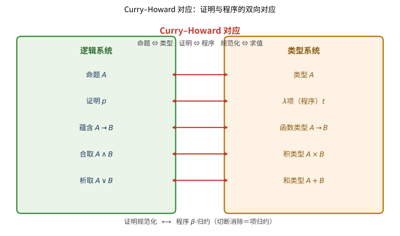

# 第127级 类型论

## 学习目标

1. 理解简单类型λ演算的基本语法和规则
2. 掌握Curry-Howard对应的深刻内涵
3. 理解Martin-Löf类型论的核心思想（命题即类型）
4. 掌握Σ类型、Π类型、恒等类型等类型构造器
5. 理解同伦类型论和Univalence公理
6. 掌握高阶归纳类型的概念
7. 理解类型论的操作语义和范畴语义
8. 了解类型论在形式化验证中的应用

---

## 核心概念

### 简单类型λ演算

**简单类型λ演算**（Simply Typed Lambda Calculus, $\lambda_{\to}$）是最基本的带类型λ演算系统。

**类型**（Types）：
$$ \tau ::= \alpha \mid \tau_1 \to \tau_2 $$

其中 $\alpha$ 是基类型，$\tau_1 \to \tau_2$ 是函数类型。

> **直观理解（现实类比）**：类型像"数据的种类标签"——整数、布尔、函数各有类型，就像血型分类：A 型血只能输给 A 型或 AB 型受体，B 型血只能输给 B 型或 AB 型受体，混错了就会出问题。类型系统就是"输血配型规则"：每个数据项贴着一个类型标签，只有类型匹配的运算才被允许（$\Gamma\vdash t:\tau$），不匹配的程序在编译阶段就被拒绝。这种"先检查后执行"的机制，把无数潜在错误挡在了运行之前——正如血型配对把致命的溶血反应挡在了手术台外。

**项**（Terms）：
$$ t ::= x \mid \lambda x: \tau. t \mid t_1 \, t_2 $$

**类型规则**（Typing Rules）：

$$ \frac{x: \tau \in \Gamma}{\Gamma \vdash x: \tau} (\text{Var}) \quad \frac{\Gamma, x: \tau_1 \vdash t: \tau_2}{\Gamma \vdash \lambda x: \tau_1. t: \tau_1 \to \tau_2} (\text{Abs}) \quad \frac{\Gamma \vdash t_1: \tau_1 \to \tau_2 \quad \Gamma \vdash t_2: \tau_1}{\Gamma \vdash t_1 \, t_2: \tau_2} (\text{App}) $$

**归约规则**：
- $\beta$-归约：$(\lambda x: \tau. t) \, u \to_\beta t[u/x]$
- $\eta$-归约：$\lambda x: \tau. t \, x \to_\eta t$（当 $x$ 在 $t$ 中不自由）


> **直观理解（现实类比）**：类型派生树就像一张"盖章证明书"。推导规则是"审批流程"：要从"x 有类型 A"（Var）一步步盖章，每盖一个章（Abs）就给表达式加一层"函数"身份，直到最终打印出"这个 λ 项的类型是 A→B→A"。类型检查则是计算机沿着这棵树从下往上核对每一行是否合规——就像海关查验每一份单据、每一道工序是否都附有正确的审批章，全部通过才放行。任何一个环节缺章，整个项的类型判定就无效。

### Curry-Howard对应

**Curry-Howard对应**（又称命题即类型、证明即程序）揭示了逻辑系统和类型系统之间的深刻对应关系：

| 逻辑系统 | 类型系统 |
|---------|---------|
| 命题 | 类型 |
| 证明 | λ项（程序） |
| 蕴含 $A \to B$ | 函数类型 $A \to B$ |
| 合取 $A \land B$ | 积类型 $A \times B$ |
| 析取 $A \lor B$ | 和类型 $A + B$ |
| 真 $\top$ | 单元类型 $1$ |
| 假 $\bot$ | 空类型 $0$ |
| 全称量词 $\forall x$ | Π类型 $\Pi x: A. B(x)$ |
| 存在量词 $\exists x$ | Σ类型 $\Sigma x: A. B(x)$ |
| 证明规范化 | 程序求值（$\beta$-归约） |
| 切断消除 | 项归约 |



> **直观理解（现实类比）**：Curry–Howard 对应就像发现"数学证明"和"电脑程序"其实是同一件事的两副面孔。命题是"类型"（一个格子），证明是"填入这个格子的程序"（一个能运行的 λ 项）。例如命题"蕴含 A→B"对应"函数类型 A→B"——一个证明 A 推出 B 的证据，恰好就是一个把 A 型输入转换成 B 型输出的函数。合取对应积类型、析取对应和类型同样一一对应。最妙的是，"证明的化简（规范化）"就对应"程序的运行（β-归约）"：剪掉证明里绕弯子的中间步骤，等于让程序直接算出结果。这就像把一份冗长的法律论证压缩成一句话结论，逻辑上等价、内容更精炼。

> **直观理解（现实类比）**：Curry-Howard 对应像"证明=程序"——每个命题对应一个类型，每个证明对应一个程序。命题 $A\to B$ 对应函数类型 $A\to B$：证明"若 $A$ 则 $B$"就是把 $A$ 的证据变换为 $B$ 的证据的可执行函数。命题 $A\land B$ 对应积类型 $A\times B$：一个同时持有 $A$ 和 $B$ 证据的序对。这种一一对应把逻辑和计算焊接在一起：写证明就是编程，编程就是写证明。现代证明助手（Coq、Agda、Lean）正是建立在这一对应之上——数学家写定理证明，本质上是写一个类型正确的程序，程序通过类型检查就意味着定理得证。

### 依值类型

**依值类型**（Dependent Types）是指依赖于值的类型。例如，长度为 $n$ 的向量类型 $\text{Vec}(A, n)$ 依赖于自然数 $n$。

Martin-Löf类型论是依值类型系统的典范。

> **直观理解（现实类比）**：依赖类型像"值依赖的类型"——类型不再是静态的"种类标签"，而是可以随值变化的"动态标签"。最典型的例子是"长度为 $n$ 的向量" $\text{Vec}(A,n)$：$n$ 变了，类型就变了。这就像快递盒上的"尺寸标签"——盒子长 30cm 和长 50cm 是不同规格，贴的标签也不同。依赖类型让类型系统能表达"长度为 $n$ 的数组只能和长度为 $n$ 的数组逐元素相加"这样的精细约束——编译器在编译期就能检查出维度不匹配的错误，而不必等到运行时崩溃。Σ 类型（依赖序对）和 Π 类型（依赖函数）把"存在量词"和"全称量词"也纳入了类型世界，让类型论具备了表达任意数学命题的能力。

### Martin-Löf类型论

**Martin-Löf类型论**（Martin-Löf Type Theory, MLTT）是一种依值类型系统，其核心判断形式为：

- $\Gamma \vdash A \text{ type}$：$A$ 在上下文 $\Gamma$ 下是一个类型
- $\Gamma \vdash a: A$：$a$ 在上下文 $\Gamma$ 下属于类型 $A$
- $\Gamma \vdash A = B \text{ type}$：$A$ 和 $B$ 是定义相等的类型
- $\Gamma \vdash a = b: A$：$a$ 和 $b$ 是定义相等的 $A$ 的项

> **直观理解（现实类比）**：Martin-Löf 类型论像"构造性数学的编程语言"——它把命题、证明、集合、函数全部统一为"类型"和"项"两类对象，并为每种构造都配备明确的计算规则。自然数类型 $\mathbb{N}$ 由 $0$ 和后继 $S$ 生成，要构造 $\mathbb{N}$ 上的函数必须用归纳消去规则——这其实就是"原始递归"的类型化版本。每个类型构造子（Π、Σ、恒等、归纳类型）都有"形成—引入—消去—计算"四件套，像一套严密的操作手册：怎么造、怎么用、怎么化简都写得清清楚楚。这种"每种构造都有计算规则"的设计，让 MLTT 既是构造性数学的基础，也是 Coq、Agda 等证明助手的内核——数学和编程在此真正合二为一。

### 类型构造器

**Π类型**（Pi Type / Dependent Product）：广义的函数类型

$$ \Pi x: A. B(x) $$

其元素是函数 $f$，对每个 $a: A$，$f(a): B(a)$。

**Σ类型**（Sigma Type / Dependent Sum）：广义的积类型

$$ \Sigma x: A. B(x) $$

其元素是序对 $(a, b)$，其中 $a: A$，$b: B(a)$。

**恒等类型**（Identity Type）：对任意 $a, b: A$，有类型 $\text{Id}_A(a, b)$（或 $a =_A b$），其元素是 $a$ 和 $b$ 相等的证据。

**类型构造规则**（以Π类型为例）：

$$ \frac{\Gamma, x: A \vdash B \text{ type}}{\Gamma \vdash \Pi x: A. B \text{ type}} (\Pi\text{-form}) $$

$$ \frac{\Gamma, x: A \vdash t: B}{\Gamma \vdash \lambda x: A. t: \Pi x: A. B} (\Pi\text{-intro}) $$

$$ \frac{\Gamma \vdash f: \Pi x: A. B \quad \Gamma \vdash a: A}{\Gamma \vdash f(a): B[a/x]} (\Pi\text{-elim}) $$

### 同伦类型论

**同伦类型论**（Homotopy Type Theory, HoTT）将类型论与同伦论结合，其中：

- 类型被视为空间
- 项被视为空间中的点
- 恒等类型 $a =_A b$ 被视为从 $a$ 到 $b$ 的路径空间
- 路径之间的路径（高阶恒等）被视为同伦

### Univalence公理

**Univalence公理**（Univalence Axiom）是同伦类型论的核心公理，它断言：

$$ (A \simeq B) \simeq (A =_{\mathcal{U}} B) $$

即类型等价与类型相等是同构的。这里的 $\mathcal{U}$ 是宇宙（universe），$A \simeq B$ 表示 $A$ 和 $B$ 之间存在等价（具有双射的函子）。

### 高阶归纳类型

**高阶归纳类型**（Higher Inductive Types, HITs）是归纳类型的推广，除了通常的构造子外，还包含路径构造子（即等式公理）。

例如，圆类型 $\mathbb{S}^1$ 可定义为：

$$ \mathbb{S}^1 : \text{Type} $$
$$ \text{base}: \mathbb{S}^1 $$
$$ \text{loop}: \text{base} =_{\mathbb{S}^1} \text{base} $$

### 操作语义

**操作语义**（Operational Semantics）定义类型论中项的计算行为。核心是 $\beta$-归约和 $\eta$-转换，以及类型的**正规化**（Normalization）性质——每个项都可以归约到唯一的正规形式。

### 范畴语义

**范畴语义**（Categorical Semantics）将类型论解释到Cartesian闭范畴（CCC）中：

- 类型解释为对象
- 项解释为态射
- 类型构造器对应范畴论中的构造（积、指数对象等）
- 依值类型系统解释到局部Cartesian闭范畴或纤维范畴中

### 类型检查与类型推断

**类型检查**（Type Checking）：判断 $\Gamma \vdash t: \tau$ 是否成立。
**类型推断**（Type Inference）：给定 $\Gamma$ 和 $t$，找出 $\tau$ 使得 $\Gamma \vdash t: \tau$。

简单类型λ演算的类型推断是可判定的（Hindley-Milner算法），但更强大的类型系统（如依值类型）的类型检查可能不可判定。

### 形式化验证

**形式化验证**（Formal Verification）使用类型论和证明助手（如Coq、Agda、Lean）来验证数学定理和软件正确性。

---

## 定理与证明

### 定理1：Curry-Howard对应

**定理**（Curry-Howard Correspondence）：直觉主义命题逻辑的自然演绎系统与简单类型λ演算之间存在一一对应，使得：

1. 命题 $A$ 可证（在直觉主义逻辑中）当且仅当类型 $A$ 在简单类型λ演算中可居留（inhabited）
2. 证明与λ项一一对应
3. 证明规范化对应于项的 $\beta$-归约

**证明**（构造对应关系）：

**步骤1：定义从命题到类型的映射**

定义映射 $\lfloor - \rfloor$ 从命题公式到类型：

- $\lfloor P \rfloor = p$（命题变元对应类型变元）
- $\lfloor A \to B \rfloor = \lfloor A \rfloor \to \lfloor B \rfloor$
- $\lfloor A \land B \rfloor = \lfloor A \rfloor \times \lfloor B \rfloor$
- $\lfloor A \lor B \rfloor = \lfloor A \rfloor + \lfloor B \rfloor$
- $\lfloor \top \rfloor = 1$（单元类型）
- $\lfloor \bot \rfloor = 0$（空类型）

**步骤2：证明项与证明的对应**

对每个自然演绎证明 $\pi$ 以 $\Gamma \vdash A$ 为结论（其中 $\Gamma = \{A_1, \ldots, A_n\}$），构造一个λ项 $t_\pi$ 使得 $x_1: \lfloor A_1 \rfloor, \ldots, x_n: \lfloor A_n \rfloor \vdash t_\pi: \lfloor A \rfloor$。

通过归纳于证明 $\pi$ 的结构：

- **公理** $\Gamma, A \vdash A$：对应变量规则 $\Gamma, x: \lfloor A \rfloor \vdash x: \lfloor A \rfloor$
- **蕴含引入** $(\to I)$：从 $\Gamma, A \vdash B$ 得到 $\Gamma \vdash A \to B$，对应λ抽象：从 $\Gamma, x: \lfloor A \rfloor \vdash t: \lfloor B \rfloor$ 得到 $\Gamma \vdash \lambda x: \lfloor A \rfloor. t: \lfloor A \rfloor \to \lfloor B \rfloor$
- **蕴含消去** $(\to E)$：从 $\Gamma \vdash A \to B$ 和 $\Gamma \vdash A$ 得到 $\Gamma \vdash B$，对应函数应用：从 $\Gamma \vdash t_1: \lfloor A \rfloor \to \lfloor B \rfloor$ 和 $\Gamma \vdash t_2: \lfloor A \rfloor$ 得到 $\Gamma \vdash t_1 \, t_2: \lfloor B \rfloor$
- **合取引入** $(\land I)$：对应序对构造 $(\text{pair}(t_1, t_2) \text{ 或 } (t_1, t_2))$
- **合取消去** $(\land E)$：对应投影 $\text{fst}(t)$ 和 $\text{snd}(t)$
- **析取引入** $(\lor I)$：对应注入 $\text{inl}(t)$ 和 $\text{inr}(t)$
- **析取消去** $(\lor E)$：对应情况分析 $\text{case}(t, x. t_1, y. t_2)$

**步骤3：证明规范化对应**

自然演绎的证明规范化步骤（如 $\beta$-归约）对应于λ项的 $\beta$-归约：

$$ \frac{\Gamma, A \vdash B}{\Gamma \vdash A \to B} (\to I) \quad \frac{\Gamma \vdash A}{\Gamma \vdash B} (\to E) \quad \Longrightarrow \quad \frac{\Gamma, A \vdash B}{\Gamma \vdash B} $$

对应的λ项变换：
$$ (\lambda x: \lfloor A \rfloor. t) \, u \to_\beta t[u/x] $$

这正是 $\beta$-归约。

**步骤4：双向对应**

反过来，给定一个类型良好的λ项 $\Gamma \vdash t: \tau$，通过逆映射可以构造一个自然演绎证明。这建立了双射。

因此，Curry-Howard对应成立。$\square$

### 定理2：Martin-Löf类型论的正规化定理

**定理**（Normalization Theorem for MLTT）：在Martin-Löf类型论中，每个类型良好的项都可通过有限步 $\beta$-归约达到其正规形式（即不含可归约表达式的形式）。

**证明思路**（使用可还原性方法 / Reducibility Method）：

**步骤1：定义可还原性**

对每个类型 $A$，定义其可还原项集合 $\text{Red}(A)$。对于基类型，$\text{Red}(\text{Nat})$ 是所有归约到数字的项。对于函数类型 $\Pi x: A. B(x)$，$f \in \text{Red}(\Pi x: A. B(x))$ 当且仅当对任意 $a \in \text{Red}(A)$，$f(a) \in \text{Red}(B(a))$。

**步骤2：可还原性蕴含正规化**

证明如果 $t \in \text{Red}(A)$，则 $t$ 是正规化的（即存在归约序列到正规形式）。这通常通过对类型 $A$ 的结构进行归纳。

**步骤3：所有类型良好的项都是可还原的**

对类型推导进行归纳，证明对每个类型规则，如果前提是可还原的，则结论也是可还原的。

**关键引理**（可还原性替换引理）：如果 $a \in \text{Red}(A)$ 且 $t[x] \in \text{Red}(B(x))$（在上下文 $x: A$ 下），则 $t[a/x] \in \text{Red}(B(a))$。

**步骤4：结论**

由步骤2和3，所有类型良好的项都是正规化的。$\square$

### 定理3：恒等类型的性质

**定理**（Properties of Identity Type）：恒等类型 $\text{Id}_A(a, b)$（或 $a =_A b$）满足以下性质：

1. **自反性**（Reflexivity）：对任意 $a: A$，存在 $\text{refl}_a: a =_A a$
2. **对称性**（Symmetry）：如果 $p: a =_A b$，则 $p^{-1}: b =_A a$
3. **传递性**（Transitivity）：如果 $p: a =_A b$ 且 $q: b =_A c$，则 $p \cdot q: a =_A c$
4. **J规则**（J-elimination / Path Induction）：对任意 $C: \Pi x: A. (a =_A x) \to \mathcal{U}$ 和 $d: C(a, \text{refl}_a)$，存在 $J(C, d, a, p): C(a, p)$ 对所有 $p: a =_A b$

**证明**：

**自反性**：由恒等类型的引入规则直接给出。

**对称性**：使用J规则。定义 $C(x, p) = (x =_A a)$（其中 $p: a =_A x$）。则 $C(a, \text{refl}_a) = (a =_A a)$，由 $\text{refl}_a$ 填充。应用J规则得到 $p^{-1}: b =_A a$。

**传递性**：使用J规则两次。首先固定 $p: a =_A b$，对 $q: b =_A c$ 进行归纳。

更具体地，定义 $C_1(x, q) = (a =_A x)$，其中 $q: b =_A x$。则 $C_1(b, \text{refl}_b) = (a =_A b)$，由 $p$ 填充。应用J规则得到 $p \cdot q: a =_A c$。

**J规则（路径归纳）**：

J规则是恒等类型的消去规则，其精确形式为：

$$ \frac{\Gamma, x: A, p: a =_A x \vdash C(x, p) \text{ type} \quad \Gamma \vdash d: C(a, \text{refl}_a) \quad \Gamma \vdash b: A \quad \Gamma \vdash p': a =_A b}{\Gamma \vdash J(C, d, b, p'): C(b, p')} $$

**J规则的计算规则**：$J(C, d, a, \text{refl}_a) = d$。

**路径归纳的原理**：要证明关于所有路径 $p: a =_A b$ 的性质，只需证明在 $b = a$ 且 $p = \text{refl}_a$ 时的情形。这反映了恒等类型的"生成"方式——唯一的路径构造子是 $\text{refl}_a$。$\square$

### 定理4：Univalence公理

**定理**（Univalence Axiom, Voevodsky 2009）：Univalence公理与Martin-Löf类型论一致，且它断言：

$$ (A \simeq B) \simeq (A =_{\mathcal{U}} B) $$

其中 $\mathcal{U}$ 是一个宇宙，$A \simeq B$ 表示 $A$ 和 $B$ 之间存在等价。

**证明**（构造从 $A =_{\mathcal{U}} B$ 到 $A \simeq B$ 的映射）：

**步骤1：定义 $\text{IdToEquiv}$**

对任意类型 $A, B: \mathcal{U}$，定义映射 $\text{IdToEquiv}: (A =_{\mathcal{U}} B) \to (A \simeq B)$。

使用J规则：对 $p: A =_{\mathcal{U}} B$，$\text{IdToEquiv}(p) = J(\lambda X. (A \simeq X), \text{id}_A, B, p)$，其中 $\text{id}_A$ 是恒等等价。

**步骤2：Univalence公理**

Univalence公理断言 $\text{IdToEquiv}$ 本身是等价（即具有双射的函子）。

$$ \text{ua}: \text{IsEquiv}(\text{IdToEquiv}) $$

从而 $\text{ua}$ 给出逆映射 $\text{EquivToId}: (A \simeq B) \to (A =_{\mathcal{U}} B)$。

**步骤3：一致性**

Voevodsky证明了Univalence公理在单线模型（Simplicial Set Model）中成立，从而得以证明其与Martin-Löf类型论的一致性。$\square$

**推论**：Univalence公理意味着"等价的类型是可交换的"（即同构的事物可以等同），这极大地扩展了类型论的表达能力。

### 定理5：同伦类型论中的集合分层

**定理**（h-Level Hierarchy in HoTT）：在同伦类型论中，每个类型 $A$ 都有一个h-层次（homotopy level），定义如下：

- $A$ 是**h-层次 $-2$**（即可收缩）：$\text{isContr}(A) = \Sigma a: A. \Pi x: A. a =_A x$
- $A$ 是**h-层次 $-1$**（即命题）：$\text{isProp}(A) = \Pi x, y: A. x =_A y$
- $A$ 是**h-层次 $0$**（即集合）：$\text{isSet}(A) = \Pi x, y: A. \Pi p, q: x =_A y. p =_{x=_A y} q$
- $A$ 是**h-层次 $n+1$**：$\text{isType}_{n+1}(A) = \Pi x, y: A. \text{isType}_n(x =_A y)$

并且，如果 $A$ 是h-层次 $n$，则 $A$ 也是h-层次 $n+1$。

**证明**：

**步骤1：定义h-层次**

使用归纳定义：

$$ \text{isContr}(A) := \Sigma a: A. \Pi x: A. a =_A x $$
$$ \text{isProp}(A) := \Pi x, y: A. \text{isContr}(x =_A y) $$
$$ \text{isSet}(A) := \Pi x, y: A. \text{isProp}(x =_A y) $$
$$ \text{isType}_{n+2}(A) := \Pi x, y: A. \text{isType}_{n+1}(x =_A y) $$

其中 $\text{isType}_{-2}(A) = \text{isContr}(A)$，$\text{isType}_{-1}(A) = \text{isProp}(A)$，$\text{isType}_0(A) = \text{isSet}(A)$。

**步骤2：证明层次递增性质**

我们需要证明 $\text{isType}_n(A) \to \text{isType}_{n+1}(A)$。

对 $n$ 进行归纳。

**基例 $n = -2$**：设 $A$ 是可收缩的，即存在 $a: A$ 和 $f: \Pi x: A. a =_A x$。需要证明 $A$ 是命题，即对任意 $x, y: A$，$x =_A y$。

由 $f$，$f(x): a =_A x$，$f(y): a =_A y$。由对称性和传递性，$f(x)^{-1} \cdot f(y): x =_A y$。因此 $\text{isProp}(A)$ 成立。

**归纳步骤**：假设对 $n$ 成立，证明对 $n+1$ 成立。

设 $\text{isType}_{n+1}(A)$ 成立，即 $\Pi x, y: A. \text{isType}_n(x =_A y)$。需要证明 $\text{isType}_{n+2}(A)$，即 $\Pi x, y: A. \text{isType}_{n+1}(x =_A y)$。

由归纳假设，$\text{isType}_n(x =_A y) \to \text{isType}_{n+1}(x =_A y)$。因此结论成立。

**步骤3：稳定性质**

类型 $A$ 的h-层次实际上是"稳定"的：一旦确定 $A$ 是h-层次 $n$，它也是所有更高层次。但不同层次之间有本质区别：

- **可收缩类型**：存在一个中心点且所有点都等于该点（如单元类型）
- **命题**：任意两个点之间至多有一条路径（如 $0 = 1$）
- **集合**：路径之间的路径是唯一的（如自然数类型 $\mathbb{N}$）
- **1-群胚**：路径之间的路径可以是非平凡的（如圆类型 $\mathbb{S}^1$）

这些层次构成了类型论中同伦结构的完整分类。$\square$

---

## 示例

### 示例1：用λ项表示逻辑证明

**命题**：$A \to (B \to A)$

对应的λ项：$\lambda x: A. \lambda y: B. x$

类型检查：
$$ \frac{x: A \vdash x: A}{\vdash \lambda x: A. \lambda y: B. x: A \to (B \to A)} (\text{Abs}) $$

**命题**：$(A \to B \to C) \to (A \to B) \to (A \to C)$

对应的λ项：$\lambda f: A \to B \to C. \lambda g: A \to B. \lambda x: A. f \, x \, (g \, x)$

### 示例2：Coq中的类型定义

在Coq中定义自然数和加法：

```coq
Inductive nat : Type :=
| O : nat
| S : nat -> nat.

Fixpoint add (n m : nat) : nat :=
  match n with
  | O => m
  | S n' => S (add n' m)
  end.

Theorem add_comm : forall n m : nat, add n m = add m n.
Proof.
  intros n m; induction n as [| n' IH]; simpl.
  - (* n = O *) rewrite add_zero; reflexivity.
  - (* n = S n' *) rewrite IH; rewrite add_succ; reflexivity.
Qed.
```

### 示例3：Agda中的依值类型

在Agda中定义长度索引的向量：

```agda
data Vec (A : Set) : ℕ → Set where
  []  : Vec A zero
  _∷_ : {n : ℕ} → A → Vec A n → Vec A (suc n)

head : {A : Set} {n : ℕ} → Vec A (suc n) → A
head (x ∷ xs) = x

map : {A B : Set} {n : ℕ} → (A → B) → Vec A n → Vec B n
map f []       = []
map f (x ∷ xs) = f x ∷ map f xs
```

### 示例4：同伦类型论中的路径构造

考虑圆类型 $\mathbb{S}^1$，其基本群为 $\pi_1(\mathbb{S}^1) \cong \mathbb{Z}$。

```agda
data S¹ : Set where
  base : S¹
  loop : base ≡ base

-- 证明 loop ≠ refl
-- 使用覆盖空间构造（通用覆盖）
```

在HoTT中，可以证明：
- $\text{loop} \neq \text{refl}_{\text{base}}$（loop不是平凡路径）
- $\text{loop}^n \neq \text{loop}^m$ 对 $n \neq m$（所有整数次幂互不相同）
- 因此 $\pi_1(\mathbb{S}^1) \cong \mathbb{Z}$

---

## 习题

### 基础题

**习题 1**（简单类型λ演算）写出简单类型λ演算 $\lambda_{{\to}}$ 中类型的语法（BGP），并指出基类型与函数类型 $\tau_1 \to \tau_2$ 的含义。

**习题 2**（类型规则）分别陈述变量规则（Var）、抽象规则（Abs）与应用规则（App），说明每条规则从什么判断推出什么判断。

**习题 3**（β 归约）说明 β-归约 $(\lambda x{:}\tau.\, t)\, u \to_\beta t[u/x]$ 中的"代换"在语义上表示什么，并与程序运行作类比。

**习题 4**（Curry-Howard 表）给出 Curry-Howard 对应中以下互相对应的三组：蕴含与函数类型、合取与积类型、析取与和类型。

**习题 5**（命题对应的类型）在 Curry-Howard 下，命题 $\top$、$\bot$ 分别对应什么类型？请说明单元类型 $1$ 与空类型 $0$ 的直观含义。

**习题 6**（依值类型）解释何为依值类型，并举出"长度为 $n$ 的向量 $\text{Vec}(A,n)$"的例子说明"类型依赖值"的含义。

**习题 7**（Π 类型）写出 Π 类型 $\Pi x{:}A.\, B(x)$ 的形成、引入与消去规则，并说明其元素是何种函数。

**习题 8**（Σ 类型）写出 Σ 类型 $\Sigma x{:}A.\, B(x)$ 的引入规则，并说明其元素 $(a,b)$ 中 $a$、$b$ 各满足什么条件。

**习题 9**（恒等类型）给出恒等类型 $\text{Id}_A(a,b)$ 的直观含义，并写出其唯一的构造子 $\text{refl}_a$。

**习题 10**（类型检查与推断）区分"类型检查"与"类型推断"，并说明简单类型λ演算中类型推断是否可判定。

### 进阶题

**习题 11**（类型派生树）对项 $\lambda x{:}A.\,\lambda y{:}B.\, x$ 给出完整的类型推导树，并说明每条规则的应用。

**习题 12**（用 λ 项编码逻辑证明）命题 $A \to B \to A$ 对应什么样的 λ 项？利用 Curry-Howard 说明该命题为何可证。

**习题 13**（合取与序对）在 Curry-Howard 下，用类型构造规则说明如何由定理 $A$ 与 $B$ 的证明（类型为 $A$、$B$ 的项）构造 $A \land B$ 的证明，即序对 $(t_1, t_2)$。

**习题 14**（传递性）利用 J 规则证明恒等类型的传递性：若 $p{:}a=_A b$ 且 $q{:}b=_A c$，则 $p\cdot q{:}a=_A c$。

**习题 15**（对称性）利用 J 规则证明恒等类型的对称性：若 $p{:}a=_A b$，则 $p^{-1}{:}b=_A a$。

**习题 16**（h-层次定义）写出 $\text{isContr}$、$\text{isProp}$、$\text{isSet}$ 的定义式，并说明三者之间的层次关系。

**习题 17**（Univalence 与 IdToEquiv）写出 Univalence 公理 $(A\simeq B)\simeq(A=_{\mathcal U}B)$，并说明 $\text{IdToEquiv}$ 的方向与作用。

**习题 18**（正规化定理）陈述 Martin-Löf 类型论的正规化定理，并说明定理2证明中"可还原性集合 $\text{Red}(A)$"的定义方式。

**习题 19**（HIT 与圆类型）写出高阶归纳类型圆的定义（$\text{base}$ 与 $\text{loop}$），并说明为何循环 $loop$ 不是平凡路径。

### 挑战题

**习题 20**（Curry-Howard 的 Peirce 律）命题 $((A\to B)\to A)\to A$（Peirce 律）在简单类型λ演算中能否居留？利用直觉主义逻辑给出判断并解释原因。

**习题 21**（可还原性替换引理）陈述并解释正规化定理证明中的可还原性替换引理：为何 $a\in\text{Red}(A)$、$t[x]\in\text{Red}(B(x))$ 蕴含 $t[a/x]\in\text{Red}(B(a))$。

**习题 22**（J 规则的计算规则）写出 J 规则的计算规则 $J(C,d,a,\text{refl}_a)=d$，并用"路径归纳即只需处理 $\text{refl}$ 情形"解释其意义。

**习题 23**（层次递增性质）证明 $\text{isType}_n(A)\to\text{isType}_{n+1}(A)$，并特别写出基例 $n=-2$（可收缩蕴含命题）的论证。

**习题 24**（Univalence 的一致性思想）概述 Voevdsky 用单线模型（Simplicial Set Model）证明 Univalence 与 MLTT 一致的思想，并说明这为何重要。

**习题 25**（范畴语义）说明类型论如何解释到 Cartesian 闭范畴（CCC）：类型、项、函数类型分别对应什么对象，依值类型又解释到什么范畴。

**习题 26**（π₁(S¹) 与其他层）结合 h-层次讨论圆类型 $\mathbb S^1$ 的 h-层次，并说明为什么证明 $\pi_1(\mathbb S^1)\cong\mathbb Z$ 需要用到非平凡高阶结构。

### 探究题

**习题 27**（Curry-Howard 的扩展与局限）讨论 Curry-Howard 对应从命题逻辑扩展到一阶/依值类型时的扩展方式（全称对 Π、存在对 Σ），并探讨其与经典逻辑（排中律）的张力。

**习题 28**（Univalence 对数学结构主义的意义）深入讨论 Univalence 公理如何实现"等价的类型可等同"的数学结构主义观点，以及它在重写/传输数学性质上的应用。

**习题 29**（正规化、强正规化与求值）辨析正规化（每个项有正规形式）与强正规化（所有归约序列都终止）的区别，讨论它们在证明助手、程序求值中的角色。

**习题 30**（类型论的比较与前沿）比较简单类型λ演算、MLTT 与 HoTT 在表达能力、可判定性与语义上的差异，并谈谈类型论在证明助手与程序验证中的现代应用。

---

## 习题答案与解析

### 基础题答案

1. **简单类型λ演算** 类型的语法为 $\tau ::= \alpha \mid \tau_1\to\tau_2$，其中 $\alpha$ 是基类型，$\tau_1\to\tau_2$ 是函数类型。基类型是原子类型（如自然数、布尔），函数类型表示从 $\tau_1$ 的项到 $\tau_2$ 的项的函数空间。

2. **类型规则** 变量规则（Var）：若 $x:\tau\in\Gamma$ 则 $\Gamma\vdash x:\tau$；抽象规则（Abs）：若 $\Gamma,x:\tau_1\vdash t:\tau_2$ 则 $\Gamma\vdash\lambda x{:}\tau_1.\,t:\tau_1\to\tau_2$；应用规则（App）：若 $\Gamma\vdash t_1:\tau_1\to\tau_2$ 且 $\Gamma\vdash t_2:\tau_1$，则 $\Gamma\vdash t_1\,t_2:\tau_2$。三条规则分别处理变量引用、函数抽象与函数应用三条最基本的语法构造。

3. **β 归约** β-归约 $(\lambda x{:}\tau.\,t)\,u\to_\beta t[u/x]$ 表示把"用参数 $u$ 代入函数体 $t$ 中自由出现的 $x$"。语义上即"调用函数并把实参传进去"，相当于程序运行时不经过元语言加工直接求值——正如 Curry-Howard 所说的"证明规范化对应程序求值"。

4. **Curry-Howard 表** 蕴含 $A\to B$ 对应函数类型 $A\to B$；合取 $A\land B$ 对应积类型 $A\times B$；析取 $A\lor B$ 对应和类型 $A+B$。即"逻辑连接词对应类型构造子"。

5. **命题对应的类型** 命题 $\top$ 对应单元类型 $1$，命题 $\bot$ 对应空类型 $0$。$1$ 有唯一元素（真之证明），$0$ 无元素（假不可能被构造出来）；一个类型的可居留性正对应其命题的可证性。

6. **依值类型** 依值类型是指类型"依赖于值"的类型系统。例如 $\text{Vec}(A,n)$（长度为 $n$ 的向量类型）依赖自然数 $n$：$n$ 变化，类型也变化。这使类型系统能表达 $\text{Vec}(A,m)$ 与 $\text{Vec}(A,n)$ 相加要求 $m=n$ 这类精细约束，并在编译期检查维度错误。

7. **Π 类型** 形成规则：$\Gamma,x{:}A\vdash B\,\text{type}$ 时 $\Gamma\vdash\Pi x{:}A.\,B\,\text{type}$；引入：$\Gamma,x{:}A\vdash t{:}B$ 时 $\Gamma\vdash\lambda x{:}A.\,t:\Pi x{:}A.\,B$；消去：$f:\Pi x{:}A.\,B$ 且 $a{:}A$ 时 $f(a):B[a/x]$。Π 类型的元素是"对每个 $a{:}A$ 产生 $B(a)$"的依值函数——全称量词的类型学对应。

8. **Σ 类型** Σ 类型的引入：由 $a{:}A$ 与 $b{:}B(a)$ 得到 $(a,b):\Sigma x{:}A.\,B(x)$。其元素是序对 $(a,b)$，其中第一个分量 $a$ 提供"见证"，第二个分量 $b$ 属于依赖于 $a$ 的类型 $B(a)$——这是存在量词 $\exists x.A\land B(x)$ 的类型学表示。

9. **恒等类型** $\text{Id}_A(a,b)$（或 $a=_A b$）是"$a$ 与 $b$ 相等的证据"构成的类型。其构造子是 $\text{refl}_a:a=_A a$，仅为每个 $a$ 提供"自身等于自身"的回自证据；一切关于相等的证明由 J 规则（路径归纳）从回个案推出。

10. **类型检查与推断** 类型检查是判定给定的 $\Gamma\vdash t:\tau$ 是否成立；类型推断是在给定 $\Gamma$ 与 $t$ 的情况下求出合适的 $\tau$。简单类型λ演算的类型推断可判定（Hindley-Milner 算法），但更强大的系统（如 MLTT）的类型检查可能不可判定。

### 进阶题答案

1. **类型派生树** 建树如下：$x{:}A\in\Gamma$ 时由 Var 得 $\Gamma,y{:}B\vdash x{:}A$；由 Abs 得到 $\Gamma\vdash\lambda y{:}B.\,x:B\to A$；再对 $x{:}A$ 用 Var 得 $\Gamma\vdash x{:}A$；再对整项用 Abs 得 $\Gamma\vdash\lambda x{:}A.\,\lambda y{:}B.\,x:A\to(B\to A)$。要点是先用 Abs 闭掉 $y$，再闭掉 $x$，自底向上逐层盖章。

2. **用 λ 项编码逻辑证明** 命题 $A\to B\to A$ 对应的 λ 项是 $\lambda x{:}A.\,\lambda y{:}B.\,x$。由 Curry-Howard，这个项的构造就是一个自然的证明：先假设 $A$（得 $x$），再假设 $B$（得 $y$），最后"丢弃" $y$ 用 $x$ 作结论并用两次 $\to I$ 封闭假设。

3. **合取与序对** 若 $t_1:A$、$t_2:B$，则由积类型的引入规则可得 $(t_1,t_2):A\times B$。这不正是合取引入规则的对应：由 $A$ 的证明和 $B$ 的证明，把它们"打包"成 $A\land B$ 的证明——序对即合取的证明体。

4. **传递性** 固定 $a,a:A$ 与 $p:a=_A b$。定义 $C(x,q):=(a=_A x)$，其中 $q:b=_A x$。则 $C(b,\text{refl}_b)=a=_A b$，由 $p$ 填充。对 $q:b=_A c$ 用 J 规则，得到 $J(C,p,c,q):C(c,q)=a=_A c$，即 $p\cdot q:a=_A c$。

5. **对称性** 定义 $C(x,p):=(x=_A a)$，其中 $p:a=_A x$。则 $C(a,\text{refl}_a)=a=_A a$，由 $\text{refl}_a$ 填充。对 $p:a=_A b$ 用 J 规则得到 $J(C,\text{refl}_a,b,p):C(b,p)=b=_A a$，即 $p^{-1}:b=_A a$。

6. **h-层次定义** $\text{isContr}(A):=\Sigma a{:}A.\,\Pi x{:}A.\,a=_A x$（存在中心点且所有点都等于它）；$\text{isProp}(A):=\Pi x,y{:}A.\,x=_A y$（命题，任意两点至多一条路径）；$\text{isSet}(A):=\Pi x,y{:}A.\,\Pi p,q{:}x=_A y.\,p=_{x=_A y}q$（集合，路径间路径唯一）。三者是"可收缩 → 命题 → 集合"的逐级增强，每个都蕴含更高一层。

7. **Univalence 与 IdToEquiv** 公理 $ (A\simeq B)\simeq(A=_{\mathcal U}B) $ 断言类型等价与类型相等同构。$\text{IdToEquiv}:(A=_{\mathcal U}B)\to(A\simeq B)$ 把一条相等证据 $p$ 转成一个等价，由 J 规则定义：$\text{IdToEquiv}(p)=J(\lambda X.\,(A\simeq X),\text{id}_A,B,p)$。Univalence 又说这个映射本身是等价，故有逆 $\text{EquivToId}$，从而等价的类型可以相等。

8. **正规化定理** 定理断言 MLTT 中每个类型良好的项都可通过有限步 β-归约达到正规形式。证明用可还原性方法：对每个类型 $A$ 定义其可还原项集 $\text{Red}(A)$，基类型取归约到标准值的项，函数类型 $\Pi x{:}A.\,B(x)$ 定义为"对任意 $a\in\text{Red}(A)$ 有 $f(a)\in\text{Red}(B(a))$"，再证所有良类型项都可还原且可还原蕴含可正规。

9. **HIT 与圆类型** 圆由 $\text{base}:\mathbb S^1$ 与路径构造子 $\text{loop}:\text{base}=_{\mathbb S^1}\text{base}$ 生成。$\text{loop}$ 是单点上的非平凡循环；通过覆盖空间构造可证 $\text{loop}\ne\text{refl}_{\text{base}}$，且 $\text{loop}^n\ne\text{loop}^m$（$n\ne m$），由此 $S^1$ 的基本群为 $\mathbb Z$。

### 挑战题答案

1. **Curry-Howard 的 Peirce 律** 命题 $((A\to B)\to A)\to A$ 在直觉主义逻辑（从而简单类型λ演算）中不可证/不可居留。因为排中律在直觉主义中不被接受；Peirce 律是排中律的等价形式，若在简单类型λ演算中能造出它的项，就会导出排中律成立。简单类型λ演算只能表达构造性证明，故它不可居留——这正是 Curry-Howard 忠实反映直觉主义逻辑的体现。

2. **可还原性替换引理** 引理说：若 $a\in\text{Red}(A)$ 且 $t[x]\in\text{Red}(B(x))$（在上下文 $x{:}A$ 下），则 $t[a/x]\in\text{Red}(B(a))$。它保证"把可还原实参代入一个可还原项得到的实例仍可还原"。这本质上是归约的替换相容性：代入不破坏可还原性，是证明"所有良类型项都可还原"的粘合引理。

3. **J 规则的计算规则** $J(C,d,a,\text{refl}_a)=d$，即把消去子作用到 $\text{refl}_a$ 上就等于回填项 $d$。它体现"路径归纳只需处理 $\text{refl}$"的原理：由于唯一路径构造子是 $\text{refl}_a$，只需在"两端重合为 $a$"的情形说明，J 代入后自动覆盖所有路径 $p$。同时它也保证消去子计算规则良好。

4. **层次递增性质** 基例 $n=-2$：设 $A$ 可收缩，即存在 $a{:}A$ 与 $f:\Pi x{:}A.\,a=_A x$。对任意 $x,y{:}A$，由 $f(x):a=_A x$、$f(y):a=_A y$ 及对称性、传递性得 $f(x)^{-1}\cdot f(y):x=_A y$，故 $A$ 是命题。归纳步骤：设 $\text{isType}_{n+1}(A)$ 即 $\Pi x,y.\,\text{isType}_n(x=_A y)$，由归纳假设 $\text{isType}_n\Rightarrow\text{isType}_{n+1}$ 逐路径应用到 $x=_A y$ 上即得 $\text{isType}_{n+2}(A)$。

5. **Univalence 的一致性思想** Voevdsky 在单线模型（Simplicial Set Model）中给 MLTT 一个模型，其中恒等类型解释为路径、类型解释为单线集的 Kan 复形，并验证 Univalence 公理在此模型中成立。由于模型提供了语义实现，若有推导 $\bot$（证明 $\Rightarrow \bot$）与该模型矛盾，从而公理的加入不破坏一致性。这极大地增强了对 HoTT 作为数学基础的确信。

6. **范畴语义** 在 CCC 中：类型解释为对象，项解释为态射，函数类型 $\tau_1\to\tau_2$ 解释为指数对象 $\tau_2^{\tau_1}$，类型构造子（积、和、指数）对应范畴论中相应构造。依值类型（如 Π、Σ）解释到局部 Cartesian 闭范畴或纤维范畴中。CCC 提供"类型论之外"的语义透镜，是证明正规化、一致性并由之支撑实现的重要工具。

7. **π₁(S¹) 与其他层** 圆类型 $\mathbb S^1$ 是 h-层次 $1$ 的群胚而非集合：其路径空间有非平凡元素 $\text{loop}$，因而路径间的等式 $p=_{x=_A y}q$ 不必唯一。若要证明 $\pi_1(\mathbb S^1)\cong\mathbb Z$，需建立从循环次数到整数的覆盖/不定映射并验证良定义与双射性，这依赖高阶结构（路径之 Coon 复合等），而纯集合层次无法捕捉。

### 探究题答案

1. **Curry-Howard 的扩展与局限** 把 Curry-Howard 从命题逻辑推向一阶逻辑，只需把全称量词 $\forall x.\varphi(x)$ 对应为 Π 类型 $\Pi x{:}A.\,\lfloor\varphi(x)\rfloor$，存在量词 $\exists x.\lfloor\varphi(x)\rfloor$ 对应为 Σ 类型 $\Sigma x{:}A.\,\lfloor\varphi(x)\rfloor$。这给出直觉主义一阶逻辑的精确语义。但经典逻辑特有的排中律/双重否定引入没有对应构造子（Peirce 律不可居留），因此 Curry-Howard 天然刻画直觉主义逻辑；要在类型论中嵌入经典逻辑，通常需引入 call/cc、控制流运算或 Lawveré 的 double-negation 类型，反映经典逻辑与"构造性计算"之间的结构性张力。

2. **Univalence 对数学结构主义的意义** Univalence 断言等价类型可等同，把"同构不变量"内建进类型论：两个结构等价的数学对象在类型论中没有可区分之处。这使数学性质能沿等价自动"传输"（transport），避免了传统多库中重复书写结构定理的问题。它同时也补充了"结构主义"立场——数学对象由结构而非表示定义，从而为 HoTT 提供了集合论之外、以同伦为基础的数学基础。

3. **正规化、强正规化与求值** 正规化只要求每个良类型项存在至少一条到达正规形式的归约路径；强正规化则要求所有归约策略都终止（不存在无限归约序列）。简单类型λ演算与 MLTT 核心都具强正规化，这可证类型安全与可判定性。在证明助手求值策略方面，强正规化保证任意的 beta 展开策略都收敛，因而不论求值顺序如何，程序都可能停机得正确的正规形，这对实现稳定、可预测的求值至关重要。

4. **类型论的比较与前沿** 简单类型λ演算表达力最低：仅函数类型，类型推断可判定（Hindley-Milner），但无法表达依赖约束；MLTT 通过 Π/Σ/恒等与归纳类型引入依值，表达力强、能编码大量数学，但类型检查可能不可判定；HoTT 在 MLTT 上加 Univalence 与高阶归纳类型，把同伦论纳入类型论，表达力最高，能证明 $\pi_1(S^1)\cong\mathbb Z$ 等拓扑结果，但其一致性与计算规则仍处研究前沿。现代方向包括：把 HoTT 的计算内容/规范递减策略（Cubical 类型论）落地到 Lean/Agda/Cubical Agda 中做大规模形式化验证，以及在证明助手中形式化代数、数论乃至几何的庞大理论体系。

---

## 总结

在这一级中，我们深入学习了类型论的核心内容：

1. **简单类型λ演算**：掌握了类型化λ演算的基本语法和规则，理解了函数类型、变量、抽象和应用的规则。

2. **Curry-Howard对应**：这是类型论最重要的发现之一，它揭示了逻辑和计算的深刻统一——命题即类型，证明即程序。

3. **Martin-Löf类型论**：掌握了依值类型系统，包括Σ类型（依值积）、Π类型（依值函数空间）和恒等类型。这些构造器使得类型论可以表达复杂的数学命题。

4. **同伦类型论**：理解了类型论的同伦解释，其中恒等类型对应于路径空间，类型对应于空间。

5. **Univalence公理**：Voevodsky的Univalence公理断言等价的类型可以相等，这为数学中的"结构主义"观点提供了类型论基础。

6. **h-层次**：类型根据其同伦复杂度分层，从可收缩类型到集合再到高维群胚，构成了类型的同伦分类。

7. **形式化验证**：类型论是Coq、Agda、Lean等证明助手的理论基础，在数学定理的形式化验证和软件验证中发挥着重要作用。

类型论不仅是数学基础研究的前沿领域，也是计算机科学中类型系统设计的理论基础，以及形式化验证的核心工具。