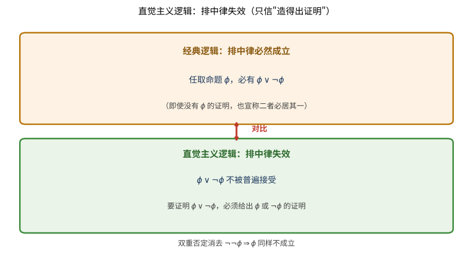

# 第128级 构造性数学

## 从"一个对象'存在'到底是什么"说起：构造性数学要解决的根问题

> 在动手读数学定理之前，先想清楚一个问题：**当我们说"某物存在"时，是想说"它真的能被造出来"，还是只想说"否认它会导致矛盾"？**

**一个真实的生活场景（第一步：直觉）**

你丢了钥匙，在屋里翻找了半天。朋友撇了一眼说："钥匙肯定在这屋里，因为要是屋子里没有，那它还能去哪？——矛盾，所以一定有。"这听着像推理，却拿不出钥匙。而如果朋友真从沙发缝里把钥匙掏出来，还证明"就是这把能开锁"，你才真正"拿到"了它。

构造性数学就是在问：**只凭"反证"算不算"找到"？** 经典数学点头——"没有它就会矛盾，所以它必然存在"是正当的证明；构造性数学摇头——"存在"必须伴随一个能实际造出来、可直接检验的构造。这个分歧，比一道题的取舍深刻得多，它直接改写了"什么是数学真理"。

> **🧠 一句话记住构造性数学的"出生证"**
>
> 构造性数学要解决的**根本问题**是：
>
> $$ \boxed{\text{"存在"究竟是"可被构造"，还是仅"不导致矛盾"？数学真理需不需要背负一整套看得见、算得出的构造？}} $$
>
> 以 Brouwer 直觉主义、Heyting/Kolmogorov 的 BHK 解释与 Bishop 的构造性分析为代表的答案一律是：需要。存在即构造，排中律与双重否定消去因此被舍弃。

**它为何而诞生（第二步：要解决的问题）**

这场争论的历史主轴是**直觉主义 vs 经典逻辑**。Brouwer 1907 年在博士论文中扛起直觉主义大旗：数学对象不是"早已存在、静待发现"的客体，而是心智一次次执行后继运算"造出来"的。他因此拒绝把排中律 $\phi\lor\lnot\phi$ 当作普适真理——对尚未展开的构造，"它到底完成还是永不完成"是无从判定的。1930 年 Heyting 给出了直觉主义逻辑的公理化，1932 年 Kolmogorov 独立提出同样的"证明作为构造"解释，合称 BHK。到 1967 年 Bishop《构造性分析基础》更以温和方式证明：大量经典分析定理（中间值、代数基本定理、极值……）都有构造性版本，只是把"精确存在"换成"任意精度可构造"。本主题要回答的核心问题就此成型：**数学的真，是否必须自带一把能实际算出对象的算法？**

**看待本章的四种眼光（第三步：正式定义前的准备）**

- **逻辑的眼光**：BHK 解释与直觉主义逻辑如何改写"联结词的含义"。
- **数的眼光**：构造性实数为何只能用 Cauchy 序列（含模函数）而非 Dedekind 分割来定义。
- **定理的眼光**：中间值、代数基本定理、Brouwer 不动点、极值定理在构造框架下如何退化为"ε-近似可构造"。
- **体系的眼光**：它与第 127 级类型论（Curry-Howard）、第 129 级非标准分析形成"限制逻辑 vs 扩张论域"的对照。

读完这一节，你应该记住的不是"哪条定理被弱化"这个结论，而是**那条贯穿始终的判据：什么是"真"——是"不矛盾"，还是"可构造"。** 带着这把尺子去量下面的每个定义，你会发现构造性数学不是"更弱"，而是换了一把更苛刻、却更有成效的真理之尺。

---

## 开始之前

**本章在讲什么**：构造性数学是要求"所有存在性证明都给出具体构造"的数学立场。本章先讲清它的哲学立场与 BHK 解释，再进入直觉主义逻辑（排中律与双重否定消去的拒绝），随后用构造性实数、中间值定理、代数基本定理、Brouwer 不动点与极值定理，展示"精确存在"如何被改写成"任意精度可构造"，并与第 128 级之后诸顶尖主题相衔接。

**为什么要学它**：如果说第 126、127 级分别给了你"结构与计算"的语言，那么本主题给出的是**核心认识论立场**——它深刻影响类型论（第 127 级的 Curry-Howard 正是构造性证明的形式化）、非标准分析（第 129 级扩张论域与其对照）以及证明助手与程序提取的实践。理解"存在即构造"，你就抓住了现代数学基础论争里最关键的一根主权线。

**开始前请确认你还记得**：

- 经典逻辑与证明方法（见低等级别）：排中律、反证法、双重否定消去，以及"纯存在性证明"是如何运作的。
- 实数与 Cauchy 收敛（见微积分相关级别）：序列收敛的定义、有界、一致连续与模函数的思想。
- 多项式与区间二分法（见低等级别）：求根与函数零点逼近的基本运算。
- 类型论基础（见第 127 级）：命题即类型、证明即程序的对应，用作理解 BHK 的现代形态。

---

## 学习目标

1. 理解构造性数学的基本哲学立场及其与经典数学的根本区别
2. 掌握构造性逻辑的核心原则，特别是BHK解释和排中律的拒绝
3. 掌握构造性实数的Cauchy序列构造及其基本性质
4. 理解构造性中间值定理与经典版本的差异
5. 掌握构造性代数基本定理的逼近证明方法
6. 理解Brouwer不动点定理的构造性版本
7. 了解构造性分析在连续性和极值问题上的独特处理方式

---

## 核心概念

### 构造性数学的哲学立场

> **🌐 直觉先行：先想清楚"存在的门槛"**
>
> 看见一把钥匙被掏出来，和仅凭着"屋里不可能没有它"而断言它存在，是两种完全不同的"知道"。构造性数学把这个日常直觉推到极致，当作数学的一条规则：**要断言 $\exists x\,P(x)$，就得真的给出一个 $x_0$ 并证明 $P(x_0)$。** 一旦接受这条规则，许多经典论证立刻被检查出"空手套白狼"：例如反证法只给出"不存在则矛盾"，却没有交出对象，故不被采信。这条看似苛刻的门槛，反而带来巨大的回报——每个构造性证明都自动附带一个算法，这正是"存在即算法"的由来。

构造性数学（Constructive Mathematics）是数学的一个分支，它要求所有数学存在性证明都必须提供具体的构造方法。与经典数学不同，构造性数学不接受"纯存在性"证明——即通过反证法证明某对象存在却不给出如何找到它的方法。

构造性数学的核心原则是：

- **存在性即构造性**：要证明 $\exists x P(x)$，必须给出一个具体的 $x$ 以及 $P(x)$ 的证明
- **拒绝排中律**：$\phi \lor \neg\phi$ 不被普遍接受，因为对于某些命题，我们既没有 $\phi$ 的证明也没有 $\neg\phi$ 的证明
- **双重否定消去不成立**：$\neg\neg\phi \Rightarrow \phi$ 不被接受

> **直观理解（现实类比）**：经典证明就像有人告诉你"宝藏一定藏在岛上某处"——他通过"如果不在任何地方就矛盾"说服你宝藏存在，却给不出地图。构造性证明则像探险家真的把宝藏挖出来摆在你面前，还附上"它确实在这里"的证据。日常生活中的"找钥匙"最能说明区别：经典方法会证明"钥匙必然在屋里"（因为不在任何一处会矛盾），而构造性方法要求你真正把钥匙从沙发缝里掏出来。数学上这两者常常能给出不同的结论——这正是构造性数学与经典数学划界的核心。

> **直观理解（现实类比）**：构造性证明像"给出实例"——证明存在性必须给出具体例子，不能只用反证法。经典数学允许"假设没有就矛盾，所以必有"这种间接论证，构造性数学却要求你直接拿出一个 $x_0$ 并证明 $P(x_0)$ 成立。这就像法官判案：经典逻辑接受"如果被告不在场就矛盾，所以被告在场"这种间接推理，构造性逻辑却要求出示监控录像这种"直接证据"。代价是某些经典定理（如代数基本定理的精确版本）在构造性框架下不再成立，或只能弱化为"任意逼近"的版本；收益是每个构造性证明都自带"算法"——把证明翻译成程序，就能实际计算出那个被断言存在的对象。

> **🧠 思考历程：不给出"构造"，凭什么就不算"存在"？**
>
> 构造性数学的核心质问是：当我们说"某个对象存在"时，指的是"它真的能被造出来"，还只是"否认它会导致矛盾"？以 Luitzen Brouwer（布劳威尔）为首的直觉主义者选择了前者，并把这一选择写进 1907 年的博士论文，自此与经典数学分道扬镳。
>
> - **排中律被第一块多米诺推倒**。Brouwer 1907 年提出直觉主义纲领，拒绝排中律 $\phi\lor\lnot\phi$ 与双重否定消去 $\lnot\lnot\phi\Rightarrow\phi$——因为他看到，若把"每个无穷构造的过程要么完成要么永不完成"当作现成真理，等于对尚未展开的过程提前下了判词。在他看来，数学对象不是"早已存在"的静止客体，而是心智把后继运算一次次执行下去的活动。
> - **把"证明"译成可检验的语义**。1930 年 Arend Heyting（海廷）给出直觉主义逻辑的公理化，Kolmogorov（柯尔莫哥洛夫）1932 年独立地提出同样的解释思想，二者合称 BHK 解释：命题"$\phi$ 是真的"被翻译成"存在 $\phi$ 的一个构造性证明"——$\exists x\,\phi(x)$ 必须带上具体的 $x$，$\phi\lor\psi$ 必须能指明究竟是哪个成立，证明与构造由此合而为一。
> - **"存在即算法"终获复兴与显化**。Errett Bishop（毕晓普）在 1967 年《构造性分析基础》中以直觉主义逻辑、经典哲学立场重构分析学，证明大量经典定理都有构造性版本；此后经 Curry-Howard 对应，构造性证明直接成为程序，Coq、Agda、Lean 等证明助手把"证明即构造"变成可自动检查的现实。
> - **心路**：舍弃"没有矛盾即真"的捷径，换来的是每个真命题都附赠一套看得见、算得出的构造——数学真理与可计算性由此牢牢绑定。

### 构造性逻辑与BHK解释

Brouwer-Heyting-Kolmogorov（BHK）解释为构造性逻辑提供了语义基础：

| 命题类型 | 构造性证明的含义 |
|:---:|:---|
| $\phi \land \psi$ | 一个证明 $p$ 和一个证明 $q$，其中 $p$ 证明 $\phi$，$q$ 证明 $\psi$ |
| $\phi \lor \psi$ | 一个指示 $i$ 和一个证明 $p$，使得如果 $i=0$ 则 $p$ 证明 $\phi$，如果 $i=1$ 则 $p$ 证明 $\psi$ |
| $\phi \to \psi$ | 一个函数 $f$，它将 $\phi$ 的每个证明映射为 $\psi$ 的一个证明 |
| $\exists x \phi(x)$ | 一个对象 $a$ 和一个证明 $p$，使得 $p$ 证明 $\phi(a)$ |
| $\forall x \phi(x)$ | 一个函数 $f$，它将每个对象 $a$ 映射为 $\phi(a)$ 的一个证明 |
| $\neg\phi$ | 一个函数 $f$，它将 $\phi$ 的每个证明映射为矛盾 $\bot$ 的证明 |

> **💡 直观理解（类比）**：BHK 表就是一本"证明说明书"——它把每个逻辑联结词翻译成"你得交出什么东西"。合取要交两份证明，析取要交"投了哪一票 + 那一票的证据"，蕴含要交"一台能把证明变成证明的函数机"，存在要交"实例 + 验证它的证明"，全称要交"对任意对象都能产证的通用加工器"，否定则要交"把对方证明顶回矛盾的驳斥器"。这正如点单时服务员问"你选哪个套餐"：析取必须当场指出选 $a$ 还是 $b$，绝不能说"随便来一个都行"——这正是经典数学里含糊过关之处被构造性数学堵死的地方。换句话说，BHK 把每个命题的"含义"全部落成"可交出、可检验的实物"，后文 Curry-Howard 对应（命题即类型、证明即程序）正是建立在这张表之上。

### 直觉主义逻辑

直觉主义逻辑是构造性数学的基础逻辑系统，它保留了经典逻辑的大部分规则，但去掉了排中律和双重否定消去。其推理规则包括：

- **引入规则**和**消去规则**（自然演绎风格）
- **爆炸原理**：$\bot \to \phi$（从矛盾可推出任何命题）

直觉主义逻辑中的重言式不一定在经典逻辑中成立，反之亦然。例如，$\neg\neg\phi \to \phi$ 在直觉主义逻辑中不成立。

> **直观理解（现实类比）**：排中律失效，就像即使面对一个悬而未决的科学难题（比如"宇宙中是否存在外星生命"），经典逻辑也坚称"要么是、要么不是"必居其一；而直觉主义逻辑则说"在真正找到证据之前，我既不能断定是，也不能断定不是"。更生活化的例子是"明天是否下雨"：经典逻辑断言"明天要么下雨要么不下雨"，直觉主义者却反问——在我还没查看天气预报之前，凭什么要我在这两个都未证实的选择里选边站？直觉主义把"可证明"当作"真"的门槛，这正是它与经典逻辑最根本的分歧。

> **直观理解（现实类比）**：排中律的拒绝像"不站队"——构造性数学不假设 $P$ 或 $\lnot P$ 必有一真，除非你能证明其中一个。经典逻辑把"未被证伪"等同于"可接受为真"，构造性逻辑则要求"已被证明"才算真。这就像法庭上的无罪推定：经典逻辑说"要么有罪要么无罪"，构造性逻辑说"在出示有罪证据或无罪证据之前，两者都不成立"。这种谨慎带来的代价是某些经典推理失效（如双重否定消去 $\lnot\lnot P\Rightarrow P$），收益是所有被构造性证明的命题都附带"构造方法"——真，就意味着"可被构造"，数学真理与可计算性牢牢绑定。

> **直观理解（现实类比）**：Brouwer 直觉主义像"数学是心智构造"——数学对象只在能被心智构造时才存在，独立于任何外在"客观实在"。Brouwer 认为，自然数不是"早已存在"等待发现的客体，而是"心智一次次执行后继运算"的过程产物；实数不是"完备的连续统"，而是"可以无限逼近的构造序列"。这就像音乐不是"早已写好的乐谱"，而是"演奏者一次次发声的进行时"——没有演奏，就没有音乐；没有构造，就没有数学对象。这种立场把数学从"发现"重新定义为"创造"，也解释了为什么直觉主义者拒绝排中律：对于一个尚未被构造的对象，"它存在或不存在"这种二选一没有意义。

> **常见坑**：拒绝排中律**不等于**"断言 $P$ 与 $\lnot P$ 都假"。
>
> - 直觉主义说的是：$\phi\lor\lnot\phi$ **一般地不可证**——我们可以没有理由宣称它成立，也不能普适地合同它作为公理。但它远非"两者皆为假"（那本身会被爆炸原理 $\bot\to\phi$ 立即推翻）。更准确的说法是："未给出 $\phi$ 的证明或 $\lnot\phi$ 的证明之前，我不能断定这个析取。"这与"否定两者"是两回事。
> - 也别把"拒绝排中律"理解成"直觉主义比经典更弱、结论更少"。恰恰相反，直觉主义证明的每个结论都带构造、都可执行；它改变的是"什么算证据"，而非只是"减少可证定理"。Bishop 用大量例子说明经典分析中很多定理的构造性版本依然丰富可用。

> **🔑 为什么重要**：踢开排中律，换来的是**每一条真命题都附带可执行的构造**。这在哲学上把"真"从"未被证伪"移向"可被实构"，在计算上则让"证明=程序"成为可能（见第 127 级 Curry-Howard），在数学实践上催生了构造性实数、构造性分析等一整套"既严谨又能算"的理论。欲成其事，先立其尺——理解这把"存在即构造"的尺子，是读通整章的关键。

### 构造性实数

在构造性数学中，实数不能通过Dedekind分割来定义（因为分割通常涉及不可判定的条件），而必须通过Cauchy序列来构造。

**定义**：一个构造性实数是一个有理数序列 $(x_n)_{n \in \mathbb{N}}$，满足：
$$\forall m,n \geq N,\ |x_m - x_n| < \frac{1}{k}$$

即，存在一个明确的模函数（modulus of convergence）$M: \mathbb{N} \to \mathbb{N}$，使得：
$$\forall k \in \mathbb{N},\ \forall m,n \geq M(k),\ |x_m - x_n| < \frac{1}{k}$$

两个构造性实数 $(x_n)$ 和 $(y_n)$ 相等，如果：
$$\forall k \in \mathbb{N},\ \exists N \in \mathbb{N},\ \forall n \geq N,\ |x_n - y_n| < \frac{1}{k}$$

> **直观理解（现实类比）**：构造性实数是一台"有理数逼近仪"——它不给你一个静止的数字，而是给你一串越走越准的有理数刻度，外加一张"允差对照表"（模函数 $M$）：你想让结果可靠到 $\frac1k$ 以内，就查表得到"从第 $M(k)$ 步往后都偏差不超标"。这就像给运动员记时的计时员，每次都报不准毫秒，但保证"越到后来精度越高、误差可控"。而两个构造性实数"相等"不是逐项相等，而是"两条刻度线最终贴得任意近"——如同两班火车的时刻表在终点前咬合到任意精确，却不必每站同分同秒。在无法给出精确数值的构造性世界里，"渐近相等"是唯一可行的"相等"。

### 构造性选择

构造性数学中的选择公理需要谨慎处理。可数选择（Countable Choice）在大多数构造性数学流派中被接受，但完全选择公理通常不被接受，因为它能推出排中律。

**Bishop的构造性数学**接受可数选择和依赖选择，但拒绝一般选择公理。

> **💡 直观理解（类比）**：选择公理好比"从一堆袋子里各挑一个代表"的分工任务。可数选择要求这堆袋子按自然数 1,2,3,… 排队数得清，代表可以按顺序一个接一个地挑出来——像流水线依照编号逐个取件，完全可以实现。而完全选择公理允许"同时从不可数的无穷多袋子里各取一个"，这种"凭空一把抓定所有代表"的操作等于掌握了"一眼看穿全局"的全知能力——正因如此，它能反过来推出排中律。所以构造性派系只保留"能一步步算出来的选择"（可数/依赖选择），扔掉"一步全知"的完全选择：收益是保住构造性，代价是牺牲一些经典定理。

### 连续性原理

构造性分析中，一个重要的原理是**连续性原理**：所有从 $\mathbb{R}$ 到 $\mathbb{R}$ 的函数都是连续的。这一原理在Brouwer的直觉主义数学中成立，但在Bishop的构造性数学中不假设（但也不否认）。

> **直观理解（现实类比）**：可计算性像"算法可实现"——构造性数学中每个存在性证明都对应一个算法，证明 $\exists x\,P(x)$ 就等于给出一个能算出 $x$ 的程序。这把"存在"和"可计算"焊接在一起：经典数学里"存在但不可计算的对象"在构造性框架里根本不存在。连续性原理也是同一思路的延伸——所有能被构造的函数必然连续，因为"构造"意味着能从输入的有限信息算出输出的任意精度，而不连续函数需要"精确知道一个实数"才能决定输出值跳到哪一侧，这种"全知"无法被任何有限算法实现。Bishop 的构造性数学更温和，不强加连续性，但依然坚持"存在即算法可构造"的核心信条。

---

## 定理与证明

### 定理1：构造性实数的基本性质

**定理**：构造性实数在加法、乘法、序关系下构成一个交换域，但序关系是"不可判定"的——即对于构造性实数 $a$ 和 $b$，$a \leq b$ 或 $b \leq a$ 不一定可判定。

> **直观理解（现实类比）**：构造性实数仍然"能加能乘"，是一台封闭的加乘运算场（交换域），但它的"大小关系"失灵了——$a\le b$ 与 $b\le a$ 不一定能判定。这就像两台逼近仪各自报出读数，你问"谁大谁小"，它们可能永远无限靠近、说不清谁高谁低；除非有一条明显的正间距把它们劈开，你才敢咬定大小。好比两团被磨得极细的粉末，在称量误差之内根本分不出谁重。所以这个"域"是一个"部分有序、不保证全序"的场——"不可判定的大小"正是构造性数学与经典数学最根本的分界。

**证明**（用Cauchy序列构造）：

**步骤1：构造性实数的加法**

设 $a = (a_n)$ 和 $b = (b_n)$ 是两个构造性实数，定义它们的和为：
$$a + b = (a_n + b_n)$$

我们需要验证 $(a_n + b_n)$ 是Cauchy序列。给定 $k \in \mathbb{N}$，设 $N = \max(M_a(2k), M_b(2k))$，其中 $M_a$ 和 $M_b$ 分别是 $a$ 和 $b$ 的模函数。则对于任意 $m,n \geq N$：
$$|(a_m + b_m) - (a_n + b_n)| \leq |a_m - a_n| + |b_m - b_n| < \frac{1}{2k} + \frac{1}{2k} = \frac{1}{k}$$

**步骤2：构造性实数的乘法**

设 $a = (a_n)$ 和 $b = (b_n)$ 是两个构造性实数，且已知它们有界（即存在 $B$ 使得 $|a_n|, |b_n| \leq B$ 对所有 $n$ 成立）。定义：
$$a \cdot b = (a_n b_n)$$

验证Cauchy性质：对于 $m,n \geq N$，
$$|a_m b_m - a_n b_n| \leq |a_m b_m - a_m b_n| + |a_m b_n - a_n b_n|$$
$$\leq |a_m| \cdot |b_m - b_n| + |b_n| \cdot |a_m - a_n|$$
$$< B \cdot \frac{1}{2kB} + B \cdot \frac{1}{2kB} = \frac{1}{k}$$

其中 $N$ 选择使得 $|a_m - a_n|, |b_m - b_n| < \frac{1}{2kB}$ 对所有 $m,n \geq N$ 成立。

**步骤3：构造性实数的序关系**

在构造性数学中，序关系 $a < b$ 定义为存在 $k$ 和 $N$ 使得对任意 $n \geq N$，$a_n + \frac{1}{k} < b_n$。而 $a \leq b$ 定义为 $\neg(b < a)$。

关键在于，$a \leq b$ 或 $a \geq b$ 不一定可判定。例如，考虑序列 $a_n = \sum_{i=0}^n \frac{(-1)^i}{2^i}$（收敛到 $\frac{2}{3}$）和 $b_n = 0$。虽然我们可以证明 $a > 0$，但如果 $a$ 和 $b$ 非常接近，我们可能无法在有限步内判定大小关系。

> **💡 直观理解（类比）**：$a < b$ 在构造性里要的是"硬证据"：你得拿出一个正余量 $\frac1k$，并证明从某个指标起两者的读数严格错开至少这么一截——像两个自称身高相同的人要比高矮，必须找到一条肉眼可见的间隙，而不是"大概都差不多"。而 $a \le b$ 的定义 $\neg(b<a)$ 只是"弱结论"：它仅仅说明"没找到 $b<a$ 的证据"，并非直接给出一份 $a\le b$ 的硬数据。这正是症结所在——当两个实数"无限贴近"时，你既凑不出 $a<b$ 的间隙、也凑不出 $b<a$ 的间隙，于是 $a\le b\lor b\le a$ 一直悬而未决，全序性在构造性世界里就此落空。

**步骤4：构造性实数域的结构**

构造性实数在加法下构成交换群（零元为 $(0,0,0,\ldots)$，负元为 $(-a_n)$），在乘法下构成交换半群（单位元为 $(1,1,1,\ldots)$），且满足分配律。因此，构造性实数构成一个交换环。对于 $a \neq 0$（即存在 $k$ 和 $N$ 使得 $|a_n| > \frac{1}{k}$ 对 $n \geq N$ 成立），可定义乘法逆元。

因此，构造性实数构成一个域，但序关系是部分序而非全序——这正是构造性数学的本质特征。

### 定理2：构造性中间值定理

**定理**：设 $f: [a,b] \to \mathbb{R}$ 是构造性连续函数，且 $f(a) < 0 < f(b)$。则对于任意 $\varepsilon > 0$，存在 $x \in [a,b]$ 使得 $|f(x)| < \varepsilon$。

**注意**：经典中间值定理断言存在精确的 $x$ 使得 $f(x) = 0$，但在构造性数学中，我们只能保证可以任意逼近零点。

> **直观理解（现实类比）**：经典中间值定理说"连续曲线两头异号，就一定在中间某处穿过零轴、有个精确零点"——像一根绳子一端浸在水下、一端露出水面，必然在某个点正好穿过水面（$f(x){=}0$）。构造性版本却只承诺"能找到任意贴近水面的点"，因为"它到底在水面下、水面上还是恰好贴着水面"这件事，当曲线贴着水面擦过时，无法在有限步内判定（序关系不可判定）。这好比让你在水面上找一个"恰好在深度 0 的位置"：你可以一步步逼近到无限浅，却永远无法构造性地锁定那个"确切踩在水面"的点。所以构造性给出的是"$\varepsilon$-逼近零点"——多付一份 $\varepsilon$ 的容差，换回一整套可执行的二分算法。

**证明**（用二分法）：

**步骤1：构造二分序列**

定义区间序列 $[a_n, b_n]$ 如下：
- 初始：$a_0 = a$，$b_0 = b$
- 对 $n \geq 0$，设 $c_n = \frac{a_n + b_n}{2}$

现在，我们需要判断 $f(c_n)$ 的符号。在构造性数学中，由于 $f(c_n)$ 是一个构造性实数，我们不能直接判定 $f(c_n) < 0$、$f(c_n) = 0$ 或 $f(c_n) > 0$——这是一个不可判定问题。

**步骤2：构造性逼近策略**

给定 $\varepsilon > 0$，我们使用以下策略：
- 由于 $f$ 是构造性连续的，存在模函数 $\omega$ 使得：
  $$|x - y| < \delta 时，|f(x) - f(y)| < \varepsilon$$
- 选择 $N$ 使得 $\frac{b-a}{2^N} < \delta$

**步骤3：构造性二分过程**

对于 $n = 0, 1, 2, \ldots, N$：
- 如果 $f(c_n) < 0$，设 $a_{n+1} = c_n$，$b_{n+1} = b_n$
- 如果 $f(c_n) > 0$，设 $a_{n+1} = a_n$，$b_{n+1} = c_n$

在构造性数学中，我们可以在有限步内判定 $f(c_n)$ 是否远离零，因为 $f(c_n)$ 是一个构造性实数，我们可以计算其有理逼近到足够精度。

**步骤4：收敛性**

经过 $N$ 步后，区间长度 $b_N - a_N = \frac{b-a}{2^N} < \delta$。由连续性，对任意 $x \in [a_N, b_N]$：
$$|f(x) - f(a_N)| < \varepsilon$$

由于 $f(a_N) < 0$ 且 $f(b_N) > 0$，由中间值性质（在构造性数学中，连续函数在区间上的值会覆盖一个区间），我们可以取 $x = \frac{a_N + b_N}{2}$，则存在 $x$ 使得 $|f(x)| < \varepsilon$。

**步骤5：构造性意义**

这个证明是构造性的，因为它给出了一个明确的计算程序：给定所需的精度 $\varepsilon$，我们可以通过有限步二分法找到满足条件的 $x$。但精确的零点可能不存在——这正是构造性数学与经典数学的关键区别。

### 定理3：构造性代数基本定理

**定理**（构造性版本）：每个非常数复系数多项式 $p(z) = a_n z^n + a_{n-1} z^{n-1} + \cdots + a_0$（$a_n \neq 0$，$n \geq 1$）都有任意精度的近似根。即，对于任意 $\varepsilon > 0$，存在 $z \in \mathbb{C}$ 使得 $|p(z)| < \varepsilon$。

> **💡 直观理解（类比）**：经典代数基本定理保证"多项式必有精确根"；构造性版本退一步，只保证"能找到使 $|p(z)|$ 任意小的 $z$"——即误差任意小的近似根。这像勘探地下水：经典承诺"地底某处必有水脉"，构造性则给你一台"越钻越接近水、误差任意小"的钻机，却不敢担保在某一刻"啪嗒"正好钻穿水层。算法上它用的是"下山法"：从任意出发点起，反复选一个让 $|p(z)|$ 减小的方向滑下山坡，直到把函数值压到任意 $\varepsilon$ 之下——每个证明都自带可执行程序，这正是"存在即构造"的招牌动作。

**证明**（用构造性方法逼近根）：

**步骤1：最小模原理的构造性版本**

设 $p(z)$ 为非常数多项式。考虑函数 $f(z) = |p(z)|$。$f$ 在 $\mathbb{C}$ 上连续，且当 $|z| \to \infty$ 时 $f(z) \to \infty$。因此，$f$ 在某个紧致区域 $D_R = \{z \in \mathbb{C} : |z| \leq R\}$ 上达到最小值。

在构造性数学中，我们首先需要找到这样一个 $R$。由于 $p(z) = a_n z^n + \cdots$，当 $|z|$ 足够大时，$|p(z)| \geq \frac{|a_n|}{2}|z|^n$。取 $R$ 使得 $\frac{|a_n|}{2}R^n > |p(0)| = |a_0|$，则最小值一定在 $D_R$ 内部达到。

**步骤2：构造最小值逼近序列**

我们构造一个序列 $z_k$，使得 $|p(z_k)|$ 单调递减。从 $z_0 = 0$ 开始。假设已经得到 $z_k$，我们在 $z_k$ 附近搜索更优的点。

设 $p(z_k) = r_k e^{i\theta_k}$。如果 $r_k = 0$，则 $z_k$ 已经是精确根。否则，考虑方向 $d$ 使得 $p(z_k + t d)$ 的模减小。由多项式展开：
$$p(z_k + t d) = p(z_k) + p'(z_k) t d + O(t^2)$$

选择 $d$ 使得 $p'(z_k) d$ 指向 $-p(z_k)$ 的方向，即取 $d = -\overline{p'(z_k)} p(z_k)$。

**步骤3：构造性下降**

对于充分小的 $t > 0$：
$$|p(z_k + t d)|^2 = |p(z_k)|^2 - 2t|p(z_k)|^2|p'(z_k)|^2 + O(t^2)$$

由于 $p$ 非常数，$p'(z_k)$ 不可能在所有点都为零（否则 $p$ 是常数）。我们可以通过搜索找到 $t$ 使得 $|p(z_k + t d)| < |p(z_k)|$。

**步骤4：收敛性证明**

序列 $\{|p(z_k)|\}$ 是单调递减且有下界（$0$）的实数序列，因此收敛到某个极限 $L \geq 0$。

假设 $L > 0$，则存在 $z_k$ 使得 $|p(z_k)|$ 接近 $L$。在 $z_k$ 处，上述下降过程会给出一个更小的值，与 $L$ 是下确界矛盾。因此 $L = 0$。

**步骤5：构造性逼近**

给定 $\varepsilon > 0$，通过上述过程，在有限步内我们可以找到 $z$ 使得 $|p(z)| < \varepsilon$。这给出了一个构造性算法，可以在任意精度下逼近多项式的根。

### 定理4：Brouwer不动点定理的构造性版本

**定理**（构造性版本）：设 $f: D^n \to D^n$ 是单位闭球 $D^n$ 上的构造性一致连续函数。则对于任意 $\varepsilon > 0$，存在 $x \in D^n$ 使得 $|f(x) - x| < \varepsilon$。

**注意**：经典Brouwer不动点定理断言存在精确的不动点（$f(x) = x$），而在构造性版本中，我们只能保证存在 $\varepsilon$-近似不动点。

> **直观理解（现实类比）**：Brouwer 不动点定理说的是：把一团揉皱的面团倒回同一个容器里，总有某个点恰好停在原处。经典版本保证"必有某个点完全不动"（$f(x){=}x$）；构造性版本退一步，只保证"能找到某点，它移动的距离可以任意小"（$|f(x)-x|<\varepsilon$），并且给出有限步算法：把圆盘切成足够细的三角形网格，沿网格用 Sperner 引理找"全标号的三角形"，里面就藏着近似不动点。这像在摊开的沙盘上寻找"一点都没被推走的位置"——你虽无法精确锁死某个纹丝不动的点，但当网格细到任意程度时，总能标出一块几乎原地不动的区域。

**证明思路**：

**步骤1：单纯形逼近**

将单位球 $D^n$ 三角剖分为足够小的单纯形网格。对于每个顶点 $v$，计算 $f(v)$。如果 $f(v)$ 与 $v$ 足够接近，则 $v$ 就是所需的近似不动点。

**步骤2：Sperner引理的构造性版本**

Sperner引理在构造性数学中成立：对于带有适当标记的单纯形剖分，存在一个完全标记的单纯形。这个证明是构造性的——通过有限步搜索可以找到这样的单纯形。

**步骤3：构造性搜索**

沿着Sperner引理给出的路径，我们可以构造一个序列，其极限点就是近似不动点。由于我们只要求 $\varepsilon$-近似，有限步搜索即可完成。

**步骤4：收敛性分析**

给定 $\varepsilon > 0$，选择剖分足够细（网格直径 $< \delta$，其中 $\delta$ 由 $f$ 的一致连续性模给出），使得每个完全标记的单纯形中的点 $x$ 满足 $|f(x) - x| < \varepsilon$。

这个证明是构造性的，因为它给出了一个有限算法来找到近似不动点。

### 定理5：构造性极值定理

**定理**：设 $f: [a,b] \to \mathbb{R}$ 是构造性连续函数。则对于任意 $\varepsilon > 0$，存在 $x \in [a,b]$ 使得 $f(x) > \sup f - \varepsilon$。

**注意**：经典极值定理断言 $f$ 在闭区间上达到最大值，但在构造性数学中，我们只能保证可以任意逼近上确界。

> **直观理解（现实类比）**：经典极值定理说闭区间上的连续函数必在某点登顶；构造性版本只保证"能逼近到离峰值任意近"——因为要"精确踩中那个最高点"，同样依赖构造性上无法判定的信息。算法是"网格寻峰"：把区间划成密密麻麻的小格，取所有格点上函数值最大的那个；只要网格够密（细于一致连续性给出的 $\delta$），就能保证这个格点高度与真正的上确界之差小于 $\varepsilon$。这像架着梯子一格一格找山崖最高处：爬进任意小的误差圈内没问题，但"锁定那唯一的峰尖"却无法得到保证。

**证明**：

**步骤1：构造上确界逼近序列**

由于 $f$ 是构造性连续函数，它在 $[a,b]$ 上有界且一致连续。设 $M = \sup\{f(x) : x \in [a,b]\}$。虽然在构造性数学中我们不能直接处理 $M$ 作为实数，但我们可以构造一个有理数序列来逼近它。

**步骤2：网格搜索**

将 $[a,b]$ 等分为 $N$ 个子区间，$a = x_0 < x_1 < \cdots < x_N = b$，其中 $x_i = a + \frac{i(b-a)}{N}$。

计算 $f(x_i)$ 的足够精确的有理逼近。设 $m_N = \max\{f(x_0), f(x_1), \ldots, f(x_N)\}$。

**步骤3：误差分析**

由一致连续性，存在 $\delta > 0$ 使得 $|x - y| < \delta$ 时 $|f(x) - f(y)| < \varepsilon$。选择 $N$ 使得 $\frac{b-a}{N} < \delta$。

则对于任意 $x \in [a,b]$，存在某个 $x_i$ 使得 $|x - x_i| < \delta$，从而 $|f(x) - f(x_i)| < \varepsilon$。因此：
$$\sup f - m_N < \varepsilon$$

**步骤4：构造性逼近**

取 $x$ 为达到 $m_N$ 的那个网格点。则 $f(x) = m_N > \sup f - \varepsilon$。这给出了一个构造性算法，可以在任意精度下逼近最大值点。

---

## 示例

### 示例1：构造性实数运算

**问题**：设 $a = (1, \frac{1}{2}, \frac{1}{3}, \ldots, \frac{1}{n}, \ldots)$ 和 $b = (0, \frac{1}{2}, \frac{2}{3}, \ldots, \frac{n-1}{n}, \ldots)$ 是两个构造性实数。计算 $a + b$ 和 $a \cdot b$ 的前5项。

**解**：

$a$ 的Cauchy序列：$a_n = \frac{1}{n}$，收敛到 $0$。
$b$ 的Cauchy序列：$b_n = \frac{n-1}{n} = 1 - \frac{1}{n}$，收敛到 $1$。

$a + b$ 的序列：$a_n + b_n = \frac{1}{n} + \frac{n-1}{n} = 1$，收敛到 $1$。

$a \cdot b$ 的序列：$a_n \cdot b_n = \frac{1}{n} \cdot \frac{n-1}{n} = \frac{n-1}{n^2}$。

前5项：$0, \frac{1}{4}, \frac{2}{9}, \frac{3}{16}, \frac{4}{25}$。当 $n \to \infty$ 时，$\frac{n-1}{n^2} \to 0$。

### 示例2：构造性连续函数的性质

**问题**：证明函数 $f(x) = x^2$ 在 $[0,1]$ 上是构造性一致连续的。

**解**：

对于任意 $x, y \in [0,1]$：
$$|f(x) - f(y)| = |x^2 - y^2| = |x - y| \cdot |x + y| \leq 2|x - y|$$

因此，给定 $\varepsilon > 0$，取 $\delta = \frac{\varepsilon}{2}$，则当 $|x - y| < \delta$ 时：
$$|f(x) - f(y)| \leq 2|x - y| < 2\delta = \varepsilon$$

这给出了一个明确的模函数 $\omega(\varepsilon) = \frac{\varepsilon}{2}$，因此 $f$ 是构造性一致连续的。

### 示例3：构造性存在性证明与非构造性证明的对比

**经典证明**：证明存在无理数 $a, b$ 使得 $a^b$ 是有理数。
- 考虑 $\sqrt{2}^{\sqrt{2}}$。如果它是有理数，则取 $a = b = \sqrt{2}$，结论成立。
- 如果它是无理数，则取 $a = \sqrt{2}^{\sqrt{2}}$，$b = \sqrt{2}$，则 $a^b = (\sqrt{2}^{\sqrt{2}})^{\sqrt{2}} = \sqrt{2}^2 = 2$，是有理数。
- 这个证明使用了排中律，没有给出具体的 $a, b$。

**构造性证明**：取 $a = \sqrt{2}$，$b = \log_2 9$。由于 $\log_2 9$ 是无理数（否则存在 $p/q$ 使得 $2^{p/q} = 9$，即 $2^p = 9^q$，矛盾），且 $a^b = 2^{\log_2 9} = 9$ 是有理数。这个证明直接给出了具体的构造。

---

## 习题

### 基础题

**习题 1**（构造性数学的哲学立场）简述构造性数学的核心信条"存在性即构造性"，并说明它与经典数学中"纯存在性证明"（反证法）的根本区别。

**习题 2**（BHK解释的析取）按照BHK解释，$\phi \lor \psi$ 的构造性证明由什么构成？为什么它要求"给出指示 $i$ 并证明其中选定的那一分支"？

**习题 3**（排斥排中律）解释构造性数学为何拒绝 $\phi \lor \lnot\phi$，并举一个"既没有 $\phi$ 的证明也没有 $\lnot\phi$ 的证明"的命题为例。

**习题 4**（直觉主义逻辑）直觉主义逻辑在命题推理上保留经典逻辑的哪些规则、又舍弃了哪些规则？写出一条经典重言式但在直觉主义逻辑中不成立的公式。

**习题 5**（构造性实数定义）用收敛模函数 $M:\mathbb{N}\to\mathbb{N}$ 给出构造性实数（Cauchy序列）的精确定义，并说明模函数为何是构造数据的一部分。

**习题 6**（构造性实数相等）写出两个构造性实数 $(x_n)$ 与 $(y_n)$ 相等（$x = y$）的构造性定义，并解释它为何是"渐近意义下"的相等。

**习题 7**（构造性序关系）写出构造性数学中 $a < b$ 与 $a \leq b$ 的定义，并说明为何 $a \leq b \lor b \leq a$ 不一定可判定。

**习题 8**（可数选择）构造性数学如何处理选择公理？说明可数选择（及依赖选择）与完全选择公理在被接受度上的差异。

**习题 9**（连续性原理）陈述构造性分析中的"连续性原理"，并说明它在Brouwer直觉主义数学与Bishop构造性数学中的不同地位。

**习题 10**（双重否定消去）解释为什么 $\lnot\lnot\phi \to \phi$ 在直觉主义逻辑中不被接受，并把这一拒绝与"存在性即构造性"的原则联系起来。

### 进阶题

**习题 11**（三重否定）按BHK解释证明直觉主义逻辑中 $\lnot\lnot\lnot\phi \to \lnot\phi$ 是定理。

**习题 12**（BHK解释中的蕴含与量词）按照BHK解释写出 $\phi \to \psi$、$\exists x\,\phi(x)$ 与 $\forall x\,\phi(x)$ 的构造性证明含义，并与类型论中的函数类型、依赖和、依赖积相类比。

**习题 13**（序的相容性）设 $(a_n)$、$(b_n)$ 是构造性实数，若对所有 $n$ 有 $a_n \leq b_n$，证明 $a \leq b$（用定义 $\neg(b < a)$ 反证）。

**习题 14**（加法保持Cauchy性）设 $a = (a_n)$、$b = (b_n)$ 是构造性实数，取模函数之后用三角不等式验证 $a + b = (a_n + b_n)$ 仍是构造性实数。

**习题 15**（乘法保持Cauchy性）设 $a=(a_n)$、$b=(b_n)$ 有界（$|a_n|,|b_n|\leq B$），用三角不等式与模函数验证 $a\cdot b = (a_n b_n)$ 满足Cauchy条件。

**习题 16**（构造性二分法的原理）说明构造性中间值定理为何只能给出 $\varepsilon$-近似零点，二分法中最关键的一步（判断 $f(c_n)$ 的符号）在构造框架下应如何处理。

**习题 17**（下降法的思想）解释构造性代数基本定理的下降法：给定当前点 $z_k$，如何选取方向 $d$ 使 $|p(z)|$ 严格减小。

**习题 18**（有限集的子集）构造性地证明：若 $A$ 是有限集且 $B \subseteq A$，则 $B$ 也是有限集。说明这个经典上"平凡"的断言在构造性数学中为何需要小心处理。

**习题 19**（Brouwer不动点的构造版本）陈述Brouwer不动点定理的构造性版本，并说明它如何结合Sperner引理给出"有限步近似不动点"的搜索算法。

### 挑战题

**习题 20**（显式二分求根）设 $f(x) = x^3 - 2$，在区间 $[1,2]$ 上给定 $\varepsilon = 0.001$，用构造性二分法求出 $x$ 使 $|f(x)| < \varepsilon$，简述迭代终止判据并给出近似结果。

**习题 21**（下降法求近似根）对 $p(z) = z^2 + 1$，用构造性下降法寻找一个 $\varepsilon = 0.1$ 的近似根。说明为何从 $z_0 = 0$（或沿实轴）出发会失败，应改为从何处出发。

**习题 22**（排中律与全序性）证明：若接受排中律，则构造性实数上 $a \leq b \lor b \leq a$ 总成立；反之说明为何构造性框架下全序性不可证。

**习题 23**（构造性存在证明实例）用构造性方法证明：存在无理数 $a$、$b$ 使得 $a^b$ 是有理数（要求给出具体构造，而非经典的两分支论证）。

**习题 24**（构造性极值定理）设 $f:[a,b]\to\mathbb{R}$ 是构造性连续函数，证明对任意 $\varepsilon > 0$ 存在 $x$ 使 $f(x) > \sup f - \varepsilon$，并解释为何不能给出精确的最大值点。

**习题 25**（精确根不可判定的缘由）讨论构造性中间值定理为何不能断言"存在精确的 $x$ 使 $f(x)=0$"，并把它与实数序关系不可判定（$a<b$、$a=b$、$a>b$ 无法构造性区分）联系起来。

**习题 26**（选择公理推出排中律）说明（并给出论证思路）为何在构造性集合论中完全选择公理会推出排中律，从而解释构造性数学家为何拒绝它而保留可数选择。

### 探究题

**习题 27**（BHK与Curry-Howard对应）探讨BHK解释如何对应到Curry-Howard同构（命题即类型、证明即程序），并讨论这种对应为何为"构造性证明即算法"提供了形式平台。

**习题 28**（构造性数学的流派）比较Brouwer直觉主义、Bishop构造性数学与Martin-Löf类型论在"排中律、可数选择、连续性原理"上的立场差异。

**习题 29**（构造性与可计算性）探究"存在性即构造性"如何把数学存在与算法可实现绑定，讨论经典数学中"存在但不可计算"的对象在构造性框架中的处理。

**习题 30**（构造性数学的现代影响）开放探究构造性数学对计算科学（程序提取、Coq/Agda等证明助手、同伦类型论）的深远影响，并谈谈它在数学基础论争中的地位。

---

## 习题答案与解析

### 基础题答案

1. **构造性数学的哲学立场** 核心信条是"存在性即构造性"：要证明 $\exists x\,P(x)$，必须真正给出一个具体的对象 $x_0$ 并附带 $P(x_0)$ 的证明。经典数学接受"纯存在性"证明（如反证法：假设不存在会矛盾，故必存在，却不给出对象），构造性数学拒绝这种推理。区别在于：经典把"未被证伪"当作"为真"的证据，构造性坚持"只有被实际上构造（给出实例）才算真"。

2. **BHK解释的析取** $\phi \lor \psi$ 的构造性证明是一个二元组 $(i,p)$：其中指示 $i \in \{0,1\}$；若 $i=0$ 则 $p$ 是 $\phi$ 的证明，若 $i=1$ 则 $p$ 是 $\psi$ 的证明。正因为它要求"指出哪个分支成立"并实际证明那一支，析取才携带构造函数性信息——这正是排中律 $\phi\lor\lnot\phi$ 在构造性逻辑中失效的根源。

3. **排斥排中律** 排中律要求对任意命题要么有 $\phi$ 的证明要么有 $\lnot\phi$ 的证明，这在一般命题上无法保证。例如"存在无穷多对孪生素数"这类未决命题：在获得证明之前，构造性数学家既不能判定真也不能判定假，故不接受"必居其一"。拒绝排中律意味着把"真"的门槛设为"可证明"，而非经典逻辑的"未被证伪"。

4. **直觉主义逻辑** 直觉主义逻辑保留经典命题逻辑的大部分规则：$\land$、$\lor$、$\to$、$\lnot$ 的引入/消去规则以及爆炸原理 $\bot \to \phi$；舍弃的是排中律 $A \lor \lnot A$ 与双重否定消去 $\lnot\lnot A \to A$。这两者都是经典重言式但在直觉主义逻辑中不成立，是两者在命题层面最主要的差别。

5. **构造性实数定义** 一个构造性实数是有理数序列 $(x_n)_{n\in\mathbb{N}}$，它带有一个明确的收敛模函数 $M:\mathbb{N}\to\mathbb{N}$，使得对任意 $k\in\mathbb{N}$，只要 $m,n \geq M(k)$ 就有 $|x_m - x_n| < \frac{1}{k}$。模函数是"证明该序列收敛"的构造数据——给定任意所需精度 $k$，它能给出统一的足够大的指标，体现了"任何精度都可算法逼近"这一本质。

6. **构造性实数相等** 两个构造性实数 $(x_n)$、$(y_n)$ 相等当且仅当对任意 $k\in\mathbb{N}$ 存在 $N\in\mathbb{N}$，使对所有 $n\geq N$ 有 $|x_n-y_n|<\frac{1}{k}$，即 $\forall k\,\exists N\,\forall n\geq N,\ |x_n-y_n|<\frac{1}{k}$。因为是"距离趋近于零"而非逐项精确相等，所以说相等是渐近意义下的。

7. **构造性序关系** $a < b$ 定义为：存在 $k$ 与 $N$，使对所有 $n\geq N$ 有 $a_n+\frac{1}{k} < b_n$（即两实数被一个正余量分开）；$a \leq b$ 定义为 $\neg(b<a)$。判定 $b<a$ 需要"分离信息"，而两个实数可能无限靠近，故有限步内往往既证不了 $a\leq b$ 也证不了 $b\leq a$，全序性 $a\leq b\lor b\leq a$ 不可判定。

8. **可数选择** 构造性数学谨慎处理选择公理：可数选择（针对可枚举指标族的受限选择）在绝大多数流派（Bishop构造性数学、直觉主义数学）中被接受，因为其选择可经由递归在有限信息内完成；而完全选择公理通常被拒绝，因为它能推出排中律。Bishop接受可数选择与依赖选择，但拒绝一般选择公理。

9. **连续性原理** 连续性原理断言：所有从 $\mathbb{R}$ 到 $\mathbb{R}$ 的（构造性的）函数都是连续的。它在Brouwer直觉主义数学中作为原理成立——"函数"意味着可从输入的有限信息算出输出的任意精度，不连续函数需要"精确知道实数"才能决定输出落在哪一侧，这种全知无法被有限算法实现；Bishop的构造性数学则不假设也不否认此原理，保持更温和的立场。

10. **双重否定消去** $\lnot\lnot\phi \to \phi$ 不被接受，因为它是"用反证法换取对象"的间接推理：$\lnot\lnot\phi$ 只表明"$\phi$ 的否定会导致矛盾"，却未给出 $\phi$ 的证明或构造。这与"存在性即构造性"一致——仅有"不矛盾"不足以构造对象；构造性数学要求直接给出对象 $x_0$ 和 $P(x_0)$ 的证明。

### 进阶题答案

1. **三重否定** 设 $f:\lnot\lnot\lnot\phi$，即 $f$ 把 $\lnot\lnot\phi$ 的每个证明映到矛盾。要构造 $g:\lnot\phi$，给定 $\phi$ 的证明 $p$，我们希望推出 $\bot$。先构造 $\lnot\lnot\phi$ 的证明 $h$：任给 $\lnot\phi$ 的证明 $q$，因 $q$ 把 $\phi$ 的证明映到矛盾，故 $q(p):\bot$；定义 $h(q)=q(p)$，于是 $h:\lnot\lnot\phi$。最后令 $g(p)=f(h):\bot$，得到 $\lnot\phi$。这样对任意 $\phi$ 的证明 $p$ 都给出矛盾，故 $\lnot\lnot\lnot\phi\to\lnot\phi$ 成立。反方向 $\lnot\lnot\phi\to\phi$ 不成立：可取一个Kripke模型，设底层世界 $w_0$ 不判定 $\phi$、但 $\phi$ 在某个后来世界成立，此时 $\phi$ 在 $w_0$ 不被强制而 $\lnot\lnot\phi$ 被强制，故该蕴含不被强制。

2. **BHK解释中的蕴含与量词** $\phi\to\psi$ 的构造性证明是一个把 $\phi$ 的每个证明映到 $\psi$ 的证明的函数；$\exists x\,\phi(x)$ 的证明是一个对象 $a$ 连同证明 $\phi(a)$ 的证明（配对）；$\forall x\,\phi(x)$ 的证明是一个把每个对象 $a$ 映到 $\phi(a)$ 的证明的函数。在类型论中分别对应函数类型 $A\to B$、依赖和 $\Sigma_{x:A}\phi(x)$、依赖积 $\Pi_{x:A}\phi(x)$——这正是Curry-Howard对应中"证明即程序"的核心编码。

3. **序的相容性** 由定义 $a\leq b$ 是 $\neg(b<a)$。反设 $b<a$，则存在 $k,N$ 使得对所有 $n\geq N$ 有 $b_n+\frac{1}{k}<a_n$。由题设 $a_n\leq b_n$，故 $a_n\leq b_n < a_n-\frac{1}{k}$，从而 $a_n<a_n-\frac{1}{k}$，即 $0<-\frac{1}{k}$，矛盾。因此 $\neg(b<a)$，即 $a\leq b$。

4. **加法保持Cauchy性** 给定 $k$，取 $N=\max\{M_a(2k),M_b(2k)\}$，则对任意 $m,n\geq N$：$|(a_m+b_m)-(a_n+b_n)|\leq |a_m-a_n|+|b_m-b_n|<\frac{1}{2k}+\frac{1}{2k}=\frac{1}{k}$。模函数取 $M_{a+b}(k)=N$ 即可，故 $a+b$ 是构造性实数。

5. **乘法保持Cauchy性** 对任意 $m,n$：$|a_m b_m-a_n b_n|\leq|a_m|\cdot|b_m-b_n|+|b_n|\cdot|a_m-a_n|\leq B\cdot\frac{1}{2kB}+B\cdot\frac{1}{2kB}=\frac{1}{k}$，其中 $N$ 取使 $|a_m-a_n|,|b_m-b_n|<\frac{1}{2kB}$ 对 $m,n\geq N$ 同时成立的模函数最大值。故 $a\cdot b$ 满足Cauchy条件，是构造性实数。

6. **构造性二分法的原理** 构造性中间值定理的目标是：给定 $\varepsilon>0$ 找 $x$ 使 $|f(x)|<\varepsilon$。二分法的关键是判断中点 $f(c_n)$ 的符号；在构造框架下 $f(c_n)$ 是构造性实数，可以计算其有理逼近到任意精度，从而判定 $f(c_n)$ 是否"明显远离零"并决定区间向有根一侧收缩。因为精确的 $f(c_n)=0$ 无法在有限步内保证成立（序关系不可判定），只能通过一致性把区间压缩到长度小于模 $\delta$，再由连续性保证区间内存在 $x$ 使 $|f(x)|<\varepsilon$。这个程序对每个 $\varepsilon$ 都能有限终止，故选择是构造性的。

7. **下降法的思想** 设 $p(z_k)=r_k e^{i\theta_k}$，$r_k=|p(z_k)|>0$。取下降方向 $d=-\overline{p'(z_k)}\,p(z_k)$，使得 $p'(z_k)d$ 指向 $-p(z_k)$ 的方向（即负梯度方向）。做展开 $p(z_k+td)=p(z_k)+p'(z_k)\,td+O(t^2)$，于是 $|p(z_k+td)|^2=|p(z_k)|^2-2t|p(z_k)|^2|p'(z_k)|^2+O(t^2)$。因 $p$ 非退化，$p'(z_k)$ 不全为零，对充分小的 $t>0$ 该项为负，故 $|p(z_k+td)|<|p(z_k)|$，实现严格下降；反复进行并配合"倍缩步长"即可把 $|p(z)|$ 压到任意 $\varepsilon$ 以内。

8. **有限集的子集** 设 $A=\{a_1,\ldots,a_n\}$ 已作为有限集合给出（带有可判定的枚举）。对 $n$ 归纳构造 $B$ 的元素列举：对每个 $a_i$，判定 $a_i\in B$（有限集上隶属于关系可判定）；收集 $a_i\in B$ 的那些元素并按序排出，即得到 $B$ 的有限列举及其基数。构造性意义在于证明必须在每个 $a_i$ 上"判定"是否属于 $B$ 并显式构造列举，而不能像经典那样仅用幂集的存在性。

9. **Brouwer不动点的构造版本** 构造性版本：设 $f:D^n\to D^n$ 是构造性一致连续函数，则对任意 $\varepsilon>0$ 存在 $x\in D^n$ 使 $|f(x)-x|<\varepsilon$。算法：把 $D^n$ 三角剖分为直径足够小（由 $f$ 的一致连续性模 $\delta$ 决定）的单纯形网格；用Sperner引理（其构造性版本保证通过有限步搜索可找到完全标记的单纯形）定位满足条件的网格；完全标记单纯形内的点满足近似不动点条件，故有限步即得 $\varepsilon$-近似不动点。

### 挑战题答案

1. **显式二分求根** 令 $a_0=1,b_0=2$，$f(1)=-1<0$，$f(2)=6>0$。反复取 $c_n=\frac{a_n+b_n}{2}$；若 $|f(c_n)|<\varepsilon$ 停止，否则按 $f(c_n)$ 的符号令新区间保留异号的一半，使 $f(a_n)<0<f(b_n)$ 始终成立。每步区间长度减半，真实零点 $\sqrt[3]{2}\approx1.2599$。当取 $x\approx1.26$ 时 $f(1.26)=1.26^3-2$，而 $1.26^3=2.000376$，故 $|f|\approx3.8\times10^{-4}<0.001$，满足要求。终止判据：区间长度小于由 $f$ 的连续性模给出的 $\delta$，或中点处 $|f(c_n)|<\varepsilon$。

2. **下降法求近似根** 从 $z_0=0$ 出发失败，因为 $p'(0)=0$，下降方向 $d=-\overline{p'(0)}\,p(0)=-0\cdot1=0$，无有效下降方向。沿实轴从 $z_0=1$ 出发同样不行：对实 $z$ 有 $z^2+1\geq1$，故 $|p(z)|\geq1$ 永远无法降到 $0.1$ 以下。应带虚部起步，例如取 $z_0=0.5i$，$p(0.5i)=0.75$；沿虚轴向上（向根 $i$ 方向）移动：取 $z=0.95i$，则 $p(z)=1-0.95^2=0.0975$，$|p(z)|<0.1$，得到 $\varepsilon=0.1$ 的近似根（实际根为 $\pm i$）。

3. **排中律与全序性** 若接受排中律，对任意 $a,b$ 有 $a\leq b\lor\neg(a\leq b)$。由定义 $b\leq a\equiv\neg(a<b)$，而 $\neg(a\leq b)\equiv\neg\neg(b<a)$，经典的双重否定消去给出 $b<a$，从而 $a\leq b\lor b<a$ 蕴含 $a\leq b\lor b\leq a$ 成立，全序性随之成立。构造性框架拒绝双重否定消去，且证明 $b<a$ 需要正分离信息（某 $k$ 使 $a_n+\frac1k<b_n$），这在两个实数无限靠近时无法从有限逼近获得，故全序性不可证。

4. **构造性存在证明实例** 取 $a=\sqrt{2}$，$b=\log_2 9$。先证 $b$ 无理：若 $b=\frac{p}{q}$（$p,q$ 正整数），则 $2^{p/q}=9$，即 $2^p=9^q$，左边是 $2$ 的幂、右边是 $3$ 的幂，二者不可能相等，矛盾。而 $a^b=\sqrt{2}^{\log_2 9}=2^{\frac12\log_2 9}=2^{\log_2 3}=3$ 是有理数。此证明直接给出具体的一对 $a,b$ 并验证了性质，未使用排中律的两分支论证。

5. **构造性极值定理** 把 $[a,b]$ 等分为 $N$ 个子区间，网格点 $x_i=a+\frac{i(b-a)}{N}$，计算各 $f(x_i)$ 的充分精确有理逼近，记 $m_N=\max\{f(x_0),\ldots,f(x_N)\}$。由一致连续性，存在 $\delta$ 使 $|x-y|<\delta$ 时 $|f(x)-f(y)|<\varepsilon$；选 $N$ 使 $\frac{b-a}{N}<\delta$，则每个 $x$ 距某 $x_i$ 小于 $\delta$，故 $\sup f-m_N<\varepsilon$。取达到 $m_N$ 的网格点 $x$，则 $f(x)>\sup f-\varepsilon$。这给出任意精度逼近上确界的构造性算法，但因上确界未必被达到，无法保证精确最大值点存在。

6. **精确根不可判定的缘由** 经典中间值定理断言存在精确零点 $f(x)=0$；构造性版本只能给出 $\varepsilon$-近似零点。原因在于：寻求精确零点要求在某步判定 $f(c_n)$ 到底满足 $<0$、$=0$ 还是 $>0$ 三者之一——而对构造性实数，这种三分判定（及 $a<b,a=b,a>b$ 三种情形）不可判定，因为需要无限信息。若 $f$ 在某点"擦边"为零（只触到不穿越）或零点恰在区间内某不可判定位，有限步二分无法分辨。因此只能退而求其次：压缩到任意 ε 内，而不能构造性地锁定精确零点。

7. **选择公理推出排中律** 这是Diaconescu定理（构造性集合论中）。论证思路：给定命题 $\phi$，定义两个集合 $A=\{x\in\{0,1\}:x=0\lor\phi\}$、$B=\{x\in\{0,1\}:x=1\lor\phi\}$。二者均非空，故由（完全）选择公理存在对 $\{A,B\}$ 的选择函数 $f$，满足存在 $t_A,t_B$ 使 $f(A)=t_A\in A$、$f(B)=t_B\in B$。分析四种组合：若 $t_A=1$ 或 $t_B=0$ 可推出 $\phi$；若 $t_A=0$ 且 $t_B=1$ 可推出 $\lnot\phi$。无论哪种情形都可推出 $\phi\lor\lnot\phi$，即排中律被推出。这说明完全选择公理与直觉主义不相容，构造性数学家因此拒绝它、仅保留可数（有限信息可构造）的选择。

### 探究题答案

1. **BHK与Curry-Howard对应** BHK解释把"证明"视为可构造的对象，其每条规则恰好对应类型论中一种类型构造：蕴含 $\to$ 对应函数类型、合取对应积类型、析取对应和类型、$\exists$ 对应依赖和、$\forall$ 对应依赖积、$\bot$ 对应空类型。这构成"命题即类型、证明即程序"的同构：构造一个合式程序就等同于给出一份形式证明，而程序的规范化就是证明的化简。由于构造性证明总是"可执行的"，这一同构为从证明自动提取算法、以及形式化数学（证明助手）提供了坚实平台。

2. **构造性数学的流派** 三者在关键原则上立场不同：Brouwer直觉主义接受连续性原理并系统排斥排中律，把数学对象理解为心智构造；Bishop构造性数学更温和，接受可数选择与依赖选择、不强制连续性原理，目标是"在经典数学内做构造性证明"并把成果纳入经典体系；Martin-Löf类型论则以可判定的规范（判断/推导规则）为基础，构造性蕴含在类型论本身是自由成立的（选择原理在依赖积中自然出现），并与Curry-Howard深度结合。三者共享"拒绝排中律、要求构造性存在"的内核，差异在于接受哪些额外原理与形式化程度。

3. **构造性与可计算性** "存在性即构造性"把"存在"定义为"可被算法构造"：构造性证明给出具体的构造步骤，因此可转化为程序。经典数学中"存在但不可计算"的对象（如由选择公理非构造保证存在的对象、某些不可判定的实数）在构造性框架下没有位置——只有能被有限信息逼近的对象才被承认为实数。这使数学存在与递归可计算性深度绑定；同时递归可计算函数都是连续的（经典定理类推），反过来支撑了构造性分析中"函数皆连续"的直觉，是把分析与计算理论联系起来的关键纽带。

4. **构造性数学的现代影响** 构造性数学在计算科学中产生深远影响：①证明助手（Coq、Agda、Lean）以构造性类型论为实现基础，能从证明中提取可执行程序（程序提取）；②同伦类型论（HoTT）在一型范畴与类型论之上重建数学基础，其存在性同样构造性；③构造性实数、构造性分析支撑起数值计算与验证的形式化。在数学基础论争中，它提供了与经典（ZFC）并行的另一种立场：强调"如何构造"而非"是什么"，并与非标准分析（通过扩张论域而非限制逻辑来获得简洁）形成鲜明对照，共同丰富了"数学真理意味着什么"这一基础问题的答案。

---

## 总结

构造性数学代表了数学基础研究中的一个重要流派，它通过要求所有存在性证明都提供具体的构造方法，重塑了我们对数学真理的理解。本级别涵盖的核心内容总结如下：

| 主题 | 核心内容 |
|:---|:---|
| **构造性逻辑** | BHK解释为构造性证明提供了语义基础，排中律和双重否定消去不被接受 |
| **构造性实数** | 通过Cauchy序列构造，序关系不可判定，构成交换域但不具备全序性质 |
| **构造性中间值定理** | 只能保证任意逼近零点，不能保证精确存在 |
| **构造性代数基本定理** | 多项式存在任意精度的近似根，可通过下降法构造 |
| **Brouwer不动点定理** | 构造性版本保证 $\varepsilon$-近似不动点的存在性 |
| **构造性极值定理** | 可以任意逼近上确界，但不保证达到精确最大值 |

构造性数学的核心洞见在于：**数学存在性必须有构造性含义**。这一立场不仅具有哲学意义，还对计算科学产生了深远影响——构造性证明可以直接转化为算法，构造性数学与计算理论、类型论有着天然的联系。

在下一级别中，我们将探讨非标准分析——另一种对经典数学的重新诠释，它通过引入无限小和无限大来简化分析学。