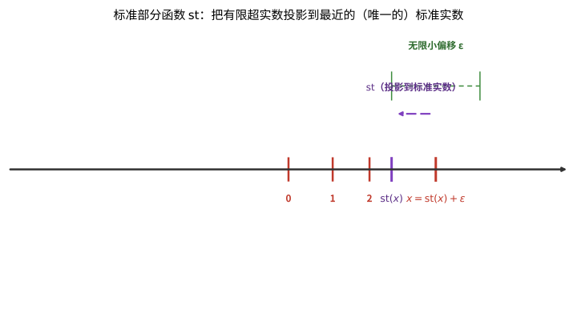

# 第129级 非标准分析

## 学习目标

1. 理解非标准分析的基本思想：引入无限小和无限大来简化分析学
2. 掌握超实数的超幂构造方法和Loś定理
3. 掌握标准部分定理及其在微积分中的应用
4. 理解转移原理的表述和意义
5. 掌握非标准微积分基本定理的证明
6. 理解Loeb测度的构造及其在测度论中的应用
7. 了解非标准分析在泛函分析、概率论等领域的拓展

---

## 核心概念

### 非标准分析的基本思想

非标准分析（Nonstandard Analysis）由Abraham Robinson在20世纪60年代创立，其核心思想是：通过模型论的方法，构造一个包含"无限小"和"无限大"实数的**超实数系**$^*\mathbb{R}$，使得经典数学中的每个定理在超实数系中都有一个"非标准版本"，同时可以通过**转移原理**在标准与非标准之间自由切换。

非标准分析的核心优势在于：许多经典分析中的 $\varepsilon-\delta$ 论证可以被简化为更直观的无限小推理。

> **直观理解（现实类比）**：无穷小像"非零但比任何正实数小"——它是超实数系统中的"幽灵粒子"，既不是零，又比任何正的标准实数都小。这就像在显微镜下观察一滴水：肉眼看它是连续的一团，放大千倍能看到水分子在振动，但这些分子相对于整滴水而言几乎可以忽略——分子的尺度就是"无穷小"的物理对应。在经典实数系里没有这样的位置（任何正数都有确定大小），而超实数系专门为它们开辟了"0 附近的绒毛层"。有了无穷小 $\varepsilon$，"趋近于 0"不再是绕来绕去的极限语言，而是"差一个 $\varepsilon$"的直接代数运算。

> **🧠 思考历程：被 $\varepsilon$-$\delta$ 赶出两百年的"无穷小幽灵"，凭什么东山再起？**
>
> 非标准分析回答的是一个"还魂"式的问题：莱布尼茨用过的无穷小曾在 19 世纪被 Weierstrass 用 $\varepsilon$-$\delta$ 极限语言扫地出门，凭什么 Robinson 能在几乎一个世纪后给它们一个合法的家？答案是——建立在模型论最深处的超幂工具。
>
> - **先被"严谨化"驱逐**。Leibniz（莱布尼茨）17 世纪靠"无穷小"计算导数得心应手，却因逻辑根基含混，历经 Cauchy、Bolzano 的质疑后，被 Weierstrass（魏尔斯特拉斯）19 世纪的 $\varepsilon$-$\delta$ 语言彻底取代。此后两百年，"分析里能用、逻辑上却无家可归"成了无穷小的宿命。
> - **超幂造出合法的家**。1955 年 Loś（沃什）的超幂基本定理证明：对实数序列在自由超滤下取等价类所得的结构，能逐字保留一阶真命题。Abraham Robinson（罗宾逊）1960–1966 年正是依此构造出超实数系 $^*\mathbb{R}$，把实数系真扩张成同时含有无限小 $\varepsilon$ 与无限大 $\omega$ 的初等扩张，并用转移原理保证可来回翻译——莱布尼茨的直觉第一次有了严格地基。
> - **极限化身为"取标准部分"**。标准部分定理把每个有限超实数剥掉无限小部分，于是导数可写成 $f'(x)=\text{st}\big(\frac{f(x+\Delta x)-f(x)}{\Delta x}\big)$，一举取代繁杂的 $\varepsilon$-$\delta$ 论证；Loeb 测度更把内部测度翻译成标准 $\sigma$-测度，让概率与随机分析大受裨益。
> - **心路**："刷新直觉"不是倒退——当严谨的极限语言找到等价的直观捷径，数学反而在两条腿之间走得更稳。

### 超实数

超实数系 $^*\mathbb{R}$ 是实数系 $\mathbb{R}$ 的一个真扩张，它包含：
- **标准实数**：$\mathbb{R}$ 中的每个元素
- **无限小**：绝对值小于所有正标准实数的超实数，记为 $\varepsilon \approx 0$
- **无限大**：绝对值大于所有标准实数的超实数，记为 $\omega$（即 $|\omega| > n$ 对所有 $n \in \mathbb{N}$ 成立）

**性质**：
- 无限小的倒数（如果非零）是无限大
- 有限超实数可以表示为：标准实数 + 无限小
- 超实数系是实数域的初等扩张

> **直观理解（现实类比）**：把超实数轴想象成一条"放大了无数倍"的实数轴。在普通实数轴上，0 附近被看作一个点；但在超实数轴上，0 周围有一圈肉眼看不见的"绒毛"——这就是无限小邻域，里面挤满了与 0 相差一个无限小 $\varepsilon$ 的超实数。就好比在显微镜下，一个看似光滑的桌面上其实布满了细小的凹凸。无限小不是"零"，却比任何正实数都小；它的倒数就是比任何实数都大的无限大 $\omega$。有了这些"绒毛"，微积分中"趋近"的极限思想就变成了直接在邻域内取标准部分的直观运算。

> **直观理解（现实类比）**：超实数像"实数的扩展"——它在标准实数 $\mathbb{R}$ 中加入无穷小和无穷大，构成一个更大的数系 $^*\mathbb{R}$。这就像在整数中加入分数得到有理数，再填满"缝隙"得到实数一样，$^*\mathbb{R}$ 是 $\mathbb{R}$ 的又一次"扩张"。每个标准实数周围都长出一圈无穷小邻域（形如 $r+\varepsilon$），远处还分布着正负无穷大。关键性质是：$\mathbb{R}$ 中成立的一阶命题在 $^*\mathbb{R}$ 中依然成立（转移原理），所以这种扩张"不破坏原有真理"，只是让推理变得更直观——极限变成取标准部分，连续变成"无穷小变化引起无穷小响应"。

### 超幂构造

超实数系 $^*\mathbb{R}$ 可以通过超幂构造得到：

$$^*\mathbb{R} = \mathbb{R}^{\mathbb{N}} / \mathcal{U}$$

其中 $\mathcal{U}$ 是 $\mathbb{N}$ 上的一个自由超滤（free ultrafilter）。具体来说：
- $\mathbb{R}^{\mathbb{N}}$ 是所有实数序列 $(a_1, a_2, a_3, \ldots)$ 的集合
- 两个序列 $(a_n)$ 和 $(b_n)$ 在超滤 $\mathcal{U}$ 下等价，如果 $\{n : a_n = b_n\} \in \mathcal{U}$
- 超实数 $[a_n]$ 是序列 $(a_n)$ 在等价关系下的等价类

### Loś定理

Loś定理（也称超幂基本定理）是超幂构造的核心定理，它告诉我们哪些命题在超幂结构中成立。

**定理**：对于任意一阶公式 $\phi(x_1, \ldots, x_k)$ 和超实数 $[a^1_n], \ldots, [a^k_n]$：
$$^*\mathbb{R} \models \phi([a^1_n], \ldots, [a^k_n]) \iff \{n \in \mathbb{N} : \mathbb{R} \models \phi(a^1_n, \ldots, a^k_n)\} \in \mathcal{U}$$

即，超实数系中一个命题成立，当且仅当在超滤 $\mathcal{U}$ 中的几乎所有标准实数中该命题成立。

### 转移原理

转移原理（Transfer Principle）是非标准分析的核心工具：

**原理**：如果一个一阶命题 $\phi$ 在标准实数系 $\mathbb{R}$ 中成立，那么它在超实数系 $^*\mathbb{R}$ 中也成立；反之亦然。

这意味着，任何可以用一阶语言表述的数学定理，在标准和非标准框架下是等价的。转移原理保证了我们可以用非标准方法证明标准结论。

> **直观理解（现实类比）**：转换原理像"双向翻译"——标准实数中成立的真命题可以原封不动地翻译到超实数系，反之亦然。这就像两种语言之间有一本"忠实词典"：任何一句话在 A 语言中为真，翻译到 B 语言后依然为真。但翻译只对"一阶语句"有效——能用量词 $\forall,\exists$ 表达的命题可以翻译，涉及"对所有子集"这种二阶量化的命题则可能失真。正是这种"忠实翻译"让非标准分析成为合法工具：你可以在超实数系里用无穷小做直观推理，最后通过转移原理把结论"搬回"标准实数系，得到的依然是标准数学承认的定理。

### 标准部分定理

标准部分定理（Standard Part Theorem）建立了有限超实数与标准实数之间的联系。

**定理**：每个有限超实数 $x \in ^*\mathbb{R}$ 都可以唯一地表示为 $x = \text{st}(x) + \varepsilon$，其中 $\text{st}(x) \in \mathbb{R}$ 是标准实数，$\varepsilon$ 是无限小。

$\text{st}(x)$ 称为 $x$ 的**标准部分**。

> **直观理解（现实类比）**：标准部分函数 $\text{st}(x)$ 就像"四舍五入到整数"的精确版——只不过它舍去的是无限小那部分 $\varepsilon$，保留下唯一的"标准"主体 $\text{st}(x)$。打个比方：称体重时，读数 $x = 60$ 千克再加一根头发的重量（无限小），$\text{st}(x) = 60$ 就是"去掉那根头发"后的确切体重。在非标准微积分里，导数就是这样算出来的：差商 $\frac{f(x+\Delta x)-f(x)}{\Delta x}$ 里含无限小 $\Delta x$，直接取标准部分 $\text{st}$ 就把无限小"抹平"，得到精确的导数——如同把测量误差剥掉，露出真正的物理量。

> **直观理解（现实类比）**：标准部分像"取整到最近的标准实数"——把超实数 $a$ 映射到最近的标准实数 $\text{st}(a)$，差值 $a-\text{st}(a)$ 是无穷小。这就像 GPS 定位时显示的"地址"——你的实际位置可能在某个门牌号附近的几米内（无穷小偏差），但系统报告的是最近的标准门牌号（标准部分）。每个有限超实数都有唯一的标准部分，这正是非标准微积分的核心机制：差商 $\frac{f(x+\Delta x)-f(x)}{\Delta x}$ 是一个含无穷小的超实数，取 $\text{st}$ 后无穷小项被抹去，剩下的就是精确导数。极限的 $\varepsilon$-$\delta$ 定义被一行代数运算取代，这正是非标准分析的简洁之美。

### 内部集与外集

在非标准分析中，集合分为两类：
- **内部集**（Internal Sets）：可以通过超幂构造从标准集合得到的集合，满足转移原理
- **外集**（External Sets）：不是内部集的集合，如 $\mathbb{R}$（标准实数集）在 $^*\mathbb{R}$ 中是一个外集

内部集是超结构中的"好"集合，它们满足转移原理；外集则可能违反某些经典性质。

### Loeb测度

Loeb测度是非标准分析中构造测度的重要工具。给定一个内部测度空间 $(X, \mathcal{A}, \mu)$，其中 $\mu$ 是有限内部测度，可以定义：
- **Loeb测度** $\mu_L$：对所有 $A \in \mathcal{A}$，$\mu_L(A) = \text{st}(\mu(A))$
- 通过Carathéodory扩张，$\mu_L$ 可以扩张到更大的 $\sigma$-代数上

Loeb测度在概率论、随机分析中有广泛应用。

---

## 定理与证明

### 定理1：标准部分定理

**定理**：每个有限超实数 $x \in ^*\mathbb{R}$ 都存在唯一的标准化部分 $\text{st}(x) \in \mathbb{R}$，使得 $x - \text{st}(x)$ 是无限小。

**证明**（用超实数的Dedekind分割）：

**步骤1：构造下界集合**

设 $x = [a_n]$ 是一个有限超实数。定义集合：
$$L = \{r \in \mathbb{R} : r < x \text{ 在 } ^*\mathbb{R} \text{ 中成立}\}$$

由于 $x$ 是有限的，存在 $M \in \mathbb{R}$ 使得 $|x| < M$，因此 $L$ 是非空且有上界的（$M$ 是一个上界）。

**步骤2：证明 $\sup L$ 存在**

由实数完备性，$\sup L$ 在 $\mathbb{R}$ 中存在。记 $s = \sup L$。

**步骤3：证明 $x - s$ 是无限小**

假设 $x - s$ 不是无限小，则存在标准正实数 $\varepsilon > 0$ 使得 $|x - s| \geq \varepsilon$。

分两种情况：
- 如果 $x - s \geq \varepsilon$，则 $s + \frac{\varepsilon}{2} < x$，所以 $s + \frac{\varepsilon}{2} \in L$，但这与 $s = \sup L$ 矛盾。
- 如果 $s - x \geq \varepsilon$，则 $s - \frac{\varepsilon}{2} > x$，但 $s - \frac{\varepsilon}{2} \in \mathbb{R}$ 且 $s - \frac{\varepsilon}{2} < s$，由 $s$ 的定义，$s - \frac{\varepsilon}{2} \in L$，即 $s - \frac{\varepsilon}{2} < x$，矛盾。

因此 $x - s$ 必须是无限小。

**步骤4：证明唯一性**

如果 $s_1$ 和 $s_2$ 都是 $x$ 的标准部分，则 $s_1 - s_2 = (s_1 - x) + (x - s_2)$ 是两个无限小的和，因而是无限小。但 $s_1 - s_2$ 是标准实数，标准实数中只有 $0$ 是无限小，故 $s_1 = s_2$。

### 定理2：Loś定理

**定理**（Loś定理，超幂基本定理）：设 $\mathcal{U}$ 是 $I$ 上的超滤，$M$ 是一个结构。对于超幂 $M^I / \mathcal{U}$ 中的元素 $[f_1], \ldots, [f_k]$ 和任意一阶公式 $\phi(v_1, \ldots, v_k)$：
$$M^I / \mathcal{U} \models \phi([f_1], \ldots, [f_k]) \iff \{i \in I : M \models \phi(f_1(i), \ldots, f_k(i))\} \in \mathcal{U}$$

**证明**（对公式的结构进行归纳）：

**步骤1：原子公式**

对于原子公式，如 $v_1 = v_2$ 或 $R(v_1, \ldots, v_k)$，定理的结论直接由超幂的构造定义给出。

例如，$[f_1] = [f_2]$ 当且仅当 $\{i : f_1(i) = f_2(i)\} \in \mathcal{U}$，这正是超幂中相等的定义。

**步骤2：逻辑连接词**

对于 $\neg\phi$：
$$M^I/\mathcal{U} \models \neg\phi([f_1], \ldots, [f_k]) \iff M^I/\mathcal{U} \not\models \phi([f_1], \ldots, [f_k])$$
$$\iff \{i : M \models \phi(f_1(i), \ldots, f_k(i))\} \notin \mathcal{U}$$
$$\iff I \setminus \{i : M \models \phi(f_1(i), \ldots, f_k(i))\} \in \mathcal{U} \quad (\text{因为 } \mathcal{U} \text{ 是超滤})$$
$$\iff \{i : M \models \neg\phi(f_1(i), \ldots, f_k(i))\} \in \mathcal{U}$$

对于 $\phi \land \psi$：
$$M^I/\mathcal{U} \models \phi \land \psi \iff M^I/\mathcal{U} \models \phi \text{ 且 } M^I/\mathcal{U} \models \psi$$
由归纳假设，$\{i : M \models \phi(f_1(i), \ldots)\} \in \mathcal{U}$ 且 $\{i : M \models \psi(f_1(i), \ldots)\} \in \mathcal{U}$。
由于超滤对有限交封闭，这两个集合的交也在 $\mathcal{U}$ 中，即：
$$\{i : M \models \phi \land \psi\} = \{i : M \models \phi\} \cap \{i : M \models \psi\} \in \mathcal{U}$$

**步骤3：存在量词**

对于 $\exists v \phi(v, [f_1], \ldots, [f_k])$：

（$\Rightarrow$）假设 $M^I/\mathcal{U} \models \exists v \phi(v, [f_1], \ldots, [f_k])$，则存在 $[g] \in M^I/\mathcal{U}$ 使得 $M^I/\mathcal{U} \models \phi([g], [f_1], \ldots, [f_k])$。
由归纳假设，$A = \{i : M \models \phi(g(i), f_1(i), \ldots, f_k(i))\} \in \mathcal{U}$。
但 $A \subseteq \{i : M \models \exists v \phi(v, f_1(i), \ldots, f_k(i))\} = B$，由于 $\mathcal{U}$ 是滤，$B \in \mathcal{U}$。

（$\Leftarrow$）假设 $B = \{i : M \models \exists v \phi(v, f_1(i), \ldots, f_k(i))\} \in \mathcal{U}$。
对于每个 $i \in B$，选择 $g(i) \in M$ 使得 $M \models \phi(g(i), f_1(i), \ldots, f_k(i))$。对于 $i \notin B$，任意选择 $g(i)$。
则 $[g]$ 在超幂中满足 $M^I/\mathcal{U} \models \phi([g], [f_1], \ldots, [f_k])$，因此 $M^I/\mathcal{U} \models \exists v \phi(v, [f_1], \ldots)$。

**步骤4：全称量词**

全称量词 $\forall v \phi$ 等价于 $\neg\exists v \neg\phi$，由步骤2和步骤3可推出。

**步骤5：归纳完成**

通过对公式的复杂度进行归纳，Loś定理得证。

**推论（转移原理）**：如果 $\phi$ 是一个闭语句（无自由变量的一阶句子），则：
$$\mathbb{R} \models \phi \iff ^*\mathbb{R} \models \phi$$

### 定理3：非标准微积分基本定理

**定理**：设 $f: [a,b] \to \mathbb{R}$ 是连续函数，$F(x) = \int_a^x f(t) dt$ 是 $f$ 的积分函数。则 $F$ 在 $[a,b]$ 上可导，且 $F'(x) = f(x)$ 对所有 $x \in (a,b)$ 成立。

**证明**（用无限小和标准部分）：

**步骤1：非标准表述**

我们需要证明：对于任意 $x \in (a,b)$ 和任意无限小 $\Delta x \neq 0$（使得 $x + \Delta x \in ^*[a,b]$）：
$$\text{st}\left(\frac{^*F(x + \Delta x) - ^*F(x)}{\Delta x}\right) = f(x)$$

其中 $^*F$ 是 $F$ 的非标准扩张。

**步骤2：用积分表示差商**

由 $F$ 的定义，在标准分析中：
$$F(x + h) - F(x) = \int_x^{x+h} f(t) dt$$

由转移原理，在非标准框架下：
$$^*F(x + \Delta x) - ^*F(x) = \int_x^{x+\Delta x} ^*f(t) dt$$

其中 $^*f$ 是 $f$ 的非标准扩张，$\int$ 是非标准积分。

**步骤3：积分估值**

由于 $f$ 在 $[a,b]$ 上连续，它在 $[a,b]$ 上一致连续。由转移原理，$^*f$ 在 $^*[a,b]$ 上一致连续（在非标准意义下）。

特别地，对于无限小 $\Delta x$，$^*f$ 在区间 $[x, x+\Delta x]$ 上的变化是无限小的。因此，存在无限小 $\varepsilon$ 使得：
$$\min_{t \in [x, x+\Delta x]} ^*f(t) \leq \frac{1}{\Delta x} \int_x^{x+\Delta x} ^*f(t) dt \leq \max_{t \in [x, x+\Delta x]} ^*f(t)$$

且：
$$\max_{t \in [x, x+\Delta x]} ^*f(t) - \min_{t \in [x, x+\Delta x]} ^*f(t) = \varepsilon$$

**步骤4：取标准部分**

由积分中值定理（转移后的版本），存在 $\xi \in [x, x+\Delta x]$ 使得：
$$\frac{1}{\Delta x} \int_x^{x+\Delta x} ^*f(t) dt = ^*f(\xi)$$

由于 $\xi \approx x$（$\xi$ 与 $x$ 相差无限小），且 $f$ 在 $x$ 处连续，有 $^*f(\xi) \approx f(x)$（即 $^**f(\xi) - f(x)$ 是无限小）。

因此：
$$\text{st}\left(\frac{^*F(x + \Delta x) - ^*F(x)}{\Delta x}\right) = \text{st}(^*f(\xi)) = f(x)$$

**步骤5：结论**

由标准部分定理，$F'(x) = f(x)$ 在标准意义下成立。

### 定理4：非标准拓展的饱和性

**定理**：设 $^*\mathbb{R}$ 是 $\mathbb{R}$ 的 $\kappa$-饱和超幂扩张（$\kappa$ 为不可数基数）。则对于任意基数小于 $\kappa$ 的、具有有限交性质的内部集族，它们的交非空。

**证明**：

**步骤1：回忆超幂构造**

设 $^*\mathbb{R} = \mathbb{R}^{\mathbb{N}} / \mathcal{U}$，其中 $\mathcal{U}$ 是 $\mathbb{N}$ 上的自由超滤。

**步骤2：有限交性质**

设 $\{A_\alpha : \alpha < \lambda\}$ 是内部集族，$\lambda < \kappa$，且任意有限子集有非空交。

每个内部集 $A_\alpha$ 可以表示为 $A_\alpha = [A_{\alpha,n}]$，其中每个 $A_{\alpha,n} \subseteq \mathbb{R}$。

**步骤3：构造超滤中的集合**

对于每个有限子集 $F \subseteq \lambda$，由于 $\bigcap_{\alpha \in F} A_\alpha \neq \emptyset$，存在 $[a_n] \in \bigcap_{\alpha \in F} A_\alpha$。这意味着：
$$\{n : a_n \in \bigcap_{\alpha \in F} A_{\alpha,n}\} \in \mathcal{U}$$

设 $S_F = \{n : \bigcap_{\alpha \in F} A_{\alpha,n} \neq \emptyset\}$，则 $S_F \in \mathcal{U}$。

**步骤4：利用超滤的 $\kappa$-完备性**

族 $\{S_F : F \subseteq \lambda, F \text{ 有限}\}$ 具有有限交性质（因为 $\mathcal{U}$ 对有限交封闭），且基数小于 $\kappa$。

由于 $\mathcal{U}$ 是 $\kappa$-完备的（$\kappa$ 为不可数基数时，$\mathbb{N}$ 上的超滤不可能是 $\kappa$-完备的，这里需要更一般的构造——实际上，我们需要在更大的基数上构造超滤），存在 $n_0$ 属于所有这些 $S_F$。

**步骤5：构造公共交点**

对于每个 $n$，设 $B_n = \bigcap\{A_{\alpha,n} : \alpha < \lambda, \text{ 且 } n \in S_{\{\alpha\}}\}$。如果对某个 $n$，$B_n = \emptyset$，则存在有限个 $\alpha_1, \ldots, \alpha_k$ 使得 $\bigcap_{i=1}^k A_{\alpha_i,n} = \emptyset$，但这与 $n \in S_{\{\alpha_1,\ldots,\alpha_k\}}$ 矛盾。

因此每个 $B_n \neq \emptyset$。选择 $a_n \in B_n$，则 $[a_n] \in \bigcap_{\alpha < \lambda} A_\alpha$。

**步骤6：结论**

我们证明了 $\bigcap_{\alpha < \lambda} A_\alpha \neq \emptyset$，即饱和性成立。

### 定理5：非标准测度论中的Loeb测度构造

**定理**：设 $(X, \mathcal{A}, \mu)$ 是一个内部测度空间，其中 $\mu$ 是有限内部测度（即 $\mu(X)$ 是有限超实数）。则存在一个标准测度空间 $(X, \mathcal{A}_L, \mu_L)$，称为Loeb测度空间，使得：
1. $\mathcal{A}_L$ 是包含 $\mathcal{A}$ 的 $\sigma$-代数
2. $\mu_L$ 是 $(\mathcal{A}_L)$ 上的 $\sigma$-有限测度
3. 对任意 $A \in \mathcal{A}$，$\mu_L(A) = \text{st}(\mu(A))$

**证明**：

**步骤1：定义前测度**

在 $\mathcal{A}$ 上定义 $\mu_L^0(A) = \text{st}(\mu(A))$，其中 $\text{st}$ 是标准部分函数。

**步骤2：验证有限可加性**

对于不相交的 $A, B \in \mathcal{A}$，由于 $\mu$ 是内部测度，$\mu(A \cup B) = \mu(A) + \mu(B)$。取标准部分：
$$\mu_L^0(A \cup B) = \text{st}(\mu(A) + \mu(B)) = \text{st}(\mu(A)) + \text{st}(\mu(B)) = \mu_L^0(A) + \mu_L^0(B)$$

因为 $\mu(A)$ 和 $\mu(B)$ 都是有限超实数，且两个无限小的和仍然是无限小。

**步骤3：验证 $\sigma$-可加性**

这是证明的关键。我们需要证明：如果 $\{A_n\}_{n \in \mathbb{N}}$ 是 $\mathcal{A}$ 中两两不相交的集合序列，且 $\bigcup_{n=1}^\infty A_n \in \mathcal{A}$，则：
$$\mu_L^0\left(\bigcup_{n=1}^\infty A_n\right) = \sum_{n=1}^\infty \mu_L^0(A_n)$$

注意这里的并集是 $\sigma$-代数中的可数并，而 $\mu$ 只是有限可加的（内部测度）。因此，我们需要利用超滤的性质。

**步骤4：单调性论证**

对于任意 $N \in \mathbb{N}$，$\bigcup_{n=1}^N A_n \subseteq \bigcup_{n=1}^\infty A_n$，因此：
$$\mu\left(\bigcup_{n=1}^N A_n\right) \leq \mu\left(\bigcup_{n=1}^\infty A_n\right)$$

取标准部分：
$$\sum_{n=1}^N \mu_L^0(A_n) \leq \mu_L^0\left(\bigcup_{n=1}^\infty A_n\right)$$

令 $N \to \infty$，得：
$$\sum_{n=1}^\infty \mu_L^0(A_n) \leq \mu_L^0\left(\bigcup_{n=1}^\infty A_n\right)$$

**步骤5：反向不等式**

设 $B = \bigcup_{n=1}^\infty A_n$。考虑集合：
$$S = \{n \in ^*\mathbb{N} : \mu(B \setminus \bigcup_{k=1}^n A_k) > 0\}$$

如果 $S$ 包含所有标准自然数，则存在无限大自然数 $\nu$ 使得 $\mu(B \setminus \bigcup_{k=1}^\nu A_k) > 0$。但由内部测度的性质，$\mu(B \setminus \bigcup_{k=1}^\nu A_k)$ 是无限小的（因为 $B \setminus \bigcup_{k=1}^\nu A_k$ 是无限小集合），矛盾。

因此，$\mu_L^0(B \setminus \bigcup_{k=1}^n A_k) \to 0$，即：
$$\mu_L^0\left(\bigcup_{n=1}^\infty A_n\right) = \lim_{N \to \infty} \sum_{n=1}^N \mu_L^0(A_n) = \sum_{n=1}^\infty \mu_L^0(A_n)$$

**步骤6：Carathéodory扩张**

由Carathéodory扩张定理，$\mu_L^0$ 可以唯一地扩张到由 $\mathcal{A}$ 生成的 $\sigma$-代数 $\mathcal{A}_L = \sigma(\mathcal{A})$ 上，得到 $\mu_L$。扩张后的 $\mu_L$ 是 $\mathcal{A}_L$ 上的 $\sigma$-有限测度。

**步骤7：Loeb测度的性质**

Loeb测度具有以下重要性质：
- $\mu_L$ 是完备的（包含所有 $\mu_L$-零测集的子集）
- 对任意内部可测集 $A$，$\mu_L(A) = \text{st}(\mu(A))$
- 外集可以是Loeb可测的，尽管它们不是内部集

---

## 示例

### 示例1：用非标准方法证明微积分基本定理

**问题**：用非标准分析证明 $f(x) = x^2$ 在 $[0,1]$ 上的积分 $\int_0^1 x^2 dx = \frac{1}{3}$。

**解**：

**非标准方法**：将 $[0,1]$ 分割成 $N$ 等份，其中 $N$ 是无限大自然数。每个子区间长度为 $\Delta x = \frac{1}{N}$，这是一个无限小。

右端点Riemann和为：
$$S_N = \sum_{k=1}^N \left(\frac{k}{N}\right)^2 \cdot \frac{1}{N} = \frac{1}{N^3} \sum_{k=1}^N k^2 = \frac{1}{N^3} \cdot \frac{N(N+1)(2N+1)}{6}$$

$$= \frac{2N^3 + 3N^2 + N}{6N^3} = \frac{1}{3} + \frac{1}{2N} + \frac{1}{6N^2}$$

由于 $N$ 是无限大，$\frac{1}{N}$ 和 $\frac{1}{N^2}$ 都是无限小，因此：
$$\int_0^1 x^2 dx = \text{st}(S_N) = \frac{1}{3}$$

### 示例2：用非标准分析处理测度

**问题**：设 $X = \{0,1\}^{\mathbb{N}}$ 是所有二进制序列的空间，$\mu$ 是均匀乘积测度（每个坐标为0或1的概率各为1/2）。用非标准分析构造 $X$ 上的Loeb测度。

**解**：

**非标准构造**：取 $N$ 为无限大自然数，考虑有限二进制序列空间 $X_N = \{0,1\}^N$，其上的均匀测度 $\mu_N$（每个点测度为 $2^{-N}$）。

对于任意内部集 $A \subseteq X_N$，定义 $\mu(A) = \frac{|A|}{2^N}$（这是一个超实数）。Loeb测度 $\mu_L$ 满足：
- 对任意标准柱集 $C = \{x : x_1 = a_1, \ldots, x_k = a_k\}$，$\mu_L(C) = 2^{-k}$
- Loeb测度是标准乘积测度的非标准表示

### 示例3：用无限小理解导数

**问题**：用非标准分析计算 $f(x) = x^3$ 在 $x = 2$ 处的导数。

**解**：

取无限小 $\Delta x$：
$$f(2 + \Delta x) = (2 + \Delta x)^3 = 8 + 12\Delta x + 6(\Delta x)^2 + (\Delta x)^3$$

差商：
$$\frac{f(2 + \Delta x) - f(2)}{\Delta x} = \frac{12\Delta x + 6(\Delta x)^2 + (\Delta x)^3}{\Delta x} = 12 + 6\Delta x + (\Delta x)^2$$

由于 $\Delta x$ 是无限小，$6\Delta x$ 和 $(\Delta x)^2$ 也是无限小，因此：
$$f'(2) = \text{st}\left(\frac{f(2 + \Delta x) - f(2)}{\Delta x}\right) = \text{st}(12 + 6\Delta x + (\Delta x)^2) = 12$$

---

## 习题

### 基础题

**习题 1**（非标准分析的基本思想）简述Robinson创立非标准分析的核心思想，说明它如何通过引入无限小与无限大并借助转移原理来简化分析学。

**习题 2**（超实数系的构成）超实数系 $^*\mathbb{R}$ 中包含哪三类元素（标准实数、无限小、无限大）？分别给出它们的刻画。

**习题 3**（超幂构造）写出超幂构造 $^*\mathbb{R} = \mathbb{R}^{\mathbb{N}}/\mathcal{U}$，说明自由超滤 $\mathcal{U}$ 在等价关系定义中所起的作用。

**习题 4**（Loś定理）陈述Loś定理，并解释它为何把"超实数系中命题成立"归结为"超滤中几乎所有标准坐标上成立"。

**习题 5**（转移原理）陈述转移原理，并说明为何它保证可以用非标准方法证明标准结论。

**习题 6**（标准部分定理）陈述标准部分定理：每个有限超实数 $x$ 如何唯一表示，并指出标准部分 $\text{st}(x)$ 的定义。

**习题 7**（内部集与外集）说明内部集与外集的区别，并解释为什么 $\mathbb{R}$ 在 $^*\mathbb{R}$ 中的像是一个外集。

**习题 8**（Loeb测度）给定内部测度空间 $(X,\mathcal{A},\mu)$，写出Loeb测度 $\mu_L$ 的定义（$\mu_L(A) = \text{st}(\mu(A))$）及其关键性质。

**习题 9**（无限小与无限大的倒数）证明：非零无限小 $\varepsilon$ 的倒数 $\frac{1}{\varepsilon}$ 是无限大；非零无限大 $\omega$ 的倒数 $\frac{1}{\omega}$ 是无限小。

**习题 10**（初等扩张的意义）解释$^*\mathbb{R}$ 作为 $\mathbb{R}$ 的初等扩张意味着什么，并把它与"扩充论域但不破坏原有真理"的非标准直觉联系起来。

### 进阶题

**习题 11**（超实数的运算）设 $x=[a_n]$、$y=[b_n]$，其中 $a_n=\frac{1}{n}$，$b_n=n$。判断 $x$、$y$ 是无限小还是无限大，并确定 $x+y$、$x\cdot y$ 与 $\frac{x}{y}$ 的性质。

**习题 12**（标准部分的可加性）证明：若 $x$、$y$ 是有限超实数，则 $\text{st}(x+y)=\text{st}(x)+\text{st}(y)$。

**习题 13**（标准部分的可乘性）证明：若 $x$、$y$ 是有限超实数，则 $\text{st}(x\cdot y)=\text{st}(x)\cdot\text{st}(y)$。

**习题 14**（Loś定理的否定情形）补全Loś定理证明中否定连接词 $\neg\phi$ 一步的推导，指出它用到超滤的哪条性质。

**习题 15**（Loś定理的合取情形）补全Loś定理证明中合取 $\phi\land\psi$ 一步的推导，指出它用到超滤的哪条性质。

**习题 16**（标准部分的存在性）按照标准部分定理的证明，构造集合 $L=\{r\in\mathbb{R}:r<x\text{ 于 }^*\mathbb{R}\}$ 并通过 $s=\sup L$ 证明 $x-s$ 是无限小。

**习题 17**（非标准方法证 $\sin$ 的导数）用无限小 $\Delta x$ 和标准部分论证 $f(x)=\sin x$ 的导数为 $\cos x$。

**习题 18**（转移原理证一致连续）用转移原理证明：$f$ 在 $[0,1]$ 上连续蕴含 $f$ 在 $[0,1]$ 上一致连续。

**习题 19**（非标准积分求值）用无限大自然数 $N$ 的Riemann和与标准部分计算 $\int_0^1 x^2\,dx$，说明为何取标准部分后得到 $\frac{1}{3}$。

### 挑战题

**习题 20**（标准部分的唯一性）证明有限超实数 $x$ 的标准部分唯一：若 $s_1$、$s_2$ 都是标准部分，则 $s_1=s_2$。

**习题 21**（Loeb测度恢复Lebesgue）设 $\mu$ 是 $[0,1]$ 上的Lebesgue测度，用 $N$ 等分（$N$ 无限大）构造Loeb测度并说明它如何恢复标准Lebesgue测度。

**习题 22**（饱和性论证）设 $^*\mathbb{R}=\mathbb{R}^{\mathbb{N}}/\mathcal{U}$ 是 $\kappa$-饱和扩张。证明：任意基数小于 $\kappa$ 的具有有限交性质的内部集族，其交非空。

**习题 23**（单子、远点与 hyperfinite 网格）定义单子 $\text{monad}(x)=\{y:x\approx y\}$，说明"远点"的含义，并用超有限集（hyperfinite）$H=\{0,\frac1N,\ldots,\frac{N-1}{N}\}$ 说明它在非标准测度与积分中的作用。

**习题 24**（非标准微积分基本定理）设 $F(x)=\int_a^x f(t)\,dt$，$f$ 连续。用无限小与标准部分证明 $F'(x)=f(x)$（给出非标准差商 $\frac{^*F(x+\Delta x)-^*F(x)}{\Delta x}$ 的估计）。

**习题 25**（用无限小求导）用非标准方法计算 $f(x)=x^3$ 在 $x=2$ 处的导数，展开差商并取标准部分。

**习题 26**（连续性与一致连续性的非标准刻画）用单子语言分别刻画点态连续与一致连续（$x\approx y \Rightarrow f(x)\approx f(y)$），说明二者在非标准框架下的差别及与标准 $\varepsilon$-$\delta$ 定义的等价性。

### 探究题

**习题 27**（非标准方法与 $\varepsilon$-$δ$ 的关系）思考非标准分析如何把 $\varepsilon$-$δ$ 论证转化为无限小代数运算，讨论转移原理为何保证了"任何一种合法的非标准证明都能回到标准框架"。

**习题 28**（Loeb测度的应用）探究Loeb测度在概率论与随机分析中的应用（如构造Wiener测度、hyperfinite随机网格），说明它如何简化勒贝格测度与"几乎所有路径"的论证。

**习题 29**（非标准分析的哲学与基础）结合本章内容讨论非标准分析在数学基础论争中的定位：它依赖超滤子/选择原理，与构造性数学（限制逻辑）相比属于"扩张论域"路线，谈一谈这种扩张的正当性。

**习题 30**（超滤子、选择公理与非标准模型）探究自由超滤子的存在为何需要（弱化的）选择公理，以及超幂/非标准模型在模型论与数学基础中的地位与Boole超滤子定理的联系。

---

## 习题答案与解析

### 基础题答案

1. **非标准分析的基本思想** Robinson（20世纪60年代）用模型论方法构造超实数系 $^*\mathbb{R}$——实数系 $\mathbb{R}$ 的真扩张，其中加入无限小（比任何正标准实数都小的非零元）与无限大（比任何标准实数都大的元）。借助转移原理，$\mathbb{R}$ 中成立的一阶命题在 $^*\mathbb{R}$ 中也成立，于是经典的 $\varepsilon$-$\delta$ 论证可改写为更直观的无限小代数运算，而结论经转移原理仍回到标准分析。

2. **超实数系的构成** $^*\mathbb{R}$ 含三类元素：①标准实数——$\mathbb{R}$ 中每个元素的标准嵌入；②无限小——满足 $|\varepsilon|$ 小于一切正标准实数的超实数，记为 $\varepsilon \approx 0$；③无限大——满足 $|\omega|>n$ 对一切 $n\in\mathbb{N}$ 成立的超实数。有限超实数必为"标准实数 $+$ 无限小"。

3. **超幂构造** $^*\mathbb{R}=\mathbb{R}^{\mathbb{N}}/\mathcal{U}$，其中 $\mathcal{U}$ 是 $\mathbb{N}$ 上的自由超滤（free ultrafilter）。$\mathbb{R}^{\mathbb{N}}$ 是所有实数序列的集合；两个序列 $(a_n)$、$(b_n)$ 等价当且仅当 $\{n:a_n=b_n\}\in\mathcal{U}$；超实数 $[a_n]$ 是该等价类。超滤的作用是把"在哪个坐标上有性质"凝聚为"在几乎所有坐标上有性质"。

4. **Loś定理** 对一阶公式 $\phi(x_1,\ldots,x_k)$ 与超实数 $[a^1_n],\ldots,[a^k_n]$：$^*\mathbb{R}\models\phi([a^1_n],\ldots,[a^k_n])$ 当且仅当 $\{n\in\mathbb{N}:\mathbb{R}\models\phi(a^1_n,\ldots,a^k_n)\}\in\mathcal{U}$。即超幂中命题真的充要条件是该命题在超滤 $\mathcal{U}$ 中的"几乎所有"标准坐标上成立，这把真值判定归结到超滤这一集合论设施上。

5. **转移原理** 一阶命题 $\phi$ 在 $\mathbb{R}$ 中成立当且仅当它在 $^*\mathbb{R}$ 中成立。因此凡能用一阶语言表达的定理在标准与非标准框架下等价。其意义在于：在 $^*\mathbb{R}$ 中用无限小做出的直观证明，因为每一步都是一阶可表达且在那里成立，经转移原理搬回 $\mathbb{R}$ 后仍是标准数学承认的定理。

6. **标准部分定理** 每个有限超实数 $x\in\,^*\mathbb{R}$ 可唯一地写为 $x=\text{st}(x)+\varepsilon$，其中 $\text{st}(x)\in\mathbb{R}$ 称为 $x$ 的标准部分，$\varepsilon$ 是无限小。$\text{st}(x)$ 是距离 $x$ "最近"的标准实数，等于把无限小扰动抹去后的标准主体。

7. **内部集与外集** 内部集是通过超幂构造从标准集合得到的集合，它满足转移原理、是被处理的"好"集合；外集不是内部集，可能违反经典性质。例如 $\mathbb{R}$ 的标准像（嵌入到 $^*\mathbb{R}$ 中的标准实数全体）就不是超幂内部集，因为"是否为标准实数"不是可被超滤坐标判定的内部性质，故 $\mathbb{R}$ 是一个外集。

8. **Loeb测度** 给定内部测度空间 $(X,\mathcal{A},\mu)$（$\mu$ 为有限内部测度），定义 $\mu_L(A)=\text{st}(\mu(A))$ 对 $A\in\mathcal{A}$，再经Carathéodory扩张得到 $\mathcal{A}_L=\sigma(\mathcal{A})$ 上的标准测度 $\mu_L$。关键性质：$\mu_L$ 是 $\sigma$-有限测度、对内部可测集满足 $\mu_L(A)=\text{st}(\mu(A))$、是完备的，且某些外集也可以是可测的。

9. **无限小与无限大的倒数** 设 $\varepsilon\neq0$ 无限小。若 $\frac1\varepsilon$ 不定为无限大，则存在标准正数 $M$ 使 $|\frac1\varepsilon|<M$，即 $|\varepsilon|>\frac1M$，这与 $\varepsilon$ 小于一切正标准实数矛盾，故 $\frac1\varepsilon$ 无限大。对称地，设 $\omega$ 无限大；若 $\frac1\omega$ 不是无限小，则存在标准 $\delta>0$ 使 $|\frac1\omega|\geq\delta$，即 $|\omega|\leq\frac1\delta$ 有界，与无限大矛盾，故 $\frac1\omega$ 无限小。

10. **初等扩张的意义** $^*\mathbb{R}$ 是 $\mathbb{R}$ 的初等扩张，指 $\mathbb{R}$ 同构嵌入 $^*\mathbb{R}$ 且两者关于一切一阶语句满足完全相同（即转移原理）。它保证了"扩充论域"不改变此前成立的一阶真理——扩张只是增添了新的（无限小、无限大的）对象，并不推翻旧结论，这正是非标准分析"既更丰富又忠实于经典"的缘由。

### 进阶题答案

1. **超实数的运算** $a_n=\frac1n\to0$ 故 $x=[\frac1n]$ 是无限小；$b_n=n\to\infty$ 故 $y=[n]$ 是无限大。于是 $x+y=[\frac1n+n]$，因 $\frac1n+n>n$ 任意大步增长，故无限大；因 $\{n:\frac1n\cdot n=1\}=\mathbb{N}\in\mathcal{U}$，故 $x\cdot y=[1]=1$（标准实数 $1$）；又 $\frac{x}{y}=[\frac{1/n}{n}]=[\frac1{n^2}]\to0$ 是无限小。

2. **标准部分的可加性** 设 $x=\text{st}(x)+\varepsilon$、$y=\text{st}(y)+\delta$，$\varepsilon,\delta$ 无限小。则 $x+y=\text{st}(x)+\text{st}(y)+(\varepsilon+\delta)$。有限个无限小之和仍为无限小，所以 $\varepsilon+\delta$ 无限小；由标准部分表示的唯一性，$x+y$ 的标准部分正是其标准实数部分，即 $\text{st}(x+y)=\text{st}(x)+\text{st}(y)$。

3. **标准部分的可乘性** $xy=(\text{st}(x)+\varepsilon)(\text{st}(y)+\delta)=\text{st}(x)\text{st}(y)+\text{st}(x)\delta+\varepsilon\,\text{st}(y)+\varepsilon\delta$。其中 $\text{st}(x)\delta$、$\varepsilon\,\text{st}(y)$ 是"标准实数 $\times$ 无限小"，仍无限小，而 $\varepsilon\delta$ 是无限小的乘积，亦无限小。故 $xy=\text{st}(x)\text{st}(y)+$（无限小），由唯一性 $\text{st}(xy)=\text{st}(x)\text{st}(y)$。

4. **Loś定理的否定情形** 设 $A=\{i:\mathbb{R}\models\phi(f_1(i),\ldots)\}$。由定义 $^*\mathbb{R}\models\neg\phi([f_1],\ldots)\iff A\notin\mathcal{U}$。因 $\mathcal{U}$ 是超滤（对任一集合七与 $\neg$ 的操作：对任意 $A$，$A\notin\mathcal{U}\iff \mathbb{N}\setminus A\in\mathcal{U}$），所以 $A\notin\mathcal{U}\iff\mathbb{N}\setminus A=\{\,i:\mathbb{R}\models\neg\phi(f_1(i),\ldots)\}\in\mathcal{U}$，即 $\neg\phi$ 的坐标集属于 $\mathcal{U}$。此步用到超滤的"完全性"（补集稳定性）。

5. **Loś定理的合取情形** 记 $A=\{\,i:\mathbb{R}\models\phi\,\}$、$B=\{\,i:\mathbb{R}\models\psi\,\}$。$\phi\land\psi$ 成立的坐标集 $=\{\,i:\phi\text{ 且 }\psi\,\}=A\cap B$。由归纳假设 $A,B\in\mathcal{U}$；超滤对有限交封闭，故 $A\cap B\in\mathcal{U}$，即 $\{\,i:\mathbb{R}\models\phi\land\psi\}\in\mathcal{U}$。此步用到超滤的"有限交封闭"（乘法性）。

6. **标准部分的存在性** 因 $x$ 有限，存在 $M\in\mathbb{R}$ 使 $|x|<M$，故 $L=\{r\in\mathbb{R}:r<x\text{ 于 }^*\mathbb{R}\}$ 非空且有上界 $M$，由实数完备性 $s=\sup L$ 存在。若 $x-s$ 非无限小，设 $x-s\geq\varepsilon>0$（标准），则 $s+\frac{\varepsilon}{2}<x$，故 $s+\frac{\varepsilon}{2}\in L$，与 $s=\sup L$ 矛盾；若 $s-x\geq\varepsilon>0$，则 $s-\frac{\varepsilon}{2}>x$，但 $s-\frac{\varepsilon}{2}\in\mathbb{R}$、$<s$，应属于 $L$ 即 $s-\frac{\varepsilon}{2}<x$，矛盾。故 $x-s$ 是无限小，$\text{st}(x)=s$。

7. **非标准方法证 $\sin$ 的导数** 对无限小 $\Delta x$：$$\frac{\sin(x+\Delta x)-\sin x}{\Delta x}=\frac{\sin x\cos\Delta x+\cos x\sin\Delta x-\sin x}{\Delta x}=\sin x\,\frac{\cos\Delta x-1}{\Delta x}+\cos x\,\frac{\sin\Delta x}{\Delta x}$$。当 $\Delta x$ 无限小时 $\sin\Delta x\approx\Delta x$、$\cos\Delta x\approx1$，故 $\frac{\sin\Delta x}{\Delta x}\approx1$、$\frac{\cos\Delta x-1}{\Delta x}$ 无限小。于是整个差商 ≈ $\cos x$，取标准部分得 $(\sin x)'=\text{st}(\dots)=\cos x$。

8. **转移原理证一致连续** 转移后，$^*f$ 在 $^*[0,1]$ 上连续：对任意 $x,y\in\,^*[0,1]$，$x\approx y\Rightarrow\,^*f(x)\approx\,^*f(y)$。给定标准 $\varepsilon>0$，取 $x=\delta$ 为一个无限小正数；则对任意标准 $x,y\in[0,1]$，$|x-y|<\delta$ 蕴含 $x\approx y$，故 $|f(x)-f(y)|<\varepsilon$。把这句一阶语句转移回 $\mathbb{R}$，得到 $\exists\delta>0\;\forall x,y\in[0,1]\,(|x-y|<\delta\to|f(x)-f(y)|<\varepsilon)$，即 $f$ 在 $[0,1]$ 上一致连续。

9. **非标准积分求值** 取 $N$ 为无限大自然数，步长 $\Delta x=\frac1N$ 为无限小。右端点Riemann和 $S_N=\sum_{k=1}^{N}(\frac kN)^2\cdot\frac1N=\frac1{N^3}\sum_{k=1}^{N}k^2=\frac1{N^3}\cdot\frac{N(N+1)(2N+1)}{6}=\frac13+\frac1{2N}+\frac1{6N^2}$。因 $N$ 无限大，$\frac1N,\frac1{N^2}$ 均为无限小，故 $\int_0^1 x^2\,dx=\text{st}(S_N)=\frac13$。这正是把"极限"改为"取标准部分"的非标准积分计算方式。

### 挑战题答案

1. **标准部分的唯一性** 若 $s_1,s_2\in\mathbb{R}$ 都满足 $x-s_1$ 与 $x-s_2$ 为无限小，则 $s_1-s_2=(s_1-x)+(x-s_2)$ 是（有限个）无限小之和，故也是无限小。但 $s_1-s_2$ 是标准实数，而标准实数中只有 $0$ 是无限小，故 $s_1-s_2=0$，即 $s_1=s_2$。此证明依赖"标准实数仅 $0$ 无限小"这一事实。

2. **Loeb测度恢复Lebesgue** 取 $N$ 无限大，将 $[0,1]$ 等分为 $N$ 段，每段长 $\frac1N$。对内部集 $A$ 定义内部测度 $\mu(A)=\frac{|A|}{N}$（超实数），其Loeb测度为 $\mu_L(A)=\text{st}(\mu(A))$。对任一标准区间 $[a,b]$，令 $k=\text{st}(N(b-a))$，则 $\mu([a,b])$ 的标准部分为 $b-a$，故 $\mu_L([a,b])=b-a$，与Lebesgue测度一致；由唯一性（Carathéodory扩张）$\mu_L$ 在 Borel $\sigma$-代数上就是标准Lebesgue测度的限制，从而被恢复。

3. **饱和性论证** 设内部集族 $\{A_\alpha:\alpha<\lambda\}$，$\lambda<\kappa$。每个 $A_\alpha=[A_{\alpha,n}]$。对有限子集 $F\subseteq\lambda$，$\bigcap_{\alpha\in F}A_\alpha\neq\emptyset$ 蕴含存在 $[a_n]$ 属于它，即 $\{n:a_n\in\bigcap_{\alpha\in F}A_{\alpha,n}\}\in\mathcal{U}$，从而 $S_F=\{n:\bigcap_{\alpha\in F}A_{\alpha,n}\neq\emptyset\}\in\mathcal{U}$。族 $\{S_F\}$ 具有有限交性质（超滤对有限交封闭）且基数 $<\kappa$。由 $\kappa$-饱和性，存在 $n_0\in\bigcap_F S_F$。取 $a_n\in\bigcap\{A_{\alpha,n}:\alpha<\lambda,\ n\in S_{\{\alpha\}}\}$（当某个 $n$ 使交集为空时，有限交性质已保证存在有限个 $\alpha_i$ 使 $\bigcap A_{\alpha_i,n}=\emptyset$，与 $n\in S_{\{\alpha_1,\ldots,\alpha_k\}}$ 矛盾），于是 $[a_n]\in\bigcap_{\alpha<\lambda}A_\alpha$，交非空。

4. **单子、远点与 hyperfinite 网格** 单子 $\text{monad}(x)=\{y\in\,^*\mathbb{R}:x\approx y\}$，即 "$x$ 的无限邻域"，其中 $x\approx y\iff x-y$ 无限小。每个标准实数 $r$ 有一个单子 $\text{monad}(r)$，其外、有限的元素仍属于某单子，而真正"远离"的更集中于无限大处；"远点"即不在任何有限范围内、绝对值无限大的点。hyperfinite 集如 $H=\{0,\frac1N,\ldots,\frac{N-1}{N}\}$（$N$ 无限大）对内部拓扑而言是"有限"集（其基数 $N$ 为内部有限），却稠密地覆盖 $^*[0,1]$；这种有限网格正是构造Loeb测度与超限（hyperfinite）Riemann和的载体，把无限多的标准网格点合并为单一的内部有限对象。

5. **非标准微积分基本定理** 由转移原理 $^*F(x+\Delta x)-^*F(x)=\int_x^{x+\Delta x}\,^*f(t)\,dt$（$\Delta x$ 无限小，$x+\Delta x\in\,^*[a,b]$）。因 $f$ 连续故 $^*f$ 在 $^*[a,b]$ 上一致连续，在无限小区间 $[x,x+\Delta x]$ 上 $^*f$ 的变化为无限小。由（转移后）积分中值定理，差商 $\frac{^*F(x+\Delta x)-^*F(x)}{\Delta x}=^*f(\xi)$（某 $\xi\in[x,x+\Delta x]$）。因 $\xi\approx x$ 且 $f$ 在 $x$ 处连续，$^*f(\xi)\approx f(x)$，故 $\text{st}(\frac{^*F(x+\Delta x)-^*F(x)}{\Delta x})=f(x)$，即 $F'(x)=f(x)$。

6. **用无限小求导** $f(2+\Delta x)=(2+\Delta x)^3=8+12\Delta x+6(\Delta x)^2+(\Delta x)^3$。差商 $$\frac{f(2+\Delta x)-f(2)}{\Delta x}=\frac{12\Delta x+6(\Delta x)^2+(\Delta x)^3}{\Delta x}=12+6\Delta x+(\Delta x)^2$$。因 $\Delta x$ 无限小，$6\Delta x$、$(\Delta x)^2$ 也是无限小，取标准部分 $\text{st}(12+6\Delta x+(\Delta x)^2)=12$，故 $f'(2)=12$。

7. **连续性与一致连续性的非标准刻画** 点态连续（在 $x$）：对任意 $y\in\,^*\mathbb{R}$，$y\approx x\Rightarrow f(y)\approx f(x)$（只对标准点附近的点要求）；一致连续：对任意 $x,y\in\,^*\mathbb{R}$，$x\approx y\Rightarrow f(x)\approx f(y)$（所有点、包括远点）。差别在于量词的范围：一致连续把条件延伸到整个非标准论域，而点态连续只约束标准点附近。二者分别等价于标准意义下的连续性、一致连续性（由转移原理与"任意 $x\approx y$ 用标准 $\delta$ 插入"论证），这也解释了为何连续但不一致连续的函数（如 $x\mapsto\frac1x$ 于开区间）在非标准框架下恰在某远点处出现反例。

### 探究题答案

1. **非标准方法与 $\varepsilon$-$δ$ 的关系** 非标准分析把"$x$ 趋近 $a$ 时 $f(x)$ 趋近 $L$"重写为 "$x-a$ 无限小时 $f(x)-L$ 无限小"，从而 $\lim$、连续、导数都被化为无限小代数运算，省去了 $\delta(\varepsilon)$ 的构造。合法性由转移原理担保：非标准推导的每一步都是某些标准定理的一阶化，把最终的非标准结论经转移原理搬回 $\mathbb{R}$ 即得标准 $\varepsilon$-$\delta$ 定理，故任何合法的非标准证明其结论都可转化为标准证明。解决的问题是历史无穷小论证的严谨化。

2. **Loeb测度的应用** Loeb测度把"有限内部测度取值于超实数"转化为标准 $\sigma$-有限测度，广泛用于概率论与随机分析。典型应用：取 $R$ 无限大、$X=\{0,\ldots,R-1\}$ 上个超有限均匀测度，其Loeb测度给出一个标准测度，可用于构造Wiener测度（布朗路径）——随机过程被表示成超有限网格上的函数，轨道的"几乎所有性质"在Loeb测度意义下精确成立；类似方法用于泛函分析中的积分算子与非标准构造，简化了关于"几乎所有路径/几乎所有坐标"的论证。

3. **非标准分析的哲学与基础** 非标准分析通过扩张论域（加入无限小、无限大）来获得简洁，其真实性由一阶转移原理与超滤子（模型论）支撑，本质上是经典（甚至依赖选择）的。这与构造性数学形成鲜明对比：后者通过限制逻辑（拒绝排中律）获得"构造性确定"，而前者通过扩张论域获得"直观简洁"，二者都没有削弱经典定理。其正当性在于：超幂模型是一阶保真的，扩张是"初等扩张"，因此不改变 $\mathbb{R}$ 中既有一阶真理，Robinson 由此为被 Berkeley 等批评的无穷小给出了严谨的数学基础。

4. **超滤子、选择公理与非标准模型** 自由超滤子（非主超滤）的存在性是构造性的不定理，需要（弱化的）选择公理——更精确地，等价于 Boole 超滤子定理（任何 Boole 代数上任何滤子可扩张为超滤），它严格弱于选择公理、强于 ZF 的可数选择，且在 ZFC 中成立。超幂 $^*\mathbb{R}=\mathbb{R}^{\mathbb{N}}/\mathcal{U}$ 依靠自由超滤 $\mathcal{U}$ 而存在，故非标准模型的存在依赖这一集合论分支。在模型论中，超幂与超积是构造模型、证明紧致性与完备性的核心工具；"非标准"模型（如自然数的非标准扩张）深刻反映了模型的可数紧致性与初等等价理论，是数学基础中揭示"标准与满足之区分"的重要研究对象。

---

## 总结

非标准分析通过引入无限小和无限大，为经典分析学提供了一种全新的视角。本级别涵盖的核心内容总结如下：

| 主题 | 核心内容 |
|:---|:---|
| **超实数系** | 通过超幂构造得到实数系的真扩张，包含无限小和无限大 |
| **Loś定理** | 超幂结构中命题的真值由超滤中"几乎所有"标准结构中的真值决定 |
| **转移原理** | 一阶命题在标准和非标准框架下等价，是桥梁工具 |
| **标准部分定理** | 每个有限超实数唯一地表示为标准实数加无限小 |
| **非标准微积分** | 差商中的无限小在取标准部分后消失，得到精确导数 |
| **Loeb测度** | 从内部测度构造标准测度的方法，在概率论中广泛应用 |

非标准分析的核心思想是：**通过扩大论域来简化推理**。在超实数系中，无限小和无限大是"合法"的数学对象，这使得 $\varepsilon-\delta$ 论证被简化为直观的无限小计算。同时，转移原理保证了非标准方法的合法性——任何用非标准方法证明的结论，都可以转化为标准结论。

非标准分析在测度论、概率论、泛函分析、数理经济学等领域都有重要应用。它与构造性数学形成了有趣的对比：构造性数学通过限制逻辑来获得确定性，而非标准分析通过扩展论域来获得简洁性。

在下一级别中，我们将探讨数学教育——将数学的视角从数学本身转向数学的传播与学习。