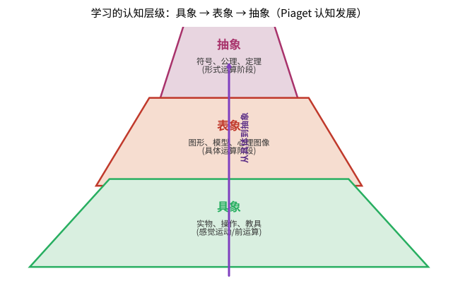

# 第130级 数学教育

## 从"人到底是怎么学会数学的"说起：数学教育要解决的根问题

> 在动手读各个学习理论之前，先想清楚一个问题：**我们把知识点讲得再清楚，学生就一定学得会吗？人脑子里究竟发生了什么，才算真正"学会"了数学？**

**一个真实的生活场景（第一步：直觉）**

同一道分数比较题，隔壁小明听一遍就会，你讲了三遍他也只记住"分母大的就大"——还把 2/3 和 3/4 比成了 2/3 更大。这不是他笨，也不是你讲错，而是**他脑子里有个"先有概念"在你讲解下面扎根**。又或者，一个学生刷题无数、订正过十遍，换身情境又不会了——他"会"的可能只是模仿，而不是"理解"。这些困惑每个当老师、当家长的人都见过，可过去很长一段时间里只能归咎于"学生不努力"。

数学教育作为一门学科，要回答的正是这类问题：**"理解"到底由什么构成？为什么有人开窍、有人卡住？怎样的教法能把卡住的也教会？** 它不是"怎么解这道题"的操作手册，而是"人如何学习数学"的科学。

> **🧠 一句话记住数学教育的"出生证"**
>
> 数学教育要解决的**根本问题**是：
>
> $$ \boxed{\text{人怎样才算真正"学会"数学？认知、情感与社会如何交互决定学习成败，我们又该据此怎样教？}} $$
>
> 答案不靠想当然，而靠对真实学习的系统研究（Piaget 的认知阶段、Vygotsky 的最近发展区、Polya 的问题解决、Schoenfeld 的启发式研究、Dubinsky 的 APOS、Sweller 的认知负荷等），把"教学"从碰运气改造成有规律、可设计的工程。

**它为何而诞生（第二步：要解决的问题）**

数学教学很长一段时期是"经验之学"——靠名师口耳相传"怎么讲学生才懂"，却没有追问"学生为什么懂/不懂"。20 世纪以来，它逐渐长成一门科学。**认知的一翼**：Piaget 用几十年临床观察揭示抽象能力的年龄阶梯，Vygotsky 从社会文化角度补上"他人协助（最近发展区、脚手架、内化）"；**方法与实证的一翼**：Polya 1945 年《怎样解题》把数学家的内隐直觉外化为四阶段启发式，Schoenfeld 用专家—新手对比把"解题思维"变成可研究、可教的材料，Sweller 的认知负荷理论用工作记忆模型解释了"为什么总要搭脚手架、练纯熟"，Dubinsky 的 APOS 理论刻画了概念从操作到图式的成长，而 Skemp、Boaler 等人的工作则把"理解 vs 记忆""成长型心态与数学焦虑"这些原来被当作"玄学"的因素纳入实证视野。**它要解决的核心问题就此成型：把"如何教、如何学数学"从经验直觉提升为可检验、可复用的科学。**

**看待本章的四种眼光（第三步：正式定义前的准备）**

- **认知的眼光**：Piaget 阶段、认知负荷、概念转变——理解发生的内在机制。
- **社会的眼光**：Vygotsky 的 ZPD 与脚手架、社会建构主义、公平与多样性——理解发生的外在土壤。
- **方法的眼光**：Polya 四阶段、Schoenfeld 研究、Toulmin 论证模型——"解题"与"论证"怎么被拆解成可教的部分。
- **哲学的眼光**：建构主义及其历史教训（"新数学"运动的失败）——教学究竟该由"学科结构"还是"学生认知"主导。

读完这一节，你应该记住的不是某位教育学家的名字，而是**那条贯穿全章的原理：数学知识的获得，不是"教师倒、学生接"，而是学习者在合适的社会支持与精心设计的认知冲突中，主动把概念"再建"一遍。** 带着这把尺子去读下面每个理论，你会发现它们各有侧重，却在"以学习者为中心"这件事上殊途同归。

---

## 开始之前

**本章在讲什么**：数学教育是关于"人如何学习与教授数学"的元学科。本章从数学教育心理学与认知发展理论（Piaget、Vygotsky）入手，接着讲数学学习障碍与数学焦虑、主流教学法、数学素养，再到社会文化视角与公平多样性；然后以五条"定理"形式展开：Polya 问题解决理论、概念转变、Toulmin 论证模型、认知负荷理论、建构主义理论，并配以教学案例与习题。

**为什么要学它**：第 1~129 级都在教你"数学是什么"、教会你"自己会做数学"；第 130 级把镜头转向"怎样才能让另一个人也会"——它是整套教程的收尾与升华，把前面掌握的所有数学知识，带回到"如何传授、如何被学会"这个更根本的人类活动。理解它，你不仅会做数学，还会"教会数学"。

**开始前请确认你还记得**：

- 数学论证与证明（见各基础级别）：命题、证明、逻辑推理链，用作理解 Toulmin 模型的"数学论证"对象。
- 极限、函数等核心概念（见微积分相关级别）：这些常被拿来当作"概念转变/迷思概念"研究对象的例子。
- 教学经验或学习经历（生活经验）：回想你自己"怎么学会/卡在最难理解"的经历，作为体会学习理论的素材。
- 基础的教育学/心理学常识：儿童、青少年的一般身心发展特征即可，无需系统心理学背景。

---

## 学习目标

1. 理解数学教育作为一门研究领域的基本框架和核心问题
2. 掌握数学学习的主要认知理论（Piaget、Vygotsky）
3. 理解Polya问题解决理论及其对数学教学的启示
4. 掌握数学论证与证明的Toulmin模型
5. 理解数学学习中的概念转变和认知冲突理论
6. 了解认知负荷理论在数学教育中的应用
7. 掌握建构主义理论对数学教育的指导意义
8. 了解数学教育中的社会文化视角、公平与多样性议题

---

## 核心概念

### 数学教育心理学

数学教育心理学（Psychology of Mathematics Education）研究数学学习与教学中的认知、情感和社会过程。其核心问题包括：
- 学生如何理解数学概念？
- 数学思维的发展规律是什么？
- 数学学习中的困难和障碍如何产生？
- 有效的数学教学策略是什么？

> **💡 直观理解（类比）**：数学教育心理学可以类比成"教学的诊断医学"。就像好医生不满足于"头痛医头"，而要研究人体机能如何运作、病灶从何而来，这门学科也追问：数学概念究竟如何在学生脑中生根、思维成长遵循什么规律、卡壳的"病灶"在哪、用什么"疗法"最有效。它不教你怎么解某道题，而是研究"为什么有人突然开窍、有人却怎么都学不会"——明白这一点，教学就不再是碰运气，而成了一门有规律、可设计的工程。

### 认知发展理论

#### Piaget的认知发展理论

Jean Piaget提出了认知发展的四个阶段：
1. **感觉运动阶段**（0-2岁）：通过感官和动作认识世界
2. **前运算阶段**（2-7岁）：发展语言和符号思维，但缺乏守恒概念
3. **具体运算阶段**（7-11岁）：掌握守恒、分类、排序等逻辑运算，但需要具体对象支持
4. **形式运算阶段**（11岁+）：能够进行抽象推理、假设-演绎推理

> **直观理解（现实类比）**：认知层级像一座由下而上的金字塔，也像学做菜的过程——先亲眼看着、亲手摸到食材（具象），再在脑海中形成"步骤画面"（表象），最后熟练到能看着菜谱符号就自动完成（抽象）。学几何正是如此：先用小棒拼出三角形（具象），再画图并在脑中旋转图形（表象），最后只用符号和公理就能推理（抽象）。Piaget 提醒我们：跳过底层直接上高层，就像让还没学会数数的小孩背公式，往往事倍功半。**把抽象概念落到足够的具象与表象，学习才会真正发生。**

> **🧠 思考历程："会做题"究竟是怎么发生的？——数学学习如何从经验直觉长成一门科学？**
>
> 数学教育研究追寻的是一个朴素却极难的问题：一个概念在听者脑中究竟靠什么"生根"？它既不靠复述定义，也不靠机械刷题，而是一条需要铺垫、冲突与帮助的认知之路——这条路在 20 世纪才被 Piaget、Vygotsky、Polya 等人逐步照亮。
>
> - **把"理解"拆成可观察的阶段**。Jean Piaget（皮亚杰）用几十年的临床观察提出认知发展四阶段：从感觉运动、前运算到具体运算、形式运算，说明儿童的抽象能力是按年龄铺阶而上的。这打破了"只要讲明白就能懂"的天真预设，让"数学概念须与学生当前认知结构匹配"成为教学设计的一条原则。
> - **"懂"还取决于谁来搭桥**。Lev Vygotsky（维果茨基）从社会文化角度补上另一半：提出最近发展区（ZPD）与脚手架——学生借他人协助能触到的水平高于其独立水平，学习正是社会互动向内化的转化。理解不只发生在脑内，更发生在师生对话与合作之中。
> - **把"怎么想题"整理成可教的方法**。George Polya（波利亚）1945 年《怎样解题》把数学家的内隐直觉外化为四个可训练阶段——理解问题、制定计划、执行计划、回顾反思；认知心理学随后用专家-新手对比、工作记忆与认知负荷理论为其提供实证。数学教学研究由此兼具启发性框架与严格实验。
> - **心路**：数学的传承不是"把现成结论倒给下一人"，而是为每一颗头脑铺好台阶、架好脚手架，让它把概念自己"再发明"一遍。

> **直观理解（现实类比）**：数学认知发展像"思维的阶梯"——从具体运算到形式运算呈阶梯式攀升，而非一蹴而就。小学生（具体运算阶段）需要掰着手指、画着图才能理解"3+5=8"，如同刚学走路的孩子必须扶着沙发；而中学生（形式运算阶段）已能在脑中操纵符号 $x, y$，进行"假设 $x>0$ 则……"的演绎，如同跑步者可以腾空飞跃。Piaget 提醒教师：让 7 岁孩子直接理解"变量"就像让他没学会走就跑——阶梯不可逾越，但可以借助教具（积木、数轴）搭好每一级台阶。教学的艺术在于：**识别学生当前在哪一级阶梯，再为他铺设通往下一级的脚手架**。

Piaget的理论对数学教育的影响在于：数学学习需要与学生的认知发展阶段相匹配，新概念的引入应考虑学生当前的认知结构。

#### Vygotsky的社会文化理论

Lev Vygotsky强调社会互动在认知发展中的核心作用：
- **最近发展区（ZPD）**：学生独立完成任务的水平与在他人帮助下能达到的水平之间的差距
- **脚手架（Scaffolding）**：在ZPD中提供适当支持，随着学生能力增长逐渐撤除
- **内化（Internalization）**：社会互动中的知识逐渐转化为个体内部的心理工具

Vygotsky的理论启示数学教育应重视：合作学习、师生对话、适时的教学支持。

> **直观理解（现实类比）**：最近发展区就像"跳高训练时的那根横杆"。横杆太高跳不过、太低没训练价值，只有把横杆放在"够得着但需使劲"的高度（ZPD），再借助教练在下面托一把（脚手架），反复练熟后教练才松手（撤除脚手架），最终学生能独自跳过（内化）。它和 Piaget 视角的关键差别在于：Piaget 盯着"孩子此刻自己会什么"，Vygotsky 则紧盯"孩子借帮助能摸到什么高度"——并把这一块垫脚石当作教学真正该用力的地方。就像教骑车，大人不必永远扶着车，但起步阶段那双"别怕，我在"的手，正是孩子学会独立飞驰的台阶。

### 数学学习障碍

数学学习障碍（Dyscalculia）是指尽管智力正常且有适当的教育机会，学生在数学学习上仍表现出显著困难。常见障碍包括：
- 数感缺失（无法理解数量关系）
- 计算困难（基本算术运算）
- 空间关系理解困难（几何）
- 数学语言理解困难

> **💡 直观理解（类比）**：数学学习障碍（Dyscalculia）可以类比成"数学版的读字困难"。就像有人阅读时会看反、看漏，这类学生在看到数字时也难以把符号与数量本身接通——智力正常、机会也给够，可"3"与"三个苹果"之间的那座桥就是搭不起来，一句"7−3"也会当场愣住。它更像有人天生缺"乐感"、别人一听即懂的音高他始终抓不住。理解它的关键意义在于：**把障碍当"条件"而非"品行"**——用数轴、实物、节奏等替代通道帮助孩子接通数量感，而不是一味责备"怎么教都教不会"。

> **直观理解（现实类比）**：数学焦虑像"思维的绊脚石"——情绪上的紧张、恐惧会直接阻断认知通道，如同考试时面对一道题，越想"我肯定做不出来"就越头脑空白。这并非"不聪明"，而是工作记忆被焦虑情绪占用：本来用于推理的"内存"被"我好怕"的念头塞满，自然算不下去。Ashcraft 的研究表明，数学焦虑者的工作记忆容量在压力下可下降 20% 以上，相当于电脑开了太多后台程序而卡顿。破局之道不是"再努力一点"，而是降低情绪负荷——限时测试改为不限时、错题不罚分、允许使用计算器辅助基本运算，把"内存"还给思考本身。**情绪先稳，认知才能跟上**，这是数学教育常被忽视的一条铁律。

### 数学教学法

主要数学教学法包括：
- **讲授式教学**：教师直接讲解概念和程序
- **探究式学习**：学生通过探索和发现来学习数学
- **问题解决教学**：以问题为中心组织教学
- **合作学习**：小组协作完成数学任务
- **差异化教学**：根据学生差异调整教学内容和方式

> **直观理解（现实类比）**：这五种教学法好比同一位大厨的不同做菜方式：讲授式像"我示范、你照抄"的菜谱讲解，快但未必入味；探究式像"给你食材、自己试出味道"的开放式厨房，慢但记忆深；问题解决教学像"用一道招牌菜打通整套烹饪逻辑"；合作学习像"厨房里几个人分工配合、边做边讨论"；差异化教学则像"对不同口味和基础的食客，分别调浓淡、换刀工"。没有哪种放之四海皆准，好老师就像好主厨，按菜（内容）与学生（对象）灵活换手法——这正是教学法研究的价值所在。

### 数学素养

数学素养（Mathematical Literacy）是指个体在多样化情境中理解、运用和解释数学的能力。PISA（国际学生评估项目）将数学素养定义为：
- 在不同情境中表述、运用和解释数学的能力
- 包括数学推理和运用数学概念、程序、事实和工具来描述、解释和预测现象的能力

> **直观理解（现实类比）**：数学能力像一步步登楼梯，也像学骑自行车——先记住"刹车、踏板"的规则（基础），理解"为什么会倒"的原理（理解），能在平路上骑（应用），再学会应对转弯和突发状况（分析），最后能自由穿行在各种路况中、甚至自创骑法（迁移创造）。图中台阶逐级升高寓意：**基础技能只有自动化，才能腾出"工作记忆"去进行高层推理**。正如认知负荷理论所说，如果每道加法都要停下来想，就无暇思考更复杂的数学问题。从"会算"到"会迁移"，正是数学素养从根基到顶端的进阶之路。

### 数学教育的社会文化视角

社会文化视角强调数学学习是嵌入在特定文化、历史和社会情境中的过程：
- 数学知识是社会建构的
- 不同文化中的数学实践各有特色（民族数学，Ethnomathematics）
- 数学课堂是一个微型文化社区
- 语言、权力关系、身份认同影响数学学习

> **💡 直观理解（类比）**：社会文化视角想说的是：数学不是真空里的公式，而是一门"社会语言"。就像方言和口音深深烙着一个人的家乡，数学的学与教同样充满文化印记——不同民族的计数、测量、几何设计各有风情（民族数学，Ethnomathematics），而一间数学教室本质上是个"微型文化社区"：谁有发言权、谁被鼓励表达、用什么语言表述，都在塑造着每个学生敢不敢、能不能学好数学。它提醒我们：要像尊重各地饮食习惯那样尊重不同背景学生的数学思路，而不是用一套单一"标准口音"去判定对错。

### 数学教育中的公平与多样性

公平与多样性关注：
- 不同性别、种族、社会经济背景的学生在数学学习中的机会差异
- 消除数学学习中的系统性障碍
- 为所有学生提供高质量的数学教育
- 尊重和包容多元的数学学习方式和思维方式

> **直观理解（现实类比）**：公平与多样性，是让数学这只"梯子"对所有学生都给同样的蹬脚，而不是"有背景的学生坐电梯、没背景的学生爬陡坡"。它不等于"人人考同一张卷"的机械均等，更像一座无障碍教学楼：既修斜坡方便坐轮椅的进入，也保留楼梯给偏爱徒步的人——关键在于**让不同性别、家境、族裔的孩子都够得着同一份高质量的数学教育**，并珍视他们各自不同的解题路数。就像一支球队，不该因谁的身高天赋就让谁坐冷板凳，而要尽量让每位球员都有上场、进球的机会。

---

## 定理与证明

### 定理1：Polya问题解决理论

**定理**：数学问题解决遵循一个四阶段启发式框架：理解问题、制定计划、执行计划、回顾反思。每个阶段都有特定的启发式策略，系统训练这些策略可以显著提高问题解决能力。

> **💡 直观理解（类比）**：Polya 的四阶段，好比一位出色侦探破案的标准流程：先看清现场与线索（理解问题——"未知量是什么、条件够不够"），再拟定几条破案路线（制定计划——回翻旧案类比、拆成小案、先试特殊情形），然后一步步取证落实（执行计划），破案后还要回头复盘——线索有没有漏、能不能提炼成通用模板（回顾反思）。它真正点破的是：**高手和新手的差别不在会不会算，而在愿不愿意在"理解"与"反思"这两头多花工夫**——就像成果的价值不只在算出答案，更在于推理链条能否复现、能否推广。

**论证**（用启发式策略和认知分析）：

**阶段1：理解问题（Understanding the Problem）**

Polya强调，解决问题的第一步是彻底理解问题。学生需要能够回答：
- 未知量是什么？已知数据是什么？条件是什么？
- 条件是否充分？是否矛盾？是否多余？

**启发式策略**：
- 画图：将问题可视化
- 引入适当符号：用变量表示未知量
- 用自己的话复述问题
- 将条件分解为更小的部分

**认知分析**：这一阶段对应认知心理学中的**问题表征**（Problem Representation）。研究表明，成功的解题者比不成功的解题者花更多时间理解问题，建立更丰富、更准确的问题表征。Chi等人（1981）的研究发现，专家在问题解决中首先进行定性分析（理解问题类型和深层结构），而新手则急于寻找公式。

**阶段2：制定计划（Devising a Plan）**

找到已知量与未知量之间的联系。如果找不到直接联系，考虑辅助问题。

**启发式策略**：
- 寻找类似问题：以前见过类似的问题吗？
- 类比：能否想到一个相关的定理？
- 分解：能否将问题分解为若干子问题？
- 特殊化：能否先解决一个特殊情况？
- 一般化：问题是否是某个更一般问题的特例？
- 逆向思考：从目标出发逆向推理

**研究证据**：Schoenfeld（1985）的研究表明，优秀的数学问题解决者拥有丰富的启发式策略库，能够根据问题类型灵活选择策略。通过明确的策略教学，学生的解题能力可以得到显著提升。

**阶段3：执行计划（Carrying Out the Plan）**

执行解题计划，每一步都要检查：
- 每一步是否正确？
- 能否清晰地证明每一步的合理性？

**认知分析**：执行阶段需要**程序性知识**（Procedural Knowledge）的支撑。Sweller的认知负荷理论指出，工作记忆容量有限，因此自动化基本技能（如算术运算、代数变换）可以减少认知负荷，释放工作记忆用于更高层次的推理。

**阶段4：回顾反思（Looking Back）**

完成解答后，进行回顾和反思：
- 能否验证结果？能否用不同方法验证？
- 能否将结果推广？
- 能否用不同方法得到相同结果？
- 从这个问题中学到了什么？

**研究证据**：Silver（1982）的研究发现，高成就学生在解题后会自发地进行回顾和反思，而低成就学生则很少这样做。反思过程有助于形成更深入的概念理解，并将新知识与已有知识建立联系。

**Polya框架的实证支持**：多项元分析研究（如Hembree, 1992）表明，系统教授问题解决策略可以显著提高学生的数学成绩，效应量在中等以上。Polya框架的四个阶段在数学教育中被广泛采用，成为问题解决教学的理论基础。

### 定理2：数学学习中的概念转变

**定理**：学生在数学学习中常常持有与标准数学概念不一致的"先有概念"（preconceptions）或"迷思概念"（misconceptions）。有效的数学教学需要引发认知冲突，促使学生经历概念转变（Conceptual Change），从而重构原有的认知结构。

> **直观理解（现实类比）**：概念意象 vs 概念定义像"心中所想 vs 书上所写"——学生对概念形成的心智图像（概念意象）往往与教材中给出的形式定义（概念定义）存在差距。例如，问学生"什么是函数"，他脑中浮现的是"一条曲线"（意象），而书上写的是"两个集合间的对应关系"（定义）。这就像问"什么是水"——脑中想到的是流动的液体（意象），化学课本却写"$\text{H}_2\text{O}$"（定义）。Vinner 等人指出，学生在解题时常常调用意象而非定义：看到"数列"就以为"递增的数"（意象偏差），而忽略了震荡或常值数列。**好的教学要不断让意象与定义对话**，让学生意识到脑中图像的局限，逐步修正意象以贴合定义。

**论证**（用认知冲突理论）：

**步骤1：先有概念的存在性**

学生并非带着空白大脑进入数学课堂。他们在日常生活和早期学习中积累了大量的直觉知识和朴素概念。

**数学中的典型迷思概念**：
- 几何中的"图形越大，面积越大"（忽略了形状的影响）
- 概率中的"赌徒谬误"（认为独立事件有"补偿"机制）
- 代数中的"等号表示计算结果"（而非等价关系）
- 函数中的"函数必须由公式表示"
- 极限中的"极限就是永远达不到的值"

**研究证据**：Fischbein（1987）对直觉在数学学习中的作用进行了系统研究，发现直觉概念往往与形式数学概念冲突，且直觉概念非常顽固，难以改变。

**步骤2：认知冲突的机制**

Piaget的认知发展理论提供了概念转变的基本机制：
- **同化（Assimilation）**：将新信息纳入已有认知结构
- **顺应（Accommodation）**：调整认知结构以适应新信息
- **平衡（Equilibration）**：在同化和顺应之间达到平衡

当新信息无法被已有认知结构同化时，就产生了**认知冲突**（Cognitive Conflict）。认知冲突是概念转变的驱动力——它迫使学习者重新审视和调整自己的认知结构。

> **直观理解（现实类比）**：认知冲突可以类比成"拼图拼错时那种别扭感"。当你发现手头这块拼图怎么都对不上时，你不会硬挤，而是意识到"该换图景了"。Piaget 说的同化，就是"顺手把新积木塞进已有模型"；可当塞不进去、心里别扭（失衡）时，你就得动手改组模型（顺应），最终达成新的平衡。教学最高明之处，正是**故意制造那种"对不上"的别扭**——比如让"分子越大分数越大"的直觉在图形面前翻车，从而逼着学生自己去改组认知结构，而不是由教师单方面把结论硬塞给他。

**步骤3：概念转变的条件**

Posner等人（1982）提出了概念转变的四个条件：
1. **对现有概念的不满**：学习者意识到现有概念无法解释某些现象
2. **新概念的可理解性**：新概念对学习者来说是有意义的
3. **新概念的合理性**：新概念与学习者的其他信念一致
4. **新概念的有效性**：新概念能解决现有概念无法解决的问题

**数学教育中的应用**：
- 设计能引发认知冲突的教学情境（如"错误的"但直觉上合理的推理导致矛盾）
- 提供充分的讨论和反思机会
- 帮助学生在多种表征之间建立联系

**步骤4：概念转变的类型**

概念转变可以是：
- **弱转变**：在原有框架内补充和修正，如同化
- **强转变**：改变核心假设和信念体系，如从"算术思维"到"代数思维"的转变

**研究证据**：Vosniadou（1994）对科学概念转变的研究表明，概念转变是一个渐进过程，而不是一次性事件。学习者可能同时持有新旧两种概念框架，在特定情境中使用不同的框架。数学教育中的概念转变研究（如关于极限、无穷等概念的研究）也证实了类似模式。

**步骤5：教学启示**

概念转变理论对数学教学的启示：
- 诊断学生的先有概念是教学的第一步
- 有效的教学需要创造认知冲突情境
- 概念转变需要时间和反复的认知冲突
- 社会互动（同伴讨论、师生对话）促进概念转变
- 多种表征的运用有助于新概念的理解和巩固

### 定理3：数学论证的Toulmin模型

**定理**：数学论证可以按照Toulmin模型进行分析，该模型包含六个要素：主张（Claim）、数据（Data）、理据（Warrant）、支援（Backing）、限定词（Qualifier）和反驳（Rebuttal）。在数学教育中，使用Toulmin模型分析学生的论证可以帮助教师理解学生的推理结构，并促进更有效的数学论证教学。

> **💡 直观理解（类比）**：Toulmin 模型就像"把一次论辩拆开看骨架"。好比法庭上律师说"他有罪"（主张），得拿出证据（数据），说明为什么这些证据能定罪（理据），必要时搬出法律条文背书（支援），讲清"在何种程度上成立"（限定词），并预先堵住对方可能的翻案点（反驳）。把这把"解剖刀"用到数学上，就能照出学生论证里哪一环掉了链子——比如只说"这是等腰三角形所以 ∠B=∠C"，却说不出由两边相等凭什么推出两角相等（缺理据）。教师据此一针见血地提问，正是这个模型的魅力所在。

**论证**（用论证结构分析）：

**步骤1：Toulmin模型的基本结构**

英国哲学家Stephen Toulmin在其著作《论证的使用》（The Uses of Argument, 1958）中提出了论证分析的一般模型。在数学语境中，六个要素的含义如下：

- **主张（Claim）**：需要被证明的数学陈述，如"三角形ABC是等腰三角形"
- **数据（Data）**：支持主张的事实或证据，如"边AB = 边AC"
- **理据（Warrant）**：从数据到主张的推理规则，如"如果三角形有两边相等，则它是等腰三角形"
- **支援（Backing）**：理据的进一步支持，如"等腰三角形的定义"
- **限定词（Qualifier）**：主张的确定性程度，如"必然地"、"很可能"
- **反驳（Rebuttal）**：反驳主张的条件，如"除非三角形退化为线段"

**步骤2：数学论证的特殊性**

数学论证与其他领域论证的区别在于：
- 数学论证的理据通常是定义、公理、定理
- 数学论证可以追求确定性（演绎证明）
- 数学论证的支援是公理系统中的基础假设

**步骤3：Toulmin模型在数学教育中的应用**

Krummheuer（1995）将Toulmin模型引入数学教育研究，用于分析数学课堂中的论证过程。

**示例分析**：

考虑一个几何证明问题：证明"如果三角形有两边相等，则两底角相等"。

学生论证的Toulmin分析：
- **主张**：∠B = ∠C
- **数据**：AB = AC，且∠A是公共角（在三角形ABD和ACD中，作中线AD）
- **理据**：如果两个三角形的两边及其夹角相等，则这两个三角形全等（SAS）
- **支援**：三角形全等定理
- **限定词**：必然地
- **反驳**：除非AD不是中线（但由AB = AC，可证明AD是中线）

**步骤4：Toulmin模型的教学价值**

- **诊断功能**：教师可以分析学生论证中的缺失环节。例如，如果学生只给出了数据（'AB = AC'）和主张（'∠B = ∠C'），但没有给出理据（'等腰三角形底角相等定理'），教师可以有针对性地提问。
- **发展功能**：通过Toulmin模型的训练，学生可以学会更完整、更严谨的论证结构。
- **评价功能**：为评估学生的论证能力提供了结构化框架。

**研究证据**：Weber等人（2008）的研究表明，使用Toulmin模型分析数学论证可以揭示学生推理中的隐含假设和逻辑跳跃，有助于教师设计针对性的教学干预。Yackel和Cobb（1996）的研究发现，在数学课堂中建立"社会数学规范"（Socio-mathematical Norms）——即什么样的论证在数学课堂上被认为是可接受的——对学生的数学论证能力发展至关重要。

**步骤5：Toulmin模型在数学证明教学中的应用**

数学证明教学中的Toulmin模型应用：
- 帮助学生理解证明不仅是陈述事实，更是建立从数据到主张的逻辑推理链
- 训练学生识别和补充论证中的缺失环节
- 促进学生对"什么是好的数学论证"的元认知反思

### 定理4：数学教育的认知负荷理论

**定理**：数学学习过程受到工作记忆容量限制的影响。认知负荷理论（Cognitive Load Theory）将学习中的认知负荷分为三类：内在认知负荷（Intrinsic Cognitive Load）、外在认知负荷（Extraneous Cognitive Load）和关联认知负荷（Germane Cognitive Load）。优化数学教学设计需要减少外在认知负荷，控制内在认知负荷，并促进关联认知负荷。

> **直观理解（现实类比）**：认知负荷理论可以拿"手机内存"来想：工作记忆就是那块有限的内存，一次只能同时跑 2-3 个任务。学习材料的"内在复杂度"决定程序本身占用多少内存（内在负荷）；老师糟糕的排版、毫无必要的花哨图示，就像后台悄悄运行的流氓软件（外在负荷），白白挤占内存；而"比较不同解法、反思自己的思路"则是给系统做清理和升级（关联负荷），让知识沉淀成几乎不占内存的"已安装缓存"（图式/技能自动化）。所以好设计不是"多讲、多练"，而是**该省的省（砍外在负荷）、该拆的拆（控内在负荷）、该养的养（促关联负荷）**——把有限的内存让给真正重要的思考。

**论证**（用工作记忆模型）：

**步骤1：认知架构的基本假设**

根据Sweller（1988）的认知负荷理论，人类认知架构包括：
- **工作记忆**：容量有限（Miller的7±2个组块，但更准确地说，处理新信息时只能同时处理2-3个元素），持续时间短
- **长时记忆**：容量无限，存储知识以图式（Schema）的形式组织

**数学学习的核心挑战**：数学问题的解决通常需要在工作记忆中同时处理多个信息元素，而工作记忆容量的限制使得这一过程非常困难。

**步骤2：三种认知负荷**

**内在认知负荷**（Intrinsic Cognitive Load）：
- 由学习材料本身的内在复杂度决定
- 取决于元素交互性（Element Interactivity）——即需要同时处理的元素数量
- 例如，学习单个数字的加法（低元素交互性）vs. 解一道复杂的多步方程（高元素交互性）

**外在认知负荷**（Extraneous Cognitive Load）：
- 由教学材料的呈现方式和教学设计引起
- 不必要的信息呈现方式会增加外在认知负荷
- 例如，分散注意力的图表、不一致的符号系统、不清晰的说明

**关联认知负荷**（Germane Cognitive Load）：
- 与建构和自动化图式相关的认知负荷
- 是"有益的"认知负荷，促进深度学习
- 例如，比较不同解题策略、反思解题过程

**步骤3：认知负荷理论在数学教育中的应用**

**减少外在认知负荷的策略**：
- **分散注意效应**：避免将相互引用的信息分开呈现（如将图示和文字说明整合在一起）
- **模态效应**：使用听觉和视觉双通道呈现信息（如用语音讲解配合图示）
- **冗余效应**：避免同时呈现相同信息的多种形式
- **示例效应**：在学习初期，使用已解决的例题（worked examples）比让学习者独立解决问题更有效

**管理内在认知负荷的策略**：
- **分块策略**：将复杂问题分解为更小的子问题
- **逐步推进**：从简单到复杂，逐步增加元素的交互性
- **先备知识激活**：在学习新内容前，确保学生具备必要的先备知识

**促进关联认知负荷的策略**：
- **变式练习**：提供不同形式的练习，帮助学生抽象出一般模式
- **自我解释**：鼓励学生解释自己的推理过程
- **比较策略**：比较不同解题方法的优劣

**步骤4：研究证据**

大量实证研究支持认知负荷理论在数学教育中的应用：

- **示例效应**：Sweller和Cooper（1985）的研究表明，学习代数方程时，先学习已解决的例题再进行练习的学生，比直接进行练习的学生学得更好。
- **分散注意效应**：Tarmizi和Sweller（1988）在几何学习中证实，整合了图形和文字说明的教学材料比分开呈现的材料更有效。
- **模态效应**：Mousavi等人（1995）在几何学习中发现，使用听觉解说配合视觉图示比纯视觉呈现效果更好。

**元分析证据**：Cierniak等人（2009）的元分析研究表明，基于认知负荷理论的教学设计原则在数学和科学教育中具有稳定且显著的效果。

**步骤5：数学教育中的认知负荷管理**

**具体教学建议**：
- 在引入新概念时，使用已解决的例题而非问题解决任务
- 将复杂的数学问题分解为多个可管理的步骤
- 使用整合的图文呈现，避免分割注意
- 提供充分的练习以实现基本技能的自动化
- 在不同的问题情境中应用相同概念，促进图式建构

### 定理5：数学教育中的建构主义理论

**定理**：数学知识不是被动接收的，而是由学习者基于已有知识和经验主动建构的。有效的数学教学应基于两个核心原则：1）数学学习是主动的意义建构过程（Piaget的认知建构主义）；2）数学学习是在社会互动和文化工具的中介下发生的（Vygotsky的社会建构主义）。

> **直观理解（现实类比）**：建构主义的一句话核心是：数学不是"灌"，而是"长"。就像你不能把一道菜直接"装"进别人肚子里再让他照样复刻一遍，只能给他食材和火候，让他在自己的锅里把菜"做"出来；同理，新知识必须长在学生已有的旧知识土壤上，别人代劳不了。Piaget 的认知建构主义看重"自己动手做菜"（操作与反思），Vygotsky 的社会建构主义则强调"一群人边做边讨论、师傅在旁边搭把手"（社会互动与脚手架）——这其实是同一枚硬币的两面：既不能只顾个体钻研而闭门造车，也不能只靠旁人点拨而丢失自主建构。落到课堂，就是"学生中心、教师做促进者"，而非教师唱独角戏、学生当录音机。

> **直观理解（现实类比）**：APOS 理论像"概念发展的四阶段"——Action 操作 → Process 过程 → Object 对象 → Schema 图式，刻画了学生掌握一个数学概念必经的心路历程。以"函数"为例：**Action（操作）**——学生只能按指令代入计算，如 $f(2)=2^2+1=5$，离开公式就束手无策；**Process（过程）**——内化了操作，能在脑中想象"输入 $x$ 经过变换得到 $f(x)$"，无需纸笔也能推理；**Object（对象）**——把函数本身当作一个可操作的实体，能对它求导、积分、复合，如 $(f \circ g)(x)$；**Schema（图式）**——把函数与其他概念（方程、图像、变化率）织成网，灵活调用。Dubinsky 认为，**教学的任务就是搭好 A→P→O→S 的脚手架**，让学生在每一阶段充分沉淀，而非跳过操作直接背定义——那只会让概念沦为空壳。

**论证**（用Piaget和Vygotsky的理论分析）：

**步骤1：认知建构主义的数学教育观**

Piaget的认知建构主义（Cognitive Constructivism）强调：

**核心原则**：数学知识是学习者通过主动操作和反思建构的，而不是被动接收的。

**机制**：
- 数学概念通过同化和顺应过程建构
- 认知发展遵循从具体到抽象的路径
- 数学理解需要经历不同的发展阶段

**数学教育中的应用**：
- 动手操作：使用具体教具（如Cuisenairre棒、几何拼图）帮助建构数学概念
- 发现学习：让学生在探索中发现数学规律
- 认知冲突：创造认知冲突促进概念转变

**研究证据**：Kamii（1985）在小学数学教学中应用Piaget的理论，发现通过动手操作和同伴讨论学习算术的学生，对数学概念的理解比接受传统讲授的学生更深刻。

**步骤2：社会建构主义的数学教育观**

Vygotsky的社会建构主义（Social Constructivism）强调：

**核心原则**：数学学习首先是社会性的，然后才是个体性的。高层次的数学思维通过社会互动内化。

**关键概念**：
- **最近发展区**：数学教学应在学生的最近发展区内进行
- **脚手架**：教师或同伴提供适当的支持
- **内化**：社会层面的数学对话转化为个体层面的数学思维

**数学教育中的应用**：
- 数学讨论：鼓励学生在小组中讨论数学问题
- 合作学习：学生通过协作解决数学问题
- 教师引导的对话：教师通过提问引导学生思考

**研究证据**：Cobb等人（1992）的课堂研究表明，在数学课堂中建立"数学讨论社区"——即学生被鼓励表达和辩护自己的数学观点——可以显著提高学生的数学推理能力。

**步骤3：两种建构主义的整合**

数学教育中的建构主义不是二选一的问题，而是两种视角的互补：

**认知建构主义的贡献**：
- 强调学生的主动性和已有知识
- 关注数学概念的心理建构过程
- 提供具体到抽象的发展路径

**社会建构主义的贡献**：
- 强调社会互动和语言的作用
- 关注数学课堂的文化和规范
- 提供教学支持的框架（ZPD、脚手架）

**整合框架**：数学学习是学生在社会文化环境中，通过主动操作和反思，借助文化工具（符号、语言、图表）和他人帮助，建构数学知识的过程。

**步骤4：建构主义教学的设计原则**

基于建构主义理论的数学教学设计原则：

1. **真实性**：学习任务应嵌入在真实或有意义的数学情境中
2. **主动性**：学生应积极参与数学活动，而非被动接收
3. **建构性**：新知识应与已有知识建立联系
4. **社会性**：提供合作学习和讨论的机会
5. **反思性**：鼓励学生反思自己的学习过程和数学思维
6. **支架性**：提供适时的教学支持，并逐渐撤除

**步骤5：建构主义与"新数学"运动**

历史教训：20世纪60年代的"新数学"运动试图将现代数学的严谨结构引入中小学数学课程，但由于过度强调形式化而忽视了学生的认知发展水平，最终以失败告终。这一历史教训表明，建构主义教学需要谨慎平衡学科结构与学生的认知发展。

**建构主义不是"放任自流"**：建构主义教学并不意味着教师完全放手让学生自己发现一切。相反，它要求教师成为"促进者"——设计合适的学习环境，提供适时的引导和支持。

**步骤6：建构主义在数学教育中的影响**

建构主义对数学教育的影响深远：
- 推动了从"教师中心"到"学生中心"的转变
- 促进了问题解决教学和探究式学习的发展
- 影响了数学课程标准和教材的设计
- 为数学教育研究提供了理论框架

---

## 示例

### 示例1：Polya问题解决策略在代数教学中的应用

**问题**：两个数的和是20，它们的积是96，求这两个数。

**Polya四阶段分析**：

**阶段1：理解问题**
- 未知量：两个数，设为 $x$ 和 $y$
- 已知条件：$x + y = 20$，$xy = 96$
- 条件是否充分？两个方程，两个未知数，通常可解

**阶段2：制定计划**
- 方法1（代入法）：由 $y = 20 - x$，代入 $xy = 96$
- 方法2（韦达定理）：$x$ 和 $y$ 是二次方程 $t^2 - 20t + 96 = 0$ 的根
- 选择方法2，因为计算更简洁

**阶段3：执行计划**
$$t^2 - 20t + 96 = 0$$
$$(t - 8)(t - 12) = 0$$
$$t = 8 \text{ 或 } t = 12$$
所以两个数是8和12。

**阶段4：回顾反思**
- 验证：$8 + 12 = 20$，$8 \times 12 = 96$ ✓
- 推广：一般地，已知和 $s$ 与积 $p$，求两数，相当于解 $t^2 - st + p = 0$
- 判别式条件：当 $s^2 - 4p \geq 0$ 时，存在实数解

### 示例2：数学论证在几何证明教学中的应用

**问题**：证明"平行四边形的对角线互相平分"。

**Toulmin模型分析**：

**主张**：平行四边形ABCD的对角线AC和BD互相平分，即AO = OC，BO = OD（其中O是AC和BD的交点）。

**数据**：
- 四边形ABCD是平行四边形（已知）
- AB ∥ CD，AD ∥ BC（平行四边形定义）

**理据**：
- 由AB ∥ CD，得∠BAO = ∠DCO（内错角相等）
- 由AD ∥ BC，得∠ABO = ∠CDO（内错角相等）
- AB = CD（平行四边形对边相等）
- 由ASA，得△ABO ≅ △CDO

**支援**：平行线性质定理、平行四边形性质定理、三角形全等定理

**限定词**：必然地

**反驳**：除非四边形ABCD不是平行四边形（但已知条件已排除此情况）

**完整的论证链条**：
1. 因为ABCD是平行四边形，所以AB ∥ CD且AB = CD
2. 因为AB ∥ CD，所以∠BAO = ∠DCO
3. 因为AD ∥ BC，所以∠ABO = ∠CDO
4. 由2、3和AB = CD，得△ABO ≅ △CDO（ASA）
5. 由全等，得AO = OC，BO = OD
6. 因此，对角线互相平分

### 示例3：认知冲突教学设计

**情境**：在分数比较教学中引发认知冲突

**设计**：

**步骤1：引出先有概念**
提问：比较 $\frac{2}{3}$ 和 $\frac{3}{4}$ 的大小。
学生常见回答：$\frac{2}{3} > \frac{3}{4}$，因为"2比3大"（即使分子分母分别比较）。

**步骤2：创造认知冲突**
教师：$\frac{2}{3}$ 的2比3小，$\frac{3}{4}$ 的3比4小，但我们可以用具体的图形来比较。

展示两个同样大小的圆，一个被分为3等份，涂色2份；另一个被分为4等份，涂色3份。

学生直观看到：$\frac{3}{4}$ 的涂色部分大于 $\frac{2}{3}$ 的涂色部分。

**步骤3：引导学生解决冲突**
教师：为什么直观上 $\frac{3}{4}$ 更大，但直觉告诉我们 $\frac{2}{3}$ 更大？我们需要怎样的方法来比较分数？

引导学生发现通分的方法：
$$\frac{2}{3} = \frac{8}{12}, \quad \frac{3}{4} = \frac{9}{12}, \quad \frac{8}{12} < \frac{9}{12}$$

**步骤4：反思与巩固**
讨论：为什么"分子分母分别比较"的方法不可靠？分数比较的正确方法是什么？

---

## 习题

### 基础题

**习题 1**（数学教育心理学）数学教育心理学研究的主要问题有哪些？请列举四个核心问题。

**习题 2**（Piaget认知发展）Piaget将认知发展分为哪四个阶段？每个阶段的基本年龄范围分别是什么？

**习题 3**（具体运算与形式运算）比较Piaget的"具体运算阶段"与"形式运算阶段"在数学推理能力上的主要差异。

**习题 4**（最近发展区）什么是Vygotsky的"最近发展区"（ZPD）？它如何界定教学应施加作用的区域？

**习题 5**（脚手架）说明"脚手架"（Scaffolding）的含义，以及它与最近发展区的关系。

**习题 6**（数学学习障碍）什么是数学学习障碍（Dyscalculia）？列出常见的几类表现。

**习题 7**（Polya四阶段）Polya问题解决理论包含哪四个阶段？

**习题 8**（Toulmin六要素）Toulmin论证模型包含哪六个要素？请逐一列出。

**习题 9**（三种认知负荷）认知负荷理论将学习中的认知负荷分为哪三类？它们分别由什么引起？

**习题 10**（数学素养）根据PISA的定义，什么是数学素养（Mathematical Literacy）？

### 进阶题

**习题 11**（同化与顺应）结合分数比较的例子，说明"同化"与"顺应"在概念学习中的区别，以及"平衡"如何调节二者。

**习题 12**（认知冲突机制）解释认知冲突（Cognitive Conflict）为什么是概念转变的驱动力，并结合Piaget的平衡机制说明其作用过程。

**习题 13**（专家与新手的差异）根据Chi等人（1981）的研究，专家与新手在"问题表征"上有何显著差异？这对Polya第一阶段的启示是什么？

**习题 14**（认知负荷与自动化）为什么说"自动化基本技能可以释放工作记忆用于高层次的推理"？请用认知负荷理论加以解释。

**习题 15**（APOS理论）简述APOS理论中Action、Process、Object、Schema四个层次的各自含义。

**习题 16**（Toulmin的教学价值）Toulmin模型在数学教学中具有哪三类价值？请举例说明其"诊断功能"如何运作。

**习题 17**（负荷管理策略）分别给出减少外在认知负荷、管理内在认知负荷和促进关联认知负荷的一到两条具体教学策略。

**习题 18**（两种建构主义）认知建构主义与社会建构主义的核心主张分别是什么？它们各自强调哪些教学手段？

**习题 19**（概念意象与定义）什么是"概念意象"与"概念定义"？为什么学生在解题时常常调用意象而非定义？

### 挑战题

**习题 20**（概念转变四条件）Posner等人提出的概念转变的四个条件是什么？请结合"等号表示计算结果"这一迷思概念说明如何满足这些条件。

**习题 21**（元素交互性）以"解一道复杂多步方程"与"单个数字加法"为例，用"元素交互性"解释二者内在认知负荷的差异。

**习题 22**（APOS的函数教学）以"函数"概念为例，用APOS理论说明从Action到Schema的脚手架应如何设计。

**习题 23**（数学焦虑与工作记忆）根据Ashcraft的研究，数学焦虑如何通过占用工作记忆影响数学表现？据此提出两条降低情绪负荷的教学建议。

**习题 24**（整合框架）论证"认知建构主义与社会建构主义不是二选一"，并给出一个可操作的整合教学框架。

**习题 25**（新数学运动教训）"新数学"运动失败的原因和教训是什么？这一历史案例对建构主义教学中"学科结构与学生认知的平衡"有何启示？

**习题 26**（Toulmin几何证明示例）用Toulmin六要素完整分析"若三角形有两边相等，则两底角相等"的学生论证，并指出其中可能的缺失环节。

### 探究题

**习题 27**（概念转变的渐进性）根据Vosniadou的研究，概念转变是渐进过程而非一次性事件。请讨论学生在极限、无穷等概念上"同时持有新旧两套框架"的表现及教学应对。

**习题 28**（认知负荷教学设计）为"一元二次方程求根公式"设计一个基于认知负荷理论的教学序列，分别说明如何控制内在负荷、减少外在负荷和促进关联负荷。

**习题 29**（社会文化视角与公平）结合民族数学（Ethnomathematics）与公平多样性议题，讨论如何在课程设计中兼顾多元文化视角与系统的数学素养培养。

**习题 30**（数学能力的获得阶梯）结合"数学能力获得阶梯"（基础记忆→理解概念→简单应用→分析综合→迁移创造），讨论为什么"基础技能自动化是高层迁移的前提"，并谈谈这对数学课程整体设计的意义。

---

## 习题答案与解析

### 基础题答案

1. **数学教育心理学** 核心问题包括四个方面：学生如何理解数学概念？数学思维的发展规律是什么？数学学习中的困难和障碍如何产生？有效的数学教学策略是什么？前三者聚焦"学"，最后聚焦"教"，共同勾勒出数学学习与教学中的认知、情感与社会过程。

2. **Piaget认知发展** 四阶段：感觉运动阶段（0-2岁，通过感官和动作认识世界）、前运算阶段（2-7岁，发展语言和符号思维，但缺乏守恒概念）、具体运算阶段（7-11岁，掌握守恒、分类、排序等逻辑运算）、形式运算阶段（11岁以上，能进行抽象推理与假设-演绎推理）。

3. **具体运算与形式运算** 具体运算阶段已能进行守恒、分类、排序等逻辑操作，但必须依附具体对象支持；形式运算阶段则摆脱了这一限制，能在脑中操纵符号（如变量 $x, y$）进行抽象与假设-演绎推理。教学上对应"具体到抽象"的认知层级：低龄阶段宜用具象教具支撑，随年龄增长再引入纯粹符号推演，不可逾越阶梯。

4. **最近发展区** ZPD指学生"独立完成任务的水平"与"在他人帮助下能达到的水平"之间的差距。教学只有作用在这个差距区间内才最有效：难度远低于下限是对已会内容的重复，远高于上限则超出当前接受能力；恰在ZPD内施加支持才最有价值，即"跳一跳够得着"的难度。

5. **脚手架** 脚手架指教师在ZPD中提供的适当支持（提示、示范、分解步骤、问题引导），并随学生能力增长逐步撤除。它把外部协助与内化联系起来：先靠外部支持完成任务，后内化为学生独立能力；"逐渐撤除"正是为了让学生摆脱长期依赖。

6. **数学学习障碍** 数学学习障碍指智力正常且有适当教育机会，却在数学学习上表现出显著困难的情况。常见表现：数感缺失（无法理解数量关系）、计算困难（基本算术运算）、空间关系理解困难（几何）、数学语言理解困难。

7. **Polya四阶段** 理解问题、制定计划、执行计划、回顾反思。这是数学问题解决的启发式框架，每个阶段都有专门的启发式策略。

8. **Toulmin六要素** 主张（需被证明的数学陈述）、数据（支持主张的事实或证据）、理据（从数据到主张的推理规则）、支援（对理据的进一步支持）、限定词（主张的确定性程度）、反驳（反驳主张的条件）。

9. **三种认知负荷** 内在认知负荷由学习材料本身的内在复杂度（元素交互性）决定；外在认知负荷由教学材料的呈现方式和教学设计引起，是不必要的负担；关联认知负荷与建构和自动化图式相关，是有益负荷，促进深度学习。教学设计应减少外在、控制内在、促进关联。

10. **数学素养** PISA定义：个体在多样化情境中理解、运用和解释数学的能力；包括在不同情境中表述、运用和解释数学，以及运用数学推理、概念、程序、事实和工具描述、解释和预测现象的能力。

### 进阶题答案

1. **同化与顺应** 同化是把新信息纳入已有认知结构，例如学生已知等值分数，把$\frac{2}{4}$直接归入"与$\frac{1}{2}$同值"的既有框架；顺应是调整认知结构以适应新信息，例如发现"分子分母同时加大，分数值不一定变大"，迫使重构分数大小比较的框架。当新信息无法被旧结构同化时就出现认知冲突，平衡机制在"过度同化（硬套旧框架）"与"破坏性顺应（推翻整个结构）"之间调节：先尝试同化，失败则引导部分顺应，最终达到新平衡。

2. **认知冲突机制** 认知冲突源于新信息无法被已有认知结构同化。它迫使学习者意识到现有框架的局限并产生"不满"，从而驱动其重新审视、调整认知结构即发生顺应，因此是概念转变的驱动力。其作用过程正是Piaget的平衡：旧结构失衡→尝试同化失败→部分顺应调整→达到新平衡。教学通过构造"直觉上合理但结果矛盾"的情境（如比较$\frac{2}{3}$与$\frac{3}{4}$时"分子分母分别比较"得出的直觉与图形直观相悖）来主动引发这种失衡。

3. **专家与新手的差异** Chi等人发现，专家首先进行定性分析，理解问题的类型与深层结构，建立丰富、准确的问题表征；新手则急于寻找公式，表征浅表零散，依赖表面特征。这正对应Polya第一阶段的启示：应先主动花时间理解问题（画图、引入符号、用自己的话复述、分解条件），把功夫花在"表征"而非"机械套用"上，问题表征的质量直接决定后续计划能否成功。

4. **认知负荷与自动化** 工作记忆容量有限（处理新信息时约同时处理2-3个元素），若每一步算术、代数变换都占据工作记忆，就没有余力承载高层次的策略性推理。自动化基本技能把底层运算"打包"存入长时记忆图式，调用时几乎不占工作记忆，从而把有限容量释放给高层推理。这正是"会算"是"会迁移"的前提，也是数学素养阶梯中"基础层须自动化"的理论依据。

5. **APOS理论** Action（操作）：学生只能按指令逐元代值计算，离开公式就无从下手；Process（过程）：把操作内化，能脱离纸笔在脑中想象"输入→变换→输出"；Object（对象）：把概念当作可整体操作的实体，能对它求导、复合等；Schema（图式）：把该概念与相关概念（方程、图像、变化率等）织成网络，灵活调用。教学应按A→P→O→S逐层搭建脚手架。

6. **Toulmin的教学价值** 三价值：诊断功能（分析论证中的缺失环节，找出"缺理据、缺数据"处并针对性提问）、发展功能（通过训练让学生给出更完整严谨的论证结构）、评价功能（为评估论证能力提供结构化框架）。以诊断为例：学生只给出"AB=AC"（数据）和"∠B=∠C"（主张）却无理据时，教师据模型指出缺失而提问"凭什么由两边相等得到两底角相等"，即可触发学生补全理据。

7. **负荷管理策略** 减少外在负荷：整合图文避免分割注意、利用视听双通道（模态效应）、避免信息冗余、学习初期采用已解决例题。管理内在负荷：分块分解复杂问题、从简单到复杂逐步推进、激活先备知识。促进关联负荷：变式练习、鼓励自我解释、比较不同解法优劣以抽象一般模式。

8. **两种建构主义** 认知建构主义（Piaget）强调数学知识是学习者通过主动操作和反思建构的，关注概念的心理建构与"具体到抽象"的发展路径，教学上采用动手操作、发现学习、制造认知冲突；社会建构主义（Vygotsky）强调高层次的数学思维经社会互动内化，关注ZPD、脚手架与课堂规范，教学上采用讨论、合作学习与教师引导对话。

9. **概念意象与定义** 概念意象是学生在脑中形成的心智图像（如"函数是条曲线"），概念定义是教材中的形式表述（如"两个集合间的对应关系"）。二者常不一致；解题时意象调用快、定义调用慢，故学生往往依赖意象。Vinner指出这会导致偏差（如把"数列"一概视作"递增的数"而忽略震荡或常值数列）。好教学要让意象与定义不断对话，引导学生修正意象以贴合定义。

### 挑战题答案

1. **概念转变四条件** 四条件：对现有概念的不满（意识到旧概念无法解释某些现象）、新概念的可理解性、新概念的合理性（与其他信念一致）、新概念的有效性（能解决旧概念无法解决的问题）。以"等号表示计算结果"为例：制造不满——让学生遇到 $\square+5=3+8$ 时发现"结果"出现在左边说不通；可理解——用天平或等式性质说明等号表示两边相等；合理——与"方程两边同加减"的做法一致；有效——能正确求解各类方程。四项齐备后即完成从"运算符号"到"等价关系"的概念转变。

2. **元素交互性** 元素交互性指需同时在工作记忆处理的元素数量。单个数字加法（如 $3+5$）涉及元素少、交互低，内在负荷小；解复杂多步方程需同时追踪多个变量、运算与条件，元素多且互相制约，交互高、内在负荷大。因此教学应把高交互内容分解为低交互子任务（分块、逐步推进、先备知识激活），使内在负荷落在可承受范围。

3. **APOS的函数教学** 以 $f(x)=x^2+1$ 为例：Action——学生先按式逐值代入算 $f(2)$，安排逐值计算练习；Process——通过"输入-输出表"与图象活动使其内化为"输入 $x$ 经变换得 $f(x)$"的想象，无需纸笔也能推理；Object——把函数当整体对象进行求导、积分、复合 $(f\circ g)(x)$ 等操作；Schema——通过与方程、图像、变化率的联系织成概念网。脚手架思想是：每层充分沉淀再进入下一层，跳过操作直接背定义只会得到空壳。

4. **数学焦虑与工作记忆** Ashcraft研究表明，数学焦虑者的工作记忆容量在压力下可下降20%以上：焦虑念头（"我好怕""我肯定做不出来"）占据有限的工作记忆"内存"，挤占本用于推理的空间，导致头脑空白、解题失败。它并非"不聪明"，而是情绪占用了内存。降低情绪负荷的建议：限时测试改为不限时、错题不罚分、允许使用计算器辅助基本运算，把"内存"还给思考本身——"情绪先稳，认知才能跟上"。

5. **整合框架** 二者互补而非对立：认知建构主义提供心理建构路径（主动性、认知冲突、具体→抽象），社会建构主义提供社会文化情境（ZPD、脚手架、课堂规范、语言中介）。整合框架：数学学习是学生在社会文化环境中，通过主动操作和反思，借助文化工具（符号、语言、图表）和他人帮助，建构数学知识的过程。可操作设计遵循六原则：真实性、主动性、建构性、社会性、反思性、支架性。

6. **新数学运动教训** "新数学"运动（20世纪60年代）试图把现代数学的严谨结构直接引入中小学课程，因过度强调形式化而忽视学生的认知发展水平，最终失败。教训：课程设计的学科逻辑必须与学生的认知发展阶段相平衡，不能把成人/专家的形式结构强加给学生。同时，建构主义并非"放任自流"——教师仍须作为促进者设计学习环境、提供适时引导与支持而非袖手旁观。

7. **Toulmin几何证明示例** 作中线AD把等腰三角形分为△ABD与△ACD，分析为：数据——AB=AC、∠BAD=∠CAD（同为中线所分角）、AD为公共边；理据——两边及其夹角相等则全等（SAS）；支援——三角形全等定理；限定词——必然地；反驳——除非AD不是中线（但由AB=AC可经三角形全等证得AD确为中点连线，故该反驳不成立）。该论证最常见的缺失环节是学生只给"AB=AC"与"∠B=∠C"却说不清理据（等腰三角形底角相等定理或全等），教师应据此提问以补全链条。

### 探究题答案

1. **概念转变的渐进性** 依据Vosniadou，概念转变是渐进、非一次性的过程；学习者可能同时持有新旧两套框架，在特定情境中被触发不同的那一套。例如学生既能按 $\epsilon-\delta$ 定义严格解题（新框架），回到直观情境又滑向"极限就是永远达不到的值"（旧框架）。教学应对：容忍"双框架并存"的过渡期，反复在多种情境中制造认知冲突，借助社会互动与多表征讨论让两套框架对质，逐步提高新框架的激活频率，而非指望一次灌输完成转变。

2. **认知负荷教学设计** 内在负荷管理：先复习配方法、用已会的一元二次方程（因式分解）作铺垫，再分小步引入求根公式的推导，把高元素交互的"求根公式"拆成"配方→提取判别式→根式"的低交互子任务。外在负荷减少：整合图文与公式、避免分割注意，采用逐步推导的板书减少冗余，学习初期用已解决例题而非直接挑战性任务。关联负荷促进：提供变式练习、让学生比较公式解与配方、因式分解三种方法的优劣并自我解释，从而抽象出一元二次方程的统一模式、建构图式。

3. **社会文化视角与公平** 民族数学强调不同文化中的数学实践各有特色，数学课堂本身是微型文化社区，语言、权力与身份认同影响学习；公平多样性则关注消除不同性别、种族、社会经济背景学生遭遇的系统性障碍。课程设计可在保留核心数学素养目标的同时，把多元文化中的计数、测量、几何实践作为"真实性"情境引入，尊重多元解题方式与思维路径，并通过合作讨论让不同背景的学生都能表达与辩护自己的数学观点，实现"高质量+包容"的平衡，而非在形式严谨与多元视角之间二选一。

4. **数学能力的获得阶梯** 阶梯为：基础记忆→理解概念→简单应用→分析综合→迁移创造。关键在于基础层只有自动化，才能腾出工作记忆去进行高层推理，这正是认知负荷理论的落地："会算"是"会迁移"的前提。对课程整体设计而言：须保证基础技能先行且充分自动化，再逐级提升任务复杂度与开放性，最后才鼓励跨情境迁移与创造；若每一级都过早跳到应用/迁移，底层未自动化反而阻碍整体进阶。这也正是本教程把"数学教育"作为收尾、让知识阶梯与学习阶梯交叠起来的用意。

---

## 总结

数学教育是关于数学的学习与教学的科学研究，它连接了数学本身与学习者的认知发展。本级别涵盖的核心内容总结如下：

| 主题 | 核心内容 |
|:---|:---|
| **Polya问题解决理论** | 四阶段框架（理解、计划、执行、回顾），启发式策略的系统训练 |
| **概念转变理论** | 认知冲突驱动概念转变，需要满足四个条件（不满、可理解、合理、有效） |
| **Toulmin论证模型** | 六要素分析框架（主张、数据、理据、支援、限定词、反驳） |
| **认知负荷理论** | 三种认知负荷（内在、外在、关联），通过教学设计优化学习效率 |
| **建构主义理论** | 认知建构主义（Piaget）与社会建构主义（Vygotsky）的整合 |

数学教育作为一门学科，其核心洞见在于：**数学学习不是简单的知识传递，而是学习者主动建构意义的过程**。有效的数学教学需要理解学生的认知发展水平、诊断学生的先有概念、设计引发认知冲突的学习情境、提供适当的脚手架支持，并在社会互动中促进数学思维的发展。

本级别也为整个"数学天梯攀爬教程"画上了句号。从第1级到第130级，我们穿越了从算术到微积分、从线性代数到抽象代数、从几何到拓扑、从概率统计到数学基础、从应用数学到数学教育的广阔领域。数学不仅是一套知识体系，更是一种思维方式、一种文化传承、一种人类智慧的结晶。