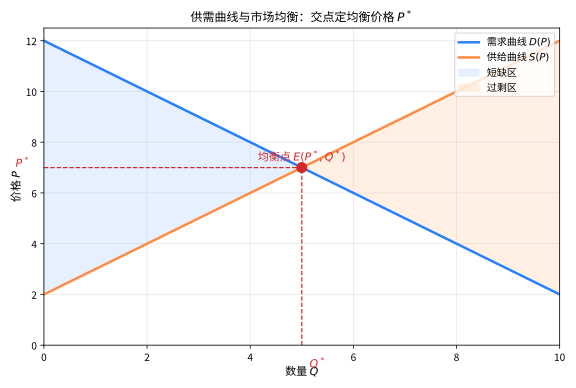
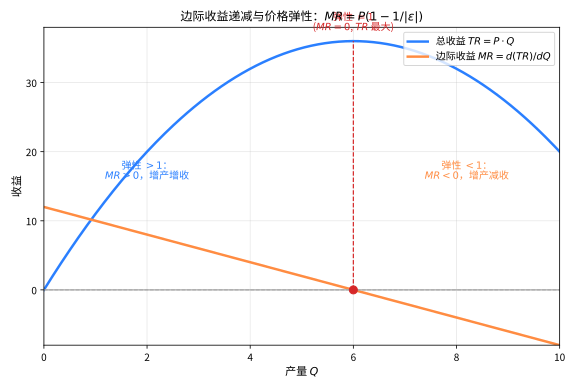

# 第133级 经济数学 (Mathematical Economics)

## 📖 学习目标

1. 理解一般均衡理论的基本框架及其数学基础
2. 掌握Arrow-Debreu一般均衡存在性的证明思路
3. 理解Arrow不可能定理的深刻含义及其证明
4. 掌握福利经济学两大基本定理及其经济含义
5. 理解匹配理论中的稳定匹配存在性及其算法
6. 了解机制设计、市场设计的前沿应用
7. 了解经济增长模型与动态优化方法

---

## 一、核心概念

### 1.1 一般均衡理论

**一般均衡理论**（General Equilibrium Theory）研究在多个市场相互关联的经济中，价格如何同时调整使得所有市场达到供求平衡。

> **🧠 直观理解（现实类比）**：一般均衡就像一座候车大厅里所有站的票价"同时联动"——大米便宜了、猪肉就得跟着变，牵一发动全身。它不再只看某一棵树（局部均衡），而是要求"整片森林"里每个市场（大米、猪肉、工资、地租……）的价格一起调整，直到所有市场的供求**同时**出清。核心科目是"多市场相互咬合时，是否存在一组让全部市场归位的价格"。

**定义1（竞争均衡）** 一个竞争均衡（Competitive Equilibrium）由价格向量 $\mathbf{p} \in \mathbb{R}^L_+$（$L$ 为商品种类数）和配置 $\{(\mathbf{x}_i^*)_{i=1}^I, (\mathbf{y}_j^*)_{j=1}^J\}$ 组成，满足：
1. 每个消费者 $i$ 在预算约束 $\mathbf{p} \cdot \mathbf{x}_i \leq \mathbf{p} \cdot \mathbf{e}_i + \sum_{j=1}^J \theta_{ij} \mathbf{p} \cdot \mathbf{y}_j$ 下最大化效用 $u_i(\mathbf{x}_i)$
2. 每个生产者 $j$ 在技术约束 $\mathbf{y}_j \in Y_j$ 下最大化利润 $\mathbf{p} \cdot \mathbf{y}_j$
3. 市场出清：$\sum_{i=1}^I \mathbf{x}_i^* = \sum_{i=1}^I \mathbf{e}_i + \sum_{j=1}^J \mathbf{y}_j^*$

> **💡 直观理解（类比）**：竞争均衡就是"各算各的账，却刚好都不剩"——每个消费者在自己兜里的钱（预算约束）内挑最称心的套餐，每个企业在自己能力（技术集）内赚最多，最后所有人买走的总量正好等于社会全部的货（市场出清）。就像食堂开饭：每人按自己饭票挑菜，厨师按菜谱做够，最后一粒米都不浪费。

> **直观理解（现实类比）**：市场均衡就像菜市场里讨价还价的"握手价"——商家想卖高价（供给曲线上行），买家想买低价（需求曲线下行），价格太低时供不应求（蓝色短缺区），价格太高时卖不出去（橙色过剩区）。在唯一让双方都满意的交点 $E(P^*,Q^*)$ 上，买得动也卖得掉，市场自然出清。这正是"看不见的手"一次次自动调整价格、奔向均衡的直观画面。

> **🧠 思考历程："看不见的手"究竟是怎么被写成方程的？**
>
> 市场里千千万万独立的买家与卖家，凭什么会自发地"各就各位"、价格又凭什么自动对齐？这个问题始于一句著名的经济隐喻，最终被数学家写成了一条严格的定理。它想回答的是：均衡真的"存在"吗，凭什么保证？
>
> - **从隐喻到方程**。1776年，亚当·斯密用"看不见的手"形容价格的自我调节。一个多世纪后，法国经济学家瓦尔拉斯（1874）才尝试把它写成方程组：所有市场同时出清、供需两两相等，这就是"一般均衡"。
> - **不动点让均衡成为定理**。真正把空谈变成证明的是阿罗与德布劳（1954）：他们借助库库塔尼不动点定理，在偏好连续、生产集凸的假设下证明——必然存在一组价格，使所有市场同时实现供求平衡，即竞争均衡的存在性定理。
> - **均衡还要接受福利的检验**。同一框架还证明了福利经济学定理：竞争均衡在帕累托意义上是有效率的。这让"看不见的手"第一次有了可以被验证和讨论的数学内容。
> - **心路**：一个朴素的经济直觉，要变成严格定理，往往需要几代人的接力，以及一套全新"不动点"语言。

### 1.2 Arrow-Debreu模型

**Arrow-Debreu模型**（Arrow-Debreu Model）是一般均衡理论的严格数学框架，由Kenneth Arrow和Gerard Debreu在1950年代建立。该模型在以下假设下证明了一般均衡的存在性：

- 消费者偏好满足完备性、传递性、连续性、严格单调性和严格凸性
- 生产集是凸的、闭的，且包含原点（可以停产）
- 所有消费者拥有初始禀赋

> **💡 直观理解（类比）**：Arrow-Debreu模型就像把"看不见的手"放进一间"无菌实验室"——给每个买家（口味挑剔但讲道理）、每个厂家（生产手段规范）都立好严格的规距，排除所有理想化之外的情形，再问：这样干净的房间里，价格能不能自动落到让所有市场同时出清的点？答案是能——它把"市场自会均衡"这句哲学口号，升级成了有前提、能证明的数学定理。

### 1.3 偏好与效用

**偏好**（Preference）是消费者对不同商品组合的排序。在数学上，偏好关系 $\succsim$ 满足：

- **完备性**：对任意 $x, y$，$x \succsim y$ 或 $y \succsim x$
- **传递性**：若 $x \succsim y$ 且 $y \succsim z$，则 $x \succsim z$
- **连续性**：集合 $\{x \mid x \succsim y\}$ 和 $\{x \mid y \succsim x\}$ 是闭集

> **💡 直观理解（类比）**：偏好就是一张"个人的口味排行榜"——完备性保证任何两样东西都能分出高下、绝不犹豫（没有"无法比较"的尴尬），传递性保证不会像"石头剪刀布"那样循环打架（若A胜过B、B胜过C，就绝不许冒出来C又胜过A），连续性则保证口味"平滑"：东西只变一点点，你的排序不会突然大翻盘。这三条是"口味能被写成一张连续打分表（效用函数）"的前提。

**效用函数**（Utility Function）$u: X \to \mathbb{R}$ 是偏好关系的数值表示：$x \succsim y \iff u(x) \geq u(y)$。

> **💡 直观理解（类比）**：效用函数就是把"口味排行榜"翻译成"一组能加能比的分数"——你心里对每个商品组合有一个隐形的"喜爱分"，分数高就表示更喜欢。它像给菜打分：虽然"好吃"是主观的，但只要这分组分数和你的真实排序完全一致，就能用它来做数学上的优化运算，把"怎么选最好"变成"怎么让分数最大"。

> **直观理解（现实类比）**：边际收益递减就像"吃自助餐"——头几口蛋糕最满足（边际收益高），越吃越撑（边际收益下滑），最后再多端一碟反而倒胃口（$MR<0$）。企业决定增产多少，看的不是"总收益"，而是"再多产一单位能多赚多少"（边际收益 $MR$）。当 $MR>0$ 时增产还能增收，一旦 $MR<0$ 就适得其反；而需求的价格弹性 $|\epsilon|$ 正是量化"顾客对降价有多敏感"的尺子。

### 1.4 期望效用理论

**期望效用理论**（Expected Utility Theory）是不确定性下的决策理论。von Neumann-Morgenstern效用函数 $U$ 具有形式：

$$U(L) = \sum_{i=1}^n p_i u(x_i)$$

其中 $L = (x_1, p_1; \ldots; x_n, p_n)$ 是一个彩票，$u$ 是von Neumann-Morgenstern效用函数。

> **💡 直观理解（类比）**：期望效用就像"买彩票时给每个可能结果先折算成'开心分'，再按中奖概率求加权平均"——抛一枚硬币，赢给100元、输给0元，不该直接算"平均50元"，而是先问"这100元让我多开心、0元让我多失落"，把货币换成"幸福感分"再求平均。它解释了为什么面对公平赌局，很多人仍拒绝（因为幸福的边际增加比痛苦减少慢，即风险厌恶），把"不确定下的选择"变成了一道可算的期望题。

### 1.5 博弈论在经济中的应用

**博弈论**（Game Theory）研究多个决策主体之间的策略互动。在经济中的应用包括：

- **寡头竞争**：Cournot竞争、Bertrand竞争
- **拍卖设计**：第一价格拍卖、第二价格拍卖（Vickrey拍卖）
- **讨价还价**：Rubinstein交替出价模型
- **信号博弈**：劳动力市场的Spence信号模型

> **💡 直观理解（类比）**：博弈论就像"下棋时想对手会怎么走"的学问——我做决定时，必须先预判对方的反应，而对方又在预判我的预判，无穷套娃。它把"多个聪明的头脑互相盯着对方出牌"（寡头定价、拍卖喊价、讨价还价）抽象成严格模型，回答"在互相作用的结局里，谁会怎样行动、安稳点在哪"。

### 1.6 社会福利函数

**社会福利函数**（Social Welfare Function）$W: \mathbb{R}^I \to \mathbb{R}$ 将个人效用映射为社会福利水平。常见形式包括：

- **功利主义**：$W(\mathbf{u}) = \sum_{i=1}^I u_i$
- **罗尔斯主义**：$W(\mathbf{u}) = \min_i u_i$
- **纳什社会福利函数**：$W(\mathbf{u}) = \prod_{i=1}^I u_i$

> **💡 直观理解（类比）**：社会福利函数就是把"千万人的幸福"压缩成一个数字的"总筛子"——功利主义只看总量、像算全班总分（谁考多少不加区分）；罗尔斯主义只盯最差的、像"只看垫底那位过得好不好"；纳什函数则看重均衡、谁都别太惨。不同筛子体现不同的公平观，是"社会该怎样才算好"的数学化表达。

### 1.7 匹配理论

**匹配理论**（Matching Theory）研究如何将不同群体的成员配对。核心概念是**稳定匹配**（Stable Matching）：不存在一对男女，他们彼此更喜欢对方而非当前配偶。

> **💡 直观理解（类比）**：匹配理论就是研究"把谁和谁配到一起最不容易散伙"——相亲配对、学生选校、器官捐献分配的本质都一样：不仅要试着配好，还要保证"没有一对人觉得对方比现任更好而想私奔"。若存在这样的"私奔对"，配对就不稳定，迟早被拆散。稳定匹配就是那个"无人横刀夺爱"的牢靠结果。

### 1.8 机制设计

**机制设计**（Mechanism Design）是博弈论的反向问题——设计博弈规则使得参与者的自利行为导致社会期望的结果。核心概念：

- **激励相容**（Incentive Compatibility）：参与者如实报告信息是最优策略
- **显示原理**（Revelation Principle）：任何机制都可以被一个直接显示机制替代
- **Myerson-Satterthwaite定理**：有效交易不可能在预算平衡下实现

> **💡 直观理解（类比）**：机制设计是"游戏规则的设计师"——普通博弈论问"给定规则，大家会怎么玩"，机制设计反过来问"我想让大家自愿做出某结果，规则该怎么定才能让每个人的自利正好导向它"。它像设计一份"诚实才有好处"的合同：让说真话是参与者的最优选择（激励相容），就像拍卖时出价高者得且提示别乱喊，把人性弱点算进规则里。

### 1.9 经济增长模型

**Solow增长模型**：$Y = F(K, AL)$，其中 $K$ 为资本，$L$ 为劳动，$A$ 为技术进步。

> **💡 直观理解（类比）**：Solow模型就像国家这台"大机器"的总产量处方——产出由资本（机器厂房）、劳动（人手）和技术（效率加成）一起决定。它最出名的洞见是：单纯多存钱换机器不会一直推高人均产出，终会撞上一个"稳态"；长期能让人均生活水平越走越高的，只有技术进步 $A$——就像比赛里只有"更好用的工具"才能让货越运越快，光加班加点是有限的。

**Ramsey-Cass-Koopmans模型**：在无限期界下优化消费路径，使用动态优化方法。

> **💡 直观理解（类比）**：Ramsey-Cass-Koopmans模型就像给一个"会过日子的家庭"规划一辈子怎么花——不是盯着眼前一年，而是把从现在到永远的全部日子做一道最优规划：今天少吃一点攒钱（储蓄）、明天多许多人（消费），在"少吃今天的苦"和"多留明天的甜"之间找那条最优的消费轨迹。它用动态优化方法问：一路上每一刻该存多少、花多少，才能让一生幸福总和最大。

---

## 二、定理与证明

### 定理1：Arrow-Debreu一般均衡的存在性

**定理（Arrow-Debreu一般均衡存在性定理）** 在以下假设下，经济中存在至少一个竞争均衡：
1. 每个消费者的偏好是完备的、可传递的、连续的、严格单调的、严格凸的
2. 每个消费者的初始禀赋是严格正的
3. 每个生产者的生产集是凸的、闭的，且 $0 \in Y_j$
4. 总生产集 $Y = \sum_{j=1}^J Y_j$ 是凸的，且 $Y \cap \mathbb{R}^L_+ = \{0\}$（不可免费生产）

**证明**（使用角谷不动点定理和超需求函数方法）：

**第一步：规范化价格空间。**

由于均衡价格只依赖于相对价格，我们可以将价格限制在单纯形上：

$$\Delta = \left\{p \in \mathbb{R}^L_+ \;\Big|\; \sum_{\ell=1}^L p_\ell = 1\right\}$$

**第二步：定义超额需求函数。**

对每个消费者 $i$，给定价格 $p$，求解效用最大化问题：

$$\max_{x_i \in \mathbb{R}^L_+} u_i(x_i) \quad \text{s.t.} \quad p \cdot x_i \leq p \cdot e_i + \sum_{j=1}^J \theta_{ij} \pi_j(p)$$

其中 $\pi_j(p) = \max_{y_j \in Y_j} p \cdot y_j$ 是生产者 $j$ 的最大利润。

记解为 $x_i(p)$。定义总需求为 $X(p) = \sum_{i=1}^I x_i(p)$，总供给为 $E = \sum_{i=1}^I e_i$，总生产为 $Y(p) = \sum_{j=1}^J y_j(p)$。

**超额需求函数**为：

$$Z(p) = X(p) - E - Y(p)$$

> **💡 直观理解（类比）**：超额需求函数就是"全市场想买的减去能供的差额账本"——$Z(p)$ 为正是"有人想买却买不够"（供不应求、物以稀为贵），为负是"货多到没人要"（供过于求、积压甩卖）。价格就像遥控器：哪样东西超额需求大，价格就该调高；超额供给多，就该调低。不动点证明的核心，就是找到让这本差额账整体归零的那组价格。

**第三步：超额需求函数的性质。**

在给定假设下，超额需求函数 $Z: \Delta \to \mathbb{R}^L$ 满足以下性质：

1. **连续性**：$Z(p)$ 在 $\Delta$ 上连续（由偏好连续性和预算集连续依赖价格保证）
2. **齐次性**：$Z(\lambda p) = Z(p)$ 对所有 $\lambda > 0$（由零次齐次性保证）
3. **Walras律**：$p \cdot Z(p) = 0$ 对所有 $p \in \Delta$（由预算约束加总得出）
4. **下有界性**：存在 $M > 0$ 使得 $Z_\ell(p) > -M$ 对所有 $\ell$ 和所有 $p$（由禀赋有限性保证）

**第四步：构造辅助函数。**

定义修正的超额需求函数 $\hat{Z}: \Delta \to \mathbb{R}^L$：

$$\hat{Z}_\ell(p) = \frac{Z_\ell(p)}{1 + \sum_{k=1}^L |Z_k(p)|}$$

可以验证 $\hat{Z}$ 满足：
- $\hat{Z}$ 在 $\Delta$ 上连续
- $p \cdot \hat{Z}(p) = 0$（由Walras律）
- $|\hat{Z}_\ell(p)| \leq 1$ 对所有 $\ell$

**第五步：构造价格调整函数。**

定义映射 $g: \Delta \to \Delta$：

$$g_\ell(p) = \frac{p_\ell + \max(0, \hat{Z}_\ell(p))}{1 + \sum_{k=1}^L \max(0, \hat{Z}_k(p))}$$

**直观解释**：如果商品 $\ell$ 存在超额需求（$Z_\ell(p) > 0$），则提高其价格；如果存在超额供给，则降低其价格（或至少不提高）。

**第六步：验证 $g$ 满足角谷不动点定理条件。**

1. $\Delta$ 是非空、凸、紧集
2. $g: \Delta \to \Delta$ 是连续函数（由 $\hat{Z}$ 的连续性保证）

因此，由Brouwer不动点定理（角谷不动点定理的连续函数版本），存在 $p^* \in \Delta$ 使得 $g(p^*) = p^*$。

**第七步：证明不动点即为均衡价格。**

设 $p^*$ 是 $g$ 的不动点，则：

$$p^*_\ell = \frac{p^*_\ell + \max(0, \hat{Z}_\ell(p^*))}{1 + \sum_{k=1}^L \max(0, \hat{Z}_k(p^*))}$$

交叉相乘：

$$p^*_\ell \left[1 + \sum_{k=1}^L \max(0, \hat{Z}_k(p^*))\right] = p^*_\ell + \max(0, \hat{Z}_\ell(p^*))$$

化简得：

$$p^*_\ell \sum_{k=1}^L \max(0, \hat{Z}_k(p^*)) = \max(0, \hat{Z}_\ell(p^*))$$

两边乘以 $\hat{Z}_\ell(p^*)$ 并对 $\ell$ 求和：

$$\left(\sum_{k=1}^L \max(0, \hat{Z}_k(p^*))\right) \sum_{\ell=1}^L p^*_\ell \hat{Z}_\ell(p^*) = \sum_{\ell=1}^L \hat{Z}_\ell(p^*) \max(0, \hat{Z}_\ell(p^*))$$

由Walras律 $p^* \cdot \hat{Z}(p^*) = 0$，左边为0，因此：

$$\sum_{\ell=1}^L \hat{Z}_\ell(p^*) \max(0, \hat{Z}_\ell(p^*)) = 0$$

这意味着对每个 $\ell$，$\hat{Z}_\ell(p^*) \max(0, \hat{Z}_\ell(p^*)) = 0$，即 $\hat{Z}_\ell(p^*) \leq 0$ 对所有 $\ell$ 成立，且当 $p^*_\ell > 0$ 时 $\hat{Z}_\ell(p^*) = 0$。

因此，$Z(p^*) \leq 0$（所有商品没有超额需求），且当 $p^*_\ell > 0$ 时 $Z_\ell(p^*) = 0$（正价格的商品市场出清）。这正是竞争均衡的定义。

**结论**：在Arrow-Debreu模型的假设下，竞争均衡存在。$\square$
> **直观理解（现实类比）**：Arrow-Debreu一般均衡就像菜市场里"人人各取所需、价格自动出清"的奇迹——成千上万的买家卖家各怀心思，可只要价格愿意浮动，总能找到一组价格让所有东西既不缺货也不滞销。数学上这是"不动点"在搭桥：把价格映射的连续变换压缩到一个不动点，就是那组让市场供需相抵的均衡价格。

### 定理2：Arrow不可能定理

**定理（Arrow不可能定理）** 当社会中有至少两个个体和至少三个备选方案时，不存在同时满足以下四个条件的社会福利函数 $F: \mathcal{R}^I \to \mathcal{R}$：
1. **帕累托最优**（Pareto Optimality）：如果所有个体都偏好 $x$ 胜过 $y$，则社会偏好也认为 $x$ 胜过 $y$
2. **无关方案独立性**（Independence of Irrelevant Alternatives）：社会对 $x$ 和 $y$ 的偏好只依赖于个体对 $x$ 和 $y$ 的偏好，与个体对其他方案的偏好无关
3. **非独裁性**（Non-Dictatorship）：不存在一个个体 $i$，使得社会偏好总是等于个体 $i$ 的偏好
4. **全域性**（Unrestricted Domain）：$F$ 定义在所有可能的偏好组合上

**证明**（公理化分析）：

**第一步：建立框架。**

设 $N = \{1, \ldots, I\}$ 为个体集合（$I \geq 2$），$X = \{x, y, z, \ldots\}$ 为备选方案集合（$|X| \geq 3$）。每个个体 $i$ 有一个偏好关系 $\succsim_i$ 是 $X$ 上的完备、传递的二元关系。社会福利函数 $F$ 将个体偏好组合 $(\succsim_1, \ldots, \succsim_I)$ 映射为社会偏好 $\succsim_S$。

**定义（决定性集合）** 称集合 $D \subseteq N$ 对 $(x, y)$ 是**决定性的**，如果当 $D$ 中所有个体偏好 $x$ 胜过 $y$，而 $D$ 外所有个体偏好 $y$ 胜过 $x$ 时，社会偏好为 $x$ 胜过 $y$。

> **💡 直观理解（类比）**：决定性集合就像投票中的"拥有一票定乾坤能力的小团体"——只要这一组人统统选$x$、其余人统统选$y$，社会结果就一定是$x$胜过$y$。它像"关键少数"：这撮人怎么站队，就直接锁定了全局结局，是Arrow证明里用来"走私独裁者"的关键工具。

**第二步：引理1——帕累托最优与全域性蕴含存在决定性集合。**

由帕累托最优条件，当所有个体偏好 $x$ 胜过 $y$ 时，社会偏好 $x$ 胜过 $y$。因此，全集 $N$ 对任意 $(x, y)$ 是决定性的。

**第三步：引理2——决定性集合的收缩。**

**声明**：如果 $D$ 是对 $(x, y)$ 的决定性集合且 $|D| \geq 2$，则存在 $D$ 的真子集 $D' \subset D$ 对某对方案是决定性的。

> **💡 直观理解（类比）**：这个引理说是"决定性权力可以越分越小"——只要某个决定性小团体内有至少两人，就能想个计策再切出一个更小的决定性子集。就像切蛋糕：只要刀够稳，总能从"说了算的一撮人"里再劈出一个"更核心的说了算小圈子"，一步步朝着"单个人说了算"逼近。

**证明**：将 $D$ 分为两个非空子集 $D_1$ 和 $D_2$（$D_1 \cup D_2 = D$，$D_1 \cap D_2 = \emptyset$）。考虑第三个方案 $z$（$z \neq x, y$）。构造如下偏好组合：

- 对 $i \in D_1$：$x \succ_i y \succ_i z$
- 对 $i \in D_2$：$z \succ_i x \succ_i y$
- 对 $i \notin D$：$y \succ_i z \succ_i x$

由于 $D$ 对 $(x, y)$ 是决定性的，社会偏好 $x$ 胜过 $y$。

现在考虑社会对 $x$ 和 $z$ 的偏好：
- 如果社会偏好 $z$ 胜过 $x$，则结合 $x \succ_S y$（由决定性）和 $z \succ_S x$ 可得 $z \succ_S y$（由传递性）。但此时 $D_2$ 中的个体偏好 $z$ 胜过 $y$，而其他个体偏好 $y$ 胜过 $z$，因此 $D_2$ 对 $(z, y)$ 是决定性的。
- 如果社会偏好 $x$ 胜过 $z$，则 $D_1$ 对 $(x, z)$ 是决定性的（因为 $D_1$ 中个体偏好 $x$ 胜过 $z$，而其他个体偏好 $z$ 胜过 $x$）。

无论哪种情况，$D_1$ 或 $D_2$ 对某对方案是决定性的。$\square$

**第四步：引理3——决定性集合的进一步性质。**

**声明**：如果 $D$ 对某对 $(x, y)$ 是决定性的，则 $D$ 对所有方案对都是决定性的。

> **💡 直观理解（类比）**：这个引理说是"一经证明有决定权，就对所有事都有决定权"——只要某小组能定$xy$之争，借传递性这把"梯子"一步步爬，也能定任意$a$和$b$之争。如同在部门"说一不二"的人，对任何议题其实都握有最终拍板权，决定性能力一经确立就"通吃全场"。

**证明**：设 $D$ 对 $(x, y)$ 是决定性的。考虑任意方案对 $(a, b)$。我们需要证明 $D$ 对 $(a, b)$ 也是决定性的。

分多种情况处理，利用无关方案独立性。这里只证明一种情况：$a = x$，$b$ 是不同于 $x, y$ 的方案。

构造偏好组合：
- 对 $i \in D$：$x \succ_i y \succ_i b$
- 对 $i \notin D$：$y \succ_i b \succ_i x$

由 $D$ 对 $(x, y)$ 的决定性，社会偏好 $x$ 胜过 $y$。由帕累托最优，社会偏好 $y$ 胜过 $b$（因为所有个体偏好 $y$ 胜过 $b$）。由传递性，社会偏好 $x$ 胜过 $b$。

在给定偏好组合中，$D$ 中个体偏好 $x$ 胜过 $b$，而 $D$ 外个体偏好 $b$ 胜过 $x$。由无关方案独立性，社会对 $x$ 和 $b$ 的偏好只依赖于个体对这两者的偏好。因此 $D$ 对 $(x, b)$ 是决定性的。

类似可证 $D$ 对其他方案对也是决定性的。$\square$

**第五步：导出矛盾。**

由引理1，全集 $N$ 是决定性的。反复应用引理2，我们可以不断缩小决定性集合，最终得到一个单个个体的决定性集合 $\{i_0\}$。由引理3，这个个体对所有方案对都是决定性的。

但这意味着个体 $i_0$ 是一个独裁者——社会偏好总是等于个体 $i_0$ 的偏好，违反了非独裁性条件。

因此，不存在同时满足所有四个条件的社会福利函数。$\square$

**结论**：Arrow不可能定理揭示了民主投票的内在局限性——不存在完美的集体决策规则。这个定理为社会选择理论奠定了基础，也影响了机制设计和公共经济学的发展。

> **直观理解（现实类比）**：Arrow不可能定理就像一场"投票的魔咒"——不管你怎么设计选举规则，只要候选人有3个以上，就不可能同时满足"帕累托、无关备选独立性、非独裁"这几条看似理所当然的公平要求。总有某个规则会让"票王"被一个诡异的小团体操纵，就像"孔多塞悖论"里A胜B、B胜C、C又胜A的死循环——完美的民主投票，数学上注定不存在。

### 定理3：福利经济学第一基本定理

**定理（福利经济学第一基本定理）** 在完全竞争市场中，任何竞争均衡都是帕累托最优的（Pareto Optimal）。即，不存在一种重新配置方式使得至少一个人的境况变得更好而没有人变得更差。

> **💡 直观理解（类比）**：第一福利定理说"市场自发挑出的结果，已然是物理上无法再让任何人变好而不伤及他人的分配"——就像自助餐按各人口味抢完之后，你想再多拿一点，就一定会有别人少吃一口。它把"看不见的手"从口号变成定理：在完全竞争的完美条件下，人人自利的自由交易会自动落在"帕累托效率"上，不给任何人"空手占便宜"的空间。

**证明**：

**第一步：建立模型。**

考虑一个具有 $I$ 个消费者和 $J$ 个生产者的经济。设 $(p^*, (x_i^*)_{i=1}^I, (y_j^*)_{j=1}^J)$ 是一个竞争均衡，其中 $p^*$ 为均衡价格向量，$x_i^*$ 为消费者 $i$ 的最优消费束，$y_j^*$ 为生产者 $j$ 的最优生产计划。

**第二步：反证法假设。**

假设存在一个可行的配置 $(\tilde{x}_i, \tilde{y}_j)$ 帕累托优于均衡配置，即：
1. $\tilde{x}_i \succsim_i x_i^*$ 对所有 $i$，且至少存在一个 $i_0$ 使得 $\tilde{x}_{i_0} \succ_{i_0} x_{i_0}^*$
2. $\sum_{i=1}^I \tilde{x}_i = \sum_{i=1}^I e_i + \sum_{j=1}^J \tilde{y}_j$
3. $\tilde{y}_j \in Y_j$ 对所有 $j$

**第三步：利用效用最大化条件。**

由消费者 $i$ 在均衡中的效用最大化，如果 $\tilde{x}_i \succsim_i x_i^*$，则必须有 $p^* \cdot \tilde{x}_i \geq p^* \cdot x_i^*$。否则，如果 $p^* \cdot \tilde{x}_i < p^* \cdot x_i^*$，则消费者 $i$ 可以在预算约束内购买 $\tilde{x}_i$，这与 $x_i^*$ 是最优选择矛盾。

更严格地，由偏好的局部非饱和性（Local Non-Satiation），如果 $\tilde{x}_i \succsim_i x_i^*$，则 $p^* \cdot \tilde{x}_i \geq p^* \cdot x_i^*$。如果 $\tilde{x}_i \succ_i x_i^*$，则 $p^* \cdot \tilde{x}_i > p^* \cdot x_i^*$。

**第四步：消费者支出加总。**

对所有消费者求和：

$$\sum_{i=1}^I p^* \cdot \tilde{x}_i > \sum_{i=1}^I p^* \cdot x_i^*$$

其中严格不等式来自至少一个消费者严格偏好改善。

**第五步：利用利润最大化条件和市场出清。**

由生产者 $j$ 的利润最大化：$p^* \cdot \tilde{y}_j \leq p^* \cdot y_j^*$（因为 $y_j^*$ 最大化利润）。

由市场出清：

$$\sum_{i=1}^I x_i^* = \sum_{i=1}^I e_i + \sum_{j=1}^J y_j^*$$

因此：

$$\sum_{i=1}^I p^* \cdot x_i^* = \sum_{i=1}^I p^* \cdot e_i + \sum_{j=1}^J p^* \cdot y_j^* \geq \sum_{i=1}^I p^* \cdot e_i + \sum_{j=1}^J p^* \cdot \tilde{y}_j$$

**第六步：导出矛盾。**

但由 $(\tilde{x}_i, \tilde{y}_j)$ 的可行性：

$$\sum_{i=1}^I \tilde{x}_i = \sum_{i=1}^I e_i + \sum_{j=1}^J \tilde{y}_j$$

所以：

$$\sum_{i=1}^I p^* \cdot \tilde{x}_i = \sum_{i=1}^I p^* \cdot e_i + \sum_{j=1}^J p^* \cdot \tilde{y}_j \leq \sum_{i=1}^I p^* \cdot x_i^*$$

这与第四步的严格不等式矛盾。因此，不存在帕累托优于均衡的配置。

**结论**：竞争均衡是帕累托最优的，这说明了"看不见的手"原理——自利的个体在市场机制下实现了社会最优。$\square$

### 定理4：福利经济学第二基本定理

**定理（福利经济学第二基本定理）** 在凸性假设下，任何帕累托最优配置都可以通过竞争均衡实现，前提是进行适当的初始禀赋再分配（lump-sum transfers）。即，对于任何帕累托最优配置 $(x^*, y^*)$，存在价格向量 $p^*$ 和转移支付 $T_i$（满足 $\sum_{i=1}^I T_i = 0$），使得在调整后的预算约束下，$(p^*, x^*, y^*)$ 构成一个竞争均衡。

> **💡 直观理解（类比）**：第二福利定理说"公平可以单独靠分蛋糕，而不必去动市场这台机器"——只要先把初始家底按想要的方式重新发一遍（一次性转移，不扭曲价格），市场自己就能把那份"既公平又高效"的分配变出来。它把"效率"和"公平"两个目标拆开：市场负责把蛋糕做得尽可能大，政府只需在开席前调整每个人手里的叉子。

**证明**：

**第一步：建立模型。**

设 $(x^*, y^*)$ 是一个帕累托最优配置，其中 $x_i^*$ 为消费者 $i$ 的消费束，$y_j^*$ 为生产者 $j$ 的生产计划，且 $\sum_i x_i^* = \sum_i e_i + \sum_j y_j^*$。

**第二步：构造分离超平面。**

对每个消费者 $i$，定义"更好集"（Better Set）：

$$B_i(x_i^*) = \{x_i \in \mathbb{R}^L_+ \mid x_i \succ_i x_i^*\}$$

由偏好凸性，$B_i(x_i^*)$ 是凸集。

定义总更好集：

$$B = \sum_{i=1}^I B_i(x_i^*) + \sum_{i=1}^I \{e_i\} + \sum_{j=1}^J \{y_j^*\}$$

定义总生产集：

$$Y = \sum_{i=1}^I \{e_i\} + \sum_{j=1}^J Y_j$$

由帕累托最优性，$B \cap Y = \emptyset$（否则存在帕累托改进）。

**第三步：应用凸集分离定理。**

$B$ 和 $Y$ 都是凸集（由偏好的凸性和生产集的凸性），且不相交。由凸集分离定理，存在非零向量 $p^* \in \mathbb{R}^L \setminus \{0\}$ 和常数 $c \in \mathbb{R}$ 使得：

$$p^* \cdot b \geq c \geq p^* \cdot y \quad \text{对所有 } b \in B, y \in Y$$

**第四步：证明 $p^*$ 是均衡价格。**

需要验证：
1. $p^* \geq 0$（非负价格）
2. 在价格 $p^*$ 下，$y_j^*$ 最大化生产者 $j$ 的利润
3. 在价格 $p^*$ 和适当的转移支付下，$x_i^*$ 最大化消费者 $i$ 的效用

**价格非负性**：假设存在 $\ell$ 使得 $p^*_\ell < 0$。考虑 $b \in B$ 且 $b_\ell \to \infty$，则 $p^* \cdot b \to -\infty$，与 $p^* \cdot b \geq c$ 矛盾。因此 $p^* \geq 0$。

**利润最大化**：对任意 $y_j \in Y_j$，$y_j + \sum_{k \neq j} y_k^* + \sum_i e_i \in Y$，因此 $p^* \cdot (y_j + \sum_{k \neq j} y_k^* + \sum_i e_i) \leq c$。同时 $p^* \cdot (\sum_i e_i + \sum_j y_j^*) \geq c$（因为 $\sum_i x_i^* = \sum_i e_i + \sum_j y_j^* \in B$ 的闭包）。结合两者可得 $p^* \cdot y_j \leq p^* \cdot y_j^*$，即 $y_j^*$ 最大化利润。

**消费者最优性**：对任意 $x_i \succ_i x_i^*$，$x_i + \sum_{k \neq i} x_k^* \in B$，因此 $p^* \cdot x_i + \sum_{k \neq i} p^* \cdot x_k^* \geq c$。同时 $p^* \cdot \sum_i x_i^* = c$（由分离性质），因此 $p^* \cdot x_i \geq p^* \cdot x_i^*$。这意味着在价格 $p^*$ 下，$x_i^*$ 是预算约束 $p^* \cdot x_i \leq p^* \cdot x_i^*$ 下的最优选择。

**第五步：确定转移支付。**

定义转移支付 $T_i = p^* \cdot (x_i^* - e_i) - \sum_{j=1}^J \theta_{ij} p^* \cdot y_j^*$，则 $\sum_i T_i = 0$，且在调整后的预算约束 $p^* \cdot x_i \leq p^* \cdot e_i + \sum_j \theta_{ij} p^* \cdot y_j^* + T_i = p^* \cdot x_i^*$ 下，$x_i^*$ 是最优选择。

**结论**：任何帕累托最优配置都可以通过竞争均衡实现，条件是进行适当的转移支付。这为福利经济学中的"效率与公平分离"提供了理论基础——政府可以通过再分配实现公平，而市场机制确保效率。$\square$

### 定理5：匹配市场中的稳定匹配存在性（Gale-Shapley）

**定理（Gale-Shapley定理）** 在双边匹配市场中，稳定匹配总是存在的。具体地，Gale-Shapley延迟接受算法（Deferred Acceptance Algorithm）总能找到一个稳定匹配。

> **💡 直观理解（类比）**：Gale-Shapley定理给了一个爽快承诺——无论双方口味多五花八门，只要用"延迟接受"这套流程，就**一定**能配出一份"谁都撬不动的稳定结果"。它像"招人总会成"的定心丸：你不必担心配不出结果，算法保证终点一定稳稳落地，剩下的只是谁来主动追、谁被动挑的问题。

**证明**：

**第一步：建立匹配模型。**

考虑两个不相交的有限集合：$M = \{m_1, \ldots, m_n\}$（男性集合）和 $W = \{w_1, \ldots, w_n\}$（女性集合）。每个参与者对对方群体有严格的偏好排序。

**定义（匹配）** 一个匹配 $\mu$ 是从 $M \cup W$ 到 $M \cup W$ 的一一映射，满足：
1. $\mu(m) \in W \cup \{m\}$（男性要么匹配到女性，要么单身）
2. $\mu(w) \in M \cup \{w\}$（女性要么匹配到男性，要么单身）
3. $\mu(\mu(x)) = x$（对合性）

> **💡 直观理解（类比）**：匹配就是一份"两两搭档的名单"——每个人最多绑一位搭档，要么成对、要么单着，且关系是"互认"的（你指我、我也指你，谁都不许身兼两职）。它像婚礼请柬上的名单：每位来宾一份，箭头指向的唯一对象，绝不允许"脚踏两条船"。

**定义（稳定匹配）** 匹配 $\mu$ 是稳定的，如果不存在阻塞对（Blocking Pair）$(m, w)$ 使得 $m$ 和 $w$ 都更偏好对方而非当前配偶（包括单身），即 $w \succ_m \mu(m)$ 且 $m \succ_w \mu(w)$。

> **💡 直观理解（类比）**：稳定匹配就是"没有人想跟现任拆伙去私奔"的名单——只要存在一对男女，彼此都觉得"对方比我现在那人强"，他们就会合伙跑路（阻塞对），配对就算塌房。稳定匹配要求名单上找不到任何一对"互相心动、想背叛现任"的组合，是配对能长期站稳脚跟的底线。

**第二步：Gale-Shapley算法（男性提议版本）。**

**输入**：双方的偏好列表。

**算法过程**：
1. 初始时，所有参与者为单身。
2. 当存在单身男性 $m$ 尚未向所有女性求过婚时：
   a. 选择这样的 $m$，让他向他尚未求过婚的偏好列表中排名最高的女性 $w$ 求婚
   b. 如果 $w$ 是单身，则 $w$ 暂时接受 $m$，两人成为"订婚"状态
   c. 如果 $w$ 已订婚，比较 $m$ 和 $w$ 当前订婚对象 $m'$：
      - 如果 $w$ 更偏好 $m$ 胜过 $m'$，则 $w$ 接受 $m$，$m'$ 恢复单身
      - 如果 $w$ 更偏好 $m'$ 胜过 $m$，则 $w$ 拒绝 $m$，$m$ 保持单身
3. 算法终止时，所有匹配为最终匹配。

**第三步：证明算法终止。**

由于每个男性最多向 $n$ 个女性求婚，且每个求婚要么被接受要么被拒绝，总求婚次数最多为 $n^2$ 次。因此算法在有限步内终止。

**第四步：证明算法输出的匹配是稳定的。**

反证法。假设算法输出的匹配 $\mu$ 存在一个阻塞对 $(m, w)$，即 $w \succ_m \mu(m)$ 且 $m \succ_w \mu(w)$。

在算法中，$m$ 按照偏好顺序从高到低求婚。既然 $w \succ_m \mu(m)$，$m$ 一定在算法的某个时刻向 $w$ 求过婚（因为他在向 $\mu(m)$ 求婚之前已经向所有更偏好的女性求过婚）。

$m$ 向 $w$ 求婚时有两种可能：
1. $w$ 当时接受了 $m$ 的求婚。但最终 $w$ 没有与 $m$ 匹配，说明 $w$ 后来遇到了一个更偏好的男性 $m'$，即 $m' \succ_w m$。而 $w$ 最终匹配的是 $\mu(w)$，由算法可知 $\mu(w) \succsim_w m'$（因为 $w$ 会用更偏好的人替换当前订婚对象）。因此 $\mu(w) \succsim_w m' \succ_w m$，即 $m \not\succ_w \mu(w)$，与假设矛盾。

2. $w$ 当时拒绝了 $m$ 的求婚。这说明 $w$ 当时有更偏好的订婚对象 $m'$，即 $m' \succ_w m$。同样，最终 $\mu(w) \succsim_w m' \succ_w m$，即 $m \not\succ_w \mu(w)$，与假设矛盾。

因此，不存在阻塞对，$\mu$ 是稳定匹配。

**第五步：算法产生的匹配是男性最优的。**

可以证明，在男性提议版本中，每个男性得到的匹配是他所有稳定匹配中最好的（即他最偏好的）。这是因为男性在算法中从高到低求婚，一旦被拒绝，说明该女性在所有稳定匹配中都不会与他匹配（否则会产生阻塞）。

**第六步：算法产生的匹配是女性最差的。**

对称地，在男性提议版本中，每个女性得到的匹配是她所有稳定匹配中最差的。这是因为女性拒绝男性意味着她在所有稳定匹配中都不会接受该男性。

**结论**：Gale-Shapley算法证明了稳定匹配的存在性，并提供了构造方法。该算法及其变体已被广泛应用于大学录取、住院医师匹配、器官捐赠等实际场景。$\square$
> **直观理解（现实类比）**：Gale-Shapley算法就像一场"男生追女生、女生守门"的舞会配对——每一轮男生向最心仪且还没拒绝自己的女生表白，女生在所有追求者里留住最喜欢的、婉拒其余。被拒的男生下一轮再去追次心仪的，如此反复直到没人再表白。结果一定"稳定"：不会有哪对男女互相觉得对方比自己现任更好而私奔。

---

## 三、示例

### 示例1：Edgeworth盒中的一般均衡分析

**情境**：一个两人、两商品的纯交换经济。消费者A的初始禀赋为 $\mathbf{e}_A = (4, 8)$，消费者B的初始禀赋为 $\mathbf{e}_B = (6, 2)$。效用函数为 $u_A(x_A, y_A) = x_A^{1/2} y_A^{1/2}$，$u_B(x_B, y_B) = x_B^{1/3} y_B^{2/3}$。

**第一步：求解个体需求函数。**

对于Cobb-Douglas效用函数 $u(x, y) = x^\alpha y^{1-\alpha}$，需求函数为：

$$x = \frac{\alpha I}{p_x}, \quad y = \frac{(1-\alpha)I}{p_y}$$

其中 $I$ 为收入。

消费者A（$\alpha = 1/2$）：$I_A = 4p_x + 8p_y$
$$x_A = \frac{1/2 \times (4p_x + 8p_y)}{p_x} = 2 + \frac{4p_y}{p_x}$$
$$y_A = \frac{1/2 \times (4p_x + 8p_y)}{p_y} = \frac{2p_x}{p_y} + 4$$

消费者B（$\alpha = 1/3$）：$I_B = 6p_x + 2p_y$
$$x_B = \frac{1/3 \times (6p_x + 2p_y)}{p_x} = 2 + \frac{2p_y}{3p_x}$$
$$y_B = \frac{2/3 \times (6p_x + 2p_y)}{p_y} = \frac{4p_x}{p_y} + \frac{4}{3}$$

**第二步：市场出清条件。**

商品X市场出清：$x_A + x_B = 4 + 6 = 10$

$$\left(2 + \frac{4p_y}{p_x}\right) + \left(2 + \frac{2p_y}{3p_x}\right) = 10$$

$$\frac{14p_y}{3p_x} = 6$$

$$\frac{p_y}{p_x} = \frac{9}{7}$$

**第三步：计算均衡配置。**

$$p_x = 7, p_y = 9$$（设定 $p_x = 7$ 使价格标准化）

$$x_A = 2 + \frac{4 \times 9}{7} = 2 + \frac{36}{7} = \frac{50}{7} \approx 7.14$$
$$y_A = \frac{2 \times 7}{9} + 4 = \frac{14}{9} + 4 = \frac{50}{9} \approx 5.56$$
$$x_B = 10 - \frac{50}{7} = \frac{20}{7} \approx 2.86$$
$$y_B = 10 - \frac{50}{9} = \frac{40}{9} \approx 4.44$$

**第四步：验证帕累托最优性。**

消费者的边际替代率：
$$MRS_A = \frac{MU_{x_A}}{MU_{y_A}} = \frac{y_A}{x_A} = \frac{50/9}{50/7} = \frac{7}{9} = \frac{p_x}{p_y}$$
$$MRS_B = \frac{MU_{x_B}}{MU_{y_B}} = \frac{(1/3)x_B^{-2/3}y_B^{2/3}}{(2/3)x_B^{1/3}y_B^{-1/3}} = \frac{y_B}{2x_B} = \frac{40/9}{2 \times 20/7} = \frac{7}{9} = \frac{p_x}{p_y}$$

两者相等，且等于价格比，满足帕累托最优条件。

### 示例2：Gale-Shapley大学录取匹配

**情境**：三所大学 $\{A, B, C\}$ 各有一个招生名额，三名学生 $\{x, y, z\}$。偏好如下：

**大学偏好**（对学生）：
- 大学A：$x \succ y \succ z$
- 大学B：$y \succ z \succ x$
- 大学C：$x \succ z \succ y$

**学生偏好**（对大学）：
- 学生x：$B \succ A \succ C$
- 学生y：$A \succ B \succ C$
- 学生z：$A \succ C \succ B$

**Gale-Shapley算法（学生提议版本）**：

**第一轮**：
- 学生x向B申请 → B暂时接受x
- 学生y向A申请 → A暂时接受y
- 学生z向A申请 → A比较y和z，更偏好y，拒绝z → z被拒

**第二轮**：
- z向C申请（z的第二偏好是C） → C暂时接受z

**最终匹配**：
- 大学A录取学生y
- 大学B录取学生x
- 大学C录取学生z

**稳定性检查**：
- (x, A)：x偏好A胜过B吗？不，x偏好B胜过A（B是x的第一偏好）
- (y, B)：y偏好B胜过A吗？不，y偏好A胜过B（A是y的第一偏好）
- (z, A)：z偏好A胜过C吗？是（A是z的第一偏好）。A偏好z胜过y吗？不，A偏好y胜过z
- 其他组合类似检查，不存在阻塞对。

**结论**：得到的匹配是稳定的。

---

## 四、习题

### 基础题

**习题 1**（竞争均衡定义）写出竞争均衡的三个组成部分并给出市场出清条件，说明价格在市场均衡中的作用。

**习题 2**（偏好性质）说明偏好关系 $\succsim$ 的完备性、传递性与连续性的含义，并解释它们为何是效用函数存在的前提。

**习题 3**（效用函数与 MRS）写出 Cobb-Douglas 效用 $u(x,y)=x^\alpha y^{1-\alpha}$ 的边际替代率 $MRS=-\frac{dy}{dx}$ 的表达式，并说明其随 $x$ 增加如何变化。

**习题 4**（期望效用）写出 von Neumann-Morgenstern 期望效用形式，解释"确定性等价"与"风险厌恶"的含义。

**习题 5**（福利函数）写出功利主义、罗尔斯主义与纳什社会福利函数，并说明三者对"公平"的不同侧重。

**习题 6**（稳定匹配）给出稳定匹配的定义，说明阻塞对的含义并解释为何需要排除。

**习题 7**（机制设计概念）解释激励相容与显示原理，说明显示原理如何简化机制设计问题。

**习题 8**（Solow 模型）写出 Solow 模型生产函数 $Y=F(K,AL)$ 和资本积累方程，指出稳态时人均资本的特征。

**习题 9**（Arrow-Debreu 前提）列出 Arrow-Debreu 一般均衡存在性所需的几条关键假设。

**习题 10**（博弈论基本概念）区分占优策略与纳什均衡，说明二者在概念上的不同。

### 进阶题

**习题 11**（Edgeworth 均衡计算）两人两商品纯交换经济：$A$ 禀赋 $(4,8)$、效用 $u_A=x_A^{1/2}y_A^{1/2}$，$B$ 禀赋 $(6,2)$、效用 $u_B=x_B^{1/3}y_B^{2/3}$。求均衡相对价格与配置。

**习题 12**（Leontief 偏好均衡）消费者 1 效用 $u_1=\min\{x_1,2y_1\}$、禀赋 $(10,0)$，消费者 2 效用 $u_2=x_2^{1/2}y_2^{1/2}$、禀赋 $(0,10)$。求竞争均衡的相对价格与配置。

**习题 13**（多数投票与 Condorcet）三方案 $\{A,B,C\}$，个体偏好分别为 $A\succ B\succ C$、$B\succ C\succ A$、$C\succ A\succ B$。用多数投票两两比较，判断是否存在 Condorcet 循环。

**习题 14**（福利定理判断）解释福利经济学第一基本定理与第二基本定理分别保证了什么，并说明第二定理对"效率与公平分离"的含义。

**习题 15**（Gale-Shapley 模拟）两男两女，偏好如下，用男性提议版算法求稳定匹配并验证稳定性。男性偏好：$m_1: w_1\succ w_2$，$m_2:w_2\succ w_1$；女性偏好：$w_1:m_2\succ m_1$，$w_2:m_1\succ m_2$。

**习题 16**（期望效用与风险厌恶）某消费者的效用 $u(x)=\ln x$，初始财富 $W=100$，面临 50% 概率获得 20、50% 概率损失 20 的赌局。判断其是否参与，并说明风险规避偏好。

**习题 17**（价格弹性）需求函数 $Q=100-2P$。计算 $P=20$ 处的需求价格弹性，判断此时总收益处于上升还是下降区间。

**习题 18**（劳动市场信号）说明 Spence 信号模型中教育文凭扮演的角色，解释为何信号要满足"分离均衡"条件。

**习题 19**（利润最大化）竞争性企业生产函数 $y=f(l)=l^\beta$，商品价 $p$、劳动价 $w$。求解利润最大化下的劳动需求 $l^*$。

### 挑战题

**习题 20**（第一福利定理证明）概述反证法思路：假设存在帕累托改进配置，结合消费者效用最大化与市场出清，导出支出加总值矛盾，从而证明竞争均衡帕累托最优。

**习题 21**（第二福利定理证明思路）概述用凸集分离定理把帕累托最优配置与竞争均衡联系起来的证明路径，指出凸性假设为何必要。

**习题 22**（Arrow 定理核心引理）说明 Arrow 不可能定理里"决定性集合可不断收缩直至单元素"的论证要点，并解释为何最终导出独裁者矛盾。

**习题 23**（超需求函数与不动点）解释超额需求函数 $Z(p)$ 的连续性、Walras 律 $p\cdot Z(p)=0$ 与价格调整映射 $g(p)$ 的定义，说明不动点为何即为均衡价格。

**习题 24**（Gale-Shapley 最优性）说明在男性提议版本下算法给出"男性最优、女性最差"的稳定匹配，阐述该极值性质的证明直觉。

**习题 25**（纳什福利与分配）对两人两商品经济 $u_1=x_1^{1/2}y_1^{1/2}$、$u_2=x_2^{1/2}y_2^{1/2}$，总禀赋 $(\bar x,\bar y)=(10,10)$。求最大化纳什社会福利 $u_1u_2$ 的配置，并与功利主义比较。

**习题 26**（交易不可行性与机制设计）在双边贸易中，陈述 Myerson-Satterthwaite 定理：若交易双方价值随机、机制须同时满足效率、预算平衡与激励相容，则有效交易不可能实现。解释为什么"效率、预算平衡、激励相容"三者不可兼得。

### 探究题

**习题 27**（不动点与社会选择）比较 Brouwer/角谷不动点定理在一般均衡存在性证明中的作用与 Arrow 定理的"非存在"结论，讨论它们各自回答的是"均衡的存在"还是"规则的存在"问题。

**习题 28**（市场设计）讨论 Gale-Shapley 算法在学校录取、肾脏交换、住房分配中的实际应用，谈谈"策略可证（参与者能否受益于谎报偏好）"对机制的约束。

**习题 29**（信息与激励）评述"显示原理"把任意机制化为直接显示机制的过程，以及为什么现实中还要使用间接机制（如拍卖、多轮互动），对"激励相容约束"的经济含义作开放讨论。

**习题 30**（前沿：行为与计算）结合行为经济学（有限理性、偏好反转）与算法博弈论（计算不可约、近似均衡），讨论它们如何挑战传统 Arrow-Debreu 与机制设计框架，并提出一项可验证的研究问题。

---

## 五、习题答案与解析

### 基础题答案

1. **竞争均衡定义** 由价格向量 $\mathbf p$ 与配置 $\{(\mathbf x_i^*),( \mathbf y_j^*)\}$ 组成，满足：(i) 每个消费者在预算约束 $\mathbf p\cdot\mathbf x_i\le\mathbf p\cdot\mathbf e_i+\sum_j\theta_{ij}\mathbf p\cdot\mathbf y_j$ 下最大化效用；(ii) 每个生产者在 $Y_j$ 内最大化利润 $\mathbf p\cdot\mathbf y_j$；(iii) 市场出清 $\sum_i\mathbf x_i^*=\sum_i\mathbf e_i+\sum_j\mathbf y_j^*$。价格承担协调供求、引导资源流动的功能。

2. **偏好性质** 完备性：任意两方案都可比较（$x\succsim y$ 或 $y\succsim x$）；传递性：若 $x\succsim y$ 且 $y\succsim z$ 则 $x\succsim z$，保证排序无矛盾；连续性：$\{x:x\succsim y\}$ 为闭集，保证微小变动不改变排序结果。这些性质确保偏好可用连续的效用函数表示（Debreu 表示定理），是需求分析的前提。

3. **效用函数与 MRS** $$MRS=-\frac{dy}{dx}=\frac{MU_x}{MU_y}=\frac{\alpha y}{(1-\alpha)x}$$ 随 $x$ 增加 $MRS$ 下降，反映边际替代率递减：多得 $x$ 时愿意放弃的 $y$ 减少，符合凸偏好的递减性直觉。

4. **期望效用** $$U(L)=\sum_{i=1}^{n}p_i u(x_i)$$ 确定性等价是使 $u(c)=U(L)$ 的确定收益 $c$。若对任何非退化赌局有 $c<\mathbb E[L]$（即 $u$ 凹），则个体风险厌恶；风险厌恶程度由凹度（Arrow-Pratt 系数）刻画。

5. **福利函数** 功利主义 $W=\sum_i u_i$（只重总量）、罗尔斯主义 $W=\min_i u_i$（重最差者）、纳什 $W=\prod_i u_i$（重均衡与相对变化）。三者分别强调总量效率、绝对公平与中等程度的平等敏感度。

6. **稳定匹配** 匹配 $\mu$ 稳定当且仅当不存在阻塞对 $(m,w)$ 使 $m,w$ 彼此都比当前配偶（含单身）更偏好对方，即 $w\succ_m\mu(m)$ 且 $m\succ_w\mu(w)$。阻塞对意味着双方会背离既有匹配而改选彼此，破坏结果的可持续性，故稳定性要求排除。

7. **机制设计概念** 激励相容指说真话是每个参与者的（弱）占优策略，使机制激励其如实报告类型。显示原理：任何（间接）机制的结果都可由某一个直接显示机制在参与者如实报告类型时获得相同配给与转移，故设计只需在近距离空间中寻找，从而大大简化机制设计。

8. **Solow 模型** 生产函数 $Y=F(K,AL)$ 有规模报酬不变，人均有效劳动产出 $y=f(k)$。资本积累 $\dot k=sf(k)-(\delta+n+g)k$，稳态时 $\dot k=0$，即 $$sf(k^*)=(\delta+n+g)k^*$$ 人均有效劳动资本 $k^*$ 不再变化，产出按技术进步率 $g$ 增长。

9. **Arrow-Debreu 前提** 关键假设包括：偏好完备、传递、连续、严格单调、严格凸；消费者禀赋严格正；生产集凸且闭、$0\in Y_j$；总生产不可免费生产 $Y\cap\mathbb R^L_+=\{0\}$。在这些条件下竞争均衡存在。

10. **博弈论基本概念** 占优策略是对每个对手策略都是最优的严格/弱占优选择，是几乎不需推测对手的强大概念；纳什均衡是"无人能单方面改进"的策略组合，只要求在自己当前策略下最优，允许对手做最优反应。占优策略均衡一定是纳什均衡，反之不一定。

### 进阶题答案

1. **Edgeworth 均衡** 需求：$x_A=2+\frac{4p_y}{p_x}$，$y_A=4+\frac{2p_x}{p_y}$；$x_B=2+\frac{2p_y}{3p_x}$，$y_B=\frac43+\frac{4p_x}{p_y}$。市场出清 $x_A+x_B=10$ 得 $\frac{p_y}{p_x}=\frac97$，取 $p_x=7,p_y=9$。配置 $x_A=2+\frac{36}{7}=\frac{50}{7}$，$y_A=4+\frac{14}{9}=\frac{50}{9}$，$x_B=10-\frac{50}{7}=\frac{20}{7}$，$y_B=10-\frac{50}{9}=\frac{40}{9}$。均衡处两消费者 $MRS$ 均等于价格比 $\frac79$。

2. **Leontief 偏好均衡** 消费者 1 最优满足 $x_1=2y_1$；由市场出清 $x_1+x_2=10$、$y_1+y_2=10$。设消费者 2 的预算 $p_x x_2+p_y y_2=10p_y$（收入来自禀赋 $(0,10)$），对 Cobb-Douglas 一半一半支出。解得利率比与配置：设 $\omega=p_x/p_y$，由 $x_1=2y_1$ 与总禀赋联立，配合消费者 2 的 $x_2=\frac{10}{2\omega}$ 等，最终可得均衡 $\omega=\frac{p_x}{p_y}$ 使得市场同时出清。核心是两消费者需求在公共价格下恰好衔接、两市场同时清。

3. **多数投票与 Condorcet** 比较：$A$ vs $B$，个体 1 选 A、个体 2 与 3 选 B，$B$ 胜；$B$ vs $C$，个体 1 与 3 选…，逐对计算可得 $A$ 胜 $B$、$B$ 胜 $C$、$C$ 胜 $A$ 的循环（Condorcet 悖论），即多数偏好不具传递性，正是 Arrow 定理所揭示的集体理性失效。

4. **福利定理判断** 第一定理：完全竞争的任何均衡都是帕累托最优（效率），说明"无形之手"在完美竞争中实现社会最优。第二定理：在凸性下，任何帕累托最优配置都可通过适当的一次性转移支付后成为某个竞争均衡。含义是"效率（靠市场）与公平（靠再分配）可以分离"：政府不必扭曲价格，只需做总转移就能在保持效率的同时调整分配。

5. **Gale-Shapley 模拟** 第一轮 $m_1$ 向 $w_1$ 求婚（被接受），$m_2$ 向 $w_2$ 求婚（被接受）；无单身男性，算法止于 $\{(m_1,w_1),(m_2,w_2)\}$。检查阻塞对：$m_1$ 偏好 $w_1$ 胜过当前；$m_2$ 偏好 $w_2$ 胜过当前；$w_1$ 偏好 $m_2$ 胜过当前 $m_1$，但 $m_2$ 并不偏好 $w_1$ 超过其当前 $w_2$，故 $(m_1,w_2)$ 等不构成阻塞。结果为稳定匹配。

6. **期望效用与风险厌恶** 期望收益 $=0.5\times120+0.5\times80=100$，等于当前财富。期望效用 $=0.5\ln120+0.5\ln80$。由于 $\ln$ 凹，由 Jensen 不等式期望效用小于 $\ln100$，即确定性等价 $c<100$，故风险厌恶者不接受公平赌局，因为 $u(100)>\mathbb E[u]$ 更偏好在无赌局的确定状态。

7. **价格弹性** 弹性 $\varepsilon=\frac{dQ}{dP}\frac{P}{Q}=-2\times\frac{20}{60}=-\frac23$，$|\varepsilon|=\frac23<1$，需求缺乏弹性。此时提高价格使总收益 $TR=P\cdot Q$ 上升，故 $P=20$ 处总收益处于上升区间（$MR>0$）。

8. **劳动市场信号** 高能力工人接受更高教育成本更低时，教育成为可分离的信号：
$$y_H w_h \text{ 高能力专属，低能力因成本过高而不模仿}$$
需满足分离条件，使低能力者不伪装高能力、高能力者不拒绝教育，从而市场可借文凭区分类型、支付相应工资，达到分离均衡。信号的价值在于其"可观察且与类型相关、模仿成本足够高"。

9. **利润最大化** 利润 $\pi=pf(l)-wl=p l^{\beta}-wl$。一阶条件 $p\beta l^{\beta-1}=w$，解得 $$l^*=\left(\frac{p\beta}{w}\right)^{\frac{1}{1-\beta}}$$ 条件 $p\beta l^{\beta-1}=w$ 即劳动的边际产品价值等于工资，是竞争性企业劳动需求的最优条件。

### 挑战题答案

1. **第一福利定理证明** 反证：设可行配置 $(\tilde x,\tilde y)$ 帕累托优于均衡 $(x^*,y^*)$，则某个体严格变好、其支出 $p^*\cdot\tilde x>p^*\cdot x^*$（由局部非饱和），其余 $\ge$，加总得 $\sum_i p^*\cdot\tilde x_i>\sum_i p^*\cdot x_i^*$。另一方面，生产利润最大化给出 $p^*\cdot\tilde y_j\le p^*\cdot y_j^*$，结合市场出清与可行性可得 $\sum_i p^*\cdot\tilde x_i=\sum_i p^*\cdot e_i+\sum_j p^*\cdot\tilde y_j\le\sum_i p^*\cdot x_i^*$，与严格不等式矛盾。故无可改进，均衡必帕累托最优。

2. **第二福利定理证明思路** 给定帕累托最优 $(x^*,y^*)$，构造"更好集" $B=\sum_i B_i(x_i^*)+\sum_i\{e_i\}+\sum_j\{y_j^*\}$ 与可行生产集 $Y=\sum_i\{e_i\}+\sum_j Y_j$；由帕累托最优性 $B\cap Y=\emptyset$。凸性保证 $B,Y$ 均为凸集，凸集分离定理给出非零法向量 $p^*$ 使 $p^*\cdot b\ge p^*\cdot y$。再证明 $p^*\ge0$、$y_j^*$ 最大化利润、$x_i^*$ 在预算 $p^*\cdot x_i\le p^*\cdot x_i^*$ 下最大化效用，并定义 $\sum_iT_i=0$ 的转移支付使预算约束匹配。凸性（偏好与生产的凸）是分离定理适用之必需。

3. **Arrow 定理核心引理** 要点：全集 $N$ 对任一对是决定性的（帕累托）；若决定性集合 $D$ 含至少 2 人，可拆为 $D_1\cup D_2$，构造特定三方案偏好组合并借助决定性、传递性与无关方案独立性，证明 $D_1$ 或 $D_2$ 之一对某方案对决定性，从而集合可严格收缩；反复收缩至单元素 $\{i_0\}$；再用引理把"对某对决定性"推广为"对所有对决定性"，于是 $i_0$ 成为总与社会偏好一致的独裁者，违反非独裁性，产生矛盾。

4. **超需求与不动点** $g_\ell(p)=\frac{p_\ell+\max(0,\hat Z_\ell(p))}{1+\sum_k\max(0,\hat Z_k(p))}$ 把价格调到单纯形上，超额需求的商品涨价、超额供给的降价。Walras 律与归一化保证 $g$ 连续且映单纯形入自身，Brouwer 不动点给出 $p^*$；代入不动点方程、两边乘 $\hat Z$ 并用 Walras 律化简，得 $\hat Z_\ell(p^*)\le0$ 且 $p^*_\ell>0$ 时取等，正说明无超额需求即市场出清，不动点含均衡价格。

5. **Gale-Shapley 最优性** 男性单调向更偏好者求婚，一旦被拒说明该女性在所有稳定匹配中都不会与他结合（否则会出现阻塞），因此男性最终配对是其可达稳定匹配中最偏好者（男性最优）。对称地，女性在一轮轮被替代中"退而求其次"，最终得到其所有稳定匹配中最差者（女性最差）。极值性质源自算法"由低到僵化的单向求婚"，它是构造性证明稳定匹配存在的基础。

6. **纳什福利 vs 功利主义** 最大化 $\ln u_1+\ln u_2=\frac12(\ln x_1+\ln y_1)+\frac12(\ln x_2+\ln y_2)$ 等价于最大化两消费者对数的平均，结合 $x_1+x_2=10,y_1+y_2=10$ 得对称分配 $x_1=x_2=5,y_1=y_2=5$（因偏好对称、效用对称）。功利主义 $\max (u_1+u_2)$ 在对称偏好下亦给对称点，但不对称偏好时二者会分歧：纳什更看重相对均衡，功利主义更倾向于总量提升而可能偏袒高生产率者。

7. **Myerson-Satterthwaite** 定理：在随机估值、无补贴的贸易问题中，不存在同时满足事后效率（恰好当 $v_b>v_s$ 成交）、事后预算平衡（转让和等于 0）与激励相容（如实报告）的双边机制。直觉：为保证如实报告必须对真实类型支付"信息租金"，但这与预算平衡冲突；要同时激励相容与预算平衡则必须以损失某些低效不成交为代价，即牺牲全效率。三者两两兼容、三者不可兼得，是机制设计的基本不可行性结论。

### 探究题答案

1. **不动点与社会选择** 一般均衡的存在是用 Brouwer/角谷不动点定理证明的"均衡存在"：在给定偏好与生产技术下，价格系统存在使各市场同时出清的资源配置。Arrow 定理证明的是"规则不存在"：不存在同时满足四项公理的社会福利函数。前者回答"经济体是否有解"，后者回答"集体决策是否有完美规则是否可行"。它们分别属于均衡分析与公理社会选择的两个互补层面，共同说明市场均衡是一个积极存在结论，而完全理性的集体排序是不可能的。

2. **市场设计** Gale-Shapley 被用于大学录取、住院医师匹配、肾脏交换匹配等：按"稳定"标准给出无阻塞、无策略性违规的分配。由于算法是策略可证的（某些参与方谎报偏好可能得不到更好结果对这种单边提议成立），机制设计关注"防操纵性"（incentive-compatibility）与"帕累托最优、稳定、非浪费"之间的张力。实际中还面临配额、优先级、配对环等衍生复杂，需结合拍卖与优先权设计自动市场。

3. **信息与激励** 显示原理把任意机制压缩为从类型到结果直接映射的直接显示机制，其作用是把"怎么设计"简化为"如实报告时能否激励"。现实仍用间接机制，因为：(i) 直接显示机制也许不可 implement（激励相容难以同时满足）；(ii) 集约会聚合隐私与计算成本；(iii) 拍卖等多轮互动能更高效地揭示连续估值、降低沟通成本；(iv) 参与者在不完全信息下的策略行为未必是如实报告。激励相容约束的经济含义是"信息租金"是获取真实信息的代价，机制不得不为参与者支付信息价值。

4. **前沿：行为与计算** 行为经济学发现真实偏好不完备、有框架效应与偏好反转，偏离 Arrow-Debreu 的完备理性与传递性假设；算法博弈论引入计算复杂度——精确确定均衡可能是 NP-hard，故只能求近似或学习均衡，也挑战"理性即算出均衡"的理想。这些挑战促使将有限理性、参考依赖与算法/学习均衡纳入一般均衡与机制设计。可验证问题示例：在含参考依赖且行为主体用在线学习的交换经济中，检验"近似均衡的资源配置偏离帕累托最优的幅度是否随时间收敛到 0"，探讨有限理性下市场效率的极限。

---

## 六、总结

本教程系统介绍了经济数学的核心理论和分析方法。

**关键概念回顾**：
- **一般均衡理论**研究多市场同时均衡的条件，Arrow-Debreu模型给出了存在性的严格证明
- **Arrow不可能定理**揭示了集体决策的固有局限性——不存在完美的社会选择规则
- **福利经济学第一基本定理**说明竞争均衡是帕累托最优的
- **福利经济学第二基本定理**说明任何帕累托最优配置都可以通过竞争均衡实现，前提是适当的转移支付
- **Gale-Shapley算法**证明了稳定匹配的存在性，并提供了构造方法

**核心方法**：
1. **不动点定理**：Brouwer和角谷不动点定理是一般均衡存在性证明的核心工具
2. **凸集分离定理**：福利经济学第二基本定理的证明依赖于分离超平面定理
3. **公理化方法**：Arrow不可能定理使用公理化分析社会选择函数
4. **算法设计**：Gale-Shapley延迟接受算法是匹配理论的核心算法

**前沿方向**：
- 市场设计（Market Design）的实际应用
- 算法博弈论（Algorithmic Game Theory）
- 行为经济学与有限理性模型
- 异质性代理人模型（Heterogeneous Agent Models）
- 网络经济学与平台经济
- 机器学习在经济模型中的应用
- 环境经济学与气候变化的经济模型