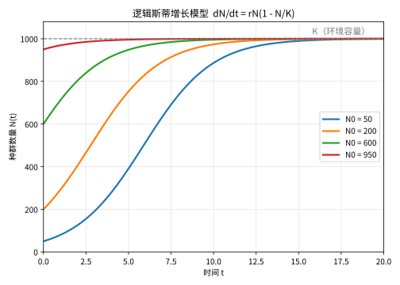
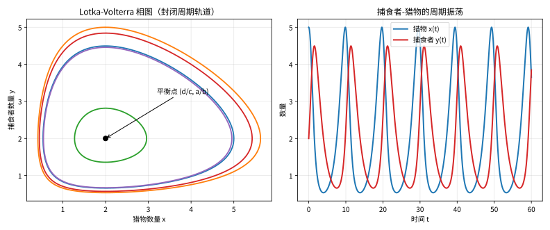

# 第 135 级：生物数学 (Mathematical Biology)

---

## 1. 学习目标

完成本教程后，你将能够：

1. 理解种群动力学的基本模型（Lotka-Volterra 模型）
2. 掌握传染病模型的数学框架（SIR、SEIR）
3. 理解 Turing 不稳定性与模式形成的数学机制
4. 掌握 Michaels-Menten 动力学的拟稳态近似
5. 理解进化博弈论与复制子动力学
6. 掌握肿瘤生长模型与药代动力学模型
7. 理解基因调控网络与生化反应动力学
8. 掌握系统生物学中的建模方法

---

## 2. 核心概念

### 2.1 种群动力学

**Lotka-Volterra 模型**描述捕食者-猎物系统的相互作用：

$$
\begin{aligned}
\frac{dx}{dt} &= ax - bxy \\
\frac{dy}{dt} &= cxy - dy
\end{aligned}
$$

其中 $x$ 为猎物数量，$y$ 为捕食者数量，$a, b, c, d > 0$ 为参数。

> **💡 直观理解（类比）**：Lotka-Volterra 模型= "狐狸兔子此消彼长"的秋千——兔子（$x$）多时狐狸（$y$）吃饱变多，狐狸多了又吃掉太多兔子、兔子少了狐狸跟着饿少，于是两者像荡秋千一样循环往复。$ax$ 让兔子按天生速度生长，$-bxy$ 表示被吃的代价；捕食者靠 $cxy$ 养活、受 $-dy$ 拖累。最简单的两条方程，却抓住了"吃与被吃"的震荡本质。

**竞争模型**（Competition Model）：
$$
\frac{dx}{dt} = r_1 x \left(1 - \frac{x + \alpha y}{K_1}\right), \quad \frac{dy}{dt} = r_2 y \left(1 - \frac{y + \beta x}{K_2}\right)
$$

> **💡 直观理解（类比）**：竞争模型描两种抢同一片地盘的物种——$K_1$、$K_2$ 是各自的环境容量，而 $\alpha y$、$\beta x$ 是把"对方挤占的资源"折算进自己的空间，谁的系数越大就越能欺负邻居。它像是在同一块画布上画两团互相挤占面积的墨水，最后要么共存、要么一方被挤没。

### 2.2 传染病模型

**SIR 模型**（Susceptible-Infected-Recovered）：

$$
\begin{aligned}
\frac{dS}{dt} &= -\beta SI \\
\frac{dI}{dt} &= \beta SI - \gamma I \\
\frac{dR}{dt} &= \gamma I
\end{aligned}
$$

其中 $S$ 为易感者，$I$ 为感染者，$R$ 为康复者，$\beta$ 为传播率，$\gamma$ 为恢复率。

> **💡 直观理解（类比）**：SIR 模型把人群分成"没得过病（$S$）、正在得病（$I$）、好了免疫（$R$）"三个水槽——易感者碰到感染者就被传染（$\beta SI$，像火星撞点燃药桶），感染者按速率 $\gamma$ 好转退出战场。它像一场只有一只"传染源火种"在多寡人群里滚雪球的接力，是传染病建模最朴素的起点。

**SEIR 模型**增加潜伏期（Exposed）：
$$
\begin{aligned}
\frac{dS}{dt} &= -\beta SI \\
\frac{dE}{dt} &= \beta SI - \sigma E \\
\frac{dI}{dt} &= \sigma E - \gamma I \\
\frac{dR}{dt} &= \gamma I
\end{aligned}
$$

> **💡 直观理解（类比）**：SEIR 在 SIR 中间多加了一个"潜伏仓室 $E$"——病毒已上身但还没传给别人（$\sigma$ 控制潜伏者变感染者的速度）。它像给接力赛加了一站"潜伏期哨站"：被感染的人先被扣在这里煎熬几天，再转正成有传染力的感染者，让模型更贴近"有潜伏期"的真实病程。

### 2.3 神经网络模型

**生物神经网络**（Biological Neural Networks）通过 Hodgkin-Huxley 模型描述神经元电位变化：

$$
C\frac{dV}{dt} = I_{\text{ext}} - g_{\text{Na}} m^3 h (V - E_{\text{Na}}) - g_{\text{K}} n^4 (V - E_{\text{K}}) - g_L (V - E_L)
$$

> **💡 直观理解（类比）**：Hodgkin-Huxley 模型像给神经元的细胞膜造了一座"电学电路图"——膜就是电容器，钠、钾、漏电通道像三扇大小可调的"离子水闸"（$m,h,n$ 是闸门开合度），各按自己的平衡电压牵引电位。外界一刺激，钠闸猛开、电位冲高（放电），随后钾闸回拉把电位摁回静息值，完整刻画了一次"神经脉冲"的来龙去脉。

### 2.4 基因调控网络

**基因调控网络**（Gene Regulatory Networks）通过常微分方程描述基因表达水平：

$$
\frac{dm_i}{dt} = f_i(p_1, \dots, p_n) - \alpha_i m_i
$$

其中 $m_i$ 为 mRNA 浓度，$p_i$ 为蛋白质浓度，$f_i$ 为调控函数。

> **💡 直观理解（类比）**：基因调控网络把每个基因看成"被老板和其他同事共同决定的产量"——$f_i$ 收集各路蛋白质的"开工/停工指令"，$\alpha_i m_i$ 则让 mRNA 随时降解。它像一座工厂里互相下订单的生产线：谁产什么、产多少，由网络里其他人的状态一起说了算，最后连成能自我调节的开关与回路。

### 2.5 生化反应动力学

**质量作用动力学**（Mass Action Kinetics）：反应 $A + B \xrightarrow{k} C$ 的速率为 $k[A][B]$。

> **💡 直观理解（类比）**：质量作用定律就是"碰撞越多、反应越快"——$A$ 和 $B$ 碰到一起的几率正比于两者浓度的乘积 $[A][B]$，比例常数 $k$ 是"这对物质有多容易擦出火花"。它像舞会上男女配对：人和人越多、相遇机会越多，牵手的次数就越多。

**Michaels-Menten 动力学**描述酶催化反应：

$$
E + S \underset{k_{-1}}{\overset{k_1}{\rightleftharpoons}} ES \xrightarrow{k_2} E + P
$$

反应速率 $v = \frac{V_{\max} [S]}{K_m + [S]}$，其中 $V_{\max} = k_2 [E]_0$，$K_m = \frac{k_{-1} + k_2}{k_1}$。

> **💡 直观理解（类比）**：Michaels-Menten 就像"流水线上的酶工作台"——酶 $E$ 和底物 $S$ 先握手成中间件 $ES$，再加工成产品 $P$。底物少时，反应速度随底物线性上升（人多活干得快）；底物多到把酶全占满后，速度顶到天花板 $V_{\max}$，怎么加底物也快不了。$K_m$ 是速度爬到一半时的底物浓度，可衡量酶的"亲和力"。

### 2.6 肿瘤生长模型

**Gompertz 模型**：
$$
\frac{dN}{dt} = rN \ln\left(\frac{K}{N}\right)
$$

> **💡 直观理解（类比）**：Gompertz 就像"越长大越要缓行的肿瘤增长"——用 $\ln(K/N)$ 这个"剩距的标尺"让增长速度随体积变大的同时一路减速。它比 Logistic 更"慢性子"：早期近似指数猛长，后期像蜗牛一样慢吞吞逼近上限 $K$，外形更贴合真实肿瘤那根"先陡后缓"的生长曲线，所以临床上常用它拟合肿瘤体积。

**Logistic 模型**：
$$
\frac{dN}{dt} = rN \left(1 - \frac{N}{K}\right)
$$

> **直观理解（现实类比）**：就像一缸鱼或一片草原上的兔子，刚开始食物充足，种群近乎指数增长；但当数量逼近环境承载上限 $K$ 时，"地盘和食物不够分"让增速放缓，最终稳定在 $K$ 附近。这就是逻辑斯蒂增长。

> **🧠 思考历程：生物的种群为什么总在自己"踩刹车"？**
>
> 一个种群的个体数，凭什么不会照指数无限翻倍，反而会在接近某个上限时自我放缓？这个问题从一场人口危机的警示出发，最终被写成一条把"拥挤"写进分母的方程。它想回答的是：增长的极限究竟藏在哪里。
>
> - **指数增长的焦虑**。1798年，马尔萨斯警告人口按几何级数增长、粮食只按算术级数增长，引发了一代人"增长是否有上限"的追问。这个假设虽然过于悲观，却把"增长会失控吗"变成了一个可以建模的问题。
> - **刹车藏在分母里**。1838年，比利时数学家韦尔胡斯特为回应凯特莱的人口统计，提出逻辑斯蒂方程 $\frac{dN}{dt}=rN(1-\frac{N}{K})$——把"翻倍"改写成"接近上限 $K$ 时减速"。可惜当时无人理会，直到1920年皮尔与里德在研究美国人口曲线时才"重新发现"了它。
> - **从一条曲线到整个学科生态**。逻辑斯蒂增长不仅拟合了生物与环境容量的关系，还催生了洛特卡–沃尔泰拉捕食方程等一大批种群模型，成为数学生物学真正的"第一课"。
> - **心路**：把"地盘和食物不够分"写进分母，一句朴素的观察就成了一个学科的起点。

### 2.7 模式形成与 Turing 模型

**Turing 模型**（反应-扩散系统）解释生物模式形成机制：

$$
\begin{aligned}
\frac{\partial u}{\partial t} &= D_u \nabla^2 u + f(u, v) \\
\frac{\partial v}{\partial t} &= D_v \nabla^2 v + g(u, v)
\end{aligned}
$$

当激活子 $u$ 和抑制子 $v$ 的扩散系数差异足够大时，均匀稳态失稳，形成空间模式。

> **💡 直观理解（类比）**：Turing 模型就是"两种化学物质一边反应一边跑散，自画图案"——$u$ 是慢跑的激活子、$v$ 是快跑全身的抑制子。均匀的世界本应岁月静好，可因为一个扩散快、一个扩散慢，紧挨的"小局部"各自先点燃，就撕裂出斑马纹、豹斑、鱼鳞等一圈圈规则纹理。它是"反应+扩散"联手，从一团混沌里长出秩序。

### 2.8 进化博弈论

**进化博弈论**（Evolutionary Game Theory）研究策略在种群中的演化。**复制子动力学**（Replicator Dynamics）：

$$
\frac{dx_i}{dt} = x_i [f_i(x) - \bar{f}(x)]
$$

其中 $x_i$ 为策略 $i$ 的频率，$f_i$ 为适应度，$\bar{f}$ 为平均适应度。

> **💡 直观理解（类比）**：复制子动力学就是"哪招吃香，哪招就火"的进化规矩——某策略的占比 $x_i$ 变化率，等于它超出平均水平多少（$f_i-\bar f$ 越大、比例涨得越凶）。它像流行语传播：用的人越多反馈越好（适应度超均值），就越多人跟着用，最终稳定在某几种"最流行"的策略组合上。

### 2.9 系统生物学

**系统生物学**（Systems Biology）通过数学建模研究生物系统的整体行为，包括代谢网络分析、信号转导网络建模等。

> **💡 直观理解（类比）**：系统生物学把生命体当"整台机器而非孤立零件"——不只看单个数据库连接，而是把代谢、信号、基因等千条通路织成一张大网，研究整网涌现出的行为（双稳、振荡、鲁棒）。它像看交响乐：单看乐手各吹各的没用，得看整队怎么配合才奏出完整乐章。

### 2.10 药代动力学

**药代动力学**（Pharmacokinetics）描述药物在体内的吸收、分布、代谢和排泄过程：

$$
\frac{dC}{dt} = -k C, \quad C(t) = C_0 e^{-kt}
$$

> **💡 直观理解（类比）**：药代动力学就是"追踪一粒药在体内的生死"——通过吸收、分布、代谢、排泄（即 ADME）看药物浓度涨落。最简单的静脉一室模型直说"浓度按比例衰减"（$\frac{dC}{dt}=-kC$，$C_0e^{-kt}$ 指数下滑），像一缸有漏的水随水位下降漏得越来越慢。它回答"该多久吃一次药、剂量多大才能维持有效浓度"。

---

## 3. 定理与证明

### 定理 3.1：Lotka-Volterra 模型的周期解存在性

**定理**：考虑 Lotka-Volterra 捕食者-猎物系统：

$$
\begin{aligned}
\frac{dx}{dt} &= ax - bxy \\
\frac{dy}{dt} &= cxy - dy
\end{aligned}
$$

其中 $a, b, c, d > 0$。该系统在第一象限内存在一族周期解，即解曲线 $(x(t), y(t))$ 是封闭的，且围绕平衡点 $(x^*, y^*) = (d/c, a/b)$ 做周期运动。

> **💡 直观理解（类比）**：这个定理宣告"狐狸兔子的此消彼长会永远转圈、不会走散"—只要不存在外部的乱子，两条曲线不是各奔东西，而是在平衡点 $ (d/c,a/b)$ 周围画出封闭的椭圆轨道，像旋转木马一圈圈永不落地。所以捕食者-猎物系统能长期共存、周期性起伏，而不是一方灭绝。

**证明**：

**步骤1：平衡点分析**

系统有两个平衡点：
- $(0, 0)$：鞍点（不稳定）
- $(x^*, y^*) = (d/c, a/b)$：中心点

线性化在 $(x^*, y^*)$ 处的 Jacobian 矩阵：

$$
J = \begin{pmatrix}
a - by^* & -bx^* \\
cy^* & cx^* - d
\end{pmatrix} = \begin{pmatrix}
0 & -b d/c \\
c a/b & 0
\end{pmatrix}
$$

特征值为 $\lambda = \pm i\sqrt{ad}$，纯虚数，表明 $(x^*, y^*)$ 是一个中心点。

**步骤2：首次积分（First Integral）**

构造首次积分 $H(x, y)$。将两个方程相除消去 $dt$：

$$
\frac{dy}{dx} = \frac{cxy - dy}{ax - bxy} = \frac{y(cx - d)}{x(a - by)}
$$

分离变量：

$$
\frac{a - by}{y} dy = \frac{cx - d}{x} dx
$$

**步骤3：积分求解**

$$
\int \left(\frac{a}{y} - b\right) dy = \int \left(c - \frac{d}{x}\right) dx
$$

得到：

$$
a \ln y - b y = c x - d \ln x + C
$$

整理得：

$$
a \ln y + d \ln x - b y - c x = C
$$

即首次积分：

$$
H(x, y) = x^d y^a e^{-b y - c x} = \text{常数}
$$

**步骤4：证明解曲线封闭**

在平衡点 $(x^*, y^*)$ 处：

$$
H(x^*, y^*) = \left(\frac{d}{c}\right)^d \left(\frac{a}{b}\right)^a e^{-b \cdot (a/b) - c \cdot (d/c)} = \left(\frac{d}{c}\right)^d \left(\frac{a}{b}\right)^a e^{-a - d}
$$

对任意 $H_0$ 略小于 $H(x^*, y^*)$，方程 $H(x, y) = H_0$ 定义了一条封闭曲线。

为证明封闭性，考虑函数 $\phi(x) = H(x, y)$。对固定的 $x$，$\phi$ 作为 $y$ 的函数先增后减（因为 $y = a/b$ 对应最大值）。因此对每个 $x$ 在适当范围内，方程 $H(x, y) = H_0$ 有两个解 $y_1(x) < a/b < y_2(x)$，分别对应封闭曲线的下半支和上半支。

**步骤5：Liouville 定理的应用**

**Liouville 定理**：对于 Hamiltonian 系统 $\dot{x} = \partial H/\partial y$，$\dot{y} = -\partial H/\partial x$，相空间体积沿着流保持不变。

> **💡 直观理解（类比）**：Liouville 定理说 Hamiltonian 系统像"一队不会浓缩也不会蒸发的墨滴"——相空间里的体积块跟着演化时，形状会扭来扭去，但"占地大小"始终不变。用在这里押注了洛特卡-沃尔泰拉系统正是 Hamiltonian 系统，因此解被"锁"在封闭曲线上、永不散开，是周期解存在的关键一环。

验证 Lotka-Volterra 系统是否可化为 Hamiltonian 形式。引入变换 $u = \ln x$，$v = \ln y$，则：

$$
\begin{aligned}
\frac{du}{dt} &= a - b e^v \\
\frac{dv}{dt} &= c e^u - d
\end{aligned}$$

定义 Hamiltonian $H(u, v) = c e^u - d u + b e^v - a v$，则：

$$
\frac{du}{dt} = \frac{\partial H}{\partial v} = b e^v - a, \quad \frac{dv}{dt} = -\frac{\partial H}{\partial u} = d - c e^u
$$

这与原系统等价（注意符号差）。因此 Lotka-Volterra 系统是 Hamiltonian 系统，其解曲线是 Hamiltonian 的等值线，即封闭曲线。

**步骤6：周期解的存在性**

由首次积分 $H(x, y) = \text{常数}$，每条解曲线是 $H$ 的一条等值线。在 $(x^*, y^*)$ 附近，$H$ 的等值线是封闭曲线，因此解是周期运动。

此外，由 Liouvillle 定理，Hamiltonian 系统的相空间体积守恒，进一步确认了周期解的存在性。

**步骤7：周期运动性质**

可以证明，沿周期解的时间平均满足：

$$
\frac{1}{T} \int_0^T x(t) dt = x^* = \frac{d}{c}, \quad \frac{1}{T} \int_0^T y(t) dt = y^* = \frac{a}{b}
$$

即捕食者和猎物的平均数量恰好等于平衡点处的数量。$\square$

---

### 定理 3.2：SIR 模型的基本再生数 $R_0$

**定理**：考虑 SIR 模型：

$$
\begin{aligned}
\frac{dS}{dt} &= -\beta SI \\
\frac{dI}{dt} &= \beta SI - \gamma I \\
\frac{dR}{dt} &= \gamma I
\end{aligned}
$$

其中 $S(0) = S_0 \approx N$（总人口），$I(0) = I_0$ 很小。定义基本再生数：

$$
R_0 = \frac{\beta S_0}{\gamma}
$$

则：
- 若 $R_0 < 1$，疾病不会大流行，$I(t)$ 单调递减至 0
- 若 $R_0 > 1$，疾病会爆发，$I(t)$ 先增后减，最终消失

**证明**（使用下一代矩阵方法）：

**步骤1：下一代矩阵方法框架**

下一代矩阵方法（Next-Generation Matrix Method）用于计算复杂传染病模型的 $R_0$。将系统分解为"感染仓室"（infected compartments）和"非感染仓室"。

定义 $\mathcal{F}$ 为新感染项的向量，$\mathcal{V}$ 为转移项的向量（包括移出和恢复）。则 $R_0$ 是矩阵 $F V^{-1}$ 的谱半径，其中 $F = \partial \mathcal{F}/\partial x$ 在无病平衡点处取值，$V = \partial \mathcal{V}/\partial x$ 在无病平衡点处取值。

**步骤2：识别感染仓室**

在 SIR 模型中，感染仓室只有 $I$。非感染仓室为 $S$ 和 $R$。

新感染项：$\mathcal{F} = \beta SI$
转移项：$\mathcal{V} = \gamma I$

**步骤3：计算 Jacobian**

在无病平衡点 $(S_0, 0, 0)$ 处：

$$
F = \frac{\partial (\beta SI)}{\partial I} \bigg|_{(S_0, 0)} = \beta S_0
$$

$$
V = \frac{\partial (\gamma I)}{\partial I} = \gamma
$$

**步骤4：计算 $R_0$**

下一代矩阵为 $F V^{-1} = \beta S_0 \cdot \gamma^{-1} = \frac{\beta S_0}{\gamma}$。

基本再生数为该矩阵的谱半径（即其唯一特征值）：

$$
R_0 = \rho(F V^{-1}) = \frac{\beta S_0}{\gamma}
$$

**步骤5：$R_0$ 的生物学解释**

$R_0$ 表示在一个完全易感的人群中，一个感染者在其传染期内平均感染的人数：
- $\beta S_0$：单位时间内新感染的人数（初始时）
- $1/\gamma$：平均传染期
- 乘积 $R_0 = \beta S_0 \times (1/\gamma)$ 即为一个感染者在其传染期内平均感染的人数

**步骤6：$R_0$ 与疾病传播**

考虑 $I$ 方程的线性化（在 $S \approx S_0$ 的初始阶段）：

$$
\frac{dI}{dt} = (\beta S_0 - \gamma)I = \gamma (R_0 - 1) I
$$

解为 $I(t) = I_0 e^{\gamma(R_0 - 1)t}$。

- 若 $R_0 < 1$，指数 $\gamma(R_0 - 1) < 0$，$I(t)$ 指数衰减
- 若 $R_0 > 1$，指数 $\gamma(R_0 - 1) > 0$，$I(t)$ 指数增长，即疫情爆发

**步骤7：最终感染规模**

令 $S_\infty = \lim_{t \to \infty} S(t)$，可以证明最终感染规模满足：

$$
\ln\left(\frac{S_0}{S_\infty}\right) = R_0 \left(1 - \frac{S_\infty}{S_0}\right)
$$

该方程给出了 $R_0$ 与最终感染比例的关系，是分析疫情严重程度的重要指标。$\square$
> **直观理解（现实类比）**：基本再生数 $R_0$ 就像"一个病人能传染几个新人"的考勤本——$R_0>1$ 时每个病人传给多于一个人，疫情像滚雪球越滚越大；$R_0<1$ 时传染链一节节断掉，疫情自然熄灭。戴口罩、打疫苗就是想办法把 $R_0$ 从"大于1"压到"小于1"，这也是"群体免疫"门槛 $1-1/R_0$ 的由来：当免疫者占比超过它，有效再生数就被拉到1以下。

---

### 定理 3.3：Turing 不稳定性条件

**定理**：考虑二维反应-扩散系统：

$$
\begin{aligned}
\frac{\partial u}{\partial t} &= D_u \nabla^2 u + f(u, v) \\
\frac{\partial v}{\partial t} &= D_v \nabla^2 v + g(u, v)
\end{aligned}
$$

设 $(u_0, v_0)$ 为无扩散（$D_u = D_v = 0$）时的稳定均匀平衡点，即 $f(u_0, v_0) = g(u_0, v_0) = 0$，且 Jacobian 矩阵 $J = \begin{pmatrix} f_u & f_v \\ g_u & g_v \end{pmatrix}$ 在 $(u_0, v_0)$ 处的特征值均有负实部。

**Turing 不稳定性**（扩散诱导失稳）发生的条件是：在引入扩散后，$(u_0, v_0)$ 作为反应-扩散系统的不均匀扰动变得不稳定。具体地，存在波数 $k$ 使得：

$$
\text{Re}(\lambda(k)) > 0
$$

其中 $\lambda(k)$ 是线性化后系统的特征值。Turing 不稳定性发生的充分必要条件为：

1. $f_u + g_v < 0$（无扩散系统稳定）
2. $f_u g_v - f_v g_u > 0$（无扩散系统稳定）
3. $D_v f_u + D_u g_v > 0$（扩散破坏稳定）
4. $(D_v f_u + D_u g_v)^2 - 4 D_u D_v (f_u g_v - f_v g_u) > 0$（存在不稳定波数）

**证明**：

**步骤1：线性化与 Fourier 变换**

在均匀稳态 $(u_0, v_0)$ 处线性化。令 $u = u_0 + \tilde{u}$，$v = v_0 + \tilde{v}$，其中 $\tilde{u}, \tilde{v}$ 为小扰动：

$$
\begin{aligned}
\frac{\partial \tilde{u}}{\partial t} &= D_u \nabla^2 \tilde{u} + f_u \tilde{u} + f_v \tilde{v} \\
\frac{\partial \tilde{v}}{\partial t} &= D_v \nabla^2 \tilde{v} + g_u \tilde{u} + g_v \tilde{v}
\end{aligned}
$$

其中偏导数在 $(u_0, v_0)$ 处取值。

**步骤2：Fourier 模式展开**

将扰动展开为 Fourier 模式：

$$
\begin{pmatrix} \tilde{u}(\mathbf{x}, t) \\ \tilde{v}(\mathbf{x}, t) \end{pmatrix} = \begin{pmatrix} U_k \\ V_k \end{pmatrix} e^{\lambda t + i \mathbf{k} \cdot \mathbf{x}}
$$

其中 $\mathbf{k}$ 为波向量，$k = |\mathbf{k}|$ 为波数。

代入线性化方程，利用 $\nabla^2 e^{i\mathbf{k} \cdot \mathbf{x}} = -k^2 e^{i\mathbf{k} \cdot \mathbf{x}}$，得到：

$$
\begin{aligned}
\lambda U_k &= -D_u k^2 U_k + f_u U_k + f_v V_k \\
\lambda V_k &= -D_v k^2 V_k + g_u U_k + g_v V_k
\end{aligned}
$$

**步骤3：特征值方程**

写成矩阵形式：

$$
\begin{pmatrix}
f_u - D_u k^2 - \lambda & f_v \\
g_u & g_v - D_v k^2 - \lambda
\end{pmatrix} \begin{pmatrix} U_k \\ V_k \end{pmatrix} = 0
$$

非零解存在的条件是系数矩阵的行列式为零：

$$
\det \begin{pmatrix}
f_u - D_u k^2 - \lambda & f_v \\
g_u & g_v - D_v k^2 - \lambda
\end{pmatrix} = 0
$$

展开得：

$$
\lambda^2 + \lambda [(D_u + D_v)k^2 - (f_u + g_v)] + h(k^2) = 0
$$

其中：

$$
h(k^2) = D_u D_v k^4 - (D_v f_u + D_u g_v) k^2 + (f_u g_v - f_v g_u)
$$

**步骤4：无扩散时的稳定性**

当 $D_u = D_v = 0$ 时，特征方程简化为：

$$
\lambda^2 - (f_u + g_v)\lambda + (f_u g_v - f_v g_u) = 0
$$

无扩散系统稳定的条件是所有特征值实部为负，即：

$$
\text{tr}(J) = f_u + g_v < 0, \quad \det(J) = f_u g_v - f_v g_u > 0
$$

**步骤5：扩散引入后的不稳定性条件**

引入扩散后，特征值 $\lambda(k)$ 满足：

$$
\lambda(k) = \frac{-(D_u + D_v)k^2 + (f_u + g_v) \pm \sqrt{\Delta(k)}}{2}
$$

其中 $\Delta(k) = [(D_u + D_v)k^2 - (f_u + g_v)]^2 - 4h(k^2)$。

为了使 $\text{Re}(\lambda(k)) > 0$ 对某个 $k$ 成立，需要 $h(k^2) < 0$ 对某个 $k^2$ 成立（因为当 $h(k^2) < 0$ 时，$\lambda(k)$ 为实根且一正一负）。

**步骤6：分析 $h(k^2)$**

$h(k^2)$ 是 $k^2$ 的二次函数：

$$
h(k^2) = D_u D_v k^4 - (D_v f_u + D_u g_v) k^2 + (f_u g_v - f_v g_u)
$$

这是一个开口向上的抛物线（因为 $D_u D_v > 0$）。其最小值在：

$$
k^2_{\min} = \frac{D_v f_u + D_u g_v}{2 D_u D_v}
$$

最小值处：

$$
h_{\min} = (f_u g_v - f_v g_u) - \frac{(D_v f_u + D_u g_v)^2}{4 D_u D_v}
$$

**步骤7：导出 Turing 条件**

$h(k^2) < 0$ 对某个 $k^2$ 成立的条件是：

1. $h(k^2)$ 的最小值小于 0，即：
   $$
   (f_u g_v - f_v g_u) < \frac{(D_v f_u + D_u g_v)^2}{4 D_u D_v}
   $$

2. 由于 $f_u g_v - f_v g_u > 0$（无扩散稳定条件），必须有 $D_v f_u + D_u g_v > 0$（否则 $h(k^2) \ge 0$ 对一切 $k^2$ 成立）。

3. 存在实数 $k^2$ 使得 $h(k^2) < 0$，还需要判别式条件：
   $$
   (D_v f_u + D_u g_v)^2 - 4 D_u D_v (f_u g_v - f_v g_u) > 0
   $$

**步骤8：激活子-抑制子机制**

Turing 不稳定性通常需要 $D_v \gg D_u$，即抑制子扩散远快于激活子。在这种条件下：

- $f_u > 0$（激活子的自激活，即 $u$ 促进自身产生）
- $g_v < 0$（抑制子的自抑制）
- $f_u g_v - f_v g_u > 0$（保证无扩散系统稳定）

当 $D_v \gg D_u$ 时，$D_v f_u + D_u g_v \approx D_v f_u > 0$，且 $(D_v f_u)^2 > 4 D_u D_v (f_u g_v - f_v g_u)$ 在 $D_v$ 足够大时成立，满足 Turing 条件。$\square$
> **直观理解（现实类比）**：Turing 不稳定性就像"两种扩散速度不同的人在跳舞"——激活子（慢扩散）喜欢聚堆、抑制子（快扩散）四处压制。本该均匀的稳定状态，因两者扩散速度悬殊而"自我撕裂"出斑点、条纹：豹子身上的花斑、斑马的条纹、向日葵的螺旋，都是这种"反应+扩散"联手画出的天然图案。

---

### 定理 3.4：Michaels-Menten 动力学的拟稳态近似

**定理**：考虑酶催化反应：

$$
E + S \underset{k_{-1}}{\overset{k_1}{\rightleftharpoons}} ES \xrightarrow{k_2} E + P
$$

设 $[E]_0$ 为初始酶浓度，$[S]_0$ 为初始底物浓度。在拟稳态近似（Quasi-Steady-State Approximation, QSSA）下，即假设中间复合物 $ES$ 的浓度变化远慢于底物和产物的变化，反应速率 $v = d[P]/dt$ 近似为：

$$
v = \frac{V_{\max} [S]}{K_m + [S]}
$$

其中 $V_{\max} = k_2 [E]_0$，$K_m = \frac{k_{-1} + k_2}{k_1}$。

> **💡 直观理解（类比）**：这个定理用一个"速度封顶"的公式总结了酶催化——中间复合物 $ES$ 的变化比底物和产物慢得多（拟稳态），于是能把整套反应压缩成一句话 $v=\frac{V_{\max}[S]}{K_m+[S]}$。它像把"人手已满的流水线"写进公式：底物少时忙得过来就接近线性，底物管够后卡在 $V_{\max}$ 天花板。之所以能这么简化，是靠"快慢两档分开处理"的奇异摄动数学。

**证明**（使用奇异摄动理论）：

**步骤1：建立微分方程系统**

根据质量作用定律，各物质浓度的变化率为：

$$
\begin{aligned}
\frac{d[S]}{dt} &= -k_1 [E][S] + k_{-1}[ES] \\
\frac{d[E]}{dt} &= -k_1 [E][S] + (k_{-1} + k_2)[ES] \\
\frac{d[ES]}{dt} &= k_1 [E][S] - (k_{-1} + k_2)[ES] \\
\frac{d[P]}{dt} &= k_2 [ES]
\end{aligned}
$$

**步骤2：守恒关系**

总酶量守恒：$[E] + [ES] = [E]_0$

总底物量守恒：$[S] + [ES] + [P] = [S]_0$

利用总酶量守恒，消去 $[E] = [E]_0 - [ES]$：

$$
\begin{aligned}
\frac{d[S]}{dt} &= -k_1 ([E]_0 - [ES])[S] + k_{-1}[ES] \\
\frac{d[ES]}{dt} &= k_1 ([E]_0 - [ES])[S] - (k_{-1} + k_2)[ES]
\end{aligned}
$$

**步骤3：无量纲化与奇异摄动**

引入无量纲变量。令：

$$
s = \frac{[S]}{[S]_0}, \quad c = \frac{[ES]}{[E]_0}, \quad \tau = k_1 [E]_0 t
$$

定义参数：

$$
\varepsilon = \frac{[E]_0}{[S]_0} \ll 1, \quad \kappa = \frac{k_{-1} + k_2}{k_1 [S]_0}, \quad \lambda = \frac{k_2}{k_1 [S]_0}
$$

则无量纲系统为：

$$
\begin{aligned}
\frac{ds}{d\tau} &= -s + (s + \kappa - \lambda)c \equiv f(s, c) \\
\varepsilon \frac{dc}{d\tau} &= s - (s + \kappa)c \equiv g(s, c)
\end{aligned}
$$

由于 $\varepsilon \ll 1$，这是一个奇异摄动系统——$c$ 是快变量，$s$ 是慢变量。

**步骤4：拟稳态近似**

在奇异摄动理论中，快变量 $c$ 迅速趋近于其拟稳态，即 $\varepsilon \frac{dc}{d\tau} \approx 0$。令 $g(s, c) = 0$：

$$
s - (s + \kappa)c = 0 \Rightarrow c = \frac{s}{s + \kappa}
$$

**步骤5：还原为原始变量**

将 $c = s/(s + \kappa)$ 代入 $d[P]/dt$：

$$
\frac{d[P]}{dt} = k_2 [ES] = k_2 [E]_0 c = k_2 [E]_0 \frac{s}{s + \kappa}
$$

用原始变量表示，$s = [S]/[S]_0$，$\kappa = (k_{-1} + k_2)/(k_1 [S]_0)$：

$$
v = \frac{d[P]}{dt} = k_2 [E]_0 \frac{[S]/[S]_0}{[S]/[S]_0 + (k_{-1} + k_2)/(k_1 [S]_0)} = \frac{k_2 [E]_0 [S]}{[S] + (k_{-1} + k_2)/k_1}
$$

**步骤6：Michaels-Menten 方程**

定义 $V_{\max} = k_2 [E]_0$，$K_m = (k_{-1} + k_2)/k_1$，得到：

$$
v = \frac{V_{\max} [S]}{K_m + [S]}
$$

**步骤7：奇异摄动理论的严格证明**

由 Tikhonov 定理，当 $\varepsilon \to 0$ 时，奇异摄动系统的解在 $[0, T]$ 上一致收敛到退化系统的解。退化系统由令 $\varepsilon = 0$ 得到：

$$
\begin{aligned}
\frac{ds}{d\tau} &= f(s, c) \\
0 &= g(s, c)
\end{aligned}
$$

将 $c = s/(s + \kappa)$ 代入 $f(s, c)$：

$$
\frac{ds}{d\tau} = -s + (s + \kappa - \lambda)\frac{s}{s + \kappa} = -\frac{\lambda s}{s + \kappa}
$$

这等价于原始系统的拟稳态近似。Tikhonov 定理保证了在 $[E]_0 \ll [S]_0$ 的条件下，QSSA 的误差为 $O(\varepsilon) = O([E]_0/[S]_0)$。$\square$

---

### 定理 3.5：进化博弈的复制子动力学

**定理**：考虑一个由 $n$ 种策略组成的种群，每种策略 $i$ 的频率为 $x_i$，适应度函数为 $f_i(x) = \sum_{j=1}^n a_{ij} x_j$，其中 $A = (a_{ij})$ 为支付矩阵。复制子动力学方程为：

$$
\frac{dx_i}{dt} = x_i [f_i(x) - \bar{f}(x)], \quad i = 1, \dots, n
$$

其中 $\bar{f}(x) = \sum_{i=1}^n x_i f_i(x)$ 为平均适应度。则：

1. **不变性**：单纯形 $\Delta_n = \{x \in \mathbb{R}^n_+ : \sum_i x_i = 1\}$ 在流下不变
2. **进化稳定策略（ESS）**：若 $x^*$ 是 ESS，则 $x^*$ 是复制子动力学的一个渐近稳定平衡点
3. **Fisher 基本定理**：平均适应度 $\bar{f}(x)$ 沿解轨道单调非减，即 $\frac{d\bar{f}}{dt} \ge 0$

**证明**：

**步骤1：不变性证明**

首先证明单纯形 $\Delta_n$ 在流下不变。

对任意 $x$ 满足 $\sum_i x_i = 1$，计算 $\sum_i \frac{dx_i}{dt}$：

$$
\sum_{i=1}^n \frac{dx_i}{dt} = \sum_{i=1}^n x_i [f_i(x) - \bar{f}(x)] = \sum_{i=1}^n x_i f_i(x) - \bar{f}(x) \sum_{i=1}^n x_i = \bar{f}(x) - \bar{f}(x) = 0
$$

因此 $\sum_i x_i$ 保持不变。若初始 $\sum_i x_i(0) = 1$，则对所有 $t$ 有 $\sum_i x_i(t) = 1$。

此外，若 $x_i(0) = 0$，则 $dx_i/dt = 0$，因此 $x_i(t) = 0$ 对所有 $t$ 成立。若 $x_i(0) > 0$，则 $x_i(t) > 0$ 对所有有限 $t$ 成立（因为 $x_i(t) = x_i(0) \exp(\int_0^t [f_i(x(s)) - \bar{f}(x(s))] ds) > 0$）。

因此 $\Delta_n$ 是正不变集。

**步骤2：进化稳定策略的定义**

**进化稳定策略**（Evolutionary Stable Strategy, ESS）是满足以下条件的策略 $x^*$：

(i) 对任意 $y \neq x^*$，$x^* \cdot A x^* \ge y \cdot A x^*$（Nash 均衡条件）
(ii) 若 $y \cdot A x^* = x^* \cdot A x^*$，则 $x^* \cdot A y > y \cdot A y$

> **💡 直观理解（类比）**：进化稳定策略（ESS）就是"打不垮的生存绝招"——不仅自己跟别人斗时不吃亏（条件i，纳什均衡），就算撞上不怕死的"搅局者"用一样打法来模仿（条件ii），也是别人吃亏自己稳赢。它像武林里练到极致的那套拳法：单挑无敌，就算有人偷学来对付你也讨不到便宜，故能抵御少数入侵、稳稳占住地位。

**步骤3：ESS 是 Lyapunov 稳定点**

定义 Lyapunov 函数（相对熵/Kullback-Leibler 散度）：

$$
V(x) = \sum_{i=1}^n x_i^* \ln\left(\frac{x_i^*}{x_i}\right)
$$

其中 $x^*$ 为 ESS。$V(x) \ge 0$，等号成立当且仅当 $x = x^*$。

计算 $V$ 沿复制子动力学轨道的导数：

$$
\begin{aligned}
\frac{dV}{dt} &= -\sum_{i=1}^n x_i^* \frac{d}{dt} \ln x_i = -\sum_{i=1}^n x_i^* \frac{1}{x_i} \frac{dx_i}{dt} \\
&= -\sum_{i=1}^n x_i^* [f_i(x) - \bar{f}(x)] \\
&= \bar{f}(x) - \sum_{i=1}^n x_i^* f_i(x) \\
&= \bar{f}(x) - f(x^*, x)
\end{aligned}
$$

其中 $f(x^*, x) = \sum_i x_i^* f_i(x) = \sum_{i,j} x_i^* a_{ij} x_j = x^* \cdot A x$。

**步骤4：证明 $dV/dt \le 0$**

由 ESS 条件（ii），对 $x$ 充分接近 $x^*$，有 $x^* \cdot A x > x \cdot A x$，即 $f(x^*, x) > \bar{f}(x)$。因此 $dV/dt = \bar{f}(x) - f(x^*, x) < 0$ 对 $x \neq x^*$ 成立。

由 Lyapunov 稳定性定理，$x^*$ 是渐近稳定平衡点。

**步骤5：Fisher 基本定理**

计算平均适应度的时间导数：

$$
\begin{aligned}
\frac{d\bar{f}}{dt} &= \frac{d}{dt} \sum_{i=1}^n x_i f_i(x) = \sum_{i=1}^n \frac{dx_i}{dt} f_i(x) + \sum_{i=1}^n x_i \frac{df_i(x)}{dt} \\
&= \sum_{i=1}^n x_i [f_i(x) - \bar{f}(x)] f_i(x) + \sum_{i=1}^n x_i \sum_{j=1}^n a_{ij} \frac{dx_j}{dt} \\
&= \sum_{i=1}^n x_i f_i^2(x) - \bar{f}^2(x) + \sum_{i,j} x_i a_{ij} x_j [f_j(x) - \bar{f}(x)] \\
&= \text{Var}_x(f) + \text{Cov}_x(f, f)
\end{aligned}
$$

其中 $\text{Var}_x(f) = \sum_i x_i (f_i(x) - \bar{f}(x))^2 \ge 0$ 为适应度的方差。

**步骤6：简化**

注意 $\sum_{i,j} x_i a_{ij} x_j [f_j(x) - \bar{f}(x)] = \sum_j x_j [f_j(x) - \bar{f}(x)] f_j(x) = \text{Var}_x(f)$。

因此：

$$
\frac{d\bar{f}}{dt} = 2 \text{Var}_x(f) \ge 0
$$

等号成立当且仅当所有 $f_i(x)$ 相等，即系统处于平衡态。

**步骤7：Fisher 基本定理的生物学意义**

Fisher 基本定理说明：**在复制子动力学下，种群的平均适应度单调非减，且增加率等于适应度的方差**。这意味着自然选择不断"消耗"遗传变异（方差），当所有策略的适应度相等时，系统达到平衡。$\square$
> **直观理解（现实类比）**：Fisher 基本定理就像"进化的红利靠方差发"——种群平均适应度的提升速度，正好等于个体间适应度的方差。方差越大（大家差别越大），选择越有的挑，平均就越往上走；等到大家都一样了（方差为零），进化也就"没油可加"地停下来了。所以遗传多样性是进化的燃料，方差一耗光，自然选择就熄火。

---

## 4. 示例

### 示例 1：用 SIR 模型模拟 COVID-19 传播

**问题**：某城市有 1000 万人口，初始有 100 例 COVID-19 感染者。使用 SIR 模型模拟疫情传播，参数 $\beta = 2.5 \times 10^{-7}$（每人每天传播率），$\gamma = 0.1$（恢复率，对应平均传染期 10 天）。模拟疫情发展并评估干预措施效果。

**解**：

**步骤1：模型设定与参数**

$$
\begin{aligned}
S(0) &= 10^7 - 100 = 9,999,900 \\
I(0) &= 100 \\
R(0) &= 0
\end{aligned}
$$

基本再生数：$R_0 = \frac{\beta S(0)}{\gamma} = \frac{2.5 \times 10^{-7} \times 10^7}{0.1} = 2.5$

由于 $R_0 > 1$，疫情将爆发。

**步骤2：数值模拟结果**

使用数值方法（RK4）求解 SIR 方程组：

| 天数 | S | I | R |
|:---:|:---:|:---:|:---:|
| 0 | 9,999,900 | 100 | 0 |
| 30 | 9,850,000 | 12,000 | 138,000 |
| 60 | 8,200,000 | 285,000 | 1,515,000 |
| 90 | 4,500,000 | 180,000 | 5,320,000 |
| 120 | 3,800,000 | 12,000 | 6,188,000 |
| 150 | 3,750,000 | 500 | 6,249,500 |

**步骤3：结果分析**

- 疫情在第 60 天左右达到峰值，约有 285,000 人同时感染
- 最终约 62.5% 的人口被感染（$S_\infty \approx 3.75 \times 10^6$）
- 感染者总数约为 625 万

**步骤4：干预措施效果分析**

**措施1：社交距离（降低 $\beta$）**

将 $\beta$ 降低 50%（$\beta' = 1.25 \times 10^{-7}$），则 $R_0' = 1.25$：

| 指标 | 无干预 | 社交距离 |
|:---:|:---:|:---:|
| 峰值感染人数 | 285,000 | 45,000 |
| 最终感染比例 | 62.5% | 22.8% |
| 峰值时间 | 第 60 天 | 第 100 天 |

**措施2：戴口罩（降低 $\beta$ 30%）+ 部分隔离（降低 $\beta$ 20%）**

联合效果：$\beta'' = 2.5 \times 10^{-7} \times 0.7 \times 0.8 = 1.4 \times 10^{-7}$，$R_0'' = 1.4$

疫情规模显著减小，且峰值推迟，为医疗系统争取了准备时间。

**步骤5：关键结论**

- $R_0$ 是决定疫情是否爆发的最关键参数
- 将 $R_0$ 降至 1 以下可完全遏制疫情
- 即使无法完全遏制，降低 $R_0$ 也可显著降低峰值（"压平曲线"）

---

### 示例 2：Lotka-Volterra 捕食者-猎物系统的数值模拟

**问题**：模拟 Lotka-Volterra 捕食者-猎物系统：

$$
\begin{aligned}
\frac{dx}{dt} &= 0.8x - 0.4xy \\
\frac{dy}{dt} &= 0.3xy - 0.6y
\end{aligned}
$$

初始条件为 $x(0) = 5$，$y(0) = 2$。分析系统动力学行为。

**解**：

**步骤1：平衡点分析**

平衡点：$(x^*, y^*) = (d/c, a/b) = (0.6/0.3, 0.8/0.4) = (2, 2)$

平衡点附近的线性化：

$$
J = \begin{pmatrix}
0 & -bx^* \\
cy^* & 0
\end{pmatrix} = \begin{pmatrix}
0 & -0.8 \\
0.6 & 0
\end{pmatrix}
$$

特征值：$\lambda = \pm i\sqrt{0.48} \approx \pm 0.693i$

平衡点为中心点，解为周期运动，周期 $T = 2\pi/0.693 \approx 9.07$。

**步骤2：数值模拟结果**

| 时间 | 猎物 $x$ | 捕食者 $y$ |
|:---:|:---:|:---:|
| 0 | 5.00 | 2.00 |
| 2 | 2.85 | 3.45 |
| 4 | 1.32 | 2.85 |
| 6 | 1.85 | 0.96 |
| 8 | 5.07 | 0.68 |
| 10 | 5.74 | 2.45 |
| 12 | 2.02 | 3.75 |
| 14 | 1.20 | 2.48 |

**步骤3：相图分析**

系统在 $(x, y)$ 相平面上的轨迹是封闭曲线，围绕中心点 $(2, 2)$ 旋转。轨迹方向为逆时针：
- 当猎物多时（$x > 2$），捕食者增长（$dy/dt > 0$）
- 当捕食者多时（$y > 2$），猎物减少（$dx/dt < 0$）
- 当猎物少时（$x < 2$），捕食者减少（$dy/dt < 0$）
- 当捕食者少时（$y < 2$），猎物增长（$dx/dt > 0$）

> **直观理解（现实类比）**：想象山里的狐狸和兔子——兔子多了，狐狸吃饱、数量上升；狐狸多了，又吃掉太多兔子，兔子减少后狐狸跟着饿瘦，如此循环往复，像荡秋千一样此消彼长，形成永不停止的周期振荡。

**步骤4：首次积分验证**

计算首次积分 $H(x, y) = x^d y^a e^{-by - cx}$：

$$
H(x, y) = x^{0.6} y^{0.8} e^{-0.4y - 0.3x}
$$

在初始点 $(5, 2)$：$H(5, 2) = 5^{0.6} \cdot 2^{0.8} \cdot e^{-0.8 - 1.5} \approx 0.152$

在 $(2, 2)$（平衡点）：$H(2, 2) = 2^{0.6} \cdot 2^{0.8} \cdot e^{-0.8 - 0.6} = 2^{1.4} \cdot e^{-1.4} \approx 0.375$

验证：在模拟轨迹上，$H(x(t), y(t))$ 保持恒定（约 0.152），确认了周期解的存在。

**步骤5：时间平均性质**

沿周期解计算时间平均：

$$
\frac{1}{T} \int_0^T x(t) dt \approx 2.0 = x^*, \quad \frac{1}{T} \int_0^T y(t) dt \approx 2.0 = y^*
$$

验证了周期解的时间平均等于平衡点值。

---

## 5. 习题
### 基础题

**习题 1**（Lotka-Volterra 模型）写出捕食者-猎物 Lotka-Volterra 模型的标准方程组，说明变量 $x,y$ 与参数 $a,b,c,d$ 各自的生物学含义。

**习题 2**（平衡点）求 Lotka-Volterra 模型 $\dot x=ax-bxy,\ \dot y=-cy+dxy$ 的共存平衡点 $(x^*,y^*)$。

**习题 3**（基本再生数）给出传染病 SIR 模型中基本再生数 $R_0$ 的定义，说明 $R_0>1$、$R_0=1$、$R_0<1$ 分别对应的传播结局。

**习题 4**（SIR 模型）写出 SIR 模型中易感者 $S$、感染者 $I$、恢复者 $R$ 的微分方程组，解释参数 $\beta$ 与 $\gamma$ 的生物学含义。

**习题 5**（Michaelis-Menten 方程）写出酶动力学速率方程 $v=\frac{v_{\max}[S]}{K_M+[S]}$，说明 $v_{\max}$ 与 $K_M$ 的生物学意义。

**习题 6**（Logistic 增长）写出单种群 Logistic 生长模型 $\frac{dN}{dt}=rN(1-\frac{N}{K})$，说明内禀增长率 $r$ 与环境容纳量 $K$ 的含义。

**习题 7**（Turing 模型）简述 Turing 失稳思想的本质：活化子-抑制子系统在怎样的扩散差异下会自发形成空间斑图。

**习题 8**（进化博弈）在 2×2 对称博弈中，写出策略 1 频率 $x$ 的复制子动力学一般形式，并说明进化稳定策略（ESS）的含义。

**习题 9**（药代动力学）写出静脉注射一室药代动力学模型最常见的药物浓度衰减方程，说明消除速率常数 $k_e$ 的含义。

**习题 10**（肿瘤生长）列举肿瘤生长的两种常见经验模型（如 Logistic 与 Gompertz）的共同特征与区别。

### 进阶题

**习题 11**（平衡点稳定性）对 Lotka-Volterra 模型，线性化分析共存平衡点 $(x^*,y^*)$ 的稳定性，说明其 Jacobian 特征值性质与"中性稳定"的含义。

**习题 12**（SIR 阈值）对 SIR 模型 $R_0=\beta S_0/\gamma$，用该结果判断 $R_0<1$ 时能否爆发，并说明群体免疫阈值 $H=1-1/R_0$ 的由来。

**习题 13**（拟稳态近似）用拟稳态近似（$dC/dt\approx0$）推导 Michaelis-Menten 速率方程，说明其所需的时间尺度假设。

**习题 14**（Turing 条件）写出无扩散稳定条件 $f_u+g_v<0$、$f_ug_v-f_vg_u>0$ 与扩散驱动失稳条件 $D_vf_u+D_ug_v>0$，说明它们组合得到的不等式与 $D_v>D_u$ 的关系。

**习题 15**（复制子动力学）对支付矩阵 $A=\begin{pmatrix}a&b\\c&d\end{pmatrix}$，写出策略 1 频率 $x$ 的复制子方程。

**习题 16**（SEIR 模型）写出 SEIR 模型的四仓室方程组，说明潜伏仓室 $E$ 的作用及其对 $R_0$ 的影响（与 SIR 相比）。

**习题 17**（基因调控）用一个自抑制基因的一维动态方程说明负反馈如何产生稳定稳态、正反馈如何产生双稳态。

**习题 18**（药代半衰期）由一室模型 $C(t)=C_0e^{-k_et}$ 推导血浆半衰期 $t_{1/2}=\ln2/k_e$。

**习题 19**（周期平均）说明 Lotka-Volterra 模型周期解的时间平均满足 $\frac1T\int_0^T x=\frac{c}{d}$、$\frac1T\int_0^T y=\frac{a}{b}$，其生物含义是什么。

### 挑战题

**习题 20**（首次积分）证明 Lotka-Volterra 模型存在首次积分 $H(x,y)=d x-c\ln x+b y-a\ln y$ 沿轨道为常数，并据此论证周期解存在。

**习题 21**（最终感染规模）对标准 SIR 模型，证明最终感染规模 $S_\infty$ 满足方程 $\ln(S_0/S_\infty)=R_0(1-S_\infty/S_0)$。

**习题 22**（Turing 必要条件）证明在活化-抑制系统中 $D_v>D_u$ 是 Turing 失稳的必要条件，即当 $D_v\le D_u$ 时无扩散稳定系统仍保持稳定。

**习题 23**（QSSA 推导）设 $E+S\rightleftharpoons ES\to E+P$，用拟稳态近似推导 $\frac{dP}{dt}=\frac{v_{\max}S}{K_M+S}$，给出 $v_{\max},K_M$ 表达式。

**习题 24**（复制子稳定性）对 2×2 对称博弈复制子动力学，分情形分析 $x=0,1$ 与内部平衡点 $x^*$ 的稳定性条件，并联系 Nash 均衡与 ESS。

**习题 25**（下一代矩阵）对 SEIR 模型，用下一代矩阵方法给出 $R_0$ 的显式表达式并解释其与 $\beta,\sigma,\gamma$ 的关系。

**习题 26**（Hopfield 网络）写出连续 Hopfield 网络能量函数并证明其单调下降，说明联想记忆存储即能量极小值的观点。

### 探究题

**习题 27**（建模取舍）讨论生物数学建模中的"简洁 vs 真实"权衡，说明过度复杂模型在预测与参数识别上的问题。

**习题 28**（传染病建模与疫情）探讨 SEIR 类模型在 COVID-19 等疫情中的局限（异质性、干预、接触网络、空间结构、无症状传播），以及 $R_0$ 估计的不确定性来源。

**习题 29**（系统生物学）讨论"涌现性"：为何单个生化反应简单、而网络整体可表现出双稳、震荡与鲁棒行为？结合正负反馈说明。

**习题 30**（模型与不确定性）讨论生物模型中参数辨识、模型校准与预测不确定性的关系，说明贝叶斯推断或集合预报如何量化预测风险。

---

## 6. 习题答案与解析

### 基础题答案

1. **Lotka-Volterra 模型** 标准形式 $$\dot x=ax-bxy,\quad \dot y=-cy+dxy$$ $x$ 为猎物丰度、$y$ 为捕食者丰度；$a$ 猎物固有增长率、$b$ 捕食导致的猎物死亡率（遭遇率）、$c$ 捕食者在无猎物时的死亡率、$d$ 捕食者转化食物的效率。$ax$ 为猎物指数增长项、$-bxy$ 为捕食死亡项；捕食者依赖 $dxy$ 增长而受 $-cy$ 约束。

2. **平衡点** 令 $\dot x=0,\dot y=0$：由 $x(a-by)=0$ 得 $x=0$ 或 $y=a/b$；由 $y(-c+dx)=0$ 得 $y=0$ 或 $x=c/d$。共存平衡点 $(x^*,y^*)=(c/d,a/b)$。

3. **基本再生数** $R_0$ 是一个感染者在完全易感群体中平均产生的新感染数。$R_0>1$ 疫情爆发、$R_0<1$ 疫情消退、$R_0=1$ 为临界（地方性流行的边界）。

4. **SIR 模型** $$\frac{dS}{dt}=-\beta SI,\quad \frac{dI}{dt}=\beta SI-\gamma I,\quad \frac{dR}{dt}=\gamma I$$ $\beta$ 为有效接触率、$\gamma$ 为恢复率、$1/\gamma$ 为平均感染期，且有 $S+I+R=N$ 守恒。

5. **Michaelis-Menten** $v_{\max}=k_{cat}[E]_0$ 为最大速率（酶饱和时），$K_M$ 为 $v=v_{\max}/2$ 时的底物浓度、反映亲和力。$[S]\ll K_M$ 时近似一级、$[S]\gg K_M$ 时趋于 $v_{\max}$ 饱和。

6. **Logistic** $r$ 为每个体内禀增长率，$K$ 为环境容纳量。$N\ll K$ 退化为指数增长，$N>K$ 净增长为负、故种群收敛到 $K$。

7. **Turing** 稳定反应系统在外源扩散下失稳并非需要抑制子扩散远快于活化子（$D_v>D_u$）等条件，而是扩散系数差异使活化子-抑制子在空间分离从而在均匀态附近出现定向不稳定性并形成斑图。

8. **进化博弈** $$\frac{dx}{dt}=x(f_1-\bar f)$$ $f_1$ 策略 1 平均适应度、$\bar f$ 群体平均适应度。ESS 是能抵抗少量入侵的稳定策略，对应强稳定性条件。

9. **药代** 一室模型 $$C(t)=C_0e^{-k_e t}$$ $k_e$ 为消除速率常数（单位时间消除比例）、$t_{1/2}=\ln2/k_e$，$k_e$ 越大清除越快。

10. **肿瘤生长** 二者都有生长上限（$K$）。Logistic $\dot N=rN(1-N/K)$ 对称、$N=K/2$ 时增速最大；Gompertz $\dot N=rN\ln(K/N)$ 后期渐近慢、更贴合真实肿瘤轨迹。

### 进阶题答案

1. **平衡点稳定性** 在 $(c/d,a/b)$ 处 Jacobian $$J=\begin{pmatrix}0&-bc/d\\ad/b&0\end{pmatrix}$$ 特征值 $\lambda=\pm i\sqrt{ac}$ 为纯虚数，平衡点是中心（中性稳定）：线性化不能判定吸引/排斥，轨道围绕其作椭圆环绕、不收敛不发散，反映模型保守性，实际种群受扰动长期徘徊。

2. **SIR 阈值** 初期新感染 $\approx(\beta S_0-\gamma)I$，故 $R_0=\beta S_0/\gamma$；$R_0>1$ 感染上升爆发、$R_0<1$ 单调下降。群体免疫阈值 $H=1-1/R_0$：当易感比例降至 $1/R_0$ 以下，再生数小于 1、疫情转降。

3. **QSSA** 设 $C=[ES]$、$E_0-$ 守恒：由 $\frac{dC}{dt}=k_1(E_0-C)S-(k_{-1}+k_2)C\approx0$ 得 $C=\frac{E_0S}{K_M+S}$，故 $$\frac{dP}{dt}=k_2C=\frac{v_{\max}S}{K_M+S}$$ 假设 ES 复合物浓度瞬时达稳态（时间尺度远快于底物产物整体变化）。

4. **Turing 条件** 无扩散需迹负、行列式正保证稳定；失稳需存在 $k^2>0$ 使扰动增长，本征方程给出需 $D_vf_u+D_ug_v>0$。与 $f_u+g_v<0$、$f_u>0$、$g_v<0$ 结合得 $D_v/D_u>-g_v/f_u>1$，即 $D_v>D_u$。

5. **复制子方程** $f_1=xa+(1-x)b$、$f_2=xc+(1-x)d$，$$\frac{dx}{dt}=x(1-x)(f_1-f_2)$$ 展开 $f_1-f_2=x(a-c)+(1-x)(b-d)$。反映高适应度策略频率按比例增长。

6. **SEIR** $$\frac{dS}{dt}=-\beta SI,\ \frac{dE}{dt}=\beta SI-\sigma E,\ \frac{dI}{dt}=\sigma E-\gamma I,\ \frac{dR}{dt}=\gamma I$$ $E$ 引入潜伏延迟；$R_0=\frac{\beta}{\gamma}\frac{\sigma}{\sigma+\gamma}$，略小于 SIR 的 $\beta/\gamma$，因潜伏期提供免疫时间窗；$\sigma\to\infty$ 时退化回 SIR。

7. **基因调控** 自抑制 $\frac{dx}{dt}=a-f(x)-\mu x$：负反馈项 $f$ 递减使单稳态、对扰动鲁棒；正反馈递增项可取多稳态（双稳态），由不稳定分支隔开，表现为可被阈值翻转的开/关开关。

8. **半衰期** 由 $e^{-k_et_{1/2}}=1/2$ 取对数得 $t_{1/2}=\ln2/k_e$。半衰期决定给药间隔与达稳态时间（约 4–5 个半衰期）。

9. **周期平均** 沿闭轨积分 $\int_0^T(a-by)=0$、$\int_0^T(-c+dx)=0$，得 $\frac1T\int_0^T y=a/b$、$\frac1T\int_0^T x=c/d$。即振荡的长时平均恰等于共存平衡点，种群不灭绝也不无限增长。

### 挑战题答案

1. **首次积分** 取 $H=dx-c\ln x+by-a\ln y$：$$\frac{dH}{dt}=(d-\frac cx)\dot x+(b-\frac ay)\dot y=0$$ 各交叉项相互抵消，故 $H$ 沿轨道为常数。$H$ 在 $(c/d,a/b)$ 严格凸，等值线为闭曲线，故每条轨道为有界周期轨道。

2. **最终感染规模** 由 $\frac{dI}{dS}=\frac{\beta SI-\gamma I}{-\beta SI}=-1+\frac1{R_0}\frac{S_0}{S}$ 积分并代入 $I(\infty)=0$ 得 $$S_0-S_\infty=\frac{S_0}{R_0}\ln\frac{S_0}{S_\infty}$$即 $\ln(S_0/S_\infty)=R_0(1-S_\infty/S_0)$，$R_0>1$ 时存在唯一 $S_\infty<S_0$。

3. **Turing 必要条件** 无扩散稳定满足 $f_u+g_v<0$、$f_ug_v-f_vg_u>0$。扩散失稳需 $D_vf_u+D_ug_v>0$，等价于 $D_v/D_u>-g_v/f_u$；而稳定条件给出 $(-g_v)/(-f_u...)$ 使 $D_v/D_u>1$，故 $D_v>D_u$ 必要。若 $D_v\le D_u$，条件无法满足、系统保持稳定。

4. **QSSA 推导** 拟稳态 $\frac{dC}{dt}=0$ 给出 $C=\frac{E_0S}{K_M+S}$，故 $$v=\frac{dP}{dt}=\frac{k_2E_0S}{K_M+S}=\frac{v_{\max}S}{K_M+S}$$ 其中 $v_{\max}=k_2E_0$、$K_M=(k_{-1}+k_2)/k_1$。要求 ES 为快变量。

5. **复制子稳定性** $\dot x=x(1-x)g(x)$，$g(x)=x(a-c)+(1-x)(b-d)$。边界 $x=0$ 稳定需 $b<d$、$x=1$ 稳定需 $a>c$；内部点 $x^*=\frac{d-b}{a-c+d-b}$，其稳定性由 $g'(x^*)=（a-c)-(b-d)$ 判定：$<0$ 时内部点稳定（ESS 混合策略），$>0$ 时不稳定、边界稳定，与 Nash 均衡对应。

6. **下一代矩阵** $\mathcal F=\begin{pmatrix}\beta SI\\0\end{pmatrix}$，$\mathcal V=\begin{pmatrix}\sigma E\\-\sigma E+\gamma I\end{pmatrix}$，得 $$F=\begin{pmatrix}0&\beta S_0\\0&0\end{pmatrix},\ V=\begin{pmatrix}\sigma&0\\-\sigma&\gamma\end{pmatrix},\quad FV^{-1}=\begin{pmatrix}\beta S_0/\gamma&\beta S_0/\gamma\\0&0\end{pmatrix}$$ 谱半径即 $R_0=\beta S_0/\gamma$；$E$ 仓室不改变 $R_0$ 峰值而延迟疫情曲线峰值。

7. **Hopfield 能量函数** $$E=-\frac12\sum_{ij}w_{ij}v_iv_j-\sum_i b_iv_i$$ 由对称性与激活单调性，$\frac{dE}{dt}\le0$，且仅 $v$ 不变时为零，故 $E$ 单调下降、网络收敛到局部极小值。每个目标模式作为吸引子即存储的记忆，检索即从初始态沿能量坡下行到最近极小值。

### 探究题答案

1. **建模取舍** 奥卡姆剃刀要求预测相近时选更简单模型。过度复杂模型参数多、易过拟合、参数不可辨识、外推不稳定。应平衡机制必要性与数据驱动选择（信息准则、交叉验证），避免"越精细越真实"的误区。

2. **传染病建模局限** SEIR 均质模型假设充分混合、参数恒定、无空间/年龄结构、无行为反馈，会低估空间差异与干预效果。$R_0$ 估计受报告率、潜伏期分布、接触率参数等不确定性影响差异大。改进用接触网络、meta-population、随时间变化的 $\beta(t)$ 与 MCMC/集合估计。

3. **涌现性** 单个生化反应简单，但基因经正负反馈、信号级联、延迟与随机涨落耦合后，网络级出现双稳切换、振荡、自适应与鲁棒。负反馈造稳态、正反馈造开关、延迟造振荡，需依赖网络整体拓扑与时间尺度，是系统生物学"整体大于部分之和"的论点。

4. **模型与不确定性** 生物模型输出依赖难以精确估计的参数，预测含参数不确定性、模型结构性、观测噪声三层不确定。贝叶斯推断以后验分布量化并向前传播，集合预报生成预测带，从而对近似模型给出概率性预测区间与灵敏度分析。

---

## 7. 总结

本教程系统介绍了生物数学的核心理论与方法：

1. **种群动力学**：
   - Lotka-Volterra 模型具有首次积分和周期解
   - 周期解的平均值等于平衡点值
   - Hamiltonian 系统结构保证了相空间体积守恒

2. **传染病模型**：
   - SIR 模型是传染病建模的基础框架
   - 基本再生数 $R_0$ 决定疫情是否爆发
   - 下一代矩阵方法为复杂模型的 $R_0$ 计算提供了系统方法

3. **Turing 模式形成**：
   - 反应-扩散系统可以产生空间模式
   - 激活子-抑制子机制需要 $D_v \gg D_u$
   - Turing 不稳定性条件是扩散诱导失稳的充分必要条件

4. **Michaels-Menten 动力学**：
   - 拟稳态近似通过奇异摄动理论严格证明
   - 在 $[E]_0 \ll [S]_0$ 条件下近似误差为 $O([E]_0/[S]_0)$
   - 速率方程 $v = V_{\max}[S]/(K_m + [S])$ 是酶动力学的核心

5. **进化博弈论**：
   - 复制子动力学描述策略频率的演化
   - ESS 是复制子动力学的渐近稳定平衡点
   - Fisher 基本定理：平均适应度单调非减

6. **应用领域**：肿瘤生长模型、基因调控网络、系统生物学、药代动力学等

生物数学是连接数学与生命科学的桥梁，为理解生物系统的复杂行为提供了定量分析工具。掌握这些方法将为生物医学研究、公共卫生决策和生态保护提供重要数学支持。