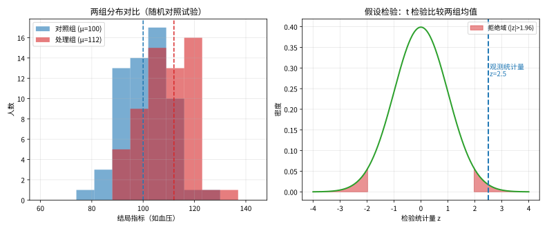
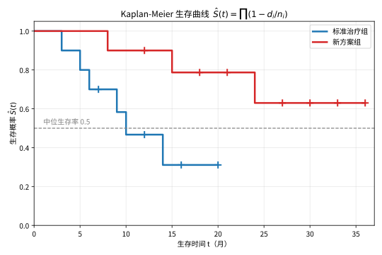

# 第 136 级：生物统计学 (Biostatistics)

---

## 1. 学习目标

完成本教程后，你将能够：

1. 理解临床试验设计与随机对照试验的基本原理
2. 掌握生存分析方法（Kaplan-Meier 估计、Cox 比例风险模型）
3. 理解 Log-rank 检验的统计原理
4. 掌握病例对照研究与队列研究的设计方法
5. 理解 Meta 分析的统计方法（固定效应与随机效应）
6. 掌握诊断试验的评价指标（ROC 曲线、AUC）
7. 理解贝叶斯生物统计的基本框架
8. 掌握多重比较校正与样本量计算方法

---

## 2. 核心概念

### 2.1 临床试验设计

**临床试验**（Clinical Trial）是评估医疗干预效果的金标准。主要类型包括：

- **随机对照试验**（Randomized Controlled Trial, RCT）：将受试者随机分配到处理组和对照组
- **交叉设计**（Crossover Design）：每个受试者先后接受不同处理
- **析因设计**（Factorial Design）：同时评估多个因素的效应

**随机化方法**：简单随机化、区组随机化、分层随机化、自适应随机化。

> **直观理解（现实类比）**：要判断一种新药是否有效，就像在同一批人里随机分成两组，一组服药、一组吃安慰剂，然后比较两组的平均效果。若两组分布几乎重合，说明差异只是随机误差；若差异超出正态分布的"拒绝域"（约两倍标准误之外），则可以断定是真实效果，而不是碰巧。

### 2.2 生存分析

**生存分析**（Survival Analysis）研究事件发生时间数据。核心概念：

- **生存函数** $S(t) = P(T > t)$
- **风险函数** $h(t) = \lim_{\Delta t \to 0} \frac{P(t \le T < t + \Delta t | T \ge t)}{\Delta t}$
- **删失数据**（Censored Data）：事件未发生或失访

**Kaplan-Meier 估计**（乘积限估计）：

$$
\hat{S}(t) = \prod_{t_i \le t} \left(1 - \frac{d_i}{n_i}\right)
$$

其中 $d_i$ 为 $t_i$ 时刻发生事件的人数，$n_i$ 为 $t_i$ 时刻处于风险中的人数。

### 2.3 Cox 比例风险模型

**Cox 比例风险模型**（Cox Proportional Hazards Model）：

$$
h(t | X) = h_0(t) \exp(\beta^\top X)
$$

其中 $h_0(t)$ 为基线风险函数，$\beta$ 为回归系数。该模型通过部分似然（partial likelihood）进行估计，无需指定 $h_0(t)$ 的形式。

### 2.4 Log-rank 检验

**Log-rank 检验**用于比较两组生存曲线的差异。检验统计量为：

$$
\chi^2 = \frac{(O_1 - E_1)^2}{E_1} + \frac{(O_2 - E_2)^2}{E_2}
$$

其中 $O_i$ 为观察事件数，$E_i$ 为期望事件数。

### 2.5 病例对照研究与队列研究

**队列研究**（Cohort Study）：按暴露因素分组，前瞻性追踪结局发生情况。

**病例对照研究**（Case-Control Study）：按结局分组，回顾性调查暴露因素。**比值比**（Odds Ratio, OR）为效应指标。

### 2.6 Meta 分析

**Meta 分析**（Meta-Analysis）合并多个独立研究的结果。包含：

- **固定效应模型**：假设所有研究具有相同的真实效应
- **随机效应模型**：允许研究间存在异质性

### 2.7 诊断试验

**诊断试验**（Diagnostic Test）评价指标：

- **敏感性**（Sensitivity）：$Se = P(\text{Test}^+ | \text{Disease}^+)$
- **特异性**（Specificity）：$Sp = P(\text{Test}^- | \text{Disease}^-)$
- **ROC 曲线**：以 1-特异性为横轴、敏感性为纵轴绘制的曲线
- **AUC**（Area Under the Curve）：ROC 曲线下面积，衡量诊断准确性

### 2.8 贝叶斯生物统计

**贝叶斯方法**（Bayesian Methods）结合先验信息和数据：

$$
P(\theta | \text{Data}) \propto P(\text{Data} | \theta) \cdot P(\theta)
$$

其中 $P(\theta)$ 为先验分布，$P(\text{Data} | \theta)$ 为似然函数，$P(\theta | \text{Data})$ 为后验分布。

### 2.9 多重比较校正

**多重比较校正**（Multiple Comparison Correction）控制族系错误率：

- **Bonferroni 校正**：$p_{\text{adj}} = p \cdot m$，其中 $m$ 为比较次数
- **FDR 控制**（Benjamini-Hochberg 方法）：控制错误发现率

### 2.10 样本量计算

**样本量计算**（Sample Size Calculation）基于检验效能分析。对于两样本均数比较：

$$
n = \frac{2(Z_{\alpha/2} + Z_\beta)^2 \sigma^2}{\delta^2}
$$

其中 $\delta$ 为效应量，$\sigma^2$ 为方差，$\alpha$ 为显著性水平，$1-\beta$ 为检验效能。

### 2.11 适应性设计

**适应性设计**（Adaptive Design）允许在试验进行中根据中期分析结果修改试验方案，如样本量重估、适应性随机化等。

---

## 3. 定理与证明

### 定理 3.1：Cox 比例风险模型的部分似然估计

**定理**：考虑 Cox 比例风险模型 $h(t|X) = h_0(t) \exp(\beta^\top X)$。设观测数据为 $(T_i, \delta_i, X_i)$，$i = 1, \dots, n$，其中 $T_i$ 为事件时间或删失时间，$\delta_i$ 为事件指示变量（$\delta_i = 1$ 表示事件发生，$\delta_i = 0$ 表示删失），$X_i$ 为协变量向量。Cox 模型的部分似然函数（Partial Likelihood）为：

$$
L(\beta) = \prod_{i: \delta_i = 1} \frac{\exp(\beta^\top X_i)}{\sum_{j \in R(t_i)} \exp(\beta^\top X_j)}
$$

其中 $R(t_i) = \{j: T_j \ge t_i\}$ 为 $t_i$ 时刻的风险集（risk set）。部分似然估计量 $\hat{\beta}$ 通过最大化 $L(\beta)$ 得到，在正则条件下，$\hat{\beta}$ 是 $\beta$ 的一致估计且渐近服从正态分布。

**证明**：

**步骤1：部分似然的推导**

Cox 模型的核心思想是，在给定风险集的情况下，$t_i$ 时刻事件发生在个体 $i$ 上的条件概率为：

$$
P(\text{个体 } i \text{ 在 } t_i \text{ 时刻发生事件} | \text{风险集 } R(t_i)) = \frac{h(t_i | X_i)}{\sum_{j \in R(t_i)} h(t_i | X_j)} = \frac{h_0(t_i) \exp(\beta^\top X_i)}{\sum_{j \in R(t_i)} h_0(t_i) \exp(\beta^\top X_j)} = \frac{\exp(\beta^\top X_i)}{\sum_{j \in R(t_i)} \exp(\beta^\top X_j)}
$$

注意基线风险 $h_0(t_i)$ 在分子分母中消去，因此部分似然不依赖于 $h_0(t)$。

将所有事件发生的时间点上的条件概率相乘，得到部分似然函数：

$$
L(\beta) = \prod_{i: \delta_i = 1} \frac{\exp(\beta^\top X_i)}{\sum_{j \in R(t_i)} \exp(\beta^\top X_j)}
$$

**步骤2：对数部分似然与得分函数**

对数部分似然为：

$$
\ell(\beta) = \sum_{i: \delta_i = 1} \left[\beta^\top X_i - \ln\left(\sum_{j \in R(t_i)} \exp(\beta^\top X_j)\right)\right]
$$

得分函数（Score Function）为：

$$
U(\beta) = \frac{\partial \ell(\beta)}{\partial \beta} = \sum_{i: \delta_i = 1} \left[X_i - \frac{\sum_{j \in R(t_i)} X_j \exp(\beta^\top X_j)}{\sum_{j \in R(t_i)} \exp(\beta^\top X_j)}\right]
$$

定义加权平均 $\bar{X}(\beta, t_i) = \frac{\sum_{j \in R(t_i)} X_j \exp(\beta^\top X_j)}{\sum_{j \in R(t_i)} \exp(\beta^\top X_j)}$，则：

$$
U(\beta) = \sum_{i: \delta_i = 1} \left[X_i - \bar{X}(\beta, t_i)\right]
$$

**步骤3：信息矩阵**

观察信息矩阵（Observed Information Matrix）为：

$$
I(\beta) = -\frac{\partial^2 \ell(\beta)}{\partial \beta \partial \beta^\top} = \sum_{i: \delta_i = 1} \left[\frac{\sum_{j \in R(t_i)} X_j X_j^\top \exp(\beta^\top X_j)}{\sum_{j \in R(t_i)} \exp(\beta^\top X_j)} - \bar{X}(\beta, t_i) \bar{X}(\beta, t_i)^\top\right]
$$

**步骤4：鞅理论框架**

**鞅**（Martingale）在生存分析中起关键作用。定义计数过程 $N_i(t) = \mathbf{1}_{\{T_i \le t, \delta_i = 1\}}$ 和风险过程 $Y_i(t) = \mathbf{1}_{\{T_i \ge t\}}$。则 $N_i(t)$ 具有补偿子（compensator）：

$$
\Lambda_i(t) = \int_0^t Y_i(s) h_0(s) \exp(\beta^\top X_i) ds
$$

$M_i(t) = N_i(t) - \Lambda_i(t)$ 是一个鞅。

**步骤5：得分函数的鞅表示**

得分函数可表示为鞅的积分：

$$
U(\beta) = \sum_{i=1}^n \int_0^\infty \left[X_i - \bar{X}(\beta, s)\right] dM_i(s)
$$

由于 $M_i$ 是鞅，$U(\beta)$ 是鞅积分，其期望为 0。由鞅中心极限定理，$\frac{1}{\sqrt{n}} U(\beta_0) \xrightarrow{d} N(0, \Sigma)$，其中 $\Sigma$ 为渐近方差。

**步骤6：一致性**

由凸函数的一阶条件，$\hat{\beta}$ 满足 $U(\hat{\beta}) = 0$。由大数定律和鞅的收敛性，$\frac{1}{n} I(\beta) \xrightarrow{p} \mathcal{I}(\beta)$，其中 $\mathcal{I}(\beta)$ 为期望信息矩阵。

通过标准的 M-估计理论，$\hat{\beta} \xrightarrow{p} \beta_0$（一致性）。

**步骤7：渐近正态性**

对得分函数在 $\beta_0$ 处进行泰勒展开：

$$
0 = U(\hat{\beta}) = U(\beta_0) + \frac{\partial U(\bar{\beta})}{\partial \beta^\top} (\hat{\beta} - \beta_0)
$$

其中 $\bar{\beta}$ 在 $\hat{\beta}$ 和 $\beta_0$ 之间。

因此：

$$
\sqrt{n}(\hat{\beta} - \beta_0) = \left(-\frac{1}{n} \frac{\partial U(\bar{\beta})}{\partial \beta^\top}\right)^{-1} \cdot \frac{1}{\sqrt{n}} U(\beta_0)
$$

由一致性，$\frac{1}{n} \frac{\partial U(\bar{\beta})}{\partial \beta^\top} \xrightarrow{p} -\mathcal{I}(\beta_0)$。由鞅 CLT，$\frac{1}{\sqrt{n}} U(\beta_0) \xrightarrow{d} N(0, \mathcal{I}(\beta_0))$。

由 Slutsky 定理：

$$
\sqrt{n}(\hat{\beta} - \beta_0) \xrightarrow{d} N(0, \mathcal{I}(\beta_0)^{-1})
$$

即 $\hat{\beta}$ 渐近服从 $N(\beta_0, \mathcal{I}(\beta_0)^{-1}/n)$。$\square$
> **直观理解（现实类比）**：Cox 比例风险模型就像给每个病人贴一张"风险身份证"——基础风险随时间怎么变可以不管，但各因素（年龄、用药）把风险按固定倍数放大或缩小。回归系数 $eta$ 算出的风险比 $HR=e^\beta$ 就是"用药组相对对照组的风险倍数"：$HR<1$ 说明药是"护身符"降风险，$HR>1$ 则是"催命符"增风险。"比例风险"的前提是这张倍数关系不随时间变。

---

### 定理 3.2：Kaplan-Meier 估计的一致性

**定理**：设 $T_1, \dots, T_n$ 为独立同分布的生存时间，$C_1, \dots, C_n$ 为独立同分布的删失时间，二者独立。观测数据为 $X_i = \min(T_i, C_i)$ 和 $\delta_i = \mathbf{1}_{\{T_i \le C_i\}}$。Kaplan-Meier 估计量（乘积限估计）为：

$$
\hat{S}(t) = \prod_{t_i \le t} \left(1 - \frac{d_i}{n_i}\right)
$$

其中 $t_1 < t_2 < \cdots$ 为事件发生时间，$d_i$ 为 $t_i$ 时刻发生事件的人数，$n_i$ 为 $t_i$ 时刻处于风险中的人数。则 $\hat{S}(t)$ 是真实生存函数 $S(t) = P(T > t)$ 的一致估计，即：

$$
\sup_{t \in [0, \tau]} |\hat{S}(t) - S(t)| \xrightarrow{p} 0
$$

其中 $\tau$ 满足 $P(T > \tau) > 0$ 且 $P(C > \tau) > 0$。

**证明**（使用鞅表示）：

**步骤1：定义计数过程和风险过程**

定义计数过程 $N(t) = \sum_{i=1}^n N_i(t)$，其中 $N_i(t) = \mathbf{1}_{\{X_i \le t, \delta_i = 1\}}$。

定义风险过程 $Y(t) = \sum_{i=1}^n Y_i(t)$，其中 $Y_i(t) = \mathbf{1}_{\{X_i \ge t\}}$。

**步骤2：累积风险函数**

累积风险函数（Cumulative Hazard Function）为 $\Lambda(t) = -\ln S(t)$。Nelson-Aalen 估计量为：

$$
\hat{\Lambda}(t) = \sum_{t_i \le t} \frac{d_i}{n_i}
$$

Kaplan-Meier 估计与 Nelson-Aalen 估计的关系为：

$$
\hat{S}(t) = \prod_{t_i \le t} \left(1 - \frac{d_i}{n_i}\right) \approx \exp\left(-\sum_{t_i \le t} \frac{d_i}{n_i}\right) = \exp(-\hat{\Lambda}(t))
$$

**步骤3：鞅表示**

计数过程 $N(t)$ 的补偿子为 $\Lambda^*(t) = \int_0^t Y(s) h(s) ds$，其中 $h(s) = \lim_{\Delta s \to 0} P(s \le T < s + \Delta s | T \ge s)/\Delta s$ 为风险函数。

鞅 $M(t) = N(t) - \Lambda^*(t)$ 是均值为零的平方可积鞅。

**步骤4：Nelson-Aalen 估计的鞅表示**

Nelson-Aalen 估计量可写为：

$$
\hat{\Lambda}(t) - \Lambda(t) = \int_0^t \frac{dM(s)}{Y(s)}
$$

其中 $\Lambda(t) = \int_0^t h(s) ds$ 为真实累积风险函数。

**步骤5：一致性证明**

需要证明 $\hat{\Lambda}(t) \xrightarrow{p} \Lambda(t)$，即 $\int_0^t \frac{dM(s)}{Y(s)} \xrightarrow{p} 0$。

由鞅的方差公式：

$$
\text{Var}\left(\int_0^t \frac{dM(s)}{Y(s)}\right) = \mathbb{E}\left[\int_0^t \frac{d\langle M \rangle(s)}{Y(s)^2}\right]
$$

其中 $\langle M \rangle(t) = \int_0^t Y(s) h(s) ds$ 为鞅的二次变差过程。

因此：

$$
\text{Var}\left(\int_0^t \frac{dM(s)}{Y(s)}\right) = \mathbb{E}\left[\int_0^t \frac{h(s)}{Y(s)} ds\right]
$$

当 $n \to \infty$ 时，$Y(s) \to \infty$ 几乎必然，且 $Y(s) = O_p(n)$，因此方差趋于 0。

由 Chebyshev 不等式，对任意 $\varepsilon > 0$：

$$
P\left(\left|\int_0^t \frac{dM(s)}{Y(s)}\right| > \varepsilon\right) \le \frac{1}{\varepsilon^2} \mathbb{E}\left[\int_0^t \frac{h(s)}{Y(s)} ds\right] \to 0
$$

因此 $\hat{\Lambda}(t) \xrightarrow{p} \Lambda(t)$。

**步骤6：Kaplan-Meier 估计的一致性**

由 $\hat{S}(t) = \exp(-\hat{\Lambda}(t))$ 的近似和连续映射定理，$\hat{S}(t) \xrightarrow{p} \exp(-\Lambda(t)) = S(t)$。

更严格地，使用乘积积分表示：

$$
\hat{S}(t) = \prod_{t_i \le t} \left(1 - \frac{d_i}{n_i}\right) = \mathcal{P}_{s=0}^t (1 - d\hat{\Lambda}(s))
$$

其中 $\mathcal{P}$ 表示乘积积分。由乘积积分的连续性质，$\hat{\Lambda}(t)$ 的一致收敛性保证了 $\hat{S}(t)$ 的一致收敛性。

**步骤7：一致收敛的加强**

使用鞅不等式（如 Lenglart 不等式），可以证明 $\sup_{t \in [0, \tau]} |\hat{\Lambda}(t) - \Lambda(t)| = o_p(1)$，进而得到 $\sup_{t \in [0, \tau]} |\hat{S}(t) - S(t)| = o_p(1)$，即一致收敛性。$\square$

---

### 定理 3.3：Log-rank 检验的渐近分布

**定理**：考虑两组生存数据，组 $g = 1, 2$，$g = 1$ 为对照组，$g = 2$ 为处理组。设 $t_1 < t_2 < \cdots < t_K$ 为所有事件发生时间（合并两组）。在 $t_j$ 时刻，令 $n_{gj}$ 为组 $g$ 中处于风险中的人数，$d_{gj}$ 为组 $g$ 中发生事件的人数。定义 $n_j = n_{1j} + n_{2j}$，$d_j = d_{1j} + d_{2j}$。

Log-rank 检验统计量检验零假设 $H_0: h_1(t) = h_2(t)$（两组风险函数相等），定义为：

$$
Z = \frac{\sum_{j=1}^K (d_{1j} - e_{1j})}{\sqrt{\sum_{j=1}^K v_{1j}}}
$$

其中 $e_{1j} = \frac{n_{1j} d_j}{n_j}$ 为期望事件数，$v_{1j} = \frac{n_{1j} n_{2j} d_j (n_j - d_j)}{n_j^2 (n_j - 1)}$ 为方差。

在 $H_0$ 下，$Z \xrightarrow{d} N(0, 1)$，即 Log-rank 检验统计量渐近服从标准正态分布。

**证明**：

**步骤1：超几何分布条件**

在 $H_0$ 下，给定 $n_{1j}$、$n_{2j}$ 和 $d_j$，$d_{1j}$ 服从超几何分布（从 $n_j$ 个个体中随机抽取 $d_j$ 个事件，其中 $n_{1j}$ 个来自组 1）：

$$
P(d_{1j} = k) = \frac{\binom{n_{1j}}{k} \binom{n_{2j}}{d_j - k}}{\binom{n_j}{d_j}}
$$

**步骤2：条件期望与方差**

由超几何分布：

$$
\mathbb{E}[d_{1j} | \text{风险集}] = n_{1j} \cdot \frac{d_j}{n_j} = e_{1j}
$$

$$
\text{Var}(d_{1j} | \text{风险集}) = n_{1j} \cdot \frac{n_{2j}}{n_j} \cdot \frac{d_j}{n_j} \cdot \frac{n_j - d_j}{n_j - 1} = v_{1j}
$$

**步骤3：鞅结构**

定义计数过程 $N_g(t) = \sum_{i: \text{组 } g} N_{gi}(t)$，其中 $N_{gi}(t)$ 为个体 $i$ 的计数过程。风险过程 $Y_g(t) = \sum_{i: \text{组 } g} Y_{gi}(t)$。

在 $H_0$ 下，$h_1(t) = h_2(t) = h_0(t)$，因此 $N_g(t)$ 的补偿子为 $\Lambda_g(t) = \int_0^t Y_g(s) h_0(s) ds$。

鞅 $M_g(t) = N_g(t) - \Lambda_g(t)$ 具有零均值。

**步骤4：Log-rank 统计量的鞅表示**

Log-rank 统计量的分子可写为：

$$
O_1 - E_1 = \sum_{j=1}^K (d_{1j} - e_{1j}) = \sum_{j=1}^K \left(d_{1j} - \frac{n_{1j}}{n_j} d_j\right)
$$

在鞅框架下，这等价于：

$$
O_1 - E_1 = \int_0^\infty \frac{Y_1(s)}{Y(s)} dM(s)
$$

其中 $M(s) = M_1(s) + M_2(s)$ 是总鞅，$Y(s) = Y_1(s) + Y_2(s)$。

**步骤5：鞅中心极限定理**

考虑标准化统计量：

$$
Z_n = \frac{\int_0^\infty \frac{Y_1(s)}{Y(s)} dM(s)}{\sqrt{\int_0^\infty \frac{Y_1(s) Y_2(s)}{Y(s)^2} d\langle M \rangle(s)}}
$$

由鞅 CLT，若满足 Lindeberg 条件，则 $Z_n \xrightarrow{d} N(0, 1)$。

**步骤6：方差估计的一致性**

方差估计量 $\sum v_{1j}$ 是鞅的二次变差 $\int_0^\infty \frac{Y_1(s) Y_2(s)}{Y(s)^2} d\langle M \rangle(s)$ 的一致估计，因此：

$$
Z = \frac{\sum_{j=1}^K (d_{1j} - e_{1j})}{\sqrt{\sum_{j=1}^K v_{1j}}} \xrightarrow{d} N(0, 1)
$$

**步骤7：结论**

在 $H_0$ 下，Log-rank 检验统计量 $Z$ 渐近服从标准正态分布。因此，在显著性水平 $\alpha$ 下，若 $|Z| > Z_{\alpha/2}$，则拒绝 $H_0$，认为两组生存曲线存在显著差异。

此外，$\chi^2 = Z^2$ 渐近服从自由度为 1 的卡方分布。$\square$
> **直观理解（现实类比）**：Log-rank 检验就像两条"生存赛道"的总账对比——在每个有人出局的时刻，把"该时刻两组理论上各应出局几个人"算出来，再看实际出局数差多少，全程累加。若两组生存真没差别，这条累加差值会像随机游走在0附近晃；若一直往一边偏，就说明两组生存确有不同。它只比"何时出局"，不比"风险倍数"。

---

### 定理 3.4：ROC 曲线下面积（AUC）的统计性质

**定理**：考虑一个诊断试验，对 $n_1$ 个患病个体和 $n_0$ 个非患病个体进行检测，得到检测结果 $X_1, \dots, X_{n_1}$（患病组）和 $Y_1, \dots, Y_{n_0}$（非患病组），假设检测值越大表示患病可能性越大。ROC 曲线下面积（AUC）定义为：

$$
\text{AUC} = \int_0^1 \text{ROC}(p) dp = P(X > Y)
$$

其中 $\text{ROC}(p)$ 为真阳性率关于假阳性率的函数。

AUC 的 Mann-Whitney 统计量估计为：

$$
\hat{\text{AUC}} = \frac{1}{n_0 n_1} \sum_{i=1}^{n_1} \sum_{j=1}^{n_0} \mathbf{1}_{\{X_i > Y_j\}}
$$

则 $\hat{\text{AUC}}$ 是 AUC 的无偏一致估计，且渐近正态：

$$
\sqrt{n} (\hat{\text{AUC}} - \text{AUC}) \xrightarrow{d} N(0, \sigma^2)
$$

其中 $n = n_0 + n_1$，$\sigma^2$ 为渐近方差。

**证明**：

**步骤1：AUC 的概率解释**

AUC 等于随机选择的患病个体的检测值大于随机选择的非患病个体检测值的概率：

$$
\text{AUC} = P(X > Y) = \int_{-\infty}^\infty (1 - F_X(y)) f_Y(y) dy
$$

其中 $F_X$ 为患病组的分布函数，$f_Y$ 为非患病组的密度函数。

**步骤2：Mann-Whitney 统计量**

Mann-Whitney U 统计量定义为：

$$
U = \sum_{i=1}^{n_1} \sum_{j=1}^{n_0} \mathbf{1}_{\{X_i > Y_j\}}
$$

AUC 的估计量为：

$$
\hat{\text{AUC}} = \frac{U}{n_0 n_1}
$$

**步骤3：无偏性**

$$
\mathbb{E}[\hat{\text{AUC}}] = \frac{1}{n_0 n_1} \sum_{i=1}^{n_1} \sum_{j=1}^{n_0} \mathbb{E}[\mathbf{1}_{\{X_i > Y_j\}}] = \frac{1}{n_0 n_1} \sum_{i=1}^{n_1} \sum_{j=1}^{n_0} P(X_i > Y_j) = \text{AUC}
$$

因此 $\hat{\text{AUC}}$ 是 AUC 的无偏估计。

**步骤4：U 统计量的方差**

$\hat{\text{AUC}}$ 是两样本 U 统计量，其方差为：

$$
\text{Var}(\hat{\text{AUC}}) = \frac{1}{n_0 n_1} \left[\frac{n_1 - 1}{n_1} \zeta_{10} + \frac{n_0 - 1}{n_0} \zeta_{01} + \frac{\text{AUC}(1 - \text{AUC})}{n_0 n_1}\right]
$$

其中：

$$
\zeta_{10} = \text{Var}(\mathbb{E}[\mathbf{1}_{\{X > Y\}} | X]) = \mathbb{E}[F_Y(X)^2] - \text{AUC}^2
$$

$$
\zeta_{01} = \text{Var}(\mathbb{E}[\mathbf{1}_{\{X > Y\}} | Y]) = \mathbb{E}[(1 - F_X(Y))^2] - \text{AUC}^2
$$

$F_Y$ 和 $F_X$ 分别为非患病组和患病组的分布函数。

**步骤5：渐近正态性**

由 U 统计量的渐近理论，当 $n_0, n_1 \to \infty$ 且 $n_0/n \to \lambda \in (0, 1)$ 时：

$$
\sqrt{n} (\hat{\text{AUC}} - \text{AUC}) \xrightarrow{d} N(0, \sigma^2)
$$

其中 $\sigma^2 = \frac{\zeta_{10}}{\lambda} + \frac{\zeta_{01}}{1 - \lambda}$。

**步骤6：方差估计**

方差 $\sigma^2$ 可通过以下方法估计：

**DeLong 方法**（非参数法）：

$$
\hat{\sigma}^2 = \frac{1}{n_0} \hat{\zeta}_{01} + \frac{1}{n_1} \hat{\zeta}_{10}
$$

其中：

$$
\hat{\zeta}_{10} = \frac{1}{n_1 - 1} \sum_{i=1}^{n_1} \left(\frac{1}{n_0} \sum_{j=1}^{n_0} \mathbf{1}_{\{X_i > Y_j\}} - \hat{\text{AUC}}\right)^2
$$

$$
\hat{\zeta}_{01} = \frac{1}{n_0 - 1} \sum_{j=1}^{n_0} \left(\frac{1}{n_1} \sum_{i=1}^{n_1} \mathbf{1}_{\{X_i > Y_j\}} - \hat{\text{AUC}}\right)^2
$$

**步骤7：AUC 的假设检验**

基于渐近正态性，可以构建 AUC 的置信区间和假设检验。例如，检验 $H_0: \text{AUC} = 0.5$（无诊断价值）的统计量为：

$$
Z = \frac{\hat{\text{AUC}} - 0.5}{\hat{\sigma}/\sqrt{n}} \xrightarrow{d} N(0, 1)
$$

若 $|Z| > Z_{\alpha/2}$，则拒绝 $H_0$，认为该诊断试验具有区分能力。$\square$
> **直观理解（现实类比）**：ROC 曲线就像调一台"报警器"的灵敏度旋钮——阈值调得越严（只报最可疑的），漏报多但误报少；调得越松，漏报少却误报满天飞。曲线越往左上角拱，说明这台报警器越能"既少漏报又少误报"；AUC（曲线下面积）就是这种"区分本领"的总分，0.5 是瞎猜，1 是火眼金睛，0.9 以上常算优秀诊断。

---

### 定理 3.5：Meta 分析中的随机效应模型

**定理**：考虑 $k$ 个独立研究，每个研究估计的效应量为 $\hat{\theta}_i$，其方差为 $\hat{\sigma}_i^2$（$i = 1, \dots, k$）。随机效应模型假设：

$$
\hat{\theta}_i = \theta_i + \varepsilon_i, \quad \theta_i = \mu + \tau_i
$$

其中 $\varepsilon_i \sim N(0, \sigma_i^2)$ 为抽样误差，$\tau_i \sim N(0, \tau^2)$ 为研究间异质性，且 $\varepsilon_i$ 与 $\tau_i$ 独立。因此，边际上 $\hat{\theta}_i \sim N(\mu, \sigma_i^2 + \tau^2)$。

DerSimonian-Laird 随机效应估计量 $\hat{\mu}_{\text{DL}}$ 及其方差为：

$$
\hat{\mu}_{\text{DL}} = \frac{\sum_{i=1}^k w_i^* \hat{\theta}_i}{\sum_{i=1}^k w_i^*}, \quad \text{Var}(\hat{\mu}_{\text{DL}}) = \frac{1}{\sum_{i=1}^k w_i^*}
$$

其中 $w_i^* = 1/(\hat{\sigma}_i^2 + \hat{\tau}^2)$，$\hat{\tau}^2$ 为研究间方差的 DerSimonian-Laird 估计量：

$$
\hat{\tau}^2 = \max\left\{0, \frac{Q - (k-1)}{\sum_{i=1}^k w_i - \frac{\sum_{i=1}^k w_i^2}{\sum_{i=1}^k w_i}}\right\}
$$

其中 $w_i = 1/\hat{\sigma}_i^2$，$Q = \sum_{i=1}^k w_i (\hat{\theta}_i - \hat{\mu}_{\text{FE}})^2$ 为异质性统计量，$\hat{\mu}_{\text{FE}} = \frac{\sum w_i \hat{\theta}_i}{\sum w_i}$ 为固定效应估计量。

**证明**：

**步骤1：固定效应模型**

固定效应模型假设所有研究共享相同的真实效应量 $\mu$，即 $\hat{\theta}_i \sim N(\mu, \sigma_i^2)$。固定效应估计量为：

$$
\hat{\mu}_{\text{FE}} = \frac{\sum_{i=1}^k w_i \hat{\theta}_i}{\sum_{i=1}^k w_i}, \quad w_i = \frac{1}{\sigma_i^2}
$$

在实践中，$\sigma_i^2$ 由 $\hat{\sigma}_i^2$ 估计。

**步骤2：异质性检验**

Cochran 的 $Q$ 统计量用于检验研究间异质性：

$$
Q = \sum_{i=1}^k w_i (\hat{\theta}_i - \hat{\mu}_{\text{FE}})^2
$$

在 $H_0: \tau^2 = 0$ 下，$Q \sim \chi^2_{k-1}$。若 $Q > \chi^2_{k-1, \alpha}$，则拒绝 $H_0$，认为存在研究间异质性。

**步骤3：$Q$ 统计量的期望**

可以证明 $Q$ 的期望为：

$$
\mathbb{E}[Q] = (k-1) + \tau^2 \left(\sum_{i=1}^k w_i - \frac{\sum_{i=1}^k w_i^2}{\sum_{i=1}^k w_i}\right)
$$

**证明**：在随机效应模型下，$\hat{\theta}_i = \mu + \tau_i + \varepsilon_i$，其中 $\text{Var}(\hat{\theta}_i) = \sigma_i^2 + \tau^2$。

令 $\hat{\mu}_{\text{FE}} = \frac{\sum w_i \hat{\theta}_i}{\sum w_i}$，其中 $w_i = 1/\sigma_i^2$。

计算 $\mathbb{E}[Q] = \mathbb{E}[\sum w_i (\hat{\theta}_i - \hat{\mu}_{\text{FE}})^2]$。

将 $\hat{\theta}_i - \hat{\mu}_{\text{FE}} = (\hat{\theta}_i - \mu) - (\hat{\mu}_{\text{FE}} - \mu)$，展开后利用期望运算可得上述结果。

**步骤4：DerSimonian-Laird 矩估计**

由 $\mathbb{E}[Q] = (k-1) + \tau^2 C$，其中 $C = \sum w_i - \frac{\sum w_i^2}{\sum w_i}$，用矩法估计 $\tau^2$：

$$
\hat{\tau}^2 = \frac{Q - (k-1)}{C}
$$

若计算值为负，则截断为 0：

$$
\hat{\tau}^2 = \max\left\{0, \frac{Q - (k-1)}{C}\right\}
$$

**步骤5：随机效应估计量**

在随机效应模型中，权重为 $w_i^* = 1/(\hat{\sigma}_i^2 + \hat{\tau}^2)$。随机效应估计量为：

$$
\hat{\mu}_{\text{DL}} = \frac{\sum_{i=1}^k w_i^* \hat{\theta}_i}{\sum_{i=1}^k w_i^*}
$$

其方差为：

$$
\text{Var}(\hat{\mu}_{\text{DL}}) = \frac{1}{\sum_{i=1}^k w_i^*}
$$

**步骤6：$\hat{\mu}_{\text{DL}}$ 的最优性**

在给定 $\tau^2$ 的情况下，$w_i^* = 1/(\sigma_i^2 + \tau^2)$ 是最优权重（使 $\hat{\mu}$ 的方差最小）。由于 $\tau^2$ 被一致估计，$\hat{\mu}_{\text{DL}}$ 是渐近有效的。

**步骤7：置信区间与假设检验**

$\hat{\mu}_{\text{DL}}$ 的 $100(1-\alpha)\%$ 置信区间为：

$$
\hat{\mu}_{\text{DL}} \pm Z_{\alpha/2} \sqrt{\frac{1}{\sum_{i=1}^k w_i^*}}
$$

检验 $H_0: \mu = 0$ 的统计量为：

$$
Z = \frac{\hat{\mu}_{\text{DL}}}{\sqrt{1/\sum w_i^*}} \xrightarrow{d} N(0, 1)
$$

**步骤8：与固定效应模型的比较**

- 当 $\hat{\tau}^2 = 0$ 时，随机效应模型退化为固定效应模型
- 当 $\hat{\tau}^2 > 0$ 时，随机效应模型的权重更均匀（小研究的权重相对增加），置信区间更宽
- 随机效应模型的结果可推广到更广泛的研究人群，而固定效应模型仅适用于纳入的研究 $\square$

---

## 4. 示例

### 示例 1：用 Kaplan-Meier 曲线分析生存数据

**问题**：某临床试验比较两种肺癌治疗方案（标准治疗 vs. 新方案）的生存时间。数据包含 20 名患者（每组 10 名），记录生存时间（月）和删失状态。

**解**：

**步骤1：数据**

| 患者 | 组别 | 生存时间（月） | 事件（1=死亡，0=删失） |
|:---:|:---:|:---:|:---:|
| 1 | 标准 | 3 | 1 |
| 2 | 标准 | 5 | 1 |
| 3 | 标准 | 6 | 1 |
| 4 | 标准 | 7 | 0 |
| 5 | 标准 | 9 | 1 |
| 6 | 标准 | 10 | 1 |
| 7 | 标准 | 12 | 0 |
| 8 | 标准 | 14 | 1 |
| 9 | 标准 | 16 | 0 |
| 10 | 标准 | 20 | 0 |
| 11 | 新方案 | 8 | 1 |
| 12 | 新方案 | 12 | 0 |
| 13 | 新方案 | 15 | 1 |
| 14 | 新方案 | 18 | 0 |
| 15 | 新方案 | 21 | 0 |
| 16 | 新方案 | 24 | 1 |
| 17 | 新方案 | 27 | 0 |
| 18 | 新方案 | 30 | 0 |
| 19 | 新方案 | 33 | 0 |
| 20 | 新方案 | 36 | 0 |

**步骤2：标准治疗组的 Kaplan-Meier 估计**

| 时间 $t$ | 风险人数 $n$ | 事件数 $d$ | 删失数 | $\hat{S}(t)$ |
|:---:|:---:|:---:|:---:|:---:|
| 0 | 10 | 0 | 0 | 1.000 |
| 3 | 10 | 1 | 0 | 0.900 |
| 5 | 9 | 1 | 0 | 0.800 |
| 6 | 8 | 1 | 0 | 0.700 |
| 7 | 7 | 0 | 1 | 0.700 |
| 9 | 6 | 1 | 0 | 0.583 |
| 10 | 5 | 1 | 0 | 0.467 |
| 12 | 4 | 0 | 1 | 0.467 |
| 14 | 3 | 1 | 0 | 0.311 |
| 16 | 2 | 0 | 1 | 0.311 |
| 20 | 1 | 0 | 1 | 0.311 |

计算示例（$t=3$）：$\hat{S}(3) = 1 \times (1 - 1/10) = 0.900$
计算示例（$t=9$）：$\hat{S}(9) = 0.700 \times (1 - 1/6) = 0.583$

**步骤3：新方案组的 Kaplan-Meier 估计**

| 时间 $t$ | 风险人数 $n$ | 事件数 $d$ | 删失数 | $\hat{S}(t)$ |
|:---:|:---:|:---:|:---:|:---:|
| 0 | 10 | 0 | 0 | 1.000 |
| 8 | 10 | 1 | 0 | 0.900 |
| 12 | 9 | 0 | 1 | 0.900 |
| 15 | 8 | 1 | 0 | 0.787 |
| 18 | 7 | 0 | 1 | 0.787 |
| 21 | 6 | 0 | 1 | 0.787 |
| 24 | 5 | 1 | 0 | 0.630 |
| 27 | 4 | 0 | 1 | 0.630 |
| 30 | 3 | 0 | 1 | 0.630 |
| 33 | 2 | 0 | 1 | 0.630 |
| 36 | 1 | 0 | 1 | 0.630 |

**步骤4：中位生存时间**

- 标准治疗组：$\hat{S}(t) = 0.5$ 对应的 $t \approx 10$ 个月
- 新方案组：$\hat{S}(t) = 0.5$ 对应的 $t > 36$ 个月（未达到中位生存时间）

**步骤5：Log-rank 检验**

计算 Log-rank 统计量：

| 时间 | $n_1$ | $n_2$ | $d_1$ | $d_2$ | $e_1$ | $v_1$ |
|:---:|:---:|:---:|:---:|:---:|:---:|:---:|
| 3 | 10 | 10 | 1 | 0 | 0.50 | 0.25 |
| 5 | 9 | 10 | 1 | 0 | 0.47 | 0.25 |
| 6 | 8 | 10 | 1 | 0 | 0.44 | 0.25 |
| 8 | 7 | 10 | 0 | 1 | 0.41 | 0.24 |
| 9 | 6 | 9 | 1 | 0 | 0.40 | 0.24 |
| 10 | 5 | 9 | 1 | 0 | 0.36 | 0.23 |
| 14 | 4 | 8 | 1 | 0 | 0.33 | 0.22 |
| 15 | 3 | 8 | 0 | 1 | 0.27 | 0.20 |
| 24 | 2 | 5 | 0 | 1 | 0.29 | 0.21 |

$O_1 = \sum d_1 = 5$，$E_1 = \sum e_1 = 3.47$，$V = \sum v_1 = 2.09$

$Z = \frac{5 - 3.47}{\sqrt{2.09}} = 1.06$，$p = 0.29$

两组生存曲线差异不显著（$p = 0.29$），但新方案组显示出更长的生存趋势。

> **直观理解（现实类比）**：把两组病人比作两队"存活比赛"，每过一段时间就有人"出局"（死亡），生存概率像下楼梯一样逐级下降；中途可能有人失访（删失，用 + 标记），他们不算出局，也不改变已发生事件处的曲线。曲线下降得越慢，说明该组活得越久。

---

### 示例 2：用 Cox 模型分析风险因素

**问题**：使用 Cox 比例风险模型分析影响肺癌患者生存的风险因素。数据包含 100 名患者，变量包括年龄、性别、吸烟史（包年）、肿瘤分期（I-IV）和治疗方案。

**解**：

**步骤1：Cox 模型设定**

$$
h(t|X) = h_0(t) \exp(\beta_1 \text{年龄} + \beta_2 \text{性别} + \beta_3 \text{吸烟} + \beta_4 \text{分期} + \beta_5 \text{治疗})
$$

**步骤2：部分似然估计结果**

| 变量 | 系数 $\hat{\beta}$ | 标准误 | HR = $\exp(\hat{\beta})$ | 95% CI | p 值 |
|:---:|:---:|:---:|:---:|:---:|:---:|
| 年龄 | 0.021 | 0.012 | 1.021 | (0.997, 1.046) | 0.080 |
| 性别（男=1） | 0.312 | 0.245 | 1.366 | (0.845, 2.208) | 0.203 |
| 吸烟（包年） | 0.015 | 0.006 | 1.015 | (1.003, 1.027) | 0.012 |
| 分期（III/IV vs I/II） | 1.245 | 0.321 | 3.472 | (1.851, 6.513) | < 0.001 |
| 治疗（新方案=1） | -0.685 | 0.298 | 0.504 | (0.281, 0.904) | 0.021 |

**步骤3：结果解释**

- **年龄**：每增加 1 岁，死亡风险增加 2.1%，但未达到统计显著性（$p = 0.08$）
- **性别**：男性风险高于女性 36.6%，但不显著（$p = 0.203$）
- **吸烟**：每增加 1 包年，死亡风险增加 1.5%（$p = 0.012$）
- **肿瘤分期**：III/IV 期患者死亡风险是 I/II 期的 3.47 倍（$p < 0.001$），这是最强的风险因素
- **治疗**：新方案降低死亡风险约 49.6%（HR = 0.504，$p = 0.021$）

**步骤4：比例风险假设检验**

使用 Schoenfeld 残差检验比例风险假设：

| 变量 | $\rho$ | $\chi^2$ | p 值 |
|:---:|:---:|:---:|:---:|
| 年龄 | -0.05 | 0.25 | 0.617 |
| 性别 | 0.08 | 0.64 | 0.424 |
| 吸烟 | 0.12 | 1.44 | 0.230 |
| 分期 | -0.15 | 2.25 | 0.134 |
| 治疗 | 0.03 | 0.09 | 0.764 |
| 全局 | - | 4.67 | 0.458 |

所有变量和全局检验均不显著，比例风险假设成立。

**步骤5：调整后的生存曲线**

基于 Cox 模型，可以绘制调整后的生存曲线（在协变量均值处）：

标准治疗组（中位生存约 12 个月）vs. 新方案组（中位生存约 20 个月），调整后显示新方案显著延长生存。

---

## 5. 习题
### 基础题

**习题 1**（临床试验设计）说明随机对照试验（RCT）相比观察性研究的核心优势，写出随机化、盲法、对照三个要素各自的作用。

**习题 2**（生存分析）给出"生存函数 $S(t)$"与"风险函数 $h(t)$"的定义，并说明二者之间的关系。

**习题 3**（删失）解释生存分析中"右删失"的含义，说明为什么删失数据必须被正确纳入而不是丢弃。

**习题 4**（Kaplan-Meier）说明 Kaplan-Meier 估计量如何利用逐步（乘积限）方式估计生存函数 $S(t)$。

**习题 5**（Log-rank 检验）说明 Log-rank 检验的原假设、用于比较的对象以及它属于非参数检验的原因。

**习题 6**（Cox 模型）写出 Cox 比例风险模型 $h(t\mid X)=h_0(t)e^{\beta X}$，说明 $h_0(t)$ 与 $\beta$ 的含义，以及"比例风险"假设。

**习题 7**（诊断试验）定义敏感度、特异度的概念，说明它们在医学诊断试验中的意义。

**习题 8**（队列与病例对照）说明队列研究与病例对照研究在抽样与方向上的区别，以及各自适用的场合。

**习题 9**（Meta 分析）说明 Meta 分析的目的是什么，简述固定效应与随机效应模型的区别。

**习题 10**（贝叶斯统计）给出贝叶斯公式 $P(\theta\mid D)\propto P(D\mid\theta)P(\theta)$，说明先验、似然与后验三者的含义。

### 进阶题

**习题 11**（删失下的生存函数）说明在右删失存在时，为何不能用简单经验分布（非删失个体比例）估计 $S(t)$，KM 估计如何规避该问题。

**习题 12**（风险函数与生存函数）由 $S(t)=\exp(-\int_0^t h(u)du)$ 出发，说明 $h$(t) 是瞬时失效率、并求常数风险 $h(t)=\lambda$ 时的生存函数。

**习题 13**（Cox 部分似然）说明 Cox 模型用"部分（偏）似然"而非全似然估计 $\beta$ 的原因，即基线风险 $h_0(t)$ 为何可不需指定。

**习题 14**（HR 解释）在 Cox 模型中，风险比 $HR=e^{\beta}$ 的含义，给出 $HR=1.8$ 的解释及置信区间的作用。

**习题 15**（敏感度特异度计算）某种测试敏感度 0.90、特异度 0.95，患病率 0.10，求阳性预测值 PPV（假定独立性计算，或说明其定义）。

**习题 16**（Log-rank 检验思想）说明 Log-rank 检验如何"在每个事件时间点比较两组处于风险的人数与死亡数"来构造检验统计量。

**习题 17**（多重比较校正）说明为什么在检验 20 个基因时用 $\alpha=0.05$ 会导致假阳性率过高，并简述 Bonferroni 校正的代价。

**习题 18**（样本量计算）在一篇研究双组均值相等的设计中，写出两样本 t 检验所需样本量公式的基本要素（$\alpha,\beta,\delta,\sigma$）及各自含义。

**习题 19**（Meta 异质性）解释 Meta 分析中异质性 $I^2$ 的含义，说明 $I^2$ 大时应如何解释合并结果。

### 挑战题

**习题 20**（KM 乘积形式）给定事件时间与删失，写出 KM 估计量的乘积累积形式 $\hat S(t)=\prod_{t_j\le t}(1-\frac{d_j}{n_j})$，说明 $d_j,n_j$ 的含义。

**习题 21**（Cox 偏似然）写出 Cox 模型在有唯一事件的时刻 $t_j$ 处的偏似然贡献 $\frac{e^{\beta X_j}}{\sum_{k\in R(t_j)}e^{\beta X_k}}$，并说明风险集 $R(t_j)$ 的含义。

**习题 22**（Log-rank 统计量）写出 Log-rank 检验统计量 $Z=\frac{\sum O-E}{\sqrt{\sum V}}$（O 观测死亡、E 期望死亡）的形式，说明其大样本渐近分布。

**习题 23**（AUC 与 ROC）写出 AUC 表示"随机抽取一个患病者与一个对照，患病者得分更高的概率"，说明 AUC=0.5、0.8、1 分别表示什么。

**习题 24**（Meta 随机效应）写出随机效应模型对研究间方差 $\tau^2$ 的引入方式，说明为何异质性大时随机效应给出的置信区间更宽。

**习题 25**（生存与累积分险）由 $S(t)$ 与累积风险 $\Lambda(t)=\int_0^t h(u)du$ 的关系证明 $S(t)=e^{-\Lambda(t)}$，并说明 KM 如何估计 $\Lambda(t)$。

**习题 26**（贝叶斯后验）设似然为二项 $D\sim\rm{Bin}(n,p)$、先验取 $p\sim\rm{Beta}(a,b)$，证明后验仍为 Beta 及其参数形式（共轭）。

### 探究题

**习题 27**（随机化与因果）讨论随机化为何能平衡已知与未知混杂、为何在实效性（pragmatic）试验中仍存在依从性与缺失数据问题，可如何用 ITT 处理。

**习题 28**（比例风险假设检验）讨论 Cox 模型的"比例风险"假设在长期随访中往往被违反的原因，以及评估与处理该假设的方法（如 Schoenfeld 残差、时变协变量）。

**习题 29**（贝叶斯 vs 频率学派）比较贝叶斯与频率学派推断在临床试验中的差异（先验的作用、可信区间 vs 置信区间），讨论预先设定先验在监管决策中的争议。

**习题 30**（适应性与临床试验）讨论适应性设计（如中期分析、样本量重估、应答自适应随机化）如何提升试验效率，及其引入的偏误与多重比较风险。

---

## 6. 习题答案与解析

### 基础题答案

1. **RCT** 随机化平衡已知与未知混杂、使处理分配与潜在结果独立，从而实现对因果效应的无偏估计；盲法防止知晓分组影响结局测量或参与；对照组提供无处理的反事实参照。三要素共同确保处理组与对照组除处理外"可比"。

2. **生存与风险函数** 生存函数 $S(t)=P(T>t)$ 是个体存活超过时刻 $t$ 的概率；风险函数 $$h(t)=\lim_{\Delta t\to0}\frac{P(t\le T<t+\Delta t\mid T\ge t)}{\Delta t}$$ 是条件瞬时事件率。二者关系 $S(t)=\exp(-\int_0^t h(u)du)$、$h(t)=-S'(t)/S(t)$，即生命表由风险累积确定。

3. **右删失** 右删失指个体在观测截至时尚未发生事件（如仍存活或失访），我们只知其生存时间 $>$ 某个观测时间 $t$。丢弃删失会系统性低估生存率、引入偏误；正确做法是将其作为"部分信息"纳入似然（利用 $S(t_i)$），KM 与 Cox 均如此。

4. **Kaplan-Meier** KM 只在每个观测到的事件时刻 $t_j$ 更新生存估计，用"在该时刻处于风险的人数 $n_j$ 中死亡 $d_j$" 估计该时刻的条件死亡概率 $d_j/n_j$，生存函数为这些时刻的条件存活概率之积：$$\hat S(t)=\prod_{t_j\le t}\left(1-\frac{d_j}{n_j}\right)$$ 删失者在事件间退出风险集但不降低 $n_j$ 分母之前的估计。

5. **Log-rank 检验** 原假设为两条（或多条）生存曲线无差异，即 $H_0:S_1(t)=S_2(t)$（等价风险成比例 $h_1/h_2=1$）。它在每个事件时刻比较两组处于风险人数与实际死亡数，属于非参数（分布无关）检验，只假设删失随机。

6. **Cox 模型** $h(t\mid X)=h_0(t)e^{\beta X}$：$h_0(t)$ 为非参数基线风险（当 $X=0$），$\beta$ 为协变量对数风险比、$e^{\beta}$ 为风险比 HR。比例风险假设要求任意两个个体的风险函数之比 $\exp(\beta\Delta X)$ 不随时间变化（成比例）。

7. **诊断试验** 敏感度 $=P(\text{阳性}\mid \text{患病})$（不漏诊的能力），特异度 $=P(\text{阴性}\mid \text{未患病})$（不误诊的能力）。二者随阈值此消彼长，ROC 曲线刻画其权衡，AUC 汇总整体判别能力。

8. **队列 vs 病例对照** 队列从暴露出发前瞻（按暴露分组、随访结局），适合评估相对风险 RR、处理罕见结局更贵；病例对照从结局（病例/对照）向后回顾暴露，适合罕见疾病、更高效省时，测量的是比值比 OR。

9. **Meta 分析** Meta 分析汇总多个研究的高质量证据以提高统计功效、估计合并效应并探索异质性。固定效应假设真实效应在各研究相同（差异仅抽样误差）；随机效应允许研究间存在真实差异、引入方差 $\tau^2$，异质性大时区间更宽、更保守合理。

10. **贝叶斯公式** 后验 $\propto$ 似然 $\times$ 先验：$P(\theta\mid D)\propto P(D\mid\theta)P(\theta)$。先验 $P(\theta)$ 反映数据前对参数的主观或既往知识；似然 $P(D\mid\theta)$ 由模型给出数据的概率；后验 $P(\theta\mid D)$ 综合二者更新后的参数分布。

### 进阶题答案

1. **删失下估计** 简单地把删失个体当"存活到观察终点"会高估生存、当"死亡"会低估；且其真生存时间未知。KM 在删失时刻不把它们当作事件、但在该时刻后从风险集剔除，从而用"存活到该时刻的条件概率连乘"正确利用"存活至少到删失时"的信息，无需假设删失个体之后的事件结局。

2. **风险与生存** 由 $S(t)=\exp(-\int_0^t h(u)du)$，$h(t)$ 表示某时刻的条件瞬时失效率、越大代表该时刻附近越易发生事件的强度。常数 $h(t)=\lambda$ 时 $$S(t)=e^{-\lambda t}$$ 即指数分布生存、无记忆性，是参数生存分析最简单模型，其 $1/\lambda$ 为平均生存期。

3. **Cox 偏似然** 全似然需指定基线风险 $h_0(t)$ 的形式（参数化），而 Cox 用偏似然把 $h_0(t)$ 作为"敏度常数"从每个事件时刻的秩比较中消去：在 $t_j$ 发生事件的个体的贡献是该个体在风险集中"最可能发生"的相对概率 $e^{\beta X_j}/\sum_{k}e^{\beta X_k}$，只依赖协变量的相对风险、不含基线风险，故可不限分布地估计 $\beta$。

4. **HR 解释** $HR=e^{\beta}$ 是风险比：协变量增加一个单位时瞬时事件率变为原来的 $HR$ 倍。$HR=1.8$ 说明每增加 1 单位（如吸烟），该时刻附近的死亡风险约高 $1.8$ 倍；若置信区间含 1 则在 $\alpha$ 水平下效应不显著，区间越窄估计越精确。

5. **PPV** 患病率为先验 $\pi=0.10$。阳性预测值 $$PPV=\frac{Sens\cdot\pi}{Sens\cdot\pi+(1-Spec)(1-\pi)}=\frac{0.9\times0.1}{0.9\times0.1+0.05\times0.9}=\frac{0.09}{0.09+0.045}\approx0.667$$ 即在人群中选择阳性约 $66.7\%$ 真患病（其余为假阳），凸显低患病率下即使高特异度 PPV 仍有限。

6. **Log-rank 思想** Log-rank 把每个事件时刻 $t_j$ 视为一个分层的小比较：此时处于风险的两组人数 $n_{1j},n_{2j}$、总死亡 $d_j$，超几何期望 $E_{1j}=\frac{n_{1j}}{n_{1j}+n_{2j}}d_j$，观测减去期望再求和得 $\sum(O-E)$，以其标准差 $\sqrt{\sum V}$ 标准化得到 $\chi^2$（或 $Z$）统计量。

7. **多重比较** 单个检验在 $H_0$ 下错报概率 $\alpha=0.05$；独立做 20 次时至少一个假阳性的概率 $1-(0.95)^{20}\approx0.642$，故不能直接以 0.05 判每个检验。Bonferroni 把阈值降为 $\alpha/m$（控制 FWER），代价是过度保守、降低功效，可能漏掉真正效应；权衡可用 FDR（如 BH 校正）。

8. **样本量** 两样本均值差的检验功效计算涉及两型错误与变异：$\alpha$ 显著水平（I 类错误率）、$1-\beta$ 功效（$\beta$ 为 II 类错误率）、待检测的最小差异 $\delta$、标准差 $\sigma$，常用公式 $$n=\frac{(z_{1-\alpha/2}+z_{1-\beta})^22\sigma^2}{\delta^2}$$ 每组样本量。$\delta$ 越小、$\alpha$ 或 $\beta$ 越小、$\sigma$ 越大则所需 $n$ 越大。

9. **异质性与 $I^2$** $I^2$ 表示研究间变异占总变异的百分比（由 Cochran $Q$ 推得），$I^2\approx0$ 说各研究真实效应接近、$I^2$ 大（如 >75%）说明研究间存在真实差异。$I^2$ 大时不应简单合并，而应探讨亚组、做 meta 回归寻找异质来源或改用随机效应、谨慎解读合并估计。

### 挑战题答案

1. **KM 乘积项** $$\hat S(t)=\prod_{t_j\le t}\left(1-\frac{d_j}{n_j}\right)$$ 其中 $t_j$ 依次为发生事件的时刻，$d_j$ 为 $t_j$ 时刻死亡（事件）人数、$n_j$ 为 $t_j$ 前仍处于风险（未事件未删失）的人数。删失不产生项、仅在事件间减少 $n_j$。该乘积限估计与大似然一致，是生存函数的 NN 估计。

2. **Cox 偏似然** 在有唯一事件的时刻 $t_j$，该事件个体的偏似然贡献为 $$L_j(\beta)=\frac{e^{\beta X_j}}{\sum_{k\in R(t_j)}e^{\beta X_k}}$$ 其中 $R(t_j)=\{k:t_k\ge t_j\}$ 为 $t_j$ 时刻的风险集（尚未发生也尚未删失的个体）。整偏似然为各事件时刻 $L_j$ 之积（允许 ties 用 Breslow 等近似），最大化即得 $\beta$ 估计，基线风险被消去。

3. **Log-rank 统计量** $$Z=\frac{\sum_j(O_j-E_j)}{\sqrt{\sum_j V_j}}$$ 其中每组在每个事件时刻的超几何期望 $E_j=n_{1j}d_j/n_j$、方差 $V_j=\frac{n_{1j}n_{2j}d_j(n_j-d_j)}{n_j^2(n_j-1)}$，对事件时刻求和。原假设下分子均值为 0，$Z$ 渐近 $N(0,1)$、其平方 $Z^2$ 渐近 $\chi^2_1$，据此检验两生存曲线差异显著性。

4. **AUC 与 ROC** ROC 曲线纵轴敏感度横轴 $1-$ 特异度，AUC 等于随机取一个患病者与一个对照、患病者预测得分更高的概率。$AUC=0.5$ 无判别力（等同掷币）、$0.8$ 较好、$1$ 完美可分。判别能力越高曲线越靠左上、AUC 越接近 1。

5. **Meta 随机效应** 随机效应模型把各研究的真实效应视为来自一个总体分布：$\theta_i\sim N(\mu,\tau^2)$，合并效应为加权平均 $\hat\mu=\frac{\sum_i w_i\hat\theta_i}{\sum_i w_i}$，权重 $w_i=1/(v_i+\tau^2)$ 同时纳入研究内方差 $v_i$ 与研究间方差 $\tau^2$。相比固定效应（权重 $1/v_i$），$\tau^2>0$ 使总方差更大，故异质性越大置信区间越宽、估计越保守，反映研究间真实差异带来的额外不确定性。

6. **累积风险与生存** 由 $\Lambda(t)=\int_0^t h(u)du$ 与 $h=-d\ln S/dt$，积分即 $-\ln S(t)=\Lambda(t)$，故 $$S(t)=e^{-\Lambda(t)}$$ KM 估计 $S(t)$ 后即得 $\Lambda$ 的估计 $-\ln\hat S(t)$；Nelson-Aalen 则直接累加 $d_j/n_j$ 估计 $\Lambda$，两者渐近等价、均可作点过程的累积风险估计。

7. **贝叶斯共轭** 二项似然 $P(D\mid p)\propto p^x(1-p)^{n-x}$ 乘 Beta 先验 $p^{a-1}(1-p)^{b-1}$ 得后验核 $$p^{a+x-1}(1-p)^{b+n-x-1}$$ 即 $p\mid D\sim\rm{Beta}(a+x,b+n-x)$。因后验形式上仍是 Beta，先验为共轭先验，极大方便了序贯更新——数据更新只是把参数加上成功与失败次数。

### 探究题答案

1. **随机化与因果** 随机化使处理分配在期望上正交于所有混杂（包括潜在的未知混杂），让潜在结果在两组的分布相同、从而可识别的平均因果效应无偏。但在务实性试验中个体可能不依从分配、缺失随访与结局，直接按分配分析即意向治疗（ITT）保留随机化的偏倚保护（估计"分配的治疗"效应），虽会低估"实际接受"效应，却避免因依从引起的选择偏误。

2. **比例风险假设** 长期随访中协变量效应（如治疗获益随时间减弱、年龄段风险交叉）常使风险比不再恒定，违反 PH 假设。评估用 Schoenfeld 残差与时间趋势图、检验 $\beta(t)$ 是否随时间变化；处理通过引入时变协变量、分层、或时变系数模型（如分段时间）放松 PH，使得 Cox 结果不再有偏。

3. **贝叶斯 vs 频率学** 频率学派把参数当作固定未知（只由数据推断，置信区间的频率含义依赖重复抽样）；贝叶斯把参数视为随机、以先验+似然给出后验可信区间（对该研究直接的概率解释）。争议在监管决策：先验带有主观性，若定得不当会偏向有利结果；规范要求预先设定、用弱/基准先验并做先验敏感性分析。但贝叶斯在处理复杂分层与中期更新上更自然。

4. **适应性与多重比较** 适应性设计在试验进行中据暂存数据调整（中期无效/有效停止、样本量重估、应答自适应随机化），提升效率、节省资源、让更多患者接受更优治疗。代价是多次「窥探」引入多重比较与估计偏误（需指定序贯界限、alpha 花费函数、估计校正）；若未预先规定与校正，会膨胀 I 类错误并损害结果可信度，故需严密的设计化规则与预注册。

---

## 7. 总结

本教程系统介绍了生物统计学的核心理论与方法：

1. **临床试验设计**：
   - 随机对照试验是因果推断的金标准
   - 随机化、盲法和对照是核心原则
   - 适应性设计提供了灵活性

2. **生存分析**：
   - Kaplan-Meier 估计通过乘积限方法非参数地估计生存函数
   - 鞅理论为 Kaplan-Meier 估计的一致性提供了严格证明
   - Cox 比例风险模型通过部分似然估计回归系数，无需指定基线风险函数形式
   - 比例风险假设可通过 Schoenfeld 残差进行检验

3. **Log-rank 检验**：
   - 基于超几何分布的条件期望和方差
   - 鞅表示和鞅中心极限定理保证了渐近正态性
   - 是比较两组生存曲线的标准方法

4. **诊断试验评价**：
   - AUC 等价于 Mann-Whitney U 统计量
   - AUC 在 0.5 到 1 之间，越接近 1 诊断价值越高
   - DeLong 方法提供了 AUC 方差的非参数估计

5. **Meta 分析**：
   - 固定效应模型假设所有研究同质
   - 随机效应模型通过 DerSimonian-Laird 方法估计研究间方差
   - 异质性检验（$Q$ 统计量）判断是否需要随机效应模型

6. **其他重要方法**：
   - 贝叶斯生物统计结合先验信息进行推断
   - 多重比较校正（Bonferroni、FDR）控制 I 类错误
   - 样本量计算基于检验效能分析

生物统计学是连接统计学与生物医学的桥梁，为临床试验设计、流行病学研究和基因组数据分析提供了方法论基础。掌握这些方法将为生物医学研究提供坚实的统计分析工具。