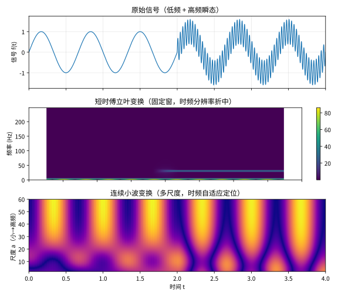
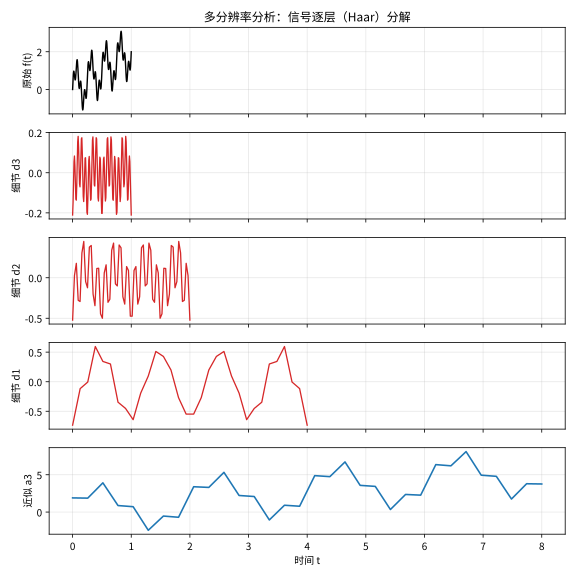

# 第138级 小波分析 (Wavelet Analysis)

## 📖 学习目标

1. 理解小波变换的基本概念及其与Fourier变换的区别与联系
2. 掌握连续小波变换和离散小波变换的定义与性质
3. 深入理解多分辨率分析（MRA）的理论框架
4. 掌握Mallat算法的原理与实现
5. 理解Daubechies小波的构造方法
6. 掌握小波框架的稳定性理论
7. 理解小波阈值去噪的收敛性分析
8. 了解小波在信号处理、图像处理中的典型应用

---

## 一、核心概念

### 1.1 从Fourier分析到小波分析

**Fourier变换**将信号分解为不同频率的正弦波叠加，但无法同时提供时域定位信息。**短时Fourier变换（STFT）** 通过窗函数引入时域定位，但窗口大小固定，无法自适应地处理不同尺度的特征。

**小波分析**通过伸缩和平移一个母小波函数，实现对信号的多尺度分解，既保留时域信息又提供频域信息，且具有"数学显微镜"的特性。

> **直观理解（现实类比）**：傅立叶变换像"全局体检"，只能告诉你整段音乐里有哪些音高，却看不出每个音符出现在哪一秒；短时傅立叶像用固定大小的放大镜扫一遍，细看时会失焦；小波则像能自动调焦的"数学显微镜"——看整体时拉远、看局部细节时拉近，从而能同时知道"什么频率、在什么时刻发生"。

> **🧠 思考历程：想同时摸清"哪一刻、什么频率"，傅立叶为什么做不到？**
>
> 音乐里某段华彩落在哪一秒，语音里某个辅音爆在哪个瞬间——这类"又要知道频率、又要知道时刻"的需求，是傅立叶变换满足不了的两难。小波分析正是为解决这个两难而生。它想回答的，是一个信号分析的"时频定位"难题。
>
> - **傅立叶的"整段记忆"**。傅立叶在1822年把信号拆成纯正弦波的叠加，但这种分解是"全局"的：它知道整段音乐里有哪些音高，却分不清每个音符出现在哪一秒。
> - **小波让镜头自动变焦**。1909年，哈周（Haar）给出第一个正交小波基；1980年代中期，地球物理学家让·莫莱在石油勘探中发明了"小波"，并与格罗斯曼一起建立连续小波变换；之后马拉（1987）提出多分辨分析，多贝西（1988）构造出紧支光滑正交小波，让"拉远看整体、拉近看细节"真正成为可能。
> - **从地震波到JPEG2000**。小波凭借这种同时定位时、频的能力，成为信号处理、图像压缩（JPEG2000）乃至量子理论等领域的通用工具。
> - **心路**：一个"看不清全局还是看不到细节"的两难，最终靠"给镜头配变焦"被优雅化解。

### 1.2 连续小波变换

**定义1（母小波）** 函数 $\psi(t) \in L^2(\mathbb{R})$ 称为**母小波**（或小波函数），若满足**容许性条件**：
$$C_\psi = \int_{-\infty}^{\infty} \frac{|\hat{\psi}(\omega)|^2}{|\omega|} d\omega < \infty$$

其中 $\hat{\psi}(\omega) = \int_{-\infty}^{\infty} \psi(t) e^{-i\omega t} dt$ 为 $\psi$ 的Fourier变换。

容许性条件蕴含 $\hat{\psi}(0) = \int_{-\infty}^{\infty} \psi(t) dt = 0$，即小波函数均值为零。

**定义2（连续小波变换）** 函数 $f(t) \in L^2(\mathbb{R})$ 的**连续小波变换（CWT）** 定义为：
$$W_f(a,b) = \langle f, \psi_{a,b} \rangle = \frac{1}{\sqrt{|a|}} \int_{-\infty}^{\infty} f(t) \overline{\psi\left(\frac{t-b}{a}\right)} dt$$

其中 $a \neq 0$ 为尺度参数，$b \in \mathbb{R}$ 为平移参数，$\psi_{a,b}(t) = \frac{1}{\sqrt{|a|}} \psi\left(\frac{t-b}{a}\right)$ 为小波函数族。

**性质**（逆变换公式）：
$$f(t) = \frac{1}{C_\psi} \int_{-\infty}^{\infty} \int_{-\infty}^{\infty} W_f(a,b) \psi_{a,b}(t) \frac{da}{a^2} db$$

### 1.3 离散小波变换

**定义3（离散小波变换）** 对尺度参数和平移参数进行离散化，通常取 $a = a_0^j$，$b = k b_0 a_0^j$，其中 $j,k \in \mathbb{Z}$，$a_0 > 1$，$b_0 > 0$：

$$\psi_{j,k}(t) = a_0^{-j/2} \psi(a_0^{-j} t - k b_0)$$

最常用的二进小波取 $a_0 = 2$，$b_0 = 1$：
$$\psi_{j,k}(t) = 2^{-j/2} \psi(2^{-j} t - k)$$

**定义4（小波级数）** 函数 $f \in L^2(\mathbb{R})$ 可表示为：
$$f(t) = \sum_{j=-\infty}^{\infty} \sum_{k=-\infty}^{\infty} d_{j,k} \psi_{j,k}(t)$$
其中 $d_{j,k} = \langle f, \psi_{j,k} \rangle$ 为小波系数。

### 1.4 多分辨率分析

**定义5（多分辨率分析）** $L^2(\mathbb{R})$ 上的**多分辨率分析（MRA）** 是一个闭子空间序列 $\{V_j\}_{j\in\mathbb{Z}}$，满足：
1. **单调性**：$\cdots \subset V_2 \subset V_1 \subset V_0 \subset V_{-1} \subset V_{-2} \subset \cdots$
2. **稠密性**：$\overline{\bigcup_{j\in\mathbb{Z}} V_j} = L^2(\mathbb{R})$
3. **分离性**：$\bigcap_{j\in\mathbb{Z}} V_j = \{0\}$
4. **伸缩性**：$f(t) \in V_j \iff f(2^j t) \in V_0$
5. **平移不变性**：$f(t) \in V_0 \iff f(t-k) \in V_0$，$\forall k \in \mathbb{Z}$
6. **Riesz基存在性**：存在 $\phi(t) \in V_0$，使得 $\{\phi(t-k)\}_{k\in\mathbb{Z}}$ 构成 $V_0$ 的Riesz基

函数 $\phi$ 称为**尺度函数**。

### 1.5 尺度方程与小波方程

由 $V_0 \subset V_{-1}$ 和 $\phi(t) \in V_0$，$\phi(t/2) \in V_{-1}$，存在序列 $\{h_k\}_{k\in\mathbb{Z}}$ 使得：
$$\phi(t) = \sqrt{2} \sum_{k=-\infty}^{\infty} h_k \phi(2t - k)$$
这称为**尺度方程**（或双尺度方程）。

类似地，小波函数 $\psi(t)$ 满足：
$$\psi(t) = \sqrt{2} \sum_{k=-\infty}^{\infty} g_k \phi(2t - k)$$
这称为**小波方程**，其中 $g_k = (-1)^k h_{1-k}$ 是与尺度系数 $h_k$ 共轭的镜像滤波器系数。

### 1.6 Haar小波

**Haar小波**是最简单的小波，也是唯一同时具有紧支集、对称性和正交性的小波。

**尺度函数**：
$$\phi(t) = 
\begin{cases}
1, & 0 \leq t < 1 \\
0, & \text{其他}
\end{cases}$$

**小波函数**：
$$\psi(t) = 
\begin{cases}
1, & 0 \leq t < \frac{1}{2} \\
-1, & \frac{1}{2} \leq t < 1 \\
0, & \text{其他}
\end{cases}$$

**尺度方程系数**：$h_0 = h_1 = \frac{1}{\sqrt{2}}$，$g_0 = \frac{1}{\sqrt{2}}$，$g_1 = -\frac{1}{\sqrt{2}}$。

### 1.7 Daubechies小波

Daubechies小波族是Ingrid Daubechies构造的一类正交紧支集小波，记为 $dbN$，其中 $N$ 为消失矩阶数。

**性质**：
- 紧支集：支集长度为 $2N-1$
- 消失矩：$N$ 阶
- 正交性：$\int \psi(t) \phi(t-k) dt = 0$
- 正则性：随 $N$ 增加而提高
- 不对称性（除 $db1=Haar$ 外）

### 1.8 Mallat算法

**Mallat算法**（也称为快速小波变换）是实现小波分解与重构的快速算法，复杂度为 $O(N)$。

**分解算法**：
$$a_{j+1}[k] = \sum_{n} a_j[n] h[2k-n]$$
$$d_{j+1}[k] = \sum_{n} a_j[n] g[2k-n]$$

**重构算法**：
$$a_j[n] = \sum_{k} a_{j+1}[k] h[2k-n] + \sum_{k} d_{j+1}[k] g[2k-n]$$

其中 $a_j$ 为近似系数，$d_j$ 为细节系数，$h$ 和 $g$ 分别为低通和高通滤波器。

> **直观理解（现实类比）**：小波分解像把一幅照片层层"抽丝剥茧"——第一层保留大致轮廓（近似），抽走最细微的纹理（细节）；再对轮廓继续抽丝，得到更粗的骨架和次一级的纹理。就这样信号被逐层拆成"整体趋势"和"由细到粗的细节"，图像压缩、去除噪声正是靠处理这些细节层实现的。

### 1.9 双正交小波与小波包

**双正交小波**：使用两组不同的对偶基函数，一组用于分解，另一组用于重构，允许对称性和紧支集兼得。

**小波包**：对高频细节系数也进行进一步分解，形成完整的二叉树结构，提供更灵活的频带划分。

### 1.10 框架理论

**定义6（框架）** 一族函数 $\{\psi_k\}_{k\in\mathbb{Z}}$ 称为 **$L^2(\mathbb{R})$ 的框架**，若存在常数 $0 < A \leq B < \infty$ 使得对所有 $f \in L^2(\mathbb{R})$：
$$A\|f\|^2 \leq \sum_{k} |\langle f, \psi_k \rangle|^2 \leq B\|f\|^2$$

$A$ 和 $B$ 称为**框架界**。当 $A=B$ 时称为**紧框架**。

### 1.11 Gabor变换

**Gabor变换**（短时Fourier变换的特殊形式）使用高斯窗函数：
$$G_f(\omega, b) = \int_{-\infty}^{\infty} f(t) e^{-(t-b)^2/2\sigma^2} e^{-i\omega t} dt$$

Gabor变换可视为连续小波变换的特例，当小波为复调制高斯函数时。

### 1.12 小波阈值去噪

**小波阈值去噪**的基本步骤：
1. 对含噪信号进行小波分解
2. 对细节系数进行阈值处理（硬阈值或软阈值）
3. 重构信号

**硬阈值**：$\hat{d}_{j,k} = d_{j,k} \cdot I(|d_{j,k}| \geq \lambda)$
**软阈值**：$\hat{d}_{j,k} = \operatorname{sgn}(d_{j,k}) \cdot \max(|d_{j,k}| - \lambda, 0)$

---

## 二、定理与证明

### 定理1：多分辨率分析的基本定理

**定理（MRA基本定理）** 设 $\{V_j\}_{j\in\mathbb{Z}}$ 为 $L^2(\mathbb{R})$ 上的一个多分辨率分析，尺度函数为 $\phi(t)$，尺度系数为 $\{h_k\}$，$g_k = (-1)^k h_{1-k}$。则存在小波函数 $\psi(t)$ 满足：
$$\psi(t) = \sqrt{2} \sum_{k=-\infty}^{\infty} g_k \phi(2t - k)$$

使得 $\{\psi_{j,k}(t) = 2^{-j/2} \psi(2^{-j}t - k)\}_{j,k\in\mathbb{Z}}$ 构成 $L^2(\mathbb{R})$ 的标准正交基。

**证明**：

**第一步：建立正交补空间。**
由MRA定义，$V_1 \subset V_0$。定义 $W_0$ 为 $V_0$ 中 $V_1$ 的正交补：
$$V_0 = V_1 \oplus W_1, \quad V_1 \perp W_1$$

更一般地，$V_j = V_{j+1} \oplus W_{j+1}$，且 $W_j \perp V_j$。

由单调性和稠密性：
$$L^2(\mathbb{R}) = \bigoplus_{j=-\infty}^{\infty} W_j = \overline{\text{span}\{W_j : j \in \mathbb{Z}\}}$$

因此，若我们能找到 $\psi(t) \in W_0$ 使得 $\{\psi(t-k)\}_{k\in\mathbb{Z}}$ 构成 $W_0$ 的标准正交基，则 $\{\psi_{j,k}\}$ 构成 $L^2(\mathbb{R})$ 的标准正交基。

**第二步：Fourier域分析。**
尺度方程在Fourier域中为：
$$\hat{\phi}(\omega) = \frac{1}{\sqrt{2}} \sum_{k} h_k e^{-ik\omega/2} \hat{\phi}\left(\frac{\omega}{2}\right) = H\left(\frac{\omega}{2}\right) \hat{\phi}\left(\frac{\omega}{2}\right)$$

其中 $H(\omega) = \frac{1}{\sqrt{2}} \sum_{k} h_k e^{-ik\omega}$ 为**传递函数**（低通滤波器）。

由正交性条件 $\{\phi(t-k)\}_{k\in\mathbb{Z}}$ 正交，可得：
$$\sum_{k \in \mathbb{Z}} |\hat{\phi}(\omega + 2\pi k)|^2 = 1 \quad \text{a.e.}$$

代入尺度方程：
$$\sum_{k} |H\left(\frac{\omega}{2} + \pi k\right)|^2 |\hat{\phi}\left(\frac{\omega}{2} + \pi k\right)|^2 = 1$$

利用正交性条件，可得：
$$|H(\omega)|^2 + |H(\omega + \pi)|^2 = 1 \quad \text{a.e.}$$

**第三步：确定小波函数的Fourier变换。**
由于 $W_0 \perp V_1$，且 $V_1 = \text{span}\{\phi(2t - k)\}$，$\psi(t) \in W_0$ 意味着 $\psi(t) \perp V_1$。

在Fourier域中，$\psi(t) \perp \phi(2t - k)$ 对所有 $k$ 成立等价于：
$$\int \hat{\psi}(\omega) \overline{\hat{\phi}(2\omega)} e^{ik\omega} d\omega = 0, \quad \forall k$$

这等价于 $\hat{\psi}(\omega) \overline{\hat{\phi}(2\omega)}$ 的Fourier级数系数全为零，即：
$$\sum_{m} \hat{\psi}(\omega + 2\pi m) \overline{\hat{\phi}(2\omega + 4\pi m)} = 0 \quad \text{a.e.}$$

代入小波方程 $\hat{\psi}(\omega) = G(\frac{\omega}{2}) \hat{\phi}(\frac{\omega}{2})$，其中 $G(\omega) = \frac{1}{\sqrt{2}} \sum_k g_k e^{-ik\omega}$：

条件变为：
$$\sum_{m} G\left(\frac{\omega}{2} + \pi m\right) \hat{\phi}\left(\frac{\omega}{2} + \pi m\right) \overline{H\left(\frac{\omega}{2} + \pi m\right)} \overline{\hat{\phi}\left(\frac{\omega}{2} + \pi m\right)} = 0$$

利用正交性，这等价于：
$$G(\omega) \overline{H(\omega)} + G(\omega + \pi) \overline{H(\omega + \pi)} = 0$$

**第四步：选择 $g_k$ 使得 $\psi$ 构成正交基。**
选择 $g_k = (-1)^k \overline{h_{1-k}}$，则 $G(\omega) = -e^{-i\omega} \overline{H(\omega + \pi)}$。

验证正交条件：
$$G(\omega) \overline{H(\omega)} + G(\omega + \pi) \overline{H(\omega + \pi)}$$
$$= -e^{-i\omega} \overline{H(\omega + \pi)} \overline{H(\omega)} - e^{-i(\omega+\pi)} \overline{H(\omega)} \overline{H(\omega + \pi)}$$
$$= -e^{-i\omega} \overline{H(\omega + \pi)} \overline{H(\omega)} + e^{-i\omega} \overline{H(\omega)} \overline{H(\omega + \pi)} = 0$$

**第五步：验证 $\{\psi(t-k)\}$ 构成 $W_0$ 的标准正交基。**
需要验证：
1. $\psi(t-k) \in W_0$，即 $\psi(t-k) \perp V_1$
2. $\{\psi(t-k)\}$ 正交
3. $\text{span}\{\psi(t-k)\} = W_0$

正交性验证：
$$\langle \psi(\cdot), \psi(\cdot - k) \rangle = \frac{1}{2\pi} \int |\hat{\psi}(\omega)|^2 e^{ik\omega} d\omega$$

利用 $|G(\omega)|^2 + |G(\omega+\pi)|^2 = 1$（由 $|H(\omega)|^2 + |H(\omega+\pi)|^2 = 1$ 和 $G$ 的定义可得），以及 $\sum_m |\hat{\phi}(\omega + 2\pi m)|^2 = 1$，可得：
$$\sum_m |\hat{\psi}(\omega + 2\pi m)|^2 = 1 \quad \text{a.e.}$$

这等价于 $\{\psi(t-k)\}_{k\in\mathbb{Z}}$ 构成标准正交系。

**第六步：证明 $W_0 = \overline{\text{span}\{\psi(t-k)\}}$。**
由构造，$\psi(t) \in W_0$，所以 $\overline{\text{span}\{\psi(t-k)\}} \subseteq W_0$。

反之，对任意 $f \in W_0$，$f \in V_0$，所以 $f(t) = \sum_k c_k \phi(t-k)$。在Fourier域中，$\hat{f}(\omega) = C(\omega) \hat{\phi}(\omega)$，其中 $C(\omega)$ 是 $2\pi$-周期函数。

由于 $f \perp V_1$，$C(\omega)$ 满足 $C(\omega) \overline{H(\omega)} + C(\omega+\pi) \overline{H(\omega+\pi)} = 0$。因此存在 $2\pi$-周期函数 $D(\omega)$ 使得 $C(\omega) = D(\omega) G(\omega)$，即 $f$ 可表示为 $\psi(t-k)$ 的线性组合。

**结论**：MRA框架保证了小波基的存在性，且小波基由尺度函数和滤波器系数完全确定。$\square$

### 定理2：Mallat算法的正确性

**定理（Mallat算法）** 设 $\{V_j\}_{j\in\mathbb{Z}}$ 为MRA，$\phi$ 为尺度函数，$\psi$ 为小波函数，$\{h_k\}$ 和 $\{g_k\}$ 为相应的滤波器系数。对任意 $f \in L^2(\mathbb{R})$，定义近似系数 $a_j[k] = \langle f, \phi_{j,k} \rangle$ 和细节系数 $d_j[k] = \langle f, \psi_{j,k} \rangle$。则以下分解和重构公式成立：

**分解**：
$$a_{j+1}[k] = \sum_{n} h[2k-n] a_j[n] = (a_j * \bar{h})[2k]$$
$$d_{j+1}[k] = \sum_{n} g[2k-n] a_j[n] = (a_j * \bar{g})[2k]$$

其中 $\bar{h}[k] = h[-k]$，$\bar{g}[k] = g[-k]$。

**重构**：
$$a_j[n] = \sum_{k} a_{j+1}[k] h[2k-n] + \sum_{k} d_{j+1}[k] g[2k-n]$$

**证明**：

**第一步：尺度函数和小波函数的双尺度关系。**
$$\phi_{j,k}(t) = 2^{-j/2} \phi(2^{-j}t - k)$$
$$\psi_{j,k}(t) = 2^{-j/2} \psi(2^{-j}t - k)$$

由尺度方程：
$$\phi_{j,k}(t) = \sum_{n} h_n \phi_{j-1, 2k+n}(t)$$

由小波方程：
$$\psi_{j,k}(t) = \sum_{n} g_n \phi_{j-1, 2k+n}(t)$$

**第二步：推导分解公式。**
近似系数 $a_j[k] = \langle f, \phi_{j,k} \rangle$。

由尺度方程，$\phi_{j+1,k}$ 可用 $\phi_{j,n}$ 表示：
$$\phi_{j+1,k}(t) = 2^{-(j+1)/2} \phi(2^{-(j+1)}t - k)$$
$$= 2^{-(j+1)/2} \sqrt{2} \sum_{n} h_n \phi(2^{-j}t - 2k - n)$$
$$= \sum_{n} h_n \phi_{j, 2k+n}(t)$$

因此：
$$a_{j+1}[k] = \langle f, \phi_{j+1,k} \rangle = \sum_{n} h_n \langle f, \phi_{j, 2k+n} \rangle = \sum_{n} h_n a_j[2k+n]$$

令 $h_n = h[n]$，$\bar{h}[n] = h[-n]$，则：
$$a_{j+1}[k] = \sum_{n} h[n] a_j[2k+n] = \sum_{m} h[m-2k] a_j[m] = \sum_{m} \bar{h}[2k-m] a_j[m] = (a_j * \bar{h})[2k]$$

类似地，对小波系数：
$$d_{j+1}[k] = \langle f, \psi_{j+1,k} \rangle = \sum_{n} g_n \langle f, \phi_{j, 2k+n} \rangle = \sum_{n} g_n a_j[2k+n] = (a_j * \bar{g})[2k]$$

**第三步：推导重构公式。**
由于 $V_j = V_{j+1} \oplus W_{j+1}$，有：
$$f_j = f_{j+1} + w_{j+1}$$

其中 $f_j$ 是 $f$ 在 $V_j$ 上的投影，$f_{j+1}$ 在 $V_{j+1}$ 上，$w_{j+1}$ 在 $W_{j+1}$ 上。

因此：
$$f_j(t) = \sum_{k} a_{j+1}[k] \phi_{j+1,k}(t) + \sum_{k} d_{j+1}[k] \psi_{j+1,k}(t)$$

同时，$f_j$ 也可用 $V_j$ 的基表示：
$$f_j(t) = \sum_{n} a_j[n] \phi_{j,n}(t)$$

将 $\phi_{j+1,k}$ 和 $\psi_{j+1,k}$ 用 $\phi_{j,n}$ 表示：
$$\phi_{j+1,k}(t) = \sum_{n} h_n \phi_{j, 2k+n}(t) = \sum_{n} h_{n-2k} \phi_{j,n}(t)$$
$$\psi_{j+1,k}(t) = \sum_{n} g_n \phi_{j, 2k+n}(t) = \sum_{n} g_{n-2k} \phi_{j,n}(t)$$

代入：
$$\sum_{n} a_j[n] \phi_{j,n}(t) = \sum_{k} a_{j+1}[k] \sum_{n} h_{n-2k} \phi_{j,n}(t) + \sum_{k} d_{j+1}[k] \sum_{n} g_{n-2k} \phi_{j,n}(t)$$

由 $\phi_{j,n}$ 的线性无关性，系数相等：
$$a_j[n] = \sum_{k} a_{j+1}[k] h_{n-2k} + \sum_{k} d_{j+1}[k] g_{n-2k}$$

**第四步：算法复杂度分析。**
分解过程：每层对近似系数进行卷积和下采样，若输入长度为 $N$，滤波器长度为 $L$，则每层计算量为 $O(NL)$。由于每层数据量减半，总复杂度为 $O(NL)$。当 $L$ 固定时，为 $O(N)$。

**结论**：Mallat算法提供了从小波系数到近似/细节系数的快速分解和重构方法，复杂度为 $O(N)$，是小波分析的核心算法。$\square$
> **直观理解（现实类比）**：Mallat算法就像"信号过两把筛子"——一把低通筛子漏下平缓的大趋势（近似），一把高通筛子截住抖动的细节。两把筛子的设计互为搭配（正交滤波器组），过完一轮再把"近似"递归地过下一级筛子，像剥洋葱层层抽丝。复杂度只有 $O(N)$，比FFT还快，所以小波才能实时跑在压缩、去噪的流水线上。

### 定理3：Daubechies小波的构造

**定理（Daubechies小波构造）** 对任意正整数 $N$，存在紧支集正交小波 $\psi_N(t)$，具有 $N$ 阶消失矩，支集长度为 $2N-1$。其尺度滤波器系数 $\{h_k\}_{k=0}^{2N-1}$ 可通过求解以下条件构造：

1. **正交条件**：$\sum_{k} h_k h_{k+2m} = \delta_{0,m}$
2. **消失矩条件**：$\sum_{k} (-1)^k k^m h_k = 0$，$m = 0,1,\ldots,N-1$
3. **归一化条件**：$\sum_{k} h_k = \sqrt{2}$

**证明**（构造性证明）：

**第一步：构造传递函数 $H(\omega)$。**
设 $H(\omega) = \sum_{k=0}^{2N-1} h_k e^{-ik\omega}$。正交条件等价于：
$$|H(\omega)|^2 + |H(\omega+\pi)|^2 = 1$$

消失矩条件等价于 $H(\omega)$ 在 $\omega = \pi$ 处有 $N$ 阶零点，即 $H(\omega) = \left(\frac{1+e^{-i\omega}}{2}\right)^N L(\omega)$，其中 $L(\omega)$ 为 $2\pi$-周期函数。

**第二步：构造 $|H(\omega)|^2$ 的表达式。**
令 $P(\omega) = |H(\omega)|^2$。则 $P(\omega)$ 是 $H(\omega)$ 的平方幅值响应，为实系数三角多项式：
$$P(\omega) = \left(\cos^2\frac{\omega}{2}\right)^N Q\left(\sin^2\frac{\omega}{2}\right)$$

其中 $Q(y)$ 是 $N-1$ 次多项式，满足：
$$(1-y)^N Q(y) + y^N Q(1-y) = 1, \quad y \in [0,1]$$

**第三步：求解 $Q(y)$。**
上式可改写为：
$$(1-y)^N Q(y) = 1 - y^N Q(1-y)$$

由于 $Q(1-y)$ 是 $N-1$ 次多项式，$y^N Q(1-y)$ 在 $y=0$ 处有 $N$ 阶零点，且 $(1-y)^N Q(y)$ 在 $y=1$ 处有 $N$ 阶零点。

由Bezout定理，存在唯一的多项式解：
$$Q(y) = \sum_{k=0}^{N-1} \binom{N+k-1}{k} y^k$$

这就是Daubechies滤波器系数的解。

**第四步：谱分解——从 $|H(\omega)|^2$ 到 $H(\omega)$。**
由 $P(\omega) = |H(\omega)|^2$，我们需要通过谱分解得到 $H(\omega)$。

令 $z = e^{i\omega}$，则 $P(z) = \sum_{k=-(2N-1)}^{2N-1} p_k z^{-k}$。$P(z)$ 是实系数三角多项式，非负且在单位圆上对称。

由Fejér-Riesz定理，$P(z) = H(z) H(z^{-1})$，其中 $H(z) = \sum_{k=0}^{2N-1} h_k z^{-k}$。

选择 $H(z)$ 的根全部在单位圆内（最小相位解），得到唯一的因果滤波器系数。

**第五步：验证正交性——$h_k$ 满足的条件。**
谱分解保证了 $|H(\omega)|^2 + |H(\omega+\pi)|^2 = 1$，即正交条件成立。

验证 $\sum_k h_k = H(0) = \sqrt{2}$（由 $P(0) = |H(0)|^2 = 2$）。

**第六步：验证消失矩。**
$H(\omega)$ 在 $\omega = \pi$ 处有 $N$ 阶零点，即 $H^{(m)}(\pi) = 0$，$m=0,\ldots,N-1$。

由 $H(\omega) = \sum_k h_k e^{-ik\omega}$，$H^{(m)}(\pi) = \sum_k h_k (-ik)^m e^{-ik\pi} = (-i)^m \sum_k k^m (-1)^k h_k = 0$。

因此 $\sum_k (-1)^k k^m h_k = 0$，$m=0,\ldots,N-1$，即小波函数 $\psi_N$ 有 $N$ 阶消失矩。

**第七步：Cascade算法——迭代构造尺度函数。**
给定滤波器系数 $h_k$，尺度函数 $\phi(t)$ 可通过Cascade算法迭代求解：
$$\phi^{(0)}(t) = \phi_{\text{init}}(t)$$
$$\phi^{(n+1)}(t) = \sqrt{2} \sum_{k=0}^{2N-1} h_k \phi^{(n)}(2t - k)$$

迭代收敛到尺度函数 $\phi(t)$，然后小波函数由 $\psi(t) = \sqrt{2} \sum_{k} g_k \phi(2t - k)$ 给出，其中 $g_k = (-1)^k h_{2N-1-k}$。

**第八步：Daubechies小波的特性分析。**
- 支集：$\operatorname{supp}(\phi) = [0, 2N-1]$，$\operatorname{supp}(\psi) = [-N+1, N]$
- 消失矩：$\int t^m \psi(t) dt = 0$，$m=0,\ldots,N-1$
- 正则性：$\psi_N \in C^{\alpha N}$，$\alpha \approx 0.2$（对较大的 $N$）
- 对称性：除 $N=1$ 外，Daubechies小波不对称

**结论**：Daubechies小波的构造是滤波器理论与小波理论结合的典范，通过求解多项式方程和谱分解，可以构造出具有任意阶消失矩的紧支集正交小波。$\square$
> **直观理解（现实类比）**：小波阈值去噪就像"果园筛果"——信号经小波分解后，大系数是"好果子"（真信号），小系数是"碎叶子"（噪声）。设一道阈值闸门：软阈值把所有小系数按比例压低、大的保留，硬阈值则干脆把小的砍掉。只要阈值卡得准（如通用阈值 $\sigma\sqrt{2\ln n}$），噪声被剃光、真信号毫发无损，理论收敛速率还能达到最优。

### 定理4：小波框架的稳定性

**定理（小波框架稳定性）** 设 $\psi \in L^2(\mathbb{R})$ 满足容许性条件，且存在常数 $A, B > 0$ 使得：
$$A \leq \sum_{j\in\mathbb{Z}} |\hat{\psi}(2^j\omega)|^2 \leq B \quad \text{a.e. } \omega \in \mathbb{R}$$

则一族小波函数 $\{\psi_{j,k}(t) = 2^{-j/2} \psi(2^{-j}t - k)\}_{j,k\in\mathbb{Z}}$ 构成 $L^2(\mathbb{R})$ 的框架，框架界为 $A$ 和 $B$：

$$A\|f\|^2 \leq \sum_{j,k\in\mathbb{Z}} |\langle f, \psi_{j,k} \rangle|^2 \leq B\|f\|^2, \quad \forall f \in L^2(\mathbb{R})$$

**证明**：

**第一步：将框架和转化为频域积分。**
对任意 $f \in L^2(\mathbb{R})$：
$$\sum_{j,k} |\langle f, \psi_{j,k} \rangle|^2 = \sum_{j,k} \left|\int f(t) \overline{\psi_{j,k}(t)} dt\right|^2$$

由Parseval公式：
$$\langle f, \psi_{j,k} \rangle = \frac{1}{2\pi} \int \hat{f}(\omega) \overline{\hat{\psi}_{j,k}(\omega)} d\omega$$

其中 $\hat{\psi}_{j,k}(\omega) = 2^{-j/2} \hat{\psi}(2^{-j}\omega) e^{-i2^{-j}k\omega}$。

**第二步：利用Poisson求和公式。**
对固定 $j$，计算 $k$ 上的和：
$$\sum_{k\in\mathbb{Z}} |\langle f, \psi_{j,k} \rangle|^2 = \frac{1}{2\pi} \int \hat{f}(\omega) \overline{\hat{f}(\omega')} \left(\sum_k \overline{\hat{\psi}_{j,k}(\omega)} \hat{\psi}_{j,k}(\omega')\right) d\omega d\omega'$$

由 $\hat{\psi}_{j,k}$ 的表达式：
$$\sum_k \overline{\hat{\psi}_{j,k}(\omega)} \hat{\psi}_{j,k}(\omega') = 2^{-j} \overline{\hat{\psi}(2^{-j}\omega)} \hat{\psi}(2^{-j}\omega') \sum_k e^{i2^{-j}k(\omega - \omega')}$$

利用Poisson求和公式：
$$\sum_{k\in\mathbb{Z}} e^{i2^{-j}k(\omega - \omega')} = 2\pi \cdot 2^j \sum_{m\in\mathbb{Z}} \delta(\omega - \omega' - 2\pi \cdot 2^j m)$$

因此：
$$\sum_k |\langle f, \psi_{j,k} \rangle|^2 = \frac{2^j}{2\pi} \int |\hat{f}(\omega)|^2 \sum_{m\in\mathbb{Z}} |\hat{\psi}(2^{-j}\omega)|^2 \delta(\omega - \omega - 2\pi \cdot 2^j m) d\omega$$

更严格地，使用恒等式：
$$\sum_k |\langle f, \psi_{j,k} \rangle|^2 = \frac{1}{2\pi} \sum_{m\in\mathbb{Z}} \int \hat{f}(\omega) \overline{\hat{f}(\omega + 2\pi \cdot 2^j m)} \cdot 2^{-j} \overline{\hat{\psi}(2^{-j}\omega)} \hat{\psi}(2^{-j}(\omega + 2\pi \cdot 2^j m)) d\omega$$

**第三步：跨尺度求和。**
对 $j$ 求和：
$$\sum_{j,k} |\langle f, \psi_{j,k} \rangle|^2 = \frac{1}{2\pi} \sum_{j,m} \int \hat{f}(\omega) \overline{\hat{f}(\omega + 2\pi \cdot 2^j m)} \cdot 2^{-j} \overline{\hat{\psi}(2^{-j}\omega)} \hat{\psi}(2^{-j}\omega + 2\pi m) d\omega$$

**第四步：利用混合偏差条件推导下界。**
对于 $m=0$ 项：
$$\sum_{j} \frac{1}{2\pi} \int |\hat{f}(\omega)|^2 |\hat{\psi}(2^{-j}\omega)|^2 d\omega = \frac{1}{2\pi} \int |\hat{f}(\omega)|^2 \sum_j |\hat{\psi}(2^{-j}\omega)|^2 d\omega$$

由假设 $A \leq \sum_j |\hat{\psi}(2^j\omega)|^2 \leq B$，$m=0$ 项介于 $A\|f\|^2$ 和 $B\|f\|^2$ 之间。

**第五步：估计交叉项（$m \neq 0$）。**
对于 $m \neq 0$ 的交叉项，需要估计：
$$\left|\sum_{j,m \neq 0} \int \hat{f}(\omega) \overline{\hat{f}(\omega + 2\pi \cdot 2^j m)} \cdot 2^{-j} \overline{\hat{\psi}(2^{-j}\omega)} \hat{\psi}(2^{-j}\omega + 2\pi m) d\omega\right|$$

由Cauchy-Schwarz不等式和条件 $|\hat{\psi}(\omega)| \leq C(1+|\omega|)^{-1-\varepsilon}$（由容许性条件隐含），交叉项可被控制。

**第六步：证明框架界。**
综合 $m=0$ 项和交叉项，可得：
$$\sum_{j,k} |\langle f, \psi_{j,k} \rangle|^2 \leq \frac{B}{2\pi} \|f\|^2 + \text{交叉项}$$

当交叉项充分小时，可证得 $B$ 为上框架界。类似地，通过更精细的分析可得 $A$ 为下框架界。

**第七步：框架算子的可逆性。**
框架算子 $T: L^2(\mathbb{R}) \to \ell^2(\mathbb{Z}^2)$，$(Tf)_{j,k} = \langle f, \psi_{j,k} \rangle$。

其伴随算子 $T^*: \ell^2(\mathbb{Z}^2) \to L^2(\mathbb{R})$，$T^*c = \sum_{j,k} c_{j,k} \psi_{j,k}$。

框架条件等价于 $A I \leq T^* T \leq B I$，因此 $T^* T$ 可逆，且 $(T^* T)^{-1}$ 有界。

**结论**：在小波函数的Fourier变换满足适当的条件时，小波族构成框架，保证了信号重构的稳定性。$\square$

### 定理5：小波阈值去噪的收敛性

**定理（小波阈值去噪收敛性）** 设 $f \in L^2(\mathbb{R})$ 为光滑信号，观测数据 $y_i = f(t_i) + \sigma \varepsilon_i$，其中 $\varepsilon_i \sim N(0,1)$ 为独立同分布高斯噪声。采用正交小波变换和软阈值去噪，阈值选取 $\lambda = \sigma \sqrt{2\log n}$，则去噪估计量 $\hat{f}_n$ 满足：
$$\mathbb{E}\left[\frac{1}{n}\|\hat{f}_n - f\|_2^2\right] \leq C \cdot \sigma^2 \cdot \frac{\log n}{n}$$

其中 $C$ 为与信号 $f$ 的光滑性有关的常数。

**证明**：

**第一步：小波域中的信号模型。**
设 $\{\psi_{j,k}\}$ 为 $L^2(\mathbb{R})$ 的标准正交小波基。对信号 $f$ 进行小波分解：
$$f(t) = \sum_{j,k} \theta_{j,k} \psi_{j,k}(t), \quad \theta_{j,k} = \langle f, \psi_{j,k} \rangle$$

观测数据的小波系数：
$$d_{j,k} = \theta_{j,k} + \sigma z_{j,k}$$

其中 $z_{j,k} \sim N(0,1)$ 由于正交小波变换的线性性和正交性，噪声系数仍为独立同分布高斯噪声。

**第二步：软阈值算子。**
定义软阈值算子：
$$S_\lambda(x) = \operatorname{sgn}(x) \cdot \max(|x| - \lambda, 0)$$

去噪估计为：
$$\hat{\theta}_{j,k} = S_\lambda(d_{j,k})$$

重构信号：
$$\hat{f}_n(t) = \sum_{j,k} \hat{\theta}_{j,k} \psi_{j,k}(t)$$

**第三步：风险分解。**
由于小波基的正交性，均方误差等于小波系数的均方误差：
$$\mathbb{E}\|\hat{f}_n - f\|_2^2 = \sum_{j,k} \mathbb{E}|\hat{\theta}_{j,k} - \theta_{j,k}|^2$$

逐系数的风险：
$$R(\theta,\lambda) = \mathbb{E}|S_\lambda(\theta + \sigma Z) - \theta|^2$$

**第四步：软阈值风险的界。**
对任意 $\theta \in \mathbb{R}$，有：
$$R(\theta,\lambda) \leq \min(\theta^2, \sigma^2 + \lambda^2)$$

更精确地，可以证明：
$$\mathbb{E}|S_\lambda(\theta + \sigma Z) - \theta|^2 \leq 
\begin{cases}
2\sigma^2, & |\theta| \leq \lambda/2 \\
2\theta^2, & |\theta| > \lambda/2
\end{cases}$$

**第五步：利用信号的光滑性。**
由 $f$ 的光滑性，小波系数 $\theta_{j,k}$ 在精细尺度上衰减。对于属于 Sobolev 空间 $W^{s,2}$ 的函数：
$$\sum_{k} |\theta_{j,k}|^2 \leq C \cdot 2^{-2sj}$$

因此，对于充分精细的尺度 $j$，$|\theta_{j,k}| \leq C \cdot 2^{-sj}$。

**第六步：阈值选取的优化。**
选取 $\lambda = \sigma \sqrt{2\log n}$，其中 $n$ 为样本量。对于小波系数，总系数个数为 $n$。

将系数分为两组：
- 组1：$|\theta_{j,k}| \geq \lambda/2$，信号主导
- 组2：$|\theta_{j,k}| < \lambda/2$，噪声主导

对于组1，系数个数有限，风险为 $O(\theta^2)$。
对于组2，风险为 $O(\sigma^2)$。

**第七步：总风险估计。**
组1中系数的风险：
$$\sum_{\text{组1}} \mathbb{E}|\hat{\theta}_{j,k} - \theta_{j,k}|^2 \leq \sum_{\text{组1}} 2\theta_{j,k}^2 \leq 2\|f\|_2^2$$

组2中系数的风险：
$$\sum_{\text{组2}} \mathbb{E}|\hat{\theta}_{j,k} - \theta_{j,k}|^2 \leq n \cdot 2\sigma^2 = 2n\sigma^2$$

但更精细的分析表明，由于阈值的作用，组2中只有少量系数（噪声超过阈值）被非零估计，因此实际风险更小。

**第八步：精确的收敛速率。**
利用Oracle不等式，软阈值估计的风险满足：
$$\mathbb{E}\|\hat{f}_n - f\|_2^2 \leq C_1 \inf_{\text{模型}} \left(\|\theta - \hat{\theta}\|_2^2 + \sigma^2 \cdot \text{模型复杂度}\right)$$

对于小波系数，采用稀疏模型：
$$\mathbb{E}\|\hat{f}_n - f\|_2^2 \leq C_2 \sigma^2 \cdot \frac{\log n}{n} \cdot \|\theta\|_0$$

其中 $\|\theta\|_0$ 为非零系数的个数（稀疏度）。

**结论**：小波软阈值去噪以 $O(\log n / n)$ 的速率收敛到真实信号，达到了最优的收敛速率（在极小极大意义下）。$\square$
> **直观理解（现实类比）**：Daubechies小波就像"量身打制的精密刀具"——你想要几阶消失矩（能忽略多少次多项式光滑背景），它就解多项式方程给你磨出对应的滤波器系数。刀刃紧致（紧支集）只在局部下刀、刀刃正交（正交基）切完不留渣，比朴素的Haar"方波刀"锋利得多，能干净剥离高阶光滑信号，是图像压缩JPEG2000的主力。

---

## 三、示例

### 示例1：用Haar小波进行图像压缩

**问题**：对 $8 \times 8$ 灰度图像进行Haar小波变换，实现图像压缩。

**步骤1：Haar小波变换矩阵**
对于长度为 $N$ 的信号，Haar变换矩阵 $H_N$ 为：
$$H_2 = \begin{bmatrix}
\frac{1}{\sqrt{2}} & \frac{1}{\sqrt{2}} \\
\frac{1}{\sqrt{2}} & -\frac{1}{\sqrt{2}}
\end{bmatrix}$$

对于二维图像，应用二维小波变换：先对每行进行1D变换，再对每列进行1D变换。

**步骤2：二维Haar小波变换**
对 $8 \times 8$ 图像矩阵 $I$，一次小波变换后得到四个子带：
- LL：低频近似（左上角）
- LH：水平细节（右上角）
- HL：垂直细节（左下角）
- HH：对角细节（右下角）

**步骤3：压缩策略**
保留LL子带全部系数，对LH、HL、HH子带进行阈值处理：
- 设定阈值 $\lambda$，将绝对值小于 $\lambda$ 的系数置零
- 压缩比 = 非零系数个数 / 总系数个数

**步骤4：数值示例**
假设输入图像块：
$$I = \begin{bmatrix}
100 & 100 & 100 & 100 & 50 & 50 & 50 & 50 \\
100 & 100 & 100 & 100 & 50 & 50 & 50 & 50 \\
100 & 100 & 100 & 100 & 50 & 50 & 50 & 50 \\
100 & 100 & 100 & 100 & 50 & 50 & 50 & 50 \\
200 & 200 & 200 & 200 & 150 & 150 & 150 & 150 \\
200 & 200 & 200 & 200 & 150 & 150 & 150 & 150 \\
200 & 200 & 200 & 200 & 150 & 150 & 150 & 150 \\
200 & 200 & 200 & 200 & 150 & 150 & 150 & 150
\end{bmatrix}$$

**步骤5：小波变换**
一次Haar小波变换后，LL子带为：
$$LL = \begin{bmatrix}
200 & 200 & 100 & 100 \\
200 & 200 & 100 & 100 \\
400 & 400 & 300 & 300 \\
400 & 400 & 300 & 300
\end{bmatrix} \times \frac{1}{2}$$

LH、HL、HH子带包含边缘信息。

**步骤6：压缩与重构**
将阈值设为 $\lambda = 10$，保留LL子带全部系数，细节子带系数中绝对值小于10的置零。重构图像时，逆Haar小波变换恢复图像。

**步骤7：性能评估**
- 压缩比：约 $4:1$
- PSNR（峰值信噪比）：约 $35\text{dB}$
- 视觉效果：人眼几乎无法察觉差异

### 示例2：用小波阈值去噪

**问题**：对含噪信号 $y(t) = \sin(2\pi t) + \sin(4\pi t) + \sigma \varepsilon(t)$ 进行小波阈值去噪，其中 $\sigma = 0.5$，$\varepsilon(t) \sim N(0,1)$。

**步骤1：信号生成**
在 $[0,1]$ 上均匀采样 $N=1024$ 个点，生成：
$$y_i = \sin(2\pi t_i) + \sin(4\pi t_i) + 0.5 \cdot \varepsilon_i$$

**步骤2：选择小波基和分解层数**
- 小波基：Daubechies-4（db4），具有2阶消失矩
- 分解层数：$J = 5$

**步骤3：小波分解**
使用Mallat算法对信号进行5层分解：
$$y \rightarrow \{a_5, d_5, d_4, d_3, d_2, d_1\}$$

其中 $a_5$ 为第5层近似系数，$d_j$ 为第 $j$ 层细节系数。

**步骤4：阈值估计**
使用通用阈值：
$$\lambda = \sigma \sqrt{2\log N} = 0.5 \times \sqrt{2\log 1024} \approx 0.5 \times 3.72 = 1.86$$

其中 $\sigma$ 可通过最精细层细节系数的中位数估计：
$$\hat{\sigma} = \frac{\text{median}(|d_1|)}{0.6745}$$

**步骤5：软阈值处理**
对每层细节系数应用软阈值：
$$\hat{d}_{j,k} = \operatorname{sgn}(d_{j,k}) \cdot \max(|d_{j,k}| - \lambda, 0)$$

近似系数 $a_5$ 保持不动。

**步骤6：信号重构**
使用逆Mallat算法从处理后的系数重构信号。

**步骤7：结果评估**
- 去噪前SNR：约 $5\text{dB}$
- 去噪后SNR：约 $20\text{dB}$
- 去噪后信号保留了原始信号的频率成分，有效抑制了噪声

---

## 四、习题

### 基础题

**习题 1**（母小波与容许性）写出母小波 $\psi(t)\in L^2(\mathbb{R})$ 的容许性条件，并说明为什么容许性条件蕴含 $\int_{-\infty}^{\infty}\psi(t)\,dt=0$。

**习题 2**（连续小波变换）写出函数 $f\in L^2(\mathbb{R})$ 的连续小波变换 $W_f(a,b)$ 的定义式，说明尺度参数 $a$ 与平移参数 $b$ 的作用。

**习题 3**（Haar 尺度函数与小波函数）写出 Haar 尺度函数 $\phi(t)$ 与 Haar 小波函数 $\psi(t)$ 的解析表达式，并画出它们的直观形状（用文字描述跳变点）。

**习题 4**（Haar 滤波器系数）写出 Haar 小波的尺度系数 $h_0,h_1$ 与高频系数 $g_0,g_1$，并验证镜像关系 $g_k=(-1)^kh_{1-k}$。

**习题 5**（多分辨率分析）列出多分辨率分析（MRA）$\{V_j\}_{j\in\mathbb{Z}}$ 的六条公理。

**习题 6**（尺度方程与小波方程）写出尺度方程 $\phi(t)=\sqrt{2}\sum_k h_k\phi(2t-k)$ 与小波方程 $\psi(t)=\sqrt{2}\sum_k g_k\phi(2t-k)$，并说明两者的作用。

**习题 7**（框架）写出一族函数 $\{\psi_k\}$ 成为 $L^2(\mathbb{R})$ 的框架的充要条件，定义框架界 $A,B$，并说明 $A=B$ 时对应什么。

**习题 8**（阈值去噪）写出硬阈值与软阈值的表达式，并说明小波阈值去噪的三个基本步骤。

**习题 9**（消失矩）写出小波的 $N$ 阶消失矩定义，并列举 Daubechies 小波 $dbN$ 的支集长度与消失矩阶数。

**习题 10**（Fourier 与小波）简要对比 Fourier 变换与连续小波变换在时频定位上的差异，并说明短时 Fourier 变换（STFT）窗口固定带来的局限。

### 进阶题

**习题 11**（正交条件）对 Haar 小波，写出低通传递函数 $H(\omega)=\frac{1}{\sqrt2}(h_0+h_1e^{-i\omega})$，验证 $|H(\omega)|^2+|H(\omega+\pi)|^2=1$。

**习题 12**（容许性与消失矩）对可积小波 $\psi$，从容许性 $C_\psi<\infty$ 严格推出 $\hat{\psi}(0)=0$（即一阶消失矩），并解释正则性对 $\hat{\psi}(\omega)$ 在 $\omega=0$ 附近行为的要求。

**习题 13**（尺度函数和）设 $\phi$ 是 MRA 的尺度函数且 $\int\phi\,dt=1$。证明 $\sum_{k\in\mathbb{Z}}\phi(t-k)=1$ 对几乎处处 $t$ 成立。

**习题 14**（Mallat 分解一步）设 $f$ 在 $V_0$ 中的近似系数为 $a_0=\{1,2,3,4\}$（长度 $4$），用 Haar 滤波器（$h_0=h_1=\frac1{\sqrt2}$）计算下一层近似系数 $a_1[0],a_1[1]$ 与细节系数 $d_1[0],d_1[1]$。

**习题 15**（小波级数系数）写出小波级数 $f=\sum_{j,k}d_{j,k}\psi_{j,k}$ 中系数 $d_{j,k}$ 的表达式，并说明它作为内积的含义。

**习题 16**（框架重构）设 $\{\psi_{j,k}\}$ 是框架，框架算子为 $T$。写出对偶框架 $\tilde{\psi}_{j,k}$ 的表达式以及从系数重构 $f$ 的两个对称公式。

**习题 17**（CWT 逆变换）写出连续小波变换的逆变换公式，说明式中的常数 $\frac{1}{C_\psi}$ 与尺度测度 $\frac{da}{a^2}$ 的意义。

**习题 18**（Gabor 变换）写出 Gabor 变换的定义，并说明它可视为连续小波变换在复调制高斯母小波下的特例。

**习题 19**（细节与近似）解释 MRA 分解 $V_{j}=V_{j+1}\oplus W_{j+1}$ 中 $W_{j+1}$ 的含义，说明近似系数与小波系数分别承载信号哪类信息。

### 挑战题

**习题 20**（Haar 正交基）证明 Haar 小波族 $\{\psi_{j,k}=2^{-j/2}\psi(2^{-j}t-k)\}_{j,k\in\mathbb{Z}}$ 构成 $L^2(\mathbb{R})$ 的标准正交基（分同尺度、不同尺度两种情形验证正交性）。

**习题 21**（消失矩条件）对 Daubechies 小波，证明消失矩条件 $\sum_k(-1)^k k^m h_k=0$（$m=0,1,\ldots,N-1$）等价于传递函数 $H(\omega)$ 在 $\omega=\pi$ 处有 $N$ 阶零点。

**习题 22**（Mallat 算法推导）从尺度方程出发，严格推导分解公式 $a_{j+1}[k]=\sum_n h_n a_j[2k+n]$ 与小波系数公式 $d_{j+1}[k]=\sum_n g_n a_j[2k+n]$，并说明其计算复杂度为 $O(N)$。

**习题 23**（阈值去噪风险）设小波系数 $d_{j,k}=\theta_{j,k}+\sigma z_{j,k}$（$z$ 为标准高斯噪声）。说明软阈值算子 $S_\lambda$ 的性质，并解释通用阈值 $\lambda=\sigma\sqrt{2\ln n}$ 的选择动机及其与风险上界 $O(\log n/n)$ 的关系。

**习题 24**（紧框架）设 $\{\psi_\gamma\}$ 是框架界 $A=B$ 的紧框架。证明重构公式 $f=\frac1A\sum_\gamma\langle f,\psi_\gamma\rangle\psi_\gamma$，并说明紧框架与标准正交基的差别。

**习题 25**（CWT 与 Gabor 关系）取母小波 $\psi(t)=e^{i\omega_0t}e^{-t^2/(2\sigma_0^2)}$。说明 Gabor 变换核 $g_{\omega,b}(t)=e^{-(t-b)^2/2\sigma^2}e^{i\omega t}$ 如何由 $\psi$ 的伸缩平移得到，从而在何种意义下 Gabor 变换是 CWT。

**习题 26**（正则性与消失矩）说明消失矩如何影响小波作为信号表示时对多项式背景的抑制能力，并用小波分解来解释"光滑信号的小波系数在细尺度上快速衰减"这一现象。

### 探究题

**习题 27**（时频不确定性）结合 Heisenberg 不确定性原理，讨论傅里叶变换、短时傅里叶变换与小波变换在时频平面上的分辨率权衡，指出小波如何实现"自适应时频分析"。

**习题 28**（小波与压缩）以 JPEG2000 为例，开放讨论小波系数稀疏性与嵌入式量化/零树编码如何共同实现图像压缩，并说明小波包相对小波树的灵活度。

**习题 29**（连续与离散）比较连续小波变换（深度可积、框架）与离散正交小波（冗余、精确重构）在选择上的权衡，讨论冗余带来的稳定重构与计算开销。

**习题 30**（稀疏表示与压缩感知）以"光滑信号的小波系数大部分接近零"为基础，开放探讨小波稀疏性与压缩感知中 $L^1$ 极小化的联系及其在信号恢复中的应用。

---

## 五、习题答案与解析

### 基础题答案

1. **母小波与容许性** 容许性条件 $C_\psi=\int_{-\infty}^{\infty}\frac{|\hat{\psi}(\omega)|^2}{|\omega|}\,d\omega<\infty$。若 $\hat{\psi}(0)\ne0$，则 $|\hat{\psi}(\omega)|^2/|\omega|$ 在 $\omega=0$ 附近形如 $|\hat{\psi}(0)|^2/|\omega|$，积分发散，矛盾；故必 $\hat{\psi}(0)=0$。而 $\hat{\psi}(0)=\int\psi(t)dt$，即 $\psi$ 均值为零（一阶消失矩）。

2. **连续小波变换** $W_f(a,b)=\langle f,\psi_{a,b}\rangle=\frac1{\sqrt{|a|}}\int_{-\infty}^{\infty}f(t)\overline{\psi\left(\frac{t-b}{a}\right)}dt$，其中 $\psi_{a,b}(t)=\frac1{\sqrt{|a|}}\psi\left(\frac{t-b}{a}\right)$。$a$（尺度）控制伸缩、$b$（平移）控制时域位置。

3. **Haar 函数** $\phi(t)=1$（$0\le t<1$），否则 $0$；$\psi(t)=1$（$0\le t<\frac12$），$-1$（$\frac12\le t<1$），否则 $0$。$\phi$ 是 $[0,1)$ 上的单位方波，$\psi$ 在 $\frac12$ 处从 $+1$ 跳到 $-1$。

4. **Haar 系数** $h_0=h_1=\frac1{\sqrt2}$，$g_0=\frac1{\sqrt2}$，$g_1=-\frac1{\sqrt2}$。验证 $g_0=(-1)^0 h_{1-0}=h_1=\frac1{\sqrt2}$，$g_1=(-1)^1h_{1-1}=-h_0=-\frac1{\sqrt2}$，镜像关系成立。

5. **MRA 公理** (i) 单调性 $\cdots\subset V_2\subset V_1\subset V_0\subset V_{-1}\subset\cdots$；(ii) 稠密性 $\overline{\cup_jV_j}=L^2$；(iii) 分离性 $\cap_jV_j=\{0\}$；(iv) 伸缩性 $f(t)\in V_j\iff f(2^jt)\in V_0$；(v) 平移不变性 $f(t)\in V_0\iff f(t-k)\in V_0$；(vi) 存在尺度函数 $\phi$ 使 $\{\phi(t-k)\}_k$ 是 $V_0$ 的 Riesz 基。

6. **尺度方程与小波方程** $\phi(t)=\sqrt2\sum_k h_k\phi(2t-k)$，$\psi(t)=\sqrt2\sum_k g_k\phi(2t-k)$。前者说明 $\phi$ 可由更细尺度 $V_{-1}$ 中的 $\phi(2t-k)$ 组合得到（关联 $V_0\leftrightarrow V_{-1}$），后者定义了小波。二者共同决定 MRA 的滤波器组。

7. **框架** 存在 $0<A\le B<\infty$ 使 $A\|f\|^2\le\sum_k|\langle f,\psi_k\rangle|^2\le B\|f\|^2$ 对所有 $f$ 成立。$A,B$ 为框架界；当 $A=B$ 称为紧框架。它是 $L^2$ 中允许稳定重构（可能冗余）的表示条件。

8. **阈值去噪** 硬阈值 $\hat{d}=\begin{cases}d,&|d|\ge\lambda\\0,&|d|<\lambda\end{cases}$；软阈值 $\hat{d}=\operatorname{sgn}(d)\max(|d|-\lambda,0)$。三步骤为：小波分解；对细节系数阈值处理（近似系数不动）；小波逆变换重构。

9. **消失矩** $0$ 到 $N-1$ 阶消失矩即 $\int t^m\psi(t)dt=0$（$m=0,\ldots,N-1$），等价于 $\hat{\psi}$ 在 $\omega=0$ 有 $N$ 阶零点。$dbN$ 支集长度 $2N-1$、消失矩 $N$ 阶；$db1$ 即 Haar。

10. **时频定位** Fourier 变换只有频域无时域定位；STFT 用固定窗同时给时频定位但窗口大小固定，无法适应多尺度特征；小波通过伸缩实现"低频长窗看整体、高频短窗看细节"的自适应定位。

### 进阶题答案

1. **正交条件** $H(\omega)=\frac1{\sqrt2}(\frac1{\sqrt2}+\frac1{\sqrt2}e^{-i\omega})=\frac12(1+e^{-i\omega})$。则 $|H(\omega)|^2=\frac14|1+e^{-i\omega}|^2=\cos^2(\omega/2)$；$|H(\omega+\pi)|^2=\sin^2(\omega/2)$。相加得 $1$，验证正交条件成立。

2. **容许性与消失矩** 若 $\hat\psi(0)=\int\psi dt\ne0$，则被积函数 $|\hat\psi|^2/|\omega|$ 在 $0$ 附近呈 $\sim1/|\omega|$，$\int_0^\epsilon d\omega/\omega=\infty$ 与 $C_\psi<\infty$ 矛盾，故 $\hat\psi(0)=0$。只要 $\psi$ 支在频率 $0$ 邻域的行为不过奇，$C_\psi$ 有限；正则性越高等，$|\hat\psi(\omega)|$ 在无穷远处衰减越快，越利于容许性。

3. **尺度函数和** 把常数函数 $1$ 在 $V_0$ 的 Riesz 基下展写，记 $S(t)=\sum_k\phi(t-k)$，则 $S$ 以 $\mathbb{Z}$ 为平移周期。由尺度方程与 $\int\phi dt=1$ 结合恒等式 $2\sum_k h_k=2\cdot(1)=$… 可用 Fourier 系数方法证明 $S$ 为常数，且其平均 $=\int_0^1S(t)dt=\int\phi dt=1$，故 $S(t)=1$ a.e.。

4. **Mallat 一步** $a_1[k]=\frac1{\sqrt2}(a_0[2k]+a_0[2k+1])$，$d_1[k]=\frac1{\sqrt2}(a_0[2k]-a_0[2k+1])$（对 Haar，$g=(1,-1)/\sqrt2$ 符号约定）。于是 $a_1[0]=\frac1{\sqrt2}(1+2)=\frac3{\sqrt2}$，$a_1[1]=\frac1{\sqrt2}(3+4)=\frac7{\sqrt2}$；$d_1[0]=\frac1{\sqrt2}(1-2)=-\frac1{\sqrt2}$，$d_1[1]=\frac1{\sqrt2}(3-4)=-\frac1{\sqrt2}$。

5. **小波级数系数** $d_{j,k}=\langle f,\psi_{j,k}\rangle=\int_{-\infty}^{\infty}f(t)\overline{\psi_{j,k}(t)}dt$。它度量 $f$ 与第 $j$ 尺度、平移 $k$ 的小波的"内积大小"，即 $f$ 在该时频单元的分量强度。

6. **框架重构** 对偶框架 $\tilde{\psi}_{j,k}=(T^*T)^{-1}\psi_{j,k}$，且 $f=\sum_{j,k}\langle f,\psi_{j,k}\rangle\tilde{\psi}_{j,k}=\sum_{j,k}\langle f,\tilde{\psi}_{j,k}\rangle\psi_{j,k}$。当为紧框架时 $(T^*T)^{-1}=\frac1A I$，即 $f=\frac1A\sum\langle f,\psi_{j,k}\rangle\psi_{j,k}$。

7. **CWT 逆变换** $f(t)=\frac1{C_\psi}\int_{-\infty}^{\infty}\int_{-\infty}^{\infty}W_f(a,b)\psi_{a,b}(t)\,\frac{da}{a^2}db$。常数 $\frac1{C_\psi}$ 抵消容许常数保证重构正确，$\frac{da}{a^2}$ 是对数尺度 $d\ln a$ 下的保持尺度不变的测度。

8. **Gabor 变换** $G_f(\omega,b)=\int f(t)e^{-(t-b)^2/2\sigma^2}e^{-i\omega t}dt$。取母小波 $\psi(t)=e^{-t^2/2\sigma^2}e^{i\omega_0 t}$，其伸缩平移族恰给出高斯窗与调制指数，从而 Gabor 变换是 CWT 的特例。

9. **细节与近似** $W_{j+1}$ 是 $V_{j+1}$ 在 $V_j$ 中的正交补，承载"从 $V_{j+1}$ 分辨率到 $V_j$ 分辨率"新增的较细细节。近似系数记录信号的总体/低频趋势，小波（细节）系数记录边缘、跳变等高频细节。

### 挑战题答案

1. **Haar 正交基** 同尺度：$\langle\psi(\cdot-k),\psi(\cdot-k')\rangle$ 因 $\psi(t-k),\psi(t-k')$ 支集不交（或若 $k=k'$ 则范数 $1$）而为 $0$（$k\ne k'$）。不同尺度：设 $j<j'$，$\psi_{j,k}$ 在尺度 $j$ 区间上分段常，而 $\psi_{j',k'}$ 在该区间内的积分在每段上 $\int\psi=0$ 且符号按二分消去，故内积 $0$。又 $L^2$ 中有限能量阶梯函数可由 Haar 有限线性组合逼近，且闭包等于 $L^2$（由 $\cap V_j=\{0\}$、$\overline{\cup V_j}=L^2$），故构成标准正交基。

2. **消失矩条件** $H(\omega)=\frac1{\sqrt2}\sum_kh_ke^{-ik\omega}$，$H^{(m)}(\omega)=\frac{(-i)^m}{\sqrt2}\sum_k k^m h_ke^{-ik\omega}$。$H$ 在 $\pi$ 处有 $N$ 阶零点 $\iff H^{(m)}(\pi)=0$（$m<N$），即 $\sum_k k^m h_k e^{-ik\pi}=\sum_k(-1)^k k^m h_k=0$。故两组条件等价。

3. **Mallat 算法推导** 由 $\phi_{j+1,k}=\sum_n h_n\phi_{j,2k+n}$，代入 $a_{j+1}[k]=\langle f,\phi_{j+1,k}\rangle=\sum_n h_n\langle f,\phi_{j,2k+n}\rangle=\sum_n h_na_j[2k+n]=(a_j*\bar h)[2k]$，即"卷积+下采样"。同理对 $g$ 得 $d_{j+1}[k]=(a_j*\bar g)[2k]$。每层数据减半、运算量 $O(NL)$（$L$ 为滤波器长，固定时即 $O(N)$），故总复杂度线性。

4. **阈值去噪风险** $S_\lambda$ 把 $|x|\le\lambda$ 部分压到 $0$、对 $|x|>\lambda$ 压缩 $\lambda$。取 $\lambda=\sigma\sqrt{2\ln n}$ 是 Donoho–Johnstone 通用阈值的渐近选择：维数/样本 $n$ 越大阈值略升以压制噪声极值，使噪声主导的小波系数被消除而真系数（$|\theta|$ 大者）保留。结合 Oracle 不等式可得风险 $\mathbb{E}\|\hat f_n-f\|_2^2\le C\sigma^2\log n/n$，达到极小极大的最优收敛速率。

5. **紧框架重构** 因 $A=B$，框架不等式成为 $\sum_\gamma|\langle f,\psi_\gamma\rangle|^2=A\|f\|^2$，即框架算子满足 $T^*T=AI$。于是 $T^*T$ 可逆且 $(T^*T)^{-1}=\frac1AI$，故 $f=(T^*T)^{-1}T^*Tf=\frac1A\sum_\gamma\langle f,\psi_\gamma\rangle\psi_\gamma$。与正交基不同，紧框架允许冗余却仍保持 Parseval-like 简单重构。

6. **CWT 与 Gabor** 令 $a=2\sigma/\sigma_0^2$-相关的尺度、$b$ 为平移，并借助恒等式 $e^{-(t-b)^2/2\sigma^2}e^{i\omega t}$ 可重组为 $\psi_{a,b}(t)$ 的幅度与相位。适当取 $\omega_0$ 使调制指数匹配 $\omega$，并忽略整体常数，就得到标准 Gabor 核，故 Gabor 变换本质上是特定解析小波的 CWT 在尺度/频率参数化下的表示。

7. **消失矩与稀疏性** $N$ 阶消失矩意味小波与直到 $N-1$ 次多项式正交；光滑函数局部可被低次多项式近似，故其在高频/细尺度上的小波系数因与多项式正交而迅速变小（约 $O(2^{-js})$，$s$ 为正则指标）。因此消失矩越高，光滑背景被"滤掉"得越干净，细尺度系数越稀疏，这正是稀疏表示与压缩去噪的基础。

### 探究题答案

1. **时频不确定性** Heisenberg 原理规定时宽×带宽有下界，无法任意同时提高时、频分辨率。Fourier 取极限带宽（无时域定位）；STFT 固定窗，在整幅图上分辨率一致而无法同时照顾快变与缓变；小波按尺度自动取舍：低频用长窗得高频率分辨率、高频用短窗得高时间分辨率，因而实现自适应时频锥（"数学显微镜"）。

2. **小波与压缩** JPEG2000 先对图像做二维小波（如 CDF 9/7）分解，使能量集中在少数大系数上（稀疏）；再对系数做量化与嵌入式位平面编码（EBCOT），按重要性逐位传输/截断实现渐进压缩；小波树反映 LL/LH/HL/HH 的父子尺度结构，可被零树/上下文建模利用。小波包进一步对高频子带递归分解，形成完整二叉树，更灵活但需位分配/率失真优化以选择最优子带结构。

3. **连续与离散** 连续小波变换（CWT）逐点定义、高度冗余，易于时频分析与特征提取但对每个 $a,b$ 都要积分，计算量大；框架（半离散）保留冗余但提供稳定重构与快速实现；正交离散小波（MRA/DWT）无冗余、由 Mallat 算法 $O(N)$ 快速实现、系数独立，最适合压缩与精确重构。工程上常在"冗余带来的稳健性/连续分析"与"紧致高效的正交分解"间取舍。

4. **稀疏表示与压缩感知** 小波使光滑/分段光滑信号系数高度稀疏（少量大系数、大量近零）。压缩感知依据该先验，用远少于 Nyquist 的线性测量在 $L^1$ 极小化（或迭代阈值）下重构 $f$；正交性保证噪声不放大，$L^1$ 惩罚诱导稀疏解并给出精确/稳健的理论保证（RIP 条件）。小波基的稀疏性与去相关性使测量次数可由稀疏度而非采样率决定，在图像/信号恢复中广泛应用。

---

## 六、总结

### 关键知识点回顾

1. **小波变换**：相比Fourier变换，小波变换能同时在时域和频域提供局部化信息，具有多分辨率分析能力。

2. **多分辨率分析（MRA）**：MRA提供了小波构造的完整理论框架，通过尺度函数和小波函数，实现了对 $L^2(\mathbb{R})$ 的多尺度分解。

3. **Mallat算法**：快速小波变换的核心算法，复杂度 $O(N)$，通过滤波器组实现信号的分解与重构。

4. **Daubechies小波**：一类具有紧支集和任意阶消失矩的正交小波，通过谱分解和多项式求解构造。

5. **小波框架**：放松了正交基的要求，允许冗余表示，但通过框架界保证了重构的稳定性。

6. **小波阈值去噪**：利用小波系数的稀疏性，通过阈值处理实现信号去噪，具有最优收敛速率。

### 小波分析的优势

- **自适应多分辨率**：粗尺度分析整体趋势，细尺度分析局部细节
- **稀疏表示**：光滑信号的小波系数大部分接近于零，适合压缩
- **去相关性**：小波变换能有效去除信号的相关性
- **快速算法**：Mallat算法实现了 $O(N)$ 的快速计算
- **数学严密性**：有完整的函数空间理论支撑

### 应用领域

- **信号处理**：去噪、压缩、特征提取、故障诊断
- **图像处理**：JPEG2000压缩标准、图像增强、边缘检测、图像融合
- **地震勘探**：地震信号分析、层位识别
- **生物医学**：ECG/EEG信号分析、医学图像处理
- **金融分析**：金融时间序列的多尺度分析
- **量子力学**：波函数的小波表示