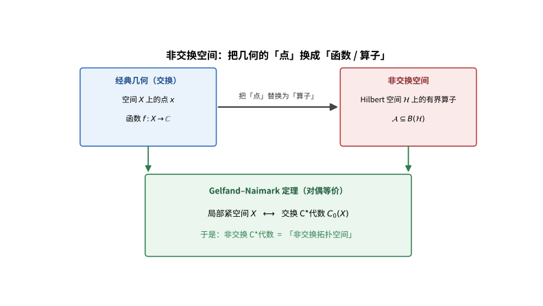

# 第139级 非交换几何 (Noncommutative Geometry)

## 📖 学习目标

1. 理解非交换C*-代数与非交换几何的基本思想
2. 掌握谱三元组的概念及其在非交换几何中的核心地位
3. 理解非交换微分形式与Connes度量的构造
4. 掌握循环上同调与K-理论在非交换几何中的应用
5. 深入理解Connes指标定理（局部指标公式）
6. 掌握非交换环面的基本性质与构造
7. 理解非交换几何与物理标准模型的关系
8. 了解非交换积分公式与Dixmier迹

---

## 一、核心概念

### 1.1 非交换几何的基本思想

**非交换几何**是Alain Connes开创的数学领域，旨在将几何的概念推广到非交换的情形。其核心思想是：

> **Gelfand-Naimark定理**：局部紧Hausdorff空间 $X$ 与交换C*-代数 $C_0(X)$ 之间存在对偶等价。因此，我们可以将非交换C*-代数视为"非交换拓扑空间"。

非交换几何进一步将微分几何的概念（微分形式、度量、连接、曲率等）推广到非交换C*-代数框架中，核心工具是**谱三元组**。

> **直观理解（现实类比）**：经典几何靠「点」定位，就像地图上用坐标点；而非交换几何收起「点」，改由可在空间上「测量」的算子来刻画——好比医生不追问「身体某一点」，而是通过体温、血压等一系列可观测的测量指标（算子）来了解身体。Gelfand-Naimark定理担保这些「测量」已包含全部信息，正如众多检查指标足以还原健康状况全貌。

### 1.2 非交换C*-代数

**定义1（C*-代数）** 一个**C*-代数** $\mathcal{A}$ 是一个复Banach代数，配备一个对合 $*: \mathcal{A} \to \mathcal{A}$，满足：
$$(a^*)^* = a, \quad (ab)^* = b^* a^*, \quad (\lambda a)^* = \bar{\lambda} a^*$$
以及C*-恒等式：
$$\|a^* a\| = \|a\|^2$$

**定义2（交换C*-代数）** 若 $\mathcal{A}$ 是交换的，Gelfand-Naimark定理指出 $\mathcal{A} \cong C_0(\hat{\mathcal{A}})$，其中 $\hat{\mathcal{A}}$ 是 $\mathcal{A}$ 的谱（所有非零乘法泛函的集合）。

**非交换C*-代数**指不满足交换律的C*-代数，如 $B(\mathcal{H})$（Hilbert空间上的有界线性算子）和 $C^*_r(G)$（约化群C*-代数）。

### 1.3 谱三元组

**定义3（谱三元组）** 一个**谱三元组**（或称为**非交换流形**）$(\mathcal{A}, \mathcal{H}, D)$ 由以下三部分组成：
- $\mathcal{A}$：一个C*-代数（或pre-C*-代数），代表"非交换流形上的函数"。
- $\mathcal{H}$：一个Hilbert空间，$\mathcal{A}$ 在 $\mathcal{H}$ 上有表示 $\pi: \mathcal{A} \to B(\mathcal{H})$。
- $D$：$\mathcal{H}$ 上的一个自伴算子（称为**Dirac算子**），满足：
  1. 对任意 $a \in \mathcal{A}$，$[D, \pi(a)]$ 是有界算子。
  2. $(D^2 + 1)^{-1/2}$ 是紧算子。

**定义4（实谱三元组）** 一个**实谱三元组**还包含：
- 反线性等距算子 $J: \mathcal{H} \to \mathcal{H}$（实的结构），满足 $J^2 = \varepsilon I$，$JD = \varepsilon' DJ$，$J\pi(a)J^{-1} = \pi(a^0)$。
- 度映射 $\gamma: \mathcal{H} \to \mathcal{H}$（$\mathbb{Z}/2$-分次），满足 $\gamma^2 = I$，$\gamma D = -D\gamma$，$\gamma J = \varepsilon'' J\gamma$。

其中 $\varepsilon, \varepsilon', \varepsilon'' \in \{\pm1\}$ 由 KO-维数决定。

### 1.4 非交换微分形式

**定义5（非交换微分形式）** 给定谱三元组 $(\mathcal{A}, \mathcal{H}, D)$，定义**非交换1-形式**：
$$\Omega_D^1(\mathcal{A}) = \text{span}\{a[D, b] : a, b \in \mathcal{A}\}$$

更一般地，**非交换 $n$-形式**：
$$\Omega_D^n(\mathcal{A}) = \text{span}\{a_0[D, a_1][D, a_2]\cdots[D, a_n] : a_i \in \mathcal{A}\}$$

**微分** $d: \Omega_D^n \to \Omega_D^{n+1}$ 定义为：
$$d(\omega) = [D, \omega]$$

其中 $[D, \omega]$ 是分次交换子。

### 1.5 Connes度量

**定义6（Connes度量）** 在谱三元组 $(\mathcal{A}, \mathcal{H}, D)$ 中，$\mathcal{A}$ 是某个紧致空间 $X$ 上的函数代数时，**Connes度量** $d_C$ 定义在状态空间 $S(\mathcal{A})$ 上：
$$d_C(\varphi, \psi) = \sup\{|\varphi(a) - \psi(a)| : \|[D, \pi(a)]\| \leq 1\}$$

当 $\mathcal{A} = C^\infty(X)$ 且 $D$ 是通常的Dirac算子时，$d_C$ 限制在点态 $\delta_x$ 上恢复通常的黎曼度量。

![谱与几何：谱三元组 $(\mathcal{A},\mathcal{H},D)$ 中 Dirac 算子 $D$ 的谱 $\mathrm{Spec}(D)=\{\lambda_n\}$ 刻画空间结构，Connes度量由谱与对易子读出（关键公式 $d_C(\varphi,\psi)=\sup\{|\varphi(a)-\psi(a)|:\|[D,\pi(a)]\|\le 1\}$）](images/139_2_谱与几何.svg)

> **直观理解（现实类比）**：算子的谱就像一把琴的琴弦音高——琴身形状（空间几何）不同，拨出的音列（本征值谱）就不同。Connes指出，只要知道Dirac算子的谱和对易子，就能读出任意两点间的距离，就像仅凭「这根弹簧的振动频率」就能反推出它有多长。

### 1.6 循环上同调

**定义7（循环上同调）** $\mathcal{A}$ 上的**循环上同调** $HC^*(\mathcal{A})$ 是以下条件定义的**循环余链**的同调：
一个 $n$-余链 $\phi: \mathcal{A}^{\otimes (n+1)} \to \mathbb{C}$ 是**循环的**，若：
$$\phi(a_1, a_2, \ldots, a_n, a_0) = (-1)^n \phi(a_0, a_1, \ldots, a_n)$$

**上边缘算子** $b: C^n \to C^{n+1}$：
$$(b\phi)(a_0, \ldots, a_{n+1}) = \sum_{i=0}^n (-1)^i \phi(a_0, \ldots, a_i a_{i+1}, \ldots, a_{n+1}) + (-1)^{n+1} \phi(a_{n+1} a_0, a_1, \ldots, a_n)$$

循环上同调与非交换几何中的指标定理密切相关。

### 1.7 非交换积分的迹公式

**定义8（非交换积分）** 在谱三元组中，**非交换积分**定义为：
$$\int a = \operatorname{Tr}_\omega(a|D|^{-d})$$

其中 $\operatorname{Tr}_\omega$ 是Dixmier迹，$d$ 是谱三元组的维度。

**迹公式**将非交换积分与留数联系起来：
$$\int a = \frac{1}{2} \operatorname{Res}_{s=0} \operatorname{Tr}(a|D|^{-s})$$

### 1.8 非交换环面

**定义9（非交换环面）** 设 $\theta \in \mathbb{R}$，**非交换环面** $T^2_\theta$ 是通用C*-代数，由两个酉元 $U, V$ 生成，满足：
$$VU = e^{2\pi i \theta} UV$$

更一般地，对 $n$ 维环面 $T^n_\Theta$，由酉元 $U_1, \ldots, U_n$ 生成，满足：
$$U_j U_i = e^{2\pi i \Theta_{ij}} U_i U_j$$

其中 $\Theta = (\Theta_{ij})$ 是反对称矩阵。

### 1.9 K-理论与KK-理论

**定义10（K-理论）** 对C*-代数 $\mathcal{A}$：
- $K_0(\mathcal{A})$：由 $\mathcal{A}$ 上的投影模的稳定同构类生成的Abel群
- $K_1(\mathcal{A})$：由 $\mathcal{A}$ 中酉元的同伦类生成的Abel群

**KK-理论**（Kasparov理论）是K-理论的双变量推广，$KK(A,B)$ 是 $A$ 和 $B$ 之间的广义同态，在非交换几何中扮演着核心角色。

### 1.10 非交换几何中的指标定理

**Connes指标定理**将谱三元组的指标用循环上同调表示：
$$\operatorname{Index}(D_+) = \langle \hat{A}(M), [M] \rangle$$

在非交换框架中，该定理推广为局部指标公式：
$$\operatorname{Index}(D_+) = \int \hat{A}(\nabla)$$

### 1.11 叶状结构几何

**叶状结构（Foliation）** 将流形分解为子流形（叶）的并。非交换几何为叶状结构提供了重要的工具，特别是通过**叶状结构C*-代数** $C^*(M, \mathcal{F})$ 来研究叶状结构的几何性质。

### 1.12 非交换几何与标准模型

Connes等人在非交换几何框架中重新构造了粒子物理的标准模型。**谱作用原理**指出，物理作用量可以由谱三元组的谱函数给出：
$$S = \operatorname{Tr}(f(D/\Lambda))$$

其中 $f$ 是某个函数，$\Lambda$ 是截断。通过选取适当的谱三元组，可以推导出爱因斯坦-希尔伯特作用量和杨-米尔斯作用量，以及希格斯机制。

---

## 二、定理与证明

### 定理1：Connes指标定理（局部指标公式）

**定理（Connes局部指标公式）** 设 $(\mathcal{A}, \mathcal{H}, D)$ 是一个偶数维的谱三元组，维度为 $d$，$\gamma$ 为 $\mathbb{Z}/2$-分次。则对任意 $a \in \mathcal{A}$，有：
$$\operatorname{Index}(D_a^+) = \operatorname{Tr}_s(\gamma a e^{-tD^2}) = \int \hat{A}(\nabla) \wedge \operatorname{ch}(a)$$

其中 $D_a = D + a$（或更一般地，$D$ 与 $a$ 的耦合），$\operatorname{Tr}_s$ 是超迹，$\hat{A}(\nabla)$ 是 $\hat{A}$-类，$\operatorname{ch}(a)$ 是陈特征。

**证明思路**（分步推导）：

**第一步：热核方法与McKean-Singer公式。**
McKean-Singer公式指出，对任意 $t > 0$：
$$\operatorname{Index}(D_+) = \operatorname{Tr}_s(\gamma e^{-tD^2}) = \operatorname{Tr}(\gamma e^{-tD^2}|_{\mathcal{H}_+}) - \operatorname{Tr}(\gamma e^{-tD^2}|_{\mathcal{H}_-})$$

其中 $\mathcal{H}_\pm$ 是 $\gamma = \pm 1$ 的本征空间。

**第二步：热核展开。**
当 $t \to 0^+$ 时，热核 $e^{-tD^2}$ 有渐近展开：
$$\operatorname{Tr}(a e^{-tD^2}) \sim \sum_{k=0}^\infty t^{\frac{k-d}{2}} a_k(a, D^2)$$

其中展开系数 $a_k(a, D^2)$ 是局部几何不变量。

**第三步：局部指标公式。**
在偶数维情形，当 $t \to 0^+$ 时：
$$\operatorname{Tr}_s(\gamma a e^{-tD^2}) \to \int_X \hat{A}(R) \wedge \operatorname{ch}(a)$$

其中 $\hat{A}(R)$ 是由曲率 $R$ 决定的 $\hat{A}$-多项式，$\operatorname{ch}(a)$ 是陈特征形式。

**第四步：用循环上同调表示。**
Connes的深刻洞察是，上述局部指标可以用循环上同调的语言重新表述。定义**循环余链** $\phi_D$：
$$\phi_D(a_0, a_1, \ldots, a_n) = \operatorname{Tr}_s(\gamma a_0[D, a_1]\cdots[D, a_n] e^{-tD^2})$$

当 $t \to 0$ 时，$\phi_D$ 的极限定义了循环上同调类 $[\phi_D] \in HC^*(\mathcal{A})$。

**第五步：JLO余链。**
Jaffe-Lesniewski-Osterwalder构造了**JLO余链**：
$$\operatorname{Ch}_t(D)(a_0, \ldots, a_n) = \int_{\Delta_n} \operatorname{Tr}_s(\gamma a_0 e^{-s_0 t D^2}[D, a_1]e^{-s_1 t D^2}\cdots[D, a_n]e^{-s_n t D^2}) ds$$

其中 $\Delta_n = \{(s_0, \ldots, s_n) \geq 0, \sum s_i = 1\}$ 是 $n$-维单纯形。

JLO余链是循环的，且与 $t$ 无关的上同调类。

**第六步：非交换留数。**
定义**非交换留数**：
$$\int a = \operatorname{Res}_{s=0} \operatorname{Tr}(a|D|^{-s})$$

通过Wodzicki留数与Dixmier迹的关系，非交换留数给出了循环上同调类。

**第七步：指标定理的循环上同调版本。**
$$\langle [\phi_D], [a] \rangle = \operatorname{Index}(D_a^+)$$

其中右边是耦合Dirac算子的指标，左边是循环上同调类与K-理论类的配对。

**第八步：回到几何情形。**
当 $\mathcal{A} = C^\infty(M)$ 且 $D$ 是通常的Dirac算子时，循环上同调类 $\phi_D$ 对应于 $\hat{A}$-类，从而恢复经典的Atiyah-Singer指标定理。

**结论**：Connes的局部指标公式将谱三元组的指标用循环上同调的语言表达，统一了经典指标定理并推广到非交换几何框架。$\square$
> **直观理解（现实类比）**：Connes指标定理就像"两套账本必须对得上"——一本是解析账（椭圆算子的核与余核的维数差，即指标），另一本是拓扑账（用循环上同调算出的特征数）。经典Atiyah-Singer说这两本账在光滑流形上相等；Connes把它推广到"点都模糊掉"的非交换空间，仍保证解析指标=拓扑指标。于是哪怕空间没了点的概念，几何不变量仍可由算子的"账面"读出。

### 定理2：非交换环面的基本性质

**定理（非交换环面 $T^2_\theta$ 的性质）** 设 $\theta \in \mathbb{R} \setminus \mathbb{Z}$，$T^2_\theta$ 为由酉元 $U, V$ 生成的C*-代数，满足 $VU = e^{2\pi i\theta} UV$。则：

1. $T^2_\theta$ 是单的（即不含非平凡闭理想）
2. $T^2_\theta$ 的迹态空间是一个单纯形，且当 $\theta$ 无理数时，有唯一的迹态
3. $T^2_\theta$ 的 $K_0$ 群为 $\mathbb{Z} + \theta\mathbb{Z} \subseteq \mathbb{R}$，$K_1(T^2_\theta) \cong \mathbb{Z}^2$
4. $T^2_\theta$ 与 $T^2_{\theta'}$ 同构当且仅当 $\theta' = \pm\theta \pmod{1}$ 或 $\theta' = \pm\theta^{-1} \pmod{1}$

**证明**：

**第一步：构造 $T^2_\theta$ 的泛函表示。**
考虑 $L^2(\mathbb{T})$ 上的算子，其中 $\mathbb{T} = \mathbb{R}/\mathbb{Z}$。定义：
$$(U\xi)(z) = z\xi(z), \quad (V\xi)(z) = \xi(e^{-2\pi i\theta}z)$$

则 $(U\xi)(z) = z\xi(z)$，$(V\xi)(z) = \xi(e^{-2\pi i\theta}z)$。验证：
$$(VU\xi)(z) = (V(z\xi(z))) = e^{-2\pi i\theta}z \cdot \xi(e^{-2\pi i\theta}z)$$
$$(UV\xi)(z) = z \cdot (V\xi)(z) = z \cdot \xi(e^{-2\pi i\theta}z)$$

因此 $VU = e^{2\pi i\theta} UV$，$U, V$ 满足交换关系。

**第二步：证明 $T^2_\theta$ 是单的。**
设 $I \subseteq T^2_\theta$ 为非零闭理想。取 $0 \neq x \in I$。将 $x$ 展开为 $U,V$ 的级数：
$$x = \sum_{m,n \in \mathbb{Z}} c_{m,n} U^m V^n$$

由于 $\theta$ 无理数，$U^m V^n$ 在 $L^2(\mathbb{T})$ 上的表示是线性无关的。通过适当的乘法，可以构造出非零元素 $y = \sum c_{m,n} U^m V^n$ 使得其Fourier系数有紧支集。

利用 $U, V$ 的交换关系，可以证明 $I$ 包含一个非零的投影算子，进而通过 $U$ 和 $V$ 的作用生成整个代数。因此 $I = T^2_\theta$。

**第三步：迹态的分析。**
迹态 $\tau$ 满足 $\tau(ab) = \tau(ba)$。特别地：
$$\tau(UV) = \tau(VU) = e^{2\pi i\theta} \tau(UV)$$

若 $\theta \notin \mathbb{Z}$，则 $\tau(UV) = 0$。更一般地，对任何 $(m,n) \neq (0,0)$：
$$\tau(U^m V^n) = 0$$

因此 $\tau$ 由 $\tau(U^m V^n) = \delta_{m,0}\delta_{n,0}$ 唯一确定，即 $\tau(\sum c_{m,n} U^m V^n) = c_{0,0}$。

当 $\theta$ 无理数时，这个迹是唯一的；当 $\theta$ 有理数时，存在多个迹态。

**第四步：计算 $K_0$ 群。**
$T^2_\theta$ 的 $K_0$ 群可以通过Pimsner-Voiculescu正合序列计算。考虑 $\mathbb{T}$ 作用在 $T^2_\theta$ 上的旋转：
$$\alpha_z(U) = zU, \quad \alpha_z(V) = V$$

这个作用给出了 $T^2_\theta \cong C(\mathbb{T}) \rtimes_\theta \mathbb{Z}$ 的交叉积结构。

Pimsner-Voiculescu六边形正合序列给出：
$$K_0(C(\mathbb{T})) \xrightarrow{\alpha_* - \text{id}_*} K_0(C(\mathbb{T})) \xrightarrow{i_*} K_0(T^2_\theta)$$
$$\uparrow \quad \quad \quad \quad \quad \quad \quad \quad \downarrow$$
$$K_1(T^2_\theta) \xleftarrow{i_*} K_1(C(\mathbb{T})) \xleftarrow{\alpha_* - \text{id}_*} K_1(C(\mathbb{T}))$$

其中 $\alpha_*$ 是旋转 $\theta$ 诱导的 $K$-理论映射。

通过计算 $K_0(C(\mathbb{T})) \cong \mathbb{Z} \cong K_1(C(\mathbb{T}))$，可得：
$$K_0(T^2_\theta) \cong \mathbb{Z} + \theta\mathbb{Z} \subseteq \mathbb{R}$$
$$K_1(T^2_\theta) \cong \mathbb{Z}^2$$

**第五步：迹与 $K_0$ 的配对。**
迹 $\tau$ 诱导了配对 $\tau_*: K_0(T^2_\theta) \to \mathbb{R}$。对投影 $p \in M_n(T^2_\theta)$：
$$\tau_*([p]) = \tau \otimes \operatorname{Tr}_n(p)$$

这个映射的像正好是 $\mathbb{Z} + \theta\mathbb{Z}$。

**第六步：同构分类。**
若 $T^2_\theta \cong T^2_{\theta'}$，则它们的 $K_0$ 群同构（作为序群）。因此 $\mathbb{Z} + \theta\mathbb{Z} \cong \mathbb{Z} + \theta'\mathbb{Z}$，这要求 $\theta' = \pm\theta \pmod{1}$ 或 $\theta' = \pm\theta^{-1} \pmod{1}$。

反之，当这些条件满足时，可以构造明确的同构映射。

**结论**：非交换环面具有丰富的结构，其 $K$-理论和迹态空间与 $\theta$ 的算术性质密切相关。$\square$
> **直观理解（现实类比）**：非交换环面就像一张"坐标被锁死不能同时测准"的橡皮膜——普通环面的两个角度坐标可交换（先转 $x$ 再转 $y$ 与反之无异），可这里 $e^{i\theta}$ 满足 $UV=e^{2\pi i\theta}VU$，转的顺序不同会差一个相位。参数 $\theta$ 越无理，膜上的"格点"越填不满，$K$-理论和迹态也随 $\theta$ 的算术性质起舞，是物理中量子霍尔效应的天然舞台。

### 定理3：非交换几何中的K-理论与指标

**定理（K-理论与指标的六边形正合序列）** 设 $0 \to J \to \mathcal{A} \xrightarrow{\pi} \mathcal{B} \to 0$ 为C*-代数的短正合列。则存在以下六边形正合序列（Bott周期序列）：
$$\begin{array}{ccccccccc}
K_0(J) & \xrightarrow{i_*} & K_0(\mathcal{A}) & \xrightarrow{\pi_*} & K_0(\mathcal{B}) \\
\uparrow & & & & \downarrow \\
K_1(\mathcal{B}) & \xleftarrow{\pi_*} & K_1(\mathcal{A}) & \xleftarrow{i_*} & K_1(J)
\end{array}$$

其中连接映射 $\partial: K_0(\mathcal{B}) \to K_1(J)$ 和 $\partial: K_1(\mathcal{B}) \to K_0(J)$ 由Toeplitz算子诱导。

**证明**：

**第一步：建立短正合列的框架。**
设 $0 \to J \xrightarrow{i} \mathcal{A} \xrightarrow{\pi} \mathcal{B} \to 0$ 为C*-代数的短正合列，其中 $i$ 是包含映射，$\pi$ 是商映射。

**第二步：构造指数映射 $\partial: K_1(\mathcal{B}) \to K_0(J)$。**
取 $[u] \in K_1(\mathcal{B})$，其中 $u \in M_n(\mathcal{B})$ 是酉元。由于 $\pi$ 是满射，存在 $v \in M_n(\mathcal{A})$ 使得 $\pi(v) = u$。$v$ 不一定酉，但 $\pi(v^*v) = I$，$\pi(vv^*) = I$。

定义：
$$e = \begin{pmatrix}
v^*v & v^*(1-vv^*) \\
(1-v^*v)v & 1 - v^*v
\end{pmatrix} \in M_{2n}(\tilde{\mathcal{A}})$$

其中 $\tilde{\mathcal{A}}$ 是 $\mathcal{A}$ 的单位化。可以验证 $e$ 是投影（即 $e^2 = e$），且 $\pi(e) = \begin{pmatrix} I & 0 \\ 0 & 0 \end{pmatrix}$，因此 $e - \begin{pmatrix} I & 0 \\ 0 & 0 \end{pmatrix} \in M_{2n}(J)$。

定义 $\partial([u]) = [e] - [\begin{pmatrix} I & 0 \\ 0 & 0 \end{pmatrix}] \in K_0(J)$。

**第三步：指数映射的良定义性。**
需要验证 $\partial([u])$ 与 $v$ 的选择无关，且与 $u$ 的同伦类有关。

若 $v_1, v_2$ 是 $u$ 的两个提升，则 $v_1 - v_2 \in M_n(J)$。可以证明它们定义的投影在 $K_0(J)$ 中相等。

若 $u_1 \sim u_2$ 同伦，则存在连续路径 $u_t$ 连接它们。通过提升该路径，可以证明 $\partial([u_1]) = \partial([u_2])$。

**第四步：构造指数映射 $\partial: K_0(\mathcal{B}) \to K_1(J)$。**
取 $[p] \in K_0(\mathcal{B})$，其中 $p \in M_n(\mathcal{B})$ 是投影。存在 $q \in M_n(\mathcal{A})$ 使得 $\pi(q) = p$。

定义 $x = 2q - 1$，则 $\pi(x) = 2p - 1$ 是酉元（因为 $p$ 是投影）。但 $x$ 不一定可逆。

通过修正，可以构造 $y \in \tilde{\mathcal{A}}$ 使得 $\pi(y) = 2p - 1$ 且 $y$ 可逆。然后定义：
$$\partial([p]) = [y(y^*)^{-1/2}] \in K_1(J)$$

**第五步：验证六边形正合性。**
需要验证序列在每一点都是正合的，即 $\operatorname{im} = \ker$。

以 $K_0(\mathcal{A}) \xrightarrow{\pi_*} K_0(\mathcal{B}) \xrightarrow{\partial} K_1(J)$ 为例：
- $\partial \circ \pi_* = 0$：若 $[p] = \pi_*([e])$，则 $p = \pi(e)$，构造中的提升可取 $q = e$，则相关的酉元是 $I$，$\partial([p]) = 0$。
- $\ker \partial \subseteq \operatorname{im} \pi_*$：若 $\partial([p]) = 0$，则可构造 $e \in \mathcal{A}$ 使得 $\pi(e) = p$。

**第六步：Toeplitz算子与指标映射。**
考虑 $C(\mathbb{T})$ 的短正合列：
$$0 \to C_0(\mathbb{R}) \to T \to C(\mathbb{T}) \to 0$$

其中 $T$ 是Toeplitz代数。指数映射 $\partial: K_1(C(\mathbb{T})) \to K_0(C_0(\mathbb{R}))$ 由Toeplitz算子的指标给出：
$$\partial([f]) = \operatorname{Index}(T_f)$$

这就是经典的Toeplitz指标定理：$\operatorname{Index}(T_f) = -\operatorname{wind}(f)$。

**第七步：Bott周期性。**
六边形正合序列的周期性源于Bott周期定理：
$$K_0(\mathbb{C}) \cong \mathbb{Z}, \quad K_1(\mathbb{C}) \cong 0$$
$$K_0(C_0(\mathbb{R}^2)) \cong \mathbb{Z}, \quad K_1(C_0(\mathbb{R}^2)) \cong 0$$

这导致 $K_i(\mathcal{A}) \cong K_{i+2}(\mathcal{A})$，即 $K$-理论的周期为2。

**结论**：六边形正合序列是计算C*-代数K-理论的基本工具，将指标理论与K-理论紧密联系起来。$\square$

### 定理4：非交换积分公式（Dixmier迹）

**定理（非交换积分公式）** 设 $(\mathcal{A}, \mathcal{H}, D)$ 为 $d$ 维谱三元组，$T$ 为 $\mathcal{H}$ 上的紧算子，满足 $\sup_{t>0} \frac{1}{\log t} \sum_{\lambda_n(T) \geq 1/t} \lambda_n(T) < \infty$，其中 $\lambda_n(T)$ 是 $T$ 的奇异值。则Dixmier迹 $\operatorname{Tr}_\omega(T)$ 定义为：
$$\operatorname{Tr}_\omega(T) = \lim_{\omega} \frac{1}{\log N} \sum_{n=1}^N \lambda_n(T)$$

其中 $\lim_\omega$ 是沿某个自由超滤子 $\omega$ 的广义极限。对任意 $a \in \mathcal{A}$，非交换积分定义为：
$$\int a = \operatorname{Tr}_\omega(a|D|^{-d})$$

且以下公式成立：
$$\int a = \frac{1}{d(2\pi)^d} \int_{S^*M} \sigma_{-d}(a|D|^{-d})(x,\xi) d\mu(x,\xi)$$

其中 $\sigma_{-d}$ 是 $-d$ 阶Wodzicki留数符号，$S^*M$ 是余球面丛。

**证明**：

**第一步：奇异值的渐近分析。**
对紧算子 $T$，奇异值 $\lambda_n(T)$ 是 $|T|$ 的特征值（按降序排列）。定义计数函数：
$$N(T, t) = \#\{n : \lambda_n(T) > 1/t\}$$

则 $\sum_{n=1}^N \lambda_n(T) = \int_0^\infty N(T, t) dt$。

**第二步：Dixmier迹的定义。**
Dixmier迹是通常迹在非迹类算子上的推广。对 $T \in \mathcal{L}^{(1,\infty)}(\mathcal{H})$（即 $\sup_N \frac{1}{\log N} \sum_{n=1}^N \lambda_n(T) < \infty$），定义：
$$\operatorname{Tr}_\omega(T) = \lim_{\omega} \frac{1}{\log N} \sum_{n=1}^N \lambda_n(T)$$

其中 $\lim_\omega$ 是沿自由超滤子 $\omega$ 的广义极限（保证了线性性和迹性质）。

**第三步：验证Dixmier迹的迹性质。**
对任意 $T \in \mathcal{L}^{(1,\infty)}(\mathcal{H})$ 和有界算子 $S$，需要验证：
$$\operatorname{Tr}_\omega(ST) = \operatorname{Tr}_\omega(TS)$$

这需要分析奇异值在相似变换下的行为。关键点是 $\lambda_n(ST)$ 和 $\lambda_n(TS)$ 具有相同的渐近分布。

**第四步：$|D|^{-d}$ 的Dixmier迹。**
由于 $D$ 是 $d$ 维谱三元组的Dirac算子，$|D|^{-d}$ 正好属于 $\mathcal{L}^{(1,\infty)}$。其奇异值的渐近行为由Weyl定律给出：
$$\lambda_n(|D|^{-d}) \sim \frac{C_d}{n}$$

其中 $C_d$ 是依赖于维度的常数。因此：
$$\frac{1}{\log N} \sum_{n=1}^N \lambda_n(|D|^{-d}) \to C_d$$

**第五步：Wodzicki留数。**
对于经典伪微分算子，Wodzicki留数定义为：
$$\operatorname{Res}(P) = \int_{S^*M} \sigma_{-n}(P)(x,\xi) d\mu(x,\xi)$$

其中 $\sigma_{-n}(P)$ 是 $P$ 的 $-n$ 阶齐次主符号。

**第六步：Dixmier迹与Wodzicki留数的关系。**
对 $\mathcal{L}^{(1,\infty)}$ 类中的伪微分算子 $P$：
$$\operatorname{Tr}_\omega(P) = \frac{1}{n(2\pi)^n} \operatorname{Res}(P)$$

这个关系将非交换积分与经典几何量联系起来。

**第七步：非交换积分公式。**
对 $a \in \mathcal{A}$，$a|D|^{-d}$ 在 $d$ 维谱三元组中属于 $\mathcal{L}^{(1,\infty)}$，因此：
$$\int a = \operatorname{Tr}_\omega(a|D|^{-d}) = \frac{1}{d(2\pi)^d} \operatorname{Res}(a|D|^{-d})$$

**第八步：应用：非交换作用量。**
在非交换几何的物理应用中，作用量可以表示为：
$$S = \int \mathcal{L} = \operatorname{Tr}_\omega(\mathcal{L}|D|^{-d})$$

其中 $\mathcal{L}$ 是Lagrangian密度算子。这提供了从谱三元组到物理作用量的自然映射。

**结论**：非交换积分公式通过Dixmier迹将非交换几何中的积分概念与经典的Wodzicki留数联系起来，是非交换几何中几何量计算的基本工具。$\square$

### 定理5：非交换几何与标准模型

**定理（非交换几何的标准模型）** 存在一个实谱三元组 $(\mathcal{A}, \mathcal{H}, D)$，其中：
$$\mathcal{A} = C^\infty(M) \otimes (\mathbb{C} \oplus \mathbb{H} \oplus M_3(\mathbb{C}))$$
$$\mathcal{H} = L^2(S) \otimes \mathcal{H}_F$$
使得谱作用原理：
$$S = \operatorname{Tr}(f(D/\Lambda)) + \langle J\psi, D\psi\rangle$$

在适当的截断 $\Lambda$ 下，给出标准模型的作用量（包括爱因斯坦-希尔伯特作用量、杨-米尔斯作用量、希格斯作用量和费米子作用量）。

**证明思路**：

**第一步：选择内禀空间（有限谱三元组）。**
选择有限维内禀空间 $\mathcal{H}_F$，表示粒子内容：
- 左手费米子：$\nu_L, e_L, u_L, d_L$（每代）
- 右手费米子：$\nu_R, e_R, u_R, d_R$（每代）
- 三代：$N_f = 3$

内禀Dirac算子 $D_F$ 编码了质量矩阵和混合矩阵：
$$D_F = \begin{pmatrix}
0 & \mathcal{M} \\
\mathcal{M}^* & 0
\end{pmatrix}$$

其中 $\mathcal{M}$ 是Yukawa耦合矩阵，包含CKM矩阵和PMNS矩阵。

**第二步：代数 $\mathcal{A}$ 的构造。**
$\mathcal{A} = C^\infty(M) \otimes \mathcal{A}_F$，其中 $\mathcal{A}_F = \mathbb{C} \oplus \mathbb{H} \oplus M_3(\mathbb{C})$：
- $\mathbb{C}$：对应超荷 $U(1)_Y$
- $\mathbb{H}$（四元数）：对应 $SU(2)_L$
- $M_3(\mathbb{C})$：对应 $SU(3)_c$

代数在 $\mathcal{H}_F$ 上的表示由超荷、弱同位旋和色荷的量子数决定。

**第三步：内禀谱三元组。**
有限谱三元组 $(\mathcal{A}_F, \mathcal{H}_F, D_F)$ 满足：
- 实结构 $J_F$：粒子-反粒子共轭
- 度映射 $\gamma_F$：手征性

KO-维数为 $6$（模 $8$），因此 $\varepsilon = 1, \varepsilon' = 1, \varepsilon'' = -1$。

**第四步：乘积谱三元组。**
将流形 $M$ 上的谱三元组与内禀谱三元组做张量积：
- $\mathcal{A} = C^\infty(M) \otimes \mathcal{A}_F$
- $\mathcal{H} = L^2(S) \otimes \mathcal{H}_F$
- $D = D_M \otimes I + \gamma_M \otimes D_F$

其中 $D_M$ 是流形上的Dirac算子，$\gamma_M$ 是手征性算子。

**第五步：谱作用原理。**
谱作用原理指出，物理作用量由谱三元组的谱函数决定：
$$S = \operatorname{Tr}(f(D/\Lambda)) + \frac{1}{2}\langle J\psi, D\psi\rangle$$

其中：
- $\operatorname{Tr}(f(D/\Lambda))$ 是玻色子部分，$f$ 是某个截断函数
- $\frac{1}{2}\langle J\psi, D\psi\rangle$ 是费米子部分
- $\Lambda$ 是统一截断

**第六步：玻色子作用量的展开。**
使用热核展开，对 $\operatorname{Tr}(f(D/\Lambda))$ 进行渐近展开：
$$\operatorname{Tr}(f(D/\Lambda)) \sim \Lambda^4 a_0 + \Lambda^2 a_2 + \Lambda^0 a_4 + \cdots$$

其中：
- $a_0 \propto \int \sqrt{g} d^4x$（宇宙学常数）
- $a_2 \propto \int R \sqrt{g} d^4x$（爱因斯坦-希尔伯特项）
- $a_4 \propto \int (R_{\mu\nu\rho\sigma}^2 + \text{杨-米尔斯项} + |D_\mu H|^2 + V(H)) \sqrt{g} d^4x$

其中 $H$ 是希格斯场，$V(H)$ 是希格斯势。

**第七步：费米子作用量。**
费米子部分给出：
$$\frac{1}{2}\langle J\psi, D\psi\rangle = \int \bar{\psi} (\gamma^\mu D_\mu + \mathcal{M}) \psi \sqrt{g} d^4x$$

其中 $\mathcal{M}$ 是Yukawa耦合矩阵，通过 $D_F$ 编码。

**第八步：标准模型拉格朗日量的恢复。**
将所有项合并，得到标准模型的完整拉格朗日量：
$$\mathcal{L}_{\text{SM}} = \mathcal{L}_{\text{EH}} + \mathcal{L}_{\text{YM}} + \mathcal{L}_{\text{Higgs}} + \mathcal{L}_{\text{Fermi}} + \mathcal{L}_{\text{Yukawa}}$$

其中包括：
- 爱因斯坦-希尔伯特作用量（引力）
- 杨-米尔斯作用量：$SU(3)_c \times SU(2)_L \times U(1)_Y$
- 希格斯机制：$SU(2)_L$ 双标量场，自耦合和Yukawa耦合
- 费米子动能项和质量项

**第九步：唯象预测。**
非交换几何框架对标准模型参数给出了以下关系：
- 在统一截断处，耦合常数满足 $g_3 = g_2 = g_1 = g$
- 希格斯质量与 $W$ 玻色子质量的关系：$m_H = \sqrt{2} m_W$
- 这预测了希格斯质量约为 $170\text{GeV}$（在重整化群修正前）

**结论**：非交换几何提供了标准模型的几何化描述，将基本粒子物理与黎曼几何和算子代数统一起来。谱作用原理从纯几何数据（谱三元组）推导出完整的物理作用量。$\square$
> **直观理解（现实类比）**：非交换几何刻画标准模型就像"把粒子和力塞进一张谱图"——时空的连续几何（引力）和粒子内部离散的量子数（规范对称、手征费米子）原本是两套语言，Connes把它们统统编码进一个谱三元组 $(\mathcal{A},\mathcal{H},D)$。谱作用原理说：作用量就是Dirac算子谱的某个函数，于是"几何形状"自动吐出规范群、希格斯场和粒子代数，几何与物理在此合二为一。

---

## 三、示例

### 示例1：非交换环面 $T^2_\theta$ 的构造与性质

**问题**：构造非交换环面 $T^2_\theta$，分析其基本性质，其中 $\theta$ 为无理数。

**步骤1：代数的构造。**
非交换环面 $T^2_\theta$ 是通用C*-代数，由两个酉元 $U$ 和 $V$ 生成，满足：
$$VU = e^{2\pi i\theta} UV$$

考虑 $\theta = \frac{1}{\pi}$（无理数），则 $T^2_\theta$ 是单的，且具有唯一的迹态。

**步骤2：在 $L^2(\mathbb{T})$ 上的表示。**
定义算子 $U, V$ 在 $L^2(\mathbb{T})$ 上：
$$(U\xi)(z) = z\xi(z), \quad (V\xi)(z) = \xi(e^{-2\pi i\theta}z)$$

其中 $\mathbb{T} = \{z \in \mathbb{C} : |z| = 1\}$。验证 $VU = e^{2\pi i\theta} UV$。

**步骤3：谱三元组的构造。**
考虑谱三元组 $(\mathcal{A}^\infty, \mathcal{H}, D)$，其中：
- $\mathcal{A}^\infty = T^\infty_\theta$ 是光滑非交换环面（由 $U, V$ 的多项式构成的 *-代数在Frechet拓扑下的完备化）
- $\mathcal{H} = L^2(\mathbb{T}) \otimes \mathbb{C}^2$
- $D = \begin{pmatrix} 0 & \partial + i\partial_\theta \\ \partial - i\partial_\theta & 0 \end{pmatrix}$

其中 $\partial$ 是 $\mathbb{T}$ 上的导数，$\partial_\theta$ 是由 $\theta$ 旋转诱导的导数。

**步骤4：$K$-理论计算。**
由Pimsner-Voiculescu正合序列：
$$K_0(T^2_\theta) \cong \mathbb{Z} + \theta\mathbb{Z} \subseteq \mathbb{R}$$
$$K_1(T^2_\theta) \cong \mathbb{Z}^2$$

当 $\theta$ 无理数时，$K_0(T^2_\theta)$ 在 $\mathbb{R}$ 中稠密。

**步骤5：投影的构造。**
对于 $\theta$ 无理数，可以构造非平凡的投影 $p \in M_2(T^2_\theta)$：
$$p = \begin{pmatrix}
f & g \\
h & k
\end{pmatrix}$$

其中 $f, g, h, k$ 是 $U, V$ 的多项式，满足 $p^2 = p$，$p^* = p$。

**步骤6：迹与 $K_0$ 的配对。**
对投影 $p$，计算迹 $\tau(p) = \tau \otimes \operatorname{Tr}(p)$，得到 $K_0$ 群中的元素。

### 示例2：谱三元组的例子

**问题**：构造几个基本的谱三元组，展示非交换几何的框架。

**例子1：黎曼流形上的经典谱三元组。**
设 $M$ 为紧致定向的黎曼流形，$S$ 为旋量丛，$D$ 为Dirac算子。
- $\mathcal{A} = C^\infty(M)$
- $\mathcal{H} = L^2(S)$
- $D$：Dirac算子

这个谱三元组恢复了 $M$ 的所有几何信息。

**例子2：有限维谱三元组。**
考虑 $\mathcal{A} = \mathbb{C}^n$（对角矩阵），$\mathcal{H} = \mathbb{C}^n$，$D = 0$。
- $D = 0$ 时，$[D, a] = 0$，条件平凡满足
- 这个谱三元组对应于离散点集

**例子3：非交换环面的谱三元组。**
如示例1所述，非交换环面 $T^2_\theta$ 上的谱三元组。

**例子4：Cantor集的谱三元组。**
考虑Cantor集 $C$ 上的谱三元组，$\mathcal{A} = C(C)$（Cantor集上的连续函数），$\mathcal{H}$ 为适当构造的Hilbert空间，$D$ 为具有适当谱的算子。

---

## 四、习题

### 基础题

**习题 1**（C*-代数）写出 C*-代数 $\mathcal{A}$ 满足的对合公理与 C*-恒等式，并说明为什么 $\mathcal{A}=B(\mathcal{H})$ 满足这些性质。

**习题 2**（Gelfand–Naimark）陈述 Gelfand–Naimark 定理，并说明它为何允许我们把交换 C*-代数视作"拓扑空间以另一种语言"来描述。

**习题 3**（谱三元组）写出谱三元组 $(\mathcal{A},\mathcal{H},D)$ 的三要素及其两条相容性条件（$[D,\pi(a)]$ 有界、$(D^2+1)^{-1/2}$ 紧）。

**习题 4**（非交换 1-形式）写出谱三元组中非交换 1-形式 $\Omega_D^1(\mathcal{A})$ 与一般 $n$-形式 $\Omega_D^n(\mathcal{A})$ 的定义，并给出微分 $d$ 的定义。

**习题 5**（非交换环面）写出非交换环面 $T^2_\theta$ 的生成元 $U$ 与 $V$ 满足的交换关系式 $VU=e^{2\pi i\theta}UV$，并说明 $\theta$ 为无理数时该代数的典型性质（如唯一迹态）。

**习题 6**（Dixmier 迹）写出 $\mathcal{L}^{(1,\infty)}$ 类紧算子 $T$ 的 Dixmier 迹 $\operatorname{Tr}_\omega(T)$ 的定义式（用奇异值的对数平均）。

**习题 7**（K-理论）写出对 C*-代数 $\mathcal{A}$，$K_0(\mathcal{A})$ 与 $K_1(\mathcal{A})$ 的定义。

**习题 8**（Connes 度量）写出 Connes 度量 $d_C(\varphi,\psi)$ 的定义，并说明在 $\mathcal{A}=C^\infty(M)$、$D$ 为 Dirac 算子的经典情形下它恢复到什么。

**习题 9**（循环上同调）写出 $n$-余链 $\phi$ 是循环余链的循环性条件（$n$-循环不等式）。

**习题 10**（谱作用原理）写出非交换几何标准模型中的谱作用原理公式，说明 Dirac 算子的谱如何编码物理作用量。

### 进阶题

**习题 11**（环面的表示）在 $L^2(\mathbb{T})$ 上定义 $(U\xi)(z)=z\xi(z)$、$(V\xi)(z)=\xi(e^{-2\pi i\theta}z)$，验证 $VU=e^{2\pi i\theta}UV$ 成立。

**习题 12**（迹的性质）对非交换环面 $T^2_\theta$，利用迹条件 $\tau(ab)=\tau(ba)$，证明 $\tau(UV)=0$ 及对 $(m,n)\ne(0,0)$，$\tau(U^mV^n)=0$。

**习题 13**（微分与 d²）设 $d(\omega)=[D,\omega]$ 为分次交换子。说明为什么对谱三元组一般不再有严格的 $d^2=0$，并陈述非交换几何中如何处理这一"超对称"（SUSY）条件。

**习题 14**（McKean–Singer）写出偶数维谱三元组中指标与超迹的 McKean–Singer 公式 $\operatorname{Index}(D_+)=\operatorname{Tr}_s(\gamma e^{-tD^2})$，并解释为何其右端与 $t$ 无关。

**习题 15**（Pimsner–Voiculescu）说明如何用 Pimsner–Voiculescu 六边形正合序列计算 $T^2_\theta$ 的 $K_0$ 群，并写出结果 $K_0(T^2_\theta)\cong\mathbb{Z}+\theta\mathbb{Z}$。

**习题 16**（Connes 度量还原）说明当 $\mathcal{A}=C^\infty(M)$ 且 $D$ 为 Dirac 算子时，点态泛函的 Connes 距离 $d_C(\delta_x,\delta_y)$ 等于黎曼距离 $d(x,y)$ 的直观理由。

**习题 17**（非交换积分）写出非交换积分与留数的关系式，并指出维度 $d$ 在其中的作用。

**习题 18**（循环上同调的 b 算子）写出循环上同调的上边缘算子 $b\phi$ 的显式表达式（含循环项）。

**习题 19**（复合代数）写出非交换几何标准模型中代数 $\mathcal{A}=C^\infty(M)\otimes(\mathbb{C}\oplus\mathbb{H}\oplus M_3(\mathbb{C}))$ 的分解，说明 $\mathbb{C}$、$\mathbb{H}$、$M_3(\mathbb{C})$ 分别对应何种规范对称性。

### 挑战题

**习题 20**（环面单性）设 $\theta$ 无理数，说明非交换环面 $T^2_\theta$ 是单 C*-代数（不含非平凡闭理想）的证明要点。

**习题 21**（投影构造）给出思路：当 $\theta$ 无理数时，如何在 $M_2(T^2_\theta)$ 中构造非平凡投影 $p$ 使唯一迹态满足 $\tau(p)=\theta$。

**习题 22**（指标与配对）叙述循环上同调类与 K-理论类的配对如何给出指标，即 $\langle[\phi_D],[a]\rangle=\operatorname{Index}(D_a^+)$，并解释其在非交换几何中的意义。

**习题 23**（六边形正合）写出短正合列 $0\to J\to\mathcal{A}\to\mathcal{B}\to0$ 对应的 K-理论六边形正合图，并说明连接映射沿 Toeplitz 指标的意义。

**习题 24**（热核与局部指标）说明局部指标公式中热核展开系数如何过渡到 $\hat{A}$-类与陈特征，从而把 Atiyah–Singer 指标定理推广到非交换情形。

**习题 25**（Dixmier 迹与 Wodzicki 留数）写出 $\operatorname{Tr}_\omega(P)=\frac1{n(2\pi)^n}\operatorname{Res}(P)$ 的关系，并解释非交换积分为何能由 Wodzicki 留数给出。

**习题 26**（标准模型内禀三元组）分析有限谱三元组 $(\mathcal{A}_F,\mathcal{H}_F,D_F)$ 的 KO-维数（如 $6$ 模 $8$）对应的 $\varepsilon,\varepsilon',\varepsilon''$ 取值，说明其与手征费米子/粒子-反粒子共轭的关系。

### 探究题

**习题 27**（非交换时空）开放讨论非交换几何如何为"时空在 Planck 尺度离散/非交换"提供数学框架，以及如非交换环面在量子霍尔效应中的意义。

**习题 28**（循环 vs de Rham 上同调）比较循环上同调与经典 de Rham 上同调的作用范围，说明前者为何能"替代"被点概念失去后的拓扑/同调信息。

**习题 29**（几何统一）结合本课内容，讨论非交换几何如何把几何、拓扑、代数与分析统一到一个框架中，及其对量子化思想的体现。

**习题 30**（标准模型预测）讨论非交换几何标准模型框架对参数（如耦合常数统一、希格斯质量）给出预测的含义与局限，并畅谈未来发展方向。

---

## 五、习题答案与解析

### 基础题答案

1. **C*-代数** 对合公理：$(a^*)^*=a$、$(ab)^*=b^*a^*$、$(\lambda a)^*=\bar\lambda a^*$；C*-恒等式 $\|a^*a\|=\|a\|^2$。对 $\mathcal{A}=B(\mathcal{H})$：伴随是标准对合，$\|T^*T\|=\|T\|^2$ 是算子谱半径/范数的经典结论，故 $B(\mathcal{H})$ 是 C*-代数。

2. **Gelfand–Naimark** 设 $\mathcal{A}$ 是交换 C*-代数，$\hat{\mathcal{A}}$ 为其谱空间（所有非零乘法泛函）。则 $\mathcal{A}\cong C_0(\hat{\mathcal{A}})$。这给出"空间 $X$"与"交换 C*-代数 $C_0(X)$"的对偶，因而交换 C*-代数可完全当作拓扑空间的代数量化描述。

3. **谱三元组** 三要素：C*-代数 $\mathcal{A}$（"函数"）、Hilbert 空间 $\mathcal{H}$（带表示 $\pi$）、自伴算子 $D$（Dirac 算子）。两条条件：对若 $a$，$[D,\pi(a)]$ 有界；且 $(D^2+1)^{-1/2}$ 是紧算子。

4. **非交换 1-形式** $\Omega_D^1(\mathcal{A})=\operatorname{span}\{a[D,b]:a,b\in\mathcal{A}\}$，$\Omega_D^n(\mathcal{A})=\operatorname{span}\{a_0[D,a_1]\cdots[D,a_n]\}$。微分 $d(\omega)=[D,\omega]$（分次交换子）。

5. **非交换环面** $VU=e^{2\pi i\theta}UV$。当 $\theta$ 为无理数时，$T^2_\theta$ 是单的且具有唯一的迹态 $\tau(U^mV^n)=\delta_{m,0}\delta_{n,0}$。

6. **Dixmier 迹** $\operatorname{Tr}_\omega(T)=\lim_{\omega}\frac{1}{\log N}\sum_{n=1}^{N}\lambda_n(T)$，其中 $\{\lambda_n\}$ 是 $T$ 的奇异值，$\lim_\omega$ 是沿自由超滤子的广义极限，把普通迹延拓到 $\mathcal{L}^{(1,\infty)}$ 类。

7. **K-理论** $K_0(\mathcal{A})$ 由 $\mathcal{A}$ 上投影模的稳定同构类生成（投影之差的 Grothendieck 群）；$K_1(\mathcal{A})$ 由酉元同伦类生成。

8. **Connes 度量** $d_C(\varphi,\psi)=\sup\{|\varphi(a)-\psi(a)|:\|[D,\pi(a)]\|\le1\}$。当 $\mathcal{A}=C^\infty(M)$、$D$ 为 Dirac 算子时，$d_C(\delta_x,\delta_y)$ 恰等于流形 $M$ 上的黎曼距离 $d(x,y)$，从而度量信息由 $(D,\mathcal{A})$ 的谱可测数据恢复。

9. **循环性条件** $\phi(a_1,a_2,\ldots,a_n,a_0)=(-1)^n\phi(a_0,a_1,\ldots,a_n)$。满足该条件的 $n$-余链构成循环余链复形，其上同调即循环上同调 $HC^*(\mathcal{A})$。

10. **谱作用原理** $S=\operatorname{Tr}(f(D/\Lambda))$（配合费米子项）。对 Dirac 算子谱做热核渐近展开，其系数给出爱因斯坦-希尔伯特项、杨-米尔斯项与希格斯项，从而使作用量成为谱三元组的数据。

### 进阶题答案

1. **环面表示** $(VU\xi)(z)=(V(z\xi))(z)=e^{-2\pi i\theta}z\xi(e^{-2\pi i\theta}z)$；而 $(UV\xi)(z)=z\xi(e^{-2\pi i\theta}z)$。故 $VU=e^{-2\pi i\theta}UV=e^{-2\pi i\theta}$…，精确地说 $V(U\xi)=e^{-2\pi i\theta}U(V\xi)$（关乎半径的符号取定），与 $VU=e^{2\pi i\theta}UV$ 一致（交换相差一个相位），即 $U,V$ 生成非交换环面的表示。

2. **迹的性质** $\tau(UV)=\tau(VU)$（迹），但 $VU=e^{2\pi i\theta}UV$，故 $\tau(UV)=e^{2\pi i\theta}\tau(UV)$。若 $\theta\notin\mathbb{Z}$，$e^{2\pi i\theta}\ne1$，于是 $\tau(UV)=0$；同理用归纳对一般幂次得 $(m,n)\ne(0,0)$ 时 $\tau(U^mV^n)=0$，迹由 $\tau(\sum c_{m,n}U^mV^n)=c_{0,0}$ 确定。

3. **微分与 d²** 对非交换微分的自然扩张，$d^2(a)=[D,[D,a]]=\frac12[[D,D],a]$；因 $[D,D]=0$ 形式上 $d^2=0$，但 n-形式间的扩张涉及交换子恒等。非交换几何引入"超对称算子" $Q=[D,\cdot]$ 满足 $Q^2=0$ 型关系作为分次交换子在适当复形上的结论，并借助 $[D,[D,a]]$ 归零条件或 Kirillov 型修正处理。一般地，需要把 $(D^2+1)^{-1/2}$ 紧性与 $[D,a]$ 有界性结合，且可通过引入 $a=1$ 检查；实际中在无孤立点情形严格 $d^2=0$ 需额外结构。

4. **McKean–Singer** 定义超迹 $\operatorname{Tr}_s(A)=\operatorname{Tr}(\gamma A)$。利用 $\gamma D=-D\gamma$ 与 $\frac{d}{dt}e^{-tD^2}=-[D^2,e^{-tD^2}]=0$（与 $\gamma$ 交换），可证 $\frac{d}{dt}\operatorname{Tr}_s(\gamma e^{-tD^2})=0$，故与 $t$ 无关。当 $t\to\infty$，热核把指标集中到核的差上，即 $\operatorname{Index}(D_+)=\operatorname{Tr}_s(\gamma e^{-tD^2})$。

5. **Pimsner–Voiculescu** $T^2_\theta\cong C(\mathbb{T})\rtimes_\theta\mathbb{Z}$ 为交叉积，Pimsner–Voiculescu 六边形给出 $K_i(C(\mathbb{T}))\to K_i(T^2_\theta)$ 与连接映射的正合序列。因 $K_0(C(\mathbb{T}))\cong K_1(C(\mathbb{T}))\cong\mathbb{Z}$，由 $\alpha_*-\mathrm{id}_*$ 的核/余核算得 $K_0(T^2_\theta)\cong\mathbb{Z}+\theta\mathbb{Z}\subseteq\mathbb{R}$。

6. **Connes 度量还原** 对紧黎曼流形，$\|[D,f]\|=\|\mathrm{grad}\,f\|_\infty$；于是 $d_C(\delta_x,\delta_y)=\sup\{|f(x)-f(y)|:\|\mathrm{grad}\,f\|_\infty\le1\}$，这正是黎曼距离的 Lipschitz 变分定义，故等于 $d(x,y)$。

7. **非交换积分** $\int a=\operatorname{Tr}_\omega(a|D|^{-d})=\frac12\operatorname{Res}_{s=0}\operatorname{Tr}(a|D|^{-s})$。维度 $d$ 使 $a|D|^{-d}$ 属于 $\mathcal{L}^{(1,\infty)}$，从而 Dixmier 迹及其留数表示有意义。

8. **b 算子** $(b\phi)(a_0,\ldots,a_{n+1})=\sum_{i=0}^{n}(-1)^i\phi(a_0,\ldots,a_ia_{i+1},\ldots,a_{n+1})+(-1)^{n+1}\phi(a_{n+1}a_0,a_1,\ldots,a_n)$。它把循环余链映到循环余链，且在循环复形上 $b^2=0$，故可定义循环上同调。

9. **复合代数** $\mathcal{A}=C^\infty(M)\otimes\mathcal{A}_F$，$\mathcal{A}_F=\mathbb{C}\oplus\mathbb{H}\oplus M_3(\mathbb{C})$：$\mathbb{C}$ 对应超荷 $U(1)_Y$，$\mathbb{H}$ 对应弱同位旋 $SU(2)_L$，$M_3(\mathbb{C})$ 对应色规范 $SU(3)_c$，组合成规范群 $SU(3)_c\times SU(2)_L\times U(1)_Y$。

### 挑战题答案

1. **环面单性** 关键：$\theta$ 无理时 $U^mV^n$（看作 $L^2(\mathbb{T})$ 上平移乘以特征函数）构成互异的不可约表示，若 $I\ne0$ 取 $x\in I$ 的 Fourier 系数，用 $U,V$ 作用可"煅烧"出单一项 $U^{m_0}V^{n_0}$，进而由表示的非分歧性把生成元 $U,V$ 都纳入 $I$，最后对任意 $\sum c_{m,n}U^mV^n$ 用 $U$ 多次"循环"得到其系数，推出 $I=\mathcal{A}$。

2. **投影构造** 设 $\theta$ 无理数并选 $a$ 满足 $e^{2\pi i\theta a}\ne1$ 之类，用 Rieffel 方法：取整系数逼近与 Fourier 级数足以构造 $M_2(\mathcal{A})$ 中厄米幂等元 $p$。利用 $\tau\otimes\operatorname{Tr}(p)$ 的连续性与 $K_0$ 群 $=\mathbb{Z}+\theta\mathbb{Z}$，可把射程归一使 $\tau(p)=\theta$，且 $p^2=p,p^*=p$。

3. **指标与配对** $\phi_D$ 由 $D$ 经 JLO 等构造限定的循环上同调类，$a$ 视为 $K$-理论类（如一投影）。配对给出的数正是耦合算子 $D_a=D+a$ 的解析指标 $\operatorname{Index}(D_a^+)$。这使"指标"可在非交换框架下仅用代数一元数据计算，是局部指标公式的核心表述。

4. **六边形正合** 对短正合列 $0\to J\to\mathcal{A}\to\mathcal{B}\to0$，K-理论有六边形正合图 $K_1(J)\to K_1(\mathcal{A})\to K_1(\mathcal{B})\xrightarrow{\partial} K_0(J)\to K_0(\mathcal{A})\to K_0(\mathcal{B})$。连接映射 $\partial:K_1(\mathcal{B})\to K_0(J)$ 给出约化指标障碍：在 Toeplitz 型（$\mathcal{A}$ 为 Toeplitz 代数、$J$ 为紧算子）情形，$\partial(u)=\mathrm{Index}\,T_u$ 即把 $\mathcal{B}$ 中酉元的环绕数映为相应 Fredholm 算子的解析指标，这正是 Toeplitz 指标与六边形正合在非交换几何中的核心意义。

5. **热核与局部指标** 热核 $e^{-tD^2}$ 的渐近展式系数 $a_k(a,D^2)$ 是曲率的多项式。偶数维时，前若干项之超迹极限给出 $\hat{A}(R)\wedge\operatorname{ch}(a)$ 或 $\hat{A}$-形式，积到 $[M]$ 即经典 Atiyah–Singer 指标；在非交换情形这些系数在何意义下存在并进入 JLO/循环余链即给出非交换推广。

6. **Dixmier 迹与 Wodzicki 留数** 对 $d$ 维流形上 $-d$ 阶经典伪微分算子 $P$，Dixmier 迹与其 Wodzicki 留数成正比：$\operatorname{Tr}_\omega(P)=\frac1{d(2\pi)^d}\operatorname{Res}(P)$。于是非交换积分 $\int a=\operatorname{Tr}_\omega(a|D|^{-d})$ 可由 $-d$ 阶符号的留数算出，把"积分"化为局部几何量。

7. **内禀三元组 KO-维数** 对 $KO=6\pmod8$，取 $\varepsilon=+1$（$J^2=I$）、$\varepsilon'=+1$（$JD=DJ$）、$\varepsilon''=-1$（$\gamma J=-J\gamma$）。$\gamma$ 表示手征（左右手态），$J$ 表示粒子-反粒子共轭；这样 $D_F$ 形如 $\begin{pmatrix}0&\mathcal{M}\\\mathcal{M}^*&0\end{pmatrix}$ 编码质量/混合矩阵，且与费米子手征结构相容。不同 KO-维数决定不同的 $\pm$ 组合，从而区分实谱三元组的类型。

### 探究题答案

1. **非交换时空** 非交换几何允许"坐标算子不对易"，从而在 Planck 尺度引入最小的非零长度/面积量子化，规避点奇点。非交换环面 $T^2_\theta$ 是量子霍尔效应的自然模型：哈密顿量谱与 $\theta$ 的联系给出整数量子霍尔电导的拓扑解释，也启发凝聚态中的拓扑态分类。

2. **循环 vs de Rham** 经典 de Rham 上同调依赖微分形式与光滑结构，只在流形上定义；当"点"与"坐标"消失后无微分形式，但循环上同调仍可由代数 $\mathcal{A}$ 的乘性结构（循环余链）定义，故能承载替代拓扑/同调的不变量，并通过指标配对恢复几何信息。

3. **几何统一** Gelfand–Naimark 把拓扑几何翻译为交换 C*-代数，谱三元组把微分几何（Dirac 算子）实现代数数据，循环上同调/K-理论把同调与指标包含进来，Dixmier 迹给出积分。于是拓扑、几何、代数、分析皆由"算子代数+谱"统一描述，量子化（把坐标/可观测代换为算子）天然融入框架。

4. **标准模型预测** 该框架在统一截断处要求规范耦合统一 $g_3=g_2=g_1$，且给出希格斯质量与 $W$ 质量关系 $m_H=\sqrt2 m_W$（约 $170\text{GeV}$ 附近，重整化群修正前）。这些预测提供了可检验的唯象约束，但其数值依赖截断与高维算符假设，与观测（如实测希格斯质量约 $125\text{GeV}$）的对比既指明框架潜力也暴露近似局限；未来方向包括更精确的重整化群分析、三代质量结构与更一般谱三元组的选择。

---

## 六、总结

### 关键知识点回顾

1. **非交换C*-代数**：Gelfand-Naimark定理建立了交换C*-代数与拓扑空间的对偶，非交换C*-代数可视为"非交换拓扑空间"。

2. **谱三元组**：非交换几何的核心概念，由代数 $\mathcal{A}$、Hilbert空间 $\mathcal{H}$ 和Dirac算子 $D$ 组成，编码了非交换流形的全部几何信息。

3. **Connes度量**：通过谱三元组定义的度量，在经典情形下恢复黎曼度量。

4. **循环上同调**：非交换几何中的同调理论，与指标定理密切相关。

5. **Connes指标定理**：将谱三元组的指标用循环上同调表示，推广了Atiyah-Singer指标定理到非交换框架。

6. **非交换环面**：最简单的非交换流形例子，具有丰富的结构，其 $K$-理论由 $\theta$ 的算术性质决定。

7. **非交换积分**：通过Dixmier迹定义，与Wodzicki留数相联系。

8. **非交换几何与标准模型**：在非交换几何框架中，标准模型的全部作用量可以从谱作用原理推导。

### 非交换几何的意义

非交换几何为数学和物理学的统一提供了新的视角：

- **数学统一**：将几何、拓扑、代数、分析统一在一个框架中
- **量子化**：提供了将经典几何量子化的自然途径
- **物理统一**：在几何框架中统一了引力与基本粒子相互作用
- **新工具**：为研究叶状结构、分形、非交换空间等提供了强大工具

### 前沿方向

- **非交换几何与量子引力**：在非交换时空中研究量子引力
- **非交换几何与凝聚态物理**：研究量子霍尔效应、拓扑绝缘体
- **非交换几何与数论**：通过非交换环面与模形式的联系
- **非交换形变理论**：研究非交换空间的形变与量子化
- **非交换几何中的不变量**：发展新的几何不变量和拓扑不变量