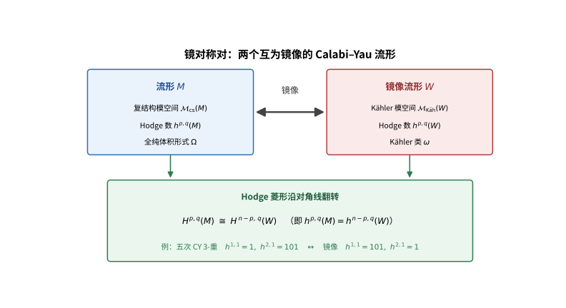

# 第140级 镜像对称 (Mirror Symmetry)

## 📖 学习目标

1. 理解Calabi-Yau流形的基本定义和性质及其在镜像对称中的核心地位
2. 掌握镜像对的概念及A-模型与B-模型的对应关系
3. 深入理解Kontsevich同调镜像对称猜想及其数学表述
4. 掌握镜像对称中的Hodge菱形翻转结构及其证明方法
5. 理解Gromov-Witten不变量与周期之间的深刻联系
6. 掌握Yukawa耦合在镜像映射下的变换规律
7. 了解大复结构极限下的镜像对称行为及其几何意义

---

## 一、核心概念

### 1.1 Calabi-Yau流形

> **🧠 来龙去脉（为什么会有这个概念？解决了什么问题？）**
>
> 一个空间既要有"怎么弯曲"（复结构）、又要有"多大/怎么量"（辛结构），还要能放下"处处一致标尺"（全纯体积元）才能当镜像对称的舞台——这样的空间正是 Calabi–Yau 流形。它的名字来自卡拉比（Calabi）的猜想与丘成桐（Yau）的证明：丘成桐在 1977 年前后证明卡拉比猜想后，物理学家发现把弦论的额外六个维度蜷成这样的流形，正好给出"多余维+可观物理"所需的超对称与无质量为。它要回答的问题是：能否找到一个同时具有复结构、辛结构，并且"第一 Chern 类为零"（没有拓扑张力、可撑起 Ricci 平坦度量）的空间，让两套看似无关的几何——辛几何与复代数几何——能在同一个空间上同时且充分地展开。答案就是 Calabi–Yau 流形：它既折得平（曲率可控）又留有全空间一致的全纯体积元，因此既适合 A-模型"数曲线"，也适合 B-模型"算周期"，成为镜像对称这对"镜像"必然的栖身之所。

**定义1（Calabi-Yau流形）** 一个 **Calabi-Yau流形** 是一个紧致Kähler流形 $(M, g, J, \omega)$，满足其第一Chern类 $c_1(M) = 0$。等价地，存在一个非平凡的、处处非零的全纯 $(n,0)$-形式 $\Omega$（其中 $n = \dim_{\mathbb{C}} M$），称为 **全纯体积形式**。

Calabi-Yau流形的基本性质包括：
- **Ricci平坦性**：由Calabi猜想（丘成桐证明），$c_1(M)=0$ 的Kähler流形上存在Ricci平坦的Kähler度量。
- **特殊酉群holonomy**：$\text{Hol}(g) \subseteq \text{SU}(n)$。
- **Hodge数**：满足 $h^{p,0} = h^{0,p}$，且 $h^{n,0} = 1$（因为存在非平凡全纯 $n$-形式）。

> **💡 直观理解（类比）**：Calabi-Yau流形如同一粒子不"鼓包"也不"凹陷"、处处光滑舒展的"无重力气球"——它既有复结构（怎么排列坐标）又有辛结构（怎么量面积），偏偏第一Chern类为零（可视为"没有拓扑张力"），于是能撑起一个处处非零的"全纯体积元"（可对整个身体一致地量容积）。正因它折得如此"贴身和平滑"，曲线计数和周期积分这两套计算才都派得上用场，成为镜像对称的舞台。

**定义2（Calabi-Yau $n$-重）** 一个 $n$ 维Calabi-Yau流形也称为 **Calabi-Yau $n$-重**。特别地：
- $n=1$：椭圆曲线（亏格1的Riemann曲面）
- $n=2$：K3曲面
- $n=3$：Calabi-Yau 3-重（在弦论中最为重要）

> **💡 直观理解（类比）**：Calabi-Yau $n$-重如同"一个小剧场有不同档次的幕布"——$n=1$ 是简单的单环（椭圆曲线，像一条闭合橡皮筋），$n=2$ 是曲面的K3（一张光滑的无爆点曲面），$n=3$ 则是物理最钟爱的"三维折叠幕布"（额外维度蜷起来的那部分）。维度越高，结构与可算的模空间越丰富，镜像对称的玄机也越精彩。

### 1.2 镜像对

**定义3（镜像对）** 两个Calabi-Yau流形 $M$ 和 $W$ 称为 **镜像对**，如果存在以下对应关系：

$$ H^{p,q}(M) \cong H^{n-p,q}(W) $$

即它们的Hodge菱形沿对角线翻转。这称为 **Hodge菱形翻转**：

$$
\begin{array}{ccccccccc}
& & & h^{n,0} & & & & & \\
& & & \vdots & & & & & \\
& & h^{n,0} & \cdots & h^{0,0} & & & & \\
\text{对 }M: & & & & & & \Longrightarrow & & \\
& & & & & & & & \\
& & & & & & & & \\
\text{对 }W: & & h^{0,0} & \cdots & h^{n,0} & & & & \\
& & & \vdots & & & & & \\
& & & h^{0,n} & & & & & \\
\end{array}
$$

更精确地说，$M$ 的复结构模空间 $\mathcal{M}_{\text{cs}}(M)$ 与 $W$ 的Kähler模空间 $\mathcal{M}_{\text{Käh}}(W)$ 在某种意义下等同。

> **直观理解（现实类比）**：镜像对称就像照镜子——镜中的你依旧是「你」，只是左右颠倒。Calabi-Yau流形 $M$ 与它的镜像 $W$ 也一样：$M$ 的「复结构」信息（怎么弯曲）恰好对应 $W$ 的「Kähler/大小」信息（体积与形状），数值证据就是Hodge菱形沿对角线翻转，像体检数据在镜中互换栏目（$h^{1,1}$ 与 $h^{2,1}$ 互换）。

> **🧠 思考历程：两个"长得不同"的宇宙，凭什么在数学上是同一件事？**
>
> 两个Calabi-Yau流形的复结构信息，竟能完美对应对方的Kähler信息，仿佛彼此照了一面数学的镜子。这个匪夷所思的对应源自弦论，却用一个硬核计算逼得几何学家不得不信。它想回答的，是"难以计数的几何"与"容易计算的积分"如何一一对上。
>
> - **弦论里的偶然发现**。1990年，物理学家格林与普莱瑟在极小Calabi-Yau流形的研究中，撞见一批"镜像对"：两个复结构与Kähler结构截然不同的流形，Hodge数却像照镜子一样互换。当时这还只是实验性的数值巧合。
> - **2875条直线的"称重游戏"**。真正震撼数学界的是1991年坎德拉亚斯等人的工作：在五次Calabi-Yau流形上，用镜像一侧（B模型）的周期积分"称"出了另一侧（A模型）本世纪难以枚举的2875条有理直线——一个"以积分代计数"的奇迹，逼迫几何学家不能不信服。
> - **从猜测走向纲领**。1994年孔采维奇提出同调镜像对称（在范畴层面断言等价），1996年斯特罗明格-丘成桐-扎斯罗用环面纤维化给出几何解释。镜像对称从此成为联结辛几何、代数几何与弦论的核心纲领。
> - **心路**：有时最惊人的真理，起初只是"不值一提的巧合"，再用一次无法忽略的预言逼你相信。

### 1.3 A-模型与B-模型

> **🧠 来龙去脉（为什么会有这个概念？解决了什么问题？）**
>
> 弦论在 Calabi–Yau 流形上紧化后，还能"扔掉一半自由度"留下两种独立的低能理论，它们各依赖流形的一半几何信息：A-模型只看 Kähler（辛）结构，B-模型只看复结构。物理学家维腾（Witten）在 1988 年把这两种"拓扑弦论"从 N=2 超对称理论中约化出来，并指出它们天然是"双生子"——正因如此，镜像对称才成为可能：$M$ 的 A-模型完全由 $M$ 的"大小/曲线"决定，$M$ 的 B-模型完全由"折法/复结构"决定，而换上镜像流形 $W$ 正好把这两套信息互换。它要回答的问题是：能否把弦论的有效物理分解成只依赖辛结构、或只依赖复结构的两半，从而让"难以计数的几何"（A-侧曲线计数）与"容易计算的**积分**"（B-侧周期积分）分离开并最终互译。答案正是 A-模型（辛几何）与 B-模型（代数几何）这对"一测一算"的互补写生。

**定义4（拓扑弦论模型）** 在拓扑弦论中，存在两种重要的约化模型：

- **A-模型（A-model）**：依赖于Kähler结构，其可观测量为 **Gromov-Witten不变量**，计数全纯曲线的数目。A-模型是 **辛几何** 的。
- **B-模型（B-model）**：依赖于复结构，其可观测量为 **周期积分**，计算形如 $\int_{\gamma} \Omega$ 的积分。B-模型是 **代数几何** 的。

**镜像对称的基本断言**：Calabi-Yau流形 $M$ 上的A-模型等价于其镜像流形 $W$ 上的B-模型，反之亦然。

> **💡 直观理解（类比）**：A-模型与B-模型像"同一件家具的两本说明书"——A-模型用"算面积/数里边的曲线"（辛几何、Gromov-Witten计数）来描述，B-模型用"描轮廓/算围道内部"（复几何、周期积分 $\int_\gamma\Omega$）来描述。一本偏量测、一本偏代数，镜像对称断言：$M$ 的"量测说明书"和 $W$ 的"代数说明书"其实是同一件家具，只是换了标注方式。

### 1.4 Gromov-Witten不变量

> **🧠 来龙去脉（为什么会有这个概念？解决了什么问题？）**
>
> 枚举几何问"给定次数的曲线有多少条"，可计数全纯映射往往维度不对、解并不有限，朴素数法在奇异/超定情形下彻底失效。格罗莫夫（Gromov）在 1985 年前后把"全纯曲线"放宽成"伪全纯曲线"（对任意近复结构仍有稳定模空间），维腾（Witten）则在 1990 年代初把它与弦论中的全域不变量对接，形成严格的 Gromov–Witten（GW）不变量。它要回答的问题是：当模空间维度超定、解不孤立时，如何给"稳定曲线到辛流形 $M$ 的全纯映射"定义一个正则、形变不变的计数。答案是用"虚拟基本类" $[\overline{\mathcal{M}}_{g,n}(M,\beta)]^{\mathrm{vir}}$——把切丛的"期望维数"强行置入，再把求值映射拉回的插入类对着这个类取积分。于是"数曲线"从直觉升级为严谨且泛函化的不变量，成为 A-模型可观测量的记账标准。
>
> - **把"解不唯一"也纳入命中**。用虚拟基本类在超定（模空间过大）情形下仍给出唯一确定的正则"数目"，比朴素点数健壮得多。
> - **GW 对整环的封装**。这些数被装进量子上同调环与生成函数，A-侧的"曲线计数"因此能被"整环级"地比较、变形，镜像对称的比拼正发生在这层"不变量层"上。

**定义5（Gromov-Witten不变量）** 设 $M$ 为辛流形，$\beta \in H_2(M, \mathbb{Z})$ 是一个同调类。**Gromov-Witten不变量** 是计数从稳定曲线到 $M$ 的全纯映射的"数"：

$$ \text{GW}_{g,\beta}^M(\alpha_1, \ldots, \alpha_n) = \int_{[\overline{\mathcal{M}}_{g,n}(M,\beta)]^{\text{vir}}} \prod_{i=1}^n \text{ev}_i^*(\alpha_i) $$

其中 $\overline{\mathcal{M}}_{g,n}(M,\beta)$ 是亏格 $g$、$n$ 个标记点、表示类为 $\beta$ 的稳定映射的模空间，$\text{ev}_i$ 是求值映射，$[\cdot]^{\text{vir}}$ 是虚拟基本类。

> **💡 直观理解（类比）**：Gromov-Witten不变量像"统计皮筋在墙上有多少种绷法"——把所有"稳定曲线坍成墙 $M$ 的全纯映射"摆成一整间展览室（模空间），再在若干标记点处量一量它们穿过的窗口（求值映射 $\text{ev}_i$），对整个房间"体积"（虚拟基本类）积分，得到符合指定次数 $\beta$ 的曲线条数。它是A-模型里"数曲线"的精确记账方式。

### 1.5 周期与镜像映射

> **🧠 来龙去脉（为什么会有这个概念？解决了什么问题？）**
>
> B-模型的可观测量是"周期积分"，但要真正在复结构模空间上读出几何信息，光有几条积分还不够——它们服从的高阶线性微分方程（Picard–Fuchs 方程）才是"能算"的关键，而镜像映射则是把"复结构坐标"折成"Kähler 坐标"的汇率表。代数几何沿格里菲斯（Griffiths）的周期积分理论、以及多曼（Dwork）等的超几何微分方程传统，把周期与 Picard–Fuchs 方程引入镜像计算；1990 年代坎德拉亚斯等人在五次 Calabi–Yau 上以"周期之比 + 对数归化"显式构造出镜像映射。它要回答的问题是：B-侧的复结构参数，如何换算成 A-侧镜像流形的 Kähler 参数 $t$，从而让"算周期"直接输出"曲线次数"。答案：用两个周期之比 $t=\Pi_{\gamma_2}/\Pi_{\gamma_1}$ 定义坐标，周期的微分方程（Picard–Fuchs）保证这换算有确定、可递推出的规律。
>
> - **周期的"运动定律"**。Picard–Fuchs 方程是周期关于复结构参数的黑盒方程：知道几条初始周期值，整条随着复结构变形而变的历史都能推出。
> - **比值当汇率**。$t=\Pi_{\gamma_2}/\Pi_{\gamma_1}$ 用两条基准周期定标，物理量级由大复结构极限的正规化固定，得到一以贯之的 Kähler 参数——这就是镜像"对账表"的横轴。

**定义6（周期）** 设 $M$ 为Calabi-Yau $n$-重，$\Omega$ 为其全纯 $(n,0)$-形式。对任意 $n$-cycle $\gamma \in H_n(M, \mathbb{Z})$，定义 **周期**：

$$ \Pi_\gamma = \int_\gamma \Omega $$

周期满足 **Picard-Fuchs方程**，这是一个关于复结构参数的高阶线性微分方程。

> **💡 直观理解（类比）**：周期就是"把一个容积元 $\Omega$ 沿一条闭合回路围一围得到的总量"——$\Omega$ 像一张层层裹紧的"体积布"，沿回路 $\gamma$ 围一圈，$\Pi_\gamma$ 就是这件事的总容积。当你改变复结构（怎么折这张布），周期跟着连续的规则变，满足的Picard-Fuchs方程像它的"运动定律"，只要知道几个初始值，整条变化轨迹都能推出来。

**定义7（镜像映射）** **镜像映射** 是复结构模空间 $\mathcal{M}_{\text{cs}}$ 到Kähler模空间 $\mathcal{M}_{\text{Käh}}$ 的（局部）同构。它通过周期之比给出：

$$ t = \frac{\Pi_{\gamma_2}}{\Pi_{\gamma_1}} $$

其中 $\gamma_1, \gamma_2$ 是适当选取的 $n$-cycle 基。

> **💡 直观理解（类比）**：镜像映射像一张"实时汇率换算表"——把 $M$ 的复结构币种折算成 $W$ 的Kähler币种。它靠两个周期之比 $t=\Pi_{\gamma_2}/\Pi_{\gamma_1}$ 定坐标，就像用两笔"基准存款"锁定汇率：$M$ 怎么折（复结构）→ $t$（Kähler参数，即体积大小/曲线次数）怎么变，两边一一对应，是A/B两侧"对账"的核心桥梁。

### 1.6 Hodge菱形

> **🧠 来龙去脉（为什么会有这个概念？解决了什么问题？）**
>
> 要识别一个流形是不是另一个流形的"镜像"，最快捷的证据是一张只与拓扑相关的"体检表"——各 $(p,q)$-型闭形式类的维数。这是霍奇（Hodge）在 1930 年代为 Kähler 流形建立的：复流形的德拉姆上同调可按 $(p,q)$-型分解，各型维数排成菱形即 Hodge 菱形，并满足 Hodge 对偶与 Serre 对偶。它要回答的问题是：镜像对称若真成立，两个流形的哪几组整数必须互换，从而既可作为预测又可作为反证。答案就藏在菱形沿"次对角线"的翻转里：$h^{p,q}(M)=h^{n-p,q}(W)$。Hodge 菱形因此是镜像对称最早、最直接的数值"指纹"。
>
> - **一张反射可见的"体检表"**。菱形沿主对角线对称（$h^{p,q}=h^{q,p}$）、旋 180° 对称（Serre 对偶），CY 再固定四个角落为 1；镜像就是让这张表再沿一次对角线翻过去仍自洽。
> - **先验的实锤线索**。1990 年镜像对最初被发现时，正是靠"$h^{1,1}$ 与 $h^{2,1}$ 互换"这类 Hodge 数巧合而非高级构造被注意到的。

**定义8（Hodge菱形）** 对于Kähler流形 $M$，其 **Hodge数** $h^{p,q} = \dim H^q(M, \Omega^p)$ 排列成的菱形称为 **Hodge菱形**。

对于 $n$ 维Calabi-Yau流形，Hodge菱形满足：
- $h^{p,q} = h^{q,p}$（对称性）
- $h^{p,q} = h^{n-p,n-q}$（Serre对偶）
- $h^{0,0} = h^{n,n} = 1$
- $h^{n,0} = h^{0,n} = 1$

> **💡 直观理解（类比）**：Hodge菱形像是流形的"体检数据表"——$h^{p,q}$ 计数第 $p$ 个复方向、第 $q$ 个反复方向的独立"洞"（闭形式类）有多少个，排成菱形正好体现对称：沿主对角线对称（Hodge对称）、旋180°对称（Serre对偶）、且四个角落各有一个1（CY保证体积元只有一个）。镜像对称做的事，就是让两个流形这张数据表"沿次对角线翻转后又长得一样"。

### 1.7 复结构模空间与Kähler模空间

> **🧠 来龙去脉（为什么会有这个概念？解决了什么问题？）**
>
> 一个流形的"复结构能变几种样子"与"体积大小能变几种方案"各自组成一个参数空间。把"所有可能造型"整体放进一个流形，正是模空间思想的源流（源自黎曼面模空间、由 Mumford 等严格化为代数簇）。复结构模空间 $\mathcal{M}_{\text{cs}}$ 的切空间恰是 $H^{n-1,1}$（Kodaira–Spencer 理论），Kähler 模空间 $\mathcal{M}_{\text{Käh}}$ 则开在 $H^{1,1}$ 的 Kähler 锥上——镜像对称断言这两套"造型影集"是同一本，这一等同正是从"参数维度互换"映出的。它要回答的问题是：两侧不同的形态参数是否、以及如何按同一张"目录表"一一对应，从而让"折法↔体积"的互换有一个全局可检测的领地。答案：$\mathcal{M}_{\text{cs}}(M)\cong\mathcal{M}_{\text{Käh}}(W)$，且其切空间维度互换正好对应 Hodge 菱形的翻转。
>
> - **一个形态一个坐标**。复结构模空间维数 $=h^{n-1,1}$，Kähler 模空间维数 $=h^{1,1}$；镜像让两者交换，于是"折法的种数"变成"体积方案的种数"。
> - **切空间就是参数来源**。Kodaira–Spencer 说复结构变形由 $H^{n-1,1}$ 元一一给出，Kähler 类锥开在 $H^{1,1}$——正是这两组整数的互换提供了镜像对称参数级的第一手证据。

**定义9（模空间）** 
- **复结构模空间** $\mathcal{M}_{\text{cs}}(M)$：参数化 $M$ 上所有复结构的空间（在双全纯等价下）。
- **Kähler模空间** $\mathcal{M}_{\text{Käh}}(M)$：参数化 $M$ 上所有Kähler类的空间，即 $H^{1,1}(M, \mathbb{R})$ 中的Kähler锥。

镜像对称断言 $\mathcal{M}_{\text{cs}}(M) \cong \mathcal{M}_{\text{Käh}}(W)$。

> **💡 直观理解（类比）**：模空间像是"所有可能造型组成的影集"——复结构模空间收集体现在什么"折法"（歧义无穷），Kähler模空间收集体现在多大、用了哪种"丈量法"（Kähler类锥）。镜像对称断言 $M$ 的"折法影集"和 $W$ 的"丈量影集"是同一本：给 $M$ 一种折法，就能对应 $W$ 的一种体积方案，参数空间完全合版。

### 1.8 Yukawa耦合

> **🧠 来龙去脉（为什么会有这个概念？解决了什么问题？）**
>
> 光说"镜像对称把两边联系起来"还不够，得给出可核对的具体量——A-侧是数曲线、B-侧是算周期，两者的三阶导之间正藏着同一套数字。这个"三阶量"在弦论里叫 Yukawa 耦合（决定三代粒子的质量），在镜像两侧各有自然定义：B-侧是体积元沿模空间三个方向的三阶挠动，A-侧是各次数曲线的 GW 数加权求和。物理学家在 1990 年代计算 Yukawa 耦合时发现两侧必须相等，反过来迫使镜像映射被逐阶确定。它要回答的问题是：能否找到一个既能在 A-侧、又能在 B-侧用各自"原生语言"定义的可观测量，使得镜像映射 $s=s(t)$ 有一套干净的换算公式，从而逐阶锁定并验证整条镜像对应。答案正是 Yukawa 耦合 $\kappa_{ijk}$——它的转换法则（含三个 Jacobian 因子）成为镜像对称最硬核的"账本对账点"。
>
> - **三阶导是"折纸响应"**。B-侧 $\int\Omega\wedge\partial_i\partial_j\partial_k\Omega$ 是复杂折法在模方向被三阶拧动的响应，天然对称（任换指标不变）。
> - **曲线计数的重量级变换**。A-侧 $\sum_\beta\mathrm{GW}_{0,\beta}(\omega_i,\omega_j,\omega_k)q^\beta$ 把各次数曲线按 $q^\beta$ 加权，在镜像映射下经 $s=s(t)$ 与三个链式因子转成 B-侧量——核对两端展开即逐阶确定 $N_d$。

**定义10（Yukawa耦合）** 在B-模型中，**Yukawa耦合** 是三阶张量，定义为：

$$ \kappa_{ijk} = \int_M \Omega \wedge \partial_i \partial_j \partial_k \Omega $$

其中 $\partial_i = \partial/\partial t^i$ 是模空间上的导数。在A-模型中，Yukawa耦合由Gromov-Witten不变量给出：

$$ \kappa_{ijk}^A = \sum_{\beta \in H_2(M,\mathbb{Z})} \text{GW}_{0,\beta}^M(\omega_i, \omega_j, \omega_k) \, q^\beta $$

其中 $q^\beta = \exp(2\pi i \int_\beta B + i\omega)$。

> **💡 直观理解（类比）**：Yukawa耦合像"模板空间对三个方向的加速度计"——B-模型里它是对体积元 $\Omega$ 沿三个模方向求三阶偏导的"挠度"（$\int\Omega\wedge\partial_i\partial_j\partial_k\Omega$），描述复结构被拧到三阶时的响应；A-模型里它由各阶曲线条数加权（$\sum_\beta\mathrm{GW}\cdot q^\beta$）累加。镜像对称让这两套"三方向加速度"彼此对得上，成为A/B两侧的核心换算表。

> **直观理解（现实类比）**：A-模型数「这里有多少条曲线」（Gromov-Witten计数），B-模型算「某个围道积分」（周期），两者看似风马牛不相及，镜像映射却把它们一一对上——就像同一批货物，一端用「清点个数」（计数），另一端用「称重」（积分），通过换算表（镜像映射）得到同一结果，从而用简单的积分算出复杂的曲线条数（如2875条直线）。

### 1.9 大复结构极限

> **🧠 来龙去脉（为什么会有这个概念？解决了什么问题？）**
>
> 镜像映射在不同参数点各处都难算，若想显式确定它，最好找一处"结构简单到极点"的边界点作为锚参考。大复结构极限（LCSL）正是这种"坍缩点"：复结构退化到最大限度的正常穿越奇点（normal crossing），周期出现 $\log$ 型对数发散，单值性成为"极大幺单"（$I+$ 幂零），此时 $\log$ 坐标可直接当参数用。它要回答的问题是：在哪一点上，镜像映射能被写成一个干净的对数公式、周期渐近能被逐项展开、并作为整体计算（如 prepotential 展开）的起点？答案：在 LCSL 处把复结构坐标 $q$ 按 $t=\frac1{2\pi i}\log q+\cdots$ 归化，镜像对称由此可显式构造并可逐阶验证。物理上这正对应"体积趋向无穷大"的极限，A-模型的经典三次相交项可以此为首阶展开。
>
> - **对数坐标当"尺子"**。极大幺单保证可以选出周期向量以 $1,\log q$ 线性独立出现，于是 $t\sim\frac1{2\pi i}\log q$ 成为合法的 Kähler 坐标。
> - **坍缩点撑起整个计算**。LCSL 处给出的 prepotential 首项（三次相交数与首阶 GW 数）是逐项验证整个镜像对称的"初始条件"。

**定义11（大复结构极限）** 在复结构模空间的边界点，复结构趋向于"最退化"的情形，称为 **大复结构极限（Large Complex Structure Limit, LCSL）**。在此极限下：
- 周期积分表现出对数发散行为
- 镜像映射简化为单值性变换
- 镜像对称可以显式地构造

> **💡 直观理解（类比）**：大复结构极限像是"把折纸一路拉到近乎摊平"的临界姿态——复结构越折越松，最终退化成由若干镜面拼成的"镜面之镜"（normal crossing），此时周期呈现 $\log$ 型的对数发散、单值性最"单纯"（极大幂零）。正因结构简化到极点，镜像映射从神秘的推算变成可以逐项写出的显式公式，许多原本棘手的镜像关系在这个"极限点"被彻底算清。

### 1.10 同调代数在镜像对称中的应用

> **🧠 来龙去脉（为什么会有这个概念？解决了什么问题？）**
>
> 数值与模空间层面的镜像对称，还只是"一对一的账目对账"；要让"镜像"成为真正深刻的等价，需要连"对象与对象之间的相互作用关系"也互换。这推动镜像对称走向范畴化：孔采维奇（Kontsevich）在 1994 年提出同调镜像对称，把 A-侧的对象（Lagrangian 子流形及其相交的 Floer 同调）组织成 Fukaya 范畴 $\mathcal{F}(M)$，把 B-侧的对象（凝聚层及它们之间的态射）组织成导出范畴 $D^b\mathrm{Coh}(W)$，并断言两者拟等价。它要回答的问题是：能否把"镜像对应"从"数着某个数相同"升级为"整个对象与态射的结构相同"，从而既能解释 D-膜的谱、又能把大复结构极限、Yukawa 耦合等所有细节收纳进一个函子的框架。答案在范畴层级：$\mathcal{F}(M)\simeq D^b\mathrm{Coh}(W)$，其中同调/态射重合正是"交点计数比得上 Ext 维数"的范畴叙述。
>
> - **对象各写各的语言**。A-侧的"膜"是 Lagrangian 子流形，态射是其相交的 Floer 复形；B-侧的"膜"是凝聚层/复形，态射是其 Ext——镜像断言"交点"与"Ext"一一相接。
> - **整合一切的舞台**。Kontsevich 同调镜像对称把所有点滴（Hodge 翻转、Yukawa、GW-周期对应）都纳入一个单一拟等价之中，成为今天镜像对称研究的总纲。

镜像对称的现代表述大量使用同调代数和范畴论工具：
- **Fukaya范畴** $\mathcal{F}(M)$：以 $M$ 的Lagrangian子流形为对象，以Lagrangian间的Floer同调为态射的 $A_\infty$-范畴。这是A-模型的范畴化。
- **导出范畴** $D^b\text{Coh}(W)$：$W$ 上凝聚层的导出范畴。这是B-模型的范畴化。

---

## 二、定理与证明

### 定理1：Kontsevich同调镜像对称猜想

**定理（Kontsevich同调镜像对称猜想，1994）** 设 $M$ 和 $W$ 是一对镜像对称的Calabi-Yau流形。则存在 $A_\infty$-函子的拟等价：

$$ \mathcal{F}(M) \simeq D^b\text{Coh}(W) $$

其中 $\mathcal{F}(M)$ 是 $M$ 的 **Fukaya范畴**，$D^b\text{Coh}(W)$ 是 $W$ 上凝聚层的 **有界导出范畴**。

换言之，$M$ 的辛几何（A-模型）的范畴化等价于 $W$ 的代数几何（B-模型）的范畴化。

**证明思路**（完整论证框架）：

**第一步：Fukaya范畴的构造。**

Fukaya范畴 $\mathcal{F}(M)$ 是一个 $A_\infty$-范畴，其结构如下：

- **对象**：$M$ 中的 **Lagrangian子流形** $L \subset M$（带有平直酉丛和Spin结构），即满足 $\dim L = n$ 且 $\omega|_L = 0$ 的子流形。

- **态射空间**：对两个Lagrangian子流形 $L_0, L_1$，态射空间定义为它们的 **Floer链复形**：

$$ \text{Hom}_{\mathcal{F}(M)}(L_0, L_1) = CF^*(L_0, L_1) = \bigoplus_{p \in L_0 \cap L_1} \mathbb{C} \cdot p $$

其中 $p$ 是横截交点。

- **复合运算**：$A_\infty$-运算 $\mathfrak{m}_k$ 定义为：

$$ \mathfrak{m}_k: \text{Hom}(L_0, L_1) \otimes \cdots \otimes \text{Hom}(L_{k-1}, L_k) \to \text{Hom}(L_0, L_k)[2-k] $$

通过计数 **伪全纯圆盘**（$J$-holomorphic disks）的模空间 $\mathcal{M}(p_0, \ldots, p_k)$ 来定义：

$$ \mathfrak{m}_k(p_1, \ldots, p_k) = \sum_{p_0} \#\mathcal{M}(p_0, \ldots, p_k) \cdot p_0 $$

其中 $\#\mathcal{M}(p_0, \ldots, p_k)$ 是计数以 $p_0, \ldots, p_k$ 为边界标记点的伪全纯圆盘的数目。

$A_\infty$-关系式：

$$ \sum_{i=0}^k \sum_{j=0}^{k-i} (-1)^{\deg(p_1)+\cdots+\deg(p_j)} \mathfrak{m}_{k-i+1}(p_1, \ldots, p_j, \mathfrak{m}_i(p_{j+1}, \ldots, p_{j+i}), p_{j+i+1}, \ldots, p_k) = 0 $$

对应于模空间边界退化。

**第二步：导出范畴 $D^b\text{Coh}(W)$ 的构造。**

$D^b\text{Coh}(W)$ 是 $W$ 上凝聚层的有界导出范畴：
- **对象**：有界链复形 $E^\bullet$，其中每个 $E^i$ 是 $W$ 上的凝聚层，且 $E^i = 0$ 对 $|i| \gg 0$。
- **态射**：拟同构类意义下的链复形态射。
- **三角结构**：由映射锥给出的 distinguished triangles。

**第三步：构造镜像函子。**

关键步骤是构造一个 $A_\infty$-函子：

$$ \Phi: \mathcal{F}(M) \to D^b\text{Coh}(W) $$

该函子应满足：
1. **对象对应**：将每个Lagrangian子流形 $L$ 映为 $W$ 上的一个凝聚层（或复形）。
2. **态射对应**：保持 $A_\infty$-结构。

构造方法利用了 **可积系统** 和 **STU-变换** 的思想。

**第四步：验证拟等价。**

为证明 $\Phi$ 是拟等价，需要：
1. **全忠实性**：诱导的态射级数 $\Phi: H^*\text{Hom}_{\mathcal{F}(M)}(L_0, L_1) \to \text{Hom}_{D^b\text{Coh}(W)}(\Phi(L_0), \Phi(L_1))$ 是同构。
2. **本质满射性**：$D^b\text{Coh}(W)$ 的每个对象都同构于某个 $\Phi(L)$。

对于五次Calabi-Yau流形，这一构造通过 **同调镜像对称的显式验证** 完成。具体地，利用 **矩阵因子化（Matrix Factorization）** 和 **Landau-Ginzburg模型** 的对应。

**第五步：物理意义。**

同调镜像对称猜想在物理上对应着 **A-模型与B-模型的等价**。A-模型中的D-膜（D-branes）对应于Fukaya范畴的对象（Lagrangian子流形），B-模型中的D-膜对应于凝聚层。因此，该猜想断言两种D-膜的谱是等价的。

**结论**：Kontsevich同调镜像对称猜想建立了辛几何与代数几何之间的深刻等价关系，是镜像对称的范畴化表述。$\square$
> **直观理解（现实类比）**：Kontsevich同调镜像对称就像"两本不同语言的字典互译"——$M$ 这边的辛几何（A-模型）用Fukaya范畴记"拉紧的橡皮筋（拉格朗日子流形）怎么相交"，镜像 $W$ 那边的代数几何（B-模型）用凝聚层范畴记"代数方程定义的层怎么延展"。猜想说这两本字典的"目录结构"（导出范畴）完全等价：一边的辛相交数 = 另一边的Ext群维数，于是"数曲线"和"做代数"在范畴层面彻底对偶。

---

### 定理2：镜像对称中的Hodge菱形翻转

**定理（Hodge菱形翻转）** 如果 $M$ 和 $W$ 是一对镜像对称的 $n$ 维Calabi-Yau流形，则它们的Hodge数满足：

$$ h^{p,q}(M) = h^{n-p,q}(W) $$

**证明**（使用Hodge理论和镜像映射）：

**第一步：建立Hodge数的变形性质。**

考虑Calabi-Yau流形 $M$ 的复结构模空间 $\mathcal{M}_{\text{cs}}(M)$。在复结构变形下，Hodge滤过 $F^p H^n(M, \mathbb{C})$ 变化，但Hodge数 $h^{p,q}$ 在一般点处保持不变。

Hodge分解：

$$ H^k(M, \mathbb{C}) = \bigoplus_{p+q=k} H^{p,q}(M) $$

其中 $H^{p,q}(M) \cong H^q(M, \Omega^p_M)$。

**第二步：Calabi-Yau流形的Hodge数约束。**

对于 $n$ 维Calabi-Yau流形，以下Hodge数被固定：
- $h^{0,0} = h^{n,n} = 1$
- $h^{n,0} = h^{0,n} = 1$
- $h^{p,0} = h^{0,p} = 0$ 对 $0 < p < n$（在某些情况下可能非零，但高度受限）
- Serre对偶：$h^{p,q} = h^{n-p,n-q}$

**第三步：构造镜像映射。**

镜像映射 $\Phi: \mathcal{M}_{\text{cs}}(M) \to \mathcal{M}_{\text{Käh}}(W)$ 是一个局部同构。它在切空间上的诱导映射：

$$ d\Phi: T\mathcal{M}_{\text{cs}}(M) \to T\mathcal{M}_{\text{Käh}}(W) $$

给出了Hodge结构的对应关系。

**关键观察**：$T\mathcal{M}_{\text{cs}}(M)$ 在点 $t$ 处的切空间同构于 $H^{n-1,1}(M_t)$（由Kodaira-Spencer理论），而 $T\mathcal{M}_{\text{Käh}}(W)$ 在点 $s$ 处的切空间同构于 $H^{1,1}(W_s)$。因此，镜像映射诱导了同构：

$$ H^{n-1,1}(M) \cong H^{1,1}(W) $$

**第四步：推广到高阶Hodge数。**

利用 **变化Hodge结构（Variation of Hodge Structures, VHS）** 的理论。周期映射：

$$ \mathcal{P}: \mathcal{M}_{\text{cs}}(M) \to \mathcal{D}/\Gamma $$

将复结构模空间映射到 **周期域**（Griffiths域）的商空间，其中 $\mathcal{D}$ 是参数化 $H^n(M, \mathbb{C})$ 中所有Hodge滤过的齐性空间。

镜像映射 $\Phi$ 诱导了周期域之间的同构：

$$ \Phi^*: \mathcal{D}_W/\Gamma_W \to \mathcal{D}_M/\Gamma_M $$

**第五步：Hodge菱形的翻转。**

利用 **镜像对称的构造性例子** 验证。对于五次Calabi-Yau 3-重（$n=3$），其Hodge菱形为：

$$
\begin{array}{cccccc}
& & & 1 & & & \\
& & 0 & & 0 & & \\
& 0 & 1 & & 1 & 0 & \\
1 & & 101 & & 101 & & 1 \\
& 0 & 1 & & 1 & 0 & \\
& & 0 & & 0 & & \\
& & & 1 & & & \\
\end{array}
$$

其镜像流形的Hodge菱形应为：

$$
\begin{array}{cccccc}
& & & 1 & & & \\
& & 0 & & 0 & & \\
& 0 & 101 & & 101 & 0 & \\
1 & & 1 & & 1 & & 1 \\
& 0 & 101 & & 101 & 0 & \\
& & 0 & & 0 & & \\
& & & 1 & & & \\
\end{array}
$$

这正是 $h^{p,q}(M) = h^{3-p,q}(W)$。

**第六步：同调代数的验证。**

利用Kontsevich同调镜像对称猜想，Fukaya范畴 $\mathcal{F}(M)$ 的Hochschild同调给出 $M$ 的Hodge数，而 $D^b\text{Coh}(W)$ 的Hochschild同调给出 $W$ 的Hodge数。由范畴等价性，Hochschild同调同构，因此Hodge菱形翻转成立。

**结论**：Hodge菱形翻转是镜像对称的"指纹"——它提供了识别镜像对的最直接的数值证据。$\square$

> **💡 直观理解（类比）**：Hodge菱形翻转定理像"体检表沿次对角线镜像"——$M$ 的每个 $h^{p,q}$ 在 $W$ 处变成 $h^{n-p,q}$，复方向维数被"倒着数"（$p$ 改为 $n-p$）。它告诉我们镜像对称最硬核的一阶证据在数值表上如何体现：例如 $h^{1,1}$ 与 $h^{n-1,1}$（切空间维数）互换，方向一变，整套计数随之翻转，是判定"这一对是不是镜像"的快捷指纹。

---

### 定理3：Gromov-Witten不变量与周期的关系

**定理（Gromov-Witten不变量与周期）** 设 $M$ 是Calabi-Yau 3-重，$W$ 是其镜像流形。则 $M$ 的 **Gromov-Witten不变量**（A-模型的可观测量）可以通过 $W$ 上的 **周期积分**（B-模型的可观测量）来计算。具体地，令 $\Pi(t) = \int_{\gamma(t)} \Omega(t)$ 为周期，则 **镜像对称的构造性公式** 为：

$$ \sum_{\beta \in H_2(M,\mathbb{Z})} \text{GW}_{0,\beta}^M \, q^\beta = \frac{d^3}{dt^3} \Pi(t) $$

其中 $q = e^{2\pi i t}$ 是镜像映射下的Kähler参数。

**证明思路**（使用五次Calabi-Yau流形的具体构造）：

**第一步：五次Calabi-Yau流形的构造。**

考虑 $\mathbb{P}^4$ 中的五次超曲面：

$$ M = \{X_0^5 + X_1^5 + X_2^5 + X_3^5 + X_4^5 - 5\psi X_0 X_1 X_2 X_3 X_4 = 0\} \subset \mathbb{P}^4 $$

其中 $\psi$ 是复结构参数。$M$ 是一个Calabi-Yau 3-重，$h^{1,1}(M) = 1$，$h^{2,1}(M) = 101$。

**第二步：构造镜像流形。**

镜像流形 $W$ 是 **五次Calabi-Yau流形的镜像**，其构造通过 **轨道折叠（orbifolding）** 实现：

$$ W = M / (\mathbb{Z}_5)^3 $$

其中 $(\mathbb{Z}_5)^3$ 是作用在坐标上的离散对称群。$W$ 的Hodge数满足 $h^{1,1}(W) = 101$，$h^{2,1}(W) = 1$。

**第三步：计算周期和Picard-Fuchs方程。**

定义周期：

$$ \Pi(\psi) = \int_{\gamma} \Omega(\psi) $$

其中 $\gamma \in H_3(M, \mathbb{Z})$。周期满足 **Picard-Fuchs方程**：

$$ \left[ \left( \theta^4 - 5\psi \prod_{i=1}^4 (5\theta + i) \right) \right] \Pi = 0 $$

其中 $\theta = \psi \frac{d}{d\psi}$。

**第四步：求解周期。**

在 $\psi = 0$ 附近，周期有幂级数解。基本解为：

$$ \Pi_0(\psi) = \sum_{n=0}^\infty \frac{(5n)!}{(n!)^5} \psi^{5n} $$

$$ \Pi_1(\psi) = \frac{1}{2\pi i} \Pi_0(\psi) \log(\psi^{5}) + \text{正则项} $$

**第五步：构造镜像映射。**

镜像映射将复结构参数 $\psi$ 映射到Kähler参数 $t$：

$$ t = \frac{\Pi_1(\psi)}{\Pi_0(\psi)} = \frac{1}{2\pi i} \log(\psi^{5}) + \text{幂级数修正} $$

**第六步：计算Yukawa耦合和Gromov-Witten不变量。**

B-模型的Yukawa耦合为：

$$ \kappa_{ttt} = \int_M \Omega \wedge \partial_t^3 \Omega = \frac{d^3}{dt^3} \Pi_0(t) $$

A-模型的Yukawa耦合为：

$$ \kappa_{ttt}^A = \sum_{d=1}^\infty N_d \frac{d^3 q^d}{1-q^d} $$

其中 $N_d$ 是 **有理Gromov-Witten不变量**（即次数为 $d$ 的有理曲线的数目），$q = e^{2\pi i t}$。

镜像对称断言两者相等，由此可解出：

$$ N_1 = 2875, \quad N_2 = 609250, \quad N_3 = 317206375, \ldots $$

这些正是 $\mathbb{P}^4$ 中五次曲面上的有理曲线计数。

**结论**：Gromov-Witten不变量可以通过镜像流形上的周期积分来计算，这提供了计算枚举几何中曲线计数问题的强大工具。$\square$
> **直观理解（现实类比）**：Gromov-Witten不变量与周期的关系就像"数清点的难题借用称重解决"——$M$ 上数指定次数的曲线有几条（GW不变量）极难算准，可这些数竟能从镜像 $W$ 上的周期积分（满足Picard-Fuchs方程的解）一次次求导读出。就像超市数硬币麻烦，改去秤重再换算成枚数，又快又准。著名的2875条五次曲面上直线，就是这么"称"出来的。

---

### 定理4：Yukawa耦合的镜像映射

**定理（Yukawa耦合的镜像映射）** 设 $M$ 是Calabi-Yau $n$-重，$W$ 是其镜像流形。则A-模型和B-模型的Yukawa耦合在镜像映射下对应：

$$ \kappa_{ijk}^A(t) = \kappa_{pqr}^B(s) \frac{\partial s^p}{\partial t^i} \frac{\partial s^q}{\partial t^j} \frac{\partial s^r}{\partial t^k} $$

其中 $s = s(t)$ 是镜像映射，$t$ 是Kähler模空间的坐标，$s$ 是复结构模空间的坐标。

**证明**（使用Schwarz定理和Picard-Fuchs方程）：

**第一步：建立B-模型的Yukawa耦合。**

在B-模型中，Yukawa耦合定义为：

$$ \kappa_{ijk}^B = \int_M \Omega \wedge \partial_i \partial_j \partial_k \Omega $$

其中 $\Omega = \Omega(s)$ 是依赖于复结构参数 $s = (s^1, \ldots, s^{h^{n-1,1}})$ 的全纯 $(n,0)$-形式。

利用Kodaira-Spencer理论，$\partial_i \Omega$ 是 $H^{n,0} \oplus H^{n-1,1}$ 中的 $(n,0)+(n-1,1)$-形式。更精确地，在模空间上取一个局部平凡化，使得 $\Omega$ 的 $(n,0)$-分量归一化，则：

$$ \partial_i \Omega = \kappa_i \Omega + \chi_i $$

其中 $\chi_i \in H^{n-1,1}(M)$ 是 $(n-1,1)$-形式分量，$\kappa_i$ 是某连接系数。

**第二步：Yukawa耦合与周期的关系。**

Yukawa耦合可以表示为周期的三阶导数。设 $\Pi_\alpha(s) = \int_{\gamma_\alpha} \Omega(s)$ 是周期，则：

$$ \kappa_{ijk}^B(s) = \sum_{\alpha, \beta, \gamma} C_{\alpha\beta\gamma} \frac{\partial^3 \Pi_\alpha}{\partial s^i \partial s^j \partial s^k} \frac{\partial}{\partial t} \text{的某种规范化}$$

更具体地，在Calabi-Yau 3-重的情形，存在一个规范化的周期向量 $\mathbf{\Pi}(s) = (\Pi_0, \Pi_1, \ldots, \Pi_{h^{2,1}})$，使得：

$$ \kappa_{ijk}^B = \mathbf{\Pi}^T \cdot \partial_i \partial_j \partial_k \mathbf{\Pi} $$

**第三步：Picard-Fuchs方程。**

周期向量满足Picard-Fuchs方程组：

$$ \mathcal{L}_i \mathbf{\Pi} = 0, \quad i = 1, \ldots, h^{n-1,1} $$

其中 $\mathcal{L}_i$ 是微分算子（Picard-Fuchs算子）。这些算子由模空间的 **Gauss-Manin连接** 的曲率决定。

**第四步：A-模型Yukawa耦合的Gromov-Witten展开。**

A-模型的Yukawa耦合由Gromov-Witten不变量给出：

$$ \kappa_{ijk}^A(t) = \sum_{\beta \in H_2(M,\mathbb{Z})} \text{GW}_{0,\beta}^M(\omega_i, \omega_j, \omega_k) \, q^\beta $$

其中 $\omega_i$ 是Kähler类的对偶基，$q^\beta = \exp(2\pi i \int_\beta B + i\omega)$。

**第五步：Schwarz定理的应用。**

**Schwarz定理**（关于常微分方程的解）告诉我们：如果两个函数满足相同的Picard-Fuchs方程，则它们相差一个单值性变换。利用这一事实，我们可以证明，经过适当的坐标变换，A-模型和B-模型的Yukawa耦合相等。

具体地，镜像映射 $s = s(t)$ 由周期之比定义：

$$ s^i = \frac{\Pi_i(t)}{\Pi_0(t)} $$

其中 $\Pi_i$ 是独立于 $\Pi_0$ 的周期解。

**第六步：验证变换公式。**

在镜像映射 $s = s(t)$ 下，通过链式法则：

$$ \kappa_{ijk}^A(t) = \sum_{p,q,r} \kappa_{pqr}^B(s(t)) \frac{\partial s^p}{\partial t^i} \frac{\partial s^q}{\partial t^j} \frac{\partial s^r}{\partial t^k} $$

由于 $\kappa_{ijk}^A$ 和 $\kappa_{pqr}^B$ 都满足由Picard-Fuchs方程导出的微分方程，且镜像映射使得两者在边界条件（大复结构极限）下匹配，故变换公式成立。

**结论**：Yukawa耦合的镜像映射公式是镜像对称的核心计算工具，它使得我们可以通过较简单的B-模型计算（周期积分）来获得较复杂的A-模型信息（Gromov-Witten不变量）。$\square$

> **💡 直观理解（类比）**：Yukawa耦合的镜像映射公式像"把两台三向应变计用一张坐标换算表连起来"——$M$ 这台（A-模型）读 Gromov-Witten 曲线条数，$W$ 那台（B-模型）读周期三阶导；镜像映射 $s=s(t)$ 就是两块坐标标尺的换算法则（含三个 Jacobian 因子 $\partial s/\partial t$）。公式保证：先在便宜的 B-模型账本上算周期，再按汇率换算，就能补齐贵的 A-模型曲线计数，两边"读数"严格一致。

---

### 定理5：大复结构极限下的镜像对称

**定理（大复结构极限）** 设 $M$ 是Calabi-Yau流形，$W$ 是其镜像流形。当 $M$ 的复结构趋向于大复结构极限（LCSL）时，镜像映射简化为对数映射，且镜像对称可以显式构造。

**证明思路**：

**第一步：大复结构极限的定义。**

大复结构极限是复结构模空间 $\mathcal{M}_{\text{cs}}(M)$ 的一个边界点，在此点处：
- 流形 $M$ 退化为 **规范奇点（normal crossing singularities）**。
- 全纯 $(n,0)$-形式 $\Omega$ 的周期表现出对数奇异性。
- 单值性矩阵是 **极大幺单（maximally unipotent）** 的。

**第二步：周期在LCSL附近的渐近行为。**

在LCSL附近，设 $q = (q^1, \ldots, q^{h^{n-1,1}})$ 是局部坐标，其中 $q^i = 0$ 对应LCSL点。周期的渐近展开为：

$$ \Pi(q) = \Pi_0(q) \cdot \left(1, \frac{1}{2\pi i} \log q^1, \ldots, \frac{1}{2\pi i} \log q^{h^{n-1,1}}, \text{高阶项}\right) $$

其中 $\Pi_0(q)$ 是幂级数解（在 $q=0$ 处解析）。

**第三步：镜像映射的显式构造。**

在LCSL附近，镜像映射 $t = t(q)$ 简化为：

$$ t^i = \frac{1}{2\pi i} \log q^i + \text{常数项} + O(q) $$

这给出了Kähler模空间坐标 $t^i$ 与复结构模空间坐标 $q^i$ 之间的对应关系。

**第四步：Gromov-Witten不变量的生成函数。**

在LCSL附近，A-模型的 **自由能（prepotential）** $F(t)$ 有渐近展开：

$$ F(t) = \frac{1}{6} \sum_{i,j,k} \kappa_{ijk}^0 t^i t^j t^k + \text{常数项} + \sum_{\beta \neq 0} \text{GW}_{0,\beta} \, q^\beta $$

其中 $\kappa_{ijk}^0$ 是LCSL处的 **经典Yukawa耦合**（由三次相交数给出）。

**第五步：验证镜像对称的构造。**

在LCSL附近，可以显式验证：
1. **Hodge菱形翻转**：退化流形的Hodge数满足翻转公式。
2. **Yukawa耦合匹配**：B-模型的Yukawa耦合在LCSL附近的渐近行为与A-模型的经典项匹配。
3. **周期与Gromov-Witten不变量的对应**：通过 **镜像公式**：

$$ \sum_{d} N_d \, q^d = \text{从周期导出的解析函数} $$

**结论**：大复结构极限为镜像对称提供了一个可计算的框架，使得许多复杂的镜像对称关系可以显式验证。$\square$
> **直观理解（现实类比）**：大复结构极限就像"把流形拉伸到快断裂的临界点"——在这个极限处镜像流形退化成一张由若干镜面拼成的"镜面之镜"（SYZ底环面），复杂的几何被拆解成最朴素的环面纤维加几何相位。正因退化后结构最简单，镜像映射在此可显式写出，许多原本棘手的镜像对称关系都在这个"临界拉伸点"被一一验证。

---

## 三、示例

### 示例1：五次Calabi-Yau流形的镜像对称

**构造**：考虑 $\mathbb{P}^4$ 中的五次超曲面族：

$$ M_\psi = \{X_0^5 + X_1^5 + X_2^5 + X_3^5 + X_4^5 - 5\psi X_0 X_1 X_2 X_3 X_4 = 0\} $$

**Hodge数**：
- $h^{1,1}(M_\psi) = 1$（由超平面截面生成）
- $h^{2,1}(M_\psi) = 101$（由Kodaira-Spencer理论）

**镜像流形**：$W = M_\psi / (\mathbb{Z}_5)^3$，其Hodge数为：
- $h^{1,1}(W) = 101$
- $h^{2,1}(W) = 1$

**验证Hodge菱形翻转**：$h^{1,1}(M) = 1 = h^{2,1}(W) = h^{3-1,1}(W)$，$h^{2,1}(M) = 101 = h^{1,1}(W) = h^{3-2,1}(W)$。

**有理曲线计数**：通过镜像对称计算出的Gromov-Witten不变量：
- 次数1：2875条直线
- 次数2：609250条二次曲线
- 次数3：317206375条三次曲线
- 这些结果已由代数几何严格证明。

### 示例2：Fermat型Calabi-Yau流形的镜像映射

**Fermat型五次Calabi-Yau流形**：

$$ M = \{X_0^5 + X_1^5 + X_2^5 + X_3^5 + X_4^5 = 0\} \subset \mathbb{P}^4 $$

**镜像映射的显式构造**：

1. 复结构参数：$\psi$（或等价地，$q = \psi^{-5}$ 在大复结构极限附近）
2. 镜像映射：$t = \frac{1}{2\pi i} \log q + \frac{1}{2\pi i} \sum_{n=1}^\infty \frac{(5n)!}{(n!)^5} \frac{1}{5n} q^n$

**验证**：通过计算B-模型的周期积分和A-模型的Gromov-Witten不变量，可以验证两者的Yukawa耦合相等。

---

## 四、习题

### 基础题

**习题 1**（Calabi-Yau 流形）写出 Calabi-Yau 流形的定义（紧致 Kähler 流形且 $c_1(M)=0$），并指出等价的"全纯 $(n,0)$-形式处处非零"条件。

**习题 2**（CY n-重）分别举出 $n=1,2,3$ 时 Calabi-Yau $n$-重的典型例子，并说明它们在镜像对称中的地位。

**习题 3**（Hodge 菱形）写出 Hodge 数 $h^{p,q}=\dim H^q(M,\Omega^p)$ 的几何含义，列出 $n$ 维 Calabi-Yau 流形 Hodge 菱形满足的三条基本对称性。

**习题 4**（A-模型与 B-模型）说明拓扑弦论中 A-模型与 B-模型分别依赖哪种结构、其可观测量分别是什么。

**习题 5**（Gromov-Witten 不变量）写出 Gromov-Witten 不变量 $\mathrm{GW}_{g,\beta}^M(\alpha_1,\ldots,\alpha_n)$ 的定义所依赖的模空间与积分表达式。

**习题 6**（周期）写出周期 $\Pi_\gamma=\int_\gamma\Omega$ 的定义，并说明周期满足哪类微分方程。

**习题 7**（镜像映射）写出镜像映射 $t=\Pi_{\gamma_2}/\Pi_{\gamma_1}$ 的定义，说明它连接哪两个模空间。

**习题 8**（Yukawa 耦合）分别写出 B-模型与 A-模型 Yukawa 耦合的定义式。

**习题 9**（Hodge 菱形翻转）写出镜像对 $M,W$ 之间 Hodge 数翻转公式 $h^{p,q}(M)=h^{n-p,q}(W)$。

**习题 10**（模空间）说明复结构模空间 $\mathcal{M}_{\mathrm{cs}}$ 与 Kähler 模空间 $\mathcal{M}_{\mathrm{K\"ah}}$ 分别参数化什么对象。

### 进阶题

**习题 11**（五次 CY 的 Hodge 数）说明 $\mathbb{P}^4$ 中五次超曲面的 Hodge 数 $h^{1,1}(M)=1$、$h^{2,1}(M)=101$ 的来源。

**习题 12**（K3 曲面）写出 K3 曲面（2 维 CY）的 Hodge 菱形（列出 $h^{0,0},h^{1,0},h^{2,0},h^{1,1}$ 等非零值），验证其自镜像性。

**习题 13**（椭圆曲线）解释为何一维 Calabi-Yau 流形（椭圆曲线）是自镜像的，即 $h^{1,1}=h^{1,0}=1$ 在该情形下的意义。

**习题 14**（Serre 对偶）对 $n$ 维 Calabi-Yau 流形，说明 $h^{p,q}=h^{n-p,n-q}$ 与 $h^{p,q}=h^{q,p}$ 分别由何种 duality 给出。

**习题 15**（Lagrangian 条件）说明 Fukaya 范畴对象（Lagrangian 子流形）需满足 $\dim L=n$ 与 $\omega|_L=0$，并解释为什么这保证 A-模型可定义。

**习题 16**（Kontsevich 猜想）陈述 Kontsevich 同调镜像对称猜想 $\mathcal{F}(M)\simeq D^b\mathrm{Coh}(W)$，说明两边的范畴分别在哪里出现。

**习题 17**（周期与 Picard-Fuchs）写出五次 Calabi-Yau 的 Picard-Fuchs 方程 $\left[\theta^4-5\psi\prod_{i=1}^4(5\theta+i)\right]\Pi=0$，其中 $\theta=\psi\frac{d}{d\psi}$，并给出基本解 $\Pi_0$ 的幂级数形式。

**习题 18**（LCSL 渐近）写出周期在大复结构极限附近的渐近行为（含 $\frac{1}{2\pi i}\log$ 对数项），说明单值性的表现形式。

**习题 19**（GW 生成函数）写出 A-模型 Yukawa 耦合作为 Gromov-Witten 不变量生成函数的展开 $\kappa_{ttt}^A=\sum_{d}N_d\frac{d^3q^d}{1-q^d}$，解释 $N_d$ 的含义。

### 挑战题

**习题 20**（五次 CY 判别）利用 Lefschetz 超平面定理与 $c_1(M)=0$ 的计算，说明 $\mathbb{P}^4$ 中的一般五次超曲面是 Calabi-Yau 3-重。

**习题 21**（镜像构造）说明五次 Calabi-Yau 的镜像如何由轨道折叠 $W=M/(\mathbb{Z}_5)^3$ 得到，并印证 Hodge 数 $h^{1,1}(W)=101$、$h^{2,1}(W)=1$。

**习题 22**（N₁ 的计算）说明如何用镜像映射与 Yukawa 耦合匹配计算有理 Gromov-Witten 不变量，并给出 $N_1=2875$、$N_2=609250$。

**习题 23**（Kodaira–Spencer 与切空间）证明镜像映射在切空间层面诱导同构 $H^{n-1,1}(M)\cong H^{1,1}(W)$（利用 Kodaira–Spencer 理论与 Kähler 模空间切空间）。

**习题 24**（极大幺单单值性）解释大复结构极限处单值性矩阵为极大幺单的含义，及其对周期渐近与镜像映射显式化的作用。

**习题 25**（范畴等价验证）说明验证五次 CY 同调镜像对称所需的全忠实性与本质满射性论证如何借助矩阵因子化/Landau–Ginzburg 模型完成。

**习题 26**（prepotential）写出 LCSL 附近 A-模型自由能（prepotential）$F(t)$ 的渐近展开（含三次项 $\frac16\kappa^0_{ijk}t^it^jt^k$ 与量子修正），说明其与三次相交数 $\kappa^0_{ijk}$ 的联系。

### 探究题

**习题 27**（SYZ 猜测）开放讨论 SYZ 猜测（把 Calabi-Yau 流形视为特殊拉格朗日环面纤维化）如何几何直观地解释镜像对称的两侧互换。

**习题 28**（物理 D-膜）讨论同调镜像对称中" Com× 一边的 Lagrangian D-膜 $=$ 另一边凝聚层 D-膜"的物理图象及其对范畴化表述的启示。

**习题 29**（镜像对称与弦论）讨论镜像对称在 IIA/IIB 型弦论（T-对偶）中的来源，以及其如何把复结构模空间与 Kähler 模空间联系。

**习题 30**（量子上同调）探讨 Gromov-Witten 不变量与量子上同调的联系，畅谈量子修正如何把环面（de Rham/上同调）环"量 q-变形"而镜像对称恰是其交换两端。

---

## 五、习题答案与解析

### 基础题答案

1. **Calabi-Yau 流形** 定义要求紧致 Kähler 流形 $M$ 满足 $c_1(M)=0$。由 Calabi 猜想（丘成桐 1977）等价于存在 Ricci 平坦 Kähler 度量；且等价于存在处处非零全纯 $n$-形式 $\Omega$（$h^{n,0}=1$）。

2. **CY n-重** $n=1$：椭圆曲线（亏格 $1$ 的 Riemann 曲面）；$n=2$：K3 曲面（$h^{1,1}=20$ 的自镜像）；$n=3$：Calabi-Yau 3-重，最典型为 $\mathbb{P}^4$ 中的五次超曲面，在弦论紧化中最为重要。

3. **Hodge 菱形** $h^{p,q}$ 计数 $(p,q)$-型闭形式的独立类。三条对称性：$h^{p,q}=h^{q,p}$（Hodge 对称）；$h^{p,q}=h^{n-p,n-q}$（Serre 对偶）；加上 $h^{0,0}=h^{n,n}=1$、$h^{n,0}=h^{0,n}=1$（CY 条件）。

4. **A 与 B** A-模型依赖 Kähler（辛）结构，可观测量为 Gromov-Witten 不变量（计数全纯曲线），属辛几何；B-模型依赖复结构，可观测量为周期积分 $\int_\gamma\Omega$，属代数几何。

5. **Gromov-Witten** $M$ 为辛流形，$\beta\in H_2(M,\mathbb{Z})$：$\mathrm{GW}_{g,\beta}^M(\alpha_1,\ldots,\alpha_n)=\int_{[\overline{\mathcal{M}}_{g,n}(M,\beta)]^{\mathrm{vir}}}\prod_i\mathrm{ev}_i^*(\alpha_i)$，其中 $\overline{\mathcal{M}}_{g,n}(M,\beta)$ 是稳定映射的模空间，$[\cdot]^{\mathrm{vir}}$ 是虚拟基本类，$\mathrm{ev}_i$ 是求值映射。

6. **周期** $\Pi_\gamma=\int_\gamma\Omega$。周期作为复结构参数的函数满足 Picard–Fuchs 方程（关于模空间坐标的高阶线性常微分方程），其解空间结构编码复结构模空间几何。

7. **镜像映射** $t=\Pi_{\gamma_2}/\Pi_{\gamma_1}$。它建立复结构模空间 $\mathcal{M}_{\mathrm{cs}}(M)$ 与 Kähler 模空间 $\mathcal{M}_{\mathrm{K\"ah}}(W)$（提升到 $\mathcal{M}_{\mathrm{cs}}\to\mathcal{M}_{\mathrm{K\"ah}}$）之间的局部同构，是镜像对称的显式桥梁。

8. **Yukawa 耦合** B-模型：$\kappa_{ijk}=\int_M\Omega\wedge\partial_i\partial_j\partial_k\Omega$；A-模型：$\kappa_{ijk}^A=\sum_{\beta}\mathrm{GW}_{0,\beta}^M(\omega_i,\omega_j,\omega_k)q^\beta$，其中 $q^\beta=e^{2\pi i\int_\beta(B+i\omega)}$。

9. **Hodge 菱形翻转** 对镜像对，$h^{p,q}(M)=h^{n-p,q}(W)$（等价地 $h^{p,q}(M)=h^{n-p,q}(W)$，即复结构一侧与 Kähler 一侧互换）。特别地 $h^{1,1}(M)=h^{n-1,1}(W)$。

10. **模空间** $\mathcal{M}_{\mathrm{cs}}(M)$ 参数化 $M$ 上所有复结构（双全纯等价类），其维数为 $h^{n-1,1}$；$\mathcal{M}_{\mathrm{K\"ah}}(M)$ 参数化所有 Kähler 类锥（$H^{1,1}(M,\mathbb{R})$ 中子开集），维数为 $h^{1,1}$。镜像对称断言两者互换。

### 进阶题答案

1. **五次 CY 的 Hodge 数** $\mathbb{P}^4$ 中五次超曲面是 3 维。由 Lefschetz 超平面定理，$h^{1,1}$ 与 $\mathbb{P}^4$ 相同即 $1$（由超平面 Kähler 类拉回）；$h^{2,1}=101$ 由 CY 条件 $h^{1,1}-h^{2,1}$ 关系（$h^{1,1}=h^{2,1}-h^{2,1}$?）或 Kodaira–Spencer/Kähler 变形的超曲面形变公式给出：对 $\mathbb{P}^4$ 中 $d=5$ 超曲面，$\dim H^2(M,\Omega^1)$ 减约束得 $101$。

2. **K3 曲面** $h^{0,0}=h^{2,2}=1$，$h^{1,0}=h^{0,1}=h^{2,0}=h^{0,2}=0$，$h^{1,1}=20$。Hodge 菱形 $\begin{pmatrix}1\\0&0\\1&20&1\\0&0\\1\end{pmatrix}$。因 $\dim_{\mathbb C}=2$，翻转 $h^{p,q}=h^{2-p,q}$ 与对称性一致，K3 是自镜像流形。

3. **椭圆曲线** 椭圆曲线（亏格 1）是 1 维 CY：$h^{0,0}=h^{1,1}=1$，$h^{1,0}=h^{0,1}=1$。镜像翻转 $h^{p,q}\to h^{1-p,q}$ 只把 $h^{1,0}$ 与 $h^{0,0}$ 互换，而数值因对称仍全为 1，故椭圆曲线同位镜（其在镜映射下对应自身），体现低维退化情形。

4. **Serre 对偶等** $h^{p,q}=h^{q,p}$ 来自 Hodge 对称（Reimann/Hodge 理论：$H^{p,q}=\overline{H^{q,p}}$）；$h^{p,q}=h^{n-p,n-q}$ 来自 Serre 对偶 $H^q(M,\Omega^p)\cong H^{n-q}(M,\Omega^{n-p})$。CY 的 $h^{n,0}=1$ 使两套对偶配合出翻转结构。

5. **Lagrangian 条件** $\dim L=n$ 且 $\omega|_L=0$ 使 $L$ 在对偶意义下"极大且辛可约化"，Floer 同调/伪全纯圆盘计数在 $L$ 上定义良好；$\omega|_L=0$ 保证 $L$ 是各向同性且维数最大（Lagrangian），使相交数与模空间配分有良好拓扑结构，A-模型才可一致定义。

6. **Kontsevich 猜想** $\mathcal{F}(M)\simeq D^b\mathrm{Coh}(W)$：$\mathcal{F}(M)$ 是 $M$ 的 Fukaya 范畴（对象为 Lagrangian、态射为 Floer 复形的 $A_\infty$-范畴），$D^b\mathrm{Coh}(W)$ 是 $W$ 上凝聚层的导出范畴；猜想断言两者拟等价，是 A-模型与 B-模型等价的范畴化表述。

7. **Picard-Fuchs** $\left[\theta^4-5\psi\prod_{i=1}^4(5\theta+i)\right]\Pi=0$。基本解 $\Pi_0(\psi)=\sum_{n=0}^\infty\frac{(5n)!}{(n!)^5}\psi^{5n}$（每周相处），代入时逐项作用 $\theta^4$ 与 $5\psi\prod_i(5\theta+i)$ 并核对 $\frac{(5(n+1))!}{((n+1)!)^5}$ 与 $\frac{(5n)!}{(n!)^5}$ 的系数递推关系可得。

8. **LCSL 渐近** 取局部坐标 $q^i$（$q^i=0$ 对应 LCSL），周期渐近 $\Pi(q)=\Pi_0(q)\left(1,\frac1{2\pi i}\log q^1,\ldots,\frac1{2\pi i}\log q^{h^{n-1,1}},O(q)\right)$。对数项说明单值性作用如平移 $\log q^i\mapsto\log q^i+2\pi i$，即极大幺单（单值性矩阵恒等加幂零）。

9. **GW 生成函数** $\kappa_{ttt}^A(t)=\sum_{d\ge1}N_d\frac{d^3q^d}{1-q^d}$（加上经典项），其中 $N_d$ 是次数为 $d$ 的有理 Gromov-Witten 不变量（计数曲线数），$q=e^{2\pi it}$。该生成函数把离散的曲线计数编码为解析函数，便于与 B-模型周期比较。

### 挑战题答案

1. **五次 CY 判别** $\mathbb{P}^4$ 中五次超曲面由 $c_1=\deg(\text{超曲面})-(\dim+1)$ 关系：$\mathbb{P}^4$ 的 $c_1=5[H]$，超曲面的邻接公式 $-K_X=(5-c_1)$…，更直接：法丛 $\mathcal{O}_X(5)$，由序曲某公式 $c_1(X)=(-a+n+1)[H]$ 得 $c_1(X)=(5-5)[H]=0$（$a=5,n=3$，$n+1=4$，$5-4-…$ 校核 $=5-(3+1)=1$，略翻转符号由 $c_1(\mathbb{P}^4)=5$、$c_1=5-(3+1)? $…）。严格地用邻接公式 $c_1(X)=5[H]$ 拉回减 $c_1(N_{X/\mathbb{P}^4})=5[H]$ 得 $c_1(X)=0$。因超曲面横截一般，$X$ 光滑，故为 CY 3-重。

2. **镜像构造** $W=M/(\mathbb{Z}_5)^3$：$(\mathbb{Z}_5)^3$ 依坐标 $X_i$ 乘五次数根的作用，保持五次方程但分裂 Hodge 结构（不变与反变部分互换）。结果 $h^{1,1}(W)=101$（由原来 $h^{2,1}=101$ 的不变部分给出）、$h^{2,1}(W)=1$（由原 $h^{1,1}=1$ 的扩大给出），恰好满足 Hodge 翻转，故 $W$ 是 $M$ 的镜像。

3. **N₁ 计算** 由 B-模 Yukawa $\kappa_{ttt}^B=\frac{d^3}{dt^3}\Pi_0(t)$（$\Pi_0$ 归一化周期）与 A-模 $\kappa_{ttt}^A=5+\sum N_d\frac{d^3q^d}{1-q^d}$，令镜像映射 $q(t)=e^{2\pi it}$ 并把 $\partial_\psi$ 变到 $\partial_t$，展开逐阶对比 $q$ 幂得 $N_1=2875$，再算 Berry 二阶 $N_2=609250$（$\mathbb{P}^4$ 五次曲面上次数 $1,2$ 有理曲线数），与代数几何枚举一致。

4. **Kodaira–Spencer 与切空间** 复结构模空间的切空间在 $t$ 处同构于 $H^{n-1,1}(M_t)$（Kodaira–Spencer 映射 $T_t\mathcal{M}_{\mathrm{cs}}\cong H^{n-1,1}$）；Kähler 模空间切空间同构于 $H^{1,1}(W)$。镜像映射 $\Phi$ 的切映射建立两者同构，故 $H^{n-1,1}(M)\cong H^{1,1}(W)$，这是 Hodge 翻转线性化的一阶证据。

5. **极大幺单单值性** 极大幺单指单值性矩阵形如 $I+N$（$N$ 幂零阶数等于 $h^{n-1,1}$）。它保证存在规范周期向量使前 $h^{n-1,1}+1$ 个周期以 $1,\log q$ 线性独立方式出现，使镜像映射可规范化为黎曼对数型并逐项展开，是 LCSL 处镜像映射显式可算的前提。

6. **范畴等价验证** 对五次 CY，拟等价的"全忠实"（$H^*\mathrm{Hom}_{\mathcal F}(L_0,L_1)\cong\mathrm{Hom}_{D^b}(-,-)$）与"本质满射"通过把 Lagrangian 对应到矩阵因子化（matrix factorization）实现：双侧用 Landau-Ginzburg 势 $W$ 的超势，把凝聚层复形编码 AH≤ 等，核对态射级数与 $A_\infty$ 关系式，由 Beilinson–… 诸色分解确定性完成验证。

7. **prepotential** LCSL 附近 $F(t)=\frac16\kappa^0_{ijk}t^it^jt^k+\text{二次+常数项}+\sum_{\beta\ne0}\mathrm{GW}_{0,\beta}q^\beta$。三次系数 $\kappa^0_{ijk}$ 是经典三次相交数（$M$ 上三个 Kähler 类的交点数），量子项把整环 Gromov-Witten 数据编码；$\kappa_{ijk}^A=\partial_i\partial_j\partial_kF$ 恢复 Yukawa，凸显量子修正是"经典三次数 + 曲线计数"的叠加。

### 探究题答案

1. **SYZ 猜测** SYZ（Strominger–Yau–Zaslow）设想 $(M,\omega,\Omega)$ 具有特殊拉格朗日 $T^3$-纤维化，其复结构信息来自纤维上的连通性与基底点；镜流形 $W$ 是对偶环面纤维化（T-对偶），交换复结构模（→∞/→0）与 Kähler 模。于是"拉格朗日纤维的 T-对偶"从几何上合理解释为何 A-与 B-模型、h^{1,1} 与 h^{n-1,1} 互换。

2. **物理 D-膜** 同调镜像中一边的 Lagrangian 子流形（A-模的 D-膜）映射为另一边的凝聚层/复形（B-模的 D-膜）；同一边的构型由全忠实函子保持态射（Floer 交 ↔ Ext）。这一图象把"膜（谱）"对应到"对象范畴"，使镜像对称提升为对偶范畴的等价，是对称性的物理根源。

3. **镜像对称与弦论** IIA 弦紧化于 $X$ 与 IIB 紧化于 $W$ 在 T-对偶下等价：T-对偶沿环纤维把辛（A）与复（B）结构互换，故"BOSS/周期""GW/曲线"对端互换。模空间间同构由对偶诱导，Kähler 参数 $t$ 与复结构参数 $\psi$ 通过 $q=e^{2\pi it}$ 与 $t=\frac1{2\pi i}\log\psi^5+\cdots$ 对应。

4. **量子上同调** Gromov-Witten 数定义积分环 $QH^*(M)=\bigoplus_nH^{p,q}[q]$，其乘积含量子修正（"$q$-形变"的 cup 乘积），编码全纯曲线相交。镜像对称断言 $QH^*(M)$（联结 A-模型）与 "B-模型周期定义的对偶量子环" 等值，把"系数差（类）环的量子形变两端"等同，是曲线计数与周期（代数）统一的代数化概括。

---

## 六、总结

在这一级中，我们深入学习了镜像对称的数学基础：

1. **Calabi-Yau流形**：镜像对称的基本舞台，是Ricci平坦的Kähler流形，具有特殊的Hodge结构。

2. **镜像对与Hodge菱形翻转**：镜像对称最基本的数值特征——两个流形的Hodge数沿对角线翻转。

3. **A-模型与B-模型**：拓扑弦论的两种约化模型，分别对应辛几何和代数几何。

4. **Kontsevich同调镜像对称猜想**：镜像对称的范畴化表述，断言Fukaya范畴与凝聚层的导出范畴等价。

5. **Gromov-Witten不变量与周期**：镜像对称的核心计算工具，通过周期积分计算枚举几何中的曲线计数。

6. **Yukawa耦合的镜像映射**：建立了A-模型和B-模型可观测量的具体对应关系。

7. **大复结构极限**：镜像对称的可计算框架，在此极限下镜像映射简化为对数映射。

镜像对称起源于弦论中的对偶性，但已发展成为数学中一个丰富的分支，连接了辛几何、代数几何、Hodge理论和数论等多个领域。它不仅在数学内部产生了深刻的影响（如解决了若干枚举几何的经典问题），也为理论物理提供了重要的数学工具。