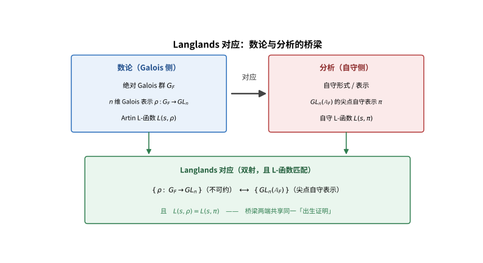
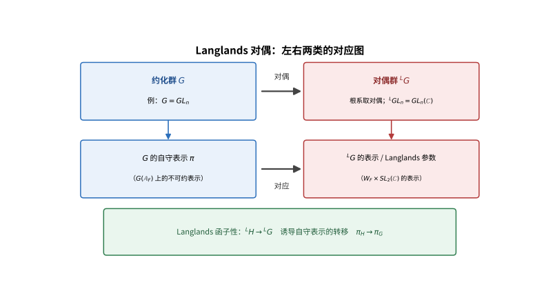

# 第141级 朗兰兹纲领 (Langlands Program)

## 📖 学习目标

1. 理解Langlands对应的基本概念及其在数论中的核心地位
2. 掌握Weil群、L-函数和Artin L-函数的定义与性质
3. 深入理解GL(1)的Langlands对应（类体论）及其证明
4. 掌握GL(2)的Langlands对应的基本框架
5. 理解局部Langlands对应和全局Langlands对应的内涵
6. 掌握Langlands函子性猜想及其与L-函数的关系
7. 了解几何Langlands对应及其与经典Langlands纲领的联系

---

## 一、核心概念

### 1.1 Langlands对应

**定义1（Langlands对应）** **Langlands对应** 是数论与表示论之间的一座桥梁，它断言 $n$ 维Galois表示与 $GL(n)$ 上的自守表示之间存在一一对应。

更精确地说，设 $F$ 是数域或局部域，$\bar{F}$ 是其代数闭包，$G_F = \text{Gal}(\bar{F}/F)$ 是绝对Galois群。Langlands对应断言存在双射：

$$ \{\text{连续的 $n$ 维 $\ell$-adic 表示 } \rho: G_F \to GL_n(\bar{\mathbb{Q}}_\ell) \}_{\text{不可约}} \longleftrightarrow \{\text{$GL_n(\mathbb{A}_F)$ 的尖点自守表示}\}_{\text{不可约}} $$

其中 $\mathbb{A}_F$ 是 $F$ 的 **adele环**。

> **直观理解（现实类比）**：Langlands对应像一座连通「数论」与「分析」两座大陆的大桥：Galois群描述「一个方程的解怎样彼此交换」（算术），自守形式则描述「在某种对称下不变的光滑函数」（分析）。过去看似无关，对应断言它们其实是同一事物的两种「身份证」，且L-函数完全一致——如同同一人的中文名与英文名，背后是同一个「出生证明」。

> **🧠 思考历程：数论里的"对称"与分析里的"波"，真的是同一件事吗？**
>
> Galois群描述方程的根如何互相交换（算术），自守形式描述某种高度对称下几乎不变的光滑函数（分析），二者看似隔着整个宇宙。朗兰兹纲领要回答的，正是这两个世界之间是否存在一张完整的"身份对照表"。
>
> - **一条在信中长大的纲领**。1967年，罗伯特·朗兰兹给安德烈·韦尔写了一封17页的信，大胆断言 $n$ 维 Galois 表示与自守表示之间存在一一对应、且L-函数完全吻合。朗兰兹坦承自己"也许是个疯子"，也承认正因不知道证明，反倒敢这样猜想。
> - **先行的拼图早已在**。早在1950-70年代，谷山、志村与韦尔就猜想有理数域上的每条椭圆曲线都"模"于一条模曲线；1994年维尔斯正是靠证明这个"模性定理"（配合泰勒–威尔斯的补丁），才顺手攻克了费马最后定理。
> - **一座横跨数论与分析的大桥**。Galois表示 $\leftrightarrow$ 自守表示、$L(s,\rho)=L(s,\pi)$ 两串等式，把三项看似无关的数学焊成一体，至今仍是整个数学中长期而深远的中心研究计划。
> - **心路**：最伟大的桥，有时始于一句"也许我们疯错了"的谦虚试探。

### 1.2 Weil群

**定义2（Weil群）** 设 $F$ 是局部域或数域，$G_F = \text{Gal}(\bar{F}/F)$ 是绝对Galois群。**Weil群** $W_F$ 定义为 $G_F$ 的子群，由Frobenius元素的整幂生成的子群（在局部域情形）或包含Frobenius元素的某种子群（在全局域情形）。

- 对于局部域 $F$，有正合序列：
  $$ 1 \to I_F \to W_F \to \mathbb{Z} \to 1 $$
  其中 $I_F$ 是惯性群，$\mathbb{Z}$ 由Frobenius元素生成。

- 对于全局域 $F$，Weil群 $W_F$ 是 $G_F$ 的稠密子群，有正合序列：
  $$ 1 \to W_{\bar{F}/F} \to G_F \to \hat{\mathbb{Z}} \to 1 $$
  在某种意义下。

### 1.3 L-函数

**定义3（L-函数）** **L-函数** 是数论中最重要的解析对象之一，它编码了数域的算术信息。

**Artin L-函数**：设 $\rho: G_F \to GL_n(\mathbb{C})$ 是Galois表示的 **Artin L-函数** 定义为欧拉积：

$$ L(s, \rho) = \prod_{\mathfrak{p} \text{ 素数}} \det\left(1 - \rho(\text{Frob}_\mathfrak{p}) N(\mathfrak{p})^{-s}\right)^{-1} $$

其中 $\text{Frob}_\mathfrak{p}$ 是 $\mathfrak{p}$ 处的Frobenius元素，$N(\mathfrak{p})$ 是 $\mathfrak{p}$ 的范数。

**自守L-函数**：设 $\pi$ 是 $GL_n(\mathbb{A}_F)$ 的尖点自守表示，其 **自守L-函数** $L(s, \pi)$ 定义为：

$$ L(s, \pi) = \prod_{v} L(s, \pi_v) $$

其中 $\pi_v$ 是 $\pi$ 在 $v$ 处的局部分量，$L(s, \pi_v)$ 由Langlands构造给出。

### 1.4 自守形式与自守表示

**定义4（自守形式）** 设 $G$ 是约化代数群（如 $GL_n$），$\mathbb{A}_F$ 是 $F$ 的adele环。一个 **自守形式** 是 $G(F)\backslash G(\mathbb{A}_F)$ 上的光滑函数 $f$，满足：
1. $K$-有限性（$K$ 是最大紧子群）
2. $\mathfrak{z}$-有限性（$\mathfrak{z}$ 是通用包络代数的中心）
3. 缓增性（moderate growth）

**定义5（自守表示）** 一个 **自守表示** 是 $G(\mathbb{A}_F)$ 在函数空间 $L^2(G(F)\backslash G(\mathbb{A}_F))$ 上的一个不可约表示（在某种意义下）。自守表示可以分解为局部表示的张量积：

$$ \pi = \bigotimes_v \pi_v $$

其中 $\pi_v$ 是 $G(F_v)$ 的不可约容许表示。

### 1.5 Langlands函子性

**定义6（Langlands函子性）** **Langlands函子性（functoriality）** 是Langlands纲领的核心猜想之一。它断言：给定约化群 $H$ 和 $G$ 以及同态 ${}^L H \to {}^L G$（Langlands对偶群之间的同态），存在从 $H$ 的自守表示到 $G$ 的自守表示的一一对应。

函子性是Langlands对应的"函子性"表述——它揭示了不同群的自守表示之间的转移规律。

### 1.6 Langlands对偶群

**定义7（Langlands对偶群）** 设 $G$ 是约化代数群。其 **Langlands对偶群** ${}^L G$ 是复 Lie 群，其根系是 $G$ 的根系的对偶根系。

对于 $G = GL_n$，其Langlands对偶群为 ${}^L G = GL_n(\mathbb{C})$。

对于一般群 $G$，其Langlands对偶群为 $G^\vee(\mathbb{C}) \rtimes W_F$，其中 $G^\vee$ 是 $G$ 的对偶群（根系对偶），$W_F$ 是Weil群。

> **直观理解（现实类比）**：Langlands对偶像是「原像」与「倒像」：每个约化群 $G$ 都有一个「对偶群」${}^LG$，根系的箭头方向全部反转，正如正片胶卷与它的负片。函子性则说：不同群的自守表示可以通过对偶群之间的同态「搬移」，就像用放大镜（同态）把一组声音（自守表示）从一只喇叭转到另一只，音调（L-函数）保持不变。

### 1.7 局部Langlands对应

**定义8（局部Langlands对应）** 设 $F$ 是局部域（如 $\mathbb{Q}_p$ 或 $\mathbb{R}$）。**局部Langlands对应** 断言：$GL_n(F)$ 的不可约容许表示与 $W_F \times SL_2(\mathbb{C})$ 的 $n$ 维表示之间存在双射：

$$ \text{Irr}(GL_n(F)) \longleftrightarrow \text{Rep}_n(W_F \times SL_2(\mathbb{C})) $$

### 1.8 全局Langlands对应

**定义9（全局Langlands对应）** 设 $F$ 是数域。**全局Langlands对应** 断言：$GL_n(\mathbb{A}_F)$ 的尖点自守表示与 $\ell$-adic Galois表示 $\rho: G_F \to GL_n(\bar{\mathbb{Q}}_\ell)$ 之间存在双射，使得L-函数匹配：

$$ L(s, \pi) = L(s, \rho) $$

### 1.9 几何Langlands对应

**定义10（几何Langlands对应）** **几何Langlands对应** 是经典Langlands纲领的几何类比。它将数域 $F$ 替换为代数曲线 $X$（定义在有限域 $\mathbb{F}_q$ 上），将Galois群替换为 $\acute{\text{e}}$talé基本群，将自守形式替换为 $\text{Bun}_G$ 上的D-模。

几何Langlands对应的核心断言是：存在从 $\text{Bun}_G$ 上的D-模/ $\ell$-adic层到 $\text{LocSys}_{{}^L G}$ 上的对象的等价。

---

## 二、定理与证明

### 定理1：GL(1)的Langlands对应（类体论）

**定理（类体论 / GL(1)的Langlands对应）** 设 $F$ 是数域，$\mathbb{A}_F^\times$ 是 $F$ 的adele环的乘法群。则存在典范同构：

$$ \text{Gal}(F^{\text{ab}}/F) \cong \mathbb{A}_F^\times / F^\times $$

其中 $F^{\text{ab}}$ 是 $F$ 的最大Abel扩张。等价地，$GL(1)$ 的自守表示一一对应于 $G_F$ 的一维Galois表示。

**证明**（使用Artin互反律和Weil群）：

**第一步：建立局部域上的类体论。**

首先，考虑局部域 $F_v$（$v$ 是 $F$ 的一个位）。局部类体论给出了同构：

$$ \theta_v: F_v^\times \xrightarrow{\cong} W_{F_v}^{\text{ab}} $$

其中 $W_{F_v}^{\text{ab}}$ 是局部Weil群的Abel化。

对于 $p$-adic 局部域 $F_v$，这一同构通过 **互反映射（reciprocity map）** 实现：

$$ \theta_v: F_v^\times \to \text{Gal}(F_v^{\text{ab}}/F_v) $$

其构造如下：
- 对 $F_v$ 的有限Abel扩张 $L/F_v$，定义映射：

$$ \theta_{L/F_v}: F_v^\times \to \text{Gal}(L/F_v) $$

满足：
1. 对 $\pi \in F_v^\times$ 是素元，$\theta_{L/F_v}(\pi)$ 在 $L/F_v$ 上的限制是Frobenius元素 $\text{Frob}_{L/F_v}$。
2. $\theta_{L/F_v}$ 是满射，核为 $N_{L/F_v}(L^\times)$（范数群）。

**第二步：建立全局类体论。**

全局类体论通过 **adele环** 统一局部信息。定义互反映射：

$$ \theta: \mathbb{A}_F^\times \to \text{Gal}(F^{\text{ab}}/F) $$

作为局部互反映射的乘积：

$$ \theta((a_v)_v) = \prod_v \theta_v(a_v) $$

其中 $\theta_v$ 是局部互反映射。

**关键定理（Artin互反律）**：全局互反映射 $\theta$ 是满射，且 $\ker(\theta) = F^\times$（$F^\times$ 对角嵌入到 $\mathbb{A}_F^\times$ 中）。因此：

$$ \mathbb{A}_F^\times / F^\times \cong \text{Gal}(F^{\text{ab}}/F) $$

**第三步：构造一维Galois表示与自守表示的对应。**

- **从Galois表示到自守表示**：给定一维Galois表示 $\chi: \text{Gal}(F^{\text{ab}}/F) \to \mathbb{C}^\times$，通过类体论同构，得到 $\mathbb{A}_F^\times / F^\times$ 上的特征 $\chi'$。这对应于 $GL(1)$ 上的一个自守表示（Hecke特征）。

- **从自守表示到Galois表示**：给定 $GL(1)$ 的自守表示 $\pi = \otimes_v \pi_v$，每个 $\pi_v$ 是 $F_v^\times$ 的一个特征。通过局部类体论，这些特征对应于局部Weil群的一维表示。拼合起来，得到全局Galois表示。

**第四步：验证L-函数的匹配。**

对于一维Galois表示 $\rho$ 和对应的自守表示 $\pi$，有：

$$ L(s, \rho) = \prod_v (1 - \rho(\text{Frob}_v) N(v)^{-s})^{-1} = \prod_v L(s, \pi_v) = L(s, \pi) $$

这由局部互反映射和L-因子的定义直接验证。

**结论**：GL(1)的Langlands对应等价于经典类体论，建立了数域的Abel扩张与adele环上的特征之间的对应。$\square$

---

### 定理2：GL(2)的Langlands对应

**定理（GL(2)的Langlands对应，Deligne-Milne）** 设 $F$ 是数域。存在从 $GL_2(\mathbb{A}_F)$ 的尖点自守表示到 $G_F$ 的二维 $\ell$-adic Galois表示的双射，使得L-函数匹配：

$$ L(s, \pi) = L(s, \rho_\pi) $$

特别地，模形式（对应于 $GL_2$ 的自守形式）的Hecke特征值决定了对应的Galois表示的特征多项式。

**证明思路**（使用Langlands纤维化）：

**第一步：模形式与自守表示。**

经典模形式 $f(z) = \sum_{n=1}^\infty a_n q^n$（$q = e^{2\pi i z}$）是 $GL_2(\mathbb{A}_{\mathbb{Q}})$ 上自守表示的部分。具体地：
- 对每个模形式 $f$，可以构造一个 $GL_2(\mathbb{A}_{\mathbb{Q}})$ 的尖点自守表示 $\pi_f$。
- Hecke算子 $T_p$ 的作用对应于 $\pi_f$ 在 $p$ 处的局部分量 $\pi_{f,p}$ 的结构。
- Hecke特征值 $a_p$ 决定了 $\pi_{f,p}$ 的Langlands参数。

**第二步：构造Galois表示（Deligne的构造）。**

对于权重 $k \geq 2$ 的尖点模形式 $f$，Deligne（1969）构造了 $p$-adic Galois表示：

$$ \rho_{f, p}: \text{Gal}(\bar{\mathbb{Q}}/\mathbb{Q}) \to GL_2(\bar{\mathbb{Q}}_p) $$

满足：
1. 在 $q \neq p$ 处非分歧，且 $\rho_{f, p}(\text{Frob}_q)$ 的特征多项式为 $X^2 - a_q X + q^{k-1}$。
2. $\rho_{f, p}$ 是绝对不可约的。

构造方法利用了 **étale上同调**：
- 模形式 $f$ 对应于某个Kuga-Sato簇的微分形式。
- 通过该簇的 $\ell$-adic étale上同调，得到Galois表示。

**第三步：Langlands纤维化方法。**

**Langlands纤维化（Langlands' fiberation）** 是Langlands在证明 $GL(2)$ 情形的部分结果时发展的方法。

核心思想：考虑Shimura簇 $S$（如模曲线）上的自守形式，其 $\ell$-adic上同调分解为Galois表示和自守表示的直和：

$$ H^i_{\acute{\text{e}}t}(S, \bar{\mathbb{Q}}_\ell) = \bigoplus_{\pi} \pi^{m(\pi)} \otimes \rho_\pi $$

其中 $\pi$ 跑遍自守表示，$\rho_\pi$ 是对应的Galois表示。

**第四步：验证L-函数的匹配。**

通过Eichler-Shimura同态和Matsushima公式，可以证明：

$$ L(s, \pi_f) = L(s, \rho_{f, p}) $$

特别地，对于权 $k$ 的模形式 $f$，其 $L$-函数为：

$$ L(s, f) = \sum_{n=1}^\infty a_n n^{-s} = \prod_q (1 - a_q q^{-s} + q^{k-1-2s})^{-1} $$

对应的Galois表示的 $L$-函数由Frobenius特征值给出，两者相等。

**结论**：GL(2)的Langlands对应建立了模形式与Galois表示之间的深刻联系，是证明Fermat大定理的关键工具之一。$\square$

---

### 定理3：局部Langlands对应

**定理（局部Langlands对应，Harris-Taylor / Henniart）** 设 $F$ 是特征为零的局部域（即 $\mathbb{R}$、$\mathbb{C}$ 或 $\mathbb{Q}_p$ 的有限扩张）。则存在唯一的双射：

$$ \text{Irr}(GL_n(F)) \longleftrightarrow \text{Rep}_n(W_F \times SL_2(\mathbb{C})) $$

满足以下条件：
1. 保持L-因子和 $\varepsilon$-因子。
2. 与抛物诱导兼容。
3. 与类体论兼容（当 $n=1$ 时退化为局部类体论）。

**证明思路**（使用Bernstein-Zelevinsky分类）：

**第一步：Bernstein-Zelevinsky分类。**

Bernstein和Zelevinsky给出了 $GL_n(F)$ 的不可约容许表示的完全分类。

**定义（分段表示）** 设 $\Delta$ 是 $GL_k(F)$ 的 **分段（segment）**，即形如 $[\rho, \rho(k-1)]$ 的集合，其中 $\rho$ 是 $GL_1(F)$ 的尖点表示。分段表示：

$$ \rho \otimes \rho \otimes \cdots \otimes \rho(k-1) $$

的抛物诱导（parabolic induction）得到 $GL_{km}(F)$ 的一个表示，记作 $\langle \Delta \rangle$（或 $Q(\Delta)$）。

**Zelevinsky分类定理**：$GL_n(F)$ 的每个不可约容许表示可以唯一地表示为分段表示 $\langle \Delta_1 \rangle, \ldots, \langle \Delta_r \rangle$ 的 **Langlands商**（即某种抛物诱导的不可约商）。

**第二步：构造Langlands参数。**

给定一个分段 $\Delta = [\rho, \rho(k-1)]$，定义其对应的Weil-Deligne表示：

$$ \phi_\Delta: W_F \times SL_2(\mathbb{C}) \to GL_k(\mathbb{C}) $$

如下：
- 在 $W_F$ 上，$\phi_\Delta$ 由 $\rho$ 的Weil群表示给出。
- 在 $SL_2(\mathbb{C})$ 上，$\phi_\Delta$ 是 $k$ 维不可约表示。

**第三步：建立双射。**

对于 $GL_n(F)$ 的不可约容许表示 $\pi$，将其分解为分段表示的Langlands商：

$$ \pi = L(\langle \Delta_1 \rangle, \ldots, \langle \Delta_r \rangle) $$

则 $\pi$ 对应的Langlands参数为：

$$ \phi_\pi = \bigoplus_{i=1}^r \phi_{\Delta_i}: W_F \times SL_2(\mathbb{C}) \to GL_n(\mathbb{C}) $$

**第四步：验证保持不变量。**

需要证明：
- $L(s, \pi) = L(s, \phi_\pi)$
- $\varepsilon(s, \pi, \psi) = \varepsilon(s, \phi_\pi, \psi)$

这通过构造的兼容性和已有结果（如Godement-Jacquet的L-因子理论）验证。

**第五步：唯一性。**

Harris-Taylor和Henniart独立证明了满足上述条件的局部Langlands对应是唯一的。证明的关键是使用 **Laumon-Letellier理论** 和 **迹公式**。

**结论**：局部Langlands对应将 $GL_n(F)$ 的表示论与Weil群的表示论联系起来，是全局Langlands对应的基础。$\square$

---

### 定理4：全局Langlands对应（Drinfeld的shtuka构造）

**定理（Drinfeld的全局Langlands对应）** 设 $X$ 是有限域 $\mathbb{F}_q$ 上的光滑射影曲线，$F = \mathbb{F}_q(X)$ 是函数域。则存在 $GL_n(\mathbb{A}_F)$ 的尖点自守表示与 $G_F$ 的 $\ell$-adic Galois表示之间的双射。

**证明思路**（Drinfeld的shtuka构造）：

**第一步：shtuka的定义。**

**定义（shtuka）** 设 $X$ 是 $\mathbb{F}_q$ 上的曲线。一个 **shtuka** 秩 $n$ 在 $X$ 上是一个三元组 $(\mathcal{E}, \tau)$，其中：
- $\mathcal{E}$ 是 $X \times S$ 上的秩 $n$ 向量丛
- $\tau$ 是一个同构：

$$ \tau: (\text{Frob}_S \times \text{id}_X)^* \mathcal{E} \xrightarrow{\cong} \mathcal{E} \qquad (\text{除去两个截面})_{S \times \infty, S \times 0} $$

其中 $\text{Frob}_S$ 是 $S$ 上的绝对Frobenius。

**第二步：模空间 $\text{Sht}_n$ 的构造。**

考虑所有秩 $n$ 的shtuka的模空间 $\text{Sht}_n$。这是一个Deligne-Mumford栈，定义在 $\mathbb{F}_q$ 上。

关键性质：$\text{Sht}_n$ 的 $\ell$-adic上同调承载了 $GL_n(\mathbb{A}_F)$ 和 $G_F$ 的双作用。

**第三步：上同调分解。**

$\text{Sht}_n$ 的 $\ell$-adic上同调分解为：

$$ H^i_c(\text{Sht}_n, \bar{\mathbb{Q}}_\ell) = \bigoplus_{\pi} \pi^{m(\pi)} \otimes \rho_\pi $$

其中 $\pi$ 跑遍 $GL_n(\mathbb{A}_F)$ 的尖点自守表示，$\rho_\pi$ 是对应的 $n$ 维Galois表示。

**第四步：验证双射。**

通过上同调分解，得到映射：

$$ \{\text{尖点自守表示}\} \to \{\text{Galois表示}\} $$

需要证明这是双射。这通过以下方式完成：
1. **L-函数的匹配**：通过Grothendieck的L-函数公式和Eichler-Shimura同态。
2. **迹公式**：利用Arthur-Selberg迹公式和Lefschetz迹公式的比较。

**第五步：算术应用。**

Drinfeld的构造在函数域情形完全证明了Langlands对应，并应用于：
- Ramanujan-Petersson猜想的函数域类比
- Langlands函子性在函数域上的部分证明

**结论**：Drinfeld的shtuka构造为函数域上的Langlands对应提供了完整的几何证明，是全局Langlands纲领的重要里程碑。$\square$

---

### 定理5：Langlands函子性猜想

**猜想（Langlands函子性）** 设 $H$ 和 $G$ 是约化代数群，$\phi: {}^L H \to {}^L G$ 是Langlands对偶群之间的同态。则对 $H(\mathbb{A}_F)$ 的每个自守表示 $\pi_H$，存在 $G(\mathbb{A}_F)$ 的自守表示 $\pi_G$，使得对所有 $v$ 有：

$$ \phi \circ \phi_{\pi_{H,v}} = \phi_{\pi_{G,v}} $$

其中 $\phi_{\pi_{H,v}}$ 和 $\phi_{\pi_{G,v}}$ 是对应的局部Langlands参数。

**证明思路**（使用L-函数和自守形式）：

**第一步：函子性的局部表述。**

在局部Langlands对应的框架下，每个自守表示 $\pi$ 的局部分量 $\pi_v$ 对应一个Langlands参数 $\phi_{\pi_v}: W_{F_v} \times SL_2(\mathbb{C}) \to {}^L G$。

函子性猜想断言：给定 $\phi: {}^L H \to {}^L G$，对每个 $\pi_H$，存在 $\pi_G$ 使得：

$$ \phi_{\pi_{G,v}} = \phi \circ \phi_{\pi_{H,v}} $$

对所有 $v$ 成立。

**第二步：利用L-函数刻画。**

函子性转移 $\pi_H \to \pi_G$ 应满足L-函数的等式：

$$ L(s, \pi_H, r) = L(s, \pi_G, r') $$

其中 $r$ 是 ${}^L H$ 的表示，$r' = r \circ \phi^{-1}$ 是 ${}^L G$ 的表示（在适当的意义下）。

**第三步：L-函数的解析性质。**

Langlands函子性可以通过L-函数的解析性质来研究：
- 如果两个自守表示通过函子性关联，则它们的L-函数满足恒等式。
- 反之，如果局部参数匹配且L-函数相等，则全局表示也匹配。

**第四步：部分证明结果。**

函子性猜想在以下情形已部分证明：
1. **GL(1) 情形**：由类体论完全证明。
2. **GL(2) 到 GL(3) 的对称平方提升**：由Gelbart-Jacquet证明。
3. **GL(2) 到 GL(4) 的张量积提升**：由Ramakrishnan证明。
4. **自守形式到 GL(n) 的Sato-Tate提升**。

**第五步：证明策略——迹公式方法。**

**Arthur-Selberg迹公式** 是证明函子性的主要工具。基本策略：
1. 比较 $H$ 和 $G$ 的迹公式。
2. 通过 **匹配轨道**（matching of orbits）建立对应。
3. 利用 **基本引理（fundamental lemma）**（Ngô Bao Châu证明）完成匹配。

**结论**：Langlands函子性猜想是Langlands纲领的核心，其证明将统一数论中的大量深刻结果。$\square$

---

## 三、示例

### 示例1：GL(2)的自守表示与Artin表示

**模形式与Galois表示**：

考虑权重 $k=2$、水平 $N=1$ 的尖点模形式：

$$ \Delta(q) = q \prod_{n=1}^\infty (1-q^n)^{24} = \sum_{n=1}^\infty \tau(n) q^n $$

其中 $\tau(n)$ 是Ramanujan $\tau$ 函数。

**对应的Galois表示**：Deligne构造了二维 $\ell$-adic Galois表示：

$$ \rho_\Delta: \text{Gal}(\bar{\mathbb{Q}}/\mathbb{Q}) \to GL_2(\bar{\mathbb{Q}}_\ell) $$

使得对素数 $p \neq \ell$，有：

$$ \text{tr}(\rho_\Delta(\text{Frob}_p)) = \tau(p) $$

**验证**：Ramanujan猜想（$|\tau(p)| \leq 2p^{11/2}$）等价于 $\rho_\Delta$ 是纯权重的，已由Deligne证明。

### 示例2：模形式与Galois表示的联系

**Maass形式与Artin表示**：
- Maass形式是 $GL_2$ 的非全纯自守形式，其 $L$-函数有函数方程。
- 对某些Maass形式，对应的Galois表示是二维实表示的Artin表示。
- **Artin猜想**：每个非平凡二维不可约Artin表示的L-函数在 $\Re(s) > 1$ 处全纯，且在 $s=1$ 处非零——这等价于对应的Maass形式存在。

**例：** 设 $F = \mathbb{Q}(\sqrt{-5})$ 是二次域，$\chi$ 是 $F$ 的非平凡特征。则诱导表示 $\text{Ind}_{G_F}^{G_{\mathbb{Q}}} \chi$ 是一个二维Artin表示，其L-函数对应于某个Maass形式。

---

## 四、习题

### 基础题

**习题 1**（Langlands对应）陈述 Langlands 纲领的核心对应：$n$ 维（Weil–Deligne/Galois）表示与 $\mathrm{GL}(n)$ 的自守表示之间的对应，并说明它如何统一类体论（$n=1$）与模形式理论（$n=2$）。

**习题 2**（Weil群）写出数域 $F$ 的 Weil 群 $W_F$ 的定义（含其与惯性群 $I_F$ 及 Frobenius 的关系），并说明它与绝对 Galois 群 $G_F$ 的关系。

**习题 3**（L-函数）写出非分歧处 Artin L-函数 $L(s,\rho)=\prod_p\det(I-\rho(\mathrm{Frob}_p)p^{-s})^{-1}$，并指出 $\mathrm{GL}(n)$ 自守 L-函数局部因子来源于何处（Satake 参数）。

**习题 4**（自守形式）说明自守形式的定义要素：$\mathrm{GL}(n,\mathbb{A}_F)$ 上 $K$-有限、中不变（自守性）、缓增增长的函数，以及自守表示如何由右正则作用产生。

**习题 5**（函子性）用一句话解释 Langlands 函子性：约化群间的 $L$-群同态 ${}^LH\to{}^LG$ 把 $H$ 的自守表示转移到 $G$ 的自守表示，并保持 L-函数与局部参数。

**习题 6**（Langlands对偶群）定义约化群的 $L$-群 ${}^LG={}^LG^\circ\rtimes W_F$，说明 $\mathrm{GL}(n)$ 的对偶群仍是 $\mathrm{GL}(n)$，并举例说明对偶对（如 $\mathrm{Sp}(2n)^\vee=\mathrm{SO}(2n+1)$）。

**习题 7**（局部Langlands对应）陈述局部 Langlands 对应：$W_F\times\mathrm{SL}_2(\mathbb{C})$ 的 $n$ 维表示与 $\mathrm{GL}(n,F)$ 的不可约光滑表示（L-包）之间的自然双射。

**习题 8**（全局Langlands对应）陈述全局 Langlands 对应：$F$ 的 Galois 群表示与 $\mathrm{GL}(n,\mathbb{A}_F)$ 自守表示的关系，说明其在不同 $n$ 下证明的现状。

**习题 9**（类体论）写出类体论基本同构 $\mathbb{A}_F^\times/F^\times\cong W_F^{\mathrm{ab}}$，并说明它在 Langlands 框架中对应 $\mathrm{GL}(1)$ 的自守表示（Hecke 特征）。

**习题 10**（Artin表示）写出 Artin 表示 $\rho:\mathrm{Gal}(\bar F/F)\to\mathrm{GL}(V)$ 的定义，并说明它为何是连续、有限阶（经有限扩张）的复表示。

### 进阶题

**习题 11**（Tate 论题）说明 Tate 的 $\mathrm{GL}(1)$ 调和分析如何实现 $n=1$ 的 Langlands 对应即类体论：Hecke 特征作为自守表示，Dedekind zeta 函数作为其 L-函数。

**习题 12**（Hecke特征递推）对权 $k$ 新形式 $f$，写出本征值递推 $a_{p^r}=a_p a_{p^{r-1}}-p^{k-1}a_{p^{r-2}}$，并说明其来自 Hecke 算子乘法关系 $T_p^2=T_{p^2}+p^{k-1}R_p$。

**习题 13**（模形式与Galois）说明如何从权 $2$ 新形式构造 $l$-adic Galois 表示 $\rho_{f,l}$，并指出这是费马大定理证明（Taylor–Wiles）的基石。

**习题 14**（Artin L 函数方程）写出完全化 Artin L-函数 $\Lambda(s,\rho)$ 与函数方程 $\Lambda(s,\rho)=\varepsilon(\rho)\Lambda(1-s,\rho^\vee)$，说明 $\rho^\vee$ 为对偶表示、$\varepsilon$ 为局部 $\varepsilon$-因子之积。

**习题 15**（自守表示张量分解）写出自守表示 $\pi=\bigotimes'_v\pi_v$ 的受限张量积分解，说明除有限个地方外 $\pi_v$ 为非分歧（尖点/球面）表示。

**习题 16**（局部参数分类）对 $F=\mathbb{Q}_p$、$n=2$，列出局部 Langlands 参数的类型（约化主序列、特殊表示、超尖点），并说明各自对应的表现类别。

**习题 17**（基本引理）解释基本引理在迹公式方法中的地位：它断言同根对 $(G,H)$ 稳定轨道上若干积分相等，使稳定全局迹公式两端（几何与谱）可匹配。

**习题 18**（Drinfeld shtuka）说明函数域情形 $\mathrm{GL}(2)$ 的全局 Langlands 对应如何由 Drinfeld 的 shtuka 构造证明（用一个对象编码 Frobenius）。

**习题 19**（张量积转移）阐明函子性 $\mathrm{GL}(2)\times\mathrm{GL}(2)\to\mathrm{GL}(4)$：由 $L$-群同态给出 $\pi_1\otimes\pi_2$ 的转移，且 $L(s,\pi_1\otimes\pi_2)$ 由 Rankin–Selberg 理论给出。

### 挑战题

**习题 20**（类体论证明）概述类体论基本同构的证明骨架：Artin 符号（幂剩余符号）构造共形同态 $\mathbb{A}_F^\times\to G_F^{\mathrm{ab}}$，其核为 $F^\times$ 与连通分量，满射由 Chebotarev 密度给出。

**习题 21**（Hecke 递推证明）在本征形式 $f$ 上，利用 Hecke 算子乘积关系 $T_p^2=T_{p^2}+p^{k-1}R_p$ 推导 $a_{p^r}$ 的三项递推，并说明正则化（归一化）的约定。

**习题 22**（Artin L 函数有理性）利用 Brauer 诱导把有限扩张的 Artin L-函数 $L(s,\rho)$ 表为若干 Dedekind zeta 函数根式的组合，说明由此可得解析延拓与函数方程。

**习题 23**（ε-因子与函数方程）说明 Tate 关于 Hecke 特征 $\varepsilon$-因子的加性/乘性，以及 Deligne 如何把它们推广到任意 Artin 表示，从而得到完整函数方程。

**习题 24**（稳定迹公式）概述稳定迹公式的结构：几何侧（轨道积分）与谱侧（自守谱）的匹配在同根猜想与传输猜想的补注下归结到基本引理。

**习题 25**（Weil–Deligne 表示）说明为何局部 Langlands 参数必须取 Weil–Deligne 表示（含 $\mathrm{SL}_2(\mathbb{C})$ 因子）：非单势分量需要该因子，其 Frobenius 谱与滑动权重给出分类。

**习题 26**（函子性与拉马努金）说明"对称幂函子性"（$\mathrm{sym}^m:\mathrm{GL}(2)\to\mathrm{GL}(m+1)$）如何刻画新形式各局部分量的抛物性质（拉马努金/加权），并指出其对 Sato–Tate 分布的应用。

### 探究题

**习题 27**（物理联系）开放讨论 Langlands 纲领与量子场论的联系：几何 Langlands 对应数学上等价于 $\mathcal{N}=4$ 超 Yang–Mills 的 S-对偶（Kapustin–Witten），探讨电-磁对偶如何重现 Langlands 函子性。

**习题 28**（究级统一）讨论把类体论、Langlands 函子性与弦论 T-对偶统一为"算术对象 $\leftrightarrow$ 凝聚/谱对象"的哲学图象，思考 D-膜、范畴化与 p-adic Langlands 的共通性。

**习题 29**（与黎曼假设）探讨 Artin/自守 L-函数解析性质与广义黎曼假设的关系：为何"尖点自守表示不可约性"隐含较优全纯性，构成 Langlands 纲领的一环。

**习题 30**（未来方向）畅谈开放问题：尖点自守表示不可约性与函子性完全证明、$\mathrm{GL}(n)$ 全局对应、几何 Langlands 与 p-adic Langlands 的统一。

---

## 五、习题答案与解析

### 基础题答案

1. **Langlands对应** Langlands 纲领在 Galois 表示（久拓为 Weil–Deligne 表示）与自守表示之间建立保持 L-函数（及 ε-因子）的对应。$n=1$ 时即类体论（互反律与 Hecke 特征）；$n=2$ 联系权提升的模形式与二维 $l$-adic Galois 表示（费马大定理）。它把 Artin 互反律、Hecke 理论、模形式与椭圆曲线统一进同一框架。

2. **Weil群** $W_F$ 是 $G_F$ 的子群：$1\to I_F\to W_F\to\langle\mathrm{Frob}\rangle\to 1$，其中 $I_F$ 是惯性群，余核由（剩余类域的）Frobenius 生成（作为 $\mathbb{Z}$ 的稠密副本）。$W_F$ 在 $G_F$ 中稠密，其表示理论（尤其是 Weil–Deligne 表示）足以承载 Langlands 参数。

3. **L-函数** 对非分歧的 $p$，Artin L-函数 $L(s,\rho)=\prod_p\det(I-\rho(\mathrm{Frob}_p)p^{-s})^{-1}$。$\mathrm{GL}(n)$ 自守 L-函数的局部因子来自 $\pi_p$ 的 Satake 参数（尖点分量的 Hecke 代数本征值生成的半单共轭类）。

4. **自守形式** 自守形式是 $\mathrm{GL}(n,\mathbb{A}_F)$ 上满足 $K$-有限性、中不变（由 $Z(\mathbb{A}_F)$ 可测本征向量）、缓增增长的函数。自守表示是右正则作用在尖点自守形式张成空间上的不可约 $G(\mathbb{A}_F)$-表示，尖点谱分解为不可约表示的直和。

5. **函子性** 函子性断言：任一 $L$-群同态 ${}^LH\to{}^LG$ 都诱导一族把 $H$ 的尖点自守表示转移到 $G$ 的自守表示（转移），并保持 L-函数与局部参数（局部 Langlands 参数被同态推前）。

6. **Langlands对偶群** 对约化 $G$，$L$-群 ${}^LG={}^LG^\circ\rtimes W_F$，其中 ${}^LG^\circ$ 是对偶根数据（权格与余权格互换）对应、由 $W_F$ 作用外自同构的复连通约化群。$\mathrm{GL}(n)^\vee=\mathrm{GL}(n)$；此外如 $\mathrm{Sp}(2n)^\vee=\mathrm{SO}(2n+1)$、$\mathrm{O}(2n)^\vee=\mathrm{Sp}(2n)$。

7. **局部Langlands对应** 对局部域 $F$，局部 Langlands 对应是 $n$ 维 Weil–Deligne 表示与 $\mathrm{GL}(n,F)$ 不可约光滑表示的 L-包之间的双射，保持 L-函数、ε-因子、对偶与某些诱导性质。$\mathrm{GL}(n)$ 情形由 Harris–Taylor 与 Henniart 完全证明。

8. **全局Langlands对应** 全局对应把 $F$ 的 Galois 表示（及对偶群参数）与 $\mathrm{GL}(n,\mathbb{A}_F)$ 的自守表示联系起来，要求各路局部对应相容。函数域上 $\mathrm{GL}(n)$ 已由 Lafforgue 证明，数域 $\mathrm{GL}(1)$（类体论）、$\mathrm{GL}(2)$ 部分证明，$\mathrm{GL}(n\ge 3)$ 仍是开放问题。

9. **类体论** 类体论给出 $\mathbb{A}_F^\times/F^\times\cong W_F^{\mathrm{ab}}$（与 $G_F^{\mathrm{ab}}$ 经 Artin 符号）。在 Langlands 框架中它是 $\mathrm{GL}(1)$ 的情形：自守表示即 Hecke 特征（$\mathrm{GL}(1,\mathbb{A}_F)$ 的尖点自守形式），对应于 $W_F$ 的一维表示。

10. **Artin表示** Artin 表示是连续表示 $\rho:\mathrm{Gal}(\bar F/F)\to\mathrm{GL}_n(\mathbb{C})$。因 Galois 群紧致、$\rho$ 连续且值为复环，$\rho$ 自动有限阶，即经 $F$ 的某个有限 Galois 扩张分解（Artin L-函数因此解析延拓）。

### 进阶题答案

1. **Tate 论题** Tate 在 $\mathrm{GL}(1,\mathbb{A}_F)$ 上构造不可约自守表示（Hecke 特征），其 L-函数经 Poisson 求和得函数方程；而 Hecke 特征恰对应 $\mathbb{A}_F^\times$ 上平凡于 $F^\times$ 的连续特征，这就是类体论的一维表示对应，故 Tate 论题即 $n=1$ 的 Langlands 对应与函数方程的全部内容。

2. **Hecke特征递推** 对本征形式 $f$，令 $T_p$ 的本征值为 $a_p$。由乘法公式 $T_p^2=T_{p^2}+p^{k-1}R_p$（$R_p$ 为对角/中心作用）作用到 $f$，得 $a_{p^2}=a_p^2-p^{k-1}$。对一般 $r$ 由 Hecke 代数结合律归纳得三项递推 $a_{p^r}=a_p a_{p^{r-1}}-p^{k-1}a_{p^{r-2}}$。

3. **模形式与Galois** 由 Eichler–Shimura 及 deformation 理论，从权 $2$ 新形式 $f=\sum a_n q^n$ 构造 $l$-adic Galois 表示 $\rho_{f,l}:\mathrm{Gal}(\bar{\mathbb{Q}}/\mathbb{Q})\to\mathrm{GL}_2(\bar{\mathbb{Q}}_l)$，使 $\mathrm{Tr}\,\rho_{f,l}(\mathrm{Frob}_p)=a_p$。Taylor–Wiles 的 modularity lifting 定理由此证明椭圆曲线的模性，从而完成费马大定理证明的算术核心。

4. **Artin L 函数方程** 完全化 $\Lambda(s,\rho)$（附 Gamma 因子与 Artin–Conductor 幂）满足 $\Lambda(s,\rho)=\varepsilon(\rho)\Lambda(1-s,\rho^\vee)$，$\rho^\vee$ 是对偶表示，$\varepsilon(\rho)=\prod_v\varepsilon_v(\rho,\psi_v)$ 为局部 ε-因子之积（依赖加法特征 $\psi$ 的选择，但可协调）。

5. **自守表示张量分解** 光滑不可约自守表示 $\pi\simeq\bigotimes'_v\pi_v$ 为局部不可约光滑表示的受限张量积；除有限个整环（unramified）地方外 $\pi_v$ 是球面表示（由 Satake 参数刻画），其局部 L-因子是 $\det(I-\mathrm{Sat}(\pi_v)q_v^{-s})^{-1}$ 形式的显式表达式。

6. **局部参数分类（n=2）** $\phi:W_{\mathbb{Q}_p}\times\mathrm{SL}_2(\mathbb{C})\to\mathrm{GL}_2(\mathbb{C})$ 的类型：主序列（$\phi$ 为对角线双特征，对应两个字符的诱导表示 $\pi(\chi_1,\chi_2)$）；特殊表示（$\phi$ 不可约限制到 $\mathrm{SL}_2$，对应 $\mathrm{St}\otimes\chi$）；超尖点（$\phi$ 的 Weil 部分不可约，对应不可约超尖点表示）。三者覆盖全部 L-等类。

7. **基本引理** 基本引理断言对（同根对的）局部域上的 $G$ 与 $H$，稳定轨道上的（加权）轨道积分等值相等。它使稳定迹公式的几何侧（各种轨道积分）可与谱侧（传输的局部项的谱值）匹配，是数域 Langlands 函子性证明（Arthur、Ngô 等）中最关键、最难的解析部分。

8. **Drinfeld shtuka** 在函数域 $\mathbb{F}_q(t)$ 上，Drinfeld 用 shtuka（向量丛 $\mathcal{F}$ 连同 Frobenius 相关的结构）把 $\mathrm{GL}(2,\mathbb{A}_F)$ 的尖点自守形式与二维 Galois 表示对应起来：shtukas 的模空间计数尖点形式，其可约化分支编码 Galois 表示。此构造开创了函数域几何 Langlands（Lafforgue 随后推广到 $\mathrm{GL}(n)$）。

9. **张量积转移** 函子性 $\mathrm{GL}(2)\times\mathrm{GL}(2)\to\mathrm{GL}(4)$ 由 $L$-群对角嵌入对应：$(\mathrm{GL}_2\times\mathrm{GL}_2)\to\mathrm{GL}_4$。它把两个 $\mathrm{GL}(2)$ 自守表示转移到 $\mathrm{GL}(4)$ 自守表示 $\pi_1\otimes\pi_2$，其 L-函数经 Rankin–Selberg 卷积给出 $L(s,\pi_1\otimes\pi_2)$。

### 挑战题答案

1. **类体论证明骨架** （1）用幂剩余符号/局部 Artin 映射构造 $\mathbb{A}_F^\times\to G_F^{\mathrm{ab}}$，粘合得全局 Artin 符号，其核为 $F^\times\cdot$（连通分量）。（2）$F^\times$ 的可测闭包（norm 限制）落在核内且包含之，用 Chebotarev 密度得到满射到所有可交换扩张的 Frobenius。（3）比较全类体子扩张得 $G_F^{\mathrm{ab}}\cong\mathbb{A}_F^\times/F^\times$。这是 Langlands 纲领 $n=1$ 的基石。

2. **Hecke 递推证明** 对归一化本征形式令 $a_p=\lambda(T_p)$。作用 $T_p^2=T_{p^2}+p^{k-1}R_p$ 得 $a_p^2=a_{p^2}+p^{k-1}$。对 $T_{p^r}$ 的乘法公式两端取本征值并归纳即得 $a_{p^r}=a_p a_{p^{r-1}}-p^{k-1}a_{p^{r-2}}$。这里 "$p^{k-1}$" 为标准正则化约定；作替换 $a_p=p^{-(k-1)/2}\lambda(T_p')$ 可把递推改写为 $a_{p^r}=a_p a_{p^{r-1}}-a_{p^{r-2}}$。

3. **Artin L 函数有理性** 用 Brauer 关于有限群表示的诱导定理，把 $\rho$ 表为若干（从子扩张的）一维表示的整系数线性组合 $\rho=\sum_i n_i\,\mathrm{Ind}_{L_i}^F(\chi_i)$。由此 $L(s,\rho)=\prod_i L(s,\chi_i)^{n_i}$ 为 Dedekind/Artin 一维根式的乘积，导出 Artin L-函数的有理性及函数方程、解析延拓。

4. **ε-因子与函数方程** Tate 证明了 Hecke 特征 ε-因子的关键性质：乘积性、加法特征依赖一致、与对偶相容、亚加性。Deligne 用归一化（standard extension）把这些局部 ε-因子对任意 Artin 表示定义，使全局 $\varepsilon(\rho)=\prod_v\varepsilon_v(\rho,\psi_v)$ 良定义，从而对幂分析成立完整的函数方程 $\Lambda(s,\rho)=\varepsilon(\rho)\Lambda(1-s,\rho^\vee)$。

5. **稳定迹公式** 稳定迹公式断言几何侧（稳定轨道和）与谱侧（自守谱求和）相等；稳定化过程里，基本引理与传输猜想保证把不稳定迹公式化成稳定形式。由此把"谱两侧相等"归结为可解的轨道积分方程，这正是 Arthur 处理各种特殊情形的主要证明装置。

6. **Weil–Deligne 表示** 纯 $W_F$ 表示不足以描述非单势分量（表示须容许 $\mathrm{SL}_2(\mathbb{C})$ 因子以容纳单位字符级诱导）。Weil–Deligne 表示 $(\rho,N)$（或带 $\mathrm{SL}_2$ 的数据）把 Frobenius 的半单谱与幂零 $N$（滑动权重分类）分离，使 L-参数成为标准数据中心化数据，局部对应与各种转移在此统一框架中表达。

7. **函子性与拉马努金** 对称幂函子性（$\pi\mapsto\mathrm{sym}^m(\pi)$，L-群 $\mathrm{GL}_2\to\mathrm{GL}_{m+1}$）刻画了新形式每一局部分量 $\pi_p$ 的可约性：若 $|\alpha_p|=|\beta_p|=p^{(k-1)/2}$（权 $k$ 拉马努金），则各对称幂局部 L-因子无极点。由此可推导 Sato–Tate 分布（本征值 $a_p/p^{(k-1)/2}$ 的收敛），是函子性最重要的算术应用。

### 探究题答案

1. **物理联系** 几何 Langlands 等价于 $\mathcal{N}=4$ 超 Yang–Mills 的 S-对偶（强弱耦合互换），把经典（Fourier–Mukai/A-侧）与量子（B-侧/D-模）两侧统一。电-磁对偶的"层对称性"图象映射到 Langlands 函子性的 L-群同态，提示函子性在量子场论中层对称性（category of line operators）中的体现。

2. **究级统一** 把类体论（$\mathrm{GL}(1)$）、Langlands 函子性与弦论 T-对偶并置：T-对偶沿纤维把辛与复结构互换，对应 Langlands 对偶群的交换；"算术对象 $\leftrightarrow$ 凝聚对象（D-模/周遍层）"的范畴化把三者统一进 p-adic/几何 Langlands 的高阶表述，成为数论、代数几何与弦论的深层共同语言。

3. **与黎曼假设** 自守 L-函数的解析性质与广义黎曼假设紧密相联：若尖点自守表示满足广义拉马努金与有界性，其 L-函数全纯且满足函数方程，零点全部落在临界线上（GRH）。故"函子性 + 不可约性"成为证明广义拉马努金从而逼近 GRH 的算术主线。

4. **未来方向** 完全证明 Langlands 函子性（Arthur 猜想）、$\mathrm{GL}(n)$ 数域全局对应与尖点自守表示不可分性，仍是核心开放问题。同时几何 Langlands（范畴层化）与 p-adic Langlands（$\mathbb{Q}_p$-系数、Fargues–Scholze）的推进，以及 Langlands 与算术动力系统的联系，正把纲领引向更普遍、更范畴化的算术"光谱对应"。

---

## 六、总结

在这一级中，我们深入学习了朗兰兹纲领的数学基础：

1. **Langlands对应**：数论与表示论之间的深刻桥梁，将Galois表示与自守表示联系起来。

2. **Weil群与L-函数**：Langlands纲领的核心工具，编码了数域的算术信息和自守表示的分析性质。

3. **GL(1)的Langlands对应（类体论）**：Langlands纲领的最简单情形，已完全证明，对应经典的类体论。

4. **GL(2)的Langlands对应**：建立了模形式与Galois表示的联系，是证明Fermat大定理的关键工具。

5. **局部Langlands对应**：在局部域上的对应，由Harris-Taylor和Henniart完全证明，使用了Bernstein-Zelevinsky分类。

6. **全局Langlands对应**：在函数域上由Drinfeld通过shtuka构造证明，在数域上仍是重大开放问题。

7. **Langlands函子性**：Langlands纲领的核心猜想，已有部分证明（如Ngô的基本引理）。

朗兰兹纲领被称为"数论的大统一理论"，它连接了数论、表示论、代数几何和数学物理等众多分支。尽管在一般情形下仍远未解决，但已取得的成果深刻影响了现代数学的发展方向。