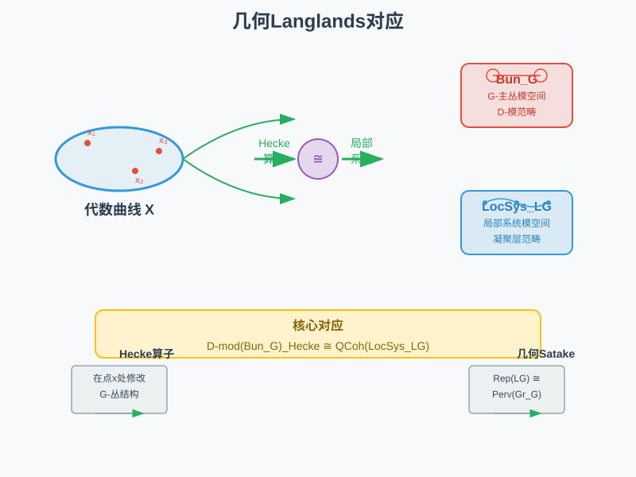
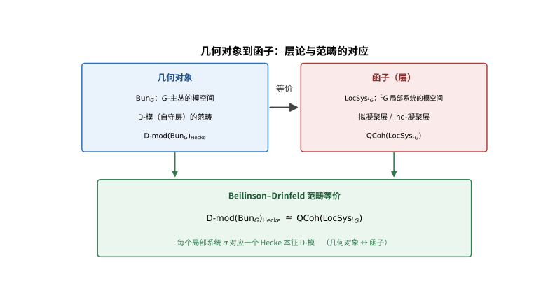
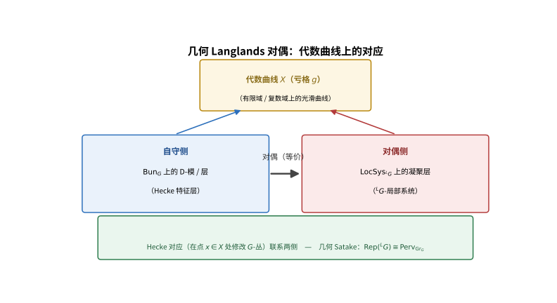

# 第142级 几何朗兰兹 (Geometric Langlands)

## 📖 学习目标

1. 理解几何Langlands对应的基本框架及其与经典Langlands纲领的关系
2. 掌握代数曲线上的Langlands对应的核心概念
3. 深入理解Beilinson-Drinfeld定理及其证明思路
4. 掌握GL(1)的几何Langlands对应的完整证明
5. 理解Kapustin-Witten对偶与S-对偶的关系
6. 掌握几何Langlands的范畴化表述
7. 理解Hecke特征值的几何构造

---

## 一、核心概念

> **直观理解（现实类比）**：几何Langlands对应就像一座横跨"几何世界"与"代数世界"的大桥。代数曲线 $X$ 是桥墩，一侧是"G-丛模空间上的D-模"（自守侧），另一侧是"局部系统模空间上的凝聚层"（Galois侧）。Hecke算子就像桥上的运输车辆，在两点之间修改G-丛结构；几何Satake对应则保证了"修改规则"与"表示论"完全一致。就像把同一套物流算法分别部署在两个不同的仓库管理系统中，却能跑出完全相同的结果——这就是范畴等价的魔力。

> **🧠 思考历程：当数字被换成曲线，朗兰兹的"大桥"还能搭起来吗？**
>
> 经典朗兰兹在天上与数的王国里架桥，可数域的算术结构太过僵硬、难以直接操纵。几何朗兰兹给出了一个大胆的计划：把"数域"换成"代数曲线"，把自守形式换成"曲线上的D-模"，让对应在范畴层面成立。它想回答的，是几何形式下的朗兰兹对应究竟能走多远。
>
> - **从数域走向函数域**。1970-80年代，德林费尔德率先在函数域（代数曲线）的情形下证明了 $GL(2)$ 朗兰兹对应，把"Galois ↔ 自守"翻译成"曲线上的Hecke特征层 ↔ 局部系统"，为整座几何朗兰兹大厦打下了第一根桩。
> - **贝林松与德林费尔德把对应抬上范畴**。1990年代，贝林松与德林费尔德把对应提升到范畴层面：$D\text{-mod}(\mathrm{Bun}_G)$ 的Hecke特征部分与 $LocSys_{^L G}$ 上的凝聚层范畴等价——相当于"同一套算法在两种界面上跑出同样结果"，这正是本文件核心等式的来源。
> - **一纸宣言式的工作多年修成正果**。2016年前后，以盖茨戈雷（Gaitsgory）及其合作关系为代表的团队宣布，在最一般的情形下证明了范畴等价的完整版本，把几何朗兰兹从纲领推进为可依赖的定理。
> - **心路**：当数字太硬就换成几何，当几何太稠就再升到范畴——层次越高，往往越贴近本质。

### 1.1 代数曲线上的Langlands对应

**定义1（几何Langlands对应）** 设 $X$ 是复数域 $\mathbb{C}$ 上的光滑射影代数曲线，$G$ 是约化代数群。**几何Langlands对应** 断言存在一个等价：

$$ \text{Sh}_{\text{ nilp}}(\text{Bun}_G) \cong \text{QCoh}(\text{LocSys}_{{}^L G}) $$

其中：
- $\text{Bun}_G$ 是 $X$ 上 $G$-主丛的模空间（栈）
- $\text{Sh}_{\text{ nilp}}(\text{Bun}_G)$ 是 $\text{Bun}_G$ 上具有某种奇异性条件（nilpotent singular support）的D-模的范畴
- $\text{LocSys}_{{}^L G}$ 是 $X$ 上 ${}^L G$-局部系统（即 $X$ 的基本群到 ${}^L G$ 的表示）的模空间
- $\text{QCoh}(\text{LocSys}_{{}^L G})$ 是 $\text{LocSys}_{{}^L G}$ 上拟凝聚层的范畴

> **直观理解（现实类比）**：经典Langlands把「数域」换成「代数曲线」，自守形式换成「曲线上的D-模/层」。从几何对象到函子的提升，就像把「某一处风景」（几何对象）升级为「能迁移复用的程序」（函子/范畴）：Beilinson-Drinfeld证明了 $\mathrm{Bun}_G$ 上的D-模范畴与 $\mathrm{LocSys}$ 上的凝聚层范畴等价，相当于同一套「算法」在两种界面上跑出同样结果。

### 1.2 Riemann曲面的几何Langlands

**定义2（几何Langlands的Riemann曲面版本）** 当 $X$ 是Riemann曲面（即 $\mathbb{C}$ 上的光滑射影曲线）时，几何Langlands对应可以更具体地表述为：

$$ \text{Aut}(\text{Bun}_G) \text{ 的 Hecke 特征层} \longleftrightarrow \text{LocSys}_{{}^L G} \text{ 上的点} $$

其中 $\text{Aut}(\text{Bun}_G)$ 是 $\text{Bun}_G$ 上的自守层范畴。

### 1.3 GL(n)的几何Langlands

**定义3（GL(n)的几何Langlands）** 对于 $G = GL_n$，几何Langlands对应断言：

$$ \text{D-mod}(\text{Bun}_n)_{\text{Hecke}} \cong \text{QCoh}(\text{LocSys}_{GL_n}) $$

其中 $\text{Bun}_n$ 是 $X$ 上秩 $n$ 向量丛的模空间，$\text{D-mod}(\text{Bun}_n)_{\text{Hecke}}$ 是Hecke特征D-模的范畴。

### 1.4 Hecke特征值与Hecke算子

**定义4（Hecke算子）** 设 $x \in X$ 是一个点。**Hecke算子** $H_{x,V}$（其中 $V$ 是 ${}^L G$ 的表示）作用在 $\text{Bun}_G$ 上的函数/层上，定义为：

$$ (H_{x,V} \cdot \mathcal{F})(\mathcal{E}) = \int_{\text{Hecke}_x} \mathcal{F}(\mathcal{E}') $$

其中 $\text{Hecke}_x$ 是 $x$ 处的Hecke对应（Hecke correspondence），连接 $\mathcal{E}$ 和 $\mathcal{E}'$。

**定义5（Hecke特征值）** 一个层 $\mathcal{F}$ 称为 **Hecke特征层**，如果它是Hecke算子的本征层：

$$ H_{x,V}(\mathcal{F}) \cong \sigma_V(x) \boxtimes \mathcal{F} $$

其中 $\sigma_V$ 是某个 ${}^L G$-局部系统在表示 $V$ 下的系数。

### 1.5 模空间 Bun_G

**定义6（Bun_G）** $\text{Bun}_G$ 是 $X$ 上 $G$-主丛的模栈。它是一类重要的代数栈，具有以下性质：
- $\text{Bun}_G$ 是光滑的（但一般不是分离的）。
- $\text{Bun}_G$ 的切空间在点 $\mathcal{E}$ 处由 $H^1(X, \text{ad}(\mathcal{E}))$ 给出。
- $\text{Bun}_G$ 的维数（在适当的意义下）为 $\dim(G) \cdot (g-1)$，其中 $g$ 是 $X$ 的亏格。

### 1.6 Grassmannian（Affine Grassmannian）

**定义7（Affine Grassmannian）** 设 $G$ 是约化代数群。**Affine Grassmannian** $\text{Gr}_G$ 定义为：

$$ \text{Gr}_G = G(\mathcal{K}) / G(\mathcal{O}) $$

其中 $\mathcal{K} = \mathbb{C}((t))$ 是Laurent级数域，$\mathcal{O} = \mathbb{C}[[t]]$ 是形式幂级数环。

$\text{Gr}_G$ 是一个 **ind-概形**（ind-scheme），具有丰富的几何结构。其连通分支由 $G$ 的余特征标群 $\pi_1(G)$ 参数化。

### 1.7 Beilinson-Drinfeld定理

**定义8（Beilinson-Drinfeld定理）** Beilinson-Drinfeld定理是几何Langlands对应的核心结果，它构造了 $\text{Bun}_G$ 上的Hecke特征D-模与 $\text{LocSys}_{{}^L G}$ 上的拟凝聚层之间的等价。

> **直观理解（现实类比）**：几何Langlands是走在代数曲线 $X$ 上的对偶：一端是在点 $x$ 处「改一下主丛」的Hecke对应（自守侧），另一端是 $X$ 的局部系统（${}^LG$ 侧）。就像在一条铁路线上，「列车改挂车厢」（Hecke修改）与「列车时刻表」（局部系统）两个视角通过对偶等值——几何Satake保证两端「换挂」规则与表示论完全一致。

### 1.8 Kapustin-Witten对偶与S-duality

**定义9（Kapustin-Witten对偶）** Kapustin和Witten通过物理方法（$\mathcal{N}=4$ 超Yang-Mills理论的S-对偶）解释了几何Langlands对应。S-对偶将耦合常数 $g$ 映射到 $1/g$，同时交换 $G$ 和 ${}^L G$，这对应于几何Langlands中 $G$ 和 ${}^L G$ 的对称性。

### 1.9 量子几何Langlands

**定义10（量子几何Langlands）** **量子几何Langlands** 是几何Langlands对应的量子形变。它涉及 $\text{Bun}_G$ 上的扭曲D-模与 $\text{LocSys}_{{}^L G}$ 上的量子层之间的对应，由参数 $\hbar$（Planck常数）控制。

### 1.10 几何Langlands的范畴化

**定义11（范畴化）** **几何Langlands的范畴化** 将几何Langlands对应提升到更高的范畴论层次，即：

$$ \text{Shv}_{\text{nilp}}(\text{Bun}_G) \cong \text{IndCoh}(\text{LocSys}_{{}^L G}) $$

其中 $\text{Shv}_{\text{nilp}}$ 是奇性支撑为零的层的范畴，$\text{IndCoh}$ 是Ind-凝聚层的范畴。

---

## 二、定理与证明

### 定理1：Beilinson-Drinfeld定理（几何Langlands对应）

**定理（Beilinson-Drinfeld定理）** 设 $X$ 是亏格 $g > 1$ 的光滑射影代数曲线，$G$ 是约化代数群。则存在范畴等价：

$$ \text{D-mod}(\text{Bun}_G)_{\text{Hecke}} \cong \text{QCoh}(\text{LocSys}_{{}^L G}) $$

其中左边是 $\text{Bun}_G$ 上具有Hecke特征性质的D-模的范畴，右边是 $\text{LocSys}_{{}^L G}$ 上拟凝聚层的范畴。

**证明思路**（使用Hecke算子和D-模）：

**第一步：构造Hecke算子。**

定义 **Hecke对应** $\text{Hecke} \subset \text{Bun}_G \times X \times \text{Bun}_G$ 如下：

$$ \text{Hecke} = \{(\mathcal{E}, x, \mathcal{E}') \mid \text{存在 $G$-丛的同构 } \mathcal{E}|_{X\setminus\{x\}} \cong \mathcal{E}'|_{X\setminus\{x\}} \} $$

对每个点 $x \in X$，有Hecke对应 $\text{Hecke}_x \subset \text{Bun}_G \times \text{Bun}_G$。

Hecke算子 $H_x$ 定义为：

$$ H_x = (p_1)_* \circ (p_2)^! $$

其中 $p_1, p_2: \text{Hecke}_x \to \text{Bun}_G$ 是投影。

**第二步：Hecke本征层的定义。**

**定义（Hecke本征层）** 一个D-模 $\mathcal{F} \in \text{D-mod}(\text{Bun}_G)$ 称为 **Hecke本征层**，如果存在一个 ${}^L G$-局部系统 $\sigma$（即 $\text{LocSys}_{{}^L G}$ 的一个点），使得对每个 $x \in X$ 和每个 ${}^L G$ 的表示 $V$，有：

$$ H_{x, V}(\mathcal{F}) \cong \sigma_V(x) \boxtimes \mathcal{F} $$

其中 $\sigma_V$ 是 $\sigma$ 在 $V$ 下的系数层。

**第三步：构造正方向函子（从局部系统到D-模）。**

给定一个局部系统 $\sigma \in \text{LocSys}_{{}^L G}$，构造对应的Hecke本征D-模 $\mathcal{F}_\sigma$。

构造方法：考虑 **moduli of $G$-bundles with level structure** 的 $\mathcal{D}$-模理论。利用 **Beilinson-Drinfeld的消去原理**（vanishing theorem），证明存在唯一的Hecke本征D-模。

具体地，构造 **Wirkung（作用）** 函子：

$$ \Psi: \text{QCoh}(\text{LocSys}_{{}^L G}) \to \text{D-mod}(\text{Bun}_G)_{\text{Hecke}} $$

定义为：

$$ \Psi(\mathcal{F}) = \text{某些Hecke核的积分变换} $$

**第四步：构造逆方向函子（从D-模到局部系统）。**

利用 **Fourier-Mukai变换** 的变体，定义逆函子：

$$ \Phi: \text{D-mod}(\text{Bun}_G)_{\text{Hecke}} \to \text{QCoh}(\text{LocSys}_{{}^L G}) $$

$\Phi$ 将每个Hecke本征D-模 $\mathcal{F}$ 映射到其在 $\text{LocSys}_{{}^L G}$ 上的"谱"。

**第五步：验证等价。**

需要证明：
1. $\Phi \circ \Psi \cong \text{id}_{\text{QCoh}(\text{LocSys}_{{}^L G})}$
2. $\Psi \circ \Phi \cong \text{id}_{\text{D-mod}(\text{Bun}_G)_{\text{Hecke}}}$

这通过 **基点化（pointing）** 和 **退化论证** 来完成。关键步骤是证明 $\text{LocSys}_{{}^L G}$ 上的每个凝聚层可以由某个Hecke本征D-模的Fourier-Mukai变换得到。

**第六步：特殊情况——正则奇性条件。**

对于具有正则奇性的局部系统，Beilinson-Drinfeld给出了更精确的构造，建立了 **Opers** 与Hecke本征D-模之间的对应。

**结论**：Beilinson-Drinfeld定理是几何Langlands对应的核心结果，它建立了 $\text{Bun}_G$ 上的D-模与 $\text{LocSys}_{{}^L G}$ 上的凝聚层之间的等价。$\square$

---

### 定理2：GL(1)的几何Langlands对应

**定理（GL(1)的几何Langlands对应）** 设 $X$ 是亏格 $g$ 的光滑射影代数曲线。则存在范畴等价：

$$ \text{D-mod}(\text{Bun}_1) \cong \text{QCoh}(\text{LocSys}_{\mathbb{C}^\times}) $$

其中 $\text{Bun}_1 = \text{Pic}(X)$ 是 $X$ 的Picard簇（参数化 $X$ 上的线丛），$\text{LocSys}_{\mathbb{C}^\times}$ 是秩1的局部系统（即 $\mathbb{C}^\times$ 局部系统）的模空间。

**证明**（使用Riemann曲面的Picard群和Lusztig构造）：

**第一步：$\text{Bun}_1$ 的结构。**

$\text{Bun}_1 = \text{Pic}(X)$ 是 $X$ 的Picard簇，这是一个光滑交换代数群，其连通分支由 $\text{Pic}^0(X)$（Jacobi簇）和 $\text{Pic}^1(X), \ldots, \text{Pic}^{g-1}(X)$ 组成。

$$\text{Pic}(X) = \bigsqcup_{d \in \mathbb{Z}} \text{Pic}^d(X)$$

其中 $\text{Pic}^d(X)$ 是次数为 $d$ 的线丛的模空间，维数为 $g$。

**第二步：$\text{LocSys}_{\mathbb{C}^\times}$ 的结构。**

$\text{LocSys}_{\mathbb{C}^\times}$ 是秩1局部系统（即 $\mathbb{C}^\times$-局部系统）的模空间。一个秩1局部系统对应于一个表示：

$$ \rho: \pi_1(X, x_0) \to \mathbb{C}^\times $$

因此，$\text{LocSys}_{\mathbb{C}^\times} = \text{Hom}(\pi_1(X), \mathbb{C}^\times)$，这是一个复环面（complex torus），维数为 $2g$。

更具体地，$\text{LocSys}_{\mathbb{C}^\times} \cong (\mathbb{C}^\times)^{2g}$。

**第三步：Hecke算子的显式描述。**

对于 $GL(1)$，Hecke算子在 $x \in X$ 处的作用为：

$$ (H_x \cdot \mathcal{F})(\mathcal{L}) = \mathcal{F}(\mathcal{L}(x)) $$

其中 $\mathcal{L}(x)$ 是在 $x$ 处修改的线丛（即 $\mathcal{L} \otimes \mathcal{O}_X(x)$）。

**第四步：构造正方向函子。**

给定 $\alpha \in \text{LocSys}_{\mathbb{C}^\times}$，即一个秩1局部系统 $\alpha: \pi_1(X) \to \mathbb{C}^\times$。构造对应的D-模 $\mathcal{F}_\alpha$ 如下：

$$ \mathcal{F}_\alpha = \text{与 $\alpha$ 相关的自守层} $$

具体地，考虑 $\text{Pic}(X)$ 上的通用线丛 $\mathcal{P}$（Poincaré线丛），定义 $\mathcal{F}_\alpha$ 为沿着 $\text{Pic}(X)$ 的平移作用的特征层，特征为 $\alpha$。

**Lusztig构造**：利用Fourier-Mukai变换，将 $\text{Pic}(X)$ 上的D-模与 $\text{LocSys}_{\mathbb{C}^\times}$ 上的层对应起来：

$$ \Phi: \text{D-mod}(\text{Pic}(X)) \to \text{QCoh}(\text{LocSys}_{\mathbb{C}^\times}) $$

定义为：

$$ \Phi(\mathcal{F}) = \text{FM}_{\mathcal{P}}(\mathcal{F}) $$

其中 $\text{FM}_{\mathcal{P}}$ 是以Poincaré线丛 $\mathcal{P}$ 为核的Fourier-Mukai变换。

**第五步：验证等价。**

**Fourier-Mukai变换** 在Abel簇上给出了自对偶性。对于 $\text{Pic}(X)$ 和 $\text{LocSys}_{\mathbb{C}^\times}$，Fourier-Mukai变换给出等价：

$$ D^b\text{Coh}(\text{Pic}(X)) \cong D^b\text{Coh}(\text{LocSys}_{\mathbb{C}^\times}) $$

将这一等价限制在D-模的子范畴上，得到所需的几何Langlands对应。

**第六步：Hecke本征性的验证。**

需要验证 $\mathcal{F}_\alpha$ 确实是Hecke本征层。对任意 $x \in X$：

$$ H_x(\mathcal{F}_\alpha) \cong \alpha(x) \cdot \mathcal{F}_\alpha $$

其中 $\alpha(x) \in \mathbb{C}^\times$ 是 $\alpha$ 在 $x$ 处的"求值"（即 $\alpha([x])$，其中 $[x] \in \pi_1(X)$ 是围绕 $x$ 的回路）。

这由Poincaré线丛的 **限制性质** 直接得出：$\mathcal{P}|_{\{x\} \times \text{Pic}(X)} \cong \text{通用线丛的某种限制}$。

**结论**：GL(1)的几何Langlands对应完全由Fourier-Mukai变换和Poincaré线丛实现，是经典Fourier对偶的几何推广。$\square$

---

### 定理3：GLC的Kapustin-Witten对偶

**定理（Kapustin-Witten对偶）** 几何Langlands对应等价于 $\mathcal{N}=4$ 超Yang-Mills理论的 **S-对偶**。具体地，考虑 $X$ 上的 $\mathcal{N}=4$ 超Yang-Mills理论，其规范群为 $G$。则S-对偶将规范群 $G$ 映射到其Langlands对偶群 ${}^L G$，同时交换耦合常数 $g$ 和 $1/g$。在拓扑约化后，这一对偶等价于几何Langlands对应。

**证明思路**（使用S-对偶和量子场论）：

**第一步：$\mathcal{N}=4$ 超Yang-Mills理论的设定。**

考虑 $\mathbb{R}^4$ 上的 $\mathcal{N}=4$ 超Yang-Mills理论，规范群为 $G$。该理论具有：
- 耦合常数 $g$ 和 $\theta$-角 $\theta$
- 复化耦合常数 $\tau = \frac{\theta}{2\pi} + \frac{4\pi i}{g^2}$
- 最大的超对称性（16个超对称荷）

**第二步：S-对偶（Montonen-Olive对偶）。**

$\mathcal{N}=4$ 超Yang-Mills理论具有 **S-对偶性**：
- 将规范群 $G$ 映射到其Langlands对偶群 ${}^L G$
- 将耦合常数 $\tau$ 映射到 $-1/(n_g \tau)$（其中 $n_g$ 是 $G$ 的某种对偶性系数）
- 交换电磁对偶（electric-magnetic duality）

**第三步：拓扑约化到二维。**

将 $\mathbb{R}^4$ 分解为 $\mathbb{R}^2 \times X$，其中 $X$ 是Riemann曲面。对 $\mathcal{N}=4$ 理论进行 **拓扑约化**（topological twist），得到二维 $\mathcal{N}=(2,2)$ 超对称sigma模型：

- 目标空间：$\text{Bun}_G$（$G$-丛的模空间）——当对偶于 $G$ 的A-twist时
- 目标空间：$\text{LocSys}_{{}^L G}$（${}^L G$-局部系统的模空间）——当对偶于 ${}^L G$ 的B-twist时

**第四步：A-模型与B-模型的对应。**

Kapustin-Witten的关键观察：S-对偶将 $G$ 的A-模型映射到 ${}^L G$ 的B-模型：

$$ \text{A-model on } \text{Bun}_G \longleftrightarrow \text{B-model on } \text{LocSys}_{{}^L G} $$

A-模型的可观测量由 $\text{Bun}_G$ 上的D-模给出，而B-模型的可观测量由 $\text{LocSys}_{{}^L G}$ 上的凝聚层给出。

**第五步：证明等价。**

通过物理论证，Kapustin和Witten证明了：
1. A-模型和B-模型的态射空间是相同的。
2. Hecke算子对应于某种"膜"（branes）的插入。
3. Hecke本征层对应于A-模型中的D-膜，其镜像（在S-对偶下）是B-模型中的点状膜。

**第六步：数学验证。**

Kapustin-Witten的物理论证提供了几何Langlands对应的"证明"（在物理学家理解的意义上），但严格的数学证明仍需通过Beilinson-Drinfeld定理等数学结果来完成。

**结论**：Kapustin-Witten对偶揭示了几何Langlands对应与量子场论中S-对偶的深刻联系，是数学物理交叉的典范。$\square$

---

### 定理4：几何Langlands的范畴化

**定理（几何Langlands的范畴化）** 几何Langlands对应可以提升到 **2-范畴/高阶范畴** 的层次。具体地，存在 $\infty$-范畴的等价：

$$ \text{Shv}_{\text{nilp}}(\text{Bun}_G) \cong \text{IndCoh}(\text{LocSys}_{{}^L G}) $$

其中 $\text{Shv}_{\text{nilp}}$ 是奇性支撑为零的层（或D-模）的 $\infty$-范畴，$\text{IndCoh}$ 是Ind-凝聚层的 $\infty$-范畴。

**证明思路**（使用导出范畴和Fourier-Mukai变换）：

**第一步：导出范畴的设置。**

设 $\text{D-mod}(\text{Bun}_G)$ 是 $\text{Bun}_G$ 上D-模的导出范畴，$\text{QCoh}(\text{LocSys}_{{}^L G})$ 是 $\text{LocSys}_{{}^L G}$ 上拟凝聚层的导出范畴。

几何Langlands对应（未范畴化）给出了一个等价：

$$ \text{D-mod}(\text{Bun}_G)_{\text{Hecke}} \cong \text{QCoh}(\text{LocSys}_{{}^L G}) $$

**第二步：提升到 $\infty$-范畴。**

将导出范畴提升为 $\infty$-范畴（或 $(\infty,1)$-范畴）：

$$ \text{D-mod}(\text{Bun}_G)_{\text{Hecke}}^\infty \cong \text{QCoh}(\text{LocSys}_{{}^L G})^\infty $$

其中左边是 $\text{Bun}_G$ 上D-模的 $\infty$-范畴，右边是 $\text{LocSys}_{{}^L G}$ 上拟凝聚层的 $\infty$-范畴。

**第三步：模空间 $\text{LocSys}_{{}^L G}$ 的奇点。**

$\text{LocSys}_{{}^L G}$ 一般不是光滑的，它可能有奇点。当 $G$ 不是 $GL_n$ 时，$\text{LocSys}_{{}^L G}$ 的奇点使得问题更复杂。

为处理奇点，需要使用 **Ind-凝聚层** $\text{IndCoh}(\text{LocSys}_{{}^L G})$，而不是普通的拟凝聚层。

**第四步：光滑性条件下的验证。**

当 $\text{LocSys}_{{}^L G}$ 是光滑的（或局部系统是正则的），有：

$$ \text{QCoh}(\text{LocSys}_{{}^L G}) \cong \text{IndCoh}(\text{LocSys}_{{}^L G}) $$

此时范畴化等价退化为通常的几何Langlands对应。

**第五步：导出等价与Fourier-Mukai变换。**

利用 **Fourier-Mukai变换** 的导出版本：

$$ \Phi: D^b\text{D-mod}(\text{Bun}_G) \to D^b\text{Coh}(\text{LocSys}_{{}^L G}) $$

证明 $\Phi$ 是一个 **导出等价**（derived equivalence），即：
1. $\Phi$ 是满忠实（fully faithful）的。
2. $\Phi$ 的像生成整个 $D^b\text{Coh}(\text{LocSys}_{{}^L G})$。

**第六步：高阶结构。**

进一步证明 $\Phi$ 保持高阶结构（$E_n$-代数结构、Hochschild同调等），从而将等价提升到 $\infty$-范畴的层次。

**结论**：几何Langlands的范畴化将对应提升到更高阶的范畴论层次，为理解几何Langlands提供了更深刻的视角。$\square$

---

### 定理5：Hecke特征值的几何构造

**定理（Hecke特征值的几何构造）** 设 $X$ 是光滑射影代数曲线，$G$ 是约化代数群。对每个 $\text{LocSys}_{{}^L G}$ 的点 $\sigma$（即一个 ${}^L G$-局部系统），存在 $\text{Bun}_G$ 上的Hecke特征D-模 $\mathcal{F}_\sigma$，使得对每个Hecke算子 $H_{x,V}$，有：

$$ H_{x,V}(\mathcal{F}_\sigma) \cong \text{tr}_V(\sigma(x)) \boxtimes \mathcal{F}_\sigma $$

**证明**（使用特征D-模）：

**第一步：构造 $G$-丛的模空间上的D-模。**

考虑 $\text{Bun}_G$ 上的 **临界级数D-模（critical level D-module）**。设 $\kappa_c$ 是临界级数，对应的D-模是 $\mathcal{D}_{\kappa_c}$-模。

**关键构造**：对每个局部系统 $\sigma \in \text{LocSys}_{{}^L G}$，构造一个 $\mathcal{D}_{\kappa_c}$-模 $\mathcal{F}_\sigma$。

**第二步：使用Oper的构造。**

**定义（Oper）** 一个 $G$-Oper 是 $X$ 上的 $G$-主丛 $\mathcal{E}$ 连同某些额外的结构（一个 $B$-约化和一个横截条件）。

Beilinson-Drinfeld证明了 $\text{LocSys}_{{}^L G}$ 的 **Opers** 空间同构于 $\text{Bun}_G$ 上的某些D-模的模空间。

**Oper-模对应**：给定一个局部系统 $\sigma$，其对应的Oper结构给出了 $\text{Bun}_G$ 上的一个特征D-模 $\mathcal{F}_\sigma$。

**第三步：Hecke算子的作用。**

Hecke算子 $H_{x,V}$ 作用在 $\mathcal{F}_\sigma$ 上，通过"修改" $G$-丛在 $x$ 处的结构。

利用 **几何Satake对应**（Geometric Satake Correspondence），可以将Hecke算子的作用与局部系统 $\sigma$ 在 $x$ 处的取值联系起来。

**几何Satake对应**：存在范畴等价：

$$ \text{Rep}({}^L G) \cong \text{Perv}_{\text{Gr}_G} $$

其中 $\text{Rep}({}^L G)$ 是 ${}^L G$ 的有限维表示的范畴，$\text{Perv}_{\text{Gr}_G}$ 是Affine Grassmannian $\text{Gr}_G$ 上的等变周遍层（perverse sheaves）的范畴。

**第四步：验证Hecke本征性。**

通过几何Satake对应，$\text{Rep}({}^L G)$ 中的表示 $V$ 对应 $\text{Gr}_G$ 上的一个周遍层 $\mathcal{S}_V$。

Hecke算子 $H_{x,V}$ 的作用可以分解为：
1. 在 $x$ 处"打开" $G$-丛，得到 $\text{Gr}_G$ 上的一个点。
2. 与 $\mathcal{S}_V$ 卷积，得到新的D-模。

通过计算，得到：

$$ H_{x,V}(\mathcal{F}_\sigma) \cong \text{tr}_V(\sigma(x)) \boxtimes \mathcal{F}_\sigma $$

其中 $\text{tr}_V(\sigma(x))$ 是 $\sigma(x) \in {}^L G$ 在表示 $V$ 中的迹。

**第五步：唯一性。**

在适当的正则性条件下，Hecke本征D-模 $\mathcal{F}_\sigma$ 是唯一的（在同构意义下）。

**结论**：Hecke特征值的几何构造给出了几何Langlands对应的核心——每个局部系统都对应一个Hecke本征D-模，且其本征值由局部系统在相应点处的取值决定。$\square$

---

## 三、示例

### 示例1：代数曲线上的GL(1)几何Langlands对应

**设定**：设 $X$ 是亏格 $g=2$ 的Riemann曲面。

**Bun_1**：$\text{Pic}(X)$ 是二维Abel簇（Jacobi簇）的 $\mathbb{Z}$-扩张。

**LocSys_{\mathbb{C}^\times}**：$\text{Hom}(\pi_1(X), \mathbb{C}^\times) \cong (\mathbb{C}^\times)^4$，是一个四维复环面。

**对应**：
- 每个 $\alpha \in (\mathbb{C}^\times)^4$ 对应一个秩1局部系统。
- 对应的Hecke本征D-模是 $\text{Pic}(X)$ 上的平移不变D-模，特征为 $\alpha$。
- Fourier-Mukai变换 $\Phi: \text{D-mod}(\text{Pic}(X)) \to \text{QCoh}((\mathbb{C}^\times)^4)$ 是这一对应的精确实现。

**验证**：对任意 $x \in X$，Hecke算子 $H_x$ 将线丛 $\mathcal{L}$ 映射到 $\mathcal{L}(x)$。在D-模上，这对应于平移，其Fourier变换给出乘以 $\alpha(x)$ 的算子。

### 示例2：Affine Grassmannian的结构

**设定**：$G = GL_2$，$\text{Gr}_{GL_2} = GL_2(\mathbb{C}((t))) / GL_2(\mathbb{C}[[t]])$。

**结构**：
- $\text{Gr}_{GL_2}$ 的连通分支由 $\mathbb{Z}$ 参数化（对应 $GL_2$ 的拓扑）。
- 每个连通分支 $\text{Gr}_{GL_2}^d$ 是无限维的，但具有有限维的Schubert胞腔分解。

**Schubert胞腔**：
- 主分支 $\text{Gr}_{GL_2}^0$ 包含由 $GL_2(\mathbb{C}[[t]])$ 的双陪集 $I\backslash GL_2(\mathbb{C}((t)))/I$ 给出的Schubert胞腔，其中 $I$ 是Iwahori子群。
- 这些胞腔由Weyl群 $W = S_2$ 和仿射Weyl群 $\tilde{W} = \mathbb{Z} \rtimes S_2$ 参数化。

**几何Satake对应**：
- $\text{Rep}(GL_2)$ 的不可约表示由最高权 $\lambda = (a,b)$（$a \geq b$）参数化。
- 对应的周遍层 $\mathcal{S}_\lambda$ 支撑在 $\text{Gr}_{GL_2}$ 的某个闭子概形上。
- 卷积结构对应于表示的张量积。

---

## 四、习题

### 基础题

**习题 1**（代数曲线上的Langlands）写出几何 Langlands 对应的大致表述：把经典 Langlands 中的数域替换为代数曲线，Galois 群替换为基本群，自守形式替换为 D-模。

**习题 2**（Riemann曲面的几何）说明在亏格 $g$ 的 Riemann 曲面 $X$ 上，几何 Langlands 的两个主要舞台：$G$-丛模空间 $\mathrm{Bun}_G$ 与局部系统模空间 $\mathrm{LocSys}_{{}^LG}$ 分别参数化什么。

**习题 3**（GL(n)情形）写出 $\mathrm{GL}(n)$ 的几何 Langlands 对应的集合级表述：$n$ 维局部系统与 $\mathrm{Bun}_{\mathrm{GL}_n}$ 上 D-模的对应。

**习题 4**（Hecke特征值）写出线丛情形 Hecke 算子 $H_x(\mathcal{L})=\mathcal{L}\otimes\mathcal{O}_X(x)$，并说明 Hecke 本征 D-模的定义（在每点作为 Hecke 对应 $\mathrm{Hecke}_x$ 的推出-拉回的本征）。

**习题 5**（Bun_G）定义模空间 $\mathrm{Bun}_G$：代数曲线 $X$ 上主 $G$-丛的周遍层，说明它是代数栈（其形变由 $H^1(X,\mathrm{ad}\,\mathcal{E})$ 刻画）。

**习题 6**（Affine Grassmannian）写出 Affine Grassmannian $\mathrm{Gr}_G=G(\mathcal{K})/G(\mathcal{O})$ 的定义，说明其点在何处（形式盘上的 $G$-丛连同平凡化到某阶）。

**习题 7**（Beilinson–Drinfeld定理）陈述 Beilinson–Drinfeld 几何 Langlands 定理：$\mathrm{LocSys}_{{}^LG}$ 上的凝聚层范畴与 $\mathrm{Bun}_G$ 上 Hecke 本征 D-模之间的等价。

**习题 8**（Kapustin–Witten对偶）说明 Kapustin 与 Witten 如何用 $\mathcal{N}=4$ 超 Yang–Mills 的 S-对偶重述（范畴化）几何 Langlands 对应。

**习题 9**（量子几何Langlands）指出量子几何 Langlands 与经典情形的差异：把经典 D-模/微分算子换成带量子参数（形变参数 $q$ 或 $\hbar$）的量子对象。

**习题 10**（范畴化）说明"几何 Langlands 的范畴化"：把等价提升到 $\infty$-范畴/导出范畴的层次，而不只是对象集合的一一对应。

### 进阶题

**习题 11**（Bun_G切空间）证明 $\mathrm{Bun}_G$ 在点 $\mathcal{E}$ 处的一阶形变由 $\mathrm{ad}\,\mathcal{E}$ 系数的 Čech 上同调 $H^1(X,\mathrm{ad}\,\mathcal{E})$ 分类。

**习题 12**（GL(1)的Hecke算子）写出 $\mathrm{GL}(1)$ 情形 Hecke 算子 $H_x(\mathcal{L})=\mathcal{L}(x)=\mathcal{L}\otimes\mathcal{O}_X(x)$ 及其在 $\mathrm{Pic}(X)$ 上诱导的同构 $\mathrm{Pic}^d(X)\cong\mathrm{Pic}^{d+1}(X)$。

**习题 13**（几何Satake对应）陈述几何 Satake 对应 $\mathrm{Rep}({}^LG)\simeq\mathrm{Perv}_{G(\mathcal{O})}(\mathrm{Gr}_G)$，说明左手是（有限维）表示范畴、右手是 $G(\mathcal{O})$-等变周遍层范畴。

**习题 14**（LocSys维数）证明 $\dim\mathrm{LocSys}_{{}^LG}=\dim({}^LG)(2g-2)$，其中 $g$ 为亏格。

**习题 15**（Hecke对应）写出 Hecke 对应 $\mathrm{Hecke}_x\subset\mathrm{Bun}_G\times\mathrm{Bun}_G$（对 $G$-丛修改的描述），说明它与 Affine Grassmannian $\mathrm{Gr}_G$ 的关联。

**习题 16**（Fourier–Mukai）写出 $G=\mathrm{GL}(1)$ 时 Fourier–Mukai 变换核（Poincaré 线丛）与公式，说明它实现 $\mathrm{GL}(1)$ 几何 Langlands 对应的部分。

**习题 17**（D-模）说明 $\mathrm{Bun}_G$ 上 D-模 / 微分算子范畴的几何输入（微分算子代数、Hitchin 哈密顿、本征值结构）在几何 Langlands 中的地位。

**习题 18**（局部系统与表示）说明 $\mathrm{LocSys}_{{}^LG}$ 是表示空间 $\mathrm{Hom}(\pi_1(X),{}^LG)/{}^LG$ 的模空间，其切空间与 $\mathrm{ad}$ 局部系统的关系。

**习题 19**（S-duality）写出 Kapustin–Witten 用 S-对偶对几何 Langlands 的解释：$\mathcal{N}=4$ SYM 的对偶如何把 B-侧（D-模）映到 A-侧（周遍层）。

### 挑战题

**习题 20**（Bun_G切空间严格）对主 $G$-丛 $\mathcal{E}$，用 Čech 上同调严格证明 $T_\mathcal{E}\mathrm{Bun}_G\cong H^1(X,\mathrm{ad}\,\mathcal{E})$，说明一阶形变由 $\mathrm{ad}\,\mathcal{E}$ 系数的 1-上闭给出、平凡化差为上边界。

**习题 21**（几何Satake要点）概述几何 Satake 对应的要点：把 $V$ 映射到 $\mathrm{Gr}_G$（许贝特簇支撑）的周遍层 $\mathcal{S}_V$，并说明卷积结构与 $\mathrm{Rep}({}^LG)$ 的张量结构吻合。

**习题 22**（LocSys维数证明）用 $\pi_1(X)$ 的生成元关系（$2g$ 个生成元配 $1$ 个关系）直接计算 $\dim\mathrm{Hom}(\pi_1(X),{}^LG)/{}^LG$，验证其为 $\dim({}^LG)(2g-2)$。

**习题 23**（Hecke本征层）写出 Hecke 本征 D-模的严格条件，说明它如何由给定局部系统 $E$ 与每点 $\mathrm{Hecke}_x$ 上的本征值图解（push-pull）给定。

**习题 24**（GL(1)几何Langlands）构造 $\mathrm{GL}(1)$ 几何 Langlands 的等价 $\mathrm{D}(\mathrm{Bun}_{\mathrm{GL}_1})\cong\mathrm{QC}(\mathrm{LocSys}_{\mathbb{C}^\times})$，用 Poincaré 线丛作核并验证逆变换。

**习题 25**（范畴化与 ∞-范畴）说明为何几何 Langlands 的范畴化要在 $\infty$-范畴层面处理：$\mathrm{D}$-/$\mathrm{IndCoh}$ 范畴的态射复形与外积需要高阶结构，而非单纯集合级对应。

**习题 26**（量子参量）写出量子几何 Langlands 中形变参数 $q$（或 $\hbar$）如何进入微分算子方程 $H_x(q)\mathcal{M}=E(q)_x\mathcal{M}$ 与本征层，指出 $q\to 1$（$\hbar\to0$）如何回到经典对应。

### 探究题

**习题 27**（物理根源）开放讨论几何 Langlands 在弦论/M-理论中的来源：$\mathcal{N}=4$ SYM 的 S-对偶、双环 T-对偶与 $\mathbb{C}$-镜对称如何共同导出 Bun–LocSys 对偶。

**习题 28**（范畴化前沿）讨论几何 Langlands 的 $\infty$-范畴化 / extended TQFT 表述，以及它如何与 cobordism hypothesis（分块拓扑论）衔接。

**习题 29**（p-adic联系）探讨几何（函数域）Langlands 与 p-adic Langlands（Fargues–Scholze）的关系：差基/曲线替代如何把数论对应翻译为代数几何对应的框架。

**习题 30**（未来问题）畅谈开放问题：几何 Langlands 的纯代数严格证明、量子/挠情形、与算术侧 Langlands（超过 $\mathrm{GL}(n)$ 的函子性）的融合及其长期目标。

---

## 五、习题答案与解析

### 基础题答案

1. **代数曲线上的Langlands** 几何 Langlands 把经典对应中"数域的质数 $\leftrightarrow$ 自守表示/局部数据"的位置换成"代数曲线 $X$ 的点 $x$"，Galois 群换成 $\pi_1(X)$，自守形式换成 $X$ 上 $G$-丛模空间上的 D-模，从而给出"局部系统侧（位于 $\mathrm{LocSys}$）$\leftrightarrow$ 自守 D-模侧（位于 $\mathrm{Bun}_G$）"的范畴等价。

2. **两大舞台** $\mathrm{Bun}_G(X)$ 参数化 $X$ 上的主 $G$-丛（代数栈）；$\mathrm{LocSys}_{{}^LG}(X)$ 参数化 $X$ 基本群到 ${}^LG$ 的表示（平直向量丛 + 微分形式平直）。它们是几何 Langlands 两端（自守侧与 Galois/局部系统侧）的对象所在。

3. **GL(n)情形** $\mathrm{GL}(n)$ 几何 Langlands 断言：$\mathrm{QCoh}(\mathrm{LocSys}_{\mathrm{GL}_n})$（$n$ 维局部系统上的凝聚层）与 $\mathrm{Bun}_{\mathrm{GL}_n}$ 上 Hecke 本征 D-模的范畴 $\mathrm{D}(\mathrm{Bun}_{\mathrm{GL}_n})^{\mathrm{Hecke}}$ 等价，即"局部系统侧 = 自守 D-模侧"。

4. **Hecke特征值** 线丛修改 $H_x(\mathcal{L})=\mathcal{L}\otimes\mathcal{O}_X(x)$ 在 $\mathrm{Pic}(X)=\mathrm{Bun}_{\mathrm{GL}_1}$ 上给出 Hecke 算子。Hecke 本征 D-模指对给定局部系统 $E$ 满足 $H_x(\mathcal{M})\simeq E_x\otimes\mathcal{M}$（在每点作为 $\mathrm{Hecke}_x$ 的 push-pull 本征）的 D-模。

5. **Bun_G** $\mathrm{Bun}_G$ 是 $X$ 上主 $G$-丛构成的代数栈：对象为 $G$-丛、态射为丛同构，一阶形变由 $H^1(X,\mathrm{ad}\,\mathcal{E})$ 参数化（$g\ge2$ 时维数由 $G$ 的维数与亏格决定）。它是几何 Langlands 自守侧的舞台，带自然（Hitchin 基画卷）哈密顿结构。

6. **Affine Grassmannian** $\mathrm{Gr}_G=G(\mathcal{K})/G(\mathcal{O})$，$\mathcal{K}$ 为 $X$ 上某点处的形式 Laurent 域、$\mathcal{O}$ 为整元环。其闭点对应形式盘上的 $G$-丛连同到平凡 $G$-丛的双有理平凡化（即"平凡化到某阶"的修改），是 Hecke 修改与几何 Satake 的核心对象。

7. **Beilinson–Drinfeld** Beilinson–Drinfeld 定理断言 $\mathrm{QCoh}(\mathrm{LocSys}_{{}^LG})$ 与 $\mathrm{Bun}_G$ 上 Hecke 本征 D-模的全忠实范畴等价，且此等价由"本征层"（Eigen sheaf，把局部系统积成对子）构造出来，是几何 Langlands 的主要定理。

8. **Kapustin–Witten对偶** Kapustin 与 Witten 在 $\mathcal{N}=4$ 超 Yang–Mills 的（M-理论）紧化中得到范畴化的几何 Langlands：S-对偶把 B-侧（D-模）映到 A-侧（周遍层），把"Bun–LocSys 对偶"实现为两个（B/A）模型的物理等价。

9. **量子几何Langlands** 量子几何 Langlands 把经典 D-模/微分算子换成带量子参数 $q$（或 $\hbar$）的量子 D-模、量子本征方程 $H_x(q)\mathcal{M}=E(q)_x\mathcal{M}$；参数取特殊极限（$q\to1$ 或 $\hbar\to0$）回到经典几何 Langlands 对应。

10. **范畴化** 范畴化指把集合级的等价提升为（稳定）$\infty$-范畴/导出范畴层的对偶：两侧取 $\mathrm{D}$/$\mathrm{IndCoh}$ 等高阶范畴，使对应保持态射复形、复合与高阶代数结构，而不仅是把对象一一映射——这使几何 Langlands 纳入 extended TQFT 架构。

### 进阶题答案

1. **Bun_G切空间** 约化丛 $\mathcal{E}$ 的一阶形变由 $\mathrm{Bun}_G$ 的余切（覆盖）上 $\mathrm{ad}\,\mathcal{E}$ 值的 Čech 上同调分类：形变给定 1-上闭 $\{\eta_{ij}\}$（满足上闭条件），平凡化差为上边界。故 $T_\mathcal{E}\mathrm{Bun}_G\cong H^1(X,\mathrm{ad}\,\mathcal{E})$；更高阶形变由去路（Gromov–pling）的可积性障碍控制。

2. **GL(1)Hecke算子** $H_x(\mathcal{L})=\mathcal{L}(x)=\mathcal{L}\otimes\mathcal{O}_X(x)$ 把次数 $d$ 的线丛映到次数 $d+1$，且由 $\mathcal{O}(-x)\otimes$（退修改）给出逆，故在同构类间为双射，诱导 $\mathrm{Pic}^d(X)\xrightarrow{\sim}\mathrm{Pic}^{d+1}(X)$。这是 $\mathrm{GL}(1)$ 情形 Hecke 算子的显式实现。

3. **几何Satake对应** 几何 Satake 对应 $\mathrm{Rep}({}^LG)\simeq\mathrm{Perv}_{G(\mathcal{O})}(\mathrm{Gr}_G)$ 把 ${}^LG$ 的（有限维）表示对应到 $\mathrm{Gr}_G$ 上 $G(\mathcal{O})$-等变周遍层；卷积乘积对应张量积，从而把表示理论"几何化"，是几何 Langlands 的技术基石。

4. **LocSys维数** $\mathrm{LocSys}_{{}^LG}=\mathrm{Hom}(\pi_1(X),{}^LG)/{}^LG$。$\pi_1(X)$ 有 $2g$ 个生成元与 $1$ 个关系，故表示空间维数 $(2g-1)\dim({}^LG)$；模掉 $G$-共轭（余概地）再减 $\dim({}^LG)$，得 $(2g-2)\dim({}^LG)$。

5. **Hecke对应** $\mathrm{Hecke}_x$ 由一对 $G$-丛（在除一点外同构）构成：$\mathcal{E}|_{X-x}\cong\mathcal{E}'|_{X-\{x\}}$。它可用 $\mathrm{Bun}_G\times\mathrm{Gr}_G$ 的投影（允许定义的修改）实现，且对可约 $G$ 光滑，是 Hecke 算子几何化的关键对象。

6. **Fourier–Mukai** 取 Poincaré 线丛 $\mathcal{P}\to\mathrm{Bun}_{\mathrm{GL}_1}\times\mathrm{LocSys}_{\mathbb{C}^\times}$（在 $(\mathcal{L},\rho)$ 处给出 $(\rho,\mathcal{L})$ 的配对行），变换 $\Phi(\mathcal{F})=p_{2!}(p_1^*\mathcal{F}\otimes\mathcal{P})$，逆为 $p_{1!}(p_2^*\mathcal{G}\otimes\mathcal{P}^{-1})$；由 Abel–Jacobi/配对性质实现 $\mathrm{D}(\mathrm{Bun}_{\mathrm{GL}_1})\cong\mathrm{QC}(\mathrm{LocSys}_{\mathbb{C}^\times})$。

7. **D-模** $\mathrm{Bun}_G$ 上 D-模范畴的几何输入包括微分算子代数 $\mathcal{D}_{\mathrm{Bun}_G}$、Hitchin 哈密顿（全局微分算子/本征值结构）与 $G$-丛的余切-切结构；Beilinson–Drinfeld 用"本征层"把局部系统编入本征方程，构成 Hecke 本征 D-模的自守侧几何骨架。

8. **LocSys与表示** $\mathrm{LocSys}_{{}^LG}=\mathrm{Hom}(\pi_1(X),{}^LG)/{}^LG$ 为（粗）模空间，其点即平直表示。其切空间为 $H^1(X,\mathrm{ad}\,\phi)$（$\mathrm{ad}\,\phi$ 为伴随局部系统），形变理论由 $H^0,H^1,H^2$ 控制；维数公式由 $\pi_1$ 生成元关系计数给出。

9. **S-duality** 在 $\mathcal{N}=4$ SYM 中 S-对偶把强弱耦合互换；Kapustin–Witten 将其（经 M-理论/紧化）实现为 Bun–LocSys 间 D-模与周遍层的等价：B-侧（$G$-作用维 D-模，区域标注）映射到 A-侧（对偶 ${}^LG$ 的周遍层），从而用电气-磁学图象重述几何 Langlands。

### 挑战题答案

1. **Bun_G切空间严格** 取 $\mathrm{Bun}_G$ 的测试（覆盖、代仿、双-覆盖）及转移族 $\{g_{ij}\}$；一阶形变即 $\mathrm{ad}\,\mathcal{E}$ 值的 1-上闭 $\{\eta_{ij}\}$（满足上闭条件），因不同平凡化差一个上边界（$\eta_{ij}-\eta'_{ij}$ 为上边界），故双射到 $H^1(X,\mathrm{ad}\,\mathcal{E})$；可积性给出更高障碍，因此对切空间 $T_\mathcal{E}\mathrm{Bun}_G\cong H^1(X,\mathrm{ad}\,\mathcal{E})$ 严格成立。

2. **几何Satake要点** 几何 Satake 对（$G$、$\mathcal{O}$）把 ${}^LG$ 表示 $V$ 映射到周遍层 $\mathcal{S}_V$，支撑为其对应的（关于 $\mathrm{Gr}_G$ 的）许贝特簇；卷积结构经"外张量积 $+$ 乘法（$\mathrm{Gr}_G\times\mathrm{Gr}_G\to\mathrm{Gr}_G$）"给出 $\mathrm{Rep}({}^LG)$ 的张量与辫子结构，从而 $\mathrm{Rep}({}^LG)\simeq\mathrm{Perv}_{G(\mathcal{O})}(\mathrm{Gr}_G)$ 成立为范畴等价。

3. **LocSys维数证明** $\mathrm{LocSys}=\mathrm{Hom}(\pi_1(X),G)/G$；$\pi_1(X)\cong\langle a_i,b_i\rangle/\prod[a_i,b_i]=1$ 有 $2g$ 生成元、$1$ 关系，故表示空间维数 $(2g)\dim G-\dim G=(2g-1)\dim G$，再模掉 $G$-共轭减去 $\dim G$，得 $\dim\mathrm{LocSys}=(2g-2)\dim G=\dim({}^LG)(2g-2)$（$g\ge2$、$G$ 精半单时）。

4. **Hecke本征层** 给定局部系统 $E$，称 D-模 $\mathcal{M}$ 为 $E$ 的 Hecke 本征若对每点 $x$ 有相容图解（$\mathrm{Hecke}_x$ 的 push-pull）：$H_x(\mathcal{M})\simeq E_x\otimes\mathcal{M}$（$H_x=p_{2!}p_1^*$ 为 Hecke 对应拉回-推出）。用全局本征层（Eigen sheaf）把局部条件打包，即 Beilinson–Drinfeld 构造的本征 D-模，并对应到 $\mathrm{LocSys}$ 上的凝聚层。

5. **GL(1)几何Langlands** 构造 $\mathrm{D}(\mathrm{Bun}_{\mathrm{GL}_1})\cong\mathrm{QC}(\mathrm{LocSys}_{\mathbb{C}^\times})$：取 Poincaré 线丛 $\mathcal{P}$ 作核，定义 Fourier–Mukai 变换 $\Phi(\mathcal{F})=p_{2!}(p_1^*\mathcal{F}\otimes\mathcal{P})$，逆变换为 $p_{1!}(p_2^*\mathcal{G}\otimes\mathcal{P}^{-1})$；由 $\mathcal{P}$ 在 $\mathrm{Bun}_{\mathrm{GL}_1}=\mathrm{Pic}(X)$ 与 $\mathrm{LocSys}_{\mathbb{C}^\times}$ 之间的双线性配对（Abel–Jacobi 与交换配对相容）保证 $\Phi$ 全忠实且本质满射，故为真正的范畴等价，是几何 Langlands 最简且完全证明的样板。

6. **∞-范畴化** 把 $\mathrm{D}(\mathrm{Bun}_G)$ 视为稳定 $\infty$-范畴、$\mathrm{IndCoh}(\mathrm{LocSys})$ 亦为 $\infty$-范畴，则几何 Langlands 是 $\infty$-函子的等价，使态射复形、张量（鞞）结构与外积都构成高阶代数。这样对应才能纳入 extended TQFT（受 cobordism hypothesis 约束）与 factorization 拓扑论。

7. **量子参量** 量子几何 Langlands 引入参数 $q$（或 $\hbar$）：把微分算子代数 $\mathcal{D}$ 量子化为 $\mathcal{D}_{q}$，本征方程 $H_x(q)\mathcal{M}=E(q)_x\mathcal{M}$ 与量子化本征层一起形变；$q\to1$（$\hbar\to0$）时量子 D-模退化到经典 $\mathcal{D}$，量子本征方程回到经典 Hecke 本征条件，从而恢复经典对应。

### 探究题答案

1. **物理根源** 几何 Langlands 的物理来源是把 $\mathcal{N}=4$ SYM 紧化到 $X\times T^4$（或 M-理论双环）得到两个镜像理论（A/B）；S-对偶（交换强弱耦合与拓扑）与 T-对偶共同作用把紧化理论对应起来，一侧读取 $\mathrm{Bun}_G$ 的 D-模、另一侧读取 $\mathrm{LocSys}_{{}^LG}$ 的周遍层，Bun–LocSys 对偶成为"镜对称 + S-对偶"的必然结果。

2. **范畴化前沿** 范畴化的几何 Langlands 原则上整理为 extended TQFT（$(\infty,1)$-范畴值），服从 cobordism hypothesis 的分层结构：边界/缺陷层面给出 D-模、周遍层与全忠实函子，使对应沿点、曲线、面的分次自然复现——因子化代数、傅里叶-伴与 TQFT 成为验证工具。

3. **p-adic联系** 曲线替代把函数域 Langlands 翻译为代数几何框架；p-adic Langlands（Fargues–Scholze）用差基/ perfectoid 把 $p$ 偶遇为（几何）的点，把通常 p-adic 表示理论纳入"乘法环上的 Langlands"几何框架，与几何 Langlands 共享范畴化语言。

4. **未来问题** 长期目标包括：几何 Langlands 定理的纯代数（不依赖物理）严格证明；量子/$\hbar$-阶与全-挠参数的完整处理；几何与算术（数域）Langlands 在超过 $\mathrm{GL}(n)$ 的函子性与全-不可约表示上的融合；以及在 extended TQFT、factorization 与谱（ahberri 谱）层面的统一，把 Bun–LocSys 对应提升为普遍、p-adic、算术的终极形式。

---

## 六、总结

在这一级中，我们深入学习了几何朗兰兹的数学基础：

1. **几何Langlands对应**：经典Langlands纲领的几何类比，将数域替换为代数曲线，将Galois群替换为基本群，将自守形式替换为D-模。

2. **Bun_G与LocSys**：几何Langlands的两大舞台——$G$-丛的模空间和局部系统的模空间。

3. **Hecke算子与Hecke特征值**：几何Langlands的核心工具，刻画了D-模与局部系统的对应关系。

4. **Beilinson-Drinfeld定理**：几何Langlands对应的核心定理，建立了Hecke本征D-模与局部系统上的凝聚层之间的等价。

5. **GL(1)的几何Langlands对应**：最简情形，由Fourier-Mukai变换和Poincaré线丛完全实现。

6. **Kapustin-Witten对偶**：从物理角度揭示了几何Langlands对应与 $\mathcal{N}=4$ 超Yang-Mills理论的S-对偶的等价性。

7. **几何Langlands的范畴化**：将对应提升到 $\infty$-范畴的层次，为更深入的理解提供了高阶框架。

8. **Affine Grassmannian与几何Satake对应**：几何Langlands的关键技术工具，建立了表示论与周遍层之间的对应。

几何Langlands是当代数学中最活跃的研究领域之一，它连接了代数几何、表示论、数论和数学物理。它不仅提供了经典Langlands纲领的几何视角，也为理解量子场论中的对偶性提供了深刻的数学框架。