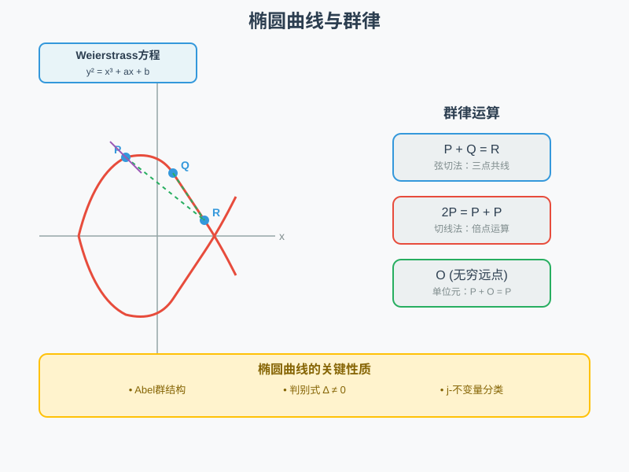
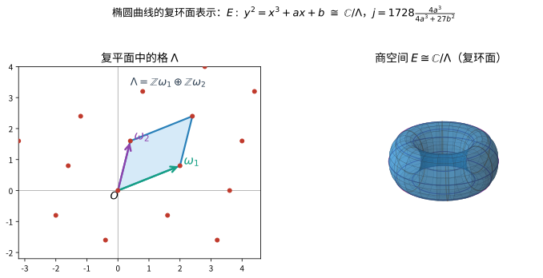
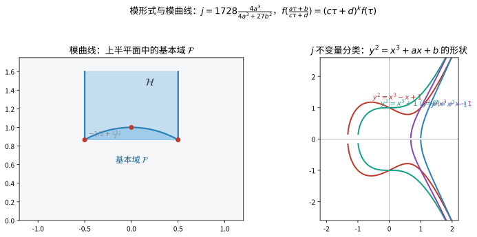

# 第143级：椭圆曲线与模形式

## 学习目标

1. 理解椭圆曲线的定义及其 Weierstrass 标准形式
2. 掌握椭圆曲线上的群律及其几何构造（弦切法）
3. 学习有限域上椭圆曲线的 Hasse 定理及其证明
4. 理解模形式的基本定义与 Hecke 算子理论
5. 掌握谷山-志村定理（模性定理）及其在 Fermat 大定理中的应用
6. 了解椭圆曲线密码学、复乘法及 BSD 猜想的基本思想

---

## 核心概念

> **直观理解（现实类比）**：椭圆曲线就像一条"数学过山车轨道"。轨道上的每个点都是一个"乘客"，而群律运算就是"乘客组合规则"：任意两个乘客 $P$ 和 $Q$ 可以通过"画直线找第三点"的方式组合成新乘客 $R$。如果只有一个乘客 $P$，就画轨道的切线找"倍点" $2P$。这套规则满足交换律、结合律，就像排队买票时无论谁先谁后，最终结果都一样。判别式 $\Delta \neq 0$ 保证轨道没有"断裂"或"尖点"，$j$-不变量则给每条轨道贴上"身份标签"，形状相同的轨道共享同一个标签。

> **🧠 思考历程：一根"甜甜圈形状"的曲线，为什么能决定一大片整数的命运？**
>
> 起初只是用来算椭圆弧长的对象，几百年后竟成了数论的心脏；一条光滑三次曲线上的"点结构"，被证明对应着整整一类"波一般"的模形式。它想回答的，正是椭圆曲线与模形式之间那份近乎宿命的对应。
>
> - **从"整数点"到莫代尔定理**。椭圆曲线 $y^2=x^3+ax+b$ 的名字来自早期计算椭圆周长的积分；1922年，莫代尔证明其有理点构成一个有限生成群（莫代尔定理），让"曲线上有多少有理点"第一次成为可研究的问题。
> - **模形式从"梦想会议"里掉下来**。1950年代，谷山与志村在一场被后人称为"数学界的梦想会议"上大胆猜想：有理数域上的每条椭圆曲线都"模"于某种模形式。韦尔后来把这猜想整理成更严格的形态，成为朗兰兹纲领的第一块踏脚石。
> - **费马最后定理的惊蛰**。1994年，维尔斯在泰勒–威尔斯的配合下证明了半稳定情形的模性定理，并据此完成费马最后定理（$x^n+y^n=z^n$ 无整数解）的证明。两条三百年的悬案，被一根"甜甜圈"和它的模形式彼此认出而终结。
> - **心路**：一个用来算长度的对象，竟然几百年后成为数论的心脏——数学的"身世"远不如它的"用处"来得深远。

### 椭圆曲线

> **🧠 来龙去脉（为什么会有这个概念？解决了什么问题？）** "椭圆曲线"这名字其实来自一个误会——它最初跟"椭圆"并没有直接关系，而是源于计算椭圆周长的积分。17–18世纪，笛卡尔坐标下的椭圆弧长计算把人引向形如 $\int \frac{dx}{\sqrt{x^3+ax+b}}$ 的积分，这类**椭圆积分**因为求不出初等原函数而困扰数学家长达百年。1820年代，阿贝尔与雅可比研究椭圆积分的**反函数**，发现它们竟然是**双周期**的复有理函数（后人称"椭圆函数"），于是把"算弧长"这个分析问题，翻译成了"在复平面上按格点反复折叠"这个几何问题。1860年代，韦尔斯特拉斯提出 $\wp$-函数，把椭圆函数系统化为 $\wp'^2 = 4\wp^3 - g_2\wp - g_3$，从而把复环面 $\mathbb{C}/\Lambda$ 与三次曲线的点集建立了一一对应——这就是为什么"椭圆曲线"最终以三次方程 $y^2 = x^3 + ax + b$ 为标准形。
>
> 它要"解决的问题"远不止算周长：1922年莫代尔证明有理点构成有限生成群（见下），此后人们真正关心的，是"三次曲线 $y^2=x^3+ax+b$ 上有**多少个**整数/有理点、它们如何相加"，而这正是数论与密码学的核心——椭圆曲线密码学（ECC）的安全性，就建立在"曲线上两点做多少遍加法才能得到第三点"极难反推之上。

**椭圆曲线**是亏格为 1 的光滑射影代数曲线，其上带有一个指定的有理点。在仿射坐标下，椭圆曲线可表示为 Weierstrass 方程：

$$E: y^2 + a_1xy + a_3y = x^3 + a_2x^2 + a_4x + a_6$$

当特征不为 2, 3 时，可简化为：

$$E: y^2 = x^3 + ax + b, \quad a, b \in K$$

其中判别式 $\Delta = -16(4a^3 + 27b^2) \neq 0$，$j$ 不变量为 $j = 1728 \cdot \frac{4a^3}{4a^3 + 27b^2}$。

> **直观理解（现实类比）**：椭圆曲线 $E:\ y^2 = x^3 + ax + b$ 可以"摊平"成一张带格子的平面：把复平面按格 $\Lambda$ 平移折叠，把格子的对边粘起来，就得到一个像甜甜圈一样的环面。饼干模具里反复印出相同的花纹，就是"除以格 $\Lambda$"的感觉——不同的格（即不同的 $\omega_1,\omega_2$）对应不同的环面，而 $j$ 不变量正是用来区分这些"甜甜圈"形状的标签。

### 模形式

> **🧠 来龙去脉（为什么会有这个概念？解决了什么问题？）** 模形式的诞生，可以追溯到19世纪人们对"哪些量在某个变换群下保持不变"的追问。椭圆曲线的周期结构被格 $\Lambda$ 决定，而同一个 $j$-值可以被**无穷多种**不同的格实现；要让"格"与"曲线"一一对应，就得找出在重新选取格基 $\begin{pmatrix}a&b\\c&d\end{pmatrix}$（模变换）下行为可控的"波形"。19世纪，德德金与克莱因研究 $j$-函数，而拉马努金在1916年考察 $\Delta = q\prod(1-q^n)^{24}$ 这类 $q$-级数时，意外发现其系数 $\tau(n)$ 满足惊人的乘法规律 $ab\mapsto\tau$——这正是 Hecke 算子理论的先声，也是"模形式就是 $SL_2(\mathbb{Z})$ 作用下的规律波形"这一洞见的开端。
>
> 它"解放的问题"极高远：1950年代谷山–志村猜想宣称"每条椭圆曲线都对应一个权2的模形式"，模形式于是成为连接**几何（曲线）**与**分析（波形）**的枢纽；1994年维尔斯利用这条桥证明了费马大定理。一句话：模形式就是那些"在复上半平面的一切分数线性变换下，只乖乘上一个因子 $(c\tau+d)^k$"的漂亮全纯函数，而它们编码的，正是素数的最深层节律。

**模形式**是定义在复上半平面 $\mathcal{H} = \{\tau \in \mathbb{C} \mid \operatorname{Im}(\tau) > 0\}$ 上的全纯函数，满足特定的模变换性质。对于权 $k$ 的模形式 $f(\tau)$，有：

$$f\left(\frac{a\tau + b}{c\tau + d}\right) = (c\tau + d)^k f(\tau), \quad \forall \begin{pmatrix} a & b \\ c & d \end{pmatrix} \in \Gamma$$

其中 $\Gamma$ 是 $\operatorname{SL}_2(\mathbb{Z})$ 的某个同余子群。

> **直观理解（现实类比）**：模形式生活在上半平面 $\mathcal{H}$，但模变换 $\tau \mapsto \frac{a\tau+b}{c\tau+d}$ 会把上半平面划分出许多"等价类"，每个类只需取一个代表——基本域 $\mathcal{F}$ 就像一张室内设计图只画出一个单元，其余房间由这个单元平移复制而成。而 $j$ 不变量把一族椭圆曲线按形状分类，好比给同一款式不同尺寸的甜甜圈编号，凡是能通过复环面变形彼此对应的曲线都有同一个 $j$。

### Weierstrass $\wp$-函数与椭圆曲线的复参数化

> **🧠 来龙去脉（为什么会有这个概念？解决了什么问题？）** 前面用环面 $\mathbb{C}/\Lambda$ 表述椭圆曲线，可"环面上一个点"到底是什么？雅可比–阿贝尔发现椭圆积分反函数双周期后，韦尔斯特拉斯在19世纪中叶给出了一个**显式**答案：对格子 $\Lambda = \mathbb{Z}\omega_1 + \mathbb{Z}\omega_2$，定义
> $$\wp(z) = \frac{1}{z^2} + \sum_{\lambda\in\Lambda\setminus\{0\}}\left(\frac{1}{(z-\lambda)^2}-\frac{1}{\lambda^2}\right),$$
> 这是一个以 $\Lambda$ 为周期格的双周期有理函数（椭圆函数），它精确"实现"了环面 $\mathbb{C}/\Lambda$ 与三次曲线之间的同构：
> $$z \longmapsto \big(\wp(z),\ \wp'(z)\big)$$
> 落在曲线 $y^2 = 4x^3 - g_2 x - g_3$ 上（其中 $g_2=60G_4,\ g_3=140G_6$ 是 Eisenstein 级数）。这回答了"为什么每条椭圆曲线都长成三次曲线"并为群律提供了分析基础：复平面上的点加法 $z_1+z_2$ 拉到曲线上，恰好就是弦切法。直观说，$\wp$ 就像一台"环面坐标翻译机"，把环面上的加法，翻译成曲线上那套"三点共线取镜像"的几何运算。

**定义（Weierstrass $\wp$-函数）** 设 $\Lambda \subset \mathbb{C}$ 为秩 $2$ 的格。
$$\wp(z) = \frac{1}{z^2} + \sum_{\lambda \in \Lambda \setminus \{0\}} \left(\frac{1}{(z-\lambda)^2} - \frac{1}{\lambda^2}\right)$$
满足微分方程
$$\wp'(z)^2 = 4\wp(z)^3 - g_2 \wp(z) - g_3,$$
其中 $g_2 = 60\sum_{\lambda\ne0}\lambda^{-4}$，$g_3 = 140\sum_{\lambda\ne0}\lambda^{-6}$。由此得到同构 $z \mapsto (\wp(z), \wp'(z)):\ \mathbb{C}/\Lambda \xrightarrow{\sim} E: y^2 = 4x^3 - g_2 x - g_3$。

> **💡 直观理解（类比）**：$\wp$ 函数像一台"把圆形表盘的刻度映射到一张三次曲线上"的坐标机。环面（表盘）上的点对应一个角度 $z$，机器把它输出成曲线上的点 $(\wp(z),\wp'(z))$；而且表盘上"先转 $z_1$ 再转 $z_2$"的加法，被这台机器照搬到曲线上就成了弦切法加法——这正是群律 $P+Q+R=O$ 为什么成立的深层原因：它不过是复平面上加法"翻译"到曲线上的结果。

### 关键概念清单

| 概念 | 描述 | 符号/公式 |
|------|------|-----------|
| Weierstrass 方程 | 椭圆曲线的标准形式 | $y^2 = x^3 + ax + b$ |
| 判别式 | 判定曲线光滑性 | $\Delta = -16(4a^3 + 27b^2)$ |
| $j$ 不变量 | 曲线的同构类 | $j = 1728\frac{4a^3}{\Delta}$ |
| 群律 | 曲线上点的加法 | $P + Q + R = O$ |
| 模形式 | 上半平面的全纯函数 | $f(\gamma\tau) = (c\tau+d)^k f(\tau)$ |
| Hecke 算子 | 模形式空间上的线性算子 | $T_n$ |
| $L$-函数 | 编码算术信息 | $L(E, s)$ |
| 模性定理 | 椭圆曲线与模形式对应 | $\rho_{E,p} \cong \rho_{f,p}$ |

---

## 定理与证明

### 定理 1：椭圆曲线的群律公式

**定理（群律）**：设 $E: y^2 = x^3 + ax + b$ 是域 $K$ 上的椭圆曲线，$O$ 为无穷远点。则 $E(K)$ 上的加法运算构成一个 Abel 群，其中 $O$ 为单位元。加法规则由弦切法给出。

> **💡 直观理解（类比）**：椭圆曲线上的"点加法"像在一条环形轨道上玩"过三点画直线、再取镜像"的游戏：任取曲线上两点 $P,Q$，连一条直线找到第三个交点，再把它沿 $x$ 轴翻折到对面，就得到 $P+Q$。无穷远点 $O$ 相当于加法的"零"（基准空白点），$P$ 的逆元 $-P$ 则是它"上下颠倒"的镜像。交换律、结合律保证：无论先算哪一组、怎么加括号，结果都落在同一点上，正如排队结账或组装零件——顺序和分组不影响最终成品。

**证明**：

设 $P = (x_1, y_1)$，$Q = (x_2, y_2)$ 为 $E$ 上的两个点。

**情形 1**：若 $x_1 = x_2$ 且 $y_1 = -y_2$，则 $P + Q = O$。

**情形 2**：否则，设过 $P$ 和 $Q$ 的直线（若 $P = Q$ 则为切线）的斜率为 $\lambda$：

- 若 $P \neq Q$：$\lambda = \frac{y_2 - y_1}{x_2 - x_1}$
- 若 $P = Q$：$\lambda = \frac{3x_1^2 + a}{2y_1}$

该直线方程为 $y = \lambda x + \nu$，其中 $\nu = y_1 - \lambda x_1$。

将直线方程代入椭圆曲线方程：

$$(\lambda x + \nu)^2 = x^3 + ax + b$$

整理得：

$$x^3 - \lambda^2 x^2 + (a - 2\lambda\nu)x + (b - \nu^2) = 0$$

该三次方程的三根为 $x_1, x_2, x_3$（其中 $x_3$ 为第三个交点的 $x$ 坐标）。由韦达定理：

$$x_1 + x_2 + x_3 = \lambda^2$$

因此：

$$x_3 = \lambda^2 - x_1 - x_2$$

第三个交点的 $y$ 坐标为 $y_3 = \lambda x_3 + \nu$。

定义 $P + Q = (x_3, -y_3)$，即第三个交点关于 $x$ 轴的对称点。具体地：

$$x_3 = \lambda^2 - x_1 - x_2$$
$$y_3 = \lambda(x_1 - x_3) - y_1$$

**验证群公理**：

1. **封闭性**：由构造，$P + Q$ 仍在 $E$ 上。
2. **单位元**：$P + O = P$，因为过 $P$ 和 $O$ 的直线是竖直线，第三个交点为 $P$ 的对称点。
3. **逆元**：$P + (-P) = O$，其中 $-P = (x_1, -y_1)$。
4. **结合律**：可通过几何论证（Pappus 定理）或代数验证。代数验证较为繁复，但本质上是由于三次曲线的交点性质。

因此 $(E(K), +)$ 构成一个 Abel 群。$\square$

---

### 定理 2：Hasse 定理

**定理（Hasse）**：设 $E$ 是有限域 $\mathbb{F}_q$（$q = p^n$）上的椭圆曲线，$N_q$ 为 $E$ 上的 $\mathbb{F}_q$-有理点个数（包括无穷远点）。则：

$$|N_q - (q + 1)| \leq 2\sqrt{q}$$

> **💡 直观理解（类比）**：有限域上的椭圆曲线，随机猜大约有 $q+1$ 个点，但实际点数总有偏差。Hasse 定理给这个"偏差"封了一个天花板：无论怎么折腾，实际点数偏离 $q+1$ 最多 $2\sqrt{q}$。好比抽奖或抛硬币：平均结果容易估计，但每次实验的实际结果会在期望值附近波动，而波动幅度有限度——$2\sqrt{q}$ 就是这个"最大偏差范围"，绝不可能跑得更远。

**证明**：

**步骤 1：Frobenius 自同态**

定义 Frobenius 自同态 $\pi_q: E \to E$ 为 $\pi_q(x, y) = (x^q, y^q)$。这是一个次数为 $q$ 的不可分同源。

**步骤 2：有理点与 Frobenius 的不动点**

$E(\mathbb{F}_q)$ 中的点恰为 $\pi_q$ 的不动点，即满足 $\pi_q(P) = P$ 的点。因此：

$$N_q = \#\ker(1 - \pi_q) = \deg(1 - \pi_q)$$

**步骤 3：迹与次数**

设 $a = q + 1 - N_q$，则 $a = \operatorname{Tr}(\pi_q)$。由 Weil 猜想（对椭圆曲线已证明）：

$$\deg(1 - \pi_q) = \deg(\pi_q) + 1 - \operatorname{Tr}(\pi_q) = q + 1 - a$$

其中 $\operatorname{Tr}(\pi_q) = \pi_q + \hat{\pi}_q$（$\hat{\pi}_q$ 为对偶同源），且 $\pi_q \hat{\pi}_q = q$。

**步骤 4：Cauchy-Schwarz 不等式**

对偶同源满足 $\deg(m\pi_q + n\hat{\pi}_q) = m^2q + n^2q + mn(\pi_q\hat{\pi}_q + \hat{\pi}_q\pi_q)$。

由于次数非负，对于所有 $m, n \in \mathbb{Z}$：

$$m^2q + n^2q + mna \geq 0$$

这等价于判别式 $a^2 - 4q^2 \leq 0$，即 $|a| \leq 2q$。

但更精确地，我们可以得到 $|a| \leq 2\sqrt{q}$。

**步骤 5：精确估计**

考虑二次多项式 $T^2 - aT + q$。由于 $\pi_q$ 在 $\ell$-adic 表示 $\mathrm{End}(E) \otimes \mathbb{Q}_\ell$ 中满足该特征多项式，且 Frobenius 的特征值 $\alpha, \beta$ 满足 $\alpha\beta = q$ 且 $|\alpha| = |\beta| = \sqrt{q}$（Riemann 假设部分）。

因此 $a = \alpha + \beta$，$|a| \leq |\alpha| + |\beta| = 2\sqrt{q}$。

从而：

$$|N_q - (q + 1)| = |a| \leq 2\sqrt{q}$$

$\square$

---

### 定理 3：模形式的 Hecke 算子

**定理**：设 $f(\tau) = \sum_{n=0}^\infty a_n q^n$（$q = e^{2\pi i\tau}$）为权 $k$ 的模形式。则 Hecke 算子 $T_n$ 作用为：

$$(T_n f)(\tau) = n^{k-1} \sum_{d|n} d^{-k} \sum_{b=0}^{d-1} f\left(\frac{n\tau + bd}{d^2}\right)$$

且 $T_n$ 将模形式映为模形式，保持权 $k$。

> **💡 直观理解（类比）**：Hecke 算子 $T_n$ 像对一段"乐谱"（模形式 $f$）进行系统的和声叠加：它把所有能通过伸缩、平移得到的"变奏片段"按权重取和，形成一段新的乐谱 $T_n f$。奇妙的是一段"同调性"（权 $k$）不变的乐谱经过这种叠加仍是同调性的乐谱。于是这些 $T_n$ 就像一部"调音台"，可以同时调节所有频率，最终筛出"特征形式"这样的纯净音符。

**证明**：

**步骤 1：Hecke 算子的定义**

权 $k$ 的 Hecke 算子 $T_n$ 在模形式空间 $M_k(\Gamma)$ 上定义为：

$$(T_n f)(\tau) = n^{k-1} \sum_{\substack{ad = n \\ 0 \leq b < d}} d^{-k} f\left(\frac{a\tau + b}{d}\right)$$

其中求和遍历所有 $a, d \in \mathbb{N}$ 满足 $ad = n$ 且 $b = 0, 1, \ldots, d-1$。

**步骤 2：Fourier 展开下的作用**

设 $f(\tau) = \sum_{m=0}^\infty a_m q^m$，$q = e^{2\pi i\tau}$。计算：

$$(T_n f)(\tau) = n^{k-1} \sum_{ad=n} \frac{1}{d^k} \sum_{b=0}^{d-1} \sum_{m=0}^\infty a_m e^{2\pi i m \frac{a\tau + b}{d}}$$

交换求和顺序：

$$(T_n f)(\tau) = n^{k-1} \sum_{ad=n} \frac{1}{d^k} \sum_{m=0}^\infty a_m e^{2\pi i \frac{ma\tau}{d}} \sum_{b=0}^{d-1} e^{2\pi i \frac{mb}{d}}$$

**步骤 3：内和的计算**

$$\sum_{b=0}^{d-1} e^{2\pi i \frac{mb}{d}} = \begin{cases} d, & \text{若 } d \mid m \\ 0, & \text{否则} \end{cases}$$

因此仅当 $d \mid m$ 时项非零。设 $m = d \cdot r$，则：

$$(T_n f)(\tau) = n^{k-1} \sum_{ad=n} \frac{1}{d^k} \sum_{r=0}^\infty a_{dr} \cdot d \cdot e^{2\pi i \frac{a d r \tau}{d}} = n^{k-1} \sum_{ad=n} \frac{1}{d^{k-1}} \sum_{r=0}^\infty a_{dr} q^{ar}$$

**步骤 4：整理为 Fourier 级数**

令 $n = ad$，则 $ar = n r / d$。设 $m = ar$，则 $r = m/a$，且 $d = n/a$，$d \mid m$ 等价于 $n/a \mid m$，即 $a \mid m$ 且 $n \mid am$。

整理可得：

$$(T_n f)(\tau) = \sum_{m=0}^\infty b_m q^m$$

其中：

$$b_m = \sum_{d \mid \gcd(m,n)} d^{k-1} a_{mn/d^2}$$

特别地，$b_1 = a_n$，$b_n = a_1$（若 $a_1 = 0$ 则 $b_n = 0$）。

**步骤 5：模性验证**

需要验证 $T_n f$ 满足模变换性质。由于 $T_n$ 定义中涉及 $\operatorname{GL}_2^+(\mathbb{Q})$ 的双陪集分解，而模形式在 $\operatorname{GL}_2^+(\mathbb{Q})$ 作用下具有协变性，可验证 $T_n f$ 仍满足权 $k$ 的模变换性质。详细验证需检查每个 $f\left(\frac{a\tau+b}{d}\right)$ 在 $\Gamma$ 作用下的行为，利用 $\Gamma$ 在 $\operatorname{GL}_2^+(\mathbb{Q})$ 中的性质可得到结论。

$\square$

---

### 定理 4：谷山-志村定理（模性定理）

**定理（Wiles-Breuil-Conrad-Diamond-Taylor）**：每个 $\mathbb{Q}$ 上的椭圆曲线都是模的，即存在一个权 $2$ 的尖点形式 $f$（对某个同余子群 $\Gamma_0(N)$），使得 $E$ 的 Hasse-Weil $L$-函数等于 $f$ 的 $L$-函数：

$$L(E, s) = L(f, s)$$

等价地，$E$ 的 $\ell$-adic Galois 表示 $\rho_{E,\ell}: \operatorname{Gal}(\overline{\mathbb{Q}}/\mathbb{Q}) \to \operatorname{GL}_2(\mathbb{Q}_\ell)$ 同构于某个模形式 $f$ 的 $\ell$-adic 表示 $\rho_{f,\ell}$。

> **🧠 直观理解（现实类比）**：模性定理说"每个椭圆曲线都长着一副模形式的面孔"。这好比同一批货物可以用两种看似毫不相干的记账方式记录——椭圆曲线的账本记的是"有多少个点、怎么相加"，模形式的账本记的是"一段乐的频率谱"，但两者核算出的 $L$-函数（等价地，Galois 表示的内存结构）完全一致。于是你可以通过监听"广播谱"来破译"加密账本"，几何与分析之间被这座"翻译桥梁"稳稳接住。

**证明思路**：

**步骤 1：问题的转化**

设 $E$ 是 $\mathbb{Q}$ 上的椭圆曲线，导子为 $N$。对每个素数 $\ell$，考虑 $\ell$-adic Tate 模 $T_\ell(E) = \varprojlim_n E[\ell^n]$，得到 Galois 表示：

$$\rho_{E,\ell}: \operatorname{Gal}(\overline{\mathbb{Q}}/\mathbb{Q}) \to \operatorname{Aut}(T_\ell(E)) \cong \operatorname{GL}_2(\mathbb{Z}_\ell)$$

模性定理断言 $\rho_{E,\ell}$ 来自某个 $\Gamma_0(N)$ 上权 $2$ 的 Hecke 特征形式。

**步骤 2：变形环（Deformation Rings）**

考虑所有与 $\bar{\rho}_{E,\ell}$（模 $\ell$ 的约化表示）同构的 Galois 表示的变形。Mazur 证明了存在一个完备 Noether 局部环 $R$（变形环），参数化所有这样的变形。

**步骤 3：Hecke 代数（Hecke Algebras）**

考虑 $\Gamma_0(N)$ 上权 $2$ 的尖点形式空间 $S_2(\Gamma_0(N))$。Hecke 算子 $T_n$ 作用其上，生成一个 $\mathbb{Z}$-代数 $\mathbb{T}$（Hecke 代数）。与之相伴的 Galois 表示给出一个映射 $\mathbb{T} \to R$。

**步骤 4：$R = T$ 定理**

核心结果是 $R \cong \mathbb{T}$（即变形环与 Hecke 代数同构）。这通过以下方式证明：

- 计算 $R$ 的余切空间（由 $H^1$ 控制）
- 证明 $\mathbb{T}$ 的余切空间有相同的维数
- 利用交换代数的判据（如 Wiles 的数值判据）证明同构

**步骤 5：模性提升**

一旦 $R = T$ 成立，每个 Galois 表示（满足适当条件）都来自模形式。特别地，$\rho_{E,\ell}$ 对应 $\mathbb{T}$ 的一个环同态，从而对应某个 Hecke 特征形式 $f$。

**步骤 6：$\mathbb{Q}$-曲线的处理**

对于 $\mathbb{Q}$ 上的椭圆曲线，其模 $\ell$ 表示 $\bar{\rho}_{E,\ell}$ 在 $\ell \nmid N$ 时是模的（由 Langlands-Tunnell 定理保证）。Wiles 的贡献在于证明当 $\bar{\rho}_{E,\ell}$ 是绝对不可约时，可以提升为模的 $\ell$-adic 表示。Taylor-Wiles 进一步使用"Taylor-Wiles 系统"的方法处理了边界情况。

$\square$

---

### 定理 5：Fermat 大定理的证明概要

**定理（Fermat-Wiles）**：方程 $x^n + y^n = z^n$ 在 $n \geq 3$ 时没有正整数解。

> **🧠 直观理解（现实类比）**：这是一场漂亮的"反证法"。假设 $a^n+b^n=c^n$ 有解，就相当于有人声称能画出这样一张图纸——它对应的是一座"无比诡异的桥"（Frey 曲线）。要分析这座桥，你必须用到某种建材（权 2、水平 2 的模形式），但一查仓库：这种建材的库存是零（$S_2(\Gamma_0(2))$ 为空）。既然必要的建材根本不存在，桥也就造不出来，于是原方程无解——一个纯数论的难题，被两根毫不相关的"几何之绳"（Frey 图 + 模性定理）合力绞杀。

**证明思路**：

**步骤 1：归约到椭圆曲线（Frey 曲线）**

假设存在 $a^p + b^p = c^p$，其中 $p \geq 5$ 为素数。Frey 构造椭圆曲线：

$$E_{a,b,c}: y^2 = x(x - a^p)(x + b^p)$$

计算其判别式 $\Delta = (abc)^{2p}$，导子 $N = \operatorname{rad}(abc)$。

**步骤 2：Frey 曲线的异常性质**

Ribet 证明了：若 $E_{a,b,c}$ 是模的，则其对应的模形式 $f$ 的权为 $2$，水平为 $N$。但通过分析 $E_{a,b,c}$ 在 $p$ 处的约化，Ribet 的"水平降低定理"表明 $f$ 实际上来自水平 $2$ 的模形式。

而 $S_2(\Gamma_0(2)) = \{0\}$（权 $2$ 水平 $2$ 的尖点形式空间为零），矛盾。

**步骤 3：应用谷山-志村定理**

由 Wiles-Breuil-Conrad-Diamond-Taylor 的模性定理，$E_{a,b,c}$ 是模的。由 Ribet 的水平降低定理，导出矛盾。

因此，不存在这样的 $a, b, c$，Fermat 大定理得证。

**步骤 4：$n=3,4$ 的情形**

$n=4$ 由 Fermat 本人的无穷下降法证明，$n=3$ 由 Euler 证明。$n=5$ 由 Dirichlet 和 Legendre 证明。$n=7$ 由 Lamé 证明。因此对所有 $n \geq 3$ 成立。

$\square$

---

## 示例

### 示例 1：椭圆曲线 $y^2 = x^3 + 1$ 的群结构

**问题**：求椭圆曲线 $E: y^2 = x^3 + 1$ 在 $\mathbb{Q}$ 上的有理点群结构。

**解**：

**1. 基本参数**

$$a = 0, \quad b = 1$$
$$\Delta = -16(4 \cdot 0 + 27 \cdot 1^2) = -432 \neq 0$$
$$j = 1728 \cdot \frac{0}{-432} = 0$$

**2. 有理点的计算**

尝试小整数点：

- $x = -1$：$y^2 = 0$，$y = 0$ → $(-1, 0)$
- $x = 0$：$y^2 = 1$，$y = \pm 1$ → $(0, 1), (0, -1)$
- $x = 2$：$y^2 = 9$，$y = \pm 3$ → $(2, 3), (2, -3)$
- $x = -2$：$y^2 = -7$，无解
- $x = 3$：$y^2 = 28$，无解
- $x = 4$：$y^2 = 65$，无解

**3. 群结构**

Mordell-Weil 定理断言 $E(\mathbb{Q})$ 是有限生成的 Abel 群。通过计算，$E(\mathbb{Q}) \cong \mathbb{Z} \oplus \mathbb{Z}/3\mathbb{Z}$。

其中挠子群 $\mathbb{Z}/3\mathbb{Z}$ 由 $(-1, 0)$ 生成（阶为 $3$，因为 $(-1,0) + (-1,0) + (-1,0) = O$）。

自由部分由 $(0, 1)$ 生成，秩为 $1$。

**4. 验证群运算**

计算 $P = (0, 1)$，$Q = (2, 3)$：

$$\lambda = \frac{3 - 1}{2 - 0} = 1$$
$$x_3 = 1^2 - 0 - 2 = -1$$
$$y_3 = 1 \cdot (0 - (-1)) - 1 = 0$$

因此 $P + Q = (-1, 0)$，这是挠点。

---

### 示例 2：模形式的 Fourier 展开计算

**问题**：求权 $4$ 的 Eisenstein 级数 $G_4(\tau)$ 的 Fourier 展开，并验证其模性。

**解**：

**1. 定义**

权 $k \geq 4$ 的 Eisenstein 级数定义为：

$$G_k(\tau) = \sum_{(m,n) \in \mathbb{Z}^2 \setminus \{(0,0)\}} \frac{1}{(m\tau + n)^k}$$

**2. Fourier 展开**

利用公式：

$$G_k(\tau) = 2\zeta(k) + \frac{2(2\pi i)^k}{(k-1)!} \sum_{n=1}^\infty \sigma_{k-1}(n) q^n$$

其中 $\sigma_{r}(n) = \sum_{d|n} d^r$，$q = e^{2\pi i\tau}$。

对于 $k = 4$：

$$\zeta(4) = \frac{\pi^4}{90}$$
$$(2\pi i)^4 = 16\pi^4$$
$$(4-1)! = 6$$

因此：

$$G_4(\tau) = \frac{\pi^4}{45} + \frac{16\pi^4}{6} \sum_{n=1}^\infty \sigma_3(n) q^n = \frac{\pi^4}{45} + \frac{8\pi^4}{3} \sum_{n=1}^\infty \sigma_3(n) q^n$$

**3. 归一化**

通常使用归一化的 Eisenstein 级数：

$$E_4(\tau) = \frac{G_4(\tau)}{2\zeta(4)} = 1 + 240 \sum_{n=1}^\infty \sigma_3(n) q^n$$

展开前几项：

$$E_4(\tau) = 1 + 240q + 2160q^2 + 6720q^3 + 17520q^4 + 30240q^5 + \cdots$$

**4. 模性验证**

$E_4(\tau)$ 满足：

$$E_4\left(\frac{a\tau + b}{c\tau + d}\right) = (c\tau + d)^4 E_4(\tau), \quad \forall \begin{pmatrix} a & b \\ c & d \end{pmatrix} \in \operatorname{SL}_2(\mathbb{Z})$$

这可由 $G_4$ 的定义直接验证。

---

## 习题

### 基础题

**习题 1**（椭圆曲线定义）用简洁的语言定义什么是椭圆曲线，说明亏格为何等于 $1$，并写出特征不为 $2, 3$ 时的一般 Weierstrass 形式及其判别式条件。

**习题 2**（j-不变量）设 $E: y^2 = x^3 + ax + b$。写出判别式 $\Delta$ 与 $j$-不变量的公式，并计算 $E: y^2 = x^3 + 1$ 的 $\Delta$ 与 $j$。

**习题 3**（群律单位元）在椭圆曲线的弦切法群律中，说明无穷远点 $O$ 如何作为单位元，并解释 $-P$ 的几何意义。

**习题 4**（群律计算）在 $E: y^2 = x^3 + 17$ 上，验证 $P = (-2, 3)$ 在曲线上，并计算 $2P$。

**习题 5**（点是否为有理点）设 $E: y^2 = x^3 + x$，判断 $P = (1, \sqrt{2})$、$Q = (1, 1)$ 是否在 $E$ 上并说明原因。

**习题 6**（判别式）解释判别式 $\Delta \neq 0$ 的几何含义，并说明若 $\Delta = 0$ 曲线将出现怎样的奇点。

**习题 7**（Hasse 定理陈述）陈述有限域 $\mathbb{F}_q$ 上椭圆曲线的 Hasse 定理，说明其给出的有理点数的上界与下界。

**习题 8**（模形式定义）写出权 $k$ 模形式 $f$ 的模变换性质 $f(\gamma\tau) = (c\tau + d)^k f(\tau)$，说明其中权 $k$ 与同余子群 $\Gamma$ 的含义。

**习题 9**（Fourier 展开）解释模形式 $f(\tau) = \sum_{n=0}^\infty a_n q^n$（$q = e^{2\pi i\tau}$）中 Fourier 展开的意义，并指出尖点形式的判别条件 $a_0 = 0$。

**习题 10**（L-函数）写出椭圆曲线 $E$ 的 Hasse-Weil $L$-函数在 $\operatorname{Re}(s) > 3/2$ 处的 Euler 乘积形式。

### 进阶题

**习题 11**（弦切法公式推导）设 $E: y^2 = x^3 + ax + b$，$P = (x_1, y_1)$，$Q = (x_2, y_2)$ 且 $P \neq Q$。推导群律公式 $x_3 = \lambda^2 - x_1 - x_2$，其中 $\lambda = \frac{y_2 - y_1}{x_2 - x_1}$。

**习题 12**（倍点公式推导）设 $P = (x_1, y_1)$ 在 $E: y^2 = x^3 + ax + b$ 上，推导倍点公式 $x(2P) = \frac{(3x_1^2 + a)^2}{(2y_1)^2} - 2x_1$。

**习题 13**（Hasse 上界的应用）对 $\mathbb{F}_{17}$ 上的椭圆曲线，利用 Hasse 定理给出 $E(\mathbb{F}_{17})$ 点数的可能取值范围。

**习题 14**（挠点）说明 $\mathbb{Q}$ 上椭圆曲线有理挠子群 $E(\mathbb{Q})_{\mathrm{tors}}$ 的阶有界性（Mazur 定理的定性结论），并给出 $E: y^2 = x^3 + 1$ 的一个挠点例子。

**习题 15**（Eisenstein 级数）写出权 $k \geq 4$ 的 Eisenstein 级数 $G_k(\tau) = \sum_{(m,n) \neq (0,0)} \frac{1}{(m\tau + n)^k}$ 的 Fourier 展开公式并说明其归一化。

**习题 16**（Hecke 算子）写出 Hecke 算子 $T_n$ 在 Fourier 系数上的作用公式 $b_m = \sum_{d \mid \gcd(m,n)} d^{k-1} a_{mn/d^2}$，并说明 $T_m, T_n$ 在 $\gcd(m,n) = 1$ 时的关系。

**习题 17**（复乘法）解释什么是椭圆曲线的复乘法，说明 $E: y^2 = x^3 + 1$ 具有复乘法并求其一个额外自同态。

**习题 18**（模曲线）说明上半平面 $\mathcal{H}$ 模去 $\operatorname{SL}_2(\mathbb{Z})$ 作用得到的基本域 $\mathcal{F}$，并解释 $j$ 函数在 $\mathcal{F}$ 上如何参数化椭圆曲线的同构类。

**习题 19**（Tate 模与 Galois 表示）设 $E$ 是 $\mathbb{Q}$ 上的椭圆曲线，$\ell$ 为素数。写出 $\ell$-adic Tate 模 $T_\ell(E) = \varprojlim_n E[\ell^n]$ 的结构，并说明它如何给出 Galois 表示 $\rho_{E,\ell}$。

### 挑战题

**习题 20**（证明群律结合性）概述用三次曲线的几何性质或代数方法证明椭圆曲线群律结合律的主要思路，并解释为何只需利用第零次除子与三次曲线交点的性质即可完成证明。

**习题 21**（Hasse 定理证明思路）概述用 Frobenius 自同态 $\pi_q$、对偶同源 $\hat{\pi}_q$ 与次数 $\deg$ 证明 Hasse 定理的核心步骤，特别说明 $a = \pi_q + \hat{\pi}_q$ 与判别式非负的关系。

**习题 22**（Mordell-Weil 定理）陈述 Mordell-Weil 定理，并说明其证明中"高度函数""弱 Mordell-Weil 定理"与"无限下降"三个步骤各自的角色。

**习题 23**（Hecke 特征形式与乘性）解释 Hecke 特征形式的 Fourier 系数为何是乘性的（$a_{mn} = a_m a_n$ 当 $\gcd(m,n) = 1$），并说明乘性对相伴 Euler 积 $L(f,s)$ 的意义。

**习题 24**（谷山-志村定理）陈述模性定理，说明其断言 $L(E, s) = L(f, s)$ 与 $\rho_{E,\ell} \cong \rho_{f,\ell}$ 两种表述的等价性。

**习题 25**（Fermat 大定理的证明结构）概述 Wiles 证明 Fermat 大定理的逻辑链：Frey 曲线、Ribet 的水平降低定理与模性定理如何共同导出矛盾。

**习题 26**（BSD 猜想）陈述 Birch-Swinnerton-Dyer 猜想，说明 $L(E, s)$ 在 $s = 1$ 处的零点阶与 Mordell-Weil 群秩的关系，并解释其涉及的 Regulator、Tamagawa 数与周期等修正因子。

### 探究题

**习题 27**（椭圆曲线密码学）探讨为什么椭圆曲线上的离散对数问题可用于密码学：比较 ECDLP 与有限域上的 DLP，说明其安全性依据、密钥长度优势，以及 MOV 归约等需要规避的弱点。

**习题 28**（Langlands 纲领中的位置）探讨谷山-志村定理在 Langlands 纲领中的定位，说明为何它是 $\operatorname{GL}(2)$ 情形下的 Langlands 互反，并讨论它对高维 Langlands 纲领的启示。

**习题 29**（复乘法与类域论）探讨复乘法椭圆曲线与虚二次域类域论的联系，说明为何复乘法情形是显式类域论的可交换特例，以及其与 Shimura 类域论的关系。

**习题 30**（BSD 与秩分布）开放探讨 BSD 猜想与椭圆曲线秩分布的联系，讨论秩的平均行为、Goldfeld 猜想（平均秩为 $1/2$）以及随机矩阵模型对 $L$-函数零点分布的启发。

### 补充题：Weierstrass $\wp$-函数与复参数化（本文件新增主题）

**基础题**

**习题 31**（$\wp$-函数定义）写出 Weierstrass $\wp$-函数关于格 $\Lambda$ 的定义，说明它的两个周期性质，并解释为什么它是"双周期"的。

**进阶题**

**习题 32**（微分方程与 $g_2,g_3$）对格 $\Lambda$，写出 $\wp$ 满足的微分方程 $\wp'(z)^2 = 4\wp(z)^3 - g_2\wp(z) - g_3$，说明 $g_2, g_3$（Eisenstein 级数）与环面-曲线同构的关系，并解释 $j = 1728\frac{g_2^3}{g_2^3 - 27g_3^2}$ 为何只依赖格、不依赖具体坐标。

**挑战题**

**习题 33**（群律的分析来源）利用 $\wp$ 函数的加法定理（$\wp(z_1+z_2)$ 由 $\wp(z_1), \wp(z_2), \wp'(z_1), \wp'(z_2)$ 的有理式给出），解释为什么弦切法给出的群律满足结合律——即复平面上加法在 $z_i\mapsto(\wp(z_i),\wp'(z_i))$ 翻译下的"忠实化身"。

---

## 习题答案与解析

### 基础题答案

1. **椭圆曲线定义** 椭圆曲线是亏格为 $1$ 的光滑射影代数曲线且带有一个指定有理点。亏格 $1$ 可由正则一次微分空间的维数为 $1$ 来刻画；在特征不为 $2, 3$ 时可化为 $(E) \ y^2 = x^3 + ax + b$，判别式 $\Delta = -16(4a^3 + 27b^2) \neq 0$ 保证曲线光滑（无奇点）。

2. **j-不变量** $\Delta = -16(4a^3 + 27b^2)$，$j = 1728\frac{4a^3}{4a^3 + 27b^2}$。对 $E: y^2 = x^3 + 1$，$a = 0$，$b = 1$，故 $\Delta = -432$，$j = 0$（典型 CM 曲线）。

3. **群律单位元** 在弦切法中，无穷远点 $O$ 作为单位元：过 $P$ 与 $O$ 的直线是竖直线，交曲线于第三点后关于 $x$ 轴对称即回到 $P$，故 $P + O = P$。逆元为 $-P = (x, -y)$，因为 $P$ 与 $-P$ 关于 $x$ 轴对称，竖直线交曲线于 $O$，从而 $P + (-P) = O$。

4. **群律计算** 验证 $P = (-2, 3)$：代入得 $y^2 = 9$，$x^3 + 17 = -8 + 17 = 9$，成立。倍点：切线斜率 $\lambda = \frac{3x^2}{2y} = \frac{3 \cdot 4}{2 \cdot 3} = 2$，则 $x_3 = \lambda^2 - 2x_1 = 4 + 4 = 8$，$y_3 = \lambda(x_1 - x_3) - y_1 = 2(-2 - 8) - 3 = -23$。故 $2P = (8, -23)$。

5. **点是否为有理点** 对 $P = (1, \sqrt{2})$：$x^3 + x = 1 + 1 = 2 = y^2$，故 $P$ 在 $E$ 上，但因 $y$ 非有理数故非有理点。对 $Q = (1, 1)$：$y^2 = 1$，而 $x^3 + x = 2 \neq 1$，故 $Q$ 不在 $E$ 上。

6. **判别式** $\Delta = 0$ 当且仅当 $4a^3 + 27b^2 = 0$，即三次式 $x^3 + ax + b$ 有重根，此时曲线在有限点处有奇点（尖点或自交结点），不是光滑曲线，亏格退化为 $0$，故不构成椭圆曲线。$\Delta \neq 0$ 正对应无奇点的光滑条件。

7. **Hasse 定理** 对有限域 $\mathbb{F}_q$ 上的椭圆曲线 $E$，有理点个数满足
$$|\,N_q - (q + 1)\,| \le 2\sqrt{q},$$
即 $N_q$ 介于 $q + 1 - 2\sqrt{q}$ 与 $q + 1 + 2\sqrt{q}$ 之间。它是 Weil 猜想对椭圆曲线的特例，等价于 Frobenius 自同态特征值满足 $|\alpha| = |\beta| = \sqrt{q}$。

8. **模形式定义** 权 $k$ 模形式 $f$ 是 $\mathcal{H}$ 上的全纯函数，满足对所有 $\gamma = \begin{pmatrix} a & b \\ c & d \end{pmatrix} \in \Gamma$ 与 $\tau \in \mathcal{H}$，
$$f\left(\frac{a\tau + b}{c\tau + d}\right) = (c\tau + d)^k f(\tau),$$
且在尖点处全纯。权 $k$ 决定变换因子次数，$\Gamma$ 是 $\operatorname{SL}_2(\mathbb{Z})$ 的（同余）子群，如 $\Gamma_0(N)$。

9. **Fourier 展开** 因 $\operatorname{SL}_2(\mathbb{Z})$ 含平移 $\tau \mapsto \tau + 1$，模形式满足 $f(\tau + 1) = f(\tau)$，故可关于 $q = e^{2\pi i\tau}$ 展开为 $f(\tau) = \sum_{n \in \mathbb{Z}} a_n q^n$。全纯模形式要求 $a_n = 0$（$n < 0$）；尖点形式还要求尖点处取值为零，即 $a_0 = 0$。

10. **L-函数** 对良约化素数 $p$，令 $a_p = p + 1 - \#E(\mathbb{F}_p)$，定义局部因子 $L_p(E, T) = 1 - a_p T + p T^2$；坏约化情形 $L_p(E, T) = 1$ 或 $1 \mp T$。则对 $\operatorname{Re}(s) > 3/2$，
$$L(E, s) = \prod_p \frac{1}{1 - a_p p^{-s} + \varepsilon(p) p^{1 - 2s}},$$
其中 $\varepsilon(p) = 0$（坏约化）或 $1$（好约化）。它可解析延拓并满足函数方程。

### 进阶题答案

1. **弦切法公式推导** 过 $P, Q$ 的直线为 $y = \lambda x + \nu$，$\lambda = \frac{y_2 - y_1}{x_2 - x_1}$。代入曲线得
$$(\lambda x + \nu)^2 = x^3 + ax + b \iff x^3 - \lambda^2 x^2 + (a - 2\lambda\nu)x + (b - \nu^2) = 0,$$
其三根为 $x_1, x_2, x_3$。由韦达定理 $x_1 + x_2 + x_3 = \lambda^2$，故 $x_3 = \lambda^2 - x_1 - x_2$，而 $P + Q = (x_3, -y_3)$ 是第三交点关于 $x$ 轴的对称点。

2. **倍点公式推导** $P = Q$ 时取切线斜率 $\lambda = \frac{3x_1^2 + a}{2y_1}$，切线交曲线有重根 $x_1, x_1, x_3$，由韦达 $2x_1 + x_3 = \lambda^2$，故
$$x_3 = \lambda^2 - 2x_1 = \frac{(3x_1^2 + a)^2}{4y_1^2} - 2x_1,$$
正是所给倍点公式。

3. **Hasse 上界应用** 取 $q = 17$，Hassee 不等式 $|N - 18| \le 2\sqrt{17} \approx 8.25$，故 $10 \le N \le 26$（整数）。该范围蕴含 $N$ 只能是 $10, 11, \ldots, 26$，实际可结合具体曲线进一步确定。

4. **挠点（Mazur）** Mazur 定理指出 $\mathbb{Q}$ 上椭圆曲线的有理挠子群只能是有限列表之一：$\mathbb{Z}/m\mathbb{Z}$（$m = 1, \ldots, 10, 12$）或 $\mathbb{Z}/2\mathbb{Z} \times \mathbb{Z}/2m\mathbb{Z}$（$m = 1, \ldots, 4$）。对 $E: y^2 = x^3 + 1$，$(-1, 0)$ 满足 $(-1)^3 + 1 = 0$，且 $3$ 倍为 $O$，故它是 $3$ 阶挠点。

5. **Eisenstein 级数** 对偶 $k \geq 4$，
$$G_k(\tau) = 2\zeta(k) + \frac{2(2\pi i)^k}{(k-1)!} \sum_{n=1}^\infty \sigma_{k-1}(n) q^n,$$
其中 $\sigma_{r}(n) = \sum_{d \mid n} d^{r}$，$q = e^{2\pi i\tau}$。归一化 $E_k = \frac{G_k}{2\zeta(k)}$ 得整系数形式：$E_4 = 1 + 240\sum \sigma_3(n)q^n$，$E_6 = 1 - 504\sum \sigma_5(n)q^n$。

6. **Hecke 算子** Hecke 算子 $T_n$ 在 Fourier 系数的作用为 $b_m = \sum_{d \mid \gcd(m,n)} d^{k-1} a_{mn/d^2}$，且它保持权 $k$ 模形式空间。当 $\gcd(m, n) = 1$ 时该公式推出 $T_m T_n = T_{mn}$，故 $T_m, T_n$ 交换，Hecke 代数是交换代数，可同时对角化得到 Hecke 特征形式。

7. **复乘法** 椭圆曲线具复乘法是指其端环 $\mathrm{End}(E)$ 严格大于 $\mathbb{Z}$，即含虚二次域中的非平凡序。对 $E: y^2 = x^3 + 1$，取 $\omega = e^{2\pi i/3}$，映射 $[\omega]:(x,y) \mapsto (\omega x, y)$ 保持曲线（因 $(\omega x)^3 + 1 = x^3 + 1 = y^2$），是次数 $1$ 的非平凡自同态，故 $E$ 具复乘法：$\mathrm{End}(E) \supset \mathbb{Z}[\omega]$。

8. **模曲线** 基本域 $\mathcal{F} = \{\tau : |\tau| \ge 1,\ |\mathrm{Re}\,\tau| \le \tfrac12\}$（加上单位圆与竖直边界的边对粘）是 $\mathcal{H}/\operatorname{SL}_2(\mathbb{Z})$ 的一个双射开代表域。$j$ 函数是 $\mathcal{H}$ 上权 $0$ 的 $SL_2(\mathbb{Z})$-不变亚纯函数，在 $\mathcal{F}$ 上限制后给出同构 $\mathcal{F}/\!\sim\; \cong \mathbb{C}$：两个椭圆曲线同构当且仅当 $j$ 值相等，故 $j$ 精确参数化椭圆曲线同构类。

9. **Tate 模与 Galois 表示** $E[\ell^n]$ 是阶 $\ell^{2n}$ 的有限群，$E[\ell^n] \cong (\mathbb{Z}/\ell^n\mathbb{Z})^2$，故 Tate 模 $T_\ell(E) = \varprojlim_n E[\ell^n] \cong \mathbb{Z}_\ell^2$ 是秩 $2$ 的自由 $\mathbb{Z}_\ell$-模。每个 Galois 自同构 $\sigma$ 作用在挠点上，保持 $T_\ell$ 结构，因此给出连续表示 $\rho_{E,\ell}: \operatorname{Gal}(\overline{\mathbb{Q}}/\mathbb{Q}) \to \operatorname{GL}_2(\mathbb{Z}_\ell)$。

### 挑战题答案

1. **群律结合律** 用除子论：设 $C$ 是三次曲线，$D$ 是次数 $0$ 除子。若 $D$ 的节空间 $\mathcal{L}(D)$ 维数为 $1$，则 $D$ 是主除子（Riemann-Roch）。结合律等价于除子 $((P+Q)+R) - (P+(Q+R))$ 次数为 $0$ 且其节空间维数为 $1$（即为主除子），这可从三条辅助直线间的关系（等价于关联交点的线性系）验证。代数证明繁复但本质由三次曲线的交点几何保证。

2. **Hasse 定理证明思路** Frobenius 自同态 $\pi_q$ 有对偶同源 $\hat{\pi}_q$，满足 $\pi_q\hat{\pi}_q = [q]$ 与 $\pi_q + \hat{\pi}_q = [a]$，其中 $a = q + 1 - N_q$。由 $N_q = \deg(1 - \pi_q)$ 及内积公式
$$\deg(m\pi_q + n\hat{\pi}_q) = m^2 q + n^2 q + mn(\pi_q\hat{\pi}_q + \hat{\pi}_q\pi_q),$$
次数非负对所有整数 $m, n$ 成立给出判别式 $a^2 \le 4q^2$，即 $|a| \le 2q$；更精确地由特征值 $\alpha, \beta$ 满足 $\alpha\beta = q$、$|\alpha| = |\beta| = \sqrt{q}$ 得 $|a| = |\alpha + \beta| \le 2\sqrt{q}$，即为 Hasse 界。

3. **Mordell-Weil 定理** Mordell-Weil 定理断言 $E(\mathbb{Q}) \cong \mathbb{Z}^{r} \oplus E(\mathbb{Q})_{\mathrm{tors}}$（$r$ 为秩，有限生成）。三步：弱 Mordell-Weil（$E(\mathbb{Q})/mE(\mathbb{Q})$ 有限，借助 Kummer 理论与 Galois 上同调）保证商有限；对数高度函数给出 $P$ 与 $\hat{h}(P) < h(P)/2 + O(1)$ 的存在性；无限下降：给定高度上界内有限点集，不断"除以 $m$"使高度下降，经有限步覆盖整个群，得到有限生成性。

4. **Hecke 特征形式乘性** 新形式 $f$ 是 Hecke 代数（交换）的公共特征向量，$T_n f = a_n f$。由 $T_{mn} = T_m T_n$（$\gcd = 1$）和作用在 Fourier 系数的公式，得 $a_{mn} = a_m a_n$（互素时）。乘性使 $L$-函数有 Euler 积
$$L(f,s) = \prod_p \bigl(1 - a_p p^{-s} + \varepsilon(p) p^{k-1-2s}\bigr)^{-1},$$
是解析与算术对应（Hecke 对应）的核心。

5. **谷山-志村定理** 模性定理断言每个 $\mathbb{Q}$ 上椭圆曲线 $E$（导子 $N$）都是模的：存在对 $\Gamma_0(N)$ 的权 $2$ 新形式 $f$ 使 $L(E,s) = L(f,s)$。两种表述等价：$L$-函数相等 \iff 所有素数 $p$ 处 $a_p^E = a_p^f$ \iff $E$ 的 $\ell$-adic 表示与 $f$ 的 $\ell$-adic 表示同构 $\rho_{E,\ell} \cong \rho_{f,\ell}$（由 Chebotarev 与周期环比较定理联系）。

6. **Fermat 大定理证明结构** 若 $a^p + b^p = c^p$，Frey 曲线 $E_{a,b,c}: y^2 = x(x - a^p)(x + b^p)$ 的判别式为 $\Delta = (abc)^{2p}$（$p$ 次幂），其在 $p$ 处有特殊约化且导子 $N = \mathrm{rad}(abc)$。Ribet 的水平降低定理：若 $E_{a,b,c}$ 模，相伴模形式水平可降至 $2$。但权 $2$ 水平 $2$ 的尖点形式空间 $S_2(\Gamma_0(2)) = 0$，矛盾。模性定理保证 $E_{a,b,c}$ 模，从而由该矛盾否定解的存在性。

7. **BSD 猜想** BSD 猜想：$L(E,s)$ 在 $s = 1$ 处零点的阶等于 $E(\mathbb{Q})$ 的秩，即 $\mathrm{ord}_{s=1} L(E,s) = \mathrm{rk}\,E(\mathbb{Q})$；且前导系数由 Regulator、挠子阶、Tamagawa 数、周期与锥子群 $\#\mathrm{Sha}(E)$ 的显式乘积给出。它将 $L$-函数的解析行为与 $E(\mathbb{Q})$ 的算术深度结构联系起来，是尚待证明的核心猜想。

### 探究题答案

1. **椭圆曲线密码学** ECDLP：给定椭圆曲线上 $P$ 与 $Q = kP$，求 $k$。对数攻击上，有限域 $\mathbb{F}_p$ 上 DLP 有亚指数算法（index calculus），而一般椭圆曲线上的 ECDLP 目前只有指数级算法（如 Pollard 的 $\rho$ 方法），因此相同安全级下 ECC 密钥远短于 RSA/DLP。安全使用须选素数阶（或大素因子阶）的子群，并规避小阶点；MOV 归约把具小嵌入度的超奇异曲线的 ECDLP 归约到 $\mathbb{F}_{p^k}$ 上的 DLP（可用亚指数算法），故需保证嵌入度足够大。

2. **Langlands 纲领中的位置** 谷山-志村定理正是 $\mathrm{GL}_2(\mathbb{Q})$ 的 Langlands 互反：$E$ 的二维 $\ell$-adic Galois 表示与权 $2$ 模形式（= $\mathrm{GL}_2(\mathbb{A})$ 上的自守表示）对应。它把"几何"（椭圆曲线与模曲线）与"自守"（模形式）统一，是 Langlands 猜想的第一个非平凡完全情形（$n=2$）。其证明的 $R=T$ 方法与 Taylor-Wiles 系统被推广到更高维与更一般的紧/非紧情形，是当代 Langlands 纲领方法论的奠基。

3. **复乘法与类域论** 设 $E$ 是 $\mathbb{Q}$ 上具复乘的椭圆曲线，端环为虚二次域 $K$ 中的序。则 $j(E)$ 是 $K$ 的 Hilbert 类域中的代数整数，且 $\mathbb{Q}(j(E))$ 正是 $K$ 的最大非分支 Abel 扩张。进一步，$K$ 的每个 Abel 扩张由 $E$ 的扭转点及其 $j$ 值显式生成（"Kronecker 青春之梦"）。这是显式类域论在 $\mathrm{GL}_1$ 情形的范例，也是 Shimura 类域论对应一般 $K$ 的模簇上的算术几何。

4. **BSD 与秩分布** 按高度加权，椭圆曲线的平均秩通常很低（绝大多数秩为 $0$ 或 $1$，秩大于 $21$ 的已知例子很少）；Goldfeld 猜想断言按高度加权的平均秩收敛于 $1/2$。在解析侧，随机矩阵（正交/酉矩阵）模型预测 $L$-函数临界零点与 Montgomery 配对猜想的 $\sin$ 核一致，由此可猜测偶秩的奇偶修正（$\mathrm{Sha}$ 大小）与秩分布的启发式。这是解析数论、随机算子与 BSD 猜想交汇的前沿，尚未完全打通。

### 补充题答案（Weierstrass $\wp$-函数与复参数化）

1. **$\wp$-函数定义** $\wp(z) = \frac{1}{z^2} + \sum_{\lambda\in\Lambda\setminus\{0\}}\left(\frac{1}{(z-\lambda)^2}-\frac{1}{\lambda^2}\right)$。对任意 $\lambda \in \Lambda$，$\wp(z+\lambda) = \wp(z)$（可由对称求和中逐项配对验证），故 $\wp$ 以 $\Lambda$ 为周期格；因 $\Lambda$ 由两个 $\mathbb{R}$-线性无关的周期 $\omega_1,\omega_2$ 张成，$\wp$ 是"双周期"（沿两个独立方向的平移都不变），这正是椭圆函数的本性。

2. **微分方程与 $g_2,g_3$** 韦尔斯特拉斯证明 $\wp$ 满足 $\wp'(z)^2 = 4\wp(z)^3 - g_2\wp(z) - g_3$，其中 $g_2 = 60G_4(\Lambda)$、$g_3 = 140G_6(\Lambda)$ 是与格相关的 Eisenstein 级数。由此 $z\mapsto(\wp(z),\wp'(z))$ 把环面 $\mathbb{C}/\Lambda$ 送到 $y^2 = 4x^3 - g_2x - g_3$，构成同构。而 $j = 1728\frac{g_2^3}{g_2^3-27g_3^2}$ 只依赖格：若两个格相差一个复伸缩 $\Lambda' = c\Lambda$，则 $g_2\mapsto c^{-4}g_2$、$g_3\mapsto c^{-6}g_3$，$j$ 保持不动，故 $j$ 是格的同构类不变量。

3. **群律的分析来源** 加法定理断言 $\wp(z_1+z_2)$ 是 $\wp(z_1),\wp(z_2),\wp'(z_1),\wp'(z_2)$ 的有理函数（$g_2,g_3$ 作系数）。因此复平面上的加法 $z_1+z_2$ 被坐标化后恰好落在过 $(\wp(z_1),\wp'(z_1))$ 与 $(\wp(z_2),\wp'(z_2))$ 的割线与曲线的交点上——这正是弦切法；而复平面上 $z_1$ 的相反数对应曲线上关于 $x$ 轴的镜像。由于复平面加法受结合律支配，同构 $z\mapsto(\wp(z),\wp'(z))$ 又忠实地把加法翻译成弦切运算，故弦切法自动继承结合律——它不过是复平面加法被"坐标化"的化身。

---

## 总结

### 核心内容回顾

1. **椭圆曲线**：亏格 $1$ 的光滑射影曲线，由 Weierstrass 方程 $y^2 = x^3 + ax + b$ 给出，其上的点构成一个 Abel 群。

2. **群律**：弦切法给出了椭圆曲线上的群运算，其结合律可由三次曲线的几何性质保证。

3. **Hasse 定理**：有限域 $\mathbb{F}_q$ 上椭圆曲线的有理点个数满足 $|N_q - (q+1)| \leq 2\sqrt{q}$，这是 Weil 猜想对椭圆曲线的特例。

4. **模形式**：上半平面上的全纯函数，满足模变换性质，具有 Fourier 展开 $f(\tau) = \sum a_n q^n$。

5. **Hecke 算子**：模形式空间上的线性算子，其同时对角化给出了 Hecke 特征形式，对应的 Fourier 系数是乘性的。

6. **谷山-志村定理**：每个 $\mathbb{Q}$ 上的椭圆曲线都对应一个权 $2$ 的模形式，这是连接算术与分析的桥梁。

7. **Fermat 大定理**：通过 Frey 曲线将 Fermat 方程与椭圆曲线联系起来，结合模性定理和 Ribet 的水平降低定理得证。

8. **Weierstrass $\wp$-函数**：$\wp$ 以格 $\Lambda$ 为双周期，把环面 $\mathbb{C}/\Lambda$ 与三次曲线 $y^2 = 4x^3 - g_2x - g_3$ 建立同构，并给出群律（弦切法）的分析来源。

### 前沿展望

- **BSD 猜想**：椭圆曲线的 $L$-函数在 $s=1$ 处的零点的阶等于其 Mordell-Weil 群的秩，这是 Clay 百万美元问题之一。
- **复乘法**：具有额外自同态的椭圆曲线，属于类域论的可交换情形。
- **椭圆曲线密码学**：基于椭圆曲线上离散对数问题的困难性，广泛应用于现代密码学。
- **Langlands 纲领**：谷山-志村定理是 $\operatorname{GL}_2$ 情形下 Langlands 对应的一部分，高维 Langlands 对应是当前数学的核心前沿。