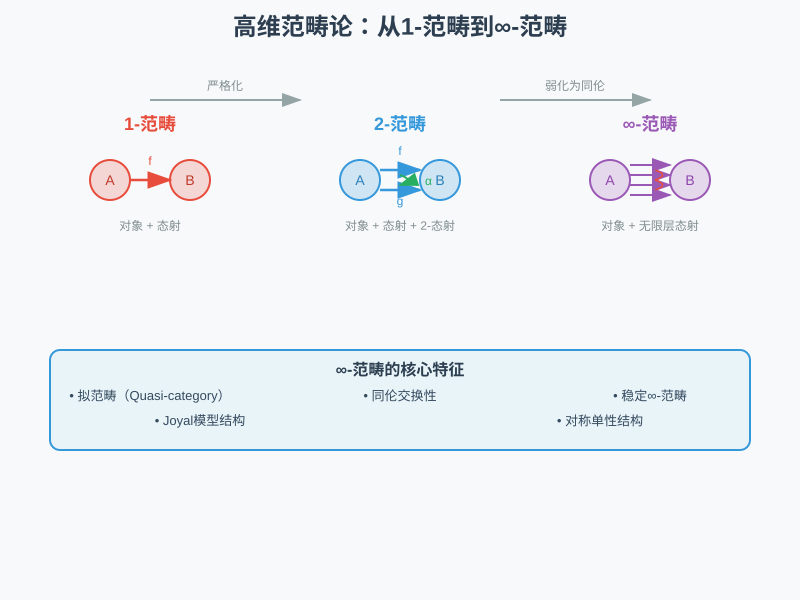
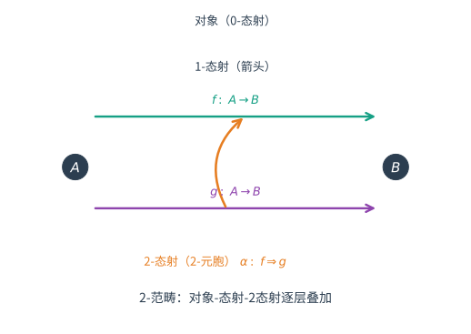
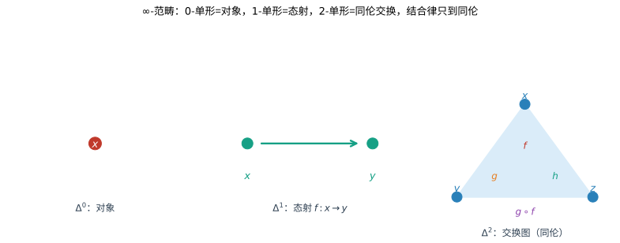

# 第144级：高维范畴论

## 学习目标

1. 理解 $\infty$-范畴的基本概念及其与经典范畴论的关系
2. 掌握拟范畴（quasi-category）的定义及其基本性质
3. 学习 Joyal 模型结构及其在拟范畴理论中的作用
4. 理解稳定 $\infty$-范畴的刻画与三角结构的联系
5. 掌握对称单性 $\infty$-范畴的构造方法
6. 了解 $\infty$-拓扑斯与导出代数几何中的 $\infty$-范畴应用

---

## 核心概念

> **直观理解（现实类比）**：想象你在规划一次旅行。1-范畴就像"城市+直达航班"：城市是对象，航班是态射。2-范畴则升级到"城市+航班+航班之间的转机方案"：两条航班之间可以互相转换，这种转换就是2-态射。∞-范畴更进一步：转机方案之间还有"方案的选择"，方案的选择之间还有"选择的比较"……无限嵌套下去。就像俄罗斯套娃，每一层都包含更精细的决策结构。拟范畴用单纯集编码这种无限层结构，Joyal模型结构则提供了"严格化"的数学工具，让我们能在保持同伦信息的同时进行严格推理。

### $\infty$-范畴

**$\infty$-范畴**是高维范畴论的核心对象，它包含 $k$-态射（$k \geq 0$），其中 $k$-态射之间的结合律只成立到同伦意义。在 Joyal-Lurie 的理论框架中，$\infty$-范畴通过**拟范畴**（quasi-category）实现——即满足内纤维填充条件的单纯集。

### 拟范畴

**拟范畴**是一个单纯集 $X$，满足对每个 $0 < i < n$，每个内尖角 $\Lambda^n_i \to X$ 都有填充 $\Delta^n \to X$。这一定义捕捉了 $\infty$-范畴的本质：$0$-单形是对象，$1$-单形是态射，$2$-单形是交换图，高维单形编码了同伦交换性。

> **直观理解（现实类比）**：就像把地图层层堆叠：第 0 层是城市（对象），第 1 层是城市间的道路（态射），第 2 层是"两条道路之间可以互相变形"的证明或同伦（2-态射）。2-范畴正是在每个箭头之间再允许"箭头之间的箭头"，如同比较两条通勤路线时，还要说明"这条路可以连续变成那条路"。

### 关键概念清单

| 概念 | 描述 | 符号/公式 |
|------|------|-----------|
| 单纯集 | 从 $\Delta^{\mathrm{op}}$ 到 $\mathrm{Set}$ 的函子 | $X_\bullet$ |
| 拟范畴 | 满足内纤维填充的单纯集 | $\mathcal{C}$ |
| Kan 复形 | 所有尖角可填充的单纯集 | $X$ |
| Joyal 模型结构 | 单纯集上的模型结构 | $\mathrm{sSet}_{\mathrm{Joyal}}$ |
| 稳定 $\infty$-范畴 | 满足稳定公理的 $\infty$-范畴 | $\mathcal{C}$ |
| 谱的 $\infty$-范畴 | 稳定 $\infty$-范畴的原型 | $\mathrm{Sp}$ |
| 对称单性 $\infty$-范畴 | 带有对称单性结构的 $\infty$-范畴 | $\mathcal{C}^\otimes$ |
| $\infty$-拓扑斯 | $\infty$-范畴版本的拓扑斯 | $\mathcal{X}$ |

---

## 定理与证明

### 定理 1：拟范畴的基本性质

**定理**：拟范畴 $\mathcal{C}$ 具有以下基本性质：

(1) $\mathcal{C}$ 的 $0$-单形构成对象集 $\mathrm{Ob}(\mathcal{C})$，$1$-单形构成态射集。
(2) 对任意对象 $x, y \in \mathcal{C}$，态射空间 $\mathrm{Hom}_{\mathcal{C}}(x, y)$ 是一个 Kan 复形。
(3) 态射的复合是定义良好的，且结合律成立到同伦。
(4) 对任意 $n \geq 2$，$\mathcal{C}$ 中的 $n$-单形对应于 $n$ 个可复合态射的交换图。

**证明**：

**性质 (1) 的证明**：由定义，$X_0$ 是 $0$-单形的集合，作为对象。$X_1$ 是 $1$-单形的集合，作为态射。源映射 $d_1: X_1 \to X_0$ 给出态射的域，靶映射 $d_0: X_1 \to X_0$ 给出态射的余域。

**性质 (2) 的证明**：

设 $x, y \in \mathcal{C}_0$。定义态射空间 $\mathrm{Hom}_{\mathcal{C}}(x, y)$ 为拉回：

$$\require{AMScd}
\begin{CD}
\mathrm{Hom}_{\mathcal{C}}(x, y) @>>> \mathcal{C}^{\Delta^1} \\
@VVV @VV{(d_1, d_0)}V \\
\Delta^0 @>{(x, y)}>> \mathcal{C} \times \mathcal{C}
\end{CD}$$

要证明 $\mathrm{Hom}_{\mathcal{C}}(x, y)$ 是 Kan 复形，需验证任意尖角 $\Lambda^n_i \to \mathrm{Hom}_{\mathcal{C}}(x, y)$ 可填充。

由 $\mathrm{Hom}_{\mathcal{C}}(x, y)$ 的定义，这等价于一个填充问题：

$$\begin{CD}
\Lambda^n_i @>>> \mathcal{C}^{\Delta^1} \\
@VVV @VVV \\
\Delta^n @>>> \mathcal{C} \times \mathcal{C}
\end{CD}$$

其中 $\Delta^n \to \mathcal{C} \times \mathcal{C}$ 在 $(x, y)$ 处为常值。利用 $\mathcal{C}$ 是拟范畴以及 $\Delta^1$ 的单纯结构，可证明该填充存在。关键在于 $\Lambda^n_i \times \Delta^1 \to \mathcal{C}$ 的填充问题可转化为 $\mathcal{C}$ 中的内尖角填充。

**性质 (3) 的证明**：

态射 $f: x \to y$ 和 $g: y \to z$ 的复合由如下填充给出：

$$\begin{CD}
\Lambda^2_1 @>{(f, g)}>> \mathcal{C} \\
@VVV @VVV \\
\Delta^2 @>>> \mathcal{C}
\end{CD}$$

其中 $\Lambda^2_1$ 包含边 $d_2(\sigma) = f$ 和 $d_0(\sigma) = g$，填充 $\sigma: \Delta^2 \to \mathcal{C}$ 给出复合 $d_1(\sigma) = g \circ f$。

结合律：给定 $f: w \to x$，$g: x \to y$，$h: y \to z$，考虑 $\Lambda^3_1$ 或 $\Lambda^3_2$ 的填充可得到 $h \circ (g \circ f) \simeq (h \circ g) \circ f$ 的同伦。

**性质 (4) 的证明**：通过归纳，$n$-单形 $X_n$ 中的元素对应 $n$ 个可复合态射 $f_1, \ldots, f_n$ 及其复合的交换图。具体地，$\sigma \in \mathcal{C}_n$ 给出面映射 $d_i(\sigma)$ 作为子复合，且由拟范畴条件可保证这些子复合之间的相容性。

> **直观理解（现实类比）**：$\infty$-范畴把"对象"看成点（$\Delta^0$），把"态射"看成连接两点的线段（$\Delta^1$），把"交换图/同伦"看成三角形面（$\Delta^2$），更高维则依次是四面体、更高维单形。它时刻在提醒：复合 $(h\circ g)\circ f$ 与 $h\circ(g\circ f)$ 不必严格相等，只需能通过一个同伦（三角形面）把二者连起来——就像拼积木时，每一处"接缝"都可以有弹性地变形。

$\square$

---

### 定理 2：Grothendieck 同伦假设

**定理（Grothendieck 同伦假设）**：$\infty$-群胚与拓扑空间在弱同伦等价意义下是等价的。更精确地说，$\infty$-群胚的 $\infty$-范畴 $\mathrm{Grpd}_\infty$ 与空间的 $\infty$-范畴 $\mathcal{S}$（即 Kan 复形的 $\infty$-范畴）是等价的。

**证明思路**：

**步骤 1：$\infty$-群胚的定义**

$\infty$-群胚是拟范畴 $\mathcal{C}$，其中所有态射都是可逆的（在同伦意义下）。即对每个 $1$-单形 $f: x \to y$，存在 $g: y \to x$ 和 $2$-单形 $\sigma, \tau$ 使得 $d_1(\sigma) = g \circ f$，$d_1(\tau) = f \circ g$ 且 $d_2(\sigma) = \mathrm{id}_x$，$d_0(\tau) = \mathrm{id}_y$。

等价地，$\infty$-群胚是拟范畴 $\mathcal{C}$ 使得其同伦范畴 $\mathrm{h}\mathcal{C}$ 是一个群胚。

**步骤 2：空间的 $\infty$-范畴**

定义 $\mathcal{S}$ 为 Kan 复形的 $\infty$-范畴：其对象是 Kan 复形，态射空间是映射空间的派生版本。由于 Kan 复形中的每个态射都有同伦逆，$\mathcal{S}$ 中的每个 1-态射都是可逆的，因此 $\mathcal{S}$ 是 $\infty$-群胚的 $\infty$-范畴。

**步骤 3：几何实现与奇异函子**

6. **极限与 Cartesian 纤维化** 对 $K$-图表 $F: K \to \mathcal{C}$，其极限可经函子范畴 $\operatorname{Fun}(K,\mathcal{C})$ 的 Cartesian 纤维化（等价的右扩展）实现：极限对象是末端锥，其万有性质等价于该锥作为 Cartesian 提升的极大性。于是 $\infty$-范畴中的极限由 Cartesian 纤维化唯一刻画，与经典末端锥定义一致。

$$\mathrm{Sing}: \mathcal{S}_{\mathrm{Top}} \rightleftarrows \mathrm{Grpd}_\infty: |-|$$

其中 $\mathcal{S}_{\mathrm{Top}}$ 是拓扑空间的 $\infty$-范畴。

**步骤 4：等价性的证明**

对于任意 $\infty$-群胚 $X$，其几何实现 $|X|$ 是一个拓扑空间。反过来，对于任意拓扑空间 $T$，$\mathrm{Sing}(T)$ 是一个 $\infty$-群胚。

由 Whitehead 定理，连续映射 $f: T \to T'$ 是弱同伦等价当且仅当 $\mathrm{Sing}(f)$ 是单纯集的弱等价。因此 $\mathrm{Sing}$ 和 $|-|$ 诱导了 $\infty$-范畴的等价：

$$\mathrm{Grpd}_\infty \simeq \mathcal{S}$$

**步骤 5：同伦假设的范畴论表述**

Grothendieck 同伦假设可以精确表述为：$\infty$-群胚的 $\infty$-范畴 $\mathrm{Grpd}_\infty$ 与空间的 $\infty$-范畴 $\mathcal{S}$ 是等价的。这意味着每个 $\infty$-群胚本质上由它的同伦型决定，这为"空间是 $\infty$-群胚"这一观点提供了严格的数学基础。

$\square$

---

### 定理 3：稳定 $\infty$-范畴的刻画

**定理**：设 $\mathcal{C}$ 是一个 $\infty$-范畴。则以下条件等价：

(1) $\mathcal{C}$ 是稳定的，即 $\mathcal{C}$ 有零对象，所有有限极限和余极限存在，且推出与拉回方块重合。
(2) $\mathcal{C}$ 是可加的，其同伦范畴 $\mathrm{h}\mathcal{C}$ 是三角的，且纤维序列与余纤维序列一致。
(3) $\mathcal{C}$ 等价于某个 $\infty$-范畴 $\mathcal{D}$ 中的谱对象 $\mathrm{Sp}(\mathcal{D})$。

**证明**：

**步骤 1：稳定 $\infty$-范畴的定义回顾**

$\mathcal{C}$ 是稳定的如果：
- $\mathcal{C}$ 有零对象 $0$（既是始对象也是终对象）。
- $\mathcal{C}$ 中所有有限极限和有限余极限存在。
- 在 $\mathcal{C}$ 中，一个方块是推出当且仅当它是拉回（即推出与拉回一致）。

**步骤 2：(1) $\Rightarrow$ (2)：稳定 $\infty$-范畴的同伦范畴是三角的**

设 $\mathcal{C}$ 是稳定的。定义 $\mathrm{h}\mathcal{C}$ 上的平移函子 $\Sigma: \mathrm{h}\mathcal{C} \to \mathrm{h}\mathcal{C}$ 为 $\Sigma(X) = 0 \amalg_X 0$（双重推出），即 $X$ 的悬浮。由于推出与拉回一致，$\Sigma$ 是等价，其逆为 $\Omega(X) = 0 \times_X 0$（环路空间）。

三角结构：一个三角形 $X \to Y \to Z \to \Sigma X$ 是**纤维序列**（或**余纤维序列**），如果存在 $\mathcal{C}$ 中的拉回-推出方块：

$$\begin{CD}
X @>>> Y \\
@VVV @VVV \\
0 @>>> Z
\end{CD}$$

验证三角公理：

- **(TR1)**：每个同构的三角形是三角的；对每个态射 $X \to Y$，可将其完备为纤维序列 $X \to Y \to Z \to \Sigma X$。
- **(TR2)**：$X \to Y \to Z \to \Sigma X$ 是三角的当且仅当 $Y \to Z \to \Sigma X \to \Sigma Y$ 是三角的。
- **(TR3)**：给定三角之间的态射，存在完备化的态射。
- **(TR4)**（八面体公理）：由 $\mathcal{C}$ 中对应的推出方块的性质保证。

**步骤 3：(2) $\Rightarrow$ (1)：三角 $\infty$-范畴的稳定性**

若 $\mathrm{h}\mathcal{C}$ 是三角的且 $\Sigma$ 是等价，则 $\mathcal{C}$ 中所有有限极限和余极限存在。零对象的存在性由三角结构保证。推出与拉回的一致性由纤维序列与余纤维序列的等价性导出。

**步骤 4：(1) $\Rightarrow$ (3)：稳定 $\infty$-范畴作为谱范畴**

对稳定 $\infty$-范畴 $\mathcal{C}$，定义谱对象 $\mathrm{Sp}(\mathcal{C})$ 为满足 $X_n \simeq \Omega X_{n+1}$ 的序列 $(X_n)_{n \in \mathbb{Z}}$ 的 $\infty$-范畴。反过来，对任意 $\infty$-范畴 $\mathcal{D}$，$\mathrm{Sp}(\mathcal{D})$ 是稳定的。

若 $\mathcal{C}$ 是稳定的，则函子 $\mathcal{C} \to \mathrm{Sp}(\mathcal{C})$ 给出等价。特别地，当 $\mathcal{C} = \mathrm{Sp}$（谱的 $\infty$-范畴）时，有 $\mathrm{Sp}(\mathrm{Sp}) \simeq \mathrm{Sp}$。

**步骤 5：稳定 $\infty$-范畴的纤维序列刻画**

在稳定 $\infty$-范畴中，对任意态射 $f: X \to Y$，纤维 $\mathrm{fib}(f) = 0 \times_Y X$ 和余纤维 $\mathrm{cofib}(f) = 0 \amalg_X Y$ 之间存在自然的纤维序列：

$$\mathrm{fib}(f) \to X \xrightarrow{f} Y \to \mathrm{cofib}(f)$$

且对任意 $Z$，有长正合序列：

$$\cdots \to \mathrm{Hom}_{\mathcal{C}}(Z, \mathrm{fib}(f)) \to \mathrm{Hom}_{\mathcal{C}}(Z, X) \to \mathrm{Hom}_{\mathcal{C}}(Z, Y) \to \mathrm{Hom}_{\mathcal{C}}(Z, \mathrm{cofib}(f)) \to \cdots$$

$\square$

---

### 定理 4：对称单性 $\infty$-范畴的构造

**定理**：设 $\mathcal{C}$ 是一个 $\infty$-范畴，则存在一个 $\infty$-范畴 $\mathcal{C}^\otimes$ 连同遗忘函子 $\mathcal{C}^\otimes \to \mathrm{N}(\mathrm{Fin}_*)$，使得 $\mathcal{C}^\otimes$ 是 $\mathcal{C}$ 的对称单性 $\infty$-范畴，其纤维 $\mathcal{C}^\otimes_{\langle n \rangle} \simeq \mathcal{C}^n$。

**证明**：

**步骤 1：操作子代数方法**

6. **极限与 Cartesian 纤维化** 对 $K$-图表 $F: K \to \mathcal{C}$，其极限可经函子范畴 $\operatorname{Fun}(K,\mathcal{C})$ 的 Cartesian 纤维化（等价的右扩展）实现：极限对象是末端锥，其万有性质等价于该锥作为 Cartesian 提升的极大性。于是 $\infty$-范畴中的极限由 Cartesian 纤维化唯一刻画，与经典末端锥定义一致。

定义 $\mathcal{C}^\otimes$ 为满足以下条件的 $\infty$-范畴：

- 对象：形如 $(X_1, \ldots, X_n)$ 的有限序列，其中 $X_i \in \mathcal{C}$。
- 态射：从 $(X_1, \ldots, X_n)$ 到 $(Y_1, \ldots, Y_m)$ 的态射由以下数据给出：
  - 一个映射 $\alpha: \langle n \rangle \to \langle m \rangle$ 在 $\mathrm{Fin}_*$ 中。
  - 对每个 $j = 1, \ldots, m$，一个态射 $\bigotimes_{i \in \alpha^{-1}(j)} X_i \to Y_j$。

**步骤 2：使用 $\infty$-操作子的严格构造**

更严格地，$\mathcal{C}^\otimes$ 是 $\mathrm{N}(\mathrm{Fin}_*)$ 上的 $\infty$-操作子，其构造可通过以下方式实现：

6. **极限与 Cartesian 纤维化** 对 $K$-图表 $F: K \to \mathcal{C}$，其极限可经函子范畴 $\operatorname{Fun}(K,\mathcal{C})$ 的 Cartesian 纤维化（等价的右扩展）实现：极限对象是末端锥，其万有性质等价于该锥作为 Cartesian 提升的极大性。于是 $\infty$-范畴中的极限由 Cartesian 纤维化唯一刻画，与经典末端锥定义一致。

$$\begin{CD}
\mathcal{C}^\otimes @>>> \mathrm{N}(\mathrm{Fin}_*) \\
@VVV @VVV \\
\mathrm{Map}_{\mathrm{Op}_\infty}(\mathrm{Assoc}, \mathcal{C}) @>>> \cdots
\end{CD}$$

**步骤 3：纤维结构**

遗忘函子 $p: \mathcal{C}^\otimes \to \mathrm{N}(\mathrm{Fin}_*)$ 满足：
- 对每个 $\langle n \rangle$，纤维 $\mathcal{C}^\otimes_{\langle n \rangle} \simeq \mathcal{C}^n$。
- 对惰性态射 $\rho^i: \langle n \rangle \to \langle 1 \rangle$（将 $i$ 映到 $1$，其余映到 $*$），对应的函子 $\mathcal{C}^n \to \mathcal{C}$ 是第 $i$ 个投影。
- 对主动态射，纤维间的函子对应于 $\mathcal{C}$ 中的张量积。

**步骤 4：对称单性结构的验证**

为验证 $\mathcal{C}^\otimes$ 是 $\mathcal{C}$ 的对称单性 $\infty$-范畴，需要验证：

1. **张量积的存在性**：对任意 $X, Y \in \mathcal{C}$，存在 $X \otimes Y \in \mathcal{C}$，由 $\mathcal{C}^\otimes_{\langle 2 \rangle} \to \mathcal{C}^\otimes_{\langle 1 \rangle}$ 给出。
2. **结合律**：存在自然的等价 $X \otimes (Y \otimes Z) \simeq (X \otimes Y) \otimes Z$，由 $\mathcal{C}^\otimes$ 中 $\langle 3 \rangle$ 上的纤维结构保证。
3. **单位元**：存在单位对象 $\mathbf{1} \in \mathcal{C}$，对应于 $\mathcal{C}^\otimes_{\langle 0 \rangle} \simeq \Delta^0$。
4. **对称性**：存在自然的对称同构 $X \otimes Y \simeq Y \otimes X$，由 $\mathrm{Fin}_*$ 中的置换态射诱导。

**步骤 5：$\mathcal{C}^\otimes$ 的 $\infty$-范畴性质**

$p: \mathcal{C}^\otimes \to \mathrm{N}(\mathrm{Fin}_*)$ 是一个 Cartesian 纤维化，且其 Cartesian 态射恰好对应于惰性态射的拉回。这一性质确保了 $\mathcal{C}^\otimes$ 确实编码了 $\mathcal{C}$ 上的对称单性结构。

$\square$

---

### 定理 5：$\infty$-范畴中的极限与余极限

**定理**：设 $\mathcal{C}$ 是一个 $\infty$-范畴，$K$ 是一个单纯集。则 $\mathcal{C}$ 中所有 $K$-图表的余极限存在的充要条件是：对角函子 $\Delta: \mathcal{C} \to \mathrm{Fun}(K, \mathcal{C})$ 有左伴随。类似地，极限存在的充要条件是对角函子有右伴随。

**证明**：

**步骤 1：余极限的定义**

$K$-图表是函子 $F: K \to \mathcal{C}$。$F$ 的余极限是余锥 $\bar{F}: K^\triangleright \to \mathcal{C}$（其中 $K^\triangleright$ 是 $K$ 添加一个终对象），满足 $\bar{F}|_K = F$ 且 $\bar{F}$ 是 $K^\triangleright$ 上的余极限图。

等价地，$\operatorname{colim} F$ 是 $\mathcal{C}$ 中的对象，使得对每个 $X \in \mathcal{C}$：

$$\mathrm{Hom}_{\mathcal{C}}(\operatorname{colim} F, X) \simeq \lim_{k \in K} \mathrm{Hom}_{\mathcal{C}}(F(k), X)$$

其中右端是 $\mathrm{Spaces}$ 中的极限。

**步骤 2：Cartesian 纤维化方法**

6. **极限与 Cartesian 纤维化** 对 $K$-图表 $F: K \to \mathcal{C}$，其极限可经函子范畴 $\operatorname{Fun}(K,\mathcal{C})$ 的 Cartesian 纤维化（等价的右扩展）实现：极限对象是末端锥，其万有性质等价于该锥作为 Cartesian 提升的极大性。于是 $\infty$-范畴中的极限由 Cartesian 纤维化唯一刻画，与经典末端锥定义一致。

**步骤 3：左伴随的存在性**

若 $\mathcal{C}$ 中所有 $K$-图表都有余极限，则定义 $\operatorname{colim}: \mathrm{Fun}(K, \mathcal{C}) \to \mathcal{C}$。对任意 $F \in \mathrm{Fun}(K, \mathcal{C})$ 和 $X \in \mathcal{C}$，有：

$$\mathrm{Hom}_{\mathcal{C}}(\operatorname{colim} F, X) \simeq \mathrm{Hom}_{\mathrm{Fun}(K, \mathcal{C})}(F, \Delta(X))$$

因此 $\operatorname{colim}$ 是 $\Delta$ 的左伴随。

**步骤 4：充分性——伴随 $\Rightarrow$ 余极限存在**

反之，若 $\Delta$ 有左伴随 $L$，则对任意 $F: K \to \mathcal{C}$，$L(F)$ 是 $F$ 的余极限。这是因为对任意 $X \in \mathcal{C}$：

$$\mathrm{Hom}_{\mathcal{C}}(L(F), X) \simeq \mathrm{Hom}_{\mathrm{Fun}(K, \mathcal{C})}(F, \Delta(X)) \simeq \lim_{k \in K} \mathrm{Hom}_{\mathcal{C}}(F(k), X)$$

**步骤 5：具体构造**

给定图表 $F: K \to \mathcal{C}$，其余极限可通过以下方式构造：

6. **极限与 Cartesian 纤维化** 对 $K$-图表 $F: K \to \mathcal{C}$，其极限可经函子范畴 $\operatorname{Fun}(K,\mathcal{C})$ 的 Cartesian 纤维化（等价的右扩展）实现：极限对象是末端锥，其万有性质等价于该锥作为 Cartesian 提升的极大性。于是 $\infty$-范畴中的极限由 Cartesian 纤维化唯一刻画，与经典末端锥定义一致。
2. 取 $\mathcal{C}_{/F}$ 的终对象（若存在）。
3. 该终对象给出余锥 $\bar{F}: K^\triangleright \to \mathcal{C}$，即为余极限。

类似地，极限通过 $\mathcal{C}_{F/}$ 的始对象构造。

**步骤 6：与经典范畴论的关系**

当 $\mathcal{C}$ 是经典范畴（视为 $\infty$-范畴）时，上述定义与经典极限和余极限的定义一致。当 $\mathcal{C}$ 是 $\infty$-范畴时，这一概念统一了同伦极限和经典极限。

$\square$

---

## 示例

### 示例 1：拟范畴的例子——拓扑空间的奇异单纯集

**问题**：证明拓扑空间的奇异单纯集 $\mathrm{Sing}(T)$ 是一个拟范畴（实际上是 Kan 复形）。

**解**：

**1. 奇异单纯集的定义**

对拓扑空间 $T$，奇异单纯集 $\mathrm{Sing}(T)$ 定义为：

$$\mathrm{Sing}(T)_n = \mathrm{Hom}_{\mathrm{Top}}(|\Delta^n|, T)$$

其中 $|\Delta^n|$ 是标准拓扑 $n$-单形。

**2. Kan 复形性质**

对任意 $0 \leq i \leq n$，尖角 $\Lambda^n_i \to \mathrm{Sing}(T)$ 对应连续映射 $f: |\Lambda^n_i| \to T$。由于 $|\Lambda^n_i|$ 是 $|\Delta^n|$ 的形变收缩核，存在收缩映射 $r: |\Delta^n| \to |\Lambda^n_i|$。因此 $f \circ r: |\Delta^n| \to T$ 给出所需的填充。

**3. 作为拟范畴**

由于 $\mathrm{Sing}(T)$ 是 Kan 复形，它自然也是拟范畴（因为 Kan 复形的填充条件比拟范畴更强）。作为 $\infty$-范畴，$\mathrm{Sing}(T)$ 的对象是 $T$ 中的点，$1$-单形是 $T$ 中的道路，$2$-单形是同伦，以此类推。

**4. 同伦假设的视角**

由 Grothendieck 同伦假设，$\mathrm{Sing}(T)$ 是 $\infty$-群胚，对应于 $T$ 的同伦型。这建立了拓扑空间与 $\infty$-范畴之间的桥梁。

---

### 示例 2：稳定 $\infty$-范畴的例子——谱的 $\infty$-范畴

**问题**：构造谱的 $\infty$-范畴 $\mathrm{Sp}$ 并验证其稳定性。

**解**：

**1. 预谱的 $\infty$-范畴**

6. **极限与 Cartesian 纤维化** 对 $K$-图表 $F: K \to \mathcal{C}$，其极限可经函子范畴 $\operatorname{Fun}(K,\mathcal{C})$ 的 Cartesian 纤维化（等价的右扩展）实现：极限对象是末端锥，其万有性质等价于该锥作为 Cartesian 提升的极大性。于是 $\infty$-范畴中的极限由 Cartesian 纤维化唯一刻画，与经典末端锥定义一致。

**2. 谱对象**

谱是序列 $(E_n)_{n \in \mathbb{Z}}$，其中 $E_n$ 是空间（或带基点空间），且存在结构等价 $\epsilon_n: E_n \xrightarrow{\sim} \Omega E_{n+1}$。

**3. 稳定性的验证**

- **零对象**：每个 $E_n = *$（带基点空间）给出零谱。
- **有限极限和余极限**：$\mathrm{Sp}$ 中的极限和余极限逐分量构造。
- **推出与拉回的一致性**：由 $\mathrm{Sp}$ 的定义，$\Sigma$ 和 $\Omega$ 互为逆函子，因此推出与拉回方块一致。

**4. 悬垂-环路伴随**

在 $\mathrm{Sp}$ 中，悬垂函子 $\Sigma$ 和环路函子 $\Omega$ 互为等价：

$$\Sigma \Omega \simeq \mathrm{id} \simeq \Omega \Sigma$$

这正是稳定性的核心特征。

**5. 三角结构**

$\mathrm{Sp}$ 的同伦范畴 $\mathrm{hSp}$ 是经典的稳定同伦范畴，具有由余纤维序列给出的三角结构：

$$X \to Y \to Z \to \Sigma X$$

其中 $Z = Y \cup_X \mathrm{Cone}(X)$ 是映射锥。

---

## 习题

### 基础题

**习题 1**（拟范畴定义）用简洁语言定义单纯集与拟范畴（$\infty$-范畴），说明拟范畴的填充条件与经典范畴的脉络的对应关系。

**习题 2**（单纯集）写出标准单纯形 $\Delta^n$ 的结构，解释单纯集 $X$ 中 $X_n$、面映射 $d_i$ 与退化映射 $s_i$ 的含义。

**习题 3**（Kan 复形）定义拟范畴中的 Kan 复形（$\infty$-群胚），说明 Kan 复形满足怎样的尖角填充条件。

**习题 4**（态射空间）解释拟范畴 $\mathcal{C}$ 中两个对象 $x, y \in \mathcal{C}$ 的态射空间 $\operatorname{Map}_{\mathcal{C}}(x, y)$ 为何是 Kan 复形，及其与经典 Hom 集的联系。

**习题 5**（同伦）在 $\infty$-范畴中给出两个态射同伦的定义，说明高维单形如何编码"复合结合到同伦"这一性质。

**习题 6**（$\infty$-群胚）定义拟范畴的极大 $\infty$-群胚 $\mathcal{C}^{\simeq}$，说明其对象与态射的范围。

**习题 7**（稳定 $\infty$-范畴）给出稳定 $\infty$-范畴的定义，说明零对象与推出拉回一致性的角色。

**习题 8**（对称单性 $\infty$-范畴）用 $\infty$-操作子 $\mathcal{C}^\otimes \to \mathrm{N}(\mathrm{Fin}_*)$ 说明对称单性 $\infty$-范畴如何编码张量积与对称性。

**习题 9**（极限与余极限）说明 $\infty$-范畴中 $K$-图表极限与余极限的定义，指出其与经典极限的差别（同伦极限）。

**习题 10**（Grothendieck 同伦假设）陈述 Grothendieck 同伦假设：$\infty$-群胚与拓扑空间的弱同伦等价关系。

### 进阶题

**习题 11**（拟范畴与 Kan 复形）说明拟范畴的填充要求与 Kan 复形的区别：为何拟范畴只要求内尖角填充而 Kan 复形要求外尖角也填充。

**习题 12**（内尖角填充）设 $X$ 是单纯集，证明 $X$ 是拟范畴当且仅当对每个 $0 < i < n$，映射 $\Lambda^n_i \to X$ 都可填充到 $\Delta^n$。

**习题 13**（$\infty$-群胚是 Kan 复形）设 $\mathcal{C}$ 是拟范畴，说明为何其极大 $\infty$-群胚 $\mathcal{C}^{\simeq}$ 中的外尖角也可填充，从而成为 Kan 复形。

**习题 14**（稳定情形）设 $\mathcal{C}$ 是稳定 $\infty$-范畴，$f: X \to Y$ 是态射，说明为什么 $\mathrm{fib}(f) \simeq \Omega\, \mathrm{cofib}(f)$。

**习题 15**（对称单性对象）设 $\mathcal{C}^\otimes \to \mathrm{N}(\mathrm{Fin}_*)$ 是 $\mathcal{C}$ 的对称单性 $\infty$-范畴，说明惰性态射 $\rho^1, \rho^2: \langle 2 \rangle \to \langle 1 \rangle$ 如何给出 $\mathcal{C}^\otimes_{\langle 2 \rangle} \cong \mathcal{C} \times \mathcal{C}$。

**习题 16**（极限的对偶）证明 $\mathcal{C}$ 中所有 $K$-图表的极限存在当且仅当 $\mathcal{C}^{\mathrm{op}}$ 中所有 $K$-图表的余极限存在。

**习题 17**（Joyal 模型结构）简述拟范畴上的 Joyal 模型结构，说明其中弱等价与经典 Kan-Quillen 模型结构的区别。

**习题 18**（Segal 条件）说明如何用 Segal 条件由单纯集得到热 Segal 空间（$\infty$-范畴的另一种模型），并解释其与拟范畴的联系。

**习题 19**（同伦范畴）设 $\mathcal{C}$ 是 $\infty$-范畴，说明其同伦范畴 $\mathrm{h}\mathcal{C}$ 的对象与态射如何构造，并说明为何在稳定情形它是三角范畴。

### 挑战题

**习题 20**（拟范畴填充的论证）设 $X$ 是拟范畴，$0 < i < n$，$f: \Lambda^n_i \to X$ 是内尖角。概述保证 $f$ 可填到 $\Delta^n$ 的对角化论证，并解释其为何依赖拟范畴（内尖角）条件。

**习题 21**（稳定 $\infty$-范畴的拉回与推出）设 $\mathcal{C}$ 是稳定 $\infty$-范畴，$X \to Z \leftarrow Y$ 是态射。解释拉回与推出的一致性为何刻画稳定 $\infty$-范畴，并推导与之伴随的长纤维序列。

**习题 22**（等值化与万有性质）说明在 $\infty$-范畴中，拉回等构造如何由同伦意义下的万有性质定义，而不必像 $1$-范畴那样检查严格的交换性。

**习题 23**（Grothendieck 同伦假设的几何内容）解释 $\infty$-群胚与 CW 复形的对应为何是广义同伦假设，说明态射空间作为 Kan 复形如何把拓扑空间的信息编码进 $\infty$-范畴。

**习题 24**（对称单性 $\infty$-操作子）说明操作子 $\mathcal{C}^\otimes \to \mathrm{N}(\mathrm{Fin}_*)$ 的活性与惰性态射如何编码张量积、结合约束与对称（辫）结构。

**习题 25**（极限与 Cartesian 纤维化）概述用 Cartesian 纤维化构造 $\infty$-范畴极限的方法，并解释其与末端万有锥的等价性。

**习题 26**（$E_n$-代数）说明对称单性 $\infty$-范畴中 $E_1$-代数、$E_n$-代数与 $E_\infty$-代数的差异，指出 $E_1$ 对应结合代数、$E_\infty$ 对应一致交换代数。

### 探究题

**习题 27**（$\infty$-拓扑斯）探讨 $\infty$-拓扑斯作为同伦意义的 Grothendieck 拓扑斯，讨论其如何作为导出几何中"空间"的范畴论基础。

**习题 28**（与导出代数几何的联系）探讨稳定 $\infty$-范畴如何成为导出代数几何的语言基础，说明派生张量积与同伦极限在其结构层取值中的应用。

**习题 29**（几何表示论）探讨高维范畴论（稳定 $\infty$-范畴、函子范畴、同伦意义的不等变性）在几何表示论中的应用。

**习题 30**（$E_n$-代数与数学物理）开放探讨 $E_n$-代数与拓扑量子场论、因子化代数等数学物理对象的联系，讨论同伦交换性如何在更高维场论中被实现。

---

## 习题答案与解析

### 基础题答案

1. **拟范畴定义** 单纯集 $X$ 是一族集合 $X_n$（$n \ge 0$）配以面映射 $d_i: X_n \to X_{n-1}$ 与退化映射 $s_i: X_n \to X_{n+1}$，满足单纯恒等式。拟范畴（$\infty$-范畴）是满足内尖角填充性质的单纯集：对每个 $0 < i < n$，任意映射 $\Lambda^n_i \to X$ 都可填充为 $\Delta^n \to X$。经典范畴 $\mathcal{C}$ 的脉络 $\mathrm{N}(\mathcal{C})$ 正是一个拟范畴。

2. **单纯集** 标准单纯形 $\Delta^n$ 有 $n+1$ 个顶点，其面由去掉一个顶点得到；对单纯集 $X$，$X_n$ 记第 $n$ 维单形的集合，维数随单纯形编号增长。面映射 $d_i$ 去掉第 $i$ 个顶点（把 $n$-单形送到 $n-1$-单形），退化映射 $s_i$ 重复第 $i$ 个顶点（把 $n$-单形送到 $n+1$-单形）。它们满足标准的单纯恒等式。

3. **Kan 复形** Kan 复形是满足全部尖角填充条件的单纯集：对每个 $n$ 与 $0 \le i \le n$，任意 $\Lambda^n_i \to X$ 都可填充为 $\Delta^n \to X$（包括外尖角 $i = 0, n$）。在拟范畴语境中，$\infty$-群胚正是其所有态射都可逆的拟范畴，等价于 Kan 复形这一单纯集条件。

4. **态射空间** 对拟范畴 $\mathcal{C}$ 与对象 $x, y$，可定义态射的余弦空间（如 $\operatorname{Map}_{\mathcal{C}}(x,y)$ 的某同伦型），它是 $\infty$-范畴意义下的空间（Kan 复形）。其 $0$-维对象对应 $x$ 到 $y$ 的态射 $\Delta^1 \to \mathcal{C}$，同伦类对应复合表示，因此同伦范畴的 Hom 集 $\mathrm{h}\mathcal{C}(x,y) = \pi_0 \operatorname{Map}_{\mathcal{C}}(x,y)$ 与经典 Hom 集对应。

5. **同伦** 两条态射 $f, g: x \to y$ 同伦是指存在一个 $\Delta^2 \to \mathcal{C}$，其边界编码 $f$ 与 $g$ 关于某第三态的复合关系（即"填充三角形"）。高维单形把复合的结合律、单位律等表现为同伦一致性：$1$-范畴中的等式在这里被同伦等价取代，故复合在同伦意义下满足结合律。

6. **$\infty$-群胚** 拟范畴 $\mathcal{C}$ 的极大 $\infty$-群胚 $\mathcal{C}^{\simeq}$ 是 $\mathcal{C}$ 中由可逆态射及其间的相容所构成的子 $\infty$-范畴：对象仍为 $\mathcal{C}$ 的对象，态射仅保留可逆态射。$\mathcal{C}^{\simeq}$ 恰好是 $\mathcal{C}$ 中可逆态射空间的同伦泛型，并是一个 Kan 复形。

7. **稳定 $\infty$-范畴** $\mathcal{C}$ 稳定是指：存在零对象、有所有有限极限与余极限、且推出与拉回一致（即每个拉回方块也是推出方块）。由此建立环路 $\Omega$ 与余环路 $\Sigma$ 的互逆对，使 $\Omega \simeq \Sigma \circ [-1]$，且同伦范畴 $\mathrm{h}\mathcal{C}$ 带平移与三角结构成为三角范畴。

8. **对称单性 $\infty$-范畴** 操作子 $\mathcal{C}^\otimes \to \mathrm{N}(\mathrm{Fin}_*)$ 中，$\mathrm{Fin}_*$ 是以带基点有限集 $\langle n \rangle$ 为对象的范畴。纤维 $\mathcal{C}^\otimes_{\langle 1 \rangle} \simeq \mathcal{C}$；$\langle 2 \rangle$ 的纤维 $\simeq \mathcal{C} \times \mathcal{C}$ 编码张量积；活性态射给出结合与单位约束，涉及会合置换的相容性给出对称（辫）结构。

9. **极限与余极限** $K$-图表是函子 $K \to \mathcal{C}$，其极限是末端对象配以到图表每个对象的相容锥，具有同伦意义下的万有性质。与经典极限相比，$\infty$-范畴中的极限是"同伦极限"：相容关系只要求到同伦，且万有性质在同伦范畴中成立，因此严格交换不是必需的。

10. **Grothendieck 同伦假设** Grothendieck 同伦假设断言 $\infty$-群胚与拓扑空间的同伦型等价：每个拓扑空间产生其奇异 $\infty$-群胚，反之每个 $\infty$-群胚可实现为CW复形的奇异 $\infty$-群胚；弱同伦等价对应 $\infty$-群胚的同伦等价。在现代语言（Joyal-Lurie）中已被证实。

### 进阶题答案

1. **拟范畴与 Kan 复形** 二者都以尖角填充为基本构造，但拟范畴只要求内尖角 $\Lambda^n_i$（$0 < i < n$）填充，外尖角不要求。内尖角填充恰好编码"复合可以有第三段"这一自由度，故拟范畴中的复合与相性由内部单形给出；外尖角（如 $\Lambda^2_0$）填充则对应"态射存在拟逆元"，这正是可逆态射（等价）的构造，因此要求全部尖角填充的是 Kan 复形（$\infty$-群胚）。

2. **内尖角填充** 方向一：$X$ 是拟范畴则内尖角填充由定义成立。方向二：若对每个 $0<i<n$ 的 $\Lambda^n_i \to X$ 可填充，则可归纳构造复合与一切相容性。具体地，用 $1$-单形的复合与 $2$-单形的填充去逐步填补 $n$-单形的"薄弱面"，$n$ 的归纳给出整个 $\Delta^n \to X$。其正确性依赖 Joyal 的对角化引理。

3. **$\infty$-群胚是 Kan 复形** $\mathcal{C}^{\simeq}$ 的对象与态射是可逆的，故外尖角 $\Lambda^n_0$、$\Lambda^n_n$ 的边界由可逆态射组成。利用逆元与复合，可把外尖角的边界重排为内尖角的边界，再由 $\mathcal{C}^{\simeq}$（继承 $\mathcal{C}$ 的填充）填充。因此 $\mathcal{C}^{\simeq}$ 对所有尖角可填充，是 Kan 复形。

4. **稳定情形** 稳定 $\infty$-范畴中拉回与推出一致，故纤维 $\mathrm{fib}(f)$（拉回 $0 \to X \to Y$）与余纤维 $\mathrm{cofib}(f)$（推出 $X \to Y \to *$）相关。由环路空间把极限转到余极限：$\Omega\,\mathrm{cofib}(f) \simeq \mathrm{fib}(f)$。直观上，$W \simeq \Omega \Sigma W$ 在稳定范畴中恒成立，把 $W = \mathrm{cofib}(f)$ 代入即得 $\Omega\,\mathrm{cofib}(f)\simeq \Omega\Sigma\,\mathrm{fib}(f)\simeq\mathrm{fib}(f)$。

5. **对称单性对象** 惰性态射 $\rho^1: \langle 2 \rangle \to \langle 1 \rangle$（保留第一个点簇）诱导纤维函子 $\mathcal{C}^\otimes_{\langle 2 \rangle} \to \mathcal{C}^\otimes_{\langle 1 \rangle} \simeq \mathcal{C}$，即"第二投影"；$\rho^2$ 给出"第二投影"。二者合起来给出等价 $\mathcal{C}^\otimes_{\langle 2 \rangle} \simeq \mathcal{C} \times \mathcal{C}$。这正是操作子的分段一致性，使 $\langle 2 \rangle$ 的对象可解析为对象对。

6. **极限的对偶** 取对偶范畴 $\mathcal{C}^{\mathrm{op}}$：$\mathcal{C}$ 中的末端锥（极限）在 $\mathcal{C}^{\mathrm{op}}$ 中成为初端锥（余极限），反之亦然。故 $K$-图表在 $\mathcal{C}$ 中的极限存在 \iff 同一图表在 $\mathcal{C}^{\mathrm{op}}$ 中的余极限存在。极限与余极限由对偶性一一对应，可互相定义。

7. **Joyal 模型结构** Joyal 模型结构以拟范畴为纤维对象，弱等价取"范畴等价至同伦"：$f$ 是弱等价当且仅当它诱导对象集的弱等价且对每对对象诱导态射空间之间的弱等价。与 Kan-Quillen 模型结构（弱等价 `fun` 到简化为空间）相比，Joyal 结构保留维数与范畴结构，把 $\infty$-范畴当作真正的高维范畴来刻画。

8. **Segal 条件** 对单纯集 $X$，Segal 条件要求 $X_n \to X_1 \times_{X_0} \cdots \times_{X_0} X_1$ 是同伦等价，使 $X$ 成为热 Segal 空间，即一个幂等 $\infty$-范畴模型。拟范畴可视为满足更强内尖角填充的热 Segal 空间，故两者给出 $\infty$-范畴的等价现代定义（拟范畴基于填充，Segal 空间基于分段同伦等价）。

9. **同伦范畴** $\mathrm{h}\mathcal{C}$ 的对象是 $\mathcal{C}$ 的对象，态射是 $\operatorname{Map}_{\mathcal{C}}(x,y)$ 的同伦类，复合与单位由 $\infty$-范畴的填充数据诱导。当 $\mathcal{C}$ 稳定时，$\mathrm{h}\mathcal{C}$ 有平移函子且每个态射有纤维、余纤维，余纤维（及纤维）给出长正合序列，验证三角公理，故 $\mathrm{h}\mathcal{C}$ 是三角范畴。

### 挑战题答案

1. **拟范畴填充论证** 设 $f: \Lambda^n_i \to X$。论证的核心是"填三角"归纳：把 $\Lambda^n_i$ 分解为若干 $1$-单形关系，逐步用内尖角填充补出高维单形。具体做法是利用 $X$ 满足内尖角条件这一事实，对 $n$ 归纳地说明每个子尖角都能填充，最终拼出 $\Delta^n \to X$。这一步不能对 Kan 复形（外尖角）使用，正是"内尖角填充"这一拟范畴条件的作用所在。

2. **稳定拉回推出** 稳定 $\infty$-范畴要求每个拉回方块也是推出方块，这正是"加法"信号的体现：它保证纤维复形可由余纤维复形绕转给出长序列。给定 $X \to Z \leftarrow Y$，其（同伦）拉回与推出一致，从而有长纤维序列
$$\cdots \to \Omega\,\mathrm{cofib}(f) \to X \to Z \oplus X \leftarrow Y \to \mathrm{cofib}(f) \to \Sigma X \to \cdots,$$
在稳定趣味（环/余环互逆）下每个方块都能转成长正合三角，因此稳定 $\infty$-范畴是"三角可加"的环境。

3. **等值化与万有性质** 在 $\infty$-范畴中，拉回、等值器等重点价构造由同伦意义下的万有性质定义：$X \to Z \leftarrow Y$ 的拉回是末端锥 $\operatorname{Map}(W, X\times_Z Y) \simeq \operatorname{Map}(W,X)\times_{\operatorname{Map}(W,Z)}\operatorname{Map}(W,Y)$ 的同伦等价。因此在 $1$-范畴中"检查严格交换"的要求，被"万有性质至同伦"取代，简化了图表与极限的等值化分析。

4. **Grothendieck 同伦假设的几何内容** 广义同伦假设断言每个 $\infty$-群胚等同于某个 CW 复形（体）。$A$ 的奇异 $\infty$-群胚把空间变成 $\infty$-范畴；其态射（路径）空间作为 Kan 复形携带了空间的高维同伦信息。于是拓扑空间的同伦型被完全编码进拟范畴的态射空间，使同伦论与高维范畴论在"同伦型"层面完全等价。

5. **对称单性操作子** 操作子 $\mathcal{C}^\otimes \to \mathrm{N}(\mathrm{Fin}_*)$ 用惰性态射（保留部分聚类）与活性态射（聚到一起）把张量结构分段化：$\langle 2 \rangle$ 上的对象对 $x,y$ 经活性态射送到 $\langle 1 \rangle$ 上的 $x \otimes y$；同约束由单形来编码，交换性由 $\mathrm{Fin}_*$ 的置换一致化给出。故对称单性 $\infty$-操作子刻画的正是带相容结合约束与辫的乘积结构。

6. **极限与 Cartesian 纤维化** 对 $K$-图表 $F: K \to \mathcal{C}$，其极限可经函子范畴 $\operatorname{Fun}(K,\mathcal{C})$ 的 Cartesian 纤维化（等价的右扩展）实现：极限对象是末端锥，其万有性质等价于该锥作为 Cartesian 提升的极大性。于是 $\infty$-范畴中的极限由 Cartesian 纤维化唯一刻画，与经典末端锥定义一致。

7. **$E_n$-代数** 在对称单性 $\infty$-范畴中，$E_1$-代数满足结合关系（$\mu: A \otimes A \to A$ 的结合约束），$E_2$-代数还强化了结合中的交换自由度（可调节两个变量的顺序），$E_\infty$-代数则要求对任意置换都有相容的作用。直观上 $E_n$ 代数的乘法在球面运算 $S^n$ 的意义下可交换，$E_1 \subset E_2 \subset \cdots \subset E_\infty$ 递增，$E_\infty$ 是完全交换的对象。

### 探究题答案

1. **$\infty$-拓扑斯** $\infty$-拓扑斯是 Grothendieck 拓扑斯的同伦版本：给定拓扑 $T$，其 $\infty$-拓扑斯是满足拓扑固定公理的 $\infty$-预空间（$\infty$-预层范畴的 $\infty$-局部化）。对象刻画"层到同伦"，逻辑成为同伦类型论。它把经典拓扑斯的集合与束理论推广到 $\infty$-范畴，为导出代数几何提供"空间"的现代同伦基础，也是 Lurie 高范畴论的核心对象之一。

2. **与导出代数几何的联系** 稳定 $\infty$-范畴（如复形范畴、$E_\infty$-环上的模范畴）为导出代数几何提供了语言：结构层的派生张量 $\mathcal{O}_X \otimes^{\mathbb{L}}_{\mathcal{O}_Z} \mathcal{O}_Y$ 在稳定 $\infty$-范畴中仍有良好的万有性质，同伦极限与同伦纤维连续地操作。导出概形的结构层取值于 $E_\infty$-环谱，其模范畴是稳定 $\infty$-范畴，因此派生交、派生余纤维等构造在高范畴框架中自然成立。

3. **几何表示论** 高维范畴论把表示论"范畴化"：稳定 $\infty$-范畴（或 $k$-线性范畴）作为对象承担"范畴级表示"，函子范畴与对偶（如 $\operatorname{Fun}(\mathcal{C}^{\mathrm{op}}, \operatorname{Sp})$）编码同伦意义下的表示。同交方程、A∞-结构与派生等价在高范畴中表达简洁，使等变性、同伦性与乘积性的结构在几何表示论中协调统一，成为表示论与代数几何的交汇前沿。

4. **$E_n$-代数与数学物理** $E_n$-代数的乘法由 $n$ 维球的配置空间标定，因此天然出现在因子化代数与拓扑量子场论：$n$ 维 QFT 的因子化代数携带 $E_n$-结构，编码乘法随配置的变化。$E_\infty$ 对应"无穷维"的一致交换性，是临界（全维）情形。该联系把同伦模型结构带回弦论、拓扑量子场论与派生几何，是高范畴论物理应用的活跃方向。

---

## 总结

### 核心内容回顾

1. **$\infty$-范畴**：通过拟范畴（满足内尖角填充条件的单纯集）实现，是高维范畴论的基础对象。

2. **拟范畴的基本性质**：态射空间是 Kan 复形，复合结合律成立到同伦，高维单形编码交换图。

3. **Grothendieck 同伦假设**：$\infty$-群胚与拓扑空间在弱同伦等价意义下等价，建立了同伦论与高维范畴论的联系。

4. **稳定 $\infty$-范畴**：有零对象、所有有限极限和余极限存在、且推出与拉回一致的 $\infty$-范畴。其同伦范畴是三角范畴。

5. **对称单性 $\infty$-范畴**：通过 $\infty$-操作子 $\mathcal{C}^\otimes \to \mathrm{N}(\mathrm{Fin}_*)$ 给出，编码了张量积、结合律、单位元和对称性。

6. **极限与余极限**：$\infty$-范畴中的极限通过 Cartesian 纤维化构造，统一了经典极限与同伦极限。

### 前沿展望

- **导出代数几何**：$\infty$-范畴（特别是稳定 $\infty$-范畴）是导出代数几何的语言基础。
- **$\infty$-拓扑斯**：$\infty$-范畴版本的 Grothendieck 拓扑斯，是导出几何中"空间"的范畴论基础。
- **$E_n$-代数**：在对称单性 $\infty$-范畴中研究 $E_n$-代数，连接了同伦论与数学物理。
- **几何表示论**：高维范畴论为几何表示论提供了强大的概念框架。