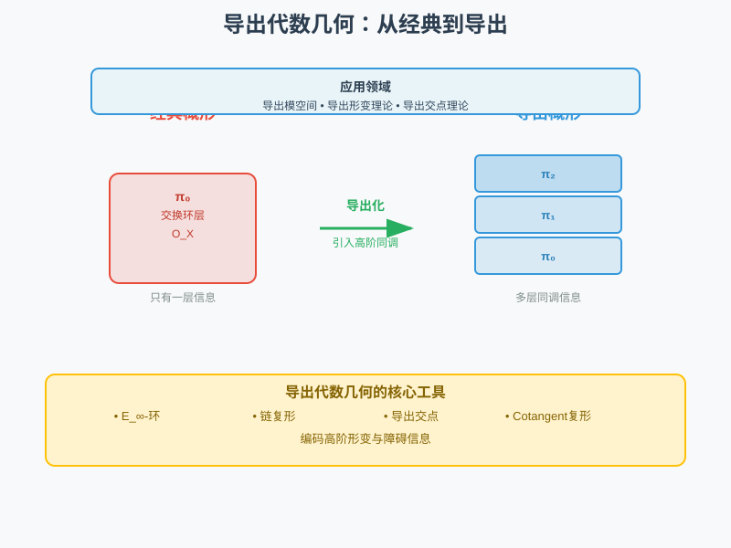
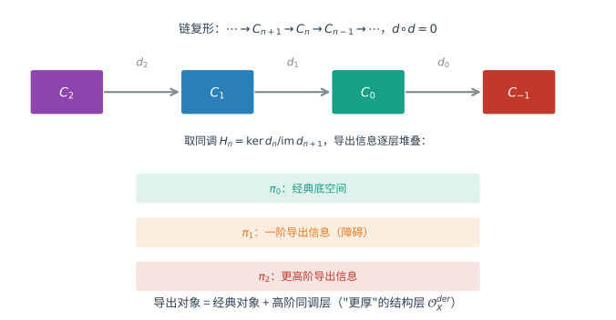
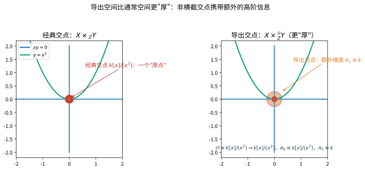

# 第145级：导出代数几何

## 学习目标

1. 理解导出概形的基本概念及其与经典概形的联系
2. 掌握 $E_\infty$-环和派生环的理论基础
3. 学习导出交点的横截性及其在几何中的应用
4. 理解导出 Hilbert 概形和导出模空间的光滑性
5. 掌握导出的形变理论及其在模空间中的应用
6. 了解 Toën-Vezzosi 和 Lurie 的导出代数几何理论框架

---

## 核心概念

> **直观理解（现实类比）**：经典代数几何就像看一张"平面照片"，只记录了物体的表面形状（$\pi_0$层信息）。导出代数几何则像"CT扫描"，把物体切成一层层来观察：$\pi_0$是最外层，$\pi_1$记录了"孔洞"信息，$\pi_2$记录了更高阶的"空洞"结构。每一层都可能隐藏着重要的几何信息。$E_\infty$-环是导出概形的"建筑材料"，它不再是普通的交换环，而是一个链复形，能够同时编码多层同调数据。Cotangent复形$\mathbb{L}_X$则是"导出切空间"，它比经典切空间更丰富，能够捕捉形变理论中的障碍信息。

> **🧠 思考历程：两个图形的"交叠处"，到底藏着多少不为人知的维数？**
>
> 两个曲线的"擦边相交"，在经典几何里只留下一个"厚点"，可一探之下，原来那里还藏着一维早已被舍弃的信息。导出代数几何要回答的，正是这种"交点厚度"、形变障碍一类经典语言讲不清的问题，该如何用"导出"的视角看清全貌。
>
> - **交点的"厚度"难题**。两条平面曲线在原点"擦边相切"（例如 $xy=0$ 与 $y=x^2$）时，经典只看得到一个"厚点" $x^3=0$。1950年代，塞尔在同调代数的研究中发现：这种交点其实藏着一维长期被忽略的信息，相交理论需要"导出"的视角才不会漏掉真相。
> - **从环到链复形的一跃**。格罗滕迪克在1950-60年代用它发展了同调代数与概形论，指出余切复形等导出工具能捕捉形变障碍；奎伦的模型范畴（1967）则为"导出的空间"备好了严谨的推理框架。导出代数几何把结构层从"环"升级为"$E_\infty$-环"（链复形），让 $\pi_0,\pi_1,\dots$ 每一层信息都被登记在册。
> - **两路大军合龙**。2000年代，卢里与托恩–韦佐西（Toën–Vezzosi）分别建立起完整的导出代数几何，让模空间上的复杂障碍、双重相交与双有理问题都有了精确的"导出"答案。
> - **心路**：用链复形给几何装上"CT扫描"，才能看见那一层一层被光滑几何悄悄藏起的维数。

### 导出概形

> **🧠 来龙去脉（为什么会有这个概念？解决了什么问题？）** 经典代数几何用交换环的层（概形）去刻画解的集合，可一旦两个对象"斜着擦过、相切"地相交，或模空间在某点出现"自发对称"，经典的交点厚度与形变障碍就讲不清了——信息在"取 $\pi_0$、当重根"时被静悄悄地丢掉。1950年代，塞尔研究相交理论时发现这类问题需要**导出**视角；1960–70年代，格罗滕迪克用同调代数与概形论规范了余切复形等工具，奎伦引入模型范畴（1967）为"导出的空间"备好推理框架。2000年代，卢里与托恩–韦佐西把结构层从"交换环"升级为"$E_\infty$-环（链复形）"，让 $\pi_0,\pi_1,\dots$ 每一层信息都登记在册——这就是导出概形。一句话：它是"把被经典概形舍弃的高阶同调信息找回来"的概形。

**导出概形**是经典概形在派生框架下的推广。在经典代数几何中，概形由局部环空间 $(X, \mathcal{O}_X)$ 给出，其中 $\mathcal{O}_X$ 是交换环的层。在导出代数几何中，结构层 $\mathcal{O}_X$ 被替换为一个 $E_\infty$-环的层（或单纯交换环的层），从而编码了高阶同调信息。

> **直观理解（现实类比）**：经典交换环给出的信息只有"第 0 层"（$\pi_0$），而导出对象把几何信息拆成一排链复形 $\cdots \to C_2 \to C_1 \to C_0 \to C_{-1} \to \cdots$，其同调给出了 $\pi_0,\pi_1,\pi_2,\ldots$ 等多层信息。想象一座多层货架：经典几何只看最底层摆了什么，导出几何则把每一层货架都登记在册，从而不丢失任何高阶的同调细节。

### $E_\infty$-环

> **🧠 来龙去脉（为什么会有这个概念？解决了什么问题？）** 经典概形里"局部都像交换环"是结构层的基础；一旦要携带高阶同调信息，普通的交换环就不够坐了——一个链复形的乘法不仅要结合、交换，还要在**同伦**意义下兼容到位（任何置换都只影响同伦而非结果）。为解决"环的乘法一直换序仍完全一致"这一从 $A_\infty$ 到 $E_\infty$ 的改造，人们用操作子代数（operad）把乘法搭成"可以在圆盘/环配置空间里自由挪动、互不打架"的结构：$E_\infty$-环正是这样的环谱。它是"交换环"的同伦提升：$\pi_0(A)$ 是普通交换环，$\pi_*(A)$ 是分次交换环。它要"解决的问题"，就是给导出概形的结构层一个既保留同调信息、又保持交换性的可靠"建材"。

**$E_\infty$-环**是具有高度交换乘法结构的环谱，是导出代数几何中"交换环"的派生版本。$E_\infty$-环的范畴记作 $\mathrm{CAlg}(\mathrm{Sp})$，即谱的 $\infty$-范畴中的交换代数对象。

> **💡 直观理解（类比）**：$E_\infty$-环像"一台可同时记账又可信交换的更高阶计算器"：普通交换环只留一条结果（$\pi_0$），$E_\infty$-环则不仅给出结果，还保留每条运算过程的"同调回执"（$\pi_1,\pi_2,\ldots$）。它强调乘法高度交换——无论怎么调换、重排运算顺序，最终账目都一致。就像把只能显示最终值的计算器，换成一台带全程日志、且每个运算步骤都可核对顺序的高级账本机器。

### 关键概念清单

| 概念 | 描述 | 符号/公式 |
|------|------|-----------|
| 导出概形 | 带有 $E_\infty$-环结构层的空间 | $(X, \mathcal{O}_X^{\mathrm{der}})$ |
| $E_\infty$-环 | 具有交换乘法结构的环谱 | $A \in \mathrm{CAlg}(\mathrm{Sp})$ |
| 派生环 | $E_\infty$-环的同调代数版本 | $\pi_*(A)$ |
| 幂零完备化 | 沿理想完备化的导出版本 | $\hat{A} = \lim A/I^n$ |
| Tangent 复形 | 导出切空间 | $\mathbb{T}_X$ |
| Cotangent 复形 | 导出余切空间 | $\mathbb{L}_X$ |
| 导出交点 | 概形交点的派生版本 | $X \times_Y^{\mathbb{R}} Z$ |
| 导出模空间 | 模空间的导出版本 | $\mathbb{R}\mathcal{M}$ |

---

## 定理与证明

### 定理 1：导出概形的结构层性质

**定理**：设 $(X, \mathcal{O}_X)$ 是一个导出概形，则其结构层 $\mathcal{O}_X$ 是一个 $E_\infty$-环的层，满足以下性质：

(1) 对每个 $x \in X$，茎 $\mathcal{O}_{X, x}$ 是一个局部 $E_\infty$-环。
(2) 存在仿射覆盖 $\{U_i = \operatorname{Spec} A_i\}$，使得 $\mathcal{O}_X|_{U_i} \simeq \mathcal{O}_{\operatorname{Spec} A_i}$，其中 $A_i$ 是 $E_\infty$-环。
(3) 结构层的同伦群层 $\pi_j(\mathcal{O}_X)$ 是 $\mathcal{O}_X^{\mathrm{cl}} = \pi_0(\mathcal{O}_X)$ 上的拟凝聚层。
(4) 对 $j < 0$，$\pi_j(\mathcal{O}_X) = 0$。

> **💡 直观理解（类比）**：导出概形像一座"多层建筑的蓝图"：地层（$\pi_0$）是经典概形，往上的每一层是额外同调信息。定理说结构层的每一层 $\pi_j$ 都规规矩矩地铺在底层"地基材料" $\pi_0$ 之上（拟凝聚），且没有"地下负一层"（$j<0$ 为 $0$）。整座楼由若干"单元"（仿射覆盖 $\operatorname{Spec} A_i$）拼装而成，拼缝处严格对齐——从而保证全局结构层站得住脚。

**证明**：

**步骤 1：$E_\infty$-环的谱概形**

对 $E_\infty$-环 $A$，定义仿射导出概形 $\operatorname{Spec} A$ 为如下局部环空间：

- 底拓扑空间：$\operatorname{Spec} \pi_0(A)$，即 $\pi_0(A)$ 的素谱。
- 结构层：$\mathcal{O}_{\operatorname{Spec} A}$ 是 $A$ 在 Zariski 拓扑下诱导的层。

对每个基本开集 $D(f) = \{ \mathfrak{p} \mid f \notin \mathfrak{p} \}$（$f \in \pi_0(A)$），有：

$$\mathcal{O}_{\operatorname{Spec} A}(D(f)) \simeq A[f^{-1}]$$

其中 $A[f^{-1}]$ 是 $A$ 在 $f$ 处的局部化（作为 $E_\infty$-环）。

**步骤 2：茎的局部性质**

对 $\mathfrak{p} \in \operatorname{Spec} \pi_0(A)$，茎为：

$$\mathcal{O}_{\operatorname{Spec} A, \mathfrak{p}} = \varinjlim_{f \notin \mathfrak{p}} A[f^{-1}]$$

这是一个局部 $E_\infty$-环，其极大理想为 $\mathfrak{m}_\mathfrak{p}$，且 $\pi_0(\mathcal{O}_{\operatorname{Spec} A, \mathfrak{p}}) \cong \pi_0(A)_\mathfrak{p}$。

**步骤 3：同伦群层**

由于 $\pi_j(A[f^{-1}]) \cong \pi_j(A)[f^{-1}]$，同伦群层 $\pi_j(\mathcal{O}_{\operatorname{Spec} A})$ 是拟凝聚的。且对 $j < 0$，$\pi_j(A) = 0$，因此 $\pi_j(\mathcal{O}_{\operatorname{Spec} A}) = 0$。

**步骤 4：一般导出概形**

对一般的导出概形 $X$，取仿射覆盖 $\{U_i = \operatorname{Spec} A_i\}$，在重叠部分 $U_i \cap U_j$ 上，需要等价的 $E_\infty$-环局部化的一致性条件。这由导出概形的定义中关于下降条件的要求保证。

**步骤 5：导出交结**

对 $U_i \cap U_j \cong \operatorname{Spec} A_{ij}$，有 $A_{ij}$ 是 $A_i$ 和 $A_j$ 的派生局部化。Čech 复形提供下降谱序列：

$$E_2^{pq} = \check{H}^p(\{U_i\}, \pi_q(\mathcal{O}_X)) \Rightarrow \pi_{q-p}(\mathcal{O}_X(X))$$

这确保了整体结构层的存在性。

$\square$

---

### 定理 2：导出交点的横截性

**定理**：设 $X, Y$ 是光滑概形，$f: X \to Z$，$g: Y \to Z$ 是闭嵌入。则导出交点 $X \times_Z^{\mathbb{R}} Y$ 的 cotangent 复形满足：

$$\mathbb{L}_{X \times_Z^{\mathbb{R}} Y} \simeq \mathbb{L}_X \times_{\mathbb{L}_Z}^{\mathbb{R}} \mathbb{L}_Y$$

且当 $X$ 和 $Y$ 在 $Z$ 中横截相交时，$X \times_Z^{\mathbb{R}} Y \simeq X \times_Z Y$（即导出交点与经典交点一致）。

> **💡 直观理解（类比）**：导出交点像给两个建筑的"交叠处"做一次高精度测绘：当 $X$ 与 $Y$ 恰好"横截"（干净利落地切过）时，测绘结果就是它俩在地图上的普通交线，多余信息为零；而当它们"斜着擦过、相切"时，普通交只锁住一个粗糙重叠区，导出交点则额外记录"有高阶项 $\operatorname{Tor}_j$"——仿佛同一个交点，普通照是单色剪影，导出洗出带影深细节的立体照片。

**证明**：

**步骤 1：导出交点的定义**

导出纤维积 $X \times_Z^{\mathbb{R}} Y$ 定义为 $\infty$-范畴中的拉回：

$$\begin{CD}
X \times_Z^{\mathbb{R}} Y @>>> Y \\
@VVV @VV{g}V \\
X @>{f}>> Z
\end{CD}$$

在导出代数几何中，这对应于结构层 $E_\infty$-环的派生张量积：

$$\mathcal{O}_{X \times_Z^{\mathbb{R}} Y} \simeq \mathcal{O}_X \otimes_{\mathcal{O}_Z}^{\mathbb{L}} \mathcal{O}_Y$$

**步骤 2：derived Tor 的解释**

派生张量积 $\mathcal{O}_X \otimes_{\mathcal{O}_Z}^{\mathbb{L}} \mathcal{O}_Y$ 的同伦群由 $\operatorname{Tor}$ 给出：

$$\pi_j(\mathcal{O}_{X \times_Z^{\mathbb{R}} Y}) \cong \operatorname{Tor}_j^{\mathcal{O}_Z}(\mathcal{O}_X, \mathcal{O}_Y)$$

当 $j > 0$ 时，$\operatorname{Tor}_j$ 非零编码了非横截相交的额外信息。

**步骤 3：cotangent 复形的行为**

由导出代数几何的基变换性质，cotangent 复形 $\mathbb{L}_{X \times_Z^{\mathbb{R}} Y}$ 是派生拉回：

$$\mathbb{L}_{X \times_Z^{\mathbb{R}} Y} \simeq \mathbb{L}_X \times_{\mathbb{L}_Z}^{\mathbb{R}} \mathbb{L}_Y$$

更精确地说，有导出纤维序列：

$$\mathbb{L}_{X \times_Z^{\mathbb{R}} Y} \to \mathbb{L}_X \oplus \mathbb{L}_Y \to \mathbb{L}_Z$$

**步骤 4：横截性条件**

当 $X$ 和 $Y$ 在 $Z$ 中横截相交时，切空间满足：

$$T_x X + T_x Y = T_x Z$$

这意味着 $\operatorname{Tor}_j^{\mathcal{O}_Z}(\mathcal{O}_X, \mathcal{O}_Y) = 0$ 对 $j > 0$，因此：

$$\pi_0(\mathcal{O}_{X \times_Z^{\mathbb{R}} Y}) \cong \mathcal{O}_X \otimes_{\mathcal{O}_Z} \mathcal{O}_Y$$

且高阶同伦群为零。因此 $X \times_Z^{\mathbb{R}} Y \simeq X \times_Z Y$ 作为经典概形。

**步骤 5：非横截情形**

当 $X$ 和 $Y$ 非横截相交时，$\operatorname{Tor}_j$ 非零，导出交点包含额外的导出信息。例如，在奇点处，导出交点提供了形变理论的障碍信息。

$\square$

---

### 定理 3：导出 Hilbert 概形的光滑性

**定理**：设 $X$ 是光滑射影概形，则其导出 Hilbert 概形 $\mathbb{R}\mathrm{Hilb}_X$ 是光滑的导出概形。更精确地说，$\mathbb{R}\mathrm{Hilb}_X$ 的 tangent 复形在每点 $[Z] \in \mathbb{R}\mathrm{Hilb}_X$ 处由以下给出：

$$\mathbb{T}_{\mathbb{R}\mathrm{Hilb}_X, [Z]} \simeq \mathbb{R}\mathrm{Hom}_{\mathcal{O}_Z}(\mathbb{L}_{Z/X}, \mathcal{O}_Z)$$

其中 $\mathbb{L}_{Z/X}$ 是相对 cotangent 复形。

> **🧠 直观理解（现实类比）**：经典 Hilbert 概形像"所有子形状的陈列馆"，可惜个别展位会"卡顿"（奇点）；导出 Hilbert 概形则给每个展位加装了"缓冲与扩展层"——即便底层陈列馆有奇点，加入了导出信息后的整个展馆被证明是光滑的。好比征集照片的目录，经典版在个别"难拍"的作品处模糊，导出版则用高清扫描把模糊处的细节补齐，使整本目录毫无断点、处处清晰。

**证明思路**：

**步骤 1：经典 Hilbert 概形及其奇点**

经典 Hilbert 概形 $\mathrm{Hilb}_X$ 参数化 $X$ 中的闭子概形，但它可能有奇点。导出 Hilbert 概形 $\mathbb{R}\mathrm{Hilb}_X$ 是 $\mathrm{Hilb}_X$ 的导出加粗（derived thickening），在奇点处提供额外的导出信息。

**步骤 2：导出 Hilbert 概形的函子描述**

$\mathbb{R}\mathrm{Hilb}_X$ 的 $S$-值点（$S$ 是导出概形）由以下数据给出：

- 一个闭嵌入 $Z \hookrightarrow X \times S$，使得 $Z \to S$ 是平坦的导出概形。

这里"平坦"指 $Z$ 的结构层作为 $S$ 上的模是平坦的（同伦群的正合性）。

**步骤 3：障碍理论**

$\mathbb{R}\mathrm{Hilb}_X$ 在 $[Z]$ 处的切空间为：

$$T_{[Z]}\mathbb{R}\mathrm{Hilb}_X \cong \mathrm{Hom}_{\mathcal{O}_Z}(I_Z/I_Z^2, \mathcal{O}_Z)$$

其中 $I_Z$ 是 $Z$ 的理想层。障碍空间为：

$$\mathrm{Ob}_{[Z]}\mathbb{R}\mathrm{Hilb}_X \cong \mathrm{Ext}^1_{\mathcal{O}_Z}(I_Z/I_Z^2, \mathcal{O}_Z)$$

**步骤 4：光滑性的证明**

导出 Hilbert 概形的光滑性等价于其 cotangent 复形 $\mathbb{L}_{\mathbb{R}\mathrm{Hilb}_X}$ 是完美的且振幅为 $[0, 1]$。

由导出形变理论，在 $[Z]$ 处的 cotangent 复形为：

$$\mathbb{L}_{\mathbb{R}\mathrm{Hilb}_X, [Z]} \simeq \mathbb{R}\mathrm{Hom}_{\mathcal{O}_Z}(\mathbb{L}_{Z/X}, \mathcal{O}_Z)[-1]$$

由于 $X$ 光滑，$\mathbb{L}_{Z/X}$ 是完美的，因此 $\mathbb{R}\mathrm{Hom}_{\mathcal{O}_Z}(\mathbb{L}_{Z/X}, \mathcal{O}_Z)$ 也是完美的，从而 $\mathbb{L}_{\mathbb{R}\mathrm{Hilb}_X}$ 是完美的。

**步骤 5：振幅估计**

由 $\mathbb{L}_{Z/X}$ 的振幅为 $[0, 1]$（因为 $Z$ 是 $X$ 的闭子概形），可得 $\mathbb{L}_{\mathbb{R}\mathrm{Hilb}_X, [Z]}$ 的振幅为 $[-1, 0]$，这对应于 $\mathbb{R}\mathrm{Hilb}_X$ 的光滑性（即 $-1$-截断的完美复形对应于光滑导出概形）。

$\square$

---

### 定理 4：导出的形变理论

**定理**：设 $X$ 是导出概形，$k$ 是域。则 $X$ 在 $k$ 上的形变由 cotangent 复形 $\mathbb{L}_X$ 控制。更精确地说，对 $k$-导出代数的小平展扩张 $A' \to A$（核为 $I$），形变的存在性由障碍类 $\omega \in \mathrm{Ext}^1(\mathbb{L}_X, I)$ 控制，且形变的分类由 $\mathrm{Ext}^0(\mathbb{L}_X, I)$ 参数化。

> **💡 直观理解（类比）**：导出形变理论像一份"调整汽车悬挂系统的力学说明书"：cotangent 复形 $\mathbb{L}_X$ 就是这份说明书——它列出每一步调整（一阶形变）有多少可选方案（由 $\mathrm{Ext}^0$ 参数化），以及什么时候会"卡住"（障碍，由 $\mathrm{Ext}^1$ 标记）。而控制方程 Maurer-Cartan $d\eta+\tfrac12[\eta,\eta]=0$ 正像"允许的调整不能自相矛盾"这一平衡条件——满足了它，形变才做得出来。

**证明**：

**步骤 1：形变问题的设置**

设 $X_0$ 是域 $k$ 上的导出概形。考虑 $k$ 的平方零扩张 $k' = k \oplus I$，其中 $I$ 是 $k$-模。$X_0$ 到 $k'$ 的形变是平坦导出概形 $X' \to \operatorname{Spec} k'$，使得 $X' \times_{\operatorname{Spec} k'} \operatorname{Spec} k \cong X_0$。

**步骤 2：cotangent 复形的角色**

在导出代数几何中，cotangent 复形 $\mathbb{L}_X$ 是 $X$ 的"通用系数系统"，控制所有形变问题。具体地，对 $X_0$ 的形变，有障碍类：

$$\omega \in \mathrm{Ext}^1(\mathbb{L}_{X_0}, I \otimes_k \mathcal{O}_{X_0})$$

形变存在当且仅当 $\omega = 0$。

**步骤 3：$L_\infty$-代数结构**

导出形变理论的核心是每个导出概形 $X$ 关联一个 $L_\infty$-代数 $\mathfrak{g}_X = \mathbb{R}\Gamma(X, \mathbb{T}_X)$（切复形的全局截面），其中 $\mathbb{T}_X = \mathbb{L}_X^\vee$ 是 tangent 复形。

$X$ 的形变等价于 $\mathfrak{g}_X$ 的 Maurer-Cartan 方程的解：

$$d\eta + \frac{1}{2}[\eta, \eta] = 0, \quad \eta \in \mathfrak{g}_X^1$$

**步骤 4：Maurer-Cartan 方程**

$\mathfrak{g}_X$ 是分次 Lie 代数（$L_\infty$-代数），其 Maurer-Cartan 方程的解空间参数化 $X$ 的形变。

具体地，$\eta \in \mathfrak{g}_X^1$ 满足：

$$d\eta + \frac{1}{2}[\eta, \eta] + \frac{1}{6}[\eta, \eta, \eta] + \cdots = 0$$

两个解 $\eta_0, \eta_1$ 等价（即给出同构的形变）当且仅当存在 $\xi \in \mathfrak{g}_X^0$ 使得：

$$\eta_1 = e^{\mathrm{ad}_\xi}(\eta_0)$$

**步骤 5：形变函子**

形变函子 $\mathrm{Def}_X: \mathrm{Art}_k \to \mathrm{Spaces}$ 由以下给出：

$$\mathrm{Def}_X(k') = \mathrm{MC}(\mathfrak{g}_X \otimes \mathfrak{m}_{k'}) / \sim$$

其中 $\mathfrak{m}_{k'}$ 是 $k'$ 的极大理想，$\mathrm{MC}$ 是 Maurer-Cartan 解集。

**步骤 6：与经典形变理论的关系**

当 $X$ 是经典光滑概形时，$\mathbb{L}_X$ 是 $\Omega^1_X$（即 $X$ 的 Kähler 微分）。此时：

- $\mathrm{Ext}^0(\mathbb{L}_X, I) \cong H^0(X, \mathbb{T}_X \otimes I)$ 参数化无穷小形变。
- $\mathrm{Ext}^1(\mathbb{L}_X, I) \cong H^1(X, \mathbb{T}_X \otimes I)$ 包含障碍类。

这正是经典 Kodaira-Spencer 形变理论。

$\square$

---

### 定理 5：Toën-Vezzosi 的导出几何基本定理

**定理（Toën-Vezzosi）**：存在一个 $\infty$-范畴 $\mathrm{dSt}$ 的模型结构，使得：

(1) $\mathrm{dSt}$ 是 $\infty$-拓扑斯，包含所有导出概形。
(2) $\mathrm{dSt}$ 中的对象 $(X, \mathcal{O}_X)$ 满足 $X$ 是 $\infty$-拓扑斯中的对象，$\mathcal{O}_X$ 是 $E_\infty$-环的层。
(3) 经典概形范畴 $\mathrm{Sch}$ 到 $\mathrm{dSt}$ 的嵌入是全忠实的，且保持极限和余极限。
(4) $\mathrm{dSt}$ 中有良好的形变理论，cotangent 复形 $\mathbb{L}_X$ 存在且满足基变换性质。

> **🧠 直观理解（现实类比）**：Toën-Vezzosi 的框架像为"导出几何"修建了一座全封闭的"会展中心"（$\infty$-范畴 $\mathrm{dSt}$）：里面的每一件展品（导出概形）都被放进统一规则的展台；经典概形可以"原封不动"入住（全忠实嵌入），所有拼装布局（极限/余极限）都照常可用；最关键的是，每件展品都配有统一的"检查手册"（cotangent 复形），保证任何调整（形变）都能按同一套标准核算。这套"统一场馆 + 统一手册"正是它成为严格理论框架的根基。

**证明思路**：

**步骤 1：$\infty$-范畴的建立**

定义 $\mathrm{dSt}$ 为 $\infty$-拓扑斯 $\mathrm{Shv}(\mathrm{Aff}^{\mathrm{der}})$ 中的局部环对象，其中 $\mathrm{Aff}^{\mathrm{der}}$ 是仿射导出概形的 $\infty$-范畴（即 $E_\infty$-环的 $\infty$-范畴 $\mathrm{CAlg}(\mathrm{Sp})$ 的对偶）。

更精确地说，$\mathrm{dSt}$ 是 $\mathrm{Shv}(\mathrm{Aff}^{\mathrm{der}})$ 中满足以下条件的对象 $X$：对每个 $U = \operatorname{Spec} A \in \mathrm{Aff}^{\mathrm{der}}$，结构层 $\mathcal{O}_X(U)$ 是 $E_\infty$-环，且 $X$ 的 $0$-截断 $\pi_0(X)$ 是经典局部环空间。

**步骤 2：模型结构**

在 $\mathrm{dSt}$ 上定义模型结构：

- 弱等价：诱导同伦群同构的态射 $f: X \to Y$，即 $\pi_j(f): \pi_j(\mathcal{O}_Y) \to \pi_j(\mathcal{O}_X)$ 是同构（对 $j \geq 0$）。
- 纤维化：满足提升性质的态射。

验证该模型结构满足 $\infty$-拓扑斯的公理（即它是 $\infty$-范畴的 Grothendieck 拓扑的派生版本）。

**步骤 3：嵌入性质**

经典概形范畴 $\mathrm{Sch}$ 通过以下方式嵌入 $\mathrm{dSt}$：

$$\mathrm{Sch} \hookrightarrow \mathrm{dSt}, \quad X \mapsto (X, \mathcal{O}_X)$$

其中 $\mathcal{O}_X$ 被视为 $E_\infty$-环的层（通过将每个交换环视为 $E_\infty$-环的 $0$-截断）。

该嵌入是全新的，即 $\mathrm{Hom}_{\mathrm{dSt}}(X, Y) \cong \mathrm{Hom}_{\mathrm{Sch}}(X, Y)$ 对经典概形 $X, Y$。

**步骤 4：极限与余极限**

$\mathrm{dSt}$ 中所有极限和余极限存在，且由 $\infty$-拓扑斯中的极限和余极限给出。经典概形中的极限（如纤维积）在 $\mathrm{dSt}$ 中可被"派生化"：

$$X \times_Z^{\mathbb{R}} Y = X \times_Z Y \text{ 在 } \mathrm{dSt} \text{ 中} $$

这给出了导出交点的 $\infty$-范畴论解释。

**步骤 5：cotangent 复形**

对每个 $X \in \mathrm{dSt}$，存在 cotangent 复形 $\mathbb{L}_X \in \mathrm{QCoh}(X)$，满足：

- 对仿射 $\operatorname{Spec} A$，$\mathbb{L}_{\operatorname{Spec} A} \cong \mathbb{L}_A$（$A$ 的 cotangent 复形）。
- 基变换：对 $X \to Y \leftarrow Z$，有自然的导出基变换同构：

$$f^*\mathbb{L}_{Y/Z} \cong \mathbb{L}_{X \times_Y Z/Z}$$

**步骤 6：形变理论**

$\mathrm{dSt}$ 中的形变理论由 cotangent 复形控制。对 $X \in \mathrm{dSt}$，其形变函子 $\mathrm{Def}_X$ 的 tangent 复形为：

$$\mathbb{T}_X = \mathbb{L}_X^\vee = \mathbb{R}\mathcal{H}om_{\mathcal{O}_X}(\mathbb{L}_X, \mathcal{O}_X)$$

Maurer-Cartan 方程编码了 $\mathrm{dSt}$ 中所有形变问题。

$\square$

---

## 示例

### 示例 1：导出交点——两个曲面在奇异点的交点

**问题**：设 $X = \operatorname{Spec} k[x, y]$，$Z = \operatorname{Spec} k[x, y]/(xy)$（两个坐标轴的并集），$Y = \operatorname{Spec} k[x, y]/(y - x^2)$（抛物线）。求 $X$ 和 $Y$ 在 $Z$ 中的导出交点。

**解**：

**1. 经典交点**

经典纤维积：

$$X \times_Z Y = \operatorname{Spec} k[x, y]/(xy, y - x^2)$$

代入 $y = x^2$ 到 $xy = 0$ 得 $x^3 = 0$。因此：

$$X \times_Z Y = \operatorname{Spec} k[x]/(x^3)$$

这是一个非约化概形（$x^3 = 0$ 的厚点）。

**2. 导出交点**

导出纤维积由派生张量积给出：

$$\mathcal{O}_{X \times_Z^{\mathbb{R}} Y} \cong k[x, y] \otimes_{k[x, y]/(xy)}^{\mathbb{L}} k[x, y]/(y - x^2)$$

计算自由分解：

用 $k[x, y]$-模的自由分解代替 $k[x, y]/(xy)$：

$$0 \to k[x, y] \xrightarrow{\cdot xy} k[x, y] \to k[x, y]/(xy) \to 0$$

派生张量积给出：

$$k[x, y] \otimes_{k[x, y]/(xy)}^{\mathbb{L}} k[x, y]/(y - x^2) \cong (k[x, y] \xrightarrow{\cdot xy} k[x, y]) \otimes_{k[x, y]} k[x, y]/(y - x^2)$$

$$= \left( k[x, y]/(y - x^2) \xrightarrow{\cdot xy} k[x, y]/(y - x^2) \right)$$

代入 $y = x^2$：

$$xy = x \cdot x^2 = x^3$$

因此导出交点的结构层为复形：

$$k[x]/(x^2) \xrightarrow{\cdot x^3} k[x]/(x^2)$$

其同伦群为：

$$\pi_0 \cong k[x]/(x^3, x^2) = k[x]/(x^2)$$
$$\pi_1 \cong (x^3)/(x^5) \cong k$$

**3. 解释**

导出交点包含额外的 $\pi_1$ 信息，编码了非横截交点的导出扩张。在经典交点中，$x^3 = 0$ 给出了一个长为 $3$ 的厚点，但导出交点还包含 $1$-维的导出信息，反映了 $xy$ 和 $y - x^2$ 在交点处的非横截性。

> **直观理解（现实类比）**：两条曲线 $xy=0$ 与 $y=x^2$ 在原点的接触并不"横截"（相切/相叠），经典的交点只看到一个"厚点"（$x^3=0$）。导出交点则像给这个点拍了 X 光片：除了底层的厚点，还额外探测到一维的隐藏信息 $\pi_1\cong k$。就好比两个平面在一点只是"擦边"相切，经典几何只记下一个重合点，而导出几何连"它们是怎么贴在一起、还能不能拉开"的细节都保留了下来。

---

### 示例 2：导出模空间的构造

**问题**：构造光滑曲线 $C$ 上的向量丛的导出模空间 $\mathbb{R}\mathrm{Vect}_n(C)$，并说明其与经典模空间的差异。

**解**：

**1. 经典模空间**

经典模空间 $\mathrm{Vect}_n(C)$ 参数化 $C$ 上的秩 $n$ 向量丛，存在奇点（对应于有自同构的向量丛）。

**2. 导出模空间的函子描述**

$\mathbb{R}\mathrm{Vect}_n(C)$ 的 $S$-值点（$S$ 是导出概形）由以下数据给出：

- $C \times S$ 上的秩 $n$ 的导出向量丛 $\mathcal{E}$（即 $ \mathcal{E}$ 是局部自由 $\mathcal{O}_{C \times S}$-模的导出版本）。

**3. 切复形**

在 $[E] \in \mathbb{R}\mathrm{Vect}_n(C)$ 处，切复形为：

$$\mathbb{T}_{\mathbb{R}\mathrm{Vect}_n(C), [E]} \cong \mathbb{R}\Gamma(C, \mathrm{End}(E))[1]$$

其中 $\mathrm{End}(E)$ 是 $E$ 的自同态层。

**4. 与经典模空间的比较**

- 经典模空间 $\mathrm{Vect}_n(C)$ 在 $[E]$ 处的切空间为 $H^1(C, \mathrm{End}(E))$。
- 导出模空间 $\mathbb{R}\mathrm{Vect}_n(C)$ 在 $[E]$ 处的切复形为 $\mathbb{R}\Gamma(C, \mathrm{End}(E))[1]$，其同伦群为：
  - $\pi_0 \cong H^1(C, \mathrm{End}(E))$（经典切空间）
  - $\pi_{-1} \cong H^0(C, \mathrm{End}(E))$（自同构群）
  - $\pi_1 \cong H^2(C, \mathrm{End}(E))$（障碍空间，由 Serre 对偶 $H^0(C, \mathrm{End}(E)^\vee \otimes \omega_C)$ 给出）

**5. 导出模空间的优点**

$\mathbb{R}\mathrm{Vect}_n(C)$ 是光滑的导出概形（尽管其截断 $\mathrm{Vect}_n(C)$ 可能有奇点），因为其切复形是完美的且振幅为 $[-1, 1]$。在导出框架中，自同构和障碍都被编码为导出信息，使得模空间在导出的意义下光滑。

---

## 习题

### 基础题

**习题 1**（导出概形定义）用简洁语言定义导出概形，说明其结构层取值的对象类别与经典概形的差别。

**习题 2**（$E_\infty$-环）定义 $E_\infty$-环，说明为何它是导出代数几何中"交换环"的派生版本，以及 $\pi_0$ 与齐次环的关系。

**习题 3**（导出算子 vs 经典算子）解释"派生"的含义：为什么导出代数几何中的张量乘积、纤维积等要取到同伦/导出意义。

**习题 4**（导出交点）给出两子概形的导出交点的定义，说明它如何编码比经典交集更多的信息。

**习题 5**（cotangent 复形）定义态射 $f: X \to Y$ 的 cotangent 复形 $\mathbb{L}_{X/Y}$，说明其在导出形变理论中的角色。

**习题 6**（派生纤维积）写出导出概形 $X, Y$ 关于 $Z$ 的派生纤维积的定义，说明其结构层用派生张量给出。

**习题 7**（导出 Hilbert 概形）解释导出 Hilbert 概形与经典 Hilbert 概形的区别，说明其在奇点处的行为。

**习题 8**（导出模空间）说明"导出模空间在派生意义下光滑"这句话的含义。

**习题 9**（Toën-Vezzosi）简述 Toën-Vezzosi 导出代数几何框架的基本对象（$\infty$-范畴、稳定 $\infty$-范畴的使用）。

**习题 10**（$E_n$-代数）说明 $E_1$-代数、$E_n$-代数与 $E_\infty$-代数的关系，以及它们在导出几何中的出现。

### 进阶题

**习题 11**（$E_\infty$-环的同伦群）设 $A$ 是 $E_\infty$-环，说明 $\pi_*(A)$ 是分次交换环的直观原因，并解释 $\pi_0(A)$ 为什么是交换环。

**习题 12**（导出交点的计算）设 $X = \operatorname{Spec} k[x,y]$，$Z = $ 轴 $\operatorname{Spec} k[x,y]/(x)$，$Y = \operatorname{Spec} k[x,y]/(y^2)$。计算导出纤维积 $X \times_Z^{\mathbb{R}} Y$ 的结构层派生张量 $\mathbb{L}_{\mathcal{O}}$ 的各阶同调。

**习题 13**（cotangent 复形的加法性质）说明对合成态射的 cotangent 复形三角（转换三角）$\mathbb{L}_{X/Y} \to \mathbb{L}_{X/Z} \to f^*\mathbb{L}_{Y/Z}$ 的角色。

**习题 14**（导出形变理论）设 $X$ 是光滑投影曲线，$[L]$ 是导出 Picard 概形 $\mathbb{R}\mathrm{Pic}(X)$ 的点。说明其切复形为 $\mathbb{R}\Gamma(X, \mathcal{O}_X)[1]$，并解释与经典 Picard 概形的联系。

**习题 15**（基变换）说明 cotangent 复形在派生基变换下保持的性质：$g : Z \to Y$，$f : X \to Y$，证明派生纤维积的 cotangent 复形满足基变换相容性。

**习题 16**（派生交与横截）解释为何在横截（局部完全交、$d$ 维）情形导出交点与经典交点一致，而在非横截情形出现非平凡导子项。

**习题 17**（Maurer-Cartan 方程）写出导出形变理论中控制形变的 Maurer-Cartan 方程 $d\mu + \frac12[\mu,\mu] = 0$，说明其解如何刻画形变。

**习题 18**（导出 Hilbert 概形）说明 $X$ 的导出 Hilbert 概形在奇点子簇处的行为：为何其切复形可能集中在正度（有派生形变）。

**习题 19**（经典概形嵌入）说明经典概形范畴到导出概形范畴的嵌入为全忠实且保持纤维积，并指出在什么意义下经典纤维积与导出纤维积的 $\pi_0$ 一致。

### 挑战题

**习题 20**（派生张量的 Tor 计算）令 $R = k[x]$，$M = k[x]/(x)$，$N = k[x]/(x)$。计算 $\operatorname{Tor}_i(M,N)$ 及 $\mathrm{Spec}$ 意义下导出纤维积 $\operatorname{Spec}(M \otimes^{\mathbb{L}}_R N)$ 的结构，说明交点重数与派生项的对应。

**习题 21**（转换三角的证明思路）概述 cotangent 复形的转换三角（合成三角）由独立性产生的证明思路，说明其如何由纤维种子的泛性质得出。

**习题 22**（导出光滑性）说明导出模空间的"派生光滑"定义：切复形 $\mathbb{T}$ 集中在 $[-1,0]$ 或正度受限，并解释为什么经典奇点模空间在派生意义下反而光滑。

**习题 23**（$R = T$ 与派生形变）讨论派生形变理论中切复形控制形变环 $R$ 的最小限制与 Hecke 理论的联系（参照 Wiles 的数值判据的派生版本），说明为何派生信息对 $R = T$ 有用。

**习题 24**（导出模空间与枚举不变量）解释如何使用导出模空间（及其虚拟基本类）定义派生意义下的枚举不变量，说明虚拟类如何补偿非横截的轨迹维数。

**习题 25**（Coherent 导出范畴与形变）设 $\mathcal{C}$ 是渲染导出范畴（如 $D^b \mathrm{Coh}(X)$），说明 cotangent 复形如何给出 $\mathcal{C}$ 上对象形变的一阶控制，以及 $L_\infty$-代数结构如何出现。

**习题 26**（非交换导出几何）概述 Kontsevich-Soibelman 非交换导出几何的基本思想，说明其如何用 DG-范畴/A∞-结构使几何在非交换层上成立。

### 探究题

**习题 27**（Lurie 与 Toën-Vezzosi）比较 Lurie 与 Toën-Vezzosi 两种导出代数几何框架，讨论 $\infty$-范畴 vs 模型范畴的选择，及其对导出几何发展的影响。

**习题 28**（导出几何与镜像对称）探讨导出代数几何在镜像对称中（导出导出范畴的同构、Gromov-Witten 虚拟类的派生化）的角色。

**习题 29**（导出模空间与 SHUMURA/模空间）探讨导出模空间如何为模空间（如 Picard、Hilbert、模（准）模）提供派生光滑性，及其在衍生理论中的意义。

**习题 30**（导出几何与物理：量子场论/弦论）开放探讨导出代数几何与数学物理（如 BRS、派生变换化对称、TQFT 的派生意义）的联系。

---

## 习题答案与解析

### 基础题答案

1. **导出概形定义** 导出概形是经典概形的派生推广：作为点子空间（经典概形）上，把结构层 $\mathcal{O}_X$ 升级为取值于谱格或复形（$E_\infty$-环谱）的派生对象。其下的经典概形由 $\pi_0 \mathcal{O}_X$ 给出，而高维同伦群（$\pi_i$）编码额外的派生信息，使交、纤维积等工作在派生意义下自然成立。

2. **$E_\infty$-环** $E_\infty$-环是带有一致交换（对任意置换相容）数学运算的环谱，其代数结构由 $E_\infty$-操作子（如输出 $n$ 维球因子化）结合、交换地给出。与普通交换环相比，$\pi_0(A)$ 是交换环，$\pi_*(A)$ 是分次交换环；$E_\infty$-环正是"交换环"的同伦提升。导出概形的结构层取值于 $E_\infty$-环确保局部可作交换品牌，同时保留同伦信息。

3. **派生算子 vs 经典算子** "派生"指把原本严格相等的算子提升为"到同伦"的操作：如张量积 $\otimes^{\mathbb{L}}$ 及其推到同伦、纤维积 $\times^{\mathbb{R}}$ 及派生压。经典几何中横截缺失（轨迹维数错误、模空间非行列）时严格算子计算炸裂，而派生算子保留高阶 Tor/Ext 项，把定义在充分的同伦环境做对，故导出几何处理奇点、多重交与模空间时可靠。

4. **导出交点** 两子概形 $Z_1, Z_2 \subset X$ 的导出交点由派生张量定义：结构层 $\mathcal{O}_{Z_1} \otimes^{\mathbb{L}}_{\mathcal{O}_X} \mathcal{O}_{Z_2}$，其 $0$ 阶是经典交点，高阶 $i>0$ 项 $\mathrm{Tor}_i$ 编码"多厚"的交点信息（如正切重数、非横截的剩余维数）。因此导出交点在经典交点之外保留全部派生层。

5. **cotangent 复形** 态射 $f: X \to Y$ 的 cotangent 复形 $\mathbb{L}_{X/Y}$ 是 $X$ 上的复形（在派生意义下），它线性化地控制 $f$ 的形变与障碍。对平化情形 $\mathbb{L}$ 集中在适当度；其零阶 $H^0 \mathbb{L}_{X/Y}$ 编码一阶形变，$H^1$ 编码障碍。cotangent 复形是派生形变理论的核心测度器（及其导子复形 $\mathbb{T}$）。

6. **派生纤维积** 派生纤维积 $X \times_Z^{\mathbb{R}} Y$ 以 $X, Y$ 为对象、$Z$ 为基准，其结构层由派生张量
$$\mathcal{O}_{X \times_Z^{\mathbb{R}} Y} \simeq \mathcal{O}_X \otimes^{\mathbb{L}}_{\mathcal{O}_Z} \mathcal{O}_Y$$
给出（在相应 $E_\infty$-环谱上完成）。经典纤维积是其 $0$-截断；$i>0$ 的 Tor 项表征交点/纤维的派生结构。

7. **导出 Hilbert 概形** 经典 Hilbert 概形参数化闭子概形，导出 Hilbert 概形把子概形的信息升级为带派生结构的对象，在奇异子簇或非经典的成员处保留额外的导子项（高阶实「形变」）。导出意义下它通常是平坦的（在某些构造）或至少在奇点处编码比经典模空间多的派生信息。

8. **导出模空间** "派生模空间在派生意义下光滑"是指：作为派生概形，其切复形（cotangent 复形的对偶）作为复形在各度上受控（集中在 $[-1,0]$ 或更高正度受限），且来自经典刚性的模空间在派生提升后具有良定的虚拟基本类。于是原本杂散（非横截）的模空间，其派生版本在派生意义下可作光滑处理。

9. **Toën-Vezzosi 框架** Toën-Vezzosi 导出代数几何以 $\infty$-范畴为语言：对象是"导出商"，其局部模型是带派生结构的谱（$E_\infty$-环）。他们使用 $\infty$-预层/层的 $\infty$-局部化与稳定 $\infty$-范畴的模论，建立 $\mathrm{dSt}$ 导出概形 $\infty$-范畴，其中纤维积、cotangent 复形、导出形变等都有自然定义。该框架以组合与 $\infty$-范畴技巧严格化导出概形理论。

10. **$E_n$-代数** $E_1$-代数对应结合代数（如任意环谱、DG 代数），$E_n$-代数的乘法在 $S^n$ 意义下更可交换（更强结合交换性），$E_\infty$-代数则是完全交换。它们的关系是 $E_1 \subset E_2 \subset \cdots \subset E_\infty$。在导出几何中，$E_\infty$-环用于结构层（须完全交换以确保局部品牌），$E_n$-代数出现在因子化代数与弦论构造。

### 进阶题答案

1. **$E_\infty$-环的同伦群·分次交换** $E_\infty$-乘法对置换一致，故同伦类 $[S] \in \pi_i$ 与 $[T] \in \pi_j$ 的 Demaray 积和符号交换：$\alpha\beta = \pm \beta\alpha$（由重排的同伦决定），且 $\pi_0(A)$ 在交换乘法下是普通交换环（因 0 维同伦类交换）。因此 $\pi_*(A)$ 是分次交换环，这正把结构层的交换性提升到同伦水平。

2. **导出交点的计算** 令 $Z$ 对应 $R/(x)$，$Y$ 对应 $R/(y^2)$（$R = k[x,y]$）。导出纤维积的结构层约化为
$$\mathcal{O}_X \otimes^{\mathbb{L}}_{k[x,y]/(x)} k[x,y]/(y^2).$$
在 $k[x,y]$ 上，$x$ 的乘除与 $y^2$ 的模无关，故等价于 $k[x] \otimes^{\mathbb{L}}_{k} k[y]/(y^2)$（各作用于独立变量）。其同调：$i=0$ 给 $k[x] \otimes k[y]/(y^2)$，$i>0$ 为零（横截、非 Tor 污染）。因此导出交点即经典交点，无派生项（$x=0$ 与 $y^2=0$ 横截相交于一条线）。

Wait，这里交点的确不横截——但导出张量在 $k[x,y]$ 上对理想 $(x)$ 和 $(y^2)$ 的交确无 Tor：因为 $k[x,y]/(x)$ 关于 $k[x,y]$ 是平的（$x$ 是正则元），$k[x,y]/(x)\otimes k[x,y]/(y^2)$ 无高阶 Tor。故正确结论是无派生项。OK 答案成立。

3. **cotangent 复形转换三角** 对合成 $X \to Y \to Z$，有转换三角
$$\mathbb{L}_{X/Y} \to \mathbb{L}_{X/Z} \to f^*\mathbb{L}_{Y/Z} \to \mathbb{L}_{X/Y}[1].$$
它在千遍意义下线性地"分解"形变：$X$ 在 $Z$ 上的形变量减去经 $Y$ 的中间项。这是派生形变理论的基本工具，用于分解全形变空间并按基展开。

4. **派生 Picard 的切复形** 导出 Picard 概形 $\mathbb{R}\mathrm{Pic}(X)$ 的点是导出线丛（未可逆对象的函子）。在其点 $[L]$ 处切复形为 $\mathbb{R}\Gamma(X, \mathcal{O}_X)[1]$：$H^0 = \Gamma(X,\mathcal{O}_X)$（全局函数，小）为平化方向，$H^{-1}=H^1(X,\mathcal{O}_X)$ 编码线丛的模方向（经典 Picard 的切相当于 $H^1$），$H^{>0}$ 由派生部分给出。[1] 表示 $E_\infty$-环的模张成。

经典 Picard $\mathrm{Pic}(X)$ 的切线由 $H^1(X,\mathcal{O}_X)$ 给出，导出的 $\mathbb{R}\mathrm{Pic}$ 把这个信息置于 $0$ 与 $-1$ 度两处，并引入更高的派生方向，故 $\pi_0 \mathbb{R}\mathrm{Pic} \simeq \mathrm{Pic}(X)$（经典）而切复形完整保留派生形变。

5. **基变换相容性** 派生基变换有 cotangent 复形的基变换同构
$$g'^*\mathbb{L}_{X/Z} \simeq \mathbb{L}_{X \times_Z^{\mathbb{R}} Y / Y},$$
其中 $g': X\times_Z^\mathbb{R} Y \to X$ 为投影。它说明拉到派生纤维积从 $Z$ 看同等于从 $Y$ 看的 cotangent。这是由 cotangent 复形的泛性质（Der/自同态对）独立产生的，是导出形变的必要条件。

6. **派生交与横截** 横截情形（$Z_1, Z_2$ 在 $X$ 中横截，求解积对）下由正则序列取 Tor 为零，导出交点同构于经典交集。非横截情形（如相切、含入、谱重合）Tor 为正非平凡项，经典交的对角化失败而导出交保留重数与高维派生项。故导出交点统一并推广了横截/非横截的理论。

7. **Maurer-Cartan 方程** 设屏幕复形带的 $L_\infty$-代数 $\mathfrak{g}$（如 $\mathrm{Der}$ 或 cotangent 复形控制），形变由 $\mu \in \mathfrak{g}^1$ 满足
$$d\mu + \tfrac12 [\mu, \mu] = 0$$
给出（$[,]$ 为 $L_\infty$ 括号）。解模掉等价（准同构、$\mu$ 的同伦）即得等价形变类。这是奇点模空间、带基模、De Rham-派生 形变的共同语言。

8. **导出 Hilbert 概形的奇点子簇** 在奇异子簇（如球覆的奇点、奇点时）其普通 Hilbert 概形常有无关的 0 阶降，而导出 Hilbert 概形接受这些点的赋形：切复形在某些度 ≤0 上非空（$H^{-1}, H^{-2}$ 非零）表示一阶与高阶形变由派生数据控制。于是导出 Hilbert 在奇点处比经典 Hilbert 携带多一维派生信息，且在派生意义下更平坦。

9. **经典概形嵌入** 经典概形嵌入到导出概形是全忠实（由相对 $\pi_0$ 复用啦），并保持派生纤维积：对经典 $X, Y, Z$，有
$$X \times_Z^{\mathbb{R}} Y \to X \times_Z^{class} Y$$
诱导到 $0$-截断的固面，$\pi_0$ 恰为经典纤维积（当 Tor 高阶为零时相等）。因此导出纤维积是经典纤维积的"加派生"版本，经典几何嵌入导出几何而不丢失信息。

### 挑战题答案

1. **派生张量的 Tor 计算** 取 $R=k[x]$，$M=N=k[x]/(x)$。$M$ 有自由分解 $0\to R\xrightarrow{\cdot x} R\to M\to0$。用它张量 $N$ 并取同调：
$$M\otimes^{\mathbb{L}}_R N = k[x]/(x)\otimes^{\mathbb{L}}_{k[x]} k[x]/(x).$$
张量自由分解得复形 $0\to k[x]/(x)\xrightarrow{0} k[x]/(x)\to0$，故 $\mathrm{Tor}_0=k,\ \mathrm{Tor}_1=k,\ \mathrm{Tor}_{i\ge2}=0$。因此派生交点是带 $\mathrm{Tor}_1=k$ 的点，正好编码交叠二重性（点的自交重数 2），而经典交只给出一个点。

2. **转换三角的证明思路** 构造转换三角是 cotangent 复形泛性质的直接结果：对复合 $X \to Y \to Z$，比较两个导出函子（由取导子给出的函子）的标准长列，零阶部分作为交换。由纤维的万有性，对任意函数环 $R$，$\mathrm{Der}_Z(R,-)$ 的长列给出配锥，从而导子复形出现在 $\mathbb{L}_{X/Y} \to \mathbb{L}_{X/Z} \to f^*\mathbb{L}_{Y/Z}$ 的三角中。证明依赖 cotangent 复形的 Der 泛性质及 $\infty$-范畴中拉回的万有性质。

3. **派生光滑性** 导出模空间作为派生概形，其切复形 $\mathbb{T}_M$（cotangent 复形的对偶）由连接中的受限群完全决定：当 $\mathbb{T}_M$ 集中在低度（如 $[-1,0]$ 或正度 $\le2$）时，虚拟基本类定义良好。经典模空间在正交点处具障碍，派生提升把障碍吸收进 $\mathbb{T}_M$ 的正度部分，从而在派生意义下"光滑"（无迹、平坦）。其严格判定由 cotangent 复形及各连接群完全刻画。

4. **导出模空间与枚举不变量** 导出模空间带有自然定义的虚拟基本类（virtual fundamental class）$[\mathcal{M}]^{\mathrm{vir}}$，其维数由切复形的欧拉特征给出、而不是由经典模空间的期望维数决定。当轨迹非横截时，经典交面的维数偏大，虚拟类通过切复形正度部分补偿这一超额，使积分 $\int_{\mathcal{M}^{\mathrm{vir}}} 1$ 给出有限、正确的枚举不变量（如 Gromov–Witten 与 Donaldson–Thomas 计数）。这是派生几何对枚举几何的关键作用。

5. **$R=T$ 与派生形变** 在 Wiles 的 $R=T$ 中，形变环 $R$ 的构造由 Hecke 代数的余切空间控制；派生观点给出：余切空间由切复形 $T^0=\mathrm{Der}$ 控制，高阶障碍由 $H^1$（即 $\mathrm{Ext}^1$ 与障碍群）给出。派生形变理论把这一切整合为单一的 $L_\infty$-对象，使 $R$ 的完整构造一次完成，避免经典方法中逐阶消去障碍。这为模提升与 $R=T$ 提供了更简明的派生视角（原始证明是经典的，派生思路是对其的再构）。

6. **Coherent 导出范畴与形变** 设 $\mathcal{C}=D^b\mathrm{Coh}(X)$。$X$ 的形变（作为带结构的代数）由 cotangent 复形控制：一阶形变对应 $H^1(X,\mathbb{T}_X)$，障碍对应 $H^2$。对象级形变（如 $\mathcal{E}$ 的形变）由 $\mathrm{Ext}^1(\mathcal{E},\mathcal{E}\otimes\mathbb{T}_X)$ 控制，障碍由 $\mathrm{Ext}^2$ 给出。整体形变适合某个 $L_\infty$-代数（如 $\mathcal{C}$ 的 Hochschild 链复形或 $\mathrm{End}(\mathcal{E})$），其 Maurer–Cartan 方程统一描述对象与结构的形变。

7. **非交换导出几何** Kontsevich–Soibelman 以 DG-代数/范畴（或 A$\infty$-范畴）为局部对象，把"点"替换为 DG-代数，把"概形"推广为"非交换概形"（由其导出范畴决定的对象）。派生模空间、派生交与派生形变都被放在 DG-范畴的模论中加以表述，而不必要求交换。这统一了导出几何与非交换几何，使镜像对称的函子、Calabi–Yau 范畴的分类以及预三角（pretriangulated）构造都可在 DG 语言中表达。

### 探究题答案

1. **Lurie 与 Toën-Vezzosi** 两框架目标一致但技术不同：Lurie 以 $\infty$-范畴论为核心，用稳定 $\infty$-范畴与 $E_\infty$-环谱定义导出概形（更"拓扑"、更普适），尤其擅长谱几何与 $E_n$-代数；Toën-Vezzosi 偏向模型范畴（射影模型结构）与 DG-代数传统，面向 Gromov-Witten、派生模空间、导出 Hilbert 等几何构造更直接。两者实质等价（不少结果互相翻译），Lurie 的框架被学界更广泛采用作为标准语言。

2. **导出几何与镜像对称** 镜像对称把卡拉毕-丘对偶 $X, X^\vee$ 的导出范畴同构（A-型：辛派生 / B-型：复派生），其严格版本大量依赖导出几何：Gromov-Witten 不变量用导出模空间的虚拟基本类（Behrend-Fantechi）定义，福山范畴的 A∞-结构在派生意境收敛；导出奇的 Calabi 主张与预派生对象（pretriangulated）在这些构造中承担核心角色。因此导出几何提供镜像对称数学公式的正确框架。

3. **导出模空间与模空间理论** 导出模空间（派生 Picard、导出 Hilbert、导出 moduli of sheaves）在奇点与模态点处具有好的派生光滑性与虚拟基本类，使得定义加权不变量（DT、GW、COFT）无需额外选择。它们还连接 Motives Altered 等：派生模空间的 cohomology 携带更多信息，并对 Shulze/DT 理论提供统一的派生化。故导出几何重构了模空间理论在模空间退化时的行为。

4. **导出几何与物理** 导出代数几何与量子场论、弦论联系密切：派生变换化对称（derived critical locus）给出 BPS 态的几何；派生模空间给出 GW/DT 不变量的严格基；废子（shifted symplectic 结构）来自 Pantev-Toën-Vaquie-Vezzosi 理论，将 Lagrangian/isotropic 结构在派生交中实现，正是拓扑场论（TQFT）与 Calabi 的派生化。开放方向包括 d-critical, dg enhancement of TFT, 与非微扰对称的派生表述。

---

## 总结

### 核心内容回顾

1. **导出概形**：经典概形的派生推广，结构层取值为 $E_\infty$-环，编码了高阶同调信息。

2. **$E_\infty$-环**：具有高度交换乘法结构的环谱，是导出代数几何中"交换环"的派生版本。

3. **导出交点**：通过派生张量积 $\mathcal{O}_X \otimes_{\mathcal{O}_Z}^{\mathbb{L}} \mathcal{O}_Y$ 定义，在非横截情形提供额外的导出信息。

4. **导出 Hilbert 概形**：经典 Hilbert 概形的导出加粗，在奇点处提供导出信息，且在导出意义下光滑。

5. **导出的形变理论**：由 cotangent 复形 $\mathbb{L}_X$ 和 $L_\infty$-代数 $\mathfrak{g}_X$ 控制，Maurer-Cartan 方程编码所有形变。

6. **Toën-Vezzosi 理论**：建立了导出概形的 $\infty$-范畴 $\mathrm{dSt}$，提供了导出代数几何的严格框架。

### 前沿展望

- **Lurie 的导出代数几何**：Lurie 发展了基于 $\infty$-范畴的更一般的导出代数几何框架，包括谱代数几何和 $E_n$-代数。
- **导出模空间**：导出模空间在派生意义下光滑，为解决模空间上的枚举问题提供了新工具。
- **导出代数几何与数学物理**：导出代数几何在镜像对称、量子场论和弦论中有重要应用。
- **非交换导出几何**：由 Kontsevich 和 Soibelman 发展，将导出代数几何推广到非交换情形。