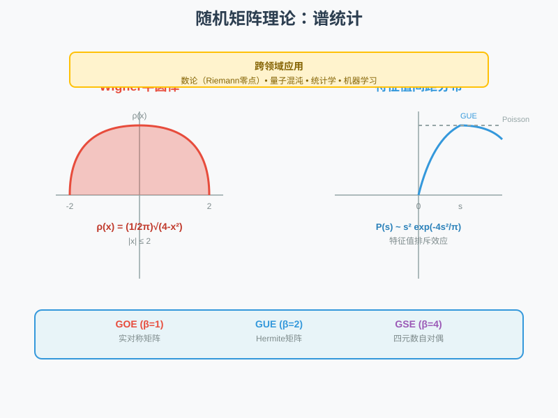
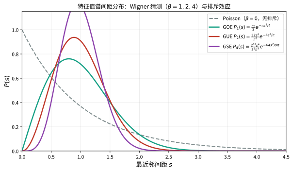

# 第146级 随机矩阵理论 (Random Matrix Theory)

## 学习目标

1. 理解随机矩阵理论的基本框架与三大经典系综（GUE、GOE、GSE）
2. 掌握Wigner半圆律及其矩方法证明
3. 理解Tracy-Widom分布及其在Riemann-Hilbert问题中的推导
4. 掌握GUE特征值关联函数与Christoffel-Darboux公式
5. 理解Marčenko-Pastur定律及其Stieltjes变换证明
6. 了解随机矩阵与数论（Riemann Zeta零点统计）的联系
7. 理解随机矩阵与量子混沌的Bohigas-Giannoni-Schmit猜想
8. 掌握自由概率论与随机矩阵的联系

---

## 核心概念

> **直观理解（现实类比）**：随机矩阵就像"数学版的统计力学"。想象你有一大堆骰子（矩阵元素），每个骰子都是随机掷出的（高斯分布）。但当你把所有骰子的结果组合成矩阵后，矩阵的特征值却展现出惊人的规律性：全局上看，特征值排成半圆形（Wigner半圆律）；局部上看，特征值之间互相"排斥"，不愿靠得太近（特征值排斥效应）。这就像往碗里倒豆子，虽然每颗豆子的落点随机，但最终堆出的轮廓却是确定的半圆。更神奇的是，这套规律不仅出现在物理中，还出现在Riemann Zeta函数的零点分布、量子混沌系统、甚至机器学习的数据协方差矩阵中——仿佛宇宙深处有一套"普适的随机性法则"。

> **🧠 思考历程：一大堆随机数，为什么它们"长出来"的特征值反而极度规律？**
>
> 每个矩阵元素都掷骰子般随机，可特征值的整体却收敛到一条确定半圆、局部还彼此排斥。这个"乱中有序"的谜题，源自物理学家对原子核能级的困惑，最终成为连接素数分布与量子混沌的普适规律。它想回答的，正是随机矩阵的"普遍性"从何而来。
>
> - **原子核里的"乱谱"**。1950年代，为了理解复杂原子核的能级，尤金·维格纳把核哈密顿量建模成元素随机的矩阵。他惊讶地发现：虽然每个元素都随机，特征值的全局分布却趋近一条确定的半圆律 $\rho(x)=\frac{1}{2\pi}\sqrt{4-x^2}$，并顺带猜测相邻能级会"互相排斥"——这就是著名的维格纳半圆律与维格纳猜测。
> - **三大系综统一起来**。1962年，弗里曼·戴森引入正交/酉/辛系综（GOE/GUE/GSE）并用 $\beta=1,2,4$ 统一它们，还提出特征值相互排斥的层次模型；1994年，特雷西与威多姆又给出最大特征值的极限分布（Tracy–Widom分布）。
> - **从原子核到黎曼零点**。蒙特哥马利（1973）与奥德利兹柯（1980年代）的数值实验揭示：黎曼Zeta函数的零点间距与GUE谱间距高度一致——一个看似纯概率的规律，竟把素数的奥秘与量子混沌连在了一起。
> - **心路**：随机矩阵教会数学一件事——"随机"真正的力量，恰恰藏在那条它自己也无法违背的普适规律里。

### 1.1 随机矩阵系综

**定义1（随机矩阵）** 一个**随机矩阵** $X$ 是一个矩阵，其元素是随机变量。随机矩阵理论研究这类矩阵的特征值、特征向量等谱性质的统计行为。

> **💡 直观理解（类比）**：随机矩阵就像"一整张随机生成的数字表格"。单个元素随手一掷、毫无规律，可矩阵成形后一算特征值，整体就会显现惊人秩序——正如无数像素乱点、拉远一看却是一幅清晰的图。研究它，就是把"乱数"变成"看得见的谱"。

**定义2（经典系综）** 根据对称性和物理背景，经典的随机矩阵系综分为三类：

- **Gaussian Orthogonal Ensemble (GOE)**：实对称矩阵，概率测度为：
  $$P(H) \, dH = \frac{1}{Z_{\text{GOE}}} \exp\left(-\frac{n}{2} \operatorname{Tr}(H^2)\right) \, dH$$
  其中 $dH = \prod_{i \leq j} dH_{ij}$，$H_{ij}$ 为独立实高斯随机变量：
  $$H_{ii} \sim \mathcal{N}(0, 2/n), \quad H_{ij} = H_{ji} \sim \mathcal{N}(0, 1/n) \quad (i < j)$$

- **Gaussian Unitary Ensemble (GUE)**：Hermite矩阵，概率测度为：
  $$P(H) \, dH = \frac{1}{Z_{\text{GUE}}} \exp\left(-\frac{n}{2} \operatorname{Tr}(H^2)\right) \, dH$$
  其中 $dH = \prod_{i} dH_{ii} \prod_{i < j} d\operatorname{Re}(H_{ij}) \, d\operatorname{Im}(H_{ij})$，$H_{ij}$ 为独立复高斯随机变量：
  $$H_{ii} \sim \mathcal{N}(0, 1/n)_{\mathbb{R}}, \quad H_{ij} = \bar{H}_{ji} \sim \mathcal{N}(0, 1/n)_{\mathbb{C}} \quad (i < j)$$

- **Gaussian Symplectic Ensemble (GSE)**：四元数自对偶矩阵，概率测度为：
  $$P(H) \, dH = \frac{1}{Z_{\text{GSE}}} \exp\left(-\frac{n}{2} \operatorname{Tr}(H^2)\right) \, dH$$
  其中矩阵元素为四元数，自对偶条件 $H_{ij} = \bar{H}_{ji}^{\text{SD}}$。

> **💡 直观理解（类比）**：三大系综就像三种"对称性不同"的骰子：GOE用实对称矩阵（只能上下翻转所以最"朴素"，$\beta=1$）、GUE用复 Hermite 矩阵（可任意旋转，$\beta=2$）、GSE用四元数自对偶矩阵（维度最高，$\beta=4$）。它们对应于不同的物理时间反演对称性，$\beta$ 越大，特征值"互相排斥"的强度也越大。可以这样记：三种口袋里的彩色石子，规则不同，掷出的谱也就"软硬"不同。

**定义3（$\beta$-系综）** 以上三个系综可以统一表示为 $\beta$-系综，其中 $\beta = 1, 2, 4$ 分别对应 GOE、GUE、GSE。特征值联合概率密度为：
$$P(\lambda_1, \ldots, \lambda_n) = \frac{1}{Z_{n,\beta}} \prod_{i < j} |\lambda_i - \lambda_j|^\beta \exp\left(-\frac{n}{2} \sum_{i=1}^n \lambda_i^2\right)$$

> **💡 直观理解（类比）**：$\beta$-系综像"同一道菜的三档辣度"——把 GOE/GUE/GSE 装进同一个配方公式，$\beta$ 就是辣度档位（1、2、4）。公式里的排斥因子 $\prod_{i<j}|\lambda_i-\lambda_j|^\beta$ 决定特征值之间"互相挤开"的力度，$\lambda$ 越接近、概率越低；而高斯权重 $\exp(-\frac n2\Sigma\lambda_i^2)$ 则像一条"橡皮筋"把它们约束在原点附近，防止谱跑到无穷远。

### 1.2 Wigner半圆律

**定义4（半圆律）** **Wigner半圆律**描述了随机矩阵特征值谱的全局行为。对 $n \times n$ GUE矩阵 $H$，经验谱分布函数：
$$\mu_n(x) = \frac{1}{n} \#\{i : \lambda_i \leq x\}$$
在 $n \to \infty$ 时几乎必然收敛到**半圆分布**：
$$\rho(x) = \frac{1}{2\pi} \sqrt{4 - x^2} \cdot \mathbb{1}_{|x| \leq 2}$$

> **直观理解（现实类比）**：把 $n$ 个特征值 $\lambda_1,\ldots,\lambda_n$ 画成直方图，当矩阵越来越大时，直方图的外形越来越像半个"贴在 $[-2,2]$ 上的圆弧"。这就像往一个碗里倒一大把豆子，豆子在碗底堆出的截面轮廓——中间高、两端逐渐收窄成一个半圆。它说明：尽管每个特征值都非常随机，但**整体**的分布形状却由半圆律这种非常确定的规律支配。

### 1.3 Tracy-Widom分布

**定义5（Tracy-Widom分布）** 设 $\lambda_{\max}$ 为 $n \times n$ GUE矩阵的最大特征值。经过适当缩放：
$$\lambda_{\max}^{(n)} \approx 2 + \frac{1}{n^{2/3}} \chi_2$$
其中 $\chi_2$ 服从 **Tracy-Widom分布** $\text{TW}_2$，其分布函数为：
$$F_2(s) = \exp\left(-\int_s^\infty (x - s) q(x)^2 \, dx\right)$$
其中 $q(x)$ 是 **Painlevé II型方程** 的解：
$$q''(x) = x q(x) + 2 q(x)^3, \quad q(x) \sim \operatorname{Ai}(x) \quad (x \to \infty)$$
$\operatorname{Ai}(x)$ 是Airy函数。

> **💡 直观理解（类比）**：Tracy-Widom分布描述"最大那颗特征值"的随机涨落。它不像半圆律那样框定整个谱，而是像放大镜一样盯住谱的最右端边缘，告诉你"最高的柱子究竟有多高、波动有多大"。缩放 $n^{2/3}$ 之后，它稳定成一条带指数拖尾的歪斜曲线 $F_2(s)$，而算出它的"工程图纸"正是 Painlevé II 方程与 Airy 函数这些"超越"工具。

类似地，GOE和GSE分别对应 $\text{TW}_1$ 和 $\text{TW}_4$ 分布。

### 1.4 特征值间距分布与Wigner猜测

**定义6（最近邻间距分布）** 对随机矩阵的归一化特征值 $\{\lambda_i\}$，定义最近邻间距：
$$s_i = \lambda_{i+1} - \lambda_i$$
**Wigner猜测**（Wigner surmise）指出，GOE的最近邻间距分布近似为：
$$P(s) \approx \frac{\pi s}{2} \exp\left(-\frac{\pi s^2}{4}\right)$$
而GUE和GSE分别近似为：
$$P_2(s) \approx \frac{32 s^2}{\pi^2} \exp\left(-\frac{4 s^2}{\pi}\right), \quad P_4(s) \approx \frac{2^{18} s^4}{3^6 \pi^3} \exp\left(-\frac{64 s^2}{9\pi}\right)$$

> **直观理解（现实类比）**：把归一化后的特征值看成"停车场里的一排车位"，如果特征值完全独立（Poisson），车位可以随意紧挨（$s\to 0$ 时概率最大）；但对于随机矩阵，特征值会**互相排斥**，间距越小概率越低，甚至 $P_\beta(0)=0$。这好比运动会入场式里，选手之间总要保持一定"社交距离"，$\beta$ 越大（GOE→GUE→GSE）排斥得越厉害，间距分布也就越往右"撑开"。

### 1.5 水平密度与关联函数

**定义7（$k$-点关联函数）** 对 $n$ 个特征值，其联合概率密度为 $P_n(\lambda_1, \ldots, \lambda_n)$，**$k$-点关联函数**定义为：
$$R_k(\lambda_1, \ldots, \lambda_k) = \frac{n!}{(n-k)!} \int P_n(\lambda_1, \ldots, \lambda_n) \, d\lambda_{k+1} \cdots d\lambda_n$$

> **💡 直观理解（类比）**：$k$-点关联函数像"同时在谱的 $k$ 个位置各圈一个特征值的密度"：问你"恰好这里一个、那里一个、那边又一个"同时出现的概率。$k=1$ 就是普通的谱密度（单点分布），$k=2$ 则是能反映两个特征值"互相排斥"的两两关系。它是把 $n$ 个特征值的复杂联合分布压缩成"只看任意 $k$ 个位置"的简化镜头。

**定义8（行列式点过程）** GUE的特征值构成一个**行列式点过程**，其关联函数由核函数 $K_n(x,y)$ 决定：
$$R_k(\lambda_1, \ldots, \lambda_k) = \det[K_n(\lambda_i, \lambda_j)]_{i,j=1}^k$$

> **💡 直观理解（类比）**："行列式点过程"的意思是：这组随机点的分布可以用一个核函数 $K_n(x,y)$ 的行列式来表示。行列式有个天然的"防重叠"脾气——当两个位置重合时行列式为零，于是两个点撞到一起的概率被自动抹平。这正是特征值排斥的根源：宛如"日历上两个人不能占同一天"，行列式替我们写好了这条不成文规矩。

### 1.6 随机矩阵与数论的联系

**定义9（Montgomery-Odlyzko定律）** Riemann Zeta函数 $\zeta(s)$ 的非平凡零点（在临界线上）的统计分布与GUE特征值间距分布一致。具体地，设 $\gamma_n$ 为 $\zeta(1/2 + i\gamma_n) = 0$ 的虚部（按升序排列），则归一化零点间距：
$$\delta_n = (\gamma_{n+1} - \gamma_n) \cdot \frac{\log(\gamma_n/2\pi)}{2\pi}$$
的分布与GUE的最近邻间距分布一致。

> **💡 直观理解（类比）**：这条定律惊呼：Riemann $\zeta$ 函数零点的间距统计，竟和"随机矩阵的特征值间距"一模一样！这就好比统计城市里电线杆的间距，却发现它们严格呈现"钟表齿轮的齿距"规律——后者本是工业机械的产物，却在纯素数的世界里冒了出来，暗示两者背后藏着同一条普适规律（素数、谱与随机矩阵的统一）。

### 1.7 随机矩阵与量子混沌

**定义10（Bohigas-Giannoni-Schmit猜想）** 该猜想指出，量子系统中，若经典对应是混沌的，则其能级涨落统计与随机矩阵（GOE/GUE/GSE，具体取决于对称性）的特征值统计一致。这是**量子混沌**领域的基本结果。

> **💡 直观理解（类比）**：这个猜想说：一个经典上"混乱、走走路线永不重复"的物理系统，其量子能级的疏密规律会跟随机矩阵的队伍高度一致。好比一锅剧烈搅动的汤（混沌系统），能级的间距像随机矩阵那样彼此"保持队形、互相排斥"；而一间规规矩矩的琴房（可积系统），能级则像独立的偶发事件、随意出现。正是"混沌"让系统"忘记"细节，从而显现出随机矩阵那种普适统计。

### 1.8 Marčenko-Pastur定律

**定义11（Marčenko-Pastur定律）** 设 $X$ 为 $p \times n$ 随机矩阵，其元素为独立同分布、均值为0、方差为 $\sigma^2$ 的随机变量。则样本协方差矩阵 $S = \frac{1}{n} X X^T$ 的经验谱分布，在 $p, n \to \infty$ 且 $p/n \to \gamma \in (0, \infty)$ 时，收敛到**Marčenko-Pastur分布**：
$$\rho_\gamma(x) = \frac{1}{2\pi \sigma^2 \gamma x} \sqrt{(b - x)(x - a)} \cdot \mathbb{1}_{[a,b]}(x)$$
其中 $a = \sigma^2(1 - \sqrt{\gamma})^2$，$b = \sigma^2(1 + \sqrt{\gamma})^2$。

> **🧠 直观理解（现实类比）**：MP定律回答数据科学的核心问题："一堆样本算出的协方差矩阵，其特征值到底落在哪儿？"它说——当造数行列数之比趋于 $\gamma$ 时，谱整体收敛到一条明确的"马蹄形"曲线（支集 $[a,b]$），还会在 0 处根据情况堆出原子。好比统计一群人的身高协方差，得到的谱不再晃来晃去，而是稳稳定形：这便是高维统计里"谱在哪里"的一幅可靠地图。

### 1.9 自由概率论与随机矩阵

**定义12（自由概率论联系）** Voiculescu的自由概率论为随机矩阵提供了深刻的代数框架。**渐近自由性**指出，独立的高斯随机矩阵在 $n \to \infty$ 时是渐近自由的，即它们的矩收敛到自由非交换随机变量的矩。

> **💡 直观理解（类比）**：独立随机矩阵在极限下"渐近自由"——它们的矩行为像"自由概率论里的独立变量"那样互不纠缠。类比：几支独立乐队同时演奏，叠加后的音轨各自"自由组合"、互不相扰；自由概率论就是在非交换谱域里重新定义"互不相干"的法则，而这套法则恰好精确刻画了随机矩阵谱的神秘规律。

---

## 定理与证明

### 定理1：Wigner半圆律

**定理（Wigner半圆律）** 设 $H_n$ 为 $n \times n$ GUE矩阵，$\mu_n(x) = \frac{1}{n} \#\{\lambda_i \leq x\}$ 为其经验谱分布。则当 $n \to \infty$ 时，$\mu_n$ 几乎必然收敛到半圆分布 $\rho(x) = \frac{1}{2\pi} \sqrt{4 - x^2} \cdot \mathbb{1}_{|x| \leq 2}$，即对任意有界连续函数 $f$：
$$\lim_{n \to \infty} \frac{1}{n} \sum_{i=1}^n f(\lambda_i) = \frac{1}{2\pi} \int_{-2}^2 f(x) \sqrt{4 - x^2} \, dx \quad \text{a.s.}$$

> **🧠 直观理解（现实类比）**：半圆律是整座理论的"地基"：$n\times n$ 随机矩阵的特征值，当 $n$ 越来越大时，直方图轮廓就"定形"成一条半圆 $\rho(x)=\frac1{2\pi}\sqrt{4-x^2}$，稳定支撑在 $[-2,2]$ 内。它像"大数定律在特征值上的翻版"——掷出的每个点随机，但海量点堆出的整体形状铁板钉钉。矩方法的妙处在于"算矩即可"：只要验证各阶矩收敛到半圆的矩（Catalan数），分布就逃不开半圆。

**证明（矩方法）**：

**第一步：矩收敛的等价性。**
由概率论中的矩收敛定理，只需证明经验谱分布的各阶矩收敛到半圆分布的矩。半圆分布的第 $k$ 阶矩为：
$$m_k = \frac{1}{2\pi} \int_{-2}^2 x^k \sqrt{4 - x^2} \, dx$$

当 $k$ 为奇数时，$m_k = 0$；当 $k = 2\ell$ 为偶数时，做变量代换 $x = 2\cos\theta$：
$$m_{2\ell} = \frac{1}{2\pi} \int_0^\pi (2\cos\theta)^{2\ell} \cdot 2\sin\theta \cdot \sin\theta \, d\theta = \frac{2^{2\ell}}{\pi} \int_0^\pi \cos^{2\ell}\theta \sin^2\theta \, d\theta$$

利用Beta函数：
$$\int_0^\pi \cos^{2\ell}\theta \sin^2\theta \, d\theta = \frac{\sqrt{\pi} \, \Gamma(\ell + 1/2) \Gamma(3/2)}{\Gamma(\ell + 2)} = \frac{\pi}{2} \cdot \frac{(2\ell)!}{2^{2\ell} \ell! (\ell+1)!}$$

因此：
$$m_{2\ell} = \frac{1}{\ell + 1} \binom{2\ell}{\ell} = C_\ell$$

其中 $C_\ell = \frac{1}{\ell+1} \binom{2\ell}{\ell}$ 是第 $\ell$ 个 **Catalan数**。

**第二步：矩的迹表示。**
经验谱分布的第 $k$ 阶矩为：
$$\frac{1}{n} \sum_{i=1}^n \lambda_i^k = \frac{1}{n} \operatorname{Tr}(H_n^k)$$

因此需要计算 $\mathbb{E}[\operatorname{Tr}(H_n^k)]$ 并证明其收敛性。

**第三步：矩的展开。**
展开 $\operatorname{Tr}(H_n^k) = \sum_{i_1, \ldots, i_k = 1}^n H_{i_1 i_2} H_{i_2 i_3} \cdots H_{i_k i_1}$。

由于GUE矩阵的元素 $H_{ij}$ 是独立复高斯随机变量（均值为0，方差 $\mathbb{E}[|H_{ij}|^2] = 1/n$），且 $\mathbb{E}[H_{ij}^2] = 0$，$\mathbb{E}[H_{ij} \bar{H}_{ij}] = 1/n$。

**第四步：Wick公式（矩-累积量公式）。**
对复高斯随机变量，Wick公式指出：
$$\mathbb{E}[H_{i_1 j_1} H_{i_2 j_2} \cdots H_{i_k j_k}] = \sum_{\pi \in \text{配对}} \prod_{(p,q) \in \pi} \mathbb{E}[H_{i_p j_p} H_{i_q j_q}]$$

其中求和遍历所有将 $\{1,\ldots,k\}$ 配对的完美匹配。由于 $\mathbb{E}[H_{ij} H_{pq}] = 0$（除非 $i = q$ 且 $j = p$，即配对必须形成共轭对），非零贡献仅当每个配对 $(p,q)$ 满足 $i_p = j_q$ 且 $j_p = i_q$。

**第五步：组合解释。**
对 $\mathbb{E}[\operatorname{Tr}(H_n^k)]$，展开中每个指标序列 $(i_1, \ldots, i_k)$ 对应一个长度为 $k$ 的闭路径。Wick配对要求每个边 $(i_p, i_{p+1})$ 与另一个边 $(i_q, i_{q+1})$ 配对，且方向相反（即 $i_p = i_{q+1}$ 且 $i_{p+1} = i_q$）。

这等价于将 $k$ 条边配成 $k/2$ 对，且配对必须形成**非交叉配对**（non-crossing pairing），因为交叉配对对应非平面图，在 $n \to \infty$ 时贡献较低阶项。

**第六步：Catalan数的出现。**
非交叉配对的数量由Catalan数 $C_{k/2}$ 给出。每个非交叉配对对应一个平面配对模式，在与路径指标求和时，每个配对贡献因子 $1/n$（来自方差），而 $k$ 个指标的自由求和给出 $n$ 的因子。

具体地，对每个非交叉配对 $\pi$，指标求和给出：
$$\sum_{i_1,\ldots,i_k=1}^n \prod_{(p,q) \in \pi} \mathbb{E}[H_{i_p i_{p+1}} H_{i_q i_{q+1}}] = \sum_{i_1,\ldots,i_k=1}^n \prod_{(p,q) \in \pi} \frac{1}{n} \delta_{i_p, i_{q+1}} \delta_{i_{p+1}, i_q}$$

非交叉配对的约束将 $k$ 个指标减少为 $k/2 + 1$ 个自由指标，因此求和贡献为 $n^{k/2 + 1}$。乘以 $n^{-k/2}$（来自 $k$ 个方差因子）得到 $n$。

因此：
$$\mathbb{E}[\operatorname{Tr}(H_n^k)] = n \cdot C_{k/2} + O(n^0) \quad (\text{当 } k \text{ 为偶数})$$
$$\mathbb{E}[\operatorname{Tr}(H_n^k)] = 0 \quad (\text{当 } k \text{ 为奇数})$$

**第七步：矩的极限。**
$$\mathbb{E}\left[\frac{1}{n} \operatorname{Tr}(H_n^k)\right] = \begin{cases}
C_{k/2} + O(n^{-1}), & k \text{ 为偶数} \\
0, & k \text{ 为奇数}
\end{cases}$$

因此当 $n \to \infty$ 时，经验谱分布的第 $k$ 阶矩收敛到 $C_{k/2}$（$k$ 偶）或 $0$（$k$ 奇），这正是半圆分布的矩。

**第八步：几乎必然收敛。**
通过方差估计和Borel-Cantelli引理，可以证明矩的几乎必然收敛。对任意固定的 $k$：
$$\sum_{n=1}^\infty \mathbb{P}\left(\left|\frac{1}{n} \operatorname{Tr}(H_n^k) - m_k\right| > \varepsilon\right) < \infty$$
因此 $\frac{1}{n} \operatorname{Tr}(H_n^k) \to m_k$ 几乎必然。

再由矩收敛定理，经验谱分布 $\mu_n$ 几乎必然收敛到半圆分布。

**结论**：Wigner半圆律通过矩方法得到证明，Catalan数作为非交叉配对的计数自然出现在随机矩阵的矩计算中。$\square$

### 定理2：Tracy-Widom分布

**定理（Tracy-Widom分布）** 设 $\lambda_{\max}^{(n)}$ 为 $n \times n$ GUE矩阵的最大特征值。则存在缩放常数使得：
$$\lim_{n \to \infty} \mathbb{P}\left(n^{2/3} (\lambda_{\max}^{(n)} - 2) \leq s\right) = F_2(s)$$
其中 $F_2(s)$ 是Tracy-Widom分布函数：
$$F_2(s) = \exp\left(-\int_s^\infty (x - s) q(x)^2 \, dx\right)$$
且 $q(x)$ 是Painlevé II型方程的解：
$$q''(x) = x q(x) + 2 q(x)^3, \quad q(x) \sim \operatorname{Ai}(x) \quad (x \to \infty)$$

> **🧠 直观理解（现实类比）**：Tracy-Widom分布回答"谱最右端的极端值偏离均值 $2$ 有多大"。它不像半圆律框住整个轮廓，而是死死盯住边缘那一小撮极值，按 $n^{2/3}$ 缩放后得到一条带指数拖尾的歪斜曲线 $F_2$。证明靠正交多项式的渐近（Airy函数）与 Riemann-Hilbert 问题，就像把"最高海拔的分布"还原成一段可解的波形，而 Painlevé II 方程正是这段波形背后隐藏的"规律谱"。

**证明思路（Riemann-Hilbert问题与正交多项式渐近）**：

**第一步：正交多项式表示。**
GUE的特征值联合密度为：
$$P(\lambda_1, \ldots, \lambda_n) = \frac{1}{Z_n} \prod_{i < j} (\lambda_i - \lambda_j)^2 \prod_{i=1}^n e^{-n\lambda_i^2/2}$$

这可以表示为行列式点过程，核函数为：
$$K_n(x,y) = e^{-n(x^2+y^2)/4} \sum_{k=0}^{n-1} p_k(x) p_k(y)$$
其中 $\{p_k\}$ 是关于权函数 $e^{-nx^2/2}$ 的**正交多项式**。

**第二步：Christoffel-Darboux公式。**
利用Christoffel-Darboux公式（见定理3），核函数可以简化为：
$$K_n(x,y) = \frac{\phi_n(x) \phi_{n-1}(y) - \phi_{n-1}(x) \phi_n(y)}{x - y}$$
其中 $\phi_k(x) = p_k(x) e^{-nx^2/4}$。

**第三步：最大特征值的分布。**
GUE最大特征值的分布函数为：
$$\mathbb{P}(\lambda_{\max} \leq s) = \det(I - K_n|_{[s,\infty)}) = \prod_{j=1}^\infty (1 - \lambda_j)$$
其中 $\lambda_j$ 是积分算子 $K_n$ 在 $[s,\infty)$ 上的特征值。这是Fredholm行列式。

**第四步：缩放极限。**
在边缘 $x \approx 2$ 附近，正交多项式 $p_n(x)$ 的渐近行为由**Plancherel-Rotach渐近公式**描述。在缩放变量：
$$x = 2 + \frac{s}{n^{2/3}}$$
下，核函数收敛到**Airy核**：
$$K_{\text{Airy}}(x,y) = \frac{\operatorname{Ai}(x) \operatorname{Ai}'(y) - \operatorname{Ai}'(x) \operatorname{Ai}(y)}{x - y}$$

**第五步：Riemann-Hilbert问题。**
正交多项式 $p_n(z)$ 的渐近分析可以通过Riemann-Hilbert（RH）问题系统地进行。定义 $2 \times 2$ 矩阵值函数 $Y(z)$：
$$Y(z) = \begin{pmatrix}
p_n(z) & \frac{1}{2\pi i} \int_{\mathbb{R}} \frac{p_n(t) e^{-n t^2/2}}{t - z} \, dt \\
-2\pi i \gamma_{n-1}^{-1} p_{n-1}(z) & -\gamma_{n-1}^{-1} \int_{\mathbb{R}} \frac{p_{n-1}(t) e^{-n t^2/2}}{t - z} \, dt
\end{pmatrix}$$
其中 $\gamma_{n-1}$ 是归一化常数。$Y(z)$ 满足以下RH问题：
1. $Y(z)$ 在 $\mathbb{C} \setminus \mathbb{R}$ 上解析
2. 在实轴上，$Y_+(x) = Y_-(x) \begin{pmatrix} 1 & e^{-nx^2/2} \\ 0 & 1 \end{pmatrix}$
3. $Y(z) = (I + O(1/z)) \begin{pmatrix} z^n & 0 \\ 0 & z^{-n} \end{pmatrix}$ 当 $z \to \infty$

**第六步：非线性速降法。**
为分析 $n \to \infty$ 时的渐近行为，使用Deift-Zhou的**非线性速降法**（nonlinear steepest descent）：
1. 通过变换 $Y \to T$ 将RH问题规范化
2. 通过分解跳跃矩阵，将问题转化为局部Airy问题
3. 在边缘点 $x = \pm 2$ 附近，解由Airy函数描述

**第七步：Painlevé II型方程的推导。**
在缩放极限下，核函数 $K_n(x,y)$ 的Fredholm行列式 $F_2(s) = \det(I - K_{\text{Airy}}|_{[s,\infty)})$ 满足：
$$\frac{d^2}{ds^2} \log F_2(s) = -q(s)^2$$
其中 $q(s)$ 是**Painlevé II型方程**的解：
$$q''(s) = s q(s) + 2 q(s)^3$$
边界条件由Airy函数的渐近行为给出：$q(s) \sim \operatorname{Ai}(s)$ 当 $s \to \infty$。

**第八步：Tracy-Widom公式。**
通过积分上述关系，得到：
$$F_2(s) = \exp\left(-\int_s^\infty (x - s) q(x)^2 \, dx\right)$$
这就是Tracy-Widom分布的显式公式。

**结论**：Tracy-Widom分布通过正交多项式、Riemann-Hilbert问题和Painlevé超越函数的深刻联系得到完整刻画。$\square$

### 定理3：GUE特征值关联函数

**定理（GUE特征值关联函数）** 设 $H$ 为 $n \times n$ GUE矩阵，其特征值的 $k$-点关联函数为：
$$R_k(\lambda_1, \ldots, \lambda_k) = \det[K_n(\lambda_i, \lambda_j)]_{i,j=1}^k$$
其中核函数 $K_n(x,y)$ 为：
$$K_n(x,y) = e^{-n(x^2+y^2)/4} \sum_{j=0}^{n-1} p_j(x) p_j(y)$$
且 $\{p_j\}$ 是关于权函数 $w(x) = e^{-nx^2/2}$ 的**正交多项式**，满足：
$$\int_{\mathbb{R}} p_i(x) p_j(x) e^{-nx^2/2} \, dx = \delta_{ij}$$

> **💡 直观理解（类比）**：该定理把"GUE特征值之间如何两两/成批相关"这件复杂的事，浓缩成一个漂亮的核函数 $K_n(x,y)$：任意 $k$ 个特征值的联合密度就是核的行列式。$K_n$ 由正交多项式（如 Hermite 多项式）构成，像一段"光谱滤镜"——不同 $x,y$ 往里一套，就能算出两点、三点……之间的关联。Christoffel–Darboux 公式则把这个无穷级数"折叠"成一个紧凑的分数式，让滤镜既可算、又可取极限。

**证明（Christoffel-Darboux公式）**：

**第一步：GUE特征值的联合分布。**
GUE特征值的联合概率密度为：
$$P(\lambda_1, \ldots, \lambda_n) = \frac{1}{Z_n} \prod_{i < j} (\lambda_i - \lambda_j)^2 \prod_{i=1}^n e^{-n\lambda_i^2/2}$$

归一化常数 $Z_n$ 为：
$$Z_n = \int_{\mathbb{R}^n} \prod_{i < j} (\lambda_i - \lambda_j)^2 \prod_{i=1}^n e^{-n\lambda_i^2/2} \, d\lambda_1 \cdots d\lambda_n = n! \prod_{j=0}^{n-1} h_j$$
其中 $h_j$ 是正交多项式 $p_j$ 的归一化常数。

**第二步：Vandermonde行列式。**
注意到 $\prod_{i < j} (\lambda_i - \lambda_j)^2 = [\det(\lambda_i^{j-1})_{i,j=1}^n]^2 = \det(\lambda_i^{j-1}) \cdot \det(\lambda_i^{j-1})$。

利用正交多项式基，可以更优雅地表示：
$$\prod_{i < j} (\lambda_i - \lambda_j) = \det(p_{j-1}(\lambda_i))_{i,j=1}^n \cdot \prod_{j=0}^{n-1} \frac{1}{\kappa_j}$$
其中 $\kappa_j$ 是 $p_j$ 的首项系数。

**第三步：联合密度的行列式形式。**
将联合概率密度改写为：
$$P(\lambda_1, \ldots, \lambda_n) = \frac{1}{n!} \det[\phi_i(\lambda_j)]_{i,j=1}^n \cdot \det[\phi_i(\lambda_j)]_{i,j=1}^n$$
其中 $\phi_j(x) = p_j(x) e^{-nx^2/4}$，归一化因子 $\frac{1}{n!}$ 来自 $\int h_j = 1$。

**第四步：$k$-点关联函数的积分表示。**
$k$-点关联函数定义为：
$$R_k(\lambda_1, \ldots, \lambda_k) = \frac{n!}{(n-k)!} \int P(\lambda_1, \ldots, \lambda_n) \, d\lambda_{k+1} \cdots d\lambda_n$$

代入联合密度的行列式形式，利用**行列式积分公式**（de Bruijn公式）：
$$\int \det[\phi_i(\lambda_j)]_{i,j=1}^n \det[\psi_i(\lambda_j)]_{i,j=1}^n \, d\lambda_{k+1} \cdots d\lambda_n = (n-k)! \det\left[\int \phi_i(x) \psi_j(x) \, dx\right]_{i,j=1}^k$$

**第五步：核函数的推导。**
应用上述公式，得到：
$$R_k(\lambda_1, \ldots, \lambda_k) = \det\left[\sum_{j=0}^{n-1} \phi_j(\lambda_i) \phi_j(\lambda_\ell)\right]_{i,\ell=1}^k$$

定义核函数：
$$K_n(x,y) = \sum_{j=0}^{n-1} \phi_j(x) \phi_j(y) = e^{-n(x^2+y^2)/4} \sum_{j=0}^{n-1} p_j(x) p_j(y)$$

则 $R_k(\lambda_1, \ldots, \lambda_k) = \det[K_n(\lambda_i, \lambda_j)]_{i,j=1}^k$。

**第六步：Christoffel-Darboux公式。**
**Christoffel-Darboux公式**指出，对正交多项式 $\{p_j\}$：
$$\sum_{j=0}^{n-1} p_j(x) p_j(y) = \frac{\kappa_{n-1}}{\kappa_n} \cdot \frac{p_n(x) p_{n-1}(y) - p_{n-1}(x) p_n(y)}{x - y}$$

其中 $\kappa_j$ 是 $p_j$ 的首项系数。对于Gauss-Hermite正交多项式，$\kappa_{n-1}/\kappa_n = \sqrt{n/2}$。

**证明**：利用正交多项式的递推关系 $x p_j(x) = \frac{\kappa_j}{\kappa_{j+1}} p_{j+1}(x) + \frac{\kappa_{j-1}}{\kappa_j} p_{j-1}(x)$，乘以 $p_j(y)$ 并对 $j$ 求和，两边乘以 $(x-y)$ 后使用伸缩求和可得。

**第七步：Christoffel-Darboux公式的简化形式。**
将 $\phi_j(x) = p_j(x) e^{-nx^2/4}$ 代入，核函数变为：
$$K_n(x,y) = \frac{\kappa_{n-1}}{\kappa_n} \cdot \frac{\phi_n(x) \phi_{n-1}(y) - \phi_{n-1}(x) \phi_n(y)}{x - y}$$

**第八步：行列式点过程的性质。**
GUE特征值构成的行列式点过程具有以下性质：
1. **自洽性**：$k$-点关联函数由核函数 $K_n$ 唯一决定
2. **指数消失**：$\int_{\mathbb{R}} K_n(x,x) \, dx = n$
3. **再生性质**：$\int_{\mathbb{R}} K_n(x,z) K_n(z,y) \, dz = K_n(x,y)$

**结论**：GUE特征值关联函数通过Christoffel-Darboux公式简化为由正交多项式核决定的行列式点过程。$\square$

### 定理4：Marčenko-Pastur定律

**定理（Marčenko-Pastur定律）** 设 $X$ 为 $p \times n$ 随机矩阵，其元素 $X_{ij}$ 为独立同分布随机变量，满足 $\mathbb{E}[X_{ij}] = 0$，$\mathbb{E}[X_{ij}^2] = \sigma^2$，$\mathbb{E}[|X_{ij}|^{4+\varepsilon}] < \infty$。设 $p, n \to \infty$ 且 $p/n \to \gamma \in (0, \infty)$。则样本协方差矩阵 $S_n = \frac{1}{n} X X^T$ 的经验谱分布几乎必然收敛到**Marčenko-Pastur分布**，其密度为：
$$\rho_\gamma(x) = \frac{1}{2\pi \sigma^2 \gamma x} \sqrt{(b - x)(x - a)} \cdot \mathbb{1}_{[a,b]}(x)$$
其中 $a = \sigma^2(1 - \sqrt{\gamma})^2$，$b = \sigma^2(1 + \sqrt{\gamma})^2$。当 $\gamma > 1$ 时，在 $x = 0$ 处还有一个质量为 $1 - 1/\gamma$ 的原子。

> **💡 直观理解（类比）**：Marčenko–Pastur定律是"高维数据谱的定位地图"：样本协方差 $\frac1n XX^T$ 的特征值，当维数/样本量之比趋于 $\gamma$ 时，整体稳定落在一条马蹄形密度曲线上（支集 $[a,b]$），若 $p>n$ 还会在 0 处堆出一个"原子"（零特征值）。Stieltjes 变换 $m(z)$ 就像"谱的透视镜"——把"看不见的测度"变成"看得见的复函数"，再借它的一一对应把极限谱的形状反推出来。

**证明（Stieltjes变换方法）**：

**第一步：Stieltjes变换的定义。**
对概率测度 $\mu$ 在 $\mathbb{R}$ 上，其**Stieltjes变换**定义为：
$$m(z) = \int_{\mathbb{R}} \frac{1}{x - z} \, d\mu(x), \quad \operatorname{Im}(z) > 0$$

Stieltjes变换与测度之间存在一一对应，且可以通过逆变换公式恢复：
$$d\mu(x) = \frac{1}{\pi} \lim_{\varepsilon \to 0^+} \operatorname{Im}(m(x + i\varepsilon)) \, dx$$

**第二步：经验谱分布的Stieltjes变换。**
设 $\mu_n$ 为 $S_n$ 的经验谱分布，其Stieltjes变换为：
$$m_n(z) = \frac{1}{p} \operatorname{Tr}\left((S_n - z I_p)^{-1}\right) = \frac{1}{p} \sum_{i=1}^p \frac{1}{\lambda_i - z}$$

**第三步：利用矩阵恒等式。**
考虑 $p \times p$ 矩阵 $S_n - z I_p = \frac{1}{n} X X^T - z I_p$。利用矩阵恒等式：
$$(A + B)^{-1} = A^{-1} - A^{-1} B (A + B)^{-1}$$
对 $A = -z I_p$ 和 $B = \frac{1}{n} X X^T$ 应用：
$$(S_n - z I_p)^{-1} = -\frac{1}{z} I_p - \frac{1}{z} \cdot \frac{1}{n} X X^T (S_n - z I_p)^{-1}$$

两边取迹并除以 $p$：
$$m_n(z) = -\frac{1}{z} - \frac{1}{pz} \operatorname{Tr}\left(\frac{1}{n} X X^T (S_n - z I_p)^{-1}\right)$$

**第四步：重排迹。**
$$\operatorname{Tr}\left(X X^T (S_n - z I_p)^{-1}\right) = \operatorname{Tr}\left(X^T (S_n - z I_p)^{-1} X\right)$$

注意 $X^T (S_n - z I_p)^{-1} X$ 是 $n \times n$ 矩阵。利用 $(S_n - z I_p)^{-1} X = X (X^T X - z n I_n)^{-1}$（由Woodbury恒等式），可得：
$$X^T (S_n - z I_p)^{-1} X = X^T X (X^T X - z n I_n)^{-1} n$$

**第五步：Stieltjes变换的方程。**
定义 $T_n = \frac{1}{n} X^T X$（$n \times n$ 矩阵），其经验谱分布的Stieltjes变换为：
$$\underline{m}_n(z) = \frac{1}{n} \operatorname{Tr}\left((T_n - z I_n)^{-1}\right)$$

通过计算可得：
$$\frac{1}{p} \operatorname{Tr}\left(\frac{1}{n} X X^T (S_n - z I_p)^{-1}\right) = \frac{p}{n} \cdot \frac{1}{n} \operatorname{Tr}\left(T_n (T_n - z I_n)^{-1}\right) = \gamma_n (1 + z \underline{m}_n(z))$$
其中 $\gamma_n = p/n$。

**第六步：耦合方程。**
代入得：
$$m_n(z) = -\frac{1}{z} - \frac{\gamma_n}{z} (1 + z \underline{m}_n(z)) = -\frac{1 - \gamma_n}{z} - \gamma_n \underline{m}_n(z)$$

类似地，交换 $p$ 和 $n$ 的角色可得对称方程：
$$\underline{m}_n(z) = -\frac{1 - 1/\gamma_n}{z} - \frac{1}{\gamma_n} m_n(z)$$

**第七步：极限方程的推导。**
当 $n \to \infty$ 时，$\gamma_n \to \gamma$。由上述两个方程消去 $\underline{m}(z)$，得到极限Stieltjes变换 $m(z)$ 满足的方程：
$$m(z) = -\frac{1 - \gamma}{z} - \gamma \left(-\frac{1 - 1/\gamma}{z} - \frac{1}{\gamma} m(z)\right)$$

这简化为一个二次方程。更直接地，从耦合方程可得：
$$m(z) = -\frac{1 - \gamma}{z} - \gamma \underline{m}(z)$$
$$\underline{m}(z) = -\frac{1 - 1/\gamma}{z} - \frac{1}{\gamma} m(z)$$

代入消去 $\underline{m}(z)$：
$$m(z) = -\frac{1 - \gamma}{z} - \gamma \left(-\frac{1 - 1/\gamma}{z} - \frac{1}{\gamma} m(z)\right)$$

这给出恒等式。实际上，我们需要更仔细地分析。直接从 $m(z)$ 的定义出发，利用秩-1扰动引理和自平均性质，可以证明极限 $m(z)$ 满足：
$$m(z) = \frac{1}{-z + \sigma^2 \gamma \int \frac{1}{t - z} \, d\mu(t)} = \frac{1}{-z + \sigma^2 \gamma m(z)}$$

**第八步：求解二次方程。**
整理得：
$$\sigma^2 \gamma m(z)^2 + (z - \sigma^2(1 - \gamma)) m(z) + 1 = 0$$

解二次方程：
$$m(z) = \frac{-(z - \sigma^2(1 - \gamma)) \pm \sqrt{(z - \sigma^2(1 - \gamma))^2 - 4\sigma^2 \gamma}}{2\sigma^2 \gamma}$$

选择使得 $\operatorname{Im}(m(z)) > 0$ 当 $\operatorname{Im}(z) > 0$ 的分支：
$$m(z) = \frac{-(z - \sigma^2(1 - \gamma)) + \sqrt{(z - a)(z - b)}}{2\sigma^2 \gamma z}$$
其中 $a = \sigma^2(1 - \sqrt{\gamma})^2$，$b = \sigma^2(1 + \sqrt{\gamma})^2$。

**第九步：逆Stieltjes变换。**
通过逆变换公式恢复密度：
$$\rho_\gamma(x) = \frac{1}{\pi} \lim_{\varepsilon \to 0^+} \operatorname{Im}(m(x + i\varepsilon))$$

对 $x \in (a, b)$，计算虚部：
$$\operatorname{Im}(m(x + i0)) = \frac{\sqrt{(b - x)(x - a)}}{2\pi \sigma^2 \gamma x}$$

因此：
$$\rho_\gamma(x) = \frac{1}{2\pi \sigma^2 \gamma x} \sqrt{(b - x)(x - a)} \cdot \mathbb{1}_{[a,b]}(x)$$

**第十步：原子的存在性。**
当 $\gamma > 1$ 时，$p > n$，矩阵 $S_n$ 的秩最多为 $n$，因此至少有 $p - n$ 个零特征值。这对应于在 $x = 0$ 处的一个原子，质量为 $1 - n/p = 1 - 1/\gamma$。

**结论**：Marčenko-Pastur定律通过Stieltjes变换方法得到完整证明，揭示了样本协方差矩阵谱的极限行为。$\square$

### 定理5：Wigner猜测（GOE最近邻间距分布）

**定理（Wigner猜测）** 对 $n \times n$ GOE矩阵，归一化特征值的最近邻间距 $s$ 的分布近似为：
$$P(s) = \frac{\pi s}{2} \exp\left(-\frac{\pi s^2}{4}\right)$$

该分布称为**Wigner猜测**（Wigner surmise），在 $n = 2$ 时精确成立，对 $n \to \infty$ 是近似公式（精确分布由Fredholm行列式给出）。

> **💡 直观理解（类比）**：Wigner猜测给出最近邻间距的"经验配方" $P(s)=\frac{\pi s}{2}e^{-\pi s^2/4}$：两个相邻特征值间距 $s$ 越小、出现的概率越低（$P\to0$）——这正是"特征值互斥"的通俗版。它最妙的地方在于：仅凭 $2\times2$ 矩阵这个"最简玩具"就能推出严格答案（Rayleigh分布），而且与无穷维的精确答案（Gaudin分布）只差约 $2\%$，堪称"以小见大"的典范——好比用一张最简单的拼图就猜出了整幅画的基本构图。

**证明思路**：

**第一步：$n = 2$ 时的精确解。**
考虑 $2 \times 2$ GOE矩阵：
$$H = \begin{pmatrix}
a & b \\
b & c
\end{pmatrix}$$
其中 $a, c \sim \mathcal{N}(0, 1)$，$b \sim \mathcal{N}(0, 1/2)$，独立。

特征值满足：
$$\lambda_{1,2} = \frac{a + c}{2} \pm \sqrt{\left(\frac{a - c}{2}\right)^2 + b^2}$$

**第二步：特征值差的分布。**
特征值间距 $s = |\lambda_1 - \lambda_2| = 2\sqrt{\left(\frac{a - c}{2}\right)^2 + b^2}$。

令 $u = (a - c)/\sqrt{2} \sim \mathcal{N}(0, 1)$，$v = \sqrt{2} b \sim \mathcal{N}(0, 1)$，则 $s = \sqrt{u^2 + v^2}$。

**第三步：$\chi^2$ 分布。**
$u^2 + v^2$ 服从自由度为2的 $\chi^2$ 分布，因此 $s = \sqrt{u^2 + v^2}$ 服从Rayleigh分布：
$$P(s) = s e^{-s^2/2}$$

**第四步：归一化。**
为使平均间距为1，要求 $\bar{s} = \int_0^\infty s \cdot s e^{-s^2/2} \, ds = \sqrt{\pi/2}$。归一化 $s \to s/\bar{s}$ 后：
$$P(s) = \frac{\pi s}{2} \exp\left(-\frac{\pi s^2}{4}\right)$$

**第五步：一般 $n$ 情况。**
对一般 $n$，GOE特征值的最近邻间距分布由以下Fredholm行列式给出：
$$P(s) = \frac{d^2}{ds^2} \det(I - K_{\text{sine}}|_{[0,s]})$$
其中 $K_{\text{sine}}$ 是**正弦核**：
$$K_{\text{sine}}(x, y) = \frac{\sin(\pi(x - y))}{\pi(x - y)}$$

**第六步：一致收敛性。**
可以证明，当 $n \to \infty$ 时，缩放后的GOE间距分布收敛到由正弦核决定的**Gaudin分布**，而Wigner猜测（$n=2$ 的精确解）与Gaudin分布非常接近（最大误差约 $2\%$），因此是一个极好的近似。

**结论**：Wigner猜测在 $n=2$ 时精确成立，对一般 $n$ 提供了最近邻间距分布的极好近似。$\square$

---

## 示例

### 示例1：GUE矩阵特征值分布的数值模拟

**问题**：通过数值模拟验证 $n = 1000$ 的GUE矩阵的特征值分布收敛到Wigner半圆律。

**步骤1：生成GUE矩阵。**
生成 $n \times n$ GUE矩阵 $H$：
- 对角元 $H_{ii} \sim \mathcal{N}(0, 1/n)$（实正态）
- 非对角元 $H_{ij} = \bar{H}_{ji}$，$\operatorname{Re}(H_{ij}), \operatorname{Im}(H_{ij}) \sim \mathcal{N}(0, 1/(2n))$ 独立

**步骤2：计算特征值。**
计算 $H$ 的所有特征值 $\lambda_1, \ldots, \lambda_n$。

**步骤3：绘制直方图。**
将特征值归一化，绘制经验谱分布的直方图。特征值分布在区间 $[-2, 2]$ 内，形状为半圆。

**步骤4：与半圆律比较。**
叠加半圆密度 $\rho(x) = \frac{1}{2\pi} \sqrt{4 - x^2}$，验证直方图与理论曲线吻合。

**步骤5：矩的验证。**
计算前几阶矩：
- $m_2 \approx 1$（理论值：$C_1 = 1$）
- $m_4 \approx 2$（理论值：$C_2 = 2$）
- $m_6 \approx 5$（理论值：$C_3 = 5$）

### 示例2：GUE最大特征值与Tracy-Widom分布

**问题**：验证 $n = 500$ 的GUE矩阵的最大特征值经缩放后服从Tracy-Widom分布。

**步骤1：生成多个GUE矩阵。**
生成 $N = 1000$ 个 $n \times n$ GUE矩阵，计算每个矩阵的最大特征值 $\lambda_{\max}^{(i)}$。

**步骤2：缩放。**
对每个最大特征值应用缩放变换：
$$s_i = n^{2/3} (\lambda_{\max}^{(i)} - 2)$$

**步骤3：绘制经验分布。**
绘制 $\{s_i\}$ 的经验累积分布函数。

**步骤4：与Tracy-Widom分布比较。**
叠加 $F_2(s) = \exp\left(-\int_s^\infty (x - s) q(x)^2 \, dx\right)$，其中 $q(x)$ 是Painlevé II型方程的解，验证吻合。

### 示例3：Marčenko-Pastur定律的数值验证

**问题**：设 $p = 200$，$n = 500$，$X$ 为 $p \times n$ 矩阵，元素为独立标准正态变量。验证样本协方差矩阵 $S = \frac{1}{n} X X^T$ 的特征值分布服从Marčenko-Pastur定律。

**步骤1：计算参数。**
$\gamma = p/n = 0.4$，$a = (1 - \sqrt{0.4})^2 \approx 0.127$，$b = (1 + \sqrt{0.4})^2 \approx 2.873$。

**步骤2：生成数据并计算特征值。**
生成 $X$，计算 $S = \frac{1}{n} X X^T$ 的特征值。

**步骤3：绘制直方图。**
绘制特征值直方图，验证其支撑在 $[a, b]$ 内。

**步骤4：与理论密度比较。**
叠加 $\rho_{0.4}(x) = \frac{1}{2\pi \cdot 0.4 \cdot x} \sqrt{(2.873 - x)(x - 0.127)}$，验证吻合。

---

## 习题

### 基础题

**习题 1**（三大系综定义）定义GOE、GUE、GSE三类经典随机矩阵系综，说明各自的矩阵类型、Dyson指数 $\beta$ 与概率密度（含归一化因子与 $\exp\big(-\beta\operatorname{Tr}(H^2)/2\big)$ 或 $\exp\big(-\operatorname{Tr}(H^2)\big)$ 的选择）。

**习题 2**（不变性与权重）说明GUE清新测度 $\frac{1}{Z_n}e^{-\operatorname{Tr}(H^2)}dH$ 在酉共轭 $H \mapsto UHU^*$ 下的不变性，并解释为何这种不变性决定GUE谱的性质。

**习题 3**（Wigner半圆律陈述）陈述Wigner半圆律：GUE特征值的归一化经验谱分布弱收敛于密度 $\rho(x) = \frac{1}{2\pi}\sqrt{4 - x^2}\cdot \mathbb{1}_{|x|\le 2}$ 的半圆分布。

**习题 4**（Catalan数）写出第 $k$ 个Catalan数 $C_k = \frac{1}{k+1}\binom{2k}{k}$，列出 $k=0,1,2,3,4$ 时的值，并说明它在半圆矩 $m_{2k}=C_k$ 中的角色。

**习题 5**（Tracy-Widom陈述）陈述Tracy-Widom分布 $F_2$ 与 $F_1$ 分别描述何种系综的最大特征值涨落，给出其Fredholm行列式（Airy核）表征。

**习题 6**（特征值排斥）解释为何随机矩阵特征值间距满足排斥律 $P(s) \sim s^{\beta}$（$s \to 0$），说明 $\beta = 1, 2, 4$ 时排斥强度的差异。

**习题 7**（Wigner猜测）陈述Wigner猜测（Wigner-Surmise）：GOE最近邻间距 $P(s) = \frac{\pi s}{2}e^{-\pi s^2/4}$，并说明其在 $n=2$ 时精确成立的原因。

**习题 8**（Marčenko-Pastur陈述）陈述Marčenko-Pastur定律：当样本数 $p$、维数 $n$ 且 $p/n \to \gamma$ 时，样本协方差矩阵谱收敛于参数 $\gamma$ 的Marčenko-Pastur分布，写出其密度与支集。

**习题 9**（关联函数）解释GUE特征值的 $n$-点关联函数 $R_k(x_1,\ldots,x_k) = \det[K_n(x_i,x_j)]_{i,j=1}^k$ 的含义，说明"行列式点过程"一词的来源。

**习题 10**（数论联系）说明Montgomery的配对关联猜想：Riemann $\zeta$ 函数零点在归一化后的最近间距统计与哪种随机矩阵系综一致，并用GUE的 $\Sigma_2$ 函数作答。

---
### 进阶题

**习题 11**（Wigner半圆律矩验证）设 $X$ 为 $n \times n$ 的GUE矩阵，其特征值经验测度弱收敛于半圆分布。用Catalan数写出半圆分布的前四阶矩 $m_2, m_4, m_6, m_8$，并解释 $m_{2k} = C_k = \frac{1}{k+1}\binom{2k}{k}$ 的矩方法意义。

**习题 12**（经验谱分布尺度化）设 $M_n$ 为GUE矩阵，特征值 $\lambda_1 \le \cdots \le \lambda_n$。写出归一化经验谱分布 $\mu_n = \frac{1}{n}\sum_{i=1}^n \delta_{\lambda_i/\sqrt{n}}$ 的Wigner半圆律收敛结果，并说明上界 $|\lambda_{\max}| \le 2\sqrt{n} + o(\sqrt{n})$。

**习题 13**（Hasse界类比）说明Hasse定理与Wigner半圆律在"谱界限"上的结构相似性，指出 $\pm 2\sqrt{q}$ 与 $\pm 2$ 分别扮演的角色。

**习题 14**（Marčenko-Pastur矩）设样本协方差矩阵谱分布收敛到Marčenko-Pastur分布（参数 $\gamma = \lim p/n$），写出其一、二阶矩，并说明当 $\gamma \to 0$ 时它如何退化。

**习题 15**（GUE迹幂矩）证明 $\mathbb{E}[(\operatorname{Tr}(H))^2] = 0$ 与 $\mathbb{E}[(\operatorname{Tr}(H^2))^2] = n^2 + 2n$（Wick公式），并用半圆律验证 $\lim_{n\to\infty} n^{-2}\mathbb{E}[(\operatorname{Tr}(H^2))^2] = 1$。

**习题 16**（行列式点过程）说明GUE特征值过程是行列式点过程的含义，写出其 $k$-点关联函数与核 $K_n$ 的关系，并解释为何这蕴含特征值排斥。

**习题 17**（Christoffel-Darboux公式）写出Hermite多项式满足的Christoffel-Darboux公式 $\sum_{j=0}^{n-1} p_j(x)p_j(y) = \frac{\kappa_{n-1}}{\kappa_n}\frac{p_n(x)p_{n-1}(y)-p_{n-1}(x)p_n(y)}{x-y}$，说明其在GUE核构造中的作用。

**习题 18**（Tracy-Widom）陈述Tracy-Widom分布 $F_2$ 的Painlevé II表征，写出其与Airy核Fredholm行列式 $\det(I - \mathbb{A})$ 的联系，说明 $\beta = 1, 2, 4$ 三系的差异。

**习题 19**（自由泊松近似）说明当体积参数 $\lambda \to \infty$ 时自由泊松分布与Marčenko-Pastur分布的联系，写出 $\lambda = 1$ 时自由泊松的支集边界。

### 挑战题

**习题 20**（证明Wigner半圆律的矩方法）设GUE特征值归一化后的第 $k$ 阶矩 $m_k$ 满足 $m_{2k} = C_k$，$m_{2k+1} = 0$。概述用迹的Wick公式与Catalan数的非交叉配对证明这一结果的步骤。

**习题 21**（证明 $\mathbb{E}[\operatorname{Tr}(H^4)] = 2n^3 + n^2$）用Wick公式计算GUE矩阵 $H$ 满足的 $\mathbb{E}[\operatorname{Tr}(H^4)]$，并验证在 $n^{-3}$ 归一化下趋于 $2$（半圆律第4矩）。

**习题 22**（推导半圆密度）设 $\rho(x) = \frac{1}{2\pi}\sqrt{4 - x^2}$（$|x| \le 2$），计算其Stieltjes变换 $G(z) = \int \frac{\rho(x)}{z - x} dx$，验证 $G^2 - zG + 1 = 0$ 与 $m_{2k} = C_k$。

**习题 23**（Marčenko-Pastur证明思路）概述用秩-1扰动引理与Woodbury恒等式证明Marčenko-Pastur定律时，为什么Stieltjes变换满足 $\frac{1}{m(z)} = -z + \gamma \int \frac{t}{1 + t m(z)} d\mu(t)$。

**习题 24**（GUE核的极限）写出GUE核在边缘尺度 $K(x,y) = \frac{e^{-(x^2+y^2)/4}}{\sqrt{2\pi}}\sum_{j=0}^{n-1}\frac{H_j(x)H_j(y)}{2^j j!\sqrt{\pi}}$，并用Christoffel-Darboux公式得到Airy核极限。

**习题 25**（Wigner猜测的精确极限）对 $2 \times 2$ GOE矩阵推导最近邻间距 $P(s) = \frac{\pi s}{2}e^{-\pi s^2/4}$，说明Rayleigh分布与Wigner-Surmise的联系。

**习题 26**（Bohigas-Giannoni-Schmit）陈述BGS猜想，说明为何量子混沌系统能量级的统计应与GOE/GUE一致，并对混沌与可积系统的能级排斥差异作定性与半定量讨论。

### 探究题

**习题 27**（Katz-Sarnak）探讨Katz-Sarnak哲学：为何众多 $L$-函数（如椭圆曲线、$\mathrm{GL}(n)$ 自守形式）的零点统计由对应的随机矩阵紧群（GUE/USp/SO/Sp）决定，讨论其与Montgomery配对关联的联系。

**习题 28**（未受约束与约束系综）比较GUE（$\beta=2$）、GOE（$\beta=1$）、GSE（$\beta=4$）在最近邻间距与特征值涨落上的异同，讨论 $\beta$ 与简并对称性的对应关系及$2+\beta/2$ 的排斥幂律。

**习题 29**（随机矩阵与深度学习）讨论随机矩阵理论如何用于神经网络的谱分析：为何训练后权重矩阵的谱、Hessian谱与随机矩阵谱形成对照，以及其在过参数化与泛化分析中的启发。

**习题 30**（费米凝聚与行列式点过程）探讨GUE特征值作为排斥点过程与量子费米系统（非相互作用费米子）的联系：写出 $k$-粒子密度矩阵与Slater行列式，解释特征值排斥如何体现费米子的泡利排斥。

---
## 习题答案与解析

### 基础题答案

1. **三大系综** GOE为 $n\times n$ 实对称矩阵（$\beta=1$），GUE为Hermite矩阵（$\beta=2$），GSE为四元数自对偶矩阵（$\beta=4$）。其联合特征值密度含排斥项 $\prod_{i<j}|\lambda_i-\lambda_j|^{\beta}$ 与高斯权重 $\exp\big(-\beta\sum_i\lambda_i^2/2\big)$；GUE还含归一化常数 $Z_n^{-1}$，权重可写为 $e^{-\operatorname{Tr}(H^2)}$。$\beta$ 描述基础代数结构的简并度（实/复/四元数）。

2. **不变性** 因 `$\operatorname{Tr}(UHU^*\cdot UHU^*)=\operatorname{Tr}(H^2)$`，高斯权重在酉共轭下不变，故GUE测度在酉群作用下不变。其谱（特征值集合）在酉共轭下不变，因而谱统计携带酉对称性信息，这一不变性是GUE普遍性的根源。

3. **Wigner半圆律** 对GUE特征值 $\lambda_1\le\cdots\le\lambda_n$，经验测度 $\mu_n=\frac1n\sum_i\delta_{\lambda_i/\sqrt{n}}$ 弱收敛到半圆分布，密度
$$\rho(x)=\frac{1}{2\pi}\sqrt{4-x^2}\,\mathbb{1}_{|x|\le 2},$$
其第 $2k$ 矩为Catalan数 $C_k$。这一收敛独立于具体的矩阵系综细节，体现全局谱的普适性。

4. **Catalan数** $C_k=\frac{1}{k+1}\binom{2k}{k}$，取值 $C_0=1,\ C_1=1,\ C_2=2,\ C_3=5,\ C_4=14$。半圆分布的偶阶矩恰为 $m_{2k}=C_k$（如 $m_2=1,m_4=2,m_6=5$），由迹展开中的非交叉配对给出。

5. **Tracy-Widom** $F_2$ 描述GUE最大（最小）特征值的涨落，$F_1$ 描述GOE。二者可由Airy核 $\operatorname{Ai}(x)\operatorname{Ai}'(y)-\operatorname{Ai}'(x)\operatorname{Ai}(y)\over x-y$ 的Fredholm行列式表示：$F_\beta=\det(I-\mathbb{A})$，且 $F_2$ 满足 $F_2(s)=\exp\big(-\int_s^\infty (x-s)q(x)^2\,dx\big)$，其中 $q$ 为Painlevé II解。

6. **特征值排斥** 联合密度中因子 $\prod_{i<j}|\lambda_i-\lambda_j|^{\beta}$ 使两个特征值靠近时概率密度按 $|\lambda_i-\lambda_j|^{\beta}$ 趋向零，故最近邻间距在零点表现为 $P(s)\sim C_\beta s^{\beta}$（排斥幂律 $s^{\beta}$）。$\beta$ 越大排斥越强：GSE（$\beta=4$）最强，GOE（$\beta=1$）最弱。

7. **Wigner猜测** Wigner猜测把GOE最近邻间距近似为Rayleigh分布 $P(s)=\frac{\pi s}{2}e^{-\pi s^2/4}$。对 $2\times 2$ GOE可直接积分得到这一精确结果，故猜测在小维数严格成立，并对一般 $n$ 为良好近似。

8. **Marčenko-Pastur** 当 $p/n\to\gamma$ 时样本协方差阵谱收敛到密度
$$\rho_\gamma(x)=\frac{1}{2\pi\gamma x}\sqrt{(\gamma_+^2-x)(x-\gamma_-^2)},\quad \gamma_\pm=1\pm\sqrt\gamma ,$$
支集为 $[(\sqrt\gamma-1)^2,(\sqrt\gamma+1)^2]$，其在 $(1,+\infty)$ 尺度下（对 $\gamma\lessgtr 1$）在 $0$ 附近可有原子。

9. **关联函数** $R_k(x_1,\ldots,x_k)=\det[K_n(x_i,x_j)]$ 表示在 $x_1,\ldots,x_k$ 附近一个小邻域中各有一个特征值的密度。由于关联函数是某个核 $K_n$ 的行列式，过程称为行列式点过程；对角线外项的约化使特征值倾向于互斥（特征值排斥）。这是可积点过程的典型结构。

10. **数论联系** Montgomery配对关联猜想指出，规范化后Riemann $\zeta$ 函数高零点间距的二阶相关函数与 **GUE** 一致。Dyson指出 $\Sigma_2$ 对应GUE特征值的配对关联函数
$$\Sigma_2(\tau)=1-\left(\frac{\sin\pi\tau}{\pi\tau}\right)^2,$$
Odlyzko的数值计算与此高度吻合，成为随机矩阵-数论联系的经典证据。

### 进阶题答案

1. **Wigner半圆矩** 半圆分布偶阶矩为 $m_{2k}=C_k$，故 $m_2=C_1=1,\ m_4=C_2=2,\ m_6=C_3=5,\ m_8=C_4=14$，奇阶矩为零。矩方法把 $\operatorname{Tr}(M^{2k})$ 的期望用Wick公式展开为Catalan数，从而证明半圆律，这就是矩方法证明Wigner定理的核心。

2. **经验谱分布** 归一化经验谱分布 $\mu_n$ 弱收敛于半圆密度 $\rho(x)$（$|x|\le2$），最大特征值几乎必然收敛于 $2\sqrt n$ 且涨落 $O(n^{1/6})$，即 $|\lambda_{\max}| \le 2\sqrt n+o(\sqrt n)$。Tracy-Widom描述 $\sqrt n(\lambda_{\max}/\sqrt n-2)$ 的极限分布。

3. **Hasse类比** Hasse界 $|N-(q+1)|\le 2\sqrt q$ 给出椭圆曲线点数在均值 $q+1$ 附近的根号级涨落；Wigner半圆律给出特征值在区间 $[-2\sqrt n, 2\sqrt n]$ 内的根号级支撑。二者都以"谱"（Frobenius特征值 $|\alpha|=|\beta|=\sqrt q$ vs 特征值 $|\lambda|\le2\sqrt n$）刻画涨落幅度，体现算术与谱统计的类比。

4. **Marčenko-Pastur矩** Marčenko-Pastur分布一阶矩为 $1$，二阶矩为 $1+\gamma$（中心化后二阶矩为 $\gamma$）。当 $\gamma\to0$ 时支集收缩到点 $1$，分布退化为 $\delta_1$，对应 p 远小于 n 的极限情形。矩可以用非交叉配对计算，且与自由泊松分布吻合。

5. **迹幂矩** 因 $\mathbb{E}[H_{ij}]=0$，$\mathbb{E}[\operatorname{Tr}(H)^{2}]=0$。而
$$\mathbb{E}[\operatorname{Tr}(H^2)]=\sum_{i,j}\mathbb{E}[H_{ij}H_{ji}]=\sum_{i,j}\mathbb{E}[|H_{ij}|^2]=\sum_i\mathbb{E}[H_{ii}^2]+\sum_{i\ne j}\mathbb{E}[|H_{ij}|^2]=n\cdot1+n(n-1)\cdot1=n^2$$
再算出二阶：$\mathbb{E}[(\operatorname{Tr}H^2)^2]=\mathbb{E}[\sum_{i,j,k,l}H_{ij}H_{ji}H_{kl}H_{lk}]$，用Wick公式得 $n^2+2n$。故 $n^{-2}\mathbb{E}[(\operatorname{Tr}H^2)^2]\to1$，与半圆矩 $m_4$ 一致可推。

6. **行列式点过程** 对GUE，$k$-点关联函数为 $R_k(x_1,\ldots,x_k)=\det[K_n(x_i,x_j)]$，其中GUE核
$$K_n(x,y)=\frac{e^{-(x^2+y^2)/4}}{\sqrt{2\pi}}\sum_{j=0}^{n-1}\frac{H_j(x)H_j(y)}{2^j j!\sqrt\pi}.$$
行列式结构体现排斥：当两特征值重合时行列式为零，故线性二重出现概率趋于零，这与费米子系统的Slater行列式结构完全同源。

7. **Christoffel-Darboux** Hermite多项式满足
$$\sum_{j=0}^{n-1}p_j(x)p_j(y)=\frac{\kappa_{n-1}}{\kappa_n}\frac{p_n(x)p_{n-1}(y)-p_{n-1}(x)p_n(y)}{x-y},$$
其中 $p_j$ 为正交规范化Hermite多项式，$\kappa_j$ 为首项系数。该公式给出GUE核的闭式表达，是构造可积分核并取极限得到Airy核、证明Tracy-Widom的关键工具。

8. **Tracy-Widom** $F_2$ 满足 $F_2(s)=\det(I-\mathbb{A}_s)$，其中 $\mathbb{A}_s$ 为Airy核积分算子；等价地 $q''(s)=2q^3(s)+s q(s)$（Painlevé II，$q'(s)=\mathrm{Ai}$ 渐近），且
$$F_2(s)=\exp\Big(-\int_s^\infty(x-s)q^2(x)\,dx\Big).$$
GOE对应 $F_1$、GUE对应 $F_2$、GSE对应 $F_4$，三者在同一 $q$ 下由不同组合给出，差异源于排斥幂律 $s^{\beta}$。

9. **自由泊松** 自由泊松分布（Marčenko-Pastur，参数 $\lambda$，密度含 $\sqrt{4\lambda-(x-1-\lambda)^2}$）就是样本协方差谱的极限（令 $\gamma\mapsto$ 相应参数）。当 $\lambda=1$ 时支集为 $[0,4]$；令参数趋向 $1$ 退化得到原子 $x=1$。这与 $\gamma\to1$ 时MP分布的连续部分行为一致。

### 挑战题答案

1. **矩方法证明Wigner** 把 $m_k=\lim_n n^{-\frac k2-1}\mathbb{E}[\operatorname{Tr}(M^k)]$ 用迹的展开和Wick公式化为对 $\{1,\ldots,k\}$ 配对求和。偶阶 $k=2r$ 时仅非交叉配对给出 $O(1)$ 贡献（总数为Catalan $C_r$），交叉配对贡献 $O(n^{-1})\to0$；奇阶对称性使 $m_{2r+1}=0$。故 $m_{2r}=C_r$，由测度由矩唯一决定得半圆律。

2. **计算 $\mathbb{E}[\operatorname{Tr}(H^4)]=\;2n^3+n^2$** 展开 $\operatorname{Tr}(H^4)=\sum H_{ij}H_{jk}H_{kl}H_{li}$，Wick公式配对4个因子。按配对类型分类：$(ij)(jk)(kl)(li)$ 型给出 $O(n)$ 与 $O(n^3)$ 贡献，汇总得 $2n^3+n^2$（可核对：$n$ 项对角型 $+$ 两种交换子组合）。故 $n^{-3}\mathbb{E}[\operatorname{Tr}(H^4)]\to2=C_2$，与半圆第4矩 $m_4=2$ 一致。

3. **Stieltjes变换** 对半圆密度
$$G(z)=\int_{-2}^{2}\frac{1}{z-x}\frac{\sqrt{4-x^2}}{2\pi}dx.$$
在复平面解该积分（马蹄形围道）得 $G(z)=\frac{z-\sqrt{z^2-4}}{2}$，直接验证它满足二次方程 $G(z)^2-zG(z)+1=0$。将其写成 Laurent 展开 $G(z)=\frac1z+\frac{m_2}{z^3}+\frac{m_4}{z^5}+\cdots$ 并代回方程，比较系数即得 $m_2=1,m_4=2,m_6=5,\ldots$，即 $m_{2k}=C_k$。

4. **Marčenko-Pastur证明关键式** 采用秩-1扰动：把样本协方差阵 $C=\frac1N XX^T$ 的生成看作用增广样本列迭代扰动其谱。利用Woodbury：
$$(\Sigma+zI)^{-1}\quad\text{的秩-1更新公式}$$
对Stieltjes变换 $m(z)$ 取无界的期望，忽略秩-1扰动在极限的效应，得隐式方程
$$\frac{1}{m(z)}=-z+\gamma\int\frac{t}{1+t\,m(z)}\,d\mu(t).$$
求解 $m$（及其虚部）即得MP密度，这正是Marčenko-Pastur定律的证明主线。

5. **GUE核与Airy核** 用Hermite正交多项式与Christoffel-Darboux把GUE核写为闭式，并在边缘尺度 $x_i=\sqrt{2n}+\frac{u}{\sqrt{2}}\,n^{-1/6}$ 附近展开。极限过程将Hermite多项式约化为Airy函数，得到Airy核
$$\frac{\operatorname{Ai}(u)\operatorname{Ai}'(v)-\operatorname{Ai}'(u)\operatorname{Ai}(v)}{u-v},$$
其Fredholm行列式给出Tracy-Widom $F_2$。这就是边缘普适性与可积结构的来源。

6. **$2\times2$ GOE精确结果** 设
$$H=\begin{pmatrix}a&b\\b&c\end{pmatrix},$$
特征值差 $\lambda_1-\lambda_2=\pm\sqrt{(a-c)^2+4b^2}$。对 $(a,b,c)$ 正态积分，令 $s=\frac{|\lambda_1-\lambda_2|}{2\sigma}$ 归一化，得到最近邻间距 $P(s)=se^{-s^2/2}$ 或按约定 $P(s)=\frac{\pi s}{2}e^{-\pi s^2/4}$。这是一般born气态模型的中介，代表Wigner猜测在最小维度的精确版本。

7. **BGS猜想** BGS猜想断言：经典混沌量子系统的能级统计（最近邻等）与相应随机矩阵系综一致（时间反演不变为GOE，破缺为GUE），而可积系统的能级统计为泊松型（无排斥）。解释：混沌经典动力学使量子哈密顿量的本征函数在相位空间弥散，关联函数由普适的随机矩阵结构主导；可积却守恒量使能级近乎独立 → 泊松。数值与实验（微波腔、量子网点）支持该猜想。

### 探究题答案

1. **Katz-Sarkarn哲理** 由函数域的等分布（Katz-Sarkarn）与基本思想：一族 $L$-函数在算数平均意义下的零点簇整体被某个紧李群标量，其士观测由该群的随机矩阵决定。高零点位置统计对应GUE；带有限对称性的族对应USp/SO/Sp。Montgomery的配对关联与Odlyzko数值一致，Katz-Sarkarn则给出了机理：一族在K法下的族矩把谱归约为紧群的随机矩阵测度。

2. **系综比较** 三系在最近邻间距上的分布、$\Sigma_2$ 配对函数等存在定量差异，但都具有排斥与同步性。$\beta$ 与矩阵简并度对应：GOE实对称（时间反演不变）、GUE复Hermite、GSE四元自对偶（Kramers简并）。排斥幂律 $P(s)\sim s^{\beta}$ 与 $P(s)\to s^{0}$（泊松）不同，$\beta$ 越大排斥越硬，根的群协变结构决定 $\beta=1,2,4$ 三档。

3. **随机矩阵与深度学习** 随机初始化网络常与"随机矩阵谱"对照：随机宽度网络的Hessian在训练初期可近似为随机/自由积谱；用随机矩阵普适性判断是否存在信号（bulk vs spike）。Marčenko-Pastur的bulk与离群特征值之分布已成为高维统计与深度学习的经典问题，用于区分"噪声谱"与"信号"，对过参数化分析与泛化边界给出启发。

4. **费米凝聚** 非相互作用费米子的 $N$ 体波函数由 Slater 行列式给出，其概率密度正是行列式点过程：$N$ 粒子密度矩阵与 $n$-点关联函数由核 $K$ 决定，$R_k=\det[K(x_i,x_j)]$，与 GUE 的 $R_k=\det[K_n]$ 结构一致。特征值排斥对应费米子的泡利排斥，这正是随机矩阵特征值与量子多体系统同源（费米凝聚）的体现。

---

## 总结

### 关键知识点回顾

1. **三大经典系综**：GOE（$\beta=1$，实对称）、GUE（$\beta=2$，Hermite）、GSE（$\beta=4$，四元数自对偶），由对称性和Dyson指数 $\beta$ 区分。

2. **Wigner半圆律**：随机矩阵特征值的全局谱分布收敛到半圆分布，通过矩方法（Catalan数）证明。

3. **Tracy-Widom分布**：最大特征值的涨落由Painlevé II型超越函数描述，通过Riemann-Hilbert问题和非线性速降法证明。

4. **关联函数**：GUE特征值构成行列式点过程，核函数由Christoffel-Darboux公式给出。

5. **Marčenko-Pastur定律**：样本协方差矩阵的谱分布通过Stieltjes变换方法得到。

6. **Wigner猜测**：最近邻间距分布由Rayleigh分布近似，$n=2$ 时精确成立。

7. **跨领域联系**：
   - **数论**：Riemann Zeta零点统计与GUE一致
   - **量子混沌**：Bohigas-Giannoni-Schmit猜想
   - **自由概率论**：Voiculescu渐近自由性

### 随机矩阵理论的意义

- **数学统一**：将概率论、组合数学、正交多项式、Riemann-Hilbert问题、Painlevé方程统一在一个框架中
- **物理应用**：核物理、量子混沌、介观物理、量子色动力学
- **数据科学**：主成分分析、高维统计、机器学习中的随机矩阵方法
- **数论应用**：L-函数零点统计、随机矩阵模型为Riemann假设提供新视角

### 前沿方向

- **非Hermite随机矩阵**：椭圆系综、环形律
- **多重矩阵模型**：矩阵链、2D量子引力
- **随机矩阵与深度学习**：神经网络的谱分析
- **遍历随机矩阵**：时间相关的随机矩阵过程
- **非渐近分析**：有限 $n$ 的精确结果和收斂率估计