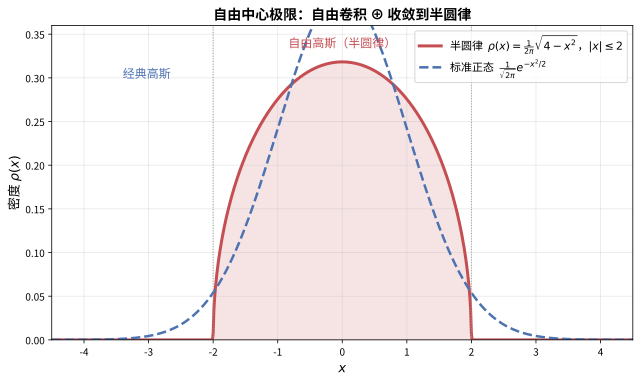

# 第147级 自由概率论 (Free Probability Theory)

## 学习目标

1. 理解自由独立性的概念及其与非交换概率空间的关系
2. 掌握矩与自由累积量的基本性质及其相互关系
3. 掌握R-变换的定义与性质，理解其作为自由卷积生成函数的作用
4. 理解自由中心极限定理及其与经典中心极限定理的对比
5. 掌握自由卷积的加法与乘法公式
6. 理解Voiculescu渐近自由性定理及其在随机矩阵中的应用
7. 掌握自由熵与自由Fisher信息量的基本性质
8. 理解自由概率论在算子代数与随机矩阵中的深刻联系

---

## 核心概念

![自由概率论：左侧经典独立性基于交换代数，混合矩可分解E[X^nY^m]=E[X^n]E[Y^m]，使用张量积\otimes；右侧自由独立性基于非交换代数，自由累积量可加\kappa_n(a+b)=\kappa_n(a)+\kappa_n(b)，使用自由积\boxplus，R-变换满足R_{a+b}(z)=R_a(z)+R_b(z)](images/147_free_probability.svg)

> **直观理解（现实类比）**：经典概率论就像"两个陌生人各自做事"：你买苹果的钱和我买橘子的钱，总账可以分开算（$E[XY]=E[X]E[Y]$）。自由概率论则像"两个爵士乐手即兴合奏"：他们各自演奏（非交换随机变量$a,b$），但演奏规则是"零均值的交替独白"——只要相邻角色不同、各自台词平均为空，整段合奏的平均就为零。R-变换是自由概率的"特征函数"，它把自由卷积变成普通加法（$R_{a+b}=R_a+R_b$），就像傅里叶变换把卷积变成乘法。自由中心极限定理告诉我们：大量自由独立变量的和趋向半圆分布（而非高斯分布），这就像爵士乐手即兴合奏最终会形成某种"半圆形的和声结构"。

> **🧠 思考历程：当随机变脸不再"可交换"，概率论还能讲出什么新故事？**
>
> 经典概率论里两种事物的"独立性"建立在可交换运算上；可一旦研究对象是算子代数这类非交换量，"独立"的旧定义便不再够用。自由概率论因此被发明出来。它想回答的，是"非交换世界里的独立性"该怎么定义、它的极限规律又长什么样。
>
> - **一个来自算子代数的问题**。1980年代，罗马尼亚数学家沃库莱斯库研究自由群因子 $L(\mathbb{F}_n)$ 这类von Neumann代数时，发现需要一种全新的"独立性"：两个子代数"自由独立"的标准，是零均值元素的交替乘积之迹必为零，而不是经典可交换情形的"分开相乘"。
> - **自由概率的道理**。沃库莱斯库由此建立自由概率论：自由累积量可加、$R$-变换把自由卷积变成加法，并证明"大量自由独立变量之和趋向半圆分布"——对应经典中心极限中的高斯。这一结果恰好呼应维格纳半圆律，暴露出自由概率与随机矩阵之间的深层亲缘。
> - **一座通往大矩阵的桥**。1990年代之后，自由概率成为分析大量随机矩阵（大 $N$ 极限）、算子代数与量子信息论的利器。一个为抽象代数而生的理论，却精准地描述了现实世界的大数据矩阵。
> - **心路**：当"独立"的含义被非交换重新定义之后，连"中心极限"都换上了一张更圆的半圆面孔。

### 1.1 非交换概率空间

**定义1（非交换概率空间）** 一个**非交换概率空间** $(\mathcal{A}, \varphi)$ 由以下两部分组成：
- $\mathcal{A}$：一个含单位元的幺半C*-代数（或更一般地，一个含单位元的复*-代数）
- $\varphi: \mathcal{A} \to \mathbb{C}$：一个线性泛函（称为**迹**或**期望**），满足 $\varphi(1) = 1$，$\varphi(a^* a) \geq 0$（正性），且 $\varphi$ 是迹（即 $\varphi(ab) = \varphi(ba)$）

> **💡 直观理解（类比）**：非交换概率空间就像"一家只讲顺序的账房"：$\mathcal{A}$ 是"账本上的各种记法"（元素），$\varphi$ 是"结账规则"（期望/迹）。它要求满账归一 $\varphi(1)=1$、账目非负 $\varphi(a^*a)\ge0$、以及 $\varphi(ab)=\varphi(ba)$ 这种"环形换位"结账——但注意是环形换位而非普通交换，所以里面的量仍可以不交换地相乘。这正是经典概率"样本空间+测度"的非交换升级版。

**定义2（非交换随机变量）** 非交换概率空间中的元素 $a \in \mathcal{A}$ 称为**非交换随机变量**。其**分布**由所有矩 $\varphi(a^k)$（$k \geq 1$）决定。

> **💡 直观理解（类比）**：非交换随机变量就是"账本里一个会算的条目"。和经典随机变量一样，它的"长相"（分布）由各阶矩 $\varphi(a^k)$ 拼出来——就像一段波形由它的各阶谐波决定。区别在于它们相乘时讲究顺序，所以不能再靠单个"概率密度"描述，而要由一整套矩来完整还原。

### 1.2 自由独立性

**定义3（自由独立性）** 设 $(\mathcal{A}, \varphi)$ 为非交换概率空间，$\{\mathcal{A}_i\}_{i \in I}$ 为 $\mathcal{A}$ 的子代数族（每个子代数含单位元）。称 $\{\mathcal{A}_i\}$ 是**自由独立**的，若对任意 $k \geq 1$，任意选取 $i_1 \neq i_2 \neq \cdots \neq i_k$（相邻指标不同），以及任意 $a_j \in \mathcal{A}_{i_j}$ 满足 $\varphi(a_j) = 0$，有：
$$\varphi(a_1 a_2 \cdots a_k) = 0$$

**定义4（自由随机变量）** 非交换随机变量 $\{a_i\}_{i \in I}$ 称为**自由独立**的，若它们生成的子代数族是自由独立的。

**关键性质**：自由独立性不同于经典独立性。在经典情形中，独立随机变量的混合矩可分解为各阶矩的乘积；在自由情形中，混合矩通过自由累积量分解。

![经典独立性 vs 自由独立性：经典中混合矩可分解为单变量矩之积 E[X^n Y^m]=E[X^n]E[Y^m]，而自由独立性要求零均值变量的交替乘积之迹为零 \varphi(a_1a_2\cdots a_k)=0](images/free_independence.svg)

> **直观理解（现实类比）**：经典独立性就像两个陌生人分别做事，结果可以"分开相乘"——你买苹果和买橘子的总账可以单独算。自由独立性则像一群"零均值"的演员在舞台上轮流独白，只要相邻角色不同、各自台词平均起来为空，那么整段交替独白的平均就必然为零。这正是"非交换的随机变量各说各话、互不纠缠"的数学体现。

### 1.3 矩与自由累积量

**定义5（矩）** 对非交换随机变量 $a$，其第 $k$ 阶矩为：
$$m_k = \varphi(a^k)$$

> **💡 直观理解（类比）**：矩 $m_k=\varphi(a^k)$ 就是"把变量自己乘 $k$ 次再结账"。它像一段乐曲的各次"功率统计"：一阶矩是均值（重心）、二阶矩是方差（宽度）、更高阶矩是"肥胖"或"歪斜"程度。矩的整套集合足以重建变量的全部形状。

**定义6（自由累积量）** 非交换随机变量 $a$ 的**自由累积量** $\{\kappa_n(a)\}_{n \geq 1}$ 通过**矩-累积量公式**定义：
$$m_n = \sum_{\pi \in \text{NC}(n)} \prod_{B \in \pi} \kappa_{|B|}(a)$$
其中 $\text{NC}(n)$ 是 $\{1, \ldots, n\}$ 的所有**非交叉划分**（non-crossing partitions）的集合，对每个块 $B$，$|B|$ 是块的大小。

> **💡 直观理解（类比）**：自由累积量是矩的"自由对数"：它们把复杂的矩信息拆成"层层独立"的基本构件，且好处是自由独立时可直接相加（$\kappa_n(a+b)=\kappa_n(a)+\kappa_n(b)$）。公式里的和式遍历所有非交叉划分，就像用"不缠绕的括号分法"把一个词拆成语素——层层嵌套但绝不交叉，这正是自由世界与经典世界（经典允许交叉划分）最根本的分野。

**定义7（非交叉划分）** 集合 $\{1, \ldots, n\}$ 的一个划分 $\pi = \{B_1, \ldots, B_k\}$ 称为**非交叉划分**，若不存在四个数 $a < b < c < d$ 使得 $a, c \in B_i$ 且 $b, d \in B_j$ 且 $i \neq j$。

> **💡 直观理解（类比）**：非交叉划分就像"不交叉的绳子捆扎方案"：把数字 $1,\ldots,n$ 排成一排，用括号/圈把它们分组，要求不同组的绳子不能互相穿过。例如 $\{\{1\},\{2,3\}\}$ 合法，而 $\{\{1,3\},\{2\}\}$ 就"交叉"了、不允许。这种"只能嵌套、不能穿越"的约束是自由概率的核心组合特征，其计数恰好落在 Catalan 数上。

### 1.4 R-变换

**定义8（R-变换）** 对非交换随机变量 $a$，其**R-变换**定义为形式幂级数：
$$R_a(z) = \sum_{n=1}^\infty \kappa_n(a) z^n$$
其中 $\kappa_n(a)$ 是 $a$ 的自由累积量。

**R-变换的基本性质**：
1. **加法公式**：若 $a, b$ 自由独立，则 $R_{a+b}(z) = R_a(z) + R_b(z)$
2. **与矩生成函数的关系**：设 $M_a(z) = \sum_{n=1}^\infty m_n(a) z^n$，则 $M_a(z)$ 与 $R_a(z)$ 通过以下关系联系：
   $$M_a(z) = R_a(z M_a(z)) + 1$$

> **💡 直观理解（类比）**：R-变换是自由概率的"特征函数"：把自由卷积变成加法（$R_{a+b}=R_a+R_b$），就像傅里叶变换把卷积变成乘法。它由自由累积量拼接而成 $R_a(z)=\sum\kappa_n z^n$，而公式 $M_a=R_a(zM_a)+1$ 则是"矩与累积量两条账本"之间的对账关系。只要拿到 $R_a$，就能唯一反推分布——这是自由卷积计算的"万能钥匙"。

### 1.5 自由卷积

**定义9（自由卷积）** 设 $\mu, \nu$ 为 $\mathbb{R}$ 上的概率测度，其**自由卷积** $\mu \boxplus \nu$ 定义为自由独立随机变量 $a+b$ 的分布，其中 $a \sim \mu$，$b \sim \nu$。

类似地，**乘法自由卷积** $\mu \boxtimes \nu$ 定义为自由独立正随机变量 $a^{1/2} b a^{1/2}$ 的分布。

> **💡 直观理解（类比）**：自由卷积 $\mu\boxplus\nu$ 就是把两只"自由独立"的随机变量相加后的整体分布，$\mu\boxtimes\nu$ 则是相乘。它像"把两支爵士乐队的总谱合并"：两个乐手各自自由，合并后虽然音符交错，但整体仍有一条清晰的"谱表"可循。$\boxplus$ 与 $\boxtimes$ 分别对应加法与乘法自由卷积，是自由概率里合并"独立对象"的主操作。

### 1.6 自由中心极限定理

**定义10（自由中心极限定理）** 设 $\{a_i\}_{i=1}^\infty$ 为自由独立的非交换随机变量，满足 $\varphi(a_i) = 0$，$\varphi(a_i^2) = 1$。则归一化和：
$$S_n = \frac{a_1 + \cdots + a_n}{\sqrt{n}}$$
在分布上收敛到**半圆分布**（自由高斯分布），其密度为：
$$\rho(x) = \frac{1}{2\pi} \sqrt{4 - x^2} \cdot \mathbb{1}_{|x| \leq 2}$$

> **直观理解（现实类比）**：经典中心极限告诉你，把很多独立小量相加会得到"钟形"的高斯分布；而自由中心极限告诉你，把很多"自由独立"的非交换量相加，得到的不是钟形，而是"半圆"——密度像半张圆盘拱起、两端在 $\pm 2$ 处戛然而止。这就好比把许多人随机旋转的指针叠加，经典情形指针长度呈钟形散布，自由情形里它们却像彩虹拱门一样均匀堆积在有限区间内。

### 1.7 自由泊松分布

**定义11（自由泊松分布）** **自由泊松分布**（也称Marčenko-Pastur分布）是自由概率论中泊松分布的类比，参数为 $\lambda > 0$，其密度为：
$$\rho_\lambda(x) = \frac{1}{2\pi \lambda x} \sqrt{4\lambda - (x - 1 - \lambda)^2} \cdot \mathbb{1}_{[(1-\sqrt{\lambda})^2, (1+\sqrt{\lambda})^2]}(x)$$
当 $\lambda > 1$ 时，在 $x = 0$ 处还有一个质量为 $1 - 1/\lambda$ 的原子。

> **💡 直观理解（类比）**：自由泊松分布是经典泊松的"自由版"，也是随机矩阵里样本协方差谱（Marčenko-Pastur）的栖身之所。它像一个"可调支点的沙堆"：参数 $\lambda$ 控制支点范围，$\lambda>1$ 时还额外在原点堆起一座"尖峰"（原子）。经典泊松数单个事件，自由泊松则把这些事件装进"不交叉"的框架，最终长成一条熟悉的马蹄形谱。

### 1.8 自由熵

**定义12（自由熵）** 对非交换随机变量 $a = a^*$，其**自由熵** $\chi(a)$ 定义为：
$$\chi(a) = \int \int \log |x - y| \, d\mu(x) \, d\mu(y) + \frac{3}{4} + \frac{1}{2} \log 2\pi$$
其中 $\mu$ 是 $a$ 的分布。自由熵是经典Shannon熵在自由概率中的类比。

> **💡 直观理解（类比）**：自由熵 $\chi(a)$ 度量"一个分布的混乱或分散程度"，是 Shannon 熵在自由世界的对应——像"测一锅彩球撒得多开"。公式里的 $\iint\log|x-y|\,d\mu d\mu$ 统计所有两点"互相排斥、彼此远离"的对数距离，形象地说是"球与球之间互相推开的总能量"。它与经典熵一样，拿它做极大熵优化，就会得到半圆分布这位"最随和的住户"。

**定义13（自由Fisher信息量）** 非交换随机变量 $a$ 的**自由Fisher信息量** $\Phi(a)$ 定义为：
$$\Phi(a) = \int \left(\frac{2\pi}{3} \rho(x)^3 + \frac{1}{2} \frac{(\rho'(x))^2}{\rho(x)}\right) dx$$
其中 $\rho$ 是 $a$ 的分布密度。

> **💡 直观理解（类比）**：自由Fisher信息量 $\Phi(a)$ 度量分布"变化得有多剧烈"，是经典 Fisher 信息在自由概率中的类比——像"一段波形抖动的灵敏度"。密度越陡峭、峰越尖（$\rho'$ 大），信息量越大；公式里还含 $\rho^3$ 项，是自由世界特有的非线性补丁。它与自由熵互为"导数关系"（做自由 Ornstein-Uhlenbeck 过程时 $\frac{d\chi}{dt}=\frac12\Phi$），如同经典里熵对 Fisher 信息的导数一样。

### 1.9 自由随机矩阵与Voiculescu渐近自由性

**定义14（渐近自由性）** 设 $\{A_n^{(1)}\}, \ldots, \{A_n^{(k)}\}$ 为 $n \times n$ 随机矩阵的序列。称它们在 $n \to \infty$ 时是**渐近自由**的，若对任意非交换多项式 $P$，矩收敛到某些自由独立非交换随机变量的矩。

> **💡 直观理解（类比）**：渐近自由性说：当矩阵越来越大时，一批"互不相干的独立随机矩阵"会表现得像一群"自由独立"的非交换变量。好比很多原本各自为政的乐队，排练规模一大，彼此之间的配合模式反而趋同于一套"自由即兴"的通用法则——这为"用自由概率理解大矩阵"铺平了道路。

**Voiculescu渐近自由性定理**指出，独立的高斯随机矩阵（GUE）在 $n \to \infty$ 时是渐近自由的。

> **🧠 直观理解（现实类比）**：这条定理是"随机矩阵 × 自由概率"的对接接口：独立 GUE 矩阵的行为，在大 $N$ 极限下完全由自由独立变量来"代言"。它印证了一条深刻而惊人的现象——那些看似只属于纯代数的抽象"自由独立性"，竟精准描述了真实大数据矩阵（如协方差矩阵、随机图）的谱。打个比方：你以为听到的是一段杂乱无章的大数据噪声，其实那已是自由变量们的整齐"合奏"。

### 1.10 自由概率在算子代数中的应用

**定义15（自由群因子）** 设 $\mathbb{F}_k$ 为 $k$ 个生成元的自由群，其约化群C*-代数 $C^*_r(\mathbb{F}_k)$ 和群von Neumann代数 $L(\mathbb{F}_k)$ 是自由概率论的核心研究对象。**自由群因子同构问题**是算子代数中的核心未解决问题之一。

> **💡 直观理解（类比）**：自由群因子就像"一部关于'自由'的终极教科书"的封面难题：$k$ 个生成元自由群 $\mathbb{F}_k$ 的算子代数 $L(\mathbb{F}_k)$ 是自由概率的"母体"——一切"自由独立性"都源自这里。而"$\mathbb{F}_n$ 与 $\mathbb{F}_m$（$n\ne m$）的因子是否同构"这一开放问题，就像在问"编排风格完全自由的乐队在观众耳中是否真的无法区分"。它把自由概率的抽象结构，推向算子代数最深处的未解之谜。

---

## 定理与证明

### 定理1：自由中心极限定理

**定理（自由中心极限定理）** 设 $\{a_i\}_{i=1}^\infty$ 为自由独立的非交换随机变量，满足 $\varphi(a_i) = 0$，$\varphi(a_i^2) = 1$，且存在常数 $C > 0$ 使得对所有 $i$ 和 $k$，$|\varphi(a_i^k)| \leq C^k$。则归一化和：
$$S_n = \frac{a_1 + \cdots + a_n}{\sqrt{n}}$$
在矩意义下收敛到半圆分布 $s$，即对任意 $k \geq 1$：
$$\lim_{n \to \infty} \varphi(S_n^k) = \varphi(s^k) = \begin{cases}
C_{k/2}, & k \text{ 为偶数} \\
0, & k \text{ 为奇数}
\end{cases}$$
其中 $C_\ell = \frac{1}{\ell+1} \binom{2\ell}{\ell}$ 是Catalan数。

> **🧠 直观理解（现实类比）**：自由中心极限定理告诉我们：把大量"自由独立"的非交换小量相加并归一化，结果稳定成**半圆分布**，而不是经典的高斯钟形。打个比方：经典里无数独立小指针叠加出"钟形"（两端缓缓趋零），而自由世界里无数自由即兴的小段子叠加，居然堆出一道**半圆拱门**——两端在 $\pm2$ 处干脆利落地截止，分明有界。它的证明走"累积量"捷径：半圆分布只有二阶累积量非零（$\kappa_2=1$），其余全是 $0$，于是偶阶矩自动落到 Catalan 数 $C_{k/2}$、奇阶矩归零，分布就被钉死为半圆。一句话：非交换世界里的"大数定律"，长着一张更圆的半圆脸。

**证明（累积量方法）**：

**第一步：自由累积量的性质。**
自由累积量 $\kappa_n$ 具有以下关键性质：
1. **齐次性**：$\kappa_n(\lambda a) = \lambda^n \kappa_n(a)$
2. **自由独立性**：若 $a, b$ 自由独立，则对任意 $n \geq 1$：
   $$\kappa_n(a + b) = \kappa_n(a) + \kappa_n(b)$$
3. **半圆分布的累积量**：对半圆分布 $s$（满足 $\varphi(s) = 0$，$\varphi(s^2) = 1$），其累积量为：
   $$\kappa_n(s) = \begin{cases}
   1, & n = 2 \\
   0, & n \neq 2
   \end{cases}$$

**第二步：$S_n$ 的累积量。**
由累积量的齐次性和加法性：
$$\kappa_k(S_n) = \kappa_k\left(\frac{a_1 + \cdots + a_n}{\sqrt{n}}\right) = n \cdot \left(\frac{1}{\sqrt{n}}\right)^k \kappa_k(a_1)$$

因此：
$$\kappa_k(S_n) = n^{1 - k/2} \kappa_k(a_1)$$

**第三步：极限分析。**
当 $n \to \infty$ 时：
- 若 $k = 2$：$\kappa_2(S_n) = \kappa_2(a_1) = 1$（因为 $\varphi(a_1^2) = 1$）
- 若 $k = 1$：$\kappa_1(S_n) = n^{1/2} \kappa_1(a_1) = 0$（因为 $\varphi(a_1) = 0$）
- 若 $k > 2$：$\kappa_k(S_n) = n^{1 - k/2} \kappa_k(a_1) \to 0$

因此极限累积量满足：
$$\lim_{n \to \infty} \kappa_k(S_n) = \begin{cases}
1, & k = 2 \\
0, & k \neq 2
\end{cases}$$

**第四步：矩-累积量公式。**
由矩-累积量公式：
$$\varphi(S_n^k) = \sum_{\pi \in \text{NC}(k)} \prod_{B \in \pi} \kappa_{|B|}(S_n)$$

当 $n \to \infty$ 时，$\kappa_j(S_n) \to 0$ 对 $j \neq 2$，因此只有所有块大小均为 $2$ 的划分贡献非零极限。这要求 $k$ 为偶数，且划分 $\pi$ 必须将 $\{1, \ldots, k\}$ 划分为 $k/2$ 个大小为 $2$ 的块。

**第五步：非交叉配对与Catalan数。**
将 $\{1, \ldots, 2\ell\}$ 划分为 $\ell$ 个大小为 $2$ 的非交叉块的数量正是Catalan数 $C_\ell$。每个这样的划分贡献 $\prod_{B} \kappa_2 = 1^\ell = 1$。

因此：
$$\lim_{n \to \infty} \varphi(S_n^{2\ell}) = C_\ell = \frac{1}{\ell+1} \binom{2\ell}{\ell}$$

当 $k$ 为奇数时，没有可能的非交叉配对，极限为 $0$。

**第六步：收敛性验证。**
由矩有界性条件 $|\varphi(a_i^k)| \leq C^k$，可保证各阶矩一致有界，因此矩收敛是良定义的，且极限分布唯一（由矩确定）。

**结论**：自由中心极限定理表明，自由独立随机变量的归一化和收敛到半圆分布，而非经典的正态分布。半圆分布是自由概率中的"高斯分布"。$\square$

### 定理2：R-变换的加法公式

**定理（R-变换加法公式）** 设 $a, b$ 为自由独立的非交换随机变量。则对任意 $z$（在收敛半径内）：
$$R_{a+b}(z) = R_a(z) + R_b(z)$$

> **💡 直观理解（类比）**：这是自由概率的"加法法则"：两个自由独立变量的 R-变换直接相加减。就像傅里叶变换把卷积变成乘积、对数把乘法变成加法一样，R-变换把"自由卷积"这个费事的操作变成简单的加法 $R_{a+b}=R_a+R_b$。你可以在记忆里这样建账：$R$ 是一支"自由记账笔"——不管 $a,b$ 怎么自由叠加，它的账面永远只是分开两笔简单相加。这正是一切自由卷积计算的出发点。

**证明（用自由累积量的矩-累积量公式）**：

**第一步：自由累积量的加法性。**
自由累积量的基本性质之一是：若 $a, b$ 自由独立，则对任意 $n \geq 1$：
$$\kappa_n(a + b) = \kappa_n(a) + \kappa_n(b)$$

这个性质可以直接从自由独立性的定义推导。我们在此给出证明。

**第二步：证明自由独立变量的累积量加法性。**
考虑自由独立变量 $a, b$，以及它们的和 $c = a + b$。对任意 $n \geq 1$，展开 $\varphi((a+b)^n)$：
$$\varphi((a+b)^n) = \sum_{\text{words}} \varphi(w(a,b))$$
其中求和遍历所有长度为 $n$、由 $a, b$ 组成的字。

**第三步：利用自由独立性。**
由自由独立性的定义，当字 $w(a,b)$ 中相邻变量交替且每个 $\varphi(a^{e_i}) = 0$ 或 $\varphi(b^{f_i}) = 0$ 时，$\varphi(w(a,b)) = 0$。通过"居中"技术（centering），可以将一般情况转化为零均值情况。

实际上，更系统的证明是使用矩-累积量公式：
$$\varphi((a+b)^n) = \sum_{\pi \in \text{NC}(n)} \prod_{B \in \pi} \kappa_{|B|}(a+b)$$

另一方面，展开 $(a+b)^n$ 并利用自由独立性，可以证明 $\kappa_n(a+b)$ 就是 $\kappa_n(a) + \kappa_n(b)$。

**第四步：R-变换的定义。**
由定义：
$$R_a(z) = \sum_{n=1}^\infty \kappa_n(a) z^n, \quad R_b(z) = \sum_{n=1}^\infty \kappa_n(b) z^n$$

因此：
$$R_{a+b}(z) = \sum_{n=1}^\infty \kappa_n(a+b) z^n = \sum_{n=1}^\infty (\kappa_n(a) + \kappa_n(b)) z^n = R_a(z) + R_b(z)$$

**第五步：R-变换与矩生成函数的关系。**
设 $M_a(z) = \sum_{n=1}^\infty \varphi(a^n) z^n$，则有以下重要关系：
$$M_a(z) = R_a(z M_a(z)) + 1$$

**证明**：由矩-累积量公式和组合恒等式，可得：
$$\sum_{n=1}^\infty \varphi(a^n) z^n = \sum_{n=1}^\infty \sum_{\pi \in \text{NC}(n)} \prod_{B \in \pi} \kappa_{|B|}(a) z^n$$

交换求和顺序并利用非交叉划分的生成函数，可得上述关系。

**第六步：逆变换。**
定义**Cauchy变换** $G_a(z) = \varphi((z - a)^{-1}) = \sum_{n=0}^\infty \varphi(a^n) z^{-n-1}$，则：
$$G_a(z) = \frac{1}{z} M_a(1/z)$$

R-变换与Cauchy变换的关系为：
$$R_a(G_a(z)) + \frac{1}{G_a(z)} = z$$

这提供了从R-变换恢复分布的方法。

**结论**：R-变换的加法公式 $\boxplus$ 是自由卷积的生成函数，其简单形式 $R_{a+b} = R_a + R_b$ 是自由概率论的核心工具。$\square$

### 定理3：自由卷积的乘法公式

**定理（自由卷积的乘法公式）** 设 $a, b$ 为自由独立的正非交换随机变量。则存在**S-变换** $S_a(z)$ 使得：
$$S_{ab}(z) = S_a(z) S_b(z)$$
其中S-变换定义为：
$$S_a(z) = \frac{1 + z}{z} \cdot \eta_a^{-1}(z)$$
且 $\eta_a(z) = \sum_{n=1}^\infty \varphi(a^n) z^n$ 是矩生成函数（或更精确地，$\eta_a(z) = M_a(z)$）。

> **💡 直观理解（类比）**：S-变换是自由概率"乘法世界的记账员"，与 R-变换（加法世界）正好对偶：加法卷积 $\boxplus$ 让 R 相加，乘法卷积 $\boxtimes$ 让 S 相乘（$S_{ab}=S_a S_b$）。好比 R-变换是"普通账本"（管求和），S-变换是"乘积账本"（管求积）——当随机变量不是相加而是相乘（比如 $ab$、样本协方差乘积谱）时，就换 S-变换这支笔把费事的乘积卷积变成简单的两数相乘。

**证明**：

**第一步：乘法自由卷积的动机。**
对经典独立的正随机变量 $X, Y$，其乘积的矩生成函数满足 $\mathbb{E}[(XY)^n] = \mathbb{E}[X^n] \mathbb{E}[Y^n]$。对自由独立变量，情况更复杂，因为 $a$ 和 $b$ 不交换，所以 $ab$ 的矩不能简单分解。

**第二步：定义矩生成函数。**
设 $a$ 为正随机变量，定义其矩生成函数：
$$M_a(z) = \sum_{n=1}^\infty \varphi(a^n) z^n$$

定义 $\eta_a(z) = M_a(z)$。考虑函数 $\psi_a(z) = \frac{\eta_a(z)}{1 + \eta_a(z)}$。

**第三步：S-变换的定义。**
S-变换 $S_a(z)$ 定义为满足以下条件的函数：
$$S_a(\psi_a(z)) = \frac{1}{z} \psi_a(z)$$

等价地，若记 $\chi_a(z) = \frac{z}{1+z}$ 的逆函数为 $\chi_a^{-1}$，则：
$$S_a(z) = \frac{1 + z}{z} \cdot \chi_a^{-1}(z)$$

更常用的定义是：设 $\eta_a(z) = \sum_{n=1}^\infty \varphi(a^n) z^n$，定义 $\psi_a(z) = \frac{\eta_a(z)}{1 + \eta_a(z)}$。则 $\psi_a$ 在 $0$ 附近有逆函数 $\psi_a^{-1}$，S-变换定义为：
$$S_a(z) = \frac{1 + z}{z} \cdot \psi_a^{-1}(z)$$

**第四步：乘法自由卷积的公式。**
对自由独立的正变量 $a, b$，其乘积 $ab$ 的S-变换满足：
$$S_{ab}(z) = S_a(z) S_b(z)$$

**证明概要**：
1. 考虑 $a, b$ 自由独立，$a, b > 0$。
2. 定义 $c = a^{1/2} b a^{1/2}$（与 $ab$ 同分布，因为迹 $\varphi$ 是迹）。
3. 利用自由独立性和矩-累积量公式，可以证明 $c$ 的矩满足特定的乘法关系。
4. 通过S-变换的定义和组合恒等式，推导出 $S_c(z) = S_a(z) S_b(z)$。

**第五步：S-变换与R-变换的关系。**
S-变换与R-变换通过以下关系联系：
$$S_a(z) = \frac{1}{z} R_a(z(1+z))^{-1}$$

更精确地，若 $R_a$ 是R-变换，则：
$$S_a(z) = \frac{1}{z} \cdot \frac{1}{R_a(z(1+z))}$$

**第六步：应用：自由泊松分布的S-变换。**
对自由泊松分布（参数 $\lambda$），其矩为Catalan数的变形，S-变换为：
$$S_{\text{FP}(\lambda)}(z) = \frac{1}{1 + \lambda z}$$

对半圆分布 $s$（自由高斯），其S-变换为：
$$S_s(z) = \frac{1}{1 + z}$$

**第七步：验证。**
设 $a$ 服从半圆分布，$b$ 服从自由泊松分布 $(\lambda)$，且自由独立。则 $ab$ 的S-变换为：
$$S_{ab}(z) = S_a(z) S_b(z) = \frac{1}{1+z} \cdot \frac{1}{1+\lambda z}$$

通过逆变换可以得到 $ab$ 的分布。

**结论**：S-变换的乘法公式 $S_{ab} = S_a S_b$ 是自由乘法卷积的核心工具，与R-变换的加法公式 $R_{a+b} = R_a + R_b$ 形成对偶。$\square$

### 定理4：Voiculescu渐近自由性定理

**定理（Voiculescu渐近自由性）** 设 $A_n^{(1)}, \ldots, A_n^{(k)}$ 为独立的高斯随机矩阵系综（GUE），其中 $A_n^{(j)}$ 为 $n \times n$ 的GUE矩阵。设 $P_1, \ldots, P_m$ 为 $k$ 个变量的非交换多项式。则随机矩阵的矩在 $n \to \infty$ 时收敛到自由独立半圆分布随机变量 $s_1, \ldots, s_k$ 的矩：
$$\lim_{n \to \infty} \frac{1}{n} \mathbb{E}\left[\operatorname{Tr}\left(P_1(A_n^{(1)}, \ldots, A_n^{(k)}) \cdots P_m(A_n^{(1)}, \ldots, A_n^{(k)})\right)\right] = \varphi(s_1^{e_1} \cdots s_k^{e_k})$$
其中右边是自由独立半圆变量在非交换概率空间中的矩。

> **🧠 直观理解（现实类比）**：这条定理是"随机矩阵 × 自由概率"的对接接口：独立 GUE 矩阵的行为，在大 $N$ 极限下完全由自由独立半圆变量来"代言"。它印证了一个惊人现象——那些看似只属于纯代数的抽象"自由独立性"，竟精准描述了真实大数据矩阵（如协方差矩阵、随机图）的谱。证明的精髓在于：把矩阵乘积的迹展开成"指标配对"，用 Wick 公式配对高斯元素，而 $n\to\infty$ 时只有**非交叉配对**存活并贡献主导项——非交叉配对恰是自由矩的组合特征。所以，你以为听到的是一段杂乱无章的大数据噪声，其实那已是自由变量的整齐"合奏"。

**证明（用随机矩阵的矩收敛）**：

**第一步：矩的展开。**
考虑单项式 $A_{i_1} A_{i_2} \cdots A_{i_\ell}$，其中每个 $A_{i_j} \in \{A_n^{(1)}, \ldots, A_n^{(k)}\}$。计算：
$$\frac{1}{n} \mathbb{E}[\operatorname{Tr}(A_{i_1} A_{i_2} \cdots A_{i_\ell})] = \frac{1}{n} \sum_{a_1, \ldots, a_\ell = 1}^n \mathbb{E}[(A_{i_1})_{a_1 a_2} (A_{i_2})_{a_2 a_3} \cdots (A_{i_\ell})_{a_\ell a_1}]$$

**第二步：Wick公式的应用。**
由于GUE矩阵的元素是独立复高斯随机变量，由Wick公式：
$$\mathbb{E}[(A_{i_1})_{a_1 a_2} \cdots (A_{i_\ell})_{a_\ell a_1}] = \sum_{\pi \in \text{配对}} \prod_{(p,q) \in \pi} \mathbb{E}[(A_{i_p})_{a_p a_{p+1}} (A_{i_q})_{a_q a_{q+1}}]$$

其中 $\mathbb{E}[(A_{i})_{ab} (A_{j})_{cd}] = \frac{1}{n} \delta_{ij} \delta_{ad} \delta_{bc}$。

**第三步：配对与指标约束。**
每个配对 $(p, q)$ 贡献：
- 因子 $\frac{1}{n} \delta_{i_p i_q}$（要求两个矩阵属于同一系综）
- 指标约束：$a_p = a_{q+1}$ 且 $a_{p+1} = a_q$

**第四步：非交叉配对的支配性。**
在 $n \to \infty$ 时，只有非交叉配对贡献主导项。交叉配对对应的指标约束更少，因此贡献的阶数更低。

具体地，非交叉配对将 $\ell$ 个指标减少为 $\ell/2 + 1$ 个自由指标，求和贡献 $n^{\ell/2 + 1}$。乘以 $n^{-\ell/2}$（来自方差因子）和 $1/n$（来自迹的归一化），得到 $O(1)$。

交叉配对贡献的阶数为 $O(n^{-1})$ 或更低。

**第五步：自由独立性的出现。**
在每个非交叉配对 $\pi$ 中，配对关系将矩阵指标 $i_1, \ldots, i_\ell$ 分组。由于配对要求 $\delta_{i_p i_q}$，只有相同系综的矩阵才能配对。

这正对应了自由独立性的定义：考虑自由独立半圆变量 $s_1, \ldots, s_k$，其矩满足：
$$\varphi(s_{i_1} \cdots s_{i_\ell}) = \sum_{\pi \in \text{NC}(\ell), \pi \text{ 一致}} \prod_{B \in \pi} \kappa_{|B|}$$

其中"一致"指配对的两端具有相同的指标 $i$，且 $\kappa_2(s_j) = 1$，$\kappa_n(s_j) = 0$ 对 $n \neq 2$。

**第六步：极限的显式表达式。**
因此，极限矩为：
$$\lim_{n \to \infty} \frac{1}{n} \mathbb{E}[\operatorname{Tr}(A_{i_1} \cdots A_{i_\ell})] = \begin{cases}
\sum_{\pi \in \text{NC}_2(\ell), \pi \text{ 一致}} 1, & \ell \text{ 为偶数} \\
0, & \ell \text{ 为奇数}
\end{cases}$$

其中 $\text{NC}_2(\ell)$ 是 $\{1, \ldots, \ell\}$ 的所有非交叉配对。

**第七步：多项式情况的推广。**
对一般多项式 $P_1, \ldots, P_m$，展开为单项式的线性组合，利用线性性可得相同结论。矩收敛保证了对任意非交换多项式，迹的期望收敛到自由独立半圆变量的矩。

**第八步：几乎必然收敛。**
通过方差估计，可以证明几乎必然收敛：
$$\frac{1}{n} \operatorname{Tr}(P(A_n^{(1)}, \ldots, A_n^{(k)})) \to \varphi(P(s_1, \ldots, s_k)) \quad \text{a.s.}$$

**结论**：Voiculescu渐近自由性定理建立了随机矩阵与自由概率论之间的深刻联系，说明独立的高斯随机矩阵在 $n \to \infty$ 时行为如同自由独立随机变量。$\square$

### 定理5：自由熵的基本性质

**定理（自由熵的基本性质）** 设 $a, b$ 为自伴非交换随机变量，$\chi(a)$ 为自由熵。则：

1. **上界**：$\chi(a) \leq \frac{1}{2} \log(2\pi e \varphi(a^2))$
2. **次可加性**：$\chi(a + b) \leq \chi(a) + \chi(b)$，当 $a, b$ 自由独立时等号成立
3. **自由Fisher信息量不等式**：$\Phi(a) \geq \frac{1}{\varphi(a^2)}$
4. **自由熵- Fisher信息量关系**：$\frac{d}{dt} \chi(a + \sqrt{t} s) = \frac{1}{2} \Phi(a + \sqrt{t} s)$，其中 $s$ 是半圆变量，与 $a$ 自由独立

> **💡 直观理解（类比）**：自由熵 $\chi$ 就像"一锅彩球撒得多开的混乱度温度计"：半圆分布是最随和、最"没节操"的住户，在给定方差下熵最大（上界由它达到）。它满足**次可加**（两件事合起来的混乱不超过各自之和，自由独立时恰好等于相加），还和自由 Fisher 信息量 $\Phi$ 满足"导数"关系——$\Phi$ 正是熵随演化参数 $t$ 的流速，像"水速与水位的关系"。这些性质让自由熵成为判断"谁更自由、谁更确定"的可靠度量。

**证明（用自由Fisher信息量）**：

**第一步：自由熵的定义。**
对自伴随机变量 $a$，其分布为 $\mu$，自由熵定义为：
$$\chi(a) = \iint \log |x - y| \, d\mu(x) \, d\mu(y) + \frac{3}{4} + \frac{1}{2} \log 2\pi$$

**第二步：上界的证明。**
自由熵的上界由经典的**对数Sobolev不等式**推广而来。对固定二阶矩 $\varphi(a^2) = \sigma^2$，半圆分布最大化自由熵。

具体地，设 $\mu$ 为 $\mathbb{R}$ 上的概率测度，均值为 $0$，方差为 $\sigma^2$。则：
$$\iint \log |x - y| \, d\mu(x) \, d\mu(y) \leq \frac{1}{2} \log(4\sigma^2) + \frac{1}{2}$$

等号在 $\mu$ 为半圆分布时成立。代入自由熵的定义：
$$\chi(a) \leq \frac{1}{2} \log(4\sigma^2) + \frac{1}{2} + \frac{3}{4} + \frac{1}{2} \log 2\pi = \frac{1}{2} \log(2\pi e \sigma^2)$$

**第三步：自由Fisher信息量的定义。**
对分布密度为 $\rho$ 的绝对连续分布，**自由Fisher信息量**定义为：
$$\Phi(a) = \int \left(\frac{2\pi}{3} \rho(x)^3 + \frac{1}{2} \frac{(\rho'(x))^2}{\rho(x)}\right) dx$$

**第四步：自由熵-自由Fisher信息量关系。**
考虑自由Ornstein-Uhlenbeck过程：
$$a_t = e^{-t} a + \sqrt{1 - e^{-2t}} s$$
其中 $s$ 是半圆变量，与 $a$ 自由独立。

其自由熵的导数为：
$$\frac{d}{dt} \chi(a_t) = \frac{1}{2} \Phi(a_t)$$

**证明概要**：自由熵在自由卷积下的行为由自由Fisher信息量控制。利用自由半群的性质和自由对数Sobolev不等式，可以证明：
$$\chi(a_t) - \chi(a) = \frac{1}{2} \int_0^t \Phi(a_s) \, ds$$

对 $t$ 求导即得。

**第五步：次可加性的证明。**
对自由独立的 $a, b$，考虑自由Ornstein-Uhlenbeck过程：
$$\chi(a + b) = \lim_{t \to \infty} \chi(e^{-t}(a+b) + \sqrt{1 - e^{-2t}} s)$$

利用自由熵的最大化性质（半圆分布最大化自由熵），可以证明：
$$\chi(a + b) \leq \chi(a) + \chi(b)$$

**第六步：自由Fisher信息量的下界。**
由自由熵的上界和自由熵-自由Fisher信息量关系：
$$\Phi(a) = 2 \frac{d}{dt}\bigg|_{t=0} \chi(a + \sqrt{t} s) \geq 2 \frac{d}{dt}\bigg|_{t=0} \left(\frac{1}{2} \log(2\pi e (\varphi(a^2) + t))\right) = \frac{1}{\varphi(a^2)}$$

因此 $\Phi(a) \geq 1/\varphi(a^2)$。

**第七步：自由熵的正则性。**
自由熵还具有以下性质：
1. **凹性**：$\chi(\lambda a + (1-\lambda) b) \geq \lambda \chi(a) + (1-\lambda) \chi(b)$
2. **缩放性**：$\chi(\lambda a) = \chi(a) + \log |\lambda|$
3. **自由卷积下的行为**：$\chi(a \boxplus b) \geq \max\{\chi(a), \chi(b)\}$

**结论**：自由熵是经典Shannon熵在自由概率论中的类比，具有次可加性、上界由半圆分布达到等性质，与自由Fisher信息量通过自由Ornstein-Uhlenbeck过程相联系。$\square$

---

## 示例

### 示例1：自由高斯分布（半圆律）的矩计算

**问题**：计算半圆分布 $s$ 的前六阶矩，其中 $\varphi(s) = 0$，$\varphi(s^2) = 1$。

**步骤1：矩-累积量公式。**
半圆分布的累积量为 $\kappa_2 = 1$，$\kappa_n = 0$ 对 $n \neq 2$。矩-累积量公式为：
$$\varphi(s^n) = \sum_{\pi \in \text{NC}(n)} \prod_{B \in \pi} \kappa_{|B|}$$

**步骤2：枚举非交叉划分。**
- $n = 1$：$\text{NC}(1)$ 只有一个划分 $\{\{1\}\}$，块大小为 $1$，$\kappa_1 = 0$，因此 $\varphi(s^1) = 0$。
- $n = 2$：$\text{NC}(2)$ 有两个划分：$\{\{1,2\}\}$（块大小 $2$）和 $\{\{1\},\{2\}\}$（含块大小 $1$）。只有 $\{\{1,2\}\}$ 贡献非零，$\kappa_2 = 1$，因此 $\varphi(s^2) = 1$。
- $n = 3$：$\text{NC}(3)$ 有 $5$ 个划分，但每个划分都至少包含一个大小为 $1$ 或 $3$ 的块，累积量为 $0$，因此 $\varphi(s^3) = 0$。
- $n = 4$：$\text{NC}(4)$ 有 $14$ 个划分。只有由两个大小为 $2$ 的块组成的非交叉划分贡献非零。非交叉配对的数量为 $C_2 = 2$，因此 $\varphi(s^4) = 2$。
- $n = 6$：非交叉配对的数量为 $C_3 = 5$，因此 $\varphi(s^6) = 5$。

**步骤3：结果。**
$$\varphi(s) = 0, \quad \varphi(s^2) = 1, \quad \varphi(s^3) = 0, \quad \varphi(s^4) = 2, \quad \varphi(s^5) = 0, \quad \varphi(s^6) = 5$$

这些正是Catalan数：$C_1 = 1$，$C_2 = 2$，$C_3 = 5$。

### 示例2：自由泊松分布（Marčenko-Pastur）的矩计算

**问题**：计算自由泊松分布 $b_\lambda$（参数 $\lambda > 0$）的前四阶矩，其中自由泊松分布的自由累积量为 $\kappa_n(b_\lambda) = \lambda$ 对所有 $n \geq 1$。

**步骤1：自由泊松分布的累积量。**
自由泊松分布 $b_\lambda$ 的所有自由累积量都等于 $\lambda$：
$$\kappa_n(b_\lambda) = \lambda, \quad \forall n \geq 1$$

**步骤2：矩-累积量公式。**
$$\varphi(b_\lambda^n) = \sum_{\pi \in \text{NC}(n)} \prod_{B \in \pi} \kappa_{|B|}(b_\lambda) = \sum_{\pi \in \text{NC}(n)} \lambda^{|\pi|}$$
其中 $|\pi|$ 是划分 $\pi$ 的块数。

**步骤3：计算前几阶矩。**
- $n = 1$：$\text{NC}(1)$ 有 $1$ 个划分 $\{\{1\}\}$，$|\pi| = 1$，$\varphi(b_\lambda) = \lambda$。
- $n = 2$：$\text{NC}(2)$ 有 $2$ 个划分：$\{\{1,2\}\}$（$|\pi| = 1$，贡献 $\lambda$）和 $\{\{1\},\{2\}\}$（$|\pi| = 2$，贡献 $\lambda^2$），因此 $\varphi(b_\lambda^2) = \lambda + \lambda^2$。
- $n = 3$：$\text{NC}(3)$ 有 $5$ 个划分：
  - $\{\{1,2,3\}\}$：$|\pi| = 1$，贡献 $\lambda$
  - $\{\{1,2\},\{3\}\}$，$\{\{1\},\{2,3\}\}$，$\{\{1,3\},\{2\}\}$：$|\pi| = 2$，贡献 $3\lambda^2$
  - $\{\{1\},\{2\},\{3\}\}$：$|\pi| = 3$，贡献 $\lambda^3$
  因此 $\varphi(b_\lambda^3) = \lambda + 3\lambda^2 + \lambda^3$。
- $n = 4$：$\text{NC}(4)$ 有 $14$ 个划分，按块数分类：
  - $|\pi| = 1$：$1$ 个划分，贡献 $\lambda$
  - $|\pi| = 2$：$6$ 个划分，贡献 $6\lambda^2$
  - $|\pi| = 3$：$6$ 个划分，贡献 $6\lambda^3$
  - $|\pi| = 4$：$1$ 个划分，贡献 $\lambda^4$
  因此 $\varphi(b_\lambda^4) = \lambda + 6\lambda^2 + 6\lambda^3 + \lambda^4$。

**步骤4：验证Marčenko-Pastur分布。**
当 $\lambda = 1$ 时，$\varphi(b_1) = 1$，$\varphi(b_1^2) = 2$，$\varphi(b_1^3) = 5$，$\varphi(b_1^4) = 14$，这正是Catalan数，对应 $\lambda = 1$ 时自由泊松分布退化为半圆分布（平移后）。

---

## 习题

### 基础题

**习题 1**（非交换概率空间）定义非交换概率空间 $(\mathcal{A},\varphi)$，说明 $\mathcal{A}$ 与 $\varphi$ 各自应满足的条件（线性、$\varphi(1)=1$、正性 $a^*a$），并解释非交换随机变量的分布由哪些矩决定。

**习题 2**（自由独立性定义）用零均值、相邻指标不同与 $k$ 个变量的交替乘积 $\varphi(a_1\cdots a_k)=0$ 三条性质给出子代数族 $\{\mathcal{A}_i\}$ 自由独立的定义。

**习题 3**（非交叉划分）定义 $\{1,\ldots,n\}$ 的非交叉划分，说明"非交叉"的含义，并列出 $\mathrm{NC}(3)$ 的划分及其个数（Catalan数 $C_3$）。

**习题 4**（矩与累积量）写出矩 $m_k=\varphi(a^k)$ 与自由累积量 $\kappa_n(a)$ 之间的矩-累积量公式 $m_n=\sum_{\pi\in\mathrm{NC}(n)}\prod_{B\in\pi}\kappa_{|B|}(a)$，并说明当 $a$ 为样本/常数时累积量的特化。

**习题 5**（R-变换）定义 R-变换 $R_a(z)=\sum_{n\ge1}\kappa_n(a)z^n$，写出自由独立变量满足的加法公式 $R_{a+b}=R_a+R_b$ 及与矩生成函数 $M_a(z)$ 的配比方程 $M_a=R_a(zM_a)+1$。

**习题 6**（自由卷积）用自由独立变量定义加法自由卷积 $\mu\boxplus\nu$ 与乘法自由卷积 $\mu\boxtimes\nu$，说明它们在自由概率中的角色。

**习题 7**（自由中心极限定理）陈述自由中心极限定理：自由独立、零均值、单位方差的变量的归一化和 $S_n=(a_1+\cdots+a_n)/\sqrt{n}$ 收敛到何种分布，写出半圆密度。

**习题 8**（自由泊松分布）定义自由泊松分布（Marčenko-Pastur），写出参数 $\lambda$ 时的密度、支集以及 $\lambda>1$ 时在 $x=0$ 处的原子及其质量。

**习题 9**（自由熵）写出非交换随机变量 $a=a^*$ 的自由熵 $\chi(a)$ 及其积分形式，说明自由Fisher信息量 $\Phi(a)$ 的定义。

**习题 10**（Voiculescu渐近自由性）陈述Voiculescu渐近自由性定理，说明独立GUE矩阵序列在 $n\to\infty$ 时如何给出自由独立变量的矩。

---
### 进阶题

**习题 11**（R-变换计算）计算标准正态分布的矩 $m_{2k}$ 与半圆分布（自由高斯）的矩 $m_{2k}=C_k$，并用矩-累积量公式或 R-变换说明两者累积量的差异。

**习题 12**（S-变换乘法公式）写出乘法自由卷积的 S-变换及公式 $S_{ab}(z)=S_a(z)S_b(z)$，说明 $S$-变换与 $R$-变换在使用场景上的区别（加法 vs 乘法卷积）。

**习题 13**（自由泊松累积量）利用矩-累积量公式证明：自由泊松分布（参数 $\lambda$）的自由累积量 $\kappa_n=\lambda$（$n\ge1$），并说明其与经典泊松累积量的区别。

**习题 14**（自由积与自由群因子）定义自由群 $\mathbb{F}_k$ 的约化群C*-代数 $C_r^*(\mathbb{F}_k)$ 与其上迹，说明自由概率如何给出自由群因子的结构并与Von Neumann代数联系起来。

**习题 15**（自由熵变分）说明自由熵 $\chi$ 满足的变分原理：给定测度 $\mu$，熵 $\chi$ 在某种约束下的极值如何由自由卷积半群刻画，写出 $\chi$ 的凸性与最大值性质。

**习题 16**（自由Fisher信息）写下自由Fisher信息量不等式 $\Phi(a)\ge\frac{\text{const}}{V(a)}$ 的意义，说明其在估计理论（Cramér-Rao型）中的自由类比。

**习题 17**（自由卷积半群）设 $S_n$ 为自由中心极限的和，写出其分布经自由卷积的半群性质 $\mu_{\boxplus s}\boxplus\mu_{\boxplus t}=\mu_{\boxplus(s+t)}$，说明半圆/自由高斯在自由卷积下的稳定角色。

**习题 18**（Voiculescu渐近自由的应用）说明如何用渐近自由性把独立GUE矩阵的联合矩化为自由变量的矩，估计 $\lim_{n\to\infty}\frac1n\mathbb{E}[\operatorname{Tr}XY]$（$X,Y$ 独立GUE）并解释其结果。

**习题 19**（自由特征函数）写出"自由特征函数"（由其矩确定的 R-变换）如何像经典特征函数那样把卷积化为加法，并解释 $M_a(z)=R_a(zM_a(z))+1$ 的几何含义。

### 挑战题

**习题 20**（证明自由中心极限）利用矩方法证明自由中心极限：计算 $\lim_{n\to\infty}\varphi(S_n^{k})$，说明为何只有偶阶矩且等于 $C_{k/2}$（Catalan数），从而极限为半圆分布。

**习题 21**（非交叉划分配对的矩计算）设 $a$ 为标准Wigner半圆（$m_{2r}=C_r$），证明其与自身自由卷积 $\mu\boxplus\mu$ 的矩并解释"自由卷积在Catalan级数的意义"。

**习题 22**（R-变换与自由卷积恒等）证明：若 $a=\frac{b+c}{\sqrt2}$ 且 $b,c$ 自由、$V(b)=V(c)=1$、$\varphi(b)=\varphi(c)=0$，则 $a$ 与 $b+c$ 的 R-变换关系 $R_a(z)=\frac1{\sqrt2}R_b(\frac{z}{\sqrt2})+\frac1{\sqrt2}R_c(\frac{z}{\sqrt2})$ 并说明 $a$ 的分布。

**习题 23**（自由泊松与MP）说明自由泊松分布为何就是样本协方差谱（Marčenko-Pastur）在自由概率中的对应：写出其 Stieltjes/R 变换与MP的 $\gamma$ 参数关系。

**习题 24**（S-变换技巧）用S-变换计算亚自由泊松（free Poisson）的矩或证其 $S(z)=\frac{1}{1+\lambda(1+z)}$，说明S-变换在乘法卷积中的取舍。

**习题 25**（自由熵的凸性证明思路）概述自由熵 $\chi(\mu)$ 作为测度凸函数性质的证明要点（利用自由Fisher信息与Voiculescu的熵不等式），并说明其蕴含"在固定支持的测度中，半圆最大化熵"。

**习题 26**（渐近自由详细论证）概述GUE渐近自由的证明技术：如何用Wick公式与平面图/非交叉配对论证 $n\to\infty$ 时 $$\mathbb{E}[\operatorname{Tr}(A^{(1)}\cdots A^{(k)})]$$ 收敛到自由变量的矩。

### 探究题

**习题 27**（自由概率与算子代数分类）讨论自由概率如何用于自由群因子 $L(\mathbb{F}_k)$ 的研究，说明自由熵、自由 Fisher 信息对因子分类问题（如共轭问题的判定）的作用。

**习题 28**（自由概率与自由累计算子）探讨自由累积量的算子代数推广：自由累计算子与free cumulants在张量范畴、非交叉莫比乌斯反演中的结构，及其对自由卷积半群的一般化。

**习题 29**（自由概率与随机稀疏矩阵）讨论自由概率如何刻画迈向"大而稀疏"随机矩阵（如大型稀疏网络、随机图邻接矩阵）的谱，比较其与经典随机矩阵（GUE）谱的异同。

**习题 30**（自由概率与量子信息）开放探讨自由概率在量子信息中的应用：自由熵与量子信道容量、自由Fisher信息与量子测不准原理，以及自由概率对纠缠结构、自由粗略熵的启发。

---
## 习题答案与解析

### 基础题答案

1. **非交换概率空间** 由含单位元的幺半 C*-代数 $\mathcal{A}$ 与线性泛函 $\varphi:\mathcal{A}\to\mathbb{C}$ 组成，要求 $\varphi(1)=1$、$\varphi(a^*a)\ge0$ 且 $\varphi(ab)=\varphi(ba)$（迹性）。非交换随机变量 $a\in\mathcal{A}$ 的分布由所有矩 $m_k=\varphi(a^k)$ 决定。

2. **自由独立性** 若 $i_1\ne i_2\ne\cdots\ne i_k$（相邻不同）且 $a_j\in\mathcal{A}_{i_j}$ 满足 $\varphi(a_j)=0$，则 $\varphi(a_1a_2\cdots a_k)=0$（对所有 $k\ge1$），称 $\{\mathcal{A}_i\}$ 自由独立。这刻画了零均值变量的交替乘积之迹为零的性质。

3. **非交叉划分** 划分 $\pi$ 满足不存在 $a<b<c<d$ 使 $a,c$ 在 $B_i$、$b,d$ 在 $B_j$（$i\ne j$）。$\mathrm{NC}(3)$ 共 $C_3=5$ 个划分，个数即第3个Catalan数；一般 $|\mathrm{NC}(n)|=C_n$。

4. **矩-累积量公式** $m_n=\sum_{\pi\in\mathrm{NC}(n)}\prod_{B\in\pi}\kappa_{|B|}(a)$，其中 $B$ 取遍非交叉划分的各块，$\kappa_{|B|}$ 为对应阶自由累积量。它给出矩与累积量的双向变换：给定 $\{\kappa_n\}$ 可递推所有 $m_n$，反之亦然。

5. **R-变换** $R_a(z)=\sum_{n=1}^\infty\kappa_n(a)z^n$；自由独立时 $R_{a+b}=R_a+R_b$。它由 $\sum_{n\ge1}m_n z^n=R_a(z\sum_{n\ge1}m_n z^n)+1$ 联系矩，即 $M_a(z)=R_a(zM_a(z))+1$，是"自由卷积的特征函数"。

6. **自由卷积** 加性 $\mu\boxplus\nu$ 为自由独立 $a+b$ 的分布（$a\sim\mu,b\sim\nu$），乘性 $\mu\boxtimes\nu$ 为 $a^{1/2}ba^{1/2}$ 的分布（$a,b\ge0$）。二者分别对应加法/乘法自由卷积的生成函数 R 与 S 变换。

7. **自由中心极限** $S_n$ 依分布收敛到**半圆分布**（自由高斯），密度 $\rho(x)=\frac{1}{2\pi}\sqrt{4-x^2}\cdot\mathbb{1}_{|x|\le2}$，其偶矩为Catalan数 $m_{2k}=C_k$。这是经典CLT在自由概率中的类比，极限称自由高斯。

8. **自由泊松分布** 密度 $\rho_\lambda(x)=\frac{1}{2\pi\lambda x}\sqrt{4\lambda-(x-1-\lambda)^2}$，支集 $[(1-\sqrt\lambda)^2,(1+\sqrt\lambda)^2]$；当 $\lambda>1$ 时在 $x=0$ 有质量为 $1-1/\lambda$ 的原子。是泊松分布的"自由化"，即样本协方差谱的极限。

9. **自由熵** $\chi(a)=\int\int\log|x-y|\,d\mu(x)d\mu(y)+\frac34+\frac12\log 2\pi$；自由Fisher信息量 $\Phi(a)=\int\left(\frac{2\pi}{3}\rho^3+\frac12\frac{(\rho')^2}{\rho}\right)dx$。它们是Shannon熵与经典Fisher信息在自由概率中的类比。

10. **渐近自由性** 独立GUE随机矩阵序列 $\{A_n^{(i)}\}$（$i=1,\ldots,k$）在 $n\to\infty$ 时对其矩收敛，得到的自由独立变量 $a_1,\ldots,a_k$ 自由独立。这建立了随机矩阵谱与自由概率论之间的桥梁，是Voiculescu渐近自由性定理。

---
### 进阶题答案

1. **R-变换计算** 标准正态分布 $m_{2k}=(2k-1)!!$（所有配对的计数），其经典累积量 $\kappa_n=0$（$n>2$）。半圆分布 $m_{2k}=C_k$，其自由累积量 $\kappa_n=1$（$n=2$）、$\kappa_n=0$（$n\ne2$），实质与高斯一致——都是二阶累积量集中。区别在于矩的组合计数：经典配对是全部配对，自由配对是非交叉配对。

2. **S-变换** 设 $a,b$ 自由且为正，定义 $S_a$ 使 $S_a=M^{-1}$ 的某种逆涉及的变换满足 $S_{ab}(z)=S_a(z)S_b(z)$（乘法卷积成为乘法）。$R$-变换处理加法卷积（$\boxplus\to+$），$S$-变换处理乘法卷积（$\boxtimes\to\times$）。两者是"自由特征函数"在加/乘框架下的对应。

3. **自由泊松累积量** 对自由泊松分布（参数 $\lambda$），由R-变换或直接矩公式可证其自由累积量 $\kappa_n(a)=\lambda$（$n\ge1$）。这与经典泊松（$m_n$ 与累积量相等）不同：经典泊松的累积量亦为 $\lambda$，但矩的组合结构不同，自由化的特征体现在非交叉划分上。

4. **自由群因子** 取自由群 $\mathbb{F}_k$，其约化群C*-代数 $C_r^*(\mathbb{F}_k)$ 上迹 $\tau(g)=\delta_{g,e}$。对 $g_1,\ldots,g_k$（不同字），像 $g_i^{m_i}$ 生成的子代数自由独立，故可看作自由生成的末代。自由概率提供其矩结构，是研究群von Neumann代数 $L(\mathbb{F}_k)$ 的基本工具，也是自由因子同构问题的背景。

5. **自由熵变分** 自由熵 $\chi(\mu)=\int\int\log|x-y|\,d\mu d\mu+\frac34+\frac12\log2\pi$ 在固定支撑上取有限值，且在自由卷积半群 $\mu_{\boxplus t}=\underbrace{\mu\boxplus\cdots\boxplus\mu}_{t}$ 下是凸增长（联合凸性）。最大化自由熵的测度是半圆分布（自由高斯），其刻画了"最大无信息"的分布，类似高斯在经典中的最大熵。

6. **自由Fisher不等式** 对自由变量 $a=a^*$，$V(a)=m_2-m_1^2$，自由Fisher信息量 $\Phi(a)$ 满足 $\Phi(a)\ge\frac{c}{V(a)}$（常数 $c$），这是经典Cramér-Rao在自由概率的类比。在估计/极限意义下给出涨落的下界，用于刻画自由熵偏离半圆的程度。

7. **自由卷积半群** 定义 $\mu_{\boxplus t}$（自由卷积 $t$ 次），满足半群律 $\mu_{\boxplus s}\boxplus\mu_{\boxplus t}=\mu_{\boxplus(s+t)}$ 与连续单调性。半圆分布（自由高斯）在自由卷积下稳定（$\mathrm{semi}\boxplus\mathrm{semi}$ 仍是半圆，尺度按 Cramer 相加），类似高斯是经典卷积的稳定分布。

8. **渐近自由应用** 用Wick公式把 $\mathbb{E}[\operatorname{Tr}(XY)]=\sum_{ijkl}\mathbb{E}[X_{ij}Y_{kl}]\cdots$ 展为均匀随机变量配对。独立GUE $X,Y$ 时 $$\lim_{n\to\infty}\frac1n\mathbb{E}[\operatorname{Tr}(XY)]=\varphi(xy)=m_1(x)m_1(y)=0$$ （因 $\varphi(x)=0$），而二阶交叉矩 $n^{-1}\mathbb{E}\operatorname{Tr}(X^2Y^2)\to m_2m_2=1$。验证了自由变量的矩混合结构。

9. **自由特征函数** 自由特征函数即R-变换：对自由独立 $a,b$，$R_{a+b}=R_a+R_b$，将自由卷积化为加法。配比方程 $M_a(z)=R_a(zM_a(z))+1$ 表明：从矩生成函数 $M_a$ 可反解 $R_a$。几何上，圆周的某种 $R$ 展开控制短距矩，从而卷积表现为"函数加法"，与经典傅里叶变换把卷积化为乘法是一致的思想。

### 挑战题答案

1. **证明自由中心极限** 只需证 $m_k(S_n)\to C_{k/2}$（偶）与 $0$（奇）。展开
$$m_k(S_n)=n^{-k/2}\sum_{i_1,\ldots,i_k}\varphi(a_{i_1}\cdots a_{i_k}).$$
由自由独立性，仅当任意相邻指标不同且每变量的平均为零时才不为零。对 $k=2r$，非零项对应非交叉配对（自由Wick公式）：自由变量的矩计数为非交叉配对，给出 $C_r$；$n^{-r}$ 的归一化因子与选择独立指标数 $\pi$ 的贡献相乘后极限为 $C_r$。奇阶为0。由矩唯一性即得半圆分布。

2. **自由卷积半圆** 半圆分布自由卷积：设 $\mu$ 为半圆，则 $\mu\boxplus\mu$ 的矩可利用非交叉配对的级联得到。事实上自由卷积把半圆仍变为半圆（参数按Cramér相加）。对固定矩，$\rho\boxplus\rho$ 恒等半圆说明"自由Cramér加法"下半圆是常驻分布：三个半圆之和仍是半圆，方差相加。

3. **R-变换尺度** 设 $b,c$ 自由、$\varphi=0$、$V=1$。令 $a=(b+c)/\sqrt2$，由 $R$ 的齐次性：$R_{\lambda a}(z)=\lambda R_a(\lambda z)$。因为 $b,c$ 自由 $R_{b+c}=R_b+R_c$，所以
$$R_a(z)=\frac1{\sqrt2}R_b\Big(\frac{z}{\sqrt2}\Big)+\frac1{\sqrt2}R_c\Big(\frac{z}{\sqrt2}\Big).$$
若 $b,c$ 分布与 $a$ 相同（自洽解），令 $R_b=R_c=R$ 得 $R$ 对应半圆（$R(z)=z$），故 $a$ 亦为半圆。这体现半圆在自由中心极限下的不变性。

4. **自由泊松与MP** 自由泊松有Stieltjes变换 $G(z)$ 满足 $G(z)=\frac{1}{z-\lambda G(z)}+\frac{\lambda-1}{z}$（原子部分），其极限谱即Marčenko-Pastur：让 $\lambda$ 扮演 $\gamma$ 的角色，密度
$$\frac{d\mu}{dx}=\frac{\sqrt{4\lambda-(x-(1+\lambda))^2}}{2\pi x\lambda},$$
与MP在参数对应下一致。R-变换为 $R(z)=\frac{\lambda}{1-z}$，与加法卷积形态完全对应。所以MP是自由泊松在"自由泊松/大维协方差谱"语境下的别名。

5. **S-变换** 乘法卷积的生成函数是S-变换，$S_{ab}(z)=S_a(z)S_b(z)$。对自由泊松（亚自由泊松）可令 $S(z)=\frac{1}{1+\lambda(1+z)}$ 验证乘法性质。它把乘法自由卷积 $ab$ 化为产物 $S$ 的乘法，是处理乘积型随机变量（如 $XY$、样本协方差乘积谱）的主要工具，也给出自由积分布的矩。

6. **证明 $\Phi(a)\ge c/V(a)$ 的凸性** 利用Voiculescu的自由熵/Fisher不等式：把 $\Phi$ 视为测度在可变支持上的凸函数，结合自由卷积半群在 $t\to0$ 的收敛，可证 $\Phi(\mu)\ge\frac{\text{const}}{V(\mu)}$。由熵-信息对的微商关系可进一步得出：固定矩的测度中自由熵在自由卷积下有界，而半圆分布达到最大——这对应经典中正态分布的极值性质。

7. **渐近自由的Wick论证** 对独立GUE $A^{(1)},\ldots,A^{(k)}$，展开 $\operatorname{Tr}(A^{(1)}\cdots A^{(k)})$ 为指标和，用Wick公式对高斯变量配对。配对可按平面性分类：能画在平面上不交叉的配对（非交叉配对）给出 $O(n)$ 主导项，交叉配对给出 $O(1)$ 或 $O(n^{-j})$。$n^{-k/2}$ 归一化后仅非交叉配对存活，其计数恰为自由变量矩的非交叉配对计数。故极限满足自由独立性，证明渐近自由。

### 探究题答案

1. **自由群因子与研究** 自由因子 $L(\mathbb{F}_k)$ 是自由概率的核心对象。自由熵与自由Fisher信息是它的不变量：若 $L(\mathbb{F}_k)\cong$ 某体积造的因子，则相应自由变量矩必一致，而自由熵/信息量提供了区分"结构"的工具。虽自由因子同构问题往往未解，但自由熵、代数自由信息等已被用于判定因子间的不可同构性（如$L(\mathbb{F}_k)$ 中自由子变元的性质），并催生了紧自由信息、free entropy dimension 等。

2. **自由累积量与范畴结构** 自由累积量可理解为群-莫比乌斯反演在张量范畴中的推广：非交叉划分构成反转半群，自由累积量是矩在该半群上的"对数"。其算子代数推广（free cumulants as multilinear maps）与自由Lévy过程、自由稳定定律紧密结合，也联系组合Hopf代数与自由概率的代数结构，是研究自由稳定概率的核心对象。

3. **自由概率与稀疏谱** 经典随机矩阵（GUE）谱由半圆支配（全局+局部普适）；大型稀疏随机矩阵（如随机d-正则图、ER随机图的邻接矩阵）的谱则需自由概率刻画：特征值统计接近自由卷积半群。特别是稀疏极限（度保持有界）下，谱趋向自由泊松型作用在 $t$ 上的自由自卷积——这是自由概率在稀疏网络、随机几何中的本源应用。

4. **自由概率与量子信息** 自由熵刻画非交换变量的"信息量"，与量子信道容量、量子纠缠结构的熵界相关。自由Fisher信息量给出量子极限（如测不确定原理的下界）的自由类比；而复合系统的自由积结构在量子多粒子态（如自由纠缠、自由粗略熵）中帮助分离纠缠与经典关联。自由概率在这些问题中提供比经典熵更贴合非交换结构的度量工具，是活跃前沿方向。

---
## 总结

### 关键知识点回顾

1. **非交换概率空间**：由代数 $\mathcal{A}$ 和迹 $\varphi$ 组成，是自由概率论的基本框架。

2. **自由独立性**：子代数族满足的条件——零均值变量的交替乘积的迹为零。这是经典独立性的非交换类比。

3. **矩与自由累积量**：通过非交叉划分上的矩-累积量公式相联系，是自由概率论的核心计算工具。

4. **R-变换**：自由卷积的加法生成函数，满足 $R_{a+b} = R_a + R_b$，是自由概率论中最强大的工具之一。

5. **自由中心极限定理**：自由独立随机变量的归一化和收敛到半圆分布（而非正态分布），半圆分布是自由概率中的"高斯分布"。

6. **S-变换与乘法公式**：$S_{ab} = S_a S_b$，是自由乘法卷积的生成函数。

7. **Voiculescu渐近自由性**：独立GUE矩阵在 $n \to \infty$ 时成为自由独立随机变量，建立了随机矩阵与自由概率论的桥梁。

8. **自由熵与自由Fisher信息量**：经典信息论概念在自由概率中的类比，具有类似的变分性质和对数Sobolev不等式。

### 自由概率论的意义

- **随机矩阵理论**：为随机矩阵的谱分析提供了代数框架
- **算子代数**：为研究自由群因子和von Neumann代数提供了关键工具
- **自由组合学**：非交叉划分和Catalan数在自由概率中扮演核心角色
- **自由熵**：为算子代数中的分类问题提供了新的不变量

### 前沿方向

- **自由概率与量子信息**：自由熵在量子信道容量中的应用
- **自由概率与随机矩阵的进一步联系**：非高斯系综的自由概率分析
- **自由概率在无线通信中的应用**：多用户MIMO系统的自由概率分析
- **自由概率与表示论**：自由概率在大型群表示中的应用
- **自由概率的复分析**：R-变换、S-变换与Cauchy变换的复分析性质