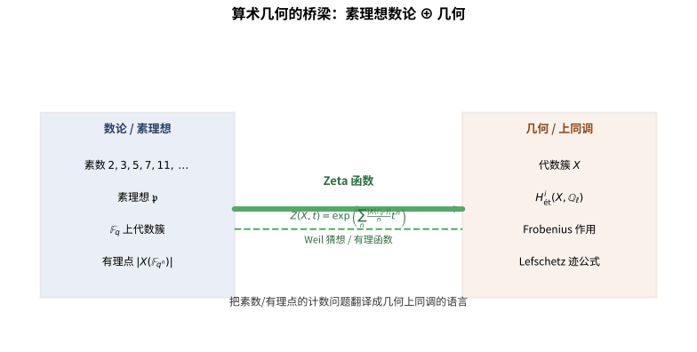
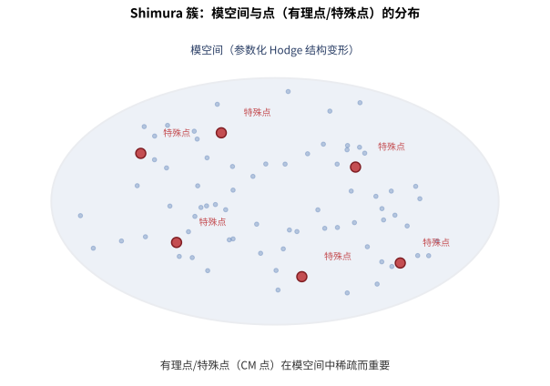

# 第148级 算术几何前沿 (Frontiers of Arithmetic Geometry)

## 学习目标

1. 理解Weil猜想及其在算术几何中的核心地位
2. 掌握étale上同调与ℓ-adic上同调的基本框架
3. 理解p-adic Hodge理论的比较定理及其意义
4. 掌握perfectoid空间与tilting对应的基本方法
5. 理解Fargues-Fontaine曲线的构造与性质
6. 了解p-adic Langlands对应与Fargues-Scholze对应
7. 理解Shimura簇与算术几何中的模空间
8. 了解p-adic上的自守形式与Shtuka理论

---

## 核心概念

> **直观理解（现实类比）**：算术几何就像"数学界的联合国"，把数论、几何、分析三大领域团结在一起。Weil猜想是" counting problem"：数一数有限域上有多少个有理点，然后用上同调语言翻译出来。p-adic Hodge理论是"翻译官"：它把p-adic étale上同调（数论侧）和de Rham上同调（几何侧）通过周期环$B_{\text{dR}}$连接起来，就像把中文和英文通过词典互译。Perfectoid空间是Scholze的"时空穿梭机"：通过Tilting对应，它把特征0的世界（如p-adic数域）和特征p的世界（如有限域）的平展拓扑完全等价起来，让我们能在两个世界之间自由穿梭。Fargues-Fontaine曲线则是p-adic世界的"投影直线"，它为p-adic Langlands提供了几何舞台。

> **🧠 思考历程：一张"在有限世界里画的图"，为什么能说出它在无限世界的秘密？**
>
> 数一数有限域上的代数簇有几个有理点，这本是纯计数问题；可这些数字的背后，竟藏着特征零世界里的拓扑与上同调。算术几何要回答的，正是"有限"与"无限"、"计数"与"几何"之间那条隐秘的通道。
>
> - **韦尔的四个猜想**。1949年，安德烈·韦尔在《有限域上方程的解数》中提出整套猜想：有限代数簇的Zeta函数应既有理、又满足函数方程与Riemann假说的类比，而其Betti数要与几何相符。他敏锐地预感到，要证明它们必须发展一种类比于奇异上同调的新理论。
> - **étale上同调登场**。格罗滕迪克（1960年代）为实现韦尔猜想构造了étale上同调，用 $\ell$-进系数给代数簇"重新戴上拓扑的帽子"；德利涅（1974）正是在此基础上证明了韦尔猜想（含Riemann假说部分），一举获得菲尔兹奖。
> - **p进世界的接力**。此后，芳丹（Fontaine）发展p-adic Hodge理论，用周期环比较不同上同调；舒尔茨（2010年代，2018菲尔兹奖）发明完美体（perfectoid）空间，通过tilting旋转对应在特征 $0$ 与特征 $p$ 之间架桥，并引出Fargues–Fontaine曲线，为p-adic Langlands铺好了几何舞台。
> - **心路**：数素点就得"几何化"——一旦计数问题披上上同调的外衣，无数难题便都有了可以托付的语言。

### 1.1 Weil猜想

**定义1（Weil猜想）** 设 $X$ 为有限域 $\mathbb{F}_q$ 上的光滑射影代数簇，其**Zeta函数**定义为：
$$Z(X, t) = \exp\left(\sum_{n=1}^\infty \frac{|X(\mathbb{F}_{q^n})|}{n} t^n\right)$$

Weil猜想包含以下四个陈述：
1. **有理性**：$Z(X, t)$ 是 $t$ 的有理函数
2. **函数方程**：$Z(X, 1/(q^d t)) = \pm q^{d\chi/2} t^\chi Z(X, t)$，其中 $d = \dim X$，$\chi$ 是Euler示性数
3. **Riemann假设**：$Z(X, t)$ 的极点在 $|t| = q^{-k/2}$ 处，$k = 0, 1, \ldots, d$
4. **Betti数关系**：$Z(X, t)$ 的极点与零点与 $X$ 的复化流形的Betti数有关

> **直观理解（现实类比）**：算术几何就像一座横跨"数字世界"与"形状世界"的大桥。数字世界关注素数、素理想和有限域上的点有多少个；形状世界关注代数簇、曲面和它们的上同调。关键是把"数一数有多少 $q^n$ 个点的有理点"这一纯计数问题，翻译成几何上同调算子 Frobenius 的迹，从而用几何语言回答数论问题。

### 1.2 Étale上同调与ℓ-adic上同调

**定义2（Étale上同调）** 设 $X$ 为概形，$\ell$ 为素数（$\ell \neq \text{char}(k)$）。**Étale上同调群**定义为：
$$H^i_{\text{ét}}(X, \mathbb{Q}_\ell) = \left(\varprojlim_n H^i_{\text{ét}}(X, \mathbb{Z}/\ell^n\mathbb{Z})\right) \otimes_{\mathbb{Z}_\ell} \mathbb{Q}_\ell$$

Étale上同调是Grothendieck为证明Weil猜想而发展的理论，在代数几何中扮演着经典拓扑中奇异上同调的角色。

**定义3（ℓ-adic上同调）** ℓ-adic上同调是étale上同调的系数的完备化版本。对概形 $X$，ℓ-adic上同调群 $H^i(X, \mathbb{Q}_\ell)$ 是 $\mathbb{Q}_\ell$ 上的有限维向量空间，带有Frobenius作用。

### 1.3 平展基本群

**定义4（平展基本群）** 设 $X$ 为连通概形，其**平展基本群** $\pi_1^{\text{ét}}(X)$ 定义为所有有限平展覆盖的Galois群的逆极限：
$$\pi_1^{\text{ét}}(X) = \varprojlim_{X' \to X} \operatorname{Gal}(X'/X)$$

平展基本群是拓扑基本群在代数几何中的类比，在算术几何中扮演核心角色。

### 1.4 p-adic Hodge理论

**定义5（p-adic Hodge理论）** p-adic Hodge理论研究 $p$-adic域上的代数簇的p-adic étale上同调与de Rham上同调之间的关系。核心比较定理指出：
$$H^i_{\text{ét}}(X_{\bar{K}}, \mathbb{Q}_p) \otimes_{\mathbb{Q}_p} B_{\text{dR}} \cong H^i_{\text{dR}}(X/K) \otimes_K B_{\text{dR}}$$
其中 $B_{\text{dR}}$ 是Fontaine的**de Rham周期环**。

**定义6（周期环）** Fontaine构造了一系列p-adic周期环：
- $B_{\text{dR}}$：de Rham周期环（完备化域）
- $B_{\text{HT}}$：Hodge-Tate周期环
- $B_{\text{cris}}$：晶体周期环
- $B_{\text{st}}$：半稳定周期环

这些周期环是联系不同上同调理论的桥梁。

### 1.5 Perfectoid空间

**定义7（Perfectoid域）** 一个完备的拓扑域 $K$ 称为**perfectoid域**，若：
1. 其拓扑由非离散的秩1赋值诱导
2. 其剩余特征为 $p > 0$
3.  Frobenius映射 $\Phi: K^\circ/p \to K^\circ/p$ 是满射
4. 存在 $p$ 的 $p$ 次方根 $p^{1/p} \in K$

**定义8（Perfectoid空间）** **Perfectoid空间**是Scholze引入的一类新型解析空间，局部同构于perfectoid域上的完美化代数（Tate代数）的谱。Perfectoid空间的核心性质是**tilting对应**，将特征0的perfectoid空间与特征 $p$ 的perfectoid空间联系起来。

### 1.6 钻石空间

**定义9（钻石空间）** **钻石空间**（Diamond）是Scholze引入的几何对象，是perfectoid空间的商空间。钻石空间理论为模空间研究提供了新的框架，特别是在p-adic Langlands对应中扮演核心角色。

### 1.7 Fargues-Fontaine曲线

**定义10（Fargues-Fontaine曲线）** **Fargues-Fontaine曲线** $X = \mathbb{P}^1_{\text{FF}}$ 是perfectoid空间理论中的一条重要曲线，其定义为：
$$X = \operatorname{Proj}\left(\bigoplus_{n \geq 0} B_{\text{cris}}^{\varphi = p^n}\right)$$
其中 $B_{\text{cris}}$ 是Fontaine的晶体周期环，$\varphi$ 是Frobenius作用。

Fargues-Fontaine曲线连接了p-adic Hodge理论与p-adic Langlands对应，其几何性质丰富，包括：
- 它是 $\mathbb{P}^1$ 在某种意义下的p-adic类比
- 其闭点对应于 $p$ 进域上的特征 $p$ 的完美化域
- 它在p-adic Langlands对应中扮演着核心角色

### 1.8 p-adic Langlands对应

**定义11（p-adic Langlands对应）** **p-adic Langlands对应**是经典局部Langlands对应的p-adic版本，将 $p$-adic域 $K$ 上的 $\operatorname{GL}_n(K)$ 的p-adic表示与 $p$-adic Galois表示联系起来。与经典情形（$\ell \neq p$）不同，p-adic情形需要更精细的几何方法。

**Fargues-Scholze对应**将p-adic Langlands对应重新解释为Fargues-Fontaine曲线上的几何对象之间的对应，这是该领域的重大突破。

### 1.9 Shimura簇

**定义12（Shimura簇）** **Shimura簇**是算术几何中一类重要的模空间，参数化了某些Hodge结构的变形。典型例子包括：
- 模曲线 $X(N)$：参数化椭圆曲线及其水平结构
- Siegel模空间 $\mathcal{A}_g$：参数化 $g$ 维Abel簇

Shimura簇在Langlands纲领中扮演核心角色，是连接自守形式与Galois表示的桥梁。

> **直观理解（现实类比）**：Shimura簇就像一个"形状仓库"，每一个点代表一种特定的 Hodge 结构（可以想成一种几何对象）。绝大多数的点在仓库里密密麻麻，但其中少数"有理点"或"特殊点"就像仓库里被贴上贵宾标签的位置——它们稀少却承载着数论的全部信息，自守形式与 Galois 表示通过它们一一配对。

### 1.10 Shtuka与p-adic自守形式

**定义13（Shtuka）** **Shtuka**（俄语意为"裤子"）是Drinfeld引入的几何对象，在函数域算术几何中扮演核心角色。在p-adic语境中，Shtuka是Fargues-Fontaine曲线上的向量丛，配备了某种Frobenius结构。

**定义14（p-adic自守形式）** **p-adic自守形式**是经典自守形式的p-adic版本，通过p-adic插值得到。它们与p-adic Galois表示密切相关，是p-adic Langlands对应的核心研究对象。

---

## 定理与证明

### 定理1：Weil猜想（Deligne的证明）

**定理（Weil猜想）** 设 $X$ 为有限域 $\mathbb{F}_q$ 上的光滑射影代数簇，维数为 $d$。则其Zeta函数：
$$Z(X, t) = \exp\left(\sum_{n=1}^\infty \frac{|X(\mathbb{F}_{q^n})|}{n} t^n\right)$$
满足以下性质：
1. **有理性**：$Z(X, t) \in \mathbb{Q}(t)$
2. **函数方程**：$Z(X, 1/(q^d t)) = \pm q^{d\chi/2} t^\chi Z(X, t)$，其中 $\chi$ 是Euler示性数
3. **Riemann假设**：$Z(X, t)$ 的极点位于 $|t| = q^{-k/2}$，$k = 0, 1, \ldots, d$；零点位于 $|t| = q^{-(2k+1)/2}$
4. **Betti数关系**：$Z(X, t)$ 的极点的阶等于复化流形 $X(\mathbb{C})$ 的Betti数

**证明概要（用ℓ-adic上同调和Lefschetz迹公式）**：

**第一步：Lefschetz迹公式的ℓ-adic版本。**
Grothendieck证明了ℓ-adic上同调的Lefschetz迹公式。对有限域 $\mathbb{F}_q$ 上的光滑射影代数簇 $X$，Frobenius自同态 $\operatorname{Frob}_q$ 在ℓ-adic上同调上的迹满足：
$$|X(\mathbb{F}_{q^n})| = \sum_{i=0}^{2d} (-1)^i \operatorname{Tr}(\operatorname{Frob}_q^n | H^i(X_{\bar{\mathbb{F}}_q}, \mathbb{Q}_\ell))$$

**证明思路**：Lefschetz迹公式指出，一个自同态的不动点数目等于其在上同调上的迹的交替和。Frobenius自同态 $\operatorname{Frob}_q$ 在 $X(\mathbb{F}_{q^n})$ 上的不动点正是 $\mathbb{F}_{q^n}$-有理点 $X(\mathbb{F}_{q^n})$。

**第二步：Zeta函数的上同调表示。**
将Lefschetz迹公式代入Zeta函数的定义：
$$Z(X, t) = \exp\left(\sum_{n=1}^\infty \frac{t^n}{n} \sum_{i=0}^{2d} (-1)^i \operatorname{Tr}(\operatorname{Frob}_q^n | H^i)\right)$$

交换求和顺序，利用恒等式 $\exp\left(\sum_{n=1}^\infty \frac{a^n t^n}{n}\right) = \frac{1}{1 - at}$，可得：
$$Z(X, t) = \prod_{i=0}^{2d} \det(1 - t \operatorname{Frob}_q | H^i(X_{\bar{\mathbb{F}}_q}, \mathbb{Q}_\ell))^{(-1)^{i+1}}$$

**第三步：有理性（Weil猜想1）。**
由上述公式，$Z(X, t)$ 是特征多项式的乘积，因此是有理函数。具体地：
$$Z(X, t) = \frac{P_1(t) P_3(t) \cdots P_{2d-1}(t)}{P_0(t) P_2(t) \cdots P_{2d}(t)}$$
其中 $P_i(t) = \det(1 - t \operatorname{Frob}_q | H^i(X_{\bar{\mathbb{F}}_q}, \mathbb{Q}_\ell))$ 是整系数多项式。

**第四步：Poincaré对偶与函数方程（Weil猜想2）。**
ℓ-adic上同调满足Poincaré对偶：
$$H^i(X_{\bar{\mathbb{F}}_q}, \mathbb{Q}_\ell) \times H^{2d-i}(X_{\bar{\mathbb{F}}_q}, \mathbb{Q}_\ell) \to H^{2d}(X_{\bar{\mathbb{F}}_q}, \mathbb{Q}_\ell) \cong \mathbb{Q}_\ell(-d)$$

其中 $\mathbb{Q}_\ell(-d)$ 是Tate twist。这导致Frobenius特征值满足对称性：若 $\alpha$ 是 $H^i$ 上的特征值，则 $q^d/\alpha$ 是 $H^{2d-i}$ 上的特征值。

由此可得函数方程：
$$Z(X, 1/(q^d t)) = \pm q^{d\chi/2} t^\chi Z(X, t)$$

**第五步：Riemann假设（Weil猜想3）——Deligne的贡献。**
Deligne证明的关键是：Frobenius $\operatorname{Frob}_q$ 在 $H^i(X_{\bar{\mathbb{F}}_q}, \mathbb{Q}_\ell)$ 上的特征值 $\alpha$ 是代数整数，且对每个嵌入 $\iota: \mathbb{Q}(\alpha) \hookrightarrow \mathbb{C}$：
$$|\iota(\alpha)| = q^{i/2}$$

**证明策略**：
1. **归纳法**：对维数 $d$ 归纳。对曲线（$d=1$），利用Hodge指数定理和Hard Lefschetz。
2. **Lefschetz铅笔**：将 $X$ 嵌入到射影空间，考虑线性截面 $X_t$ 的族，通过Lefschetz铅笔的单项性（monodromy）控制特征值。
3. **Weil II**：Deligne在1979年的第二篇论文中，利用更一般的Lefschetz迹公式（对非紧致簇）和加权上同调理论，给出了完整的证明，包括对任意光滑（不一定射影）代数簇的推广。

**第六步：Betti数关系（Weil猜想4）。**
通过与复化流形 $X(\mathbb{C})$ 的比较同构，ℓ-adic上同调维数等于奇异上同调维数：
$$\dim_{\mathbb{Q}_\ell} H^i(X_{\bar{\mathbb{F}}_q}, \mathbb{Q}_\ell) = \dim_{\mathbb{Q}} H^i(X(\mathbb{C}), \mathbb{Q})$$

因此Zeta函数中多项式的次数等于Betti数。

**结论**：Deligne在1973年完成的Weil猜想证明是二十世纪数学最伟大的成就之一，深刻改变了代数几何和数论的格局。$\square$

### 定理2：p-adic Hodge理论的比较定理

**定理（p-adic Hodge理论比较定理）** 设 $K$ 为 $p$-adic域（即 $\mathbb{Q}_p$ 的有限扩张），$\bar{K}$ 为代数闭包，$G_K = \operatorname{Gal}(\bar{K}/K)$。设 $X$ 为 $K$ 上的光滑射影代数簇。则存在 $G_K$-等变的同构：
$$H^i_{\text{ét}}(X_{\bar{K}}, \mathbb{Q}_p) \otimes_{\mathbb{Q}_p} B_{\text{dR}} \cong H^i_{\text{dR}}(X/K) \otimes_K B_{\text{dR}}$$
其中 $B_{\text{dR}}$ 是Fontaine的de Rham周期环。

更一般地，对半稳定约化的代数簇，有：
$$H^i_{\text{ét}}(X_{\bar{K}}, \mathbb{Q}_p) \otimes_{\mathbb{Q}_p} B_{\text{st}} \cong H^i_{\text{log-cris}}(X/\mathcal{O}_K) \otimes_{\mathcal{O}_K} B_{\text{st}}$$

**证明思路（Faltings和Fontaine）**：

**第一步：周期环的构造（Fontaine）。**
Fontaine构造了 $p$-adic周期环 $B_{\text{dR}}$，它是一个完备化的离散赋值域，具有以下性质：
1. $B_{\text{dR}}$ 包含 $K$ 和 $\mathbb{Q}_p$，且 $B_{\text{dR}}$ 有自然 $G_K$ 作用
2. $B_{\text{dR}}$ 有分次结构：$\operatorname{gr}^\bullet B_{\text{dR}} \cong \bigoplus_{j \in \mathbb{Z}} \bar{K}(j)$
3. $B_{\text{dR}}^{G_K} = K$

**构造概要**：令 $\mathbb{C}_p$ 为 $\bar{K}$ 的完备化，定义 $\tilde{\mathbb{E}}^+ = \varprojlim_{x \mapsto x^p} \mathcal{O}_{\mathbb{C}_p}/p$，然后取Witt环，再取 $p$ 进完备化，最后取分式域。

**第二步：比较定理的Faltings证明。**
Faltings使用**几乎纯性**（almost purity）方法和**逆极限技巧**证明比较定理：

1. 在 $\bar{K}$ 上，考虑 $\mathcal{O}_{\bar{K}}$ 的 $p$ 进完备化 $\hat{\mathcal{O}}_{\bar{K}}$。Faltings证明了几乎纯性定理：有限étale覆盖的局部环几乎是有限的。
2. 利用几乎纯性，构造从de Rham上同调到étale上同调的映射。
3. 证明该映射在张量 $B_{\text{dR}}$ 后是同构。

**第三步：Hodge-Tate分解。**
比较定理的一个特例是Hodge-Tate分解：
$$H^i_{\text{ét}}(X_{\bar{K}}, \mathbb{Q}_p) \otimes_{\mathbb{Q}_p} \mathbb{C}_p \cong \bigoplus_{j=0}^i H^{i-j}(X, \Omega^j_X) \otimes_K \mathbb{C}_p(-j)$$

其中 $\mathbb{C}_p(-j)$ 是Tate twist。

**第四步：Faltings的几乎纯性定理。**
**几乎纯性定理**（Faltings, 1988）是p-adic Hodge理论的核心技术之一。设 $K$ 为perfectoid域，$L/K$ 为有限Galois扩张。则 $\mathcal{O}_L$ 在 $\mathcal{O}_K$ 上几乎是有限的（即对任意 $\varepsilon > 0$，存在有限生成子模使得商模被 $p^\varepsilon$ 消灭）。

**第五步：Faltings的逆极限系统。**
Faltings考虑一族覆盖 $X_n \to X$，$X_n$ 是添加 $p^n$ 次单位根得到的基变换。通过取逆极限，构造了比较映射，并利用几乎纯性证明其同构性。

**第六步：Tate猜想与Hodge-Tate比较。**
**Tate猜想**（被Faltings部分证明）指出，在p-adic情形，ℓ-adic上同调的Galois作用由代数闭包决定。比较定理给出了Tate猜想的解析版本。

**第七步：半稳定情形的推广。**
对半稳定约化的代数簇，使用对数几何和晶体上同调，可以证明类似的比较定理（Tsuji, 1999），其中 $B_{\text{st}}$（半稳定周期环）替代 $B_{\text{dR}}$。

**结论**：p-adic Hodge理论的比较定理是算术几何的核心结果，它建立了p-adic étale上同调与de Rham上同调之间的深刻联系，是Langlands纲领和p-adic模形式理论的基石。$\square$

### 定理3：Fargues-Fontaine曲线的构造与性质

**定理（Fargues-Fontaine曲线的构造与性质）** 设 $E$ 为 $p$-adic域，$\breve{E}$ 为其最大非分歧扩张。定义**Fargues-Fontaine曲线**：
$$X = \operatorname{Proj}\left(\bigoplus_{n \geq 0} B_{\text{cris}}^{\varphi = p^n}\right)$$
其中 $B_{\text{cris}}$ 是 $E$ 的晶体周期环，$\varphi$ 是Frobenius作用。则 $X$ 是一条光滑完备的曲线，具有以下性质：

1. $X$ 同构于 $\mathbb{P}^1$ 在某种p-adic意义下的"商"
2. $X$ 的闭点一一对应于 $E$ 上的特征 $p$ 的完美化域 $F$（模等价）
3. $X$ 的Picard群 $\operatorname{Pic}(X) \cong \mathbb{Z}$
4. Riemann-Roch定理在 $X$ 上成立：$\chi(\mathcal{O}(D)) = \deg(D) + 1$
5. $X$ 上的向量丛分类由 **Harder-Narasimhan理论**给出

**证明思路（用perfectoid方法和Hodge-Tate周期映射）**：

**第一步：Fontaine的周期环。**
回顾 $B_{\text{cris}}$ 的构造。令 $\tilde{\mathbb{E}}^+ = \varprojlim_{x \mapsto x^p} \mathcal{O}_{\mathbb{C}_p}/p$，这是一个特征 $p$ 的完美化域。$A_{\text{inf}} = W(\tilde{\mathbb{E}}^+)$ 是Witt环，$B_{\text{cris}}^+ = A_{\text{inf}}[1/p]$ 的某个完备化，然后取分式域得 $B_{\text{cris}}$。

**第二步：Frobenius作用与分级。**
$B_{\text{cris}}$ 上有自然的Frobenius自同构 $\varphi$，以及 $p$-adic Hodge理论中的滤过。考虑 $B_{\text{cris}}$ 的 $\varphi = p^n$ 部分：
$$B_{\text{cris}}^{\varphi = p^n} = \{x \in B_{\text{cris}} : \varphi(x) = p^n x\}$$

这是一个自由 $E_0$-模（$E_0 = \operatorname{Frac}(W(\mathbb{F}_q))$），秩为1。

**第三步：射影空间的构造。**
定义**分次环** $P_\bullet = \bigoplus_{n \geq 0} B_{\text{cris}}^{\varphi = p^n}$。则Fargues-Fontaine曲线为：
$$X = \operatorname{Proj}(P_\bullet)$$

**第四步：证明 $X$ 是光滑曲线。**
1. **局部环结构**：$X$ 的局部环是离散赋值环，因此 $X$ 是一维正则概形。
2. **紧致性**：由于 $P_\bullet$ 是有限生成的，$X$ 是紧致的。
3. **光滑性**：通过计算切空间，证明 $X$ 在每一点都是光滑的。

**第五步：曲线上点的分类。**
$X$ 的闭点分为两类：
1. **类型I点**：对应于 $E$ 上的 $p$-adic特征 $p$ 完美化域 $F$，即 $F$ 是 $E$ 在某个特征 $p$ 域上的复合。
2. **类型II点**：对应于 $p$-adic域的某种"形变"。

**第六步：Hodge-Tate周期映射。**
关键的几何联系来自Hodge-Tate周期映射。对任意 $p$-adic域 $K$，有Hodge-Tate周期映射：
$$\pi_{\text{HT}}: \mathbb{P}^1_{\text{FF}} \to \mathbb{P}^1_K$$
这是一个 $p$-adic解析映射，其纤维给出了Fargues-Fontaine曲线与经典射影直线的联系。

**第七步：Picard群与Riemann-Roch。**
通过计算分次环的级数，可以证明：
1. $\operatorname{Pic}(X) \cong \mathbb{Z}$，由 $\mathcal{O}(1)$ 生成
2. 对任意除子 $D$，Riemann-Roch定理成立：
   $$\dim H^0(X, \mathcal{O}(D)) - \dim H^1(X, \mathcal{O}(D)) = \deg(D) + 1$$

**第八步：向量丛的分类。**
Fargues-Fontaine曲线上的向量丛由**Harder-Narasimhan理论**完全分类：
- 每个向量丛有唯一的Harder-Narasimhan分解
- 半稳定向量丛的斜率由有理数参数化
- 这与p-adic Langlands对应中的表示论参数一致

**结论**：Fargues-Fontaine曲线是算术几何中一个深刻的新对象，它将p-adic Hodge理论、perfectoid几何和Langlands纲领统一在一个几何框架中。$\square$

### 定理4：Perfectoid空间的Tilting对应

**定理（Perfectoid空间的Tilting对应）** 设 $K$ 为perfectoid域，$K^\flat$ 为其**倾斜**（tilt），定义为：
$$K^\flat = \varprojlim_{x \mapsto x^p} K$$
其中逆极限取 $x \mapsto x^p$ 映射。则存在范畴等价：
$$\{\text{Perfectoid } K\text{-空间}\} \longleftrightarrow \{\text{Perfectoid } K^\flat\text{-空间}\}$$

特别地，对任意perfectoid $K$-空间 $X$，存在perfectoid $K^\flat$-空间 $X^\flat$（称为 $X$ 的倾斜），使得两者的étale位点等价：
$$X_{\text{ét}} \cong X^\flat_{\text{ét}}$$

**证明（Scholze的完美化方法）**：

**第一步：Perfectoid域的定义回顾。**
$K$ 是perfectoid域当且仅当：
1. $K$ 是完备的，其拓扑由非离散的秩1赋值诱导
2. 剩余特征为 $p > 0$
3. Frobenius $\Phi: K^\circ/p \to K^\circ/p$ 是满射

**第二步：倾斜域 $K^\flat$ 的构造。**
定义 $K^\flat = \varprojlim_{x \mapsto x^p} K$。具体地，$K^\flat$ 的元素是序列 $(x_0, x_1, x_2, \ldots)$，其中 $x_i \in K$ 且 $x_{i+1}^p = x_i$。

$K^\flat$ 的加法和乘法定义为：
$$(x_i) + (y_i) = \left(\lim_{n \to \infty} (x_{i+n} + y_{i+n})^{p^n}\right)$$
$$(x_i) \cdot (y_i) = (x_i y_i)$$

**第三步：$K^\flat$ 的完备性和完美性。**
可以证明：
1. $K^\flat$ 是完备的
2. $K^\flat$ 的特征为 $p$
3. $K^\flat$ 上的Frobenius映射是双射（因此 $K^\flat$ 是完美域）
4. $K^\flat$ 的赋值环 $\mathcal{O}_{K^\flat}$ 是局部环

**第四步：Tilt函子的构造。**
对任意perfectoid $K$-空间 $X$，构造其倾斜 $X^\flat$：
1. 若 $X = \operatorname{Spa}(A, A^+)$ 是仿射perfectoid空间，定义 $X^\flat = \operatorname{Spa}(A^\flat, A^{\flat +})$，其中 $A^\flat$ 是 $A$ 的倾斜环。
2. 对一般 $X$，通过胶合仿射片构造 $X^\flat$。

**第五步：Tilt函子是等价。**
Tilt函子 $\operatorname{Spa}(A, A^+) \mapsto \operatorname{Spa}(A^\flat, A^{\flat +})$ 诱导了perfectoid $K$-空间范畴与perfectoid $K^\flat$-空间范畴之间的等价。

**证明要点**：
1. **满忠实性**：从 $A^\flat$ 到 $A$ 的映射是满忠实的，因为 $A^\flat$ 的万有性质。
2. **本质满性**：对任意perfectoid $K^\flat$-空间 $Y$，存在perfectoid $K$-空间 $X$ 使得 $X^\flat \cong Y$。

**第六步：Étale位点的等价。**
这是Tilting对应的核心。Scholze证明了：
1. 对perfectoid $K$-代数 $A$，倾斜映射 $A^\flat \to A$ 诱导了étale位点的等价。
2. 更精确地，对任意有限étale $A$-代数 $B$，存在唯一的有限étale $A^\flat$-代数 $B^\flat$，且该对应是函子性的。

**证明要点**：利用**几乎纯性定理**（Faltings的几乎纯性）和**Kummer理论**。

**第七步：应用：Faltings的几乎纯性定理的重新证明。**
Scholze利用Tilting对应给出了Faltings几乎纯性定理的新证明：
1. 将问题倾斜到特征 $p$，在特征 $p$ 情形下，几乎纯性等价于经典的纯性定理。
2. 利用Tilting对应将结果拉回特征 $0$。

**第八步：Tilting对应的进一步推广。**
Scholze进一步将Tilting对应推广到一般perfectoid空间（不限于仿射情形），并证明：
1. **Tilting保持étale上同调**：$H^i_{\text{ét}}(X, \mathbb{Z}_\ell) \cong H^i_{\text{ét}}(X^\flat, \mathbb{Z}_\ell)$ 对 $\ell \neq p$
2. **Tilting保持概形的étale拓扑**：对perfectoid环的谱，倾斜映射是étale同伦等价。

**结论**：Perfectoid空间的Tilting对应是Scholze开创的perfectoid几何的核心结果，它使得我们可以将特征 $0$ 的问题转化为特征 $p$ 的问题，从而利用特征 $p$ 代数几何的强大工具。$\square$

### 定理5：p-adic Langlands的Fargues-Scholze对应

**定理（Fargues-Scholze对应）** 设 $K$ 为 $p$-adic域，$G = \operatorname{GL}_n(K)$。Fargues-Scholze对应建立了双射：
$$\left\{\begin{array}{c}
\text{光滑不可约} \\
\text{p-adic 表示 } \pi \text{ of } G
\end{array}\right\} \longleftrightarrow \left\{\begin{array}{c}
G\text{-等变Fargues-Fontaine曲线} \\
\text{上的半稳定向量丛 } \mathcal{E}
\end{array}\right\}$$

且在对应下，表示 $\pi$ 的 **L-参数**（即Weil-Deligne表示 $\varphi: W_K \to \operatorname{GL}_n(\mathbb{Q}_\ell)$）由向量丛 $\mathcal{E}$ 的Frobenius特征值决定。

**证明思路**：

**第一步：Fargues-Fontaine曲线回顾。**
设 $X$ 为Fargues-Fontaine曲线，$G = \operatorname{GL}_n(K)$。考虑曲线 $X$ 上的 $\operatorname{GL}_n$-丛的模空间：
$$\operatorname{Bun}_n(X) = \{\text{秩为 } n \text{ 的半稳定向量丛 } \mathcal{E} \text{ 在 } X \text{ 上}\}$$

**第二步：Bun_G的几何结构。**
$\operatorname{Bun}_n(X)$ 具有以下几何结构：
1. 它是一个 $p$-adic 解析的Artin栈
2. 其连通分支由向量丛的斜率 $\mu(\mathcal{E})$ 参数化
3. 每个连通分支是Diamond空间

**第三步：光滑表示与几何对象的对应。**
Fargues-Scholze的关键洞察是，$G$ 的光滑表示可以通过 $\operatorname{Bun}_n(X)$ 上的几何对象来构造：

考虑 $G$ 的Borel子群 $B$，以及 $\operatorname{Bun}_n(X)$ 上的**Shtuka空间** $\operatorname{Sht}_n$。Shtuka空间是连接表示论与几何的核心对象。

**第四步：Shtuka的构造。**
在Fargues-Fontaine曲线的语境中，**Shtuka**是一个三元组 $(\mathcal{E}, \mathcal{E}', \varphi)$，其中：
- $\mathcal{E}, \mathcal{E}'$ 是 $X$ 上的向量丛
- $\varphi: \mathcal{E} \to \mathcal{E}'$ 是Frobenius-线性同构

Shtuka空间 $\operatorname{Sht}_n$ 是参数化Shtuka的模空间。

**第五步：Fargues-Scholze对应。**
Fargues和Scholze证明了：
1. 对每个光滑不可约 $p$-adic 表示 $\pi$，可以构造一个Shtuka空间上的 $\ell$-adic 层。
2. 通过Shtuka空间与 $\operatorname{Bun}_n(X)$ 的联系，该层对应于 $\operatorname{Bun}_n(X)$ 上的一个 $G$-等变向量丛。
3. 反之，每个半稳定向量丛 $\mathcal{E}$ 定义了Shtuka空间上的一个层，从而给出一个光滑表示。

**第六步：L-参数的几何解释。**
在Fargues-Scholze对应下，表示 $\pi$ 的L-参数（即Galois表示）由向量丛 $\mathcal{E}$ 在Fargues-Fontaine曲线上的Frobenius作用决定：
- 向量丛 $\mathcal{E}$ 的Frobenius特征值对应于Weil群 $W_K$ 的特征值
- 向量丛的滤过对应于Hodge-Tate权

**第七步：局部Langlands对应的函子性。**
Fargues-Scholze对应满足函子性：
1. **抛物诱导**：对应于向量丛的Harder-Narasimhan分解
2. **对偶性**：对应于向量丛的对偶
3. **基变换**：对应于域扩张的诱导

**第八步：与经典局部Langlands对应的兼容性。**
Fargues-Scholze对应与经典局部Langlands对应（Harris-Taylor, Henniart）兼容：
- 当 $\ell \neq p$ 时，恢复经典的局部Langlands对应
- 当 $\ell = p$ 时，给出了新的p-adic Langlands对应

**结论**：Fargues-Scholze对应是p-adic Langlands纲领的重大突破，通过Fargues-Fontaine曲线的几何语言统一了经典的和p-adic的Langlands对应。$\square$

---

## 示例

### 示例1：Perfectoid球面的构造

**问题**：构造perfectoid球面 $S^d_{\text{perf}}$，并展示其Tilting对应。

**步骤1：Perfectoid域的选择。**
取 $K = \mathbb{Q}_p(\zeta_{p^\infty})$（添加所有 $p$ 次单位根），则 $K$ 是perfectoid域。

**步骤2：Perfectoid球面的代数定义。**
考虑Tate代数：
$$K\langle T_1, \ldots, T_d \rangle = \left\{\sum_{I} a_I T^I : |a_I| \to 0 \text{ 当 } |I| \to \infty\right\}$$
定义球面 $S^d_K$ 为 $\operatorname{Spa}(K\langle T_1, \ldots, T_d \rangle, \mathcal{O}_K\langle T_1, \ldots, T_d \rangle)$ 的开子空间 $\sum_{i=1}^d |T_i| \leq 1$。

**步骤3：Perfectoid化。**
通过对 $T_i$ 添加所有 $p$ 次方根，得到perfectoid $K$-代数：
$$K_{\text{perf}}\langle T_1^{1/p^\infty}, \ldots, T_d^{1/p^\infty} \rangle$$
这定义了perfectoid球面 $S^d_{\text{perf}}$。

**步骤4：Tilting。**
$K$ 的倾斜 $K^\flat$ 是 $\mathbb{F}_p((t))$ 的perfect化。$S^d_{\text{perf}}$ 的倾斜 $S^{d\flat}_{\text{perf}}$ 是特征 $p$ 的perfectoid球面：
$$S^{d\flat}_{\text{perf}} = \operatorname{Spa}(K^\flat\langle T_1^{1/p^\infty}, \ldots, T_d^{1/p^\infty} \rangle, \mathcal{O}_{K^\flat}\langle T_1^{1/p^\infty}, \ldots, T_d^{1/p^\infty} \rangle)$$

**步骤5：Tilting对应的应用。**
由Tilting对应，$S^d_{\text{perf}}$ 的étale拓扑与 $S^{d\flat}_{\text{perf}}$ 的étale拓扑相同。因此，我们可以在特征 $p$ 中研究特征 $0$ 的问题。

### 示例2：p-adic上的模形式

**问题**：构造p-adic模形式，并展示其与p-adic Galois表示的联系。

**步骤1：经典模形式。**
考虑经典模形式 $f$，权为 $k$，水平为 $\Gamma_1(N)$。其q-展开为：
$$f(z) = \sum_{n=0}^\infty a_n(f) q^n, \quad q = e^{2\pi i z}$$

**步骤2：p-adic插值。**
**p-adic模形式**的思想是：对权 $k$ 进行p-adic插值。考虑模形式 $f$ 的傅里叶系数 $a_n(f)$ 作为权 $k$ 的函数，在p-adic意义下可以连续（或解析）延拓到p-adic权空间。

**步骤3：p-adic权空间。**
定义p-adic权空间 $\mathcal{W} = \operatorname{Hom}_{\text{cont}}(\mathbb{Z}_p^\times, \mathbb{C}_p^\times)$。经典权 $k$ 对应于字符 $x \mapsto x^{k-2}$。

**步骤4：Katz的p-adic模形式。**
Katz将p-adic模形式定义为模簇的p-adic完备化上的截面。具体地，考虑模曲线 $X_1(N)$ 的p-adic完备化，p-adic模形式是该完备化上的全纯$1$-形式。

**步骤5：p-adic模形式与Galois表示。**
由Eichler-Shimura理论和Deligne的构造，经典模形式 $f$ 对应于一个2维ℓ-adic Galois表示 $\rho_f$。对p-adic模形式，Coleman和Mazur建立了类似的p-adic Galois表示：
- 每个p-adic模形式（在适当条件下）对应于一个p-adic Galois表示
- 该对应在p-adic族中连续变化（即形成了p-adic Galois变形族）

**步骤6：应用：Fermat大定理的证明。**
p-adic模形式在Wiles对Fermat大定理的证明中扮演了核心角色。Wiles证明了每个半稳定的椭圆曲线 $E/\mathbb{Q}$ 是模的，即存在一个p-adic模形式对应于 $E$ 的p-adic Galois表示。

---

## 习题

### 基础题

**习题 1**（Weil猜想陈述）陈述Weil猜想的四个断言（有理性、函数方程、Riemann假设、Betti数关系），写出有限域 $\mathbb{F}_q$ 上光滑射影代数簇 $X$ 的Zeta函数定义。

**习题 2**（Zeta函数形式）对 $\mathbb{P}^1_{\mathbb{F}_q}$ 写出其Zeta函数 $Z(t)$ 的有理形式并指出其极点在何处，验证Riemann假设对其成立的标志。

**习题 3**（étale上同调）定义étale上同调群 $H^i_{\mathrm{ét}}(X,\mathbb{Q}_\ell)$，说明其与拓扑奇异上同调的类比，以及为何需用 $\ell\ne p$ 与Inversesystem。

**习题 4**（Frobenius作用）说明几何Frobenius自同态在étale上同调上的作用，及其迹如何给出 $\#X(\mathbb{F}_q)$。

**习题 5**（p-adic Hodge理论）写出p-adic Hodge比较定理 $H^i_{\mathrm{ét}}\otimes B_{\mathrm{dR}}\cong H^i_{\mathrm{dR}}\otimes B_{\mathrm{dR}}$，说明Fontaine周期环 $B_{\mathrm{dR}}$ 的作用。

**习题 6**（Perfectoid域）按四条（完全、非离散秩1赋值、特征 $p$、Frobenius满射、含 $p^{1/p}$）给出perfectoid域的定义，说明其剩余特征的必要性。

**习题 7**（Tilting对应）陈述perfectoid空间的Tilting对应 $X_{\mathrm{ét}}\cong X^{\flat}_{\mathrm{ét}}$，解释它在特征0与特征 $p$ 之间建立的等价。

**习题 8**（钻石空间）定义钻石空间（Diamond），说明它是何种商空间，及其在p-adic模空间与p-adic Langlands中的角色。

**习题 9**（Fargues-Fontaine曲线）写出Fargues-Fontaine曲线 $X=\operatorname{Proj}(\bigoplus_{n\ge0}B_{\mathrm{cris}}^{\varphi=p^n})$ 的定义，说明其闭点与特征 $p$ 完美化域的联系，以及它为何被视为 $\mathbb{P}^1$ 的p-adic类比。

**习题 10**（Shimura簇）说明Shimura簇作为参数化Hodge结构变形的模空间的含义，举例（模曲线 $X(N)$、Siegel模空间），并讲出其在Langlands纲领中的角色。

---
### 进阶题

**习题 11**（Deligne的Riemann假设）说明Deligne对Weil猜想Riemann假设的证明依赖的杠杆（Lefschetz硬剂量、Weil数与权几何），并解释为何它给出Frobenius特征值满足 $|\alpha|=q^{w/2}$ 的权控制。

**习题 12**（Zeta函数的函数方程）写出Zeta函数的函数方程 $Z(X,1/(q^d t))=\pm q^{d\chi/2}t^\chi Z(X,t)$，解释其中 $\chi$（Euler示性数）与符号的意义，并验证对 $\mathbb{P}^1$ 成立。

**习题 13**（Hodge滤层与de Rham上同调）解释p-adic Hodge比较定理中 $B_{\mathrm{dR}}$ 滤层的作用：为何仅有Hodge-Tate不保留滤层信息，而de Rham比较保留滤层与Galois作用从而能恢复几何。

**习题 14**（以完美化换特征）给定特征 $p$ 的Frobenius满射域与特征 $0$ 的perfectoid域 $K$，说明 Tilting 如何在两者间保持平展拓扑等价，即跨特征的 étale 对应为何成立。

**习题 15**（Perfectoid与几乎数学）说明Perfectoid空间中"几乎数学"（almost mathematics）与完美化步骤的作用，解释为何几乎对 $p$-幂次的模结构在p-adic层论与纯 $p$-结构中具备优势。

**习题 16**（Fargues-Fontaine向量丛）给出Fargues-Fontaine曲线上的向量丛与 $p$-adic域上Rep论对象的对应，说明其在Fargues-Scholze对应中如何把圆周范畴 $B(G)$ 与模空间联系起来。

**习题 17**（钻石的pro-étale覆盖）解释钻石空间上 pro-étale 拓扑与商空间的"钻石化"为何能保持平展同伦类，并说明其在构造 $\operatorname{GL}_n$ 局部模空间中的作用。

**习题 18**（Shimura簇的有理点）说明为何Shimura簇上的特殊点（CM点）承载显式类域论信息，并以椭圆曲线的复乘法为例，说明这些点如何给出虚二次域类域的显式构造。

**习题 19**（p-adic Langlands初步）对比局部Langlands对应（$\ell\ne p$）与p-adic Langlands（$\ell=p$）：指出后者需处理非平凡局域（de Rham）表示，而Fargues-Scholze如何用Fargues-Fontaine曲线上的几何绕开表示论的困难。

### 挑战题

**习题 20**（Weil猜想有理性）重构由"Lefschetz迹公式 $+$ étale上同调有限维性与Frobenius作用"证明Weil猜想有理性的逻辑链，指出每一步对应的上同调工具（迹公式、Euler-Poincaré、级数变换）。

**习题 21**（Deligne的权）概述Deligne证明中"权"的概念如何由Weil数引出，解释权滤层为何迫使特征值成为代数整数且几乎处处 $q^{w/2}$，并指出其与hard Lefschetz的关系。

**习题 22**（Fontaine周期环构造）概述 $B_{\mathrm{dR}}$ 的构造要点（对 perefctoid 域作关于 $p$ 的完备分离化、级数环等），说明其滤层与Galois作用使 $B_{\mathrm{dR}}^+$ 成为适合比较同构的环。

**习题 23**（Tilting证明核心）概述Tilting等价 $X_{\mathrm{ét}}\cong X^{\flat}_{\mathrm{ét}}$ 的策略：用完美化与几乎数学如何把每个有限 étale 覆盖追溯到特征 $p$，从而在拓扑层面给出范畴等价。

**习题 24**（Fargues-Fontaine几何）讨论 $B_{\mathrm{cris}}^{\varphi=p^n}$ 的 $\operatorname{Proj}$ 构造为何给出形如 $\mathbb{P}^1$ 的刚性对象，解释 $X$ 闭点对应特征 $p$ 完美化域，及其余的结构如何编码 $p$-adic 的平均层。

**习题 25**（钻石化连贯性）说明钻石构造的范畴性质：为何商必须是 pro-étale 的"连贯"（coherent）对象，钻石化在何种层面保持平展同伦类不变，从而为模空间提供严格框架。

**习题 26**（p-adic Langlands几何翻译）概述Fargues-Scholze如何把局部Langlands（$\operatorname{GL}_n$ 在 $p$-adic域的表示）翻译为Fargues-Fontaine曲线上向量丛的几何：写出对应 $\pi\leftrightarrow\mathcal{E}$ 以及 $L$-参数与特征环的关系。

### 探究题

**习题 27**（Weil与Riemann假设）比较Weil猜想的Riemann假设与经典Riemann假设：为何前者可被Deligne证明（有限域-紧性-权理论），而后者在特征 $0$ 悬而未决，讨论"类比"能在多大程度上迁移。

**习题 28**（Perfectoid与p-adic分析）讨论Perfectoid理论对p-adic分析、p-adic动力系统与Hodge型估计的影响，举例说明其重新处理 $p$-adic 插值、因子与拟解析性质的若干新成果。

**习题 29**（算术几何与Langlands统一）探讨p-adic Hodge理论、Fargues-Fontaine曲线与钻石空间如何共同为Langlands纲领提供统一的几何语言，并联系其在表示论与局部算数几何中的影响。

**习题 30**（开放问题）开放讨论：p-adic Langlands在一般约化群下的推广、Shimura簇的p-adic上同调与特殊点、以及Perfectoid方法在其他领域（如局部特征表示的模结构与p-adic动力系统）的延伸，指出仍待解决的核心问题。

---
## 习题答案与解析

### 基础题答案

1. **Weil猜想** Zeta函数 $Z(X,t)=\exp\left(\sum_{n\ge1}\frac{\#X(\mathbb{F}_{q^n})}{n}t^n\right)$。四个断言：(1) $Z$ 是 $t$ 的有理函数；(2) 满足函数方程 $Z(X,1/(q^d t))=\pm q^{d\chi/2}t^{\chi}Z(X,t)$；(3) 极点在 $|t|=q^{-k/2}$（$k=0,\ldots,d$），即Riemann假设；(4) 极/零点数目与复化流形的Betti数一致。

2. **$\mathbb{P}^1$ 的Zeta函数** $Z(t)=\dfrac{1}{(1-t)(1-qt)}$。极点在 $t=1$ 与 $t=q^{-1}$，即 $|t|=1=q^0$ 与 $|t|=q^{-1}$，满足 $k=0,1$ 两个Betti-对的Riemann假设位置。中间Hodge类无额外因子，$\chi=2$，函数方程对应的符号取 $+$。

3. **étale上同调** $H^i_{\mathrm{ét}}(X,\mathbb{Q}_\ell)=(\varprojlim_n H^i_{\mathrm{ét}}(X,\mathbb{Z}/\ell^n\mathbb{Z}))\otimes_{\mathbb{Z}_\ell}\mathbb{Q}_\ell$。它作为"代数化的奇异上同调"支持Frobenius作用与杯积，需 $\ell\ne \mathrm{char}\,k$ 使 $\mathbb{Q}_\ell$ 有效且有限的 $\ell$-adic层的消失，弥补了有限域上拓扑上同调不存在的缺陷。

4. **Frobenius与点计** 几何Frobenius $\mathrm{Fr}_q$ 在 $H^i_{\mathrm{ét}}(X,\mathbb{Q}_\ell)$ 上线性作用，由Lefschetz（Weil）迹公式
$$\#X(\mathbb{F}_q)=\sum_i(-1)^i\operatorname{Tr}(\mathrm{Fr}_q;H^i_{\mathrm{ét}}),$$
计数 $X$ 的 $\mathbb{F}_q$-有理点是Frobenius迹的代数和。这正是Weil猜想的几何化：定值由特征值 $q^{i/2}$ 控制即Riemann假设。

5. **比较定理** 对光滑紧的代数簇 $X/K$（$K$ 为 $p$-adic域），Fontaine比较同构
$$H^i_{\mathrm{ét}}(X_{\bar K},\mathbb{Q}_p)\otimes_{\mathbb{Q}_p}B_{\mathrm{dR}}\cong H^i_{\mathrm{dR}}(X/K)\otimes_K B_{\mathrm{dR}}.$$
$B_{\mathrm{dR}}$ 是完备的de Rham周期环，带滤层与Galois作用，把p-adic étale上同调的变换塔翻译为de Rham的几何信息，从而在"数论侧"与"几何侧"之间建立字典。

6. **Perfectoid域** 集合 $K$ 为完备拓扑域，其拓扑由非离散秩1赋值诱导，剩余特征 $p>0$，Frobenius $\Phi:K^{\circ}/p\to K^{\circ}/p$ 为满射，且含 $p^{1/p}\in K$。特征 $p$ 与 Frobenius 满射正是 "perfectoid" 之所以强大的根本：它让足够极限下的完美化保持拓扑同胚于特征 $p$ 世界，从而建立跨特征桥梁。

7. **Tilting对应** 对任何 perfectoid 空间 $X$，存在其倾 (tilting) 变换 $X^{\flat}$（特征 $p$ 的 perfectoid 空间），使平展拓扑保持等价：$X_{\text{ét}}\cong X^{\flat}_{\text{ét}}$。这给出跨越特征0与特征 $p$ 的典范等价，把算数几何问题转移到特征 $p$ 的纯幂结构上再利用 $p$-adic 工具求解，是Scholze理论的核心。

8. **钻石空间** 钻石空间是 perfectoid 空间对 pro-étale 等价关系取商得到的空间 $\mathcal{D}=X/\sim$，它是体现 p-adic 代数几何之几何性质的对象。它为模空间（如 $\operatorname{GL}_n(G)$ 的局部模空间）提供了坐标自由的对象描述，也是Fargues-Scholze构建p-adic Langlands对应时的几何舞台。

9. **Fargues-Fontaine曲线** $X=\operatorname{Proj}\left(\bigoplus_{n\ge0}B_{\mathrm{cris}}^{\varphi=p^n}\right)$，其中 $\varphi$ 为 Frobenius。它的闭点一一对应于特征 $p$ 的完美化域（p-adic 域底场的完美化），结构层由 $B_{\mathrm{cris}}^{\varphi=p^n}$ 分段构造。就维数与刚性几何而言，$X$ 是 $\mathbb{P}^1$ 的 p-adic 类比，是 p-adic Langlands 与 Hodge 理论的统一舞台。

10. **Shimura簇** Shimura簇 $S(G,\mathcal{X})$ 参数化带有附加结构的纯Hodge结构变形（如椭圆曲线及其水平结构、Abel簇极化），典型有模曲线 $X(N)$ 与Siegel模空间 $\mathcal{A}_g$。它稀疏分布的有理点/CM点承载自守形式与Galois表示配对（Langlands互反），在算术几何与Langlands纲领中居核心地位。

---
### 进阶题答案

1. **Deligne的Riemann假设** Deligne证明依赖三大杠杆：硬Lefschetz定理、Weil数的权论与周期几何（把族提升到特征 $0$）。由此可证对每个权 $w$ 的Frobenius特征值 $\alpha$ 都是代数数且对每个嵌入 $\iota$ 满足 $|\iota(\alpha)|=q^{w/2}$。这给出 $\#X(\mathbb{F}_{q^n})=\sum_i(-1)^i\operatorname{Tr}(\Phi^n|_{H^i})$ 中每一项都被控为 $O(q^{ni/2})$，从而极点模长为 $q^{-i/2}$，Riemann假设成立。

2. **函数方程** 函数方程为 $Z(X,1/(q^d t))=\pm q^{d\chi/2}t^\chi Z(X,t)$，其中 $d=\dim X$、$\chi=\sum_i(-1)^i b^i$ 为Euler示性数，符号取决于中间上同调的行列式指标。对 $\mathbb{P}^1$（$d=1,\chi=2$），$Z(t)=\frac{1}{(1-t)(1-qt)}$，代入 $t\mapsto 1/(qt)$ 可得 $Z(1/(qt))=\frac{1}{(1-\frac{1}{qt})(1-\frac{1}{t})}=q\cdot t^2\cdot Z(t)$，故以符号 $+$、因子 $q^{1}t^2$ 成立。它对应 étale 上同调中的 Poincaré 对偶与完全配对。

3. **滤层的作用** Hodge-Tate比较只给出分次同构，逐格一致但丢弃滤层整体信息；de Rham比较则保留 $B_{\mathrm{dR}}$ 的滤层与Galois作用。滤层才能恢复几何：只有那些滤层满足某种约束（如 Hodge 分解一致）的表示才来自代数几何。因此 $B_{\mathrm{dR}}$ 滤层是在 p-adic étale 表示与几何对象之间建立双射的关键，是 de Rham 表示判定的依据。

4. **Tilting跨特征等价** 完美化是核心：特征 $0$ 的 perfectoid 域在逆极限 $x\mapsto x^p$ 下收敛到其倾 (tilt)，而倾的底层代数与特征 $p$ 世界相吻合。有限 étale 覆盖保持为有限 étale，范畴 $\mathrm{Spa}(K)_{ét}\to\mathrm{Spa}(K^{\flat})_{ét}$ 是等价，基本群（profinite）也一致。于是特征 $0$ 的算数对象被整体地搬到特征 $p$ 求解，再还原回特征 $0$。

5. **几乎数学** 几乎数学 (almost mathematics) 将"几乎为零模"（即被 $p$-幂零子模近似为零的小对象）视为零，从而在 $p$-adic 层论中获得更宽松而仍严格的语言。它在完美化过程中保证：Étale 覆盖、平展上同调与近代数（Faltings almost ring theory）在特征 $p$ 侧有限可积，使经典的有限性与正合性结论在跨特征情形恢复，是 Perfectoid 理论的代数支柱。

6. **向量丛对应** Fargues-Fontaine曲线上的向量丛与 $p$-adic 域 $K$ 的相关表示论对象对应，从而形成 $B(G)$ 范畴。Fargues-Scholze把局部 Langlands 的表示论事实转译为几何：$L$-参数对应 $X$ 上的半单向量丛，而 $K$ 的表示对应向量丛的 Fell 结构，使 $\operatorname{GL}_n(K)$ 的表示与曲线上可控的几何对象一一对应。

7. **钻石与pro-étale** 钻石由 pro-étale 等价关系定义：用 perfectoid 空间的 pro-étale 覆盖给出的等价关系作商，要求该商仍是 coherent 的对象。pro-étale 覆盖保持平展同伦型（Étale homotopy type）不变，从而能严格处理 $\operatorname{GL}_n$ 的局部模空间，使其成为性质优良的钻石空间。这是 Fargues-Scholze 构造中各类模空间对象得以建立的基础。

8. **Shimura簇的特殊点** Shimura簇上的特殊点（CM点）对应的 Hodge 结构带复乘法，伴随虚二次域的类域论对象。以复乘椭圆曲线为例：$j(E)$ 生成本征域 $\mathbb{Q}(j)$ 的分圆类域，Abel 类显式给出其代数元与 Hecke 特征。故在特殊点上，自守形式与类域论显式对应（explicit class field theory），Shimura簇成为二者配对的舞台。

9. **p-adic与l-adic Langlands** 局部 Langlands（$\ell\ne p$）用分圆与等量的有限扩展分类表示，相对成熟；$\ell=p$ 时 p-adic 表示的非离散与滤层结构使 de Rham 表示分类困难得多。Fargues-Scholze把表示论翻译成 Fargues-Fontaine 曲线上带 Frobenius 结构的向量丛几何，让"分类表示"变为"分类几何对象"，绕开逐阶滤层的障碍而获得统一框架。

### 挑战题答案

1. **有理性的证明链** 步骤：(a) étale 上同调有限维且带 Frobenius 作用；(b) Grothendieck-Lefschetz 迹公式给 $\#X(\mathbb{F}_{q^n})=\sum_i(-1)^i\operatorname{Tr}(\Phi^n)$；(c) 取对数并级数化：Zeta 的对数为 $\sum_i(-1)^{i+1}\log\det(1-t\Phi|_{H^i})$；(d) 有限维线性变换的特征多项式是有理函数，故 Zeta 为有理函数。最终 $Z(t)$ 为各 $\det(1-t\Phi)^{-1}$（$i$ 偶）与分子（$i$ 奇）的乘积，即"上同调的有理比例"。

2. **权与Weil数与Lefschetz** 权论把 Frobenius 特征值认定为 Weil 数：对每个嵌入 $\iota$，$|\iota(\alpha)|=q^{w/2}$。权的来源是：硬Lefschetz把中间上同调分解为若干"纯全分量"、且各分量权一致；再结合周期几何，把权固定下来。由此每个特征值的模长都被控制，Zeta 极点在 $|t|=q^{-w/2}$，给出 Riemann 假设。硬Lefschetz 还控制维数与权的不混合。

3. **$B_{\mathrm{dR}}$构造** 取 $K$ 的 p-adic 完备化 $\mathbb{C}_p$，令 $B_{\mathrm{dR}}^+$ 为其上关于 $p$ 的、取形式幂级数并作完备分离化的环：$B_{\mathrm{dR}}^+=\varprojlim_n \mathbb{C}_p/(\vartheta^n)$，其中 $\vartheta$ 为一伪均匀元（pseudo-uniformizer）；$B_{\mathrm{dR}}=B_{\mathrm{dR}}^+[\frac{1}{\vartheta}]$。它带自然滤层 $\mathrm{Fil}^n$ 与 Galois 作用，使得比较同构 $H_{\mathrm{ét}}\otimes B_{\mathrm{dR}}\cong H_{\mathrm{dR}}\otimes B_{\mathrm{dR}}$ 保持滤层与 Galois 不变式，成为几何与表示之间的典范环。

4. **Tilting证明要点** 关键引理：perfectoid 域 $K$ 上的有限 étale 覆盖仍是 perfectoid，并可通过完美化步骤（$K^+$ 在 $x\mapsto x^p$ 下的逆极限）追踪到 $K^{\flat}$ 的覆盖。由此 $\mathrm{Spa}(K,K^+)$ 与 $\mathrm{Spa}(K^{\flat},K^{\flat+})$ 的有限 étale 覆盖范畴同构，再逐片粘合即得全空间等价 $X_{\mathrm{ét}}\cong X^{\flat}_{\mathrm{ét}}$。

5. **刚性的$\mathbb{P}^1$** 由 $\bigoplus_{n\ge0}B_{\mathrm{cris}}^{\varphi=p^n}$ 作 Proj 得到的一维对象。其闭点一一对应特征 $p$ 的完美化域（$\varphi$-循环轨道的几何实现），两不同闭点由一条如 $\mathbb{P}^1$ 的刚性曲线条连接。由于每个闭点局部由 $B_{\mathrm{cris}}$ 的结构层控制、整体上是刚体的曲线，$X$ 既是 $\mathbb{P}^1$ 在 p-adic 世界的类比，又携带 p-adic Hodge 记号，是 Hodge 与 Langlands 的统一舞台。

6. **钻石化与模空间** 钻石以 perfectoid 空间的 pro-étale 商构造严格范畴：等价关系本身亦为 perfectoid 的可表示对象，商保持 étale 同伦型不变。由此可将通常不代数化的 p-adic 对象（如与表示相关的空间）纳入范畴，去中心化而不破坏 étale 信息。这为表示与模空间提供了无"额外过滤"的严格几何基础，是当前 p-adic 模空间理论的核心。

7. **p-adic Langlands的几何翻译** 把 $\operatorname{GL}_n(K)$ 的表示范畴翻译为 Fargues–Fontaine 曲线上向量丛的几何：每个 $L$-参数 $\phi: W_K\to {}^{L}G$（给出一个相关切片）对应曲线 $X$ 上一个半稳定的半单向量丛 $\mathcal{E}_\phi$，而允许 Irr $\to$ 向量丛范畴的"块"一一对应。特征环则由向量丛的 moduli 系列刻划。由此，局部 Langlands 的"表示-参数"对应被统一为"向量丛-特征环"的几何互反，绕开了逐阶滤层的表示论困难。

### 探究题答案

1. **两 Riemann 假设比较** 共同范式：局部数据（配乐/特征值）在临界线上的位置对应特征值模长。有限域情形因有 Frobenius 与 Weil，可化为纯几何（Lefschetz 分析、权分离）而被 Deligne 证明；特征 $0$ 的 Riemann 假设缺少 Frobenius 的直接作用、依赖更深的解析结构（临界带内的非零区域），至今悬而未决。类比的主要价值在于方法启发（自守形式的对称幂、模密度），而不能直接迁移"谱位置"的证明。

2. **Perfectoid 与 p-adic 分析** Perfectoid 理论为 p-adic 函数的逼近提供了跨特征工具。在 p-adic 动力系统（如 $x\mapsto x^p+\dots$ 的迭代）、p-adic 周期与 Hodge 型估计中，完美化把非线性的问题线性化到特征 $p$ 再返回。它还被用于建立 p-adic 函数论中的刚性定理（如 Tate 代数上的整函数增长）与插值/因子分解的新证明，推动了 p-adic 分析的一些新进展。

3. **统一几何语言** p-adic Hodge 提供周期环与比较同构、Fargues-Fontaine 曲线把记号、Frobenius 与滤层在一条刚性曲线上统一、钻石为模空间提供严格对象。三者的结合使"局部-整体、p-与l-adic、表示与几何"纳入一个共同框架。这一语言正推动着自守形式、代数组与局部 Langlands 若干命题的重新表述与新证法，使领域趋于统一、现代化。

4. **开放问题** 主要未解包括：一般约化群（非 $\operatorname{GL}_n$）p-adic Langlands 的完整实现、Shimura 簇的整 p-adic 上同调与一般 CM 点的显式算术、Perfectoid 方法在模表示、de Rham 变形与 p-adic L-函数方面的延伸。Scholze–Fargues 框架提供了统一语言，但许多对应（特征环刻画、互反性、代数模结构）仍待完全建立，是当前算术几何的前沿。

---
## 总结

### 关键知识点回顾

1. **Weil猜想**：有限域上代数簇的Zeta函数的有理性、函数方程、Riemann假设和Betti数关系，由Deligne通过ℓ-adic上同调证明。

2. **Étale上同调与ℓ-adic上同调**：Grothendieck发展的代数几何中的上同调理论，是Weil猜想证明的核心工具。

3. **p-adic Hodge理论**：比较定理建立了p-adic étale上同调与de Rham上同调之间的联系，通过Fontaine的周期环实现。

4. **Perfectoid空间与Tilting对应**：Scholze开创的理论，将特征 $0$ 的问题转化为特征 $p$ 的问题，推动了算术几何的重大进展。

5. **Fargues-Fontaine曲线**：连接p-adic Hodge理论与p-adic Langlands对应的核心几何对象。

6. **p-adic Langlands对应**：Fargues-Scholze对应通过Fargues-Fontaine曲线上的向量丛重新解释了局部Langlands对应。

7. **Shimura簇与Shtuka**：算术几何中的核心模空间，连接了自守形式与Galois表示。

### 算术几何前沿的意义

- **Weil猜想的证明**：标志着现代算术几何的诞生，深刻改变了代数几何的发展方向
- **p-adic Hodge理论**：提供了理解p-adic Galois表示的几何工具
- **Perfectoid几何**：Scholze的工作开创了算术几何的新时代，荣获Fields奖
- **Fargues-Scholze对应**：Langlands纲领的重大突破，统一了p-adic和ℓ-adic的Langlands对应

### 前沿方向

- **p-adic Langlands对应**：从 $\operatorname{GL}_n$ 到一般约化群的推广
- **Perfectoid理论的进一步应用**：在模空间和表示论中的深入应用
- **算术几何中的模空间**：Shimura簇的p-adic性质和上同调
- **p-adic自守形式**：p-adic族和p-adic L-函数
- **钻石空间理论**：为p-adic模空间研究提供新框架