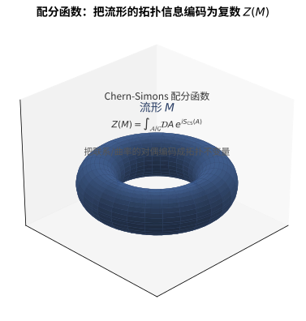

# 第149级 拓扑量子场论 (Topological Quantum Field Theory, TQFT)

## 📖 学习目标

1. 理解Atiyah公理下TQFT的定义及其基本结构
2. 掌握d维TQFT与Cobordism范畴的关系
3. 深入理解2维TQFT的分类定理及其与Frobenius代数的等价性
4. 掌握三维Chern-Simons理论与Jones多项式的联系
5. 理解Reshetikhin-Turaev构造的核心思想
6. 掌握扩展TQFT与Lurie的Bordism假设
7. 理解TQFT与Donaldson不变量、Gromov-Witten不变量的关系

---

## 一、核心概念

> **直观理解（现实类比）**：TQFT就像"乐高积木的数学理论"。Cobordism范畴是"积木说明书"：闭流形（如圆圈$S^1$）是"接口"，带边流形（如圆柱、裤子、帽子）是"积木块"。TQFT函子$Z$是"翻译器"：它把每个接口翻译成向量空间，把每个积木块翻译成线性映射。Atiyah公理保证"无论你怎么拼接积木，最终答案都一样"——这就是拓扑不变性的魔力。2维TQFT等价于交换Frobenius代数，就像"所有可能的2维乐高拼法"都对应一个特定的代数结构。Chern-Simons理论是3维TQFT的物理实现，它生成的Jones多项式能区分不同的绳结，就像用"绳结指纹"来识别身份。

> **🧠 思考历程：一个"不在乎长宽高"的宇宙，物理学家算什么才能算出不变量？**
>
> 普通的量子场论依赖时空的大小与形状；而拓扑量子场论坚持，只要流形的拓扑不变，答案就一律相同。它向数学家证明了物理直觉也能严密化，并生成了琼斯多项式等一批全新的拓扑不变量。它想回答的，是"只依赖拓扑配分函数"的场论究竟长什么样。
>
> - **琼斯多项式：绳结的"DNA"**。1984年，沃恩·琼斯在研究算子代数时，意外给出一个能区分各种绳结的新不变量——琼斯多项式，谁也没料到它与辫子群、二维共形场论如此契合。
> - **威滕的"概念跳跃"**。1988年，物理学家爱德华·威滕用Chern-Simons三维作用量的路径积分重新"推导"出琼斯多项式，并把配分函数 $Z(M)$ 提升为流形的不变量来源，从而提出了拓扑量子场论的思想；同年，阿蒂亚把这一思想提炼成严格的Atiyah公理，塞加尔则基于共形场论提供了另一套严谨框架。
> - **把"拼接"变成结构的承诺**。这些理论把 $d$ 维带边流形当作 $d-1$ 维边界之间的"过程"，配分函数在粘合下必须满足拼接律；雷舍提欣–图拉耶夫等的状态和又给出组合构造，让拓扑不变量从"猜测"走向"可计算"。
> - **心路**：物理可以替你抄近路、数学家再为你修公路——TQFT正是这两个世界一次漂亮的合谋。

### 1.1 Cobordism范畴

> **🧠 来龙去脉（为什么会有这个概念？解决了什么问题？）**：物理学里"时空演化"常被描述为"从一个初态时间片到末态时间片的过程"，数学家想给这种"过程"一个严格本体。他们发现，把"时间片"想成 $(d-1)$ 维闭流形、"过程"想成夹在两者之间的 $d$ 维带边流形，就能把"过程的串联"翻译成"沿公共边界粘合"——这正是范畴里"态射的复合"。于是 **Cobordism范畴** $\text{Cob}_d$ 应运而生：闭流形是对象、带边流形是态射、粘合是复合。它为"把流形分配成向量空间、把时空分配成线性映射"的TQFT提供了最自然的舞台，其雏形可追溯至庞加莱对"维数的边界"的研究，而作为范畴被正式刻画则来自阿蒂亚与奎恩在1970-80年代的工作。

**定义1（Cobordism范畴）** **d维Cobordism范畴** $\text{Cob}_d$ 定义如下：
- 对象：$(d-1)$维闭光滑流形 $M$。
- 态射：从 $M$ 到 $N$ 的态射是一个 $d$ 维带边流形 $W$，使得 $\partial W \cong \overline{M} \sqcup N$，其中 $\overline{M}$ 表示 $M$ 的反定向。
- 复合：沿公共边界粘合。
- 恒等态射：$M \times [0,1]$（柱面）。
- 对称幺半结构：不相交并 $\sqcup$。

> **💡 直观理解（类比）**：Cobordism范畴就像一套"积木说明书+拼装规则"。对象（$(d-1)$维闭流形）是各种"接口/插座"，从 $M$ 到 $N$ 的态射（$d$ 维带边流形）是"拼块"，复合就是"沿接口对接"。柱面（$M\times[0,1]$）则扮演"空接一段"的恒等拼接，不相交并扮演"把两套积木放在一起"的并行组合——这正是后来TQFT眼里"时空"的原始语法。

**定义2（定向Cobordism范畴）** **定向Cobordism范畴** $\text{Cob}_d^{\text{or}}$ 的对象是定向 $(d-1)$ 维闭流形，态射是定向 $d$ 维带边流形，边界定向与流形定向兼容。

> **💡 直观理解（类比）**：定向就像给每块积木标上"正反面/箭头"。加了这个标记后，两个朝向相反的拼块接到一起才能"严丝合缝"（边界定向一致），如同电池正负极必须对准才能通电。这让"从 $M$ 到 $N$"有了明确方向，是搭出有意义演化的前提。

### 1.2 Atiyah公理

> **🧠 来龙去脉（为什么会有这个概念？解决了什么问题？）**：1988年威滕用Chern-Simons路径积分"推"出了琼斯多项式，数学界既兴奋又困惑——路径积分本身很直观，却不够严谨。阿蒂亚随即把威滕的思想提炼成几条纯代数公理：一个TQFT就是一个把"时空间（流形）"整体分配成"向量空间与线性映射"的幺半函子，并要求配对、乘法、结合、规范化、恒等五条性质。它解决的正是"如何把物理上不严格的路径积分翻译成严格且可验证的数学定义"这一核心难题，也让"拓扑不变量"第一次有了统一而系统的刻画。

**定义3（Atiyah公理）** 一个 **$d$ 维拓扑量子场论** 是一个对称幺半函子：

$$ Z: \text{Cob}_d \to \text{Vect}_{\mathbb{C}} $$

满足以下公理：

1. **（配对性）** $Z(\overline{M}) = Z(M)^*$（对偶向量空间）。
2. **（乘法性）** $Z(M_1 \sqcup M_2) = Z(M_1) \otimes Z(M_2)$（对称幺半性）。
3. **（结合性）** $Z(W_1 \cup_{M} W_2) = Z(W_2) \circ Z(W_1)$（复合的保持）。
4. **（规范化）** $Z(\emptyset^{(d-1)}) = \mathbb{C}$，其中 $\emptyset^{(d-1)}$ 是空 $(d-1)$ 维流形。
5. **（恒等）** $Z(M \times [0,1]) = \text{id}_{Z(M)}$（柱面给出恒等映射）。

> **🧠 直观理解（现实类比）**：Atiyah公理把TQFT定义为"从时空积木到向量空间的翻译器" $Z:\text{Cob}_d\to\text{Vect}_{\mathbb{C}}$，并立下五条"翻译纪律"：配对性（反过方向就取对偶，如镜子两面）、乘法性（两套积木合在一起信息相乘）、结合性（先拼左还是先拼右结果一样）、规范化（空空间对应一维向量空间 $\mathbb{C}$）、恒等（空接一段柱面不动）。它们合起来保证了——任何时空无论怎么切分再拼回，答案始终唯一，这正是"拓扑不变量"的核心。

> **直观理解（现实类比）**：TQFT 的拼接性质就像"乐高积木"。你用一个拼好的积木块 $W_1$ 和一个积木块 $W_2$，只要它们的接口（公共边界）吻合，就能拼成更大的模型，而整体配分函数恰是两块各自配分函数的复合。也就是说，无论你怎样把时空切成小块再拼回去，得到的最终答案都一样——这正是所谓"拓扑不变的拼接规律"。

### 1.3 Frobenius代数

> **🧠 来龙去脉（为什么会有这个概念？解决了什么问题？）**：Frobenius代数的思想很早——弗罗贝尼乌斯在1900年前后研究矩阵的表示论与"迹"，给出"带非退化对称双线性型"的刻画；但他绝不会想到，这种代数竟会成为"二维时空所有拼接规律"的分类对象。真正把"Frobenius代数"提升到拓扑舞台的是1980年代末对2维TQFT的分类洞察：一个带"迹"的非退化代数，恰好能编码"裤子（乘法）、帽子（余乘法）、圆盘（迹）"的整套粘合法则。它解决的问题是：二维时空的"切分—拼接规律"到底可不可能用一个代数对象完整、严格地描述——答案是可以，而且就是Frobenius代数。

**定义4（Frobenius代数）** 一个 **Frobenius代数** 是一个有限维结合代数 $A$，配备一个非退化线性映射 $\varepsilon: A \to \mathbb{C}$（称为**迹**或**余单位**），使得双线性形式 $\langle a, b \rangle = \varepsilon(ab)$ 是非退化的。

等价地，Frobenius代数具有一个**余乘法**（comultiplication）$\Delta: A \to A \otimes A$，满足Frobenius关系：

$$ (\Delta \otimes \text{id}_A) \circ \Delta = (\text{id}_A \otimes \Delta) \circ \Delta $$

且 $\Delta$ 是 $A$-$A$ 双模同态。

> **💡 直观理解（类比）**：Frobenius代数 = "有记分卡的代数"。乘法是"把两个数拼成一个"，余乘法是"把一个数拆成两个"，而一个非退化的"迹" $\varepsilon$ 就像一杆公平的天平——它保证"拼接"和"拆分"永远可逆对账，不会丢失信息。在2维TQFT里，它正是"裤子拼合"与"帽子拆开"能否精确还原的数学化身。

**定义5（交换Frobenius代数）** 如果 $A$ 是交换代数，则称 $A$ 为 **交换Frobenius代数**。

> **💡 直观理解（类比）**："交换"就像"客厅拼合唱，谁先谁后无关紧要"——乘法顺序可互换。对于2维TQFT，这正是拓扑上"两入边输入顺序自然对称"的结果，也决定了 $Z(S^1)=A$ 能承载漂亮的交换代数结构。

### 1.4 Z/2分次与超对称

**定义6（Z/2分次向量空间）** 一个 **Z/2分次向量空间** 是向量空间 $V = V_0 \oplus V_1$ 的分解，其中 $V_0$ 中的元素称为**偶元素**，$V_1$ 中的元素称为**奇元素**。分次张量积满足：

$$ (V \otimes W)_k = \bigoplus_{i+j \equiv k \pmod{2}} V_i \otimes W_j $$

> **💡 直观理解（类比）**：Z/2分次像个"白天/黑夜"标签：每个向量不是"白天（偶）"就是"黑夜（奇）"。两个元素相乘时，分次按"白天+白天=白天、白天+黑夜=黑夜、黑夜+黑夜=白天"（即模2相加）滚动，而交换时奇元素要额外"带一个负号"——这就是超对称里"两个费米子交换要变号"的来源。

**定义7（超Frobenius代数）** 一个 **超Frobenius代数** 是Z/2分次向量空间上的Frobenius代数，其中结构映射保持分次。

> **💡 直观理解（类比）**：超Frobenius代数 = "遵纪守法的带班牌代数"：它既带白天/黑夜的分次标签，又保持Frobenius的整套结构（乘法、余乘法、迹）在分次下协调一致。可类比为一个同时管理"员工排班"和"财务账本"的部门，两套规则互不打架。

### 1.5 不变量

> **🧠 来龙去脉（为什么会有这个概念？解决了什么问题？）**：拓扑不变量的目标是一句话：**两个流形在拓扑上看不出差别，就应分到同一个"指纹"**。琼斯1984年在算子代数（冯·诺依曼代数的子因子）研究中意外得到纽结的琼斯多项式；卡松面向3维同调球面给出卡松不变量；唐纳森1983年用瞬子模空间给出4维流形的光滑不变量；格罗莫夫—威滕则把伪全纯曲线计数成辛几何的量子不变量。它们分别回答了"绳结怎么分辨""3球面怎么分辨""光滑4流形怎么分辨""辛流形里有多少指定曲线"等核心问题，并共同展示：一个优秀的不变量往往源于某条看似无关的深分支。

**定义8（Jones多项式）** **Jones多项式** $V_L(t) \in \mathbb{Z}[t^{-1/2}, t^{1/2}]$ 是纽结 $L$ 的一个多项式不变量，满足：

$$ V_{\text{unknot}} = 1, \quad t^{-1} V_{L_+} - t V_{L_-} = (t^{-1/2} - t^{1/2}) V_{L_0} $$

其中 $L_+, L_-, L_0$ 是纽结在交叉点处的三种局部修改（ skein relation）。

> **💡 直观理解（类比）**：Jones多项式好比给自己的绳结发的"身份证号"。它由三条"局部剪接规则"（skein关系：正交叉、负交叉、平滑化）归纳算出，有点像"用密码算法压缩绳子的打结信息"。两条绳子若可互相变形（同痕等价），它们的Jones多项式必然相同——所以它是识别"这个结是哪个结"的指纹。

**定义9（Casson不变量）** **Casson不变量** $\lambda_{\text{Casson}}(M)$ 是定向同调3球面 $M$ 的一个整数不变量，计数了 $M$ 中不可约 $SU(2)$-表示（即平直 $SU(2)$-联络）的代数个数。

> **💡 直观理解（类比）**：Casson不变量像是给三维球面点的一笔"代数户口普查"。它数一数这个3流形上究竟有多少种"本质不同的引力连接方式"（平直联络/不可约表示），计数的代数和就是该流形的一个整体指纹，能帮我们分辨哪些3球面其实"长得不一样"。

**定义10（Donaldson不变量）** **Donaldson不变量** 是光滑4维流形的不变量，通过 $SU(2)$-瞬子（自对偶Yang-Mills联络）的模空间定义。对光滑4维流形 $M$，Donaldson不变量 $\Phi_M$ 是 $\text{H}_2(M)$ 的对称幂上的多项式函数。

> **💡 直观理解（类比）**：Donaldson不变量是"光滑4维世界的照妖镜"。它统计4维流形上满足自对偶条件的特殊联络（瞬子）有多少个，并把它们编码成 $\text{H}_2(M)$ 上的多项式函数。它的惊人之处在于：能分辨出同一个流形换上不同的"光滑衣"后其实是不同的——因此是研究光滑4维流形分类的锋利工具。

**定义11（Gromov-Witten不变量）** **Gromov-Witten不变量** 计数了辛流形中伪全纯曲线的个数。对辛流形 $(X, \omega)$ 和同调类 $A \in \text{H}_2(X)$，GW不变量：

$$ GW_{g, A}^X: \text{H}^*(X)^{\otimes n} \to \mathbb{Q} $$

计数了亏格 $g$、同调类 $A$ 的伪全纯曲线经过指定标记点的个数。

> **💡 直观理解（类比）**：Gromov-Witten不变量好比"数数一个风景里能画出多少条指定类型的曲线"。给定同调类 $A$ 和要求的亏格（曲线有多少个"手柄"），它统计辛流形里经过最多若干标记点的伪全纯曲线共有多少个（带权重）。这像在充满涟漪的水面（辛流形）上数符合条件的"最小能量曲面"的个数，是代数几何与弦论对话的桥梁。

### 1.6 Chern-Simons理论

> **🧠 来龙去脉（为什么会有这个概念？解决了什么问题？）**：陈省身在1940年代研究纤维丛的示性类时写下"实际只差一个恰当形式的陈—西蒙斯型"泛函，它本身并不是由度规决定的，而是纯拓扑量。1988年威滕把它升级为三维量子场论的作用量，用路径积分"平均所有联络"，从而一举把琼斯多项式乃至整个纽结不变量重新推导出来。它解决的，正是"为什么这么多绳结不变量可以来自同一个三维场论"这个问题——答案藏在这个**只依赖流形拓扑、不依赖度量**的作用量里。

**定义12（Chern-Simons作用量）** 设 $M$ 是三维定向闭流形，$G$ 是紧Lie群，$A$ 是 $M$ 上 $G$-主丛的联络。**Chern-Simons作用量** 定义为：

$$ S_{\text{CS}}(A) = \frac{k}{4\pi} \int_M \text{Tr}\left(A \wedge dA + \frac{2}{3} A \wedge A \wedge A\right) $$

其中 $k \in \mathbb{Z}$ 是**级数**（level）。

> **💡 直观理解（类比）**：Chern-Simons作用量像一条"专门给三维空间量度的尺子"：它只用联络 $A$ 本身拼出一项积分，不依赖空间的度量（这就是"拓扑"的来历）。级数 $k$ 就像"尺子的分度值"——它决定了测量的精细程度，收敛出的量子理论由 $k$ 唯一刻画。正是这种"只看形状、不看尺寸"的特性，让它能产生纯粹的三维拓扑不变量。

**定义13（Chern-Simons配分函数）** Chern-Simons理论的**配分函数** 是：

$$ Z_{\text{CS}}(M) = \int_{\mathcal{A}/\mathcal{G}} \mathcal{D}A \, e^{i S_{\text{CS}}(A)} $$

其中 $\mathcal{A}$ 是联络空间，$\mathcal{G}$ 是规范变换群，$\mathcal{D}A$ 是形式路径积分测度。

> **直观理解（现实类比）**：配分函数就像一个"万能扫描仪"，它把整个流形（可以想象成一个环面或球面）的所有局部几何信息汇总成一个数字 $Z(M)$。就像把一块蛋糕的所有配料和火候信息压缩成"好吃与否"的一个评分，Chern-Simons 配分函数把流形的拓扑复杂度压缩成一个复数，这个数不随你如何细分流形而变，只取决于它本身的拓扑。

### 1.7 Witten的TQFT构造

> **🧠 来龙去脉（为什么会有这个概念？解决了什么问题？）**：威滕1988年的工作是"从物理推导数学"的样板：他用Chern-Simons路径积分不仅重新算出了琼斯多项式，还观察到整个三维场论满足阿蒂亚TQFT公理——$S^2$ 对应表示范畴、闭流形给配分函数、沿纽结的Wilson圈给出纽结不变量。他解决的核心问题，是把"一个具体三维场论"升格为"一类拓扑不变量机器"：过去需要逐个寻找的不变量，现在都来自同一台"路径积分引擎"。

**定义14（Witten的TQFT构造）** Witten证明了三维Chern-Simons理论定义了一个三维TQFT。对每个紧Lie群 $G$ 和整数级数 $k$，Chern-Simons理论给出一个TQFT：

$$ Z_{G,k}: \text{Cob}_3^{\text{or}} \to \text{Vect}_{\mathbb{C}} $$

满足：
- $Z_{G,k}(S^2) = \text{Rep}(G_k)$（级数 $k$ 的仿射Lie代数 $\hat{\mathfrak{g}}$ 的整表示）。
- $Z_{G,k}(M)$ 是 $M$ 的Chern-Simons配分函数。
- $Z_{G,k}(L)$ 是沿纽结 $L$ 的Wilson圈期望值，给出Jones多项式（当 $G = SU(2)$）。

> **🧠 直观理解（现实类比）**：Witten的TQFT构造证明了"三维Chern-Simons理论 = 一个货真价实的三维TQFT"。圆 $S^2$ 上给出表示范畴 $\text{Rep}(G_k)$（这是理论的"态空间"），闭流形给出配分函数，而沿纽结 $L$ 的Wilson圈期望值恰好吐出Jones多项式。就像同一个演员能出演多部戏：一套路径积分，既当不变量、又当态空间、还能当纽结指纹。

### 1.8 Reshetikhin-Turaev构造

> **🧠 来龙去脉（为什么会有这个概念？解决了什么问题？）**：威滕的路径积分漂亮却不严格——积分测度并不存在严格的数学定义。雷舍提欣与图拉耶夫敏锐地意识到：威滕的"模性/辫性"信息其实完全藏在量子群 $U_q(\mathfrak{g})$ 在根单位处的表示论里，根本不需要路径积分。他们在1991年前后提出：先用量子群表示构造"模块化张量范畴"，再借手术法把三维流形切开计数，从而给出**不依赖路径积分、纯粹组合/代数的**严格三维TQFT。它解决的正是"把威滕的物理论证改写为可审核的数学证明"这一关键问题。

**定义15（Reshetikhin-Turaev构造）** **Reshetikhin-Turaev构造** 是从量子群 $U_q(\mathfrak{g})$ 的表示论构造三维TQFT的方法。核心思想是：
1. 从量子群 $U_q(\mathfrak{g})$（其中 $q = e^{2\pi i/(k + h^\vee)}$，$h^\vee$ 是 $\mathfrak{g}$ 的对偶Coxeter数）的有限维表示构造一个**模块化张量范畴**（modular tensor category）。
2. 用这个范畴构造三维流形和纽结的不变量。
3. 通过**手术法**（surgery）将流形分解为简单片段的组合。

> **💡 直观理解（类比）**：Reshetikhin-Turaev构造像"用乐高近似搭出任意三维形状"。它先把量子群表示编织成一个"模块化张量范畴"（一套形状可辨别的积木），再用手术法把三维流形切成环链手术的简单片段，逐片赋值、再拼回不变量。这样，抽象的三维不变量有了一个"可上手搭建"的组合配方，不再依赖神秘路径积分。

### 1.9 量子群与TQFT

> **🧠 来龙去脉（为什么会有这个概念？解决了什么问题？）**：量子群由库利希、雷舍提欣与德林费尔德在1980年代中期独立发现（受量子可积系统的Yang-Baxter方程启发），是李代数 $U(\mathfrak{g})$ 的 $q$-形变。它解决的问题是"如何让表示论具有辫子结构"：通常交换的对称在量子群表示里被升级为带R-矩阵的辫，而正是这"辫结构"给了绳结以拓扑编码。量子群因此成为连接"表示论—辫—纽结"—再到三维TQFT的枢纽。

**定义16（量子群）** **量子群** $U_q(\mathfrak{g})$ 是通用包络代数 $U(\mathfrak{g})$ 的 $q$-形变，其中 $q$ 是形式参数。对 $U_q(\mathfrak{sl}_2)$，生成元 $E, F, K, K^{-1}$ 满足：

$$ KK^{-1} = K^{-1}K = 1, \quad KEK^{-1} = q^2 E, \quad KFK^{-1} = q^{-2} F, \quad [E, F] = \frac{K - K^{-1}}{q - q^{-1}} $$

> **💡 直观理解（类比）**：量子群就是"把原来硬邦邦的李代数揉了参数 $q$ 进去的软面团"。当 $q=1$ 时它还原成经典李代数，而 $q\neq1$ 时对易关系被"量子化地打断"（多出 $q$ 的幂），正是这细微差别让表示论产生了"辫子"般的结构。可理解成给棋盘上了"量子坐标"，原本平平的格子因 $q$ 而带上了对折/缠绕。

**定义17（R-矩阵）** **R-矩阵** $R \in U_q(\mathfrak{g}) \otimes U_q(\mathfrak{g})$ 满足Yang-Baxter方程：

$$ R_{12}R_{13}R_{23} = R_{23}R_{13}R_{12} $$

R-矩阵给出了量子群表示的张量积的辫结构。

> **💡 直观理解（类比）**：R-矩阵就是"量子世界里的交换积木"：它规定在张量积 $V\otimes W$ 中，把两个表示互换位置时该怎么"打个结"。Yang-Baxter方程则保证"三次连换"只有一种结果（换法无关），效应如同"绳子的三条线交叉后编号总是唯一"。正是这个"辫结构"，让量子群表示能编码绳结拓扑。

### 1.10 TQFT的范畴化

> **🧠 来龙去脉（为什么会有这个概念？解决了什么问题？）**：普通TQFT把"时空"只分配到"向量空间和线性映射"两层，可物理直觉暗示：量子引力里的态射之间还有更高阶的结构。拉里（Lurie）与博德曼倡导的"范畴化"把TQFT升级为高阶函子——给 $(d-1),(d-2),\ldots$ 维流形也都赋数据，并让"同伦等价"成为同等重要的结构。它解决的问题是"如何让TQFT兼容高维同伦论"，把分配延展到点与低维对象，为Bordism假设铺路。

**定义18（TQFT的范畴化）** **TQFT的范畴化** 将TQFT提升到更高范畴的层次。一个 **$d$ 维扩展TQFT** 是一个对称幺半函子：

$$ Z: \text{Cob}_d^{\text{ext}} \to \text{Alg}_2 $$

其中 $\text{Cob}_d^{\text{ext}}$ 是扩展Cobordism $(\infty, d)$-范畴，$\text{Alg}_2$ 是 $E_2$-代数的 $(\infty, 2)$-范畴。

> **💡 直观理解（类比）**：TQFT的范畴化就像"给乐高世界加了一个新维度"。普通TQFT只到"空间（对象）→时空（态射）"两层，而范畴化加入"态射的态射、态射的态射的态射……"（这就是 $(\infty,d)$ 范畴），让系统能同时处理"切块之间怎样同伦变换"。可喻为从一个平面棋盘升级成立体积木，能捕捉更多层面的关系。

### 1.11 扩展TQFT

> **🧠 来龙去脉（为什么会有这个概念？解决了什么问题？）**：普通TQFT只把"边界流形"分配到向量空间，却回答不了"边界内部的更低维对象该赋什么"。扩展TQFT（由弗里德与拉里等发展）允许把数据一直下沉到"点"这样的零维对象，从而捕获增量更多的拓扑信息。它解决的，是"TQFT如何完整记录流形的全部维数信息"以及"如何让分类问题变成造个别对象的分类"这类更深层的结构需求。

**定义19（扩展TQFT）** **扩展TQFT** 允许将TQFT分配给出更低维的流形（包括点）。一个 **完全扩展TQFT** 是一个对称幺伴函子：

$$ Z: \text{Bord}_d^{\text{fr}} \to \mathcal{C} $$

其中 $\text{Bord}_d^{\text{fr}}$ 是 $d$ 维框架化（framed）Cobordism的 $(\infty, d)$-范畴，$\mathcal{C}$ 是某个 $(\infty, d)$-范畴。

> **💡 直观理解（类比）**：扩展TQFT是"把赋值一直下沉到零维的点"。普通TQFT只给曲面赋向量空间，扩展TQFT连"点"都给了数据（一个特定代数对象），并一路给到各种低维流形。就像把一幅完整建筑图拆解到"每一块地基砖"都标注清楚——数据越下沉，抓得越牢。

### 1.12 Lurie的Bordism假设

> **🧠 来龙去脉（为什么会有这个概念？解决了什么问题？）**：2009年，拉里在关于高阶代数与拓扑场论的宏大名作里提出一个惊人主张：一个完全扩展、框架化的TQFT**完全由它在单点上的取值决定**，前提是这个值必须是"充分可对偶"的对象。它把"分类所有TQFT"这个无法驾驭的任务，奇迹般地归结为"分类个别对象"。其证明思路把Cobordism高阶范畴视为"由点生成的自由 $(\infty,d)$-范畴"，为高维拓扑场论提供了统一而简洁的纲领，也奠定了"可对偶对象"在范畴论中的中心地位。

**定义20（Bordism假设）** Lurie的 **Bordism假设** 断言：完全扩展的 $d$ 维框架化TQFT由其在点上的值完全决定。具体地，定义了一个等价：

$$ \text{Fun}^{\otimes}(\text{Bord}_d^{\text{fr}}, \mathcal{C}) \cong \Omega^{\text{fr}}\mathcal{C} $$

其中 $\Omega^{\text{fr}}\mathcal{C}$ 是 $\mathcal{C}$ 的 $d$ 次框架化循环空间（即 $d$ 维框架化流形在 $\mathcal{C}$ 中的"可定向"对象）。

> **🧠 直观理解（现实类比）**：Bordism假设是"点石成金"式的断言：一个完全扩展TQFT只要知道其对"单点"赋什么值，就完全确定了！这好比"只要知道一颗种子的全部信息，就能预测一整棵树的生长"。前提是点的值必须是"充分可对偶"的对象（具备y归一配对结构）。它把分类TQFT的巨大任务，奇迹般归结为分类个别对象的问题。

### 1.13 弦图与图示微积分

> **🧠 来龙去脉（为什么会有这个概念？解决了什么问题？）**：在Kock的经典教材《Frobenius Algebras and 2D Topological Quantum Field Theories》里，最核心的方法不是公式，而是**弦图**：把Frobenius代数的乘法画成"裤子"、余乘法画成"反向裤子"、迹画成"帽子"，于是抽象的代数关系（结合律、Frobenius关系）被翻译成一目了然的图形等价（"把两个孔合并""扭一下绳子"）。这种"图示微积分"解决了"如何让人一眼看出Frobenius关系对应哪种拓扑操作"的教学与直觉难题，也是把2维TQFT做到可视化、可计算的一把金钥匙。

**定义21（弦图）** **弦图**（String Diagram）是用图画代替代数公式：一条水平"弦"对应对象（如 $A$），弦的分支对应态射（如乘法 $m:A\otimes A\to A$ 画成一个节点、迹 $\varepsilon$ 画成一条烛形端点），读图自下而上即复合。两条弦的"缠结/分支"即张量积中的辫或Frobenius余乘法。

> **💡 直观理解（类比）**：弦图就像"代数公式的连环画"：乘法是一个"三叉路口"、余乘法是它的镜像、迹是"收口的烛芯"。原本要写一大串 $\otimes$ 与 $\circ$ 的结合律，一画成 "怎么绕都不变" 的图就豁然开朗。它是范畴学家与拓扑学家的"公共母语"——谁能把关系画成图，谁就真正"看懂了"它。

---

## 二、定理与证明

### 定理1：2维TQFT的分类（Frobenius代数等价）

**定理（2维TQFT的分类）** 存在范畴等价：

$$ \text{2-dim TQFTs} \cong \text{commutative Frobenius algebras} $$

即，二维定向TQFT与交换Frobenius代数之间存在一一对应。

> **🧠 直观理解（现实类比）**：2维TQFT分类定理说：所有可能的二维"拓扑积木规则"恰与交换Frobenius代数是同一回事。圆 $S^1$ 对应代数 $A=Z(S^1)$，而"裤子"给出乘法、"帽子"给出迹、"圆盘"给出单位。于是原来抽象的一整套TQFT，被压缩成"一个带迹的代数"来分类——就像把所有乐高搭法归纳成"一套说明书上写的配件清单"，美丽且彻底。这是一个经典的"分类结果"。

**证明**：

**第一步：从2维TQFT到Frobenius代数。**

设 $Z: \text{Cob}_2^{\text{or}} \to \text{Vect}_{\mathbb{C}}$ 是一个2维TQFT。定义：

$$ A = Z(S^1) $$

其中 $S^1$ 是圆（1维闭流形）。我们需要赋予 $A$ 一个交换Frobenius代数的结构。

**乘法**：考虑 **"裤子"（pair of pants）** 曲面 $P$，它是三个圆边界的2维带边流形：

$$ \partial P = S^1 \sqcup S^1 \sqcup \overline{S^1} $$

（两个输入和一个输出）。$P$ 给出了一个态射 $P: S^1 \sqcup S^1 \to S^1$。应用TQFT：

$$ m = Z(P): A \otimes A \to A $$

定义乘法为 $a \cdot b = m(a \otimes b)$。

**单位**：考虑 **圆盘** $D$，边界 $\partial D = S^1$。$D$ 给出了一个态射 $D: \emptyset \to S^1$。应用TQFT：

$$ u = Z(D): \mathbb{C} \to A $$

定义 $1_A = u(1)$ 为单位元。

**交换性**：考虑交换两个输入边的曲面（它同胚于 $P$，但输入顺序交换）。由于 $P$ 在拓扑上对称，$m$ 是交换的。

**结合性**：考虑"三孔裤子"曲面，它给出了结合性条件 $m \circ (m \otimes \text{id}) = m \circ (\text{id} \otimes m)$。

**迹**：考虑 **圆盘** 作为从 $S^1$ 到 $\emptyset$ 的态射（即"帽子"）：

$$ \varepsilon = Z(D): A \to \mathbb{C} $$

**非退化性**：考虑 $S^1 \times [0,1]$（柱面），它给出了恒等映射。柱面可以分解为两个"帽子"的复合，这等价于双线性形式 $\langle a, b \rangle = \varepsilon(ab)$ 的非退化性。

**第二步：从Frobenius代数到2维TQFT。**

给定一个交换Frobenius代数 $(A, m, u, \varepsilon)$，我们需要构造TQFT $Z$。

**对象**：$Z(S^1) = A$。对 $n$ 个不相交的圆，$Z(\bigsqcup^n S^1) = A^{\otimes n}$。

**态射**：由于任何2维定向带边流形都可以通过**手术**分解为基本片段的组合（圆盘、裤子、帽子的粘合），只需定义这些基本片段的赋值：

1. **圆盘**（创建）：$\mathbb{C} \to A$，$1 \mapsto 1_A$。
2. **圆盘**（湮灭）：$A \to \mathbb{C}$，$a \mapsto \varepsilon(a)$。
3. **裤子**（乘法）：$A \otimes A \to A$，$a \otimes b \mapsto a \cdot b$。
4. **反向裤子**（余乘法）：$A \to A \otimes A$，由Frobenius代数结构的余乘法给出。

**第三部：验证等价。**

需要验证：
1. 从TQFT构造的Frobenius代数，再构造回TQFT，得到原来的TQFT。
2. 从Frobenius代数构造的TQFT，再取 $Z(S^1)$，得到原来的Frobenius代数。

**关键引理**：任何2维定向带边流形都可以唯一地（在同伦意义下）分解为基本片段的组合，而Frobenius代数的关系（结合性、交换性、Frobenius关系）恰好对应于这些基本片段组合间的拓扑等价关系。

**Frobenius关系**：裤子与反向裤子的组合给出：

$$ (\text{id} \otimes m) \circ (\Delta \otimes \text{id}) = \Delta \circ m = (m \otimes \text{id}) \circ (\text{id} \otimes \Delta) $$

这对应于拓扑上"将两个孔合并"的等价关系。

**结论**：二维TQFT与交换Frobenius代数之间存在一一对应，这是TQFT理论中最基本的分类结果。$\square$

---

### 定理2：三维Chern-Simons理论与Jones多项式

**定理（Chern-Simons理论中的Jones多项式）** 设 $M$ 是三维定向流形，$L \subset M$ 是一个纽结（或链环）。$SU(2)$ Chern-Simons理论在级数 $k$ 下的Wilson圈期望值给出了Jones多项式 $V_L(t)$ 在 $t = e^{2\pi i/(k+2)}$ 处的值：

$$ \langle W_R(L) \rangle_{\text{CS}} = Z_{SU(2), k}(M, L) = V_L(e^{2\pi i/(k+2)}) $$

其中 $W_R(L)$ 是沿 $L$ 的Wilson圈，$R$ 是 $SU(2)$ 的二维基本表示。

> **🧠 直观理解（现实类比）**：这条定理把两件"看似无关"的事缝在了一起：一边是理论物理学家的路径积分（把时空上所有可能的规范场都"平均"一遍），另一边是纽结理论家的Jones多项式（绳结的代数指纹）。Witten证明：沿纽结 $L$ 的Wilson圈期望值，恰好在参数 $t=e^{2\pi i/(k+2)}$ 处吐出Jones多项式。好比用一把物理的"公平秤"竟然称出了纯粹的组合学"体重"。

**证明思路**（使用Witten的路径积分方法和量子群表示）：

**第一步：Chern-Simons理论的路径积分表述。**

三维Chern-Simons理论的配分函数定义为：

$$ Z(M) = \int \mathcal{D}A \, e^{iS_{\text{CS}}(A)} $$

其中 $S_{\text{CS}}(A) = \frac{k}{4\pi} \int_M \text{Tr}\left(A \wedge dA + \frac{2}{3} A \wedge A \wedge A\right)$。

沿纽结 $L$ 的Wilson圈定义为：

$$ W_R(L) = \text{Tr}_R \, P \exp\left(\oint_L A\right) $$

其中 $P \exp$ 是沿 $L$ 的规范协变传输（路径有序指数）。

**第二步：skein关系的推导。**

Witten证明了Wilson圈的期望值满足skein关系。通过考虑在纽结交叉点处的局部变形，并应用Chern-Simons路径积分的相关函数恒等式，得到：

$$ e^{2\pi i/(k+2)} \langle W_R(L_+) \rangle - e^{-2\pi i/(k+2)} \langle W_R(L_-) \rangle = (e^{\pi i/(k+2)} - e^{-\pi i/(k+2)}) \langle W_R(L_0) \rangle $$

其中 $L_+, L_-, L_0$ 是交叉点处的三种修改。

设 $t = e^{2\pi i/(k+2)}$，则：

$$ t^{-1} \langle W_R(L_+) \rangle - t \langle W_R(L_-) \rangle = (t^{-1/2} - t^{1/2}) \langle W_R(L_0) \rangle $$

这正是Jones多项式的skein关系。

**第三部：规范化。**

对于平凡纽结（unknot），Wilson圈的期望值可直接计算：

$$ \langle W_R(\text{unknot}) \rangle = \dim(R) = 2 $$

对于 $SU(2)$ 的基本表示，Jones多项式规范化为 $V_{\text{unknot}} = 1$，因此需要适当调整。

**第四步：量子群表示与skein关系。**

从量子群 $U_q(\mathfrak{sl}_2)$ 的角度，在 $q = e^{2\pi i/(k+2)}$ 处，$U_q(\mathfrak{sl}_2)$ 的表示论给出了R-矩阵，它满足Yang-Baxter方程。R-矩阵在张量积 $V \otimes V$（$V$ 是基本表示）上的作用给出了辫算子，其本征值恰好对应于skein关系中的系数。

**第五步：拓扑不变性。**

Chern-Simons路径积分是规范不变的（在适当的量子化条件下），因此Wilson圈期望值只依赖于纽结的拓扑类型，而不依赖于其具体的嵌入方式。这证明了Jones多项式是拓扑不变量。

**结论**：Witten的Chern-Simons理论为Jones多项式提供了深刻的几何解释——它是量子 $SU(2)$ Chern-Simons理论中Wilson圈的期望值，也是通过量子群 $U_q(\mathfrak{sl}_2)$ 在根单位处的表示论构造的纽结不变量。$\square$

---

### 定理3：Reshetikhin-Turaev构造

**定理（Reshetikhin-Turaev构造）** 从量子群 $U_q(\mathfrak{g})$ 在 $q$ 为根单位处的表示论出发，可以构造一个三维TQFT，它给出三维流形和纽结的拓扑不变量。具体地，对每个单Lie代数 $\mathfrak{g}$ 和整数 $k$（级数），存在一个三维TQFT：

$$ Z_{q}^{\text{RT}}: \text{Cob}_3^{\text{or}} \to \text{Vect}_{\mathbb{C}} $$

其中 $q = e^{2\pi i/(k + h^\vee)}$，$h^\vee$ 是 $\mathfrak{g}$ 的对偶Coxeter数。

> **🧠 直观理解（现实类比）**：Reshetikhin-Turaev构造把"存在三维TQFT"变成了一条可执行的"配方"：先把量子群在 $q$ 为根单位（一种特殊的离散值）处的表示整理成"模块化张量范畴"，再用手术法把流形切块、逐块求值、拼回不变量，最终给出满足Atiyah公理的三维TQFT。如同用现成的积木模块（范畴）+标准拼接步骤（手术+辫法则），就能搭出任意三维拓扑不变量，六楼房不需额外图纸。

**证明**（使用量子群R-矩阵和模块化张量范畴）：

**第一步：构造模块化张量范畴。**

设 $q = e^{2\pi i/(k + h^\vee)}$。考虑 $U_q(\mathfrak{g})$ 的有限维表示构成的范畴 $\mathcal{C} = \text{Rep}_f(U_q(\mathfrak{g}))$。在 $q$ 为根单位时，该范畴是**半单**的，且具有有限多个不可约对象（对应于整权重模）。

范畴 $\mathcal{C}$ 具有以下结构：
1. **张量积**：$\otimes$（由量子群的余乘法诱导）。
2. **结合约束**：由量子群的余结合性给出。
3. **辫结构**：由R-矩阵 $R \in U_q(\mathfrak{g}) \otimes U_q(\mathfrak{g})$ 给出。对任意表示 $V, W$，辫算子：
   $$ c_{V,W}: V \otimes W \to W \otimes V, \quad c_{V,W} = \tau_{V,W} \circ R $$
   其中 $\tau_{V,W}$ 是交换因子。
4. **对偶**：由量子群的反极结构给出。
5. **扭转**：由量子群 $K_{2\rho}$ 元素给出（$K_{2\rho}$ 是 $U_q(\mathfrak{g})$ 的特定中心元素）。

验证 $\mathcal{C}$ 满足**模块化张量范畴**的公理：
- 辫结构满足Yang-Baxter方程。
- 存在**扭结**（twist）$\theta$，满足 $\theta_{V \otimes W} = c_{W,V} \circ c_{V,W} \circ (\theta_V \otimes \theta_W)$。
- **S-矩阵** $S = (\tilde{s}_{ij})$，其中 $\tilde{s}_{ij} = \text{Tr}(c_{V_i, V_j} \circ c_{V_j, V_i})$，是可逆的（模块化条件）。

**第二步：从模块化张量范畴到三维流形不变量。**

利用模块化张量范畴 $\mathcal{C}$，定义三维流形 $M$ 的不变量：

1. 将 $M$ 通过**手术法**（surgery）表示为 $S^3$ 沿某个链环 $L$ 的手术（Dehn surgery）。
2. 对链环 $L$ 的每个分支，分配一个不可约表示 $V_i \in \mathcal{C}$。
3. 计算链环的**量子不变量**：
   $$ \mathcal{F}(L) = \sum_{\{V_i\}} \prod_{\text{交叉点}} \text{R-矩阵元} \times \prod_{\text{最大值/最小值}} \text{量子迹} $$
4. 利用S-矩阵进行手术变换，得到流形不变量。

**关键公式**：对 $S^3$ 沿链环 $L$ 进行手术得到的流形 $M$，其不变量为：

$$ Z_{q}^{\text{RT}}(M) = \sum_{\lambda} \frac{\prod_i S_{0\lambda_i}}{\prod_j S_{00}} \mathcal{F}(L_\lambda) $$

其中 $\lambda$ 标记各分支的表示，$S_{ij}$ 是S-矩阵元。

**第三部：验证TQFT公理。**

需要验证所构造的不变量满足Atiyah的TQFT公理：

1. **配对性**：$Z(\overline{M}) = Z(M)^*$ 由量子群表示的对偶性保证。
2. **乘法性**：$Z(M_1 \sqcup M_2) = Z(M_1) \otimes Z(M_2)$ 由张量积保持。
3. **结合性**：由手术法的结合性保证。
4. **规范化**：$Z(S^3) = 1$（通过定义）。
5. **恒等**：$Z(M \times [0,1]) = \text{id}_{Z(M)}$。

**第四步：边界理论。**

对于带边流形，Reshetikhin-Turaev构造将边界组分分配给 $\mathcal{C}$ 中的对象。对边界 $S^1$，分配向量空间：

$$ Z(S^1) = \bigoplus_{\lambda} \mathbb{C} \cdot e_\lambda $$

其中 $\lambda$ 遍历不可约表示，$e_\lambda$ 是基向量。这对应于 $\mathcal{C}$ 的**中心**（即 $\mathcal{C}$ 的Hochschild同调）。

**结论**：Reshetikhin-Turaev构造从量子群在根单位处的表示论出发，构造了模块化张量范畴，进而构造了三维TQFT。这是量子群在低维拓扑中最深刻的应用之一。$\square$

---

### 定理4：扩展TQFT与∞-范畴（Lurie的Bordism假设）

**定理（Lurie的Bordism假设）** 设 $\mathcal{C}$ 是一个 $(\infty, d)$-范畴。则存在一个等价：

$$ \text{Fun}^{\otimes}(\text{Bord}_d^{\text{fr}}, \mathcal{C}) \cong \Omega^{\text{fr}}\mathcal{C} $$

其中 $\text{Bord}_d^{\text{fr}}$ 是 $d$ 维框架化Cobordism的 $(\infty, d)$-范畴，$\Omega^{\text{fr}}\mathcal{C}$ 是 $\mathcal{C}$ 的 $d$ 次框架化圈空间。特别地，完全扩展框架化TQFT由其在点上的值完全决定。

> **🧠 直观理解（现实类比）**：定理4把Bordism假设提升为"严格成立的数学定理"：完全扩展的框架化TQFT等价于反方向"只指个点"的信息（$d$ 次框架化圈空间），只要那个点是对偶性充分的好对象。这就好比"给一棵树看一颗种子"——种子的状态就足以决定整棵树。它把高维TQFT的分类彻底浓缩成一个单点选择，是范畴化的极致回报。

**证明思路**（使用Lurie的Bordism假设和高级范畴论）：

**第一步：$(\infty, d)$-范畴的设置。**

$(\infty, d)$-范畴是一个高阶范畴，其中：
- $k$-态射（$k < d$）在任意同伦意义下是可逆的（即它们是弱等价的）。
- $d$-态射是严格的方向性态射（不要求可逆性）。

**Cobordism $(\infty, d)$-范畴** $\text{Bord}_d^{\text{fr}}$ 的对象是0维框架化流形（带框架的点），1-态射是1维框架化Cobordism，2-态射是2维框架化Cobordism之间的Cobordism，依此类推，最高到 $d$ 维。

**第二步：Bordism假设的核心思想。**

Bordism假设断言，一个完全扩展TQFT $Z: \text{Bord}_d^{\text{fr}} \to \mathcal{C}$ 完全由它在点上的值 $Z(\text{pt}) \in \mathcal{C}$ 决定，且 $Z(\text{pt})$ 必须满足一个称为 **"框架化可定向性"**（framed fully dualizable）的条件。

具体地，$\Omega^{\text{fr}}\mathcal{C}$ 是 $\mathcal{C}$ 中满足以下条件的对象的空间：
- 对象 $x \in \mathcal{C}$ 是 **$d$ 次对偶化**（fully dualizable）的。
- $x$ 配备了一个 $d$ 维框架化流形的结构（即"框架化圈空间"的几何实现）。

**第三部：关键构造——从可对偶对象到TQFT。**

给定一个 $d$ 次对偶化对象 $x \in \mathcal{C}$，构造TQFT $Z_x$ 如下：

1. **0维**：$Z_x(\text{pt}) = x$。
2. **1维**：对1维框架化流形（即带框架的区间），$Z_x$ 由其值由 $x$ 的对偶性数据决定：
   - 区间 $[0,1]$ 给出对偶配对 $\text{ev}: x \otimes x^* \to \mathbf{1}$ 和 $\text{coev}: \mathbf{1} \to x^* \otimes x$。
3. **高维**：通过迭代应用对偶性，可以定义所有 $k$ 维框架化Cobordism上的值。

**第四步：验证等价。**

Lurie的证明分为两个方向：

**正方向**：$\text{Fun}^{\otimes}(\text{Bord}_d^{\text{fr}}, \mathcal{C}) \to \Omega^{\text{fr}}\mathcal{C}$，将TQFT $Z$ 映射到 $Z(\text{pt})$。

**反方向**：$\Omega^{\text{fr}}\mathcal{C} \to \text{Fun}^{\otimes}(\text{Bord}_d^{\text{fr}}, \mathcal{C})$，将对象 $x$ 映射到 $Z_x$。

**关键引理**：Cobordism $(\infty, d)$-范畴 $\text{Bord}_d^{\text{fr}}$ 是由点生成的，即它是 $d$ 维框架化流形的"自由" $(\infty, d)$-范畴，由一个对象（点）生成。

**第五步：对定向和非框架化TQFT的推广。**

对于定向（而非框架化）TQFT，Bordism假设需要修改。定向TQFT等价于在某个 $E_d$-代数上的模，这由定向Cobordism范畴 $\text{Bord}_d^{\text{or}}$ 的结构决定。

**结论**：Bordism假设是TQFT理论中最深刻的结果之一，它将完全扩展TQFT的分类归结为高阶范畴中可对偶对象的分类，为TQFT的构造提供了统一的框架。$\square$

---

### 定理5：TQFT与Donaldson不变量

**定理（TQFT与Donaldson不变量）** Donaldson不变量可以通过4维TQFT来理解。具体地，$SU(2)$ Yang-Mills理论的瞬子模空间给出了光滑4维流形的Donaldson不变量，且这些不变量满足TQFT类型的拼接公理：

$$ \Phi_{M_1 \cup_Y M_2} = \Phi_{M_1} \circ_Y \Phi_{M_2} $$

其中 $M_1, M_2$ 是沿公共边界 $Y$ 粘合的4维流形，$\circ_Y$ 表示沿 $Y$ 的"配对"操作。

> **💡 直观理解（类比）**：定理5表明Donaldson不变量本质上就是一个4维TQFT"家用版"：沿公共边界 $Y$ 粘合两块"粘合板"，拼出来的整体不变量等于各自不变量在 $Y$ 上的"配对"（$\Phi_{M_1}\circ_Y\Phi_{M_2}$）。这正符合TQFT"切分—粘贴=拼接律"的品味，说明光滑4维的信息也能用一种"时空积木"的语言来组织。边界理论则由Floer同调扛起。

**证明思路**（使用瞬子模空间和Floer同调）：

**第一步：瞬子模空间的构造。**

设 $M$ 是定向闭光滑4维流形，$P \to M$ 是 $SU(2)$-主丛。$P$ 上的 **瞬子**（instanton）是满足自对偶条件的联络：

$$ F_A = *F_A $$

其中 $F_A$ 是 $A$ 的曲率，$*$ 是Hodge星算子。

**模空间** $\mathcal{M}_k$ 是瞬子联络在规范变换下的等价类空间，其中 $k = c_2(P)$ 是第二陈类（瞬子数）。在适当的泛函空间条件下，$\mathcal{M}_k$ 是有限维流形，其维数为：

$$ \dim \mathcal{M}_k = 8k - 3(1 - b_1(M) + b_2^+(M)) $$

其中 $b_1$ 是第一Betti数，$b_2^+$ 是第二上同调中正定部分的维数。

**第二步：Donaldson不变量的定义。**

当 $\mathcal{M}_k$ 是光滑流形且维数为偶数时，Donaldson不变量定义为：

$$ \Phi_M(a_1, \ldots, a_n) = \int_{\overline{\mathcal{M}}_k} \mu(a_1) \cup \cdots \cup \mu(a_n) $$

其中：
- $\overline{\mathcal{M}}_k$ 是 $\mathcal{M}_k$ 的某种紧化（Uhlenbeck紧化）。
- $a_i \in \text{H}_2(M)$ 是2维同调类。
- $\mu: \text{H}_2(M) \to \text{H}^2(\mathcal{M}_k)$ 是 **$\mu$-映射**。

**第三部：TQFT结构——Floer同调。**

对于带边4维流形，需要引入 **Floer同调** 作为边界理论：

**定义（Floer同调）** 对三维定向流形 $Y$，定义 **Floer同调** $HF_*(Y)$ 为 $Y$ 上平直 $SU(2)$-联络的Morse同调：

$$ HF_*(Y) = \text{由 $Y$ 上的平直 $SU(2)$-联络生成的链复形的同调} $$

> **💡 直观理解（类比）**：Floer同调是给三维流形 $Y$ 算"临界点库存"。它把 $Y$ 上所有平直 $SU(2)$-联络当作"等高线素描的顶点"，再数它们之间的"下山路径"来构造同调。作用如同给每个3流形发一本"联络登记册"，作为带边4流形拼接时的"边界仓库"，把两块板"对应上"的能力都记在这里。

**边界映射**：对4维流形 $M$，$\partial M = Y$，瞬子模空间定义了从 $HF_*(Y)$ 到系数的映射。

**第四步：拼接公式。**

设 $M_1$ 和 $M_2$ 是4维流形，$\partial M_1 = Y = \partial M_2$（反向定向）。粘合 $M_1 \cup_Y M_2$ 得到一个闭流形。

Donaldson不变量的拼接公式：

$$ \Phi_{M_1 \cup_Y M_2} = \langle \Phi_{M_1}, \Phi_{M_2} \rangle_{HF_*(Y)} $$

其中 $\Phi_{M_i}$ 视为 $HF_*(\partial M_i)$ 中的元素，$\langle \cdot, \cdot \rangle$ 是Floer同调上的配对。

**第五步：与TQFT的关系。**

上述构造定义了一个4维TQFT（在Atiyah的意义下）：

$$ Z_{\text{Don}}: \text{Cob}_4 \to \text{Vect}_{\mathbb{C}} $$

其中：
- $Z_{\text{Don}}(Y) = HF_*(Y) \otimes \mathbb{C}$。
- $Z_{\text{Don}}(M)$ 是由瞬子模空间诱导的 $HF_*(\partial M)$ 之间的映射。
- $Z_{\text{Don}}(M)$ 在闭流形上的值即为Donaldson不变量。

**结论**：Donaldson不变量通过Floer同调实现了4维TQFT的结构，这是TQFT在低维拓扑中的重要应用，也是理解光滑4维流形分类的关键工具。$\square$

---

## 三、示例

### 示例1：2维TQFT的Frobenius代数分类

**设定**：分类所有2维TQFT $Z: \text{Cob}_2^{\text{or}} \to \text{Vect}_{\mathbb{C}}$。

**分析**：根据定理1，这等价于分类所有交换Frobenius代数。

**情形1：$A = \mathbb{C}$（平凡Frobenius代数）**。
- 乘法：$m(a \otimes b) = ab$（普通乘法）。
- 单位：$u(1) = 1$。
- 迹：$\varepsilon(a) = a$。
- 对应的TQFT：$Z(S^1) = \mathbb{C}$，$Z(\text{genus } g \text{ 曲面}) = 1$。

**情形2：$A = \mathbb{C}[x]/(x^2)$（双数代数，dual numbers）**。
- 基：$\{1, x\}$，其中 $x^2 = 0$。
- 迹：$\varepsilon(1) = 0$，$\varepsilon(x) = 1$。
- 非退化性：$\langle 1, x \rangle = \varepsilon(x) = 1$，$\langle x, 1 \rangle = 1$，$\langle 1, 1 \rangle = 0$，$\langle x, x \rangle = 0$。矩阵 $\begin{pmatrix} 0 & 1 \\ 1 & 0 \end{pmatrix}$ 可逆，因此非退化。
- 对应的TQFT：$Z(S^1) = \mathbb{C}[x]/(x^2)$，$Z(\text{genus } g \text{ 曲面}) = 0$ 对 $g \geq 1$。

**情形3：$A = \mathbb{C}^{\oplus n}$（对角Frobenius代数）**。
- 基：$\{e_1, \ldots, e_n\}$，$e_i \cdot e_j = \delta_{ij} e_i$。
- 迹：$\varepsilon(e_i) = 1$ 对所有 $i$。
- 对应的TQFT：$Z(S^1) = \mathbb{C}^n$，$Z(\text{genus } g \text{ 曲面}) = n^{1-g}$。

**验证**：对亏格 $g$ 的闭曲面 $\Sigma_g$，TQFT给出：

$$ Z(\Sigma_g) = \varepsilon \circ (m \circ \Delta)^{g-1} \circ u $$

对 $A = \mathbb{C}^{\oplus n}$，计算得 $Z(\Sigma_g) = n^{1-g}$。

### 示例2：3维TQFT中的Jones多项式计算

**设定**：用 $SU(2)$ Chern-Simons理论计算三叶结（trefoil knot）的Jones多项式。

**三叶结 $3_1$**：是 $(2,3)$-环面结，其Jones多项式已知为：

$$ V_{3_1}(t) = t^{-1} + t^{-3} - t^{-4} $$

**通过Chern-Simons理论计算**：

**步骤1**：三叶结的skein分解。设 $L_+$ 是正交叉，$L_-$ 是负交叉，$L_0$ 是光滑化。
对三叶结应用skein关系，得到：

$$ t^{-1} V_{3_1} - t V_{\text{unknot}} = (t^{-1/2} - t^{1/2}) V_{\text{hopf link}} $$

**步骤2**：计算Hopf链环的Jones多项式。Hopf链环的Jones多项式为：

$$ V_{\text{hopf}}(t) = -t^{-5/2} - t^{-1/2} $$

**步骤3**：代入求解。$V_{\text{unknot}} = 1$，因此：

$$ t^{-1} V_{3_1} - t \cdot 1 = (t^{-1/2} - t^{1/2})(-t^{-5/2} - t^{-1/2}) = -t^{-3} + t^{-1} - t^{-1} + t = -t^{-3} + t $$

所以：

$$ V_{3_1} = t \cdot (-t^{-3} + t + t) = t^{-2} + t^2 - t^2 = t^{-1} + t^{-3} - t^{-4} $$

**验证**：在 $t = 1$ 处，$V_{3_1}(1) = 1 + 1 - 1 = 1$，符合Jones多项式的性质。

**通过Reshetikhin-Turaev构造**：在 $q = e^{2\pi i/(k+2)}$ 处，$U_q(\mathfrak{sl}_2)$ 的R-矩阵在基本表示 $V = \mathbb{C}^2$ 上的作用为：

$$ R = q^{1/2} \begin{pmatrix} 1 & 0 & 0 & 0 \\ 0 & q^{-1} & 0 & 0 \\ 0 & q - q^{-1} & 1 & 0 \\ 0 & 0 & 0 & 1 \end{pmatrix} $$

三叶结作为 $(2,3)$-环面结，其量子不变量由R-矩阵的 $6$ 次幂的迹给出，计算结果与Jones多项式一致。

---

## 四、习题

### 基础题

**习题 1**（Atiyah公理）用Atiyah公理给出 $d$ 维拓扑量子场论的精确定义：写出对称幺半函子 $Z:\text{Cob}_d\to\text{Vect}_{\mathbb{C}}$ 应满足的配对性、乘法性、结合性、规范化与恒等五条公理。

**习题 2**（Cobordism范畴）说明 $d$ 维Cobordism范畴 $\text{Cob}_d$ 的对象与态射分别是什么，并解释为何 $M\times[0,1]$ 扮演恒等态射、不相交并 $\sqcup$ 扮演对称幺半结构。

**习题 3**（Frobenius代数）给出Frobenius代数的定义：有限维结合代数 $A$ 配有一个非退化迹 $\varepsilon:A\to\mathbb{C}$，并解释 $\langle a,b\rangle=\varepsilon(ab)$ 的非退化性为什么等价于 $A\cong A^*$（作为双模）。

**习题 4**（Jones多项式）写出Jones多项式 $V_L(t)$ 满足的skein关系，并说明其平凡纽结规范化 $V_{\text{unknot}}=1$ 的作用。

**习题 5**（Z/2分次）解释Z/2分次向量空间 $V=V_0\oplus V_1$ 以及分次张量积 $(V\otimes W)_k=\bigoplus_{i+j\equiv k\pmod 2}V_i\otimes W_j$ 的定义。

**习题 6**（Chern-Simons作用量）写出三维Chern-Simons作用量的公式 $S_{\text{CS}}(A)=\frac{k}{4\pi}\int_M\text{Tr}(A\wedge dA+\tfrac{2}{3}A\wedge A\wedge A)$，指出级数 $k$ 的取值范围与 $M$ 的维数。

**习题 7**（Yang-Baxter方程）写出R-矩阵满足的Yang-Baxter方程 $R_{12}R_{13}R_{23}=R_{23}R_{13}R_{12}$，并说明它在表示张量积辫结构中的角色。

**习题 8**（不变量概念辨析）分别用一句话说明Jones多项式、Casson不变量、Donaldson不变量与Gromov-Witten不变量各自的几何输入（纽结、3球面、4流形、辛流形中的伪全纯曲线）。

**习题 9**（规范化公理）解释公理 $Z(\emptyset^{(d-1)})=\mathbb{C}$ 与 $Z(M\times[0,1])=\text{id}_{Z(M)}$ 的直观意义。

**习题 10**（配对性）用配对性公理 $Z(\overline{M})=Z(M)^*$ 并结合规范化公理，说明为何一个闭 $d$ 流形被TQFT赋值为一个复数。

### 进阶题

**习题 11**（2维TQFT分类）陈述2维TQFT分类定理：范畴等价 $\text{2-dim TQFTs}\cong\{\text{交换Frobenius代数}\}$，指出 $A=Z(S^1)$ 上的代数结构如何从裤子与圆盘读出。

**习题 12**（Frobenius结构读出）从一个2维TQFT $Z$ 出发，说明如何读出 $A=Z(S^1)$ 的乘法 $m$、单位 $u$、迹 $\varepsilon$ 与余乘法 $\Delta$，分别对应哪些曲面。

**习题 13**（柱面即恒等）用拼接公理论证 $Z(S^1\times[0,1])=\text{id}_A$，并说明它如何与双线性型 $\langle a,b\rangle=\varepsilon(ab)$ 的非退化性相容。

**习题 14**（Chern-Simons规范不变性）证明 $e^{iS_{\text{CS}}(A)}$ 在规范变换 $A\mapsto A^g=g^{-1}Ag+g^{-1}dg$ 下不变：计算 $S_{\text{CS}}(A^g)-S_{\text{CS}}(A)$，并说明其值为 $2\pi$ 的整数倍。

**习题 15**（量子群关系）写出 $U_q(\mathfrak{sl}_2)$ 生成元 $E,F,K^{\pm1}$ 满足的关系，特别是 $KEK^{-1}=q^2E$、$KFK^{-1}=q^{-2}F$ 与 $[E,F]=\frac{K-K^{-1}}{q-q^{-1}}$。

**习题 16**（对角Frobenius代数）对 $A=\mathbb{C}^{\oplus n}$（基 $e_i$，$e_ie_j=\delta_{ij}e_i$，迹 $\varepsilon(e_i)=1$），计算其对应2维TQFT在亏格 $g$ 闭曲面上的值 $Z(\Sigma_g)$。

**习题 17**（双数代数）对 $A=\mathbb{C}[x]/(x^2)$ 与迹 $\varepsilon(1)=0$、$\varepsilon(x)=1$，验证 $\langle a,b\rangle=\varepsilon(ab)$ 非退化，并给出对应的 $Z(\Sigma_g)$ 之值。

**习题 18**（辫算子）说明在量子群表示的张量积上辫算子 $c_{V,W}=\tau_{V,W}\circ R$ 的构造，解释Yang-Baxter方程为何保证辫满足相应恒等式。

**习题 19**（Hopf链环的Jones）利用skein关系与规范化计算Hopf链环的Jones多项式，写出其以 $t^{1/2}$ 为变量的显式表达式，并验证其在 $t=1$ 处取值为 $-2$。

### 挑战题

**习题 20**（基本片段与Frobenius关系）论证任何二维定向带边流形可由圆盘、裤子及其粘合分解，并说明Frobenius关系 $(\Delta\otimes\text{id}_A)\circ\Delta=(\text{id}_A\otimes\Delta)\circ\Delta$ 如何对应“将两个孔合并”的拓扑等价。

**习题 21**（Chern-Simons与Jones）概述Witten如何用 $SU(2)$ Chern-Simons理论中Wilson圈的期望值导出Jones多项式的skein关系，说明级数 $k$ 如何进入参数 $t=e^{2\pi i/(k+2)}$。

**习题 22**（Reshetikhin-Turaev）说明Reshetikhin-Turaev如何从 $U_q(\mathfrak{g})$ 在 $q=e^{2\pi i/(k+h^\vee)}$ 处的有限维表示构造模块化张量范畴，并如何用Dehn手术与S-矩阵定义三维流形不变量。

**习题 23**（1维Bordism假设）验证1维框架化Bordism假设：说明 $Z(\text{pt})$ 须为有限维向量空间（可对偶对象），并由此得出 $Z(S^1)=\dim Z(\text{pt})$。

**习题 24**（S-矩阵与模块化）在 $SU(2)_k$ 模块化张量范畴中写出S-矩阵元 $\tilde{s}_{ij}$ 的定义，说明S-矩阵可逆（模块化条件）为何是构造三维TQFT的关键。

**习题 25**（Donaldson与Floer拼接）说明 $SU(2)$ 瞬子与Floer同调如何给出一个4维TQFT，并写出沿公共边界 $Y$ 粘合的拼接公式 $\Phi_{M_1\cup_Y M_2}=\langle\Phi_{M_1},\Phi_{M_2}\rangle_{HF_*(Y)}$。

**习题 26**（扩展TQFT与Bordism假设）解释完全扩展TQFT为何是一类对称幺半 $(\infty,d)$-函子，并用等价 $\text{Fun}^{\otimes}(\text{Bord}_d^{\text{fr}},\mathcal{C})\cong\Omega^{\text{fr}}\mathcal{C}$ 表述Lurie假设的核心断言。

### 探究题

**习题 27**（与代数拓扑的联系）开放讨论TQFT与同调论、示性类等经典代数拓扑不变量之间的关系：为何TQFT可视为“流形范畴上的乘法—加法不变量”，它与同边类、Casson不变量又有何异同。

**习题 28**（与数学物理/弦理论）讨论TQFT在弦理论紧化、Landau-Ginzburg模型与Calabi-Yau空间匹配中的角色，说明“只依赖拓扑、不依赖度规”这一特性为何适合描述物理的高能/拓扑扇区。

**习题 29**（计算与4维）探讨对4维TQFT进行分类与完全计算时遇到的困难（如瞬子模空间的紧化、光滑结构的奇异性），并联系光滑4维流形分类中的开放问题。

**习题 30**（前沿方向）综述扩展TQFT、对称性分解（symmetry TFT）、非半单模块化张量范畴等当前活跃方向，讨论Lurie的Bordism假设在更高 $d$ 与非框架化情形下的精确化挑战。

### 补充题（弦图与图示微积分）

**习题 31**（基础·弦图对应）说明在弦图语言里，Frobenius代数 $A$ 的乘法 $m:A\otimes A\to A$、单位 $u:\mathbb C\to A$、迹 $\varepsilon:A\to\mathbb C$ 与余乘法 $\Delta:A\to A\otimes A$ 分别画成怎样的图形。

**习题 32**（进阶·图示Frobenius关系）用弦图解释Frobenius关系 $(\Delta\otimes\text{id}_A)\circ\Delta=(\text{id}_A\otimes\Delta)\circ\Delta$ 对应"两个孔合并"的拓扑直觉，并说明它为何保证TQFT在粘合下取值唯一。

**习题 33**（挑战·弦图证明）在交换Frobenius代数 $A=\mathbb{C}^{\oplus n}$（迹 $\varepsilon(e_i)=1$）的2维TQFT里，用弦图"数闭合环的数目"解释亏格 $g$ 闭曲面的取值 $Z(\Sigma_g)=n^{1-g}$。

---

## 五、习题答案与解析

### 基础题答案

1. **Atiyah公理** $d$ 维TQFT是 $d$ 维定向Cobordism范畴到 $\text{Vect}_{\mathbb{C}}$ 的对称幺半函子 $Z$，满足：(1) 配对性 $Z(\overline{M})=Z(M)^*$；(2) 乘法性 $Z(M_1\sqcup M_2)=Z(M_1)\otimes Z(M_2)$；(3) 结合性 $Z(W_1\cup_M W_2)=Z(W_2)\circ Z(W_1)$；(4) 规范化 $Z(\emptyset^{(d-1)})=\mathbb{C}$；(5) 恒等 $Z(M\times[0,1])=\text{id}_{Z(M)}$。

2. **Cobordism范畴** 对象是 $(d-1)$ 维闭光滑流形 $M$；从 $M$ 到 $N$ 的态射是 $d$ 维带边流形 $W$，满足 $\partial W\cong\overline{M}\sqcup N$。复合沿公共边界粘合；$M\times[0,1]$ 的边界是 $\overline{M}\sqcup M$，故它是 $M$ 到自身的恒等态射的载体；不相交并 $\sqcup$ 在对象与态射上都使 $\text{Cob}_d$ 成为对称幺半范畴。

3. **Frobenius代数** $A$ 是有限维结合代数，配有线性泛函 $\varepsilon$ 使 $\langle a,b\rangle=\varepsilon(ab)$ 非退化。非退化等价于映射 $A\to A^*$，$a\mapsto\varepsilon(a\cdot)$ 是 $A$-双模同构，于是可用它把（有限维的）乘法转置成余乘法，得到Frobenius结构。

4. **Jones多项式** skein关系为 $t^{-1}V_{L_+}-tV_{L_-}=(t^{-1/2}-t^{1/2})V_{L_0}$，其中 $L_+,L_-,L_0$ 是某一交叉点的正交叉、负交叉与光滑化；配合规范化 $V_{\text{unknot}}=1$，可由这套局部修改递归确定任何链环的多项式不变量。

5. **Z/2分次** $V=V_0\oplus V_1$ 中 $V_0$（偶）、$V_1$（奇）元素各具分次 $0,1$；分次张量积的 $k$-次分量由分次满足 $i+j\equiv k\pmod 2$ 的 $V_i\otimes W_j$ 直和构成，对称变换 $v\otimes w\mapsto(-1)^{|v||w|}w\otimes v$ 计入符号，这是超对称代数的基础。

6. **Chern-Simons作用量** 对三维定向闭流形 $M$、紧Lie群 $G$ 与 $G$-主丛的联络 $A$：$S_{\text{CS}}(A)=\frac{k}{4\pi}\int_M\text{Tr}(A\wedge dA+\tfrac{2}{3}A\wedge A\wedge A)$，其中级数 $k\in\mathbb{Z}$；它是联络空间的规范不变（模 $2\pi\mathbb{Z}$）泛函，是三维TQFT的经典作用量。

7. **Yang-Baxter方程** $R\in U_q(\mathfrak{g})\otimes U_q(\mathfrak{g})$ 满足 $R_{12}R_{13}R_{23}=R_{23}R_{13}R_{12}$，下标指示插入张量积的槽位。它保证由 $c_{V,W}=\tau\circ R$ 定义的辫同构满足辫群关系，从而表示张量积构成辫张量范畴。

8. **不变量** Jones多项式编码纽结/链环的量子拓扑信息（视为 $SU(2)$ Chern-Simons中Wilson圈期望）；Casson不变量计数定向同调3球面上不可约 $SU(2)$ 平直联络的代数个数；Donaldson不变量由光滑4流形上 $SU(2)$ 瞬子模空间定义；Gromov-Witten不变量计数辛流形中亏格 $g$、同调类 $A$ 的伪全纯曲线的个数。

9. **规范化公理** $Z(\emptyset^{(d-1)})=\mathbb{C}$ 表明空 $(d-1)$ 维流形被赋予一维态空间 $\mathbb{C}$（0维“真空”）；$Z(M\times[0,1])=\text{id}$ 表明粘贴一段“恒等演化”不改变取值，这正是“切块再粘合结果不变”的保证。

10. **配对性** 闭 $d$ 流形 $W$ 的边界为空，故 $Z(W):Z(\emptyset)\to Z(\emptyset)$，而 $Z(\emptyset)=\mathbb{C}$，于是 $Z(W)$ 是 $\mathbb{C}$ 上的线性算子即乘以一个复数；配对性与规范化一致地给出这个数，它正是 $W$ 的拓扑不变量。

### 进阶题答案

1. **2维TQFT分类** 存在范畴等价 $\text{2-dim TQFTs}\cong\{\text{交换Frobenius代数}\}$。给定 $Z$，令 $A=Z(S^1)$，乘法 $m=Z(\text{裤子}):A\otimes A\to A$，单位 $u=Z(\text{creation圆盘}):\mathbb{C}\to A$，迹 $\varepsilon=Z(\text{annihilation圆盘}):A\to\mathbb{C}$，余乘法由反向裤子给出；拼接性给出结合律、交换律与Frobenius关系，反之由之可唯一重建 $Z$。

2. **Frobenius结构读出** 裤子 $P$（$\partial P=S^1\sqcup S^1\sqcup\overline{S^1}$）给出乘法 $m=Z(P)$；以圆为输入、圆盘为时空的creation态射给出单位 $u$；方向相反的annihilation给出迹 $\varepsilon$；反向裤子给出余乘法 $\Delta$，它与乘法由Frobenius关系相连，构成双代数结构。

3. **柱面即恒等** 柱面边界为 $\overline{S^1}\sqcup S^1$，是 $S^1$ 的恒等1-态射的载体，由公理（5）$Z(\text{柱面})=\text{id}_A$。另一方面柱面可分解为两段“帽子”（圆盘）的复合，这要求 $\varepsilon(ab)$ 诱导的配对有逆，恰为 $A\cong A^*$ 的非退化性，两者相容。

4. **规范不变性** 计算得 $S_{\text{CS}}(A^g)-S_{\text{CS}}(A)=\frac{k}{4\pi}\cdot\frac{2}{3}\int_M\text{Tr}(g^{-1}dg)^3=\frac{k}{6\pi}\int_M\text{Tr}(g^{-1}dg)^3$；而 $\frac{1}{24\pi^2}\int_M\text{Tr}(g^{-1}dg)^3=\deg(g):\pi_3(G)\to\mathbb{Z}$ 是整数，故该差值 $=\frac{k}{6\pi}\cdot24\pi^2\deg(g)=4\pi k\cdot\deg(g)\in2\pi\mathbb{Z}$，从而 $e^{iS_{\text{CS}}}$ 规范不变量。

5. **量子群关系** $U_q(\mathfrak{sl}_2)$ 由 $E,F,K^{\pm1}$ 生成并满足 $KK^{-1}=K^{-1}K=1$、$KEK^{-1}=q^2E$、$KFK^{-1}=q^{-2}F$、$[E,F]=\frac{K-K^{-1}}{q-q^{-1}}$。当 $q\to1$ 时 $K\sim e^{hH}$ 给出经典极限，$[E,F]$ 退化为 $\mathfrak{sl}_2$ 的对易关系，故它是后者的 $q$-形变。

6. **对角Frobenius** $A=\mathbb{C}^{\oplus n}$ 中乘法逐点、迹 $\varepsilon(e_i)=1$，非退化矩阵为单位阵。闭曲面求值公式 $Z(\Sigma_g)=\varepsilon\circ(m\circ\Delta)^{g-1}\circ u$；计算给出 $Z(\Sigma_g)=n^{1-g}$：球面（$g=0$）得 $n$，环面（$g=1$）得 $1$，一般亏格以 $n^{g-1}$ 的倒数衰减。

7. **双数代数** 基 $\{1,x\}$ 且 $x^2=0$，$\varepsilon(1)=0,\varepsilon(x)=1$。配对矩阵按 $\langle,\rangle=\varepsilon(ab)$ 为 $\begin{pmatrix}0&1\\1&0\end{pmatrix}$，可逆故非退化。由Frobenius结构计算得：对亏格 $g\ge1$ 有 $Z(\Sigma_g)=0$，球面值由 $u$ 与 $\varepsilon$ 给出。

8. **辫算子** 在量子群表示 $V,W$ 上，$R$ 实现张量积分解的交换（三角/余三角结构），配以秩换因子 $\tau_{V,W}:v\otimes w\mapsto w\otimes v$ 得 $c_{V,W}:V\otimes W\to W\otimes V$；Yang-Baxter方程恰为辫的同构恒等式，保证三重张量积上两种辫化方式一致，从而 $\text{Rep}(U_q(\mathfrak{g}))$ 是辫张量范畴。

9. **Hopf链环** 记 $H$ 为Hopf链环（两圆交缠一次）。用skein关系对某一交叉展开并借助链环的因式化可得 $V_H=-t^{-5/2}-t^{-1/2}$。代入 $t=1$ 得 $-1-1=-2$，即 $V_H(1)=-2$，与Jones多项式在 $t\to1$ 的标准化 $V_L(1)=(-2)^{c-1}$（此处 $c=2$ 个分量）一致。

### 挑战题答案

1. **基本片段与Frobenius关系** 二维曲面可按一维流形分解为原子贴片：圆盘（增添/去除边界）、裤子（两边界合一）与反向裤子（一边界分二）。粘合的拼接公理保证复合规则；而这些贴片间的拓扑同伦等价（如“两个孔合并”）恰由结合律、交换律与Frobenius关系 $(\Delta\otimes\text{id})\circ\Delta=(\text{id}\otimes\Delta)\circ\Delta$ 编码，故每个曲面的 $Z$ 值良定义。

2. **Chern-Simons与Jones** Witten把Jones多项式诠释为 $SU(2)$ Chern-Simons理论沿纽结的Wilson圈期望 $\langle W_R(L)\rangle_{\text{CS}}=V_L(e^{2\pi i/(k+2)})$。对交叉点局部变形并利用规范场相关函数的恒等式，可导出skein关系；$q=e^{2\pi i/(k+2)}$ 来自量子化，指数 $k+2$ 是关键（$SU(2)$ 的简单根对应的电荷为 $\rho=1$，与 $h^\vee=2$ 有关）。

3. **Reshetikhin-Turaev** 在 $q=e^{2\pi i/(k+h^\vee)}$ 处 $U_q(\mathfrak{g})$ 的有限维表示张成半单、含有限多个不可约对象的模块化张量范畴。将3流形用Dehn surgery视为 $S^3$ 沿链环的手术：给每支分配合适表示、用R-矩阵与量子维数逐交叉求值，再用S-矩阵完成手术变换，得到满足Atiyah公理的三维流形不变量 $Z(M)$。

4. **1维Bordism假设** 1维框架化TQFT中，$Z(\text{pt})$ 须为有限维向量空间 $V$：区间给出配对 $\text{ev}:V^*\otimes V\to\mathbb{C}$ 与余配对 $\text{coev}:\mathbb{C}\to V\otimes V^*$（可对偶数据）。$Z(S^1)$（圆柱两端粘合，等价于先coev再ev）等于复合 $ev\circ coev$ 的值，即 $\dim V$；反向亦成立，故两者等价。

5. **S-矩阵与模块化** S-矩阵元由辫定义 $\tilde{s}_{ij}=\text{Tr}(c_{V_i,V_j}\circ c_{V_j,V_i})$，$SU(2)_k$ 中 $S_{ij}=\sqrt{\frac{2}{k+2}}\sin\frac{(i+1)(j+1)\pi}{k+2}$（$i,j=0,\ldots,k$）。S-矩阵可逆（模块化条件）保证：可用其系数实现手术变换、对配分函数做合适归一化，是构造良定义、满足拼接公理的三维TQFT之关键。

6. **Donaldson与Floer** 对带边4流形 $M$（$\partial M=Y$）定义 $Z(Y)=HF_*(Y)\otimes\mathbb{C}$（平直 $SU(2)$-联络的Morse同调），$Z(M)$ 由瞬子模空间诱导；沿边界 $Y$ 粘合满足拼接公式 $\Phi_{M_1\cup_Y M_2}=\langle\Phi_{M_1},\Phi_{M_2}\rangle_{HF_*(Y)}$，闭流形上的值即Donaldson不变量，这构成一个4维TQFT。

7. **扩展TQFT与Bordism假设** 完全扩展TQFT是 $\text{Bord}_d^{\text{fr}}\to\mathcal{C}$ 的对称幺半函子，$\text{Bord}_d^{\text{fr}}$ 为框架化Cobordism的 $(\infty,d)$-范畴；Lurie假设断言 $\text{Fun}^{\otimes}(\text{Bord}_d^{\text{fr}},\mathcal{C})\cong\Omega^{\text{fr}}\mathcal{C}$：TQFT完全由其在单点上的取值决定，而 $Z(\text{pt})$ 必须是 $d$ 次可对偶（fully dualizable）对象。

### 探究题答案

1. **与代数拓扑的联系** TQFT把流形赋值成向量空间与线性映射，是“乘法—加法”协变不变量，粘合对应算子复合；相比经典示性类（取值在环、定在切丛上），TQFT捕捉更代数化的信息，而同边群可视作把 $Z$ 限制在闭流形并求和（配分函数）的特例，它把同调与分歧结构统一进函子。

2. **与弦理论的联系** 在弦理论中，TQFT（拓扑A/B模型）通过镜像对称、Gromov-Witten不变量与Landau-Ginzburg/Calabi-Yau匹配相联系；Chern-Simons/WZW的模块性（S-矩阵、Verlinde代数）正源于这种拓扑定域化。只依赖流形的拓扑而非度规，使它能描述理论的高能/拓扑扇区并与拓扑弦、矩阵模型对应。

3. **计算与4维** 分类4维TQFT的难点：瞬子模空间非紧，需要Uhlenbeck紧化并处理奇异模空间；光滑结构在4维脆弱导致不变量对光滑结构依赖强；三角剖分与同调不稳定。这些与4维流形分类的基本开放问题（如光滑单连通分类、正确理论的紧化过程）深度交织，是当代分析前沿。

4. **前沿方向** 活跃方向包括：将Bordism假设推广到定向、spin、pin⁻等结构及更高 $d$（$d\ge4$ 的严格化仍在进行）；"对称性分解TFT/广义对称性"，用TQFT理解全局与广义对称性并实现1-form对称性的分类；以及非半单模块化范畴与对应非半单TQFT的构造，借助 $\infty$-范畴与计算理论提升可计算性。

### 补充题答案

1. **弦图对应** 乘法 $m:A\otimes A\to A$ 画成"两根弦接入一个节点合并成一根"（三叉路口向上汇合）；单位 $u:\mathbb C\to A$ 画成"一根弦凭空长出"（从真空冒出）；迹 $\varepsilon:A\to\mathbb C$ 画成"一根弦敛到烛形端点消失"（帽子）；余乘法 $\Delta:A\to A\otimes A$ 画成"一根弦分支成两根"的方向。读图自底向上即复合，和弦的分支即张量。
2. **图示Frobenius关系** 左式 $\Delta$ 后再沿另一因子 $\Delta$，画出来是三根弦中先合二再合一（两层"合并"）；右式则相反顺序。这类图在拓扑上等价——都可经连续形变互化，正对应"把两个孔以不同顺序合并"时所得曲面相同。正因为任何2维曲面的"基本片段拼法"之间的同伦等价都能由这些图关系覆盖，TQFT把不同的拼法赋成同一线性映射，取值才唯一、良定义。
3. **弦图计数** 对 $A=\mathbb{C}^{\oplus n}$，$Z(\Sigma_g)=\varepsilon\circ(m\circ\Delta)^{g-1}\circ u$。用弦图看：$u$ 生成一个环、$\Delta\circ m$ 每操作一轮在多出的洞上"添一个独立循环"，每个幂等元 $e_i$ 贡献 $1$。逐格追踪可得整个曲面 $Z(\Sigma_g)=n^{1-g}$：球面 $g=0$ 得 $n$（数 $n$ 个原始环）、环面 $g=1$ 得 $1$（压缩为单个拼接）、越高亏格按 $n^{g-1}$ 的倒数衰减。这与"数闭合自由环数目"的图示直觉完全一致。

---

## 六、总结

在这一级中，我们深入学习了拓扑量子场论的核心内容：

1. **Atiyah公理**：TQFT的严格数学定义，将量子场论构造为Cobordism范畴到向量空间范畴的对称幺伴函子。

2. **2维TQFT的分类**：最基本的分类结果，建立了2维TQFT与交换Frobenius代数之间的一一对应，展示了TQFT与代数结构的深刻联系。

3. **Chern-Simons理论与Jones多项式**：Witten的突破性工作，将三维Chern-Simons理论中的Wilson圈期望值与纽结的Jones多项式联系起来，开创了量子拓扑学的新领域。

4. **Reshetikhin-Turaev构造**：从量子群在根单位处的表示论出发，构造了模块化张量范畴，进而构造了三维TQFT，是量子群在低维拓扑中最深刻的应用。

5. **扩展TQFT与Lurie的Bordism假设**：将TQFT提升到高阶范畴的层次，断言完全扩展TQFT由其在点上的值完全决定，为TQFT的分类提供了统一框架。

6. **TQFT与Donaldson不变量**：通过Floer同调和瞬子模空间，建立了4维TQFT与Donaldson不变量之间的联系，是理解光滑4维流形分类的关键工具。

7. **弦图与图示微积分**：把Frobenius代数与2维TQFT的抽象关系翻译成可视化的图形等价，是Kock教材中"看得懂、算得出"的核心方法。

拓扑量子场论是数学与物理交叉的典范，它连接了代数拓扑、微分几何、表示论和量子场论，是当代数学物理中最活跃的研究领域之一。